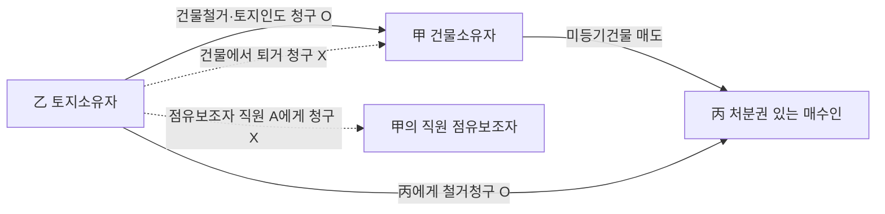
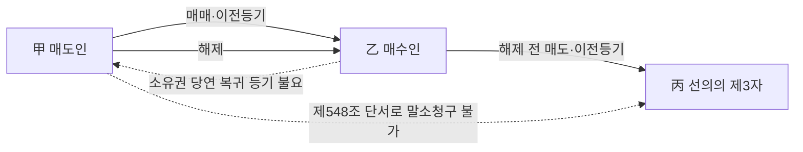
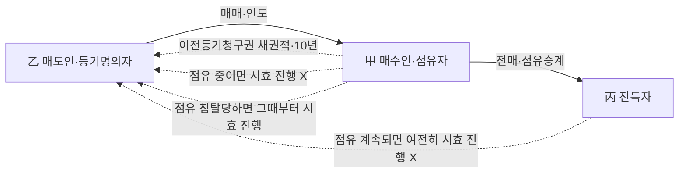
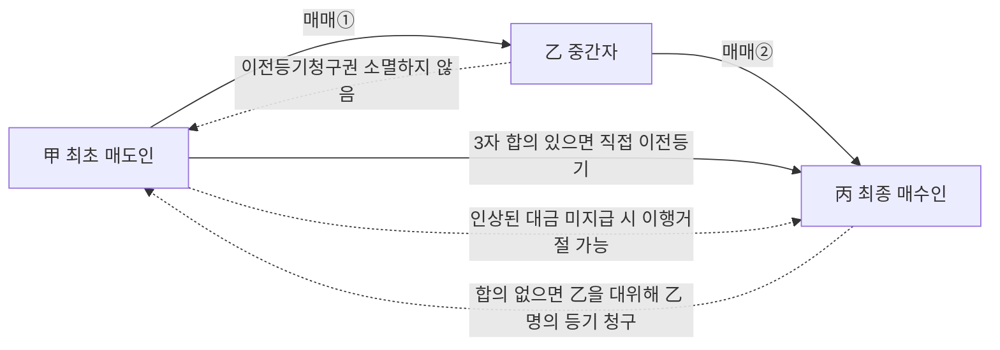
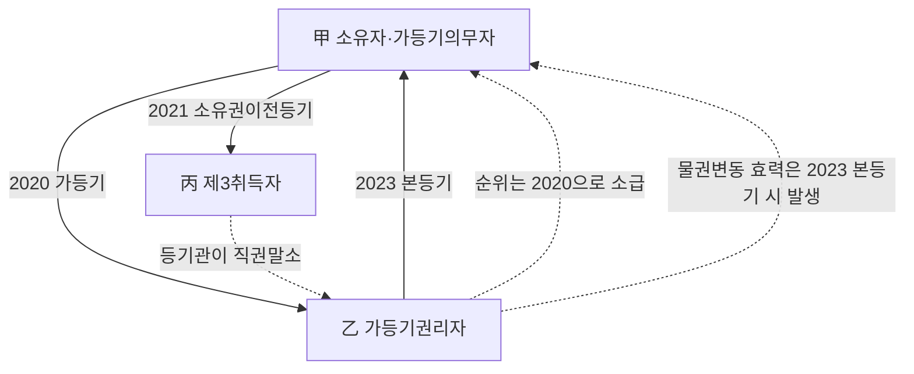
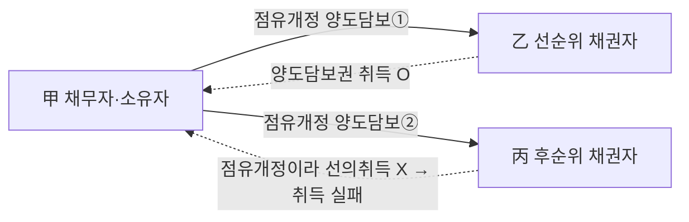
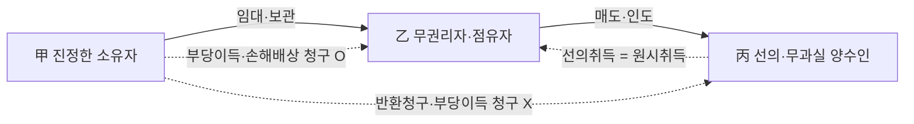
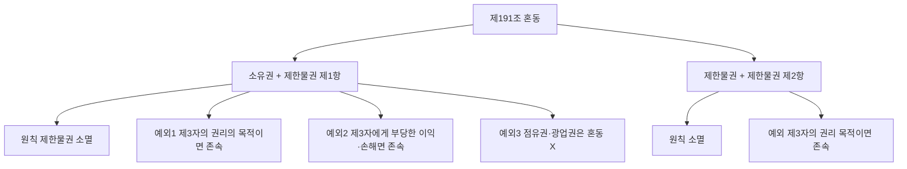
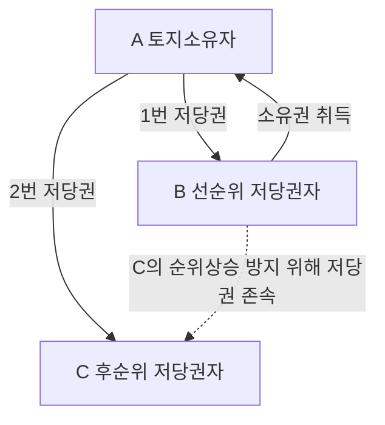

# 단원 B01 — 물권변동

> **영역**: 물권법
> **수업 주제**: 물권의 종류·효력·부동산/동산 물권변동·등기

## 🗺️ 본문 목차

- [📘 위패스 마이 정리 (L1 - 메인 단권화)](#정리)
- [📖 핵심요약서 (L2 - 빠른 복습)](#핵심요약서)
- [📚 기본서 (L3 - 본격 학습)](#기본서)

---

## 📘 위패스 마이 정리 — L1 (메인·단권화)

> 김묘엽 교수 「위패스 마이 민법총칙/물권법」 교재 정리본 (키워드 자동 분류).

### [물권법] 서문

# 물권법

> 김묘엽 교수 「위패스 마이」 교재 정리
>
> 감정평가사 시험 대비

---

### 제1절

#### I. 물권과 물권법

의의
물권이란 특정의 물건이나 권리를 직접 지배해서 이익을 얻는 배타적인 권리를 말

하고, 이러한 물권을 규율하는 법을 물권법이라 한다.

#### II. 물권

1. 물권의 본질
가. 재산권
물권은 특정의 물건이나 권리를 지배하여 이익을 얻는 권리로 재산권이다.

나. 대세효
물권은 누구에 대해서도 배타적인 권리를 주장할 수 있는 대세효를 가진다. 따라서 물권자는 물권을 침해한 누구에게도 권리내용의 실현을 청구할 수 있다.

다. 지배성
물건은 특정의 독립한 물건이나 권리를 직접 지배하는 지배권이다. 여기서 ‘지배’한 다는 것은 물건에 대하여 직접 작용한다는 것을 의미하고, ‘직접’ 지배한다는 것은

권리내용의 실현을 위하여 타인의 행위를 매개하지 않고 스스로 물건으로부터 이익

을 얻는다는 뜻이다.1’

2. 물권의 객체
물권은 물건을 객체로 하는 것을 주된 내용으로 하지만 채권 기타의 권리도 물권의 객체가 된다 채권 기타의 권리는 질권의 목적이 되기도 하고(제345조), 지상권과 전 세권은 저당권의 목적이 되기도 한다(제3기조 제1항).
01)

지원림 제19판 민법강의. 홍문사.

442페이지

#### III. 물권법

1. 물권법의 법원

> **제185조 (물권의 종류)** 물권은 법률 또는 관습법에 의하는 외에는 임의로 창설하지 못한다.

2. 물권법의 특성
가. 강행규정
물건이나 권리에 대한 배타적 지배관계를 규율하는 물권법은 원칙적으로 강행규정이
다. 따라서 법률행위로 이에 반하는 내용을 정할 수 없다.

나. 고유권성
물권법은 재화에 대한 지배관계를 규율하는 것으로 역사적으로 상이한 발전에 근거 를 두기 때문에 각국의 고유한 색체가 강하다. 우리만이 가지는 고유한 물권적 제도 로 전세권이 있다.

### 제2절

물권의 분류

. 서설
1. 의의
물권은 본권에 기한 것과 점유권에 기한 것으로 나뉜다. 본권이란 물건을 정당하게

지배할 수 있는 권리를 말하는데 이에는 임차권과 같은 채권도 포함된다. 이에 반해

점유권이란 사회관념상 사실상의 지배를 보호하기 위한 권리를 말한다. 물권의 근본 적인 형태는 본권이다.

2. 본권
가. 물권
(1) 완전물권

소유권은 물건의 사용•수익가치와 교환가치를 모두 가지고 있는 완전물권이다.

(2) 제한물권
(가) 의의

제한물권이란 소유권이 가지는 완전물권 중에서 일부만을 지배할 수 있는 권

리를 말한다.
(>-) 용익물권

용익물권이란 물건의 사용•수익가치를 지배의 목적으로 하는 제한물권만

을 말한다. 지상권, 지역권, 전세권이 민법의 용익물권이다.
(다) 담보물권

담보물권이란 물건의 교환가치를 지배의 목적으로 하는 제한물권을 말한

다. 유치권, 질권, 저당권이 민법의 담보물권이다.

나. 채권
물건을 정당하게 지배할 수 있는 권리는 물권 외에 임차권과 같은 채권도 있다. 임 차인은 임차권에 기하여 임차물을 정당하게 지배할 수 있는 권리를 가진다.

3. 점유권
점유권이란 사회관념상 사실상의 지배를 보호하기 위한 권리를 말한다. 점유라는 사 실상의 지배를 취득하면 점유권이 발생하고, 사실상의 지배를 상실하면 점유권이 소 멸한다. 본권에서 인정되는 완전물권, 제한물권의 개념이 나올 수가 없다.

#### II. 적용 대상

1. 8가지 물권
민법은

8개의

물권을 규정하고 있다.

8개의

물권은 점유권

는 소유권, 지상권, 지역권, 전세권, 유치권, 질권, 저당권

1개와

7개를

본권에서 인정되

말한다.

2. 부동산에 적용되는 물권 민법에 규정된 개의 물권 가운데 부동산에 성립할 수 있는 물권은 점유권 • 소유권 •

지상권• 지역권• 전세권• 유치권• 저당권의

7개이다.

3. 동산에 적용되는 물권 법에 규정된 개의 물권 가운데 동산에 성립할 수 있는 물권은 점유권 •소유권 •유치 권• 질권의

4가지이다.

### 제3절

#### I. 물권의 변동2J

물권변동과 공시

1. 의의
물권은 점유를 수반하지 않는 관념적인 성격이 있기 때문에, 물권의 존재와 내용 및

변동을 외부적으로 표상하여 인식할 수 있게 하지 않으면 타인에게 예상치 못한 손 해를 입힐 수 있게 된다. 결국 물권의 존재와 내용 및 변동을 쉽게 인식할 수 있도 록 공시방법을 요구하여 권리관계를 알리는 것이 필요하고 이를 위해 공시제도를

두고 있다.3’

2. 공시의 원칙
가. 의의
공시의 원칙이란 물권의 존재나 변동을 타인이 쉽게 인식할 수 있도록 하는 외부적 인 공적 표시를 말한다.

나. 공시방법
공시의 원칙은 부동산과 동산에 모두 적용된다. 부동산의 경우 등기와 명인방법으로 공시를 하고, 동산의 경우에는 일반적으로는 점유 및 인도, 특별법의 적용을 받는 동산의 경우에는 등기 • 등록의 방법으로 공시를 하고 있다.

다. 의사주의와 형식주의 공시의 원칙을 관철하는 방법으로 공시방법을 갖추지 않은 물권변동의 효력을 어느 정도로 부인하느냐에 따라 견해가 대립한다. 제3자에 대한 관계에서만 물권변동의

효력을 부인하는 의사주의(대항요건주의)와 제3자뿐만 아니라 당사자에 대한 관계에

서도 물권변동의 효력을 부인하는 형식주의(성립요건주의)가 있다.

민법은 공시방법

을 갖추지 않으면 제3자에 대한 관계에서는 물론 당사자 사이에서도 물권변동은 발 생하지 않은 것으로 하는 형식주의를 채택하고 있다.4’

여기서의 물권은 본권을 의미한다.
지원림. 제19판 민법강의. 홍문사. 458페이지 04) 지원림. 제19판 민법강의. 홍문사. 458페이지 02)
03)
3. 공신의 원칙
가. 의의
공신의 원칙이란 물권의 존재를 추측하게 하는 외부적인 공적 표시가 존재하고, 그

공시방법을 믿고 거래한 자의 신뢰를 보호하여야 한다는 원칙을 말한다. 공시를 신 뢰한 자에게 권리를 취득하게 하고 실제 권리자의 권리를 소멸시킨다.

나. 부동산은 인정 안됨
공신의 원칙은 부동산은 적용되지 않는다. 거래가 활발하지 않은 부동산의 경우에는

진정한 권리자의 보호를 중시하고 거래의 안전에 대한 희생을 감수하여 공시를 신 뢰한 자에게 권리취득을 인정하지 않는다. 따라서 등기나 명인방법에는 공신력이 인 정되지 않는다.

다. 동산은 인정
공신의 원칙은 동산에만 적용된다. 거래가 활발한 동산의 경우에는 거래의 안전보호

를 중시하고 진정한 권리자의 희생을 감수하여 공시를 신뢰한 자에게 권리취득을

인정한다. 따라서 점유 및 인도에는 공신력이 인정된다.

4. 결론
민법은 부동산의 물권변동에 대해서 공시의 원칙만 인정하는데 반해, 동산의 물권변 동에 대해서는 공시의 원칙과 공신의 원칙을 모두 인정하고 있다.

#### II. 물권행위

1. 학설
가. 물권행위의 독자성 물권행위의 독자성이란 채권행위 외에 별도로 물권행위라는 개념을 인정할 것인지에

대한 것을 말한다

일반적으로 부동산에 대한 매매계약이 체결(=채권행위)되면 매도

인은 소유권이전 및 등기이전에 대한 추가적인 합의(-별도의 물권행위) 없이도 매수

인에게 소유권을 이전한다. 하지만 소유권의 포기와 같은 채권행위를 전제로 하지

않는 물권행위도 존재하고, 타인물건의 매매와 같이 매매계약의 체결(=채권행위)외에

도 매도인의 소유권이전 및 등기이전에 대한 추가적인 합의(=별도의 물권행위)가 필

요한 경우도 있으므로 별도의 물권행위의 개념을 인정함이 타당하다.

나. 물권행위의 범위 물권행위란 직접 물권의 변동을 발생시키는 것을 목적으로 하는 법률행위를 말한다.

형식주의를 채택하고 있는 민법에서는 공시방법을 갖추어야 물권변동이 일어나기 때 문에 물권행위란 물권적 합의 외에 공시방법까지 포함하는 의미를 가진다.

다. 물권행위의 유인성 - 무인성 물권행위의 유인성 •무인성이란 채권행위가 효력을 상실하게 되었을 때 이 효력이 물권행위에도 영향을 미치는지에 대한 문제를 말한다. 물권행위 유인성이란 채권행

위의 효력이 상실되었을 때 물권행위에 직접적인 영향을 미치게 된다고 보는 견해

이다. 물권행위 무인성이란 채권행위의 효력이 상실되었을 때 물권행위에 직접적인 영향을 미치지 않는다고 보는 견해이다.

2. 판례
우리 법제가 물권행위의 독자성과 무인성을 인정하고 있지 않다는 점과 민법 제548조 제1항 단서가 거래안정을 위한 특별규정임을 생각할 때 계약이 해제되면 그 계

약의 이행으로 변동이 생겼던 물권은 당연히 그 계약이 없었던 원상태로 복귀한다
고 봄이 타당하다(대판 1977.5.24. 75다1394)고

하여 판례는 물권행위의 독자성을 부정

하는 입장을 취하고 있다.

---
物 « 法

점유와 점유권

### 제1절

### [물권법] 제3장 법률행위에 의한 부동산물권의 변동기 등기부

## 제3장 법률행위에 의한 부동산물권의 변동기 등기부

### 제1절

I -

등기
등기란 국가기관인 등기관이 법정절차에 따라서 등기부에 부동산의 표시 또는 권리

를 기재하는 것 또는 기재 그 자체를 말한다.

#### II. 등기부

1. 등기부의 구성
표제부에는 표시번호, 접수연월일, 소재, 지번,

(가) 표제부

건물번호, 지목,

면적, 건

물의 종류나 구조 및 면적 등의 사실적 사항을 기재한다(부동산등기법 제34조. 제40조

제1항).

(나) 갑구

갑■구(甲 區)에는 소유권에 관한 사항을 기재한다(부동산등기법 제15조 제2항).

(다) 을구

을구(己區)에는 소유권 이외의 권리에 관한 사항을 기재한다(부동산등기법 제15조 제2항).

2. 1부동산 1등기 용지 등기부를 편성할 때에는

둔다. 다만,
하여

07)

1개의

1동의

1필의

토지 또는

1개의

건물을 구분한 건물에 있어서는

건물에 대하여
1동의

등기기록을 사용한다(부동산등기법 저115조 저11항).

여기서의 물권은 본권을 의미한다.

1개의

등기기록을

건물에 속하는 전부에 대

### 제2절

등기의 종류

I - 종국등기
1. 의의
종국등기란 직접 물권변동을 일으키는 등기를 밀주｝며 본등기라고도 한다. 보통의 등 기는 모두 종국등기이다.

종국등기는 형식면에서는 주등기와 부기등기로 나누어지

고, 내용면에서는 보존등기, 기입등기, 경정등기, 변경등기, 말소등기, 멸실등기, 회

복등기 등으로 나누어진다.

2. 형식적 분류
가. 주등기
주등기란 표제부에 있는 표시번호란 또는 갑구나 을구에 있는 순위번호란에 독립된 번호가 부여된 등기를 말한다.

나. 부기등기
부기등기란 주등기의 번호를 그대로 사용하면서 가지번호를 붙여서 하는 등기를 말

한다.

3. 내용적 분류
가. 보존등기
보존등기란 미등기 부동산에 관하여 소유권의 보존을 위하여 하는 최초의 등기를

말한다

|l. 소유권보존등기 - 다른 사람으로부터 점유를 이전받았다고 볼 수 없다.

/ , .
소유권보존등기는 이전등기와 달리 해당 토지의 양도를 전제로 하는 것이 아니어서,

보존등기를 마쳤다고 하여 일반적으로 등기명의자가 그 무렵 다른 사람으로부터 점 유를 이전받는다고 볼 수는 없다(대판 2013.7.11. 2012다201410).

나. 기입등기
기입등기란 새로운 등기원인에 의하여 새로운 사항을 기재하는 등기를 말한다. 소유 권보존등기, 소유권이전등기, 저당권설정등기 등이 기입등기이 다.
W « rL

다. 경정등기

(1) 의의

경정등기란 원시적으로 등기와 실체관계가 불일치하는 경우에 이를 시정하기 위한

등기를 말한다(부동산등기법 제32조).

(2) 등기신청

부동산표시의 경정의 등기는 소유권의 등기명 의인이 단독으로 신청한다(부동산등기법
제23조 제5항). 등기명의인표시의 경정의 등기는 해당 권리의 등기명의인이 단독으로

신청한다(부동산등기법 제23조 제6항). 따라서 등기의무자의 관념이 있을 수 없다(대판 20
19.05.30.

2015다47105).

|l. 등기명의인의 동일성이 인정 - 표시경정등기O
토지에 관하여 등기가 되어 있는 경우에, 등기부상 명의인의 기재가 실제와 일치하지 아니하더라도 인 격의 동일성이 인정된다면 등기명의인의 표시경정등기가 가능하며 ,

국가를 상대로 실제 소유에 대하여 확인을 구할 이익이 없다(대판 2016.10.27. 2015다2
30815).

2. 경정 전의 명의인과 경정 후의 명의인이 다름 - 권리자 경정등기〉〈, 단독소유를 공 유로, 공유를 단독소유로 하는 경정등기X

경정등기가 허용되기 위해서는 경정 전후의 등기에 동일성 내지 유사성이 있어야 하

는데, 경정 전의 명의인과 경정 후의 명의인이 달라지는 권리자 경정등기는 등기명의 인의 동일성이 인정되지 않으므로 허용되지 않는다. 따라서 단독소유를 공유로 또는

공유를 단독소유로 하는 경정등기 역시 소유자가 변경되는 결과로 되어 등기명의인 의 동일성을 잃게 되므로 허용될 수 없다(대판 2017.8.18. 2016다6309).

라. 변경등기

(1) 의의

변경등기란 등기가 행하여진 후에 등기된 사항에 변경이 생겨 후발적으로 등기와

실체관계가 불일치하는 경우에 이를 시정하기 위한 등기를 말한다(부동산등기법 제35조,
제41조 등).

(2) 등기신청

부동산표시의 변경의 등기는 소유권의 등기명 의인이 단독으로 신청한다(부동산등기법
제23조 제5항). 등기명의인표시의 변경의 등기는 해당 권리의 등기명의인이 단독으로

신청한다(부동산등기법 제23조 제6항). 따라서 등기의무자의 관념이 있을 수 없다(대판 20
19.05.30.

2015다47105).

|i. 등기명의인의 동일성이 유지 - 표시변경등기O
등기명의인 표시변경등기는 등기명의인의 동일성이 유지되는 범위 내에서 등기부상

의 표시를 실제와 합치시키기 위하여 행하여지는 것에 불과할 뿐 어떠한 권리변동을 가져오는 것은 아니다(대판 2000.5.12. 99다69983).

마. 말소등기
(1) 의의

말소등기란 등기에 대응하는 실체관계가 원시적 또는 후발적으로 소멸함에 따라 기

존의 등기 전부를 말소하는 등기를 말한다.

(2) 말소등기의 상대방

1. 피담보채무가 소멸 • 근저당권설정등기가 원인무효 - 주등기 말소 O, 부기등기말소 X
으丄주등기말소의 상대방 三 양수인o丄양도인亞______________________________________
피담보채무가 소멸된 경우 또는 근저당권설정등기가 당초 원인무효인 경우 주등기인 근저당권설정등기의 말소만 구하면 되고 근저당권 이전의 부기등기는 별도로 말소를

구하지 않더라도 주등기의말소에 따라 직권으로 말소되는 것이다. 근저당권 양도의 부기등기는 기존의 근저당권설정등기에 의한 권리의 승계를 등기부상 명시하는 것뿐

으로, 그 등기에 의하여 새로운 권리가 생기는 것이 아닌 만큼 근저당권설정등기의 말소등기청구는 양수인만을 상대로 하면 족하고, 양도인을 상대로 할 수 없다(대판 20
00.04.11.

2000다5640).

| 3. 근저당권의 이전원인만이 무효 • 취소 • 해제 - 부기등기말소O
근저당권의 이전원인만이 무효로 되거나 취소 또는 해제된 경우, 즉 근저당권의 주등 기 자체는 유효한 것을 전제로 이와는 별도로 근저당권이전의 부기등기에 한하여 무

효사유가 있다는 이유로 부기등기만의 효력을 다투는 경우에는 그 부기등기의 말소 를 구할 수 있다(대판 2005.6.10. 2002다15412).

(3) 이해관계인의 승낙

등기의 말소를 신청하는 경우에 그 말소에 대하여 등기상 이해관계 있는 제3자가 있을 때에는 제3자의 승낙이 있어야 한다(부동산등기법 제57조 제1항).
바. 멸실등기
멸실등기란 등기된 부동산이 전부 멸실된 경우에 행하는 등기를 말한다.

人h 말소회복등기

(1) 의의

회복등기란 기존의 등기가 부당하게 말소된 경우에 말소된 등기를 회복하여 말소

당시에 소급하여 말소가 없었던 것과 같은 효과를 생기게 하는 등기를 말한다(대판 1
993.03.09.

92다39877).

1. 부당하게 등기말소 ■ 불법말소 - 말소회복등기 O

2. 자발적 말소등기 - 말소회복등기 X

어떤 이유이건 당사자가 자발적으로 말소등기를 한 경우에는 말소회복등기를 할 수 없다(대판 1993.3.9. 92다39877).

(2) 근거

등기는 물권의 효력발생요건이고 효력존속요건이 아니므로 물권에 관한 등기가 원인

없이 말소(=불법말소)된 경우에 그 물권의 효력에는 아무런 영향을 미치지 않는다고 봄이 타당한 바, 불법으로 말소된 등기는 회복되어야 한다(대판 1982.9.14. 81다카923).

|i. 근저당권이 원인 없이 말소 - 근저당권 소멸X, 근저당권말소회복등기o
부동산에 관하여 근저당권설정등기가 마쳐졌다가 등기가 위조된 관계서류에 기하여

아무런 원인 없이 말소되었다는 사정만으로는 곧바로 근저당권이 소멸하는 것은 아

니다(대판 2014.12.11. 2013다28025).

|入 근저당권이 원인 없이 말소 + 경매 - 근저당권 소멸O, 근저당권말소회복등기X

근저당권설정등기가 원인 없이 말소된 이후에 근저당목적물인 부동산에 관하여 다른 근저당권자 등 권리자의 신청에 따라 경매절차가 진행되어 매각허가결정이 확정되고

매수인이 매각대금을 완납하였다면, 원인 없이 말소된 근저당권도 소멸하므로 더 이 상 근저당권설정등기는 회복될 수 없다(대판 2014.12.11. 2013다28025).

(3) 말소회복등기의 상대방

|i. 회복등기의 상대방 - 불법말소당시의 소유자Q, 현재소유자X
불법하게 말소된 것을 이유로 한 근저당권설정등기 회복등기청구는 그 등기말소 당

시의 소유자를 상대로 하여야 한다(대판 1969.3.18. 68다1617).

|z 회복등기의 상대방 - 불법말소당시의 소유자인 제3취득자O, 현재소유자X

:

가등기가 이루어진 부동산에 관하여 제3취득자 앞으로 소유권이전등기가 마쳐진 후 그 가등기가 말소된 경우 그와 같이 말소된 가등기의 회복등기절차에서 회복등기의무 자는 가등기가 말소될 당시의 소유자인 제3취득자이므로, 그 가등기의 회복등기청구 는 회복등기의무자인 제3취득자를 상대로 하여야 한다(대판 2009.10.15. 2006다43903).

(4) 이해관계인의 승낙

말소된 등기의 회복을 신청하는 경우에 등기상 이해관계 있는 제3자가 있을 때에는

그 제3자의 승낙이 있어야 한다(부동산등기법 제59조).

11. 불법말소 후에 등기부상 권리를 취득한 자 - 회복등기절차에 승인할 의무O

■

불법된 방법에 의하여 등기권리자의 등기가 말소된 후에 등기부상 권리를 취득한 자 는 그 등기권리자의 회복등기절차에 승인을 할 의무가 있다(대판 1971.08.31. 기다1285).

2. 불법말소 후 가처분등기, 근저당권설정등기, 소유권이전등기를 마친 자 - 회복등기 三차에 승인할 의무O____ ___
_
__________

가등기가 가등기권리자의 의사에 의하지 아니하고 말소되어 그 말소등기가 원인 무

효인 경우에는 등기상 이해관계 있는 제3자는 그의 선의, 악의를 묻지 아니하고 가등 기권리자의 회복등기절차에 필요한 승낙을 할 의무가 있으므로, 가등기가 부적법하게

말소된 후 가처분등기, 근저당권 설정등기, 소유권이전등기를 마친 제3자는 가등기의

회복등기절차에서 등기상 이해관계 있는 제3자로서 승낙의무가 있다(대판 1997.9.30. 95 다39526).

#### II. 가등기

1. 서설

부동산등기법 제88조(가등기의 대상) 가등기는소유권, 지상권, 지역권, 전세권, 저당 권, 권리질권, 채권담보권 또는 부동산임차권의 어느 하나에 해당하는 권리의 설정,
이전, 변경 또는 소멸의 청구권을 보전하려는 때에 한다. 그 청구권이 시기부 또는

정지조건부일 경우나 그 밖에 장래에 확정될 것인 경우에도 가등기가 가능하다.

가. 소유권, 지상권, 지역권, 전세권, 저당권, 권리질권, 부동산임차권의 가등기

(1) 개념

(가) 의의

가등기란 종국등기를 할 만한 실체법적 또는 절차법적 요건을 구비하지 못한

경우에, 장차 행하여질 본등기의 순위를 보전해 주는 효력을 가지는 등기를 말한다.8,

(나) 채권적 청구권 보전을 위한 가등기

물권 또는 부동산 임차권의 변동을 목적으로

하는 (채권적) 청구권을 말하는 것이라 할 것이므로 부동산등기법상 가등기는 위와 같은 청구권을 보전하기 위하여서만 할 수 있다(대판 1982 11.23.

81다카1110).

그 청구

권이 시기부 또는 정지조건부일 경우나 그 밖에 장래에 확정될 것인 경우에도 같다
(부동산등기법 제88조).

) 물권적 청구권 보전을 위한 가등기

수 없다(대판 1982.11.23.

물권적 청구권을 보전하기 위해서 가등기는 할

81다카1110).

(2) 경매

청구권의 순위를 보전하기 위한 가등기인 경우에는 그 보다 선순위의 담보권이나

가압류가 없어 그 가등기가 최선순위인 때에는 경매가 되어도 존속하고 경매의 매

수인에게 인수된다(대판 2003.10.6. 2003마1438).

나. 채권담보권의 가등기
(1) 개념

채권담보목적의 가등기는 가능하고(부동산등기법 제88조),
법률이 적용되는 담보가등기이다.

08)

지원림 민법강의 제19판. 홍문사.

497페이지

이는 가등기담보 등에 관한

------Ml

(2) 경매

담보가등기인 경우에는 때에는 그 가등기가 최선순위일지라도 경매에 의하여 소멸하

고 다만 순서에 따른 우선변제를 받을 뿐이다. 담보가등기에 관한 자세한 내용은 가 등기담보 등에 관한 법률에서 후술하고, 이하는 본등기 순위를 보전하기 위한 가등

기에 대한 설명이다.

2. 본등기 전
가. 순위보전의 효력만 있음
가등기는 그 성질상 본등기의 순위보전에 효력만이 있을 뿐이고, 가등기만으로는 아 무런 실체법상의 효력을 갖지 아니한다(대판 2001.3.23. 2000다51285).

나. 가등기된 권리의 양도는 부기등기 방식 가등기에 의하여 순위 보전의 대상이 되어 있는 물권변동청구권이 양도된 경우, 그

가등기상의 권리의 이전등기를 가등기에 대한 부기등기의 형식으로 경료할 수 있다
(대판 1998.11 19.

98다24105

전합).

3. 본등기 청구
가등기 권리자는 가등기의무자인 전소유자를 상대로 본등기 청구권을 행사할 것이고,

현등기명의인을 상대로 할 것이 아니다(대판 1962.12.24. 4294민재항675).

4. 본등기 후
가. 순위
(가) 본등기의 순위는 가등기 순위에 따름

가등기에 의한 본등기를 한 경우 본등기의

순위는 가등기의 순위에 따른다(부동산등기법 제91조).
(나)

다른 등기는 무효가 되거나 후순위로 된다

가등기 후에 다른 등기가 행해진 경우,

후에 가등기에 기해 본등기를 하게 되면 다른 등기는 가등기에 의해 보전되는 청구

권과 양립되지 않는 범위 내에서 무효로 되거나 후순위로 된다(대판 1994.4.26. 92다3

4100).

(다)

등기관의 후순위 등기 직권말소

등기관은 가등기에 의한 본등기를 하였을 때에는

대법원규칙으로 정하는 바에 따라 가등기 이후에 된 등기로서 가등기에 의하여 보

전되는 권리를 침해하는 등기를 직권으로 말소하여야 한다(부동산등기법 제92조 저］1항).

(라) 등기관의 등기명의자에 대한 통지

등기관이 가등기 이후의 등기를 직권으로 말소

하였을 때에는 지체 없이 그 사실을 말소된 권리의 등기명의인에게 통지하여야 한 다(부동산등기법 제92조 제2항).

나. 효력
가등기에 의한 본등기를 한 경우 본등기에 의한 물권변동의 효력이 가등기한 때로

소급하여 발생하는 것은 아니다(대판 1992.9.25. 92다21258).

5. 혼동
가등기에 기한 본등기청구와 단순한 소유권이전등기청구는 비록 그 등기원인이 동일

하다고 하더라도 이는 서로 다른 청구로 보아야 한다(대판 1994.4.26. 92다34100).
라서 가등기권자가 본등기절차에 의하지 않고 가등기설정자로부터 별도의 소유권이 전등기를 받은 경우에 가등기에 기한 본등기청구권이 혼동으로 소멸하는 것은 아니 다(대판 2007.2.22. 2004다59546).

### 제3절

등기의 절차

. 등기신청권
1. 의의
등기신청권이란 등기관에 대하여 등기를 신청할 수 있는 권리를 말한다.

2. 원칙적 공동신청
가. 개념
등기는 법률에 다른 규정이 없는 경우에는 등기권리자와 등기의무자가 공동으로 신 청한다(부동산등기법 제23조 제1항).

나. 등기청구권
(1) 의의

등기청구권이란 등기권리자가 등기의무자에 대하여 등기신청에 협력할 것을 요구할

수 있는 실체법상의 권리를 말한다. 등기청구권은 채권행위로부터 발생하는 채권적 청구권이다(대판 1976.11.23. 76다342).

(2) 매매계약에 의한 소유권이전등기청구권
1. 매매계약에 의한 소이청 - 채권적 청구권O, 소멸시효 진행하고 10년의 소멸시효에

곁린다._________________________________________________________________________
매매에 의한 소유권이전등기청구권은 채권적 청구권으로서

이 원칙이다(대판 1976.11.6. 76다148

10년의

소멸시효에 걸림

전합).

2. 매매계약에 의한 소이청 + 인도받아 점유 - 소멸시효 진행하지 않고 소멸시효에 걸 리지와탄단_________________________________________________________
부동산을 매수한 자가 목적 부동산을 인도받아 계속 점유하는 경우에는 그 소유권이

전등기청구권은 소멸시효가 진행하지 않고(대판 1999.3.18. 98다32175 전합), 소멸시효

에 걸리지 않는다(대판 1976.11.6. 76다148

전합).
3. 매매계약에 의한 소이청 + 점유를 상실 - 소멸시효 진행하고 10년의 소멸시효에 걸 린다.

매수인이 스스로 권리행사를 위해 목적물을 인도한 것이 아니라 매수인이 점유를 하다가 점유를 침탈당하여 그 목적물의 점유를 상실하면, 그 점유상실시점으로부터

매도인에 대한 소유권이전등기청구권은 소멸시효가 진행한다(대판 1992.7.24. 91다40
924).

4. 매매계약에 의한 소이청 + 점유를 승계 - 소멸시효 진행하지 않고 소멸시효에 걸리 지 않는다.

부동산의 매수인이 그 부동산을 인도받은 이상 이를 사용•수익하다가 그 부동산에

대한 보다 적극적인 권리 행사의 일환으로 다른 사람에게 그 부동산을 처분하고 그

점유를 승계하여 준 경우에도 그 이전등기청구권의 행사 여부에 관하여 그가 부동산 을 스스로 사용 • 수익만 하고 있는 경우와 특별히 다를 바 없으므로 미등기 매수인이

전매하여 점유를 승계해 준 경우에도 소유권이전등기청구권은 소멸시효가 진행되지 않는다(대판 1999.3.18. 98다32175).

(3) 점유취득시효완성에 따른 소유권이전등기 청구권

1. 점유취득시효완성에 따른 소이청 + 점유를 계속 - 채권적 청구권O, 소멸시효 진행 하지 않고 소멸시효에 걸리지 않는다.

취득시효 완성으로 인한 소유권이전등기청구권은 채권적 청구권으로 그 토지에 대한

점유가 계속되는 한 시효로 소멸하지 않는다(대판 1996.3.8. 95다34866).

2. 점유취득시효완성에 따른 소이청 + 점유를 상실 - 소멸시효 진행하고 1이년의 소멸 시효에 걸린다. 소이청 즉시 소멸X

① 취득시효를 완성한 점유자가 점유를 상실한 경우 취득시효완성으로 인한 소유권이전 등기청구권은 점유자가 점유를 상실한 때로부터 소멸시효가 진행하며 그 기간은 10

년이 다(대판 1996.3.8. 95다34866).

② 점유자가 취득시효기간이 완성된 후에 점유를 상실하였다 하더라도 점유의 상실이 시효이익을 포기한 것이라고 인정되지 아니하는 한 취득시효기간의 완성으로 인하여

이미 취득한 이전등기청구권은 소멸되지 아니한다(대판 1995.2.24. 94다18195).

(4) 환매권에 기한 소유권이전등기청구권
1. 환매권 행사로 발생한 소이청 - 채권적 청구권O, 소멸시효 진행하고 10년의 소멸 시효에 걸린다.

환매권의 행사로 발생한 소유권이전등기청구권은 환매권을 행사한 때로부터 일반채

권과 같이 민법 제162조 제1항 소정의 10년의 소멸시효기간이 진행된다(대판 1992.10.13. 92다4666).

3. 예외적 단독신청
(가) 보존등기

소유권보존등기 또는 소유권보존등기의 말소등기는 등기명의인으로 될 자

또는 등기명의인이 단독으로 신청한다(부동산등기법 제23조 제2항).
(나)

포괄승계 등기

상속, 법인의 합병, 그 밖에 대법원규칙으로 정하는 포괄승계에 따

른 등기는 등기권리자가 단독으로 신청한다(부동산등기법 제23조 제3항).
) 판결에 의한 등기

등기절차의 이행 또는 인수를 명하는 판결에 의한 등기는 승소한

등기권리자 또는 등기의무자가 단독으로 신청하고, 공유물을 분할하는 판결에 의한 등기는 등기권리자 또는 등기의무자가 단독으로 신청한다(부동산등기법 제23조 제4항).

(라) 표시의 변경 - 경정 등기

부동산표시의 변경이나 경정의 등기는 소유권의 등기명의

인이 단독으로 신청한다(부동산등기법 제23조 제5항). 등기명의인표시의 변경이나 경정의

등기는 해당 권리의 등기명의인이 단독으로 신청한다(부동산등기법 제23조 제6항).
(마) 신탁재산에 속하는 신탁등기

신탁재산에 속하는 부동산의 신탁등기는 수탁자가 단

독으로 신청한다(부동산등기법 제23조 제7항).

4. 등기신청에 대한 형식적 심사 등기신청에 대해 등기공무원은 실체법상의 권리관계와의 일치 여부를 조사 할 권한

은 없고, 오직 신청서류와 등기부에 의하여 등기요건에 합당한지 여부인 형식적 심

사권만 인정된다(대판 1990.10.29. 90마772).

5. 등기사무의 처리 등기관은 등기사무를 전산정보처 리조직을 이용하여 등기부에 등기사항을 기록하는 방식으로 처리하여야 한다(부동산등기법 제11조 제2항). 등기관은 접수번호의 순서에 따

라 등기사무를 처리하여야 한다(부동산등기법 제11조 제3항).

#### II. 판단기준

1. 지적도•임야도

1. 토지의 공간적 범위를 특정 - 지적도나 임야도의 경계O, 등기부의 표제부X, 대장 _ 에 며적스_____________________________________________________________________

물권의 객체인 토지 1필지의 공간적 범위를 특정하는 것은 지적도나 임야도의 경계이

지 등기부의 표제부나 임야대장•토지대장에 등재된 면적이 아니다(대판 2005.12.23. 2
004다1691).

2. 지적공부

1. 토지의 경계 - 지적공부상의 등록으로써 특정

2. 토지소유권의 범위 - 지적공부상의 혀계에 의하^확정 어떤 특정한 토지가 지적공부에

1필의

_
_
토지로 등록되었다면 그 토지의 소재, 지번,

지목, 지적 및 경계는 다른 특별한 사정이 없는 한 이 등록으로써 특정되었다고 할 것이므로 그 토지의 소유권의 범위는 지적공부상의 경계에 의하여 확정되어야 한다

(대판 1986.10.14. 84다카490).

3. (기술적인 착오가 없는 경우) 지적도상의 경계표시와 사실상의 경계가 다르게 표시 - 지적공부상의 경계에 의하여 확정

지적도상의 경계표시가 분할측량의 잘못 등으로 사실상의 경계와 다르게 표시되었다
하더라도 그 토지에 대한 매매도 특별한 사정이 없는 한 현실의 경계와 관계없이 지

적공부상의 경계와 지적에 의하여 소유권의 범위가 확정된 토지를 매매 대상으로 하

는 것으로 보아야 할 것이다(대판 1998.6.26. 97다42823).

4. 기술적인 착오로 말미암아 지적도의 경계선과 실제의 경계선이 다르게 표시 - 실제 背I 경계에으I하여 확정 지적도를 작성함에 있어서 기술적인 착오로 인하여 지적도상의 경계선이 진실한 경

계선과 다르게 작성되었기 때문에 경계와 지적이 실제의 것과 일치하지 않게 되었다
는 등의 특별한 사정이 있는 경우에는 실제의 경계에 의하여야 할 것이다(대판 1998.0
6.26.

97다42823).

3. 등기부
부동산의 권리의 변동에 관하여는 등기부의 기재를 기초로 하여 판단해야 하지만 물체적 상황에 대해서는 지적공부를 기준으로 판단해야 한다.

1. 토지의 개수 - 지적공부상의 토지의 필 (筆)수를 표준으로 결정

2. 적법한 분할의 절차를 거치지 않고 일부에 대한 소유권보존등기는 할 수 없다.

J丄지적법상 부할절차를 거치지 않고 이루어지분필등기 - 무효
①

1필지의

토지를 수필의 토지로 분할하여 등기하려면 먼저 지적법이 정하는 바에 따라

분할의 절차를 밟아 지적공부에 각 필지마다 등록이 되어야 한다. 토지의 개수는 지

적법에 의한 지적공부상의 토지의 필수를 표준으로 하여 결정된다(대판 1990.12.7. 90
다카25208)
② 일물일권주의의 원칙상, 물건의 일부분, 구성부분에는 물권이 성립할 수 없는 것이어

서 구분 또는 분할의 절차를 거치지 아니한 채 하나의 부동산 중 일부분만에 관하여 따로 소유권보존등기를 경료하거나, 하나의 부동산에 관하여 경료된 소유권보존등기

중 일부분에 관한 등기만을 따로 말소하는 것은 허용되지 아니한다(대판 2000.10.27
2000다39582).
Z)지적법상의

분할절차를 거치지 아니한 채로 등기부에만 분필의 등기가 실행되었다

하여도 이로써 분필의 효과가 발생할 수는 없는 것이므로 결국 이러한 분필등기는 1

부동산1부등기용지의 원칙에 반하는 등기로서 무효라 할 것이다(대판 1990.12.7. 90다

카25208).

| 4. 토지등기부의 표제부에 토지면적이 지적공부상의 실제와 다르게 등재된 등기 - 유효 토지등기부의 표제부에 토지의 면적이 지적공부상의 실제와 다르게 등재되어 있다

하여도, 이러한 등기는 해당 토지를 표상하는 등기로서 유효하다(대판 2005.12.23. 200
4 다1691).

### 제4절

#### I. 본등기의 효력

1. 등기의 효력발생시점 등기관이 등기를 마친 경우 그 등기는 접수한 때부터 효력을 발생한다(부동산등기법 제6조 제2항).

2. 등기의 순위
(가) 주등기

같은 부동산에 관하여 등기한 권리의 순위는 법률에 다른 규정이

없으면

등기한 순서에 따른다(부동산등기법 제4조 제1항). 등기의 순서는 등기기록 중 같은 구

(區)에서 한 등기 상호간에는 순위번호에 따르고, 다른 구에서 한 등기 상호간에는 접수번호에 따른다(부동산등기법 제4조 제2항).
(나)
부기등기

부기등기의 순위는 주등기의 순위에 따른다

다만, 같은 주등기에 관한

부기등기 상호간의 순위는 그 등기 순서에 따른다(부동산등기법 저|5조).

3. 등기의 효력
가. 원칙적 대항적 효력 등기의 대항적 효력, 즉 일반적 효력이란 이미 효력이 발생한 등기사항을 등기함으 로써 선의 • 악의의 제3자에게 대항할 수 있는 것을 말한다. 제186조의 부동산에 관

한 법률행위로 인한 권리변동 이외의 사항은 등기를 하면 제3자에게 대항할 수 있

는 대항적 효력이 생긴다. 전세금이나 존속기간, 지료 등이 등기의 대항적 효력에 해당한다.

나. 예외적 권리변동적 효력

> **제186조 (부동산물권변동의 효력)** 부동산에 관한 법률행위로 인한 물권의 득실변경은

등기하여야 그 효력이 생긴다.

4. 추정적 효력
가. 의의
등기의 추정력은 등기되어 있다는 그 자체로 등기된 바와 같은 ‘권리관계’가 존재할 것이라는 추정을 불러내는 힘으로 등기명의자에게 불이익한 경우에도 인정된다. 부

동산의 표시에 관한 사항은 등기의 추정력이 인정되지 않는다.

나. 추정력간의 관계
(가) 등기의 추정력

민법은 점유의 추정력을 규정하고 있지만 등기의 추정력에 관해서는

어떠한 규정도 두지 않았다. 하지만 학설과 판례는 등기의 추정력을 인정하고 있다.
(나) 부동산은 등기의 추정력

부동산에 있어서는 점유를 하고 있는 자에게 권리가 있다

고 추정되는 것이 아니라 등기명의인이 권리자로 추정된다(대판 1982 04 13.

81다780).

즉 등기된 부동산에는 점유의 추정이 적용되지 않고, 등기의 추정력이 적용된다.
化)동산은 점유의 추정력

판 1982 04 13.

점유의 권리추정력은 원칙적으로 동산에 한하여 적용된다(대

81다780).

다. 추정의 범위

(1) 등기 연월일
|l. 전세권 존속기간 시작 전의 전세권설정등기 - 유효 추정O
전세권 존속기간이 시작되기 전에 마친 전세권설정등기도 특별한 사정이 없는 한 유 효한 것으로 추정된다(대판 2018.1.25. 2017마1093).

(2) 등기원인
11. 등기 - 절차 - 원인이 적법한 것으로 추정O

‘’’

부동산에 관하여 등기가 경료되어 있는 경우 특별한 사정이 없는 한 그 원인과 절차

에 있어서 적법하게 경료된 것으로 추정된다(대판 2002.2.5. 2001다72029).

(2. 소유권이전등기 三절차三원인이 정당한 젓으로추졀O____________________
부동산에 관한 등기부상 소유권이전등기가 경료되어 있는 이상 일응 그 절차 및 원인

이 정당한 것이라는 추정을 받게 된다(대판 2003.2.28. 2002다46256).
13. 등기 원인이 매매로 기재 - 등기의 기재와 같이 매매로 취득한 것으로 추정O
소유권이전등기가 되어 있는 경우에는 등기의 기재와 같이 매매에 의하여 본건 토지

의 소유권을 취득한 것이라고 추정된다(대판 1967.10.23. 67다1778).

(3) 권리자

|l. 소유권보존등기 - 적법한 소유자로 추정O
소유권보존등기를 마친 자도 적법한 소유자로 추정된다(대판 1995.12.26. 95다28601).
조i?馮三

|z 소유권이전등기 - 전소유자에 대하여 소유권 취득한 것으로 추정o

소유권이전등기가 경료 되어 있는 경우에는 그 등기명의자는 제3자에 대하여서 뿐 아니라 그 전소유자에 대하여도 적법한 등기원인에 의하여 소유권을 취득한 것으로

추정된다(대판 1992.4.24. 91다26379,26386).

| 3. 지분이전등기 경료 - 적법 - 진실한 권리상태를 공시하는 것으로 추정O
지분이전등기가 경료된 경우 그 등기는 적법하게 된 것으로서 진실한 권리상태를 공

시하는 것이라고 추정된다(대판 1992.10.27. 92다30047).

| < 공유지분의 분자의 합계가 분모를 초과 - 공유지분의 비율로 공유한다는 추정X
등기상의 공유지분의 합계 결과 분자가 분모를 초과하는 경우라면 등기부 기재 자체

에 의하여서도 각 공유자의 지분의 부실함이 명백하므로, 등기부상 기재된 공유지분 의 비율로 각 공유자가 공유한다고 추정할 수 없다(대판 1982.09.14

82다카134).

(4) 권리자의 대리인

|l. 제3자의 처분행위가 개입 - 제3자는 전등기명의인의 대리인으로 추정O
전등기명의인의 직접적인 처분행위에 의한 것이 아니라 제3자가 그 처분행위에 개입

된 경우 현등기명의인이 그 제3자가 전등기명의인의 대리인이라고 주장하더라도 현 등기명의인의 등기가 적법히 이루어진 것으로 추정된다(대판 1995.5.9. 94다41010).

|z 부재자 재산관리인의 등기 - 적법하게 경료된 것으로 추정O
법원이 선임한 부재자 재산관리인에 대한 선임결정이 취소되기 전에 그 재산관리인 의 처분행위에 기하여 경료된 등기는 그 경료에 필요한 법원의 처분허가 등 모든 절 차를 거쳐 적법하게 경료된 것이라고 추정된다(대판 1991.11.26. 91다11810).

13. 미성년자의 친권자의 등기 - 적법하게 경료된 것으로 추정O
종전 등기명의인이 미성년자이고 당해 부동산을 친권자에게 증여하는 행위가 이해상

반행위라 하더라도 일단 친권자에게 이전등기가 경료된 이상, 특별한 사정이 없는 한 그 이전등기에 관하여 필요한 절차를 적법하게 거친 것으로 추정된다(대판 2002.02.0
5.

2001다72029).

(5) 환매특약

|l. 환매특약 등기부에 기재 - 환매특약이 진정하게 성립된 것으로 추정Q
환매기간을 제한하는 환매특약이 등기부에 기재되어 있는 때에는 반증이 없는 한 등

기부 기재와 같은 환매특약이 진정하게 성립된 것으로 추정함이 상당하다(대판 1991.1
0.11

91다13700).

(6) 저당권의 채권액

|l. 근저당권설정등기 - 저당권의 존재 추정O, 피담보채권의 존재 추정O
근저당권설정등기가 경료되어 있으면 근저당권의 존재 자체뿐만 아니라 이에 상응하 는 피담보채권의 존재도 추정된다(대판 1969.2.18. 68다2329).

(7) 가등기

|l. 소이청가등기 - 법률관계 있다고 추정X
소유권이전청구권 보전을 위한 가등기가 있다 하여 소유권이전등기를 청구할 어떤 법률관계가 있다고 추정되지 않는다(대판 1979.05.22.

슈. 가등기 - 등기원인의 존재 추정 x

79다239).
가등기의 구체적인 등기원인이 존재하는 것으로 추정할 수 없다(대판 2018.11.29. 2018다200730).

| 3. 소이청가등기 - 가등기 이후의 제3자의 본등기의 말소를 청구X
가등기 후에 제3자에게 소유권이전의 본등기가 된 경우에 가등기권리자는 본등기를 경료하지 아니하고는 가등기 이후의 본등기의 말소를 청구할 수 없다(대판 1962.12.24. 4294민재항675

전합).
(8) 원인 없이 말소

|i. 원인 없이 말소된 소유권이전등기의 최종명의인 - 적법한 권리자로 추정O
소유권이전등기의 말소등기가 경료된 경우 원인 없이 말소되었다면 그 회복등기가

경료되기 전이라도 말소된 소유권이전등기의 최종명의인은 적법한 권리자로 추정된 다(대판 1982.12.28. 81다카870).

| 2. 원인 없이 말소된 근저당권설정기의 등기명의인 - 적법한 권리자로 추정O

;

근저당권설정등기가 위법하게 말소되어 아직 회복등기가 마쳐지기 전이라도 말소된

등기의 등기명의인은 적법한 권리자로 추정된다(대판 2002.10.22. 2000다59678).

|3. 원인 없이 말소된 가등기 - 가등기는 적법하게 이루어진 것으로 추정O

\ ； 三；

가등기가 그 등기명의인의 의사에 기하지 아니하고 위조된 서류에 의하여 부적법하 게 말소된 사실이 인정되는 이상 위 가등기는 여전히 적법한 등기원인에 의하여 이루

어진 것으로 추정된다(대판 1997 09.30.

95다39526).

(9) 사망
|l. 사망 후에 사망자의 신청에 의한 소유권이전등기 - 등기의 추정력수 전소유자가 사망한 후에 그 명의의 신청에 의하여 이루어진 소유권이전등기는 원칙

적으로 원인무효의 등기로서 등기의 추정력을 인정할 여지가 없다(대판 1977.9.13. 77
드윽으

2. 사망 후에 사망자의 신청에 의한 소유권이전등기 + 사망 전에 등기원인이 이미 존 재三등기의 추정력O
전소유자가 사망한 후에 그 명의의 신청에 의하여 이루어진 소유권이전등기라고 하

더라도 등기의무자의 사망 전에 그 등기원인이 이미 존재하는 등의 사정이 있는 경우 에는 그 등기는 위와 같은 절차에 따라 적법하게 경료된 것으로 추정되어 그 등기의

추정력을 부정할 수 없다(대판 1997.11 28.

95다51991).

라. 추정의 번복
(1) 의의

추정의 경우에는 이를 다투려는 자가 입증책임을 진다.

|1. 소유권이전등기의 추정 - 다투려는 자가 입증책임 부동산에 관하여 소유권이전등기가 마쳐져 있는 경우에는 그 등기 명의자는 적법한

등기원인에 의하여 소유권을 취득한 것으로 추정되므로 이를 다투는 측에서 그 무효

사유를 주장• 입증하여야 한다(대판 1997.6.24. 97다2993).

| 2. 불법말소된 등기으I 추정 - 다튜1느자가 입증책임______________________________
등기는 회복등기가 마쳐지기 전이라도 말소된 등기의 등기명의인은 적법한 권리자로

추정되므로 원인 없이 말소된 등기의 효력을 다투는 쪽에서 그 무효 사유를 주장• 입 증하여야 한다(대판 1997.9.30. 95다39526).

| 3. 소유권이전등기의 추정 - 부당을 주장하려는(= 다투려는) 자가 입증책임 부동산에 관하여 등기부상 소유권이전등기가 있는 이상 일응 그 절차 및 원인이 정당 한 것이라는 추정을 받게 되고 그 절차원인의 부당을 주장하는 당사자에게 이를 입증

할 책임이 있는 것이다(대판 1957.10.21. 4290민상251,252).

(2) 입증 정도

|l. 의심스러운 사정이 증명 - 등기의 추정력이 깨어진다.

’

1:/‘

,

.

'

소유권이전등기는 그 등기절차가 적법하게 진행되지 않은 것으로 볼 만한 의심스러 운 사정이 있다면, 그 추정력이 깨어졌다(대판 2010.7.22. 2010다21702).

(3) 증명이 없어서 추정 유지

|l. 취득원인을 달리 주장만(입증 없음) - 등기의 추정력이 깨어지지 않았다.
매매와는 다르게, 그 취득원인이 증여 내지 사인증여라고 주장하더라도 그와 같은 사 정만으로 위 등기의 추정력이 번복된다고 할 수는 없다(대판 2010.2.25. 2009다98386).

2. 등기원인 행위의 태양이나 과정을 다소 다르게 주장(입증 없음) - 등기의 추정이 깨지지 않는다.

등기명의자가 전 소유자로부터 부동산을 취득함에 있어 등기부상의 기재된 원인에 의하지 아니하고 다른 원인으로 적법하게 취득하였다고 하면서 등기원인 행위의 태

양이나 과정을 다소 다르게 주장한다고 하여 이러한 주장만 가지고 그 등기의 추정력

이 깨진다고 할 수 없다(대판 2000.3.10. 99다65462).
3. 취득시효 일부 기간 동안 제3자가 점유를 한 사실이 있음(입증 없음) - 점유취득시 효에 따른 등기의 추정이 깨지거나 무효라고 볼 수가 없다.

토지에 관하여 점유취득시효 완성에 따라 소유권이전등기가 마쳐진 경우, 제3자가

등기명의자의 취득시효 기간 중 일부 기간 동안 해당 토지 일부에 관하여 직접적 • 현

실적인 점유를 한 사실이 있다는 사정만으로 등기의 추정력이 깨어진다거나 위 소유 권이전등기가 원인무효의 등기가 된다고 볼 수는 없다(대판 2023.7.13. 2023다223591,
223607).

(4) 증명이 실패해서 추정 유지

|l. 등기원인 사실에 대한 입증이 부족 - 등기가 무효라고 단정할 수 없다.
부동산에 관한 소유권이전등기는 권리의 추정력이 있으므로, 이를 다투는 측에서 그 무효사유를 주장• 입증하지 아니하는 한, 등기원인 사실에 관한 입증이 부족하다는 이유로 그 등기를 무효라고 단정할 수 없다(대판 1979.6.26. 79다741).

마. 유형별 증명
(1) 특별법
［ 보증서나 확인서가 지의 아님을 의심할 만큼 증명三 추정이 깨진다;______________

이전등기에 관한 특별조치법상 등기의 기초가 된 보증서나 확인서의 실체적 기재내 용이 진실이 아님을 의심할 만큼 증명이 된 때에는 등기의 추정력이 번복된 것으로 보아야 하고, 증명의 정도가 법관이 확신을 가져야할 정도가 되어야만 하는 것은 아

니다(대판 1997.10.16. 95다57029

전합).

|z 등기자가 보증서나 확인서가 사실과 다름을 인정 - 추정이 깨지지 않는다.
이전등기에 관한 특별조치법에 의하여 등기를 마친 자가 보증서나 확인서에 기재된

취득원인이 사실과 다름을 인정한 경우에도 그 등기의 추정력은 깨지지 않는다(대판 2001.11.22. 2000다71388,71395

전합).

| 3. 전 소유자 사망 이후에 등기 - 추정이 깨지지 않는다.

’

이전 등기에 관한 특별조치법에 의한 소유권이전등기의 경우에는 소유권이전등기의 경료일자가 전소유자의 사망 이후라는 이유로 등기의 추정력이 깨지지 않는다(대판 19
83.12.13.

83다카1083).

(2) 이전등기

|l. 허무인 등기 - 추정이 깨진다.
허무인으로부터 등기를 이어 받은 소유권이전등기는 원인무효라고 할 것이어서 그 등기명의자에 대한 소유권 추정은 깨진다(대판 1985.11.12. 84다카2494).

|z 계약서가 진정하지 않은 것으로 증명 - 추정이 깨진다.
소유권이전등기의 원인으로 주장된 계약서가 진정하지 않은 것으로 증명된 이상 그 등기의 적법추정은 복멸되는 것이고 계속 다른 적법한 등기원인이 있을 것으로 추정

할 수는 없다(대판 1998.9.22. 98다29568).

(3) 보존등기

|l. 보존등기명의이 이외의 자가 건물 실죽 - 추정이 깨진다._____________________
건물보존등기는 그 등기명의자가 신축한 것이 아니라면 그 등기의 권리추정력은 깨 어진 것이고 그 명의자가 스스로 적법하게 그 소유권을 양도받게 된 사실을 입증할 책임이 있는 것이다(대판 1966.3.22. 66다64,65).

| 入 보존등기명의인이 전소유자로부터 매수 주장 - 추정이 깨진다.
보존등기명의인이 전소유자로부터 매수하였다고 주장하고, 전소유자가 보존등기 명 의자에게 양도한 사실을 부인하는 경우에는 추정력이 깨진다(대판 1982.9.14. 82다카7
07).

| 3. 보존등기명의인 이외의 자가 토지를 사정받은 사실인정 - 추정이 깨진다.
보존등기명의인 이외의 자가 토지를 사정받은 사실이 인정되는 경우에는 추정력이

깨진다(대판 1980.8.26. 79다434).
U « L

#### II. 실체관계에 부합하는 등기

1. 서설
가. 의의
실체관계에 부합하는 등기란 등기절차에 하자가 있더라도 진실한 권리상태와 합치되 어 유효한 등기가 되는 경우를 말한다.

나. 유형
(가) 보존등기

신축건물의 보존등기를 건물 완성 전에 하였더라도 그 후 건물이 완성된

이상 등기를 무효라고 볼 수 없다(대판 2016.01.28.
(나) 이전등기

2013다59876).

실제 증여를 할 의사였지만 매매를 이유로 소유권이전등기가 된 경우에

이전등기는 실체관계에 부합한 등기로 유효하다.
(다) 대리인 아닌 자의 등기

부동산에 관한 근저당권설정 및 지상권설정등기는 그 표시

하는 물권의 설정의 원인이 되는 사실이 실체적 권리관계와 부합하는 경우에는 설 령 그 등기신청 대리인 아닌 자가 신청대리를 하여 이루어진 등기라 하더라도 이를

유효한 등기라 할 것이다(대판 1971.08.31. 기다1163).
(라) 위조등기

위조된 서류에 의한 등기라 할지라도 그것이 진실한 권리상태에 부합하거

나 적법한 물권행위가 있었을 경우에는 그 등기는 유효하다(대판 1982.12.14；

80다459).

2. 중간생략등기
가. 의의
중간생략등기란 부동산 물권이 최초의 양도인으로부터 중간취득자를 거쳐 최후의 양 수인에게 이전되는 경우에 중간취득자를 생략한 채로 최초의 양도인이 최후의 양수 인에게 등기를 경료 하는 것을 말한다.

나. 형태

(1) 보존등기 형태의 중간생략등기

미등기건물을 등기할 때에는 소유권을 원시취득한 자 앞으로 소유권보존등기를 한

다음 이를 양수한 자 앞으로 이전등기를 함이 원칙이라 할 것이나, 미등기부동산의 양수인에 대해서 바로 보존등기를 경료 하는 것도 중간생략등기가 된다(대판 1995.12
26.

94다44675).

(2) 이전등기 형태의 중간생략등기 (가) 부동산 전매형

부동산 전매형이란 미등기 부동산에 대해서 다시 매매계약을 체결

한 후에 중간취득자를 생략한 채 등기를 하는 경우를 말한다.
(나)

소이청 양도형

소유권이전등기청구권의 양도형이란 미등기 부동산에 대해서 소유권

이전등기청구권을 양도한 후에 중간취득자를 생략한 채 등기를 하는 경우를 말한다.

다. 부동산 전매형

(1) 중간생략등기의 합의가 있는 경우

1) 합의 방식

(가) 관계 당사자 전원의 의사합치

중간생략등기의 합의는 관계 당사자 전원의 의사합

치, 즉 중간생략등기에 대한 최초 양도인과 중간자의 동의가 있는 외에 최초 양도인 과 최종 양수인 사이에도 그 중간등기 생략의 합의가 있었음이 요구된다(대판 1995.0
8.22

95다15575).

(나) 관계 당사자 순차적 의사합치

정한다(대판 1982.07.13.

중간생략등기의 합의는 묵시적 및 순차적 합의를 인

81다254).

2) 합의 내용

(가) 최초 매도인과 최종 매수인 사이에 새로운 매매계약 체결 아님

중간생략등기의 합

의가 있다고 해서 최초 매도인과 최종 매수인 사이에 매매계약이 체결되었다고 볼

수 없다(대판 1997.3.14. 96다22464).

(!_) 기존 매매계약상의 권리가 소멸하지 않음

중간생략등기의 합의가 있었다 하여 중

간매수인의 소유권이전등기청구권이 소멸된다거나 첫 매도인의 그 매수인에 대한 소 유권이전등기의무가 소멸되는 것은 아니라 할 것이다(대판 1991.12.13.

(다) 기존 매매계약에 따른 권리행사가 제한되지 않음

91다18316).

중간생략등기의 합의가 있었다

하더라도 최초 매도인의 중간자에 대한 매매대금 행사가 제한되는 것은 아니다. 따

라서 중간생략등기의 합의 후 최초 매도인과 중간자 사이에 매매대금 인상의 합의 가 있는 경우엔 최초 매도인은 인상된 매매대금이 지급되지 않았음을 이유로 소유 권이전등기의무 이행을 거절할 수 있다(대판 2005.4.29. 2003다66431).

3) 행사 방식

최종 양수인이 중간생략등기의 합의를 이유로 최초 양도인에게 직접 그 소유권이전

등기 청구권을 행사할 수 있다(대판 1995.8.22. 95다15575).
|l. 토지거래허가구역내 - 최종 양수인이 최초 양도인에게 직접 소유권이전등기청구X
토지거래허가구역 내의 토지가 관할 관청의 허가 없이 전전매매되고 그 당사자들 사

이에 최초의 매도인으로부터 최종 매수인 앞으로 직접 소유권이전등기를 경료하기로 하는 중간생략등기의 합의가 있는 경우, 최종 매수인은 최초 매도인에 대하여 직접

그 토지에 관한 토지거래허가 신청절차의 협력의무 이행청구권을 가지고 있다고 할

수 없다(대판 1996.6.28. 96다3982).

4) 중간생략등기의 효과 b.

중간생략등기 합의에 따른 보존등기 - 유효

mws는후

원시취득자와 승계취득자 사이의 합치된 의사에 따라 미등기건물을 승계취득자 앞으

로 직접 소유권보존등기를 경료하게 되었다면, 그 소유권보존등기는 실체적 권리관계 에 부합되어 적법한 등기로서의 효력을 가진다(대판 1995.12.26.

|2. 중간생략등기 합의에 따른 이전등기 - 유효

94다44675).

으 ,

:

부동산등기 특별조치법상 순차매도한 당사자 사이의 중간생략등기 합의에 관한 사법상 효력까지 무효로 한다는 취지는 아니다(대판 1993.1.26. 92다39112).

|3. 중간생략등기 합의에 따른 토지거래허가구역내 이전등기 - 무효 토지거래허가구역 내의 토지가 토지거래허가 없이 소유자인 최초 매도인으로부터 중 간 매수인에게 다시 중간 매수인으로부터 최종 매수인에게로 순차적으로 매도되었다

면, 각 매매 당사자들은 각각의 매매계약에 대해 토지거래 허가를 받아야 하기 때문 에 최종 매수인이 최초 매도인과 자신을 매매 당사자로 하는 토지거래허가를 받아 소 유권이전등기를 경료했다 하더라도 이는 무효이다(대판 1997.11.11. 97다33218).

(2) 중간생략등기의 합의가 없는 경우 1) 행사 방식

중간생략등기의 합의가 없는 한 최종 양수인은 최초 양도인에 대하여 직접 자기 명

의로의 소유권이전등기를 청구할 수 없다(대판 2021.6.3. 2018다280316).

2) 중간생략등기의 효과

|l. 합의 없는 중간생략등기 - 유효 당사자 사이에 적법한 원인행위가 성립되어 일단 중간생략등기가 이루어진 이상 중

간생략등기에 관한 합의가 없었다는 이유만으로는 중간생략등기가 무효라고 할 수는 없다(대판 2005.9.29. 2003다40651)

12. 합의 없는 중간생략등기 - 소유권이전등기 말소청구X
이미 중간생략 등기가 경유되어 버린 경우에 등기부상의 명의자가 그 중간 생략등기 이 합의가 없었다는 사유만으로서는 그 소유권이전 등기의 말소등기 절차이행을 청 구할 수 없다(대판 1967.5.30. 67다588).

라. 소이청 양도형
(1) 매매로 인한 소유권이전등기청구권

1. 매매로 인한 소이청의 양도 + 채무자의 동의나 승낙 - 채무자에게 대항O, 채무자 에게 소이청 청구O
2. 매매로 인한 소이청의 양도 + 양도인의 통지 - 채무자에게 대항〉〈, 채무자에게 소 이청 청구스___________________________________________________________________

통상의 채권양도와 달리 양도인의 채무자에 대한 통지만으로는 채무자에 대한 대항

력이 생기지 않으며 반드시 채무자의 동의나 승낙을 받아야 대항력이 생기고, 채권양 도를 원인으로 하여 소유권이전등기절차의 이행을 청구할 수 있다(대판 2001.10.9. 20
00다51216).

3. 명의신탁 해지로 인한 소이청의 양도를 받은 제3자 + 명의수탁자의 동의나 승낙X
- 제3자트 명의수탁자에게丄소이철 청구X______ ___ _________________
부동산 명의신탁자가 명의신탁약정을 해지한 다음 제3자에게 ‘명의신탁 해지를 원인 으로 한 소유권이전등기청구권’을 양도하였다고 하더라도 명의수탁자가 양도에 대하 여 동의하거나 승낙하지 않고 있다면 양수인은 위와 같은 소유권이전등기청구권을 양수하였다는 이유로 명의수탁자에 대하여 직접 소유권이전등기청구를 할 수 없다(대판 2021.6.3. 2018다280316).

(2) 취득시효완성으로 인한 소유권이전등기 청구권

1. 취득시효완성으로 인한 소이청의 양도 - 매매로 인한 소이청의 법리가 적용X
2. 취득시효완성으로 인한 소이청의 양도 + 채무자의 동의나 승낙이나 양도인의 통지 J 채무자0께대항O, 채무자에게 소이청 청구O________________________

취득시효완성으로 인한 소유권이전등기 청구권은 부동산매매 계약에서와 달리 채권자

와 채무자 사이에 아무런 계약관계나 신뢰관계가 없어서 취득시효완성으로 인한 소

유권이전등기 청구권의 양도의 경우에는 매매로 인한 소유권이전등기청구권에 관한 양도제한의 법리가 적용되지 않는다(대판 2018.7.12. 2015다36167). 양도인의 채무자에 대한 통지만으로도 대항력이 생기고, 채권양도를 원인으로 하여 소유권이전등기절차

의 이행을 청구할 수 있다.
3. 무효등기의 유용
가. 의의
무효등기의 유용이란 어떤 등기가 행하여졌으나 그것이 실체관계에 부합되지 않아서

무효이거나 사후적으로 무효로 된 후 그와 부합하는 실체관계가 생긴 경우에, 기존 의 무효인 등기를 실체관계를 공시하는 등기로써 이용하는 것을 말한다.

나. 표제부 무효등기의 유용 멸실된 건물의 보존등기를 멸실 후에 신축한 건물의 보존등기로 표시변경 등기를 한 경우, 멸실된 건물의 보존등기를 신축한 건물의 보존등기로 유용하는 것으로 그

등기는 무효가 되어 유용이 허용되지 않는다(대판 1980.11.11. 80다441).9)

다. 사항란 무효등기의 유용

(1) 유용의 합의

의사를 외부로 표시하는 방법에는 제한이 없는 것이 원칙이다. 무효등기의 유용에

관한 합의 내지 추인은 묵시적으로도 이루어질 수 있다(대판 2007.1.11. 1.

2006다50055).

무효등기 사실을 알면서 무효등기를 유용할 의사에서 장기간 방치 - 무효등기의 묵

시적 합의 내지 추인 묵시적 합의 내지 추인을 인정하려면 무효등기 사실을 알면서 장기간 이의를 제기하 지 아니하고 방치한 것만으로는 부족하고, 그 등기가 무효임을 알면서도 유효함을 전
제로 기대되는 행위를 하거나 용태를 보이는 등 무효등기를 유용할 의사에서 비롯되

어 장기간 방치된 것이라고 볼 수 있는 특별한 사정이 있어야 한다(대판 2007.1.11. 2
006다50055).

(2) 이해관계가 있는 제3자

(가) 이해관계 있는 제3자가 없는 경우

무효로 된 등기의 유용은 그 등기를 유용하기로

하는 합의가 이루어지기 전에 등기부상 새로운 이해관계를 가지게 된 제3자가 없는

경우에는 허용된다(대판 2002.12.6. 2001다2846).

(나) 이해관계 있는 제3자가 있는 경우

근저당권설정등기의 유용합의 이전에 등기상의

이해관계가 있는 제3자가 있는 경우에는 근저당권설정등기 유용에 관한 합의는 이

해관계 있는 제3자(=지상권자,

전세권자, 후순위저당권자)에 대한 관계에 있어서 그

09) 신축된 건물과 멸실된 건물이 그 재료, 위치, 구조 기타 면에 있어서 상호 유사한 면이 있다고 하더 라도 그로써 신축된 건물과 동일한 건물이라 할 수 없기 때문이다(대판 1976.10.26. 75다2211).

효력이 없으며 그 범위 내에서 위 등기는 실체관계에 부합치 아니하는 무효의 등기 다(대판 1974.9.10. 74다482).

(3) 유용의 효력발생시점 1.

무효등기의 유용 - 가등기O

2. 무효인 가등기를 유용 • 전용하는 약정 - 무효등기의 추인O, 장래효O, 소급효X

무효인 법률행위는 당사자가 무효임을 알고 추인할 경우 새로운 법률행위를 한 것으

로 간주할 뿐이고 소급효가 없는 것이므로 무효인 가등기를 유효한 등기로 전용키로 한 약정은 그때부터 유효하고 이로써 위 가등기가 소급하여 유효한 등기로 전환될 수

없다(대판 1992.5.12. 91다26546). 이처럼 무효등기의 유용의 효과는 유용의 합의가 있

는 때에 생기고 소급하지 않는다.

#### III. 중복된 등기

1. 의의
동일한 부동산에 관하여 절차상의 잘못으로 등기가 중복될 수가 있다.

2. 표제부의 중복등기 지번표시가 현저히 잘못된 건물보존등기가 있은 후에 실질관계에 부응되는 보존등기 를 한 경우 지반표시가 잘못된 등기는 유효한 등기라고 할 수 없고 후의 등기가 이
중등기로서 무효가 되는 것이 아니다(대판 1978.6.27. 77다405).

3. 사항란의 중복등기
(가) 동일인 명의의 중복보존등기의 경우 후등기가 무효

동일부동산에 관하여 동일인

명의로 중복보존등기가 경료된 경우, 뒤에 경료된 등기는 무효이고 이 무효인 등기 에 터잡아 타인명의로 소유권이전등기가 경료되었다고 하더라도 실체관계에 부합하 는 여부를 가릴 것 없이 이 등기 역시 무효이다(대판 1983.12.13. 83다카743).
(나) 명의자가 다른 중복보존등기의 경우 선등기가 원인무효가 아닌 한 후등기가 무효

동일 부동산에 관하여 등기명의인을 달리하여 중복된 소유권보존등기가 경료된 경우

에는 먼저 이루어진 소유권보존등기가 원인무효가 되지 않는 한 뒤에 된 소유권보 존등기는 비록 그 부동산의 매수인에 의해서 이루어진 경우에도 무효이다(대판 1990.1
1 27.

87다7}2961

전합).

#### IV. 물권행위와 등기 1.

물권행위 O

+

등기 o

부동산물권변동이 일어나기 위하여 법률행위와 그 내용이 합치하는 등기가 있어야

한다.

이들 중 어느 하나가 결여되었다면 원칙적으로 물권변동의 효력이 발생하지

않는다.10,

2. 물권행위X + 등기O
실제 물권행위의 내용과 합치하지 않는 등기는 무효인 등기가 된다.
토지에 관한 소유권이전의 물권적 합의는 없이

Y토지에

甲과 江간에
대해 이전등기가 경료된 경

우 Y토지의 소유권등기는 물권행위가 없으므로 무효이다. 다만 그에 합치되는 법률

행위가 있으면 그때부터 유효로 된다.

3. 물권행위O + 등기X
가. 미등기 매수인
미등기 무허가건물의 매수인은 소유권이전등기를 마치지 않는 한 건물의 소유권을

취득할 수 없다(대판 2014.02.13.
의 물권적 합의를 하였으나,

2011다64782).

X토지에

甲과

6간에

X토지에

관한 소유권이전

대해 이전등기가 경료 되지 않은 토지의 미등

기 매수인은 토지의 소유권을 취득할 수 없다.

나. 양적 불합치
실제 물권행위의 양보다 더 큰 등기는 물권행위의 한도 내에서만 유효한 등기가 된
다. 저당권의 피담보채권은

2천만

원인데

위 내에서 등기의 효력이 있다.

10)

지원림. 제19판 민법강의. 홍문사.

476페이지

5천만

원으로 등기된 경우,

2천만

원 범

### 제5절

#### I. 명인방법

서설

1. 의의
명인방법이란 부동산의 소유권의 변동을 명백히 인식시키기 위해서 등기 대신에 이

용되는 관습법상의 공시방법이다.

2. 적용범위
건물을 제외하고 토지로 분리되지 않은 수목, 미분리과실, 수확되지 않은 농산물의 양도에 따른 물권의 변동에 있어서는 명인방법을 실시함으로써 그 소유권을 취득하

게 된다(대판 1996.02.23.

#### II. 95도2754).

표시방법

1. 원칙
입목물권변동의 공시방법인 명인방법은 그 내용이 특정되고 구체화되어야 하며 그

표시가 제3자에게 용이하게 인식될 수 있는 상태에서 계속성을 가지고 있어야 한다
(대판 1975.11.25. 73다1323).

2. 특정된 물건에 소유자 표시 명인방법은 지상물이 독립된 물건이며 현재의 소유자가 누구라는 것이 명시되어야

한다(대판 1990.2.13. 89다카23022).

|l. 대상을 특정하지 않은 명인방법 - 명인방법X
특정하지 않고 매수한 입목에 대하여 그 입목을 특정하지 않은 채 한 명인방법은 물

권변동의 효력을 나타내지 못한다(대판 1975.11.25. 73다1323).

|z 번호표기만 되어 있는 멀인바법 - 명인방법 X___________________________
명인방법이란 지상물이 독립된 물건이며 현재의 소유자가 누구라는 것을 명시하여야 하는 것으로 번호표기가 된 것만으로는 명인방법으로 유효하다고 보기는 어렵다(대판 1990.2.13. 89다카23022).
흐?’■ 丁려■:

|3. 입목에 친 새끼줄에 소유자 표시 - 명인방법Q

입목에 새끼줄을 치고 요소요소에 소유자를 표시한 경우 명인방법으로 인정된다(대판 1976.4.27. 76다72).

| 4. 임야 입구에 공시문 팻말에 소유자 표시 - 명인방법O
목적물인 입목이 특정인의 소유라는 사실을 공시하는 팻말의 설치로 다른 사람이 그 것을 식별할 수 있으면 명인방법으로서는 충분한 것이니, 집달관이 임야의 입구부근

에 그 지상입목들이 甲의 소유에 속한다는 공시문을 붙인 팻말을 세웠다면 집달관의 위 조치만으로써 명인방법이 실시되었다고 할 것이다(대판 1989.10.13. 89다카9064).

3. 명인방법의 계속성 통설과 판례는 등기와 달리 명인방법은 그 표시가 계속하여 나타나지 않으면 안 된

다고 한다. 따라서 등기는 등기가 불법말소 되어도 권리를 상실하지 않지만 명인방 법은 표시가 없어지면 권리를 상실한다.

#### III. 효과

1. 등기와 같은 효력 명인방법은 등기를 대신하는 것이므로 명인방법으로 부동산물권변동이 일어나기 위 하여 법률행위와 그 내용이 합치하는 명인방법이 있어야 한다. 명인방법이 되어 있

다면 소유권의 취득을 대항할 수 있다(대판 1962.1.31. 4293민상413).

1. 입목에 대한 매매계약을 체결 + 명인방법 - 잔대금 지급전이라도 매수인은 입목의 유권을 취두

입목에 대한 매매계약을 체결함에 있어서 매도인이 그 입목에 대한 소유권을 매매계 약과 동시에 매수인에게 이전하여 준다는 의사표시를 한 것으로 볼 수 있다면 잔대금 지급전이라 할지라도 매수인이 명인방법을 실시하면 다른 특별한 사정이 없는 한 매

수인은 그 입목의 소유권을 취득하는 것이다(대판 1969.11.25. 69다1346).

2. 물권의 취득
명인방법을 갖춘 수목은 소유권의 객체가 되고, 저당권의 객체가 되지 못한다 소유 권이전형식을 취하는 양도담보권을 설정할 수도 있다.

3. 물권변동의 순위
가. 등기와 명인방법의 순위 등기와 명인방법은 동일한 부동산의 공시방법이므로 명인방법 • 등기 중 먼저 공시방

법을 갖춘 자가 소유권을 취득한다.

나. 명인방법과 명인방법의 순위 입목의 이중매매에 있어서는 관습법에 의하여 입목소유권 변동에 관한 공시방법으로 인정되어 있는 명인방법을 먼저 한 사람에게 입목의 소유권이 이전된다(대판 1967.12.18. 66다2382,2383).
---
법 1행위에 의하지 않은 부동산물권의 변동

#### I. 서설

1. 의의

> **제187조 (등기를 요하지 아니하는 부동산물권취득)** 상속, 공용징수, 판결, 경매, 기타 법률의 규정에 의한 부동산 물권의 취득은 등기를 요하지 아니한다. 그러나 등기를

하지 아니하면 이를 처분하지 못한다.

(가) 법률규정에 의한

규정상으로는 ‘법률의 규정에 의한’이라고 기재되어 있으나 학설은

법률행위에 의하여 효력이 생기지 않는 모든 경우를 총칭하는 것이라고 해석한다.

(＞-) 물권의 취득

규정상으로는 ‘물권의 취득’이라고 기재되어 있으나 학설은 물권의 변

경(취득•변동•소멸)되는 모든 경우를 총칭하는 것이라고 해석한다.

2. 사회적 작용
성질상 등기가 불가능하거나 법정책적 이유로 등기라는 공시방법을 갖추지 않더라도

물권변동의 여부 및 시점이 명료하기 때문에 등기를 필요로 하지 않는다.

#### II. 적용범위

1. 상속

> **제997조 (상속개시의 원인)** 상속은 사망으로 인하여 개시된다.
상속은 피상속인의 사망으로 인하여 개시된다(제997조). 상속에 의한 부동산 물권의

취득은 등기를 요하지 아니한다(제187조). 피상속인의 사망과 동시에 피상속인의 부동

산은 상속인의 소유로 된다.

2. 공용징수
가. 의의
공용징수는 국가나 지방자치단체 등이 특정의 공익사업을 위해 개인의 재산권을 수 용이라는 형식을 통해서 강제로 취득하는 것을 말한다. 공용징수에 의한 부동산 물

권의 취득은 등기를 요하지 아니한다(제187조).

나. 협의에 의한 취득 협의에 의한 취득과 수용에 의한 협의에 의한 취득은 민법 제187조의 공용징수에 해당하지 않는다. 따라서 등기가 경료된 때에 소유권 취득의 효력이 생긴다.

다. 수용재결에 의한 취득 협의가 이루어지지 않을 때 재결에 의하여 해결하는 수용재결은 민법 제187조의 공 용징수에 해당하여 등기 없이도 수용 개시일에 소유권을 취득한다.

3. 판결
가. 의의
판결은 그 내용에 따라 이행판결 • 확인판결• 형성판결로 구분되는데 제187조의 판결

은 판결자체에 의하여 부동산물권취득의 형식적 효력이 발생하는 형성판결만을 의미 할 뿐 이행판결이나 확인판결은 포함되지 않는다(대판 1970.6.30. 70다568).

나. 형성판결
(형성)판결에 의한 부동산 물권의 취득은 등기를 요하지 아니한다(제187조). 공유물분 할판결과 같은 형성판결의 경우에는 판결이 확정된 때 등기 없이도 물권변동의 효

력이 발생한다.

[1丄후유물분할판려 - 등기흐의도 f궈변동의 효력 O

_

______ ________

상속재산인 부동산의 분할 귀속을 내용으로 하는 상속재산분할심판(=공유물분할판

결)이 확정되면 민법 제187조에 의하여 상속재산분할심판에 따른 등기 없이도 해당

부동산에 관한 물권변동의 효력 이 발생한다(대판 2020.8.13. 2019다249312).

|2. 공유물분할의 조정성립 - 등기가 있어야 공유각계 소멸O
공유물분할의 소송절차 또는 조정절차에서 공유자 사이에 공유토지에 관한 현물분할

의 조정이 성립하였다면, 다른 공유자의 공유지분을 이전받아 등기를 마침으로써 소

유권을 취득하게 된다(대판 2013.11.21. 2011두1917

전합).
다. 이행판결 - 확인판결 소유권이전등기절차를 이행하라는 이행 판결 또는 소유권자를 확인하는 확인판결의

경우에는 등기가 경료 된 때에 소유권이전 및 취득의 효력이 생긴다.

4. 경매
경매에 의한 부동산 물권의 취득은 등기를 요하지 아니한다(제187조). 여기서의 경매

는 국가기관이 하는 공경매를 말한다. 집행권원에 기한 강제경매11’나 담보권에 기한 임의경매12으는 경락대금만 완납되면 등기 없이도 물권변동의 효력이 발생한다(민사집행 법 제135조, 제268조).

5. 기타 법률의 규정
가. 물권의 취득

(1) 법정물권 취득 법정지상권,

관습법상의 법정지상권이나 전세권의 법정 갱신,

분묘기 지권,

법정 저당

권, 법정질권 등의 취득이나 성립에는 등기를 요하지 아니한다(제187조).

(2) 재단법인 취득

민법 제48조의 규정은 출연자(출연자의

상속인)와

법인과의 관계를 상대적으로 결정

하는 기준에 불과하여 재단법인 설립을 위해 출연된 재산이 부동산인 경우에도 출 연자(출연자의 상속인)와 법인 사이에는 법인의 성립 외에 (부동산) 등기를 필요로 하

는 것은 아니다(대판 1979.12.11 78다481,482 전합).

11) 강제경매란 채무자 소유의

부동산을 압류,

환가하여 그 매각대금을 가지고 채권자 금전채권의 만족

을 얻음을 목적으로 하는 강제집행절차 중의 하나이다

(확정판결,

가집행선고부판결,

화해조서,

인낙조서,

강제집행을 하려면 먼저 집행력을 갖춘 집행권원

조정조서,

확정된 지급명령,

공정증서

등)이

있어야

한다.
12) 임의경매란 경매신청에

집행권원을 요하지 아니하는 경매를 말한다

예전에 경매의 권리를 가진 사

람이 집행관에게 신청하여 하던 경매로 현재는 경매법이 폐지되고 민사소송법의 담보권(질권 저당권 전

세권)의 실행등을 위한 경매로 추가되었다.

(3) 신축건물의 소유권 취득
11. 자기 비용과 노력으로 건물을 신축한 자 - 보존등기 없이도 소유권 취득

자기의 비용과 노력으로 건물을 신축한 자는 그 건축허가가 타인의 명의로 된 여부 에 관계없이 (등기 없이도) 그 소유권을 원시취득하게 된다(대판 2006.5.12. 2005다6
8783).

2. 토지 매매대금 미지급 채무자가 자기 비용과 노력으로 건물을 신축 + 채권자 명의

로 건축허가 - 보존등기 없이도 채무자가 소유권 취득

；

.

대지 소유자가 건축업자에게 대지를 매도하고 건축업자는 대지 소유자 명의로 건축

허가를 받았다면 이는 완성될 건물을 대지 매매대금의 담보로 제공키로 하는 합의로

서 법률행위에 의한 담보물권의 설정에 다름 아니어서, 완성된 건물의 소유권은 일단 이를 건축한 채무자가 원시적으로 취득한 후 대지 소유자 명의로 소유권보존등기를

마침으로써 담보목적의 범위 내에서 대지 소유자에게 그 소유권이 이전된다(대판 200
2.07.12.

2002다19254).

3. 자기 재료와 노력으로 건물을 신축한 수급인 - 보존등기 없이도 수급인이 소유권

취득

수급인이 자기의 재료와 노력으로 건물을 건축한 경우에 특별한 의사표시가 없는 한 도급인이 도급대금을 지급하고 건물의 인도를 받기까지는 그 소유권은 수급인에게

있다(대판 1980.7.8. 80다1014).

4. 자기 재료와 노력으로 건물을 신축한 수급인 + 소유권을 도급인에게 귀속시키기로

합의 - 도급인이 소유권 취득

①

도급계약에 있어서는 수급인이 자기의 노력과 재료를 들여 건물을 완성하더라도 도급

인과 수급인 사이에 도급인명의로 건축허가를 받아 소유권보존등기를 하기로 하는 등 완성된 건물의 소유권을 도급인에게 귀속시키기로 합의한 것으로 보여질 경우에는 그

건물의 소유권은 도급인에게 원시적으로 귀속된다(대판 1990.04.24.
②

89다카18884).

신축건물이 집합건물로서 여러 사람이 공동으로 건축주가 되어 도급계약을 체결한

것이라면, 그 집합건물의 각 전유부분 소유권이 누구에게 원시적으로 귀속되느냐는

공동 건축주들의 약정에 따라야 한다(대판 2005.11.25. 2004다36352).
(4) 미완성건물의 소유권 취득

|l. 공사 중단된 시점에 독립한 건물이 아님 - 완공한 자가 소유권 취득 건축주의 사정으로 건축공사가 중단된 미완성의 건물을 인도받아 나머지 공사를 하

게 된 경우에는 그 공사의 중단 시점에 이미 사회통념상 독립한 건물이라고 볼 수 있 는 정도의 형태와 구조를 갖춘 경우가 아닌 한 이를 인도받아 자기의 비용과 노력으

로 완공한 자가 그 건물의 원시취득자가 된다(대판 2006.5.12. 2005다68783).

| 入 공사 중단된 시점에 독립한 건물임 - 원래 건축주가 소유권 취득

買g懸gg

건축주의 사정으로 건축공사가 중단되었던 미완성의 건물을 인도받아 나머지 공사를 마치고 완공한 경우, 공사가 중단된 시점에서 사회통념상 독립한 건물이라고 볼 수

있는 형태와 구조를 갖추고 있었다면 원래의 건축주가 그 건물의 소유권을 원시취득 한다(대판 1998.9.22. 98다26194).

나. 물권의 변동
첨부 중에서 특히 부동산과 부동산의 부합에는 등기를 요하지 아니한다.

다. 물권의 소멸

(1) 목적물의 멸실 - 혼동 소멸

목적물이 멸실되거나 혼동에 의하여 소멸하게 되면 말소등기 없이도 권리가 소멸

한다.

(2) 용익물권의 존속기간 만료로 소멸

용익물권의 존속기간이 만료되면 말소등기 없이도 용익물권이 소멸한다.

(3) 피담보채권의 소멸로 담보물권의 소멸

피담보채권이 소멸하게 되면 말소등기 없이도 담보물권이 소멸한다.

#### III. 효과

1. 물권의 변경은 등기를 요하지 아니한다.
법률행위에 의하지 않는 부동산 물권변동에는 등기를 필요로 하지 않는다. 다만 부

동산 점유취득시효(제245조 제1항)는 법률행위에 의하지 않은 부동산물권 변동이기는

하지만 등기를 해야 소유권을 취득하는 예외규정이다.

2. 등기를 하지 아니하면 이를 처분하지 못한다.
취득한 부동산 물권에 등기를 하지 아니하면 처분하지 못한다(제187조 후문)는 것은 등기 없이 취득한 자의 부동산에 대한 사실상의 처분행위까지 부인한다는 것은 아

니고,

이를 취득한 상대방이 법률적으로 부동산의 물권을 취득하지 못할 것이라는

의미일 뿐이다.
---

### [물권법] 제5장 법률행위에 의한 동산물권 변동

## 제5장 법률행위에 의한 동산물권 변동

### 제1절

#### I. 동산의 인도

인도의 방법

1. 현실인도

> **제188조 (동산물권양도의 효력)** ① 동산에 관한 물권의 양도는 그 동산을 인도하여야 효력이 생긴다.

현실인도가 있었다고 하려면 양도인의 물건에 대한 사실상의 지배가 동일성을 유지 한 채 양수인에게 완전히 이전되어 양수인은 목적물에 대한 지배를 계속적으로 확

고하게 취득하여야 하고, 양도인은 물건에 대한 점유를 완전히 종결하여야 한다(대판 2003.2.11. 2000다66454).

2. 간이인도

> **제188조(간이인도)** ② 양수인이 이미 그 동산을 점유한 때에는 당사자의 의사표시 만으로 그 효력이 생긴다.

간이인도란 양수인이 이미 물건에 대한 사실상의 지배를 하고 있고 의사의 합치만 으로 동산의 인도가 되는 것을 말한다. 동산을 빌려서 쓰고 있는 사람이 그 동산을

매수하는 경우가 이에 속한다. 양수인의 점유는 원래 타주점유였지만 간이인도로 자 주점유로 바뀌게 된다.

3. 점유개정
가. 의의
점유개정이란 동산을 인도함과 동시에 점유매개관계를 설정하여 양수인은 간접점유

를, 양도인은 물건에 대한 직접점유를 하는 것을 말한다. 동산을 매도한 사람이 그

동산을 매수인에게 빌려서 다시 사용하는 경우가 이에 속한다. 양도인의 점유는 원 래 자주점유였지만 점유개정으로 타주점유로 바뀌게 된다.

나. 점유개정 인정 여부

(1) 동산인도의 방법으로 점유개정 인정

> **제189조(점유개정)** 동산에 관한 물권을 양도하는 경우에 당사자의 계약으로 양도인 이 그 동산의 점유를 계속하는 때에는 양수인이 인도받은 것으로 본다.

1. 점유개정 방법의 동산의 이중양도 - 인정O, 현실의 인도를 받아 먼저 점유하는 자

_가소윤건 취토9____________________________

동산의 소유자가 동산을 이중으로 양도하고 각각 점유개정의 방법으로 인도한 경우,
먼저 현실의 인도를 받아 점유하는 자가 소유권을 취득한다(대판 1989.10.24. 88다카26

802).

(2) 선의취득 - 유치권 - 질권설정의 방법으로 점유개정 부정

민법은 점유개정에 따른 질권의 설정을 인정하지 않고(제332조), 판례는 점유개정에

따른 선의취득과 유치권을 인정하지 않는다(대판 1978.1.17. 2007다27236).

77다1872,

대판 2008.04.11.

판례와 민법의 태도는 외형적으로 보기에는 소유권자의 변동이

있어

보이지 않는다는 문제점 때문에 점유개정방식의 선의취득, 유치권, 질권을 인정하지

않는 것이다.

(3) 양도담보의 방법으로 점유개정 인정

점유개정에 의해 담보를 설정해야 할 사회적 필요성 때문에 한 점유개정 방식의 동

산양도담보가 인정되었다.
1. 점유개정 방식의 동산의 이중양도담보 - 선순위 채권자는 양도담보권 취득O, 후순

위 채권자는 양도담보권 선의취득X
금전채무를 담보하기 위하여 채무자가 점유개정의 방법으로 양도담보를 설정한 후

다시 다른 채권자와 양도담보설정계약을 하고 점유개정의 방법으로 인도를 한 경우,
점유개정의 방법으로는 선의취득을 할 수 없으므로 뒤의 채권자는 양도담보권을 취 득할 수 없다(대판 2004.10.28. 2003다30463).
4. 목적물반환청구권의 양도

> **제190조 (목적물반환청구권의 양도)** 제3자가 점유하고 있는 동산에 관한 물권을 양도 하는 경우에는 양도인이 그 제3자에 대한 반환청구권을 양수인에게 양도함으로써 동산을 인도한 것으로 본다.
양도인이 제3자를 통해 목적물을 간접점유 하는 있는 상태에서 제3자에 대한 반환

청구권을 양수인에게 양도하는 것을 말한다. 동산을 보관시켜 놓은 사람이 그 동산 의 반환청구권을 넘기는 경우가 이에 속한다. 반환청구권이라는 채권을 양도하는 것

이기 때문에 양도인의 통지나 제3자의 승낙이 있어야 대항할 수 있다.

#### II. 인도의 효력

동산에 원칙적으로 현실인도, 간이인도, 점유개정, 목적물반환청구권의 양도를 통해

물권변동의 효력이 발생한다. 이는 부동산의 등기에 상응하는 것이다.

凡幻 동산의 등기 - 등록

등기 •등록으로 공시되는 동산에 대해서는 인도가 아닌 등기나 등록에 의하여 물권 변동의 효력이 발생한다. 선박은

20톤

이상일 때에는 등기를,

등록하여야 동산물권변동의 효력이 발생하고(선박법

제8조,

중기는 등록을 하여야 동산물권변동의 효력이 발생한다.

20톤

제8조의2),

미만일 때에는

자동차 • 항공기 •

---
법률행위에 의하지 않은 동산물권의 변동—

### 제1절

#### I. 선의취득 일반

서설

1. 의의
선의취득이란 동산의 점유자가 정당한 소유자가 아닌 경우에도 상대방이 그를 진정 한 소유자로 믿고 거래행위를 하여 인도받은 경우에 그 동산의 소유권과 질권을 취

득하는 제도를 말한다

2. 사회적 작용
선의취득이란 빈번하고 계속적으로 행하여지는 동산 거래의 안전을 위해 진정한 권 리자의 권리를 상실시키고 권리외관을 신뢰한 자를 보호하기 위한 제도이다.

#### II. 요건

> **제249조(선의취득)** 평온, 공연하게 동산을 양수한 자가 선의이며 과실 없이 그 동 산을 점유한 경우에는 양도인이 정당한 소유자가 아닌 때에도 즉시 그 동산의 소유

| 권을 취득한다.

1. 선의취득의 대상
가. 등록 • 등기 • 명인방법을 갖추지 않는 것 (1) 동산 및 동산에 관한 권리

동산과 동산에 관한 권리는 선의취득의 대상이 된다. 동산이 도품이든지 유실물이든 지, 횡령이나 사기로 취득했는지 여부는 문제되지 않는다. 동산질권은 동산에 관한

권리로 선의취득의 대상이 된다(대판 1981.12.22. 80다2910).

동산 중에서도 문화재, 아

편 • 아편흡식기, 위조통화 등의 양도금지물은 선의취득의 객체가 될 수 없다.
(2) 자동차 - 선박 • 항공기 - 중기 |丄丄등록돠지 아나한 자동차 - 선의취득 대상O

_

_

_

자동차관리법이 적용되는 자동차에 해당하더라도 구조와 장치가 제작 당시부터 자동 차관리법령이 정한 자동차안전기준에 적합하지 아니하여 행정상 특례조치에 의하지 아니하고는 적법하게 등록할 수 없어서 등록하지 아니한 상태에 있고 통상적인 용도

가 도로 외의 장소에서만 사용하는 것이라는 등의 특별한 사정이 있다면 선의취득 규

정이 적용될 수 있다(대판 2016.12.15. 2016다205373).

(3) 수목의 집단 - 미분리과실 - 농작물

분리된 수목•분리된 과실 •분리된 농작물은 동산으로 선의취득의 대상이 된다.

(4) 채권

채권은 선의취득의

대상이

아니다.

지시채권(=어음•수표)이나 무기명채권(=상품권

등)은 별도의 규정이 있어 동산에 관한 선의취득 규정이 적용되지 않는다.
|l. 연립주택의 압주권 - 선의취득 대상＞£

연립주택의 입주권은 수분양자로서의 지위(=채권자로서의 지위)에 불과한 것이므로

선의취득의 대상이 될 수 없다(대판 1980.9.9. 79다2233).

나. 등록 - 등기 • 명인방법을 갖춘 것

(1) 부동산 및 부동산에 관한 권리

부동산과 부동산에 관한 권리는 선의취득의 대상이 아니다.

산에 관한 권리로 선의취득의 대상이 아니다(대판 1985.12.24.

지상권• 저당권은 부동 84다카2428).

(2) 자동차 • 선박 - 항공기 • 중기

동산이라 할지라도 등기 • 등록으로 공시되는 자동차, 선박, 항공기, 중기 등은 선의

취득의 대상이 되지 못한다.
누.背록된 자동차 -선의취득 대수rx

___________

자동차등록법에 따라 등록된 자동차는 선의취득의 대상이 되지 못한다(대판 2016.12.1
5.

2016다205373).

(3) 수목의 집단 • 미분리과실 - 농작물

수목의 집단• 미분리과실 •농작물은 부동산으로 선의취득의 대상이 아니다.

2. 점유를 양도한 양도인이 정당한 소유자가 아닌 때
가. 양도인이 점유를 하고 있을 것 양도인은 점유를 하고 있어야 한다. 이때 점유는 직접점유, 간접점유, 자주점유, 타 주점유를 불문한다.

나. 양도인이 정당한 소유자가 아닐 것 (가) 양도인이 무권리자로 사칭하는 경우

양도인이 무권리자로 사칭하여야 한다. 대리인

이 본인 소유가 아닌 물건을 처분하고 상대방이 본인 소유라고 오신한 경우인 경우 에도 무권리자로 사칭한 경우가 되므로 선의취득이 가능하다.
(나)

양도인이 무권대리인으로 사칭하는 경우

양도인이 무권대리인으로 사칭하여 본인

소유의 물건을 처분하는 경우에는 선의취득이 적용되지 아니한다. 통설은 표현대리 의 규정에 의해서 충분히 보호되기 때문이라고 한다.

3. 거래행위
가. 유효한 거래행위 동산의 선의취득은 양도인이 무권리자라고 하는 점을 제외하고는 아무런 흠이 없는

거래행위이어야 성립한다(대판 1995.6.29. 94다22071).

거래행위가 무효나 취소된 경우

선의취득이 성립하지 않는다.

나. 거래행위의 유형
(가) 경매에 의한 선의취득 인정

채무자 이외의 자의 소유에 속하는 동산을 경매한 경

매절차에서 경락대금을 납부하고 동산을 인도받은 경락인은 동산의 소유권을 선의취

득한다(대판 1998.6.12. 98다6800).

(나) 포괄승계에 의한 선의취득 부정

선의취득은 거래의 안전을 보호하기 위한 제도이

므로 거래행위가 아닌 포괄승계(상속)를 통한 취득에는 선의취득을 인정하지 않는다.
(다)

사실관계에 의한 선의취득 부정

선의취득은 거래의 안전을 보호하기 위한 제도이

므로 거래행위가 아닌 사실행위(타인의 유실물을 자신의 것으로 오인하여 습득)를 통한 취득에는 선의취득을 인정하지 않는다.
4. 양수인
가. 양수인의 점유취득 양수인이 선의취득에 따른 점유를 취득하는 방법으로는 현실인도, 간이인도, 목적

물반환청구권의 양도가 인정되지만 점유개정은 포함되지 않는다(대판 1978.1.17. 77다1

872).

| 1. 목적물반환청구권의 양도 - 선의취득에 필요한 점유의 요건 충족O, 채권양도의 대

항요건 필요O
양도인이 소유자로부터 보관을 위탁받은 동산을 제3자에게 보관시킨 경우에 양도인 이 그 제3자에 대한 반환청구권을 양수인에게 양도하고 지명채권 양도의 대항요건을

갖추었을 때에는 동산의 선의취득에 필요한 점유의 취득 요건을 충족한다(대판 1999.0
1.26.

97다48906).

나. 양수인의 평온 • 공연 • 선의 - 무과실

11. 선의 • 무과실 - 동산질권자가 입증

[박C非1
췌
동산질권을 선의취득하기 위하여는 질권자가 평온, 공연하게 선의이며 과실없이 질권

의 목적동산을 취득하여야 하고, 그 취득자의 선의, 무과실은 동산질권자가 입증하여 야 한다(대판 1981.12.22. 80다2910).

| 入 물권행위가 완성되는 때 - 선으| • 무과실 양수인의 선의 • 무과실은 물권행위가 완성되는 때를 기준으로 한다. 즉 이는 물권적 합의와 인도 중에서 나중에 행해진 요건이 갖추어진 때까지 선의 • 무과실이어야 한
다. 예컨대 물권적 합의가 동산의 인도보다 먼저 행하여지면 인도된 때, 인도가 먼저

행하여지면 물권적 합의를 기준으로 선의 • 무과실은 유지되어야 한다(대판 1991.3.22. 91다70).

#### III. 효과

1. 물권취득
가. 소유권과 질권
선의취득에 의해서 동산의 소유권을 취득하고(제249조), 선의취득의 규정은 동산질권

에 준용한다(제343조). 따라서 선의취득에 의하여 동산의 소유권과 질권을 취득할 수

있다.

나. 원시취득
소유권이 선의취득되면 양수인은 그 물건 위에 존재하던 제한물권(유치권과 질권)의 부담이 없는 완전한 소유권을 취득한다.

2. 진정한 권리자와의 관계
가. 양도인과의 관계 진정한 소유자는 양도인이 양수인과의 거래행위로 얻은 이익에 대해서 부당이득반환

을 청구하거나 불법행위에 기한 손해배상청구를 할 수 있다.

나. 선의취득자와의 관계
(가) 진정한 소유자 — 선의취득자

진정한 소유자는 선의취득한 자에 대하여 소유권에

기한 반환청구나 점유권에 기한 반환청구 또는 부당이득반환청구나 불법행위에 기한 손해배상청구도 할 수 없다.
(나)

선의취득자 — 진정한 소유자

선의취득자가 임의로 선의취득의 효과를 거부하고

종전 소유자에게 동산을 반환 받아 갈 것을 요구할 수는 없다(대판 1998.6.12. 98다68

00).

### 제2절

도품 - 유실물에 대한 특례

#### I. 소유권자의 반환청구권

> **제250조 (도품, 유실물에 대한 특례)** 선의취득의 경우에 그 동산이 도품이나 유실물인 때에는 피해자 또는 유실자는 도난 또는 유실한 날로부터 2년 내에 그 물건의 반환 을 청구할 수 있다. 그러나 도품이나 유실물이 금전인 때에는 그러하지 아니하다.

1. 규정 취지
물건을 도난당하거나 유실한 경우처럼 진정한 권리자가 점유자의 권리외관 형성에 관여한 바가 없는 경우까지 진정한 권리자의 권리를 상실시킬 이유가 없다는 점 때 문에 특칙이 규정되었다.

2. 도품 - 유실물인 때
가. 도품 - 유실물 선의취득의 도품•유실물 특칙이 적용되기 위해서는 물건이 도품13,14
이나 유실물14’이어 야 한다. 사기나 횡령에 따른 경우에는 도품•유실물의 특칙 규정이 적용되지 않는

다(대판 1991.3.22. 91다70).

나. 도품과 횡령의 구분 직접점유자나 점유보조자가 처분한 물건은 횡령에 해당할 뿐(대판 1991.03.22.

도품• 유실물이 아니다.

91다70)

이를 취득한 자는 도품• 유실물 특칙이 적용되지 아니하여

소유자는 선의취득을 한 양수인에게 목적물의 반환을 청구할 수 없다.

13) 도품이란 절도나 강도의

경우와 같이 적극적으로 점유자의 의사에 반하여 그의 점유를 박탈당한 물

건을 말한다
14) 유실물이란 소극적으로 점유자의 의사에 의하지 않고서 그의 점유를 이탈한 물건으로서 도품이 아닌

것을 말한다.

#### II. 양수인의 대가변상청구권

> **제251조 (도품, 유실물에 대한 특례)** 양수인이 도품 또는 유실물을 경매나 공개시장에

서 또는 동종류의 물건을 판매하는 상인에게서 선의로 매수한 때에는 피해자 또는

유실자는 양수인이 지급한 대가를 변상하고 그 물건의 반환을 청구할 수 있다.

1. 양수인이 선의의 뜻
제251조 규정상 양수인의 선의로 매수한 때로 규정되어 있으나, 제251조는 제249조의 선의취득을 전제로 하고 있는 규정이므로 양수인의 선의 외에도 무과실도 당

연한 요건이라고 해석하여야 한다(대판 1991 03.22.

91다70).

2. 항변권이 아닌 청구권 민법 제251조의 규정은 선의취득자에게 그가 지급한 대가의 변상을 받을 때까지는

그 물건의 반환청구를 거부할 수 있는 항변권만을 인정한 것이 아니고 피해자가 그

물건의 반환을 청구하거나 어떠한 원인으로 반환을 받은 경우에는 그 대가변상의 청구권이 있다는 취지이다(대판 1972.5.23. 72다115).
---

물권적 청구권 일반
I-

### [물권법] 제7장 서설

## 제7장 서설

1. 의의
물권적 청구권이란 물권을 통해 실현하고자 하는 내용이 어떤 사정으로 인해 침해 를 받고 있거나 침해받을 염려가 있는 경우에, 물권자가 이에 대하여 일정한 행위를

청구할 수 있는 권리를 말한다.

2. 유형
가. 침해를 받고 있는 경우
(가) 반환청구권

반환청구권이란 물권자의 점유가 침해를 당해 물권의 실현을 방해받았

을 때 그 점유의 반환을 청구하는 권리를 말한다.
(나) 방해제거(배제)청구권

방해제거(배제)청구권이란 물권자가 점유에 대한 침해 외의

형태로 물권의 실현을 방해받았을 때 방해의 제거 및 방해의 배제를 청구하는 권리 를 말한다.

나. 침해를 받을 염려가 있는 경우 방해예방청구권이란 물권자가 물권의 실현을 방해받지는 않았지만,
생길 염려가 있는 경우에 그 예방을 청구하는 권리를 말한다

장래에 방해가

#### II. 요건

1. 물권자
가. 물권
물권은 본권에 기한 것과 점유권에 기한 것으로 나뉜다. 따라서 물권적 청구권도 본 권에 기한 물권적 청구권과 점유권에 기한 물권적 청구권으로 나뉜다.

나. 물권 중 금전은 예외 금전은 유통성을 확보하기 위하여 점유하는 자가 바로 물권을 취득하는 특수성이

있다. 따라서 타인의 점유에 들어간 금전에 대해서는 물권적 청구권이 인정되지 못 하고, 부당이득반환청구권이 문제될 뿐이다.

다. 물권 외의 권리로 확장
(가) 인격권에 확장

인격권으로서 명예권에 기초하여 가해자에 대하여 현재 이루어지고

있는 침해행위를 배제하거나 장래에 생길 침해를 예방하기 위하여 침해행위의 금지

를 구할 수도 있다(대판 2005.01.17.
(L)등기를

한 임차권에 확장

2003마1477).

등기를 하지 않은 임차인은 임대인의 제3자에 대한 물권

적 청구권을 대위해서 행사할 수 있을 뿐이지만, 등기를 하여 대항력을 갖춘 부동산

의 임차인은 임대인이 갖는 물권적 청구권을 직접적으로 행사할 수 있다.

2. 침해를 받고 있거나 침해받을 염려 물권적 청구권은 불법행위 손해배상과 달리 물권자의 물권이 침해를 받고 있거나 침 해받을 염려만이 있으면 된다. 침해자나 침해할 염려 있는 상대방에게 고의 •과실이 있어야 하는 것은 아니고, 물권자에게 반드시 손해가 발생해야 하는 것도 아니다.
物權法;

#### III. 권리와의 관계

1. 물권과의 관계
가. 물권과 물권적 청구권 분리양도 불가 소유권을 양도함에 있어 소유권에 의하여 발생되는 물권적 청구권을 소유권과 분리 하여 소유권 없는 전 소유자에게 유보하여 제3자에 대하여 이를 행사케 한다는 것

은 소유권의 절대적 권리인 점에 비추어 허용될 수 없으므로, 소유권을 상실한 전 소유자는 물권적 청구권을 행사할 수 없다(대판 1969.5.27. 68다725).

따라서 물권적

청구권은 물권과 분리하여 양도할 수 없다

나. 새로운 소유권자 물권적 청구권 행사 1.

가등기에 기한 소유권이전등기청구권이 시효완성으로 소멸 - 가등기 이후에 부동산 의 소유권을 취득한 제3자(소유권자)는 가등기말소청구O
가등기에 기한 소유권이전등기청구권이 시효의 완성으로 소멸되었다면 그 가등기 이

후에 그 부동산을 취득한 제3자는 그 소유권에 기한 방해배제청구로서 그 가등기권 자에 대하여 본등기청구권의 소멸시효를 주장하여 그 등기의 말소를 구할 수 있다(대판 1991.3.12. 90^1-27570).

다. 소유권을 상실한 자 물권적 청구권 행사 안 됨
|i. 소유권을 상실한 전소유자 -물권적 청구권 행사x

리‘[’5 ‘

소유권을 상실한 전소유자인 양도인은 제3자인 불법점유자에 대하여 물권적 청구권 에 기한 방해배제를 청구할 수 없다(대판 1969.5.27. 68다725 전합).
| 2. 소유권을 상실한 명의신탁자 - 물권적 청구권 행사X

양자간 등기명의신탁에서 명의수탁자가 신탁부동산을 처분하여 제3취득자가 유효하

게 소유권을 취득하고 이로써 명의신탁자가 신탁부동산에 대한 소유권을 상실하였다

면, 그 후 명의수탁자가 우연히 신탁부동산의 소유권을 다시 취득하였다고 하더라도 여전히 물권적 청구권은 그 존재 자체가 인정되지 않는다(대판 2013.2.28. 2010다898
14).

3. 시효취득으로 소유권을 상실한 당초 소유자 - 물권적 청구권 행사X , 소유권에 기

하등기 말소청구수 _ ____________________________________________________

종전 등기명의인으로부터 매매 등의 방법으로 부동산에 대한 권리가 순차적으로 이 전되어 최종적으로 소유권이전등기를 마친 제3자가 시효취득을 원인으로 부동산에 대한 소유권을 취득함에 따라 당초 부동산의 소유자였던 사람이 소유권을 상실한 경

우, 당초 소유자였던 사람이 종전 등기명의인에 대하여 소유권에 기한 등기말소청구

를 할 수 없다(대판 2019.7.10. 2015다249352).

2. 계약상의 권리와의 관계
1. 피담보채무 소멸시 근저당권설정자인 종전소유자 - (계약상 권리에 기하여) 근저당

권설정등기말소청구o
2. 현재 소유자 - (소유권에 기하여) 근저당권설정등기말소청구O

근저당권이 설정된 후에 그 부동산의 소유권이 제3자에게 이전된 경우에는 현재의 소유자가 자신의 소유권에 기하여 피담보채무의 소멸을 원인으로 그 근저당권설정등

기의 말소를 청구할 수 있음은 물론이지만, 근저당권설정자인 종전의 소유자도 근저 당권설정계약의 당사자로서 근저당권설정등기의 말소를 구할 수 있는 계약상 권리가

있으므로 피담보채무의 소멸을 이유로 하여 그 근저당권설정등기의 말소를 청구할 수 있다(대판 1994.01 25.

93다16338).

3. 다른 청구권과의 관계
(가) 부당이득반환청구권과의 관계

타인의 건물을 점유할 권리가 없는데도 이를 점유하

고 있는 경우나 계약이 처음부터 무효이거나 취소된 경우 판례에 따르면 물권적 청

구권과 부당이득반환청구권 양자의 권리는 경합한다.
(나)
불법행위 손해배상청구권과의 관계

타인의 건물을 불법으로 점유하고 있는 자에 대

해 소유자는 소유권에 기한 물권적 청구권의 행사로 건물의 반환을 청구할 수 있고,
그 밖에 불법행위를 이유로 손해배상을 청구할 수 있다. 양자의 권리는 경합한다.

---

---

## 📖 핵심요약서 — L2 (빠른 복습)

> 스터디파이터 민법 핵심요약서.

### 핵심요약서 (p.109~120)

<!--p.109-->
감정평가사 민법 핵심정리      ·     ·     ·     ·     ·     ·     ·     ·     ·     ·     ·     ·     ·
PART
02
물권법
CHAPTER 01 물권변동
CHAPTER 02 점유권
CHAPTER 03 소유권
CHAPTER 04 용익물권
CHAPTER 05 담보물권

<!--p.110-->
민법
핵심정리
민법 핵심정리
110
물권변동01
CHAPTER
제1절 물권법정주의
제2절 물권적 청구권  
구 분 28회 29회 30회 31회 32회 33회 34회
물권변동 6 5 7 6 3 3 5
◎ 단원별 출제경향
(1) 의 의
물권의 종류와 그 내용은 법률 또는 관습법에 의하는 외에는 임의로 창설하지 못한다 (제185조). 
① 제185조는 강행규정이므로 이에 위반하는 법률행위는 무효이다.
② 법률은 국회가 제정한 법률만을 의미하고 명령과 규칙 등은 제외된다.
(2) 종 류
① 민법이 인정하는 물권은 점유권·소유권·지상권·지역권·전세권·유치권·질권·저당권의 8종류가 있다.
② 관습법상의 물권으로는 분묘기지권·관습법상의 법정지상권·동산의 양도담보권 등이 있다. 
    그러나 온천권, 미등기 무허가건물에 대한 소유권취득이나 근린공원이용권 등은 관습법상의 물권에 
    해당하지 않는다.
(1) 의 의
① 물권의 내용의 실현이 어떤 사정으로 인하여 방해당하고 있거나 방해당할 염려가 있는 경우에 
    그 방해의 제거 또는 예방에 필요한 일정한 행위를 청구할 수 있는 권리를 물권적 청구권이라고 한다.
② 점유권과 소유권에 관하여 명문의 규정을 두고 있고 소유권에 기인한 물권적 청구권을 다른 물권에도 
    준용한다. 

<!--p.111-->
111
CHAPTER 01  |   물권변동
(2) 성 질
① 물권적 청구권은 채권적 청구권에 우선하며, 물권이 이전되거나 소멸하면 물권적 청구권도 따라서 
    이전하거나 소멸한다. 
② 물권적 청구권은 침해자(방해자)의 고의·과실(귀책사유)이 없는 때에도 인정된다. 그러나 불법행위로 
    인한 손해배상청구권을 행사하기 위해서는 침해자(방해자)의 고의·과실(귀책사유)을 요한다.
③ 물권적 청구권의 청구권자는 현재의 물권자이며 청구의 상대방은 현재의 점유자이다. 따라서 
    미등기건물의 매수인은 현재의 물권자라 할 수 없으므로 건물의 불법점유자에 대하여 소유권에 
    기한 명도를 청구하지 못한다. 
④ 지역권자와 저당권자에게는 물권적 반환청구권이 인정되지 아니한다. 
⑤ 방해예방청구권은 물권이 현재 방해당하고 있지는 않지만 방해가 생길 염려가 있는 경우에 
    청구할 수 있는 권리로서 방해의 예방 또는 손해배상담보를 선택적으로 행사할 수 있다.  
甲 甲
丙
乙 乙 丁
소유물반환청구권 ○ 매도
매도
신소유자
(점유자)
◈ 물권적 청구권
도상경계 도상경계
담장 담장
침탈 침탈
소유물반환청구권 ○
           +
손해배상청구권 ❌

<!--p.112-->
민법 핵심정리
112
제3절 부동산 물권변동  
(1) 법률행위에 의한 부동산물권의 변동
부동산에 관한 법률행위로 인한 물권의 득실변경은 등기하여야 그 효력이 생긴다(제186조).
(2) 법률의 규정에 의한 물권변동
상속(피상속인 사망시 물권변동) · 공용징수(협의수용은 협의에서 정한 시기, 재결수용은 보상금지급을 
정지조건으로 수용개시일에 물권변동) · 판결(판결확정시 물권변동) · 경매(매각대금 완납시 물권변동) 
기타 법률의 규정에 의한 부동산에 관한 물권의 취득은 등기를 요하지 아니한다. 
그러나 등기를 하지 않으면 이를 처분하지 못한다(제187조).
① 신축건물의 소유권 취득   
② 법정지상권의 취득
③ 관습법상의 법정지상권의 취득
④ 법정저당권의 취득 
⑤ 존속기간만료로 인한 용익물권의 소멸 
⑥ 혼동에 의한 물권의 소멸
⑦ 피담보채권의 소멸로 인한 저당권의 소멸 
⑧ 법률행위의 무효·취소·해제로 인한 물권의 복귀  
⑨ 법정대위로 인한 저당권의 이전
⑩ 분묘기지권의 취득 
⑪ 재단법인으로의 출연재산의 귀속(출연자와 법인사이)  
⑫ 포괄적 승계(포괄유증·회사의 합병)  
※ 취득시효로 인한 물권변동은 법률의 규정에 의한 물권변동이지만 반드시 등기를 요한다(제245조). 
* 기타 등기를 요하지 않는 물권변동
제4절 중간생략등기 
① 3자의 합의가 있는 때에는 최종양수인은 최초양도인에 대하여 직접 소유권이전등기를 청구할 수 있다. 
    이러한 합의는 묵시적으로도 할 수 있고, 또한 순차적으로도 할 수 있다. 
② 합의가 없는 때에는 최종양수인은 최초양도인에 대하여 직접 소유권이전등기를 청구할 수 없다. 
    따라서 최종양수인은 최초양도인에 대하여 중간자를 대위하여 중간자명의의 소유권이전등기를 할 것을 
    청구할 수 있을 뿐이다. 
③ 3자의 합의가 없더라도 이미 중간생략등기가 적법한 등기원인에 기하여 이루어진 때에는 
    실체관계와 부합하므로 유효하다는 것이 판례의 태도이다. 

<!--p.113-->
113
CHAPTER 01  |   물권변동
◈ 3자 합의가 있는 경우 ◈ 3자 합의가 없는 경우
최초양도인
최초양도인
최초양도인
최종양수인
최종양수인
“이전등기(유효)”
최종양수인
중간자
중간자(탈세목적 등)
중간자
등기
청구권 可
중간
생략등기
① 대위권
    행사 可
② 이전등기
A
A
AB
B
B
C
C
C
3년 이하의 징역
         or
1억원 이하의 벌금

<!--p.114-->
민법 핵심정리
114
제4절 가등기     
① 청구권이 시기부 또는 정지조건부인 때에는 가등기를 할 수 있다.
② 가등기만으로는 물권변동의 효력이 생기지 않으며, 등기의 추정력도 인정되지 않는다. 
③ 가등기에 기하여 본등기를 하는 때에 그 순위는 가등기의 순위에 의하지만 
    물권변동의 효력은 본등기를 하는 때에 발생한다. 즉, 물권변동의 효력은 가등기시로 소급하지 않는다.
④ 가등기에 기하여 본등기가 이루어지면 이에 대항할 수 없는 중간등기는 직권말소되거나 후순위권리가 된다. 
01.  소유권을 상실한 전소유자는 제3자인 불법점유자에게 물권적 청구권에 의한 방해배제를 청구할 수 없다. 
02.  미등기 무허가건물의 양수인이라도 소유권이전등기를 마치지 않는 한 건물의 소유권을 취득할 수 없고, 소
유권에 준하는 관습상의 물권이 있다고도 할 수 없으므로, 미등기 무허가건물의 양수인은 소유권에 기한 
방해제거청구를 할 수 없다.
03.  건물의 소유자가 타인 소유의 토지를 점유하고 있다고 하더라도 그 토지 소유자로서는 그 건물의 철거와 
그 대지 부분의 인도를 청구할 수 있을 뿐, 자기 소유의 건물을 점유하고 있는 자에 대하여 그 건물에서 퇴
거할 것을 청구할 수는 없다.
04.  소유자는 불법점거의 형태에 관계없이 그 사실상의 지배자를 상대로 불법점거물의 물권적 반환청구를 할 
수 있다.  
05.  건물을 매수하여 점유하고 있는 자는 등기부상 아직 소유자로서의 등기명의가 없다 하더라도 그 건물이 건
립되어 있어 불법으로 점유를 당하고 있는 토지소유자는  건물점유자에게 그 철거를 구할 수 있다. 
06.  판결에 의한 물권취득은 등기할 필요가 없으나 이때의 판결이란 부동산 소유권이전등기절차의 이행을 명
하는 판결은 포함되지 아니한다. 
      [판례해설]  등기를 요하지 아니하는 물권변동으로서의 판결이란, 형성판결(공유물 분할판결, 사해행위 
취소판결, 상속재산 분할판결)만을 의미하며 이행판결이나 확인판결은 이에 해당하지 아니
한다.
07.  부동산매수인의 등기청구권도 형식주의를 취하고 있는 현행 민법 하에서는 채권적 청구권이라고 해석되지
만, 매수인이 매매목적물을 인도받은 경우에는 다른 채권과는 달리 소멸시효에 걸리지 않는다. 
  핵심 판례 정리

<!--p.115-->
115
CHAPTER 01  |   물권변동
08.  이미 중간생략등기가 이루어져 버린 경우에는 계약당사자 사이에 적법한 원인행위가 성립되어 이행된 
이상, 다만 중간생략등기에 관한 합의가 없었다는 사유만으로는 그 등기를 무효라고 할 수는 없다.
09.  중간생략등기의 합의가 있다고 하여 최초의 매도인이 자신이 당사자가 된 매매계약상의 매수인인 중간
자에 대하여 갖고 있는 매매대금청구권의 행사가 제한되는 것은 아니다.
10.   중간생략등기의 합의가 있은 후에 최초 매도인과 중간 매수인 간에 매매대금을 인상하는 약정이 체결
된 경우, 최초 매도인은 인상된 매매대금이 지급되지 않았음을 이유로 최종 매수인 명의로의 이전등기
의무의 이행을 거절할 수 있다.
11.  토지거래허가구역에서 최종 매수인이 자신과 최초 매도인을 매매당사자로 하는 토지거래허가를 받아 
자신 앞으로 소유권이전등기를 경료하였더라도 그러한 이전등기는 적법한 토지거래허가 없이 경료된 등
기로서 무효이다. 
12.  최종 양수인이 중간자로부터 소유권이전등기 청구권을 양도받았다고 하더라도 최초 양도인이 그 양도
에 대하여 동의하지 않고 있다면 최종 양수인은 최초 양도인에 대하여 채권양도를 원인으로 하여 소유
권이전등기 절차 이행을 청구할 수 없다.
13.  등기는 물권의 효력발생요건이고 효력존속요건이 아니므로 물권에 관한 등기가 원인없이 말소된 경우에
도 그 물권의 효력에는 아무런 영향을 미치지 않는다. 
14.  사기의 의사표시에 의해 건물을 명도해 준 것이라면 건물의 점유를 침탈당한 것이 아니므로 피해자는 
물권적 청구권을 행사하지 못한다.
01.  유치권은 부동산을 객체로 할 수도 있다. (     )
  중요 지문 정리
온천에 관한 권리는 관습상의 물권
이나 준물권이라 할 수 없고 온천수
는 공용수 또는 생활상 필요한 용수
에 해당되지 않는다 (대법원 1972.8.29. 
72다1243). ( ❌ )
유치권의 객체는 부동산과 동산 그
리고 유가증권이다. ( ○ )
타당한 기술이다. ( ○ )
02.  온천권은 관습법상 인정되는 물권이다. (     ) 
03.  건물이라고 함은 최소한의 기둥과 지붕 그리고 주벽이 이루어지면 이를 법
률상 건물이라 할 수 있다. (     )

<!--p.116-->
민법 핵심정리
116
대법원 2007.6.15. 2007다11347 ( ○ )
대법원 1999.7.9. 98다57457  ( ○ )
타당한 기술이다.  ( ○ )
타당한 기술이다.  ( ○ )
타당한 기술이다.  ( ○ )
타당한 기술이다.  ( ○ )
일단의 증감 변동하는 동산을 하나의 
물건으로 보아 이를 채권담보의 목적
으로 삼으려는 이른바 집합물에 대한 
양도담보설정계약체결도 가능하다 (대
법원 1990.12.26. 88다카20224) . ( ❌ )
물권적 청구권은 침해자의 고의나 
과실을 요하지 않는다. ( ❌ )
경작자의 소유가 된다. ( ❌ )
채권을 가등기하거나 부동산임차권
을 등기한 경우에는 후에 성립하는 
물권에 우선한다. ( ❌ )
부동산매수인의 등기청구권은 채권
적 청구권이다. ( ❌ )
05.  부동산매수인의 등기청구권은 물권적 청구권이다. (     )
06.  물권적 청구권은 그 침해자의 고의나 과실이 있는 경우에만 행사할 수 있다. 
      (     )
07.  물권적 청구권의 상대방은 침탈 또는 방해가 현재 자기의 지배하에 있는 자
이다. (     )
08.  점유할 권리가 없는 저당권 ㆍ 지역권에 대하여는 물권적 반환청구권이 인정
될 여지가 없다. (     )
09.  건물의 소유자가 그 건물의 소유를 통하여 토지를 불법점유하고 있는 경우 
그 토지 소유자로서는 그 건물의 철거와 그 대지 부분의 인도를 청구할 수 
있을 뿐, 자기 소유의 건물을 점유하고 있는 자에 대하여 그 건물에서 퇴거
할 것을 청구할 수는 없다. (     )
11.  판례는 소유권에 기인한 물권적 청구권은 소멸시효에 걸리지 않으나, 제한
물권에 기인한 물권적 청구권은 소멸시효에 걸린다고 한다. (     )
12.  물권과 채권이 충돌한 경우 물권이 채권에 우선한다는 것에는 예외가 없다.
      (     )
13.  우리 민법은 동산에 관하여 선의취득을 인정하는 등 일정한 동산에 관하여
는 공신의 원칙을 채택하고 있으나, 부동산에 관하여는 공신의 원칙을 채
택하지 않는다. (     )
14.  판례는 경작권 없이 타인의 토지를 경작한 경우에는 그 농작물은 토지소유
자에게 귀속한다고 한다. (     )
10.  건물을 신축하여 그 소유권을 원시취득한 자로부터 그 건물을 매수하였으
나 그 건물이 미등기 무허가 건물이어서 아직 소유권이전등기를 갖추지 못
한 자는 그 건물의 불법점유자에 대하여 직접 자신에게 인도할 것을 청구할 
수는 없다. (     ) 
04.  일단의 증감 변동하는 동산을 하나의 물건으로 보아 이를 채권담보의 목적으
로 삼으려는 이른바 집합물에 대한 양도담보 설정계약체결은 허용되지 않는다.
       (     )

<!--p.117-->
117
CHAPTER 01  |   물권변동
대법원 2007.6.15. 2007다11347 ( ○ )
대법원 2005.9.29. 2003다40651  ( ○ )
대법원 1996.10.17. 96다12511 ( ○ )
타당한 기술이다.  ( ○ )
타당한 기술이다.  ( ○ )
타당한 기술이다.  ( ○ )
타당한 기술이다.  ( ○ )
타당한 기술이다.  ( ○ )
타당한 기술이다.  ( ○ )
순위가 소급하는 것이고, 물권변동의 효
력은 본등기한 때에 발생한다. ( ❌ )
같은 구에서 한 등기에 대하여는 순
위번호에 의하고 다른 구에서 한 등
기에 대하여는 접수번호에 의한다. 
( ❌ )
16.  동일한 부동산에 관하여 등기한 권리의 순위는 법률에 다른 규정이 없는 때
에는 등기의 전후에 의하고, 등기의 전후는 등기용지의 같은 구에서 한 등
기에 대하여는 접수번호에 의하고 다른 구에서 한 등기에 대하여는 순위번
호에 의한다. (     )
17.  등기는 물권의 효력발생요건이고 효력존속요건이 아니므로 물권에 관한 등기
가 원인 없이 말소된 경우에 그 물권의 효력에는 아무런 영향을 미치지 않는
다. (     )
18.  동일 부동산에 관하여 등기명의인을 달리하여 중복된 소유권보존등기가 경
료된 경우에는 먼저 이루어진 소유권보존등기가 원인무효가 아닌 한 뒤에 
된 소유권보존등기는 실체관계에 부합한다고 하더라도 무효이다.  (     )
19.  법정지상권의 성립은 법률의 규정(제305조 ·제366조)에 의한 물권변동으
로서 등기 없이도 성립한다. (     )
20.  상속으로 인한 소유권취득은 법률의 규정에 의한 물권변동으로서 등기를 
요하지 아니하나, 상속으로 취득한 권리의 이전은 등기를 요한다. (     )
22.  지상권이 저당권의 목적이 된 경우, 지상권자가 목적 토지의 소유권을 취득
하더라도 지상권은 혼동으로 소멸하지 않는다. (     )
23.  무효등기의 유용이 인정되는 것은 사항란의 등기에만 한하는 것이며, 표제
부 등기의 유용은 인정되지 않는다. 따라서 건물이 멸실되어 새로 신축한 
건물의 등기로 구등기를 유용한 경우에는 그 등기는 무효이다. (     )
24.  가등기에 기하여 본등기를 한 경우에 있어, 물권변동의 효력은 가등기를 한 
때로 소급한다. (     )
25.  최종 양수인이 중간생략등기의 합의를 이유로 최초 양도인에게 직접 중간
생략등기를 청구하기 위하여는 관계 당사자 전원의 의사합치가 필요하지
만, 당사자 사이에 적법한 원인행위가 성립되어 일단 중간생략등기가 이루
어진 이상 중간생략등기에 관한 합의가 없었다는 이유만으로는 중간생략등
기가 무효라고 할 수는 없다.  (     )
21.  중간생략등기는 물권변동의 과정에는 부합하지 않으나 현재의 물권상태와 
부합한다는 점에서 판례는 그 유효성을 인정한다. (     ) 
15.  우리 민법은 법률행위로 인한 부동산 ㆍ동산의 물권변동에 관하여 공시방법을 
갖추어야 효력이 생기는 것으로 규정함으로써 성립요건주의를 채택하고 있다. 
       (     )

<!--p.118-->
민법 핵심정리
118
대법원 2009.2.26. 2006다72802  ( ○ )
타당한 기술이다.  ( ○ )
타당한 기술이다.  ( ○ )
등기의 추정력은 등기원인과 절차 등
에 그 효력이 인정된다.  ( ○ )
부동산에 관하여 소유권이전등기가 
마쳐져 있는 경우, 등기명의자는 제
3자에 대하여서뿐만 아니라 그 전의 
소유자에 대하여도 적법한 등기원인
에 의하여 소유권을 취득한 것으로 
추정되므로, 이를 다투는 측에서 무
효사유를 주장 ㆍ증명하여야 한다(대법
원 2013.1.10. 2010다75044). ( ❌ )
27.  부동산에 관하여 등기가 경료되어 있는 경우 특별한 사정이 없는 한 그 원
인과 절차에 있어서 적법하게 경료된 것으로 추정된다.  (     )
28.  실질관계의 소멸로 무효로 된 등기의 유용은 그 등기를 유용하기로 하는 합
의가 이루어지기 전에 등기상 이해관계가 있는 제3자가 생기지 않은 경우에 
허용된다. (     )
29.  부동산 매수인이 그 목적물을 인도받아서 이를 사용수익하고 있는 경우에
는 그 매수인을 권리 위에 잠자는 것으로 볼 수도 없고  그 매수인의 등기청
구권은 다른 채권과는 달리 소멸시효에 걸리지 않는다. (     )
30.  소유권이전등기가 경료되어 있는 경우 그 등기명의자는 제3자에 대하여는 
적법한 등기원인에 의하여 소유권을 취득한 것으로 추정되지만, 그 前 소유
자에 대하여는 그러하지 아니하다. (     )
26.  토지거래허가구역 내에서 최종 매수인이 자신과 최초 매도인을 매매 당사자로 
하는 토지거래허가를 받아 자신 앞으로 소유권이전등기를 경료하였다고 하더
라도 이는 적법한 토지거래허가 없이 경료된 등기로서 무효이다. (     )

<!--p.119-->
민법
핵심정리
119
민법 핵심정리
점유권02
CHAPTER
제1절 점유의 모습  
구 분 28회 29회 30회 31회 32회 33회 34회
점유권 2 2 3 2 2 1 2
◎ 단원별 출제경향
(1) 점유보조자
① 점유보조자란 가사상·영업상 기타 이와 유사한 관계에 의하여 타인의 지시를 받아 물건에 대한 
    사실상의 지배를 하는 자를 말하다 (제195조).
② 점유보조자는 점유자가 아니며, 점유주만이 점유자이므로 과실수취권이나 점유보호청구권을 
    행사할 수 없다.  그러나 점유보조자도 자력구제권을 행사할 수 있다.
(2) 간접점유자
① 직접점유자와 간접점유자 사이에 지상권·전세권 등의 법률관계가 존재하여야 한다. 
② 간접점유자도 점유권을 가지며(제194조), 점유보호청구권도 있으나(제207조), 
    다만 침탈자에 대하여 직접점유자에게 반환할 것을 청구할 수 있을 뿐이다. 
(3) 자주점유와 타주점유 
① 소유의 의사로써 하는 점유를 자주점유라 하며(ex. 소유자·무효인 매매의 매수인·도둑(盜人) 등), 
    소유의 의사 없는 점유를 타주점유라 한다(ex. 지상권자 ·전세권자·임차인 등).  
② 점유자가 주장하는 권원이 불분명한 경우에는 점유자는 소유의 의사로써 점유하는 것으로 추정된다
    (제197조 제1항). 
③ 점유자는 소유의 의사로 선의·평온·공연·계속 그리고 적법하게 점유한 것으로 추정된다. 
    단, 무과실은 추정되지 않으므로 점유자가 스스로 증명하여야 한다는 것이 판례의 태도이다. 

<!--p.120-->
민법 핵심정리
120
제2절 점유자와 회복자와의 관계  
(1) 점유물의 멸실·훼손
① 점유자가 점유물을 멸실·훼손한 때에는 악의의 점유자는 그 손해의 전부를 배상하여야 하며, 
    선의의 자주점유자는 이익이 현존하는 한도에서 배상하면 된다.
② 타주점유자는 선의이더라도 악의점유자와 같은 책임을 진다. 
(2) 점유자의 비용상환청구권
① 점유자(선의·악의 불문)는 점유물을 유지·보존하기 위하여 지출한 필요비의 상환을 회복자에 
    대하여 청구할 수 있다. 다만, 점유자가 과실을 취득한 때에는 통상의 필요비는 청구할 수 없다.  
② 점유물의 개량을 위하여 지출한 유익비는 그 가액의 증가가 현존한 경우에 한하여 
    회복자의 선택에 좇아 그 지출액이나 증가액의 상환을 청구할 수 있다. 
③ 선의의 점유자는 점유물에서 생기는 과실(果實)을 취득할 수 있다(제201조 제1항). 
    그러나 악의의 점유자는 수취한 과실(果實)을 반환하여야 할 뿐만 아니라, 이미 소비하였거나 
    과실(過失)로 인하여 훼손 또는 수취하지 못한 과실(果實)의 대가를 보상하여야 한다(제201조 제2항).
④ 선의의 점유자라도 본권에 관한 訴에서 패소한 때에는 그 訴가 제기된 때로부터 악의의 점유자로 
    간주된다. 
甲
丙
乙 丁
매도 소유자(원고)
① 소유물반환청구의 訴매도
선의의 점유자(②訴제기시부터 악의점유자로 간주)
도상경계
담장
침탈

---

## 📚 기본서 — L3 (본격 학습)

> 감정평가사 민법 기본서 (407p) 해당 장.

### 제1관 물권의 의의와 종류

> 📖 물권법의 첫 관문이다. 물권이 무엇이고 채권과 어떻게 다른지, 그리고 **어떤 물권이 존재하는지**를
> 정한다. 제185조의 물권법정주의가 이 관의 핵심이며, "무엇이 물권이고 무엇이 아닌가"는
> 감정평가사 시험에 반복 출제되는 판별 문제다.

> ⭐ **이 관에서 반드시 챙길 3가지**
> ① 제185조의 "법률"은 ==국회가 제정한 법률만==을 의미하고 명령·규칙은 제외된다.
> ② 민법상 물권은 ==점유권·소유권·지상권·지역권·전세권·유치권·질권·저당권 8종==이다.
> ③ 관습법상 물권은 ==분묘기지권·관습법상 법정지상권·동산 양도담보권==. ==온천권·사도통행권·근린공원이용권·미등기 무허가건물의 관습상 물권은 부정==된다.

#### 1. 의의

**물권(物權)**이란 특정의 물건이나 권리를 **직접 지배해서 이익을 얻는 배타적인 권리**를 말하며, 이를 규율하는 법이 물권법이다.

**물권의 본질 3요소**

| 요소 | 내용 |
|---|---|
| **재산권성** | 물건·권리를 지배하여 이익을 얻는 ==재산권== |
| **대세효(절대성)** | 누구에 대해서도 배타적 권리를 주장할 수 있음 — 침해자 누구에게든 권리내용의 실현을 청구 가능 |
| **지배성(직접성)** | 타인의 행위를 매개하지 않고 ==스스로 물건으로부터 이익==을 얻음 |

**물권과 채권의 비교**

| 구분 | 물권 | 채권 |
|---|---|---|
| 성질 | ==지배권== | ==청구권== |
| 종류 | ==법정된 것에 한함==(물권법정주의) | 계약자유 — 자유롭게 창설 가능 |
| 효력 | 대세효 — 성립순위에 따른 ==우선적 효력== 있음 | 대인효 — 채권 상호간 ==채권자평등의 원칙== |
| 객체 | ==현존·특정·독립==한 물건이 원칙 | 불특정물·현존하지 않는 물건의 급부도 가능 |
| 공시 | 등기·인도 등 공시 필요 | 공시 불요 |

> ⚠️ "**모든** 물권은 등기하여야 효력이 있다"는 선지는 X. ==유치권·점유권==처럼 등기될 수 없는 물권이 있다.

#### 2. 요건 — 물권법정주의

> 📌 **민법 제185조(물권의 종류)** — "물권은 법률 또는 관습법에 의하는 외에는 임의로 창설하지 못한다."

| 요소 | 내용 |
|---|---|
| **종류강제** | 법률·관습법이 인정하지 않는 ==새로운 종류의 물권을 만들지 못함== |
| **내용강제** | 인정되는 물권에도 ==법이 정한 내용과 다른 내용을 부여하지 못함== |
| "법률"의 범위 | ==국회가 제정한 법률만==. 명령·규칙 등은 제외 |
| 규정의 성질 | ==강행규정== — 위반한 법률행위는 무효 |
| 무효의 범위 | 종류강제 위반 → ==전부무효== / 내용강제 위반 → ==일부무효의 법리== 적용 |

#### 3. 효과 — 물권의 종류

**(1) 민법이 인정하는 8종의 물권**

| 분류 | 물권 |
|---|---|
| 점유권 | ==점유권== (사실상 지배 자체를 보호) |
| 본권 — 완전물권 | ==소유권== (사용·수익가치 + 교환가치 전부) |
| 본권 — 용익물권 | ==지상권·지역권·전세권== (사용·수익가치 지배) |
| 본권 — 담보물권 | ==유치권·질권·저당권== (교환가치 지배) |

**(2) 부동산·동산별 성립 가능한 물권**

| 대상 | 성립 가능한 물권 | 개수 |
|---|---|---|
| **부동산** | 점유권·소유권·지상권·지역권·전세권·유치권·저당권 | ==7개==(질권 제외) |
| **동산** | 점유권·소유권·유치권·질권 | ==4개== |

> ⚠️ **질권은 부동산에 성립하지 않는다.** 민법은 ==동산질권과 권리질권==만 규정한다(문제집 물권법 기본 01).

**(3) 관습법상의 물권 — 인정 vs 부정**

| 인정 ==O== | 부정 ==X== |
|---|---|
| 분묘기지권 | 온천권 |
| 관습법상의 법정지상권 | 사도통행권(관습상 통행권) |
| 동산의 양도담보권 | 근린공원이용권 |
| — | 미등기 무허가건물에 대한 관습상 소유권 유사 물권 |

**(4) 물권법의 특성**

| 특성 | 내용 |
|---|---|
| **강행규정성** | 배타적 지배관계를 규율하므로 원칙적으로 강행규정 — 법률행위로 이에 반하는 내용을 정할 수 없음 |
| **고유법성** | 재화 지배관계는 각국의 역사에 따라 다름 — 우리 고유의 물권으로 ==전세권==이 있음 |

#### 4. 관련 조문

> 📌 **민법 제185조(물권의 종류)** — "물권은 법률 또는 관습법에 의하는 외에는 임의로 창설하지 못한다."

> 📌 **민법 제345조(권리질권의 목적)** — 질권은 재산권을 그 목적으로 할 수 있다. 다만 부동산의 사용·수익을 목적으로 하는 권리는 그러하지 아니하다.

> 📌 **민법 제371조 제1항** — 저당권은 지상권 또는 전세권을 목적으로 할 수 있다.

> 📌 **민법 제292조 제2항** — 지역권은 요역지와 분리하여 양도하거나 다른 권리의 목적으로 하지 못한다(지역권의 부종성).

#### 5. 핵심 판례 법리

- **[물권법정주의 선언]** 제185조는 "물권은 법률 또는 관습법에 의하는 외에는 임의로 창설하지 못한다"고 규정하여 물권법정주의를 선언하고 있고, 물권법의 강행법규성은 이를 중핵으로 하고 있으므로, ==법률(성문법과 관습법)이 인정하지 않는 새로운 종류의 물권을 창설하는 것은 허용되지 아니한다==(대판 2002.2.26. 2001다64165).
- **[사도통행권 — 부정]** 관습상의 사도통행권을 인정하는 것은 ==물권법정주의에 위배된다==(대판 2002.2.26. 2001다64165).
- **[온천권 — 부정]** 온천에 관한 권리를 ==관습법상의 물권이라고 볼 수 없고==, 온천수는 공용수 또는 생활상 필요한 용수에 해당하지 아니한다(대판 1972.8.29. 72다1243).
- **[관습법상 법정지상권 — 유효]** 동일인 소유이던 토지와 그 지상 건물이 매매 등으로 각각 소유자를 달리하게 되었을 때 그 건물 철거 특약이 없는 한 건물 소유자가 법정지상권을 취득한다는 관습법은 ==현재에도 법적 규범으로서의 효력을 여전히 유지==하고 있다(대판 2022.7.21. 2017다236749 전원합의체).
- **[분묘기지권]** 타인 소유의 토지 위에 그 소유자의 승낙 없이 분묘를 설치한 자가 20년간 평온·공연히 그 분묘의 기지를 점유한 때에는 시효에 의하여 그 토지 위에 ==지상권 유사의 물권==을 취득하고, ==소유권을 취득하는 것은 아니다==(대판 1995.2.28. 94다37912).
- **[미등기 무허가건물]** 미등기 무허가건물의 양수인이라 할지라도 그 소유권이전등기를 경료받지 않는 한 건물에 대한 소유권을 취득할 수 없고, 그러한 건물의 취득자에게 ==소유권에 준하는 관습상의 물권이 있다고 볼 수 없다==(대판 1996.6.14. 94다53006).
- **[미등기 무허가건물 매수인의 소유권 취득 시점]** 미등기 무허가건물의 매수인은 ==소유권이전등기를 마치지 않는 한 건물의 소유권을 취득할 수 없다==(대판 2014.2.13. 2011다64782).
- **[집합물 양도담보]** 일단의 증감 변동하는 동산을 하나의 물건으로 보아 이를 채권담보의 목적으로 삼으려는 이른바 ==집합물에 대한 양도담보설정계약 체결도 가능==하다(대판 1990.12.26. 88다카20224).
- **[입목]** 「입목에 관한 법률」에 의하여 등기된 수목의 집단(입목)은 ==독립한 부동산==으로서 소유권보존등기에 의해 양도할 수 있고 ==저당권의 목적==으로도 할 수 있다.
- **[경작물의 귀속]** 적법한 경작권 없이 타인의 토지를 경작하였더라도, 그 경작한 입도가 성숙하여 독립한 물건으로서의 존재를 갖추었으면 그 입도의 소유권은 ==경작자에게 귀속==한다(대판 1979.8.28. 79다784).

#### ⭐ 기출 출제포인트

1. **제185조의 "법률"** — 명령·규칙 제외.
2. **관습법상 물권 O/X 목록** — 온천권·사도통행권·미등기 무허가건물의 관습상 물권은 부정.
3. **8종 물권의 열거**와 부동산 7개 / 동산 4개.
4. **질권은 부동산에 성립 불가**.
5. **경작물의 소유권은 경작자에게 귀속**.

#### 📊 기출 분석

| 연도 | 출제 형태 | 핵심 논점 |
|---|---|---|
| 2019년(제30회) 21 | 5지선다(옳은 것) | ③ 물권법정주의는 강행규정 — 위반 시 무효(**정답**) |
| 2020년(제31회) 21 | 5지선다(옳지 않은 것) | ④ 소유권을 비롯한 물권은 소멸시효의 적용을 받지 않는다 → **X**(용익물권은 20년) |
| 2024년(제35회) 21 | 5지선다 | ② 온천권은 관습법상 물권 아님 / ⑤ 지상권은 저당권의 객체 |
| 문제집 물권법 기본 01·02·06 | 5지선다 | 질권과 부동산, 물권·채권 비교, 구분소유·구분지상권 |

**출제 빈도** — 물권 총론은 감정평가사 시험에 **거의 매년** 1문항 출제된다. 최근 7년간 물권변동 단원의
출제 수는 28회 6문 / 29회 5문 / 30회 7문 / 31회 6문 / 32회 3문 / 33회 3문 / 34회 5문으로, **물권법 최대 배점 단원**이다.

**반복되는 함정 선지** — ① "물권은 명령이나 규칙에 의해서도 창설될 수 있다"(X) ② "민법은 관습법에 의한 물권의 성립을 부정한다"(X) ③ "대법원은 사인의 토지에 대한 관습상 통행권을 인정한다"(X) ④ "미등기 무허가건물의 양수인은 관습상의 물권을 가진다"(X) ⑤ "소유권을 비롯한 모든 물권은 소멸시효의 적용을 받지 않는다"(X, 용익물권은 20년).

**최근 경향** — 2022년 전원합의체(2017다236749)가 관습법상 법정지상권의 효력을 재확인하면서
**관습법상 물권의 존속 여부**가 새 출제 소재로 부상했다.

#### 🔍 기출 선지로 배우는 법리

> 실제 출제된 선지를 그대로 놓고 O/X와 근거를 확인한다.

**①** "물권법정주의에 관한 규정은 강행규정이며, 이에 위반하는 법률행위는 무효이다." (2019년 30회 21-③) — **O**
근거: 제185조는 강행규정이다. / **정답 지점.**

**②** "물권은 명령이나 규칙에 의해서도 창설될 수 있다." (2019년 30회 21-①) — **X**
어디가 틀렸나: "법률"은 ==국회가 제정한 법률만==을 의미하고 명령·규칙은 제외된다.

**③** "대법원은 사인의 토지에 대한 관습상의 통행권을 인정하고 있다." (2019년 30회 21-④) — **X**
어디가 틀렸나: 관습상의 사도통행권 인정은 ==물권법정주의에 위배==된다(대판 2002.2.26. 2001다64165).

**④** "미등기 무허가건물의 양수인은 그 소유권이전등기를 경료하지 않더라도 그 건물에 관하여 소유권에 준하는 관습상의 물권을 가진다." (2019년 30회 21-⑤) — **X**
어디가 틀렸나: 그러한 관습상의 물권은 인정되지 않는다(대판 1996.6.14. 94다53006).

**⑤** "온천에 관한 권리는 관습법상의 물권이 아니다." (2024년 35회 21-②) — **O**
근거: 대판 1972.8.29. 72다1243.

**⑥** "지상권은 저당권의 객체가 될 수 있다." (2024년 35회 21-⑤) — **O**
근거: 제371조 제1항. 지상권·전세권은 저당권의 목적이 될 수 있다.

**⑦** "소유권을 비롯한 물권은 소멸시효의 적용을 받지 않는다." (2020년 31회 21-④) — **X**
어디가 틀렸나: 소유권·점유권·담보물권은 시효에 걸리지 않지만 ==용익물권(지상권·지역권)은 20년의 소멸시효==에 걸린다. / **정답 지점.**

**⑧** "일단의 증감 변동하는 동산을 하나의 물건으로 보아 채권담보의 목적으로 삼으려는 집합물에 대한 양도담보 설정계약 체결은 허용되지 않는다." (L2 중요지문 04) — **X**
어디가 틀렸나: ==허용된다==(대판 1990.12.26. 88다카20224).

#### ✏️ 사례형 적용

> **[사례 1]** 甲과 乙은 "甲 소유 토지에 대해 乙이 영구적으로 통행할 수 있는 새로운 종류의 통행권을 설정한다"고 계약하고 이를 등기하려 하였다.

**검토** — 제185조는 ==종류강제==를 규정하여 법률·관습법이 인정하지 않는 새로운 종류의 물권을 만들 수 없게 한다. 판례도 관습상의 사도통행권 인정이 물권법정주의에 위배된다고 본다(대판 2002.2.26. 2001다64165). → 이 약정은 물권으로서는 ==무효==이며(종류강제 위반 = 전부무효), 다만 ==채권적 효력==(당사자 간 통행 허용의 채권계약)은 인정될 수 있다.
→ 물권으로 하려면 **지역권** 등 법정 물권의 틀에 맞춰야 한다.

> **[사례 2]** 丙은 자기 소유 토지에 무허가로 건물을 지어 살다가 이를 丁에게 매도하고 인도했다. 丁은 이전등기를 하지 못했다. 그 후 戊가 이 건물을 불법점유하자 丁이 소유권에 기해 인도를 청구했다.

**검토** — ① 미등기 무허가건물의 양수인은 ==소유권이전등기를 경료받지 않는 한 소유권을 취득할 수 없고==, 그러한 취득자에게 ==소유권에 준하는 관습상의 물권이 있다고 볼 수 없다==(대판 1996.6.14. 94다53006). ② 따라서 丁은 현재의 물권자가 아니므로 ==소유권에 기한 인도(명도)를 청구하지 못한다==. ③ 다만 丁은 ㉠ 매도인 丙의 물권적 청구권을 **대위행사**하거나 ㉡ 자신의 **점유권에 기한 물권적 청구권**(제204조)을 행사할 수 있다.

> **[사례 3]** 甲은 乙 소유 토지를 권원 없이 경작하여 벼를 재배했다. 수확기에 이르러 벼가 성숙하자 乙이 "내 토지에서 자란 것이니 내 소유"라고 주장한다.

**검토** — 적법한 경작권 없이 타인의 토지를 경작하였더라도 그 ==경작한 입도가 성숙하여 독립한 물건으로서의 존재를 갖추었으면 그 소유권은 경작자에게 귀속==한다(대판 1979.8.28. 79다784). → 벼는 甲의 소유다. 다만 乙은 甲에게 ==부당이득반환·손해배상==을 청구할 수 있다.
→ 반면 **권원 없이 심은 수목**은 토지에 부합하여 토지소유자에게 속한다(문제집 물권변동 실전 03-④). ==농작물과 수목의 결론이 다르다==는 점이 함정이다.

#### ⚠️ 이 관의 함정 총정리

1. "물권은 명령·규칙으로도 창설할 수 있다"고 하면 틀림 → ==국회 제정 법률과 관습법만==.
2. "민법은 관습법에 의한 물권 성립을 부정한다"고 하면 틀림 → ==제185조가 명시적으로 인정==.
3. "온천권·사도통행권도 관습법상 물권"이라고 하면 틀림 → ==모두 부정==.
4. "모든 물권은 등기하여야 효력이 생긴다"고 하면 틀림 → ==유치권·점유권은 등기 불가==.
5. "질권은 부동산에도 설정할 수 있다"고 하면 틀림 → ==동산질권·권리질권만==.

#### ✅ OX 확인문제

> 다음 진술의 참·거짓을 판단하시오.

**1.** 물권은 법률 또는 관습법에 의하는 외에는 임의로 창설하지 못한다.
→ **O**. 제185조 물권법정주의.

**2.** 제185조의 "법률"에는 명령과 규칙도 포함된다.
→ **X**. **국회가 제정한 법률만**을 의미한다.

**3.** 민법이 인정하는 물권은 점유권·소유권·지상권·지역권·전세권·유치권·질권·저당권의 8종류이다.
→ **O**. 기본 암기사항이다.

**4.** 부동산에 성립할 수 있는 물권은 질권을 포함하여 8개이다.
→ **X**. **질권을 제외한 7개**다(점유권·소유권·지상권·지역권·전세권·유치권·저당권).

**5.** 분묘기지권·관습법상 법정지상권·동산의 양도담보권은 관습법상의 물권이다.
→ **O**. 판례가 인정하는 관습법상 물권이다.

**6.** 온천에 관한 권리는 관습법상의 물권으로 인정된다.
→ **X**. 인정되지 않는다(대판 1972.8.29. 72다1243).

**7.** 분묘기지권을 시효취득한 자는 그 토지의 소유권까지 취득한다.
→ **X**. **지상권 유사의 물권**을 취득할 뿐이다(대판 1995.2.28. 94다37912).

**8.** 종류강제에 위반한 법률행위는 전부무효이나, 내용강제에 위반되는 법률행위에는 일부무효의 법리가 적용된다.
→ **O**. 위반 유형에 따라 무효의 범위가 다르다.

**9.** 적법한 경작권 없이 타인의 토지를 경작한 경우, 성숙한 입도의 소유권은 토지소유자에게 귀속한다.
→ **X**. **경작자에게 귀속**한다(대판 1979.8.28. 79다784).

**10.** 지역권은 요역지와 분리하여 양도하거나 다른 권리의 목적으로 하지 못한다.
→ **O**. 제292조 제2항(지역권의 부종성).

#### 🧠 암기법

> 🔑 **8종 물권 — "점·소 / 지·지·전 / 유·질·저"**
> **점**유권 · **소**유권 / 용익물권 **지**상권·**지**역권·**전**세권 / 담보물권 **유**치권·**질**권·**저**당권.

> 🔑 **동산 4개 — "점·소·유·질"**
> 동산에 성립하는 물권은 **점**유권·**소**유권·**유**치권·**질**권 넷.
> 부동산은 여기서 질권을 빼고 용익물권 셋과 저당권을 더한 7개.

> 🔑 **관습법상 물권 — "분·관·양은 O, 온·사·근·무는 X"**
> **분**묘기지권 · **관**습법상 법정지상권 · **양**도담보권 = ==O==.
> **온**천권 · **사**도통행권 · **근**린공원이용권 · **무**허가 미등기건물의 관습상 물권 = ==X==.

---

### 제2관 물권의 객체

> 📖 물권이 무엇 위에 성립하는지를 다룬다. 원칙은 **특정·독립·현존하는 물건**이고,
> 여기서 **일물일권주의**가 나온다. 토지의 개수 판정, 분필등기의 효력, 경계의 확정 기준 등
> 실무·시험 모두에서 중요한 논점이 이 관에 모여 있다.

> ⭐ **이 관에서 반드시 챙길 3가지**
> ① 물권의 객체는 ==특정되고 독립한 현존하는 물건==이 원칙이나, ==용익물권은 토지·건물의 일부==에도 설정 가능하다.
> ② 토지 1필지의 공간적 범위를 특정하는 것은 ==지적도·임야도의 경계==이지 등기부 표제부나 대장상 면적이 아니다.
> ③ ==지적법상 분할절차를 거치지 않은 분필등기는 무효==이고, 부동산 일부만의 소유권보존등기·일부 말소도 허용되지 않는다.

#### 1. 의의

물권은 물건에 대한 직접적·배타적 지배를 내용으로 하므로, 그 객체는 원칙적으로 **특정되고 독립한 현존하는 물건**이어야 한다.

| 요건 | 원칙 | 예외 |
|---|---|---|
| **특정성** | 특정된 물건 | 집합물에 대한 양도담보는 종류·장소·수량지정 등으로 특정되면 ==하나의 물권의 객체 가능== |
| **독립성** | 독립한 물건 | ==용익물권==은 토지·건물의 ==일부== 위에도 설정 가능 |
| **현존성** | 현존하는 물건 | (채권과 달리 장래의 물건은 원칙적으로 X) |
| **물건성** | 물건 | ==권리==도 예외적으로 객체가 됨 |

**권리가 물권의 객체가 되는 경우 3가지**

| 사례 | 근거 |
|---|---|
| 권리의 ==준점유== | 제210조 |
| 주식·채권 등 재산권을 목적으로 하는 ==권리질권== | 제345조 |
| ==지상권·전세권==을 목적으로 하는 저당권 | 제371조 제1항 |

#### 2. 요건 — 일물일권주의

**일물일권주의(一物一權主義)**란 하나의 물건 위에 그 내용이 서로 용납되지 않는 물권은 하나밖에 존재할 수 없다는 원칙, 즉 하나의 물건 위에는 ==성질·범위·순위가 같은 물권은 성립할 수 없다==는 원칙이다.

| 명제 | 결론 |
|---|---|
| 하나의 토지 위 두 개의 소유권 | ==성립 불가== |
| 소유권 + 지상권 / 전세권 + 저당권 | ==함께 성립 가능== |
| 공유(共有) | 일물일권주의에 ==반하지 않음== |
| 물건의 일부분·구성부분에 물권 | ==성립 불가== |
| 부동산 일부만의 소유권보존등기 | ==허용되지 않음== |
| 하나의 부동산에 경료된 보존등기 중 일부만의 말소 | ==허용되지 않음== |
| 1동 건물의 일부(구조상·이용상 독립성 O) | ==구분소유권==의 목적 가능 |
| 토지의 일부에 대한 구분소유 | ==인정되지 않음==(공동소유는 허용) |

**건물·수목의 독립성**

| 대상 | 독립한 물권의 객체 |
|---|---|
| 건물 | 토지로부터 ==독립한 별개의 부동산== |
| 건물의 성립 요건 | ==최소한의 기둥과 지붕 그리고 주벽==이 이루어지면 법률상 건물 |
| 수목(원칙) | 토지의 정착물로서 ==독립하여 물권의 객체가 되지 못함== |
| 등기된 수목의 집단(입목) | ==소유권·저당권의 객체 가능==(입목에 관한 법률) |
| 명인방법을 갖춘 수목의 집단·미분리 과실 | ==독립하여 소유권의 객체== |

#### 3. 효과 — 토지의 개수와 경계

| 쟁점 | 기준 | 판례 |
|---|---|---|
| 토지의 **개수** | ==지적공부상의 토지의 필(筆)수== | 대판 1990.12.7. 90다카25208 |
| 토지의 **공간적 범위(경계)** | ==지적도나 임야도의 경계== — 등기부 표제부나 대장상 면적이 아님 | 대판 2005.12.23. 2004다1691 |
| 토지 **소유권의 범위** | ==지적공부상의 경계==에 의하여 확정 | 대판 1986.10.14. 84다카490 |
| 지적도 경계 ≠ 사실상 경계(기술적 착오 **없음**) | ==지적공부상의 경계==에 의하여 확정 | 대판 1998.6.26. 97다42823 |
| 지적도 경계 ≠ 실제 경계(**기술적 착오** 있음) | ==실제의 경계==에 의하여 확정 | 대판 1998.6.26. 97다42823 |
| 표제부 면적이 실제와 다른 등기 | 해당 토지를 표상하는 등기로서 ==유효== | 대판 2005.12.23. 2004다1691 |

> 💡 **원칙은 "지적공부", 예외는 "기술적 착오"** — 지적도가 사실과 다르더라도 원칙은 지적공부 기준이지만,
> **지적도 작성 시의 기술적 착오**로 경계선이 진실과 다르게 작성된 특별한 사정이 있으면 실제 경계에 따른다.

#### 4. 관련 조문

> 📌 **민법 제210조(준점유)** — 본장의 규정은 재산권을 사실상 행사하는 경우에 준용한다.

> 📌 **민법 제345조(권리질권의 목적)** — "질권은 재산권을 그 목적으로 할 수 있다. 그러나 부동산의 사용, 수익을 목적으로 하는 권리는 그러하지 아니하다."

> 📌 **민법 제371조 제1항** — "본장의 규정은 지상권 또는 전세권을 저당권의 목적으로 한 경우에 준용한다."

> 📌 **집합건물의 소유 및 관리에 관한 법률 제1조** — 1동 건물의 일부분이 구조상·이용상 독립성이 인정될 때 구분소유권의 목적이 될 수 있다.

#### 5. 핵심 판례 법리

- **[일물일권주의]** 일물일권주의의 원칙상 물건의 일부분·구성부분에는 물권이 성립할 수 없는 것이어서, ==구분 또는 분할의 절차를 거치지 아니한 채 하나의 부동산 중 일부분만에 관하여 따로 소유권보존등기를 경료하거나, 하나의 부동산에 관하여 경료된 소유권보존등기 중 일부분에 관한 등기만을 따로 말소하는 것은 허용되지 아니한다==(대판 2000.10.27. 2000다39582).
- **[면적표시 오류의 시정 방법]** 구분소유의 목적이 되는 하나의 부동산에 대한 등기부상 표시 중 전유부분의 면적표시가 잘못된 경우, 이는 ==경정등기의 방법으로 바로잡아야 하는 것==이고 그 잘못 표시된 면적만큼의 소유권보존등기의 말소를 구하는 소는 법률상 허용되지 아니하여 부적법하다(대판 2000.10.27. 2000다39582).
- **[토지의 개수와 분필등기]** 토지의 개수는 지적법에 의한 ==지적공부상의 토지의 필수를 표준==으로 하여 결정되며, 1필지의 토지를 수필로 분할하여 등기하려면 먼저 지적법이 정하는 분할절차를 밟아 지적공부에 각 필지마다 등록되어야 한다. ==지적법상의 분필절차를 거치지 아니한 채 등기부에만 분필의 등기가 실행되었다 하여도 분필의 효과가 발생할 수 없고, 이러한 분필등기는 1부동산1등기용지의 원칙에 반하는 등기로서 무효==다(대판 1990.12.7. 90다카25208).
- **[경계의 확정 기준]** 물권의 객체인 토지 1필지의 공간적 범위를 특정하는 것은 ==지적도나 임야도의 경계==이지 등기부의 표제부나 임야대장·토지대장에 등재된 면적이 아니므로, 토지등기부의 표제부에 토지의 면적이 실제와 다르게 등재되어 있다 하여도 ==이러한 등기는 해당 토지를 표상하는 등기로서 유효==하다(대판 2005.12.23. 2004다1691).
- **[지적공부에 의한 특정]** 어떤 특정한 토지가 지적공부에 1필의 토지로 등록되었다면 그 토지의 소재·지번·지목·지적 및 경계는 다른 특별한 사정이 없는 한 ==이 등록으로써 특정==되었다고 할 것이므로, 그 토지의 ==소유권의 범위는 지적공부상의 경계에 의하여 확정==되어야 한다(대판 1986.10.14. 84다카490).
- **[분할측량 잘못]** 지적도상의 경계표시가 분할측량의 잘못 등으로 사실상의 경계와 다르게 표시되었다 하더라도, 그 토지에 대한 매매도 특별한 사정이 없는 한 ==현실의 경계와 관계없이 지적공부상의 경계와 지적에 의하여 소유권의 범위가 확정된 토지==를 매매 대상으로 하는 것으로 보아야 한다(대판 1998.6.26. 97다42823).
- **[기술적 착오의 예외]** 지적도를 작성함에 있어서 ==기술적인 착오==로 지적도상의 경계선이 진실한 경계선과 다르게 작성되었기 때문에 경계와 지적이 실제의 것과 일치하지 않게 된 ==특별한 사정==이 있는 경우에는 ==실제의 경계에 의하여야 한다==(대판 1998.6.26. 97다42823).
- **[건물의 성립 요건]** 독립된 부동산으로서의 건물이라고 함은 ==최소한의 기둥과 지붕 그리고 주벽==이 이루어지면 법률상 건물이라고 할 수 있다(대판 1996.6.14. 94다53006).
- **[증축 부분의 부합]** 건물이 증축된 경우 증축 부분이 기존 건물에 부합하는지는 물리적 구조뿐만 아니라 ==용도와 기능면에서 기존 건물과 독립한 경제적 효용을 가지고 거래상 별개의 소유권의 객체가 될 수 있는지 및 증축하여 소유하는 자의 의사== 등을 종합하여 판단하여야 한다(대판 1996.6.14. 94다53006).
- **[미완공 건물의 경매]** 완공되지 아니하여 보존등기가 경료되지 않았거나 사용승인되지 않은 건물이라도 채무자의 소유로서 ==건물로서의 실질과 외관을 갖추고 지번·구조·면적 등이 건축허가·건축신고의 내용과 사회통념상 동일하다고 인정==되는 경우에는 ==부동산경매의 대상==으로 삼을 수 있다(대판 2005.9.9. 2004마696).
- **[집합물 양도담보]** 종류·장소 또는 수량지정 등의 방법으로 특정할 수 있으면 ==수량이 변동하는 동산의 집합도 하나의 물권의 객체==가 될 수 있다(대판 1990.12.26. 88다카20224).
- **[일괄경매와 물권법 법리]** 경매부동산의 시가를 감정하면서 본건물과 부속건물, 본건물 중 1층·2층을 각각 따로 평가하고 최저경매가액·경락가격을 따로 표시하였더라도, 그 평가에 따라 분할하여 개별경매를 한 것이 아니고 ==일괄경매를 하여 경락허가를 한 것이라면 독립물·비독립물·주물·종물 등에 관한 물권법의 법리에 반한 것이라고 할 수 없다==(대판 1967.6.30. 자 67마526).

#### ⭐ 기출 출제포인트

1. **일물일권주의의 구체적 귀결** — 부동산 일부의 보존등기·일부 말소 불가.
2. **분필등기의 무효** — 지적법상 분할절차 흠결.
3. **경계 확정 기준** — 지적공부 원칙, 기술적 착오 시 실제 경계.
4. **용익물권은 일부에도 설정 가능** — 독립성 요건의 예외.
5. **건물의 성립 요건** — 기둥·지붕·주벽.

#### 📊 기출 분석

| 연도 | 출제 형태 | 핵심 논점 |
|---|---|---|
| 2020년(제31회) 21 | 5지선다 | ①물건의 일부 ②권원 없이 심은 수목 ③집합동산 ⑤전소유자 |
| 2024년(제35회) 21 | 5지선다 | ① 분할절차 없는 일부 보존등기 불가 / ④ 부속건물의 개별경매(**정답 지점**) |
| L2 중요지문 03 | OX | 건물은 최소한의 기둥·지붕·주벽으로 성립 |
| 문제집 물권법 기본 06 | 5지선다 | 토지 구분소유 부정, 구분지상권 인정 |

**출제 빈도** — 물권의 객체는 **2~3년에 한 번** 단독 출제되고, 물권 총론 문항의 선지로 자주 등장한다.

**반복되는 함정 선지** — ① "토지의 일부에도 구분소유권이 인정된다"(X) ② "권원 없이 심은 수목도 독립한 물권의 객체"(X) ③ "등기부 표제부의 면적이 경계를 특정한다"(X) ④ "특정할 수 있는 집합동산은 물권의 객체가 될 수 없다"(X).

**최근 경향** — 2024년 제35회 21번처럼 **주물·종물·독립성 법리를 경매절차와 결합**하여 묻는 형태가 나타났다.

#### 🔍 기출 선지로 배우는 법리

> 실제 출제된 선지를 그대로 놓고 O/X와 근거를 확인한다.

**①** "적법한 분할절차를 거치지 않은 채 토지 중 일부만에 관하여 소유권보존등기를 할 수 없다." (2024년 35회 21-①) — **O**
근거: 일물일권주의(대판 2000.10.27. 2000다39582).

**②** "부속건물로 등기된 창고건물은 분할등기 없이 원채인 주택과 분리하여 경매로 매각될 수 있다." (2024년 35회 21-④) — **X**
어디가 틀렸나: 따로 감정평가를 했더라도 ==일괄경매를 하여 경락허가를 한 것==이라면 물권법 법리에 반하지 않으며, 분할등기 없이 분리 매각될 수는 없다(대판 1967.6.30. 자 67마526). / **정답 지점.**

**③** "특별한 사정이 없으면, 물건의 일부는 물권의 객체가 될 수 없다." (2020년 31회 21-①) — **O**
근거: 일물일권주의. 다만 **용익물권**은 일부에도 설정 가능하다.

**④** "권원 없이 타인의 토지에 심은 수목은 독립한 물권의 객체가 될 수 없다." (2020년 31회 21-②) — **O**
근거: 권원 없이 심은 수목은 토지에 부합한다. (반면 **성숙한 농작물**은 경작자 소유 — 대판 1979.8.28. 79다784.)

**⑤** "종류, 장소 또는 수량지정 등의 방법으로 특정할 수 있으면 수량이 변동하는 동산의 집합도 하나의 물권의 객체가 될 수 있다." (2020년 31회 21-③) — **O**
근거: 대판 1990.12.26. 88다카20224.

**⑥** "토지의 일부에 대하여 구분소유권이 인정된다." (문제집 물권법 기본 06-①) — **X**
어디가 틀렸나: ==토지에 대한 구분소유는 인정되지 않는다==(공동소유는 허용).

**⑦** "건물이라고 함은 최소한의 기둥과 지붕 그리고 주벽이 이루어지면 이를 법률상 건물이라 할 수 있다." (L2 중요지문 03) — **O**
근거: 대판 1996.6.14. 94다53006.

#### ✏️ 사례형 적용

> **[사례 1]** 甲은 자기 소유 1필지 토지 중 남쪽 절반만 떼어 乙에게 팔기로 하고, 지적법상 분할절차를 밟지 않은 채 등기부에만 분필등기를 하여 乙 명의로 이전등기를 했다.

**검토** — ① 토지의 개수는 ==지적공부상의 필수==를 표준으로 결정되므로, 1필지를 수필로 분할하려면 먼저 ==지적법이 정하는 분할절차==를 밟아 지적공부에 등록되어야 한다. ② 분필절차를 거치지 않고 등기부에만 분필의 등기가 실행되었다면 ==분필의 효과가 발생할 수 없고==, 이러한 분필등기는 ==1부동산1등기용지의 원칙에 반하는 무효의 등기==다(대판 1990.12.7. 90다카25208). → 乙 명의의 이전등기도 무효다.
※ 반면 **용익물권**(지상권·전세권 등)이라면 토지의 일부에도 설정할 수 있으므로 분필 없이 가능하다.

> **[사례 2]** 甲과 乙의 토지 사이의 담장이 지적도상 경계선과 다르게 설치되어 있다. ㉠ 담장이 잘못 설치된 경우와 ㉡ 지적도 작성 당시 측량 담당자의 기술적 착오로 지적도 자체가 잘못 그려진 경우, 소유권의 범위는?

**검토** —
㉠ **담장이 잘못 설치된 경우** — 토지 소유권의 범위는 ==지적공부상의 경계에 의하여 확정==된다(대판 1986.10.14. 84다카490). 지적도상 경계가 분할측량의 잘못 등으로 사실상 경계와 다르더라도 매매도 ==지적공부상 경계 기준==으로 이루어진 것으로 본다(대판 1998.6.26. 97다42823). → 지적도 기준.
㉡ **지적도 자체의 기술적 착오** — 지적도를 작성할 때 ==기술적인 착오==로 지적도상의 경계선이 진실한 경계선과 다르게 작성된 ==특별한 사정==이 있는 경우에는 ==실제의 경계에 의하여야 한다==(대판 1998.6.26. 97다42823). → 실제 경계 기준.
→ **"현실이 틀렸으면 지적도, 지적도가 틀렸으면 현실"**이 판단의 축이다.

> **[사례 3]** 甲은 자기 소유의 4층 건물 중 3층만을 乙에게 분리하여 매도하려 한다.

**검토** — ① 원칙적으로 물건의 일부분에는 물권이 성립할 수 없다(일물일권주의). ② 그러나 1동 건물의 일부분이 ==구조상·이용상의 독립성==이 인정될 때에는 ==구분소유권의 목적==이 될 수 있다(집합건물법 제1조). ③ 따라서 3층이 구조상·이용상 독립성을 갖추었다면 **구분등기**를 거쳐 분리 매도할 수 있다. ④ 다만 ==구분 또는 분할의 절차를 거치지 아니한 채== 3층만에 관하여 따로 소유권보존등기를 경료할 수는 없다(대판 2000.10.27. 2000다39582).

#### ⚠️ 이 관의 함정 총정리

1. "부동산의 일부만 따로 소유권보존등기를 할 수 있다"고 하면 틀림 → ==구분·분할 절차를 거쳐야 함==.
2. "등기부만으로 분필등기를 해도 분필의 효과가 생긴다"고 하면 틀림 → ==지적공부 분할절차 없으면 무효==.
3. "토지의 경계는 등기부 표제부나 대장의 면적으로 특정된다"고 하면 틀림 → ==지적도·임야도의 경계==.
4. "지적도가 사실과 다르면 언제나 실제 경계를 따른다"고 하면 틀림 → ==기술적 착오가 있을 때만 예외==.
5. "토지의 일부에도 구분소유권이 인정된다"고 하면 틀림 → ==건물에만 인정==(토지는 공동소유만).

#### ✅ OX 확인문제

> 다음 진술의 참·거짓을 판단하시오.

**1.** 물권의 객체는 원칙적으로 특정되고 독립한 현존하는 물건이어야 한다.
→ **O**. 다만 용익물권은 토지·건물의 일부에도 설정될 수 있다.

**2.** 권리의 준점유, 권리질권, 지상권·전세권을 목적으로 하는 저당권은 권리가 물권의 객체가 되는 예이다.
→ **O**. 제210조·제345조·제371조 제1항.

**3.** 하나의 토지 위에 소유권과 지상권이 함께 성립할 수 있다.
→ **O**. 일물일권주의는 성질·범위·순위가 같은 물권의 중복만 금한다.

**4.** 공유는 일물일권주의에 반한다.
→ **X**. **반하지 않는다**. 하나의 소유권을 지분으로 나눈 것이다.

**5.** 지적법상 분할절차를 거치지 않고 등기부에만 실행된 분필등기는 무효이다.
→ **O**. 대판 1990.12.7. 90다카25208.

**6.** 토지 1필지의 공간적 범위를 특정하는 것은 등기부의 표제부에 등재된 면적이다.
→ **X**. **지적도나 임야도의 경계**다(대판 2005.12.23. 2004다1691).

**7.** 토지등기부의 표제부에 면적이 실제와 다르게 등재되어 있으면 그 등기는 무효이다.
→ **X**. 해당 토지를 표상하는 등기로서 **유효**하다.

**8.** 지적도 작성 시 기술적 착오로 경계선이 진실한 경계선과 다르게 작성된 경우에는 실제의 경계에 의하여야 한다.
→ **O**. 대판 1998.6.26. 97다42823.

**9.** 독립된 부동산으로서의 건물은 최소한의 기둥과 지붕 그리고 주벽이 이루어지면 성립한다.
→ **O**. 대판 1996.6.14. 94다53006.

**10.** 명인방법을 갖춘 수목의 집단이나 미분리의 과실은 독립하여 소유권의 객체가 된다.
→ **O**. 관습법상 공시방법인 명인방법의 효과다.

#### 🧠 암기법

> 🔑 **객체 3요건 — "특·독·현"**
> **특**정 · **독**립 · **현**존.
> 예외: 용익물권은 **독**립성 완화(일부에도 설정 가능), 집합동산은 **특**정성 완화.

> 🔑 **경계 판정 — "지적이 원칙, 착오면 실제"**
> 원칙: ==지적도·임야도의 경계==.
> 예외: ==지적도 작성 자체의 기술적 착오==가 있으면 실제 경계.

> 🔑 **일물일권 3금지 — "일부 보존 X · 일부 말소 X · 분필 없는 분필등기 X"**
> 부동산 일부의 보존등기 / 보존등기 중 일부만의 말소 / 지적 분할 없는 분필등기.
> 셋 다 ==허용되지 않는다==.

---

### 제3관 물권의 일반적 효력

> 📖 물권이 다른 권리와 충돌할 때 어떻게 우열이 정해지는지를 다룬다.
> 핵심은 **① 물권 상호간의 우선적 효력(시간순)**과 **② 물권의 채권에 대한 우선적 효력**,
> 그리고 그 **예외**다. 물권적 청구권(제4관)과 함께 물권의 두 기둥을 이룬다.

> ⭐ **이 관에서 반드시 챙길 3가지**
> ① 물권 상호간에는 ==먼저 성립한 물권이 우선==한다(시간의 순서). 제한물권은 언제나 소유권에 우선한다.
> ② 물권과 채권이 충돌하면 ==성립 순서와 관계없이 물권이 우선==함이 원칙이나 ==예외가 있다==.
> ③ 예외: ==가등기된 채권==, ==등기된 부동산임차권==, ==대항력을 갖춘 주택·상가임차권==, ==근로기준법상 임금우선특권== 등은 후에 성립하는 물권에 우선한다.

#### 1. 의의

물권의 효력은 크게 ① **우선적 효력**과 ② **물권적 청구권**(제4관에서 상술)으로 나뉜다. 이 관에서는 우선적 효력을 다룬다.

| 효력 | 내용 |
|---|---|
| **우선적 효력** | 동일 물건 위에 여러 권리가 충돌할 때 물권이 먼저 만족을 얻는 효력 |
| **물권적 청구권** | 물권의 실현이 방해받거나 방해받을 염려가 있을 때 일정한 행위를 청구하는 권리 |

#### 2. 요건 — 우선적 효력의 두 국면

**(1) 물권 상호간**

| 상황 | 결론 |
|---|---|
| 같은 종류·순위의 물권이 중복 | ==성립 불가==(일물일권주의) |
| 소유권 vs 제한물권 | ==제한물권이 항상 소유권에 우선== |
| 제한물권 상호간 | ==먼저 성립한 권리가 후에 성립한 권리에 우선== |
| 등기의 순위 | 같은 구(區)에서는 ==순위번호==, 다른 구에서는 ==접수번호==에 따름 |
| 부기등기의 순위 | ==주등기의 순위==에 따르되, 같은 주등기의 부기등기 상호간은 그 등기 순서 |

> ⚠️ **등기 순위의 정확한 문언** — "같은 구에서 한 등기 상호간에는 ==순위번호==에 따르고,
> 다른 구에서 한 등기 상호간에는 ==접수번호==에 따른다." 이 둘을 뒤바꾼 선지가 반복 출제된다(L2 중요지문 16).

**(2) 물권 vs 채권**

| 원칙 | 예외(채권이 물권에 우선) |
|---|---|
| 물권이 ==성립 순서와 관계없이 우선== | ① ==가등기==된 채권(청구권 보전의 가등기) |
| | ② ==등기된 부동산임차권== |
| | ③ 대항요건을 갖춘 ==주택·상가건물 임차권==(특별법) |
| | ④ 근로기준법상 ==임금채권의 우선변제권== 등 |

> ⚠️ "물권과 채권이 충돌한 경우 물권이 채권에 우선한다는 것에는 ==예외가 없다=="는 선지는 X.
> ==채권을 가등기하거나 부동산임차권을 등기한 경우에는 후에 성립하는 물권에 우선==한다(L2 중요지문 12).

#### 3. 효과

| 효과 | 내용 |
|---|---|
| 물권 상호간 | 후순위 물권자는 선순위 물권자의 만족 후 잔여분에서만 만족 |
| 물권 우선 | 채권자는 물권자의 만족 후에야 배당받음 |
| 예외의 경우 | 공시(가등기·임차권등기·대항요건)를 갖춘 채권은 그 시점 기준으로 물권과 순위 경쟁 |
| 등기의 순위확정력 | 같은 부동산에 등기한 권리의 순위는 ==법률에 다른 규정이 없으면 등기한 순서== |

**등기의 5가지 효력 — 종합표**

| 효력 | 내용 | 근거 |
|---|---|---|
| ① **권리변동적 효력** | 부동산물권변동을 일으키는 효력. 물권변동은 ==등기부에 기록된 때== 발생 | 제186조 |
| ② **순위확정력** | 같은 구는 순위번호, 다른 구는 접수번호 | 부동산등기법 제4조·제5조 |
| ③ **대항적 효력** | 부동산임차권·환매권, 존속기간·지료·이자·지급시기 등을 ==제3자에게 대항== | — |
| ④ **공신력** | ==인정되지 않음== — 무권리자의 등기는 무효이고 이를 믿고 이전등기해도 무효 | — |
| ⑤ **추정적 효력** | 등기에 대응하는 실체적 권리관계의 존재를 추정 | 제8관 참조 |

> 💡 **등기의 효력발생 시점** — 등기관이 등기를 마친 경우 그 등기는 ==접수한 때부터 효력을 발생==한다
> (부동산등기법 제6조 제2항). 다만 물권변동의 효력은 "신청한 때"가 아니라 ==실제로 등기부에 기록된 때== 발생한다.

#### 4. 관련 조문

> 📌 **민법 제186조(부동산물권변동의 효력)** — "부동산에 관한 법률행위로 인한 물권의 득실변경은 등기하여야 그 효력이 생긴다."

> 📌 **부동산등기법 제4조(권리의 순위)** — "① 같은 부동산에 관하여 등기한 권리의 순위는 법률에 다른 규정이 없으면 등기한 순서에 따른다. ② 등기의 순서는 등기기록 중 같은 구(區)에서 한 등기 상호간에는 순위번호에 따르고, 다른 구에서 한 등기 상호간에는 접수번호에 따른다."

> 📌 **부동산등기법 제5조(부기등기의 순위)** — 부기등기의 순위는 주등기의 순위에 따른다. 다만 같은 주등기에 관한 부기등기 상호간의 순위는 그 등기 순서에 따른다.

> 📌 **부동산등기법 제6조 제2항** — 등기관이 등기를 마친 경우 그 등기는 접수한 때부터 효력을 발생한다.

#### 5. 핵심 판례 법리

- **[등기의 순위와 이중등기]** 동일한 부동산에 관하여 등기한 권리의 순위는 법률에 다른 규정이 없는 때에는 ==등기의 전후==에 의하고, 등기의 전후는 등기용지의 동구에서 한 등기에 대하여는 순위번호에 의하므로, 동일한 부동산이나 동일한 지분에 관하여 이중으로 소유권 또는 지분이전등기가 경료된 경우 ==선순위 등기가 원인무효이거나 직권말소될 경우에 해당하지 아니하는 한, 후순위등기는 실체적 권리관계에 부합하는지에 관계없이 무효==다(대판 1998.9.22. 98다23393).
- **[등기의 공신력 부정]** 등기에 공신력은 인정되지 않는다. 따라서 ==무권리자의 등기는 무효이고, 이 무권리자의 등기를 믿고 이전등기를 하더라도 무효==다(기본서 p.231). 예컨대 乙이 서류를 위조하여 甲 소유 부동산을 자기 명의로 등기하고 이를 丙에게 매각·이전한 경우, 丙이 아무리 등기를 신뢰했더라도 권리를 취득하지 못한다.
- **[공신의 원칙 — 부동산 X, 동산 O]** 우리 민법은 동산에 관하여 선의취득을 인정하는 등 일정한 동산에 관하여는 ==공신의 원칙을 채택==하고 있으나, ==부동산에 관하여는 공신의 원칙을 채택하지 않는다==(L2 중요지문 13).
- **[등기는 효력존속요건이 아님]** ==등기는 물권의 효력발생요건이고 효력존속요건이 아니므로==, 물권에 관한 등기가 원인 없이 말소된 경우에 그 물권의 효력에는 아무런 영향을 미치지 않는다(대판 2001.1.16. 98다20110; 대판 1982.9.14. 81다카923).
- **[말소된 등기명의인의 지위]** 등기가 원인 없이 말소된 경우에도 그 물권이 곧 소멸하는 것은 아니며, ==말소된 등기의 명의인은 여전히 적법한 권리자로 추정==된다(대판 1982.9.14. 81다카923).
- **[원인 없이 말소된 등기 + 경매]** 근저당권설정등기가 ==원인 없이 말소된 이후== 근저당목적물인 부동산에 관하여 다른 권리자의 신청에 따라 경매절차가 진행되어 매각허가결정이 확정되고 매수인이 매각대금을 완납하였다면, ==원인 없이 말소된 근저당권도 소멸==하므로 더 이상 근저당권설정등기는 회복될 수 없다(대판 2014.12.11. 2013다28025).
- **[근저당권의 원인 없는 말소]** 부동산에 관하여 근저당권설정등기가 마쳐졌다가 등기가 위조된 관계서류에 기하여 아무런 원인 없이 말소되었다는 사정만으로는 ==곧바로 근저당권이 소멸하는 것은 아니다==(대판 2014.12.11. 2013다28025).
- **[형식주의(성립요건주의)]** 우리 민법은 법률행위로 인한 부동산·동산의 물권변동에 관하여 ==공시방법을 갖추어야 효력이 생기는 것으로 규정==함으로써 성립요건주의(형식주의)를 채택하고 있다(L2 중요지문 15). 즉 공시방법을 갖추지 않으면 ==제3자에 대한 관계는 물론 당사자 사이에서도== 물권변동은 발생하지 않는다.
- **[물권행위의 독자성·무인성 부정]** 우리 법제가 물권행위의 독자성과 무인성을 인정하고 있지 않다는 점과 제548조 제1항 단서가 거래안정을 위한 특별규정임을 생각할 때, ==계약이 해제되면 그 계약의 이행으로 변동이 생겼던 물권은 당연히 그 계약이 없었던 원상태로 복귀==한다(대판 1977.5.24. 75다1394).
- **[중복등기 — 명의인이 다른 경우]** 동일 부동산에 관하여 등기명의인을 달리하여 중복된 소유권보존등기가 경료된 경우에는 ==먼저 이루어진 소유권보존등기가 원인무효가 되지 아니하는 한 뒤에 된 소유권보존등기는 그 부동산의 매수인에 의하여 이루어진 경우에도 무효==다(대판 1990.11.27. 87다카2961 전원합의체; 대판 2001.2.15. 99다66915 전원합의체).
- **[중복등기와 등기부취득시효]** 먼저 이루어진 소유권보존등기가 원인무효가 아니어서 뒤에 된 소유권보존등기가 무효로 되는 때에는, ==뒤에 된 소유권보존등기나 이에 터 잡은 소유권이전등기를 근거로 등기부취득시효의 완성을 주장할 수 없다==(대판 1996.10.17. 96다12511 전원합의체).

#### ⭐ 기출 출제포인트

1. **등기 순위** — 같은 구는 순위번호, 다른 구는 접수번호(뒤바꾼 선지 주의).
2. **물권 우선의 예외** — 가등기·등기된 임차권.
3. **공신의 원칙** — 동산 O, 부동산 X.
4. **등기는 효력존속요건이 아님** — 원인 없이 말소되어도 물권 효력 유지.
5. **중복보존등기** — 명의인 동일 시 후등기 무효 / 명의인 상이 시 선등기 유효인 한 후등기 무효.

#### 📊 기출 분석

| 연도 | 출제 형태 | 핵심 논점 |
|---|---|---|
| 2020년(제31회) 22-③⑤ | 5지선다 | 등기는 존속요건 아님 / 원인 없이 말소된 저당권과 경매 |
| 2022년(제33회) 21-② | 5지선다 | 원인 없이 말소되어도 물권 효력에 영향 없음 |
| 2023년(제34회) 23-①④ | 5지선다 | 원인 없는 말소 / 중복보존등기 |
| L2 중요지문 12·13·16·17·18 | OX | 물권 우선의 예외, 공신의 원칙, 등기 순위, 존속요건, 중복등기 |

**출제 빈도** — 등기의 효력·순위는 **거의 매년** 등기 종합 문항의 선지로 출제된다.
특히 "==등기는 물권의 효력발생요건이고 효력존속요건이 아니다=="는 명제는 **2020·2022·2023년 3회 연속** 출제되었다.

**반복되는 함정 선지** — ① "같은 구는 접수번호, 다른 구는 순위번호"(X, 반대) ② "물권 우선에는 예외가 없다"(X) ③ "등기는 효력존속요건이므로 말소되면 물권이 소멸한다"(X) ④ "부동산에도 공신의 원칙이 적용된다"(X) ⑤ "무효인 중복등기를 근거로 등기부취득시효를 주장할 수 있다"(X).

**최근 경향** — 원인 없는 말소 + 경매(2013다28025)처럼 **말소등기와 경매절차의 결합** 문제가 늘고 있다.

#### 🔍 기출 선지로 배우는 법리

> 실제 출제된 선지를 그대로 놓고 O/X와 근거를 확인한다.

**①** "등기는 물권의 존속요건이 아니므로 등기가 원인 없이 말소되더라도 그 권리는 소멸하지 않는다." (2020년 31회 22-③) — **O**
근거: 대판 2001.1.16. 98다20110; 대판 1982.9.14. 81다카923.

**②** "저당권설정등기가 원인 없이 말소된 때에도 그 부동산이 경매되어 매수인이 매각대금을 납부하면 원인 없이 말소된 저당권은 소멸한다." (2020년 31회 22-⑤) — **O**
근거: 대판 2014.12.11. 2013다28025. 이 경우 회복등기도 불가능하다.

**③** "동일한 부동산에 관하여 등기한 권리의 순위는 등기의 전후에 의하고, 등기의 전후는 같은 구에서 한 등기에 대하여는 접수번호에 의하고 다른 구에서 한 등기에 대하여는 순위번호에 의한다." (L2 중요지문 16) — **X**
어디가 틀렸나: 정확히 반대다. ==같은 구는 순위번호, 다른 구는 접수번호==(부동산등기법 제4조 제2항).

**④** "물권과 채권이 충돌한 경우 물권이 채권에 우선한다는 것에는 예외가 없다." (L2 중요지문 12) — **X**
어디가 틀렸나: ==채권을 가등기하거나 부동산임차권을 등기한 경우==에는 후에 성립하는 물권에 우선한다.

**⑤** "우리 민법은 동산에 관하여 선의취득을 인정하는 등 일정한 동산에 관하여는 공신의 원칙을 채택하고 있으나, 부동산에 관하여는 공신의 원칙을 채택하지 않는다." (L2 중요지문 13) — **O**
근거: 등기·명인방법에는 공신력이 없고, 점유·인도에는 공신력이 인정된다.

**⑥** "동일 부동산에 관하여 등기명의인을 달리하여 중복된 소유권보존등기가 경료된 경우에는 먼저 이루어진 소유권보존등기가 원인무효가 아닌 한 뒤에 된 소유권보존등기는 실체관계에 부합한다고 하더라도 무효이다." (L2 중요지문 18) — **O**
근거: 대판 1990.11.27. 87다카2961 전합.

**⑦** "먼저 된 유효한 소유권보존등기로 인해 뒤에 된 이중보존등기가 무효인 경우, 뒤에 된 등기를 근거로 등기부취득시효를 주장할 수 있다." (문제집 물권변동 기본 09-③) — **X**
어디가 틀렸나: ==주장할 수 없다==(대판 1996.10.17. 96다12511 전합).

#### ✏️ 사례형 적용

> **[사례 1]** 甲 소유 토지에 ㉠ 2020년 乙의 소유권이전청구권 보전 가등기, ㉡ 2021년 丙의 저당권설정등기, ㉢ 2022년 丁의 임차권등기가 순차로 경료되었다. 乙이 2023년 가등기에 기해 본등기를 하면?

**검토** — ① 원칙적으로 물권(丙의 저당권)이 채권에 우선하지만, ==가등기된 청구권==은 본등기 시 ==가등기의 순위==를 확보한다(부동산등기법 제91조). ② 따라서 乙의 본등기는 2020년 순위를 갖게 되어 ==丙의 저당권·丁의 임차권보다 앞선다==. ③ 가등기에 의하여 보전되는 권리를 ==침해하는 등기는 등기관이 직권으로 말소==한다(부동산등기법 제92조 제1항). → 丙·丁의 등기는 직권말소되거나 후순위가 된다.
→ **"채권도 공시를 갖추면 물권을 이긴다"**는 예외의 전형이다.

> **[사례 2]** 甲의 근저당권설정등기가 서류 위조로 원인 없이 말소되었다. ㉠ 말소 직후 상태는? ㉡ 그 후 다른 권리자의 신청으로 경매가 진행되어 매수인이 대금을 완납했다면?

**검토** —
㉠ 등기는 ==물권의 효력발생요건이고 효력존속요건이 아니므로==, 원인 없이 말소되었다는 사정만으로는 ==근저당권이 곧바로 소멸하지 않는다==(대판 2014.12.11. 2013다28025). 甲은 여전히 적법한 권리자로 ==추정==되며 ==말소회복등기==를 구할 수 있다.
㉡ 그러나 경매절차가 진행되어 ==매각허가결정이 확정되고 매수인이 매각대금을 완납==하였다면, 원인 없이 말소된 근저당권도 ==소멸==하므로 더 이상 회복될 수 없다(대판 2014.12.11. 2013다28025). → 甲은 배당절차에서의 구제를 모색해야 한다.

> **[사례 3]** 乙이 서류를 위조하여 甲 소유 부동산을 자기 명의로 등기한 뒤 이를 선의·무과실의 丙에게 매도하고 이전등기를 마쳤다.

**검토** — ① 우리 법은 ==부동산 등기에 공신력을 인정하지 않는다==. ② 따라서 무권리자 乙의 등기는 무효이고, 이를 믿고 이전등기를 한 ==丙도 소유권을 취득하지 못한다==(기본서 p.231). ③ 甲은 丙을 상대로 ==소유권에 기한 말소등기청구== 또는 ==진정명의회복을 원인으로 한 이전등기청구==를 할 수 있다(대판 1990.11.27. 89다카12398 전합). ④ 丙은 乙에게 담보책임·손해배상을 물을 수 있을 뿐이다.
→ 만약 이것이 **동산**이었다면 丙은 ==선의취득==으로 보호받았을 것이다. ==공신의 원칙의 유무==가 결론을 가른다.

#### ⚠️ 이 관의 함정 총정리

1. "같은 구는 접수번호, 다른 구는 순위번호"라고 하면 틀림 → ==같은 구=순위번호, 다른 구=접수번호==.
2. "물권은 언제나 채권에 우선한다"고 하면 틀림 → ==가등기·등기된 임차권 등 예외 있음==.
3. "등기는 효력존속요건"이라고 하면 틀림 → ==효력발생요건일 뿐==.
4. "부동산 등기에도 공신력이 인정된다"고 하면 틀림 → ==동산 점유에만 인정==.
5. "무효인 후행 중복등기를 근거로 등기부취득시효를 주장할 수 있다"고 하면 틀림 → ==주장 불가==.

#### ✅ OX 확인문제

> 다음 진술의 참·거짓을 판단하시오.

**1.** 물권 상호간에는 제한물권이 항상 소유권에 우선하고, 제한물권 상호간에는 먼저 성립한 권리가 우선한다.
→ **O**. 물권의 우선적 효력의 기본 구조다.

**2.** 같은 부동산에 관하여 등기한 권리의 순위는 법률에 다른 규정이 없으면 등기한 순서에 따른다.
→ **O**. 부동산등기법 제4조 제1항.

**3.** 등기의 순서는 같은 구에서 한 등기 상호간에는 접수번호에 따른다.
→ **X**. **순위번호**에 따른다. 다른 구 상호간이 접수번호다.

**4.** 부기등기의 순위는 주등기의 순위에 따른다.
→ **O**. 다만 같은 주등기에 관한 부기등기 상호간은 그 등기 순서에 따른다.

**5.** 채권을 가등기하거나 부동산임차권을 등기한 경우에는 후에 성립하는 물권에 우선한다.
→ **O**. 물권 우선 원칙의 예외다.

**6.** 우리 민법은 부동산과 동산 모두에 공신의 원칙을 인정한다.
→ **X**. **동산에만** 인정하고 부동산에는 인정하지 않는다.

**7.** 등기는 물권의 효력발생요건이자 효력존속요건이다.
→ **X**. **효력발생요건일 뿐 효력존속요건이 아니다**(대판 2001.1.16. 98다20110).

**8.** 근저당권설정등기가 원인 없이 말소된 후 경매로 매수인이 매각대금을 완납하면 그 근저당권은 소멸한다.
→ **O**. 대판 2014.12.11. 2013다28025.

**9.** 동일인 명의로 중복보존등기가 경료된 경우 뒤에 경료된 등기는 무효이다.
→ **O**. 실체관계를 묻지 않고 후등기가 무효다(대판 1983.12.13. 83다카743).

**10.** 우리 민법은 공시방법을 갖추지 않으면 당사자 사이에서는 물권변동이 발생하지만 제3자에 대한 관계에서만 부인되는 의사주의를 채택하고 있다.
→ **X**. **형식주의(성립요건주의)**를 채택하여 당사자 사이에서도 물권변동이 발생하지 않는다.

#### 🧠 암기법

> 🔑 **등기 순위 — "같구순, 다구접"**
> **같**은 **구**는 **순**위번호 / **다**른 **구**는 **접**수번호.
> 4글자 두 덩어리로 외우면 뒤바꾼 선지를 즉시 잡아낸다.

> 🔑 **물권 우선의 예외 — "가·임·주·임"**
> **가**등기된 채권 / 등기된 부동산**임**차권 / 대항력 갖춘 **주**택·상가 임차권 / 근로기준법상 **임**금우선특권.
> 공통점: ==공시나 특별법으로 무장한 채권==.

> 🔑 **등기 효력 5개 — "권·순·대·공·추"**
> **권**리변동적 효력 / **순**위확정력 / **대**항적 효력 / **공**신력(==없음!==) / **추**정적 효력.
> 다섯 중 넷은 "있다", **공신력만 "없다"**.

> 🔑 **한 줄 명제 — "등기는 태어날 때만 필요하고, 살아있는 데는 필요 없다"**
> 등기 = 효력**발생**요건 O / 효력**존속**요건 X.
> 그래서 원인 없이 말소되어도 물권은 살아 있고 명의인은 여전히 적법한 권리자로 추정된다.

---

### 제4관 물권적 청구권

> 📖 물권의 실현이 방해받거나 방해받을 염려가 있을 때 물권자가 행사하는 청구권이다.
> **누가(청구권자)** **누구에게(상대방)** **무엇을(반환·방해제거·방해예방)** 청구할 수 있는지가 전부이며,
> 감정평가사 시험 물권법에서 **가장 자주 단독 출제되는 관**이다.

> ⭐ **이 관에서 반드시 챙길 3가지**
> ① 청구권자는 ==현재의 물권자==, 상대방은 ==현재의 점유자(방해상태를 자기 지배 내에 둔 자)==다. 미등기건물 매수인은 청구권자가 될 수 없고, 점유보조자는 상대방이 될 수 없다.
> ② 물권적 청구권은 ==침해자의 고의·과실을 요하지 않는다==. 손해배상청구권은 고의·과실이 필요하다. 양자는 ==경합==한다.
> ③ ==소유권을 상실한 전(前)소유자는 물권적 청구권을 행사할 수 없고==, 물권적 청구권을 물권과 분리하여 양도할 수도 없다.

#### 1. 의의

물권적 청구권이란 **물권의 내용의 실현이 어떤 사정으로 인하여 방해당하고 있거나 방해당할 염려가 있는 경우에, 그 방해의 제거 또는 예방에 필요한 일정한 행위를 청구할 수 있는 권리**를 말한다.

**3가지 유형**

| 유형 | 요건 | 내용 | 상대방 |
|---|---|---|---|
| **반환청구권** | 점유를 ==전면적으로 침탈==당함 | 점유의 반환 청구 | ==현재의 점유자== |
| **방해제거(배제)청구권** | 점유침탈 이외의 방법으로 지배를 방해받음 | 방해의 제거·배제 청구 | 방해 사실을 ==현재 자기의 지배 내에 두고 있는 자== |
| **방해예방청구권** | 방해가 생길 ==객관적 염려==가 있음 | 방해의 예방 ==또는== 손해배상담보 | 방해의 염려사실을 현재 자기의 지배 내에 두고 있는 자 |

> ⚠️ **방해예방청구권은 "예방 또는 손해배상담보"를 ==선택적==으로 행사**한다. "예방과 함께 손해배상 담보를
> 청구할 수 있다"는 선지는 X다(문제집 물권법 실전 14-①).

#### 2. 요건

| 요건 | 내용 |
|---|---|
| ① **물권자일 것** | ==현재의 물권자==. 본권에 기한 것과 점유권에 기한 것으로 나뉨 |
| ② **침해 또는 침해의 염려** | 침해자의 ==고의·과실은 불요==. 물권자에게 ==손해가 발생할 필요도 없음== |
| ③ 상대방 | ==현재의 점유자==(반환) / 방해상태를 현재 자기의 지배 내에 둔 자(방해제거·예방) |

**규정 체계 — 어느 물권에 인정되는가**

| 물권 | 명문규정 | 반환청구권 |
|---|---|---|
| 점유권 | ==있음==(제204조~제206조) | ==O== |
| 소유권 | ==있음==(제213조·제214조) | ==O== |
| 지상권·지역권·전세권·저당권 | 소유권 규정을 ==준용== | 지상권·전세권 ==O== / **지역권·저당권 ==X==** |
| 유치권 | 규정 없음 — ==점유보호청구권==에 맡김 | (점유권에 기한 청구) |
| 질권 | 규정 없음 | — |

> ⚠️ **지역권자와 저당권자에게는 물권적 반환청구권이 인정되지 않는다.** 점유를 내용으로 하지 않기 때문이다.
> 다만 ==방해제거·방해예방청구권은 인정==된다(2022년 제33회 22-① 참조).

**물권 외의 권리로의 확장**

| 권리 | 물권적 청구권 |
|---|---|
| ==인격권(명예권)== | 침해행위의 금지·예방 청구 ==가능==(대판 2005.1.17. 2003마1477) |
| ==등기된(대항력 있는) 임차권== | 임대인의 물권적 청구권을 ==직접 행사 가능== |
| 대항력 없는 임차권 | 임대인의 물권적 청구권을 ==대위행사==하거나 ==점유권에 기한 청구==만 가능 |
| ==금전== | 점유하는 자가 곧 물권자가 되므로 ==물권적 청구권 X== — 부당이득반환 문제만 |

#### 3. 효과

| 항목 | 내용 |
|---|---|
| **소멸시효** | ==소유권에 기한 물권적 청구권은 소멸시효에 걸리지 않음==. 제한물권에 기한 것은 걸린다는 것이 판례 |
| **채권적 청구권과의 관계** | 물권적 청구권이 ==우선== |
| **물권과의 운명** | 물권이 이전·소멸하면 물권적 청구권도 ==따라서 이전·소멸== |
| **분리양도** | ==불가== — 물권과 분리하여 양도하거나 전소유자에게 유보할 수 없음 |
| **다른 청구권과의 관계** | 부당이득반환청구권·불법행위 손해배상청구권과 ==경합== |

#### 4. 관련 조문

> 📌 **민법 제204조(점유의 회수)** — 점유자가 점유의 침탈을 당한 때에는 그 물건의 반환 및 손해의 배상을 청구할 수 있다. 제3항의 청구권은 ==침탈을 당한 날로부터 1년 내==에 행사하여야 한다.

> 📌 **민법 제205조 제2항** — 점유물방해제거청구권의 행사기간. 판례는 이를 ==출소기간==으로 본다.

> 📌 **민법 제214조(소유물방해제거, 방해예방청구권)** — 소유자는 소유권을 방해하는 자에 대하여 방해의 제거를 청구할 수 있고, 소유권을 방해할 염려 있는 행위를 하는 자에 대하여 그 예방이나 손해배상의 담보를 청구할 수 있다.

> 📌 **민법 제741조(부당이득)** · **제750조(불법행위)** — 물권적 청구권과 경합하는 청구권의 근거조문.

#### 5. 핵심 판례 법리

- **[소유권을 상실한 전소유자]** 소유권에 의하여 발생하는 물상청구권은 소유권과 분리하여 이를 소유권 없는 전소유자에게 유보하여 행사시킬 수 없으므로, ==소유권을 상실한 전소유자는 제3자인 불법점유자에게 물권적 청구권에 의한 방해배제를 청구할 수 없다==(대판 1980.9.9. 80다7; 대판 1969.5.27. 68다725 전원합의체).
- **[상대방 — 사실상 지배자]** 소유자는 ==불법점거의 형태에 관계없이 그 사실상의 지배자를 상대로== 불법점거물의 물권적 반환청구를 할 수 있다. 불법점거자라 하여도 그 물건을 다른 사람에게 인도하여 ==현실적으로 점유를 하고 있지 않은 이상 그 자를 상대로 한 인도청구는 부당==하다(대판 1970.9.27. 70다1508).
- **[매수인의 점유·사용권]** 토지의 매수인이 아직 소유권이전등기를 경료받지 아니하였다 하여도 매매계약의 이행으로 그 토지를 인도받은 때에는 매매계약의 효력으로서 ==이를 점유·사용할 권리가 생긴== 것으로 보아야 하고, 매수인으로부터 위 토지를 다시 매수한 자도 그 점유·사용권을 취득한 것으로 봄이 상당하므로, ==매도인은 전득자에 대하여 토지소유권에 기한 물권적 청구권을 행사할 수 없다==(대판 1998.6.26. 97다42823; 대판 1988.4.25. 87다카1682).
- **[양자간 명의신탁과 소유권 상실]** 소유자가 자신의 소유권에 기하여 실체관계에 부합하지 않는 등기 명의인을 상대로 등기말소나 진정명의회복을 청구하는 경우 그 권리는 ==물권적 청구권으로서의 방해배제청구권==의 성질을 가지는데, 이는 ==권리자인 소유자가 소유권을 상실하면 그 발생의 기반이 없게 되어 더 이상 존재 자체가 인정되지 아니한다==. 따라서 양자간 등기명의신탁에서 명의수탁자가 신탁부동산을 처분하여 제3취득자가 유효하게 소유권을 취득하고 이로써 명의신탁자가 소유권을 상실하였다면, ==그 후 명의수탁자가 우연히 소유권을 다시 취득하였다고 하더라도 여전히 물권적 청구권은 그 존재 자체가 인정되지 않는다==(대판 2013.2.28. 2010다89814).
- **[시효취득으로 소유권 상실]** 종전 등기명의인으로부터 권리가 순차 이전되어 최종적으로 이전등기를 마친 제3자가 시효취득을 원인으로 소유권을 취득함에 따라 당초 소유자였던 사람이 소유권을 상실한 경우, ==당초 소유자였던 사람은 종전 등기명의인에 대하여 소유권에 기한 등기말소청구를 할 수 없다==(대판 2019.7.10. 2015다249352).
- **[새로운 소유자의 행사]** 가등기에 기한 소유권이전등기청구권이 시효의 완성으로 소멸되었다면, ==그 가등기 이후에 그 부동산을 취득한 제3자는 그 소유권에 기한 방해배제청구로서 그 가등기권자에 대하여 본등기청구권의 소멸시효를 주장하여 그 등기의 말소를 구할 수 있다==(판례).
- **[계약상 권리와의 병존]** 근저당권이 설정된 후 부동산의 소유권이 제3자에게 이전된 경우, ==현재의 소유자가 자신의 소유권에 기하여== 피담보채무의 소멸을 원인으로 근저당권설정등기의 말소를 청구할 수 있음은 물론, ==근저당권설정자인 종전의 소유자도 근저당권설정계약의 당사자로서 계약상 권리에 기하여== 말소를 청구할 수 있다(대판 1994.1.25. 93다16338).
- **[인격권으로의 확장]** ==인격권으로서 명예권==에 기초하여 가해자에 대하여 현재 이루어지고 있는 침해행위를 배제하거나 장래에 생길 침해를 예방하기 위하여 ==침해행위의 금지를 구할 수 있다==(대판 2005.1.17. 2003마1477).
- **[건물철거의 상대방]** 타인의 토지 위에 건립된 건물로 인하여 토지 소유권이 침해되는 경우 그 건물을 철거할 의무가 있는 사람은 ==그 건물의 소유권자나, 그 건물이 미등기건물일 때에는 이를 매수하여 법률상·사실상 처분할 수 있는 지위에 있는 사람==이다(대판 1987.11.24. 87다카257, 258).
- **[퇴거청구 불가]** 건물의 소유자가 타인 소유의 토지를 점유하고 있더라도 토지 소유자로서는 ==그 건물의 철거와 대지 부분의 인도를 청구할 수 있을 뿐, 자기 소유의 건물을 점유하고 있는 자에 대하여 그 건물에서 퇴거할 것을 청구할 수는 없다==(L2 핵심판례 03).
- **[명의신탁자의 직접 청구 불가]** 유효하게 재산을 타인에게 신탁한 경우 대외적 관계에서는 ==수탁자만이 소유권자로서 제3자의 침해에 대하여 배제를 구할 수 있으며==, 신탁자는 수탁자를 대위하여 권리를 행사할 수 있을 뿐 ==직접 제3자에게 침해의 배제를 구할 수 없다==(대판 1979.9.25. 77다1079 전원합의체).
- **[불법원인급여]** 불법한 원인으로 급여를 한 사람은 그 원인행위가 법률상 무효라 하여 상대방에게 부당이득반환청구를 할 수 없는 경우, ==급여한 물건의 소유권이 여전히 자기에게 있다고 하여 소유권에 기한 반환청구도 할 수 없다==(2019년 제30회 22-ㄷ; 제746조).
- **[사기에 의한 인도]** ==사기의 의사표시에 의해 건물을 명도해 준 것이라면 건물의 점유를 침탈당한 것이 아니므로== 피해자는 (점유권에 기한) 물권적 청구권을 행사하지 못한다(L2 핵심판례 14).
- **[점유물방해제거청구권의 기간]** 제205조 제2항이 정한 점유물방해제거청구권의 행사를 위한 "1년의 제척기간"은 ==출소기간==이다(2022년 제33회 22-⑤).
- **[간접점유자]** 간접점유자도 ==점유보호청구권을 행사할 수 있으나==, 침탈자에 대하여 ==직접점유자에게 반환할 것을 청구==할 수 있을 뿐이다(제207조).
- **[직접점유자의 임의 양도]** 직접점유자가 임의로 점유를 타인에게 양도한 경우에는 그 점유이전이 간접점유자의 의사에 반하더라도 ==간접점유자의 점유가 침탈된 경우에 해당하지 않는다==(2022년 제33회 22-③).

#### ⭐ 기출 출제포인트

1. **소유권을 상실한 전소유자** — 물권적 청구권 행사 불가 + 유보 불가.
2. **상대방** — 점유보조자 X, 간접점유자 O, 미등기건물의 처분권자 O.
3. **철거는 O, 퇴거는 X** — 건물소유자에 대한 청구의 한계.
4. **소유권에 기한 물권적 청구권은 소멸시효 X**.
5. **지역권자·저당권자에게 반환청구권 X**(방해제거·예방은 O).

#### 📊 기출 분석

| 연도 | 출제 형태 | 핵심 논점 |
|---|---|---|
| 2019년(제30회) 22 | 박스형(ㄱ~ㄹ) | 합의해제 원상회복청구권·임대인의 점유보호청구권·불법원인급여·전소유자 유보(**정답 ②**) |
| 2020년(제31회) 23 | 5지선다(옳지 않은 것) | ② 물권적 청구권 보전을 위한 가등기 불가(**정답 지점**) |
| 2022년(제33회) 22 | 5지선다(옳지 않은 것) | ④ 양도담보설정자의 말소청구권은 소멸시효 X(**정답 지점**) |
| 2024년(제35회) 22 | 5지선다(옳은 것) | 점유보조자·법인 대표이사·퇴거청구·미등기건물 매수인·청구권 유보(**정답 ④**) |
| 문제집 물권법 실전 10~14 | 5지선다 | 상대방 확정, 명의신탁, 저당권자의 반환청구, 임차인 상대 철거청구 |

**출제 빈도** — 물권적 청구권은 감정평가사 시험 물권법에서 **거의 매년 1문항** 단독 출제된다.
2019·2020·2022·2024년 연속 출제되었다.

**반복되는 함정 선지** — ① "물권적 청구권을 보전하기 위해 가등기를 할 수 있다"(X) ② "점유보조자도 물권적 청구권의 상대방"(X) ③ "건물소유자에게 퇴거를 청구할 수 있다"(X) ④ "전소유자에게 물권적 청구권을 유보할 수 있다"(X) ⑤ "물권적 청구권은 침해자의 고의·과실을 요한다"(X).

**최근 경향** — 2024년 제35회 22번처럼 **하나의 사안(무단 건물 신축)에 대해 상대방·청구내용을 다각도로**
묻는 사례형 5지선다가 정착되었다.

#### 🔍 기출 선지로 배우는 법리

> 실제 출제된 선지를 그대로 놓고 O/X와 근거를 확인한다.

**①** "물권적 청구권을 보전하기 위하여 가등기를 할 수 있다." (2020년 31회 23-②) — **X**
어디가 틀렸나: 가등기는 ==채권적 청구권을 보전하기 위해서만== 가능하고 물권적 청구권을 보전하기 위해서는 할 수 없다(대판 1982.11.23. 81다카1110). / **정답 지점.**

**②** "미등기건물을 매수한 사람은 소유권이전등기를 갖출 때까지 그 건물의 불법점유자에게 직접 자신의 소유권에 기하여 인도를 청구하지 못한다." (2020년 31회 23-③) — **O**
근거: 현재의 물권자가 아니기 때문이다(대판 1996.6.14. 94다53006).

**③** "부동산 양도담보의 피담보채무가 전부 변제되었음을 이유로 양도담보권설정자가 행사하는 소유권이전등기말소청구권은 소멸시효에 걸린다." (2022년 33회 22-④) — **X**
어디가 틀렸나: ==소유권에 기한 물권적 청구권은 소멸시효에 걸리지 않는다==. / **정답 지점.**

**④** "지역권자는 지역권을 방해하는 자에 대하여 방해의 제거를 청구할 수 있다." (2022년 33회 22-①) — **O**
근거: 지역권자에게 **반환**청구권은 없으나 **방해제거·방해예방**청구권은 인정된다.

**⑤** "乙은 Y를 관리하는 甲의 직원 A에게 X의 반환청구를 할 수 있다." (2024년 35회 22-①) — **X**
어디가 틀렸나: A는 ==점유보조자==의 지위에 있으므로 물권적 청구권의 상대방이 될 수 없다.

**⑥** "乙이 甲에게 X의 반환청구를 하여 승소한 경우, 乙은 甲에게 Y에서 퇴거할 것을 청구할 수 있다." (2024년 35회 22-③) — **X**
어디가 틀렸나: ==건물의 철거와 대지의 인도를 청구할 수 있을 뿐, 자기 소유 건물을 점유하는 자에게 퇴거를 청구할 수는 없다==.

**⑦** "미등기인 Y를 丙이 매수하여 인도받았다면 乙은 丙을 상대로 건물철거 청구를 할 수 있다." (2024년 35회 22-④) — **O**
근거: 미등기건물을 매수하여 ==법률상·사실상 처분할 수 있는 지위==에 있는 자가 철거의무자다(대판 1987.11.24. 87다카257, 258). / **정답 지점.**

**⑧** "물건의 양도 시 소유권에 기한 물권적 청구권을 소유권과 분리하여 이를 소유권을 상실한 전(前)소유자에게 유보하여 행사시킬 수 있다." (2019년 30회 22-ㄹ) — **X**
어디가 틀렸나: 물권적 청구권은 물권과 운명을 같이하므로 ==분리하여 유보할 수 없다==(대판 1969.5.27. 68다725 전합).

**⑨** "임대차목적물 침해자에 대하여 임차인은 점유보호청구권을 행사할 수 있으나, 소유자인 임대인은 점유보호청구권을 행사할 수 없다." (2019년 30회 22-ㄴ) — **X**
어디가 틀렸나: ==간접점유자인 임대인도 점유보호청구권을 행사할 수 있다==(제207조).

#### ✏️ 사례형 적용

> **[사례 1]** 甲이 乙 소유 X토지에 권원 없이 Y건물을 신축하여 소유하고 있다. ㉠ 乙은 Y를 관리하는 甲의 직원 A에게 반환청구를 할 수 있는가? ㉡ 甲이 법인이면 대표이사 B 개인에게 청구할 수 있는가? ㉢ 乙은 甲에게 Y에서 퇴거할 것을 청구할 수 있는가? ㉣ 미등기 Y를 丙이 매수하여 인도받았다면 丙에게 철거를 청구할 수 있는가?

**검토** —
㉠ **A(점유보조자)** — 점유보조자는 점유자가 아니므로 ==물권적 청구권의 상대방이 될 수 없다==. 간접점유자는 상대방이 되지만 점유보조자는 아니다. → **X**
㉡ **B(법인 대표이사)** — 점유자는 법인 甲이므로 ==甲을 상대로== 반환청구를 해야 한다. → **X**
㉢ **퇴거청구** — 건물소유자가 타인 토지를 점유하는 경우 토지소유자는 ==건물의 철거와 대지의 인도를 청구==할 수 있을 뿐, ==자기 소유 건물을 점유하는 자에게 퇴거를 청구할 수는 없다==. → **X**
㉣ **丙(미등기건물 매수인)** — 철거의무자는 건물소유권자 또는 미등기건물을 매수하여 ==법률상·사실상 처분할 수 있는 지위==에 있는 자다(대판 1987.11.24. 87다카257, 258). → **O**
→ **2024년 제35회 22번 전문**이다. 정답은 ④.

> **[사례 2]** 甲이 소유 토지를 乙에게 매도·인도했으나 등기는 넘기지 않았다. 乙은 이를 丙에게 전매하고 인도했다. 甲이 丙을 상대로 소유물반환청구를 할 수 있는가?

**검토** — ① 토지의 매수인이 이전등기를 받지 못했더라도 ==매매계약의 이행으로 토지를 인도받은 때에는 이를 점유·사용할 권리==가 생긴다. ② 매수인으로부터 다시 매수한 자도 그 ==점유·사용권을 취득==한 것으로 본다. ③ 따라서 ==매도인 甲은 전득자 丙에 대하여 토지소유권에 기한 물권적 청구권을 행사할 수 없다==(대판 1998.6.26. 97다42823; 대판 1988.4.25. 87다카1682).
→ 丙에게 ==정당한 점유권원==이 있기 때문이다. "등기가 없으니 무단점유"라고 단정하면 안 된다.

> **[사례 3]** 양자간 등기명의신탁에서 명의수탁자 乙이 신탁부동산을 丙에게 처분하여 丙이 유효하게 소유권을 취득했고, 그로써 명의신탁자 甲은 소유권을 상실했다. 그런데 그 후 乙이 우연히 다시 그 부동산의 소유권을 취득하였다. 甲은 乙에게 말소등기 등을 청구할 수 있는가?

**검토** — ① 소유자가 실체관계에 부합하지 않는 등기명의인을 상대로 말소나 진정명의회복을 청구하는 권리는 ==물권적 청구권(방해배제청구권)==이다. ② 이 권리는 ==권리자인 소유자가 소유권을 상실하면 그 발생의 기반이 없어져 존재 자체가 인정되지 않는다==. ③ 따라서 ==그 후 명의수탁자가 우연히 소유권을 다시 취득하였더라도 물권적 청구권은 부활하지 않는다==(대판 2013.2.28. 2010다89814). → 甲의 청구는 불가능하다.
→ **"물권 없으면 물권적 청구권도 없다"**는 원칙의 극단적 적용례다.

#### ⚠️ 이 관의 함정 총정리

1. "물권적 청구권을 보전하기 위해 가등기를 할 수 있다"고 하면 틀림 → ==채권적 청구권 보전만 가능==.
2. "점유보조자도 물권적 청구권의 상대방이 된다"고 하면 틀림 → ==간접점유자는 O, 점유보조자는 X==.
3. "토지소유자는 건물점유자에게 퇴거를 청구할 수 있다"고 하면 틀림 → ==철거와 대지 인도만==.
4. "물권적 청구권은 침해자의 고의·과실을 요건으로 한다"고 하면 틀림 → ==요건이 아님==(손해배상만 필요).
5. "소유권을 상실한 전소유자에게 물권적 청구권을 유보할 수 있다"고 하면 틀림 → ==분리·유보 불가==.

#### ✅ OX 확인문제

> 다음 진술의 참·거짓을 판단하시오.

**1.** 물권적 청구권은 침해자의 고의나 과실이 있는 경우에만 행사할 수 있다.
→ **X**. 고의·과실은 요건이 아니다. 손해배상청구권과의 결정적 차이다.

**2.** 물권적 청구권의 청구권자는 현재의 물권자이며, 청구의 상대방은 현재의 점유자이다.
→ **O**. 미등기건물의 매수인은 현재의 물권자가 아니다.

**3.** 지역권자와 저당권자에게는 물권적 반환청구권이 인정되지 않는다.
→ **O**. 점유를 내용으로 하지 않기 때문이다. 방해제거·예방청구권은 인정된다.

**4.** 소유권을 상실한 전소유자는 제3자인 불법점유자에게 물권적 청구권에 의한 방해배제를 청구할 수 없다.
→ **O**. 대판 1980.9.9. 80다7; 대판 1969.5.27. 68다725 전합.

**5.** 방해예방청구권은 방해의 예방과 손해배상담보를 모두 함께 청구할 수 있는 권리이다.
→ **X**. **선택적으로** 행사한다(제214조).

**6.** 간접점유자도 점유보호청구권을 행사할 수 있으나, 침탈자에 대하여 직접점유자에게 반환할 것을 청구할 수 있을 뿐이다.
→ **O**. 제207조.

**7.** 사기의 의사표시에 의해 건물을 명도해 준 자는 점유를 침탈당한 것이므로 점유물반환청구권을 행사할 수 있다.
→ **X**. 자기 의사에 의한 인도이므로 **침탈이 아니다**.

**8.** 소유권에 기한 말소등기청구권은 소멸시효의 적용을 받지 않는다.
→ **O**. 소유권에 기한 물권적 청구권이기 때문이다.

**9.** 등기를 하여 대항력을 갖춘 부동산의 임차인은 임대인이 갖는 물권적 청구권을 직접 행사할 수 있다.
→ **O**. 대항력 없는 임차인은 대위행사만 가능하다.

**10.** 유효하게 부동산을 명의신탁한 자는 직접 제3자에게 물권적 청구권을 행사하여 침해배제를 구할 수 있다.
→ **X**. **수탁자를 대위**하여 행사할 수 있을 뿐이다(대판 1979.9.25. 77다1079 전합).

#### 🧠 암기법

> 🔑 **3유형 — "반·제·예"**
> **반**환청구권(점유 침탈) / 방해**제**거청구권(그 밖의 방해) / 방해**예**방청구권(염려).
> 반환청구권은 ==지역권·저당권에는 없다==.

> 🔑 **요건 3무(無) — "고의無·과실無·손해無"**
> 침해자의 고의도, 과실도, 물권자의 손해 발생도 필요 없다.
> 이 세 가지가 필요한 것은 ==불법행위 손해배상청구권==이다.

> 🔑 **상대방 판별 — "지배하는 자에게, 보조하는 자에겐 X"**
> 현재 방해상태를 자기 지배 내에 둔 자 = 상대방 O(간접점유자 포함).
> **점유보조자** = 상대방 X. **법인의 대표이사 개인** = 상대방 X(법인이 상대방).

> 🔑 **건물 관련 3단 — "철거 O · 인도 O · 퇴거 X"**
> 토지소유자는 건물의 **철**거와 대지 **인**도를 청구할 수 있으나,
> 건물 점유자에게 **퇴**거를 청구할 수는 없다.

---

### 제5관 물권변동과 공시

> 📖 물권은 눈에 보이지 않는 관념적 권리이므로, 그 존재·내용·변동을 외부에 드러내는
> **공시(公示)**가 필요하다. 이 관은 ① 공시의 원칙 ② 공신의 원칙 ③ 의사주의 vs 형식주의라는
> 세 축을 다룬다. 부동산과 동산의 **결론이 갈리는 지점**이 시험의 급소다.

> ⭐ **이 관에서 반드시 챙길 3가지**
> ① 우리 민법은 ==형식주의(성립요건주의)==를 채택 — 공시방법을 갖추지 않으면 ==제3자는 물론 당사자 사이에서도== 물권변동이 발생하지 않는다.
> ② ==공시의 원칙은 부동산·동산 모두에 적용==되나, ==공신의 원칙은 동산에만 인정==되고 부동산에는 인정되지 않는다.
> ③ 그래서 ==등기·명인방법에는 공신력이 없고, 점유·인도에는 공신력이 있다==(선의취득).

#### 1. 의의

물권은 점유를 수반하지 않는 관념적 성격이 있어, 그 존재·내용·변동을 외부적으로 표상하여 인식할 수 있게 하지 않으면 타인에게 예상치 못한 손해를 입힐 수 있다. 그래서 **공시제도**를 둔다.

| 원칙 | 정의 |
|---|---|
| **공시의 원칙** | 물권의 존재나 변동을 타인이 쉽게 인식할 수 있도록 하는 ==외부적인 공적 표시==를 요구하는 원칙 |
| **공신의 원칙** | 공시방법을 ==믿고 거래한 자의 신뢰를 보호==하여 권리를 취득하게 하고 진정한 권리자의 권리를 소멸시키는 원칙 |

#### 2. 요건 — 공시방법

| 대상 | 공시방법 |
|---|---|
| 부동산 | ==등기==, 그리고 (수목·미분리과실 등) ==명인방법== |
| 동산(일반) | ==점유 및 인도== |
| 특별법상 동산 | ==등기·등록==(선박·자동차·항공기·건설기계) |

**의사주의 vs 형식주의**

| 입법주의 | 내용 | 우리 민법 |
|---|---|---|
| **의사주의(대항요건주의)** | 공시방법 없으면 ==제3자에 대한 관계에서만== 물권변동 부인 | ==채택 X== |
| **형식주의(성립요건주의)** | 공시방법 없으면 ==제3자는 물론 당사자 사이에서도== 물권변동 부인 | ==채택 O== |

> 📌 근거조문: **제186조**(부동산 — 등기하여야 효력), **제188조 제1항**(동산 — 인도하여야 효력).

#### 3. 효과 — 공신의 원칙의 적용 여부

| 대상 | 공시의 원칙 | 공신의 원칙 | 이유 |
|---|---|---|---|
| **부동산** | ==적용 O== | ==적용 X== | 거래가 활발하지 않아 ==진정한 권리자 보호(정적 안전)==를 중시 |
| **동산** | ==적용 O== | ==적용 O== | 거래가 활발하여 ==거래 안전(동적 안전)==을 중시 |

| 귀결 | 내용 |
|---|---|
| 등기·명인방법 | ==공신력 인정 X== → 무권리자의 등기를 믿고 거래해도 권리 취득 못함 |
| 점유·인도 | ==공신력 인정 O== → ==선의취득==(제249조) 제도로 구현 |
| 공신의 원칙의 장단점 | 거래 안전(동적 안전)은 확보되나 ==진정한 권리자(정적 안전)가 희생== |
| 공신의 원칙의 다른 적용례 | ① 채권의 준점유자에 대한 변제자 보호 ② 표현대리 ③ 증권적 채권 소지인에 대한 변제자 보호 |

> 💡 **결론 한 줄** — "민법은 부동산의 물권변동에 대해서는 ==공시의 원칙만== 인정하는 데 반해,
> 동산의 물권변동에 대해서는 ==공시의 원칙과 공신의 원칙을 모두== 인정하고 있다."

#### 4. 관련 조문

> 📌 **민법 제186조(부동산물권변동의 효력)** — "부동산에 관한 법률행위로 인한 물권의 득실변경은 등기하여야 그 효력이 생긴다."

> 📌 **민법 제187조(등기를 요하지 아니하는 부동산물권취득)** — "상속, 공용징수, 판결, 경매 기타 법률의 규정에 의한 부동산에 관한 물권의 취득은 등기를 요하지 아니한다. 그러나 등기를 하지 아니하면 이를 처분하지 못한다."

> 📌 **민법 제188조 제1항(동산물권양도의 효력)** — "동산에 관한 물권의 양도는 그 동산을 인도하여야 효력이 생긴다."

> 📌 **민법 제249조(선의취득)** — "평온, 공연하게 동산을 양수한 자가 선의이며 과실 없이 그 동산을 점유한 경우에는 양도인이 정당한 소유자가 아닌 때에도 즉시 그 동산의 소유권을 취득한다."
> — 동산에 대한 **공신의 원칙**의 구현규정이다.

#### 5. 핵심 판례 법리

- **[형식주의의 채택]** 우리 민법은 법률행위로 인한 부동산·동산의 물권변동에 관하여 ==공시방법을 갖추어야 효력이 생기는 것으로 규정==함으로써 **성립요건주의(형식주의)**를 채택하고 있다(L2 중요지문 15).
- **[등기의 공신력 부정]** 등기에 공신력은 인정되지 않으므로 ==무권리자의 등기는 무효이고, 이 무권리자의 등기를 믿고 이전등기를 하더라도 무효==다(기본서 p.231).
- **[동산의 공신력 인정]** 우리 민법은 동산에 관하여 선의취득을 인정하는 등 ==일정한 동산에 관하여는 공신의 원칙을 채택==하고 있으나, 부동산에 관하여는 공신의 원칙을 채택하지 않는다(L2 중요지문 13).
- **[명인방법에도 공신력 없음]** 명인방법은 부동산의 공시방법이므로 ==공신력이 인정되지 않는다==. 다만 명인방법은 등기와 달리 ==표시가 계속되지 않으면 권리를 상실==한다는 점에서 등기와 다르다.
- **[물권행위의 독자성·무인성 부정]** 우리 법제가 물권행위의 독자성과 무인성을 인정하고 있지 않다는 점과 제548조 제1항 단서가 거래안정을 위한 특별규정임을 생각할 때, ==계약이 해제되면 그 계약의 이행으로 변동이 생겼던 물권은 당연히 그 계약이 없었던 원상태로 복귀==한다(대판 1977.5.24. 75다1394).
- **[해제와 제3자 보호]** 매매계약이 해제되면 그 계약의 이행으로 변동이 생겼던 물권은 당연히 원상태로 복귀하나, ==매매계약 해제 이전에 매매목적물에 관하여 제3자에게 소유권이전등기가 경료된 뒤에 계약이 해제된 경우==에는 계약해제의 효과로서 당연히 그 소유권이 매도인에게 복귀하지 않으므로 ==매도인은 소유권에 기하여 매수인 명의의 소유권이전등기의 말소를 청구할 수 없다==(대판 1982.11.23. 81다카1110).
- **[미등기 무허가건물]** 미등기 무허가건물의 매수인은 ==소유권이전등기를 마치지 않는 한 건물의 소유권을 취득할 수 없다==(대판 2014.2.13. 2011다64782). 형식주의의 직접적 귀결이다.
- **[물권행위 + 등기의 결합]** 부동산물권변동이 일어나려면 ==법률행위와 그 내용이 합치하는 등기==가 있어야 하며, 이들 중 어느 하나가 결여되면 원칙적으로 물권변동의 효력이 발생하지 않는다. ① 물권행위 X + 등기 O → ==무효인 등기==(다만 그에 합치하는 법률행위가 있으면 그때부터 유효). ② 물권행위 O + 등기 X → ==물권 취득 불가==. ③ **양적 불합치** — 피담보채권이 2천만 원인데 5천만 원으로 등기된 경우 ==2천만 원 범위 내에서만 유효==.
- **[선의취득의 근거]** 선의취득이란 빈번하고 계속적으로 행하여지는 ==동산 거래의 안전==을 위해 진정한 권리자의 권리를 상실시키고 ==권리외관을 신뢰한 자를 보호==하기 위한 제도다.
- **[등기의 효력발생 시점]** 등기관이 등기를 마친 경우 그 등기는 ==접수한 때부터== 효력을 발생한다(부동산등기법 제6조 제2항). 다만 물권변동의 효력은 ==실제로 등기부에 기록된 때== 발생한다.
- **[명인방법과 등기의 순위]** 등기와 명인방법은 동일한 부동산의 공시방법이므로 ==명인방법·등기 중 먼저 공시방법을 갖춘 자가 소유권을 취득==한다.

#### ⭐ 기출 출제포인트

1. **형식주의 채택** — 당사자 사이에서도 물권변동 부인.
2. **공신의 원칙** — 부동산 X, 동산 O.
3. **공시의 원칙** — 부동산·동산 모두 적용.
4. **물권행위와 등기의 결합** — 양적 불합치 시 적은 범위에서만 유효.
5. **명인방법과 등기의 순위** — 먼저 갖춘 자가 우선.

#### 📊 기출 분석

| 연도 | 출제 형태 | 핵심 논점 |
|---|---|---|
| 2018년(제29회) 30 | 사례형 5지선다 | 동산의 점유에는 공신력 있음 / 부동산에는 선의취득 X(**정답 ④**) |
| L2 중요지문 13·15 | OX | 공신의 원칙 부동산 X·동산 O / 성립요건주의 |
| 문제집 물권변동 기본 01 | 5지선다 | 공시의 원칙과 공신의 원칙 비교(**정답 ①**) |

**출제 빈도** — 공시·공신의 원칙은 **단독 출제보다 선의취득·등기의 효력 문항의 전제**로 등장한다.
다만 2018년 제29회 30번은 "점유에는 공신력이 없으므로…"라는 선지를 정면으로 물었다.

**반복되는 함정 선지** — ① "우리 민법은 공시·공신의 두 원칙을 동산·부동산 구별 없이 인정한다"(X) ② "동산의 점유에는 공신력이 없다"(X) ③ "부동산에도 선의취득이 인정된다"(X) ④ "공시방법을 갖추지 않아도 당사자 사이에서는 물권변동이 생긴다"(X).

**최근 경향** — 공시·공신 원칙 자체보다 **그 귀결(선의취득의 가부, 등기의 공신력 부정에 따른 처리)**을
사례형으로 묻는 방향으로 이동했다.

#### 🔍 기출 선지로 배우는 법리

> 실제 출제된 선지를 그대로 놓고 O/X와 근거를 확인한다.

**①** "점유에는 공신력이 없으므로 丙은 X의 소유권을 선의취득할 수 없다." (2018년 29회 30-①) — **X**
어디가 틀렸나: ==동산의 점유에는 공신력이 있으므로== 丙은 선의취득할 수 있다.

**②** "만일 X가 게임기가 아니라 건물인 경우에도 丙은 소유권을 선의취득할 수 있다." (2018년 29회 30-⑤) — **X**
어디가 틀렸나: ==부동산에는 선의취득이 인정되지 않는다==(공신의 원칙 부정).

**③** "우리 민법은 공시의 원칙과 공신의 원칙을 동산·부동산에 구별하지 않고 인정한다." (문제집 물권변동 기본 01-①) — **X**
어디가 틀렸나: ==공시의 원칙은 양자 모두에, 공신의 원칙은 동산에만== 적용된다. / **정답 지점.**

**④** "민법상 공시방법을 갖추지 않으면 당사자는 물론 모든 사람에 대한 관계에 있어 물권변동의 효력이 생기지 않는다." (문제집 물권변동 기본 01-②) — **O**
근거: 형식주의(성립요건주의)의 정의 그대로다.

**⑤** "공신의 원칙을 채택하면 거래의 안전은 꾀할 수 있으나, 진정한 권리자가 희생되는 경우가 있게 된다." (문제집 물권변동 기본 01-⑤) — **O**
근거: 동적 안전 보호 ↔ 정적 안전 희생의 trade-off다.

**⑥** "우리 민법은 동산에 관하여 선의취득을 인정하는 등 일정한 동산에 관하여는 공신의 원칙을 채택하고 있으나, 부동산에 관하여는 공신의 원칙을 채택하지 않는다." (L2 중요지문 13) — **O**
근거: 등기·명인방법에는 공신력 없음, 점유·인도에는 공신력 있음.

**⑦** "우리 민법은 법률행위로 인한 부동산·동산의 물권변동에 관하여 공시방법을 갖추어야 효력이 생기는 것으로 규정함으로써 성립요건주의를 채택하고 있다." (L2 중요지문 15) — **O**
근거: 제186조·제188조 제1항.

#### ✏️ 사례형 적용

> **[사례 1]** 甲 소유 게임기 X를 乙이 빌려 사용하던 중, 이러한 사정을 과실 없이 알지 못하는 丙에게 X를 50만 원에 평온·공연하게 매도하고 점유를 이전해 주었다. ㉠ 丙은 소유권을 취득하는가? ㉡ 만약 X가 게임기가 아니라 **건물**이라면?

**검토** —
㉠ **동산인 경우** — 동산의 점유에는 ==공신력이 인정==되므로 丙은 제249조에 따라 ==소유권을 선의취득==한다. 무권리자인 양도인이 임차인·수치인·점유보조자인 경우에도 선의취득이 인정된다(2018년 제29회 30번 해설). → **취득 O**
㉡ **부동산인 경우** — 부동산에는 ==공신의 원칙이 적용되지 않으므로 선의취득이 인정되지 않는다==. → **취득 X**
→ **"동산은 믿은 자를 보호하고, 부동산은 진짜 주인을 보호한다"**가 결론이다.

> **[사례 2]** 甲과 乙이 X토지에 관한 매매계약(채권행위)을 체결하고 대금까지 모두 지급했으나, 소유권이전등기는 마치지 않았다. 乙은 "당사자 사이에서는 이미 소유권이 넘어왔다"고 주장한다.

**검토** — ① 우리 민법은 ==형식주의(성립요건주의)==를 채택하여, 공시방법을 갖추지 않으면 ==제3자에 대한 관계는 물론 당사자 사이에서도 물권변동이 발생하지 않는다==(제186조). ② 따라서 乙은 아직 소유권을 취득하지 못했고, ==甲에 대한 채권적 청구권(소유권이전등기청구권)==을 가질 뿐이다. ③ 만약 의사주의였다면 당사자 사이에서는 소유권이 넘어갔을 것이다. → 乙의 주장은 부당하다.
→ 다만 乙이 **인도받아 점유**하고 있다면 그 이전등기청구권의 ==소멸시효는 진행하지 않는다==(대판 1976.11.6. 76다148 전합).

> **[사례 3]** 甲은 乙에게 5천만 원을 대여하기로 하고 저당권을 설정받았는데, 실제 교부한 금액은 2천만 원이었다. 등기부에는 채권최고액 5천만 원으로 기재되어 있다.

**검토** — 물권변동이 일어나려면 ==법률행위(물권행위)와 그 내용이 합치하는 등기==가 있어야 한다. 실제 물권행위의 양보다 더 큰 등기는 ==물권행위의 한도 내에서만 유효==하다. → 저당권의 피담보채권이 2천만 원인데 5천만 원으로 등기된 경우 ==2천만 원의 범위 내에서만 등기의 효력==이 있다.
→ 반대로 **물권행위 없이 등기만 있는 경우**(합의 없는 이전등기)는 무효이나, ==그에 합치하는 법률행위가 나중에 있으면 그때부터 유효==로 된다(무효등기의 유용 법리와 연결된다).

#### ⚠️ 이 관의 함정 총정리

1. "공시의 원칙과 공신의 원칙은 부동산·동산 구별 없이 인정된다"고 하면 틀림 → ==공신은 동산에만==.
2. "동산의 점유에는 공신력이 없다"고 하면 틀림 → ==있다==(선의취득의 근거).
3. "부동산에도 선의취득이 인정된다"고 하면 틀림 → ==인정 X==.
4. "공시방법을 갖추지 않아도 당사자 사이에서는 물권변동이 생긴다"고 하면 틀림 → ==형식주의이므로 당사자 사이에서도 X==.
5. "명인방법에도 공신력이 인정된다"고 하면 틀림 → ==부동산 공시방법이므로 공신력 없음==.

#### ✅ OX 확인문제

> 다음 진술의 참·거짓을 판단하시오.

**1.** 공시의 원칙은 부동산과 동산 모두에 적용된다.
→ **O**. 부동산은 등기·명인방법, 동산은 점유·인도.

**2.** 공신의 원칙은 부동산에는 적용되지 않고 동산에만 적용된다.
→ **O**. 등기·명인방법에는 공신력이 없다.

**3.** 우리 민법은 공시방법을 갖추지 않으면 제3자에 대한 관계에서만 물권변동을 부인하는 의사주의를 채택하고 있다.
→ **X**. **형식주의(성립요건주의)**를 채택하여 당사자 사이에서도 부인한다.

**4.** 부동산에 관한 법률행위로 인한 물권의 득실변경은 등기하여야 그 효력이 생긴다.
→ **O**. 제186조.

**5.** 동산에 관한 물권의 양도는 그 동산을 인도하여야 효력이 생긴다.
→ **O**. 제188조 제1항.

**6.** 무권리자의 등기를 믿고 이전등기를 한 자는 등기의 공신력에 의해 소유권을 취득한다.
→ **X**. 등기에는 **공신력이 없으므로** 취득하지 못한다.

**7.** 공신의 원칙을 채택하면 거래의 안전은 확보되나 진정한 권리자가 희생될 수 있다.
→ **O**. 동적 안전 보호와 정적 안전 희생의 관계다.

**8.** 명인방법은 부동산의 공시방법이므로 공신력이 인정되지 않는다.
→ **O**. 다만 명인방법은 표시가 계속되어야 권리가 유지된다는 점에서 등기와 다르다.

**9.** 실제 물권행위의 양보다 더 큰 등기가 되어 있는 경우, 그 등기는 전부 무효이다.
→ **X**. **물권행위의 한도 내에서만 유효**하다.

**10.** 계약이 해제되면 그 이행으로 변동이 생겼던 물권은 말소등기 없이도 당연히 원상태로 복귀한다.
→ **O**. 판례는 물권행위의 무인성을 부정한다(대판 1977.5.24. 75다1394).

#### 🧠 암기법

> 🔑 **공시 vs 공신 — "공시는 둘 다, 공신은 동산만"**
> **공시**의 원칙: 부동산 O + 동산 O.
> **공신**의 원칙: 부동산 ==X== + 동산 ==O==(선의취득).

> 🔑 **형식주의 한 줄 — "공시 없으면 아무 데도 없다"**
> 공시방법을 갖추지 않으면 제3자에게는 물론 ==당사자 사이에서도== 물권변동 없음.
> (의사주의였다면 "당사자 사이에는 있고 제3자에게만 없다"가 된다.)

> 🔑 **물권행위 + 등기 — "둘 다 있어야, 적은 쪽만큼"**
> 물권행위 O + 등기 O → 유효.
> 하나라도 없으면 → 원칙적으로 무효.
> 둘의 양이 다르면 → ==적은 쪽(물권행위)의 한도==에서만 유효.

---

### 제1관 물권행위

> 📖 부동산 물권변동의 첫 단계다. 매매계약(채권행위)과 별개로 "소유권을 넘긴다"는
> **물권행위(물권적 합의)**를 인정할 것인지(독자성), 채권행위가 무너지면 물권행위도 무너지는지
> (유인성·무인성)를 다룬다. 판례의 결론이 명확하므로 **결론 위주로** 정리한다.

> ⭐ **이 관에서 반드시 챙길 3가지**
> ① 물권행위란 ==직접 물권의 변동을 발생시키는 것을 목적으로 하는 법률행위==다. 형식주의 하에서는 ==물권적 합의 + 공시방법==까지 포함한다.
> ② 판례는 물권행위의 ==독자성과 무인성을 모두 부정==한다 — 계약이 해제되면 물권은 ==당연히 원상복귀==한다.
> ③ 물권변동에는 ==물권행위와 그에 합치하는 등기==가 모두 필요하다. 하나라도 결여되면 원칙적으로 물권변동은 일어나지 않는다.

#### 1. 의의

**물권행위**란 직접 물권의 변동을 발생시키는 것을 목적으로 하는 법률행위를 말한다.

| 개념 | 내용 |
|---|---|
| **채권행위** | 채권을 발생시키며 ==이행의 문제를 남김==(원인·약속). 예: 매매·교환·임대차 |
| **물권행위** | ==물권변동이 일어나며 더 이상 이행의 문제가 없음==(결과·이행). 예: 소유권이전·전세권설정 |
| **준물권행위** | 물권 이외의 권리의 종국적 변동을 일으키고 이행의 문제가 없음. 예: ==채권양도·채무면제== |

> 💡 **형식주의 하에서 물권행위의 범위** — 공시방법을 갖추어야 물권변동이 일어나므로,
> 물권행위란 ==물권적 합의 외에 공시방법까지 포함==하는 의미를 가진다.

#### 2. 요건 — 세 가지 쟁점

**(1) 물권행위의 독자성**

채권행위 외에 별도로 물권행위라는 개념을 인정할 것인지의 문제다.

| 견해 | 내용 |
|---|---|
| 긍정 논거 | ① ==소유권의 포기==처럼 채권행위를 전제로 하지 않는 물권행위가 존재 ② ==타인물건의 매매==처럼 매매계약 외에 별도의 물권적 합의가 필요한 경우가 있음 |
| 판례 | ==독자성을 부정==하는 입장(대판 1977.5.24. 75다1394) |

**(2) 물권행위의 유인성·무인성**

채권행위가 효력을 상실했을 때 그 효력이 물권행위에도 영향을 미치는가의 문제다.

| 견해 | 내용 | 귀결 |
|---|---|---|
| **유인성** | 채권행위의 효력 상실이 물권행위에 ==직접 영향을 미침== | 계약 무효·취소·해제 시 ==물권 당연 복귀== |
| **무인성** | 채권행위의 효력 상실이 물권행위에 ==영향을 미치지 않음== | 물권은 그대로, 부당이득반환만 문제 |
| **판례** | ==유인성==(무인성 부정) | ==말소등기 없이도 물권이 당연히 복귀== |

**(3) 물권행위와 등기의 결합**

| 경우 | 결론 |
|---|---|
| 물권행위 ==O== + 등기 ==O== | 물권변동 ==발생== |
| 물권행위 ==X== + 등기 ==O== | 등기 ==무효==. 다만 ==그에 합치되는 법률행위가 있으면 그때부터 유효== |
| 물권행위 ==O== + 등기 ==X== | 물권 ==취득 불가==(미등기 매수인) |
| **양적 불합치** | 실제 물권행위의 양보다 큰 등기는 ==물권행위의 한도 내에서만 유효== |

#### 3. 효과

| 항목 | 효과 |
|---|---|
| 독자성 부정의 귀결 | 매매계약 체결만으로 별도 합의 없이 소유권이전의 의사가 인정됨 |
| 유인성의 귀결 | 계약의 ==무효·취소·해제==로 인한 물권의 복귀에 ==등기 불요==(제187조의 "기타 법률의 규정") |
| 유인성의 귀결 ② | 그 복귀에 따른 ==말소등기청구권은 물권적 청구권==이므로 소멸시효에 걸리지 않음 |
| 제3자 보호 | 해제 전에 이해관계를 맺은 제3자는 ==제548조 제1항 단서==로 보호 |
| 등기의 성질 | 등기는 물권의 ==효력발생요건==이고 효력존속요건이 아님 |

#### 4. 관련 조문

> 📌 **민법 제186조(부동산물권변동의 효력)** — "부동산에 관한 법률행위로 인한 물권의 득실변경은 등기하여야 그 효력이 생긴다."

> 📌 **민법 제187조(등기를 요하지 아니하는 부동산물권취득)** — "상속, 공용징수, 판결, 경매 기타 법률의 규정에 의한 부동산에 관한 물권의 취득은 등기를 요하지 아니한다. 그러나 등기를 하지 아니하면 이를 처분하지 못한다."
> — 판례가 유인성을 취하는 결과, **법률행위의 무효·취소·해제로 인한 물권의 복귀**도 이 "기타 법률의 규정"에 포섭된다.

> 📌 **민법 제548조 제1항 단서** — 계약해제로 인한 원상회복은 ==제3자의 권리를 해하지 못한다==. 거래안전을 위한 특별규정이다.

#### 5. 핵심 판례 법리

- **[독자성·무인성 부정]** 우리 법제가 ==물권행위의 독자성과 무인성을 인정하고 있지 않다==는 점과 제548조 제1항 단서가 거래안정을 위한 특별규정임을 생각할 때, ==계약이 해제되면 그 계약의 이행으로 변동이 생겼던 물권은 당연히 그 계약이 없었던 원상태로 복귀==한다고 봄이 타당하다(대판 1977.5.24. 75다1394).
- **[무효·취소·해제와 등기 불요]** ==법률행위의 무효·취소·해제로 인한 물권의 복귀는 등기를 요하지 않으며==, 이에 따른 등기청구권은 ==물권적 청구권==으로서 소멸시효에 걸리지 않는다(2019년 제30회 22-ㄱ 해설).
- **[합의해제와 원상회복청구권]** 부동산 매매계약이 합의해제되면 매수인에게 이전되었던 소유권은 당연히 매도인에게 복귀되므로 ==합의해제에 따른 매도인의 원상회복청구권은 소유권에 기인한 물권적 청구권==으로서 이는 ==소멸시효의 대상이 아니다==(대판 1982.7.27. 80다2968).
- **[해제 전 제3자]** 매매계약이 해제되면 그 계약의 이행으로 변동이 생겼던 물권은 당연히 원상태로 복귀하나, ==매매계약 해제 이전에 매매목적물에 관하여 제3자에게 소유권이전등기가 경료된 뒤에 계약이 해제된 경우==에는 계약해제의 효과로서 당연히 그 소유권이 매도인에게 복귀하지 않으므로, ==매도인은 소유권에 기하여 매수인 명의의 소유권이전등기의 말소를 청구할 수 없다==(대판 1982.11.23. 81다카1110).
- **[물권행위 없는 등기 = 무효]** 실제 물권행위의 내용과 합치하지 않는 등기는 무효인 등기가 된다. 甲과 乙 사이에 Y토지에 관한 소유권이전의 ==물권적 합의는 없이 Y토지에 대해 이전등기가 경료된 경우 그 등기는 무효==다. 다만 그에 합치되는 법률행위가 있으면 ==그때부터 유효==로 된다.
- **[등기 없는 물권행위]** ==미등기 무허가건물의 매수인은 소유권이전등기를 마치지 않는 한 건물의 소유권을 취득할 수 없다==(대판 2014.2.13. 2011다64782). X토지에 관한 소유권이전의 물권적 합의를 하였더라도 이전등기가 경료되지 않은 미등기 매수인은 소유권을 취득할 수 없다.
- **[양적 불합치]** 실제 물권행위의 양보다 더 큰 등기는 ==물권행위의 한도 내에서만 유효==한 등기가 된다. 저당권의 피담보채권이 2천만 원인데 5천만 원으로 등기된 경우, ==2천만 원 범위 내에서 등기의 효력==이 있다.
- **[실체관계 부합의 원칙]** 부동산 등기는 ==현재의 진실한 권리상태를 공시하면 그에 이른 과정이나 태양을 그대로 반영하지 아니하였어도 유효==하다(대판 2005.9.29. 2003다40651).
- **[등기원인이 다른 경우]** 부동산 등기는 현실의 권리관계에 부합하는 한 그 권리취득의 경위나 방법 등이 사실과 다르더라도 등기의 효력에는 아무런 영향이 없으므로, ==증여에 의하여 부동산을 취득하였지만 등기원인을 매매로 기재하였다고 하더라도 그 등기의 효력에는 하자가 없다==(대판 1980.7.22. 80다791).
- **[위조서류에 의한 등기]** ==위조된 서류에 의한 등기라 할지라도 그것이 진실한 권리상태에 부합하거나 적법한 물권행위가 있었을 경우에는 그 등기는 유효==하다(대판 1982.12.14. 80다459).
- **[대리인 아닌 자의 신청]** 부동산에 관한 근저당권설정·지상권설정등기는 그 표시하는 물권 설정의 원인이 되는 사실이 실체적 권리관계와 부합하는 경우에는, 설령 ==등기신청 대리인 아닌 자가 신청대리를 하여 이루어진 등기라 하더라도 유효==하다(판례).
- **[사망자 명의 신청]** ==사망자 명의의 신청에 의하여 등기를 한 경우에도 실체상의 권리관계에 부합하고, 그 신청이 사망자의 생존시의 의사에 의하여 행해진 이상 그 등기는 유효==하다(대판 1964.11.24. 64다685).

#### ⭐ 기출 출제포인트

1. **유인성** — 계약 해제 시 물권의 당연 복귀, 말소등기청구권은 물권적 청구권.
2. **물권행위 없는 등기** — 무효이나 사후에 합치하는 법률행위가 있으면 그때부터 유효.
3. **양적 불합치** — 적은 쪽 한도.
4. **실체관계 부합** — 등기원인이 사실과 달라도 유효.
5. **위조서류에 의한 등기도 실체관계에 부합하면 유효**.

#### 📊 기출 분석

| 연도 | 출제 형태 | 핵심 논점 |
|---|---|---|
| 2019년(제30회) 22-ㄱ | 박스형 | 합의해제 원상회복청구권 = 물권적 청구권, 시효 대상 X |
| 2020년(제31회) 24-④ | 5지선다 | 증여인데 등기원인을 매매로 기재해도 무효 아님(**정답 지점**) |
| 문제집 물권변동 실전 01·02 | 5지선다 | 해제와 물권 복귀, 등기의 존속요건성 |
| 문제집 물권변동 실전 17 | 5지선다 | 등기청구권의 성질(물권적/채권적) 구별(**정답 ①**) |

**출제 빈도** — 물권행위 자체를 정면으로 묻는 문항은 드물지만, **유인성의 귀결**(해제 시 물권 복귀,
말소등기청구권의 성질)은 **거의 매년** 등기청구권·물권적 청구권 문항의 선지로 나온다.

**반복되는 함정 선지** — ① "증여인데 등기원인을 매매로 기재하면 그 등기는 무효"(X) ② "합의해제에 따른 원상회복청구권은 채권적 청구권이므로 시효에 걸린다"(X) ③ "위조서류에 의한 등기는 언제나 무효"(X).

**최근 경향** — 물권행위 논점은 **등기청구권의 법적 성질**(제2관)과 **실체관계 부합 등기**(제3관)로
흡수되어 출제되는 경향이다.

#### 🔍 기출 선지로 배우는 법리

> 실제 출제된 선지를 그대로 놓고 O/X와 근거를 확인한다.

**①** "부동산 매매계약이 합의해제되면 매수인에게 이전되었던 소유권은 당연히 매도인에게 복귀되므로 합의해제에 따른 매도인의 원상회복청구권은 소유권에 기인한 물권적 청구권으로서 이는 소멸시효의 대상이 아니다." (2019년 30회 22-ㄱ) — **O**
근거: 대판 1982.7.27. 80다2968. 판례가 물권행위의 무인성을 부정한 결과다.

**②** "증여로 부동산을 취득하였으나 등기원인을 매매로 기재하였다면 그 등기는 무효등기이다." (2020년 31회 24-④) — **X**
어디가 틀렸나: 등기는 ==현재의 진실한 권리상태를 공시하면 그에 이른 과정을 반영하지 않았어도 유효==하다(대판 1980.7.22. 80다791). / **정답 지점.**

**③** "계약이 해제되면 그 계약의 이행으로 변동이 생겼던 물권은 말소등기 없이도 당연히 그 계약이 없었던 원상태로 복귀한다." (문제집 물권변동 실전 02-①) — **O**
근거: 대판 1977.5.24. 75다1394. 유인성의 귀결이다.

**④** "甲이 乙에게 부동산을 매도하고 소유권이전등기를 하였다가 매매계약이 해제된 후 甲이 乙에게 소유권이전등기의 말소를 청구하는 경우, 그 등기청구권은 물권적 청구권이다." (문제집 물권변동 실전 17-①) — **O**
근거: 해제로 등기 없이도 물권이 복귀하므로 말소청구권은 소유권에 기한 물권적 청구권이다(대판 1982.7.27. 80다2968). / **정답 지점.**

**⑤** "소유자로부터 토지를 적법하게 매수한 매수인의 소유권이전등기가 위조된 서류에 의하여 경료되었더라도 그 등기는 유효하다." (문제집 물권변동 기본 27-②) — **O**
근거: 실체관계에 부합하면 유효하다(대판 1982.12.14. 80다459).

**⑥** "甲이 乙에게 부동산을 매도하고 소유권이전등기를 한 후 계약을 해제하였으나 그 말소등기 전에 乙이 선의의 丙에게 매도하고 이전등기한 경우, 甲은 丙에게 등기의 말소를 청구할 수 없다." (문제집 물권변동 실전 01-⑤) — **O**
근거: 제548조 제1항 단서에 의한 제3자 보호.

#### ✏️ 사례형 적용

> **[사례 1]** 甲이 乙에게 X부동산을 매도하고 이전등기를 마쳤다. 그 후 甲이 乙의 채무불이행을 이유로 계약을 해제했다. ㉠ 등기 없이도 소유권이 甲에게 복귀하는가? ㉡ 甲의 말소등기청구권은 어떤 성질인가? ㉢ 해제 전에 乙이 선의의 丙에게 매도하고 이전등기까지 마쳤다면?

**검토** —
㉠ 판례는 물권행위의 ==무인성을 부정==하므로, 계약이 해제되면 그 이행으로 변동이 생겼던 물권은 ==당연히 원상태로 복귀==한다(대판 1977.5.24. 75다1394). → **등기 불요**.
㉡ 소유권이 이미 복귀했으므로, 말소등기청구권은 ==소유권에 기한 물권적 청구권==이며 ==소멸시효에 걸리지 않는다==(대판 1982.7.27. 80다2968).
㉢ ==제548조 제1항 단서==에 의해 해제는 제3자의 권리를 해하지 못하므로, 甲은 丙에게 등기 말소를 청구할 수 없다(대판 1982.11.23. 81다카1110).

> **[사례 2]** 甲과 乙 사이에 X토지에 관한 소유권이전의 물권적 합의는 있었으나 등기는 하지 않았고, 반대로 Y토지에 관하여는 아무런 물권적 합의 없이 乙 명의로 이전등기만 경료되었다.

**검토** —
**X토지(물권행위 O + 등기 X)** — ==미등기 매수인은 소유권을 취득할 수 없다==(제186조 형식주의). 乙은 甲에 대한 ==채권적 이전등기청구권==을 가질 뿐이다.
**Y토지(물권행위 X + 등기 O)** — 실제 물권행위의 내용과 합치하지 않는 등기이므로 ==무효==다. 다만 나중에 ==그에 합치되는 법률행위(매매 등)가 있으면 그때부터 유효==로 된다. (이것이 **무효등기의 유용** 법리와 연결된다.)

> **[사례 3]** 丙은 丁에게 2천만 원을 대여하면서 저당권을 설정받았는데, 등기부에는 피담보채권액이 5천만 원으로 기재되었다. 丁의 다른 채권자 戊가 이 등기의 무효를 주장한다.

**검토** — 실제 물권행위의 양보다 더 큰 등기는 ==전부 무효가 아니라 물권행위의 한도 내에서만 유효==하다. → 이 저당권등기는 ==2천만 원 범위 내에서 유효==하고, 초과분 3천만 원에 대해서는 효력이 없다. 戊의 "전부 무효" 주장은 부당하지만, 3천만 원 초과 부분을 다투는 것은 정당하다.
→ **양적 불합치는 "전부무효"가 아니라 "일부유효"**로 처리된다.

#### ⚠️ 이 관의 함정 총정리

1. "판례는 물권행위의 무인성을 인정한다"고 하면 틀림 → ==독자성·무인성 모두 부정==.
2. "계약이 해제되어도 말소등기를 해야 소유권이 복귀한다"고 하면 틀림 → ==등기 없이 당연 복귀==.
3. "합의해제에 따른 원상회복청구권은 채권적 청구권"이라고 하면 틀림 → ==물권적 청구권==.
4. "등기원인이 사실과 다르게 기재되면 그 등기는 무효"라고 하면 틀림 → ==실체관계에 부합하면 유효==.
5. "물권행위의 양보다 큰 등기는 전부 무효"라고 하면 틀림 → ==물권행위 한도에서 유효==.

#### ✅ OX 확인문제

> 다음 진술의 참·거짓을 판단하시오.

**1.** 물권행위란 직접 물권의 변동을 발생시키는 것을 목적으로 하는 법률행위이다.
→ **O**. 형식주의 하에서는 물권적 합의 외에 공시방법까지 포함한다.

**2.** 채권양도와 채무면제는 준물권행위에 해당한다.
→ **O**. 물권 이외의 권리의 종국적 변동을 일으키고 이행의 문제를 남기지 않는다.

**3.** 판례는 물권행위의 독자성과 무인성을 모두 인정한다.
→ **X**. **모두 부정**한다(대판 1977.5.24. 75다1394).

**4.** 계약이 해제되면 그 이행으로 변동이 생겼던 물권은 말소등기가 있어야 비로소 복귀한다.
→ **X**. **등기 없이도 당연히 복귀**한다.

**5.** 합의해제에 따른 매도인의 원상회복청구권은 소멸시효의 대상이 아니다.
→ **O**. 소유권에 기한 물권적 청구권이기 때문이다(대판 1982.7.27. 80다2968).

**6.** 매매계약 해제 전에 제3자에게 이전등기가 경료되었다면 매도인은 소유권에 기하여 그 말소를 청구할 수 없다.
→ **O**. 제548조 제1항 단서(대판 1982.11.23. 81다카1110).

**7.** 물권적 합의 없이 이전등기만 경료된 경우, 그 등기는 무효이나 이후 합치되는 법률행위가 있으면 그때부터 유효로 된다.
→ **O**. 무효등기의 유용 법리와 연결된다.

**8.** 증여로 부동산을 취득하였으나 등기원인을 매매로 기재한 등기는 무효이다.
→ **X**. 실체관계에 부합하므로 **유효**하다(대판 1980.7.22. 80다791).

**9.** 위조된 서류에 의한 등기는 실체관계에 부합하더라도 언제나 무효이다.
→ **X**. **진실한 권리상태에 부합하거나 적법한 물권행위가 있었으면 유효**하다(대판 1982.12.14. 80다459).

**10.** 저당권의 피담보채권이 2천만 원인데 5천만 원으로 등기된 경우, 그 등기는 2천만 원 범위 내에서 효력이 있다.
→ **O**. 양적 불합치의 처리다.

#### 🧠 암기법

> 🔑 **판례의 두 부정 — "독자성 X, 무인성 X"**
> 두 개 다 부정. 그래서 ==계약이 무너지면 물권도 등기 없이 함께 무너진다==.

> 🔑 **유인성의 3단 귀결 — "복귀·물청·시효無"**
> 해제 시 소유권 **복귀**(등기 불요) → 말소청구권은 **물**권적 **청**구권 → 따라서 **시효**에 걸리지 않음.

> 🔑 **물권행위 × 등기 조합표 — "OO만 성립, OX·XO는 실패"**
> O + O = 물권변동 O / O + X = 미등기 매수인(취득 X) / X + O = 무효등기(사후 치유 가능).
> 양이 다르면 ==적은 쪽==.

---

### 제2관 등기절차와 등기청구권

> 📖 등기를 어떻게 신청하고(등기신청권·공동신청주의), 그 협력을 어떻게 강제하는지(등기청구권)를 다룬다.
> 특히 **등기청구권의 법적 성질**(채권적 청구권 vs 물권적 청구권)은 소멸시효·양도 가능성과 직결되어
> 감정평가사 시험에 **매년 형태를 바꿔** 출제되는 최중요 논점이다.

> ⭐ **이 관에서 반드시 챙길 3가지**
> ① 등기는 원칙적으로 ==등기권리자와 등기의무자의 공동신청==. 예외적 단독신청 사유를 외운다.
> ② 매매로 인한 소유권이전등기청구권은 ==채권적 청구권==으로 10년의 소멸시효에 걸리지만, ==인도받아 점유하는 동안에는 진행하지 않는다==.
> ③ ==매매로 인한 이전등기청구권의 양도==는 채무자의 ==동의·승낙==이 있어야 대항력이 생긴다. 반면 ==취득시효 완성으로 인한 이전등기청구권==은 통상의 채권양도처럼 ==통지만으로== 족하다.

#### 1. 의의

| 개념 | 내용 |
|---|---|
| **등기신청권** | 등기관이라는 국가기관에 대하여 등기를 신청할 수 있는 ==공법상의 권리== |
| **등기청구권** | 등기권리자가 등기의무자에 대하여 ==등기신청에 협력할 것을 요구==할 수 있는 ==실체법상의 사권(私權)== |
| **등기인수청구권** | 일정한 경우 ==등기의무자가 등기권리자에 대하여== 등기를 인수받아 갈 것을 청구하는 권리 |

> ⚠️ **소유권보존등기에는 등기의무자가 없으므로 ==등기신청권만 있을 뿐 등기청구권은 존재하지 않는다==.**

#### 2. 요건 — 등기신청의 방식

**(1) 원칙 — 공동신청주의**

> 📌 **부동산등기법 제23조 제1항** — 등기는 법률에 다른 규정이 없는 경우에는 ==등기권리자와 등기의무자가 공동으로== 신청한다.

**(2) 예외 — 단독신청**

| 유형 | 신청권자 | 근거 |
|---|---|---|
| 소유권보존등기·그 말소등기 | ==등기명의인으로 될 자 또는 등기명의인== | 부동산등기법 제23조 제2항 |
| 상속·법인의 합병 등 ==포괄승계==에 따른 등기 | 등기권리자 | 제23조 제3항 |
| ==판결==에 의한 등기 | 승소한 등기권리자 또는 등기의무자 (공유물분할판결은 등기권리자 또는 등기의무자) | 제23조 제4항 |
| ==부동산표시==의 변경·경정등기 | 소유권의 등기명의인 | 제23조 제5항 |
| ==등기명의인표시==의 변경·경정등기 | 해당 권리의 등기명의인 | 제23조 제6항 |
| ==신탁재산==에 속하는 부동산의 신탁등기 | 수탁자 | 제23조 제7항 |

> ⚠️ **저당권말소등기는 단독신청 사유가 아니다** — ==당사자 공동신청==에 의한다(문제집 물권변동 실전 04).

**(3) 등기관의 심사권 — 형식적 심사주의**

등기신청에 대해 등기관은 ==실체법상의 권리관계와의 일치 여부를 조사할 권한은 없고==, 오직 신청서류와 등기부에 의하여 등기요건에 합당한지 여부인 ==형식적 심사권만== 인정된다(대판 1990.10.29. 90마772).

#### 3. 효과 — 등기청구권의 법적 성질

**(1) 채권적 청구권 vs 물권적 청구권 (기본서 p.221 표)**

| **채권적 청구권** | **물권적 청구권** |
|---|---|
| ① 매수인의 이전등기청구권 | ① 등기와 실체관계가 불일치한 경우(==위조등기==)에 발생하는 말소등기청구권 |
| ② 설정계약에 기한 저당권설정등기청구권 | ② ==법정지상권자==의 지상권설정등기청구권 |
| ③ ==점유취득시효 완성==에 기한 소유권이전등기청구권 | ③ 법률행위의 ==무효·취소·해제==에 기한 말소등기청구권 |
| ④ 부동산임차인의 임차권등기청구권 | ④ ==진정명의회복==을 원인으로 하는 이전등기청구권 |
| ⑤ ==환매권 행사==에 기한 소유권이전등기청구권 | ⑤ 저당부동산의 소유권이 이전된 후 피담보채권이 소멸된 경우 ==제3취득자==의 저당권말소등기청구권 |
| ⑥ 저당부동산의 소유권이 이전된 후 피담보채권이 소멸된 경우 ==전(前)소유자==의 저당권말소등기청구권 | ⑥ ==합의해제==에 기한 말소등기청구권 |
| ⑦ 청구권 보전을 위한 ==가등기에 기한 본등기청구권== | — |

> ⚠️ **가장 헷갈리는 두 쌍**
> ① **저당권말소등기청구권** — ==전(前)소유자==가 하면 **채권적**(계약상 권리), ==제3취득자==가 하면 **물권적**(소유권).
> ② **점유취득시효 완성에 기한 이전등기청구권** — 법률규정에 의한 물권변동이지만 등기청구권은 ==채권적==이다.

**(2) 소멸시효 — 유형별 정리 (최빈출)**

| 유형 | 성질 | 소멸시효 |
|---|---|---|
| 매매로 인한 이전등기청구권 | 채권적 | ==10년==의 소멸시효에 걸림 |
| 매매 + ==인도받아 점유 중== | 채권적 | ==진행하지 않음== |
| 매매 + 인도받았다가 ==점유를 상실==(침탈 등) | 채권적 | ==점유상실 시점부터 진행==(10년) |
| 매매 + 처분하여 ==점유를 승계해 준 경우== | 채권적 | ==진행하지 않음== |
| 점유취득시효 완성 + ==점유 계속== | 채권적 | ==시효로 소멸하지 않음== |
| 점유취득시효 완성 + ==점유 상실== | 채권적 | ==점유상실 시점부터 10년== (이전등기청구권이 즉시 소멸하는 것은 아님) |
| 환매권 행사로 발생한 이전등기청구권 | 채권적 | ==환매권 행사시부터 10년== |
| 명의신탁 해지를 원인으로 한 이전등기청구권 | — | ==소멸시효의 대상이 아님== |

**(3) 등기청구권의 양도**

| 유형 | 대항요건 |
|---|---|
| **매매**로 인한 이전등기청구권 | 통상의 채권양도와 달리 ==양도인의 통지만으로는 대항력 X==. ==반드시 채무자의 동의·승낙==이 있어야 함 |
| **취득시효 완성**으로 인한 이전등기청구권 | 채권자와 채무자 사이에 계약관계·신뢰관계가 없으므로 ==양도제한의 법리가 적용되지 않음== → ==양도인의 통지만으로도 대항력== |
| **명의신탁 해지**를 원인으로 한 이전등기청구권 | 명의수탁자의 ==동의·승낙 없으면 양수인은 직접 청구 불가== |

#### 4. 관련 조문

> 📌 **부동산등기법 제23조(등기신청인)** — "① 등기는 법률에 다른 규정이 없는 경우에는 등기권리자와 등기의무자가 공동으로 신청한다. ② 소유권보존등기 또는 소유권보존등기의 말소등기는 등기명의인으로 될 자 또는 등기명의인이 단독으로 신청한다. ③ 상속, 법인의 합병, 그 밖에 대법원규칙으로 정하는 포괄승계에 따른 등기는 등기권리자가 단독으로 신청한다. ④ 등기절차의 이행 또는 인수를 명하는 판결에 의한 등기는 승소한 등기권리자 또는 등기의무자가 단독으로 신청한다…"

> 📌 **부동산등기법 제11조 제2항·제3항** — 등기관은 등기사무를 전산정보처리조직을 이용하여 처리하여야 하며, ==접수번호의 순서에 따라== 등기사무를 처리하여야 한다.

> 📌 **민법 제245조 제1항** — 20년간 소유의 의사로 평온·공연하게 부동산을 점유하는 자는 ==등기함으로써== 그 소유권을 취득한다.

> 📌 **민법 제162조 제1항** — 채권은 10년간 행사하지 아니하면 소멸시효가 완성한다. (등기청구권의 시효기간 근거)

#### 5. 핵심 판례 법리

- **[등기청구권의 성질]** 등기청구권은 채권행위로부터 발생하는 ==채권적 청구권==이다(대판 1976.11.23. 76다342).
- **[매수인의 등기청구권]** 부동산매수인의 등기청구권도 형식주의를 취하고 있는 현행 민법 하에서는 ==채권적 청구권==이라고 해석되지만, ==매수인이 매매목적물을 인도받은 경우에는 다른 채권과는 달리 소멸시효에 걸리지 않는다==(대판 1976.11.6. 76다148 전원합의체; 대판 2010.1.28. 2009다73011).
- **[점유 승계]** 부동산의 매수인이 그 부동산을 인도받아 사용·수익하다가 ==보다 적극적인 권리행사의 일환으로 다른 사람에게 처분하고 그 점유를 승계하여 준 경우==에도, 스스로 계속 사용·수익하는 경우와 특별히 다를 바 없으므로 ==이전등기청구권의 소멸시효는 진행되지 않는다==(대판 1999.3.18. 98다32175 전원합의체).
- **[점유 상실]** 매수인이 스스로 권리행사를 위해 목적물을 인도한 것이 아니라 ==점유를 침탈당하여 목적물의 점유를 상실하면, 그 점유상실 시점으로부터== 매도인에 대한 소유권이전등기청구권의 ==소멸시효가 진행==한다(대판 1992.7.24. 91다40924).
- **[취득시효 완성 + 점유 계속]** 취득시효 완성으로 인한 소유권이전등기청구권은 ==채권적 청구권==으로서 그 토지에 대한 ==점유가 계속되는 한 시효로 소멸하지 않는다==(대판 1996.3.8. 95다34866).
- **[취득시효 완성 + 점유 상실]** 취득시효를 완성한 점유자가 점유를 상실한 경우 취득시효 완성으로 인한 소유권이전등기청구권은 ==점유자가 점유를 상실한 때로부터 소멸시효가 진행하며 그 기간은 10년==이다(대판 1996.3.8. 95다34866). 다만 ==점유의 상실이 시효이익을 포기한 것이라고 인정되지 아니하는 한, 이미 취득한 이전등기청구권은 소멸되지 아니한다==(대판 1995.2.24. 94다18195).
- **[취득시효 완성의 효과]** 제245조 제1항은 20년간 점유하는 자는 ==등기함으로써== 소유권을 취득한다고 규정하므로, ==소유권취득기간의 만료만으로는 소유권취득의 효력이 없으나, 이를 원인으로 하여 소유권취득을 위한 등기청구권은 발생==한다(대판 1966.10.21. 66다976).
- **[환매권]** 환매권의 행사로 발생한 소유권이전등기청구권은 ==환매권을 행사한 때로부터== 일반채권과 같이 제162조 제1항 소정의 ==10년의 소멸시효기간==이 진행된다(대판 1992.10.13. 92다4666).
- **[매매 이전등기청구권의 양도]** 매매로 인한 소유권이전등기청구권의 양도는 ==통상의 채권양도와 달리 양도인의 채무자에 대한 통지만으로는 채무자에 대한 대항력이 생기지 않으며, 반드시 채무자의 동의나 승낙을 받아야== 대항력이 생기고 채권양도를 원인으로 소유권이전등기절차의 이행을 청구할 수 있다(대판 2001.10.9. 2000다51216).
- **[취득시효 이전등기청구권의 양도]** 취득시효 완성으로 인한 소유권이전등기청구권은 부동산매매계약에서와 달리 ==채권자와 채무자 사이에 아무런 계약관계나 신뢰관계가 없어서, 매매로 인한 소유권이전등기청구권에 관한 양도제한의 법리가 적용되지 않는다==(대판 2018.7.12. 2015다36167). 따라서 ==양도인의 통지만으로도 대항력==이 생긴다.
- **[명의신탁 해지 이전등기청구권의 양도]** 부동산 명의신탁자가 명의신탁약정을 해지한 다음 제3자에게 "명의신탁 해지를 원인으로 한 소유권이전등기청구권"을 양도하였다고 하더라도, ==명의수탁자가 양도에 대하여 동의하거나 승낙하지 않고 있다면 양수인은 명의수탁자에 대하여 직접 소유권이전등기청구를 할 수 없다==(대판 2021.6.3. 2018다280316).
- **[진정명의회복]** 이미 자기 앞으로 소유권을 표상하는 등기가 되어 있었거나 법률에 의하여 소유권을 취득한 자가 진정한 등기명의를 회복하기 위한 방법으로는 현재의 등기명의인을 상대로 그 등기의 말소를 구하는 외에 ==「진정한 등기명의의 회복」을 원인으로 한 소유권이전등기절차의 이행을 직접 구하는 것도 허용==된다(대판 1990.11.27. 89다카12398 전원합의체).
- **[등기인수청구권]** 등기에 관한 채권채무관계에서는 공탁 등으로 채무를 면할 수 없으므로, ==등기의무자가 자기 명의로 있어서는 안 될 등기가 자기 명의로 있음으로 인하여 사회생활상 또는 법상 불이익을 입을 우려가 있는 경우==에는 소의 방법으로 ==등기권리자를 상대로 등기를 인수받아 갈 것을 구하고 그 판결을 받아 등기를 강제로 실현==할 수 있다(대판 2001.2.9. 2000다60708).
- **[등기관의 심사권]** 등기관은 등기신청에 필요한 서면이 제출되었는지 및 제출된 서면이 ==형식적으로 진정한 것인지 여부를 심사할 권한==을 갖지만 ==실질적인 심사권한은 없다==. 다만 평균적 등기관이 통상의 주의의무만 기울였어도 제출 서면이 위조되었음을 쉽게 알 수 있었음에도 이를 간과한 경우에는 ==과실이 인정==된다(대판 2005.2.25. 2003다13048; 대판 1990.10.29. 90마772).

#### ⭐ 기출 출제포인트

1. **등기청구권의 채권적 성질 + 점유 중 시효 부진행**.
2. **점유 상실 시 시효 진행 개시**(침탈) vs **점유 승계 시 부진행**(전매)의 구별.
3. **매매 이전등기청구권 양도 — 동의·승낙 필요**.
4. **채권적/물권적 등기청구권 목록**.
5. **단독신청 사유** — 저당권말소는 공동신청.

#### 📊 기출 분석

| 연도 | 출제 형태 | 핵심 논점 |
|---|---|---|
| 2020년(제31회) 24 | 5지선다 | 경정등기, 진정명의회복, 말소회복등기 |
| 2025년(제36회) 23 | 사례형 5지선다 | ④ 전매·점유승계 시에도 시효 진행 X(**정답 지점**) |
| L2 핵심판례 07, 중요지문 29 | OX | 매수인의 등기청구권은 채권적 청구권이나 점유 중 시효 X |
| 문제집 물권변동 실전 12·17, 기본 12 | 박스형·5지선다 | 점유 승계·상실, 등기청구권의 성질, 등기인수청구권 |

**출제 빈도** — 등기청구권은 감정평가사 시험에 **거의 매년** 출제되며, 2025년 제36회 23번은
**등기청구권만으로 구성된 사례형 단독 문항**이었다.

**반복되는 함정 선지** — ① "부동산매수인의 등기청구권은 물권적 청구권"(X) ② "매매대금을 지급하지 않았으면 시효가 진행한다"(X) ③ "전매하여 점유를 승계해 준 때부터 시효가 진행한다"(X) ④ "취득시효 이전등기청구권도 동의·승낙이 있어야 양도할 수 있다"(X) ⑤ "점유취득시효 완성에 기한 이전등기청구권은 물권적 청구권"(X).

**최근 경향** — 2018년 판례(2015다36167)로 **취득시효 이전등기청구권의 양도**가 매매의 경우와
달리 취급된다는 점이 확립되어, **두 청구권의 대비**가 새 출제 축이 되었다.

#### 🔍 기출 선지로 배우는 법리

> 실제 출제된 선지를 그대로 놓고 O/X와 근거를 확인한다.

**①** "甲은 乙에 대하여 채권적 등기청구권을 갖는다." (2025년 36회 23-①) — **O**
근거: 매수인의 이전등기청구권은 채권적 청구권이다(대판 1976.11.6. 76다148 전합).

**②** "甲이 X토지를 丙에게 매도하고 인도하였다면, 그 때부터 甲의 乙에 대한 등기청구권의 소멸시효가 진행된다." (2025년 36회 23-④) — **X**
어디가 틀렸나: 처분하고 ==점유를 승계하여 준 경우에도 소멸시효는 진행되지 않는다==(대판 1999.3.18. 98다32175 전합). / **정답 지점.**

**③** "만약 甲이 매매대금을 모두 지급하지 않았다면 甲의 乙에 대한 등기청구권의 소멸시효는 진행되지 않는다." (2025년 36회 23-⑤) — **O**
근거: 매수인이 목적물을 인도받아 점유하고 있는 이상 ==매매대금의 지급 여부와 관계없이== 시효가 진행하지 않는다.

**④** "甲의 乙에 대한 등기청구권은 특별한 사정이 없는 한 그 성질상 양도가 제한된다." (2025년 36회 23-③) — **O**
근거: 매매로 인한 이전등기청구권의 양도는 채무자의 ==동의·승낙==이 필요하다(대판 2001.10.9. 2000다51216).

**⑤** "만약 丁이 乙의 점유를 침탈했더라도, 乙의 甲에 대한 매매를 원인으로 하는 소유권이전등기청구권은 소멸시효가 진행하지 않는다." (문제집 물권변동 실전 12-㉢) — **X**
어디가 틀렸나: 점유를 상실하면 ==그 점유상실 시점으로부터 소멸시효가 진행==한다(대판 1992.7.24. 91다40924).

**⑥** "부동산에 대한 점유취득시효 완성을 원인으로 하는 소유권이전등기청구권은 물권적 청구권이다." (문제집 물권법 실전 11-④) — **X**
어디가 틀렸나: ==채권적 청구권==이다. / **정답 지점.**

**⑦** "물권행위의 형식주의를 취하는 법제하에서는 등기청구권은 바로 물권적인 청구권이라 할 수 있다." (문제집 물권변동 기본 12-②) — **X**
어디가 틀렸나: 법률행위로 인한 물권변동에서의 등기청구권은 ==채권적 청구권==이다. / **정답 지점.**

**⑧** "최종 양수인이 중간자로부터 소유권이전등기청구권을 양도받았더라도 최초 양도인이 동의하지 않고 있다면 채권양도를 원인으로 이전등기절차 이행을 청구할 수 없다." (L2 핵심판례 12) — **O**
근거: 대판 1995.8.22. 95다15575; 대판 2001.10.9. 2000다51216.

#### ✏️ 사례형 적용

> **[사례 1]** 甲은 乙 소유 X토지를 매수하여 대금을 모두 지급하고 인도받아 점유·사용하고 있으나 등기는 이전받지 못했다. ㉠ 甲의 등기청구권의 성질과 소멸시효는? ㉡ 甲이 X토지를 丙에게 매도하고 인도했다면? ㉢ 丁이 甲의 점유를 침탈했다면? ㉣ 甲이 대금을 다 지급하지 않았다면?

**검토** —
㉠ **채권적 청구권**으로 10년의 소멸시효 대상이나, ==인도받아 점유하는 동안에는 진행하지 않는다==(대판 1976.11.6. 76다148 전합).
㉡ 처분하고 ==점유를 승계해 준 경우도 "보다 적극적인 권리행사"==이므로 ==여전히 진행하지 않는다==(대판 1999.3.18. 98다32175 전합).
㉢ ==점유를 침탈당해 점유를 상실==하면 그 ==점유상실 시점부터 소멸시효가 진행==한다(대판 1992.7.24. 91다40924).
㉣ ==매매대금 지급 여부와 관계없이== 점유하고 있는 한 진행하지 않는다.
→ **2025년 제36회 23번 전문**이다. 정답은 ④.
→ 핵심 축은 **"스스로 권리를 행사하고 있는가"**다. 전매는 적극적 행사, 침탈은 행사의 중단이다.

> **[사례 2]** 甲이 乙에게서 X토지를 매수했으나 등기 전에 丙에게 전매하며 자신의 이전등기청구권을 丙에게 양도했다. ㉠ 甲이 乙에게 통지만 한 경우 丙은 乙에게 직접 이전등기를 청구할 수 있는가? ㉡ 만약 甲의 청구권이 **취득시효 완성**으로 인한 것이었다면?

**검토** —
㉠ **매매로 인한 이전등기청구권** — 통상의 채권양도와 달리 ==양도인의 통지만으로는 대항력이 생기지 않고, 반드시 채무자(乙)의 동의나 승낙==을 받아야 한다(대판 2001.10.9. 2000다51216). → **청구 불가**.
㉡ **취득시효 완성으로 인한 이전등기청구권** — 채권자와 채무자 사이에 ==계약관계나 신뢰관계가 없어== 매매의 양도제한 법리가 적용되지 않는다(대판 2018.7.12. 2015다36167). → ==양도인의 통지만으로 대항력이 생기므로 청구 가능==.
→ **"계약관계가 있으면 동의, 없으면 통지"**가 갈림길이다.

> **[사례 3]** 甲은 자기 명의로 되어 있어서는 안 될 등기가 자기 명의로 남아 있어 세금 등 불이익을 입고 있다. 상대방 乙은 등기를 넘겨받아 가지 않는다.

**검토** — ① 통상의 채권채무관계라면 채권자가 수령을 지체할 때 ==공탁==으로 벗어날 수 있으나, ==등기에 관한 채권채무관계에서는 그러한 방법이 없다==. ② 그래서 판례는 ==등기의무자가 등기권리자를 상대로 "등기를 인수받아 갈 것"을 구하는 소==를 인정하고, 그 판결로 등기를 강제 실현할 수 있게 한다(대판 2001.2.9. 2000다60708). → 甲은 ==등기인수청구권==을 행사할 수 있다.

#### ⚠️ 이 관의 함정 총정리

1. "부동산매수인의 등기청구권은 물권적 청구권"이라고 하면 틀림 → ==채권적 청구권==.
2. "점유취득시효 완성에 기한 이전등기청구권은 물권적 청구권"이라고 하면 틀림 → ==채권적==.
3. "전매하여 점유를 승계해 주면 그때부터 시효가 진행한다"고 하면 틀림 → ==진행하지 않음==(침탈과 구별).
4. "취득시효 이전등기청구권의 양도에도 채무자의 동의가 필요하다"고 하면 틀림 → ==통지만으로 족함==.
5. "저당권말소등기는 등기권리자가 단독신청한다"고 하면 틀림 → ==공동신청==.

#### ✅ OX 확인문제

> 다음 진술의 참·거짓을 판단하시오.

**1.** 등기청구권은 등기관에 대한 공법상의 권리이다.
→ **X**. 등기관에 대한 것은 **등기신청권**이고, 등기청구권은 등기의무자에 대한 **실체법상 사권**이다.

**2.** 소유권보존등기에는 등기의무자가 없으므로 등기청구권이 존재하지 않는다.
→ **O**. 등기신청권만 있을 뿐이다.

**3.** 매수인이 매매목적물을 인도받아 점유하고 있는 경우, 그 등기청구권은 소멸시효에 걸리지 않는다.
→ **O**. 대판 1976.11.6. 76다148 전합.

**4.** 매수인이 부동산을 인도받아 사용·수익하다가 제3자에게 처분하고 점유를 승계해 준 경우에도 이전등기청구권의 소멸시효는 진행하지 않는다.
→ **O**. 대판 1999.3.18. 98다32175 전합.

**5.** 매수인이 점유를 침탈당하여 점유를 상실하면 그 점유상실 시점부터 이전등기청구권의 소멸시효가 진행한다.
→ **O**. 대판 1992.7.24. 91다40924.

**6.** 취득시효를 완성한 점유자가 점유를 상실하면 이미 취득한 이전등기청구권이 즉시 소멸한다.
→ **X**. 점유상실이 시효이익 포기로 인정되지 않는 한 **소멸하지 않으며**, 그때부터 10년의 소멸시효가 진행한다.

**7.** 매매로 인한 소유권이전등기청구권의 양도는 양도인의 통지만으로 채무자에게 대항할 수 있다.
→ **X**. **채무자의 동의나 승낙**이 필요하다(대판 2001.10.9. 2000다51216).

**8.** 취득시효 완성으로 인한 이전등기청구권의 양도에는 매매의 양도제한 법리가 적용되지 않는다.
→ **O**. 대판 2018.7.12. 2015다36167.

**9.** 진정명의회복을 원인으로 한 소유권이전등기청구권은 물권적 청구권이다.
→ **O**. 소유권에 기한 방해배제청구권의 성질을 가진다.

**10.** 등기관은 등기신청이 실체법상의 권리관계와 일치하는지를 심사할 실질적 심사권한을 가진다.
→ **X**. **형식적 심사권**만 인정된다(대판 2005.2.25. 2003다13048).

#### 🧠 암기법

> 🔑 **시효 진행 판별 — "내가 쓰고 있으면 안 흐르고, 뺏기면 흐른다"**
> 인도받아 점유 중 → 진행 ==X==.
> 전매하고 점유 승계해 줌(=적극적 권리행사) → 진행 ==X==.
> 점유를 **침탈**당함 → 그때부터 진행 ==O==.

> 🔑 **양도 대항요건 — "계약 있으면 동의, 계약 없으면 통지"**
> **매매**(계약관계 O) → 채무자의 ==동의·승낙== 필요.
> **취득시효**(계약관계 X) → ==통지==만으로 족함.
> **명의신탁 해지** → 수탁자의 ==동의·승낙== 필요.

> 🔑 **물권적 등기청구권 6개 — "위·법·무취해·진정·제3취득·합의해제"**
> **위**조등기의 말소 / **법**정지상권자의 설정등기 / **무**효·**취**소·**해**제에 기한 말소 /
> **진정**명의회복 이전등기 / **제3취득**자의 저당권말소 / **합의해제**에 기한 말소.
> 나머지는 전부 채권적이라고 보면 된다.

> 🔑 **단독신청 6개 — "보·포·판·부표·명표·신탁"**
> **보**존등기 / **포**괄승계 / **판**결 / **부**동산**표**시 변경·경정 / 등기**명**의인**표**시 변경·경정 / **신탁**등기.
> ==저당권말소는 공동신청==임에 주의.

---

### 제3관 등기의 유효요건과 추정력

> 📖 어떤 등기가 유효한가(유효요건)와, 유효한 등기가 있으면 무엇이 추정되는가(추정력)를 다룬다.
> **실체관계에 부합하는 등기**, **무효등기의 유용**, **중복등기**가 유효요건의 세 축이고,
> 추정력은 **어디까지 추정되는가 / 언제 깨지는가**의 목록 싸움이다. 감정평가사 시험 물권법 최대 출제 구간이다.

> ⭐ **이 관에서 반드시 챙길 3가지**
> ① 등기는 ==현재의 진실한 권리상태를 공시하면 그에 이른 과정이나 태양을 그대로 반영하지 않았어도 유효==하다.
> ② 무효등기의 유용은 ==사항란에만 인정==되고 ==표제부(멸실 후 신축건물)에는 인정되지 않는다==. 유용의 합의 ==이전에 등기상 이해관계 있는 제3자가 없어야== 한다.
> ③ 추정력은 ==권리·등기원인·절차·대리권·피담보채권==에 미치나, ==가등기와 표제부(부동산 표시)에는 미치지 않는다==.

#### 1. 의의 — 등기의 유효요건

| 요건 | 내용 |
|---|---|
| **형식적 유효요건** | 등기가 존재할 것 / 1부동산 1등기기록 원칙에 반하지 않을 것(중복등기 X) / 관할·절차 준수 |
| **실질적 유효요건** | 등기가 ==실체관계와 부합==할 것(물권행위의 존재, 내용·양의 합치) |

> 💡 **실체관계 부합의 원칙** — 등기절차에 하자가 있더라도 ==진실한 권리상태와 합치되면 유효한 등기==가 된다.
> 이 원칙 때문에 위조서류에 의한 등기, 등기원인이 사실과 다른 등기, 무권대리인이 신청한 등기 등이 구제된다.

#### 2. 요건

**(1) 실체관계에 부합하는 등기 — 유형별**

| 유형 | 결론 | 판례 |
|---|---|---|
| 건물 ==완성 전==의 보존등기(그 후 완성) | ==유효== | 대판 2016.1.28. 2013다59876 |
| 실제는 증여인데 ==등기원인을 매매==로 기재 | ==유효== | 대판 1980.7.22. 80다791 |
| ==대리인 아닌 자==가 신청대리한 등기 | 실체관계 부합하면 ==유효== | 판례 |
| ==위조된 서류==에 의한 등기 | 진실한 권리상태에 부합하거나 적법한 물권행위가 있으면 ==유효== | 대판 1982.12.14. 80다459 |
| ==사망자 명의== 신청등기(생존 시 의사에 의한 것) | ==유효== | 대판 1964.11.24. 64다685 |
| 미등기건물 ==원시취득자·승계취득자의 합의==에 따른 승계인 명의 보존등기 | ==유효== | 대판 1995.12.26. 94다44675 |

**(2) 무효등기의 유용**

| 항목 | 내용 |
|---|---|
| **의의** | 실체관계에 부합하지 않아 무효인(또는 사후 무효가 된) 등기를 그에 부합하는 실체관계가 생긴 때 ==유효한 등기로 이용==하는 것. ==무효행위 전환==의 일종 |
| **합의의 방식** | ==묵시적으로도 가능==. 다만 묵시적 합의·추인을 인정하려면 ==무효등기 사실을 알면서 장기간 방치한 것만으로는 부족==하고, ==유용할 의사에서 비롯되어 방치되었다고 볼 특별한 사정==이 필요 |
| **제3자와의 관계** | 유용의 ==합의가 이루어지기 전에 등기상 이해관계 있는 제3자가 없는 경우에만== 허용 |
| **제3자가 있는 경우** | 그 제3자(지상권자·전세권자·후순위저당권자)에 대한 관계에서 ==효력 없고 그 범위에서 무효== |
| **표제부 유용** | ==인정되지 않음== — 멸실건물의 보존등기를 신축건물의 보존등기로 유용 ==불가== |
| **효력발생 시점** | ==유용의 합의가 있는 때부터 유효==하며 ==소급하지 않음== |
| 가등기의 유용 | ==가능==(사항란 등기) |

**(3) 중복등기**

| 유형 | 결론 | 판례 |
|---|---|---|
| **표제부**의 중복등기 | 지번표시가 현저히 잘못된 보존등기 후 실질관계에 부응하는 보존등기를 한 경우, ==지번표시가 잘못된 등기가 무효==이고 후등기가 이중등기로 무효가 되는 것이 아님 | 대판 1978.6.27. 77다405 |
| **동일인** 명의의 중복보존등기 | 실체관계를 묻지 않고 ==뒤에 경료된 등기가 무효==. 이에 터잡은 이전등기도 무효 | 대판 1983.12.13. 83다카743 |
| **명의인이 다른** 중복보존등기 | ==선등기가 원인무효가 아닌 한 후등기는 무효==(매수인이 한 경우에도, 실체관계에 부합하더라도) | 대판 1990.11.27. 87다카2961 전합; 대판 2001.2.15. 99다66915 전합 |
| 무효인 후등기와 **등기부취득시효** | 후등기나 이에 터잡은 이전등기를 근거로 ==등기부취득시효 완성을 주장할 수 없음== | 대판 1996.10.17. 96다12511 전합 |

#### 3. 효과 — 등기의 추정력

**(1) 의의**

추정력이란 어떤 등기가 있으면 그에 대응하는 ==실체적 권리관계가 존재하는 것으로 추정==하게 하는 효력이다. 민법에 명문규정은 없으나 통설·판례가 인정한다. ==등기명의자에게 불이익한 경우에도 인정==된다.

| 대상 | 추정력 |
|---|---|
| 부동산 | ==등기의 추정력== 적용(점유의 추정력 X) |
| 동산 | ==점유의 권리추정력==(제200조) 적용 |

**(2) 추정력이 미치는 범위 — O / X 목록 (최빈출)**

| 추정 ==O== | 추정 ==X== |
|---|---|
| 등기의 **절차·원인**의 적법 | ==가등기==(소유권이전등기를 청구할 법률관계의 존재) |
| 소유권**이전등기**의 절차·원인의 정당성 | 가등기의 구체적 **등기원인**의 존재 |
| 등기원인이 **매매**로 기재 → 매매로 취득한 것 | ==표제부(부동산의 표시)== — 등기부상 면적의 존재 |
| **보존등기** 명의자가 적법한 소유자 | 공유지분의 분자 합계가 분모를 초과하는 경우 그 비율로 공유 |
| **전소유자**에 대하여도 적법한 등기원인으로 취득 | 전소유자 **사망 후** 그 명의 신청으로 된 이전등기(원칙) |
| **지분이전등기** — 진실한 권리상태의 공시 | — |
| 제3자가 처분에 개입한 경우 그 제3자의 **대리권** | — |
| **부재자 재산관리인**의 처분에 기한 등기 | — |
| **친권자** 앞으로의 이전등기(이해상반행위라도) | — |
| **환매특약** 등기 → 환매특약의 진정성립 | — |
| **근저당권설정등기** → 저당권 + ==피담보채권의 존재== | — |
| **원인 없이 말소**된 등기의 명의인 → 적법한 권리자 | — |
| 전세권 존속기간 **시작 전**의 전세권설정등기 | — |

> ⚠️ **2024년 제35회 23번 정답 지점** — "토지등기부의 표제부 — 등기부상 면적의 존재"는
> ==추정되지 않는다==. ==표제부등기에는 추정력이 부정==된다는 것이 판례다.

**(3) 추정의 번복 — 깨지는 경우 / 깨지지 않는 경우**

| 추정이 **깨지는** 경우 | 추정이 **깨지지 않는** 경우 |
|---|---|
| ==허무인==으로부터 이어받은 이전등기 | 취득원인을 등기부 기재와 ==달리 주장==(입증 없음) |
| 등기원인으로 주장된 ==계약서가 진정하지 않음==이 증명 | 등기원인 행위의 ==태양·과정을 다소 다르게 주장== |
| 등기절차가 적법하게 진행되지 않은 것으로 볼 ==의심스러운 사정==이 증명 | 등기원인 사실에 대한 ==입증이 부족==하다는 것만으로는 무효 단정 불가 |
| ==보존등기 명의인이 건물을 신축한 자가 아님==이 증명 | 취득시효 기간 중 ==제3자가 일부 기간 점유==한 사실이 있다는 사정 |
| 보존등기 명의인이 전소유자로부터 ==매수 주장 + 전소유자가 양도 부인== | 특별조치법상 등기자가 보증서 기재 취득원인이 ==사실과 다름을 인정== |
| ==보존등기 명의인 이외의 자==가 토지를 사정받은 사실 인정 | 특별조치법에 의한 등기에서 ==전 소유자 사망 이후 등기==라는 이유 |
| 특별조치법상 ==보증서·확인서가 진실이 아님을 의심할 만큼 증명== | — |
| 전소유자 ==사망 후== 그 명의 신청에 의한 이전등기(원칙) | 단, ==사망 전에 등기원인이 이미 존재==하는 등의 사정이 있으면 추정력 유지 |

> 💡 **증명의 정도** — 특별조치법상 보증서·확인서의 실체적 기재내용이 진실이 아님을 ==의심할 만큼
> 증명이 된 때== 추정력이 번복되며, ==법관이 확신을 가져야 할 정도가 되어야만 하는 것은 아니다==
> (대판 1997.10.16. 95다57029 전합).

#### 4. 관련 조문

> 📌 **민법 제200조(권리의 적법의 추정)** — 점유자가 점유물에 대하여 행사하는 권리는 적법하게 보유한 것으로 추정한다. — 판례는 ==원칙적으로 동산에 한하여 적용==된다고 본다.

> 📌 **부동산등기법 제15조 제1항** — 1부동산 1등기기록의 원칙. 다만 1동의 건물을 구분한 건물에 있어서는 1동 건물에 속하는 전부에 대하여 1개의 등기기록을 사용한다.

> 📌 **부동산등기법 제32조·제35조** — 경정등기(원시적 불일치의 시정) / 변경등기(후발적 불일치의 시정).

> 📌 **부동산등기법 제57조 제1항 · 제59조** — 말소등기·말소회복등기를 신청하는 경우 등기상 이해관계 있는 제3자가 있을 때에는 ==그 제3자의 승낙==이 있어야 한다.

#### 5. 핵심 판례 법리

**가. 등기의 유효요건**

- **[실체관계 부합의 원칙]** 부동산 등기는 ==현재의 진실한 권리상태를 공시하면 그에 이른 과정이나 태양을 그대로 반영하지 아니하였어도 유효==하다(대판 2005.9.29. 2003다40651).
- **[무효등기 유용의 요건]** ==실질관계의 소멸로 무효로 된 등기의 유용은 그 등기를 유용하기로 하는 합의가 이루어지기 전에 등기상 이해관계가 있는 제3자가 생기지 않은 경우에 한하여 허용==된다(대판 1989.10.27. 87다카425; 대판 2002.12.6. 2001다2846).
- **[이해관계인이 있는 경우]** 근저당권설정등기의 유용합의 이전에 등기상의 이해관계가 있는 제3자(==지상권자·전세권자·후순위저당권자==)가 있는 경우, 유용에 관한 합의는 그 제3자에 대한 관계에서 ==효력이 없으며 그 범위 내에서 위 등기는 실체관계에 부합하지 아니하는 무효의 등기==다(대판 1974.9.10. 74다482).
- **[묵시적 합의·추인]** 무효등기의 유용에 관한 합의 내지 추인은 ==묵시적으로도 이루어질 수 있으나==, 이를 인정하려면 ==무효등기 사실을 알면서 장기간 이의를 제기하지 아니하고 방치한 것만으로는 부족==하고, 그 등기가 무효임을 알면서도 유효함을 전제로 기대되는 행위를 하거나 용태를 보이는 등 ==무효등기를 유용할 의사에서 비롯되어 장기간 방치된 것이라고 볼 수 있는 특별한 사정==이 있어야 한다(대판 2007.1.11. 2006다50055).
- **[표제부 유용 불가]** 기존 건물이 멸실되고 새로이 건물이 세워진 경우 신축된 건물과 멸실된 건물이 재료·위치·구조 기타 면에서 상호 유사한 면이 있다고 하더라도 ==동일한 건물이라고는 할 수 없으므로, 그 등기는 신축건물에 대한 등기로서 유효하다고 할 수 없다==(대판 2012.10.29. 자 2012마1235; 대판 1980.11.11. 80다441; 대판 1976.10.26. 75다2211).
- **[유용의 효력발생 시점]** 무효인 법률행위는 당사자가 무효임을 알고 추인할 경우 ==새로운 법률행위를 한 것으로 간주할 뿐이고 소급효가 없으므로==, 무효인 가등기를 유효한 등기로 전용키로 한 약정은 ==그때부터 유효==하고 이로써 가등기가 소급하여 유효한 등기로 전환될 수 없다(대판 1992.5.12. 91다26546).
- **[중복등기 — 명의인 상이]** 동일 부동산에 관하여 등기명의인을 달리하여 중복된 소유권보존등기가 경료된 경우에는 ==먼저 이루어진 소유권보존등기가 원인무효가 되지 아니하는 한, 뒤에 된 소유권보존등기는 그 부동산의 매수인에 의하여 이루어진 경우에도 1부동산 1용지주의를 채택하고 있는 부동산등기법 아래에서는 무효==다(대판 1990.11.27. 87다카2961 전원합의체; 대판 2001.2.15. 99다66915 전원합의체).
- **[중복등기 — 동일인]** 동일 부동산에 관하여 ==동일인 명의로 중복보존등기가 경료된 경우, 뒤에 경료된 등기는 무효==이고 이 무효인 등기에 터잡아 타인 명의로 소유권이전등기가 경료되었더라도 ==실체관계에 부합하는지를 가릴 것 없이 이 등기 역시 무효==다(대판 1983.12.13. 83다카743).
- **[중복등기와 등기부취득시효]** 먼저 이루어진 소유권보존등기가 원인무효가 아니어서 뒤에 된 소유권보존등기가 무효로 되는 때에는, ==뒤에 된 소유권보존등기나 이에 터 잡은 소유권이전등기를 근거로 등기부취득시효의 완성을 주장할 수 없다==(대판 1996.10.17. 96다12511 전원합의체).
- **[표제부 중복등기]** ==표시란의 이중등기에 있어서는 등기의 선후에 관계없이 부동산의 실제상황과 일치하는 보존등기만이 유효==하다(대판 1989.1.31. 87다카2358; 대판 1978.6.27. 77다405).

**나. 등기의 추정력**

- **[절차·원인의 적법 추정]** 부동산에 관하여 등기가 경료되어 있는 경우 특별한 사정이 없는 한 ==그 원인과 절차에 있어서 적법하게 경료된 것으로 추정==된다(대판 2002.2.5. 2001다72029; 대판 2003.2.28. 2002다46256).
- **[전소유자에 대한 추정]** 부동산에 관하여 소유권이전등기가 마쳐져 있는 경우 그 등기명의자는 ==제3자에 대하여서뿐만 아니라 그 전 소유자에 대하여서도 적법한 등기원인에 의하여 소유권을 취득한 것으로 추정==되므로, ==이를 다투는 측에서 무효사유를 주장·증명==하여야 한다(대판 2000.3.10. 99다65462; 대판 1994.9.13. 94다10160; 대판 2013.1.10. 2010다75044).
- **[대리권의 추정]** 소유권이전등기가 전 등기명의인의 직접적인 처분행위에 의한 것이 아니라 ==제3자가 그 처분행위에 개입==된 경우, 현 등기명의인이 그 제3자가 전 등기명의인의 대리인이라고 주장하더라도 ==현 소유명의인의 등기가 적법히 이루어진 것으로 추정==되므로, 말소를 청구하는 전 등기명의인이 ==대리권 부존재·서류 위조 등의 무효사실에 대한 입증책임==을 진다(대판 1997.4.8. 97다416; 대판 1995.5.9. 94다41010).
- **[부재자 재산관리인]** 법원이 선임한 부재자 재산관리인에 대한 선임결정이 취소되기 전에 그 재산관리인의 처분행위에 기하여 경료된 등기는 ==법원의 처분허가 등 모든 절차를 거쳐 적법하게 경료된 것으로 추정==된다(대판 1991.11.26. 91다11810).
- **[친권자에의 증여]** 전 등기명의인이 미성년자이고 당해 부동산을 친권자에게 증여하는 행위가 ==이해상반행위라 하더라도 친권자에게 이전등기가 경료된 이상, 그 이전등기에 관하여 필요한 절차를 적법하게 거친 것으로 추정==된다(대판 2002.2.5. 2001다72029).
- **[환매특약]** 환매기간을 제한하는 환매특약이 등기부에 기재되어 있는 때에는 반증이 없는 한 ==등기부 기재와 같은 환매특약이 진정하게 성립된 것으로 추정==함이 상당하다(대판 1991.10.11. 91다13700).
- **[피담보채권의 추정]** 근저당권설정등기가 경료되어 있으면 ==근저당권의 존재 자체뿐만 아니라 이에 상응하는 피담보채권의 존재도 추정==된다(대판 1969.2.18. 68다2329).
- **[가등기 — 추정력 부정]** ==소유권이전청구권 보전을 위한 가등기가 있다 하여 소유권이전등기를 청구할 어떤 법률관계가 있다고 추정되지 않는다==(대판 1979.5.22. 79다239). 또한 ==가등기의 구체적인 등기원인이 존재하는 것으로 추정할 수도 없다==(대판 2018.11.29. 2018다200730).
- **[말소된 등기의 명의인]** 소유권이전등기의 말소등기가 ==원인 없이== 경료되었다면 그 회복등기가 경료되기 전이라도 ==말소된 소유권이전등기의 최종명의인은 적법한 권리자로 추정==된다(대판 1982.12.28. 81다카870). 근저당권설정등기(대판 2002.10.22. 2000다59678), 가등기(대판 1997.9.30. 95다39526)도 마찬가지다.
- **[전세권 존속기간 전 등기]** 전세권 존속기간이 시작되기 전에 마친 전세권설정등기도 특별한 사정이 없는 한 ==유효한 것으로 추정==된다(대판 2018.1.25. 2017마1093).
- **[공유지분의 합계 초과]** 등기상의 공유지분의 합계 결과 분자가 분모를 초과하는 경우라면 등기부 기재 자체로 각 공유자 지분의 부실함이 명백하므로 ==등기부상 기재된 공유지분의 비율로 각 공유자가 공유한다고 추정할 수 없다==(대판 1982.9.14. 82다카134).
- **[사망 후 등기 — 원칙 추정력 부정]** 전소유자가 사망한 후에 그 명의의 신청에 의하여 이루어진 소유권이전등기는 ==원칙적으로 원인무효의 등기로서 등기의 추정력을 인정할 여지가 없다==. 다만 ==등기의무자의 사망 전에 그 등기원인이 이미 존재하는 등의 사정이 있는 경우==에는 적법하게 경료된 것으로 추정되어 추정력을 부정할 수 없다(대판 1997.11.28. 95다51991). 사망자 명의로 신청하여 이루어진 이전등기는 원인무효로 보므로 ==등기의 유효를 주장하는 자가 현재의 실체관계와 부합함을 증명==할 책임이 있다.
- **[허무인 등기]** 허무인(虛無人)으로부터 등기를 이어받은 소유권이전등기는 원인무효라 할 것이어서 ==그 등기명의자에 대한 소유권 추정은 깨진다==(대판 1985.11.12. 84다카2494).
- **[계약서의 부진정]** 소유권이전등기의 원인으로 주장된 ==계약서가 진정하지 않은 것으로 증명된 이상 그 등기의 적법추정은 복멸==되는 것이고, 계속 다른 적법한 등기원인이 있을 것으로 추정할 수는 없다(대판 1998.9.22. 98다29568).
- **[보존등기 명의인이 신축자가 아닌 경우]** 신축된 건물의 소유권은 이를 건축한 사람이 원시취득하는 것이므로, ==건물 소유권보존등기의 명의자가 이를 신축한 것이 아니라면 그 등기의 권리추정력은 깨어지고==, 등기명의자가 ==스스로 적법하게 소유권을 취득한 사실을 입증==하여야 한다(대판 1996.7.30. 95다30734; 대판 1996.6.28. 96다16247; 대판 1966.3.22. 66다64, 65).
- **[의심스러운 사정]** 소유권이전등기는 ==그 등기절차가 적법하게 진행되지 않은 것으로 볼 만한 의심스러운 사정이 있다면 그 추정력이 깨어졌다==(대판 2010.7.22. 2010다21702).
- **[추정이 유지되는 경우 ①]** 등기명의자가 전 소유자로부터 부동산을 취득함에 있어 등기부상 기재된 등기원인에 의하지 아니하고 다른 원인으로 적법하게 취득하였다고 하면서 ==등기원인 행위의 태양이나 과정을 다소 다르게 주장한다고 하여 이러한 주장만 가지고 그 등기의 추정력이 깨어진다고 할 수는 없다==(대판 2000.3.10. 99다65462; 대판 2005.9.29. 2003다40651). 취득원인이 ==증여 내지 사인증여라고 주장==하더라도 마찬가지다(대판 2010.2.25. 2009다98386).
- **[추정이 유지되는 경우 ②]** 부동산에 관한 소유권이전등기는 권리의 추정력이 있으므로 이를 다투는 측에서 그 무효사유를 주장·입증하지 아니하는 한, ==등기원인 사실에 관한 입증이 부족하다는 이유로 그 등기를 무효라고 단정할 수 없다==(대판 1979.6.26. 79다741).
- **[추정이 유지되는 경우 ③]** 토지에 관하여 점유취득시효 완성에 따라 소유권이전등기가 마쳐진 경우, ==제3자가 등기명의자의 취득시효 기간 중 일부 기간 동안 해당 토지 일부에 관하여 직접적·현실적인 점유를 한 사실이 있다는 사정만으로 등기의 추정력이 깨어진다거나 그 등기가 원인무효가 된다고 볼 수 없다==(대판 2023.7.13. 2023다223591, 223607).
- **[특별조치법 관련]** ① 특별조치법상 등기의 기초가 된 ==보증서나 확인서의 실체적 기재내용이 진실이 아님을 의심할 만큼 증명이 된 때==에는 추정력이 번복되며, 증명의 정도가 ==법관이 확신을 가져야 할 정도가 되어야만 하는 것은 아니다==(대판 1997.10.16. 95다57029 전합). ② 특별조치법에 의하여 등기를 마친 자가 ==보증서·확인서에 기재된 취득원인이 사실과 다름을 인정한 경우에도 추정력은 깨지지 않는다==(대판 2001.11.22. 2000다71388, 71395 전합). ③ 특별조치법에 의한 이전등기는 ==경료일자가 전소유자의 사망 이후라는 이유로 추정력이 깨지지 않는다==(대판 1983.12.13. 83다카1083).

**다. 등기의 종류와 절차 관련**

- **[보존등기와 점유]** 소유권보존등기는 이전등기와 달리 해당 토지의 양도를 전제로 하는 것이 아니어서, ==보존등기를 마쳤다고 하여 일반적으로 등기명의자가 그 무렵 다른 사람으로부터 점유를 이전받는다고 볼 수는 없다==(대판 2013.7.11. 2012다201410).
- **[경정등기의 허용범위]** 등기된 토지의 소재 또는 지번의 표시에 착오나 유루가 있다는 것을 이유로 한 경정은 ==경정의 전후를 통하여 표시된 부동산의 동일성에 변함이 없다고 여겨질 정도로 착오·유루의 표시가 경미하거나 극히 부분적일 때에 한하여 허용==된다(대판 1989.1.31. 87다카2358).
- **[표시경정등기]** 등기부상 명의인의 기재가 실제와 일치하지 아니하더라도 ==인격의 동일성이 인정된다면 등기명의인의 표시경정등기가 가능==하다(대판 2016.10.27. 2015다230815).
- **[권리자 경정등기 불가]** 경정등기가 허용되려면 경정 전후의 등기에 ==동일성 내지 유사성==이 있어야 하는데, ==경정 전의 명의인과 경정 후의 명의인이 달라지는 권리자 경정등기는 허용되지 않는다==. 따라서 ==단독소유를 공유로, 공유를 단독소유로 하는 경정등기도 허용될 수 없다==(대판 2017.8.18. 2016다6309).
- **[표시변경등기]** 등기명의인 표시변경등기는 ==등기명의인의 동일성이 유지되는 범위 내에서 등기부상의 표시를 실제와 합치시키기 위한 것에 불과할 뿐 어떠한 권리변동을 가져오는 것은 아니다==(대판 2000.5.12. 99다69983).
- **[말소등기의 상대방]** 피담보채무가 소멸되거나 근저당권설정등기가 당초 원인무효인 경우 ==주등기인 근저당권설정등기의 말소만 구하면 되고 근저당권 이전의 부기등기는 주등기 말소에 따라 직권으로 말소==되므로, 말소등기청구는 ==양수인만을 상대로 하면 족하고 양도인을 상대로 할 수 없다==(대판 2000.4.11. 2000다5640). 다만 ==근저당권의 이전원인만이 무효·취소·해제된 경우==에는 ==부기등기만의 말소를 구할 수 있다==(대판 2005.6.10. 2002다15412).
- **[말소회복등기]** 회복등기란 기존의 등기가 ==부당하게 말소된 경우== 말소된 등기를 회복하여 ==말소 당시에 소급하여 말소가 없었던 것과 같은 효과==를 생기게 하는 등기다. ==당사자가 자발적으로 말소등기를 한 경우에는 말소회복등기를 할 수 없다==(대판 1993.3.9. 92다39877).
- **[회복등기의 상대방]** 불법하게 말소된 것을 이유로 한 근저당권설정등기 회복등기청구는 ==그 등기말소 당시의 소유자==를 상대로 하여야 한다(대판 1969.3.18. 68다1617). 가등기가 말소된 경우 회복등기의무자는 ==가등기가 말소될 당시의 소유자인 제3취득자==다(대판 2009.10.15. 2006다43903).
- **[회복등기에 대한 승낙의무]** 가등기가 가등기권리자의 의사에 의하지 않고 말소되어 그 말소등기가 원인무효인 경우, 등기상 이해관계 있는 제3자는 ==그의 선의·악의를 묻지 아니하고 가등기권리자의 회복등기절차에 필요한 승낙을 할 의무==가 있다(대판 1997.9.30. 95다39526).

#### ⭐ 기출 출제포인트

1. **표제부 무효등기의 유용 불가** — 멸실건물 보존등기의 신축건물 유용.
2. **유용 합의 전 제3자가 없어야 함** + **유용의 효력은 소급하지 않음**.
3. **추정력 O/X 목록** — 가등기·표제부는 X.
4. **추정력 번복** — 허무인·계약서 부진정·보존등기 명의인이 신축자가 아님.
5. **중복보존등기** — 명의인 상이 시 선등기 유효인 한 후등기 무효 + 등기부취득시효 주장 불가.

#### 📊 기출 분석

| 연도 | 출제 형태 | 핵심 논점 |
|---|---|---|
| 2019년(제30회) 24·25 | 5지선다·박스형 | 무효등기의 유용(**정답 ④** 표제부 유용 불가) / 등기의 추정력(**정답 ④**) |
| 2021년(제32회) 21 | 5지선다 | ① 표제부 유용 불가(**정답 지점**) |
| 2022년(제33회) 21 | 5지선다 | ③ 가등기 본등기의 소급효(**정답 지점**) |
| 2023년(제34회) 23 | 5지선다 | 등기의 유효요건 종합(**정답 ⑤** 토지거래허가구역) |
| 2024년(제35회) 23 | 5지선다 | ⑤ 표제부의 면적은 추정되지 않음(**정답 지점**) |
| 2025년(제36회) 24 | 5지선다 | ④ 가등기에는 추정력 없음(**정답 지점**) |

**출제 빈도** — 등기의 유효요건·추정력은 감정평가사 시험에서 **매년 1~2문항**이 출제되는
**물권법 최대 출제 구간**이다. 2019~2025년 7년 연속 출제되었다.

**반복되는 함정 선지** — ① "멸실건물의 보존등기를 신축건물 등기로 유용할 수 있다"(X) ② "가등기가 있으면 이전등기를 청구할 법률관계가 추정된다"(X) ③ "표제부 등기의 면적도 추정된다"(X) ④ "전소유자에 대해서는 추정력이 미치지 않는다"(X) ⑤ "보존등기 명의인이 신축자가 아니어도 추정력이 유지된다"(X) ⑥ "무효등기의 유용은 소급효가 있다"(X).

**최근 경향** — 2023년 신판례(2023다223591)처럼 **추정력이 유지되는 경계선**을 세밀하게 묻는 문항이
늘고 있다. "다투는 측이 무엇을 얼마나 증명해야 하는가"가 새 축이다.

#### 🔍 기출 선지로 배우는 법리

> 실제 출제된 선지를 그대로 놓고 O/X와 근거를 확인한다.

**①** "기존건물이 전부 멸실된 후 그곳에 새로이 건축한 건물의 물권변동에 관한 등기를 위해 멸실된 건물의 등기를 유용할 수 있다." (2019년 30회 24-④) — **X**
어디가 틀렸나: 이는 사항란 유용이 아니라 ==표제부 등기의 유용==이므로 ==무효==다(대판 2012.10.29. 자 2012마1235). / **정답 지점.**

**②** "무효인 등기를 유용하기로 한 약정을 하더라도, 무효의 등기가 있은 때로 소급하여 유효한 등기로 전환될 수 없다." (2019년 30회 24-⑤) — **O**
근거: 대판 1992.5.12. 91다26546. 유용의 효과는 합의 시점부터 발생한다.

**③** "등기명의자가 허무인으로부터 소유권이전등기를 이어받았다는 사실만으로는 그 등기명의자가 적법한 권리자라는 추정은 깨트려지지 않는다." (2019년 30회 25-ㄴ) — **X**
어디가 틀렸나: 허무인으로부터 이어받은 이전등기는 원인무효이므로 ==소유권 추정이 깨진다==(대판 1985.11.12. 84다카2494).

**④** "토지등기부의 표제부 — 등기부상 면적의 존재" (2024년 35회 23-⑤) — **추정되지 않음**
근거: ==표제부등기에는 추정력이 부정==된다는 것이 판례의 태도다. / **정답 지점.**

**⑤** "소유권이전등기청구권의 보전을 위한 가등기가 있는 경우, 소유권이전등기를 청구할 적법한 법률관계가 있다고 추정된다." (2025년 36회 24-④) — **X**
어디가 틀렸나: ==가등기에는 추정력이 인정되지 않는다==(대판 1979.5.22. 79다239). / **정답 지점.**

**⑥** "건물 소유권보존등기의 명의자가 그 건물을 신축한 것이 아니라면 그 등기의 권리추정력은 깨진다." (2025년 36회 24-②) — **O**
근거: 대판 1996.7.30. 95다30734.

**⑦** "소유권이전등기가 부적법하게 말소된 경우, 말소된 등기의 명의자는 여전히 적법한 소유자로 추정된다." (2025년 36회 24-③) — **O**
근거: 등기는 효력존속요건이 아니다(대판 1982.12.28. 81다카870).

**⑧** "근저당권설정등기가 있는 경우에도 피담보채권의 성립을 위한 법률행위의 존재는 추정되지 않는다." (2025년 36회 24-⑤) — **O**(문제 취지상)
근거: 근저당권설정등기가 있으면 ==근저당권의 존재와 이에 상응하는 피담보채권의 존재는 추정==되나(대판 1969.2.18. 68다2329), 그 채권을 발생시킨 ==구체적 법률행위 자체까지 추정되는 것은 아니다==. 2025년 문항의 정답은 ④였으므로 ⑤는 옳은 선지로 처리되었다.

**⑨** "중복된 소유권보존등기의 등기명의인이 동일인이 아닌 경우, 선등기가 원인무효가 아닌 한 후등기는 무효이다." (2023년 34회 23-④) — **O**
근거: 대판 1990.11.27. 87다카2961 전합.

#### ✏️ 사례형 적용

> **[사례 1]** 甲의 근저당권설정등기가 피담보채무 변제로 실체관계를 잃어 무효가 되었다. 그 후 甲과 소유자 乙이 새로운 대여금채권을 담보하기 위해 기존 등기를 유용하기로 합의했다. ㉠ 유용 합의 **전에** 후순위 저당권자 丙이 있었다면? ㉡ 유용 합의 **후에** 丙이 등장했다면? ㉢ 유용의 효력은 언제부터 발생하는가?

**검토** —
㉠ 유용의 합의 ==이전에 등기상 이해관계 있는 제3자(후순위저당권자)가 있는 경우==, 유용에 관한 합의는 ==그 제3자에 대한 관계에서 효력이 없고 그 범위 내에서 무효==다(대판 1974.9.10. 74다482).
㉡ 유용의 합의 ==이후==에 등장한 제3자에 대해서는 유용이 유효하다(대판 1989.10.27. 87다카425의 반대해석).
㉢ 무효행위의 추인은 ==새로운 법률행위를 한 것으로 간주할 뿐 소급효가 없으므로==, 유용의 효과는 ==합의가 있는 때부터 발생==하고 소급하지 않는다(대판 1992.5.12. 91다26546).
→ **"합의 시점을 기준선으로, 그 이전 제3자만 보호"**가 핵심이다.

> **[사례 2]** 甲 명의로 소유권이전등기가 되어 있는데, 전 소유자 乙이 "나는 甲에게 판 적이 없다"며 말소를 청구한다. ㉠ 입증책임은 누구에게 있는가? ㉡ 甲이 "매매가 아니라 증여로 취득했다"고 주장하면 추정력이 깨지는가? ㉢ 등기원인으로 제출된 계약서가 위조로 밝혀지면?

**검토** —
㉠ 등기명의자는 ==제3자는 물론 전소유자에 대하여도 적법한 등기원인에 의해 소유권을 취득한 것으로 추정==되므로, ==이를 다투는 乙이 무효사유를 주장·증명==해야 한다(대판 2000.3.10. 99다65462).
㉡ 등기원인 행위의 ==태양이나 과정을 다소 다르게 주장한다고 하여 추정력이 깨어지지 않는다==(대판 2005.9.29. 2003다40651; 대판 2010.2.25. 2009다98386).
㉢ 등기원인으로 주장된 ==계약서가 진정하지 않은 것으로 증명된 이상 그 등기의 적법추정은 복멸==되고, 다른 적법한 등기원인이 있을 것으로 추정할 수도 없다(대판 1998.9.22. 98다29568). → **추정력 붕괴.**

> **[사례 3]** X토지에 관하여 1970년 甲 명의의 소유권보존등기가, 1990년 乙 명의의 소유권보존등기가 각각 경료되었다. 乙은 1990년 이후 20년간 선의·무과실로 점유하여 등기부취득시효를 주장한다.

**검토** — ① 동일 부동산에 등기명의인을 달리하여 중복된 보존등기가 경료된 경우, ==먼저 이루어진 甲의 보존등기가 원인무효가 아닌 한 뒤에 된 乙의 보존등기는 무효==다(대판 1990.11.27. 87다카2961 전합). 실체관계에 부합하더라도 마찬가지다. ② 제245조 제2항의 등기는 ==1부동산 1용지주의에 위배되지 않은 등기==를 말하므로, ==무효인 후등기나 이에 터잡은 이전등기를 근거로 등기부취득시효의 완성을 주장할 수 없다==(대판 1996.10.17. 96다12511 전합). → 乙의 주장은 배척된다.
→ 다만 乙은 **점유취득시효**(제245조 제1항)를 별도로 주장할 여지는 있다.

#### ⚠️ 이 관의 함정 총정리

1. "멸실건물 보존등기를 신축건물 등기로 유용할 수 있다"고 하면 틀림 → ==표제부 유용은 불가==.
2. "무효등기 유용의 효과는 무효등기 시점으로 소급한다"고 하면 틀림 → ==합의 시점부터==.
3. "가등기가 있으면 이전등기를 청구할 법률관계가 추정된다"고 하면 틀림 → ==추정력 없음==.
4. "소유권이전등기의 추정력은 전소유자에게는 미치지 않는다"고 하면 틀림 → ==전소유자에게도 미침==.
5. "무효인 후행 중복등기를 근거로 등기부취득시효를 주장할 수 있다"고 하면 틀림 → ==불가==.

#### ✅ OX 확인문제

> 다음 진술의 참·거짓을 판단하시오.

**1.** 부동산 등기는 현재의 진실한 권리상태를 공시하면 그에 이른 과정이나 태양을 그대로 반영하지 않았어도 유효하다.
→ **O**. 실체관계 부합의 원칙(대판 2005.9.29. 2003다40651).

**2.** 무효등기의 유용은 그 합의가 이루어지기 전에 등기상 이해관계 있는 제3자가 생기지 않은 경우에 허용된다.
→ **O**. 대판 1989.10.27. 87다카425.

**3.** 무효등기의 유용에 관한 합의 내지 추인은 언제나 명시적으로 이루어져야 한다.
→ **X**. **묵시적으로도 가능**하나 특별한 사정이 필요하다(대판 2007.1.11. 2006다50055).

**4.** 멸실된 건물의 보존등기를 멸실 후에 신축된 건물의 보존등기로 유용할 수 있다.
→ **X**. 표제부 등기의 유용이므로 **허용되지 않는다**.

**5.** 소유권이전등기가 마쳐지면 그 등기명의자는 제3자는 물론이고 전소유자에 대해서도 적법한 등기원인에 의하여 소유권을 취득한 것으로 추정된다.
→ **O**. 대판 2000.3.10. 99다65462.

**6.** 소유권이전청구권 보전의 가등기가 있으면 소유권이전등기를 청구할 법률관계가 있다고 추정된다.
→ **X**. **가등기에는 추정력이 인정되지 않는다**(대판 1979.5.22. 79다239).

**7.** 근저당권설정등기가 있으면 근저당권의 존재뿐만 아니라 피담보채권의 존재도 추정된다.
→ **O**. 대판 1969.2.18. 68다2329.

**8.** 건물보존등기 명의자가 그 건물을 신축한 것이 아니라면 그 등기의 권리추정력은 깨어진다.
→ **O**. 대판 1996.7.30. 95다30734.

**9.** 등기원인 사실에 관한 입증이 부족하다는 이유만으로 그 등기를 무효라고 단정할 수 있다.
→ **X**. **단정할 수 없다**(대판 1979.6.26. 79다741).

**10.** 당사자가 자발적으로 말소등기를 한 경우에도 말소회복등기를 할 수 있다.
→ **X**. 그 이유가 무엇이든 **자발적 말소는 회복등기 불가**다(대판 1993.3.9. 92다39877).

#### 🧠 암기법

> 🔑 **유용 3원칙 — "사항란만 · 제3자 없어야 · 소급 안 함"**
> **사항란**(권리관계) 유용 O, **표제부** 유용 X.
> 유용 합의 **전** 이해관계 제3자가 있으면 그에 대해 무효.
> 효력은 **합의 시점부터**, 소급 X.

> 🔑 **추정 X 3형제 — "가·표·초과지분"**
> **가**등기(법률관계·등기원인) / **표**제부(부동산 표시·면적) / 분모를 **초과**하는 공유지분.
> 나머지는 대체로 추정된다.

> 🔑 **추정 깨짐 4장면 — "허·계·신·의"**
> **허**무인으로부터의 이전등기 / **계**약서가 진정하지 않음이 증명 /
> 보존등기 명의인이 **신**축자가 아님 / 절차가 적법하지 않다고 볼 **의**심스러운 사정.

> 🔑 **중복등기 2원칙 — "같은 이름은 앞이 이기고, 다른 이름도 앞이 이긴다"**
> 동일인 명의 → 실체관계 불문 ==선등기 유효==.
> 명의인 상이 → 선등기가 원인무효가 아닌 한 ==후등기 무효==(실체관계 부합해도).
> 그리고 무효인 후등기로는 ==등기부취득시효 주장 불가==.

---

### 제4관 중간생략등기

> 📖 A→B→C로 부동산이 전전 양도되었을 때 B를 건너뛰고 A에서 C로 바로 하는 등기다.
> 물권변동의 **과정**에는 부합하지 않지만 **현재의 물권상태**에는 부합하므로 판례는 유효성을 인정한다.
> **합의가 있는 경우 / 없는 경우**를 나누어, **청구 가능 여부**와 **이미 된 등기의 효력**을 구별하는 것이 핵심이다.

> ⭐ **이 관에서 반드시 챙길 3가지**
> ① **3자 전원의 합의**가 있으면 최종양수인은 최초양도인에게 ==직접 이전등기를 청구==할 수 있다. 합의는 ==묵시적·순차적==으로도 가능하다.
> ② 합의가 **없으면 직접 청구할 수 없으나**, ==이미 이루어진 중간생략등기는 합의가 없었다는 이유만으로 무효가 되지 않는다==.
> ③ 중간생략등기의 합의가 있어도 ==최초 매도인의 중간자에 대한 매매대금청구권 행사는 제한되지 않고==, ==중간자의 이전등기청구권도 소멸하지 않는다==. **토지거래허가구역**에서는 결론이 정반대다.

#### 1. 의의

**중간생략등기**란 부동산 물권이 최초의 양도인으로부터 중간취득자를 거쳐 최후의 양수인에게 이전되는 경우에, **중간취득자를 생략한 채로 최초의 양도인이 최후의 양수인에게 등기를 경료하는 것**을 말한다.

**유형**

| 형태 | 내용 |
|---|---|
| **보존등기 형태** | 미등기건물의 양수인에게 ==바로 보존등기==를 경료 |
| **이전등기 형태 — 부동산 전매형** | 미등기 부동산에 대해 다시 매매계약을 체결한 후 중간취득자를 생략하고 등기 |
| **이전등기 형태 — 소이청 양도형** | ==소유권이전등기청구권을 양도==한 후 중간취득자를 생략하고 등기 |
| (상속 관련) | 상속재산을 양도하면서 ==피상속인으로부터 양수인에게로== 한 이전등기 |

> 💡 **판례가 유효성을 인정하는 이유** — 중간생략등기는 ==물권변동의 과정에는 부합하지 않으나
> 현재의 물권상태와는 부합==하기 때문이다(L2 중요지문 21).

#### 2. 요건 — 합의가 있는 경우

**(1) 합의의 방식**

| 항목 | 내용 |
|---|---|
| 합의의 범위 | ==관계 당사자 전원의 의사합치== — 최초 양도인과 중간자의 동의 + 최초 양도인과 최종 양수인 사이의 합의 |
| 합의의 형태 | ==묵시적·순차적==으로도 가능 |
| 합의의 성질 | 각 매매계약이 유효하게 성립함을 전제로 ==이행의 편의상== 최초 매도인으로부터 최종 매수인 앞으로 이전등기를 하기로 하는 ==합의에 불과== |

**(2) 합의의 내용과 한계 — 3대 명제**

| 명제 | 결론 | 판례 |
|---|---|---|
| 최초 매도인과 최종 매수인 사이에 ==매매계약이 체결된 것인가== | ==아니다== | 대판 1997.3.14. 96다22464 |
| 중간자의 이전등기청구권·최초 매도인의 이전등기의무가 ==소멸하는가== | ==소멸하지 않는다== | 대판 1991.12.13. 91다18316 |
| 최초 매도인의 ==매매대금청구권 행사가 제한되는가== | ==제한되지 않는다== — 인상된 대금 미지급을 이유로 최종 매수인에 대한 등기의무 이행을 ==거절할 수 있다== | 대판 2005.4.29. 2003다66431 |

#### 3. 효과

**(1) 합의 유무별 정리표 (핵심)**

| 구분 | 최종양수인의 직접 청구 | 이미 된 중간생략등기의 효력 |
|---|---|---|
| **3자 합의 O** | ==직접 청구 가능== | ==유효== |
| **3자 합의 X** | ==직접 청구 불가== (중간자를 ==대위==하여 중간자 명의로의 등기를 청구할 수 있을 뿐) | ==유효== — 합의가 없었다는 이유만으로는 무효가 아님 |

> ⚠️ **가장 중요한 구별** — "청구할 수 있는가"와 "이미 된 등기가 유효한가"는 ==별개의 문제==다.
> 합의가 없으면 **청구는 못 하지만**, 이미 등기가 되었다면 ==적법한 원인행위가 있는 한 유효==하다
> (대판 2005.9.29. 2003다40651; 대판 1967.5.30. 67다588).

**(2) 소유권이전등기청구권 양도형**

| 유형 | 대항요건 | 판례 |
|---|---|---|
| 매매로 인한 이전등기청구권 양도 | ==채무자의 동의·승낙 필요==(통지만으로는 X) | 대판 2001.10.9. 2000다51216; 대판 1995.8.22. 95다15575 |
| 취득시효 완성으로 인한 이전등기청구권 양도 | ==양도인의 통지만으로 대항력 O== | 대판 2018.7.12. 2015다36167 |
| 명의신탁 해지로 인한 이전등기청구권 양도 | ==명의수탁자의 동의·승낙 없으면 직접 청구 불가== | 대판 2021.6.3. 2018다280316 |

**(3) 토지거래허가구역 — 결론이 뒤집힌다**

| 쟁점 | 일반 | 토지거래허가구역 |
|---|---|---|
| 최종 매수인의 최초 매도인에 대한 직접 이전등기청구 | 3자 합의 있으면 ==가능== | — |
| 협력의무 이행청구권 | — | ==최종 매수인은 최초 매도인에 대하여 직접 허가신청절차의 협력의무 이행청구권을 갖지 못함== |
| 최종 매수인 명의의 이전등기 | 유효 | 각 매매계약마다 허가를 받아야 하므로, 최종 매수인이 자신과 최초 매도인을 당사자로 하는 허가를 받아 마친 등기도 ==무효== |

**(4) 부동산등기 특별조치법과의 관계**

부동산등기특별조치법은 미등기전매를 ==3년 이하의 징역 또는 1억 원 이하의 벌금==으로 형사처벌하도록 규정하고 있으나, ==이로써 순차매도한 당사자 사이의 중간생략등기 합의에 관한 사법상 효력까지 무효로 하는 것은 아니다==(단속규정).

#### 4. 관련 조문

> 📌 **민법 제186조(부동산물권변동의 효력)** — 부동산에 관한 법률행위로 인한 물권의 득실변경은 등기하여야 그 효력이 생긴다.

> 📌 **민법 제404조(채권자대위권)** — 3자 합의가 없는 경우 최종 양수인이 중간자를 대위하여 중간자 명의의 이전등기를 청구하는 근거.

> 📌 **부동산등기 특별조치법 제2조 제2항 · 제8조 제1호** — 등기하지 아니하고 제3자에게 전매하는 행위를 일정 목적범위 내에서 형사처벌. 판례는 이를 ==단속규정==으로 본다.

#### 5. 핵심 판례 법리

- **[합의의 요건]** 부동산이 전전양도된 경우에 ==중간생략등기의 합의가 없는 한 최종 양수인은 최초 양도인에 대하여 직접 자기 명의로의 소유권이전등기를 청구할 수 없고==, 최종 양수인이 중간생략등기의 합의를 이유로 최초 양도인에게 직접 이전등기청구권을 행사하기 위하여는 ==관계 당사자 전원의 의사합치==, 즉 중간생략등기에 대한 ==최초 양도인과 중간자의 동의가 있는 외에 최초 양도인과 최종 양수인 사이에도 그 중간등기 생략의 합의==가 있었음이 요구된다(대판 1995.8.22. 95다15575).
- **[묵시적·순차적 합의]** 중간생략등기의 합의는 ==묵시적 및 순차적 합의==를 인정한다(대판 1982.7.13. 81다254).
- **[새로운 매매계약 아님]** 중간생략등기의 합의가 있다고 해서 ==최초 매도인과 최종 매수인 사이에 매매계약이 체결되었다고 볼 수 없다==(대판 1997.3.14. 96다22464).
- **[기존 권리 불소멸]** 중간생략등기의 합의가 있었다 하여 ==중간매수인의 소유권이전등기청구권이 소멸된다거나 첫 매도인의 그 매수인에 대한 소유권이전등기의무가 소멸되는 것은 아니다==(대판 1991.12.13. 91다18316).
- **[대금청구권 행사 제한 안 됨]** 중간생략등기의 합의란 각 매매계약이 유효하게 성립함을 전제로 ==이행의 편의상== 최초 매도인으로부터 최종 매수인 앞으로 이전등기를 경료하기로 한다는 당사자 사이의 ==합의에 불과==하므로, 이러한 합의가 있다고 하여 ==최초의 매도인이 중간자에 대하여 갖고 있는 매매대금청구권의 행사가 제한되는 것은 아니다==. 따라서 중간생략등기의 합의 후 최초 매도인과 중간자 사이에 ==매매대금을 인상하는 약정이 체결된 경우, 인상된 매매대금이 지급되지 않았음을 이유로 최초 매도인은 최종 매수인에 대한 소유권이전등기의무의 이행을 거절할 수 있다==(대판 2005.4.29. 2003다66431).
- **[합의 없이 된 등기도 유효]** 최종 양수인이 중간생략등기의 합의를 이유로 최초 양도인에게 직접 중간생략등기를 청구하기 위하여는 관계 당사자 전원의 의사합치가 필요하지만, ==당사자 사이에 적법한 원인행위가 성립되어 일단 중간생략등기가 이루어진 이상 중간생략등기에 관한 합의가 없었다는 이유만으로는 중간생략등기가 무효라고 할 수는 없다==(대판 2005.9.29. 2003다40651; 대판 1979.7.10. 79다847; 대판 1980.2.1. 79다2104).
- **[말소청구 불가]** 이미 중간생략등기가 경유되어 버린 경우에 등기부상의 명의자가 ==중간생략등기의 합의가 없었다는 사유만으로는 그 소유권이전등기의 말소등기절차 이행을 청구할 수 없다==(대판 1967.5.30. 67다588).
- **[보존등기 형태]** 미등기건물을 등기할 때에는 소유권을 원시취득한 자 앞으로 보존등기를 한 다음 이를 양수한 자 앞으로 이전등기를 함이 원칙이나, ==원시취득자와 승계취득자 사이의 합치된 의사에 따라 승계취득자 앞으로 직접 소유권보존등기를 경료하게 되었다면, 그 소유권보존등기는 실체적 권리관계에 부합되어 적법한 등기로서의 효력을 가진다==(대판 1995.12.26. 94다44675).
- **[특별조치법은 단속규정]** 부동산등기특별조치법에서 등기하지 아니하고 제3자에게 전매하는 행위를 형사처벌하도록 되어 있으나, ==이로써 순차매도한 당사자 사이의 중간생략등기합의에 관한 사법상 효력까지 무효로 한다는 취지는 아니다==(대판 1993.1.26. 92다39112).
- **[토지거래허가구역 — 등기 무효]** 허가구역 안의 토지에 관한 매매계약의 당사자는 공동으로 관할관청의 허가를 받아야 하므로 ==각 매매계약의 당사자는 각각의 매매계약에 관하여 토지거래허가를 받아야 하며==, 중간생략등기의 합의가 있었다 하더라도 ==최초의 매도인과 최종의 매수인 사이에 매매계약이 체결되었다고 볼 수 없으므로==, 설사 ==최종 매수인이 자신과 최초 매도인을 매매당사자로 하는 토지거래허가를 받아 자신 앞으로 소유권이전등기를 경료하였더라도 그 등기는 적법한 토지거래허가 없이 경료된 등기로서 무효==다(대판 1997.11.11. 97다33218).
- **[토지거래허가구역 — 협력의무]** 토지거래허가구역 내의 토지가 관할 관청의 허가 없이 전전매매되고 중간생략등기의 합의가 있는 경우, ==최종 매수인은 최초 매도인에 대하여 직접 그 토지에 관한 토지거래허가 신청절차의 협력의무 이행청구권을 가지고 있다고 할 수 없다==(대판 1996.6.28. 96다3982).
- **[소이청 양도형 — 매매]** 매매로 인한 소유권이전등기청구권의 양도는 통상의 채권양도와 달리 ==양도인의 채무자에 대한 통지만으로는 대항력이 생기지 않으며 반드시 채무자의 동의나 승낙을 받아야== 대항력이 생기고, 채권양도를 원인으로 소유권이전등기절차의 이행을 청구할 수 있다(대판 2001.10.9. 2000다51216).
- **[소이청 양도형 — 명의신탁 해지]** 부동산 명의신탁자가 명의신탁약정을 해지한 다음 제3자에게 "명의신탁 해지를 원인으로 한 소유권이전등기청구권"을 양도하였다고 하더라도, ==명의수탁자가 양도에 대하여 동의하거나 승낙하지 않고 있다면 양수인은 명의수탁자에 대하여 직접 소유권이전등기청구를 할 수 없다==(대판 2021.6.3. 2018다280316).
- **[소이청 양도형 — 취득시효]** 취득시효 완성으로 인한 소유권이전등기청구권은 부동산매매계약에서와 달리 ==채권자와 채무자 사이에 아무런 계약관계나 신뢰관계가 없어 양도제한의 법리가 적용되지 않으므로==, 양도인의 채무자에 대한 ==통지만으로도 대항력이 생긴다==(대판 2018.7.12. 2015다36167).

#### ⭐ 기출 출제포인트

1. **합의의 요건** — 전원의 의사합치(묵시적·순차적 O).
2. **합의 없어도 이미 된 등기는 유효** — "청구 가능성"과 "등기 효력"의 분리.
3. **대금청구권 행사 제한 X** — 인상된 대금 미지급 시 이행거절 가능.
4. **토지거래허가구역에서는 무효** + 협력의무 직접 청구 불가.
5. **이전등기청구권 양도 시 동의·승낙 필요**.

#### 📊 기출 분석

| 연도 | 출제 형태 | 핵심 논점 |
|---|---|---|
| 2021년(제32회) 31 | 박스형(㉠~㉣) | 합의와 기존 채무·양도 대항요건·이미 된 등기·인상 대금(**정답 ④**) |
| 2022년(제33회) 23 | 5지선다 | ⑤ 토지거래허가구역 중간생략등기 무효(**정답 지점**) |
| 2023년(제34회) 23-⑤ | 5지선다 | 토지거래허가구역 중간생략등기 무효(**정답 지점**) |
| L2 핵심판례 08·09·10·11·12 | OX | 이미 된 등기, 대금청구권, 인상 대금, 토지거래허가, 양도 대항요건 |
| 문제집 물권변동 실전 22~26, 30·31 | 5지선다·박스형 | 중간생략등기 전 논점 총망라 |

**출제 빈도** — 중간생략등기는 **2~3년에 한 번** 단독 출제되나, **토지거래허가구역 논점**은
2022·2023년 연속으로 등기 유효요건 문항의 정답 지점이었다.

**반복되는 함정 선지** — ① "합의가 없으면 이미 된 중간생략등기도 무효"(X) ② "합의가 있으면 중간자의 등기청구권이 소멸한다"(X) ③ "합의가 있으면 최초 매도인은 대금 미지급을 이유로 거절할 수 없다"(X) ④ "토지거래허가구역에서도 3자 합의가 있으면 유효"(X) ⑤ "이전등기청구권 양도는 통지만으로 대항할 수 있다"(X) ⑥ "부동산등기특별조치법 위반이면 사법상 효력도 무효"(X).

**최근 경향** — **토지거래허가구역**과 결합한 형태가 지배적이다. "일반 원칙 → 허가구역에서는 반대"라는
구조를 반드시 기억해야 한다.

#### 🔍 기출 선지로 배우는 법리

> 실제 출제된 선지를 그대로 놓고 O/X와 근거를 확인한다.

**①** "甲, 乙, 丙 사이에 중간생략등기에 관한 합의가 있다면, 甲의 乙에 대한 소유권이전등기 의무는 소멸한다." (2021년 32회 31-㉠) — **X**
어디가 틀렸나: 3자 합의가 있더라도 ==甲의 乙에 대한 이전등기의무는 소멸하지 않는다==(대판 1991.12.13. 91다18316).

**②** "乙의 甲에 대한 소유권이전등기청구권의 양도는 甲에 대한 통지만으로 대항력이 생긴다." (2021년 32회 31-㉡) — **X**
어디가 틀렸나: 매매로 인한 이전등기청구권의 양도는 ==채무자의 동의나 승낙==이 필요하다(대판 1995.8.22. 95다15575).

**③** "甲, 乙, 丙 사이에 중간생략등기에 관한 합의가 없다면, 중간생략등기가 이루어져서 실체관계에 부합하더라도 그 등기는 무효이다." (2021년 32회 31-㉢) — **X**
어디가 틀렸나: ==적법한 원인행위가 성립되어 일단 중간생략등기가 이루어진 이상 합의가 없었다는 이유만으로 무효라고 할 수 없다==(대판 2005.9.29. 2003다40651).

**④** "甲, 乙, 丙 사이에 합의가 있은 후 甲·乙 간의 특약으로 매매대금을 인상한 경우, 甲은 인상된 매매대금의 미지급을 이유로 丙에 대한 소유권이전등기의무의 이행을 거절할 수 있다." (2021년 32회 31-㉣) — **O**
근거: 대판 2005.4.29. 2003다66431.

**⑤** "토지거래허가구역 내의 토지에 대한 최초매도인과 최후매수인 사이의 중간생략등기에 관한 합의만 있더라도, 그에 따라 이루어진 중간생략등기는 실체관계에 부합하는 등기로서 유효하다." (2023년 34회 23-⑤) — **X**
어디가 틀렸나: 각 매매계약마다 허가를 받아야 하므로 ==그 등기는 무효==다(대판 1997.11.11. 97다33218). / **정답 지점.**

**⑥** "부동산등기특별조치법상 중간생략등기 금지규정은 효력규정이므로 중간생략등기에 관한 사법상의 효력은 무효이다." (문제집 물권변동 기본 16-①) — **X**
어디가 틀렸나: ==사법상 효력까지 무효로 하는 취지는 아니다==(단속규정)(대판 1993.1.26. 92다39112). / **정답 지점.**

**⑦** "관계당사자 전원의 의사합치가 없어도 중간자의 동의가 있다면 최종매수인은 최초매도인을 상대로 직접 중간생략등기를 청구할 수 있다." (문제집 물권변동 실전 30-④) — **X**
어디가 틀렸나: ==관계 당사자 전원의 의사합치==가 필요하다(대판 2005.9.29. 2003다40651). / **정답 지점.**

**⑧** "만약 X토지가 토지거래허가구역에 소재한다면, 丙은 직접 甲에게 허가신청절차의 협력을 구할 수 없다." (문제집 물권변동 실전 25-④) — **O**
근거: 대판 1996.6.28. 96다3982.

#### ✏️ 사례형 적용

> **[사례 1]** X토지가 甲→乙→丙으로 순차 매도되고 3자 간에 중간생략등기의 합의를 하였다. ㉠ 丙은 甲에게 직접 이전등기를 청구할 수 있는가? ㉡ 乙의 甲에 대한 이전등기청구권은 소멸하는가? ㉢ 甲의 乙에 대한 대금채권 행사는 제한되는가? ㉣ X토지가 토지거래허가구역에 있다면 丙은 甲에게 허가신청 협력을 구할 수 있는가?

**검토** —
㉠ 3자 전원의 의사합치가 있으므로 ==직접 청구 가능==(대판 1995.8.22. 95다15575). → **O**
㉡ 중간생략등기의 합의가 있었다 하여 ==중간매수인의 이전등기청구권이 소멸하지 않는다==(대판 1991.12.13. 91다18316). → **소멸 X**
㉢ 합의는 ==이행의 편의상 하는 것에 불과==하므로 ==대금청구권 행사가 제한되지 않는다==(대판 2005.4.29. 2003다66431). → **제한 X**
㉣ 토지거래허가구역에서는 ==최종 매수인이 최초 매도인에 대하여 직접 협력의무 이행청구권을 갖지 못한다==(대판 1996.6.28. 96다3982). → **X**
→ **2020년 공인중개사·2021년 감정평가사 기출의 결합형**이다.

> **[사례 2]** 甲→乙→丙으로 전전 매도되었으나 3자 간 합의는 없었다. ㉠ 丙은 甲에게 직접 자기 명의로의 이전등기를 청구할 수 있는가? ㉡ 다른 방법은? ㉢ 그런데 어찌하여 이미 甲에서 丙으로 이전등기가 경료되어 버렸다면 그 등기는 유효한가?

**검토** —
㉠ ==합의가 없는 한 직접 청구할 수 없다==(대판 1995.8.22. 95다15575). → **X**
㉡ 丙은 乙에 대한 채권을 보전하기 위해 ==乙을 대위하여 甲에게 乙 명의의 이전등기를 청구==할 수 있다(제404조).
㉢ ==당사자 사이에 적법한 원인행위가 성립되어 일단 중간생략등기가 이루어진 이상, 합의가 없었다는 이유만으로 무효라고 할 수 없다==(대판 2005.9.29. 2003다40651). 등기부상 명의자가 합의 부존재만을 이유로 ==말소를 청구할 수도 없다==(대판 1967.5.30. 67다588). → **유효**
→ **"청구는 못 하지만 이미 된 등기는 살린다"**가 판례의 태도다.

> **[사례 3]** 甲이 신축한 미등기건물을 乙이 매수했다. 甲과 乙은 합의하여 곧바로 乙 명의로 소유권보존등기를 마쳤다.

**검토** — ① 미등기건물을 등기할 때에는 ==원시취득자(甲) 명의로 보존등기를 한 다음 양수인(乙)에게 이전등기==를 함이 원칙이다. ② 그러나 ==원시취득자와 승계취득자 사이의 합치된 의사에 따라 승계취득자 앞으로 직접 소유권보존등기를 경료하게 되었다면, 그 보존등기는 실체적 권리관계에 부합되어 적법한 등기로서의 효력==을 가진다(대판 1995.12.26. 94다44675). → **유효**.
→ 이것이 ==보존등기 형태의 중간생략등기==다.

#### ⚠️ 이 관의 함정 총정리

1. "합의가 없으면 이미 된 중간생략등기도 무효"라고 하면 틀림 → ==유효==(청구 가능성과 별개).
2. "합의가 있으면 중간자의 등기청구권이 소멸한다"고 하면 틀림 → ==소멸하지 않음==.
3. "합의가 있으면 최초 매도인은 대금 미지급을 이유로 이행을 거절할 수 없다"고 하면 틀림 → ==거절 가능==.
4. "토지거래허가구역에서도 3자 합의가 있으면 최종 매수인 명의 등기가 유효"라고 하면 틀림 → ==무효==.
5. "이전등기청구권의 양도는 양도인의 통지만으로 대항할 수 있다"고 하면 틀림 → ==동의·승낙 필요==(매매의 경우).

#### ✅ OX 확인문제

> 다음 진술의 참·거짓을 판단하시오.

**1.** 3자의 합의가 있는 때에는 최종양수인은 최초양도인에 대하여 직접 소유권이전등기를 청구할 수 있다.
→ **O**. 관계 당사자 전원의 의사합치가 필요하다.

**2.** 중간생략등기의 합의는 묵시적으로도 할 수 있고 순차적으로도 할 수 있다.
→ **O**. 대판 1982.7.13. 81다254.

**3.** 3자의 합의가 없으면 이미 이루어진 중간생략등기도 무효이다.
→ **X**. 적법한 원인행위가 성립되어 이루어진 이상 **유효**하다(대판 2005.9.29. 2003다40651).

**4.** 중간생략등기의 합의가 있다고 하여 최초 매도인과 최종 매수인 사이에 매매계약이 체결된 것으로 볼 수 있다.
→ **X**. **볼 수 없다**(대판 1997.3.14. 96다22464).

**5.** 중간생략등기의 합의가 있으면 중간매수인의 소유권이전등기청구권은 소멸한다.
→ **X**. **소멸하지 않는다**(대판 1991.12.13. 91다18316).

**6.** 중간생략등기의 합의 후 최초 매도인과 중간자 사이에 매매대금을 인상하는 약정이 체결된 경우, 최초 매도인은 인상된 대금 미지급을 이유로 최종 매수인에 대한 등기의무 이행을 거절할 수 있다.
→ **O**. 대판 2005.4.29. 2003다66431.

**7.** 토지거래허가구역 내에서 최종 매수인이 자신과 최초 매도인을 매매당사자로 하는 토지거래허가를 받아 마친 이전등기는 유효하다.
→ **X**. **무효**다(대판 1997.11.11. 97다33218).

**8.** 부동산등기특별조치법상 미등기전매의 형사처벌 규정에 의해 중간생략등기 합의의 사법상 효력도 무효가 된다.
→ **X**. **사법상 효력까지 무효로 하는 취지는 아니다**(대판 1993.1.26. 92다39112).

**9.** 미등기건물의 원시취득자와 승계취득자의 합의에 따라 승계취득자 명의로 직접 마친 보존등기는 유효하다.
→ **O**. 대판 1995.12.26. 94다44675.

**10.** 3자 합의가 없는 경우 최종 양수인은 중간자를 대위하여 중간자 명의의 이전등기를 청구할 수 있다.
→ **O**. 채권자대위권(제404조)의 활용이다.

#### 🧠 암기법

> 🔑 **합의 유무 2×2 표 — "청구는 갈리고, 효력은 같다"**
> 합의 **O** → 직접 청구 O / 등기 유효.
> 합의 **X** → 직접 청구 X(대위만) / ==등기는 여전히 유효==.
> "청구 가능성"과 "등기 효력"을 헷갈리지 않는 것이 이 관의 전부다.

> 🔑 **합의의 3不 — "새 계약 아님 · 기존 권리 안 죽음 · 대금청구 안 막힘"**
> 최초 매도인–최종 매수인 사이에 **새 계약**이 생기는 것이 아니고,
> 중간자의 등기청구권과 최초 매도인의 등기의무가 **죽지 않으며**,
> 최초 매도인의 **대금청구권** 행사도 막히지 않는다.

> 🔑 **토지거래허가구역 — "허가는 계약마다"**
> 각 매매계약의 당사자가 ==각각== 허가를 받아야 한다.
> 그래서 ㉠ 최종 매수인의 협력의무 직접 청구 ==X==, ㉡ 최종 매수인 명의 등기 ==무효==.
> **일반 원칙과 정반대**라는 점만 기억하면 된다.

---

### 제5관 가등기

> 📖 본등기를 할 요건을 갖추지 못한 경우에 **장래 본등기의 순위를 미리 확보**해 두는 등기다.
> 시험의 급소는 딱 두 곳 — **① 본등기 전에는 아무런 실체법상 효력이 없고 추정력도 없다**,
> **② 본등기를 하면 순위는 소급하지만 물권변동의 효력은 소급하지 않는다**.

> ⭐ **이 관에서 반드시 챙길 3가지**
> ① 가등기는 ==채권적 청구권을 보전하기 위해서만== 가능하고 ==물권적 청구권을 위해서는 할 수 없다==.
> ② 본등기 전 가등기는 ==순위보전의 효력만== 있고 ==실체법상 효력도, 추정력도 없다==. 본등기명의인은 여전히 처분권을 잃지 않는다.
> ③ 본등기를 하면 ==순위는 가등기 시로 소급==하지만 ==물권변동의 효력은 본등기 시에 발생==한다. **이 구별이 매년 정답 지점이다.**

#### 1. 의의

**가등기**란 종국등기(본등기)를 할 만한 실체법적 또는 절차법적 요건을 구비하지 못한 경우에, **장차 행하여질 본등기의 순위를 보전해 주는 효력**을 가지는 등기를 말한다.

**가등기가 가능한 경우**

| 경우 | 내용 |
|---|---|
| ① | 장차 권리변동을 발생하게 할 ==청구권을 보전==하려 할 때 |
| ② | 그러한 청구권이 ==시기부 또는 정지조건부==인 때 |
| ③ | 기타 청구권이 ==장래에 확정될 것==인 때 |

> 📌 **부동산등기법 제88조(가등기의 대상)** — 가등기는 ==소유권, 지상권, 지역권, 전세권, 저당권,
> 권리질권, 채권담보권 또는 부동산임차권==의 어느 하나에 해당하는 권리의 설정·이전·변경 또는
> 소멸의 청구권을 보전하려는 때에 한다.

> ⚠️ **보존등기에 대하여는 청구권이 존재하지 않기 때문에 가등기를 할 수 없다.**
> 반면 ==저당권설정등기청구권을 보전하기 위한 가등기는 인정==된다(부동산등기법 제88조).

#### 2. 요건

**(1) 보전되는 청구권 — 채권적 청구권에 한정**

| 청구권 | 가등기 |
|---|---|
| 물권 또는 부동산임차권의 변동을 목적으로 하는 ==(채권적) 청구권== | ==O== |
| ==물권적 청구권== | ==X== |
| 시기부·정지조건부 청구권 | ==O== |
| 보존등기에 관한 것 | ==X==(청구권 자체가 없음) |

**(2) 담보가등기와의 구별**

| 구분 | 순위보전 가등기 | 담보가등기 |
|---|---|---|
| 성질 | 청구권 보전 | ==가등기담보 등에 관한 법률==이 적용되는 담보권 |
| 경매 시 | 선순위 담보권·가압류가 없어 ==최선순위이면 존속하고 매수인에게 인수== | ==최선순위일지라도 경매에 의하여 소멸==하고 순서에 따른 ==우선변제==를 받을 뿐 |
| 국세 압류등기와의 관계 | 매매예약에 기한 순위보전 가등기면 그 이후 압류등기는 ==효력 상실·말소== | 담보가등기면 본등기 후에도 가등기는 담보적 효력에 그치므로 ==압류등기는 유효, 말소 불가== |

#### 3. 효과

**(1) 본등기 전의 효력**

| 항목 | 내용 |
|---|---|
| 실체법상 효력 | ==없음== — 가등기만으로는 아무런 실체법상의 효력이 생기지 않음 |
| 추정력 | ==없음== — 가등기가 있다고 하여 이전등기를 청구할 법률관계가 추정되지 않음 |
| 본등기명의인의 처분권 | ==상실하지 않음== — 가등기가 있어도 부동산을 처분할 수 있음 |
| 가등기된 권리의 양도 | ==가등기에 대한 부기등기의 형식==으로 이전등기 가능 |
| 본등기청구의 상대방 | ==가등기의무자인 전(前)소유자== — 현 등기명의인이 아님 |

**(2) 본등기 후의 효력**

| 항목 | 내용 | 근거 |
|---|---|---|
| **순위** | 본등기의 순위는 ==가등기의 순위==에 따름 | 부동산등기법 제91조 |
| **물권변동의 효력** | ==본등기를 한 때== 발생 — ==가등기 시로 소급하지 않음== | 대판 1992.9.25. 92다21258 |
| **중간등기의 운명** | 가등기에 의하여 보전되는 청구권과 ==양립되지 않는 범위 내에서 무효로 되거나 후순위== | 대판 1994.4.26. 92다34100 |
| **등기관의 직권말소** | 가등기에 의하여 보전되는 권리를 ==침해하는 등기를 직권으로 말소== | 부동산등기법 제92조 제1항 |
| **통지** | 직권말소한 때에는 지체 없이 ==말소된 권리의 등기명의인에게 통지== | 부동산등기법 제92조 제2항 |

> ⚠️ **이 관 최대의 함정** — "가등기에 기하여 본등기가 경료되면 ==본등기에 의한 물권변동의 효력은
> 가등기한 때로 소급하여 발생한다=="는 선지는 **항상 X**다. ==순위만 소급하고 효력은 소급하지 않는다==.
> 2021·2022년 감정평가사 시험 **연속 정답 지점**이었다.

**(3) 혼동 문제**

가등기에 기한 본등기청구와 단순한 소유권이전등기청구는 ==등기원인이 동일하더라도 서로 다른 청구==로 보아야 하므로, 가등기권자가 본등기절차에 의하지 않고 가등기설정자로부터 ==별도의 소유권이전등기를 받은 경우에도 가등기에 기한 본등기청구권이 혼동으로 소멸하지 않는다==(대판 2007.2.22. 2004다59546; 대판 1994.4.26. 92다34100).

#### 4. 관련 조문

> 📌 **부동산등기법 제88조(가등기의 대상)** — "가등기는 소유권, 지상권, 지역권, 전세권, 저당권, 권리질권, 채권담보권 또는 부동산임차권의 어느 하나에 해당하는 권리의 설정, 이전, 변경 또는 소멸의 청구권을 보전하려는 때에 한다. 그 청구권이 시기부 또는 정지조건부일 경우나 그 밖에 장래에 확정될 것인 경우에도 같다."

> 📌 **부동산등기법 제91조(가등기에 의한 본등기의 순위)** — 가등기에 의한 본등기를 한 경우 본등기의 순위는 가등기의 순위에 따른다.

> 📌 **부동산등기법 제92조(가등기에 의하여 보전되는 권리를 침해하는 가등기 이후 등기의 직권말소)** — "① 등기관은 가등기에 의한 본등기를 하였을 때에는 대법원규칙으로 정하는 바에 따라 가등기 이후에 된 등기로서 가등기에 의하여 보전되는 권리를 침해하는 등기를 직권으로 말소하여야 한다. ② 등기관이 제1항에 따라 가등기 이후의 등기를 직권으로 말소하였을 때에는 지체 없이 그 사실을 말소된 권리의 등기명의인에게 통지하여야 한다."

> 📌 **부동산등기법 제59조** — 말소된 등기의 회복을 신청하는 경우에 등기상 이해관계 있는 제3자가 있을 때에는 그 제3자의 승낙이 있어야 한다.

#### 5. 핵심 판례 법리

- **[채권적 청구권만 보전]** 부동산등기법상 청구권이란 ==물권 또는 부동산임차권의 변동을 목적으로 하는 (채권적) 청구권==을 말하므로, 부동산등기법상의 가등기는 ==이러한 청구권을 보전하기 위해서만 가능하고, 물권적 청구권을 보전하기 위해서는 할 수 없다==(대판 1982.11.23. 81다카1110).
- **[본등기 전 — 순위보전 효력만]** 가등기는 그 성질상 ==본등기의 순위보전에 효력만이 있을 뿐이고, 가등기만으로는 아무런 실체법상의 효력을 갖지 아니한다==(대판 2001.3.23. 2000다51285).
- **[본등기 전 — 추정력 없음]** ==소유권이전청구권 보전을 위한 가등기가 있다 하여 소유권이전등기를 청구할 어떤 법률관계가 있다고 추정되지 않는다==(대판 1979.5.22. 79다239). 나아가 ==가등기의 구체적인 등기원인이 존재하는 것으로 추정할 수도 없다==(대판 2018.11.29. 2018다200730).
- **[순위 소급 O, 효력 소급 X]** 가등기는 그 성질상 본등기의 ==순위보전의 효력만이 있어 후일 본등기가 경료된 때에는 본등기의 순위가 가등기한 때로 소급하는 것 뿐이지, 본등기에 의한 물권변동의 효력이 가등기한 때로 소급하여 발생하는 것은 아니다==(대판 1992.9.25. 92다21258; 대판 1982.6.22. 81다1298, 1299).
- **[중간처분의 실효]** 가등기 후에 다른 등기가 행해진 경우, 후에 가등기에 기해 본등기를 하게 되면 다른 등기는 ==가등기에 의해 보전되는 청구권과 양립되지 않는 범위 내에서 무효로 되거나 후순위로 된다==(대판 1994.4.26. 92다34100).
- **[본등기청구의 상대방]** 가등기 이후에 제3자에게 소유권이전의 본등기가 된 경우에 ==가등기권리자는 그 본등기를 경유하지 아니하고서는 가등기 이후에 이루어진 본등기의 말소를 청구할 수 없고, 가등기의무자인 전소유자를 상대로 본등기청구권을 행사==하여야 하며, 가등기권리자가 본등기를 한 경우에는 등기관이 ==가등기 이후에 한 제3자의 본등기를 직권말소==할 수 있다(대판 1962.12.24. 4294민재항675).
- **[가등기상 권리의 양도]** 가등기는 원래 순위를 확보하는 데에 목적이 있으나, ==순위 보전의 대상이 되는 물권변동의 청구권은 그 성질상 양도될 수 있는 재산권==일 뿐만 아니라 가등기로 그 권리가 공시되어 결과적으로 공시방법까지 마련된 셈이므로, 이를 양도한 경우에는 양도인과 양수인의 공동신청으로 ==가등기상의 권리의 이전등기를 가등기에 대한 부기등기의 형식으로 경료할 수 있다==(대판 1998.11.19. 98다24105 전원합의체).
- **[혼동으로 소멸하지 않음]** 가등기에 기한 본등기청구와 단순한 소유권이전등기청구는 ==등기원인이 동일하더라도 서로 다른 청구==로 보아야 하므로, 가등기권자가 본등기절차에 의하지 않고 가등기설정자로부터 별도의 소유권이전등기를 받은 경우에 ==가등기에 기한 본등기청구권이 혼동으로 소멸하는 것은 아니다==(대판 2007.2.22. 2004다59546).
- **[경매와 순위보전 가등기]** 청구권의 순위를 보전하기 위한 가등기인 경우에는 그보다 ==선순위의 담보권이나 가압류가 없어 그 가등기가 최선순위인 때에는 경매가 되어도 존속하고 경매의 매수인에게 인수==된다(대판 2003.10.6. 2003마1438).
- **[담보가등기와의 구별]** 국세 압류등기 이전에 소유권이전청구권 보전의 가등기가 경료되고 그 후 본등기가 이루어진 경우, ==그 가등기가 매매예약에 기한 순위 보전의 가등기라면 그 이후에 경료된 압류등기는 효력을 상실하여 말소되어야 하지만, 담보가등기라면 그 후 본등기가 경료되더라도 가등기는 담보적 효력을 갖는 데 그치므로 압류등기는 여전히 유효하여 말소될 수 없다==(대판 1998.10.7. 98마1333).
- **[가처분과의 관계]** 가등기에 터잡아 본등기를 하는 것은 ==그 가등기에 기하여 순위보전된 권리의 취득==이지 가등기상의 권리 자체의 처분이라고는 볼 수 없으므로, ==가등기에 기한 본등기를 금지한다는 취지의 가처분은 등기할 사항에 해당하지 아니하고==, 그러한 가처분이 잘못 기입등기되었더라도 아무런 효력이 없다(대판 1992.9.25. 92다21258).
- **[강제경매와 가등기]** 부동산 강제경매절차에서 부동산이 매각된 경우라도 ==소유권이전등기청구권의 보전을 위한 가등기는 말소되지 않는다==(문제집 물권변동 실전 10-⑤).
- **[가등기의 부적법 말소와 승낙의무]** 가등기가 가등기권리자의 의사에 의하지 아니하고 말소되어 그 말소등기가 원인무효인 경우, 등기상 이해관계 있는 제3자는 ==선의·악의를 묻지 않고 가등기권리자의 회복등기절차에 필요한 승낙을 할 의무==가 있다. 따라서 가등기가 부적법하게 말소된 후 ==가처분등기, 근저당권설정등기, 소유권이전등기를 마친 제3자==도 승낙의무가 있다(대판 1997.9.30. 95다39526).

#### ⭐ 기출 출제포인트

1. **순위는 소급, 효력은 소급 X** — 매년 정답 지점.
2. **본등기 전 가등기에는 추정력 없음**.
3. **물권적 청구권을 위한 가등기 불가**.
4. **가등기상 권리의 양도는 부기등기 형식으로 가능**.
5. **본등기청구의 상대방은 가등기의무자인 전소유자**.

#### 📊 기출 분석

| 연도 | 출제 형태 | 핵심 논점 |
|---|---|---|
| 2018년(제29회) 31 | 5지선다 | 가등기상 권리의 부기등기 형식 이전(**정답 ③**) |
| 2020년(제31회) 23-② | 5지선다 | 물권적 청구권 보전 가등기 불가(**정답 지점**) |
| 2020년(제31회) 25 | 사례형 5지선다 | 부기등기·추정력·소급효·직권말소·혼동(**정답 ⑤**) |
| 2021년(제32회) 21-④ | 5지선다 | 가등기 후 제3자 등기의 직권말소 |
| 2022년(제33회) 21-③ | 5지선다 | 물권변동 효력의 소급 부정(**정답 지점**) |
| 2025년(제36회) 24-④ | 5지선다 | 가등기의 추정력 부정(**정답 지점**) |

**출제 빈도** — 가등기는 감정평가사 시험에 **거의 매년** 출제되며, 정답 지점은
**"소급효"와 "추정력"** 둘 중 하나인 경우가 압도적이다.

**반복되는 함정 선지** — ① "본등기의 물권변동 효력은 가등기 시로 소급한다"(X) ② "가등기가 있으면 이전등기를 청구할 법률관계가 추정된다"(X) ③ "물권적 청구권 보전을 위해서도 가등기를 할 수 있다"(X) ④ "가등기된 권리는 부기등기 형식으로 양도할 수 없다"(X) ⑤ "저당권설정등기청구권 보전을 위한 가등기는 인정되지 않는다"(X).

**최근 경향** — 최근에는 **담보가등기 vs 순위보전 가등기**의 경매상 처리(2003마1438, 98마1333)를
묻는 방향으로도 확장되고 있다.

#### 🔍 기출 선지로 배우는 법리

> 실제 출제된 선지를 그대로 놓고 O/X와 근거를 확인한다.

**①** "청구권보전을 위한 가등기에 기하여 본등기가 경료되면 본등기에 의한 물권변동의 효력은 가등기한 때로 소급하여 발생한다." (2022년 33회 21-③) — **X**
어디가 틀렸나: ==순위만 소급하고 물권변동의 효력은 본등기 시에 발생==한다(대판 1992.9.25. 92다21258). / **정답 지점.**

**②** "물권적 청구권을 보전하기 위하여 가등기를 할 수 있다." (2020년 31회 23-②) — **X**
어디가 틀렸나: 가등기는 ==채권적 청구권 보전을 위해서만== 가능하다(대판 1982.11.23. 81다카1110). / **정답 지점.**

**③** "乙은 부기등기의 형식으로는 가등기된 소유권이전청구권을 양도하지 못한다." (2020년 31회 25-①) — **X**
어디가 틀렸나: ==부기등기의 형식으로 경료할 수 있다==(대판 1998.11.19. 98다24105 전합).

**④** "가등기가 있으면 乙이 甲에게 소유권이전을 청구할 법률관계가 있다고 추정된다." (2020년 31회 25-②) — **X**
어디가 틀렸나: ==가등기에는 추정력이 인정되지 않는다==(대판 1979.5.22. 79다239).

**⑤** "乙이 가등기에 기하여 본등기를 하면 乙은 가등기한 때부터 X토지의 소유권을 취득한다." (2020년 31회 25-③) — **X**
어디가 틀렸나: 소유권 취득(물권변동)은 ==본등기를 한 때== 발생한다.

**⑥** "乙이 별도의 원인으로 X토지의 소유권을 취득한 때에는, 특별한 사정이 없으면 가등기로 보전된 소유권이전청구권은 소멸하지 않는다." (2020년 31회 25-⑤) — **O**
근거: 가등기에 기한 본등기청구와 단순한 이전등기청구는 서로 다른 청구이므로 ==혼동으로 소멸하지 않는다==(대판 2007.2.22. 2004다59546). / **정답 지점.**

**⑦** "가등기권리자가 가등기에 기한 소유권이전의 본등기를 한 경우에는 등기공무원은 그 가등기 후에 한 제3자 명의의 소유권이전등기를 직권으로 말소하여야 한다." (2021년 32회 21-④) — **O**
근거: 부동산등기법 제92조 제1항.

**⑧** "저당권설정등기청구권을 보전하기 위한 가등기는 인정되지 않는다." (문제집 물권변동 실전 08-②) — **X**
어디가 틀렸나: 가등기는 소유권 외에 ==지상권·지역권·전세권·저당권·권리질권·채권담보권·부동산임차권==에 관하여도 가능하다(부동산등기법 제88조). / **정답 지점.**

#### ✏️ 사례형 적용

> **[사례 1]** 甲 소유 건물에 대하여 2023년 4월 1일 甲·乙 간 매매예약이 이루어지고 같은 날 乙이 소유권이전청구권 보전의 가등기를 했다. 그런데 甲이 2023년 6월 1일 丙에게 매각하여 丙 명의의 본등기가 경료되었다. 乙이 예약완결의 의사표시를 하고 2023년 8월 1일 가등기에 기해 본등기를 마쳤다. ㉠ 乙이 소유권자가 되는 시기는? ㉡ 丙의 등기는?

**검토** —
㉠ 가등기에 의거하여 본등기가 행해지면 ==본등기의 순위는 가등기의 순위에 의하지만, 물권변동의 시기가 가등기 시로 소급하지는 않는다==(대판 1992.9.25. 92다21258). → ==2023년 8월 1일==(본등기 경료일).
㉡ 가등기 후에 이루어진 丙의 등기는 가등기에 의하여 보전되는 청구권과 ==양립할 수 없으므로 무효==가 되고, 등기관이 ==직권으로 말소==한다(부동산등기법 제92조 제1항). 등기관은 말소 사실을 ==丙에게 통지==해야 한다(제92조 제2항).
→ **"순위는 4월 1일, 소유권 취득은 8월 1일"**이라는 이원구조가 핵심이다.

> **[사례 2]** 甲 소유 부동산에 乙 명의의 가등기가 경료되었다. ㉠ 甲은 이 부동산을 처분할 수 있는가? ㉡ 乙은 이 가등기상의 권리를 丙에게 양도할 수 있는가? ㉢ 가등기 후 제3자 丁에게 소유권이전의 본등기가 되었다면, 乙은 누구를 상대로 무엇을 청구해야 하는가?

**검토** —
㉠ 본등기가 없는 한 가등기만으로는 ==아무런 실체법상의 효력도 생기지 않으므로 본등기명의인은 부동산을 처분할 권리를 잃지 않는다==. → **처분 가능**.
㉡ 순위보전의 대상이 되는 물권변동의 청구권은 ==성질상 양도될 수 있는 재산권==이므로, 양도인·양수인의 공동신청으로 ==가등기에 대한 부기등기의 형식==으로 이전등기를 할 수 있다(대판 1998.11.19. 98다24105 전합). → **양도 가능**.
㉢ 乙은 ==본등기를 경유하지 아니하고서는 가등기 이후의 본등기의 말소를 청구할 수 없고==, ==가등기의무자인 전소유자 甲을 상대로 본등기청구권을 행사==해야 한다. 본등기가 되면 등기관이 丁의 등기를 ==직권말소==한다(대판 1962.12.24. 4294민재항675).

> **[사례 3]** 국세 압류등기 이전에 소유권이전청구권 보전의 가등기가 경료되고 그 후 본등기가 이루어졌다. ㉠ 그 가등기가 **매매예약에 기한 순위보전 가등기**인 경우와 ㉡ **담보가등기**인 경우, 압류등기의 운명은?

**검토** —
㉠ **순위보전 가등기** — 본등기의 순위가 가등기 시로 소급하므로 ==그 이후에 경료된 압류등기는 효력을 상실하여 말소==되어야 한다.
㉡ **담보가등기** — 본등기가 경료되더라도 ==가등기는 담보적 효력을 갖는 데 그치므로 압류등기는 여전히 유효하여 말소될 수 없다==(대판 1998.10.7. 98마1333).
→ 나아가 경매절차에서도 ㉠ 순위보전 가등기는 최선순위이면 ==존속하여 매수인에게 인수==되지만(대판 2003.10.6. 2003마1438), ㉡ 담보가등기는 ==최선순위라도 소멸하고 우선변제==를 받을 뿐이다.

#### ⚠️ 이 관의 함정 총정리

1. "본등기의 물권변동 효력이 가등기 시로 소급한다"고 하면 틀림 → ==순위만 소급==.
2. "가등기가 있으면 이전등기 청구의 법률관계가 추정된다"고 하면 틀림 → ==추정력 없음==.
3. "물권적 청구권 보전을 위해서도 가등기를 할 수 있다"고 하면 틀림 → ==채권적 청구권만==.
4. "가등기된 권리는 부기등기 형식으로 양도할 수 없다"고 하면 틀림 → ==가능==.
5. "가등기권자가 별도로 소유권이전등기를 받으면 본등기청구권이 혼동으로 소멸한다"고 하면 틀림 → ==소멸하지 않음==.

#### ✅ OX 확인문제

> 다음 진술의 참·거짓을 판단하시오.

**1.** 청구권이 시기부 또는 정지조건부인 때에도 가등기를 할 수 있다.
→ **O**. 부동산등기법 제88조.

**2.** 가등기만으로는 아무런 실체법상의 효력이 생기지 않으며 등기의 추정력도 인정되지 않는다.
→ **O**. 대판 2001.3.23. 2000다51285; 대판 1979.5.22. 79다239.

**3.** 가등기에 기하여 본등기를 하면 순위와 물권변동의 효력이 모두 가등기 시로 소급한다.
→ **X**. **순위만 소급**하고 물권변동의 효력은 본등기 시에 발생한다.

**4.** 가등기에 기하여 본등기가 이루어지면 이에 대항할 수 없는 중간등기는 직권말소되거나 후순위권리가 된다.
→ **O**. 부동산등기법 제92조 제1항.

**5.** 물권적 청구권을 보전하기 위해서도 가등기를 할 수 있다.
→ **X**. **채권적 청구권 보전**을 위해서만 가능하다(대판 1982.11.23. 81다카1110).

**6.** 소유권보존등기에 대하여도 가등기를 할 수 있다.
→ **X**. 보존등기에는 청구권이 존재하지 않으므로 **가등기를 할 수 없다**.

**7.** 가등기상의 권리의 이전등기는 가등기에 대한 부기등기의 형식으로 경료할 수 있다.
→ **O**. 대판 1998.11.19. 98다24105 전합.

**8.** 가등기 이후 제3자에게 본등기가 된 경우, 가등기권리자는 본등기를 경유하지 않고도 제3자의 본등기 말소를 청구할 수 있다.
→ **X**. 본등기를 경유하지 않고는 청구할 수 없고, **가등기의무자인 전소유자**를 상대로 본등기청구권을 행사해야 한다.

**9.** 가등기권자가 본등기절차에 의하지 않고 가등기설정자로부터 별도의 이전등기를 받으면 가등기에 기한 본등기청구권은 혼동으로 소멸한다.
→ **X**. **소멸하지 않는다**(대판 2007.2.22. 2004다59546).

**10.** 담보가등기는 최선순위일지라도 경매에 의하여 소멸하고 순서에 따른 우선변제를 받을 뿐이다.
→ **O**. 순위보전 가등기가 최선순위이면 존속·인수되는 것과 대비된다.

#### 🧠 암기법

> 🔑 **가등기 한 줄 — "순위는 과거로, 효력은 현재로"**
> 본등기의 **순위**는 가등기 시로 ==소급==.
> **물권변동의 효력**은 본등기 시에 ==발생==(소급 X).
> 이 한 줄이 가등기 문항의 절반을 가른다.

> 🔑 **본등기 전 3무(無) — "실체법상 효력 無 · 추정력 無 · 처분제한 無"**
> 가등기만으로는 실체법상 효력이 없고, 추정력도 없으며,
> 본등기명의인의 처분권도 제한되지 않는다.

> 🔑 **가등기 대상 — "소·지·지·전·저·질·담·임"**
> **소**유권 · **지**상권 · **지**역권 · **전**세권 · **저**당권 · 권리**질**권 · 채권**담**보권 · 부동산**임**차권.
> 보존등기는 청구권이 없어 ==제외==.

> 🔑 **경매에서의 운명 — "순위보전은 살고, 담보는 죽는다"**
> 순위보전 가등기(최선순위) → ==존속·매수인에게 인수==.
> 담보가등기 → ==최선순위라도 소멸==, 우선변제만.

---

### 제6관 법률규정에 의한 물권변동

> 📖 제186조의 예외다. 상속·공용징수·판결·경매 그 밖에 법률의 규정에 의한 물권취득은
> **등기 없이도** 효력이 생긴다(제187조). 어떤 것이 여기에 해당하는지가 **매년 출제되는 목록 문제**이며,
> 특히 **판결(형성판결만)**과 **취득시효(등기 필요)**가 정답 지점이다.

> ⭐ **이 관에서 반드시 챙길 3가지**
> ① 제187조의 "판결"은 ==형성판결만==을 의미한다. ==이행판결·확인판결은 포함되지 않는다==.
> ② ==취득시효로 인한 물권변동은 법률규정에 의한 것이지만 반드시 등기를 요한다==(제245조). 제187조의 명시적 예외다.
> ③ 등기 없이 취득했더라도 ==등기를 하지 아니하면 이를 처분하지 못한다==(제187조 후문).

#### 1. 의의

> 📌 **민법 제187조(등기를 요하지 아니하는 부동산물권취득)** — "상속, 공용징수, 판결, 경매 기타 법률의 규정에 의한 부동산에 관한 물권의 취득은 등기를 요하지 아니한다. 그러나 등기를 하지 아니하면 이를 처분하지 못한다."

| 문언 | 학설의 해석 |
|---|---|
| "법률의 규정에 의한" | ==법률행위에 의하여 효력이 생기지 않는 모든 경우==를 총칭 |
| "물권의 취득" | ==물권의 취득·변동·소멸되는 모든 경우==를 총칭 |

> 💡 **취지** — 성질상 등기가 불가능하거나 법정책적 이유로 등기라는 공시방법을 갖추지 않더라도
> ==물권변동의 여부 및 시점이 명료==하기 때문에 등기를 요하지 않는다.

#### 2. 요건 — 4대 사유

| 사유 | 물권변동 시점 | 비고 |
|---|---|---|
| **상속** | ==피상속인 사망 시==(제997조) | 상속으로 취득한 권리의 ==이전==은 등기를 요함 |
| **공용징수** | ==협의수용==: 협의에서 정한 시기 / ==재결수용==: 보상금 지급을 정지조건으로 ==수용개시일== | ==협의에 의한 취득==은 제187조의 공용징수에 해당하지 않아 ==등기 필요== |
| **판결** | ==판결 확정 시== | ==형성판결만==. 이행판결·확인판결은 등기 필요 |
| **경매** | ==매각대금 완납 시== | ==공경매==(강제경매·임의경매)를 의미 |

**형성판결의 예**

| 형성판결(등기 불요) | 이행판결·확인판결(등기 필요) |
|---|---|
| ==공유물분할판결== | 소유권이전등기절차의 이행을 명하는 판결 |
| ==사해행위취소판결== | 소유권 확인판결 |
| ==상속재산분할심판== | — |

> ⚠️ **공유물분할의 "판결"과 "조정"은 다르다** — 공유물분할판결(형성판결)은 확정 시 등기 없이 물권변동이
> 일어나지만, 공유물분할의 소송절차·조정절차에서 ==현물분할의 조정이 성립==한 경우에는
> ==다른 공유자의 공유지분을 이전받아 등기를 마침으로써 소유권을 취득==한다(대판 2013.11.21. 2011두1917 전합).

#### 3. 효과 — 기타 등기를 요하지 않는 물권변동 목록

| 번호 | 사유 |
|---|---|
| ① | ==신축건물==의 소유권 취득 |
| ② | ==법정지상권==의 취득 |
| ③ | ==관습법상의 법정지상권==의 취득 |
| ④ | ==법정저당권==의 취득 |
| ⑤ | ==존속기간 만료==로 인한 용익물권의 소멸 |
| ⑥ | ==혼동==에 의한 물권의 소멸 |
| ⑦ | ==피담보채권의 소멸==로 인한 저당권의 소멸 |
| ⑧ | 법률행위의 ==무효·취소·해제==로 인한 물권의 복귀 |
| ⑨ | ==법정대위==로 인한 저당권의 이전 |
| ⑩ | ==분묘기지권==의 취득 |
| ⑪ | ==재단법인으로의 출연재산의 귀속==(출연자와 법인 사이) |
| ⑫ | ==포괄적 승계==(포괄유증·회사의 합병) |
| ⑬ | 목적물의 멸실, 부동산과 부동산의 ==부합== |

> ⚠️ **취득시효는 예외** — 취득시효로 인한 물권변동은 법률의 규정에 의한 물권변동이지만
> ==반드시 등기를 요한다==(제245조). 제187조의 명시적 예외로 매년 출제된다.

**신축건물의 소유권 귀속 — 유형별**

| 사안 | 원시취득자 | 판례 |
|---|---|---|
| 자기 비용과 노력으로 신축 | ==건축허가가 타인 명의여도 신축자== | 대판 2006.5.12. 2005다68783 |
| 대지 매매대금 담보 목적으로 채권자 명의 건축허가 | ==건축한 채무자가 원시취득== 후 담보목적 범위에서 대지소유자에게 이전 | 대판 2002.7.12. 2002다19254 |
| 수급인이 자기 재료·노력으로 신축 | ==수급인==(도급인이 대금 지급하고 인도받기까지) | 대판 1980.7.8. 80다1014 |
| 수급인 신축 + 도급인 귀속 합의 | ==도급인이 원시취득== | 대판 1990.4.24. 89다카18884 |
| 집합건물 공동 건축주의 도급계약 | ==공동 건축주들의 약정==에 따름 | 대판 2005.11.25. 2004다36352 |
| 중단된 미완성 건물 인수·완공(중단 시 독립건물 ==아님==) | ==완공한 자== | 대판 2006.5.12. 2005다68783 |
| 중단된 미완성 건물 인수·완공(중단 시 독립건물 ==임==) | ==원래의 건축주== | 대판 1998.9.22. 98다26194 |

#### 4. 관련 조문

> 📌 **민법 제187조(등기를 요하지 아니하는 부동산물권취득)** — "상속, 공용징수, 판결, 경매 기타 법률의 규정에 의한 부동산 물권의 취득은 등기를 요하지 아니한다. 그러나 등기를 하지 아니하면 이를 처분하지 못한다."

> 📌 **민법 제997조(상속개시의 원인)** — "상속은 사망으로 인하여 개시된다."

> 📌 **민법 제245조 제1항** — 20년간 소유의 의사로 평온·공연하게 부동산을 점유하는 자는 ==등기함으로써== 그 소유권을 취득한다. — 제187조의 **예외**.

> 📌 **민법 제191조(혼동으로 인한 물권의 소멸)** · **제305조·제366조(법정지상권)** · **제649조(법정저당권)** · **제368조(법정대위)** — 등기를 요하지 않는 물권변동의 개별 근거조문.

#### 5. 핵심 판례 법리

- **[판결 = 형성판결]** ==판결에 의한 부동산물권취득은 등기할 필요가 없으나 이때의 판결이란 판결 자체에 의하여 부동산 물권취득의 형성적 효력이 생기는 경우를 말하는 것==이고, 당사자 사이에 이루어진 법률행위를 원인으로 하여 ==부동산 소유권이전등기절차의 이행을 명하는 것과 같은 내용의 판결은 이에 포함되지 아니한다==(대판 1970.6.30. 70다568).
- **[상속재산분할심판]** 상속재산인 부동산의 분할 귀속을 내용으로 하는 상속재산분할심판(=공유물분할판결)이 확정되면 ==제187조에 의하여 상속재산분할심판에 따른 등기 없이도 해당 부동산에 관한 물권변동의 효력이 발생==한다(대판 2020.8.13. 2019다249312).
- **[공유물분할 조정]** 공유물분할의 소송절차 또는 조정절차에서 공유자 사이에 공유토지에 관한 ==현물분할의 조정이 성립==하였다면, ==다른 공유자의 공유지분을 이전받아 등기를 마침으로써 소유권을 취득==하게 된다(대판 2013.11.21. 2011두1917 전원합의체).
- **[신축건물의 원시취득]** ==자기의 비용과 노력으로 건물을 신축한 자는 그 건축허가가 타인의 명의로 된 여부에 관계없이 (등기 없이도) 그 소유권을 원시취득==한다(대판 2006.5.12. 2005다68783; 대판 1997.5.9. 96다54867).
- **[건축업자와 대지소유자]** 대지 소유자가 건축업자에게 대지를 매도하고 건축업자가 대지 소유자 명의로 건축허가를 받았다면 이는 ==완성될 건물을 대지 매매대금의 담보로 제공키로 하는 합의==로서 법률행위에 의한 담보물권의 설정에 다름 아니어서, ==완성된 건물의 소유권은 일단 이를 건축한 채무자가 원시적으로 취득한 후 대지 소유자 명의로 소유권보존등기를 마침으로써 담보목적의 범위 내에서 대지 소유자에게 이전==된다(대판 2002.7.12. 2002다19254).
- **[수급인의 원시취득]** 수급인이 자기의 재료와 노력으로 건물을 건축한 경우에 특별한 의사표시가 없는 한 ==도급인이 도급대금을 지급하고 건물의 인도를 받기까지는 그 소유권은 수급인에게 있다==(대판 1980.7.8. 80다1014).
- **[도급인 귀속 합의]** 도급계약에서 수급인이 자기의 노력과 재료를 들여 건물을 완성하더라도 ==도급인 명의로 건축허가를 받아 소유권보존등기를 하기로 하는 등 완성된 건물의 소유권을 도급인에게 귀속시키기로 합의한 것으로 보이는 경우에는 그 건물의 소유권은 도급인에게 원시적으로 귀속==된다(대판 1990.4.24. 89다카18884). 신축건물이 집합건물로서 여러 사람이 공동 건축주가 되어 도급계약을 체결한 경우 각 전유부분 소유권의 원시적 귀속은 ==공동 건축주들의 약정==에 따른다(대판 2005.11.25. 2004다36352).
- **[미완성 건물의 인수 — 독립건물 아님]** 건축주의 사정으로 건축공사가 중단된 미완성의 건물을 인도받아 나머지 공사를 하게 된 경우, ==그 공사의 중단 시점에 이미 사회통념상 독립한 건물이라고 볼 수 있는 정도의 형태와 구조를 갖춘 경우가 아닌 한, 이를 인도받아 자기의 비용과 노력으로 완공한 자가 그 건물의 원시취득자==가 된다(대판 2006.5.12. 2005다68783).
- **[미완성 건물의 인수 — 독립건물임]** 건축공사가 중단된 미완성의 건물을 인도받아 나머지 공사를 마치고 완공한 경우, ==공사가 중단된 시점에서 사회통념상 독립한 건물이라고 볼 수 있는 형태와 구조를 갖추고 있었다면 원래의 건축주가 그 건물의 소유권을 원시취득==한다(대판 1998.9.22. 98다26194).
- **[재단법인 출연재산]** 제48조의 규정은 출연자(그 상속인)와 법인과의 관계를 상대적으로 결정하는 기준에 불과하여, 재단법인 설립을 위해 출연된 재산이 부동산인 경우에도 ==출연자와 법인 사이에는 법인의 성립 외에 등기를 필요로 하는 것은 아니다==(대판 1979.12.11. 78다481, 482 전원합의체). 다만 ==제3자에 대한 관계에서는 출연행위가 법률행위이므로 법인 성립 외에 등기를 필요로 한다==(대판 1993.9.14. 93다8054).
- **[협의취득]** ==협의에 의한 취득은 제187조의 공용징수에 해당하지 않으므로 등기가 경료된 때에 소유권 취득의 효력==이 생긴다. 반면 ==수용재결에 의한 취득==은 제187조의 공용징수에 해당하여 등기 없이도 ==수용 개시일==에 소유권을 취득한다.
- **[처분의 제한]** 취득한 부동산 물권에 등기를 하지 아니하면 처분하지 못한다는 제187조 후문은, ==사실상의 처분행위까지 부인한다는 것은 아니고 이를 취득한 상대방이 법률적으로 부동산의 물권을 취득하지 못할 것이라는 의미==일 뿐이다.
- **[취득시효는 등기 필요]** ==취득시효로 인한 물권변동은 법률의 규정에 의한 물권변동이지만 반드시 등기를 요한다==(제245조). 제245조 제1항이 "등기함으로써" 소유권을 취득한다고 규정하므로, ==소유권취득기간의 만료만으로는 소유권취득의 효력이 없으나 이를 원인으로 한 등기청구권은 발생==한다(대판 1966.10.21. 66다976).
- **[물권의 포기]** 물권을 포기한다는 의사표시는 ==단독행위인 법률행위==에 해당하므로, ==부동산물권의 포기는 등기를 하여야 효력이 발생==한다(2019년 제30회 27번 해설).
- **[합유지분의 포기]** 합유지분 포기가 적법하다면 그 포기된 합유지분은 나머지 잔존 합유지분권자들에게 균분으로 귀속하게 되지만, ==그와 같은 물권변동은 합유지분권의 포기라고 하는 법률행위에 의한 것이므로 등기하여야 효력이 있다==(대판 1996.12.10. 96다23238).

#### ⭐ 기출 출제포인트

1. **판결 = 형성판결만** — 이행판결·확인판결은 등기 필요.
2. **취득시효는 등기 필요** — 제187조의 예외.
3. **협의취득 vs 수용재결** — 협의취득은 등기 필요.
4. **공유물분할 판결 vs 조정** — 조정은 등기 필요.
5. **재단법인 출연재산** — 출연자·법인 사이는 등기 불요, 제3자 관계는 등기 필요.

#### 📊 기출 분석

| 연도 | 출제 형태 | 핵심 논점 |
|---|---|---|
| 2018년(제29회) 29 | 5지선다(옳지 않은 것) | ② 확인판결로는 등기 없이 소유권 취득 불가(**정답 지점**) |
| 2019년(제30회) 23 | 5지선다(등기 필요한 것) | ⑤ 점유취득시효(**정답 지점**) |
| 2023년(제34회) 24 | 5지선다(등기 불요한 것) | ② 피담보채권 시효소멸에 따른 저당권 소멸(**정답 지점**) |
| 문제집 물권변동 기본 02·03·05·06·08, 실전 01·05·06 | 5지선다·박스형 | 목록 판별 총망라 |

**출제 빈도** — 제187조의 목록 판별은 감정평가사 시험에 **거의 매년** 출제되며,
2018·2019·2023년에는 **단독 문항**으로 나왔다.

**반복되는 함정 선지** — ① "부동산소유권을 확인하는 판결에 의해서도 등기 없이 소유권을 취득한다"(X) ② "취득시효로 인한 물권변동에는 등기가 필요 없다"(X) ③ "법정지상권의 취득에는 등기가 필요하다"(X) ④ "협의취득도 공용징수이므로 등기가 필요 없다"(X) ⑤ "재단법인 출연재산은 제3자 관계에서도 등기가 필요 없다"(X).

**최근 경향** — 2020년(2019다249312 상속재산분할심판)·2013년(2011두1917 전합 공유물분할 조정)
판례로 **판결 vs 조정, 심판 vs 조정**의 구별이 새 출제 축이 되었다.

#### 🔍 기출 선지로 배우는 법리

> 실제 출제된 선지를 그대로 놓고 O/X와 근거를 확인한다.

**①** "부동산소유권을 확인하는 판결에 의해서도 등기 없이 그 부동산의 소유권을 취득한다." (2018년 29회 29-②) — **X**
어디가 틀렸나: 제187조의 판결은 ==형성판결만==을 의미하고 ==확인판결·이행판결은 포함되지 않는다==(대판 1970.6.30. 70다568). / **정답 지점.**

**②** "법정저당권은 저당권설정등기 없이 성립한다." (2018년 29회 29-①) — **O**
근거: 제187조 "기타 법률의 규정"에 해당한다.

**③** "공경매에 있어서 부동산 물권변동의 시기는 매각허가결정이 확정된 후 매수인이 매각대금을 완납한 때이다." (2018년 29회 29-③) — **O**
근거: 민사집행법. 경매는 매각대금 완납 시 물권변동이 일어난다.

**④** "부동산의 물권변동을 위해 등기가 필요한 것은? ① 건물의 신축 ② 상속 ③ 피담보채권 소멸에 의한 저당권 소멸 ④ 관습법상 법정지상권 ⑤ 점유취득시효" (2019년 30회 23) — 정답 **⑤**
근거: ==취득시효로 인한 물권변동은 법률규정에 의한 것이지만 반드시 등기를 요한다==(제245조).

**⑤** "등기를 마치지 않더라도 물권변동의 효력이 발생하는 경우는? ① 지상권설정계약 ② 피담보채권의 시효소멸에 따른 저당권의 소멸 ③ 협의에 의한 토지소유권 취득 ④ 공유토지 현물분할 조정조서 ⑤ 이행판결에 따른 소유권 취득" (2023년 34회 24) — 정답 **②**
근거: ==피담보채권의 소멸에 따른 저당권의 소멸은 말소등기를 요하지 아니한다==. ①은 법률행위, ③은 협의취득(등기 필요), ④는 조정(등기 필요), ⑤는 이행판결(등기 필요).

**⑥** "부동산에 관한 점유권·유치권은 등기를 요하지 아니하나, 법정지상권은 등기를 요한다." (문제집 물권변동 기본 02-③) — **X**
어디가 틀렸나: ==법정지상권도 법률의 규정에 의한 물권변동이므로 등기를 요하지 않는다==. / **정답 지점.**

**⑦** "재단법인의 설립을 위해 부동산을 출연한 경우, 출연자와 재단법인 사이에서도 그 부동산은 소유권이전등기 없이는 재단법인의 소유가 되지 않는다." (문제집 물권변동 실전 01-②) — **X**
어디가 틀렸나: ==출연자와 법인 사이에서는 법인의 성립 외에 등기를 필요로 하지 않는다==. 다만 ==제3자에 대한 관계에서는 등기가 필요==하다(대판 1993.9.14. 93다8054). / **정답 지점.**

**⑧** "이행판결에 기한 부동산물권의 변동시기는 확정판결시이다." (문제집 물권변동 기본 08-②) — **X**
어디가 틀렸나: 이행판결에 의한 물권변동은 ==등기를 요한다==. / **정답 지점.**

#### ✏️ 사례형 적용

> **[사례 1]** 다음 중 甲이 등기를 하여야 비로소 소유권을 취득하는 경우는? ㉠ 수용재결로 토지를 취득한 경우 ㉡ 甲 소유 건물에 임차인이 창고를 지어 부합된 경우 ㉢ 저당권 실행 경매에서 매수인 甲이 매각대금을 완납한 경우 ㉣ 乙이 건물을 신축한 후 사망하여 甲이 상속한 경우 ㉤ 甲이 20년간 점유하여 점유취득시효를 완성한 경우

**검토** —
㉠ **수용재결** — 제187조의 공용징수에 해당하여 ==수용개시일에 등기 없이 취득==. (반면 **협의취득**은 등기 필요.)
㉡ **부합** — 부동산과 부동산의 부합에는 ==등기를 요하지 않음==.
㉢ **경매** — ==매각대금 완납 시 등기 없이 취득==.
㉣ **상속** — ==피상속인 사망 시 등기 없이 취득==(제997조).
㉤ **점유취득시효** — 법률규정에 의한 물권변동이지만 ==반드시 등기를 요한다==(제245조). → **정답 ㉤**
→ 이것이 **제187조의 유일한 명시적 예외**다.

> **[사례 2]** 甲은 대지 소유자 乙로부터 대지를 매수한 건축업자로, 대지 매매대금을 완납하지 못한 상태에서 乙 명의로 건축허가를 받아 자기 비용과 노력으로 건물을 신축했다. 완성된 건물의 소유권은?

**검토** — ① ==자기의 비용과 노력으로 건물을 신축한 자는 건축허가가 타인 명의로 되어 있는지와 관계없이 등기 없이 소유권을 원시취득==한다(대판 2006.5.12. 2005다68783). ② 대지 소유자 명의의 건축허가는 ==완성될 건물을 대지 매매대금의 담보로 제공키로 하는 합의==로서 법률행위에 의한 담보물권의 설정에 다름 아니다. ③ 따라서 ==완성된 건물의 소유권은 일단 건축한 채무자 甲이 원시적으로 취득한 후, 대지 소유자 乙 명의로 소유권보존등기를 마침으로써 담보목적의 범위 내에서 乙에게 이전==된다(대판 2002.7.12. 2002다19254).
→ "건축허가 명의 = 소유자"가 아니라는 점이 핵심이다.

> **[사례 3]** 건축주 甲의 자금 사정으로 공사가 중단된 건물을 乙이 인수하여 자기 비용으로 완공했다. ㉠ 중단 시점에 기둥·지붕·주벽이 없어 독립한 건물로 볼 수 없었다면? ㉡ 중단 시점에 이미 독립한 건물의 형태와 구조를 갖추고 있었다면?

**검토** —
㉠ 중단 시점에 ==사회통념상 독립한 건물로 볼 수 있는 정도의 형태와 구조를 갖추지 못했다면==, 이를 인도받아 ==자기의 비용과 노력으로 완공한 乙이 원시취득자==가 된다(대판 2006.5.12. 2005다68783).
㉡ 중단 시점에 ==이미 독립한 건물의 형태와 구조를 갖추고 있었다면 원래의 건축주 甲이 소유권을 원시취득==한다(대판 1998.9.22. 98다26194). 乙은 甲에 대해 비용상환 등을 구할 수 있을 뿐이다.
→ 판단 기준은 **"중단 시점에 이미 건물이 존재했는가"**다. 존재했다면 그 소유권은 이미 甲에게 귀속되었기 때문이다.

#### ⚠️ 이 관의 함정 총정리

1. "확인판결·이행판결로도 등기 없이 물권을 취득한다"고 하면 틀림 → ==형성판결만==.
2. "취득시효로 인한 물권변동에는 등기가 필요 없다"고 하면 틀림 → ==반드시 등기 필요==(제245조).
3. "협의취득도 공용징수이므로 등기가 불요"라고 하면 틀림 → ==등기 필요==.
4. "공유물분할의 조정이 성립하면 등기 없이 물권변동"이라고 하면 틀림 → ==등기 필요==(판결은 불요).
5. "재단법인 출연재산은 제3자에 대한 관계에서도 등기가 불요"라고 하면 틀림 → ==제3자 관계는 등기 필요==.

#### ✅ OX 확인문제

> 다음 진술의 참·거짓을 판단하시오.

**1.** 상속, 공용징수, 판결, 경매 기타 법률의 규정에 의한 부동산 물권의 취득은 등기를 요하지 아니한다.
→ **O**. 제187조 본문.

**2.** 등기를 요하지 않고 취득한 부동산 물권도 등기를 하지 아니하면 처분하지 못한다.
→ **O**. 제187조 후문.

**3.** 제187조의 "판결"에는 소유권이전등기절차의 이행을 명하는 판결도 포함된다.
→ **X**. **형성판결만**을 의미한다(대판 1970.6.30. 70다568).

**4.** 공유물분할판결이 확정되면 등기 없이도 물권변동의 효력이 발생한다.
→ **O**. 형성판결이기 때문이다(대판 2020.8.13. 2019다249312 참조).

**5.** 공유물분할의 조정절차에서 현물분할의 조정이 성립하면 등기 없이 소유권을 취득한다.
→ **X**. **등기를 마침으로써** 소유권을 취득한다(대판 2013.11.21. 2011두1917 전합).

**6.** 취득시효로 인한 물권변동은 법률의 규정에 의한 것이므로 등기를 요하지 않는다.
→ **X**. 법률규정에 의한 물권변동이지만 **반드시 등기를 요한다**(제245조).

**7.** 자기의 비용과 노력으로 건물을 신축한 자는 건축허가가 타인 명의로 되어 있어도 등기 없이 소유권을 원시취득한다.
→ **O**. 대판 2006.5.12. 2005다68783.

**8.** 수급인이 자기의 재료와 노력으로 건물을 건축한 경우, 특별한 의사표시가 없는 한 도급인이 대금을 지급하고 인도받기까지 소유권은 수급인에게 있다.
→ **O**. 대판 1980.7.8. 80다1014.

**9.** 재단법인 설립을 위해 출연한 부동산은 출연자와 법인 사이에서도 등기가 있어야 법인의 소유가 된다.
→ **X**. 출연자와 법인 사이에서는 **법인 성립 외에 등기를 요하지 않는다**(대판 1979.12.11. 78다481, 482 전합).

**10.** 부동산물권의 포기는 단독행위인 법률행위이므로 등기하여야 효력이 발생한다.
→ **O**. 법률행위에 의한 물권변동이므로 제186조가 적용된다.

#### 🧠 암기법

> 🔑 **제187조 4대 사유 — "상·공·판·경"**
> **상**속(사망 시) · **공**용징수(수용개시일) · **판**결(확정 시, ==형성판결만==) · **경**매(대금완납 시).
> 시점까지 함께 외운다.

> 🔑 **판결 판별 — "형성만 통과, 이행·확인은 탈락"**
> 통과: 공유물분할판결 / 사해행위취소판결 / 상속재산분할심판.
> 탈락: 이전등기 이행판결 / 소유권 확인판결 / **공유물분할 조정**.

> 🔑 **유일한 예외 — "취득시효만은 등기"**
> 제187조가 열거한 모든 것 중에서 ==취득시효만은 등기가 있어야== 소유권을 취득한다(제245조).
> "법률규정 = 등기 불요"라는 도식을 깨는 유일한 지점이다.

> 🔑 **공용징수 2갈래 — "재결은 그냥, 협의는 등기"**
> **수용재결** → 제187조의 공용징수 O → 수용개시일에 등기 없이 취득.
> **협의취득** → 공용징수 X(법률행위) → ==등기해야 취득==.

---

### 제7관 입목등기

> 📖 수목의 집단은 원칙적으로 토지의 정착물이지만, 「입목에 관한 법률」에 의해 **등기**되면
> 독립한 부동산이 되고, 관습법상의 **명인방법(明認方法)**을 갖추면 독립한 소유권의 객체가 된다.
> 이 관은 입목등기와 명인방법이라는 **두 가지 특수 공시방법**을 다룬다.

> ⭐ **이 관에서 반드시 챙길 3가지**
> ① ==등기된 입목==은 독립한 부동산으로서 ==소유권과 저당권==의 객체가 된다. 반면 ==명인방법을 갖춘 수목==은 ==소유권의 객체는 되나 저당권의 객체는 되지 못한다==.
> ② 명인방법은 ==지상물이 독립된 물건이며 현재의 소유자가 누구인지를 명시==해야 하고, ==제3자가 쉽게 인식할 수 있는 상태로 계속성==을 가져야 한다.
> ③ 등기와 달리 명인방법은 ==표시가 없어지면 권리를 상실==한다. 등기는 불법말소되어도 권리를 잃지 않는다.

#### 1. 의의

| 공시방법 | 대상 | 효과 |
|---|---|---|
| **입목등기** | 「입목에 관한 법률」에 따라 등기된 ==수목의 집단(입목)== | ==독립한 부동산==으로서 소유권보존등기에 의해 양도 가능, ==저당권의 목적==도 가능 |
| **명인방법** | 토지로부터 분리되지 않은 ==수목, 미분리 과실, 수확되지 않은 농산물== | ==등기 대신 이용되는 관습법상의 공시방법== |

**명인방법의 적용범위**

==건물을 제외하고== 토지로 분리되지 않은 ==수목, 미분리과실, 수확되지 않은 농산물==의 양도에 따른 물권변동에 있어서는 명인방법을 실시함으로써 그 소유권을 취득하게 된다(대판 1996.2.23. 95도2754).

#### 2. 요건 — 명인방법의 표시 방법

| 요건 | 내용 | 판례 |
|---|---|---|
| ① **특정·구체화** | 그 내용이 ==특정되고 구체화==되어야 함 | 대판 1975.11.25. 73다1323 |
| ② **인식 가능성** | ==제3자에게 용이하게 인식될 수 있는 상태== | 대판 1975.11.25. 73다1323 |
| ③ **계속성** | 그 상태에서 ==계속성==을 가지고 있어야 함 | 대판 1975.11.25. 73다1323 |
| ④ **소유자 표시** | ==지상물이 독립된 물건이며 현재의 소유자가 누구라는 것==이 명시되어야 함 | 대판 1990.2.13. 89다카23022 |

**명인방법 인정 여부 — 판례 정리**

| 사안 | 명인방법 | 판례 |
|---|---|---|
| 대상을 ==특정하지 않은== 채 한 표시 | ==X== | 대판 1975.11.25. 73다1323 |
| ==번호표기만== 되어 있는 경우 | ==X== | 대판 1990.2.13. 89다카23022 |
| 입목에 ==새끼줄을 치고 요소요소에 소유자를 표시== | ==O== | 대판 1976.4.27. 76다72 |
| 임야 입구에 ==소유자를 표시한 공시문 팻말== 설치 | ==O== | 대판 1989.10.13. 89다카9064 |

#### 3. 효과

| 항목 | 내용 |
|---|---|
| **등기와 같은 효력** | 명인방법은 등기를 대신하므로, ==법률행위 + 명인방법==이 있으면 소유권 취득을 대항할 수 있음 |
| **물권의 취득** | 명인방법을 갖춘 수목은 ==소유권의 객체==가 되고 ==저당권의 객체는 되지 못함==. 다만 소유권이전형식을 취하는 ==양도담보권 설정은 가능== |
| **등기와의 순위** | 등기와 명인방법은 동일 부동산의 공시방법이므로 ==먼저 공시방법을 갖춘 자가 소유권 취득== |
| **명인방법 상호간** | 입목의 이중매매에서는 ==명인방법을 먼저 한 사람==에게 소유권이 이전 |
| **계속성** | 등기는 불법말소되어도 권리를 상실하지 않으나, ==명인방법은 표시가 없어지면 권리를 상실== |
| **잔대금과의 관계** | 매도인이 매매계약과 동시에 소유권을 이전한다는 의사표시를 한 것으로 볼 수 있으면 ==잔대금 지급 전이라도 매수인이 명인방법을 실시하면 소유권 취득== |
| **선의취득과의 관계** | 명인방법으로 공시되는 지상물(미분리과실 등)은 ==선의취득의 객체가 되지 않음== |

> 💡 **입목 vs 명인방법 비교**
> **입목등기** — 독립한 부동산 / 소유권 + ==저당권== 가능 / 등기이므로 계속성 문제 없음.
> **명인방법** — 소유권의 객체 / ==저당권 불가==(양도담보는 가능) / ==표시가 사라지면 권리 상실==.

#### 4. 관련 조문

> 📌 **입목에 관한 법률 제3조 제1항** — 입목은 부동산으로 본다. 입목의 소유자는 토지와 분리하여 입목을 양도하거나 이를 ==저당권의 목적==으로 할 수 있다.

> 📌 **민법 제186조(부동산물권변동의 효력)** — 명인방법은 등기를 대신하는 공시방법이므로, 이 조문의 취지가 명인방법에도 그대로 관철된다.

> 📌 **민법 제249조(선의취득)** — 명인방법이라는 특별한 공시방법이 있는 미분리과실 등은 ==선의취득의 객체가 되지 않는다==.

#### 5. 핵심 판례 법리

- **[명인방법의 적용범위]** 건물을 제외하고 ==토지로 분리되지 않은 수목, 미분리과실, 수확되지 않은 농산물==의 양도에 따른 물권의 변동에 있어서는 ==명인방법을 실시함으로써 그 소유권을 취득==하게 된다(대판 1996.2.23. 95도2754).
- **[명인방법의 요건]** 입목물권변동의 공시방법인 명인방법은 ==그 내용이 특정되고 구체화되어야 하며, 그 표시가 제3자에게 용이하게 인식될 수 있는 상태에서 계속성을 가지고 있어야 한다==(대판 1975.11.25. 73다1323).
- **[특정하지 않은 명인방법 — 무효]** ==특정하지 않고 매수한 입목에 대하여 그 입목을 특정하지 않은 채 한 명인방법은 물권변동의 효력을 나타내지 못한다==(대판 1975.11.25. 73다1323).
- **[소유자 표시의 필요]** 명인방법은 ==지상물이 독립된 물건이며 현재의 소유자가 누구라는 것이 명시==되어야 하는 것으로, ==번호표기가 된 것만으로는 명인방법으로 유효하다고 보기 어렵다==(대판 1990.2.13. 89다카23022).
- **[새끼줄 + 소유자 표시 — 유효]** ==입목에 새끼줄을 치고 요소요소에 소유자를 표시한 경우 명인방법으로 인정==된다(대판 1976.4.27. 76다72).
- **[공시문 팻말 — 유효]** 목적물인 입목이 특정인의 소유라는 사실을 공시하는 팻말의 설치로 다른 사람이 그것을 식별할 수 있으면 명인방법으로 충분하므로, ==집달관이 임야의 입구 부근에 그 지상입목들이 甲의 소유에 속한다는 공시문을 붙인 팻말을 세웠다면 명인방법이 실시되었다==(대판 1989.10.13. 89다카9064).
- **[등기와 같은 효력]** 명인방법은 등기를 대신하는 것이므로 명인방법으로 부동산물권변동이 일어나기 위하여 ==법률행위와 그 내용이 합치하는 명인방법==이 있어야 하며, ==명인방법이 되어 있다면 소유권의 취득을 대항할 수 있다==(대판 1962.1.31. 4293민상413).
- **[잔대금 지급 전 취득]** 입목에 대한 매매계약을 체결함에 있어서 ==매도인이 그 입목에 대한 소유권을 매매계약과 동시에 매수인에게 이전하여 준다는 의사표시를 한 것으로 볼 수 있다면, 잔대금 지급 전이라 할지라도 매수인이 명인방법을 실시하면 다른 특별한 사정이 없는 한 매수인은 그 입목의 소유권을 취득==한다(대판 1969.11.25. 69다1346).
- **[명인방법 상호간의 순위]** 입목의 이중매매에 있어서는 관습법에 의하여 입목소유권 변동에 관한 공시방법으로 인정되어 있는 ==명인방법을 먼저 한 사람에게 입목의 소유권이 이전==된다(대판 1967.12.18. 66다2382, 2383).
- **[명인방법의 계속성]** 통설과 판례는 ==등기와 달리 명인방법은 그 표시가 계속하여 나타나지 않으면 안 된다==고 한다. 따라서 ==등기는 불법말소되어도 권리를 상실하지 않지만 명인방법은 표시가 없어지면 권리를 상실==한다.
- **[명인방법과 저당권]** 명인방법을 갖춘 수목은 ==소유권의 객체가 되고 저당권의 객체가 되지 못한다==. 다만 ==소유권이전형식을 취하는 양도담보권을 설정할 수는 있다==.
- **[입목등기]** 「입목에 관한 법률」에 의하여 등기된 ==수목의 집단은 독립한 부동산==으로 되며, 입목은 ==소유권보존등기에 의하여 독립된 물건으로서 양도할 수 있고 저당권의 목적으로 할 수도 있다==.
- **[선의취득 배제]** ==미분리과실은 명인방법이라는 특별한 공시방법이 있으므로 선의취득의 객체가 되지 않는다==(문제집 물권변동 실전 29-⑤).
- **[분리된 것은 동산]** ==분리된 수목·분리된 과실·분리된 농작물은 동산==으로서 ==선의취득의 대상이 된다==. 반면 ==수목의 집단·미분리과실·농작물은 부동산==으로 취급되어 선의취득의 대상이 아니다.
- **[권원 없는 경작물]** 적법한 경작권 없이 타인의 토지를 경작하였더라도 그 ==경작한 입도가 성숙하여 독립한 물건으로서의 존재를 갖추었으면 그 입도의 소유권은 경작자에게 귀속==한다(대판 1979.8.28. 79다784). 반면 ==권원 없이 타인의 임야에 심은 입목의 소유권은 임야소유자에게 속한다==.

#### ⭐ 기출 출제포인트

1. **명인방법을 갖춘 수목** — 소유권 객체 O, 저당권 객체 X.
2. **명인방법의 요건** — 특정 + 소유자 표시 + 계속성.
3. **명인방법과 등기의 순위** — 먼저 갖춘 자가 우선.
4. **잔대금 미지급이어도 명인방법 실시하면 소유권 취득**.
5. **농작물은 경작자, 수목은 토지소유자** — 권원 없는 경우의 결론 대비.

#### 📊 기출 분석

| 연도 | 출제 형태 | 핵심 논점 |
|---|---|---|
| 문제집 물권변동 기본 15 | 사례형 5지선다 | 명인방법으로 입목등기 없이 소유권 취득(**정답 ②**) |
| 2020년(제31회) 21-② | 5지선다 | 권원 없이 심은 수목은 독립한 물권의 객체가 아님 |
| 문제집 물권변동 실전 03-④ | 5지선다 | 권원 없이 심은 입목의 소유권은 임야소유자에게 속함 |
| L2 중요지문 14 | OX | 경작권 없이 경작한 농작물은 경작자의 소유 |

**출제 빈도** — 입목·명인방법은 **단독 출제는 드물지만** 물권의 객체·선의취득 문항의 선지로
꾸준히 등장한다. 특히 **"명인방법 = 저당권 불가"**와 **"농작물은 경작자 소유"**가 반복 소재다.

**반복되는 함정 선지** — ① "명인방법을 갖춘 수목에도 저당권을 설정할 수 있다"(X) ② "번호표기만으로 명인방법이 된다"(X) ③ "잔대금 미지급이면 명인방법을 실시해도 소유권을 취득할 수 없다"(X) ④ "권원 없이 경작한 농작물은 토지소유자에게 귀속한다"(X) ⑤ "미분리과실도 선의취득의 객체가 된다"(X).

**최근 경향** — 명인방법 단독보다 **물권의 객체·선의취득의 객체**를 판별하는 종합 문항의
구성요소로 출제되는 경향이 확고하다.

#### 🔍 기출 선지로 배우는 법리

> 실제 출제된 선지를 그대로 놓고 O/X와 근거를 확인한다.

**①** "甲은 소나무에 대하여 입목등기 없이 소유권을 취득한다." (문제집 물권변동 기본 15-②) — **O**
근거: 관습법상의 ==명인방법을 갖춘 미분리의 과실이나 수목의 집단은 소유권의 객체가 될 수 있다==. / **정답 지점.**

**②** "甲은 명인방법을 통해 소나무에 대하여 저당권을 설정할 수 있다." (문제집 물권변동 기본 15-④) — **X**
어디가 틀렸나: 명인방법을 갖춘 수목은 ==소유권의 객체가 될 뿐 저당권의 객체는 되지 못한다==. 저당권을 설정하려면 ==입목등기==가 필요하다.

**③** "丙이 乙과의 계약에 의해 명인방법을 갖추면 丙이 소유권을 취득한다." (문제집 물권변동 기본 15-③) — **X**
어디가 틀렸나: 이미 ==甲이 먼저 명인방법을 갖추어 소유권을 취득==했으므로, 무권리자 乙과 계약한 丙은 소유권을 취득할 수 없다(명인방법에는 공신력이 없다).

**④** "권원 없이 타인의 토지에 심은 수목은 독립한 물권의 객체가 될 수 없다." (2020년 31회 21-②) — **O**
근거: 토지에 부합하여 토지소유자에게 귀속한다.

**⑤** "타인의 임야에 권원 없이 심은 입목의 소유권은 임야소유자에게 속한다." (문제집 물권변동 실전 03-④) — **O**
근거: 부합의 법리. 반면 **농작물**은 성숙하면 경작자에게 귀속한다.

**⑥** "판례는 경작권 없이 타인의 토지를 경작한 경우에는 그 농작물은 토지소유자에게 귀속한다고 한다." (L2 중요지문 14) — **X**
어디가 틀렸나: ==경작자의 소유가 된다==(대판 1979.8.28. 79다784).

**⑦** "명인방법에 의하여 공시되는 지상물도 선의취득의 객체가 된다." (문제집 물권변동 실전 29-⑤) — **X**
어디가 틀렸나: 미분리과실은 ==명인방법이라는 특별한 공시방법이 있으므로 선의취득의 객체가 되지 않는다==.

#### ✏️ 사례형 적용

> **[사례 1]** 甲은 乙 소유 토지 위에 식재된, 입목등기가 되어 있지 않은 소나무 50그루를 매수하면서 매매계약 체결과 동시에 소유권을 이전받기로 약정했다. 甲은 잔금을 지급하지 않은 채 乙의 동의하에 소나무 50그루에 각각 "소유자 甲"이라는 표기를 써서 붙였다. 이후 乙이 이 소나무를 丙에게 이중으로 매도했다. ㉠ 甲은 소유권을 취득하는가? ㉡ 잔금 미지급이 문제되는가? ㉢ 丙이 명인방법을 갖추면?

**검토** —
㉠ 관습법상의 ==명인방법을 갖춘 수목의 집단은 소유권의 객체==가 되므로, 甲은 ==입목등기 없이 소유권을 취득==한다. 소나무 각각에 "소유자 甲"을 표기했으므로 ==특정·소유자 표시·인식가능성·계속성== 요건을 모두 갖췄다.
㉡ 매도인이 ==매매계약과 동시에 소유권을 이전한다는 의사표시를 한 것으로 볼 수 있다면, 잔대금 지급 전이라도 매수인이 명인방법을 실시하면 소유권을 취득==한다(대판 1969.11.25. 69다1346). → 문제되지 않는다.
㉢ 이미 甲이 소유권을 취득했으므로 乙은 ==무권리자==다. 명인방법에는 ==공신력이 없으므로== 丙은 소유권을 취득하지 못한다.
→ 다만 甲·丙 모두 아직 명인방법을 갖추지 않은 상태였다면, ==명인방법을 먼저 한 사람==에게 소유권이 이전된다(대판 1967.12.18. 66다2382, 2383).

> **[사례 2]** 甲은 자기 소유 임야의 입목을 담보로 자금을 융통하려 한다. ㉠ 명인방법만으로 저당권을 설정할 수 있는가? ㉡ 다른 방법은?

**검토** —
㉠ 명인방법을 갖춘 수목은 ==소유권의 객체가 될 뿐 저당권의 객체가 되지 못한다==. → **불가**.
㉡ ① ==「입목에 관한 법률」에 따라 입목등기==를 하면 그 입목은 독립한 부동산이 되어 ==저당권의 목적==으로 할 수 있다. ② 또는 ==소유권이전형식을 취하는 양도담보권==을 설정할 수 있다.
→ **"담보로 쓰려면 등기, 명인방법으로는 양도담보까지"**가 정리다.

> **[사례 3]** 甲은 乙 소유 토지를 권원 없이 점유하면서 ㉠ 벼를 경작하여 성숙시켰고, ㉡ 소나무를 심었다. 각각의 소유권은?

**검토** —
㉠ **농작물** — 적법한 경작권 없이 타인의 토지를 경작하였더라도 ==경작한 입도가 성숙하여 독립한 물건으로서의 존재를 갖추었으면 그 소유권은 경작자 甲에게 귀속==한다(대판 1979.8.28. 79다784).
㉡ **수목** — ==권원 없이 타인의 임야에 심은 입목의 소유권은 임야소유자 乙에게 속한다==(부합). 권원 없이 심은 수목은 독립한 물권의 객체가 될 수 없다.
→ **"농작물은 경작자, 수목은 토지소유자"**라는 정반대의 결론을 반드시 짝지어 외운다.

#### ⚠️ 이 관의 함정 총정리

1. "명인방법을 갖춘 수목에 저당권을 설정할 수 있다"고 하면 틀림 → ==입목등기가 있어야 저당권 가능==.
2. "번호표기만으로도 명인방법이 유효하다"고 하면 틀림 → ==현재의 소유자가 누구인지 명시==해야 함.
3. "잔대금 미지급이면 명인방법을 실시해도 소유권을 취득할 수 없다"고 하면 틀림 → ==취득 가능==.
4. "권원 없이 경작한 농작물은 토지소유자에게 귀속한다"고 하면 틀림 → ==경작자에게 귀속==.
5. "미분리과실도 선의취득의 객체가 된다"고 하면 틀림 → ==명인방법으로 공시되므로 객체 아님==.

#### ✅ OX 확인문제

> 다음 진술의 참·거짓을 판단하시오.

**1.** 「입목에 관한 법률」에 의하여 등기된 수목의 집단은 독립한 부동산으로서 저당권의 목적이 될 수 있다.
→ **O**. 입목등기의 핵심 효과다.

**2.** 명인방법은 건물을 제외한 미분리 수목·과실·농산물의 양도에 사용되는 관습법상 공시방법이다.
→ **O**. 대판 1996.2.23. 95도2754.

**3.** 명인방법은 그 내용이 특정되고 구체화되어야 하며, 제3자가 용이하게 인식할 수 있는 상태에서 계속성을 가져야 한다.
→ **O**. 대판 1975.11.25. 73다1323.

**4.** 입목에 번호표기만 되어 있어도 명인방법으로 유효하다.
→ **X**. **현재의 소유자가 누구인지** 명시되어야 한다(대판 1990.2.13. 89다카23022).

**5.** 임야 입구에 그 지상입목이 甲의 소유라는 공시문 팻말을 세운 것은 명인방법으로 인정된다.
→ **O**. 대판 1989.10.13. 89다카9064.

**6.** 명인방법을 갖춘 수목은 소유권과 저당권의 객체가 될 수 있다.
→ **X**. **소유권의 객체는 되나 저당권의 객체는 되지 못한다**(양도담보는 가능).

**7.** 입목의 이중매매에서는 명인방법을 먼저 한 사람에게 소유권이 이전된다.
→ **O**. 대판 1967.12.18. 66다2382, 2383.

**8.** 등기는 불법말소되어도 권리를 상실하지 않지만, 명인방법은 표시가 없어지면 권리를 상실한다.
→ **O**. 명인방법의 **계속성** 요건에서 나오는 결론이다.

**9.** 입목 매매에서 매도인이 계약과 동시에 소유권을 이전한다는 의사를 표시한 것으로 볼 수 있다면, 잔대금 지급 전이라도 매수인이 명인방법을 실시하면 소유권을 취득한다.
→ **O**. 대판 1969.11.25. 69다1346.

**10.** 미분리과실도 동산으로서 선의취득의 객체가 된다.
→ **X**. **명인방법이라는 특별한 공시방법**이 있으므로 선의취득의 객체가 되지 않는다.

#### 🧠 암기법

> 🔑 **명인방법 4요건 — "특·인·계·소"**
> **특**정·구체화 / 제3자의 용이한 **인**식 / **계**속성 / 현재 **소**유자의 표시.
> 넷 중 하나라도 빠지면 명인방법으로서 무효.

> 🔑 **입목 vs 명인 — "등기하면 저당까지, 명인은 소유권까지"**
> **입목등기** → 독립한 부동산 → 소유권 + ==저당권== O.
> **명인방법** → 소유권 O, ==저당권 X==(양도담보는 O).

> 🔑 **권원 없는 부착물 — "농작물은 심은 사람, 나무는 땅 주인"**
> 성숙한 **농작물** → ==경작자== 소유(대판 1979.8.28. 79다784).
> 권원 없이 심은 **수목** → ==토지소유자== 소유(부합).

---

### 제1관 동산물권변동과 인도

> 📖 동산물권의 변동은 **인도**로 효력이 생긴다(제188조 제1항). 문제는 "인도"가 무엇이냐인데,
> 민법은 **현실인도·간이인도·점유개정·목적물반환청구권의 양도** 네 가지를 인정한다.
> 시험의 급소는 **점유개정이 안 되는 세 가지**(선의취득·유치권·질권)다.

> ⭐ **이 관에서 반드시 챙길 3가지**
> ① 인도의 4방법 = ==현실인도(제188조 ①) · 간이인도(제188조 ②) · 점유개정(제189조) · 목적물반환청구권의 양도(제190조)==.
> ② ==점유개정으로는 선의취득·유치권·질권 설정이 인정되지 않는다==. 다만 ==동산양도담보는 인정==된다.
> ③ 점유개정 방식의 동산 이중양도에서는 ==먼저 현실의 인도를 받아 점유하는 자가 소유권을 취득==한다.

#### 1. 의의

> 📌 **민법 제188조 제1항** — "동산에 관한 물권의 양도는 그 동산을 인도하여야 효력이 생긴다."

**인도의 4가지 방법**

| 방법 | 정의 | 근거 | 예 |
|---|---|---|---|
| **현실인도** | 물건에 대한 ==사실상의 점유를 이전==하는 것 | 제188조 제1항 | 물건을 교부 |
| **간이인도** | 양수인이 ==이미 점유하고 있는 때== 당사자의 ==의사표시만으로== 이전 | 제188조 제2항 | 乙이 甲의 노트북을 빌려 쓰던 중 이를 매수 |
| **점유개정** | 양도인이 양도 후에도 ==목적물을 계속 점유==하는 경우 | 제189조 | 甲이 노트북을 乙에게 매도하고 계속 빌려 씀 |
| **목적물반환청구권의 양도** | 제3자가 점유하는 동산을 양도하면서 ==제3자에 대한 반환청구권을 양도== | 제190조 | 甲이 丙에게 빌려준 자전거를 乙에게 매도 |

**점유의 성질 변화**

| 방법 | 변화 |
|---|---|
| **간이인도** | 양수인의 점유가 ==타주점유 → 자주점유==로 바뀜 |
| **점유개정** | 양도인의 점유가 ==자주점유 → 타주점유==로 바뀜 |

#### 2. 요건 — 현실인도의 판단 기준

현실인도가 있었다고 하려면 ① ==양도인의 물건에 대한 사실상의 지배가 동일성을 유지한 채 양수인에게 완전히 이전==되어 ② 양수인은 목적물에 대한 ==지배를 계속적·확고하게 취득==하여야 하고 ③ ==양도인은 물건에 대한 점유를 완전히 종결==하여야 한다(대판 2003.2.11. 2000다66454).

#### 3. 효과 — 점유개정의 인정 여부

| 제도 | 점유개정 | 근거 |
|---|---|---|
| 동산 물권양도(인도) 일반 | ==인정 O== | 제189조 |
| 동산의 ==이중양도== | ==인정 O== — 다만 ==먼저 현실의 인도를 받아 점유하는 자==가 소유권 취득 | 대판 1989.10.24. 88다카26802 |
| **선의취득** | ==인정 X== | 대판 1978.1.17. 77다1872 |
| **유치권** | ==인정 X== | 대판 2008.4.11. 2007다27236 |
| **질권 설정** | ==인정 X== | 제332조 |
| **동산 양도담보** | ==인정 O== | 사회적 필요성 |

> 💡 **왜 점유개정은 배제되는가** — 점유개정은 ==외형적으로 보기에 소유권자의 변동이 있어 보이지 않는다==는
> 문제가 있기 때문이다. 그래서 제3자의 신뢰를 보호해야 하는 **선의취득**, 점유를 본체로 하는 **유치권**,
> 채무자의 점유이전을 요구하는 **질권**에서는 배제된다. 반면 ==양도담보==는 담보를 설정하면서도
> 목적물을 계속 사용해야 할 **사회적 필요성** 때문에 점유개정이 허용된다.

**동산의 등기·등록에 의한 물권변동**

| 대상 | 공시방법 |
|---|---|
| 선박(20톤 이상) | ==등기== |
| 선박(20톤 미만) | ==등록== |
| 자동차·항공기·건설기계(중기) | ==등록== |

이들은 ==인도가 아닌 등기·등록에 의하여 물권변동의 효력==이 발생하며, 그 결과 ==선의취득의 대상이 되지 않는다==.

#### 4. 관련 조문

> 📌 **민법 제188조(동산물권양도의 효력, 간이인도)** — "① 동산에 관한 물권의 양도는 그 동산을 인도하여야 효력이 생긴다. ② 양수인이 이미 그 동산을 점유한 때에는 당사자의 의사표시만으로 그 효력이 생긴다."

> 📌 **민법 제189조(점유개정)** — "동산에 관한 물권을 양도하는 경우에 당사자의 계약으로 양도인이 그 동산의 점유를 계속하는 때에는 양수인이 인도받은 것으로 본다."

> 📌 **민법 제190조(목적물반환청구권의 양도)** — "제3자가 점유하고 있는 동산에 관한 물권을 양도하는 경우에는 양도인이 그 제3자에 대한 반환청구권을 양수인에게 양도함으로써 동산을 인도한 것으로 본다."

> 📌 **민법 제332조(설정자에 의한 대리점유의 금지)** — 질권자는 설정자로 하여금 질물의 점유를 하게 하지 못한다. — ==점유개정에 의한 질권 설정 금지==의 근거.

#### 5. 핵심 판례 법리

- **[현실인도의 요건]** 현실인도가 있었다고 하려면 ==양도인의 물건에 대한 사실상의 지배가 동일성을 유지한 채 양수인에게 완전히 이전==되어 양수인은 목적물에 대한 지배를 계속적·확고하게 취득하여야 하고, ==양도인은 물건에 대한 점유를 완전히 종결==하여야 한다(대판 2003.2.11. 2000다66454).
- **[점유개정에 의한 이중양도]** 동산의 소유자가 동산을 이중으로 양도하고 각각 점유개정의 방법으로 인도한 경우, ==먼저 현실의 인도를 받아 점유하는 자가 소유권을 취득==한다(대판 1989.10.24. 88다카26802).
- **[점유개정 + 선의취득 X]** ==선의취득에 필요한 점유의 취득은 현실적 인도가 있어야 하고 점유개정으로 인한 점유취득만으로는 그 요건을 충족할 수 없다==(대판 1978.1.17. 77다1872).
- **[점유개정 + 유치권 X]** 판례는 ==점유개정에 따른 유치권을 인정하지 않는다==(대판 2008.4.11. 2007다27236).
- **[점유개정 + 질권 X]** 민법은 ==점유개정에 따른 질권의 설정을 인정하지 않는다==(제332조).
- **[점유개정 + 양도담보 O, 이중 양도담보의 처리]** 금전채무를 담보하기 위하여 채무자가 ==점유개정의 방법으로 양도담보를 설정==한 후 다시 다른 채권자와 양도담보설정계약을 하고 점유개정의 방법으로 인도를 한 경우, ==점유개정의 방법으로는 선의취득을 할 수 없으므로 뒤의 채권자는 양도담보권을 취득할 수 없다==(대판 2004.10.28. 2003다30463).
- **[간이인도에 의한 선의취득]** 동산의 선의취득에 필요한 점유의 취득은 ==이미 현실적인 점유를 하고 있는 양수인에게는 간이인도에 의한 점유취득으로 그 요건이 충족==된다(대판 1981.8.20. 80다2530).
- **[반환청구권 양도에 의한 선의취득]** 양도인이 소유자로부터 보관을 위탁받은 동산을 제3자에게 보관시킨 경우에 양도인이 그 ==제3자에 대한 반환청구권을 양수인에게 양도하고 지명채권 양도의 대항요건을 갖추었을 때에는 동산의 선의취득에 필요한 점유의 취득 요건을 충족==한다(대판 1999.1.26. 97다48906).
- **[반환청구권 양도의 대항요건]** 목적물반환청구권의 양도는 ==반환청구권이라는 채권을 양도하는 것==이므로, ==양도인의 통지나 제3자의 승낙이 있어야 대항==할 수 있다.
- **[등기·등록 동산]** 등기·등록으로 공시되는 동산에 대해서는 ==인도가 아닌 등기나 등록에 의하여 물권변동의 효력==이 발생한다. 선박은 20톤 이상일 때에는 등기를, 20톤 미만일 때에는 등록을 하여야 하고, ==자동차·항공기·건설기계는 등록==을 하여야 동산물권변동의 효력이 발생한다.
- **[집합물 양도담보]** 일단의 증감 변동하는 동산을 하나의 물건으로 보아 채권담보의 목적으로 삼으려는 ==집합물에 대한 양도담보설정계약 체결도 가능==하다(대판 1990.12.26. 88다카20224).

#### ⭐ 기출 출제포인트

1. **인도의 4가지 방법**과 각 조문 번호.
2. **점유개정 배제 3가지** — 선의취득·유치권·질권.
3. **점유개정에 의한 이중 양도담보** — 후순위 채권자는 취득 불가.
4. **간이인도·반환청구권 양도에 의한 선의취득은 가능**.
5. **등기·등록 동산은 인도가 아닌 등록으로 물권변동**.

#### 📊 기출 분석

| 연도 | 출제 형태 | 핵심 논점 |
|---|---|---|
| 2020년(제31회) 26-② | 5지선다 | 점유개정 이중 양도담보 — 제3자는 양도담보권 선의취득 불가 |
| 2018년(제29회) 30-③ | 사례형 | 점유개정으로는 선의취득 불가 |
| 문제집 물권변동 기본 18 | 5지선다 | "동산의 인도로 인정되는 것" — 점유개정(**정답 ①**) |
| 문제집 물권변동 실전 32-① | 5지선다 | 점유개정에 의한 선의취득 부정 |

**출제 빈도** — 인도의 방법은 **선의취득 문항의 전제**로 거의 매년 등장한다.
특히 "점유개정으로는 선의취득 불가"는 **최빈출 명제** 중 하나다.

**반복되는 함정 선지** — ① "점유개정으로도 선의취득이 가능하다"(X) ② "점유개정으로 질권을 설정할 수 있다"(X) ③ "점유개정 방식의 동산 이중양도는 인정되지 않는다"(X, 인정되되 현실인도 우선) ④ "간이인도로는 선의취득의 요건을 충족할 수 없다"(X).

**최근 경향** — 점유개정에 의한 **이중 양도담보**(2003다30463)처럼 담보거래와 결합된 문항이 늘고 있다.

#### 🔍 기출 선지로 배우는 법리

> 실제 출제된 선지를 그대로 놓고 O/X와 근거를 확인한다.

**①** "점유개정의 방법으로 양도담보를 설정한 동산소유자가 다시 제3자와 양도담보설정계약을 맺고 그 동산을 점유개정으로 인도한 경우, 제3자는 양도담보권을 선의취득하지 못한다." (2020년 31회 26-②) — **O**
근거: 대판 2004.10.28. 2003다30463. 점유개정으로는 선의취득이 불가하기 때문이다.

**②** "丙이 점유개정으로 점유를 취득하였더라도 X의 소유권을 선의취득할 수 있다." (2018년 29회 30-③) — **X**
어디가 틀렸나: ==점유개정에 의한 선의취득은 다수설과 판례가 부정==한다(대판 1978.1.17. 77다1872).

**③** "다음 사실 중 민법상 동산의 인도라고 인정되는 것은? ① 점유개정 ② 상속 ③ 공용징수 ④ 판결에 의한 동산물권변동 ⑤ 유실물 습득" (문제집 물권변동 기본 18) — 정답 **①**
근거: 인도의 방법은 현실인도·간이인도·점유개정·목적물반환청구권 양도 4가지다.

**④** "양수인이 점유개정에 의하여 인도받은 경우에는 선의취득을 인정하지 않는 것이 판례의 입장이다." (문제집 물권변동 실전 32-①) — **O**
근거: 대판 1978.1.17. 77다1872.

**⑤** "丙이 X에 대하여 甲이 직접점유를 취득하는 형태로 점유를 취득한 경우, 丙의 선의취득은 인정되지 아니한다." (2024년 35회 24-④) — **O**
근거: 이는 ==점유개정==에 해당하므로 선의취득이 인정되지 않는다.

**⑥** "양도인이 소유자로부터 보관을 위탁받은 동산을 제3자에게 보관시킨 경우에 반환청구권을 양수인에게 양도하고 지명채권 양도의 대항요건을 갖추었다면, 양수인은 동산의 선의취득에 필요한 점유의 취득 요건을 충족한다." (문제집 물권변동 실전 22-⑤) — **O**
근거: 대판 1999.1.26. 97다48906.

#### ✏️ 사례형 적용

> **[사례 1]** 甲이 자기 소유 기계를 乙에게 매도하면서 계약으로 甲이 계속 점유하기로 했다(점유개정). 그 후 甲은 같은 기계를 丙에게도 매도하고 역시 점유개정 방식으로 인도했다. ㉠ 소유권은 누구에게? ㉡ 丙이 나중에 현실의 인도를 받았다면?

**검토** —
㉠ 점유개정도 유효한 인도방법이므로(제189조), 먼저 매수한 ==乙이 소유권을 취득==한다. 甲은 그 후 丙에게 매도할 때 이미 무권리자다.
㉡ 그런데 판례는 ==동산의 소유자가 동산을 이중으로 양도하고 각각 점유개정의 방법으로 인도한 경우, 먼저 현실의 인도를 받아 점유하는 자가 소유권을 취득==한다고 본다(대판 1989.10.24. 88다카26802). 丙이 현실의 인도를 받았다면 ==선의·무과실인 한 선의취득==으로 소유권을 취득할 수 있다.
→ 반대로 丙이 계속 **점유개정 상태에 머물렀다면** 선의취득이 불가하므로 소유권을 취득하지 못한다.

> **[사례 2]** 채무자 甲이 자기 소유 기계를 채권자 乙에게 점유개정 방식으로 양도담보로 제공했다. 그 후 甲은 같은 기계를 다시 채권자 丙에게 양도담보로 제공하고 점유개정 방식으로 인도했다.

**검토** — ① 점유개정 방식의 ==동산 양도담보는 인정==된다(사회적 필요성). 따라서 ==선순위 채권자 乙은 양도담보권을 취득==한다. ② 그 후 甲은 무권리자이므로 丙은 ==선의취득에 의해서만== 양도담보권을 취득할 수 있는데, ==점유개정의 방법으로는 선의취득을 할 수 없으므로 뒤의 채권자 丙은 양도담보권을 취득할 수 없다==(대판 2004.10.28. 2003다30463). → **乙만 취득**.

> **[사례 3]** 甲이 자기 소유 자전거를 丙에게 빌려준 상태에서 이를 乙에게 매도하려 한다. ㉠ 어떤 방법으로 인도할 수 있는가? ㉡ 대항요건은? ㉢ 이 방법으로 乙이 선의취득을 할 수 있는가?

**검토** —
㉠ 제3자(丙)가 점유하고 있는 동산이므로 ==목적물반환청구권의 양도==(제190조) 방식으로 인도한다. 甲이 丙에 대한 반환청구권을 乙에게 양도함으로써 동산을 인도한 것으로 본다.
㉡ 반환청구권이라는 ==채권을 양도하는 것==이므로 ==양도인의 통지나 제3자(丙)의 승낙==이 있어야 대항할 수 있다.
㉢ ==목적물반환청구권의 양도로도 선의취득에 필요한 점유의 취득 요건을 충족==한다. 다만 ==지명채권 양도의 대항요건을 갖추어야== 한다(대판 1999.1.26. 97다48906). → **가능**.

#### ⚠️ 이 관의 함정 총정리

1. "점유개정으로도 선의취득이 가능하다"고 하면 틀림 → ==불가==(현실인도·간이인도·반환청구권 양도는 O).
2. "점유개정으로 질권을 설정할 수 있다"고 하면 틀림 → ==제332조에 의해 금지==.
3. "점유개정으로는 유치권도 성립한다"고 하면 틀림 → ==판례는 부정==.
4. "점유개정으로는 동산 양도담보도 설정할 수 없다"고 하면 틀림 → ==설정 가능==.
5. "자동차·선박·항공기도 인도로 물권변동이 생긴다"고 하면 틀림 → ==등기·등록==으로 발생.

#### ✅ OX 확인문제

> 다음 진술의 참·거짓을 판단하시오.

**1.** 동산에 관한 물권의 양도는 그 동산을 인도하여야 효력이 생긴다.
→ **O**. 제188조 제1항.

**2.** 양수인이 이미 그 동산을 점유한 때에는 당사자의 의사표시만으로 인도의 효력이 생긴다.
→ **O**. 제188조 제2항(간이인도).

**3.** 점유개정은 민법이 인정하는 인도의 방법이 아니다.
→ **X**. 제189조가 명문으로 인정한다.

**4.** 점유개정의 방법으로는 선의취득을 할 수 없다.
→ **O**. 대판 1978.1.17. 77다1872.

**5.** 점유개정의 방법으로 질권을 설정할 수 있다.
→ **X**. 제332조에 의해 **인정되지 않는다**.

**6.** 점유개정의 방법으로 동산 양도담보를 설정할 수 있다.
→ **O**. 사회적 필요성 때문에 인정된다.

**7.** 동산의 소유자가 동산을 이중으로 양도하고 각각 점유개정의 방법으로 인도한 경우, 먼저 계약한 자가 소유권을 취득한다.
→ **X**. **먼저 현실의 인도를 받아 점유하는 자**가 소유권을 취득한다(대판 1989.10.24. 88다카26802).

**8.** 간이인도에 의한 점유취득으로도 선의취득의 요건이 충족된다.
→ **O**. 대판 1981.8.20. 80다2530.

**9.** 목적물반환청구권의 양도는 채권양도이므로 양도인의 통지나 제3자의 승낙이 있어야 대항할 수 있다.
→ **O**. 제190조의 성질에서 나오는 결론이다.

**10.** 자동차·항공기·건설기계의 권리변동은 인도를 공시방법으로 한다.
→ **X**. **등록**을 공시방법으로 한다.

#### 🧠 암기법

> 🔑 **인도 4방법 — "현·간·점·반"**
> **현**실인도(제188조 ①) / **간**이인도(제188조 ②) / **점**유개정(제189조) / **반**환청구권 양도(제190조).
> 조문 번호까지 순서대로 붙어 있다.

> 🔑 **점유개정 3금지 — "선·유·질은 안 되고, 담보는 된다"**
> **선**의취득 X / **유**치권 X / **질**권 X.
> 오직 ==양도담보==만 O.
> 이유는 하나 — "겉보기에 아무것도 변하지 않아서".

> 🔑 **점유의 성질 반전 — "간이는 타→자, 점유개정은 자→타"**
> **간이**인도: 양수인의 점유가 타주 → ==자주==.
> **점유개정**: 양도인의 점유가 자주 → ==타주==.

---

### 제2관 선의취득

> 📖 동산의 점유에 공신력을 인정하는 제도다. 무권리자로부터 동산을 양수해도 일정 요건을 갖추면
> 소유권·질권을 **원시취득**한다(제249조·제343조). 요건이 5개나 되고 각각에 판례가 붙어 있어
> 감정평가사 시험에 **거의 매년 단독 출제**되는 최중요 관이다.

> ⭐ **이 관에서 반드시 챙길 3가지**
> ① 요건 = ==동산일 것 + 양도인이 점유하는 무권리자일 것 + 유효한 거래행위 + 양수인의 점유취득 + 평온·공연·선의·무과실==.
> ② ==무과실은 추정되지 않으므로 양수인(선의취득자)이 스스로 증명==해야 한다(판례). 평온·공연·선의는 추정된다.
> ③ 선의·무과실의 판단 기준시점은 ==물권행위가 완성되는 때== — 물권적 합의와 인도 중 ==나중에 행해진 것==이 기준이다.

#### 1. 의의

> 📌 **민법 제249조(선의취득)** — "평온, 공연하게 동산을 양수한 자가 선의이며 과실 없이 그 동산을 점유한 경우에는 양도인이 정당한 소유자가 아닌 때에도 즉시 그 동산의 소유권을 취득한다."

선의취득이란 동산의 점유자가 정당한 소유자가 아닌 경우에도 상대방이 그를 진정한 소유자로 믿고 거래행위를 하여 인도받은 경우에 **그 동산의 소유권과 질권을 취득하는 제도**를 말한다. 빈번한 동산 거래의 안전을 위해 ==진정한 권리자의 권리를 상실시키고 권리외관을 신뢰한 자를 보호==하는 제도다.

#### 2. 요건 — 5요소

**(1) 목적물이 동산일 것**

| 선의취득 ==O== | 선의취득 ==X== |
|---|---|
| 동산 및 동산에 관한 권리(도품·유실물·횡령·사기 여부 불문) | ==부동산 및 부동산에 관한 권리==(지상권·저당권) |
| ==동산질권== | ==등기·등록으로 공시되는 동산==(등록된 자동차·선박·항공기·건설기계) |
| ==등록하지 아니한 자동차==(특별한 사정 있는 경우) | ==수목의 집단·미분리과실·농작물==(명인방법으로 공시) |
| 분리된 수목·분리된 과실·분리된 농작물 | ==채권==(지시채권·무기명채권은 별도 규정) |
| 단순한 물건으로 거래되는 금전 | ==연립주택의 입주권==(수분양자 지위 = 채권) |
| — | ==양도금지물==(문화재, 아편·아편흡식기, 위조통화 등) |
| — | 금전(원칙) / 화물상환증 등 증권으로 표상되는 동산 |

**(2) 양도인이 점유하는 무권리자일 것**

| 항목 | 내용 |
|---|---|
| 양도인의 점유 | ==직접점유·간접점유·자주점유·타주점유 불문== |
| 양도인이 ==무권리자로 사칭==한 경우 | 선의취득 ==O== — 대리인이 본인 소유가 아닌 물건을 처분하고 상대방이 본인 소유라고 오신한 경우도 O |
| 양도인이 ==무권대리인으로 사칭==한 경우 | 선의취득 ==X== — ==표현대리 규정==에 의해 충분히 보호되기 때문 |
| 무권리자의 예 | 임차인·수치인·점유보조자 등 |

**(3) 유효한 거래행위**

| 항목 | 결론 |
|---|---|
| 유효성 | ==양도인이 무권리자라는 점을 제외하고는 아무런 흠이 없는 거래행위==여야 함 — 거래행위가 무효·취소되면 선의취득 X |
| ==경매== | 거래행위에 해당 → 선의취득 ==O== |
| ==포괄승계(상속·회사 합병)== | 거래행위가 아님 → 선의취득 ==X== |
| ==사실행위(유실물 습득 등)== | 거래행위가 아님 → 선의취득 ==X== |

**(4) 양수인의 점유취득**

| 방법 | 선의취득 |
|---|---|
| ==현실인도== | ==O== |
| ==간이인도== | ==O== |
| ==목적물반환청구권의 양도==(지명채권 양도의 대항요건 필요) | ==O== |
| ==점유개정== | ==X== |

**(5) 평온·공연·선의·무과실**

| 항목 | 추정 | 증명책임 |
|---|---|---|
| 평온·공연·선의 | ==추정됨==(제197조) | 다투는 자 |
| **무과실** | ==추정되지 않음==(판례) | ==선의취득자(양수인)== |
| 기준시점 | ==물권행위가 완성되는 때== | — |

> ⚠️ **기준시점의 정확한 이해** — 물권적 합의와 인도 중 ==나중에 행해진 요건이 갖추어진 때==까지
> 선의·무과실이어야 한다. ==물권적 합의가 인도보다 먼저면 인도된 때==를, ==인도가 먼저면 물권적 합의가 이루어진 때==를 기준으로 한다(대판 1991.3.22. 91다70).

#### 3. 효과

**(1) 물권취득**

| 항목 | 내용 |
|---|---|
| 취득하는 권리 | ==소유권==(제249조)과 ==질권==(제343조가 준용) |
| 취득의 성질 | ==원시취득== — 그 물건 위에 존재하던 제한물권(유치권·질권)의 부담이 없는 ==완전한 소유권== |
| 효과의 거부 | ==선의취득자가 임의로 효과를 거부하고 종전 소유자에게 반환받아 갈 것을 요구할 수 없음== |

**(2) 진정한 권리자와의 관계**

| 상대 | 진정한 소유자가 할 수 있는 것 |
|---|---|
| **양도인**(무권리자) | ==부당이득반환청구 O== / ==불법행위 손해배상청구 O== |
| **선의취득자** | ==소유물반환청구 X== / 점유물반환청구 X / ==부당이득반환청구 X== / 손해배상청구 X |

**(3) 도품·유실물의 특례**

> 📌 **민법 제250조(도품, 유실물에 대한 특례)** — "선의취득의 경우에 그 동산이 도품이나 유실물인 때에는 피해자 또는 유실자는 도난 또는 유실한 날로부터 ==2년 내==에 그 물건의 반환을 청구할 수 있다. 그러나 도품이나 유실물이 ==금전==인 때에는 그러하지 아니하다."

> 📌 **민법 제251조(도품, 유실물에 대한 특례)** — "양수인이 도품 또는 유실물을 ==경매나 공개시장에서 또는 동종류의 물건을 판매하는 상인==에게서 선의로 매수한 때에는 피해자 또는 유실자는 ==양수인이 지급한 대가를 변상==하고 그 물건의 반환을 청구할 수 있다."

| 쟁점 | 결론 |
|---|---|
| 취지 | 진정한 권리자가 ==권리외관 형성에 관여한 바가 없는 경우==까지 권리를 상실시킬 이유가 없음 |
| **도품** | 절도·강도처럼 ==적극적으로 점유자의 의사에 반하여== 점유를 박탈당한 물건 |
| **유실물** | 소극적으로 ==점유자의 의사에 의하지 않고== 점유를 이탈한 물건으로서 도품이 아닌 것 |
| ==사기·횡령==의 경우 | 도품·유실물 특칙 ==적용 X== |
| ==위탁물 횡령·점유보조자의 횡령== | 도품·유실물에 ==해당하지 않음== |
| 제251조의 "선의" | ==무과실도 당연한 요건==으로 해석 |
| 제251조의 성질 | ==항변권이 아니라 청구권== — 반환을 받은 경우에도 대가변상청구권이 있음 |

#### 4. 관련 조문

> 📌 **민법 제249조(선의취득)** — 위 인용 참조.

> 📌 **민법 제343조** — 제249조 내지 제251조의 규정은 동산질권에 준용한다.

> 📌 **민법 제197조 제1항** — 점유자는 소유의 의사로 선의, 평온 및 공연하게 점유한 것으로 추정한다. — ==무과실은 추정되지 않는다==.

> 📌 **민법 제200조(권리의 적법의 추정)** — 점유자가 점유물에 대하여 행사하는 권리는 적법하게 보유한 것으로 추정한다. — 다수설이 무과실 추정의 근거로 드는 조문이나, ==판례는 무과실 추정을 부정==한다.

#### 5. 핵심 판례 법리

- **[유효한 거래행위]** 동산의 선의취득은 ==양도인이 무권리자라고 하는 점을 제외하고는 아무런 흠이 없는 거래행위이어야 성립==한다(대판 1995.6.29. 94다22071). 거래행위가 무효·취소된 경우에는 선의취득이 성립하지 않는다.
- **[점유개정 배제]** ==선의취득에 필요한 점유의 취득은 현실적 인도가 있어야 하고, 점유개정으로 인한 점유취득만으로는 그 요건을 충족할 수 없다==(대판 1978.1.17. 77다1872).
- **[간이인도 인정]** 동산의 선의취득에 필요한 점유의 취득은 ==이미 현실적인 점유를 하고 있는 양수인에게는 간이인도에 의한 점유취득으로 그 요건이 충족==된다(대판 1981.8.20. 80다2530).
- **[반환청구권 양도 인정]** 양도인이 소유자로부터 보관을 위탁받은 동산을 제3자에게 보관시킨 경우에 양도인이 그 제3자에 대한 반환청구권을 양수인에게 양도하고 ==지명채권 양도의 대항요건을 갖추었을 때에는 동산의 선의취득에 필요한 점유의 취득 요건을 충족==한다(대판 1999.1.26. 97다48906).
- **[선의·무과실의 기준시점]** 제249조가 규정하는 ==선의·무과실의 기준시점은 물권행위가 완성되는 때==이므로, ==물권적 합의가 동산의 인도보다 먼저 행하여지면 인도된 때를, 인도가 물권적 합의보다 먼저 행하여지면 물권적 합의가 이루어진 때를 기준==으로 해야 한다(대판 1991.3.22. 91다70).
- **[무과실의 증명책임]** ==동산의 선의취득에서 무과실의 증명책임은 선의취득자에게 있다==(대판 1962.3.22. 4294민상1174). 동산질권을 선의취득하기 위하여는 질권자가 평온·공연하게 선의이며 과실 없이 질권의 목적동산을 취득하여야 하고, ==그 취득자의 선의·무과실은 동산질권자가 입증==하여야 한다(대판 1981.12.22. 80다2910).
- **[경매에 의한 선의취득]** 채무자 이외의 자의 소유에 속하는 동산을 경매한 경우에도 ==경매절차에서 그 동산을 경락받아 경락대금을 납부하고 이를 인도받은 경락인은 특별한 사정이 없는 한 소유권을 선의취득==한다(대판 1998.6.12. 98다6800; 대판 1998.3.27. 97다32680; 대판 2003.7.25. 2002다39616).
- **[경매와 부당이득]** 다만 그 동산의 매득금은 채무자의 것이 아니어서 채권자가 이를 배당받았다면 배당을 받은 채권자는 ==법률상 원인 없는 이득==을 얻고 소유자는 손해를 입은 것이므로, ==동산의 소유자는 배당을 받은 채권자에 대하여 부당이득으로서 배당받은 금원의 반환을 청구할 수 있다==(대판 2003.7.25. 2002다39616).
- **[효과 거부 불가]** 동산을 선의취득한 자는 권리를 취득하는 반면 종전 소유자는 소유권을 상실하게 되는 효과가 ==법률의 규정에 의하여 생기므로==, ==선의취득자가 임의로 선의취득의 효과를 거부하고 종전 소유자에게 동산을 반환받아 갈 것을 요구할 수 없다==(대판 1998.6.12. 98다6800).
- **[등록 자동차 — 선의취득 X]** ==자동차등록법에 따라 등록된 자동차는 선의취득의 대상이 되지 못한다==(대판 2016.12.15. 2016다205373).
- **[미등록 자동차 — 선의취득 O]** 자동차관리법이 적용되는 자동차라도 ==구조와 장치가 제작 당시부터 자동차안전기준에 적합하지 아니하여 적법하게 등록할 수 없어 등록하지 아니한 상태==에 있고 통상적인 용도가 도로 외의 장소에서만 사용하는 것이라는 등의 ==특별한 사정==이 있다면 ==선의취득 규정이 적용될 수 있다==(대판 2016.12.15. 2016다205373).
- **[연립주택 입주권 — 선의취득 X]** 연립주택의 입주권은 ==수분양자로서의 지위(채권자로서의 지위)에 불과==한 것이므로 ==선의취득의 대상이 될 수 없다==(대판 1980.9.9. 79다2233).
- **[지상권·저당권 — 선의취득 X]** ==지상권·저당권은 부동산에 관한 권리로서 선의취득의 대상이 아니다==(대판 1985.12.24. 84다카2428).
- **[동산질권 — 선의취득 O]** ==동산질권은 동산에 관한 권리로서 선의취득의 대상이 된다==(대판 1981.12.22. 80다2910).
- **[도품·유실물의 범위]** 제250조의 ==도품·유실물이란 원권리자로부터 점유를 수탁한 사람이 적극적으로 제3자에게 부정처분한 경우와 같은 위탁물 횡령의 경우는 포함되지 아니하고==, 또한 ==점유보조자의 횡령처럼 형사법상 절도죄가 되는 경우도 위탁물 횡령의 경우와 다를 바 없으므로 제250조의 도품·유실물에 해당하지 아니한다==(대판 1991.3.22. 91다70).
- **[제251조의 무과실 요건]** 제251조는 양수인이 "선의로 매수한 때"로 규정되어 있으나, ==제249조의 선의취득을 전제로 하는 규정이므로 양수인의 선의 외에도 무과실도 당연한 요건==이라고 해석하여야 한다(대판 1991.3.22. 91다70).
- **[제251조는 청구권]** 제251조의 규정은 선의취득자에게 ==그가 지급한 대가의 변상을 받을 때까지 반환청구를 거부할 수 있는 항변권만을 인정한 것이 아니고==, 피해자가 물건의 반환을 청구하거나 어떠한 원인으로 반환을 받은 경우에는 ==그 대가변상의 청구권이 있다는 취지==다(대판 1972.5.23. 72다115).

#### ⭐ 기출 출제포인트

1. **무과실의 증명책임** — 선의취득자 부담(추정 X).
2. **선의·무과실의 기준시점** — 물권행위 완성 시(나중 요건 기준).
3. **점유개정 배제** / 간이인도·반환청구권 양도 인정.
4. **경매는 거래행위** / 포괄승계·사실행위는 아님.
5. **도품·유실물 특례** — 횡령·사기는 제외, 금전은 제외.

#### 📊 기출 분석

| 연도 | 출제 형태 | 핵심 논점 |
|---|---|---|
| 2018년(제29회) 30 | 사례형 5지선다 | 점유의 공신력·유효한 거래행위·점유개정·점유보조자·부동산(**정답 ④**) |
| 2019년(제30회) 26 | 5지선다(옳지 않은 것) | ⑤ 점유개정으로는 선의취득 X(**정답 지점**) |
| 2020년(제31회) 26 | 5지선다(옳지 않은 것) | ③ 기준시점 — 인도가 먼저면 물권적 합의 시 기준(**정답 지점**) |
| 2023년(제34회) 25 | 5지선다 | ④ 무과실의 증명책임은 선의취득자(**정답 지점**) |
| 2024년(제35회) 24 | 사례형 5지선다 | ③ 기준시점(**정답 지점**) / ④ 점유개정 / ⑤ 거래행위의 유효성 |

**출제 빈도** — 선의취득은 감정평가사 시험에 **거의 매년 단독 출제**된다.
2018·2019·2020·2023·2024년 출제되었으며, 정답 지점은 **기준시점** 또는 **점유개정**이 압도적이다.

**반복되는 함정 선지** — ① "점유개정으로도 선의취득이 인정된다"(X) ② "인도가 먼저 이루어진 경우 인도를 기준으로 선의·무과실을 판단한다"(X) ③ "무과실은 추정된다"(X) ④ "경매에는 선의취득이 적용되지 않는다"(X) ⑤ "선의취득자는 효과를 거부하고 반환할 수 있다"(X) ⑥ "부동산에도 선의취득이 인정된다"(X).

**최근 경향** — 2016년 판례(2016다205373)로 **미등록 자동차**의 선의취득이 인정되면서
"동산이라도 등록 여부에 따라 갈린다"는 논점이 추가되었다.

#### 🔍 기출 선지로 배우는 법리

> 실제 출제된 선지를 그대로 놓고 O/X와 근거를 확인한다.

**①** "현실인도뿐만 아니라 점유개정의 방법으로 양수인이 동산의 점유를 취득한 경우에도 선의취득이 인정된다." (2019년 30회 26-⑤) — **X**
어디가 틀렸나: ==점유개정에 의한 선의취득은 판례가 부정==한다(대판 1978.1.17. 77다1872). / **정답 지점.**

**②** "인도가 물권적 합의보다 먼저 이루어진 경우, 선의·무과실의 판단은 인도를 기준으로 한다." (2020년 31회 26-③) — **X**
어디가 틀렸나: ==인도가 먼저 행하여지면 물권적 합의가 이루어진 때==를 기준으로 한다(대판 1991.3.22. 91다70). / **정답 지점.**

**③** "丙이 甲과 질권설정계약을 체결할 당시 선의였다면 질물의 인도를 받을 때 악의라도 丙의 선의취득은 인정된다." (2024년 35회 24-③) — **X**
어디가 틀렸나: 물권적 합의가 인도보다 먼저이므로 ==인도된 때==를 기준으로 선의·무과실을 판단한다. / **정답 지점.**

**④** "丙은 甲이 소유자가 아니라는 사실에 대하여 그 자신이 선의이고 무과실이라는 사실을 증명하여야 한다." (2024년 35회 24-②) — **O**
근거: ==무과실은 추정되지 않으므로 선의취득자가 증명==해야 한다(대판 1981.12.22. 80다2910).

**⑤** "채무자 이외의 자의 소유에 속하는 동산의 경매절차에서 그 동산을 경락받아 경락대금을 납부하고 이를 인도받은 경락인은 특별한 사정이 없는 한 소유권을 선의취득할 수 있다." (2019년 30회 26-③) — **O**
근거: 대판 1998.6.12. 98다6800.

**⑥** "선의취득자는 임의로 소유권취득을 거부하지 못한다." (2020년 31회 26-④) — **O**
근거: 선의취득의 효과는 법률의 규정에 의하여 발생한다(대판 1998.6.12. 98다6800).

**⑦** "선의취득자는 권리를 잃은 전(前)소유자에게 부당이득을 반환할 의무가 없다." (2020년 31회 26-⑤) — **O**
근거: 통설의 입장. 다만 무상행위로 인한 경우에는 반환해야 한다는 것이 다수설이다.

**⑧** "만약 乙의 점유보조자가 X를 절취하여 丙에게 매도하였더라도 丙은 X의 소유권을 선의취득할 수 있다." (2018년 29회 30-④) — **O**
근거: ==무권리자인 양도인이 임차인·수치인·점유보조자인 경우에도 선의취득이 인정==된다. / **정답 지점.**
또한 ==점유보조자의 횡령은 제250조의 도품·유실물에 해당하지 않으므로== 반환청구도 불가하다(대판 1991.3.22. 91다70).

**⑨** "만약 甲이 미성년자임을 이유로 丙과의 질권설정계약을 취소하면 丙은 선의취득을 할 수 없다." (2024년 35회 24-⑤) — **O**
근거: 거래행위가 취소되면 선의취득은 성립하지 않는다(대판 1995.6.29. 94다22071).

#### ✏️ 사례형 적용

> **[사례 1]** 甲 소유 게임기 X를 乙이 빌려서 사용하던 중, 이러한 사정을 과실 없이 알지 못하는 丙에게 X를 50만 원에 평온·공연하게 매도하고 점유를 이전했다. ㉠ 丙은 소유권을 취득하는가? ㉡ 乙·丙 간 매매계약이 무효라면? ㉢ 丙이 점유개정으로 점유를 취득했다면? ㉣ 乙의 점유보조자가 절취하여 매도했다면? ㉤ X가 건물이라면?

**검토** —
㉠ 동산의 점유에는 ==공신력이 있으므로 丙은 선의취득==한다.
㉡ ==유효한 거래행위==여야 하므로 매매계약이 무효면 선의취득 ==X==.
㉢ ==점유개정으로는 선의취득 X==.
㉣ 무권리자인 양도인이 ==점유보조자인 경우에도 선의취득 O==. 나아가 점유보조자의 횡령은 ==도품·유실물이 아니므로== 甲은 제250조에 의한 반환청구도 할 수 없다.
㉤ ==부동산에는 선의취득이 인정되지 않음==.
→ **2018년 제29회 30번 전문**이다. 정답은 ④.

> **[사례 2]** 甲이 乙 소유 X도자기에 관해 무단으로 丙에게 질권을 설정해 주었고, 丙은 질권의 선의취득을 주장한다. ㉠ 丙이 증명해야 할 것은? ㉡ 질권설정계약 당시에는 선의였으나 인도받을 때 악의였다면? ㉢ 甲이 계속 직접점유하는 형태(점유개정)로 인도했다면?

**검토** —
㉠ ==평온·공연·선의는 추정==되지만 ==무과실은 추정되지 않으므로 丙이 스스로 증명==해야 한다(대판 1981.12.22. 80다2910).
㉡ 물권적 합의(질권설정계약)가 인도보다 먼저이므로 ==인도된 때==를 기준으로 선의·무과실을 판단한다(대판 1991.3.22. 91다70). 인도 시 악의였다면 ==선의취득 불가==.
㉢ ==점유개정에 의한 선의취득은 인정되지 않는다==(대판 1978.1.17. 77다1872). → 불가.
→ **2024년 제35회 24번 전문**이다. 정답은 ③.

> **[사례 3]** 甲의 노트북을 乙이 절취하여 丙에게 매도했고 丙은 선의·무과실로 인도받았다. ㉠ 甲은 언제까지 반환을 청구할 수 있는가? ㉡ 丙이 공개시장이나 동종 물건을 판매하는 상인에게서 샀다면? ㉢ 만약 乙이 甲으로부터 보관을 위탁받았다가 횡령한 것이라면?

**검토** —
㉠ 그 동산이 ==도품==이므로 甲은 ==도난당한 날로부터 2년 내==에 반환을 청구할 수 있다(제250조). 이 경우 ==무상==으로 반환청구가 가능하다.
㉡ 丙이 ==경매나 공개시장에서 또는 동종류의 물건을 판매하는 상인==에게서 선의로 매수했다면, 甲은 ==丙이 지급한 대가를 변상==하고 반환을 청구할 수 있다(제251조). 이는 ==항변권이 아니라 청구권==이므로 甲이 어떤 원인으로 이미 반환받았더라도 丙은 대가변상을 청구할 수 있다(대판 1972.5.23. 72다115).
㉢ ==위탁물 횡령은 제250조의 도품·유실물에 해당하지 않으므로==, 甲은 ==선의취득한 丙에게 반환을 청구할 수 없다==(대판 1991.3.22. 91다70). 甲은 乙에게 부당이득반환·손해배상을 구할 수 있을 뿐이다.
→ **"뺏긴 것은 2년 돌려받고, 맡겼다 떼인 것은 못 돌려받는다"**가 결론이다.

#### ⚠️ 이 관의 함정 총정리

1. "점유개정으로도 선의취득이 인정된다"고 하면 틀림 → ==현실인도·간이인도·반환청구권 양도만==.
2. "무과실도 추정된다"고 하면 틀림 → ==선의취득자가 증명==(판례).
3. "인도가 먼저면 인도 시를 기준으로 선의·무과실을 본다"고 하면 틀림 → ==물권적 합의 시==.
4. "경매에는 선의취득이 적용되지 않는다"고 하면 틀림 → ==적용됨==.
5. "위탁물 횡령·점유보조자의 횡령도 도품에 해당한다"고 하면 틀림 → ==해당하지 않음==.

#### ✅ OX 확인문제

> 다음 진술의 참·거짓을 판단하시오.

**1.** 평온·공연하게 동산을 양수한 자가 선의이며 과실 없이 점유한 경우 양도인이 정당한 소유자가 아니어도 즉시 소유권을 취득한다.
→ **O**. 제249조.

**2.** 선의취득에 의하여 취득할 수 있는 권리는 소유권과 질권 두 가지다.
→ **O**. 제249조·제343조.

**3.** 선의취득에 의한 권리의 취득은 승계취득이다.
→ **X**. **원시취득**이므로 종전의 제한물권 부담이 없는 완전한 소유권을 취득한다.

**4.** 등기·등록으로 공시되는 동산도 선의취득의 객체가 된다.
→ **X**. **선의취득의 객체가 될 수 없다**(등록된 자동차·선박·항공기·건설기계).

**5.** 양도가 금지되는 문화재 등도 선의취득의 대상이 된다.
→ **X**. **대상이 될 수 없다**.

**6.** 상속 등 포괄승계에 의한 취득에도 선의취득이 인정된다.
→ **X**. 선의취득은 **거래행위(특정승계)**에 한한다.

**7.** 양도인이 무권대리인으로 사칭하여 본인 소유의 물건을 처분한 경우에도 선의취득이 인정된다.
→ **X**. 무권대리인의 경우에는 **표현대리** 규정으로 보호되므로 선의취득이 적용되지 않는다.

**8.** 선의취득자의 선의·무과실은 물권행위가 완성되는 때를 기준으로 판단한다.
→ **O**. 대판 1991.3.22. 91다70.

**9.** 도품이나 유실물이 금전인 때에는 피해자가 2년 내에 반환을 청구할 수 있다.
→ **X**. **금전인 때에는 그러하지 아니하다**(제250조 단서).

**10.** 위탁물 횡령이나 점유보조자의 횡령은 민법 제250조의 도품·유실물에 해당한다.
→ **X**. **해당하지 아니한다**(대판 1991.3.22. 91다70).

#### 🧠 암기법

> 🔑 **선의취득 5요건 — "동·무·거·점·선"**
> **동**산일 것 / 양도인이 **무**권리자일 것 / 유효한 **거**래행위 / 양수인의 **점**유취득 /
> 평온·공연·**선**의·무과실.

> 🔑 **점유취득 3O 1X — "현·간·반은 되고, 점유개정은 안 된다"**
> **현**실인도 O / **간**이인도 O / **반**환청구권 양도 O(대항요건 필요) / ==점유개정 X==.

> 🔑 **증명책임 — "셋은 추정, 무과실만 본인"**
> 평온·공연·선의 = ==추정==(제197조).
> **무과실** = ==추정 안 됨== → 선의취득자가 증명.

> 🔑 **기준시점 — "늦은 놈 기준"**
> 물권적 합의와 인도 중 ==나중에 일어난 것== 기준.
> 합의가 먼저면 **인도 때**, 인도가 먼저면 **합의 때**.

> 🔑 **도품·유실물 — "뺏긴 건 2년, 맡긴 건 끝"**
> 절도·강도(도품), 분실(유실물) → ==2년 내 무상 반환청구 O==(금전은 제외).
> 사기·횡령·위탁물 횡령·점유보조자 횡령 → ==특칙 적용 X, 반환청구 불가==.
> 경매·공개시장·동종 상인에게서 산 경우 → ==대가를 변상하고== 반환청구.

---

### 제1관 물권의 소멸원인

> 📖 물권이 어떤 사유로 소멸하는지를 정리한다. 목적물의 멸실·소멸시효·포기·공용징수·몰수·혼동이
> **물권 공통의 소멸사유**이며, 각 사유마다 예외가 붙는다. 혼동은 분량이 커서 다음 제2관에서 따로 본다.

> ⭐ **이 관에서 반드시 챙길 3가지**
> ① 물권 공통의 소멸사유 = ==목적물의 멸실 · 소멸시효 · 포기 · 공용징수 · 몰수 · 혼동==. ==첨부는 소멸사유가 아니라 소유권의 취득원인==이다.
> ② 소멸시효에 걸리는 물권은 ==용익물권(지상권·지역권)뿐==이다. 점유권·소유권·담보물권은 걸리지 않는다.
> ③ ==부동산물권의 포기는 등기를 하여야 효력==이 발생한다(법률행위이므로).

#### 1. 의의

물권의 소멸이란 물권이 그 주체로부터 절대적으로 또는 상대적으로 이탈하는 것을 말한다. 이 관에서는 **모든 물권에 공통되는 소멸사유**를 다룬다.

#### 2. 요건 — 공통 소멸사유

| 사유 | 내용 | 예외·주의 |
|---|---|---|
| **① 목적물의 멸실** | 모든 물권의 공통 소멸사유 | 말소등기 없이도 소멸 |
| **② 소멸시효** | ==용익물권만== 20년의 소멸시효 대상 | ==점유권·소유권·담보물권은 대상 X== |
| **③ 물권의 포기** | 포기는 ==단독행위==. ==부동산물권의 포기는 등기하여야 효력 발생== | 합유지분의 포기도 등기 필요 |
| **④ 공용징수** | 수용으로 물권 소멸 | ==당해 토지의 편익을 위해 존재하는 지역권은 그 토지가 수용되더라도 소멸하지 않음== |
| **⑤ 몰수** | 형벌로서의 몰수 | — |
| **⑥ 혼동** | 물권과 채권의 ==공통된 소멸사유== | 제2관에서 상술 |

> ⚠️ **첨부(부합·혼화·가공)는 물권의 소멸사유가 아니라 ==소유권의 취득원인==이다.**
> "물권의 공통된 소멸원인이 아닌 것"을 고르는 문제의 정답 지점이다(문제집 물권변동 기본 23).

#### 3. 효과 — 사유별 소멸의 모습

| 사유 | 등기 요부 | 근거 |
|---|---|---|
| 목적물의 멸실 | ==말소등기 없이 소멸== | 제187조 "기타 법률의 규정" |
| 용익물권의 존속기간 만료 | ==말소등기 없이 소멸== | 제187조 |
| 피담보채권의 소멸에 따른 담보물권의 소멸 | ==말소등기 없이 소멸== | 부종성 |
| 혼동 | ==말소등기 없이 소멸== | 제191조 |
| 물권의 포기 | ==등기하여야 효력 발생== | 법률행위(제186조) |

**소멸시효와 물권 — 정리**

| 물권 | 소멸시효 |
|---|---|
| 점유권 | ==X== — 사실상 지배가 있으면 존재, 없으면 소멸 |
| 소유권 | ==X== — 항구성 |
| 담보물권(유치권·질권·저당권) | ==X== — 피담보채권이 존속하는 한 독립하여 시효에 걸리지 않음 |
| ==용익물권(지상권·지역권)== | ==O — 20년==(제162조 제2항) |
| 소유권에 기한 물권적 청구권 | ==X== |
| 제한물권에 기한 물권적 청구권 | ==O==(판례) |

#### 4. 관련 조문

> 📌 **민법 제162조 제2항** — "채권 및 소유권 이외의 재산권은 20년간 행사하지 아니하면 소멸시효가 완성한다." — 용익물권의 소멸시효 근거.

> 📌 **민법 제186조(부동산물권변동의 효력)** — 부동산물권의 포기는 법률행위이므로 ==등기하여야 효력==이 생긴다.

> 📌 **민법 제187조(등기를 요하지 아니하는 부동산물권취득)** — 목적물의 멸실, 존속기간 만료로 인한 용익물권의 소멸, 피담보채권 소멸로 인한 저당권의 소멸, 혼동 등은 ==등기 없이== 효력이 생긴다.

> 📌 **민법 제191조(혼동으로 인한 물권의 소멸)** — 제2관 참조.

> 📌 **민법 제326조(피담보채권의 소멸시효)** — 유치권의 행사는 채권의 소멸시효의 진행에 영향을 미치지 아니한다.

**물권별 소멸사유 적용표**

| 물권 | 목적물 멸실 | 소멸시효 | 포기 | 혼동 |
|---|---|---|---|---|
| 점유권 | ==O== | ==X== | O(점유 상실) | ==X==(제191조 ③) |
| 소유권 | ==O== | ==X== | O(등기 필요) | — |
| 지상권·지역권(용익물권) | ==O== | ==O==(20년) | O(등기 필요) | ==O== |
| 전세권 | ==O== | ==O==(20년) | O(등기 필요) | ==O==(단, 저당권의 목적이면 존속) |
| 유치권·질권·저당권(담보물권) | ==O== | ==X==(부종성) | O | ==O==(단, 순위상승 방지 시 존속) |
| 광업권 | ==O== | — | O | ==X== |

#### 5. 핵심 판례 법리

- **[소멸시효의 대상]** ==점유권·소유권 그리고 담보물권은 소멸시효의 대상이 되지 아니한다. 그러므로 소멸시효에 걸리는 물권은 용익물권만이 해당==한다(기본서 p.241).
- **[소유권의 항구성]** ==소유권은 존속기간의 제한이 없는 항구성==을 가지므로 소멸시효의 대상이 아니다.
- **[지역권·지상권]** ==지역권은 20년간 행사하지 않으면 소멸시효가 완성==한다(제162조 제2항). 지상권도 같다.
- **[담보물권의 부종성]** ==저당권은 채권에 부종하므로 채권과 독립하여 단독으로 소멸시효에 걸리지 않는다==. 피담보채권이 존속하는 한 담보물권만이 독립하여 소멸시효의 대상이 되지 않는다.
- **[유치권·점유권]** ==유치권과 점유권은 점유를 상실하면 즉시 소멸하는 것이므로 소멸시효의 대상이 아니다==.
- **[물권의 포기]** 물권을 포기한다는 의사표시는 ==단독행위인 법률행위==에 해당하며, 따라서 ==부동산물권의 포기는 등기를 하여야 그 효력이 발생==한다(2019년 제30회 27번 해설).
- **[합유지분의 포기]** 합유지분 포기가 적법하다면 그 포기된 합유지분은 나머지 잔존 합유지분권자들에게 균분으로 귀속하게 되지만, ==그와 같은 물권변동은 합유지분권의 포기라고 하는 법률행위에 의한 것이므로 등기하여야 효력이 있다==(대판 1996.12.10. 96다23238).
- **[공용징수와 지역권]** ==당해 토지의 편익을 위해 존재하는 지역권은 당해 토지가 수용되더라도 소멸하지 아니한다==(기본서 p.241).
- **[첨부는 취득원인]** ==첨부는 물권의 소멸사유가 아니라 소유권의 취득원인==이다(문제집 물권변동 기본 23-③).
- **[등기말소와 물권]** ==등기는 물권의 효력발생요건이고 효력존속요건이 아니므로==, 물권에 관한 등기가 원인 없이 말소된 경우에 그 물권의 효력에는 아무런 영향을 미치지 않는다(대판 2001.1.16. 98다20110). 즉 ==등기의 말소는 물권의 소멸사유가 아니다==.
- **[원인 없는 말소 + 경매]** 다만 근저당권설정등기가 원인 없이 말소된 이후 ==경매절차가 진행되어 매수인이 매각대금을 완납하였다면 원인 없이 말소된 근저당권도 소멸==한다(대판 2014.12.11. 2013다28025).
- **[명인방법의 소멸]** ==등기는 불법말소되어도 권리를 상실하지 않지만, 명인방법은 표시가 없어지면 권리를 상실==한다. 명인방법의 ==계속성== 요건에서 나오는 결론이다.
- **[광업권]** ==광업권은 토지소유권과는 독립되는 물권==으로서 혼동에 걸리지 아니한다(기본서 p.242).

#### ⭐ 기출 출제포인트

1. **공통 소멸사유 6가지** — 첨부는 제외.
2. **소멸시효에 걸리는 물권 = 용익물권뿐**.
3. **부동산물권의 포기는 등기 필요**.
4. **지역권은 요역지 수용에도 소멸하지 않음**.
5. **등기의 말소는 물권의 소멸사유가 아님**.

#### 📊 기출 분석

| 연도 | 출제 형태 | 핵심 논점 |
|---|---|---|
| 2019년(제30회) 27 | 5지선다 | 부동산물권의 포기는 등기하여야 효력 발생(**정답 ③**) |
| 2020년(제31회) 21-④ | 5지선다 | "소유권을 비롯한 물권은 소멸시효의 적용을 받지 않는다" → **X**(**정답 지점**) |
| 문제집 물권변동 기본 23 | 5지선다 | 물권의 공통 소멸원인이 아닌 것 — 첨부(**정답 ③**) |
| 문제집 물권변동 기본 25 | 5지선다 | 소유권·지역권·저당권·유치권·광업권의 소멸(**정답 ⑤**) |

**출제 빈도** — 물권의 소멸원인은 **2~3년에 한 번** 출제되나, "용익물권만 시효소멸"과
"포기는 등기 필요"는 다른 문항의 선지로 자주 등장한다.

**반복되는 함정 선지** — ① "모든 물권은 소멸시효에 걸리지 않는다"(X) ② "첨부는 물권의 공통 소멸원인이다"(X) ③ "부동산물권의 포기는 의사표시만으로 효력이 생긴다"(X) ④ "요역지가 수용되면 지역권도 소멸한다"(X).

**최근 경향** — 소멸원인 자체보다 **소멸시효의 대상 판별**과 **등기 요부 판별** 형태로 흡수되고 있다.

#### 🔍 기출 선지로 배우는 법리

> 실제 출제된 선지를 그대로 놓고 O/X와 근거를 확인한다.

**①** "소유권을 비롯한 물권은 소멸시효의 적용을 받지 않는다." (2020년 31회 21-④) — **X**
어디가 틀렸나: ==소유권·담보물권은 걸리지 않으나 용익물권은 20년의 소멸시효==에 걸린다. / **정답 지점.**

**②** "물권의 공통된 소멸원인이 아닌 것은? ① 포기 ② 몰수 ③ 첨부 ④ 공용징수 ⑤ 혼동" (문제집 물권변동 기본 23) — 정답 **③**
근거: ==첨부는 물권의 소멸사유가 아니라 소유권의 취득원인==이다.

**③** "소유권은 소멸시효에 걸리지 않는다." (문제집 물권변동 기본 25-①) — **O**
근거: 소유권은 항구성이 있다.

**④** "지역권은 20년간 행사하지 않으면 소멸시효가 완성한다." (문제집 물권변동 기본 25-②) — **O**
근거: 제162조 제2항.

**⑤** "피담보채권이 존속하는 한 저당권은 단독으로 소멸시효에 걸리지 않는다." (문제집 물권변동 기본 25-③) — **O**
근거: 담보물권의 부종성.

**⑥** "유치권과 점유권은 소멸시효 대상이 될 수 없다." (문제집 물권변동 기본 25-④) — **O**
근거: 점유를 상실하면 즉시 소멸하는 권리이므로 시효 문제가 생길 여지가 없다.

**⑦** "토지소유권과 광업권이 동일인에게 귀속하게 되면 광업권은 혼동으로 소멸한다." (문제집 물권변동 기본 25-⑤) — **X**
어디가 틀렸나: ==광업권에 대해서는 혼동의 법리가 적용되지 않는다==. / **정답 지점.**

**⑧** "물권을 포기한다는 의사표시만으로 부동산물권은 소멸한다." (2019년 30회 27 관련) — **X**
어디가 틀렸나: 포기는 ==단독행위인 법률행위==이므로 ==등기하여야 효력이 발생==한다.

#### ✏️ 사례형 적용

> **[사례 1]** 甲은 자기 소유 토지에 설정된 지상권을 포기하려 한다. ㉠ 의사표시만으로 소멸하는가? ㉡ 만약 甲이 20년간 지상권을 행사하지 않았다면?

**검토** —
㉠ 물권의 포기는 ==단독행위인 법률행위==이므로 제186조가 적용되어 ==등기(말소등기)를 하여야 효력이 발생==한다. → 의사표시만으로는 소멸하지 않는다.
㉡ 지상권은 ==채권 및 소유권 이외의 재산권==이므로 ==20년간 행사하지 아니하면 소멸시효가 완성==한다(제162조 제2항). 이 경우는 법률규정에 의한 소멸이므로 ==말소등기 없이 소멸==한다.
→ **"포기는 등기, 시효는 등기 불요"**의 대비다.

> **[사례 2]** 甲 소유 X토지를 요역지로 하는 지역권이 설정되어 있다. 그런데 ㉠ 승역지가 수용된 경우와 ㉡ 요역지(X토지)가 수용된 경우, 지역권은 어떻게 되는가?

**검토** —
㉠ **승역지 수용** — 공용징수는 물권의 공통 소멸사유이므로 승역지 위의 지역권은 원칙적으로 소멸한다.
㉡ **요역지 수용** — ==당해 토지의 편익을 위해 존재하는 지역권은 당해 토지가 수용되더라도 소멸하지 아니한다==(기본서 p.241). 지역권은 요역지의 편익을 위한 권리로서 ==요역지에 부종==하므로, 요역지의 소유자가 바뀌어도 지역권은 그대로 따라간다.
→ 지역권은 ==요역지와 분리하여 양도하거나 다른 권리의 목적으로 하지 못한다==(제292조 제2항).

> **[사례 3]** 甲의 근저당권설정등기가 서류 위조로 원인 없이 말소되었다. ㉠ 근저당권은 소멸하는가? ㉡ 그 후 다른 권리자의 신청으로 경매가 진행되어 매수인이 매각대금을 완납했다면?

**검토** —
㉠ ==등기는 물권의 효력발생요건이고 효력존속요건이 아니므로==, 등기가 원인 없이 말소되었다는 사정만으로는 ==근저당권이 소멸하지 않는다==(대판 2014.12.11. 2013다28025). 즉 ==등기의 말소는 물권의 소멸사유가 아니다==. 甲은 말소회복등기를 구할 수 있다.
㉡ 그러나 ==경매절차가 진행되어 매각허가결정이 확정되고 매수인이 매각대금을 완납하였다면, 원인 없이 말소된 근저당권도 소멸==하므로 더 이상 회복될 수 없다(대판 2014.12.11. 2013다28025).
→ **"말소만으로는 안 죽고, 경매 완납으로 죽는다"**가 결론이다.

#### ⚠️ 이 관의 함정 총정리

1. "모든 물권은 소멸시효에 걸리지 않는다"고 하면 틀림 → ==용익물권은 20년==.
2. "첨부는 물권의 공통 소멸원인"이라고 하면 틀림 → ==소유권의 취득원인==.
3. "부동산물권의 포기는 의사표시만으로 효력이 생긴다"고 하면 틀림 → ==등기 필요==.
4. "요역지가 수용되면 지역권도 소멸한다"고 하면 틀림 → ==소멸하지 않음==.
5. "등기가 말소되면 물권도 소멸한다"고 하면 틀림 → ==등기는 효력존속요건이 아님==.

#### ✅ OX 확인문제

> 다음 진술의 참·거짓을 판단하시오.

**1.** 목적물의 멸실은 모든 물권의 공통된 소멸사유이다.
→ **O**. 물권의 객체가 없어지면 물권도 존속할 수 없다.

**2.** 소멸시효에 걸리는 물권은 용익물권뿐이다.
→ **O**. 점유권·소유권·담보물권은 대상이 아니다.

**3.** 첨부는 물권의 공통된 소멸원인에 해당한다.
→ **X**. **소유권의 취득원인**이다.

**4.** 부동산물권의 포기는 등기를 하여야 효력이 발생한다.
→ **O**. 포기는 단독행위인 법률행위이기 때문이다.

**5.** 합유지분의 포기로 인한 물권변동은 등기 없이도 효력이 있다.
→ **X**. **법률행위에 의한 것이므로 등기하여야 효력**이 있다(대판 1996.12.10. 96다23238).

**6.** 당해 토지의 편익을 위해 존재하는 지역권은 당해 토지가 수용되면 소멸한다.
→ **X**. **소멸하지 아니한다**.

**7.** 존속기간의 만료로 인한 용익물권의 소멸에는 말소등기가 필요하다.
→ **X**. **말소등기 없이 소멸**한다(제187조).

**8.** 피담보채권이 소멸하면 담보물권도 말소등기 없이 소멸한다.
→ **O**. 부종성에서 나오는 결론이다.

**9.** 등기가 원인 없이 말소되면 그 물권도 소멸한다.
→ **X**. 등기는 **효력존속요건이 아니므로** 물권은 소멸하지 않는다.

**10.** 광업권은 토지소유권과 독립된 물권으로서 혼동에 걸리지 않는다.
→ **O**. 점유권과 함께 혼동의 예외다.

#### 🧠 암기법

> 🔑 **공통 소멸사유 6개 — "멸·시·포·수·몰·혼"**
> 목적물의 **멸**실 / 소멸**시**효 / **포**기 / 공용징**수** / **몰**수 / **혼**동.
> ==첨부는 여기 없다==(취득원인).

> 🔑 **시효에 걸리는 물권 — "용익물권만"**
> 지상권·지역권만 20년.
> 점유권·소유권·담보물권은 ==시효와 무관==.

> 🔑 **등기 요부 — "포기만 등기, 나머지는 등기 없이"**
> **포기** → 법률행위 → ==등기 필요==.
> 멸실·존속기간 만료·피담보채권 소멸·혼동 → 법률규정 → ==등기 불요==.

---

### 제2관 혼동

> 📖 B01의 마지막 관이다. 양립할 가치가 없는 두 개의 법률상 지위가 동일인에게 귀속하면
> 하나가 소멸하는데(제191조), 이것이 **혼동(混同)**이다. 원칙은 소멸이지만 **예외가 세 갈래**로
> 갈리고, 그 예외를 그림으로 이해하는 것이 이 관의 전부다.

> ⭐ **이 관에서 반드시 챙길 3가지**
> ① 원칙은 소멸. 예외는 ① ==제한물권이 제3자의 권리의 목적==인 때 ② ==제3자에게 부당한 이익이나 손해==를 주게 되는 때.
> ② ==점유권과 광업권은 성질상 혼동에 걸리지 않는다==(제191조 제3항).
> ③ 혼동으로 소멸한 물권이라도 그 ==법률행위가 무효·취소·해제되면 다시 부활==한다.

#### 1. 의의

> 📌 **민법 제191조(혼동으로 인한 물권의 소멸)** — "① 동일한 물건에 대한 소유권과 다른 물권이 동일한 사람에게 귀속한 때에는 다른 물권은 소멸한다. 그러나 그 물권이 제3자의 권리의 목적이 된 때에는 소멸하지 아니한다. ② 전항의 규정은 소유권 이외의 물권과 그를 목적으로 하는 다른 권리가 동일한 사람에게 귀속한 경우에 준용한다. ③ 점유권에 관하여는 전2항의 규정을 적용하지 아니한다."

혼동이란 **양립할 가치가 없는 두 개의 법률상 지위가 동일인에게 귀속하는 것**을 말하며, ==물권과 채권의 공통된 소멸사유==다.

#### 2. 요건 — 두 유형

**(1) 소유권과 제한물권의 혼동(제191조 제1항)**

| 구분 | 결론 | 예 |
|---|---|---|
| **원칙** | ==제한물권 소멸== | 토지의 지상권자가 그 토지의 소유권을 취득하면 지상권 소멸 / 건물의 전세권자가 소유권을 취득하면 전세권 소멸 |
| **예외 ①** 제한물권이 ==제3자의 권리의 목적==인 경우 | ==존속== | 전세권이 저당권의 목적이 된 경우, 전세권자가 소유권을 취득하여도 ==전세권 존속== |
| **예외 ②** ==제3자에게 부당한 이익·손해==를 주게 되는 경우 | ==존속== | 하나의 토지에 둘 이상의 저당권이 설정된 경우 ==선순위 저당권자가 소유권을 취득하여도 순위승진을 막기 위하여 선순위 저당권 존속== |
| **예외 ③** 점유권·광업권 | ==혼동에 걸리지 않음== | 제191조 제3항 |

**(2) 제한물권과 제한물권의 혼동(제191조 제2항)**

| 구분 | 결론 | 예 |
|---|---|---|
| **원칙** | ==소멸== | 지상권 위에 저당권을 가지는 자가 그 지상권을 취득한 경우 ==저당권 소멸== |
| **예외** | ==존속== | 혼동으로 소멸할 제한물권이 제3자의 권리의 목적으로 되어 있을 때 |

**(3) 판례가 정리한 구체적 사례 (기본서 p.242)**

| 사안 | 결론 |
|---|---|
| 저당권이 설정된 부동산에 ==가압류등기==가 된 후 그 저당권자가 소유권을 취득 | ==저당권 존속== |
| 부동산에 ==지상권(또는 대항력 있는 임차권)==이 설정된 후 저당권이 설정되고, 그 후 지상권자가 소유권을 취득 | ==지상권 존속== |
| 하나의 토지 위에 ==지상권과 저당권이 순차로 설정==되고 저당권자가 소유권을 취득 | ==저당권 소멸== |
| 채무자 소유 토지에 乙 1번·丙 2번 저당권 → 乙이 소유권 취득 | ==乙의 저당권 존속==(순위 상승 방지) |
| 甲 토지에 丙이 저당권 취득 후 乙이 지상권 취득 → 乙이 소유권 취득 | ==乙의 지상권 소멸== |
| 소유자가 ==광업권==을 취득 | ==광업권 존속==(혼동 X) |

#### 3. 효과

| 항목 | 내용 |
|---|---|
| 소멸의 성질 | 혼동에 의하여 물권은 ==절대적으로 소멸== |
| 등기 | ==말소등기 없이== 소멸(제187조 "기타 법률의 규정") |
| **부활** | 혼동으로 소멸된 권리라도 그 ==법률행위가 무효·취소·해제된 경우에는 다시 혼동 이전의 상태로 복귀== |
| 임차권과의 관계 | 소유권과 임차권이 동일인에게 귀속하면 임차권은 혼동으로 소멸함이 원칙. 다만 ==대항요건을 갖추고 그 후에 저당권이 설정된 때==에는 ==임차권이 소멸하지 않음== |

#### 4. 관련 조문

> 📌 **민법 제191조(혼동으로 인한 물권의 소멸)** — 위 인용 참조. 제1항 본문(원칙), 제1항 단서(제3자 권리 목적의 예외), 제2항(제한물권 상호간 준용), 제3항(점유권 제외)의 4단 구조를 그대로 외운다.

> 📌 **민법 제507조(혼동의 요건, 효과)** — 채권과 채무가 동일한 주체에 귀속한 때에는 채권은 소멸한다. 그러나 그 채권이 제3자의 권리의 목적인 때에는 그러하지 아니하다. — ==혼동은 물권과 채권의 공통 소멸사유==임을 보여준다.

> 📌 **민법 제187조** — 혼동에 의한 물권의 소멸은 ==등기를 요하지 아니한다==.

#### 5. 핵심 판례 법리

- **[혼동의 정의]** 혼동이란 ==양립할 가치가 없는 두 개의 법률상의 지위가 동일인에게 귀속하는 것==을 말하며 이는 ==물권과 채권의 공통된 소멸사유==에 해당한다(기본서 p.242).
- **[근저당권의 부활]** ==근저당권자가 소유권을 취득하면 그 근저당권은 혼동에 의하여 소멸하지만, 그 뒤 그 소유권 취득이 무효인 것이 밝혀지면 소멸하였던 근저당권은 당연히 부활==한다(대판 1971.8.31. 71다1386).
- **[임차권의 혼동 예외]** 부동산에 대한 ==소유권과 임차권이 동일인에게 귀속하게 되는 경우 임차권은 혼동에 의하여 소멸하는 것이 원칙이지만, 그 임차권이 대항요건을 갖추고 있고 또한 그 대항요건을 갖춘 후에 저당권이 설정된 때에는 혼동으로 인한 물권소멸 원칙의 예외 규정에 따라 임차권은 소멸하지 않는다==(대판 2001.5.15. 2000다12693).
- **[전세권이 저당권의 목적인 경우]** ==전세권이 저당권의 목적이 된 경우, 전세권자가 소유권을 취득하여도 전세권은 존속==한다(제191조 제1항 단서).
- **[선순위 저당권자의 소유권 취득]** ==하나의 토지에 둘 이상의 저당권이 설정된 경우에 선순위 저당권자가 토지의 소유권을 취득하여도 순위승진을 막기 위하여 그 선순위 저당권은 존속==한다. 이는 ==제3자(후순위 저당권자)에게 부당한 이익을 주게 되는 경우==에 해당한다.
- **[가압류등기 후 저당권자의 소유권 취득]** ==저당권이 설정된 부동산에 가압류등기가 된 후 그 저당권자가 소유권을 취득한 경우 저당권은 존속==한다(기본서 p.242).
- **[지상권자의 소유권 취득]** ==부동산에 지상권(또는 대항력을 갖춘 임차권)이 설정된 후 저당권이 설정되고 그 후 지상권자가 그 부동산의 소유권을 취득한 경우, 지상권은 존속==한다(기본서 p.242).
- **[저당권자의 소유권 취득]** 반대로 ==하나의 토지 위에 지상권과 저당권이 순차로 설정된 경우, 저당권자가 그 토지의 소유권을 취득하면 저당권은 소멸==한다(기본서 p.242).
- **[점유권의 예외]** ==점유권은 성질상 혼동에 걸리지 아니한다==(제191조 제3항). 점유권은 사실상 지배에 따라 존부가 결정되므로 본권과 양립할 수 없는 관계에 있지 않다.
- **[광업권의 예외]** ==광업권은 토지소유권과는 독립되는 물권으로서 혼동에 걸리지 아니한다==(기본서 p.242).
- **[제한물권 상호간]** ==지상권 위에 저당권을 가지는 자가 그 지상권을 취득한 경우에는 저당권은 소멸==한다. 다만 ==혼동으로 소멸할 수 있는 제한물권이 제3자의 권리의 목적으로 되어 있을 때에는 소멸하지 아니하고 존속==한다(제191조 제2항).
- **[등기 불요]** ==혼동에 의한 물권의 소멸은 말소등기 없이도 권리가 소멸==한다(제187조).
- **[가등기와 혼동]** 가등기에 기한 본등기청구와 단순한 소유권이전등기청구는 등기원인이 동일하더라도 서로 다른 청구이므로, 가등기권자가 본등기절차에 의하지 않고 가등기설정자로부터 별도의 소유권이전등기를 받은 경우에도 ==가등기에 기한 본등기청구권이 혼동으로 소멸하는 것은 아니다==(대판 2007.2.22. 2004다59546).

#### ⭐ 기출 출제포인트

1. **선순위 저당권자의 소유권 취득** — 저당권 존속(순위 상승 방지).
2. **전세권이 저당권의 목적** — 전세권 존속.
3. **점유권·광업권은 혼동 X**.
4. **혼동으로 소멸한 물권의 부활** — 취득원인이 무효인 경우.
5. **대항요건 갖춘 임차권 + 그 후 저당권** — 임차권 존속.

#### 📊 기출 분석

| 연도 | 출제 형태 | 핵심 논점 |
|---|---|---|
| L2 중요지문 22 | OX | 지상권이 저당권의 목적인 경우 지상권은 혼동으로 소멸하지 않음 |
| 문제집 물권변동 기본 24 | 5지선다 | 혼동의 모습 총정리(**정답 ②**) |
| 문제집 물권변동 기본 25-⑤ | 5지선다 | 광업권은 혼동에 걸리지 않음(**정답 지점**) |
| 2023년(제34회) 24 | 5지선다 | 등기를 요하지 않는 물권변동으로서의 혼동 |

**출제 빈도** — 혼동은 **단독 문항으로는 드물지만** 물권의 소멸·등기 불요 목록 문항의 선지로
꾸준히 등장한다. 문제집에서는 도해까지 곁들여 상세히 다루는 논점이다.

**반복되는 함정 선지** — ① "선순위 저당권자가 소유권을 취득하면 그 저당권은 소멸한다"(X) ② "전세권이 저당권의 목적이어도 전세권자가 소유권을 취득하면 전세권은 소멸한다"(X) ③ "광업권도 혼동으로 소멸한다"(X) ④ "점유권도 예외적으로 혼동으로 소멸한다"(X) ⑤ "혼동으로 소멸한 물권은 어떤 경우에도 부활하지 않는다"(X).

**최근 경향** — 혼동을 **제187조의 등기 불요 목록**의 한 항목으로 묻는 형태가 가장 흔하다.

#### 🔍 기출 선지로 배우는 법리

> 실제 출제된 선지를 그대로 놓고 O/X와 근거를 확인한다.

**①** "지상권이 저당권의 목적이 된 경우, 지상권자가 목적 토지의 소유권을 취득하더라도 지상권은 혼동으로 소멸하지 않는다." (L2 중요지문 22) — **O**
근거: 제191조 제1항 단서(제3자의 권리의 목적).

**②** "채무자 甲 소유의 토지 위에 乙이 1번 저당권, 丙이 2번 저당권을 가지고 있는 경우에 乙이 甲 소유의 토지를 양도받으면 乙의 저당권은 소멸한다." (문제집 물권변동 기본 24-①) — **X**
어디가 틀렸나: 丙의 ==순위승진을 막기 위하여 乙의 선순위 저당권은 존속==한다.

**③** "甲 토지에 丙이 저당권을 취득한 후 그 甲 토지에 乙이 지상권을 취득하였을 때 乙이 그 토지의 소유권을 취득하면 乙의 지상권은 소멸한다." (문제집 물권변동 기본 24-②) — **O**
근거: 지상권이 저당권보다 **후순위**이므로 지상권을 존속시킬 필요가 없다. / **정답 지점.**
※ 반대로 **지상권이 먼저 설정되고 그 후 저당권이 설정된 경우**에는 지상권이 존속한다.

**④** "소유자가 광업권을 취득한 경우에 광업권은 혼동으로 소멸한다." (문제집 물권변동 기본 24-③) — **X**
어디가 틀렸나: ==광업권은 토지소유권과 독립된 물권으로서 혼동에 걸리지 않는다==.

**⑤** "점유권도 예외적인 경우에는 혼동으로 소멸한다." (문제집 물권변동 기본 24-④) — **X**
어디가 틀렸나: ==점유권은 성질상 혼동에 걸리지 않는다==(제191조 제3항). 예외가 없다.

**⑥** "혼동은 소유권과 제한물권이 혼동한 경우에 한하여 소멸한다." (문제집 물권변동 기본 24-⑤) — **X**
어디가 틀렸나: ==제한물권 상호간의 혼동에도 준용==된다(제191조 제2항).

**⑦** "토지소유권과 광업권이 동일인에게 귀속하게 되면 광업권은 혼동으로 소멸한다." (문제집 물권변동 기본 25-⑤) — **X**
어디가 틀렸나: ==광업권에 대해서는 혼동의 법리가 적용되지 않는다==. / **정답 지점.**

#### ✏️ 사례형 적용

> **[사례 1]** A 소유 토지에 B가 1번 저당권을, C가 2번 저당권을 가지고 있다. B가 A로부터 그 토지의 소유권을 취득했다. B의 1번 저당권은 소멸하는가?

**검토** — ① 원칙적으로 소유권과 제한물권이 동일인에게 귀속하면 ==제한물권은 소멸==한다(제191조 제1항 본문). ② 그러나 B의 저당권이 소멸하면 ==C의 2번 저당권이 1번으로 순위 상승==하여 ==제3자에게 부당한 이익==을 주게 된다. ③ 따라서 ==순위승진을 막기 위하여 B의 선순위 저당권은 존속==한다(기본서 p.242).
→ 반대로 **C(2번 저당권자)가 소유권을 취득한 경우**에는 순위 상승 문제가 없으므로 ==C의 저당권은 소멸==한다.

> **[사례 2]** A 소유 건물에 B가 전세권을 가지고 있고, C가 그 전세권 위에 저당권을 설정받았다. 그 후 B가 A로부터 건물의 소유권을 취득했다. B의 전세권은?

**검토** — ① 소유권과 제한물권(전세권)이 B에게 귀속했으므로 원칙적으로 전세권은 소멸한다. ② 그러나 ==그 전세권이 제3자 C의 저당권의 목적==이 되어 있으므로 ==제191조 제1항 단서==에 따라 ==전세권은 소멸하지 아니한다==. → **존속**.
→ 만약 전세권이 소멸하면 C의 저당권은 목적을 잃게 되어 부당하기 때문이다.

> **[사례 3]** A 소유 토지에 B가 근저당권을 가지고 있었는데, B가 A로부터 소유권을 취득하여 근저당권이 혼동으로 소멸했다. 그런데 이후 B의 소유권 취득이 무효임이 밝혀졌다.

**검토** — ==근저당권자가 소유권을 취득하면 그 근저당권은 혼동에 의하여 소멸하지만, 그 뒤 그 소유권 취득이 무효인 것이 밝혀지면 소멸하였던 근저당권은 당연히 부활==한다(대판 1971.8.31. 71다1386). → **B의 근저당권 부활**.
→ 혼동으로 소멸된 권리라도 ==그 법률행위가 무효·취소·해제된 경우에는 다시 혼동 이전의 상태로 복귀==한다는 일반 법리의 적용례다.

#### ⚠️ 이 관의 함정 총정리

1. "선순위 저당권자가 소유권을 취득하면 저당권이 소멸한다"고 하면 틀림 → ==순위승진 방지를 위해 존속==.
2. "전세권이 저당권의 목적이어도 소유권 취득 시 전세권이 소멸한다"고 하면 틀림 → ==존속==.
3. "광업권도 혼동으로 소멸한다"고 하면 틀림 → ==혼동에 걸리지 않음==.
4. "점유권도 예외적으로 혼동으로 소멸한다"고 하면 틀림 → ==예외 없이 혼동 X==.
5. "혼동은 소유권과 제한물권 사이에서만 문제된다"고 하면 틀림 → ==제한물권 상호간에도 준용==.

#### ✅ OX 확인문제

> 다음 진술의 참·거짓을 판단하시오.

**1.** 동일한 물건에 대한 소유권과 다른 물권이 동일한 사람에게 귀속한 때에는 다른 물권은 소멸한다.
→ **O**. 제191조 제1항 본문.

**2.** 혼동으로 소멸할 제한물권이 제3자의 권리의 목적이 된 때에는 소멸하지 아니한다.
→ **O**. 제191조 제1항 단서.

**3.** 제191조 제1항의 규정은 소유권 이외의 물권과 그를 목적으로 하는 다른 권리가 동일인에게 귀속한 경우에 준용된다.
→ **O**. 제191조 제2항. 제한물권 상호간의 혼동이다.

**4.** 점유권에 관하여도 혼동에 관한 규정이 적용된다.
→ **X**. **적용하지 아니한다**(제191조 제3항).

**5.** 광업권은 토지소유권과 독립된 물권으로서 혼동에 걸리지 아니한다.
→ **O**. 점유권과 함께 혼동의 예외다.

**6.** 하나의 토지에 둘 이상의 저당권이 설정된 경우 선순위 저당권자가 소유권을 취득하면 그 저당권은 소멸한다.
→ **X**. **순위승진을 막기 위하여 존속**한다.

**7.** 지상권 위에 저당권을 가지는 자가 그 지상권을 취득하면 저당권은 소멸한다.
→ **O**. 제한물권 상호간의 혼동의 원칙이다(제191조 제2항).

**8.** 근저당권자가 소유권을 취득하여 근저당권이 혼동으로 소멸한 후, 그 소유권 취득이 무효로 밝혀지면 소멸했던 근저당권은 부활한다.
→ **O**. 대판 1971.8.31. 71다1386.

**9.** 대항요건을 갖춘 임차권이 있고 그 후에 저당권이 설정된 경우, 임차인이 소유권을 취득하면 임차권은 혼동으로 소멸한다.
→ **X**. **소멸하지 않는다**(대판 2001.5.15. 2000다12693).

**10.** 혼동에 의한 물권의 소멸에는 말소등기가 필요하다.
→ **X**. **말소등기 없이 소멸**한다(제187조).

#### 🧠 암기법

> 🔑 **제191조 4단 구조 — "원칙 소멸 / 제3자 목적이면 존속 / 제한물권끼리도 준용 / 점유권은 제외"**
> 제1항 본문 → 제1항 단서 → 제2항 → 제3항.
> 조문 순서대로 외우면 그대로 답이 나온다.

> 🔑 **존속 예외 2가지 — "남의 권리의 대상이거나, 남이 이득 보거나"**
> ① 제한물권이 ==제3자의 권리의 목적==(전세권 위의 저당권).
> ② ==제3자에게 부당한 이익·손해==(후순위 저당권자의 순위 상승).

> 🔑 **혼동 안 되는 둘 — "점·광"**
> **점**유권(제191조 제3항) · **광**업권(독립된 물권).

> 🔑 **순위로 판단하기 — "앞선 권리는 살고, 뒤진 권리는 죽는다"**
> 소유권을 취득한 자의 제한물권이 ==다른 제한물권보다 선순위==면 → ==존속==(순위 상승 방지).
> ==후순위==면 → ==소멸==(존속시킬 실익 없음).

---

### 📄 기본서 원문 (참조)

> 📌 감정평가사 민법 기본서 407p의 해당 장 원문이다. 위 관별 정리의 근거이며,
> 조문·판례 번호를 원문 그대로 확인할 때 참조한다.

#### 기본서 (p.211~244)

<!--p.211-->
제1장 물권변동  211
② 특별법：입목저당권․ 공장저당권․ 공장재단저당권․ 광업재단저당권․ 자동차저당권
․ 건설기계저당권․ 항공기저당권․ 광업권․ 어업권 등
(2) 관습법에 의해 인정되는 물권
1) 분묘기지권
타인의 토지에 분묘를 설치한 자는 일정한 요건 하에 그 분묘기지에 대하여 지상권에 
유사한 물권을 취득한다.
2) 관습법상의 법정지상권
동일인의 소유에 속하는 토지와 그 지상의 건물이 매매 등으로 각각 소유자를 달리하게 
된 경우에는 특히 그 건물을 철거한다는 별도의 특약이 없는 한, 건물의 소유자는 
그 토지 위에 관습법상의 법정지상권을 취득한다.
2. 물권의 객체
(1) 특정되고 독립한 현존하는 물건
물권은 물건에 대한 직접적․배타적 지배를 내용으로 하므로 물권의 객체가 되는 것은 
원칙적으로 특정되고 독립한 현존하는 물건이어야 한다. 그러나 용익물권은 토지나 
건물의 일부위에도 설정될 수 있으므로 반드시 그 객체가 독립할 것을 요하지 않는다.
(2) 권리가 물권의 객체가 되는 경우
물권의 객체는 원칙적으로 물건이어야 하나, 예외적으로 권리가 물권의 객체가 되는 
경우가 있다. 권리의 준점유(제210조), 주식이나 채권을 목적으로 하는 권리질권(제
345조), 지상권과 전세권을 목적으로 하는 저당권(제371조 제1항) 등이 그 예이다.
중요판례
대법원 1996.06.14. 94다53006
[1] 건물에 관한 소유권보존등기가 당해 건물의 객관적, 물리적 현황을 공시하는 등기로서 
효력이 있는지의 여부는, 등기부에 표시된 소재, 지번, 종류, 구조와 면적 등이 실제 건
물과에 사회통념상 동일성이 인정될 정도로 합치되는지의 여부에 따라 결정된다. 
[2] 건물이 증축된 경우에 증축 부분의 기존 건물에 부합 여부는 증축 부분이 기존 건물에 
부착된 물리적 구조뿐만 아니라, 그 용도와 기능면에서 기존 건물과 독립한 경제적 효용을 

<!--p.212-->
212  제2편 물권법
3. 일물일권주의(一物一權主義)
① 하나의 물건 위에 그 내용이 서로 용납되지 않은 물권은 하나밖에 존재할 수 없다는 
원칙, 즉 하나의 물건 위에는 성질․범위․순위가 같은 물권은 성립할 수 없다는 원칙을 
말한다. 예컨대, 하나의 토지위에 두 개의 소유권은 성립할 수 없으나 소유권과 
지상권, 전세권과 저당권은 함께 성립할 수 있다.
② 이 원칙은 물권의 배타성에서 비롯되는 것이며, 공유(共有)는 1물1권주의에 반(反)
하지 않는다.
③ 건물은 토지로부터 독립한 별개의 부동산이며, 다만 1동 건물의 일부분이 구조상과 
이용상의 독립성이 인정될 때에는 구분소유권의 목적이 될 수 있다(집합건물의 
소유 및 관리에 관한 법률 제1조).
④ 수목은 토지의 정착물로서 독립하여 물권의 객체가 되지 못함이 원칙이나, 등기된 
수목의 집단은 소유권과 저당권의 객체가 될 수 있다(입목에 관한 법률).
⑤ 관습법상의 명인방법을 갖춘 수목의 집단이나 미분리의 과실은 독립하여 소유권의 
객체가 된다.
가지고 거래상 별개의 소유권의 객체가 될 수 있는지의 여부 및 증축하여 이를 소유하는 
자의 의사 등을 종합하여 판단하여야 한다.
[3] 독립된 부동산으로서의 건물이라고 함은 최소한의 기둥과 지붕 그리고 주벽이 이루어지면 
법률상 건물이라고 할 수 있다.
[4] 미등기 무허가건물의 양수인이라 할지라도 그 소유권이전등기를 경료받지 않는 한 건물에 
대한 소유권을 취득할 수 없고, 그러한 건물의 취득자에게 소유권에 준하는 관습상의 
물권이 있다고 볼 수 없다. 
대법원 2005.09.09. 2004마696 
완공이 된 건물뿐 아니라 완공되지 아니하여 보존등기가 경료되지 아니하였거나 사용승인
되지 아니한 건물이라고 하더라도 채무자의 소유로서 건물로서의 실질과 외관을 갖추고 그의 
지번·구조·면적 등이 건축허가 또는 건축신고의 내용과 사회통념상 동일하다고 인정되는 
경우에는 이를 부동산경매의 대상으로 삼을 수 있다고 할 것이다.

<!--p.213-->
제1장 물권변동  213
중요판례
대법원 1979. 08.28. 79다784
적법한 경작권 없이 타인의 토지를 경작하였더라도, 그 경작한 입도가 성숙하여 독립한
물건으로서의 존재를 갖추었으면 그 입도의 소유권은 경작자에게 귀속한다.
대법원 2000.10.27. 2000다39582
[1] 일물일권주의(一物一權主義)의 원칙상, 물건의 일부분, 구성부분에는 물권이 성립할 수 
없는 것이어서 구분 또는 분할의 절차를 거치지 아니한 채 하나의 부동산 중 일부분만에 
관하여 따로 소유권보존등기를 경료하거나, 하나의 부동산에 관하여 경료된 소유권보존
등기 중 일부분에 관한 등기만을 따로 말소하는 것은 허용되지 아니한다.
[2] 구분소유의 목적이 되는 하나의 부동산에 대한 등기부상 표시 중 전유부분의 면적표시가 
잘못된 경우, 이는 경정등기의 방법으로 바로 잡아야 하는 것이고 그 잘못 표시된 면적 
만큼의 소유권보존등기의 말소를 구하는 소는 법률상 허용되지 아니하여 부적법하다. 
대법원 1990.12.07. 90다카25208
토지의 개수는 지적법에 의한 지적공부상의 토지의 필수를 표준으로 하여 결정
되는 것으로 
1필지의 토지를 수필의 토지로 분할하여 등기하려면 먼저 위와 같이 지적법이 정하는 바에 
따라 분할의 절차를 밟아 지적공부에 각 필지마다 등록이 되어야 하고 지적법상의 분필절차
를 거치지 아니하는 한 1개의 토지로서 등기의 목적이 될 수 없는 것이며 설사 등기부에만 
분필의 등기가 실행되었다 하여도 이로써 분필의 효과가 발생할 수는 없는 것이므로 결국 
이러한 분필등기는 1부동산1등기용지의 원칙에 반하는 등기로서 무효라고 할 것이다.
대법원 2005.12.23. 2004다1691
물권의 객체인 토지 1필지의 공간적 범위를 특정하는 것은 지적도나 임야도의 경계이지
 
등기부의 표제부나 임야대장·토지대장에 등재된 면적이 아니므로, 토지등기부의 표제부에 
토지의 면적이 실제와 다르게 등재되어 있다 하여도, 이러한 등기는 해당 토지를 표상하는 
등기로서 유효하다.

<!--p.214-->
214  제2편 물권법
4. 물권법정주의
제185조 【물권의 종류】
물권은 법률 또는 관습법에 의하는 외에는 임의로 창설하지 못한다.
(1) 의의
물권의 종류와 그 내용은 법률 또는 관습법에 의하는 외에는 임의로 창설하지 못한다
(제185조).
① 물권법에 있어서는 채권법에 있어서와 같이 계약자유의 원칙이 인정되지 않으며, 
물권법은 강행법규성을 띤다.
② 법률은 국회가 제정한 법률만을 의미하고 명령과 규칙 등은 제외된다.
③ 법률 또는 관습법이 인정하지 않는 새로운 종류의 물권을 만들지 못한다는 것과
(종류강제), 법률 또는 관습법에서 인정하는 물권에도 법에서 규정한 내용과는 다른 
내용을 부여하지 못한다는 것이(내용강제) 있다.
(2) 효력
① 제185조는 강행규정이므로 이에 위반하는 법률행위는 무효이다.
② 종류강제의 원칙에 위반한 법률행위는 전부무효이나 내용강제에 위반되는 법률
행위는 일부무효의 법리가 적용된다.
(3) 종류
① 민법이 인정하는 물권은 점유권
․ 소유권․ 지상권․ 지역권․ 전세권․ 유치권․ 질권 ․
저당권의 8종류가 있다.
② 관습법상의 물권으로는 분묘기지권 ․ 관습법상의 법정지상권․ 동산의 양도담보권 
등이 있다. 그러나 온천권, 사도통행권 등은 관습법상의 물권이 아니라는 것이 
판례이다.
중요판례
대법원 2002.02.26. 2001다64165
[1] 민법 제185조는, "물권은 법률 또는 관습법에 의하는 외에는 임의로 창설하지 못한다."고 
규정하여 이른바 물권법정주의를 선언하고 있고, 물권법의 강행법규성은 이를 중핵으로 

<!--p.215-->
제1장 물권변동  215
5. 물권적 청구권
(1) 의의
① 물권의 내용의 실현이 어떤 사정으로 인하여 방해당하고 있거나 방해당할 염려가 
있는 경우에 그 방해의 제거 또는 예방에 필요한 일정한 행위를 청구할 수 있는 
권리를 물권적 청구권이라고 한다.
② 점유권과 소유권에 관하여 명문의 규정을 두고 있고 소유권에 기인한 물권적 
청구권을 다른 물권에도 준용한다. 아울러 유치권은 점유를 본체로 하는 점에서 
점유권에 관한 점유보호청구권의 규정에 맡기고 있다. 
③ 대항력을 갖춘 임차권은 물권적 청구권(방해배제청구권)을 인정한다는 것이 통설과 
판례의 태도이다. 그러나 대항력 없는 임차인은 침해자에 대하여 임대인의 물권적 
청구권을 대위 행사하거나 점유권에 기한 물권적 청구권을 행사할 수 있을 뿐이다.
하고 있으므로, 법률(성문법과 관습법)이 인정하지 않는 새로운 종류의 물권을 창설하는 
것은 허용되지 아니한다.
[2] 관습상의 사도통행권 인정이 물권법정주의에 위배된다.
대법원 1972.8.29. 72다1243
온천에 관한 권리를 관습법상의 물권이라고 볼 수 없고, 온천수는 공용수 또는 생활상 필요한 
용수에 해당하지 아니한다.
대법원 2022.7.21. 2017다236749 전원합의체
동일인 소유이던 토지와 그 지상 건물이 매매 등으로 인하여 각각 소유자를 달리하게 되었을 
때 그 건물 철거 특약이 없는 한 건물 소유자가 법정지상권을 취득한다는 관습법은 현재에도 
그 법적 규범으로서의 효력을 여전히 유지하고 있다고 보아야 한다.
대법원 1995.2.28. 94다37912
타인 소유의 토지 위에 그 소유자의 승낙 없이 분묘를 설치한 자가 20년간 평온
․ 공연히 
그 분묘의 기지를 점유한 때에는 그 점유자는 시효에 의하여 그 토지 위에 지상권 유사의 
물권을 취득하고 이에 대한 소유권을 취득하는 것은 아니다.

<!--p.216-->
216  제2편 물권법
(2) 소멸시효의 적용
물권적 청구권은 물권과 독립해서는 소멸시효에 걸리지 않는다는 견해(다수설)와 
소유권과 달리 제한물권에 기인한 물권적 청구권은 소멸시효에 걸린다는 견해(판례)의 
대립이 있다.
(3) 성질
① 물권적 청구권은 채권적 청구권에 우선하며, 물권과 운명을 같이하므로 물권이 
이전되거나 소멸하면 물권적 청구권도 따라서 이전하거나 소멸한다. 
② 물권적 청구권은 침해자(방해자)의 고의
․ 과실(귀책사유)이 없는 때에도 인정된다. 
그러나 불법행위로 인한 손해배상청구권을 행사하기 위해서는 손해가 현실로 
발 생 하 고  그 것 이  고 의․ 과실에 의하여 발생할 것을 요한다. 따라서 고의 ․ 과실로 
인한 물권침해가 있는 경우에는 물권적 청구권은 불법행위로 인한 손해배상청구
권 과  경 합 하 여  행 사 할  수  있 다 .
③ 물권적 청구권의 청구권자는 현재의 물권자이며 청구의 상대방은 현재의 점유자
이다. 따라서 미등기건물의 매수인은 현재의 물권자라 할 수 없으므로 건물의 
불법점유자에 대하여 소유권에 기한 명도를 청구하지 못한다. 
④ 지역권자와 저당권자에게는 물권적 반환청구권이 인정되지 아니한다. 
⑤ 물권적 방해예방청구권은 물권이 현재 방해당하고 있지는 않지만 방해가 생길 
객관적 염려가 있는 경우에 청구할 수 있는 권리로서 방해의 예방 또는 손해배상
담보를 선택적으로 행사할 수 있다.
도상경계
乙甲
담장
침탈
소유물반환청구권○
도상경계
乙甲
담장
침탈
소유물반환청구권○
     +
손해배상청구권 ×
丁
丙
매도
매도
신소유자
신소유자
(점유자)
<물권적 청구권의 행사모습>

<!--p.217-->
제1장 물권변동  217
중요판례
대법원 1980. 09. 09. 80다7
소유권에 의하여 발생하는 물상청구권은 소유권과 분리하여 이를 소유권 없는 소유권자에게 
유보하여 행사시킬 수 없는 것이고, 위와 같은 법리는 전소유자가 양수인에게 그 목적물을 
인도할 의무가 있었다거나 그 소유권 이전이 소송 계속 중에 있었다고 하여 다를 수 없는 
것이며, 따라서 소유권을 상실한 전소유자는 제3자인 불법점유자에게 물권적 청구권에 의한 
방해배제를 청구할 수 없다.
대법원 1970. 09.27. 70다1508
소유자는 불법점거의 형태에 관계없이 그 사실상의 지배자를 상대로 불법점거물의 물권적 
반환청구를 할 수 있다. 불법점거자라 하여도 그 물건을 다른 사람에게 인도하여 현실적으로 
점유를 하고 있지 않은 이상 그 자를 상대로 한 인도 또는 인도청구는 부당하다.
대법원 1998.06.26. 97다42823
토지의 매수인이 아직 소유권이전등기를 경료받지 아니하였다 하여도 매매계약의 이행으로 
그 토지를 인도받은 때에는 매매계약의 효력으로서 이를 점유․사용할 권리가 생기게 된 것으로 
보아야 하고, 또 매수인으로부터 위 토지를 다시 매수한 자는 위와 같은 토지의 점유․사용권
을 취득한 것으로 봄이 상당하므로 매도인은 매수인으로부터 다시 위 토지를 매수한 자에 
대하여 토지소유권에 기한 물권적 청구권을 행사할 수 없다.

<!--p.218-->
218  제2편 물권법
제2절 부동산 물권변동
1. 부동산물권의 변동
(1) 법률행위에 의한 부동산물권의 변동
부동산에 관한 법률행위로 인한 물권의 득실변경은 등기하여야 그 효력이 생긴다(제186조).
(2) 법률의 규정에 의한 물권변동
제187조 【등기를 요하지 아니하는 부동산물권취득】
상속, 공용징수, 판결, 경매 기타 법률의 규정에 의한 부동산에 관한 물권의 취득은 등기를 
요하지 아니한다. 그러나 등기를 하지 아니하면 이를 처분하지 못한다.
상속(피상속인 사망시 물권변동)․ 공용징수(협의수용은 협의에서 정한 시기, 재결수용은 
보상금지급을 정지조건으로 수용개시일에 물권변동) ․ 판결(판결확정시 물권변동) ․
경매(매각대금 완납시 물권변동) 기타 법률의 규정에 의한 부동산에 관한 물권의 
취득은 등기를 요하지 아니한다. 그러나 등기를 하지 않으면 이를 처분하지 못한다
(제187조).
기타 등기를 요하지 않는 물권변동
① 신축건물의 소유권 취득
② 법정지상권의 취득
③ 관습법상의 법정지상권의 취득
④ 법정저당권의 취득
⑤ 존속기간만료로 인한 용익물권의 소멸
⑥ 혼동에 의한 물권의 소멸
⑦ 피담보채권의 소멸로 인한 저당권의 소멸
⑧ 법률행위의 무효
․ 취소 ․ 해제로 인한 물권의 복귀
⑨ 법정대위로 인한 저당권의 이전
⑩ 분묘기지권의 취득
⑪ 재단법인으로의 출연재산의 귀속(출연자와 법인 사이)
⑫ 포괄적 승계(포괄유증
․ 회사의 합병)
※ 취득시효로 인한 물권변동은 법률의 규정에 의한 물권변동이지만 반드시 등기를 요한다(제245조).

<!--p.219-->
제1장 물권변동  219
2. 등기청구권
(1) 의의
① 등기권리자가 등기의무자에 대하여 등기절차에 협력할 것을 청구할 수 있는 권리
로서 실체법상의 권리이며 사권(私權)이다. 따라서 등기관이라는 국가기관에 대한 
공법상의 권리인 등기신청권과는 구별된다. 
② 일정한 경우 등기의무자도 등기권리자에 대하여 등기청구권을 행사할 수 있다.
이를 등기인수청구권이라고도 한다.
③ 소유권보존등기는 등기의무자가 없으므로 등기신청권만 있을 뿐 등기청구권은 
존재하지 않는다. 
(2) 법률적 성질
1) 채권적 청구권
① 법률행위로 인한 물권변동에서의 등기청구권은 채권적 청구권이다(다수설
․ 판례).
② 법률의 규정 중 취득시효로 인한 물권변동이 이에 해당한다.
2) 물권적 청구권
① 법률의 규정에 의한 물권변동에서의 등기청구권이 이에 해당한다.
② 등기와 실체관계가 불일치한 경우(위조문서에 의한 등기 등)에 발생하는 등기청구
권도 물권적 청구권이라 할 수 있다(통설 ․ 판례).
중요판례
대법원 1970.06.30. 70다568
판결에 의한 부동산물권취득은 등기할 필요가 없으나 이때의 판결이란 판결 자체에 의하여 
부동산 물권취득의 형성적 효력이 생기는 경우를 말하는 것 이고 당사자 사이에 이루어진 
어떠한 법률행위를 원인으로 하여 부동산 소유권이전등기절차의 이행을 명하는 것과 같은 
내용의 판결은 이에 포함되지 아니한다 .
☞ 등기를 요하지 아니하는 물권변동으로서의 판결이란, 형성판결만을 의미하며 이행판결이나 
확인판결은 이에 해당하지 아니한다. 형성판결에는 공유물분할판결, 사해행위취소판결, 
상속재산분할판결 등이 있다.

<!--p.220-->
220  제2편 물권법
대법원 1989.01.31. 87다카2358
토지의 소재나 지번의 표시에 착오나 유루가 있음을 이유로 한 경정등기의 허용은  토지를 
표시하는 부동산등기에 있어서 소재지나 지번의 표시는 당해 토지의 동일성을 결정하는 요
소라 할 것이므로 등기된 토지의 소재 또는 지번의 표시에 착오나 유루가 있다는 것을 이유
로 한 경정은 그것을 허용해도 그 경정의 전후를 통하여 표시된 부동산의 동일성에 변함이 
없는 것이라고 여겨질 정도로 위 착오 또는 유루의 표시가 경미하거나 극히 부분적일 때 
한하여 허용된다.
대법원 1990.11.27. 89다카12398 전원합의체
이미 자기 앞으로 소유권을 표상하는 등기가 되어 있었거나 법률에 의하여 소유권을 취득한 
자가 진정한 등기명의를 회복하기 위한 방법으로는 현재의 등기명의인을 상대로 그 등기의 
말소를 구하는 외에 “진정한 등기명의의 회복”을 원인으로 한 소유권이전등기절차의 이행을 
직접 구하는 것도 허용된다 .
대법원 2005.02.25. 2003다13048
등기관은 등기신청에 대하여 부동산등기법상 그 등기신청에 필요한 서면이 제출되었는지 
여부 및 제출된 서면이 형식적으로 진정한 것인지 여부를 심사할 권한을 갖고 있으나 그 
등기신청이 실체법상의 권리관계와 일치하는지 여부를 심사할 실질적인 심사권한은 없으므로, 
등기관으로서는 오직 제출된 서면 자체를 검토하거나 이를 등기부와 대조하는 등의 방법으로 
등기신청의 적법 여부를 심사하여야 할 것이고, 이러한 방법에 의한 심사 결과 형식적으로 
부진정한, 즉 위조된 서면에 의한 등기신청이라고 인정될 경우 이를 각하하여야 할 직무상의 
의무가 있다고 할 것이지만, 등기관은 다른 한편으로 대량의 등기신청사건을 신속하고 적정
하게 처리할 것을 요구받기도 하므로 제출된 서면이 위조된 것임을 간과하고 등기신청을 
수리한 모든 경우에 등기관의 과실이 있다고는 할 수 없고, 위와 같은 방법의 심사 과정에서 
등기업무를 담당하는 평균적 등기관이 보통 갖추어야 할 통상의 주의의무만 기울였어도 제출 
서면이 위조되었다는 것을 쉽게 알 수 있었음에도 이를 간과한 채 적법한 것으로 심사하여 
등기신청을 각하하지 못한 경우에 그 과실을 인정할 수 있다.
대법원 1976.11.06. 76다148 전원합의체
부동산매수인의 등기청구권도 형식주의를 취하고 있는 현행 민법하에서는 채권적 청구권이
라고 해석되지만, 매수인이 매매목적물을 인도받은 경우에는 다른 채권과는 달리 소멸시효에
 
걸리지 않는다.

<!--p.221-->
제1장 물권변동  221
채권적 청구권과 물권적 청구권
채권적 청구권 물권적 청구권
① 매수인의 이전등기청구권 
② 설정계약에 기한 저당권설정등기청구권
③ 점유취득시효완성에 기한 소유권이전등기
청구권 
④ 부동산임차인의 임차권등기청구권
⑤ 환매권행사에 기한 소유권이전등기청구권
⑥ 저당부동산의 소유권이 이전된 후 피담보
채권이 소멸된 경우에 전(前)소유자의
저당권말소등기청구권
⑦ 청구권 보전을 위한 가등기에 기한 본등기
청구권
① 등기와 실체관계가 불일치한 경우(위조
등기)에 발생하는 말소등기청구권 
② 법정지상권자의 지상권설정등기청구권 
③ 법률행위의 무효 ․ 취소 ․ 해제에 기한 말소
등기청구권 
④ 진정명의회복을 원인으로 하는 이전등기
청구권
⑤ 저당부동산의 소유권이 이전된 후 피담보
채권이 소멸된 경우에 제3취득자의 저당권
말소등기청구권
⑥ 합의해제에 기한 말소등기청구권
대법원 1966.10.21. 66다976
민법 제245조 제1항에 20년간 소유의 의사로 평온․ 공연하게 부동산을 점유하는 자는 등기
함으로써 그 소유권을 취득한다고 규정하고 있으므로, 소유권취득기간의 만료만으로는 소
유권취득의 효력은 없으나, 이를 원인으로 하여 소유권취득을 위한 등기청구권은 발생한다.
대법원 1999.03.18. 98다32175
부동산의 매수인이 그 부동산을 인도받아 사용
․ 수익하다가 그 부동산에 대한 보다 적극적인 
권리행사의 일환으로 다른 사람에게 그 부동산을 처분하고 그 점유를 승계하여 준 경우에도 
그 이전등기청구권의 행사 여부에 관하여 그가 그 부동산을 스스로 계속 사용․ 수익만 하고 
있는 경우와 특별히 다를 바 없으므로 위 두 어느 경우에나 이전등기청구권의 소멸시효는 
진행되지 않는다.
대법원 2001.02.09. 2000다60708
통상의 채권채무관계에서는 채권자가 수령을 지체하는 경우 채무자는 공탁 등에 의한 방법
으로 채무부담에서 벗어날 수 있으나 등기에 관한 채권채무관계에서는 이러한 방법을 사용
할 수 없으므로, 등기의무자가 자기 명의로 있어서는 안될 등기가 자기 명의로 있음으로 
인하여 사회생활상 또는 법상 불이익을 입을 우려가 있는 경우에는 訴의 방법으로 등기권리자를 
상대로 등기를 인수받아 갈 것을 구하고, 그 판결을 받아 등기를 강제로 실현할 수 있도록 
한 것이다.

<!--p.222-->
222  제2편 물권법
3. 중간생략등기
(1) 중간생략등기의 유형
① 신축건물의 경우에서 미등기부동산을 당사자 사이의 합의만으로 양도한 경우에 
행하여진 양수인명의의 보존등기
② 상속재산을 양도하면서 피상속인으로부터 양수인에게로 한 이전등기
③ 부동산물권이 최초양도인으로부터 중간자에게, 중간자로부터 최종양수인에게 전전 
유통되는 경우에 그 중간자에의 등기를 생략하고 최초양도인으로부터 직접 최종
양수인에게로 행하여지는 등기
(2) 중간생략등기의 유효성
① 3자의 합의가 있는 때에는 최종양수인은 최초양도인에 대하여 직접 소유권이전
등기를 청구할 수 있다. 이러한 합의는 묵시적으로도 할 수 있고, 또한 순차적
으로도 할 수 있다. 
② 합의가 없는 때에는 최종양수인은 최초양도인에 대하여 직접 소유권이전등기를 
청구할 수 없다. 따라서 최종양수인은 최초양도인에 대하여 중간자를 대위하여 
중간자명의의 소유권이전등기를 할 것을 청구할 수 있을 뿐이다. 
③ 3자의 합의가 없더라도 이미 중간생략등기가 적법한 등기원인에 기하여 이루어진 
때에는 실체관계와 부합하므로 유효하다는 것이 판례의 태도이다. 그리고 판례는 
부동산등기특별조치법에서 미등기전매를 형사처벌하도록 하고 있으나, 이로써 
순차 매도한 당사자 사이의 중간생략등기합의에 관한 사법상 효력까지 무효로 
하는 것은 아니라고 한다(단속규정).

<!--p.223-->
제1장 물권변동  223
[3자 합의가 없는 경우]
① 대위권
   행 사 可
A B
최종양수인
C
최초양도인 ② 이전등기 중간자
[3자 합의가 있는 경우]
A B
C
중간자
최종양수인
등기
청구권可
최초양도인
A B
C
중간자(탈세목적 등)
   3 년이 하 의  징 역
         o r
   1억원 이하의 벌금
최종양수인
“이전등기(유효)”
중간
생략등기
최초양도인
중요판례
대법원 2001.02.15. 99다66915 전원합의체
동일 부동산에 관하여 등기명의인을 달리하여 중복된 소유권보존등기가 경료된 경우에는 
먼저 된 소유권보존등기가 원인무효가 되지 아니하는 한 나중 된 소유권보존등기는 1부동산 
1용지주의를 채택하고 있는 현행 부동산등기법 아래에서는 무효이다.
대법원 1996.10.17. 96다12511 전원합의체 
어느 부동산에 관하여 등기명의인을 달리하여 소유권보존등기가 2중으로 경료된 경우 먼저 
이루어진 소유권보존등기가 원인무효가 아니어서 뒤에 된 소유권보존등기가 무효로 되는 
때에는, 뒤에 된 소유권보존등기나 소유권이전등기를 근거로 등기부취득시효의 완성을  
주장할 수는 없다.
대법원 1998.09.22. 98다23393
동일한 부동산에 관하여 등기한 권리의 순위는 법률에 다른 규정이 없는 때에는 등기의 
전후에 의하고, 등기의 전후는 등기용지의 동구에서 한 등기에 대하여는 순위번호에 의하므로, 
동일한 부동산이나 동일한 지분에 관하여 이중으로 소유권 또는 지분이전등기가 경료된 

<!--p.224-->
224  제2편 물권법
경우, 선순위 등기가 원인무효이거나 직권말소될 경우에 해당하지 아니하는 한, 후순위등기는 
실체적 권리관계에 부합하는지에 관계없이 무효이다.
대법원 2005.09.29. 2003다40651 
[1] 부동산 등기는 현재의 진실한 권리상태를 공시하면 그에 이른 과정이나 태양을 그대로 
반영하지 아니하였어도 유효한 것으로서, 등기명의자가 전 소유자로부터 부동산을 취득
함에 있어 등기부상 기재된 등기원인에 의하지 아니하고 다른 원인으로 적법하게 취득
하였다고 하면서 등기원인 행위의 태양이나 과정을 다소 다르게 주장한다고 하여 이러한 
주장만 가지고 그 등기의 추정력이 깨어진다고 할 수는 없다. 
[2] 최종 양수인이 중간생략등기의 합의를 이유로 최초 양도인에게 직접 중간생략등기를 
청구하기 위하여는 관계 당사자 전원의 의사합치가 필요하지만, 당사자 사이에 적법한 
원인행위가 성립되어 일단 중간생략등기가 이루어진 이상 중간생략등기에 관한 합의가 
없었다는 이유만으로는 중간생략등기가 무효라고 할 수는 없다.
[3] 부동산의 공유자 중 한 사람은 공유물에 대한 보존행위로서 그 공유물에 관한 원인무효의 
등기 전부의 말소를 구할 수 있고, 진정명의회복을 원인으로 한 소유권이전등기청구권과 
무효등기의 말소청구권은 어느 것이나 진정한 소유자의 등기명의를 회복하기 위한 것
으로서 실질적으로 그 목적이 동일하고 두 청구권 모두 소유권에 기한 방해배제청구권
으로서 그 법적 근거와 성질이 동일하므로, 공유자 중 한 사람은 공유물에 경료된 원인
무효의 등기에 관하여 각 공유자에게 해당 지분별로 진정명의회복을 원인으로 한 소유권
이전등기를 이행할 것을 단독으로 청구할 수 있다.
대법원 1995.12.26. 94다44675
미등기건물을 등기할 때에는 소유권을 원시취득한 자 앞으로 소유권보존등기를 한 다음 이를 
양수한 자 앞으로 이전등기를 함이 원칙이라 할 것이나, 원시취득자와 승계취득자 사이의 
합치된 의사에 따라 그 건물에 관하여 승계취득자 앞으로 직접 소유권보존등기를 경료하게 
되었다면, 그 소유권보존등기는 실체적 권리관계에 부합되어 적법한 등기로서의 효력을 가진다.
대법원 1997.11.11. 97다33218
최종 매수인이 자신과 최초 매도인을 매매당사자로 하는 토지거래허가를 받아 자신 앞으로 
소유권이전등기를 경료하였더라도 그러한 최종 매수인 명의의 소유권이전등기는 적법한 토
지거래허가 없이 경료된 등기로서 무효이다.
대법원 1995.08. 22. 95다15575
부동산이 전전양도된 경우에 중간생략등기의 합의가 없는 한 그 최종 양수인은 최초 양도인에 
대하여 직접 자기명의로의 소유권이전등기를 청구할 수 없고, 부동산의 양도계약이 순차 

<!--p.225-->
제1장 물권변동  225
이루어져 최종 양수인이 중간생략등기의 합의를 이유로 최초 양도인에게 직접 그 소유권이
전등기 청구권을 행사하기 위하여는 관계 당사자 전원의 의사합치, 즉 중간생략등기에 대한 
최초 양도인과 중간자의 동의가 있는 외에 최초 양도인과 최종 양수인 사이에도 그 중간등
기 생략의 합의가 있었음이 요구되므로, 비록 최종 양수인이 중간자로부터 소유권이전등기 
청구권을 양도받았다고 하더라도 최초 양도인이 그 양도에 대하여 동의하지 않고 있다면 
최종 양수인은 최초 양도인에 대하여 채권양도를 원인으로 하여 소유권이전등기 절차 이행
을 청구할 수 없다 .
대법원 2005.04.29. 2003다66431 
중간생략등기의 합의란 부동산이 전전 매도된 경우 각 매매계약이 유효하게 성립함을 전제로 
그 이행의 편의상 최초의 매도인으로부터 최종의 매수인 앞으로 소유권이전등기를 경료
하기로 한다는 당사자 사이의 합의에 불과할 뿐이므로, 이러한 합의가 있다고 하여 최초의 
매도인이 매매계약상의 매수인인 중간자에 대하여 갖고 있는 매매대금청구권의 행사가  
제한되는 것은 아니다.
☞ 따라서 중간생략등기의 합의가 있은 후 최초매도인과 중간자 사이에 매매대금을 인상하는 
약정이 체결된 경우, 인상된 매매대금이 지급되지 않았음을 이유로 최초매도인은 최종
매수인에 대한 소유권이전등기의무의 이행을 거절할 수 있다. 
대법원 1993.01.26. 92다39112
부동산등기특별조치법상 조세포탈과 부동산투기 등을 방지하기 위하여 위 법률 제2조 제2항 
및 제8조 제1호에서 등기하지 아니하고 제3자에게 전매하는 행위를 일정 목적범위 내에서 
형사처벌하도록 되어 있으나 이로써 순차매도한 당사자 사이의 중간생략등기합의에 관한 
사법상 효력까지 무효로 한다는 취지는 아니다 .
☞ 탈세, 탈법 등을 목적으로 한 미등기전매행위는 3년 이하의 징역 또는 1억원 이하의 
벌금에 처하도록 규정하고 있으나, 중간생략등기의 사법적 효력은 그 유효성을 인정한다.
대법원 1997.11.11. 97다33218
국토의 계획 및 이용에 관한 법률상 허가구역 안에 있는 토지에 관한 매매계약을 체결하고자 
하는 당사자는 공동으로 관할관청의 허가를 받아야 하는 바, 소유자인 최초 매도인이 중간 
매수인에게 매도하고 이어 중간 매수인이 최종 매수인에게 순차 매도하였다면 각 매매계약의 
당사자는 각각의 매매계약에 관하여 토지거래허가를 받아야 하는 것이며, 당사자들 사이에 
최초의 매도인으로부터 최종 매수인 앞으로 직접 소유권이전등기를 경료하기로 하는 중간
생략등기의 합의가 있었다고 하더라도 이러한 중간생략등기의 합의란 부동산이 전전매도된 
경우 각각의 매매계약이 유효하게 성립함을 전제로 그 이행의 편의상 최초의 매도인으로부터 
최종의 매수인 앞으로 소유권이전등기를 경료하기로 한다는 당사자 사이의 합의에 불과할 

<!--p.226-->
226  제2편 물권법
뿐, 최초의 매도인과 최종의 매수인 사이에 매매계약이 체결되었다는 것을 의미하는 것은 
아니므로 최초 매도인과 최종 매수인 사이에 매매계약이 체결되었다고 볼 수 없고, 설사 최종 
매수인이 자신과 최초 매도인을 매매당사자로 하는 토지거래허가를 받아 자신 앞으로 소유
권이전등기를 경료하였더라도 그러한 최종 매수인 명의의 소유권이전등기는 적법한 토지
거래허가 없이 경료된 등기로서 무효이다.
대법원 1980.07.22. 80다791
부동산 등기는 현실의 권리관계에 부합하는 한 그 권리취득의 경위나 방법 등이 사실과 
다르다고 하더라도 그 등기의 효력에는 아무런 영향이 없는 것이므로 증여에 의하여 부동산을 
취득하였지만 등기원인을 매매로 기재하였다고 하더라도 그 등기의 효력에는 아무런 하자가 
없다.
대법원 1964.11.24. 64다685
사망자 명의의 신청에 의하여 등기를 한 경우에도 실체상의 권리관계에 부합하고, 또 그 
신청이 사망자의 생존시의 의사에 의하여 행해진 이상 그 등기는 유효하다.
대법원 1970. 07.24. 70다1005
증여로 인한 소유권이전등기가 되었다가 그 증여가 해제된 경우 그 증여자가 다시 소유권이
전등기를 청구하였다고 하여 위법이라 할 수 없다.
대법원 1989.10.27. 87다카425
실질관계의 소멸로 무효로 된 등기의 유용은 그 등기를 유용하기로 하는 합의가 이루어지기 
전에 등기상 이해관계가 있는 제3자가 생기지 않은 경우에 한하여 허용된다 .
대법원 2012.10.29. 자2012마1235
기존 건물이 멸실되고 새로이 건물이 세워진 경우 신축된 건물과 멸실된 건물이 그 재료, 
위치, 구조 기타 면에 있어서 상호 유사한 면이 있다고 하더라도 그로써 신축된 건물이 멸실된 
건물과 동일한 건물이라고는 할 수 없으므로, 그 등기는 신축건물에 대한 등기로서 유효
하다고 할 수 없다.
☞ 무효등기의 유용은 권리관계에 관한 등기에 한하여 인정된다. 따라서 부동산의 표시, 즉 
표제부의 무효등기의 유용은 인정되지 아니한다.
대법원 2000.03. 10. 99다65462
부동산에 관하여 소유권이전등기가 마쳐져 있는 경우 그 등기명의자는 제3자에 대하여서뿐만 
아니라, 그 전 소유자에 대하여서도 적법한 등기원인에 의하여 소유권을 취득한 것으로  

<!--p.227-->
제1장 물권변동  227
4. 가등기
1) 의의
① 가등기란 본등기(종국등기)를 할 수 있을 만한 실체법적 또는 절차법적 요건을 
완비하지 못한 경우 장래 그 요건이 완비된 때에 행하여질 본등기를 위하여 미리 
그 순위를 보존해 두는 효력을 갖는 등기이다. 
② 가등기를 하기 위해서는 아래의 경우와 같이 보전할 유효한 청구권이 존재하고 
있어야 한다.
㉠ 장차 권리변동을 발생하게 할 청구권을 보전하려 할 때
㉡ 그러한 청구권이 시기부 또는 정지조건부인 때
㉢ 기타 청구권이 장래에 있어서 확정될 것인 때
추정되고, 한편 부동산 등기는 현재의 진실한 권리상태를 공시하면 그에 이른 과정이나 
태양을 그대로 반영하지 아니하였어도 유효한 것으로서, 등기명의자가 전 소유자로부터 
부동산을 취득함에 있어 등기부상 기재된 등기원인에 의하지 아니하고 다른 원인으로 적법
하게 취득하였다고 하면서 등기원인 행위의 태양이나 과정을 다소 다르게 주장한다고 하여 
이러한 주장만 가지고 그 등기의 추정력이 깨어진다고 할 수는 없을 것이므로, 이러한 경우
에도 이를 다투는 측에서 등기명의자의 소유권이전등기가 전 등기명의인의 의사에 반하여 
이루어진 것으로서 무효라는 주장 ․ 증명을 하여야 한다.
대법원 1998.09.22. 98다29568 
소유권이전등기의 원인으로 주장된 계약서가 진정하지 않은 것으로 증명된 이상 그 등기의 
추정력은 인정될 수 없다.
대법원 2002.02.05. 2001다72029
전 등기명의인이 미성년자이고 당해 부동산을 친권자에게 증여하는 행위가 이해상반행위라 
하더라도 친권자에게 이전등기가 경료된 이상, 그 이전등기에 관하여 필요한 절차를 적법하게 
거친 것으로 추정된다.
대법원 2001.01.16. 98다20110 
등기는 물권의 효력발생요건이고 효력존속요건이 아니므로 물권에 관한 등기가 원인없이 
말소된 경우에 그 물권의 효력에는 아무런 영향을 미치지 않는다.

<!--p.228-->
228  제2편 물권법
2) 가등기의 절차 및 효력
① 보존등기에 대하여는 청구권이 존재하지 않기 때문에 가등기를 할 수 없다.
② 본등기가 없는 한 가등기만으로는 아무런 실체법상의 효력도 생기지 않으며, 등기의 
추정력도 인정되지 않는다. 따라서 가등기가 있더라도 본등기명의인은 부동산을 
처분할 권리를 잃지 않는다.
③ 가등기에 기하여 본등기를 하는 때에 그 순위는 가등기의 순위에 의하지만 물권
변동의 효력은 본등기를 하는 때에 발생한다. 즉, 물권변동의 효력은 가등기시로 
소급하지 않는다(통설
․ 판례).
④ 가등기에 기하여 본등기가 이루어지면 이에 대항할 수 없는 중간등기는 직권말소
되거나 후순위권리가 된다. 예컨대, 甲으로부터 乙에게 소유권이전의 가등기가 
행하여지고 다시 甲으로부터 丙에게 소유권이전등기(또는 가압류등기 등)가 있은 
후 乙이 가등기에 기하여 본등기를 하고자 할 때에는 乙은 甲(가등기의무자)을 
상대로 본등기를 하여야 하며 乙의 본등기가 행하여지면 丙(제3취득자)의 등기는 
등기관이 직권으로 말소하여야 한다. 
⑤ 가등기의 가등기에 대하여 종래의 판례는 공시의 명확을 기할 수 없다는 점에서 
부정하였으나, 현행 판례와 학설은 가등기의 가등기(가등기상의 권리의 이전등기를 
가등기에 대한 부기등기로 경료)를 대체로 긍정하고 있다. 
중요판례
대법원 1962.12.24. 4292민상675
가등기 이후에 제3자에게 소유권이전의 본등기가 된 경우에 가등기자는 그 본등기를 경유
하지 아니하고서는 가등기 이후에 이루어진 본등기의 말소를 청구할 수 없고 가등기의무자인 
전소유자를 상대로 본등기청구권을 행사하여야 하고 가등기권리자가 그 소유권이전의 본등
기를 한 경우에는 등기관은 부동산등기법 제175조 제1항, 제55조 제2호에 의하여 가등기 
이후에 한 제3자의 본등기를 직권말소할 수 있다.
대법원 1998.10.07. 98마1333
국세 압류등기 이전에 소유권이전청구권 보전의 가등기가 경료되고 그 후 본등기가 이루어
진 경우, 그 가등기가 매매예약에 기한 순위 보전의 가등기라면 그 이후에 경료된 압류등기는 
효력을 상실하여 말소되어야 할 것이지만, 그 가등기가 채무담보를 위한 가등기, 즉 담보가
등기라면 그 후 본등기가 경료되더라도 가등기는 담보적 효력을 갖는데 그치므로 압류등기는 
여전히 유효하므로 말소될 수 없다 .

<!--p.229-->
제1장 물권변동  229
5. 무효등기의 유용의 문제
① 의의
무효등기의 유용이란 실체적 권리관계에 부합하지 않는 무효인 등기를 그 등기에 
부합하는 실체적 권리관계가 있게 된 때에 유효한 등기로 하는 경우를 말한다.
무효등기의 유용은 무효행위의 전환의 일종이다.
② 유형
㉠ 가장매매를 원인으로 한 소유권이전등기는 무효이나, 후에 적법한 매매계약이 
있게 되어 처음의 무효등기를 적법한 원인에 의한 등기로 유용하는 경우
㉡ 등기원인이 되는 행위가 유효하게 존재하였다가 후에 취소
․해제된 경우와 같이 
처음에는 물권행위에 부합하는 유효한 등기였지만, 후에 실체관계를 잃게 되어 
무효로 되었으나 다시 내용상 처음과 비슷한 실체관계가 생긴 경우에 그 등기의 
유용의 경우
③ 판례의 태도
실질관계의 소멸로 무효로 된 등기의 유용은 그 등기를 유용하기로 하는 합의가 
이루어지기 전에 등기상 이해관계가 있는 제3자가 생기지 않은 경우에는 허용된다. 
그러나 멸실된 건물의 보존등기를 멸실 후에 신축한 건물의 보존등기로 유용하는 
것은 사항란의 등기의 유용이 아니라 표제부의 등기의 유용이므로 무효이다.
대법원 1982.06.22. 81다1298,1299
가등기는 그 성질상 본등기의 순위보전의 효력만이 있고 후일 본등기가 경료된 때에는 본등
기의 순위가 가등기한 때로 소급함으로써 가등기후 본등기 전에 이루어진 중간처분이 본등
기보다 후순위로 되어 실효될 뿐이고 본등기에 의한 물권변동의 효력이 가등기한 때로 소급
하여 발생하는 것은 아니다 .
대법원 1998.11.19. 98다24105 전원합의체
가등기는 원래 순위를 확보하는 데에 그 목적이 있으나, 순위 보전의 대상이 되는 물권변동의 
청구권은 그 성질상 양도될 수 있는 재산권일 뿐만 아니라 가등기로 인하여 그 권리가 공시
되어 결과적으로 공시방법까지 마련된 셈이므로, 이를 양도한 경우에는 양도인과 양수인의 
공동신청으로 그 가등기상의 권리의 이전등기를 가등기에 대한 부기등기의 형식으로 경료
할 수 있다.

<!--p.230-->
230  제2편 물권법
중요판례
대법원 1989.10.27. 87다카425
[1] 실질관계의 소멸로 무효로 된 등기의 유용은 그 등기를 유용하기로 하는 합의가 이루어
지기 전에 등기상 이해관계가 있는 제3자가 생기지 않은 경우에 한하여 허용된다.
[2] 가등기의 등기원인이 실효된 이후에 전소유자와의 무효등기의 유용에 관한 합의에 따라 
가등기 명의인이던 갑 명의로 마쳐진 소유권이전의 본등기는 그 등기유용의 합의가 
이루어지기 전에 이미 소유권이전등기를 한 등기상의 이해관계인인 을에 대한 관계에서는 
실질관계를 결한 무효의 등기로 평가되므로, 위 갑 명의 소유권이전등기나 이 등기를 
기초로 하여 마쳐진 병 명의의 소유권이전등기가 원인무효의 등기로 말소될 때에는, 
직권말소된 을 명의 소유권이전등기에 관하여 등기공무원이 직권으로 그 말소등기의 
회복등기를 하여야 하는 것으로서 그 말소회복등기가 되기 전이라도 을은 등기명의인
으로서의 권리를 그대로 보유하고 있기 때문에 소유자로 추정된다.
대법원 2012.10.29. 자2012마1235
기존 건물이 멸실되고 새로이 건물이 세워진 경우 신축된 건물과 멸실된 건물이 그 재료, 
위치, 구조 기타 면에 있어서 상호 유사한 면이 있다고 하더라도 그로써 신축된 건물이 멸실된
 
건물과 동일한 건물이라고는 할 수 없으므로, 그 등기는 신축건물에 대한 등기로서 유효
하다고 할 수 없다.
☞ 무효등기의 유용은 권리관계에 관한 등기에 한하여 인정된다. 따라서 부동산의 표시, 즉 
표제부의 무효등기의 유용은 인정되지 아니한다.
6. 등기의 효력
(1) 본등기의 효력
1) 권리변동적 효력(창설적 효력)
등기는 원칙적으로 부동산물권변동을 일으키는 효력을 가지는 바, 이것이 등기의 효력 
중에서 가장 중요한 것이다. 물권변동의 효력은 등기를 신청한 때가 아니고, 실제로 
등기부에 기록된 때에 발생한다.
2) 순위확정력
같은 부동산에 관하여 등기한 권리의 순위는 법률에 다른 규정이 없으면 등기한 순서에 
따른다. 즉, 같은 구에서 일어난 등기의 순위는 순위번호에 의하고 다른 구에서 일어난 

<!--p.231-->
제1장 물권변동  231
등기의 순위는 접수번호에 의하여 결정된다. 또한 부기등기의 순위는 주등기의 순위에 
의하고, 부기등기 상호간의 순위는 그 등기 순서에 따른다.
3) 대항적 효력
부동산임차권․환매권 등이 등기된 때에는 제3자에 대하여서도 대항할 수 있게 된다. 
또한 지상권 ․지역권․전세권․저당권에 있어서 그 존속기간 ․지료․이자․지급시기 등에 
대해서도 마찬가지이다. 즉, 등기가 허용되는 일정한 사항에 관하여는 등기하지 않으면 
당사자 사이에서의 채권적 효력이 있을 뿐이다. 이것을 등기한 때에는 당사자 이외의 
제3자에 대해서도 주장할 수 있게 된다.
4) 공신력
등기에 공신력은 인정되지 않는다. 따라서 무권리자의 등기는 무효이고, 이 무권리자의 
등기를 믿고 이전등기를 하더라도 무효이다. 예컨대, 乙이 서류를 위조하여 甲 소유의 
부동산을 자기의 소유명의로 등기하여 이를 丙에게 매각 이전한 경우에, 丙이 아무리 
등기를 신뢰하고 乙 소유의 것이라고 믿더라도, 丙은 권리를 취득하지 못한다.
5) 추정적 효력
① 의의
추정력이란 어떤 등기가 있으면 그에 대응하는 실체적 권리관계가 존재하는 것으로 추
정하게 하는 효력을 말한다. 민법은 등기의 추정력에 대한 명문규정을 두고 있지 않으나, 
이를 인정하는 것이 통설과 판례이다. 단순한 추정에 지나지 않기 때문에 반증에 의하여 
뒤집어질 수 있음은 당연하다.
②  추 정 력 이  미 치 는  범 위
㉠ 권리의 적법추정 : 소유자로 등기되어 있는 자는 일단 적법한 소유권을 가진 
것으로 추정된다. 따라서 등기명의자가 소유자가 아니라고 다투는 자가 있다면 
그 다투는 자가 그 등기의 무효사유를 증명하여야 한다.
㉡ 등기원인의 적법추정 : 등기의 추정력은 등기부에 기재된 등기원인에도 미치는
가에 대하여 학설은 대립하나, 판례는 긍정한다(대판 2002.2.5. 2001다
72029). 아울러 등기의 추정력은 등기부상의 기재사항에도 미친다. 예컨대 
근저당권설정등기가 되어 있으면 근저당권의 존재외에도 그에 상응하는 피담보
채권도 존재하는 것으로 추정된다.

<!--p.232-->
232  제2편 물권법
㉢ 권리변동의 당사자 간의 등기추정력 : 부동산에 관하여 소유권이전등기가 마쳐져 
있는 경우에는 그 등기명의자는 제3자에 대하여서뿐 아니라 그 전소유자에 대
하여서도 적법한 등기원인에 의하여 소유권을 취득한 것으로 추정되는 것이므로 
이를 다투는 측에서 그 무효사유를 주장ㆍ입증하여야 한다
(대법원 1994.9.13, 
94다10160). 예컨대 매매를 원인으로 甲에서 乙로 이전등기가 되었는데, 甲이 
乙에 대하여 매매계약의 부존재를 이유로 등기말소를 청구하는 경우에, 乙은 
등기의 추정력을 주장할 수 있다. 
③ 추정의 효과
㉠ 법률상의 권리추정이므로, 그 등기명의자가 소유자가 아니라고 다투는 자가 있
다면 그 다투는 자가 그 등기의 무효사유를 증명하여야 한다.
㉡ 등기추정의 부수적 효과로서, 등기의 내용을 신뢰하는 것은 선의인데 과실이 
없었던 것(무과실)으로 추정되고, 부동산물권을 취득하려는 자는 등기내용을 
알고 있었던 것(악의)으로 추정된다. 
중요판례
대법원 1997.04. 08. 97다416
소유권이전등기가 전 등기명의인의 직접적인 처분행위에 의한 것이 아니라 제3자가 그 
처분행위에 개입된 경우 현 등기명의인이 그 제3자가 전 등기명의인의 대리인이라고 주장
하더라도 현 소유명의인의 등기가 적법히 이루어진 것으로 추정되므로, 그 등기가 원인무효
임을 이유로 그 말소를 청구하는 전 등기명의인으로서는 그 반대사실, 즉 그 제3자에게 
전 소유명의인을 대리할 권한이 없었다던가, 또는 제3자가 전 소유명의인의 등기서류를 
위조하였다는 등의 무효사실에 대한 입증책임을 진다.
대법원 2000.03. 10. 99다65462
부동산에 관하여 소유권이전등기가 마쳐져 있는 경우 그 등기명의자는 제3자에 대하여서뿐만
 
아니라, 그 전 소유자에 대하여서도 적법한 등기원인에 의하여 소유권을 취득한 것으로  
추정되고, 한편 부동산 등기는 현재의 진실한 권리상태를 공시하면 그에 이른 과정이나 
태양을 그대로 반영하지 아니하였어도 유효한 것으로서, 등기명의자가 전 소유자로부터 
부동산을 취득함에 있어 등기부상 기재된 등기원인에 의하지 아니하고 다른 원인으로 적법
하게 취득하였다고 하면서 등기원인 행위의 태양이나 과정을 다소 다르게 주장한다고 하여 
이러한 주장만 가지고 그 등기의 추정력이 깨어진다고 할 수는 없을 것이므로, 이러한 경우

<!--p.233-->
제1장 물권변동  233
(2) 가등기의 효력
1) 본등기 후의 효력
① 본등기 순위보전의 효력이 있다. 가등기란 본등기(종국등기)를 할 수 있을 만한 
요건을 갖추지 못한 경우 장래 그 요건이 갖추어 질 때에 행하여질 본등기를 위하여 
미리 그 순위를 보존해 두는 효력을 갖는 등기이다. 후에 요건을 갖추어서 본등기를 
하게 되면 그 본등기의 순위는 가등기의 순위로 된다.
② 甲으로부터 乙에게 소유권이전의 가등기가 행하여지고 다시 甲으로부터 丙에게 
소유권이전등기가 있은 후 乙이 가등기에 기하여 본등기를 하고자 할 때에는 乙은 
甲(가등기의무자)을 상대로 본등기를 하여야 하며 乙의 본등기가 행하여지면 
丙(제3취득자)의 등기는 등기관이 직권으로 말소하여야 한다.
③ 가등기에 기하여 본등기를 하는 때에 그 순위는 가등기의 순위에 의하지만 물권
변동의 효력은 본등기를 하는 때에 발생한다. 즉, 물권변동의 효력은 가등기시로 
소급하지 않는다(통설
․판례).
에도 이를 다투는 측에서 등기명의자의 소유권이전등기가 전 등기명의인의 의사에 반하여 
이루어진 것으로서 무효라는 주장․입증을 하여야 한다.
대법원 1998.09.22. 98다29568 
소유권이전등기의 원인으로 주장된 계약서가 진정하지 않은 것으로 증명된 이상 그 등기의 
추정력은 인정될 수 없다 .
대법원 2002.02.05. 2001다72029
전 등기명의인이 미성년자이고 당해 부동산을 친권자에게 증여하는 행위가 이해상반행위라 
하더라도 친권자에게 이전등기가 경료된 이상, 그 이전등기에 관하여 필요한 절차를 적법
하게 거친 것으로 추정된다.
대법원 2001.01.16. 98다20110 
등기는 물권의 효력발생요건이고 효력존속요건이 아니므로 물권에 관한 등기가 원인없이 
말소된 경우에 그 물권의 효력에는 아무런 영향을 미치지 않는다.

<!--p.234-->
234  제2편 물권법
2) 본등기 전의 효력
① 청구권의 보전력을 주장하는 견해가 있으나, 판례는 본등기가 없는 한 가등기만으
로는 아무런 실체법상의 효력도 생기지 않는다고 한다. 따라서 가등기가 있더라도 
본등기명의인은 부동산을 처분할 권리를 잃지 않는다.
② 가등기에는 추정력도 인정되지 않는다. 예컨대 소유권이전청구권 보전을 위한 
가등기가 있다고 하여 소유권이전등기를 청구할 어떤 법률관계가 있다고 추정되지 
않는다(대법원 1979.5.22., 79다239). 
중요판례
대법원 1972.12.24. 4292민상675
가등기 이후에 제3자에게 소유권이전의 본등기가 된 경우에 가등기자는 그 본등기를 경유
하지 아니하고서는 가등기 이후에 이루어진 본등기의 말소를 청구할 수 없고 가등기의무자인 
전소유자를 상대로 본등기청구권을 행사하여야 하고 가등기권리자가 그 소유권이전의 본등
기를 한 경우에는 등기관은 부동산등기법 제175조 제1항, 제55조 제2호에 의하여 가등기 
이후에 한 제3자의 본등기를 직권말소할 수 있다.
대법원 1998.10.07. 98마1333
국세 압류등기 이전에 소유권이전청구권 보전의 가등기가 경료되고 그 후 본등기가 이루어진 
경우, 그 가등기가 매매예약에 기한 순위 보전의 가등기라면 그 이후에 경료된 압류등기는 
효력을 상실하여 말소되어야 할 것이지만, 그 가등기가 채무담보를 위한 가등기, 즉 담보가
등기라면 그 후 본등기가 경료되더라도 가등기는 담보적 효력을 갖는데 그치므로 압류등기는 
여전히 유효하므로 말소될 수 없다 .
대법원 1982.11.23. 81다카1110
[1] 부동산등기법 제3조에서 말하는 청구권이란 동법 제2조에 규정된 물권 또는 부동산임차
권의 변동을 목적으로 하는 청구권을 말하는 것이라 할 것이므로 부동산등기법상의 가등
기는 위와 같은 청구권을 보전하기 위해서만 가능하고 이같은 청구권이 아닌 물권적  
청구권을 보존하기 위해서는 할 수 없다.
[2] 매매계약이 해제되면 그 계약의 이행으로 변동이 생겼던 물권은 당연히 그 계약이 없었던 
원상태로 복귀하나, 매매계약 해제 이전에 매매목적물에 관하여 제3자에게 소유권이전
등기가 경료된 뒤에 계약이 해제된 경우에는 계약해제의 효과로서 당연히 그 소유권이 
매도인에게 복귀하지 않으므로 매도인은 소유권에 기하여 매수인 명의의 소유권이전등
기의 말소를 청구할 수 없다.

<!--p.235-->
제1장 물권변동  235
대법원 1992.09.25. 92다21258
[1] 취득시효완성에 의한 등기를 하기 전에 먼저 소유권이전등기를 경료하여 부동산소유권을 
취득한 제3자에 대하여는 그 제3자 명의의 등기가 무효가 아닌 한 시효취득을 주장할 
수 없다.
[2] 가등기는 그 성질상 본등기의 순위보전의 효력만이 있어 후일 본등기가 경료된 때에는 
본등기의 순위가 가등기한 때로 소급하는 것 뿐이지 본등기에 의한 물권변동의 효력이 
가등기한 때로 소급하여 발생하는 것은 아니다 .
[3] 사망자를 상대로 한 확정판결에 기하여 소유권이전등기를 한 경우라 하더라도 실체적 
권리관계에 부합한다면 이를 유효라 할 것이다.
[4] 제3자 명의의 가등기가 경료된 부동산에 대하여 소유권이전등기청구권을 피보전권리로 
하는 처분금지가처분결정이 된 경우에 위 가등기에 기한 본등기가 경료되면 그 가등기나 
그에 기한 본등기가 원인무효이거나 종전 소유권자가 소유권을 되찾아 올 수 있는 등 
특별한 사유가 없는 한 처분금지가처분결정은 그에 대항할 수 없다.
[5] 가등기에 터잡아 본등기를 하는 것은 그 가등기에 기하여 순위보전된 권리의 취득(권리의 
증대 내지 부가)이지 가등기상의 권리 자체의 처분(권리의 감소 내지 소멸)이라고는 볼 
수 없으므로 가등기에 기한 본등기를 금지한다는 취지의 가처분은 부동산등기법 제2조에 
규정된 등기할 사항에 해당하지 아니하고, 그러한 본등기금지가처분이 잘못으로 기입
등기되었다 하더라도 그 기재사항은 아무런 효력을 발생할 수 없으므로, 가처분권자는 
이러한 무효인 가처분결정의 기입등기로서 부동산의 적법한 전득자에게 대항할 수 없다.
대법원 1998.11.19. 98다24105 전원합의체
가등기는 원래 순위를 확보하는 데에 그 목적이 있으나, 순위 보전의 대상이 되는 물권변동의 
청구권은 그 성질상 양도될 수 있는 재산권일 뿐만 아니라 가등기로 인하여 그 권리가 공시
되어 결과적으로 공시방법까지 마련된 셈이므로, 이를 양도한 경우에는 양도인과 양수인의 
공동신청으로 그 가등기상의 권리의 이전등기를 가등기에 대한 부기등기의 형식으로 경료
할 수 있다.

<!--p.236-->
236  제2편 물권법
제3절 동산 물권변동
1. 권리자로부터의 취득
(1) 성립요건주의
동산에 관한 물권변동은 인도하여야 효력이 생긴다(제188조 제1항).
(2) 인도(引渡)의 의미
제188조 【동산물권양도의 효력, 간이인도】
① 동산에 관한 물권의 양도는 그 동산을 인도하여야 효력이 생긴다.
② 양수인이 이미 그 동산을 점유한 때에는 당사자의 의사표시만으로 그 효력이 생긴다.
제189조 【점유개정】
동산에 관한 물권을 양도하는 경우에 당사자의 계약으로 양도인이 그 동산의 점유를 계속하
는 때에는 양수인이 인도받은 것으로 본다.
제190조 【목적물반환청구권의 양도】
제3자가 점유하고 있는 동산에 관한 물권을 양도하는경우에는 양도인이 그 제3자에 대한 반
환청구권을 양수인에게 양도함으로써 동산을 인도한 것으로 본다.
현실의 인도 물건을 교부하는 것과 같이 물건에 대한 사실상의 점유를 이전하는 것
간이인도
양수인 乙이 이미 목적물을 점유하고 있는 때에, 양도인 甲과의 사이에서 점유를 
이전하는 합의만으로 이전하는 것
❙ 乙이 甲 소유의 노트북을 차임 10만원을 주고 사용하던 중, 이를 매수하였다.
점유개정
甲이 乙에게 매각한 물건을 다시 乙로부터 임차하여 점유하는 것과 같이, 양도인
이 양도한 후에도 목적물을 계속 점유하는 경우
❙ 甲이 노트북을 乙에게 매도하였으나, 1개월간 차임 10만원을 주기로 하고 
그 노트북을 계속하여 사용하기로 하였다.
반환청구권의 
양도
甲이 丙에게 빌려준 물건을, 빌려준 채로 乙에게 양도하는 것
❙ 甲이 자기 소유의 자전거 1대를 丙에게 빌려주었는데, 이를 친구 乙에게 매도하고 
甲이 乙에게 부탁하여 丙이 계속하여 사용하고 있다.
<인도의 종류>

<!--p.237-->
제1장 물권변동  237
(3) 인도의 원칙에 대한 예외
동산에 관한 물권변동이지만 인도를 공시방법으로 하지 않는 경우도 있다.
1) 선박
20톤 이상의 기선 및 범선, 100톤 이상의 부선은 등기가 공시방법이며, 그 미만의 
선박도 등록을 공시방법으로 한다(상법 제743조).
2) 자동차․ 건설기계․ 항공기
자동차․ 항공기 및 건설기계의 권리변동은 등록을 공시방법으로 한다.
2. 선의취득(무권리자로부터의 취득)
(1) 의의
무권리자의 동산의 점유를 믿고 매수한 경우에 매수자가 그 물건의 소유권을 취득하는 
것과 같이 동산거래의 안전을 확보하기 위하여 동산점유에 공신력을 인정하는 제도를 
말한다.
(2) 요건
1) 목적물은 동산에 한한다.
①등 기
․ 등록으로 공시되는 동산은 제외한다.
② 화물상환증 또는 증권에 의하여 표상되는 동산은 원칙적으로 적용되지 않는다.
③ 증권적 채권(지시채권 등)도 원칙적으로 적용되지 않는다.
④ 금전도 선의취득의 적용이 되지 않는 것이 원칙이나 단순한 물건으로서 거래되는 
금전의 경우에는 선의취득의 적용을 받는다.
2) 양도인이 목적물의 점유자일 것
① 양도인의 점유는 직접점유
․ 간접점유임을 불문한다.
② 양도인의 점유는 자주점유 ․ 타주점유임을 불문한다.

<!--p.238-->
238  제2편 물권법
3) 거래행위에 의하여 점유를 승계하였을 것
① 유효한 거래행위에 의하여 취득하였어야 한다.
② 상속 등 포괄승계에 의한 취득에는 인정되지 아니한다.
③ 점유의 취득방법은 현실의 인도에 한하지 않으며, 간이인도 및 반환청구권의 양도
에 의한 방법도 가능하다는 것이 통설이나 점유개정에 의한 선의취득은 다수설과 
판례는 부정한다.
4) 양도인이 무권리자일 것
① 양도인이 임차인이나 수치인, 점유보조자 등인 경우를 말한다.
② 양도인이 무권대리인인 경우에는 선의취득이 적용되지 아니한다. 단, 대리권은 있
지만 본인이 무권리자인 경우에는 선의취득의 적용이 될 수 있다.
5) 평온
․ 공연 ․ 선의 ․ 무 과 실 로  취 득 할  것
① 취득자에게는 평온․ 공연․ 선의가 추정(제197조)되므로 스스로 증명책임을 부담하
지 아니한다.
② 무과실은 추정되지 않으므로 이에 대한 증명책임에 대하여 견해의 대립이 있다.
㉠ 다수설：제200조의 권리의 적법추정을 근거로 취득자에게 무과실도 추정된다
고 한다.
㉡소 수 설․ 판례：무과실에 대하여는 추정의 규정이 없으므로 선의취득자가 증명
책임을 부담해야 한다는 입장이다.
(3) 효과
① 취득자는 동산 위에 외형상 존재하는 소유권 또는 질권을 취득한다(제249조 ․
제343조).
② 선의취득에 의한 물권의 취득은 원시취득이라는 것이 통설과 판례의 견해이다.
③ 선의취득자는 원권리자에 대하여 부당이득반환의무를 부담하지 아니한다는 것이 
통설의 입장이다. 단, 선의취득이 무상행위(無償行爲)로 인한 경우에는 그 이익을 
반환하여야 한다는 것이 다수설의 태도이다.

<!--p.239-->
제1장 물권변동  239
3. 도품 및 유실물에 관한 특칙
① 동산이 도품이나 유실물인 때에는 선의취득의 요건을 갖추더라도 피해자 또는 
유실자는 도난 또는 유실한 날로부터 2년 내에 취득자에 대하여 무상으로 그 물건의 
반환을 청구할 수 있다(제250조).
② 위의 그 동산이 매매되거나, 공개시장이나 동종류의 물건을 판매하는 상인의 수중에 
들어가 이들로부터 매각된 경우에는 그 매수인에 대하여 그 자가 지급한 대가를 
변상하여야만 반환을 청구할 수 있다(제251조). 이는 거래안전의 보호를 위한 
규정이다.
4. 사기 ․ 공갈 ․ 횡령
① 사기 또는 횡령의 경우에는 하자가 있더라도 권리자의 의사에 의하여 점유가 이전
되었으므로 도품 ․ 유실물이 아니다. 따라서 제250조가 적용되지 않는다.
② 점유보조자의 횡령의 경우에도 제250조의 적용이 없다고 보는 것이 다수설․ 판례의 
입장이다.
중요판례
대법원 1995.06.29. 94다22071
동산의 선의취득은 양도인이 무권리자라고 하는 점을 제외하고는 아무런 흠이 없는 거래행
위이어야 성립한다.
대법원 1978. 01.17. 77다1872
선의취득에 필요한 점유의 취득은 현실적 인도가 있어야 하고 점유개정으로 인한 점유취득
만으로는 그 요건을 충족할 수 없다.
대법원 1981. 08.20. 80다2530
동산의 선의취득에 필요한 점유의 취득은 이미 현실적인 점유를 하고 있는 양수인에게는 
간이인도에 의한 점유취득으로 그 요건은 충족된다. 
대법원 1991. 03.22. 91다70
민법 제249조가 규정하는 선의․무과실의 기준시점은 물권행위가 완성되는 때이므로 물권적 
합의가 동산의 인도보다 먼저 행하여지면 인도된 때를, 인도가 물권적 합의보다 먼저 행하
여지면 물권적 합의가 이루어진 때를 기준으로 해야 한다 .

<!--p.240-->
240  제2편 물권법
대법원 2003.07.25. 2002다39616
채무자 이외의 자의 소유에 속하는 동산을 경매한 경우에도 경매절차에서 그 동산을 경락받
아 경락대금을 납부하고 이를 인도받은 경락인은 특별한 사정이 없는 한 소유권을 선의취득 
한다고 할 것이지만, 그 동산의 매득금은 채무자의 것이 아니어서 채권자가 이를 배당을 받
았다고 하더라도 채권은 소멸하지 않고 계속 존속하므로, 배당을 받은 채권자는 이로 인하
여 법률상 원인 없는 이득을 얻고, 소유자는 경매에 의하여 소유권을 상실하는 손해를 입게 
되었다고 할 것이니, 그 동산의 소유자는 배당을 받은 채권자에 대하여 부당이득으로서 배
당받은 금원의 반환을 청구할 수 있다 .
대법원 1999. 01.26. 97다48906
양도인이 소유자로부터 보관을 위탁받은 동산을 제3자에게 보관시킨 경우에 양도인이 그 
제3자에 대한 반환청구권을 양수인에게 양도하고 지명채권 양도의 대항요건을 갖추었을 때
에는 동산의 선의취득에 필요한 점유의 취득 요건을 충족한다.
대법원 1991. 03.22. 91다70
제250조는 목적물이 진정한 권리자의 의사에 반하거나 의사에 의하지 않고 그 점유를 이탈한 
도품
․ 유실물인 때에 피해자, 유실자는 선의취득자에 대하여 2년간 그 물건의 반환을 청구
할 수 있는 제도에 관한 규정인 바, 여기에 도품․ 유실물이란 위에서 본 제도적 취지에 비추어 
원권리자로부터 점유를 수탁한 사람이 적극적으로 제3자에게 부정처분한 경우와 같은 위탁물
횡령의 경우는 포함되지 아니하고, 또한 점유보조자의 횡령처럼 형사법상 절도죄가 되는 
경우도, 진정한 권리자와 선의의 거래상대방 간의 이익형량의 필요성에 있어서 위탁물횡령의 
경우와 다를 바 없으므로, 이 역시 민법 제 250조의 도품 ․ 유실물에 해당하지 아니한다.

<!--p.241-->
제1장 물권변동  241
제4절 물권의 소멸
1. 물권 공통의 소멸사유
(1) 목적물의 멸실
목적물의 멸실은 모든 물권의 공통된 소멸사유에 해당한다.
(2) 소멸시효
점유권․ 소유권 그리고 담보물권은 소멸시효의 대상이 되지 아니한다. 그러므로 소멸
시효에 걸리는 물권은 용익물권만이 해당한다.
(3) 물권의 포기
① 물권을 포기한다는 의사표시는 단독행위이다.
② 부동산물권의 포기는 등기를 하여야 효력이 발생한다.
(4) 공용징수
당해 토지의 편익을 위해 존재하는 지역권은 당해 토지가 수용되더라도 소멸하지 
아니한다.
(5) 혼동
2. 혼동으로 인한 물권의 소멸
제191조 【혼동으로 인한 물권의 소멸】
① 동일한 물건에 대한 소유권과 다른 물권이 동일한 사람에게 귀속한 때에는 다른 물권은 
소멸한다. 그러나 그 물권이 제3자의 권리의 목적이 된 때에는 소멸하지 아니한다.
② 전항의 규정은 소유권이외의 물권과 그를 목적으로 하는 다른 권리가 동일한 사람에게 
귀속한 경우에 준용한다.
③ 점유권에 관하여는 전2항의 규정을 적용하지 아니한다.

<!--p.242-->
242  제2편 물권법
(1) 의의
혼동이란 양립할 가치가 없는 두 개의 법률상의 지위가 동일인에게 귀속하는 것을 
말하며 이는 물권과 채권의 공통된 소멸사유에 해당한다.
(2) 혼동의 모습
소유권과 
제한물권의 
혼동
(원칙) 소멸
❙ 토지의 지상권자가 그 토지의 소유권을 취득할 경우 지상권은 혼동으로 소멸
한다.
(예외) 존속
① 제한물권이 제3자의 권리의 목적으로 된 경우
   
❙ 전세권이 저당권의 목적이 된 경우 전세권자가 소유권을 취득하여도 전세
권은 존속한다.
② 제3자에게 부당한 이익이나 손해를 주게 되는 경우
   ❙ 하나의 토지에 둘 이상의 저당권이 설정된 경우에 선순위 저당권자가 소유권을 
취득하여도 순위승진을 막기 위하여 그 선순위 저당권은 존속한다.
   ❙ 저당권이 설정된 부동산에 가압류등기가 된 후 그 저당권자가 소유권을 
취득한 경우 저당권은 존속한다. 
   ❙ 부동산에 지상권(또는 대항력을 갖춘 임차권)이 설정된 후 저당권이 설정
되고 그 후 지상권자가 그 부동산의 소유권을 취득한 경우, 지상권은 존속
한다. 
   ❙ 하나의 토지위에 지상권과 저당권이 순차로 설정된 경우, 저당권자가 그 
토지의 소유권을 취득하면 저당권은 소멸한다.
③ 점유권은 성질상 혼동에 걸리지 아니한다.
④ 광업권은 토지소유권과는 독립되는 물권으로서 혼동에 걸리지 아니한다.
제한물권과 
제한물권의 
혼동
(원칙) 소멸
❙ 지상권 위에 저당권을 가지는 자가 그 지상권을 취득한 경우에는 저당권은 
소멸한다.
(예외) 혼동으로 소멸할 수 있는 제한물권이 제3자의 권리의 목적으로 되어 있을 
때에는 소멸하지 않는다.

<!--p.243-->
제1장 물권변동  243
(3) 혼동의 효과
혼동에 의하여 물권은 절대적으로 소멸한다. 그러나 혼동으로 소멸된 권리라 하더라도 
그 법률행위가 무효 ․ 취소 ․ 해제된 경우에는 다시 혼동이전의 상태로 복귀한다.
A B
②매 수
전세권자+소유권취득
=전세권 소멸  ① 전 세 권
설정
A B
③매 수
전세권자+소유권취득
=전세권 존속  ① 전 세 권
설정
C 저당권자
② 저당권 설정
(전세권 목적)
A B
C
1번 저당권자+소유권취득
= 저당권 존속
2번 저당권자
②
저당권 설정
① 저당권 설정
③매 수
A B
C 저당권자+지상권 취득
= 저당권 소멸
지상권자
③ 지상권 취득
① 지상권 설정
② 저당권 설정

<!--p.244-->
244  제2편 물권법
중요판례
대법원 1971. 08.31. 71다1386
근저당권자가 소유권을 취득하면 그 근저당권은 혼동에 의하여 소멸하지만 그 뒤 그 소유권
취득이 무효인 것이 밝혀지면 소멸하였던 근저당권은 당연히 부활한다 .
대법원 2001.05.15. 2000다12693
부동산에 대한 소유권과 임차권이 동일인에게 귀속하게 되는 경우 임차권은 혼동에 의하여 
소멸하는 것이 원칙이지만, 그 임차권이 대항요건을 갖추고 있고 또한 그 대항요건을 갖춘 
후에 저당권이 설정된 때에는 혼동으로 인한 물권소멸 원칙의 예외 규정에 따라 임차권은 
소멸하지 않는다.
