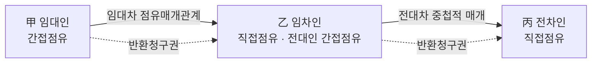
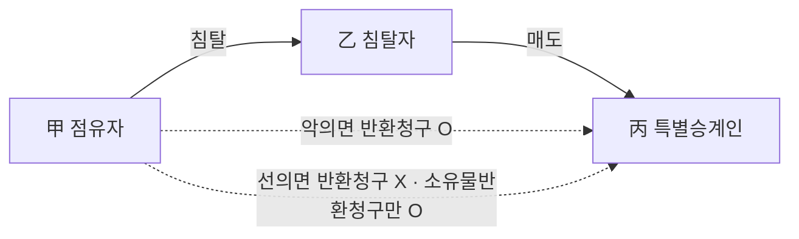

# 단원 B02 — 점유권

> **영역**: 물권법
> **수업 주제**: 점유·자주/타주·점유권의 취득과 효력

## 🗺️ 본문 목차

- [📘 위패스 마이 정리 (L1 - 메인 단권화)](#정리)
- [📖 핵심요약서 (L2 - 빠른 복습)](#핵심요약서)
- [📚 기본서 (L3 - 본격 학습)](#기본서)

---

## 📘 위패스 마이 정리 — L1 (메인·단권화)

> 김묘엽 교수 「위패스 마이 민법총칙/물권법」 교재 정리본 (키워드 자동 분류).

### [물권법] 제2장 서설

## 제2장 서설

점유와 점유권은 사실상 구분하기가 쉽지 않기 때문에 점유 자체가 곧 점유권 이라

고 주장하는 견해도 있지만 판례는 점유와 점유권을 구별하는 입장이다. 점유란 사 회관념상 물건에 대한 어떤 사람의 사실적 지배에 있다고 보여지는 객관적 관계를

말하는 것으로서 사실상의 지배가 있어야 한다(대판 1992.06.23.
란 사회관념상 사실상의 지배를 보호하기 위한 권리를 말한다.

91다38266).

점유권이

### 제2절

#### I. 사실상의 지배를 통한 점유

1. 의의
점유의 사실상의 지배가 있다고 하기 위하여는 반드시 물건을 물리적,

현실적으로

지배하는 것만을 의미하는 것이 아니고, 물건과 사람과의 시간적, 공간적 관계와 본

권관계, 타인 지배의 배제 가능성 등을 고려하여 사회관념에 따라 합목적적으로 판

단하여야 할 것이다(대판 1992 06.23.

91다38266).

2. 물건을 물리적, 현실적으로 지배
1. 건물의 소유자 - 건물부지의 점유자O
2. 건물의 공유명의자 전원 - 건물부지의 점유자O

① 사회통념상 건물은 그 부지를 떠나서는 존재할 수 없는 것이므로 건물의 부지가 된 토지는 그 건물의 소유자가 점유하는 것으로 볼 것이고, 이 경우 건물의 소유자가 현

실적으로 건물이나 그 부지를 점거하고 있지 아니하고 있더라도 그 건물의 소유를 위

하여 그 부지를 점유한다고 보아야 한다(대판 2010.01 28.
②

2009다61193).

건물 공유자 중 일부만이 당해 건물을 점유하고 있는 경우라도 그 건물의 부지는 건 물 소유를 위하여 공유명의자 전원이 공동으로 이를 점유하고 있는 것으로 볼 것이다

(대판 2003.11.13. 2002다57935).

|3. 건물의 소유자가 법인 - 건물부지의 점유자는 법인O, 대표X
주식회사의 대표이사가 업무집행과 관련하여 정당한 권한 없이 직원으로 하여금 타인 의 부동산을 지배 • 관리하게 하는 등으로 소유자의 사용수익권을 침해하고 있는 경우,
부동산의 점유자는 회사일 뿐이고 대표이사 개인은 독자적인 점유자는 아니기 때문에 부동산에 대한 인도청구 등의 상대방은 될 수 없다(대판 2013.6.27. 2011다50165).

|4. 건물의 소유자가 비법인사단 - 건물부지의 점유자O
종단에 사찰 등록을 마친 일반 사찰은 독자적인 권리능력과 당사자능력을 가진 법인

격 없는 사단이나 재단이라 할 것이므로, 그 사찰의 토지 및 건물을 점유하고 있는 자는 사찰 자신이고, 그 주지의 지위에 있는 자가 그 토지와 건물을 점유하는 것은

아니다(대판 1996.1.26. 94다45562).
|5. 건물의 유치권자 - 건물부지의 점유자X
건물의 유치권자는 건물의 소유자가 아니므로 그 건물의 부지 부분을 점유 • 사용하였 다고 볼 수 없다(대판 2009.9.10. 2009다28462).

|6. 건물에 대한 미등기 양수인 - 건물부지의 점유자X
건물의 소유명의자가 아닌 미등기건물의 양수인으로서는 실제로 그 건물을 점유하고

있다고 하더라도 그 건물의 부지를 점유하는 자로는 볼 수 없다(대판 2003.11 13. 2002다57935).

7. 사실상의 처분권을 보유한(= 매매대금 완료하고 인도받아 사용) 미등기 매수인 건롤부지의 점유자O

미등기건물을 양수하여 건물에 관한 사실상의 처분권을 보유하게 되는 특별한 사정

이 있을 때에는 미등기건물의 양수인은 건물부지 역시 아울러 점유하고 있다고 볼 수 있다(대판 2010.1.28. 2009中H93).

|8. 건물의 전소유자 - 건물부지의 점유도 상실O
건물의 소유권이 양도된 경우에는 건물의 종전의 소유자가 건물의 소유권을 상실하

였음에도 불구하고 그 부지를 계속 점유할 별도의 독립된 권원이 있는 등의 특별한 사정이 없는 한 그 부지에 대한 점유도 함께 상실하는 것으로 보아야 한다(대판 1993.10.26. 93다2483).

3. 물건과 사람과의 시간적, 공간적 관계와 본권관계 여행 중인 사람이 집에 두고 온 물건이나 간접점유 또는 상속인의 점유는 물건에 대한 물리적 • 현실적 지배가 미치고 있지 않음에도 불구하고 시간적 • 공간적 • 본권관 계를 고려하여 점유를 인정한다.

4. 타인 지배의 배제 가능성 식당에서 식사를 하는 고객의 접시나 수저나 점유보조자는 물건에 대한 물리적 • 현

실적 지배가 미치고 있음에도 불구하고 타인 지배의 배제 가능성이 없어서 점유를 인정하지 않는다.

"HHM

5. 점유설정의사
점유가 성립하기 위해서 점유의사가 있어야 하는 것은 아니지만, 통설은 적어도 사

실적 지배관계를 가지려는 점유설정의사는 필요하다고 한다. 남의 집 개가 자기 집 에 들어와서 돌아다니고 있는 것을 가지고 점유했다고 볼 수 없는 것은 점유를 설

정하겠다는 의사조차도 없기 때문이다.

11. 점유의 유형

> **제197조(점유의 태양)** ① 점유자는 소유의 의사로 선의, 평온 및 공연하게 점유한 것으로 추정한다.

1. 자주점유, 타주점유
가. 서설
(가) 의의

자주점유란 소유의 의사를 가지고 하는 점유를 말하고,

타주점유란 소유의

의사를 가지지 않은 점유를 말한다. 소유의 의사란 물건에 대하여 소유자가 할 수 있는 것과 같은 배타적 지배를 사실상 행사하려는 의사를 말하며, 사실상 소유할 의

사로 족하다(대판 2000.03.16.
(누) 구별실익
02조)

97다37661).5)

취득시효(제245조), 무주물 선점(제252조), 점유자의 회복자에 대한 책임(제2

등에서 양자의 구별실익이 있다.

나. 판단
(가) 판단시기

자주점유인지, 타주점유인지의 여부는 점유취득시를 기준으로 판단한다.

(나) 판단기준

점유자의 점유가 소유의 의사 있는 자주점유인지 아니면 소유의 의사 없

는 타주점유인지의

여부는 점유자의 내심의 의사에 의하여 결정되는 것이 아니라

점유 취득의 원인이 된 권원의 성질이나 점유와 관계가 있는 모든 사정에 의하여 외형적 • 객관적으로 결정되어야 한다(대판 2002.2.26. 05)

99다72743).

법률상 그러한 지배를 할 수 있는 권원 즉 소유권을 가지고 있거나 또는 소유권이 있다고 믿고서

하는 점유를 의미하는 것은 아니다(대판 1996.10.11

96다23719).
다. 외형적 - 객관적으로 결정되지 못하는 경우 점유자는 소유의 의사로 점유, 즉 자주점유를 한 것으로 추정한다(제197조 제1항).

|l. 점유권원의 성질이 분명X - 자주점유로 추정 부동산의 점유권원의 성질이 분명하지 않을 때에는 민법 제197조 제1항에 의하여 점 유자는 소유의 의사로 점유한 것으로 추정된다(대법원 2019.07.10.

2018다299099).

|z 국가나 지방자치단체의 점유권원의 성질이 분명X - 자주점유로 추정 자주점유의 추정은 국가나 지방자치단체가 점유하는 도로의 경우에도 적용되는 것이

다(대판 1994.8.26. 93다61222).

라. 외형적 • 객관적으로 결정

(1) 매매 • 경매의 점유 D 매도인과 매수인의 점유

|l. 매도인의 점유 - 타주점유로 변경

三

‘

부동산을 타인에게 매도하여 그 인도의무를 지고 있는 매도인의 점유는 특별한 사정 이 없는 한 타주점유로 변경된다(대판 1997.4.11. 97다5824).

|入 경매의 종전 소유자의 점유 - 타주점유로 변경

三 ;-

부동산에 설정된 저당권에 기하여 임의경매가 개시된 이래 부동산의 소유자가 경매 의 실행을 저지하지 아니한 채 절차가 진행되어 그 부동산이 제3자에게 경락되고 대 금이 납부되어 종전 소유자의 소유권이 상실되었다면, 종전 소유자가 제3자의 소유 로 귀속된 부동산을 계속 점유하고 있다고 하더라도 그 점유는 달리 특별한 사정이

없는 한 타주점유로 봄이 상당하다(대판 1996.11.26. 96다29335).

| 3. 현실인도에서 매수인의 점유 - 자주점유 토지 매수인이 매매계약에 의하여 목적 토지의 점유를 취득한 경우, 그 계약이 타인 의 토지의 매매에 해당하여 곧바로 소유권을 취득할 수 없다는 사실만으로 자주점유

의 추정이 번복되지 않는다(대판 2000.3.16. 97다37661 전합).

|4, 간이인도에서 매수인의 점유 - 타주점유가 자주점유로 전환 타주점유의 경우 점유자가 새로운 권원에 기하여 소유의 의사를 가지고 점유를 시작

하거나 또는 소유의 의사가 있음을 표시함으로써 일단 시작된 타주점유가 중도에 자 주점유로 전환된다(대판 1998.3.27. 97다53823).

15. 해제 후 매수인의 점유 - 타주점유로 변경

、

부동산 매매계약 해제 후 매수인의 점유는 특별한 사정이 없는 한 타주점유로 변경된

다(대판 1972.02.22. 기다2306).

2) 매매계약이 무효

|l. 매매가 무효임을 알지 못한 매수인의 점유 - 자주점유 부동산을 매수하여 이를 점유하게 된 자는 그 점유의 시초에 소유의 의사로 점유한

것이며, 나중에 매도자에게 처분권이 없었다는 등의 사유로 그 매매가 무효인 것이 밝 혀졌다 하더라도 자주점유의 성질이 변하는 것은 아니다(대판 1996.5.28. 95다40328).

|z 매매가 무효임을 알면서 한 매수인의 점유 - 타주점유 부동산을 매수하여 이를 점유하게 된 자는 그 매매가 무효가 된다는 사정이 있음을 알았다는 등의 특단의 사정이 있다면 그와 같은 점유는 타주점유에 해당한다(대판 199
6.05.28.

95다40328).

3) 인접 토지의 점유
11. 인접토지의 일부를 매수한 토지로 믿고 한 점유 - 자주점유 매수인이 인접 토지와의 경계선을 정확하게 확인하여 보지 아니하여 착오로 인접 토 지의 일부를 그가 매수 취득한 대지에 속하는 것으로 믿고 위 인접 토지의 일부를

현실적으로 인도받아 점유하여 왔다면 특별한 사정이 없는 한 인접 토지에 대한 점

유 역시 소유의 의사가 있는 자주점유라고 보아야 한다(대판 1999.6.25. 99다5866).

2. 상당히 초과하는 인접토지를 매수한 토지로 믿고 한 점유 - 타주점유
3. 상당히 초과하는 인접토지를 자기 토지로 믿고 한 점유 - 타주점유

① 매매 대상 건물 부지의 면적이 등기부상의 면적을 상당히 초과하는 경우에는 특별한 사정이 없는 한 계약 당사자들이 이러한 사실을 알고 있었다고 보는 것이 상당하며,

그 점유는 권원의 성질상 타주점유에 해당한다(대판 1999.6.25. 99다5866).

② 자신 소유의 대지상에 건물을 건축하면서 인접 토지와의 경계선을 정확하게 확인해

보지 아니한 탓에 착오로 건물이 인접 토지의 상당한 정도를 침범하게 되었다면 당해 건물의 건축주는 자신의 건물이 인접 토지를 침범하여 건축된다는 사실을 알고 있었

다고 봄이 상당하다고 할 것이고, 따라서 그 침범으로 인한 인접 토지의 점유는 자주 점유라고 할 수 없다(대판 2000.12.8. 2000다42977).
(2) 무단점유

|l. 악의의 무단점유 - 타주점유

사

•；.‘；

점유자가 점유개시 당시에 소유권 취득의 원인이 될 수 있는 법률행위 기타 법률요건 이 없다는 사실을 잘 알면서 타인 소유의 부동산을 무단점유한 것임이 입증된 경우,

소유의 의사가 있는 점유라는 추정은 깨어졌다고 보아야 한다(대판 1997.8.21. 95다28

전합).

(3) 공유의 점유

|l. 공유자 자신의 지분비율 범위 내 점유 - 자주점유 공유부동산을 공유자 1인이 전부 점유하고 있는 경우에 공유자 자신의 지분비율 범위

내의 점유는 자주점유이다.

| 2. 다른 공유자의 지분비율 범위 내 점유 - 타주점유

三

공유부동산은 공유자 1인이 전부를 점유하고 있다고 하여도 다른 특별한 사정이 없는

한 권원의 성질상 다른 공유자의 지분비율의 범위 내에서는 타주점유라고 볼 수밖에 없다(대판 1995.1.12. 94다19884).

(4) 점유매개관계의 점유

|l. 점유매개설정자의 간접점유 - 자주점유 지상권설정자, 전세권 설정자, 질권설정자, 임대인의 점유는 점유매개관계의 간접 점유

자로써 자주점유이다.

|2. 점유매개자의 직접점유-타주점유

母‘베

누

》

지상권자, 전세권자, 질권자, 임차인의 점유는 점유매개관계의 직접점유자로 점유매

개자의 점유는 타주점유이다. 타주점유임을 주장하는 자의 입증에 의하여 타인의 물 건을 관리하기 위하여 점유를 개시하였다는 것이 인정되는 경우에는 점유권원의 성 질상 타주점유하고 볼 것이다(대판 1989.10.24. 88다카11619).
으_며의수투잔의주유三타주주유——
양자간 명의신탁에 의하여 부동산의 소유자로 등기된 명의수탁자의 점유는 그 권원 의 성질상 자주점유라 할 수 없다(대판 1991.12.10. 91다27655).

-------- MHH

14. 계약명의신탁에서 명의신탁자의 점유 - 타주점유

•나

계약명 의신탁에서 명의 신탁자가 명의신탁약정에 따라 부동산을 점유한다면 명의신탁

자는 부동산의 소유자가 명의신탁약정을 알았는지 여부와 관계없이 소유권 취득의 원인이 되는 법률요건이 없이 그와 같은 사실을 잘 알면서 타인의 부동산을 점유한 것이다. 이러한 명의신탁자는 타인의 소유권을 배척하고 점유할 의사를 가지지 않았

다고 할 것이므로 소유의 의사로 점유한다는 추정은 깨어진다(대판 2022.5.12. 2019다249428).

2. 선의점유, 악의점유
(가) 의의

선의의 점유란 점유할 수 있는 권리인 본권이 없음에도 불구하고 있다고 오

신하면서 하는 점유를 말한다. 반면에 악의의 점유란 본권이 없음을 알면서 또는 본 권의 유무에 관하여 의심을 가지면서 하는 점유를 말한다
(L)구별실익

과실 취득권(제2()1조), 점유권의 회복자에 대한 책임(제202조), 등기부 취득

시효(제245조 제2항), 선의취득(저］249조) 등에서 양자의 구별실익이 있다.

3. 과실 있는 점유, 과실 없는 점유 (가) 의의

본권이 없음에도 본권이 있다고 믿은데 과실이 있으면 과실 있는 점유이고,

과실이 없으면 과실 없는 점유이다.
(나)

구별실익

등기부 취득시효(제245조 제2항), 선의취득(제249조) 등에서 구별실익이 있다.

4. 평온 - 공연한 점유, 폭력 - 은비의 점유 (가) 의의

평온한 점유란 폭력에 의하지 않은 점유를 말하고, 공연한 점유란 은밀하고

비밀리에 하는 은비가 아니라 존재를 인식할 수 있는 점유를 말한다.
(L)구별실익

취득시효(제245조 제2항), 선의취득(제249조) 등에서 양자의 구별실익이 있다.

#### III. 점유의 추정

1. 자주점유 ■ 선으I • 평온 ■ 공연의 추정

> **제197조(점유의 태양)** ① 점유자는 소유의 의사로 선의, 평온 및 공연하게 점유한 것으로 추정한다.

|l. 무과실 추정X - 주장자가 입증책임O
무과실에 대하여는 추정이 되지 않으므로 주장자에게 입증책임이 있다(대판 1983.10.1
1.

83다카531).

2. 점유계속의 추정

> **제198조 (점유계속의 추정)** 전후 양시에 점유한 사실이 있는 때에는 그 점유는 계속 한 것으로 추정한다.

11. 점유계속 추정 - 전후 양 시점에 점유자가 동일O, 전후 양 시점에 점유자가 다름O
동일인이 전후 양 시점에 점유한 것으로 증명된 경우뿐만 아니라, 전후 양 시점의 점

유자가 다른 경우에도 점유의 승계가 입증되면 점유의 계속이 추정된다(대판 1996.9.20. 96다24279).

3. 적법보유의 추정

> **제200조 (권리의 적법의 추정)** 점유자가 점유물에 대하여 행사하는 권리는 적법하게 보유한 것으로 추정한다.

#### IV. 추정에 따른 입증 1.

입증의 주체
추정의 경우에는 이를 다투려는 자가 입증책임을 진다.

|1. 자주점유 추정 - 취두시효의 성립을 부정하는 자가 타주점유임을 입증 물건의 점유자는 소유의 의사로 점유한 것으로 추정되므로 점유자가 취득시효를 주

장하는 경우에 있어서 스스로 소유의 의사를 입증할 책임은 없고, 오히려 그 점유자 의 점유가 소유의 의사가 없는 점유임을 주장하여 점유자의 취득시효의 성립을 부정

하는 자에게 그 입증책임이 있다(대판 1997.12.9. 97다18547).

2. 입증의 정도
가. 의의
의심스러운 사정이 있음이 입증되는 경우에 추정력은 깨어진다(대판 2008.3.27. 2007다91756).

나. 입증에 실패
(1) 증명이 없어서 추정 유지
1. 자신의 토지로 알고 점유했으나 타인 토지임을 나중에 알게 됨(입증 없음) - 타주 점유로저환、자주점유 유지0

_

_

_______________

______

점유의 시초에 자신의 토지에 인접한 타인 소유의 토지를 자신 소유의 토지의 일부로

알고서 이를 점유하게 된 자는 나중에 그 토지가 자신 소유의 토지가 아니라는 점을 알게 되었다고 하더라도 그러한 사정만으로 그 점유가 타주점유로 전환되는 것은 아

니다(대판 2001.5.29. 2001디^913).

2. 이의를 받은 사실이나 당사자 사이에 법률상 분쟁이 있었다는 사실만(입증 없음) 평온三흐연한 좌유j부정 X__________________________________________
점유가 불법이라고 주장하는 자로부터 이의를 받은 사실이 있거나 점유물의 소유권 을 둘러싸고 당사자 사이에 법률상 분쟁이 있었다는 사실만으로 평온• 공연한 점유가

부정되지 않는다(대판 1992.4.24. 92다6983).

[3. 궏원 없는 점유였음이 밝혀지/)1후(입흐 없음) 三 서의점유유지O____ ______
민법 제197조 제1항에 의하여 점유자는 선의로 점유한 것으로 추정되고, 권원 없는 점유였음이 밝혀졌다고 하여 곧 그 동안의 점유에 대한 선의의 추정이 깨어졌다고 볼 것은 아니다(대판 2000.3.10. 99다63350).
(2) 증명에 실패해서 추정 유지

11 下유자가 자주점유_입증실패 三타주점유로 저환수 자주점유 유지아_______
점유자가 스스로 매매 또는 증여와 같이 자주점유의 권원을 주장하였으나 이것이 인 정되지 않는 경우에도, 자주점유의 추정이 번복된다거나 또는 점유권원의 성질상 타

주점유라고 볼 수는 없다(대판 2008.7.10. 2006다82540).

2. 국가나 지방자치단체가 토지의 취득절차에 관한 서류를 제출하지 못하여 입증실패 - 탁주점유로 전환X, 자주점유 유지O

국가나 지방자치단체가 취득시효의 완성을 주장하는 토지의 취득절차에 관한 서류를 제출하지 못하고 있다 하더라도 국가나 지방자치단체가 소유권 취득의 법률요건이

없이 그러한 사정을 잘 알면서 무단점유한 것임이 증명되었다고 보기 어려우므로 자 주점유의 추정은 깨어지지 않는다고 보는 것이 옳다(대판 2017.9.7. 2017다228342).

|3. 점패자三 타주점유로 전환〉〈, 자주점유 유지O
토지의 점유자가 이전에 토지 소유자를 상대로 그 토지에 관하여 매매를 원인으로 한

소유권이전등기청구소송을 제기하였다가 패소하고 그 판결이 확정되었다 하더라도 그 사정만을 들어서는 토지 점유자의 자주점유의 추정이 반복되어 타주점유로 전환

된다고 할 수 없다(대판 2009.12 10.

2006다19177).

다. 입증에 성공

(1) 원칙적 증명 이후부터 추정이 깨어짐 D 추정이 깨어짐

|l. 타인의 물건을 관리하기 위하여 점유한 사실이 증명 됨 - 타주점유로 전환 타주점유임을 주장하는 자의 입증에 의하여 타인의 물건을 관리하기 위하여 점유를 개시하였다는 것이 인정되는 경우에는 점유권원의 성질상 타주점유하고 볼 것이다(대판 1989.10.24. 88다카11619).

2. 소유자라면 당연히 취했을 것으로 보이는 행동을 취하지 아니한 사실이 증명 됨 타주점유로 전환

점유자가 진정한 소유자라면 통상 취하지 아니할 태도를 나타내거나 소유자라면 당

연히 취했을 것으로 보이는 행동을 취하지 아니한 경우 등 외형적 • 객관적으로 보아 점유자가 타인의 소유권을 배척하고 점유할 의사를 갖고 있지 아니한 것으로 볼 만한

사정이 증명되면 자주점유의 추정은 깨어진다(대판 2006.4.27. 2004다38150).

2) 증명 이후부터 추정이 깨어짐

|l. 소승타 - 타주점유로 전환, 패소판결 후부터 타주점유로 전환 진정한 소유자가 자신의 소유권을 주장하여 점유자를 상대로 소유권이전등기의 말소

등기청구소송을 제기하여 점유자의 패소(=소유자의 승소)로 확정된 경우, 패소판결 확정 후부터는 점유자의 점유가 타주점유로 전환된다(대판 1996.10.11. 96다19857).

(2) 예외적으로 소급해서 추정이 깨어짐

> **제197조 (점유의 태양)** ② 선의의 점유자라도 본권에 관한 소에 패소한 때에는 그 소 가 제기된 때로부터 악의의 점유자로 본다.

### 제3절

점유권

#### I. 점유권의 취득

1. 직접점유자
가. 본인이 직접 점유

> **제192조 (점유권의 취득)** ① 물건을 사실상 지배하는 자는 점유권이 있다.
물건을 사실상 지배하는 자, 즉 점유자는 직접점유권이 있다(제192조 제1항).

나. 타인을 통한 직접 점유

> **제195조 (점유보조자)** 가사상, 영업상 기타 유사한 관계에 의하여 타인의 지시를 받 아 물건에 대한 사실상의 지배를 하는 때에는 그 타인만을 점유자로 한다.

(1) 의의

점유보조자란 물건에 대하여 직접적으로 실력을 행사하면서도 사실상의 지배를 인정

받지 못하는 자를 말한다.

(2) 가사상, 영업상 기타 유사한 관계에 의하여 (가) 가사상의 관계

부모가 사- 준 장난감에 대해 아이는 소유자이지만 점유보조자에 불

과하고, 점유자는 그의 부모이다. 처는 소유자에 대한 관계에서 단순한 점유보조자 에 불과한 것이 아니다(대판 1998.06.26.
(나)
영업상의 관계

98다16456).

상점의 점원이나 은행의 은행원은 점유보조자로서 물건에 대한 직

접적인 실력을 행사하면서도 점유권 자체가 인정되지 않으며 상점주인, 은행이 점유 자이다.

(3) 타인의 지시를 받아

점유보조자와 그에게 점유를 지시한 타인 사이의 지시에 따른 명령 •복종관계가 있

어야 한다.

(4) 타인만을 점유자로 한다

점유보조자에게 지시를 하는 타인만이 점유자로 직접점유권이 있고 점유보조자는 점

—Ml

유자가 아니어서 점유권이 없다.

2. 간접점유자

> **제194조(간접점유)** 지상권, 전세권, 질권, 사용대차, 임대차, 임치 기타의 관계로 타인으로 하여금 물건을 점유하게 한 자는 간접으로 점유권이 있다.

가. 의의
간접점유란 타인과의 점유매개관계에 기하여 타인에게 자신의 점유를 이전한 경우에 야 자신에게 인정되는 점유를 말한다. 간접점유라는 것은 점유가 관념화된 형태이다.

나. 지상권, 전세권, 질권, 사용대차, 임대차, 임치 기타의 관계로

(1) 점유매개관계
(가) 의의

간접점유를 인정하기 위해서는 간접점유자와 직접점유를 하는 자 사이에 일

정한 법률관계, 즉 점유매개관계가 필요하다

이러한 점유매개관계는 직접점유자가

자신의 점유를 간접점유자의 반환청구권을 승인하면서 행사하는 경우에 인정된다(대

판 2012.02.23.
(*-) 확대

2011中1424,61431).

간접점유의 요건이 되는 점유매개관계는 법률행위뿐만 아니라 법률의 규정,

국가행위 등에도 설정될 수 있다(대판 2018.3.29. 2013다2559,

2566).

(2) 점유매개관계의 유효성

간접점유자와 직점점유자 사이에 유효한 법률관계가 있어야 하는 것도 아니다. 점유

매개관계를 이루는 임대차계약 등이 해지 등의 사유로 종료되더라도 직접점유자가

목적물을 반환하기 전까지는 간접점유자의 직접점유자에 대한 반환청구권이 소멸하 지 않는다(대판 2019.8.14. 2019다205329).

다. 타인으로 하여금 물건을 점유하게 한 자는 간접으로 점유권이 있다.
지상권에서의 지상권 설정자, 전세권에서의 전세권설정자, 질권에서의 질권설정자, 사

용대차에서의 대주, 임대차에서의 임대인, 임치에서의 임치인이 타인으로 하여금 물 건을 점유하게 한 자로 간접점유권이 있다(제194조).

#### II. 1. 점유권의 특정승계

> **제196조(점유권의 양도)** ① 점유권의 양도는 점유물의 인도로 그 효력이 생긴다.
> ② 점유권의 양도에는 간이인도, 점유개정, 목적물반환청구권의 양도가 있다.
(가) 현실인도

현실인도란 점유물을 인도하여 물건에 대한 사실상의 지배를 양수인에게

이전하는 것을 말한다.
(나)

간이인도

간이인도란 양수인이 이미 물건에 대한 사실상의 지배를 하고 있고 의사

의 합치만으로 점유권이 이전되는 것을 말한다.

(다)점유개정

점유개정이란 점유물을 인도함과 동시에 점유매개관계를 설정하여 양수인

은 간접점유를, 양도인은 물건에 대한 직접점유를 하는 것을 말한다.

(라) 목적물반환청구권의 양도

양도인이 제3자를 통해 점유물을 간접점유 하고 있는 상

태에서 제3자에 대한 반환청구권을 양수인에게 양도하는 것을 말한다.

2. 점유권의 포괄승계

> **제193조 (상속으로 인한 점유권의 이전)** 점유권은 상속인에 이전한다.
상속인의 점유나 관리를 요하지 않으며 상속개시사실이나 자신이 상속인임을 알 필

요도 없다. 피상속인의 점유의 성질 및 하자를 그대로 승계한다.6,
1.

피상속인의 타주점유 - 상속인도 타주점유

2.

피상속인의 타주점유 + 점유자가 소유의 의사가 있음을 소유자에게 표시하거나 새

로운 권원에 의하여 소유의 의사로 다시 점유 - 상속인이 자주점유 상속에 의하여 점유권을 취득한 경우에는 상속인이 새로운 권원에 의하여 자기 고유

의 점유를 시작하지 않는 한 피상속인의 점유를 떠나 자기만의 점유를 주장할 수 없

고, 선대의 점유가 타주점유인 경우 그 점유가 자주점유로 될 수 없고, 그 점유가 자 주점유가 되기 위하여는 점유자가 소유자에 대하여 소유의 의사가 있는 것을 표시하

거나 새로운 권원에 의하여 다시 소유의 의사로써 점유를 시작하여야 한다(대판 2004.9.24. 06)

2004다27273).

지원림 제19판 민법강의. 홍문사.

545페이지

Ill.

점유권의 소멸

> **제192조(점유권의 소멸)** ② 점유자가 물건에 대한 사실상의 지배를 상실한 때에는

점유권이 소멸한다. 그러나 점유를 침탈당한 자가 1년 내에 점유물반환청구권을 행 사하여 점유를 회수하면 점유를 상실하지 않은 것으로 다루어진다.
점유자가 물건에 대한 사실상의 지배를 상실한 때에는 직접점유권이 소멸한다(제192조 제2항). 직접점유권의 소멸은 점유자의 의사에 기한 경우뿐만 아니라 점유자의 의 사에 기하지 않은 경우도 포함한다.
<31

---

### [물권법] 제8장 소유권에 기한 물권적 청구권

## 제8장 소유권에 기한 물권적 청구권

### 제1절

본권에 기한 물권적 청구권

#### I. 소유권에 기한 물권적 청구권

본권에 기한 물권적 청구권은 소유권을 중심으로 하여 소유물반환청구권(제213조), 소 유물방해제거(배제)청구권(제214조), 소유물방해예방청구권(제214조), 즉 소유권에 기한

물권적 청구권을 우선적으로 규정하고 있다.

#### II. 준용 규정이 있는 본권

1. 지상권, 전세권 (가 의의

소유권에 기한 물권적 청구권은 목적물을 점유하고 있는 지상권(제290조), 전

세권(제319조)에 준용하고 있다.
(*-)지상권

지상권은 지상물반환청구권, 지상물방해제거(배제)청구권, 지상물방해예방청

구권이 인정된다.

(다) 전세권

전세권은 전세물반환청구권,

전세물방해제거(배제)청구권, 전세물방해예방청

구권이 인정된다.

2. 지역권, 저당권 (가 의의

소유권에 기한 물권적 청구권은 목적물을 점유하지 않는 지역권(제3이조), 저

당권(제370조)에 준용하고 있다.

(l) 지역권

지역권은 목적물을 점유하지 않기 때문에 승역지반환청구권은 인정되지 않 고, 승역지방해제거 (배제)청구권, 승역지방해예방청구권이 인정된다.

0=)저당권

저당권은 목적물을 점유하지 않기 때문에 저당물반환청구권은 인정되지 않

고, 저당물방해제 거 (배제)청구권, 저당물방해예방청구권이 인정된다.

#### III. 준용 규정이 없는 본권 1.

유치권
소유권에 기한 물권적 청구권은 유치권에 준용하고 있지 않아서 유치권에 기한 물

권적 청구권이 인정되지 않는다. 점유의 성질이 강한 유치권은 점유권에 기한 물권

적 청구권만이 인정될 뿐이다. 점유의 상실로 인해서 유치권이 소멸하더라도 점유권

에 기한 물권적 청구권을 행사하여 점유를 회복하면 유치권이 부활한다.

1. 점유회수의 소를 제기하여 승소판결 - 유치권 부활X
2. 점유회수의 소를 제기하여 승소판결 + 점유를 회복 - 유치권 부활O

점유회수의 소를 제기하여 승소판결을 받아 점유를 회복하여야 유치권이 되살아나고,
점유회수의 소를 제기하여 점유를 회복할 수 있다는 사정만으로는 유치권이 되살아

나지 않는다(대판 2012.2.9. 2011다72189).

2.

질권
소유권에 기한 물권적 청구권은 질권에 준용하고 있지 않아서 질권에 기한 물권적

청구권이 인정되지 않는다. 점유의 성질이 강한 질권은 점유권에 기한 물권적 청구

권만이 인정될 뿐이다. 점유의 상실로 인해서 질권이 소멸하더라도 점유권에 기한

물권적 청구권을 행사하여 점유를 회복하면 질권이 부활한다.

### 제2절

소유자의 물권적 청구권

#### I. 소유물반환청구권

> **제213조 (소유물반환청구권)** 소유자는 그 소유에 속한 물건을 점유한 자에 대하여 반 환을 청구할 수 있다. 그러나 점유자가 그 물건을 점유할 권리가 있는 때에는 반환 을 거부할 수 있다.

1. 소유자
|l. 제3자에게 처분권한을 수여한 소유자 - 소유권에 기한 물권저초구권해AhO

소유자가 제3자에게 소유물의 처분권한을 수여한 경우, 제3자의 처분이 실제로 유효

하게 행하여지지 아니하고 있는 동안에는 소유자가 소유물을 유효하게 처분하거나

소유권에 기한 물권적 청구권을 행사할 수 있다(대판 2014.03.13 2009다105215).
|z 소유권이전의 체권계약만 체결한 소유자 - 소유권에 기한 물권적 청구권O

소유자가 제3자에 대하여 목적물의 소유권을 이전하기로 하는 매매 • 증여 등의 채권 계약을 체결하는 것만으로는 자신의 소유물을 여전히 유효하게 달리 처분할 수 있고,
또한 소유권에 기한 물권적 청구권을 가진다(대판 2014. 03.13.
[3三미등기 매수이丁불법점유자에게 소유권에가혼[ 명도청구X

2009다105215)._____

_

_____

건물을 신축하여 그 소유권을 원시취득한 자로부터 그 건물을 매수하였으나 아직 소 유권이전등기를 갖추지 못한 자는 그 건물의 불법점유자에 대하여 직접 자신의 소유

권 등에 기하여 명도를 청구할 수는 없다(대판 2007.6.15. 2007다11347).

2. 점유한 자에 대하여 소유물반환청구권의 상대방은 현실적으로 그 목적물을 점유하고 있는 자를 상대로 하여야 하고, 그 물건을 다른 사람에게 인도하여 현실적으로 점유를 하고 있지 않은
이상, 그 자를 상대로 반환청구를 할 수 없다(대판 1999.07 09.

98다9045).

|i. 약정에 의한 부동산 인도청구의 상대방 - 직접점유자0, 간접점유자o

불법점유를 이유로 하여 부동산의 인도를 청구하는 경우에는 현실적인 점유자를 상

대로 하여야 하는 것과 달리, 약정에 의하여 인도를 청구하는 경우(=그렇지 않은 경

우)에는 그 상대방이 직접점유자로 제한되지 아니하며 간접점유자를 상대로 하는 청 구도 허용된다(대판 2013.6.27. 2011다5813).

| 入 소유물반환청구권의 상대방 - 점유자O, 점유보조자X

점유보조자에게 지시를 하는 타인만이 점유자가 되고 점유보조자는 점유권이 없다.
따라서 점유자를 상대로 하는 소유물반환청구권의 상대방이 될 수 없다(대판 2001.4.27. 20이다13983).

3. 물건의 반환을 청구할 수 있다.
가. 점유자가 점유할 권리가 없는 때 소유자는 점유자에게 그 물건의 반환을 청구할 수 있다. 점유자가 소유자에 대한 관 계에서 그 물건을 점유할 권리가 없는 때에는 상대방은 점유하는 물건을 반환하여 야 한다.
|i. 토지소유자는 무단건물의 소유자에게 - 토지반환청구Q

차g,

건물의 소유자가 그 건물의 소유를 통하여 타인 소유의 토지를 점유하고 있다고 하더 라도 그 토지 소유자로서는 그 건물의 철거와 그 대지 부분의 인도를 청구할 수 있을 뿐, 자기 소유의 건물을 점유하고 있는 자에 대하여 그 건물에서 퇴거할 것을 청구할

수는 없다(대판 1999.7.9. 98다57457,57464).

|2. 무단건물의 소유자 - 토지소유자에게 부당이득반환의무Q

타인 소유의 토지 위에 권원 없이 건물을 소유하는 자는 그 자체로써 건물 부지가 된 토지를 점유하고 있는 것이므로 특별한 사정이 없는 한 법률상 원인 없이 타인의 재

산으로 인하여 토지의 차임에 상당하는 이익을 얻고 이로 인하여 타인에게 동액 상당

의 손해를 주고 있다고 할 것이고, 이는 건물 소유자가 미등기건물의 원시취득자이고 그 건물에 관하여 사실상의 처분권을 보유하게 된 양수인이 따로 존재하는 경우에도

다르지 아니하므로, 미등기건물의 원시취득자는 토지 소유자에 대하여 부당이득반환 의무를 진다(대판 2022.9.29. 2018다243133,

243140).
3. 무단건물의 사실상의 처분권을 보유한(= 매매대금 완료하고 인도받아 사용) 미등기

매수인 - 토지소유자에게 부당이득반환의무O
4. 무단건물의 소유자와 무단건물의 사실상의 처분권을 보유한 미등기 매수인의 부당

이득반환채무 - 부진정연대채무

미등기건물을 양수하여 건물에 관한 사실상의 처분권을 보유하게 됨으로써 그 양수

인이 건물 부지 역시 아울러 점유하고 있다고 볼 수 있는 경우에는 미등기건물에 관 한 사실상의 처분권자도 건물 부지의 점유 • 사용에 따른 부당이득반환의무를 부담한
다. 이러한 경우 미등기건물의 원시취득자와 사실상의 처분권자가 토지 소유자에 대

하여 부담하는 부당이득반환의무는 동일한 경제적 목적을 가진 채무로서 부진정연대 채무 관계에 있다고 볼 것이다(대판 2022.9.29. 2018다243133,

243140).

나. 점유자가 점유할 권리가 있는 때

(1) 의의

점유자가 소유자에 대한 관계에서 그 물건을 점유할 권리가 있는 때에는 반환을 거

부할 수 있다(제213조).

(2) 물권

점유자가 소유자에 대한 관계에서 반환을 거부할 수 있는 권리에는 지상권, 전세권

의 용익물권이나 유치권, 질권의 담보물권이 포함된다.

1.

유치권자로부터 유치물의 점유 내지 보관을 위탁받은 자 - 소유자의 소유물반환청 구를 거부O
유치권자로부터 유치물을 유치하기 위한 방법으로 유치물의 점유 내지 보관을 위탁 받은 자도 특별한 사정이 없는 한 점유할 권리가 있음을 들어 소유자의 소유물반환청

구를 거부할 수 있다(대판 2014.12.24. 2011다€2618).

(3) 채권

점유자가 소유자에 대한 관계에서 반환을 거부할 수 있는 권리에는 임차권,

도급 등과 같이 점유를 수반하는 채권도 포함된다(대판 2020.05.28.

임치,

2020다211085).

1. 점유취득시효를 완성한 점유자 - 소유자의 소유물반환청구를 거부O
2. 소유자가 점유취득시효를 완성한 점유자에게 소유물반환청구X

소유명의자는 취득시효가 완성된 점유자에 대하여 그 대지에 대한 불법점유임을 이

유로 대지의 인도를 청구할 수 없다(대판 1988.5.10. 87다카1979).

3. 미등기 매수인 • 이로부터 전매한 자 - 매도인의 소유물반환청구를 거부O
4. 매도인은 미등기 매수인 • 이로부터 전매한 자에게 소유물반환청구X

5. 매도인은 미등기 매수인 • 이로부터 전매한 자에게 부당이득반환청구X

© 부동산의 매수인은 등기를 하지 않았다고 하더라도 인도받은 목적물을 점유할 권리 0 가 있으며, 따라서 매도인은 소유권에 기한 반환청구권을 행사할 수 없다. 이는 매수

인으로부터 다시 전매한 자에게도 같다(대판 2001.12.11. 2001다45355).

© 토지의 매수인이 아직 소유권이전등기를 마치지 않았더라도 매매계약의 이행으로 토

지를 인도받은 때에는 매매계약의 효력으로서 이를 점유• 사용할 권리가 있으므로,

매도인이 매수인에 대하여 그 점유• 사용을 법률상 원인이 없는 이익이라고 하여 부 당이득반환청구를 할 수는 없다(대판 2016.7.7. 2014다2662).

| 6. 채권자로부터 점유 내지 보관을 위탁받은 자 - 소유자의 소유물반환청구를 거부O

소유자에 대하여 반환을 거부할 수 있는 권리 점유를 수반하는 채권을 갖는 자가 소

유자의 승낙이나 소유자와의 약정 등에 기초하여 제3자에게 점유할 권리를 수여할 수 있는 경우에는 그로부터 점유 내지 보관을 위탁받거나 그 밖에 점유할 권리를 취

득한 제3자는 특별한 사정이 없는 한 자신에게도 점유할 권리가 있음을 들어 소유자

의 소유물반환청구를 거부할 수 있다(대판 2020.5.28. 2020다211085).

4. 행사기간
점유물반환청구권의 경우와 달리 그 행사기간에 제한이 없다.
ii.

소유물방해제거(배제)청구권

> **제214조(소유물방해제거)** 소유자는 소유권을 방해하는 자에 대하여 방해의 제거를 청구할 수 있다.

1. 소유자
|l. 미등기 매수인 - 소유권에 기한 방해제거청구X

미등기 무허가건물의 양수인이라도 소유권이전등기를 마치지 않는 한 건물의 소유권 을 취득할 수 없고, 소유권에 준하는 관습상의 물권이 있다고도 할 수 없으므로, 미

등기 무허가건물의 양수인은 소유권에 기한 방해제거청구를 할 수 없다(대판 2016.07.

2016다214483,

214490).

2. 방해하는 자
소유권에 기한 방해배제청구권에 있어서 ‘방해’라 함은 현재에도 지속되고 있는 침해 를 의미하고,

법익 침해가 과거에 일어나서 이미 종결된 경우에 해당하는 ‘손해’의

개념과는 다르다(대판 2003.3.28. 2003다5917).

|i. 토지 지하에 과거에 매설된 생활쓰레기 - 방해배제청구〉〈, 손해배상청구O
토지 지하에 매립된 생활쓰레기는 과거 지방자치단체의 위법한 쓰레기매립행위로 인

하여 생긴 결과로서 토지 소유자가 입은 손해에 불과할 뿐 생활쓰레기가 현재 토지의 소유권에 대하여 별도의 침해를 지속하고 있는 것이라고 볼 수 없으므로, 토지소유자

의 방해배제청구는 인용될 수 없다. 불법행위로 인한 손해배상을 청구할 수 있을 뿐 이다(대판 2019.7.10. 2016다205540).

3. 방해의 제거를 청구할 수 있다.
가. 방해자가 방해할 권리가 없는 때

(1) 철거와 퇴거

|i. 토지소유자는 무단건물의 소유자에게 - 철거청구Q, 퇴거청구x
건물의 소유자가 그 건물의 소유를 통하여 타인 소유의 토지를 점유하고 있다고 하더 라도 그 토지 소유자로서는 그 건물의 철거와 그 대지 부분의 인도를 청구할 수 있을 뿐, 자기 소유의 건물을 점유하고 있는 자에 대하여 그 건물에서 퇴거할 것을 청구할 수는 없다(대판 1999.7.9. 98다57457,57464).

«H

2. 토지소유자의 권리행사(철거청구)에 토지사용권이 없는 건물의 전세권설정자는 대

항X
전세권을 설정하는 건물소유자가 건물의 존립에 필요한 지상권과 같은 토지사용권을 가지지 못하여 그가 토지소유자의 건물철거 등 청구에 대항할 수 없는 경우에 민법

제304조 등을 들어 건물 전세권자가 토지소유자의 권리행사에 대항할 수 없다(대판 2
010.08.19.

2010다43801).

[3. 토지소유자는 무단건물의 임차인에게三 철거청구乂丄 퇴거청구O

건물이 그 존립을 위한 토지사용권을 갖추지 못하여 토지소유자가 건물소유자에 대 하여 당해 건물의 철거 및 그 대지의 인도를 청구할 수 있는 상황에서 건물소유자가

아닌 사람이 건물을 점유하고 있는 경우, 토지소유자가 건물점유자에 대하여 퇴거청 구를 할 수 있다(대판 2010.8.19. 2010다43801).

4. 토지소유자는 미등기 매수인에게 - 철거청구X

5. 무단건물의 사실상의 처분권을 보유한(= 매매대금 완료하고 인도받아 사용) 미등기 매수인 - 철거청구Q
門 '1

건물철거는 원칙으로는 건물의 소유자에게만 그 철거처분권이 있다고 할 것이나 그 건물을 매수하여 점유하고 있는 자는 등기부상 아직 소유자로서의 등기명의가 없다

하더라도 그 권리의 범위 내에서 그 점유 중인 건물에 대하여 법률상 또는 사실상 처 분을 할 수 있는 지위에 있고 토지소유자는 위와 같은 지위에 있는 건물점유자에게

그 철거를 구할 수 있다(대판 1986.12.23. 86다카1751).

(2) 등기의 말소
1. 등기명의인은 등기말소청구 - 허무인 또는 실체가 없는 단체＞〈, 실제 등기행위를

한 자O
등기부상 진실한 소유자의 소유권에 방해가 되는 부실등기가 존재하는 경우에 그 등 기명의인이 허무인 또는 실체가 없는 단체인 때에는 소유자는 그와 같은 허무인 또는

실체가 없는 단체 명의로 실제 등기행위를 한 자에 대하여 소유권에 기한 방해배제로 서 등기행위자를 표상하는 허무인 또는 실체가 없는 단체명의 등기의 말소를 구할 수

있다(대판 2019.5.30. 2015다47105).

나. 방해자가 방해할 권리가 있는 때 I 1. 토지소유자는 건물을 양수하면서 법정지상권을 양도받기로 한 자 - 철거청구X

법정지 상권을 가진 건물소유자로부터 건물을 양수하면서 법정지 상권까지 양도받기로 한 자에 대하여 대지소유자가 소유권에 기하여 건물철거를 구함은 지상권의 부담을

용인하고 그 설정등기 절차를 이행할 의무 있는 자가 그 권리자를 상대로 한 청구라 할 것이어서 신의성실의 원칙상 허용될 수 없다(대판 1985.4.9. 84다카1131).

4. 행사기간
점유물방해제거청구권의 경우와 달리 그 행사기간에 제한이 없다.

5. 진정명의회복을 위한 소유권이전등기청구권
가. 의의
진정명 의회복을 위한 소유권이전등기 청구권이란 등기명 의의 회복을 위해 등기 말소가 아닌 소유권이전등기절차의 이행을 구하는 것을 말한다. 진정한 등기명의의 회복을

위해서는 중간 등기명의인들을 상대로 차례로 등기의 말소를 청구할 수 있지만, 상 당한 시간이 걸리고 패소의 위험도 있기 때문에 최종 등기명의인을 상대로 하여 직

접 이전등기를 구하는 것도 허용된다.

나. 소유자
이미 자기 앞으로 소유권을 표상하는 등기가 되어 있었거나 법률에 의하여 소유권

을 취득한 자 즉 소유자만이 진정한 등기명의의 회복을 원인으로 한 소유권이전등 기절차의 이행을 직접 구할 수 있다(대판 1990.11.27. 89다카12398전합).

다. 방해하는 자
진정한 등기명의의 회복을 위한 소유권이전등기청구는 현재의 등기명의인을 상대로

하여야 하고 현재의 등기명의인이 아닌 자는 피고적격이 없다(대판 2017.12.5. 2015다240645).

라. 방해의 제거를 청구할 수 있다.
소유자가 자신의 소유권에 기하여 실체관계에 부합하지 아니하는 등기의 명의인을 상대로 그 등기말소나 진정명의회복 등을 청구하는 경우에, 그 권리는 물권적 청구

권으로서의 방해배제청구권의 성질을 가진다(대판 2012.5.17. 2010다28604

전합). 따라

서 전소인 소유권이전등기말소청구소송에서 패소한 자는 후소로 진정명의 회복을 원 인으로 한 소유권이전등기소송을 제기할 수 없다(대판 2001.09.20.

#### III. 99다37894

전합).

소유물방해예방청구권

> **제214조(소유물방해예방)** 소유자는 소유권을 방해할 염려있는 행위를 하는 자에 대 하여 그 예방이나 손해배상의 담보를 청구 할 수 있다.

Q丄이근 소음이 수인한도를 넘으 경우 - 소음피해제거O, 방해예방유지청구O

_

건물의 소유자 또는 점유자가 인근의 소음으로 인하여 정온하고 쾌적한 일상생활을 영유할 수 있는 생활이익이 침해되고 그 침해가 사회통념상 수인한도를 넘어서는 경

우에 건물의 소유자 또는 점유자는 그 소유권 또는 점유권에 기하여 소음피해의 제거 나 예방을 위한 유지청구를 할 수 있다(대판 2007.6.15. 2004다37904,37911).

|2. 방해의 염려 있는 행위 - 상당한 방해의 개연성O, 관념적인 방해의 가능성X
소유물방해예방청구권은 방해의 발생을 기다리지 않고 현재 예방수단을 취할 것을

인정하는 것이므로, 그 방해의 염려가 있다고 하기 위하여는 방해예방의 소에 의하여

미리 보호받을 만한 가치가 있는 것으로서 객관적으로 근거 있는 상당한 개연성을 가 져야 할 것이고 관념적인 가능성만으로는 이를 인정할 수 없다(대판 1995.7.14. 94다5
0533).

#### IV. 소유권에 기한 물권적 청구권과 소멸시효

1. 소유자의 소유권이전등기 말소청구권 또는 진정명의회 복을 위한 소유권이전등기청구

권 - 물권적 청구권O, 소멸시효에 걸리지 않는다.
소유자가 자신의 소유권에 기하여 실체관계에 부합하지 아니하는 등기의 명의인을

상대로 그 등기말소나 진정명의회복 등을 청구하는 경우에, 그 권리는 물권적 청구권 으로서의 방해배제청구권의 성질을 가진다, 그 권리는 소유권에 기한 물권적 청구권

의 성질을 가지므로 소멸시효의 대상이 아니다(대판 2012.5.17. 2010다28604 전합, 대판 1993.8.24. 92다43975).

2. 합의해제에 따른 매도인의 소유권이전등기말소청구 - 물권적 청구권O, 소멸시효에

긑리자않는다.

매매계약이 합의해제된 경우에도 매수인에게 이전되었던 소유권은 당연히 매도인에 게 복귀하는 것이므로 합의해제에 따른 매도인의 원상회복청구권은 소유권에 기한

물권적 청구권이라고 할 것이고 이는 소멸시효의 대상이 되지 아니한다(대판 1982.7.27. 80다2968).

| 3.

명의신탁해지로 인해서 신탁자의 소유권이전등기말소청구권 또는 진정명의회복을

|

위한 소유권이전등기청구권 - 물권적 청구권O, 소멸시효에 걸리지 않는다.
① 명의신탁의 해지로 인해 신탁자가 수탁자에 대해서 가지는 소유권이전등기말소청구

권은 소유권에 기한 물권적 청구권으로서 소멸시효의 대상이 아니다(대판 1976.6.22. 75 다124).

② 부동산의 소유자 명의를 신탁한 자는 특별한 사정이 없는 한 언제든지 명의신탁을 해 지하고 소유권에 기하여 신탁해지를 원인으로 한 소유권이전등기절차의 이행을 청구 할 수 있는 것으로서, 이와 같은 등기청구권은 소멸시효의 대상이 되지 않는다(대판 1
991 11.26.

91다34387).

4. 피담보채무의 전부 변제로 인한 양도담보설정자의 소유권이전등기말소청구권 또는

진정명의회복을 위한 소유권이전등기청구권 - 물권적 청구권O, 소멸시효에 걸리지 않는다.
채권담보의 목적으로 이루어지는 부동산 양도담보의 경우에 있어서 피담보채무가 변

제된 경우에 양도담보설정자가 행사하는 소유권이전등기청구권이나 말소등기청구권 은 소유권에 기한 물권적 청구권으로서 소멸시효의 대상이 아니다(대판 1993.12.21. 91

다41170).

---
점유권에 기한 물권적 청구권—

### 제1절

#### I. 점유권에 기한 물권적 청구권 점유권에 기한 물권적 청구권은 점유물반환청구권(제204조),

점유물방해제거(배제)청

구권(제205조), 점유물방해예방청구권을 규정하고 있다(제206조).
적 청구권을 점유보호청구권 ,

점유권에 기한 물권

점유물반환청구권은 점유회수청구권 ,

점유물방해제 거

(배제) 청구권은 점유보유청구권, 점유물방해예 방청구권은 점유보전청구권이라고 별도

로 부르기도 한다.

II- 취지
본권에 기한 물권적 청구권이

있음에도 점유권에 기한 물권적 청구권을 인정하는

이유는 점유가 불법하게 침해된 경우, 본권과 관계없이 물건에 대한 사실상의 지배 그 자체를 보호하기 위함이다.

### 제2절

점유자의 물권적 청구권 (=점유보호청구권)

#### I. 점유물반환청구권 (=점유회수청구권)

> **제204조 (점유의 회수)** ① 점유자가 점유의 침탈을 당한 때에는 그 물건의 반환 및 손해의 배상을 청구할 수 있다.
> ② 전항의 청구권은 침탈자의 특별승계인에 대하여는 행사하지 못한다. 그러나 승

계인이 악의인 때에는 그러하지 아니하다.

> **제207조 (간접점유의 보호)** ① 제204조의 청구권은 제194조의 규정에 의한 간접점유 자도 이를 행사할 수 있다.

1. 점유자

|l. 직접점유자, 간접점유자 - 점유보호청구권O
직접점유자가 점유의 침탈을 당했다면 직접점유자는 그 물건의 반환을 청구할 수 있

고(제204조 제1항), 간접점유자도 그 물건의 반환을 청구할 수 있다(제207조 제1항).

|2. 점유보조자 - 점유보호청구권 X
점유보조자에게 지시를 하는 타인만이 점유자가 되고 점유보조자는 점유권이 없다.
따라서 점유보조자는 점유보호청구권을 행사할 수 없다(대판 1976.9.28. 76다1588).

2. 점유의 침탈을 한 자에 대하여
가. 침탈
점유의 침탈이란 점유자의 의사에 의하지 않고 사실상의 지배를 빼앗긴 경우를 말

한다. 절도나 강도를 당한 것이 침탈이다.

11. 유실물 습득 - 사기 • 강박 • 착오에 의하여 이전 - 침탈〉〈, 점유물반환청구권 x
유실물을 습득하거나 人b기 • 강박•착오의 의사표시에 의해 건물을 명도해 준 것이라

면 건물의 점유를 침탈당한 것이 아니므로 피해자는 점유물반환청구권을 가진다고 할 수 없다(대판 1992.2.28. 91다17443).

나. 침탈의 기준
점유매개관계가 있는 경우에는 침탈 여부는 직접점유자를 기준으로 판단해야 하므

로, 직접점유자가 임의로 점유를 타인에게 양도한 경우는 그 점유이전이 간접점유자

의 의사에 어긋나더라도 간접점유자의 점유가 침탈된 경우에 해당하지 아니한다(대판 1993.3.9. 92다5300).

3. 물건의 반환 및 손해배상을 청구할 수 있다.
가. 침탈자에게

(1) 직접점유자

점유자가 점유의 침탈을 당한 때에는 그 물건의 반환 및 손해의 배상을 청구할 수

있다(제204조 저］1항).

(2) 간접점유자

> **제207조 (간접점유의 보호)** ② 점유자가 점유의 침탈을 당한 경우에 간접 점유자는 그 물건을 점유자에게 반환할 것을 청구할 수 있고 점유자가 그 물건의 반환을 받을 수 없거나 이를 원하지 아니하는 때에는 자기에게 반환할 것을 청구할 수 있다.

나. 침탈자의 특별승계인에게 점유자는 침탈자의 특별승계인이 악의인 경우에는 점유물반환청구권을 행사할 수 있

지만 침탈자의 특별승계인이 선의인 경우에는 점유물반환청구권을 행사할 수 없다
(제204조 제2항항).

4. 행사기간

> **제204조 (점유의 회수)** ③ 점유물의 반환 및 손해배상청구권은 침탈을 당한 날로부 터 1년 내에 행사하여야 한다.

|l. 점유보호청구권의 1년의 행사기간 - 출소기간 점유보호청구권의 행사기간은 제척기간임에도 불구하고 ( 여기에서 제척기간의 대상 이 되는 권리는 형성권이 아닌 청구권이다) 위의 재판 외에서 권리행사하는 것으로 족한 기간이 아니라 반드시 그 기간 내에 소를 제기하여야 하는 이른바 출소기간으로

해석함이 상당하다(대판 2002.4.26. 2001다8097,8103).

#### II. 점유물방해제거(배제)청구권 (=점유보유청구권)

> **제205조(점유의 보유)** ① 점유자가 점유의 방해를 받은 때에는 그 방해의 제거 및 손해의 배상을 청구할 수 있다.

> **제207조 (간접점유의 보호)** ① 제205조의 청구권은 제194조의 규정에 의한 간접점유 자도 이를 행사할 수 있다.

1. 점유자
점유물반환청구 권의 점유자와 내용이 동일하다.

2. 방해하는 자
점유권에 의한 방해제거(배제)청구권(=점유보유청구권)은 물건 자체에 대한 사실상의

지배상태를 점유침탈 이외의 방법으로 침해하는 방해행위가 있을 때 성립된다(대판 1
987.06.09.

86巾F2942).

3. 방해의 제거를 청구할 수 있다.
점유자가 점유의 침탈을 당한 때에는 그 물건의 반환 및 손해의 배상을 청구할 수

있다(제204조 제1항).

4. 행사기간

> **제205조(점유의 보유)** ② 점유물의 방해의 제거 및 손해배상청구권은 방해가 종료 한 날로부터 1년 내에 행사하여야 한다.

③ 공사로 인하여 점유의 방해를 받은 경우에는 공사착수 후 1년을 경과하거나 그 공사가 완성한 때에는 방해의 제거를 청구하지 못한다.

|l. 점유보호청구권의 행사기간 - 출소기간 점유보호청구권의 행사기간은 제척기간임에도 불구하고 ( 여기에서 제척기간의 대상

이 되는 권리는 형성권이 아닌 청구권이다) 위의 재판 외에서 권리행사하는 것으로 족한 기간이 아니라 반드시 그 기간 내에 소를 제기하여야 하는 이른바 출소기간으로 해석함이 상당하다(대판 2002.4.26. 2001다8097,8103).

#### III. 점유물방해예 방청구권 (=점유보전청구권)

> **제206조 (점유의 보전)** ① 점유자가 점유의 방해를 받을 염려가 있는 때에는 그 방해 의 예방 또는 손해배상의 담보를 청구할 수 있다.

② 공사로 인하여 점유의 방해를 받을 염려가 있는 경우에는 공사착수 후 1년을 경 과하거나 그 공사가 완성한 때에는 방해예방을 청구하지 못한다.

> **제207조 (간접점유의 보호)** ① 제206조의 청구권은 제194조의 규정에 의한 간접점유 자도 이를 행사할 수 있다.

### 제3절

자력구제

> **제209조 (자력구제)** ① 점유자는 그 점유를 부정히 침탈 또는 방해하는 행위에 대하 여 자력으로써 이를 방위할 수 있다.
> ② 점유물이 침탈되었을 경우에 부동산일 때에는 점유자는 침탈후 즉시 가해자를

배제하여 이를 탈환할 수 있고 동산일 때에는 점유자는 현장에서 또는 추적하여 가

해자로부터 이를 탈환할 수 있다.

---
본권과 점유권과의 관계

### 제1절

#### I. ## 제10장 본권의 소와 점유의 소의 관계

본권과 점유권
점유권과 본권은 서로 다르기 때문에 동일물 위에 병존할 수 있다.

#### II. 본권의 소와 점유의 소와의 관계

1. 제208조 제1항

> **제208조 (점유의 소와 본권의 소와의 관계)** ① 점유권에 기 인한 소와 본권에 기 인한 소는 서로 영향을 미치지 아니한다.
점유의 소와 본권의 소는 물권의 보호라는 동일한 이익을 목적으로 하지만, 제도 목

적이 상이하기 때문에 서로 영향을 미치지 않는다. 점유를 침탈당한 본권자는 본권 의 소와 점유의 소를 동시에 제기할 수도 있고 경합할 수도 있다.

2. 제208조 제2항

> **제208조 (점유의 소와 본권의 소와의 관계)** ② 점유권에 기인한 소는 본권에 관한 이 유로 재판하지 못한다.

점유의 소에서 본권에 기한 항변을 제출할 수 없다. 점유의 소에서 상대방이 본권에

기한 항변을 내세울 수 있다면 점유의 침해상태를 신속하게 회복하는 일은 거의 불

가능하게 될 것이다.

제io장 본권과 점유권과의 관계

.101

### 제2절

#### I. 점유자와 회복자의 관계

서설

1. 의의
점유자와 회복자의 관계란 거래행위가 없거나 거래행위가 있었으나 무효•취소가 되 어 선의취득이 성립하지 않는 경우에 선의취득이 성립하는 경우와 균형을 고려하여

물건을 반환해야 하는 점유자를 필요한 범위에서 보호하기 위한 특칙규정을 말한다.

2. 적용범위
가. 점유자가 계약관계를 가진 경우 점유자가 유익비를 지출할 당시 계약관계 등 적법한 점유의 권원을 가진 경우에 그

지출비용의 상환에 관하여는 해당 법조항이나 법리에 따른 비용상환청구권을 상대방

에 대하여 행사할 수 있을 뿐, 점유자와 회복자의 관계에 따른 비용상환청구권을 구 할 수는 없다(대판 2003.7.25. 20이다64752).

나. 점유자가 점유를 잃은 경우 점유자가 점유물 반환 이외의 원인으로 물건의 점유자 지위를 잃어 소유자가 그를

상대로 물권적 청구권을 행사할 수 없게 되었다면, 그들은 더 이상 점유자와 회복자

의 관계에 있지 않으므로, 점유자는 위 조항을 근거로 비용상환청구권을 행사할 수 없다(대판 2022.06.30.

#### II. 2020다209815).

점유자의 과실취득 여부

1. 의의
가. 점유자의 선의 - 악의 판단기준 점유자가 선의인지 • 악의인지 여부에 대한 판단은 과실(果實)에 대하여 독립한 소유

권이 성립하는 시기, 즉 원물로부터 분리되는 때를 기준으로 한다.

나. 과실취득권
과실에는 천연과실과 법정과실뿐만 아니라 과실에 준하는 사용이익도 포함된다(대판 1996.1.26. 95다44290).

2. 선의의 점유자의 과실취득권 제2이조 (점유자와 과실) ① 선의의 점유자는 점유물의 과실을 취득한다.

가. 선의의 점유자
선의의 점유자란 과실취득권을 포함하는 소유권, 지상권, 임차권 등 권원이 있다고 오신한 점유자를 말하고, 그와 같은 오신을 함에는 오신할 만한 정당한 근거가 있어 야 한다(대판 1988.12.20. 88다카6709,

대판 1995.8.25. 94다27069).

과실취득권이 없는 유

치권 • 질권 • 저당권 등에 권원이 있는 것으로 오신한 점유자는 선의의 점유자가 되지

못한다

나. 과실취득권
선의의 점유자는 점유물의 과실을 취득한다(제2이조 제1항). 선의의 점유자는 과실을

취득함으로 인하여 타인에게 손해를 입혔다 할지라도 그 과실취득으로 인한 이득을

그 타인에게 반환할 의무는 없다(대판 1978.5.23. 77다2169).

[l丄 타인의건물을 져유三사용한 선으I의 점유지三 산용이익 반환의무X_______ ___
선의의 점유자가 건물을 사용함으로써 얻는 이득은 그 건물의 과실에 준하는 것이므 로, 선의의 점유자는 비록 법률상 원인 없이 타인의 건물을 점유• 사용하고 이로 말

미암아 그에게 손해를 입혔다고 하더라도 그 점유•사용으로 인한 이득을 반환할 의 무는 없다(대판 1996.1.26. 95다44290)._______________________________________________________________

|z 타인의 토지를 점유 - 사용한 선의의 점유자 - 사용아익 반환의무사 선의의 점유자가 토지를 사용함으로써 얻는 이득은 그 토지로 인한 과실과 동시할 것
이므로 선의의 점유자는 비록 법률상 원인없이 타인의 토지를 점유•사용하고 이로 말미암아 그에게 손해를 입혔다 하더라도 그 점유•사용으로 인한 이득을 그 타인에

게 반환할 의무는 없다(대판 1987.9.22. 86다카1996,

1997).

다. 불법행위 손해배상책임
선의의 점유자도 과실취득권이 있다하여 불법행위로 인한 손해배상책임이 배제되는 것은 아니다(대판 1966.7.19. 66다994).
.103
3. 악의의 점유자의 과실반환의무

> **제201조 (점유자와 과실)** ② 악의의 점유자는 수취한 과실을 반환하여야 하며 소비하 였거나 과실로 인하여 훼손 또는 수취하지 못한 경우에는 그 과실의 대가를 보상하 여야 한다.

③ 전항의 규정은 폭력 또는 은비에 의한 점유자에 준용한다.

가. 악의의 점유자
악의의 점유자란 선의의 점유자에 해당하지 않는 점유자를 말한다. 폭력 또는 은비

에 의한 점유자도 악의의 점유자로 간주된다(제201조 제3항).

나. 과실반환의무
(가) 악의의 점유자

악의의 점유자는 수취한 과실을 반환하여야 하며 소비하였거나 과

실로 인하여 훼손 또는 수취하지 못한 경우에는 그 과실의 대가를 보상하여야 한다
(제201조 제2항).
(L)

폭력 • 은비의 점유자

폭력 또는 은비에 의한 점유자도 악의의 점유자로 간주되어

수취한 과실을 반환하거나 소비나 과실로 인하여 훼손 또는 수취하지 못한 경우에

는 그 과실의 대가를 보상하여야 한다(제2이조 제3항).
(다)

반환범위의 확대

악의의 수익자는 받은 이익에 이자를 붙여 반환하여야 하며, 위

이자의 이행지체로 인한 지연손해금도 지급하여야 한다(대판 2003.11.14. 2001다61869).

다. 소송상에 따른 관계 본권에 관한 소에서 패소가 확정된 경우에는 소가 제기된 때로부터 악의의 점유자 로 간주되므로(제197조 제2항) 패소가 확정된 경우에는 소가 제기된 때로부터 판결확

정 전까지 취득한 과실을 반환하여야 한다.

Ill. 점유불의 멸실 - 훼손에 대한 점유자의 책임

> **제202조 (점유자의 회복자에 대한 책임)** 점유물이 점유자의 책임 있는 사유로 인하여 멸실 또는 훼손한 때에는 악의의 점유자는 그 손해의 전부를 배상하여야 하며 선의 의 점유자는 이익이 현존하는 한도에서 배상하여야 한다. 소유의 의사가 없는 점유

자는 선의인 경우에도 손해의 전부를 배상하여야 한다.
(가) 악의의 점유자 또는 타주점유자

점유물이 점유자의 책임 있는 사유로 인하여 멸실

또는 훼손된 때에는 악의의 점유자가 자주점유이거나 선의의 점유자가 타주점유인 경우 손해의 전부를 배상하여야 한다(제202조).
(나) 선의의 자주점유자

점유물이 점유자의 책임 있는 사유로 인하여 멸실 또는 훼손된

때에는 선의의 자주점유자는 이익이 현존하는 한도에서 배상하여야 한다(제202조).

#### IV. 점유자의 비용상환청구권

1. 의의
점유자는 그 비용을 지출할 당시의 소유자가 누구이었는지 관계없이 점유회복 당시

의 소유자 즉 회복자에 대하여 비용상환청구권을 행사할 수 있는 것이다(대판 2003.0
7.25.

20이다64752).

2. 필요비상환청구권 I----------------- - ------------------------- - --------------- :----------------------- ---- :

:---------------------------------- ------ -------- --- ----- -------- "―

’-=

1,‘"•…

.人’사■

...弓

■ "'■：

> **제203조 (점유자의 상환청구권)** ① 점유자가 점유물을 반환할 때에는 회복자에 대하 여 점유물을 보존하기 위하여 지출한 금액 기타 필요비의 상환을 청구할 수 있다.
그러나 점유자가 과실을 취득한 경우에는 통상의 필요비는 청구하지 못한다.

가. 필요비
(가) 의의

필요비란 물건의 보존과 관리를 위하여 지출되는 비용을 말한다. 필요비에는

통상의 필요비와 특별한 필요비가 있다.
(나)

통상필요비

통상필요비란 통상적인 보존비용•관리비용을 말한다. 가옥이 오래됨으

로 인해 발생한 지붕수리비용 등이 이에 속한다.
) 특별필요비

특별필요비란 특별한 경우의

보존비용•관리비용을 말한다

태풍으로

인한 지붕수리비용 등이 이에 속한다.

제W장 본권과 점유권과의 관계

나. 상환청구권
점유자가 점유물을 반환할 때에는 회복자에 대하여 점유물을 보존하기 위하여 지출

한 금액 기타 필요비의 상환을 청구할 수 있다(제203조 제1항 본문).

다. 과실취득과 필요비 점유자가 과실을 취득한 경우에는 통상의 필요비는 청구하지 못한다(제203조 제1항).
점유자가 선의라서 과실을 취득하게 되면 통상 필요비는 청구하지 못하지만 특별필

요비는 청구할 수 있다. 점유자가 악의라서 과실을 취득하지 못하게 되면 통상필요 베, 특별필요비 전액을 청구할 수 있다.

3. 유익비상환청구권 서 제203조 (점유자의 상환청구권) ② 점유자가 점유물을 개량하기 위하여 지출한 금액 기타 유익비에 관하여는 그 가액의 증가가 현존한 경우에 한하여 회복자의 선택에
좇아 그 지출금액이나 증가액의 상환을 청구할 수 있다.

③ 전항의 경우에 법원은 회복자의 청구에 의하여 상당한 상환기간을 허여할 수 있다.

가. 유익비
유익비란 물건의 객관적 가치를 증대시키기 위하여 지출한 비용을 말한다. 오래된

부엌을 신식으로 개조하는 비용 등이 이에 속한다.

나. 상환청구권
점유자가 점유물을 개량하기 위하여 지출한 금액 기타 유익비에 관하여는 그 가액 의 증가가 현존한 경우에 한하여 회복자의 선택에 좇아 그 지출금액이나 증가액의

상환을 청구할 수 있다(제203조 제2항).
|l. 실제 지출금액, 현존 증가액에 관한 증명책임 - 점유자O_______________________

유익비의 상환범위는 ‘점유자가 유익비로 지출한 금액’과 ‘현존하는 증가액’ 중에서 회

복자가 선택하는 것으로 정해진다. 위와 같은 실제 지출금액 및 현존 증가액에 관한

증명책임은 모두 유익비의 상환을 구하는 점유자에게 있다(대판 2018.6.15. 2018다206
707).

2.

회복자가 적은 금액인 현존 증가액을 선택한다는 의사표시 - 증명된 실제 지출금액 이 현존 증가액보다 적은 금액인 경우에도 현존증가액을 선택한다는 뜻으로 해석 X

점유자의 증명을 통해 실제 지출금액 및 현존 증가액이 모두 산정되지 아니한 상태에 서 회복자가 ‘점유자가 주장하는 지출금액과 감정 결과에 나타난 현존 증가액 중 적 은 금액인 현존 증가액을 선택한다’는 취지의 의사표시를 하였다고 하더라도, 특별한

사정이 없는 한 이를 곧바로 ‘실제 증명된 지출금액이 현존 증가액보다 적은 금액인 경우에도 현존 증가액을 선택한다’는 뜻까지 담긴 것으로 해석하여서는 아니 된다.
일반적으로 회복자의 의사는 실제 지출금액과 현존 증가액 중 적은 금액을 선택하겠

다는 것으로 보아야 하기 때문이다(대판 2018.6.15. 2018다206707).

다. 상환기간의 허여 법원은 회복자의 청구에 의하여 상당한 상환기간을 허여할 수 있다(제203조 제3항).

따라서 회복자가 법원이 지정한 기간 내에 유익비를 상환하는 조건으로 점유자가 점유하고 있는 목적물을 먼저 돌려주게 되므로 유치권을 행사하지 못하게 된다.

4. 행사시기
점유자의 필요비 또는 유익비상환청구권은 점유자가 회복자로부터 점유물의 반환을

청구받거나 회복자에게 점유물을 반환한 때에 비로소 회복자에 대하여 행사할 수

있다(대판 1994.9.9. 94다4592).
---
물권의 소멸
I -

서설
물권의 소멸원인은 공통된 소멸사유와 특유한 소멸사유가 있다. 공통된 소멸사유로

는 목적물의 멸실에 따른 물권의 소멸, 소멸시효 완성에 의한 물권의 소멸, 물권의 포기에 따른 소멸, 존속기간 만료에 따른 물권의 소멸, 혼동에 따른 물권의 소멸 등

이 있고, 특유한 소멸사유는 개개의 물권에 규정되어 있다. 여기서는 특유한 소멸사

유이지만 민법의 규정을 두고 있지 않은 포락과 공통된 소멸사유 중 혼동에 대하여

검토한다.

#### II. 포락

11. 포락으로 원상복구가 불가능한 상태 - 토지소유권 상실O

웨허

토지소유권의 상실 원인이 되는 포락이라 함은 토지가 바닷물이나 적용하천의 물에 개먹어 무너져 바다나 적용하천에 떨어져 그 원상복구가 불가능한 상태에 이르렀을 때를 말한다(대판 1995.11.7. 93다25585).

|z 포락이 되었지만 원상복구가 가능한 상태 - 토지소유권 상실X
토지의 포락시 원상복구 비용과 복구 후의 토지 가액을 비교하여 원상복구 비용이 복

구 후의 토지 가액보다 적은 경우와 같이 원상복구에 과다한 비용을 요하지 아니하여

원상복구할 경제적 가치가 있는 경우에는 원칙적으로 사회통념상 원상복구가 가능하 여 그 소유권이 상실되지 않았다고 보아야 한다(대판 1995.11.7. 93다25585).

| 3. 포락된 토지의 소유권 소멸여부의 판정시기 - 포락 당시를 기준

술,

토지가 포락되어 사회통념상 원상복구가 어려워 토지로서의 효용을 상실하였을 때에 는 그에 대한 소유권은 소멸되는 것이며, 그 소멸 여부는 포락 당시를 기준으로 가려 지는 것이다(대판 1992.4.10. 91다31562).

#### III. 혼동

1. 의의
혼동이란 서로 대립하는 두 개의 법률상의 지위 또는 자격이 동일인에게 귀속하는 것을 말한다. 이 경우 두 개의 지위를 존속시키는 것은 무의미하므로 한쪽은 다른

한쪽에 흡수되어 소멸하게 된다.

2. 본권과 점유권의 혼동

> **제191조 (혼동으로 인한 물권의 소멸)** ③ 동일한 물건에 대한 본권과 점유권이 동일한 사람에게 귀속한 때에는 점유권은 소멸하지 아니한다.

점유권은 본권과 그 성질을 달리하는 것으로 양립할 수 있기 때문에 동일인에게 귀

속된다 하더라도 소멸하지 않는다.

3. 본권 내의 혼동
가. 규정

> **제191조 (혼동으로 인한 물권의 소멸)** ① 동일한 물건에 대한 소유권과 다른 물권( = 제 한물권)이 동일한 사람에게 귀속한 때에는 다른 물권( = 제한물권)은 소멸한다. 그러 나 그 물권( = 제한물권)이 제3자의 권리의 목적이 된 때에는 소멸하지 아니한다.
(가) 제191조 제1항 본문 甲의 토지에 江이 지상권을 가지고 있다. 甲이 지상권을 취 득하거나 반대로 江이 소유권을 취득하게 되면 지상권은 소멸한다.
(나) 제191조 제1항 단서

이 있다.

甲의 토지에 지상권자 6이 있고, 그 지상권에 저당권자 U
甲이 지상권을 취득하거나 江이 소유권을 취득하더라도 지상권은 소멸하

지 않는다.

나. 제3자의 권리의 목적에 대한 확대해석

어떠한 물건에 대한 소유권과 다른 물권이 동일한 사람에게 귀속한 경우, ‘제한물권

이 제3자의 권리의 목적이 된 때’란 규정은 본인 또는 제3자의 이익을 위하여 그 제한물권을 존속시킬 필요가 있다고 인정되는 경우도 포함하고 이런 경우에 혼동으

로 소멸하지 않는다(대판 1998.07.10.
西이 있는 경우,

98다18643).

甲의 토지에 지상권자

L,

저당권자

甲이 지상권을 취득하거나 江이 소유권을 취득하더라도 지상권은 소멸하지 않는다.

甲의 토지에 지상권자 • 전세권자 江이 있고, 그 지상권 ■ 전세권에 저당권자 內이 있는 경우

⑪ 江이 토지소유권을 취득 - 지상권 • 전세권은 소멸하지 않는다.
© 雨이 토지소유권을 취득 - 저당권은 소멸한다.

甲의 토지에 지상권자• 전세권자 L, 저당권자 內이 있는 경우 © 江이 토지소유권을 취득 - 지상권 •전세권은 소멸하지 않는다.

因이 토지소유권을 취득 - 저당권은 소멸한다.
甲의 토지에 1번 저당권자 江, 2번 저당권자 內이 있는 경우

© 江이 토지소유권을 취득 - 江의 저당권은 소멸하지 않는다.

® 因이 토지소유권을 취득 - 內의 저당권은 소멸한다.
1. 1번 근저당권자 甲, 2번 근저당권자 L, 가압류 등기 - 江이 토지소유권을 취득해

_呈히 저당권은소멸하지^않는다.

甲이

1번

근저당권을 취득한 후 江이

2번

근저당권을 취득하고, 이어서 因• 丁이

각각 그 부동산에 대한 가압류등기를 한 다음, 江이 그 부동산을 매수하여 소유권을

취득한 경우에, 江의 근저당권은 소유권 취득에도 불구하고 혼동으로 소멸하지 않는 다(대판 1998.7.10. 98다18643). 피

다. 다른 물권에 대한 확대해석 1.

1번 대항력 있는 임차인 甲, 2번 저당권자 L - 매매를 통한 매수시 江의 임차권은 소멸하지 않는다.

부동산에 대한 소유권과 임차권이 동일인에게 귀속하게 되는 경우, 그 임차권이 대항 요건을 갖추고 있고 또한 그 대항요건을 갖춘 후에 저당권이 설정된 때에는 혼동으로

인한 물권소멸 원칙의 예외 규정인 민법 제191조 제1항 단서를 준용하여 임차권은 소멸하지 않는다(대판 2001.5.15. 2000다12693).

2. 1번 대항력 있는 임차인 甲, 2번 저당권자 ZL - 경매를 통한 매수시 Z으I 임차권은

소멸한다 L

임차권이 먼저 대항요건을 갖추고 있고 그 후에 저당권이 설정된 때, 임차인이 경매

를 통해서 소유권을 취득하게 되면 저당권은 소멸하므로 제3자의 권리의 목적이 없 어지게 되므로 임차권은 소멸한다.

15)

송덕수, 제10판 신민법강의, 박영사,

595페이지

라. 제한물권과 그 제한물권을 목적으로 하는 다른 권리의 혼동

> **제191조 (혼동으로 인한 물권의 소멸)** ② 소유권 이외의 물권과 그를 목적으로 하는 다른 권리가 동일한 사람에게 귀속한 때에는 다른 권리가 소멸한다. 그러나 그 권 리가 제3자의 권리의 목적이 된 때에는 소멸하지 아니한다.

甲의 토지에 지상권자 - 전세권자 江이 있고, 그 지상권 • 전세권에 저당권자 內이 있는 경우

O 江이 저당권을 취득 - 저당권은 소멸한다
© 西이 지상권 •전세권을 취득 - 저당권은 소멸한다.
甲의 토지에 지상권자 - 전세권자 江이 있고,

그 지상권 ■ 전세권에 1 번 저당권자 內, 2번 저당권자 丁이 있는 경우 © 西이 지상권 • 전세권을 취득 - 內의 저당권은 소멸하지 않는다.

G 丁이 지상권 •전세권을 취득 - 丁의 저당권은 소멸한다.
마. 혼동의 효과
(가) 소멸한 권리는 부활하지 않음

혼동에 의한 물권소멸의 효과는 절대적이므로 일단

소멸한 권리는 되살아나지 않는다.
(나)

소멸한 권리가 부활하는 예외

혼동을 가져온 원인이 존재하지 않거나 또는 무효 •

취소•해제 등의 사유가 있는 때에는 혼동으로 소멸하였던 권리가 당연히 부활한다
(대판 1971.08.31. 기다1386).

---

법률규정상의 소유권 제한

### 제1절

---

## 📖 핵심요약서 — L2 (빠른 복습)

> 스터디파이터 민법 핵심요약서.

### 핵심요약서 (p.121~126)

<!--p.121-->
121
CHAPTER 02  |   점유권
제3절 점유보호청구권  
(1) 의 의
점유보호청구권은 점유를 침해·방해당하거나 방해당할 염려가 있는 경우에 점유자가 침해자(방해자)에 
대하여 그 침해의 배제 및 손해배상 또는 그 담보를 청구하는 권리로서 물권적 청구권의 일종이다.
(2) 내 용
구  분 요     건 내  용 제척기간
점유물반환
청구권
· 점유를 침탈당하였을 것
· 침탈자의 고의·과실은 불문함
· 선의의 특별승계인에게는 행사하지 못함
목적물반환 및 
손해배상청구
침탈당한 
날로부터 1년 
점유물방해
제거청구권
· 점유의 방해를 받았을 것 
· 방해자의 고의·과실은 불문함
· 정당한 방해, 수인한도 내의 것이 아닐 것
방해의 제거 및 
손해배상청구
방해가 종료한 
날로부터 1년
점유물방해
예방청구권
· 점유를 방해받을 염려가 있을 것
· 염려의 존부는 사회통념으로 판단
방해예방 또는 손해배
상담보의 선택적 청구
방해염려의 존속중은
언제나 행사가능
⇨ 점유보호청구권을 행사하기 위해서는 침탈자 또는 방해자의 고의나 과실을 요하지 않으나, 
     손해배상청구권을 행사하기 위해서는 고의 또는 과실을 요한다.  
① 침탈 ① 침탈
자전거
선의(매수인) 선의(매수인)
② 매도 ② 매도
甲 甲乙 乙
丙 丙
◈ 점유보호청구권
점유물 반환청구권 ❌
소유물 반환청구권 ○
점유물 반환청구권 ❌
소유물 반환청구권 ○
침탈 후
1년 경과

<!--p.122-->
민법 핵심정리
122
01.  점유자의 자주점유는 제197조 제1항에 의하여 추정되는 것이므로 점유자의 점유가 타주점유임을 주장하
는 상대방에게 그에 관한 증명책임이 있다. 
02.  점유자가 점유개시 당시에 소유권 취득의 원인이 될 수 있는 법률행위 기타 법률요건이 없다는 사실을 잘 
알면서 타인 소유의 부동산을 무단 점유한 것임이 증명된 경우에는 자주점유의 추정은 깨어진다.
03.  점유자의 점유가 자주점유인지 아니면 타주점유인지의 여부는 점유자의 내심의 의사에 의하여 결정되는 
것이 아니라 점유취득의 원인이 된 권원의 성질이나 점유와 관계가 있는 모든 사정에 의하여 외형적·객관
적으로 결정되어야 한다. 
04.  민법 제201조 제1항은 “선의의 점유자는 점유물의 과실을 취득한다.”라고 규정하고 있는 바, 여기서 선의
의 점유자라 함은 과실수취권을 포함하는 권원이 있다고 오신한 점유자를 말하고, 다만 그와 같은 오신을 
함에는 오신할 만한 정당한 근거가 있어야 한다. 
      [판례해설]  과실취득권이 있는 선의의 점유자란 과실취득권을 포함하는 권원인 소유권·지상권·임차권 
등이 있다고 오신한 점유자를 말한다.
05.  선의의 점유자는 비록 법률상 원인 없이 타인의 건물을 점유·사용하고 이로 말미암아 그에게 손해를 입혔
다고 하더라도 그 점유·사용으로 인한 이득을 반환할 의무는 없다.
06.  점유자의 필요비 또는 유익비상환청구권은 점유자가 회복자로부터 점유물의 반환을 청구받거나 회복자에
게 점유물을 반환한 때에 회복자에 대하여 행사할 수 있다.
07.  민법 제205조에 의하면, 점유자가 점유의 방해를 받은 때에는 방해의 제거 및 손해의 배상을 청구할 수 있
고(제1항), 제1항의 청구권은 방해가 종료한 날로부터 1년 내에 행사하여야 하는데(제2항), 민법 제205조 
제2항이 정한 ‘1년의 제척기간’은 재판 외에서 권리행사하는 것으로 족한 기간이 아니라 반드시 그 기간 내
에 소를 제기하여야 하는 이른바 출소기간으로 해석함이 타당하다. 그리고 기산점이 되는 ‘방해가 종료한 
날’은 방해 행위가 종료한 날을 의미한다(대법원 2016.7.29. 2016다214483). 
  핵심 판례 정리

<!--p.123-->
123
CHAPTER 02  |   점유권
01.  점유자가 물건에 대한 사실상의 지배를 상실한 때에는 침탈당한 물건을 회수
하더라도 그 점유권은 소멸한다. (     )
  중요 지문 정리
점유자가 물건에 대한 사실상의 지
배를 상실한 때에는 점유권이 소멸한
다. 그러나 점유를 회수한 때에는 그
러하지 아니하다(제192조). ( ❌ )
선의의 점유자라도 본권에 관한 소에 
패소한 때에는 그 ‘소가 제기된 때로
부터’ 악의의 점유자로 본다 (제197조). 
( ❌ )
점유자의 필요비 또는 유익비상환청
구권은 점유자가 회복자로부터 점유
물의 반환을 청구받거나 회복자에게 
점유물을 반환한 때에 비로소 회복
자에 대하여 행사할 수 있다. ( ❌ )
건물의 소유자는 그가 현실적으
로 건물이나 그 부지를 점거하고 있
지 아니하고 있더라도, 그 건물의 소
유를 위하여 그 부지를 점유한다고 
보아야 한다 (대법원 2010.1.28. 2009다
61193). ( ❌ )
점유가 성립하기 위해서는 사실상의 
지배 외에도 적어도 사실적 지배관계
를 가지려는 의사, 즉 점유설정의사
는 필요하다. ( ○ )
점유자가 점유의 침탈을 당한 경우에 
간접점유자는 그 물건을 점유자에게 
반환할 것을 청구할 수 있고 점유자
가 그 물건의 반환을 받을 수 없거나 
이를 원하지 아니하는 때에는 자기에
게 반환할 것을 청구할 수 있다. 
( ○ )
제195조 ( ○ )
제208조 ( ○ )
제202조 ( ○ )
제201조 ( ○ )
02.  선의의 점유자라도 본권에 관한 소에 패소한 때에는 그 패소한 때로부터 악
의의 점유자로 본다. (     ) 
03.  악의의 점유자는 수취한 과실을 반환하여야 하며, 소비하였거나 과실로 인
하여 훼손 또는 수취하지 못한 경우에는 그 과실의 대가를 보상하여야 한
다. (     )
05.  점유권에 기인한 소는 본권에 관한 이유로 재판하지 못한다. (     )
06.  점유물의 멸실·훼손에 대하여 선의의 점유자는 현존이익의 한도 내에서 배상
책임을 지나, 소유의 의사가 없으면 악의의 점유자와 같이 손해의 전부를 배
상하여야 한다. (     )
07.  점유자의 필요비상환청구권은 점유자가 회복자로부터 점유물의 반환을 청
구받기 전에도 행사할 수 있다. (     )
08.  건물의 소유자라고 하더라도 당해 건물을 현실적으로 점유하고 있지 아니
하다면 그 부지인 토지를 점유하고 있다고 볼 수 없다. (     )
09.  점유가 성립하기 위해서는 적어도 사실적 지배관계를 가지려는 의사인 점
유설정의사는 필요하다. (     )
10.  직접 점유자가 그 물건을 반환받기를 원하지 않은 때에는 간접점유자는 직
접 자신에게 반환할 것을 청구할 수 있다. (     ) 
04.  가사상, 영업상 기타 유사한 관계에 의하여 타인의 지시를 받아 물건에 대한 사
실상의 지배를 하는 때에는 그 타인만을 점유자로 한다. (     )

<!--p.124-->
민법 핵심정리
124
11.  직접점유자가 임의로 점유를 타에 양도한 경우에는 점유이전이 간접점유자
의 의사에 반한다 하더라도 간접점유자의 점유가 침탈된 경우에 해당하지 
않는다. (     ) 
12.  점유자는 소유의 의사로 평온, 공연하게, 선의이며, 과실(過失) 없이 점유
한 것으로 추정한다. (     ) 
13.  진정 소유자가 자신의 소유권을 주장하여 점유자를 상대로 소유권이전등기
의 말소등기청구소송을 제기하여 점유자의 패소로 확정된 경우, 그 소송의 
제기시부터는 점유자의 점유가 타주점유로 전환된다. (     ) 
14.  공동상속인의 1인이 상속재산인 부동산을 전부 점유한다고 하더라도 달리 
특별한 사정이 없는 한 다른 공유자의 지분비율의 범위에서는 타주점유로 
보아야 한다. (     ) 
대법원 1993.3.9. 92다5300  ( ○ )
무과실은 추정되지 않는다 (제197조). 
( ❌ )
점유자의 토지에 대한 점유는 패소
판결 확정 후 부터는 타주점유로 전
환된다(대법원 2000.12.8. 2000다14934) . 
( ❌ )
대법원 2008.9.25. 2008다31485  ( ○ )

<!--p.125-->
민법
핵심정리
125
민법 핵심정리
소유권03
CHAPTER
제1절 상린관계    
구 분 28회 29회 30회 31회 32회 33회 34회
소유권 5 5 3 5 7 5 5
◎ 단원별 출제경향
(1) 상린관계와 지역권의 비교
(2) 상린관계 일반
① 인접지의 나뭇가지 경계를 넘은 때에는 그 소유자에 대하여 가지의 제거를 청구할 수 있다. 
    이 청구에 응하지 않으면 청구한 자가 그 가지를 제거할 수 있다.
② 인접지의 나무뿌리가 경계를 넘은 때에는 임의로 제거할 수 있다. 
③ 건물을 축조함에는 특별한 관습이 없으면 경계로부터 반미터 이상의 거리를 두어야 한다. 
    이러한 거리를 두지 않고 건물을 축조한 자에 대하여는 건물의 변경 또는 철거를 청구할 수 있다. 
    그러나 건축에 착수한 후 1년을 경과하거나 건물이 완성된 후에는 손해배상만을 청구할 수 있다. 
구  분 상 린 관 계 지 역 권
성  질 소유권의 내제적 제한 독립한 용익물권
성  립 법률의 규정 법률행위
등  기 요하지 않음 등기요함
관  계 부동산이용자와 이용자 사이의 관계 두 개의 토지 사이의 관계
소멸시효 걸리지 않음 걸림
인접관계 반드시 인접을 요함 인접을 요하지 않음

<!--p.126-->
민법 핵심정리
126
④ 우물을 파거나 용수·하수 또는 오물 등을 저장할 지하시설을 하는 때에는 경계로부터 2미터 이상의 
    거리를 두어야 한다.
⑤ 저수지·구거 또는 지하실공사에는 경계로부터 그 깊이의 반 이상의 거리를 두어야 한다. 이러한 
    공사를 함에는 토지가 붕괴하거나 하수 또는 오액이 이웃에 흐르지 않도록 적당한 조치를 하여야 한다.
⑥ 어느 토지와 공로 사이에 그 토지의 용도에 필요한 통로가 없는 경우에 그 토지소유자는 공로에 
    출입하기 위하여 이웃 토지를 통행할 수 있고, 필요한 경우에는 통로를 개설할 수도 있다.

---

## 📚 기본서 — L3 (본격 학습)

> 감정평가사 민법 기본서 (407p) 해당 장.

---

### 제1관 점유의 의의와 관념화

> 📖 점유권 편의 출발점이다. 「점유」란 무엇인가, 왜 본권과 별개로 보호하는가를 정한다.
> 여기서 정한 「사실상의 지배」 개념이 뒤이어 나오는 점유보조자·간접점유(제2관)·자주타주(제3관)·
> 취득시효의 전제가 된다. 민법이 점유를 어디까지 관념화(觀念化)했는지가 이 관의 핵심이다.

> ⭐ **이 관에서 반드시 챙길 3가지**
> ① 점유 = ==사회관념상 사실적 지배==. 물리적·현실적 지배만을 뜻하지 않는다.
> ② ==건물 소유자는 그 부지의 점유자==다. 현실로 점거하지 않아도 그렇다.
> ③ 점유의사는 불요하나 ==점유설정의사==는 필요하다(통설·판례).

#### 1. 의의

**점유(占有)**란 물건에 대한 사실상의 지배를 말하고, **점유권(占有權)**이란 그 사실상의 지배를 본권의 유무와 무관하게 보호하기 위해 인정되는 물권이다.

- 판례는 **점유와 점유권을 구별**한다. 점유는 사실이고, 점유권은 그 사실에 법이 붙여 준 권리다.
- 점유란 "==사회관념상 물건에 대한 어떤 사람의 사실적 지배에 있다고 보여지는 객관적 관계==" 를 말한다(대판 1992.6.23. 91다38266).

**점유제도의 존재이유** — 물건에 대한 사실상의 지배가 있으면 그것을 정당화할 권리(본권)가 있는지를 **불문하고** 점유권이라는 물권을 인정한다. ==사회질서와 평화의 유지==가 그 이유다.

#### 2. 요건

| 요건 | 내용 | 비고 |
|---|---|---|
| ① 물건에 대한 사실상의 지배 | 물리적·현실적 지배에 한하지 않음 | 시간적·공간적 관계, 본권관계, 타인지배 배제가능성을 종합 |
| ② 사회관념에 따른 합목적적 판단 | 개별 사정을 종합해 객관적으로 판정 | 대판 1992.6.23. 91다38266 |
| ③ 점유설정의사 | 사실적 지배관계를 가지려는 의사 | ==점유의사(소유의사)는 불요==, 점유설정의사는 필요(통설·판례) |
| (소극) 타인지배 배제가능성 | 배제가능성이 없으면 점유 부정 | 식당 손님의 접시·수저, 점유보조자 |

> 💡 남의 집 개가 자기 집에 들어와 돌아다니는 것을 두고 점유했다고 볼 수 없는 이유는 ==점유설정의사조차 없기== 때문이다.

#### 3. 효과

| 구분 | 효과 | 근거 |
|---|---|---|
| 점유보호 | 점유보호청구권 | 제204조~제206조 |
| 자력구제 | 자력방위권·자력탈환권 | 제209조 |
| 권리추정 | 점유물에 행사하는 권리의 적법 추정 | 제200조 |
| 과실 | 선의점유자의 과실수취권 | 제201조 |
| 비용 | 점유자의 비용상환청구권 | 제203조 |
| 물권변동 | 동산물권변동의 성립·효력발생요건 | 제188조 |
| 공신력 | 점유의 공신력(선의취득) | 제249조 |

#### 4. 점유권과 본권의 구별

| 구분 | 점유권 | 본권 |
|---|---|---|
| 내용 | 사실상의 지배 그 자체 | ==점유할 수 있는 권리== |
| 예 | 도둑의 점유도 점유권 | 소유권·지상권·지역권·전세권·유치권 등 |
| 배타성·우선적 효력 | ==없다== | 있다 |
| 혼동 | 본권과 병존, ==혼동으로 소멸하지 않음==(제191조 제3항) | 혼동으로 소멸 |

> 📌 **민법 제192조(점유권의 취득과 소멸)** ① "물건을 사실상 지배하는 자는 점유권이 있다."
> ② "점유자가 물건에 대한 사실상의 지배를 상실한 때에는 점유권이 소멸한다. 그러나 제204조의 규정에 의하여 점유를 회수한 때에는 그러하지 아니하다."

> 📌 **민법 제191조(혼동으로 인한 물권의 소멸)** ③ "동일한 물건에 대한 소유권과 다른 물권이 동일한 사람에게 귀속한 때에는 … 점유권에 관하여는 전2항의 규정을 적용하지 아니한다."(본권과 점유권이 동일인에게 귀속하여도 ==점유권은 소멸하지 않는다==)

#### 5. 핵심 판례 법리

1. **점유의 판단기준** — 물건에 대한 점유란 사회관념상 어떤 사람의 사실적 지배에 있다고 보여지는 객관적 관계를 말하는 것으로서, 사실상의 지배가 있다고 하기 위하여는 반드시 물건을 ==물리적·현실적으로 지배하는 것만을 의미하는 것이 아니고==, 물건과 사람과의 시간적·공간적 관계와 본권관계, 타인지배의 배제 가능성 등을 고려하여 사회통념에 따라 ==합목적적으로 판단==하여야 한다(대판 2001.1.16. 98다20110; 대판 1992.6.23. 91다38266).
2. **건물 소유자 = 부지 점유자** — 사회통념상 건물은 그 부지를 떠나서는 존재할 수 없으므로 건물의 부지가 된 토지는 그 ==건물의 소유자가 점유==하는 것으로 보아야 하고, 건물 소유자가 현실적으로 건물이나 그 부지를 점거하고 있지 아니하더라도 그 건물의 소유를 위하여 그 부지를 점유한다(대판 2010.1.28. 2009다61193; 대판 2003.11.13. 2002다57935).
3. **건물 공유자 전원의 공동점유** — 건물 공유자 중 ==일부만이== 당해 건물을 점유하고 있는 경우라도 그 건물의 부지는 건물 소유를 위하여 ==공유명의자 전원이 공동으로== 점유하고 있는 것으로 본다(대판 2003.11.13. 2002다57935).
4. **법인이 건물 소유자인 경우** — 주식회사의 대표이사가 업무집행과 관련하여 정당한 권한 없이 직원으로 하여금 타인의 부동산을 지배·관리하게 한 경우, 부동산의 점유자는 ==회사일 뿐이고 대표이사 개인은 독자적인 점유자가 아니어서== 인도청구의 상대방이 될 수 없다(대판 2013.6.27. 2011다50165).
5. **비법인사단이 소유자인 경우** — 종단에 사찰 등록을 마친 일반 사찰은 법인격 없는 사단·재단이므로 그 사찰의 토지 및 건물을 점유하는 자는 ==사찰 자신==이고 주지의 지위에 있는 자가 점유하는 것은 아니다(대판 1996.1.26. 94다45562).
6. **건물의 유치권자** — 건물의 유치권자는 건물의 ==소유자가 아니므로== 그 건물의 부지 부분을 점유·사용하였다고 볼 수 없다(대판 2009.9.10. 2009다28462).
7. **미등기 양수인 원칙** — 건물의 소유명의자가 아닌 미등기건물의 양수인은 실제로 그 건물을 점유하고 있더라도 ==그 건물의 부지를 점유하는 자로는 볼 수 없다==(대판 2003.11.13. 2002다57935).
8. **미등기 양수인 예외** — 다만 미등기건물을 양수하여 건물에 관한 ==사실상의 처분권을 보유==하게 되는 특별한 사정이 있는 때에는 미등기건물의 양수인은 ==건물부지 역시 아울러 점유==하고 있다고 볼 수 있다(대판 2010.1.28. 2009다61193).
9. **전(前) 소유자의 부지점유 상실** — 건물의 소유권이 양도된 경우 종전 소유자는 그 부지를 계속 점유할 별도의 독립된 권원이 있는 등 특별한 사정이 없는 한 ==그 부지에 대한 점유도 함께 상실==한다(대판 1993.10.26. 93다2483).
10. **점유설정의사** — 판례도 점유가 성립하려면 사실적 지배관계를 가지려는 의사, 즉 ==점유설정의사는 있어야 한다==고 본다(대판 1973.2.13. 72다2505, 2451).

#### 🧩 건물·부지 점유자 판정표 (완전정리)

| 지위 | 건물부지의 점유자인가 | 근거 |
|---|---|---|
| 건물 소유자(현실 점거 X) | **O** | 2009다61193 |
| 건물 공유자 전원(일부만 점거) | **O**(전원 공동점유) | 2002다57935 |
| 건물 소유자가 법인 → 법인 | **O** | 2011다50165 |
| 그 법인의 대표이사 개인 | **X** | 2011다50165 |
| 건물 소유자가 비법인사단(사찰) → 사찰 | **O** | 94다45562 |
| 그 사찰의 주지 개인 | **X** | 94다45562 |
| 건물의 유치권자 | **X** | 2009다28462 |
| 미등기건물 양수인(단순 양수) | **X** | 2002다57935 |
| 미등기건물 양수인(==사실상 처분권 보유==) | **O** | 2009다61193 |
| 건물의 전(前) 소유자 | **X**(점유도 상실) | 93다2483 |

#### ⭐ 기출 출제포인트

1. "건물의 소유자가 그 건물을 현실적으로 점거하지 아니한 경우, 그는 건물의 부지가 된 토지를 점유하고 있다고 볼 수 없다" — 전형적 **X 선지**(2025년 제36회 25번 ②).
2. "미등기건물의 양수인은 그 건물에 관한 사실상의 처분권을 보유하더라도 건물부지를 점유하고 있다고 볼 수 없다" — **X 선지**(2022년 제33회 27번 ①).
3. "건물의 유치권자는 그 건물을 점유하는 경우에도 그 건물의 부지 부분을 점유하였다고 볼 수는 없다" — **O 선지**(2025년 제36회 25번 ⑤).
4. "점유가 성립하기 위해서는 반드시 물건에 대한 물리적, 현실적 지배가 수반되어야 한다" — **X 선지**.
5. 공터로 형성되어 공중의 이용에 제공되던 토지를 공로로 나가는 통로로 사용한 데 불과하면 **점유 X**.

#### 📊 기출 분석

| 연도 | 출제 형태 | 핵심 논점 |
|---|---|---|
| 2022년 제33회 27번 | 점유 — 옳은 것은 | 미등기 양수인·건물 공유자 부지점유, 제200조 적용범위 |
| 2025년 제36회 25번 | 점유 — 옳지 않은 것은 | 사실상 지배의 의미, 건물소유자 부지점유, 유치권자 |
| 2021년 제32회 24번 | 점유 — 옳지 않은 것은 | 사실상 처분권 보유 미등기 양수인 |

**출제 빈도** — 점유권 단원은 감정평가사 1차에서 ==매년 1~2문항==이 고정 출제되며, 그 중 「사실상의 지배」와 「건물·부지 점유」는 가장 자주 나오는 소재다.
**반복되는 함정 선지** — ① "현실적으로 점거하지 않으면 부지 점유가 아니다"(X) ② "사실상 처분권을 보유해도 부지 점유가 아니다"(X) ③ "점유는 물리적·현실적 지배만을 의미한다"(X).
**최근 경향** — 2022·2025년에 같은 판례군이 반복 출제되었다. 판정표를 통째로 외우는 것이 가장 효율적이다.

#### 🔍 기출 선지로 배우는 법리

> 실제 출제된 선지를 그대로 놓고 O/X와 근거를 확인한다.

**①** 물건을 사실상 지배한다는 것은 물건을 물리적, 현실적으로 지배하는 것만을 의미하는 것은 아니다. (2025년 제36회 25번 ①) — **O**
근거: 대판 2001.1.16. 98다20110. 시간적·공간적 관계와 본권관계, 타인지배 배제가능성을 고려해 합목적적으로 판단한다.

**②** 건물의 소유자가 그 건물을 현실적으로 점거하지 아니한 경우, 그는 건물의 부지가 된 토지를 점유하고 있다고 볼 수 없다. (2025년 제36회 25번 ②) — **X**
어디가 틀렸나: 현실 점거는 부지점유의 요건이 아니다 / 옳게 고치면: 현실적으로 점거하지 않더라도 ==그 건물의 소유를 위하여 그 부지를 점유==한다(2002다57935).

**③** 건물 공유자 중 일부만이 그 건물을 점유하고 있더라도 그 건물의 부지는 공유자 전원이 공동으로 점유하고 있는 것이다. (2025년 제36회 25번 ④) — **O**
근거: 대판 2003.11.13. 2002다57935.

**④** 건물의 유치권자는 그 건물을 점유하는 경우에도 그 건물의 부지 부분을 점유하였다고 볼 수는 없다. (2025년 제36회 25번 ⑤) — **O**
근거: 유치권자는 건물 소유자가 아니다(대판 2009.9.10. 2009다28462).

**⑤** 미등기건물의 양수인은 그 건물에 관한 사실상의 처분권을 보유하더라도 건물부지를 점유하고 있다고 볼 수 없다. (2022년 제33회 27번 ①) — **X**
어디가 틀렸나: ==사실상의 처분권을 보유==한 양수인은 건물부지 역시 점유한다 / 옳게 고치면: "…보유하면 건물부지를 점유하는 것으로 볼 수 있다".

**⑥** 미등기건물을 양수하여 건물에 관한 사실상의 처분권을 보유한 양수인은 그 건물부지의 점유자이다. (2021년 제32회 24번 ③) — **O**
근거: 대판 2010.1.28. 2009다61193.

**⑦** 점유가 성립하기 위해서는 적어도 사실적 지배관계를 가지려는 의사인 점유설정의사는 필요하다. (문제집 기본문제 05 ④) — **O**
근거: 통설·판례(대판 1973.2.13. 72다2505, 2451).

**⑧** 점유의 사실상 지배란 타인의 간섭을 배제할 가능성이 있을 것을 요한다. (문제집 실전문제 01 ③) — **O**
근거: 타인지배의 배제 가능성은 사실상 지배의 판단요소다.

#### ✏️ 사례형 적용

> **[사례 1]** 甲은 자기 소유의 X토지 위에 Y건물을 신축해 소유권보존등기를 마쳤으나, 실제로는 해외에 체류하며 Y건물을 비워 두었다. X토지의 인접 토지 소유자 乙이 "甲은 Y건물이나 X토지를 현실로 점거하지 않으므로 X토지의 점유자가 아니다"라고 다툰다.

**검토** — ① 점유는 물리적·현실적 지배만을 뜻하지 않고 물건과 사람의 시간적·공간적 관계, 본권관계를 고려해 사회관념에 따라 판단한다. ② 건물은 그 부지를 떠나 존재할 수 없으므로 건물 소유자는 부지의 점유자다. ③ 甲이 현실로 점거하지 않아도 ==Y건물의 소유를 위하여 X토지를 점유==한다. → 乙의 주장은 이유 없다.

> **[사례 2]** 丙은 미등기건물 Z를 소유자 丁으로부터 매수하고 매매대금을 전부 지급한 뒤 인도받아 거주하고 있으나, 아직 등기를 마치지 못했다. Z건물 부지의 소유자 戊가 부지 점유에 따른 부당이득반환을 청구한다. 丙은 "나는 등기명의자가 아니므로 부지 점유자가 아니다"라고 항변한다.

**검토** — ① 원칙적으로 미등기건물의 양수인은 부지 점유자가 아니다(2002다57935). ② 그러나 丙은 대금을 완납하고 인도받아 ==건물에 관한 사실상의 처분권을 보유==하므로 예외에 해당하여 부지도 아울러 점유한다(2009다61193). ③ 나아가 미등기건물의 원시취득자 丁과 사실상 처분권자 丙의 부당이득반환의무는 ==부진정연대채무== 관계다(대판 2022.9.29. 2018다243133, 243140). → 丙의 항변은 이유 없다.

> **[사례 3]** A주식회사의 대표이사 B가 권한 없이 직원을 시켜 타인 소유 부동산을 점거·관리하게 했다. 소유자가 B 개인을 상대로 인도청구를 했다.

**검토** — 부동산의 점유자는 ==A회사일 뿐==이고 B 개인은 독자적 점유자가 아니므로 인도청구의 상대방이 될 수 없다(2011다50165). → 청구 기각.

#### ⚠️ 이 관의 함정 총정리

1. "점유는 물리적·현실적 지배를 반드시 수반해야 한다"고 하면 틀림 → ==사회관념상 합목적적 판단==.
2. "건물 소유자가 현실로 점거하지 않으면 부지 점유자가 아니다"라고 하면 틀림 → ==소유를 위하여 부지를 점유==.
3. "미등기 양수인은 어떤 경우에도 부지 점유자가 아니다"라고 하면 틀림 → ==사실상 처분권 보유 시 점유자==.
4. "건물 유치권자도 부지를 점유한다"고 하면 틀림 → ==소유자가 아니므로 부지 점유 X==.
5. "점유가 성립하려면 소유의 의사가 필요하다"고 하면 틀림 → 소유의 의사는 ==자주점유의 요건==일 뿐, 점유 성립에는 ==점유설정의사==로 족하다.

#### ✅ OX 확인문제

> 다음 진술의 참·거짓을 판단하시오.

**1.** 점유란 사회관념상 물건에 대한 사실적 지배에 있다고 보여지는 객관적 관계를 말한다.
→ **O**. 대판 1992.6.23. 91다38266.

**2.** 물건을 사실상 지배한다는 것은 물건을 물리적, 현실적으로 지배하는 것만을 의미한다.
→ **X**. 시간적·공간적 관계와 본권관계, 타인지배 배제가능성 등을 고려해 합목적적으로 판단한다.

**3.** 건물의 소유자가 현실적으로 그 부지를 점거하지 않더라도 그 건물의 소유를 위하여 부지를 점유한다.
→ **O**. 대판 2010.1.28. 2009다61193.

**4.** 건물 공유자 중 일부만 건물을 점유하는 경우, 그 부지는 그 점유자만 점유하는 것으로 본다.
→ **X**. 공유명의자 ==전원이 공동으로== 점유한다(2002다57935).

**5.** 건물의 유치권자는 건물의 부지 부분도 점유한다.
→ **X**. 유치권자는 건물의 소유자가 아니므로 부지를 점유·사용하였다고 볼 수 없다.

**6.** 미등기건물을 양수하여 사실상의 처분권을 보유한 자는 건물부지의 점유자로 볼 수 있다.
→ **O**. 대판 2010.1.28. 2009다61193.

**7.** 건물 소유권이 양도되면 종전 소유자는 별도 권원이 없는 한 부지에 대한 점유도 함께 상실한다.
→ **O**. 대판 1993.10.26. 93다2483.

**8.** 점유가 성립하려면 소유의 의사가 반드시 있어야 한다.
→ **X**. 소유의 의사는 자주점유의 요건이다. 점유 성립에는 ==점유설정의사==로 족하다.

**9.** 사찰 소유의 토지·건물을 점유하는 자는 그 주지 개인이다.
→ **X**. 법인격 없는 사단인 ==사찰 자신==이 점유자다(94다45562).

**10.** 본권과 점유권이 동일인에게 귀속하면 점유권은 혼동으로 소멸한다.
→ **X**. 점유권은 본권과 성질을 달리하여 양립하므로 ==소멸하지 않는다==(제191조 제3항).

#### 🧠 암기법

> 🔑 **점유 판단 4요소 — "시·공·본·배"**
> **시**간적 관계 · **공**간적 관계 · **본**권관계 · 타인지배 **배**제가능성.
> 이 넷을 사회관념에 따라 합목적적으로 저울질하는 것이 점유 판단이다.

> 🔑 **부지 점유자 — "소유자면 O, 소유자 아니면 X, 단 처분권자는 O"**
> 건물 **소유자**(법인·비법인사단 포함) = 부지 점유자 O
> 대표이사·주지·유치권자·단순 미등기 양수인 = X
> 예외로 **사실상 처분권** 보유 미등기 양수인 = O

> 🔑 **점유의 효과 7가지 — "보·자·추·과·비·변·공"**
> **보**호청구권 · **자**력구제 · 권리**추**정 · **과**실수취 · **비**용상환 · 동산물권**변**동 · **공**신력.

---

#### ⚖️ 법조문 원문

> 📖 이 관이 근거로 삼은 조문의 **전문**이다. 본문 인용은 발췌지만 여기서는 조 전체를 싣는다. 출처는 법제처 정본이다.

**― 민법 ―**

> 📌 **민법 제191조(혼동으로 인한 물권의 소멸)** — "①동일한 물건에 대한 소유권과 다른 물권이 동일한 사람에게 귀속한 때에는 다른 물권은 소멸한다. 그러나 그 물권이 제삼자의 권리의 목적이 된 때에는 소멸하지 아니한다. ②전항의 규정은 소유권이외의 물권과 그를 목적으로 하는 다른 권리가 동일한 사람에게 귀속한 경우에 준용한다. ③점유권에 관하여는 전2항의 규정을 적용하지 아니한다."

> 📌 **민법 제192조(점유권의 취득과 소멸)** — "①물건을 사실상 지배하는 자는 점유권이 있다. ②점유자가 물건에 대한 사실상의 지배를 상실한 때에는 점유권이 소멸한다. 그러나 제204조의 규정에 의하여 점유를 회수한 때에는 그러하지 아니하다."

### 제2관 점유보조자와 간접점유

> 📖 제1관의 「사실상의 지배」를 **아래로 좁히는 것**이 점유보조자(사실상 지배는 있는데 점유자가 아님)이고,
> **위로 넓히는 것**이 간접점유(사실상 지배가 없는데 점유자임)다. 점유 관념화의 두 축이다.
> 여기서 확정한 점유자 개념이 점유보호청구권(제3절)·자력구제·시효취득 주체 판단에 그대로 쓰인다.

> ⭐ **이 관에서 반드시 챙길 3가지**
> ① 점유보조자는 ==점유자가 아니다==. 과실수취권·점유보호청구권 X, 그러나 ==자력구제권은 O==.
> ② 간접점유자는 ==점유자다==. 점유보호청구권 O, 그러나 ==자력구제권은 X==(다수설).
> ③ 점유매개관계는 ==법률행위뿐 아니라 법률의 규정·국가행위==로도 설정되고, ==유효할 필요도 없다==.

#### 1. 의의

- **점유보조자(占有補助者)** — 가사상·영업상 기타 유사한 관계에 의하여 타인의 지시를 받아 물건에 대한 사실상의 지배를 하는 자. 물건에 대해 직접 실력을 행사하면서도 ==사실상의 지배를 인정받지 못하는 자==다.
- **간접점유(間接占有)** — 타인과의 점유매개관계에 기하여 타인에게 자신의 점유를 이전한 경우에 자신에게 인정되는 점유. ==점유가 관념화된 형태==다.

#### 2. 관련 조문

> 📌 **민법 제195조(점유보조자)** — "가사상, 영업상 기타 유사한 관계에 의하여 타인의 지시를 받아 물건에 대한 사실상의 지배를 하는 때에는 ==그 타인만을 점유자로 한다==."

> 📌 **민법 제194조(간접점유)** — "지상권, 전세권, 질권, 사용대차, 임대차, 임치 기타의 관계로 타인으로 하여금 물건을 점유하게 한 자는 ==간접으로 점유권이 있다==."

> 📌 **민법 제207조(간접점유의 보호)** ① "전3조의 청구권은 제194조의 규정에 의한 간접점유자도 이를 행사할 수 있다."
> ② "점유자가 점유의 침탈을 당한 경우에 간접점유자는 그 물건을 ==점유자에게 반환할 것을 청구==할 수 있고 점유자가 그 물건의 반환을 받을 수 없거나 이를 원하지 아니하는 때에는 ==자기에게 반환==할 것을 청구할 수 있다."

#### 3. 요건

**(1) 점유보조자의 요건**

| 요건 | 내용 | 비고 |
|---|---|---|
| ① 가사상·영업상 기타 유사한 관계 | 상점 점원, 은행원, 가사사용인 | ==처(妻)는 소유자에 대한 관계에서 단순한 점유보조자에 불과하지 않다==(대판 1998.6.26. 98다16456) |
| ② 타인의 지시 | 명령·복종의 종속관계 | 이 관계가 ==유효한 법률관계일 필요는 없다== |
| ③ 사실상의 지배 | 직접 실력행사는 하고 있음 | 그럼에도 점유자로 인정 X |

**(2) 간접점유의 요건**

| 요건 | 내용 | 비고 |
|---|---|---|
| ① 점유매개관계 | 직접점유자가 간접점유자의 ==반환청구권을 승인==하면서 점유 | 대판 2012.2.23. 2011다61424, 61431 |
| ② 매개관계의 발생원인 | 법률행위 + ==법률의 규정·국가행위== | 대판 2018.3.29. 2013다2559, 2566; 대판 1998.2.24. 96다8888 |
| ③ 매개관계의 유효성 | ==유효할 필요 없음==. 계약이 종료해도 반환 전까지 반환청구권 존속 | 대판 2019.8.14. 2019다205329 |
| ④ 중첩적 발생 | 임대인–임차인(전대인)–전차인처럼 ==중첩 가능== | 기본서 도해 |

#### 4. 효과 — 점유보조자 vs 간접점유자 완전비교

| 구분 | 점유주(占有主) | 점유보조자 | 간접점유자 | 직접점유자 |
|---|---|---|---|---|
| 점유자인가 | **O** | **X** | **O** | **O** |
| 점유권 | O | ==X== | O | O |
| 과실수취권 | O | ==X== | O | O |
| 점유보호청구권 | O | ==X== | ==O(제207조)== | O |
| 자력구제권 | O | ==O== | ==X(다수설)== | O |
| 소유물반환청구의 상대방 | O | ==X== | 약정에 의한 인도청구는 O | O |

> ⚠️ **가장 잘 나오는 대칭** — 점유보조자: 점유보호청구권 **X** / 자력구제권 **O**. 간접점유자: 점유보호청구권 **O** / 자력구제권 **X**. 정확히 엇갈린다.

#### 5. 간접점유자·직접점유자 짝짓기표

| 간접점유자 | 직접점유자 |
|---|---|
| 지상권설정자 | 지상권자 |
| 전세권설정자 | 전세권자 |
| 질권설정자 | 질권자 |
| 임치인 | 수치인 |
| 임대인 | 임차인 |
| 사용대주(대주) | 사용차주 |

> 💡 **자주/타주와의 연결** — 위 표에서 ==왼쪽(간접점유자)은 자주점유==, ==오른쪽(직접점유자·점유매개자)은 타주점유==다. 2020년 제31회 27번, 2023년 제34회 26번이 정확히 이 대칭을 물었다.

#### 6. 핵심 판례 법리

1. **점유매개관계의 성립** — 점유매개관계는 직접점유자가 자신의 점유를 ==간접점유자의 반환청구권을 승인하면서== 행사하는 경우에 인정된다(대판 2012.2.23. 2011다61424, 61431).
2. **매개관계의 발생원인 확대** — 간접점유의 요건이 되는 점유매개관계는 ==법률행위뿐 아니라 법률의 규정, 국가행위 등에 의해서도== 설정될 수 있다(대판 2018.3.29. 2013다2559, 2566).
3. **시효취득과 간접점유** — 취득시효의 요건인 점유는 직접점유뿐만 아니라 ==간접점유도 포함==하고, 점유매개관계는 법률의 규정·국가행위에 의해서도 발생한다(대판 1998.2.24. 96다8888).
4. **매개관계의 유효성 불요** — 점유매개관계를 이루는 임대차계약 등이 해지 등으로 종료되더라도 직접점유자가 목적물을 반환하기 전까지는 ==간접점유자의 반환청구권이 소멸하지 않는다==(대판 2019.8.14. 2019다205329).
5. **직접점유자의 임의 양도** — 침탈 여부는 ==직접점유자를 기준==으로 판단하므로, 직접점유자가 임의로 점유를 타인에게 양도한 경우 그 점유이전이 간접점유자의 의사에 어긋나더라도 ==간접점유자의 점유가 침탈된 경우에 해당하지 않는다==(대판 1993.3.9. 92다5300).
6. **점유보조자와 반환청구의 상대방** — 점유보조자에게 지시를 하는 타인만이 점유자가 되므로 점유보조자는 ==소유물반환청구권의 상대방이 될 수 없다==(대판 2001.4.27. 2001다13983).
7. **점유보조자와 점유보호청구권** — 점유보조자는 점유권이 없으므로 ==점유보호청구권을 행사할 수 없다==(대판 1976.9.28. 76다1588).
8. **처(妻)의 지위** — 처는 소유자에 대한 관계에서 ==단순한 점유보조자에 불과한 것이 아니다==(대판 1998.6.26. 98다16456).
9. **약정에 의한 인도청구의 상대방** — 불법점유를 이유로 부동산의 인도를 청구하는 경우에는 ==현실적인 점유자==를 상대로 하여야 하는 것과 달리, ==약정에 의하여 인도를 청구==하는 경우에는 상대방이 직접점유자로 제한되지 아니하며 ==간접점유자를 상대로 하는 청구도 허용==된다(대판 2013.6.27. 2011다5813).
10. **점유보조관계의 유효성 불요** — 명령·복종의 종속관계는 유효한 것이어야 할 필요가 없고, 점유보조자가 점유할 권리를 가지고 있어야 하는 것도 아니다(통설·판례).

#### ⭐ 기출 출제포인트

1. "다음 중 간접점유자는?" — 보기에서 ==전세권자에게 주택을 인도한 전세권설정자==를 고르는 형태(2019년 제30회 28번).
2. "간접점유의 요건이 되는 점유매개관계는 법률행위가 아닌 법령의 규정에 의해서는 설정될 수 없다" — **X 선지**(2021년 제32회 24번 ④).
3. "간접점유자는 침탈자에 대하여 자기에게 반환할 것을 먼저 청구해야 한다" — **X 선지**(2025년 제36회 27번 ④).
4. "점유보조자에게는 점유물방해제거청구권이 인정되지 않는다" — **O 선지**(2018년 제29회 33번 ②).
5. 점유보조자의 **자력구제권 인정 여부**(O)와 간접점유자의 자력구제권(X)의 대칭.

#### 📊 기출 분석

| 연도 | 출제 형태 | 핵심 논점 |
|---|---|---|
| 2018년 제29회 32번 | 점유 — 옳지 않은 것은 | 임치인의 간접점유(제194조) |
| 2018년 제29회 33번 | 점유보호청구권 | 점유보조자의 방해제거청구권 X |
| 2019년 제30회 28번 | 간접점유자 고르기 | 전세권설정자 = 간접점유자 |
| 2020년 제31회 27번 | 점유 — 옳지 않은 것은 | 점유매개자의 점유는 타주점유 |
| 2021년 제32회 24번 | 점유 — 옳지 않은 것은 | 점유매개관계의 발생원인(96다8888) |
| 2025년 제36회 26번 | 사례형 | 임대차 종료 후 임차인 점유 — 간접점유·타주점유 |

**출제 빈도** — 간접점유는 점유권 단원에서 ==가장 안정적인 출제 소재==다. 최근 8년 중 5개 연도에 등장했다.
**반복되는 함정 선지** — ① "점유매개관계는 법률의 규정으로는 설정될 수 없다"(X) ② "간접점유자는 먼저 자기에게 반환청구해야 한다"(X — 먼저 ==직접점유자에게==) ③ "직접점유자가 임의 양도하면 간접점유 침탈이다"(X).
**최근 경향** — 2025년 제36회는 임대차 종료 후 점유를 사례형으로 물어, 간접점유·타주점유·점유계속추정을 한 문제에서 동시에 요구했다.

#### 🔍 기출 선지로 배우는 법리

> 실제 출제된 선지를 그대로 놓고 O/X와 근거를 확인한다.

**①** 임치관계로 타인으로 하여금 물건을 점유하게 한 자는 간접으로 점유권이 있다. (2018년 제29회 32번 ③) — **O**
근거: 제194조. 임치인은 간접점유자, 수치인은 직접점유자.

**②** 점유보조자에게는 점유물방해제거청구권이 인정되지 않는다. (2018년 제29회 33번 ②) — **O**
근거: 점유보조자는 점유자가 아니어서 점유권의 효력이 인정되지 않는다(76다1588).

**③** 직접점유자가 임의로 점유를 타인에게 이전한 경우, 그 점유이전이 간접점유자의 의사에 반하더라도 간접점유자의 점유가 침탈된 경우에 해당하지 않는다. (2018년 제29회 33번 ③) — **O**
근거: 대판 1993.3.9. 92다5300. 침탈은 ==직접점유자 기준==으로 판단한다.

**④** 간접점유의 요건이 되는 점유매개관계는 법률행위가 아닌 법령의 규정에 의해서는 설정될 수 없다. (2021년 제32회 24번 ④) — **X**
어디가 틀렸나: 발생원인을 법률행위로 좁혔다 / 옳게 고치면: ==법률의 규정, 국가행위 등에 의해서도== 설정될 수 있다(96다8888).

**⑤** 점유매개자의 점유는 자주점유이다. (2020년 제31회 27번 ①) — **X**
어디가 틀렸나: 점유매개자(직접점유자)는 반환의무를 지므로 ==타주점유==다 / 옳게 고치면: "점유매개자의 점유는 타주점유이다".

**⑥** 점유매개관계가 소멸하면 간접점유자는 직접점유자에게 점유물의 반환을 청구할 수 있다. (2020년 제31회 27번 ④) — **O**
근거: 점유매개관계의 본질은 반환청구권의 존재다.

**⑦** 간접점유자가 점유회수청구권을 행사하는 경우, 먼저 자기에게 반환할 것을 청구해야 한다. (2025년 제36회 27번 ④) — **X**
어디가 틀렸나: 순서가 반대다 / 옳게 고치면: 먼저 ==직접점유자(점유자)에게 반환할 것을 청구==하고, 그가 받을 수 없거나 원하지 않을 때 비로소 자기에게 반환청구한다(제207조 제2항).

**⑧** 간접점유자는 직접점유자가 점유의 침탈을 당한 때에는 그 물건의 반환을 청구할 수 없다. (문제집 실전문제 09 ⑤) — **X**
어디가 틀렸나: 청구할 수 있다 / 옳게 고치면: 간접점유자도 점유보호청구권을 가지되(제207조 제1항), 침탈자에 대하여 ==직접점유자에게 반환할 것을== 청구할 수 있다.

#### ✏️ 사례형 적용

> **[사례 1]** 甲 소유 X토지를 乙이 임차해 점유하던 중, 丙이 무단으로 건축폐자재를 적치해 乙의 토지사용을 방해했다. (2021년 변리사 기출 변형)

**검토** — ① 甲은 **소유자**이므로 丙에게 ==소유권에 기한 방해배제청구권==을 행사할 수 있다. ② 甲은 **간접점유자**이므로 ==점유권에 기한 방해제거청구권도 스스로 행사할 수 있다==(제207조 제1항). 따라서 "甲은 점유권에 기한 방해배제청구를 할 수 없고 乙의 것을 대위행사해야 한다"는 서술은 틀렸다. ③ 乙은 직접점유자로서 점유권에 기한 방해제거청구를 할 수 있고, 丙의 고의·과실은 불문한다. 다만 ==손해배상==을 구하려면 丙의 고의·과실이 필요하다.

> **[사례 2]** 甲으로부터 X토지를 임차한 乙이 임대차기간 만료 후에도 협의 없이 X토지를 점유·사용하고 있다. (2025년 제36회 26번)

**검토** — ① 乙의 점유는 임차권이라는 ==점유매개관계에 기한 타주점유==다. 기간이 만료되어도 반환 전까지 매개관계는 유지되어(2019다205329) ② 甲은 여전히 ==X토지의 간접점유자==다. ③ 乙이 X토지에 자기 소유 건물을 신축했다 하더라도 그것만으로 ==甲에게 소유의 의사를 표시한 것으로 볼 수 없다==(대판 1998.3.13. 97다50169). ④ 만약 甲이 종중이고 대표권 없는 종원 丙이 종중과 무관하게 사인의 자격으로 乙에게 임대한 것이라면, 甲과 乙 사이에 점유매개관계가 없으므로 ==甲은 간접점유자가 아니다==.

> **[사례 3]** 상점 주인 甲의 점원 乙이 매장 물건을 관리하던 중, 丙이 그 물건을 빼앗아 달아났다. 乙이 즉시 추적해 물건을 되찾았고, 이후 乙이 자기 이름으로 丙에게 점유물반환청구의 소를 제기했다.

**검토** — ① 乙은 ==점유보조자==이므로 점유자가 아니다. 따라서 점유물반환청구권(점유보호청구권)을 ==행사할 수 없다==(76다1588). ② 그러나 점유보조자에게도 ==자력구제권은 인정==되므로 현장에서 또는 추적하여 탈환한 행위는 적법하다(제209조 제2항). → 탈환은 적법, 소는 부적법(청구권자 아님).

#### ⚠️ 이 관의 함정 총정리

1. "점유보조자도 점유보호청구권을 행사할 수 있다"고 하면 틀림 → ==점유자가 아니어서 X. 다만 자력구제권은 O==.
2. "간접점유자도 자력구제권이 있다"고 하면 틀림 → ==다수설은 부정==.
3. "간접점유자는 먼저 자기에게 반환할 것을 청구한다"고 하면 틀림 → ==먼저 직접점유자에게==.
4. "점유매개관계는 유효한 법률행위여야 한다"고 하면 틀림 → ==법률의 규정·국가행위 가능, 유효성도 불요==.
5. "직접점유자가 간접점유자의 의사에 반해 점유를 양도하면 침탈이다"라고 하면 틀림 → ==침탈 아님==(92다5300).

#### ✅ OX 확인문제

> 다음 진술의 참·거짓을 판단하시오.

**1.** 점유보조자는 점유자가 아니므로 과실수취권이나 점유보호청구권을 행사할 수 없다.
→ **O**. 제195조. 점유주만이 점유자다.

**2.** 점유보조자에게는 자력구제권도 인정되지 않는다.
→ **X**. 점유보조자에게도 ==자력구제권은 인정==된다.

**3.** 간접점유자에게는 점유보호청구권이 인정되지 않는다.
→ **X**. 제207조 제1항에 의해 ==인정==된다.

**4.** 간접점유자에게는 자력구제권이 인정되지 않는다는 것이 다수설이다.
→ **O**. 기본서 서술.

**5.** 전세권자에게 주택을 인도한 전세권설정자는 간접점유자다.
→ **O**. 2019년 제30회 28번 정답 ①.

**6.** 점유매개관계는 법률행위에 의해서만 설정될 수 있다.
→ **X**. ==법률의 규정, 국가행위== 등에 의해서도 설정된다(96다8888).

**7.** 임대차계약이 해지로 종료되면 그 즉시 간접점유자의 반환청구권이 소멸한다.
→ **X**. 직접점유자가 목적물을 ==반환하기 전까지는 소멸하지 않는다==(2019다205329).

**8.** 직접점유자가 임의로 점유를 양도한 경우, 간접점유자의 의사에 반하면 침탈에 해당한다.
→ **X**. ==침탈에 해당하지 않는다==(92다5300).

**9.** 약정에 의하여 부동산의 인도를 청구하는 경우에는 간접점유자를 상대로 하는 청구도 허용된다.
→ **O**. 대판 2013.6.27. 2011다5813.

**10.** 점유매개관계는 중첩적으로 발생할 수 있다.
→ **O**. 임대인–임차인(전대인)–전차인.

#### 🧠 암기법

> 🔑 **엇갈림 암기 — "보조는 손발, 간접은 머리"**
> **점유보조자**(손발) = 현장에 있으니 ==자력구제 O==, 권리는 없으니 ==청구권 X==.
> **간접점유자**(머리) = 현장에 없으니 ==자력구제 X==, 권리는 있으니 ==청구권 O==.

> 🔑 **간접점유자 6종 — "지·전·질·임·임·사"**
> **지**상권설정자 · **전**세권설정자 · **질**권설정자 · **임**치인 · **임**대인 · **사**용대주.
> 이들이 모두 ==자주점유자==이고, 짝이 되는 직접점유자는 모두 ==타주점유자==다.

> 🔑 **간접점유자의 반환청구 순서 — "직 → 자"**
> **직**접점유자에게 먼저, 그가 못 받거나 원치 않으면 그때 **자**기에게.

---

#### ⚖️ 법조문 원문

> 📖 이 관이 근거로 삼은 조문의 **전문**이다. 본문 인용은 발췌지만 여기서는 조 전체를 싣는다. 출처는 법제처 정본이다.

**― 민법 ―**

> 📌 **민법 제194조(간접점유)** — "지상권, 전세권, 질권, 사용대차, 임대차, 임치 기타의 관계로 타인으로 하여금 물건을 점유하게 한 자는 간접으로 점유권이 있다."

> 📌 **민법 제195조(점유보조자)** — "가사상, 영업상 기타 유사한 관계에 의하여 타인의 지시를 받어 물건에 대한 사실상의 지배를 하는 때에는 그 타인만을 점유자로 한다."

> 📌 **민법 제207조(간접점유의 보호)** — "①전3조의 청구권은 제194조의 규정에 의한 간접점유자도 이를 행사할 수 있다. ②점유자가 점유의 침탈을 당한 경우에 간접점유자는 그 물건을 점유자에게 반환할 것을 청구할 수 있고 점유자가 그 물건의 반환을 받을 수 없거나 이를 원하지 아니하는 때에는 자기에게 반환할 것을 청구할 수 있다."

### 제3관 점유의 종류

> 📖 같은 「점유」라도 어떤 성질을 띠느냐에 따라 법률효과가 갈린다. 자주/타주, 선의/악의,
> 과실 있음/없음, 평온·공연/폭력·은비의 네 쌍이다. 이 관은 점유권 단원에서 ==단연 최다 출제==이며,
> 특히 자주점유는 취득시효(B03 제3절)의 관문이라 반드시 정복해야 한다.

> ⭐ **이 관에서 반드시 챙길 3가지**
> ① 자주/타주는 점유자의 ==내심의 의사가 아니라 권원의 성질에 의해 외형적·객관적으로== 결정된다.
> ② 판단시기는 ==점유취득시==. 권원의 성질이 불분명하면 ==자주점유로 추정==(제197조 제1항).
> ③ ==악의의 무단점유==가 증명되면 자주점유의 추정은 깨진다(대판 1997.8.21. 95다28625 전합).

#### 1. 의의

| 종류 | 의의 | 구별실익 |
|---|---|---|
| **자주점유** | ==소유의 의사==를 가지고 하는 점유 | 취득시효(제245조), 무주물 선점(제252조), 점유자의 회복자에 대한 책임(제202조) |
| **타주점유** | 소유의 의사 없는 점유 | 위와 동일 |
| **선의점유** | 본권이 없음에도 ==있다고 오신==하며 하는 점유 | 과실취득권(제201조), 회복자에 대한 책임(제202조), 등기부취득시효(제245조 제2항), 선의취득(제249조) |
| **악의점유** | 본권이 없음을 알거나 ==본권의 유무를 의심==하면서 하는 점유 | 위와 동일 |
| **과실 있는/없는 점유** | 오신에 과실이 있는지 여부 | 등기부취득시효, 선의취득 |
| **평온·공연 / 폭력·은비** | 폭력에 의하지 않고, 은밀하지 않은 점유 | 취득시효, 선의취득 |

> 💡 **소유의 의사**란 물건에 대하여 소유자가 할 수 있는 것과 같은 ==배타적 지배를 사실상 행사하려는 의사==를 말하며, 사실상 소유할 의사로 족하다(대판 2000.3.16. 97다37661 전합).
> ==소유권을 가지고 있거나 소유권이 있다고 믿고서 하는 점유를 의미하는 것이 아니다==(대판 1987.4.14. 85다카2230; 대판 1996.10.11. 96다23719). **그러므로 도둑의 점유도 자주점유다.**

#### 2. 자주/타주의 판단

| 항목 | 기준 |
|---|---|
| **판단시기** | ==점유취득시==를 기준 |
| **판단기준** | 점유자의 ==내심의 의사가 아니라== 점유취득의 원인이 된 ==권원의 성질==이나 점유와 관계 있는 모든 사정에 의하여 ==외형적·객관적으로== 결정 |
| **권원의 성질이 불분명** | 제197조 제1항에 의해 ==자주점유로 추정== |
| **증명책임** | 자주점유는 추정되므로 ==타주점유를 주장하는 상대방==이 증명 |

> 📌 **민법 제197조(점유의 태양)** ① "점유자는 ==소유의 의사로 선의, 평온 및 공연하게== 점유한 것으로 추정한다."
> ② "선의의 점유자라도 본권에 관한 소에 패소한 때에는 ==그 소가 제기된 때로부터== 악의의 점유자로 본다."

> ⚠️ **무과실은 추정되지 않는다.** 제197조 제1항에 무과실이 없다는 것이 시험의 핵심이다(대판 1983.10.11. 83다카531).

#### 3. 자주점유 · 타주점유 판정 종합표

| 사안 | 자주 / 타주 | 근거 |
|---|---|---|
| 매매계약에 기해 목적물을 인도받은 매수인 | **자주** | 대판 1990.11.27. 90다카27280 |
| 타인의 토지 매매(매도인 무권리)임이 밝혀진 매수인 | **자주**(추정 번복 X) | 대판 2000.3.16. 97다37661 전합 |
| 매매가 무효임을 ==몰랐던== 매수인 | **자주** | 대판 1996.5.28. 95다40328 |
| 매매가 무효임을 ==알면서== 한 매수인 | **타주** | 대판 1996.5.28. 95다40328 |
| 부동산을 매도하여 인도의무를 지는 매도인 | **타주로 변경** | 대판 1997.4.11. 97다5824; 2004다27273 |
| 매매계약 ==해제 후== 매수인 | **타주로 변경**(해제일로부터) | 대판 2004.9.24. 2004다27273 |
| 경락 후 종전 소유자의 점유 | **타주로 변경** | 대판 1996.11.26. 96다29335; 2004다27273 |
| 도둑(절취자) | **자주** | 대판 1987.4.14. 85다카2230 |
| 지상권자·전세권자·질권자·임차인(점유매개자) | **타주** | 제194조 구조 |
| 지상권설정자·전세권설정자·임대인(간접점유자) | **자주** | — |
| ==악의의 무단점유== | **타주**(추정 깨짐) | 대판 1997.8.21. 95다28625 전합 |
| 공유자 1인의 전부 점유 — 자기 지분 범위 | **자주** | — |
| 공유자 1인의 전부 점유 — ==다른 공유자 지분 범위== | **타주** | 대판 1995.1.12. 94다19884; 2013다68750 |
| 인접토지 일부를 매수토지로 착오하여 점유 | **자주** | 대판 2000.9.29. 99다58570, 58587 |
| 등기부 면적을 ==상당히 초과==하는 인접토지 점유 | **타주** | 대판 1999.6.25. 99다5866 |
| 건축 시 인접토지를 ==상당한 정도 침범== | **타주** | 대판 2000.12.8. 2000다42977 |
| 담장이 도로를 침범해 돌출된 경우 | **타주**(돌출된 때부터) | 대판 2000.4.25. 2000다348 |
| 타인 토지에 ==분묘를 설치==한 자 | **타주**(소유의사 추정 X) | 대판 1997.3.28. 97다3651 |
| ==소유권유보부매매==에서 대금완납 전 매수인 | **타주** | 대판 1995.12.22. 95다30062 |
| ==양자간 명의신탁==의 명의수탁자 | **타주** | 대판 1991.12.10. 91다27655 |
| ==계약명의신탁==에서 명의신탁자의 점유 | **타주** | 대판 2022.5.12. 2019다249428 |
| 국가·지자체의 도로 점유(권원 불분명) | **자주 추정** | 대판 1994.8.26. 93다61222 |

#### 4. 자주점유 추정이 깨지는가 — 증명의 성패

**(1) 증명에 실패 → 자주점유 유지**

| 사안 | 결론 | 근거 |
|---|---|---|
| 자기 토지로 알고 점유하다 나중에 타인 토지임을 알게 됨 | 그 사정만으로는 ==타주 전환 X== | 판례 |
| 이의를 받거나 법률상 분쟁이 있었다는 사실만 | ==평온·공연 부정 X== | 대판 1992.4.24. 92다6983 |
| 권원 없는 점유였음이 밝혀짐 | ==선의 추정 유지== | 대판 2000.3.10. 99다63350 |
| 매매·증여 등 자주점유 권원 주장이 인정되지 않음 | ==자주점유 유지== | 대판 2008.7.10. 2006다82540; 2002다2.26. 99다72743 |
| 국가·지자체가 취득절차 서류를 제출하지 못함 | ==자주점유 유지== | 대판 2017.9.7. 2017다228342 |
| 점유자가 ==매매 원인 이전등기청구소송==에서 패소 확정 | ==자주점유 유지== | 대판 2009.12.10. 2006다19177; 1999.9.17. 98다63018 |
| 시효기간 경과 후 소유자에게 ==매수를 제의== | ==자주점유 유지== | 대판 1983.7.12. 82다708, 709 전합 |
| 타인 토지에 ==건물을 신축==한 사실 | 소유의사 표시로 볼 수 없음(자주 여부는 별론) | 대판 1998.3.13. 97다50169 |

**(2) 증명에 성공 → 타주점유로 전환**

| 사안 | 전환 시점 | 근거 |
|---|---|---|
| 타인의 물건 관리를 위해 점유를 개시한 사실 증명 | 처음부터 타주 | 대판 1989.10.24. 88다카11619 |
| 소유자라면 당연히 취했을 행동을 취하지 않은 사정 증명 | 추정 깨짐 | 대판 2006.4.27. 2004다38150; 2013다89358 |
| 악의의 무단점유 증명 | 처음부터 타주 | 대판 1997.8.21. 95다28625 전합 |
| ==소유자가 말소등기청구소송에서 승소 확정==(점유자 패소) | ==패소판결 확정 후부터== 타주 | 대판 2000.12.8. 2000다14934; 1996.10.11. 96다19857 |

> ⚠️ **최고난도 함정 — 시점의 이중구조**
> 소유자가 점유자를 상대로 소유권이전등기 말소청구를 하여 점유자가 패소 확정된 경우
> · ==악의의 점유자==로 되는 시점 = **소가 제기된 때**(제197조 제2항)
> · ==타주점유==로 전환되는 시점 = **패소판결 확정 후**
> 두 시점이 다르다. 2022년 제33회 27번 ④⑤가 이 둘을 동시에 함정으로 냈다.

#### 5. 기타 추정 규정

> 📌 **민법 제198조(점유계속의 추정)** — "전후 양시에 점유한 사실이 있는 때에는 그 ==점유는 계속한 것으로 추정==한다."

> 📌 **민법 제200조(권리의 적법의 추정)** — "점유자가 점유물에 대하여 행사하는 권리는 ==적법하게 보유한 것으로 추정==한다."

- **점유계속 추정**은 동일인이 전후 양 시점에 점유한 경우뿐 아니라 ==전후 양 시점의 점유자가 다른 경우에도 점유의 승계가 증명되면== 적용된다(대판 1996.9.20. 96다24279).
- **권리적법추정(제200조)**은 ==동산의 점유에 한하고, 부동산 물권에는 적용되지 않는다==. 부동산은 ==등기==에 적법추정력이 인정된다(대판 1982.4.13. 81다780).

#### 6. 핵심 판례 법리

1. **소유의 의사의 의미** — 자주점유는 ==소유자와 동일한 지배를 하려는 의사==를 가지고 하는 점유를 의미하는 것이지, 소유권을 가지고 있거나 소유권이 있다고 믿고서 하는 점유를 의미하는 것이 아니다(대판 1987.4.14. 85다카2230).
2. **객관적 결정 원칙** — 자주점유인지 타주점유인지는 점유자의 ==내심의 의사에 의하여 결정되는 것이 아니라== 점유 취득의 원인이 된 권원의 성질이나 점유와 관계가 있는 모든 사정에 의하여 ==외형적·객관적으로 결정==된다(대판 2015.4.23. 2013다89358; 대판 2002.2.26. 99다72743).
3. **증명책임의 소재** — 점유자가 취득시효를 주장하는 경우 ==스스로 소유의 의사를 증명할 책임은 없고==, 소유의 의사 없는 점유임을 주장하여 취득시효의 성립을 부정하는 자에게 증명책임이 있다(대판 2015.4.23. 2013다89358; 대판 1997.12.9. 97다18547).
4. **악의의 무단점유(전원합의체)** — 점유자가 점유개시 당시 소유권 취득의 원인이 될 수 있는 법률행위 기타 법률요건이 없다는 사실을 ==잘 알면서 타인 소유의 부동산을 무단점유==한 것임이 증명된 경우, ==소유의 의사가 있는 점유라는 추정은 깨어진다==(대판 1997.8.21. 95다28625 전합; 대판 1999.3.12. 98다29834).
5. **추정 번복의 일반기준** — 점유자가 진정한 소유자라면 통상 취하지 아니할 태도를 나타내거나 ==소유자라면 당연히 취하였을 것으로 보이는 행동을 취하지 아니한 경우== 등 외형적·객관적으로 보아 점유자가 타인의 소유권을 배척하고 점유할 의사를 갖고 있지 아니하였다고 볼 만한 사정이 증명된 경우에 ==한하여== 추정이 깨진다(대판 2003.8.22. 2001다23225).
6. **권원 불분명 시 추정** — 점유권원의 성질이 분명하지 않을 때에는 제197조 제1항에 의하여 ==소유의 의사로 점유한 것으로 추정==되므로 점유자가 스스로 자주점유임을 증명할 책임이 없다(대판 2008.5.8. 2007다77279; 대판 2019.7.10. 2018다299099).
7. **인접토지 착오 점유** — 매수인이 인접 토지와의 경계선을 정확하게 확인하지 아니하여 ==착오로 인접 토지의 일부를 매수 토지에 속하는 것으로 믿고== 현실적으로 인도받아 점유하고 있다면 인접 토지 일부에 대한 점유도 ==소유의 의사에 기한 것==이다(대판 2000.9.29. 99다58570, 58587; 대판 1998.11.10. 98다32878).
8. **상당한 초과·침범은 타주** — 매매 대상 건물 부지의 면적이 등기부상 면적을 ==상당히 초과==하는 경우 당사자들이 이를 알고 있었다고 봄이 상당하여 그 점유는 ==권원의 성질상 타주점유==다(대판 1999.6.25. 99다5866). 건축 시 인접 토지를 상당한 정도 침범한 경우도 같다(대판 2000.12.8. 2000다42977).
9. **공유자 1인의 전부 점유** — 공유부동산은 공유자 1인이 전부를 점유하고 있다 하여도 다른 특별한 사정이 없는 한 권원의 성질상 ==다른 공유자의 지분비율 범위 내에서는 타주점유==다(대판 1995.1.12. 94다19884; 대판 2013.3.28. 2012다68750).
10. **매수 제의는 타주 아님** — 점유자가 취득시효기간 경과 후 상대방에게 토지의 ==매수를 제의==한 일이 있다 하여도 이를 가지고 타주점유라고 볼 수 없다(대판 1983.7.12. 82다708, 709 전합).
11. **패소 확정과 타주 전환** — 진정한 소유자가 소유권이전등기 말소등기청구소송을 제기하여 점유자의 패소로 확정된 경우, 점유자는 제197조 제2항에 의해 ==소 제기시부터 악의의 점유자==로 간주되고, 점유는 ==패소판결 확정 후부터 타주점유로 전환==된다(대판 2000.12.8. 2000다14934).
12. **명의신탁과 타주** — 양자간 명의신탁에 의하여 부동산의 소유자로 등기된 명의수탁자의 점유는 그 ==권원의 성질상 자주점유라 할 수 없다==(대판 1991.12.10. 91다27655). 계약명의신탁에서 명의신탁자가 명의신탁약정에 따라 부동산을 점유한다면 소유자가 명의신탁약정을 알았는지와 관계없이 ==소유의 의사 추정이 깨진다==(대판 2022.5.12. 2019다249428).
13. **무과실 불추정** — 부동산의 등기부시효취득에 있어 점유의 시초에 과실이 없었음을 필요로 하며, 무과실에 대하여는 ==그 주장자에게 증명책임==이 있다(대판 1983.10.11. 83다카531).
14. **선의 추정의 지속** — 제197조에 의하여 점유자는 선의로 점유한 것으로 추정되고, ==권원 없는 점유였음이 밝혀졌다고 하여 그동안의 점유에 대한 선의의 추정이 깨어지는 것은 아니다==(대판 2000.3.10. 99다63350).

#### ⭐ 기출 출제포인트

1. "자주점유의 판단기준인 소유의 의사 유무는 점유취득의 원인이 된 권원의 성질이 아니라 점유자의 내심의 의사에 따라 결정된다" — **최빈출 X 선지**(2023년 제34회 26번 ⑤).
2. "점유자는 소유의 의사로 평온, 공연하게, 선의이며, 과실(過失) 없이 점유한 것으로 추정한다" — **X 선지**(==무과실은 추정 X==).
3. "선의의 점유자라도 본권에 관한 소에 패소한 때에는 그 판결이 확정된 때로부터 악의의 점유자로 본다" — **최빈출 X 선지**(==소가 제기된 때부터==).
4. "진정한 소유자가 점유자를 상대로 말소청구소송을 제기하여 패소 확정된 경우, 그 소가 제기된 때부터 타주점유로 전환된다" — **X 선지**(==패소판결 확정 후부터==).
5. "공유토지 전부를 공유자 1인이 점유하는 경우, 다른 공유자의 지분비율 범위는 타주점유" — **O 선지** 반복.
6. "점유자의 권리적법추정 규정은 등기된 부동산에도 적용된다" — **X 선지**(==동산에 한함==).

#### 📊 기출 분석

| 연도 | 출제 형태 | 핵심 논점 |
|---|---|---|
| 2018년 제29회 32번 | 점유 — 옳지 않은 것은 | 제197조 제1항 추정, 소 제기시 악의 간주 |
| 2020년 제31회 27번 | 점유 — 옳지 않은 것은 | 점유매개자 = 타주점유 |
| 2022년 제33회 27번 | 점유 — 옳은 것은 | 제200조 적용범위, 악의 간주시점, 타주 전환시점 |
| 2023년 제34회 26번 | 자주점유 — 옳지 않은 것은 | 객관적 결정 원칙, 명의수탁자 상속인, 공유자 |
| 2025년 제36회 26번 | 사례형 | 임대차 만료 후 점유, 점유계속 추정 |

**출제 빈도** — 자주점유는 점유권 단원 최다 빈출 소재로, ==2018·2020·2022·2023·2025년에 모두 등장==했다. 취득시효 문제의 지문으로도 계속 재활용된다.
**반복되는 함정 선지** — ① 내심의 의사 기준(X) ② 무과실 추정(X) ③ 패소 확정시부터 악의(X) ④ 소 제기시부터 타주(X) ⑤ 제200조가 부동산에도 적용(X).
**최근 경향** — 「악의 간주시점」과 「타주 전환시점」을 한 문제 안에서 교차 배치하는 방식이 정착했다. 두 시점을 반드시 분리해 외워야 한다.

#### 🔍 기출 선지로 배우는 법리

> 실제 출제된 선지를 그대로 놓고 O/X와 근거를 확인한다.

**①** 자주점유의 판단기준인 소유의 의사 유무는 점유취득의 원인이 된 권원의 성질이 아니라 점유자의 내심의 의사에 따라 결정된다. (2023년 제34회 26번 ⑤) — **X**
어디가 틀렸나: 기준을 뒤집었다 / 옳게 고치면: ==권원의 성질이나 점유와 관계 있는 모든 사정에 의하여 외형적·객관적으로== 결정된다(90다카27280).

**②** 부동산의 매매 당시에는 그 무효를 알지 못하였으나 이후 매매가 무효임이 밝혀지더라도 특별한 사정이 없는 한 매수인의 점유는 자주점유이다. (2023년 제34회 26번 ②) — **O**
근거: 대판 1996.5.28. 95다40328. 반대로 ==무효임을 알면서 한 점유는 타주==다.

**③** 양자간 등기명의신탁에 있어서 부동산 명의수탁자의 상속인에 의한 점유는 특별한 사정이 없는 한 자주점유에 해당하지 않는다. (2023년 제34회 26번 ③) — **O**
근거: 명의수탁자의 점유가 타주이고(91다27655), 상속인은 ==피상속인의 점유의 성질과 하자를 그대로 승계==한다(제193조).

**④** 공유토지 전부를 공유자 1인이 점유하고 있는 경우, 특별한 사정이 없는 한 다른 공유자의 지분비율 범위에 대해서는 타주점유에 해당한다. (2023년 제34회 26번 ④) — **O**
근거: 대판 2013.3.28. 2012다68750.

**⑤** 선의의 점유자라도 본권에 관한 소에 패소한 때에는 그 판결이 확정된 때로부터 악의의 점유자로 본다. (2018년 제29회 32번 ④) — **X**
어디가 틀렸나: 시점이 틀렸다 / 옳게 고치면: ==그 소가 제기된 때로부터== 악의의 점유자로 본다(제197조 제2항).

**⑥** 진정한 소유자가 점유자를 상대로 소유권이전등기의 말소청구소송을 제기하여 점유자의 패소로 확정된 경우, 그 소가 제기된 때부터 점유자의 점유는 타주점유로 전환된다. (2022년 제33회 27번 ⑤) — **X**
어디가 틀렸나: 악의 간주시점과 혼동 / 옳게 고치면: 타주점유로 전환되는 시기는 ==패소판결 확정 후부터==다(2000다14934).

**⑦** 점유자의 권리적법추정 규정(민법 제200조)은 특별한 사정이 없는 한 등기된 부동산에도 적용된다. (2022년 제33회 27번 ③) — **X**
어디가 틀렸나: 적용범위 / 옳게 고치면: 권리적법추정은 ==동산의 점유에 한하고==, 부동산물권은 ==등기==에 적법추정력이 인정된다(81다780).

**⑧** 점유자는 소유의 의사로 평온, 공연하게, 선의이며, 과실(過失) 없이 점유한 것으로 추정한다. (문제집 기본문제 01 ④) — **X**
어디가 틀렸나: 무과실을 끼워 넣었다 / 옳게 고치면: ==무과실은 추정되지 않는다==(제197조 제1항).

**⑨** 토지점유자가 등기명의자를 상대로 매매를 원인으로 소유권이전등기를 청구하였다가 패소 확정된 경우, 그 사정만으로 타주점유로 전환되는 것은 아니다. (문제집 실전문제 05 ④) — **O**
근거: 대판 1999.9.17. 98다63018. 점유자가 소유자에 대하여 ==어떤 의무를 부담하게 된 것이 아니기== 때문이다.

**⑩** 타인소유의 토지를 자기소유 토지의 일부로 알고 점유하게 된 자가 나중에 그러한 사정을 알게 되었다면 그 점유는 그 사정만으로 타주점유로 전환된다. (문제집 실전문제 05 ②) — **X**
어디가 틀렸나: 그 사정만으로는 전환되지 않는다 / 옳게 고치면: ==자주점유가 유지==된다.

#### ✏️ 사례형 적용

> **[사례 1]** 甲은 1995년 乙 소유 X토지 옆에 자기 토지를 매수하면서, 경계를 정확히 확인하지 않아 X토지 중 15㎡를 자기가 매수한 토지로 착오하여 점유해 왔다. 2015년 乙이 이를 알고 甲을 상대로 인도를 구하자 甲은 점유취득시효를 주장한다.

**검토** — ① 매수인이 경계를 확인하지 아니해 착오로 인접 토지 일부를 매수 토지로 믿고 현실적으로 인도받아 점유했다면 그 점유도 ==자주점유==다(99다58570). ② 침범 면적이 전체에 비추어 ==상당히 초과하는 정도가 아닌 한== 추정이 깨지지 않는다(99다5866의 반대해석). ③ 20년 자주·평온·공연 점유가 완성되어 甲은 등기를 청구할 수 있다. → 甲 주장 인용 가능.

> **[사례 2]** 丙은 X토지가 丁 소유임을 명확히 알면서도 아무런 권원 없이 담을 쳐 20년 넘게 점유했다. 丙이 점유취득시효를 주장한다.

**검토** — ① 점유개시 당시 소유권 취득의 원인이 될 법률요건이 없음을 ==잘 알면서 무단점유==한 것이 증명되면 자주점유 추정은 깨진다(95다28625 전합). ② 丙의 점유는 ==타주점유==여서 점유취득시효 요건인 「소유의 의사」를 결한다. → 시효취득 불가.

> **[사례 3]** 戊는 己 소유 X토지를 점유해 왔는데, 己가 2018년 戊를 상대로 소유권이전등기 말소청구의 소를 제기해 2020년 己 승소로 확정되었다. 戊가 2018~2020년 사이 수취한 과실의 반환 여부와, 점유의 성질 변화 시점이 문제된다.

**검토** — ① 제197조 제2항에 따라 戊는 ==소가 제기된 2018년부터 악의의 점유자==로 간주되므로, 2018년 이후 수취한 과실을 반환하고 소비·훼손·미수취분의 대가를 보상해야 한다(제201조 제2항). ② 반면 점유가 ==타주점유로 전환되는 시점은 패소판결이 확정된 2020년 이후==다(2000다14934). ③ 두 시점을 혼동하면 오답이다.

#### ⚠️ 이 관의 함정 총정리

1. "소유의 의사는 점유자의 내심의 의사로 결정한다"고 하면 틀림 → ==권원의 성질에 의한 외형적·객관적 결정==.
2. "점유자는 무과실로 점유한 것으로 추정된다"고 하면 틀림 → ==무과실은 추정되지 않고 주장자가 증명==.
3. "본권의 소에 패소하면 판결확정시부터 악의"라고 하면 틀림 → ==소가 제기된 때부터==.
4. "소유자 승소 확정 시 소 제기시부터 타주점유"라고 하면 틀림 → ==패소판결 확정 후부터==.
5. "제200조 권리적법추정은 부동산에도 적용된다"고 하면 틀림 → ==동산에 한하고 부동산은 등기에 추정력==.

#### ✅ OX 확인문제

> 다음 진술의 참·거짓을 판단하시오.

**1.** 점유자는 소유의 의사로 선의, 평온 및 공연하게 점유한 것으로 추정된다.
→ **O**. 제197조 제1항.

**2.** 무과실도 제197조 제1항에 의해 추정된다.
→ **X**. 무과실은 추정되지 않고 ==주장자가 증명==해야 한다(83다카531).

**3.** 자주점유 여부는 점유취득시를 기준으로 판단한다.
→ **O**.

**4.** 소유의 의사란 소유권이 있다고 믿고서 하는 점유를 의미한다.
→ **X**. ==소유자와 동일한 배타적 지배를 하려는 의사==를 말한다. 도둑의 점유도 자주점유다.

**5.** 악의의 무단점유임이 증명되면 자주점유의 추정이 깨진다.
→ **O**. 대판 1997.8.21. 95다28625 전합.

**6.** 점유자가 매매를 자주점유의 권원으로 주장했으나 인정되지 않으면 그 사정만으로 타주점유가 된다.
→ **X**. ==자주점유의 추정이 번복되지 않는다==(99다72743).

**7.** 점유자가 취득시효기간 경과 후 소유자에게 매수를 제의하면 타주점유로 된다.
→ **X**. ==타주점유로 볼 수 없다==(82다708, 709 전합).

**8.** 전후 양 시점의 점유자가 다른 경우에도 점유의 승계가 증명되면 점유계속이 추정된다.
→ **O**. 대판 1996.9.20. 96다24279.

**9.** 타인의 토지에 분묘를 설치·소유하는 자의 점유는 자주점유로 추정된다.
→ **X**. 분묘의 보존·관리에 필요한 범위에서만 점유하므로 ==소유의 의사가 추정되지 않는다==(97다3651).

**10.** 국가나 지방자치단체가 취득절차 서류를 제출하지 못하면 자주점유의 추정이 깨진다.
→ **X**. 그것만으로는 무단점유가 증명되었다고 보기 어려워 ==추정이 깨지지 않는다==(2017다228342).

#### 🧠 암기법

> 🔑 **제197조 추정 4종 — "소·선·평·공"**
> **소**유의 의사 · **선**의 · **평**온 · **공**연.
> 여기에 ==무과실은 없다==. "소선평공, 무과실은 빠진다"로 통째로 외운다.

> 🔑 **두 시점 구별 — "악은 소(訴), 타는 확(確)"**
> **악**의 간주 = **소** 제기시 / **타**주 전환 = 판결 **확**정 후.

> 🔑 **타주점유 대표군 — "매·해·경·무·명·분·유"**
> **매**도인 · **해**제 후 매수인 · **경**락 후 종전소유자 · **무**단점유(악의) · **명**의수탁자 ·
> **분**묘 설치자 · 소유권**유**보부매매 매수인.

> 🔑 **인접토지 침범 — "착오는 자주, 상당초과는 타주"**
> 경계 착오로 조금 넘은 것 = 자주 / 등기부 면적을 **상당히 초과**하거나 건물이 상당 정도 침범 = 타주.

---

#### ⚖️ 법조문 원문

> 📖 이 관이 근거로 삼은 조문의 **전문**이다. 본문 인용은 발췌지만 여기서는 조 전체를 싣는다. 출처는 법제처 정본이다.

**― 민법 ―**

> 📌 **민법 제197조(점유의 태양)** — "①점유자는 소유의 의사로 선의, 평온 및 공연하게 점유한 것으로 추정한다. ②선의의 점유자라도 본권에 관한 소에 패소한 때에는 그 소가 제기된 때로부터 악의의 점유자로 본다."

> 📌 **민법 제198조(점유계속의 추정)** — "전후양시에 점유한 사실이 있는 때에는 그 점유는 계속한 것으로 추정한다."

> 📌 **민법 제200조(권리의 적법의 추정)** — "점유자가 점유물에 대하여 행사하는 권리는 적법하게 보유한 것으로 추정한다."

### 제1관 점유권의 취득

> 📖 앞의 세 관이 「점유란 무엇인가」를 다뤘다면, 이 관은 「점유권을 어떻게 얻는가」를 다룬다.
> 원시취득(사실상 지배의 성립)과 승계취득(특정승계·포괄승계)으로 나뉘며,
> 특정승계의 네 가지 인도방법은 동산물권변동(제188조~제190조)·선의취득(제249조)과 그대로 연결된다.

> ⭐ **이 관에서 반드시 챙길 3가지**
> ① 점유권의 양도는 ==점유물의 인도==로 효력이 생긴다(제196조).
> ② 인도의 방법은 ==현실인도·간이인도·점유개정·목적물반환청구권의 양도== 4가지.
> ③ ==점유개정에 의한 선의취득은 판례가 부정==한다. 나머지 셋은 가능하다.

#### 1. 의의

**점유권의 취득**이란 물건에 대한 사실상의 지배를 새로 얻거나(원시취득), 타인의 점유를 이어받는 것(승계취득)을 말한다.

| 구분 | 내용 | 근거 |
|---|---|---|
| **원시취득** | 물건에 대한 사실상의 지배가 성립하면 점유권은 ==당연히 원시적으로== 취득 | 제192조 제1항 |
| **특정승계** | 점유물의 인도(현실인도·간이인도·점유개정·반환청구권 양도) | 제196조 |
| **포괄승계** | 상속 — ==상속인의 점유·관리를 요하지 않음== | 제193조 |

#### 2. 관련 조문

> 📌 **민법 제192조(점유권의 취득과 소멸)** ① "물건을 ==사실상 지배하는 자는 점유권이 있다==."

> 📌 **민법 제195조(점유보조자)** — "가사상, 영업상 기타 유사한 관계에 의하여 타인의 지시를 받아 물건에 대한 사실상의 지배를 하는 때에는 그 타인만을 점유자로 한다."(타인을 통한 직접점유)

> 📌 **민법 제196조(점유권의 양도)** ① "점유권의 양도는 ==점유물의 인도==로 그 효력이 생긴다."
> ② "전항의 점유권의 양도에는 제188조 제2항, 제189조, 제190조의 규정을 준용한다."(간이인도·점유개정·목적물반환청구권의 양도)

> 📌 **민법 제193조(상속으로 인한 점유권의 이전)** — "점유권은 ==상속인에 이전==한다."

#### 3. 요건 — 점유권 취득의 유형별 요건

| 유형 | 요건 | 비고 |
|---|---|---|
| 직접점유(본인) | 물건에 대한 사실상 지배 | 제192조 제1항 |
| 직접점유(타인 통해) | 점유보조관계(가사·영업 기타 유사관계 + 지시) | ==점유보조자는 점유자 아님== |
| 간접점유 | 점유매개관계 + 반환청구권 | 제194조 |
| 특정승계 | 인도(4가지 방법 중 하나) | 제196조 |
| 포괄승계 | 상속개시 | ==현실 소지·상속 인식 불요== |

#### 4. 인도의 4가지 방법 (핵심 비교표)

| 방법 | 내용 | 양도인의 지위 | 양수인의 지위 | 선의취득 가부 |
|---|---|---|---|---|
| **현실인도** | 점유물을 실제로 넘겨 사실상 지배를 이전 | 점유 상실 | 직접점유 | **O** |
| **간이인도** | 양수인이 ==이미 물건을 지배==하고 있어 의사의 합치만으로 이전 | 점유 상실 | 직접점유 | **O** |
| **점유개정** | 인도와 동시에 ==점유매개관계 설정==, 양도인이 계속 직접점유 | ==직접점유 유지== | ==간접점유== | ==**X**(판례)== |
| **반환청구권 양도** | 제3자가 점유 중인 물건의 ==반환청구권을 양도== | 간접점유 상실 | 간접점유 | **O** |

> ⚠️ **가장 잘 나오는 함정** — "점유개정으로도 선의취득이 가능하다"는 **X**. 다수설·판례는 ==점유개정에 의한 선의취득을 부정==한다. 반면 ==반환청구권의 양도==는 지명채권 양도의 대항요건을 갖추면 선의취득의 점유취득 요건을 충족한다(2022년 제33회 25번 ③ **O 선지**).

#### 5. 상속에 의한 포괄승계

| 쟁점 | 결론 |
|---|---|
| 상속인의 현실 소지 필요? | ==불요== |
| 상속개시 사실·자신이 상속인임을 알아야? | ==불요== |
| 승계되는 것 | 피상속인의 ==점유의 성질 및 하자를 그대로== 승계(직접·간접·자주·타주·선의·악의) |
| 피상속인이 타주점유였다면 | 상속인도 ==타주점유== |
| 상속인이 자주점유로 전환하려면 | ==새로운 권원==에 의해 소유의 의사로 다시 점유를 시작하거나, ==소유자에게 소유의 의사가 있음을 표시== |
| 상속인이 자기만의 점유를 주장할 수 있나 | ==원칙적으로 불가==(새로운 권원 없는 한) |

#### 6. 핵심 판례 법리

1. **상속인의 고유 점유** — 상속에 의하여 점유권을 취득한 경우 상속인이 ==새로운 권원에 의하여 자기 고유의 점유를 시작하지 않는 한 피상속인의 점유를 떠나 자기만의 점유를 주장할 수 없고==, 선대의 점유가 타주점유인 경우 그 점유가 자주점유로 될 수 없으며, 자주점유가 되려면 ==소유자에 대하여 소유의 의사가 있음을 표시하거나 새로운 권원에 의하여 다시 소유의 의사로써 점유를 시작==하여야 한다(대판 2004.9.24. 2004다27273).
2. **상속의 인식 불요** — 점유권은 상속인에게 이전하며(제193조), 상속인이 그 물건을 현실적으로 소지하거나 ==상속의 개시를 알고 있어야 하는 것은 아니다==(대판 1971.2.23. 70다2755).
3. **상속인 일부만 승계한 경우** — 부동산을 소유의 의사로 점유하던 자가 사망하고 그 점유를 ==상속인 중 일부만이 승계==한 때에는 특별한 사정이 없는 한 그 점유를 승계한 상속인들이 ==부동산 전체를 소유의 의사로 점유==하는 것이고, 점유가 계속되어 제245조 제1항의 기간이 만료되면 등기함으로써 소유권을 취득한다(대판 1989.4.11. 88다카17389).
4. **점유보조관계의 유효성** — 점유보조관계인 명령·복종의 종속관계는 ==유효한 것이어야 할 필요가 없고==, 점유보조자가 점유할 권리를 가져야 하는 것도 아니다.
5. **간접점유의 취득** — 점유매개관계는 법률의 규정·국가행위에 의해서도 발생하며, 국립공원 관리업무의 인계로 지방자치단체가 ==간접점유를 취득==한 사례가 있다(대판 1998.2.24. 96다8888).
6. **점유개정과 선의취득** — 점유의 취득방법은 현실의 인도에 한하지 않으며 간이인도 및 반환청구권의 양도에 의한 방법도 가능하나, ==점유개정에 의한 선의취득은 다수설과 판례가 부정==한다.
7. **선의·무과실의 기준시점** — 제249조가 규정하는 선의·무과실의 기준시점은 ==물권행위가 완성되는 때==이므로, 물권적 합의가 인도보다 먼저면 인도된 때를, 인도가 먼저면 물권적 합의가 이루어진 때를 기준으로 한다(대판 1991.3.22. 91다70).
8. **상속과 선의취득** — 선의취득은 거래의 안전을 보호하는 제도이므로 ==거래행위==에 의해 양도인의 점유를 승계하여야 하고, ==상속에 의한 취득은 선의취득의 적용이 없다==.
9. **등기와 점유의 추정** — 대지의 소유자로 등기한 자는 보통의 경우 그 대지의 인도를 받아 점유를 얻는 것으로 보아야 하므로, ==등기사실을 인정하면서 점유사실을 부인할 수 없다==(대판 2001.1.16. 98다20110).
10. **간접점유도 시효취득의 기초** — 취득시효의 요건인 점유에는 ==간접점유도 포함==된다(대판 1998.2.24. 96다8888).

#### ⭐ 기출 출제포인트

1. "상속에 의하여 점유권을 취득한 상속인은 새로운 권원에 의하여 자기 고유의 점유를 개시하지 않는 한 피상속인의 점유를 떠나 자기만의 점유를 주장할 수 없다" — **O 선지**(2021년 제32회 24번 ⑤).
2. "피상속인의 사망을 알지 못한 상속인은 피상속인의 점유를 승계하지 못한다" — **X 선지**(문제집 실전문제 10 ①).
3. 점유개정에 의한 선의취득 부정 — 동산 선의취득 문제의 단골.
4. "양도인이 제3자에 대한 반환청구권을 양수인에게 양도하고 지명채권 양도의 대항요건을 갖춘 경우 선의취득에 필요한 점유의 취득 요건을 충족한다" — **O 선지**(2022년 제33회 25번 ③).
5. 점유매개관계를 통한 간접점유로도 시효취득 가능 — **O 선지**(2021년 제32회 24번 ①).

#### 📊 기출 분석

| 연도 | 출제 형태 | 핵심 논점 |
|---|---|---|
| 2018년 제29회 32번 | 점유 — 옳지 않은 것은 | 점유의 승계와 하자 승계(제199조) |
| 2021년 제32회 24번 | 점유 — 옳지 않은 것은 | 상속인의 점유, 간접점유에 의한 시효취득 |
| 2022년 제33회 25번 | 선의취득 — 옳지 않은 것은 | 반환청구권 양도에 의한 점유취득 |

**출제 빈도** — 점유권의 취득 그 자체를 단독으로 묻기보다는 ==상속에 의한 승계==와 ==인도방법(선의취득)==의 형태로 반복 출제된다.
**반복되는 함정 선지** — ① "상속의 개시를 알아야 점유권이 이전된다"(X) ② "점유개정으로도 선의취득이 된다"(X) ③ "상속인은 언제나 자기만의 점유를 주장할 수 있다"(X).
**최근 경향** — 인도방법은 선의취득(B03 제4절 이후·동산물권변동)과 묶여 출제된다. 4가지 인도방법과 선의취득 가부를 표로 붙여 외워야 한다.

#### 🔍 기출 선지로 배우는 법리

> 실제 출제된 선지를 그대로 놓고 O/X와 근거를 확인한다.

**①** 상속에 의하여 점유권을 취득한 상속인은 새로운 권원에 의하여 자기 고유의 점유를 개시하지 않는 한 피상속인의 점유를 떠나 자기만의 점유를 주장할 수 없다. (2021년 제32회 24번 ⑤) — **O**
근거: 대판 2004.9.24. 2004다27273.

**②** 피상속인의 사망을 알지 못한 상속인은 피상속인의 점유를 승계하지 못한다. (문제집 실전문제 10 ①) — **X**
어디가 틀렸나: 인식을 요건으로 삼았다 / 옳게 고치면: 상속인이 현실적으로 소지하거나 ==상속개시를 알아야 하는 것은 아니며==, 피상속인의 사망으로 점유권은 ==당연히== 이전한다(제193조).

**③** 점유매개자의 점유를 통한 간접점유에 의해서도 점유에 의한 시효취득이 가능하다. (2021년 제32회 24번 ①) — **O**
근거: 대판 1998.2.24. 96다8888.

**④** 양도인이 제3자에 대한 반환청구권을 양수인에게 양도하고 지명채권 양도의 대항요건을 갖춘 경우 선의취득에 필요한 점유의 취득 요건을 충족한다. (2022년 제33회 25번 ③) — **O**
근거: 반환청구권 양도는 인정되는 인도방법이다.

**⑤** 판례에 의하면 양수인이 점유개정을 하였을 때에는 선의취득이 되지 않는다. (문제집 19 ③) — **O**
근거: 다수설·판례 모두 ==점유개정에 의한 선의취득을 부정==한다.

**⑥** 동산을 상속에 의하여 취득한 경우에도 선의취득의 적용이 있다. (문제집 19 ⑤) — **X**
어디가 틀렸나: 포괄승계를 거래행위로 보았다 / 옳게 고치면: ==거래행위에 의한 승계==여야 하므로 상속에는 적용되지 않는다.

**⑦** 대지의 소유자로 등기한 자에 대해 등기사실을 인정하면서 점유사실을 부인할 수 있다. (문제집 실전문제 03 ① 변형) — **X**
어디가 틀렸나: 판례는 등기명의자가 통상 인도받아 점유를 얻는다고 본다 / 옳게 고치면: ==부인할 수 없다==(98다20110).

**⑧** 부동산을 소유의 의사로 점유하던 자가 사망하고 상속인 중 일부만 점유를 승계한 경우, 그 상속인들은 다른 상속인의 지분비율 내에서는 타주점유다. (문제집 기본문제 04 ④) — **X**
어디가 틀렸나: 판례와 반대다 / 옳게 고치면: 점유를 승계한 상속인들이 ==부동산 전체를 소유의 의사로 점유==한다(88다카17389).

#### ✏️ 사례형 적용

> **[사례 1]** 甲은 자기 소유 그림을 乙에게 매도하면서, 계속 자신이 보관하기로 하고 임치계약을 체결했다. 이후 甲이 같은 그림을 丙에게 다시 매도하고 현실로 인도했다. 乙과 丙 중 누가 소유자인가.

**검토** — ① 甲→乙 이전은 ==점유개정==(제189조)으로 유효한 인도이므로 乙이 소유권을 취득한다. ② 이후 甲은 무권리자이므로 丙은 선의취득 요건을 따져야 한다. ③ 丙은 ==현실인도==를 받았으므로 점유취득 요건을 충족하고, 평온·공연·선의이며 무과실이면 선의취득한다(제249조). ④ 만약 丙도 점유개정으로만 받았다면 ==선의취득 부정==. → 현실인도를 받은 丙이 선의·무과실이면 丙이 소유자.

> **[사례 2]** 乙은 아버지 甲이 30년간 임차해 점유하던 X토지를 상속했다. 乙은 상속 후 20년이 지난 시점에 X토지의 점유취득시효 완성을 주장한다.

**검토** — ① 상속인은 피상속인의 점유의 ==성질과 하자를 그대로 승계==한다. 甲의 점유는 임차인의 점유로서 ==타주점유==다. ② 乙이 자기만의 점유를 주장하려면 ==새로운 권원==에 의하여 고유의 점유를 시작했어야 하고, 상속 자체는 새로운 권원이 아니다(2004다27273). ③ 또는 소유자에게 ==소유의 의사가 있음을 표시==했어야 한다. → 그러한 사정이 없는 한 乙의 점유도 타주점유여서 시효취득 불가.

> **[사례 3]** 丙은 A창고회사에 보관 중인 자기 소유 기계를 丁에게 매도하면서, A에 대한 반환청구권을 丁에게 양도하고 A에게 통지했다.

**검토** — ① 이는 ==목적물반환청구권의 양도==(제190조)에 의한 인도로서 유효하다. ② 丁은 간접점유자로서 점유권을 취득한다(제194조). ③ 만약 丙이 무권리자였다면 丁은 이 방법으로도 ==선의취득의 점유취득 요건을 충족==한다.

#### ⚠️ 이 관의 함정 총정리

1. "상속인이 상속개시를 알아야 점유권이 이전된다"고 하면 틀림 → ==당연히 이전==(제193조).
2. "상속인은 언제나 자기만의 점유를 주장할 수 있다"고 하면 틀림 → ==새로운 권원 없는 한 불가==.
3. "점유개정으로도 선의취득할 수 있다"고 하면 틀림 → ==판례 부정==.
4. "상속으로 동산을 취득해도 선의취득이 된다"고 하면 틀림 → ==거래행위여야 함==.
5. "점유보조관계는 유효한 법률관계여야 한다"고 하면 틀림 → ==유효할 필요 없음==.

#### ✅ OX 확인문제

> 다음 진술의 참·거짓을 판단하시오.

**1.** 물건을 사실상 지배하는 자는 점유권이 있다.
→ **O**. 제192조 제1항.

**2.** 점유권의 양도는 점유물의 인도로 그 효력이 생긴다.
→ **O**. 제196조 제1항.

**3.** 점유권은 상속인에게 이전하므로 상속인의 사실상의 지배가 없어도 점유권이 인정된다.
→ **O**. 제193조.

**4.** 상속인은 피상속인의 점유의 하자를 승계하지 않는다.
→ **X**. ==성질 및 하자를 그대로 승계==한다.

**5.** 선대의 점유가 타주점유였다면 상속인의 점유도 원칙적으로 타주점유다.
→ **O**. 대판 2004.9.24. 2004다27273.

**6.** 상속인이 소유자에게 소유의 의사가 있음을 표시하면 자주점유로 전환될 수 있다.
→ **O**. 또는 ==새로운 권원==에 의해 다시 소유의 의사로 점유를 시작해야 한다.

**7.** 점유개정에 의해서도 동산의 선의취득이 인정된다.
→ **X**. 다수설·판례 모두 ==부정==한다.

**8.** 간이인도와 목적물반환청구권의 양도에 의해서는 선의취득이 가능하다.
→ **O**.

**9.** 취득시효의 요건인 점유에는 간접점유도 포함된다.
→ **O**. 대판 1998.2.24. 96다8888.

**10.** 점유보조관계인 명령·복종의 종속관계는 반드시 유효한 법률관계여야 한다.
→ **X**. ==유효할 필요가 없다==.

#### 🧠 암기법

> 🔑 **인도 4방법 — "현·간·개·반"**
> **현**실인도 · **간**이인도 · 점유**개**정 · **반**환청구권 양도.
> 선의취득은 ==개(점유개정)만 빼고 다 된다==.

> 🔑 **상속과 점유 — "성질·하자 통째 승계, 새 권원만이 탈출구"**
> 상속은 새로운 권원이 아니다. 타주에서 자주로 가려면 ==새 권원== 또는 ==소유의사 표시==뿐.

---

#### ⚖️ 법조문 원문

> 📖 이 관이 근거로 삼은 조문의 **전문**이다. 본문 인용은 발췌지만 여기서는 조 전체를 싣는다. 출처는 법제처 정본이다.

**― 민법 ―**

> 📌 **민법 제192조(점유권의 취득과 소멸)** — "①물건을 사실상 지배하는 자는 점유권이 있다. ②점유자가 물건에 대한 사실상의 지배를 상실한 때에는 점유권이 소멸한다. 그러나 제204조의 규정에 의하여 점유를 회수한 때에는 그러하지 아니하다."

> 📌 **민법 제193조(상속으로 인한 점유권의 이전)** — "점유권은 상속인에 이전한다."

> 📌 **민법 제195조(점유보조자)** — "가사상, 영업상 기타 유사한 관계에 의하여 타인의 지시를 받어 물건에 대한 사실상의 지배를 하는 때에는 그 타인만을 점유자로 한다."

> 📌 **민법 제196조(점유권의 양도)** — "①점유권의 양도는 점유물의 인도로 그 효력이 생긴다. ②전항의 점유권의 양도에는 제188조제2항, 제189조, 제190조의 규정을 준용한다."

### 제2관 점유의 승계

> 📖 앞 관에서 「점유권을 승계로 취득할 수 있다」고 했다면, 이 관은 승계 후 점유를 **어떻게 계산할 것인가**를 다룬다.
> 자기 점유만 주장할지(분리), 전 점유자의 점유를 합쳐 주장할지(병합)를 승계인이 선택한다.
> 취득시효 기간 계산에서 실전적으로 가장 자주 쓰이는 규정이다.

> ⭐ **이 관에서 반드시 챙길 3가지**
> ① 승계인은 ==자기 점유만== 또는 ==자기 점유 + 전 점유자의 점유==를 선택 주장할 수 있다(제199조 제1항).
> ② 아울러 주장하면 ==그 하자도 승계==한다(제199조 제2항). 좋은 것만 골라 갈 수 없다.
> ③ 포괄승계(상속)의 경우 다수설은 분리·병합 모두 긍정하나 ==판례는 분리를 부정==한다.

#### 1. 의의

**점유의 승계**란 전 점유자의 점유가 승계인에게 이전되는 것을 말하고, **점유의 분리·병합**이란 승계인이 자기의 점유만을 주장하거나(분리) 전 점유자의 점유를 아울러 주장하는 것(병합)을 말한다.

#### 2. 관련 조문

> 📌 **민법 제199조(점유의 승계의 주장과 그 효과)** ① "점유자의 승계인은 ==자기의 점유만을 주장하거나 자기의 점유와 전점유자의 점유를 아울러 주장==할 수 있다."
> ② "전점유자의 점유를 아울러 주장하는 경우에는 ==그 하자도 계승==한다."

> 📌 **민법 제198조(점유계속의 추정)** — "전후 양시에 점유한 사실이 있는 때에는 그 점유는 계속한 것으로 추정한다."

#### 3. 요건

| 요건 | 내용 | 비고 |
|---|---|---|
| ① 점유의 승계 | 특정승계(인도) 또는 포괄승계(상속) | 제196조·제193조 |
| ② 승계인의 선택 | 분리 또는 병합 | ==승계인의 이익을 위한 선택권== |
| ③ 병합 시 | 전 점유자의 하자를 함께 승계 | 악의·폭력·은비·타주 등 |

#### 4. 효과 — 분리·병합의 손익 비교표

| 구분 | 자기 점유만 주장(분리) | 전 점유 아울러 주장(병합) |
|---|---|---|
| 기간 | ==짧다== | ==길다== |
| 하자 | 전 점유자의 하자를 ==받지 않음== | 전 점유자의 하자를 ==그대로 승계== |
| 유리한 국면 | 전 점유자가 악의·타주였고, 자기 점유만으로 기간이 충족될 때 | 자기 점유만으로는 기간이 부족할 때 |
| 자주점유 추정 | 전 점유자의 점유가 타주라도 ==현 점유자의 점유는 자주로 추정== | 타주의 하자까지 승계 |
| 포괄승계(상속) | 다수설 O / ==판례는 분리 부정== | 다수설·판례 모두 O |

> 💡 **기본서 예시** — A가 ==악의로 13년간== 점유한 후 B가 ==선의로 8년간== 점유한 경우, B는 ① ==악의의 21년 점유==를 주장할 수도 있고 ② ==선의의 8년 점유==를 주장할 수도 있다. 점유취득시효(20년, 선악 불문)를 노린다면 ①, 등기부취득시효(10년, 선의·무과실 필요)를 노린다면 기간이 부족하므로 ①·② 어느 쪽도 곧바로 성립하지 않는다.

#### 5. 핵심 판례 법리

1. **분리 주장 시 자주점유 추정** — 점유의 승계가 있는 경우 ==전 점유자의 점유가 타주점유라 하여도== 점유자의 승계인이 ==자기의 점유만을 주장하는 경우에는 현 점유자의 점유는 자주점유로 추정==된다(대판 2002.2.26. 99다72743).
2. **점유계속의 추정 확대** — 동일인이 전후 양 시점에 점유한 것으로 증명된 경우뿐만 아니라, ==전후 양 시점의 점유자가 다른 경우에도 점유의 승계가 증명되면== 점유의 계속이 추정된다(대판 1996.9.20. 96다24279).
3. **상속인의 점유 승계** — 상속에 의하여 점유권을 취득한 경우 상속인이 새로운 권원에 의하여 자기 고유의 점유를 시작하지 않는 한 ==피상속인의 점유를 떠나 자기만의 점유를 주장할 수 없다==(대판 2004.9.24. 2004다27273). 즉 판례는 포괄승계에서 ==점유의 분리를 부정==한다.
4. **상속과 성질·하자 승계** — 이전되는 점유권은 피상속인이 가졌던 점유이므로 ==직접·간접·자주·타주·하자 있는 점유 등의 성질을 그대로 승계==한다(대판 1971.2.23. 70다2755).
5. **상속인 일부 승계** — 상속인 중 일부만이 점유를 승계한 때에는 그 상속인들이 ==부동산 전체를 소유의 의사로 점유==한다(대판 1989.4.11. 88다카17389).
6. **등기부취득시효와 등기의 승계** — 판례는 등기부취득시효에서 ==전주(前主) 명의의 등기기간까지 합산==하여 10년이면 등기부취득시효가 완성된다고 하여 등기의 승계를 인정한다(대판 1989.12.26. 87다카2176 전합 취지; 문제집은 대법원 전원합의체 1985.1.29. 83다카217로 인용).
7. **간접점유의 승계** — 간접점유자는 직접점유자에 대한 ==반환청구권을 제3자에게 양도함으로써 간접점유를 승계==시킬 수 있다(기본서).
8. **하자의 의미** — 여기서 「하자」란 ==악의·과실·강폭·은비·불계속·타주== 등 점유의 효과 발생을 방해하는 사정 일체를 말한다.

#### 6. 승계되는 「하자」의 목록

| 하자 | 병합 주장 시 승계 | 영향받는 제도 |
|---|---|---|
| ==악의== | O | 등기부취득시효(제245조 제2항), 선의취득 |
| ==과실 있음== | O | 등기부취득시효, 선의취득 |
| ==폭력(강폭)== | O | 취득시효 전반 |
| ==은비== | O | 취득시효 전반 |
| ==타주== | O | 점유취득시효(소유의 의사 결여) |
| 불계속 | O | 점유계속 추정의 복멸 |

#### 7. 특정승계 vs 포괄승계 (선택권 비교)

| 구분 | 특정승계(인도) | 포괄승계(상속) |
|---|---|---|
| 병합 주장 | ==O== | ==O== |
| 분리 주장 | ==O== | 다수설 O / ==판례 X== |
| 근거 | 제199조 제1항 | 제193조 + 제199조 |
| 판례 태도 | 선택권 인정 | ==새로운 권원 없으면 분리 불가== |

#### ⭐ 기출 출제포인트

1. "승계취득자가 전점유자의 점유를 아울러 주장하는 경우에는 그 점유의 하자도 승계한다" — **O 선지**(2018년 제29회 32번 ②).
2. 취득시효 계산문제에서 ==분리·병합의 선택==을 묻는 형태.
3. 전 점유자가 타주였어도 승계인이 ==자기 점유만 주장하면 자주로 추정==된다는 점.
4. 상속의 경우 ==판례는 분리를 부정==한다는 점(다수설과의 대립).
5. 전후 점유자가 다른 경우에도 ==승계가 증명되면 점유계속 추정==된다는 점.

#### 📊 기출 분석

| 연도 | 출제 형태 | 핵심 논점 |
|---|---|---|
| 2018년 제29회 32번 | 점유 — 옳지 않은 것은 | 제199조 제2항 하자 승계 |
| 2021년 제32회 24번 | 점유 — 옳지 않은 것은 | 상속인의 점유 승계 |
| 2025년 제36회 26번 | 사례형 | 점유계속의 추정 |

**출제 빈도** — 제199조 자체는 ==선지 1개짜리 소재==로 자주 등장하며, 취득시효(B03) 문제의 계산 전제로도 쓰인다.
**반복되는 함정 선지** — ① "아울러 주장해도 하자는 승계하지 않는다"(X) ② "승계인은 반드시 전 점유를 합산해야 한다"(X — ==선택==) ③ "전 점유자가 타주면 승계인도 반드시 타주"(X — ==분리 주장 시 자주 추정==).
**최근 경향** — 단독 출제보다는 자주점유·취득시효 지문 속에 섞여 나온다.

#### 🔍 기출 선지로 배우는 법리

> 실제 출제된 선지를 그대로 놓고 O/X와 근거를 확인한다.

**①** 승계취득자가 전점유자의 점유를 아울러 주장하는 경우에는 그 점유의 하자도 승계한다. (2018년 제29회 32번 ②) — **O**
근거: 제199조 제2항.

**②** 전후 양 시점의 점유자가 다른 경우 점유승계가 증명되면 점유계속은 추정된다. (문제집 24 ②) — **O**
근거: 대판 1996.9.20. 96다24279.

**③** 상속인은 피상속인과 동일한 법률상의 지위에 서기 때문에 새로운 권원에 의하여 점유를 개시하지 아니하는 이상 피상속인의 점유의 성질과 하자를 떠나 상속인 고유의 점유를 주장할 수 없다. (문제집 기본문제 04 ⑤) — **O**
근거: 대판 1971.2.23. 70다2755.

**④** 점유의 승계가 있는 경우 전 점유자의 점유가 타주점유이면 승계인이 자기의 점유만을 주장하더라도 타주점유로 추정된다. (99다72743 변형) — **X**
어디가 틀렸나: 분리 주장의 효과를 무시했다 / 옳게 고치면: 자기 점유만 주장하면 ==현 점유자의 점유는 자주점유로 추정==된다.

**⑤** 乙은 甲으로부터 X토지를 인도받은 시점부터 현재까지 계속하여 점유한 것으로 추정된다. (2025년 제36회 26번 ③) — **O**
근거: 제198조. 전후 양시에 점유한 사실이 있으면 계속 점유로 추정된다.

**⑥** 부동산을 소유의 의사로 점유하던 자가 사망하고 상속인 중 일부만이 점유를 승계한 경우, 그 상속인들은 다른 상속인의 지분비율 범위에서 타주점유다. (문제집 기본문제 04 ④) — **X**
어디가 틀렸나: 판례는 반대다 / 옳게 고치면: 그 상속인들이 ==부동산 전체를 소유의 의사로 점유==한다(88다카17389).

#### ✏️ 사례형 적용

> **[사례 1]** 甲이 X토지를 악의로 13년간 점유한 후 乙이 이를 승계해 선의로 8년간 점유했다. 乙은 점유취득시효를 주장할 수 있는가.

**검토** — ① 乙은 제199조 제1항에 따라 ==자기 점유(8년)만== 주장하거나 ==甲의 점유를 합산(21년)==하여 주장할 수 있다. ② 점유취득시효는 ==20년의 자주·평온·공연 점유==를 요구할 뿐 선의를 요건으로 하지 않는다(제245조 제1항). ③ 따라서 乙은 21년 병합 주장으로 점유취득시효를 완성할 수 있다. 다만 병합하면 ==악의라는 하자도 승계==하므로 등기부취득시효(선의·무과실 요구)에는 쓸 수 없다.

> **[사례 2]** 丙이 임차인으로 15년간 X토지를 점유하다 丁에게 임차권과 함께 점유를 이전했고, 丁은 8년간 점유했다. 丁이 자기 점유만 주장하며 점유취득시효를 주장한다.

**검토** — ① 丁이 ==자기 점유만 주장==하면 전 점유자 丙의 타주라는 하자는 승계하지 않고, 제197조 제1항에 의해 ==자주점유로 추정==된다(99다72743). ② 그러나 丁의 점유는 임차권이라는 ==점유매개관계에 기한 것==임이 외형적·객관적으로 드러나므로, 상대방이 그 권원의 성질을 증명하면 ==타주점유로 판정==된다(88다카11619). ③ 나아가 자기 점유만으로는 8년이어서 20년에 미달한다. → 시효취득 불가.

> **[사례 3]** 戊가 X토지를 20년간 점유하다 사망하고 상속인 己가 5년간 점유를 이어갔다. 己가 "나는 상속 후 새로 점유를 시작했으니 나만의 점유를 주장한다"고 한다.

**검토** — ① 판례는 포괄승계에서 ==점유의 분리를 부정==한다. ② 상속 자체는 새로운 권원이 아니므로 己는 ==피상속인의 점유를 떠나 자기만의 점유를 주장할 수 없다==(2004다27273). ③ 다만 己에게 유리하게, 戊의 점유가 자주였다면 25년의 자주점유가 인정되어 시효완성을 주장할 수 있다.

#### ⚠️ 이 관의 함정 총정리

1. "전 점유를 아울러 주장해도 하자는 승계하지 않는다"고 하면 틀림 → ==하자도 계승==(제199조 제2항).
2. "승계인은 반드시 전 점유를 합산해야 한다"고 하면 틀림 → ==선택권==이 있다.
3. "전 점유자가 타주면 승계인도 반드시 타주"라고 하면 틀림 → ==분리 주장 시 자주 추정==.
4. "상속인도 자기 점유만 분리해 주장할 수 있다"고 하면 (판례상) 틀림 → ==판례는 분리 부정==.
5. "전후 점유자가 다르면 점유계속 추정이 없다"고 하면 틀림 → ==승계가 증명되면 추정==.

#### ✅ OX 확인문제

> 다음 진술의 참·거짓을 판단하시오.

**1.** 점유자의 승계인은 자기의 점유만을 주장하거나 자기의 점유와 전점유자의 점유를 아울러 주장할 수 있다.
→ **O**. 제199조 제1항.

**2.** 전점유자의 점유를 아울러 주장하는 경우에도 그 하자는 승계하지 않는다.
→ **X**. ==하자도 계승==한다(제199조 제2항).

**3.** 승계인이 자기의 점유만을 주장하는 경우, 전 점유자의 점유가 타주라도 현 점유자의 점유는 자주로 추정된다.
→ **O**. 대판 2002.2.26. 99다72743.

**4.** 포괄승계의 경우 판례는 점유의 분리를 긍정한다.
→ **X**. 다수설은 긍정하나 ==판례는 부정==한다.

**5.** 전후 양시에 점유한 사실이 있으면 그 점유는 계속한 것으로 추정한다.
→ **O**. 제198조.

**6.** 전후 양 시점의 점유자가 다른 경우에는 점유계속의 추정이 적용될 여지가 없다.
→ **X**. ==점유의 승계가 증명되면== 추정된다(96다24279).

**7.** 상속인은 피상속인의 점유의 성질과 하자를 그대로 승계한다.
→ **O**. 대판 1971.2.23. 70다2755.

**8.** 병합 주장은 점유기간을 늘리지만 하자도 함께 떠안는 선택이다.
→ **O**.

**9.** 간접점유자는 반환청구권을 제3자에게 양도함으로써 간접점유를 승계시킬 수 있다.
→ **O**. 기본서.

**10.** A가 악의로 13년, B가 선의로 8년 점유한 경우 B는 8년의 선의 점유만을 주장할 수도 있다.
→ **O**. 제199조 제1항의 선택권.

#### 🧠 암기법

> 🔑 **제199조 — "합치면 흠도 온다"**
> 기간을 합치는 순간 ==악의·타주·폭력·은비의 하자==까지 함께 온다. 공짜 합산은 없다.

> 🔑 **분리·병합 판단 — "기간이 모자라면 병합, 하자가 무거우면 분리"**

> 🔑 **상속 — "다수설은 분리 O, 판례는 분리 X"**
> 시험에서 「판례에 따름」이면 ==분리 부정==으로 답한다.

---

#### ⚖️ 법조문 원문

> 📖 이 관이 근거로 삼은 조문의 **전문**이다. 본문 인용은 발췌지만 여기서는 조 전체를 싣는다. 출처는 법제처 정본이다.

**― 민법 ―**

> 📌 **민법 제198조(점유계속의 추정)** — "전후양시에 점유한 사실이 있는 때에는 그 점유는 계속한 것으로 추정한다."

> 📌 **민법 제199조(점유의 승계의 주장과 그 효과)** — "①점유자의 승계인은 자기의 점유만을 주장하거나 자기의 점유와 전점유자의 점유를 아울러 주장할 수 있다. ②전점유자의 점유를 아울러 주장하는 경우에는 그 하자도 계승한다."

### 제3관 점유권의 소멸

> 📖 점유권의 취득·승계를 다뤘으니 이제 소멸이다. 점유권은 사실상의 지배를 내용으로 하므로
> 그 성질상 ==혼동·소멸시효로는 소멸하지 않는다==는 점이 다른 물권과 결정적으로 다르다.
> 여기서 나오는 「1년 내 점유 회수 시 점유 계속 의제」는 제3절 점유보호청구권과 직결된다.

> ⭐ **이 관에서 반드시 챙길 3가지**
> ① 직접점유권은 ==사실상의 지배를 상실==하면 소멸한다(제192조 제2항 본문).
> ② 다만 ==1년 내 점유물반환청구권으로 점유를 회수==하면 점유를 상실하지 않은 것으로 다룬다(단서).
> ③ 점유권은 ==혼동으로 소멸하지 않고==(제191조 제3항), ==소멸시효에도 걸리지 않는다==.

#### 1. 의의

**점유권의 소멸**이란 점유자가 물건에 대한 사실상의 지배를 잃음으로써 점유권이 없어지는 것을 말한다. 지배의 상실이 ==점유자의 의사에 기한 경우(양도·포기)뿐 아니라 의사에 기하지 않은 경우(침탈·유실)도 포함==한다.

#### 2. 관련 조문

> 📌 **민법 제192조(점유권의 취득과 소멸)** ② "점유자가 물건에 대한 ==사실상의 지배를 상실한 때에는 점유권이 소멸==한다. 그러나 제204조의 규정에 의하여 ==점유를 회수한 때에는 그러하지 아니하다==."

> 📌 **민법 제191조(혼동으로 인한 물권의 소멸)** ③ "점유권에 관하여는 전2항의 규정을 적용하지 아니한다."
> → 동일한 물건에 대한 본권과 점유권이 동일인에게 귀속하여도 ==점유권은 소멸하지 아니한다==.

> 📌 **민법 제204조(점유의 회수)** ③ "전2항의 청구권은 ==침탈을 당한 날로부터 1년 내에 행사==하여야 한다."

#### 3. 요건 · 소멸원인 정리표

| 구분 | 소멸 여부 | 근거 |
|---|---|---|
| 직접점유 — 사실상 지배의 상실 | ==소멸== | 제192조 제2항 본문 |
| 상실 후 ==1년 내 점유물반환청구로 회수== | ==소멸하지 않은 것으로 취급== | 제192조 제2항 단서 |
| 간접점유 — 점유매개관계의 소멸 + 반환 | 소멸 | 제194조 반대해석 |
| 목적물의 멸실 | 소멸 | 물권 일반 |
| 점유권의 포기 | 소멸 | 물권 일반 |
| ==혼동== | ==소멸하지 않음== | 제191조 제3항 |
| ==소멸시효== | ==소멸하지 않음== | 성질상 |

> ⚠️ **자주 나오는 대비** — 물권 일반의 소멸원인 중 ==혼동과 소멸시효는 점유권에 통하지 않는다==. 반대로 목적물의 멸실·포기는 점유권도 소멸시킨다.

#### 4. 효과

| 구분 | 효과 |
|---|---|
| 점유권 소멸 | 점유보호청구권·과실수취권·비용상환청구권 등 점유권의 효력 상실 |
| 1년 내 회수 | ==점유가 계속된 것으로 다루어짐== → 취득시효 기간 단절 X |
| 유치권·질권 | 점유 상실로 소멸하나, ==점유를 회복하면 부활== |
| 점유회수의 소 제기만 | ==부활 X==. 실제로 ==점유를 회복==해야 부활 |

#### 5. 핵심 판례 법리

1. **유치권의 부활** — 점유회수의 소를 제기하여 ==승소판결을 받아 점유를 회복==하여야 유치권이 되살아나고, 점유회수의 소를 제기하여 점유를 회복할 수 있다는 ==사정만으로는 유치권이 되살아나지 않는다==(대판 2012.2.9. 2011다72189).
2. **점유회수의 소 제기 자체의 효력** — 점유회수의 소를 제기한 것 자체만으로는 유치권을 회복한 것으로 볼 수 없다(대판 2012.2.9. 2011다72189). 2024년 제35회 35번 ③이 이를 정면으로 물었다.
3. **혼동과 점유권** — 점유권은 본권과 그 성질을 달리하여 양립할 수 있으므로 동일인에게 귀속되더라도 ==소멸하지 않는다==(제191조 제3항).
4. **혼동의 효과와 부활** — 혼동에 의한 물권소멸의 효과는 절대적이어서 일단 소멸한 권리는 되살아나지 않지만, 혼동을 가져온 원인이 존재하지 않거나 ==무효·취소·해제 등의 사유==가 있는 때에는 소멸했던 권리가 ==당연히 부활==한다(대판 1971.8.31. 71다1386 취지).
5. **근저당권과 혼동의 예외** — 甲이 1번 근저당권을, 乙이 2번 근저당권을 취득하고 이어 丙·丁이 가압류등기를 한 다음 乙이 그 부동산을 매수해 소유권을 취득한 경우, ==乙의 근저당권은 혼동으로 소멸하지 않는다==(대판 1998.7.10. 98다18643).
6. **제3자의 권리의 목적 확대해석** — 「제한물권이 제3자의 권리의 목적이 된 때」란 ==본인 또는 제3자의 이익을 위하여 그 제한물권을 존속시킬 필요가 있다고 인정되는 경우도 포함==한다(대판 1998.7.10. 98다18643).
7. **대항력 있는 임차권과 혼동** — 부동산에 대한 소유권과 임차권이 동일인에게 귀속하게 되는 경우, 그 임차권이 ==대항요건을 갖추고 그 후에 저당권이 설정된 때==에는 제191조 제1항 단서를 준용하여 ==임차권은 소멸하지 않는다==(대판 2001.5.15. 2000다12693).
8. **포락과 소유권 상실** — 토지소유권의 상실 원인이 되는 ==포락==이란 토지가 바닷물이나 적용하천의 물에 개먹어 무너져 ==원상복구가 불가능한 상태==에 이르렀을 때를 말하고(대판 1995.11.7. 93다25585), 소멸 여부는 ==포락 당시를 기준==으로 가려진다(대판 1992.4.10. 91다31562).
9. **원상복구가 가능한 경우** — 원상복구 비용이 복구 후 토지 가액보다 적은 등 ==원상복구할 경제적 가치가 있는 경우==에는 사회통념상 원상복구가 가능하여 ==소유권이 상실되지 않는다==(대판 1995.11.7. 93다25585).
10. **1년 내 회수의 의미** — 일시 점유를 잃더라도 ==1년 내에 점유물반환청구권으로 점유를 회수하면 점유는 계속된 것==으로 된다(제192조, 기본서).

#### 6. 점유권 vs 다른 물권의 소멸사유 비교

| 소멸사유 | 소유권 | 제한물권 | ==점유권== |
|---|---|---|---|
| 목적물의 멸실 | O | O | ==O== |
| 권리의 포기 | O | O | ==O== |
| ==혼동== | — | ==O== | ==**X**==(제191조 제3항) |
| ==소멸시효== | ==X== | O(20년) | ==**X**== |
| 존속기간 만료 | X | O | X |
| 사실상 지배의 상실 | X | X | ==**O**==(제192조 제2항) |

#### 7. 점유 상실로 소멸하는 권리와 부활

| 권리 | 점유 상실 시 | 점유 회복 시 |
|---|---|---|
| ==점유권== | 소멸(1년 내 회수면 ==소멸하지 않은 것==) | 계속된 것으로 취급 |
| ==유치권== | ==소멸== | ==부활 O==(실제 회복 필요) |
| ==질권== | ==소멸== | ==부활 O== |
| 소유권 | 영향 없음 | — |
| 저당권 | 영향 없음(점유 불요) | — |

#### ⭐ 기출 출제포인트

1. "점유자가 물건에 대한 사실상의 지배를 상실한 때에는 침탈당한 물건을 회수하더라도 그 점유권은 소멸한다" — **X 선지**(핵심요약서 중요지문 01).
2. "점유권과 본권이 동일인에게 귀속하더라도 점유권은 소멸하지 않는다" — **O 선지**(2019년 제30회 27번 ④).
3. "근저당권자가 저당물의 소유권을 취득하면 근저당권은 원칙적으로 혼동으로 소멸하지만, 그 뒤 소유권 취득이 무효로 밝혀지면 소멸했던 근저당권은 당연히 부활한다" — **O 선지**(2019년 제30회 27번 ⑤).
4. "목적물에 대한 점유를 상실한 경우, 유치권자가 점유회수의 소를 제기하여 점유를 회복할 수 있다는 것만으로는 유치권이 인정되지 않는다" — **O 선지**(2024년 제35회 35번 ③).
5. 포락으로 인한 소유권 소멸의 판정 기준시(==포락 당시==)와 원상복구 가능성.

#### 📊 기출 분석

| 연도 | 출제 형태 | 핵심 논점 |
|---|---|---|
| 2018년 제29회 34번 | 토지소유권 — 옳지 않은 것은 | 포락 당시 기준 원상복구 불가 → 소유권 영구 소멸 |
| 2019년 제30회 27번 | 물권의 소멸 — 옳지 않은 것은 | 점유권과 혼동, 근저당권의 부활 |
| 2024년 제35회 35번 | 유치권 — 옳은 것은 | 점유회수의 소와 유치권 부활 |

**출제 빈도** — 점유권의 소멸 자체는 단독 출제가 드물고, ==「물권의 소멸」 문항 속 선지 1개== 또는 ==유치권 문제의 지문==으로 등장한다.
**반복되는 함정 선지** — ① "점유를 회수해도 점유권은 소멸한다"(X) ② "본권과 혼동하면 점유권도 소멸한다"(X) ③ "점유회수의 소만 제기하면 유치권이 부활한다"(X).
**최근 경향** — 2024년 제35회처럼 유치권 문제 안에서 점유 상실·회복 법리를 묻는 방식이 자주 쓰인다.

#### 🔍 기출 선지로 배우는 법리

> 실제 출제된 선지를 그대로 놓고 O/X와 근거를 확인한다.

**①** 점유자가 물건에 대한 사실상의 지배를 상실한 때에는 침탈당한 물건을 회수하더라도 그 점유권은 소멸한다. (핵심요약서 중요지문 01) — **X**
어디가 틀렸나: 단서를 무시했다 / 옳게 고치면: ==점유를 회수한 때에는 그러하지 아니하다==(제192조 제2항 단서).

**②** 점유권과 본권이 동일인에게 귀속하더라도 점유권은 소멸하지 않는다. (2019년 제30회 27번 ④) — **O**
근거: 제191조 제3항.

**③** 근저당권자가 그 저당물의 소유권을 취득하면 그 근저당권은 원칙적으로 혼동에 의하여 소멸하지만, 그 뒤 그 소유권 취득이 무효인 것이 밝혀지면 소멸하였던 근저당권은 당연히 부활한다. (2019년 제30회 27번 ⑤) — **O**
근거: 혼동의 원인이 무효·취소·해제로 소멸하면 권리가 부활한다.

**④** 목적물에 대한 점유를 상실한 경우, 유치권자가 점유회수의 소를 제기하여 점유를 회복할 수 있다는 것만으로는 유치권이 인정되지 않는다. (2024년 제35회 35번 ③) — **O**
근거: 대판 2012.2.9. 2011다72189. ==실제로 점유를 회복==해야 부활한다.

**⑤** 점유를 침탈당한 유치권자가 점유회수의 소를 제기하면 유치권을 보유하는 것으로 간주된다. (문제집 담보물권 10 ②) — **X**
어디가 틀렸나: 소 제기만으로는 부족하다 / 옳게 고치면: ==그에 의하여 점유를 회복하여야== 유치권이 부활한다.

**⑥** 토지가 해면 아래에 잠김으로써 포락될 당시를 기준으로 원상복구가 불가능한 상태에 이르면 종전의 소유권은 영구히 소멸된다. (2018년 제29회 34번 ③) — **O**
근거: 대판 1995.11.7. 93다25585; 대판 1992.4.10. 91다31562.

**⑦** 점유권은 소멸시효에 의하여 소멸한다. (기본서 변형) — **X**
어디가 틀렸나: 성질상 불가 / 옳게 고치면: 점유권은 ==혼동이나 소멸시효에 의하여 소멸하지 않는다==.

#### ✏️ 사례형 적용

> **[사례 1]** 甲은 X기계를 20년 가까이 점유해 왔는데, 乙이 이를 침탈해 갔다. 甲은 침탈일로부터 10개월 뒤 점유물반환청구의 소를 제기해 승소하고 실제로 기계를 되찾았다. 甲의 점유는 단절되었는가.

**검토** — ① 사실상 지배를 상실한 때 직접점유권은 소멸한다(제192조 제2항 본문). ② 그러나 甲은 ==1년 내에 점유물반환청구권을 행사해 점유를 회수==했으므로 단서에 따라 ==점유를 상실하지 않은 것==으로 다루어진다. ③ 따라서 취득시효 기간의 계산에서 점유는 ==계속된 것==으로 본다.

> **[사례 2]** 丙 회사는 건물신축 공사대금 일부를 받지 못해 건물을 점유하며 유치권을 행사해 왔다. 丁이 경매절차에서 상가 일부를 매수한 뒤 丙의 점유를 침탈해 제3자에게 임대했다. 丙은 점유회수의 소를 제기했으나 아직 점유를 회복하지 못했다. (2024년 제35회 35번 배경 사안)

**검토** — ① 丁의 점유침탈로 丙이 점유를 상실한 이상 ==유치권은 소멸==한다. ② 丙이 점유회수의 소에서 승소해 ==점유를 회복하면== 점유를 상실하지 않았던 것이 되어 유치권이 되살아난다. ③ 그러나 ==점유를 회복할 수 있다는 사정만으로는== 유치권이 되살아나지 않는다(2011다72189). → 현 단계에서 丙의 유치권은 소멸 상태다.

> **[사례 3]** 戊 소유 토지에 己가 지상권을 가지고 있고, 그 지상권에 庚의 저당권이 설정되어 있다. 己가 토지 소유권을 취득했다.

**검토** — ① 원칙적으로 소유권과 제한물권이 동일인에게 귀속하면 제한물권은 혼동으로 소멸한다(제191조 제1항 본문). ② 그러나 그 ==제한물권이 제3자(庚)의 권리의 목적==이 된 때에는 소멸하지 않는다(단서). ③ 따라서 ==己의 지상권은 소멸하지 않는다==. ④ 반대로 庚이 토지 소유권을 취득하면 庚의 저당권은 소멸한다.

#### ⚠️ 이 관의 함정 총정리

1. "점유를 회수해도 점유권은 이미 소멸했다"고 하면 틀림 → ==1년 내 회수하면 소멸하지 않은 것으로 취급==.
2. "본권과 점유권이 동일인에게 귀속하면 점유권이 소멸한다"고 하면 틀림 → ==소멸하지 않음==(제191조 제3항).
3. "점유권도 소멸시효에 걸린다"고 하면 틀림 → ==성질상 소멸시효 대상 아님==.
4. "점유회수의 소를 제기하면 유치권이 부활한다"고 하면 틀림 → ==실제 점유 회복 필요==.
5. "포락되면 언제나 소유권이 소멸한다"고 하면 틀림 → ==원상복구가 경제적으로 가능하면 소멸 X==.

#### ✅ OX 확인문제

> 다음 진술의 참·거짓을 판단하시오.

**1.** 점유자가 물건에 대한 사실상의 지배를 상실하면 점유권이 소멸한다.
→ **O**. 제192조 제2항 본문.

**2.** 침탈당한 점유를 1년 내에 회수하면 점유를 상실하지 않은 것으로 다루어진다.
→ **O**. 제192조 제2항 단서.

**3.** 점유권은 본권과 혼동하면 소멸한다.
→ **X**. ==소멸하지 아니한다==(제191조 제3항).

**4.** 점유권은 소멸시효에 의하여 소멸한다.
→ **X**. 성질상 ==소멸시효로 소멸하지 않는다==.

**5.** 유치권자가 점유를 상실하면 유치권도 소멸한다.
→ **O**. 점유는 유치권의 성립·존속요건이다.

**6.** 유치권자가 점유회수의 소를 제기하기만 하면 유치권이 부활한다.
→ **X**. ==점유를 실제로 회복==해야 부활한다(2011다72189).

**7.** 직접점유권의 소멸은 점유자의 의사에 기한 경우만을 말한다.
→ **X**. ==의사에 기하지 않은 경우도 포함==한다.

**8.** 포락으로 인한 소유권 소멸 여부는 포락 당시를 기준으로 판단한다.
→ **O**. 대판 1992.4.10. 91다31562.

**9.** 원상복구 비용이 복구 후 토지 가액보다 적은 경우에도 포락으로 소유권이 소멸한다.
→ **X**. 경제적 가치가 있어 ==원상복구가 가능하므로 소멸하지 않는다==(93다25585).

**10.** 혼동으로 소멸한 권리는 그 원인이 무효·취소·해제되면 부활한다.
→ **O**.

#### 🧠 암기법

> 🔑 **점유권이 버티는 두 가지 — "혼동 X, 시효 X"**
> 다른 물권은 다 소멸시켜도 점유권만은 ==혼동과 소멸시효에 굴하지 않는다==. 사실이니까.

> 🔑 **1년의 마법 — "잃어도 1년 안에 되찾으면 안 잃은 것"**
> 제192조 제2항 단서 + 제204조 제3항이 한 세트다.

> 🔑 **유치권 부활 — "소(訴)로는 안 되고, 손(占有)에 쥐어야"**
> 점유회수의 소 제기 ≠ 부활 / ==점유 회복== = 부활.

---

#### ⚖️ 법조문 원문

> 📖 이 관이 근거로 삼은 조문의 **전문**이다. 본문 인용은 발췌지만 여기서는 조 전체를 싣는다. 출처는 법제처 정본이다.

**― 민법 ―**

> 📌 **민법 제191조(혼동으로 인한 물권의 소멸)** — "①동일한 물건에 대한 소유권과 다른 물권이 동일한 사람에게 귀속한 때에는 다른 물권은 소멸한다. 그러나 그 물권이 제삼자의 권리의 목적이 된 때에는 소멸하지 아니한다. ②전항의 규정은 소유권이외의 물권과 그를 목적으로 하는 다른 권리가 동일한 사람에게 귀속한 경우에 준용한다. ③점유권에 관하여는 전2항의 규정을 적용하지 아니한다."

> 📌 **민법 제192조(점유권의 취득과 소멸)** — "①물건을 사실상 지배하는 자는 점유권이 있다. ②점유자가 물건에 대한 사실상의 지배를 상실한 때에는 점유권이 소멸한다. 그러나 제204조의 규정에 의하여 점유를 회수한 때에는 그러하지 아니하다."

> 📌 **민법 제204조(점유의 회수)** — "①점유자가 점유의 침탈을 당한 때에는 그 물건의 반환 및 손해의 배상을 청구할 수 있다. ②전항의 청구권은 침탈자의 특별승계인에 대하여는 행사하지 못한다. 그러나 승계인이 악의인 때에는 그러하지 아니하다. ③제1항의 청구권은 침탈을 당한 날로부터 1년내에 행사하여야 한다."

### 제1관 점유의 추정적 효력

> 📖 점유권의 효력은 ① 추정적 효력 ② 점유자와 회복자의 관계 ③ 점유보호청구권 ④ 자력구제로 나뉜다.
> 이 관은 그 첫 번째, 즉 「점유가 있으면 무엇이 추정되는가」다. 제197조(태양의 추정)·제198조(계속의 추정)·
> 제200조(권리의 적법 추정) 세 조문이 전부이며, 세 조문 모두 ==증명책임의 전환==이 핵심이다.

> ⭐ **이 관에서 반드시 챙길 3가지**
> ① 제197조는 ==소유의 의사·선의·평온·공연== 4가지를 추정한다. ==무과실은 추정하지 않는다.==
> ② 제200조 권리적법추정은 ==동산에만 적용==된다. 부동산은 ==등기==에 추정력이 있다.
> ③ 선의점유자는 본권의 소에 패소하면 ==소가 제기된 때로부터== 악의로 간주된다(제197조 제2항).

#### 1. 의의

**점유의 추정적 효력**이란 점유라는 외형적 사실에 법이 일정한 법률상태를 결부시켜, 그것을 다투는 자에게 증명책임을 지우는 효력을 말한다.

#### 2. 관련 조문

> 📌 **민법 제197조(점유의 태양)** ① "점유자는 ==소유의 의사로 선의, 평온 및 공연하게== 점유한 것으로 추정한다."
> ② "선의의 점유자라도 ==본권에 관한 소에 패소한 때에는 그 소가 제기된 때로부터 악의의 점유자로 본다==."

> 📌 **민법 제198조(점유계속의 추정)** — "전후 양시에 점유한 사실이 있는 때에는 ==그 점유는 계속한 것으로 추정==한다."

> 📌 **민법 제200조(권리의 적법의 추정)** — "점유자가 점유물에 대하여 행사하는 권리는 ==적법하게 보유한 것으로 추정==한다."

#### 3. 요건 · 추정의 범위

| 추정되는 것 | 근거 | 비고 |
|---|---|---|
| 소유의 의사(자주점유) | 제197조 제1항 | 취득시효의 관문 |
| 선의 | 제197조 제1항 | 과실취득권과 연결 |
| 평온 | 제197조 제1항 | 폭력에 의하지 않음 |
| 공연 | 제197조 제1항 | 은비가 아님 |
| 점유의 계속 | 제198조 | 전후 점유자가 달라도 승계 증명 시 O |
| 권리의 적법 | 제200조 | ==동산에 한함== |
| ==무과실== | ==없음== | ==주장자가 증명==(83다카531) |

#### 4. 효과 — 증명책임의 분배

| 쟁점 | 증명책임자 | 근거 |
|---|---|---|
| 자주점유임 | ==점유자는 증명 불요== | 제197조 제1항 |
| 타주점유임 | ==이를 주장하는 상대방== | 대판 2015.4.23. 2013다89358 |
| 선의임 | 점유자 증명 불요 | 제197조 제1항 |
| ==무과실임== | ==이를 주장하는 자(점유자)== | 대판 1983.10.11. 83다카531 |
| 점유의 계속 | 전후 양시의 점유 사실만 증명 | 제198조 |
| 유익비의 실제 지출금액·현존 증가액 | ==점유자== | 대판 2018.6.15. 2018다206707 |

#### 5. 추정력이 깨지는가 — 판례 정리표

| 사정 | 추정 유지 / 번복 |
|---|---|
| 점유권원의 성질이 분명하지 않음 | ==자주점유 추정 유지== |
| 국가·지자체가 도로를 점유하고 권원이 불분명 | ==자주점유 추정 유지== |
| 권원 없는 점유였음이 밝혀짐 | ==선의 추정 유지== |
| 이의를 받거나 법률상 분쟁이 있었다는 사실만 | ==평온·공연 추정 유지== |
| 매매·증여 등 자주점유 권원 주장이 인정되지 않음 | ==자주점유 추정 유지== |
| 국가가 취득절차 서류를 제출하지 못함 | ==자주점유 추정 유지== |
| 점유자가 매매 원인 이전등기청구소송에서 패소 확정 | ==자주점유 추정 유지== |
| ==악의의 무단점유가 증명==됨 | **번복** |
| ==소유자라면 당연히 취했을 행동을 취하지 않은 사정==이 증명됨 | **번복** |
| 타인의 물건 관리를 위해 점유를 개시한 사실이 증명됨 | **번복** |
| ==소유자가 말소등기청구소송에서 승소 확정== | **번복**(패소판결 확정 후부터 타주) |

> 💡 **판례의 태도** — 의심스러운 사정이 있음이 증명되는 경우에 추정력은 깨어진다(대판 2008.3.27. 2007다91756). 그러나 판례는 실제로는 ==추정 유지 쪽으로 매우 엄격==하다. 위 표에서 「번복」은 4가지뿐이다.

#### 6. 핵심 판례 법리

1. **무과실 불추정** — 부동산의 등기부시효취득에 있어서 점유의 시초에 ==과실이 없었음을 필요로 하며==, 이와 같은 무과실에 대하여는 ==그 주장자에게 증명책임==이 있다(대판 1983.10.11. 83다카531).
2. **자주점유 증명책임** — 물건의 점유자는 소유의 의사로 점유한 것으로 추정되므로 점유자가 취득시효를 주장하는 경우 ==스스로 소유의 의사를 증명할 책임은 없고==, 취득시효의 성립을 부정하는 자에게 증명책임이 있다(대판 2015.4.23. 2013다89358; 대판 1997.12.9. 97다18547).
3. **권리적법추정의 범위** — 점유자의 권리추정 규정은 특별한 사정이 없는 한 ==부동산 물권에 대하여는 적용되지 아니하고== 다만 ==그 등기에 대하여서만 추정력==이 부여된다(대판 1982.4.13. 81다780).
4. **점유계속의 추정** — 동일인이 전후 양 시점에 점유한 것으로 증명된 경우뿐만 아니라 ==전후 양 시점의 점유자가 다른 경우에도 점유의 승계가 증명되면== 점유의 계속이 추정된다(대판 1996.9.20. 96다24279).
5. **선의 추정의 지속** — 제197조 제1항에 의하여 점유자는 선의로 점유한 것으로 추정되고, ==권원 없는 점유였음이 밝혀졌다고 하여 곧 그동안의 점유에 대한 선의의 추정이 깨어졌다고 볼 것은 아니다==(대판 2000.3.10. 99다63350).
6. **평온·공연의 추정** — 점유가 불법이라고 주장하는 자로부터 ==이의를 받은 사실이 있거나== 점유물의 소유권을 둘러싸고 당사자 사이에 ==법률상 분쟁이 있었다는 사실만으로== 평온·공연한 점유가 부정되지 않는다(대판 1992.4.24. 92다6983).
7. **권원 불분명 시 추정** — 부동산의 점유권원의 성질이 분명하지 않을 때에는 제197조 제1항에 의하여 ==소유의 의사로 점유한 것으로 추정==된다(대판 2019.7.10. 2018다299099; 대판 2008.5.8. 2007다77279).
8. **국가·지자체에도 적용** — 자주점유의 추정은 국가나 지방자치단체가 점유하는 ==도로의 경우에도 적용==된다(대판 1994.8.26. 93다61222).
9. **추정 번복의 엄격성** — 점유자가 매매 또는 증여와 같이 자주점유의 권원을 주장하였으나 이것이 인정되지 않는 경우에도, ==자주점유의 추정이 번복된다거나 점유권원의 성질상 타주점유라고 볼 수는 없다==(대판 2008.7.10. 2006다82540; 대판 2002.2.26. 99다72743).
10. **패소 확정과 악의 간주** — 진정한 소유자가 소유권이전등기 말소등기청구소송을 제기하여 점유자가 패소 확정된 경우, 그 점유자는 제197조 제2항에 의하여 ==그 소송의 제기시부터 악의의 점유자로 간주==되고, 점유는 ==패소판결 확정 후부터 타주점유로 전환==된다(대판 2000.12.8. 2000다14934).
11. **등기와 점유** — 대지의 소유자로 등기한 자는 보통의 경우 그 대지의 인도를 받아 점유를 얻는 것으로 보아야 하므로 ==등기사실을 인정하면서 점유사실을 부인할 수 없다==(대판 2001.1.16. 98다20110).
12. **무과실의 판정 예** — 양도인이 등기부상의 명의인과 동일인인 경우에는 등기부상 양도인 명의를 의심할 만한 특별한 사정이 없는 한 그 부동산을 양도받은 자는 ==과실 없는 점유자==에 해당한다(대판 1998.2.24. 96다8888).

#### 7. 추정 규정 3개조 비교

| 조문 | 추정되는 것 | 적용 대상 | 번복 방법 |
|---|---|---|---|
| ==제197조 제1항== | 소유의 의사·선의·평온·공연 | 동산·부동산 | 상대방이 반대사실 증명 |
| ==제198조== | 점유의 계속 | 동산·부동산 | 중간의 점유 상실 증명 |
| ==제200조== | 권리의 적법 보유 | ==동산에 한함== | 반대사실 증명 |
| (없음) | ==무과실== | — | ==주장자가 스스로 증명== |

#### ⭐ 기출 출제포인트

1. "점유자는 소유의 의사로 선의, 평온 및 공연하게 점유한 것으로 추정된다" — **O 선지** 반복(2018년 제29회 32번 ①).
2. "점유자는 소유의 의사로 평온, 공연하게, 선의이며, 과실(過失) 없이 점유한 것으로 추정한다" — **X 선지**(무과실 추가).
3. "점유자가 점유물에 대하여 행사하는 권리는 적법하게 보유한 것으로 추정된다" — **O 선지**(2019년 제30회 29번 ①). 다만 ==등기된 부동산에도 적용된다==고 하면 **X**(2022년 제33회 27번 ③).
4. "선의의 점유자라도 본권에 관한 소에 패소한 때에는 그 판결이 확정된 때로부터 악의의 점유자로 본다" — **X 선지** 최빈출.
5. "자주점유는 제197조 제1항에 의해 추정되므로 타주점유임을 주장하는 상대방에게 증명책임이 있다" — **O 선지**.

#### 📊 기출 분석

| 연도 | 출제 형태 | 핵심 논점 |
|---|---|---|
| 2018년 제29회 32번 | 점유 — 옳지 않은 것은 | 제197조 제1항·제2항 |
| 2019년 제30회 29번 | 점유권의 효력 — 옳지 않은 것은 | 제200조, 제204조, 제208조 |
| 2022년 제33회 27번 | 점유 — 옳은 것은 | 제200조 적용범위, 악의 간주·타주 전환 시점 |
| 2025년 제36회 26번 | 사례형 | 제198조 점유계속 추정 |

**출제 빈도** — 추정 규정은 ==거의 매년== 선지로 등장한다. 특히 제197조 제2항의 「소 제기시」는 감정평가사 민법에서 ==가장 반복되는 함정==이다.
**반복되는 함정 선지** — ① 무과실 추정(X) ② 판결 확정시부터 악의(X) ③ 제200조 부동산 적용(X) ④ 전후 점유자 다르면 계속 추정 없음(X).
**최근 경향** — 2022년 제33회처럼 「악의 간주시점 vs 타주 전환시점」을 ④⑤에 나란히 배치해 혼동을 유도하는 방식이 정착했다.

#### 🔍 기출 선지로 배우는 법리

> 실제 출제된 선지를 그대로 놓고 O/X와 근거를 확인한다.

**①** 점유자는 소유의 의사로 선의, 평온 및 공연하게 점유한 것으로 추정된다. (2018년 제29회 32번 ①) — **O**
근거: 제197조 제1항.

**②** 선의의 점유자라도 본권에 관한 소에 패소한 때에는 그 판결이 확정된 때로부터 악의의 점유자로 본다. (2018년 제29회 32번 ④) — **X**
어디가 틀렸나: 시점 / 옳게 고치면: ==그 소가 제기된 때로부터== 악의의 점유자로 본다.

**③** 점유자가 점유물에 대하여 행사하는 권리는 적법하게 보유한 것으로 추정된다. (2019년 제30회 29번 ①) — **O**
근거: 제200조. 단 ==동산에 한한다==.

**④** 점유자의 권리적법추정 규정(민법 제200조)은 특별한 사정이 없는 한 등기된 부동산에도 적용된다. (2022년 제33회 27번 ③) — **X**
어디가 틀렸나: 적용범위 / 옳게 고치면: 부동산물권은 ==등기==에 적법추정력이 인정된다(81다780).

**⑤** 점유자의 자주점유는 제197조 제1항에 의하여 추정되는 것이므로 점유자의 점유가 타주점유임을 주장하는 상대방에게 그에 관한 증명책임이 있다. (핵심요약서 핵심판례 01) — **O**
근거: 대판 2015.4.23. 2013다89358.

**⑥** 점유자는 선의이며 과실 없이 평온·공연하게 점유하는 것으로 추정된다. (문제집 실전문제 01 ④) — **X**
어디가 틀렸나: 무과실을 넣었다 / 옳게 고치면: ==무과실은 추정되지 않는다==.

**⑦** 乙은 甲으로부터 X토지를 인도받은 시점부터 현재까지 계속하여 점유한 것으로 추정된다. (2025년 제36회 26번 ③) — **O**
근거: 제198조.

**⑧** 진정한 소유자가 점유자를 상대로 소유권이전등기의 말소청구소송을 제기하여 점유자의 패소로 확정된 경우, 그 소가 제기된 때부터 점유자의 점유는 타주점유로 전환된다. (2022년 제33회 27번 ⑤) — **X**
어디가 틀렸나: 악의 간주시점과 혼동 / 옳게 고치면: ==패소판결 확정 후부터== 타주점유로 전환된다.

#### ✏️ 사례형 적용

> **[사례 1]** 甲은 X토지를 20년 넘게 점유하며 취득시효를 주장한다. 소유자 乙은 "甲이 소유의 의사로 점유했음을 甲이 증명해야 한다"고 다툰다.

**검토** — ① 제197조 제1항에 의해 甲의 점유는 ==자주점유로 추정==된다. ② 따라서 甲은 스스로 소유의 의사를 증명할 책임이 없고, ==타주점유임을 주장하는 乙이 증명==해야 한다(2013다89358). ③ 乙이 「악의의 무단점유」 또는 「소유자라면 당연히 취했을 행동을 취하지 않은 사정」을 증명하지 못하면 추정은 유지된다. → 乙의 주장은 증명책임 배분에서 이미 실패.

> **[사례 2]** 丙은 X부동산을 매수해 점유하며 등기부취득시효(10년)를 주장한다. 丁은 丙에게 무과실이 없었다고 다툰다.

**검토** — ① 제197조 제1항은 ==무과실을 추정하지 않는다==. ② 따라서 등기부취득시효를 주장하는 ==丙이 스스로 무과실을 증명==해야 한다(83다카531). ③ 다만 ==양도인이 등기부상 명의인과 동일인==이었고 이를 의심할 특별한 사정이 없었다면 丙은 과실 없는 점유자로 인정된다(96다8888).

> **[사례 3]** 戊는 己 소유 X토지를 점유해 왔다. 己가 2019년 소유권이전등기 말소청구의 소를 제기했고 2022년 己 승소로 확정되었다. 戊가 2019~2022년 수취한 과실과, 2021년 시점의 점유 성질이 문제된다.

**검토** — ① 제197조 제2항에 따라 戊는 ==2019년(소 제기시)부터 악의의 점유자==로 간주되므로 그 이후의 과실을 반환해야 한다(제201조 제2항). ② 반면 ==타주점유로 전환되는 시점은 2022년 확정 후==이므로, 2021년 시점의 점유는 여전히 ==자주점유==다(2000다14934). ③ 두 시점을 분리해야 정확한 답이 나온다.

#### ⚠️ 이 관의 함정 총정리

1. "무과실도 추정된다"고 하면 틀림 → ==주장자가 증명==.
2. "본권의 소 패소 시 판결확정시부터 악의"라고 하면 틀림 → ==소 제기시부터==.
3. "제200조가 등기된 부동산에도 적용된다"고 하면 틀림 → ==동산에 한함==.
4. "전후 점유자가 다르면 점유계속 추정이 없다"고 하면 틀림 → ==승계 증명 시 추정==.
5. "권원 없는 점유였음이 밝혀지면 선의 추정도 깨진다"고 하면 틀림 → ==선의 추정 유지==.

#### ✅ OX 확인문제

> 다음 진술의 참·거짓을 판단하시오.

**1.** 제197조 제1항은 소유의 의사·선의·평온·공연을 추정한다.
→ **O**.

**2.** 제197조 제1항은 무과실도 추정한다.
→ **X**. ==무과실은 추정되지 않는다==(83다카531).

**3.** 점유자가 취득시효를 주장할 때 스스로 소유의 의사를 증명해야 한다.
→ **X**. ==타주점유를 주장하는 상대방==이 증명한다.

**4.** 점유자가 점유물에 대하여 행사하는 권리는 적법하게 보유한 것으로 추정된다.
→ **O**. 제200조.

**5.** 제200조의 권리적법추정은 등기된 부동산에도 적용된다.
→ **X**. ==동산의 점유에 한하고== 부동산은 등기에 추정력이 있다.

**6.** 선의의 점유자라도 본권에 관한 소에 패소하면 소가 제기된 때로부터 악의의 점유자로 본다.
→ **O**. 제197조 제2항.

**7.** 권원 없는 점유였음이 밝혀지면 그동안의 선의 추정도 깨진다.
→ **X**. ==선의의 추정이 깨어지는 것은 아니다==(99다63350).

**8.** 점유가 불법이라는 이의를 받은 사실만으로 평온·공연한 점유가 부정된다.
→ **X**. ==부정되지 않는다==(92다6983).

**9.** 자주점유의 추정은 국가나 지방자치단체가 점유하는 도로에도 적용된다.
→ **O**. 대판 1994.8.26. 93다61222.

**10.** 유익비의 실제 지출금액과 현존 증가액의 증명책임은 회복자에게 있다.
→ **X**. 모두 ==상환을 구하는 점유자==에게 있다(2018다206707).

#### 🧠 암기법

> 🔑 **제197조 4종 세트 — "소·선·평·공, 무과실은 없다"**
> 선지에 「과실 없이」가 보이면 ==즉시 X==로 찍는다.

> 🔑 **제200조 — "적법추정은 동산의 것, 부동산은 등기의 것"**

> 🔑 **두 시점 — "악(惡)은 소(訴), 타(他)는 확(確)"**
> 악의는 소 제기시, 타주는 확정 후.

---

#### ⚖️ 법조문 원문

> 📖 이 관이 근거로 삼은 조문의 **전문**이다. 본문 인용은 발췌지만 여기서는 조 전체를 싣는다. 출처는 법제처 정본이다.

**― 민법 ―**

> 📌 **민법 제197조(점유의 태양)** — "①점유자는 소유의 의사로 선의, 평온 및 공연하게 점유한 것으로 추정한다. ②선의의 점유자라도 본권에 관한 소에 패소한 때에는 그 소가 제기된 때로부터 악의의 점유자로 본다."

> 📌 **민법 제198조(점유계속의 추정)** — "전후양시에 점유한 사실이 있는 때에는 그 점유는 계속한 것으로 추정한다."

> 📌 **민법 제200조(권리의 적법의 추정)** — "점유자가 점유물에 대하여 행사하는 권리는 적법하게 보유한 것으로 추정한다."

### 제2관 점유자와 회복자의 관계

> 📖 점유물을 돌려줘야 하는 상황에서, 그동안 점유자가 거둔 과실은 누구 것이고, 물건이 망가졌으면 누가 얼마를 물어주며,
> 점유자가 쓴 비용은 누가 갚는가. 제201조~제203조가 이 세 문제에 답한다.
> ==선의/악의==와 ==자주/타주==의 조합에 따라 결론이 갈리므로, 앞 관들의 개념이 여기서 총동원된다.
> 감정평가사 1차에서 ==점유권 단원 최다 출제 소재==다.

> ⭐ **이 관에서 반드시 챙길 3가지**
> ① 과실 — ==선의점유자는 취득==(제201조 제1항). ==악의·폭력·은비 점유자는 반환·보상==(제2항·제3항).
> ② 멸실·훼손 — ==선의의 자주점유자만 현존이익==. ==악의 또는 타주면 전부 배상==(제202조).
> ③ 비용 — ==선의·악의 불문 필요비 청구 가능==. 다만 ==과실을 취득했으면 통상필요비는 X==(제203조 제1항 단서).

#### 1. 의의

**점유자와 회복자의 관계**란 거래행위가 없거나 거래행위가 무효·취소되어 선의취득이 성립하지 않는 경우에, 선의취득이 성립하는 경우와의 ==균형을 고려하여== 물건을 반환해야 하는 점유자를 필요한 범위에서 보호하기 위한 ==특칙==을 말한다.

#### 2. 적용범위

| 사안 | 제201조~제203조 적용 여부 | 근거 |
|---|---|---|
| 점유자가 ==계약관계 등 적법한 점유권원==을 가진 경우 | ==적용 X==(해당 법조항·법리에 따른 비용상환청구만 가능) | 대판 2003.7.25. 2001다64752 |
| 임차인이 유익비를 지출한 경우 | ==임대인==에게 제626조로 청구(제203조 X) | 2023년 제34회 27번 ② |
| 점유자가 ==점유물 반환 이외의 원인==으로 점유자 지위를 잃은 경우 | ==적용 X== | 대판 2022.6.30. 2020다209815 |
| 도급계약에 기해 수급인이 제3자 소유물을 수리한 경우 | ==도급인==에게 청구 | 문제집 실전문제 17 ② |
| 무권원 점유자가 물건을 반환하는 경우 | ==적용 O== | 제201조~제203조 |

#### 3. 과실취득 (제201조)

> 📌 **민법 제201조(점유자와 과실)** ① "==선의의 점유자는 점유물의 과실을 취득==한다."
> ② "==악의의 점유자는 수취한 과실을 반환==하여야 하며 ==소비하였거나 과실로 인하여 훼손 또는 수취하지 못한 경우에는 그 과실의 대가를 보상==하여야 한다."
> ③ "전항의 규정은 ==폭력 또는 은비에 의한 점유자==에 준용한다."

| 항목 | 내용 |
|---|---|
| **선의의 점유자** | ==과실수취권을 포함하는 권원==(소유권·지상권·임차권 등)이 있다고 오신한 점유자. ==오신할 만한 정당한 근거== 필요 |
| 과실수취권 없는 권원 오신 | ==유치권·질권·저당권==이 있다고 오신한 자는 선의의 점유자가 되지 못함 |
| **과실의 범위** | 천연과실·법정과실 + ==과실에 준하는 사용이익== |
| **선악 판단시점** | 과실에 대하여 독립한 소유권이 성립하는 시기, 즉 ==원물로부터 분리되는 때== |
| **악의점유자** | 수취한 과실 반환 + 소비·훼손·미수취분의 ==대가 보상== |
| 과실(過失) 없이 수취하지 못한 경우 | ==보상의무 없음==(제201조 제2항 문언상 "과실로 인하여") |
| **폭력·은비 점유자** | ==악의점유자와 동일== 취급(제3항) |
| **악의 수익자의 이자** | 받은 이익에 ==이자를 붙여 반환==하고 지연손해금도 지급(대판 2003.11.14. 2001다61869) |
| **불법행위책임** | 선의점유자라도 ==불법행위 손해배상책임은 배제되지 않음==(대판 1966.7.19. 66다994) |

#### 4. 멸실·훼손에 대한 책임 (제202조)

> 📌 **민법 제202조(점유자의 회복자에 대한 책임)** — "점유물이 점유자의 책임 있는 사유로 인하여 멸실 또는 훼손한 때에는 ==악의의 점유자는 그 손해의 전부를 배상==하여야 하며 ==선의의 점유자는 이익이 현존하는 한도에서 배상==하여야 한다. ==소유의 의사가 없는 점유자는 선의인 경우에도 손해의 전부를 배상==하여야 한다."

| 점유자의 지위 | 배상범위 |
|---|---|
| ==선의 + 자주== | ==현존이익 한도== |
| 선의 + ==타주== | ==손해 전부== |
| 악의 + 자주 | ==손해 전부== |
| 악의 + 타주 | ==손해 전부== |

> ⚠️ **최빈출 함정** — "선의의 타주점유자는 현존이익 한도에서 배상한다"는 **X**. ==타주점유자는 선의라도 악의점유자와 같은 책임==을 진다. 이 선지는 2020·2023·2024년에 반복 출제되었다.

#### 5. 비용상환청구권 (제203조)

> 📌 **민법 제203조(점유자의 상환청구권)** ① "점유자가 점유물을 반환할 때에는 회복자에 대하여 점유물을 보존하기 위하여 지출한 금액 기타 ==필요비의 상환을 청구==할 수 있다. 그러나 ==점유자가 과실을 취득한 경우에는 통상의 필요비는 청구하지 못한다==."
> ② "점유자가 점유물을 개량하기 위하여 지출한 금액 기타 유익비에 관하여는 ==그 가액의 증가가 현존한 경우에 한하여 회복자의 선택에 좇아== 그 지출금액이나 증가액의 상환을 청구할 수 있다."
> ③ "전항의 경우에 ==법원은 회복자의 청구에 의하여 상당한 상환기간을 허여==할 수 있다."

| 항목 | 필요비 | 유익비 |
|---|---|---|
| 의의 | 물건의 ==보존·관리==를 위한 비용 | 물건의 ==객관적 가치를 증대==시키는 비용 |
| 예 | 노후 지붕 수리비(통상), 태풍 지붕 수리비(특별) | 오래된 부엌을 신식으로 개조하는 비용 |
| 선의·악의 구별 | ==불문== | ==불문== |
| 자주·타주 구별 | ==불문== | ==불문== |
| 요건 | 점유물 반환 시 | ==가액 증가가 현존==할 것 |
| 선택권 | — | ==회복자==가 지출금액/증가액 중 선택 |
| 증명책임 | — | 실제 지출금액·현존 증가액 모두 ==점유자== |
| 상환기간 허여 | X | ==회복자의 청구로 법원이 허여 가능==(→ 유치권 소멸) |
| 과실을 취득한 경우 | ==통상필요비 청구 X, 특별필요비는 O== | 영향 없음 |

| 점유자의 상태 | 통상필요비 | 특별필요비 | 유익비 |
|---|---|---|---|
| 선의(과실 취득함) | ==청구 X== | 청구 O | 청구 O |
| 악의(과실 취득 못함) | ==청구 O== | 청구 O | 청구 O |

**행사시기** — 점유자의 필요비·유익비상환청구권은 점유자가 회복자로부터 ==점유물의 반환을 청구받거나 회복자에게 점유물을 반환한 때==에 비로소 회복자에 대하여 행사할 수 있다(대판 1994.9.9. 94다4592).

**상대방** — 점유자는 비용을 지출할 당시의 소유자가 누구였는지와 관계없이 ==점유회복 당시의 소유자(회복자)==에 대하여 비용상환청구권을 행사한다(대판 2003.7.25. 2001다64752).

#### 6. 핵심 판례 법리

1. **선의점유자의 의미** — 제201조 제1항의 선의의 점유자란 ==과실수취권을 포함하는 권원이 있다고 오신한 점유자==를 말하고, 그와 같은 오신을 함에는 ==오신할 만한 정당한 근거==가 있어야 한다(대판 2000.3.10. 99다63350; 대판 1988.12.20. 88다카6709; 대판 1995.8.25. 94다27069).
2. **오신 대상 권원** — 과실취득권이 있는 선의의 점유자란 과실취득권을 포함하는 권원인 ==소유권·지상권·임차권== 등이 있다고 오신한 점유자를 말한다(대판 1981.8.20. 80다2587; 대판 1969.9.30. 69다1234). ==유치권·질권을 오신한 자는 해당하지 않는다==.
3. **건물 사용이익** — 건물을 사용함으로써 얻는 이득은 그 건물의 ==과실에 준하는 것==이므로, 선의의 점유자는 법률상 원인 없이 타인의 건물을 점유·사용하고 이로 말미암아 손해를 입혔더라도 그 ==점유·사용으로 인한 이득을 반환할 의무가 없다==(대판 1996.1.26. 95다44290).
4. **토지 사용이익** — 선의의 점유자가 토지를 사용함으로써 얻는 이득은 그 토지로 인한 ==과실과 동시(同視)==할 것이므로 반환의무가 없다(대판 1987.9.22. 86다카1996, 1997).
5. **과실취득과 손해배상** — 선의의 점유자는 과실을 취득함으로 인하여 타인에게 손해를 입혔다 할지라도 ==그 과실취득으로 인한 이득을 반환할 의무는 없다==(대판 1978.5.23. 77다2169). 그러나 ==불법행위로 인한 손해배상책임이 배제되는 것은 아니다==(대판 1966.7.19. 66다994).
6. **악의 수익자의 이자** — 악의의 수익자는 ==받은 이익에 이자를 붙여 반환==하여야 하며, 위 이자의 이행지체로 인한 ==지연손해금==도 지급하여야 한다(대판 2003.11.14. 2001다61869).
7. **적법 권원자에 대한 적용 배제** — 점유자가 유익비를 지출할 당시 ==계약관계 등 적법한 점유의 권원==을 가진 경우 그 지출비용의 상환은 해당 법조항·법리에 따른 비용상환청구권을 상대방에 대하여 행사할 수 있을 뿐, ==점유자와 회복자의 관계에 따른 비용상환청구권을 구할 수는 없다==(대판 2003.7.25. 2001다64752).
8. **점유를 잃은 자** — 점유자가 점유물 반환 이외의 원인으로 물건의 점유자 지위를 잃어 소유자가 물권적 청구권을 행사할 수 없게 되었다면 ==더 이상 점유자와 회복자의 관계에 있지 않으므로 비용상환청구권을 행사할 수 없다==(대판 2022.6.30. 2020다209815).
9. **유익비의 증명책임** — 유익비의 상환범위는 「점유자가 유익비로 지출한 금액」과 「현존하는 증가액」 중 회복자가 선택하는 것으로 정해지고, ==실제 지출금액 및 현존 증가액에 관한 증명책임은 모두 상환을 구하는 점유자==에게 있다(대판 2018.6.15. 2018다206707).
10. **회복자의 선택 의사표시 해석** — 실제 지출금액 및 현존 증가액이 모두 산정되지 않은 상태에서 회복자가 「적은 금액인 현존 증가액을 선택한다」는 의사표시를 했더라도, ==실제 증명된 지출금액이 현존 증가액보다 적은 경우에도 현존 증가액을 선택한다는 뜻까지 담긴 것으로 해석해서는 안 된다==. 회복자의 의사는 ==둘 중 적은 금액을 선택하겠다==는 것으로 보아야 한다(대판 2018.6.15. 2018다206707).
11. **행사시기** — 점유자의 필요비·유익비상환청구권은 회복자로부터 점유물의 반환을 청구받거나 회복자에게 점유물을 반환한 때에 ==비로소== 행사할 수 있다(대판 1994.9.9. 94다4592).
12. **소송상 효과** — 본권에 관한 소에서 패소가 확정되면 ==소가 제기된 때로부터 악의의 점유자로 간주==되므로(제197조 제2항), 소 제기시부터 판결확정 전까지 취득한 과실도 반환해야 한다.
13. **착오 경작** — 당사자 상호간 소유 토지를 착오로 서로 자기 소유로 알고 경작한 경우, 선의점유이므로 ==점유물로부터 생긴 과실을 취득할 권리가 있다==(대판 1977.11.22. 77다981).
14. **매매대금 완납과 과실** — 매매계약이 있은 후에도 원칙적으로 인도하지 아니한 목적물로부터 생긴 과실은 매도인에게 속하나, ==매매대금을 완납한 경우에는 그 이후의 과실수취권은 매수인==에게 귀속한다(대판 1993.11.9. 93다28928).

#### ⭐ 기출 출제포인트

1. "점유물이 점유자의 책임 있는 사유로 멸실된 경우, 선의의 타주점유자는 이익이 현존하는 한도에서 배상하여야 한다" — **최빈출 X 선지**(2020·2023·2024년).
2. "과실을 취득한 점유자는 그가 지출한 비용 전부를 청구할 수 있다" — **X 선지**(==통상필요비는 X==, 2020년 제31회 28번 ⑤).
3. "악의의 점유자는 과실(過失) 없이 과실(果實)을 수취하지 못한 경우에도 그 대가를 보상하여야 한다" — **X 선지**(2024년 제35회 25번 ③).
4. "점유자가 유익비를 지출한 경우, 점유자의 선택에 좇아 상환을 청구할 수 있다" — **X 선지**(==회복자의 선택==).
5. "선의점유자에 대해서는 과실(過失) 유무를 불문하고 불법행위 손해배상책임이 배제된다" — **X 선지**(2023년 제34회 27번 ④).
6. "임차인이 지출한 유익비는 점유회복자에 대해서도 제203조 제2항에 근거하여 상환을 청구할 수 있다" — **X 선지**(==임대인에게==).

#### 📊 기출 분석

| 연도 | 출제 형태 | 핵심 논점 |
|---|---|---|
| 2019년 제30회 30번 | 점유자와 회복자 — 옳지 않은 것은 | 제202조 선의 자주점유자, 악의의 필요비 |
| 2020년 제31회 28번 | 점유자와 회복자 — 옳지 않은 것은 | 선악 판단시점, 통상필요비 |
| 2021년 제32회 22번 | 점유자와 회복자 — 옳은 것은 | 유익비 선택권, 행사시기 |
| 2023년 제34회 27번 | 점유자와 회복자 — 옳은 것은 | 선의점유자의 오신 근거, 불법행위책임 |
| 2024년 제35회 25번 | 점유자와 회복자 — 옳은 것은 | 필요비, 악의점유자의 보상범위 |

**출제 빈도** — ==2019·2020·2021·2023·2024년 5개 연도 연속 출제==. 점유권 단원에서 가장 확실한 득점원이자 실점원이다.
**반복되는 함정 선지** — ① 선의 타주 = 현존이익(X) ② 과실 취득해도 비용 전부 청구(X) ③ 유익비 선택권이 점유자(X) ④ 악의점유자가 과실 없이 못 거둔 과실도 보상(X) ⑤ 선의점유자의 불법행위책임 배제(X).
**최근 경향** — 「옳은 것은?」 형식으로 4개의 X 선지를 배치해 정확한 조문 문언을 요구한다. 제201조~제203조 문언을 통째로 외워야 한다.

#### 🔍 기출 선지로 배우는 법리

> 실제 출제된 선지를 그대로 놓고 O/X와 근거를 확인한다.

**①** 점유물이 점유자의 책임있는 사유로 인하여 멸실 또는 훼손한 때에는 선의의 자주점유자라도 그 손해의 전부를 배상하여야 한다. (2019년 제30회 30번 ③) — **X**
어디가 틀렸나: 선의의 자주점유자에게 전부배상을 지웠다 / 옳게 고치면: 선의의 자주점유자는 ==이익이 현존하는 한도==에서 배상한다(제202조).

**②** 악의의 점유자도 점유물을 반환할 때에는 회복자에 대하여 필요비의 상환을 청구할 수 있다. (2019년 제30회 30번 ④) — **O**
근거: 제203조 제1항. ==비용상환청구권은 선의·악의를 불문==한다.

**③** 그의 책임있는 사유로 점유물을 멸실·훼손한 선의의 타주점유자는 손해 전부를 배상하여야 한다. (2020년 제31회 28번 ④) — **O**
근거: 제202조 후단. ==타주는 선의라도 악의와 같은 책임==.

**④** 과실을 취득한 점유자는 그가 지출한 비용 전부를 청구할 수 있다. (2020년 제31회 28번 ⑤) — **X**
어디가 틀렸나: 통상필요비를 빼먹었다 / 옳게 고치면: ==통상의 필요비는 청구하지 못한다==(제203조 제1항 단서). 특별필요비·유익비는 청구 가능.

**⑤** 과실수취권 있는 선의의 점유자란 과실수취권을 포함하는 본권을 가진다고 오신할 만한 정당한 근거가 있는 점유자를 가리킨다. (2023년 제34회 27번 ③ — 정답) — **O**
근거: 대판 2000.3.10. 99다63350.

**⑥** 선의점유자에 대해서는 점유에 있어서의 과실(過失) 유무를 불문하고 불법행위를 이유로 한 손해배상책임이 배제된다. (2023년 제34회 27번 ④) — **X**
어디가 틀렸나: 과실수취권과 불법행위책임을 혼동 / 옳게 고치면: 불법행위 손해배상은 ==가해자의 고의·과실이 있으면 성립==하며 배제되지 않는다(66다994).

**⑦** 임차인이 지출한 유익비는 임대인이 아닌 점유회복자에 대해서도 민법 제203조 제2항에 근거하여 상환을 청구할 수 있다. (2023년 제34회 27번 ②) — **X**
어디가 틀렸나: 적용범위를 넓혔다 / 옳게 고치면: 임차인의 비용상환청구권은 ==임대인에게== 행사하는 권리다(2001다64752).

**⑧** 악의의 점유자는 과실(過失)없이 과실(果實)을 수취하지 못한 경우에도 그 대가를 보상하여야 한다. (2024년 제35회 25번 ③) — **X**
어디가 틀렸나: 조문 문언은 「과실로 인하여」다 / 옳게 고치면: ==과실 없이 수취하지 못한 경우에는 보상의무가 없다==.

**⑨** 타주점유자가 점유물을 반환하는 경우, 점유자는 특별한 사정이 없는 한 회복자에 대하여 점유물을 보존하기 위하여 지출한 금액의 상환을 청구할 수 있다. (2024년 제35회 25번 ② — 정답) — **O**
근거: 제203조 제1항. 필요비 상환은 ==자주·타주, 선의·악의 불문==.

**⑩** 점유자가 점유물에 유익비를 지출한 경우, 점유자의 선택에 좇아 그 지출금액이나 증가액의 상환을 청구할 수 있다. (2024년 제35회 25번 ⑤) — **X**
어디가 틀렸나: 선택권자가 다르다 / 옳게 고치면: ==회복자의 선택==에 좇아 청구한다(제203조 제2항).

**⑪** 점유자의 필요비상환청구권은 점유자가 회복자로부터 점유물의 반환을 청구받기 전에도 행사할 수 있다. (핵심요약서 중요지문 07) — **X**
어디가 틀렸나: 행사시기 / 옳게 고치면: ==반환을 청구받거나 점유물을 반환한 때에 비로소== 행사할 수 있다(94다4592).

#### ✏️ 사례형 적용

> **[사례 1]** 甲 소유 X건물을 乙이 권원 없이 점유하며 3년간 타인에게 임대해 차임을 받아 왔다. 乙은 자신이 적법한 매수인이라 믿을 만한 정당한 근거가 있었다. 그 사이 乙은 지붕 수리비(통상필요비) 300만원, 태풍 피해 수리비(특별필요비) 500만원, 부엌 개조비(유익비) 1,000만원을 지출했다. 甲이 반환을 청구한다.

**검토** — ① 乙은 과실수취권을 포함하는 권원(소유권)이 있다고 오신할 정당한 근거가 있으므로 ==선의의 점유자==다. 따라서 3년간의 차임(법정과실)을 ==취득==하고 반환의무가 없다(제201조 제1항, 95다44290). ② 비용: 乙이 ==과실을 취득했으므로 통상필요비 300만원은 청구 불가==(제203조 제1항 단서). ==특별필요비 500만원은 청구 가능==. ③ 유익비 1,000만원은 ==가액 증가가 현존하는 한도==에서, ==甲의 선택==에 따라 지출금액 또는 증가액을 상환받는다. 실제 지출금액·현존 증가액은 ==乙이 증명==한다(2018다206707). ④ 甲의 청구로 법원이 ==상환기간을 허여==하면 乙의 유치권은 행사할 수 없게 된다(제203조 제3항).

> **[사례 2]** 丙은 丁 소유 X자동차를 임차했다가 임대차 종료 후에도 반환하지 않고 사용하던 중, 자신의 과실로 X를 크게 파손시켰다. 丙은 "나는 선의였으니 현존이익만 배상하면 된다"고 주장한다.

**검토** — ① 丙의 점유는 임차권이라는 ==점유매개관계에 기한 타주점유==다. ② 제202조 후단에 따라 ==소유의 의사가 없는 점유자는 선의인 경우에도 손해의 전부를 배상==해야 한다. ③ 따라서 丙은 ==손해 전부==를 배상해야 한다. → 주장 배척.

> **[사례 3]** 戊는 己 소유 X토지를 점유해 왔고 己가 2020년 반환청구의 소를 제기해 2023년 己가 승소 확정되었다. 戊는 2015~2023년 X토지에서 농작물을 수확했다.

**검토** — ① 2015~2020년 소 제기 전까지 戊가 선의였다면 그 기간의 과실은 ==취득==한다. ② 제197조 제2항에 따라 ==2020년 소 제기시부터 악의==로 간주되므로, 2020~2023년 수취한 과실은 ==반환하고 소비·훼손분은 대가를 보상==해야 한다(제201조 제2항). ③ 다만 ==과실 없이 수취하지 못한 부분==은 보상의무가 없다. ④ 악의 기간에 대해서는 ==통상필요비도 청구 가능==하다(과실을 취득하지 못하므로).

#### ⚠️ 이 관의 함정 총정리

1. "선의의 타주점유자는 현존이익 한도에서 배상한다"고 하면 틀림 → ==타주는 선의라도 전부 배상==.
2. "과실을 취득한 점유자도 비용 전부를 청구할 수 있다"고 하면 틀림 → ==통상필요비는 청구 X==.
3. "유익비는 점유자의 선택에 따라 상환청구한다"고 하면 틀림 → ==회복자의 선택==.
4. "악의점유자는 과실 없이 수취하지 못한 과실의 대가도 보상해야 한다"고 하면 틀림 → ==보상의무 없음==.
5. "선의점유자는 불법행위 손해배상책임도 지지 않는다"고 하면 틀림 → ==과실수취권과 불법행위책임은 별개==.

#### ✅ OX 확인문제

> 다음 진술의 참·거짓을 판단하시오.

**1.** 선의의 점유자는 점유물의 과실을 취득한다.
→ **O**. 제201조 제1항.

**2.** 과실의 수취에 관하여 점유자의 선·악의는 과실이 원물에서 분리되는 때를 기준으로 판단한다.
→ **O**. 2020년 제31회 28번 ②.

**3.** 유치권이 있다고 오신한 점유자도 제201조의 선의의 점유자에 해당한다.
→ **X**. ==과실수취권을 포함하는 권원==(소유권·지상권·임차권)을 오신해야 한다.

**4.** 선의의 점유자는 타인의 건물을 점유·사용해 손해를 입혔더라도 그 이득을 반환할 의무가 없다.
→ **O**. 대판 1996.1.26. 95다44290.

**5.** 선의의 점유자에게는 불법행위로 인한 손해배상책임도 배제된다.
→ **X**. ==배제되지 않는다==(66다994).

**6.** 폭력 또는 은비에 의한 점유자는 수취한 과실을 반환하여야 한다.
→ **O**. 제201조 제3항.

**7.** 점유물이 점유자의 책임 있는 사유로 멸실된 경우, 선의의 타주점유자는 현존이익 한도에서 배상한다.
→ **X**. ==손해의 전부==를 배상한다(제202조 후단).

**8.** 악의의 점유자도 필요비의 상환을 청구할 수 있다.
→ **O**. 비용상환청구는 ==선의·악의 불문==.

**9.** 점유자가 과실을 취득한 경우에도 특별필요비는 청구할 수 있다.
→ **O**. 청구할 수 없는 것은 ==통상의 필요비==뿐이다.

**10.** 유익비의 실제 지출금액과 현존 증가액의 증명책임은 점유자에게 있다.
→ **O**. 대판 2018.6.15. 2018다206707.

#### 🧠 암기법

> 🔑 **제202조 배상범위 — "선·자만 살아남는다"**
> ==선의 + 자주==일 때만 현존이익. 나머지 셋(선타·악자·악타)은 ==전부 배상==.

> 🔑 **제203조 — "필요비는 다 되고, 통상필요비만 과실에 진다"**
> 필요비 = 선악·자타 불문 O → 단 ==과실 취득 시 통상필요비만 X==.
> 유익비 = ==현존 + 회복자 선택 + 점유자 증명==.

> 🔑 **선의점유자 3단 방어선**
> ① 과실 취득 O → ② 부당이득 반환의무 X → ③ 그러나 ==불법행위 책임은 O==.

> 🔑 **유익비 3요소 — "현·회·점"**
> **현**존이익 있을 것 · **회**복자가 선택 · **점**유자가 증명.

---

#### ⚖️ 법조문 원문

> 📖 이 관이 근거로 삼은 조문의 **전문**이다. 본문 인용은 발췌지만 여기서는 조 전체를 싣는다. 출처는 법제처 정본이다.

**― 민법 ―**

> 📌 **민법 제201조(점유자와 과실)** — "①선의의 점유자는 점유물의 과실을 취득한다. ②악의의 점유자는 수취한 과실을 반환하여야 하며 소비하였거나 과실로 인하여 훼손 또는 수취하지 못한 경우에는 그 과실의 대가를 보상하여야 한다. ③전항의 규정은 폭력 또는 은비에 의한 점유자에 준용한다."

> 📌 **민법 제202조(점유자의 회복자에 대한 책임)** — "점유물이 점유자의 책임있는 사유로 인하여 멸실 또는 훼손한 때에는 악의의 점유자는 그 손해의 전부를 배상하여야 하며 선의의 점유자는 이익이 현존하는 한도에서 배상하여야 한다. 소유의 의사가 없는 점유자는 선의인 경우에도 손해의 전부를 배상하여야 한다."

> 📌 **민법 제203조(점유자의 상환청구권)** — "①점유자가 점유물을 반환할 때에는 회복자에 대하여 점유물을 보존하기 위하여 지출한 금액 기타 필요비의 상환을 청구할 수 있다. 그러나 점유자가 과실을 취득한 경우에는 통상의 필요비는 청구하지 못한다. ②점유자가 점유물을 개량하기 위하여 지출한 금액 기타 유익비에 관하여는 그 가액의 증가가 현존한 경우에 한하여 회복자의 선택에 좇아 그 지출금액이나 증가액의 상환을 청구할 수 있다. ③전항의 경우에 법원은 회복자의 청구에 의하여 상당한 상환기간을 허여할 수 있다."

### 제3관 점유보호청구권

> 📖 점유가 침해되었을 때 점유자가 갖는 물권적 청구권이다. 반환(제204조)·방해제거(제205조)·방해예방(제206조)의 셋이며,
> 간접점유자에게도 인정된다(제207조). 본권의 소와는 서로 영향을 미치지 않는다(제208조).
> 제척기간 1년이 ==출소기간==이라는 점, ==선의의 특별승계인에게는 행사 못 한다==는 점이 시험의 급소다.

> ⭐ **이 관에서 반드시 챙길 3가지**
> ① 점유물반환청구권은 ==침탈==된 경우에만. ==사기·강박·착오로 인도했거나 유실물을 습득당한 경우는 침탈 아님==.
> ② 침탈자의 ==특별승계인이 선의면 행사 불가, 악의면 행사 가능==. ==포괄승계인에게는 선악 불문 행사 가능==.
> ③ 1년의 제척기간은 ==출소기간==(반드시 그 기간 내에 소를 제기해야 한다).

#### 1. 의의

**점유보호청구권**이란 점유를 침해·방해당하거나 방해당할 염려가 있는 경우에 점유자가 침해자(방해자)에 대하여 그 침해의 배제 및 손해배상 또는 그 담보를 청구하는 권리로서, ==물권적 청구권의 일종==이다.

| 조문상 명칭 | 별칭 |
|---|---|
| 점유물반환청구권(제204조) | ==점유회수청구권== |
| 점유물방해제거청구권(제205조) | ==점유보유청구권== |
| 점유물방해예방청구권(제206조) | ==점유보전청구권== |

**취지** — 본권에 기한 물권적 청구권이 있음에도 점유권에 기한 청구권을 인정하는 이유는, 점유가 불법하게 침해된 경우 ==본권과 관계없이 물건에 대한 사실상의 지배 그 자체를 보호==하기 위함이다.

#### 2. 관련 조문

> 📌 **민법 제204조(점유의 회수)** ① "점유자가 ==점유의 침탈을 당한 때==에는 그 물건의 반환 및 손해의 배상을 청구할 수 있다."
> ② "전항의 청구권은 ==침탈자의 특별승계인에 대하여는 행사하지 못한다. 그러나 승계인이 악의인 때에는 그러하지 아니하다==."
> ③ "제1항의 청구권은 ==침탈을 당한 날로부터 1년 내==에 행사하여야 한다."

> 📌 **민법 제205조(점유의 보유)** ① "점유자가 점유의 방해를 받은 때에는 그 방해의 제거 및 손해의 배상을 청구할 수 있다."
> ② "전항의 청구권은 ==방해가 종료한 날로부터 1년 내==에 행사하여야 한다."
> ③ "공사로 인하여 점유의 방해를 받은 경우에는 ==공사착수 후 1년을 경과하거나 그 공사가 완성한 때==에는 방해의 제거를 청구하지 못한다."

> 📌 **민법 제206조(점유의 보전)** ① "점유자가 점유의 방해를 받을 염려가 있는 때에는 그 ==방해의 예방 또는 손해배상의 담보==를 청구할 수 있다."
> ② "공사로 인하여 점유의 방해를 받을 염려가 있는 경우에는 전조 제3항의 규정을 준용한다."

> 📌 **민법 제207조(간접점유의 보호)** ① "전3조의 청구권은 제194조의 규정에 의한 ==간접점유자도 이를 행사==할 수 있다."
> ② "점유자가 점유의 침탈을 당한 경우에 간접점유자는 그 물건을 ==점유자에게 반환할 것을 청구==할 수 있고 점유자가 그 물건의 반환을 받을 수 없거나 이를 원하지 아니하는 때에는 ==자기에게 반환==할 것을 청구할 수 있다."

> 📌 **민법 제208조(점유의 소와 본권의 소와의 관계)** ① "점유권에 기인한 소와 본권에 기인한 소는 ==서로 영향을 미치지 아니한다==."
> ② "점유권에 기인한 소는 ==본권에 관한 이유로 재판하지 못한다==."

#### 3. 요건 · 3종 청구권 완전비교표

| 구분 | 요건 | 내용 | 제척기간 |
|---|---|---|---|
| **점유물반환청구권** | · 점유를 ==침탈==당하였을 것 · 침탈자의 ==고의·과실 불문== · ==선의의 특별승계인에게는 행사 못함== | 목적물 반환 및 손해배상청구 | ==침탈당한 날==로부터 1년 |
| **점유물방해제거청구권** | · 점유의 ==방해==를 받았을 것 · 방해자의 ==고의·과실 불문== · 정당한 방해·수인한도 내의 것이 아닐 것 | 방해의 제거 및 손해배상청구 | ==방해가 종료한 날==로부터 1년 |
| **점유물방해예방청구권** | · 점유를 방해받을 ==염려==가 있을 것 · 염려의 존부는 ==사회통념==으로 판단 | 방해예방 ==또는== 손해배상담보의 ==선택적== 청구 | ==방해염려의 존속 중은 언제나== 행사 가능 |

> ⚠️ **고의·과실의 이중구조** — 점유보호청구권 자체를 행사하는 데에는 침탈자·방해자의 ==고의나 과실을 요하지 않으나==, ==손해배상청구권==을 행사하기 위해서는 ==고의 또는 과실을 요한다==. 이 대비가 반복 출제된다.

#### 4. 당사자

| 지위 | 점유보호청구권 |
|---|---|
| 직접점유자 | **O** |
| 간접점유자 | **O**(제207조 제1항). 단 침탈자에 대하여 ==직접점유자에게 반환할 것을 먼저 청구== |
| 점유보조자 | ==**X**==(점유자가 아님) |
| 상대방 | 현재 방해(침해)를 하거나 방해할 염려가 있는 자 |
| 침탈자의 ==포괄승계인== | ==선악 불문 행사 O== |
| 침탈자의 ==특별승계인== | ==선의 X / 악의 O== |

#### 5. 침탈의 의미 — 무엇이 침탈인가

| 사안 | 침탈 여부 | 점유물반환청구권 |
|---|---|---|
| 절도·강도 | **침탈 O** | **O** |
| ==사기==에 의한 의사표시로 건물을 명도 | ==침탈 X== | **X** |
| ==강박·착오==에 의한 의사표시로 인도 | ==침탈 X== | **X** |
| ==유실물 습득== | ==침탈 X== | **X** |
| 직접점유자가 ==임의로 점유를 양도==(간접점유자 의사에 반함) | ==침탈 X== | **X** |
| 위법한 ==강제집행==으로 인도받음 | **침탈 O** | **O** |

> 💡 **침탈의 판단 기준** — 점유매개관계가 있는 경우 침탈 여부는 ==직접점유자를 기준==으로 판단한다. 직접점유자가 임의로 넘겼다면 간접점유자의 의사에 반해도 침탈이 아니다(92다5300).

#### 6. 점유의 소와 본권의 소

| 쟁점 | 결론 |
|---|---|
| 양자의 관계 | ==서로 영향을 미치지 않는다==(제208조 제1항) |
| 동시·이시 제기 | ==가능==. 어느 하나에 패소해도 다른 소 제기 가능 |
| 점유의 소에서 본권 항변 | ==불가==(제208조 제2항). 본권을 이유로 점유의 소를 기각하지 못함 |
| 본권자의 반소 | ==가능==(제208조 제2항은 본권의 소 자체를 막지 않음) |

> 💡 **전형 예시** — 임대인이 기간만료 후 명도하지 않는 임차인으로부터 목적물을 탈환한 경우, 임차인이 점유물반환청구의 소를 제기하면 임대인이 "임차인은 반환의무가 있다"고 주장해도 ==이를 이유로 점유물반환청구의 소를 기각하지 못한다==.

#### 7. 핵심 판례 법리

1. **사기와 침탈** — 사기에 의한 의사표시에 의해 건물을 명도해 준 것이라면 건물을 ==침탈당한 것이 아니므로== 피해자는 점유보호청구권을 행사하지 못한다(대판 1992.2.25. 91다17443).
2. **직접점유자의 임의 양도** — 직접점유자가 임의로 점유를 타에 양도한 경우에는 점유이전이 간접점유자의 의사에 반한다 하더라도 ==간접점유자의 점유가 침탈된 경우에 해당하지 않는다==(대판 1993.3.9. 92다5300).
3. **방해배제청구권의 성립** — 점유권에 의한 방해배제청구권은 물건 자체에 대한 사실상의 지배상태를 ==점유침탈 이외의 방법으로 침해하는 방해행위==가 있을 때 성립한다(대판 1987.6.9. 86다카2942).
4. **방해 염려의 판단** — 방해예방청구권에 있어서 점유를 방해할 염려나 위험성이 있는지 여부는 ==구체적인 사정하에 일반 경험법칙에 따라 객관적으로 판정==되어야 한다(대판 1987.6.9. 86다카2942).
5. **출소기간(전원 반복 출제)** — 제척기간의 대상이 되는 권리는 ==형성권이 아니라 통상의 청구권==인 점 등에 비추어, 위 제척기간은 재판 외에서 권리행사하는 것으로 족한 기간이 아니라 ==반드시 그 기간 내에 소를 제기하여야 하는 출소기간==으로 본다(대판 2002.4.26. 2001다8097, 8103).
6. **기산점** — 제205조 제2항의 기산점이 되는 「방해가 종료한 날」은 ==방해 행위가 종료한 날==을 의미한다(대판 2016.7.29. 2016다214483).
7. **점유보조자의 배제** — 점유보조자는 점유권이 없으므로 ==점유보호청구권을 행사할 수 없다==(대판 1976.9.28. 76다1588).
8. **위법한 강제집행** — 위법한 강제집행에 의해 목적물의 인도를 받은 채권자는 ==공권력을 빌려 채무자의 점유를 침탈==하였다고 새길 수 있다(대판 1987.6.9. 86다카2942).
9. **유실물 습득** — 유실물을 습득한 것은 점유물의 침탈이라 할 수 없어 점유물반환청구권의 요건이 되지 않는다.
10. **간접점유자의 청구 순서** — 간접점유자는 침탈자에 대하여 ==먼저 직접점유자에게 반환할 것을 청구==할 수 있고, 직접점유자가 반환을 받을 수 없거나 원하지 않을 때 비로소 자기에게 반환할 것을 청구할 수 있다(제207조 제2항).
11. **본권의 소와의 관계** — 소유자가 점유하던 물건을 빼앗긴 경우 소유물반환청구권과 점유물반환청구권에 기한 소를 ==동시에 또는 이시(異時)에 제기==할 수 있고, ==어느 하나에 패소하더라도 다른 소를 제기==할 수 있다(제208조 제1항).
12. **1년 경과 후의 효과** — 침탈 후 1년이 지나면 ==점유물반환청구권은 소멸하지만 소유물반환청구권은 여전히 행사 가능==하다(기본서 도해). 소유물반환청구권에는 ==행사기간의 제한이 없다==.

#### ⭐ 기출 출제포인트

1. "점유물반환청구권은 점유의 침탈을 당한 날로부터 3년 내에 행사하여야 한다" — **X 선지**(==1년==, 2019년 제30회 29번 ③).
2. "점유자가 점유의 침탈을 당한 경우, 침탈자의 특별승계인이 악의인 때에도 그 특별승계인에게 점유물반환청구권을 행사할 수 없다" — **X 선지**(2018년 제29회 33번 ④).
3. "사기에 의한 의사표시에 의해 물건을 인도해 준 경우 점유의 침탈이 인정된다" — **X 선지**(2025년 제36회 27번 ①).
4. "점유회수청구권을 행사할 수 있는 기간은 그 기간 내에 소를 제기해야 하는 기간으로 해석된다" — **O 선지**(2025년 제36회 27번 ⑤ — 정답).
5. "간접점유자가 점유회수청구권을 행사하는 경우, 먼저 자기에게 반환할 것을 청구해야 한다" — **X 선지**(2025년 제36회 27번 ④).
6. "점유권에 기인한 소는 본권에 관한 이유로 재판하지 못한다" — **O 선지**(제208조 제2항).

#### 📊 기출 분석

| 연도 | 출제 형태 | 핵심 논점 |
|---|---|---|
| 2018년 제29회 33번 | 점유보호청구권 — 옳지 않은 것은 | 출소기간, 점유보조자, 특별승계인, 공사 |
| 2019년 제30회 29번 | 점유권의 효력 — 옳지 않은 것은 | 제204조 1년, 제205조, 제208조 |
| 2025년 제36회 27번 | 점유의 회수 — 옳은 것은 | 사기·직접점유자 임의양도·특별승계인·간접점유자 순서·출소기간 |

**출제 빈도** — 점유보호청구권은 ==거의 격년으로 단독 문항==이 출제된다. 2025년 제36회 27번은 이 관의 5개 쟁점을 한 문제에 모두 담았다.
**반복되는 함정 선지** — ① 기간 3년(X — ==1년==) ② 악의의 특별승계인에게도 행사 불가(X) ③ 사기로 인도해도 침탈(X) ④ 간접점유자가 먼저 자기에게(X) ⑤ 출소기간 아님(X).
**최근 경향** — 2025년 문제처럼 「점유의 회수」만으로 5지를 채우는 방식이 등장했다. 제204조·제207조 문언과 92다5300·91다17443·2001다8097을 세트로 외워야 한다.

#### 🔍 기출 선지로 배우는 법리

> 실제 출제된 선지를 그대로 놓고 O/X와 근거를 확인한다.

**①** 점유물방해제거청구권의 행사기간은 출소기간이다. (2018년 제29회 33번 ①) — **O**
근거: 대판 2002.4.26. 2001다8097, 8103.

**②** 점유자가 점유의 침탈을 당한 경우, 침탈자의 특별승계인이 악의인 때에도 그 특별승계인에게 점유물반환청구권을 행사할 수 없다. (2018년 제29회 33번 ④) — **X**
어디가 틀렸나: 단서를 무시했다 / 옳게 고치면: ==승계인이 악의인 때에는 행사할 수 있다==(제204조 제2항 단서).

**③** 공사로 인하여 점유의 방해를 받은 경우, 공사 착수 후 1년을 경과하거나 그 공사가 완성된 때에는 방해의 제거를 청구하지 못한다. (2018년 제29회 33번 ⑤) — **O**
근거: 제205조 제3항.

**④** 점유물반환청구권은 점유의 침탈을 당한 날로부터 3년 내에 행사하여야 한다. (2019년 제30회 29번 ③) — **X**
어디가 틀렸나: 기간 / 옳게 고치면: ==1년 내==(제204조 제3항).

**⑤** 사기에 의한 의사표시에 의해 물건을 인도해 준 경우 점유의 침탈이 인정된다. (2025년 제36회 27번 ①) — **X**
어디가 틀렸나: 사기는 침탈이 아니다 / 옳게 고치면: ==침탈이 아니므로 점유보호청구권을 행사하지 못한다==(91다17443).

**⑥** 점유회수청구권은 침탈자의 악의의 특별승계인에게는 주장하지 못한다. (2025년 제36회 27번 ③) — **X**
어디가 틀렸나: 선악을 뒤집었다 / 옳게 고치면: ==선의의 특별승계인에게 주장하지 못하고, 악의의 특별승계인에게는 주장할 수 있다==.

**⑦** 점유회수청구권을 행사할 수 있는 기간은 그 기간 내에 소를 제기해야 하는 기간으로 해석된다. (2025년 제36회 27번 ⑤ — 정답) — **O**
근거: 출소기간(2001다8097, 8103).

**⑧** 점유자는 점유침탈자의 포괄승계인이 선의인 경우 그에 대하여 물건의 반환을 청구하지 못한다. (문제집 기본문제 05 ⑤) — **X**
어디가 틀렸나: 특별승계인과 혼동 / 옳게 고치면: ==포괄승계인에 대하여는 선의·악의를 불문하고 행사==할 수 있다.

**⑨** 점유자가 가지는 손해배상청구권은 점유와 관련하여 인정되는 것이기 때문에 방해자의 고의·과실을 필요로 하지 않는다. (문제집 기본문제 07 ④) — **X**
어디가 틀렸나: 손해배상은 귀책사유가 필요하다 / 옳게 고치면: 점유보호청구권 자체는 고의·과실 불문이나 ==손해배상청구권은 고의 또는 과실을 요한다==.

**⑩** 점유의 訴에서 본권자는 반소(反訴)를 제기하지 못한다. (문제집 기본문제 08 ④) — **X**
어디가 틀렸나: 제208조 제2항은 항변을 막을 뿐이다 / 옳게 고치면: 본권자는 ==반소를 제기할 수 있다==.

#### ✏️ 사례형 적용

> **[사례 1]** 甲의 자전거를 乙이 침탈해 丙에게 매도했다. ① 丙이 선의인 경우와 ② 丙이 악의인 경우, 甲의 구제수단은?

**검토** — ① **丙이 선의**: 甲은 丙에게 ==점유물반환청구권을 행사할 수 없다==(제204조 제2항 본문). 그러나 甲이 소유자라면 ==소유물반환청구권(제213조)은 행사할 수 있다==. ② **丙이 악의**: 甲은 丙에게 ==점유물반환청구권도 행사할 수 있다==(단서). ③ 어느 경우든 ==침탈 후 1년이 지나면== 점유물반환청구권은 소멸하나 ==소유물반환청구권은 기간 제한이 없다==.

> **[사례 2]** 임대인 甲이 임대차기간 만료 후 목적물을 명도하지 않는 임차인 乙로부터 물건을 실력으로 탈환했다. 乙이 점유물반환청구의 소를 제기했고, 甲은 "乙은 반환의무가 있다"고 항변한다.

**검토** — ① 甲의 탈환은 점유의 ==침탈==이다(자력구제 요건을 갖추지 못한 한). ② 乙은 점유자로서 점유물반환청구권을 갖는다(제204조 제1항). ③ 제208조 제2항에 따라 ==점유의 소는 본권에 관한 이유로 재판하지 못하므로==, 甲의 본권 항변으로 乙의 청구를 기각할 수 없다. ④ 다만 甲은 ==별소 또는 반소로 본권에 기한 반환청구==를 할 수 있다.

> **[사례 3]** 乙은 甲의 X토지를 임차해 점유 중인데, 丙이 무단으로 건축폐자재를 적치해 방해하고 있다. 방해가 2023.5.1. 종료했고 乙은 2024.8.1. 소를 제기했다.

**검토** — ① 乙은 직접점유자로서 ==점유물방해제거청구권==을 갖고, 丙의 고의·과실은 불문한다. ② 그러나 제205조 제2항의 1년은 ==방해가 종료한 날(2023.5.1.)로부터== 기산되며, ==출소기간==이다(2001다8097). ③ 2024.8.1.의 제소는 1년을 도과했으므로 ==각하==된다. ④ 간접점유자 甲도 제207조 제1항에 의해 스스로 방해제거를 청구할 수 있었으나 같은 기간 제한을 받는다. ⑤ 다만 소유자 甲의 ==소유물방해제거청구권(제214조)에는 행사기간 제한이 없다==.

#### ⚠️ 이 관의 함정 총정리

1. "점유물반환청구권의 기간은 3년"이라고 하면 틀림 → ==1년, 그것도 출소기간==.
2. "악의의 특별승계인에게도 행사할 수 없다"고 하면 틀림 → ==악의면 행사 가능==.
3. "포괄승계인이 선의면 행사할 수 없다"고 하면 틀림 → ==포괄승계인은 선악 불문 O==.
4. "사기·강박으로 인도하거나 유실물을 습득당한 것도 침탈"이라고 하면 틀림 → ==모두 침탈 아님==.
5. "점유보호청구권 행사에도 침탈자의 고의·과실이 필요하다"고 하면 틀림 → ==청구권은 불문, 손해배상만 필요==.

#### ✅ OX 확인문제

> 다음 진술의 참·거짓을 판단하시오.

**1.** 점유자가 점유의 침탈을 당한 때에는 그 물건의 반환 및 손해의 배상을 청구할 수 있다.
→ **O**. 제204조 제1항.

**2.** 점유물반환청구권은 침탈을 당한 날로부터 1년 내에 행사하여야 한다.
→ **O**. 제204조 제3항.

**3.** 점유보호청구권의 1년의 기간은 재판 외에서 행사해도 족하다.
→ **X**. ==반드시 그 기간 내에 소를 제기해야 하는 출소기간==이다(2001다8097).

**4.** 점유물반환청구권은 침탈자의 선의의 특별승계인에게는 행사하지 못한다.
→ **O**. 제204조 제2항.

**5.** 침탈자의 포괄승계인이 선의이면 점유물반환청구권을 행사할 수 없다.
→ **X**. 포괄승계인에게는 ==선악 불문 행사 가능==.

**6.** 사기에 의한 의사표시로 건물을 명도해 준 자는 점유회수의 소권을 행사할 수 없다.
→ **O**. 대판 1992.2.25. 91다17443.

**7.** 점유물방해제거청구권의 1년은 방해가 종료한 날로부터 기산한다.
→ **O**. 제205조 제2항.

**8.** 점유물방해예방청구권은 방해염려의 존속 중에는 언제나 행사할 수 있다.
→ **O**. 다만 공사로 인한 경우 공사착수 후 1년 또는 완성 전으로 제한된다.

**9.** 점유보호청구권을 행사하려면 침탈자의 고의·과실이 있어야 한다.
→ **X**. ==불문==. 다만 ==손해배상==에는 고의·과실이 필요하다.

**10.** 점유권에 기인한 소는 본권에 관한 이유로 재판하지 못한다.
→ **O**. 제208조 제2항.

#### 🧠 암기법

> 🔑 **3종 청구권 기산점 — "침탈은 침탈일, 방해는 종료일, 예방은 무제한"**
> 반환 = **침탈당한 날**로부터 1년 / 제거 = **방해 종료한 날**로부터 1년 / 예방 = **염려 존속 중 언제나**.

> 🔑 **승계인 판별 — "특(特)은 선악을 따지고, 포(包)는 따지지 않는다"**
> **특**별승계인: 선의 X, 악의 O / **포**괄승계인: 선악 불문 O.

> 🔑 **침탈 아닌 것 4종 — "사·강·착·유"**
> **사**기 · **강**박 · **착**오에 의한 인도 · **유**실물 습득. 여기에 ==직접점유자의 임의 양도==를 더하면 5종.

> 🔑 **고의·과실 이중구조 — "청구권은 무과실책임, 배상은 과실책임"**

---

#### ⚖️ 법조문 원문

> 📖 이 관이 근거로 삼은 조문의 **전문**이다. 본문 인용은 발췌지만 여기서는 조 전체를 싣는다. 출처는 법제처 정본이다.

**― 민법 ―**

> 📌 **민법 제204조(점유의 회수)** — "①점유자가 점유의 침탈을 당한 때에는 그 물건의 반환 및 손해의 배상을 청구할 수 있다. ②전항의 청구권은 침탈자의 특별승계인에 대하여는 행사하지 못한다. 그러나 승계인이 악의인 때에는 그러하지 아니하다. ③제1항의 청구권은 침탈을 당한 날로부터 1년내에 행사하여야 한다."

> 📌 **민법 제205조(점유의 보유)** — "①점유자가 점유의 방해를 받은 때에는 그 방해의 제거 및 손해의 배상을 청구할 수 있다. ②전항의 청구권은 방해가 종료한 날로부터 1년내에 행사하여야 한다. ③공사로 인하여 점유의 방해를 받은 경우에는 공사착수후 1년을 경과하거나 그 공사가 완성한 때에는 방해의 제거를 청구하지 못한다."

> 📌 **민법 제206조(점유의 보전)** — "①점유자가 점유의 방해를 받을 염려가 있는 때에는 그 방해의 예방 또는 손해배상의 담보를 청구할 수 있다. ②공사로 인하여 점유의 방해를 받을 염려가 있는 경우에는 전조제3항의 규정을 준용한다."

> 📌 **민법 제207조(간접점유의 보호)** — "①전3조의 청구권은 제194조의 규정에 의한 간접점유자도 이를 행사할 수 있다. ②점유자가 점유의 침탈을 당한 경우에 간접점유자는 그 물건을 점유자에게 반환할 것을 청구할 수 있고 점유자가 그 물건의 반환을 받을 수 없거나 이를 원하지 아니하는 때에는 자기에게 반환할 것을 청구할 수 있다."

> 📌 **민법 제208조(점유의 소와 본권의 소와의 관계)** — "①점유권에 기인한 소와 본권에 기인한 소는 서로 영향을 미치지 아니한다. ②점유권에 기인한 소는 본권에 관한 이유로 재판하지 못한다."

### 제4관 자력구제

> 📖 점유보호청구권이 「법원을 통한 구제」라면, 자력구제는 「스스로의 힘에 의한 구제」다.
> 공력구제가 원칙이고 자력구제는 ==극히 예외적==으로만 허용된다. 그래서 요건이 엄격하다.
> 점유보조자에게는 인정되고 간접점유자에게는 인정되지 않는다는 대칭이 시험 포인트다.

> ⭐ **이 관에서 반드시 챙길 3가지**
> ① ==직접점유자와 점유보조자==에게 인정되고, ==간접점유자에게는 인정되지 않는다==(다수설).
> ② 자력탈환권 — ==부동산은 침탈 후 「즉시」==, ==동산은 「현장에서 또는 추적하여」==.
> ③ 「즉시」는 점유자가 ==침탈사실을 알았는지와 무관==하며, 상당한 기간이 지나면 행사할 수 없다.

#### 1. 의의

**자력구제권(自力救濟權)**이란 정당한 권리자가 그의 권리를 침해당한 경우에 ==자력으로 이를 구제할 수 있는 권리==를 말한다. 공력구제(公力救濟)가 원칙이며, 자력구제는 ==극히 예외적으로== 인정한다.

| 종류 | 의의 |
|---|---|
| **자력방위권** | 점유를 부정히 ==침탈 또는 방해하려는 행위==에 대하여 자력으로 이를 방위 |
| **자력탈환권** | 점유물이 ==이미 침탈된 후== 실력으로 이를 탈환 |

#### 2. 관련 조문

> 📌 **민법 제209조(자력구제)** ① "점유자는 그 점유를 부정히 침탈 또는 방해하는 행위에 대하여 ==자력으로써 이를 방위==할 수 있다."
> ② "점유물이 침탈되었을 경우에 ==부동산일 때에는 점유자는 침탈 후 즉시 가해자를 배제하여 이를 탈환==할 수 있고 ==동산일 때에는 점유자는 현장에서 또는 추적하여 가해자로부터 이를 탈환==할 수 있다."

#### 3. 요건

| 구분 | 요건 |
|---|---|
| **공통** | ① 점유의 ==부정한(위법한)== 침탈·방해 ② 자력구제의 주체일 것 |
| **자력방위권** | 침탈·방해가 ==현재 진행 중==일 것 |
| **자력탈환권(부동산)** | ==침탈 후 즉시== 가해자를 배제하여 탈환 |
| **자력탈환권(동산)** | ==현장에서 또는 추적하여== 가해자로부터 탈환 |

> 💡 **「즉시」의 의미** — 객관적으로 가능한 한 신속히, 또는 사회관념상 가해자를 배제하여 점유를 회복하는 데 필요한 범위 안에서 되도록 속히 하라는 뜻이다. ==점유자가 침탈사실을 알았는지 여부와는 무관==하며, 침탈사실이 있은 후 ==상당한 기간이 흘렀다면 자력탈환권을 행사할 수 없다==(대판 1993.3.26. 91다14116).

#### 4. 효과 · 주체별 인정 여부

| 주체 | 점유보호청구권 | 자력구제권 |
|---|---|---|
| 직접점유자 | **O** | **O** |
| ==점유보조자== | ==**X**== | ==**O**== |
| ==간접점유자== | ==**O**== | ==**X**(다수설)== |

> ⚠️ **이 표가 자력구제의 전부**다. 점유보조자와 간접점유자의 O/X가 정확히 엇갈린다는 점만 확실히 하면 된다.

**효과** — 자력구제 요건을 갖춘 행위는 ==위법성이 조각==되어 불법행위가 되지 않는다. 반대로 요건을 갖추지 못한 실력행사는 그 자체가 ==새로운 침탈==이 되어 상대방에게 점유물반환청구권이 발생한다.

#### 5. 핵심 판례 법리

1. **「즉시」의 해석** — 「즉시」란 객관적으로 가능한 한 신속히, 또는 사회관념상 가해자를 배제하여 점유를 회복하는 데 필요한 범위 안에서 되도록 속히 하라는 뜻으로, ==점유자가 침탈사실을 알았는지 여부와는 무관==하며 침탈사실이 있은 후 ==상당한 기간이 흘렀다면 자력탈환권을 행사할 수 없다==(대판 1993.3.26. 91다14116).
2. **점유보조자의 자력구제권** — 점유보조자는 점유자가 아니어서 과실수취권이나 점유보호청구권을 행사할 수 없다. ==그러나 점유보조자도 자력구제권을 행사할 수 있다==(기본서).
3. **간접점유자의 자력구제권** — ==간접점유자에게는 자력구제권이 인정되지 않는다==는 것이 다수설의 태도다(기본서).
4. **간접점유자와 직접점유자 사이** — 간접점유자는 직접점유자에게 ==점유보호청구권이나 자력구제권을 행사할 수 없고==, 점유매개관계나 본권에 기인한 청구권만 행사할 수 있다(기본서·문제집 실전문제 19 ①).
5. **위법한 강제집행** — 위법한 강제집행에 의해 목적물의 인도를 받은 채권자는 ==공권력을 빌려 채무자의 점유를 침탈==한 것으로 새길 수 있다(대판 1987.6.9. 86다카2942). 이 경우 채무자에게 점유보호청구권이 인정된다.
6. **자력구제와 점유의 소** — 요건을 갖추지 못한 실력탈환은 새로운 침탈이 되므로, 임대인이 기간만료 후 임차인으로부터 목적물을 탈환한 경우 임차인은 점유물반환청구의 소를 제기할 수 있고, ==임대인은 본권을 이유로 이를 저지하지 못한다==(제208조 제2항).
7. **공력구제 원칙** — 자력구제는 예외이므로 요건을 엄격히 해석한다. 부동산의 「즉시」와 동산의 「현장·추적」은 서로 바꿔 적용할 수 없다.
8. **자력방위와 자력탈환의 시간축** — 자력방위권은 침탈·방해가 ==현재 진행 중==일 때, 자력탈환권은 ==이미 침탈이 완료된 후==에 문제된다. 방위 단계를 넘어서면 탈환의 엄격한 요건(부동산 「즉시」, 동산 「현장 또는 추적」)이 적용된다(제209조 제1·2항).
9. **요건 흠결의 효과** — 자력구제의 요건을 갖추지 못한 실력행사는 ==위법성이 조각되지 않아 그 자체가 새로운 침탈==이 되고, 상대방에게 ==점유물반환청구권(제204조)==이 발생한다. 이때 실력을 행사한 자는 ==본권을 이유로 점유의 소를 저지하지 못한다==(제208조 제2항).

#### 5. 자력방위권 vs 자력탈환권 비교

| 구분 | 자력방위권(제209조 제1항) | 자력탈환권(제209조 제2항) |
|---|---|---|
| 시점 | ==침탈·방해가 진행 중== | ==침탈이 완료된 후== |
| 요건 | 부정한 침탈·방해 | ==부동산: 즉시 / 동산: 현장 또는 추적== |
| 목적물 구별 | 없음 | ==있음(부동산 vs 동산)== |
| 주체 | 직접점유자·점유보조자 | 직접점유자·점유보조자 |
| 간접점유자 | ==X== | ==X== |

#### 6. 점유 침해에 대한 구제수단 총정리

| 구제수단 | 근거 | 시간적 요건 | 귀책사유 |
|---|---|---|---|
| ==자력방위권== | 제209조 제1항 | 진행 중 | 불요 |
| ==자력탈환권== | 제209조 제2항 | 즉시 / 현장·추적 | 불요 |
| ==점유물반환청구권== | 제204조 | ==침탈일로부터 1년(출소기간)== | 불요 |
| ==손해배상청구권== | 제750조 | 시효 내 | ==필요== |
| ==소유물반환청구권== | 제213조 | ==기간 제한 없음== | 불요 |

#### ⭐ 기출 출제포인트

1. 점유보조자에게 ==자력구제권이 인정==된다는 점(점유보호청구권과의 대칭).
2. 간접점유자에게 ==자력구제권이 인정되지 않는다==는 다수설.
3. 부동산의 자력탈환권 요건 = ==침탈 후 즉시==.
4. 동산의 자력탈환권 요건 = ==현장에서 또는 추적하여==.
5. "부동산의 점유침탈의 경우, 침탈사실을 알고 모르고는 상관없이 상당기간이 흘렀다면 자력탈환권을 행사할 수 없다" — **O 선지**(문제집 22 ①).

#### 📊 기출 분석

> 📌 이 관은 최근 감정평가사 기출에서 단독 출제가 확인되지 않는다. 다만 「점유보호청구권」·「점유보조자·간접점유자의 지위」 문항에서 ==선지 1개==로 반복 요구되며(문제집 기본문제 05 ③, 실전문제 19 ①, 실전문제 22 ①), 점유보조자·간접점유자의 권능 대칭을 완성하는 데 반드시 필요하다.

**반복되는 함정 선지** — ① "통설은 점유보조자와 간접점유자도 자력구제를 할 수 있다고 한다"(X — ==간접점유자는 X==) ② "동산도 침탈 후 즉시 탈환해야 한다"(X — ==현장 또는 추적==).

#### 🔍 기출 선지로 배우는 법리

> 실제 출제된 선지를 그대로 놓고 O/X와 근거를 확인한다.

**①** 통설은 점유보조자와 간접점유자도 자력구제를 할 수 있다고 한다. (문제집 기본문제 05 ③) — **X**
어디가 틀렸나: 간접점유자를 포함시켰다 / 옳게 고치면: 간접점유자에게는 ==점유보호청구권은 인정되나(제207조 제1항) 자력구제권은 인정되지 않는다==.

**②** 부동산의 점유침탈의 경우 점유자가 침탈사실을 알고 모르고는 상관없이 침탈을 당한 후 상당기간이 흘렀다면 자력탈환권을 행사할 수 없다. (문제집 22 ①) — **O**
근거: 대판 1993.3.26. 91다14116.

**③** 간접점유자는 직접점유자에 대하여 점유보호청구권이나 자력구제권을 행사할 수 없고, 다만 점유매개관계나 본권에 기한 청구권만을 행사할 수 있을 뿐이다. (문제집 실전문제 19 ①) — **O**
근거: 기본서. 직접점유자는 침탈자가 아니라 매개관계의 당사자다.

**④** 위법한 강제집행에 의해 목적물의 인도를 받은 채권자는 공권력을 빌려서 채무자의 점유를 침탈하였다고 새길 수 있다. (문제집 22 ⑤) — **O**
근거: 대판 1987.6.9. 86다카2942.

**⑤** 점유보조자에게는 점유보호청구권도 자력구제권도 인정되지 않는다. (변형) — **X**
어디가 틀렸나: 자력구제권까지 부정했다 / 옳게 고치면: 점유보조자에게 점유보호청구권은 없으나 ==자력구제권은 인정==된다.

**⑥** 동산이 침탈된 경우 점유자는 침탈 후 즉시 가해자를 배제하여 탈환할 수 있다. (제209조 변형) — **X**
어디가 틀렸나: 부동산의 요건을 동산에 적용했다 / 옳게 고치면: 동산은 ==현장에서 또는 추적하여== 탈환할 수 있다.

#### ✏️ 사례형 적용

> **[사례 1]** 상점 주인 甲의 점원 乙이 매장을 지키던 중, 丙이 진열된 시계를 들고 달아났다. 乙이 즉시 추적해 100m 앞에서 시계를 되찾았다.

**검토** — ① 시계는 ==동산==이므로 자력탈환권의 요건은 ==「현장에서 또는 추적하여」==다(제209조 제2항). ② 乙은 ==점유보조자==여서 점유보호청구권은 없으나 ==자력구제권은 인정==된다. ③ 乙의 탈환은 요건을 갖추어 ==위법성이 조각==된다. → 적법.

> **[사례 2]** 甲 소유 X토지를 乙이 임차해 점유하던 중, 丙이 무단으로 담을 헐고 들어와 점거했다. 甲(임대인)이 이 사실을 뒤늦게 알고 직접 丙을 끌어내려 한다.

**검토** — ① 甲은 ==간접점유자==이므로 ==자력구제권이 인정되지 않는다==(다수설). ② 甲이 실력을 행사하면 그 자체가 위법한 침탈이 되어 丙에게 점유물반환청구권이 생길 수 있다. ③ 甲이 취할 수 있는 수단은 ⓐ 소유물반환청구권(제213조) ⓑ 간접점유자로서의 점유물반환청구권(제207조 제1항, 단 ==먼저 乙에게 반환할 것을 청구==) ⓒ 직접점유자 乙의 자력구제 촉구다.

> **[사례 3]** 甲의 X건물을 乙이 무단 점거했다. 甲은 3개월 뒤에야 이 사실을 알고 곧바로 사람을 동원해 乙을 내보냈다.

**검토** — ① X건물은 ==부동산==이므로 자력탈환권의 요건은 ==「침탈 후 즉시」==다. ② 「즉시」는 ==점유자가 침탈사실을 알았는지와 무관==하며, 침탈 후 ==상당한 기간이 흘렀다면 행사할 수 없다==(91다14116). ③ 3개월은 상당한 기간이 지난 것이므로 甲의 실력행사는 ==자력구제로 정당화되지 않는다==. ④ 甲은 침탈일로부터 1년 내에 ==점유물반환청구의 소==를 제기하거나 ==소유물반환청구==를 해야 한다.

#### ⚠️ 이 관의 함정 총정리

1. "점유보조자에게는 자력구제권도 없다"고 하면 틀림 → ==자력구제권은 있다==.
2. "간접점유자도 자력구제를 할 수 있다"고 하면 틀림 → ==다수설은 부정==.
3. "동산도 침탈 후 즉시 탈환해야 한다"고 하면 틀림 → ==현장에서 또는 추적하여==.
4. "침탈사실을 안 때로부터 즉시면 된다"고 하면 틀림 → ==인식 여부와 무관==하게 침탈 후 상당기간 경과하면 불가.
5. "간접점유자는 직접점유자에게도 자력구제할 수 있다"고 하면 틀림 → ==점유매개관계·본권에 기한 청구권만==.

#### ✅ OX 확인문제

> 다음 진술의 참·거짓을 판단하시오.

**1.** 점유자는 그 점유를 부정히 침탈 또는 방해하는 행위에 대하여 자력으로써 이를 방위할 수 있다.
→ **O**. 제209조 제1항.

**2.** 부동산이 침탈된 경우 점유자는 침탈 후 즉시 가해자를 배제하여 탈환할 수 있다.
→ **O**. 제209조 제2항.

**3.** 동산이 침탈된 경우에도 침탈 후 즉시라는 요건이 적용된다.
→ **X**. 동산은 ==현장에서 또는 추적하여== 탈환할 수 있다.

**4.** 점유보조자에게는 자력구제권이 인정되지 않는다.
→ **X**. ==인정된다==.

**5.** 간접점유자에게는 자력구제권이 인정되지 않는다는 것이 다수설이다.
→ **O**.

**6.** 자력구제는 공력구제와 대등한 원칙적 구제수단이다.
→ **X**. ==공력구제가 원칙==이고 자력구제는 극히 예외다.

**7.** 「즉시」는 점유자가 침탈사실을 안 때를 기준으로 판단한다.
→ **X**. ==침탈사실을 알았는지와 무관==하다(91다14116).

**8.** 침탈 후 상당한 기간이 흘렀다면 자력탈환권을 행사할 수 없다.
→ **O**. 대판 1993.3.26. 91다14116.

**9.** 간접점유자는 직접점유자에 대하여 자력구제권을 행사할 수 있다.
→ **X**. ==점유매개관계나 본권에 기한 청구권만== 행사할 수 있다.

**10.** 자력구제의 요건을 갖추지 못한 실력탈환은 새로운 침탈이 되어 상대방에게 점유물반환청구권이 생긴다.
→ **O**.

#### 🧠 암기법

> 🔑 **자력탈환 요건 — "부동산은 즉시, 동산은 현·추"**
> **부**동산 = **즉**시 / **동**산 = **현**장 또는 **추**적. "부즉동현추"로 붙여 외운다.

> 🔑 **엇갈림 재확인 — "보조는 손, 간접은 말"**
> 점유**보조**자 = 손이 있으니 ==자력구제 O==, 말(권리)이 없으니 청구권 X.
> **간접**점유자 = 말이 있으니 ==청구권 O==, 손이 없으니 자력구제 X.

---

#### ⚖️ 법조문 원문

> 📖 이 관이 근거로 삼은 조문의 **전문**이다. 본문 인용은 발췌지만 여기서는 조 전체를 싣는다. 출처는 법제처 정본이다.

**― 민법 ―**

> 📌 **민법 제209조(자력구제)** — "①점유자는 그 점유를 부정히 침탈 또는 방해하는 행위에 대하여 자력으로써 이를 방위할 수 있다. ②점유물이 침탈되었을 경우에 부동산일 때에는 점유자는 침탈후 직시 가해자를 배제하여 이를 탈환할 수 있고 동산일 때에는 점유자는 현장에서 또는 추적하여 가해자로부터 이를 탈환할 수 있다."

### 제5관 준점유

> 📖 점유는 「물건」에 대한 사실상 지배다. 그런데 물건이 아닌 「재산권」을 사실상 행사하는 경우가 있다.
> 여기에 점유 규정을 준용하는 것이 준점유(準占有)다. 조문은 제210조 하나뿐이고, 시험에서는
> ==어떤 권리에 준점유가 성립하는가==와 ==선의취득은 준용되지 않는다==는 두 가지만 나온다.

> ⭐ **이 관에서 반드시 챙길 3가지**
> ① 준점유 = ==재산권을 사실상 행사==하는 것. 점유에 관한 규정을 준용(제210조).
> ② ==점유를 수반하는 재산권==(소유권·지상권·전세권·질권·임차권)에는 ==준점유가 성립할 여지가 없다==.
> ③ ==선의취득은 준점유에 적용되지 않는다.==

#### 1. 의의

**준점유(準占有)**란 ==재산권을 사실상 행사하는 것==을 말하며, 점유에 관한 규정을 준용한다(제210조). 물건에 대한 사실상 지배가 「점유」라면, 물건 아닌 재산권에 대한 사실상 행사가 「준점유」다.

#### 2. 관련 조문

> 📌 **민법 제210조(준점유)** — "본장의 규정은 재산권을 사실상 행사하는 경우에 준용한다."

#### 3. 요건

| 요건 | 내용 | 비고 |
|---|---|---|
| ① 재산권일 것 | 재산적 가치 있는 권리 | 신분권은 제외 |
| ② ==점유를 수반하지 않는== 권리일 것 | 점유를 수반하면 점유 규정이 직접 적용 | 준점유 성립 여지 없음 |
| ③ 사실상 행사할 것 | 권리자로 보이는 외관 | — |

#### 4. 효과 — 준점유가 성립하는 권리 / 성립하지 않는 권리

| 준점유가 성립하지 ==않는== 권리(점유를 수반) | 준점유가 성립하는 권리(점유를 수반하지 않음) |
|---|---|
| 소유권 | ==채권== |
| 지상권 | ==지역권== |
| 전세권 | ==저당권== |
| 질권 | ==특허권== |
| 임차권 | ==상표권== |
| — | ==어업권·광업권== |

| 준용되는 규정 | 준용되지 않는 규정 |
|---|---|
| 권리의 적법추정(제200조) | ==선의취득(제249조)== |
| 비용상환청구권(제203조) | — |
| 점유보호청구권(제204조~제206조) | — |
| 점유의 태양 추정(제197조) | — |

> ⚠️ **최다 함정** — "선의취득은 준점유에도 적용된다"는 **X**. ==선의취득은 준점유에 적용되지 아니한다==(기본서 명시).

#### 5. 핵심 판례 법리

1. **준점유의 대상** — 재산권을 사실상 행사하는 것으로서 소유권·지상권·전세권·질권·임차권 등과 같이 ==점유를 수반하는 재산권에는 성립될 여지가 없다==(기본서).
2. **성립하는 권리** — 점유를 수반하지 않는 ==채권·지역권·저당권·특허권·상표권·어업권·광업권== 등에 준점유가 인정된다(기본서).
3. **준용의 범위** — 점유에 관한 규정(==권리의 적법추정·비용상환청구권·점유보호청구권== 등)이 준용된다(기본서).
4. **선의취득의 배제** — ==선의취득은 준점유에는 적용되지 아니한다==(기본서).
5. **지역권·저당권의 지위와의 연결** — 지역권자와 저당권자에게는 ==목적물반환청구권이 인정되지 않는다==(문제집 실전문제 08 ③). 이는 이들 권리가 목적물을 점유하지 않기 때문이며, 준점유의 대상이 되는 이유이기도 하다.
6. **채권의 준점유자에 대한 변제** — 채권은 준점유의 대표적 대상이며, 이와 관련해 민법은 별도로 ==채권의 준점유자에 대한 변제==(제470조)를 규정하고 있다. 다만 이는 채권편의 문제로 다뤄진다.
7. **취득시효와의 연결** — 제248조는 ==소유권 이외의 재산권의 취득시효==를 규정하므로, 준점유의 대상인 재산권도 시효취득의 여지가 있다. 다만 ==점유를 수반하지 않는 저당권은 취득시효의 대상이 되지 못한다==(2024년 제35회 27번 해설).
8. **지역권의 시효취득** — 지역권은 ==계속되고 표현된 것에 한하여== 제245조를 준용하므로, 통행지역권은 요역지 소유자가 ==승역지 위에 도로를 설치하여 사용하는 객관적 상태==가 제245조의 기간 계속된 경우에 한하여 시효취득이 인정된다(대판 1995.6.13. 95다1088, 1095).
9. **준점유자의 지위** — 준점유자는 재산권을 사실상 행사할 뿐 물건을 지배하지 않으므로, 준용되는 점유보호청구권도 ==반환청구권을 제외한 방해제거·방해예방==의 형태로 실질적 의미를 갖는다.

#### 5. 점유 · 준점유 비교표

| 구분 | 점유(제192조 이하) | 준점유(제210조) |
|---|---|---|
| 대상 | ==물건== | ==재산권== |
| 내용 | 사실상의 지배 | ==사실상의 행사== |
| 대표 예 | 소유권·지상권·전세권·질권·임차권 | ==채권·지역권·저당권·특허권·상표권== |
| 권리적법추정 | O(동산) | ==준용 O== |
| 점유보호청구권 | O | ==준용 O== |
| 비용상환청구권 | O | ==준용 O== |
| ==선의취득== | O(동산) | ==**X**== |

#### 6. 점유를 수반하는가 — 권리별 최종 판정표

| 권리 | 점유 수반 | 준점유 | 반환청구권 | 취득시효 |
|---|---|---|---|---|
| 소유권 | O | ==X== | O | O |
| 지상권 | O | ==X== | O | O |
| 전세권 | O | ==X== | O | O |
| 질권 | O | ==X== | 점유권에 기해서만 | O |
| 임차권 | O | ==X== | 채권적 반환청구 | O |
| ==지역권== | X | ==O== | ==X== | O(계속·표현) |
| ==저당권== | X | ==O== | ==X== | ==X== |
| ==채권== | X | ==O== | — | O(제248조) |

#### ⭐ 기출 출제포인트

1. 준점유의 정의 — ==재산권을 사실상 행사==(제210조).
2. 준점유가 성립하지 않는 권리군 — ==소유권·지상권·전세권·질권·임차권==(점유 수반).
3. 준점유가 성립하는 권리군 — ==채권·지역권·저당권·특허권·상표권·어업권·광업권==.
4. ==선의취득은 준점유에 적용되지 않는다==.
5. 저당권은 목적물을 점유하지 않으므로 ==취득시효의 대상이 될 수 없다==(2024년 제35회 27번 해설).

#### 📊 기출 분석

> 📌 이 관은 최근 감정평가사 기출에서 단독 출제가 확인되지 않는다. 다만 ① 저당권·지역권이 목적물을 점유하지 않는다는 전제(2024년 제35회 27번 해설, 문제집 실전문제 08 ③)와 ② 취득시효·선의취득의 객체 논의에서 그 전제로 요구된다. 조문 하나짜리 관이므로 ==표 두 개만 외우면== 충분하다.

**반복되는 함정 선지** — ① "임차권에도 준점유가 성립한다"(X — ==점유를 수반==) ② "준점유에도 선의취득이 적용된다"(X).

#### 🔍 기출 선지로 배우는 법리

> 실제 출제된 선지를 그대로 놓고 O/X와 근거를 확인한다.

**①** 토지의 저당권자는 무단점유자에 대해 저당권에 기한 저당물반환청구권을 행사할 수 있다. (문제집 실전문제 08 ③) — **X**
어디가 틀렸나: 저당권은 목적물을 점유하지 않는다 / 옳게 고치면: ==지역권자와 저당권자에게는 목적물반환청구권이 인정되지 아니한다==. 방해제거·방해예방청구권만 인정된다.

**②** 저당권은 목적물을 직접 점유하지 않는 권리이므로 취득시효의 대상이 될 수 없다. (2024년 제35회 27번 해설) — **O**
근거: 취득시효는 「점유」를 기초로 하므로 점유를 수반하지 않는 권리에는 성립하지 않는다.

**③** 준점유는 재산권을 사실상 행사하는 경우에 성립한다. (제210조) — **O**
근거: 제210조.

**④** 소유권·지상권·전세권·질권·임차권에도 준점유가 성립한다. (변형) — **X**
어디가 틀렸나: 이들은 ==점유를 수반하는 재산권==이다 / 옳게 고치면: 준점유가 성립할 여지가 없다.

**⑤** 준점유에도 선의취득이 적용된다. (변형) — **X**
어디가 틀렸나: 선의취득은 ==동산의 점유==에 공신력을 인정하는 제도다 / 옳게 고치면: ==준점유에는 적용되지 아니한다==.

**⑥** 준점유자에게도 점유보호청구권이 준용된다. (기본서) — **O**
근거: 제210조. 권리적법추정·비용상환청구권·점유보호청구권이 준용된다.

#### ✏️ 사례형 적용

> **[사례 1]** 甲이 채권자가 아님에도 채권증서를 소지하며 채권자처럼 행세해 왔다. 甲의 지위는 무엇인가.

**검토** — ① 채권은 ==점유를 수반하지 않는 재산권==이므로 준점유의 대상이 된다. ② 甲은 채권을 사실상 행사하는 자로서 ==채권의 준점유자==다. ③ 제200조가 준용되어 甲이 행사하는 권리는 적법한 것으로 ==추정==된다. ④ 다만 甲이 무권리자인 이상 ==선의취득으로 채권을 취득하지는 못한다==.

> **[사례 2]** 乙이 丙 소유 토지에 관한 지역권을 사실상 행사해 왔는데, 丁이 이를 방해한다.

**검토** — ① 지역권은 ==승역지를 점유하지 않는 권리==이므로 준점유의 대상이다. ② 제210조에 의해 점유보호청구권이 준용되어 乙은 ==방해제거·방해예방을 청구==할 수 있다. ③ 다만 지역권자에게는 ==승역지반환청구권이 인정되지 않는다==. 반환청구는 점유를 전제로 하기 때문이다.

> **[사례 3]** 戊가 己 소유 건물을 임차해 점유하고 있다. 戊의 임차권에 준점유가 성립하는가.

**검토** — ① 임차권은 ==점유를 수반하는 재산권==이다. ② 따라서 ==준점유가 성립할 여지가 없고==, 戊에게는 점유에 관한 규정이 ==직접== 적용된다. ③ 戊는 직접점유자로서 점유보호청구권을 행사한다.

#### ⚠️ 이 관의 함정 총정리

1. "임차권·전세권에도 준점유가 성립한다"고 하면 틀림 → ==점유를 수반하므로 성립 X==.
2. "준점유에도 선의취득이 적용된다"고 하면 틀림 → ==적용되지 아니한다==.
3. "저당권자도 저당물반환청구권을 갖는다"고 하면 틀림 → ==방해제거·방해예방만==.
4. "지역권자는 승역지반환청구권을 갖는다"고 하면 틀림 → ==점유하지 않으므로 X==.
5. "준점유는 물건에 대한 사실상 지배다"라고 하면 틀림 → ==재산권을 사실상 행사==하는 것이다.

#### ✅ OX 확인문제

> 다음 진술의 참·거짓을 판단하시오.

**1.** 준점유란 재산권을 사실상 행사하는 것을 말한다.
→ **O**. 제210조.

**2.** 준점유에는 점유에 관한 규정이 준용된다.
→ **O**. 제210조.

**3.** 소유권·지상권·전세권·질권·임차권에도 준점유가 성립한다.
→ **X**. ==점유를 수반하는 재산권==이므로 성립할 여지가 없다.

**4.** 채권·지역권·저당권에는 준점유가 인정된다.
→ **O**.

**5.** 특허권·상표권·어업권·광업권에도 준점유가 인정된다.
→ **O**.

**6.** 선의취득은 준점유에도 적용된다.
→ **X**. ==적용되지 아니한다==.

**7.** 준점유자에게도 권리의 적법추정이 준용된다.
→ **O**. 제200조 준용.

**8.** 준점유자에게도 비용상환청구권이 준용된다.
→ **O**. 제203조 준용.

**9.** 저당권자는 저당물반환청구권을 행사할 수 있다.
→ **X**. 목적물을 점유하지 않으므로 ==방해제거·방해예방청구권만== 인정된다.

**10.** 저당권은 점유를 수반하지 않으므로 취득시효의 대상이 될 수 없다.
→ **O**. 2024년 제35회 27번 해설.

#### 🧠 암기법

> 🔑 **준점유 성립 판별 — "손에 쥐면 점유, 못 쥐면 준점유"**
> 손에 쥐는 권리(소유권·지상권·전세권·질권·임차권) = ==점유==.
> 못 쥐는 권리(채권·지역권·저당권·특허·상표·어업·광업) = ==준점유==.

> 🔑 **준용 O / X — "추·비·보는 되고, 선의취득만 안 된다"**
> 권리적법**추**정 O · **비**용상환 O · 점유**보**호청구권 O · ==선의취득 X==.

---

#### ⚖️ 법조문 원문

> 📖 이 관이 근거로 삼은 조문의 **전문**이다. 본문 인용은 발췌지만 여기서는 조 전체를 싣는다. 출처는 법제처 정본이다.

**― 민법 ―**

> 📌 **민법 제210조(준점유)** — "본장의 규정은 재산권을 사실상 행사하는 경우에 준용한다."

### 제1관 소유물반환청구권

> 📖 여기서부터는 점유권이 아니라 ==본권(소유권)에 기한 물권적 청구권==이다.
> 제213조(반환)·제214조(방해제거·방해예방)의 셋이며, 점유보호청구권과 달리 ==행사기간의 제한이 없다==.
> 소유권 편(B03)의 제5절에 해당하지만, 점유의 소와 본권의 소는 짝을 이루므로 점유권과 함께 익혀야 한다.

> ⭐ **이 관에서 반드시 챙길 3가지**
> ① 상대방은 ==현실적으로 점유하고 있는 자==. 점유를 이전해 현재 점유하지 않는 자는 상대방이 아니다.
> ② ==점유보조자는 상대방이 될 수 없다.==
> ③ 점유자가 ==점유할 권리==(물권·채권 불문)를 가지면 반환을 거부할 수 있다(제213조 단서).

#### 1. 의의

**소유물반환청구권**이란 소유자가 그 소유에 속한 물건을 점유한 자에 대하여 ==반환을 청구할 수 있는 권리==를 말한다. 물권적 청구권의 대표 유형이다.

**본권에 기한 물권적 청구권의 체계**

| 본권 | 반환청구권 | 방해제거청구권 | 방해예방청구권 | 근거 |
|---|---|---|---|---|
| 소유권 | **O** | **O** | **O** | 제213·214조 |
| 지상권 | **O** | **O** | **O** | 제290조 준용 |
| 전세권 | **O** | **O** | **O** | 제319조 준용 |
| ==지역권== | ==**X**== | **O** | **O** | 제301조 준용 |
| ==저당권== | ==**X**== | **O** | **O** | 제370조 준용 |
| ==유치권== | ==준용규정 없음== | ==X== | ==X== | 점유권에 기한 청구권만 |
| ==질권== | ==준용규정 없음== | ==X== | ==X== | 점유권에 기한 청구권만 |

> 💡 **핵심 구조** — ① ==목적물을 점유하는 본권==(지상권·전세권)은 반환청구권까지 O. ② ==점유하지 않는 본권==(지역권·저당권)은 반환청구권 X, 방해제거·예방만 O. ③ ==유치권·질권==은 준용규정 자체가 없어 ==점유권에 기한 물권적 청구권만== 인정된다. 점유 상실로 소멸해도 ==점유를 회복하면 부활==한다.

#### 2. 관련 조문

> 📌 **민법 제213조(소유물반환청구권)** — "소유자는 그 소유에 속한 물건을 점유한 자에 대하여 반환을 청구할 수 있다. ==그러나 점유자가 그 물건을 점유할 권리가 있는 때에는 반환을 거부할 수 있다.=="

#### 3. 요건

| 요건 | 내용 | 비고 |
|---|---|---|
| ① 청구권자가 **소유자**일 것 | 등기를 갖춘 소유자 | ==미등기 매수인은 X== |
| ② 상대방이 **현실적 점유자**일 것 | 직접점유자 | ==점유보조자 X==, 현재 점유하지 않는 자 X |
| ③ 점유자에게 **점유할 권리가 없을 것** | 있으면 반환 거부(제213조 단서) | 물권·채권 불문 |

**행사기간** — 점유물반환청구권과 달리 ==행사기간에 제한이 없다==. 또한 소유권에 기한 물권적 청구권이므로 ==소멸시효에 걸리지 않는다==.

#### 4. 청구권자 — 누가 소유자인가

| 지위 | 소유물반환청구권 | 근거 |
|---|---|---|
| 제3자에게 ==처분권한을 수여==한 소유자 | **O**(처분이 유효하게 행해지기 전) | 대판 2014.3.13. 2009다105215 |
| 소유권이전의 ==채권계약만 체결==한 소유자 | **O** | 대판 2014.3.13. 2009다105215 |
| ==미등기 매수인==(원시취득자로부터 매수) | ==**X**== | 대판 2007.6.15. 2007다11347 |
| 미등기 무허가건물의 양수인 | ==**X**== | 대판 2016.7.29. 2016다214483, 214490 |

#### 5. 상대방 — 누가 반환의무자인가

| 지위 | 상대방 여부 | 근거 |
|---|---|---|
| 현실적 점유자 | **O** | 대판 1999.7.9. 98다9045 |
| 다른 사람에게 인도해 ==현재 점유하지 않는 자== | ==**X**== | 대판 1999.7.9. 98다9045 |
| ==점유보조자== | ==**X**== | 대판 2001.4.27. 2001다13983 |
| 간접점유자(==불법점유 이유==의 인도청구) | **X**(현실적 점유자 상대) | 대판 2013.6.27. 2011다5813 |
| 간접점유자(==약정에 의한== 인도청구) | ==**O**== | 대판 2013.6.27. 2011다5813 |
| 타인 토지 위 무단건물의 소유자 | **O**(토지 반환·건물 철거) | 대판 1999.7.9. 98다57457, 57464 |
| 그 무단건물을 점유하는 ==건물 임차인==에게 토지소유자가 ==퇴거==청구 | **O**(퇴거는 가능) | 대판 2010.8.19. 2010다43801 |
| 그 무단건물의 소유자에게 토지소유자가 ==퇴거==청구 | ==**X**==(철거·인도청구만) | 대판 1999.7.9. 98다57457, 57464 |

> ⚠️ **가장 헷갈리는 대칭** — 타인 토지에 무단건물을 소유하는 자에 대해서는 ==철거 및 대지 인도청구 O, 퇴거청구 X==. 반대로 그 건물을 점유하는 ==건물소유자 아닌 자(임차인)==에 대해서는 ==퇴거청구 O==.

#### 6. 점유할 권리 — 반환을 거부할 수 있는 경우

| 유형 | 구체적 권리 | 근거 |
|---|---|---|
| **물권** | 지상권·전세권(용익물권), 유치권·질권(담보물권) | 제213조 단서 |
| **채권** | 임차권, 임치, 도급 등 ==점유를 수반하는 채권== | 대판 2020.5.28. 2020다211085 |
| **파생** | ==유치권자로부터 유치물의 점유·보관을 위탁받은 자== | 대판 2014.12.24. 2011다62618 |
| **파생** | ==채권자로부터 점유·보관을 위탁받은 제3자== | 대판 2020.5.28. 2020다211085 |
| **시효** | ==점유취득시효를 완성한 점유자== | 대판 1988.5.10. 87다카1979 |
| **매매** | ==미등기 매수인과 그로부터 전매한 자== | 대판 2001.12.11. 2001다45355 |

> 💡 **미등기 매수인의 이중적 지위** — ① 매도인에 대해서는 ==점유할 권리가 있어 반환을 거부==할 수 있고, 매도인은 ==부당이득반환청구도 할 수 없다==(2014다2662). ② 그러나 ==제3자(불법점유자)에 대해서는 소유권에 기한 명도청구를 할 수 없다==(2007다11347). 방패는 되지만 창은 못 된다.

#### 7. 핵심 판례 법리

1. **처분권 수여 소유자** — 소유자가 제3자에게 소유물의 처분권한을 수여한 경우, ==제3자의 처분이 실제로 유효하게 행하여지지 아니하고 있는 동안에는== 소유자가 소유물을 유효하게 처분하거나 ==소유권에 기한 물권적 청구권을 행사할 수 있다==(대판 2014.3.13. 2009다105215).
2. **채권계약만 체결한 소유자** — 소유자가 제3자에 대하여 목적물의 소유권을 이전하기로 하는 매매·증여 등의 ==채권계약을 체결하는 것만으로는== 자신의 소유물을 여전히 유효하게 처분할 수 있고 ==소유권에 기한 물권적 청구권을 가진다==(대판 2014.3.13. 2009다105215).
3. **미등기 매수인의 한계** — 건물을 신축하여 소유권을 원시취득한 자로부터 그 건물을 매수하였으나 아직 ==소유권이전등기를 갖추지 못한 자==는 그 건물의 불법점유자에 대하여 ==직접 자신의 소유권 등에 기하여 명도를 청구할 수 없다==(대판 2007.6.15. 2007다11347).
4. **현실적 점유자 원칙** — 소유물반환청구권의 상대방은 ==현실적으로 그 목적물을 점유하고 있는 자==를 상대로 하여야 하고, 그 물건을 다른 사람에게 인도하여 현실적으로 점유하고 있지 않은 이상 그 자를 상대로 반환청구를 할 수 없다(대판 1999.7.9. 98다9045).
5. **약정에 의한 인도청구** — 불법점유를 이유로 부동산의 인도를 청구하는 경우와 달리, ==약정에 의하여 인도를 청구==하는 경우에는 상대방이 직접점유자로 제한되지 아니하며 ==간접점유자를 상대로 하는 청구도 허용==된다(대판 2013.6.27. 2011다5813).
6. **점유보조자** — 점유보조자는 점유권이 없으므로 ==소유물반환청구권의 상대방이 될 수 없다==(대판 2001.4.27. 2001다13983).
7. **철거 O, 퇴거 X** — 건물의 소유자가 그 건물의 소유를 통하여 타인 소유의 토지를 점유하고 있더라도 토지 소유자로서는 ==그 건물의 철거와 대지 부분의 인도를 청구할 수 있을 뿐==, 자기 소유의 건물을 점유하고 있는 자에 대하여 ==그 건물에서 퇴거할 것을 청구할 수는 없다==(대판 1999.7.9. 98다57457, 57464).
8. **무단건물 소유자의 부당이득** — 타인 소유의 토지 위에 권원 없이 건물을 소유하는 자는 그 자체로써 ==건물 부지가 된 토지를 점유==하고 있는 것이므로 토지의 차임 상당 이익을 얻어 ==부당이득반환의무==를 진다. 이는 건물 소유자가 미등기건물의 원시취득자이고 사실상 처분권을 보유한 양수인이 따로 있는 경우에도 같다(대판 2022.9.29. 2018다243133, 243140).
9. **부진정연대채무** — 미등기건물의 ==원시취득자와 사실상의 처분권자==가 토지 소유자에 대하여 부담하는 부당이득반환의무는 동일한 경제적 목적을 가진 채무로서 ==부진정연대채무== 관계에 있다(대판 2022.9.29. 2018다243133, 243140).
10. **유치권자로부터 보관 위탁받은 자** — 유치권자로부터 유치물을 유치하기 위한 방법으로 ==유치물의 점유 내지 보관을 위탁받은 자==도 특별한 사정이 없는 한 ==점유할 권리가 있음을 들어 소유자의 소유물반환청구를 거부==할 수 있다(대판 2014.12.24. 2011다62618).
11. **점유를 수반하는 채권** — 점유자가 소유자에 대하여 반환을 거부할 수 있는 권리에는 ==임차권·임치·도급 등 점유를 수반하는 채권==도 포함되고, 그러한 자로부터 소유자의 승낙이나 약정에 기초하여 점유할 권리를 수여받은 ==제3자도 반환을 거부==할 수 있다(대판 2020.5.28. 2020다211085).
12. **시효완성자** — 소유명의자는 ==취득시효가 완성된 점유자==에 대하여 그 대지에 대한 불법점유임을 이유로 ==대지의 인도를 청구할 수 없다==(대판 1988.5.10. 87다카1979).
13. **미등기 매수인·전매인** — 부동산의 매수인은 등기를 하지 않았더라도 ==인도받은 목적물을 점유할 권리가 있으며==, 매도인은 소유권에 기한 반환청구권을 행사할 수 없다. ==이는 매수인으로부터 다시 전매한 자에게도 같다==(대판 2001.12.11. 2001다45355).
14. **부당이득도 불가** — 토지의 매수인이 아직 소유권이전등기를 마치지 않았더라도 매매계약의 이행으로 토지를 인도받은 때에는 매매계약의 효력으로서 ==점유·사용할 권리가 있으므로==, 매도인이 매수인에 대하여 부당이득반환청구를 할 수는 없다(대판 2016.7.7. 2014다2662).
15. **소멸시효 불적용** — 소유권에 기한 물권적 청구권은 ==소멸시효의 대상이 아니다==(대판 2012.5.17. 2010다28604 전합; 대판 1993.8.24. 92다43975).

#### ⭐ 기출 출제포인트

1. "타인의 소유물을 불법으로 점유하였던 자라도 더 이상 현실적으로 점유를 하고 있지 않은 이상 그를 상대로 한 소유물반환청구는 부당하다" — **O 선지**(2025년 제36회 30번 ㄱ).
2. "타인의 토지에 무단으로 건물을 신축하여 소유하는 자에 대하여 토지소유자는 그 건물에서 퇴거할 것을 청구할 수 있다" — **X 선지**(2025년 제36회 30번 ㄴ).
3. "토지소유자는 토지에 대한 점유취득시효 완성자에 대하여 불법점유를 이유로 토지의 반환을 청구할 수 있다" — **X 선지**(2025년 제36회 30번 ㄷ).
4. "소유자는 현재 점유하고 있지 않은 자를 상대로 소유물의 반환을 청구할 수 없다" — **O 선지**(문제집 실전문제 09 ②).
5. 유치권·질권에는 ==본권에 기한 물권적 청구권이 준용되지 않는다==는 점.

#### 📊 기출 분석

| 연도 | 출제 형태 | 핵심 논점 |
|---|---|---|
| 2025년 제36회 30번 | 소유물반환청구권 — 모두 고른 것은 | 현실적 점유자, 퇴거청구, 시효완성자 |
| 2024년 제35회 35번 | 유치권 — 옳은 것은 | 점유 상실과 유치권 부활 |
| 문제집 실전문제 08·09 | 물권적 청구권 | 지역권·저당권의 반환청구권 X, 소멸시효 X |

**출제 빈도** — 물권적 청구권 전반은 ==물권법 총론에서 매년 1문항 내외==로 출제되고, 소유물반환청구권은 그 중심이다. 2025년 제36회 30번은 이 관만으로 한 문항을 구성했다.
**반복되는 함정 선지** — ① 현재 점유하지 않는 자 상대(X) ② 무단건물 소유자에게 퇴거청구(X) ③ 시효완성자에게 반환청구(X) ④ 저당권자의 저당물반환청구(X) ⑤ 소유권에 기한 물권적 청구권의 소멸시효(X).
**최근 경향** — 2025년처럼 「모두 고른 것은」 박스형으로 3개 지문을 배치하는 방식이 등장했다. 각 지문이 서로 다른 판례를 요구하므로 판례 단위 암기가 필요하다.

#### 🔍 기출 선지로 배우는 법리

> 실제 출제된 선지를 그대로 놓고 O/X와 근거를 확인한다.

**①** 타인의 소유물을 불법으로 점유하였던 자라도 더 이상 현실적으로 점유를 하고 있지 않은 이상 그를 상대로 한 소유물반환청구는 부당하다. (2025년 제36회 30번 ㄱ) — **O**
근거: 대판 1999.7.9. 98다9045.

**②** 타인의 토지에 무단으로 건물을 신축하여 소유하는 자에 대하여 토지소유자는 그 건물에서 퇴거할 것을 청구할 수 있다. (2025년 제36회 30번 ㄴ) — **X**
어디가 틀렸나: 청구의 종류가 틀렸다 / 옳게 고치면: ==건물의 철거와 대지의 인도==를 청구할 수 있을 뿐, ==퇴거청구는 할 수 없다==(98다57457, 57464).

**③** 토지소유자는 토지에 대한 점유취득시효 완성자에 대하여 불법점유를 이유로 토지의 반환을 청구할 수 있다. (2025년 제36회 30번 ㄷ) — **X**
어디가 틀렸나: 시효완성자에게는 점유할 권리가 있다 / 옳게 고치면: ==대지의 인도를 청구할 수 없다==(87다카1979).

**④** 소유자는 현재 점유하고 있지 않은 자를 상대로 소유물의 반환을 청구할 수 없다. (문제집 실전문제 09 ②) — **O**
근거: 대판 1999.7.9. 98다9045.

**⑤** 토지의 저당권자는 무단점유자에 대해 저당권에 기한 저당물반환청구권을 행사할 수 있다. (문제집 실전문제 08 ③) — **X**
어디가 틀렸나: 저당권은 목적물을 점유하지 않는다 / 옳게 고치면: ==지역권자와 저당권자에게는 목적물반환청구권이 인정되지 아니한다==.

**⑥** 소유권에 기한 물권적 청구권은 소멸시효 대상이 아니다. (문제집 실전문제 08 ①) — **O**
근거: 대판 2012.5.17. 2010다28604 전합.

**⑦** 간접점유자는 제3자의 점유침해에 대하여 물권적 청구권을 행사할 수 있다. (문제집 실전문제 08 ②) — **O**
근거: 제207조 제1항.

**⑧** 甲의 물건을 乙이 불법 점유하는 경우 甲은 丙에게 그 소유권을 양도하면서 乙에 대한 소유물반환청구권을 자신에게 유보할 수 없다. (문제집 실전문제 09 ①) — **O**
근거: 물권적 청구권은 ==소유권과 분리하여 유보할 수 없다==.

#### ✏️ 사례형 적용

> **[사례 1]** 甲 소유 X토지 위에 乙이 무단으로 Y건물을 신축해 소유하고, 丙이 乙로부터 Y건물을 임차해 거주하고 있다. 甲이 취할 수 있는 조치는?

**검토** — ① 乙에 대해: ==Y건물의 철거 및 X토지의 인도==를 청구할 수 있다(제213조·제214조). 그러나 ==乙에게 Y건물에서 퇴거하라고 청구할 수는 없다==(98다57457). ② 丙에 대해: 丙은 ==건물 소유자가 아닌 점유자==이므로 甲은 ==丙에게 퇴거를 청구할 수 있다==(2010다43801). ③ 乙에 대해 토지 차임 상당의 ==부당이득반환==도 청구할 수 있다(2018다243133).

> **[사례 2]** 丁이 戊로부터 X부동산을 매수하고 인도받아 점유·사용하고 있으나 아직 등기하지 못했다. ① 戊가 丁에게 반환·부당이득을 청구할 수 있는가. ② 丁이 무단점유자 己에게 명도를 청구할 수 있는가.

**검토** — ① 丁은 매매계약의 효력으로 ==점유·사용할 권리가 있으므로==, 戊는 소유권에 기한 반환청구를 할 수 없고(2001다45355) ==부당이득반환청구도 할 수 없다==(2014다2662). 이는 丁으로부터 전매한 자에게도 같다. ② 그러나 丁은 아직 ==소유자가 아니므로== 己에게 ==직접 소유권에 기한 명도를 청구할 수 없다==(2007다11347). 丁은 戊의 소유물반환청구권을 ==대위행사==해야 한다.

> **[사례 3]** 庚이 X건물에 유치권을 행사하며 점유하다가, 辛에게 유치물의 보관을 위탁했다. 소유자 壬이 辛에게 건물 인도를 청구한다.

**검토** — ① 유치권자 庚은 ==점유할 권리==를 가지므로 반환을 거부할 수 있다(제213조 단서). ② ==유치권자로부터 유치물의 점유·보관을 위탁받은 辛==도 특별한 사정이 없는 한 ==자신에게 점유할 권리가 있음을 들어 반환청구를 거부==할 수 있다(2011다62618). → 壬의 청구 기각.

#### ⚠️ 이 관의 함정 총정리

1. "현재 점유하지 않는 자에게도 반환청구할 수 있다"고 하면 틀림 → ==현실적 점유자 상대==.
2. "무단건물 소유자에게 퇴거를 청구할 수 있다"고 하면 틀림 → ==철거·인도청구만==.
3. "시효완성자에게 불법점유를 이유로 인도청구할 수 있다"고 하면 틀림 → ==청구 불가==.
4. "미등기 매수인도 불법점유자에게 소유권에 기한 명도청구를 할 수 있다"고 하면 틀림 → ==불가==.
5. "저당권자·지역권자도 목적물반환청구권을 갖는다"고 하면 틀림 → ==방해제거·예방만==.

#### ✅ OX 확인문제

> 다음 진술의 참·거짓을 판단하시오.

**1.** 소유자는 그 소유에 속한 물건을 점유한 자에 대하여 반환을 청구할 수 있다.
→ **O**. 제213조 본문.

**2.** 점유자가 그 물건을 점유할 권리가 있는 때에는 반환을 거부할 수 있다.
→ **O**. 제213조 단서.

**3.** 소유물반환청구권의 상대방은 점유보조자도 될 수 있다.
→ **X**. 점유보조자는 점유자가 아니어서 ==상대방이 될 수 없다==(2001다13983).

**4.** 약정에 의하여 부동산의 인도를 청구하는 경우에는 간접점유자를 상대로 하는 청구도 허용된다.
→ **O**. 대판 2013.6.27. 2011다5813.

**5.** 토지소유자는 무단건물의 소유자에게 그 건물에서 퇴거할 것을 청구할 수 있다.
→ **X**. ==철거와 대지 인도==만 청구할 수 있다.

**6.** 토지소유자는 무단건물의 임차인에게 퇴거를 청구할 수 있다.
→ **O**. 대판 2010.8.19. 2010다43801.

**7.** 매도인은 인도받아 점유하는 미등기 매수인에게 부당이득반환을 청구할 수 있다.
→ **X**. ==청구할 수 없다==(2014다2662).

**8.** 유치권자로부터 유치물의 보관을 위탁받은 자도 소유자의 반환청구를 거부할 수 있다.
→ **O**. 대판 2014.12.24. 2011다62618.

**9.** 소유물반환청구권에는 1년의 행사기간 제한이 있다.
→ **X**. ==행사기간의 제한이 없다==. 1년은 점유물반환청구권의 제척기간이다.

**10.** 유치권과 질권에는 본권에 기한 물권적 청구권이 준용되지 않는다.
→ **O**. ==점유권에 기한 물권적 청구권만== 인정된다.

#### 🧠 암기법

> 🔑 **본권별 청구권 — "점유하면 셋, 안 하면 둘, 유·질은 영(零)"**
> 소유권·지상권·전세권 = ==반환+제거+예방(3)==
> 지역권·저당권 = ==제거+예방(2)==
> 유치권·질권 = ==본권에 기한 것 0==(점유권에 기한 것만)

> 🔑 **철거 vs 퇴거 — "집주인은 철거, 세입자는 퇴거"**
> 무단건물 **소유자** → ==철거·인도== / 그 건물 **점유자(임차인)** → ==퇴거==.

> 🔑 **미등기 매수인 — "방패는 되고 창은 안 된다"**
> 매도인의 반환·부당이득 청구는 ==막을 수 있으나==(방패), 제3자에게 소유권에 기해 ==청구하지는 못한다==(창).

---

#### ⚖️ 법조문 원문

> 📖 이 관이 근거로 삼은 조문의 **전문**이다. 본문 인용은 발췌지만 여기서는 조 전체를 싣는다. 출처는 법제처 정본이다.

**― 민법 ―**

> 📌 **민법 제213조(소유물반환청구권)** — "소유자는 그 소유에 속한 물건을 점유한 자에 대하여 반환을 청구할 수 있다. 그러나 점유자가 그 물건을 점유할 권리가 있는 때에는 반환을 거부할 수 있다."

### 제2관 소유물방해제거청구권

> 📖 반환청구권이 「점유를 빼앗겼을 때」의 구제라면, 방해제거청구권은 ==점유 침탈 이외의 방법으로==
> 소유권이 방해받고 있을 때의 구제다. 부실등기의 말소, 무단건물의 철거, 지하 매설물 제거가 전형이다.
> 「방해」와 「손해」의 구별이 이 관의 결정적 논점이다.

> ⭐ **이 관에서 반드시 챙길 3가지**
> ① ==방해==는 현재에도 지속되고 있는 침해, ==손해==는 이미 종결된 침해. ==손해는 방해배제가 아니라 손해배상==으로 간다.
> ② 부실등기의 말소·진정명의회복을 위한 소유권이전등기청구도 ==방해배제청구권의 성질==을 가진다 → ==소멸시효 대상 아님==.
> ③ 행사기간의 제한이 ==없다==(점유물방해제거청구권의 1년과 대비).

#### 1. 의의

**소유물방해제거(배제)청구권**이란 소유자가 ==소유권을 방해하는 자==에 대하여 그 방해의 제거를 청구할 수 있는 권리를 말한다.

> 📌 **민법 제214조(소유물방해제거, 방해예방청구권)** — "소유자는 ==소유권을 방해하는 자에 대하여 방해의 제거를 청구==할 수 있고 소유권을 방해할 염려있는 행위를 하는 자에 대하여 그 예방이나 손해배상의 담보를 청구할 수 있다."

#### 2. 요건

| 요건 | 내용 | 비고 |
|---|---|---|
| ① 청구권자가 소유자일 것 | 등기를 갖춘 소유자 | ==미등기 무허가건물 양수인 X== |
| ② 소유권의 **방해**가 있을 것 | ==현재에도 지속되고 있는 침해== | 종결된 침해 = 「손해」 |
| ③ 방해자에게 방해할 권리가 없을 것 | 있으면 청구 불가 | 법정지상권 등 |

**행사기간** — 점유물방해제거청구권과 달리 ==행사기간에 제한이 없다==.

#### 3. 「방해」와 「손해」의 구별 (최중요)

| 구분 | 방해(妨害) | 손해(損害) |
|---|---|---|
| 시간적 성격 | ==현재에도 지속되고 있는 침해== | ==이미 종결된 침해== |
| 구제수단 | ==방해배제청구권==(제214조) | ==손해배상청구권==(제750조) |
| 귀책사유 | ==불요== | ==필요(고의·과실)== |
| 예 | 무단건물의 존재, 부실등기의 존재 | ==과거에 매립된 생활쓰레기== |

> 💡 **대표 판례** — 토지 지하에 매립된 생활쓰레기는 ==과거 지방자치단체의 위법한 쓰레기매립행위로 인하여 생긴 결과로서 토지 소유자가 입은 손해에 불과==할 뿐 현재 소유권에 대하여 별도의 침해를 지속하고 있는 것이라고 볼 수 없으므로, ==방해배제청구는 인용될 수 없고 불법행위로 인한 손해배상을 청구할 수 있을 뿐==이다(대판 2019.7.10. 2016다205540).

#### 4. 효과 — 철거·퇴거·등기말소 정리표

**(1) 철거와 퇴거**

| 상황 | 토지소유자의 청구 | 근거 |
|---|---|---|
| 무단건물의 **소유자**에게 | ==철거 O, 대지 인도 O, 퇴거 X== | 대판 1999.7.9. 98다57457, 57464 |
| 무단건물의 **임차인(점유자)**에게 | ==퇴거 O== | 대판 2010.8.19. 2010다43801 |
| 무단건물의 **전세권자**의 대항 | 건물소유자가 토지사용권이 없으면 ==전세권자도 대항 X== | 대판 2010.8.19. 2010다43801 |
| 미등기 매수인(단순) | ==철거청구 X== | — |
| ==사실상 처분권을 보유한== 미등기 매수인 | ==철거청구 O== | 대판 1986.12.23. 86다카1751 |
| 법정지상권을 양도받기로 한 건물양수인 | ==철거청구 X(신의칙 위반)== | 대판 1985.4.9. 84다카1131 |

**(2) 등기의 말소**

| 상황 | 상대방 | 근거 |
|---|---|---|
| 등기명의인이 ==허무인 또는 실체 없는 단체== | ==실제 등기행위를 한 자== | 대판 2019.5.30. 2015다47105 |
| 진정명의회복을 위한 이전등기청구 | ==현재의 등기명의인==(그 아닌 자는 피고적격 X) | 대판 2017.12.5. 2015다240645 |
| 진정명의회복 청구권자 | ==이미 자기 앞으로 등기가 되어 있었거나 법률에 의하여 소유권을 취득한 자== | 대판 1990.11.27. 89다카12398 전합 |

#### 5. 진정명의회복을 위한 소유권이전등기청구권

| 항목 | 내용 |
|---|---|
| **의의** | 등기명의의 회복을 위해 ==등기 말소가 아닌 소유권이전등기절차의 이행==을 구하는 것 |
| **취지** | 중간 등기명의인들을 차례로 말소청구하는 것은 시간·패소 위험이 크므로 ==최종 등기명의인을 상대로 직접 이전등기==를 구하는 것도 허용 |
| **청구권자** | 이미 자기 앞으로 소유권을 표상하는 등기가 되어 있었거나 ==법률에 의하여 소유권을 취득한 자== |
| **상대방** | ==현재의 등기명의인== |
| **법적 성질** | ==물권적 청구권으로서 방해배제청구권==의 성질 |
| **소멸시효** | ==대상 아님== |
| **기판력** | ==전소인 소유권이전등기말소청구소송에서 패소한 자는 후소로 진정명의회복 청구를 제기할 수 없다== |

#### 6. 소유권에 기한 물권적 청구권과 소멸시효

| 청구권 | 성질 | 소멸시효 | 근거 |
|---|---|---|---|
| 소유권이전등기 말소청구권·진정명의회복 이전등기청구권 | ==물권적 청구권== | ==대상 아님== | 대판 2012.5.17. 2010다28604 전합; 대판 1993.8.24. 92다43975 |
| ==합의해제==에 따른 매도인의 소유권이전등기말소청구권 | 물권적 청구권 | 대상 아님 | 대판 1982.7.27. 80다2968 |
| ==명의신탁 해지==로 인한 신탁자의 말소·진정명의회복 청구권 | 물권적 청구권 | 대상 아님 | 대판 1976.6.22. 75다124; 대판 1991.11.26. 91다34387 |
| ==양도담보== 피담보채무 변제 후 설정자의 말소·이전등기청구권 | 물권적 청구권 | 대상 아님 | 대판 1993.12.21. 91다41170 |

#### 7. 핵심 판례 법리

1. **방해와 손해의 구별** — 소유권에 기한 방해배제청구권에 있어서 「방해」란 ==현재에도 지속되고 있는 침해==를 의미하고, 법익 침해가 과거에 일어나서 ==이미 종결된 경우에 해당하는 「손해」의 개념과는 다르다==(대판 2003.3.28. 2003다5917).
2. **생활쓰레기 매립** — 토지 지하에 매립된 생활쓰레기는 과거의 위법한 매립행위로 생긴 결과로서 ==손해에 불과==하므로 방해배제청구는 인용될 수 없고, ==불법행위로 인한 손해배상을 청구할 수 있을 뿐==이다(대판 2019.7.10. 2016다205540).
3. **미등기 무허가건물 양수인** — 미등기 무허가건물의 양수인이라도 ==소유권이전등기를 마치지 않는 한 건물의 소유권을 취득할 수 없고 소유권에 준하는 관습상의 물권이 있다고도 할 수 없으므로==, ==소유권에 기한 방해제거청구를 할 수 없다==(대판 2016.7.29. 2016다214483, 214490).
4. **철거 O, 퇴거 X** — 건물의 소유자가 건물의 소유를 통하여 타인 소유의 토지를 점유하고 있는 경우 토지 소유자는 ==건물의 철거와 대지 부분의 인도를 청구할 수 있을 뿐==, 그 건물을 점유하는 자에 대하여 ==퇴거를 청구할 수 없다==(대판 1999.7.9. 98다57457, 57464).
5. **건물 점유자에 대한 퇴거청구** — 건물이 그 존립을 위한 토지사용권을 갖추지 못하여 토지소유자가 건물소유자에 대하여 철거 및 대지 인도를 청구할 수 있는 상황에서 ==건물소유자가 아닌 사람이 건물을 점유==하고 있는 경우, 토지소유자는 그 ==건물점유자에 대하여 퇴거청구를 할 수 있다==(대판 2010.8.19. 2010다43801).
6. **건물 전세권자의 대항 불가** — 전세권을 설정하는 건물소유자가 건물의 존립에 필요한 지상권과 같은 ==토지사용권을 가지지 못하여== 토지소유자의 건물철거 등 청구에 대항할 수 없는 경우, ==건물 전세권자도 민법 제304조 등을 들어 토지소유자의 권리행사에 대항할 수 없다==(대판 2010.8.19. 2010다43801).
7. **사실상 처분권자에 대한 철거청구** — 건물철거는 원칙적으로 건물의 소유자에게만 철거처분권이 있으나, 그 ==건물을 매수하여 점유하고 있는 자==는 등기명의가 없더라도 그 권리의 범위 내에서 ==법률상 또는 사실상 처분을 할 수 있는 지위==에 있으므로 토지소유자는 그에게 ==철거를 구할 수 있다==(대판 1986.12.23. 86다카1751).
8. **법정지상권 양수인** — 법정지상권을 가진 건물소유자로부터 건물을 양수하면서 ==법정지상권까지 양도받기로 한 자==에 대하여 대지소유자가 소유권에 기하여 건물철거를 구함은 ==신의성실의 원칙상 허용될 수 없다==(대판 1985.4.9. 84다카1131).
9. **허무인 명의 등기** — 등기부상 진실한 소유자의 소유권에 방해가 되는 부실등기가 존재하는 경우 그 등기명의인이 ==허무인 또는 실체가 없는 단체==인 때에는 소유자는 ==그 명의로 실제 등기행위를 한 자==에 대하여 소유권에 기한 방해배제로서 그 등기의 말소를 구할 수 있다(대판 2019.5.30. 2015다47105).
10. **진정명의회복의 당사자** — ==이미 자기 앞으로 소유권을 표상하는 등기가 되어 있었거나 법률에 의하여 소유권을 취득한 자==만이 진정명의회복을 원인으로 한 소유권이전등기절차의 이행을 직접 구할 수 있고(대판 1990.11.27. 89다카12398 전합), 그 청구는 ==현재의 등기명의인==을 상대로 하여야 하며 그 아닌 자는 ==피고적격이 없다==(대판 2017.12.5. 2015다240645).
11. **말소·진정명의회복의 성질과 기판력** — 소유자가 실체관계에 부합하지 아니하는 등기의 명의인을 상대로 등기말소나 진정명의회복을 청구하는 경우 그 권리는 ==물권적 청구권으로서의 방해배제청구권==의 성질을 가진다(대판 2012.5.17. 2010다28604 전합). 따라서 ==전소인 소유권이전등기말소청구소송에서 패소한 자는 후소로 진정명의회복을 원인으로 한 소유권이전등기소송을 제기할 수 없다==(대판 2001.9.20. 99다37894 전합).
12. **소멸시효 불적용** — 위 권리는 소유권에 기한 물권적 청구권의 성질을 가지므로 ==소멸시효의 대상이 아니다==(대판 2012.5.17. 2010다28604 전합; 대판 1993.8.24. 92다43975).
13. **합의해제** — 매매계약이 합의해제된 경우 매수인에게 이전되었던 소유권은 ==당연히 매도인에게 복귀==하므로 합의해제에 따른 매도인의 원상회복청구권은 ==소유권에 기한 물권적 청구권==이고 ==소멸시효의 대상이 되지 아니한다==(대판 1982.7.27. 80다2968).
14. **명의신탁 해지** — 명의신탁의 해지로 신탁자가 수탁자에 대해 가지는 소유권이전등기말소청구권은 소유권에 기한 물권적 청구권으로서 ==소멸시효의 대상이 아니다==(대판 1976.6.22. 75다124; 대판 1991.11.26. 91다34387).
15. **양도담보** — 채권담보 목적의 부동산 양도담보에서 피담보채무가 변제된 경우 양도담보설정자가 행사하는 소유권이전등기청구권이나 말소등기청구권은 ==소유권에 기한 물권적 청구권으로서 소멸시효의 대상이 아니다==(대판 1993.12.21. 91다41170).

#### ⭐ 기출 출제포인트

1. "소유권에 기한 물권적 청구권은 소멸시효 대상이 아니다" — **O 선지** 반복.
2. "타인의 토지에 무단으로 건물을 신축하여 소유하는 자에 대하여 토지소유자는 그 건물에서 퇴거할 것을 청구할 수 있다" — **X 선지**(2025년 제36회 30번 ㄴ).
3. 「방해」와 「손해」의 구별 — 지하 매설 생활쓰레기 사안.
4. 진정명의회복 청구의 ==청구권자·상대방·기판력==.
5. 미등기 무허가건물 양수인의 ==방해제거청구 불가==.

#### 📊 기출 분석

| 연도 | 출제 형태 | 핵심 논점 |
|---|---|---|
| 2025년 제36회 30번 | 소유물반환청구권 — 모두 고른 것은 | 철거·퇴거의 구별 |
| 문제집 실전문제 08·09 | 물권적 청구권 | 소멸시효 불적용, 지역권·저당권의 청구권 범위 |

**출제 빈도** — 「물권적 청구권」 문항은 물권법 총론에서 ==격년 이상== 출제되며, 방해제거청구권은 그 안의 핵심 선지다. 등기 관련 논점(진정명의회복·말소청구)은 부동산등기 문항에서도 반복된다.
**반복되는 함정 선지** — ① 소유권에 기한 물권적 청구권의 소멸시효(X) ② 무단건물 소유자에게 퇴거청구(X) ③ 미등기 무허가건물 양수인의 방해제거청구(X) ④ 지하 매설물에 대한 방해배제(X — ==손해배상==).
**최근 경향** — 철거/퇴거의 대칭이 계속 출제되고 있다. 「소유자에게는 철거, 점유자에게는 퇴거」를 반사적으로 답할 수 있어야 한다.

#### 🔍 기출 선지로 배우는 법리

> 실제 출제된 선지를 그대로 놓고 O/X와 근거를 확인한다.

**①** 소유권에 기한 물권적 청구권은 소멸시효 대상이 아니다. (문제집 실전문제 08 ①) — **O**
근거: 대판 2012.5.17. 2010다28604 전합.

**②** 타인의 토지에 무단으로 건물을 신축하여 소유하는 자에 대하여 토지소유자는 그 건물에서 퇴거할 것을 청구할 수 있다. (2025년 제36회 30번 ㄴ) — **X**
어디가 틀렸나: 소유자에게는 퇴거청구를 할 수 없다 / 옳게 고치면: ==건물의 철거와 대지의 인도==를 청구할 수 있을 뿐이다.

**③** 물권적 청구권은 점유권과 소유권 이외의 물권에 대하여도 인정된다. (문제집 실전문제 09 ③) — **O**
근거: 지상권(제290조)·전세권(제319조)·지역권(제301조)·저당권(제370조)에 준용된다.

**④** 甲의 물건을 乙이 불법 점유하는 경우 甲은 丙에게 그 소유권을 양도하면서 乙에 대한 소유물반환청구권을 자신에게 유보할 수 없다. (문제집 실전문제 09 ①) — **O**
근거: 물권적 청구권은 소유권에 부수하므로 ==분리 유보가 불가==하다.

**⑤** 미등기 무허가건물의 양수인은 소유권에 기한 방해제거청구를 할 수 있다. (2016다214483 변형) — **X**
어디가 틀렸나: 소유권을 취득하지 못했다 / 옳게 고치면: ==소유권이전등기를 마치지 않는 한 방해제거청구를 할 수 없다==.

**⑥** 토지 지하에 과거 매립된 생활쓰레기에 대해 토지소유자는 방해배제를 청구할 수 있다. (2016다205540 변형) — **X**
어디가 틀렸나: 방해가 아니라 손해다 / 옳게 고치면: ==불법행위로 인한 손해배상을 청구할 수 있을 뿐==이다.

**⑦** 진정한 등기명의의 회복을 위한 소유권이전등기청구는 현재의 등기명의인을 상대로 하여야 한다. (2015다240645) — **O**
근거: 현재의 등기명의인이 아닌 자는 ==피고적격이 없다==.

**⑧** 전소인 소유권이전등기말소청구소송에서 패소한 자도 후소로 진정명의회복을 원인으로 한 소유권이전등기소송을 제기할 수 있다. (99다37894 전합 변형) — **X**
어디가 틀렸나: 두 청구는 실질적으로 동일한 방해배제청구다 / 옳게 고치면: ==제기할 수 없다==.

#### ✏️ 사례형 적용

> **[사례 1]** 甲 소유 X토지에 乙이 무단으로 Y건물을 신축해 소유하다가, 丙에게 매도하고 대금을 전부 받아 인도했으나 등기는 넘기지 않았다. 甲은 누구에게 무엇을 청구할 수 있는가.

**검토** — ① 원칙적으로 건물철거는 ==건물 소유자==에게만 청구할 수 있다. 등기부상 소유자는 여전히 乙이므로 ==乙에게 철거 및 X토지 인도==를 청구할 수 있다. ② 그런데 丙은 건물을 매수해 점유하며 ==사실상 처분권을 보유==하므로, 甲은 ==丙에게도 철거를 구할 수 있다==(86다카1751). ③ 부당이득에 관해서는 미등기건물의 ==원시취득자 乙과 사실상 처분권자 丙이 부진정연대채무==를 진다(2018다243133).

> **[사례 2]** 丁 소유 X토지가 위조서류로 戊 명의로 이전등기되었고, 다시 己 명의로 이전되었다. 丁이 취할 수 있는 수단은?

**검토** — ① 丁은 ==戊·己를 차례로 상대로 말소등기==를 청구할 수 있다. ② 시간과 패소 위험을 피하려면 ==최종 등기명의인 己를 상대로 진정명의회복을 원인으로 한 소유권이전등기==를 직접 청구할 수도 있다. ③ 두 청구는 모두 ==방해배제청구권==의 성질을 가지므로 ==소멸시효에 걸리지 않는다==(2010다28604 전합). ④ 다만 ==한쪽에서 패소 확정되면 다른 쪽을 다시 제기할 수 없다==(99다37894 전합).

> **[사례 3]** 庚 소유 X토지에 지방자치단체가 과거 위법하게 생활쓰레기를 매립했고, 매립은 이미 20년 전에 종료되었다. 庚이 쓰레기 제거를 구한다.

**검토** — ① 「방해」는 ==현재에도 지속되는 침해==여야 한다(2003다5917). ② 지하의 생활쓰레기는 ==과거 매립행위로 생긴 결과로서 손해에 불과==하고 현재 별도의 침해를 지속하는 것이 아니다(2016다205540). ③ 따라서 ==방해배제청구는 인용될 수 없고==, 庚은 ==불법행위로 인한 손해배상==을 청구해야 한다(다만 소멸시효를 검토해야 한다).

#### ⚠️ 이 관의 함정 총정리

1. "과거에 종결된 침해도 방해배제청구의 대상이다"라고 하면 틀림 → ==손해로서 손해배상의 대상==.
2. "무단건물 소유자에게 퇴거를 청구할 수 있다"고 하면 틀림 → ==철거·인도만==.
3. "미등기 무허가건물 양수인도 방해제거청구를 할 수 있다"고 하면 틀림 → ==불가==.
4. "말소청구권·진정명의회복청구권은 10년의 소멸시효에 걸린다"고 하면 틀림 → ==소멸시효 대상 아님==.
5. "말소청구에서 패소해도 진정명의회복 청구는 별개로 가능하다"고 하면 틀림 → ==제기 불가==.

#### ✅ OX 확인문제

> 다음 진술의 참·거짓을 판단하시오.

**1.** 소유자는 소유권을 방해하는 자에 대하여 방해의 제거를 청구할 수 있다.
→ **O**. 제214조.

**2.** 소유물방해제거청구권에는 1년의 행사기간 제한이 있다.
→ **X**. ==행사기간의 제한이 없다==.

**3.** 방해는 현재에도 지속되고 있는 침해를 의미하고, 이미 종결된 침해는 손해다.
→ **O**. 대판 2003.3.28. 2003다5917.

**4.** 과거에 매립된 생활쓰레기에 대하여 토지소유자는 방해배제를 청구할 수 있다.
→ **X**. ==손해배상을 청구할 수 있을 뿐==이다(2016다205540).

**5.** 미등기 무허가건물의 양수인도 소유권에 기한 방해제거청구를 할 수 있다.
→ **X**. ==소유권을 취득하지 못했으므로 불가==하다.

**6.** 토지소유자는 무단건물의 소유자에게 철거와 대지 인도를 청구할 수 있다.
→ **O**. 대판 1999.7.9. 98다57457, 57464.

**7.** 법정지상권을 양도받기로 한 건물양수인에게 대지소유자가 철거를 구하는 것은 신의칙상 허용되지 않는다.
→ **O**. 대판 1985.4.9. 84다카1131.

**8.** 등기명의인이 허무인인 경우 소유자는 실제 등기행위를 한 자에게 말소를 구할 수 있다.
→ **O**. 대판 2019.5.30. 2015다47105.

**9.** 진정명의회복을 위한 소유권이전등기청구는 현재의 등기명의인이 아닌 자를 상대로도 가능하다.
→ **X**. ==현재의 등기명의인==을 상대로 해야 하고 그 아닌 자는 피고적격이 없다.

**10.** 합의해제에 따른 매도인의 원상회복청구권은 소멸시효의 대상이 된다.
→ **X**. ==소유권에 기한 물권적 청구권==으로서 소멸시효 대상이 아니다(80다2968).

#### 🧠 암기법

> 🔑 **방해 vs 손해 — "지금 있으면 방해, 지나갔으면 손해"**
> 지금도 계속되면 ==제214조 방해배제==, 이미 끝났으면 ==제750조 손해배상==.

> 🔑 **소멸시효 안 걸리는 4종 — "말·합·명·양"**
> **말**소(진정명의회복 포함) · **합**의해제 원상회복 · **명**의신탁 해지 · **양**도담보 변제 후.
> 넷 다 ==소유권에 기한 물권적 청구권==이라서다.

> 🔑 **철거처분권 — "등기명의자 + 사실상 처분권자"**
> 등기명의가 없어도 ==사실상 처분권==을 보유하면 철거청구의 상대방이 된다.

---

#### ⚖️ 법조문 원문

> 📖 이 관이 근거로 삼은 조문의 **전문**이다. 본문 인용은 발췌지만 여기서는 조 전체를 싣는다. 출처는 법제처 정본이다.

**― 민법 ―**

> 📌 **민법 제214조(소유물방해제거, 방해예방청구권)** — "소유자는 소유권을 방해하는 자에 대하여 방해의 제거를 청구할 수 있고 소유권을 방해할 염려있는 행위를 하는 자에 대하여 그 예방이나 손해배상의 담보를 청구할 수 있다."

### 제3관 소유물방해예방청구권

> 📖 아직 방해가 발생하지는 않았지만 ==발생할 염려가 있는== 단계의 구제다.
> 방해제거청구권과 달리 「예방」과 「손해배상의 담보」 중 하나를 ==선택적으로== 청구한다.
> 염려의 정도가 어느 수준이어야 하는가(개연성 vs 가능성)가 유일한 실전 논점이다.

> ⭐ **이 관에서 반드시 챙길 3가지**
> ① ==예방 또는 손해배상의 담보==를 ==선택적으로== 청구한다(둘 다 청구할 수는 없다).
> ② 「방해의 염려」는 ==객관적으로 근거 있는 상당한 개연성==을 요하고, ==관념적 가능성만으로는 부족==하다.
> ③ 수인한도를 넘는 ==소음==에 대해 소유자·점유자는 ==소음피해의 제거나 예방을 위한 유지청구==를 할 수 있다.

#### 1. 의의

**소유물방해예방청구권**이란 소유자가 ==소유권을 방해할 염려있는 행위를 하는 자==에 대하여 그 예방이나 손해배상의 담보를 청구할 수 있는 권리를 말한다.

> 📌 **민법 제214조(소유물방해제거, 방해예방청구권)** — "소유자는 소유권을 방해하는 자에 대하여 방해의 제거를 청구할 수 있고 ==소유권을 방해할 염려있는 행위를 하는 자에 대하여 그 예방이나 손해배상의 담보를 청구==할 수 있다."

#### 2. 요건

| 요건 | 내용 | 비고 |
|---|---|---|
| ① 청구권자가 소유자일 것 | — | 점유자는 제206조로 |
| ② **방해의 염려**가 있을 것 | ==객관적으로 근거 있는 상당한 개연성== | ==관념적 가능성만으로는 부족== |
| ③ 방해할 염려 있는 **행위**를 하는 자 | — | — |

#### 3. 효과

| 구분 | 효과 |
|---|---|
| 청구의 내용 | ==방해의 예방== 또는 ==손해배상의 담보== |
| 선택 방식 | ==선택적==(양자를 모두 청구할 수는 없다) |
| 선택권자 | 통설은 ==청구권자(소유자)== |
| 행사기간 | ==제한 없음==(점유물방해예방청구권은 공사의 경우 제한 있음) |
| 귀책사유 | ==불요== |

#### 4. 소유권·점유권 기반 방해예방청구권 비교

| 구분 | 소유물방해예방청구권(제214조) | 점유물방해예방청구권(제206조) |
|---|---|---|
| 기초 | ==소유권(본권)== | ==점유권== |
| 내용 | 예방 또는 손해배상 담보 | 예방 또는 손해배상 담보 |
| 행사기간 | ==제한 없음== | 방해염려 존속 중 언제나. 단 ==공사면 착수 후 1년·완성 전== |
| 소멸시효 | ==대상 아님== | — |

#### 5. 핵심 판례 법리

1. **염려의 정도** — 소유물방해예방청구권은 방해의 발생을 기다리지 않고 현재 예방수단을 취할 것을 인정하는 것이므로, 그 방해의 염려가 있다고 하기 위하여는 ==방해예방의 소에 의하여 미리 보호받을 만한 가치가 있는 것으로서 객관적으로 근거 있는 상당한 개연성==을 가져야 하고 ==관념적인 가능성만으로는 이를 인정할 수 없다==(대판 1995.7.14. 94다50533).
2. **소음과 유지청구** — 건물의 소유자 또는 점유자가 인근의 소음으로 인하여 ==정온하고 쾌적한 일상생활을 영유할 수 있는 생활이익==이 침해되고 그 침해가 ==사회통념상 수인한도를 넘어서는 경우==, 건물의 소유자 또는 점유자는 ==그 소유권 또는 점유권에 기하여 소음피해의 제거나 예방을 위한 유지청구==를 할 수 있다(대판 2007.6.15. 2004다37904, 37911).
3. **점유권 기반 방해예방의 판단** — 방해예방청구권에 있어서 점유를 방해할 염려나 위험성이 있는지 여부는 ==구체적인 사정하에 일반 경험법칙에 따라 객관적으로 판정==되어야 한다(대판 1987.6.9. 86다카2942).
4. **귀책사유 불요** — 방해예방청구권 행사에는 방해자의 ==고의·과실을 요하지 않는다==. 다만 손해배상을 구한다면 귀책사유가 필요하다.
5. **선택적 청구** — 제214조 후단은 「예방이나 손해배상의 담보」라고 규정하므로 ==양자를 선택적으로== 청구할 수 있을 뿐 병렬 청구는 허용되지 않는다는 것이 통설이다.
6. **준용 범위** — 방해예방청구권은 지상권(제290조)·전세권(제319조)·지역권(제301조)·저당권(제370조)에 ==모두 준용==된다. ==반환청구권과 달리 저당권·지역권에도 인정==된다는 점이 핵심이다.
7. **소멸시효** — 소유권에 기한 물권적 청구권이므로 ==소멸시효의 대상이 아니다==(대판 2012.5.17. 2010다28604 전합).
8. **방해와 방해의 염려의 구별** — 제214조 전단의 「방해」는 ==현재에도 지속되고 있는 침해==를, 후단의 「방해할 염려」는 ==아직 침해가 발생하지 않았으나 객관적으로 근거 있는 상당한 개연성==이 있는 상태를 말한다(대판 2003.3.28. 2003다5917; 대판 1995.7.14. 94다50533).
9. **점유권 기반 예방청구권의 기간 제한** — 점유물방해예방청구권은 ==방해염려의 존속 중에는 언제나 행사==할 수 있으나, ==공사로 인하여 방해받을 염려가 있는 경우에는 공사착수 후 1년을 경과하거나 공사가 완성한 때에는 청구하지 못한다==(제206조 제2항·제205조 제3항). 소유권에 기한 것에는 이런 제한이 없다.

#### 6. 3종 물권적 청구권 최종 비교

| 구분 | 반환청구권(제213조) | 방해제거청구권(제214조 전단) | ==방해예방청구권(제214조 후단)== |
|---|---|---|---|
| 상황 | 점유의 상실 | ==현재 지속되는 방해== | ==장래 방해의 염려== |
| 청구내용 | 물건의 반환 | 방해의 제거 | ==예방 **또는** 손해배상의 담보== |
| 선택성 | — | — | ==선택적== |
| 귀책사유 | 불요 | 불요 | 불요 |
| 행사기간 | ==제한 없음== | ==제한 없음== | ==제한 없음== |
| 소멸시효 | ==대상 아님== | ==대상 아님== | ==대상 아님== |

#### 7. 본권별 방해예방청구권 인정 여부

| 본권 | 방해예방청구권 | 근거 |
|---|---|---|
| 소유권 | **O** | 제214조 |
| 지상권 | **O** | 제290조 준용 |
| 전세권 | **O** | 제319조 준용 |
| ==지역권== | ==**O**== | 제301조 준용 |
| ==저당권== | ==**O**== | 제370조 준용 |
| 유치권 | ==준용규정 없음== | 점유권에 기한 것만 |
| 질권 | ==준용규정 없음== | 점유권에 기한 것만 |

#### ⭐ 기출 출제포인트

1. 「방해의 염려」의 정도 — ==상당한 개연성 O, 관념적 가능성 X==.
2. 수인한도를 넘는 소음에 대한 ==유지청구==의 근거(소유권 또는 점유권).
3. ==저당권자·지역권자에게도 방해예방청구권이 인정==된다는 점(반환청구권은 X).
4. 점유물방해예방청구권과의 ==행사기간 차이==(소유권 기반은 제한 없음).
5. 청구의 내용이 ==예방 또는 손해배상의 담보==(선택적)라는 점.

#### 📊 기출 분석

> 📌 이 관은 최근 감정평가사 기출에서 단독 출제가 확인되지 않는다. 다만 「물권적 청구권」 문항의 ==선지 1개==(문제집 실전문제 08 ③, 09 ③)와 상린관계·환경침해 논점의 전제로 반복 요구된다. 실전에서는 ① 저당권·지역권에도 방해예방청구권이 인정된다는 점, ② 「염려」는 상당한 개연성을 요한다는 점 두 가지로 충분하다.

**반복되는 함정 선지** — ① "관념적 가능성만으로도 방해예방청구를 할 수 있다"(X) ② "저당권자에게는 방해예방청구권이 없다"(X — ==있다==) ③ "예방과 손해배상 담보를 모두 청구할 수 있다"(X — ==선택적==).

#### 🔍 기출 선지로 배우는 법리

> 실제 출제된 선지를 그대로 놓고 O/X와 근거를 확인한다.

**①** 토지의 저당권자는 무단점유자에 대해 저당권에 기한 저당물반환청구권을 행사할 수 있다. (문제집 실전문제 08 ③) — **X**
어디가 틀렸나: 반환청구권은 없다 / 옳게 고치면: 저당권자에게는 ==저당물방해제거·방해예방청구권만== 인정된다.

**②** 물권적 청구권은 점유권과 소유권 이외의 물권에 대하여도 인정된다. (문제집 실전문제 09 ③) — **O**
근거: 지상권·전세권·지역권·저당권에 준용된다.

**③** 방해의 염려가 있다고 하기 위하여는 관념적인 가능성만으로 충분하다. (94다50533 변형) — **X**
어디가 틀렸나: 요구 수준이 낮다 / 옳게 고치면: ==객관적으로 근거 있는 상당한 개연성==을 가져야 한다.

**④** 인근 소음으로 생활이익이 침해되고 그 침해가 수인한도를 넘는 경우, 건물의 소유자 또는 점유자는 소음피해의 제거나 예방을 위한 유지청구를 할 수 있다. (2004다37904, 37911) — **O**
근거: 소유권 또는 점유권에 기한 유지청구.

**⑤** 점유자가 점유방해의 염려가 있어 손해배상의 담보를 청구할 때에는 방해자의 고의·과실이 필요 없다. (문제집 실전문제 03 ②) — **O**
근거: 방해자의 고의·과실은 불필요하다. ==손해배상청구권==에는 필요하다.

**⑥** 소유물방해예방청구권은 소멸시효에 걸린다. (변형) — **X**
어디가 틀렸나: 물권적 청구권이다 / 옳게 고치면: ==소멸시효의 대상이 아니다==.

#### ✏️ 사례형 적용

> **[사례 1]** 甲 소유 X주택 인근에서 乙이 대규모 굴착공사를 시작했고, 지질조사 결과 공사 방식대로라면 X주택 지반이 침하할 상당한 개연성이 확인되었다. 아직 침하는 발생하지 않았다.

**검토** — ① 아직 방해가 발생하지 않았으므로 방해제거청구는 불가하다. ② 그러나 ==객관적으로 근거 있는 상당한 개연성==이 확인되었으므로 제214조 후단의 요건을 충족한다(94다50533). ③ 甲은 ==공사방식의 변경·보강조치 등 예방조치== 또는 ==손해배상의 담보== 중 하나를 선택해 청구할 수 있다. ④ 乙의 고의·과실은 ==불요==하다.

> **[사례 2]** 丙이 자기 토지에 소각시설을 짓겠다고 신고했을 뿐 아직 착공하지 않았고, 인근 주민 丁은 "언젠가 매연이 날아올 수 있다"며 방해예방을 청구한다.

**검토** — ① 「방해의 염려」는 ==미리 보호받을 만한 가치가 있는 객관적으로 근거 있는 상당한 개연성==을 요한다. ② 착공조차 하지 않았고 매연 발생의 구체적 근거가 없다면 이는 ==관념적인 가능성==에 불과하다. ③ 따라서 방해예방청구는 ==인정되지 않는다==(94다50533).

> **[사례 3]** 戊가 소유·거주하는 X아파트 인근 도로의 소음이 사회통념상 수인한도를 넘어 정온한 생활이익이 침해되고 있다.

**검토** — ① 소음으로 인한 생활이익 침해가 ==수인한도를 넘는 경우==, 건물의 소유자 또는 점유자는 ==소유권 또는 점유권에 기하여== 소음피해의 제거나 예방을 위한 ==유지청구==를 할 수 있다(2004다37904, 37911). ② 戊는 소유자이므로 제214조에 기해, 임차인이라면 제205조·제206조에 기해 청구할 수 있다. ③ 별도로 ==불법행위 손해배상==(제750조)도 청구할 수 있으나, 이때는 가해자의 고의·과실이 필요하다.

#### ⚠️ 이 관의 함정 총정리

1. "관념적 가능성만으로 방해예방청구가 가능하다"고 하면 틀림 → ==상당한 개연성== 필요.
2. "예방과 손해배상의 담보를 모두 청구할 수 있다"고 하면 틀림 → ==선택적==.
3. "저당권자·지역권자에게는 방해예방청구권이 없다"고 하면 틀림 → ==있다==(반환청구권만 없다).
4. "방해예방청구에도 방해자의 고의·과실이 필요하다"고 하면 틀림 → ==불요==.
5. "소유물방해예방청구권도 1년의 제척기간에 걸린다"고 하면 틀림 → ==행사기간 제한 없음==.

#### ✅ OX 확인문제

> 다음 진술의 참·거짓을 판단하시오.

**1.** 소유자는 소유권을 방해할 염려있는 행위를 하는 자에 대하여 그 예방이나 손해배상의 담보를 청구할 수 있다.
→ **O**. 제214조 후단.

**2.** 예방과 손해배상의 담보를 모두 청구할 수 있다.
→ **X**. ==선택적==으로 청구한다.

**3.** 방해의 염려는 객관적으로 근거 있는 상당한 개연성을 가져야 한다.
→ **O**. 대판 1995.7.14. 94다50533.

**4.** 관념적인 가능성만으로도 방해의 염려를 인정할 수 있다.
→ **X**. ==인정할 수 없다==.

**5.** 방해예방청구권 행사에는 방해자의 고의·과실이 필요하다.
→ **X**. ==불요==. 손해배상청구에만 필요하다.

**6.** 수인한도를 넘는 소음에 대해 건물의 소유자 또는 점유자는 유지청구를 할 수 있다.
→ **O**. 대판 2007.6.15. 2004다37904, 37911.

**7.** 저당권자에게도 저당물방해예방청구권이 인정된다.
→ **O**. 제370조 준용. ==반환청구권만 인정되지 않는다==.

**8.** 지역권자에게도 승역지방해예방청구권이 인정된다.
→ **O**. 제301조 준용.

**9.** 소유물방해예방청구권에는 1년의 행사기간 제한이 있다.
→ **X**. ==제한이 없다==.

**10.** 점유권에 기한 방해예방청구권은 공사로 인한 경우 공사착수 후 1년을 경과하면 행사하지 못한다.
→ **O**. 제206조 제2항·제205조 제3항 준용.

#### 🧠 암기법

> 🔑 **염려의 문턱 — "개연성은 되고, 가능성은 안 된다"**
> 객관적 근거 있는 ==상당한 개연성== O / 막연한 ==관념적 가능성== X.

> 🔑 **제214조 두 개의 얼굴 — "제거 + 예방"**
> 제213조 = 반환 / 제214조 = ==제거 + 예방== 두 개가 한 조문에 들어 있다.

> 🔑 **저당권·지역권 — "반환은 없어도 제거·예방은 있다"**
> 점유하지 않으니 반환은 못 구하지만, ==방해받을 수는 있으니 제거·예방은 구한다==.

---

#### ⚖️ 법조문 원문

> 📖 이 관이 근거로 삼은 조문의 **전문**이다. 본문 인용은 발췌지만 여기서는 조 전체를 싣는다. 출처는 법제처 정본이다.

**― 민법 ―**

> 📌 **민법 제214조(소유물방해제거, 방해예방청구권)** — "소유자는 소유권을 방해하는 자에 대하여 방해의 제거를 청구할 수 있고 소유권을 방해할 염려있는 행위를 하는 자에 대하여 그 예방이나 손해배상의 담보를 청구할 수 있다."

### 📄 기본서 원문 (참조)

> 📌 감정평가사 민법 기본서 407p의 해당 장 원문이다. 위 관별 정리의 근거이며,
> 조문·판례 번호를 원문 그대로 확인할 때 참조한다.

#### 기본서 (p.245~264)

<!--p.245-->
제2장 점유권  245
제1절 점유제도와 점유권
1. 점유제도
(1) 점유제도의 존재이유
① 물건에 대한 사실상의 지배를 ‘점유’라 하고, 이러한 점유가 있으면 그것을 정당화
할 권리(본권)가 있느냐 없느냐를 불문하고 그 점유라는 사실을 기초로 하여 ‘점유권’
이라는 물권을 인정한다.
② 사회질서와 평화를 위하여 인정한다.
(2) 법적 효과
① 점유의 침해에 대한 점유보호청구권 인정 (제204조 이하)
② 점유의 침해에 대한 자력구제권 인정 (제209조)
③ 점유물에 대한 권리는 적법한 것으로 추정 (제200조)
④ 선의점유자의 과실수취권 (제201조)
⑤ 점유물에 지출한 비용상환청구권 (제203조)
⑥ 점유는 동산물권변동의 성립 내지 효력발생요건
⑦ 점 유 의  공 신 력  인 정
2. 점유권과 본권
점유권
∙ 사실상의 지배를 내용으로 하는 권리이다.
∙ 배타성도 없고 우선적 효력도 인정되지 아니한다.
본권
∙ ‘점유할 수 있는 권리’를 말한다.
∙ 소유권․ 지상권․ 지역권․ 전세권․ 유치권 등이 본권에 해당한다.
2장 점유권

<!--p.246-->
246  제2편 물권법
중요판례
대법원 2001.01.16. 98다20110
물건에 대한 점유란 사회관념상 어떤 사람의 사실적 지배에 있다고 보여지는 객관적 관계를 
말하는 것으로서 사실상의 지배가 있다고 하기 위하여는 반드시 물건을 물리적, 현실적으로 
지배하는 것만을 의미하는 것이 아니고, 물건과 사람과의 시간적, 공간적 관계와 본권관계, 
타인지배의 배제 가능성 등을 고려하여 사회통념에 따라 합목적적으로 판단하여야 한다.

<!--p.247-->
제2장 점유권  247
제2절 점유의 모습
1. 점유의 모습
(1) 점유의 의의와 점유보조자
제195조 【점유보조자】
가사상, 영업상 기타 유사한 관계에 의하여 타인의 지시를 받아 물건에 대한 사실상의 지배를 
하는 때에는 그 타인만을 점유자로 한다.
① 일정한 점유의사는 필요로 하지 않으나, 적어도 사실적 지배관계를 가지려는 의사
(점유설정의사)는 필요하다는 것이 통설이다. 
② 점유보조자란 가사상․ 영업상 기타 이와 유사한 관계에 의하여 타인의 지시를 받아 
물건에 대한 사실상의 지배를 하는 자를 말하다(제195조).
③ 점유보조자는 점유자가 아니며, 점유주만이 점유자이므로 점유보조자에게는 점유
권의 효력이 인정되지 아니한다. 따라서 과실수취권이나 점유보호청구권을 행사
할 수 없다. 그러나 점유보조자도 자력구제권을 행사할 수 있다.
<점유주와 점유보조자>
甲
점유주(주인)
乙
점유보조자(점원)
점유자○
과실수취권○
점유보호청구권○
자력구제권 ×
점유자 ×
과실수취권 ×
점유보호청구권 ×
자력구제권○

<!--p.248-->
248  제2편 물권법
(2) 간접점유자
제194조 【간접점유】
지상권, 전세권, 질권, 사용대차, 임대차, 임치 기타의 관계로 타인으로 하여금 물건을 점유하게 
한 자는 간접으로 점유권이 있다.
간접점유란 사실상 물건에 대한 지배가 없는데도 점유자로 인정되는 것, 즉 타인의 
직접점유에 매개되어 점유하는 것을 말한다.
간접점유자 직접점유자
지상권설정자 지상권자
전세권설정자 전세권자
질권설정자 질권자
임치인 수치인
임대인 임차인
사용대주 사용차주
① 직접점유자와 간접점유자 사이에 지상권․ 전세권 등의 법률관계, 즉 법률매개관계가 
존재하여야 한다. 아울러 점유매개관계는 중첩적으로 발생할 수 있다.
② 간접점유자는 직접점유자에 대하여 반환청구권을 가지고 있으며, 반환청구권을 
제3자에게 양도함으로써 간접점유를 승계시킬 수 있다. 
③ 간접점유자도 점유권을 가지며(제194조), 점유보호청구권도 있으나(제207조), 
다만 침탈자에 대하여 직접점유자에게 반환할 것을 청구할 수 있을 뿐이다.
④ 간접점유자는 직접점유자에게 점유보호청구권이나 자력구제권을 행사할 수 없고, 
점유매개관계나 물권에 기인한 청구권만 행사할 수 있다. 
⑤ 간접점유자에게는 자력구제권이 인정되지 않는다는 것이 다수설의 태도이다.

<!--p.249-->
제2장 점유권  249
<점유매개관계의 중첩적 발생>
甲
임대인(간접점유)
乙
임차인(직접점유)
전대인(간접점유)
丙
전차인(직접점유)
① 점유매개관계
  (임대차계약)
② 전대차계약
  (중첩적)
중요판례
대법원 2013.06.27. 2011다5813
불법점유를 이유로 하여 부동산의 인도를 청구하는 경우에는  현실적인 점유자를 상대로 
하여야 하는 것과 달리, 약정에 의하여 인도를 청구하는 경우에는 그 상대방이 직접점유자로 
제한되지 아니하며 간접점유자를 상대로 하는 청구도 허용된다.
대법원 1998. 2. 24. 96다8888
취득시효의 요건인 점유는 직접점유뿐만 아니라 간접점유도 포함하는 것이고, 점유매개  
관계는 법률의 규정, 국가행위 등에 의해서도 발생하는 것인데,  자연공원법의 개정으로 
국립공원관리공단이 설립되어 1987. 7. 1.부터 북한산 국립공원의 관리업무가 지방자치단체
에서 그 공단에 인계되어 그 후부터 그 공단이 당해 임야를 포함한 북한산 국립공원의 관리
업무를 수행하였다고 하더라도, 같은 법 제49조의16 제2항이 "지방자치단체는 당해 행정구역 
안에 있는 국립공원의 관리에 사용된 토지, 건물 등의 부동산을 국립공원관리공단으로 하여금 
무상으로 사용하게 할 수 있다."고 규정하고 있음에 비추어 지방자치단체는 그 임야에 관하여 
국립공원관리공단에게 반환을 청구할 수 있는 지위에 있고 따라서 1987. 7. 1. 이후에는 
그 임야에 대하여 간접점유를 취득하였다고 할 것이다.
대법원 1987.04.14. 85다카2230
자주점유는
 소유자와 동일한 지배를 하려는 의사를 가지고 하는 점유를 의미하는 것이지 
소유권을 가지고 있거나 또는 소유권이 있다고 믿고서 하는 점유를 의미하는 것은 아니다.

<!--p.250-->
250  제2편 물권법
대법원 1990.11.27. 90다카27280
점유에 있어 소유의 의사 유무는 점유취득의 원인인 권원에 의하여 외형적 ․ 객관적으로 
정해져야 하는 것이므로 매매계약에 기하여 목적토지의 점유를 취득한 경우에는 매수인의 
점유는 소유의 의사로써 하는 것이다.
대법원 2008.05.08. 2007다77279
취득시효에 있어서 자주점유의 요건인 소유의 의사는 객관적으로 점유권원의 성질에 의하여 
그 존부를 결정하는 것이나, 다만 그 점유권원의 성질이 분명하지 않을 때에는 민법 제197조 
제1항에 의하여 소유의 의사로 점유한 것으로 추정되므로 점유자가 스스로 그 점유권원의 
성질에 의하여 자주점유임을 증명할 책임이 없고, 점유자의 점유가 소유의 의사 없는 타주
점유임을 주장하는 상대방에게 타주점유에 대한 증명책임이 있다 . 
대법원 2013.03.28. 2012다68750
공유부동산의 경우에 공유자 중의 1인이 공유지분권에 기초하여 부동산 전부를 점유하고 
있다고 하여도 다른 특별한 사정이 없는 한 권원의 성질상 다른 공유자의 지분비율의 범위 
내에서는 타주점유이다.
대법원 2004.09.24. 2004다27273
[1] 부동산을 타인에게 매도하여 그 인도의무를 지고 있는 매도인의 점유는 특별한 사정이 
없는 한 타주점유로 변경된다.
[2] 부동산매매계약이 해제되면 매수인의 매매목적물에 대한 점유는 계약해제일로부터 타주
점유로 된다.
[3] 경락에 의한 소유권이전등기가 있으면 종전소유자는 경락인에게 경락부동산을 인도할 
의무가 있으므로 종전소유자의 점유는 자주점유에서 타주점유로 전환된다.
대법원 2003.08.22. 2001다23225
민법 제197조 제1항에 의하면 물건의 점유자는 소유의 의사로 점유한 것으로 추정되므로 
점유자의 점유가 소유의 의사 없는 타주점유임을 주장하는 상대방에게 타주점유에 대한 
증명책임이 있는 것이고, 점유자가 스스로 매매 등과 같은 자주점유의 권원을 주장한 경우 
이것이 인정되지 않는다는 이유만으로 자주점유의 추정이 번복된다거나 또는 점유권원의 
성질상 타주점유로 볼 수는 없다 할 것이나, 점유자가 성질상 소유의 의사가 없는 것으로 
보이는 권원에 바탕을 두고 점유를 취득한 사실이 증명되었거나, 점유자가 타인의 소유권을 
배제하여 자기의 소유물처럼 배타적 지배를 행사하는 의사를 가지고 점유하는 것으로 볼 
수 없는 객관적 사정, 즉 외형적
․ 객관적으로 보아 점유자가 타인의 소유권을 배척하고 점유할 
의사를 갖고 있지 아니하였던 것이라고 볼 만한 사정이 증명된 경우에 그 추정은 깨어지는 

<!--p.251-->
제2장 점유권  251
것이고, 점유자가 점유 개시 당시 소유권 취득의 원인이 될 수 있는 법률행위 기타 법률요건 
없이 그와 같은 법률요건이 없다는 사실을 잘 알면서 타인 소유의 부동산을 무단점유한 것
이 증명된 경우에도 특별한 사정이 없는 한 점유자는 타인의 소유권을 배척하고 점유할 의
사를 갖고 있지 않다고 보아야 할 것이므로 이로써 소유의 의사가 있는 점유라는 추정은 
깨어졌다고 보아야 한다.
대법원 2015.04.23. 2013다89358
민법 제197조 제1항에 의하면, 물건의 점유자는 소유의 의사로 점유한 것으로 추정되므로 
점유자가 취득시효를 주장하는 경우 스스로 소유의 의사를 증명할 책임은 없고, 그 점유자의 
점유가 소유의 의사가 없는 점유임을 주장하여 취득시효의 성립을 부정하는 자에게 그 증명
책임이 있다. 그리고 점유자의 점유가 소유의 의사 있는 자주점유인지 아니면 소유의 의사 
없는 타주점유인지는 점유자의 내심의 의사에 의하여 결정되는 것이 아니라 점유 취득의 
원인이 된 권원의 성질이나 점유와 관계가 있는 모든 사정에 의하여 외형적․ 객관적으로 결
정되어야 하기 때문에 점유자가 성질상 소유의 의사가 없는 것으로 보이는 권원에 바탕을 
두고 점유를 취득한 사실이 증명되었거나, 점유자가 타인의 소유권을 배제하여 자기의 소유
물처럼 배타적 지배를 하려는 의사를 가지고 점유하는 것으로 볼 수 없는 객관적 사정, 즉 
점유자가 진정한 소유자라면 통상 취하지 아니할 태도를 나타내거나 소유자라면 당연히 취
하였을 것으로 보이는 행동을 취하지 아니한 경우 등 외형적
․ 객관적으로 보아 점유자가 
타인의 소유권을 배척하고 점유할 의사를 갖고 있지 아니하였던 것이라고 볼 만한 사정이 
증명된 경우에 한하여 그 추정은 깨지는 것이다.
대법원 2000.09.29. 99다58570, 58587
토지를 매수
․ 취득하여 점유를 개시함에 있어서 매수인이 인접 토지와의 경계선을 정확하게 
확인하여 보지 아니하여 착오로 인접 토지의 일부를 그가 매수․ 취득한 토지에 속하는 것으로 
믿고서 인접 토지의 일부를 현실적으로 인도받아 점유하고 있다면 인접 토지의 일부에 대한 
점유는 소유의 의사에 기한 것이다 .
대법원 1983.07.12. 82다708, 709 전원합의체
점유자가 취득시효기간이 경과한 후에 상대방에게 토지의 매수를 제의한 일이 있다고 하여도 
일반적으로 점유자는 취득시효가 완성한 후에도 소유권자와의 분쟁을 간편히 해결하기 
위하여 매수를 시도하는 사례가 허다함에 비추어 이와 같은 매수제의를 하였다는 사실을 
가지고 위 점유자의 점유를 타주점유라고 볼 수 없다 .
대법원 2000.12.08. 2000다14934
진정 소유자가 자신의 소유권을 주장하며 점유자 명의의 소유권이전등기는 원인무효의 

<!--p.252-->
252  제2편 물권법
(3)  자주점유와 타주점유
① 소유의 의사로써 하는 점유를 자주점유라 하며(❙ 소유자․ 무효인 매매의 매수인․
도둑(盜人) 등), 소유의 의사 없는 점유를 타주점유라 한다(❙ 지상권자․ 전세권자․ 
임차인 등).
② 점유자가 주장하는 권원이 불분명한 경우에는 점유자는 소유의 의사로써 점유하는 
것으로 추정된다(제197조 제1항). 
③ 점유자는 소유의 의사로 선의 ․ 평온 ․ 공연 ․ 계 속  그 리 고  적 법 하 게  점 유 한  것 으 로  
추정된다. 단, 무과실은 추정되지 않으므로 점유자가 스스로 증명하여야 한다는 
것이 판례의 태도이다.
등기라 하여 점유자를 상대로 토지에 관한 점유자 명의의 소유권이전등기의 말소등기청구
소송을 제기하여 그 소송사건이 점유자의 패소로 확정되었다면, 그 점유자는 민법 제197조 
제2항의 규정에 의하여 그 소송의 제기시부터는 토지에 대한 악의의 점유자로 간주되고, 또 
이러한 경우 토지 점유자가 소유권이전등기 말소등기청구소송의 직접 당사자가 되어 소송을 
수행하였고 결국 그 소송을 통해 대지의 정당한 소유자를 알게 되었으며, 나아가 패소판결의 
확정으로 점유자로서는 토지에 관한 점유자 명의의 소유권이전등기에 관하여 정당한 소유
자에 대하여 말소등기의무를 부담하게 되었음이 확정되었으므로, 단순한 악의점유의 상태
와는 달리 객관적으로 그와 같은 의무를 부담하고 있는 점유자로 변한 것이어서 점유자의 
토지에 대한 점유는 패소판결 확정 후부터는 타주점유로 전환되었다고 보아야 한다 .
☞ 선의의 점유자라 하더라도 본권에 관한 訴에서 패소한 때에는 소(訴) 제기시로부터 악의의 
점유자로 간주된다.
중요판례
대법원 1987.04.14. 85다카2230
자주점유는 소유자와 동일한 지배를 하려는 의사를 가지고 하는 점유를 의미하는 것이지 
소유권을 가지고 있거나 또는 소유권이 있다고 믿고서 하는 점유를 의미하는 것은 아니다.
대법원 1990.11.27. 90다카27280
점유에 있어 소유의 의사 유무는 점유취득의 원인인 권원에 의하여 외형적․객관적으로 정해
져야 하는 것이므로 매매계약에 기하여 목적토지의 점유를 취득한 경우에는 매수인의 점유는 
소유의 의사로써 하는 것이다.

<!--p.253-->
제2장 점유권  253
대법원 2008.05.08. 2007다77279
취득시효에 있어서 자주점유의 요건인 소유의 의사는 객관적으로 점유권원의 성질에 의하여 
그 존부를 결정하는 것이나, 다만 그 점유권원의 성질이 분명하지 않을 때에는 민법 제197조 
제1항에 의하여 소유의 의사로 점유한 것으로 추정되므로 점유자가 스스로 그 점유권원의 
성질에 의하여 자주점유임을 입증할 책임이 없고, 점유자의 점유가 소유의 의사 없는 타주
점유임을 주장하는 상대방에게 타주점유에 대한 입증책임이 있다 . 
대법원 2013.03.28. 2012다68750
공유부동산의 경우에 공유자 중의 1인이 공유지분권에 기초하여 부동산 전부를 점유하고 
있다고 하여도 다른 특별한 사정이 없는 한 권원의 성질상 다른 공유자의 지분비율의 범위 
내에서는 타주점유이다.
대법원 2004.09.24. 2004다27273
[1] 부동산을 타인에게 매도하여 그 인도의무를 지고 있는 매도인의 점유는 특별한 사정이 
없는 한 타주점유로 변경된다.
[2] 부동산매매계약이 해제되면 매수인의 매매목적물에 대한 점유는 계약해제일로부터 타주
점유로 된다.
[3] 경락에 의한 소유권이전등기가 있으면 종전소유자는 경락인에게 경락부동산을 인도할 
의무가 있으므로 종전소유자의 점유는 자주점유에서 타주점유로 전환된다.
대법원 2003.08.22. 2001다23225
점유자가 스스로 매매 등과 같은 자주점유의 권원을 주장한 경우 이것이 인정되지 않는다는 
이유만으로 자주점유의 추정이 번복된다거나 또는 점유권원의 성질상 타주점유로 볼 수는 
없다 할 것이나, 점유자가 성질상 소유의 의사가 없는 것으로 보이는 권원에 바탕을 두고 
점유를 취득한 사실이 증명되었거나, 점유자가 타인의 소유권을 배제하여 자기의 소유물처럼 
배타적 지배를 행사하는 의사를 가지고 점유하는 것으로 볼 수 없는 객관적 사정, 즉 외형적·
객관적으로 보아 점유자가 타인의 소유권을 배척하고 점유할 의사를 갖고 있지 아니하였던 
것이라고 볼 만한 사정이 증명된 경우에 그 추정은 깨어지는 것이고, 점유자가 점유 개시 
당시 소유권 취득의 원인이 될 수 있는 법률행위 기타 법률요건 없이 그와 같은 법률요건이 
없다는 사실을 잘 알면서 타인 소유의 부동산을 무단점유한 것이 입증된 경우에도 특별한 
사정이 없는 한 점유자는 타인의 소유권을 배척하고 점유할 의사를 갖고 있지 않다고 보아야 
할 것이므로 이로써 소유의 의사가 있는 점유라는 추정은 깨어졌다고 보아야 한다 .
대법원 2015.04.23. 2013다89358
민법 제197조 제1항에 의하면, 물건의 점유자는 소유의 의사로 점유한 것으로 추정되므로 
점유자가 취득시효를 주장하는 경우 스스로 소유의 의사를 증명할 책임은 없고, 그 점유자의 
점유가 소유의 의사가 없는 점유임을 주장하여 취득시효의 성립을 부정하는 자에게 그 증명

<!--p.254-->
254  제2편 물권법
책임이 있다. 그리고 점유자의 점유가 소유의 의사 있는 자주점유인지 아니면 소유의 의사 
없는 타주점유인지는 점유자의 내심의 의사에 의하여 결정되는 것이 아니라 점유 취득의 
원인이 된 권원의 성질이나 점유와 관계가 있는 모든 사정에 의하여 외형적·객관적으로 결
정되어야 하기 때문에 점유자가 성질상 소유의 의사가 없는 것으로 보이는 권원에 바탕을 
두고 점유를 취득한 사실이 증명되었거나, 점유자가 타인의 소유권을 배제하여 자기의 소유
물처럼 배타적 지배를 하려는 의사를 가지고 점유하는 것으로 볼 수 없는 객관적 사정, 즉 
점유자가 진정한 소유자라면 통상 취하지 아니할 태도를 나타내거나 소유자라면 당연히 
취하였을 것으로 보이는 행동을 취하지 아니한 경우 등 외형적·객관적으로 보아 점유자가 
타인의 소유권을 배척하고 점유할 의사를 갖고 있지 아니하였던 것이라고 볼 만한 사정이 
증명된 경우에 한하여 그 추정은 깨지는 것이다
대법원 2000. 09. 29. 99다58570, 58587
토지를 매수
․취득하여 점유를 개시함에 있어서 매수인이 인접 토지와의 경계선을 정확하게 
확인하여 보지 아니하여 착오로 인접 토지의 일부를 그가 매수․취득한 토지에 속하는 것으로 
믿고서 인접 토지의 일부를 현실적으로 인도받아 점유하고 있다면 인접 토지의 일부에 대한 
점유는 소유의 의사에 기한 것이다 .
대법원 1983. 07.12. 82다708, 709 전원합의체
점유자가 취득시효기간이 경과한 후에 상대방에게 토지의 매수를 제의한 일이 있다고 하여도 
일반적으로 점유자는 취득시효가 완성한 후에도 소유권자와의 분쟁을 간편히 해결하기 
위하여 매수를 시도하는 사례가 허다함에 비추어 이와 같은 매수제의를 하였다는 사실을 
가지고 위 점유자의 점유를 타주점유라고 볼 수 없다.
대법원 2000.12.08. 2000다14934
진정 소유자가 자신의 소유권을 주장하며 점유자 명의의 소유권이전등기는 원인무효의 
등기라 하여 점유자를 상대로 토지에 관한 점유자 명의의 소유권이전등기의 말소등기청구
소송을 제기하여 그 소송사건이 점유자의 패소로 확정되었다면, 그 점유자는 민법 제197조 
제2항의 규정에 의하여 그 소송의 제기시부터는 토지에 대한 악의의 점유자로 간주되고, 또 
이러한 경우 토지 점유자가 소유권이전등기 말소등기청구소송의 직접 당사자가 되어 소송을 
수행하였고 결국 그 소송을 통해 대지의 정당한 소유자를 알게 되었으며, 나아가 패소판결의 
확정으로 점유자로서는 토지에 관한 점유자 명의의 소유권이전등기에 관하여 정당한 소유
자에 대하여 말소등기의무를 부담하게 되었음이 확정되었으므로, 단순한 악의점유의 상태
와는 달리 객관적으로 그와 같은 의무를 부담하고 있는 점유자로 변한 것이어서 점유자의 
토지에 대한 점유는 패소판결 확정 후부터는 타주점유로 전환되었다고 보아야 한다.
☞ 선의의 점유자라 하더라도 본권에 관한 訴에서 패소한 때에는 소(訴) 제기시로부터 악의의 
점유자로 간주된다. 그러나 타주점유로 전환되는 시기는 패소판결 확정 후부터이다.

<!--p.255-->
제2장 점유권  255
(4) 선의점유와 악의점유
선의점유 본권이 없음에도 불구하고 있다고 오신(誤信)하여 하는 점유를 말한다.
악의점유
본권이 없음을 알면서 하는 점유 또는 본권의 존재에 대해 의심을 품으면서 
하는 점유를 말한다.
구별실익
∙ 취득시효
∙ 과실수취권
∙ 점유자의 회복자에 대한 책임
∙ 선의취득
(5) 과실 있는 점유와 과실 없는 점유
선의임에 과실이 있느냐 없느냐에 따른 구분이며 취득시효․ 선의취득에 구별의 실익이 
있다.
2. 점유자와 회복자와의 관계
(1) 점유물의 멸실 ․ 훼손
① 점유자가 점유물을 멸실 ․ 훼손한 때에는 악의의 점유자는 그 손해의 전부를 배상
하여야 하며, 선의의 자주점유자는 이익이 현존하는 한도에서 배상하면 된다.
② 타주점유자는 선의이더라도 악의점유자와 같은 책임을 진다.
(2) 점유자의 비용상환청구권
① 점유자(선의․ 악의 불문)는 점유물을 유지․ 보존하기 위하여 지출한 필요비의 상환을 
회복자에 대하여 청구할 수 있다. 다만, 점유자가 과실을 취득한 때에는 통상의 
필 요 비 는  청 구 할  수  없 다 .
② 점유물의 개량을 위하여 지출한 유익비는 그 가액의 증가가 현존한 경우에 한하여 
회복자의 선택에 좇아 그 지출액이나 증가액의 상환을 청구할 수 있다. 
③ 점유자는 비용의 상환을 받을 때까지 점유물을 유치할 수 있으나 법원은 회복자의 
청구에 의하여 상당한 상환기간을 허여(許與)할 수 있으며 이 경우 점유자의 유치
권은 소멸한다.

<!--p.256-->
256  제2편 물권법
④ 선의의 점유자는 점유물에서 생기는 과실(果實)을 취득할 수 있다(제201조 제1항). 
그러나 악의의 점유자는 수취한 과실(果實)을 반환하여야 할 뿐만 아니라, 이미 
소비하였거나 과실(過失)로 인하여 훼손 또는 수취하지 못한 과실(果實)의 대가를 
보상하여야 한다(제201조 제2항).
⑤ 선의의 점유자라도 본권에 관한 訴에서 패소한 때에는 그 訴가 제기된 때로부터 
악의의 점유자로 간주된다.
중요판례
대법원 1983.10.11. 83다카531
부동산의 등기부시효취득에 있어서 점유의 시초에 과실이 없었음을 필요로 하며, 이와 같은 
무과실에 대하여는 그 주장자에게 증명책임이 있다 .
대법원 2002.02.26. 99다72743
[1] 민법 제197조 제1항에 의하면, 물건의 점유자는 소유의 의사로 점유한 것으로 추정되므
로, 점유자가 취득시효를 주장하는 경우 스스로 소유의 의사를 증명할 책임은 없다.
[2] 점유의 승계가 있는 경우 전 점유자의 점유가 타주점유라 하여도 점유자의 승계인이 자
기의 점유만을 주장하는 경우에는 현 점유자의 점유는 자주점유로 추정된다 .
[3] 점유자가 스스로 매매 또는 증여와 같이 자주점유의 권원을 주장하였으나 이것이 인정
되지 않는 경우에도, 원래 자주점유의 권원에 관한 증명책임이 점유자에게 있지 아니한 
이상 그 주장의 점유권원이 인정되지 않는다는 사유만으로 자주점유의 추정이 번복된다
거나 또는 점유권원의 성질상 타주점유라고 볼 수 없다 .
대법원 1982.04.13. 81다780
점유자의 권리추정의 규정은 특별한 사정이 없는 한 부동산 물권에 대하여는 적용되지 아니
하고 다만 그 등기에 대하여서만 추정력이 부여된다 .
☞ 권리의 적법추정은 동산의 점유에 한하고, 부동산물권에는 등기에 권리의 적법추정력이 
인정된다.
대법원 2000.03.10. 99다63350
[1] 민법 제201조 제1항은 “선의의 점유자는 점유물의 과실을 취득한다.”라고 규정하고 있는 
바, 여기서 선의의 점유자라 함은 과실수취권을 포함하는 권원이 있다고 오신한 점유자를 
말하고, 다만 그와 같은 오신을 함에는 오신할 만한 정당한 근거가 있어야 한다 .
[2] 민법 제197조에 의하여 점유자는 선의로 점유한 것으로 추정되고, 권원 없는 점유였음이 
밝혀졌다고 하여 그동안의 점유에 대한 선의의 추정이 깨어지는 것은 아니다.

<!--p.257-->
제2장 점유권  257
도상경계
乙甲
담장
침탈
① 소유물반환청구의 訴
丁
丙
매도
매도
소유자(원고)
선의의 점유자(② 訴제기시부터 악의점유자로 간주)
대법원 1996.01.26. 95다44290
민법 제201조 제1항에 의하면 선의의 점유자는 점유물의 과실을 취득한다고 규정하고 있는
바, 건물을 사용함으로써 얻는 이득은 그 건물의 과실에 준하는 것이므로, 선의의 점유자는 
비록 법률상 원인 없이 타인의 건물을 점유․ 사용하고 이로 말미암아 그에게 손해를 입혔다고 
하더라도 그 점유 ․ 사용으로 인한 이득을 반환할 의무는 없다 .
대법원 1981.08.20. 80다2587
과실취득권이 있는 선의의 점유자란 과실취득권을 포함하는 권원인 소유권․ 지상권․ 임차권 
등이 있다고 오신한 점유자를 말한다 .

<!--p.258-->
258  제2편 물권법
3. 점유보호청구권
(1) 의의
점유보호청구권은 점유를 침해․ 방해당하거나 방해당할 염려가 있는 경우에 점유자가 
침해자(방해자)에 대하여 그 침해의 배제 및 손해배상 또는 그 담보를 청구하는 권리
로서 물권적 청구권의 일종이다.
(2) 점유보호청구권의 당사자
1) 주체
직접점유자는 물론 간접점유자도 포함된다. 그러나 점유보조자는 점유자가 아니므로 
점유보호청구권을 행사할 수 없다.
2) 상대방
현재 방해(또는 침해)를 하거나 방해할 염려가 있는 자이다.
(3) 유형
1) 점유물반환청구권
점유물을 침탈한 경우에 그 물건의 반환을 청구하는 권리이다. 침탈자 또는 그의 
포괄승계인에 대하여 청구할 수 있는 것이 원칙이며, 침탈자의 특정승계인에 대하여
서는 그 자가 침탈의 사실을 알고 있는 경우에만 청구할 수 있다. 그리고 이 권리는 
침탈을 당한 날로부터 1년 내에 행사하여야 한다.
2) 점유물방해제거청구권
점유침탈 이외의 방법으로 점유를 방해당한 경우에 그 방해의 제거를 청구하는 권리
이다. 방해자뿐만 아니라 그 방해상태가 그 자의 지배권 내에 있다고 생각되는 자에 
대하여서도 행사할 수 있다. 이 권리는 방해가 끝난 날로부터 1년이 지나면 행사하지 
못하며, 또한 침해가 공사에 의하여 생긴 때에는 공사착수 후 1년이 지났거나 공사가 
완성된 후에는 역시 행사하지 못한다.
3) 점유물방해예방청구권
점유의 방해를 받을 염려가 있는 경우에 그 예방을 청구하는 권리이다. 이 권리의 

<!--p.259-->
제2장 점유권  259
행사기간에는 제한이 없으나, 다만 방해의 염려가 공사로 생긴 때에는 공사착수 후 
1년 내 또는 공사의 완성 전에 한하여 행사할 수 있다.
4) 위의 점유보호청구권은 점유침해사실의 제거나 예방을 청구하는 외에 손해배상 또는 
그 담보를 청구하는 것도 그 내용으로 한다. 그러나 손해배상청구권은 침해자(방해자)의 
귀책사유가 있는 경우에 행사할 수 있다.
5) 점유보호청구권을 행사하기 위해서는 침탈자 또는 방해자의 고의나 과실을 요하지 
않으나, 손해배상청구권을 행사하기 위해서는 고의 또는 과실을 요한다.
구분 요건 내용 제척기간
점유물반환
청구권
∙ 점유를 침탈당하였을 것
∙ 침탈자의 고의 ․ 과실은 불문함
∙ 선의의 특별승계인에게는 행사하지 못함
목적물반환 및 
손해배상청구
침탈당한 
날로부터 1년 
점유물방해
제거청구권
∙ 점유의 방해를 받았을 것 
∙ 방해자의 고의 ․ 과실은 불문함
∙ 정당한 방해, 수인한도 내의 것이 아닐 것
방해의 제거 및 
손해배상청구
방해가 종료한 
날로부터 1년
점유물방해
예방청구권
∙ 점유를 방해받을 염려가 있을 것
∙ 염려의 존부는 사회통념으로 판단
방해예방 또는 손
해배상담보의 선
택적 청구
방해염려의 존속
중은 언제나 행사
가능
[점유보호청구권]
甲 乙
악의(매수인)
丙
①침 탈
②매 도
점유물 반환청구권 ×
소유물 반환청구권○
침탈 후
1년경과
甲 乙
선의(매수인)
丙
자전거
①침 탈
②매 도
점유물 반환청구권 ×
소유물 반환청구권○

<!--p.260-->
260  제2편 물권법
중요판례
대법원 1992. 02.25. 91다17443
사기에 의한 의사표시에 의해 건물을 명도해 준 것이라면, 건물을 침탈당한 것이 아니므로 
피해자는 점유보호청구권을 행사하지 못한다.
대법원 1993.03.09. 92다5300
직접점유자가 임의로 점유를 타에 양도한 경우에는 점유이전이 간접점유자의 의사에 반한다 
하더라도 간접점유자의 점유가 침탈된 경우에 해당하지 않는다.
대법원 1987.06.09. 86다카2942
[1] 점유권에 의한 방해배제청구권은 물건 자체에 대한 사실상의 지배상태를 점유침탈 이외의 
방법으로 침해하는 방해행위가 있을 때 성립된다.
[2] 방해예방청구권에 있어서 점유를 방해할 염려나 위험성이 있는지의 여부는 구체적인 
사정하에 일반 경험법칙에 따라 객관적으로 판정되어야 할 것이다.
대법원 2002.04.26. 2001다8097, 8103
점유를 침탈당하거나 방해를 받은 자의 침탈자 또는 방해자에 대한 청구권은 그 점유를 
침탈당한 날 또는 점유의 방해행위가 종료된 날로부터 1년 내에 행사하여야 하는 것으로 
규정되어 있는데, 여기에서 제척기간의 대상이 되는 권리는 형성권이 아니라 통상의 청구권
인 점과, 점유의 침탈 또는 방해의 상태가 일정한 기간을 지나게 되면 그대로 사회의 평온한 
상태가 되고 이를 복구하는 것이 오히려 평화질서의 교란으로 볼 수 있게 되므로 일정한 
기간을 지난 후에는 원상회복을 허용하지 않는 것이 점유제도의 이상에 맞고 여기에 점유의 
회수 또는 방해제거 등 청구권에 단기의 제척기간을 두는 이유가 있는 점 등에 비추어 볼 
때, 위의 제척기간은 재판 외에서 권리행사하는 것으로 족한 기간이 아니라 반드시 그 기간 
내에 訴를 제기하여야 하는 이른바 출소기간으로 본다.

<!--p.261-->
제2장 점유권  261
제3절 점유권의 취득과 소멸
1. 점유권의 취득
(1) 점유권의 원시취득
물건에 대한 사실상의 지배가 성립하면 점유권은 당연히 원시적으로 취득된다. 
(2) 점유권의 승계취득
점유권은 특정승계나 포괄승계에 의하여 취득할 수 있다. 따라서 점유권도 상속인에게 
이전한다(제193조).
(3) 승계의 효과
제199조 【점유의 승계의 주장과 그 효과】
① 점유자의 승계인은 자기의 점유만을 주장하거나 자기의 점유와 전점유자의 점유를 아울
러 주장할 수 있다.
② 전점유자의 점유를 아울러 주장하는 경우에는 그 하자도 계승한다.
① 점유의 승계인은 그 선택에 좇아 자기의 이익을 위하여 자기만의 점유를 주장할 
수도 있고, 또는 자기의 점유와 전점유자의 점유를 함께 주장할 수도 있다. 이를 
점유의 분리
․ 병합이라 한다. 
② 전주(前主)의 점유를 함께 주장하는 경우에는 전주의 점유의 하자도 승계한다. 
③ 포괄승계의 경우에도 점유의 분리
․ 병합을 인정하는가에 대하여 다수설은 분리 ․
병합 모두를 긍정하나 판례는 점유의 분리에 대하여는 부정하고 있다. 
* A가 악의로 13년간 점유를 계속한 후에, B가 선의로 8년의 점유를 계속한 경우에는 
B는 악의의 21년의 점유를 주장할 수도 있고, 8년의 선의의 점유를 주장할 수도 있다.

<!--p.262-->
262  제2편 물권법
2. 점유권의 소멸
점유권은 물권일반의 소멸원인에 의하여 소멸하지만, 그 성질상 혼동이나 소멸시효에 
의하여 소멸하지는 않는다. 직접점유에 있어서는 점유물에 대한 사실상의 지배를 
잃음으로써 소멸하며, 일시 점유를 잃더라도 1년 내에는 점유물반환청구권으로 점유를 
회수하면 점유는 계속된 것으로 된다(제192조).
3. 점유의 소(訴)와 본권의 소(訴)
(1) 의의
점유권에서 생기는 물권적 청구권에 기인하는 소를 ‘점유의 소’라고 하고, 소유권 등의 
본권에 기인하는 소를 ‘본권의 소’라고 한다.
(2) 양자의 관계
1) 점유의 소와 본권의 소는 서로 영향을 미치지 않는다(제208조 제1항).
① 소유자가 점유하고 있던 물건을 빼앗긴 경우에 소유자는 소유물반환청구권과 
점유물반환청구권에 기인한 소를 동시에 또는 이시(異時)에 제기할 수 있다.
② 어느 하나에 패소하더라도 다른 소를 제기할 수 있다.
2) 점유의 소는 본권에 관한 것을 이유로 재판하지 못한다(제208조 제2항).
임대인이 기간만료 후에 목적물을 명도하지 않는 임차인으로부터 목적물을 탈환한 
경우에 임차인이 점유물반환청구의 소를 제기하였다면 임대인이 임차인은 그 물건을 
반환할 의무가 있다고 주장하여도 이를 이유로 점유물반환청구의 소를 기각하지 못
한다.

<!--p.263-->
제2장 점유권  263
중요판례
대법원 대판 2002.04.26. 2001다8097, 8103
점유를 침탈당하거나 방해를 받은 자의 침탈자 또는 방해자에 대한 청구권은 그 점유를  
침탈당한 날 또는 점유의 방해행위가 종료된 날로부터 1년 내에 행사하여야 하는 것으로 
규정되어 있는데, 여기에서 제척기간의 대상이 되는 권리는 형성권이 아니라 통상의 청구권
인 점과, 점유의 침탈 또는 방해의 상태가 일정한 기간을 지나게 되면 그대로 사회의 평온한 
상태가 되고 이를 복구하는 것이 오히려 평화질서의 교란으로 볼 수 있게 되므로 일정한 
기간을 지난 후에는 원상회복을 허용하지 않는 것이 점유제도의 이상에 맞고 여기에 점유의 
회수 또는 방해제거 등 청구권에 단기의 제척기간을 두는 이유가 있는 점 등에 비추어 볼 
때, 위의 제척기간은 재판 외에서 권리행사하는 것으로 족한 기간이 아니라 반드시 그 기간 
내에 訴를 제기하여야 하는 이른바 출소기간으로 본다.
4. 점유자의 자력구제권
(1) 의의
① 정당한 권리자가 그의 권리를 침해당한 경우에 자력으로서 이를 구제할 수 있는 
권리를 말한다. 공력구제가 원칙이며 자력구제는 극히 예외적으로 인정한다.
② 직접점유자와 점유보조자에게는 자력구제권이 인정되나, 간접점유자에게는 없는 
것으로 해석한다.
(2) 자력방위권
점유자는 그 점유를 부정하게 침탈 또는 방해하려는 행위에 대하여 자력으로써 스스로 
이를 방위할 수 있다(제209조 제1항). 
(3) 자력탈환권
점유를 침탈당한 경우에 점유자는 실력으로 이를 탈환할 수 있다(제209조 제2항). 

<!--p.264-->
264  제2편 물권법
제4절 준점유
1. 의의
재산권을 사실상 행사하는 것을 말하며, 점유의 규정을 준용한다(제210조). 
2. 요건
① 재산권을 사실상 행사하는 것으로서 소유권․지상권․전세권․질권․임차권 등과 같이 
점유를 수반하는 재산권에는 성립될 여지가 없다. 
② 점유를 수반하지 않는 채권․지역권․저당권․특허권․상표권․어업권․광업권 등에 준점유가 
인정된다. 
3. 효과
① 점유에 관한 규정(권리의 적법추정․비용상환청구권․점유보호청구권 등)이 준용된다.
② 선의취득은 준점유에는 적용되지 아니한다.
③ 채권의 준점유자에 대한 선의
․무과실의 변제는 유효하다(제470조).