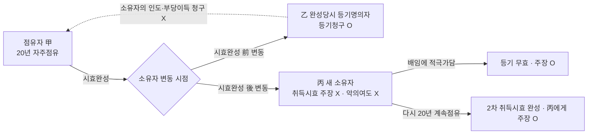
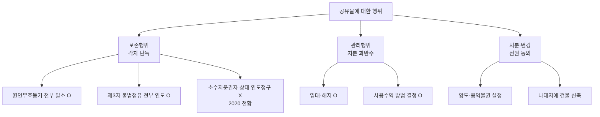
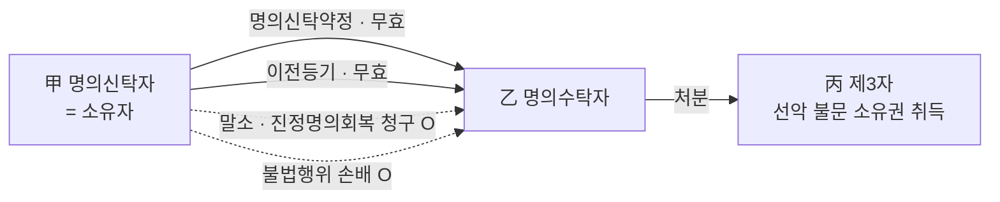
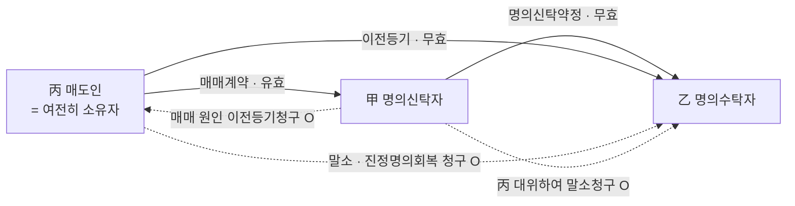
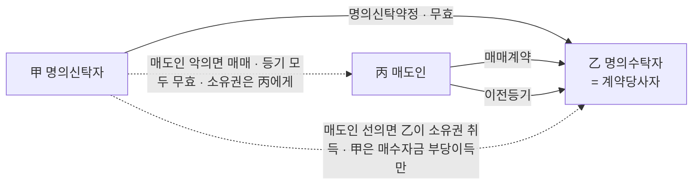
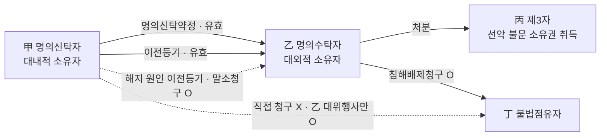

# 단원 B03 — 소유권

> **영역**: 물권법
> **수업 주제**: 소유권·취득시효·공동소유·명의신탁

## 🗺️ 본문 목차

- [📘 위패스 마이 정리 (L1 - 메인 단권화)](#정리)
- [📖 핵심요약서 (L2 - 빠른 복습)](#핵심요약서)
- [📚 기본서 (L3 - 본격 학습)](#기본서)

---

## 📘 위패스 마이 정리 — L1 (메인·단권화)

> 김묘엽 교수 「위패스 마이 민법총칙/물권법」 교재 정리본 (키워드 자동 분류).

### [민법총칙] 제4장 법률관계의 변동

## 제4장 법률관계의 변동

#### I. 의의

법률관계는 존재하지 않았던 것이 처음으로 생겨나기도 하고, 존재하던 법률관계가 다른 것으로 바뀌기도 하고, 존재하는 법률관계가 없어지기도 한다. 이러한 법률관

계의 발생, 변경, 소멸을 통틀어 법률관계의 변동이라고 한다.

#### II. 권리의 발생(취득)

1. 진정원시취득
(진정)원시취득이란 전에 없던 권리를 새롭게 취득하는 것을 말한다. 건물의 신축에

의한 소유권취득, 무주물 선점에 의한 소유권취득 등이 있다.

2. 부진정원시취득
(부진정)원시취득이란 기존의 권리를 없애고 새롭게 권리를 발생시키는 것을 말한다.

취득시효에 의한 소유권취득,

유실물의 습득에 의한 소유권취득,

매장물의 발견에

의한 소유권취득, 환지처분에 의한 소유권취득, 공용징수에 의한 소유권 취득 등이

있다.

#### III. 권리의 변경(승계)

1. 이전적 승계
(가) 의의

이전적 승계란 구 권리자의 권리가 동일성을 유지하면서 신 권리자에게 이전

되는 경우를 말한다. 주체의 변경에서 권리를 취득하는 측의 입장에 대한 표현이다.
(나)

특정승계

승계취득 중 특정승계란 개개의 권리가 각각의 취득원인에 의해 취득되

는 것으로 매매계약에 의한 소유권의 취득, 증여계약에 의한 소유권취득, 저당권양

도계약에 의한 저당권취득, 임대차양도계약에 의한 임차권취득 등이 있다.
(＞=) 포괄승계

승계취득 중 포괄승계란 하나의 취득원인에 의해서 여러 개의 권리가 일

괄해서 취득되는 것으로 상속, 합병 등이 있다.
KE » «

2. 설정적 승계
(가) 의의

설정적 승계란 구 권리자의 권리는 그대로 있으면서 신 권리자가 구 권리자

의 권능 중 제한적인 내용의 권리 일부를 새로이 취득하는 것이다.

승계취득 중 설정적 승계란 소유권을 가지고 있는 자가 타인에게 제한물권을 설정해 주는 것으로 지상권 설정, 지역권 설정, 전세권 설정, 질권 설정, 저당권 설

(나) 유형

정 등이 있다.

#### IV. 권리의 소멸

1. 절대적 소멸
절대적 소멸은 권리 자체가 완전히 사라지는 것을 말한다. 소유권 포기에 의한 소유

권소멸, 소멸시효 완성으로 채권의 소멸, 목적물 멸실에 의한 소유권 소멸, 채무 변 제에 따른 채권의 소멸 등이 있다.

2. 상대적 소멸
상대적 소멸은 권리자체가 완전히 사라지는 것은 아니고 권리가 이전되는 것을 말

한다. 주체의 변경에서 권리를 상실하는 측의 입장에 대한 표현이다.

---

### [물권법] 제12장 소유권 일반

## 제12장 소유권 일반

#### I. 의의

> **제211조(소유권의 내용)** 소유자는 법률의 범위 내에서 그 소유물을 사용, 수익, 처 분할 권리가 있다.

> **제212조(토지소유권의 범위)** 토지의 소유권은 정당한 이익 있는 범위 내에서 토지의 상하에 미친다.

#### II. 사용 • 수익권의 대세적 • 영구적 포기

1. 제3자와의 채권관계에서 소유물에 대한 사용 ■ 수익권의 포기O

2. 소유물에 대한 사용 • 수익권의 행사에 제한O

3. 소유로에 대하사용 • 수익권의 대세적 • 영구적 포기 X

물건에 대한 배타적인 사용• 수익권은 소유권의 핵심적 권능이므로, 소유자가 제3자

와의 채권관계에서 소유물에 대한 사용•수익의 권능을 포기하거나 사용•수익권의 행사에 제한을 설정하는 것을 넘어 이를 대세적, 영구적으로 포기하는 것은 법률에 의하지 않고 새로운 물권을 창설하는 것과 다를 바 없어 허용되지 않는다(대판 2013.0
8.22.

2012다54133).

#### III. 사용•수익권의 포기 1.

토지를 일반 공중을 위한 용도로 제공한 소유자
1. 제3자와의 채권관계에서 소유물에 대한 사용 - 수익권의 포기 = 독점적 • 배타적 사

용 - 수익궈의 포기

토지 소유자 스스로 그 소유의 토지를 일반 공중을 위한 용도로 제공한 경우에 그 토 지에 대한 소유자의 독점적이고 배타적인 사용•수익권의 행사가 제한되는 법리가 확

립되 었다(대판 2019 01 24

2016다264556

전합).

2. 독점적 - 배타적 사용 - 수익권을 포기한 소유자 - 점유 • 사용하는 자를 상대로 부당

이득반환청구〉〈, 토지인도 청구X
소유자가 그 토지에 대한 독점적 • 배타적인 사용•수익권을 포기한 것으로 볼 수 있다
면, 타인이 그 토지를 점유 • 사용하고 있다 하더라도 특별한 사정 이 없는 한 그로 인 해 토지 소유자에게 어떤 손해가 생긴다고 볼 수 없으므로, 토지 소유자는 그 타인을 상대로 부당이득반환을 청구할 수 없고, 토지의 인도 등을 구할 수도 없다(대판 2019.
01 24.

2016다264556

전합).

3. 독점적 • 배타적 사용 - 수익권을 포기한 소유자 - 토지를 처분하거나 사용 - 수익할

권능 상실X
토지 소유자의 독점적 • 배타적인 사용• 수익권의 행사가 제한되는 것으로 보는 경우

에도, 토지 소유자는 일반 공중의 통행 등 이용을 방해하지 않는 범위 내에서는 그 토지를 처분하거나 사용 • 수익할 권능을 상실하지 않는다(대판 2019.1.24. 2016다2645

2.

전합).

토지를 일반 공중을 위한 용도로 제공한 소유자의 승계인 |i. 포괄승계인도 독점적三배타적 사용 • 수익권 제한o

____

피상속인이 사망 전에 그 소유 토지를 일반 공중의 이용에 제공하여 독점적 • 배타적 인 사용•수익권을 포기한 것으로 볼 수 있고 그 토지가 상속재산에 해당하는 경우에 는, 피상속인의 사망 후 그 토지에 대한 상속인의 독점적 •배타적인 사용•수익권의

행사 역시 제한된다(대판 2019.1.24. 2016다264556 전합).

제12장 법률규정상의 소유권 제한 .113

12. 특정승계인도 독점적 - 배타적 사용 - 수익권 제한O

三
*三丁 ‘ ;:

원소유자의 독점적 • 배타적인 사용•수익권의 행사가 제한되는 토지의 소유권을 경

매, 매매, 대물변제 등에 의하여 특정승계한 자는, 특별한 사정이 없는 한 그와 같은

사용•수익의 제한이라는 부담이 있다는 사정을 용인하거나 적어도 그러한 사정이 있 음을 알고서 그 토지의 소유권을 취득하였다고 봄이 타당하므로, 토지 부분에 대하여

독점적이고 배타적인 사용• 수익권을 행사할 수 없다(대판 2019.1.24. 2016다264556

전합).

3. 토지를 국한된 자들만을 위한 용도로 제공한 소유자의 승계인

|i. 특정승계인부터는 독점적 ■ 배타적 사용 • 수익권 제한x

三'' 유 추

토지소유자의 독점적 •배타적 사용•수익권 행사 제한의 법리는 토지가 도로, 수도시

설의 매설 부지 등 일반 공중을 위한 용도로 제공된 경우에 적용되는 것이어서, 토지 가 건물의 부지 등 지상 건물의 소유자들만을 위한 용도로 제공된 경우에는 적용되지

않는다. 따라서 토지소유자가 그 소유 토지를 건물의 부지로 제공하여 지상 건물소유 자들이 이를 무상으로 사용하도록 허락하였다고 하더라도, 그러한 채권적 법률관계를 승계하였다는 등의 특별한 사정이 없는 한 특정승계인의 그 토지에 대한 소유권 행사

가 제한된다고 볼 수 없다(대판 2019.11 14

2015다211685).

### 제2절

상린관계

#### I. 서설

1. 의의
상린관계는 서로 인접하거나 이웃하고 있는 부동산소유권을 대상으로 하여 그 상호 간의 이용을 조절하는 내용을 규정하고 있다.

2. 사회적 작용
토지 소유자끼리는 정당한 범위 내에서 토지를 배타적으로 지배관리할 수 있으므로

이웃하는 토지의 소유자와 자신의 권리가 충돌할 수밖에 없다. 그리하여 소유권을 축소하거나 확장하는 방법으로 이웃 토지 상호간의 이용을 간접적으로 한계 지을 필요가 있다.

3. 적용범위
지상권자간 또는 지상권자와 인지소유자간에 상린관계의 법리가 준용된다(제290조,
216조 내지

제244조).

제

상린관계의 법리는 전세권자간 또는 전세권자와 인지소유자 및

지상권자간에 상린관계의 법리가 준용된다(제319조,

제216조 내지 제244조).

통설은 임차

권에도 상린관계의 법리가 유추적용 된다고 본다.

11. 불법점유자 - 상린관계 적용X

&泳

토지의 불법점유자는 토지소유권의 상린관계로서 위요지 통행권의 주장을 할 수 없 다(대판 1976.10.29. 76다1694).

#### II. 인지사용청구권

> **제216조 (인지사용청구권)** ① 토지소유자는 경계나 그 근방에서 담 또는 건물을 축조 하거나 수선하기 위하여 필요한 범위내에서 이웃 토지의 사용을 청구할 수 있다.
그러나 이웃 사람의 승낙이 없으면 그 주거에 들어가지 못한다.
② 전항의 경우에 이웃 사람이 손해를 받은 때에는 보상을 청구할 수 있다.

#### III. 생활방해의 금지

> **제217조 (매연 등에 의한 인지에 대한 방해금지)** ① 토지소유자는 매연, 열기체, 액

체, 음향, 진동 기타 이에 유사한 것으로 이웃 토지의 사용을 방해하거나 이웃 거주

자의 생활에 고통을 주지 아니하도록 적당한 조처를 할 의무가 있다.

② 이웃 거주자는 전항의 사태가 이웃 토지의 통상의 용도에 적당한 것인 때에는 이 를 인용할 의무가 있다.

#### IV. 수도 등의 시설권

> **제218조 (수도 등 시설권)** ① 토지소유자는 타인의 토지를 통과하지 아니하면 필요한 수도, 소수관, 까스관, 전선 등을 시설할 수 없거나 과다한 비용을 요하는 경우에

는 타인의 토지를 통과하여 이를 시설할 수 있다. 그러나 이로 인한 손해가 가장 적 은 장소와 방법을 선택하여 이를 시설할 것이며 타 토지의 소유자의 요청에 의하여

손해를 보상하여야 한다.
② 전항에 의한 시설을 한 후 사정의 변경이 있는 때에는 타토지의 소유자는 그 시 설의 변경을 청구할 수 있다. 시설변경의 비용은 토지소유자가 부담한다.

#### V. 주위토지통행권 및 무상주위토지통행권 1.

주위토지통행권

> **제219조 (주위토지통행권)** ① 어느 토지와 공로사이에 그 토지의 용도에 필요한 통로 가 없는 경우에 그 토지소유자는 주위의 토지를 통행 또는 통로로 하지 아니하면 공 로에 출입할 수 없거나 과다한 비용을 요하는 때에는 그 주위의 토지를 통행할 수

있고 필요한 경우에는 통로를 개설할 수 있다. 그러나 이로 인한 손해가 가장 적은 장소와 방법을 선택하여야 한다.
② 전항의 통행권자는 통행지소유자의 손해를 보상하여야 한다.

가. 인정사유
1.

주위의 토지를 통행 또는 통로로 하지 않으면 공로에 출입할 수 없는 경우 • 과다한 비용을 요하는 경우 - 주위토지통행권O
어느 토지와 공로사이에 그 토지의 용도에 필요한 통로가 없는 경우에 그 토지소유자 는 주위의 토지를 통행 또는 통로로 하지 아니하면 공로에 출입할 수 없거나 과다한

비용을 요하는 때에는 그 주위의 토지를 통행할 수 있다(제219조 제1항).
| 2. 기존의 통로가 통로로서의 충분한 기능을 하지 못하는 경우 - 주위토지통행권Q

이미 기존의 통로가 있더라도 그것이 당해 토지의 이용에 부적합하여 실제로 통로로 서의 충분한 기능을 하지 못하고 있는 경우에는 주위토지통행권이 인정된다(대판 200
3.08.19.

2002다53469).

| 3. 기존의 통로를 사용하는 것보다 더 편리한 경우三 주위토지통행권X

이미 그 소유 토지의 용도에 필요한 통로가 있는 경우에는 그 통로를 사용하는 것보 다 더 편리하다는 이유만으로 주위토지통행권을 인정할 수는 없다(대판 1995.6.13. 95

다1088).
|4. 토지소유자가 통로를 막는 건물을 축조한 경우 - 주위토지통행권X

토지소유자 자신이 그 토지와 공로사이의 통로를 막는 건물을 축조한 경우에는 타인

소유의 주위토지를 통행할 권리가 생긴다고 할 수 없다(대판 1972.01.31. 기다2113).
|5. 토지의 불법점유자 - 주위토지통행권X

토지의 불법점유자는 그 주위의 통지를 통행할 수 없다(대판 1976.10. 29.
|e. 토지사용권이 없는 명의신탁자 - 주위토지통행권x

才三 ‘；：

76다1694).

스가

주위 토지통행권은 토지사용권을 가진 자에게 인정되는 권리이므로 명의 신탁자에게는 주위토지통행권이 인정되지 아니한다(대판 2008.5.8. 2007다22767).

나. 소멸사유
1.

나중에 공로가 개설되어 주위토지통행권을 인정할 필요가 없어진 경우 - 주위토지 통행권은 소멸 일단 주위토지통행권이 발생하였다고 하더라도 나중에 그 토지에 접하는 공로가 개

설됨으로써 주위토지통행권을 인정할 필요성이 없어진 때에는 그 통행권은 소멸한다

(대판 1998.3.10. 97다47118).

제12장 법률규정상의 소유권 제한 .117

2. 법정요건 충족하면 주위토지통행권 성립, 법정요건 소멸하면 주위토지통행권 소멸
3. 사정변경으로 공로에 접하게 되거나 주위토지를 취득하여 필요성이 없어진 경우 -

주우!토지통행권유소멸

주위토지통행권은 법정의 요건을 충족하면 당연히 성립하고 요건이 없어지게 되면

당연히 소멸한다. 따라서 포위된 토지가 사정변경에 의하여 공로에 접하게 되거나 포 위된 토지의 소유자가 주위의 토지를 취득함으로써 주위토지통행권을 인정할 필요성

이 없어지게 된 경우에는 통행권은 소멸한다(대판 2014.12.24. 2013다11669).

|4. 통행지 사용에 대한 보상이 없는 경우 - 주위토지통행권은 소멸X

원칙적으로 통행지소유자의 손해를 보상하여야 하지만 보상을 하지 않은 경우에도

통행권 자체가 소멸하는 것은 아니다. 채무불이행책임만 발생한다.

다. 통행권의 범위

(1) 통행권
［丄장차의 이g상황까지 마리 대비하여 통행권으I 범위 정하지 않트다.

주위토지통행권은 현재의 토지의 용법에 따른 이용의 범위에서 인정되는 것이지 더 나아가 장차의 이용상황까지 미리 대비하여 통행권의 범위를 정할 것은 아니다(대판 1996.11.29. 96다33433).

| 2. 건축법에 규정된 도로의 폭을 확보하여 제공해야 하는 것 아니다.

주건축법에 건축물의 대지가 접하여야 할 도로의 폭 등에 관한 제한규정이 있다고 하 더라도, 이는 건물 신축이나 증 • 개축허가에 있어 그와 같은 범위의 도로가 필요하다
는 행정법규에 지나지 아니하므로, 매도인이 건축법에 규정된 폭의 도로를 확보하여

매수인에게 무상으로 제공할 의무나 필요성이 있는 것은 아니다(대판 2003.3.11. 200
2 다35928).

(3丄자동차 등이 통과할 수 있는 통로개설 허용된다.

주위토지통행권은 토지의 이용방법에 따라서는 자동차 등이 통과할 수 있는 통로의

개설도 허용된다(대판 2006.6.2. 2005다70144).

(4三통행권자가 배타적으로 주유시 통행지소유자는 인도를 청구할 수 있다.

토지소유자는 이를 수인할 의무가 있으나, 이 경우 통행지에 대한 소유자의 점유까지 배제되는 것은 아니므로, 통행권자가 통행지를 통행함에 그치지 아니하고 이를 배타

적으로 점유하고 있다면, 통행지 소유자는 통행권자에 대하여 그 인도를 청구할 수 있다(대판 1993.8.24. 93다25479).

15. 통행에 방해가 되는 축조물은 철거되어야 한다.
주위토지통행권의 본래적 기능발휘를 위하여는 그 통행에 방해가 되는 담장과 같은

축조물도 위 통행권의 행사에 의하여 철거되어야 하는 것이고, 그 담장이 비록 당초 에는 적법하게 설치되었던 것이라 하더라도 그 철거의 의무에는 영향이 없다(대판 199
0.11 13.

90다5238,

90다카27761).

| 6. 통행 시기나 횟수, 통행방법 등을 제한하여 인정할 수도 있다.
주위토지통행권이 인정된다고 하더라도 통로를 상시적으로 개방하여 제한 없이 이용 할 수 있도록 하거나 피통행지 소유자의 관리권이 배제되어야만 하는 것은 아니므로,

토지의 용도에 적합한 범위에서 통행 시기나 횟수, 통행방법 등을 제한하여 인정할 수도 있다(대판 2017 01.12.

2016다39422).

(2) 통로개설

주위토지통행권자가 민법 제219조 제1항 본문에 따라 통로를 개설하는 경우 통행지 소유자는 원칙적으로 통행권자의 통행을 수인할 소극적 의무를 부담할 뿐 통로개설

등 적극적인 작위의무를 부담하는 것은 아니다(대판 2006.10.26. 2005다30993).

(3) 침해의 최소화
1. 주위토지통행권 통행로가 특정한 장소로 고정 x

- 주위토지소유자가 토지의 사용방 법을 바꾸었다면 보다 손해가 적은 장소로 옮겨서 통행하여야 한다.

주위토지통행권은 통행을 위한 지역권과는 달리 그 통행로가 항상 특정한 장소로 고

정되어 있는 것은 아니고, 주위토지소유자가 그 용법에 따라 기존 통행로로 이용되던

토지의 사용방법을 바꾸었을 때에는 대지 소유자는 그 주위토지소유자를 위하여 보 다 손해가 적은 다른 장소로 옮겨 통행할 수밖에 없는 경우도 있다(대판 2009.6.11. 2008다75300).

2. 주위토지의 현황이나 구체적 이용상황에 변동시 기존판결과 다른 곳을 통행로로 삼

더라도 기판력에 저촉되지 않는다"

주위토지의 현황이나 구체적 이용상황에 변동이 생긴 경우 기존의 확정판결이나 화해

조서 등이 인정한 통행장소와 다른 곳을 통행로로 삼아 주위토지통행권의 확인이나

통행방해의 배제 • 예방 또는 통행금지 등을 소로써 구하더라도 그 청구가 위 확정판결 이나 화해조서 등의 기판력에 저촉된다고 볼 수 없다(대판 2004.5.13. 2004다10268).

제12장 법률규정상의 소유권 제한 .119

(4) 손해보상

|l. 통행지소유자의 손해를 보상 - 주위토지통행권자O
주위토지통행권자는 원칙적으로 통행지소유자의 손해를 보상하여야 한다(제219조).

|z 통행지소유자의 손해를 보상 - 통행권자의 허락을 얻어 사실상 통행하고 있는 자X
민법 제219조는 어느 토지와 공로 사이에 그 토지의 용도에 필요한 통로가 없는 경

우에 그 토지소유자에게 그 주위의 토지통행권을 인정하면서 그 통행권자로 하여금 통행지 소유자의 손해를 보상하도록 규정하고 있는 것이므로 통행권자의 허락을 얻 어 사실상 통행하고 있는 자에게는 그 손해의 보상을 청구할 수 없다(대판 1991 09.10.
91다19623).

3. 통행지소유자의 손해를 보상 - 현실적 이용상태에 따른 임료O, 도로로 평가한 임

료X
주위토지통행권자가 통행지 소유자에게 보상해야 할 손해액은 주위토지통행권이 인

정되는 당시의 현실적 이용 상태에 따른 통행지의 임료 상당액을 기준으로 할뿐, 단

지 주위토지통행권이 인정되어 통행하고 있다는 사정만으로 통행지를 ‘도로’로 평가

하여 산정한 임료 상당액이 통행지 소유자의 손해액이 된다고 볼 수 없다(대판 2014.1
2.24

2013다11669).

2. 무상주위토지통행권

> **제220조 (분할, 일부양도와 주위통행권)** ① 분할로 인하여 공로에 통하지 못하는 토지

가 있는 때에는 그 토지소유자는 공로에 출입하기 위하여 다른 분할자의 토지를 통

행할 수 있다. 이 경우에는 보상의 의무가 없다.

② 무상주위통행권은 토지소유자가 그 토지의 일부를 양도한 경우에 준용한다.

1. 분할자 또는 일부 양도인 소유의 토지 - 무상주위통행권O

2. 다른 사람 소유의 토지 - 무상주위통행권X

동일인 소유의 토지의 일부가 양도되어 공로에 통하지 못하는 토지가 생긴 경우에 포 위된 토지를 위한 주위토지통행권은 일부 양도 전의 양도인 소유의 종전 토지에 대하 여만 생기고 다른 사람 소유의 토지에 대하여는 인정되지 아니한다(대판 2005.3.10. 2004다65589).

| 3. 분할자 또는 일부 양도인 소유의 토지의 당사자의 특정승계인 - 무상주위통행권 X
포위된 토지(피포위지) 또는 피통행지의 특정승계인의 경우에는 주위토지통행권에 관

한 일반원칙으로 돌아가 그 통행권을 따로 정하여야 한다. 이러한 법리는 분할자 또는 일부 양도의 당사자가 무상주위통행권에 기하여 이미 통로를 개설해 놓은 다음 특정

승계가 이루어진 경우라 하더라도 마찬가지라 할 것이다(대판 2002.5.31. 2002다9202).

|4. 분할자 또는 일부 양도인 소유의 토지의 당사자의 포괄승계인 - 무상주위통행권O
토지를 무상으로 통행할 수 있는 권한이 부여되고 그러한 인용의무를 부담하고 있는 토지를 상속으로 인하여 포괄승계한 자는 그 인용의무를 승계한다(1973. 08.21.

73다4

01).

#### VI. 물에 대한 상린관계 1.

자연유수

> **제221조(자연유수의 승수의무와 권리)** ① 토지소유자는 이웃 토지로부터 자연히 흘 러오는 물을 막지 못한다.
> ② 고지소유자는 이웃 저지에 자연히 흘러 내리는 이웃 저지에서 필요한 물을 자기

의 정당한 사용범위를 넘어서 이를 막지 못한다.

> **제222조(소통공사권)** 흐르는 물이 저지에서 폐색된 때에는 고지 소유자는 자비로 소통에 필요한 공사를 할 수 있다.

> **제224조(관습에 의한 비용부담)** 전2조의 경우에 비용부담에 관한 관습이 있으면 그 관습에 의한다.

2. 인공적 배수
가. 원칙

> **제223조 (저수, 배수, 인수를 위한 공작물에 대한 공사청구권)** 토지소유자가 저수, 배 수 또는 인수하기 위하여 공작물을 설치한 경우에 공작물의 파손 또는 폐색으로 타 인의 토지에 손해를 가하거나 가할 염려가 있는 때에는 타인은 그 공작물의 보수,

폐색의 소통 또는 예방에 필요한 청구를 할 수 있다.
> **제224조 (관습에 의한 비용부담)** 전2조의 경우에 비용부담에 관한 관습이 있으면 그 관습에 의한다.

> **제225조 (처마물에 대한 시설의무)** 토지소유자는 처마물이 이웃에 직접 낙하하지 아 니하도록 적당한 시설을 하여야 한다.

나. 예외

> **제226조(여수소통권)** ① 고지소유자는 침수지를 건조하기 위하여 또는 가용이나 농, 공업용의 여수를 소통하기 위하여 공로, 공류 또는 하수도에 달하기까지 저지 에 물을 통과하게 할 수 있다.

② 전항의 경우에는 저지의 손해가 가장 적은 장소와 방법을 선택하여야 하며 손해 를 보상하여야 한다.

> **제227조 (유수용공작물의 사용권)** ① 토지소유자는 그 소유지의 물을 소통하기 위하 여 이웃 토지소유자의 시설한 공작물을 사용할 수 있다.
> ② 전항의 공작물을 사용하는 자는 그 이익을 받는 비율로 공작물의 설치와 보존의

비용을 분담하여야 한다.
| 亡 비용이 더 든다는 이유로 타인의 시설을 이용할 권리는 없다.
민법 제227조는 타인의 토지를 통하지 않으면 물을 소통할 수 없는 합리적 사정이 있어야만 인정되는 것이다. 인접한 타인의 토지를 통과하지 않고도 물을 소통할 수

있는 경우에는 스스로 그와 같은 시설을 하는 것이 타인의 토지 등을 이용하는 것보 다 비용이 더 든다는 등의 사정이 있다는 이유만으로 이웃 토지 소유자에게 그가 설 치 •보유한 시설의 공동사용을 수인하라고 요구할 수 있는 권리는 인정될 수 없다(대

판 2012.12 27

2010다103086).

3. 여수급여청구권

> **제228조 (여수급여청구권)** 토지소유자는 과다한 비용이나 노력을 요하지 아니하고는 가용이나 토지이용에 필요한 물을 얻기 곤란한 때에는 이웃 토지소유자에게 보상하 고 여수의 급여를 청구할 수 있다.

4. 유수의 이용권
가. 수류지의 소유권이 사인에게 속하고 유수(流水)를 흐르는 채로 사용하는 경우

> **제229조 (수류의 변경)** ① 구거 기타 수류지의 소유자는 대안의 토지가 타인의 소유 인 때에는 그 수로나 수류의 폭을 변경하지 못한다.
> ② 양안의 토지가 수류지소유자의 소유인 때에는 소유자는 수로와 수류의 폭을 변 경할 수 있다. 그러나 하류는 자연의 수로와 일치하도록 하여야 한다.

|

③ 전2항의 규정은 다른 관습이 있으면 그 관습에 의한다.

|l. 수류의 폭을 변경함으로 생긴 손해에 대해서는 배상책임이 있다.
수류지 소유자는 수로와 수류의 폭을 변경하여 물을 가용 또는 농 • 공업용 등에 이용 할 권리가 있다는 것을 의미함에 그치고, 더 나아가 수로와 수류의 폭을 임의로 변경

하여 범람을 일으킴으로써 인지 소유자에게 손해를 발생시킨 경우에도 면책된다는 취지를 규정한 것이라고 볼 수는 없다(대판 2012.4.13. 2010다9320)._______________________

> **제230조 (언의 설치, 이용권)** ① 수류지의 소유자가 언을 설치할 필요가 있는 때에는 |

그 언을 대안에 접촉하게 할 수 있다. 그러나 이로 인한 손해를 보상하여야 한다.
② 대안의 소유자는 수류지의 일부가 자기소유인 때에는 그 언을 사용할 수 있다.

그러나 그 이익을 받는 비율로 언의 설치, 보존의 비용을 분담하여야 한다.

나. 공유하천의 물을 수류지 외의 토지로 끌어다 사용하는 경우

> **제231조(공유하천용수권)** ① 공유하천의 연안에서 농, 공업을 경영하는 자는 이에 이용하기 위하여 타인의 용수를 방해하지 아니하는 범위내에서 필요한 인수를 할 수 있다.
② 전항의 인수를 하기 위하여 필요한 공작물을 설치할 수 있다.

> **제232조 (하류 연안의 용수권보호)** 전조의 인수나 공작물로 인하여 하류연안의 용수권 을 방해하는 때에는 그 용수권자는 방해의 제거 및 손해의 배상을 청구할 수 있다.

> **제233조(용수권의 승계)** 농, 공업의 경영에 이용하는 수로 기타 공작물의 소유자나 몽리자의 특별승계인은 그 용수에 관한 전소유자나 몽리자의 권리의무를 승계한다.

> **제234조 (용수권에 관한 다른 관습)** 전3조의 규정은 다른 관습이 있으면 그 관습에 | 의한다.

5.

지하수용수권

> **제235조 (공용수의 용수권)** 상린자는 그 공용에 속하는 원천이나 수도를 각 수요의 정도에 응하여 타인의 용수를 방해하지 아니하는 범위 내에서 각각 용수할 권리가 있다.

> **제236조 (용수장해의 공사와 손해배상, 원상회복)** ① 필요한 용도나 수익이 있는 원천 이나 수도가 타인의 건축 기타 공사로 인하여 단수, 감수 기타 용도에 장해가 생긴

때에는 용수권자는 손해배상을 청구할 수 있다.
② 전항의 공사로 인하여 음료수 기타 생활상 필요한 용수에 장해가 있을 때에는 원

상회복을 청구할 수 있다.

#### VII. 경계에 대한 상린관계 1.

경계표

> **제237조 (경계표, 담의 설치권)** ① 인접하여 토지를 소유한 자는 공동비용으로 통상 의 경계표나 담을 설치할 수 있다.
> ② 경계표나 담의 설치 비용은 쌍방이 절반하여 부담한다.
> ③ 다른 관습이 있으면 그 관습에 의한다.

> **제238조(담의 특수시설권)** 인지소유자는 자기의 비용으로 담의 재료를 통상보다 양 호한 것으로 할 수 있으며 그 높이를 통상보다 높게 할 수 있고 또는 방화벽 기타

특수시설을 할 수 있다.

> **제239조 (경계표 등의 공유추정)** 경계에 설치된 경계표, 담, 구거 등은 상린자의 공 유로 추정한다. 그러나 경계표, 담, 구거 등이 상린자일방의 단독비용으로 설치되 었거나 담이 건물의 일부인 경우에는 그러하지 아니하다.

2.

측량비용

> **제237조 (경계표)** ② 측량비용은 토지의 면적에 비례하여 부담한다.
> ③ 다른 관습이 있으면 그 관습에 의한다.

3.

가지 - 뿌리의 제거

> **제240조 (수지, 목근의 제거권)** ① 인접지의 수목가지가 경계를 넘은 때에는 그 소유 자에 대하여 가지의 제거를 청구할 수 있다.
> ② 전항의 청구에 응하지 아니한 때에는 청구자가 그 가지를 제거할 수 있다.
> ③ 인접지의 수목뿌리가 경계를 넘은 때에는 임의로 제거할 수 있다.

#### VIII. 공작물설치에 관한 상린관계

1. 토지의 심굴금지

> **제241조(토지의 심굴금지)** 토지소유자는 인접지의 지반이 붕괴할 정도로 자기의 토 지를 심굴하지 못한다. 그러나 충분한 방어공사를 한 때에는 그러하지 아니하다.

2. 건축을 건조하면서 경계로부터 일정한 거리를 두어야 할 의무

> **제242조 (경계선부근의 건축)** ① 건물을 축조함에는 특별한 관습이 없으면 경계로부 터 반미터 이상의 거리를 두어야 한다.
> ② 인접지소유자는 전항의 규정에 위반한 자에 대하여 건물의 변경이나 철거를 청

구할 수 있다. 그러나 건축에 착수한 후 1년을 경과하거나 건물이 완성된 후에는 손해배상만을 청구할 수 있다.

|l. 경계선의 거리제한 규정 - 임의규정_____________________________________________
본조의 규정은 서로 인접하여 있는 소유자의 합의에 의하여 법정거리를 두지 않게 하 는 것을 금지한다고는 해석할 수 없고, 당사자간의 합의가 있었다면 그것이 명시 또

는 묵시라 하더라도 인접지에 건물을 축조하는 자에 대하여 법정거리를 두지 않았다
고 하여 그 건축을 폐지시키거나 변경시킬 수 없다고 할 것이다(대판 1962.11.1. 62다5
67).

3. 차면시설의무

> **제243조 (차면시설의무)** 경계로부터 2미터 이내의 거리에서 이웃 주택의 내부를 관 망할 수 있는 창이나 마루를 설치하는 경우에는 적당한 차면시설을 하여야 한다.
4. 지하시설 등에 대한 제한

> **제244조 (지하시설 등에 대한 제한)** ① 우물을 파거나 용수, 하수 또는 오물 등을 저 치할 지하시설을 하는 때에는 경계로부터 2미터 이상의 거리를 두어야 하며 저수지,
구거 또는 지하실공사에는 경계로부터 그 깊이의 반 이상의 거리를 두어야 한다.
② 전항의 공사를 함에는 토사가 붕괴하거나 하수 또는 오액이 이웃에 흐르지 아니

하도록 적당한 조처를 하여야 한다.

Ll지하시설에 관련된 거리제한 규정 - 임의규츠

________________
지하시설을 하는 경우에 있어서 경계로부터 두어야 할 거리에 관한 사항 등을 규정한

민법 제244조는 강행규정이라고는 볼 수 없으므로 이와 다른 내용의 당사자간의 특 약을 무효라고 할 수 없다(대판 1982 10.26.

80다1634).

---

### [물권법] 제13장 법률규정상의 건불의 구분소유

## 제13장 법률규정상의 건불의 구분소유

### 제1절

구분건물

#### I. 구분소유

1. 서설
가. 의의
구분소유란 1동의 건물을 구분하여 그 부분을 각각 별개로 소유하는 것을 말한다.
구분소유가 성립하기 위해서는 건물이 구분건물이어야 한다.

나. 사회적 작용

(1) 민법

> **제215조 (건물의 구분소유)** ① 수인이 한 채의 건물을 구분하여 각각 그 일부분을 소 유한 때에는 건물과 그 부속물 중 공용하는 부분은 그의 공유로 추정한다.

② 공용부분의 보존에 관한 비용 기타의 부담은 각자의 소유부분의 가액에 비례하

| 여 분담한다.

(2) 특별법
집합건물법 제1조 (건물의 구분소유) 1동의 건물 중 구조상 구분된 여러 개의 부분이

독립한 건물로서 사용될 수 있을 때에는 그 각 부분은 이 법에서 정하는 바에 따라

각각 소유권의 목적으로 할 수 있다.

민법 제215조만으로는 공동주거에 따른 복잡한 법률관계를 합리적으로 규율할 수

없게 되자 1984년"집합건물의 소유 및 관리에 관한 법률"(이하 ‘집합건물법’이라 한 다)이 제정되었다.

2. 요건
가. 의의
1동의

건물에 대하여 구분소유가 성립하기 위해서는 객관적 •물리적인 측면에서

1동

의 건물이 존재하고 구분된 건물부분이 구조상• 이용상 독립성을 갖추어야 할 뿐 아

니라 1동의 건물 중 물리적으로 구획된 건물부분을 각각 구분소유권의 객체로 하려

는 구분행위가 있어야 한다(대판 2019.11.15. 2019두46763).

나. 구조상과 이용상의 독립성 구분건물이 되기 위해서는 그 부분이 구조상으로나 이용상으로 다른 부분과 구분되 는 독립성이 있어야 한다(대판 1995.6.9. 94다40239).

1. 구분소유권의 객체로서 적합한 물리적 요건을 갖추지 못한 건물의 일부 - 구분소유

권 인정X
구분소유권의 객체로서 적합한 물리적 요건을 갖추지 못한 건물의 일부는 그에 관한

구분소유권이 성립될 수 없는 것이어서, 건축물관리대장상 독립한 별개의 구분건물로 등재되고 등기부상에도 구분소유권의 목적으로 등기되어 있어 이러한 등기에 기초하

여 경매절차가 진행되어 이를 낙찰받았다고 하더라도, 그 등기는 그 자체로 무효이므 로 낙찰자는 그 소유권을 취득할 수 없다(대판 2008.9.11. 2008마696).

2. 구분건물 중에서 일부가 구조상의 구분이 소멸 + 나머지 구분소유권은 그대로 유지

- 집합건물법 적용o
구분건물로 등기된 1동의 건물 중의 일부에 해당하는 구분건물들 사이에서 구조상의 구분이 소멸되는 경우에 그 구분건물에 해당하는 일부 건물 부분은 종전 구분건물 등

기명의자의 공유로 된다 할 것이지만, 한편 구조상의 독립성이 상실되지 아니한 나머 지 구분건물들의 구분소유권은 그대로 유지됨에 따라 1동의 건물 전체는 집합건물법

의 적용대상이 될 수 있다(대판 2013.3.28. 2012다4985).

다. 소유자의 구분행위 1.

구분행위의 존재 - 구분의사가 객관적으로 표시O, 집합건축물 대장에 등록, 등기

부에 등기X
_
구분건물이 물리적으로 완성되기 전에도 건축허가신청이나 분양계약 등을 통하여 장 래 신축되는 건물을 구분건물로 하겠다는 구분의사가 객관적으로 표시되면 구분행위 의 존재를 인정할 수 있고, 건물이 집합건축물대장에 등록되거나 구분건물로서 등기 부에 등기되지 않았더라도 그 시점에서 구분소유가 성립한다(대판 2013.1.17. 2010다7
전합).______________________________________________________________________

|z 일반건물을 구분건물로 변경등기 - 전환등록시점에 구분행위 인정O
일반건물로 등기되었던 기존의 건물에 관하여 실제로 건축물대장의 전환등록절차를

거쳐 구분건물로 변경등기까지 마쳐진 경우라면 전환등록 시점에는 구분행위가 있었 던 것으로 볼 수 있다(대판 2016.6.28. 2016다1854).

#### II. 전유부분과 공용부분

1. 전유부분
(가) 의의

전유부분이란 구조상 및 이용상의 독립성을 갖춘 구분소유권의 목적인 건물

부분을 말한다(집합건물법

제2조 제3호).

이러한 전유부분은 집합건물법이 정하는 바에

따라 각각 소유권의 목적으로 할 수 있다(집합건물법 제1조).

(나) 물권의 득실변경시 등기 필요

전유부분은 구분소유자의 배타적 지배의

대상으로

일반 소유권과 다르지 않다. 따라서 물권의 득실변경시 등기가 필요하다.

2. 공용부분
가. 서설
(가) 의의

공용부분이란 다수의 구분소유자가 공동으로 이용하는 부분으로, 전유부분 외

의 건물부분, 전유부분에 속하지 아니하는 건물의 부속물 및 규약으로써 공용부분으 로 된 부속의 건물을 말한다.

(*-) 유형

공용부분이란 성질 및 구조상 당연히 공용부분으로 되는 것과 규약에 의하여

공용부분으로 되는 것의 2가지로 나뉜다.
) 물권의 득실변경시 등기 불필요 공용부분에 관한 물권의 득실변경은 등기가 필요

하지 아니하다(집합건물법 제13조 제3항).
나. 구조상의 공용부분

(1) 의의

여러 개의 전유부분으로 통하는 복도, 계단, 그 밖에 구조상 구분소유자 전원 또는

일부의 공용에 제공되는 건물부분은 구분소유권의 목적으로 할 수 없다(집합건물법 제3조 제1항).

|l. 아파트 지하실 - 공용부분

너昌昌서JJJj

아파트의 지하실 부분이 구조상으로나 이용상으로 다른 지하실 부분과 구분되는 독 립성을 가지고 있지 아니하여 그 지상 공동주택의 구분소유자 전원의 공용에 제공되 는 공용 부분에 불과하다(대판 1998.2.10. 97다41202).

2.

객관적인 용도가 공용부분인 건물부분을 임의로 개조, 전유부분으로 등록 - 전유부 부X, 공용부분 O
구분건물에 관하여 구분소유가 성립될 당시 객관적인 용도가 공용부분인 건물부분을 나중에 임의로 개조하는 등으로 이용 상황을 변경하거나 집합건축물 대장에 전유부

분으로 등록하고 소유권보존등기를 하였더라도 그로써 공용부분이 전유부분이 되어

구분소유자의 전속적인 소유권의 객체가 되지는 않는다(대판 2016.5.27. 2015다77212).

(2) 전부 - 일부에 대한 공용부분 1) 구분 기준

건물의 어느 부분이 구분소유자의 전원 또는 일부의 공용에 제공되는지의 여부는

소유자들 간에 특단의 합의가 없는 한 그 건물의 구조에 따른 객관적인 용도에 의 하여 결정되어야 할 것이다(대판 1995.2.28. 94다9269).

2) 전부에 대한 공용부분

공용부분은 구분소유자 전원의 공유에 속한다(집합건물법 제10조 제1항 본문).

3) 일부에 대한 공용부분

일부 구분소유자만의 공용에 제공되는 것이 명백한 공용부분(이하 ‘일부공용부분’이라

한다)은 그들 구분소유자의 공유에 속한다(집합건물법 제10조 제1항 단서).

다. 규약상의 공용부분 노인회관 등과 같이 구분건물로 규정된 건물부분과 부속의 건물은 규약으로써 공용

부분을 정할 수 있다(집합건물법 제3조 제2항).

라. 관리행위
(가 공용부분의 보존행위

공용부분의 관리에 관한 사항 중 보존행위는 각 공유자가 할

수 있다(집합건물법 제16조 제1항 단서).
(나) 공용부분의 관리사항 결정

공용부분의 관리에 관한 사항은 공용부분의 변경에 관

한 사항(제15조 제1항)과 권리변동 있는 공용부분의 변경(제15조 제1항)을 제외하고는 통 상의 집회결의로써 결정한다(집합건물법 제16조 제1항 본문).

마. 사용권
집합건물법 제11조 (공유자의 사용권) 각 공유자는 공용부분을 그 용도에 따라 사용할

수 있다.

집합건물법 제5조 (구분소유자의 권리 - 의무 등) 구분소유자는 그 전유부분이나 공용 부분을 보존하거나 개량하기 위하여 필요한 범위에서 다른 구분소유자의 전유부분 또는 자기의 공유에 속하지 아니하는 공용부분의 사용을 청구할 수 있다.

이 경우

다른 구분소유자가 손해를 입었을 때에는 보상하여야 한다.

1. 구분소유자 중 일부가 공용부분을 무단점유 - 점유 • 사용함으로써 얻은 이익을 부

당이득 반환의무 O
구분소유자 중 일부가 정당한 권원 없이 집합건물의 복도, 계단 등과 같은 공용부분 을 배타적으로 점유•사용함으로써 이익을 얻고, 그로 인하여 다른 구분소유자들이

해당 공용부분을 사용할 수 없게 되었다면, 다른 구분소유자들의 해당 공용부분에 대 한 사용권이 침해되는 것이다. 이에 공용부분을 무단점유한 구분소유자는 특별한 사

정이 없는 한 해당 공용부분을 점유 • 사용함으로써 얻은 이 익을 부당이득으로 반환할 의무가 있다. 해당 공용부분이 구조상 이를 별개 용도로 사용하거나 다른 목적으로

임대할 수 있는 대상이 아니더라도, 무단점유로 인하여 다른 구분소유자들이 해당 공 용부분을 사용•수익할 권리가 침해되었고 이는 그 자체로 부당이득반환에서 정한 손

해로 볼 수 있다(대판 2020.5.21. 2017다220744

전합).

제13장 법률규정상의 건물의 구분소유 .131

2.

구분소유자 중 일부가 공용부분을 무단점유 - 부당이득반환소송은 1차적 구분소유

자O, 2차적 관리단O
정당한 권원 없는 사람이 집합건물의 공용부분이나 대지를 점유•사용함으로써 이익 을 얻고, 구분소유자들이 해당 부분을 사용할 수 없게 되어 부당이득반환을 구하는

소송은 1차적으로 구분소유자가 각각 또는 전원의 이름으로 할 수 있다. 관리단은 관

리단집회의 결의나 규약에서 정한 바에 따라 집합건물의 공용부분이나 대지를 정당 한 권원 없이 점유하는 사람에 대하여 부당이득의 반환에 관한 소송을 할 수 있다(대판 2022.9.29. 2021다292425).

바. 공용부분 변경
(1) 공용부분의 변경에 관한 사항 (가) 관리단집회 특별결의

공용부분의 변경에 관한 사항은 관리단집회에서 구분소유자

의 3분의 2 이상 및 의결권의 3분의 2 이상의 결의로써 결정한다(집합건물법 제15조

제1항 본문).
(나) 관리단집회 통상결의

공용부분의 변경이 개량을 위한 것으로서 지나치게 많은 비

용이 드는 것이 아닐 경우에는 통상의 집회결의로써 결정할 수 있다(집합건물법 제15조

제1항 단서),

(2) 공용부분을 전유부분으로 변경

공용부분을 전유부분으로 변경하기 위해서는 건물부분의 구조상• 이용상의 독립성이

필요하고(대판 2011 03.24.

2010다95949),

구분소유자들의 집회결의와 그 공용부분의 변

경으로 특별한 영향을 받게 되는 구분소유자의 승낙을 얻어야 한다(대판 2013.12.12. 011다78200,78217).

사. 분할청구금지
공유의 경우에는 공유물분할청구가 가능한 반면에 공용부분은 공유임에도 불구하고

공유물분할청구를 할 수 없다(제268조 제3항).

아. 취득시효
집합건물의 공용부분은 취득시효에 의한 소유권 취득의 대상이 될 수 없다고 봄이

타당하다(대판 2013.12 12

2011다78200.

78217).

자. 공유자의 지분권
(1) 공용부분에 대한 공유자의 지분의 비율

공용부분에 대한 각 공유자의 지분은 그가 가지는 전유부분의 면적 비율에 따른다
(집합건물법 제12조 제1항). 일부공용부분으로서 면적이 있는 것은 그 공용부분을 공용하

는 구분소유자의 전유부분의 면적 비율에 따라 배분하여 그 면적을 각 구분소유자 의 전유부분 면적에 포함한다(집합건물법 제12조 제2항).

(2) 공용부분에 대한 지분의 처분

공용부분에 대한 공유자의 지분은 그가 가지는 전유부분의 처분에 따른다(집합건물법
제13조 제1항).

차. 공용부분의 부담 - 수익 각 공유자는 규약에 달리 정한 바가 없으면 그 지분의 비율에 따라 공용부분의 관

리비용과 그 밖의 의무를 부담하며 공용부분에서 생기는 이익을 취득한다(집합건물법
제17조).

#### III. 대지사용권

1. 서설
가. 의의
(가) 대지

구분건물의 대지란 전유부분이 속하는

1동의

건물이 소재하는 토지 및 규약

에 따른 건물의 대지로 된 토지를 말한다(집합건물법 제2조 5호).
(나)

대지사용권

대지사용권이란 구분소유자가 전유부분을 소유하기 위하여 건물의 대지

에 대하여 갖는 권리를 말한다(집합건물법 제2조 제6호).
1-

전유부분에 대한 이전등기만 있고, 대지지분에 대한 이전등기가 없는 매수인의 지

위에서 가지는 점유 J나용궈 三대지사용권0

전유부분에 대한 소유권이전등기만 경료 받고 대지지분에 대하여는 아직 소유권이전 등기를 경료받지 못한 매수인의 지위에서 가지는 이러한 점유•사용권은 단순한 점유 권과는 차원을 달리하는 본권으로서 구분소유자가 전유부분을 소유하기 위하여 건물

의 대지에 대하여 가지는 권리인 대지사용권에 해당한다고 할 것이다(대판 2000.11.16. 98다45652전합).

나. 적용범위
대지사용권은 기존 전유부분과 일체불가분성을 가지게 되어 토지소유권의 공유지분 인 것이 보통이나 지상권 • 임차권일 수도 있다.
1. 집합건물의 증축으로 새로운 전유부분이 생긴 경우 - 새로운 전유부분을 위한 대지

사1권斗_______________
_________
구분소유권이 이미 성립한 집합건물이 증축되어 새로운 전유부분이 생긴 경우에는,
건축자의 대지소유권은 기존 전유부분을 소유하기 위한 대지사용권으로 이미 성립하

여 기존 전유부분과 일체불가분성을 가지게 되었으므로 규약 또는 공정증서로써 달 리 정하는 등의 특별한 사정이 없는 한 새로운 전유부분을 위한 대지사용권이 될 수

없다(대판 2017.5.31. 2014다236809).

2. 대지 사용권 처분
(가) 전유부분 처분에 따름

구분소유자의 대지사용권은 그가 가지는 전유부분의 처분에

따른다(집합건물법 제20조 제1항).
(니 전유부분과 분리하여 처분

구분소유자는 그가 가지는 전유부분과 분리하여 대지사

용권을 처분할 수 없다 다만, 규약으로써 달리 정한 경우에는 전유부분과 분리하여

대지사용권을 처분할 수 있다(집합건물법 제20조 제2항 단서).

| 丄전유부분에대한 저당권 효력 - 대지사용권까지 미친다.
구분건물의 전유부분에 대한 소유권이전등기만 경료되고 대지지분에 대한 소유권이 전등기가 경료되기 전에 전유부분만에 관하여 설정된 저당권의 효력은, 당연히 종물

내지 종된 권리인 그 대지사용권에까지 미친다(대판 2001.9.4. 20이다22604).

|수전유부분에대학으가압류 효력 - 대지 사용권까지 미친다.
구분건물의 전유부분에 대한 소유권보존등기만 경료되고 대지지분에 대한 등기가 경

료되기 전에 전유부분만에 대해 내려진 가압류결정의 효력은, 대지사용권의 분리처분 이 가능하도록 규약으로 정하였다는 등의 특별한 사정이 없는 한, 종물 내지 종된 권 리인 그 대지권에까지 미친다(대판 2006.10.26. 2006다29020).

3. 대지분할청구 금지

집합건물법 제8조 (대지공유자의 분할청구 금지) 대지 위에 구분소유권의 목적인 건물 이 속하는 1동의 건물이 있을 때에는 그 대지의 공유자는 그 건물의 사용에 필요한 범위 내의 대지에 대하여는 분할을 청구하지 못한다.

### 제2절

관리단과 관리단 집회

. 관리단
1. 당연 설립
건물에 대하여 구분소유 관계가 성립되면 구분소유자 전원을 구성원으로 하여 건물 과 그 대지 및 부속시설의 관리에 관한 사업의 시행을 목적으로 하는 관리단이 설

립된다(집합건물법 제23조 제1항). 관리단은 구분소유관계가 성립하는 건물이 있는 경우,
특별한 조직행위가 없어도 당연히 성립하는 단체이다(대판 2005.11.10. 2003다45496).

2. 관리인
가. 선임 및 해임
구분소유자가 10인 이상일 때에는 관리단을 대표하고 관리단의 사무를 집행할 관리 인을 선임하여야 한다(집합건물법 제24조 제1항)). 관리인은 관리단집회의 결의로 선임되

거나 해임된다. 다만 규약으로 관리위원회의 결의로 선임되거나 해임되도록 정한 경

우에는 그에 따른다(집합건물법 제24조 제3항).

나. 자격 및 임기
관리인은 구분소유자일 필요가 없으며, 그 임기는 2년의 범위에서 규약으로 정한다
(집합건물법 제24조 제2항).

3. 관리위원회
가. 임의적 기관
관리단에는 규약으로 정하는 바에 따라 관리위원회를 둘 수 있다(집합건물법 제26조의3
제1항).

관리위원회의 위원은 구분소유자 중에서 관리단집회의 결의에 의하여 선출한

다. 다만, 규약으로 관리단집회의 결의에 관하여 달리 정한 경우에는 그에 따른다(집 합건물법 제26조의4 제1항).

나. 자격 및 임기
관리인은 규약에 달리 정한 바가 없으면 관리위원회의 위원이 될 수 없다(집합건물법
제26조의4 제2항).

관리위원회 위원의 임기는 2년의 범위에서 규약으로 정한다(집합건물

제13장 법률규정상의 건물의 구분소유 .135
법 제26조의4 제3항).

다. 관리인 감독
관리위원회는 이 법 또는 규약으로 정한 관리인의 사무 집행을 감독한다(집합건물법

제26조의3 저］2항).

#### II. 관리단 집회

1. 의결권
(가) 통상결의

관리단집회의 의사는 이 법 또는 규약에 특별한 규정이 없으면 구분소유

자의 과반수 및 의결권의 과반수로써 의결한다(집합건물법 제38조 제1항).
(나)특별결의

공용부분의

변경에 관한 사항은 관리단집회에서 구분소유자의 3분의 2

이상 및 의결권의 3분의 2 이상의 결의로써 결정한다. 다만 공용부분의 개량을 위 한 것으로서 지나치게 많은 비용이 드는 것이 아닐 경우에는 통상의 집회결의로써

결정한다(집합건물법 제15조 제1항).

2. 공유자 의결권
전유부분을 여럿이 공유하는 경우에는 공유자는 관리단집회에서 의결권을 행사할 1
인을 정한다(집합건물법 제37조 제2항).

3. 특별승계인
규약 및 관리단집회의 결의는 구분소유자의 특별승계인에 대하여도 효력이 있다(집합

건물법 제42조 제1항).
1. 규약으로 체납관리비 채권 전체에 대하여 입주자의 지위를 승계한 자에 대하여도 행

사할 수 있도록 규정 - 전유부분 관리비 승계X, 공용부분 관리비 승계O
아파트의 관리규약이 체납관리비 채권 전체에 대하여 입주자의 지위를 승계한 자에

대하여도 행사할 수 있도록 규정하고 있다면, 위 규약은 공용부분의 관리비에 관한 부분에 한하여 유효하므로, 공용부분의 관리비는 승계되나, 전유부분의 관리비는 승

계되지 않는다(대판 2001.9.20. 20이다8677

전합).

2. 규약으로 체납관리비 채권 전체에 대하여 입주자의 지위를 승계한 자에 대하여도 행

사할 수_있도록 규츠厂 호용부분 관리비 승계0, 공용부분 관리비 연체료 승계X
구분소유자의 특별승계인이 체납된 공용부분의 관리비를 승계한다고 하여, 전구분소

유자가 관리비의 납부를 연체함으로 인하여 이미 발생하게 된 법률효과까지 그대로

승계하는 것은 아니라 할 것이어서, 공용부분의 관리비에 대한 연체료는 특별승계인 에게 승계되는 공용부분의 관리비에 포함되지 않는다(대판 2006.6.29. 2004다3598).

---

### [물권법] 제14장 취득시효에 의한 소유권 취득

## 제14장 취득시효에 의한 소유권 취득

### 제1절

취득시효 총설

#### I. 서설

1. 의의
취득시효란 물건에 대하여 일정기간 점유 또는 준점유하는 자에게 그 물건의 소유

권 또는 다른 재산권을 취득하게 하는 제도를 말한다.

2. 사회적 작용
취득시효는 권리를 가진듯한 사실상태가 일정기간 계속되는 경우에 진정한 권리자들 의 권리를 상실시키고 사실상태 대로 권리관계를 인정함으로써 법질서의 안정을 기 하려는데 있다.

#### II. 유형 종 류

부동산

동산

요 건

점유취득시효

자주•평온•공연의 점유

등기부취득시효

자주•평온•공연•선의•무과실의 점유

일반취득시효

자주•평온•공연의 점유

단기취득시효

자주•평온•공연•선의•무과실의 점유

시효기간
20 년

10 년

10 년
5년

### 제2절

부동산의 취득시효

#### I. 부동산의 점유취득시효

> **제245조 (점유로 인한 부동산소유권의 취득기간)** ① 20년간 소유의 의사로 평온, 공연 하게 부동산을 점유하는 자는 등기함으로써 그 소유권을 취득한다.

1. 부동산
가. 특정된 타인의 부동산 여부
1. 취득시효의 부동산 - 반드시 타인의 소유물〉〈, 반드시 타인이 특정될 필요X

그_수명불상자 소유물 - 시효취득 대상O_________________________________________
시효로 인한 부동산 소유권의 취득은 원시취득으로서 취득시효의 요건을 갖추면 곧 등기청구권을 취득하는 것이고 또 타인의 소유권을 승계취득하는 것이 아니어서 시 효취득의 대상이 반드시 타인의 소유물이어야 하거나 그 타인이 특정되어 있어야만

하는 것은 아니므로 성명불상자의 소유물에 대하여 시효취득을 인정할 수 있다(대판 1992.2.25. 91다9312).

|3. 자기소유의 부동산-시효취득 대상O

시효취득의 목적물은 타인의 부동산임을 요하지 않고 자기 소유의 부동산이라도 시 효취득의 목적물이 될 수 있다고 할 것이고, 취득시효를 규정한 민법 제245조가 ‘타

인의 물건인 점’을 규정에서 빼놓은 것도 같은 취지에서라고 할 것이다(대판 2001.07.1
3.

2001다17572).

4. 자기명의 등기 + 자기소유 부동산의 점유 - 취득시효의 기초가 되는 점유X

5. 소유권의 변동 + 자기소유 부동산의 점유 - 취득시효의 기초가 되는 점유O

부동산에 관하여 적법 • 유효한 등기를 마치고 소유권을 취득한 사람이 자기 소유의 부동산을 점유하는 경우에는 특별한 사정이 없는 한 사실상태를 권리관계로 높여 보

호할 필요가 없어 취득시효의 기초가 되는 점유라고 할 수 없지만 다른 사람 명의로

소유권이전등기가 되는 등으로 소유권의 변동이 있는 때는 취득시효의 요건인 점유

가 개시된다고 볼 수 있다(대판 2016.10.27. 2016다224596).
나. 국유재산
[l 三국유재사중 행정재산-시효취득대상X

국유재산 중 행정재산은 공용폐지가 되지 않는 한 원칙적으로 취득시효의 대상이 되 지 않는다(대판 1994.3.22. 93다56220).

(2三 국유재살 중 일반재산三시효취득대상O

국유재산에 대한 취득시효가 완성되기 위해서는 그 국유재산이 취득시효기간 동안

계속하여 행정재산이 아닌 시효취득의 대상이 될 수 있는 일반재산이어야 한다(대판 2010.11.25. 2010다58957).

다. 토지의 일부
11. 1필의 토지의 일부 + 객관적인 징표가 계속 존재 - 일부에 대한 취득시효 인정O
1필의

토지의 일부부분이 다른 부분과 구분되어 시효취득자의 점유에 속한다는 것을

인식하기에 족한 객관적인 징표가 계속하여 존재하는 경우에는 그 일부부분에 대한 시효취득을 인정할 수 있다(대판 1996.1.26. 95다24654).

라. 공용부분
b 丄집할건물으I 공용부분 三시효취득대상 x _ ___________

_

집합건물의 공용부분 취득시효에 의한 소유권 취득의 대상이 될 수 없다고 봄이 타당 하다(대판 2013.12 12.

2011다78200.

78217).

2. 2이년간 소유의 의사로 평온 - 공연하게 점유

가. 20년간 점유

(1) 점유기간의 분리

> **제199조 (점유의 승계의 주장과 그 효과)** ① 점유자의 승계인은 자기의 점유만을 주장 할 수 있다.

점유의 승계가 있는 경우 전 점유자의 점유가 타주점유라 하여도 점유자의 승계인

이 자기의 점유만을 주장하는 경우에는 현 점유자의 점유는 자주점유로 추정된다(대판 2008.7.10. 2006다82540).

(2) 점유기간의 병합

> **제199조 (점유의 승계의 주장과 그 효과)** ① 점유자의 승계인은 자기의 점유와 전점유 자의 점유를 아울러 주장할 수 있다.

② 전점유자의 점유를 아울러 주장하는 경우에는 그 하자도 계승한다.
전점유자의 점유를 아울러 주장하는 경우에는 그 하자도 계승한다(제199조 제2항). 자

기의 점유와 전점유자의 점유를 아울러 주장하는 경우에 전(前)점유자의 점유가 타 주점유인 경우 전점유자의 하자인 타주점유를 계승하므로 현점유자의 점유는 타주점

유가 된다.

1.

상속으로 점유권 취득-자기 고유의 점유를 시작하지 않는 한 피상속인의 점유를 떠나 자기만의 점유 주장스 _______________________________________

상속에 의하여 점유권을 취득한 경우에는 상속인이 새로운 권원에 의하여 자기 고유 의 점유를 시작하지 않는 한 피상속인의 점유를 떠나 자기만의 점유를 주장할 수 없 다(대판 1997.12.12. 97다40100).

(3) 점유의 계산의 시점

|i. 점유기간 중 소유자의 변동 - 임의의 기산점 선택X
취득시효기간의 계산에 있어 점유기간 중에 당해 부동산의 소유권자의 변동이 있는

경우에는 취득시효를 주장하는 자가 임의로 기산점을 선택하거나 소급하여

20년

이

상 점유한 사실만 내세워 시효완성을 주장할 수 없다(대판 1995.5.23. 94다39987).

|z 전 점유자의 점유를 아울러 주장 - 점유기간 중 임의시점 주장X
점유자가 자기의 전 점유자의 점유를 주장할 때 그 직전 점유자의 점유를 주장하거

나, 그 전 점유자의 것을 아울러 주장하는 것은 그 주장하는 사람의 임의에 속하나,
이 경우에는 그 점유시초를 전 점유자의 점유기간 중의 임의시점을 택하여 주장할 수

없다(대판 1980.3.11. 79다2110).

| 3. 점유기간 중 등기명의인이 동일 三 임의으［기산즉 서택O

_____________

취득시효기간 중 계속해서 등기명의자가 동일한 경우에는 전 점유자가 점유를 개시 한 이후의 임의의 시점을 그 기산점으로 삼을 수 있다(대판 1998.5.12. 97다8496).
4.

소유권의 변동 이후에 취득시효기간이 경과하도록 등기명의인이 동일 - 임의의 기 산점 선택O
소유권에 변동이 있더라도 그 이후 계속해서 취득시효기간이 경과하도록 등기명의자 가 동일하다면 그 소유권 변동 이후 전 점유자의 점유기간과 자신의 점유기간을 통산

하여 20년이 경과한 경우에 있어서도 임의시점을 택하여 주장할 수 있다(대판 1998.0
5.12

97다34037).

(4) 단순사례
A가 악의로 10년, 으가 선의로 6년, C가 선의로 7년을 점유한 경우

분 리

6)C가

자신만의 선의의 점유 7년을 주장할 수 있다.

© C는 B와의

점유를 병합하여 선의의 점유 13년을 주장할 수 있다.

© C는 A^B와의

병 합

G C는

점유를 병합하여 악의의 점유 23년을 주장할 수 있다.

日의 선의의 점유 중

4년만을

병합하여 선의의 점유

11년을

주장할

수는 없다.
© 등기명의자가 동일한 경우 C는 日의 선의의 점유 중 4년만을 병합하여 선

의의 점유 11년을 주장할 수도 있다.

나. 소유의 의사로 평온 • 공연하게 점유
11. 취득시효 완성자가 매수 제의三^주점유O, 타주점유쓰

____________

점유자가 취득시효기간이 경과한 후에 상대방에게 토지의 매수를 제의한 일이 있다
고 하여도 이는 소유권자와의 분쟁을 간편히 해결하기 위하여 매수 제의를 하였다는

사실을 가지고는 위 점유자의 점유를 타주점유라고 볼 수 없다(대판 1997.4.11. 96다5
0520).

| 2. 약의의 무단점유 三타주점유

점유자가 취득시효를 주장하는 경우에 있어서 점유자가 점유 개시 당시에 소유권 취

득의 원인이 될 수 있는 법률행위 기타 법률요건이 없이 그와 같은 법률요건이 없다
는 사실을 잘 알면서 타인 소유의 부동산을 무단점유한 것임이 입증된 경우, 점유취

득시효는 인정되지 않는다(대판 1997.8.21. 95다28625

전합).

3.

소유의 의사가 없는 것으로 보이는 권원에 바탕을 두고 점유한 사실이 증명 됨 - 타 주점유로 전환...
丄2뇨
—

숆누누

점유자가 성질상 소유의 의사가 없는 것으로 보이는 권원에 바탕을 두고 점유를 취득 한 사실이 증명된 경우에 소유의 의사가 있는 점유라는 추정은 깨어졌다고 보아야 한 2001다23225).

다(대판 2003.08.22.

|4. 점유취득시효 요건 - 선의 - 무과실X

［，此

나》

셜수

점유취득시효에서는 등기부취득시효와 달리 선의 • 무과실은 요건이 아니다(제245조 제1항).

3. 점유한 자
가. 점유의 유형
점유취득시효의 요건의 점유는 직접점유뿐만 아니라 간접점유의 점유도 포함된다.

간접점유일 때 점유취득시효가 인정되는 점유자는 자주점유자인 간접점유자이지 타 주점유자인 직접점유자가 아니다. 점유를 수반하지 않는 저당권은 애초에 취득시효

의 대상이 되지 못한다.

나. 점유하는 자
(가 권리능력을 가진 자

권리능력을 가진 자연인과 법인 모두 취득시효의 주체가 될

수 있다.
(L)권리능력이

없는 자

법인 아닌 사단 내지 재단이 권리능력의 주체는 될 수 없다고

하여도 등기능력이 있으므로 문중 또는 종중과 같이 법인 아닌 사단 또는 재단에 있

어서도 취득시효 완성으로 인한 소유권을 취득할 수 있다(대판 1970.2.10. 69다2013).

4. 등기함으로써 소유권을 취득한다.
가. 소유권이전등기청구권의 취득 (1) 취득시효완성시 점유자

부동산 점유취득시효의 경우 취득시효 기간의 완성으로 점유자에게 소유권이전등기 청 구권이 발생할 뿐이고, 등기 없이도 점유자가 소유권을 취득한다고 볼 수 없다(대판 2006.9.28. 2006다22074,22081).
1. 취득시효 완성자로부터 점유를 승계한 현 점유자 - 전 점유자의 소이청 대위행사 O, 직접 자기에게 소이청X

전 점유자의 점유를 승계한 자는 그 점유 자체와 하자만을 승계하는 것이지 그 점유

로 인한 법률효과까지 승계하는 것은 아니므로 부동산을 취득시효기간 만료 당시의

점유자로부터 양수하여 점유를 승계한 현 점유자는 자신의 전 점유자에 대한 소유권 이전등기청구권을 보전하기 위하여 전 점유자의 소유자에 대한 소유권이전등기청구 권을 대위행사할 수 있을 뿐, 전 점유자의 취득시효 완성의 효과를 주장하여 직접 자

기에게 소유권이전등기를 청구할 권원은 없다(대판 1995.3.28. 93다47745

전합).

2. 취득시효 완성자로부터 점유를 승계한 현 점유자 + 등기명의인이 동일 - 직접 자기

에게 소이청O
취득시효기간 중 계속해서 등기명의자가 동일한 경우에는 전 점유자의 점유를 승계 하여 자신의 점유기간을 통산하여

20년이

경과한 경우에 있어서도 전 점유자가 점유

를 개시한 이후의 임의의 시점을 그 기산점으로 삼을 수 있다(대판 1998.05.12

97다84

96,8502).

(2) 소유권이전등기청구권의 상대방

점유 취득시효완성을 원인으로 한 소유권이전등기청구는 시효완성 당시의 소유자를

상대로 하여야 한다.

1. 시효완성 당시의 등기가 무효시 소이청의 상대방 - 등기명의인 X , 진정한 소유자O
2. 진정한 소유자를 찾는 것이 사싙상_불가흐三트기명의아0______________________

시효완성 당시의 소유권보존등기 또는 이전등기가 무효라면 원칙적으로 그 등기명의

인은 시효취득을 원인으로 한 소유권이전등기청구의 상대방이 될 수 없고, 이 경우

시효취득자는 소유자를 대위하여 위 무효등기의 말소를 구하고 다시 위 소유자를 상 대로 취득시효완성을 이유로 한 소유권이전등기를 구하여야 한다. 진정한 소유자를 찾는 것이 사실상 불가능하게 된 경우, 시효취득자는 취득시효완성 당시 진정한 소유 자는 아니지만 소유권보존등기명의를 가지고 있는 자에 대하여 직접 취득시효완성을
원인으로 하는 소유권이전등기를 청구할 수 있다(대판 2005.5.26. 2002다43417).

나. 소유권이전등기시 소유권 취득 (1) 소급효

소유권취득의 효력은 점유를 개시한 때에 소급한다(제247조 제1항). 소급효가 인정되므

로 점유자가 취득시효기간 중에 취득한 과실은 정당한 권원에 의한 것으로 되어 소 유자에게 반환할 필요가 없게 된다.

(2) 원시취득

부동산점유취득시효는 원시취득에 해당하므로 특별한 사정이 없는 한 원소유자의 소

유권에 가하여진 각종 제한에 의하여 영향을 받지 아니하는 완전한 내용의 소유권 을 취득하게 된다(대판 2015.2.26. 2014다21649).

권리 위에 있던 각종의 제한물권은

원칙적으로 소멸한다.
1. 취득시효 완성 후 이를 모르는 소유자가 건물을 신축 - 취득시효 완성자 건물철거

주장X
취득시효완성 사실을 모르고 있던 원소유자가 그 대지 부분에 건물을 신축한 후에 취 득시효완성을 원인으로 한 소유권이전등기를 경료한 경우, 점유자는 원소유자에 대하

여 그 신축건물의 철거를 구할 수 없다(대판 1999.7.9. 97다53632).

|z 취득시효 완성자가 피담보채무를 변제 - 소유자에게 구상권 • 부당이득반환청구X
시효취득자가 원소유자에 의하여 그 토지에 설정된 근저당권의 피담보채무를 변제하

는 것은 그 자신의 이익을 위한 행위라 할 것이니, 위 변제액 상당에 대하여 원소유 자에게 대위변제를 이유로 구상권을 행사하거나 부당이득을 이유로 그 반환청구권을 행사할 수는 없다(대판 2006.5.12. 2005다75910).

3. 진정한 권리자가 아니었던 저당권설정등기를 해 준 채무자나 물상보증인이 저당물

의 시효취득 - 저당권자의 권리 소멸X
진정한 권리자가 아니었던 채무자 또는 물상보증인이 채무담보의 목적으로 채권자에 게 부동산에 관하여 저당권설정등기를 경료해 준 후 그 부동산을 시효취득하는 경우

에는, 채무자 또는 물상보증인은 피담보채권의 변제의무 내지 책임이 있는 사람으로 서 이미 저당권의 존재를 용인하고 점유하여 온 것이므로, 저당목적물의 시효취득으 로 저당권자의 권리는 소멸하지 않는다(대판 2015.2.26. 2014다21649).

I -1.

부동산 점유취득시효의 유형

1. 제1유형 (소유자 변경 없이 점유취득시효기간의 경고두)
점유자는 점유취득시효완성 당시의 소유자를 상대로 취득시효완성을 주장할 수 있다.
시효완성 당시의 소유자 一 시효완성자

시효완성자 一 시효완성 당시의 소유자 6)소유권이전등기청구권o

© 소유권에 기한 물권적 청구권X

© 소유권에 기한 방해제거(배제)청구권X
임료상당의 부당이득반환청구권 x

I® 시효완성자가 소유자에게 - 소유권이전등기 청구권O

취득시효기간의 완성만으로는 소유권취득의 효력이 바로 생기는 것이 아니라, 다만 이를 원인으로 하여 소유권취득을 위한 등기청구권이 발생할 뿐이다(대판 2006.9.28. 2006다22074).

|© 시효완성자가 등기명의인에게 - 소유권에 기한 방해제거 (배제)청구권스_________
취득시효가 완성된 점유자는 점유권에 기하여 등기부상의 명의인을 상대로 방해의

배제를 청구할 수 있으나, 소유권이전등기 경료 전에는 소유자가 아니므로 소유권에 기한 방해배제를 청구할 수는 없다(대판 2005.3.25. 2004다23899).

© 소유자가 점유취득시효를 완성한 점유자에게 소유물반환청구X, 점유취득시효를 완

성한 점유자는 소유자의 소유물반환청구를 거부O
부동산에 대한 취득시효가 완성되면 점유자는 소유명의자에 대하여 취득시효완성을

원인으로 하는 소유권이전등기절차의 이행을 청구할 수 있고 소유명의자는 이에 응 할 의무가 있으므로, 소유명의자는 점유자에 대하여 그 대지에 대한 불법점유임을 이 유로 그 지상건물의 철거와 대지의 인도를 청구할 수는 없다(대판 1988.5.10. 87다카19
79).

| @ 소유잔가 사효약성자엣게三 저유로 인하(임료상당액) 부당이득반환청구권 X

점유자가 그 명의로 소유권이전등기를 경료하지 아니하여 아직 소유권을 취득하지 못하였다고 하더라도 소유명의자는 점유자에 대하여 점유로 인한 (임료상당의) 부당

이득반환청구를 할 수 없다(대판 1993.5.25. 92다51280).

2. 제2유형 (점유취득시효기간의 경과 전 소유자 변경)
점유자는 점유취득시효완성 당시의 소유자를 상대로 취득시효완성을 주장할 수 있다.

시효완성자 一 시효완성 당시의 소유자

시효완성 당시의 소유자 一 시효완성자

(3)소유권이전등기청구권o

© 소유권에 기한 물권적 청구권X

© 소유권에 기한 방해제거(배제)청구권X
I®

임료상당의 부당이득반환청구권 x

시효완성자가 소유자에게 - 소유권이전등기 청구권O

취득시효기간 만료 전에 등기명의를 넘겨받은 경우에는 시효취득자는 그 취득시효기

간 완성당시의 등기명의자에 대하여 시효취득, 즉 소유권취득을 위한 등기청구권을

주장할 수 있다(대판 1989.4.11. 88다카5843,

88다카5850).

3. 제3유형 (점유취득시효기간의 경과 후 소유자 변경)
가. 법률관계
점유취득시효기간만료 후 소유자가 변경된 경우 점유자는 점유취득시효완성 당시의

소유자인 전(前)소유자를 상대로 취득시효완성을 주장할 수 있을 뿐이지, 변경된 현 재의 신(新)소유자를 상대로 취득시효완성을 주장할 수 없다.
시효완성자 _ 시효완성 당시의 전(前)소유자

채무불이행 손해배상책임 x

© 시효완성사실을 모르고 소유자가 제3

자에게 등기이전시 불법행위 손해배상

시효완성자 一 변경된 현재의 신(新)소유자 G

시효완성 후 등기를 취득한 제3자에게

취득시효완성 주장X
@ 시효완성 후 시효완성을 알고 등기를 취득한 제3자는 소유권이전등기의무

책임 X

© 시효완성사실을 알면서 소유자가 제3
자에게 등기이전시 불법행위 손해배상 책임 O

승계 X
©배임행위에

적극가담으로 취득-등기

는 무효

|@ 시효완성자가 전소유자에게 - 채무불이행 손해배상책임 X

.

점유취득시효완성자에게 시효완성으로 인한 소유권이전등기청구권이 있다고 하더라 도, 이로써 부동산 소유자와 시효완성자 사이에 계약상의 채권 • 채무관계가 성립하는

것은 아니므로, 그 부동산을 처분한 소유자에게 채무불이행책임을 물을 수는 없다(대

판 1995.07 11

94다4509).
I© 시효완성자가 시효완성사실을 몰랐던 전소유자에게 - 불법행위 손해배상책임X

부동산에 관한 점유취득시효가 완성된 후에 취득시효를 주장하거나 이로 인한 소유 권이전등기청구를 하기 이전에는 등기명의인인 부동산 소유자로서는 특별한 사정이

없는 한 시효취득 사실을 알 수 없는 것이므로 이를 제3자에게 처분하였다 하더라도 이로 인하여 불법행위에 의한 손해배상책임을 부담하지 않은 것이다(대판 1999.9.3. 99 다20926).

| © 시효완성자가 시효완성사실을 알았던 전소유자에게 - 불법행위 손해배상책임O
등기명의인인 부동산 소유자가 부동산의 취득시효완성사실을 알았거나 알 수 있었다
고 봄이 상당할 경우에는 부동산을 처분한 등기명의인은 이로 인하여 시효취득자가

입은 불법행위에 의한 손해배상책임을 부담한다(대판 1999.9.3. 99다20926).

@ 시효완성자가 시효완성 후에 등기를 한 신소유자에게 - 취득시효완성 주장〉〈, 등기 말소 주장수

부동산에 관한 점유취득시효기간이 경과하였다고 하더라도 그 점유자가 자신의 명의

로 등기하지 아니하고 있는 사이에 먼저 제3자 명의로 소유권이전등기가 경료되어

버리면, 특별한 사정이 없는 한 그 제3자에 대하여는 시효취득을 주장할 수 없다(대판 2007.10.11. 2007다43894).

© 시효완성자가 시효완성을 알고 등기를 한 신소유자에게 - 소유권이전등기의무 승 계X
취득시효완성 사실을 알면서 소유자로부터 그 부동산을 매수하여 소유권이전등기를 마친 자라고 하더라도, 시효완성당시 소유자의 점유취득시효완성을 원인으로 한 소유 권이전등기의무를 승계한다고 볼 수 없다(대판 1994.4.12. 93다50666).

@ 시효완성자가 시효완성 후에 등기를 한 신소유자가 배임행위에 적극가담 - 반사회 적/컵률행위로 j무효 부동산 소유자가 취득시효가 완성된 사실을 알고 그 부동산을 제3자에게 처분하여

소유권이전등기를 넘겨준 경우, 부동산을 취득한 제3자가 부동산 소유자의 이와 같 은 불법행위에 적극 가담하였다면 이는 사회질서에 반하는 행위로서 무효라고 할 것
이 다(대판 2002 03.15.

20이다77352).

나. 제3자
(1) 의의
점유취득시효기간만료 후 등기가 경료된 자가 제3자에 해당한다면 점유취득시효완성

을 주장할 수 없어 소유권이전등기를 청구할 수 없지만, 등기가 경료된 자가 제3자에 해당하지 않는다면 점유취득시효완성을 주장해서 소유권이전등기를 청구할 수 있다.

(2) 소유권 취득
제3자O (취득시효완성을 주장X)
시효완성 후 타인의 부동산 소유권•제

한물권 등을 취득한 자에게 - 취득시효

자기 명의로 보존등기한 자에게 - 취득

완성 주장X, 등기는 유효

시효완성 주장O

© 시효완성

후 기존 가등기의

본등기를

경료 받은 자에게-취득시효완성 주장 X,
제3자X (취득시효완성을 주장O)
후 자신의 미등기 토지를

© 시효완성
시효완성 후 제3자에게 이전된 등기 가 취득시효완성

당시의 소유자에게

로 복귀 - 취득시효완성 주장O

본등기는 유효

시효완성 후에 소유권 • 제한물권을 취득한 자에게 - 취득시효완성 주장〉〈, 소유 권• 제한물권등기는유효O
시효완성자가 원소유자의 처분행위를 통하여 그 토지의 소유권이나 제한물권 등을 취득한 제3자에 대하여 취득시효의 완성 및 그 권리취득의 소급효를 들어 대항할 수 도 없다(대판 1999.7.9. 97다53632).

© 시효완성 후에 기존 가등기의 본등기를 경료 받은 자에게 - 취득시효완성 주장X ,
본등기는 유효O

토지에 관한 취득시효가 완성된 후 소유권이전등기를 하기 전에 江이 취득시효완성 전에 이미 설정되어 있던 가등기에 기하여 소유권이전의 본등기를 경료하였다면 그 가등기나 본등기를 무효로 볼 수 있는 경우가 아닌 한 江에 대하여 시효취득을 주장 할 수 없다(대판 1992.9.25. 92다21258).

© 시효완성 후에 자기 소유의 미등기를 보존등기한 자에게 - 취득시효완성 주장O,

소유권이전등기청구O
미등기 토지에 대하여 점유취득시효완성 당시에 소유권을 가지고 있던 자가 취득시

효완성 후 그 명의로 소유권보존등기를 마친 경우, 이는 소유권변경에 관한 등기가 아니므로 그러한 자를 취득시효완성 후의 새로운 이해관계인으로 볼 수 없다(대판 199
5.02 10.

94다28468).
G 시효완성 후에 제3자에게 이전된 등기가 취득시효완성 당시의 소유자에게로 다시 복

J改-취득시효완성 주장包 소유권이저등기청구O

부동산에 대한 점유취득시효가 완성되었다 하더라도 이를 등기하지 않고 있는 사이

에 그 부동산에 관하여 제3자에게로 소유권이전등기가 경료되면 점유자가 그 제3자

에게는 시효취득으로 대항할 수 없으나, 그 후 어떠한 사유로 취득시효완성 당시의 소유자에게로 소유권이 회복되면 그 소유자에게 시효취득의 효과를 주장할 수 있다

(대판 1991.6.25. 90다14225).

(3) 명의신탁
제3자O (취득시효완성을 주장X)
G 시효완성 후 명의신탁이 해지된 경

우 명의신탁자에게 - 취득시효완성 주장 X

제3자X (취득시효완성을 주장O)
© 시효완성 후 명의수탁자에게 -취득시효완

성 주장 o
© 시효완성 후 명의수탁자가 명의신탁자로 부터 신탁부동산을 매수한 경우 명의수탁

자에게 - 취득시효완성 주장O
I® 시효완성 후에 명의신탁이 해지된 경우 명의신탁자에게 - 취득시효완성 주장X

명의신탁된 부동산에 대하여 점유취득시효가 완성된 후 시효취득자가 그 소유권이전

등기를 경료하기 전에 명의신탁이 해지되어 그 등기명의가 명의수탁자로부터 명의신 탁자에게로 이전된 경우에는 그 명의신탁자는 취득시효 완성 후에 소유권을 취득한

자에 해당하여 그에 대하여 취득시효를 주장할 수 없다(대판 2001.10.26. 2000다8861).

어 시효완성 후에 명으I수탁자에게三 취득시효완성 주장O
부동산에 관한 점유취득시효기간이 경과하였다고 하더라도 그 점유자가 자신의 명의

로 등기하지 아니하고 있는 사이에 제3자가 취득시효기간 만료 당시의 등기명의인으 로부터 신탁 또는 명의신탁 받은 경우라면 종전등기명의인으로서는 언제든지 이를

해지하고 소유권이전등기를 청구할 수 있으므로, 그러한 제3자가 소유자로서의 권리 를 행사하는 경우 점유자로서는 취득시효완성을 이유로 이를 저지할 수 있다(대판 20
07.10.11.

2007다43894).

© 시효완성 후에 명의수탁자가 명의신탁자로부터 신탁부동산을 매수한 경우 명의수탁 자에게 - 취득시효완성 주장o
••…
흐느느

미등기 토지에 대하여 점유취득시효완성 당시에 소유권을 가지고 있던 자가 취득시 효완성 후 그 명의로 소유권보존등기를 마친 경우, 이는 소유권변경에 관한 등기가 아니므로 그러한 자를 취득시효완성 후의 새로운 이해관계인으로 볼 수 없다(대판 199
5.02,10.

94다28468).

(4) 행정재산 중 일반재산 제3자O (취득시효완성을 주장X)
@ 시효완성 후 기존의 일반재산이 행정 재산으로 변경 - 취득시효완성 주장X

제3자X (취득시효완성을 주장O)
© 시효완성 후 구역변경이나 폐치 • 분합으

로 인하여 재산을 취득한 지방자치단체

에게 - 취득시효완성 주장O

시효완성 후에 일반재산이 행정재산으로 변경 - 취득시효완성 주장〉〈, 소유권이전

등기청구X
일반재산에 대한 취득시효가 완성된 후 그 일반재산이 행정재산으로 된 경우에는 취 득시효완성을 원인으로 소유권이전등기를 청구할 수 없다(대판 1997.11.14. 96다10782).
© 시효완성 후에 구역변경이나 폐지 • 분합으로 인하여 재산을 취득한 새로운 지방자

치다체에게 -취득시효약성 주장O

__________________________________________________

어느 부동산에 관하여 취득시효가 완성된 이후에 지방자치단체의 구역변경이나 폐

치 •분합으로 인하여 지방자치법 제5조 제1항의 규정에 의하여 새로운 지방자치단체

가 종전 지방자치단체의 사무와 재산을 승계함으로 인하여 당해 부동산을 취득하게

된 경우에는 취득시효 완성을 주장할 수 없는 제3자가 아니다(대판 2002.3.15. 2000다23341).

(5) 파산관재인과 상속인 제3자O (취득시효완성을 주장X)
6> 시효완성

후 선임된 파산관재인에게

- 취득시효완성 주장X

제3자X (취득시효완성을 주장O)
후 상속인에게 - 취득시효완

© 시효완성

성 주장O
.151

T 시효완성 후에 선임된 파산관재인에게 - 취득시효완성 주장〉〈, 소유권이전등기청

구x
파산선고 전에 부동산에 대한 점유취득시효가 완성되었으나 그 부동산에 관하여 이 해관계를 갖는 제3자의 지위에 있는 파산관재인이 선임된 이상, 파산관재인을 상대 로 파산선고 전의 점유취득시효 완성을 원인으로 한 소유권이전등기절차의 이행을 청구할 수 없다(대판 2008.2.1. 2006다32187).

I© 시효완성 후에 상속인에게 - 취득시효완성 주장O, 소유권이전등기청구O

제3자가 취득시효 완성 당시의 소유자의 상속인인 경우에는 그 상속분에 한하여는 위 제3자에 대하여 직접 취득시효 완성을 원인으로 한 소유권이전등기를 구할 수 있

다(대판 2002.3.15. 2001다77352,77369).

4. 제4유형 (3유형 + 1유형)
취득시효완성 후 소유자가 변경된 후부터를 새로운 취득시효기간의 기산점으로 삼아

다시 취득시효가 완성되었다면 점유자는 점유취득시효완성 당시의 소유자를 상대로 취득시효완성을 주장할 수 있다(대판 2009.07.16.
시효완성자 一 시효완성 당시의 소유자 G

소유권이전등기청구권o

© 소유권에 기한 방해제거(배제)청구권X

2007다15172,15189

전합).

시효완성 당시의 소유자 一 시효완성자

© 소유권에 기한 물권적 청구권X

임료상당의 부당이득반환청구권 x

5. 제5유형 (3유형 + 2유형)
취득시효완성 후 소유자가 변경된 후부터를 새로운 취득시효기간의 기산점으로 삼아

다시 취득시효가 완성되었다면 점유자는 점유취득시효완성 당시의 소유자를 상대로

취득시효완성을 주장할 수 있다.
시효완성자 一 시효완성 당시의 소유자

시효완성 당시의 소유자 一 시효완성자

@ 소유권이전등기청구권o

© 소유권에 기한 물권적 청구권X

© 소유권에 기한 방해제거(배제)청구권X
임료상당의 부당이득반환청구권 x

#### II. 부동산의 등기부취득시효

> **제245조 (점유로 인한 부동산소유권의 취득기간)** ② 부동산의 소유자로 등기한 자가

10년간 소유의 의사로 평온, 공연하게 선의이며 과실 없이 그 부동산을 점유한 때 에는 소유권을 취득한다.

1. 부동산
부동산 점유취득시효의 부동산과 내용이 동일하다.

2. 10년간 소유의 의사로 평온 • 공연 - 선의 - 무과실로 점유

가. 10년간 점유
부동산 점유취득시효의 20년간 점유와 내용이 동일하다.

나. 소유의 의사로 평온 ■ 공연 • 선의 - 무과실로 점유 (1) 선의 • 무과실 |i. 등기부취득시효의 요건인 선의 • 무과실 - 등기X, 점유취득에 관한 것O

등기부취득시효에 있어서 선의 •무과실은 등기에 관한 것이 아니고 점유취득에 관한

것이다(대판 1995.2.10. 94다22651).

선의 •무과실은 시효기간 내내 계속되어야 하는

것은 아니고 점유를 개시한 때에만 있으면 된다(대판 1994.11.11.
|2. 무과실 추정 X三시효취득을 주장하는 자가 입증

93다28089).

____________

등기부취득시효에서 (선의는 추정되나 무과실은 추정되지 않으므로) 그 무과실에 관 한 입증책임은 시효취득을 주장하는 쪽에 있다(대판 1997.8.22. 97다2665).

(2) 매도인이 등기부상 소유명의자와 동일 F三 맷도아0［등가부g 소유명의자오느동일 三등기부_기재를 믿은 것은 과실X________

매도인이 등기부상의 소유명의자와 동일인인 경우에는 일반적으로는 등기부의 기재 가 유효한 것으로 믿고 매수한 사람에게 과실이 있다고 할 수 없을 것이다(대판 2017.12.13. 2016다248424).

2. 매도인이 등기부상 소유명의자와 동일 + 조사하였더라면 처분권한이 없음을 쉽게

알 수 있었을 경우 - 등기부 기재를 믿은 것은 과실O
매도인이 등기부상의 소유명의자와 동일인인 경우에도 등기부의 기재 또는 다른 사

정에 의하여 매도인의 처분권한에 대하여 의심할 만한 사정이 있거나, 매도인과 매수 인의 관계 등에 비추어 매수인이 매도인에게 처분권한이 있는지 여부를 조사하였더 라면 별다른 사정이 없는 한 그 처분권한이 없음을 쉽게 알 수 있었을 것으로 보이는 경우에는, 매수인이 매도인 명의로 된 등기를 믿고 매수하였다 하여 그것만으로 과실

이 없다고 할 수 없다(대판 2017.12.13. 2016다248424).

(3) 매도인이 등기부상 소유명의자와 다름 |l. 매도인이 등기부상 소유명의자와 다름을 모름 - 진정한 소유자를 확인하지 않은 과

스스Q

부동산을 등기부상의 소유명의자가 아닌 자로부터 그에게 권리가 있는 것을 명확히 하지 않고 매수하여 점유를 시작한 것이라면 선의라 하더라도 과실이 없다 할 수 없

다(대판 1967.1.31. 66다2267).

2. 매도인이 등기부상 소유명의자와 다름을 알고 있음 - 진정한 소유자를 확인하지 않

上과실 O_________
부동산 매매에 있어서 등기부상 명의인이 매도인 아닌 제3자인 경우에는 거래관념상

매도인의 권한에 대하여 의심할 만한 사정이 있다고 할 것이므로, 매수인은 등기부상 소유명의자에 대하여 진부를 확인하거나 매도인에게 처분권한이 있는지 여부에 관하 여 확인하지 아니하는 한 과실 없이 점유를 개시하였다고 볼 수 없다(대판 1992.11.13. 92 다30245).

3. 10년간 점유한 자 부동산 점유취득시효의 점유하는 자와 내용이 동일하다.

4. 10년간 등기한 자

가. 10년간의 등기
(1) 10년
등기기간도 점유기간과 동일하게 10년이어야 한다.

(2) 등기의 승계

점유의 승계는 민법(제199조)에 규정이

있지만 등기의 승계는 민법에 규정이

판례는 등기부취득시효에 의하여 소유권을 취득하는 자는

10년간

없다.

반드시 그의 명의

로 등기되어 있어야 하는 것은 아니고 앞 사람의 등기까지 아울러 그 기간 동안 부 동산의 소유자로 등기되어 있으면 된다(대판 1989.12.26. 87다카2176)고

하여 등기의 승

계를 인정한다

나. 등기의 유형

(1) 등기부취득시효가 인정되는 등기

등기부취득시효를 하기 위해서는 시효취득자 명의로 등기가 경료 되어 있어야 한다.

적법 유효한 등기를 마친 자일 필요는 없고 무효의 등기를 마친 자라도 상관없다(대 판 1994.02 08.

93다23367).

(2) 등기부취득시효가 인정되지 않는 등기 (가) 무효인 중복보존등기

중복보존등기로 인해 무효로 된 소유권보존등기나 이에 터잡

은 소유권이전등기를 근거로 하여서는 등기부취득시효의 완성을 주장할 수 없다(대판 1996.10.17.
(나)

96다12511).

분필절차 없는 등기

등기부상만으로 어떤 토지가 일부 분할되고 그 분할된 토지에

대하여 지번과 지적이 부여되어 등기되어 있어도 지적공부 소관청에 의한 지번, 지 적, 지목, 경계확정 등의 분필절차를 거친 바가 없다면 그 등기가 표상하는 목적물

은 특정되었다고 할 수는 없으니, 부동산의 소유자로 등기한 자에 해당하지 아니하

므로 그가 점유하는 부분에 대하여 등기부취득시효를 할 수는 없다(대판 1995.6.16. 4 다4615).

5. 소유권을 취득한다.
소유권취득의 효력은 점유를 개시한 때에 소급한다(제247조 제1항). 등기부취득시효의 경우 시효완성자 명의로 이미 등기가 경료 되어 있으므로, 취득시효기간의 완성으로

바로 소유권을 취득한다.

|i. 상속인 명의로 등기를 하지 않은 상태 - 상속인 등기부취득시효O

상속의 경우에 있어서 피상속인의 명의로 등기가 되어 있다면 상속인 명의로 등기를

하지 않았다 하더라도 상속인은 등기부시효취득을 할 수 있다(대판 1989.12.26. 89다카 6140).

b丄흐기부취득시효 완성 후에 등기가 불법말소 — 소유권 상실乂_____________________

등기부취득시효가 완성된 후에 그 부동산에 관한 점유자 명의의 등기가 말소되거나

적법한 원인 없이 다른 사람 앞으로 소유권이전등기가 경료되었다 하더라도, 그 점유 자는 등기부취득시효의 완성에 의하여 취득한 소유권을 상실하는 것은 아니다(대판 2
001.01.16.

3.

98다20110).

공유자가 특정부분만 점유한 채로 등기부취득시효 완성 - 특정부분에 대한 공유 지 분 범위 내에서 소유권 취득O
공유자의 1인이 공유부동산 중 특정부분만을 점유하여 왔다면 그 특정부분에 대한 공 유지분의 범위 내에서만 민법 제245조 제2항에서 말하는 “부동산의 소유자로 등기한

자”와 “부동산을 점유한 때”라는 등기부취득시효의 요건을 구비한 경우에 해당될 뿐 이고 그 나머지 부분은 이에 해당하지 않는다(대판 1993.08.27.

### 제3절

93다4250).

동산의 취득시효

> **제246조 (점유로 인한 동산소유권의 취득기간)** ① 10년간 소유의 의사로 평온, 공연 하게 동산을 점유한 자는 그 소유권을 취득한다.

② 전항의 점유가 선의이며 과실없이 개시된 경우에는 5년을 경과함으로써 그 소유 권을 취득한다.

취득시효의 중단■ 정지 ■ 시효이익의 포기

### 제4절

#### I. 취득시효의 중단

1. 의의

> **제247조 (소유권취득의 중단사유)** ② 소멸시효의 중단에 관한 규정은 소유권취득기간 에 준용한다.

점유로 인한 부동산소유권의 시효취득에 있어 취득시효의 중단사유는 종래의 점유상

태의 계속을 파괴하는 것으로 인정될 수 있는 사유이어야 한다.(대판 2019.4.3. 2018다296878).

2. 사유
가. 청구
|i. 소유권이전등기를 명한 확정판결의 피고가 재심의 소 제기 - 취득시효 중단사유Q

소유권이전등기를 명한 확정판결의 피고가 재심의 소를 제기하여 토지에 대한 소유 권이 여전히 자신에게 있다고 주장한 것은 상대방의 시효취득과 양립할 수 없는 자신

의 권리를 명확히 표명한 것이므로 이는 취득시효의 중단사유가 되는 재판상의 청구

에 준하는 것이라고 볼 것이다(대판 1998.6.12. 96다26961)._____________________________

2. 소유권을 기초로 하는 방해배제 및 손해배상청구 또는 부당이득반환청구소송 - 취

득시효중단사유 O
취득시효의 중단사유가 되는 재판상 청구에는 시효취득의 대상인 목적물의 인도 내 지는 소유권존부 확인이나 소유권에 관한 등기청구소송은 말할 것도 없고, 소유권침

해의 경우에 그 소유권을 기초로 하는 방해배제 및 손해배상 혹은 부당이득반환청구 소송도 이에 포함된다(대판 1997.4.25. 96다46484).

나. 압류 - 가압류 - 가처분 | 1三 압류 • 가압류三 취득시효 중단사유X

__________ _______________________

압류나 가압류의 경우에는 금전채권의 강제집행을 위한 수단이거나 그 보전수단에 불과하여 종래의 점유상태의 계속이 파괴되었다고는 할 수 없으므로 이는 취득시효 의 중단사유가 될 수 없다(대판 2019.4.3. 2018다296878).

다. 승인
|i. 시효완성 전에 소유명의자의 변경 - 취득시효 중단사유X

취득시효기간이 경과하기 전에 등기부상의 소유명의자가 변경된다고 하더라도 그 사 유만으로는 점유자의 종래의 사실상태의 계속을 파괴한 것이라고 볼 수 없어 취득시 효를 중단할 사유가 되지 못한다(대판 2009.7.16. 2007다15172,15189

전합).

#### II. 취득시효의 정지 소멸시효의 정지에 관한 규정은 민법에 규정이 없다. 통설은 취득시효에서 제외할 이유가 없다는 이유로 시효정지규정을 유추적용하고 있다.

#### III. 취득시효이익의 포기 취득시효이익의

포기에

대해서

민법에

규정이

없다.

판례는 취득시효에서

제외

할 이유가 없다는 이유로 시효이익의 포기규정을 유추적용하고 있다.
| 1. 취득시효완성 후에 취득시효이익을 포기할 수 있다.

리____________________

국유재산을 점유하여 취득시효가 완성된 후 국가의 소유권을 인정하고 취득시효 완

성의 이익을 포기한다는 적극적인 의사표시를 할 수 있다(대판 1998.3.10. 97다53304).
|z 취득시효 완성자가 매수 제의 - 시효이익의 포기X
20년이

넘도록 평온 •공연하게 국가 소유의 토지를 점유해 온 후 그 토지에 관하여

국유재산대부계약을 체결하고 나아가 그 매수를 제의한 사실만으로 시효이익을 포기 한 것으로 인정하기는 어렵다(대판 1994.9.27. 94다22309)._____________________________________

|3. 취득시효완성 후 진정한 소유자에게 시효이익 포기 - 시효이익의 포기O

취득시효 완성으로 인한 권리변동의 당사자는 시효취득자와 취득시효 완성 당시의

진정한 소유자이므로, 시효이익의 포기는 특별한 사정이 없는 한 시효취득자가 취득 시효 완성 당시의 진정한 소유자에 대하여 하여야 그 효력이 발생한다(대판 2009.12.1
0.

2006다19177).

"WH

14. 취득시효완성 후 원인무효 등기의 명의자에게 시효이익포기 - 시효이익의 포기 X
취득시효 완성으로 인한 권리변동의 당사자는 시효취득자와 취득시효 완성 당시의 진정한 소유자이고, 실체관계와 부합하지 않는 원인무효인 등기의 등기부상 소유명의 자는 권리변동의 당사자가 될 수 없으므로, 결국 시효이익의 포기의 의사표시는 원인 무효인 등기의 등기부상 소유명의자에게 그와 같은 의사를 표시하였다고 하여 그 효

력이 발생하는 것은 아니다(대판 2011.7.14. 2011다23200).

---
物 « 法

기타에 의한 소유권 취득

### 제1절

#### I. 선점 ■ 습득 ■ 발견

무주물의 선점

> **제252조(무주물의 귀속)** ① 무주의 동산을 소유의 의사로 점유한 자는 그 소유권을 취득한다.
> ② 무주의 부동산은 국유로 한다.
> ③ 야생하는 동물은 무주물로 하고 사양하는 야생동물도 다시 야생상태로 돌아가면

무주물로 한다.

#### II. 유실물의 습득

> **제253조 (유실물의 소유권취득)** 유실물은 법률에 정한 바에 의하여 공고한 후 6개월 내에 그 소유자가 권리를 주장하지 아니하면 습득자가 그 소유권을 취득한다.

#### III. 매장물의 발견

> **제254조 (매장물의 소유권취득)** 매장물은 법률에 정한 바에 의하여 공고한 후 1년내

에 그 소유자가 권리를 주장하지 아니하면 발견자가 그 소유권을 취득한다. 그러나

타인의 토지 기타 물건으로부터 발견한 매장물은 그 토지 기타 물건의 소유자와 발 견자가 절반하여 취득한다.

### 제2절

#### I. 첨부 (부합 - 혼화■ 가공)

서설

1. 의의
첨부란 어떤 물건에 대하여 타인의 물건이나 노력이 결합되어지는 것을 말한다. 첨 부의 유형에는 부합•혼화•가공이 있다.

2. 사회적 작용
부합.혼화•가공은 어떤 물건에 결합된 타인의 물건 또는 노력이 사회관념상 분리가 불가능하거나 분리에 과다한 비용이 드는 경우 물건을 어느 한 사람의 소유에 속하

게 하고, 그로 인해 피해를 입는 당사자 사이의 이해관계를 조절하는 규정이다.

#### II. 부합

1. 서설
가. 의의
부합이란 소유자를 달리 하는 수개의 물건이 결합하여 사회관념상 한 개의 물건으

로 되는 것을 말한다. 부합의 원인은 인위적이든 자연적이든 불문한다. 이러한 부합 은 부동산에의 부합(제256조)과 동산간의 부합(제257조)이 있다.

나. 용어
(가) 부동산과 동산간의 부합에서 부합의 의미

여기서의 부합은 ‘부속’과 ‘부합’의 내용

을 합한 의미로 사용된다.
(나)

부합과 부속의 의미

‘부합’이란 부착된 물건이 독립성을 상실하여 분리시 본래의

성질을 상실할 정도로 결합된 것을 말한다. 부착된 물건의 구성요소가 되었다고도 한다. ‘부속’이란 부착된 물건이 독립성을 상실하지 않아 분리시 본래의 성질이 유지 될 정도로 결합된 것을 말한다.
.161

2. 부동산에의 부합

> **제256조 (부동산에의 부합)** 부동산의 소유자는 그 부동산에 부합한 물건의 소유권을 취득한다. 그러나 타인의 권원에 의하여 부속된 것은 부동산의 소유자가 부속된 물 건의 소유권을 취득하지 못한다.

가. 규정의 해석
(1) 부동산에 물건이 부합된 경우

부동산에 물건이 부합되면 부동산에 구성요소가 되므로 타인의 권원 유무에 관계없 이 부동산의 소유자가 부합된 물건의 소유권은 취득한다.

(2) 부동산에 물건이 부속된 경우

(-＞) 권원을 가지고 있는 타인이 부속한 경우

부동산에 타인이 권원에 의하여 물건을

부속시키게 되면 부동산의 소유자가 부속된 물건의 소유권을 취득하지 못한다.
(L)권원을

가지고 있지 않은 타인이 부속한 경우

부동산에 타인이 권원을 가지지 않

고 물건을 부속시키게 되면 부동산의 소유자가 부속된 물건의 소유권을 취득한다.

나. 부동산에 동산을 부합
(1) 토지에 심은 수목

수목의 성질

수목은 토지에 심은 후에 뽑으면 수목의 성질이 유지되기 때문에 ‘부속’의 성질이다.

2)

부속에 따른 수목의 소유권

(가) 권원을 가지고 있는 타인이 부속한 경우

대지의 공동 소유자가 다른 공유자로부터

그의 지분에 대한 사용권을 설정 받은 후 그 대지상에 정원수를 심은 것이라면, 수

목은 이를 식재한 자에게 그 소유권이 있고 그 토지에 부합하지 않는다(대판 1991.4.12. 90다20220, 대판 1990.1.23. 89다카21095).

(나) 권원을 가지고 있지 않은 타인이 부속한 경우

타인의 토지에 권한 없이 심은 입목

의 소유권은 토지에 부합하여 토지의 소유자에게 속하고(대판 1970.11.30.

립한 물권의 객체가 될 수 없다.

68다1995)

독

11.
토지소유자의 승낙없이 임차인의 승낙만 - 수목을 심을 권원 /
부동산을 이용할 수 있는 권원이 없는 자가 토지소유자의 승낙을 받음이 없이 그 임

차인의 승낙만을 받아 그 부동산 위에 나무를 심었다면 특별한 사정이 없는 한 토지 소유자에 대하여 그 나무의 소유권을 주장할 수 없다(대판 1989.7.11. 88다카9067).

| 入 동산의 가격이 부동산의 가격을 초과 - 부동산 소유자가 동산의 소유권 취득

동산이 부합한 경우에 동산의 가격이 부동산의 가격을 초과하더라도 부동산의 소유 자가 부합한 동산의 소유권을 취득한다.

(2) 토지에 심은 농작물

농작물은 부동산에 부합하지 않는다. 정당한 권원에 관계없이 타인 소유지에서 경 작•재배한 농작물이 성숙하여 독립한 물건으로서의 존재를 갖추었다면 농작물의 소

유권은 명인방법을 갖추지 않고서도 언제나 경작자에게 귀속한다(대판 1963.02.21.

다913).

다. 부동산에 부동산을 부합
(1) 의의

판례는 부동산에의 부합의 입법취지상 부동산에 부합되는 것은 동산에만 한정되는

것은 아니고 기존건물에 대한 증축처럼 부동산도 포함된다고 한다(대판 1962.01.31 42
94 민상445).

(2) 토지에 건물 신축

건물은 토지에 부합하지 않는다. 권한 없이 또는 위법하게 타인의 토지에 건물을 신

축하여도 그 건물의 소유권은 언제나 신축한 자에게 귀속한다.

(3) 건물에 대한 증축 1) 증축의 성질

증축은 기존 건물과 독립한 경제적 효용을 가지고 별개의 소유권 객체가 되는 경우

도 있고, 기존 건물에 구성부분이 되어 부합되는 경우도 있다. 증축은 ‘부속’의 성질 과 ‘부합’의 성질을 모두 가지고 있다

11. 증축의 부속과 부합에 대한 판단 - 소유자의 의사 등을 종합하여 판단

증축은 기존건물에 부합된 것으로 볼 것이 되는 경우도 있고, 기존건물에 부착된 물

리적 구조뿐만 아니라, 그 용도와 기능의 면에서 기존건물과 독립한 경제적 효용을

가지고 거래상 별개의 소유권 객체가 될 수도 있다. 이에 대한 판단은 증축하여 이를 소유하는 자의 의사 등을 종합하여 판단하여야 한다(대판 2002.10.25. 2000다63110).

2) 부속된 증축 부분

11. 부합한 물건이 부동산의 구성부분이었다가 후에 독립성O - 독립한 별개의 소유권

O, 건물 소유자에게 귀속X

일반적으로 건물의 증축부분이 축조 당시는 본건물의 구성부분이 됨으로써 독립의 권리의 객체성을 상실하여 본 건물에 부합되었다고 할지라도 그 후 구조의 변경 등으

로 독립한 권리의 객체성을 취득하게 된 때에는 본 건물과 독립하여 거래의 대상이

될 수 있다(대판 1982.1.26. 81다519).

2. 임차인이 증축한 부분이 독립성O - 독립한 별개의 소유권O, 건물 소유자에게 귀

속X
임차인이 임차한 건물에 그 권원에 의하여 증축을 한 경우에 증축된 부분이 구조상으

로나 이용상으로 기존 건물과 구분되는 독립성이 있는 때에는 구분소유권이 성립하

여 증축된 부분은 독립한 소유권의 객체가 된다(대판 1999.07 27

99다14518).

3. 타인 권원에 의하여 부속된 물건이 독립성O, 분리하여도 경제적 가치가 없음 - 독

립한 별개의 소유권X , 부동산 소유자에게 귀속O

독립한 별개으I 소유권X, 토지에 부합O
① 권원에 의하여 부속된 경우에는 물건의 소유권은 부속시킨 자의 소유가 된다는 규정

4. 분리하면 경제적 가치가 현저히 감소 -

은 타인이 그 권원에 의하여 부속시킨 물건이라 할지라도 그 부속된 물건이 분리하여

경제적 가치가 있는 경우에 한하여 부속시킨 타인의 권리에 영향이 없다는 취지이지 분리하여도 경제적 가치가 없는 경우에는 원래의 부동산소유자의 소유에 귀속되는 것 이 다(대판 1975.04 08.

74다1743).

② 유류저장조의 매설 위치와 물리적 구조, 용도 등을 감안할 때 이를 토지로부터 분리

하는 데에 과다한 비용을 요하거나 분리하게 되면 경제적 가치가 현저히 감소되므로

토지에 부합된 것으로 볼 수 있다(대판 2012.1.26. 2009다76546).

3) 부합된 증축 부분
1. 부합한 물건이 부동산의 구성부분 - 독립한 별개의 소유권X , 건물 소유자에게 귀

부동산에 부합된 물건이 사실상 분리복구가 불가능하여 거래상 독립한 권리의 객체

성을 상실하고 그 부동산과 일체를 이루는 부동산의 구성부분이 된 경우에는 타인이

권원에 의하여 이를 부합시켰더라도 그 물건의 소유권은 부동산의 소유자에게 귀속

된다(대판 2008.5.8. 2007다36933,36940).

2. 임차인이 증축한 부분이 기존건물의 구성부분 - 독립한 별개의 소유권〉〈, 건물 소

유자에게귀속0

임차인이 임차한 건물에 그 권원에 의하여 증축을 한 경우에 증축된 부분이 부합으로 인하여 기존 건물의 구성 부분이 된 때에는 증축된 부분에 별개의 소유권이 성립할 수 없다(대판 1999.7.27. 99다14518).

3. 건물의 증축된 부분이 독립성X - 건물 저당권의 효력이 증축부분에 미침O, 경매

목적물로 평가되지 않아도 경락인은 증축부부의 소유권유취득心

건물이 증축된 경우에 증축부분이 본래의 건물에 부합되어 본래의 건물과 분리하여 서는 전혀 별개의 독립물로서의 효용을 갖지 않는다면, 위 증축부분에 관하여 별도로

보존등기가 경료되었고 본래의 건물에 대한 경매절차에서 경매목적물로 평가되지 아 니하였다고 할지라도 경락인은 그 부합된 증축부분의 소유권을 취득한다(대판 1981.11.10. 80다2757,2758).

⑷ 증축부분의가격이 부동산의 가격을 초곽 - 부동산 소유자가 증축부분의 소유궈 취토

부동산의 소유자는 그 부동산에 부합한 물건의 소유권을 취득한다. 부합되는 물건의 가격이 부동산의 가격을 초과하더라도 부동산 소유자가 부합된 물건의 소유권을 취

득한다(대판 1981.12.8. 80다2821).

5. 증축부분이
축조 당시
본건물의
구성부분으로
부합, 그 후 구조의 변경으로 ' 독립성 취득 - 본건물과 독립하여
거래의
대상
버-

일반적으로 건물의 증축부분이 축조 당시는 본건물의 구성부분이 됨으로써 독립의 권리의 객체성을 상실하여 본건물에 부합되었다고 할지라도 그 후 구조의 변경등으 로 독립한 권리의 객체성을 취득하게 된 때에는 본건물과 독립하여 거래의 대상이 될 수 있다(대판 1982.1.26. 81다519).
.165

3. 동산간의 부합

> **제257조 (동산간의 부합)** 동산과 동산이 부합하여 훼손하지 아니하면 분리할 수 없거

나 그 분리에 과다한 비용을 요할 경우에는 그 합성물의 소유권은 주된 동산의 소유

자에게 속한다. 부합한 동산의 주종을 구별할 수 없는 때에는 동산의 소유자는 부

합당시의 가액의 비율로 합성물을 공유한다.

#### III. 혼화

> **제258조 (혼화)** 동산과 동산이 혼화하여 식별할 수 없는 경우에는 그 합성물의 소유 권은 주된 동산의 소유자에게 속한다. 혼화한 동산의 주종을 구별할 수 없는 때에

는 동산의 소유자는 혼화당시의 가액의 비율로 합성물을 공유한다.
혼화란 동산에 동산이 섞이는 것을 말한다. 혼화에는 곡물들을 섞는 고형물의 혼화

와 술을 섞는 유동물의 혼화가 있다. 타인의 잡곡들을 썩어서 12잡곡이라는 상품을 만들거나 타인의 술과 섞어 칵테일을 만드는 경우가 이에 속한다.

#### IV. 가공

> **제259조 (가공)** ① 타인의 동산에 가공한 때에는 그 물건의 소유권은 원재료의 소유 자에게 속한다. 그러나 가공으로 인한 가액의 증가가 원재료의 가액보다 현저히 다
액인 때에는 가공자의 소유로 한다.
② 가공자가 재료의 일부를 제공하였을 때에는 그 가액은 전항의 증가액에 가산한다.
가공이란 타인의 재료를 써서 또는 타인의 물건에 변경을 가함으로써 새로운 물건

을 제작하는 것을 말한다. 타인의 다이아몬드를 가공하거나 다른 회사의 부품을 납

품받아서 핸드폰을 조립해서 만드는 경우가 이에 속한다.

#### V. 첨부의 효과

1.

일반

> **제260조 (첨부의 효과)** ① 부합 • 혼화 • 가공에 의하여 동산의 소유권이 소멸한 때에 는 그 동산을 목적으로 한 다른 권리도 소멸한다.

② 동산의 소유자가 합성물, 혼화물 또는 가공물의 단독소유자가 된 때에는 전항의 권리는 합성물, 혼화물 또는 가공물에 존속하고 그 공유자가 된 때에는 그 지분에

존속한다.

2.

구상권

> **제261조 (첨부로 인한 구상권)** 부합 • 혼화 • 가공에 의하여 손해를 받은 자는 부당이 득에 관한 규정에 의하여 보상을 청구할 수 있다.

1. 부당이득에 관한 규정에 따른 보상청구 - 법률효과뿐만 아니라 법률요건도 부당이

득 규정에 따름

민법 제261조는 첨부에 관한 민법 규정에 의하여 어떤 물건의 소유권 또는 그 물건

위의 다른 권리가 소멸한 경우 이로 인하여 손해를 받은 자는 ‘부당이득에 관한 규정 에 의하여 보상을 청구할 수 있다’고 규정하고 있는데, 여기서 ‘부당이득에 관한 규정 에 의하여 보상을 청구할 수 있다’는 것은 법률효과만이 아니라 법률요건도 부당이득

에 관한 규정이 정하는 바에 따른다는 의미이다(대판 2016.4.2. 2012다19659).

2. 양도담보권의 목적인 주된 동산에 다른 동산이 부합, 손해를 받은 자의 보상청구의

상대방 三양도1흐뾰설정자으양도담보권자 X______________________________
양도담보권의 성격에 비추어 보면, 양도담보권의 목적인 주된 동산에 다른 동산이 부 합되어 부합된 동산에 관한 권리자가 권리를 상실하는 손해를 입은 경우 주된 동산이 담보물로서 가치가 증가된 데 따른 실질적 이익은 주된 동산에 관한 양도담보권설정

자에게 귀속되는 것이므로, 이 경우 부합으로 인하여 권리를 상실하는 자는 양도담보 권설정자를 상대로 민법 제261조에 따라 보상을 청구할 수 있을 뿐 양도담보권자를

상대로 보상을 청구할 수는 없다(대판 2016.4.2. 2012다19659).

---

법틀규정상의 공동소유

### 제1절

### [물권법] 제16장 서설

## 제16장 서설

#### I. 의의

공동소유란 하나의 물건을 2인 이상의 다수인이 공동으로 소유하는 것을 말한다. 현 재 민법은 공동소유의 유형으로 공유, 합유, 총유의 3가지를 인정한다. 이러한 공동 소유의 유형은 하나의 물건을 다수인이 공동으로 소유할 때, 그 다수인 사이의 인적 결합관계의 정도에 따라 물건의 귀속관계가 달라지는 것을 기준으로 한 분류이다.

#### II. 비교 공 유

합유물

총유물

총 유

자유롭게 처분

전원의 동의

지분자체가 없음

보존행위

각자가 단독

각자가 단독

사원총회의 결의

관리행위

지분 과반수

처분행위

전원의 동의

전원의 동의

사원총회의 결의

사용수익

지분비율

지분비율과 조합계약

정관 기타 규약

분할청구

자유롭게 분할청구

지분의 처분

공유물

합유

사원총회의 결의

합유관계가 존속하는
동안 분할청구 못함

분할청구권 없음

### 제2절

I -

공유

서설

1. 의의

> **제262조 (물건의 공유)** ① 물건이 지분에 의하여 수인의 소유로 된 때에는 공유로 한다.
공유란 공동목적을 위한 인적 결합관계가 없는 수인이 물건을 공동으로 소유하는

것을 말한다.

2. 성립
가. 법률행위에 의한 공유의 성립 하나의 물건을 수인이 공동의 소유로 한다는 합의가 있는 때에 공유가 성립한다. 동 산인 경우에는 공동점유를, 부동산인 경우에는 공유등기를 하여야 한다.

나. 법률규정에 의한 공유의 성립 법률규정에 의하여 공유가 성립하는 경우는 공유물의 과실(제102조), 구분소유에 있어

서의 공용부분(제215조 제1항), 경계에 설치된 경계표 담(제239조), 타인 소유 범위 내

에서 발견된 매장물의 소유권 취득(제254조 단서), 주종을 구별할 수 없는 동산의 부 합.혼화(제257조, 제258조), 공동상속재산(제1006조) 등이 있다.

#### II. 공유의 지분

1. 지분의 개념
지분이란 1개의 소유권을 수인의 소유자에게 분할하는 비율, 즉 목적물 전체에 대하 여 가지는 소유의 비율을 의미한다. 따라서 지분은 성질상 공유물 전부에 미치게 된

다. 자동차를 甲 •江•因이 공유하고 있고,

甲이 1/3지분을 가지고 있다면 자동차

전부를 1/3범위 내에서 사용할 수 있다.
1.

공유자 1 인의 지분 위에 설정된 근저당권 + 공유물분할 - 공유물 전부에 근저당권 존속0, 그저당권설정잔 앞으론 분할된 부분에만 르저당권이 집중X__
공유자의 한 사람의 지분위에 설정된 근저당권 등 담보물권은 특단의 합의가 없는 한

공유물분할이 된 뒤에도 종전의 지분비율대로 공유물 전부의 위에 그대로 존속하는 것이고 근저당권설정자 앞으로 분할된 부분에 당연히 집중되는 것은 아니다(대판 198
9.08.08.

88巾｝24868).

2. 지분의 비율
가. 균등 추정

> **제262조 (물건의 공유)** ② 공유자의 지분은 균등한 것으로 추정한다.

|

지분의 비율은 당사자의 약정 또는 법률의 규정에 의하여 결정되고 그것이 불분명 하면 공유자의 지분은 균등한 것으로 추정된다(제262조 제2항).

나. 지분 포기

> **제267조 (지분포기 등의 경우의 귀속)** 공유자가 그 지분을 포기하거나 상속인 없이 사망한 때에는 그 지분은 다른 공유자에게 각 지분의 비율로 귀속한다.

(1) 의의

공유지분의 포기는 법률행위로서 상대방 있는 단독행위로써 공유자는 자신의 지분을

자유로이 포기할 수 있다(대판 1997.9.9. 96다16896).

(2) 법률행위에 의한 물권변동

부동산에 대한 공유지분의 포기는 법률행위에 의한 물권변동이므로 등기하여야 효력 이 있다. 공유자의 공유지분 포기의 의사표시가 다른 공유자에게 도달하더라도 이로

써 곧바로 공유지분 포기에 따른 물권변동의 효력이 발생하는 것은 아니다(대판 199
7.09.09.

96다16896).

(3) 소유권이전등기 형태

부동산 공유자의 공유지분 포기에 따른 등기는 해당 지분에 관하여 다른 공유자 앞

으로 소유권이전등기를 하는 형태가 되어야 한다(대판 2016.10.27

2015다52978).

—UM

다. 의무 부담

> **제266조 (공유물의 부담)** ① 공유자는 그 지분의 비율로 공유물의 관리비용 기타 의 무를 부담한다.
> ② 공유자가 1년 이상 전항의 의무이행을 지체한 때에는 다른 공유자는 상당한 가

액으로 지분을 매수할 수 있다.

3. 지분의 처분

> **제263조(공유지분의 처분)** 공유자는 그 지분을 처분할 수 있다.
각 공유자는 지분권을 다른 공유자의 동의가 없는 경우라도 양도 기타의 처분을 할 수 있다(대판 1972.05.23. 기다2760). 지분을 제3자에게 양도하거나 지분에 담보를 설정 할 수도 있다.

#### III. 공유물

1. 공유물의 보존행위

> **제265조 (공유물의 보존)** 공유물의 보존행위는 각자가 할 수 있다.
공유물의 보존행위란 공유물의 멸실• 훼손을 방지하고 그 현상을 유지하기 위하여 하는 사실상• 법률상 행위를 말한다.

11. 공유자가 다른 공유자의 지분권을 대외적으로 주장 - 공유물 보존행위 x
공유자가 다른 공유자의 지분권을 대외적으로 주장하는 것을 공유물의 보존행위에

속한다고 할 수 없다(대판 1994.11.11. 94다35008).

2.

공유자 1인이 다른 공유자의 공유지분을 침해하는 원인무효의 등기가 이루어졌다는 이유로 공유물 보존행위로서 등기말소청구X
공유자 1인이 자신의 공유지분이 아닌 다른 공유자의 공유지분을 침해하는 원인 무효 의 등기가 이루어졌다는 이유로 공유물보존행위로서 그 부분 등기의 말소를 구할 수

는 없다(대판 2010.1.14. 2009다67429).

제16장 법률규정상의 공동소유 .171

2. 공유물의 관리행위
가. 관리에 관한 결정

> **제265조 (공유물의 관리)** 공유물의 관리에 관한 사항은 공유자의 지분의 과반수로써 결정한다.
공유물의 관리행위란 공유물을 이용•개량하는 행위로서 공유물의 처분이나 변경에 이르지 않은 것을 말한다.

1. 공유자 1인이 과반수 공유지분을 가진 경우 - 관리사항 단독결정O, 특정부분을 배

타적으로 사용 - 수익의 결정은 적법O
① 부동산에 관하여 과반수 공유지분을 가진 자는 공유자 사이에 공유물의 관리방법에

관하여 협의가 미리 없었다 하더라도 공유물의 관리에 관한 사항을 단독으로 결정할 수 있다(대판 1991.9.24. 88다카33855).

② 공유토지에 관하여 과반수지분권을 가진 자가 그 공유토지의 특정된 한 부분을 배타

적으로 사용•수익할 것을 정하는 것은 공유물의 관리방법으로서 적법하다(대판 1991.0
9.24

88다카33855).

| 入 공유물에 대한 임대차계약, 임대차계약의 해지 - 지분과반수로 결정______________
① 공유물을 사용하거나 타인에게 임대차를 하여 타인이 사용• 수익하게 하는 것도 관리

행위로 볼 수 있으므로 지분의 과반수로 결정할 수 있다(대판 2002.5.14. 2002다9738).
② 공유자가 공유물을 타인에게 임대하는 행위 및 그 임대차 계약을 해지하는 행위는 공

유물의 관리행위에 해당하므로 공유자의 지분의 과반수로써 결정하여야 한다(대판 20
10.09.09.

2010다37905).

| 3.사용 • 수익 - 관리에 관한 특야의 변경 - 지분과반수로 결정

공유자 간의 공유물에 대한 사용 • 수익 • 관리에 관한 특약 후에 공유자에 변경이 있고

특약을 변경할 만한 사정이 있는 경우에는 공유자의 지분의 과반수의 결정으로 기존 특약을 변경할 수 있다(대판 2005.5.12. 2005다1827).

나. 공유물의 사용 - 수익행위

> **제263조 (공유물의 사용, 수익)** 공유자는 공유물 전부를 지분의 비율로 사용, 수익할 수 있다.
자동차를 甲 • 6 • 內이 공유해서 구입했고 각각 內은 한 달을 기준으로 각각

10일씩,

1/3지분을

가지고 있다면

甲 • 江 •

하루를 기준으로 오전• 오후 • 저녁으로

8시간

씩 자동차를 사용 • 수익할 수 있다.

다. 특약의 승계
(가) 사용 • 수익 • 관리에 관한 특약

공유자간의 공유물에 대한 사용 • 수익 • 관리에 관

한 특약은 공유자의 특정승계인에 대하여도 당연히 승계된다(대판 2009.12.10. 2009다54294).

(!_) 사용 • 수익 ■ 관리에 관한 특약이 본질적 부분을 침해

공유물에 관한 특약이 지분

권자로서의 사용수익권을 사실상 포기하는 등으로 공유지분권의 본질적 부분을 침해

한다고 볼 수 있는 경우에는 특별한 사정 이 없는 한 특정승계인에게 당연히 승계되

는 것으로 볼 수는 없다(대판 2009.12.10. 2009다54294).

3. 공유물의 처분행위

> **제264조 (공유물의 처분, 변경)** 공유자는 다른 공유자의 동의 없이 공유물을 처분하 거나 변경하지 못한다.
(가) 견해대립

공유물의 처분행위의 범위에 대해서는 견해가 대립한다. 공유물에 대해서

지상권과 전세권과 같은 용익물권을 설정하는 것에 대해서 관리행위로 보는 견해와 처분행위로 보는 견해가 대립한다.
(＞-) 판례

판례는 관습법상의 법정지상권이라든지,

나대지 위에 건물을 신축하는 것에

대해서 판례에서 관리행위의 범위를 넘는 처분행위로 본다. 다수지분권자라 하여 나 대지에 새로이 건물을 건축한다든지 하는 것은 ‘관리’의 범위를 넘는 것이 될 것이 다(대판 2001.11.27. 2000다33638).

따라서 공유자 전원의 동의가 필요하다.

#### IV. 사례

1. 과반수 지분의 공유자가 공유물을 배타적으로 점유 - 임대
가. 손해배상청구
공유토지에 관하여 과반수지분권을 가진 자가 그 공유토지의 특정된 한 부분을 배 타적으로 사용•수익할 것을 정하는 것은 공유물의 관리방법으로서 적법하다(대판 199
1.09.24.

88다카33855).

따라서 불법행위에 기한 손해배상은 청구할 수 없다.

나. 부당이득반환

(1) 공유자가 사용하는 경우

과반수 지분의 공유자는 그 다른 공유자들 중 지분은 있으나 사용• 수익은 전혀 하

고 있지 아니함으로써 손해를 입고 있는 자에 대하여는 과반수 지분권자를 포함한 모든 사용• 수익을 하고 있는 공유자는 그 자의 지분에 상응하는 부당이득을 하고
있다(대판 1991.9.24. 88다카33855).

(2) 제3자에게 임대한 경우 (가) 반환청구의 상대방 공유물을 3자에게 임대한 경우 과반수 지분의 공유자는 소수지 분권자에 대하여 그 지분에 상응하는 임료 상당의 부당이득을 하고 있다 할 것이므

로 이를 반환할 의무가 있다 할 것이나, 그 제3자는 다수지분권자의 공유물관리권 에 터 잡은 적법한 점유이므로, 그 제3자는 소수지분권자에 대하여 부당이득반환의 무가 없다(대판 2002.5.14. 2002다9738).
(나)

반환범위

반환해야 할 범위는 위 부동산의 임대차로 인한 차임 상당액이라 할 것

으로서 다른 공유자는 그 임대보증금 자체에 대한 지분비율 상당액의 반환 또는 배 상을 구할 수는 없다(대판 1991 09.24.

91다23639).

다. 공유물의 반환청구 • 방해배제청구 과반수 지분의 공유자가 그 공유물의 특정 부분을 배타적으로 사용• 수익하기로 정 하는 것은 공유물의 관리방법으로서 적법하다고 할 것이므로, 과반수 지분의 공유자 로부터 사용• 수익을 허락받은 점유자에 대하여 소수 지분의 공유자는 그 점유자가

사용• 수익하는 건물의 철거나 퇴거 등 점유배제를 구할 수 없다(대판 2002.5.14. 2 다5738).

2. 과반수 지분이 아닌 공유자가 공유물을 배타적으로 점유 - 임대
가. 손해배상청구
소수지분권자가 타공유자의 동의없이 그 부동산을 타에 임대하여 임대차보증금을 수

령하였다면, 위 무단임대행위는 다른 공유지분권자의 사용, 수익을 침해한 불법행위 가 성립되어 그 손해를 배상할 의무가 있다(대판 1991.9.24. 91다23639).

각 공유자는

그 지분에 대응하는 비율의 한도 내에서만 손해배상을 행사할 수 있다(대판 1970.04.1
4.

70다171).

나. 부당이득반환

(1) 공유자가 사용하는 경우

소수지분권자의 단독사용시 지분 과반수의 합의가 없는 이상, 공유자 중의 일부가

그 전부를 배타적으로 점유• 사용하고 있다면, 다른 공유자들 중 지분은 있으나 사 용• 수익은 전혀 하지 않고 있는 자에 대하여는 그 자의 지분에 상응하는 부당이득

을 하고 있다(대판 2002.10.11

2000다17803).

(2) 제3자에게 임대한 경우 (가) 반환청구의 상대방

소수지분권인 공유자가 공유물을 제3자에게 임대한 경우 이로

인한 수익 중 자신의 지분을 초과하는 부분에 대하여는 법률상 원인 없이 취득한

부당이득이 되어 이를 반환할 의무가 있다(대판 1991 09 24.

91다23639).

제3자의 점유

도 불법한 점유이므로, 제3자도 소수지분권자에 대하여 부당이득반환의무가 있다.

(＞_) 반환범위

반환해야 할 범위는 위 부동산의 임대차로 인한 차임 상당액이라 할 것

으로서 타공유자는 그 임대보증금 자체에 대한 지분비율 상당액의 반환을 구할 수

는 없다(대판 1991.9.24. 91다23639).

다. 공유물의 반환청구 - 방해배제청구

(1) 공유물의 반환청구

공유물의 소수지분권자인 피고가 다른 공유자와 협의하지 않고 공유물의 전부 또는 일부를 독점적으로 점유하는 경우 다른 소수지분권자는 공유물의 보존행위로서 공유 물의 인도를 청구할 수는 없다고 보아야 한다. 공유물에 대한 인도판결과 그에 따른

집행의 결과는 원고가 공유물을 단독으로 점유하여 사용• 수익할 수 있는 상태가 되 어 ‘일부 소수지분권자가 다른 공유자를 배제하고 공유물은 독점적으로 점유’하는 인 도 전의 위법한 상태와 다르지 않기 때문이다(대판 2020.5.21. 2018다287522 전합).

(2) 공유물의 방해배제청구

공유물의 소수지분권자인 공유자는 자신의 지분권 행사를 방해하는 행위에 대하여 방해배제청구권을 행사하거나 공동 점유를 방해하는 행위의 금지 등을 청구할 수 있다(대판 2020.5.21. 1.

2018다287522 전합).

집합건물 구분소유자가 관리단집회결의나 다른 구분소유자의 동의 없이 공용부분의 전부 또는 일부를 독점적으로 점유 • 사용 - 보존행위로 인도청구〉〈, 방해상태 제거

청구•공동점유 방해행위 금지청구O
공유에 관하여 전원합의체로 변경된 판례의 법리는 집합건물의 소유 및 관리에 관한 법률에도 마찬가지로 적용된다. 따라서 집합건물의 구분소유자가 집합건물법의 관련

규정에 따라 관리단집회 결의나 다른 구분소유자의 동의 없이 공용부분의 전부 또는

일부를 독점적으로 점유• 사용하고 있는 경우 다른 구분소유자는 공용부분의 보존행 위로서 그 인도를 청구할 수는 없고, 자신의 지분권에 기초하여 공용부분에 대한 방

해 상태를 제거하거나 공동 점유를 방해하는 행위의 금지 등을 청구할 수 있다(대판 2020.10.15. 2019다245822).

3. 공유자 일방이 단독명의로 등기 - 타인명의로 이전등기
가. 손해배상청구
이에 관련된 판례가 없다.

나. 부당이득반환
이에 관련된 판례가 없다.

다. 공유물의 방해배제청구 (가 처분공유자 자신의 지분 범위 내의 등기는 유효 공유자 중 1인이 다른 공유자의 동의 없이 그 공유 토지의 특정부분을 매도하여 타인 명의로 소유권이전등기가 마

쳐졌다면, 그 매도 부분 토지에 관한 소유권이전등기는 처분공유자의 공유지분 범위

내에서는 실체관계에 부합하는 유효한 등기라고 보아야 하기 때문이다(대판 1994 12 0
2.

93다1596).

(나)처분 공유자 외의 다른 지분 범위 내의 등기는 무효 공유자 중 1인이 다른 공유자 의 동의 없이 처분하였다고 한다면 그 공유자의 지분범위를 넘는 부분만 무효가 된

다(대판 1965.4.22. 65다268).

따라서 공유자 중의

1인은

공유물의 보존행위로서 위 단

독명의로 등기를 경료하고 있는 공유자에 대하여 그 공유자의 공유지분을 제외한 나머지 공유지분 전부에 관하여 소유권이전등기말소등기절차의 이행을 구할 수 있다
(대판 1988.2.23. 87디카961).

4. 제3자의 불법점유 - 원인무효의 소유권이전등기
가. 손해배상청구
제3자가 공유물을 불법점유하거나 제3자 앞으로 원인무효의 소유권이전등기가 된 경

우에 다른 공유자는 단독으로 자기 지분의 범위 안에서 손해배상을 청구할 수 있다.

나. 부당이득반환
제3자가 공유물을 불법점유하거나 제3자 앞으로 원인무효의 소유권이전등기가 된 경우에 다른 공유자는 단독으로 자기 지분의 범위 안에서 부당이득반환을 청구할

수 있다.

다. 공유물의 반환청구 - 방해배제청구

(1) 공유물의 반환청구

제3자가 공유물을 불법점유하는 경우 토지의 공유자는 보존행위로서 단독으로 그

토지의 불법점유자에 대하여 전부의 명도를 구할 수 있다(대판 1969.3.4. 69다21).

(2) 공유물의 방해배제청구
1. 공유자 1인이 제3자에 대하여 자신의 자기지분에 기한 등기의 일부말소청구O

2. 공유자 1인이 제3자에 대하여 등기의 전부말소청구 - 공유물의 보존행위O

부동산의 공유자의

1인은

당해 부동산에 관하여 제3자 명의로 원인무효의 소유권이

전등기가 경료되어 있는 경우 공유물에 관한 보존행위로서 제3자에 대하여 그 등기

전부의 말소를 구할 수 있다(대판 1993.5.11. 92다52870).

3. 공유자가 다른 공유자의 지분권을 대외적으로 주장X - 공유물의 보존행위X
4. 공유자 1인이 제3자에 대하여 자신의 소유지분 범위를 초과한 부분에 관하여 마쳐

진 등기의 말소청구X - 공유물의 보존행위X
부동산의 공유자의 1인은 당해 부동산에 관하여 제3자 명의로 원인무효의 소유권이

전등기가 마쳐져 있는 경우 공유물에 관한 보존행위로서 공유자가 다른 공유자의 지

분권을 대외적으로 주장하는 것을 공유물의 멸실 • 훼손을 방지하고 공유물의 현상을 유지하는 사실적 • 법률적 행위인 공유물의 보존행위에 속한다고 할 수는 없으므로,

자신의 소유지분 범위를 초과하는 부분에 관하여 마쳐진 등기에 대하여 공유물에 관 한 보존행위로서 무효라고 주장하면서 말소를 구할 수는 없다(대판 2023.12.7. 2023다273206).

#### V. 공유물의 분할

> **제268조(공유물의 분할청구)** ① 공유자는 공유물의 분할을 청구할 수 있다. 그러나 5년 내의 기간으로 분할하지 아니할 것을 약정할 수 있다.

② 전항의 계약을 갱신한 때에는 그 기간은 갱신한 날로부터 5년을 넘지 못한다.
③ 공유물분할청구는 구분건물에서 공용부분, 경계에 설치된 경계표 • 담 등의 공유 물에는 적용하지 아니한다.

1. 분할의 자유
가. 의의
공유물의 분할이란 공유자가 각자의 공유지분대로 공유물을 분할함으로써 공유관계 를 소멸시키는 것을 말한다. 공유자는 공유물의 분할을 청구할 수 있다(제268조 저|1항 전문).

나. 법적성질
(가) 형성권

공유자의 분할청구라는 일방적 의사표시에 의해서 각 공유자 사이에 구체

적으로 분할을 실현할 법률관계가 발생하므로, 공유물분할청구권은 공유관계에서 수

반되는 형성권이다(대판 1981.3.24. 80다1888).
(나)

형성판결

공유물분할청구의 소는 형성의 소로서 법원은 공유물분할을 청구하는 원

고가 구하는 방법에 구애받지 않고 재량에 따라 합리적 방법으로 분할을 명할 수 있다(대판 2020.8.20. 2018다241410,

241427).

1. 토지분할시 원칙적으로 공유지분의 비율과 토지의 면적이 같아야 함

2. 토지분할시 예외적으로 경제적 가치가 지분비율에 상응하도록 분할하는 것도 허용

재판으로 토지를 분할하는 경우에는 원칙적으로는 각 공유자가 취득하는 토지의 면

적이 그 공유지분의 비율과 같아야 할 것이나, 반드시 그렇게 하지 아니하면 안 되는 것은 아니고, 토지의 형상이나 위치, 그 이용상황이나 경제적 가치가 균등하지 아니 할 때에는 이와 같은 제반 사정을 고려하여 경제적 가치가 지분비율에 상응되도록 분

할하는 것도 허용된다(대판 1993.12.7. 93다27819).

2. 분할의 제한
가. 특약에 의한 분할금지
(가) 5년 범위 내에서 분할금지 약정 공유자는 5년을 넘지 않은 범위 내에서 분할하지 아니할 것을 약정할 수 있다(제268조 제1항 후분). 분할금지계약은 갱신할 수 있으나

(나)

그 기간은 갱신일로부터 5년을 넘지 못한다(제268조 제2항).
분할금지특약의 등기 부동산의 공유에서는 분할금지의 특약을 등기하여야 한다(부 동산등기법 제67조).

나. 법률규정에 의한 분할금지 (가) 구분건물의 공용부분

공유물분할청구는 건물의 구분소유에서 공용부분, 경계에 설

치된 경계표 • 담 등의 공유물에는 적용하지 아니한다(제268조 제3항). 즉 공유물분할청

구를 하지 못한다.

(나) 구분건물의 대지

구분건물이 있는 때에 그 대지의 공유자는 그 건물의 사용에 필

요한 범위 내의 대지에 대하여는 분할을 청구하지 못한다(집합건물법 제8조).

3. 분할의 방법

> **제269조 (분할의 방법)** ① 분할의 방법에 관하여 협의가 성립되지 아니한 때에는 공 유자는 법원에 그 분할을 청구할 수 있다.

가. 서설
(1) 의의

공유물을 분할하는 방법에는 협의에 의한 경우와 재판에 의한 경우가 있다. 분할의 방법에 관하여 협의가 성립되지 아니한 때에는 공유자는 법원에 그 분할을 청구할

수 있다(제269조 제1항). 공유물분할은 협의분할을 원칙으로 하고 재판에 의한 분할은 보충적이다.

|l. 협의분할 후에 다시 재판상 분할을 청구하는 것은 허용되지 않는다.
공유자 사이에 이미 분할에 관한 협의가 성립된 경우에 공유자 일부가 분할에 따른

이전등기에 협조하지 않거나 분할에 다툼이 있는 경우에 그 분할된 부분에 대한 소유 권이전등기를 청구하거나 소유권확인을 구하여야 하며, 재판상 분할을 청구하는 것은

허용되지 아니한다(대판 1995.1.12. 94다30348,94다30355).

(2) 공유자 전원이 참여

공유물의 분할은 협의나 재판상의 분할이거나를 막론하고 공유자 전원이 분할절차에

참여하여야 한다(대판 1968.5.21. 68다414).

|l. 공유물분할청구의 소 - 필수적 공동소송

J☆풀'꼬;

’

“

공유물분할청구의 소는 분할을 청구하는 공유자가 원고가 되어 다른 공유자 전부를

공동피고로 하여야 하는 필수적 공동소송으로서 공유자 전원에 대하여 판결이 합일 적으로 확정되어야 하므로, 공동소송인 중 1인에 소송요건의 흠이 있으면 전 소송이

부적법하게 된다(대판 2012.6.14. 2010다105310).

나. 협의분할
협의분할을 하는 경우에는 그 방법에 제한이 없다. 공유물을 양적으로 분할하는 현 물분할, 공유물을 매각하여 대금을 분할하는 대금분할, 공유자

1인이

단독소유권을

취득하고 다른 공유자는 지분의 가격을 지급받는 가액배상이 있다.

다. 재판상 분할
(1) 현물분할

재판에 의하여 공유물을 분할하는 경우에 현물분할에 의함이 원칙이다.

|l. 일부는 분할, 나머지는 공유로 하는 현물분할 허용

時*

공유자 상호간에 금전으로 경제적 가치의 과부족을 조정하게 하여 분할을 하는 것도 현물분할의 한 방법으로 허용되고, 여러 사람이 공유하는 물건을 현물분할하는 경우

에는 분할을 원하지 않는 나머지 공유자는 공유로 남는 방법도 허용된다(대판 1993 1
2.07.

93다27819).

2.

일부는 분할, 나머지는 공유로 하지만 나머지 공유자가 공유로 남기를 원하지 않을 경우 현물분할 불가 분할청구자가 상대방들을 공유로 남기는 방식의 현물분할을 청구하고 있다고 하여,
상대방들이 그들 사이만의 공유관계의 유지를 원하고 있지 아니한데도 상대방들을

여전히 공유로 남기는 방식으로 현물분할을 하여서는 아니 된다(대판 2015.3.26. 2014다233428).
|3三 일부지분을 분할, 나머지 지분은 공유로 하는 현물분할 불가

분할청구자 지분의 일부에 대하여만 공유물 분할을 명하고 일부 지분에 대하여는 이 를 분할하지 아니한 채 공유관계를 유지하도록 할 수 없다(대판 2011.3.10. 2010다925
06).

(2) 대금분할

> **제269조 (분할의 방법)** ② 현물로 분할할 수 없거나 분할로 인하여 현저히 그 가액이 감손될 염려가 있는 때에는 법원은 물건의 경매를 명할 수 있다.

(3) 가격배상

| l丄가격배상 - 현물분할의 하나로 허용 공유물을 공유자 중의 1인의 단독소유 또는 수인의 공유로 하되 현물을 소유하게 되 는 공유자로 하여금 다른 공유자에 대하여 그 지분의 적정하고도 합리적인 가격을 배

상시키는 방법에 의한 분할도 현물분할의 하나로 허용된다(대판 2004.10.14. 2004다305
83).

2. 가격배상의 기준 - 공유물분할시점(사실심 변론종결일)의 시장가격 • 매수가격 O

3. 시장가격 • 매수가격이 제대로 반영되지 아니한 감정평가액에 의존X______________

가격배상의 기준이 되는 ‘지분가격’이란 공유물분할 시점의 객관적인 교환가치에 해당 하는 시장가격 또는 매수가격을 의미하는 것으로, 그 적정한 산정을 위해서는 분할 시

점에 가까운 사실심 변론종결일을 기준으로 변론과정에 나타난 관련 자료를 토대로 최대한 객관적 • 합리적으로 평가하여야 하므로, 객관적 시장가격 또는 매수가격에 해 당하는 시가의 변동이라는 사정을 일절 고려하지 않은 채 그러한 사정이 제대로 반영

되지 아니한 감정평가액에만 의존하여서는 아니 된다(대판 2022.9.7. 2022다244805).

제16장 법률규정상의 공동소유 -181

라. 분할의 기준
등기부상 지분과 실제의 지분이 다른 경우에 공유물분할소송 - 원래 공유자들 사이

1.

에서는 실제지분을 기준, 새로운 이해관계가 형성된 제3자에 대한 관계에서는 등기 부상지분을 기준 공유물분할청구소송에 있어 원래의 공유자들이 각 그 지분의 일부 또는 전부를 제3

자에게 양도하고 그 지분이전등기까지 마쳤다면, 새로운 이해관계가 형성된 그 제3
자에 대한 관계에서는 달리 특별한 사정이 없는 한 일단 등기부상의 지분을 기준으로 할 수밖에 없을 것이나, 원래의 공유자들 사이에서는 등기부상 지분과 실제의 지분이

다르다는 사실이 인정된다면 여전히 실제의 지분을 기준으로 삼아야 할 것이고 등기 부상 지분을 기준으로 하여 그 실제의 지분을 초과하거나 적게 인정할 수는 없다(대판 2001.3.9. 98다51169).

4. 분할의 효과
가. 소유권의 변동

(1) 소급효

공유물분할의 효과는 소급하지 않는다. 다만 공동상속재산 분할의 효과는 상속개시 시에 소급한다(제1015조).

(2) 소유권 취득

부동산을 협의분할로 현물분할, 대금분할, 가격배상을 하게 되면 공유관계는 종료하 고 분할된 부분에 대하여 등기를 함으로써 소유권이 인정된다. 부동산을 재판상 분 할한 경우 이 판결은 형성판결이므로 등기가 없어도 판결확정시부터 소유권을 취득
나. 분할로 인한 담보책임

> **제270조 (분할로 인한 담보책임)** 공유자는 다른 공유자가 분할로 인하여 취득한 물건 에 대하여 그 지분의 비율로 매도인과 동일한 담보책임이 있다.

#### VI. 구분소유적 공유

1. 의의
구분소유적 공유란 어떤 토지의 위치와 면적을 특정하여

2인

이상이 구분소유하기

로 약정을 하고, 구분소유자의 공유로 등기를 하는 것을 말한다(대판 2014.6.26. 2012다25944). 구분소유적 공유관계는 서로의 부동산을 타인에게 명의신탁 한 것이므로 상호명 의신탁이라고도 한다.

2. 요건
|i.

토지 - 위치와 면적을 특정하여구분소유하기로 약정丄공유등기 구분소유적 공유관계는 어떤 토지에 관하여 그 위치와 면적을 특정하여 여러 사람이 구분소유하기로 하는 약정이 있어야만 적법하게 성립할 수 있고, 공유자들 사이에 그

공유물을 분할하기로 약정하고 그 때부터 각자의 소유로 분할된 부분을 특정하여 각 자 점유 • 사용하여 온 경우에도 구분소유적 공유관계가 성립할 수 있다(대판 2009.3.26. 2008다44313).

|z 건물 - 건물 중 위치와 면적을 특정하여 구분소유하기로 약정 + 공유등기 1동의 2인

건물 중 위치 및 면적이 특정되고 구조상 및 이용상 독립성이 있는 일부분씩을

이상이 구분소유하기로 하는 약정을 하고 등기만은 편의상 각 구분소유의 면적

에 해당하는 비율로 공유지분등기를 하여 놓은 경우 공유자들 사이에 상호 명의신탁

관계에 있는 이른바 구분소유적 공유관계에 해당한다(대판 2001.6.15. 2000마2633).

3. 효과
가. 대내관계

(1) 소유권에 기한 방해배제청구

공유지분권자는 특정부분에 대해 단독으로 소유권을 취득하고 이를 배타적으로 사 용•수익할 수 있다. 다른 구분소유자의 방해행위에 대하여 소유권에 기해 그 배제

를 구할 수 있다(대판 2012 04 26.

2010다6611).

(2) 공유물분할청구 불가

상호명의신탁관계 내지 구분소유적 공유관계에서 건물의 특정 부분을 구분소유하는 자는 그 부분에 대하여 신탁적으로 지분등기를 가지고 있는 자를 상대로 하여 그 특정 부분에 대한 명의신탁 해지를 원인으로 한 지분이전등기절차의 이행을 구할
.183

수 있을 뿐 그 건물 전체에 대한 공유물분할을 구할 수는 없다(대판 2010.5.27. 2006다84171).

나. 대외관계
상호명의신탁에 의한 공유지분등기를 경료한 경우에는 외부관계에 있어서는 그

지 전체에 관하여 적법한 공유관계가 성립되어 그 공유지분등기는 그

1필지

1필

전부에

유효하게 이전될 수 있고 단순한 공유관계로 된다(대판 1993.6.8. 92다18634).
|l. 구분소유적 공유지분의 매수인 - 공유지분 취득O, 구분소유적 공유관계X

허쪄

구분소유적 공유자가 그 권리를 등기부의 기재대로 1필지 전체에 대한 진정한 공유지 분을 타인에게 처분하는 경우, 그 매수인이 부동산 전체에 대한 공유지분을 취득하

고, 구분소유적 공유관계는 소멸된다(대판 2022.3.31. 2021다215589,

215596).

2. 구분소유적 공유에서 제3자의 방해행위 - 자기의 구분소유뿐만 아니라 전체토지의

방해배제O
외부관계에 있어서는 1필지 전체에 관하여 공유관계가 성립되고 공유자로서의 권리 만을 주장할 수 있는 것이므로, 제3자의 방해행위가 있는 경우에는 자기의 구분소유

부분뿐 아니라 전체토지에 대하여 공유물의 보존행위로서 그 배제를 구할 수 있다(대판 1994.2.8. 93다42986).

3. 구분소유적 공유관계를 표방하는 공유지분등기에 근저당권 설정 - 경락인은 구분소

유적 공유를 취득한다.

斗

경락에 의한 소유권취득은 성질상 승계취득이므로 하나의 토지 중 특정부분에 대한 구분소유적 공유관계를 표상하는 공유지분등기에 근저당권이 설정된 후 그 근저당권

의 실행에 의하여 위 공유지분을 취득한 경락인은 구분소유적 공유지분을 그대로 취

득한다고 할 것이다(대판 1991.8.27. 91다3703).

### 제3절

#### I. 합유

서설

1. 의의
제2기조 (물건의 합유) ① 법률의 규정 또는 계약에 의하여 수인이 조합체로서 물건 을 소유하는 때에는 합유로 한다.
② 합유에 관하여는 전항의 규정 또는 계약에 의하는 외에 다음 3조의 규정에 의 한다.

합유란 법률의 규정 또는 계약에 의하여 수인이 조합체로서 물건을 소유하는 것을

말한다. 조합체란 공동사업을 목적으로 결합되어 있으나 아직 단체의 체계를 갖추지 못한 수인의 결합체를 말한다.

2. 성립
가. 법률행위에 의한 합유의 성립 계약에 의해 조합체로서 물건을 소유하게 될 때에 합유가 성립한다. 동산인 경우에

는 합유점유를, 부동산인 경우에는 합유등기를 하여야 한다.

11. 합유자 1인 단독소유로 소유권보존등기 - 무효인 등기

쇠%

합유재산을 합유자 1인의 단독소유로 소유권보존등기를 한 경우에는 소유권보존등기 가 실질관계에 부합하지 않는 원인무효의 등기이다(대판 2017.8.18. 2016다6309).

나. 법률의 규정에 의한 공유의 성립 법률규정에 의한 경우로 신탁법상의 조합, 광업법상의 조합 등이 있다
.185

#### II. 합유의 지분

1. 지분의 개념
제2기조(물건의 합유) 합유자의 권리는 합유물 전부에 미친다.

2. 지분의 포기
가. 의의
합유지분의 포기가 적법하다면 그 포기된 합유지분은 나머지 잔존 합유지분권자들에

게 균분으로 귀속하게 된다(대판 1997.9.9. 96다16896).

나. 법률행위에 의한 물권변동 부동산에 대한 합유지분의 포기는 법률행위에 의한 물권변동이므로 등기하여야 효력 이 있다(대판 1997.9.9. 96다16896).
|l. 합유지분포기의 이전등기 X - 포기한 지분권자 여전히 합유지분권자O

지분을 포기한 합유지 분권자로부터 잔존 합유지 분권자들에게 합유지 분권 이전등기가

이루어지지 아니하는 한 지분을 포기한 지분권자는 제3자에 대하여 여전히 합유지분 권자로서의 지위를 가지고 있다(대판 1997.9.9. 96다16896).

3. 지분의 처분

> **제273조 (합유지분의 처분)** ① 합유자는 전원의 동의 없이 합유물에 대한 지분을 처 분하지 못한다.

#### III. 합유물

1. 합유물의 보존행위

> **제272조 (합유물의 보존)** 합유물의 보존행위는 각자가 할 수 있다.

|

|l. 합유물에 경료된 원인 무효의 소유권이전등기말소 - 합유자 각자가 할 수 있다.

합유물에 관하여 경료된 원인 무효의 소유권이전등기의 말소를 구하는 소송은 합유

물에 관한 보존행위로서 합유자 각자가 할 수 있다(대판 1997.09.09

96다16896).

2.

합유물의 처분행위

> **제272조 (합유물의 처분, 변경)** 합유물을 처분 또는 변경함에는 합유자 전원의 동의 가 있어야 한다.

#### IV. 합유물의 분할 I 제273조(합유물의 분할금지) ② 합유자는 합유물의 분할을 청구하지 못한다.

> **제274조 (합유의 종료)** ② 조합체의 해산 또는 합유물의 양도로 인하여 합유물의 분 할에 관하여는 공유물의 분할에 관한 규정을 준용한다.
조합체가 존속하는 한 합유물의 분할을 청구할 수 없지만, 조합체의 해산이나 합유 물의 양도로 인한 합유의 종료시에는 합유물의 분할을 청구할 수 있다.

#### V. 합유의 종료

> **제274조 (합유의 종료)** ① 합유는 조합체의 해산 또는 합유물의 양도로 인하여 종료 한다.

1. 합유자의 사망 - 상속인은 원칙적으로 합유자의 지위를 승계X

2. 잔존 합유자가 2인 이상일 경우 - 잔존 합유자의 합유
3. 잔존 합유자가J인인 경우 - 잔존 합유자의 단독소유

부동산의 합유자 중 일부가 사망한 경우, 합유자 사이에 특별한 약정이 없는 한 사망

한 합유자의 상속인은 합유자로서의 지위를 승계하지 못하므로, 해당 부동산은 잔존

합유자가 2인 이상일 경우에는 잔존 합유자의 합유로 귀속되고, 잔존 합유자가 1인 경우에는 잔존 합유자의 단독소유로 귀속된다(대판 1996.12.10. 96다23238).
兄幻 총유

I -

서설

> **제275조 (물건의 총유)** ① 법인이 아닌 사단의 사원이 집합체로서 물건을 소유할 때 에는 총유로 한다.
> ② 총유에 관하여는 사단의 정관 기타 계약에 의하는 외에 다음 2조의 규정에 의 한다.

총유란 법인이 아닌 사단의 사원이 집합체로서 물건을 소유하는 것을 말한다.

#### II. 종유의 지분 총유물은 지분이 없다.

#### III. 종유물

1. 총유물의 보존행위 총유물의 보존에 있어서는 공유물의 보존에 관한 규정은 적용될 수 없고, 사원총회 의 결의를 거쳐야 한다(대판 1992.02 28.

匕총회결의 없는 보존행위

91다41507). ⑯

부적법

종중원들이 총회의 결의 없이 보존행위로서 총유물에 관한 타인 명의의 소유권이전 등기가 원인무효라고 주장하면서 그 말소등기와 종중 소유임의 확인을 구하는 것은

부적 법하다(대판 1992.02 28.

91다41507).

2. 총유물의 관리행위
가. 관리에 관한 결정

> **제276조 (총유물의 관리)** ① 총유물의 관리는 사원총회 결의에 의한다.

총유가 공유나 합유에 비하여 단체성이 강하고 구성원 개인들의 총유재산에 대한 지분권이 인정되지 아니하는 데에서 나온 당연한 귀결이다
16)

나. 총유물의 사용 - 수익행위

> **제276조(총유물의 사용, 수익)** ② 각 사원은 정관 기타의 규약에 좇아 총유물을 사 용, 수익할 수 있다.

|l. 총유물의 사용권을 타인에게 부여하거나 임대 - 총유물 관리행위_________________
총유물의 처분이라 함은 ‘총유물을 양도하거나 그 위에 물권을 설정하는 등의 행위’를 말하므로, 그에 이르지 않은 단순히 ‘총유물의 사용권을 타인에게 부여하거나 임대하 는 행위’는 원칙적으로 총유물의 처분이 아닌 관리행위에 해당한다고 보아야 한다(대판 2012.10.25. 3.

2010다5658).

총유물의 처분행위

> **제276조 (총유물의 처분)** ① 총유물의 처분은 사원총회 결의에 의한다.

#### IV. 권리의무의 득상

> **제277조 (총유물에 관한 권리의무의 득상)** 총유물에 관한 사원의 권리의무는 사원의 지위를 취득상실함으로써 취득상실된다 .

凡刀 준공동소유

> **제278조(준공동소유)** 공동소유의 규정은 소유권 이외의 재산권에 준용한다. 그러나 다른 법률에 특별한 규정이 있으면 그에 의한다.
---

### [물권법] 제17장 법률규정상의 명의신탁

## 제17장 법률규정상의 명의신탁

### 제1절

#### I. 의의

명의신탁이란 당사자간의 신탁에 관한 채권계약에 의하여 신탁자가 실질적으로 그의

소유에 속하는 부동산의 등기명의를 실체적인 거래관계가 없는 수탁자에게 매매 등 의 형식으로 이전하여 두는 것을 말한다(대판 1993.11.9. 92다31699).

#### II. 유형

1. 양자간 명의신탁 양자간 명의신탁이란 명의신탁자가 자기 소유의 부동산을 명의수탁자 앞으로 이전등

기하는 것을 말한다.
명의신탁등기

甲
신탁자

명의신탁약정

2. 3자간 명의신탁 (중간생략형 명의신탁)
3자간

명의신탁이란 계약의 당사자인 매도인과 신탁자 사이에 체결된 매매계약에

따른 이전등기를 제3자인 수탁자에게 하는 명의신탁을 말한다

신탁자를 생략하고

매도인으로부터 수탁자에게 이전등기가 이루어지므로 중간생략형 명의신탁이라고도

한다.
명의신탁등기

노
수아자

甲
매매계약체결

신탁자

명의신탁약정

1. 계약명의자는 명의수탁자이나 매도인이 명의신탁자에게 계약에 따른 법률효과를 직

접 귀속시킬 의도로 계약을 체결 - 3자간 명의신탁 계약명의자가 명의수탁자로 되어 있다 하더라도 계약당사자를 명의신탁자로 볼 수 있다면 이는 3자간 등기명의신탁이 된다. 따라서 계약명의자인 명의수탁자가 아니라

명의신탁자에게 계약에 따른 법률효과를 직접 귀속시킬 의도로 계약을 체결한 사정

이 인정된다면 명의신탁자가 계약당사자이고, 이 경우의 명의신탁관계는 3자간 등기 명 의 신탁으로 보아야 한다(대판 2022.4.28. 2019다300422).

3. 계약명의신탁
계약명의신탁이란 명의신탁을 부탁받은 수탁자가 매도인과 매매계약을 체결하고 그 에 따른 이전등기까지 받는 명의신탁을 말한다. 계약명의신탁은 매도인이 명의신탁 약정을 모르면서 명의수탁자와 매매계약을 체결하는 ‘매도인이 선의인 계약명의신탁’
과 매도인이 알고 있으면서 명의수탁자와 매매계약을 체결하는 ‘매도인이 악의인 계

약명의신탁’의 2가지 유형이 있다.
매매계약등기

|i. 매도인이 매매계약체겨^며의신탁 사실을 알게 됨 - 매도인 선의o • 악의X

명의 신탁자와 명의수탁자가 계약명의신탁약정을 맺고 명의수탁자가 당사자가 되어 매도인과 부동산에 관한 매매계약을 체결하는 경우 매도인의 인식은 매매계약을 체 결할 당시를 기준으로 판단해야 하고, 매도인이 계약 체결 이후에 명의신탁약정 사실 을 알게 되었다고 하더라도 (이는 매도인이 선의인 계약명의신탁이 되어) 위 계약과

등기의 효력에는 영향이 없다(대판 2018.4.10. 2017다257715).

제17장 법률규정상의 명의신탁 .191

#### III. 효력

1. 기존 판례이론

명의신탁은 판례를 통해서 이미 인정되어 왔다. 명의신탁이 통정허위표시에 해당해

서 무효라는 견해가 있었지만 판례는 일관되게 신탁행위에 법리에 따라 유효하다는

입장이었다.

2. 부동산 실권리자명의 등기에 관한 법률 1995년 7월 1일부터 시행된 부동산실권리자 명의등기에 관한 법률(이하 ‘부실법’이라 한다)에서는 기존에 유효로 인정되었던 명의신탁약정의 효력을 무효로 바꾸었다. 하

지만 부실법이 적용되지 않는 부분에 대해서는 기존의 판례이론이 적용되어 유효한 명의신탁으로 이용되고 있다.

### 제2절

기존 판례이론

I - 적용대상
1. 부동산

부동산 실권리자명의 등기에 관한 법률이 적용되지 않는 부동산에 대해서는 기존의 판례이론이 적용된다.

2. 동산
동산은 대부분이 소유관계가 공시되지 않으므로 명의신탁이 성립할 여지가 없지만 (대판 1994.10.11. 94다16175),

등기 • 등록에 의하여 권리관계를 달리 표시할 수 있는 선

박• 자동차• 항공기 • 중기는 명의신탁이 가능하다(대판 1996.6.25. 96다12009).

3. 기타 재화
타인의

명의로 주식을 인수할 때(대판 2017.12 05.

허가를 받을 때(대판 2002.6.14. 99다61378)

2016다265351),

다른 사람이름으로

명의신탁이 가능하다.

#### II. 적용범위

1. 부실법상의 명의신탁약정에 해당하지 않음
가. 양도담보 • 가등기담보

채무의 변제를 담보하기 위하여 채권자가 부동산에 관한 물권을 이전(=양도담보)받 거나 가등기(=가등기담보)하는 경우에 부실법상의 명의신탁약정 자체에 해당하지 않

는다(부실법 제2조 제1호 가목).

나. 구분소유적 공유 부동산의 위치와 면적을 특정하여

2인

이상이 구분소유하기로 하는 약정을 하고 그

구분소유자의 공유로 등기하는 경우에 부실법상의 명의신탁약정 자체에 해당하지 않 는다(부실법 제2조 제1호 나목).

다. 신탁법상의 신탁 신탁법에 따른 신탁재산인 사실을 등기한 경우에 부실법상의 명의신탁약정 자체에 해당하지 않는다(부실법 제2조 제1호 다목).

2.

부실법상의 명의신탁약정으로 조세포탈, 강제집행의 면탈, 법령상의 제한의 회피를 목적으로 하지 아니할 때만 부실법 적용이 배제

가. 종중
종중이 보유한 부동산에 관한 물권을 종중(종중과 그 대표자를 같이 표시하여 등기한

경우를 포함한다) 외의 자의 명의로 등기한 경우에 조세 포탈, 강제집행의 면탈 또는 법령상 제한의 회피를 목적으로 하지 아니하는 경우에 한해서 명의신탁약정은 유효

하다(부실법 제8조 제1호).

나. 배우자
배우자 명의로 부동산에 관한 물권을 등기한 경우에 조세 포탈, 강제집행의 면탈 또

는 법령상 제한의 회피를 목적으로 하지 아니하는 경우에 한해서

명의신탁약정은

유효하다(부실법 제8조 제2호).

1. 신탁자와 수탁자가 연인관계(= 사실혼 배우자O) - 명의신탁등기는 무효
2. 신탁자와 수탁자가 법률상 배우자가 된 때 - 혼인한 때부터 명의신탁등기는 유효

(연인관계나 사실혼 배우자간의 ) 명의 신탁등기가 부동산실권리 자명의 등기에관한법률

의 규정에 따라 무효로 된 경우에도 그 후 명의신탁자가 수탁자와 혼인(신고)을 함으

로써 법률상의 배우자가 된 때부터는 명의신탁등기가 유효로 된다(대판 2002.10.28. 001 마1235).

_
_
부동산실명법 제8조 제2호에 따라 부부간 명의신탁이 일단 유효한 것으로 인정되었

(3. 배우자의방이 사망 - 명의신탁은 유효하게 르소

다면 그 후 배우자 일방의 사망으로 부부관계가 해소되었다 하더라도 그 명의신탁약 정은 사망한 배우자의 다른 상속인과의 관계에서도 여전히 유효하게 존속한다고 보

아야 한다(대판 2013.1.24. 2011다99498).

| 4. 배우자와 이혼 - 명의신탁은 유효하게 존속

? 五

신탁자와 수탁자가 배우자 관계에 있었고 재판상 이혼을 하고 그의 명의로 실명등기

를 하지 아니하였다고 하더라도 수탁자와 사이의 명의신탁약정 및 이에 따른 부동산

물권 변동은 유효하다(대판 2002.9.27. 2001다42592).

다. 종교단체
종교단체의 명의로 그 산하 조직이 보유한 부동산에 관한 물권을 등기한 경우에 조 세 포탈, 강제집행의 면탈 또는 법령상 제한의 회피를 목적으로 하지 아니하는 경우

에 한해서 명의신탁약정은 유효하다(부실법 제8조 제3호).

#### III. 기본적 법률관계

1. 명의신탁 약정
판례에 따라 명의신탁약정은 유효하다.
|i. 명의신탁자가 명의수탁자에게 - 유효한 매매계약을 원인으로 명의신탁을 해지O

소유권을 실질적으로 보유하고 있는 신탁자는 언제든지 일방적으로 명의신탁을 해지 할 수 있다(대판 1980.12.9. 79다634전합).

12• 명의시탁자가 명의수탁자에게 — 해지를 원인읏로 소유권이전등기청구O __

명의신탁자는 명의수탁자에 대하여 신탁해지를 하고 신탁관계의 종료 그것만을 이유 로 하여 소유 명의의 이전등기절차의 이행을 청구할 수 있다(대판 1980.12.9. 79다634

전합).
(3. 명의사탁자가 며의수탁잔어게 ■ 해지를 원인으로 소유권이전등기말소청구O

명의신탁이 해지된 경우 신탁자는 수탁자에 대하여 소유권에 기하여 등기관계를 실

체적 권리관계에 부합하도록 하기 위하여 수탁자 명의의 등기말소를 청구할 수 있는 것이며, 반드시 소유권이전등기만을 청구할 수 있는 것은 아니다(대판 1998.4.24. 97

다44416).

2. 명의신탁 등기
유효한 명의신탁약정에 따라 행하여진 등기에 의한 부동산에 관한 물권변동은 유효

하다. 종중재산이라도 수인에게 명의신탁된 경우 신탁자상호간에는 공유관계가 성립

한다(대판 1992.07.14

90다15341).
3. 소유자

가. 내부적 신탁자 소유 명의신탁자는 명의수탁자에게 등기명의만을 맡겨 둘 뿐, 내부관계에서는 명의신탁자

가 소유권을 그대로 보유하고 신탁재산을 관리 • 수익한다(대판 1996.10.25. 95다40939).

1. 신탁자는 수탁자에게 - 소유권 주장O
2. 수탁자는 신탁자에게 - 소유권 주장X

임야에 관한 수탁자 명의의 소유권보존등기가 경료됨으로써 그 등기에 추정력이 있 다고 하더라도, 명의신탁자는 수탁자에 대하여 당해 등기가 명의신탁에 의한 것임을

주장할 수 있다(대판 1998.3.13. 97다54253).

나. 외부적 수탁자 소유 재산을 타인에게 신탁한 유효한 명의신탁의 경우 대외적인 관계에 있어서는 수탁자 만이 소유권자이다(대판 1979.9.25. 77다1079

전합).

|l. 제3자의 침해에 대한 직접배제청구 - 명의신탁자X, 명의수탁자O

三

소

대외적인 관계에 있어서는 수탁자만이 소유권자로서 그 재산에 대한 제3자의 침해에 대하여 배제를 구할 수 있으며, 신탁자는 수탁자를 대위하여 수탁자의 권리를 행사할

수 있을 뿐 직접 제3자에게 신탁재산에 대한 침해의 배제를 구할 수 없다(대판 1979.0
9.25.

77다1079

전합).

4. 제3자
수탁자는 대외적인 관계에서 완전한 소유자이다. 따라서 수탁자로부터 소유권을 이 전받은 제3자는 원칙적으로 선의 • 악의 불문하고 소유권을 취득한다(대판 1974 06.25.
74 다423).

|l. 제3자가 명의수탁자의 배임행위에 적극가담 - 반사회적 법률행위 무효O

으L

명의수탁자로부터 신탁재산을 매수한 제3자가 명의수탁자의 명의신탁자에 대한 배신

행위에 적극 가담한 경우에는 명의수탁자와 제3자 사이의 계약은 반사회적 법률행위 로서 무효로 보아야 할 것이다(대판 1992.6.9. 91다39842).

### 제3절

부동산 실권리자명의 등기에 관한 법률

#### I. 이론적 정리

1. 부동산만 적용

"부동산 실권리자명의 등기에 관한 법률"의 명칭에서도 알 수 있듯이 부실법은 명의

신탁 가능한 대상 중에서도 부동산에만 적용된다. 소유권 또는 그 지분이 명의신탁

의 대상이 됨에는 의문이 없고, 용익물권도 마찬가지이다(대판 1998.9.4. 98다20981).

학설의 대립이 있으나 판례는 담보물권도 명의신탁의 대상이 됨을 인정한다(대판 200
9.11 26.

2008다64478).

2. 명의신탁 약정
부실법 제4조(명의신탁약정의 효력) ① 명의신탁약정은 무효로 한다.
|l. 명의신탁약정 - 명시적Q, 묵시적O

명의신탁관계는 반드시 신탁자와 수탁자 사이의 명시적 계약에 의하여만 성립하는

것이 아니라 묵시적 합의에 의하여도 성립할 수 있다(대판 2021.7.8. 2021다209225,
209232).

|z 무효인 명의신탁 약정 - 반사회적 법률행위X

명의신탁약정 그 자체는 반사회질서의 법률행위가 되는 것은 아니다(대판 2003.11.27. 2003다41722).

3. 무효인 명의신탁 - 불법원인급여X
4. 농지법 제한을 회피하고자 하는 명의신탁 - 불법원인로역서______________________

© 투기, 탈세 또는 강제집행 면탈 등의 목적으로 하는 무효인 명의신탁이더라도 특별한 사정이 없는 한 그러한 사정만으로 불법원인급여에 해당한다고 보기 어렵다(대판 200
3.11 27.

2003다41722).

0 농지법에 따른 제한을 회피하고자 명의신탁을 한 경우에도 불법원인급여에 해당한다

고 보기 어렵다(대판 2019.6.20. 2013다218156

전합).
3. 명의신탁 등기
가. 무효

___________________

부실법 제4조(명의신탁약정의 효력) ② 명의신탁약정에 따라 행하여진 등기에 의한 부동산에 관한 물권변동은 무효로 한다.

나. 유효

부실법 제4조(명의신탁약정의 효력) ② 명의신탁약정에 따라 행하여진 등기이지만 부 동산에 관한 물권을 취득하기 위한 계약에서 명의수탁자가 어느 한쪽 당사자가 되고

상대방 당사자는 명의신탁약정이 있다는 사실을 알지 못한 경우에는 유효로 한다.

4. 제3자 보호
부실법 제4조(명의신탁약정의 효력) ③ 명의신탁약정과 명의신탁약정에 따른 등기의 무효는 (선의 • 악의) 제3자에게 대항하지 못한다.
1. 명의신탁자와 계약을 맺고 명의수탁자로부터 등기를 경료 받은 자 - 제3자X

2. 명의신탁자와 계약을 맺고 명의수탁자로부터 등기를 경료 받은 자 - 실체관계에 부

합하는 유효한 등기 O_________________________________________________________
부실법상 제4조 제3항에 정한 ‘제3자’는 명의수탁자가 물권자임을 기초로 그와 새로 운 이해관계를 맺은 사람을 말하고, 이와 달리 오로지 명의신탁자와 부동산에 관한

물권을 취득하기 위한 계약을 맺고 단지 등기명의만을 명의수탁자로부터 경료받은

것 같은 외관을 갖춘 자는 제3자에 해당하지 아니하므로, 무효인 명의신탁등기에 터 잡아 경료된 자신의 등기의 유효를 주장할 수는 없다. 그러나 이러한 자도 자신의 등 기가 실체관계에 부합하는 등기로서 유효하다는 주장은 할 수 있다(대판 2022 09 29
2022디-228933).

| 3. 제3자가 명의수탁자의 배임행위에 적극가담 - 반사회적 법률행위 무효O

명의수탁자로부터 신탁재산을 매수한 제3자가 명의수탁자의 명의신탁자에 대한 배임 행위에 적극 가담한 경우에는 명의수탁자와 제3자 사이의 계약은 반사회적인 법률행 위로서 무효라고 할 것이다(대판 2008.3.27. 2007다82875).

-- MOW

14. 제3자가 유효하게 소유권을 취득 - 명의신탁관계는 당연히 종료O
명의수탁자가 신탁부동산을 임의로 처분하거나 강제수용이나 공공용지 협의취득 등

을 원인으로 제3취득자 명의로 이전등기가 마쳐진 경우, 특별한 사정이 없는 한 제3

취득자는 유효하게 소유권을 취득한다. 그리고 이 경우 명의신탁관계는 당사자의 의 사표시 등을 기다릴 필요 없이 당연히 종료되었다고 볼 것이다(대판 2021.7.8. 2021다209225,

209232).

#### II. 유형에 따른 검토

1. 양자간 명의신탁 명의신탁등기 - 무효

甲
신탁자
소유자

명의신탁약정 - 무효

［ 江이 등기를 가지고 있는 경우］
G 甲은 江에게 명의신탁해지를 원인으로 소유권이전

등기청구

© 甲은 江에게 소유권이전등기말소청구o, 진정명의

회복을 위한 소유권이전등기청구O
［江이 등기를 처분한 경우］

© 甲은 江에게 불법행위 손해배상청구O

가. 기본적 법률관계

(1) 명의신탁 약정

명의신탁약정은 무효로 한다(부실법 제4조 제1항).

(2) 명의신탁 등기

명의신탁약정에 따라 행하여진 등기에 의한 부동산에 관한 물권변동은 무효로 한다

(부실법 제4조 제2항 본문).

제17장 법률규정상의 명의신탁 *199

(3) 소유자

명의신탁약정과 그에 기한 등기는 무효이므로, 등기부상 전 소유자인 매도인이 여전

히 부동산의 소유권을 가지고 있다.

(4) 제3자

명의신탁약정과 명의신탁약정에 따른 등기의 무효는 (선의• 악의) 제3자에게 대항하

지 못한다(부실법 제4조 제3항). 따라서 제3자에게 소유권이전등기의 말소를 청구하지

못하고 제3자는 소유권을 취득한다.

나. 신탁자와 수탁자 사이 | @ 명의신탁자가 명의수탁자에게 - 해지를 원인으로 소유권이전등기청구X

느다/죤

부동산에 관한 물권변동이 무효가 되므로 명의신탁자는 더 이상 명의신탁해지를 원 인으로 하는 소유권이전등기를 청구할 수 없다(대판 1999.1.26. 98다1027).

© 명의신탁자가 명의수탁자에게 - 소유권이전등기말소청구O, 진정명의회복을 위한

소유권이전등기청구O
명의신탁약정과 그에 기한 등기는 무효이므로 신탁자가 여전히 부동산의 소유권을

가지고 있다. 명의신탁자는 명의수탁자를 상대로 원인무효를 이유로 소유권에 기하여 그 등기의 말소를 구하거나 진정명의회복을 원인으로 한 이전등기를 구할 수도 있다

(대판 2002.9.6. 2002다35157).

I© 명의신탁자가 명의수탁자에게 - 불법행위 손해배상청구O

.斗-.

양자간 명의신탁에서 명의신탁 받은 부동산을 명의신탁자의 동의 없이 제3자에게 임 의로 처분한 명의수탁자는 명의신탁자의 소유권을 침해하는 위법행위를 한 것이고

이로 인하여 명의신탁자에게 손해가 발생하였으므로, 명의수탁자의 행위는 민법 제7
50조에

따른 불법행위책임의 성립 요건을 충족한다(대판 2021.6.3. 2016다34007).

2. 3자간 명의신탁 (중간생략형 명의신탁)
명의신탁등기 — 무효

甲
매도인

매매계약체결 - 유효

명의신탁약정 — 무효

신탁자

소유자

［ 江이 등기를 가지고 있는 경우］

［ 江이 등기를 가지고 있는 경우］
(5)甲은

A에게

유효한 매매계약을 원인으로

甲은 江에게 소유권이전등기청구X

> 甲은 江에게 명의신탁해지를 원인으로 소

소유권이전등기청구O
© A가
유권이전등기청구X

江에게 소유권이전등기말소청구O,

진정명의회복을 위한 소유권이전등기청

구O

© 甲은 A를 대위하여 江에게 등기말소청구O

> 江이 甲에게 한 등기이전은 유효O
［江이 등기를 처분• 강제수용된 경우］
© 甲은 江에게 불법행위 손해배상청구O

［ 江이 등기를 처분한 경우］
@ A는

江에게 불법행위 손해배상청구X

® 江은 甲에게 취득한 이득을 부당이득으로 반환할 의무o

가. 기본적 법률관계

(1) 명의신탁 약정

명의신탁약정은 무효로 한다(부실법 제4조 제1항).

(2) 명의신탁 등기

명의신탁약정에 따라 행하여진 등기에 의한 부동산에 관한 물권변동은 무효로 한다
(부실법 제4조 제2항 본문).

(3) 소유자

명의신탁약정과 그에 기한 등기는 무효이므로, 등기부상 전 소유자인 매도인이 여전

히 부동산의 소유권을 가지고 있다.

(4) 제3자
명의신탁약정과 명의신탁약정에 따른 등기의 무효는

지 못한다(부실법

제4조 제3항).

(선의• 악의)

제3자에게 대항하

따라서 제3자에게 소유권이전등기의 말소를 청구하지

못하고 제3자는 소유권을 취득한다.

나. 매도인과 신탁자 사이 | @ 명의신탁자가 매도인에게 - 유효한 매매계약을 원인으로 소유권이전등기청구O
매도인과 매수인과의 매매계약은 유효하고, 따라서 매수인인 명의신탁자는 매도인에

대하여 부동산에 관한 소유권이전등기청구권을 가지고 있다(대판 2002.11.22. 2002다11
496).

매도인이 명의수탁자에게 - 소유권이전등기말소청구O, 진정명의회복을 위한 소유 권이전등기청구O
매도인은 명의수탁자를 상대로 원인무효를 이유로 소유권에 기하여 그 등기의 말소 를 구하거나 진정명의회복을 원인으로 한 이전등기를 구할 수도 있다(대판 2002.11.22. 2002다11496).

|© 명의신탁자는 매도인을 대위하여 명의수탁자에게 - 등기말소청구O
3자간

등기명의신탁의 경우 매도인과 명의신탁자 사이의 매매계약은 유효하므로 명

의신탁자는 매도인에게 매매계약에 기초한 소유권이전등기를 청구할 수 있고, 소유권

이전등기청구권을 보전하기 위하여 매도인을 대위하여 무효인 명의수탁자 명의의 소

유권이전등기의 말소를 청구할 수 있다(대판 2019.7.25. 2019다203811, 203828).
가 매도인에게로 회복되면 다시 매매를 원인으로 자신에게 이전등기를 하면 된다(대 판 2002 11.22.

2002다11496).

I® 매도인이 명의수탁자에게 - 불법행위 손해배상청구X (고O ■ 위O • 손X)

매도인으로서는 명의수탁자가 신탁부동산을 타에 처분하였다고 하더라도, 명의 수탁 자로부터 그 소유명의를 회복하기 전까지는 명의신탁자에 대하여 매매대금 반환채무

의 이행을 거절할 수 있고, 한편 명의신탁자의 소유권이전등기청구도 허용되지 아니 하므로, 결국 매도인으로서는 명의수탁자의 처분행위로 인하여 손해를 입은 바가 없

다(대판 2008.11.27. 2008다55290).

다. 신탁자와 수탁자 사이 | @ 명의신탁자가 명의수탁자에게 - 소유권이전등기청구X

丄졌

명의신탁 부동산에 대한 소유권이 매도인에게 복귀된 이상 명의신탁자가 무효의 등

기명의인인 명의수탁자를 상대로 그 이전등기를 구할 수도 없는 것이므로, 결국 3자 간 명의신탁에 있어서 명의신탁자는 명의수탁자를 상대로 부당이득반환을 원인으로

한 소유권이전등기를 구할 수 없다(대판 2008.11.27

2008다55290).

«H

|® 명의신탁자가 명의수탁자에게 - 해지를 원인으로 소유권이전등기청구 X
부동산에 관한 물권변동이 무효가 되므로 명의신탁자는 더 이상 명의신탁해지를 원

인으로 하는 소유권이전등기를 청구할 수 없다(대판 1999.1.26. 98다1027).

| ® 명의수탁자가 명의신탁자에게 - 경료 한 소유권이전등기 유효O
3자간

명의신탁에서 명의수탁자가 자의로 명의신탁자에게 바로 소유권이전등기를 경

료해 준 경우, 그 등기는 실체관계에 부합하는 등기로서 유효하다(대판 2004.6.25. 20
04 다6764).

|@ 명의신탁자는 명의수탁자에게 - 불법행위 손해배상청구Q

'

처."슈쉐드

명의수탁자가 명의 신탁자의 채권인 소유권이전등기 청구권을 침해한다는 사정을 알면 서도 명의신탁받은 부동산을 자기 마음대로 처분하였다면 이는 사회통념상 사회질서

나 경제질서를 위반하는 위법한 행위로서 특별한 사정이 없는 한 제3자의 채권침해 에 따른 불법행위책임이 성립한다(대판 2022.6.9. 2020다208997).

I® 명의수탁자는 명의 신탁자에게 - 처분대금이나 보상금 부당이득반환의 무 Q

명의수탁자가 신탁부동산을 임의로 처분하거나 강제수용이나 공공용지 협의취득 등

을 원인으로 제3취득자 명의로 이전등기가 마쳐진 경우, 명의수탁자가 명의신탁자에

게 신탁부동산의 처분대금이나 보상금으로 취득한 이익을 부당이득으로 반환할 의무 가 있다(대판 2011 09.08.

2009다49193,49209).
3. 매도인이 선의인 계약명의신탁 매매계약등기 一 유효

江
수탁자
소유자

매매계약체결 - 유효

<---------------- 1--------------甲

명의신탁약정 - 무효

신탁자

0) 甲은 江에게 명의신탁해지를 원인으로 소유권이전등기청구x

© 江이 甲에게 한 등기이전은 유효o
© 甲은 江에게 부당이득반환청구권에 의한 유치권 행사x

［부실법 시행 전 계약명의신탁 부실법 시행의 유예기간 경과］
G 甲은 江에게 부당이득반환청구 - 부동산자체에 대한 소유권이전등기청구권

@ 江이 장차 부동산의 처분대가를 甲에게 지급하기로 약정 - 유효 ［부실법 시행 후 계약명의신탁］

® 甲은 江에게 부당이득반환청구 - 매수자금•취득세 등 취득비용

가. 기본적 법률관계
(1) 명의신탁 약정

명의신탁약정은 무효로 한다(부실법 제4조 제1항).

(2) 명의신탁 등기

매도인이 선의인 경우에 명의신탁약정에 따라 행하여진 등기에 의한 부동산에 관한

물권변동은 유효로 한다(부실법 제4조 제2항 단서).

(3) 소유자

명의수탁자는 부동산의 소유권은 완전히 취득한다.

(4) 제3자
명의신탁약정과 명의신탁약정에 따른 등기의 무효는 (선의• 악의) 제3자에게 대항하 지 못한다(부실법

제4조 제3항).

따라서 제3자에게 소유권이전등기의 말소를 청구하지

못하고 제3자는 소유권을 취득한다.

나. 신탁자와 수탁자 사이 I© 명의수탁자가 명의신탁자에게 - 경료 한 소유권이전등기 유효O

= ;：：： '
명의수탁자가 명의수탁자의 완전한 소유권 취득을 전제로 하여 사후적으로 명의신탁 자와의 사이에 위에서 본 매수자금반환의무의 이행에 갈음하여 명의신탁된 부동산

자체를 양도하기로 합의하고 그에 기하여 명의신탁자 앞으로 소유권이전등기를 마쳐 준 경우에는 다른 특별한 사정이 없는 한 유효하고, 대물급부의 목적물이 원래의 명 의신탁부동산이라는 것만으로 유효성을 부인할 것은 아니다(대판 2014.8.20. 2014다3
0483).

| © 명의신탁자가 명의수탁자에게 - 부당이득반환청구권에 의한 유치권 행사x
계약명의신탁에서 명의신탁자의 이와 같은 부당이득반환청구권은 부동산 자체로부터 발생한 채권이 아닐 뿐만 아니라 소유권 등에 기한 부동산의 반환청구권과 동일한 법

률관계나 사실관계로부터 발생한 채권이라고 보기도 어려우므로, 결국 유치권 성립요 건으로서의 목적물과 채권 사이의 견련관계를 인정할 수 없다(대판 2009.3.26. 2008다34828).
| @ 명의신탁자가 명의수탁자에게 - 부당이득반환청구는 부동산자체O
부동산실권리 자명의 등기에관한법률 시행 전에 이른바 계약명 의신탁에 따라 명의 신탁

약정이 있다는 사실을 알지 못하는 소유자로부터 명의수탁자 앞으로 소유권이전등기 가 경료되고 같은 법 소정의 유예기간이 경과하여 명의수탁자가 당해 부동산의 완전 한 소유권을 취득한 경우, 명의수탁자가 명의신탁자에게 반환하여야 할 부당이득의

대상은 당해 부동산 자체이다(대판 2002.12.26. 2000다21123).

|@ 명의수탁자가 부동산 처분대가를 명의신탁자에게 지급하기로 약정 - 유효

부동산 실권리자명의 등기에 관한 법률이 시행되기 전에 명의신탁자와 명의수탁자가 명의신탁 약정을 맺고 이에 따라 명의수탁자가 당사자가 되어 명의신탁 약정이 있다
는 사실을 알지 못하는 소유자와 부동산에 관한 매매계약을 체결한 후 그 매매계약에

기하여 당해 부동산의 소유권이전등기를 자신의 명의로 마치는 한편, 장차 위 부동산

의 처분대가를 명의신탁자에게 지급하기로 하는 정산약정을 한 경우, 그러한 약정 이 후에 부동산실명법이 시행되었다거나 그 부동산의 처분이 부동산실명법 시행 이후에 이루어졌다고 하더라도 그러한 사정만으로 위 정산약정까지 당연히 무효로 된다고 볼 수 없다(대판 2021.7.21. 2019다266751).
@ 명의 신탁자가 명의수탁자에게 - 부당이 득반환청구는 매수자금 O, 취득세 • 등록세 등 취득비용o
① 부동산 실권리자명의 등기에 관한 법률 시행 후에 이른바 계약명의신탁약정을 한 경 우, 명의수탁자가 명의신탁자에게 반환하여야 할 부당이득의 대상은 매수자금이다(대판 2008.2.14. 2007469148,69155).

② 부동산 실권리자명의 등기에 관한 법률’ 시행 후에 이른바 계약명의신탁약정이 체결 되고 그에 따라 명의수탁자가 선의의 매도인과 부동산 매매계약을 체결하여 자신의

명의로 그 부동산의 소유권이전등기를 마친 경우, 명의수탁자는 명의신탁자로부터 제 공받은 매수자금 및 취득세, 등록세 등 취득비용을 명의신탁자에게 부당이득으로 반

환하여야 한다(대판 2010.10.14. 2007다90432).

4. 매도인이 악의인 계약명의신탁 매매계약등기 - 무효

가. 기본적 법률관계
(1) 명의신탁 약정

명의신탁약정은 무효로 한다(부실법 제4조 제1항).

(2) 명의신탁 등기

매도인이 악의인 경우에 명의신탁약정에 따라 행하여진 등기에 의한 부동산에 관한

물권변동은 무효로 한다(부실법 제4조 제2항 본문).

(3) 소유자

부동산의 소유권은 전 소유자에게 복귀한다. 전 소유자는 명의수탁자에게 원인계약 의 무효를 이유로 등기의 말소를 청구할 수 있다.

(4) 제3자
명의신탁약정과 명의신탁약정에 따른 등기의 무효는 (선의• 악의) 제3자에게 대항하 지 못한다(부실법 제4조 제3항). 따라서 제3자에게 소유권이전등기의 말소를 청구하지 못하고 제3자는 소유권을 취득한다.

나. 매도인과 수탁자 사이 G 매도인은 명의수탁자에게 - 무효인 매매계약을 원인으로 소유권이전등기 말소청구 o

© 명의수탁자는 매도인에게 - 무효인 매매계약을 원인으로 매매대금반환청구O
매도인과 매수인과의 매매계약은 무효이고, 따라서 전 소유자는 명의수탁자에게 원인 계약의 무효를 이유로 등기의 말소를 청구할 수 있고, 명의수탁자는 전 소유자에게

급부한 매매대금의 반환을 청구할 수 있다.
I© 명의수탁자의 처분행위는 매도인에 대한 - 불법행위q

言서mt

명의신탁자와 명의수탁자가 이른바 계약명의신탁 약정을 맺고 매매계약을 체결한 소

유자도 명의신탁자와 명의수탁자 사이의 명의신탁약정을 알면서 그 매매계약에 따라

명의수탁자 앞으로 당해 부동산의 소유권이전등기를 마친 경우, 당해 부동산의 소유 권은 매매계약을 체결한 소유자에게 그대로 남아 있게 되고, 명의수탁자가 자신의 명 의로 소유권이전등기를 마친 부동산을 제3자에게 처분하면 이는 매도인의 소유권 침 해행위로서 불법행위가 된다(대판 2013.9.12. 2010다95185).

| @ 명의수탁자의 처분행위로 매도인에 대한 - 손해발생X

명의신탁자와 명의수탁자가 이른바 계약명의신탁 약정을 맺고 매매계약을 체결한 소

유자도 명의신탁자와 명의수탁자 사이의 명의신탁약정을 알면서 그 매매계약에 따라 명의수탁자 앞으로 당해 부동산의 소유권이전등기를 마친 경우, 명의수탁자가 자신의

명의로 소유권이전등기를 마친 부동산을 제3자에게 처분하였으나 이때 매매대금을 수

령한 매도인은 어떠한 손해가 발생하였다고 볼 수 없다(대판 2013.9.12. 2010다95185).

---
物 « 法

지상권

### 제1절

---

## 📖 핵심요약서 — L2 (빠른 복습)

> 스터디파이터 민법 핵심요약서.

### 핵심요약서 (p.127~140)

<!--p.127-->
127
CHAPTER 03  |   소유권
제2절 취득시효    
(1) 요 건
① 20년간 소유의 의사로 평온·공연하게 점유하고 등기함으로써 소유권을 취득한다(제245조 제1항). 
    점유자는 소유의 의사로 평온·공연하게 점유한 것으로 추정되므로 취득시효 주장자의 소유의 
    의사·평온·공연은 추정을 받으며, 선의·악의는 묻지 않는다.  
③ 자기의 소유물에도 시효취득이 인정된다는 것이 판례이다. 
④ 점유취득시효에 있어서는 부동산의 일부에 대한 시효취득도 인정된다.
⑤ 취득시효가 완성된 이후 제3자의 명의로 이전등기가 된 경우에는 그 자가 악의자라 하더라도 
    취득시효의 완성으로 대항하지 못한다. 다만, 부동산을 취득한 제3자가 매도인의 불법행위에 
    적극 가담하였다면 매도인의 배임행위에 적극 가담한 이중매매로서 무효가 된다.
⑥ 취득시효기간의 만료 전에 제3자의 명의로 이전등기가 된 경우라 하더라도 취득시효의 완성에는 
    영향을 미치지 않는다. 따라서 시효취득완성자는 그 기간만료 당시의 등기명의자인 제3자를 상대로 
    취득시효를 주장하여 소유권이전등기를 청구할 수 있다.
⑦ 국유재산 가운데 행정재산이 아닌 사적 거래의 대상이 되는 일반재산은 시효취득의 대상이 된다.
(2) 효 과
① 취득시효는 법률의 규정에 의한 물권변동이지만 예외적으로 등기하여야 소유권을 취득한다.
② 등기를 하면 점유를 개시한 때에 소급하여 그 부동산의 소유권을 원시적으로 취득한다 (제247조 제1항).  
② 부동산의 비소유자가 소유자로 등기되어 있고(ex. 소유권이전등기 후에 매매계약이 취소된 경우) 
    그 점유는 10년간 계속되어야 한다. 점유기간은 전주(前主)의 점유와 합산할 수 있으나(제199조 제1항), 
    등기기간에 관하여는 그러한 규정이 없다. 판례는 10년간이란 반드시 자기 명의로 등기되어야 하는 것은 
    아니고 전주(前主)의 등기기간을 합산하여 10년이 되면 된다고 한다(전합 1989.12.26. 87다카2176). 
    따라서 등기의 승계를 인정한다.
③ 소유의 의사로 평온·공연·선의·무과실로 점유하여야 한다. 무과실은 추정되지 않으므로 시효취득을 
    주장하는 자가 무과실을 증명하여야 한다. 그리고 선의·무과실은 점유개시시에만 있으면 충분하고, 
    전(全) 시효기간을 통하여 계속될 필요는 없다.
(2) 효 과
점유자는 점유를 개시한 때에 소급하여 부동산의 소유권을 원시적으로 취득한다(제247조 제1항).
(1) 요 건
① 부동산의 소유자가 아닌 자가 소유자로 등기하고 10년간 소유의 의사로 평온·공연하게 
    선의·무과실로 그 부동산을 점유한 때에는 소유권을 취득한다(제245조 제2항). 
01 부동산의 점유취득시효
02 부동산의 등기부취득시효

<!--p.128-->
민법 핵심정리
128
① 취득시효(20년 점유)
① 취득시효(20년 점유)
이전등기(유효)
이전등기(무효)
② 등기청구권
(채권적 청구권)
② 등기청구권
④ 대항 ❌ 
④ 말소등기청구권
대위행사
③ 매도
③ 매도인의 배임행위
+ 적극가담
토지
A
토지
A
B
B
C
C
◈ 시효취득자와 제3자와의 관계
(1) 점유취득시효
10년간 소유의 의사로 평온·공연하게 점유하면 소유권을 취득한다(제246조 제1항).
(2) 선의취득시효
5년간 소유의 의사로 평온·공연·선의·무과실로 점유하면 소유권을 취득한다(제246조 제2항).
03 동산의 취득시효

<!--p.129-->
129
CHAPTER 03  |   소유권
제3절 공동소유    
(1) 공유의 성립
① 지분의 비율
각 공유자의 지분의 비율은 공유자의 의사표시 또는 법률의 규정에 의하여 정하여지나 
불명확한 경우에는 균등한 것으로 추정된다(제262조 제2항).
② 지분의 탄력성
공유자 중 어느 한 사람이 그의 지분을 포기하거나, 상속인 없이 사망한 때에는 
그 자의 지분은 다른 공유자에게 각 지분의 비율로 귀속한다 (제267조).   
③ 공유물의 이용관계
㉠ 공유자는 공유물 전부를 지분의 비율로 사용·수익할 수 있다(제263조 후단).
㉡ 공유물의 관리행위, 즉 목적물의 이용 및 개량을 목적으로 하는 행위는 지분의 과반수로써 
    결정한다(제265조 본문). 그러나 보존행위는 각자가 단독으로 할 수 있다(제265조 단서). 
㉢ 다른 공유자의 동의 없이 공유물을 처분하거나 변경하지 못한다(제264조). 
    다른 공유자의 동의 없이 처분을 한 경우에는 그 처분은 무효이다.
㉣ 공유물의 관리비용 기타 의무는 공유자가 그 지분의 비율로 분담한다(제266조 제1항). 
    공유자가 1년 이상 그 의무의 이행을 지체한 때에는 타 공유자는 상당한 가액으로 지분을 
    매수할 수 있다(제266조 제2항). 이 매수청구권은 일종의 형성권이다.
㉤ 공유자는 지분을 자유로이 처분할 수 있다(제263조 전단). 
    즉, 지분의 양도·담보제공(저당권의 설정 등)·포기 등을 자유로이 할 수 있다. 
    다만 용익물권의 설정과 같은 처분은 공유물 전체의 처분이 되므로 단독으로 하지 못한다.  
(2) 공유의 외부관계
① 반환청구
공유자는 그의 지분의 비율에 따른 점유의 반환을 청구할 수 있을 뿐 아니라 
그 지분에 기하여 단독으로 모든 공유자를 위하여 자기에게 전부의 인도를 청구할 수 있다. 
② 방해제거청구
제3자가 공유물에 대하여 방해하는 때에는 각 공유자는 단독으로 공유물 전부에 대한 
방해제거청구를 할 수 있다.
(3) 공유물의 분할
① 분할의 자유와 금지
㉠ 각 공유자는 언제든지 공유물의 분할을 청구할 수 있다(제268조 제1항). 
    그러나 특약에 의하여 5년을 넘지 않는 한도에서 불분할특약을 맺을 수 있다(제268조 제2항).  
㉡ 공유물 불분할특약은 등기되어 있을 때에만 지분의 양수인에게 그 효력이 미친다.  

<!--p.130-->
민법 핵심정리
130
* 공유 · 합유 · 총유의 비교
         형태
내용 공  유 합  유 총  유
인 적 
결합형태
공동소유자 사이에 아무런 인적 
결합관계가 없는 개인주의적인 소
유형태
ex)  1필지 토지를 여러 사람이 
      공동으로 매수하는 경우
조합체(제271조)
ex)  공장을 함께 경영할 목적으로 
      여러 사람이 공동으로 토지를 
      매수하는 경우
권리능력 없는 사단(제275조)
ex)  문중 또는 종중이 선산을 
      매수하는 경우
지분의 
처분
각 공유자는 그 지분을 자유롭게 
처분할 수 있다(제263조).
조합원 이외의 제3자의 침입을 방지
하기 위하여 지분의 처분 등은 제한된
다(제277조).
지분을 갖지 못한다. 
분할청구
각 공유자는 언제든지 분할을 청
구하여 공유관계를 종료시킬 수 
있다
(제268조).
합유관계가 존속하는 한 합유물의 분
할은 청구할 수 없다. 다만, 조합이 해
산한 경우에는 청산절차에 따라 합유
물을 분할하여 각 조합원에게 분배할 
수 있다.
할 수 없다.
보존행위 각자 단독으로 할 수 있다. 각자 단독으로 할 수 있다. 사원총회의 결의에 의한다.
관리행위 지분의 과반수로 결정한다. 조합계약 기타 규약의 정함에 따른다. 사원총회의 결의에 의한다.
사용·수익 지분의 비율로 사용한다. 조합계약 기타 규약의 정함에 따른다. 정관 기타 규약의 정함에 따른다.
처분·변경 공유자 전원의 동의가 있어야 한다.합유자 전원의 동의가 있어야 한다. 사원총회의 결의가 있어야 한다.
 등기방식 공유자 전원의 명의로 등기하되 
그 지분을 기재한다.
합유자 전원의 명의로 등기하되 합유
의 취지를 기재하여야 한다.
권리능력 없는 사단 자체의 
명의로 등기하나 대표자의 
이름을 첨기한다.
② 분할의 방법
㉠ 각 공유자는 언제든지 공유물의 분할을 청구할 수 있다(제268조 제1항). 
    이 분할청구권은 일종의 형성권이다. 분할의 방법은 협의분할과 재판상 분할이 있다.  
㉡ 협의분할의 경우에는 현물분할이 원칙이며, 예외적으로 대금분할과 가격배상에 따른 분할이 있다.
    재판상 분할의 경우에도 현물분할이 원칙이며, 예외적으로 대금분할에 의한다. 
③ 분할의 효과
분할로 어떤 공유자가 취득한 부분에 하자가 있을 때에는 다른 공유자는 매도인의 담보책임을 진다.

<!--p.131-->
131
CHAPTER 03  |   소유권
01.  주위토지통행권은 현재의 토지의 용법에 따른 이용의 범위에서 인정되는 것이지 더 나아가 장차의 이용상
황까지를 미리 대비하여 통행로를 정할 수는 없다. 
02.  주위토지통행권은 어떤 통로가 이미 있더라도 그 통로가 당해 토지의 이용에 부적합하여 실제로 통로로서
의 충분한 기능을 하지 못하고 있는 경우에도 인정될 수 있다. 
03.  주위토지통행권은 이미 그 소유 토지의 용도에 필요한 통로가 있는 경우에는 그 통로를 사용하는 것보다 
더 편리하다는 이유만으로 다른 장소로 통행할 권리를 인정할 수 없다. 
04.  통행에 대한 보상의 의무가 없다고 하는 민법 제220조의 규정은 직접 분할자, 일부 양도의 당사자 사이에
만 적용되고 포위된 토지 또는 피통행지의 특정승계인의 경우에는 주위토지통행권에 관한 민법 제219조
의 일반원칙으로 돌아가 통행권의 유무를 가려야 한다.
05.  명의신탁에 의하여 부동산의 소유자로 등기된 자의 점유는 그 권원의 성질상 자주점유라 할 수 없다.
      [판례해설]  명의수탁자의 점유는 자주점유가 아니므로 명의수탁자는 취득시효를 주장하지 못한다.
06.  등기부취득시효에 있어서 선의, 무과실은 등기에 관한 것이 아니고 점유취득에 관한 것으로서, 그 무과실
에 관한 증명책임은 그 시효취득을 주장하는 사람에게 있다.
07.  취득시효완성 후에 그 사실을 모르고 당해 토지에 관하여 어떠한 권리도 주장하지 않기로 하였다 하더라도 
이에 반하여 시효주장을 하는 것은 특별한 사정이 없는 한 신의칙상 허용되지 않는다. 
08.  부동산에 대한 취득시효가 완성되면 점유자는 소유명의자에 대하여 취득시효완성을 원인으로 한 소유권
이전등기절차의 이행을 청구할 수 있고 소유명의자는 이에 응할 의무가 있으므로 점유자가 그 명의로 소유
권이전등기를 경료하지 아니하여 아직 소유권을 취득하지 못하였다고 하더라도 소유명의자는 점유자에 대
하여 점유로 인한 부당이득반환청구를 할 수 없다. 
09.  등기부취득시효에 의하여 소유권을 취득하는 자는 10년간 반드시 그의 명의로 등기되어 있어야 하는 것은 
아니고 앞 사람의 등기까지 아울러 그 기간 동안 부동산의 소유자로 등기되어 있으면 된다. 
10.  취득시효를 주장하는 자는 점유기간 중에 소유자의 변동이 없는 토지에 관하여는 취득시효의 기산점을 임
의로 선택할 수 있고, 이는 취득시효완성 후 토지소유자에 변동이 있어도 당초의 점유자가 계속 점유하고 
있고 소유자가 변동된 시점을 새로운 기산점으로 삼아 취득시효의 완성을 주장할 수 있다.
  핵심 판례 정리

<!--p.132-->
민법 핵심정리
132
11.  부동산에 대한 점유취득시효가 완성되었다고 하더라도 이를 등기하지 아니하고 있는 사이에 그 부동산에 
관하여 제3자에게 소유권이전등기가 마쳐지면 점유자는 그 제3자에게 대항할 수 없는 것이고, 이 경우 제
3자의 이전등기 원인이 점유자의 취득시효완성 전의 것이라 하더라도 마찬가지이다. 
12.  부동산에 관한 취득시효가 완성된 후 취득시효를 주장하거나 이로 인한 소유권이전등기청구를 하기 이전
에는 등기명의인인 부동산소유자로서는 특별한 사정이 없는 한 시효취득사실을 알 수 없는 것이므로 이를 
제3자에게 처분하였다 하더라도 불법행위가 성립할 수 없다할 것이나, 시효취득을 주장하는 권리자가 취
득시효를 주장하면서 소유권이전등기청구소송을 제기하여 그에 관한 입증까지 마쳤다면 부동산소유자로
서는 시효취득사실을 알 수 있다 할 것이고 이러한 경우에 부동산소유자가 부동산을 제3자에게 처분하여 
소유권이전등기를 넘겨줌으로써 취득시효완성을 원인으로 한 소유권이전등기의무가 이행불능에 빠짐으
로써 시효취득을 주장하는 자가 손해를 입었다면 불법행위를 구성한다고 할 것이며, 부동산을 취득한 제3
자가 부동산소유자의 이와 같은 불법행위에 적극 가담하였다면 이는 사회질서에 반하는 행위로서 무효라 
할 것이다.  
13.  부동산에 대한 점유로 인한 소유권취득시효가 완성되었다 하더라도 이를 등기하지 않고 있는 사이에 그 부
동산에 관하여 제3자에게로 소유권이전등기가 경료되면 점유자가 그 제3자에게는 그 시효취득으로 대항
할 수 없으나, 그로 인하여 점유자가 취득시효완성 당시의 소유자에 대한 시효취득으로 인한 소유권이전등
기청구권을 상실하게 되는 것은 아니고 위 소유자의 점유자에 대한 소유권이전등기의무가 이행불능으로 
된 것이라고 할 것인데, 그 후 어떠한 사유로 취득시효완성 당시의 소유자에게로 소유권이 회복되면 그 소
유자에게 시효취득의 효과를 주장할 수 있다.  
14.  부동산을 취득시효기간 만료 당시의 점유자로부터 양수하여 점유를 승계한 현 점유자는 전 점유자의 소유
자에 대한 소유권이전등기청구권을 대위행사할 수 있을 뿐, 전 점유자의 취득시효 완성의 효과를 주장하
여 직접 자기에게 소유권이전등기를 청구할 권원은 없다.
15.  민법 제245조 제2항이 정한 등기부취득시효의 요건인 ‘부동산의 소유자로 등기한 자’에서 말하는 등기는 
적법·유효한 등기일 필요는 없고 무효의 등기라도 관계없다.
16.  상속에 의하여 점유권을 취득한 경우에는 상속인은 새로운 권원에 의하여 자기 고유의 점유를 개시하지 않
는 한 피상속인의 점유를 떠나 자기만의 점유를 주장할 수 없다. 
17.  과반수 지분의 공유자로부터 사용·수익을 허락받은 점유자에 대하여 소수 지분의 공유자는 그 점유자가 사
용·수익하는 건물의 철거나 퇴거 등 점유배제를 구할 수 없다. 
18.  과반수 지분의 공유자로부터 다시 그 특정 부분의 사용·수익을 허락받은 제3자의 점유는 적법한 점유이므
로 그 제3자는 소수지분권자에 대하여 그 점유로 인하여 법률상 원인 없이 이득을 얻고 있다고 볼 수 없다. 

<!--p.133-->
133
CHAPTER 03  |   소유권
19.  공유물의 소수지분권자가 다른 공유자와 협의 없이 공유물의 전부 또는 일부를 독점적으로 점유·사용하
고 있는 경우, 다른 소수지분권자가 공유물의 보존행위로서 공유물의 인도를 청구할 수는 없다(대법원 
2020.5.21. 2018다287522 전원합의체). 
20.  공유물의 분할은 당사자 간에 협의가 이루어지는 경우에는 그 방법을 임의로 선택할 수 있으나 협의가 이
루어지지 아니하여 재판에 의하여 공유물을 분할하는 경우에는 법원은 현물로 분할하는 것이 원칙이고, 
현물로 분할할 수 없거나 현물로 분할을 하게 되면 현저히 그 가액이 감손될 염려가 있는 때에 비로소 물건
의 경매를 명할 수 있다.  
21.  공유 토지를 현물분할하는 경우에 반드시 공유지분의 비율대로 토지면적을 분할해야 하는 것은 아니고 토
지의 형상이나 위치, 이용 상황이나 경제적 가치 등 제반 사정을 고려하여 경제적 가치가 지분비율에 상응
하도록 분할할 수 있다. 
22.  갑, 을의 공유인 부동산 중 갑의 지분위에 설정된 근저당권 등 담보물권은 특단의 합의가 없는 한 공유물
분할이 된 뒤에도 종전의 지분비율대로 공유물 전부의 위에 그대로 존속하고 근저당권설정자인 갑 앞으로 
분할된 부분에 당연히 집중되는 것은 아니다. 
      [판례해설]  지분권의 효력은 목적물 전부위에 그 효력이 미치므로 그러한 결과가 된다.
23.  공유물분할청구의 소는 분할을 청구하는 공유자가 원고가 되어 다른 공유자 전부를 공동피고로 하여야 하
는 고유필수적 공동소송이다.
24.  공유자 중 1인의 단독 명의로 마쳐진 원인무효의 소유권이전등기에 관하여 다른 공유자가 등기명의인인 공
유자를 상대로 말소등기절차의 이행을 구할 수 있는 범위는 등기명의인인 공유자의 공유지분을 제외한 나
머지 공유지분 전부이다.
25.  민법 제267조는 “공유자가 그 지분을 포기하거나 상속인 없이 사망한 때에는 그 지분은 다른 공유자에게 
각 지분의 비율로 귀속한다.”라고 규정하고 있다. 여기서 공유지분의 포기는 법률행위로서 상대방 있는 단
독행위에 해당하므로, 부동산 공유자의 공유지분 포기의 의사표시가 다른 공유자에게 도달하더라도 이로
써 곧바로 공유지분 포기에 따른 물권변동의 효력이 발생하는 것은 아니고, 다른 공유자는 자신에게 귀속
될 공유지분에 관하여 소유권이전등기청구권을 취득하며, 이후 민법 제186조에 의하여 등기를 하여야 공
유지분 포기에 따른 물권변동의 효력이 발생한다(대법원 2016.10.27. 2015다52978). 
26.  부동산의 공유자의 1인은 당해 부동산에 관하여 제3자 명의로 원인무효의 소유권이전등기가 경료되어 있
는 경우 공유물에 관한 보존행위로서 제3자에 대하여 그 등기 전부의 말소를 구할 수 있다.

<!--p.134-->
민법 핵심정리
134
27.  3자간 등기명의신탁에서 명의수탁자가 제3자에게 부동산을 매도하거나 부동산에 근저당권을 설정하는 등
으로 처분행위를 하여 제3자가 부동산에 관한 권리를 취득하는 경우, 명의신탁자가 명의수탁자를 상대로 
직접 부당이득반환을 청구할 수 있다(대법원 2021.9.9. 2018다284233 전원합의체).
28.  명의신탁약정이 3자간 등기명의신탁인지 아니면 계약명의신탁인지의 구별은 계약당사자가 누구인가를 
확정하는 문제로 귀결되는데, 계약명의자가 명의수탁자로 되어 있다 하더라도 계약당사자를 명의신탁자
로 볼 수 있다면 이는 3자간 등기명의신탁이 된다. 따라서 계약명의자인 명의수탁자가 아니라 명의신탁자
에게 계약에 따른 법률효과를 직접 귀속시킬 의도로 계약을 체결한 사정이 인정된다면 명의신탁자가 계약
당사자이고, 이 경우의 명의신탁관계는 3자간 등기명의신탁으로 보아야 한다(대법원 2021.9.9. 2018다
284233 전원합의체).
29.  구분소유적 공유자가 그 권리를 타인에게 처분하는 경우에는 구분소유의 목적인 특정 부분을 처분하면서 
등기부상 공유지분을 그 특정 부분에 대한 표상으로서 이전하는 경우와 등기부의 기재대로 1필지 전체에 
대한 진정한 공유지분을 처분하는 경우가 있을 수 있다. 전자의 경우에는 구분소유적 공유관계가 승계되
나, 후자의 경우에는 그 매수인이 부동산 전체에 대한 공유지분을 취득하고, 구분소유적 공유관계는 소멸
된다.(대법원 2022. 3. 31. 2021다215589, 215596).
30.  공유자는 공유물 전부를 지분의 비율로 사용 · 수익할 수 있으므로 공유토지의 일부를 배타적으로 점유하
면서 사용 · 수익하는 공유자는 그가 보유한 공유지분의 비율에 관계없이 다른 공유자에 대하여 부당이득
반환의무를 부담한다. 그런데 일반 건물에서 대지를 사용 · 수익할 권원이 건물의 소유권과 별개로 존재하
는 것과는 달리, 집합건물의 경우에는 대지사용권인 대지지분이 구분소유권의 목적인 전유부분에 종속되
어 일체화되는 관계에 있으므로, 집합건물 대지의 공유관계에서는 이와 같은 민법상 공유물에 관한 일반 
법리가 그대로 적용될 수 없고, 이는 대지 공유자들 중 구분소유자 아닌 사람이 있더라도 마찬가지이다(대
법원 2022.8.25. 2017다257067 전원합의체).
31.  집합건물에서 전유부분 면적 비율에 상응하는 적정 대지지분을 가진 구분소유자는 그 대지 전부를 용도에 
따라 사용 · 수익할 수 있는 적법한 권원을 가지므로, 구분소유자 아닌 대지 공유자는 그 대지 공유지분권
에 기초하여 적정 대지지분을 가진 구분소유자를 상대로는 대지의 사용 · 수익에 따른 부당이득반환을 청
구할 수 없다(대법원 2022.8.25. 2017다257067 전원합의체).

<!--p.135-->
135
CHAPTER 03  |   소유권
01.  포위된 토지가 사정변경에 의하여 공로에 접하게 되거나 포위된 토지 소유자
가 주위의 토지를 취득함으로써 주위토지통행권을 인정할 필요성이 없어지
게 된 경우에는 통행권은 당연히 소멸한다. (     )
  중요 지문 정리
인접지의 수목뿌리가 경계를 넘은 때
에는 임의로 제거할 수 있다 (제240조) . 
( ❌ )
10년간 소유의 의사로 평온, 공연하
게 동산을 점유한 자는 그 소유권을 
취득한다(제246조) . ( ❌ )
미등기 부동산의 경우라 하여 취득
시효 기간의 완성만으로 등기 없이도 
점유자가 소유권을 취득한다고 볼 수 
없다(대법원 2006다22074) . ( ❌ )
점유개정에 의한 선의취득은 인정되
지 않는다. ( ❌ )
대법원 2014.12.24 2013다11669 ( ○ )
대법원 2013.2.14 2012마1427 ( ○ )
제257조 ( ○ )
제237조 ( ○ )
제220조 ( ○ )
02.  어느 토지가 타인 소유의 토지에 둘러싸여 공로에 통할 수 없는 경우뿐만 
아니라, 별도의 진입로가 이미 있다고 하더라도 그 진입로로 통로를 개설하
는 데 과다한 비용을 요하는 때에는 민법 제219조에 의한 주위토지통행권
이 인정될 수 있다. (     ) 
03.  분할로 인하여 공로에 통하지 못하는 토지가 있는 때에는 그 토지소유자는 
공로에 출입하기 위하여 다른 분할자의 토지를 통행할 수 있고, 이 경우에
는 보상의 의무가 없다. (     )
05.  인접지의 수목뿌리가 경계를 넘은 때에는 임의로 제거할 수 없고 수목 소
유자에게 제거청구를 하여야 한다. (     )
06.  동산의 소유권은 점유의 이전에 따라 변동되는 것이므로 동산에 관하여는 점
유취득시효에 관한 규정이 적용되지 않는다. (     )
07.  미등기 부동산의 경우에는 점유취득시효가 완료되면 등기없이도 점유자가 
소유권을 취득한다. (     )
08.  간이인도에 의한 동산의 선의취득은 인정되지 않지만, 점유개정의 방법에 
의한 동산의 선의취득은 인정된다. (     )
09.  동산과 동산이 부합하여 훼손하지 아니하면 분리할 수 없거나 그 분리에 과
다한 비용을 요할 경우에는 그 합성물의 소유권은 주된 동산의 소유자에게 
속한다. 부합한 동산의 주종을 구별할 수 없는 때에는 동산의 소유자는 부
합당시의 가액의 비율로 합성물을 공유한다. (     )
04.  인접하여 토지를 소유한 자들이 통상의 담을 설치하는 경우 다른 관습이 없으
면 그 설치비용은 소유토지의 면적에 관계없이 쌍방이 절반씩 부담한다. (     )

<!--p.136-->
민법 핵심정리
136
10.  매장물은 법률에 정한 바에 의하여 공고한 후 1년 내에 그 소유자가 권리를 
주장하지 아니하면 발견자가 그 소유권을 취득하나, 타인의 토지 기타 물건
으로부터 발견한 매장물은 그 토지 기타 물건의 소유자와 발견자가 절반하
여 취득한다. (     ) 
11.  유실물은 법률에 정한 바에 의하여 공고한 후 6개월 내에 그 소유자가 권리
를 주장하지 아니하면 습득자가 그 소유권을 취득한다. (     ) 
13.  타인의 동산에 가공한 때에는 그 물건의 소유권은 가공자에게 속한다. 그
러므로 가공으로 인한 가액의 증가가 원재료의 가액보다 현저히 다액인 때
에도 마찬가지다. (     ) 
16.  합유물의 보존행위, 처분 또는 변경함에는 합유자 전원의 동의가 있어야 한
다. (     ) 
14.  건물의 증축 부분이 기존건물에 부합하여 기존건물과 분리하여서는 별개
의 독립물로서의 효용을 갖지 못하는 이상 기존건물에 대한 근저당권은 민
법 제358조에 의하여 부합된 증축 부분에도 효력이 미치는 것이므로 기존
건물에 대한 경매절차에서 경매목적물로 평가되지 아니하였다고 할지라도 
경락인은 부합된 증축 부분의 소유권을 취득한다. (     ) 
15.  부동산에 부합된 물건이 사실상 분리복구가 불가능하여 거래상 독립된 권
리의 객체성을 상실하고 그 부동산과 일체를 이루는 부동산의 구성부분이 
된 경우에는 타인의 권원에 의하여 이를 부합시킨 경우에도 그 물건의 소유
권은 부동산의 소유자에게 귀속된다. (     ) 
17.  비법인사단이 타인 간의 금전채무를 보증하는 행위는 총유물 그 자체의 관
리·처분이 따르지 아니하는 단순한 채무부담행위에 불과하여 이를 총유물
의 관리·처분행위라고 볼 수는 없다. (     ) 
18.  공유자가 공유물을 타인에게 임대하는 행위 및 그 임대차계약을 해지하는 
행위는 공유물의 관리행위에 해당하므로 공유자 지분의 과반수로써 결정
하여야 한다. (     ) 
12.  무주의 부동산 및 동산은 국유로 한다. (     ) 
제253조 ( ○ )
무주의 부동산은 국유로 한다 (제252
조). ( ❌ )
타인의 동산에 가공한 때에는 그 물
건의 소유권은 원재료의 소유자에게 
속한다. 그러나 가공으로 인한 가액
의 증가가 원재료의 가액보다 현저히 
다액인 때에는 가공자의 소유로 한
다(제259조). ( ❌ )
합유물을 처분 또는 변경함에는 합
유자 전원의 동의가 있어야 하지만, 
보존행위는 각자가 단독으로 할 수 
있다. ( ❌ )
타당한 기술이다. ( ○ )
대법원 2007.4.19. 2004다600  ( ○ )
대법원 2008.5.8. 2007다36933 . ( ○ )
대법원 2002.10.25. 2000다63110 ( ○ )
제254조 ( ○ )

<!--p.137-->
137
CHAPTER 03  |   소유권
제254조 ( ○ )19.  부동산 공유자가 그 지분을 포기한 경우 다른 공유자들은 민법 제187조에 
따라 등기 없이 부동산 물권을 취득한다. (     ) 
20.  과반수의 지분을 가진 공유자라고 하더라도, 다른 공유자와 공유물 관리방
법에 관한 협의를 하지 않고 그 공유물을 자신이 배타적으로 사용·수익하
기로 정할 수는 없다. (     ) 
22.  부동산의 일부 공유지분에 관하여 저당권이 설정된 후 그 부동산이 분할된 
경우, 그 저당권은 분할된 각 부동산 위에 종전의 지분비율대로 존속하고, 
분할된 각 부동산은 그 저당권의 공동담보가 된다. (     ) 
25.  부동산의 합유자 중 일부가 사망한 경우 합유자 사이에 특별한 약정이 없
는 한 사망한 합유자의 상속인이 그 지분을 승계한다. (     ) 
23.  공유자가 그 지분을 포기하거나 상속인 없이 사망한 때에는 그 지분은 다
른 공유자에게 균등하게 귀속한다. (     ) 
24.  공유물의 소수지분권자가 다른 공유자와 협의 없이 공유물의 전부 또는 일
부를 독점적으로 점유·사용하고 있는 경우, 다른 소수지분권자가 공유물의 
보존행위로서 공유물의 인도를 청구할 수 있다. (     ) 
26.  공유물에 관한 보존행위는 공유자 각자가 할 수 있고, 이는 합유물도 마찬
가지이다. 그러나 총유물에 관한 보존행위로서 소송을 하는 경우에는 총회
의 결의를 거치거나 정관이 정하는 바에 따른 절차를 거쳐야만 한다. (     ) 
21.  재판에 의하여 공유물을 분할하는 경우에는 법원은 현물로 분할하는 것이 
원칙이고, 현물로 분할할 수 없거나 현물로 분할을 하게 되면 현저히 그 가
액이 감손될 염려가 있는 때에 비로소 물건의 경매를 명하여 대금분할을 할 
수 있다. (     ) 
공유지분 포기의 의사표시가 다른 
공유자에게 도달하더라도 186조(부
동산물권변동의 효력)에 의하여 등기
를 하여야 물권변동의 효력이 발생한
다. ( ❌ )
과반수의 지분을 가진 공유자는 다
른 공유자와 사이에 미리 공유물의 
관리방법에 관한 협의가 없었다 하
더라도 공유물의 관리에 관한 사항
을 단독으로 결정할 수 있으므로, 과
반수의 지분을 가진 공유자가 그 공
유물의 특정 부분을 배타적으로 사
용·수익하기로 정하는 것은 공유물
의 관리방법으로서 적법하다 (대법원 
2001.11.27. 2000다33638) . ( ❌ )
부동산의 합유자 중 일부가 사망한 
경우 합유자 사이에 특별한 약정이 
없는 한 사망한 합유자의 상속인은 
합유자로서의 지위를 승계하지 못하
므로, 해당 부동산은 잔존 합유자가 
2인 이상일 경우에는 잔존 합유자의 
합유로 귀속되고 잔존 합유자가 1인
인 경우에는 잔존 합유자의 단독소
유로 귀속된다 (대법원 1996.12.10. 96다
23238). ( ❌ )
대법원 2012.3.29 2011다74932 ( ○ )
대법원 2014.2.13 2012다112299) ( ○ )
타당한 기술이다. ( ○ )
제267조 ( ❌ )
대법원 2020.9.7. 2017다204810 ( ❌ )

<!--p.138-->
민법 핵심정리
138
27.  법인이 아닌 사단의 사원이 집합체로서 물건을 소유할 때에는 합유로 한다. 
      (     ) 
28.  부부간 명의신탁이 일단 유효한 것으로 인정되었다면 그 후 배우자 일방의 
사망으로 부부관계가 해소되었더라도 그 명의신탁은 사망한 배우자의 다
른 상속인과의 관계에서도 여전히 유효하게 존속한다고 보아야 한다. (     ) 
29.  부동산 실권리자명의 등기에 관한 법률상 양자간 명의신탁약정에 따라 명
의수탁자 명의로 등기를 한 경우 이는 불법원인급여로서 명의신탁자는 명
의수탁자를 상대로 등기말소를 청구할 수 없다. (     ) 
30.  명의신탁자와 명의수탁자의 명의신탁약정에 기하여 명의수탁자 앞으로 부
동산소유권이전등기가 마쳐진 후 명의수탁자가 이를 새로운 이해관계를 가
진 제3자에게 처분한 경우에는 그 제3자에 대하여 명의신탁약정의 무효를 
이유로 대항하지 못한다. (     ) 
법인이 아닌 사단의 사원이 집합체
로서 물건을 소유할 때에는 총유로 
한다. ( ❌ )
부동산 실권리자명의 등기에 관한 법
률을 위반하여 무효인 명의신탁약정
에 따라 명의수탁자 명의로 등기를 
한 경우, 명의신탁자가 명의수탁자를 
상대로 그 등기의 말소를 구하는 것
이 불법원인급여를 이유로 금지되는
지 여부에 대하여 판례는 불법원인급
여에 해당하지 않는다고 한다 (대법원 
2019.6.20. 2013다218156). ( ❌ )
 타당한 기술이다. ( ○ )
대법원 2013.1.24. 2011다99498 ( ○ )

<!--p.139-->
민법
핵심정리
139
민법 핵심정리
용익물권04
CHAPTER
제1절 지상권      
구 분 28회 29회 30회 31회 32회 33회 34회
용익물권 3 5 3 3 4 5 4
◎ 단원별 출제경향
(1) 의의
건물 기타의 공작물(도로·교량·광고탑·전주·지하철·터널 등)이나 수목을 소유하기 위하여 
타인의 토지를 사용할 수 있는 용익물권을 말한다.
(2) 법률적 성질
① 지상권의 객체인 토지는 1필의 토지의 일부 위에도 설정될 수 있다.
② 건물 기타의 공작물이나 수목의 소유를 목적으로 하는 권리이다. 
③ 지상권은 물권으로서 양도성과 상속성이 있다.
④ 지료의 지급은 지상권성립의 요소가 아니다. 따라서 무상(無償)의 지상권도 설정이 가능하다.
(3) 지상권의 취득
법률행위로
인한 취득
① 지상권설정의 물권적 합의와 등기에 의한 취득
② 지상권의 양도에 의한 취득
법률의 규정에
의한 취득
① 상속·판결·경매·공용징수·취득시효 등에 의한 취득
② 법정지상권에 의한 취득
    ㉠  대지와 건물이 동일소유자에게 속한 경우에 건물에 전세권을 설정한 때에는 그 대지소
유권의 특별승계인은 전세권설정자에 대하여 지상권을 설정한 것으로 본다(제305조).
    ㉡ 저당물의 경매로 인하여 토지와 그 지상건물이 다른 소유자에게 속한 경우에는 
        토지소유자는 건물소유자에 대하여 지상권을 설정한 것으로 본다 (제366조).
* 법정지상권의 성립요건
  ⓐ 저당권설정 당시에 건물이 존재할 것
  ⓑ 저당권설정 당시 토지와 건물이 동일소유자에게 속할 것 

<!--p.140-->
민법 핵심정리
140
법률의 규정에
의한 취득
   ㉢ 경매의 결과로 입목소유자와 토지소유자가 다르게 된 경우 
       입목소유자는 법정지상권을 취득한 것으로 본다 (입목법 제6조).
   ㉣  토지와 건물이 동일소유자에게 속하는 경우, 그 토지 또는 건물에만 가등기담보·양도담
보·매도담보 등이 설정되고 이들의 실행으로 토지와 건물의 소유자가 다르게 된 때 토지
소유자는 건물소유자에 대하여 지상권을 설정한 것으로 본다.
   *  법정지상권의 취득은 등기를 요하지 않으나 제3자에게 처분하기 위해서는 등기를 하여야 
한다.
   * 법정지상권에 관한 규정은 강행규정이므로 당사자의 특약으로 그 성립을 막지 못한다.
◈ 법정지상권의 취득
① 설정
C → A : 지상권취득(법정지상권)
② 경매
A소유
저당권자BC
A
① 설정
③ 경매
A → D : 지상권취득(법정지상권)
A소유
저당권자
전세권자
② 설정
C
B
A
D
③ 경매신소유자
① 설정
A → C : 법정지상권 ❌
저당권자
CA B
② 신축

---

## 📚 기본서 — L3 (본격 학습)

> 감정평가사 민법 기본서 (407p) 해당 장.

---

### 제1관 소유권의 의의와 내용

> 📖 소유권 편의 출발점이다. 물권 중 가장 완전한 권리인 소유권이 무엇이며 어떤 성질을 갖는지를 정한다.
> 여기서 확정하는 「사용·수익·처분」의 세 권능이 상린관계(제2절)의 제한, 공동소유(제6절)의 분속,
> 명의신탁(제7절)의 대내외 분리를 이해하는 전제가 된다.

> ⭐ **이 관에서 반드시 챙길 3가지**
> ① 소유권 = ==법률의 범위 내에서 소유물을 사용·수익·처분==할 권리(제211조).
> ② 소유권은 ==항구성==이 있어 존속기간의 제한도, ==소멸시효도 없다==.
> ③ 사용·수익권을 채권관계에서 포기하거나 제한할 수는 있어도, ==대세적·영구적으로 포기할 수는 없다==.

#### 1. 의의

**소유권(所有權)**이란 법률의 범위 내에서 그 소유물을 ==사용·수익·처분==할 수 있는 권리를 말한다. 물건을 **전면적으로 지배**하는 권리이며, 각종 제한물권의 근원을 이루는 ==모든 물권의 기본==이 되는 권리다.

#### 2. 관련 조문

> 📌 **민법 제211조(소유권의 내용)** — "소유자는 ==법률의 범위 내에서 그 소유물을 사용, 수익, 처분할 권리==가 있다."

> ⚠️ 「법**률**의 범위 내」다. 「법**령**의 범위 내」로 바꿔 놓은 선지는 **X**(문제집 기본문제 01 ④).

#### 3. 소유권의 법률적 성질 (5대 성질)

| 성질 | 내용 |
|---|---|
| **전면성** | 물건을 ==전면적으로 지배==. 사용가치만 지배하면 용익물권, 교환가치만 지배하면 담보물권 |
| **혼일성(渾一性)** | 사용권·수익권·처분권의 단순한 집합이 아니라 그것들의 ==총화==. 혼동으로 제한물권이 소멸하는 것도 여기서 비롯 |
| **탄력성** | 제한물권 설정으로 행사가 제한되나 ==제한물권이 소멸하면 완전한 지배상태로 복귀== |
| **항구성** | ==존속기간의 제한이 없고 소멸시효에도 걸리지 않는다== |
| **관념성** | 물건에 대한 사실적 지배(점유)와 소유권은 ==분리== |

> 💡 **대물적 지배성** — 소유권은 특정인에 대한 청구권이 아니라 ==물건에 대한 지배권==이다.

#### 4. 사용·수익권의 포기 — 어디까지 가능한가

| 단계 | 허용 여부 | 근거 |
|---|---|---|
| 제3자와의 ==채권관계==에서 사용·수익 권능을 포기 | **O** | 대판 2013.8.22. 2012다54133 |
| 사용·수익권의 ==행사에 제한==을 설정 | **O** | 대판 2013.8.22. 2012다54133 |
| ==대세적·영구적== 포기 | ==**X**== (법률에 의하지 않은 물권 창설과 다를 바 없음) | 대판 2013.8.22. 2012다54133 |

#### 5. 토지를 일반 공중에 제공한 소유자 — 독점적·배타적 사용수익권의 제한

| 쟁점 | 결론 | 근거 |
|---|---|---|
| 소유자가 스스로 토지를 ==일반 공중을 위한 용도==로 제공 | 독점적·배타적 사용·수익권의 행사가 ==제한== | 대판 2019.1.24. 2016다264556 전합 |
| 그 소유자의 ==부당이득반환청구== | ==**X**== | 위 전합 |
| 그 소유자의 ==토지인도청구== | ==**X**== | 위 전합 |
| 처분권·사용수익 권능 자체의 상실 | ==**X**==(일반 공중의 통행을 방해하지 않는 범위 내에서는 유지) | 위 전합; 대판 2001.4.13. 2001다8493 |
| ==포괄승계인==(상속인) | ==제한 O== | 위 전합 |
| ==특정승계인==(경매·매매·대물변제) | ==제한 O== | 위 전합 |
| 토지를 ==지상 건물 소유자들만==을 위한 용도로 제공한 경우의 특정승계인 | ==제한 X== | 대판 2019.11.14. 2015다211685 |

> ⚠️ **핵심 갈림길** — ==「일반 공중」을 위한 제공==이면 특정승계인까지 제한되고, ==「국한된 자들(지상 건물 소유자)」만==을 위한 제공이면 특정승계인은 제한되지 않는다. 2024년 제35회 30번이 정확히 이 대비를 물었다.

#### 6. 핵심 판례 법리

1. **대세적·영구적 포기 불가** — 물건에 대한 배타적인 사용·수익권은 소유권의 ==핵심적 권능==이므로, 소유자가 제3자와의 채권관계에서 사용·수익의 권능을 포기하거나 그 행사에 제한을 설정하는 것을 넘어 이를 ==대세적·영구적으로 포기하는 것은 법률에 의하지 않고 새로운 물권을 창설하는 것과 다를 바 없어 허용되지 않는다==(대판 2013.8.22. 2012다54133).
2. **일반 공중에 제공한 토지(전원합의체)** — 토지 소유자 스스로 그 소유의 토지를 ==일반 공중을 위한 용도로 제공==한 경우 그 토지에 대한 소유자의 ==독점적·배타적인 사용·수익권의 행사가 제한==되는 법리가 확립되었다(대판 2019.1.24. 2016다264556 전합).
3. **부당이득·인도청구 불가** — 소유자가 독점적·배타적 사용·수익권을 포기한 것으로 볼 수 있다면 타인이 그 토지를 점유·사용하고 있더라도 특별한 사정이 없는 한 ==손해가 생긴다고 볼 수 없으므로 부당이득반환을 청구할 수 없고, 토지의 인도 등을 구할 수도 없다==(위 전합).
4. **처분·사용수익 권능은 유지** — 사용·수익권의 행사가 제한되는 경우에도 토지 소유자는 ==일반 공중의 통행 등 이용을 방해하지 않는 범위 내에서는 그 토지를 처분하거나 사용·수익할 권능을 상실하지 않는다==(위 전합; 대판 2001.4.13. 2001다8493).
5. **포괄승계인** — 피상속인이 사망 전에 그 소유 토지를 일반 공중의 이용에 제공하여 사용·수익권을 포기한 것으로 볼 수 있고 그 토지가 상속재산인 경우, 피상속인 사망 후 ==상속인의 독점적·배타적 사용·수익권의 행사 역시 제한==된다(위 전합).
6. **특정승계인** — 원소유자의 사용·수익권 행사가 제한되는 토지의 소유권을 ==경매·매매·대물변제 등에 의하여 특정승계==한 자는, 특별한 사정이 없는 한 그와 같은 ==부담이 있음을 용인하거나 알고서 취득==하였다고 봄이 타당하므로 독점적·배타적 사용·수익권을 행사할 수 없다(위 전합).
7. **국한된 자들만을 위한 제공** — 사용·수익권 제한의 법리는 토지가 ==도로·수도시설 매설 부지 등 일반 공중을 위한 용도==로 제공된 경우에 적용되는 것이어서, 토지가 ==건물의 부지 등 지상 건물 소유자들만을 위한 용도==로 제공된 경우에는 적용되지 않는다. 따라서 채권적 법률관계를 승계하였다는 등 특별한 사정이 없는 한 ==특정승계인의 소유권 행사가 제한된다고 볼 수 없다==(대판 2019.11.14. 2015다211685).
8. **소유권의 항구성** — 소유권은 존속기간의 제한이 없으며 ==소멸시효에도 걸리지 않는다==(기본서). 소유권에 기한 물권적 청구권도 마찬가지다.
9. **물권 일반과의 대비** — 용익물권(지상권·지역권·전세권)은 ==20년의 소멸시효에 걸린다==(문제집 실전문제 04 ④ 해설). 소유권만이 소멸시효를 면한다.
10. **소유권을 상실한 전(前) 소유자** — 물권적 청구권은 소유권에 부수하므로 ==소유권을 상실한 전소유자는 물권적 청구권을 행사할 수 없다==(문제집 실전문제 04 ⑤). 소유권을 양도하면서 ==물권적 청구권만 자신에게 유보할 수도 없다==(문제집 실전문제 09 ①).

#### 7. 소유권 · 제한물권 · 점유권 비교

| 구분 | 소유권 | 제한물권 | 점유권 |
|---|---|---|---|
| 지배 범위 | ==전면적== | ==사용가치 또는 교환가치만== | 사실상 지배 |
| 존속기간 | ==없음(항구성)== | 있음 | — |
| ==소멸시효== | ==걸리지 않음== | ==용익물권은 20년== | ==걸리지 않음== |
| ==혼동== | — | ==소멸==(제191조 제1항) | ==소멸 X==(제191조 제3항) |
| 탄력성 | ==있음== | — | — |

#### ⭐ 기출 출제포인트

1. "소유자는 ==법령==의 범위 내에서 그 소유물을 사용·수익·처분할 권리가 있다" — **X 선지**(==법률==).
2. "소유권에 기한 물권적 청구권은 소멸시효의 대상이 되지 않는다" — **O 선지**(2018년 제29회 28번 ④).
3. 일반 공중에 제공한 토지의 사용·수익권 제한 — ==특정승계인에게도 미친다==(단, 지상 건물 소유자만을 위한 제공은 X).
4. "소유권을 비롯한 물권은 소멸시효의 적용을 받지 않는다" — **X 선지**(==용익물권은 소멸시효 O==).
5. "소유권을 상실한 전(前)소유자는 물권적 청구권을 행사할 수 없다" — **O 선지**.

#### 📊 기출 분석

| 연도 | 출제 형태 | 핵심 논점 |
|---|---|---|
| 2018년 제29회 28번 | 소유권에 기한 물권적 청구권 | 소멸시효 불적용 |
| 2020년 제31회 29번 | 소유권 — 옳지 않은 것은 | 미등기 매수인의 부당이득, 방해의 의미 |
| 2024년 제35회 30번 | 사용·수익권 포기 사례 | 일반 공중 vs 지상 건물 소유자 |

**출제 빈도** — 소유권 총론은 단독 출제보다는 ==물권적 청구권·상린관계 문항의 전제==로 요구된다. 다만 2024년처럼 「사용·수익권 포기」가 사례형으로 나오면 배점이 크다.
**반복되는 함정 선지** — ① 「법령의 범위 내」(X) ② 「물권은 모두 소멸시효 대상이 아니다」(X) ③ 사용·수익권을 대세적으로 포기할 수 있다(X).
**최근 경향** — 2019년 전원합의체 이후 「독점적·배타적 사용·수익권 제한」이 새로운 출제 소재로 자리 잡았다. 포괄승계인·특정승계인의 구별을 정확히 알아야 한다.

#### 🔍 기출 선지로 배우는 법리

> 실제 출제된 선지를 그대로 놓고 O/X와 근거를 확인한다.

**①** 소유권에 기한 물권적 청구권은 소멸시효의 대상이 되지 않는다. (2018년 제29회 28번 ④) — **O**
근거: 소유권의 항구성. 소유권 자체가 소멸시효에 걸리지 않으므로 그에 기한 청구권도 마찬가지다.

**②** 소유자는 법령의 범위 내에서 그 소유물을 사용·수익·처분할 권리가 있다. (문제집 기본문제 01 ④) — **X**
어디가 틀렸나: 「법령」이 아니다 / 옳게 고치면: ==법률==의 범위 내에서(제211조).

**③** 토지의 소유권은 법률의 범위 내에서 토지의 상하에 미친다. (문제집 기본문제 01 ①) — **X**
어디가 틀렸나: 제211조와 제212조를 뒤섞었다 / 옳게 고치면: 토지의 소유권은 ==정당한 이익 있는 범위 내에서== 토지의 상하에 미친다(제212조).

**④** 소유권을 비롯한 물권은 소멸시효의 적용을 받지 않는다. (문제집 실전문제 04 ④) — **X**
어디가 틀렸나: 물권 일반으로 확대했다 / 옳게 고치면: ==용익물권은 20년의 소멸시효에 걸린다==. 소유권만 걸리지 않는다.

**⑤** 소유권을 상실한 전(前)소유자는 물권적 청구권을 행사할 수 없다. (문제집 실전문제 04 ⑤) — **O**
근거: 물권적 청구권은 소유권에 부수하므로 소유권을 잃으면 함께 잃는다.

**⑥** 종전부터 일반공중의 통행로로 사용되어 온 토지의 소유자가 독점적·배타적 사용수익권을 포기한 것으로 볼 경우, 그는 그 토지를 처분하거나 사용수익할 권능을 상실한다. (2024년 제35회 30번 변형) — **X**
어디가 틀렸나: 권능 상실까지는 아니다 / 옳게 고치면: ==일반공중의 통행을 방해하지 않는 범위 내에서는 처분·사용수익할 권능을 상실하지 않는다==(2001다8493).

#### ✏️ 사례형 적용

> **[사례 1]** 甲은 자기 소유 X토지를 오랫동안 일반 공중의 통행로로 제공해 왔다. 甲이 사망하고 상속인 乙이 X토지를 상속한 뒤, 통행하는 주민들을 상대로 부당이득반환과 토지인도를 청구한다.

**검토** — ① 甲이 X토지를 ==일반 공중을 위한 용도로 제공==하여 독점적·배타적 사용·수익권을 포기한 것으로 볼 수 있다면 그 제한은 ==포괄승계인인 乙에게도 미친다==(2016다264556 전합). ② 따라서 乙은 ==부당이득반환도, 토지인도도 청구할 수 없다==. ③ 다만 乙이 ==일반 공중의 통행을 방해하지 않는 범위 내에서 X토지를 처분하거나 사용·수익하는 것은 가능==하다.

> **[사례 2]** 丙은 자기 소유 Y토지를 지상 건물 소유자들만 무상으로 사용하도록 허락했다. 이후 丁이 Y토지를 경매로 취득해 건물 소유자들에게 사용료를 청구한다.

**검토** — ① 사용·수익권 제한의 법리는 ==일반 공중을 위한 용도로 제공된 경우==에만 적용된다. ② Y토지는 ==지상 건물 소유자들만을 위한 용도==로 제공되었으므로 그 법리가 적용되지 않는다. ③ 丁이 채권적 법률관계를 승계했다는 등 특별한 사정이 없는 한 ==丁의 소유권 행사는 제한되지 않는다==(2015다211685). → 丁의 청구 인용 가능.

> **[사례 3]** 戊가 자기 소유 Z토지에 관해 이웃 己와 "앞으로 영원히 Z토지를 사용·수익하지 않고 己가 자유롭게 쓰도록 한다"고 약정하고 이를 대외적으로 공표했다.

**검토** — ① 채권관계에서 사용·수익 권능을 포기하거나 행사에 제한을 설정하는 것 자체는 유효하다. ② 그러나 그것을 넘어 ==대세적·영구적으로 포기하는 것은 물권법정주의에 반해 허용되지 않는다==(2012다54133). ③ 따라서 이 약정은 ==戊와 己 사이의 채권적 효력만 인정==되고 제3자에게 대항할 수 없다.

#### ⚠️ 이 관의 함정 총정리

1. "법령의 범위 내에서 사용·수익·처분"이라고 하면 틀림 → ==법률의 범위 내==.
2. "사용·수익권을 대세적·영구적으로 포기할 수 있다"고 하면 틀림 → ==허용되지 않는다==.
3. "사용·수익권 제한을 받는 소유자는 처분권도 잃는다"고 하면 틀림 → ==상실하지 않는다==.
4. "사용·수익권 제한은 특정승계인에게 미치지 않는다"고 하면 틀림 → ==일반 공중용이면 미친다==.
5. "물권은 모두 소멸시효에 걸리지 않는다"고 하면 틀림 → ==용익물권은 20년 소멸시효==.

#### ✅ OX 확인문제

> 다음 진술의 참·거짓을 판단하시오.

**1.** 소유자는 법률의 범위 내에서 그 소유물을 사용·수익·처분할 권리가 있다.
→ **O**. 제211조.

**2.** 소유권은 존속기간의 제한이 없으며 소멸시효에도 걸리지 않는다.
→ **O**. 항구성.

**3.** 지역권·전세권 등 용익물권도 소멸시효에 걸리지 않는다.
→ **X**. ==20년의 소멸시효에 걸린다==.

**4.** 소유자는 제3자와의 채권관계에서 소유물의 사용·수익 권능을 포기할 수 있다.
→ **O**. 대판 2013.8.22. 2012다54133.

**5.** 소유자는 사용·수익권을 대세적·영구적으로 포기할 수 있다.
→ **X**. ==허용되지 않는다==(2012다54133).

**6.** 토지를 일반 공중의 용도로 제공한 소유자는 점유·사용자에게 부당이득반환을 청구할 수 없다.
→ **O**. 대판 2019.1.24. 2016다264556 전합.

**7.** 사용·수익권 행사가 제한되는 토지의 소유자는 그 토지를 처분할 권능도 상실한다.
→ **X**. ==상실하지 않는다==.

**8.** 사용·수익권 행사 제한은 특정승계인에게는 미치지 않는다.
→ **X**. 일반 공중용으로 제공된 토지라면 ==특정승계인에게도 미친다==.

**9.** 토지를 지상 건물 소유자들만을 위한 용도로 제공한 경우, 특정승계인의 소유권 행사도 제한된다.
→ **X**. ==제한되지 않는다==(2015다211685).

**10.** 소유권은 사용권·수익권·처분권의 단순한 집합이다.
→ **X**. 단순 집합이 아니라 그것들의 ==총화(혼일성)==다.

#### 🧠 암기법

> 🔑 **소유권 5대 성질 — "전·혼·탄·항·관"**
> **전**면성 · **혼**일성 · **탄**력성 · **항**구성 · **관**념성.

> 🔑 **사용·수익권 포기 3단계 — "채권 O, 제한 O, 대세·영구 X"**

> 🔑 **사용수익권 제한의 갈림길 — "공중용이면 승계인도, 건물주용이면 승계인은 자유"**

---

### 제2관 토지소유권의 범위

> 📖 소유권의 「내용」을 정한 앞 관에 이어, 이 관은 소유권이 미치는 「공간적 범위」를 정한다.
> 상하로는 제212조, 평면으로는 지적공부상의 경계가 기준이다. 지하 광물·매장물의 취급,
> 구분지상권과의 관계, 포락에 의한 소유권 소멸이 함께 다뤄진다.

> ⭐ **이 관에서 반드시 챙길 3가지**
> ① 토지 소유권은 ==정당한 이익 있는 범위 내에서== 토지의 상하에 미친다(제212조).
> ② ==광업권의 객체인 광물과 매장물에는 미치지 않는다.== 지하수·동굴에는 미친다.
> ③ 1필지의 공간적 범위는 ==지적도·임야도의 경계==로 특정된다. 면적이 아니다.

#### 1. 의의

**토지소유권의 범위**란 1필의 토지에 대한 소유권이 ==상하(입체적)==로 어디까지, ==평면적==으로 어디까지 미치는가의 문제다.

#### 2. 관련 조문

> 📌 **민법 제212조(토지소유권의 범위)** — "토지의 소유권은 ==정당한 이익 있는 범위 내에서== 토지의 상하에 미친다."

> 📌 **민법 제289조의2(구분지상권)** ① "==지하 또는 지상의 공간은 상하의 범위를 정하여== 건물 기타 공작물을 소유하기 위한 지상권의 목적으로 할 수 있다."

#### 3. 상하의 범위

| 대상 | 소유권이 미치는가 | 근거 |
|---|---|---|
| 지표(地表) | **O** | 제212조 |
| 지상 공간 | **O**(정당한 이익 범위 내) | 제212조 |
| 지하 공간 | **O**(정당한 이익 범위 내) | 제212조 |
| ==지하수·동굴== | **O**(깊이 불문) | 기본서·문제집 |
| ==광업권의 객체인 광물== | ==**X**== | 광업법 제2조·제3조 |
| ==매장물== | ==**X**== | 제254조 |
| 무한한 공중·지하 | ==**X**== | 정당한 이익 범위를 넘음 |

> 💡 지상·지하 공간은 상하의 범위를 정하여 ==구분지상권==의 목적으로 할 수 있다(제289조의2). "구분지상권의 목적으로 할 수 없다"는 선지는 **X**(2018년 제29회 27번 ④).

#### 4. 평면적 범위 — 경계의 확정

| 쟁점 | 결론 | 근거 |
|---|---|---|
| 1필지의 공간적 범위를 특정하는 것 | ==지적도·임야도의 경계== | 2018년 제29회 34번 ⑤ |
| 등기부 표제부·토지대장의 ==면적== | 특정 기준이 ==아님== | 위 |
| 면적이 실제와 다르게 등재된 등기 | ==여전히 그 토지를 표상하는 유효한 등기== | 문제집 기본문제 30 ④ |
| 원칙 | 지적공부에 등록되면 ==등록으로써 경계가 특정== | 대판 2006.9.22. 2006다24971 |
| 예외 | ==기술적 착오==로 지적공부상 경계가 진실한 경계와 다르게 작성된 특별한 사정 → ==실제의 경계== | 대판 2006.9.22. 2006다24971; 대판 1993.10.8. 92다44503 |
| 재예외 | 이해관계인들이 ==실제 경계선을 지적공부상 경계선에 일치시키기로 합의==한 경우 → ==지적공부상 경계== | 대판 2006.9.22. 2006다24971 |

#### 5. 토지소유권의 소멸 — 포락(浦落)

| 쟁점 | 결론 | 근거 |
|---|---|---|
| 포락의 의의 | 토지가 바닷물·적용하천의 물에 개먹어 무너져 ==원상복구가 불가능한 상태==에 이른 것 | 대판 1995.11.7. 93다25585 |
| 효과 | ==소유권 소멸(영구적)== | 위 |
| 판정 기준시 | ==포락 당시== | 대판 1992.4.10. 91다31562 |
| 원상복구 비용 < 복구 후 토지 가액 | ==소유권 소멸 X== | 대판 1995.11.7. 93다25585 |

#### 6. 핵심 판례 법리

1. **지적공부에 의한 경계 특정** — 지적법에 의하여 어떤 토지가 지적공부에 1필지의 토지로 등록되면 그 토지의 경계는 다른 특별한 사정이 없는 한 ==이 등록으로써 특정==되고, 다만 지적공부를 작성함에 있어 ==기술적인 착오==로 지적공부상 경계가 진실한 경계선과 다르게 잘못 작성된 특별한 사정이 있는 경우에는 ==실제의 경계에 의하여 확정==하여야 한다(대판 2006.9.22. 2006다24971).
2. **합의에 의한 재조정** — 다만 그 후 인접 토지의 소유자 등 이해관계인들이 ==실제의 경계선을 지적공부상의 경계선에 일치시키기로 합의==하였다면 ==지적공부상의 경계==에 의하여 그 토지의 공간적 범위가 특정된다(대판 2006.9.22. 2006다24971).
3. **경계확정소송의 기준** — 지적공부에 등록된 각 필지의 소재·지번·지목·지적·경계는 등록으로 특정되므로, 인접한 토지 사이의 경계확정소송에서도 ==지적도가 기술적 착오로 잘못 작성되었다는 등 특별한 사정이 없는 한 지적도상의 경계에 의하여야 한다==(대판 1993.10.8. 92다44503).
4. **면적 오등재의 효력** — 토지등기부의 표제부에 토지의 면적이 실제와 다르게 등재되어 있더라도 이러한 등기는 ==해당 토지를 표상하는 등기로서 효력이 인정==된다(문제집 기본문제 30 ④; 2018년 제29회 34번 ④는 이를 부정한 X 선지).
5. **광물·매장물의 제외** — 동굴·지하수에는 깊이 여하를 묻지 않고 토지소유권의 효력이 미치지만 ==광업권의 객체인 광물과 매장물(제254조)에 대하여는 미치지 않는다==(문제집 실전문제 01 ③).
6. **구분지상권** — 지하 또는 지상의 공간은 상하의 범위를 정하여 건물 기타 공작물을 소유하기 위한 ==지상권의 목적으로 할 수 있다==(제289조의2). 제3자가 권리를 행사하고 있는 토지에 구분지상권을 설정하려면 ==그 제3자의 승낙==이 있어야 한다(제289조의2 제2항).
7. **명인방법을 갖춘 수목** — 명인방법을 갖춘 수목의 집단은 ==토지의 구성부분이 아니고== 독립하여 소유권의 객체가 된다. 입목법에 의하여 등기된 수목의 집단은 ==소유권과 저당권의 객체==가 될 수 있으나, ==개개의 수목은 토지의 정착물로서 독립하여 물권의 객체가 되지 못한다==.
8. **권원 없이 심은 수목** — 권원 없이 타인의 토지에 심은 수목은 ==토지에 부합==하여 토지 소유자에게 속하고 독립한 물권의 객체가 될 수 없다(대판 1970.11.30. 68다1995).
9. **포락과 소유권 소멸** — 토지소유권의 상실 원인이 되는 포락이란 토지가 바닷물이나 적용하천의 물에 개먹어 무너져 ==원상복구가 불가능한 상태==에 이르렀을 때를 말하고(대판 1995.11.7. 93다25585), 그 소멸 여부는 ==포락 당시를 기준==으로 가려진다(대판 1992.4.10. 91다31562).
10. **집합건물 대지의 공동점유** — 1동 건물의 구분소유자들은 전유부분을 구분소유하면서 공용부분을 공유하므로 특별한 사정이 없는 한 ==건물의 대지 전체를 공동으로 점유==하고, 이는 집합건물 대지의 점유취득시효에서 말하는 「점유」에도 적용된다(대판 2017.1.25. 2012다72469).
11. **경계 특정의 전제** — 경계표나 담을 설치할 때 ==경계는 이미 확정되어 있어야 하며==, 경계표·담의 설치로 경계가 정해지는 것은 아니다. 경계에 관한 다툼이 있으면 ==경계확인의 소==로 결정해야 한다(기본서).

#### 7. 토지소유권의 범위 — 3축 정리

| 축 | 기준 | 예외 |
|---|---|---|
| ==상하(입체)== | 정당한 이익 있는 범위(제212조) | ==광물·매장물 제외==, 구분지상권 설정 가능 |
| ==평면(경계)== | 지적도·임야도의 ==경계== | ==기술적 착오 시 실제 경계==, 이후 합의 시 다시 지적공부 |
| ==존속(소멸)== | 원칙 소멸시효 없음 | ==포락으로 원상복구 불가능하면 소멸== |

#### ⭐ 기출 출제포인트

1. "토지의 소유권은 정당한 이익있는 범위 내에서 토지의 상하에 미친다" — **O 선지** 반복.
2. "지하 또는 지상의 공간은 상하의 범위를 정하여 구분지상권의 목적으로 할 수 없다" — **X 선지**(2018년 제29회 27번 ④).
3. "토지등기부 표제부에 면적이 실제와 다르게 등재되어 있으면 그 등기는 효력이 없다" — **X 선지**(2018년 제29회 34번 ④).
4. "1필지의 공간적 범위를 특정하는 것은 지적도·임야도의 경계이지 면적이 아니다" — **O 선지**.
5. "기술적 착오로 지적도상 경계선이 진실한 경계선과 다른 경우, 경계는 실제의 경계에 따른다" — **O 선지**.

#### 📊 기출 분석

| 연도 | 출제 형태 | 핵심 논점 |
|---|---|---|
| 2018년 제29회 27번 | 옳은 것은 | 구분지상권, 등기의 추정력, 공유자 처분 |
| 2018년 제29회 34번 | 토지소유권 — 옳지 않은 것은 | 제212조, 명인방법, 포락, 면적 오등재, 경계 |
| 2020년 제31회 29번 | 소유권 — 옳지 않은 것은 | 경계의 확정, 포락, 방해의 의미 |
| 2025년 제36회 29번 | 취득시효 — 옳지 않은 것은 | 집합건물 대지의 공동점유 |

**출제 빈도** — 「토지소유권」 문항은 ==2018·2020년에 단독 출제==되었고, 경계·포락 논점은 다른 문항의 선지로도 반복된다.
**반복되는 함정 선지** — ① 구분지상권 부정(X) ② 면적 오등재 등기 무효(X) ③ 면적이 공간적 범위를 특정한다(X) ④ 광물에도 토지소유권이 미친다(X).
**최근 경향** — 2025년 제36회는 집합건물 대지의 공동점유를 시효취득과 연결해 출제했다. 토지소유권의 범위가 취득시효의 객체 논의로 확장되는 흐름이다.

#### 🔍 기출 선지로 배우는 법리

> 실제 출제된 선지를 그대로 놓고 O/X와 근거를 확인한다.

**①** 토지의 소유권은 정당한 이익있는 범위 내에서 토지의 상하에 미친다. (2018년 제29회 34번 ①) — **O**
근거: 제212조.

**②** 지하 또는 지상의 공간은 상하의 범위를 정하여 건물 기타 공작물을 소유하기 위한 구분지상권의 목적으로 할 수 없다. (2018년 제29회 27번 ④) — **X**
어디가 틀렸나: 구분지상권을 부정했다 / 옳게 고치면: ==목적으로 할 수 있다==(제289조의2).

**③** 명인방법을 갖춘 수목의 집단은 토지의 구성부분이 아니다. (2018년 제29회 34번 ②) — **O**
근거: 명인방법을 갖추면 독립하여 소유권의 객체가 된다.

**④** 토지등기부의 표제부에 토지의 면적이 실제와 다르게 등재되어 있으면, 이러한 등기는 해당 토지를 표상하는 등기로서 효력이 없다. (2018년 제29회 34번 ④) — **X**
어디가 틀렸나: 효력을 부정했다 / 옳게 고치면: ==표상하는 등기로서 효력이 인정==된다.

**⑤** 토지 1필지의 공간적 범위를 특정하는 것은 지적도나 임야도의 경계이지 등기부의 표제부나 임야대장·토지대장에 등재된 면적이 아니다. (2018년 제29회 34번 ⑤) — **O**
근거: 경계가 특정 기준이다.

**⑥** 기술적 착오로 지적도상의 경계선이 진실한 경계선과 다르게 작성된 경우, 그 토지의 경계는 실제의 경계에 따른다. (2021년 공인중개사 ①) — **O**
근거: 대판 2006.9.22. 2006다24971.

**⑦** 지표면의 수직하에 있는 지하수, 광물 등은 원칙적으로 정당한 이익의 범위 내에 속하므로 토지소유권의 효력이 미친다. (문제집 실전문제 01 ③) — **X**
어디가 틀렸나: 광물을 포함시켰다 / 옳게 고치면: ==지하수·동굴에는 미치나 광업권의 객체인 광물과 매장물에는 미치지 않는다==.

**⑧** 1동의 집합건물의 구분소유자들의 건물 대지 전체에 대한 공동의 점유는 대지 소유권의 점유취득시효의 요건인 점유에 해당하지 않는다. (2025년 제36회 29번 ⑤) — **X**
어디가 틀렸나: 판례와 반대다 / 옳게 고치면: ==해당한다==(2012다72469).

#### ✏️ 사례형 적용

> **[사례 1]** 甲과 乙의 인접 토지 경계가 다투어졌다. 지적도상 경계와 담장 위치가 다른데, 지적도 작성 당시 측량 담당자의 기술적 착오가 확인되었다.

**검토** — ① 원칙적으로 지적공부에 등록되면 그 등록으로 경계가 특정된다. ② 그러나 ==기술적 착오==로 지적공부상 경계가 진실한 경계와 다르게 작성된 특별한 사정이 증명되었으므로 ==실제의 경계에 의하여 확정==한다(2006다24971). ③ 다만 그 후 甲·乙이 ==실제 경계를 지적공부상 경계에 일치시키기로 합의==했다면 다시 지적공부상 경계가 기준이 된다.

> **[사례 2]** 丙이 자기 소유 X토지의 지하 100m에서 광물을 발견하여 채굴하려 한다. 또한 X토지 지하 30m를 지나는 지하철 터널 건설이 예정되어 있다.

**검토** — ① 지하 ==광물은 광업권의 객체==여서 토지소유권에 포함되지 않으므로 丙은 광업권을 취득해야 채굴할 수 있다. ② 반면 ==지하수·동굴==에는 깊이를 불문하고 토지소유권이 미친다. ③ 지하철 터널을 위해서는 ==상하의 범위를 정하여 구분지상권==을 설정할 수 있고(제289조의2), 제3자가 이미 권리를 행사하고 있다면 ==그 제3자의 승낙==이 필요하다.

> **[사례 3]** 丁 소유 Y토지가 하천의 유수에 개먹어 무너져 하천에 편입되었다. 원상복구 비용은 3억원이고 복구 후 토지 가액은 10억원이다.

**검토** — ① 포락으로 소유권이 소멸하려면 ==원상복구가 불가능한 상태==여야 한다. ② 원상복구 비용(3억)이 복구 후 토지 가액(10억)보다 적어 ==원상복구할 경제적 가치가 있으므로== 사회통념상 원상복구가 가능하다. ③ 따라서 ==소유권은 소멸하지 않는다==(93다25585). ④ 판정 기준시는 ==포락 당시==다(91다31562).

#### ⚠️ 이 관의 함정 총정리

1. "토지소유권은 무한히 상하에 미친다"고 하면 틀림 → ==정당한 이익 있는 범위 내==.
2. "지하 광물에도 토지소유권이 미친다"고 하면 틀림 → ==광업권의 객체==.
3. "지상·지하 공간에는 구분지상권을 설정할 수 없다"고 하면 틀림 → ==설정 가능==.
4. "면적이 다르게 등재된 등기는 무효"라고 하면 틀림 → ==유효==.
5. "포락되면 언제나 소유권이 소멸한다"고 하면 틀림 → ==원상복구가 경제적으로 가능하면 소멸 X==.

#### ✅ OX 확인문제

> 다음 진술의 참·거짓을 판단하시오.

**1.** 토지의 소유권은 정당한 이익 있는 범위 내에서 토지의 상하에 미친다.
→ **O**. 제212조.

**2.** 지하의 광물에도 토지소유권의 효력이 미친다.
→ **X**. ==광업권의 객체==여서 미치지 않는다.

**3.** 지하수와 동굴에는 깊이를 불문하고 토지소유권이 미친다.
→ **O**.

**4.** 지하 또는 지상의 공간은 상하의 범위를 정하여 구분지상권의 목적으로 할 수 있다.
→ **O**. 제289조의2.

**5.** 지적공부에 1필지로 등록되면 그 등록으로써 경계가 특정된다.
→ **O**. 대판 2006.9.22. 2006다24971.

**6.** 기술적 착오로 지적도상 경계가 잘못 작성된 경우에도 지적도상 경계가 기준이다.
→ **X**. ==실제의 경계==에 의하여 확정한다.

**7.** 이해관계인들이 실제 경계선을 지적공부상 경계선에 일치시키기로 합의하면 지적공부상 경계가 기준이 된다.
→ **O**. 대판 2006.9.22. 2006다24971.

**8.** 토지등기부 표제부의 면적이 실제와 다르면 그 등기는 무효다.
→ **X**. ==유효==하다.

**9.** 개개의 수목도 독립하여 물권의 객체가 될 수 있다.
→ **X**. ==명인방법을 갖춘 수목의 집단==이나 ==입목법상 등기된 수목의 집단==만 가능하다.

**10.** 포락으로 인한 소유권 소멸 여부는 소송 제기 당시를 기준으로 판단한다.
→ **X**. ==포락 당시==를 기준으로 한다(91다31562).

#### 🧠 암기법

> 🔑 **제212조 — "정·당·이·범"**
> **정당한 이익 있는 범위** 내에서 상하에 미친다. 「법률의 범위」(제211조)와 헷갈리지 말 것.

> 🔑 **지하에 미치는가 — "수·굴은 O, 광·매는 X"**
> 지하**수**·동**굴** = O / **광**물·**매**장물 = X.

> 🔑 **경계 3단 논법 — "지적 → 착오면 실제 → 합의하면 다시 지적"**

---

### 제1관 상린관계 총설

> 📖 인접한 부동산 소유자들 사이의 이용을 조절하는 규정군(제215조~제244조)이다.
> 소유권을 어떤 곳에서는 확장하고 어떤 곳에서는 제한한다. 이 관에서는 상린관계의 성질·적용범위와
> 「지역권과의 구별」을 확정한다. 이 구별표는 ==거의 매년 나오는 최빈출 비교표==다.

> ⭐ **이 관에서 반드시 챙길 3가지**
> ① 상린관계는 ==법률의 규정==으로 성립하고 ==등기가 필요 없으며 소멸시효에 걸리지 않는다==.
> ② 지역권은 ==법률행위==로 성립하고 ==등기가 필요하며 소멸시효(20년)에 걸린다==.
> ③ 상린관계는 ==지상권·전세권에 준용==되고 ==임차권에도 유추적용==된다. ==불법점유자에게는 적용 X==.

#### 1. 의의

**상린관계(相隣關係)**란 서로 인접하거나 이웃하고 있는 부동산소유권을 대상으로 하여 ==그 상호간의 이용을 조절==하는 법률관계를 말한다. 민법 제215조 이하에 규정되어 있으며 ==소유권의 확장 또는 제한==의 의미를 가진다.

**사회적 작용** — 토지 소유자끼리는 정당한 범위 내에서 토지를 배타적으로 지배·관리할 수 있으므로 이웃 토지 소유자와 권리가 충돌할 수밖에 없다. 그리하여 소유권을 축소하거나 확장하는 방법으로 ==이웃 토지 상호간의 이용을 간접적으로 한계 지을 필요==가 있다.

#### 2. 상린관계와 지역권의 비교 (최빈출)

| 구분 | 상린관계 | 지역권 |
|---|---|---|
| **성질** | ==소유권의 내재적 제한== | ==독립한 용익물권== |
| **성립** | ==법률의 규정== | ==법률행위(계약)== |
| **등기** | ==요하지 않음== | ==등기 요함== |
| **관계** | 부동산 이용자와 이용자 사이의 관계 | ==두 개의 토지 사이==의 관계 |
| **소멸시효** | ==걸리지 않음== | ==걸림(20년)== |
| **인접관계** | ==반드시 인접을 요함== | ==인접을 요하지 않음== |

> 💡 상린관계의 한 모습인 ==주위토지통행권의 목적은 지역권을 통해서도 실현==될 수 있다. 두 제도는 배타적이지 않다.

#### 3. 적용범위 (준용·유추적용)

| 주체 | 상린관계 적용 | 근거 |
|---|---|---|
| 토지소유자 상호간 | **O**(본래) | 제215조 이하 |
| ==지상권자== 상호간·지상권자와 인지소유자 | **O**(준용) | 제290조 |
| ==전세권자== 상호간·전세권자와 인지소유자·지상권자 | **O**(준용) | 제319조 |
| ==임차권자== | **O**(==명문 없이 유추적용==, 통설) | 기본서 |
| ==불법점유자== | ==**X**== | 대판 1976.10.29. 76다1694 |
| ==명의신탁자==(토지사용권 없음) | ==**X**== | 대판 2008.5.8. 2007다22767 |

#### 4. 상린관계 규정의 체계 (지도)

| 분류 | 조문 | 내용 |
|---|---|---|
| 인지사용·생활방해 | 제216조·제217조 | 인지사용청구권, 매연 등에 의한 방해금지 |
| 시설권 | 제218조 | 수도 등 시설권 |
| 통행 | 제219조·제220조 | 주위토지통행권, 무상주위통행권 |
| 물 | 제221조~제236조 | 자연유수·인공배수·여수급여·유수이용·지하수 |
| 경계 | 제237조~제240조 | 경계표·담, 측량비용, 수지·목근 제거 |
| 공작물 | 제241조~제244조 | 심굴금지, 경계선 부근 건축, 차면시설, 지하시설 |

#### 5. 임의규정성

| 조문 | 성질 | 근거 |
|---|---|---|
| 제242조(경계선 부근의 건축) | ==임의규정== | 대판 1962.11.1. 62다567 |
| 제244조(지하시설 등 제한) | ==임의규정== | 대판 1982.10.26. 80다1634 |

> ⚠️ 상린관계 규정 상당수는 ==임의규정==이어서 당사자의 특약으로 배제할 수 있다. "제244조는 강행규정"이라는 선지는 **X**(문제집 기본문제 03 ②).

#### 6. 핵심 판례 법리

1. **불법점유자의 배제** — 토지의 불법점유자는 토지소유권의 상린관계로서 ==위요지 통행권의 주장을 할 수 없다==(대판 1976.10.29. 76다1694).
2. **토지사용권자에 한정** — 제219조의 주위토지통행권은 인접한 토지의 상호이용의 조절에 기한 권리로서 ==토지의 소유자 또는 지상권자, 전세권자 등 토지사용권을 가진 자==에게 인정되는 권리다. 따라서 ==명의신탁자에게는 주위토지통행권이 인정되지 아니한다==(대판 2008.5.8. 2007다22767).
3. **경계선 부근 건축의 임의규정성** — 제242조의 규정은 서로 인접한 소유자의 합의에 의하여 법정거리를 두지 않게 하는 것을 금지한다고 해석할 수 없고, 당사자간의 합의가 있었다면 ==명시든 묵시든== 인접지에 건물을 축조하는 자에 대하여 법정거리를 두지 않았다는 이유로 ==건축을 폐지·변경시킬 수 없다==(대판 1962.11.1. 62다567).
4. **지하시설 거리제한의 임의규정성** — 지하시설을 하는 경우 경계로부터 두어야 할 거리에 관한 제244조는 ==강행규정이라고 볼 수 없으므로 이와 다른 내용의 당사자간 특약을 무효라고 할 수 없다==(대판 1982.10.26. 80다1634).
5. **지역권의 소멸시효** — ==지역권은 20년의 소멸시효에 걸린다==(문제집 기본문제 06 ③ 해설). 상린관계는 소유권의 내용이므로 소멸시효에 걸리지 않는다.
6. **통행지역권의 시효취득** — 지역권은 ==계속되고 표현된 것==에 한하여 제245조를 준용하므로, 통행지역권은 요역지의 소유자가 ==승역지 위에 도로를 설치하여 승역지를 사용하는 객관적 상태==가 제245조에 규정된 기간 계속된 경우에 한하여 시효취득을 인정할 수 있다(대판 1995.6.13. 95다1088, 1095).
7. **인접 방송사업자 사례** — 토지소유자의 적법한 건축행위가 인접 민간 지상파 방송사업자의 전파송신에 영향을 미친 경우, 방송사업자는 ==자기 비용 부담으로 손해가 가장 적은 장소와 방법을 선택하여== 인접 토지상 건축물에 송신에 필요한 시설을 설치할 수 있고 ==인접 토지소유자는 이를 용인할 의무가 있다==(대판 2003.11.28. 2003다43322).
8. **상린관계의 준용 구조** — 상린관계는 본래 소유자 상호간의 관계이지만 ==지상권(제290조)과 전세권(제319조)에 준용==되고, 명문의 규정은 없으나 ==토지임차권에도 준용(유추적용)==된다(기본서).

#### ⭐ 기출 출제포인트

1. 상린관계 vs 지역권 비교표 — ==성질·성립·등기·관계·소멸시효·인접관계== 6항목.
2. "지상권자 상호간에도 상린관계에 관한 규정이 준용된다" — **O 선지**(2023년 제34회 28번 ②).
3. "제244조는 강행규정이므로 이와 다른 특약은 무효" — **X 선지**.
4. "상린관계나 지역권은 모두 소멸시효에 걸리지 않는다" — **X 선지**(==지역권은 걸린다==).
5. "토지의 불법점유자도 주위토지통행권을 주장할 수 있다" — **X 선지**.

#### 📊 기출 분석

| 연도 | 출제 형태 | 핵심 논점 |
|---|---|---|
| 2023년 제34회 28번 | 상린관계 — 옳지 않은 것은 | 측량비용, 지상권 준용, 주위토지통행권 범위, 경계표 공유추정 |
| 2024년 제35회 26번 | 상린관계 — 옳지 않은 것은 | 담의 분할, 경계표 설치, 측량비용, 수목뿌리, 건축 거리 |
| 2022년 제33회 26번 | 주위토지통행권 | 무상통행권의 보상, 인도청구 등 |

**출제 빈도** — 상린관계는 ==2022·2023·2024년 3년 연속 출제==된 고빈출 영역이다. L2 자료의 출제경향표에서도 소유권 전체가 회당 3~7문항으로 물권법 최다다.
**반복되는 함정 선지** — ① 측량비용을 절반씩(X — ==면적 비례==) ② 주위토지통행권을 장래 이용까지 대비(X) ③ 제244조 강행규정(X) ④ 지역권 소멸시효 부정(X).
**최근 경향** — 상린관계는 ==조문 문언 그대로== 출제되는 비중이 높다. 제237조~제244조는 숫자(반미터·2미터·깊이의 반)까지 외워야 한다.

#### 🔍 기출 선지로 배우는 법리

> 실제 출제된 선지를 그대로 놓고 O/X와 근거를 확인한다.

**①** 지상권자 상호간에도 상린관계에 관한 규정이 준용된다. (2023년 제34회 28번 ②) — **O**
근거: 제290조.

**②** 토지 소유자와 이웃하는 건물 임차인과의 사이에는 상린관계의 규정이 적용되지 않는다. (문제집 기본문제 03 ①) — **X**
어디가 틀렸나: 임차권을 배제했다 / 옳게 고치면: 통설은 ==임차권에도 유추적용==된다고 본다.

**③** 지하시설을 하는 경우 경계로부터 두어야 할 거리에 관한 민법 제244조는 강행규정으로서 이와 다른 내용의 당사자 간의 특약은 무효이다. (문제집 기본문제 03 ②) — **X**
어디가 틀렸나: 성질을 잘못 봤다 / 옳게 고치면: ==강행규정이 아니므로 특약은 유효==하다(80다1634).

**④** 상린관계나 지역권은 인접한 부동산의 합리적인 이용을 목적으로 하는 것이므로 양자 모두 소멸시효에 걸리지 않는다. (문제집 기본문제 06 ③) — **X**
어디가 틀렸나: 지역권을 포함시켰다 / 옳게 고치면: ==지역권은 20년의 소멸시효에 걸린다==.

**⑤** 지역권은 개인 간의 계약에 의하여 설정되는 것이나, 상린관계는 법률의 규정에 의하여 당연히 발생한다. (문제집 기본문제 04 ⑤) — **O**
근거: 비교표.

**⑥** 토지사용권이 없는 명의신탁자에게도 주위토지통행권이 인정된다. (문제집 실전문제 05 ⑤) — **X**
어디가 틀렸나: 토지사용권자에 한정된다 / 옳게 고치면: ==명의신탁자에게는 인정되지 아니한다==(2007다22767).

**⑦** 상린관계의 한 모습인 주위토지통행권의 목적은 지역권을 통해서도 실현될 수 있다. (문제집 기본문제 06 ⑤) — **O**
근거: 두 제도는 병존 가능하다.

#### ✏️ 사례형 적용

> **[사례 1]** 甲 소유 X토지의 임차인 乙이, 인접한 丙 소유 Y토지의 나뭇가지가 경계를 넘어와 방해받고 있다. 乙이 상린관계 규정에 기해 제거를 청구할 수 있는가.

**검토** — ① 상린관계는 본래 소유자 상호간의 관계이나 ==지상권(제290조)·전세권(제319조)에 준용==되고, 통설은 ==임차권에도 유추적용==된다고 본다. ② 따라서 乙도 제240조에 기해 ==가지의 제거를 청구==할 수 있고, 응하지 않으면 ==스스로 제거==할 수 있다. ③ 나무뿌리라면 청구 없이 ==임의로 제거==할 수 있다(제240조 제3항).

> **[사례 2]** 丁이 戊 소유 X토지를 아무런 권원 없이 점유하며 공로로 나가기 위해 인접 토지 통행권을 주장한다.

**검토** — ① 상린관계는 ==토지사용권을 가진 자==(소유자·지상권자·전세권자·임차인)에게 인정된다. ② ==불법점유자는 상린관계로서 위요지 통행권을 주장할 수 없다==(76다1694). ③ 마찬가지로 ==토지사용권 없는 명의신탁자==도 주위토지통행권을 갖지 못한다(2007다22767). → 丁의 주장 배척.

> **[사례 3]** 己와 庚이 인접 토지 소유자인데, 서로 합의하여 경계로부터 30cm 거리에 건물을 축조하기로 했다. 이후 庚이 제242조 위반을 이유로 철거를 청구한다.

**검토** — ① 제242조 제1항은 경계로부터 ==반미터(0.5m) 이상==의 거리를 요구한다. ② 그러나 이 규정은 ==임의규정==이어서 인접 소유자의 합의(명시·묵시 불문)로 법정거리를 두지 않을 수 있다(62다567). ③ 합의가 있었던 이상 庚은 ==건축을 폐지·변경시킬 수 없다==. ④ 또한 합의가 없었더라도 ==건축 착수 후 1년 경과 또는 건물 완성 후에는 손해배상만== 청구할 수 있다(제242조 제2항 단서).

#### ⚠️ 이 관의 함정 총정리

1. "상린관계도 등기해야 성립한다"고 하면 틀림 → ==법률의 규정으로 당연 성립, 등기 불요==.
2. "지역권도 소멸시효에 걸리지 않는다"고 하면 틀림 → ==20년의 소멸시효에 걸린다==.
3. "지역권도 반드시 토지의 인접을 요한다"고 하면 틀림 → ==인접을 요하지 않는다==.
4. "임차인에게는 상린관계 규정이 적용되지 않는다"고 하면 틀림 → ==유추적용==.
5. "불법점유자·명의신탁자도 주위토지통행권을 갖는다"고 하면 틀림 → ==토지사용권자에 한정==.

#### ✅ OX 확인문제

> 다음 진술의 참·거짓을 판단하시오.

**1.** 상린관계는 법률의 규정에 의하여 성립하고 등기를 요하지 않는다.
→ **O**.

**2.** 지역권은 법률행위로 성립하며 등기를 요한다.
→ **O**.

**3.** 상린관계는 소멸시효에 걸린다.
→ **X**. ==걸리지 않는다==. 지역권은 걸린다.

**4.** 상린관계는 반드시 부동산의 인접을 요한다.
→ **O**. 지역권은 인접을 요하지 않는다.

**5.** 상린관계 규정은 지상권과 전세권에 준용된다.
→ **O**. 제290조·제319조.

**6.** 상린관계 규정은 임차권에는 유추적용되지 않는다.
→ **X**. 통설은 ==유추적용된다==고 본다.

**7.** 토지의 불법점유자도 상린관계로서 위요지 통행권을 주장할 수 있다.
→ **X**. ==주장할 수 없다==(76다1694).

**8.** 명의신탁자에게는 주위토지통행권이 인정되지 않는다.
→ **O**. 대판 2008.5.8. 2007다22767.

**9.** 경계선 부근의 건축에 관한 제242조는 강행규정이다.
→ **X**. ==임의규정==이다(62다567).

**10.** 지하시설의 거리제한에 관한 제244조와 다른 특약은 무효다.
→ **X**. ==강행규정이 아니므로 특약은 유효==하다(80다1634).

#### 🧠 암기법

> 🔑 **상린관계 vs 지역권 — "상은 법·무·불·인, 지는 행·유·시·비"**
> **상**린관계 = **법**률의 규정 · 등기 **무**용 · 소멸시효 **불**가 · **인**접 필수
> **지**역권 = 법률**행**위 · 등기 필**유** · 소멸**시**효 O · 인접 불필요(**비**인접 가능)

> 🔑 **준용 범위 — "지·전은 준용, 임은 유추, 불법점유자는 배제"**

> 🔑 **성질 판별 — "상린관계는 대체로 임의규정"**
> 제242조·제244조 모두 임의규정. 특약으로 배제 가능.

---

### 제2관 인지사용과 생활방해

> 📖 상린관계의 첫 번째 구체적 유형이다. 이웃 토지를 「빌려 쓰는」 인지사용청구권(제216조)과
> 이웃에 「피해를 주지 않을」 생활방해 금지의무(제217조), 그리고 타인 토지를 통과하는
> 수도 등 시설권(제218조)을 다룬다. 환경침해 소송의 민법적 근거가 여기에 있다.

> ⭐ **이 관에서 반드시 챙길 3가지**
> ① 인지사용청구권 — 필요한 범위에서 이웃 토지 사용 청구 O. 다만 ==주거에 들어가려면 승낙 필요==.
> ② 생활방해 — ==통상의 용도에 적당한 것이면 이웃 거주자는 인용의무==를 진다.
> ③ 수인한도를 넘는 침해에는 ==손해배상 + 물권적 청구권(유지청구)==이 모두 가능하다.

#### 1. 의의

- **인지사용청구권(隣地使用請求權)** — 토지소유자가 경계나 그 근방에서 담·건물을 축조·수선하기 위하여 필요한 범위에서 이웃 토지의 사용을 청구할 수 있는 권리.
- **생활방해(生活妨害, Immission)** — 매연·열기체·액체·음향·진동 기타 이와 유사한 것으로 이웃 토지의 사용을 방해하거나 이웃 거주자의 생활에 고통을 주는 것. ==안온방해·안정방해==라고도 한다.
- **수도 등 시설권** — 타인의 토지를 통과하지 않으면 필요한 수도·소수관·가스관·전선 등을 시설할 수 없거나 과다한 비용을 요하는 경우 타인의 토지를 통과하여 시설할 수 있는 권리.

#### 2. 관련 조문

> 📌 **민법 제216조(인지사용청구권)** ① "토지소유자는 경계나 그 근방에서 담 또는 건물을 축조하거나 수선하기 위하여 ==필요한 범위내에서 이웃 토지의 사용을 청구==할 수 있다. 그러나 ==이웃 사람의 승낙이 없으면 그 주거에 들어가지 못한다==."
> ② "전항의 경우에 이웃 사람이 손해를 받은 때에는 ==보상을 청구==할 수 있다."

> 📌 **민법 제217조(매연 등에 의한 인지에 대한 방해금지)** ① "토지소유자는 ==매연, 열기체, 액체, 음향, 진동 기타 이에 유사한 것==으로 이웃 토지의 사용을 방해하거나 이웃 거주자의 생활에 고통을 주지 아니하도록 ==적당한 조처를 할 의무==가 있다."
> ② "이웃 거주자는 전항의 사태가 ==이웃 토지의 통상의 용도에 적당한 것인 때에는 이를 인용할 의무==가 있다."

> 📌 **민법 제218조(수도 등 시설권)** ① "토지소유자는 타인의 토지를 통과하지 아니하면 필요한 ==수도, 소수관, 까스관, 전선 등==을 시설할 수 없거나 과다한 비용을 요하는 경우에는 타인의 토지를 통과하여 이를 시설할 수 있다. 그러나 ==이로 인한 손해가 가장 적은 장소와 방법==을 선택하여 이를 시설할 것이며 타 토지의 소유자의 요청에 의하여 ==손해를 보상==하여야 한다."
> ② "전항에 의한 시설을 한 후 ==사정의 변경==이 있는 때에는 타토지의 소유자는 그 시설의 변경을 청구할 수 있다. ==시설변경의 비용은 토지소유자가 부담==한다."

#### 3. 요건 정리표

| 제도 | 요건 | 한계 |
|---|---|---|
| **인지사용청구권** | ① 경계나 그 근방에서 ② 담·건물의 축조 또는 수선 ③ 필요한 범위 | ==주거 진입은 승낙 필요==, 손해 시 보상 |
| **생활방해 금지** | ① 매연·열기체·액체·음향·진동 등 ② 이웃 토지 사용 방해 또는 생활 고통 | ==통상의 용도에 적당하면 인용의무== |
| **수도 등 시설권** | ① 타인 토지를 통과하지 않으면 시설 불가 또는 ② 과다한 비용 | ==손해가 가장 적은 장소·방법==, 보상의무 |

#### 4. 효과 — 생활방해에 대한 구제수단

| 구제수단 | 근거 | 요건 |
|---|---|---|
| 적당한 조처의 청구 | 제217조 제1항 | 수인한도 초과 |
| ==손해배상== | 제750조 | ==가해자의 고의·과실 필요== |
| ==물권적 청구권(유지청구)== | 제214조(소유권)·제205조·제206조(점유권) | ==고의·과실 불요== |
| 방해 금지·중지 청구 | 위와 같음 | — |

> 💡 **수인한도론** — 건물의 소유자 또는 점유자가 인근의 소음으로 정온하고 쾌적한 생활이익이 침해되고 그 침해가 ==사회통념상 수인한도를 넘어서는 경우==, 소유권 또는 점유권에 기하여 ==소음피해의 제거나 예방을 위한 유지청구==를 할 수 있다(대판 2007.6.15. 2004다37904, 37911).

#### 5. 수도 등 시설권의 한계

| 사안 | 결론 | 근거 |
|---|---|---|
| 타인 토지를 통과하지 않으면 물을 소통할 수 없는 ==합리적 사정==이 있음 | 시설·이용 O | 제227조·제218조 |
| 타인 토지를 통과하지 않고도 소통 가능하나 ==자기 시설이 비용이 더 든다==는 사정만 있음 | ==**X**== | 대판 2012.12.27. 2010다103086 |
| 시설 후 ==사정변경== | 타토지 소유자가 ==시설변경 청구 O==, 비용은 ==토지소유자 부담== | 제218조 제2항 |

#### 6. 핵심 판례 법리

1. **소음과 유지청구** — 건물의 소유자 또는 점유자가 인근의 소음으로 인하여 ==정온하고 쾌적한 일상생활을 영유할 수 있는 생활이익==이 침해되고 그 침해가 ==사회통념상 수인한도를 넘어서는 경우==, 건물의 소유자 또는 점유자는 그 ==소유권 또는 점유권에 기하여 소음피해의 제거나 예방을 위한 유지청구==를 할 수 있다(대판 2007.6.15. 2004다37904, 37911).
2. **비용 절감만으로는 타인 시설 이용 불가** — 제227조는 ==타인의 토지를 통하지 않으면 물을 소통할 수 없는 합리적 사정==이 있어야만 인정된다. 인접한 타인의 토지를 통과하지 않고도 물을 소통할 수 있는 경우에는 ==스스로 시설하는 것이 비용이 더 든다는 사정만으로 이웃 토지 소유자에게 공동사용의 수인을 요구할 권리가 인정될 수 없다==(대판 2012.12.27. 2010다103086).
3. **방송 전파 사례** — 토지소유자의 ==적법한 건축행위==가 인접 민간 지상파 방송사업자의 전파송신에 영향을 미친 경우, 방송사업자는 자기 비용 부담으로 ==손해가 가장 적은 장소와 방법을 선택하여== 인접 토지상 건축물에 송신에 필요한 시설을 설치할 수 있고 ==인접 토지소유자 등은 이를 용인할 의무가 있다==(대판 2003.11.28. 2003다43322).
4. **생활방해와 불법행위** — 제217조에 위반하여 타인에게 손해를 준 경우에는 ==불법행위로 인한 손해배상책임==을 진다(기본서). 이때는 가해자의 ==고의·과실이 필요==하다.
5. **물권적 청구권의 병존** — 피해자는 물권에 기인한 물권적 청구권을 행사하여 ==적당한 조치를 청구하거나 방해의 금지 또는 중지를 청구==할 수 있다(기본서). 손해배상과 별개로 병존한다.
6. **인용의무의 한계** — 이웃 거주자의 인용의무는 그 사태가 ==이웃 토지의 통상의 용도에 적당한 것인 때==에 한한다. 통상의 용도에 적당한 것인지는 ==사회관념==에 따라 결정한다(기본서).
7. **주거 불가침** — 인지사용청구권이 있어도 ==이웃 사람의 승낙이 없으면 그 주거에 들어가지 못한다==(제216조 제1항 단서). 주거의 자유는 헌법상 보호된다.
8. **주거의 자유와 통행권** — 주거는 사람의 사적인 생활공간이자 평온한 휴식처로서 헌법도 주거의 자유를 보장하고 있으므로, 주위토지통행권을 행사함에 있어서도 ==주거의 자유와 평온 및 안전을 침해하여서는 아니 된다==(대판 2009.6.11. 2008다75300).
9. **시설변경의 비용부담** — 제218조에 의한 시설을 한 후 ==사정의 변경==이 있는 때에는 타토지의 소유자는 그 시설의 변경을 청구할 수 있고, ==시설변경의 비용은 (시설을 한) 토지소유자가 부담==한다(제218조 제2항).
10. **인용의무의 판단기준** — 이웃 거주자의 인용의무는 그 사태가 ==이웃 토지의 통상의 용도에 적당한 것인 때==에 한하며, 통상의 용도에 적당한 것인지 여부는 ==사회관념==에 따라 결정한다(기본서). 수인한도를 넘으면 인용의무가 없다.

#### 5. 3개 제도 비교 (제216조·제217조·제218조)

| 구분 | 인지사용청구권(제216조) | 생활방해 금지(제217조) | 수도 등 시설권(제218조) |
|---|---|---|---|
| 주체 | 토지소유자 | 토지소유자(의무자) | 토지소유자 |
| 요건 | 담·건물의 축조·수선에 ==필요한 범위== | ==매연·열기체·액체·음향·진동== 등 | ==통과하지 않으면 불가 또는 과다한 비용== |
| 상대방의 지위 | 사용 수인 | ==통상 용도면 인용의무== | 시설 수인 |
| 한계 | ==주거 진입은 승낙 필요== | ==수인한도 초과 시 인용의무 없음== | ==손해 최소 장소·방법== |
| 보상 | ==손해 시 보상 청구 O== | 손해배상(고의·과실 필요) | ==요청 시 보상 O== |

#### 6. 생활방해에 대한 구제 — 요건 대비표

| 구제수단 | 근거 | 귀책사유 | 요건 |
|---|---|---|---|
| 적당한 조처 청구 | 제217조 제1항 | 불요 | 수인한도 초과 |
| ==유지청구(물권적 청구권)== | 제214조·제205조·제206조 | ==불요== | 수인한도 초과 |
| ==손해배상== | 제750조 | ==필요== | 손해 발생 |
| 원상회복(용수 장해) | ==제236조 제2항== | — | ==음료수 등 생활상 필요한 용수== |

#### ⭐ 기출 출제포인트

1. "토지의 소유자는 매연·액체·열기체·음향·진동 기타 유사한 것으로 이웃 토지의 사용을 방해하거나 이웃 거주자의 생활에 고통을 주지 아니하도록 적당한 조처를 취할 의무가 있다" — **O 선지**(문제집 기본문제 01 ⑤).
2. "토지의 사용이나 주거자의 생활이 방해되는 경우 피해자는 방해예방 시설의 설치==와 함께== 손해배상의 담보를 청구할 수 있다" — **X 선지**(==예방 「이나」 손해배상 담보==, 선택적).
3. "타인의 토지를 통과하지 않으면 필요한 수도를 설치할 수 없는 토지의 소유자는 그 타인의 승낙 없이도 수도를 시설할 수 있다" — **O 선지**(2021년 공인중개사 ③).
4. 인지사용청구권에서 ==주거 진입은 승낙 필요==.
5. 수인한도를 넘는 소음에 대한 ==유지청구== 가능.

#### 📊 기출 분석

| 연도 | 출제 형태 | 핵심 논점 |
|---|---|---|
| 2023년 제34회 28번 | 상린관계 — 옳지 않은 것은 | 상린관계 전반 |
| 2024년 제35회 26번 | 상린관계 — 옳지 않은 것은 | 경계·수목·건축거리 중심 |
| 문제집 기본문제 01·03 | 소유권·상린관계 | 제217조 문언, 제214조 선택적 청구 |

> 📌 인지사용청구권(제216조)과 수도 등 시설권(제218조)은 최근 감정평가사 기출에서 ==단독 출제가 확인되지 않는다==. 다만 상린관계 문항의 선지로 조문 문언 그대로 등장하므로 제216조~제218조는 ==문언 암기==가 필요하다.

**반복되는 함정 선지** — ① 「예방과 손해배상 담보를 함께」(X — ==선택적==) ② 승낙 없이 주거 진입 가능(X) ③ 비용 절감만으로 타인 시설 이용 가능(X).
**최근 경향** — 환경·소음 분쟁의 증가로 수인한도론이 사례형 소재가 될 가능성이 있다.

#### 🔍 기출 선지로 배우는 법리

> 실제 출제된 선지를 그대로 놓고 O/X와 근거를 확인한다.

**①** 토지의 소유자는 매연·액체·열기체·음향·진동 기타 유사한 것으로 이웃 토지의 사용을 방해하거나, 이웃 거주자의 생활에 고통을 주지 아니하도록 적당한 조처를 취할 의무가 있다. (문제집 기본문제 01 ⑤ — 정답) — **O**
근거: 제217조 제1항.

**②** 토지의 사용이나 주거자의 생활이 방해되는 경우 그 피해 소유자는 방해자에 대하여 방해예방을 위한 시설의 설치와 함께 손해배상의 담보를 청구할 수 있다. (문제집 기본문제 03 ③) — **X**
어디가 틀렸나: 병렬 청구로 썼다 / 옳게 고치면: 방해예방을 위한 시설의 설치 ==「이나(또는)」== 손해배상의 담보를 청구할 수 있다(제214조). ==선택적==이다.

**③** 타인의 토지를 통과하지 않으면 필요한 수도를 설치할 수 없는 토지의 소유자는 그 타인의 승낙 없이도 수도를 시설할 수 있다. (2021년 공인중개사 ③) — **O**
근거: 제218조 제1항. 다만 손해가 가장 적은 장소·방법을 택하고 손해를 보상해야 한다.

**④** 토지소유자는 이웃 사람의 승낙이 없어도 담 수선을 위하여 이웃의 주거에 들어갈 수 있다. (제216조 변형) — **X**
어디가 틀렸나: 주거 불가침을 무시했다 / 옳게 고치면: ==이웃 사람의 승낙이 없으면 그 주거에 들어가지 못한다==.

**⑤** 이웃 토지의 통상의 용도에 적당한 생활방해라도 이웃 거주자는 인용할 의무가 없다. (제217조 변형) — **X**
어디가 틀렸나: 제2항을 무시했다 / 옳게 고치면: ==통상의 용도에 적당한 것인 때에는 인용할 의무가 있다==.

**⑥** 인접한 타인의 토지를 통과하지 않고도 물을 소통할 수 있으나 자기 시설이 비용이 더 든다면, 이웃 토지 소유자에게 그 시설의 공동사용을 요구할 수 있다. (2010다103086 변형) — **X**
어디가 틀렸나: 요건을 완화했다 / 옳게 고치면: ==비용이 더 든다는 사정만으로는 요구할 권리가 인정되지 않는다==.

#### ✏️ 사례형 적용

> **[사례 1]** 甲이 경계 근방에서 자기 건물의 외벽을 수선하려면 이웃 乙의 마당에 비계를 설치해야 한다. 乙이 이를 거부한다.

**검토** — ① 甲은 제216조 제1항 본문에 따라 ==필요한 범위 내에서 乙 토지의 사용을 청구==할 수 있다. ② 다만 乙의 ==주거(집 안)에 들어가려면 乙의 승낙==이 필요하다. ③ 乙이 손해를 입으면 ==보상을 청구==할 수 있다(제216조 제2항). ④ 乙의 거부는 정당한 사유가 없는 한 인용되지 않는다.

> **[사례 2]** 丙이 자기 토지에서 공장을 가동해 진동과 소음을 발생시키고, 이웃 丁의 생활이익이 사회통념상 수인한도를 넘어 침해되었다.

**검토** — ① 제217조 제1항에 따라 丙은 ==적당한 조처를 할 의무==가 있다. ② 그 사태가 ==통상의 용도에 적당한 것이면 丁은 인용의무==를 지지만, ==수인한도를 넘으면 인용의무가 없다==. ③ 丁은 ⓐ ==소유권 또는 점유권에 기해 소음피해의 제거·예방을 위한 유지청구==(2004다37904)와 ⓑ ==불법행위 손해배상==(제750조, 丙의 고의·과실 필요)을 함께 행사할 수 있다.

> **[사례 3]** 戊의 토지는 己의 토지를 통과하지 않으면 상수도를 연결할 수 없다. 戊가 己의 승낙 없이 지하에 수도관을 매설했다.

**검토** — ① 제218조 제1항에 따라 戊는 ==타인의 토지를 통과하여 시설할 수 있고 己의 승낙은 요건이 아니다==. ② 다만 ==손해가 가장 적은 장소와 방법==을 선택해야 하고, 己의 요청이 있으면 ==손해를 보상==해야 한다. ③ 이후 사정변경이 있으면 己는 ==시설변경을 청구==할 수 있고 그 ==비용은 戊가 부담==한다(제218조 제2항).

#### ⚠️ 이 관의 함정 총정리

1. "인지사용청구권으로 이웃의 주거에도 들어갈 수 있다"고 하면 틀림 → ==승낙 필요==.
2. "통상의 용도에 적당한 생활방해도 인용할 의무가 없다"고 하면 틀림 → ==인용의무 있음==.
3. "방해예방 시설 설치와 손해배상 담보를 모두 청구할 수 있다"고 하면 틀림 → ==선택적==.
4. "비용 절감을 이유로 이웃의 시설을 공동사용할 수 있다"고 하면 틀림 → ==불가==.
5. "수도 시설을 위해서는 타 토지 소유자의 승낙이 필요하다"고 하면 틀림 → ==승낙 불요, 보상만==.

#### ✅ OX 확인문제

> 다음 진술의 참·거짓을 판단하시오.

**1.** 토지소유자는 경계 근방에서 담·건물을 축조·수선하기 위하여 필요한 범위에서 이웃 토지의 사용을 청구할 수 있다.
→ **O**. 제216조 제1항 본문.

**2.** 이웃 사람의 승낙이 없어도 그 주거에 들어갈 수 있다.
→ **X**. ==승낙이 없으면 들어가지 못한다==.

**3.** 인지사용으로 이웃이 손해를 받은 때에는 보상을 청구할 수 있다.
→ **O**. 제216조 제2항.

**4.** 토지소유자는 매연·음향·진동 등으로 이웃의 생활에 고통을 주지 않도록 적당한 조처를 할 의무가 있다.
→ **O**. 제217조 제1항.

**5.** 이웃 토지의 통상의 용도에 적당한 것이면 이웃 거주자는 이를 인용할 의무가 있다.
→ **O**. 제217조 제2항.

**6.** 수인한도를 넘는 소음에 대해 건물 점유자는 유지청구를 할 수 없다.
→ **X**. ==점유권에 기하여 유지청구를 할 수 있다==(2004다37904).

**7.** 수도 등 시설권을 행사할 때는 손해가 가장 적은 장소와 방법을 선택해야 한다.
→ **O**. 제218조 제1항 단서.

**8.** 수도 시설 후 사정변경이 있으면 타토지 소유자는 시설의 변경을 청구할 수 있고, 그 비용은 타토지 소유자가 부담한다.
→ **X**. ==시설변경의 비용은 토지소유자(시설한 자)가 부담==한다.

**9.** 타인 토지를 통과하지 않고도 물을 소통할 수 있으나 비용이 더 든다는 사정만으로 이웃의 시설을 공동사용할 수 있다.
→ **X**. ==인정되지 않는다==(2010다103086).

**10.** 생활방해로 손해가 발생한 경우 가해자의 고의·과실이 없어도 손해배상을 청구할 수 있다.
→ **X**. 불법행위 손해배상에는 ==고의·과실이 필요==하다. 물권적 청구권은 불요.

#### 🧠 암기법

> 🔑 **제217조 5가지 — "매·열·액·음·진"**
> **매**연 · **열**기체 · **액**체 · **음**향 · **진**동 (기타 이와 유사한 것).

> 🔑 **인지사용 — "땅은 청구, 집은 승낙"**
> 이웃 **토지** 사용은 청구로 족하지만 ==**주거**는 승낙==이 있어야 한다.

> 🔑 **구제수단 이중구조 — "배상은 과실, 유지는 무과실"**
> 손해**배상** = 고의·과실 필요 / **유지**청구(물권적 청구권) = 불요.

---

### 제3관 물에 관한 상린관계

> 📖 상린관계 중 조문 수가 가장 많은 영역(제221조~제236조)이다. 배수(자연·인공), 여수급여,
> 유수의 이용, 지하수까지 물의 흐름을 둘러싼 이웃 간 조절 규정이 촘촘히 놓여 있다.
> 판례는 적고 ==조문 문언 그대로 출제==되므로, 조문을 정확히 읽어 두는 것이 곧 득점이다.

> ⭐ **이 관에서 반드시 챙길 3가지**
> ① 자연유수 — 토지소유자는 이웃 토지로부터 ==자연히 흘러오는 물을 막지 못한다==(제221조).
> ② ==고지소유자==는 저지에서 폐색된 물을 ==자비로 소통 공사==를 할 수 있다(제222조).
> ③ 여수소통·여수급여 등 예외 규정에는 ==손해가 가장 적은 장소·방법 + 보상==이 따라붙는다.

#### 1. 의의

**물에 관한 상린관계**란 자연적·인공적 물의 흐름을 둘러싸고 고지(高地)와 저지(低地), 수류지 소유자와 대안(對岸) 소유자 사이의 이용을 조절하는 규정군을 말한다. 원래 관습과 판례로 인정하여 오던 것을 ==민법이 명문화==한 것이다.

#### 2. 배수(排水)에 관한 상린관계

**(1) 자연적 배수**

> 📌 **민법 제221조(자연유수의 승수의무와 권리)** ① "토지소유자는 ==이웃 토지로부터 자연히 흘러오는 물을 막지 못한다==."
> ② "고지소유자는 이웃 저지에 자연히 흘러 내리는 이웃 저지에서 필요한 물을 ==자기의 정당한 사용범위를 넘어서 이를 막지 못한다==."

> 📌 **민법 제222조(소통공사권)** — "흐르는 물이 저지에서 폐색된 때에는 ==고지 소유자는 자비로 소통에 필요한 공사==를 할 수 있다."

> 📌 **민법 제224조(관습에 의한 비용부담)** — "전2조의 경우에 ==비용부담에 관한 관습이 있으면 그 관습==에 의한다."

| 상황 | 결론 |
|---|---|
| 이웃 토지에서 ==자연히 흘러오는 물== | ==막지 못한다==(승수의무) |
| 인접지의 ==지반을 높여== 흘러내려오는 물 | ==승수의무 없다== |
| 저지에서 물이 ==폐색==된 때 | ==고지 소유자가 자비로== 소통 공사 |
| 고지소유자가 저지에 필요한 물을 막는 것 | ==정당한 사용범위를 넘어서는 막지 못한다== |

**(2) 인공적 배수**

> 📌 **민법 제223조(저수, 배수, 인수를 위한 공작물에 대한 공사청구권)** — "토지소유자가 저수, 배수 또는 인수하기 위하여 공작물을 설치한 경우에 공작물의 파손 또는 폐색으로 타인의 토지에 손해를 가하거나 가할 염려가 있는 때에는 타인은 그 ==공작물의 보수, 폐색의 소통 또는 예방에 필요한 청구==를 할 수 있다."

> 📌 **민법 제225조(처마물에 대한 시설의무)** — "토지소유자는 ==처마물이 이웃에 직접 낙하하지 아니하도록 적당한 시설==을 하여야 한다."

> 📌 **민법 제226조(여수소통권)** ① "고지소유자는 ==침수지를 건조하기 위하여 또는 가용이나 농, 공업용의 여수를 소통==하기 위하여 공로, 공류 또는 하수도에 달하기까지 저지에 물을 통과하게 할 수 있다."
> ② "전항의 경우에는 ==저지의 손해가 가장 적은 장소와 방법을 선택==하여야 하며 ==손해를 보상==하여야 한다."

> 📌 **민법 제227조(유수용공작물의 사용권)** ① "토지소유자는 그 소유지의 물을 소통하기 위하여 ==이웃 토지소유자의 시설한 공작물을 사용==할 수 있다."
> ② "전항의 공작물을 사용하는 자는 ==그 이익을 받는 비율로 공작물의 설치와 보존의 비용을 분담==하여야 한다."

> ⚠️ **원칙과 예외** — 인공적 배수는 ==원칙적으로 금지==(물을 인공적 시설로 타인 토지에 버리는 것은 금지)되고, 제226조(여수소통권)·제227조(유수용공작물 사용권)가 ==예외==다.

#### 3. 여수급여청구권

> 📌 **민법 제228조(여수급여청구권)** — "토지소유자는 ==과다한 비용이나 노력을 요하지 아니하고는 가용이나 토지이용에 필요한 물을 얻기 곤란한 때==에는 이웃 토지소유자에게 ==보상하고 여수의 급여를 청구==할 수 있다."

#### 4. 유수(流水)의 이용

**(1) 수류지 소유권이 사인에게 속하는 경우**

> 📌 **민법 제229조(수류의 변경)** ① "구거 기타 수류지의 소유자는 ==대안의 토지가 타인의 소유인 때에는 그 수로나 수류의 폭을 변경하지 못한다==."
> ② "==양안의 토지가 수류지소유자의 소유인 때에는 소유자는 수로와 수류의 폭을 변경==할 수 있다. 그러나 ==하류는 자연의 수로와 일치==하도록 하여야 한다."
> ③ "전2항의 규정은 ==다른 관습이 있으면 그 관습==에 의한다."

> 📌 **민법 제230조(언의 설치, 이용권)** ① "수류지의 소유자가 언(堰)을 설치할 필요가 있는 때에는 그 언을 대안에 접촉하게 할 수 있다. 그러나 ==이로 인한 손해를 보상==하여야 한다."
> ② "대안의 소유자는 수류지의 일부가 자기소유인 때에는 그 언을 사용할 수 있다. 그러나 ==그 이익을 받는 비율로 언의 설치, 보존의 비용을 분담==하여야 한다."

**(2) 공유하천용수권**

> 📌 **민법 제231조(공유하천용수권)** ① "공유하천의 연안에서 농, 공업을 경영하는 자는 이에 이용하기 위하여 ==타인의 용수를 방해하지 아니하는 범위내에서 필요한 인수==를 할 수 있다."
> ② "전항의 인수를 하기 위하여 필요한 ==공작물을 설치==할 수 있다."

> 📌 **민법 제232조(하류 연안의 용수권보호)** — "전조의 인수나 공작물로 인하여 하류연안의 용수권을 방해하는 때에는 그 용수권자는 ==방해의 제거 및 손해의 배상==을 청구할 수 있다."

> 📌 **민법 제233조(용수권의 승계)** — "농, 공업의 경영에 이용하는 수로 기타 공작물의 소유자나 몽리자의 ==특별승계인은 그 용수에 관한 전소유자나 몽리자의 권리의무를 승계==한다."

> 📌 **민법 제234조(용수권에 관한 다른 관습)** — "전3조의 규정은 다른 관습이 있으면 그 관습에 의한다."

#### 5. 지하수·공용수

> 📌 **민법 제235조(공용수의 용수권)** — "상린자는 그 공용에 속하는 원천이나 수도를 ==각 수요의 정도에 응하여 타인의 용수를 방해하지 아니하는 범위 내에서 각각 용수할 권리==가 있다."

> 📌 **민법 제236조(용수장해의 공사와 손해배상, 원상회복)** ① "필요한 용도나 수익이 있는 원천이나 수도가 타인의 건축 기타 공사로 인하여 단수, 감수 기타 용도에 장해가 생긴 때에는 용수권자는 ==손해배상==을 청구할 수 있다."
> ② "전항의 공사로 인하여 ==음료수 기타 생활상 필요한 용수에 장해==가 있을 때에는 ==원상회복==을 청구할 수 있다."

> 💡 **제236조의 이중구조** — 일반 용수 장해 = ==손해배상==만. ==음료수 등 생활상 필요한 용수== 장해 = ==원상회복==까지.

#### 6. 조문 총괄표

| 조문 | 표제 | 핵심 |
|---|---|---|
| 제221조 | 자연유수의 승수의무 | ==막지 못한다== |
| 제222조 | 소통공사권 | ==고지 소유자가 자비로== |
| 제223조 | 공작물 공사청구권 | 보수·소통·예방 청구 |
| 제224조 | 관습에 의한 비용부담 | 관습 우선 |
| 제225조 | 처마물 시설의무 | ==직접 낙하 방지== |
| 제226조 | 여수소통권 | ==손해 최소 + 보상== |
| 제227조 | 유수용공작물 사용권 | ==이익 비율로 비용 분담== |
| 제228조 | 여수급여청구권 | ==보상하고 청구== |
| 제229조 | 수류의 변경 | ==대안이 타인 소유면 변경 X== |
| 제230조 | 언의 설치·이용권 | 손해 보상 / 비용 분담 |
| 제231조~제234조 | 공유하천용수권 | 타인 용수 방해 금지, 승계 |
| 제235조·제236조 | 공용수 용수권·용수장해 | ==음료수는 원상회복까지== |

#### 7. 핵심 판례 법리

1. **비용 절감만으로는 타인 시설 이용 불가** — 제227조는 ==타인의 토지를 통하지 않으면 물을 소통할 수 없는 합리적 사정==이 있어야만 인정된다. 인접 타인 토지를 통과하지 않고도 물을 소통할 수 있는 경우, ==스스로 시설하는 것이 비용이 더 든다는 사정만으로== 이웃 토지 소유자에게 그가 설치·보유한 시설의 공동사용을 수인하라고 요구할 권리는 ==인정될 수 없다==(대판 2012.12.27. 2010다103086).
2. **수류 변경과 손해배상** — 제229조 제2항은 수류지 소유자가 수로와 수류의 폭을 변경하여 물을 가용 또는 농·공업용 등에 이용할 권리가 있다는 것을 의미함에 그치고, ==수로와 수류의 폭을 임의로 변경하여 범람을 일으켜 인지 소유자에게 손해를 발생시킨 경우에도 면책된다는 취지를 규정한 것이 아니다==(대판 2012.4.13. 2010다9320).
3. **승수의무의 한계** — 토지소유자는 이웃 토지로부터 자연히 흘러오는 물을 막지 못하나, ==인접지의 지반을 높임으로써 흘러내려오는 물에 대하여는 승수의무가 없다==(기본서).
4. **인공적 배수의 원칙적 금지** — 물을 ==인공적 시설에 의하여 타인의 토지에 버리는 것은 금지==된다(기본서). 제226조·제227조가 예외다.
5. **관습의 우선** — 물에 관한 상린관계는 원래 관습과 판례로 인정되어 오던 것을 민법이 명문화한 것이므로, 제224조·제229조 제3항·제234조가 ==관습 우선을 명시==하고 있다.
6. **용수장해의 이중 구제** — 원천·수도의 용도 장해는 손해배상, ==음료수 기타 생활상 필요한 용수의 장해는 원상회복==까지 청구할 수 있다(제236조).
7. **공작물 파손·폐색에 대한 청구** — 토지소유자가 저수·배수·인수를 위하여 공작물을 설치한 경우 그 ==공작물의 파손 또는 폐색으로 타인의 토지에 손해를 가하거나 가할 염려가 있는 때==에는 타인은 ==그 공작물의 보수, 폐색의 소통 또는 예방에 필요한 청구==를 할 수 있다(제223조). ==아직 손해가 발생하지 않아도(염려만 있어도) 청구할 수 있다==는 점이 특징이다.
8. **용수권의 승계** — 농·공업의 경영에 이용하는 수로 기타 공작물의 소유자나 몽리자의 ==특별승계인은 그 용수에 관한 전소유자·몽리자의 권리의무를 승계==한다(제233조). ==주위토지통행권의 무상통행권이 특정승계인에게 승계되지 않는 것과 대비==된다.
9. **하류 연안 용수권의 보호** — 공유하천용수권자의 인수나 공작물로 인하여 ==하류연안의 용수권을 방해==하는 때에는 그 용수권자는 ==방해의 제거 및 손해의 배상==을 청구할 수 있다(제232조).

#### 6. 배수(排水)의 원칙과 예외

| 구분 | 원칙 | 예외 |
|---|---|---|
| **자연적 배수** | ==저지는 승수의무==(막지 못함, 제221조 제1항) | ==인접지의 지반을 높여 흘러내려오는 물은 승수의무 없음== |
| **인공적 배수** | ==원칙적으로 금지==(인공시설로 타인 토지에 물을 버리는 것) | ==여수소통권(제226조)·유수용공작물 사용권(제227조)== |
| **처마물** | ==이웃에 직접 낙하하지 않도록 시설의무==(제225조) | — |
| **폐색된 물** | ==고지 소유자가 자비로 소통공사==(제222조) | ==비용부담 관습이 있으면 그 관습==(제224조) |

#### 7. 고지(高地) vs 저지(低地) 권리·의무 대비표

| 항목 | 고지 소유자 | 저지 소유자 |
|---|---|---|
| 자연유수 | ==정당한 사용범위를 넘어 막지 못함==(제221조 제2항) | ==자연히 흘러오는 물을 막지 못함==(제221조 제1항) |
| 폐색된 물의 소통 | ==자비로 소통공사 O==(제222조) | 수인 |
| 여수소통 | ==저지에 물을 통과시킬 수 있음==(제226조) | 수인 + ==보상 받음== |
| 인공적 배수 | 원칙 금지 | 원칙 금지 |

#### 8. 「보상」이 따르는 규정 총정리

| 조문 | 제도 | 보상 |
|---|---|---|
| 제216조 제2항 | 인지사용 | ==O== |
| 제218조 제1항 | 수도 등 시설권 | ==O== |
| ==제226조 제2항== | ==여수소통권== | ==O== |
| ==제228조== | ==여수급여청구권== | ==O== |
| ==제230조 제1항== | ==언의 설치== | ==O== |
| 제227조 제2항 | 유수용공작물 사용 | ==비용 분담== |
| 제219조 제2항 | 주위토지통행권 | ==O== |
| ==제220조== | ==무상주위통행권== | ==**X**== |

#### ⭐ 기출 출제포인트

1. "토지소유자는 이웃 토지로부터 자연히 흘러오는 물을 막을 수 있다" — **X 선지**(==막지 못한다==, 문제집 기본문제 01 ③).
2. "고지의 소유자는 이웃 저지에 자연히 흘러내리는 저지에서 필요한 물을 자기의 정당한 사용범위를 넘어서 막지 못한다" — **O 선지**(문제집 실전문제 11 ④).
3. "흐르는 물이 저지에서 폐색된 때에는 특별한 관습이 없으면 고지소유자는 자비로 소통에 필요한 공사를 할 수 있다" — **O 선지**(문제집 실전문제 11 ⑤).
4. 여수소통권·여수급여청구권의 ==보상의무==.
5. 제236조의 ==손해배상 vs 원상회복== 구별.

#### 📊 기출 분석

> 📌 물에 관한 상린관계는 최근 감정평가사 기출에서 ==단독 문항으로 출제된 예가 확인되지 않는다==. 다만 「상린관계」 종합 문항에서 제221조·제222조가 ==선지 1~2개==로 반복 등장한다(문제집 실전문제 11 ②④⑤). 조문 수는 많지만 출제 밀도는 낮으므로 ==제221조·제222조·제226조·제228조·제236조== 다섯 조문만 정확히 잡아 두면 충분하다.

**반복되는 함정 선지** — ① "자연히 흘러오는 물을 막을 수 있다"(X) ② 소통공사 비용을 저지 소유자 부담(X — ==고지 소유자 자비==) ③ 여수소통에 보상의무 없음(X).

#### 🔍 기출 선지로 배우는 법리

> 실제 출제된 선지를 그대로 놓고 O/X와 근거를 확인한다.

**①** 토지의 소유자는 이웃 토지로부터 자연히 흘러오는 물을 막을 수 있다. (문제집 기본문제 01 ③) — **X**
어디가 틀렸나: 승수의무를 뒤집었다 / 옳게 고치면: ==막지 못한다==(제221조 제1항).

**②** 토지소유자는 이웃 토지로부터 자연히 흘러오는 물을 막지 못한다. (문제집 실전문제 11 ②) — **O**
근거: 제221조 제1항.

**③** 고지(高地)의 소유자는 이웃 저지(低地)에 자연히 흘러내리는 이웃 저지에서 필요한 물을 자기의 정당한 사용범위를 넘어서 이를 막지 못한다. (문제집 실전문제 11 ④) — **O**
근거: 제221조 제2항.

**④** 흐르는 물이 저지에서 폐색된 때에는 특별한 관습이 없으면, 고지소유자는 자비로 소통에 필요한 공사를 할 수 있다. (문제집 실전문제 11 ⑤) — **O**
근거: 제222조. 비용부담에 관한 관습이 있으면 그에 의한다(제224조).

**⑤** 인접한 타인의 토지를 통과하지 않고도 물을 소통할 수 있는 경우, 스스로 시설하는 것이 비용이 더 든다는 이유로 이웃 토지 소유자에게 시설의 공동사용을 요구할 수 있다. (2010다103086 변형) — **X**
어디가 틀렸나: 요건을 완화했다 / 옳게 고치면: ==그러한 권리는 인정될 수 없다==.

**⑥** 수류지 소유자가 수로와 수류의 폭을 임의로 변경하여 범람을 일으켜 인지 소유자에게 손해를 입힌 경우에도 면책된다. (2010다9320 변형) — **X**
어디가 틀렸나: 제229조 제2항의 취지를 오해했다 / 옳게 고치면: ==면책되지 않고 배상책임을 진다==.

#### ✏️ 사례형 적용

> **[사례 1]** 고지 소유자 甲의 토지에서 자연히 흘러내리는 물이 저지 소유자 乙의 토지로 흘러든다. 乙이 옹벽을 쌓아 물을 막았고, 그 결과 甲의 토지가 침수되었다.

**검토** — ① 제221조 제1항에 따라 乙은 ==자연히 흘러오는 물을 막지 못한다==. ② 乙의 옹벽 설치는 승수의무 위반이므로 甲은 ==물권적 청구권으로 방해제거==를 구하고 ==불법행위 손해배상==(乙의 고의·과실 필요)을 청구할 수 있다. ③ 다만 ==甲이 인접지의 지반을 높여== 물이 흘러내리게 된 것이라면 乙에게 ==승수의무가 없다==.

> **[사례 2]** 丙의 토지에서 흘러내리던 물이 저지 丁의 토지에서 폐색되어 丙의 토지가 침수될 위험에 놓였다.

**검토** — ① 제222조에 따라 ==고지 소유자 丙이 자비로 소통에 필요한 공사==를 할 수 있다. ② 비용은 원칙적으로 丙이 부담하나, ==비용부담에 관한 관습이 있으면 그 관습==에 따른다(제224조). ③ 丁이 배수용 공작물을 설치했다가 파손·폐색으로 丙에게 손해를 가할 염려가 있다면 丙은 ==보수·소통·예방에 필요한 청구==를 할 수 있다(제223조).

> **[사례 3]** 戊의 우물이 이웃 己의 건축공사로 단수되었다. 그 우물은 戊 가족의 유일한 음료수원이었다.

**검토** — ① 제236조 제1항에 따라 戊는 ==손해배상==을 청구할 수 있다. ② 나아가 그 용수가 ==음료수 기타 생활상 필요한 용수==이므로 제236조 제2항에 따라 ==원상회복==까지 청구할 수 있다. ③ 두 청구는 병존한다.

#### ⚠️ 이 관의 함정 총정리

1. "자연히 흘러오는 물을 막을 수 있다"고 하면 틀림 → ==막지 못한다==(승수의무).
2. "소통공사 비용은 저지 소유자가 부담한다"고 하면 틀림 → ==고지 소유자가 자비로==.
3. "여수소통에는 보상의무가 없다"고 하면 틀림 → ==손해를 보상해야 한다==.
4. "대안이 타인 소유여도 수류의 폭을 변경할 수 있다"고 하면 틀림 → ==변경하지 못한다==.
5. "용수장해에는 손해배상만 청구할 수 있다"고 하면 틀림 → ==음료수 등은 원상회복까지==.

#### ✅ OX 확인문제

> 다음 진술의 참·거짓을 판단하시오.

**1.** 토지소유자는 이웃 토지로부터 자연히 흘러오는 물을 막지 못한다.
→ **O**. 제221조 제1항.

**2.** 인접지의 지반을 높임으로써 흘러내려오는 물에 대하여도 승수의무가 있다.
→ **X**. ==승수의무가 없다==.

**3.** 흐르는 물이 저지에서 폐색된 때에는 고지 소유자가 자비로 소통에 필요한 공사를 할 수 있다.
→ **O**. 제222조.

**4.** 토지소유자는 처마물이 이웃에 직접 낙하하지 아니하도록 적당한 시설을 하여야 한다.
→ **O**. 제225조.

**5.** 여수소통권을 행사할 때에는 저지의 손해가 가장 적은 장소와 방법을 선택하고 손해를 보상해야 한다.
→ **O**. 제226조 제2항.

**6.** 이웃 토지소유자가 시설한 유수용공작물을 사용하는 자는 무상으로 사용할 수 있다.
→ **X**. ==이익을 받는 비율로 설치·보존 비용을 분담==해야 한다(제227조 제2항).

**7.** 대안의 토지가 타인의 소유인 때에도 수류지 소유자는 수로나 수류의 폭을 변경할 수 있다.
→ **X**. ==변경하지 못한다==(제229조 제1항).

**8.** 양안의 토지가 수류지소유자의 소유인 때에도 하류는 자연의 수로와 일치하도록 하여야 한다.
→ **O**. 제229조 제2항 단서.

**9.** 공유하천의 연안에서 농·공업을 경영하는 자는 타인의 용수를 방해하지 않는 범위에서 필요한 인수를 할 수 있다.
→ **O**. 제231조 제1항.

**10.** 음료수 기타 생활상 필요한 용수에 장해가 있어도 손해배상만 청구할 수 있다.
→ **X**. ==원상회복==까지 청구할 수 있다(제236조 제2항).

#### 🧠 암기법

> 🔑 **자연유수 — "저지는 막지 못하고, 고지는 자비로 뚫는다"**
> 제221조(막지 못함) + 제222조(고지가 자비로 소통공사).

> 🔑 **예외 3종에는 반드시 보상 — "여수소통·여수급여·언 설치"**
> 제226조·제228조·제230조 모두 ==보상==이 따라붙는다.

> 🔑 **제236조 — "일반은 배상, 음료수는 회복"**
> 일반 용수 장해 = 손해**배**상 / 음료수·생활용수 = 원상**회**복까지.

---

### 제4관 경계에 관한 상린관계

> 📖 이웃 사이의 「선(線)」을 다루는 규정군이다. 경계표·담의 설치와 비용, 경계선상 공작물의 공유추정,
> 경계를 넘은 나뭇가지·뿌리의 처리, 그리고 경계선 부근의 건축·공작물 거리제한이 여기 모인다.
> ==숫자(절반·면적 비례·반미터·2미터·깊이의 반)와 가지/뿌리의 비대칭==이 시험의 전부다.

> ⭐ **이 관에서 반드시 챙길 3가지**
> ① 경계표·담 ==설치비용은 절반씩==, ==측량비용은 면적에 비례==. 이 비대칭이 최빈출이다.
> ② 경계를 넘은 ==나뭇가지는 제거 「청구」 후 불응 시 제거==, ==나무뿌리는 임의로 제거==.
> ③ 경계표·담·구거는 ==상린자의 공유로 추정==되고 ==분할청구가 금지==된다(제268조 제3항).

#### 1. 의의

**경계에 관한 상린관계**란 인접 토지 사이의 경계를 표시·유지하고, 경계를 넘는 물체나 경계선 부근의 공작물을 규율하는 법률관계를 말한다.

#### 2. 경계표·담의 설치와 비용

> 📌 **민법 제237조(경계표, 담의 설치권)** ① "인접하여 토지를 소유한 자는 ==공동비용으로 통상의 경계표나 담을 설치==할 수 있다."
> ② "전항의 비용은 ==쌍방이 절반하여 부담==한다. 그러나 ==측량비용은 토지의 면적에 비례하여 부담==한다."
> ③ "전2항의 규정은 ==다른 관습이 있으면 그 관습==에 의한다."

> 📌 **민법 제238조(담의 특수시설권)** — "인지소유자는 ==자기의 비용==으로 담의 재료를 통상보다 양호한 것으로 할 수 있으며 그 높이를 통상보다 높게 할 수 있고 또는 ==방화벽 기타 특수시설==을 할 수 있다."

> 📌 **민법 제239조(경계표 등의 공유추정)** — "경계에 설치된 ==경계표, 담, 구거 등은 상린자의 공유로 추정==한다. 그러나 ==경계표, 담, 구거 등이 상린자일방의 단독비용으로 설치되었거나 담이 건물의 일부인 경우에는 그러하지 아니하다==."

| 항목 | 부담 방법 |
|---|---|
| 경계표·담의 ==설치비용== | ==쌍방이 절반씩== |
| ==측량비용== | ==토지의 면적에 비례== |
| 다른 관습이 있는 경우 | ==관습 우선== |
| 특수시설(양호한 재료·높이·방화벽) | ==원하는 자의 자기 비용== |

> ⚠️ **최빈출 함정** — "측량비용도 절반하여 부담한다"는 **X**. ==면적에 비례==다(2023년 제34회 28번 ①, 2024년 제35회 26번 ③, 문제집 실전문제 11 ③ 반복 출제).

#### 3. 경계선상 공작물의 소유관계

| 사안 | 소유관계 |
|---|---|
| 경계에 설치된 경계표·담·구거 | ==상린자의 공유로 추정== |
| ==상린자 일방의 단독비용==으로 설치 | ==그 비용 부담자의 소유== |
| ==담이 건물의 일부==인 경우 | ==그 건물 소유자의 소유== |
| 공유인 경계표·담의 ==분할청구== | ==금지==(제268조 제3항) |

> 💡 구분건물의 ==공용부분(제215조)==과 경계선상의 ==경계표·담(제239조)==은 ==성질상 분할이 인정되지 않는다==(제268조 제3항). "경계에 설치된 담이 공유인 경우 공유자는 그 분할을 청구할 수 있다"는 선지는 **X**(2024년 제35회 26번 ①).

#### 4. 경계를 넘은 수지(樹枝)·목근(木根)

> 📌 **민법 제240조(수지, 목근의 제거권)** ① "==인접지의 수목가지가 경계를 넘은 때에는 그 소유자에 대하여 가지의 제거를 청구==할 수 있다."
> ② "전항의 청구에 응하지 아니한 때에는 ==청구자가 그 가지를 제거==할 수 있다."
> ③ "==인접지의 수목뿌리가 경계를 넘은 때에는 임의로 제거==할 수 있다."

| 구분 | 절차 |
|---|---|
| **나뭇가지(樹枝)** | ① 소유자에게 ==제거를 청구== → ② 불응 시 ==청구자가 제거== |
| **나무뿌리(木根)** | ==곧바로 임의로 제거== |

> ⚠️ **가지·뿌리 비대칭** — 가지는 ==2단계(청구 후 제거)==, 뿌리는 ==1단계(즉시 제거)==. "수목뿌리가 경계를 넘은 때에는 임의로 제거할 수 없고 제거청구를 하여야 한다"는 선지는 **X**(핵심요약서 중요지문 05).

#### 5. 공작물 설치에 관한 상린관계

> 📌 **민법 제241조(토지의 심굴금지)** — "토지소유자는 ==인접지의 지반이 붕괴할 정도로 자기의 토지를 심굴하지 못한다==. 그러나 ==충분한 방어공사==를 한 때에는 그러하지 아니하다."

> 📌 **민법 제242조(경계선부근의 건축)** ① "건물을 축조함에는 특별한 관습이 없으면 ==경계로부터 반미터 이상의 거리==를 두어야 한다."
> ② "인접지소유자는 전항의 규정에 위반한 자에 대하여 ==건물의 변경이나 철거==를 청구할 수 있다. 그러나 ==건축에 착수한 후 1년을 경과하거나 건물이 완성된 후에는 손해배상만==을 청구할 수 있다."

> 📌 **민법 제243조(차면시설의무)** — "==경계로부터 2미터 이내==의 거리에서 이웃 주택의 내부를 관망할 수 있는 창이나 마루를 설치하는 경우에는 ==적당한 차면시설==을 하여야 한다."

> 📌 **민법 제244조(지하시설 등에 대한 제한)** ① "==우물을 파거나 용수, 하수 또는 오물 등을 저치할 지하시설==을 하는 때에는 ==경계로부터 2미터 이상==의 거리를 두어야 하며 ==저수지, 구거 또는 지하실공사에는 경계로부터 그 깊이의 반 이상==의 거리를 두어야 한다."
> ② "전항의 공사를 함에는 ==토사가 붕괴하거나 하수 또는 오액이 이웃에 흐르지 아니하도록 적당한 조처==를 하여야 한다."

#### 6. 거리 숫자 총괄표 (암기 필수)

| 대상 | 요구 거리 | 조문 |
|---|---|---|
| 건물의 축조 | ==경계로부터 반미터(0.5m) 이상== | 제242조 제1항 |
| 창·마루의 차면시설 | ==경계로부터 2미터 이내면 차면시설== | 제243조 |
| 우물·용수·하수·오물 저치 지하시설 | ==경계로부터 2미터 이상== | 제244조 제1항 |
| 저수지·구거·지하실공사 | ==경계로부터 그 깊이의 반 이상== | 제244조 제1항 |
| 심굴 | ==인접지 지반이 붕괴할 정도로는 금지==(방어공사 시 예외) | 제241조 |

#### 7. 핵심 판례 법리

1. **제242조의 임의규정성** — 제242조는 서로 인접한 소유자의 합의에 의하여 법정거리를 두지 않게 하는 것을 금지한다고 해석할 수 없고, 당사자간의 합의가 ==명시든 묵시든== 있었다면 법정거리를 두지 않았다는 이유로 그 ==건축을 폐지시키거나 변경시킬 수 없다==(대판 1962.11.1. 62다567).
2. **제244조의 임의규정성** — 지하시설을 하는 경우 경계로부터 두어야 할 거리에 관한 제244조는 ==강행규정이라고 볼 수 없으므로 이와 다른 내용의 당사자간 특약을 무효라고 할 수 없다==(대판 1982.10.26. 80다1634).
3. **분할청구의 금지** — 구분건물의 공용부분(제215조)이나 경계선상의 경계표(제239조)·담장 등에 대하여는 ==그 성질상 분할이 인정되지 않는다==(제268조 제3항; 2024년 제35회 26번 해설).
4. **경계 확정의 원칙** — 지적공부에 등록되면 그 등록으로 경계가 특정되고, ==기술적 착오==로 잘못 작성된 특별한 사정이 있는 경우에만 ==실제의 경계==에 의한다(대판 2006.9.22. 2006다24971; 대판 1993.10.8. 92다44503).
5. **경계표·담 설치의 전제** — 경계표나 담을 설치할 때 ==경계는 이미 확정되어 있어야 하며==, 경계표나 담의 설치로 경계가 정하여지는 것은 아니다. 경계에 관한 다툼이 있으면 ==경계확인의 소==에 의하여 결정되어야 한다(기본서).
6. **단독비용 설치의 예외** — 경계표·담·구거가 ==상린자 일방의 단독비용==으로 설치된 경우에는 그 비용을 부담한 자의 소유에 속하고, ==담이 건물의 일부==인 경우 그 담은 건물소유자의 소유에 속한다(제239조 단서, 기본서).
7. **철거청구의 시간적 한계** — 제242조 위반 시 인접지소유자는 건물의 변경·철거를 청구할 수 있으나, ==건축 착수 후 1년 경과 또는 건물 완성 후에는 손해배상만== 청구할 수 있다(제242조 제2항 단서).
8. **경계표 등의 소유관계 예외** — 경계표·담·구거가 ==상린자 일방의 단독비용으로 설치==된 경우에는 ==그 비용을 부담한 자의 소유==에 속하고, ==담이 건물의 일부==인 경우 그 담은 ==건물소유자의 소유==에 속한다(제239조 단서, 기본서). 이때는 공유추정이 배제되므로 분할 문제도 생기지 않는다.
9. **특수시설권의 비용부담** — 인지소유자는 ==자기의 비용==으로 담의 재료를 통상보다 양호한 것으로 하거나 높이를 통상보다 높게 할 수 있고 ==방화벽 기타 특수시설==을 할 수 있다(제238조). 공동비용 부담 원칙(제237조)의 예외다.
10. **심굴금지의 예외** — 토지소유자는 ==인접지의 지반이 붕괴할 정도로 자기의 토지를 심굴하지 못하나==, ==충분한 방어공사를 한 때에는 그러하지 아니하다==(제241조).

#### 8. 경계 관련 청구권 정리

| 상황 | 청구 내용 | 시간적 제한 |
|---|---|---|
| 경계를 넘은 ==나뭇가지== | 제거 청구 → 불응 시 자력 제거 | 없음 |
| 경계를 넘은 ==나무뿌리== | ==임의 제거== | 없음 |
| 경계로부터 반미터 미만의 ==건물 축조== | 변경·철거 청구 | ==착수 후 1년 경과·완성 후 손해배상만== |
| 경계 2m 이내 ==관망 창·마루== | ==차면시설== 청구 | 없음 |
| 경계 2m 미만 ==지하시설== | 이행·예방 청구 | 없음(임의규정) |
| ==심굴로 지반 붕괴 우려== | 금지 청구 | ==방어공사 시 배제== |

#### ⭐ 기출 출제포인트

1. "인접하는 토지를 소유한 자들이 공동비용으로 통상의 경계표를 설치하는 경우, 다른 관습이 없으면 측량비용은 토지의 면적에 비례하여 부담한다" — **O 선지**(2023년 제34회 28번 ①, 2024년 제35회 26번 ③).
2. "측량비용은 쌍방이 절반하여 부담한다" — **X 선지**(문제집 실전문제 11 ③).
3. "인접지의 수목뿌리가 경계를 넘은 경우, 토지소유자는 임의로 그 뿌리를 제거할 수 있다" — **O 선지**(2024년 제35회 26번 ④).
4. "경계에 설치된 담이 공유인 경우, 공유자는 그 분할을 청구할 수 있다" — **X 선지**(2024년 제35회 26번 ① — 정답).
5. "건물을 축조함에는 특별한 관습이 없으면 경계로부터 반미터 이상의 거리를 두어야 한다" — **O 선지** 반복.

#### 📊 기출 분석

| 연도 | 출제 형태 | 핵심 논점 |
|---|---|---|
| 2023년 제34회 28번 | 상린관계 — 옳지 않은 것은 | 측량비용, 지상권 준용, 경계표 공유추정 |
| 2024년 제35회 26번 | 상린관계 — 옳지 않은 것은 | ==담의 분할청구 금지(정답)==, 경계표 설치, 측량비용, 수목뿌리, 건축거리 |
| 문제집 실전문제 11 | 상린관계 — 옳지 않은 것은 | 측량비용 절반(X) |

**출제 빈도** — 경계 관련 조문은 ==2023·2024년 연속 출제==되었고, 특히 ==측량비용(면적 비례)==은 3회 이상 반복된 최빈출 선지다.
**반복되는 함정 선지** — ① 측량비용 절반(X) ② 뿌리도 제거청구 필요(X) ③ 경계표·담의 분할청구 가능(X) ④ 제244조 강행규정(X).
**최근 경향** — 조문 문언과 숫자를 그대로 묻는다. 판례보다 ==조문 암기==의 비중이 절대적이다.

#### 🔍 기출 선지로 배우는 법리

> 실제 출제된 선지를 그대로 놓고 O/X와 근거를 확인한다.

**①** 인접하는 토지를 소유한 자들이 공동비용으로 통상의 경계표를 설치하는 경우, 다른 관습이 없으면 측량비용은 토지의 면적에 비례하여 부담한다. (2023년 제34회 28번 ①) — **O**
근거: 제237조 제2항 단서.

**②** 인접하여 토지를 소유한 자는 다른 관습이 없으면, 쌍방이 공동비용으로 통상의 경계표를 설치하기 위한 측량비용을 절반하여 부담한다. (문제집 실전문제 11 ③) — **X**
어디가 틀렸나: 설치비용과 측량비용을 뒤섞었다 / 옳게 고치면: ==설치비용은 절반씩, 측량비용은 면적에 비례==.

**③** 경계에 설치된 담이 공유인 경우, 공유자는 그 분할을 청구할 수 있다. (2024년 제35회 26번 ① — 정답) — **X**
어디가 틀렸나: 성질상 분할이 인정되지 않는다 / 옳게 고치면: ==분할을 청구할 수 없다==(제268조 제3항).

**④** 인접지의 수목뿌리가 경계를 넘은 경우, 토지소유자는 임의로 그 뿌리를 제거할 수 있다. (2024년 제35회 26번 ④) — **O**
근거: 제240조 제3항.

**⑤** 인접지의 수목뿌리가 경계를 넘은 때에는 임의로 제거할 수 없고 수목 소유자에게 제거청구를 하여야 한다. (핵심요약서 중요지문 05) — **X**
어디가 틀렸나: 가지의 규율을 뿌리에 적용했다 / 옳게 고치면: 뿌리는 ==임의로 제거할 수 있다==.

**⑥** 건물을 축조함에는 특별한 관습 또는 약정이 없으면 경계로부터 반미터 이상의 거리를 두어야 한다. (2024년 제35회 26번 ⑤) — **O**
근거: 제242조 제1항.

**⑦** 경계에 설치된 경계표나 담은 특별한 사정이 없는 한, 상린자의 공유로 추정한다. (2023년 제34회 28번 ⑤) — **O**
근거: 제239조 본문. 단독비용 설치·건물 일부인 담은 예외.

**⑧** 지하시설을 하는 경우 경계로부터 두어야 할 거리에 관한 제244조는 강행규정이다. (문제집 기본문제 03 ②) — **X**
어디가 틀렸나: 성질 오인 / 옳게 고치면: ==강행규정이 아니어서 다른 특약도 유효==(80다1634).

#### ✏️ 사례형 적용

> **[사례 1]** 甲과 乙이 인접 토지 소유자로서 공동비용으로 경계표와 담을 설치하기로 했다. 설치비용 200만원, 측량비용 100만원이 들었고 甲의 토지는 300㎡, 乙의 토지는 700㎡다.

**검토** — ① ==설치비용 200만원==은 제237조 제2항 본문에 따라 ==쌍방이 절반씩(각 100만원)== 부담한다. ② ==측량비용 100만원==은 단서에 따라 ==토지 면적에 비례==하므로 甲 30만원·乙 70만원이다. ③ 다른 관습이 있으면 그 관습에 의한다(제237조 제3항). ④ 설치된 담은 ==상린자의 공유로 추정==되고 ==분할을 청구할 수 없다==.

> **[사례 2]** 丙 소유 토지의 감나무 가지와 뿌리가 이웃 丁의 토지 경계를 넘어왔다.

**검토** — ① **가지**: 丁은 먼저 ==丙에게 가지의 제거를 청구==해야 하고, 丙이 응하지 않으면 ==丁이 직접 제거==할 수 있다(제240조 제1·2항). ② **뿌리**: 丁은 청구 없이 ==임의로 제거==할 수 있다(제240조 제3항). ③ 가지를 청구 없이 곧바로 자르면 위법할 수 있다.

> **[사례 3]** 戊가 경계로부터 30cm 거리에 건물을 축조하고 있다. 己가 철거를 청구하려 한다. ① 착공 6개월 시점, ② 착공 후 1년 6개월 시점(건물 미완성), ③ 건물 완성 후.

**검토** — ① **착공 6개월**: 제242조 제1항 위반이므로 己는 ==건물의 변경 또는 철거를 청구==할 수 있다. ② **착공 후 1년 6개월**: 제242조 제2항 단서에 따라 ==착수 후 1년이 경과==했으므로 ==손해배상만== 청구할 수 있다. ③ **완성 후**: 역시 ==손해배상만==. ④ 다만 戊·己 사이에 명시·묵시의 합의가 있었다면 제242조는 임의규정이므로 ==처음부터 변경·철거를 구할 수 없다==(62다567).

#### ⚠️ 이 관의 함정 총정리

1. "측량비용도 절반씩 부담한다"고 하면 틀림 → ==면적에 비례==.
2. "나무뿌리도 제거청구를 먼저 해야 한다"고 하면 틀림 → ==임의로 제거==.
3. "경계표·담이 공유이면 분할청구할 수 있다"고 하면 틀림 → ==성질상 분할 불가==.
4. "건물 완성 후에도 철거를 청구할 수 있다"고 하면 틀림 → ==손해배상만==.
5. "제242조·제244조는 강행규정"이라고 하면 틀림 → ==임의규정==.

#### ✅ OX 확인문제

> 다음 진술의 참·거짓을 판단하시오.

**1.** 인접하여 토지를 소유한 자는 공동비용으로 통상의 경계표나 담을 설치할 수 있다.
→ **O**. 제237조 제1항.

**2.** 경계표나 담의 설치비용은 쌍방이 절반하여 부담한다.
→ **O**. 제237조 제2항 본문.

**3.** 측량비용도 쌍방이 절반하여 부담한다.
→ **X**. ==토지의 면적에 비례==하여 부담한다.

**4.** 경계에 설치된 경계표·담·구거는 상린자의 공유로 추정한다.
→ **O**. 제239조 본문.

**5.** 담이 건물의 일부인 경우에도 상린자의 공유로 추정된다.
→ **X**. ==추정되지 않는다==(제239조 단서).

**6.** 인접지의 수목가지가 경계를 넘은 때에는 곧바로 임의로 제거할 수 있다.
→ **X**. ==제거를 청구하고 불응할 때== 청구자가 제거할 수 있다.

**7.** 인접지의 수목뿌리가 경계를 넘은 때에는 임의로 제거할 수 있다.
→ **O**. 제240조 제3항.

**8.** 건물을 축조함에는 특별한 관습이 없으면 경계로부터 반미터 이상의 거리를 두어야 한다.
→ **O**. 제242조 제1항.

**9.** 우물을 파거나 오물 저치 지하시설을 하는 때에는 경계로부터 2미터 이상의 거리를 두어야 한다.
→ **O**. 제244조 제1항.

**10.** 경계로부터 2미터 이내에서 이웃 주택 내부를 관망할 수 있는 창을 설치하는 경우 차면시설을 하여야 한다.
→ **O**. 제243조.

#### 🧠 암기법

> 🔑 **비용 비대칭 — "설치는 반반, 측량은 면적"**
> 이 한 줄이 경계 파트 최빈출 선지 전부를 커버한다.

> 🔑 **가지·뿌리 — "가지는 말하고 자르고, 뿌리는 그냥 자른다"**
> **가**지 = 청구 → 불응 시 제거 / **뿌**리 = 즉시 제거.

> 🔑 **거리 숫자 — "건물 반(0.5), 관망 2, 우물 2, 저수지 깊이의 반"**
> 건물 **반**미터 / 창·마루 **2**미터 / 우물·오물 **2**미터 / 저수지·구거·지하실 **깊이의 반**.

> 🔑 **철거의 시한 — "1년 지나거나 완성되면 돈으로만"**

---

### 제5관 주위토지통행권

> 📖 상린관계에서 ==판례가 가장 두텁게 쌓인 영역==이자 감정평가사 최다 빈출 소재다.
> 공로로 통하지 못하는 토지(맹지)의 소유자에게 이웃 토지의 통행을 허용하는 제도(제219조)와,
> 분할·일부양도로 맹지가 생긴 경우의 무상통행권(제220조) 두 축으로 이루어진다.

> ⭐ **이 관에서 반드시 챙길 3가지**
> ① 통행권의 범위는 ==현재의 용법에 따른 이용의 범위==. ==장래의 이용상황까지 미리 대비하지 않는다==.
> ② 제220조 무상통행권은 ==직접 분할자·일부양도 당사자 사이에만== 적용되고 ==특정승계인에게는 적용 X==(포괄승계인은 O).
> ③ ==법정요건을 충족하면 당연 성립, 요건이 없어지면 당연 소멸==. 보상을 하지 않아도 통행권 자체는 소멸하지 않는다.

#### 1. 의의

**주위토지통행권**이란 어느 토지와 공로 사이에 그 토지의 용도에 필요한 통로가 없는 경우, 그 토지소유자가 주위의 토지를 통행하거나 통로를 개설할 수 있는 권리를 말한다. ==인접한 토지의 상호이용의 조절==에 기한 법정 권리다.

#### 2. 관련 조문

> 📌 **민법 제219조(주위토지통행권)** ① "어느 토지와 공로사이에 그 토지의 용도에 필요한 통로가 없는 경우에 그 토지소유자는 주위의 토지를 통행 또는 통로로 하지 아니하면 ==공로에 출입할 수 없거나 과다한 비용을 요하는 때==에는 그 주위의 토지를 통행할 수 있고 필요한 경우에는 ==통로를 개설==할 수 있다. 그러나 ==이로 인한 손해가 가장 적은 장소와 방법==을 선택하여야 한다."
> ② "전항의 통행권자는 ==통행지소유자의 손해를 보상==하여야 한다."

> 📌 **민법 제220조(분할, 일부양도와 주위통행권)** ① "==분할로 인하여 공로에 통하지 못하는 토지==가 있는 때에는 그 토지소유자는 공로에 출입하기 위하여 ==다른 분할자의 토지를 통행==할 수 있다. 이 경우에는 ==보상의 의무가 없다==."
> ② "전항의 규정은 ==토지소유자가 그 토지의 일부를 양도한 경우==에 준용한다."

#### 3. 요건 — 언제 인정되는가

| 사안 | 통행권 |
|---|---|
| 주위 토지를 통행하지 않으면 ==공로에 출입할 수 없는 경우== | **O** |
| 통행하지 않으면 ==과다한 비용을 요하는 경우== | **O** |
| ==기존 통로가 있으나 이용에 부적합하여 충분한 기능을 못하는 경우== | **O** |
| 기존 통로가 있는데 ==더 편리하다는 이유만==인 경우 | ==**X**== |
| ==토지소유자 자신이== 통로를 막는 건물을 축조한 경우 | ==**X**== |
| ==토지의 불법점유자== | ==**X**== |
| ==토지사용권 없는 명의신탁자== | ==**X**== |

> 💡 통행권의 주체는 ==토지의 소유자 또는 지상권자·전세권자 등 토지사용권을 가진 자==다(대판 2008.5.8. 2007다22767).

#### 4. 소멸 — 언제 없어지는가

| 사안 | 결론 | 근거 |
|---|---|---|
| 나중에 ==공로가 개설==되어 필요성이 없어짐 | ==소멸== | 대판 1998.3.10. 97다47118 |
| 포위된 토지가 ==사정변경으로 공로에 접함== | ==소멸== | 대판 2014.12.24. 2013다11669 |
| 포위된 토지 소유자가 ==주위 토지를 취득== | ==소멸== | 위 |
| ==통행지 사용에 대한 보상을 하지 않음== | ==소멸 X==(채무불이행책임만 발생) | 통설 |

> 💡 **법정요건 연동** — 주위토지통행권은 ==법정의 요건을 충족하면 당연히 성립하고 요건이 없어지면 당연히 소멸==한다(2013다11669). 등기도 필요 없다.

#### 5. 통행권의 범위

| 쟁점 | 결론 | 근거 |
|---|---|---|
| 판단 기준 | ==현재의 토지의 용법에 따른 이용의 범위==. ==장래의 이용상황까지 미리 대비 X== | 대판 1992.12.22. 92다30528; 대판 1996.11.29. 96다33433 |
| 건축법상 도로 폭 확보 의무 | ==없음==(행정법규에 불과) | 대판 2003.3.11. 2002다35928 |
| ==자동차 등이 통과할 통로 개설== | ==허용 O==(단, 단지 편의를 위한 정도면 X) | 대판 2006.6.2. 2005다70144 |
| 통행권자의 ==배타적 점유== | 통행지 소유자가 ==인도청구 O== | 대판 1993.8.24. 93다25479 |
| 통행에 방해되는 ==담장 등 축조물== | ==철거되어야 함==(당초 적법 설치였어도 무관) | 대판 1990.11.13. 90다5238; 대판 2006.6.2. 2005다70144 |
| ==통행 시기·횟수·방법의 제한== | ==제한하여 인정할 수도 있음== | 대판 2017.1.12. 2016다39422 |
| 통행지 소유자의 ==통로개설 의무== | ==없음==(수인할 소극적 의무만) | 대판 2006.10.26. 2005다30993 |
| 통행로의 ==고정 여부== | ==고정되지 않음==. 주위토지소유자가 사용방법을 바꾸면 ==손해가 적은 다른 장소로 옮겨 통행== | 대판 2009.6.11. 2008다75300 |
| 현황 변동 시 ==기판력== | 기존 확정판결과 다른 곳을 통행로로 삼아도 ==기판력에 저촉 X== | 대판 2004.5.13. 2004다10268 |
| ==주거의 자유== | 통행권 행사도 ==주거의 자유·평온·안전을 침해해서는 안 됨== | 대판 2009.6.11. 2008다75300 |

#### 6. 손해보상

| 쟁점 | 결론 | 근거 |
|---|---|---|
| 보상의무자 | ==주위토지통행권자== | 제219조 제2항 |
| ==통행권자의 허락을 얻어 사실상 통행하는 자== | ==보상청구 X== | 대판 1991.9.10. 91다19623 |
| 손해액 산정 기준 | ==인정 당시의 현실적 이용 상태에 따른 통행지의 임료 상당액== | 대판 2014.12.24. 2013다11669 |
| ==「도로」로 평가한 임료== | ==기준 아님== | 위 |
| 보상 불이행의 효과 | ==통행권 소멸 X, 채무불이행책임만== | 통설 |

#### 7. 무상주위통행권 (제220조)

| 상대방 | 무상통행권 | 근거 |
|---|---|---|
| ==분할자 또는 일부 양도인 소유의 토지== | **O** | 제220조 |
| ==다른 사람 소유의 토지== | ==**X**== | 대판 2005.3.10. 2004다65589 |
| 피포위지·피통행지의 ==특정승계인== | ==**X**==(제219조의 일반원칙으로 회귀) | 대판 2002.5.31. 2002다9202; 대판 1996.11.29. 96다3440 |
| 당사자의 ==포괄승계인(상속인)== | ==**O**==(인용의무 승계) | 대판 1973.8.21. 73다401 |
| 무상통행권에 기해 ==이미 통로를 개설한 뒤== 특정승계가 이루어진 경우 | ==여전히 특정승계인에게 적용 X== | 대판 2002.5.31. 2002다9202 |

> ⚠️ **최빈출 함정** — "토지의 분할로 주위토지통행권이 인정되는 경우, 통행권자는 분할당사자인 통행지 소유자의 손해를 보상하여야 한다"는 **X**(2022년 제33회 26번 ① — 정답). 제220조의 무상통행권에는 ==보상의무가 없다==.

#### 8. 핵심 판례 법리

1. **기존 통로가 부적합한 경우** — 이미 기존의 통로가 있더라도 그것이 당해 토지의 이용에 부적합하여 ==실제로 통로로서의 충분한 기능을 하지 못하고 있는 경우==에는 주위토지통행권이 인정된다(대판 2003.8.19. 2002다53469; 대판 1994.6.24. 94다14193).
2. **편리함만으로는 불가** — 이미 그 소유 토지의 용도에 필요한 통로가 있는 경우에는 ==그 통로를 사용하는 것보다 더 편리하다는 이유만으로== 주위토지통행권을 인정할 수 없다(대판 1995.6.13. 95다1088, 1095).
3. **과다한 비용** — 주위토지통행권은 ==공로에 전혀 출입할 수 없는 경우뿐 아니라 과다한 비용을 요하는 때에도== 인정될 수 있다(대판 1995.9.29. 94다43580).
4. **자초한 경우 배제** — 토지소유자 자신이 그 토지와 공로 사이의 통로를 막는 건물을 축조한 경우에는 ==타인 소유의 주위토지를 통행할 권리가 생긴다고 할 수 없다==(대판 1972.1.31. 71다2113).
5. **주체의 한정** — 제219조의 주위토지통행권은 ==토지의 소유자 또는 지상권자·전세권자 등 토지사용권을 가진 자==에게 인정되는 권리이므로 ==명의신탁자에게는 인정되지 아니한다==(대판 2008.5.8. 2007다22767). ==불법점유자==도 마찬가지다(대판 1976.10.29. 76다1694).
6. **소멸의 자동성** — 주위토지통행권은 ==법정의 요건을 충족하면 당연히 성립하고 요건이 없어지게 되면 당연히 소멸==한다. 따라서 포위된 토지가 사정변경으로 공로에 접하게 되거나 소유자가 주위의 토지를 취득하여 필요성이 없어지면 ==통행권은 소멸==한다(대판 2014.12.24. 2013다11669; 대판 1998.3.10. 97다47118).
7. **범위 — 현재의 용법 기준** — 주위토지통행권은 사람이 출입하고 다소의 물건을 공로로 운반할 정도의 폭만 확보할 수 있다면 ==손해가 가장 적은 장소와 방법을 선택==하여야 하고, ==현재의 토지의 용법에 따른 이용의 범위에서 인정되는 것이지 장차의 이용상황까지를 미리 대비하여 통행로를 정할 것은 아니다==(대판 1992.12.22. 92다30528; 대판 1996.11.29. 96다33433).
8. **건축법상 도로 폭 불요** — 건축법에 건축물의 대지가 접하여야 할 도로의 폭 등에 관한 제한규정이 있더라도 이는 ==건축허가에 관한 행정법규에 지나지 아니하므로==, 매도인이 건축법에 규정된 폭의 도로를 확보하여 매수인에게 무상으로 제공할 ==의무나 필요성이 있는 것은 아니다==(대판 2003.3.11. 2002다35928).
9. **자동차 통행** — 토지의 이용방법에 따라서는 ==자동차 등이 통과할 수 있는 통로의 개설도 허용==되지만, ==단지 토지이용의 편의를 위해 다소 필요한 상태라고 여겨지는 정도에 그치는 경우까지 자동차의 통행을 허용할 것은 아니다==(대판 2006.6.2. 2005다70144).
10. **배타적 점유 시 인도청구** — 통행권자는 통행권의 범위 내에서 그 토지를 사용할 수 있고 토지소유자는 이를 수인할 의무가 있으나, ==통행지에 대한 소유자의 점유까지 배제되는 것은 아니므로==, 통행권자가 통행함에 그치지 아니하고 ==배타적으로 점유==하고 있다면 통행지 소유자는 ==그 인도를 청구할 수 있다==(대판 1993.8.24. 93다25479).
11. **축조물의 철거** — 주위토지통행권의 본래적 기능발휘를 위하여는 ==그 통행에 방해가 되는 담장과 같은 축조물도 통행권의 행사에 의하여 철거==되어야 하고, 그 담장이 ==당초에는 적법하게 설치되었던 것이라 하더라도 철거의무에 영향이 없다==(대판 1990.11.13. 90다5238; 대판 2006.6.2. 2005다70144).
12. **시기·횟수 제한 가능** — 통로를 상시적으로 개방하여 제한 없이 이용할 수 있도록 하거나 피통행지 소유자의 관리권이 배제되어야만 하는 것은 아니므로, 토지의 용도에 적합한 범위에서 ==통행 시기나 횟수, 통행방법 등을 제한하여 인정할 수도 있다==(대판 2017.1.12. 2016다39422).
13. **통로개설 의무 없음** — 주위토지통행권자가 제219조 제1항 본문에 따라 통로를 개설하는 경우 통행지 소유자는 원칙적으로 ==통행을 수인할 소극적 의무를 부담할 뿐 통로개설 등 적극적인 작위의무를 부담하는 것은 아니다==(대판 2006.10.26. 2005다30993).
14. **통행로의 비고정성** — 주위토지통행권은 통행을 위한 ==지역권과는 달리 통행로가 항상 특정한 장소로 고정되어 있는 것은 아니고==, 주위토지소유자가 그 용법에 따라 기존 통행로로 이용되던 토지의 사용방법을 바꾸었을 때에는 대지 소유자는 ==보다 손해가 적은 다른 장소로 옮겨 통행==할 수밖에 없는 경우도 있다(대판 2009.6.11. 2008다75300).
15. **기판력의 한계** — 주위토지의 현황이나 구체적 이용상황에 ==변동이 생긴 경우== 기존의 확정판결·화해조서 등이 인정한 통행장소와 ==다른 곳을 통행로로 삼아== 소로써 구하더라도 ==기판력에 저촉된다고 볼 수 없다==(대판 2004.5.13. 2004다10268).
16. **보상청구의 상대방** — 제219조는 ==통행권자==로 하여금 통행지 소유자의 손해를 보상하도록 규정하고 있으므로, ==통행권자의 허락을 얻어 사실상 통행하고 있는 자에게는 손해의 보상을 청구할 수 없다==(대판 1991.9.10. 91다19623).
17. **손해액 산정** — 보상해야 할 손해액은 ==주위토지통행권이 인정되는 당시의 현실적 이용 상태에 따른 통행지의 임료 상당액==을 기준으로 할 뿐, 단지 통행하고 있다는 사정만으로 통행지를 ==「도로」로 평가하여 산정한 임료 상당액이 손해액이 된다고 볼 수 없다==(대판 2014.12.24. 2013다11669).
18. **무상통행권의 인적 한계** — 분할 또는 토지의 일부 양도로 공로에 통하지 못하는 토지가 생긴 경우 그 포위된 토지를 위한 통행권은 ==분할 또는 일부 양도 전의 종전토지에만 있고==, 무상통행권에 관한 제220조는 ==토지의 직접 분할자 또는 일부 양도의 당사자 사이에만 적용되고 포위된 토지 또는 피통행지의 특정승계인에게는 적용되지 않는다==. 이는 ==이미 통로를 개설해 놓은 다음 특정승계가 이루어진 경우라 하더라도 마찬가지==다(대판 2002.5.31. 2002다9202; 대판 1996.11.29. 96다3440).
19. **다른 사람 소유 토지 배제** — 동일인 소유 토지의 일부가 양도되어 공로에 통하지 못하는 토지가 생긴 경우, 포위된 토지를 위한 주위토지통행권은 ==일부 양도 전의 양도인 소유의 종전 토지에 대하여만 생기고 다른 사람 소유의 토지에 대하여는 인정되지 아니한다==(대판 2005.3.10. 2004다65589).
20. **포괄승계인** — 토지를 무상으로 통행할 수 있는 권한이 부여되고 그러한 인용의무를 부담하고 있는 토지를 ==상속으로 인하여 포괄승계한 자는 그 인용의무를 승계==한다(대판 1973.8.21. 73다401).
21. **주거의 자유 존중** — 통행로의 폭·위치를 정할 때는 ==피통행지 소유자에게 가장 손해가 적게 되는 방법==이 고려되어야 하며, ==주거의 자유와 평온 및 안전을 침해하여서는 아니 된다==(대판 2009.6.11. 2008다75300).

#### ⭐ 기출 출제포인트

1. "주위토지통행권은 장래의 이용을 위하여 인정될 수 있으므로 장래의 이용상황까지 미리 대비하여 통행로를 정할 수 있다" — **최빈출 X 선지**(2023년 제34회 28번 ③ — 정답).
2. "토지의 분할로 주위토지통행권이 인정되는 경우, 통행권자는 분할당사자인 통행지 소유자의 손해를 보상하여야 한다" — **X 선지**(2022년 제33회 26번 ① — 정답).
3. "통행지 소유자는 통행지를 배타적으로 점유하고 있는 주위토지통행권자에 대해 통행지의 인도를 청구할 수 있다" — **O 선지**(2022년 제33회 26번 ②).
4. "주위토지통행권에 기한 통행에 방해가 되는 축조물을 설치한 통행지 소유자는 그 철거의무를 부담한다" — **O 선지**.
5. "포위된 토지가 공로에 접하게 되어 주위토지통행권을 인정할 필요성이 없어진 경우에도 그 통행권은 존속한다" — **X 선지**(2021년 공인중개사 ④).
6. "토지사용권이 없는 명의신탁자에게도 주위토지통행권이 인정된다" — **X 선지**.

#### 📊 기출 분석

| 연도 | 출제 형태 | 핵심 논점 |
|---|---|---|
| 2022년 제33회 26번 | 주위토지통행권 — 옳지 않은 것은 | ==무상통행권의 보상의무(정답)==, 인도청구, 당연 성립·소멸, 축조물 철거, 범위 |
| 2023년 제34회 28번 | 상린관계 — 옳지 않은 것은 | ==장래 이용상황 대비(정답)== |
| 2021년 공인중개사 | 소유권 — 틀린 것은 | 필요성 소멸 시 통행권 존속(X) |

**출제 빈도** — 주위토지통행권은 상린관계 중 ==단연 최다 출제 소재==다. 2022년에는 단독 문항, 2023년에는 상린관계 문항의 정답 선지로 나왔고, 문제집에서도 6문항 이상이 이 주제만 다룬다.
**반복되는 함정 선지** — ① 장래 이용상황까지 대비(X) ② 무상통행권에 보상의무 있음(X) ③ 필요성 소멸해도 통행권 존속(X) ④ 통행지 소유자의 통로개설 의무(X) ⑤ 명의신탁자·불법점유자에게도 인정(X).
**최근 경향** — 조문(제219조·제220조)과 판례 20여 건이 골고루 배분되어 출제된다. ==요건–범위–보상–무상통행권== 네 축으로 정리하면 실수를 줄일 수 있다.

#### 🔍 기출 선지로 배우는 법리

> 실제 출제된 선지를 그대로 놓고 O/X와 근거를 확인한다.

**①** 토지의 분할로 주위토지통행권이 인정되는 경우, 통행권자는 분할당사자인 통행지 소유자의 손해를 보상하여야 한다. (2022년 제33회 26번 ① — 정답) — **X**
어디가 틀렸나: 제220조의 무상성을 놓쳤다 / 옳게 고치면: ==보상의 의무가 없다==(제220조 제1항 후단).

**②** 통행지 소유자는 통행지를 배타적으로 점유하고 있는 주위토지통행권자에 대해 통행지의 인도를 청구할 수 있다. (2022년 제33회 26번 ②) — **O**
근거: 대판 1993.8.24. 93다25479. 통행권은 소유자의 점유를 배제하지 않는다.

**③** 주위토지통행권은 법정의 요건을 충족하면 당연히 성립하고 요건이 없어지면 당연히 소멸한다. (2022년 제33회 26번 ③) — **O**
근거: 대판 2014.12.24. 2013다11669.

**④** 주위토지통행권에 기한 통행에 방해가 되는 축조물을 설치한 통행지 소유자는 그 철거의무를 부담한다. (2022년 제33회 26번 ④) — **O**
근거: 대판 1990.11.13. 90다5238. 당초 적법 설치였어도 철거의무가 있다.

**⑤** 주위토지통행권은 장래의 이용을 위하여 인정될 수 있으므로, 그 범위와 관련하여 장래의 이용상황까지 미리 대비하여 통행로를 정할 수 있다. (2023년 제34회 28번 ③ — 정답) — **X**
어디가 틀렸나: 기준 시점을 미래로 옮겼다 / 옳게 고치면: ==현재의 토지의 용법에 따른 이용의 범위==에서 인정되고 장래의 이용상황까지 미리 대비하지 않는다(92다30528).

**⑥** 포위된 토지가 공로에 접하게 되어 주위토지통행권을 인정할 필요성이 없어진 경우에도 그 통행권은 존속한다. (2021년 공인중개사 ④) — **X**
어디가 틀렸나: 요건 연동을 무시했다 / 옳게 고치면: ==통행권은 소멸한다==.

**⑦** 통행권자가 통행지 소유자에게 손해보상의 지급을 게을리 하면 통행권이 소멸한다. (문제집 실전문제 07 ①) — **X**
어디가 틀렸나: 소멸사유가 아니다 / 옳게 고치면: ==채무불이행책임만 발생==하고 통행권 자체는 소멸하지 않는다.

**⑧** 주위토지통행권이 인정되는 경우 통행지 소유자는 원칙적으로 통로개설 등 적극적인 작위의무를 부담한다. (문제집 실전문제 07 ④) — **X**
어디가 틀렸나: 의무의 성격을 오해했다 / 옳게 고치면: ==통행을 수인할 소극적 의무==를 부담할 뿐이다(2005다30993).

**⑨** 동일인 소유의 토지의 일부가 양도되어 공로에 통하지 못하는 토지가 생긴 경우, 포위된 토지를 위한 통행권은 양도인 소유의 종전 토지뿐만 아니라 다른 사람 소유의 토지에 대하여도 인정된다. (문제집 실전문제 07 ⑤) — **X**
어디가 틀렸나: 범위를 넓혔다 / 옳게 고치면: ==양도인 소유의 종전 토지에 대하여만== 생긴다(2004다65589).

**⑩** 당초에 적법하게 설치된 담장은 주위토지통행권에 기한 통행에 방해가 되더라도 철거할 수 없다. (문제집 실전문제 09 ②) — **X**
어디가 틀렸나: 적법 설치를 이유로 면제했다 / 옳게 고치면: ==철거의무에 영향이 없다==(90다5238).

**⑪** 주위토지통행권이 인정되는 도로의 폭과 면적을 정함에 있어서, 건축법에 도로에 관한 폭 등의 제한규정이 있으면 이에 따라 결정하여야 한다. (문제집 실전문제 06 ⑤) — **X**
어디가 틀렸나: 행정법규를 사법상 기준으로 삼았다 / 옳게 고치면: ==건축법 규정에 따를 의무는 없다==(2002다35928).

**⑫** 통행지소유자는 주위토지통행권자의 허락을 얻어 사실상 통행하고 있는 자에게는 그 손해의 보상을 청구할 수 없다. (문제집 실전문제 06 ④) — **O**
근거: 대판 1991.9.10. 91다19623.

#### ✏️ 사례형 적용

> **[사례 1]** 甲이 소유하던 1필의 X토지를 A지와 B지로 분할하여 B지를 乙에게 양도했다. B지는 공로에 접하지 않는 맹지가 되었다. ① 乙은 누구의 토지를 통행할 수 있고 보상의무가 있는가. ② 이후 乙이 B지를 丙에게 매도하면 丙은 어떤가.

**검토** — ① 제220조 제2항(일부양도)에 따라 乙은 ==양도인 甲 소유의 A지만== 통행할 수 있고, ==다른 사람 소유의 토지는 통행할 수 없다==(2004다65589). 그리고 ==보상의무가 없다==(제220조 제1항 후단). ② 丙은 ==피포위지의 특정승계인==이므로 제220조가 적용되지 않고, ==제219조의 일반원칙으로 돌아가== 통행권의 유무를 가려야 하며 ==보상의무를 진다==(2002다9202). ③ 乙이 이미 통로를 개설해 두었더라도 결론은 같다.

> **[사례 2]** 丁의 맹지에 통행권이 인정되어 戊의 토지를 폭 2m로 통행해 왔다. ① 丁이 그 통로 전부를 담으로 둘러싸 배타적으로 점유했다. ② 戊가 통로 위에 담장을 세워 통행을 막았다. ③ 丁이 장래 공장을 지을 것에 대비해 폭 6m를 요구한다.

**검토** — ① 통행권은 소유자의 ==점유까지 배제하지 않으므로== 戊는 ==통행지의 인도를 청구할 수 있다==(93다25479). ② 통행에 방해되는 ==담장 등 축조물은 철거되어야 하고==, 당초 적법 설치였더라도 마찬가지다(90다5238). ③ 통행권의 범위는 ==현재의 용법에 따른 이용의 범위==이므로 ==장래의 공장 신축을 미리 대비한 폭 요구는 인정되지 않는다==(92다30528).

> **[사례 3]** 己의 맹지에 대해 통행권이 인정되었으나, 이후 도시계획으로 己의 토지에 접하는 공로가 새로 개설되었다.

**검토** — ① 주위토지통행권은 ==법정요건을 충족하면 당연 성립, 요건이 없어지면 당연 소멸==한다(2013다11669). ② 공로가 개설되어 필요성이 없어졌으므로 ==통행권은 소멸==한다(97다47118). ③ 별도의 말소등기나 의사표시가 필요 없다. ④ 반대로 己가 그동안 보상을 하지 않았더라도 그 사정만으로는 통행권이 소멸하지 않았고 ==채무불이행책임==만 발생했을 뿐이다.

#### ⚠️ 이 관의 함정 총정리

1. "장래의 이용상황까지 대비해 통행로를 정한다"고 하면 틀림 → ==현재의 용법 기준==.
2. "제220조 무상통행권에도 보상의무가 있다"고 하면 틀림 → ==보상의무 없음==.
3. "무상통행권은 특정승계인에게도 승계된다"고 하면 틀림 → ==포괄승계인만 O==.
4. "보상을 하지 않으면 통행권이 소멸한다"고 하면 틀림 → ==채무불이행책임만==.
5. "통행지 소유자가 통로를 개설해 주어야 한다"고 하면 틀림 → ==수인할 소극적 의무만==.

#### ✅ OX 확인문제

> 다음 진술의 참·거짓을 판단하시오.

**1.** 주위토지통행권은 공로에 전혀 출입할 수 없는 경우뿐 아니라 과다한 비용을 요하는 때에도 인정된다.
→ **O**. 대판 1995.9.29. 94다43580.

**2.** 기존 통로가 있더라도 그것이 이용에 부적합하여 충분한 기능을 하지 못하면 통행권이 인정된다.
→ **O**. 대판 1994.6.24. 94다14193.

**3.** 기존 통로보다 더 편리하다는 이유만으로도 다른 장소를 통행할 권리가 인정된다.
→ **X**. ==인정할 수 없다==(95다1088).

**4.** 토지소유자 자신이 통로를 막는 건물을 축조한 경우에도 주위토지통행권이 인정된다.
→ **X**. ==인정되지 않는다==(71다2113).

**5.** 주위토지통행권의 범위는 현재의 토지의 용법에 따른 이용의 범위에서 인정된다.
→ **O**. 대판 1992.12.22. 92다30528.

**6.** 토지의 이용방법에 따라서는 자동차 등이 통과할 수 있는 통로의 개설도 허용될 수 있다.
→ **O**. 대판 2006.6.2. 2005다70144.

**7.** 통행권자가 통행지를 배타적으로 점유하는 경우, 통행지 소유자는 그 인도를 청구할 수 있다.
→ **O**. 대판 1993.8.24. 93다25479.

**8.** 분할로 인한 무상주위통행권은 피포위지의 특정승계인에게도 적용된다.
→ **X**. ==적용되지 않는다==(2002다9202). 포괄승계인에게는 승계된다.

**9.** 통행권자가 보상을 하지 않으면 통행권 자체가 소멸한다.
→ **X**. ==채무불이행책임만== 발생한다.

**10.** 손해액은 통행지를 「도로」로 평가하여 산정한 임료 상당액을 기준으로 한다.
→ **X**. ==인정 당시의 현실적 이용 상태에 따른 임료 상당액==이 기준이다(2013다11669).

#### 🧠 암기법

> 🔑 **인정요건 — "없거나·비싸거나·못 쓰거나"**
> 통로가 **없거나** · 통로 개설에 **과다한 비용**이 들거나 · 기존 통로가 ==기능을 못 하거나==.
> ==「더 편리하다」는 이유는 안 된다.==

> 🔑 **제220조 — "직접 당사자만 공짜, 특정승계인은 유료"**
> 분할자·일부양도 당사자 = 무상 / ==특정승계인 = 제219조로 회귀(유상)== / 포괄승계인 = 무상 승계.

> 🔑 **범위의 3원칙 — "현재·최소·비고정"**
> **현재**의 용법 기준 · 손해가 가장 적은(**최소**) 장소와 방법 · 통행로는 **고정**되지 않음.

> 🔑 **소멸 판별 — "요건이 사라지면 권리도 사라진다. 단 돈을 안 내는 건 별개."**

---

### 제1관 취득시효 총설

> 📖 소유권 취득원인 중 ==감정평가사 최다 빈출 영역==의 입구다. 부동산 점유취득시효(20년)·
> 등기부취득시효(10년), 동산 일반취득시효(10년)·단기취득시효(5년)의 네 유형과 그 요건을
> 한눈에 정리한다. 이 표를 완전히 외우면 뒤의 네 관은 세부 판례만 얹으면 된다.

> ⭐ **이 관에서 반드시 챙길 3가지**
> ① 점유취득시효는 ==선의·무과실을 요건으로 하지 않는다==. 등기부취득시효·동산 단기시효만 요구한다.
> ② 시효취득의 목적물은 ==타인의 부동산일 필요가 없다==. ==자기 소유 부동산도 가능==(판례).
> ③ 부동산 점유취득시효만 ==등기를 해야 소유권을 취득==한다. 나머지는 기간 경과로 곧바로 취득.

#### 1. 의의

**취득시효(取得時效)**란 물건에 대하여 ==일정기간 점유 또는 준점유하는 자==에게 그 물건의 소유권 또는 다른 재산권을 취득하게 하는 제도를 말한다.

**사회적 작용** — 권리를 가진 듯한 ==사실상태가 일정기간 계속==되는 경우 진정한 권리자의 권리를 상실시키고 사실상태대로 권리관계를 인정함으로써 ==법질서의 안정==을 기하려는 데 있다.

#### 2. 관련 조문

> 📌 **민법 제245조(점유로 인한 부동산소유권의 취득기간)** ① "==20년간 소유의 의사로 평온, 공연하게== 부동산을 점유하는 자는 ==등기함으로써== 그 소유권을 취득한다."
> ② "==부동산의 소유자로 등기한 자가 10년간 소유의 의사로 평온, 공연하게 선의이며 과실 없이== 그 부동산을 점유한 때에는 소유권을 취득한다."

> 📌 **민법 제246조(점유로 인한 동산소유권의 취득기간)** ① "==10년간 소유의 의사로 평온, 공연하게== 동산을 점유한 자는 그 소유권을 취득한다."
> ② "전항의 점유가 ==선의이며 과실없이 개시된 경우에는 5년==을 경과함으로써 그 소유권을 취득한다."

> 📌 **민법 제247조(소유권취득의 소급효, 중단사유)** ① "전2조의 규정에 의한 소유권취득의 효력은 ==점유를 개시한 때에 소급==한다."
> ② "==소멸시효의 중단에 관한 규정==은 전2조의 소유권취득기간에 준용한다."

> 📌 **민법 제248조(소유권 이외의 재산권의 취득시효)** — "전3조의 규정은 소유권 이외의 재산권의 취득에 준용한다."

#### 3. 유형 총괄표 (핵심)

| 종류 | 유형 | 요건 | 기간 | 등기 |
|---|---|---|---|---|
| **부동산** | 점유취득시효 | ==자주·평온·공연== | ==20년== | ==등기해야 취득== |
| **부동산** | 등기부취득시효 | ==자주·평온·공연 + 선의·무과실 + 소유자로 등기== | ==10년== | 이미 등기 있음 → 기간 경과로 취득 |
| **동산** | 일반취득시효 | ==자주·평온·공연== | ==10년== | — |
| **동산** | 단기(선의)취득시효 | ==자주·평온·공연 + 선의·무과실== | ==5년== | — |

> ⚠️ **최다 함정** — "10년간 소유의 의사로 평온·공연하게 동산을 점유한 자는 소유권을 취득한다"는 **O**(제246조 제1항). "동산에는 점유취득시효 규정이 적용되지 않는다"는 **X**.

#### 4. 취득시효의 객체

| 대상 | 시효취득 가능 여부 | 근거 |
|---|---|---|
| ==타인의 부동산== | **O** | 제245조 |
| ==자기 소유의 부동산== | ==**O**== | 대판 2001.7.13. 2001다17572 |
| 적법·유효한 등기를 마치고 소유권을 취득한 자의 ==자기 부동산 점유== | ==취득시효의 기초가 되는 점유 **X**== | 대판 2016.10.27. 2016다224596 |
| 다른 사람 명의로 ==소유권 변동이 있은 뒤==의 점유 | ==기초가 되는 점유 **O**== | 위 |
| ==성명불상자==의 소유물 | **O** | 대판 1992.2.25. 91다9312 |
| 국유재산 중 ==행정재산== | ==**X**==(공용폐지 전) | 대판 1994.3.22. 93다56220 |
| 국유재산 중 ==일반재산(구 잡종재산)== | **O**(시효기간 내내 일반재산이어야) | 대판 2010.11.25. 2010다58957 |
| ==1필 토지의 일부== | **O**(객관적 징표 계속 존재 시) | 대판 1996.1.26. 95다24654 |
| ==집합건물의 공용부분== | ==**X**== | 대판 2013.12.12. 2011다78200, 78217 |
| ==집합건물의 대지==(구분소유자들의 공동점유) | **O** | 대판 2017.1.25. 2012다72469 |
| ==저당권==(점유를 수반하지 않음) | ==**X**== | 2024년 제35회 27번 해설 |
| ==공유지분의 일부== | **O** | 2019년 제30회 31번 ⑤ |

#### 5. 취득시효의 주체

| 주체 | 가능 여부 | 근거 |
|---|---|---|
| 자연인·법인 | **O** | 권리능력자 |
| ==비법인사단(종중·문중)== | ==**O**==(등기능력이 있으므로) | 대판 1970.2.10. 69다2013 |
| 간접점유자(자주점유자) | **O** | 대판 1998.2.24. 96다8888 |
| ==점유매개자인 직접점유자(타주)== | ==**X**== | 성질상 |

#### 6. 효과의 공통 구조

| 항목 | 내용 | 근거 |
|---|---|---|
| **소급효** | 소유권취득의 효력은 ==점유를 개시한 때에 소급== | 제247조 제1항 |
| 소급효의 실익 | 시효기간 중 취득한 ==과실을 반환할 필요가 없다== | 제247조 제1항 |
| **원시취득** | 원소유자의 소유권에 가하여진 ==각종 제한의 영향을 받지 않는 완전한 소유권== | 대판 2015.2.26. 2014다21649 |
| 제한물권의 운명 | ==원칙적으로 소멸== | 위 |
| 중단 | ==소멸시효의 중단 규정 준용== | 제247조 제2항 |
| 정지 | 민법에 규정 없음 → ==통설은 유추적용== | 통설 |
| 시효이익의 포기 | 민법에 규정 없음 → ==판례는 유추적용== | 판례 |

#### 7. 핵심 판례 법리

1. **자기 소유 부동산도 객체** — 취득시효는 당해 부동산을 오랫동안 계속하여 점유한다는 사실상태를 일정한 경우에 권리관계로 높이려는 데 존재이유가 있으므로, ==시효취득의 목적물은 타인의 부동산임을 요하지 않고 자기 소유의 부동산이라도 시효취득의 목적물이 될 수 있다==(대판 2001.7.13. 2001다17572). 제245조가 「타인의 물건인 점」을 요건에서 뺀 것도 같은 취지다.
2. **자기 부동산 점유의 한계** — 부동산에 관하여 ==적법·유효한 등기를 마치고 소유권을 취득한 사람이 자기 소유 부동산을 점유하는 경우==에는 사실상태를 권리관계로 높여 보호할 필요가 없어 ==취득시효의 기초가 되는 점유라고 할 수 없지만==, ==다른 사람 명의로 소유권이전등기가 되는 등 소유권의 변동이 있는 때==에는 취득시효의 요건인 점유가 개시된다(대판 2016.10.27. 2016다224596).
3. **성명불상자의 소유물** — 시효로 인한 부동산 소유권의 취득은 ==원시취득==으로서 타인의 소유권을 승계취득하는 것이 아니어서 시효취득의 대상이 반드시 타인의 소유물이어야 하거나 ==그 타인이 특정되어 있어야만 하는 것은 아니므로 성명불상자의 소유물에 대하여도 시효취득을 인정==할 수 있다(대판 1992.2.25. 91다9312).
4. **행정재산 vs 일반재산** — 국유재산 중 ==행정재산은 공용폐지가 되지 않는 한 원칙적으로 취득시효의 대상이 되지 않는다==(대판 1994.3.22. 93다56220). 국유재산에 대한 취득시효가 완성되려면 ==취득시효기간 동안 계속하여 행정재산이 아닌 일반재산==이어야 한다(대판 2010.11.25. 2010다58957).
5. **1필 토지의 일부** — 1필의 토지의 일부부분이 다른 부분과 구분되어 시효취득자의 점유에 속한다는 것을 인식하기에 족한 ==객관적인 징표가 계속하여 존재하는 경우==에는 그 일부부분에 대한 시효취득을 인정할 수 있다(대판 1996.1.26. 95다24654). 이 경우 ==분필절차를 거친 후 등기==해야 한다.
6. **집합건물의 공용부분** — 집합건물의 공용부분은 ==취득시효에 의한 소유권 취득의 대상이 될 수 없다==(대판 2013.12.12. 2011다78200, 78217).
7. **집합건물 대지의 공동점유** — 1동 건물의 구분소유자들은 전유부분을 구분소유하면서 공용부분을 공유하므로 특별한 사정이 없는 한 ==건물의 대지 전체를 공동으로 점유==하고, 이는 집합건물 대지의 점유취득시효에서 말하는 「점유」에도 적용되므로 20년간 소유의 의사로 평온·공연하게 구분소유한 사람은 ==등기함으로써 대지의 소유권을 취득==할 수 있다. 이렇게 취득한 대지의 소유권은 ==전유부분을 소유하기 위한 대지사용권==에 해당한다(대판 2017.1.25. 2012다72469).
8. **비법인사단의 시효취득** — 법인 아닌 사단·재단이 권리능력의 주체는 될 수 없다 하여도 ==등기능력이 있으므로 문중·종중과 같은 법인 아닌 사단·재단도 취득시효 완성으로 인한 소유권을 취득할 수 있다==(대판 1970.2.10. 69다2013).
9. **원시취득의 효과** — 부동산 점유취득시효는 ==원시취득==에 해당하므로 특별한 사정이 없는 한 ==원소유자의 소유권에 가하여진 각종 제한에 의하여 영향을 받지 아니하는 완전한 내용의 소유권==을 취득하게 되고, 권리 위에 있던 ==각종의 제한물권은 원칙적으로 소멸==한다(대판 2015.2.26. 2014다21649).
10. **저당권설정자였던 자의 시효취득** — 진정한 권리자가 아니었던 ==채무자 또는 물상보증인==이 채무담보 목적으로 저당권설정등기를 경료해 준 후 그 부동산을 시효취득하는 경우에는, 이미 ==저당권의 존재를 용인하고 점유하여 온 것==이므로 저당목적물의 시효취득으로 ==저당권자의 권리는 소멸하지 않는다==(대판 2015.2.26. 2014다21649).
11. **저당권은 객체가 아님** — 저당권은 ==목적물을 직접 점유하지 않는 권리==이므로 취득시효의 대상이 될 수 없다(2024년 제35회 27번 해설).
12. **소급효의 실익** — 소유권취득의 효력은 점유를 개시한 때에 소급하므로(제247조 제1항), 점유자가 ==취득시효기간 중에 취득한 과실은 정당한 권원에 의한 것으로 되어 소유자에게 반환할 필요가 없다==.

#### ⭐ 기출 출제포인트

1. "무과실은 점유취득시효의 요건이 아니다" — **O 선지**(2021년 제32회 27번 ①).
2. "성명불상자의 소유물도 시효취득의 대상이 된다" — **O 선지**(2025년 제36회 29번 ②).
3. "국유재산 중 행정재산은 공용이 폐지되지 않는 한 취득시효의 대상이 되지 않는다" — **O 선지**.
4. "자기 소유의 부동산은 취득시효의 대상이 될 수 없다" — **X 선지**(문제집 실전문제 30 ④).
5. "비법인사단은 시효취득의 주체가 될 수 없다" — **X 선지**(2019년 제30회 31번 ①).
6. "1동의 집합건물 구분소유자들의 대지 전체에 대한 공동의 점유는 점유취득시효의 요건인 점유에 해당하지 않는다" — **X 선지**(2025년 제36회 29번 ⑤).

#### 📊 기출 분석

| 연도 | 출제 형태 | 핵심 논점 |
|---|---|---|
| 2019년 제30회 31번 | 취득시효 — 옳지 않은 것은 | 비법인사단 주체, 동산 취득시효, 공용부분 |
| 2021년 제32회 27번 | 부동산 취득시효 — 옳지 않은 것은 | 무과실, 성명불상자, 시효이익 포기, 행정재산, 압류 |
| 2023년 제34회 29번 | 취득시효 | 소급효(등기하면 점유개시시 소급) |
| 2025년 제36회 29번 | 취득시효 — 옳지 않은 것은 | 행정재산, 성명불상자, 자기부동산, 일부 시효취득, 집합건물 대지 |

**출제 빈도** — 취득시효는 ==2018·2019·2021·2022·2023·2025년 등 거의 매년 출제==되는 물권법 최다 빈출 주제다. 총설(객체·주체·유형)만으로도 한 문항이 구성된다.
**반복되는 함정 선지** — ① 점유취득시효에 무과실 필요(X) ② 자기 소유 부동산 배제(X) ③ 비법인사단 주체 부정(X) ④ 동산 취득시효 부정(X) ⑤ 압류가 중단사유(X).
**최근 경향** — 2025년 제36회는 객체 논점(행정재산·성명불상자·자기부동산·일부·집합건물 대지)만으로 5지를 구성했다. ==객체 표를 통째로== 외워야 한다.

#### 🔍 기출 선지로 배우는 법리

> 실제 출제된 선지를 그대로 놓고 O/X와 근거를 확인한다.

**①** 비법인사단은 시효취득의 주체가 될 수 없다. (2019년 제30회 31번 ① — 정답) — **X**
어디가 틀렸나: 등기능력을 간과했다 / 옳게 고치면: ==비법인사단도 시효취득의 주체가 될 수 있다==(69다2013).

**②** 10년간 소유의 의사로 평온, 공연하게 동산을 점유한 자는 그 소유권을 취득한다. (2019년 제30회 31번 ③) — **O**
근거: 제246조 제1항.

**③** 공유지분의 일부에 대해서도 시효취득이 가능하지만, 집합건물의 공용부분은 점유취득시효에 의한 소유권취득의 대상이 될 수 없다. (2019년 제30회 31번 ⑤) — **O**
근거: 대판 2013.12.12. 2011다78200, 78217.

**④** 무과실은 점유취득시효의 요건이 아니다. (2021년 제32회 27번 ①) — **O**
근거: 제245조 제1항. 무과실은 ==등기부취득시효·동산 단기시효==의 요건이다.

**⑤** 성명불상자의 소유물에 대하여도 시효취득을 인정할 수 있다. (2025년 제36회 29번 ②) — **O**
근거: 대판 1992.2.25. 91다9312.

**⑥** 부동산에 관하여 적법한 등기를 마치고 소유권을 취득한 자가 그 부동산을 점유하는 경우, 특별한 사정이 없는 한 그 점유는 취득시효의 기초가 되는 점유라 할 수 없다. (2025년 제36회 29번 ③) — **O**
근거: 대판 2016.10.27. 2016다224596.

**⑦** 1동의 집합건물의 구분소유자들의 건물 대지 전체에 대한 공동의 점유는 대지 소유권의 점유취득시효의 요건인 점유에 해당하지 않는다. (2025년 제36회 29번 ⑤ — 정답) — **X**
어디가 틀렸나: 공동점유를 부정했다 / 옳게 고치면: ==해당한다==(2012다72469).

**⑧** 자기 소유의 부동산은 취득시효의 대상이 될 수 없다. (문제집 실전문제 30 ④) — **X**
어디가 틀렸나: 판례와 반대다 / 옳게 고치면: ==자기 소유의 부동산이라도 시효취득의 목적물이 될 수 있다==(2001다17572).

**⑨** 동산의 소유권은 점유의 이전에 따라 변동되는 것이므로 동산에 관하여는 점유취득시효에 관한 규정이 적용되지 않는다. (핵심요약서 중요지문 06) — **X**
어디가 틀렸나: 제246조를 무시했다 / 옳게 고치면: ==동산에도 10년(선의·무과실이면 5년)의 취득시효==가 있다.

#### ✏️ 사례형 적용

> **[사례 1]** 甲은 국유지 X를 20년 넘게 점유해 왔다. X는 15년 전까지는 청사 부지(행정재산)였다가 이후 용도폐지되어 일반재산이 되었다.

**검토** — ① ==행정재산은 공용폐지 전에는 시효취득의 대상이 되지 않는다==(93다56220). ② 국유재산에 대한 취득시효가 완성되려면 ==취득시효기간 동안 계속하여 일반재산==이어야 한다(2010다58957). ③ 甲의 점유기간 중 5년은 행정재산 시기였으므로 그 기간은 산입되지 않고, ==일반재산으로 된 뒤 20년==이 지나야 시효가 완성된다.

> **[사례 2]** 乙은 자기 명의로 적법하게 등기된 Y토지를 25년간 점유해 왔다. 그런데 15년 전 丙 명의로 원인무효의 소유권이전등기가 마쳐졌다.

**검토** — ① 자기 소유 부동산도 ==시효취득의 목적물이 될 수 있다==(2001다17572). ② 다만 적법·유효한 등기를 마치고 소유권을 가진 자가 자기 부동산을 점유하는 동안은 ==취득시효의 기초가 되는 점유가 아니다==(2016다224596). ③ 그러나 ==丙 명의로 소유권 변동이 있은 때부터== 취득시효의 요건인 점유가 개시되므로, 그로부터 20년이 지나야 시효완성을 주장할 수 있다.

> **[사례 3]** A아파트 구분소유자들이 20년 넘게 아파트를 구분소유해 왔는데, 대지 일부가 제3자 소유로 남아 있다.

**검토** — ① 구분소유자들은 ==건물의 대지 전체를 공동으로 점유==하는 것으로 본다(2012다72469). ② 20년간 소유의 의사로 평온·공연하게 구분소유한 사람은 ==등기함으로써 대지의 소유권을 취득==할 수 있다. ③ 이렇게 취득한 대지의 소유권은 ==전유부분을 소유하기 위한 대지사용권==에 해당한다. ④ 다만 ==집합건물의 공용부분 자체==는 시효취득의 대상이 되지 않는다(2011다78200).

#### ⚠️ 이 관의 함정 총정리

1. "점유취득시효에도 선의·무과실이 필요하다"고 하면 틀림 → ==자주·평온·공연만==.
2. "자기 소유 부동산은 시효취득할 수 없다"고 하면 틀림 → ==가능==.
3. "비법인사단은 시효취득의 주체가 될 수 없다"고 하면 틀림 → ==가능==.
4. "행정재산도 시효취득할 수 있다"고 하면 틀림 → ==공용폐지 전에는 불가==.
5. "동산에는 취득시효가 없다"고 하면 틀림 → ==10년/5년==.

#### ✅ OX 확인문제

> 다음 진술의 참·거짓을 판단하시오.

**1.** 부동산 점유취득시효는 20년간 자주·평온·공연한 점유와 등기를 요건으로 한다.
→ **O**. 제245조 제1항.

**2.** 부동산 점유취득시효에도 선의·무과실이 요구된다.
→ **X**. ==등기부취득시효==의 요건이다.

**3.** 동산은 10년, 선의·무과실이면 5년의 취득시효가 인정된다.
→ **O**. 제246조.

**4.** 시효취득의 목적물은 반드시 타인의 부동산이어야 한다.
→ **X**. ==자기 소유의 부동산도 가능==하다(2001다17572).

**5.** 성명불상자의 소유물도 시효취득의 대상이 된다.
→ **O**. 대판 1992.2.25. 91다9312.

**6.** 국유재산 중 행정재산은 공용폐지가 되지 않는 한 취득시효의 대상이 되지 않는다.
→ **O**. 대판 1994.3.22. 93다56220.

**7.** 1필의 토지의 일부에 대해서는 어떤 경우에도 시효취득이 인정되지 않는다.
→ **X**. ==객관적 징표가 계속 존재하면 인정==된다(95다24654).

**8.** 집합건물의 공용부분은 취득시효에 의한 소유권 취득의 대상이 될 수 없다.
→ **O**. 대판 2013.12.12. 2011다78200, 78217.

**9.** 비법인사단인 종중도 취득시효 완성으로 소유권을 취득할 수 있다.
→ **O**. 대판 1970.2.10. 69다2013.

**10.** 소유권취득의 효력은 등기한 때부터 장래를 향하여 발생한다.
→ **X**. ==점유를 개시한 때에 소급==한다(제247조 제1항).

#### 🧠 암기법

> 🔑 **4유형 요건 — "부20 자평공 / 부10 자평공선무등 / 동10 자평공 / 동5 자평공선무"**
> ==선의·무과실이 붙는 것은 「등기부취득시효」와 「동산 단기취득시효」 둘뿐==이다.

> 🔑 **객체 판별 — "행정재산·공용부분·저당권만 빼면 대체로 O"**
> 자기 소유 부동산 O · 성명불상자 O · 1필 일부 O · 공유지분 일부 O · 집합건물 대지 O
> ==행정재산 X · 집합건물 공용부분 X · 저당권 X==

> 🔑 **효과 3종 — "소급·원시·완전"**
> 점유개시시로 **소급** · **원시**취득 · 제한 없는 **완전**한 소유권(제한물권 소멸).

---

### 제2관 부동산 점유취득시효

> 📖 취득시효의 본체이자 물권법 전체에서 ==가장 많은 판례가 집적된 관==이다.
> 20년의 자주·평온·공연 점유와 등기를 요건으로 하며, 시효완성 「전후」에 소유자가 바뀌었느냐에 따라
> 법률관계가 완전히 달라진다. 그 5가지 유형을 도식으로 잡는 것이 이 관의 승부처다.

> ⭐ **이 관에서 반드시 챙길 3가지**
> ① 시효완성만으로는 소유권을 취득하지 못한다. ==등기청구권(채권적 청구권)이 발생==할 뿐이다.
> ② ==시효완성 「전」== 소유자 변경 → 시효완성 당시 등기명의자에게 ==주장 O==.
>    ==시효완성 「후」== 소유자 변경 → 새 소유자에게 ==주장 X==(악의여도 마찬가지).
> ③ 기산점은 임의로 고를 수 없다. 다만 ==소유자 변동이 없으면 임의 선택 O==.

#### 1. 의의와 요건

> 📌 **민법 제245조(점유로 인한 부동산소유권의 취득기간)** ① "==20년간 소유의 의사로 평온, 공연하게 부동산을 점유하는 자는 등기함으로써 그 소유권을 취득==한다."

| 요건 | 내용 | 비고 |
|---|---|---|
| ① 부동산 | 타인·자기 소유 불문, 1필 일부·공유지분 일부 가능 | 행정재산·공용부분 제외 |
| ② ==20년간== 점유 | 분리·병합 선택 가능(제199조) | 기산점 제한 있음 |
| ③ ==소유의 의사(자주)== | 제197조 제1항에 의해 ==추정== | 악의 무단점유는 추정 깨짐 |
| ④ ==평온·공연== | 제197조 제1항에 의해 ==추정== | — |
| ⑤ ==등기== | ==등기해야 소유권 취득== | 등기청구권은 채권적 청구권 |
| (불요) 선의·무과실 | ==요건 아님== | 등기부취득시효와의 결정적 차이 |

#### 2. 점유기간의 계산 — 기산점

| 사안 | 임의의 기산점 선택 | 근거 |
|---|---|---|
| 점유기간 중 ==소유자의 변동이 있는 경우== | ==**X**== | 대판 1995.5.23. 94다39987 |
| 점유기간 중 ==소유자의 변동이 없는 경우== | ==**O**== | 대판 1994.3.22. 93다46360 |
| 취득시효기간 중 계속 ==등기명의자가 동일== | ==**O**==(전 점유자 점유개시 이후 임의 시점) | 대판 1998.5.12. 97다8496 |
| 소유권 변동 후 ==그 이후 등기명의자가 동일==하고 통산 20년 경과 | ==**O**== | 대판 1998.5.12. 97다34037 |
| 전 점유자의 점유를 아울러 주장하며 ==그 점유기간 중 임의 시점==을 기산점으로 | ==**X**== | 대판 1980.3.11. 79다2110; 대판 1998.4.10. 97다56822 |

> 💡 **분리·병합의 선택권** — 점유가 순차 승계된 경우 시효완성을 주장하는 자는 ==자기의 점유만 주장하거나 전 점유자의 점유를 아울러 주장할 선택권==이 있고, ==어느 단계의 점유자까지 아울러 주장할 것인가도 선택권==이 있다. 다만 ==점유 개시시기를 어느 점유자의 점유기간 중 임의의 시점으로 선택할 수는 없다==(대판 1998.4.10. 97다56822).

#### 3. 자주점유의 판단 (제197조 제1항)

| 사안 | 결론 | 근거 |
|---|---|---|
| 자주점유의 증명책임 | 점유자는 증명 불요, ==부정하는 자가 증명== | 대판 2013.4.25. 2012다115243 |
| ==악의의 무단점유== | ==타주 → 시효취득 X== | 대판 1997.8.21. 95다28625 전합 |
| 시효기간 경과 후 ==매수 제의== | ==자주점유 유지, 시효이익 포기도 X== | 대판 1997.4.11. 96다50520; 대판 1992.9.1. 92다26543 |
| ==명의수탁자==의 점유 | ==타주 → 시효취득 X== | 대판 2002.4.26. 2001다8097 |
| 성질상 소유의사 없는 권원에 기한 점유 증명 | ==추정 깨짐== | 대판 2003.8.22. 2001다23225 |
| 전 점유자가 타주였으나 ==승계인이 자기 점유만 주장== | ==자주로 추정== | 대판 2008.7.10. 2006다82540 |
| 상속으로 점유권 취득 | ==새로운 권원 없는 한 자기만의 점유 주장 X== | 대판 1997.12.12. 97다40100 |

#### 4. 효과 — 등기청구권

| 쟁점 | 결론 | 근거 |
|---|---|---|
| 시효완성의 효과 | ==소유권이전등기청구권 발생==(등기 없이 소유권 취득 X) | 대판 2006.9.28. 2006다22074, 22081 |
| 등기청구권의 성질 | ==채권적 청구권== | 2019년 제30회 31번 ④ |
| 청구의 상대방 | ==시효완성 당시의 소유자== | — |
| 시효완성 당시 등기가 ==무효==인 경우 | 원칙 ==진정한 소유자==(등기명의인 X). 소유자 대위해 말소 후 청구 | 대판 2005.5.26. 2002다43417 |
| 진정한 소유자를 찾는 것이 ==사실상 불가능==한 경우 | ==보존등기명의인에게 직접 청구 O== | 위 |
| 점유 상실 후 | 이미 취득한 등기청구권은 ==소멸하지 않음==(시효이익 포기로 볼 경우 제외) | 대판 1995.3.28. 93다47745 전합 |
| ==점유를 승계한 현 점유자== | 전 점유자의 등기청구권을 ==대위행사 O==, ==직접 자기에게 청구 X== | 위 전합 |
| 등기명의자가 동일한 경우의 승계인 | 통산 20년이면 ==임의 기산점으로 직접 청구 O== | 대판 1998.5.12. 97다8496, 8502 |
| 목적물이 ==수용==되어 이행불능 | ==대상청구권==으로 수용보상금 반환청구 O | 대판 1994.12.9. 94다25025 |

#### 5. 시효완성자와 소유자의 관계 (제1·2유형)

| 청구 | 가능 여부 | 근거 |
|---|---|---|
| 시효완성자 → 소유자: ==소유권이전등기청구== | **O** | 제245조 제1항 |
| 시효완성자 → 등기명의인: ==소유권에 기한 방해배제청구== | ==**X**==(등기 전에는 소유자가 아님. 점유권에 기한 방해배제는 O) | 대판 2005.3.25. 2004다23899 |
| 소유자 → 시효완성자: ==소유물반환(건물철거·대지인도)청구== | ==**X**== | 대판 1988.5.10. 87다카1979 |
| 소유자 → 시효완성자: ==임료 상당 부당이득반환청구== | ==**X**== | 대판 1993.5.25. 92다51280 |
| 시효완성 ==전==에 등기명의를 넘겨받은 제3자에 대한 주장 | ==**O**== | 대판 1989.4.11. 88다카5843 |

#### 6. 시효완성 「후」 소유자가 바뀐 경우 (제3유형) — 최중요

**(1) 전(前) 소유자에 대한 관계**

| 청구 | 결론 | 근거 |
|---|---|---|
| ==채무불이행== 손해배상 | ==**X**==(계약상 채권·채무관계 아님) | 대판 1995.7.11. 94다4509 |
| 시효완성 사실을 ==몰랐던== 소유자의 처분 → 불법행위 | ==**X**== | 대판 1999.9.3. 99다20926 |
| 시효완성 사실을 ==알았거나 알 수 있었던== 소유자의 처분 → 불법행위 | ==**O**== | 위 |

**(2) 새 소유자(제3자)에 대한 관계**

| 상대방 | 취득시효 주장 | 근거 |
|---|---|---|
| 시효완성 후 소유권·제한물권을 취득한 제3자(==악의여도==) | ==**X**== | 대판 1992.9.25. 92다9968; 대판 1998.7.10. 97다45402 |
| 시효완성 후 ==기존 가등기==에 기해 본등기를 경료받은 자 | ==**X**==(본등기 유효) | 대판 1992.9.25. 92다21258 |
| 시효완성 사실을 알고 매수한 자의 ==등기의무 승계== | ==**X**== | 대판 1994.4.12. 93다50666 |
| 제3자가 소유자의 ==배임행위에 적극 가담== | 반사회적 법률행위로 ==등기 무효== | 대판 2002.3.15. 2001다77352; 대판 1994.4.12. 93다60779 |
| ==미등기 토지==에 대해 시효완성 당시 소유자가 사후 보존등기 | ==주장 O==(소유권변경 등기가 아님) | 대판 1995.2.10. 94다28468 |
| 제3자에게 갔던 등기가 ==시효완성 당시 소유자에게 복귀== | ==주장 O== | 대판 1991.6.25. 90다14225 |
| 시효완성 후 ==명의수탁자== | ==주장 O==(신탁자가 언제든 해지 가능하므로) | 대판 2007.10.11. 2007다43894 |
| 시효완성 후 명의신탁이 ==해지되어 신탁자== 앞으로 이전 | ==주장 X== | 대판 2001.10.26. 2000다8861 |
| 시효완성 후 일반재산이 ==행정재산으로 변경== | ==주장 X== | 대판 1997.11.14. 96다10782 |
| 구역변경·폐치분합으로 재산을 승계한 ==새 지방자치단체== | ==주장 O==(제3자 아님) | 대판 2002.3.15. 2000다23341 |
| 시효완성 후 선임된 ==파산관재인== | ==주장 X== | 대판 2008.2.1. 2006다32187 |
| 시효완성 당시 소유자의 ==상속인== | ==주장 O==(상속분 한도) | 대판 2002.3.15. 2001다77352, 77369 |

#### 7. 2차 취득시효 (제4·5유형)

> 💡 **전원합의체 법리** — 점유취득시효가 완성된 후 등기하지 않고 있는 사이에 제3자 명의의 소유권이전등기가 경료된 경우라 하더라도, ==당초의 점유자가 계속 점유하고 있고 소유자가 변동된 시점을 기산점으로 삼아도 다시 취득시효의 점유기간이 경과==한 경우에는 ==제3자 앞으로의 소유권 변동시를 새로운 기산점으로 삼아 2차의 취득시효 완성을 주장==할 수 있다(대판 2009.7.16. 2007다15172, 15189 전합).

| 항목 | 내용 |
|---|---|
| 요건 | ① 당초 점유자가 ==계속 점유== ② 소유권 변동시를 기산점으로 ==다시 20년 경과== |
| 효과 | 2차 시효완성 당시의 소유자에게 ==등기청구 O== |
| 그 소유자의 반대청구 | 소유물반환·방해배제·부당이득 ==모두 X== |

#### 8. 핵심 판례 법리

1. **등기 없이는 소유권 취득 불가** — 부동산 점유취득시효의 경우 취득시효 기간의 완성으로 점유자에게 ==소유권이전등기청구권이 발생할 뿐이고, 등기 없이도 점유자가 소유권을 취득한다고 볼 수 없다==(대판 2006.9.28. 2006다22074, 22081). ==미등기 부동산이라도 마찬가지==다.
2. **승계인의 지위(전원합의체)** — 전 점유자의 점유를 승계한 자는 ==그 점유 자체와 하자만을 승계==하는 것이지 그 점유로 인한 법률효과까지 승계하는 것은 아니므로, 취득시효기간 만료 당시의 점유자로부터 양수하여 점유를 승계한 현 점유자는 ==전 점유자의 소유자에 대한 등기청구권을 대위행사할 수 있을 뿐, 직접 자기에게 소유권이전등기를 청구할 권원은 없다==(대판 1995.3.28. 93다47745 전합).
3. **점유 상실과 등기청구권** — 점유자가 취득시효기간의 만료로 일단 소유권이전등기청구권을 취득한 이상, 그 후 점유를 상실하였더라도 ==시효이익의 포기로 볼 수 있는 경우가 아닌 한 이미 취득한 등기청구권은 소멸하지 아니한다==(위 전합).
4. **기산점 선택의 원칙과 예외** — 취득시효의 기초가 되는 점유가 법정기간 이상 계속되는 경우 취득시효는 ==그 기초가 되는 점유가 개시된 때를 기산점==으로 하여야 하고 ==임의로 기산일을 선택할 수는 없으나==, 점유가 순차 승계된 경우 시효완성을 주장하는 자는 ==자기의 점유만 또는 전 점유자의 점유를 아울러 주장할 선택권==이 있으며, 다만 ==점유의 개시시기를 어느 점유자의 점유기간 중의 임의의 시점으로 선택할 수는 없다==(대판 1998.4.10. 97다56822).
5. **소유자 변동이 없으면 임의 선택** — 취득시효를 주장하는 자는 ==점유기간 중에 소유자의 변동이 없는 토지==에 관하여는 ==취득시효의 기산점을 임의로 선택할 수 있다==(대판 1994.3.22. 93다46360). 반대로 소유자 변동이 있으면 임의 선택이 허용되지 않는다(대판 1995.5.23. 94다39987).
6. **등기명의자 동일 시** — 취득시효기간 중 계속해서 등기명의자가 동일한 경우에는 ==전 점유자가 점유를 개시한 이후의 임의의 시점을 기산점으로 삼을 수 있다==(대판 1998.5.12. 97다8496). 소유권 변동이 있더라도 그 이후 등기명의자가 동일한 채로 통산 20년이 경과했다면 마찬가지다(대판 1998.5.12. 97다34037).
7. **시효완성 전 소유자 변경** — 취득시효기간 ==만료 전에 등기명의를 넘겨받은 경우==에는 시효취득자는 그 ==취득시효기간 완성 당시의 등기명의자에 대하여 등기청구권을 주장할 수 있다==(대판 1989.4.11. 88다카5843).
8. **시효완성 후 제3자 등기 — 대항 불가** — 점유취득시효가 완성되었더라도 등기하지 않고 있는 사이에 ==제3자에게 소유권이전등기가 마쳐지면 점유자는 그 제3자에게 대항할 수 없고==, 이 경우 ==제3자의 이전등기 원인이 취득시효완성 전의 것이라 하더라도 마찬가지==다(대판 1998.7.10. 97다45402). ==제3자가 악의여도 마찬가지==다(대판 1992.9.25. 92다9968).
9. **채무불이행책임 부정** — 점유취득시효완성자에게 등기청구권이 있다고 하더라도 이로써 부동산 소유자와 시효완성자 사이에 ==계약상의 채권·채무관계가 성립하는 것은 아니므로, 그 부동산을 처분한 소유자에게 채무불이행책임을 물을 수 없다==(대판 1995.7.11. 94다4509).
10. **불법행위책임의 분기점** — 취득시효 완성 후 점유자가 취득시효를 주장하거나 등기청구를 하기 이전에는 등기명의인인 소유자로서는 ==시효취득 사실을 알 수 없으므로 이를 제3자에게 처분하였다 하더라도 불법행위가 성립하지 않는다==. 그러나 ==소유자가 취득시효완성 사실을 알았거나 알 수 있었다고 봄이 상당한 경우==에는 ==불법행위에 의한 손해배상책임을 부담==한다(대판 1999.9.3. 99다20926).
11. **적극 가담 시 무효** — 부동산 소유자가 취득시효가 완성된 사실을 알고 그 부동산을 제3자에게 처분하여 소유권이전등기를 넘겨준 경우, ==제3자가 소유자의 이와 같은 불법행위에 적극 가담==하였다면 이는 ==사회질서에 반하는 행위로서 무효==다(대판 2002.3.15. 2001다77352; 대판 1994.4.12. 93다60779).
12. **명의신탁과의 관계** — 시효완성 후 제3자가 시효기간 만료 당시의 등기명의인으로부터 ==신탁 또는 명의신탁 받은 경우==라면 종전 등기명의인이 언제든지 해지하고 등기를 청구할 수 있고 점유자는 그를 대위할 수 있으므로, ==그러한 제3자가 소유자로서 권리를 행사하면 점유자는 취득시효완성을 이유로 저지할 수 있다==(대판 2007.10.11. 2007다43894). 반면 ==명의신탁이 해지되어 신탁자에게 이전된 경우 신탁자는 시효완성 후의 소유권 취득자==에 해당하여 ==주장할 수 없다==(대판 2001.10.26. 2000다8861).
13. **미등기 토지의 사후 보존등기** — 미등기 토지에 대하여 점유취득시효완성 당시에 소유권을 가지고 있던 자가 시효완성 후 그 명의로 소유권보존등기를 마친 경우, 이는 ==소유권변경에 관한 등기가 아니므로 시효완성 후의 새로운 이해관계인으로 볼 수 없다==(대판 1995.2.10. 94다28468).
14. **소유권의 복귀** — 시효완성 후 제3자에게 소유권이전등기가 경료되어 대항할 수 없게 되었더라도, ==그 후 어떠한 사유로 취득시효완성 당시의 소유자에게로 소유권이 회복되면 그 소유자에게 시효취득의 효과를 주장할 수 있다==(대판 1991.6.25. 90다14225).
15. **소유자의 반대청구 불가** — 부동산에 대한 취득시효가 완성되면 점유자는 소유명의자에 대하여 등기청구를 할 수 있고 소유명의자는 이에 응할 의무가 있으므로, 소유명의자는 점유자에 대하여 ==불법점유임을 이유로 지상건물의 철거와 대지의 인도를 청구할 수 없고==(대판 1988.5.10. 87다카1979) ==점유로 인한 부당이득반환청구도 할 수 없다==(대판 1993.5.25. 92다51280).
16. **방해배제청구의 근거** — 취득시효가 완성된 점유자는 ==점유권에 기하여== 등기부상의 명의인을 상대로 방해의 배제를 청구할 수 있으나, ==소유권이전등기 경료 전에는 소유자가 아니므로 소유권에 기한 방해배제를 청구할 수는 없다==(대판 2005.3.25. 2004다23899).
17. **원시취득과 근저당** — 시효취득자가 원소유자에 의하여 설정된 근저당권의 피담보채무를 변제하는 것은 ==그 자신의 이익을 위한 행위==이므로, 변제액 상당에 대하여 원소유자에게 ==대위변제를 이유로 구상권을 행사하거나 부당이득반환청구권을 행사할 수 없다==(대판 2006.5.12. 2005다75910).
18. **시효완성 후 신축 건물** — 취득시효완성 사실을 모르고 있던 원소유자가 그 대지 부분에 ==건물을 신축한 후== 취득시효완성을 원인으로 한 소유권이전등기를 경료한 경우, 점유자는 ==원소유자에 대하여 그 신축건물의 철거를 구할 수 없다==(대판 1999.7.9. 97다53632).
19. **2차 취득시효(전원합의체)** — 점유취득시효 완성 후 등기하지 않고 있는 사이 제3자 명의의 등기가 경료된 경우라도 ==당초의 점유자가 계속 점유하고 있고 소유자가 변동된 시점을 기산점으로 삼아도 다시 취득시효의 점유기간이 경과==한 경우에는 ==2차의 취득시효 완성을 주장할 수 있다==(대판 2009.7.16. 2007다15172 전합).
20. **대상청구권** — 취득시효가 완성된 토지가 ==수용됨으로써== 소유권이전등기의무가 이행불능이 된 경우에는, 등기청구권자는 ==대상청구권의 행사로서 토지 소유자가 지급받은 수용보상금의 반환을 청구==할 수 있다(대판 1994.12.9. 94다25025).
21. **신의칙** — 취득시효완성 후에 그 사실을 모르고 당해 토지에 관하여 ==어떠한 권리도 주장하지 않기로 하였다 하더라도 이에 반하여 시효주장을 하는 것은 특별한 사정이 없는 한 신의칙상 허용되지 않는다==(대판 1998.5.22. 96다24101).
22. **무효등기 명의인에 대한 청구** — 시효완성 당시의 보존·이전등기가 무효라면 원칙적으로 그 등기명의인은 등기청구의 상대방이 될 수 없고, 시효취득자는 ==소유자를 대위하여 무효등기의 말소를 구하고 다시 소유자를 상대로== 청구하여야 한다. 다만 ==진정한 소유자를 찾는 것이 사실상 불가능하게 된 경우==에는 ==보존등기명의를 가지고 있는 자에게 직접 청구==할 수 있다(대판 2005.5.26. 2002다43417).

#### ⭐ 기출 출제포인트

1. "취득시효가 완성되었으나 아직 등기하지 않은 시효완성자에 대하여 소유자는 부당이득반환청구를 할 수 없다" — **O 선지** 반복.
2. "소유자가 시효완성 사실을 알고 제3자에게 처분한 경우, 소유자는 시효완성자에게 ==채무불이행==으로 인한 손해배상책임을 진다" — **X 선지**(==불법행위==책임, 2018년 제29회 35번 ⑤).
3. "시효기간 중 목적부동산이 제3자에게 양도되어 등기가 이전된 경우, 시효기간 만료시 그 양수인을 상대로 시효취득을 주장할 수 있다" — **O 선지**.
4. "갑으로부터 점유를 승계한 정은 갑의 취득시효완성의 효과를 주장하여 직접 자기에게 소유권이전등기를 청구하지 못한다" — **O 선지**(2020년 제31회 30번 ㄷ).
5. "시효완성 전에 마친 가등기에 기하여 시효완성 후 본등기를 한 자에게도 시효취득을 주장할 수 있다" — **X 선지**.
6. "미등기 상태라면 등기 없이도 소유권을 취득한다" — **X 선지**(2022년 제33회 23번 ㄱ).

#### 📊 기출 분석

| 연도 | 출제 형태 | 핵심 논점 |
|---|---|---|
| 2018년 제29회 35번 | 점유취득시효 — 옳지 않은 것은 | 부당이득 X, 시효완성 전 양수인, 불법행위/채무불이행 구별, 기산점 |
| 2020년 제31회 30번 | 사례형 — 옳지 않은 것 모두 | 불법행위책임, 가등기 본등기, 승계인의 대위 |
| 2022년 제33회 23번 | 사례형 — 옳은 것 모두 | 미등기 부동산도 등기 필요, 부당이득 X, 명의수탁자 |
| 2023년 제34회 29번 | 취득시효 | 소급효 |
| 2025년 제36회 29번·30번 | 취득시효·소유물반환 | 객체, 시효완성자에 대한 반환청구 X |

**출제 빈도** — 부동산 점유취득시효는 ==거의 매년 1문항 이상==이 배정되는 최고 빈출 소재다. 사례형(박스형) 출제 비중도 높다.
**반복되는 함정 선지** — ① 채무불이행 vs 불법행위(X) ② 등기 없이 소유권 취득(X) ③ 승계인의 직접 등기청구(X) ④ 시효완성 후 제3자에 대한 주장(X) ⑤ 기산점 임의 선택(소유자 변동 시 X).
**최근 경향** — 「시효완성 전후」의 시간축을 기준으로 5지를 배치하는 방식이 정착했다. 유형 도식을 그려 두고 문제를 푸는 습관이 필요하다.

#### 🔍 기출 선지로 배우는 법리

> 실제 출제된 선지를 그대로 놓고 O/X와 근거를 확인한다.

**①** 취득시효가 완성되었으나 아직 소유권이전등기를 경료하지 않은 시효완성자에 대하여 소유자는 점유로 인한 부당이득반환청구를 할 수 없다. (2018년 제29회 35번 ①) — **O**
근거: 대판 1993.5.25. 92다51280.

**②** 시효기간 중 목적부동산이 제3자에게 양도되어 등기가 이전된 경우, 시효기간 만료시 그 양수인을 상대로 시효취득을 주장할 수 있다. (2018년 제29회 35번 ②) — **O**
근거: 대판 1989.4.11. 88다카5843. ==시효완성 「전」== 변동이므로 주장 가능.

**③** 소유자가 시효완성 사실을 알고 목적부동산을 제3자에게 처분한 경우, 소유자는 시효완성자에게 채무불이행으로 인한 손해배상책임을 진다. (2018년 제29회 35번 ⑤ — 정답) — **X**
어디가 틀렸나: 책임의 성질이 다르다 / 옳게 고치면: 계약상 채권·채무관계가 아니므로 ==채무불이행책임이 아니라 불법행위책임==을 진다(94다4509; 99다20926).

**④** 갑이 을에게 소유권이전등기를 청구한 후 을이 그 토지를 병에게 처분한 경우, 이는 을이 자신의 소유권을 행사한 것이므로 을은 갑에게 불법행위책임을 지지 않는다. (2020년 제31회 30번 ㄱ) — **X**
어디가 틀렸나: 등기청구를 받았으면 시효완성 사실을 알게 된 것이다 / 옳게 고치면: ==불법행위책임을 진다==(99다20926).

**⑤** 갑이 아직 소유권이전등기를 하지 않고 있던 중, 병이 취득시효 완성 전에 마친 가등기에 기하여 소유권이전의 본등기를 한 경우에도 갑은 병에 대하여 시효취득을 주장할 수 있다. (2020년 제31회 30번 ㄴ) — **X**
어디가 틀렸나: 물권변동 시점을 오해했다 / 옳게 고치면: ==본등기시에 물권변동의 효력이 발생==하므로 丙의 소유권 취득은 시효완성 이후여서 ==주장할 수 없다==(92다21258).

**⑥** 갑으로부터 X토지의 점유를 승계한 정은 갑의 취득시효완성의 효과를 주장하여 직접 자기에게 소유권이전등기를 청구하지 못한다. (2020년 제31회 30번 ㄷ) — **O**
근거: 대판 1995.3.28. 93다47745 전합. ==대위행사만 가능==.

**⑦** X토지가 미등기 상태라면 갑은 등기 없이도 X토지의 소유권을 취득한다. (2022년 제33회 23번 ㄱ) — **X**
어디가 틀렸나: 미등기라도 예외가 아니다 / 옳게 고치면: ==반드시 등기하여야 소유권을 취득==한다(2006다22074).

**⑧** 을이 병에게 X토지를 유효하게 명의신탁한 후 병이 갑에 대해 소유자로서의 권리를 행사하는 경우, 갑은 점유취득시효의 완성을 이유로 이를 저지할 수 있다. (2022년 제33회 23번 ㄷ) — **O**
근거: 대판 2007.10.11. 2007다43894.

**⑨** 시효완성을 이유로 한 소유권취득의 효력은 점유를 개시한 때로 소급하지 않으며 등기를 함으로써 장래를 향하여 발생한다. (문제집 17 ②) — **X**
어디가 틀렸나: 소급효를 부정했다 / 옳게 고치면: ==등기를 하면 점유를 개시한 때에 소급==한다(제247조 제1항).

**⑩** 시효완성자는 취득시효의 기산점과 관련하여 점유기간을 통틀어 등기명의인이 동일한 경우에는 임의의 시점을 기산점으로 할 수 있다. (2018년 제29회 35번 ④) — **O**
근거: 대판 1998.5.12. 97다8496.

**⑪** 압류는 점유취득시효의 중단사유이다. (2021년 제32회 27번 ⑤ — 정답) — **X**
어디가 틀렸나: 점유상태를 파괴하지 않는다 / 옳게 고치면: ==압류·가압류는 중단사유가 아니다==(2018다296878).

#### ✏️ 사례형 적용

> **[사례 1]** 甲은 乙 소유 X토지를 1995.1.1.부터 자주·평온·공연하게 점유해 2015.1.1. 점유취득시효가 완성되었다. ① 2014년에 乙이 丙에게 X를 매도해 등기를 넘겼다면? ② 2016년에 매도했다면? ③ 2016년 매도 시 丙이 시효완성 사실을 알았다면? ④ 丙이 乙의 배임행위에 적극 가담했다면?

**검토** — ① **시효완성 전 변동**: 甲은 시효완성 당시의 등기명의자인 ==丙에게 등기청구 O==(88다카5843). ② **시효완성 후 변동**: 甲은 ==丙에게 시효취득을 주장할 수 없다==(97다45402). 다만 乙이 시효완성 사실을 알았다면 乙에게 ==불법행위 손해배상==을 구할 수 있다(99다20926). ③ **丙이 악의여도** 결론은 같다. ==단순 악의만으로는 무효가 아니다==(92다9968). ④ **적극 가담**이면 ==반사회적 법률행위로 등기 무효==이므로 甲은 乙을 대위해 말소를 구하고 乙에게 등기청구를 할 수 있다(2001다77352).

> **[사례 2]** 丁이 X토지를 20년 점유해 시효가 완성되었으나 등기하지 않은 채 戊에게 X의 점유를 이전했다. 戊가 소유자 己에게 직접 자기 명의로 소유권이전등기를 청구한다.

**검토** — ① 전 점유자의 점유를 승계한 자는 ==점유 자체와 하자만 승계==하고 ==법률효과(등기청구권)까지 승계하지는 않는다==. ② 따라서 戊는 ==丁의 己에 대한 등기청구권을 대위행사할 수 있을 뿐 직접 자기에게 청구할 권원이 없다==(93다47745 전합). ③ 다만 ==취득시효기간 중 등기명의자가 동일==하고 통산 20년이 경과했다면 戊는 전 점유자의 점유개시 이후 ==임의 시점을 기산점==으로 삼아 직접 청구할 수 있다(97다8496, 8502).

> **[사례 3]** 庚이 X토지를 1990년부터 점유해 2010년 시효가 완성되었고, 2012년 辛이 소유권을 취득해 등기했다. 庚은 계속 점유해 2032년이 되었다.

**검토** — ① 2010년 시효완성 후 2012년에 辛이 등기했으므로 庚은 ==辛에게 1차 시효취득을 주장할 수 없다==. ② 그러나 庚이 ==계속 점유==하고 있고, ==소유자가 변동된 2012년을 기산점==으로 삼아도 다시 20년(2032년)이 경과했으므로 ==2차 취득시효의 완성을 주장==할 수 있다(2007다15172 전합). ③ 2차 시효완성 당시의 소유자인 辛에게 등기청구가 가능하고, 辛은 庚에게 ==인도·부당이득·방해배제를 모두 청구할 수 없다==.

#### ⚠️ 이 관의 함정 총정리

1. "시효완성만으로 소유권을 취득한다"고 하면 틀림 → ==등기해야 취득==(미등기 부동산도 동일).
2. "소유자가 시효완성 사실을 알고 처분하면 채무불이행책임"이라고 하면 틀림 → ==불법행위책임==.
3. "점유를 승계한 자가 직접 등기청구할 수 있다"고 하면 틀림 → ==대위행사만==(등기명의자 동일 시는 예외).
4. "시효완성 후 등기한 제3자가 악의면 대항할 수 있다"고 하면 틀림 → ==악의여도 X, 적극 가담이라야 무효==.
5. "기산점은 언제나 임의로 선택할 수 있다"고 하면 틀림 → ==소유자 변동이 없을 때만==.

#### ✅ OX 확인문제

> 다음 진술의 참·거짓을 판단하시오.

**1.** 부동산 점유취득시효는 20년의 자주·평온·공연 점유와 등기를 요건으로 한다.
→ **O**. 제245조 제1항.

**2.** 미등기 부동산의 경우에는 점유취득시효가 완성되면 등기 없이도 소유권을 취득한다.
→ **X**. ==미등기라도 등기해야== 취득한다(2006다22074).

**3.** 점유취득시효 완성으로 발생하는 등기청구권은 채권적 청구권이다.
→ **O**.

**4.** 시효완성 당시의 소유자는 시효완성자에게 부당이득반환을 청구할 수 있다.
→ **X**. ==청구할 수 없다==(92다51280).

**5.** 시효완성자는 등기 전에도 소유권에 기한 방해배제청구를 할 수 있다.
→ **X**. ==점유권에 기한 방해배제만== 가능하다(2004다23899).

**6.** 시효완성 후 소유권을 취득한 제3자가 악의라면 시효취득을 주장할 수 있다.
→ **X**. ==악의여도 주장할 수 없다==(92다9968). 적극 가담이라야 무효다.

**7.** 시효완성 후 명의수탁자에게는 취득시효완성을 주장할 수 있다.
→ **O**. 대판 2007.10.11. 2007다43894.

**8.** 시효완성 당시의 소유자의 상속인에게는 취득시효완성을 주장할 수 없다.
→ **X**. ==상속분 한도에서 주장할 수 있다==(2001다77352, 77369).

**9.** 취득시효가 완성된 토지가 수용된 경우, 등기청구권자는 대상청구권으로 수용보상금의 반환을 청구할 수 있다.
→ **O**. 대판 1994.12.9. 94다25025.

**10.** 시효취득자가 원소유자가 설정한 근저당의 피담보채무를 변제하면 원소유자에게 구상권을 행사할 수 있다.
→ **X**. ==자신의 이익을 위한 행위==이므로 구상권·부당이득반환청구를 할 수 없다(2005다75910).

#### 🧠 암기법

> 🔑 **시간축 판별 — "완성 前은 잡고, 완성 後는 놓친다"**
> 시효완성 **전** 소유자 변동 = 완성 당시 명의자에게 ==주장 O==
> 시효완성 **후** 소유자 변동 = ==주장 X==(악의여도)
> 예외 3종: ==적극가담·복귀·2차 시효==

> 🔑 **소유자의 책임 — "몰랐으면 무죄, 알았으면 불법행위. 채무불이행은 영원히 X"**

> 🔑 **승계인의 자리 — "대위는 되고 직접은 안 된다"**
> 단 ==등기명의자가 동일==하면 임의 기산점으로 직접 청구 가능.

> 🔑 **기산점 — "소유자 그대로면 마음대로, 바뀌었으면 못 고른다"**

---

### 제3관 부동산 등기부취득시효

> 📖 앞 관이 「점유만 있는 자」를 구제한다면, 이 관은 「등기까지 갖췄으나 무권리자인 자」를 구제한다.
> 무효인 등기를 믿고 10년간 선의·무과실로 점유한 자에게 소유권을 주는 제도다(제245조 제2항).
> ==선의·무과실==과 ==등기의 승계==가 점유취득시효와 갈리는 두 축이다.

> ⭐ **이 관에서 반드시 챙길 3가지**
> ① 선의·무과실은 ==등기에 관한 것이 아니라 「점유취득」에 관한 것==이며, ==점유개시시에만 있으면 족하다==.
> ② ==무과실은 추정되지 않으므로 시효취득을 주장하는 자가 증명==해야 한다.
> ③ 등기는 ==무효의 등기라도 무방==하고, ==전주(前主)의 등기기간을 합산==하여 10년이면 된다(등기의 승계).

#### 1. 의의와 요건

> 📌 **민법 제245조(점유로 인한 부동산소유권의 취득기간)** ② "==부동산의 소유자로 등기한 자가 10년간 소유의 의사로 평온, 공연하게 선의이며 과실 없이 그 부동산을 점유한 때에는 소유권을 취득==한다."

| 요건 | 내용 | 비고 |
|---|---|---|
| ① ==부동산의 소유자로 등기==한 자 | 실제 소유자가 아닌 자가 소유자로 등기 | ==무효의 등기도 무방== |
| ② ==10년간의 등기== | ==전주의 등기기간 합산 O==(등기의 승계) | 대판 1989.12.26. 87다카2176 전합 |
| ③ ==10년간의 점유== | 제199조에 의한 분리·병합 | 점유취득시효와 동일 |
| ④ ==자주·평온·공연== | 제197조 제1항에 의해 추정 | — |
| ⑤ ==선의·무과실== | ==점유취득에 관한 것==, ==점유개시시에만== 필요 | ==무과실은 추정 X== |
| 효과 | ==기간 경과로 곧바로 소유권 취득== | 이미 등기가 있으므로 |

#### 2. 선의·무과실의 판단

| 쟁점 | 결론 | 근거 |
|---|---|---|
| 선의·무과실의 대상 | ==등기에 관한 것이 아니라 점유취득에 관한 것== | 대판 1995.2.10. 94다22651; 대판 2004.6.25. 2004다13052 |
| 존속 요구 시점 | ==점유를 개시한 때에만 있으면 족함==(전 기간 계속 불요) | 대판 1994.11.11. 93다28089 |
| 선의의 추정 | ==추정 O==(제197조 제1항) | — |
| ==무과실의 추정== | ==추정 X → 시효취득을 주장하는 자가 증명== | 대판 1997.8.22. 97다2665; 대판 2004.6.25. 2004다13052 |

#### 3. 과실 유무의 구체적 판단표

| 사안 | 과실 유무 | 근거 |
|---|---|---|
| ==매도인이 등기부상 소유명의자와 동일인==인 경우 | ==과실 X==(등기부 기재를 믿은 것에 과실 없음) | 대판 2017.12.13. 2016다248424 |
| 위 경우라도 ==처분권한을 의심할 만한 사정==이 있거나 ==조사하였더라면 처분권한 없음을 쉽게 알 수 있었을== 경우 | ==과실 O== | 위 |
| ==매도인이 등기부상 소유명의자와 다름을 모르고== 매수 | ==과실 O== | 대판 1967.1.31. 66다2267 |
| ==매도인이 등기명의인과 다름을 알면서== 확인하지 않고 매수 | ==과실 O== | 대판 1992.11.13. 92다30245 |
| 부동산을 취득하는 자가 ==양도인의 처분권한을 조사하지 않은== 경우 | ==과실 O== | 대판 2004.6.25. 2004다13052 |

> 💡 **한 줄 요약** — ==「등기명의인 = 매도인」이면 원칙적으로 무과실==, ==「등기명의인 ≠ 매도인」이면 원칙적으로 과실==.

#### 4. 등기의 유형

| 등기의 종류 | 등기부취득시효 인정 여부 | 근거 |
|---|---|---|
| ==무효의 등기== | ==**O**== | 대판 1994.2.8. 93다23367 |
| ==중복보존등기로 무효가 된 후등기==(및 그에 터잡은 이전등기) | ==**X**== | 대판 1996.10.17. 96다12511 전합 |
| ==분필절차를 거치지 않은 등기== | ==**X**==(목적물이 특정되지 않음) | 대판 1995.6.16. 94다4615 |
| ==상속인 명의 등기가 없어도 피상속인 명의 등기가 10년 이상== | ==**O**== | 대판 1989.12.26. 89다카6140 |
| ==전주(前主)의 등기기간 합산== | ==**O**==(등기의 승계 인정) | 대판 1989.12.26. 87다카2176 전합; 대판 2001.1.16. 98다20110 |

#### 5. 효과

| 항목 | 내용 | 근거 |
|---|---|---|
| 소유권 취득 시기 | ==기간 경과로 곧바로 취득==(별도 등기 불요) | 제245조 제2항 |
| 소급효 | ==점유를 개시한 때에 소급== | 제247조 제1항 |
| 성질 | ==원시취득== | — |
| 완성 후 ==등기가 불법말소==된 경우 | ==소유권을 상실하지 않음== | 대판 2001.1.16. 98다20110 |
| ==공유자 1인이 특정부분만 점유== | ==그 특정부분에 대한 공유지분 범위 내에서만== 요건 구비 | 대판 1993.8.27. 93다4250 |

#### 6. 점유취득시효 vs 등기부취득시효 (완전비교)

| 구분 | 점유취득시효 | 등기부취득시효 |
|---|---|---|
| 조문 | 제245조 제1항 | 제245조 제2항 |
| 기간 | ==20년== | ==10년== |
| 등기 요건 | ==불요==(점유만) | ==소유자로 등기되어 있을 것== |
| 선의·무과실 | ==불요== | ==필요== |
| 소유권 취득 방법 | ==등기해야 취득== | ==기간 경과로 곧바로 취득== |
| 소급효 | O(제247조 제1항) | O |
| 성질 | 원시취득 | 원시취득 |
| 부동산 일부 | ==시효취득 O== | 분필절차 없으면 ==X== |

#### 7. 핵심 판례 법리

1. **선의·무과실의 대상** — 등기부취득시효에 있어서 ==선의·무과실은 등기에 관한 것이 아니고 점유취득에 관한 것==이다(대판 1995.2.10. 94다22651; 대판 2004.6.25. 2004다13052).
2. **존속 시점** — 선의·무과실은 ==시효기간 내내 계속되어야 하는 것은 아니고 점유를 개시한 때에만 있으면 된다==(대판 1994.11.11. 93다28089).
3. **무과실의 증명책임** — 등기부취득시효에서 선의는 추정되나 ==무과실은 추정되지 않으므로 그 증명책임은 시효취득을 주장하는 쪽에 있다==(대판 1997.8.22. 97다2665; 대판 1983.10.11. 83다카531).
4. **조사의무** — 부동산을 취득한 자는 ==부동산을 양도하는 자가 처분할 권한이 있는지 여부를 조사하여야 하며==, 조사하였더라면 양도인에게 처분권한이 없음을 알 수 있었음에도 이러한 조사를 하지 아니하고 양수하였다면 ==그 부동산의 점유에 대하여 과실이 있다==(대판 2004.6.25. 2004다13052).
5. **등기명의인과 동일인인 경우** — ==매도인이 등기부상의 소유명의자와 동일인인 경우==에는 일반적으로 등기부의 기재가 유효한 것으로 믿고 매수한 사람에게 ==과실이 있다고 할 수 없다==(대판 2017.12.13. 2016다248424).
6. **동일인이어도 과실이 인정되는 경우** — 다만 ==등기부의 기재 또는 다른 사정에 의하여 매도인의 처분권한을 의심할 만한 사정==이 있거나, 매도인과 매수인의 관계 등에 비추어 ==조사하였더라면 처분권한이 없음을 쉽게 알 수 있었을 것으로 보이는 경우==에는 등기를 믿고 매수하였다는 것만으로 과실이 없다고 할 수 없다(대판 2017.12.13. 2016다248424).
7. **등기명의인과 다른 경우** — 부동산을 ==등기부상의 소유명의자가 아닌 자로부터== 그에게 권리가 있음을 명확히 하지 않고 매수하여 점유를 시작한 것이라면 ==선의라 하더라도 과실이 없다 할 수 없다==(대판 1967.1.31. 66다2267). 등기명의인이 매도인 아닌 제3자인 경우에는 ==거래관념상 매도인의 권한을 의심할 만한 사정==이 있으므로, ==진부를 확인하거나 처분권한을 확인하지 아니하는 한 과실 없이 점유를 개시하였다고 볼 수 없다==(대판 1992.11.13. 92다30245).
8. **무효의 등기도 무방** — 등기부취득시효를 하기 위해서는 시효취득자 명의로 등기가 경료되어 있어야 하나 ==적법·유효한 등기를 마친 자일 필요는 없고 무효의 등기를 마친 자라도 상관없다==(대판 1994.2.8. 93다23367).
9. **등기의 승계(전원합의체)** — 등기부취득시효에 의하여 소유권을 취득하는 자는 ==10년간 반드시 그의 명의로 등기되어 있어야 하는 것은 아니고 앞 사람의 등기까지 아울러 그 기간 동안 부동산의 소유자로 등기되어 있으면 된다==(대판 1989.12.26. 87다카2176 전합; 대판 2001.1.16. 98다20110).
10. **중복보존등기의 배제** — 소유권보존등기가 2중으로 경료된 경우 ==먼저 이루어진 보존등기가 원인무효가 아니어서 뒤에 된 보존등기가 무효로 되는 때==에는, 뒤에 된 보존등기나 그에 터잡은 이전등기를 근거로 하여서는 ==등기부취득시효의 완성을 주장할 수 없다==(대판 1996.10.17. 96다12511 전합).
11. **분필절차 없는 등기의 배제** — 등기부상만으로 어떤 토지 중 일부가 분할되고 지번·지적이 부여되어 등기되어 있어도 ==지적공부 소관청에 의한 분필절차를 거친 바가 없다면 그 등기가 표상하는 목적물은 특정되었다고 할 수 없으므로==, 그 점유자는 ==「부동산의 소유자로 등기한 자」에 해당하지 아니하여 등기부시효취득을 할 수 없다==(대판 1995.6.16. 94다4615).
12. **상속인의 지위** — 상속의 경우 ==피상속인의 명의로 등기가 되어 있다면 상속인 명의로 등기를 하지 않았더라도 상속인은 등기부시효취득을 할 수 있다==(대판 1989.12.26. 89다카6140). 상속에 의한 물권변동은 ==등기 없이 사망 시 효력이 발생==하기 때문이다(제187조).
13. **완성 후 등기 말소** — 등기부취득시효가 완성된 후에 그 부동산에 관한 ==점유자 명의의 등기가 말소되거나 적법한 원인 없이 다른 사람 앞으로 소유권이전등기가 경료되었다 하더라도==, 그 점유자는 ==등기부취득시효의 완성에 의하여 취득한 소유권을 상실하는 것은 아니다==(대판 2001.1.16. 98다20110). 등기는 ==효력발생요건이지 효력존속요건이 아니기== 때문이다.
14. **공유자의 특정부분 점유** — 공유자의 1인이 공유부동산 중 ==특정부분만을 점유하여 왔다면 그 특정부분에 대한 공유지분의 범위 내에서만== 제245조 제2항의 요건을 구비한 경우에 해당할 뿐이고 ==그 나머지 부분은 이에 해당하지 않는다==(대판 1993.8.27. 93다4250).

#### ⭐ 기출 출제포인트

1. "등기부취득시효에서 선의·무과실은 등기에 관한 것이 아니고 점유취득에 관한 것으로서, 그 무과실에 관한 증명책임은 시효취득을 주장하는 사람에게 있다" — **O 선지** 반복.
2. "부동산 등기부취득시효의 요건이 아닌 것은? ① 점유자의 등기취득에 대한 선의·무과실" — ==등기가 아니라 점유취득==에 관한 것이므로 요건이 아니다(문제집 기본문제 35 ①).
3. "등기부취득시효의 요건인 「부동산의 소유자로 등기한 자」에서 등기는 적법·유효한 등기일 필요는 없고 무효의 등기라도 관계없다" — **O 선지**.
4. "등기부취득시효에 의하여 소유권을 취득하는 자는 10년간 반드시 그의 명의로 등기되어 있어야 한다" — **X 선지**(==전주의 등기기간 합산 O==).
5. "중복등기 중 선등기가 원인무효가 아니어서 후등기가 무효로 된 경우, 말소되지 않은 후등기를 근거로 등기부취득시효의 완성을 주장할 수 없다" — **O 선지**.

#### 📊 기출 분석

| 연도 | 출제 형태 | 핵심 논점 |
|---|---|---|
| 2019년 제30회 31번 | 취득시효 — 옳지 않은 것은 | 제245조 제2항 문언 |
| 문제집 기본문제 35 | 등기부취득시효의 요건이 아닌 것 | ==선의·무과실의 대상(정답)== |
| 문제집 실전문제 30 | 부동산 취득시효 — 옳지 않은 것은 | 중복등기, 자기 소유 부동산 |

**출제 빈도** — 등기부취득시효는 점유취득시효와 ==묶여 출제==되는 경우가 대부분이다. 「선의·무과실의 대상」과 「등기의 승계」가 단골 선지다.
**반복되는 함정 선지** — ① 선의·무과실이 「등기」에 관한 것(X) ② 무과실도 추정(X) ③ 10년간 반드시 자기 명의(X) ④ 무효의 등기는 안 됨(X) ⑤ 선의·무과실이 전 기간 계속되어야 함(X).
**최근 경향** — 「점유취득시효 vs 등기부취득시효」 비교표를 요구하는 선지가 늘고 있다.

#### 🔍 기출 선지로 배우는 법리

> 실제 출제된 선지를 그대로 놓고 O/X와 근거를 확인한다.

**①** 부동산의 소유자로 등기한 자가 10년간 소유의 의사로 평온, 공연하게 선의이며 과실없이 그 부동산을 점유한 때에는 소유권을 취득한다. (2019년 제30회 31번 ②) — **O**
근거: 제245조 제2항.

**②** 등기부취득시효에 있어서 선의·무과실은 등기에 관한 것이 아니고 점유취득에 관한 것으로서, 그 무과실에 관한 증명책임은 시효취득을 주장하는 사람에게 있다. (핵심요약서 핵심판례 06) — **O**
근거: 대판 2004.6.25. 2004다13052.

**③** 부동산 등기부취득시효의 요건으로 「점유자의 등기취득에 대한 선의·무과실」이 필요하다. (문제집 기본문제 35 ① — 정답) — **X**
어디가 틀렸나: 대상이 다르다 / 옳게 고치면: 선의·무과실은 ==「점유 취득」에 관한 것==이다.

**④** 등기부취득시효에 의하여 소유권을 취득하는 자는 10년간 반드시 그의 명의로 등기되어 있어야 한다. (98다20110 변형) — **X**
어디가 틀렸나: 등기의 승계를 부정했다 / 옳게 고치면: ==앞 사람의 등기까지 아울러 10년이면 된다==(87다카2176 전합).

**⑤** 민법 제245조 제2항이 정한 등기부취득시효의 요건인 「부동산의 소유자로 등기한 자」에서 말하는 등기는 적법·유효한 등기일 필요는 없고 무효의 등기라도 관계없다. (핵심요약서 핵심판례 15) — **O**
근거: 대판 1994.2.8. 93다23367.

**⑥** 중복등기 중 선등기가 원인무효가 아니어서 후등기가 무효로 된 경우, 말소되지 않은 후등기를 근거로 등기부취득시효의 완성을 주장할 수 없다. (문제집 실전문제 30 ①) — **O**
근거: 대판 1996.10.17. 96다12511 전합.

**⑦** 등기부취득시효의 선의·무과실은 시효기간 내내 계속되어야 한다. (93다28089 변형) — **X**
어디가 틀렸나: 존속 요구를 넣었다 / 옳게 고치면: ==점유개시시에만 있으면 족하다==.

**⑧** 등기부취득시효가 완성된 후 점유자 명의의 등기가 불법으로 말소되면 그 점유자는 취득한 소유권을 상실한다. (98다20110 변형) — **X**
어디가 틀렸나: 등기의 효력을 오해했다 / 옳게 고치면: 등기는 ==효력존속요건이 아니므로 소유권을 상실하지 않는다==.

#### ✏️ 사례형 적용

> **[사례 1]** 甲은 X토지 등기부상 소유명의자인 乙로부터 X를 매수해 이전등기를 마치고 10년간 점유했다. 그런데 乙의 등기가 위조서류에 의한 무효 등기였음이 밝혀졌다.

**검토** — ① 甲의 등기가 ==무효의 등기여도 등기부취득시효의 요건인 「소유자로 등기한 자」에 해당==한다(93다23367). ② ==매도인 乙이 등기부상 소유명의자와 동일인==이었으므로 등기부 기재를 믿은 甲에게 ==원칙적으로 과실이 없다==(2016다248424). ③ 다만 甲이 ==乙의 처분권한을 의심할 만한 사정==이 있었거나 조사했으면 쉽게 알 수 있었다면 과실이 인정된다. ④ ==무과실의 증명책임은 甲==에게 있다(97다2665). → 요건 충족 시 甲은 ==10년 경과로 곧바로 소유권을 취득==한다.

> **[사례 2]** 丙은 등기부상 소유명의자가 丁인 Y토지를, 丁이 아닌 戊로부터 매수하고 자기 명의로 등기했다. 丙은 戊에게 처분권한이 있는지 확인하지 않았다.

**검토** — ① 등기부상 명의인이 매도인이 아닌 제3자인 경우에는 ==거래관념상 매도인의 권한을 의심할 만한 사정==이 있다. ② 따라서 丙은 ==등기부상 소유명의자에 대하여 진부를 확인하거나 매도인의 처분권한을 확인하지 아니하는 한 과실 없이 점유를 개시하였다고 볼 수 없다==(92다30245). ③ 丙에게 ==과실이 인정되어 등기부취득시효는 성립하지 않는다==. ④ 다만 ==20년의 점유취득시효==는 선의·무과실을 요구하지 않으므로 별도로 검토할 수 있다.

> **[사례 3]** 己가 Z토지의 소유자로 8년간 등기되어 있다가 사망하고 상속인 庚이 상속등기를 하지 않은 채 3년간 점유했다.

**검토** — ① 등기부취득시효는 ==전주(前主)의 등기기간을 합산==할 수 있다(87다카2176 전합). ② 상속의 경우 ==피상속인 명의로 등기가 되어 있으면 상속인 명의로 등기하지 않았더라도 상속인은 등기부시효취득을 할 수 있다==(89다카6140). 상속에 의한 물권변동은 등기 없이 효력이 발생하기 때문이다(제187조). ③ 己의 8년 + 庚의 3년 = ==11년으로 10년 요건 충족==. ④ 다만 ==선의·무과실은 점유개시시==를 기준으로 판단하고 ==庚이 증명==해야 한다.

#### ⚠️ 이 관의 함정 총정리

1. "선의·무과실은 등기에 관한 것"이라고 하면 틀림 → ==점유취득에 관한 것==.
2. "무과실도 추정된다"고 하면 틀림 → ==주장자가 증명==.
3. "선의·무과실이 10년 내내 계속되어야 한다"고 하면 틀림 → ==점유개시시에만==.
4. "10년간 반드시 자기 명의로 등기되어야 한다"고 하면 틀림 → ==전주의 등기기간 합산 O==.
5. "무효의 등기로는 등기부취득시효를 할 수 없다"고 하면 틀림 → ==무효의 등기도 무방==(단, 중복보존등기로 무효가 된 후등기는 X).

#### ✅ OX 확인문제

> 다음 진술의 참·거짓을 판단하시오.

**1.** 등기부취득시효는 10년간 자주·평온·공연·선의·무과실의 점유와 소유자로서의 등기를 요건으로 한다.
→ **O**. 제245조 제2항.

**2.** 등기부취득시효의 선의·무과실은 등기에 관한 것이다.
→ **X**. ==점유취득==에 관한 것이다(94다22651).

**3.** 선의·무과실은 시효기간 전체를 통해 계속되어야 한다.
→ **X**. ==점유개시시에만 있으면 족하다==(93다28089).

**4.** 무과실은 추정되지 않으므로 시효취득을 주장하는 자가 증명해야 한다.
→ **O**. 대판 1997.8.22. 97다2665.

**5.** 매도인이 등기부상 소유명의자와 동일인이면 원칙적으로 매수인에게 과실이 없다.
→ **O**. 대판 2017.12.13. 2016다248424.

**6.** 등기부취득시효의 등기는 반드시 적법·유효한 등기여야 한다.
→ **X**. ==무효의 등기라도 무방==하다(93다23367).

**7.** 중복보존등기로 무효가 된 후등기를 근거로 등기부취득시효를 주장할 수 있다.
→ **X**. ==주장할 수 없다==(96다12511 전합).

**8.** 분필절차를 거치지 않은 등기로도 등기부취득시효를 할 수 있다.
→ **X**. 목적물이 특정되지 않아 ==「소유자로 등기한 자」에 해당하지 않는다==(94다4615).

**9.** 피상속인 명의로 10년 이상 등기되어 있으면 상속인이 상속등기를 하지 않았어도 등기부시효취득을 할 수 있다.
→ **O**. 대판 1989.12.26. 89다카6140.

**10.** 등기부취득시효 완성 후 점유자 명의의 등기가 말소되면 소유권을 상실한다.
→ **X**. 등기는 ==효력존속요건이 아니므로 상실하지 않는다==(98다20110).

#### 🧠 암기법

> 🔑 **선의·무과실 3원칙 — "점·개·증"**
> **점**유취득에 관한 것 · 점유**개**시시에만 · 무과실은 주장자가 **증**명.

> 🔑 **과실 판정 — "명의인 = 매도인이면 무과실, 다르면 과실"**

> 🔑 **점유 vs 등기부 — "20·무·등기해야 / 10·선무·이미 등기"**
> 점유취득시효 = **20**년, 선의무과실 **무**관, ==등기해야 취득==
> 등기부취득시효 = **10**년, ==**선**의·**무**과실 필요==, 이미 등기 있음 → 즉시 취득

---

### 제4관 동산 취득시효

> 📖 부동산과 나란히 규정된 동산의 취득시효다(제246조). 조문이 짧고 판례도 드물어
> 「10년/5년」 숫자와 요건만 정확히 잡으면 된다. 다만 동산에서는 ==선의취득(제249조)==이
> 훨씬 강력하게 작동하므로, ==선의취득과의 비교==가 실전의 핵심이다.

> ⭐ **이 관에서 반드시 챙길 3가지**
> ① 동산 일반취득시효 = ==10년 자주·평온·공연==. 단기취득시효 = ==5년 + 선의·무과실==.
> ② 단기취득시효의 선의·무과실은 ==점유가 「개시된」 때==를 기준으로 한다.
> ③ 선의취득은 ==거래행위 + 즉시 취득==, 동산 취득시효는 ==기간의 경과==로 취득. 둘은 별개다.

#### 1. 의의와 요건

> 📌 **민법 제246조(점유로 인한 동산소유권의 취득기간)** ① "==10년간 소유의 의사로 평온, 공연하게 동산을 점유한 자는 그 소유권을 취득==한다."
> ② "==전항의 점유가 선의이며 과실없이 개시된 경우에는 5년을 경과함으로써== 그 소유권을 취득한다."

| 유형 | 요건 | 기간 |
|---|---|---|
| **일반취득시효** | 자주·평온·공연 | ==10년== |
| **단기(선의)취득시효** | 자주·평온·공연 + ==선의·무과실로 개시== | ==5년== |

> 💡 부동산과 달리 ==등기가 개입하지 않으므로 기간 경과만으로 곧바로 소유권을 취득==한다. 소급효(제247조 제1항)와 원시취득의 성질은 동일하다.

#### 2. 동산 취득시효 vs 선의취득 (핵심 비교)

| 구분 | 동산 취득시효(제246조) | 선의취득(제249조) |
|---|---|---|
| 취득 시점 | ==기간 경과==(10년/5년) | ==즉시== |
| ==거래행위== 필요 여부 | ==불요==(절취자도 가능) | ==필요(유효한 거래행위)== |
| 양도인이 무권리자일 것 | 불요 | ==필요== |
| ==상속 등 포괄승계== | 문제되지 않음 | ==적용 X== |
| 선의·무과실 | 단기시효에만 필요 | ==필요(무과실은 추정 X)== |
| ==점유개정== | 무관 | ==선의취득 부정(판례)== |
| 목적물 | 동산 | 동산(==등기·등록 동산 제외==) |
| 성질 | 원시취득 | ==원시취득== |

#### 3. 선의취득의 요건 (비교 학습용)

| 요건 | 내용 |
|---|---|
| ① 목적물이 ==동산==일 것 | ==등기·등록으로 공시되는 동산 제외==, 화물상환증 등 증권 표상 동산 원칙 제외, 증권적 채권 원칙 제외, ==금전은 원칙 제외==(단순한 물건으로 거래되면 적용) |
| ② 양도인이 ==목적물의 점유자==일 것 | 직접·간접, 자주·타주 ==불문== |
| ③ ==거래행위==에 의하여 점유를 승계 | ==유효한 거래행위==, ==상속 등 포괄승계는 X==, 인도방법은 현실인도·간이인도·반환청구권 양도 O, ==점유개정 X== |
| ④ 양도인이 ==무권리자==일 것 | 임차인·수치인·점유보조자 등. ==무권대리인은 적용 X==(대리권은 있으나 본인이 무권리자면 O) |
| ⑤ ==평온·공연·선의·무과실== | 평온·공연·선의는 ==추정==, ==무과실은 추정 X → 선의취득자가 증명== |

**선의취득의 효과** — ① 동산 위에 외형상 존재하는 ==소유권 또는 질권==을 취득(==저당권 X==). ② ==원시취득==(통설·판례). ③ 선의취득자는 원권리자에 대하여 ==부당이득반환의무를 부담하지 않는다==.

#### 4. 핵심 판례 법리

1. **점유개정에 의한 선의취득 부정** — 점유의 취득방법은 현실의 인도에 한하지 않으며 ==간이인도 및 반환청구권의 양도에 의한 방법도 가능하나 점유개정에 의한 선의취득은 다수설과 판례가 부정==한다.
2. **반환청구권 양도에 의한 취득** — 양도인이 제3자에 대한 반환청구권을 양수인에게 양도하고 ==지명채권 양도의 대항요건을 갖춘 경우 선의취득에 필요한 점유의 취득 요건을 충족==한다(2022년 제33회 25번 ③).
3. **선의·무과실의 기준시점** — 제249조가 규정하는 ==선의·무과실의 기준시점은 물권행위가 완성되는 때==이므로, 물권적 합의가 인도보다 먼저 행하여지면 ==인도된 때==를, 인도가 먼저면 ==물권적 합의가 이루어진 때==를 기준으로 한다(대판 1991.3.22. 91다70).
4. **상속의 배제** — 선의취득은 ==거래의 안전을 보호하는 제도==이므로 거래행위에 의하여 양도인의 점유를 승계하여야 하고, ==상속에 의한 취득은 이에 해당하지 않는다==.
5. **무과실의 증명책임** — 취득자에게는 ==평온·공연·선의가 추정==되나 ==무과실은 추정되지 않으므로 선의취득자가 증명책임을 부담==한다(판례).
6. **취득되는 권리** — 선의취득에 의하여 취득되는 권리는 ==소유권과 질권에 한한다==. ==저당권에는 적용되지 않는다==.
7. **경매와 선의취득** — ==경매에 의하여 소유권을 취득한 매수인에게도 선의취득이 인정==될 수 있다(2022년 제33회 25번 해설).
8. **도품·유실물의 특칙** — 도품·유실물에 관한 제251조는 선의취득자에게 ==그가 지급한 대가의 변상시까지 취득물의 반환청구를 거부할 수 있는 항변권만을 인정==한다는 취지다(2021년 제32회 25번 ④).
9. **점유보조자의 횡령물** — 점유보조자가 횡령한 물건은 제250조의 ==도품·유실물에 해당하지 않는다==(2022년 제33회 25번 ⑤).
10. **동산 질권의 선의취득** — ==동산질권도 선의취득할 수 있다==(2022년 제33회 25번 ③).
11. **선의취득자의 지위** — 선의취득에 의한 물권의 취득은 ==원시취득==이라는 것이 통설·판례이며, ==선의취득자는 원권리자에 대하여 부당이득반환의무를 부담하지 않는다==. 또한 ==임의로 선의취득의 효과를 거부하고 종전 소유자에게 반환할 것을 요구할 수도 없다==(2022년 제33회 25번 ④).
12. **금전과 증권** — ==금전은 원칙적으로 선의취득의 적용이 없으나 단순한 물건으로서 거래되는 금전==에는 적용된다. 화물상환증 등 ==증권에 의하여 표상되는 동산==과 지시채권 등 ==증권적 채권==도 원칙적으로 적용되지 않는다.

#### 5. 동산 취득시효의 요건별 대비

| 요건 | 일반취득시효(10년) | 단기취득시효(5년) |
|---|---|---|
| 소유의 의사(자주) | ==필요== | ==필요== |
| 평온·공연 | ==필요== | ==필요== |
| ==선의== | 불요 | ==필요(개시시)== |
| ==무과실== | 불요 | ==필요(개시시)== |
| 추정 | 자주·평온·공연 추정 | ==무과실은 추정 X== |
| 효과 | 기간 경과로 취득 | 기간 경과로 취득 |

#### ⭐ 기출 출제포인트

1. "10년간 소유의 의사로 평온, 공연하게 동산을 점유한 자는 그 소유권을 취득한다" — **O 선지**(2019년 제30회 31번 ③).
2. "동산에 관하여는 점유취득시효에 관한 규정이 적용되지 않는다" — **X 선지**.
3. "점유개정에 의한 인도로는 선의취득이 인정되지 않는다" — **O 선지**(2022년 제33회 25번 ②).
4. "선의취득에 관한 민법 제249조는 저당권의 취득에도 적용된다" — **X 선지**(2021년 제32회 25번 ①).
5. "경매에 의해서는 동산을 선의취득할 수 없다" — **X 선지**(2022년 제33회 25번 ① — 정답).
6. "동산질권의 선의취득을 저지하기 위해서는 취득자의 점유취득이 과실에 의한 것임을 동산의 소유자가 증명하여야 한다" — **X 선지**(==무과실은 취득자가 증명==).

#### 📊 기출 분석

| 연도 | 출제 형태 | 핵심 논점 |
|---|---|---|
| 2019년 제30회 31번 | 취득시효 — 옳지 않은 것은 | 제246조 제1항 |
| 2021년 제32회 25번 | 선의취득 — 옳은 것은 | 저당권 X, 점유개정 X, 기준시점, 도품·유실물 |
| 2022년 제33회 25번 | 선의취득 — 옳지 않은 것은 | 경매(정답), 점유개정, 질권, 점유보조자 횡령 |
| 2018년 제29회 25번 | 선의취득 — 옳지 않은 것은 | 등기·등록 동산, 반환청구권 양도, 무과실 증명 |

**출제 빈도** — 동산 취득시효 자체는 ==선지 1개==로 출제되고, ==선의취득이 별도 문항==으로 자주 나온다(2018·2021·2022년). 둘을 세트로 학습해야 한다.
**반복되는 함정 선지** — ① 동산에 취득시효 부적용(X) ② 점유개정으로 선의취득 가능(X) ③ 저당권도 선의취득(X) ④ 경매로는 선의취득 불가(X) ⑤ 무과실의 증명책임을 소유자에게(X).
**최근 경향** — 선의취득의 세부 요건(인도방법·기준시점·도품유실물)을 정밀하게 묻는다.

#### 🔍 기출 선지로 배우는 법리

> 실제 출제된 선지를 그대로 놓고 O/X와 근거를 확인한다.

**①** 10년간 소유의 의사로 평온, 공연하게 동산을 점유한 자는 그 소유권을 취득한다. (2019년 제30회 31번 ③) — **O**
근거: 제246조 제1항.

**②** 동산의 소유권은 점유의 이전에 따라 변동되는 것이므로 동산에 관하여는 점유취득시효에 관한 규정이 적용되지 않는다. (핵심요약서 중요지문 06) — **X**
어디가 틀렸나: 제246조를 무시했다 / 옳게 고치면: ==10년(선의·무과실이면 5년)의 취득시효가 인정==된다.

**③** 선의취득에 관한 민법 제249조는 저당권의 취득에도 적용된다. (2021년 제32회 25번 ①) — **X**
어디가 틀렸나: 대상 권리를 확대했다 / 옳게 고치면: 선의취득으로 취득되는 권리는 ==소유권과 질권==에 한한다.

**④** 동산의 선의취득에 필요한 점유의 취득은 현실의 인도뿐만 아니라 점유개정에 의해서도 가능하다. (2021년 제32회 25번 ②) — **X**
어디가 틀렸나: 점유개정을 포함시켰다 / 옳게 고치면: ==점유개정에 의한 선의취득은 부정==된다.

**⑤** 제3자에 대한 목적물반환청구권을 양수인에게 양도하고 지명채권 양도의 대항요건을 갖추면 동산의 선의취득에 필요한 점유의 취득요건을 충족한다. (2021년 제32회 25번 ⑤ — 정답) — **O**
근거: 반환청구권 양도는 인정되는 인도방법이다.

**⑥** 경매에 의해서는 동산을 선의취득할 수 없다. (2022년 제33회 25번 ① — 정답) — **X**
어디가 틀렸나: 경매를 배제했다 / 옳게 고치면: ==경매로 소유권을 취득한 매수인에게도 선의취득이 인정==될 수 있다.

**⑦** 점유보조자가 횡령한 물건은 민법 제250조의 도품·유실물에 해당하지 않는다. (2022년 제33회 25번 ⑤) — **O**
근거: 점유보조자의 횡령은 점유자의 의사에 반한 점유 이탈이 아니다.

**⑧** 동산질권의 선의취득을 저지하기 위해서는 취득자의 점유취득이 과실에 의한 것임을 동산의 소유자가 증명하여야 한다. (2018년 제29회 25번 ④) — **X**
어디가 틀렸나: 증명책임을 뒤집었다 / 옳게 고치면: ==무과실은 추정되지 않으므로 선의취득자가 증명==해야 한다.

**⑨** 등기나 등록에 의하여 공시되는 동산은 원칙적으로 선의취득의 대상이 될 수 없다. (2018년 제29회 25번 ①) — **O**
근거: 점유에 공신력을 인정하는 제도이므로 별도 공시방법이 있으면 제외된다.

**⑩** 동산을 상속에 의하여 취득한 경우에도 선의취득의 적용이 있다. (문제집 19 ⑤) — **X**
어디가 틀렸나: 포괄승계를 거래행위로 보았다 / 옳게 고치면: ==상속에 의한 취득은 선의취득의 적용이 없다==.

#### ✏️ 사례형 적용

> **[사례 1]** 甲이 乙 소유의 그림을 절취해 10년간 자주·평온·공연하게 점유했다.

**검토** — ① 甲은 ==거래행위 없이 절취==했으므로 ==선의취득은 성립하지 않는다==(무권리자로부터의 거래행위가 없다). ② 그러나 ==도둑의 점유도 자주점유==이므로(85다카2230) 제246조 제1항의 요건을 충족한다. ③ 甲은 ==10년의 경과로 소유권을 취득==한다. ④ 선의·무과실이 없으므로 5년의 단기취득시효는 적용되지 않는다.

> **[사례 2]** 丙이 무권리자 丁으로부터 동산을 매수하면서, 丁이 계속 보관하기로 하는 점유개정으로 인도받았다. 이후 丁이 같은 동산을 戊에게 현실인도로 매도했다.

**검토** — ① 丙은 ==점유개정에 의해서는 선의취득할 수 없다==(판례). ② 戊는 ==현실인도==를 받았으므로 평온·공연·선의·무과실이면 ==선의취득==한다. ③ 무과실의 증명책임은 ==戊==에게 있다. ④ 다만 丙이 점유개정으로 받은 후 ==10년(또는 선의·무과실이면 5년)==이 경과했다면 별도로 동산 취득시효를 주장할 여지가 있다.

> **[사례 3]** 己가 庚의 카메라를 잃어버려 辛이 이를 습득한 뒤 壬에게 매도했고, 壬은 선의·무과실이었다.

**검토** — ① 유실물은 ==제250조의 도품·유실물==에 해당하므로 피해자·유실자는 ==2년 내에 반환을 청구==할 수 있다. ② 다만 壬이 ==공개시장이나 동종 물건을 판매하는 상인에게서== 선의·무과실로 매수했다면 제251조에 따라 ==피해자는 대가를 변상해야 반환받을 수 있다==. ③ 제251조는 선의취득자에게 ==대가 변상시까지 반환청구를 거부할 항변권을 인정==하는 취지다(2021년 제32회 25번 ④). ④ 반면 ==점유보조자가 횡령한 물건은 도품·유실물이 아니다==.

#### ⚠️ 이 관의 함정 총정리

1. "동산에는 취득시효 규정이 없다"고 하면 틀림 → ==10년/5년==.
2. "동산 단기취득시효의 선의·무과실이 5년 내내 필요하다"고 하면 틀림 → ==점유가 개시된 때== 기준.
3. "점유개정으로도 선의취득이 된다"고 하면 틀림 → ==부정==.
4. "저당권도 선의취득의 대상"이라고 하면 틀림 → ==소유권과 질권==에 한한다.
5. "선의취득의 무과실은 소유자가 반증해야 한다"고 하면 틀림 → ==취득자가 증명==.

#### ✅ OX 확인문제

> 다음 진술의 참·거짓을 판단하시오.

**1.** 10년간 소유의 의사로 평온·공연하게 동산을 점유한 자는 그 소유권을 취득한다.
→ **O**. 제246조 제1항.

**2.** 점유가 선의이며 과실 없이 개시된 경우에는 5년의 경과로 동산 소유권을 취득한다.
→ **O**. 제246조 제2항.

**3.** 동산 취득시효에도 소급효가 인정된다.
→ **O**. 제247조 제1항.

**4.** 선의취득으로 취득할 수 있는 권리는 소유권과 저당권이다.
→ **X**. ==소유권과 질권==이다.

**5.** 점유개정에 의한 인도로도 선의취득이 인정된다.
→ **X**. ==부정==된다.

**6.** 상속에 의하여 동산을 취득한 경우에도 선의취득이 적용된다.
→ **X**. ==거래행위==가 필요하다.

**7.** 선의취득의 선의·무과실은 물권행위가 완성되는 때를 기준으로 판단한다.
→ **O**. 대판 1991.3.22. 91다70.

**8.** 선의취득자는 원권리자에 대하여 부당이득반환의무를 부담한다.
→ **X**. ==부담하지 않는다==.

**9.** 등기·등록으로 공시되는 동산도 선의취득의 대상이 된다.
→ **X**. ==원칙적으로 제외==된다.

**10.** 경매로 동산의 소유권을 취득한 매수인에게도 선의취득이 인정될 수 있다.
→ **O**. 2022년 제33회 25번 해설.

#### 🧠 암기법

> 🔑 **동산 숫자 — "10은 그냥, 5는 선무(善無)"**
> **10**년 = 자주·평온·공연만 / **5**년 = ==선의·무과실==까지.

> 🔑 **선의취득 5요건 — "동·점·거·무·평선무"**
> **동**산 · 양도인의 **점**유 · **거**래행위 · 양도인이 **무**권리자 · **평**온·공연·**선**의·**무**과실.

> 🔑 **인도방법 — "현·간·반은 되고 개(점유개정)는 안 된다"**

> 🔑 **취득시효 vs 선의취득 — "시간으로 얻느냐, 거래로 얻느냐"**
> 절취자도 시간으로는 얻지만(취득시효), 거래로는 못 얻는다(선의취득 X).

---

### 제5관 취득시효의 중단·정지와 효과

> 📖 취득시효의 진행을 멈추게 하는 사유(중단)와, 완성된 시효이익을 스스로 버리는 것(포기),
> 그리고 시효완성의 효과를 정리한다. 소멸시효의 규정이 준용되지만(제247조 제2항),
> ==점유상태의 계속을 파괴하는가==라는 취득시효 고유의 잣대로 걸러진다는 점이 핵심이다.

> ⭐ **이 관에서 반드시 챙길 3가지**
> ① 중단사유는 ==종래의 점유상태의 계속을 파괴하는 것으로 인정될 수 있는 사유==여야 한다.
> ② 그래서 ==압류·가압류는 중단사유가 아니다==. 시효완성 전 소유명의자 변경도 중단사유가 아니다.
> ③ 시효이익의 포기는 ==취득시효 완성 후==에, ==취득시효 완성 당시의 진정한 소유자==에게 해야 효력이 있다.

#### 1. 취득시효의 중단

> 📌 **민법 제247조(소유권취득의 소급효, 중단사유)** ② "==소멸시효의 중단에 관한 규정은 전2조의 소유권취득기간에 준용==한다."

**중단사유의 판단기준** — 점유로 인한 부동산소유권의 시효취득에 있어 취득시효의 중단사유는 ==종래의 점유상태의 계속을 파괴하는 것으로 인정될 수 있는 사유==여야 한다(대판 2019.4.3. 2018다296878).

| 사유 | 중단 여부 | 근거 |
|---|---|---|
| **청구** — 목적물의 인도청구·소유권 존부 확인·소유권에 관한 등기청구소송 | ==**O**== | 대판 1997.4.25. 96다46484 |
| **청구** — ==소유권을 기초로 하는 방해배제·손해배상·부당이득반환청구소송== | ==**O**== | 위 |
| **청구** — 소유권이전등기를 명한 확정판결의 피고가 ==재심의 소를 제기==하여 소유권이 자신에게 있다고 주장 | ==**O**==(재판상 청구에 준함) | 대판 1998.6.12. 96다26961 |
| **압류·가압류·가처분** — ==압류·가압류== | ==**X**==(금전채권 집행수단·보전수단에 불과, 점유상태 파괴 X) | 대판 2019.4.3. 2018다296878 |
| **승인** — 시효완성 전 ==등기부상 소유명의자의 변경== | ==**X**== | 대판 2009.7.16. 2007다15172, 15189 전합 |

#### 2. 취득시효의 정지

| 항목 | 내용 |
|---|---|
| 민법 규정 | ==없음== |
| 통설 | 취득시효에서 제외할 이유가 없으므로 ==시효정지 규정을 유추적용== |

#### 3. 취득시효이익의 포기

| 항목 | 내용 | 근거 |
|---|---|---|
| 민법 규정 | ==없음==. 판례가 시효이익 포기 규정을 ==유추적용== | 판례 |
| 시기 | ==취득시효 완성 후==에만 가능 | 대판 1998.3.10. 97다53304 |
| ==상대방== | ==취득시효 완성 당시의 진정한 소유자== | 대판 2009.12.10. 2006다19177 |
| ==원인무효 등기의 등기부상 소유명의자==에게 한 포기 | ==효력 없음== | 대판 2011.7.14. 2011다23200 |
| 국유재산 점유 후 소유권 인정·포기의 ==적극적 의사표시== | ==포기 O== | 대판 1998.3.10. 97다53304 |
| ==매수 제의==만 한 경우 | ==포기 X== | 대판 1994.9.27. 94다22309; 대판 1992.9.1. 92다26543 |
| 국유재산대부계약 체결 + 매수 제의 | ==포기로 인정하기 어려움== | 대판 1994.9.27. 94다22309 |

#### 4. 시효완성의 효과 종합

| 항목 | 내용 | 근거 |
|---|---|---|
| **소급효** | 소유권취득의 효력은 ==점유를 개시한 때에 소급== | 제247조 제1항 |
| **과실** | 시효기간 중 취득한 ==과실은 반환 불요== | 소급효의 결과 |
| **원시취득** | 원소유자의 소유권에 가하여진 ==제한의 영향을 받지 않음== | 대판 2015.2.26. 2014다21649 |
| 제한물권 | ==원칙적으로 소멸== | 위 |
| 예외 | ==채무자·물상보증인==이 저당권 존재를 용인하고 점유해 온 경우 ==저당권 소멸 X== | 위 |
| **점유취득시효** | ==등기해야 소유권 취득== | 제245조 제1항 |
| **등기부취득시효** | ==기간 경과로 곧바로 취득== | 제245조 제2항 |
| **신의칙** | 시효완성 사실을 모르고 권리 불행사를 약정했더라도 ==시효주장은 신의칙상 허용되지 않는다== | 대판 1998.5.22. 96다24101 |
| **대상청구권** | 목적물이 ==수용==되어 이행불능이면 ==수용보상금 반환청구 O== | 대판 1994.12.9. 94다25025 |

#### 5. 핵심 판례 법리

1. **중단사유의 기준** — 점유로 인한 부동산소유권의 시효취득에 있어 취득시효의 중단사유는 ==종래의 점유상태의 계속을 파괴하는 것으로 인정될 수 있는 사유==여야 한다(대판 2019.4.3. 2018다296878).
2. **압류·가압류의 배제** — 압류나 가압류의 경우에는 ==금전채권의 강제집행을 위한 수단이거나 그 보전수단에 불과하여 종래의 점유상태의 계속이 파괴되었다고는 할 수 없으므로 취득시효의 중단사유가 될 수 없다==(대판 2019.4.3. 2018다296878).
3. **재판상 청구의 범위** — 취득시효의 중단사유가 되는 재판상 청구에는 시효취득 대상 목적물의 ==인도 내지 소유권존부 확인이나 소유권에 관한 등기청구소송==은 말할 것도 없고, 소유권 침해의 경우 그 소유권을 기초로 하는 ==방해배제 및 손해배상 혹은 부당이득반환청구소송도 포함==된다(대판 1997.4.25. 96다46484).
4. **재심의 소** — 소유권이전등기를 명한 확정판결의 피고가 ==재심의 소를 제기하여 토지에 대한 소유권이 여전히 자신에게 있다고 주장==한 것은 상대방의 시효취득과 양립할 수 없는 자신의 권리를 명확히 표명한 것이므로 ==취득시효의 중단사유가 되는 재판상의 청구에 준한다==(대판 1998.6.12. 96다26961).
5. **소유명의자 변경은 중단 아님** — 취득시효기간이 경과하기 전에 ==등기부상의 소유명의자가 변경된다고 하더라도 그 사유만으로는 점유자의 종래의 사실상태의 계속을 파괴한 것이라고 볼 수 없어 취득시효를 중단할 사유가 되지 못한다==(대판 2009.7.16. 2007다15172, 15189 전합).
6. **시효이익 포기의 가능성** — ==국유재산을 점유하여 취득시효가 완성된 후 국가의 소유권을 인정하고 취득시효 완성의 이익을 포기한다는 적극적인 의사표시를 할 수 있다==(대판 1998.3.10. 97다53304).
7. **매수 제의는 포기가 아님** — 20년이 넘도록 평온·공연하게 국가 소유의 토지를 점유해 온 후 그 토지에 관하여 ==국유재산대부계약을 체결하고 나아가 그 매수를 제의한 사실만으로 시효이익을 포기한 것으로 인정하기는 어렵다==(대판 1994.9.27. 94다22309). 또한 시효기간 경과 후 매수를 제의한 것만으로는 ==타주점유로 전환되었다거나 시효이익을 포기하였다고 볼 수 없다==(대판 1992.9.1. 92다26543).
8. **포기의 상대방** — 취득시효 완성으로 인한 권리변동의 당사자는 ==시효취득자와 취득시효 완성 당시의 진정한 소유자==이므로, 시효이익의 포기는 특별한 사정이 없는 한 ==시효취득자가 취득시효 완성 당시의 진정한 소유자에 대하여 하여야 그 효력이 발생==한다(대판 2009.12.10. 2006다19177).
9. **원인무효 등기명의자에 대한 포기** — 실체관계와 부합하지 않는 ==원인무효인 등기의 등기부상 소유명의자는 권리변동의 당사자가 될 수 없으므로==, 시효이익 포기의 의사표시를 그에게 하였다고 하여 ==그 효력이 발생하는 것은 아니다==(대판 2011.7.14. 2011다23200).
10. **신의칙에 의한 제한** — 취득시효완성 후에 ==그 사실을 모르고 당해 토지에 관하여 어떠한 권리도 주장하지 않기로 하였다 하더라도 이에 반하여 시효주장을 하는 것은 특별한 사정이 없는 한 신의칙상 허용되지 않는다==(대판 1998.5.22. 96다24101).
11. **소송상 시효이익 포기의 인정 예** — 취득시효 완성을 원인으로 한 소유권이전등기절차 이행의 소에서 ==적극적으로 시효의 이익을 포기하겠다고 표명한 바 없더라도==, 소송 계속 중 원고가 그 토지에 대한 피고의 소유를 인정하여 피고와 합의하여 ==소송을 취하한 것==이라면 시효의 이익을 포기하는 의사표시를 한 것으로 볼 수 있다(문제집 32 ①).
12. **대상청구권** — 취득시효가 완성된 토지가 ==수용됨으로써== 취득시효 완성을 원인으로 하는 소유권이전등기의무가 이행불능이 된 경우, 등기청구권자는 ==대상청구권의 행사로서 토지 소유자가 지급받은 수용보상금의 반환을 청구==할 수 있다(대판 1994.12.9. 94다25025).

#### ⭐ 기출 출제포인트

1. "압류는 점유취득시효의 중단사유이다" — **X 선지**(2021년 제32회 27번 ⑤ — 정답).
2. "점유취득시효가 완성된 후에는 취득시효 완성의 이익을 포기할 수 있다" — **O 선지**(2021년 제32회 27번 ③).
3. "시효이익의 포기는 특별한 사정이 없는 한, 시효취득자가 취득시효완성 당시의 진정한 소유자에 대하여 하여야 한다" — **O 선지**(문제집 17 ⑤).
4. "취득시효완성 후에 그 사실을 모르고 권리를 주장하지 않기로 하였다면 이에 반하여 시효주장을 하는 것은 신의칙상 허용되지 않는다" — **O 선지**.
5. "시효완성 전에 등기부상 소유명의자가 변경되면 취득시효가 중단된다" — **X 선지**.

#### 📊 기출 분석

| 연도 | 출제 형태 | 핵심 논점 |
|---|---|---|
| 2021년 제32회 27번 | 부동산 취득시효 — 옳지 않은 것은 | ==압류의 중단효(정답)==, 시효이익 포기 |
| 2023년 제34회 29번 | 취득시효 | 소급효 |
| 문제집 17·32 | 점유취득시효 | 시효이익 포기의 상대방, 소송 취하 |

**출제 빈도** — 중단·포기는 ==취득시효 문항의 선지 1~2개==로 안정적으로 출제된다. 특히 ==압류·가압류가 중단사유가 아니라는 점==은 2021년 정답 선지였다.
**반복되는 함정 선지** — ① 압류·가압류가 중단사유(X) ② 소유명의자 변경이 중단사유(X) ③ 매수 제의가 시효이익 포기(X) ④ 원인무효 등기명의자에 대한 포기가 유효(X) ⑤ 소급효 부정(X).
**최근 경향** — 중단사유의 판단기준(==점유상태의 계속 파괴==)을 이해했는지가 승부처다. 기준을 알면 압류·명의변경이 왜 아닌지 자연스럽게 도출된다.

#### 🔍 기출 선지로 배우는 법리

> 실제 출제된 선지를 그대로 놓고 O/X와 근거를 확인한다.

**①** 압류는 점유취득시효의 중단사유이다. (2021년 제32회 27번 ⑤ — 정답) — **X**
어디가 틀렸나: 점유상태를 파괴하지 않는다 / 옳게 고치면: ==압류·가압류는 중단사유가 될 수 없다==(2018다296878).

**②** 점유취득시효가 완성된 후에는 취득시효 완성의 이익을 포기할 수 있다. (2021년 제32회 27번 ③) — **O**
근거: 대판 1998.3.10. 97다53304.

**③** 시효이익의 포기는 특별한 사정이 없는 한, 시효취득자가 취득시효완성 당시의 진정한 소유자에 대하여 하여야 한다. (문제집 17 ⑤) — **O**
근거: 대판 2009.12.10. 2006다19177.

**④** 취득시효 완성 후 원인무효 등기의 등기부상 소유명의자에게 시효이익을 포기하는 의사표시를 하면 그 효력이 발생한다. (2011다23200 변형) — **X**
어디가 틀렸나: 상대방이 권리변동의 당사자가 아니다 / 옳게 고치면: ==효력이 발생하지 않는다==.

**⑤** 취득시효완성 후에 그 사실을 모르고 당해 토지에 관하여 어떠한 권리도 주장하지 않기로 하였다 하더라도 이에 반하여 시효주장을 하는 것은 특별한 사정이 없는 한 신의칙상 허용되지 않는다. (핵심요약서 핵심판례 07) — **O**
근거: 대판 1998.5.22. 96다24101.

**⑥** 20년이 넘도록 국가 소유 토지를 점유한 후 국유재산대부계약을 체결하고 매수를 제의한 사실만으로 시효이익을 포기한 것으로 볼 수 있다. (94다22309 변형) — **X**
어디가 틀렸나: 포기로 단정했다 / 옳게 고치면: ==포기로 인정하기 어렵다==.

**⑦** 시효완성을 이유로 한 소유권취득의 효력은 등기를 함으로써 장래를 향하여 발생한다. (문제집 17 ② — 정답) — **X**
어디가 틀렸나: 소급효를 부정했다 / 옳게 고치면: ==점유를 개시한 때에 소급==한다(제247조 제1항).

**⑧** 취득시효기간이 경과하기 전에 등기부상의 소유명의자가 변경되면 취득시효가 중단된다. (2007다15172 전합 변형) — **X**
어디가 틀렸나: 점유상태를 파괴하지 않는다 / 옳게 고치면: ==중단사유가 되지 못한다==.

#### ✏️ 사례형 적용

> **[사례 1]** 甲이 乙 소유 X토지를 18년째 점유하고 있다. ① 乙의 채권자 丙이 X토지를 가압류했다. ② 乙이 甲을 상대로 X토지 인도청구의 소를 제기했다. ③ 乙이 X토지를 丁에게 매도해 등기를 넘겼다.

**검토** — ① **가압류**: 금전채권의 보전수단에 불과해 ==점유상태의 계속을 파괴하지 않으므로 중단사유가 아니다==(2018다296878). ② **인도청구의 소**: 목적물의 인도청구는 ==재판상 청구로서 중단사유==다(96다46484). ③ **소유명의자 변경**: ==중단사유가 아니다==(2007다15172 전합). 甲은 시효완성 당시의 소유자인 丁에게 등기청구를 하게 된다.

> **[사례 2]** 戊가 국유지 X를 20년 점유해 시효가 완성되었다. 이후 戊는 국가와 대부계약을 체결하고 X의 매수를 제의했다. 그 뒤 戊가 시효취득을 주장한다.

**검토** — ① 시효완성 후 시효이익을 포기하는 것은 ==가능==하다(97다53304). ② 그러나 ==국유재산대부계약 체결과 매수 제의만으로는 시효이익을 포기한 것으로 인정하기 어렵다==(94다22309). ③ 시효기간 경과 후 매수 제의는 ==타주점유로의 전환도, 시효이익의 포기도 아니다==(92다26543). → 戊의 시효취득 주장은 유효하다.

> **[사례 3]** 己가 Y토지를 20년 점유해 시효가 완성되었으나, Y토지의 등기가 원인무효인 庚 명의로 되어 있었다. 己가 庚에게 "Y토지에 대해 아무 권리도 주장하지 않겠다"고 통지했다.

**검토** — ① 취득시효 완성으로 인한 권리변동의 당사자는 ==시효취득자와 취득시효 완성 당시의 진정한 소유자==다. ② ==원인무효 등기의 등기부상 소유명의자인 庚은 권리변동의 당사자가 될 수 없으므로== 그에 대한 포기의 의사표시는 ==효력이 없다==(2011다23200). ③ 따라서 己는 여전히 진정한 소유자에게 시효취득을 주장할 수 있다. ④ 다만 己가 ==진정한 소유자에게== 같은 의사표시를 했다면 포기의 효력이 생긴다.

#### ⚠️ 이 관의 함정 총정리

1. "압류·가압류가 취득시효의 중단사유"라고 하면 틀림 → ==점유상태를 파괴하지 않음==.
2. "시효완성 전 소유명의자 변경이 중단사유"라고 하면 틀림 → ==중단사유 아님==.
3. "매수 제의가 시효이익의 포기"라고 하면 틀림 → ==포기 아님==.
4. "원인무효 등기명의자에게 한 포기도 유효"라고 하면 틀림 → ==무효==.
5. "시효완성의 효력은 등기시부터 장래를 향해 발생한다"고 하면 틀림 → ==점유개시시로 소급==.

#### ✅ OX 확인문제

> 다음 진술의 참·거짓을 판단하시오.

**1.** 소멸시효의 중단에 관한 규정은 취득시효에 준용된다.
→ **O**. 제247조 제2항.

**2.** 취득시효의 중단사유는 종래의 점유상태의 계속을 파괴하는 것으로 인정될 수 있는 사유여야 한다.
→ **O**. 대판 2019.4.3. 2018다296878.

**3.** 압류·가압류는 취득시효의 중단사유가 된다.
→ **X**. ==중단사유가 될 수 없다==.

**4.** 소유권을 기초로 하는 부당이득반환청구소송도 취득시효의 중단사유가 되는 재판상 청구에 포함된다.
→ **O**. 대판 1997.4.25. 96다46484.

**5.** 취득시효기간 경과 전에 등기부상 소유명의자가 변경되면 취득시효가 중단된다.
→ **X**. ==중단되지 않는다==.

**6.** 취득시효의 정지에 관하여는 민법에 규정이 없으나 통설은 유추적용을 인정한다.
→ **O**.

**7.** 취득시효 완성 전에도 시효이익을 포기할 수 있다.
→ **X**. ==완성 후==에만 가능하다.

**8.** 시효이익의 포기는 취득시효 완성 당시의 진정한 소유자에게 하여야 효력이 있다.
→ **O**. 대판 2009.12.10. 2006다19177.

**9.** 시효완성 후 매수를 제의한 사실만으로 시효이익을 포기한 것으로 볼 수 있다.
→ **X**. ==포기로 볼 수 없다==(92다26543).

**10.** 취득시효 완성 후 목적물이 수용된 경우 등기청구권자는 수용보상금의 반환을 청구할 수 있다.
→ **O**. 대상청구권(94다25025).

#### 🧠 암기법

> 🔑 **중단 판별 한 줄 — "점유를 흔드는가?"**
> 소송으로 점유를 다투면 ==중단 O== / 압류·가압류·명의변경처럼 ==점유를 건드리지 않으면 중단 X==.

> 🔑 **시효이익 포기 3요건 — "후·진·적"**
> 시효완성 **후**에 · **진**정한 소유자에게 · **적**극적 의사표시로.
> ==매수 제의만으로는 포기가 아니다.==

> 🔑 **효과 — "소급·원시·과실무반환"**

---

### 제1관 선점·습득·발견

> 📖 시효 이외의 소유권 원시취득 사유다. 무주물 선점(제252조)·유실물 습득(제253조)·
> 매장물 발견(제254조)의 셋이며, 문화재의 국유(제255조)가 공통 특칙으로 붙는다.
> ==「동산·부동산」 구별과 「6개월·1년」 기간 숫자==만 정확히 잡으면 되는 단문형 영역이다.

> ⭐ **이 관에서 반드시 챙길 3가지**
> ① 무주물 선점의 대상은 ==동산에 한한다==. ==무주의 부동산은 국유==다.
> ② 유실물은 공고 후 ==6개월==, 매장물은 공고 후 ==1년==.
> ③ 타인의 토지 등에서 발견한 매장물은 ==토지 소유자와 발견자가 절반씩== 취득한다.

#### 1. 무주물 선점

> 📌 **민법 제252조(무주물의 귀속)** ① "==무주의 동산을 소유의 의사로 점유한 자는 그 소유권을 취득==한다."
> ② "==무주의 부동산은 국유==로 한다."
> ③ "==야생하는 동물은 무주물==로 하고 ==사양하는 야생동물도 다시 야생상태로 돌아가면 무주물==로 한다."

| 쟁점 | 결론 |
|---|---|
| 대상 | ==동산에 한함== |
| 무주의 부동산 | ==국유==(선점 불가) |
| 법적 성질 | ==사실행위== → ==제한능력자의 선점도 유효== |
| 야생동물 | ==무주물==(선점 대상) |
| 사육하던 야생동물이 야생상태로 복귀 | ==유실물이 아니라 무주물== |
| 선점물이 ==문화재==인 때 | ==국유==. 선점자는 국가에 ==보상 청구 O== |

#### 2. 유실물 습득

> 📌 **민법 제253조(유실물의 소유권취득)** — "유실물은 법률에 정한 바에 의하여 ==공고한 후 6개월 내에 그 소유자가 권리를 주장하지 아니하면 습득자가 그 소유권을 취득==한다."

| 쟁점 | 결론 |
|---|---|
| 기간 | ==공고 후 6개월== |
| 유실물의 개념 | ==점유자의 의사에 기하지 않고 점유를 떠난 물건으로서 도품이 아닌 것== |
| 유실물이 ==문화재==인 때 | ==국유==. 습득자는 ==적당한 보상 청구 O==(제255조 제2항) |
| 유실물 습득과 점유의 침탈 | ==침탈이 아님== → 점유물반환청구권의 요건이 되지 않음 |

#### 3. 매장물 발견

> 📌 **민법 제254조(매장물의 소유권취득)** — "매장물은 법률에 정한 바에 의하여 ==공고한 후 1년내에 그 소유자가 권리를 주장하지 아니하면 발견자가 그 소유권을 취득==한다. 그러나 ==타인의 토지 기타 물건으로부터 발견한 매장물은 그 토지 기타 물건의 소유자와 발견자가 절반하여 취득==한다."

| 쟁점 | 결론 |
|---|---|
| 기간 | ==공고 후 1년== |
| 자기 토지에서 발견 | ==발견자 단독 취득== |
| ==타인의 토지 기타 물건==에서 발견 | ==토지 소유자와 발견자가 절반씩== |
| 매장물의 성질 | 보통 동산이나 ==반드시 동산에 한정되지 않음==(땅속 고대건물 등) |
| ==발견자의 확정== | 매장물 발견을 위한 작업 중 피용자가 발견 → ==사용자==가 발견자 / ==다른 목적의 작업 중 우연히== 발견 → ==피용자==가 발견자 |
| 매장물이 ==문화재==인 때 | ==국유==. ==적당한 보상 청구 O== |

#### 4. 문화재의 국유 (공통 특칙)

> 📌 **민법 제255조(문화재의 국유)** ① "==학술, 기예 또는 고고의 중요한 재료가 되는 물건==에 대하여는 제252조 제1항 및 전2조의 규정에 의하지 아니하고 ==국유==로 한다."
> ② "전항의 경우에 ==습득자, 발견자 및 매장물이 발견된 토지 기타 물건의 소유자는 국가에 대하여 적당한 보상을 청구==할 수 있다."

#### 5. 공유가 성립하는 경우 (제4절 전반 정리)

| 사유 | 공유 성립 여부 | 근거 |
|---|---|---|
| 수인이 공동으로 ==무주물 선점== | **O** | 제252조 |
| 수인이 공동으로 ==유실물 습득== | **O** | 제253조 |
| 수인이 공동으로 ==매장물 발견== | **O** | 제254조 |
| ==타인의 토지에서 매장물 발견== | **O**(소유자·발견자 절반) | 제254조 단서 |
| 주종을 구별할 수 없는 동산의 ==부합·혼화== | **O** | 제257조·제258조 |
| ==구분소유 공용부분==·경계표·담 | **O**(단 ==공유물분할청구 금지==) | 제215조·제239조·제268조 제3항 |

> ⚠️ 2020년 제31회 31번은 "민법이 명문으로 공유물분할청구를 금지하는 경우는?"을 물었고 정답은 ==①「구분소유하는 건물과 그 부속물 중 공용하는 부분」==이었다. 선점·습득·발견으로 성립한 공유는 ==분할청구가 가능==하다.

#### 6. 핵심 판례 법리

1. **무주물의 개념** — 무주물이란 ==현재 소유자가 없는 물건==을 말하고, 무주의 동산을 소유의 의사로 점유한 자가 그 소유권을 가지는 것을 무주물선점이라 한다. 이는 ==사실행위이며 제한능력자의 선점도 유효==하다(기본서).
2. **무주의 부동산** — ==무주의 부동산은 국유로 하므로 선점하지 못한다==(제252조 제2항).
3. **야생동물** — 야생하는 동물은 무주물이 되며, ==사육하는 야생동물도 야생상태로 돌아가면 유실물로 하지 않고 무주물==이 되어 선점의 대상이 된다(제252조 제3항, 기본서).
4. **유실물의 개념** — 유실물이란 ==점유자의 의사에 기하지 않고서 그의 점유를 떠난 물건으로서 도품이 아닌 것==을 말한다(기본서).
5. **유실물 습득과 점유물반환청구권** — ==유실물 습득은 점유물의 침탈이라 할 수 없어== 점유물반환청구권의 요건이 되지 않는다(문제집 21 ②).
6. **문화재의 국유** — 선점물·유실물·매장물이 ==문화재인 때에는 국유==가 되고, 습득자·발견자 및 매장물이 발견된 토지 기타 물건의 소유자는 ==국가에 대하여 적당한 보상을 청구==할 수 있다(제255조).
7. **매장물의 성질** — 매장물은 보통 동산이나 ==반드시 동산에만 한정되는 것은 아니다==. 땅속에 묻힌 고대건물의 발견의 경우에는 ==매장물이 부동산==에 해당한다(기본서).
8. **발견자의 확정** — 매장물 발견을 위한 작업 중 ==피용자가 발견하였을 때에는 사용자가 발견자==이며, ==다른 목적을 위한 작업 중 우연히 발견한 경우에는 피용자가 발견자==가 된다(기본서).
9. **매장물과 토지소유권** — 매장물에 대하여는 ==토지소유권의 효력이 미치지 않는다==(제254조; 문제집 실전문제 01 ③).

#### ⭐ 기출 출제포인트

1. "무주의 부동산 및 동산은 국유로 한다" — **X 선지**(==무주의 부동산만 국유==, 핵심요약서 중요지문 12).
2. "매장물은 공고한 후 1년 내에 소유자가 권리를 주장하지 않으면 발견자가 소유권을 취득하나, 타인의 토지 기타 물건으로부터 발견한 매장물은 그 소유자와 발견자가 절반하여 취득한다" — **O 선지**.
3. "유실물은 공고한 후 6개월 내에 소유자가 권리를 주장하지 아니하면 습득자가 그 소유권을 취득한다" — **O 선지**.
4. "타인의 토지에서 발견한 매장물은 토지 소유자와 발견자가 절반하여 취득한다" — **O 선지**(문제집 실전문제 03 ③).
5. "무주의 부동산은 무주물선점의 대상이 되지 않는다" — **O 선지**(문제집 실전문제 03 ②).

#### 📊 기출 분석

| 연도 | 출제 형태 | 핵심 논점 |
|---|---|---|
| 2020년 제31회 31번 | 공유물분할청구 금지 사유 | 선점·습득·발견에 의한 공유는 분할 가능 |
| 핵심요약서 중요지문 10~12 | OX | 매장물 1년, 유실물 6개월, 무주 부동산 국유 |

> 📌 선점·습득·발견은 최근 감정평가사 기출에서 ==단독 문항 출제가 확인되지 않는다==. 다만 「공유의 성립」·「소유권 취득원인」 문항의 선지로 반복되고, ==6개월/1년/절반==의 숫자가 그대로 출제되므로 조문만 정확히 외우면 실점 위험이 없다.

**반복되는 함정 선지** — ① 무주의 부동산도 선점 대상(X) ② 유실물 1년/매장물 6개월(숫자 뒤집기) ③ 타인 토지의 매장물을 발견자 단독 취득(X).

#### 🔍 기출 선지로 배우는 법리

> 실제 출제된 선지를 그대로 놓고 O/X와 근거를 확인한다.

**①** 무주의 부동산 및 동산은 국유로 한다. (핵심요약서 중요지문 12) — **X**
어디가 틀렸나: 동산까지 국유로 했다 / 옳게 고치면: ==무주의 동산은 선점자가 취득==하고 ==무주의 부동산만 국유==다(제252조).

**②** 매장물은 법률에 정한 바에 의하여 공고한 후 1년 내에 그 소유자가 권리를 주장하지 아니하면 발견자가 그 소유권을 취득하나, 타인의 토지 기타 물건으로부터 발견한 매장물은 그 토지 기타 물건의 소유자와 발견자가 절반하여 취득한다. (핵심요약서 중요지문 10) — **O**
근거: 제254조.

**③** 유실물은 법률에 정한 바에 의하여 공고한 후 6개월 내에 그 소유자가 권리를 주장하지 아니하면 습득자가 그 소유권을 취득한다. (핵심요약서 중요지문 11) — **O**
근거: 제253조.

**④** 무주의 부동산은 무주물선점의 대상이 되지 않는다. (문제집 실전문제 03 ②) — **O**
근거: 제252조 제2항. 국유가 된다.

**⑤** 타인의 토지에서 발견한 매장물은 토지 소유자와 발견자가 절반하여 취득한다. (문제집 실전문제 03 ③) — **O**
근거: 제254조 단서.

**⑥** 유실물을 우연히 습득한 자에 대해서는 점유물반환청구권을 행사할 수 없다. (문제집 21 ②) — **O**
근거: 유실물 습득은 ==점유물의 침탈이 아니다==.

**⑦** 지표면의 수직하에 있는 매장물에도 토지소유권의 효력이 미친다. (문제집 실전문제 01 ③ 변형) — **X**
어디가 틀렸나: 매장물을 포함시켰다 / 옳게 고치면: ==매장물(제254조)에는 토지소유권의 효력이 미치지 않는다==.

#### ✏️ 사례형 적용

> **[사례 1]** 甲이 산에서 야생 멧돼지를 포획했다. 또한 乙이 기르던 사슴이 우리를 탈출해 야생상태로 돌아간 것을 丙이 포획했다.

**검토** — ① ==야생하는 동물은 무주물==이므로 甲은 소유의 의사로 점유함으로써 ==소유권을 취득==한다(제252조 제1항·제3항). ② 乙의 사슴은 ==사양하는 야생동물이 다시 야생상태로 돌아간 것==이므로 ==유실물이 아니라 무주물==이 된다(제252조 제3항). ③ 따라서 丙도 선점에 의해 ==소유권을 취득==한다. ④ 선점은 ==사실행위==이므로 제한능력자가 하더라도 유효하다.

> **[사례 2]** 丁이 戊 소유 토지에서 공사를 하던 중 고려청자를 발견했다. ① 그것이 문화재가 아닌 경우, ② 문화재인 경우.

**검토** — ① **문화재가 아닌 경우**: 공고 후 ==1년 내에 소유자가 권리를 주장하지 않으면==, ==타인의 토지에서 발견한 매장물==이므로 ==토지 소유자 戊와 발견자 丁이 절반씩 취득==한다(제254조 단서). ② **문화재인 경우**: 제255조 제1항에 따라 ==국유==가 되고, ==발견자 丁과 토지 소유자 戊는 국가에 적당한 보상을 청구==할 수 있다(제255조 제2항). ③ ==발견자가 누구인가==는 구체적 사정에 따르는데, 매장물 발견을 위한 작업 중이었다면 사용자가, 다른 목적의 작업 중 우연히 발견했다면 피용자가 발견자다.

> **[사례 3]** 己가 길에서 지갑을 주웠다. 유실자 庚이 뒤늦게 己를 찾아와 반환을 요구한다.

**검토** — ① 유실물은 ==공고 후 6개월 내에 소유자가 권리를 주장하지 않아야== 습득자가 소유권을 취득한다(제253조). ② 庚이 6개월 내에 권리를 주장했으므로 ==己는 소유권을 취득하지 못하고 반환해야 한다==. ③ 한편 유실물 습득은 ==점유의 침탈이 아니므로== 庚이 己에게 ==점유물반환청구권(제204조)을 행사할 수는 없고==, ==소유물반환청구권(제213조)==에 의한다.

#### ⚠️ 이 관의 함정 총정리

1. "무주의 부동산도 선점할 수 있다"고 하면 틀림 → ==국유==.
2. "무주의 동산도 국유"라고 하면 틀림 → ==선점자가 취득==.
3. "유실물은 1년, 매장물은 6개월"이라고 하면 틀림 → ==유실물 6개월, 매장물 1년==.
4. "타인의 토지에서 발견한 매장물은 발견자가 단독 취득한다"고 하면 틀림 → ==절반씩==.
5. "유실물 습득도 점유의 침탈"이라고 하면 틀림 → ==침탈이 아니다==.

#### ✅ OX 확인문제

> 다음 진술의 참·거짓을 판단하시오.

**1.** 무주의 동산을 소유의 의사로 점유한 자는 그 소유권을 취득한다.
→ **O**. 제252조 제1항.

**2.** 무주의 부동산도 선점의 대상이 된다.
→ **X**. ==국유==로 한다(제252조 제2항).

**3.** 야생하는 동물은 무주물이다.
→ **O**. 제252조 제3항.

**4.** 사육하는 야생동물이 다시 야생상태로 돌아가면 유실물이 된다.
→ **X**. ==무주물==이 된다.

**5.** 유실물은 공고 후 6개월 내에 소유자가 권리를 주장하지 않으면 습득자가 소유권을 취득한다.
→ **O**. 제253조.

**6.** 매장물은 공고 후 6개월 내에 소유자가 권리를 주장하지 않으면 발견자가 소유권을 취득한다.
→ **X**. ==1년==이다(제254조).

**7.** 타인의 토지에서 발견한 매장물은 그 토지 소유자와 발견자가 절반하여 취득한다.
→ **O**. 제254조 단서.

**8.** 선점물·유실물·매장물이 문화재인 때에는 국유가 되고 보상을 청구할 수 있다.
→ **O**. 제255조.

**9.** 매장물은 반드시 동산이어야 한다.
→ **X**. ==부동산일 수도 있다==(땅속 고대건물 등).

**10.** 무주물 선점은 법률행위이므로 제한능력자의 선점은 무효다.
→ **X**. ==사실행위==이므로 제한능력자의 선점도 유효하다.

#### 🧠 암기법

> 🔑 **숫자 — "유6매1(유실물 6개월, 매장물 1년)"**

> 🔑 **무주물 — "동산은 먼저 잡는 사람, 부동산은 나라"**

> 🔑 **매장물 — "내 땅이면 다 내 것, 남의 땅이면 반반"**

> 🔑 **문화재 특칙 — "다 나라 것, 대신 보상"**

---

### 제2관 첨부

> 📖 소유자가 다른 물건이나 노력이 결합되었을 때 소유권을 누구에게 귀속시킬지 정하는 제도다.
> ==부합(제256조·제257조)·혼화(제258조)·가공(제259조)== 세 가지를 총칭한다.
> 특히 「부동산에의 부합」은 저당권의 효력 범위, 임차인의 증축, 수목·농작물 문제와 얽혀 ==빈출==이다.

> ⭐ **이 관에서 반드시 챙길 3가지**
> ① ==권원에 의해 부속시킨 물건은 부속시킨 자의 소유==. 그러나 ==독립성을 잃어 구성부분이 되면 부동산 소유자에게 귀속==.
> ② 토지에 심은 ==수목은 부합==하지만 ==농작물은 부합하지 않는다==(권원 유무 불문, 경작자 귀속).
> ③ 가공물은 ==원칙적으로 원재료 소유자==, 다만 ==가액 증가가 원재료 가액보다 현저히 다액이면 가공자==.

#### 1. 의의

**첨부(添附)**란 어떤 물건에 대하여 타인의 물건이나 노력이 결합되어지는 것을 말하며, ==부합·혼화·가공==의 세 유형이 있다.

| 유형 | 의의 |
|---|---|
| **부합(附合)** | 소유자를 달리하는 수개의 물건이 결합하여 ==사회관념상 한 개의 물건==으로 되는 것 |
| **혼화(混和)** | 동산과 동산이 혼화하여 ==식별할 수 없게== 되는 것(고형물의 혼합, 유동물의 융화) |
| **가공(加工)** | 타인의 재료를 써서 또는 타인의 물건에 변경을 가하여 ==새로운 물건을 제작==하는 것 |

**첨부 규정의 성질**

| 항목 | 성질 |
|---|---|
| ==분리·원상복구 금지== 규정 | ==강행규정== |
| ==제3자 보호== 규정 | ==강행규정== |
| ==소유권 귀속== 결정 규정 | ==임의규정== |
| 보상청구 규정 | ==임의규정== |

> ⚠️ "첨부로 인한 소유권의 소멸과 그에 따른 제3자의 권리보호조항은 임의규정이다"는 **X**(문제집 18 ① — 정답). ==분리금지·제3자 보호는 강행규정==이다.

#### 2. 부동산에의 부합

> 📌 **민법 제256조(부동산에의 부합)** — "==부동산의 소유자는 그 부동산에 부합한 물건의 소유권을 취득==한다. 그러나 ==타인의 권원에 의하여 부속된 것은 그러하지 아니하다==."

**(1) 「부합」과 「부속」의 구별**

| 개념 | 의의 | 효과 |
|---|---|---|
| **부합** | 부착된 물건이 ==독립성을 상실==하여 분리 시 본래의 성질을 상실할 정도로 결합(==구성부분==) | ==권원 유무 불문 부동산 소유자에게 귀속== |
| **부속** | 부착된 물건이 ==독립성을 상실하지 않아== 분리 시 본래의 성질이 유지 | ==권원 있으면 부속시킨 자, 권원 없으면 부동산 소유자== |

**(2) 판정표**

| 사안 | 소유권 귀속 | 근거 |
|---|---|---|
| ==권원 있는 타인==이 부속(독립성 O) | ==부속시킨 자== | 제256조 단서 |
| ==권원 없는 타인==이 부속 | ==부동산 소유자== | 제256조 본문 |
| 권원이 있어도 ==독립성을 구비하지 못해 구성부분==이 된 경우 | ==부동산 소유자== | 대판 1975.4.8. 74다1743 |
| 권원에 의해 부속되었으나 ==분리하면 경제적 가치가 없는== 경우 | ==부동산 소유자== | 대판 2007.7.27. 2006다39270 |
| ==동산의 가격이 부동산의 가격을 초과==하는 경우 | ==부동산 소유자== | 대판 1981.12.8. 80다2821 |
| ==부동산도 부합될 수 있는가== | ==**O**==(기존 건물에 대한 증축 등) | 대판 1991.4.12. 90다11967 |

**(3) 수목과 농작물**

| 사안 | 소유권 귀속 | 근거 |
|---|---|---|
| ==권원 있는 자==가 심은 수목 | ==식재한 자==(토지에 부합 X) | 대판 1991.4.12. 90다20220; 대판 1990.1.23. 89다카21095 |
| ==권한 없이== 타인 토지에 심은 입목 | ==토지 소유자==(토지에 부합) | 대판 1970.11.30. 68다1995 |
| 토지소유자 승낙 없이 ==임차인의 승낙만== 받고 심은 나무 | ==토지 소유자에게 대항 불가== | 대판 1989.7.11. 88다카9067 |
| ==농작물== — 정당한 권원 유무 불문 | ==언제나 경작자==(명인방법 불요) | 대판 1968.6.4. 68다613, 614 |
| 토지에 ==건물 신축== | ==언제나 신축한 자==(토지에 부합 X) | — |

> 💡 **수목 vs 농작물** — 수목은 ==권원 유무에 따라 갈리지만==, 농작물은 ==권원 유무를 불문하고 언제나 경작자==에게 귀속한다. 이 비대칭이 시험 포인트다.

**(4) 건물의 증축**

| 사안 | 결론 | 근거 |
|---|---|---|
| 증축부분이 ==구조상·이용상 독립성 O== | ==독립한 소유권의 객체==(구분소유권 성립) | 대판 1999.7.27. 99다14518 |
| 증축부분이 ==기존 건물의 구성부분== | ==별개의 소유권 성립 X, 건물 소유자에게 귀속== | 위; 대판 2009.8.20. 2008두8727 |
| 부합 여부의 판단 | ==물리적 구조 + 용도·기능상 독립한 경제적 효용 + 거래상 별개 객체 가능성 + 소유자의 의사== 종합 | 대판 2002.10.25. 2000다63110; 대판 2012.4.30. 2011마1525 |
| 축조 당시 구성부분이었다가 ==후에 독립성 취득== | ==본건물과 독립하여 거래의 대상 O== | 대판 1982.1.26. 81다519 |
| 부합된 증축부분과 ==근저당권== | 기존 건물의 근저당권 효력이 ==증축부분에도 미침==. 경매목적물로 평가되지 않았어도 ==경락인이 소유권 취득== | 대판 1992.12.8. 92다26772, 26789; 대판 1981.11.10. 80다2757, 2758 |
| 증축부분의 가격이 부동산 가격을 초과 | ==부동산 소유자가 취득== | 대판 1981.12.8. 80다2821 |
| 임차인이 임대인의 동의를 받아 증·개축한 부분이 ==경제적 독립성 O== | ==임차인의 소유== | 대판 1977.5.24. 76다464 |

#### 3. 동산간의 부합·혼화·가공

> 📌 **민법 제257조(동산간의 부합)** — "동산과 동산이 부합하여 훼손하지 아니하면 분리할 수 없거나 그 분리에 과다한 비용을 요할 경우에는 ==그 합성물의 소유권은 주된 동산의 소유자에게 속한다==. ==부합한 동산의 주종을 구별할 수 없는 때에는 동산의 소유자는 부합당시의 가액의 비율로 합성물을 공유==한다."

> 📌 **민법 제258조(혼화)** — "동산과 동산이 혼화하여 식별할 수 없는 경우에는 ==전조의 규정을 준용==한다."

> 📌 **민법 제259조(가공)** ① "타인의 동산에 가공한 때에는 ==그 물건의 소유권은 원재료의 소유자에게 속한다==. 그러나 ==가공으로 인한 가액의 증가가 원재료의 가액보다 현저히 다액인 때에는 가공자의 소유==로 한다."
> ② "가공자가 재료의 일부를 제공하였을 때에는 그 가액은 전항의 증가액에 가산한다."

| 유형 | 원칙 | 예외 |
|---|---|---|
| 동산간 부합 | ==주된 동산의 소유자== | 주종 구별 불가 시 ==가액 비율로 공유== |
| 혼화 | 동산간 부합 준용 | 동일 |
| ==가공== | ==원재료의 소유자== | ==가액 증가가 원재료 가액보다 현저히 다액이면 가공자== |

> 💡 가공에 관한 민법 규정은 ==자본과 노동의 결합에는 적용되지 않는다==. 공장생산은 고용계약·근로계약으로 규율된다(기본서).

#### 4. 첨부의 효과

> 📌 **민법 제260조(첨부의 효과)** ① "전4조의 규정에 의하여 ==동산의 소유권이 소멸한 때에는 그 동산을 목적으로 한 다른 권리도 소멸==한다."
> ② "동산의 소유자가 합성물, 혼화물 또는 가공물의 ==단독소유자가 된 때에는 전항의 권리는 합성물, 혼화물 또는 가공물에 존속==하고 그 ==공유자가 된 때에는 그 지분에 존속==한다."

> 📌 **민법 제261조(첨부로 인한 구상권)** — "전5조의 경우에 ==손해를 받은 자는 부당이득에 관한 규정에 의하여 보상을 청구==할 수 있다."

| 쟁점 | 결론 | 근거 |
|---|---|---|
| 「부당이득에 관한 규정에 의하여」의 의미 | ==법률효과뿐 아니라 법률요건도 부당이득 규정에 따른다== | 대판 2016.4.28. 2012다19659 |
| 성질 | 적법한 행위에 의한 손실이므로 ==배상이 아니라 보상== | 기본서 |
| ==양도담보 목적 동산에 다른 동산이 부합==한 경우 보상청구의 상대방 | ==양도담보설정자==(양도담보권자 X) | 대판 2016.4.28. 2012다19659 |

#### 5. 핵심 판례 법리

1. **부동산도 부합의 대상** — 부합되는 물건은 동산에 한한다는 것이 통설이나 ==판례는 부동산도 부합될 수 있다==고 한다(대판 1991.4.12. 90다11967). 기존 건물에 대한 증축이 대표적이다.
2. **권원이 있어도 구성부분이면 부합** — 권원이 있더라도 그 물건이 ==독립성을 구비하지 못한 경우, 즉 부동산의 구성부분으로 되는 경우에는 부합이 성립==한다(대판 1975.4.8. 74다1743).
3. **분리하면 경제적 가치가 없는 경우** — 제256조 단서는 타인이 권원에 의하여 부속시킨 물건이라 할지라도 ==그 부속된 물건이 분리하여 경제적 가치가 있는 경우에 한하여== 부속시킨 타인의 권리에 영향이 없다는 취지이지, ==분리하여도 경제적 가치가 없는 경우에는 원래의 부동산 소유자의 소유에 귀속==된다(대판 2007.7.27. 2006다39270).
4. **부합의 판단기준** — 어떠한 동산이 부동산에 부합된 것으로 인정되려면 ==훼손하거나 과다한 비용을 지출하지 않고서는 분리할 수 없을 정도로 부착·합체==되었는지 및 ==물리적 구조, 용도와 기능면에서 기존 부동산과 독립한 경제적 효용을 가지고 거래상 별개의 소유권 객체가 될 수 있는지==를 종합하여 판단한다(대판 2007.7.27. 2006다39270).
5. **구성부분이 된 경우** — 부동산에 부합된 물건이 사실상 ==분리복구가 불가능하여 거래상 독립된 권리의 객체성을 상실==하고 그 부동산과 일체를 이루는 ==부동산의 구성부분이 된 경우에는 타인이 권원에 의하여 부합시켰더라도 그 물건의 소유권은 부동산의 소유자에게 귀속==된다(대판 2009.8.20. 2008두8727; 대판 2008.5.8. 2007다36933, 36940).
6. **유류저장탱크** — 주유소 지하에 매설된 유류저장탱크를 토지로부터 분리하는 데 ==과다한 비용이 들고 분리하면 경제적 가치가 현저히 감소==할 것이 분명한 경우 그 유류저장탱크는 ==토지에 부합==한다(대판 1995.6.29. 94다6345; 대판 2012.1.26. 2009다76546). 반면 ==주유기==는 건물의 ==종물==이다(대판 1995.6.29. 94다6345; 대판 2000.10.28. 2000마5527).
7. **권원 있는 자의 수목** — 대지의 공동 소유자가 다른 공유자로부터 그의 지분에 대한 ==사용권을 설정받은 후 대지상에 정원수를 심은 것==이라면, 수목은 ==식재한 자에게 소유권이 있고 토지에 부합하지 않는다==(대판 1991.4.12. 90다20220; 대판 1990.1.23. 89다카21095).
8. **권한 없는 수목** — 타인의 토지에 ==권한 없이 심은 입목의 소유권은 토지에 부합하여 토지 소유자에게 속하고 독립한 물권의 객체가 될 수 없다==(대판 1970.11.30. 68다1995).
9. **임차인의 승낙만 받은 경우** — 부동산을 이용할 권원이 없는 자가 ==토지소유자의 승낙 없이 그 임차인의 승낙만을 받아== 나무를 심었다면 특별한 사정이 없는 한 ==토지 소유자에 대하여 그 나무의 소유권을 주장할 수 없다==(대판 1989.7.11. 88다카9067).
10. **농작물의 특칙** — 타인의 토지에 ==권원 없이 농작물을 경작한 경우 그 농작물의 소유권은 경작자의 소유==가 된다(대판 1968.6.4. 68다613, 614). 판례는 ==명인방법을 갖추지 않더라도 언제나 경작자에게 귀속==한다고 본다.
11. **증축의 부합 판단** — 건물이 증축된 경우 증축 부분이 기존 건물에 부합된 것으로 볼 것인가는 ==증축 부분이 기존건물에 부착된 물리적 구조뿐만 아니라 그 용도와 기능의 면에서 기존 건물과 독립한 경제적 효용을 가지고 거래상 별개의 소유권 객체가 될 수 있는지 여부 및 증축하여 이를 소유하는 자의 의사 등을 종합하여 판단==하여야 한다(대판 2002.10.25. 2000다63110; 대판 2012.4.30. 2011마1525).
12. **임차인의 증축** — 임차인이 임차한 건물에 그 권원에 의하여 증축을 한 경우, 증축된 부분이 ==구조상·이용상 독립성이 있는 때에는 구분소유권이 성립하여 독립한 소유권의 객체==가 되나, ==부합으로 인하여 기존 건물의 구성부분이 된 때에는 별개의 소유권이 성립할 수 없다==(대판 1999.7.27. 99다14518).
13. **독립성의 사후 취득** — 건물의 증축부분이 축조 당시는 본건물의 구성부분이 됨으로써 독립의 권리객체성을 상실하여 본건물에 부합되었다 할지라도 ==그 후 구조의 변경 등으로 독립한 권리의 객체성을 취득하게 된 때에는 본건물과 독립하여 거래의 대상이 될 수 있다==(대판 1982.1.26. 81다519).
14. **저당권의 효력** — 건물의 증축부분이 기존건물에 부합하여 ==기존건물과 분리하여서는 별개의 독립물로서의 효용을 갖지 못하는 이상== 기존건물에 대한 근저당권은 ==제358조에 의하여 부합된 증축부분에도 효력이 미치므로==, 기존건물에 대한 경매절차에서 ==경매목적물로 평가되지 아니하였다고 할지라도 경락인은 부합된 증축부분의 소유권을 취득==한다(대판 1992.12.8. 92다26772, 26789).
15. **가격 초과** — 부동산 소유자는 그 부동산에 부합한 물건의 소유권을 취득하며, ==부합되는 물건의 가격이 부동산의 가격을 초과하더라도 부동산 소유자가 부합된 물건의 소유권을 취득==한다(대판 1981.12.8. 80다2821).
16. **구상권의 법적 성질** — 제261조에서 「부당이득에 관한 규정에 의하여 보상을 청구할 수 있다」는 것은 ==법률효과만이 아니라 법률요건도 부당이득에 관한 규정이 정하는 바에 따른다==는 의미다(대판 2016.4.28. 2012다19659).
17. **양도담보와 보상청구의 상대방** — 양도담보권의 목적인 주된 동산에 다른 동산이 부합되어 권리자가 권리를 상실하는 손해를 입은 경우, 주된 동산이 담보물로서 ==가치가 증가된 데 따른 실질적 이익은 양도담보권설정자에게 귀속==되므로, 부합으로 권리를 상실하는 자는 ==양도담보권설정자를 상대로 제261조에 따라 보상을 청구할 수 있을 뿐 양도담보권자를 상대로 청구할 수는 없다==(대판 2016.4.28. 2012다19659).

#### ⭐ 기출 출제포인트

1. "타인의 동산에 가공한 때에는 가공물의 소유권은 가공자의 소유로 한다" — **X 선지**(==원재료 소유자==가 원칙, 2020년 제31회 33번 ⑤ — 정답).
2. "양도담보권의 목적인 주된 동산에 갑 소유의 동산이 부합되어 갑이 소유권을 상실한 경우, 갑은 양도담보권자를 상대로 보상을 청구할 수 있다" — **X 선지**(==양도담보설정자==, 2022년 제33회 24번 ③ — 정답).
3. "타인이 그의 권원에 의하여 부동산에 부속한 물건은 이를 분리하여도 경제적 가치가 없으면 부동산소유자의 소유로 한다" — **O 선지**.
4. "건물의 증축 부분이 기존 건물에 부합하여 별개의 독립물로서의 효용을 갖지 못하는 경우, 경매목적물로 평가되지 않았더라도 매수인은 부합된 증축 부분의 소유권을 취득한다" — **O 선지**.
5. "저당권설정 후 저당목적물에 부합된 물건에는 저당권의 효력이 미치지 않는다" — **X 선지**.

#### 📊 기출 분석

| 연도 | 출제 형태 | 핵심 논점 |
|---|---|---|
| 2020년 제31회 33번 | 첨부 — 옳지 않은 것은 | ==가공(정답)==, 부합의 원인, 저당권 효력, 경제적 가치 |
| 2022년 제33회 24번 | 첨부 — 옳지 않은 것은 | ==양도담보 보상청구 상대방(정답)==, 동산간 부합, 가공, 증축 |
| 2023년 제34회 30번 | 부합 | 증축부분과 근저당권(92다26772) |

**출제 빈도** — 첨부는 ==2020·2022·2023년 3회 출제==된 안정적 소재다. 특히 ==가공의 원칙(원재료 소유자)==과 ==양도담보 보상청구의 상대방==은 정답 선지로 직접 나왔다.
**반복되는 함정 선지** — ① 가공물이 가공자 소유(X) ② 양도담보권자에게 보상청구(X) ③ 부합물에 저당권 효력 부정(X) ④ 첨부 규정 전부 임의규정(X).
**최근 경향** — 조문(제256조~제261조)과 판례를 섞어 5지를 구성한다. ==부합/부속 구별==과 ==독립성 판단==이 관통하는 축이다.

#### 🔍 기출 선지로 배우는 법리

> 실제 출제된 선지를 그대로 놓고 O/X와 근거를 확인한다.

**①** 타인이 그의 권원에 의하여 부동산에 부속한 물건은 이를 분리하여도 경제적 가치가 없으면 부동산소유자의 소유로 한다. (2020년 제31회 33번 ①) — **O**
근거: 대판 2007.7.27. 2006다39270; 대판 1975.4.8. 74다1743.

**②** 저당권의 효력은 다른 사정이 없으면 저당부동산에 부합된 물건에 미친다. (2020년 제31회 33번 ②) — **O**
근거: 제358조.

**③** 타인의 동산에 가공한 때에는 가공물의 소유권은 가공자의 소유로 한다. (2020년 제31회 33번 ⑤ — 정답) — **X**
어디가 틀렸나: 원칙과 예외를 뒤집었다 / 옳게 고치면: ==원칙적으로 원재료의 소유자==에게 귀속하고, ==가액 증가가 원재료 가액보다 현저히 다액인 때에만 가공자==의 소유가 된다(제259조).

**④** 양도담보권의 목적인 주된 동산에 갑 소유의 동산이 부합되어 갑이 그 소유권을 상실하는 손해를 입은 경우, 특별한 사정이 없는 한 갑은 양도담보권자를 상대로 보상을 청구할 수 있다. (2022년 제33회 24번 ③ — 정답) — **X**
어디가 틀렸나: 상대방이 다르다 / 옳게 고치면: ==양도담보권설정자==를 상대로 청구해야 한다(2012다19659).

**⑤** 주종을 구별할 수 있는 동산들이 부합하여 분리에 과다한 비용을 요할 경우, 그 합성물의 소유권은 주된 동산의 소유자에게 속한다. (2022년 제33회 24번 ①) — **O**
근거: 제257조 전단.

**⑥** 건물의 증축 부분이 기존 건물에 부합하여 기존 건물과 분리해서는 별개의 독립물로서의 효용을 갖지 못하는 경우, 기존 건물에 대한 경매절차에서 경매목적물로 평가되지 않았더라도 매수인은 부합된 증축 부분의 소유권을 취득한다. (2022년 제33회 24번 ⑤) — **O**
근거: 대판 1992.12.8. 92다26772, 26789.

**⑦** 저당권설정 후 저당목적물에 부합된 물건에는 저당권의 효력이 미치지 않는다. (문제집 23 ④ — 정답) — **X**
어디가 틀렸나: 부합 시기를 이유로 배제했다 / 옳게 고치면: ==설정 전후를 불문하고 효력이 미친다==. 예외는 반대 특약, 지상권자·전세권자 등이 부합한 물건이다.

**⑧** 민법상 첨부로 인한 소유권의 소멸과 그에 따른 제3자의 권리보호조항은 임의규정이다. (문제집 18 ① — 정답) — **X**
어디가 틀렸나: 성질을 오인했다 / 옳게 고치면: ==분리금지규정과 제3자 보호규정은 강행규정==이고, ==소유권 귀속 결정 규정만 임의규정==이다.

**⑨** 동일인 소유의 여러 동산들이 결합하는 것은 부합이 아니다. (2020년 제31회 33번 ③) — **O**
근거: 부합은 ==소유자를 달리하는== 물건의 결합이다.

#### ✏️ 사례형 적용

> **[사례 1]** 甲 소유 건물을 임차한 乙이 甲의 동의를 받아 건물을 증축했다. ① 증축부분이 구조상·이용상 독립성이 있는 경우, ② 독립성이 없어 기존 건물의 구성부분이 된 경우.

**검토** — ① **독립성 O**: ==구분소유권이 성립하여 증축부분은 乙의 독립한 소유==가 된다(99다14518). 임차인이 임대인의 동의를 받아 증·개축한 부분이 경제적으로 독립성이 인정되면 ==임차인의 소유로 남는다==(76다464). ② **독립성 X**: ==부합으로 기존 건물의 구성부분이 되어 별개의 소유권이 성립할 수 없고 甲에게 귀속==한다(99다14518). 이 경우 甲의 건물에 설정된 ==근저당권의 효력이 증축부분에도 미치고==, 경매목적물로 평가되지 않았어도 ==경락인이 증축부분의 소유권을 취득==한다(92다26772). ③ 乙은 제261조에 따라 ==부당이득 규정에 의한 보상==을 청구할 수 있다.

> **[사례 2]** 丙이 丁 소유 토지에 권원 없이 ① 사과나무를 심었고, ② 벼를 경작했다.

**검토** — ① **수목**: 타인의 토지에 ==권한 없이 심은 입목의 소유권은 토지에 부합하여 토지 소유자 丁에게 속한다==(68다1995). 만약 丙이 지상권·임차권 등 ==권원==을 가지고 심었다면 ==丙의 소유==다(90다20220). ② **농작물**: 정당한 권원 유무를 ==불문하고== 성숙하여 독립한 물건으로서의 존재를 갖추었다면 ==명인방법 없이도 언제나 경작자 丙에게 귀속==한다(68다613, 614). ③ 토지소유자의 승낙 없이 ==임차인의 승낙만== 받고 나무를 심었다면 ==토지 소유자에게 소유권을 주장할 수 없다==(88다카9067).

> **[사례 3]** 戊의 양도담보 목적물인 기계(주된 동산)에 己 소유의 부품이 부합되어 己가 소유권을 상실했다. 己는 누구에게 보상을 청구해야 하는가.

**검토** — ① 제261조에 따라 ==부당이득에 관한 규정에 의하여 보상을 청구==할 수 있고, 이는 ==법률효과뿐 아니라 법률요건도 부당이득 규정에 따른다==는 의미다(2012다19659). ② 주된 동산이 담보물로서 ==가치가 증가된 데 따른 실질적 이익은 양도담보권설정자에게 귀속==된다. ③ 따라서 己는 ==양도담보설정자를 상대로만== 보상을 청구할 수 있고 ==양도담보권자를 상대로는 청구할 수 없다==.

#### ⚠️ 이 관의 함정 총정리

1. "가공물은 가공자의 소유"라고 하면 틀림 → ==원재료 소유자가 원칙==, 현저히 다액일 때만 가공자.
2. "부합된 물건의 가격이 부동산 가격을 초과하면 부속시킨 자의 소유"라고 하면 틀림 → ==부동산 소유자==.
3. "권원이 있으면 언제나 부속시킨 자의 소유"라고 하면 틀림 → ==구성부분이 되면 부동산 소유자==.
4. "농작물도 권원이 없으면 토지에 부합한다"고 하면 틀림 → ==언제나 경작자==.
5. "양도담보권자를 상대로 보상청구한다"고 하면 틀림 → ==양도담보설정자==.

#### ✅ OX 확인문제

> 다음 진술의 참·거짓을 판단하시오.

**1.** 부동산의 소유자는 그 부동산에 부합한 물건의 소유권을 취득한다.
→ **O**. 제256조 본문.

**2.** 타인의 권원에 의하여 부속된 것도 언제나 부동산 소유자가 취득한다.
→ **X**. ==부속시킨 자의 소유==다. 단 구성부분이 되면 부동산 소유자에게 귀속한다.

**3.** 부합의 원인은 인위적이든 자연적이든 불문한다.
→ **O**.

**4.** 판례는 부동산도 부합의 목적물이 될 수 있다고 본다.
→ **O**. 대판 1991.4.12. 90다11967.

**5.** 권한 없이 타인의 토지에 심은 입목은 토지에 부합한다.
→ **O**. 대판 1970.11.30. 68다1995.

**6.** 권원 없이 타인 토지에서 경작한 농작물도 토지에 부합한다.
→ **X**. ==언제나 경작자에게 귀속==한다(68다613, 614).

**7.** 부합되는 물건의 가격이 부동산의 가격을 초과하면 부속시킨 자가 소유권을 취득한다.
→ **X**. ==부동산 소유자가 취득==한다(80다2821).

**8.** 동산과 동산이 부합하여 주종을 구별할 수 없는 때에는 부합 당시의 가액 비율로 공유한다.
→ **O**. 제257조 후단.

**9.** 타인의 동산에 가공한 때에는 그 물건의 소유권은 원칙적으로 가공자에게 속한다.
→ **X**. ==원재료의 소유자==에게 속한다(제259조 제1항 본문).

**10.** 첨부로 손해를 받은 자는 부당이득에 관한 규정에 의하여 보상을 청구할 수 있다.
→ **O**. 제261조.

#### 🧠 암기법

> 🔑 **부합 판별 한 줄 — "독립성이 있으면 권원 따라, 없으면 무조건 부동산 소유자"**

> 🔑 **수목 vs 농작물 — "나무는 권원 따라, 곡식은 무조건 농부"**

> 🔑 **가공 — "재료가 임자, 단 노력이 압도하면 장인이 임자"**
> 원재료 소유자 원칙 → ==증가액이 원재료 가액보다 「현저히 다액」==이면 가공자.

> 🔑 **첨부 규정 성질 — "귀속은 임의, 분리금지·제3자 보호는 강행"**

---

### 제1관 공동소유 총설

> 📖 하나의 물건을 2인 이상이 함께 소유하는 형태다. 민법은 인적 결합의 강도에 따라
> ==공유(결합 없음)–합유(조합체)–총유(비법인사단)==의 3유형을 인정한다.
> 이 관의 비교표는 ==감정평가사 공동소유 문항의 절반을 그대로 커버==하므로 통째로 외워야 한다.

> ⭐ **이 관에서 반드시 챙길 3가지**
> ① 지분 — 공유는 ==자유 처분==, 합유는 ==전원의 동의==, 총유는 ==지분 자체가 없다==.
> ② 보존행위 — 공유·합유는 ==각자 단독==, 총유는 ==사원총회의 결의==.
> ③ 분할청구 — 공유는 ==자유==, 합유는 ==존속 중 불가==, 총유는 ==불가==.

#### 1. 의의

**공동소유(共同所有)**란 하나의 물건을 2인 이상의 다수인이 공동으로 소유하는 것을 말한다. 민법은 ==공유·합유·총유==의 3가지를 인정하며, 이는 다수인 사이의 ==인적 결합관계의 정도==에 따라 물건의 귀속관계가 달라지는 것을 기준으로 한 분류다.

#### 2. 3유형 완전비교표 (최중요)

| 구분 | 공유(共有) | 합유(合有) | 총유(總有) |
|---|---|---|---|
| **인적 결합형태** | ==아무런 인적 결합관계 없는 개인주의적 소유형태== | ==조합체==(제271조) | ==권리능력 없는 사단==(제275조) |
| **예** | 1필지 토지를 여러 사람이 공동 매수 | 공장을 함께 경영할 목적으로 공동 매수 | 문중·종중이 선산을 매수 |
| **지분** | ==있음(자유롭게 처분 O)== | ==있음(전원 동의 필요)== | ==없음== |
| **보존행위** | ==각자 단독== | ==각자 단독== | ==사원총회의 결의== |
| **관리행위** | ==지분의 과반수== | ==조합계약 기타 규약== | ==사원총회의 결의== |
| **처분·변경** | ==전원의 동의== | ==전원의 동의== | ==사원총회의 결의== |
| **사용·수익** | ==지분의 비율== | 조합계약 기타 규약 | ==정관 기타 규약== |
| **분할청구** | ==자유==(5년 내 금지특약 가능) | ==존속 중 불가==(해산 시 가능) | ==불가== |
| **등기방식** | 전원 명의 + ==지분 기재== | 전원 명의 + ==합유의 취지 기재== | ==사단 자체 명의==(대표자 이름 첨기) |
| **근거조문** | 제262조~제270조 | 제271조~제274조 | 제275조~제277조 |

> ⚠️ **가장 잘 나오는 대칭** — ==보존행위: 공유 O / 합유 O / 총유 X(총회결의)==. 이 한 줄이 매년 선지로 나온다.

#### 3. 준공동소유

> 📌 **민법 제278조(준공동소유)** — "본절의 규정은 ==소유권 이외의 재산권에 준용==한다. 그러나 ==다른 법률에 특별한 규정이 있으면 그에 의한다==."

준공동소유에는 ==준공유·준합유·준총유==의 3가지가 있고, 각각 공유·합유·총유에 관한 규정이 준용된다.

#### 4. 공유가 법률규정으로 성립하는 경우

| 사유 | 조문 |
|---|---|
| 수인 공동의 ==무주물선점== | 제252조 |
| 수인 공동의 ==유실물습득== | 제253조 |
| ==타인의 토지 속에서의 매장물발견== | 제254조 단서 |
| ==주종을 구별할 수 없는 동산의 부합·혼화== | 제257조 후단·제258조 |
| ==공유물의 과실== | 제102조 |
| ==건물의 구분소유에 있어서의 공용부분== | 제215조 제1항 |
| ==경계에 설치된 경계표·담·구거== | 제239조 |
| ==공동상속재산== | 제1006조 |

> 💡 이 중 ==구분소유 공용부분(제215조)==과 ==경계표·담(제239조)==만 ==공유물분할청구가 금지==된다(제268조 제3항). 2020년 제31회 31번의 정답이 바로 이것이다.

#### 5. 핵심 판례 법리

1. **총유의 보존행위(전원합의체)** — 제276조는 총유물의 관리·처분은 사원총회의 결의에 의한다고 규정할 뿐 ==공유나 합유의 경우처럼 보존행위는 구성원 각자가 할 수 있다는 규정(제265조 단서·제272조 단서)을 두고 있지 아니한바==, 이는 총유가 공유나 합유에 비하여 ==단체성이 강하고 구성원 개인들의 지분권이 인정되지 아니하는 데에서 나온 당연한 귀결==이다(대판 2005.9.15. 2004다44971 전합).
2. **총유재산 소송의 형태** — 총유재산에 관한 소송은 ==법인 아닌 사단이 그 명의로 사원총회의 결의를 거쳐 하거나 또는 그 구성원 전원이 당사자가 되어 필수적 공동소송의 형태==로 할 수 있을 뿐, ==그 사단의 구성원은 설령 대표자이거나 사원총회의 결의를 거쳤다 하더라도 그 소송의 당사자가 될 수 없다==(대판 2005.9.15. 2004다44971 전합).
3. **합유물의 보존행위** — 합유물에 관하여 경료된 ==원인 무효의 소유권이전등기의 말소를 구하는 소송은 합유물에 관한 보존행위로서 합유자 각자가 할 수 있다==(대판 1997.9.9. 96다16896).
4. **공유물의 보존행위** — 부동산의 공유자 1인은 당해 부동산에 관하여 제3자 명의로 원인무효의 소유권이전등기가 경료되어 있는 경우 ==공유물에 관한 보존행위로서 제3자에 대하여 그 등기 전부의 말소를 구할 수 있다==(대판 1993.5.11. 92다52870; 대판 2010.1.14. 2009다67429).
5. **분할청구 금지** — 제215조(구분소유 공용부분)와 제239조(경계표·담·구거)에는 ==공유물분할에 관한 제268조가 적용되지 않는다==(2020년 제31회 31번 해설).
6. **비법인사단의 소유형태** — 법인 아닌 사단의 사원이 집합체로서 물건을 소유할 때에는 ==총유==로 한다(제275조 제1항). ==설립등기가 된 법인은 법인격이 있으므로 그 법인의 단독소유==다(문제집 실전문제 03 ④).
7. **교회 재산과 지분** — 비법인사단인 ==교회의 재산은 교인들의 총유==에 해당하고 ==각 교인에게 지분권이 인정되지 않는다==(문제집 실전문제 55 ⑤).
8. **총유물 관리·처분의 범위** — 비법인사단이 ==타인 간의 금전채무를 보증하는 행위==는 총유물 그 자체의 관리·처분이 따르지 아니하는 ==단순한 채무부담행위에 불과하여 총유물의 관리·처분행위라고 볼 수 없다==(대판 2007.4.19. 2004다60072 전합).
9. **공유물의 처분·변경** — ==공유자는 다른 공유자의 동의 없이 공유물을 처분하거나 변경하지 못하고==(제264조), 동의 없이 처분한 경우 ==그 처분은 무효==다(기본서). 다만 ==처분공유자 자신의 지분 범위 내에서는 실체관계에 부합하는 유효한 등기==가 된다(대판 1994.12.2. 93다1596).
10. **합유자 사망의 효과** — 합유자 사이에 특별한 약정이 없는 한 ==사망한 합유자의 상속인은 합유자 지위를 승계하지 못하고==, 잔존 합유자가 ==2인 이상이면 그들의 합유==, ==1인이면 단독소유==로 귀속한다(대판 1996.12.10. 96다23238). ==공유지분이 상속되는 것과 결정적으로 다르다.==

#### 5. 지분의 운명 비교 (포기·사망)

| 사유 | 공유 | 합유 | 총유 |
|---|---|---|---|
| ==지분 포기== | ==각 지분 비율로 다른 공유자에게==(제267조) | ==균분으로 잔존 합유자에게==(96다16896) | ==지분 없음== |
| 포기의 물권변동 | ==등기 필요==(2015다52978) | ==등기 필요==(96다16896) | — |
| ==상속인 없이 사망== | ==다른 공유자에게 귀속==(제267조) | 잔존 합유자에게 | — |
| ==상속인이 있는 사망== | ==지분 상속 O== | ==합유자 지위 승계 X== | ==사원 지위 상실==(제277조) |

#### 6. 등기·소송 형태 비교

| 구분 | 공유 | 합유 | 총유 |
|---|---|---|---|
| 등기명의 | 전원 명의 + ==지분 기재== | 전원 명의 + ==합유 취지 기재== | ==사단 자체 명의==(대표자 첨기) |
| 보존행위 소송 | ==각자 단독== | ==각자 단독== | ==사단 명의 + 총회결의== 또는 ==전원 필수적 공동소송== |
| 분할 소송 | ==고유필수적 공동소송== | 해산 후 준용 | ==불가== |
| 대표자 개인의 당사자적격 | — | — | ==없음== |

#### ⭐ 기출 출제포인트

1. "법인이 아닌 사단의 사원이 집합체로서 물건을 소유할 때에는 합유로 한다" — **X 선지**(==총유==, 핵심요약서 중요지문 27).
2. "공유물에 관한 보존행위는 공유자 각자가 할 수 있고, 이는 합유물도 마찬가지이다. 그러나 총유물에 관한 보존행위로서 소송을 하는 경우에는 총회의 결의를 거쳐야 한다" — **O 선지**(핵심요약서 중요지문 26).
3. "합유물의 보존행위, 처분 또는 변경함에는 합유자 전원의 동의가 있어야 한다" — **X 선지**(==보존행위는 각자==, 핵심요약서 중요지문 16).
4. "민법이 명문으로 공유물분할청구를 금지하는 경우" — ==구분소유 공용부분==(2020년 제31회 31번).
5. 공유·합유·총유의 ==지분·보존·관리·처분·분할·등기== 6항목 비교.

#### 📊 기출 분석

| 연도 | 출제 형태 | 핵심 논점 |
|---|---|---|
| 2018년 제29회 36번 | 공동소유 — 옳지 않은 것은 | 총유물 보증, 지분포기 등기, 합유 보존행위, 분할소송, 과반수 |
| 2019년 제30회 32번 | 공동소유 — 옳지 않은 것은 | 담보책임, 지분 처분, 처분·변경, 관리, 비용 |
| 2020년 제31회 31번 | 분할청구 금지 사유 | 구분소유 공용부분 |
| 2023년 제34회 31번 | 공동소유 — 옳지 않은 것은 | 처분·변경, 합유지분, 합유 보존행위, 구분소유적 공유, 분할금지 갱신 |

**출제 빈도** — 공동소유는 ==거의 매년 1~2문항==이 출제된다. 총설의 비교표만으로 정답이 나오는 선지가 절반 이상이다.
**반복되는 함정 선지** — ① 비법인사단 소유가 합유(X) ② 합유 보존행위에 전원 동의(X) ③ 총유 보존행위를 각자 단독(X) ④ 공유지분 처분에 동의 필요(X).
**최근 경향** — 세 유형을 뒤섞은 선지가 정착했다. ==「보존행위」와 「지분」== 두 칸만 정확히 기억해도 상당수를 걸러낼 수 있다.

#### 🔍 기출 선지로 배우는 법리

> 실제 출제된 선지를 그대로 놓고 O/X와 근거를 확인한다.

**①** 법인이 아닌 사단의 사원이 집합체로서 물건을 소유할 때에는 합유로 한다. (핵심요약서 중요지문 27) — **X**
어디가 틀렸나: 유형을 잘못 짚었다 / 옳게 고치면: ==총유==로 한다(제275조 제1항).

**②** 합유물의 보존행위, 처분 또는 변경함에는 합유자 전원의 동의가 있어야 한다. (핵심요약서 중요지문 16) — **X**
어디가 틀렸나: 보존행위를 포함시켰다 / 옳게 고치면: ==처분·변경만 전원 동의==가 필요하고 ==보존행위는 각자 단독==으로 할 수 있다(제272조).

**③** 공유물에 관한 보존행위는 공유자 각자가 할 수 있고, 이는 합유물도 마찬가지이다. 그러나 총유물에 관한 보존행위로서 소송을 하는 경우에는 총회의 결의를 거치거나 정관이 정하는 바에 따른 절차를 거쳐야만 한다. (핵심요약서 중요지문 26) — **O**
근거: 제265조 단서·제272조 단서, 대판 2005.9.15. 2004다44971 전합.

**④** 합유물에 대한 보존행위는 합유자 전원의 동의를 요하지 않는다. (2023년 제34회 31번 ③) — **O**
근거: 제272조 단서.

**⑤** 합유는 수인이 조합체로서 물건을 소유하는 형태이고, 조합원은 자신의 지분을 조합원 전원의 동의없이 처분할 수 없다. (2023년 제34회 31번 ②) — **O**
근거: 제271조 제1항·제273조 제1항.

**⑥** 설립등기된 법인은 총유의 형태로 부동산을 소유한다. (문제집 실전문제 03 ④ — 정답) — **X**
어디가 틀렸나: 법인격을 간과했다 / 옳게 고치면: ==설립등기가 된 법인은 그 법인의 단독소유==다.

**⑦** 비법인사단인 교회의 재산에 대하여 각 교인은 그 지분권을 인정받을 수 있다. (문제집 실전문제 55 ⑤ — 정답) — **X**
어디가 틀렸나: 총유에는 지분이 없다 / 옳게 고치면: ==교인들의 총유==이므로 ==지분권이 인정되지 않는다==.

**⑧** 민법이 명문으로 공유물분할청구를 금지하는 경우는 구분소유하는 건물과 그 부속물 중 공용하는 부분의 경우이다. (2020년 제31회 31번 ① — 정답) — **O**
근거: 제268조 제3항(제215조·제239조에는 제268조 부적용).

#### ✏️ 사례형 적용

> **[사례 1]** 甲·乙·丙이 ① 단순히 1필지 토지를 공동 매수한 경우, ② 공장을 함께 경영할 목적으로 조합을 만들어 토지를 매수한 경우, ③ 종중이 선산을 매수한 경우. 각 소유형태와 지분 처분의 자유는?

**검토** — ① ==공유==. 인적 결합관계가 없으므로 각자 ==지분을 자유롭게 처분==할 수 있다(제263조). ② ==합유==. 조합체이므로 ==전원의 동의 없이는 지분을 처분하지 못한다==(제273조 제1항). ③ ==총유==. 권리능력 없는 사단이므로 ==지분 자체가 없고==, 관리·처분은 ==사원총회의 결의==에 의한다(제276조 제1항).

> **[사례 2]** 위 세 경우에 각각 제3자 명의로 원인무효의 소유권이전등기가 마쳐졌다. 구성원 1인이 단독으로 말소를 구할 수 있는가.

**검토** — ① **공유**: ==보존행위로서 각자 단독으로 등기 전부의 말소를 구할 수 있다==(92다52870). ② **합유**: ==합유물에 관한 보존행위로서 합유자 각자가 할 수 있다==(96다16896). ③ **총유**: ==보존행위 규정이 없으므로 사원총회의 결의를 거쳐야 하고==, 소송은 ==사단 명의로 총회결의를 거쳐 하거나 구성원 전원이 필수적 공동소송==으로 해야 한다(2004다44971 전합).

> **[사례 3]** 비법인사단인 재건축조합의 조합장이 조합원총회 결의 없이 타인 간의 금전채무를 보증했다.

**검토** — ① 총유물의 관리·처분은 사원총회의 결의에 의한다(제276조 제1항). ② 그러나 ==타인 간의 금전채무를 보증하는 행위==는 총유물 그 자체의 관리·처분이 따르지 않는 ==단순한 채무부담행위==에 불과하여 ==총유물의 관리·처분행위가 아니다==(2004다60072 전합). ③ 따라서 총회결의를 거치지 않았다는 것만으로 ==보증계약이 무효라고 할 수 없다==.

#### ⚠️ 이 관의 함정 총정리

1. "비법인사단의 소유는 합유"라고 하면 틀림 → ==총유==.
2. "합유물의 보존행위에도 전원 동의가 필요하다"고 하면 틀림 → ==각자 단독==.
3. "총유물의 보존행위도 각자 할 수 있다"고 하면 틀림 → ==사원총회 결의==.
4. "총유에도 지분이 있다"고 하면 틀림 → ==지분 없음==.
5. "합유물도 존속 중 분할청구할 수 있다"고 하면 틀림 → ==해산·양도로 종료해야==.

#### ✅ OX 확인문제

> 다음 진술의 참·거짓을 판단하시오.

**1.** 민법은 공동소유의 유형으로 공유·합유·총유의 3가지를 인정한다.
→ **O**.

**2.** 공유자는 그 지분을 자유롭게 처분할 수 있다.
→ **O**. 제263조 전단.

**3.** 합유자는 전원의 동의 없이 합유물에 대한 지분을 처분할 수 있다.
→ **X**. ==전원의 동의==가 필요하다(제273조 제1항).

**4.** 총유에는 지분이 인정되지 않는다.
→ **O**.

**5.** 공유물과 합유물의 보존행위는 각자 단독으로 할 수 있다.
→ **O**. 제265조 단서·제272조 단서.

**6.** 총유물의 보존행위도 각 사원이 단독으로 할 수 있다.
→ **X**. ==사원총회의 결의==를 거쳐야 한다(2004다44971 전합).

**7.** 공유물의 관리에 관한 사항은 지분의 과반수로 결정한다.
→ **O**. 제265조 본문.

**8.** 총유물의 관리·처분은 사원총회의 결의에 의한다.
→ **O**. 제276조 제1항.

**9.** 합유는 합유관계가 존속하는 동안에도 분할을 청구할 수 있다.
→ **X**. ==청구하지 못한다==(제273조 제2항).

**10.** 공동소유의 규정은 소유권 이외의 재산권에도 준용된다.
→ **O**. 제278조.

#### 🧠 암기법

> 🔑 **3유형 한 줄 — "공은 남남, 합은 동업, 총은 단체"**
> **공**유 = 인적 결합 없음 / **합**유 = 조합체(동업) / **총**유 = 비법인사단(단체).

> 🔑 **지분 — "공은 마음대로, 합은 다 같이, 총은 아예 없다"**

> 🔑 **보존행위 — "공·합은 혼자, 총만 총회"**
> 이 한 줄이 공동소유 문항의 최다 빈출 선지다.

> 🔑 **분할 — "공은 언제나, 합은 끝나야, 총은 영영"**

---

### 제2관 공유

> 📖 공동소유의 원형이자 ==감정평가사 물권법에서 가장 많은 문항이 배정되는 관==이다.
> 지분(처분·포기·비용)–공유물(보존·관리·처분)–분할(협의·재판)–구분소유적 공유의 네 축으로 이루어진다.
> 특히 ==2020년 전원합의체(소수지분권자의 인도청구 부정)== 이후 판례가 크게 바뀌었으니 주의해야 한다.

> ⭐ **이 관에서 반드시 챙길 3가지**
> ① ==보존은 각자, 관리는 지분 과반수, 처분·변경은 전원 동의.== 이 3단 구조가 전부다.
> ② ==소수지분권자는 독점 점유하는 다른 소수지분권자에게 「인도」를 청구할 수 없다==(2020년 전합). ==방해배제는 O==.
> ③ 지분 위의 저당권은 공유물분할 후에도 ==종전 지분비율대로 공유물 전부에 존속==한다(집중 X).

#### 1. 의의와 성립

> 📌 **민법 제262조(물건의 공유)** ① "==물건이 지분에 의하여 수인의 소유로 된 때에는 공유==로 한다."
> ② "==공유자의 지분은 균등한 것으로 추정==한다."

**공유**란 ==공동목적을 위한 인적 결합관계가 없는 수인==이 물건을 공동으로 소유하는 것을 말한다. 1물1권주의의 원칙상 하나의 소유권이 ==분량적으로 분할==되어 여러 사람의 소유로 되는 것이며, **공유지분**이란 각 공유자가 가지는 ==하나의 소유권의 분량적 일부분==이다.

| 성립 | 내용 |
|---|---|
| **법률행위** | 공동소유의 합의 + 동산은 공동점유, 부동산은 ==공유등기와 지분등기== |
| **법률규정** | 무주물선점·유실물습득·매장물발견·부합·혼화·공유물의 과실·공용부분·경계표·공동상속재산 |

#### 2. 지분

**(1) 지분의 성질과 비율**

| 쟁점 | 결론 | 근거 |
|---|---|---|
| 지분의 성질 | ==공유물 전부에 미친다== | 제263조 후단 |
| 비율 결정 | 당사자의 약정 또는 법률의 규정 | — |
| 불분명한 경우 | ==균등한 것으로 추정== | 제262조 제2항 |
| 지분 위의 ==근저당권과 공유물분할== | ==분할 후에도 종전 지분비율대로 공유물 전부 위에 존속==. ==설정자에게 분할된 부분에 집중되지 않음== | 대판 1989.8.8. 88다카24868; 대판 2012.3.29. 2011다74932 |

**(2) 지분의 처분·포기**

> 📌 **민법 제263조(공유지분의 처분과 공유물의 사용, 수익)** — "==공유자는 그 지분을 처분할 수 있고 공유물 전부를 지분의 비율로 사용, 수익할 수 있다==."

> 📌 **민법 제267조(지분포기 등의 경우의 귀속)** — "공유자가 그 지분을 포기하거나 상속인 없이 사망한 때에는 ==그 지분은 다른 공유자에게 각 지분의 비율로 귀속==한다."

| 쟁점 | 결론 | 근거 |
|---|---|---|
| 지분의 처분 | ==다른 공유자의 동의 없이 자유== | 제263조 전단 |
| ==용익물권의 설정== | ==공유물 전체의 처분==이므로 단독으로 불가 | 기본서 |
| 공유지분 포기의 성질 | ==법률행위로서 상대방 있는 단독행위== | 대판 1997.9.9. 96다16896 |
| 포기의 의사표시 도달만으로 물권변동? | ==**X**== — ==등기하여야 효력 발생==(제186조) | 대판 2016.10.27. 2015다52978 |
| 포기에 따른 등기 형태 | ==다른 공유자 앞으로 소유권이전등기== | 대판 2016.10.27. 2015다52978 |
| 지분의 귀속 비율 | ==각 지분의 비율로==(균등이 아님) | 제267조 |

> ⚠️ "공유자가 그 지분을 포기하면 그 지분은 다른 공유자에게 ==균등하게== 귀속한다"는 **X**. ==각 지분의 비율로== 귀속한다(핵심요약서 중요지문 23).

**(3) 비용의 부담**

> 📌 **민법 제266조(공유물의 부담)** ① "공유자는 ==그 지분의 비율로 공유물의 관리비용 기타 의무를 부담==한다."
> ② "공유자가 ==1년 이상== 전항의 의무이행을 지체한 때에는 다른 공유자는 ==상당한 가액으로 지분을 매수==할 수 있다."

> 💡 제266조 제2항의 매수권은 ==일종의 형성권==이다. ==무상 취득이 아니라 「상당한 가액」으로 매수==한다는 점이 함정으로 나온다(2024년 제35회 31번 ⑤).

#### 3. 공유물의 이용관계 — 보존·관리·처분 3단 구조

> 📌 **민법 제264조(공유물의 처분, 변경)** — "==공유자는 다른 공유자의 동의없이 공유물을 처분하거나 변경하지 못한다==."

> 📌 **민법 제265조(공유물의 관리, 보존)** — "==공유물의 관리에 관한 사항은 공유자의 지분의 과반수로써 결정==한다. 그러나 ==보존행위는 각자가 할 수 있다==."

| 행위 | 결정 방법 | 예 |
|---|---|---|
| **보존행위** | ==각자 단독== | 원인무효 등기의 말소청구, 불법점유자에 대한 인도청구 |
| **관리행위** | ==지분의 과반수== | 임대, 임대차계약의 해지, 사용·수익 방법의 결정, 특약의 변경 |
| **처분·변경** | ==전원의 동의== | 양도, 용익물권 설정, ==나대지에 건물 신축== |

**보존행위의 한계**

| 사안 | 보존행위인가 | 근거 |
|---|---|---|
| 제3자 명의 원인무효 등기의 ==전부 말소== 청구 | **O** | 대판 1993.5.11. 92다52870 |
| 제3자의 불법점유에 대한 ==전부 인도== 청구 | **O** | 대판 1969.3.4. 69다21 |
| ==다른 공유자의 지분권을 대외적으로 주장==하는 것 | ==**X**== | 대판 1994.11.11. 94다35008 |
| 다른 공유자의 지분을 침해하는 원인무효 등기의 말소 청구 | ==**X**== | 대판 2010.1.14. 2009다67429 |
| 자신의 ==소유지분 범위를 초과==하는 부분의 등기 말소 청구 | ==**X**== | 대판 2023.12.7. 2023다273206 |
| ==소수지분권자==가 독점 점유하는 다른 소수지분권자에게 ==인도== 청구 | ==**X**==(2020년 전합으로 변경) | 대판 2020.5.21. 2018다287522 전합 |

#### 4. 사례별 법률관계 (핵심 도표)

**(1) 과반수 지분권자가 독점 점유·임대한 경우**

| 청구 | 결론 | 근거 |
|---|---|---|
| 소수지분권자의 ==불법행위 손해배상== | ==**X**==(관리방법으로 적법) | 대판 1991.9.24. 88다카33855 |
| 소수지분권자의 ==부당이득반환==(과반수지분권자에게) | ==**O**==(지분 상응분) | 위; 대판 2002.5.14. 2002다9738 |
| 소수지분권자의 ==부당이득반환==(사용·수익을 허락받은 ==제3자==에게) | ==**X**==(적법한 점유) | 대판 2002.5.14. 2002다9738 |
| 소수지분권자의 ==철거·퇴거 등 점유배제== 청구 | ==**X**== | 위; 대판 2009.6.25. 2009다22235 |
| 반환범위 | ==차임 상당액==. ==임대보증금 자체의 지분비율 상당액 청구 X== | 대판 1991.9.24. 91다23639 |

**(2) 소수지분권자가 독점 점유·임대한 경우**

| 청구 | 결론 | 근거 |
|---|---|---|
| 다른 공유자의 ==불법행위 손해배상== | ==**O**==(단 ==각자 지분에 대응하는 비율 한도==) | 대판 1991.9.24. 91다23639; 대판 1970.4.14. 70다171 |
| 다른 공유자의 ==부당이득반환==(점유자에게) | ==**O**== | 대판 2001.12.11. 2000다13948; 대판 2006.11.24. 2006다49307 |
| ==제3자==(임차인)에 대한 부당이득반환 | ==**O**==(불법점유) | — |
| 다른 소수지분권자의 ==공유물 인도== 청구 | ==**X**==(2020년 전합) | 대판 2020.5.21. 2018다287522 전합 |
| 다른 소수지분권자의 ==방해배제·공동점유 방해금지== 청구 | ==**O**== | 위 전합 |

> ⚠️ **판례 변경 주의** — 종전 판례(대판 1994.3.22. 93다9392 전합; 대판 1996.12.23. 95다48308)는 소수지분권자의 인도청구를 ==긍정==했으나, ==2020.5.21. 2018다287522 전원합의체로 부정==으로 변경되었다. 문제집의 옛 해설(실전문제 52 ①)은 변경 전 판례이므로 ==현행 시험에서는 「인도청구 X」가 정답==이다.

**(3) 제3자의 불법점유·원인무효 등기**

| 청구 | 결론 | 근거 |
|---|---|---|
| ==손해배상== | ==각자 자기 지분 범위 안에서== | 대판 1970.4.14. 70다171 |
| ==부당이득반환== | ==각자 자기 지분 범위 안에서== | — |
| ==공유물 전부의 인도(명도)== 청구 | ==단독으로 O==(보존행위) | 대판 1969.3.4. 69다21 |
| ==등기 전부의 말소== 청구 | ==단독으로 O==(보존행위) | 대판 1993.5.11. 92다52870 |

**(4) 공유자 1인이 단독명의 등기·타인에게 처분**

| 쟁점 | 결론 | 근거 |
|---|---|---|
| ==처분공유자 자신의 지분 범위 내== 등기 | ==유효==(실체관계 부합) | 대판 1994.12.2. 93다1596 |
| ==처분공유자의 지분을 넘는== 부분 등기 | ==무효== | 대판 1965.4.22. 65다268 |
| 다른 공유자의 말소청구 범위 | ==등기명의인의 공유지분을 제외한 나머지 공유지분 전부== | 대판 1988.2.23. 87다카961 |

#### 5. 사용·수익에 관한 특약

| 쟁점 | 결론 | 근거 |
|---|---|---|
| 사용·수익·관리에 관한 특약 | ==특정승계인에게 당연히 승계== | 대판 2009.12.10. 2009다54294; 대판 2005.5.12. 2005다1827 |
| 특약이 ==공유지분권의 본질적 부분을 침해==(사용수익권을 사실상 포기) | ==특정승계인에게 승계 X== | 대판 2009.12.10. 2009다54294 |
| 특약 후 공유자 변경 + 변경할 사정 존재 | ==지분 과반수로 기존 특약 변경 O== | 대판 2005.5.12. 2005다1827 |

#### 6. 공유물의 분할

> 📌 **민법 제268조(공유물의 분할청구)** ① "공유자는 공유물의 분할을 청구할 수 있다. 그러나 ==5년 내의 기간으로 분할하지 아니할 것을 약정==할 수 있다."
> ② "전항의 계약을 갱신한 때에는 ==그 기간은 갱신한 날로부터 5년을 넘지 못한다==."
> ③ "전2항의 규정은 ==제215조, 제239조의 공유물에는 적용하지 아니한다==."

> 📌 **민법 제269조(분할의 방법)** ① "분할의 방법에 관하여 ==협의가 성립되지 아니한 때==에는 공유자는 ==법원에 그 분할을 청구==할 수 있다."
> ② "==현물로 분할할 수 없거나 분할로 인하여 현저히 그 가액이 감손될 염려가 있는 때==에는 법원은 ==물건의 경매==를 명할 수 있다."

> 📌 **민법 제270조(분할로 인한 담보책임)** — "공유자는 다른 공유자가 분할로 인하여 취득한 물건에 대하여 ==그 지분의 비율로 매도인과 동일한 담보책임==이 있다."

**(1) 분할청구권의 성질**

| 항목 | 결론 | 근거 |
|---|---|---|
| 성질 | ==형성권== | 대판 1981.3.24. 80다1888, 1889 |
| 소멸시효 | ==공유관계 존속 중 독립하여 시효 소멸 X== | 위 |
| 채권자대위의 목적 | ==**O**== | 문제집 실전문제 58 ① |
| 분할금지 특약 | ==5년 내==, 갱신 가능(갱신일로부터 5년 초과 X) | 제268조 |
| 특약의 대항력 | ==등기되어 있을 때에만 지분 양수인에게 효력== | 부동산등기법 |
| 분할 금지 대상 | ==구분소유 공용부분(제215조)·경계표·담(제239조)==, 구분건물의 대지(집합건물법 제8조) | 제268조 제3항 |

**(2) 분할의 방법**

| 방법 | 내용 | 비고 |
|---|---|---|
| **협의분할** | 방법에 ==제한 없음==(현물분할·대금분할·가액배상) | ==협의 성립 후 재판상 분할 청구 X== |
| **재판상 분할** | ==현물분할이 원칙==, 불가·가액감손 우려 시 ==경매(대금분할)== | ==형성의 소==, ==고유필수적 공동소송== |
| 가격배상 | ==현물분할의 하나로 허용== | 대판 2004.10.14. 2004다30583 |
| 법원의 재량 | 원고가 구하는 방법에 ==구애받지 않고 합리적 방법으로 분할== | 대판 2020.8.20. 2018다241410, 241427 |

**(3) 현물분할의 세부**

| 사안 | 결론 | 근거 |
|---|---|---|
| 금전으로 경제적 가치의 과부족 조정 | ==허용== | 대판 1993.12.7. 93다27819 |
| ==분할을 원하지 않는 나머지 공유자를 공유로 남기는 방법== | ==허용== | 위; 대판 1997.9.9. 97다18219 |
| ==상대방들이 공유관계 유지를 원하지 않는데도== 공유로 남기는 분할 | ==허용 X== | 대판 2015.3.26. 2014다233428 |
| ==분할청구자 지분의 일부만 분할==하고 나머지는 공유로 유지 | ==허용 X== | 대판 2011.3.10. 2010다92506 |
| 면적과 지분비율의 일치 | ==반드시 일치할 필요 없음==. ==경제적 가치가 지분비율에 상응==하도록 분할 O | 대판 1993.12.7. 93다27819 |

**(4) 분할의 효과**

| 쟁점 | 결론 | 근거 |
|---|---|---|
| 소급효 | ==없음==(공동상속재산 분할만 상속개시시 소급) | 제1015조 |
| 협의분할의 소유권 취득 | ==등기해야 취득== | 제186조 |
| 재판상 분할의 소유권 취득 | ==형성판결이므로 판결확정시 취득==(등기 불요) | 제187조 |
| ==조정 성립==으로 현물분할 협의 | ==그 즉시 공유관계 소멸 X==. ==분필·이전등기를 마쳐야 소유권 취득== | 대판 2013.11.21. 2011두1917 전합 |
| 담보책임 | ==지분의 비율로 매도인과 동일한 담보책임== | 제270조 |
| 분할 기준 | 원래 공유자 사이 = ==실제 지분==, 새 이해관계 제3자에 대해서는 ==등기부상 지분== | 대판 2001.3.9. 98다51169 |

#### 7. 구분소유적 공유(상호명의신탁)

| 항목 | 내용 | 근거 |
|---|---|---|
| **의의** | 토지의 ==위치와 면적을 특정==하여 2인 이상이 구분소유하기로 약정하고 ==공유로 등기==하는 것 | 대판 2014.6.26. 2012다25944 |
| 별칭 | ==상호명의신탁== | — |
| 성립요건(토지) | ==위치·면적 특정 + 구분소유 약정 + 공유등기== | 대판 2009.3.26. 2008다44313 |
| 성립요건(건물) | 위치·면적 특정 + ==구조상·이용상 독립성== + 구분소유 약정 + 공유지분등기 | 대판 2001.6.15. 2000마2633; 대판 2013.1.17. 2010다71578 전합 |
| **대내관계** | 특정부분에 대해 ==단독으로 소유권 취득·배타적 사용수익==. 다른 구분소유자의 방해에 ==소유권에 기한 배제청구 O== | 대판 2012.4.26. 2010다6611 |
| 대내 — ==공유물분할청구== | ==**X**==. ==명의신탁 해지를 원인으로 한 지분이전등기청구==만 가능 | 대판 2010.5.27. 2006다84171 |
| **대외관계** | ==1필지 전체에 적법한 공유관계 성립== | 대판 1993.6.8. 92다18634 |
| 대외 — 제3자의 방해행위 | ==자기 구분소유 부분뿐 아니라 전체 토지==에 대해 ==보존행위로 배제청구 O== | 대판 1994.2.8. 93다42986 |
| ==특정 부분을 처분==하면서 공유지분을 이전 | ==구분소유적 공유관계 승계== | 대판 2022.3.31. 2021다215589, 215596 |
| ==1필지 전체에 대한 진정한 공유지분==을 처분 | ==매수인은 공유지분 취득, 구분소유적 공유관계 소멸== | 위 |
| 근저당권 실행으로 지분 취득한 ==경락인== | ==구분소유적 공유지분을 그대로 취득==(승계취득) | 대판 1991.8.27. 91다3703 |
| 부동산실명법과의 관계 | ==명의신탁약정에서 제외==(부실법 제2조 제1호 나목) | — |

#### 8. 핵심 판례 법리

1. **지분 위의 담보물권** — 공유자 한 사람의 지분 위에 설정된 근저당권 등 담보물권은 특단의 합의가 없는 한 ==공유물분할이 된 뒤에도 종전의 지분비율대로 공유물 전부의 위에 그대로 존속하는 것이고 근저당권설정자 앞으로 분할된 부분에 당연히 집중되는 것은 아니다==(대판 1989.8.8. 88다카24868; 대판 2012.3.29. 2011다74932). 분할된 각 부동산은 ==저당권의 공동담보==가 된다.
2. **지분포기의 물권변동** — 공유지분의 포기는 ==법률행위로서 상대방 있는 단독행위==이므로 ==포기의 의사표시가 다른 공유자에게 도달하더라도 곧바로 물권변동의 효력이 발생하는 것은 아니고==, 다른 공유자는 소유권이전등기청구권을 취득하며 ==제186조에 의하여 등기를 하여야 물권변동의 효력이 발생==한다(대판 2016.10.27. 2015다52978).
3. **지분포기의 등기 형태** — 부동산 공유자의 공유지분 포기에 따른 등기는 ==해당 지분에 관하여 다른 공유자 앞으로 소유권이전등기를 하는 형태==가 되어야 한다(대판 2016.10.27. 2015다52978).
4. **과반수 지분권자의 단독 결정** — 부동산에 관하여 ==과반수 공유지분을 가진 자==는 공유자 사이에 공유물의 관리방법에 관하여 협의가 미리 없었다 하더라도 ==공유물의 관리에 관한 사항을 단독으로 결정할 수 있고==, 공유토지의 ==특정된 한 부분을 배타적으로 사용·수익할 것을 정하는 것도 공유물의 관리방법으로서 적법==하다(대판 1991.9.24. 88다카33855; 대판 2002.5.14. 2002다9738).
5. **임대와 해지는 관리행위** — 공유물을 타인에게 ==임대하는 행위 및 그 임대차계약을 해지하는 행위는 공유물의 관리행위==에 해당하므로 공유자의 ==지분의 과반수로써 결정==하여야 한다(대판 2010.9.9. 2010다37905; 대판 2002.5.14. 2002다9738).
6. **나대지 신축은 처분행위** — ==다수지분권자라 하여 나대지에 새로이 건물을 건축한다든지 하는 것은 「관리」의 범위를 넘는 처분행위==이므로 ==공유자 전원의 동의==가 필요하다(대판 2001.11.27. 2000다33638).
7. **과반수지분권자로부터 허락받은 제3자** — 과반수 지분의 공유자가 특정 부분을 배타적으로 사용·수익하기로 정하는 것은 관리방법으로서 적법하므로, ==과반수 지분의 공유자로부터 사용·수익을 허락받은 점유자에 대하여 소수 지분의 공유자는 그 점유자가 사용·수익하는 건물의 철거나 퇴거 등 점유배제를 구할 수 없다==(대판 2002.5.14. 2002다9738; 대판 2009.6.25. 2009다22235). 나아가 그 ==제3자는 소수지분권자에 대하여 부당이득반환의무도 없다==.
8. **과반수지분권자 자신의 부당이득** — 다만 과반수 지분의 공유자는 ==지분은 있으되 사용·수익을 전혀 하지 못하여 손해를 입고 있는 소수지분권자에 대하여 그 지분에 상응하는 임료 상당의 부당이득을 반환할 의무==가 있다(대판 2002.5.14. 2002다9738).
9. **반환범위의 한계** — 반환해야 할 범위는 ==부동산의 임대차로 인한 차임 상당액==이고, 다른 공유자는 ==임대보증금 자체에 대한 지분비율 상당액의 반환 또는 배상을 구할 수는 없다==(대판 1991.9.24. 91다23639).
10. **소수지분권자의 무단임대** — 소수지분권자가 타공유자의 동의 없이 부동산을 타에 임대하여 임대차보증금을 수령하였다면 그 무단임대행위는 ==다른 공유지분권자의 사용·수익을 침해한 불법행위==가 성립하여 손해를 배상할 의무가 있다(대판 1991.9.24. 91다23639). 다만 각 공유자는 ==그 지분에 대응하는 비율의 한도 내에서만== 손해배상을 행사할 수 있다(대판 1970.4.14. 70다171).
11. **소수지분권자의 인도청구 부정(전원합의체)** — 공유물의 소수지분권자가 다른 공유자와 협의하지 않고 공유물의 전부 또는 일부를 독점적으로 점유하는 경우 ==다른 소수지분권자는 공유물의 보존행위로서 공유물의 인도를 청구할 수는 없다==. 인도판결과 집행의 결과는 원고가 공유물을 단독으로 점유·사용할 수 있는 상태가 되어 ==인도 전의 위법한 상태와 다르지 않기 때문==이다(대판 2020.5.21. 2018다287522 전합).
12. **방해배제는 가능** — 다만 소수지분권자는 ==자신의 지분권 행사를 방해하는 행위에 대하여 방해배제청구권을 행사하거나 공동 점유를 방해하는 행위의 금지 등을 청구할 수 있다==(위 전합).
13. **집합건물에도 적용** — 위 법리는 집합건물법에도 마찬가지로 적용되어, 구분소유자가 관리단집회 결의나 다른 구분소유자의 동의 없이 ==공용부분을 독점적으로 점유·사용==하고 있는 경우 다른 구분소유자는 ==보존행위로서 인도를 청구할 수는 없고 방해상태 제거·공동점유 방해금지를 청구할 수 있다==(대판 2020.10.15. 2019다245822).
14. **공용부분 무단점유의 부당이득(전원합의체)** — 구분소유자 중 일부가 정당한 권원 없이 ==복도·계단 등 공용부분을 배타적으로 점유·사용==함으로써 이익을 얻고 다른 구분소유자들이 이를 사용할 수 없게 되었다면, 무단점유자는 ==점유·사용으로 얻은 이익을 부당이득으로 반환할 의무==가 있다. ==해당 공용부분이 별개 용도로 사용하거나 임대할 수 있는 대상이 아니더라도 마찬가지==다(대판 2020.5.21. 2017다220744 전합).
15. **보존행위의 한계** — 공유자가 ==다른 공유자의 지분권을 대외적으로 주장하는 것을 공유물의 보존행위에 속한다고 할 수 없고==(대판 1994.11.11. 94다35008), 공유자 1인이 ==자신의 소유지분 범위를 초과하는 부분에 관하여 마쳐진 등기의 말소를 보존행위로서 구할 수는 없다==(대판 2023.12.7. 2023다273206; 대판 2010.1.14. 2009다67429).
16. **제3자에 대한 전부 말소·인도** — 부동산의 공유자 1인은 제3자 명의로 ==원인무효의 소유권이전등기가 경료되어 있는 경우 공유물에 관한 보존행위로서 그 등기 전부의 말소를 구할 수 있고==(대판 1993.5.11. 92다52870), ==제3자가 공유물을 불법점유하는 경우 보존행위로서 단독으로 전부의 명도를 구할 수 있다==(대판 1969.3.4. 69다21).
17. **공유자 1인의 단독 처분** — 공유자 중 1인이 다른 공유자의 동의 없이 공유 토지의 특정부분을 매도하여 타인 명의로 이전등기가 마쳐졌다면 ==그 등기는 처분공유자의 공유지분 범위 내에서는 실체관계에 부합하는 유효한 등기==이고(대판 1994.12.2. 93다1596), ==그 공유자의 지분범위를 넘는 부분만 무효==가 된다(대판 1965.4.22. 65다268). 다른 공유자는 ==등기명의인의 공유지분을 제외한 나머지 공유지분 전부==에 관하여 말소를 구할 수 있다(대판 1988.2.23. 87다카961).
18. **특약의 승계와 한계** — 공유자간의 공유물에 대한 ==사용·수익·관리에 관한 특약은 공유자의 특정승계인에 대하여도 당연히 승계==된다(대판 2009.12.10. 2009다54294; 대판 2005.5.12. 2005다1827). 다만 그 특약이 ==지분권자로서의 사용수익권을 사실상 포기하는 등 공유지분권의 본질적 부분을 침해==한다고 볼 수 있는 경우에는 ==당연히 승계되는 것으로 볼 수 없다==(대판 2009.12.10. 2009다54294).
19. **특약의 변경** — 사용·수익·관리에 관한 특약 후에 ==공유자에 변경이 있고 특약을 변경할 만한 사정이 있는 경우==에는 ==공유자의 지분의 과반수의 결정으로 기존 특약을 변경==할 수 있다(대판 2005.5.12. 2005다1827).
20. **분할청구권의 성질** — 공유물분할청구권은 ==공유관계에서 수반되는 형성권==이므로 ==공유관계가 존속하는 한 그 분할청구권만이 독립하여 시효로 소멸될 수 없다==(대판 1981.3.24. 80다1888, 1889).
21. **협의분할 후 재판상 분할 금지** — 공유자 사이에 이미 분할에 관한 협의가 성립된 경우에는 일부 공유자가 이전등기에 협조하지 않거나 다툼이 있더라도 ==소유권이전등기를 청구하거나 소유권확인을 구할 문제이지 또다시 소로써 분할을 청구하는 것은 허용되지 않는다==(대판 1995.1.12. 94다30348, 30355).
22. **고유필수적 공동소송** — 공유물분할청구의 소는 분할을 청구하는 공유자가 원고가 되어 ==다른 공유자 전부를 공동피고==로 하여야 하는 ==고유필수적 공동소송==으로서 공유자 전원에 대하여 판결이 합일적으로 확정되어야 하므로, ==공동소송인 중 1인에 소송요건의 흠이 있으면 전 소송이 부적법==하게 된다(대판 2012.6.14. 2010다105310; 대판 2003.12.12. 2003다44615).
23. **법원의 재량** — 공유물분할청구의 소는 ==형성의 소==로서 법원은 ==원고가 구하는 방법에 구애받지 않고 재량에 따라 합리적 방법으로 분할을 명할 수 있다==(대판 2020.8.20. 2018다241410, 241427).
24. **현물분할의 유연성** — 재판으로 토지를 분할하는 경우 원칙적으로 각 공유자가 취득하는 토지의 면적이 공유지분의 비율과 같아야 하나 ==반드시 그렇게 하지 않으면 안 되는 것은 아니고==, 토지의 형상·위치·이용상황·경제적 가치가 균등하지 아니할 때에는 ==경제적 가치가 지분비율에 상응되도록 분할하는 것도 허용==된다(대판 1993.12.7. 93다27819).
25. **일부 공유로 남기는 분할** — 여러 사람이 공유하는 물건을 현물분할하는 경우 ==분할을 원하지 않는 나머지 공유자는 공유로 남는 방법도 허용==된다(대판 1993.12.7. 93다27819; 대판 1997.9.9. 97다18219). 다만 ==상대방들이 그들 사이만의 공유관계 유지를 원하지 않는데도 여전히 공유로 남기는 방식으로 현물분할을 하여서는 아니 된다==(대판 2015.3.26. 2014다233428). 또한 ==분할청구자 지분의 일부만 분할하고 일부는 공유관계를 유지하도록 할 수 없다==(대판 2011.3.10. 2010다92506).
26. **가격배상** — 공유물을 공유자 중 1인의 단독소유 또는 수인의 공유로 하되 현물을 소유하게 되는 공유자로 하여금 ==다른 공유자에게 그 지분의 적정하고 합리적인 가격을 배상시키는 방법에 의한 분할도 현물분할의 하나로 허용==된다(대판 2004.10.14. 2004다30583). 그 「지분가격」은 ==공유물분할 시점의 객관적 교환가치에 해당하는 시장가격 또는 매수가격==을 의미하며 ==사실심 변론종결일==을 기준으로 산정하고, ==시가 변동을 고려하지 않은 감정평가액에만 의존하여서는 아니 된다==(대판 2022.9.7. 2022다244805).
27. **조정 성립의 효과(전원합의체)** — 공유물분할의 소송절차 또는 조정절차에서 현물분할의 협의가 성립하여 조정이 성립하였다고 하더라도 ==그 즉시 공유관계가 소멸하고 새로운 법률관계가 창설되는 것은 아니고==, 공유자들이 협의한 바에 따라 ==분필절차를 마친 후 다른 공유자의 공유지분을 이전받아 등기를 마침으로써 비로소 소유권을 취득==한다(대판 2013.11.21. 2011두1917 전합).
28. **분할의 기준** — 공유물분할청구소송에서 원래의 공유자들이 지분을 제3자에게 양도하고 지분이전등기까지 마쳤다면 ==새로운 이해관계가 형성된 제3자에 대한 관계에서는 등기부상의 지분==을 기준으로 하나, ==원래의 공유자들 사이에서는 실제의 지분==을 기준으로 삼아야 한다(대판 2001.3.9. 98다51169).
29. **구분소유적 공유의 대내외 이원성** — 구분소유적 공유에서 ==대내적으로는 특정부분에 대해 단독 소유권을 취득하여 배타적으로 사용·수익==하고 다른 구분소유자의 방해행위에 대해 ==소유권에 기해 배제를 구할 수 있으나==(대판 2012.4.26. 2010다6611), ==대외적으로는 1필지 전체에 관하여 적법한 공유관계가 성립==한다(대판 1993.6.8. 92다18634). 따라서 제3자의 방해행위가 있으면 ==자기의 구분소유 부분뿐 아니라 전체 토지에 대하여 보존행위로서 배제를 구할 수 있다==(대판 1994.2.8. 93다42986).
30. **구분소유적 공유와 분할청구** — 구분소유적 공유관계에서 특정 부분을 구분소유하는 자는 ==명의신탁 해지를 원인으로 한 지분이전등기절차의 이행을 구할 수 있을 뿐 건물 전체에 대한 공유물분할을 구할 수는 없다==(대판 2010.5.27. 2006다84171).
31. **구분소유적 공유의 처분** — 구분소유적 공유자가 권리를 처분하는 경우, ==구분소유의 목적인 특정 부분을 처분하면서 공유지분을 그 표상으로 이전하면 구분소유적 공유관계가 승계==되나, ==등기부의 기재대로 1필지 전체에 대한 진정한 공유지분을 처분하면 매수인은 부동산 전체에 대한 공유지분을 취득하고 구분소유적 공유관계는 소멸==한다(대판 2022.3.31. 2021다215589, 215596).
32. **경락인의 지위** — 경락에 의한 소유권취득은 ==성질상 승계취득==이므로 구분소유적 공유관계를 표상하는 공유지분등기에 근저당권이 설정된 후 그 실행으로 지분을 취득한 ==경락인은 구분소유적 공유지분을 그대로 취득==한다(대판 1991.8.27. 91다3703).

#### ⭐ 기출 출제포인트

1. "소수지분권자는 공유물의 전부를 협의 없이 점유하는 다른 소수지분권자에게 공유물의 인도를 청구할 수 있다" — **최빈출 X 선지**(2021년 제32회 29번 ②, 2024년 제35회 31번 ①).
2. "부동산 공유자의 공유지분 포기의 의사표시가 다른 공유자에게 도달하더라도 곧바로 물권변동의 효력이 발생하는 것은 아니다" — **O 선지**.
3. "甲의 지분 위에 설정된 근저당권은 공유물분할이 되어도 특단의 합의가 없는 한 X 전부에 관하여 종전의 지분대로 존속한다" — **O 선지**(2024년 제35회 32번 ④).
4. "공유물분할의 조정절차에서 현물분할의 협의가 성립하여 조정조서가 작성된 때에는 그 즉시 공유관계가 소멸한다" — **X 선지**(2021년 제32회 30번 ⑤ — 정답).
5. "과반수지분권자로부터 특정부분의 점유를 허락받은 제3자는 소수지분권자에 대해서 그 점유로 인한 이득을 부당이득으로 반환할 필요가 없다" — **O 선지**.
6. "丙이 1년 이상 관리비용을 부담하지 않은 경우, 甲과 乙은 丙의 지분을 무상으로 취득할 수 있다" — **X 선지**(==상당한 가액으로 매수==).

#### 📊 기출 분석

| 연도 | 출제 형태 | 핵심 논점 |
|---|---|---|
| 2018년 제29회 36번 | 공동소유 — 옳지 않은 것은 | 지분포기 등기, 분할소송 필수적 공동소송, 제3자 부당이득 |
| 2019년 제30회 32번 | 공동소유 — 옳지 않은 것은 | ==처분·변경(정답)==, 담보책임, 지분 처분, 관리, 비용 |
| 2021년 제32회 29번·30번 | 공유관계·공유물분할 | ==소수지분권자 인도청구(정답)==, ==조정 성립(정답)== |
| 2022년 제33회 28번·29번 | 사례형·공유물분할 | 관리행위, 저당권의 존속 |
| 2024년 제35회 31번·32번 | 사례형 | ==방해배제·지분포기 등기(정답)==, 협의 후 재판상 분할 |
| 2025년 제36회 28번 | 사례형 | 지분처분, 관리, 분할금지 약정, 인도청구, 보존행위 |

**출제 빈도** — 공유는 ==매년 1~2문항==이 배정되는 최다 빈출 관이다. 2021년 이후에는 ==2020년 전원합의체(인도청구 부정)==가 반복 출제되고 있다.
**반복되는 함정 선지** — ① 소수지분권자의 인도청구 가능(X) ② 지분포기가 등기 없이 효력 발생(X) ③ 저당권이 분할된 부분에 집중(X) ④ 조정 성립으로 즉시 소유권 취득(X) ⑤ 1년 지체 시 무상 취득(X).
**최근 경향** — 甲·乙·丙 3인의 공유 사례를 놓고 5지를 배치하는 ==사례형==이 정착했다. 보존/관리/처분 3단 구조 + 2020년 전합을 축으로 풀면 된다.

#### 🔍 기출 선지로 배우는 법리

> 실제 출제된 선지를 그대로 놓고 O/X와 근거를 확인한다.

**①** 소수지분권자는 공유물의 전부를 협의 없이 점유하는 다른 소수지분권자에게 공유물의 인도를 청구할 수 있다. (2021년 제32회 29번 ② — 정답) — **X**
어디가 틀렸나: 2020년 전원합의체로 변경되었다 / 옳게 고치면: ==보존행위로서 인도를 청구할 수 없고 방해배제·공동점유 방해금지만 청구할 수 있다==(2018다287522 전합).

**②** 부동산 공유자의 공유지분 포기의 의사표시가 다른 공유자에게 도달하더라도 이로써 곧바로 공유지분 포기에 따른 물권변동의 효력이 발생하는 것은 아니다. (2021년 제32회 29번 ①) — **O**
근거: 대판 2016.10.27. 2015다52978. ==등기해야== 효력이 생긴다.

**③** 공유물분할의 조정절차에서 공유자 사이에 현물분할의 협의가 성립하여 조정조서가 작성된 때에는 그 즉시 공유관계가 소멸한다. (2021년 제32회 30번 ⑤ — 정답) — **X**
어디가 틀렸나: 등기를 생략했다 / 옳게 고치면: ==분필절차를 마친 후 지분을 이전받아 등기를 마쳐야 소유권을 취득==한다(2011두1917 전합).

**④** 부동산의 일부 공유지분 위에 저당권이 설정된 후 그 공유부동산이 현물분할된 경우, 저당권은 원칙적으로 저당권설정자에게 분할된 부분에 집중된다. (2022년 제33회 29번 ③ — 정답) — **X**
어디가 틀렸나: 집중을 인정했다 / 옳게 고치면: ==종전의 지분비율대로 공유물 전부 위에 존속==하고 분할된 각 부동산은 ==공동담보==가 된다(2011다74932).

**⑤** 丙이 甲, 乙과의 협의 없이 X토지 전부를 戊에게 임대한 경우, 甲은 戊에게 차임 상당액의 7분의 1을 부당이득으로 반환할 것을 청구할 수 있다. (2022년 제33회 28번 ③ — 정답) — **X**
어디가 틀렸나: 丙은 7분의 4로 과반수지분권자다 / 옳게 고치면: 과반수지분권자로부터 사용·수익을 허락받은 ==제3자 戊는 소수지분권자에 대해 부당이득반환의무가 없다==(2002다9738). 甲은 ==丙에게== 청구해야 한다.

**⑥** 甲이 乙과 丙의 동의 없이 X토지 중 3분의 1을 배타적으로 사용하는 경우, 乙은 방해 배제를 청구할 수 없다. (2024년 제35회 31번 ①) — **X**
어디가 틀렸나: 방해배제까지 부정했다 / 옳게 고치면: ==인도청구는 못 하지만 방해배제·공동점유 방해금지는 청구할 수 있다==(2018다287522 전합).

**⑦** 甲이 자신의 지분을 포기하더라도 乙과 丙이 이전등기를 하여야 甲의 지분을 취득한다. (2024년 제35회 31번 ④ — 정답) — **O**
근거: 대판 2016.10.27. 2015다52978.

**⑧** 丙이 1년 이상 X토지의 관리비용을 부담하지 않은 경우, 甲과 乙은 丙의 지분을 무상으로 취득할 수 있다. (2024년 제35회 31번 ⑤) — **X**
어디가 틀렸나: 무상이 아니다 / 옳게 고치면: ==상당한 가액으로 지분을 매수==할 수 있다(제266조 제2항).

**⑨** 甲, 乙, 丙 사이에 공유물분할에 관한 협의가 성립하였으나 분할협의에 따른 지분이전 등기에 협조하지 않으면 공유물분할의 소를 제기할 수 있다. (2024년 제35회 32번 ⑤ — 정답) — **X**
어디가 틀렸나: 협의가 성립하면 재판상 분할이 불가능하다 / 옳게 고치면: ==소유권이전등기청구나 소유권확인을 구할 문제이지 다시 분할을 청구할 수 없다==(94다30348).

**⑩** 甲과 乙이 丙과의 협의없이 X토지에 건물을 신축하여 임대하기로 결정하는 것도 관리방법으로서 적법하다. (2025년 제36회 28번 ②) — **X**
어디가 틀렸나: 신축은 관리를 넘는다 / 옳게 고치면: ==나대지에 건물을 신축하는 것은 처분(변경)행위==여서 ==전원의 동의==가 필요하다(2000다33638).

**⑪** 丙의 지분위에 원인무효의 저당권 등기가 마쳐진 경우, 甲은 X토지의 보존행위로서 저당권 등기의 말소를 청구할 수는 없다. (2025년 제36회 28번 ⑤) — **O**
근거: 다른 공유자의 지분권을 대외적으로 주장하는 것은 ==보존행위가 아니다==(94다35008; 2009다67429).

**⑫** 공유자는 다른 공유자의 동의 없이 공유물을 처분하거나 변경할 수 있다. (2019년 제30회 32번 ③ — 정답) — **X**
어디가 틀렸나: 제264조에 반한다 / 옳게 고치면: ==동의 없이 처분·변경하지 못한다==.

#### ✏️ 사례형 적용

> **[사례 1]** 甲(1/7)·乙(2/7)·丙(4/7)이 X토지를 공유한다. ① 丙이 단독으로 X를 戊에게 임대했다. ② 甲이 협의 없이 X 전부를 독점 점유한다. ③ 丁이 X 전부를 불법점유한다.

**검토** — ① **丙의 임대**: 丙은 ==과반수지분권자==이므로 협의 없이 ==관리에 관한 사항을 단독 결정==할 수 있고 임대는 관리행위다(88다카33855; 2002다9738). 甲·乙은 ==丙에게== 지분 상응 부당이득을 청구할 수 있으나 ==戊에게는 청구할 수 없고 점유배제도 구할 수 없다==. ② **甲의 독점 점유**: 甲은 소수지분권자다. 乙·丙은 ==인도를 청구할 수 없고==(2018다287522 전합) ==방해배제·공동점유 방해금지==를 청구할 수 있으며 ==지분 상응 부당이득==도 청구할 수 있다. ③ **丁의 불법점유**: 각 공유자는 ==보존행위로서 단독으로 X 전부의 인도==를 구할 수 있고(69다21), 손해배상·부당이득은 ==각자 자기 지분 범위 안에서만== 청구할 수 있다(70다171).

> **[사례 2]** 甲·乙이 Y토지를 1/2씩 공유하는데, 甲의 지분 위에 근저당권이 설정되었다. 이후 Y토지가 현물분할되어 甲·乙이 각각 절반씩 단독소유하게 되었다.

**검토** — ① 지분 위에 설정된 근저당권은 ==공유물분할 후에도 종전의 지분비율대로 공유물 전부 위에 그대로 존속==한다(88다카24868). ② ==근저당권설정자인 甲 앞으로 분할된 부분에 집중되지 않는다==. ③ 분할된 각 부동산은 ==그 저당권의 공동담보==가 된다(2011다74932). ④ 따라서 乙이 취득한 부분에도 근저당권의 부담이 남는다.

> **[사례 3]** 丙과 丁이 Z토지의 위치와 면적을 특정해 각자 구분소유하기로 약정하고 공유지분등기를 마쳤다. ① 丙이 자기 구분소유 부분의 침해를 이유로 丁에게 배제를 구한다. ② 戊가 Z토지 전체를 방해한다. ③ 丙이 등기부 기재대로 1필지 전체에 대한 공유지분을 己에게 매도했다.

**검토** — ① **대내관계**: 丙은 특정부분에 대해 ==단독으로 소유권을 취득==하므로 ==소유권에 기해 배제를 구할 수 있다==(2010다6611). 다만 ==공유물분할은 구할 수 없고 명의신탁 해지를 원인으로 한 지분이전등기==를 구해야 한다(2006다84171). ② **대외관계**: 1필지 전체에 적법한 공유관계가 성립하므로 丙은 ==자기 구분소유 부분뿐 아니라 전체 토지에 대해 보존행위로 배제를 구할 수 있다==(93다42986). ③ **처분**: 등기부 기재대로 ==1필지 전체에 대한 진정한 공유지분을 처분==한 것이므로 己는 ==부동산 전체에 대한 공유지분을 취득하고 구분소유적 공유관계는 소멸==한다(2021다215589).

#### ⚠️ 이 관의 함정 총정리

1. "소수지분권자가 독점 점유하는 다른 소수지분권자에게 인도청구할 수 있다"고 하면 틀림 → ==방해배제만==(2020 전합).
2. "지분 포기의 의사표시 도달만으로 물권변동이 생긴다"고 하면 틀림 → ==등기 필요==.
3. "지분 위 저당권이 분할된 부분에 집중된다"고 하면 틀림 → ==전부에 종전 비율대로 존속==.
4. "조정 성립으로 즉시 공유관계가 소멸한다"고 하면 틀림 → ==분필·이전등기 필요==.
5. "1년 이상 비용을 지체하면 지분을 무상 취득한다"고 하면 틀림 → ==상당한 가액으로 매수==.

#### ✅ OX 확인문제

> 다음 진술의 참·거짓을 판단하시오.

**1.** 공유자의 지분은 균등한 것으로 추정한다.
→ **O**. 제262조 제2항.

**2.** 공유자는 다른 공유자의 동의 없이 자신의 지분을 처분할 수 있다.
→ **O**. 제263조 전단.

**3.** 공유자가 지분을 포기하면 그 지분은 다른 공유자에게 균등하게 귀속한다.
→ **X**. ==각 지분의 비율로== 귀속한다(제267조).

**4.** 공유물의 관리에 관한 사항은 공유자의 지분의 과반수로 결정한다.
→ **O**. 제265조 본문.

**5.** 나대지에 새로 건물을 건축하는 것은 관리행위로서 지분 과반수로 결정할 수 있다.
→ **X**. ==처분(변경)행위==여서 전원 동의가 필요하다(2000다33638).

**6.** 소수지분권자는 독점 점유하는 다른 소수지분권자에게 공유물의 인도를 청구할 수 있다.
→ **X**. ==청구할 수 없다==(2018다287522 전합).

**7.** 과반수지분권자로부터 사용·수익을 허락받은 제3자는 소수지분권자에게 부당이득반환의무를 진다.
→ **X**. ==의무가 없다==(2002다9738).

**8.** 공유물분할청구권은 형성권이며 공유관계 존속 중 독립하여 시효로 소멸하지 않는다.
→ **O**. 대판 1981.3.24. 80다1888.

**9.** 공유물분할의 소는 다른 공유자 전부를 공동피고로 하는 고유필수적 공동소송이다.
→ **O**. 대판 2003.12.12. 2003다44615.

**10.** 공유물분할의 효과는 원칙적으로 소급한다.
→ **X**. ==소급하지 않는다==. 공동상속재산 분할만 상속개시시에 소급한다(제1015조).

#### 🧠 암기법

> 🔑 **3단 구조 — "보(保)는 혼자, 관(管)은 과반, 처(處)는 전원"**

> 🔑 **2020 전합 — "인도는 못 하고 방해배제는 한다"**
> 소수지분권자끼리는 ==인도 X / 방해배제 O==. 제3자에게는 ==인도 O==(보존행위).

> 🔑 **지분 위 저당권 — "분할해도 흩어진 채 남는다"**
> 종전 지분비율대로 ==전부에 존속==, 각 부동산이 ==공동담보==.

> 🔑 **분할의 관문 — "협의 먼저, 안 되면 재판. 협의됐으면 재판 못 간다"**

> 🔑 **취득 시점 — "협의분할은 등기, 재판분할은 확정, 조정은 등기"**

---

### 제3관 합유

> 📖 ==조합체==로서 물건을 소유하는 형태다(제271조~제274조). 공유와 달리 ==단체적 구속==이 있어
> 지분 처분과 분할청구가 제한된다. 조문 4개와 판례 3건이 전부라 짧지만,
> ==「보존행위는 각자, 처분·변경은 전원」==의 대칭이 매년 선지로 나오는 알짜 관이다.

> ⭐ **이 관에서 반드시 챙길 3가지**
> ① 합유자의 권리(지분)는 ==합유물 전부에 미친다==. 지분은 있으나 ==전원 동의 없이 처분 불가==.
> ② ==보존행위는 각자 단독==, ==처분·변경은 전원 동의==. 이 대칭을 뒤집는 선지가 최빈출.
> ③ 합유자가 사망하면 ==상속인은 합유자 지위를 승계하지 못한다==(특약 없는 한).

#### 1. 의의와 성립

> 📌 **민법 제271조(물건의 합유)** ① "==법률의 규정 또는 계약에 의하여 수인이 조합체로서 물건을 소유하는 때에는 합유==로 한다. ==합유자의 권리는 합유물 전부에 미친다==."
> ② "합유에 관하여는 전항의 규정 또는 계약에 의하는 외에 ==다음 3조의 규정==에 의한다."

**합유**란 법률의 규정 또는 계약에 의하여 ==수인이 조합체로서 물건을 소유==하는 것을 말한다. **조합체**란 공동사업을 목적으로 결합되어 있으나 ==아직 단체의 체계를 갖추지 못한 수인의 결합체==다.

| 성립 | 내용 |
|---|---|
| **법률행위** | 계약으로 조합체가 물건을 소유. 동산은 합유점유, 부동산은 ==합유등기== |
| **법률규정** | 신탁법상의 조합, 광업법상의 조합 등 |
| 등기방식 | 합유자 전원 명의 + ==합유의 취지 기재== |

> ⚠️ **합유재산을 합유자 1인의 단독소유로 소유권보존등기**를 한 경우 그 보존등기는 ==실질관계에 부합하지 않는 원인무효의 등기==다(대판 2017.8.18. 2016다6309).

#### 2. 합유지분

| 쟁점 | 결론 | 근거 |
|---|---|---|
| 지분의 존재 | ==있음==(총유와 다름) | 제271조 제1항 |
| 지분의 범위 | ==합유물 전부에 미친다== | 제271조 제1항 후단 |
| ==지분의 처분== | ==전원의 동의 필요== | 제273조 제1항 |
| 지분 포기의 귀속 | ==나머지 잔존 합유지분권자들에게 균분으로 귀속== | 대판 1997.9.9. 96다16896 |
| 지분 포기의 물권변동 | ==법률행위에 의한 물권변동이므로 등기해야 효력== | 위 |
| 이전등기 전의 지위 | ==포기한 지분권자는 제3자에 대하여 여전히 합유지분권자== | 위 |

> 💡 **공유 지분포기와의 비교** — 공유는 ==「각 지분의 비율로」== 귀속(제267조), 합유는 ==「균분으로」== 귀속(96다16896). 두 경우 모두 ==등기해야 효력==이 생긴다.

#### 3. 합유물의 처분·변경·보존

> 📌 **민법 제272조(합유물의 처분, 변경과 보존)** — "==합유물을 처분 또는 변경함에는 합유자 전원의 동의==가 있어야 한다. 그러나 ==보존행위는 각자가 할 수 있다==."

> 📌 **민법 제273조(합유지분의 처분과 합유물의 분할금지)** ① "==합유자는 전원의 동의 없이 합유물에 대한 지분을 처분하지 못한다==."
> ② "==합유자는 합유물의 분할을 청구하지 못한다==."

| 행위 | 요건 |
|---|---|
| **보존행위** | ==각자 단독== |
| **처분·변경** | ==전원의 동의== |
| **지분의 처분** | ==전원의 동의== |
| **분할청구** | ==불가==(합유관계 존속 중) |

> ⚠️ 제272조~제274조는 ==임의규정==이다. 합유관계의 내용은 합유자 사이의 계약으로 정해지고, 그 약정이 없는 경우에 적용된다(제271조 제2항, 기본서).

#### 4. 합유의 종료

> 📌 **민법 제274조(합유의 종료)** ① "==합유는 조합체의 해산 또는 합유물의 양도로 인하여 종료==한다."
> ② "전항의 경우에 ==합유물의 분할에 관하여는 공유물의 분할에 관한 규정을 준용==한다."

| 사유 | 효과 |
|---|---|
| ==조합체의 해산== | 합유 종료 → 청산절차에 따라 ==분할 가능== |
| ==합유물의 양도== | 합유 종료 |
| 합유자 중 ==일부의 사망== | ==상속인은 합유자 지위를 승계하지 못함==(특약 없는 한) |
| 사망 후 잔존 합유자가 ==2인 이상== | ==잔존 합유자의 합유== |
| 사망 후 잔존 합유자가 ==1인== | ==잔존 합유자의 단독소유== |

#### 5. 공유·합유 비교표

| 구분 | 공유 | 합유 |
|---|---|---|
| 인적 결합 | 없음 | ==조합체== |
| 지분 | 있음 | ==있음(전부에 미침)== |
| 지분 처분 | ==자유== | ==전원 동의== |
| 지분 포기 시 귀속 | ==각 지분 비율로== | ==균분으로== |
| 보존행위 | ==각자== | ==각자== |
| 관리행위 | ==지분 과반수== | ==조합계약 기타 규약== |
| 처분·변경 | ==전원 동의== | ==전원 동의== |
| 분할청구 | ==자유== | ==존속 중 불가== |
| 상속 | ==지분 상속 O== | ==합유자 지위 승계 X== |
| 등기 | 지분 기재 | ==합유의 취지 기재== |

#### 6. 핵심 판례 법리

1. **단독 보존등기의 무효** — ==합유재산을 합유자 1인의 단독소유로 소유권보존등기를 한 경우 그 소유권보존등기는 실질관계에 부합하지 않는 원인무효의 등기==다(대판 2017.8.18. 2016다6309).
2. **합유지분 포기의 귀속** — ==합유지분의 포기가 적법하다면 그 포기된 합유지분은 나머지 잔존 합유지분권자들에게 균분으로 귀속==하게 된다(대판 1997.9.9. 96다16896).
3. **포기의 물권변동성** — 그와 같은 물권변동은 ==합유지분권의 포기라고 하는 법률행위에 의한 것이므로 등기하여야 효력이 있고==, ==지분을 포기한 합유지분권자로부터 잔존 합유지분권자들에게 합유지분권 이전등기가 이루어지지 아니하는 한 지분을 포기한 지분권자는 제3자에 대하여 여전히 합유지분권자로서의 지위를 가지고 있다==(대판 1997.9.9. 96다16896).
4. **합유물의 보존행위** — ==합유물에 관하여 경료된 원인 무효의 소유권이전등기의 말소를 구하는 소송은 합유물에 관한 보존행위로서 합유자 각자가 할 수 있다==(대판 1997.9.9. 96다16896).
5. **합유자 사망의 효과** — 부동산의 합유자 중 일부가 사망한 경우, 합유자 사이에 특별한 약정이 없는 한 ==사망한 합유자의 상속인은 합유자로서의 지위를 승계하지 못하므로==, 해당 부동산은 ==잔존 합유자가 2인 이상일 경우에는 잔존 합유자의 합유로 귀속되고, 잔존 합유자가 1인인 경우에는 잔존 합유자의 단독소유로 귀속==된다(대판 1996.12.10. 96다23238).
6. **합유물의 변경도 전원 동의** — ==합유물의 변경 역시 합유자 전원의 동의를 요한다==(제272조; 문제집 실전문제 43 ① 해설). 「법률 또는 계약에 특별한 정함이 없는 한 합유물을 변경함에는 합유자의 지분의 과반수로써 결정한다」는 서술은 **X**다.
7. **분할의 금지와 예외** — 합유물의 분할은 원칙적으로 금지되어 있으므로 합유관계가 종료하는 것은 ==합유물의 양도로 조합재산이 없게 되는 때와 조합체의 해산이 있게 되는 때==이며(제274조 제1항), 조합체의 해산으로 종료하면 ==공유물의 분할에 관한 규정이 준용==된다(제274조 제2항).
8. **임의규정성** — 합유관계의 내용은 ==합유자 사이의 계약에 의하여 정해지고 그 약정이 없는 경우에 제272조 내지 제274조가 적용==되므로, 이들 규정은 ==임의규정==이다(제271조 제2항, 기본서).

#### ⭐ 기출 출제포인트

1. "합유물에 관하여 경료된 무효의 소유권이전등기 말소청구는 특별한 사정이 없는 한 합유자 각자가 할 수 있다" — **O 선지**(2018년 제29회 36번 ③).
2. "합유물의 보존행위, 처분 또는 변경함에는 합유자 전원의 동의가 있어야 한다" — **X 선지**(핵심요약서 중요지문 16).
3. "부동산의 합유자 중 일부가 사망한 경우 합유자 사이에 특별한 약정이 없는 한 사망한 합유자의 상속인이 그 지분을 승계한다" — **X 선지**(핵심요약서 중요지문 25).
4. "합유자의 지분은 합유물 전부에 미친다" — **O 선지**(문제집 27 ②).
5. "합유자는 합유물의 분할청구를 자유로 할 수 있다" — **X 선지**.

#### 📊 기출 분석

| 연도 | 출제 형태 | 핵심 논점 |
|---|---|---|
| 2018년 제29회 36번 | 공동소유 — 옳지 않은 것은 | 합유물 보존행위(O 선지) |
| 2023년 제34회 31번 | 공동소유 — 옳지 않은 것은 | 합유지분 처분, 합유물 보존행위 |
| 핵심요약서 중요지문 16·25 | OX | 보존행위, 상속인의 지위 |

**출제 빈도** — 합유는 ==공동소유 문항의 선지 1~2개==로 안정적으로 출제된다. 단독 문항은 드물지만 ==보존행위·지분처분·상속== 세 논점은 거의 매번 등장한다.
**반복되는 함정 선지** — ① 보존행위에도 전원 동의(X) ② 상속인이 합유자 지위 승계(X) ③ 합유물 분할청구 가능(X) ④ 합유물 변경을 지분 과반수로(X).
**최근 경향** — 공유·합유·총유를 뒤섞은 선지가 주류다. ==공유와 합유는 보존행위에서 같고 지분처분·분할에서 다르다==는 축을 기억해야 한다.

#### 🔍 기출 선지로 배우는 법리

> 실제 출제된 선지를 그대로 놓고 O/X와 근거를 확인한다.

**①** 합유물에 관하여 경료된 무효의 소유권이전등기 말소청구는 특별한 사정이 없는 한, 합유자 각자가 할 수 있다. (2018년 제29회 36번 ③) — **O**
근거: 대판 1997.9.9. 96다16896.

**②** 합유물의 보존행위, 처분 또는 변경함에는 합유자 전원의 동의가 있어야 한다. (핵심요약서 중요지문 16) — **X**
어디가 틀렸나: 보존행위를 포함시켰다 / 옳게 고치면: ==처분·변경만 전원 동의==, ==보존행위는 각자 단독==(제272조).

**③** 합유는 수인이 조합체로서 물건을 소유하는 형태이고, 조합원은 자신의 지분을 조합원 전원의 동의없이 처분할 수 없다. (2023년 제34회 31번 ②) — **O**
근거: 제271조 제1항·제273조 제1항.

**④** 부동산의 합유자 중 일부가 사망한 경우 합유자 사이에 특별한 약정이 없는 한 사망한 합유자의 상속인이 그 지분을 승계한다. (핵심요약서 중요지문 25) — **X**
어디가 틀렸나: 승계를 인정했다 / 옳게 고치면: ==상속인은 합유자 지위를 승계하지 못하고==, 잔존 합유자가 2인 이상이면 ==그들의 합유==, 1인이면 ==단독소유==로 귀속한다(96다23238).

**⑤** 합유자의 권리는 합유물의 지분에만 미친다. (문제집 28 ㉯) — **X**
어디가 틀렸나: 범위를 축소했다 / 옳게 고치면: ==합유물 전부에 미친다==(제271조 제1항 후단).

**⑥** 조합이 존속하고 있는 동안에도 각 합유자는 합유물의 분할을 청구할 수 있다. (문제집 28 ㉲) — **X**
어디가 틀렸나: 제273조 제2항에 반한다 / 옳게 고치면: ==분할을 청구하지 못한다==.

**⑦** 법률 또는 계약에 특별한 정함이 없는 한 합유물을 변경함에는 합유자의 지분의 과반수로써 결정한다. (문제집 실전문제 43 ① — 정답) — **X**
어디가 틀렸나: 공유의 관리행위와 혼동했다 / 옳게 고치면: ==합유물의 변경도 전원의 동의==를 요한다(제272조).

**⑧** 합유관계가 종료하는 것은 합유물의 양도로 조합재산이 없게 되는 때와 조합체의 해산이 있게 되는 때이다. (문제집 28 ㉳) — **O**
근거: 제274조 제1항.

#### ✏️ 사례형 적용

> **[사례 1]** 甲·乙·丙이 공동사업을 위해 조합을 결성하고 X부동산을 합유등기했다. ① 甲이 자기 지분을 丁에게 양도했다. ② X부동산에 戊 명의의 원인무효 등기가 마쳐졌다. ③ 甲이 X를 己에게 임대하려 한다.

**검토** — ① **지분 양도**: 합유자는 ==전원의 동의 없이 합유물에 대한 지분을 처분하지 못하므로==(제273조 제1항) 乙·丙의 동의가 없으면 무효다. ② **원인무효 등기**: ==합유물에 관한 보존행위로서 합유자 각자가 말소를 구할 수 있다==(96다16896). 甲 단독으로 가능하다. ③ **임대**: 합유물의 처분·변경은 ==전원의 동의==가 필요하고, 관리에 관하여는 ==조합계약 기타 규약==에 따른다.

> **[사례 2]** 위 사례에서 甲이 자기 합유지분을 포기했으나 이전등기를 하지 않았다. 이후 甲의 채권자 庚이 甲의 지분을 압류했다.

**검토** — ① 합유지분의 포기가 적법하면 그 지분은 ==나머지 합유지분권자들에게 균분으로 귀속==한다(96다16896). ② 그러나 이는 ==법률행위에 의한 물권변동이므로 등기하여야 효력==이 있다. ③ ==이전등기가 이루어지지 않는 한 甲은 제3자에 대하여 여전히 합유지분권자==이므로 庚의 압류는 유효하다.

> **[사례 3]** 甲·乙·丙의 합유 부동산에서 甲이 사망했다. ① 乙·丙이 생존한 경우, ② 乙만 생존한 경우. 甲의 상속인 A의 지위는?

**검토** — ① 합유자 사이에 ==특별한 약정이 없는 한 사망한 합유자의 상속인 A는 합유자 지위를 승계하지 못한다==(96다23238). ② **잔존 합유자가 2인 이상(乙·丙)**: 해당 부동산은 ==乙·丙의 합유==로 귀속한다. ③ **잔존 합유자가 1인(乙)**: ==乙의 단독소유==로 귀속한다. ④ 다만 ==합유자 사이에 승계 약정이 있으면== 상속인이 지위를 승계할 수 있다.

#### ⚠️ 이 관의 함정 총정리

1. "합유물의 보존행위에도 전원 동의가 필요하다"고 하면 틀림 → ==각자 단독==.
2. "합유물의 변경은 지분 과반수로 결정한다"고 하면 틀림 → ==전원 동의==.
3. "합유자는 자유롭게 지분을 처분할 수 있다"고 하면 틀림 → ==전원 동의==.
4. "합유자가 사망하면 상속인이 합유자 지위를 승계한다"고 하면 틀림 → ==승계 X==.
5. "합유관계 존속 중에도 분할청구할 수 있다"고 하면 틀림 → ==불가==.

#### ✅ OX 확인문제

> 다음 진술의 참·거짓을 판단하시오.

**1.** 법률의 규정 또는 계약에 의하여 수인이 조합체로서 물건을 소유하는 때에는 합유로 한다.
→ **O**. 제271조 제1항.

**2.** 합유자의 권리는 합유물 전부에 미친다.
→ **O**. 제271조 제1항 후단.

**3.** 합유자는 전원의 동의 없이 합유물에 대한 지분을 처분할 수 있다.
→ **X**. ==전원의 동의==가 필요하다(제273조 제1항).

**4.** 합유물의 보존행위는 각자가 할 수 있다.
→ **O**. 제272조 단서.

**5.** 합유물을 처분 또는 변경함에는 합유자 전원의 동의가 있어야 한다.
→ **O**. 제272조 본문.

**6.** 합유자는 합유관계 존속 중에도 합유물의 분할을 청구할 수 있다.
→ **X**. ==청구하지 못한다==(제273조 제2항).

**7.** 합유지분을 포기하면 그 지분은 나머지 잔존 합유지분권자들에게 균분으로 귀속한다.
→ **O**. 대판 1997.9.9. 96다16896.

**8.** 합유지분 포기에 따른 물권변동은 등기 없이도 효력이 생긴다.
→ **X**. ==등기하여야 효력==이 있다.

**9.** 합유자 중 일부가 사망하면 그 상속인이 합유자의 지위를 승계한다.
→ **X**. 특약이 없는 한 ==승계하지 못한다==(96다23238).

**10.** 합유재산을 합유자 1인의 단독소유로 소유권보존등기를 한 경우 그 등기는 유효하다.
→ **X**. ==실질관계에 부합하지 않는 원인무효의 등기==다(2016다6309).

#### 🧠 암기법

> 🔑 **합유 4조 — "271 성립·272 처분보존·273 지분분할·274 종료"**

> 🔑 **전원 동의가 필요한 것 — "합유물 처분·변경 + 지분 처분"**
> ==보존행위만 예외로 각자==.

> 🔑 **포기의 귀속 — "공유는 지분 비율, 합유는 균분. 둘 다 등기해야"**

> 🔑 **합유자 사망 — "상속은 못 들어오고, 남은 사람끼리. 혼자면 단독."**

---

### 제4관 총유

> 📖 ==법인이 아닌 사단==(종중·문중·교회·입주자대표회의 등)의 소유형태다(제275조~제277조).
> 단체성이 가장 강해 ==지분 자체가 없고, 보존행위조차 사원총회의 결의==를 요한다.
> 이 「보존행위 규정의 부존재」가 총유를 공유·합유와 가르는 결정적 표지다.

> ⭐ **이 관에서 반드시 챙길 3가지**
> ① 총유물의 ==관리·처분은 사원총회의 결의==. ==보존행위 규정이 없어 보존행위도 총회결의==를 요한다.
> ② 총유재산에 관한 소송은 ==사단 명의로 총회결의를 거치거나 구성원 전원이 필수적 공동소송==으로.
> ③ ==타인 간 금전채무의 보증==은 총유물의 관리·처분행위가 ==아니다==.

#### 1. 의의와 주체

> 📌 **민법 제275조(물건의 총유)** ① "==법인이 아닌 사단의 사원이 집합체로서 물건을 소유할 때에는 총유==로 한다."
> ② "총유에 관하여는 ==사단의 정관 기타 계약==에 의하는 외에 다음 2조의 규정에 의한다."

| 항목 | 내용 |
|---|---|
| **주체** | ==법인 아닌 사단==: 종중·문중·교회·입주자대표회의 등 |
| ==설립등기된 법인== | ==법인의 단독소유==(총유 아님) |
| **지분** | ==없음== |
| 권능의 분속 | ==관리·처분==은 구성원의 총체에, ==사용·수익==은 각 구성원에게 |
| 규정의 성질 | 제276조·제277조는 ==임의규정==(정관 기타 규약이 우선) |

> 💡 입주자대표회의는 단체로서의 조직을 갖추고 의사결정기관과 대표자가 있으며 현실적으로 관리업무를 수행하므로 ==법인 아닌 사단으로서 당사자능력을 가진다==(대판 1991.4.23. 91다4478).

#### 2. 총유물의 관리·처분과 사용·수익

> 📌 **민법 제276조(총유물의 관리, 처분과 사용, 수익)** ① "==총유물의 관리 및 처분은 사원총회의 결의==에 의한다."
> ② "==각 사원은 정관 기타의 규약에 좇아 총유물을 사용, 수익==할 수 있다."

> 📌 **민법 제277조(총유물에 관한 권리의무의 득상)** — "총유물에 관한 사원의 권리의무는 ==사원의 지위를 취득상실함으로써 취득상실==된다."

| 행위 | 요건 | 근거 |
|---|---|---|
| **처분** | ==사원총회의 결의== | 제276조 제1항 |
| **관리** | ==사원총회의 결의== | 제276조 제1항 |
| ==**보존행위**== | ==**사원총회의 결의**==(제265조 단서·제272조 단서 같은 규정 없음) | 대판 2005.9.15. 2004다44971 전합 |
| **사용·수익** | ==정관 기타의 규약==에 좇아 각 사원이 | 제276조 제2항 |
| 권리의무의 득상 | ==사원의 지위 취득·상실==에 따름 | 제277조 |

#### 3. 무엇이 관리·처분행위인가

| 행위 | 총유물의 관리·처분인가 | 근거 |
|---|---|---|
| 총유물에 관한 ==매매계약 체결== | ==**O**==(처분행위) | 2021년 제32회 23번 ① — 정답 |
| 총유물의 ==사용권을 타인에게 부여하거나 임대== | ==**O**==(관리행위) | 판례 |
| ==타인 간의 금전채무를 보증==하는 행위 | ==**X**==(단순한 채무부담행위) | 대판 2007.4.19. 2004다60072 전합 |
| ==보존행위== | ==총회결의 필요==(공유·합유와 다름) | 대판 2005.9.15. 2004다44971 전합 |

#### 4. 총유재산에 관한 소송

| 쟁점 | 결론 | 근거 |
|---|---|---|
| 소송의 주체 | ① ==사단이 그 명의로 사원총회 결의를 거쳐==, 또는 ② ==구성원 전원이 필수적 공동소송==으로 | 대판 2005.9.15. 2004다44971 전합 |
| ==사단의 대표자 개인== | ==당사자가 될 수 없음==(총회결의를 거쳤어도) | 위 |
| 사원총회 결의 없이 사단 명의로 제기한 소송 | ==소송요건 흠결로 부적법== | 대판 2011.7.28. 2010다97044 |
| ==종중원들이 총회결의 없이== 보존행위로서 등기말소·소유권확인 청구 | ==부적법== | 대판 1992.2.28. 91다41507 |
| 종중이 명의신탁재산의 ==불법점유자·불법등기명의자==에게 직접 인도·말소 청구 | ==**X**==. ==명의수탁자를 대위==하여 청구 | 2023년 제34회 32번 ③ 해설 |

#### 5. 공유·합유·총유 재확인

| 구분 | 공유 | 합유 | 총유 |
|---|---|---|---|
| 지분 | 있음 | 있음 | ==없음== |
| 보존행위 | 각자 | 각자 | ==총회결의== |
| 관리 | 지분 과반수 | 조합계약·규약 | ==총회결의== |
| 처분 | 전원 동의 | 전원 동의 | ==총회결의== |
| 사용·수익 | 지분 비율 | 조합계약·규약 | ==정관 기타 규약== |
| 분할 | 자유 | 존속 중 불가 | ==불가== |

#### 6. 핵심 판례 법리

1. **보존행위의 총회결의 요구(전원합의체)** — 제276조 제1항·제2항은 총유물의 관리·처분과 사용·수익만을 규정할 뿐 ==공유나 합유의 경우처럼 보존행위는 구성원 각자가 할 수 있다는 제265조 단서 또는 제272조 단서와 같은 규정을 두고 있지 아니한바==, 이는 총유가 공유·합유에 비하여 ==단체성이 강하고 구성원 개인들의 지분권이 인정되지 아니하는 데에서 나온 당연한 귀결==이다(대판 2005.9.15. 2004다44971 전합).
2. **소송의 형태** — 총유재산에 관한 소송은 ==법인 아닌 사단이 그 명의로 사원총회의 결의를 거쳐 하거나 또는 그 구성원 전원이 당사자가 되어 필수적 공동소송의 형태로 할 수 있을 뿐==, 그 사단의 구성원은 ==설령 대표자이거나 사원총회의 결의를 거쳤다 하더라도 그 소송의 당사자가 될 수 없다==(대판 2005.9.15. 2004다44971 전합).
3. **총회결의 없는 제소** — 비법인사단이 총유재산에 관한 소송을 제기할 때에는 정관에 다른 정함이 있다는 등 특별한 사정이 없는 한 ==사원총회 결의를 거쳐야 하므로==, 이러한 결의 없이 그 명의로 제기한 소송은 ==소송요건이 흠결된 것으로서 부적법==하다(대판 2011.7.28. 2010다97044).
4. **종중원의 보존행위 제소** — ==종중원들이 총회의 결의 없이 보존행위로서 총유물에 관한 타인 명의의 소유권이전등기가 원인무효라고 주장하면서 말소등기와 종중 소유임의 확인을 구하는 것은 부적법==하다(대판 1992.2.28. 91다41507).
5. **금전채무 보증(전원합의체)** — 비법인사단이 ==타인 간의 금전채무를 보증하는 행위==는 총유물 그 자체의 관리·처분이 따르지 아니하는 ==단순한 채무부담행위에 불과하여 총유물의 관리·처분행위라고 볼 수 없다==. 따라서 재건축조합의 조합장이 조합 임원회의 결의나 조합원총회 결의를 거치지 않았다 하더라도 ==그것만으로 보증계약이 무효라고 할 수는 없다==(대판 2007.4.19. 2004다60072 전합).
6. **매매계약은 처분행위** — ==총유물에 관한 매매계약을 체결하는 행위는 총유물의 처분행위에 해당==한다(2021년 제32회 23번 해설).
7. **사용권 부여·임대는 관리행위** — 총유물의 처분이란 ==총유물을 양도하거나 그 위에 물권을 설정하는 등의 행위==를 말하므로, 그에 이르지 않은 단순히 ==총유물의 사용권을 타인에게 부여하거나 임대하는 행위==는 원칙적으로 처분이 아닌 ==관리행위==에 해당한다(판례).
8. **입주자대표회의의 당사자능력** — 입주자대표회의는 단체로서의 조직을 갖추고 의사결정기관과 대표자가 있으며 자치관리기구를 지휘·감독하는 등 관리업무를 수행하므로 특별한 사정이 없는 한 ==법인 아닌 사단으로서 당사자능력을 가진다==(대판 1991.4.23. 91다4478).
9. **주택조합의 신축건물** — 비법인사단인 주택조합이 주체가 되어 신축 완공한 건물로서 ==일반에게 분양되는 부분은 조합원 전원의 총유==에 속한다(2021년 제32회 23번 ⑤).
10. **종중의 대위청구** — 탈법적 목적이 없는 종중재산의 명의신탁에 있어서 종중은 명의신탁재산에 대한 ==불법점유자 내지 불법등기명의자에 대하여 직접 그 인도 또는 등기말소를 청구할 수 없고 명의수탁자를 대위하여 청구==할 수 있다(2023년 제34회 32번 ③ 해설).

#### ⭐ 기출 출제포인트

1. "비법인사단이 총유물에 관한 매매계약을 체결하는 행위는 총유물의 처분행위가 아니다" — **X 선지**(2021년 제32회 23번 ① — 정답).
2. "비법인사단이 타인 간의 금전채무를 보증하는 행위는 총유물의 관리·처분행위이므로 사원총회의 결의를 요한다" — **X 선지**(2018년 제29회 36번 ① — 정답).
3. "총유물의 보존행위는 특별한 사정이 없는 한 구성원이 단독으로 결정할 수 없다" — **O 선지**.
4. "비법인사단의 대표자는 총유재산에 관한 소송에서 단독으로 당사자가 될 수 없다" — **O 선지**.
5. "비법인사단인 주택조합이 주체가 되어 신축 완공한 건물로서 일반에게 분양되는 부분은 조합원 전원의 총유에 속한다" — **O 선지**.

#### 📊 기출 분석

| 연도 | 출제 형태 | 핵심 논점 |
|---|---|---|
| 2018년 제29회 36번 | 공동소유 — 옳지 않은 것은 | ==금전채무 보증(정답)== |
| 2021년 제32회 23번 | 총유 — 옳지 않은 것은 | ==매매계약(정답)==, 보증, 보존행위, 대표자, 주택조합 |
| 2023년 제34회 32번 | 명의신탁 — 옳은 것은 | 종중의 대위청구 |

**출제 빈도** — 총유는 ==2018·2021년에 정답 선지로== 출제되었고, 2021년에는 총유만으로 한 문항이 구성되었다.
**반복되는 함정 선지** — ① 매매계약이 처분행위가 아님(X) ② 금전채무 보증이 관리·처분행위(X) ③ 보존행위를 각자 단독(X) ④ 대표자가 소송당사자(X) ⑤ 비법인사단의 소유가 합유(X).
**최근 경향** — 「무엇이 총유물의 관리·처분행위인가」를 묻는 방식이 정착했다. ==매매·임대는 O, 금전채무 보증은 X==를 대비해 기억한다.

#### 🔍 기출 선지로 배우는 법리

> 실제 출제된 선지를 그대로 놓고 O/X와 근거를 확인한다.

**①** 비법인사단이 총유물에 관한 매매계약을 체결하는 행위는 총유물의 처분행위가 아니다. (2021년 제32회 23번 ① — 정답) — **X**
어디가 틀렸나: 처분행위성을 부정했다 / 옳게 고치면: ==총유물의 처분행위에 해당==한다.

**②** 비법인사단이 타인 간의 금전채무를 보증하는 행위는 총유물의 관리·처분행위가 아니다. (2021년 제32회 23번 ②) — **O**
근거: 대판 2007.4.19. 2004다60072 전합. ==단순한 채무부담행위==에 불과하다.

**③** 비법인사단이 타인 간의 금전채무를 보증하는 행위는 총유물의 관리·처분행위이므로 사원총회의 결의를 요한다. (2018년 제29회 36번 ① — 정답) — **X**
어디가 틀렸나: 관리·처분행위로 보았다 / 옳게 고치면: ==관리·처분행위가 아니므로 총회결의를 요하지 않는다==.

**④** 총유물의 보존행위는 특별한 사정이 없는 한 구성원이 단독으로 결정할 수 없다. (2021년 제32회 23번 ③) — **O**
근거: 대판 2005.9.15. 2004다44971 전합.

**⑤** 비법인사단의 대표자는 총유재산에 관한 소송에서 단독으로 당사자가 될 수 없다. (2021년 제32회 23번 ④) — **O**
근거: 위 전합. 사단 명의(총회결의) 또는 구성원 전원의 필수적 공동소송으로만 가능하다.

**⑥** 비법인사단인 주택조합이 주체가 되어 신축 완공한 건물로서 일반에게 분양되는 부분은 조합원 전원의 총유에 속한다. (2021년 제32회 23번 ⑤) — **O**
근거: 판례.

**⑦** 탈법적 목적이 없는 종중재산의 명의신탁에 있어서 종중은 명의신탁재산에 대한 불법점유자 내지 불법등기명의자에 대하여 직접 그 인도 또는 등기말소를 청구할 수 있다. (2023년 제34회 32번 ③) — **X**
어디가 틀렸나: 직접 청구를 인정했다 / 옳게 고치면: ==직접 청구할 수 없고 명의수탁자를 대위하여== 청구할 수 있다.

**⑧** 설립등기된 법인은 총유의 형태로 부동산을 소유한다. (문제집 실전문제 03 ④ — 정답) — **X**
어디가 틀렸나: 법인격을 간과했다 / 옳게 고치면: ==법인의 단독소유==다.

#### ✏️ 사례형 적용

> **[사례 1]** 종중 A의 총유 부동산 X에 대해 제3자 B 명의의 원인무효 등기가 마쳐졌다. 종중원 C가 총회결의 없이 단독으로 말소등기와 종중 소유임의 확인을 구하는 소를 제기했다.

**검토** — ① 총유에는 ==보존행위를 각자가 할 수 있다는 규정이 없다==(제265조 단서·제272조 단서 같은 규정 부존재). ② 따라서 ==종중원이 총회결의 없이 보존행위로서 제기한 소는 부적법==하다(91다41507). ③ 적법하게 다투려면 ⓐ ==A종중이 그 명의로 사원총회 결의를 거쳐== 제소하거나 ⓑ ==구성원 전원이 당사자가 되어 필수적 공동소송==으로 해야 한다(2004다44971 전합). ④ ==A의 대표자 개인은 총회결의를 거쳤더라도 소송의 당사자가 될 수 없다==.

> **[사례 2]** 비법인사단인 재건축조합 D의 조합장 E가 조합원총회 결의 없이 ① 조합 소유 토지를 F에게 매도했고, ② 조합원 G의 개인 채무를 조합 명의로 보증했다.

**검토** — ① **매도**: 총유물에 관한 ==매매계약 체결은 처분행위==이므로 ==사원총회의 결의가 필요==하다(제276조 제1항). 결의가 없으면 무효다. ② **보증**: ==타인 간의 금전채무를 보증하는 행위는 총유물 그 자체의 관리·처분이 따르지 않는 단순한 채무부담행위==에 불과하다(2004다60072 전합). ③ 따라서 총회결의를 거치지 않았다는 것만으로 ==보증계약이 무효라고 할 수 없다==.

> **[사례 3]** 교회 H의 재산에 대해 교인 I가 자기 지분의 분할을 청구한다.

**검토** — ① 비법인사단인 ==교회의 재산은 교인들의 총유==에 해당한다(제275조 제1항). ② 총유에는 ==지분이 인정되지 않으므로== I에게는 주장할 지분이 없다. ③ 따라서 ==분할청구도 불가능==하다. ④ 각 사원은 ==정관 기타 규약에 좇아 총유물을 사용·수익==할 수 있을 뿐이고(제276조 제2항), 그 권리는 ==사원의 지위를 상실하면 함께 상실==된다(제277조).

#### ⚠️ 이 관의 함정 총정리

1. "총유물의 보존행위도 각자 할 수 있다"고 하면 틀림 → ==총회결의 필요==.
2. "총유물의 매매계약은 처분행위가 아니다"라고 하면 틀림 → ==처분행위==.
3. "타인 간 금전채무 보증도 총유물의 관리·처분행위"라고 하면 틀림 → ==아니다==.
4. "비법인사단의 대표자가 총유재산 소송의 당사자가 될 수 있다"고 하면 틀림 → ==될 수 없다==.
5. "총유에도 지분이 있다"고 하면 틀림 → ==지분 없음, 분할청구도 불가==.

#### ✅ OX 확인문제

> 다음 진술의 참·거짓을 판단하시오.

**1.** 법인이 아닌 사단의 사원이 집합체로서 물건을 소유할 때에는 총유로 한다.
→ **O**. 제275조 제1항.

**2.** 총유물의 관리 및 처분은 사원총회의 결의에 의한다.
→ **O**. 제276조 제1항.

**3.** 총유물의 보존행위는 각 사원이 단독으로 할 수 있다.
→ **X**. ==사원총회의 결의==를 거쳐야 한다(2004다44971 전합).

**4.** 각 사원은 정관 기타의 규약에 좇아 총유물을 사용·수익할 수 있다.
→ **O**. 제276조 제2항.

**5.** 총유물에 관한 사원의 권리의무는 사원의 지위를 취득·상실함으로써 취득·상실된다.
→ **O**. 제277조.

**6.** 총유물에 관한 매매계약을 체결하는 행위는 총유물의 처분행위에 해당한다.
→ **O**.

**7.** 비법인사단이 타인 간의 금전채무를 보증하는 행위는 총유물의 관리·처분행위다.
→ **X**. ==단순한 채무부담행위==에 불과하다(2004다60072 전합).

**8.** 비법인사단이 사원총회 결의 없이 그 명의로 제기한 총유재산 소송은 부적법하다.
→ **O**. 대판 2011.7.28. 2010다97044.

**9.** 비법인사단의 대표자는 총회결의를 거치면 총유재산 소송의 당사자가 될 수 있다.
→ **X**. ==될 수 없다==(2004다44971 전합).

**10.** 총유에도 지분이 인정되므로 각 사원은 분할을 청구할 수 있다.
→ **X**. ==지분이 없고 분할청구도 불가==하다.

#### 🧠 암기법

> 🔑 **총유의 표지 — "지분 없다, 보존도 총회다"**
> 제265조 단서·제272조 단서 같은 ==보존행위 규정이 없다==는 것이 총유의 결정적 특징.

> 🔑 **관리·처분행위 판별 — "매매·임대는 O, 보증은 X"**
> 총유물 자체를 건드리면 O, ==단순 채무부담이면 X==.

> 🔑 **소송의 두 길 — "사단 명의 + 총회결의" 또는 "전원이 필수적 공동소송"**
> ==대표자 개인은 어느 길로도 못 간다.==

---

### 제5관 준공동소유

> 📖 공동소유의 규정을 ==소유권 이외의 재산권==에 준용하는 규정이다(제278조). 조문 하나뿐이고
> 판례도 드물어 시험에서는 「준공유·준합유·준총유가 있고 각각 공유·합유·총유 규정이 준용된다」는
> 한 줄과, ==다른 법률에 특별한 규정이 있으면 그에 의한다==는 단서만 확인하면 충분하다.

> ⭐ **이 관에서 반드시 챙길 3가지**
> ① 준공동소유 = ==수인이 소유권 이외의 재산권을 공동으로 소유==하는 것.
> ② ==준공유·준합유·준총유==의 3가지가 있고 각각 공유·합유·총유 규정이 준용된다.
> ③ ==다른 법률에 특별한 규정이 있으면 그에 의한다==(제278조 단서).

#### 1. 의의

**준공동소유(準共同所有)**란 ==수인이 소유권 이외의 재산권을 공동으로 소유==하는 것을 말한다.

> 📌 **민법 제278조(준공동소유)** — "본절의 규정은 ==소유권 이외의 재산권에 준용==한다. 그러나 ==다른 법률에 특별한 규정이 있으면 그에 의한다==."

#### 2. 유형과 준용 규정

| 유형 | 준용 규정 | 인적 결합 |
|---|---|---|
| **준공유** | ==공유==에 관한 규정(제262조~제270조) | 없음 |
| **준합유** | ==합유==에 관한 규정(제271조~제274조) | 조합체 |
| **준총유** | ==총유==에 관한 규정(제275조~제277조) | 비법인사단 |

#### 3. 준공동소유의 대상이 되는 권리

| 권리 | 준공동소유 성립 |
|---|---|
| ==지상권·지역권·전세권== 등 용익물권 | **O** |
| ==저당권·질권== 등 담보물권 | **O** |
| ==채권== | **O**(다만 다수당사자의 채권관계 규정이 특별규정으로 우선) |
| ==특허권·상표권·저작권== 등 지식재산권 | **O**(각 법률의 특별규정 우선) |
| ==광업권·어업권== | **O**(각 법률의 특별규정 우선) |
| ==소유권== | ==X==(그 자체가 공유·합유·총유) |

> ⚠️ **제278조 단서의 의미** — 채권의 공동귀속에는 ==다수당사자의 채권관계(제408조 이하)==가, 지식재산권에는 ==특허법·저작권법 등==이 ==특별규정으로 우선 적용==된다. 준공동소유 규정은 ==보충적==으로만 작동한다.

#### 4. 준공동소유와 관련 제도의 구별

| 제도 | 대상 | 근거 |
|---|---|---|
| ==공동소유== | ==소유권== | 제262조~제277조 |
| ==준공동소유== | ==소유권 이외의 재산권== | 제278조 |
| ==준점유== | ==재산권의 사실상 행사==(점유를 수반하지 않는 권리) | 제210조 |
| 다수당사자의 채권관계 | 채권·채무의 공동귀속 | 제408조 이하 |

#### 5. 핵심 판례 법리

1. **준공동소유의 3유형** — 수인이 소유권 이외의 재산권을 공동으로 소유하는 경우를 준공동소유라 하고, ==준공유·준합유·준총유의 3가지가 있으며 각각 공유·합유·총유에 관한 민법의 규정이 준용==된다(기본서).
2. **특별규정 우선** — 다른 법률에 특별한 규정이 있으면 ==그 특별규정이 우선==한다(제278조 단서).
3. **용익물권의 준공유** — 지상권의 공유지분 위에도 ==저당권 설정이 가능==하다(문제집 실전문제 53 ㉡). 지상권·전세권은 저당권의 객체가 될 수 있기 때문이다.
4. **공유물 위의 용익물권** — 공유물 위의 용익물권은 ==분할된 각 부분에 존속==하고, 공유물 일부 위의 용익물권은 ==그 부분 위에만 존속==한다(제293조 제2항 준용, 기본서).
5. **지분 위의 담보물권** — 공유지분 위에 설정된 담보물권은 ==공유물분할 후에도 종전 지분비율대로 공유물 전부 위에 존속==한다(대판 1989.8.8. 88다카24868). 준공유에도 같은 법리가 적용된다.
6. **명의신탁의 대상** — 소유권 또는 그 지분뿐 아니라 ==용익물권도 명의신탁의 대상==이 되고(대판 1998.9.4. 98다20981), 판례는 ==담보물권도 명의신탁의 대상==이 됨을 인정한다(대판 2009.11.26. 2008다64478). 이들 권리가 ==수인에게 귀속하면 준공동소유==가 성립한다.
7. **종중재산의 수탁자 상호간** — 종중재산이 ==여러 사람에게 명의신탁된 경우 그 수탁인들 상호간에는 형식상 공유관계==가 성립한다(대판 1992.9.8. 92다18184).
8. **수탁자가 수인인 경우** — 수탁자가 수인인 경우에는 ==비록 신탁재산이 신탁자들의 합유재산일지라도 그 수탁자들 사이의 공동소유관계는 언제나 공유관계==에 속한다는 것이 판례의 입장이다(문제집 19 ⑤). ==준합유가 아니라 준공유==로 처리되는 예다.
9. **저당권은 취득시효의 객체가 아님** — ==저당권은 목적물을 직접 점유하지 않는 권리이므로 취득시효의 대상이 될 수 없다==(2024년 제35회 27번 해설). ==준공유·준점유의 대상은 되지만 취득시효의 객체는 되지 못한다==는 점에서 구별된다.

#### 5. 준공동소유 성립 여부 판정표

| 권리 | 준공동소유 | 준점유 | 취득시효 객체 |
|---|---|---|---|
| ==소유권== | ==X==(공유·합유·총유 그 자체) | X | O |
| 지상권 | ==O(준공유)== | X | O |
| 전세권 | ==O== | X | O |
| ==지역권== | ==O== | ==O== | O(계속·표현) |
| ==저당권== | ==O== | ==O== | ==X== |
| 질권 | O | X | O |
| ==채권== | ==O==(다수당사자 채권관계 우선) | ==O== | O(제248조) |
| 특허권·상표권 | ==O==(특별법 우선) | ==O== | — |

#### 6. 세 개의 「준(準)」 제도 구별

| 제도 | 조문 | 의미 |
|---|---|---|
| ==준공동소유== | 제278조 | 소유권 이외의 재산권의 ==공동귀속== |
| ==준점유== | 제210조 | 재산권의 ==사실상 행사== |
| ==준용의 구조== | 제278조 단서 | ==다른 법률의 특별규정이 우선== |

#### ⭐ 기출 출제포인트

1. "공동소유의 규정은 소유권 이외의 재산권에 준용한다. 그러나 다른 법률에 특별한 규정이 있으면 그에 의한다" — **O 선지**(제278조 문언).
2. 준공유·준합유·준총유의 3유형과 준용 규정.
3. "지상권의 공유지분 위에도 저당권설정이 가능하다" — **O 선지**(문제집 실전문제 53 ㉡).
4. "부동산소유권 또는 그 공유지분은 명의신탁 대상이 되지만, 용익물권은 명의신탁의 대상이 될 수 없다" — **X 선지**(2023년 제34회 32번 ②).
5. 준공동소유와 ==준점유(제210조)==의 구별.

#### 📊 기출 분석

> 📌 준공동소유(제278조)는 최근 감정평가사 기출에서 ==단독 출제가 확인되지 않는다==. 다만 ① 「공동소유」 문항의 마무리 선지로 조문 문언이 나올 수 있고, ② ==용익물권·담보물권의 명의신탁 가능성==(2023년 제34회 32번 ②)이나 ==지상권 공유지분의 저당권 설정==(문제집 실전문제 53) 같은 형태로 그 전제가 요구된다. 조문 한 줄과 3유형만 확인하면 충분하다.

**반복되는 함정 선지** — ① "용익물권은 명의신탁의 대상이 될 수 없다"(X) ② "준공동소유에는 언제나 민법의 공동소유 규정이 적용된다"(X — ==특별규정 우선==).

#### 🔍 기출 선지로 배우는 법리

> 실제 출제된 선지를 그대로 놓고 O/X와 근거를 확인한다.

**①** 공동소유의 규정은 소유권 이외의 재산권에 준용한다. (제278조 본문) — **O**
근거: 제278조.

**②** 준공동소유에는 언제나 민법의 공동소유 규정이 적용된다. (제278조 단서 변형) — **X**
어디가 틀렸나: 단서를 무시했다 / 옳게 고치면: ==다른 법률에 특별한 규정이 있으면 그에 의한다==.

**③** 부동산소유권 또는 그 공유지분은 명의신탁 대상이 되지만, 용익물권은 명의신탁의 대상이 될 수 없다. (2023년 제34회 32번 ②) — **X**
어디가 틀렸나: 용익물권을 배제했다 / 옳게 고치면: ==용익물권도 명의신탁의 대상이 된다==(98다20981). 판례는 ==담보물권==도 인정한다(2008다64478).

**④** 지상권의 공유지분 위에도 저당권설정이 가능하다. (문제집 실전문제 53 ㉡) — **O**
근거: 지상권·전세권은 저당권의 객체가 될 수 있다(제371조).

**⑤** 부동산공유의 경우에는 지분상에 저당권이나 지상권도 설정할 수 있다. (문제집 22 ⑤ — 정답) — **X**
어디가 틀렸나: 지상권까지 포함시켰다 / 옳게 고치면: ==저당권은 점유를 수반하지 않으므로 가능하나 지상권은 허용되지 않는다==(용익물권 설정은 공유물 전체의 처분).

**⑥** 종중재산이 여러 사람에게 명의신탁된 경우 그 수탁인들 상호간에는 형식상 공유관계가 성립한다. (2020년 제31회 32번 ①) — **O**
근거: 대판 1992.9.8. 92다18184.

#### ✏️ 사례형 적용

> **[사례 1]** 甲·乙이 丙 소유 토지에 지상권을 공동으로 취득했다. 甲이 자기 지분을 丁에게 양도하려 한다.

**검토** — ① 지상권은 소유권 이외의 재산권이므로 ==준공유==가 성립하고 ==공유에 관한 규정이 준용==된다(제278조). ② 따라서 甲은 제263조 전단을 준용하여 ==자기 지분을 자유롭게 처분==할 수 있다. ③ 다만 지상권 전체의 처분·변경은 ==전원의 동의==가 필요하다(제264조 준용). ④ 甲의 지상권 공유지분 위에는 ==저당권을 설정할 수도 있다==(제371조).

> **[사례 2]** 조합체인 A조합이 B에 대해 채권을 가지고 있다. 조합원 甲이 단독으로 B에게 채권 전부의 이행을 청구할 수 있는가.

**검토** — ① 조합체가 채권을 가지면 ==준합유==가 성립하고 ==합유에 관한 규정이 준용==된다(제278조). ② 그런데 제278조 단서에 따라 ==채권의 공동귀속에는 다수당사자의 채권관계(제408조 이하)가 특별규정으로 우선== 적용될 수 있다. ③ 준합유가 인정되는 범위에서는 ==처분·변경에 전원 동의==가 필요하고 ==보존행위는 각자== 할 수 있다(제272조 준용). ④ 따라서 시효중단 등 보존행위로서의 청구는 단독으로 가능하나, 채권의 처분(면제·양도)은 전원 동의가 필요하다.

> **[사례 3]** 종중 C가 보유한 토지를 종중원 甲·乙·丙 3인에게 명의신탁했다. 수탁자들 상호간의 관계는?

**검토** — ① 종중재산이 ==여러 사람에게 명의신탁된 경우 그 수탁인들 상호간에는 형식상 공유관계==가 성립한다(92다18184). ② 대외적으로는 甲·乙·丙이 공유자이므로 ==공유에 관한 규정이 적용==된다. ③ 대내적으로는 종중 C가 소유자이므로 ==종중은 명의수탁자를 대위하여 불법점유자·불법등기명의자에게 청구==할 수 있을 뿐 직접 청구하지는 못한다.

#### ⚠️ 이 관의 함정 총정리

1. "준공동소유는 소유권에도 적용된다"고 하면 틀림 → ==소유권 이외의 재산권==.
2. "준공동소유에는 언제나 민법 규정이 적용된다"고 하면 틀림 → ==다른 법률의 특별규정 우선==.
3. "용익물권은 명의신탁·준공유의 대상이 될 수 없다"고 하면 틀림 → ==대상이 된다==.
4. "공유지분 위에 지상권도 설정할 수 있다"고 하면 틀림 → ==저당권은 O, 지상권은 X==.
5. "준공동소유는 준점유와 같다"고 하면 틀림 → ==준점유는 재산권의 사실상 행사==(제210조).

#### ✅ OX 확인문제

> 다음 진술의 참·거짓을 판단하시오.

**1.** 공동소유의 규정은 소유권 이외의 재산권에 준용한다.
→ **O**. 제278조 본문.

**2.** 다른 법률에 특별한 규정이 있어도 민법의 공동소유 규정이 우선한다.
→ **X**. ==다른 법률의 특별규정이 우선==한다(제278조 단서).

**3.** 준공동소유에는 준공유·준합유·준총유의 3가지가 있다.
→ **O**.

**4.** 준공유에는 공유에 관한 규정이 준용된다.
→ **O**.

**5.** 용익물권은 명의신탁의 대상이 될 수 없다.
→ **X**. ==대상이 된다==(98다20981).

**6.** 판례는 담보물권도 명의신탁의 대상이 됨을 인정한다.
→ **O**. 대판 2009.11.26. 2008다64478.

**7.** 지상권의 공유지분 위에 저당권을 설정할 수 있다.
→ **O**. 지상권은 저당권의 객체가 된다(제371조).

**8.** 공유지분 위에 지상권을 설정할 수 있다.
→ **X**. 용익물권 설정은 ==공유물 전체의 처분==이므로 단독으로 못 한다.

**9.** 종중재산이 여러 사람에게 명의신탁된 경우 수탁인들 상호간에는 형식상 공유관계가 성립한다.
→ **O**. 대판 1992.9.8. 92다18184.

**10.** 준공동소유와 준점유는 같은 제도다.
→ **X**. 준점유(제210조)는 ==재산권을 사실상 행사==하는 것으로 별개다.

#### 🧠 암기법

> 🔑 **제278조 한 줄 — "소유권 밖의 재산권에도 그대로, 단 특별법이 있으면 특별법"**

> 🔑 **3유형 — "준공·준합·준총"**
> 인적 결합의 강도에 따라 그대로 대응한다.

> 🔑 **혼동 방지 — "준공동소유는 권리의 공동귀속, 준점유는 권리의 사실상 행사"**

---

### 제1관 명의신탁 총설과 부동산실명법

> 📖 소유권 편의 마지막 축이자 ==물권법 최다 빈출 주제 중 하나==다.
> 판례가 만들어 낸 명의신탁을 1995년 부동산실명법이 원칙적으로 무효로 바꾸었고,
> 이 관에서는 ==명의신탁의 개념·적용범위·부실법의 기본구조==를 잡는다. 유형별 법률관계는 다음 관에서 다룬다.

> ⭐ **이 관에서 반드시 챙길 3가지**
> ① 부실법상 ==명의신탁약정은 무효==, 그에 따른 ==물권변동도 무효==. 다만 ==제3자에게 대항하지 못한다==.
> ② ==양도담보·가등기담보·구분소유적 공유·신탁법상 신탁==은 애초에 ==명의신탁약정이 아니다==.
> ③ ==종중·배우자·종교단체==의 명의신탁은 ==조세포탈·강제집행 면탈·법령상 제한 회피 목적이 없으면 유효==.

#### 1. 명의신탁의 의의

**명의신탁(名義信託)**이란 ==대내적 관계에서는 신탁자가 소유권을 보유하여 이를 관리·수익하면서 공부(公簿)상의 소유명의만을 수탁자로 하여 두는 것==을 말한다(대판 1993.11.9. 92다31699).

| 쟁점 | 결론 |
|---|---|
| 명의신탁의 전제 | ==공부에 의하여 소유관계를 표시==할 수 있어야 함 |
| ==동산== | 원칙적으로 ==성립 불가==(공시되지 않음). 다만 ==등기·등록되는 선박·자동차·항공기·중기는 가능== |
| ==채권== | ==성립 가능== |
| 발생 유형 | 과거에는 종중재산, 최근에는 ==조세포탈·투기·재산은닉·탈법== 목적 |
| 1필지 일부 매수 후 전부 이전등기 | 매수하지 않은 부분에 ==명의신탁이 이루어진 것으로 봄== |

#### 2. 부동산실명법의 구조

> 📌 **부동산실명법 제1조(목적)** — "이 법은 부동산에 관한 소유권과 그 밖의 물권을 ==실체적 권리관계와 일치하도록 실권리자 명의로 등기==하게 함으로써 부동산등기제도를 악용한 ==투기·탈세·탈법행위 등 반사회적 행위를 방지==하고 부동산 거래의 정상화와 부동산 가격의 안정을 도모하여 국민경제의 건전한 발전에 이바지함을 목적으로 한다."

> 📌 **부동산실명법 제4조(명의신탁약정의 효력)** ① "==명의신탁약정은 무효==로 한다."
> ② "==명의신탁약정에 따른 등기로 이루어진 부동산에 관한 물권변동은 무효==로 한다. 다만, ==부동산에 관한 물권을 취득하기 위한 계약에서 명의수탁자가 어느 한쪽 당사자가 되고 상대방 당사자는 명의신탁약정이 있다는 사실을 알지 못한 경우==에는 그러하지 아니하다."
> ③ "제1항 및 제2항의 ==무효는 제3자에게 대항하지 못한다==."

| 조항 | 내용 |
|---|---|
| 제4조 제1항 | ==약정 무효== |
| 제4조 제2항 본문 | ==물권변동 무효== |
| 제4조 제2항 단서 | ==매도인이 선의인 계약명의신탁 → 물권변동 유효== |
| 제4조 제3항 | ==제3자에게 대항 불가==(선의·악의 불문) |

> 💡 **적용 범위** — 부실법은 명의신탁이 가능한 대상 중에서도 ==부동산에만 적용==된다. ==소유권 또는 그 지분==은 물론 ==용익물권==도 대상이 되고(대판 1998.9.4. 98다20981), 판례는 ==담보물권==도 명의신탁의 대상이 됨을 인정한다(대판 2009.11.26. 2008다64478).

#### 3. 명의신탁약정에서 제외되는 경우 (부실법 제2조 제1호 단서)

| 제외 사유 | 내용 |
|---|---|
| ==양도담보·가등기담보== | 채무 변제를 담보하기 위하여 채권자가 부동산 물권을 이전받거나 가등기하는 경우 |
| ==구분소유적 공유(상호명의신탁)== | 부동산의 위치와 면적을 특정하여 2인 이상이 구분소유하기로 약정하고 공유로 등기하는 경우 |
| ==신탁법상의 신탁== | 신탁법 또는 자본시장법에 따른 신탁재산인 사실을 등기한 경우 |

> ⚠️ 이들은 ==「명의신탁약정」 자체에 해당하지 않으므로== 부실법 제4조가 처음부터 적용되지 않는다. ==「예외적으로 유효」가 아니라 「애초에 대상이 아님」==이라는 점이 중요하다.

#### 4. 특례 — 종중·배우자·종교단체 (부실법 제8조)

> 📌 **부동산실명법 제8조(종중, 배우자 및 종교단체에 대한 특례)** — "다음 각 호의 어느 하나에 해당하는 경우로서 ==조세 포탈, 강제집행의 면탈 또는 법령상 제한의 회피를 목적으로 하지 아니하는 경우==에는 제4조부터 제7조까지 및 제12조 제1항부터 제3항까지를 적용하지 아니한다.
> ① ==종중==이 보유한 부동산에 관한 물권을 종중 외의 자의 명의로 등기한 경우
> ② ==배우자== 명의로 부동산에 관한 물권을 등기한 경우
> ③ ==종교단체==의 명의로 그 산하 조직이 보유한 부동산에 관한 물권을 등기한 경우"

| 사안 | 유효 여부 | 근거 |
|---|---|---|
| 종중·배우자·종교단체 + ==탈법 목적 없음== | ==유효== | 제8조 |
| 종중·배우자·종교단체 + ==탈법 목적 있음== | ==무효== | 제8조 반대해석 |
| ==사실혼 배우자==·연인관계 | ==무효==(법률상 배우자 아님) | 대판 1998.7.10. 98다18988 |
| 무효였다가 ==그 후 혼인신고==로 법률상 배우자가 된 때 | ==혼인한 때부터 유효== | 대판 2002.10.25. 2002다23840 |
| 유효한 부부간 명의신탁 후 ==배우자 일방 사망== | ==다른 상속인과의 관계에서도 유효하게 존속== | 대판 2013.1.24. 2011다99498 |
| 유효한 부부간 명의신탁 후 ==재판상 이혼== | ==명의신탁약정 및 물권변동 유효== | 대판 2002.9.27. 2001다42592 |
| ==종교단체 명의==로 그 ==산하 조직==이 보유한 부동산을 등기(탈법 목적 X) | ==유효== | 제8조 제3호 |
| ==종교단체장(개인) 명의==로 그 ==종교단체 보유== 부동산을 등기 | ==무효==(제8조 제3호의 방향과 반대) | 2021년 제32회 31번 ⑤ — X 선지 |

#### 5. 무효인 명의신탁의 성질

| 쟁점 | 결론 | 근거 |
|---|---|---|
| 명의신탁약정이 ==반사회질서의 법률행위(제103조)==인가 | ==**X**== | 대판 2003.11.27. 2003다41722 |
| 무효인 명의신탁이 ==불법원인급여(제746조)==인가 | ==**X**== | 대판 2019.6.20. 2013다218156 전합 |
| ==투기·탈세·강제집행 면탈== 목적이 있는 경우 | ==그것만으로 불법원인급여 X== | 대판 2003.11.27. 2003다41722 |
| ==농지법상 제한을 회피==하기 위한 명의신탁 | ==불법원인급여 X== | 대판 2019.6.20. 2013다218156 전합 |
| 명의신탁관계의 성립 방식 | ==명시적 계약뿐 아니라 묵시적 합의로도 성립== | 대판 2021.7.8. 2021다209225, 209232 |

#### 6. 제3자 보호 (부실법 제4조 제3항)

| 쟁점 | 결론 | 근거 |
|---|---|---|
| 「제3자」의 의미 | 명의신탁 약정의 당사자 및 포괄승계인 이외의 자로서 ==명의수탁자가 물권자임을 기초로 새로운 이해관계를 맺은 사람== | 대판 2005.11.10. 2005다34667, 34674 |
| 선의·악의 | ==불문== | 제4조 제3항 |
| ==명의신탁자와 계약을 맺고 명의수탁자로부터 등기만 넘겨받은 자== | ==「제3자」에 해당 X== | 대판 2022.9.29. 2022다228933 |
| 위의 자가 자기 등기의 유효를 주장할 수 있는가 | 무효인 명의신탁등기에 터잡은 것으로는 ==주장 X==. 다만 ==실체관계 부합 등기라는 주장은 O== | 위 |
| 제3자가 ==명의수탁자의 배임행위에 적극 가담== | ==반사회적 법률행위로 무효== | 대판 2008.3.27. 2007다82875; 대판 1992.6.9. 91다39842 |
| 제3자가 유효하게 소유권 취득 | ==명의신탁관계는 당연히 종료== | 대판 2021.7.8. 2021다209225, 209232 |

#### 7. 핵심 판례 법리

1. **명의신탁의 의의** — 명의신탁이란 당사자간의 신탁에 관한 채권계약에 의하여 ==신탁자가 실질적으로 그의 소유에 속하는 부동산의 등기명의를 실체적인 거래관계가 없는 수탁자에게 매매 등의 형식으로 이전하여 두는 것==을 말한다(대판 1993.11.9. 92다31699).
2. **동산과 명의신탁** — 동산은 대부분 소유관계가 공시되지 않으므로 ==명의신탁이 성립할 여지가 없지만==(대판 1994.10.11. 94다16175), ==등기·등록에 의하여 권리관계를 달리 표시할 수 있는 선박·자동차·항공기·중기는 명의신탁이 가능==하다(대판 1996.6.25. 96다12009).
3. **기타 재화** — ==타인의 명의로 주식을 인수할 때==(대판 2017.12.5. 2016다265351), ==다른 사람 이름으로 허가를 받을 때==(대판 2002.6.14. 99다61378)에도 명의신탁이 가능하다. 유선방송사업 허가와 같이 공공성이 강한 사업의 허가 명의도 신탁이 허용된다.
4. **용익물권·담보물권** — 소유권 또는 그 지분이 명의신탁의 대상이 됨에는 의문이 없고 ==용익물권도 마찬가지==이며(대판 1998.9.4. 98다20981), 학설 대립이 있으나 ==판례는 담보물권도 명의신탁의 대상이 됨을 인정==한다(대판 2009.11.26. 2008다64478).
5. **묵시적 성립** — 명의신탁관계는 ==반드시 신탁자와 수탁자 사이의 명시적 계약에 의하여만 성립하는 것이 아니라 묵시적 합의에 의하여도 성립==할 수 있다(대판 2021.7.8. 2021다209225, 209232).
6. **반사회질서성 부정** — ==명의신탁약정 그 자체는 반사회질서의 법률행위가 되는 것은 아니다==(대판 2003.11.27. 2003다41722).
7. **불법원인급여 부정** — ==투기·탈세 또는 강제집행 면탈 등의 목적으로 하는 무효인 명의신탁이더라도 특별한 사정이 없는 한 그러한 사정만으로 불법원인급여에 해당한다고 보기 어렵다==(대판 2003.11.27. 2003다41722).
8. **농지법 회피(전원합의체)** — 부동산실명법을 위반하여 무효인 명의신탁약정에 따라 명의수탁자 명의로 등기를 하였다는 이유만으로 ==그것이 당연히 불법원인급여에 해당한다고 단정할 수는 없고, 이는 농지법에 따른 제한을 회피하고자 명의신탁을 한 경우에도 마찬가지==다(대판 2019.6.20. 2013다218156 전합).
9. **사실혼 배우자** — 연인관계·사실혼 배우자 사이의 명의신탁등기는 ==부실법 제8조 제2호의 「배우자」에 해당하지 않아 무효==다(대판 1998.7.10. 98다18988; 2023년 제34회 32번 ④).
10. **혼인에 의한 치유** — 명의신탁등기가 부실법에 따라 무효로 된 경우에도 그 후 ==명의신탁자가 수탁자와 혼인(신고)을 함으로써 법률상의 배우자가 된 때부터는 명의신탁등기가 유효==로 된다(대판 2002.10.25. 2002다23840).
11. **배우자 사망** — 부실법 제8조 제2호에 따라 ==부부간 명의신탁이 일단 유효한 것으로 인정되었다면 그 후 배우자 일방의 사망으로 부부관계가 해소되었다 하더라도 그 명의신탁약정은 사망한 배우자의 다른 상속인과의 관계에서도 여전히 유효하게 존속==한다(대판 2013.1.24. 2011다99498).
12. **이혼** — 신탁자와 수탁자가 배우자 관계에 있었고 ==재판상 이혼을 하고 실명등기를 하지 아니하였다고 하더라도 명의신탁약정 및 이에 따른 부동산 물권변동은 유효==하다(대판 2002.9.27. 2001다42592).
13. **제3자의 범위** — 부실법 제4조 제3항의 「제3자」란 ==명의신탁 약정의 당사자 및 포괄승계인 이외의 자로서 명의수탁자가 물권자임을 기초로 그와 직접 새로운 이해관계를 맺은 사람==을 말한다(대판 2005.11.10. 2005다34667, 34674).
14. **제3자에서 제외되는 자** — ==오로지 명의신탁자와 물권 취득 계약을 맺고 단지 등기명의만을 명의수탁자로부터 경료받은 것 같은 외관을 갖춘 자==는 제3자에 해당하지 아니하므로 무효인 명의신탁등기에 터잡아 경료된 자신의 등기의 유효를 주장할 수 없다. 그러나 ==자신의 등기가 실체관계에 부합하는 등기로서 유효하다는 주장은 할 수 있다==(대판 2022.9.29. 2022다228933).
15. **적극 가담과 반사회성** — 명의수탁자로부터 신탁재산을 매수한 제3자가 ==명의수탁자의 명의신탁자에 대한 배임(배신)행위에 적극 가담==한 경우에는 명의수탁자와 제3자 사이의 계약은 ==반사회적 법률행위로서 무효==다(대판 2008.3.27. 2007다82875; 대판 1992.6.9. 91다39842).
16. **명의신탁관계의 종료** — 명의수탁자가 신탁부동산을 임의로 처분하거나 강제수용·공공용지 협의취득 등을 원인으로 제3취득자 명의로 이전등기가 마쳐진 경우, 특별한 사정이 없는 한 ==제3취득자는 유효하게 소유권을 취득==하고 ==명의신탁관계는 당사자의 의사표시 등을 기다릴 필요 없이 당연히 종료==된다(대판 2021.7.8. 2021다209225, 209232).
17. **종중재산의 수탁자 상호간** — 종중재산이 여러 사람에게 명의신탁된 경우 ==그 수탁인들 상호간에는 형식상 공유관계==가 성립한다(대판 1992.9.8. 92다18184).

#### ⭐ 기출 출제포인트

1. "투기·탈세 등의 방지라는 법의 목적상 명의신탁은 그 자체로 선량한 풍속 기타 사회질서에 위반된다" — **X 선지**(2021년 제32회 31번 ①).
2. "농지법에 따른 제한을 피하기 위하여 명의신탁을 한 경우에도 그에 따른 수탁자 명의의 소유권이전등기가 불법원인급여라고 할 수 없다" — **O 선지**(2021년 제32회 31번 ④ — 정답).
3. "명의신탁이 무효인 경우, 신탁자와 수탁자가 혼인하면 명의신탁약정이 ==체결된 때==로부터 유효하게 된다" — **X 선지**(==혼인한 때==부터).
4. "부동산 명의신탁약정의 무효는 수탁자로부터 그 부동산을 취득한 악의의 제3자에게 대항할 수 있다" — **X 선지**(==선의·악의 불문 대항 불가==).
5. "부부 사이에 유효하게 성립한 명의신탁은 배우자 일방의 사망으로 효력을 잃는다" — **X 선지**(2020년 제31회 32번 ④ — 정답).
6. "탈법적 목적이 없더라도 사실혼 배우자간의 명의신탁은 무효이다" — **O 선지**(2023년 제34회 32번 ④ — 정답).

#### 📊 기출 분석

| 연도 | 출제 형태 | 핵심 논점 |
|---|---|---|
| 2020년 제31회 32번 | 명의신탁 — 옳지 않은 것은 | ==부부간 명의신탁과 사망(정답)==, 수탁자 상호 공유, 양도담보 |
| 2021년 제32회 31번 | 부실법상 명의신탁 — 옳은 것은 | ==농지법 회피와 불법원인급여(정답)==, 반사회성, 혼인, 제3자, 종교단체 |
| 2023년 제34회 32번 | 부실법 — 옳은 것은 | ==사실혼 배우자(정답)==, 3자간/계약명의 구별, 용익물권, 종중의 대위 |

**출제 빈도** — 명의신탁은 ==2020·2021·2023년 등 거의 매년== 1문항이 배정된다. 총설(적용범위·특례·불법원인급여)만으로도 한 문항이 나온다.
**반복되는 함정 선지** — ① 명의신탁이 반사회질서(X) ② 불법원인급여(X) ③ 혼인 시 약정 체결시로 소급(X) ④ 악의의 제3자에게 대항 가능(X) ⑤ 배우자 사망으로 실효(X).
**최근 경향** — 2019년 전원합의체(농지법 회피도 불법원인급여 아님)가 반복 출제된다. ==「무효지만 불법원인급여는 아니다」==가 핵심 문장이다.

#### 🔍 기출 선지로 배우는 법리

> 실제 출제된 선지를 그대로 놓고 O/X와 근거를 확인한다.

**①** 투기·탈세 등의 방지라는 법의 목적상 명의신탁은 그 자체로 선량한 풍속 기타 사회질서에 위반된다. (2021년 제32회 31번 ①) — **X**
어디가 틀렸나: 반사회성을 인정했다 / 옳게 고치면: ==명의신탁약정 그 자체는 반사회질서의 법률행위가 아니다==(2003다41722).

**②** 명의신탁이 무효인 경우, 신탁자와 수탁자가 혼인하면 명의신탁약정이 체결된 때로부터 위 명의신탁은 유효하게 된다. (2021년 제32회 31번 ②) — **X**
어디가 틀렸나: 소급시켰다 / 옳게 고치면: ==당사자가 혼인한 때로부터== 유효하게 된다(2002다23840).

**③** 부동산 명의신탁약정의 무효는 수탁자로부터 그 부동산을 취득한 악의의 제3자에게 대항할 수 있다. (2021년 제32회 31번 ③) — **X**
어디가 틀렸나: 악의를 이유로 대항을 인정했다 / 옳게 고치면: ==선의·악의를 불문하고 제3자에게 대항하지 못한다==(부실법 제4조 제3항).

**④** 농지법에 따른 제한을 피하기 위하여 명의신탁을 한 경우에도 그에 따른 수탁자 명의의 소유권이전등기가 불법원인급여라고 할 수 없다. (2021년 제32회 31번 ④ — 정답) — **O**
근거: 대판 2019.6.20. 2013다218156 전합.

**⑤** 조세포탈 등의 목적 없이 종교단체장의 명의로 그 종교단체 보유 부동산의 소유권을 등기한 경우, 그 단체와 단체장 간의 명의신탁약정은 유효하다. (2021년 제32회 31번 ⑤) — **X**
어디가 틀렸나: 특례의 방향을 뒤집었다 / 옳게 고치면: 부실법 제8조 제3호의 특례는 ==「종교단체의 명의로 그 산하 조직이 보유한 부동산에 관한 물권을 등기한 경우」==다. ==종교단체가 보유한 부동산을 단체장 개인 명의로 등기한 것은 특례 대상이 아니어서 무효==다(이 문항의 정답은 ④).

**⑥** 부부 사이에 유효하게 성립한 명의신탁은 배우자 일방의 사망으로 잔존배우자와 사망한 배우자의 상속인에게 효력을 잃는다. (2020년 제31회 32번 ④ — 정답) — **X**
어디가 틀렸나: 실효를 인정했다 / 옳게 고치면: ==다른 상속인과의 관계에서도 여전히 유효하게 존속==한다(2011다99498).

**⑦** 탈법적 목적이 없더라도 사실혼 배우자간의 명의신탁은 무효이다. (2023년 제34회 32번 ④ — 정답) — **O**
근거: 부실법 제8조 제2호의 「배우자」는 ==법률상 배우자==를 의미한다(98다18988).

**⑧** 부동산소유권 또는 그 공유지분은 명의신탁 대상이 되지만, 용익물권은 명의신탁의 대상이 될 수 없다. (2023년 제34회 32번 ②) — **X**
어디가 틀렸나: 용익물권을 배제했다 / 옳게 고치면: ==용익물권도 대상이 되고 판례는 담보물권도 인정==한다.

**⑨** 채무자는 채권을 담보하기 위하여 채권자에게 그 소유의 부동산에 관한 소유권이전등기를 할 수 있다. (2020년 제31회 32번 ③) — **O**
근거: ==양도담보==는 부실법상 명의신탁약정에서 제외된다(제2조 제1호 가목).

**⑩** 부동산 실권리자명의 등기에 관한 법률상 양자간 명의신탁약정에 따라 명의수탁자 명의로 등기를 한 경우 이는 불법원인급여로서 명의신탁자는 명의수탁자를 상대로 등기말소를 청구할 수 없다. (핵심요약서 중요지문 29) — **X**
어디가 틀렸나: 불법원인급여로 보았다 / 옳게 고치면: ==불법원인급여에 해당하지 않아 말소를 청구할 수 있다==(2013다218156 전합).

#### ✏️ 사례형 적용

> **[사례 1]** 甲이 연인 乙에게 부동산을 명의신탁했다가, 3년 뒤 두 사람이 혼인신고를 했다. 이후 乙이 사망하고 乙의 상속인 丙이 명의신탁의 무효를 주장한다.

**검토** — ① 연인관계·사실혼 배우자는 부실법 제8조 제2호의 「배우자」가 아니므로 ==처음의 명의신탁등기는 무효==다(98다18988). ② 그러나 그 후 ==혼인신고로 법률상 배우자가 된 때부터 명의신탁등기가 유효==로 된다(2002다23840). 단 ==조세포탈·강제집행 면탈·법령상 제한 회피 목적이 없어야== 한다. ③ 일단 유효하게 인정된 부부간 명의신탁은 ==배우자 일방의 사망으로 부부관계가 해소되어도 다른 상속인과의 관계에서 여전히 유효하게 존속==한다(2011다99498). → 丙의 주장은 배척된다.

> **[사례 2]** 丁이 농지법상 취득 제한을 피하기 위해 戊에게 농지를 명의신탁했다. 이후 丁이 戊를 상대로 등기말소를 청구하자 戊는 "불법원인급여이므로 반환청구할 수 없다"고 항변한다.

**검토** — ① 부실법 위반으로 ==명의신탁약정과 등기는 무효==다(제4조 제1·2항). ② 그러나 무효라는 이유만으로 ==당연히 불법원인급여에 해당한다고 단정할 수 없고, 농지법 제한을 회피한 경우에도 마찬가지==다(2013다218156 전합). ③ ==명의신탁약정 자체가 반사회질서의 법률행위도 아니다==(2003다41722). → 丁의 말소청구는 인용된다.

> **[사례 3]** 종중 A가 종중원 B에게 토지를 명의신탁했다. ① 조세포탈 목적이 없는 경우 B가 제3자 C에게 처분했다면? ② A가 무단점유자 D에게 직접 인도를 청구할 수 있는가?

**검토** — ① 조세포탈 등 목적이 없으면 ==부실법 제8조 제1호에 따라 명의신탁이 유효==하다. 유효한 명의신탁에서 ==대외적으로는 수탁자 B가 소유자==이므로 C는 ==선의·악의 불문 소유권을 취득==한다(74다423). 다만 ==C가 B의 배임행위에 적극 가담==했다면 반사회적 법률행위로 무효다(91다39842). ② 유효한 명의신탁에서 ==대외적 소유자는 수탁자==이므로 ==A는 D에게 직접 인도·말소를 청구할 수 없고 B를 대위하여== 청구해야 한다(77다1079 전합).

#### ⚠️ 이 관의 함정 총정리

1. "명의신탁약정은 그 자체로 반사회질서 법률행위"라고 하면 틀림 → ==아니다==.
2. "무효인 명의신탁은 불법원인급여"라고 하면 틀림 → ==아니다==(농지법 회피도 마찬가지).
3. "혼인하면 약정 체결시로 소급해 유효"라고 하면 틀림 → ==혼인한 때부터==.
4. "악의의 제3자에게는 무효를 주장할 수 있다"고 하면 틀림 → ==선악 불문 대항 불가==.
5. "양도담보·구분소유적 공유도 부실법상 명의신탁"이라고 하면 틀림 → ==명의신탁약정에서 제외==.

#### ✅ OX 확인문제

> 다음 진술의 참·거짓을 판단하시오.

**1.** 명의신탁약정은 무효이고, 그에 따른 물권변동도 원칙적으로 무효다.
→ **O**. 부실법 제4조 제1·2항.

**2.** 명의신탁약정과 등기의 무효는 선의의 제3자에게만 대항하지 못한다.
→ **X**. ==선의·악의 불문== 대항하지 못한다(제4조 제3항).

**3.** 명의신탁약정 그 자체는 반사회질서의 법률행위가 된다.
→ **X**. ==되지 않는다==(2003다41722).

**4.** 농지법상 제한을 회피하기 위한 명의신탁도 불법원인급여에 해당하지 않는다.
→ **O**. 대판 2019.6.20. 2013다218156 전합.

**5.** 양도담보·가등기담보는 부실법상 명의신탁약정에 해당하지 않는다.
→ **O**. 부실법 제2조 제1호 가목.

**6.** 구분소유적 공유(상호명의신탁)도 부실법상 명의신탁약정이다.
→ **X**. ==제외==된다(제2조 제1호 나목).

**7.** 종중·배우자·종교단체의 명의신탁은 조세포탈 등 목적이 없으면 유효하다.
→ **O**. 부실법 제8조.

**8.** 사실혼 배우자 사이의 명의신탁도 탈법 목적이 없으면 유효하다.
→ **X**. ==법률상 배우자가 아니어서 무효==다(98다18988).

**9.** 명의신탁관계는 명시적 계약에 의해서만 성립한다.
→ **X**. ==묵시적 합의로도 성립==한다(2021다209225).

**10.** 동산에는 명의신탁이 성립할 여지가 전혀 없다.
→ **X**. ==등기·등록되는 선박·자동차·항공기·중기는 가능==하다(96다12009).

#### 🧠 암기법

> 🔑 **부실법 제4조 3단 — "약정 무효 → 등기 무효 → 제3자에게는 대항 X"**
> 여기에 ==단서(매도인 선의 계약명의신탁 → 등기 유효)==를 붙이면 완성된다.

> 🔑 **명의신탁약정에서 빠지는 3종 — "양·구·신"**
> **양**도담보(가등기담보) · **구**분소유적 공유 · **신**탁법상 신탁.

> 🔑 **특례 3종 — "종·배·종"**
> **종**중 · **배**우자 · **종**교단체. ==단, 탈법 목적이 없어야==.

> 🔑 **무효지만 — "반사회 X, 불법원인급여 X"**
> 그래서 명의신탁자는 ==등기말소를 청구할 수 있다.==

---

### 제2관 명의신탁의 유형과 효력

> 📖 명의신탁의 심장부다. ==양자간·3자간(중간생략형)·계약명의신탁(매도인 선의/악의)==의 네 갈래로 나뉘며,
> 각 유형마다 ① 소유자가 누구인지 ② 신탁자가 무엇을 청구할 수 있는지 ③ 수탁자의 처분 시 어떻게 되는지가
> 완전히 달라진다. ==관계도를 먼저 그리고 표를 채우는 순서==로 익혀야 한다.

> ⭐ **이 관에서 반드시 챙길 3가지**
> ① ==양자간·3자간·매도인 악의 계약명의신탁 → 등기 무효==. ==매도인 선의 계약명의신탁만 등기 유효==.
> ② 신탁자는 ==어느 유형에서도 「명의신탁 해지」를 원인으로 이전등기를 청구할 수 없다==(약정이 무효이므로).
> ③ 계약명의신탁의 부당이득 대상 — ==부실법 시행 전은 부동산 자체, 시행 후는 매수자금(+취득비용)==.

#### 1. 세 유형의 관계도

**(1) 양자간 명의신탁**

**(2) 3자간 명의신탁(중간생략등기형)**

**(3) 계약명의신탁**

#### 2. 유형별 총괄표 (최중요)

| 구분 | 양자간 | 3자간(중간생략형) | 계약명의신탁(매도인 ==선의==) | 계약명의신탁(매도인 ==악의==) |
|---|---|---|---|---|
| **명의신탁약정** | ==무효== | ==무효== | ==무효== | ==무효== |
| **매매계약** | — | ==유효==(매도인–신탁자) | ==유효==(매도인–수탁자) | ==무효== |
| **이전등기(물권변동)** | ==무효== | ==무효== | ==**유효**== | ==무효== |
| **소유자** | ==신탁자== | ==매도인== | ==**수탁자**== | ==매도인== |
| 신탁자의 ==해지 원인 이전등기청구== | ==X== | ==X== | ==X== | ==X== |
| 신탁자의 ==말소·진정명의회복 청구== | ==**O**== | ==X==(매도인이 함) | ==X== | ==X== |
| 신탁자의 ==매매 원인 이전등기청구== | — | ==**O**==(매도인에게) | ==X== | ==X== |
| 신탁자의 ==대위 말소청구== | — | ==**O**== | ==X== | ==X== |
| 수탁자 처분 시 ==제3자== | ==선악 불문 취득== | ==선악 불문 취득== | ==선악 불문 취득== | ==선악 불문 취득== |
| 신탁자의 ==부당이득== 대상 | — | ==수탁자에게 직접 청구 O==(2021 전합) | ==시행 전: 부동산 자체 / 시행 후: 매수자금== | — |
| 신탁자의 ==불법행위 손배== | ==**O**== | ==**O**== | — | — |

#### 3. 양자간 명의신탁

| 청구 | 결론 | 근거 |
|---|---|---|
| 甲 → 乙: ==해지를 원인으로 한 이전등기청구== | ==**X**== | 대판 1999.1.26. 98다1027 |
| 甲 → 乙: ==소유권이전등기 말소청구== | ==**O**== | 대판 2002.9.6. 2002다35157 |
| 甲 → 乙: ==진정명의회복을 원인으로 한 이전등기청구== | ==**O**== | 위 |
| 甲 → 乙: 乙이 임의처분한 경우 ==불법행위 손해배상== | ==**O**== | 대판 2021.6.3. 2016다34007 |
| 제3자 丙 | ==선의·악의 불문 소유권 취득== | 부실법 제4조 제3항 |
| 명의수탁자의 점유 | ==타주점유==(시효취득 X) | 대판 2002.4.26. 2001다8097 |

#### 4. 3자간 명의신탁(중간생략등기형)

| 관계 | 청구 | 결론 | 근거 |
|---|---|---|---|
| 매도인–신탁자 | 甲(신탁자) → 丙(매도인): ==매매 원인 이전등기청구== | ==**O**==(매매계약 유효) | 대판 2002.11.22. 2002다11496 |
| 매도인–수탁자 | 丙 → 乙: ==말소·진정명의회복 청구== | ==**O**== | 위 |
| 신탁자–수탁자 | 甲 → 乙: ==해지 원인 이전등기청구== | ==**X**== | 대판 1999.1.26. 98다1027 |
| 신탁자–수탁자 | 甲 → 乙: ==부당이득 원인 이전등기청구== | ==**X**== | 대판 2008.11.27. 2008다55290 |
| 대위 | 甲이 ==丙을 대위하여 乙에게 말소청구== | ==**O**== | 대판 2019.7.25. 2019다203811, 203828 |
| 수탁자→신탁자 이전등기 | 乙이 자의로 甲에게 이전등기 | ==실체관계 부합 등기로 유효== | 대판 2004.6.25. 2004다6764 |
| 수탁자 처분 시 | 丙(매도인) → 乙: ==불법행위 손해배상== | ==**X**==(손해 없음) | 대판 2008.11.27. 2008다55290 |
| 수탁자 처분 시 | 甲 → 乙: ==불법행위 손해배상== | ==**O**==(제3자의 채권침해) | 대판 2022.6.9. 2020다208997 |
| 수탁자 처분 시 | 甲 → 乙: ==부당이득반환== | ==**O**==(직접 청구, 전원합의체) | 대판 2021.9.9. 2018다284233 전합 |
| 수탁자 처분 시 | 甲 → 乙: ==처분대금·보상금의 부당이득반환== | ==**O**== | 대판 2011.9.8. 2009다49193, 49209 |

> 💡 **매도인이 손해를 입지 않는 이유** — 매도인은 명의수탁자로부터 소유명의를 회복하기 전까지 ==명의신탁자에 대하여 매매대금 반환채무의 이행을 거절할 수 있고==, 명의신탁자의 이전등기청구도 허용되지 않으므로 ==결국 손해를 입은 바가 없다==(2008다55290). ==「고의 O·위법 O·손해 X」==로 요약된다.

#### 5. 계약명의신탁 — 매도인이 선의인 경우

| 청구 | 결론 | 근거 |
|---|---|---|
| 물권변동 | ==유효==(부실법 제4조 제2항 단서) | — |
| 소유자 | ==명의수탁자 乙==(丙 및 甲에 대한 관계에서도 완전한 소유권) | 대판 2008.5.15. 2007다74690 |
| 甲 → 乙: ==해지 원인 이전등기청구== | ==**X**== | — |
| 乙이 甲에게 자의로 이전등기 | ==대물급부로 유효== | 대판 2014.8.20. 2014다30483 |
| 甲 → 乙: ==부당이득반환청구권에 의한 유치권== | ==**X**==(견련관계 없음) | 대판 2009.3.26. 2008다34828 |
| ==부실법 시행 전== 계약명의신탁 + 유예기간 경과 | 부당이득 대상 = ==부동산 자체== | 대판 2002.12.26. 2000다21123 |
| ==부실법 시행 후== 계약명의신탁 | 부당이득 대상 = ==매수자금 + 취득세·등록세 등 취득비용== | 대판 2008.2.14. 2007다69148; 대판 2010.10.14. 2007다90432 |
| 처분대가를 신탁자에게 지급하기로 한 ==정산약정== | ==유효== | 대판 2021.7.21. 2019다266751 |
| 매도인의 인식 기준시 | ==매매계약을 체결할 당시== | 대판 2018.4.10. 2017다257715 |
| 계약 체결 후 매도인이 알게 된 경우 | ==선의인 계약명의신탁으로 유효== | 위 |

#### 6. 계약명의신탁 — 매도인이 악의인 경우

| 청구 | 결론 | 근거 |
|---|---|---|
| 매매계약·물권변동 | ==모두 무효== | 부실법 제4조 제2항 본문 |
| 소유자 | ==매도인 丙에게 복귀== | — |
| 丙 → 乙: ==무효인 매매를 원인으로 한 말소청구== | ==**O**== | — |
| 乙 → 丙: ==매매대금 반환청구== | ==**O**== | — |
| 乙의 처분 → 丙에 대한 ==불법행위== | ==**O**==(소유권 침해) | 대판 2013.9.12. 2010다95185 |
| 다만 매매대금을 수령한 丙의 ==손해== | ==**X**== | 위 |
| 甲 → 丙: ==진정명의회복 원인 이전등기청구== | ==**X**==(甲은 계약당사자가 아님) | 문제집 66 ㉢ |
| 甲 → 丙: 대위 말소 + 매수인 지위에서 이전등기청구 | ==**X**== | 문제집 66 ㉣ |
| 제3자 丁 | ==선의·악의 불문 소유권 취득== | 부실법 제4조 제3항 |

#### 7. 3자간 명의신탁 vs 계약명의신탁의 구별

| 기준 | 결론 | 근거 |
|---|---|---|
| 구별의 본질 | ==계약당사자가 누구인가를 확정하는 문제== | 대판 2022.4.28. 2019다300422 |
| 계약명의자가 수탁자여도 | ==계약당사자를 신탁자로 볼 수 있다면 3자간 등기명의신탁== | 위 |
| 판단기준 | ==신탁자에게 계약에 따른 법률효과를 직접 귀속시킬 의도==로 계약을 체결한 사정이 인정되면 신탁자가 계약당사자 | 위; 대판 2021.9.9. 2018다284233 전합 |

> ⚠️ "명의신탁자에게 법률효과를 직접 귀속시킬 의도의 매매계약을 체결한 사정이 인정되더라도, 부동산매매계약서에 명의수탁자가 매수인으로 기재되어 있다면 계약명의신탁으로 보아야 한다"는 **X**(2023년 제34회 32번 ①). ==계약서 명의가 아니라 계약당사자 확정의 문제==다.

#### 8. 핵심 판례 법리

1. **양자간 — 해지 원인 청구 불가** — 부동산에 관한 물권변동이 무효가 되므로 ==명의신탁자는 더 이상 명의신탁해지를 원인으로 하는 소유권이전등기를 청구할 수 없다==(대판 1999.1.26. 98다1027).
2. **양자간 — 말소·진정명의회복 청구** — 명의신탁약정과 그에 기한 등기는 무효이므로 ==신탁자가 여전히 소유권을 가지고 있어==, 명의신탁자는 명의수탁자를 상대로 ==원인무효를 이유로 소유권에 기하여 그 등기의 말소를 구하거나 진정명의회복을 원인으로 한 이전등기를 구할 수도 있다==(대판 2002.9.6. 2002다35157).
3. **양자간 — 불법행위** — 양자간 명의신탁에서 명의신탁 받은 부동산을 ==명의신탁자의 동의 없이 제3자에게 임의로 처분한 명의수탁자는 명의신탁자의 소유권을 침해하는 위법행위==를 한 것이고 이로 인해 손해가 발생하였으므로 ==제750조에 따른 불법행위책임이 성립==한다(대판 2021.6.3. 2016다34007).
4. **3자간 — 매매계약 유효** — 3자간 등기명의신탁에서 ==매도인과 매수인(명의신탁자)의 매매계약은 유효==하므로 ==명의신탁자는 매도인에 대하여 소유권이전등기청구권을 가진다==(대판 2002.11.22. 2002다11496).
5. **3자간 — 매도인의 청구** — 매도인은 명의수탁자를 상대로 ==원인무효를 이유로 소유권에 기하여 등기의 말소를 구하거나 진정명의회복을 원인으로 한 이전등기를 구할 수도 있다==(대판 2002.11.22. 2002다11496).
6. **3자간 — 대위청구** — 명의신탁자는 매도인에게 매매계약에 기초한 이전등기를 청구할 수 있고, ==그 등기청구권을 보전하기 위하여 매도인을 대위하여 무효인 명의수탁자 명의의 소유권이전등기의 말소를 청구할 수 있다==(대판 2019.7.25. 2019다203811, 203828).
7. **3자간 — 신탁자의 직접 청구 불가** — 명의신탁 부동산에 대한 소유권이 매도인에게 복귀된 이상 ==명의신탁자가 무효의 등기명의인인 명의수탁자를 상대로 부당이득반환을 원인으로 한 소유권이전등기를 구할 수 없다==(대판 2008.11.27. 2008다55290).
8. **3자간 — 매도인의 손해 부정** — 매도인으로서는 ==명의수탁자로부터 소유명의를 회복하기 전까지 명의신탁자에 대하여 매매대금 반환채무의 이행을 거절할 수 있고==, 명의신탁자의 이전등기청구도 허용되지 아니하므로 ==명의수탁자의 처분행위로 인하여 손해를 입은 바가 없다==(대판 2008.11.27. 2008다55290).
9. **3자간 — 신탁자에 대한 불법행위** — ==명의수탁자가 명의신탁자의 채권인 소유권이전등기청구권을 침해한다는 사정을 알면서도 신탁받은 부동산을 임의로 처분==하였다면 이는 사회통념상 위법한 행위로서 ==제3자의 채권침해에 따른 불법행위책임이 성립==한다(대판 2022.6.9. 2020다208997).
10. **3자간 — 부당이득 직접 청구(전원합의체)** — 3자간 등기명의신탁에서 ==명의수탁자가 제3자에게 부동산을 매도하거나 근저당권을 설정하는 등 처분행위를 하여 제3자가 권리를 취득하는 경우, 명의신탁자가 명의수탁자를 상대로 직접 부당이득반환을 청구할 수 있다==(대판 2021.9.9. 2018다284233 전합).
11. **3자간 — 처분대금·보상금** — 명의수탁자가 신탁부동산을 임의로 처분하거나 ==강제수용·공공용지 협의취득== 등으로 제3취득자 명의로 이전등기가 마쳐진 경우, ==명의수탁자는 명의신탁자에게 처분대금이나 보상금으로 취득한 이익을 부당이득으로 반환할 의무==가 있다(대판 2011.9.8. 2009다49193, 49209).
12. **3자간 — 수탁자의 자발적 이전등기** — 3자간 명의신탁에서 ==명의수탁자가 자의로 명의신탁자에게 바로 소유권이전등기를 경료해 준 경우, 그 등기는 실체관계에 부합하는 등기로서 유효==하다(대판 2004.6.25. 2004다6764).
13. **계약명의신탁(선의) — 수탁자의 완전한 소유권** — 명의신탁자와 명의수탁자가 계약명의신탁약정을 맺고 명의수탁자가 당사자가 되어 ==명의신탁약정을 알지 못하는 소유자와 매매계약을 체결한 후 수탁자 명의로 이전등기를 마친 경우==, 명의신탁약정의 무효에도 불구하고 ==명의수탁자는 당해 부동산의 완전한 소유권을 취득==하고 ==다만 명의신탁자에 대하여 부당이득반환의무를 부담할 뿐==이다(대판 2008.5.15. 2007다74690).
14. **계약명의신탁 — 부당이득의 대상(시행 후)** — 계약명의신탁약정이 ==부실법 시행 후==인 경우 명의신탁자는 애초부터 소유권을 취득할 수 없었으므로 ==명의신탁자가 입은 손해는 부동산 자체가 아니라 명의수탁자에게 제공한 매수자금==이고, 따라서 ==명의수탁자는 매수자금을 부당이득==한 것이다(대판 2008.5.15. 2007다74690; 대판 2008.2.14. 2007다69148, 69155). 나아가 ==취득세·등록세 등 취득비용도 반환==해야 한다(대판 2010.10.14. 2007다90432).
15. **계약명의신탁 — 부당이득의 대상(시행 전)** — ==부실법 시행 전==에 계약명의신탁에 따라 선의의 소유자로부터 수탁자 앞으로 이전등기가 경료되고 유예기간이 경과하여 수탁자가 완전한 소유권을 취득한 경우, ==명의수탁자가 반환하여야 할 부당이득의 대상은 당해 부동산 자체==다(대판 2002.12.26. 2000다21123).
16. **계약명의신탁 — 유치권 부정** — 계약명의신탁에서 명의신탁자의 부당이득반환청구권은 ==부동산 자체로부터 발생한 채권이 아닐 뿐만 아니라 소유권 등에 기한 반환청구권과 동일한 법률관계·사실관계로부터 발생한 채권이라고 보기도 어려우므로==, ==유치권 성립요건으로서의 견련관계를 인정할 수 없다==(대판 2009.3.26. 2008다34828).
17. **계약명의신탁 — 대물급부** — 명의수탁자가 완전한 소유권 취득을 전제로 사후적으로 명의신탁자와 ==매수자금반환의무의 이행에 갈음하여 부동산 자체를 양도하기로 합의==하고 이전등기를 마쳐 준 경우에는 ==유효==하고, ==대물급부의 목적물이 원래의 명의신탁부동산이라는 것만으로 유효성을 부인할 것은 아니다==(대판 2014.8.20. 2014다30483).
18. **계약명의신탁 — 정산약정** — 부실법 시행 전에 계약명의신탁을 하면서 ==장차 부동산의 처분대가를 명의신탁자에게 지급하기로 하는 정산약정==을 한 경우, 그 약정 이후 부실법이 시행되었거나 처분이 시행 이후에 이루어졌더라도 ==그러한 사정만으로 정산약정까지 당연히 무효로 된다고 볼 수 없다==(대판 2021.7.21. 2019다266751).
19. **계약명의신탁 — 매도인 인식의 기준시** — 계약명의신탁에서 ==매도인의 인식은 매매계약을 체결할 당시를 기준==으로 판단해야 하고, ==매도인이 계약 체결 이후에 명의신탁약정 사실을 알게 되었더라도 계약과 등기의 효력에는 영향이 없다==(대판 2018.4.10. 2017다257715).
20. **계약명의신탁(악의) — 불법행위** — 매도인도 명의신탁약정을 알면서 수탁자 앞으로 이전등기를 마친 경우 ==소유권은 매도인에게 그대로 남아 있고==, ==명의수탁자가 그 부동산을 제3자에게 처분하면 매도인의 소유권 침해행위로서 불법행위==가 된다(대판 2013.9.12. 2010다95185).
21. **계약명의신탁(악의) — 매도인의 손해 부정** — 다만 명의수탁자가 제3자에게 처분하였으나 ==매매대금을 수령한 매도인은 어떠한 손해가 발생하였다고 볼 수 없다==(대판 2013.9.12. 2010다95185).
22. **유형 구별의 기준(전원합의체)** — 명의신탁약정이 3자간 등기명의신탁인지 계약명의신탁인지의 구별은 ==계약당사자가 누구인가를 확정하는 문제==로 귀결되는데, ==계약명의자가 명의수탁자로 되어 있다 하더라도 계약당사자를 명의신탁자로 볼 수 있다면 3자간 등기명의신탁==이 된다. ==명의신탁자에게 계약에 따른 법률효과를 직접 귀속시킬 의도로 계약을 체결한 사정이 인정되면 명의신탁자가 계약당사자==다(대판 2022.4.28. 2019다300422; 대판 2021.9.9. 2018다284233 전합).
23. **명의수탁자의 점유** — 명의신탁에 의하여 부동산의 소유자로 등기된 자는 그 사실만으로 당연히 부동산을 점유하는 것으로 볼 수 없고, ==설사 점유가 인정되더라도 그 점유권원의 성질상 자주점유라 할 수 없다==(대판 2002.4.26. 2001다8097). 따라서 ==명의수탁자는 취득시효를 주장하지 못한다==.

#### ⭐ 기출 출제포인트

1. "3자간 등기명의신탁관계의 명의신탁자는 수탁자에게 명의신탁된 부동산의 소유권이전등기를 청구하지 못한다" — **O 선지**(2020년 제31회 32번 ②).
2. "계약 상대방이 명의수탁자임을 알면서 체결한 매매계약의 효력으로 소유권이전등기를 받은 사람은 소유권을 취득한다" — **O 선지**(부실법 제4조 제3항, 2020년 제31회 32번 ⑤).
3. "丙이 甲·乙 사이의 명의신탁약정 사실을 알았는지 여부는 소유권이전등기가 마쳐진 때를 기준으로 판단하여야 한다" — **X 선지**(==매매계약 당시==, 2021년 제32회 35번 ③ — 정답).
4. "乙이 X의 소유자가 된 경우 甲으로부터 제공받은 매수자금 상당액을 甲에게 부당이득으로 반환하여야 한다" — **O 선지**.
5. "명의신탁자에게 법률효과를 직접 귀속시킬 의도의 매매계약을 체결한 사정이 인정되더라도, 계약서에 명의수탁자가 매수인으로 기재되어 있다면 계약명의신탁으로 보아야 한다" — **X 선지**(2023년 제34회 32번 ①).
6. "계약당사자인 매수인이 명의수탁자라는 사정을 매도인이 알지 못하였더라도, 매매로 인한 물권변동은 무효이다" — **X 선지**(==유효==, 2023년 제34회 32번 ⑤).

#### 📊 기출 분석

| 연도 | 출제 형태 | 핵심 논점 |
|---|---|---|
| 2020년 제31회 32번 | 명의신탁 — 옳지 않은 것은 | 3자간 신탁자의 청구, 제3자 보호 |
| 2021년 제32회 35번 | 사례형(계약명의신탁) | ==매도인 인식의 기준시(정답)==, 소유권 귀속, 매수자금 부당이득, 제3자 |
| 2023년 제34회 32번 | 부실법 — 옳은 것은 | 유형 구별, 용익물권, 종중 대위, ==사실혼(정답)==, 매도인 선의 |

**출제 빈도** — 명의신탁 유형별 법률관계는 ==매년 1문항==이 사실상 고정 배정된다. 특히 ==계약명의신탁 사례형==이 늘고 있다.
**반복되는 함정 선지** — ① 매도인 인식 기준시를 등기시로(X) ② 계약서 명의로 유형 결정(X) ③ 매도인 선의여도 물권변동 무효(X) ④ 3자간에서 신탁자가 수탁자에게 직접 이전등기청구(X) ⑤ 부당이득 대상을 시행 전후 구별 없이(X).
**최근 경향** — 甲(신탁자)·乙(수탁자)·丙(매도인)의 사례를 놓고 5지를 배치한다. ==유형 판정 → 소유자 확정 → 청구권 배치==의 3단계로 풀면 정확하다.

#### 🔍 기출 선지로 배우는 법리

> 실제 출제된 선지를 그대로 놓고 O/X와 근거를 확인한다.

**①** 3자간 등기명의신탁관계의 명의신탁자는 수탁자에게 명의신탁된 부동산의 소유권이전등기를 청구하지 못한다. (2020년 제31회 32번 ②) — **O**
근거: 대판 2008.11.27. 2008다55290. ==매도인을 대위하여 말소를 청구==할 수 있을 뿐이다.

**②** 계약 상대방이 명의수탁자임을 알면서 체결한 매매계약의 효력으로 소유권이전등기를 받은 사람은 소유권을 취득한다. (2020년 제31회 32번 ⑤) — **O**
근거: 부실법 제4조 제3항. 제3자는 ==선의·악의를 불문==하고 소유권을 취득한다.

**③** 병이 갑·을 사이의 명의신탁약정 사실을 알았는지 여부는 소유권이전등기가 마쳐진 때를 기준으로 판단하여야 한다. (2021년 제32회 35번 ③ — 정답) — **X**
어디가 틀렸나: 기준시를 등기시로 잡았다 / 옳게 고치면: ==매매계약 체결 당시==를 기준으로 판단한다(2017다257715).

**④** 병이 갑·을 사이의 명의신탁약정 사실을 몰랐다면 을은 X의 소유권을 취득한다. (2021년 제32회 35번 ②) — **O**
근거: 부실법 제4조 제2항 단서.

**⑤** 을이 X의 소유자가 된 경우 갑으로부터 제공받은 매수자금 상당액을 갑에게 부당이득으로 반환하여야 한다. (2021년 제32회 35번 ④) — **O**
근거: 대판 2008.5.15. 2007다74690. 부실법 ==시행 후==이므로 부동산 자체가 아니라 매수자금이다.

**⑥** 명의신탁자에게 법률효과를 직접 귀속시킬 의도의 매매계약을 체결한 사정이 인정되더라도, 부동산매매계약서에 명의수탁자가 매수인으로 기재되어 있다면 계약명의신탁으로 보아야 한다. (2023년 제34회 32번 ①) — **X**
어디가 틀렸나: 계약서 기재로 유형을 결정했다 / 옳게 고치면: ==계약당사자가 누구인지의 문제이므로 3자간 등기명의신탁==으로 보아야 한다(2019다300422).

**⑦** 계약당사자인 매수인이 명의수탁자라는 사정을 매도인이 알지 못하였더라도, 매매로 인한 물권변동은 무효이다. (2023년 제34회 32번 ⑤) — **X**
어디가 틀렸나: 단서를 무시했다 / 옳게 고치면: ==매도인이 선의이면 물권변동은 유효==하다(부실법 제4조 제2항 단서).

**⑧** 갑은 을에 대해 가지는 매수자금 상당의 부당이득반환 청구권에 기하여 X토지에 유치권을 행사할 수 있다. (2022년 공인중개사 ④ 변형) — **X**
어디가 틀렸나: 견련관계를 인정했다 / 옳게 고치면: ==유치권의 견련관계를 인정할 수 없어 행사할 수 없다==(2008다34828).

**⑨** 3자간 등기명의신탁에서 명의수탁자가 제3자에게 부동산을 처분하여 제3자가 권리를 취득하는 경우, 명의신탁자가 명의수탁자를 상대로 직접 부당이득반환을 청구할 수 있다. (핵심요약서 핵심판례 27) — **O**
근거: 대판 2021.9.9. 2018다284233 전합.

**⑩** 을이 丁에게 X토지를 양도한 경우, 丁이 명의신탁약정에 대하여 단순히 알고 있었다면 丁은 X토지의 소유권을 취득하지 못한다. (2022년 공인중개사 ⑤ — 정답) — **X**
어디가 틀렸나: 악의를 이유로 취득을 부정했다 / 옳게 고치면: ==선의·악의를 불문하고 소유권을 취득==한다(부실법 제4조 제3항).

#### ✏️ 사례형 적용

> **[사례 1]** 甲이 자기 소유 X부동산을 乙에게 명의신탁해 이전등기를 마쳤다(양자간). 乙이 이를 丙에게 매도하고 등기를 넘겼다.

**검토** — ① 명의신탁약정과 등기는 ==모두 무효==이므로 ==소유자는 여전히 甲==이다. ② 甲은 乙에게 ==해지를 원인으로 한 이전등기청구는 할 수 없고==(98다1027), ==말소 또는 진정명의회복을 원인으로 한 이전등기==를 구할 수 있다(2002다35157). ③ 그러나 丙은 부실법 제4조 제3항의 「제3자」로서 ==선의·악의를 불문하고 소유권을 취득==하므로 甲은 丙에게 대항할 수 없다. ④ 甲은 乙에게 ==불법행위 손해배상==을 청구할 수 있다(2016다34007). ⑤ 다만 丙이 ==乙의 배임행위에 적극 가담==했다면 반사회적 법률행위로 무효다(2007다82875).

> **[사례 2]** 甲이 丙 소유 X토지를 매수하면서 자신과 명의신탁약정을 한 乙 앞으로 이전등기를 해 주기로 丙과 합의했고, 그에 따라 乙 명의로 등기가 마쳐졌다(3자간). 이후 乙이 X를 丁에게 처분했다.

**검토** — ① ==乙 명의의 등기는 무효==이고 ==소유자는 丙==이다. ② 丙은 乙에게 ==말소 또는 진정명의회복 이전등기==를 청구할 수 있다(2002다11496). ③ 甲·丙의 ==매매계약은 유효==하므로 甲은 丙에게 ==매매를 원인으로 이전등기==를 청구할 수 있고, 그 채권을 보전하기 위해 ==丙을 대위하여 乙 명의 등기의 말소==를 구할 수 있다(2019다203811). ④ 그러나 甲은 乙에게 ==직접 이전등기를 청구할 수 없다==(2008다55290). ⑤ 丁이 소유권을 취득하면 甲은 乙에게 ==직접 부당이득반환을 청구==할 수 있고(2018다284233 전합) ==불법행위 손해배상==도 청구할 수 있다(2020다208997). ⑥ 丙은 매매대금 반환채무의 이행을 거절할 수 있어 ==손해가 없으므로 乙에게 손해배상을 청구할 수 없다==(2008다55290).

> **[사례 3]** 2020년 5월 甲과 乙이 명의신탁약정을 한 후 乙이 직접 계약당사자가 되어 丙으로부터 X부동산을 매수하고 이전등기를 마쳤다(계약명의신탁). ① 丙이 선의인 경우, ② 丙이 악의인 경우.

**검토** — ① **丙 선의**: 부실법 제4조 제2항 단서에 따라 ==乙 명의의 등기는 유효==하고 ==乙이 완전한 소유권을 취득==한다(2007다74690). 甲은 乙에게 ==해지를 원인으로 이전등기를 청구할 수 없고==, ==매수자금 및 취득세·등록세 등 취득비용을 부당이득으로 반환==받을 수 있을 뿐이다(2007다90432). 그 부당이득반환청구권으로 ==유치권을 행사할 수는 없다==(2008다34828). ② **丙 악의**: ==매매계약과 등기가 모두 무효==여서 ==소유권은 丙에게 복귀==한다. 丙은 乙에게 ==말소청구==를, 乙은 丙에게 ==매매대금 반환청구==를 할 수 있다. 乙이 제3자에게 처분하면 ==丙에 대한 불법행위==가 되지만 ==매매대금을 받은 丙에게 손해는 없다==(2010다95185). ③ 丙의 선의·악의는 ==매매계약 체결 당시==를 기준으로 판단한다(2017다257715).

#### ⚠️ 이 관의 함정 총정리

1. "매도인의 선의·악의를 등기시 기준으로 판단한다"고 하면 틀림 → ==매매계약 체결 당시==.
2. "계약서에 수탁자가 매수인으로 기재되면 계약명의신탁"이라고 하면 틀림 → ==계약당사자 확정의 문제==.
3. "3자간에서 신탁자가 수탁자에게 직접 이전등기를 청구할 수 있다"고 하면 틀림 → ==매도인 대위 말소만==.
4. "부실법 시행 후 계약명의신탁의 부당이득 대상은 부동산 자체"라고 하면 틀림 → ==매수자금 + 취득비용==.
5. "제3자가 악의면 소유권을 취득하지 못한다"고 하면 틀림 → ==선악 불문 취득==(적극 가담은 예외).

#### ✅ OX 확인문제

> 다음 진술의 참·거짓을 판단하시오.

**1.** 양자간 명의신탁에서 명의신탁자는 명의수탁자에게 명의신탁 해지를 원인으로 한 이전등기를 청구할 수 있다.
→ **X**. 약정이 무효이므로 ==해지 원인 청구는 불가==하고 ==말소·진정명의회복==을 구해야 한다.

**2.** 양자간 명의신탁에서 수탁자가 임의 처분하면 신탁자에 대한 불법행위가 성립한다.
→ **O**. 대판 2021.6.3. 2016다34007.

**3.** 3자간 명의신탁에서 매도인과 명의신탁자 사이의 매매계약은 유효하다.
→ **O**. 대판 2002.11.22. 2002다11496.

**4.** 3자간 명의신탁에서 명의신탁자는 매도인을 대위하여 명의수탁자에게 등기말소를 청구할 수 있다.
→ **O**. 대판 2019.7.25. 2019다203811.

**5.** 3자간 명의신탁에서 수탁자가 처분한 경우 매도인은 수탁자에게 불법행위 손해배상을 청구할 수 있다.
→ **X**. ==손해가 없어== 청구할 수 없다(2008다55290).

**6.** 3자간 명의신탁에서 수탁자가 처분한 경우 신탁자는 수탁자에게 직접 부당이득반환을 청구할 수 있다.
→ **O**. 대판 2021.9.9. 2018다284233 전합.

**7.** 매도인이 선의인 계약명의신탁에서 명의수탁자는 완전한 소유권을 취득한다.
→ **O**. 부실법 제4조 제2항 단서.

**8.** 부실법 시행 후의 계약명의신탁에서 명의수탁자가 반환할 부당이득의 대상은 부동산 자체다.
→ **X**. ==매수자금 및 취득비용==이다(2007다90432).

**9.** 계약명의신탁에서 매도인의 인식은 소유권이전등기 시를 기준으로 판단한다.
→ **X**. ==매매계약 체결 당시==를 기준으로 한다(2017다257715).

**10.** 명의수탁자의 점유는 그 권원의 성질상 자주점유이므로 시효취득이 가능하다.
→ **X**. ==타주점유==여서 시효취득을 주장하지 못한다(2001다8097).

#### 🧠 암기법

> 🔑 **유형별 소유자 — "양은 신탁자, 3자는 매도인, 계약(선의)은 수탁자, 계약(악의)은 매도인"**

> 🔑 **등기 유효는 하나뿐 — "매도인 선의 계약명의신탁"**
> 나머지 셋은 ==모두 무효==.

> 🔑 **신탁자의 무기 — "양은 말소, 3자는 매매+대위, 계약은 부당이득"**

> 🔑 **부당이득의 대상 — "시행 전은 물건, 시행 후는 돈"**
> 부실법 ==시행 전 = 부동산 자체 / 시행 후 = 매수자금 + 취득세·등록세==.

> 🔑 **유형 판정 — "계약서 이름이 아니라 계약당사자"**

---

### 제3관 유효한 명의신탁의 법률관계

> 📖 부실법이 적용되지 않거나(동산·채권·허가명의 등) 특례로 유효한 명의신탁(==종중·배우자·종교단체==),
> 그리고 애초에 명의신탁약정에서 제외되는 구분소유적 공유에는 ==기존 판례이론==이 그대로 적용된다.
> 그 핵심은 ==「대내적으로는 신탁자, 대외적으로는 수탁자가 소유자」==라는 소유권의 이원적 구성이다.

> ⭐ **이 관에서 반드시 챙길 3가지**
> ① ==대내적 소유자는 신탁자, 대외적 소유자는 수탁자.== 이 이원성이 모든 결론을 낳는다.
> ② 신탁자는 ==언제든지 명의신탁을 해지==하고 ==신탁해지를 원인으로 이전등기==를 청구할 수 있다(말소청구도 가능).
> ③ 제3자의 침해에 대해 ==직접 배제를 구할 수 있는 것은 수탁자==다. 신탁자는 ==대위행사==만 가능.

#### 1. 적용대상

| 대상 | 유효한 명의신탁(기존 판례이론) 적용 |
|---|---|
| 부실법이 적용되지 않는 ==부동산== | **O** |
| ==동산== | 원칙 X. 다만 ==등기·등록되는 선박·자동차·항공기·중기==는 **O** |
| ==채권== | **O**(부실법은 부동산에만 적용) |
| ==주식== | **O**(대판 2017.12.5. 2016다265351) |
| ==허가 명의== | **O**(대판 2002.6.14. 99다61378) |
| ==종중·배우자·종교단체==(탈법 목적 X) | **O**(부실법 제8조) |
| ==구분소유적 공유(상호명의신탁)== | **O**(부실법 제2조 제1호 나목으로 제외) |

> 📌 **부동산실명법 제2조 제1호 나목** — "부동산의 위치와 면적을 특정하여 ==2인 이상이 구분소유하기로 하는 약정을 하고 그 구분소유자의 공유로 등기==하는 경우"는 「명의신탁약정」에서 제외된다.

> 📌 **부동산실명법 제8조(종중, 배우자 및 종교단체에 대한 특례)** — "다음 각 호의 어느 하나에 해당하는 경우로서 ==조세 포탈, 강제집행의 면탈 또는 법령상 제한의 회피를 목적으로 하지 아니하는 경우==에는 제4조부터 제7조까지 및 제12조 제1항부터 제3항까지를 적용하지 아니한다."
> ⇒ ==제4조(무효)가 적용되지 않으므로 기존 판례이론에 따라 유효==하고, 이 관의 법률관계가 그대로 타당하다.

#### 2. 소유권의 이원적 구성 (핵심)

| 관계 | 소유자 | 근거 |
|---|---|---|
| **대내관계(내부적)** | ==명의신탁자== — 소유권을 그대로 보유하고 신탁재산을 ==관리·수익== | 대판 1996.10.25. 95다40939 |
| **대외관계(외부적)** | ==명의수탁자==만이 소유권자 | 대판 1979.9.25. 77다1079 전합 |

| 주장 | 가능 여부 | 근거 |
|---|---|---|
| 신탁자 → 수탁자: ==소유권 주장== | ==**O**== | 대판 1998.3.13. 97다54253 |
| 수탁자 → 신탁자: ==소유권 주장== | ==**X**== | 위 |
| 수탁자 명의 등기의 추정력에도 불구하고 신탁자의 주장 | ==명의신탁에 의한 것임을 주장 가능== | 위 |

> 💡 **읽는 법** — ==실선은 직접 행사할 수 있는 권리==, ==점선은 대내관계이거나 대위로만 가능한 권리==다.
> 신탁자 甲이 밖(제3자·불법점유자)을 향해 그은 선이 ==모두 점선==이라는 것이 이 관의 전부다.

#### 3. 제3자와의 관계

| 쟁점 | 결론 | 근거 |
|---|---|---|
| 제3자의 침해에 대한 ==직접 배제청구== | ==명의수탁자만 가능==. ==신탁자는 X== | 대판 1979.9.25. 77다1079 전합 |
| 신탁자의 구제수단 | ==수탁자를 대위하여 수탁자의 권리를 행사== | 위 |
| 수탁자로부터 소유권을 이전받은 제3자 | ==선의·악의 불문 소유권 취득== | 대판 1974.6.25. 74다423 |
| 제3자가 ==수탁자의 배임행위에 적극 가담== | ==반사회적 법률행위로 무효== | 대판 1992.6.9. 91다39842 |
| ==종중==이 불법점유자·불법등기명의자에게 직접 인도·말소 청구 | ==**X**==. ==수탁자를 대위==하여 청구 | 2023년 제34회 32번 ③ 해설 |

#### 4. 명의신탁의 해지

| 쟁점 | 결론 | 근거 |
|---|---|---|
| 해지의 자유 | ==소유권을 실질적으로 보유한 신탁자는 언제든지 일방적으로 해지 가능== | 대판 1980.12.9. 79다634 전합 |
| 해지 원인 ==이전등기청구== | ==**O**==(신탁관계 종료 그것만을 이유로) | 위 |
| 해지 원인 ==말소등기청구== | ==**O**==(반드시 이전등기만 청구할 수 있는 것은 아님) | 대판 1998.4.24. 97다44416 |
| 그 청구권의 성질 | ==소유권에 기한 물권적 청구권== | — |
| ==소멸시효== | ==대상 아님== | 대판 1976.6.22. 75다124; 대판 1991.11.26. 91다34387 |

> ⚠️ **무효인 명의신탁과의 결정적 차이** — 부실법상 ==무효인 명의신탁에서는 「해지를 원인으로 한」 이전등기청구가 불가능==하다(98다1027). 반면 ==유효한 명의신탁에서는 해지 원인 청구가 가능==하다. 이 대비가 자주 출제된다.

#### 5. 수인에게 명의신탁한 경우

| 쟁점 | 결론 | 근거 |
|---|---|---|
| 종중재산을 수인에게 명의신탁 | ==수탁자들 상호간에는 형식상 공유관계== | 대판 1992.9.8. 92다18184; 대판 1992.7.14. 90다15341 |
| 수탁자가 수인인 경우의 공동소유관계 | ==공유==(합유가 아님) | 대판 1992.9.8. 92다18184 |

#### 6. 구분소유적 공유(상호명의신탁)의 법률관계

| 관계 | 내용 | 근거 |
|---|---|---|
| **대내** | 특정부분에 대해 ==단독 소유권 취득, 배타적 사용·수익== | 대판 2012.4.26. 2010다6611 |
| 대내 — 방해 | 다른 구분소유자의 방해에 ==소유권에 기한 배제청구 O== | 위 |
| 대내 — 분할 | ==공유물분할청구 X==. ==명의신탁 해지를 원인으로 한 지분이전등기청구 O== | 대판 2010.5.27. 2006다84171 |
| **대외** | ==1필지 전체에 적법한 공유관계== 성립 | 대판 1993.6.8. 92다18634 |
| 대외 — 제3자 방해 | ==전체 토지에 대해 보존행위로 배제청구 O== | 대판 1994.2.8. 93다42986 |
| 처분(특정부분 + 지분 이전) | ==구분소유적 공유관계 승계== | 대판 2022.3.31. 2021다215589, 215596 |
| 처분(1필지 전체 진정한 공유지분) | ==공유지분 취득, 구분소유적 공유관계 소멸== | 위 |
| 근저당권 실행 → 경락인 | ==구분소유적 공유지분 그대로 취득==(승계취득) | 대판 1991.8.27. 91다3703 |
| 부실법과의 관계 | ==명의신탁약정에서 제외==(제2조 제1호 나목) | — |

#### 7. 유효한 명의신탁 vs 무효인 명의신탁 (비교표)

| 구분 | 유효한 명의신탁 | 무효인 명의신탁(부실법) |
|---|---|---|
| 근거 | 기존 판례이론 | ==부실법 제4조== |
| 약정 | ==유효== | ==무효== |
| 등기 | ==유효== | ==무효==(매도인 선의 계약명의신탁만 유효) |
| 대내적 소유자 | ==신탁자== | 유형에 따라(양자간=신탁자, 3자간=매도인) |
| 대외적 소유자 | ==수탁자== | — |
| ==해지 원인 이전등기청구== | ==**O**== | ==**X**== |
| 말소청구 | O | 양자간은 O |
| 제3자에 대한 직접 배제청구 | ==수탁자만==(신탁자는 대위) | — |
| 제3자의 소유권 취득 | ==선악 불문 O== | ==선악 불문 O==(제4조 제3항) |

#### 8. 유효한 명의신탁과 점유취득시효

| 사안 | 시효취득자의 대항 | 이유 |
|---|---|---|
| 시효완성 당시의 등기명의인이 그 후 ==제3자에게 명의신탁== → 그 ==수탁자==가 권리 행사 | ==**O**== (저지 가능) | 종전 명의인이 언제든 해지할 수 있고 점유자가 ==이를 대위행사== 가능(대판 2007.10.11. 2007다43894) |
| 시효완성 후 ==명의신탁이 해지==되어 등기가 ==신탁자==에게 이전 | ==**X**== | 신탁자는 ==시효완성 후에 소유권을 취득한 자== |
| 시효완성 후 ==수탁자가 신탁자로부터 신탁부동산을 매수== | ==**O**== | 수탁자는 ==새로운 이해관계인이 아님== |
| ==명의수탁자 자신==의 점유 | (시효취득 주장) ==**X**== | 권원의 성질상 ==타주점유==(대판 2002.4.26. 2001다8097) |
| ==명의신탁자==의 주위토지통행권 | ==**X**== | ==토지사용권이 없음==(대판 2008.5.8. 2007다22767) |

#### 9. 핵심 판례 법리

1. **대내적 소유자** — 명의신탁자는 명의수탁자에게 등기명의만을 맡겨 둘 뿐, ==내부관계에서는 명의신탁자가 소유권을 그대로 보유하고 신탁재산을 관리·수익==한다(대판 1996.10.25. 95다40939).
2. **대외적 소유자(전원합의체)** — 재산을 타인에게 신탁한 유효한 명의신탁의 경우 ==대외적인 관계에 있어서는 수탁자만이 소유권자==다(대판 1979.9.25. 77다1079 전합).
3. **제3자에 대한 배제청구** — 대외적인 관계에 있어서는 ==수탁자만이 소유권자로서 그 재산에 대한 제3자의 침해에 대하여 배제를 구할 수 있으며==, ==신탁자는 수탁자를 대위하여 수탁자의 권리를 행사할 수 있을 뿐 직접 제3자에게 신탁재산에 대한 침해의 배제를 구할 수 없다==(대판 1979.9.25. 77다1079 전합).
4. **신탁자의 소유권 주장** — 임야에 관한 수탁자 명의의 소유권보존등기가 경료됨으로써 그 등기에 추정력이 있다고 하더라도, ==명의신탁자는 수탁자에 대하여 당해 등기가 명의신탁에 의한 것임을 주장할 수 있다==(대판 1998.3.13. 97다54253).
5. **해지의 자유(전원합의체)** — ==소유권을 실질적으로 보유하고 있는 신탁자는 언제든지 일방적으로 명의신탁을 해지할 수 있고==, 명의수탁자에 대하여 ==신탁해지를 하고 신탁관계의 종료 그것만을 이유로 하여 소유 명의의 이전등기절차의 이행을 청구할 수 있다==(대판 1980.12.9. 79다634 전합).
6. **말소청구도 가능** — 명의신탁이 해지된 경우 신탁자는 수탁자에 대하여 ==소유권에 기하여 등기관계를 실체적 권리관계에 부합하도록 하기 위하여 수탁자 명의의 등기말소를 청구할 수 있고, 반드시 소유권이전등기만을 청구할 수 있는 것은 아니다==(대판 1998.4.24. 97다44416).
7. **소멸시효 불적용** — 명의신탁의 해지로 신탁자가 수탁자에 대하여 가지는 소유권이전등기말소청구권은 ==소유권에 기한 물권적 청구권으로서 소멸시효의 대상이 아니다==(대판 1976.6.22. 75다124). 부동산의 소유자 명의를 신탁한 자는 ==언제든지 명의신탁을 해지하고 신탁해지를 원인으로 한 소유권이전등기절차의 이행을 청구할 수 있으며 이러한 등기청구권은 소멸시효의 대상이 되지 않는다==(대판 1991.11.26. 91다34387).
8. **제3자의 소유권 취득** — 수탁자는 대외적인 관계에서 완전한 소유자이므로 ==수탁자로부터 소유권을 이전받은 제3자는 원칙적으로 선의·악의를 불문하고 소유권을 취득==한다(대판 1974.6.25. 74다423).
9. **적극 가담의 예외** — ==명의수탁자로부터 신탁재산을 매수한 제3자가 명의수탁자의 명의신탁자에 대한 배신행위에 적극 가담한 경우==에는 명의수탁자와 제3자 사이의 계약은 ==반사회적 법률행위로서 무효==다(대판 1992.6.9. 91다39842).
10. **수인의 수탁자** — 종중재산이라도 ==수인에게 명의신탁된 경우 신탁자 상호간에는 공유관계가 성립==한다(대판 1992.7.14. 90다15341). 종중재산이 여러 사람에게 명의신탁된 경우 그 ==수탁인들 상호간에는 형식상 공유관계==가 성립한다(대판 1992.9.8. 92다18184).
11. **수탁자가 수인인 경우** — 명의신탁의 수탁자가 수인인 경우 그 ==수탁자들 사이의 공동소유관계는 (합유가 아니라) 공유관계==라는 것이 통설·판례의 입장이다. 종중재산이 여러 사람에게 명의신탁된 사안에서 판례는 ==수탁인들 상호간에 형식상 공유관계가 성립==한다고 본다(대판 1992.9.8. 92다18184).
12. **명의신탁의 대상 확장** — 소유권 또는 그 지분뿐 아니라 ==용익물권==도 명의신탁의 대상이 되고(대판 1998.9.4. 98다20981), 판례는 ==담보물권==도 대상이 됨을 인정한다(대판 2009.11.26. 2008다64478). 또한 ==주식==(대판 2017.12.5. 2016다265351)과 ==허가 명의==(대판 2002.6.14. 99다61378)도 명의신탁이 가능하다.
13. **구분소유적 공유의 성립** — 구분소유적 공유관계는 어떤 토지에 관하여 ==그 위치와 면적을 특정하여 여러 사람이 구분소유하기로 하는 약정==이 있어야만 적법하게 성립할 수 있고, 공유자들 사이에 공유물을 분할하기로 약정하고 그때부터 ==각자의 소유로 분할된 부분을 특정하여 점유·사용하여 온 경우==에도 성립할 수 있다(대판 2009.3.26. 2008다44313).
14. **구분소유적 공유와 분할** — 상호명의신탁관계 내지 구분소유적 공유관계에서 건물의 특정 부분을 구분소유하는 자는 ==그 특정 부분에 대한 명의신탁 해지를 원인으로 한 지분이전등기절차의 이행을 구할 수 있을 뿐 그 건물 전체에 대한 공유물분할을 구할 수는 없다==(대판 2010.5.27. 2006다84171).
15. **종중의 대위청구** — 탈법적 목적이 없는 종중재산의 명의신탁에서 ==종중은 명의신탁재산에 대한 불법점유자 내지 불법등기명의자에 대하여 직접 그 인도 또는 등기말소를 청구할 수는 없고 명의수탁자를 대위하여 청구==할 수 있다(2023년 제34회 32번 해설).
16. **취득시효 완성 후의 명의신탁 — 수탁자에게 대항 O** — 제3자가 ==취득시효기간 만료 당시의 등기명의인으로부터 신탁 또는 명의신탁을 받은 경우==라면 종전 등기명의인으로서는 ==언제든지 이를 해지하고 소유권이전등기를 청구할 수 있고 점유시효취득자는 종전 등기명의인을 대위하여 이러한 권리를 행사할 수 있으므로==, 그러한 제3자가 소유자로서의 권리를 행사하는 경우 ==점유자는 취득시효완성을 이유로 이를 저지할 수 있다==(대판 2007.10.11. 2007다43894).
17. **취득시효 완성 후의 명의신탁 해지 — 신탁자에게 대항 X** — 명의신탁된 부동산에 대하여 점유취득시효가 완성된 후 시효취득자가 이전등기를 하기 전에 ==명의신탁이 해지되어 등기명의가 수탁자로부터 신탁자에게 이전된 경우==, 그 ==명의신탁자는 취득시효 완성 후에 소유권을 취득한 자==에 해당하므로 시효취득자는 ==그에게 취득시효 완성을 주장할 수 없다==. (대판 2001.10.26. 2000다8861). 반면 ==시효완성 후 명의수탁자가 명의신탁자로부터 신탁부동산을 매수한 경우==에는 수탁자에게 ==취득시효 완성을 주장할 수 있다==.
18. **명의신탁자와 주위토지통행권** — 제219조의 주위토지통행권은 ==토지의 소유자 또는 지상권자·전세권자 등 토지사용권을 가진 자에게 인정==되는 권리이므로, ==토지사용권이 없는 명의신탁자에게는 주위토지통행권이 인정되지 아니한다==(대판 2008.5.8. 2007다22767).

> ⚠️ **16과 17을 헷갈리지 마라** — ==수탁자가 등기를 가진 채 권리를 행사==하면 점유자가 대위로 저지할 수 있어 ==시효취득자가 이긴다==. 그러나 ==해지되어 신탁자에게 등기가 넘어가면 신탁자는 「시효완성 후의 새로운 이해관계인」==이 되어 ==시효취득자가 진다==.

#### ⭐ 기출 출제포인트

1. "종중재산이 여러 사람에게 명의신탁된 경우, 그 수탁자들 상호간에는 형식상 공유관계가 성립한다" — **O 선지**(2020년 제31회 32번 ①).
2. "탈법적 목적이 없는 종중재산의 명의신탁에 있어서 종중은 불법점유자·불법등기명의자에 대하여 직접 인도 또는 등기말소를 청구할 수 있다" — **X 선지**(==대위청구만==, 2023년 제34회 32번 ③).
3. "구분소유적 공유관계의 해소는 상호명의신탁의 해지에 의한다" — **O 선지**(2021년 제32회 26번 ①).
4. "구분소유적 공유지분을 매수한 자는 당연히 구분소유적 공유관계를 승계한다" — **X 선지**(2021년 제32회 26번 ③ — 정답).
5. "명의신탁 해지로 인한 신탁자의 등기청구권은 소멸시효의 대상이 아니다" — **O 선지**.
6. "乙이 丙에게 X토지를 유효하게 명의신탁한 후 丙이 소유자로서 권리를 행사하는 경우, 점유자 甲은 취득시효 완성을 이유로 이를 저지할 수 있다" — **O 선지**(2022년 제33회 23번 ㄷ).

#### 📊 기출 분석

| 연도 | 출제 형태 | 핵심 논점 |
|---|---|---|
| 2020년 제31회 32번 | 명의신탁 — 옳지 않은 것은 | 수탁자 상호간 공유관계 |
| 2021년 제32회 26번 | 구분소유적 공유 — 옳지 않은 것은 | ==지분 매수인의 승계(정답)==, 해지, 대내 단독소유, 대외 보존행위, 성립요건 |
| 2022년 제33회 23번 ㄷ | 취득시효 박스형 | ==시효완성 후 명의신탁받은 제3자에 대한 대항== |
| 2023년 제34회 32번 | 부실법 — 옳은 것은 | 종중의 대위청구, 용익물권 |

**출제 빈도** — 유효한 명의신탁의 법률관계는 ==구분소유적 공유의 형태로 자주 출제==된다(2021년 단독 문항). 종중 명의신탁도 반복 등장한다.
**반복되는 함정 선지** — ① 종중의 직접 청구 가능(X) ② 구분소유적 공유지분 매수인이 당연 승계(X) ③ 대내·대외 소유자를 뒤집기 ④ 유효한 명의신탁에서 해지 원인 청구 불가(X).
**최근 경향** — ==「대내는 신탁자, 대외는 수탁자」==의 이원성을 정확히 이해했는지를 다양한 각도로 묻는다.

#### 🔍 기출 선지로 배우는 법리

> 실제 출제된 선지를 그대로 놓고 O/X와 근거를 확인한다.

**①** 종중재산이 여러 사람에게 명의신탁된 경우, 그 수탁자들 상호간에는 형식상 공유관계가 성립한다. (2020년 제31회 32번 ①) — **O**
근거: 대판 1992.9.8. 92다18184.

**②** 탈법적 목적이 없는 종중재산의 명의신탁에 있어서 종중은 명의신탁재산에 대한 불법점유자 내지 불법등기명의자에 대하여 직접 그 인도 또는 등기말소를 청구할 수 있다. (2023년 제34회 32번 ③) — **X**
어디가 틀렸나: 대외적 소유자는 수탁자다 / 옳게 고치면: ==직접 청구할 수 없고 명의수탁자를 대위하여== 청구할 수 있다.

**③** 구분소유적 공유관계의 해소는 상호명의신탁의 해지에 의한다. (2021년 제32회 26번 ①) — **O**
근거: 대판 2010.5.27. 2006다84171. ==공유물분할이 아니라 명의신탁 해지==다.

**④** 당사자 내부에 있어서는 각자가 특정매수한 부분은 각자의 단독 소유가 된다. (2021년 제32회 26번 ②) — **O**
근거: 대판 2012.4.26. 2010다6611.

**⑤** 구분소유적 공유지분을 매수한 자는 당연히 구분소유적 공유관계를 승계한다. (2021년 제32회 26번 ③ — 정답) — **X**
어디가 틀렸나: 처분의 형태를 구별하지 않았다 / 옳게 고치면: ==특정 부분을 처분하면서 지분을 이전하면 승계되나, 등기부 기재대로 1필지 전체의 진정한 공유지분을 처분하면 구분소유적 공유관계는 소멸==한다(2021다215589).

**⑥** 제3자의 방해행위가 있으면 공유자는 자기의 구분소유 부분뿐만 아니라 전체 토지에 대하여 공유물의 보존행위로서 그 배제를 구할 수 있다. (2021년 제32회 26번 ④) — **O**
근거: 대판 1994.2.8. 93다42986.

**⑦** 구분소유적 공유관계는 어떤 토지에 관하여 그 위치와 면적을 특정하여 여러 사람이 구분소유하기로 하는 약정이 있어야만 적법하게 성립할 수 있다. (2021년 제32회 26번 ⑤) — **O**
근거: 대판 2009.3.26. 2008다44313.

**⑧** 명의신탁에 의하여 부동산의 소유자로 등기된 자의 점유는 그 권원의 성질상 자주점유다. (핵심요약서 중요지문 05 변형) — **X**
어디가 틀렸나: 권원의 성질을 오인했다 / 옳게 고치면: ==명의수탁자의 점유는 타주점유==다(2001다8097).

**⑨** 乙이 丙에게 X토지를 유효하게 명의신탁한 후 丙이 甲(점유자)에 대해 소유자로서의 권리를 행사하는 경우, 특별한 사정이 없는 한 甲은 점유취득시효의 완성을 이유로 이를 저지할 수 있다. (2022년 제33회 23번 ㄷ) — **O**
근거: 제3자가 ==취득시효기간 만료 당시의 등기명의인으로부터 명의신탁을 받은 경우==라면 ==종전 등기명의인은 언제든지 이를 해지하고 소유권이전등기를 청구할 수 있고, 점유시효취득자는 종전 등기명의인을 대위하여 이 권리를 행사할 수 있으므로==, 그러한 제3자가 소유자로서의 권리를 행사하는 경우 점유자는 ==취득시효완성을 이유로 이를 저지할 수 있다==(대판 2007.10.11. 2007다43894).

**⑩** 명의신탁의 해지로 인해 신탁자가 수탁자에 대해 가지는 소유권이전등기말소청구권은 소멸시효의 대상이다. (75다124 변형) — **X**
어디가 틀렸나: 물권적 청구권이다 / 옳게 고치면: ==소유권에 기한 물권적 청구권으로서 소멸시효의 대상이 아니다==.

#### ✏️ 사례형 적용

> **[사례 1]** 종중 A가 조세포탈 목적 없이 종중원 B에게 X토지를 명의신탁했다. ① C가 X토지를 무단점유한다. ② B가 X를 D에게 매도했다. ③ A가 명의신탁을 해지하려 한다.

**검토** — ① **무단점유자 C**: ==대외적 소유자는 수탁자 B==이므로 ==A는 C에게 직접 인도·말소를 청구할 수 없고 B를 대위하여== 청구해야 한다(77다1079 전합). ② **B의 처분**: B는 대외적으로 완전한 소유자이므로 ==D는 선의·악의를 불문하고 소유권을 취득==한다(74다423). 다만 ==D가 B의 배임행위에 적극 가담==했다면 ==반사회적 법률행위로 무효==다(91다39842). ③ **해지**: A는 ==언제든지 일방적으로 명의신탁을 해지==할 수 있고(79다634 전합), ==신탁해지를 원인으로 한 이전등기청구==는 물론 ==말소등기청구==도 할 수 있으며(97다44416) 그 청구권은 ==소멸시효의 대상이 아니다==(91다34387).

> **[사례 2]** 甲과 乙이 X토지의 위치와 면적을 특정해 각자 구분소유하기로 약정하고 공유지분등기를 마쳤다(구분소유적 공유). ① 甲이 자기 구분소유 부분에 대한 단독소유권을 확보하려면? ② 甲이 자기 구분소유 부분을 丙에게 처분하면서 지분을 이전하면? ③ 甲이 등기부 기재대로 1필지 전체에 대한 공유지분을 丁에게 처분하면?

**검토** — ① 구분소유적 공유는 ==상호명의신탁==이므로, 甲은 ==공유물분할을 구할 수 없고 명의신탁 해지를 원인으로 한 지분이전등기절차의 이행==을 구해야 한다(2006다84171). ② ==구분소유의 목적인 특정 부분을 처분하면서 공유지분을 그 표상으로 이전==한 경우이므로 ==구분소유적 공유관계가 丙에게 승계==된다(2021다215589). ③ ==1필지 전체에 대한 진정한 공유지분을 처분==한 경우이므로 丁은 ==부동산 전체에 대한 공유지분을 취득하고 구분소유적 공유관계는 소멸==한다(2021다215589).

> **[사례 3]** 戊가 자기 소유 부동산을 배우자 己에게 조세포탈 목적 없이 명의신탁했다. 己의 채권자 庚이 그 부동산을 압류했고, 戊는 자신이 진정한 소유자라며 제3자이의의 소를 제기했다.

**검토** — ① 부실법 제8조 제2호에 따라 ==부부간 명의신탁은 탈법 목적이 없으면 유효==하다. ② 유효한 명의신탁에서 ==대외적 소유자는 수탁자 己==이므로(77다1079 전합), 己의 채권자 庚에 대한 관계에서 ==戊는 소유권을 주장할 수 없다==. ③ 戊는 ==대내적으로만 소유자==이므로 己에 대해서만 소유권을 주장할 수 있다(97다54253). ④ 戊의 구제수단은 ==명의신탁 해지 후 이전등기==를 받아 두는 것이다(79다634 전합).

#### ⚠️ 이 관의 함정 총정리

1. "유효한 명의신탁에서도 해지를 원인으로 한 이전등기를 청구할 수 없다"고 하면 틀림 → ==청구할 수 있다==(무효인 명의신탁과 반대).
2. "신탁자가 제3자에게 직접 침해배제를 구할 수 있다"고 하면 틀림 → ==수탁자만==, 신탁자는 대위.
3. "종중이 불법점유자에게 직접 인도를 청구할 수 있다"고 하면 틀림 → ==대위청구만==.
4. "구분소유적 공유자는 공유물분할을 구할 수 있다"고 하면 틀림 → ==명의신탁 해지 원인 지분이전등기==.
5. "구분소유적 공유지분을 매수하면 언제나 관계가 승계된다"고 하면 틀림 → ==처분의 형태에 따라 갈린다==.

#### ✅ OX 확인문제

> 다음 진술의 참·거짓을 판단하시오.

**1.** 유효한 명의신탁에서 대내적으로는 신탁자가 소유권을 보유한다.
→ **O**. 대판 1996.10.25. 95다40939.

**2.** 유효한 명의신탁에서 대외적으로는 수탁자만이 소유권자다.
→ **O**. 대판 1979.9.25. 77다1079 전합.

**3.** 신탁자는 제3자의 침해에 대하여 직접 배제를 구할 수 있다.
→ **X**. ==수탁자를 대위하여== 행사할 수 있을 뿐이다.

**4.** 유효한 명의신탁의 신탁자는 언제든지 일방적으로 명의신탁을 해지할 수 있다.
→ **O**. 대판 1980.12.9. 79다634 전합.

**5.** 명의신탁 해지 시 신탁자는 이전등기만 청구할 수 있고 말소등기는 청구할 수 없다.
→ **X**. ==말소등기도 청구할 수 있다==(97다44416).

**6.** 명의신탁 해지로 인한 신탁자의 등기청구권은 소멸시효의 대상이다.
→ **X**. ==소유권에 기한 물권적 청구권==으로서 대상이 아니다(91다34387).

**7.** 수탁자로부터 소유권을 이전받은 제3자는 악의여도 소유권을 취득한다.
→ **O**. 대판 1974.6.25. 74다423. 단 ==적극 가담은 예외==.

**8.** 종중재산이 여러 사람에게 명의신탁된 경우 수탁인들 상호간에는 합유관계가 성립한다.
→ **X**. ==형식상 공유관계==가 성립한다(92다18184).

**9.** 구분소유적 공유자는 건물 전체에 대한 공유물분할을 구할 수 있다.
→ **X**. ==명의신탁 해지를 원인으로 한 지분이전등기==를 구할 수 있을 뿐이다(2006다84171).

**10.** 구분소유적 공유에서 제3자의 방해행위가 있으면 전체 토지에 대하여 보존행위로 배제를 구할 수 있다.
→ **O**. 대판 1994.2.8. 93다42986.

#### 🧠 암기법

> 🔑 **이원적 소유 — "안에서는 신탁자, 밖에서는 수탁자"**
> 이 한 줄에서 ==제3자에 대한 청구는 수탁자만, 신탁자는 대위==가 곧바로 도출된다.

> 🔑 **유효 vs 무효 — "유효는 해지 O, 무효는 해지 X"**
> 무효인 명의신탁에서는 ==말소·진정명의회복==으로만 간다.

> 🔑 **구분소유적 공유 — "안은 단독, 밖은 공유, 해소는 해지"**
> 대내 단독소유 / 대외 공유 / ==분할이 아니라 명의신탁 해지==.

> 🔑 **처분의 갈림길 — "특정부분 팔면 승계, 지분 팔면 소멸"**

> 🔑 **시효 vs 명의신탁 — "수탁자에겐 이기고, 해지된 신탁자에겐 진다"**
> 등기가 ==수탁자==에 머물면 대위로 저지 O / ==해지되어 신탁자==에게 넘어가면 저지 X.

---

### 📄 기본서 원문 (참조)

> 📌 감정평가사 민법 기본서 407p의 해당 장 원문이다. 위 관별 정리의 근거이며,
> 조문·판례 번호를 원문 그대로 확인할 때 참조한다.

#### 기본서 (p.265~316)

<!--p.265-->
제3장 소유권  265
제1절 소유권 일반
1. 소유권의 법률적 성질
제212조 【토지소유권의 범위】
토지의 소유권은 정당한 이익 있는 범위 내에서 토지의 상하에 미친다.
소유권이라 함은 법률의 범위 내에서 그 소유물을 사용․ 수익․ 처분할 수 있는 권리이다
(제211조). 소유권은 물건을 전면적으로 지배하는 권리이며, 각종 제한물권의 근원을 
이루는 모든 물권의 기본이 되는 권리이다. 소유자가 제한물권을 설정하여 소유권의 
사용가치나 교환가치가 제한을 받더라도 그 제한은 모두 일시적으로 유한한 것이므로 
소유권은 전면적 지배를 회복하는 탄력성이 있고 소멸시효에도 걸리지 않는 항구성을 
가진다.
전면성
∙ 물건을 전면적으로 지배할 수 있는 권리이다.
∙ 물건의 사용가치만 지배：용익물권
∙ 물건의 교환가치만 지배：담보물권
혼일성 ∙ 사용권․ 수익권․ 처분권의 단순한 집합이 아니라 그것들의 총화이다.
∙ 혼동에 의해 제한물권이 소멸하는 것도 혼일성에서 비롯된다.
탄력성
소유권은 제한물권의 설정에 의하여 그 행사가 제한되나 제한물권이 소멸하면 
원래의 완전한 지배상태로 복귀한다.
항구성 소유권은 존속기간의 제한이 없으며, 소멸시효에도 걸리지 않는다.
관념성 물건에 대한 사실적 지배(점유)와 소유권은 분리한다.
대물적 지배성 소유권은 물건에 대한 지배권이다.
3장 소유권

<!--p.266-->
266  제2편 물권법
2. 소유권의 내용과 그 제한
(1) 소유권의 내용
소유자는 법률의 범위 내에서 그 소유물을 사용․ 수익․ 처분할 권리가 있다(제211조).
(2) 토지소유권의 범위
‘토지의 소유권은 정당한 이익이 있는 범위 내에서 토지의 상하에 미친다’(제212조). 
즉, 토지의 소유권은 토지의 완전한 이용을 확보하기 위하여 지표뿐만 아니라 지상과 
지하에 미친다. 그러나 그것은 무한하게 공중과 지하에 미치는 것이 아니라 지표를 
이용하는 데 정당한 이익이 있는 필요한 범위 내에서 지상
․ 지하에 미치는 것이다. 
다만, 지하의 광물은 광업권의 객체가 되므로 토지소유권에 포함되지 않는다.

<!--p.267-->
제3장 소유권  267
제2절 상린관계
1. 서설
(1) 의의
서로 인접하는 부동산소유권의 상호이용을 조절하기 위한 민법의 규정(제215조 
이하)으로서 소유권의 확장 또는 제한의 의미를 가진다.
(2) 상린관계와 지역권의 비교
구분 상린관계 지역권
성질 소유권의 내제적 제한 독립한 용익물권
성립 법률의 규정 법률행위
등기 요하지 않음 등기요함
관계 부동산이용자와 이용자사이의 관계 두 개의 토지 사이의 관계
소멸시효 걸리지 않음 걸림
인접관계 반드시 인접을 요함 인접을 요하지 않음
(3) 상린관계의 준용
① 본래 소유자 상호간의 관계이지만, 지상권과 전세권에도 준용된다(제290조 ․ 제
319조).
② 명문의 규정은 없으나, 토지임차권에도 준용된다.
2. 상린관계의 내용
(1) 인지사용청구권(제216조)
① 토지소유자가 경계나 그 근방에서 담․ 건물을 축조하거나 수선하려는 때에는 필요한 
범위 내에서 이웃 토지의 사용을 청구할 수 있다.
② 이웃의 주거에 들어가려면 승낙을 요한다.

<!--p.268-->
268  제2편 물권법
(2) 생활방해(Immission․ 안온방해․ 안정방해)의 금지와 인용(제217조)
① 토지소유자는 매연․ 액체․ 열기체․ 음향․ 진동 기타 이와 유사한 것으로 이웃 토지의 
사용을 방해하거나 이웃 거주자의 생활에 고통을 주지 않도록 적당히 조처할 
의무가 있다.
② 그러한 사태가 통상의 용도에 적당한 것일 때에는 이웃 거주자는 이를 인용할 
의무가 있다. 통상의 용도에 적당한 것인가의 여부는 사회관념에 따라 결정되어야 
할 것이다.
③ 이 규정에 위반하여 타인에게 손해를 준 경우에는 불법행위로 인한 손해배상책임을 
진다. 
④ 피해자는 물권에 기인한 물권적 청구권을 행사하여 적당한 조치를 청구하거나 
방해의 금지 또는 중지를 청구할 수 있다.
(3) 수도 등의 시설권(제218조)
① 토지소유자는 타인의 토지를 통과하지 않으면 필요한 수도
․ 송수관․ 가스관․ 전선 
등을 시설할 수 없거나, 또는 과다한 비용을 요하는 경우에는 타인의 토지를 통과
하여 이를 시설할 수 있다.
② 이와 같은 시설을 위하여 타인의 토지를 사용하는 경우에는 토지소유자에게 주는 
손해가 가장 적은 장소와 방법을 선택하여 시설하여야 한다. 또 이러한 공사로 
인하여 시설통과지의 소유자에게 손해를 준 경우에는 그의 청구에 의하여 손해를 
보상하여야 한다.
(4) 주위토지의 통행권(제219조)
① 어느 토지와 공로 사이에 그 토지의 용도에 필요한 통로가 없는 경우에 그 토지
소유자는 공로에 출입하기 위하여 이웃 토지를 통행할 수 있고, 필요한 경우에는 
통로를 개설할 수도 있다.
② 이 경우 손해가 가장 적은 장소와 방법을 선택하여야 하며, 통행 또는 통로개설로 
인하여 통행지 소유자에게 손해를 주었을 경우에는 통행권자는 그 손해를 보상
하여야 한다.

<!--p.269-->
제3장 소유권  269
③ 본래는 공로로 통하고 있었던 토지가 분할 또는 일부의 양도로 공로로 통하지 
못하게 된 경우에는, 그 토지소유자는 다른 분할자의 토지 또는 양도인의 토지를 
통행할 수 있고, 이때에는 보상의무가 없다.
토지의 일부양도와 주위토지통행권
[CASE] 그림 1의 C지와 그림 2의 a지와 같이 포위된 토지가 생긴 경우에, 그 포위된 토지소유자의 
주위토지통행권에 관한 설명 중 옳은 것은? (다툼이 있는 경우에는 판례에 의함)
그림 1 그림 2
公 路
公 路 b
AB a
C c
① 그림 1에서 C지의 소유자는 B지에 비하여 넓은 A지에 대해서만 통행권을 행사할 수 있다.
② 그림 1에서 甲이 자신의 소유이던 1필의 토지를 B지와 C지로 분할하여 C지를 乙에게 양도한 
경우, 乙은 甲소유의 B지에 대하여만 통행권을 행사할 수 있다.
③ 그림 1에서 C지의 소유자에게 A지에 대한 주위토지통행권이 인정된 경우에는, 그 후 C지에 접하는 
공로가 새로 개설되었더라도 위 통행권은 소멸하지 않는다.
④ 그림 2에서 甲이 1필의 토지를 a지와 b지로 분할한 후에 a지를 乙에게 양도한 경우, b지에 甲이 
거주하고, c지가 공지(空地)인 때에는 乙은 b지에 대해서는 통행권을 행사할 수 없으나 c지에 
대해서는 통행권을 행사할 수 있다.
⑤ 그림 2에서 甲이 1필의 토지를 스스로 a지와 b지로 분할한 후에 b지를 乙에게 양도한 경우,
甲은 b지에 대해서 통행권을 행사할 수 없다.
중요판례
대법원 2006.09.22. 2006다24971
지적법에 의하여 어떤 토지가 지적공부에 1필지의 토지로 등록되면 그 토지의 경계는 다른 
특별한 사정이 없는 한 이 등록으로써 특정되고, 다만 지적공부를 작성함에 있어 기술적인 
착오로 지적공부상의 경계가 진실한 경계선과 다르게 잘못 작성된 특별한 사정이 있는 경우
에는 그 토지의 경계는 지적공부에 의하지 않고 실제의 경계에 의하여 확정하여야 하지만, 
그 후 그 토지에 인접한 토지의 소유자 등 이해관계인들이 그 토지의 실제의 경계선을 지적
공부상의 경계선에 일치시키기로 합의하였다면 지적공부상의 경계에 의하여 그 토지의 
공간적 범위가 특정된다.

<!--p.270-->
270  제2편 물권법
☞ 지적도상의 경계와 실제의 경계에 차이가 있는 경우에는 도상경계를 경계로 보나, 지적
공부상의 경계등록에 명백한 오류가 있음이 입증될 때에는 실제의 경계를 경계로 볼 수 
있다.
대법원 2009.06.11. 2008다75300
[1] 주위토지통행권은 통행을 위한 지역권과는 달리 그 통행로가 항상 특정한 장소로 고정
되어 있는 것은 아니고, 주위토지 소유자가 그 용법에 따라 기존 통행로로 이용되던 토
지의 사용방법을 바꾸었을 때에는 대지 소유자는 그 주위토지 소유자를 위하여 보다 손
해가 적은 다른 장소로 옮겨 통행할 수밖에 없는 경우도 있다 . 
[2] 주위토지통행권은 공로와의 사이에 그 용도에 필요한 통로가 없는 토지의 이용이라는 
공익목적을 위하여 피통행지 소유자의 손해를 무릅쓰고 특별히 인정되는 것이므로, 그 
통행로의 폭이나 위치 등을 정함에 있어서는 피통행지의 소유자에게 가장 손해가 적게 
되는 방법이 고려되어야 하고, 어느 정도를 필요한 범위로 볼 것인가는 구체적인 사안에
서 사회통념에 따라 쌍방 토지의 지형적 ․ 위치적 형상과 이용관계, 부근의 지리상황, 
상린지 이용자의 이해득실 기타 제반 사정을 기초로 판단하여야 한다. 한편, 주거는 
사람의 사적인 생활공간이자 평온한 휴식처로서 인간생활에서 가장 중요한 장소라고 
아니할 수 없어 우리 헌법도 주거의 자유를 보장하고 있는바, 주위토지통행권을 행사함
에 있어서도 이러한 주거의 자유와 평온 및 안전을 침해하여서는 아니 된다 .
대법원 2006.06.02. 2005다70144
[1] 민법 제219조에 규정된 주위토지통행권은 공로와의 사이에 그 용도에 필요한 통로가 
없는 토지의 이용이라는 공익목적을 위하여 피통행지 소유자의 손해를 무릅쓰고 특별히 
인정되는 것이므로, 그 통행로의 폭이나 위치 등을 정함에 있어서는 피통행지의 소유자
에게 가장 손해가 적게 되는 방법이 고려되어야 할 것이고, 어느 정도를 필요한 범위로 
볼 것인가는 구체적인 사안에서 사회통념에 따라 쌍방 토지의 지형적
․ 위치적 형상 및 
이용관계, 부근의 지리상황, 상린지 이용자의 이해득실 기타 제반 사정을 기초로 판단
하여야 하며, 토지의 이용방법에 따라서는 자동차 등이 통과할 수 있는 통로의 개설도 
허용되지만 단지 토지이용의 편의를 위해 다소 필요한 상태라고 여겨지는 정도에 그치
는 경우까지 자동차의 통행을 허용할 것은 아니다 . 
[2] 주위토지통행권의 본래적 기능발휘를 위해서는 그 통행에 방해가 되는 담장과 같은 축
조물도 위 통행권의 행사에 의하여 철거되어야 한다 .
대법원 2008.05.08. 2007다22767
민법 제219조에 정한 주위토지통행권은 인접한 토지의 상호이용의 조절에 기한 권리로서 
토지의 소유자 또는 지상권자, 전세권자 등 토지사용권을 가진 자에게 인정되는 권리이다. 

<!--p.271-->
제3장 소유권  271
따라서 명의신탁자에게는 주위토지통행권이 인정되지 아니한다.
대법원 1992.12.22. 92다30528
주위토지통행권은 주위토지 소유자의 토지에 대한 독점적 사용권을 제한하는 권리로서 인
접한 토지 소유자간의 이해를 조정하는 데 목적이 있으므로 사람이 출입하고 다소의 물건을 
공로로 운반할 정도의 폭만 확보할 수 있다면 주위 토지 소유자의 손해가 가장 적은 장소와 
방법을 선택하여야 하고, 또 현재의 토지의 용법에 따른 이용의 범위에서 인정되는 것이지 
더 나아가 장차의 이용상황까지를 미리 대비하여 통행로를 정할 것은 아니다
.
대법원 1995.06.13. 95다1088,1095
[1] 주위토지통행권은 그 소유 토지와 공로 사이에 그 토지의 용도에 필요한 통로가 없는 
경우에 한하여 인정되는 것이므로, 이미 그 소유 토지의 용도에 필요한 통로가 있는 경
우에는 그 통로를 사용하는 것보다 더 편리하다는 이유만으로 다른 장소로 통행할 권리
를 인정할 수 없다 .
[2] 지역권은 계속되고 표현된 것에 한하여 민법 제245조의 규정을 준용하도록 되어 있으므
로, 통행지역권은 요역지의 소유자가 승역지 위에 도로를 설치하여 승역지를 사용하는 객
관적 상태가 민법 제245조에 규정된 기간 계속된 경우에 한하여 그 시효취득을 인정할 
수 있다.
대법원 1995.09.29. 94다43580
주위토지통행권은 어느 토지와 공로 사이에 그 토지의 용도에 필요한 통로가 없는 경우에, 
그 토지 소유자가 주위의 토지를 통행 또는 통로로 하지 않으면 공로에 전혀 출입할 수 없는 
경우뿐 아니라 과다한 비용을 요하는 때에도 인정될 수 있다 . 
대법원 1994.06.24. 94다14193
주위토지통행권은 어느 토지가 타인 소유의 토지에 둘러싸여 공로에 통할 수 없는 경우 뿐만 
아니라, 이미 기존의 통로가 있더라도 그것이 당해 토지의 이용에 부적합하여 실제로 통로
로서의 충분한 기능을 하지 못하고 있는 경우에도 인정된다 .
대법원 2002.05.31. 2002다9202
분할 또는 토지의 일부 양도로 인하여 공로에 통하지 못하는 토지가 생긴 경우에 그 포위된 
토지를 위한 통행권은 분할 또는 일부 양도 전의 종전토지에만 있고, 그 경우 통행에 대한 
보상의 의무가 없다고 하는 무상주위통행권에 관한 민법 제220조의 규정은 토지의 직접  
분할자 또는 일부 양도의 당사자 사이에만 적용되고 포위된 토지 또는 피통행지의 특정
승계인에게는 적용되지 않는바, 이러한 법리는 분할자 또는 일부 양도의 당사자가 무상주위

<!--p.272-->
272  제2편 물권법
통행권에 기하여 이미 통로를 개설해 놓은 다음 특정승계가 이루어진 경우라 하더라도 마찬
가지라 할 것이다.
대법원 2013.01.17. 2010다71578 전원합의체
1동의 건물에 대하여 구분소유가 성립하기 위해서는 객관적·물리적인 측면에서 1동의 건물이 
존재하고, 구분된 건물부분이 구조상·이용상 독립성을 갖추어야 할 뿐 아니라, 1동의 건물 
중 물리적으로 구획된 건물부분을 각각 구분소유권의 객체로 하려는 구분행위가 있어야 한다. 
여기서 구분행위는 건물의 물리적 형질에 변경을 가함이 없이 법률관념상 건물의 특정 부분을 
구분하여 별개의 소유권의 객체로 하려는 일종의 법률행위로서, 그 시기나 방식에 특별한 
제한이 있는 것은 아니고 처분권자의 구분의사가 객관적으로 외부에 표시되면 인정된다. 
따라서 구분건물이 물리적으로 완성되기 전에도 건축허가신청이나 분양계약 등을 통하여 
장래 신축되는 건물을 구분건물로 하겠다는 구분의사가 객관적으로 표시되면 구분행위의 
존재를 인정할 수 있고, 이후 1동의 건물 및 그 구분행위에 상응하는 구분건물이 객관적·
물리적으로 완성되면 아직 그 건물이 집합건축물대장에 등록되거나 구분건물로서 등기부에 
등기되지 않았더라도 그 시점에서 구분소유가 성립한다.
대법원 2000.11.16. 98다45652, 45669 전원합의체
아파트와 같은 대규모 집합건물의 경우, 대지의 분
․합필 및 환지절차의 지연, 각 세대당 
지분비율 결정의 지연 등으로 인하여 전유부분에 대한 소유권이전등기만 수분양자를 거쳐 
양수인 앞으로 경료되고, 대지지분에 대한 소유권이전등기는 상당기간 지체되는 경우가 
종종 생기고 있는데, 이러한 경우 집합건물의 건축자로부터 전유부분과 대지지분을 함께 
분양의 형식으로 매수하여 그 대금을 모두 지급함으로써 소유권 취득의 실질적 요건은 갖추
었지만 전유부분에 대한 소유권이전등기만 경료받고 대지지분에 대하여는 위와 같은 사정
으로 아직 소유권이전등기를 경료받지 못한 자는 매매계약의 효력으로써 전유부분의 소유를 
위하여 건물의 대지를 점유․사용할 권리가 있는 바, 매수인의 지위에서 가지는 이러한 점유․
사용권은 단순한 점유권과는 차원을 달리하는 본권으로서 집합건물의 소유 및 관리에 관한 
법률 제2조 제6호 소정의 구분소유자가 전유부분을 소유하기 위하여 건물의 대지에 대하여 
가지는 권리인 대지사용권
에 해당한다고 할 것이고, 수분양자로부터 전유부분과 대지지분을 
다시 매수하거나 증여 등의 방법으로 양수받거나 전전 양수받은 자 역시 당초 수분양자가 
가졌던 이러한 대지사용권을 취득한다.
대법원 2006.03.27. 2004마978 
집합건물의 건축자로부터 전유부분과 대지지분을 함께 분양의 형식으로 매수하여 그 대금을 
모두 지급함으로써 소유권 취득의 실질적 요건은 갖추었지만 전유부분에 대한 소유권이전
등기만 마치고 대지지분에 대하여는 아직 소유권이전등기를 마치지 못한 자는 매매계약의 

<!--p.273-->
제3장 소유권  273
효력으로써 전유부분의 소유를 위하여 건물의 대지를 점유 · 사용할 권리가 있는바, 매수인
의 지위에서 가지는 이러한 점유 · 사용권은 단순한 점유권과는 차원을 달리하는 본권으로
서 집합건물의 소유 및 관리에 관한 법률 제2조 제6호 소정의 구분소유자가 전유부분을 소
유하기 위하여 건물의 대지에 대하여 가지는 권리인 대지사용권에 해당한다.
대법원 2010.10.14. 2009다95967
하나의 단지 내에 있는 여러 동의 건물 전부를 일괄하여 재건축하고자 하는 경우라도 재건축
 
결의의 요건 충족 여부는 각각의 건물마다 별개로 따져야 하므로, 일부 동에 대하여는 재건축 
결의의 요건을 갖추지 못하였지만 나머지 동에 대하여는 재건축결의의 요건을 갖춘 경우 
그 나머지 동에 대하여는 적법한 재건축결의가 성립한다.
대법원 2013.07.25. 2012다18038
1동의 건물에 대하여 구분소유가 성립하기 위해서는 객관적·물리적인 측면에서 1동의 건물이 
존재하고 구분된 건물 부분이 구조상·이용상 독립성
을 갖추어야 할 뿐 아니라 1동의 건물 
중 물리적으로 구획된 건물 부분을 각각 구분소유권의 객체로 하려는 구분행위가 있어야 
한다.
대법원 2007.02.22. 2005다65821
집합건물의 공용부분은 전체 공유자의 이익에 공여하는 것이어서 공동으로 유지ㆍ관리해야 
하고 그에 대한 적정한 유지ㆍ관리를 도모하기 위하여는 소요되는 경비에 대한 공유자 간의 
채권은 이를 특히 보장할 필요가 있어 공유자의 특별승계인에게 그 승계의사의 유무에 관계
없이 청구할 수 있도록 집합건물법 제18조에서 특별규정을 두고 있는바, 위 관리규약 중 
공용부분 관리비에 관한 부분은 위 규정에 터잡은 것으로서 유효하다고 할 것이므로, 집합
건물의 특별승계인은 전 입주자의 체납관리비 중 공용부분에 관하여는 이를 승계한다 .
대법원 2005.11.10. 2003다45496
'집합건물의 소유 및 관리에 관한 법률' 제23조 제1항의 관리단은 어떠한 조직행위를 거쳐
야 비로소 성립되는 단체가 아니라 구분소유관계가 성립하는 건물이 있는 경우 당연히 그 
구분소유자 전원을 구성원으로 하여 성립되는 단체라 할 것이므로, 집합건물의 분양이 개시
되고 입주가 이루어져서 공동관리의 필요가 생긴 때에는 그 당시의 미분양된 전유부분의 
구분소유자를 포함한 구분소유자 전원을 구성원으로 하는 관리단이 설립된다. 
대법원 1991.04.23. 91다4478
입주자대표회의는
 단체로서의 조직을 갖추고 의사결정기관과 대표자가 있을 뿐만 아니라, 
또 현실적으로도 자치관리기구를 지휘, 감독하는 등 공동주택의 관리업무를 수행하고 있으
므로 특별한 다른 사정이 없는 한 법인 아닌 사단으로서 당사자능력을 가진다
.

<!--p.274-->
274  제2편 물권법
(5) 물의 상린관계(제221조 이하)
1) 배수에 관한 상린관계
① 자연적 배수
㉠ 토지소유자는 이웃 토지로부터 자연히 흘러오는 물을 막지 못한다. 단, 인접지의 
지반을 높임으로써 흘러내려오는 물에 대하여는 승수(承水)의무가 없다.
㉡ 흐르는 물이 저지에서 막힌 경우 고지소유자는 자비로 소통에 필요한 공사를 
할 수 있다.
② 인공적 배수
㉠ 물을 인공적 시설에 의하여 타인의 토지에 버리는 것은 금지된다.
㉡ 토지소유자는 처마물이 이웃에 직접 낙하하지 않도록 적당한 시설을 하여야 
한다.
2) 여수급여청구권
토지소유자는 가용(家用)이나 토지이용에 필요한 물을 얻기 곤란한 때에는 이웃 토지
소유자에게 보상하고 여수의 급여를 요구할 수 있다.
3) 유수에 관한 상린관계
구거 기타 수류지의 소유자는 대안의 토지가 타인의 소유인 때에는 그 수로나 수류의 
폭을 변경하지 못한다. 그러나 양안의 토지가 수류지소유자의 소유일 때에는 이를 
변경할 수 있다. 다만, 이 경우에 타인의 소유지로 흘러가는 하류에서는 자연의 
수로와 일치하도록 하여야 한다. 수류변경에 관하여 따로 관습이 있으면 이에 의한다
(제229조).
4) 공유하천용수권
공유하천의 연안에서 농
․ 공업을 영위하는 자는 농 ․ 공업에 이용하기 위하여 타인의 
용수를 방해하지 않는 범위 내에서 필요한 인수를 할 수 있으며, 또 이 인수를 하기 
위하여 필요한 공작물을 설치할 수도 있는 바, 이것이 공유하천용수권이다.
* 물에 관한 상린관계는 관습과 판례로 인정하여 오던 것을 민법이 명문화한 것이다.

<!--p.275-->
제3장 소유권  275
(6) 경계에 관한 상린관계
1) 경계표 및 담의 설치권(제237조 ․ 제238조)
① 인접하여 토지를 소유한 자는 공동비용으로 통상의 경계표나 담을 설치할 수 있다. 
이 경우에 경계는 이미 확정되어 있어야 하며, 경계표나 담의 설치로 경계가 정하
여지는 것은 아니다.
② 경계에 관한 다툼이 있을 때에는 경계확인의 訴에 의하여 결정되어야 한다.
③ 경계표 또는 담의 설치비용은 쌍방이 절반하여 부담하나, 측량비용은 토지의 면적에 
비례하여 부담한다. 그러나 이와 다른 관습이 있으면 그 관습에 따른다.
④ 상린자 중의 한사람이 비용의 증액을 부담한다면 통상보다 양호한 재료를 쓰거나 
그 높이를 통상보다 높게 할 수 있고 또는 방화벽 기타의 특수시설을 할 수 있다.
2) 경계선상의 공작물의 소유관계(제239조)
① 경계에 설치된 경계표
․ 담 ․ 구거(도랑) 등은 상린자의 공유로 추정한다.
② 경계표 ․ 담 ․ 구거(도랑) 등이 상린자 일방의 단독비용으로 설치된 경우에는 그 
비용을 부담한 자의 소유에 속하고, 담이 건물의 일부인 경우 그 담은 건물소유자의 
소유에 속한다.
(7) 경계를 넘는 수지(樹枝)
․ 목근(木根)에 관한 상린관계(제240조)
① 인접지의 나뭇가지 경계를 넘은 때에는 그 소유자에 대하여 가지의 제거를 청구할 
수 있다. 이 청구에 응하지 않으면 청구한 자가 그 가지를 제거할 수 있다.
② 인접지의 나무뿌리가 경계를 넘은 때에는 임의로 제거할 수 있다.
(8) 토지의 심굴(深堀)에 관한 상린관계(제241조)
토지소유자는 인접지의 지반이 무너질 정도로 자기의 토지를 깊이 파지 못한다. 그러나 
충분한 방어공사를 한 때에는 깊이 파도 무방하다.
(9) 경계선 부근의 공작물설치에 관한 상린관계
1) 건물에 대한 거리제한(제242조)
① 건물을 축조함에는 특별한 관습이 없으면 경계로부터 반미터 이상의 거리를 두어야 

<!--p.276-->
276  제2편 물권법
한다. 이러한 거리를 두지 않고 건물을 축조한 자에 대하여는 건물의 변경 또는 
철거를 청구할 수 있다.
② 건축에 착수한 후 1년을 경과하거나 건물이 완성된 후에는 손해배상만을 청구할 
수 있다.
2) 관망에 대한 제한(제243조)
경계로부터 2미터 이내의 거리에서 이웃 주택의 내부를 관망할 수 있는 창이나 마루를 
설치하는 경우에는 적당한 차면시설을 하여야 한다.
3) 건물 이외의 공작물에 대한 거리제한(제244조)
① 우물을 파거나 용수 ․ 하수 또는 오물 등을 저장할 지하시설을 하는 때에는 경계로
부터 2미터 이상의 거리를 두어야 한다.
② 저수지 ․ 구거(도랑) 또는 지하실공사에는 경계로부터 그 깊이의 반 이상의 거리를 
두어야 한다.
③ 이러한 공사를 함에는 토지가 붕괴하거나 하수 또는 오액(汚液)이 이웃에 흐르지 
않도록 적당한 조치를 하여야 한다.

<!--p.277-->
제3장 소유권  277
제3절 소유권의 취득
1. 소유권의 취득원인
소유권의 취득원인은 크게 법률행위와 법률의 규정 두 가지가 있다. 전자에 관해서는 
법률행위에 의한 물권변동의 원칙이 그대로 적용된다. 그런데 민법은 제245조 이하
에서 취득시효․ 선의취득․ 무주물선점․ 유실물습득․ 매장물발견․ 첨부(부합․ 혼화․ 가공)에 
관해 규정한다. 
2. 취득시효
(1) 의의
① 일정한 사실상태가 일정기간 지속된 경우에 이 상태가 진실한 권리관계와 일치
하느냐를 묻지 않고, 권리관계로 인정하려는 제도이다. 
② 취득시효에 의하여 취득할 수 있는 권리는 소유권(제245조 ․ 제246조)과 그밖의 
재산권(제248조)이다.
③ 부동산소유권의 취득시효에는 점유만으로 소유권을 취득하는 점유취득시효와 
부동산의 소유자 아닌 자가 소유자로 등기되어 있는 경우에 소유권을 취득하는 
등기부취득시효의 두 가지가 있다.
(2) 부동산의 점유취득시효
1) 요건
① 20년간 소유의 의사로 평온 ․ 공연(공공연, 이하 같음)하게 점유하고 등기함으로써 
소유권을 취득한다(제245조 제1항). 점유자는 소유의 의사로 평온 ․ 공연하게 
점유한 것으로 추정되므로 취득시효 주장자의 소유의 의사 ․ 평온 ․ 공연은 추정을 
받으며, 선의 ․ 악의는 묻지 않는다.
② 부동산 명의신탁에 있어서 명의수탁자에게 소유의 의사가 인정되는지에 관하여 
판례는 자주점유가 아니라고 한다.
③ 타인의 물건에 대해서만 취득시효를 인정하는가에 대하여는 명문의 규정은 없으나 
자기의 소유물에도 시효취득이 인정된다는 것이 판례의 태도이다. 

<!--p.278-->
278  제2편 물권법
④ 점유취득시효에 있어서는 부동산의 일부에 대한 시효취득도 인정되며, 이러한 
경우에는 점유취득시효가 완성된 부분에 대한 분필절차를 받은 후에 취득시효의 
등기를 하여야 한다.
⑤ 취득시효가 완성된 이후 제3자의 명의로 이전등기(또는 저당권 설정)가 된 경우에는 
그 자가 악의자라 하더라도 취득시효의 완성으로 대항하지 못한다(대법원 
1992.9.25. 92다9968). 다만, 부동산을 취득한 제3자가 매도인의 불법행위에 
적극 가담하였다면 매도인의 배임행위에 적극 가담한 이중매매로서 무효가 된다
(대법원 1994.4.12. 93다60779).
⑥ 취득시효기간의 만료 전에 제3자의 명의로 이전등기가 된 경우라 하더라도 취득
시효의 완성에는 영향을 미치지 않는다. 따라서 시효취득완성자는 그 기간만료 
당시의 등기명의자인 제3자를 상대로 취득시효를 주장하여 소유권이전등기를 
청구할 수 있다(대법원 1989.4.11. 88다카5843).
⑦ 국유재산 가운데 행정재산이 아닌 사적 거래의 대상이 되는 일반재산(구 잡종
재산)은 시효취득의 대상이 된다.
⑧ 원래 일반재산(구 잡종재산)이던 것이 행정재산으로 된 경우 일반재산일 당시에 
취득시효가 완성되었다고 하더라도 행정재산으로 된 이상 이를 원인으로 하는 
소유권이전등기를 청구할 수 없다(대법원 1997.11.14. 96다10782).
2) 효과
① 취득시효는 법률의 규정에 의한 물권변동이지만 예외적으로 등기하여야 소유권을 
취득한다.
② 등기를 하면 점유를 개시한 때에 소급하여 그 부동산의 소유권을 원시적으로 취득
한다(제247조 제1항).
(3) 부동산의 등기부취득시효
제245조 【점유로 인한 부동산소유권의 취득기간】
① 20년간 소유의 의사로 평온, 공연하게 부동산을 점유하는 자는 등기함으로써 그 소유권을 
취득한다.
② 부동산의 소유자로 등기한 자가 10년간 소유의 의사로 평온, 공연하게 선의이며 과실 없이 
그 부동산을 점유한 때에는 소유권을 취득한다.

<!--p.279-->
제3장 소유권  279
1) 요건
① 부동산의 소유자가 아닌 자가 소유자로 등기하고 10년간 소유의 의사로 평온․ 공연
하게 선의․ 무과실로 그 부동산을 점유한 때에는 소유권을 취득한다(제245조 제2항).
② 부동산의 비소유자가 소유자로 등기되어 있고(❙ 소유권이전등기 후에 매매계약이 
취소된 경우) 그 점유는 10년간 계속되어야 한다. 점유기간은 전주(前主)의 점유와 
합산할 수 있으나(제199조 제1항), 등기기간에 관하여는 그러한 규정이 없다.
판례는 종전에는 등기기간과 점유기간이 때를 같이하여 10년이어야 한다고 하여, 
등기의 합산을 인정하지 않았으나, 이를 바꾸어 10년간이란 반드시 자기 명의로 
등기되어야 하는 것은 아니고 전주(前主)의 등기기간을 합산하여 10년이 되면 족
하다고 판결하였다(전합 1989.12.26. 87다카2176). 따라서 등기의 승계를 인정
하게 되었다.
③ 소유의 의사로 평온
․ 공연 ․ 선의 ․ 무과실로 점유하여야 한다. 무과실은 추정되지 
않으므로 시효취득을 주장하는 자가 무과실을 증명하여야 한다. 그리고 선의 ․
무과실은 점유개시시에만 있으면 충분하고, 전(全) 시효기간을 통하여 계속될 필요는 
없다(통설
․ 판례). 
④ 상속등기를 경료 하지 아니한 상속인이 등기부취득시효를 할 수 있는지의 여부에 
관하여 피상속인의 명의로 소유권등기가 10년 이상 경료 되어 있는 이상, 상속인은 
제245조 제2항의 ‘부동산의 소유자로 등기한 자’에 해당한다는 것이 판례의 태도
이다. 그 이유는 상속에 의한 물권변동은 이전등기를 행하지 않아도 피상속인의 
사망 시 물권변동의 효과가 발생한다는 점을 들고 있다(제187조).
2) 효과
점유자는 점유를 개시한 때에 소급하여 부동산의 소유권을 원시적으로 취득한다
(제247조 제1항).
(4) 동산의 취득시효
1) 점유취득시효
10년간 소유의 의사로 평온
․ 공연하게 점유하면 소유권을 취득한다(제246조 제1항).

<!--p.280-->
280  제2편 물권법
2) 선의취득시효 
5년간 소유의 의사로 평온․ 공연․ 선의․ 무과실로 점유하면 소유권을 취득한다(제246조 
제2항).
[시효취득자와 제3자와의 관계]
토지
A B
① 취득시효
  (20년 점유)
C 이전등기(무효)
③ 매도인의 배임행위
      + 적 극 가 담
② 등기청구권
④ 말소등기청구권
대위행사 ○
토지
A B
① 취득시효
  (20년 점유)
C 이전등기(유효)
③매 도
② 등기청구권
  (채권적 청구권)
④대 항 ×
토지
A B ① 취득시효
  (20년 점유)
C
양수인  
③ 등기청구권(B→A)
 대위행사○
② 점유승계

<!--p.281-->
제3장 소유권  281
부
동
산
점유
취득시효
∙ 20년간 소유의 의사로 평온․ 공연하게 점유하고 등기함으로써 소유권을 취득
한다.
∙ 등기하면 점유개시시로 소급하여 소유권을 획득한다(원시취득).
∙ 부동산의 일부에 대한 취득시효도 인정된다.
∙ 등기명의인을 상대로 등기청구권을 행사한다.
∙ 취득시효가 완성된 이후 제3자의 명의로 이전등기가 된 경우에는 그 자가 
악의자라 하더라도 취득시효의 완성으로 대항하지 못한다(대법원 1992.9.25. 
92다9968). 다만, 부동산을 취득한 제3자가 매도인의 불법행위에 적극 가담
하였다면 매도인의 배임행위에 적극 가담한 이중매매로서 무효가 된다(대법원 
1994.4.12. 93다60779).
∙ 취득시효기간의 만료 전에 제3자의 명의로 이전등기가 된 경우라 하더라도 
취득시효의 완성에는 영향을 미치지 않는다. 따라서 시효취득완성자는 그 기
간만료 당시의 등기명의자인 제3자를 상대로 취득시효를 주장하여 소유권이
전등기를 청구할 수 있다(대법원 1989.4.11. 88다카5843).
등기부
취득시효
∙ 무권리자가 권리자로 등기되고 10년간 소유의 의사로 평온․ 공연․ 선의․ 무과
실로 점유한 때에는 소유권을 취득한다.
∙ 무과실은 추정되지 않으므로 취득시효를 주장하는 자가 증명하여야 한다.
∙ 선의 ․ 무과실은 점유개시시에만 있으면 족하다(통설 ․ 판례).
동
산
일반
취득시효 10년간 소유의 의사로 평온 ․ 공연하게 점유하면 소유권을 취득한다.
선의
취득시효 5년간 소유의 의사로 평온․ 공연․ 선의․ 무과실로 점유하면 소유권을 취득한다.
<취득시효의 정리>
중요판례
대법원 2013.04.25. 2012다115243
민법 제197조 제1항에 의하면 물건의 점유자는 소유의 의사로 점유한 것으로 추정되므로 
점유자가 취득시효를 주장하는 경우 스스로 소유의 의사를 증명할 책임은 없고, 오히려 그 
점유자의 점유가 소유의 의사가 없는 점유임을 주장하여 점유자의 취득시효의 성립을 부정
하는 사람에게 그 증명책임이 있다.
대법원 1995.07.11. 94다4509
[1] 취득시효가 완성된 후 점유자가 그 취득시효를 주장하거나 이로 인한 소유권이전등기
청구를 하기 이전에는, 특별한 사정이 없는 한 그 등기명의인인 부동산 소유자로서는 

<!--p.282-->
282  제2편 물권법
그 시효취득 사실을 알 수 없는 것이므로, 이를 제3자에게 처분하였다고 하더라도 불법
행위가 성립하는 것은 아니다. 
[2] 부동산 점유자에게 시효취득으로 인한 소유권이전등기청구권이 있다고 하더라도 이로 
인하여 부동산 소유자와 시효취득자 사이에 계약상의 채권 ․ 채무관계가 성립하는 것은 
아니므로, 그 부동산을 처분한 소유자에게 채무불이행 책임을 물을 수 없다 . 
대법원 1989.04.11. 88다카5843
취득시효기간 완성 후 아직 그것을 원인으로 소유권이전등기를 경료하지 아니한 자는 종전 
소유자로부터 그 부동산에 대한 등기부상 소유명의를 넘겨받은 제3자에 대하여 시효취득을 
주장할 수 없으나 취득시효기간 만료 전에 등기명의를 넘겨 받은 시효완성당시의 등기명의
자에 대하여는 그 소유권취득을 주장할 수 있다 .
대법원 1998.07.10. 97다45402
부동산에 대한 점유취득시효가 완성되었다고 하더라도 이를 등기하지 아니하고 있는 사이
에 그 부동산에 관하여 제3자에게 소유권이전등기가 마쳐지면 점유자는 그 제3자에게 대항
할 수 없는 것이고, 이 경우 제3자의 이전등기 원인이 점유자의 취득시효완성 전의 것이라 
하더라도 마찬가지이다.
대법원 1995.03.28. 93다47745 전원합의체
[1] 원래 취득시효제도는 일정한 기간 점유를 계속한 자를 보호하여 그에게 실체법상의 
권리를 부여하는 제도이므로, 부동산을 20년 간 소유의 의사로 평온 ․ 공연하게 점유한 
자는 민법 제245조 제1항에 의하여 점유부동산에 관하여 소유자에 대한 소유권이전등기
청구권을 취득하게 되며, 점유자가 취득시효기간의 만료로 일단 소유권이전등기청구권을 
취득한 이상, 그 후 점유를 상실하였다고 하더라도 이를 시효이익의 포기로 볼 수 있는 
경우가 아닌 한, 이미 취득한 소유권이전등기청구권은 소멸되지 아니한다 . 
[2] 전 점유자의 점유를 승계한 자는 그 점유 자체와 하자만을 승계하는 것이지 그 점유로 
인한 법률효과까지 승계하는 것은 아니므로 부동산을 취득시효기간 만료 당시의 점유자
로부터 양수하여 점유를 승계한 현 점유자는 자신의 전 점유자에 대한 소유권이전등기
청구권을 보전하기 위하여 전 점유자의 소유자에 대한 소유권이전등기청구권을 대위
행사할 수 있을 뿐, 전 점유자의 취득시효 완성의 효과를 주장하여 직접 자기에게 소유권
이전등기를 청구할 권원은 없다. 
대법원 2001.07.13. 2001다17572
취득시효는 당해 부동산을 오랫동안 계속하여 점유한다는 사실상태를 일정한 경우에 권리
관계로 높이려고 하는 데에 그 존재이유가 있는 점에 비추어 보면, 시효취득의 목적물은 
타인의 부동산임을 요하지 않고 자기 소유의 부동산이라도 시효취득의 목적물이 될 수 있다.

<!--p.283-->
제3장 소유권  283
대법원 2007.10.11. 2007다43894
부동산에 관한 점유취득시효기간이 경과하였다고 하더라도 그 점유자가 자신의 명의로 
등기하지 아니하고 있는 사이에 먼저 제3자 명의로 소유권이전등기가 경료되어 버리면, 
특별한 사정이 없는 한 그 제3자에 대하여는 시효취득을 주장할 수 없으나, 그 제3자가 
취득시효기간 만료 당시의 등기명의인으로부터 신탁 또는 명의신탁받은 경우라면 종전 등
기명의인으로서는 언제든지 이를 해지하고 소유권이전등기를 청구할 수 있고, 점유시효취
득자로서는 종전 등기명의인을 대위하여 이러한 권리를 행사할 수 있으므로, 그러한 제3자가 
소유자로서의 권리를 행사하는 경우 점유자로서는 취득시효완성을 이유로 이를 저지할 수 
있다.
대법원 1993.05.25. 92다51280 
부동산에 대한 취득시효가 완성되면 점유자는 소유명의자에 대하여 취득시효완성을 원인으로 
한 소유권이전등기절차의 이행을 청구할 수 있고 소유명의자는 이에 응할 의무가 있으므로 
점유자가 소유권이전등기를 경료하지 아니하여 아직 소유권을 취득하지 못하였다고 하더라도
 
소유명의자는 점유자에 대하여 점유로 인한 부당이득반환청구를 할 수 없다 .
대법원 1998.05.22. 96다24101
취득시효완성 후에 그 사실을 모르고 당해 토지에 관하여 어떠한 권리도 주장하지 않기로 
하였다 하더라도 이에 반하여 시효주장을 하는 것은 특별한 사정이 없는 한 신의칙상 허용
되지 않는다.
대법원 1992.09.01. 92다26543
점유로 인한 부동산 소유권의 취득기간이 경과한 뒤에 점유자가 소유자에게 그 부동산을 
매수하자고 제의한 일이 있었다는 것만으로는 점유자가 위 부동산이 그 소유자의 소유임을 
승인하여 타주점유로 전환되었다거나 시효의 이익을 포기하였다고는 볼 수 없다.
대법원 1998.04.10. 97다56822 
취득시효의 기초가 되는 점유가 법정기간 이상으로 계속되는 경우, 취득시효는 그 기초가 
되는 점유가 개시된 때를 기산점으로 하여야 하고 취득시효를 주장하는 사람이 임의로 기산
일을 선택할 수는 없으나, 점유가 순차 승계된 경우에 있어서는 취득시효의 완성을 주장하는 
자는 자기의 점유만을 주장하거나 또는 자기의 점유와 전 점유자의 점유를 아울러 주장할 
수 있는 선택권이 있으며, 전 점유자의 점유를 아울러 주장하는 경우에도 어느 단계의 점유
자의 점유까지를 아울러 주장할 것인가도 이를 주장하는 사람에게 선택권이 있고, 다만 전 
점유자의 점유를 아울러 주장하는 경우에는 그 점유의 개시시기를 어느 점유자의 점유기간 
중의 임의의 시점으로 선택할 수는 없다.

<!--p.284-->
284  제2편 물권법
대법원 1995.06.16. 94다4615 
등기부상만으로 어떤 토지 중 일부가 분할되고 그 분할된 토지에 대하여 지번과 지적이 
부여되어 등기되어 있어도 지적공부 소관청에 의한 지번, 지적, 지목, 경계확정 등의 분필절
차를 거친 바가 없다면 그 등기가 표상하는 목적물은 특정되었다고 할 수는 없으니, 그 등기
부에 소유자로 등기된 자가 그 등기부에 기재된 면적에 해당하는 만큼의 토지를 특정하여 
점유하였다고 하더라도, 그 등기는 그가 점유하는 토지부분을 표상하는 등기로 볼 수 없어 
그 점유자는 등기부취득시효의 요건인 “부동산의 소유자로 등기한 자“에 해당하지 아니하므로
 
그가 점유하는 부분에 대하여 등기부시효취득을 할 수는 없다 . 
대법원 1997.08.21. 95다28625 전원합의체
점유자가 점유 개시 당시에 소유권 취득의 원인이 될 수 있는 법률행위가 없다는 사실을 
잘 알면서 타인 소유의 부동산을 무단점유한 것임이 증명된 경우 , 특별한 사정이 없는 한 
점유자는 타인의 소유권을 배척하고 점유할 의사를 갖고 있지 않다고 보아야 할 것이므로 
이로써 소유의 의사가 있는 점유라는 추정은 깨어진다.
대법원 1994.12.09. 94다25025
취득시효가 완성된 토지가 수용됨으로써 취득시효 완성을 원인으로 하는 소유권이전등기
의무가 이행불능이 된 경우에는, 그 소유권이전등기청구권자는 대상청구권의 행사로서, 그 
토지의 소유자가 그 토지의 대가로서 지급받은 수용보상금의 반환을 청구할 수 있다 .
대법원 2009.07.16. 2007다15172 전원합의체
부동산에 대한 점유취득시효가 완성된 후 취득시효 완성을 원인으로 한 소유권이전등기를 
하지 않고 있는 사이에 그 부동산에 관하여 제3자 명의의 소유권이전등기가 경료된 경우라 
하더라도 당초의 점유자가 계속 점유하고 있고 소유자가 변동된 시점을 기산점으로 삼아도 
다시 취득시효의 점유기간이 경과한 경우에는 점유자로서는 제3자 앞으로의 소유권 변동시를 
새로운 점유취득시효의 기산점으로 삼아 2차의 취득시효의 완성을 주장할 수 있다 .
대법원 1994.03.22. 93다46360
취득시효를 주장하는 자는 점유기간 중에 소유자의 변동이 없는 토지에 관하여는 취득시효의 
기산점을 임의로 선택할 수 있다.
대법원 2004.06.25. 2004다13052
등기부취득시효에서 선의․ 무과실은 등기에 관한 것이 아니고 점유 취득에 관한 것 으로서 
그 무과실에 관한 증명책임은 시효취득을 주장하는 쪽에 있고, 부동산을 취득한 자는 부동
산을 양도하는 자가 처분할 권한이 있는지 여부를 조사하여야 할 것이며, 이를 조사하였더

<!--p.285-->
제3장 소유권  285
3. 선점 ․ 습득 ․ 발견
(1) 무주물선점(無主物先占)
제252조 【무주물의 귀속】
① 무주의 동산을 소유의 의사로 점유한 자는 그 소유권을 취득한다.
② 무주의 부동산은 국유로 한다.
③ 야생하는 동물은 무주물로 하고 사양하는 야생동물도 다시 야생상태로 돌아가면 무주물로 
한다.
라면 양도인에게 처분권한이 없음을 알 수 있었음에도 불구하고 이러한 조사를 하지 아니하고 
양수하였다면 그 부동산의 점유에 대하여 과실이 있다.
대법원 2001.01.16. 98다20110 
등기부취득시효에 관하여 민법 제245조 제2항은 “부동산의 소유자로 등기한 자가 10년간 
소유의 의사로 평온, 공연하게 선의이며 과실 없이 그 부동산을 점유한 때에는 소유권을 
취득한다.”고 규정하고 있는데, 위 규정에 의하여 소유권을 취득하는 자는 10년간 반드시 
그의 명의로 등기되어 있어야 하는 것은 아니고 앞 사람의 등기까지 아울러 그 기간 동안 
부동산의 소유자로 등기되어 있으면 되고, 등기는 물권의 효력발생요건이고 효력존속요건이 
아니므로 물권에 관한 등기가 원인 없이 말소된 경우에 그 물권의 효력에는 아무런 영향을 
미치지 않는 것이므로, 등기부취득시효가 완성된 후에 그 부동산에 관한 점유자 명의의
 
등기가 말소되거나 적법한 원인 없이 다른 사람 앞으로 소유권이전등기가 경료되었다 하더
라도, 그 점유자는 등기부취득시효의 완성에 의하여 취득한 소유권을 상실하는 것은 아니다.
대법원 1996.10.17. 96다12511 전원합의체
소유권보존등기가 2중으로 경료된 경우 먼저 이루어진 소유권보존등기가 원인무효가 아니
어서 뒤에 된 소유권보존등기가 무효로 되는 때에는, 뒤에 된 소유권보존등기나 소유권이전
등기를 근거로 하여서는 등기부취득시효의 완성을 주장할 수 없다 . 
대법원 2002.04.26. 2001다8097
명의신탁에 의하여 부동산의 소유자로 등기된 자는 그 사실만으로 당연히 부동산을 점유하는 
것으로 볼 수 없음은 물론이고 설사 그의 점유가 인정된다고 하더라도 그 점유권원의 성질상 
자주점유라 할 수 없다.
☞ 명의수탁자의 점유는 자주점유가 아니므로 명의수탁자는 취득시효를 주장하지 못한다.

<!--p.286-->
286  제2편 물권법
① 무주물이란 현재 소유자가 없는 물건을 말한다. 무주의 동산을 소유의 의사로 점
유한 자가 그 소유권을 가지는 것을(제252조 제1항) 무주물선점이라 한다. 이는 
사실행위이며, 제한능력자의 선점도 유효하다. 무주의 부동산은 국유로 하므로(제
252조 제2항) 이는 선점하지 못한다. 선점물이 문화재(학술
․ 기예 또는 고고의 
중요한 자료가 되는 물건)인 때에도 국유로 하고 이때에 선점자는 국가에 보상을 
청구할 수 있다(제255조).
② 야생하는 동물은 무주물이 되며, 사육하는 야생동물도 야생상태로 돌아가면 이를 
유실물로 하지 않고 무주물이 된다. 따라서 선점의 대상이 된다.
(2) 유실물습득(遺失物拾得)
제253조 【유실물의 소유권취득】
유실물은 법률에 정한 바에 의하여 공고한 후 6개월 내에 그 소유자가 권리를 주장하지 아니
하면 습득자가 그 소유권을 취득한다.
① 유실물은 법률이 정한 바에 의하여 공고한 후 6월 내에 그 소유자가 권리를 주장
하지 아니하면 습득자가 그 소유권을 취득한다(제253조).
② 유실물이란 점유자의 의사에 기하지 않고서 그의 점유를 떠난 물건으로서 도품이 
아닌 것을 말한다. 
③ 유실물이 문화재인 경우에는 습득자가 소유권을 취득하지 못하고 국유가 된다
(제255조 제1항), 그러나 습득자는 국가에 대하여 적당한 보상을 청구할 수 있다
(제255조 제2항).
제255조 【문화재의 국유】
① 학술, 기예 또는 고고의 중요한 재료가 되는 물건에 대하여는 제252조 제1항 및 전2조의 
규정에 의하지 아니하고 국유로 한다.
② 전항의 경우에 습득자, 발견자 및 매장물이 발견된 토지 기타 물건의 소유자는 국가에 대
하여 적당한 보상을 청구할 수 있다.

<!--p.287-->
제3장 소유권  287
(3) 매장물발견
제254조 【매장물의 소유권취득】
매장물은 법률에 정한 바에 의하여 공고한 후 1년내에 그 소유자가 권리를 주장하지 아니하
면 발견자가 그 소유권을 취득한다. 그러나 타인의 토지 기타 물건으로부터 발견한 매장물은 
그 토지 기타 물건의 소유자와 발견자가 절반하여 취득한다.
① 매장물은 법률에 정한 바에 의하여 공고한 후 1년 내에 그 소유자가 권리를 주장
하지 아니하면 발견자가 그 소유권을 취득한다. 그러나 타인의 토지 기타 물건으로
부터 발견한 매장물은 그 토지 기타 물건의 소유자와 발견자가 절반하여 취득한다
(제254조). 보상금은 유실물에 있어서와 같다.
② 매장물이 문화재인 때에는 국유가 되며 이때에는 국가에 대하여 적당한 보상을 
청구할 수 있다(제255조 제2항).
③ 매장물은 보통 동산이나, 반드시 동산에만 한정되는 것은 아니다. 예컨대, 땅속에 
묻힌 고대건물의 발견의 경우에는 매장물이 부동산에 해당함은 당연하다.
* 매장물의 발견자가 누구인가 하는 것은 구체적 사정에 따라 결정하여야 한다. 매장물 
발견을 위한 작업 중 피용자가 발견하였을 때에는 사용자가 발견자이며 다른 목적을 
위한 작업중 우연히 발견한 경우에는 피용자가 된다고 보아야 할 것이다.
4. 첨부(添附)
(1) 첨부의 의의
①부 합 ․ 혼화 ․ 가공을 총칭하여 첨부라고 한다.
② 첨부에 의하여 생긴 물건은 1개의 물건으로 존속하며 분리나 원상복구를 인정하지 
아니한다(강행규정). 원상으로 돌리기 어렵거나(부합․ 혼화의 경우) 원상으로 돌아
가게 한다면 사회 ․ 경제적으로 불이익이 생기기 때문이다(가공의 경우).
③ 첨부에 의한 물건에 대해서는 새로이 소유자가 결정되며 소멸한 물건의 소유자는 
부당이득에 의한 보상을 청구할 수 있다(임의규정).

<!--p.288-->
288  제2편 물권법
(2) 부 합
1) 부합의 의의
소유자를 달리하는 두 개 이상의 물건이 결합되어 과다한 비용을 지출하지 않고는 
분리할 수 없게 된 상태를 말한다(제256조 ․ 제257조). 부합에 의한 소유권 변동을 
주장하는 자는 그 요건이 되는 사실을 주장하고 이를 증명할 책임이 있다(대법원 
1970.9.22. 69라446).
2) 부동산에의 부합
제256조 【부동산에의 부합】
부동산의 소유자는 그 부동산에 부합한 물건의 소유권을 취득한다. 그러나 타인의 권원에 의
하여 부속된 것은 그러하지 아니하다.
① 부동산의 소유자는 그 부동산에 부합한 물건(동산)의 소유권을 취득한다. 부합의 
원인은 인위적이든 자연적이든 무방하다.
② 부합되는 물건은 동산에 한한다는 것이 통설의 입장이나 판례는 부동산도 부합될 
수 있다고 한다(대법원 1991.4.12. 90다11967).
③ 부합된 동산이 타인의 권원(전세권․ 임차권 등)에 의하여 부합된 경우에는 부속시킨 
자의 소유로 남는다(제256조 단서). 권원이란 지상권․ 전세권․ 임차권 등과 같이 
타인의 부동산에 자기의 동산을 부속시켜서 그 부동산을 이용할 수 있는 권리를 
말한다. 한편 권원이 있더라도 그 물건이 독립성을 구비하지 못한 경우, 즉 부동산의 
구성부분으로 되는 경우에는 부합이 성립한다(대법원 1975.4.8. 74다1743).
④ 타인의 토지에 권원 없이 농작물을 경작한 경우, 그 농작물의 소유권귀속에 대하여 
경작자의 소유가 된다는 것이 판례의 태도이다(대법원 1968.6.4. 68다613
․
614).
⑤ 임차인이 임대인의 동의를 받아 증 ․ 개축한 부분이 경제적으로 독립성이 인정될 
경우에는 임차인의 소유로 남는다(대법원 1977.5.24. 76다464).
⑥ 부합으로 소유권을 취득한 자는 부당이득의 법리에 따라 소유권을 잃은 자에게 
보상을 하여야 한다. 적법한 행위에 의한 손실이므로 배상이 아니라 보상이다.

<!--p.289-->
제3장 소유권  289
3) 동산간의 부합
제257조 【동산간의 부합】
동산과 동산이 부합하여 훼손하지 아니하면 분리할 수 없거나 그분리에 과다한 비용을 요할 
경우에는 그 합성물의 소유권은 주된 동산의 소유자에게 속한다. 부합한 동산의 주종을 구별
할 수 없는 때에는 동산의 소유자는 부합당시의 가액의 비율로 합성물을 공유한다.
① 동산과 동산이 부합하여 훼손하지 않으면 분리할 수 없거나 분리에 과다한 비용을 
요할 경우에는 원칙적으로 주물(主物)의 소유자에게 귀속한다(제257조 제1항). 
단, 주종을 구별할 수 없는 경우에는 부합당시의 가액의 비율로 합성물을 공유한다
(제257조 제2항).
② 부합으로 소유권을 취득한 자는 부당이득의 법리에 따라 소유권을 잃은 자에게 
보상을 하여야 한다.
(3) 혼화
① 각각 다른 소유자에게 속하는 동산이 혼화하여 식별할 수 없게 된 경우를 말하여 
이에는 고형물(곡물
․ 금전)의 혼합과 유동물(술 ․ 기름)의 융화가 있다.
② 혼화에 대해서는 동산간의 부합에 관한 규정이 준용된다(제258조).
(4) 가공
제259조 【가공】
① 타인의 동산에 가공한 때에는 그 물건의 소유권은 원재료의 소유자에게 속한다. 그러나 
가공으로 인한 가액의 증가가 원재료의 가액보다 현저히 다액인 때에는 가공자의 소유로 
한다.
② 가공자가 재료의 일부를 제공하였을 때에는 그 가액은 전항의 증가액에 가산한다.
① 타인의 동산에 노력을 가하여 새로운 물건을 만들어 내는 것을 가공이라 한다.
② 가공물의 소유권은 원칙적으로 원재료의 소유자에게 귀속하나 가공으로 인한 
가액의 증가가 원재료의 가액보다 현저히 다액(多額)인 때에는 가공자의 소유가 
된다(제259조).
③ 가공에 관한 민법의 규정은 자본과 노동의 결합에는 적용되지 않는다. 따라서 
공장생산의 경우에는 고용계약 또는 근로계약에 의하여 규율된다.

<!--p.290-->
290  제2편 물권법
중요판례
대법원 1995.06.29. 94다6345
주유소의 지하에 매설된 유류저장탱크를 토지로부터 분리하는 데 과다한 비용이 들고 이를 
분리하여 발굴할 경우 그 경제적 가치가 현저히 감소할 것이 분명한 경우에 그 유류저장탱크는 
토지에 부합한다. 또한 주유소의 주유기가 비록 독립된 물건이기는 하나 유류저장탱크에 
연결되어 유류를 수요자에게 공급하는 기구로서 주유소 영업을 위한 건물이 있는 토지의 
지상에 설치되었고 그 주유기가 설치된 건물은 당초부터 주유소 영업을 위한 건물로 건축
되었다는 점 등을 종합하여 볼 때, 그 주유기는 계속해서 주유소 건물 자체의 경제적 효용을 
다하게 하는 작용을 하고 있으므로 주유소 건물의 상용에 공하기 위하여 부속시킨 종물이다.
대법원 2000.10.28. 자2000마5527
토지 지하에 설치된 유류저장탱크와 건물에 설치된 주유기 가 토지에 부합되거나 건물의 
상용에 공하기 위하여 부속시킨 종물로서 토지 및 건물에 대한 경매의 목적물이 된다.
대법원 2007.07.27. 2006다39270
어떠한 동산이 부동산에 부합된 것으로 인정되기 위해서는 그 동산을 훼손하거나 과다한 
비용을 지출하지 않고서는 분리할 수 없을 정도로 부착ㆍ합체되었는지 여부 및 그 물리적 
구조, 용도와 기능면에서 기존 부동산과는 독립한 경제적 효용을 가지고 거래상 별개의 소
유권의 객체가 될 수 있는지 여부 등을 종합하여 판단하여야 할 것이고, 부합물에 관한 소유
권 귀속의 예외를 규정한 민법 제256조 단서의 규정은 타인이 그 권원에 의하여 부속시킨 
물건이라 할지라도 그 부속된 물건이 분리하여 경제적 가치가 있는 경우에 한하여 부속시킨 
타인의 권리에 영향이 없다는 취지이지 분리하여도 경제적 가치가 없는 경우에는 원래의 
부동산 소유자의 소유에 귀속되는 것이고, 경제적 가치의 판단은 부속시킨 물건에 대한 일반 
사회통념상의 경제적 효용의 독립성 유무를 그 기준으로 하여야 한다. 
대법원 2009.08.20. 2008두8727
부동산에 부합된 물건이 사실상 분리복구가 불가능하여 거래상 독립된 권리의 객체성을 상
실하고 그 부동산과 일체를 이루는 부동산의 구성부분이 된 경우에는 타인의 권원에 의하여 
이를 부합시킨 경우에도 그 물건의 소유권은 부동산의 소유자에게 귀속된다.
대법원 2012.04.30. 자2011마1525
건물이 증축된 경우에 증축 부분이 기존 건물에 부합된 것으로 볼 것인가 아닌가 하는 점은 
증축 부분이 기존건물에 부착된 물리적 구조뿐만 아니라, 그 용도와 기능의 면에서 기존 
건물과 독립한 경제적 효용을 가지고 거래상 별개의 소유권 객체가 될 수 있는지의 여부 
및 증축하여 이를 소유하는 자의 의사 등을 종합하여 판단하여야 한다.

<!--p.291-->
제3장 소유권  291
대법원 1992.12.8. 92다26772, 26789
건물의 증축부분이 기존건물에 부합하여 기존건물과 분리하여서는 별개의 독립물로서의 
효용을 갖지 못하는 이상 기존건물에 대한 근저당권은 민법 제358조에 의하여 부합된 증축
부분에도 효력이 미치는 것이므로 기존건물에 대한 경매절차에서 경매목적물로 평가되지 
아니하였다고 할지라도 경락인은 부합된 증축부분의 소유권을 취득한다.

<!--p.292-->
292  제2편 물권법
제4절 소유권에 기한 물권적청구권
민법은 소유권에 관하여 소유물반환청구권 ․소유물방해제거청구권․소유물예방
청구권의 세 가지를 모두 인정하고 이들 물권적 청구권을 다른 물권에 준용하고 
있다.
물권적청구권의 구체적 내용
1. 소유물반환청구권
 ( 1 )  의 의
소유자는 그의 소유에 속하는 물건을 점유하는 자에 대하여 반환을 청구할 수 있다(제213조).
 
 (2) 청구권자와 상대방
① 이 청구권의 주체는 점유를 잃은 소유자이다.
② 이 청구권의 상대방은 물건을 점유함으로써 소유자의 점유를 방해하고 있는 자이다.
따라서 타인의 물건을 침탈한 자이더라도 현재 점유하고 있지 않으면 이 청구권의 상대방이 되지 
못한다. 상대방이 점유를 취득한 이유는 묻지 않으며 또한 그에게 고의나 과실이 있어야 하는 것도 
아니다. 
 ( 3 )  내 용
소유물의 반환(점유의 이전)을 청구할 수 있다. 침해로 인하여 손해가 생긴 경우에는 일반 불법
행위의 원칙에 따라서 손해배상을 청구할 수 있다.
2. 소유물방해제거청구권
 ( 1 )  의 의
소유권이 점유의 침탈 이외의 방법으로 방해된 때에는, 소유자는 방해자에 대하여 그 방해의 
제거를 청구할 수 있다(제 214조).
 
 (2) 청구권자와 상대방
① 이 청구권의 주체는 점유의 침탈 이외의 방법으로 소유권을 방해당하고 있는 소유자이다.
② 이 청구권의 상대방은 현재 방해를 발생하게 하는 사실을 그의 지배 내에 가지고 있는 자이다. 
그의 고의․과실은 요건이 아니며 또한 방해가 반드시 그 자의 행위에 의하여 발생하고 있어야 
하는 것도 아니다.
 ( 3 )  내 용
방해자에 대하여 방해를 제거할 것을 요구하는 것이다. 방해로 인하여 손해가 생긴 경우에는 
일반 불법행위의 원칙에 따라서 손해배상을 청구할 수 있다.

<!--p.293-->
제3장 소유권  293
중요판례
대법원 2003.03.28. 2003다5917
[1] 소유권에 기한 방해배제청구권에 있어서 '방해'라 함은 현재에도 지속되고 있는 침해를 
의미하고, 법익 침해가 과거에 일어나서 이미 종결된 경우에 해당하는 '손해'의 개념과는 
다르다 할 것이어서, 소유권에 기한 방해배제청구권은 방해결과의 제거를 내용으로 하는 
것이 되어서는 아니 되며(이는 손해배상의 영역에 해당한다 할 것이다) 현재 계속되고 있는 
방해의 원인을 제거하는 것을 내용으로 한다.
[2] 쓰레기 매립으로 조성한 토지에 소유권자가 매립에 동의하지 않은 쓰레기가 매립되어 있다 
하더라도 이는 과거의 위법한 매립공사로 인하여 생긴 결과로서 소유권자가 입은 손해에 
해당한다 할 것일 뿐, 그 쓰레기가 현재 소유권에 대하여 별도의 침해를 지속하고 있다고 
볼 수 없으므로 소유권에 기한 방해배제청구권을 행사할 수 없다.
3. 소유물방해예방청구권
 ( 1 )  의 의
소유자는 소유권을 방해할 염려가 있는 행위를 하는 자에 대하여 그 예방이나 손해배상의 담보를 
청구할 수 있다(제214조).
 (2) 청구권자와 상대방
① 이 청구권의 주체는 현재 소유권을 방해당하고 있지는 않더라도 장래 방해당할 것을 염려하고 있는 
자이다.
② 이 청구권의 상대방은 장차 소유권을 방해할 가능성이 있는 자이다.
 ( 3 )  내 용
소유권방해의 염려가 있는 원인을 제거하여 방해를 미리 방지조치를 취하여 줄 것 또는 미리 
손해배상의 담보를 제공할 것을 청구하는 것이다.

<!--p.294-->
294  제2편 물권법
제5절 공동소유
1. 의의
하나의 물건을 2인 이상의 다수인이 공동으로 소유하는 것을 공동소유라고 한다.
그런데 민법은 공동소유의 유형으로서 공유 ․ 합유 ․ 총유의 3가지를 인정한다. 
형태
내용 공유 합유 총유
인적 
결합형태
공동소유자 사이에 아무런 
인적 결합관계가 없는 개인
주의적인 소유형태
❙ 1필지 토지를 여러 사람이  
공동으로 매수하는 경우
조합체(제271조)
❙ 공장을 함께 경영할 목적
으로 여러 사람이 공동
으로 토지를 매수하는 
경우
권리능력 없는 사단
(제275조)
❙ 문중 또는 종중이 선산을 
매수하는 경우
지분의 
처분
각 공유자는 그 지분을 
자유롭게 처분할 수 있다
(제263조).
조합원 이외의 제3자의 
침입을 방지하기 위하여 
지분의 처분 등은 제한된다
(제277조).
지분을 갖지 못한다. 
분할청구
각 공유자는 언제든지 분할
을 청구하여 공유관계를 종
료시킬 수 있다(제268조).
합유관계가 존속하는 한 합
유물의 분할은 청구할 수 
없다. 다만, 조합이 해산한 
경우에는 청산절차에 따라 
합유물을 분할하여 각 조합
원에게 분배할 수 있다.
할 수 없다.
보존행위 각자 단독으로 할 수 있다. 각자 단독으로 할 수 있다. 사원총회의 결의에 의한다.
관리행위 지분의 과반수로 결정한다. 조합계약 기타 규약의 정함
에 따른다.
사원총회의 결의에
의한다.
사용 ․ 수익 지분의 비율로 사용한다. 조합계약 기타 규약의 정함
에 따른다.
정관 기타 규약의 정함에 
따른다.
처분 ․ 변경 공유자 전원의 동의가 있어
야 한다.
합유자 전원의 동의가 있어
야 한다.
사원총회의 결의가 있어야 
한다.
등기방식
공유자 전원의 명의로 등기
하되 그 지분을 기재한다.
합유자 전원의 명의로 등기
하되 합유의 취지를 기재하
여야 한다.
권리능력 없는 사단 자체의 
명의로 등기하나 대표자의 
이름을 첨기한다.
<공유․ 합유 ․ 총유의 비교>

<!--p.295-->
제3장 소유권  295
2. 공유(共有)
(1) 공유의 성립
제262조 【물건의 공유】
① 물건이 지분에 의하여 수인의 소유로 된 때에는 공유로 한다.
② 공유자의 지분은 균등한 것으로 추정한다.
1물1권주의의 원칙상 하나의 소유권이 분량적으로 분할되어서 여러 사람의 소유로 
되는 것을 공유라고 하며, 공유지분이란 각 공유자가 가지는 권리로서 하나의 소유권의 
분량적 일부분이다. 아울러 공유는 법률행위에 의한 성립과 법률의 규정에 의한 성립이 
있다.
1) 법률행위에 의한 성립
하나의 물건을 수인이 공동의 소유로 한다는 뜻의 의사의 합치에 의해 공유는 성립한다. 
이때 그 물건이 부동산인 때에는 공유의 등기와 지분의 등기를 하여야 한다.
2) 법률의 규정에 의한 성립
① 수인 공동의 무주물선점(제252조)
․ 유실물습득(제253조)․ 타인의 토지 속에서의 
매장물발견(제254조 단서)
② 주종을 구별할 수 없는 동산의 부합(제257조 후단) ․ 혼화(제258조)
③ 공유물의 과실(제102조)
④ 건물의 구분소유에 있어서의 공용부분(제215조 제1항 ; 집합건물의소유및관리에 
관한법률 제10조 제1항, 제3조 제1항) 및 경계에 설치된 경계표
․ 담 ․ 구거(도랑) 
등(제239조)
⑤ 공동상속재산(제1006조)
(2) 공유의 내부관계
1) 지분의 비율
각 공유자의 지분의 비율은 공유자의 의사표시 또는 법률의 규정에 의하여 정하여지나 
불명확한 경우에는 균등한 것으로 추정된다(제262조 제2항).

<!--p.296-->
296  제2편 물권법
2) 지분의 탄력성
공유자 중 어느 한 사람이 그의 지분을 포기하거나, 상속인 없이 사망한 때에는 
그 자의 지분은 다른 공유자에게 각 지분의 비율로 귀속한다(제267조).
3) 공유물의 이용관계
① 사용 ․ 수익 : 각 공유자는 공유물 전부를 지분의 비율로 사용․ 수익할 수 있다(제
263조 후단).
② 관리：공유물의 관리에 관한 사항, 즉 목적물의 이용 및 개량을 목적으로 하는 행위는 
지분의 과반수로써 결정한다(제265조 본문). 그러나 보존행위는 각자가 단독으로 
할 수 있다(제265조 단서). 보존행위는 공유자 전체의 이익이 되는 것이 보통이기 
때문이다. 
③ 변경 
․ 처분：공유자는 다른 공유자의 동의 없이 공유물을 처분하거나 변경하지 
못한다(제264조). 다른 공유자의 동의 없이 처분을 한 경우에는 그 처분은 무효이다.
④ 비용의 부담：공유물의 관리비용 기타 의무는 공유자가 그 지분의 비율로 분담한다
(제266조 제1항). 공유자가 1년 이상 그 의무의 이행을 지체한 때에는 타 공유자는 
상당한(적절한) 가액으로 지분을 매수할 수 있다(제266조 제2항). 이 매수권은 
일종의 형성권이다.
4) 지분의 주장
공유자는 지분을 자유로이 처분할 수 있다(제263조 전단). 즉, 지분의 양도
․ 담보제공
․ 포기 등을 할 수 있다. 다만 용익물권의 설정과 같은 처분은 공유물 전체의 처분이 
되므로 단독으로 하지 못한다. 그리고 구분건물소유자는 그가 소유하는 전유부분과 
분리하여 공용부분에 대한 지분 또는 대지사용권에 대한 지분을 처분할 수 없다(집합
건물 소유 및 관리에 관한 법률 제13조).
(3) 공유의 외부관계
1) 반환청구
공유자는 그의 지분의 비율에 따른 점유의 반환을 청구할 수 있을 뿐 아니라 그 지분에 
기하여 단독으로 모든 공유자를 위하여 자기에게 전부의 인도를 청구할 수 있다. 

<!--p.297-->
제3장 소유권  297
2) 방해제거청구
제3자가 공유물에 대하여 방해하는 때에는 각 공유자는 단독으로 공유물 전부에 대한 
방해제거청구를 할 수 있다.
중요판례
대법원 2006.11.24. 2006다49307
공유자는 공유물 전부를 지분의 비율로 사용․ 수익할 수 있고 공유물의 관리에 관한 사항은 
공유자의 지분의 과반수로써 결정하는 것이므로 공유물의 구체적인 사용 ․ 수익의 방법에 
관하여 공유자들 사이에 지분 과반수의 합의 없이 공유자 중의 1인이 이를 배타적으로 점유
․ 사용하고 있다면 다른 공유자에 대하여는 그 지분에 상응하는 부당이득을 하고 있는 것이 
된다.
대법원 1969. 03. 04. 69다21
토지의 공유자는 단독으로 그 토지의 불법점유자에 대하여 명도를 구할 수 있다 .
대법원 1970. 03.24. 70다133
공유지분은 공유물 전부에 효력이 미치므로 다른 지분권자가 공유지분을 다투거나 침해하였
다면 보존행위로서 지분권의 확인 및 방해제거를 청구할 수 있다.
대법원 1996.12.23. 95다48308
공유지분이 과반수에 미달하는 공유자도 공유물의 보존행위로서 다른 공유자와의 협의 없이 
공유물을 배타적으로 점유 ․ 사용하고 있는 공유자에 대하여 공유물의 인도나 명도를 구할 
수 있다.
대법원 2015.03.26. 2014다233428
공유물의 분할은 공유자 간에 협의가 이루어지는 경우에는 방법을 임의로 선택할 수 있으나 
협의가 이루어지지 아니하여 재판에 의하여 공유물을 분할하는 경우에는 법원은 현물로 분
할하는 것이 원칙이고, 현물로 분할할 수 없거나 현물로 분할을 하게 되면 현저히 가액이 
감손될 염려가 있는 때에 비로소 물건의 경매를 명하여 대금분할을 할 수 있는 것이므로 , 
위와 같은 사정이 없는 한 법원은 각 공유자의 지분비율에 따라 공유물을 현물 그대로 수개의 
물건으로 분할하고 분할된 물건에 대하여 각 공유자의 단독소유권을 인정하는 판결을 하여야 
한다. 그리고 분할의 방법은 당사자가 구하는 방법에 구애받지 아니하고 법원의 재량에 따라 
공유관계나 객체인 물건의 제반 상황에 따라 공유자의 지분비율에 따른 합리적인 분할을 
하면 되는데, 여러 사람이 공유하는 물건을 현물분할하는 경우에는 분할청구자의 지분한도 

<!--p.298-->
298  제2편 물권법
안에서 현물분할을 하고 분할을 원하지 않는 나머지 공유자는 공유로 남는 방법도 허용된다. 
그러나 분할청구자가 상대방들을 공유로 남기는 방식의 현물분할을 청구하고 있다고 하여, 
상대방들이 그들 사이만의 공유관계의 유지를 원하고 있지 아니한데도 상대방들을 여전히 
공유로 남기는 방식으로 현물분할을 하여서는 아니 된다.
대법원 2020.5.21. 2018다287522 전원합의체
[1] 공유물의 소수지분권자가 다른 공유자와 협의 없이 공유물의 전부 또는 일부를 독점적
으로 점유·사용하고 있는 경우, 다른 소수지분권자가 공유물의 보존행위로서 공유물의 
인도를 청구할 수는 없다.
[2] 자신의 지분권에 기초하여 공유물에 대한 방해 상태를 제거하거나 공동 점유를 방해하는 
행위의 금지 등을 청구할 수 있다.
대법원 2002.5.14. 2002다9738
[1] 공유자 사이에 공유물을 사용 · 수익할 구체적인 방법을 정하는 것은 공유물의 관리에 
관한 사항으로서 공유자의 지분의 과반수로써 결정하여야 할 것이고, 과반수 지분의 
공유자는 다른 공유자와 사이에 미리 공유물의 관리방법에 관한 협의가 없었다 하더라도 
공유물의 관리에 관한 사항을 단독으로 결정할 수 있으므로, 과반수 지분의 공유자가 
그 공유물의 특정 부분을 배타적으로 사용 · 수익하기로 정하는 것은 공유물의 관리방법
으로서 적법하다고 할 것이므로, 과반수 지분의 공유자로부터 사용 · 수익을 허락받은 
점유자에 대하여 소수 지분의 공유자는 그 점유자가 사용 · 수익하는 건물의 철거나 퇴거 
등 점유배제를 구할 수 없다.
[2] 과반수 지분의 공유자는 공유자와 사이에 미리 공유물의 관리방법에 관하여 협의가 
없었다 하더라도 공유물의 관리에 관한 사항을 단독으로 결정할 수 있으므로 과반수 
지분의 공유자는 그 공유물의 관리방법으로서 그 공유토지의 특정된 한 부분을 배타적
으로 사용 · 수익할 수 있으나, 그로 말미암아 지분은 있으되 그 특정 부분의 사용 · 수익을 
전혀 하지 못하여 손해를 입고 있는 소수지분권자에 대하여 그 지분에 상응하는 임료 
상당의 부당이득을 하고 있다 할 것이므로 이를 반환할 의무가 있다 할 것이나, 그 과반수 
지분의 공유자로부터 다시 그 특정 부분의 사용 · 수익을 허락받은 제3자의 점유는 다수
지분권자의 공유물관리권에 터잡은 적법한 점유이므로 그 제3자는 소수지분권자에 대하
여도 그 점유로 인하여 법률상 원인 없이 이득을 얻고 있다고는 볼 수 없다.
대법원 2009.6.25. 2009다22235
과반수 지분의 공유자가 그 공유물의 특정 부분을 배타적으로 사용․ 수익하기로 정하는 것은 
공유물의 관리방법으로서 적법하다고 할 것이므로, 과반수 지분의 공유자로부터 사용․ 수익을 
허락받은 점유자에 대하여 소수 지분의 공유자는 점유자가 사용 ․ 수익하는 건물의 철거나 
퇴거 등 그 점유의 배제를 구할 수 없다.

<!--p.299-->
제3장 소유권  299
대법원 2010.01.14. 2009다67429
부동산의 공유자의 1인은 당해 부동산에 관하여 제3자 명의로 원인무효의 소유권이전등기가 
경료되어 있는 경우 공유물에 관한 보존행위로서 제3자에 대하여 그 등기 전부의 말소를 
구할 수 있다 .
대법원 2001.12.11. 2000다13948
토지의 공유자는 각자의 지분 비율에 따라 토지 전체를 사용․ 수익할 수 있지만, 그 구체적인 
사용 ․ 수익 방법에 관하여 공유자들 사이에 지분 과반수의 합의가 없는 이상, 1인이 특정 
부분을 배타적으로 점유․ 사용할 수 없는 것이므로, 공유자 중의 일부가 특정 부분을 배타적
으로 점유 ․ 사용하고 있다면, 그들은 비록 그 특정 부분의 면적이 자신들의 지분 비율에 
상당하는 면적 범위 내라고 할지라도, 다른 공유자들 중 지분은 있으나 사용 ․ 수익은 전혀 
하지 않고 있는 자에 대하여는 그 자의 지분에 상응하는 부당이득을 하고 있다고 보아야 
할 것인바, 이는 모든 공유자는 공유물 전부를 지분의 비율로 사용 ․ 수익할 권리가 있기 
때문이다.
대법원 2005.5.12. 2005다1827 
공유자 간의 공유물에 대한 사용수익․ 관리에 관한 특약은 공유자의 특정승계인에 대하여도 
당연히 승계된다고 할 것이나, 민법 제265조는 “공유물의 관리에 관한 사항은 공유자의 지
분의 과반수로써 결정한다.”라고 규정하고 있으므로, 위와 같은 특약 후에 공유자에 변경이 
있고 특약을 변경할 만한 사정이 있는 경우에는 공유자의 지분의 과반수의 결정으로 기존 
특약을 변경할 수 있다 .
대법원 2013.1.17. 2010다71578 전원합의체
1동의 건물이 구조상ㆍ이용상으로 구분되어 독립성을 갖추고 있더라도 분양 면적 또는 매도 
면적에 해당하는 비율로 공유지분등기를 마쳐 줌으로써 그 건물 각 층의 구분소유자들 사이에 
상호명의신탁관계 내지 구분소유적 공유관계가 성립할 수 있다.
대법원 2022.8.25. 2017다257067 전원합의체
공유자는 공유물 전부를 지분의 비율로 사용 · 수익할 수 있으므로 공유토지의 일부를 배타
적으로 점유하면서 사용 · 수익하는 공유자는 그가 보유한 공유지분의 비율에 관계없이 다
른 공유자에 대하여 부당이득반환의무를 부담한다. 그런데 일반 건물에서 대지를 사용 · 수
익할 권원이 건물의 소유권과 별개로 존재하는 것과는 달리, 집합건물의 경우에는 대지사용
권인 대지지분이 구분소유권의 목적인 전유부분에 종속되어 일체화되는 관계에 있으므로, 
집합건물 대지의 공유관계에서는 이와 같은 민법상 공유물에 관한 일반 법리가 그대로 적용
될 수 없고 , 이는 대지 공유자들 중 구분소유자 아닌 사람이 있더라도 마찬가지이다.

<!--p.300-->
300  제2편 물권법
(4) 공유물의 분할
1) 분할의 자유와 금지
① 각 공유자는 언제든지 공유물의 분할을 청구하여 공유관계를 종료시킬 수 있다(제
268조 제1항). 그러나 특히 공유자 사이의 계약에 의할 때에는 5년을 넘지 않는 
한도에서 분할의 자유를 제한하는 것을 인정한다. 이 계약은 갱신할 수 있지만, 
그 기간은 갱신한 날로부터 5년을 넘지 못한다(제268조 제2항). 이 특약은 등기
되어 있을 때에만 지분의 양수인에게 그 효력이 미친다(등기법 제89조).
② 구분건물의 공용부분(제215조)
․ 경계선상의 경계표(제239조)에 대하여는 그 성질상 
분할이 인정되지 않는다.
2) 분할의 방법
각 공유자는 언제든지 공유물의 분할을 청구할 수 있다(제268조 제1항). 이 분할
청구권은 일종의 형성권이라는 것이 다수설이다. 그러나 분할의 청구에 의하여 당연히 
분할이 되는 것은 아니고, 법정의 방법에 의하여 구체적으로 분할을 실현시켜야 할 
법률관계가 당사자 사이에 발생한다. 따라서 각 공유자는 분할의 방법에 관하여 협의할 
의무를 부담하게 되며 협의가 이루어지지 않을 때에는 분할청구자는 다른 공유자
전원을 상대로 법원에 그 분할을 청구할 수 있다. 즉, 분할의 방법은 협의분할과 재판상 
분할이 있다.
3) 분할의 효과
① 분할로 각 공유자는 단독소유자가 된다.
② 분할로 어떤 공유자가 취득한 부분에 하자가 있을 때에는 다른 공유자는 매도인의 
담보책임을 진다.
집합건물에서 전유부분 면적 비율에 상응하는 적정 대지지분을 가진 구분소유자는 그 대지 
전부를 용도에 따라 사용 · 수익할 수 있는 적법한 권원을 가지므로, 구분소유자 아닌 대지 
공유자는 그 대지 공유지분권에 기초하여 적정 대지지분을 가진 구분소유자를 상대로는 대
지의 사용 · 수익에 따른 부당이득반환을 청구할 수 없다.

<!--p.301-->
제3장 소유권  301
협의분할과 재판상 분할
(1) 협의분할
공유물의 분할은 우선 협의에 의하여 이를 행한다(제268조 제1항 ․ 제269조 제1항). 분할
방법으로는 현물분할이 원칙이지만, 경우에 따라서는 공유물을 매각하여 그 대금을 나누는 
대금분할이나, 공유자의 한 사람이 다른 공유자의 지분을 양수하여 그 가격을 지급하고 
단독소유자가 되는 가격배상에 의한 분할의 방법을 이용할 수도 있다.
(2) 재판상 분할
분할의 방법에 관하여 협의가 성립되지 아니한 때에는, 공유자는 법원에 그 분할을 청구할 
수 있다(제269조 제1항). 
①요  건
공유물분할의 訴를 제기하려면 공유자 사이에 협의가 성립하지 않아야 한다. 따라서 
전 공유자의 합의에 의한 분할의 약정이 있는 때에는 재판상의 분할청구는 인정되지 
않는다.
② 訴의 성질
이 訴는 법원의 구체적 자유재량에 의한 분할이라는 법률관계의 형성을 내용으로 하는 
것으로서, 형성의 訴이다. 따라서 그 판결의 확정으로 물권변동의 효과가 발생한다
(제187조). 즉, 공유토지의 분할로 단독소유권을 취득한 경우에는, 분필등기를 거친 
다음에 이전등기를 하는 절차를 취하지만 이러한 등기를 한 때에 물권변동의 효력이 
발생하는 것은 아니다.
③ 訴의 당사자
이 訴는 이른바 필요적 공동소송이며, 공유자 전원이 소송의 당사자로 되어야 한다.
따라서, 피고가 되는 자는 원고를 제외한 그 밖의 다른 공유자 전원이다.
④ 판결의 내용(분할방법)
현물분할을 원칙으로 하며, 그것이 불가능하거나 또는 현물분할을 하게 되면 현저히 그 
가액이 감손될 염려가 있는 때에는 법원은 목적물의 경매를 명하고 그 대금을 분할하는 
대금분할에 의한다.
공유물분할에 따른 제반문제
(1) 공유자 사이의 담보책임
① 분할에 의하여 각 공유자 사이에는 실질적으로는 각자의 지분에 대하여 교환 또는 매매가 
행하여진 것이 된다. 따라서 각 공유자가 분할로 인하여 취득한 물건에 관하여 그 지분의 
비율로 매도인과 동일한 담보책임을 부담한다(제270조).
② 담보책임의 내용도 매도인의 담보책임의 내용(제 570조 이하)과 동일하여 대금감액과 
손해배상의 청구는 언제나 가능하지만 해제(공유물분할의 문제이므로 재분할의 문제가 

<!--p.302-->
302  제2편 물권법
<공유물의 분할>
 ②
 지분양도
① 공유물 불분할특약(등기×)
丁
甲      乙      丙
 ③ 분할청구 可
← 하자발생
甲
丙
乙
丙→ 甲
乙 ：매도인의 담보책임 ○
된다)에 관해서는 의문이 있는데, 협의상의 분할에 있어서는 해제할 수 있지만 법원에 
의한 분할의 경우에는 해제는 할 수 없다고 해석하는 것이 다수설이다. 해제에 의하여 
재판의 결과를 뒤집는 것은 허용될 수 없기 때문이다.
(2) 분할효과의 불소급
분할의 효과는 소급하지 않는다. 그러나 공동상속재산의 분할의 효과만은 상속개시시에 
소급한다(제1015조).
(3) 지분상의 담보물권
분할이 지분 위에 존재하는 담보물권에 어떠한 영향을 미치느냐에 관하여 민법에는 명문의 
규정이 없으나, 혼동의 규정(제191조)을 유추하여 다음과 같이 해석하는 것이 통설이다.
① 담보물권의 목적이 된 지분을 가지는 자가 공유물의 전부를 취득하는 경우에는 그 지분은 
소멸하지 않고 이 지분 위에 담보물권은 존속한다.
② 그 지분을 가지는 자가 공유물의 일부를 취득한 경우에는 공유물 전부 위에 지분은 
소멸하지 않고 이 지분 위에 담보물권은 존속한다.
③ 공유물의 전부가 제3자(대금분할의 경우) 또는 다른 공유자(가액배상의 경우)에게 귀속
하고, 그 지분을 가지는 자가 대금 또는 가격을 취득하는 경우에는 담보물권은 그 타인
에게 귀속한 물건의 지분 위에 존속하고, 또는 담보물권자는 물상대위(제342조
․ 제370조)에 
의하여 이 대금 또는 가액위에 권리를 행사할 수 있다.
(4) 공유물 위의 용익물권
공유물 위의 용익물권은 분할된 각 부분에 존속하고 공유물 일부 위의 용익물권은 그 부분 
위에만 존속한다(제293조 제2항).

<!--p.303-->
제3장 소유권  303
중요판례
대법원 1981. 03.24. 80다1888․ 1889
공유물분할청구권은 공유관계에서 수반되는 형성권이므로 공유관계가 존속하는 한 그 분할
청구권만이 독립하여 시효로 소멸될 수 없다.
대법원 2003.12.12. 2003다44615 
공유물분할청구의 소는 분할을 청구하는 공유자가 원고가 되어 다른 공유자 전부를 공동
피고로 하여야 하는 고유필수적 공동소송이다.
☞ 공유물의 분할은 협의에 의한 분할이거나 재판상의 분할이거나를 막론하고 공유자 전원이 
분할절차에 참여하여야 한다. 따라서 상속재산의 협의분할도 공동상속인간의 일종의 
계약으로서 공동상속인 전원이 참여하여야 하고 일부상속인만으로 한 협의분할은 무효
이다.
대법원 2012.03.29. 2011다74932
부동산의 일부 공유지분에 관하여 저당권이 설정된 후 부동산이 분할된 경우, 그 저당권은 
분할된 각 부동산 위에 종전의 지분비율대로 존속하고, 분할된 각 부동산은 저당권의 공동
담보가 된다. 
☞ 甲, 乙의 공유인 부동산 중 甲의 지분 위에 설정된 근저당권 등 담보물권은 특단의 합의가 
없는 한 공유물분할이 된 뒤에도 종전의 지분비율대로 공유물 전부의 위에 그대로 존속
하고 근저당권설정자인 甲 앞으로 분할된 부분에 당연히 집중되는 것은 아니다.
대법원 1995.01.12. 94다30348,30355
공유물분할은 협의분할을 원칙으로 하고 협의가 성립되지 아니한 때에는 재판상 분할을
 
청구할 수 있으므로 공유자 사이에 이미 분할에 관한 협의가 성립된 경우에는 일부 공유자가 
분할에 따른 이전등기에 협조하지 않거나 분할에 관하여 다툼이 있더라도 그 분할된 부분에 
대한 소유권이전등기를 청구하든가 소유권확인을 구함은 별문제이나 또다시 소로써 그 
분할을 청구하는 것은 허용되지 않는다.
대법원 2002.04.12. 2002다4580
재판에 의한 공유물분할은 각 공유자의 지분에 따른 합리적인 분할을 할 수 있는 한 현물
분할을 하는 것이 원칙이나, 대금분할에 있어 '현물로 분할할 수 없다.'는 요건은 이를 물리적
으로 엄격하게 해석할 것은 아니고, 공유물의 성질, 위치나 면적, 이용상황, 분할 후의 사용
가치 등에 비추어 보아 현물분할을 하는 것이 곤란하거나 부적당한 경우를 포함한다 할 것

<!--p.304-->
304  제2편 물권법
이고, '현물로 분할을 하게 되면 현저히 그 가액이 감손될 염려가 있는 경우'라는 것도 공유
자의 한 사람이라도 현물분할에 의하여 단독으로 소유하게 될 부분의 가액이 분할 전의 
소유지분 가액보다 현저하게 감손될 염려가 있는 경우도 포함한다.
☞ 공유지분비율에 따라 현물분할할 경우 공유자 1인이 소유할 부분이 너무 작아서 지상에 
건축이 불가능하게 된다면 그 대지부분의 가액은 분할 전 건축이 가능한 대지의 지분
가액보다 현저하게 감손될 것이 명백하여 공정한 분할이라고 보기 어렵다는 것이 판례이다. 
아울러 공유토지를 현물분할하는 경우에도 반드시 공유지분의 비율대로 토지면적을 
분할해야 하는 것은 아니고 토지의 형상이나 위치, 이용상황이나 경제적 가치 등 제반 
사정을 고려하여 경제적 가치가 지분비율에 상응하도록 분할할 수 있다.
대법원 2013.11.21. 2011두1917 전원합의체
공유물분할의 소송절차 또는 조정절차에서 공유자 사이에 공유토지에 관한 현물분할의 
협의가 성립하여 그 합의사항을 조서에 기재함으로써 조정이 성립하였다고 하더라도, 그와 
같은 사정만으로 재판에 의한 공유물분할의 경우와 마찬가지로 그 즉시 공유관계가 소멸하고
 
각 공유자에게 그 협의에 따른 새로운 법률관계가 창설되는 것은 아니고, 공유자들이 협의한 
바에 따라 토지의 분필절차를 마친 후 각 단독소유로 하기로 한 부분에 관하여 다른 공유자의 
공유지분을 이전받아 등기를 마침으로써 비로소 그 부분에 대한 대세적 권리로서의 소유권을 
취득하게 된다고 보아야 한다.

<!--p.305-->
제3장 소유권  305
3. 합유(合有)
(1) 합유의 법률적 성질
제271조 【물건의 합유】
① 법률의 규정 또는 계약에 의하여 수인의 조합체로서 물건을 소유하는 때에는 합유로 한다. 
합유자의 권리는 합유물 전부에 미친다.
② 합유에 관하여는 전항의 규정 또는 계약에 의하는 외에 다음 3조의 규정에 의한다.
수인이 조합체로서 물건을 소유하는 형태를 말한다(제271조). 합유는 단체적 단일성은 
약하고 구성원의 개별성이 강한 점에서 법인이나 법인격 없는 사단과 다르다. 합유에 
있어서도 공유에서와 같이 합유자는 지분을 가지고 있으나, 각 합유자 사이에는 공동
목적을 위한 단체적 구속이 있기 때문에 지분처분의 자유와 분할청구권이 없는 점에서 
공유와 다르다.
(2) 합유의 성립
합유관계는 법률의 규정 또는 계약에 의하여 존재하게 된 조합체가 어떤 물건의 
소유권을 취득한 경우에 성립한다. 
(3) 합유의 법률관계
1) 합유지분
합유자의 권리, 즉 지분은 합유물 전부 위에 미친다(제271조 제1항). 그밖에 합유
관계의 내용은 합유자 사이의 계약에 의하여 정해지나, 그 약정이 없는 경우에는 
다음의 제272조 내지 제274조의 규정에 의해 규율된다(제271조 제2항). 따라서 
제272조 내지 제274조의 규정은 임의규정이다.
2) 합유물의 처분
․ 변경 ․ 보존
합유물의 보존행위는 각 합유자가 단독으로 할 수 있으나, 합유물을 처분 또는 변경
하는 데에는 합유자 전원의 동의가 있어야 한다(제272조).

<!--p.306-->
306  제2편 물권법
3) 지분처분의 제한 ․ 합유물의 분할금지
합유자는 전원의 동의 없이 합유물에 대한 지분을 처분하지 못하며(제273조 제1항), 
합유물의 분할을 청구하지 못한다(제273조 제2항).
4) 합유의 종료
합유물의 분할은 원칙적으로 금지되어 있기 때문에 합유관계가 종료하는 것은 합유
물의 양도로 조합재산이 없게 되는 때와 조합체의 해산이 있게 되는 때이다(제274조 
제1항). 조합체의 해산으로 합유관계를 종료하게 되면 합유재산은 이를 분할하게 
되는데 그 분할에는 공유물의 분할에 관한 규정이 준용된다(제274조 제2항).
중요판례
대법원 1996.12.10. 96다23238
부동산의 합유자 중 일부가 사망한 경우 합유자 사이에 특별한 약정이 없는 한 사망한 합유
자의 상속인은 합유자로서의 지위를 승계하지 못하므로, 해당 부동산은 잔존 합유자가 2인 
이상일 경우에는 잔존 합유자의 합유로 귀속되고 잔존 합유자가 1인인 경우에는 잔존 합유
자의 단독소유로 귀속된다.
대법원 1997.09.09. 96다16896
[1] 합유지분 포기가 적법하다면 그 포기된 합유지분은 나머지 잔존 합유지분권자들에게 
균분으로 귀속하게 되지만 그와 같은 물권변동은 합유지분권의 포기라고 하는 법률행위에 
의한 것이므로 등기하여야 효력이 있고 지분을 포기한 합유지분권자로부터 잔존 합유
지분권자들에게 합유지분권 이전등기가 이루어지지 아니하는 한 지분을 포기한 지분권자는 
제3자에 대하여 여전히 합유지분권자로서의 지위를 가지고 있다고 보아야 한다.
[2] 합유물에 관하여 경료된 원인무효의 소유권이전등기의 말소를 구하는 소송은 합유물에 
관한 보존행위로서 합유자 각자가 할 수 있다 .

<!--p.307-->
제3장 소유권  307
4. 총유(總有)
제275조 【물건의 총유】
① 법인이 아닌 사단의 사원이 집합체로서 물건을 소유할 때에는 총유로 한다.
② 총유에 관하여는 사단의 정관 기타 계약에 의하는 외에 다음 2조의 규정에 의한다.
제276조 【총유물의 관리, 처분과 사용, 수익】
① 총유물의 관리 및 처분은 사원총회의 결의에 의한다.
② 각사원은 정관 기타의 규약에 좇아 총유물을 사용, 수익할 수 있다.
제277조 【총유물에 관한 권리의무의 득상】
총유물에 관한 사원의 권리의무는 사원의 지위를 취득상실함으로써 취득상실된다.
(1) 총유의 법률적 성질
① 법인이 아닌 사단의 재산소유형태이다(제275조 제1항).
② 소유권의 내용 중 관리․ 처분 등의 권능은 구성원의 총체에 속하고 사용․ 수익 등의 
권능은 각 구성원에게 속한다. 지분이 없다는 점에서 다른 공동소유형태와 구별된다.
(2) 총유의 주체
법인 아닌 사단, 즉 종중 ․ 문중 ․ 교회 ․ 입주자 대표회의 등이 이에 해당한다.
(3) 총유의 법률관계
총유관계는 사단의 정관 기타 규약에 의하여 정하여지거나 이들 정관 기타 규약으로 
정한 바가 없는 때에는 제276조와 제277조의 규정에 의한다. 따라서 이들 민법의 
규정은 임의규정이다.
① 총유물의 관리
․ 처분은 사원총회의 결의에 의한다(제276조 제1항).
② 각 사원은 정관 기타의 규약에 좇아 총유물을 사용․ 수익할 수 있다(제276조 제2항).
③ 총유물에 관한 사원의 권리의무, 즉 총유물의 관리 ․ 처분에 참여하고 총유물을 
사용․ 수익하는 것은 사원의 지위를 취득․ 상실함으로써 취득․ 상실한다(제277조).

<!--p.308-->
308  제2편 물권법
중요판례
대법원 2011.07.28. 2010다97044
비법인사단이 총유재산에 관한 소송을 제기할 때에는 정관에 다른 정함이 있다는 등의 특별한 
사정이 없는 한 사원총회 결의를 거쳐야 하는 것이므로, 비법인사단이 이러한 사원총회 결의 
없이 그 명의로 제기한 소송은 소송요건이 흠결된 것으로서 부적법하다.
☞ 총유물의 보존에 있어서는 공유물의 보존에 관한 민법 제265조의 규정(공유물의 보존
행위는 각자가 할 수 있다)이 적용될 수 없고, 특별한 사정이 없는 한 사원총회의 결의를 
거쳐야 하고 이는 대표자의 정함이 있는 비법인사단인 교회가 그 총유재산에 대한 보존
행위로서 대표자의 이름으로 소송행위를 하는 경우에도 적용된다.
대법원 2005.09.15. 2004다44971 전원합의체
민법 제276조 제1항은 "총유물의 관리 및 처분은 사원총회의 결의에 의한다.", 같은 조 제2
항은 "각 사원은 정관 기타의 규약에 좇아 총유물을 사용 · 수익할 수 있다."라고 규정하고 
있을 뿐 공유나 합유의 경우처럼 보존행위는 그 구성원 각자가 할 수 있다는 민법 제265조 
단서 또는 제272조 단서와 같은 규정을 두고 있지 아니한바, 이는 법인 아닌 사단의 소유
형태인 총유가 공유나 합유에 비하여 단체성이 강하고 구성원 개인들의 총유재산에 대한 
지분권이 인정되지 아니하는 데에서 나온 당연한 귀결이라고 할 것이므로 총유재산에 관한 
소송은 법인 아닌 사단이 그 명의로 사원총회의 결의를 거쳐 하거나 또는 그 구성원 전원이 
당사자가 되어 필수적 공동소송의 형태로 할 수 있을 뿐 그 사단의 구성원은 설령 그가 사단
의 대표자라거나 사원총회의 결의를 거쳤다 하더라도 그 소송의 당사자가 될 수 없다.
5. 준공동소유
수인이 소유권 이외의 재산권을 공동으로 소유하는 경우에 이를 준공동소유라고 한다. 
준공동소유에는 준공유․ 준합유․ 준총유의 3가지가 있는 바, 이에는 각각 공유․ 합유․
총유에 관한 민법의 규정이 준용된다. 

<!--p.309-->
제3장 소유권  309
제6절 명의신탁
제1관 서설
1. 명의신탁의 의의
대내적 관계에서는 신탁자가 소유권을 보유하여 이를 관리․수익하면서 공부(公簿)상의 
소유명의만을 수탁자로 하여 두는 것을 말한다. 명의신탁은 공부에 의하여 소유관계를 
표시하는 경우에 가능하므로 동산에 관해서는 명의신탁이 성립할 수 없다. 그러나 
채권에 관해서는 명의신탁이 성립할 수 있다.
2. 명의신탁의 발생유형
명의신탁은 과거 종중재산과 관련하여 주로 형성되었으나 최근에는 조세포탈, 투기, 
재산은닉, 탈법의 목적으로 명의신탁이 행하여지는 경우가 많다. 그리고 1필지의 
토지의 일부를 매수하였으나 당사자가 합의하여 1필지의 전부에 관하여 소유권이전
등기를 한 경우에는 특별한 사정이 없는 한 매수하지 않은 부분에 관하여 명의신탁이 
이루어진 것으로 본다.
3. 부동산실명법의 시행
부동산실명법 제1조 【목적】
이 법은 부동산에 관한 소유권과 그 밖의 물권을 실체적 권리관계와 일치하도록 실권리자 
명의(名義)로 등기하게 함으로써 부동산등기제도를 악용한 투기·탈세·탈법행위 등 반사회적 
행위를 방지하고 부동산 거래의 정상화와 부동산 가격의 안정을 도모하여 국민경제의 건전한 
발전에 이바지함을 목적으로 한다.
부동산 실권리자명의 등기에 관한 법률(약칭: 부동산실명법)은 원칙적으로 명의신탁을 
금지시키고 이를 무효로 하면서도, 이를 제3자에게는 대항할 수 없다고 하여 여전히 
제3자는 선의
․악의를 불문하고 보호한다(제4조 제3항).

<!--p.310-->
310  제2편 물권법
제2관 명의신탁의 적용범위
1. 명의신탁약정의 존재
명의신탁약정이라 함은 부동산에 관한 물권(소유권 기타의 물권)을 보유한 자 또는 
사실상 취득하거나 취득하려고 하는 자(실권리자)가 타인과의 사이에서 대내적으로는 
실권리자가 부동산에 관한 물권을 보유하거나 보유하기로 하고 그에 관한 등기(가등
기를 포함)는 그 타인의 명의로 하기로 하는 약정을 말한다.
2. 명의신탁약정에서 제외되는 경우(부동산실명법 제2조 제1호)
동산실명법 제2조 【정의】
이 법에서 사용하는 용어의 뜻은 다음과 같다.
① "명의신탁약정"(名義信託約定)이란 부동산에 관한 소유권이나 그 밖의 물권(이하 "부동산에 
관한 물권"이라 한다)을 보유한 자 또는 사실상 취득하거나 취득하려고 하는 자[이하 "실권
리자"(實權利者)라 한다]가 타인과의 사이에서 대내적으로는 실권리자가 부동산에 관한 
물권을 보유하거나 보유하기로 하고 그에 관한 등기(가등기를 포함한다. 이하 같다)는 그 
타인의 명의로 하기로 하는 약정[위임·위탁매매의 형식에 의하거나 추인(追認)에 의한 
경우를 포함한다]을 말한다. 다만, 다음 각 목의 경우는 제외한다.
   ㉠ 채무의 변제를 담보하기 위하여 채권자가 부동산에 관한 물권을 이전(移轉)받거나
가등기하는 경우
   ㉡ 부동산의 위치와 면적을 특정하여 2인 이상이 구분소유하기로 하는 약정을 하고 그 
구분소유자의 공유로 등기하는 경우
   ㉢ 「신탁법」 또는 「자본시장과 금융투자업에 관한 법률」에 따른 신탁재산인 사실을 등기한 
경우
② "명의신탁자"(名義信託者)란 명의신탁약정에 따라 자신의 부동산에 관한 물권을 타인의 
명의로 등기하게 하는 실권리자를 말한다.
③ "명의수탁자"(名義受託者)란 명의신탁약정에 따라 실권리자의 부동산에 관한 물권을 자신의 
명의로 등기하는 자를 말한다.
④ "실명등기"(實名登記)란 법률 제4944호 부동산실권리자명의등기에관한법률 시행 전에 
명의신탁약정에 따라 명의수탁자의 명의로 등기된 부동산에 관한 물권을 법률 제4944호 
부동산실권리자명의등기에관한법률 시행일 이후 명의신탁자의 명의로 등기하는 것을 
말한다.
① 신탁법 또는 자본시장과 금융투자업에 관한 법률에 따른 신탁재산인 사실을 등기한 
경우

<!--p.311-->
제3장 소유권  311
② 가등기담보설정계약 또는 양도담보설정계약
채무의 변제를 담보하기 위하여 채권자가 부동산에 관한 물권을 이전받거나 
가등기하는 경우는 명의신탁약정이 아니다.
③ 상호명의신탁(구분명의신탁)
부동산의 위치와 면적을 특정하여 2인 이상이 구분소유하기로 하는 약정을 하고 
그 구분소유자의 공유로 등기하는 경우를 말하며, 이러한 경우에는 내부적으로는 
구분소유, 외부적으로는 공유가 된다.
3. 종중․배우자에 대한 특례
부동산실명법 제8조 【중중, 배우자 및 종교단체에 대한 특례】
다음 각 호의 어느 하나에 해당하는 경우로서 조세 포탈, 강제집행의 면탈(免脫) 또는 법령상 
제한의 회피를 목적으로 하지 아니하는 경우에는 제4조부터 제7조까지 및 제12조제1항부터 
제3항까지를 적용하지 아니한다.  
① 종중(宗中)이 보유한 부동산에 관한 물권을 종중(종중과 그 대표자를 같이 표시하여 등기한 
경우를 포함한다) 외의 자의 명의로 등기한 경우
② 배우자 명의로 부동산에 관한 물권을 등기한 경우
③ 종교단체의 명의로 그 산하 조직이 보유한 부동산에 관한 물권을 등기한 경우
조세포탈, 강제집행의 면탈 또는 법령상 제한의 회피를 목적으로 하지 아니하는 종중 
명의신탁(종중과 그 대표자를 같이 표시하여 등기한 경우를 포함) 및 배우자 명의신탁, 
그리고 종교단체 명의신탁에 대하여는 부동산실명법 제4조를 포함한 일부 규정을 
적용하지 않는다(부동산실명법 제8조).

<!--p.312-->
312  제2편 물권법
제3관 명의신탁의 유효성
부동산실명법 제4조 【명의신탁약정의 효력】
① 명의신탁약정은 무효로 한다.
② 명의신탁약정에 따른 등기로 이루어진 부동산에 관한 물권변동은 무효로 한다. 다만, 
부동산에 관한 물권을 취득하기 위한 계약에서 명의수탁자가 어느 한쪽 당사자가 되고 
상대방 당사자는 명의신탁약정이 있다는 사실을 알지 못한 경우에는 그러하지 아니하다.
③ 제1항 및 제2항의 무효는 제3자에게 대항하지 못한다.
① 약정의 무효
명의신탁약정은 무효이다(부동산실명법 제4조 제1항).
② 물권변동의 무효
명의신탁약정에 따라 행하여진 등기에 의한 부동산에 관한 물권변동은 무효가 된다. 
다만 부동산에 관한 물권을 취득하기 위한 계약에서 명의수탁자가 그 한쪽 당사자가 
되고 상대방 당사자는 명의신탁약정이 있다는 사실을 알지 못한 경우에는 명의신탁
약정은 무효이나, 부동산물권변동의 효력은 유효하다(부동산실명법 제4조 제2항).
③ 제3자의 보호
명의신탁약정의 무효 및 그에 따른 물권변동의 무효는 제3자에게 대항하지 못한다
(부동산실명법 제4조 제3항). 따라서 명의수탁자로부터 부동산을 전득한 제3자는 
선의
․ 악의를 불문하고 명의신탁부동산의 소유권을 취득한다.
명의신탁의 3가지 유형
(1) 양자(兩者)간 명의신탁
甲 乙
① 명의신탁약정
② 이전등기 명의수탁자명의신탁자
① 甲과 乙의 명의신탁약정과 이전등기는 무효이다.
② 신탁자가 소유권자이므로 수탁자명의의
이전등기는 원인무효로서 말소되어야 한다.
③ 명의신탁약정의 유효를 전제로 한 甲의 乙에 
대한 해지권 행사 및 그로 인한 소유권이전등
기신청은 등기의 각하사유에 해당한다.

<!--p.313-->
제3장 소유권  313
중요판례
대법원 2013.1.24. 2011다99498
부동산실명법 제8조 제2호에 따라 부부간 명의신탁이 일단 유효한 것으로 인정되었다면 
그 후 배우자 일방의 사망으로 부부관계가 해소되었다 하더라도 그 명의신탁약정은 사망한 
배우자의 다른 상속인과의 관계에서도 여전히 유효하게 존속한다고 보아야 한다.
대법원 1992.9.8. 92다18184
종중재산이 여러 사람에게 명의신탁된 경우 그 수탁인들 상호간에는 형식상 공유관계가 
성립한다.
대법원 2022.4.28. 2019다300422
명의신탁약정이 3자간 등기명의신탁인지 아니면 계약명의신탁인지의 구별은 계약당사자가 
(2) 3자간 명의신탁(중간생략등기형 명의신탁)
乙
매도인
丙
甲
명의신탁자
(매수인)
② 이전등기
명의수탁자
‘명의신탁약정’
① 매매계약
① 명의신탁약정과 등기는 모두 무효이므로 명의
신탁된 부동산은 매도인 소유로 복귀된다.
따라서 丙은 乙에 대하여 말소등기를 청구하거나, 
진정명의회복을 원인으로 한 소유권이전등기를 
청구할 수 있다.
② 丙과 甲의 매매계약은 유효하므로 甲은 丙에 
대하여 소유권이전등기를 청구할 수 있다.
③ 甲은 丙을 대위하여 乙에게 등기의 말소를 청구
할 수 있다.
(3) 계약명의신탁
乙
매도인
(선의)
丙
甲
명의신탁자
 매매계약
     ( 이 전 등 기 )
명의수탁자
(매수인)
‘명의신탁약정’
① 매도인 丙이 선의인 경우에는 甲과 乙사이의 
명의신탁약정은 무효이지만 丙의 보호를 위해 
乙명의의 이전등기는 유효이다.
② 乙은 丙 및 甲에 대한 관계에서도 유효하게 
소유권을 취득한다는 것이 판례의 태도이다.
③ 다만 甲은 乙에 대해 매매대금상당의 부당이득
반환청구권을 행사할 수 있다.

<!--p.314-->
314  제2편 물권법
누구인가를 확정하는 문제로 귀결되는데, 계약명의자가 명의수탁자로 되어 있다 하더라도 
계약당사자를 명의신탁자로 볼 수 있다면 이는 3자간 등기명의신탁이 된다. 따라서 계약
명의자인 명의수탁자가 아니라 명의신탁자에게 계약에 따른 법률효과를 직접 귀속시킬 의
도로 계약을 체결한 사정이 인정된다면 명의신탁자가 계약당사자이고, 이 경우의 명의신탁
관계는 3자간 등기명의신탁으로 보아야 한다.
대법원 2021.9.9. 2018다284233 전원합의체
3자 간 등기명의신탁에서 명의수탁자가 제3자에게 부동산을 매도하거나 부동산에 근저당권을 
설정하는 등으로 처분행위를 하여 제3자가 부동산에 관한 권리를 취득하는 경우, 명의신탁
자가 명의수탁자를 상대로 직접 부당이득반환을 청구할 수 있다.
대법원 1989.04.25. 88다카7184
토지 중 일부를 특정하여 매수하고 다만 그 소유권이전등기만을 편의상 토지 전체에 관하여 
공유지분이전등기로 한 경우 그 특정부분 이외의 부분에 관한 등기는 상호 명의신탁관계에 
있다.
☞ 상호명의신탁은 ‘부동산실명법’상의 규제받는 명의신탁에 해당되지 않는다.
대법원 2005.11.10. 2005다34667,34674 
부동산 실권리자명의 등기에 관한 법률 제4조 제3항에서 "제3자"라고 함은 명의신탁 약정의 
당사자 및 포괄승계인 이외의 자로서 명의수탁자가 물권자임을 기초로 그와의 사이에 직접 
새로운 이해관계를 맺은 사람을 말한다.
대법원 2008.05.15. 2007다74690 
명의신탁자와 명의수탁자가 이른바 계약명의신탁약정을 맺고 명의수탁자가 당사자가 되어 
명의신탁약정이 있다는 사실을 알지 못하는 소유자와의 사이에 부동산에 관한 매매계약을 
체결한 후 그 매매계약에 따라 당해 부동산의 소유권이전등기를 수탁자 명의로 마친 경우에는 
명의신탁자와 명의수탁자 사이의 명의신탁약정의 무효에도 불구하고 그 명의수탁자는 당해 
부동산의 완전한 소유권을 취득하게 되고, 다만 명의수탁자는 명의신탁자에 대하여 부당이
득반환의무를 부담하게 될 뿐이라 할 것인데, 그 계약명의신탁약정이 부동산 실권리자 명의
등기에 관한 법률 시행 후인 경우에는 명의신탁자는 애초부터 당해 부동산의 소유권을 취득
할 수 없었으므로 위 명의신탁약정의 무효로 인하여 명의신탁자가 입은 손해는 당해 부동산 
자체가 아니라 명의수탁자에게 제공한 매수자금이라 할 것이고, 따라서 명의수탁자는 당해 
부동산 자체가 아니라 명의신탁자로부터 제공받은 매수자금을 부당이득하였다고 할 것이다. 

<!--p.315-->
제3장 소유권  315
대법원 2019.6.20. 2013다218156 전원합의체
부동산실명법을 위반하여 무효인 명의신탁약정에 따라 명의수탁자 명의로 등기를 하였다는 
이유만으로 그것이 당연히 불법원인급여에 해당한다고 단정할 수는 없다. 이는 농지법에 따
른 제한을 회피하고자 명의신탁을 한 경우에도 마찬가지이다.
대법원 2022. 3. 31. 2021다215589, 215596
구분소유적 공유자가 그 권리를 타인에게 처분하는 경우에는 구분소유의 목적인 특정 부분을 
처분하면서 등기부상 공유지분을 그 특정 부분에 대한 표상으로서 이전하는 경우와 등기부의 
기재대로 1필지 전체에 대한 진정한 공유지분을 처분하는 경우가 있을 수 있다. 전자의 
경우에는 구분소유적 공유관계가 승계되나, 후자의 경우에는 그 매수인이 부동산 전체에 대
한 공유지분을 취득하고, 구분소유적 공유관계는 소멸된다.

<!--p.316-->
316  제2편 물권법
제1절 지상권
1. 의의 및 성질
(1) 의의
제279조 【지상권의 내용】
지상권자는 타인의 토지에 건물 기타 공작물이나 수목을 소유하기 위하여 그 토지를 사용하
는 권리가 있다.
건물 기타의 공작물(도로․ 교량 ․ 광고탑․ 전주 ․ 지하철․ 터널 등)이나 수목을 소유하기 
위하여 타인의 토지를 사용할 수 있는 용익물권을 말한다.
(2) 성질
① 타인의 토지를 사용하는 물권으로서 지표나 지상에 한하지 않고, 지하의 사용을 
내용으로 할 수 있다. 지상권의 객체인 토지는 1필의 토지의 일부 위에도 설정될 
수 있다.
② 건물 기타의 공작물이나 수목의 소유를 목적으로 하는 권리이다. 
③ 지상권은 물권으로서 양도성과 상속성이 있다.
④ 지료의 지급은 지상권성립의 요소가 아니다. 따라서 무상(無償)의 지상권도 설정이 
가능하다.
⑤ 직접 토지를 지배하는 권리이다.
4장 용익물권
중요판례
대법원 2013.09.12. 2013다43345
지료액 또는 그 지급시기 등 지료에 관한 약정은 이를 등기하여야만 제3자에게 대항할 수 
있는 것이므로, 지료의 등기를 하지 아니한 이상 토지소유자는 구 지상권자의 지료연체 사
실을 들어 지상권을 이전받은 자에게 대항하지 못한다.