# 단원 B04 — 용익물권

> **영역**: 물권법
> **수업 주제**: 지상권·지역권·전세권

## 🗺️ 본문 목차

- [📘 위패스 마이 정리 (L1 - 메인 단권화)](#정리)
- [📖 핵심요약서 (L2 - 빠른 복습)](#핵심요약서)
- [📚 기본서 (L3 - 본격 학습)](#기본서)

---

## 📘 위패스 마이 정리 — L1 (메인·단권화)

> 김묘엽 교수 「위패스 마이 민법총칙/물권법」 교재 정리본 (키워드 자동 분류).

### [물권법] 제18장 서설

## 제18장 서설

#### I. 용익물권인 지상권

> **제279조 (지상권의 내용)** 지상권자는 타인의 토지에 건물 기타 공작물이나 수목을 소 유하기 위하여 그 토지를 사용하는 권리가 있다.

1. 건물 기타 공작물이나 수목을 소유하기 위하여 지상권은 부동산을 사용•수익하는 것에 그치지 않고 건물 기타 공작물이나 수목을 ‘소유’한다는 것이 다른 용익물권인 지역권 • 전세권과 다른 점이다.

2. 타인의 토지를 사용하는 권리 지상권은 타인의 토지에서 건물 기타의 공작물이나 수목을 소유하는 것을 본질적

내용으로 하는 것이 아니라 타인의 토지를 사용하는 것을 본질적 내용으로 하고 있 으므로 지상권 설정계약 당시 건물 기타의 공작물이나 수목이

없더라도 지상권은

유효하게 성립할 수 있고, 또한 기존의 건물 기타의 공작물이나 수목이 멸실되더라 도 존속기간이 만료되지 않는 한 지상권이 소멸되지 아니한다(대판 1996.3.22. 95다49

318).

#### II. 담보지상권

1. 담보물권
담보지상권이란 근저당권 등 담보권 설정의 당사자들이 담보로 제공된 토지에 추후 용익권이 설정되거나 건물 또는 공작물이 축조• 설치되는 등으로 토지의 담보가치가

줄어드는 것을 막기 위하여 담보권과 아울러 설정하는 지상권을 말한다(대판 2017.10.

2015다65042).

2. 피담보채권

가. 담보지상권 자체의 피담보채권은 존재하지 않음
담보지상권은 당사자의 약정에 따라 담보권의 존속과 지상권의 존속이 서로 연계되

어 있을 뿐이고, 이러한 경우에도 지상권의 피담보채무가 존재하는 것은 아니다(대판 2017.10.31. 2015中5042).

나. 근저당권 등의 피담보채권은 존재함
담보지상권을 설정하였다면, 근저당권 등의 피담보채권이 변제 등으로 만족을 얻어 소멸한 경우는 물론이고 시효로 소멸한 경우에도 그 지상권은 피담보채권에 부종하

여 소멸한다(대판 2011.4.14. 2011다6342).

### 제2절

지상권의 취득

#### I. 법률행위에 의한 취득

1. 성립

지상권은 토지소유자와 지상권을 취득하려는 자 사이의 지상권설정계약과 그 등기에

의하여 성립한다(제186조). 지상권에 있어서 토지사용의 대가인 지료의 지급은 지상권

의 성립요소가 아니어서 지료에 대한 지급약정이 없다고 하더라도 지상권의 성립에 는 영향이 없다.

2. 취득
지상권계약이 설정됨으로써 자신의 토지 사용을 허용해 준 자는 지상권설정자, 타인 의 토지를 사용할 수 있는 자는 지상권자가 된다.

#### II. 등기 1- 등기사항

지상권의 등기에는 지상권자(부동산등기법

제48조)와

지상권설정의 목적과 범위를 기재

하여야 하고, 존속기간 그리고 지료와 지급시기에 대해서는 등기원인에 약정이 있는

경우에만 기재한다(부동산등기법 제69조). 지상권설정의 범위가 토지의 일부인 경우에는 그 부분을 표시한 도면의 번호를 기재하여야 한다(부동산등기법 제69조 제6호).

2. 등기의 효력

가. 예외적 권리변동적 효력 지상권설정계약에 의한 지상권 취득은 등기하여야 그 효력이 생긴다(제186조).

나. 원칙적 대항적 효력 지상권 존속기간•지료와 지급시기에 관한 사항은 등기함으로써 제3자에게 대항할 수 있다.

—WWW

11. 지료에 관한 약정을 등기o - 제3자에게 대항O

‘ .

지상권에 있어서 유상인 지료에 관하여 지료액 또는 그 지급시기 등의 약정은 이를 등기하여야만 그 뒤에 토지소유권 또는 지상권을 양수한 사람 등 제3자에게 대항할 수 있다(대판 1999.9.3. 99다24874).

| 入 지료에 관한 약정을 등기X - 지상권자에게 지료지급청구O, 제3자에게 대항X
지상권에 있어서 지료에 관한 약정이 있는 이상 토지소유자는 지료에 관한 등기 여부 에 관계없이 지상권자에 대하여 그 약정된 지료의 지급을 구할 수 있고 다만 등기가

되어 있지 않다면 지상권을 양수한 사람 등 제3자에게 대항할 수 없을 뿐이다(대판 2
009.09.24

2007두7505).
.211

### 제3절

지상권의 존속기간

#### I. 존속기간을 약정한 경우

1.

최단 존속기간

> **제280조 (존속기간을 약정한 지상권)** ① 계약으로 지상권의 존속기간을 정하는 경우

에는 그 기간은 다음 연한보다 단축하지 못한다. (당사자는 이 보다 장기의 기간을

정할 수 있다)
1. 석조, 석회조, 연와조 또는 이와 유사한 견고한 건물이나 수목의 소유를 목적으로 하는

때에는 30년
2. 전호 이외의 건물의 소유를 목적으로 하는 때에는 15년
3. 건물 이외의 공작물의 소유를 목적으로 하는 때에는 5년
② 전항의 기간보다 단축한 기간을 정한 때에는 전항의 기간까지 연장한다.

1. 건물의 건축 또는 수목을 식재하기 위하여 지상권 설정 - 최단 존속기간O

2. 저축이 아닌丄I존 거물의소유 • 사용을 위하여 지상권 슽정三 최단〒속기가X_

최단 존속기간에 관한 규정이 건물이나 수목의 소유를 목적으로 하고 있다고 규정하

고 있음에 비추어 볼 때, 지상권의 최단 존속기간의 규정은 지상권자가 그 소유의 건

물 등을 ‘건축’하거나 수목을 ‘식재’하여 토지를 이용할 목적으로 지상권을 설정한 경 우에만 그 적용이 있다(대판 1996.3.22. 2.

95다49318).

최장 존속기간
민법은 지상권의 존속기간은 최단기만이 규정되어 있을 뿐 최장기에 관하여는 아무

런 제한이 없으며, 존속기간이 영구인 지상권을 인정할 실제의 필요성도 있고, 특히 구분지상권의 경우에는 존속기간이 영구라고 할지라도 대지의 소유권을 전면적으로

제한하지 아니한다는 점에 비추어 보면, 지상권의 존속기간을 영구로 약정하는 것도 허용된다(대판 2001.5.29. 99다66410).

#### II. 존속기간을 약정하지 않은 경우

> **제281조 (존속기간을 약정하지 아니한 지상권)** ① 계약으로 지상권의 존속기간을 정하 지 아니한 때에는 그 기간은 전조의 최단존속기간으로 한다.

② 지상권설정당시에 공작물의 종류와 구조를 정하지 아니한 때에는 지상권의 존속

기간은 15년이다.

#### III. 지상권의 갱신

> **제284조 (갱신과 존속기간)** 당사자가 계약을 갱신하는 경우에는 지상권의 존속기간은 갱신한 날로부터 제280조의 최단존속기간보다 단축하지 못한다.
이보다 장기의 기간을 정할 수 있다.

그러나 당사자는

### 제4절

#### I. 지상권의 효력

토지의 사용권

1. 토지의 사용 • 수익권
가. 용익물권인 지상권 지상권자는 정해진 목적의 범위 내에서 타인의 토지를 사용할 권리가 있고 이를 위 해서 토지를 점유할 수 있어야 한다
용• 수익할 수 없다(대판 1974 11 12

지상권설정자는 소유자라 하여도 대지를 사

74다1150).

지상권설정자는 토지를 사용에 적합한

상태에 둘 적극적인 의무를 부담하지 않으며, 전세권자의 토지사용을 방해하지 않을 소극적인 의무를 질뿐이다.

나. 담보지상권
담보를 위하여 토지에 저당권과 함께 지료 없는 지상권을 설정하면서 채무자 등의

사용• 수익권을 배제하지 않은 경우, 토지소유자는 저당 부동산의 담보가치를 하락 시킬 우려가 있는 등의 특별한 사정이 없는 한 토지를 사용• 수익할 수 있다고 보아

야 한다(대판 2018.3.15. 2015다69907).

2. 토지의 불법점유자
가. 용익물권인 지상권 |i. 물권적 청구권 - 지상권자

—M—I

지상권을 통해 실현하고자 하는 내용이 어떤 사정으로 인해 침해를 받고 있거나 침해 받을 염려가 있는 경우에, 지상권자는 지상권에 기한 반환•방해제거 •방해예방청구

권을 가진다(제290조 제1항, 제213조 • 제214조).

| 入 불법점유자에게 임료상당의 손해배상청구 - 지상권자O, 지상권설정자X
대지의 소유자라 하여도 그 소유권행사에 제한을 받아 그 대지를 사용 •수익할 수 없 는 법리라 할 것이어서 지상권을 설정해 준 대지소유자는 불법점유자에게 임료상당

의 손해금을 청구할 수 없다(대판 1974.11.12. 74다1150).

나. 담보지상권
1. 지상권자에게 대항할 수 있는 권원이 없는 자가 건물을 축조 - 담보지상권자는 축

조 중지를 요구O_________________________________________________________
토지에 관하여 저당권을 취득함과 아울러 그 저당권의 담보가치를 확보하기 위하여 지상권을 취득하는 경우, 담보지상권자는 저당 부동산의 담보가치를 확보하는 데에 그 목적이 있으므로 제3자가 비록 토지소유자로부터 신축중인 지상 건물에 관한 건 축주 명의를 변경받았다 하더라도, 그 지상권자에게 대항할 수 있는 권원이 없는 한

지상권자로서는 제3자에 대하여 목적 토지 위에 건물을 축조하는 것을 중지하도록 요구할 수 있다(대판 2004.3.29. 2003마1753).

[2三 불법점유자어MIJ료상드의_손해배상총구 三자令권자X____________________
채권의 담보를 위하여 지상권을 설정하면서 채무자 등의 사용• 수익권을 배제하지 않 은 경우, 지상권자는 무단점유자에 대하여 지상권 자체의 침해를 이유로 한 임료 상

당 손해배상을 구할 수 없다(대판 2008.1.17. 2006다586).

#### II. 지상권자의 지료지급의무

1. 지료지급 여부
(가) 원칙 무상

지상권에 있어서 지료의 지급은 지상권의 요소가 아니어서 지료에 관한

유상 약정이 없는 이상 지료의 지급을 청구할 수 없다(대판 1999.09.03.
(나) 예외 유상

99다24874).

지상권에 있어서 지료에 관한 약정이 있는 이상 토지소유자는 지료에

관한 등기 여부에 관계없이 지상권자에 대하여 그 약정된 지료의 지급을 구할 수 있다(대판 2009.9.24. 2007두7505).

2. 지료증감청구권
I------------------------------------------------------------------ --- ------ :---------------- -1

—

> **제286조 (지료증감청구권)** 지료가 토지에 관한 조세 기타 부담의 증감이나 지가의 변 동으로 인하여 상당하지 아니하게 된 때에는 당사자는 그 증감을 청구할 수 있다.
3. 지료연체

가. 지상권소멸청구권

> **제287조 (지상권소멸청구권)** 지상권자가 2년 이상의 지료를 지급하지 아니한 때에는 지상권설정자는 지상권의 소멸을 청구할 수 있다.

| 1. 연체된 지료의 일부를 변제하여 지료가 2년 미만으로 됨 三지상권소멸청구X

_

지상권설정자가 지상권의 소멸을 청구하지 않고 있는 동안 지상권자로부터 연체된 지료의 일부를 지급받아 연체된 지료가 2년 미만으로 된 경우에는 지상권자에게 지

상권의 소멸을 청구할 수 없다(대판 2014.8.28. 2012다102384).

2. 지료지급연체가 양도인에게는 2년 이상, 양수인에게는 2년 이상이 안 됨 - 양수인 지상권소멸청구X
지상권자의 지료지급연체가 토지소유권의 양도 전후에 걸쳐 이루어진 경우에 양도인

에 대하여

2년

이상 지료를 연체하였다 하더라도 양수인에 대한 연체가 2년 이상이

아니면 양수인은 지상권의 소멸을 청구할 수 없다(대판 2001 03.13.

99다17142).

나. 지상권소멸청구에 대한 통지

> **제288조 (지상권소멸청구와 저당권자에 대한 통지)** 지상권이 저당권의 목적인 때 또는 그 토지에 있는 건물, 수목이 저당권의 목적이 된 때에는 전조의 청구는 저당권자 에게 통지한 후 상당한 기간이 경과함으로써 그 효력이 생긴다.

4.

편면적 강행규정
지상권소멸청구권에 관한 규정은 편면적 강행규정이다. 따라서 법률행위로 이에 위 반되는 계약으로 지상권자에게 불리한 것은 무효이다(제289조).

#### III. 지상권의 양도 및 임대

> **제282조 (지상권의 양도, 임대)** 지상권자는 타인에게 그 권리를 양도하거나 그 권리 의 존속기간 내에서 그 토지를 임대할 수 있다.

1. 의의

지상권은 독립된 물권으로서 다른 권리에 부종함이 없이 그 자체로서 양도될 수 있

으며 그 양도성은 절대적으로 보장되고 있으므로 소유자의 의사에 반하여도 자유롭

게 타인에게 양도할 수 있다(대판 1991.11.8. 90다15716).

2. 지상권과 지상물의 양도 방법
가. 분리 양도

지상권자는 지상권을 유보한 채 지상물 소유권만을 양도할 수도 있고 지상물 소유

권을 유보한 채 지상권만을 양도할 수도 있는 것이어서 지상권자와 그 지상물의 소

유권자가 반드시 일치하여야 하는 것은 아니다(대판 2006.6.15. 2006다6126).

나. 함께 양도
양수인이 지상물인 건물에 대해 소유권이전등기를 하면 양수인이 지상권을 취득하기 위해서는 따로 그 등기를 하여야 한다(대판 1985.4.9. 84다카1131,1132 전합！

3. 편면적 강행규정

지상권의 양도 및 임대에 관한 규정은 편면적 강행규정이다. 따라서 법률행위로 이

에 위반되는 계약으로 지상권자에게 불리한 것은 무효이다(제289조). 지상권의 양도 금지 특약은 지상권자에게 불리하므로 이를 위반하고 지상권을 양도한 경우 양수인

은 지상권의 지위를 지상권설정자에게 주장할 수 있다.

#### IV. 지상물매수청구권

1. 지상권자의 지상물매수청구권
가. 지상권이 소멸
(1) 원칙

> **제285조 (수거의무)** ① 지상권이 소멸한 때에는 지상권자는 건물 기타 공작물이나 수목을 수거하여 토지를 원상에 회복하여야 한다.
(2) 갱신청구권

> **제283조 (지상권자의 갱신청구권)** ① 지상권이 소멸한 경우에 건물 기타 공작물이나 수목이 현존한 때에는 지상권자는 계약의 갱신을 청구할 수 있다.
(가 지상권 소멸
0781)

존속기간의 만료로 인하여 지상권이 소멸한 경우(대판 1993.6.29. 93다1

건물 기타 공작물이나 수목이 현존한 때에 지상권자는 계약의 갱신을 청구할

수 있다.
(나) 갱신을 청구할 수 있다

갱신청구권은 청구권이고 형성권이 아니어서 지상권설정자

는 이를 거절할 수 있고 이를 거절하면 지상권은 갱신되지 않는다

나. 계약을 갱신 - 갱신을 거절하지 않음

> **제284조 (갱신과 존속기간)** 당사자가 계약을 갱신하는 경우에는 지상권의 존속기간은 갱신한 날로부터 제280조의 최단존속기간보다 단축하지 못한다.
이보다 장기의 기간을 정할 수 있다.

그러나 당사자는

다. 지상물매수청구권 - 갱신을 거절함

> **제283조 (지상권자의 매수청구권)** ② 지상권설정자가 계약의 갱신을 원하지 아니하는 때에는 지상권자는 상당한 가액으로 전항의 공작물이나 수목의 매수를 청구할 수 있다.
(가) 지료연체로 지상권 소멸

지상권자의 지료연체를 이유로 토지소유자가 그 지상권소

멸청구를 하여 이에 터잡아 지상권이 소멸된 경우에는 지상물매수청구권이 인정되지

않는다(대판 1993.6.29. 93다10781).

(나) 매수를 청구할 수 있다

지상물매수청구권은 형성권으로서 지상권자가 이를 행사함

으로 인하여 지상물에 관한 매매계약이 성립한다(대판 1967.12.18. 67다2355).

------- Ml

2.

지상권설정자의 지상물매수청구권

> **제285조 (매수청구권)** ② 지상권이 소멸한 때 지상권설정자가 상당한 가액을 제공하 여 그 공작물이나 수목의 매수를 청구한 때에는 지상권자는 정당한 이유없이 이를 거절하지 못한다.

지상권설정자의 지상물매수청구권은 지상권자의 지상물매수청구권과는 달리 갱신 청 구권 없이 바로 지상물매수를 청구할 수 있다.

#### V. 편면적 강행규정

> **제289조 (강행규정)** 지상권의 최단존속기간(제280조), 존속기간을 약정하지 아니한 경 우 최단존속기간(제281조), 지상권의 양도 및 임대가능(저］282조), 지상권 갱신청구권 및 지상물매수청구권(제283조), 갱신과 존속기간(저］284조), 지상권자의 수거의무와 지

상권설정자의 매수청구권(제285조), 지료증감청구권(제286조), 지상권소멸청구권(제287조)에

위반되는 계약으로 지상권자에게 불리한 것은 그 효력이 없다.
.219

### 제5절

#### I. 지상권의 소멸

소멸시효
지상권은 20년 동안 행사하지 않으면 소멸시효가 완성한다(제162조 제2항).

#### II. 지상권의 포기 제3기조(지상권을 목적으로 하는 저당권) ② 지상권을 목적으로 저당권을 설정한 자는 저당권자의 동의없이 지상권을 소멸( = 포기도 포함)하게 하는 행위를 하지 못

한다.

### 제6절

특수한 지상권

#### I. 구분지상권

> **제289조의2 (구분지상권)** ① 지하 또는 지상의 공간은 상하의 범위를 정하여 건물 기타 공작물을 소유하기 위한 지상권의 목적으로 할 수 있다.

이 경우 설정행위로

써 지상권의 행사를 위하여 토지의 사용을 제한할 수 있다.
② 제1항의 규정에 의한 구분지상권은 제3자가 토지를 사용 • 수익할 권리를 가진 때에도 그 권리자 및 그 권리를 목적으로 하는 권리를 가진 자 전원의 승낙이 있으

면 이를 설정할 수 있다. 이 경우 토지를 사용 • 수익할 권리를 가진 제3자는 그 지 상권의 행사를 방해하여서는 아니된다.

1. 의의

보통의 지상권은 토지소유권이 미치는 토지의 상하 전부에 그 효력이 미치는데 비

하여 구분지상권은 토지의 상하 중 일정범위를 지정하여 그 범위에서만 지상권의 효력이 미치도록 하고 그 이외의 토지 부분은 다른 목적을 위해 이용할 수 있도록

하기 위해서 신설되었다.

2. 준용규정

> **제290조(준용규정)** ② 제280조 내지 제289조 및 제1항의 규정은 제289조의2의 규 정에 의한 구분지상권에 관하여 이를 준용한다.

지상권의 규정은 구분지상권에 준용한다(제290조 제2항).

일반지상권은 공작물 외에

수목의 소유를 위하여 설정될 수 있지만, 구분지상권은 건물 기타 공작물의 소유를

위해서만 설정될 수 있고, 수목의 소유를 목적으로 하지는 못한다.

#### II. 분묘기지권

1. 서설
가. 의의

분묘라 함은 봉분의 묘지만이 아니고 적어도 분묘의 보호 및 제사에 필요한 주위의 .221
공지를 포함한 지역을 가리킨다(대판 1959.10.8. 4291민상770).

분묘기지권이란 타인의

토지에서 분묘라는 특수한 공작물을 설치한 자가 그 분묘를 소유하기 위하여 그 분 묘가 있는 토지를 사용할 수 있는 지상권과 유사한 물권을 말한다

나. 사회적 작용
분묘기지권은 당사자의 합의에 의하지 않고 성립하는 지상권 유사의 권리이고, 그로

인하여 토지 소유권이 사실상 영구적으로 제한될 수 있다(대판 2021 04 29.

2017다2280

전합).

다. 유형

(1) 토지소유자의 승낙을 얻어서 분묘를 설치한 경우

분묘의 기지인 토지가 분묘의 수호• 관리권자 아닌 다른 사람의 소유인 경우에 그

토지 소유자가 분묘 수호• 관리권자에 대하여 분묘의 설치를 승낙한 때에는 그 분묘

의 기지에 관하여 분묘기지권을 설정한 것으로 보아야 한다(대판 2021.9.16. 834,

2017다271

271841).

(2) 토지소유자의 승낙 없이 분묘를 설치한 후에 시효취득을 한 경우 장사 등에 관한 법률(이하 ‘장사법’이라 한다)의 시행일 2001. 1. 13. 후에 토지소유 자의 승낙 없이 설치한 분묘에 대해서는 분묘기지권의 시효취득을 주장할 수 없게

되었다. 다만 장사법 시행일 이전에 설치한 분묘에 관하여는 분묘기지권의 시효취득 을 주장할 수 있다. 따라서 장사법의 시행으로 분묘기지권 또는 그 시효취득에 관한 관습법이 소멸되었다거나 그 내용이 변경되었다는 주장은 받아들이기 어렵다(대판 20
17.01.19.

2013다17292

전합).

(3) 자기 소유의 토지에 분묘를 설치하고 특약 없이 토지를 처분한 경우

자기소유 토지에 분묘를 설치하고 이를 타에 양도한 경우에는 판 사람은 분묘소유 를 위하여 산 사람의 토지에 대하여 지상권 유사의 물권을 취득한다(대판 1967 10.12
67 다1920).

2. 분묘기지권의 취득
가. 성립요소
분묘기지권을 취득하기 위해서는 시신의 안장과 분묘의 존재를 인식할 수 있는 봉

분 등의 형태가 필요하다.
|i.

시신의 안장X + 분묘의 형태O - 분묘기지권X
현재 시신이 안장되어 있지 아니한 장래 묘소로서 외형상 분묘의 형태만 갖추었을 뿐 인 경우에는 실제 분묘라 할 수 없으니 그 소유를 위하여 지상권 유사의 물권이 생길 수 없다(대판 1976.10.26. 76다1359,1360).

|z 시신의 안장O + 분묘의 형태X - 분묘기지권X

암장되거나 평장된 경우에는 분묘의 존재를 알 수 없으므로 분묘기지권을 취득할 수

없다(대판 1991.10.25. 91다18040).

나. 등기사항 아님
지상권과 달리 분묘기지권은 봉분 등 분묘의 존재를 인식할 수 있는 형태를 갖추고

있으므로 이러한 특성상 등기 없이 취득한다(대판 1996.6.14. 96다14036).

3. 분묘기지권의 효력
가. 토지의 사용권

(1) 지상권 유사의 용익물권

토지의 소유자라 하더라도 그 지상에 적법하게 존재하는 타인의 묘지주변을 침범하 여 공작물 등을 설치할 수 없다(대판 1959.10.08.

(2) 사용범위

(가) 법령의 제한범위 내로 한정되지 않음

4291민상770).

매장 및 묘지 등에 관한 법률의 규정이 분묘

의 점유면적을 1기당 20m2로 제한하고 있으나, 분묘기지권의 범위가 위 법령이 규정 한 제한면적 범위 내로 한정되는 것은 아니라 할 것이다(대판 1994.12.23. 94다15530).
(L)사성

부분이 포함되지 않음

사성(무덤 뒤를 반달형으로 둘러쌓은 둔덕)이 조성되어

있다 하여 반드시 그 사성 부분을 포함한 지역에까지 분묘기지권이 미치는 것은 아 니 다(대판 1997.5.23. 95다29086,29093).

(3) 새로운 분묘설치, 이장

분묘기지권에는 그 효력이 미치는 범위 안에서 새로운 분묘를 설치하거나 원래의

분묘를 다른 곳으로 이장할 권능은 포함되지 않는다(대판 2007.6.28. 2007다16885).
(4)
합장
부부 중 일방이 먼저 사망하여 이미 그 분묘가 설치되고 그 분묘기지권이 미치는 범위 내에서 그 후에 사망한 다른 일방의 합장을 위하여 쌍분 형태의 분묘를 설치

하는 것도 허용되지 않는다(대판 1997.5.23. 95다29086,29093).

나. 분묘기지권자의 지료지급의무 (1) 지료지급

여부

D 토지소유자의 승낙을 얻어서 분묘를 설치한 경우 |i. 약정에 따라 지료지급 여부를 결정

.-丄丄壽

분묘 수호•관리권자에 대하여 분묘의 설치를 토지 소유자의 승낙에 의하여 성립하는 분묘기지권의 경우 성립 당시 토지 소유자와 분묘의 수호•관리자가 지료 지급의무의

존부나 범위 등에 관하여 약정을 하였다면 그 약정의 효력은 분묘 기지의 승계인에 대하여도 미친다(대판 2021.9.16. 2017다271834,

271841).

2) 토지소유자의 승낙 없이 분묘를 설치한 후에 시효취득을 한 경우 |l. 장사법 시행일 이전에 분묘를 설치하여 분묘기지권을 시효로 취득 - 지료지급O

장사 등에 관한 법률의 시행일 이전에 타인의 토지에 분묘를 설치하여 20년간 평온-

공연하게 분묘의 기지를 점유함으로써 분묘기지권을 시효로 취득한 경우, 분묘기지권 자는 토지소유자가 지료를 청구하면 그 청구한 날부터의 지료를 지급할 의무가 있다

고 보는 것이 형평에 부합한다(대판 2021.4.29. 2017다228007 전합).

3) 자기 소유의 토지에 분묘를 설치하고 특약 없이 토지를 처분한 경우 |l. 자기 소유 토지를 양도하면서 분묘기지권을 취득 - 지료지급O

그.三

자기 소유 토지에 분묘를 설치한 사람이 그 토지를 양도하면서 분묘를 이장하겠다는

특약을 하지 않음으로써 분묘기지권을 취득한 경우, 특별한 사정이 없는 한 분묘기지 권자는 분묘기지권이 성립한 때부터 토지 소유자에게 그 분묘의 기지에 대한 토지사 용의 대가로서 지료를 지급할 의무가 있다(대판 2021.5.27. 2020다295892).

(2) 지료연체
|l. 연체된 지료의 일부를 변제하여 지료가 2년 미만으로 됨 - 분묘기지권 소멸청구X

지상권설정자가 지상권의 소멸을 청구하지 않고 있는 동안 지상권자로부터 연체된 지료 일부를 받고 이의 없이 수령하여 연체된 지료가 2년 미만으로 된 경우, 지상권

설정자가 종전에 2년분의 지료를 연체하였다는 사유를 들어 지상권의 소멸을 청구할 수 없으며, 이러한 법리는 토지소유자와 법정지상권자 사이에서도 마찬가지이다(대판 2014.8.28. 2012다102384).

2. 지료지급연체가 (1인에 대하여) 판결확정 전후에 걸쳐 2년 이상 - 분묘기지권 소멸

청구 O
판결에 따라 분묘기지권에 관한 지료의 액수가 정해졌음에도 판결확정 후 책임 있는

사유로 상당한 기간 동안 지료의 지급을 지체하여 지체된 지료가 판결확정 전후에 걸 쳐

2년분

이상이 되는 경우에는 민법 제287조를 유추적용하여 새로운 토지소유자는

분묘기지권자에 대하여 분묘기지권의 소멸을 청구할 수 있다(대판 2015.7.23. 2015다2
06850).

4. 분묘기지권의 소멸
가. 분묘기지권의 존속
(가) 수호와 봉사를 계속하고 분묘가 존속

분묘기지권의 존속기간에 관하여는 민법의

지상권에 관한 규정에 따를 것이 아니라 당사자 사이에 약정이 있는 등 특별한 사

정이 있으면 그에 따를 것이며, 그러한 사정이 없는 경우에는 권리자가 분묘의 수호 와 봉사를 계속하며 그 분묘가 존속하고 있는 동안은 분묘기지권은 존속한다(대판 20
09.05.14.

2009다1092).

(나) 분묘의 일시적인 멸실

분묘가 멸실된 경우라 하더라도 유골이 존재하여 분묘의 원

상회복이 가능하여 일시적인 멸실에 불과하다면 분묘기지권은 소멸하지 않고 존속하 고 있다고 해석함이 상당하다(대판 2007.6.28. 2005다44114).

나. 분묘기지권의 소멸 분묘를 다른 곳으로 이장하면 그 분묘기지권은 당연히 소멸한다(대판 2007.6.28. 7 다16885).
---

법정지상권 - 관습상 법정지상권

### 제1절

기타 법정지상권

#### I. "입목등기에 관한 법률"에 기한 법정지상권

#### II. "가등기담보등에 관한 법률"에 기한 법정지상권

> **제10조 (법정지상권)** 동일소유자에게 속하던 토지와 그 지상건물 중 어느 하나에 대 하여 가등기담보권의 사적 실행에 의하여 본등기가 행하여짐으로써 토지와 건물의 소유자가 다르게 된 경우에, 건물의 소유자로 된 자에게 그 건물의 소유를 목적으 로 그 토지 위에 지상권이 설정된 것으로 본다. 그 존속기간 및 지료는 당사자의 청
구에 의하여 법원이 정한다.

#### III. 전세권에 기한 법정지상권

> **제305조 (건물의 전세권과 법정지상권)** ① 대지와 건물이 동일한 소유자에 속한 경우 에 건물에 전세권을 설정한 때에는 그 대지소유권의 특별승계인은 전세권설정자에

대하여 지상권을 설정한 것으로 본다. 그러나 지료는 당사자의 청구에 의하여 법원

이 이를 정한다.
② 법정지상권이 성립된 경우에 대지소유자는 타인에게 그 대지를 임대하거나 이를

목적으로 한 지상권 또는 전세권을 설정하지 못한다.

### 제2절

#### I. 저당권의 법정지상권

서설

1. 의의

> **제366조 (법정지상권)** 저당물의 경매로 인하여 토지와 그 지상건물이 다른 소유자에 속한 경우에는 토지소유자는 건물소유자에 대하여 지상권을 설정한 것으로 본다.

2. 사회적 작용
저당권의 실행으로 인해 토지와 건물의 소유자가 달라지면 대지이용권이 없는 건물

을 철거해야 하고 이로 인해 사회적 • 경제적인 손실이 발생하게 된다. 하지만 법정 지상권을 인정하게 되면 건물을 유지할 수 있게 되어 사회적 • 경제적인 손실을 방지 하게 된다.

#### II. 법정지상권의 취득

1. 법률규정에 의한 취득
가. 저당권설정당시 토지위에 건물이 존재 (1) 원칙

|l. 저당권설정당시 토지위에 건물이 존재 - 미등기 • 무허가 건물도 법정지상권O
토지에 관하여 저당권이 설정될 당시에 독립된 부동산으로서 건물의 요건을 갖추면 법정지상권이 성립하며, 그 건물이 미등기라 하더라도 법정지상권의 성립에는 아무런

지장이 없는 것이다(대판 2004.6.11. 2004다13533).

| 入 저당권설정당시 토지위에 건물이 존재 - 건물등기부가 멸실되어도 법정지상권O
토지와 함께 공동근저당권이 설정된 건물이 그대로 존속함에도 불구하고 사실과 달

리 등기부에 멸실의 기재가 이루어지고 이를 이유로 등기부가 폐쇄된 경우, 그 후 토 지에 대하여만 경매절차가 진행된 결과 토지와 건물의 소유자가 달라지게 되었다면

그 건물을 위한 법정지상권은 성립한다 할 것이다(대판 2013.3.14. 2012다108634).

.227

3. 저당권설정당시 토지위에 건물이 존재하지 않음 - 저당권자의 양해를 얻어 신축했

어도 법정지상권X
건물이 없는 토지에 저당권 설정한 후 저당권자의 양해를 얻어 건물을 지어도 법정지

상권은 인정되지 않는다(대판 2003.9.5. 2003다26051).

4. 저당권설정당시 토지위에 가설건축물이 존재하지만 건물이 존재하지 않음 - 법정지

상권스

_

____________________ _________________________________________

민법상 건물에 대한 법정지상권의 최단 존속기간은 견고한 건물이 30년, 그 밖의 건

물이

15년인

데 비하여, 건축법령상 가설건축물의 존치기간은 통상 3년 이내로 정해

져 있다. 따라서 가설건축물은 특별한 사정이 없는 한 독립된 부동산으로서 건물의 요건을 갖추지 못하여 법정지상권이 성립하지 않는다(대판 2021.10.28. 2020다224821).

(2) 예외
1.

저당권설정당시 토지위에 건물이 존재하지 않음 - 건물의 규모 - 종류가 예상가능한 경우 법정지상권O
토지에 저당권이 설정될 당시 그 지상에 건물이 위 토지 소유자에 의하여 건축 중이

었고 그것이 사회관념상 독립된 건물로 볼 수 있는 정도에 이르지 않았다 하더라도,

건물의 규모와 종류가 외형상 예상할 수 있는 정도까지 건축이 진전되어 있는 경우 에, 저당권설정 이후 경매절차에서 매수인의 매각대금 완납 시까지 최소한의 기둥과 지붕 그리고 주벽이 이루어지는 등 독립된 부동산으로서 건물의 요건을 갖추어야 비

로소 법정지상권이 성립한다(대판 2004.6.11. 2004다13533).

나. 저당권설정당시 토지와 건물이 동일인 소유

(1) 원칙
11. 저당권설정당시 토지와 건물이 동일인 소유 - 법정지상권Q

: 즈己 '

토지에 저당권을 설정할 당시 그 지상에 건물이 존재하였고 그 양자가 동일인의 소유 였다가 그 후 저당권의 실행으로 토지가 낙찰되기 전에 건물이 제3자에게 양도된 경

우, 건물을 양수한 제3자가 법정지상권을 취득한다(대판 1999.11.23. 99다52602).

2. 저당권설정당시 토지와 건물이 동일인 소유 - 토지 단독소유자가 건물의 공유자 1

인인 경우 법정지상권O
건물공유자의 1인이 그 건물의 부지인 토지를 단독으로 소유하면서 그 토지에 관하여 만 저당권을 설정하였다가 위 저당권에 의한 경매로 인하여 토지의 소유자가 달라진

경우에도, 위 건물공유자들은 민법 제366조에 의하여 토지 전부에 관하여 건물의 존 속을 위한 법정지상권을 취득한다고 보아야 한다(대판 2011.1.13. 2010다67159).

3. 저당권설정당시 토지와 건물이 동일인 소유가 아님 - 건물을 대지와 함께 매수한

경우 법정지상권X
미등기 건물을 그 대지와 함께 매수한 사람이 그 대지에 관하여만 소유권이전등기를 넘겨받고 건물에 대하여는 그 등기를 이전 받지 못하고 있다가, 대지에 대하여 저당 권을 설정하고 그 저당권의 실행으로 대지가 경매되어 다른 사람의 소유로 된 경우에 는, 그 저당권의 설정 당시에 이미 대지와 건물이 각각 다른 사람의 소유에 속하고

있었으므로 법정지상권이 성립될 여지가 없다(대판 2002.6.20. 2002다9660

전합).

4. 저당권설정당시 토지와 건물이 동일인 소유가 아님 - 저당권 설정 당시에 토지명의

를 타인에게 신탁한 경우 법정지상권X
저당권 설정당시 대지의 소유명의를 타인에게 신탁한 경우에 신탁자는 제3자에게 그 대지가 자기의 소유임을 주장할 수 없고 따라서 대지와 그 지상건물이 동일인의 소유

임을 전제로 한 법정지상권을 취득할 수 없다(대판 1993.6.25. 92다20330).

(2) 예외
1. 저당권설정당시 토지와 건물이 동일인 소유 - 토지와 건물에 공동저당권 설정 이후

에 건로을추거하고 신축한 려우 법정지사궈x______________________________
동일인의 소유에 속하는 토지 및 그 지상건물에 관하여 공동저당권이 설정된 후 그 지상건물이 철거되고 새로 건물이 신축된 경우에는, 그 신축건물의 소유자가 토지의

소유자와 동일하고 토지의 저당권자에게 신축건물에 관하여 토지의 저당권과 동일한 순위의 공동저당권을 설정해 주는 등 특별한 사정이 없는 한, 그 신축건물을 위한 법

정지상권은 성립하지 않는다(대판 2003.12.18. 98다43601

전합).

다. 저당권의 실행을 통해 토지와 건물의 소유자가 달라졌을 것
라. 강행규정
저당권설정 당사자간의 특약으로 저당목적물인 토지에 대하여 법정지상권을 배제하

는 약정을 하더라도 그 특약은 효력이 없다(대판 1988.10.25. 87다카1564).

제19장 법정지상권 - 관습법상 법정지상권

2. 등기사항 아님

법정지상권은 법률의 규정에 의한 부동산에 관한 물권취득이므로 등기를 필요로 하

지 아니하고 경락인의 경락대금 완납시에 지상권취득의 효력이 발생하고 이를 취득 할 당시의 소유자나 이로부터 그 토지소유권을 전득한 제3자에 대하여도 등기없이 지상권을 주장할 수 있다(대판 1965.9.23. 65다1222).

#### III. 법정지상권의 효력

1.

토지의 사용 • 수익권
가. 원칙
법정지상권은 법률규정에 의하여 성립하는 것을 제외하고는 지상권과 다를 바가 없
다. 법정지상권자는 건물의 유지 • 사용에 필요한 범위 내에서 타인의 토지를 사용할

권리가 있고 이를 위해서 토지를 점유할 수 있어야 한다.

나. 사용범위
법정지상권이 성립한 후에 건물을 개축 또는 증축하는 경우는 물론 건물이 멸실되 거나 철거된 후에 신축하는 경우에도 법정지상권은 성립하나, 다만 그 법정지상권의 범위는 구건물을 기준으로 하여 그 유지 또는 사용을 위하여 일반적으로 필요한 범

위 내의 대지 부분에 한정된다(대판 1997.1.21. 96다40080).

2. 법정지상권자의 지료지급의무

> **제366조(법정지상권)** 지료는 당사자의 청구에 의하여 법원이 이를 정한다.
법정지상권은 지상권과 달리 지료를 지급하여야 한다. 지료는 당사자의 협의로 결정

되지만, 협의가 이루어지지 않으면 당사자의 청구에 의해 법원이 이를 정한다.

1.

지료에 관한 협의나 법원에 의한 지료결정 사실이 없는 경우 + 2년 이상의 지료연

_체三2 지상권소멸청구X
________________ _______
법정지상권의 경우 당사자 사이에 지료에 관한 협의가 있었다거나 법원에 의하여 지 료가 결정되었다는 아무런 입증이 없다면, 법정지상권자가 지료를 지급하지 않았다고
하더라도 지료 지급을 지체한 것으로는 볼 수 없으므로 법정지상권자가 2년 이상의

지료를 지급하지 아니하였음을 이유로 하는 토지소유자의 지상권소멸청구는 이유가

없다(대판 2001.3.13. 99다17142).

2. 지료를 정함에 있어서 참작 - 평가 - 토지 위에 건물이 건립되어 있음으로 인한 토 지소유권이 제한 받는 사정은 참작X

법정지상권자가 지급할 지료를 정함에 있어서 법정지상권 설정 당시의 제반 사정을

참작하여야 하나, 법정지상권이 설정된 토지 위에 건물이 건립되어 있음으로 인하여

토지의 소유권이 제한을 받는 사정은 참작 • 평가하여서는 안된다(대판 1995.09.15.

다61144).

#### IV. 일괄경매청구권

1. 서설
가. 의의

> **제365조(저당지상의 건물에 대한 경매청구권)** 토지를 목적으로 저당권을 설정한 후 그 설정자가 그 토지에 건물을 축조한 때에는 저당권자는 토지와 함께 그 건물에 대 하여도 경매를 청구할 수 있다. 그러나 그 건물의 경매대가에 대하여는 우선변제를 받을 권리가 없다.

나. 사회적 작용
저당권설정 후에도 그 지상에 건물을 신축할 수 있는데, 후에 그 저당권의 실행으로 토지가 제3자에게 경락될 경우에 건물을 철거하여야 한다면 사회경제적으로 현저한

불이익이 생기게 되어 이를 방지할 필요가 있고, 저당권자에게도 저당토지상의 건물 의 존재로 인하여 생기게 되는 경매의 어려움을 해소하여 저당권의 실행을 쉽게 할

수 있도록 한 데에 있다는 점에 그 의의가 있다(대판 2003.04 11

2003다3850).

2. 요건

가. 저당권설정당시 토지위에 건물이 없다가 설정자가 건물을 축조 건물이 없는 나대지상에 저당권을 설정한 후 그 설정자가 건물을 축조한 경우 저당 권자는 그 토지와 신축건물의 일괄경매를 청구할 수 있다(대판 1998.4.28. 97마2935).

제19장 법정지상권 ■ 관습법상 법정지상권
나. 일괄경매당시 토지와 건물이 동일인 소유
1. 경매당시 토지와 건물이 동일인 소유 - 저당권설정자가 건물을 축조하면 원칙적으

로 일괄경매청구O
일괄경매청구권은 원칙적으로 저당권설정자가 건물을 축조하여 소유하고 있는 경우

에 한한다고 봄이 상당하다(대판 1999.4.20. 99마146).

2. 경매당시 토지와 건물이 동일인 소유 - 제3자가 건물을 축조하고 저당권설정자가

건물의 소유권을 취득하면 일괄경매청구O
저당권설정자가 아닌 토지소유자나 저당토지에 대한 용익권을 설정 받은 자가 건물 을 지은 경우에는 일괄경매청구권이 인정되지 않는다. 다만 그 후 저당권설정자가 그

건물의 소유권을 취득한 경우에는 저당권자는 토지와 함께 그 건물에 대하여 경매를

청구할 수 있다(대판 2003.4.11. 3.

2003다3850).

경매당시 토지와 건물이 동일인 소유X - 저당권설정자가 건물을 축조하고 제3자에 게 건물 소유권이 이전되면 일괄경매청구X
저당권 설정 이후에 근저당권 설정자에 의하여 건물이 축조되고 근저당권 설정자로부터

제3자에게 소유권이 이전된 경우에 일괄경매청구권이 인정되지 않는다(대판 1994.01.2
4.

93마1736).

3. 효과

가. 경매청구권
일괄경매청구권은 저당권자의 권리이지 의무는 아니다(대판 1977.4.26. 77다77).

따라

서 일괄경매의 요건을 갖추었다고 하여도 토지만을 경매하거나, 토지와 건물을 일괄 하여 경매하거나, 그것은 저당권자의 자유로운 선택에 달려있다. 대지만의 매각대금 으로 경매비용과 피담보채권을 변제하는데 충분하다 하더라도 일괄경매청구는 적법

하다(대판 1961 03.20.

4294민재항50).

나. 우선변제권
저당권의 효력은 토지에만 미치게 되므로 일괄경매청구권이 행사된 경우에 건물의 매각대금으로는 우선변제를 받지 못한다.

### 제3절

#### I. 관습법상의 법정지상권

서설

1. 의의
관습법상 법정지상권이란 토지와 건물이 동일인 소유에 속하였다가 매매 기타의 원 인으로 소유자가 달라진 경우에 토지소유자는 건물소유자에 대하여 지상권을 설정한 것으로 보는 것을 말한다.

2. 사회적 작용
매매 기타의 원인으로 인해 토지와 건물의 소유자가 달라지면 대지이용권이

없는

건물을 철거해야 하고 이로 인해 사회적• 경제적인 손실이 발생하게 된다. 하지만 관습법상의 법정지상권을 인정하게 되면 건물을 유지할 수 있게 되어 사회적 • 경제 적인 손실을 방지하게 된다.

#### II. 관습법상 법정지상권의 취득

1. 관습법에 의한 취득
가. 처분당시 토지위에 건물이 존재 |l. 처분당시 토지위에 건물이 존재 - 미등기 • 무허가 건물도 관습법상 법정지상권O

관습상의 법정지상권을 취득함에 있어서 건물은 건물로서의 요건을 갖추고 있는 이

상 무허가건물이거나 미등기건물이거나를 가리지 않는다(대판 1988.4.12. 87다카2404).
나. 처분당시 토지와 건물이 동일인 소유

(1) 원칙
11.

|

(원시적으로 동일인 소유O)처분당시 토지와 건물이 동일인 소유 - 관습법상 법정 지상권 O
아파트 시공회사가 토지를 매수하여 소유권이전등기를 경료한 후 아파트 수위실을 축조하여 이를 아파트 소유자들에게 미등기상태로 양도함과 동시에 그 토지부분에

대한 영구사용권을 부여한 다음 토지를 제3자에게 처분하였다면 시공회사는 수위실

의 소유를 목적으로 한 관습법상의 법정지상권을 취득하였다고 할 것이다(대판 1993.0
2.23.

2.

92다49218).

(원시적으로 동일인 소유X) 처분당시 토지와 건물이 동일인 소유 - 관습법상 법정 지상권 Q
관습법상의 법정지상권이 성립되기 위하여는 토지와 건물 중 어느 하나가 처분될 당 시에 동일인 소유에 속하면 족하고 원시적으로 동일인 소유에 속할 필요는 없다(대판 1995.7.28. 95다9075).

>3. 토지매수인이 소유권이전등기 전 건물을 신축, 그 후 매매계약 해제 - 관습법상 법

|

정지상권X

토지의 매매에 수반하여 토지소유자가 매수인으로부터 토지대금을 다 받기 전에 그

토지위에 건물을 신축할 수 있도록 토지사용을 승낙하였다 하더라도 매매계약이 적 법하게 해제된 경우에는 관습에 의한 법정지상권도 성립되지 아니한다(대판 1988.06.2
8.

87다카2895).

k 명의수탁자가 건물을 신축, 그 후 명의신탁 해지 - 관습법상 법정지상권x

아

명의신탁된 토지 위에 수탁자가 건물을 신축한 후 명의신탁이 해지되어 토지소유권

이 신탁자에게 환원된 경우에 수탁자는 관습상의 법정지상권을 취득할 수 없다(대판 1986.05.27

86다카€2).

(2) 예외
1. 토지매매계약 후 토지소유자가 건물을 신축하고 매수인에게 토지소유권이전등기 -

관습법상 법정지상권X (결론적으로 매매계약 당시)
토지의 소유자가 건물을 건축할 당시 이미 토지를 타에 매도하여 소유권을 이전하여 줄 의무를 부딤츠■고 있었다면 토지의 매수인이 그 건축행위를 승낙하지 않는 이상 그

건물은 장차 철거되어야 하는 운명에 처하게 될 것이고 토지소유자가 이를 예상하면 서도 건물을 건축하였다면 그 건물을 위한 관습상의 법정지상권은 생기지 않는다고
보아야 할 것이다(대판 1994.12.22. 94다41072,94다41089).

2. 나대지에 가등기 경료 후 토지소유자가 건물을 신축하고 가등기에 기한 본등기 경료

- 관습법상 법정자상권X (결론적읏로丄가등기 당시)_____________________________
원래 채권을 담보하기 위하여 나대지상에 가등기가 경료되었고, 그 뒤 대지소유자가 그 지상에 건물을 신축하였는데, 그 후 그 가등기에 기한 본등기가 경료되어 대지와

건물의 소유자가 달라진 경우에 관습상 법정지상권을 인정하면 애초에 대지에 채권 담보를 위하여 가등기를 경료한 사람의 이익을 크게 해하게 되기 때문에 특별한 사정

이 없는 한 건물을 위한 관습상 법정지상권이 성립한다고 할 수 없다(대판 1994.11.22. 94 다5458).

(3) 환매 • 환지 |l.

환매 - 관습법상 법정지상권x

수

:;

—

나대지상에 환매특약의 등기가 마쳐진 상태에서 대지소유자가 그 지상에 건물을 신

축하였다면, 통상의 대지소유자로서는 그 건물이 장차 철거되어야 하는 운명에 처하

게 될 것임을 예상하면서도 그 건물을 건축하였다고 볼 수 있으므로, 특별한 사정이 없는 한 환매권의 행사에 따라 토지와 건물의 소유자가 달라진 경우 그 건물을 위한 관습상의 법정지상권은 애초부터 생기지 않는다(대판 2010.11.25.

|z

환지 - 관습법상 법정지상권X

2010두16431).

우,

환지로 인하여 새로운 분할지적선이 그어진 결과 환지 전에는 동일인에게 속하였던 토지와 그 지상건물의 소유자가 달라졌다 하더라도 환지의 성질상 건물의 부지에 관

하여 소유권을 상실한 건물 소유자가 환지된 토지(건물부지)에 대하여 건물을 위한 관습상의 법정지상권을 취득한다거나 그 환지된 토지의 소유자가 그 건물을 위한 관

습상의 법정지상권의 부담을 안게 된다고는 할 수 없다(대판 2001.5.8. 2001다4101).
(4) 구분소유적 공유 |l. 구분소유적 공유에서 자신의 특정 소유에 건물을 신축 - 관습법상 법정지상권O

원고와 피고가 1필지의 대지를 구분 소유 적으로 공유하고 피고가 자기 몫의 대지 위 에 건물을 신축하여 점유하던 중 위 대지의 피고지분만을 원고가 경락 취득한 경우 피고의 관습상의 법정지상권 취득한다(대판 1990.6.26. 2.

89다카24094).

구분소유적 공유에서 자신의 특정 소유 아닌 부분에 건물을 신축 - 관습법상 법정

지상권X
구분소유적 공유관계에 있는 자가 자신의 특정소유가 아닌 부분에 건물을 신축한 경 우에는 관습법상 법정지상권이 인정되지 아니한다(대판 1994.01 28.

93다49871).

(5) 공유
1) 건물 공유
|l. 대지소유자가 건물을 타인곽^유丁 관습법상 법정지상권O

대지소유자가 그 지상건물을 타인과 함께 공유하면서 그 단독소유의 대지만을 건물 철거의 조건 없이 타에 매도한 경우에는 건물공유자들은 각기 건물을 위하여 대지 전

부에 대하여 관습에 의한 법정지상권을 취득한다(대판 1977.7.26. 76다388).

2) 토지 공유

|l. 토지공유자들이 토지분할합의 -공유자 전원의 동의O, 관습법상 법정지상권O

공유대지 위에 공유자 1인 또는 수인 소유의 건물이 있을 때 공유자들이 그 공유대지 를 합의에 의하여 현물분할하여 각기 단독소유로 귀속하게 한 결과 그 대지와 그 지

상건물의 소유자가 달라지게 될 경우에는 다른 특별한 사정이 없으면 건물소유자는 그 건물부지상에 그 건물을 위하여 관습법상의 법정지상권을 취득한다(대판 1974.02.1
2.

2.

73다353).

토지공유자 중 지분 과반수의 동의로 건물신축 - 공유자 전원의 동의〉〈, 관습법상

법정지상권X
토지공유자의 한 사람이 다른 공유자의 지분 과반수의 동의를 얻어 건물을 건축한 후 토지와 건물의 소유자가 달라진 경우 토지에 관하여 관습법상의 법정지상권이 성립 되는 것으로 보게 되면 이는 토지공유자의

1인으로

하여금 자신의 지분을 제외한 다

른 공유자의 지분에 대하여서까지 지상권설정의 처분행위를 허용하는 셈이 되어 부

당하다(대판 1993.4.13. 92다55756).

13. 토지공유자 중 1인이 지분을 전매 - 공유자 전원의 동의〉〈, 관습법상 법정지상권X

토지의 공유자중의

1인이

공유토지 위에 건물을 소유하고 있다가 토지지분만을 전매

함으로써 단순히 토지공유자의

1인에

대하여 관습상의 법정지상권이 성립된 것으로

볼 사유가 발생하였다고 하더라도 당해 토지 자체에 관하여 건물의 소유를 위한 관습

상의 법정지상권이 성립된 것으로 보게 된다면 이는 마치 토지공유자의 1인으로 하여 금 다른 공유자의 지분에 대하여서까지 지상권설정의 처분행위를 허용하는 셈이 되

어 부당하다 할 것이므로 위와 같은 경우에 있어서는 당해 토지에 관하여 건물의 소

유를 위한 관습상의 법정지상권이 성립될 수 없다(대판 1987.6.23. 86다카2188).

4. 토지공유자 중 1인의 지분에 근저당권 설정에 따른 경매 - 공유자 전원의 동의 X ,

관습법상 법정지상권斗__

토지공유자의 한 사람이 다른 공유자의 지분 과반수의 동의를 얻어 건물을 건축한 후 토지에 관한 공유자 일부의 지분만을 목적으로 하는 근저당권이 설정되었다가 경매 로 인하여 그 지분을 제3자가 취득하게 된 경우에도 관습법상의 법정지상권이 성립

하지 않는다(대판 2014.9.4. 2011다73038,73045).

나-1. 강제경매의 경우 처분당시 기준의 변경

관습법상 법정지상권이 성립함에는 그 매각 당시(=처분당시)를 기준으로 토지와 그

지상 건물이 동일인에게 속하여야 한다는 취지의 판결은 강제경매에 한하여 대법원 전원합의체에 의해 변경되었다(대판 2012.10.18. 2010다52140

전합).

|l. 강제경매로 관습법상 법정지상권O - 압류 효력발생시 토지와 건물이 동일인 소유

강제경매의 목적이 된 토지 또는 그 지상 건물의 소유권이 강제경매로 인하여 그 절 차상의 매수인에게 이전된 경우에 관습상 법정지상권이 성립하는가 하는 문제는 그

매수인이 소유권을 취득하는 매각대금의 완납시가 아니라 그 압류의 효력이 발생하 는 때를 기준으로 하여 토지와 그 지상 건물이 동일인에 속하였는지가 판단되어야 한

다(대판 2012.10.18. 2010다52140 전합).

2.

(가압류 후 본 압류 이행으로) 강제경매로 관습법상 법정지상권O - 가압류 효력발 생시 토지와 건물이 동일인 소유 강제경매의 목적이 된 토지 또는 그 지상 건물의 소유권이 강제경매로 인하여 그 절

차상의 매수인에게 이전된 경우에 관습상 법정지상권이 성립하는가 하는 문제에 있

어서는 경매의 목적이 된 부동산에 대하여 가압류가 있고 그것이 본압류로 이행되어 경매절차가 진행된 경우에는, 애초 가압류가 효력을 발생하는 때를 기준으로 토지와

그 지상 건물이 동일인에 속하였는지를 판단하여야 한다(대판 2012.10.18. 2010다52140

전합).

.237

3.

(저당권설정 후 가압류 후 본 압류 이행으로) 강제경매로 관습법상 법정지상권O -

저당권설정당시 토지오b 건물이 동일인 소유 강제경매의 목적이 된 토지 또는 그 지상 건물에 관하여 강제경매를 위한 압류나 그 압류에 선행한 가압류가 있기 이전에 저당권이 설정되어 있다가 강제경매로 저당권 이 소멸한 경우, 저당권 설정 당시를 기준으로 토지와 그 지상 건물이 동일인에게 속
하였는지에 따라 관습상 법정지상권의 성립 여부를 판단하여야 한다(대판 2013.4.11. 2009다€2059).

다. 매매 기타의 원인으로 토지와 건물의 소유자가 달라졌을 것 |l. 건물을 대지와 함께 매수 - 관습법상 법정지상권X

, A 쐐 정사';

미등기 건물을 그 대지와 함께 매매하였으나 매수인에게 그 대지에 관하여만 소유권 이전등기가 경료되고 건물에 관하여는 등기가 경료되지 아니하여 형식적으로 대지와

건물이 그 소유 명의자를 달리하게 된 경우, 토지 매수인은 건물의 처분권까지 함께

취득하였으므로 매도인에게 관습법상의 법정지상권을 인정할 이유가 없다(대판 2002.
06 20.

2.

2002^9660

전합).

(건물을 대지와 함께 매수하였으나) 원인무효로 건물과 토지의 소유자가 달라짐 관습법상 법정지상권X
동일인에게 귀속된 소유권이 원인무효로 건물과 토지의 소유자가 달라진 경우에는

관습법상의 법정지상권이 성립하지 않는다(대판 1999.3.26. 98다64189).

라. 임의규정
토지의 점유• 사용에 관하여 당사자 사이에 약정이 있는 것으로 볼 수 있거나 토지 소유자가 건물의 처분권까지 함께 취득한 경우에는 매도인에게 관습상의 법정지상권 을 인정할 이유가 없다(대판 2002.6.20. 2002다9660

전합).

너 丄건물 철거한다느 당사자각의 특약三관습법상 법정지상권 X

_____________

강행법규인 법정지상권과 달리 관습법상의 법정지상권은 임의규정에 해당하기 때문

에 건물을 철거한다는 당사자 사이의 특약이 있으면 이는 관습법상 법정지상권의 포 기로 볼 수 있으므로 관습법상 법정지상권은 성립하지 아니한다(대판 1988.9.27. 87다

카279).

12. 임대차 계약의 체결 - 관습법상 법정지상권X

賞.

대지상의 건물만을 매수하면서 대지에 관한 임대차계약을 체결하였다면 위 건물 매 수로 인하여 취득하게 될 관습법상의 법정지상권을 포기하였다고 볼 것이다(대판 199
1.05.14. 91다1912).

|3. 관습법상 법정지상권 발생 배제특약 입증책임 - 특약의 존재를 주장하는 측

관습상의 법정지상권을 취득하게 되고, 건물을 철거하기로 하는 합의가 있었다는 등

의 특별한 사정의 존재에 관한 주장• 입증책임은 그러한 사정의 존재를 주장하는 쪽

에 있다(대판 1988.9.27. 87다카279).

| 4. 구건물을 철거 후 다시 신축 합의 - 관습법상 법정지상권O

토지와 건물의 소유자가 토지만을 타인에게 증여한 후 구건물을 철거하되 그 지상에

자신의 이름으로 건물을 다시 신축하기로 합의한 경우, 그 건물 철거의 합의는 건물 소유자가 토지의 계속 사용을 그만두고자 하는 내용의 합의로 볼 수 없어, 관습법상

법정지상권의 발생을 배제하는 효력이 인정되지 않는다(대판 1999.12.10. 98다58467).

2. 등기사항 아님
관습법상 법정지상권은 관습법에 의한 부동산에 관한 물권취득이므로 등기를 필요로 하지 아니하고 이를 취득할 당시의 소유자나 이로부터 그 토지소유권을 전득한 제3
자에 대하여도 등기없이 지상권을 주장할 수 있다.

제19장 법정지상권 ■ 관습법상 법정지상권

.239

#### III. 관습법상 법정지상권의 효력

1. 토지의 사용 • 수익권
가. 원칙
관습법상 법정지상권은 관습법에 의하여 성립하는 것을 제외하고는 지상권과 다를 바가 없다. 관습법상 법정지상권자는 건물의 유지 •사용에 필요한 범위 내에서 타인

의 토지를 사용할 권리가 있고 이를 위해서 토지를 점유할 수 있어야 한다.

|i. 관습법상 법정지상권에 기한 점유는 적법 - 불법행위 손해배상청구X

丁가?“

관습상의 법정지상권에 기한 대지점유는 정당한 것이므로 불법점유를 전제로 한 손

해배상청구는 성립할 여지가 없다(대판 1971.09.28. 기다1631).

나. 사용범위
법정지상권이 성립한 후에 건물을 개축 또는 증축하는 경우는 물론 건물이 멸실되

거나 철거된 후에 신축하는 경우에도 법정지상권은 성립하나, 다만 그 법정지상권의 범위는 구건물을 기준으로 하여 그 유지 또는 사용을 위하여 일반적으로 필요한 범

위 내의 대지 부분에 한정된다(대판 1997.1.21. 96다40080).

2. 관습법상 법정지상권자의 지료지급의무 관습법상 법정지상권은 지상권과 달리 지료를 지급하여야 한다. 지료는 당사자의 협

의로 결정되지만, 협의가 이루어지지 않으면 당사자의 청구에 의해 법원이 이를 정

한다.

### 제4절

법정지상권자로부터 건물소유권 취득

#### I. 의의

주물•종물이론의 유추적용상 주된 권리인 건물소유권의 양도계약에는 종된 권리인

그 건물소유를 위한 지상권의 양도계약도 뒤따른다(대판 1996.4.26. 95다52864).

#### II. 법률행위로 건물의 소유권을 취득

1. 지상권설정등기청구

관습법상 법정지상권자로부터 건물을 양수하였지만 아직 지상권에 대한 이전등기를

갖추지 아니한 자는 건물양도인의 토지소유자에 대한 지상권설정등기청구를 대위청 구한 후 자신에게 이전등기할 것을 청구할 수 있다(대판 1981.9.8. 80다2873).

2. 지상권자는 아님

소유권이전등기만 있고 지상권 이전등기가 없으면 양수인은 소유권만 취득하는 것이

지 지상권을 취득했다고 할 수가 없으므로 양수인은 대지소유자에게 지상권을 주장 할 수 없다(대판 1995.4.11. 94다39925).

3. 토지 소유자의 건물철거 청구 못함

건물의 양수인이 지상권이전등기를 아직 갖추지 않은 경우일지라도 양수인은 법정지

상권을 취득할 지위에 있기 때문에, 대지 소유자가 소유권에 기하여 건물철거를 구

하는 것은 지상권의 부담을 용인하고 그 설정등기절차를 이행할 의무가 있는 자가 그 권리자를 상대로 한 청구라 할 것이어서 신의칙상 인정될 수 없다(대판 1981 09.0
8.

80다2873).

.241

#### III. 법률규정으로 건물의 소유권을 취득

1. 법정지상권
건물소유를 위하여 법정지상권을 취득한 자로부터 경매에 의하여 그 건물의 소유권 을 이전받은 경락인은 경락후 건물을 철거한다는 등의 매각조건하에서 경매되는 경 우 등 특별한 사정이 없는 한 건물의 경락취득과 함께 위 지상권도 당연히 취득한

다(대판 1985.02 26.

84다카1578,1579).

2. 관습법상 법정지상권 건물 양수인이 경매를 통하여 건물의 소유권을 취득한 것이라면 경매의 경우에는

물권변동에 등기가 불필요하므로 경락인은 관습법상 법정지상권을 이전등기 없어도 당연히 취득한다(대판 1979.8.28. 79다1087).

---

### [물권법] 제20장 지역권

## 제20장 지역권

### 제1절

#### I. 서설

용익물권인 토지지역권

> **제291조(지역권의 내용)** 지역권자는 일정한 목적을 위하여 타인의 토지를 자기토지 의 편익에 이용하는 권리가 있다.

1. 자기토지의 편익에 이용하는 권리 지역권은 타인의 토지를 자기 ‘토지’의 편익을 위해서 이용하는 것을 내용으로 한다.
거주하는 자의 ‘인적’ 편익을 위해서 이용하는 것을 내용으로 하지 않는다. 도자기

생산업자가 도자기를 만들기 위해서

이웃 토지의 토사를 채취할 목적의 지역권을

취득할 수 없다.

2. 상린관계와 비교 지역권

상린관계

토지의 이용 조절을 목적

목 적
성 립

법률의 규정

법률행위 (지역권설정계약)

등 기

등기 불필요

등기 필요

인접관계

반드시 인접함을 요함

인접함을 요하지 않음

소멸시효

소멸시효에 걸리지 않음

소멸시효에 걸림

#### II. 용익물권인 용수지역권

> **제297조(용수지역권)** ① 용수승역지의 수량이 요역지 및 승역지의 수요에 부족한 때에는 그 수요정도에 의하여 먼저 가용(家用)에 공급하고 다른 용도에 공급하여야 한다. 그러나 설정행위에 다른 약정이 있는 때에는 그 약정에 의한다.
② 승역지에 수개의 용수지역권이 설정된 때에는 후순위의 지역권자는 선순위의 지

역권자의 용수를 방해하지 못한다.

九幻 지역권의 취득

#### I. 유형

1. 법률행위에 의한 취득

지역권은 다른 토지소유자와 그 토지를 자기의 토지의 편익에 이용하려는 자 사이 의 지역권설정계약과 그 등기에 의하여 성립한다(제186조). 지역권에 있어서 지역의 대가인 지료의 지급은 지역권의 성립요소가 아니어서(대판 2015.3.20. 2012다17479),

지료에 대한 지급약정이 없다고 하더라도 지역권의 성립에는 영향이 없다.

1. 토지의 매수인으로서 토지 중 일부를 다른 택지소유자들의 통행을 묵인 - 묵시적인 지역권 설정계약X
_
___

분양택지들을 매각하면서 토지 중 일부를 분양택지들을 위한 도로로 제공한 것이 아 니라 다만 토지의 매수인으로서 그 부분에 대한 다른 택지소유자들의 통행을 묵인한

것에 불과하다면 묵시적인 지역권설정계약이 성립되었다고 볼 여지가 없다(대판 1991.4.13. 90다15167).

2. 취득시효(법률규정)에 의한 취득

> **제294조(지역권 취득기간)** 지역권은 계속되고 표현된 것에 한하여 점유취득시효의 규정을 준용한다.

가. 요건

(1) 원칙적으로 점유취득시효의 규정을 준용함
20년간, 평온, 공연하게 타인의 토지를 통행한 자는 등기함으로써 지역권을 취득한 다(제245조 제1항).

(2) 계속되고 표현된 것에 한하여 준용

지역권은 계속되고 표현된 것에 한하여 시효취득을 할 수 있다(제294조). 점유취득시

효에 의하여 지역권을 취득하려면 요역지의 소유자가 타인의 토지를 20년간 통행하 였다는 사실만으로서는 부족하고 요역지의 소유자가 승역지상에 통로를 개설(=표현)

하여 승역지를 항시 사용(=계속)하고 있는 상태가 20년 동안 계속한 사실이 있어야 할 것이다(대판 1970.7.21. 70다772,773).

나. 효과
통행지역권의 취득시효는 종전의 승역지 사용이 무상으로 이루어졌다는 등의 다른

특별한 사정이 없다면, 주위토지통행권의 경우와 마찬가지로 요역지 소유자는 승역

지에 대한 도로 설치 및 사용에 의하여 승역지 소유자가 입은 손해를 보상하여야 한다고 해석함이 타당하다(대판 2015.3.20. 2012다17479).

#### II. 취득

1. 의의

지역권계약이 설정됨으로써 자신의 토지의 사용을 허용해준 자는 지역권설정자, 타

인의 토지를 사용할 수 있는 자는 지역권자가 된다. 편익을 제공하는 지역권설정자 의 토지를 승역지, 편익을 받는 지역권자의 토지를 요역지라고 한다.

2. 요역지와 승역지의 요건
(가) 요역지

요역지는 반드시 1필 토지 전부이어야 한다(부동산등기법 제70조 제4호).

(나) 승역지

승역지는 1필 토지의 일부이어도 무방하다(부동산등기법 제70조 제5호).

3. 적용범위

지역권은 두 개의 토지의 이용의 조절을 목적으로 하는 것이므로 요역지 토지의 소 유자뿐만 아니라 지상권자, 전세권자 역시 그들이 이용하는 토지를 위하여 지역권을

설정할 수 있다(대판 1976.10.29.
|l.

76다1694).

토지의 불법점유자 - 통행지역권 시효취득X

，:.

통행지역권은 모두 인접한 토지의 상호이용의 조절에 기한 권리로서 토지의 소유자 또는 지상권자 전세권자등 토지사용권을 가진자에게 인정되는 권리라 할 것이므로 위와 같은 권리자가 아닌 토지의 불법점유자는 통행지역권의 시효취득 주장을 할 수

없다(대판 1976.10.29. 76다1694).

Ill . 등기
1. 등기사항

지역권의 등기에는 (지역권자는 등기사항이 아님) 지역권설정의 목적과 범위 그리고

요역지, 승역지의 일부에 지역권설정의 등기를 할 때에는 그 부분을 표시한 도면의 번호를 기재하여야 한다. 승역지의 등기기록 江구에 지역권설정의 등기를 해야 한다
(부동산등기법 제70조).

2. 등기의 효력

가. 예외적 권리변동적 효력 지역권설정계약에 의한 지역권 취득은 등기하여야 그 효력이 생긴다(제186조).

나. 원칙적 대항적 효력 승역지 일부에 관한 사항은 등기함으로써 제3자에게 대항할 수 있다.

厂03丄 지역권의 존속기간 존속기간이 영구인 지역권을 인정할 실제의 필요성도 있으므로 지역권의 존속기간을 영구로 약정하는 것도 허용된다(대판 2015.3.20. 2012다17479).

니서Hh

### 제4절

지역권의 효력

#### I. 승역지를 편익에 이용

1. 이용권
가. 지역권자

지역권자는 정해진 목적 범위 내에서 승역지의 토지를 자기 토지의 편익에 이용할 뿐이므로 승역지를 점유할 권능은 없다.

나. 지역권설정자

> **제300조(공작물의 공동사용)** ① 승역지의 소유자는 지역권의 행사를 방해하지 아니 하는 범위 내에서 지역권자가 지역권의 행사를 위하여 승역지에 설치한 공작물을 사용할 수 있다.

② 전항의 경우에 승역지의 소유자는 수익정도의 비율로 공작물의 설치, 보존의 비 용을 분담하여야 한다.

2. 지역권을 침해하거나 침해할 염려가 있는 자 지역권을 통해 실현하고자 하는 내용이 어떤 사정으로 인해 침해를 받고 있거나 침 해받을 염려가 있는 경우에, 지역권자는 지역권에 기한 방해제거 • 방해예방청구권을

가진다(제301조, 제214조). 점유할 권능이 없으므로 지역권에 기한 반환청구권은 인정

되지 않는다.

#### II. 지역권자의 지료지급의무

1. 법률행위에 의한 취득
(가) 원칙 무상

지역권에 있어서 지료에 관한 유상 약정이 없는 이상 지료의 지급을 청

구할 수 없다.
(나)

예외 유상

지역권에 있어서 지료에 관한 약정이 있는 이상 지역권설정자는 지료에

관한 등기 여부에 관계없이 지역권자에 대하여 그 약정된 지료의 지급을 구할 수

있다.
2. 취득시효에 의한 취득 통행지역권의 취득시효는 종전의 승역지 사용이 무상으로 이루어졌다는 등의 다른

특별한 사정이 없다면 취득시효 전에는 그 사용에 관한 지료 지급의무를 지거나 부

당이득반환의무를 진다(대판 2015.3.20. 2012다17479).

#### III. 지역권의 양도 및 다른 권리의 목적

> **제292조 (부종성)** ① 지역권은 요역지소유권에 부종하여 이전하며 또는 요역지에 대 한 소유권 이외의 권리의 목적이 된다. 그러나 다른 약정이 있는 때에는 그 약정에 의한다.

② 지역권은 요역지와 분리하여 양도하거나 다른 권리의 목적으로 하지 못한다.
(가) 법률행위를 통한 요역지 이전

요역지의 소유권이 이전되면 지역권도 함께 이전하

므로 요역지 소유권의 이전등기가 있으면 지역권의 이전등기 없이도 지역권 이전의 효력이 생긴다.1"
(나)

법률규정에 의한 요역지 취득

지역권은 요역지에 대한 시효취득이나 요역지 소유

권의 상속에 의해 취득할 수도 있다.

#### IV. 토지의 분할이나 일부 양도

> **제293조 (공유관계, 일부양도와 불가분성)** ② 토지의 분할이나 토지의 일부양도의 경

우에는 지역권은 요역지의 각 부분을 위하여 또는 그 승역지의 각 부분에 존속한

다. 그러나 지역권이 토지의 일부분에만 관한 것인 때에는 다른 부분에 대하여는 그러하지 아니하다.

1. 요역지를 분필되어 타인에게 이전시, 요역지 소유자가 타인소유로 된 대지부분까지

요역지로 하여 - 지역권설정등기의 이행을 청구O
요역지가 분필되어 그 부분의 소유권이 타인에게 이전되었다 하여도 요역지의 소유자

가 아직 지역권설정등기를 이행 받지 못하고 있는 이상, 타인소유로 된 대지부분까지 를 요역지로 하여 지역권설정등기의 이행을 청구할 수 있다(대판 1971.04.06. 기다249).

17)

지역권의 경우에는 지역권자가 등기사항이 아니기 때문이다(부동산등기법 제70조).

#### V. 승역지 소유자의 의무

> **제298조 (승역지소유자의 의무와 승계)** 계약에 의하여 승역지소유자가 자기의 비용으 로 지역권의 행사를 위하여 공작물의 설치 또는 수선의 의무를 부담한 때에는 승역

지소유자의 특별승계인도 그 의무를 부담한다.

> **제299조 (위기에 의한 부담면제)** 승역지의 소유자는 지역권에 필요한 부분의 토지소 유권을 지역권자에게 위기하여 전조의 공작물의 설치 또는 수선의 의무 부담을 면 할 수 있다.

#### VI. 공유자

1. 공유자에게 유리한 경우

> **제295조 (취득과 불가분성)** ① 공유자의 1인이 지역권을 취득한 때에는 다른 공유자 도 이를 취득한다.

> **제296조 (소멸시효의 중단, 정지와 불가분성)** 요역지가 수인의 공유인 경우에 그 1인 에 의한 지역권소멸시효의 중단 또는 정지는 다른 공유자를 위하여 효력이 있다.

2. 공유자에게 불리한 경우

> **제293조(공유관계, 일부양도와 불가분성)** ① 토지공유자의 1인은 지분에 관하여 그 토지를 위한 지역권 또는 그 토지가 부담한 지역권을 소멸하게 하지 못한다.

> **제295조 (취득과 불가분성)** ② 점유로 인한 지역권취득기간의 중단은 지역권을 행사 하는 모든 공유자에 대한 사유가 아니면 그 효력이 없다.

### 제5절

지역권의 소멸

#### I. 소멸시효 지역권은 20년 동안 행사하지 않으면 소멸시효가 완성한다(제162조 제2항).

### 제6절

특수한 지역권

> **제302조(특수지역권)** 어느 지역의 주민이 집합체의 관계로 각자가 타인의 토지에서 초목, 야생물 및 토사의 채취, 방목 기타의 수익을 하는 권리가 있는 경우에는 관습 에 의하는 외에 본장의 규정을 준용한다.

---

### [물권법] 제21장 전세권

## 제21장 전세권

### 제1절

#### I. 용익물권인 전세권

> **제303조 (전세권의 내용)** ① 전세권자는 전세금을 지급하고 타인의 부동산을 점유하 여 그 부동산의 용도에 좇아 사용 • 수익하며, 그 부동산 전부에 대하여 후순위권리 자 기타 채권자보다 전세금의 우선변제를 받을 권리가 있다.
_______________________________________________________________________________________
전세권설정등기를 마친 민법상의 전세권은 그 성질상 용익물권적 성격과 담보물권적

성격을 겸비한 것으로서, 전세권의 존속기간이 만료되면 전세권의 용익물권적 권능

은 전세권설정등기의 말소 없이도 당연히 소멸하고 단지 전세금반환채권을 담보하는 담보물권적 권능의 범위 내에서 전세금의 반환시까지 그 전세권설정등기의 효력이

존속하고 있다 할 것이다(대판 2005 03.25.

2003다35659).

#### II. 채권담보목적의 전세권 전세권이 용익물권적 성격과 담보물권적 성격을 겸비하고 있다는 점으로 볼 때, 당

사자가 주로 채권담보의 목적으로 전세권을 설정하였고 그 설정과 동시에 목적물을 인도하지 아니한 경우라 하더라도, 장차 전세권자가 목적물을 사용• 수익하는 것을

완전히 배제하는 것이 아니라면, 그 전세권의 효력을 부인할 수는 없다(대판 1995.2.10. 94다18508).

1. 전세권자가 목적물을 사용 - 수익하는 것을 완전히 배제한 채권담보목적의 전세권 무효

당사자의 진정한 의사 등에 비추어 전세권설정계약의 당사자가 전세권의 핵심인 사 용 • 수익 권능을 배제하고 채권담보만을 위해 전세권을 설정하였다면, 법률이 정하지 않은 새로운 내용의 전세권을 창설하는 것으로서 물권법정주의에 반하여 허용되지 않고 이러한 전세권설정등기는 무효라고 보아야 한다(대판 2021.12.30. 2018다40235, 4
0242).
2. 임차보증금을 담보할 목적 + 임대인 - 임차인 - 제3자간의 합의 - 제3자 명의로 경료

된 전세권설정등丁I 유효 전세권은 다른 담보권과 마찬가지로 전세권자와 전세권설정자 및 제3자 사이에 합의 가 있으면 그 전세권자의 명의를 제3자로 하는 것도 가능하므로, 임대차계약에 바탕
을 두고 이에 기한 임차보증금반환채권을 담보할 목적으로 임대인, 임차인 및 제3자

사이의 합의에 따라 제3자 명의로 경료된 전세권설정등기는 유효하다(대판 2005.05.2
6.

2003다12311).

### 제2절

전세권의 취득

. 법률행위에 의한 취득

1. 성립

전세권은 토지 • 건물의 소유자와 전세권을 취득하려는 자 사이의 전세권설정계약과

전세금 지급 및 등기에 의하여 성립한다(제186조). 전세권에 있어서 전세금의 지급은

전세권의 성립요소이므로(대판 1995.2.10. 94다18508)

전세금의 지급이 있을 때 비로소

전세권이 성립한다. 하지만 목적물의 인도는 전세권의 성립요소가 아니다(대판 1995.0
94다18508).

2.10.

1. 전세금 현실적으로 수수O

2. 전세금을 기존의 채권으로 갈음O

전세금의 지급은 전세권 성립의 요소가 되는 것이지만 그렇다고 하여 전세금의 지급

이 반드시 현실적으로 수수되어야만 하는 것은 아니고 기존의 채권으로 전세금의 지 급에 갈음할 수도 있다. (대판 1995.2.10. 94다18508).

2. 취득
전세권계약이 설정됨으로써 자신의 토지• 건물 사용을 허용해 준 자는 전세권설정 자, 타인의 토지 - 건물을 사용할 수 있는 자는 전세권자가 된다.

3. 대상

> **제303조 (전세권의 내용)** ② 농경지는 전세권의 목적으로 하지 못한다.
전세권은 타인의 부동산을 용도에 좇아 사용•수익할 수 있는 권리이므로 건물 및

토지가 전세권의 목적이 된다. 다만 농경지는 전세권의 목적으로 하지 못한다(제303조 제2항).

#### II. 등기

1. 등기사항
전세권의 등기에는 전세권자(부동산등기법 제48조)와 전세금 또는 전전세금과 범위를 기

재하여야 하고, 존속기간, 위약금 또는 배상금 그리고 전세권 양도에 대해서는 등기 원인에 약정이 있는 경우에만 기재한다(부동산등기법 제72조 저|1항). 전세권설정이나 전

전세의 범위가 부동산의 일부인 경우에는 그 부분을 표시한 도면의 번호를 기재하 여야 한다(부동산등기법 제72조 제1항 제6호).

2. 등기의 효력
가. 예외적 권리변동적 효력 전세권설정계약에 의한 전세권 취득은 등기하여야 그 효력이 생긴다(제186조).

나. 원칙적 대항적 효력 전세권 존속기간 • 전세금 또는 전전세금• 위약금 또는 배상, 전세권 양도에 관한 사

항은 등기함으로써 제3자에게 대항할 수 있다.

### 제3절 전세권의 존속기간

#### I. 존속기간을 약정한 경우

1. 최단 존속기간

> **제312조 (전세권의 존속기간)** ② 건물(토지 X)에 대한 전세권의 존속기간을 1년 미만 으로 정한 때에는 이를 1년으로 한다.

2. 최장 존속기간

> **제312조 (전세권의 존속기간)** ① (건물 • 토지에 대한) 전세권의 존속기간은 10년을 넘지 못한다. 당사자의 약정기간이 10년을 넘는 때에는 이를 10년으로 단축한다.

#### II. 존속기간을 약정하지 않은 경우

1. 소멸통고
' 제313조 (전세권의 소멸통고) 전세권의 존속기간을 약정하지 아니한 때에는 각 당사 자는 언제든지 상대방에 대하여 전세권의 소멸을 통고할 수 있고 상대방이 이 통고

를 받은 날로부터 6월이 경과하면 전세권은 소멸한다.

#### III. 전세권의 갱신

1. 합의갱신

> **제312조(전세권의 존속기간)** ③ 전세권의 설정은 이를 갱신할 수 있다. 그 기간은 갱신한 날로부터 10년을 넘지 못한다.
2. 법정갱신

> **제312조(전세권의 존속기간)** ④ 건물(토지 X)의 전세권설정자가 전세권의 존속기간 만료전 6월부터 1월까지 사이에 전세권자에 대하여 갱신거절의 통지 또는 조건을 변경하지 아니하면 갱신하지 아니한다는 뜻의 통지를 하지 아니한 경우에는 그 기 간이 만료된 때에 전전세권과 동일한 조건으로 다시 전세권을 설정한 것으로 본다
( = 법정갱신). 이 경우 전세권의 존속기간은 그 정함이 없는 것으로 본다.

|l. 법정갱시은 등기X - 전세권설정자에게 대항O, 제3자에게 대항O
전세권의 법정갱신은 법률의 규정에 의한 부동산에 관한 물권변동이므로 등기를 필 요로 하지 아니하고 전세권설정자나 그 목적물을 취득한 제3자에 대하여도 등기없이 법정갱신을 주장할 수 있다(대판 1989.7.11. 88다카21029).

### 제4절

전세권의 효력

#### I. 건물 - 토지의 사용권

1. 사용• 수익권
가. 일반

전세권자는 정해진 목적의 범위 내에서 타인의 건물•토지를 사용할 권리가 있고 이

를 위해서 건물•토지를 점유할 수 있어야 한다.

전세권설정자는 소유자라 하여도

건물•토지를 사용•수익할 수 없다. 전세권설정자는 목적부동산을 사용•수익에 적합 한 상태에 둘 적극적인 의무를 부담하지 않으며, 전세권자의 건물•토지사용을 방해

하지 않을 소극적인 의무를 질뿐이다.

나. 건물 전세권의 효력

> **제304조 (건물의 전세권, 지상권, 임차권에 대한 효력)** ① 타인의 토지에 있는 건물에

전세권을 설정한 때에는 전세권의 효력은 그 건물의 소유를 목적으로 한 지상권 또

는 임차권에 미친다.
② 전항의 경우에 전세권설정자는 전세권자의 동의 없이 지상권 또는 임차권을 소

멸하게 하는 행위를 하지 못한다.

1. 제304조 제2항 취지 - 전세권설정자의 임의적인 행위로 건물전세권자의 지위에 불

이익을 미치는 것을 방지

제304조 제2항이 제한하려는 것은 포기, 기간단축약정 등 지상권 등을 소멸하게 하 거나 제한하여 건물전세권자의 지위에 불이익을 미치는 전세권설정자의 임의적인 행

위이다(대판 2010.8.19. 2.

2010다43801).

지상권자인 건물의 전세권설정자에게 토지소유자가 지료 미지급으로 지상권소멸청

구 - 전세권자의 동의 없이도 지상권을 소멸 건물에 대하여 전세권 또는 대항력 있는 임차권을 설정하여 준 지상권자가 지료를 지

급하지 아니함을 이유로 토지소유자가 한 지상권소멸청구가 전세권자 또는 임차인의 동의 없이 행하여진 경우, 지상권 또는 임차권을 소멸하게 하는 행위를 할 수 있다

(대판 2010.8.19. 2010다43801).
2. 건물 - 토지의 불법점유자

전세권을 통해 실현하고자 하는 내용이 어떤 사정으로 인해 침해를 받고 있거나 침

해받을 염려가 있는 경우에, 전세권자는 전세권에 기한 반환• 방해제거 • 방해예방청 구권을 가진다(제319조, 제213조 • 제214조).

3. 전세권소멸청구권

> **제311조(전세권의 소멸청구)** ① 전세권자가 전세권설정계약 또는 그 목적물의 성질

에 의하여 정하여진 용법으로 이를 사용, 수익하지 아니한 경우에는 전세권설정자

는 전세권의 소멸을 청구할 수 있다.
② 전항의 경우에는 전세권설정자는 전세권자에 대하여 원상회복 또는 손해배상을

청구할 수 있다.

#### II. 전세금증감청구권

1. 민법

> **제312조의2 (전세금 증감청구권)** 전세금이 목적 부동산에 관한 조세 • 공과금 기타 부 담의 증감이나 경제사정의 변동으로 인하여 상당하지 아니하게 된 때에는 당사자는

장래에 대하여 그 증감을 청구할 수 있다. 그러나 증액의 경우에는 대통령령이 정 하는 기준에 따른 비율을 초과하지 못한다.

2. 민법 제312조의2 단서의 시행에 관한 규정

> **제2조(증액청구의 비율)** 전세금의 증액청구의 비율은 약정한 전세금의 20분의 1을 초과하지 못한다.

> **제3조(증액청구의 제한)** 전세금의 증액청구는 전세금설정계약이 있은 날 또는 약정 한 전세금의 증액이 있은 날로부터 1년 이내에는 이를 하지 못한다.

Ill. 전세권의 양도 - 담보제공 - 전전세 • 임대
1. 규정

> **제306조 (전세권의 양도, 임대 등)** 전세권자는 전세권을 타인에게 양도 또는 담보로 제공할 수 있고 그 존속기간 내에서 그 목적물을 타인에게 전전세 또는 임대할 수 있다. 그러나 설정행위로 이를 금지한 때에는 그러하지 아니하다.

2. 전세권의 양도
가. 의의

> **제307조 (전세권양도의 효력)** 전세권양수인은 전세권설정자에 대하여 전세권양도인과 동일한 권리의무가 있다.

나. 전세권 존속기간 중 전세권의 양도 (가) 전세권자 전세금반환채권의 분리 양도 불가

전세권자는 전세권 자체를 처분하여

전세금으로 지출한 자본을 회수할 수 있도록 되어 있으므로 전세권이 존속하는 동 안은 전세권을 존속시키기로 하면서 전세금반환채권만을 전세권과 분리하여 확정적

으로 양도하는 것은 허용되지 않는다(대판 2002.08.23.
(나)

2001다69122).

전세권의 소멸로 전세금반환채권이 발생하는 것을 조건으로 분리 양도 가능

전세

권이 존속하는 동안이더라도 장래에 그 전세권의 소멸로 인하여 전세금반환채권이 발생하는 것을 조건으로 그 장래의 조건부 채권을 양도할 수는 있다(대판 2002.8.23. 2001다69122).

다. 전세권 존속기간 만료 후 전세권의 양도 전세권 존속기간의 경과로서 본래의 용익물권적 권능이 당연히 소멸하고 담보물권적 권능만 남은 전세권에 대해서도 그 피담보채권인 전세금반환채권과 함께 제3자에게

이를 양도할 수 있다(대판 2005.3.25. 2003다35659).
W « L

3. 전세권을 담보로 제공 제3기조 (전세권을 목적으로 하는 저당권) 전세권을 저당권의 목적으로 설정한다.
가. 전세권의 의미
(용익물권인) 전세권에 대하여 저당권이 설정된 경우 그 저당권의 목적물은 물권인 전세권 자체이지 전세금반환채권은 그 목적물이 아니다(대판 1999.9.17. 98다31301).

나. 존속기간 만료에 따른 전세권 소멸 및 저당권 소멸 전세권을 목적으로 한 저당권이 설정된 경우, 전세권의 존속기간이 만료되면 전세권

의 용익물권적 권능이 소멸하기 때문에 저당권도 당연히 소멸하는 것이고 더 이상

전세권 자체에 대하여 저당권을 실행할 수 없게 된다(대판 2014.10.27. 2013다91672).

다. 존속기간 만료에 따른 전세금반환채권에 물상대위권 저당권자는 저당권의 목적물인 전세권에 갈음하여 존속하는 것으로 볼 수 있는 전 세금반환채권에 대하여 압류 및 추심명령 또는 전부명령을 받거나 제3자가 전세금 반환채권에 대하여 실시한 강제집행절차에서 배당요구를 하는 등의 방법으로 물상대

위권을 행사하여 전세금의 지급을 구하여야 한다(대판 2014.10.27. 2013다91672).

4. 존속기간 내에서 타인에게 전전세 또는 임대

> **제308조 (전전세 등의 경우의 책임)** 전세권의 목적물을 전전세 또는 임대한 경우에는 전세권자는 전전세 또는 임대하지 아니하였으면 면할 수 있는 불가항력으로 인한 손해에 대하여 그 책임을 부담한다.
(가) 전전세권의 개념

전전세란 전세권자의 전세권을 존속시키면서 그 전세목적물에 다

시 전세권을 설정하는 것을 말한다.
(＞_) 전전세권도 전세권

전전세권도 하나의 전세권이므로, 그 설정에 원전세권자와 전전

세권자 간의 전전세권 설정의 합의 및 등기를 요하지만, 원전세권설정자의 동의를 요하지 않는다.

#### IV. 전세권자의 비용상환청구권

1. 필요비

> **제309조(전세권자의 유지, 수선의무)** 전세권자는 목적물의 현상을 유지하고 그 통상 의 관리에 속한 수선을 하여야 한다.

전세권자가 목적물의 현상을 유지하고 그 통상의 관리에 속한 수선을 위하여 필요 비를 지출하였더라도 전세권자는 필요비의 상환을 청구하지 못한다.

2. 유익비

> **제310조(전세권자의 상환청구권)** ① 전세권자가 목적물을 개량하기 위하여 지출한 금액 기타 유익비에 관하여는 그 가액의 증가가 현존한 경우에 한하여 소유자의 선 택에 좇아 그 지출액이나 증가액의 상환을 청구할 수 있다.

② 전항의 경우에 법원은 소유자의 청구에 의하여 상당한 상환기간을 허여할 수

있다.

#### V. 부속물매수청구권

> **제316조 (원상회복의무, 매수청구권)** ① 전세권이 그 존속기간의 만료로 인하여 소멸

한 때에는 전세권자는 그 목적물을 원상에 회복하여야 하며 그 목적물에 부속시킨

물건은 수거할 수 있다. 그러나 전세권설정자가 그 부속물건의 매수를 청구한 때에

는 전세권자는 정당한 이유없이 거절하지 못한다.
② 전항의 경우에 그 부속물건이 전세권설정자의 동의를 얻어 부속시킨 것인 때에

는 전세권자는 전세권설정자에 대하여 그 부속물건의 매수를 청구할 수 있다.

그

부속물건이 전세권설정자로부터 매수한 것인 때에도 같다.

### 제5절

전세권의 소멸

#### I. 소멸사유

1. 전세권의 목적물의 멸실
가. 불가항력으로 인한 멸실

> **제314조 (불가항력으로 인한 멸실)** ① 전세권의 목적물의 전부 또는 일부가 불가항력 으로 인하여 멸실된 때에는 그 멸실된 부분의 전세권은 소멸한다.
> ② 전항의 일부멸실의 경우에 전세권자가 그 잔존부분으로 전세권의 목적을 달성할

수 없는 때에는 전세권설정자에 대하여 전세권전부의 소멸을 통고하고 전세금의 반 환을 청구할 수 있다.

나. 전세권자의 책임 있는 사유로 멸실

> **제315조 (전세권자의 손해배상책임)** ① 전세권의 목적물의 전부 또는 일부가 전세권자 에 책임 있는 사유로 인하여 멸실된 때에는 전세권자는 손해를 배상할 책임이 있다.
> ② 전항의 경우에 전세권설정자는 전세권이 소멸된 후 전세금으로써 손해의 배상에

충당하고 잉여가 있으면 반환하여야 하며 부족이 있으면 다시 청구할 수 있다.

2. 전세권의 포기
제3기조 (전세권을 목적으로 하는 저당권) ② 전세권을 목적으로 저당권을 설정한 자는 저당권자의 동의없이 전세권을 소멸( = 포기도 포함)하게 하는 행위를 하지 못한다.

#### II. 소멸의 법률관계

> **제317조 (전세권의 소멸과 동시이행)** 전세권이 소멸한 때에는 전세권설정자는 전세권

자로부터 그 목적물의 인도 및 전세권설정등기의 말소등기에 필요한 서류의 교부를 받는 동시에 전세금을 반환하여야 한다.

1. 목적물의 인도 및 전세권말소등기에 필요한 서류 교부 동시이행 관계

전세권자가 그 목적물을 인도하였다고 하더라도 전세권설정등기의 말소등기에 필요

한 서류를 교부하거나 그 이행의 제공을 하지 아니하는 이상, 전세권설정자는 전세

금의 반환을 거부할 수 있다(대판 2002.2.5. 20이다62091).

2. 전세금 반환

가. 전세권설정자가 바뀐 경우 전세권은 전세권자와 목적물의 소유권을 취득한 신 소유자 사이에서 계속 동일한

내용으로 존속하게 된다고 보아야 할 것이다. 따라서 목적물의 신 소유자는 구 소유 자와 전세권자 사이에 성립한 전세권의 내용에 따른 권리의무의 직접적인 당사자가

되어 전세권이 소멸하는 때에 전세권자에 대하여 전세권설정자의 지위에서 전세금

반환의무를 부담하게 된다(대판 2006.5.11. 2006다6072).

나. 전세권에 저당권이 설정된 경우 전세권에 대하여 저당권이 설정되어 있는데 전세권이 기간만료로 종료된 경우, 전세

금반환채권에 대한 제3자의 압류 등이 없는 한 전세권설정자는 전세권자에 대하여 만 전세금반환의무를 부담한다(대판 1999.9.17. 98다31301).

3. 전세금 반환의 지체
가. 우선변제권

> **제303조 (전세권의 내용)** ① 전세권자는 전세금을 지급하고 타인의 부동산을 점유하 여 그 부동산의 용도에 좇아 사용 • 수익하며, 그 부동산 전부에 대하여 후순위권리

자 기타 채권자보다 전세금의 우선변제를 받을 권리가 있다.
1.

건물의 일부에 전세권이 설정된 경우 - 나머지 건물부분 또는 건물 전부에 대하여 우선변제권O
건물의 일부에 대하여 전세권이 설정되어 있는 경우 그 전세권자는 민법 제303조 제1항,

제318조의 규정에 의하여 그 건물 전부에 대하여 후순위 권리자 기타 채권자보

다 전세금의 우선변제를 받을 권리가 있다(대판 1992.3.10. 91마256,257).

나. 경매청구권

> **제318조 (지상권자의 경매청구권)** 전세권설정자가 전세금의 반환을 지체한 때에는 전 세권자는 민사집행법의 정한 바에 의하여 전세목적물의 경매를 청구할 수 있다.
건물의 일부에 전세권이 설정된 경우 - 나머지 건물부분 또는 건물 전부에 경매청

|

구권X

건물의 일부에 대하여 전세권이 설정되어 있는 경우, 전세권의 목적물이 아닌 나머지

건물부분에 대하여는 경매신청권은 없고, 그 전세권의 목적이 된 부분이 구조상 또는 이용상 독립성이 없어 독립한 소유권의 객체로 분할할 수 없어서 그 부분만의 경매신

청이 불가능한 경우에도, 전세권의 목적물이 아닌 나머지 건물부분에 대하여는 우선 변제권은 별론으로 하고 경매신청권은 없다(대판 2001 07 02.

2001마212).

### 제6절

전세권 - 지상권과 다른 권리와의 관계

#### I. 용익물권 설정 후 저당권 설정

이미 전세권•지상권이 있는 부동산에 저당권이 설정된 경우, 저당권이 경매를 신청

하면 기간이 만료하지 않은 전세권 • 지상권은 소멸하지 않는다. 이때 전세권자가 남

은 기한의 이익을 포기하고 배당을 요구하면 전세권은 소멸한다.18’

#### II. 저당권 설정 후 용익물권 설정

저당권이 먼저 설정되고 후에 전세권 •지상권이 설정된 경우 누가 경매를 신청하든 저당권과 전세권•지상권은 모두 소멸한다.

저당권자가 경매대금에서

먼저 배당을

받고 남은 금액에 한하여 전세권자가 배당을 받는다.

#### III. 저당권 설정 후 용익물권 설정, 다시 저당권 설정

저당권 설정 이전•이후에 성립된 전세권 •지상권인지 여부는 최선순위 저당권을 기

준으로 한다. 따라서 저당권이 먼저 설정되고 후에 전세권 • 지상권이 설정되고 다시 저당권자가 후순위로 설정된 경우, 후순위저당권자가 경매를 실행하더라도 저당권

과 전세권 •지상권은 모두 소멸한다. 선순위저당권자가 경매대금에서 가장 먼저 배

당을 받고 남은 금액에 한해서 전세권자가 그 다음으로 후순위 저당권자가 배당을

받는다.

18)

전세금을 돌려받아야 하는 전세권과 달리 애초에 돋려 받아야 하는 것이

없는 지상권자는 경매대금

에서 배당을 받을 것이 없어서 배당을 요구하지 못한다.
---
담보물권 일반

### 제1절

---

## 📖 핵심요약서 — L2 (빠른 복습)

> 스터디파이터 민법 핵심요약서.

### 핵심요약서 (p.141~150)

<!--p.141-->
141
CHAPTER 04  |   용익물권
(4) 관습법상의 법정지상권
토지와 건물이 동일 소유자에게 속하였다가 그 중 하나가 매매 기타의 원인(증여, 공매, 대물변제 등)으로 
양자의 소유자가 다르게 되었을 때는, 특히 그 건물을 철거한다는 합의가 없는 한 그 건물의 소유자는 그 토
지 위에 관습법상의 법정지상권을 취득하게 된다. 
제2절 지역권     
(1) 의의
설정행위로써 정한 일정한 목적(통행, 인수, 관망 등)을 위하여 타인의 토지를 자기의 토지의 편익에 이용하
는 용익물권이다. 여기서 편익을 얻는 토지를 요역지라고 하며 편익을 제공하는 토지를 승역지라고 한다.
(2) 법률적 성질
①   편익을 받는 것은 토지이어야 하며 ‘편익에 이용한다’는 것은 요역지의 사용가치를 증가시킨다는 것을 뜻
한다. 
② 지역권은 유상으로 하거나 무상으로 하거나 무방하다.
③  지상권자·전세권자·임차인은 그들이 이용하는 토지의 편익을 위하여 그 권한 내에서 유효하게 지역권을 
설정받을 수 있다.
④  요역지는 1필의 토지이어야 하고 토지의 일부를 위하여 지역권을 설정할 수 없으나, 승역지는 토지의 일
부라도 무방하다.
⑤  요역지소유권의 처분은 지역권의 처분을 수반한다(부종성). 그러나 다른 약정이 있는 때에는 그 약정에 
따른다(제292조).
⑥ 지역권은 요역지와 분리하여 양도하거나 다른 권리의 목적으로 하지 못한다.
⑦  계속되고 표현된 지역권에 한하여 시효취득의 대상이 된다(통로가 설치된 통행지역권, 지상에 노출된 인
수지역권).
⑧  토지공유자의 1인은 자기의 지분에 관하여 그 토지를 위한 지역권 또는 그 토지가 부담하고 있는 지역권
을 소멸하게 하지 못한다(제293조①).
⑨ 공유자의 1인이 지역권을 취득한 때에는 다른 공유자도 이를 취득한다(제295조①).
⑩  요역지를 공유하고 있는 경우에 공유자의 1인을 위한 소멸시효의 중단 또는 정지가 있는 경우에는 그 중
단 또는 정지의 사유는 다른 공유자를 위해서도 효력이 있다(제296조).
⑪  요역지가 분할된 경우 승역지는 요역지의 각 부분을 위하여, 승역지가 분할된 경우 지역권은 승역지 각 
부분위에 존속한다.

<!--p.142-->
민법 핵심정리
142
제3절 전세권     
(1) 의의
전세금을 지급하고 타인의 부동산을 그 용도에 좇아 사용·수익하는 용익물권임과 동시에 전세금의 우선변
제를 받을 수 있는 담보물권성을 가진 권리이다.
(2) 법률적 성질
① 타인의 토지 및 건물에 대한 권리이며, 1필의 토지 또는 1동의 건물의 일부분 위에도 설정이 가능하다. 
그러나 농경지는 전세권의 목적물이 되지 못한다(제303조 제2항).
② 전세금의 지급은 전세권 성립의 요소이다. 
③ 설정계약과 부동산의 용도에 좇아 사용·수익하는 물권으로서 소유권의 상린관계의 규정이 준용되며, 전
세권은 양도·임대·전전세·담보로 제공할 수 있다.  
④ 담보물권성을 가지는 권리이다. 따라서 전세권자에게 우선변제권과 경매청구권이 인정된다. 
(3) 전세권의 취득과 존속기간
취
득
설정계약과 등기, 전세금의 수수에 의하여 취득되며 목적부동산의 인도는 
전세권성립의 요소가 아니다.  
존
속
기
간
① 최장기간 ： 10년을 넘지 못한다(갱신하여도 동일).  
② 최단기간 ： 건물에 대한 존속기간은 1년 미만으로 하지 못한다.   
③ 건물의 전세권에 있어서의 법정갱신
     건물의 전세권설정자가 전세권의 존속기간 만료 전 6월부터 1월까지의 사이에 전세권자에 대하여 갱
신거절의 통지나 또는 조건을 변경하지 않으면 갱신하지 않겠다는 뜻의 통지를 하지 않은 경우에는 존
속기간이 만료된 때에 전전세권의 동일한 조건으로 다시 전세권을 설정한 것으로 본다(이 때 존속기간
은 정하지 않은 것으로 본다).  
④  존속기간은 등기하지 않으면 제3자에게 대항력이 없으며 존속기간을 정하지 않은 것으로 다루어진다.
⑤ 전세권자에게 ‘계약갱신청구권’은 인정되지 않는다.  
⑥  존속기간을 정하지 않은 경우에는 언제든지 소멸통고를 할 수 있고, 소멸통고가 상대방에게 도달된 날
로부터 6월이 경과하면 전세권은 소멸한다.  

<!--p.143-->
143
CHAPTER 04  |   용익물권
* 지상권, 전세권, 임차권의 비교
구  분 지 상 권 전 세 권 임 차 권
성  질 용익물권
절대권·대세권
용익물권＋담보물권성
절대권·대세권
채권
상대권·대인권
성  립 설정계약＋등기 설정계약＋등기＋전세금 수수 설정 계약
대 항 력 인정 인정(경매권 인정) 등기하면 인정
최장기간 제한 없음 10년 제한 없음
최단기간
· 견고한 건물, 수목-30년
· 기타 건물-15년
· 공작물-5년
· 토지전세권 ：제한 없음
· 건물전세권 ： 1년
· 민법 ：제한 없음
· 주택임대차보호법 ： 2년
· 상가임대차보호법 ： 1년
기간약정
없는 경우 최단기간으로 제한 언제든지 소멸통고 언제든지 해지통고 
약정갱신 최단기간 이상으로 약정 10년을 초과할 수 없음 제한 없음
법정갱신 규정 없음 규정 있음 규정 있음
요  소 지료는 요소가 아님 반드시 전세금이 수수 차임이 요소
증감청구권 인정 인정 인정
연  체 2년 연체시 소멸청구 2기의 연체로 해지
비용청구 유익비만 가능 유익비만 가능 필요비·유익비 모두 가능
매수청구권 지상물매수청구권 인정 부속물매수청구권 인정 지상물, 부속물매수청구권 인정
양 도 성 설정자 동의 없이 양도, 임대 가능 설정자 동의 없이 양도, 전전세, 
임대 가능
임대인의 동의가 있어야 양도, 
전대 가능
담보제공 저당권의 목적 가능 저당권의 목적 가능 저당권의 목적 불가

<!--p.144-->
민법 핵심정리
144
01.  저당권설정의 당사자 간의 특약으로 저당목적물인 토지에 대하여 법정지상권을 배제하는 약정을 하더라
도 그 특약은 효력이 없다. 
02.  대지와 건물의 소유자가 건물만을 양도하고 동 양수인과 대지에 대하여 임대차계약을 체결하였다면 특별
한 사정이 없는 한 양수인은 대지에 관한 관습법상의 법정지상권을 포기하였다고 본다. 
03.  저당권의 설정 당시 저당권의 목적이 되는 토지 위에 건물이 존재한 이상, 그 이후 건물을 개축·증축하는 
경우에도 법정지상권이 성립한다.
      [판례해설]  저당권의 설정 당시 저당권의 목적이 되는 토지 위에 건물이 존재한 이상, 그 건물이 미등기, 
무허가 건물이거나 신축중의 건물 또는 증축이나 개축의 건물이라 하더라도 법정지상권이 
성립한다.
04.  토지에 관하여 저당권이 설정될 당시 토지 소유자에 의하여 그 지상에 건물을 건축 중이었던 경우 그것이 
사회관념상 독립된 건물로 볼 수 있는 정도에 이르지 않았다 하더라도 건물의 규모, 종류가 외형상 예상할 
수 있는 정도까지 건축이 진전되어 있었고, 그 후 경매절차에서 매수인이 매각대금을 다 낸 때까지 최소한
의 기둥과 지붕 그리고 주벽이 이루어지는 등 독립된 부동산으로서 건물의 요건을 갖춘 경우 법정지상권
의 성립이 인정된다.  
05.  법정지상권을 취득한 건물소유자가 법정지상권의 설정등기를 경료함이 없이 건물을 양도하는 경우에는 
건물양수인은 건물양도인을 순차 대위하여 토지소유자에 대하여 건물소유자였던 최초의 법정지상권자에
의 법정지상권설정등기절차이행을 청구할 수 있다. 
06.  법정지상권을 가진 건물소유자로부터 건물을 양수하면서 지상권까지 양도받기로 한 사람에 대하여 대지
소유자가 건물철거 및 대지의 인도를 구하는 것은 지상의 부담을 용인하고 그 설정등기절차를 이행할 의무 
있는 자가 그 권리자를 상대로 한 청구라 할 것이어서 신의성실의 원칙상 허용될 수 없다.  
07.  미등기건물을 그 대지와 함께 매수한 사람이 그 대지에 관하여만 소유권이전등기를 넘겨받고 건물에 대하
여는 그 등기를 이전받지 못하고 있다가, 대지에 대하여 저당권을 설정하고 그 저당권의 실행으로 대지가 
경매되어 다른 사람의 소유로 된 경우에는, 그 저당권의 설정 당시에 이미 대지와 건물이 각각 다른 사람의 
소유에 속하고 있었으므로 법정지상권이 성립될 여지가 없다.
08.  동일인의 소유에 속하는 토지 및 그 지상 건물에 관하여 공동저당권이 설정된 후 그 지상 건물이 철거되고 
새로 건물이 신축된 경우에는 그 신축건물을 위한 법정지상권은 성립하지 않는다.  
      [판례해설]  토지에 대한 단독저당권의 설정 후 건물이 멸실되고 신축된 경우에는 당연히 법정지상권이 
성립한다. 그 이유는 건물이 있는 상태에서 토지에 저당권을 설정 받은 자는 건물에 의한 토
지가치의 제한을 인정한 것이기 때문이다.
  핵심 판례 정리

<!--p.145-->
145
CHAPTER 04  |   용익물권
09.  전세금의 지급은 전세권 성립의 요소가 되는 것이지만 그렇다고 하여 전세금의 지급이 반드시 현실적으로 
수수되어야만 하는 것은 아니고 기존의 채권으로 전세금의 지급에 갈음할 수도 있다. 
10.  전세권이 기간만료로 종료된 경우 전세권은 전세권설정등기의 말소등기 없이도 당연히 소멸한다.
11.  전세권설정계약의 당사자 사이에 그 계약이 합의해지 또는 존속기간이 만료된 경우 당사자 간의 약정에 의
하여 전세권의 처분이 따르지 않는 전세금반환채권만의 분리양도가 이루어진 경우에는 양수인은 유효하
게 전세금반환채권을 양수한 것으로 본다.
      [판례해설]  전세권이 존속하는 동안에는 전세금반환채권만을 분리양도하는 것은 인정되지 않는다. 그
러나 전세권계약의 합의해지 또는 존속기간이 만료된 경우에는 전세권은 담보적 권능을 갖
게 되며, 전세금반환채권을 전세권과 분리하여 양도할 수 있다.
12.  전세권자의 전세목적물 인도의무 및 전세권설정등기 말소등기의무와 전세권설정자의 전세금반환의무는 
서로 동시이행의 관계에 있다.
13.  건물의 일부에 대하여 전세권이 설정되어 있는 경우 그 전세권자는 그 건물 전부에 대하여 후순위권리자 
기타 채권자보다 전세금의 우선변제를 받을 권리가 있고, 전세권설정자가 전세금의 반환을 지체한 때에는 
전세권의 목적물의 경매를 청구할 수 있으나, 전세권의 목적물이 아닌 나머지 건물부분에 대하여는 경매
신청권이 없다. 
14.  전세목적물의 소유권이 이전된 경우 목적물의 신 소유자는 구 소유자와 전세권자 사이에 성립한 전세권의 
내용에 따른 권리의무의 직접적인 당사자가 되어 전세권이 소멸하는 때에 전세권자에 대하여 전세권설정
자의 지위에서 전세금반환의무를 부담하게 된다.
15.  전세권의 법정갱신(제312조 제4항), 이는 법률의 규정에 의한 부동산에 관한 물권의 변동이므로 전세권갱
신에 관한 등기를 요하지 않는다.
16.  타인 토지에 승낙 없이 분묘를 설치한 경우에는 20년간 평온·공연하게 그 분묘기지를 점유함으로써 분묘
기지권을 시효로 취득한다. 이 경우 지료는 유상이다.
17.  장사 등에 관한 법률(장사법)의 시행일인 2001. 1. 13. 이전에 타인의 토지에 분묘를 설치한 다음 20년
간 평온 ㆍ공연하게 분묘의 기지를 점유함으로써 분묘기지권을 시효로 취득하였더라도, 분묘기지권자는 
토지소유자가 분묘기지에 관한 지료를 청구하면 그 청구한 날부터의 지료를 지급할 의무가 있다(대법원 
2021.4.29. 2017다228007 전원합의체).

<!--p.146-->
민법 핵심정리
146
18.  자기 소유의 토지 위에 분묘를 설치한 후 토지의 소유권이 경매 등으로 타인에게 이전되면서 분묘기지권을 취
득한 자가, 판결에 따라 분묘기지권에 관한 지료의 액수가 정해졌음에도 책임 있는 사유로 판결확정 전후에 
걸쳐 2년분 이상의 지료지급을 지체한 경우, 새로운 토지소유자는 분묘기지권의 소멸을 청구할 수 있다.
19.  토지 및 그 지상 건물 모두가 각 공유에 속한 경우 토지 및 건물공유자 중 1인이 그 중 건물 지분만을 타에 
증여하여 토지와 건물의 소유자가 달라진 경우에도 해당 토지 전부에 관하여 건물의 소유를 위한 관습법
상 법정지상권이 성립된 것으로 보게 된다면, 이는 토지공유자의 1인으로 하여금 다른 공유자의 의사에 기
하지 아니한 채 자신의 지분을 제외한 다른 공유자의 지분에 대하여서까지 지상권설정의 처분행위를 허용
하는 셈이 되어 부당하다(대법원 2022. 8. 31. 2018다218601).
01.  지상권자는 토지사용의 대가로서 지료를 지급하는 것이 보통이지만, 지료의 
지급은 지상권의 성립요건이 아니므로 지료에 관한 약정이 없으면 무상의 지
상권을 설정한 것으로 인정된다. (     )
  중요 지문 정리
대법원 2001.3.13 99다17142 ( ❌ )
법정지상권의 경우 당사자 사이에 지
료에 관한 협의가 있었다거나 법원에 
의하여 지료가 결정되었다는 아무런 
증명이 없다면, 법정지상권자가 지료
를 지급하지 않았다고 하더라도 지료 
지급을 지체한 것으로는 볼 수 없다. 
( ❌ )
타당한 기술이다. ( ○ )
2011.4.14 2011다6342 ( ○ )
기존의 건물 기타의 공작물이나 수
목이 멸실되더라도 존속기간이 만료
되지 않는 한 지상권이 소멸되지 않
는다. ( ❌ )
대법원 2001.5.29 99다66410  ( ○ )
02.  토지의 근저당권자가 주로 목적물의 담보가치가 감소하는 것을 막기 위하
여 지상권을 취득하였다면 그 피담보채권이 변제로 소멸한 경우에는 그 지
상권은 소멸한다. (     ) 
03.  지상권자가 토지소유권의 양도 전후에 걸쳐서 지료지급을 지체한 경우, 양
도인과 양수인에 대하여 연체된 지료의 합이 2년분에 이르면 양수인은 지
상권의 소멸을 청구할 수 있다. (     )
05.  민법상 지상권의 존속기간은 최단기만이 규정되어 있을 뿐 최장기에 관하
여는 아무런 제한이 없으므로, 지상권의 존속기간을 영구로 약정하는 것도 
허용된다. (     )
06.  수목의 소유를 목적으로 하는 지상권은 수목이 멸실되면 소멸한다.
04.  법정지상권의 경우 지료가 결정되지 않았다 하더라도 지료에 관하여 무상으로 
하는 합의가 없는 한 지상권자가 지료를 지급하지 않았다면 지료지급의 지체
가 된다. (     )

<!--p.147-->
147
CHAPTER 04  |   용익물권
07.  무허가 또는 미등기건물을 소유하기 위한 관습법상의 법정지상권도 성립할 
수 있다. (     ) 
08.  근저당권이 설정된 나대지 소유자가 근저당권자의 동의를 얻어 그 지상에 
건물을 신축하였다가 그 근저당권의 실행에 의하여 토지만이 제3자에게 
낙찰된 경우 건물소유자는 낙찰자에 대하여 법정지상권을 취득한다. (     ) 
10.  미등기건물을 대지와 함께 매수하였으나 대지에 관하여만 소유권이전등기
를 넘겨받고 대지에 대하여 저당권을 설정한 후 저당권이 실행된 경우에는 
법정지상권이 성립하지 않는다. (     ) 
13.  대지와 건물이 동일한 소유자에 속한 경우에 건물에 전세권을 설정한 때에는 
그 대지소유권의 특별승계인은 전세권자에 대하여 지상권을 설정한 것으로 
본다. (     ) 
11.  관습상의 법정지상권이 성립하였으나 건물의 소유자가 토지의 소유자와 건
물의 소유를 목적으로 하는 토지임대차계약을 체결한 경우에는 관습상의 
법정지상권을 포기한 것으로 본다. (     ) 
12.  강제경매의 목적이 된 토지 또는 그 지상 건물의 소유권이 강제경매로 인하
여 그 절차상의 매수인에게 이전된 경우에는 매각대금의 완납시를 기준으
로 토지와 그 지상 건물이 동일인에 속하였는지 여부를 판단한다. (     ) 
14.  지역권은 요역지 소유권에 부종하여 이전하며 또는 요역지에 대한 소유권 
이외의 권리의 목적이 된다. 그러나 다른 약정이 있는 때에는 그 약정에 의
한다. (     ) 
09.  동일인 소유의 토지와 그 지상건물에 관하여 공동저당권이 설정된 후 그 건
물이 철거되고 다른 건물이 신축된 경우, 저당물의 경매로 인하여 토지와 
신축건물이 서로 다른 소유자에게 속하게 되면 법정지상권이 성립한다. 
      (     ) 
강제경매의 목적이 된 토지 또는 그 
지상 건물의 소유권이 강제경매로 인
하여 그 절차상의 매수인에게 이전
된 경우에는 매각대금의 완납시가 
아니라 압류의 효력이 발생하는 때
를 기준으로 토지와 그 지상 건물이 
동일인에 속하였는지 여부를 판단
한다(대법원 2012.10.18. 2010다
52140). ( ❌ )
대지와 건물이 동일한 소유자에 속한 
경우에 건물에 전세권을 설정한 때
에는 그 대지소유권의 특별승계인은 
전세권설정자에 대하여 지상권을 설
정한 것으로 본다. ( ❌ )
제292조 제1항 ( ○ )
대법원 1992.10.27 92다3984  ( ○ )
대법원 2003.9.5 2003다26051  ( ❌ )
대법원 2003.12.18. 98다43601  ( ❌ )
대법원 2002.6.20 2002다9660 ( ○ )
제254조 ( ○ )
15.  토지공유자의 1인은 지분에 관하여 그 토지를 위한 지역권 또는 그 토지가 
부담한 지역권을 소멸하게 하지 못한다. (     ) 
타당한 기술이다. ( ○ )

<!--p.148-->
민법 핵심정리
148
16.  지역권은 계속되고 표현된 것에 한하여 민법 제245조의 부동산 점유취득
시효에 관한 규정을 준용한다. (     ) 
18.  전세권 소멸 시 목적부동산의 인도 및 전세권설정등기의 말소등기에 필요
한 서류의 교부의무와 전세금반환의무는 동시이행의 관계에 있다. (     ) 
23.  타인의 토지에 있는 건물에 전세권을 설정한 때에는 전세권의 효력은 그 건
물의 소유를 목적으로 한 지상권 또는 임차권에 미친다. (     ) 
26.  전세권의 목적물을 전전세 또는 임대한 경우에는 전세권자는 전전세 또는 
임대하지 아니하였으면 면할 수 있는 불가항력으로 인한 손해에 대하여 그 
책임을 부담한다.  (     ) 
24.  전세금의 지급은 전세권 성립의 요소이지만 전세금의 지급이 반드시 현실
적으로 수수되어야만 하는 것은 아니고 기존의 채권으로 전세금의 지급에 
갈음할 수도 있다. (     ) 
25.  건물의 일부에 대하여 전세권이 설정되어 있는 경우, 그 전세권자는 전세권
의 목적이 된 부분이 구조상 또는 이용상 독립성이 없어 독립한 소유권의 
객체로 분할할 수 없다면 그 건물 전부에 대하여 경매를 신청하여 전세금의 
우선변제를 받을 수 있다. (     ) 
19.  전세권자에게 책임 있는 사유로 전세권의 목적인 부동산이 일부 멸실된 경
우 전세권설정자는 멸실된 부분만이 아니라 전세권 전부의 소멸을 청구할 
수 있다. (     ) 
20.  건물의 일부에 대하여 전세권이 설정되어 있는 경우 그 전세권자는 전세권
의 목적이 아닌 나머지 건물부분에 대하여는 경매신청을 할 수 없다. (     ) 
21.  전세권이 성립한 후 전세목적물의 소유권이 이전된 경우 전세권이 소멸하
면 전세권자는 전 소유자에 대해서도 전세금반환을 청구할 수 있다. (     ) 
22.  전세권이 존속하는 동안에 전세권을 존속시키기로 하면서 전세금반환채권
만을 전세권과 분리하여 확정적으로 양도할 수 없다. (     ) 
17.  점유로 인한 지역권 취득기간의 중단은 지역권을 행사하는 모든 공유자에 
대한 사유가 아니면 그 효력이 없다. (     ) 
제294조 ( ○ )
대법원 2001.7.2. 2001마212 ( ○ )
대법원 2001.7.2 2001마212 ( ❌ )
타당한 기술이다. ( ○ )
대법원 1995.2.10. 94다18508  ( ○ )
제308조  ( ○ )
제304조  ( ○ )
타당한 기술이다. ( ○ )
타당한 기술이다. ( ○ )
목적물의 신 소유자는 구 소유자와 
전세권자 사이에 성립한 전세권의 내
용에 따른 권리의무의 직접적인 당
사자가 되어 전세권이 소멸하는 때에 
전세권자에 대하여 전세권설정자의 
지위에서 전세금 반환의무를 부담하
게 된다(대법원 2006.5.11. 2006다6072).  
( ❌ )
지역권의 불가분성(제295조) ( ○ )

<!--p.149-->
민법
핵심정리
149
민법 핵심정리
담보물권05
CHAPTER
제1절 유치권     
구 분 28회 29회 30회 31회 32회 33회 34회
담보물권 4 3 4 4 4 6 4
◎ 단원별 출제경향
(1) 의의
타인의 물건 또는 유가증권을 점유하는 자가 그 물건이나 유가증권에 관하여 생긴 채권이 변제기에 있는 
경우에 변제를 받을 때까지 그 물건 또는 유가증권을 유치하여 우선변제를 간접적으로 강제하는 법정담보
물권을 말한다.  
(2) 법률적 성질
① 법정담보물권이다.
② 부종성·수반성·불가분성이 인정되나 추급력과 물상대위성은 부정된다. 
③ 우선변제권은 법적으로 부정되나 실질적으로는 인정되는 것과 같다.  
④ 별제권이 인정된다(채무자회생 및 파산에 관한 법률)
(3) 유치권의 성립요건과 효력
성
립
요
건
① 유치권의 목적물은 부동산·동산·유가증권이다.  
② 채권과 목적물과의 견련성이 있어야 한다. 그러나 채권과 ‘목적물의 점유’와의 견련성을 요하지는 않는다. 
    따라서 채권이 목적물에 관하여 발생한 경우라면 그 후 채권자가 그 목적물의 점유를 취득하더라도 유치권은 성립한다.  
    ㉠ 물건의 수선비청구권
    ㉡ 목적물에 지출한 비용상환청구권   
    ㉢ 목적물로부터 받은 손해배상청구권
    ㉣ 서로 물건을 바꾸어 간 경우
    ㉤ 매매계약이 취소된 경우 부당이득에 의한 대금반환청구권
③ 채권이 변제기에 있어야 한다.  

<!--p.150-->
민법 핵심정리
150
성
립
요
건
④ 점유가 계속되어야 한다.  
     ㉠ 직접, 간접점유를 불문한다.
     ㉡ 불법행위로 인한 점유가 아니어야 한다. 
⑤ 유치권의 발생을 배제하는 특약이 없어야 한다. 
효
력
유치권자의 권리
① 목적물을 유치할 수 있다. 
② 경매권을 행사할 수 있다.  
③ 간이변제충당권이 인정된다. 
④ 과실수취권이 인정된다. 
     유치물의 과실을 수취하여 1차적으로 이자에 충당하고 2차적으로는 원본에 충당하여야 한다.  
⑤ 유치물의 사용권이 있다. 유치물의 보존범위 내에서의 사용은 채무자의 승낙을 요하지 아니한다. 
⑥ 비용상환청구권이 인정된다. 
     필요비상환청구권은 전액을, 유익비상환청구권은 지출금액 또는 증가액의 상환을 청구할 수 있다.  
유치권자의 의무
① 선량한 관리자의 주의의무로 유치물을 보관하여야 한다.  
② 채무자의 승낙 없는 유치물의 사용 대여 담보제공행위는 할 수 없다. 
    채무자와 소유자가 동일인이 아닐 때에는 소유자의 승낙이 있어야 한다. 
    이러한 의무에 위반하면 소유자는 유치권의 소멸을 청구할 수 있다(제324조 제3항).  
(4) 유치권의 소멸
① 유치권은 소멸시효에 걸리지 않으며 피담보채권이 소멸시효에 걸려 소멸하면 부종성에 의해 
    유치권도 소멸한다. 아울러 유치권의 행사는 피담보채권의 소멸시효진행에 영향을 미치지 아니한다.  
② 유치권자가 그의 의무에 위반한 경우 채무자의 소멸청구로 유치권은 소멸한다. 
    예컨대, 유치권자가 소유자의 승낙 없이 목적물을 임대 또는 담보로 제공한 경우에 채무자가 
    의무위반을 이유로 유치권의 소멸을 청구하면 유치권은 즉시 소멸한다(제324조).  
③ 다른 담보의 제공 또는 점유의 상실로 유치권은 소멸한다.   
제2절 질권        
(1) 의의
채권자가 그 채권을 담보하기 위하여 채무자 또는 제3자 소유의 동산 또는 권리를 채무가 변제될 때까지 유
치함으로써 채무자를 간접적으로 강제하는 동시에 변제가 없는 경우에는 그 목적물로부터 우선적으로 변
제받는 것을 내용으로 하는 약정담보물권이다. 
(2) 법률적 성질
① 약정담보물권이다.
② 부종성·수반성·불가분성·물상대위성을 가진다.
③ 유치적 효력과 우선변제적 효력을 갖는다.

---

## 📚 기본서 — L3 (본격 학습)

> 감정평가사 민법 기본서 (407p) 해당 장.

### 제1관 지상권의 의의와 성립

> 📖 지상권은 타인의 토지에 건물 기타 공작물이나 수목을 **소유하기 위하여** 그 토지를 사용하는 용익물권이다(제279조). 이 관에서는 지상권이 무엇인지, 임차권과 어떻게 다른지, 그리고 어떤 절차로 성립·등기되는지를 본다. 실무에서 압도적으로 많이 쓰이는 변종인 **담보지상권**도 여기서 함께 다룬다. 뒤의 제2관(존속기간)·제3관(효력)·제4관(소멸)은 모두 이 관에서 성립한 지상권을 전제로 한다.

> ⭐ **이 관에서 반드시 챙길 3가지**
> ① 지상권의 본질은 '지상물 소유'가 아니라 ==타인의 토지를 사용==하는 것이다 — 설정 당시 지상물이 없어도 성립하고, 지상물이 멸실해도 존속기간이 남아 있으면 소멸하지 않는다.
> ② 담보지상권은 자체의 피담보채무가 없지만, ==근저당권의 피담보채권이 변제·시효로 소멸하면 부종하여 함께 소멸==한다.
> ③ 지료는 지상권의 ==성립요소가 아니다==. 약정이 있으면 등기 없이도 지상권자에게 청구할 수 있으나, 제3자에게 대항하려면 등기해야 한다.

#### 1. 의의

**지상권(地上權)**이란 타인의 토지에 건물 기타 공작물이나 수목을 소유하기 위하여 그 토지를 사용하는 용익물권이다(제279조).

- **'소유'하기 위하여** — 지상물을 단순히 사용·수익하는 데 그치지 않고 그 지상물을 **소유**한다는 점이 다른 용익물권인 지역권·전세권과 구별되는 결정적 표지다.
- **타인의 토지를 사용하는 권리** — 지상권은 타인의 토지에서 공작물·수목을 소유하는 것을 본질적 내용으로 하는 것이 아니라, ==타인의 토지를 사용하는 것을 본질적 내용==으로 한다. 따라서 설정계약 당시 건물·공작물·수목이 없더라도 지상권은 유효하게 성립하고, 기존의 지상물이 멸실되더라도 존속기간이 만료되지 않는 한 지상권은 소멸하지 않는다(대판 1996.3.22. 95다49318).
- **담보지상권(擔保地上權)** — 근저당권 등 담보권 설정의 당사자들이, 담보로 제공된 토지에 추후 용익권이 설정되거나 건물·공작물이 축조·설치되어 ==토지의 담보가치가 줄어드는 것을 막기 위하여== 담보권과 아울러 설정하는 지상권을 말한다(대판 2017.10. 2015다65042). 나대지 저당권과 세트로 설정되는 것이 전형이다.

> 💡 **용어 정리** — 자기 토지의 사용을 허용해 준 자가 **지상권설정자**(보통 토지소유자), 타인의 토지를 사용할 수 있게 된 자가 **지상권자**다.

**지상권 vs 임차권** — 타인의 토지를 사용하는 방법에는 지상권 설정 외에 토지 임대차(제618조 이하)가 있다. 물권인 지상권이 채권인 임차권보다 효력이 훨씬 강하기 때문에, 경제적 강자인 토지소유자는 자기에게 불리한 지상권 설정을 꺼려 실제로는 지상권이 거의 이용되지 않는다.

| 비교항목 | 지상권 | 임차권 |
|---|---|---|
| 권리의 성질 | ==물권== (절대권·대세권) | ==채권== (상대권·대인권) |
| 대항력 | 등기하여야 효력 발생, 제3자에게 대항 O | 등기하여야 대항력 발생(임대인은 반대약정 없으면 등기협력의무, 제621조 제1항) |
| 투하자본 회수 | 양도·임대 자유(제282조), 지상권 위에 저당권 설정 O(제371조) | ==임대인의 동의 없이 양도·전대 불가==(제629조), 저당권 목적 불가 |
| 존속기간 | 최단기간 제한 O, 최장기간 제한 X | 최장 20년 규정(제651조)은 위헌결정으로 실효, 최단은 민법상 제한 없음(특별법에 제한) |
| 기간 약정이 없을 때 | 사용목적에 따라 30년·15년·5년(제281조) | 언제든지 해지통고 가능 |
| 법정갱신 | ==규정 없음== | 규정 있음(제639조) |
| 대가 | ==지료는 요소가 아님==(제279조) | ==차임은 임대차의 요소==(제618조) |
| 연체의 효과 | 2년 이상 지료 연체 시 소멸청구(제287조) | 연체액이 2기의 차임액에 달하면 해지(제640조·제641조) |
| 침해에 대한 구제 | 물권적 청구권 O | 점유권에 기한 배제청구권, 임대인의 물권적 청구권 대위행사 |

**지상권 · 전세권 · 임차권 3자 비교** (핵심요약서 표)

| 구분 | 지상권 | 전세권 | 임차권 |
|---|---|---|---|
| 성질 | 용익물권 / 절대권·대세권 | 용익물권＋담보물권성 / 절대권·대세권 | 채권 / 상대권·대인권 |
| 성립 | ==설정계약＋등기== | 설정계약＋등기＋전세금 수수 | 설정계약 |
| 대항력 | 인정 | 인정(경매권 인정) | 등기하면 인정 |
| 최장기간 | 제한 없음 | 10년 | 제한 없음 |
| 최단기간 | 견고한 건물·수목 30년 / 기타 건물 15년 / 공작물 5년 | 토지전세권 제한 없음 / 건물전세권 1년 | 민법 제한 없음 / 주임법 2년 / 상임법 1년 |
| 기간약정 없는 경우 | 최단기간으로 제한 | 언제든지 소멸통고 | 언제든지 해지통고 |
| 법정갱신 | ==규정 없음== | 규정 있음 | 규정 있음 |
| 요소 | 지료는 요소가 아님 | 반드시 전세금 수수 | 차임이 요소 |
| 연체 | 2년 연체 시 소멸청구 | — | 2기의 연체로 해지 |
| 비용청구 | ==유익비만 가능== | 유익비만 가능 | 필요비·유익비 모두 가능 |
| 매수청구권 | 지상물매수청구권 | 부속물매수청구권 | 지상물·부속물매수청구권 |
| 양도성 | ==설정자 동의 없이== 양도·임대 가능 | 설정자 동의 없이 양도·전전세·임대 가능 | ==임대인의 동의가 있어야== 양도·전대 가능 |
| 담보제공 | 저당권의 목적 가능 | 저당권의 목적 가능 | ==저당권의 목적 불가== |

#### 2. 요건

| 요건 | 내용 | 비고 |
|---|---|---|
| 목적물 | **타인의 토지** | 토지의 일부에도 설정 O(등기 시 도면 번호 기재) |
| 목적 | 건물 기타 공작물 또는 수목의 **소유** | 지상물이 현존할 필요 없음 — ==설정 당시 지상물이 없어도 유효== (95다49318) |
| 설정계약 | 토지소유자와 지상권 취득자 사이의 **물권적 합의** | 유언·지상권의 양도에 의한 취득도 가능 |
| 등기 | 제186조 — ==등기하여야 효력이 생긴다== | 법률규정에 의한 취득(상속·판결·경매·공용징수·취득시효·법정지상권)은 등기 불요(제187조) |
| 지료 | **성립요건이 아니다** | 지료 약정이 없어도 지상권은 유효하게 성립(무상 지상권 O) |

> ⚠️ 「지료합의가 없는 지상권설정계약은 무효」라는 선지는 **틀린 것**이다. 지료는 성립요소가 아니다.

**취득원인 정리**

| 구분 | 취득원인 | 등기 |
|---|---|---|
| 법률행위에 의한 취득 | ① 지상권설정의 물권적 합의＋등기 ② 유언 ③ 지상권의 양도 | ==등기 필요==(제186조) |
| 법률의 규정에 의한 취득 | 상속·판결·경매·공용징수·취득시효 / 법정지상권(제305조·제366조, 입목법 제6조, 가등기담보법 제10조) | ==등기 불요==(제187조), 다만 처분하려면 등기 필요 |

#### 3. 효과

| 구분 | 효과 |
|---|---|
| 지상권자 | 설정목적의 범위에서 토지를 사용·점유할 권리 취득, 물권적 청구권 취득 |
| 지상권설정자 | 소유자라도 그 대지를 사용·수익할 수 없음(대판 1974.11.12. 74다1150). 토지를 사용에 적합한 상태에 둘 적극적 의무는 없고, ==방해하지 않을 소극적 의무==만 진다 |
| 등기의 효력(권리변동) | 지상권설정계약에 의한 지상권 취득은 **등기하여야 효력이 생긴다**(제186조) |
| 등기의 효력(대항) | 존속기간·지료와 그 지급시기는 ==등기함으로써 제3자에게 대항== |

**등기사항** — 부동산등기법

| 구분 | 등기사항 | 근거 |
|---|---|---|
| 필요적 | 지상권자 | 부동산등기법 제48조 |
| 필요적 | 지상권설정의 **목적**과 **범위** | 부동산등기법 제69조 |
| 임의적(약정이 있는 경우만) | 존속기간, 지료와 지급시기 | 부동산등기법 제69조 |
| 범위가 토지의 일부인 경우 | 그 부분을 표시한 **도면의 번호** | 부동산등기법 제69조 제6호 |

**지료 약정과 등기 — 3단 구조 (최빈출)**

| 상황 | 지상권자에 대한 지료청구 | 제3자(토지·지상권 양수인)에 대한 대항 |
|---|---|---|
| 지료 약정 자체가 없음 | ==X== (무상 지상권) | X |
| 지료 약정 O, 등기 X | ==O== (채권적 효력) | ==X== |
| 지료 약정 O, 등기 O | O | ==O== |

#### 4. 관련 조문

> 📌 **민법 제279조(지상권의 내용)** — "지상권자는 타인의 토지에 건물 기타 공작물이나 수목을 소유하기 위하여 그 토지를 사용하는 권리가 있다."

> 📌 **민법 제186조(부동산물권변동의 효력)** — 지상권설정계약에 의한 지상권 취득은 **등기하여야 그 효력이 생긴다**.

> 📌 **민법 제187조** — 상속·판결·경매·공용징수 등 법률의 규정에 의한 부동산물권의 취득은 등기를 요하지 아니한다. 다만 등기하지 아니하면 이를 **처분하지 못한다**.

> 📌 **민법 제371조(지상권을 목적으로 하는 저당권)** — 지상권은 저당권의 목적이 될 수 있다.

> 📌 **민법 제289조의2(구분지상권) 제1항** — "지하 또는 지상의 공간은 상하의 범위를 정하여 건물 기타 공작물을 소유하기 위한 지상권의 목적으로 할 수 있다. 이 경우 설정행위로써 지상권의 행사를 위하여 토지의 사용을 제한할 수 있다."
> 제2항 — 제3자가 토지를 사용·수익할 권리를 가진 때에도 **그 권리자 및 그 권리를 목적으로 하는 권리를 가진 자 전원의 승낙**이 있으면 구분지상권을 설정할 수 있다.

#### 5. 핵심 판례 법리

**[1] 설정 당시 지상물이 없어도 성립 — 멸실해도 소멸하지 않음** (대판 1996.3.22. 95다49318)
지상권은 타인의 토지에서 공작물·수목을 소유하는 것을 본질적 내용으로 하는 것이 아니라 ==타인의 토지를 사용하는 것을 본질적 내용==으로 하므로, 설정계약 당시 건물 기타 공작물이나 수목이 없더라도 지상권은 유효하게 성립할 수 있고, 기존의 건물·공작물·수목이 멸실되더라도 ==존속기간이 만료되지 않는 한 지상권은 소멸하지 아니한다==.

**[2] 담보지상권의 의의** (대판 2017.10. 2015다65042)
담보지상권이란 근저당권 등 담보권 설정의 당사자들이 담보로 제공된 토지에 추후 용익권이 설정되거나 건물·공작물이 축조·설치되는 등으로 ==토지의 담보가치가 줄어드는 것을 막기 위하여== 담보권과 아울러 설정하는 지상권을 말한다.

**[3] 담보지상권 자체의 피담보채무는 존재하지 않는다** (대판 2017.10.31. 2015다65042)
담보지상권은 당사자의 약정에 따라 **담보권의 존속과 지상권의 존속이 서로 연계되어 있을 뿐**이고, 이러한 경우에도 ==지상권의 피담보채무가 존재하는 것은 아니다==.

**[4] 근저당권의 피담보채권이 소멸하면 담보지상권도 부종하여 소멸** (대판 2011.4.14. 2011다6342)
담보지상권을 설정하였다면, 근저당권 등의 피담보채권이 ==변제 등으로 만족을 얻어 소멸한 경우는 물론이고 시효로 소멸한 경우에도== 그 지상권은 피담보채권에 부종하여 소멸한다.

**[5] 가등기 담보목적 지상권 — 본등기청구권이 시효소멸하면 지상권도 소멸** (대판 1991.3.12. 90다카27570)
토지를 매수하여 소유권이전청구권보전 가등기를 하고 타인이 건물 등을 축조·점유하는 것을 방지하기 위하여 지상권을 설정하였다면, 이는 본등기가 이루어질 경우 그 부동산의 실질적 이용가치를 유지·확보할 목적이므로, ==가등기에 기한 본등기청구권이 시효완성으로 소멸하였다면 그 지상권 또한 목적을 잃어 소멸==한다.

**[6] 담보지상권 — 사용·수익권을 배제하지 않았다면 토지소유자가 사용·수익할 수 있다** (대판 2018.3.15. 2015다69907)
담보를 위하여 토지에 저당권과 함께 **지료 없는 지상권**을 설정하면서 채무자 등의 사용·수익권을 배제하지 않은 경우, 토지소유자는 저당 부동산의 담보가치를 하락시킬 우려가 있는 등 특별한 사정이 없는 한 ==토지를 사용·수익할 수 있다==.

**[7] 담보지상권자는 무단 건축의 중지를 요구할 수 있다** (대결 2004.3.29. 2003마1753)
토지에 저당권을 취득함과 아울러 담보가치 확보를 위하여 지상권을 취득한 경우, 제3자가 토지소유자로부터 신축 중인 지상 건물의 건축주 명의를 변경받았다 하더라도 ==그 지상권자에게 대항할 수 있는 권원이 없는 한==, 지상권자는 제3자에 대하여 목적 토지 위에 건물을 축조하는 것을 ==중지하도록 요구할 수 있다==.

**[8] 그러나 담보지상권자는 임료 상당 손해배상은 구할 수 없다** (대판 2008.1.17. 2006다586)
채권의 담보를 위하여 지상권을 설정하면서 채무자 등의 사용·수익권을 배제하지 않은 경우, 지상권자는 무단점유자에 대하여 ==지상권 자체의 침해를 이유로 한 임료 상당 손해배상을 구할 수 없다==. (이 경우 담보권자는 저당권에 기한 방해배제청구로 방해행위 제거를 구할 수 있을 뿐이다.)

**[9] 지료 약정이 없으면 지료를 청구할 수 없다** (대판 1999.9.3. 99다24874)
지상권에 있어서 지료의 지급은 지상권의 요소가 아니어서 ==지료에 관한 유상 약정이 없는 이상 지료의 지급을 청구할 수 없다==.

**[10] 지료 약정을 등기해야 제3자에게 대항할 수 있다** (대판 1999.9.3. 99다24874)
지상권에 있어서 유상인 지료에 관하여 **지료액 또는 그 지급시기 등의 약정**은 이를 ==등기하여야만== 그 뒤에 토지소유권 또는 지상권을 양수한 사람 등 제3자에게 대항할 수 있다.

**[11] 등기하지 않아도 지상권자에게는 지료를 청구할 수 있다** (대판 2009.9.24. 2007두7505)
지상권에 있어서 지료에 관한 약정이 있는 이상 토지소유자는 ==지료에 관한 등기 여부에 관계없이 지상권자에 대하여 그 약정된 지료의 지급을 구할 수 있고==, 다만 등기가 되어 있지 않다면 지상권을 양수한 사람 등 제3자에게 대항할 수 없을 뿐이다.

**[12] 지상권이 미치는 토지의 범위와 지상물의 범위를 다르게 정할 수 있다** (대판 2006.6.15. 2006다6126)
지상권자와 그 지상물의 소유권자가 반드시 일치하여야 하는 것은 아니며, ==지상권설정 시에 그 지상권이 미치는 토지의 범위와 그 설정 당시 매매되는 지상물의 범위를 다르게 하는 것도 가능==하다.

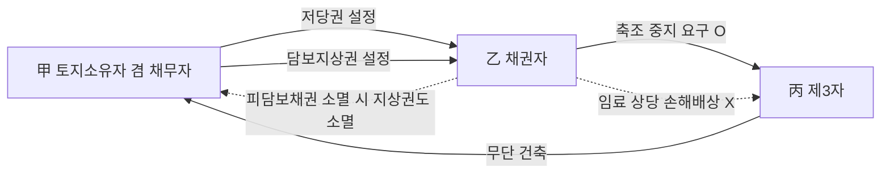

#### ⭐ 기출 출제포인트

1. **지료는 성립요소가 아니다** — "지료합의가 없는 지상권설정계약은 무효"라는 함정 선지가 반복 출제.
2. **담보지상권과 피담보채권의 운명** — 변제로 소멸한 경우와 **시효로 소멸한 경우를 나누어** 물으나 결론은 같다(둘 다 지상권 소멸). 2021년·2025년 반복.
3. **담보지상권자의 권능 범위** — 무단 축조 중지 요구는 O, 임료 상당 손해배상은 X. 선지를 바꿔 놓는 전형적 함정.
4. **지료 약정과 등기의 대항력** — "약정만 있고 등기하지 않으면 지상권자에게도 청구할 수 없다"는 틀린 선지.
5. **설정 당시 지상물의 존부** — 지상물 없어도 성립 O / 지상물 멸실해도 소멸 X.

#### 📊 기출 분석

| 연도 | 출제 형태 | 핵심 논점 |
|---|---|---|
| 2019년 기출 (34번) | 옳지 않은 것 | 지료 약정이 없어도 지상권 성립에 영향 없음(선지 ⑤ — 옳음) |
| 2021년 기출 (27번, 문제집 실전 27) | 사례형 옳지 않은 것 | 담보지상권: 피담보채무 부존재, 변제·시효소멸 시 지상권 소멸, 축조 중지 요구 O, 임료 손배 X |
| 2023년 기출 (33번) | 옳은 것 | 지료합의 없는 지상권설정계약도 유효, 지상권 양도에 토지소유자 동의 불요 |
| 2025년 기출 (31번) | 옳지 않은 것 | 담보지상권은 피담보채권 소멸 시 존속기간과 관계없이 소멸 |
| 감정평가사 기출 (38번) | 옳지 않은 것 | 나대지 저당권＋담보지상권, 피담보채권 시효소멸 → 지상권 소멸 |

**출제 빈도** — 지상권은 감정평가사 1차에서 **거의 매년 1문항** 출제되는 고빈도 논점이며, 그중에서도 담보지상권은 2021·2025년 등 최근 반복 출제되는 최우선 논점이다.

**반복되는 함정 선지** — ① "지료합의가 없는 지상권설정계약은 무효이다"(X) ② "지료 약정을 등기하지 않으면 지상권자에게도 지료를 청구할 수 없다"(X) ③ "담보지상권자는 무단점유자에게 임료 상당 손해배상을 청구할 수 있다"(X).

**최근 경향** — 단순 조문 암기보다 **담보지상권의 부종성과 권능 범위**를 사례형(甲·乙·丙)으로 묻는 방식이 늘고 있다.

#### 🔍 기출 선지로 배우는 법리

> 실제 출제된 선지를 그대로 놓고 O/X와 근거를 확인한다.

**①** 지료합의가 없는 지상권 설정계약은 무효이다. (2023년 기출 33번) — **X**
어디가 틀렸나: 지료의 지급은 ==지상권 성립의 요소가 아니다==. 옳게 고치면: 지료 약정이 없어도 지상권은 유효하게 성립하며, 무상의 지상권도 설정할 수 있다.

**②** 저당물의 담보가치를 유지하기 위해 설정된 지상권은 피담보채권이 소멸하면 함께 소멸한다. (감정평가사 기출) — **O**
근거: 대판 2011.4.14. 2011다6342. 근저당권 등의 피담보채권이 변제로 만족을 얻어 소멸한 경우는 물론 시효로 소멸한 경우에도 지상권은 피담보채권에 부종하여 소멸한다.

**③** 토지의 담보가치 하락을 막기 위해 설정된 지상권은 피담보채권이 소멸하면 **존속기간과 관계없이** 소멸한다. (2025년 기출 31번) — **O**
근거: 담보지상권은 담보권의 존속과 지상권의 존속이 연계되어 있으므로, 존속기간이 남아 있어도 피담보채권이 소멸하면 함께 소멸한다(2011다6342, 2015다65042).

**④** 甲의 지상권의 피담보채무는 존재하지 않는다. (2021년 기출 27번 ①) — **O**
근거: 대판 2017.10.31. 2015다65042. 담보권의 존속과 지상권의 존속이 연계되어 있을 뿐, ==지상권 자체의 피담보채무가 존재하는 것은 아니다==.

**⑤** 제3자가 甲에게 대항할 수 있는 권원 없이 X 위에 건물을 신축하는 경우, 甲은 그 축조의 중지를 요구할 수 있다. (2021년 기출 27번 ④) — **O**
근거: 대결 2004.3.29. 2003마1753.

**⑥** 제3자가 X를 점유·사용하는 경우, 甲은 지상권의 침해를 이유로 손해배상을 청구할 수 있다. (2021년 기출 27번 ⑤) — **X**
어디가 틀렸나: 채무자 등의 사용·수익권을 배제하지 않은 담보지상권자는 ==지상권 자체의 침해를 이유로 한 임료 상당 손해배상을 구할 수 없다==(2006다586). 옳게 고치면: 甲은 저당권에 기한 방해배제청구권을 행사하여 방해행위의 제거를 청구할 수 있을 뿐이다.

**⑦** 당사자가 지료에 관한 합의를 하였더라도 이를 등기하지 않았다면, 당해 지상권자에 대하여 지료지급을 청구할 수 없다. (문제집 실전문제 08 ②) — **X**
어디가 틀렸나: 지료는 필수적 등기사항이 아니며 등기하지 않아도 ==당사자 사이의 채권적 효력은 있으므로== 지상권설정자는 지상권자에게 지료지급을 청구할 수 있다(2007두7505). 등기하지 않으면 제3자에게 대항할 수 없을 뿐이다. 정답 ②.

**⑧** 지료의 지급은 지상권의 요소가 아니어서 지료에 관한 유상 약정이 없는 이상 지료의 지급을 구할 수 없다. (문제집 기본문제 01 ④) — **O**
근거: 대판 1999.9.3. 99다24874.

#### ✏️ 사례형 적용

> **사례 1** — 乙은 나대지인 X토지를 소유하고 있다. 甲은 乙에 대한 2억 원의 대여금채권을 담보하기 위하여 X에 근저당권을 취득하면서, 담보가치 하락을 막기 위해 **지료 없는 지상권**도 함께 설정받았다. 이때 乙의 사용·수익권을 배제하는 약정은 하지 않았다. 이후 丙이 甲에게 대항할 권원 없이 X 위에 건물을 신축하기 시작했고, 한편 乙은 X에서 주차장 영업을 하고 있다.

**검토** — ① **丙에 대하여**: 甲은 담보가치 확보 목적의 지상권자이므로 丙에게 ==건물 축조의 중지를 요구할 수 있다==(2003마1753). 그러나 사용·수익권이 배제되지 않았으므로 ==지상권 침해를 이유로 한 임료 상당 손해배상은 청구할 수 없다==(2006다586). 담보가치가 실제로 하락하였다면 저당권에 기한 방해배제청구로 대응한다. ② **乙에 대하여**: 사용·수익권을 배제하지 않았으므로 乙은 담보가치를 하락시킬 우려 등 특별한 사정이 없는 한 ==X를 계속 사용·수익할 수 있다==(2015다69907). 주차장 영업은 담보가치를 훼손하지 않으므로 甲은 이를 막을 수 없다. ③ **채무가 변제되면**: 피담보채권이 소멸하므로 甲의 지상권도 ==부종하여 소멸==한다. 채권이 시효로 소멸한 경우에도 마찬가지다(2011다6342).

> **사례 2** — 甲은 자기 소유 Y토지에 대하여 乙과 「목조건물 소유를 목적으로 하는 지상권, 지료 연 1,000만 원, 매년 말 지급」의 지상권설정계약을 체결하고 지상권설정등기를 마쳤다. 그런데 **지료에 관한 사항은 등기하지 않았다.** 그 후 甲은 Y를 丙에게 매도하여 소유권이전등기를 마쳤다.

**검토** — ① 지료 약정은 지상권의 성립요소가 아니지만, 약정이 있는 이상 **채권적 효력**은 있다. 따라서 등기 전이라도 甲은 乙에게 약정 지료를 청구할 수 있었다(2007두7505). ② 그러나 지료액·지급시기의 약정은 ==등기하여야만 제3자에게 대항==할 수 있으므로(99다24874), Y를 양수한 丙은 乙에게 그 지료 약정을 주장할 수 없다. ③ 결과적으로 丙과 乙 사이에서는 **지료 약정이 없는 무상 지상권**처럼 취급되며, 丙은 乙의 지료 미지급을 이유로 제287조의 지상권소멸청구를 할 수 없다.

> **사례 3** — 甲은 乙 소유의 나대지에 「철근콘크리트 건물 소유」를 목적으로 하는 지상권을 설정받았으나, 사정이 생겨 5년간 아무 건물도 짓지 않았다. 乙은 "지상물이 없으니 지상권은 성립하지 않았거나 이미 소멸했다"고 주장한다.

**검토** — 지상권의 본질적 내용은 ==타인의 토지를 사용하는 것==이므로 설정계약 당시 건물이 없어도 지상권은 유효하게 성립한다(95다49318). 나아가 건물을 지었다가 멸실되었더라도 **존속기간이 만료되지 않는 한** 지상권은 소멸하지 않는다. 乙의 주장은 모두 이유 없다.

#### ⚠️ 이 관의 함정 총정리

1. "지료 약정이 없으면 지상권설정계약은 무효"라고 하면 틀림 → ==지료는 성립요소가 아니므로 무상 지상권도 유효==.
2. "지료 약정을 등기하지 않으면 지상권자에게도 지료를 청구할 수 없다"고 하면 틀림 → ==지상권자에게는 청구 O, 제3자에게 대항 X==.
3. "설정 당시 건물이 없으면 지상권이 성립하지 않는다" / "건물이 멸실되면 지상권도 소멸한다"고 하면 틀림 → ==둘 다 아니다(95다49318)==.
4. "담보지상권에도 피담보채무가 존재한다"고 하면 틀림 → ==담보권의 존속과 연계될 뿐 지상권의 피담보채무는 없다==. 다만 근저당권의 피담보채권이 소멸하면 지상권도 소멸한다.
5. "담보지상권자는 무단점유자에게 임료 상당 손해배상을 청구할 수 있다"고 하면 틀림 → ==축조 중지 요구는 O, 임료 상당 손해배상은 X==.

#### ✅ OX 확인문제

> 다음 진술의 참·거짓을 판단하시오.

**1.** 지상권은 타인의 토지에 건물 기타 공작물이나 수목을 소유하기 위하여 그 토지를 사용하는 권리이다.
→ **O**. 제279조의 문언 그대로다. 지상물을 '소유'한다는 점이 지역권·전세권과 다르다.

**2.** 지상권설정계약 당시 건물 기타 공작물이나 수목이 없다면 지상권은 성립할 수 없다.
→ **X**. 지상권의 본질적 내용은 타인의 토지를 사용하는 것이므로, 설정 당시 지상물이 없더라도 지상권은 유효하게 성립한다(대판 1996.3.22. 95다49318).

**3.** 기존의 건물이나 수목이 멸실되면 존속기간이 남아 있어도 지상권은 소멸한다.
→ **X**. 존속기간이 만료되지 않는 한 지상권은 소멸하지 아니한다(95다49318).

**4.** 토지사용의 대가인 지료의 지급은 지상권의 성립요소이므로, 지료에 관한 약정이 없는 지상권설정계약은 무효이다.
→ **X**. 지료의 지급은 지상권의 요소가 아니어서, 지료에 관한 지급약정이 없더라도 지상권의 성립에는 영향이 없다.

**5.** 지상권설정계약에 의한 지상권의 취득은 등기하여야 그 효력이 생긴다.
→ **O**. 제186조. 다만 상속·판결·경매·공용징수·법정지상권 등 법률규정에 의한 취득은 등기를 요하지 않는다(제187조).

**6.** 지상권설정의 목적과 범위는 등기사항이지만, 존속기간과 지료는 등기원인에 약정이 있는 경우에만 기재한다.
→ **O**. 지상권자(부동산등기법 제48조), 설정의 목적과 범위는 필요적 등기사항이고, 존속기간·지료와 지급시기는 약정이 있는 경우에만 기재한다(부동산등기법 제69조).

**7.** 지료에 관한 약정이 있으나 이를 등기하지 않은 경우, 토지소유자는 지상권자에 대해서도 약정 지료의 지급을 구할 수 없다.
→ **X**. 등기 여부와 관계없이 지상권자에 대해서는 약정 지료를 구할 수 있고, 다만 지상권을 양수한 사람 등 제3자에게 대항할 수 없을 뿐이다(대판 2009.9.24. 2007두7505).

**8.** 토지의 근저당권자가 주로 목적물의 담보가치가 감소하는 것을 막기 위하여 지상권을 취득하였다면, 그 피담보채권이 변제로 소멸한 경우에는 그 지상권도 소멸한다.
→ **O**. 대판 2011.4.14. 2011다6342. 변제로 소멸한 경우는 물론 시효로 소멸한 경우에도 지상권은 부종하여 소멸한다.

**9.** 채권 담보를 위하여 지상권을 설정하면서 채무자의 사용·수익권을 배제하지 않은 경우, 지상권자는 무단점유자에 대하여 지상권 침해를 이유로 임료 상당 손해배상을 청구할 수 있다.
→ **X**. 임료 상당 손해배상은 구할 수 없다(대판 2008.1.17. 2006다586). 다만 지상권자에게 대항할 권원 없는 자의 건물 축조에 대해서는 중지를 요구할 수 있다(2003마1753).

**10.** 지상권설정자는 토지소유자이므로 지상권 설정 후에도 그 대지를 사용·수익할 수 있다.
→ **X**. 지상권을 설정해 준 대지소유자는 소유권 행사에 제한을 받아 그 대지를 사용·수익할 수 없다(대판 1974.11.12. 74다1150). 다만 사용·수익권을 배제하지 않은 담보지상권의 경우는 예외다(2015다69907).

#### 🧠 암기법

> 🔑 **「지·료·아·요」 — 지료는 요소가 아니다**
> **지**상권의 **료**금(지료)은 **아**니다 **요**소가.
> 전세권은 전세금이 **요소**, 임대차는 차임이 **요소**, 지상권만 지료가 **요소 아님**. 세 제도 중 지상권만 '무상'이 가능하다.

> 🔑 **「등기하면 3자, 안 하면 당사자」 — 지료 약정의 이중구조**
> 지료 약정 **등기 O** → 뒤에 온 **제3자**에게도 대항.
> 지료 약정 **등기 X** → **당사자(지상권자)**에게만 청구.
> 지료 약정 **없음** → 아무에게도 청구 못 함.

> 🔑 **「담보지상권 — 채무는 없되, 운명은 같이」**
> 담보지상권 **자체의 피담보채무는 없다**(2015다65042).
> 그러나 근저당권의 피담보채권이 **변제·시효**로 소멸하면 **함께 소멸**한다(2011다6342).
> → "채무는 없어도 **운명공동체**".

> 🔑 **「중지는 되고, 돈은 안 된다」 — 담보지상권자의 권능**
> 무단 축조 **중지 요구 O** (2003마1753)
> 임료 상당 손해배상 **X** (2006다586)
> → 담보가치를 지키는 것까지만 되고, 사용이익을 챙기는 것은 안 된다.

#### ⚖️ 법조문 원문

> 📖 이 관이 근거로 삼은 조문의 **전문**이다. 본문 인용은 발췌지만 여기서는 조 전체를 싣는다. 출처는 법제처 정본이다.

**― 민법 ―**

> 📌 **민법 제186조(부동산물권변동의 효력)** — "부동산에 관한 법률행위로 인한 물권의 득실변경은 등기하여야 그 효력이 생긴다."

> 📌 **민법 제187조(등기를 요하지 아니하는 부동산물권취득)** — "상속, 공용징수, 판결, 경매 기타 법률의 규정에 의한 부동산에 관한 물권의 취득은 등기를 요하지 아니한다. 그러나 등기를 하지 아니하면 이를 처분하지 못한다."

> 📌 **민법 제279조(지상권의 내용)** — "지상권자는 타인의 토지에 건물 기타 공작물이나 수목을 소유하기 위하여 그 토지를 사용하는 권리가 있다."

> 📌 **민법 제289조의2(구분지상권)** — "①지하 또는 지상의 공간은 상하의 범위를 정하여 건물 기타 공작물을 소유하기 위한 지상권의 목적으로 할 수 있다. 이 경우 설정행위로써 지상권의 행사를 위하여 토지의 사용을 제한할 수 있다. ②제1항의 규정에 의한 구분지상권은 제3자가 토지를 사용ㆍ수익할 권리를 가진 때에도 그 권리자 및 그 권리를 목적으로 하는 권리를 가진 자 전원의 승낙이 있으면 이를 설정할 수 있다. 이 경우 토지를 사용ㆍ수익할 권리를 가진 제3자는 그 지상권의 행사를 방해하여서는 아니된다."

> 📌 **민법 제371조(지상권, 전세권을 목적으로 하는 저당권)** — "①본장의 규정은 지상권 또는 전세권을 저당권의 목적으로 한 경우에 준용한다. ②지상권 또는 전세권을 목적으로 저당권을 설정한 자는 저당권자의 동의없이 지상권 또는 전세권을 소멸하게 하는 행위를 하지 못한다."

### 제2관 지상권의 존속기간

> 📖 지상권은 지상물을 소유하기 위한 권리이므로 기간이 너무 짧으면 제도의 목적을 달성할 수 없다. 그래서 민법은 **최단존속기간**을 강제하고(제280조), 약정이 없는 경우에도 이를 그대로 적용한다(제281조). 반면 **최장기간은 제한이 없다.** 기간이 만료되었을 때의 갱신청구권과 지상물매수청구권의 연결고리도 이 관에서 정리한다.

> ⭐ **이 관에서 반드시 챙길 3가지**
> ① 최단존속기간은 ==견고한 건물·수목 30년 / 그 밖의 건물 15년 / 건물 이외의 공작물 5년==. 이보다 짧게 정하면 그 기간까지 **연장**된다.
> ② 최단기간 규정은 지상권자가 지상물을 ==건축하거나 식재하여== 토지를 이용할 목적일 때만 적용된다 — **기존 건물의 사용을 위한 지상권에는 적용되지 않는다**(95다49318).
> ③ 갱신청구권은 ==청구권==(설정자가 거절 가능), 지상물매수청구권은 ==형성권==(행사만으로 매매계약 성립). 갱신 거절이 매수청구권의 문을 연다.

#### 1. 의의

**존속기간**이란 지상권이 존립하는 기간을 말한다. 민법은 지상물 소유라는 지상권의 목적을 보장하기 위하여 **최단기간만을 법정**하고, 최장기간에 관하여는 아무런 제한을 두지 않았다. 이 규정들은 모두 **편면적 강행규정**이어서(제289조), 지상권자에게 불리한 약정은 무효다.

#### 2. 요건

**약정이 있는 경우 — 최단존속기간(제280조)**

| 지상권의 목적 | 최단존속기간 | 비고 |
|---|---|---|
| 석조·석회조·연와조 또는 이와 유사한 **견고한 건물**이나 **수목**의 소유 | ==30년== | 당사자는 이보다 장기의 기간을 정할 수 있다 |
| 전호 이외의 **건물**(목조 등)의 소유 | ==15년== | — |
| 건물 이외의 **공작물**의 소유 | ==5년== | — |
| 위 기간보다 **단축한 기간**을 정한 때 | ==그 기간까지 연장== | 제280조 제2항 — 약정이 무효가 되는 것이 아니라 법정 최단기간으로 연장된다 |

**약정이 없는 경우(제281조)**

| 상황 | 존속기간 |
|---|---|
| 계약으로 존속기간을 정하지 아니한 때 | ==제280조의 최단존속기간==(지상물의 종류·구조에 따라 30·15·5년) |
| 설정 당시 **공작물의 종류와 구조를 정하지 아니한** 때 | ==15년== (제281조 제2항) |

**최단기간 규정의 적용 여부 — 최빈출 함정**

| 지상권의 목적 | 최단존속기간 규정 적용 | 근거 |
|---|---|---|
| 건물을 **건축**하거나 수목을 **식재**하기 위한 지상권 | ==적용 O== | 제280조 |
| **기존 건물**의 소유·사용을 위한 지상권 | ==적용 X== (30년 미만으로 정할 수 있다) | 대판 1996.3.22. 95다49318 |

**최장존속기간**

| 구분 | 내용 |
|---|---|
| 명문규정 | ==없음== |
| 학설 | 영구무한의 지상권 설정 여부에 대해 인정설·부정설 대립(부정설이 다수설) |
| 판례 | ==영구로 약정하는 것도 허용==(대판 2001.5.29. 99다66410). 구분지상권의 경우 영구라도 대지 소유권을 전면적으로 제한하지 않는다는 점도 근거 |

#### 3. 효과

| 구분 | 효과 |
|---|---|
| 최단기간 미달 약정 | 무효가 아니라 ==법정 최단기간까지 연장==(제280조 제2항) |
| 기간 약정 없음 | 지상물의 종류·구조에 따른 최단존속기간이 곧 존속기간(제281조 제1항) |
| 종류·구조도 정하지 않음 | ==15년==(제281조 제2항) |
| 계약 갱신 | 갱신한 날로부터 제280조의 최단존속기간보다 단축하지 못함(제284조). 장기 약정은 O |
| 존속기간 만료 + 지상물 현존 | 지상권자에게 ==갱신청구권== 발생(제283조 제1항) |
| 설정자가 갱신 거절 | 지상권자에게 ==지상물매수청구권== 발생(제283조 제2항) |
| 존속기간·갱신 규정 위반 | 지상권자에게 불리한 약정은 ==무효==(제289조) |

**갱신청구권 vs 지상물매수청구권 — 관계와 성질**

| 구분 | 갱신청구권(제283조 제1항) | 지상권자의 지상물매수청구권(제283조 제2항) |
|---|---|---|
| 법적 성질 | ==청구권== (형성권 아님) | ==형성권== |
| 발생요건 | ① 지상권 소멸 ② 건물·공작물·수목이 **현존** | ① 갱신청구 ② 지상권설정자가 **갱신을 원하지 않음** |
| 효과 | 설정자가 응하여 갱신계약을 체결해야 갱신됨. ==거절하면 갱신되지 않음== | 행사만으로 지상물에 관한 ==매매계약이 성립==(대판 1967.12.18. 67다2355) |
| 가액 | — | **상당한 가액** = 사회거래상 인정되는 가액, 매수청구권 행사 당시의 시가 상당액(대판 1972.7.25. 72다653) |
| 배제되는 경우 | — | ==지료연체를 이유로 소멸청구되어 지상권이 소멸한 경우==에는 인정되지 않음(대판 1993.6.29. 93다10781; 대판 1972.12.26. 72다2085) |

> ⚠️ 「갱신청구 → (거절) → 매수청구」의 **순서**를 기억하라. 지상권자는 갱신청구를 거치지 않고 곧바로 매수청구를 할 수 없다. 반면 **지상권설정자의 매수청구권**(제285조 제2항)은 갱신청구권 없이 바로 행사할 수 있다.

**지상권 vs 전세권 — 존속기간 비교**

| 구분 | 지상권 | 전세권 |
|---|---|---|
| 최장기간 | ==제한 없음==(영구 약정도 허용) | ==10년==(갱신하여도 동일) |
| 최단기간 | 30년 / 15년 / 5년 | 토지전세권 제한 없음, 건물전세권 1년 |
| 기간 약정 없는 경우 | 최단기간으로 제한 | 언제든지 소멸통고 가능(도달 후 6월 경과로 소멸) |
| 약정갱신 | 최단기간 이상으로 약정 | 10년을 초과할 수 없음 |
| 법정갱신 | ==규정 없음== | 규정 있음(건물전세권) |
| 갱신청구권 | ==인정==(제283조 제1항) | ==인정되지 않음== |

#### 4. 관련 조문

> 📌 **민법 제280조(존속기간을 약정한 지상권)** — "① 계약으로 지상권의 존속기간을 정하는 경우에는 그 기간은 다음 연한보다 단축하지 못한다. 1. 석조, 석회조, 연와조 또는 이와 유사한 견고한 건물이나 수목의 소유를 목적으로 하는 때에는 30년 2. 전호 이외의 건물의 소유를 목적으로 하는 때에는 15년 3. 건물 이외의 공작물의 소유를 목적으로 하는 때에는 5년 ② 전항의 기간보다 단축한 기간을 정한 때에는 전항의 기간까지 연장한다."

> 📌 **민법 제281조(존속기간을 약정하지 아니한 지상권)** — "① 계약으로 지상권의 존속기간을 정하지 아니한 때에는 그 기간은 전조의 최단존속기간으로 한다. ② 지상권설정당시에 공작물의 종류와 구조를 정하지 아니한 때에는 지상권의 존속기간은 15년이다."

> 📌 **민법 제283조(지상권자의 갱신청구권, 매수청구권)** — "① 지상권이 소멸한 경우에 건물 기타 공작물이나 수목이 현존한 때에는 지상권자는 계약의 갱신을 청구할 수 있다. ② 지상권설정자가 계약의 갱신을 원하지 아니하는 때에는 지상권자는 상당한 가액으로 전항의 공작물이나 수목의 매수를 청구할 수 있다."

> 📌 **민법 제284조(갱신과 존속기간)** — "당사자가 계약을 갱신하는 경우에는 지상권의 존속기간은 갱신한 날로부터 제280조의 최단존속기간보다 단축하지 못한다. 그러나 당사자는 이보다 장기의 기간을 정할 수 있다."

> 📌 **민법 제289조(강행규정)** — 제280조 내지 제287조에 위반되는 계약으로 **지상권자에게 불리한 것**은 그 효력이 없다.

#### 5. 핵심 판례 법리

**[1] 최단존속기간 규정은 '건축·식재' 목적에만 적용된다** (대판 1996.3.22. 95다49318)
제280조 제1항 제1호가 견고한 건물이나 수목의 **'소유를 목적으로 하는'** 지상권의 존속기간은 30년보다 단축할 수 없다고 규정하고 있음에 비추어 볼 때, 최단존속기간에 관한 규정은 지상권자가 그 소유의 건물 등을 ==건축하거나 수목을 식재하여 토지를 이용할 목적으로 지상권을 설정한 경우에만 그 적용이 있다==. 따라서 **기존 건물의 사용을 목적으로 지상권이 설정된 경우에는 최단존속기간 규정이 적용되지 않는다.**

**[2] 존속기간을 영구로 약정하는 것도 허용된다** (대판 2001.5.29. 99다66410)
민법은 지상권의 존속기간에 관하여 최단기만 규정할 뿐 ==최장기에 관하여는 아무런 제한이 없으며==, 존속기간이 영구인 지상권을 인정할 실제의 필요성도 있고, 특히 구분지상권의 경우에는 존속기간이 영구라 할지라도 대지의 소유권을 전면적으로 제한하지 아니한다는 점에 비추어 보면, ==지상권의 존속기간을 영구로 약정하는 것도 허용된다==.

**[3] 지상물이 멸실해도 존속기간 내에는 지상권이 존속한다** (대판 1996.3.22. 95다49318)
기존의 건물 기타 공작물이나 수목이 멸실되더라도 ==존속기간이 만료되지 않는 한 지상권은 소멸하지 아니한다==. "수목의 소유를 목적으로 하는 지상권은 수목이 멸실되면 소멸한다"는 진술은 **틀렸다**.

**[4] 갱신청구권은 청구권이지 형성권이 아니다**
갱신청구권은 청구권이고 형성권이 아니어서 ==지상권설정자는 이를 거절할 수 있고, 거절하면 지상권은 갱신되지 않는다==. 지상권자의 갱신청구만으로 곧 갱신의 효과가 발생하지는 않으며, 설정자가 그에 응하여 **갱신계약을 맺음으로써** 갱신의 효과가 생긴다(문제집 실전문제 01 ②).

**[5] 갱신청구권은 존속기간 만료로 지상권이 소멸한 경우에 발생한다** (대판 1993.6.29. 93다10781)
**존속기간의 만료**로 지상권이 소멸한 경우에 건물 기타 공작물이나 수목이 현존한 때 지상권자는 계약의 갱신을 청구할 수 있다.

**[6] 지상물매수청구권은 형성권이다** (대판 1967.12.18. 67다2355)
지상물매수청구권은 형성권으로서 ==지상권자가 이를 행사함으로 인하여 지상물에 관한 매매계약이 성립==한다.

**[7] 매수 가격은 행사 당시의 시가 상당액** (대판 1972.7.25. 72다653)
매수청구권은 형성권으로서 그 행사에 의하여 매수의 효력이 즉시 발생하며, 그 ==가격은 매수청구권 행사 당시의 시가 상당액==이다.

**[8] 지료연체로 소멸한 경우에는 매수청구권이 없다** (대판 1993.6.29. 93다10781; 대판 1972.12.26. 72다2085)
지상권자의 **지료연체**를 이유로 토지소유자가 지상권소멸청구를 하여 이에 터잡아 지상권이 소멸된 경우에는 ==지상물매수청구권이 인정되지 않는다==.

**[9] 갱신 시에도 최단존속기간을 단축할 수 없다** (제284조, 제289조)
지상권의 존속기간과 갱신에 관한 규정은 **강행규정**이므로, 지상권설정계약의 갱신에 있어서 존속기간을 당사자의 합의에 의해 제280조의 최단기간보다 ==단축하지 못한다==(문제집 실전문제 01 ③, 정답 ③).

**[10] 관습법상 법정지상권의 존속기간** (대판 1963.5.9. 63아11)
판례는 관습법상의 법정지상권을 ==존속기간을 약정하지 않은 경우==로 본다. 따라서 제280조·제281조에 의하여 존속기간이 정해지고, 견고하지 않은 건물의 소유를 목적으로 하는 때에는 ==15년==이 된다.

**[11] 법정지상권의 존속기간은 구 건물을 기준으로 한다** (대판 1991.4.26. 90다19985; 대판 2001.3.13. 2000다48517)
저당권 설정 당시 건물이 존재한 이상 그 이후 건물을 개축·증축하거나 멸실·철거 후 재축·신축하는 경우에도 법정지상권은 성립하나, 그 ==존속기간·범위는 구 건물을 기준==으로 하여 그 이용에 일반적으로 필요한 범위 내로 제한된다. (예: 구 건물이 1층 목조였다면 신축된 2층 콘크리트 건물이라도 존속기간은 **15년**이다.)

#### ⭐ 기출 출제포인트

1. **최단존속기간 숫자 30·15·5** — "수목의 소유를 목적으로 하는 지상권의 최단존속기간은 10년"과 같은 숫자 바꿔치기가 단골.
2. **기존 건물 사용 목적 지상권** — 최단기간 규정 적용 X. 2024년 무렵 기출 선지 "기존 건물의 사용을 목적으로 설정된 지상권은 그 존속기간을 30년 미만으로 정할 수 있다"(O)로 출제.
3. **영구 지상권의 허용** — 판례는 허용. 구분지상권의 존속기간을 영구로 약정하는 것도 허용(2019년 기출 34번 ②).
4. **갱신청구권의 법적 성질** — 청구권(형성권 X), 지상물매수청구권은 형성권.
5. **지료연체 소멸 시 매수청구권 부정** — 2019년 기출 34번의 정답 선지(④가 틀린 것).

#### 📊 기출 분석

| 연도 | 출제 형태 | 핵심 논점 |
|---|---|---|
| 2019년 기출 (34번) | 옳지 않은 것 | ② 구분지상권 영구 약정 허용(O) / ④ 지료연체 소멸 시 매수청구권 인정(X — 정답) |
| 2023년 기출 (33번) | 옳은 것 | ③ 수목의 소유를 목적으로 하는 지상권의 최단존속기간은 10년(X — 30년) |
| 감정평가사 기출 | 옳지 않은 것 | ② 기존 건물의 사용을 목적으로 설정된 지상권은 존속기간을 30년 미만으로 정할 수 있다(O) |
| 문제집 실전문제 01 | 옳지 않은 것 | ③ 갱신 시 존속기간을 최단기간보다 단축 가능(X — 강행규정) |
| 문제집 실전문제 04 | 옳지 않은 것 | ④ 기존 건물 소유를 위한 지상권에 최단기간 규정 적용(X) |

**출제 빈도** — 존속기간은 지상권 문항에서 **반드시 1개 이상의 선지**로 등장한다. 특히 최단기간 숫자와 영구 지상권 허용 여부는 거의 매회 출제 대상이다.

**반복되는 함정 선지** — ① "수목의 최단존속기간은 10년"(X, 30년) ② "존속기간을 영구로 약정할 수 없다"(X) ③ "갱신 시 최단기간보다 단축할 수 있다"(X) ④ "지료연체로 지상권이 소멸해도 지상물매수청구권은 인정된다"(X).

**최근 경향** — 단순 숫자 확인에서 벗어나 **최단기간 규정의 '적용 범위'**(건축·식재 목적 vs 기존 건물 사용)를 묻는 방향으로 정교해지고 있다.

#### 🔍 기출 선지로 배우는 법리

> 실제 출제된 선지를 그대로 놓고 O/X와 근거를 확인한다.

**①** 수목의 소유를 목적으로 하는 지상권의 최단존속기간은 10년이다. (2023년 기출 33번 ③) — **X**
어디가 틀렸나: 석조·석회조·연와조 또는 이와 유사한 **견고한 건물이나 수목**의 소유를 목적으로 하는 때에는 ==30년==이 최단기간이다(제280조).

**②** 구분지상권의 존속기간을 영구적인 것으로 약정하는 것은 허용된다. (2019년 기출 34번 ②) — **O**
근거: 대판 2001.5.29. 99다66410. 최장기 제한이 없고, 구분지상권은 영구라도 대지 소유권을 전면 제한하지 않는다.

**③** 기존 건물의 사용을 목적으로 설정된 지상권은 그 존속기간을 30년 미만으로 정할 수 있다. (감정평가사 기출) — **O**
근거: 최단존속기간 규정은 지상권자가 건물 등을 **건축**하거나 수목을 **식재**하여 토지를 이용할 목적으로 지상권을 설정한 경우에만 적용된다(95다49318).

**④** 지료연체를 이유로 한 지상권소멸청구에 의해 지상권이 소멸하더라도 지상물매수청구권은 인정된다. (2019년 기출 34번 ④) — **X**
어디가 틀렸나: 지상권자가 2년간 지료를 지급하지 아니하여 지상권소멸청구를 당한 경우에는 지상물에 대한 매수청구권을 ==행사하지 못한다==(대판 1972.12.26. 72다2085). 정답 ④.

**⑤** 지상권의 존속기간과 갱신에 관한 규정은 주로 임의규정이기 때문에, 갱신에 있어서 존속기간을 당사자의 합의로 최단기간보다 단축할 수 있다. (문제집 실전문제 01 ③) — **X**
어디가 틀렸나: 제289조에 의한 ==편면적 강행규정==이므로 최단기간보다 단축하지 못한다. 정답 ③.

**⑥** 지상권자의 갱신청구권은 그 법적 성질을 채권적 청구권으로 보아야 하기 때문에 지상권설정자가 그에 응하여 갱신계약을 체결함으로써 갱신의 효과가 발생한다. (문제집 실전문제 01 ②) — **O**
근거: 갱신청구권은 형성권이 아니므로 설정자가 거절하면 갱신되지 않는다.

**⑦** 지상권자는 지상권설정자에게 지상물매수청구권을 행사할 수 있고, 이 권리는 청구권에 해당한다. (문제집 실전문제 02 ②) — **X**
어디가 틀렸나: 지상물매수청구권은 명칭은 청구권이나 실질은 ==형성권==이다(67다2355). 정답 ②.

**⑧** 존속기간을 약정하지 아니한 경우, 건물 이외의 공작물의 소유를 목적으로 하는 지상권의 존속기간은 5년이다. (문제집 기본문제 03 ⑤) — **O**
근거: 제281조 제1항＋제280조 제1항 제3호. 다만 설정 당시 **공작물의 종류와 구조를 정하지 않았다면 15년**이다(제281조 제2항).

#### ✏️ 사례형 적용

> **사례 1** — 甲과 乙은 「목조건물 소유를 목적, 존속기간 5년」의 지상권설정계약을 체결하고 등기를 마쳤다. 5년이 지나자 甲(설정자)은 기간 만료를 이유로 건물 철거와 토지 인도를 구한다.

**검토** — ① 목조건물은 '전호 이외의 건물'이므로 최단존속기간은 ==15년==이다(제280조 제1항 제2호). ② 이보다 짧게 정한 5년의 약정은 무효가 되는 것이 아니라 ==15년으로 연장==된다(제280조 제2항). 제289조에 의해 지상권자에게 불리한 약정은 효력이 없으므로 결론은 같다. ③ 따라서 지상권은 아직 존속 중이고 甲의 청구는 이유 없다.

> **사례 2** — 丙은 丁 소유 토지에 「철근콘크리트 건물 소유, 존속기간 30년」의 지상권을 설정받아 건물을 신축하였다. 30년이 지나 지상권이 소멸하였고 건물은 견고하게 현존한다. 丙은 계약 갱신을 청구했으나 丁은 거절했다.

**검토** — ① 존속기간 만료로 지상권이 소멸하였고 건물이 **현존**하므로 丙에게 갱신청구권이 발생한다(제283조 제1항, 93다10781). ② 그러나 갱신청구권은 ==청구권==이어서 丁이 거절하면 갱신되지 않는다. ③ 丁이 갱신을 원하지 않으므로 丙은 ==상당한 가액으로 지상물매수청구권==을 행사할 수 있다(제283조 제2항). 이는 형성권이므로 행사만으로 건물에 관한 **매매계약이 성립**하고(67다2355), 그 가격은 **행사 당시의 시가 상당액**이다(72다653). ④ 만약 丙이 갱신청구 없이 곧바로 매수청구를 하거나, 반대로 **2년 이상 지료를 연체하여 丁이 소멸청구를 함으로써** 지상권이 소멸한 것이라면 매수청구권은 인정되지 않는다(72다2085).

> **사례 3** — 戊는 己 소유 토지 위의 **이미 완공되어 있는 창고건물**을 사용하기 위하여 己와 「존속기간 10년」의 지상권설정계약을 체결했다. 戊는 나중에 "견고한 건물이므로 30년으로 연장되어야 한다"고 주장한다.

**검토** — 최단존속기간 규정은 지상권자가 그 소유의 건물 등을 ==건축하거나 수목을 식재하여== 토지를 이용할 목적으로 지상권을 설정한 경우에만 적용된다(95다49318). 이 사안은 **기존 건물의 사용**을 목적으로 한 것이므로 제280조의 최단기간 규정이 적용되지 않는다. 따라서 10년의 약정은 그대로 유효하고, 戊의 주장은 이유 없다.

#### ⚠️ 이 관의 함정 총정리

1. "수목의 소유를 목적으로 하는 지상권의 최단존속기간은 10년(또는 15년)"이라고 하면 틀림 → ==견고한 건물과 수목은 30년==.
2. "최단기간보다 짧게 약정하면 그 약정은 무효"라고만 하면 부정확 → ==무효가 아니라 법정 최단기간까지 연장==된다(제280조 제2항).
3. "지상권의 존속기간은 최장 30년"이라거나 "영구 약정은 무효"라고 하면 틀림 → ==최장기 제한 없음, 영구 약정도 판례상 허용==(99다66410).
4. "기존 건물 사용 목적의 지상권에도 최단기간 규정이 적용된다"고 하면 틀림 → ==건축·식재 목적일 때만 적용==(95다49318).
5. "갱신청구권은 형성권" / "지상물매수청구권은 청구권"이라고 하면 틀림 → ==갱신청구권은 청구권이고 지상물매수청구권이 형성권==이다. 서로 뒤집어 놓는 것이 전형적 함정이다.

#### ✅ OX 확인문제

> 다음 진술의 참·거짓을 판단하시오.

**1.** 석조·석회조·연와조 또는 이와 유사한 견고한 건물이나 수목의 소유를 목적으로 하는 지상권의 최단존속기간은 30년이다.
→ **O**. 제280조 제1항 제1호. 그 밖의 건물은 15년, 건물 이외의 공작물은 5년이다.

**2.** 당사자가 최단존속기간보다 짧은 기간을 정한 때에는 그 약정은 무효이므로 존속기간의 약정이 없는 것으로 된다.
→ **X**. 무효가 되는 것이 아니라 ==제280조 제1항의 기간까지 연장==된다(제280조 제2항).

**3.** 계약으로 지상권의 존속기간을 정하지 아니한 때에는 그 기간은 제280조의 최단존속기간으로 한다.
→ **O**. 제281조 제1항.

**4.** 지상권설정 당시에 공작물의 종류와 구조를 정하지 아니한 때에는 지상권의 존속기간은 5년이다.
→ **X**. ==15년==이다(제281조 제2항).

**5.** 민법상 지상권의 존속기간은 최단기만이 규정되어 있을 뿐 최장기에 관하여는 아무런 제한이 없으므로, 지상권의 존속기간을 영구로 약정하는 것도 허용된다.
→ **O**. 대판 2001.5.29. 99다66410.

**6.** 기존 건물의 사용을 목적으로 지상권이 설정된 경우에도 최단존속기간에 관한 민법 규정이 적용된다.
→ **X**. 최단존속기간 규정은 지상권자가 건물 등을 **건축**하거나 수목을 **식재**하여 토지를 이용할 목적으로 지상권을 설정한 경우에만 적용된다(대판 1996.3.22. 95다49318).

**7.** 당사자가 계약을 갱신하는 경우 지상권의 존속기간은 갱신한 날로부터 제280조의 최단존속기간보다 단축하지 못한다.
→ **O**. 제284조. 이는 제289조에 의한 편면적 강행규정이므로 합의로도 단축할 수 없다.

**8.** 지상권이 소멸한 경우에 지상물이 현존하면 지상권자는 계약의 갱신을 청구할 수 있고, 지상권설정자는 이를 거절할 수 없다.
→ **X**. 갱신청구권은 형성권이 아닌 ==청구권==이므로 지상권설정자는 이를 거절할 수 있고, 거절하면 지상권은 갱신되지 않는다.

**9.** 지상물매수청구권은 형성권으로서 지상권자가 이를 행사함으로 인하여 지상물에 관한 매매계약이 성립한다.
→ **O**. 대판 1967.12.18. 67다2355. 매수 가격은 매수청구권 행사 당시의 시가 상당액이다(72다653).

**10.** 지상권자가 2년간 지료를 지급하지 아니하여 지상권소멸청구를 당한 경우에도 지상물매수청구권을 행사할 수 있다.
→ **X**. 이 경우에는 지상물매수청구권이 ==인정되지 않는다==(대판 1993.6.29. 93다10781; 대판 1972.12.26. 72다2085).

#### 🧠 암기법

> 🔑 **「삼(3)·일(1)·오(5) — 30·15·5」**
> **견고한 건물＋수목 = 30년** (가장 오래 가는 것 = 가장 긴 기간)
> **그 밖의 건물 = 15년**
> **건물 아닌 공작물 = 5년**
> 순서는 "**견·건·공**"(견고한 건물 → 건물 → 공작물)으로 내려가며 30 → 15 → 5.
> 종류·구조를 **안 정했으면 15년** — 가운데 값으로 기억.

> 🔑 **「짧으면 늘리고, 길면 놔둔다」**
> 최단기간보다 **짧게** 정하면 → **법정기간까지 연장**(제280조②).
> 최단기간보다 **길게** 정하거나 **영구**로 정하면 → **그대로 유효**(99다66410).
> 지상권자에게 **유리한 방향으로만** 움직인다 = 편면적 강행규정(제289조).

> 🔑 **「짓거나 심어야 30년」 — 최단기간 규정의 적용 범위**
> **건**축하거나 식**재**할 목적 → 최단기간 적용 **O**
> **기존 건물** 쓸 목적 → 최단기간 적용 **X** (95다49318)
> → "새로 **짓/심**으면 보호, 남의 것 **빌려 쓰면** 보호 없음".

> 🔑 **「갱→거→매」 — 청구권에서 형성권으로**
> **갱**신청구(청구권, 거절 가능) → 설정자가 **거**절 → **매**수청구(형성권, 즉시 매매 성립).
> 단, **지료연체로 소멸청구를 당한 경우에는 매수청구 없음**(72다2085).
> 반면 **지상권설정자의 매수청구권**(제285조②)은 갱신청구 단계 없이 곧바로 행사할 수 있다.

#### ⚖️ 법조문 원문

> 📖 이 관이 근거로 삼은 조문의 **전문**이다. 본문 인용은 발췌지만 여기서는 조 전체를 싣는다. 출처는 법제처 정본이다.

**― 민법 ―**

> 📌 **민법 제280조(존속기간을 약정한 지상권)** — "①계약으로 지상권의 존속기간을 정하는 경우에는 그 기간은 다음 연한보다 단축하지 못한다. 1. 석조, 석회조, 연와조 또는 이와 유사한 견고한 건물이나 수목의 소유를 목적으로 하는 때에는 30년 2. 전호이외의 건물의 소유를 목적으로 하는 때에는 15년 3. 건물이외의 공작물의 소유를 목적으로 하는 때에는 5년 ②전항의 기간보다 단축한 기간을 정한 때에는 전항의 기간까지 연장한다."

> 📌 **민법 제281조(존속기간을 약정하지 아니한 지상권)** — "①계약으로 지상권의 존속기간을 정하지 아니한 때에는 그 기간은 전조의 최단존속기간으로 한다. ②지상권설정당시에 공작물의 종류와 구조를 정하지 아니한 때에는 지상권은 전조제2호의 건물의 소유를 목적으로 한 것으로 본다."

> 📌 **민법 제283조(지상권자의 갱신청구권, 매수청구권)** — "①지상권이 소멸한 경우에 건물 기타 공작물이나 수목이 현존한 때에는 지상권자는 계약의 갱신을 청구할 수 있다. ②지상권설정자가 계약의 갱신을 원하지 아니하는 때에는 지상권자는 상당한 가액으로 전항의 공작물이나 수목의 매수를 청구할 수 있다."

> 📌 **민법 제284조(갱신과 존속기간)** — "당사자가 계약을 갱신하는 경우에는 지상권의 존속기간은 갱신한 날로부터 제280조의 최단존속기간보다 단축하지 못한다. 그러나 당사자는 이보다 장기의 기간을 정할 수 있다."

> 📌 **민법 제289조(강행규정)** — "제280조 내지 제287조의 규정에 위반되는 계약으로 지상권자에게 불리한 것은 그 효력이 없다."

### 제3관 지상권의 효력

> 📖 지상권이 성립하고 존속기간이 확정되면, 그 기간 동안 지상권자와 설정자 사이에 어떤 권리·의무가 생기는가가 문제된다. 이 관은 ① 토지사용권과 물권적 청구권, ② 지료지급의무와 2년 연체의 효과, ③ 지상권의 양도·임대·담보제공, ④ 지상물매수청구권, ⑤ 이 모두를 관통하는 편면적 강행규정(제289조)을 다룬다. 감정평가사 시험에서 지상권 문항의 선지가 가장 많이 뽑혀 나오는 구간이다.

> ⭐ **이 관에서 반드시 챙길 3가지**
> ① 지상권을 설정해 준 토지소유자는 ==그 대지를 사용·수익할 수 없고==, 불법점유자에게 임료 상당 손해금도 청구할 수 없다(74다1150).
> ② 2년 이상 지료연체 시 소멸청구(제287조) — 다만 ==양도 전후를 합산하지 않으며==(99다17142), ==일부 변제로 2년 미만이 되면 소멸청구할 수 없다==(2012다102384).
> ③ 지상권의 양도·임대는 ==지상권설정자의 동의를 요하지 않고==, 양도금지 특약은 지상권자에게 불리하여 무효다(제282조·제289조).

#### 1. 의의

지상권의 효력이란 지상권이 존속하는 동안 지상권자가 토지에 대하여 갖는 권리와 부담하는 의무의 총체를 말한다. 지상권은 **용익물권**이므로 지상권자는 설정행위로 정해진 목적의 범위에서 토지를 배타적으로 사용·점유하며, 그 권리가 침해되면 물권적 청구권으로 스스로 방어한다.

- **토지사용권** — 지상권자는 정해진 목적의 범위 내에서 타인의 토지를 사용할 권리가 있고, 이를 위해 토지를 **점유**할 수 있다. 다만 ==토지의 영구적 손해를 가져오는 변경==은 할 수 없다.
- **상린관계 준용** — 상린관계에 관한 규정은 지상권자와 이웃 토지 이용자 사이에 준용된다(제290조).
- **설정자의 지위** — 지상권설정자는 토지를 사용에 적합한 상태에 둘 **적극적 의무를 부담하지 않으며**, 지상권자의 토지사용을 방해하지 않을 ==소극적 의무==만 진다.

#### 2. 요건

**지상권자의 권리와 의무**

| 구분 | 내용 | 근거 |
|---|---|---|
| 토지사용·점유권 | 설정목적의 범위에서 토지를 사용·수익·점유 | 제279조 |
| 물권적 청구권 | 반환청구권·방해제거청구권·방해예방청구권 | 제290조 제1항, 제213조·제214조 |
| 상린관계 | 인접 토지 이용자와 사이에 상린관계 규정 준용 | 제290조 |
| 처분권 | 양도·임대 자유, 저당권의 목적 O | 제282조, 제371조 |
| 갱신청구권·지상물매수청구권 | 존속기간 만료＋지상물 현존 | 제283조 |
| 유익비상환청구권 | ==필요비상환청구권은 부정, 유익비는 인정==(통설) | 제626조 제2항 유추 |
| 지료지급의무 | ==약정이 있는 경우에만== 발생 | 제279조 반대해석 |
| 수거·원상회복의무 | 지상권 소멸 시 | 제285조 제1항 |

**지료지급의무의 3단 구조**

| 구분 | 내용 | 근거 |
|---|---|---|
| 원칙 — 무상 | 지료의 지급은 지상권의 요소가 아니어서 ==유상 약정이 없는 이상 지료의 지급을 청구할 수 없다== | 대판 1999.9.3. 99다24874 |
| 예외 — 유상 | 지료에 관한 약정이 있는 이상 토지소유자는 ==등기 여부와 관계없이== 지상권자에게 약정 지료의 지급을 구할 수 있다 | 대판 2009.9.24. 2007두7505 |
| 제3자 대항 | 지료액·지급시기의 약정은 ==등기하여야만== 그 뒤 토지소유권·지상권을 양수한 제3자에게 대항 | 대판 1999.9.3. 99다24874 |

**지료증감청구권(제286조)**

| 항목 | 내용 |
|---|---|
| 요건 | 지료가 토지에 관한 **조세 기타 부담의 증감**이나 **지가의 변동**으로 상당하지 아니하게 된 때 |
| 주체 | 당사자 쌍방(토지소유자의 증액청구, 지상권자의 감액청구) |
| 성질 | ==형성권== — 청구하면 곧 지료가 증액·감액된다 |
| 다툼이 있는 경우 | 법원이 결정하며, 그 증감은 ==증감청구를 한 때에 소급==하여 효력 발생 |
| 강행규정성 | 제289조에 의한 편면적 강행규정 |

**2년 이상 지료연체와 소멸청구(제287조) — 최빈출**

| 사안 | 소멸청구 가부 | 근거 |
|---|---|---|
| 지상권자가 2년 이상 지료를 지급하지 않음 | ==O== | 제287조 |
| 소멸청구 전에 지상권자가 연체 지료의 일부를 지급하여 연체액이 2년 미만이 됨 | ==X== | 대판 2014.8.28. 2012다102384 |
| 양도인에 대해 2년 이상 연체, 양수인에 대해서는 2년 미만 | ==양수인은 소멸청구 X== (합산 불가) | 대판 2001.3.13. 99다17142 |
| 지상권 또는 그 토지 위 건물·수목이 저당권의 목적 | 저당권자에게 **통지** 후 상당한 기간 경과로 효력 발생 | 제288조 |
| "1년만 연체해도 소멸청구할 수 있다"는 약정 | ==무효== (지상권자에게 불리) | 제289조 |
| "3년간 연체한 때 소멸청구할 수 있다"는 약정 | ==유효== (지상권자에게 유리) | 제289조 |

**지상권의 처분 — 양도·임대·담보제공(제282조·제371조)**

| 처분방법 | 지상권 | 임차권 |
|---|---|---|
| 양도 | ==설정자 동의 불요==, 소유자의 의사에 반하여도 자유롭게 양도 가능(90다15716) | 임대인의 동의 필요(제629조) |
| 임대 | 존속기간 내에서 토지 임대 O, ==설정자 동의 불요== | 임대인의 동의 없이 전대 불가 |
| 담보제공 | ==저당권의 목적 O==(제371조) | 저당권의 목적 불가 |
| 양도금지 특약 | ==지상권자에게 불리하여 무효==(제289조) → 위반하여 양도해도 양수인은 지상권자의 지위를 설정자에게 주장 가능 | 특약 유효 |
| 지상물과의 관계 | 지상권만 양도 O, 지상물 소유권만 양도 O — ==지상권자와 지상물 소유자가 일치할 필요 없음==(2006다6126) | — |

**지상물매수청구권 — 지상권자 vs 지상권설정자**

| 구분 | 지상권자의 매수청구권(제283조 제2항) | 지상권설정자의 매수청구권(제285조 제2항) |
|---|---|---|
| 선행요건 | ==갱신청구＋설정자의 갱신 거절== 필요 | ==갱신청구권 없이 바로== 매수청구 가능 |
| 상대방의 거절 | — | 지상권자는 ==정당한 이유 없이 거절하지 못한다== |
| 성질 | 형성권(67다2355, 72다653) | 상당한 가액의 제공을 요함 |
| 배제사유 | 지료연체로 소멸청구되어 소멸한 경우 인정 X(93다10781, 72다2085) | — |

**비용상환청구권 비교**

| 구분 | 필요비 | 유익비 |
|---|---|---|
| 지상권자 | ==X== (설정자에게 사용·수익에 적합한 상태를 유지할 의무가 없으므로) | ==O== (지출금액 또는 현존 증가액, 토지소유자의 선택) |
| 전세권자 | X | O |
| 임차인 | O | O |

#### 3. 효과

| 구분 | 효과 |
|---|---|
| 지상권설정자의 사용·수익 | 소유자라도 그 대지를 ==사용·수익할 수 없다==(74다1150) |
| 불법점유자에 대한 임료 상당 손해배상 | ==지상권자 O, 지상권설정자 X==(74다1150) |
| 담보지상권의 특칙 | 사용·수익권을 배제하지 않은 담보지상권이면 ==토지소유자가 사용·수익 O==(2015다69907), ==담보지상권자의 임료 상당 손해배상 X==(2006다586) |
| 지료증감청구의 효력 | 형성권 — 청구 시 소급하여 증감 |
| 2년 연체 소멸청구 | 형성권(통설). 소멸청구에 의한 소멸은 **법률행위로 인한 물권변동**이므로 ==말소등기를 요한다== |
| 양도금지 특약 위반 양도 | 특약이 무효이므로 ==양수인은 지상권자의 지위를 설정자에게 주장 가능== |
| 건물만 양수한 자 | 건물 소유권이전등기를 하더라도 ==지상권 취득에는 따로 등기가 필요==(84다카1131·1132 전합) |

**편면적 강행규정(제289조) — 위반하여 지상권자에게 불리한 약정은 무효**

| 조문 | 내용 |
|---|---|
| 제280조 | 지상권의 최단존속기간 |
| 제281조 | 존속기간을 약정하지 아니한 경우의 존속기간 |
| 제282조 | 지상권의 양도·임대 |
| 제283조 | 갱신청구권 및 지상물매수청구권 |
| 제284조 | 갱신과 존속기간 |
| 제285조 | 지상권자의 수거의무와 지상권설정자의 매수청구권 |
| 제286조 | 지료증감청구권 |
| 제287조 | 지상권소멸청구권 |

#### 4. 관련 조문

> 📌 **민법 제282조(지상권의 양도, 임대)** — "지상권자는 타인에게 그 권리를 양도하거나 그 권리의 존속기간 내에서 그 토지를 임대할 수 있다."

> 📌 **민법 제286조(지료증감청구권)** — "지료가 토지에 관한 조세 기타 부담의 증감이나 지가의 변동으로 인하여 상당하지 아니하게 된 때에는 당사자는 그 증감을 청구할 수 있다."

> 📌 **민법 제287조(지상권소멸청구권)** — "지상권자가 2년 이상의 지료를 지급하지 아니한 때에는 지상권설정자는 지상권의 소멸을 청구할 수 있다."

> 📌 **민법 제288조(지상권소멸청구와 저당권자에 대한 통지)** — "지상권이 저당권의 목적인 때 또는 그 토지에 있는 건물, 수목이 저당권의 목적이 된 때에는 전조의 청구는 저당권자에게 통지한 후 상당한 기간이 경과함으로써 그 효력이 생긴다."

> 📌 **민법 제283조(지상권자의 갱신청구권, 매수청구권) 제2항** — "지상권설정자가 계약의 갱신을 원하지 아니하는 때에는 지상권자는 상당한 가액으로 전항의 공작물이나 수목의 매수를 청구할 수 있다."

> 📌 **민법 제285조(수거의무, 매수청구권) 제2항** — "지상권이 소멸한 때 지상권설정자가 상당한 가액을 제공하여 그 공작물이나 수목의 매수를 청구한 때에는 지상권자는 정당한 이유없이 이를 거절하지 못한다."

> 📌 **민법 제289조(강행규정)** — 제280조 내지 제287조에 위반되는 계약으로 **지상권자에게 불리한 것은 그 효력이 없다.**

> 📌 **민법 제290조(준용규정)** — 상린관계 규정 및 제213조·제214조는 지상권자 사이 또는 지상권자와 인지소유자 사이에 준용한다.

#### 5. 핵심 판례 법리

**[1] 지상권을 설정해 준 토지소유자는 대지를 사용·수익할 수 없다** (대판 1974.11.12. 74다1150)
지상권자는 정해진 목적의 범위 내에서 타인의 토지를 사용할 권리가 있고 이를 위해 토지를 점유할 수 있으므로, ==지상권설정자는 소유자라 하여도 그 대지를 사용·수익할 수 없다==.

**[2] 설정자는 불법점유자에게 임료 상당 손해금을 청구할 수 없다** (대판 1974.11.12. 74다1150)
대지의 소유자라 하여도 그 소유권 행사에 제한을 받아 그 대지를 사용·수익할 수 없는 법리이므로, ==지상권을 설정해 준 대지소유자는 불법점유자에게 임료 상당의 손해금을 청구할 수 없다==. (반면 **지상권자**는 자신의 지상권 침해를 이유로 청구할 수 있다.)

**[3] 담보지상권의 예외 — 토지소유자의 사용·수익** (대판 2018.3.15. 2015다69907)
담보를 위하여 토지에 저당권과 함께 **지료 없는 지상권**을 설정하면서 채무자 등의 사용·수익권을 배제하지 않은 경우, 토지소유자는 담보가치를 하락시킬 우려가 있는 등 특별한 사정이 없는 한 ==토지를 사용·수익할 수 있다==.

**[4] 지료 약정이 있으면 등기 여부와 무관하게 지상권자에게 청구할 수 있다** (대판 2009.9.24. 2007두7505)
지상권에 있어서 지료에 관한 약정이 있는 이상 토지소유자는 ==등기 여부에 관계없이 지상권자에 대하여 그 약정된 지료의 지급을 구할 수 있고==, 다만 등기되어 있지 않다면 지상권을 양수한 사람 등 제3자에게 대항할 수 없을 뿐이다.

**[5] 유상 약정이 없으면 지료를 청구할 수 없다** (대판 1999.9.3. 99다24874)
지상권에 있어서 지료의 지급은 지상권의 요소가 아니어서 ==지료에 관한 유상 약정이 없는 이상 지료의 지급을 청구할 수 없다==.

**[6] 연체 지료의 일부를 변제받아 2년 미만이 되면 소멸청구할 수 없다** (대판 2014.8.28. 2012다102384)
지상권설정자가 지상권의 소멸을 청구하지 않고 있는 동안 지상권자로부터 연체된 지료의 일부를 지급받아 ==연체된 지료가 2년 미만으로 된 경우에는 지상권의 소멸을 청구할 수 없다==.

**[7] 토지소유권 양도 전후의 연체는 합산되지 않는다** (대판 2001.3.13. 99다17142)
지상권자의 지료지급 연체가 토지소유권의 양도 전후에 걸쳐 이루어진 경우에, ==양도인에 대하여 2년 이상 지료를 연체하였다 하더라도 양수인에 대한 연체가 2년 이상이 아니면 양수인은 지상권의 소멸을 청구할 수 없다==.

**[8] 지상권의 양도성은 절대적으로 보장된다** (대판 1991.11.8. 90다15716)
지상권은 독립된 물권으로서 다른 권리에 부종함이 없이 그 자체로서 양도될 수 있으며 그 ==양도성은 절대적으로 보장==되고 있으므로, ==소유자의 의사에 반하여도 자유롭게 타인에게 양도==할 수 있다.

**[9] 지상권과 지상물은 분리하여 양도할 수 있다** (대판 2006.6.15. 2006다6126)
지상권자는 **지상권을 유보한 채 지상물 소유권만을 양도**할 수도 있고 **지상물 소유권을 유보한 채 지상권만을 양도**할 수도 있어서, ==지상권자와 그 지상물의 소유권자가 반드시 일치하여야 하는 것은 아니다==.

**[10] 건물을 양수해도 지상권은 따로 등기해야 취득한다** (대판 1985.4.9. 84다카1131·1132 전합)
양수인이 지상물인 건물에 대해 소유권이전등기를 하더라도, ==양수인이 지상권을 취득하기 위해서는 따로 그 등기를 하여야 한다==. 다만 법정지상권까지 양도받기로 한 자는 채권자대위의 법리에 따라 전 건물소유자 및 대지소유자에 대하여 차례로 지상권설정등기 및 이전등기절차 이행을 구할 수 있다.

**[11] 지상물매수청구권은 형성권이고 가격은 행사 당시 시가** (대판 1967.12.18. 67다2355; 대판 1972.7.25. 72다653)
지상물매수청구권은 형성권으로서 지상권자가 이를 행사함으로 인하여 ==지상물에 관한 매매계약이 성립==하며, 그 ==가격은 매수청구권 행사 당시의 시가 상당액==이다.

**[12] 지료연체로 소멸청구를 당하면 매수청구권을 잃는다** (대판 1972.12.26. 72다2085; 대판 1993.6.29. 93다10781)
지상권자가 2년간 지료를 지급하지 아니하여 지상권소멸청구를 당한 경우에는 ==지상물에 대한 매수청구권을 행사하지 못한다==.

**[13] 법정지상권자도 지료를 지급할 의무가 있다** (대판 1997.12.26. 96다34665)
법정지상권자라 할지라도 대지 소유자에게 지료를 지급할 의무는 있고, 법정지상권이 있는 건물의 양수인으로서 장차 법정지상권을 취득할 지위에 있어 건물 철거나 대지 인도 청구를 거부할 수 있다 하더라도 ==그 대지를 점유·사용함으로 인하여 얻은 이득은 부당이득으로서 대지소유자에게 반환할 의무가 있다==.

**[14] 담보지상권자의 권능 범위** (대결 2004.3.29. 2003마1753; 대판 2008.1.17. 2006다586)
담보지상권자는 대항할 권원 없는 제3자에게 ==건물 축조의 중지를 요구할 수 있으나==, 사용·수익권을 배제하지 않은 이상 ==지상권 침해를 이유로 한 임료 상당 손해배상은 구할 수 없다==.

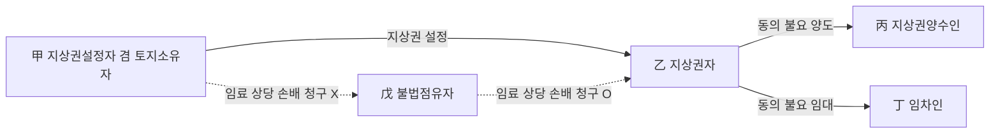

#### ⭐ 기출 출제포인트

1. **지상권의 양도·임대에 설정자 동의 불요** — "건물의 소유를 목적으로 하는 지상권의 양도는 토지소유자의 동의를 요한다"(X)가 2023년 정답 선지.
2. **양도금지 특약의 효력** — 지상권자에게 불리하여 무효 → "양도가 금지된 지상권의 양수인은 양수한 지상권으로 지상권설정자에게 대항할 수 있다"(O).
3. **2년 연체의 합산 여부** — "양도 전후에 걸쳐 2년 이상 연체된 경우 양수인에 대한 연체기간이 2년이 되지 않아도 소멸청구 가능"(X)이 반복 출제.
4. **지상권과 지상물의 분리 양도** — 지상권자와 지상물 소유자가 일치할 필요 없음.
5. **지료증감청구권의 성질** — 형성권. "지상권자의 지료증감청구권은 형성권이다"(2019년 기출 02번, 옳은 선지).

#### 📊 기출 분석

| 연도 | 출제 형태 | 핵심 논점 |
|---|---|---|
| 2019년 기출 (02번) | 옳지 않은 것 | ③ 지상권자의 지료증감청구권은 형성권이다(옳은 선지) |
| 2019년 기출 (34번) | 옳지 않은 것 | ① 존속기간 내 토지 임대 O / ⑤ 지료 약정 없어도 성립 O |
| 2023년 기출 (33번) | 옳은 것 | ① 지상권 양도에 토지소유자 동의 요함(X) |
| 감정평가사 기출 (38번·문제집 64) | 옳지 않은 것 | ③ 양도 전후 합산 2년이면 양수인 소멸청구 O(X — 정답) |
| 감정평가사 기출 | 옳지 않은 것 | ④ 양도금지된 지상권의 양수인은 설정자에게 대항 O / ⑤ 종전 소유자에 대한 연체기간 합산 주장 불가 |
| 2025년 기출 (31번) | 옳지 않은 것 | ③ 지상권자는 제3자에게 구분지상권을 설정해 줄 수 있다 / ⑤ 제288조 통지 |

**출제 빈도** — 지상권 문항 5개 선지 중 **평균 2~3개**가 이 관에서 나온다. 특히 ==양도·임대의 자유==와 ==2년 지료연체==는 거의 매년 등장한다.

**반복되는 함정 선지** — ① "지상권의 양도는 토지소유자의 동의를 요한다"(X) ② "양도 전후 연체를 합산하여 2년이면 양수인이 소멸청구할 수 있다"(X) ③ "지상권을 유보한 채 지상물 소유권만 양도할 수는 없다"(X) ④ "지료 약정을 등기하지 않으면 지상권자에게 청구할 수 없다"(X).

**최근 경향** — 지료연체 논점은 단순 조문 확인에서 벗어나 **양도 전후 합산 불가**와 **일부 변제로 2년 미만이 된 경우**라는 두 판례를 결합해 묻는 방향으로 정교해지고 있다.

#### 🔍 기출 선지로 배우는 법리

> 실제 출제된 선지를 그대로 놓고 O/X와 근거를 확인한다.

**①** 건물의 소유를 목적으로 하는 지상권의 양도는 토지소유자의 동의를 요한다. (2023년 기출 33번 ①) — **X**
어디가 틀렸나: 지상권자는 타인에게 그 권리를 양도하거나 그 권리의 존속기간 내에서 그 토지를 임대할 수 있으며(제282조), 이는 ==지상권설정자의 동의를 요하지 아니한다==.

**②** 지상권자의 지료지급이 토지소유권의 양도 전후에 걸쳐 2년 이상 연체된 경우, 토지양수인에 대한 연체기간이 2년이 되지 않더라도 토지양수인은 지상권소멸청구를 할 수 있다. (감정평가사 기출 38번 / 문제집 64번) — **X**
어디가 틀렸나: 양수인에 대한 연체기간이 2년이 되지 않는다면 ==양수인은 지상권소멸청구를 할 수 없다==(대판 2001.3.13. 99다17142). 정답 ③.

**③** 양도가 금지된 지상권의 양수인은 양수한 지상권으로 지상권설정자에게 대항할 수 있다. (감정평가사 기출) — **O**
근거: 지상권의 양도금지 특약은 지상권자에게 불리하므로 제289조에 의해 ==무효==다. 따라서 이를 위반하여 양도하더라도 양수인은 지상권자의 지위를 설정자에게 주장할 수 있다.

**④** 토지양수인이 지상권자의 지료 지급이 2년 이상 연체되었음을 이유로 지상권소멸청구를 하는 경우, 종전 토지소유자에 대한 연체기간의 합산을 주장할 수 없다. (감정평가사 기출) — **O**
근거: 99다17142. ②와 같은 법리를 반대편에서 물은 것이다.

**⑤** 지상권자는 지상권을 유보한 채 지상물 소유권만을 양도할 수 있으나 지상물 소유권을 유보한 채 지상권만을 양도할 수는 없다. (문제집 기본문제 01 ②) — **X**
어디가 틀렸나: ==둘 다 가능==하며, 지상권자와 지상물 소유권자가 반드시 일치하여야 하는 것은 아니다(2006다6126). 정답 ②.

**⑥** 지상권자는 지상권설정자의 명시적 반대에도 불구하고 지상권의 존속기간 내에서 그 토지를 타인에게 임대할 수 있다. (문제집 실전문제 08 ⑤) — **O**
근거: 제282조. 지상권의 양도성은 절대적으로 보장되며 소유자의 의사에 반하여도 자유롭게 양도할 수 있다(90다15716).

**⑦** 지상권자가 2년 이상의 지료를 지급하지 아니한 때에는 지상권설정자는 지상권의 소멸을 청구할 수 있으나, 당사자의 약정으로 그 기간을 단축할 수 있다. (문제집 실전문제 03 ⑤) — **X**
어디가 틀렸나: 제287조는 ==편면적 강행규정==이므로 지상권자에게 불리하게 기간을 단축하는 약정은 효력이 없다(제289조). 정답 ⑤.

**⑧** 지상권자의 지료증감청구권은 형성권이다. (2019년 기출 02번 ③) — **O**
근거: 제286조. 형성권이므로 증액·감액청구를 하면 곧 지료가 증감되고, 다툼이 있어 법원이 정하는 경우에도 그 효력은 청구한 때에 소급한다.

#### ✏️ 사례형 적용

> **사례 1** — 甲은 자기 소유 X토지에 乙을 위해 「견고한 건물 소유, 존속기간 30년, 지료 연 2,000만 원」의 지상권을 설정하고 지료도 등기하였다. 乙은 2020년·2021년 2년분 지료를 연체하였다. 甲이 소멸청구를 하기 전인 2022년 3월, 乙은 밀린 지료 중 1년분을 변제하였다. 한편 甲은 2022년 5월 X를 丙에게 매도하였고, 丙은 "乙이 이미 2년 이상 연체했다"며 지상권소멸청구를 한다.

**검토** — ① **일부 변제의 효과**: 甲이 소멸청구를 하지 않고 있는 동안 乙로부터 연체 지료의 일부를 지급받아 ==연체 지료가 2년 미만으로 되었으므로 소멸청구를 할 수 없다==(2012다102384). ② **양도 전후 합산 불가**: 설령 연체가 남아 있더라도, 양도인 甲에 대한 연체가 2년 이상이라도 ==양수인 丙에 대한 연체가 2년 이상이 아니면 丙은 소멸청구를 할 수 없다==(99다17142). ③ 결론: 丙의 소멸청구는 부적법하다. ④ **덧붙여** — 만약 乙의 지상권이 저당권의 목적이거나 X토지 위의 건물이 저당권의 목적이라면, 소멸청구는 ==저당권자에게 통지한 후 상당한 기간이 경과==해야 효력이 생긴다(제288조).

> **사례 2** — 乙은 甲 소유 토지에 지상권을 설정받아 창고를 신축하였다. 甲은 지상권설정계약서에 「지상권을 제3자에게 양도하거나 토지를 임대할 수 없다」는 특약을 넣었다. 그럼에도 乙은 지상권을 丙에게 양도하고 이전등기를 마쳤고, 별도로 丁에게 토지의 일부를 임대하였다. 甲은 특약 위반을 이유로 丙·丁을 상대로 인도를 구한다.

**검토** — ① 지상권의 양도·임대에 관한 제282조는 ==편면적 강행규정==이므로(제289조), 양도·임대를 금지하는 특약은 지상권자에게 불리하여 **무효**다. ② 지상권의 양도성은 절대적으로 보장되어 소유자의 의사에 반하여도 자유롭게 양도할 수 있다(90다15716). ③ 따라서 丙은 적법하게 지상권을 취득하였고 ==양수한 지상권으로 甲에게 대항할 수 있다==. 丁의 임차도 존속기간 내라면 적법하다. 甲의 청구는 모두 이유 없다. ④ **주의** — 만약 乙이 **창고 건물만** 丙에게 양도하고 지상권 이전등기를 하지 않았다면, 丙은 건물 소유권만 취득할 뿐 ==지상권을 취득하려면 따로 등기를 하여야 한다==(84다카1131·1132 전합).

> **사례 3** — 甲은 乙에게 지상권을 설정해 주었다. 그런데 제3자 丙이 그 토지를 무단으로 점유하여 주차장으로 사용하고 있다. 甲과 乙은 각각 丙에게 임료 상당의 손해배상을 청구하려 한다.

**검토** — ① **乙(지상권자)**: 지상권이 침해되었으므로 지상권에 기한 반환·방해제거·방해예방청구권을 행사할 수 있고(제290조 제1항, 제213조·제214조), 임료 상당 손해배상도 청구할 수 있다. ② **甲(설정자)**: 지상권을 설정해 준 대지소유자는 그 대지를 사용·수익할 수 없는 법리이므로 ==불법점유자에게 임료 상당의 손해금을 청구할 수 없다==(74다1150). ③ **다만** 甲의 권리가 **담보지상권**이었다면 정반대의 결론이 된다 — 사용·수익권을 배제하지 않은 담보지상권자는 임료 상당 손해배상을 구할 수 없고(2006다586), 오히려 토지소유자가 사용·수익할 수 있다(2015다69907).

#### ⚠️ 이 관의 함정 총정리

1. "지상권의 양도·임대에는 토지소유자의 동의가 필요하다"고 하면 틀림 → ==설정자 동의 불요==(제282조). 임차권과 정반대다.
2. "양도 전후의 연체를 합산해 2년이면 양수인이 소멸청구할 수 있다"고 하면 틀림 → ==양수인에 대한 연체가 2년 이상이어야== 한다(99다17142).
3. "일부 변제로 연체가 2년 미만이 되어도 이미 발생한 소멸청구권은 남는다"고 하면 틀림 → ==소멸청구 전에 2년 미만이 되면 청구할 수 없다==(2012다102384).
4. "지상권설정자는 소유자이므로 불법점유자에게 임료 상당 손해금을 청구할 수 있다"고 하면 틀림 → ==청구할 수 없다==(74다1150). 청구권자는 지상권자다.
5. "지상권자는 필요비·유익비 모두 상환청구할 수 있다"고 하면 틀림 → ==유익비만 가능==. 설정자에게는 토지를 사용에 적합한 상태로 유지할 의무가 없기 때문이다.

#### ✅ OX 확인문제

> 다음 진술의 참·거짓을 판단하시오.

**1.** 지상권자는 타인에게 그 권리를 양도하거나 그 권리의 존속기간 내에서 그 토지를 임대할 수 있으며, 이에 지상권설정자의 동의를 요하지 않는다.
→ **O**. 제282조. 지상권의 양도성은 절대적으로 보장되어 소유자의 의사에 반하여도 자유롭게 양도할 수 있다(대판 1991.11.8. 90다15716).

**2.** 지상권의 양도를 금지하는 특약은 유효하므로, 이를 위반하여 지상권을 양수한 자는 지상권설정자에게 대항할 수 없다.
→ **X**. 제282조는 편면적 강행규정이므로(제289조) 양도금지 특약은 ==지상권자에게 불리하여 무효==이고, 양수인은 지상권자의 지위를 설정자에게 주장할 수 있다.

**3.** 지상권자는 지상권을 유보한 채 지상물 소유권만을 양도할 수도 있고, 지상물 소유권을 유보한 채 지상권만을 양도할 수도 있다.
→ **O**. 대판 2006.6.15. 2006다6126. 지상권자와 지상물 소유권자가 반드시 일치하여야 하는 것은 아니다.

**4.** 지상권을 설정해 준 대지소유자는 불법점유자에게 임료 상당의 손해금을 청구할 수 있다.
→ **X**. 소유권 행사에 제한을 받아 대지를 사용·수익할 수 없으므로 ==청구할 수 없다==(대판 1974.11.12. 74다1150).

**5.** 지상권자가 토지소유권의 양도 전후에 걸쳐서 지료지급을 지체한 경우, 양도인과 양수인에 대하여 연체된 지료의 합이 2년분에 이르면 양수인은 지상권의 소멸을 청구할 수 있다.
→ **X**. ==양수인에 대한 연체가 2년 이상이 아니면 양수인은 소멸청구를 할 수 없다==(대판 2001.3.13. 99다17142).

**6.** 지상권설정자가 지상권의 소멸을 청구하지 않고 있는 동안 지상권자로부터 연체된 지료의 일부를 지급받아 연체된 지료가 2년 미만으로 된 경우에도 지상권소멸청구를 할 수 있다.
→ **X**. 이 경우에는 지상권의 소멸을 ==청구할 수 없다==(대판 2014.8.28. 2012다102384).

**7.** 지상권이 저당권의 목적인 때 또는 그 토지에 있는 건물·수목이 저당권의 목적이 된 때에는, 지상권소멸청구는 저당권자에게 통지한 후 상당한 기간이 경과함으로써 그 효력이 생긴다.
→ **O**. 제288조. 2025년 기출 31번 ⑤로 그대로 출제되었다.

**8.** 지료가 토지에 관한 조세 기타 부담의 증감이나 지가의 변동으로 상당하지 아니하게 된 때에는 당사자는 그 증감을 청구할 수 있으며, 이 지료증감청구권은 형성권이다.
→ **O**. 제286조. 형성권이므로 청구만으로 지료가 증감되고, 법원이 정하는 경우에도 그 효력은 청구한 때에 소급한다.

**9.** 지상권자에게는 필요비상환청구권과 유익비상환청구권이 모두 인정된다.
→ **X**. 지상권설정자에게는 토지를 사용·수익에 적합한 상태로 유지할 의무가 없으므로 ==필요비상환청구권은 인정되지 않고 유익비상환청구권만 인정==된다는 것이 통설이다.

**10.** 지상권이 있는 건물의 양수인이 건물에 대해 소유권이전등기를 마치면 지상권도 당연히 함께 취득한다.
→ **X**. 양수인이 ==지상권을 취득하기 위해서는 따로 그 등기를 하여야 한다==(대판 1985.4.9. 84다카1131·1132 전합).

#### 🧠 암기법

> 🔑 **「지상권은 동의 없이, 임차권은 동의 있어야」**
> **지**상권 — 양도·임대·저당 모두 **설정자 동의 불요**(제282조·제371조).
> **임**차권 — 양도·전대 모두 **임대인 동의 필요**(제629조), 저당권 목적도 불가.
> 물권은 자유롭고 채권은 묶여 있다 — 이 한 줄로 두 제도의 처분성을 모두 정리할 수 있다.

> 🔑 **「이(2)년은 각자 계산, 갚으면 리셋」 — 지료연체 2문제**
> **각자 계산** — 양도 전후 연체는 **합산 X**. 양수인은 자기 앞으로 2년을 채워야 한다(99다17142).
> **리셋** — 소멸청구 전에 일부 변제로 2년 미만이 되면 **청구 불가**(2012다102384).
> → "**따로 세고, 갚으면 지운다**".

> 🔑 **「설정자는 못 받고, 지상권자가 받는다」 — 불법점유 손해배상**
> 일반 지상권: 임료 상당 손해배상 → **지상권자 O / 설정자 X** (74다1150)
> 담보지상권: 임료 상당 손해배상 → **담보지상권자 X** (2006다586), 축조 중지 요구만 O (2003마1753)
> → 사용·수익권이 **어디에 있는지**만 보면 답이 나온다.

> 🔑 **「지상권은 유익비만」 — 비용상환 3단 비교**
> 지상권자 = **유**익비만 / 전세권자 = **유**익비만 / 임차인 = **필**요비＋**유**익비.
> 필요비를 못 받는 이유: 설정자에게 **사용에 적합한 상태를 유지할 의무가 없기 때문**.

#### ⚖️ 법조문 원문

> 📖 이 관이 근거로 삼은 조문의 **전문**이다. 본문 인용은 발췌지만 여기서는 조 전체를 싣는다. 출처는 법제처 정본이다.

**― 민법 ―**

> 📌 **민법 제282조(지상권의 양도, 임대)** — "지상권자는 타인에게 그 권리를 양도하거나 그 권리의 존속기간 내에서 그 토지를 임대할 수 있다."

> 📌 **민법 제283조(지상권자의 갱신청구권, 매수청구권)** — "①지상권이 소멸한 경우에 건물 기타 공작물이나 수목이 현존한 때에는 지상권자는 계약의 갱신을 청구할 수 있다. ②지상권설정자가 계약의 갱신을 원하지 아니하는 때에는 지상권자는 상당한 가액으로 전항의 공작물이나 수목의 매수를 청구할 수 있다."

> 📌 **민법 제285조(수거의무, 매수청구권)** — "①지상권이 소멸한 때에는 지상권자는 건물 기타 공작물이나 수목을 수거하여 토지를 원상에 회복하여야 한다. ②전항의 경우에 지상권설정자가 상당한 가액을 제공하여 그 공작물이나 수목의 매수를 청구한 때에는 지상권자는 정당한 이유없이 이를 거절하지 못한다."

> 📌 **민법 제286조(지료증감청구권)** — "지료가 토지에 관한 조세 기타 부담의 증감이나 지가의 변동으로 인하여 상당하지 아니하게 된 때에는 당사자는 그 증감을 청구할 수 있다."

> 📌 **민법 제287조(지상권소멸청구권)** — "지상권자가 2년 이상의 지료를 지급하지 아니한 때에는 지상권설정자는 지상권의 소멸을 청구할 수 있다."

> 📌 **민법 제288조(지상권소멸청구와 저당권자에 대한 통지)** — "지상권이 저당권의 목적인 때 또는 그 토지에 있는 건물, 수목이 저당권의 목적이 된 때에는 전조의 청구는 저당권자에게 통지한 후 상당한 기간이 경과함으로써 그 효력이 생긴다."

> 📌 **민법 제289조(강행규정)** — "제280조 내지 제287조의 규정에 위반되는 계약으로 지상권자에게 불리한 것은 그 효력이 없다."

> 📌 **민법 제290조(준용규정)** — "①제213조, 제214조, 제216조 내지 제244조의 규정은 지상권자간 또는 지상권자와 인지소유자간에 이를 준용한다. ②제280조 내지 제289조 및 제1항의 규정은 제289조의2의 규정에 의한 구분지상권에 관하여 이를 준용한다."

### 제4관 지상권의 소멸

> 📖 지상권이 어떤 사유로 끝나고, 끝난 뒤에 지상권자와 설정자 사이에 무엇이 정산되는지를 다룬다. 지상권 특유의 소멸사유인 **지료연체에 의한 소멸청구**(제287조)와 **지상권의 포기**(제371조 제2항), 그리고 소멸 후의 **수거의무·매수청구권**이 핵심이다. 앞의 제3관에서 본 지료연체 법리가 여기서 소멸의 국면으로 이어진다.

> ⭐ **이 관에서 반드시 챙길 3가지**
> ① 지상권 특유의 소멸사유는 ==소멸청구(제287조)·포기·약정소멸사유== 세 가지다. 소멸청구는 형성권이며, 이에 의한 소멸은 법률행위로 인한 물권변동이므로 ==말소등기를 요한다==.
> ② 지상권이 저당권의 목적으로 되어 있으면 ==저당권자의 동의 없이 포기할 수 없고==(제371조 제2항), 소멸청구도 ==저당권자에게 통지한 후 상당한 기간이 경과==해야 효력이 생긴다(제288조).
> ③ 소멸의 효과는 ==수거·원상회복의무(제285조①) → 설정자의 매수청구(제285조②) / 지상권자의 갱신청구·매수청구(제283조)== 순으로 정리한다.

#### 1. 의의

지상권의 소멸이란 지상권이 종국적으로 효력을 잃는 것을 말한다. 지상권은 **물권 일반의 소멸사유**와 **지상권 특유의 소멸사유**로 소멸하며, 소멸 후에는 토지의 원상회복과 지상물의 처리라는 정산 문제가 남는다.

- 지상권은 **20년** 동안 행사하지 않으면 소멸시효가 완성한다(제162조 제2항).
- ==지상물이 멸실되어도 존속기간이 만료되지 않는 한 지상권은 소멸하지 않는다==(대판 1996.3.22. 95다49318). 소멸사유를 묻는 문제에서 가장 자주 나오는 함정이다.

#### 2. 요건

**소멸사유 총정리**

| 구분 | 소멸사유 | 비고 |
|---|---|---|
| 물권 일반의 소멸사유 | 토지의 멸실 | 지상물 멸실은 소멸사유가 **아니다** |
| 물권 일반의 소멸사유 | 존속기간의 만료 | 갱신청구권·지상물매수청구권 발생 |
| 물권 일반의 소멸사유 | ==소멸시효== | 20년(제162조 제2항) |
| 물권 일반의 소멸사유 | 혼동 | 지상권에 저당권이 설정된 경우에는 ==혼동으로 소멸하지 않는다== |
| 물권 일반의 소멸사유 | 지상권에 **우선하는 저당권**의 실행으로 인한 경매 | 선순위 저당권이 실행되면 후순위 지상권은 소멸 |
| 물권 일반의 소멸사유 | 토지수용 | — |
| 지상권 특유의 소멸사유 | ==지상권설정자의 소멸청구==(제287조) | 2년 이상 지료연체 |
| 지상권 특유의 소멸사유 | ==지상권의 포기== | 저당권의 목적이면 저당권자 동의 필요(제371조 제2항) |
| 지상권 특유의 소멸사유 | ==약정소멸사유의 발생== | 지상권자에게 불리한 약정은 무효(제289조) |
| 담보지상권 특유 | 피담보채권의 변제·시효소멸 | 부종하여 소멸(2011다6342), 목적 상실로 소멸(90다카27570) |

**지상권소멸청구권(제287조)**

| 항목 | 내용 |
|---|---|
| 요건 | 정기의 지료를 지급하여야 하는 지상권자가 ==2년 이상의 지료를 체납== |
| 성질 | ==형성권==(통설) |
| 제한① | 소멸청구 전에 일부 변제로 연체가 2년 미만이 되면 청구 불가(2012다102384) |
| 제한② | 양도 전후 연체 합산 불가 — 양수인에 대한 연체가 2년 이상이어야(99다17142) |
| 제한③ | 지상권 또는 그 토지 위 건물·수목이 저당권의 목적이면 ==저당권자에게 통지 후 상당한 기간 경과==로 효력 발생(제288조) |
| 등기 | 소멸청구에 의한 소멸은 **법률행위로 인한 물권변동**이므로 ==말소등기를 요한다== |
| 효과 | 지상권 소멸 + 지상권자는 ==지상물매수청구권을 잃는다==(72다2085, 93다10781) |
| 강행규정 | 제289조 — 지상권자에게 불리한 약정 무효 |

**약정소멸사유의 유효성**

| 약정 내용 | 효력 | 이유 |
|---|---|---|
| 「지료를 **3년간** 체납한 때 소멸청구할 수 있다」 | ==유효== | 지상권자에게 **유리**(법정 2년보다 완화) |
| 「지료를 **1년만** 체납해도 소멸청구할 수 있다」 | ==무효== | 지상권자에게 **불리**(제289조) |
| 「지상권을 양도할 수 없다」 | 무효 | 제282조 위반, 지상권자에게 불리 |
| 「갱신 시 존속기간을 최단기간보다 단축한다」 | 무효 | 제284조 위반, 지상권자에게 불리 |

**지상권의 포기**

| 상황 | 포기 가부 | 근거 |
|---|---|---|
| 지상권에 저당권이 설정되어 있지 않은 경우 | ==지상권자가 단독으로 포기 O== (말소등기를 해야 소멸) | 물권적 단독행위 |
| 지상권 자체가 **저당권의 목적**으로 되어 있는 경우 | ==저당권자의 동의 없이 포기 X== | 제371조 제2항 |

#### 3. 효과

| 구분 | 효과 | 근거 |
|---|---|---|
| 수거의무·원상회복의무 | 지상권이 소멸한 때 지상권자는 건물 기타 공작물이나 수목을 ==수거하여 토지를 원상에 회복==하여야 한다 | 제285조 제1항 |
| 지상권자의 갱신청구권 | 존속기간 만료로 소멸 + 지상물 현존 → 계약 갱신 청구 O (청구권) | 제283조 제1항 |
| 지상권자의 지상물매수청구권 | 설정자가 갱신을 원하지 않는 때 → 상당한 가액으로 매수청구(형성권) | 제283조 제2항 |
| 지상권설정자의 매수청구권 | 상당한 가액을 제공하여 매수를 청구하면 ==지상권자는 정당한 이유 없이 거절하지 못한다== | 제285조 제2항 |
| 유익비상환청구권 | 지상권 소멸 시 ==토지소유자의 선택에 좇아== 지출금액이나 현존 증가액의 상환을 청구. 법원은 소유자의 청구에 의해 상당한 상환기간을 허여할 수 있다 | 제626조 제2항 |
| 필요비상환청구권 | ==인정되지 않는다== | 통설 |
| 지료연체로 소멸한 경우 | 지상물매수청구권 ==부정== | 72다2085, 93다10781 |
| 말소등기 | 소멸청구·포기에 의한 소멸은 ==말소등기를 요한다== | 제186조 |

**소멸청구 vs 소멸통고 — 혼동 주의**

| 구분 | 지상권 | 전세권 |
|---|---|---|
| 지료·차임 연체 시 | 2년 이상 연체 → ==소멸청구==(제287조) | — |
| 기간 약정이 없는 경우 | 최단존속기간으로 제한되므로 ==소멸통고 제도 없음== | 언제든지 ==소멸통고==, 도달 후 6월 경과로 소멸 |
| 법정갱신 | 규정 없음 | 규정 있음(건물전세권) |

#### 4. 관련 조문

> 📌 **민법 제285조(수거의무, 매수청구권)** — "① 지상권이 소멸한 때에는 지상권자는 건물 기타 공작물이나 수목을 수거하여 토지를 원상에 회복하여야 한다. ② 전항의 경우에 지상권설정자가 상당한 가액을 제공하여 그 공작물이나 수목의 매수를 청구한 때에는 지상권자는 정당한 이유없이 이를 거절하지 못한다."

> 📌 **민법 제287조(지상권소멸청구권)** — "지상권자가 2년 이상의 지료를 지급하지 아니한 때에는 지상권설정자는 지상권의 소멸을 청구할 수 있다."

> 📌 **민법 제288조(지상권소멸청구와 저당권자에 대한 통지)** — "지상권이 저당권의 목적인 때 또는 그 토지에 있는 건물, 수목이 저당권의 목적이 된 때에는 전조의 청구는 저당권자에게 통지한 후 상당한 기간이 경과함으로써 그 효력이 생긴다."

> 📌 **민법 제371조(지상권을 목적으로 하는 저당권) 제2항** — "지상권을 목적으로 저당권을 설정한 자는 **저당권자의 동의 없이** 지상권을 소멸하게 하는 행위를 하지 못한다." (여기의 '소멸하게 하는 행위'에는 **포기**도 포함된다.)

> 📌 **민법 제162조 제2항** — 지상권은 20년 동안 행사하지 아니하면 소멸시효가 완성한다.

> 📌 **민법 제289조(강행규정)** — 제280조 내지 제287조에 위반되는 계약으로 지상권자에게 불리한 것은 그 효력이 없다.

#### 5. 핵심 판례 법리

**[1] 지상물이 멸실해도 지상권은 소멸하지 않는다** (대판 1996.3.22. 95다49318)
지상권은 타인의 토지를 사용하는 것을 본질적 내용으로 하므로, 기존의 건물 기타 공작물이나 수목이 멸실되더라도 ==존속기간이 만료되지 않는 한 지상권은 소멸되지 아니한다==. "수목의 소유를 목적으로 하는 지상권은 수목이 멸실되면 소멸한다"는 진술은 틀렸다.

**[2] 연체 지료 일부 변제로 2년 미만이 되면 소멸청구 불가** (대판 2014.8.28. 2012다102384)
지상권설정자가 지상권의 소멸을 청구하지 않고 있는 동안 지상권자로부터 연체된 지료의 일부를 지급받아 연체된 지료가 2년 미만으로 된 경우에는 ==지상권자에게 지상권의 소멸을 청구할 수 없다==.

**[3] 토지소유권 양도 전후 연체의 합산 불가** (대판 2001.3.13. 99다17142)
지상권자의 지료지급 연체가 토지소유권의 양도 전후에 걸쳐 이루어진 경우, 양도인에 대하여 2년 이상 지료를 연체하였다 하더라도 ==양수인에 대한 연체가 2년 이상이 아니면 양수인은 지상권의 소멸을 청구할 수 없다==.

**[4] 관습법상 법정지상권도 제287조에 의해 소멸한다** (대판 1993.6.29. 93다10781)
관습상의 법정지상권에 대하여도 다른 특별한 사정이 없는 한 민법의 지상권에 관한 규정을 준용하여야 하므로, ==지상권자가 2년분 이상의 지료를 지급하지 아니하였다면 관습상의 법정지상권도 제287조에 따른 지상권소멸청구의 의사표시에 의하여 소멸한다==.

**[5] 지료연체로 소멸청구를 당하면 지상물매수청구권을 잃는다** (대판 1972.12.26. 72다2085; 대판 1993.6.29. 93다10781)
지상권자가 2년간 지료를 지급하지 아니하여 지상권소멸청구를 당한 경우에는 ==지상물에 대한 매수청구권을 행사하지 못한다==.

**[6] 매수청구권은 형성권, 가격은 행사 당시 시가** (대판 1972.7.25. 72다653; 대판 1967.12.18. 67다2355)
매수청구권은 형성권으로서 그 행사에 의하여 ==매수의 효력이 즉시 발생==하며, 그 가격은 ==매수청구권 행사 당시의 시가 상당액==이다.

**[7] 담보지상권은 피담보채권의 소멸에 부종하여 소멸한다** (대판 2011.4.14. 2011다6342)
담보지상권을 설정하였다면, 근저당권 등의 피담보채권이 ==변제 등으로 만족을 얻어 소멸한 경우는 물론이고 시효로 소멸한 경우에도== 그 지상권은 피담보채권에 부종하여 소멸한다. 이때 ==존속기간이 남아 있는지는 묻지 않는다==.

**[8] 목적을 잃은 지상권은 소멸한다** (대판 1991.3.12. 90다카27570)
가등기에 기한 본등기가 이루어질 경우 부동산의 실질적 이용가치를 유지·확보할 목적으로 설정된 지상권은, ==그 가등기에 기한 본등기청구권이 시효완성으로 소멸하였다면 그 지상권 또한 목적을 잃어 소멸==한다.

**[9] 지료의 2년분 이상 지체는 유사 물권에서도 소멸청구 사유** (대판 2015.7.23. 2015다206850)
자기 소유 토지에 분묘를 설치한 후 소유권이 경매 등으로 타인에게 이전되면서 분묘기지권을 취득한 자가, 판결로 지료 액수가 정해졌음에도 책임 있는 사유로 판결확정 전후에 걸쳐 ==2년분 이상의 지료지급을 지체한 경우 새로운 토지소유자는 분묘기지권의 소멸을 청구할 수 있다==. 지상권의 2년 연체 법리가 지상권 유사 물권에도 관철됨을 보여준다.

**[10] 법정지상권자의 부당이득반환의무** (대판 1997.12.26. 96다34665)
법정지상권자라 할지라도 대지 소유자에게 지료를 지급할 의무는 있고, 장차 법정지상권을 취득할 지위에 있어 철거·인도청구를 거부할 수 있다 하더라도 ==그 대지를 점유·사용함으로 인하여 얻은 이득은 부당이득으로서 반환할 의무가 있다==. 소멸 국면에서 지료·부당이득의 정산이 문제되는 근거다.

**[11] 지상권소멸청구권은 명칭은 청구권이나 실질은 형성권이다** (문제집 제1편 형성권 정리)
민법전에 청구권으로 표기되어 있으나 실질이 형성권인 권리로 ==지상권설정자의 지상권소멸청구권(제287조)==, 지상권자의 지상물매수청구권(제283조 제2항), 지료증감청구권(제286조) 등이 열거된다.

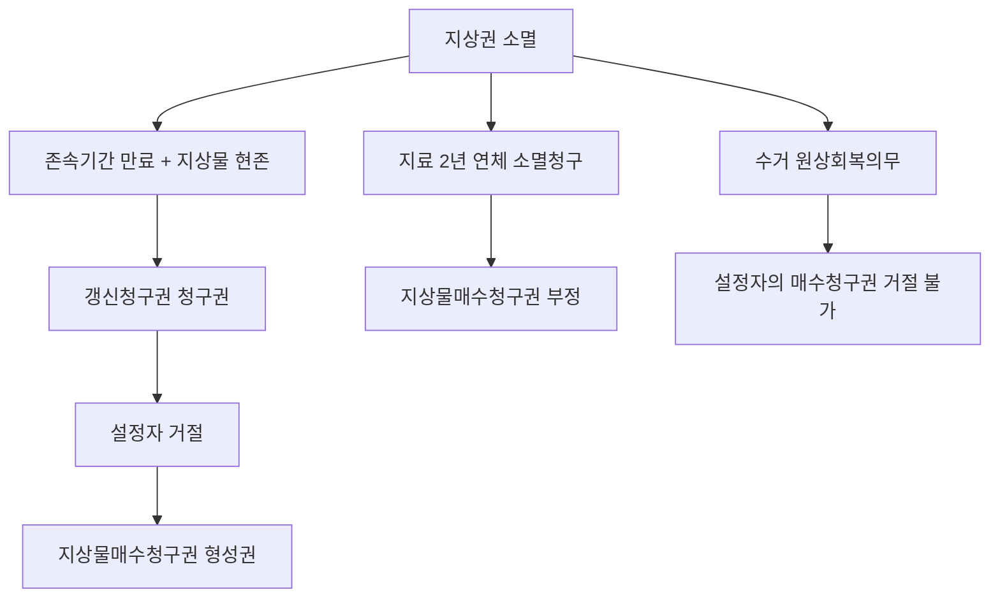

#### ⭐ 기출 출제포인트

1. **수거·원상회복의무** — "지상권이 소멸한 경우 특별한 사정이 없는 한, 지상권자는 건물 기타 공작물이나 수목을 수거하여 토지를 원상에 회복하여야 한다"(O)로 그대로 출제.
2. **제288조 저당권자에 대한 통지** — 2025년 기출 31번 ⑤로 출제. "저당권자에게 통지한 후 상당한 기간이 경과해야 효력이 생긴다"(O).
3. **지상권의 포기와 저당권자의 동의** — 제371조 제2항. 전세권(제371조 제1항 관련 선지)과 묶어 출제되기도 한다.
4. **혼동의 예외** — "지상권에 저당권을 설정해 준 지상권자가 지상권의 목적인 토지를 매수한 때에는 지상권이 혼동으로 소멸하지 않는다"(O, 2025년 기출 31번 ①).
5. **선순위 저당권 실행과 지상권 소멸** — "토지에 저당권, 지상권, 저당권이 순차 설정된 경우, 나중에 설정된 저당권이 실행되면 지상권은 소멸한다"(2025년 기출 31번 ②).

#### 📊 기출 분석

| 연도 | 출제 형태 | 핵심 논점 |
|---|---|---|
| 2025년 기출 (31번) | 옳지 않은 것 | ① 혼동의 예외 / ② 선순위 저당권 실행 시 지상권 소멸 / ④ 담보지상권은 존속기간과 무관하게 소멸 / ⑤ 제288조 통지 |
| 감정평가사 기출 (38번·문제집 64) | 옳지 않은 것 | ② 소멸 시 수거·원상회복의무(O) / ④ 담보지상권 시효소멸 시 지상권 소멸(O) |
| 2019년 기출 (34번) | 옳지 않은 것 | ④ 지료연체 소멸청구로 소멸해도 지상물매수청구권 인정(X — 정답) |
| 문제집 실전문제 03 | 옳지 않은 것 | ⑤ 약정으로 2년 기간을 단축 가능(X — 편면적 강행규정) |
| 문제집 제1편 형성권 문제 | 형성권 판별 | 지상권설정자의 지상권소멸청구권·지상권자의 지상물매수청구권은 **형성권** |

**출제 빈도** — 소멸 부분은 단독 문항보다 지상권 종합문항의 **1~2개 선지**로 꾸준히 등장한다. 2025년 지상권 문항은 5개 선지 중 4개가 소멸 논점이었을 만큼 최근 비중이 높아졌다.

**반복되는 함정 선지** — ① "수목이 멸실되면 지상권이 소멸한다"(X) ② "지료연체로 소멸해도 지상물매수청구권이 있다"(X) ③ "지상권에 저당권이 설정되어 있어도 지상권자가 단독으로 포기할 수 있다"(X) ④ "1년 연체 시 소멸청구할 수 있다는 약정도 유효하다"(X).

**최근 경향** — 지상권을 **저당권과 결합한 국면**(담보지상권의 부종적 소멸, 지상권에 대한 저당권과 포기·소멸청구의 제한, 순위에 따른 소멸)으로 묻는 문제가 뚜렷하게 늘고 있다.

#### 🔍 기출 선지로 배우는 법리

> 실제 출제된 선지를 그대로 놓고 O/X와 근거를 확인한다.

**①** 지상권이 소멸한 경우 특별한 사정이 없는 한, 지상권자는 건물 기타 공작물이나 수목을 수거하여 토지를 원상에 회복하여야 한다. (감정평가사 기출 38번 ②) — **O**
근거: 제285조 제1항. 다만 설정자가 상당한 가액을 제공하여 매수를 청구하면 지상권자는 정당한 이유 없이 거절하지 못한다(제285조 제2항).

**②** 지상권에 저당권이 설정된 경우, 지상권설정자의 지상권소멸청구는 그 저당권자에게 통지한 후 상당한 기간이 경과해야 효력이 생긴다. (2025년 기출 31번 ⑤) — **O**
근거: 제288조.

**③** 지상권에 저당권을 설정해 준 지상권자가 지상권의 목적인 토지를 매수한 때에는 지상권이 혼동으로 소멸하지 않는다. (2025년 기출 31번 ①) — **O**
근거: 지상권이 제3자(저당권자)의 권리의 목적이 되어 있으면 혼동으로 소멸하지 않는다. 제371조 제2항이 저당권자의 동의 없는 소멸행위를 금지하는 것과 같은 취지다.

**④** 토지의 담보가치 하락을 막기 위해 설정된 지상권은 피담보채권이 소멸하면 존속기간과 관계없이 소멸한다. (2025년 기출 31번 ④) — **O**
근거: 대판 2011.4.14. 2011다6342.

**⑤** 지료연체를 이유로 한 지상권소멸청구에 의해 지상권이 소멸하더라도 지상물매수청구권은 인정된다. (2019년 기출 34번 ④) — **X**
어디가 틀렸나: 지료연체로 소멸청구를 당한 경우에는 ==지상물매수청구권이 인정되지 않는다==(대판 1972.12.26. 72다2085). 정답 ④.

**⑥** 지상권자가 2년 이상의 지료를 지급하지 아니한 때에는 지상권설정자는 지상권의 소멸을 청구할 수 있으나, 당사자의 약정으로 그 기간을 단축할 수 있다. (문제집 실전문제 03 ⑤) — **X**
어디가 틀렸나: 지상권소멸청구권 규정은 ==지상권자에게 불리하게 약정하면 효력이 인정되지 않는 편면적 강행규정==이다(제289조). 정답 ⑤.

**⑦** 지상권설정자의 지상권소멸청구권은 명칭은 청구권이나 그 실질은 형성권이다. (문제집 제1편 기본문제) — **O**
근거: 제287조. 지상권자의 지상물매수청구권(제283조 제2항)·지료증감청구권(제286조)도 마찬가지다.

**⑧** 지상권이 소멸한 때 지상권설정자가 상당한 가액을 제공하여 그 토지에 현존하는 공작물이나 수목의 매수를 청구한 때에는 지상권자는 정당한 이유 없이 이를 거절하지 못한다. (문제집 실전문제 03 ③) — **O**
근거: 제285조 제2항. 지상권설정자의 매수청구권은 ==갱신청구권 없이 바로== 행사할 수 있다는 점에서 지상권자의 매수청구권과 다르다.

#### ✏️ 사례형 적용

> **사례 1** — 乙은 甲 소유 X토지에 「견고한 건물 소유, 존속기간 30년, 지료 연 3,000만 원」의 지상권을 설정받아 건물 Y를 신축하였고, 지료는 등기되었다. 그 후 乙은 丙에게서 돈을 빌리면서 **자신의 지상권에 저당권**을 설정해 주었다. 乙이 2년분 지료를 연체하자 甲은 즉시 乙에게 지상권소멸청구의 의사표시를 하고, 곧바로 Y의 철거를 구한다.

**검토** — ① **소멸청구의 요건**은 갖추었다(2년 이상 연체, 제287조). ② 그러나 지상권이 **저당권의 목적**이므로 甲의 소멸청구는 ==저당권자 丙에게 통지한 후 상당한 기간이 경과함으로써 비로소 효력이 생긴다==(제288조). 즉시 효력이 생기지 않는다. ③ 소멸청구에 의한 소멸은 **법률행위로 인한 물권변동**이므로 ==말소등기를 요한다==. ④ 소멸이 확정되면 乙은 Y를 수거하여 토지를 원상회복할 의무를 지고(제285조①), ==지료연체로 소멸한 것이므로 지상물매수청구권은 행사하지 못한다==(72다2085). ⑤ 다만 甲이 상당한 가액을 제공하여 Y의 매수를 청구하면 乙은 정당한 이유 없이 거절하지 못한다(제285조②).

> **사례 2** — 乙은 甲 소유 토지에 지상권을 취득한 뒤 丙에게 그 지상권을 목적으로 저당권을 설정해 주었다. 그 후 乙은 사업을 접기로 하고 지상권을 포기하려 한다. 또 다른 국면에서, 乙이 甲으로부터 그 토지의 소유권 자체를 매수하였다면 어떻게 되는가.

**검토** — ① **포기**: 지상권은 원래 지상권자가 단독으로 포기할 수 있는 물권적 단독행위이고 말소등기로 소멸한다. 그러나 지상권 자체가 저당권의 목적으로 되어 있으므로 ==丙(저당권자)의 동의 없이는 포기할 수 없다==(제371조 제2항). ② **혼동**: 乙이 토지 소유권을 취득하면 원칙적으로 지상권은 혼동으로 소멸하겠지만, ==그 지상권이 제3자 丙의 저당권의 목적이므로 혼동으로 소멸하지 않는다==(2025년 기출 31번 ①). 두 결론 모두 **저당권자의 이익을 보호**한다는 같은 취지에서 나온다.

> **사례 3** — 甲과 乙은 지상권설정계약을 하면서 「지료를 1년만 연체해도 甲은 지상권의 소멸을 청구할 수 있다」는 특약과 「지료를 3년간 연체한 때 소멸청구할 수 있다」는 특약 중 어느 하나를 넣으려 한다. 각 특약의 효력은?

**검토** — 제287조는 제289조에 의한 ==편면적 강행규정==이다. ① 「1년 연체 시 소멸청구」 특약은 법정 2년보다 지상권자에게 ==불리==하므로 **무효**다. ② 「3년 연체 시 소멸청구」 특약은 지상권자에게 ==유리==하므로 **유효**다. ③ 이처럼 편면적 강행규정은 "지상권자에게 유리한 쪽으로만 벗어날 수 있다"는 일방통행 구조로 판단하면 된다.

#### ⚠️ 이 관의 함정 총정리

1. "수목의 소유를 목적으로 하는 지상권은 수목이 멸실되면 소멸한다"고 하면 틀림 → ==존속기간이 만료되지 않는 한 소멸하지 않는다==(95다49318).
2. "지상권에 저당권이 설정되어 있어도 지상권자는 단독으로 포기할 수 있다"고 하면 틀림 → ==저당권자의 동의가 필요==하다(제371조 제2항).
3. "지상권소멸청구는 의사표시가 도달하면 곧바로 효력이 생긴다"고만 하면 부정확 → 지상권이나 그 토지 위 건물·수목이 **저당권의 목적**인 때에는 ==저당권자에게 통지한 후 상당한 기간 경과==로 효력 발생(제288조).
4. "1년만 연체해도 소멸청구할 수 있다는 약정도 사적자치상 유효"라고 하면 틀림 → ==지상권자에게 불리하여 무효==(제289조). 반대로 3년 약정은 유효.
5. "지료연체로 지상권이 소멸해도 지상물매수청구권은 남는다"고 하면 틀림 → ==행사하지 못한다==(72다2085, 93다10781). 갱신청구권도 마찬가지로 문제되지 않는다.

#### ✅ OX 확인문제

> 다음 진술의 참·거짓을 판단하시오.

**1.** 수목의 소유를 목적으로 하는 지상권은 수목이 멸실되면 소멸한다.
→ **X**. 기존의 건물·공작물·수목이 멸실되더라도 ==존속기간이 만료되지 않는 한 지상권은 소멸하지 아니한다==(대판 1996.3.22. 95다49318).

**2.** 지상권은 20년 동안 행사하지 않으면 소멸시효가 완성한다.
→ **O**. 제162조 제2항.

**3.** 지상권이 소멸한 때에는 지상권자는 건물 기타 공작물이나 수목을 수거하여 토지를 원상에 회복하여야 한다.
→ **O**. 제285조 제1항.

**4.** 지상권이 소멸한 때 지상권설정자가 상당한 가액을 제공하여 공작물이나 수목의 매수를 청구하면, 지상권자는 정당한 이유 없이 이를 거절하지 못한다.
→ **O**. 제285조 제2항. 지상권설정자의 매수청구권은 ==갱신청구권 없이 바로== 행사할 수 있다.

**5.** 지상권이 저당권의 목적인 때 또는 그 토지에 있는 건물·수목이 저당권의 목적이 된 때에도, 지상권소멸청구는 의사표시가 도달하는 즉시 효력이 생긴다.
→ **X**. ==저당권자에게 통지한 후 상당한 기간이 경과함으로써== 그 효력이 생긴다(제288조).

**6.** 지상권을 목적으로 저당권을 설정한 자는 저당권자의 동의 없이 지상권을 소멸하게 하는 행위를 하지 못하며, 여기에는 지상권의 포기도 포함된다.
→ **O**. 제371조 제2항.

**7.** 「지료를 1년만 연체하여도 지상권의 소멸을 청구할 수 있다」는 약정은 사적자치에 따라 유효하다.
→ **X**. 지상권자에게 불리하므로 ==무효==다(제289조). 반면 「3년간 체납한 때 소멸청구할 수 있다」는 약정은 지상권자에게 유리하여 유효하다.

**8.** 관습상의 법정지상권자가 2년분 이상의 지료를 지급하지 아니한 경우에도 민법 제287조에 따른 지상권소멸청구의 의사표시에 의하여 소멸한다.
→ **O**. 대판 1993.6.29. 93다10781. 관습상 법정지상권에도 민법의 지상권 규정이 준용된다.

**9.** 지상권소멸청구에 의한 지상권의 소멸은 법률의 규정에 의한 물권변동이므로 말소등기를 요하지 않는다.
→ **X**. 지상권소멸청구에 의한 소멸은 ==법률행위로 인한 물권변동으로서 말소등기를 요한다==.

**10.** 지상권자가 2년간 지료를 지급하지 아니하여 지상권소멸청구를 당한 경우에도, 지상물이 현존하는 한 지상물매수청구권을 행사할 수 있다.
→ **X**. 이 경우에는 지상물에 대한 매수청구권을 ==행사하지 못한다==(대판 1972.12.26. 72다2085; 대판 1993.6.29. 93다10781).

#### 🧠 암기법

> 🔑 **「소·포·약」 — 지상권 특유의 소멸사유 3가지**
> **소**멸청구(제287조, 2년 연체) · **포**기(제371조② 저당권자 동의) · **약**정소멸사유.
> 물권 일반의 소멸사유(토지 멸실·기간 만료·소멸시효·혼동·경매·수용)와 구별해서 외운다.
> **지상물 멸실은 소멸사유가 아니다** — 이 한 줄이 가장 자주 물어보는 함정이다.

> 🔑 **「저당권자가 있으면 한 박자 쉬어간다」**
> 지상권 **포기** → 저당권자의 **동의** 필요(제371조②)
> 지상권 **소멸청구** → 저당권자에게 **통지** 후 상당 기간 경과(제288조)
> 지상권자가 토지를 매수 → **혼동으로 소멸 X**
> → 셋 다 이유는 하나, **저당권자를 해칠 수 없다**.

> 🔑 **「지상권자에게 유리하면 통과, 불리하면 무효」 — 제289조 일방통행**
> 3년 연체 약정 → **유효**(유리)
> 1년 연체 약정 → **무효**(불리)
> 양도금지 특약 → **무효**(불리)
> 갱신 시 기간 단축 → **무효**(불리)
> 편면적 강행규정은 **한쪽으로만 열린 문**이다.

> 🔑 **「기간 만료면 사고, 연체면 못 산다」 — 매수청구권의 운명**
> **존속기간 만료**로 소멸 → 갱신청구 → 거절 → **지상물매수청구 O**(형성권, 행사 당시 시가)
> **지료 2년 연체**로 소멸청구 → **지상물매수청구 X**(72다2085)
> → 자기 잘못으로 끝난 지상권자에게는 매수청구권을 주지 않는다.

#### ⚖️ 법조문 원문

> 📖 이 관이 근거로 삼은 조문의 **전문**이다. 본문 인용은 발췌지만 여기서는 조 전체를 싣는다. 출처는 법제처 정본이다.

**― 민법 ―**

> 📌 **민법 제162조(채권, 재산권의 소멸시효)** — "①채권은 10년간 행사하지 아니하면 소멸시효가 완성한다. ②채권 및 소유권 이외의 재산권은 20년간 행사하지 아니하면 소멸시효가 완성한다."

> 📌 **민법 제285조(수거의무, 매수청구권)** — "①지상권이 소멸한 때에는 지상권자는 건물 기타 공작물이나 수목을 수거하여 토지를 원상에 회복하여야 한다. ②전항의 경우에 지상권설정자가 상당한 가액을 제공하여 그 공작물이나 수목의 매수를 청구한 때에는 지상권자는 정당한 이유없이 이를 거절하지 못한다."

> 📌 **민법 제287조(지상권소멸청구권)** — "지상권자가 2년 이상의 지료를 지급하지 아니한 때에는 지상권설정자는 지상권의 소멸을 청구할 수 있다."

> 📌 **민법 제288조(지상권소멸청구와 저당권자에 대한 통지)** — "지상권이 저당권의 목적인 때 또는 그 토지에 있는 건물, 수목이 저당권의 목적이 된 때에는 전조의 청구는 저당권자에게 통지한 후 상당한 기간이 경과함으로써 그 효력이 생긴다."

> 📌 **민법 제289조(강행규정)** — "제280조 내지 제287조의 규정에 위반되는 계약으로 지상권자에게 불리한 것은 그 효력이 없다."

> 📌 **민법 제371조(지상권, 전세권을 목적으로 하는 저당권)** — "①본장의 규정은 지상권 또는 전세권을 저당권의 목적으로 한 경우에 준용한다. ②지상권 또는 전세권을 목적으로 저당권을 설정한 자는 저당권자의 동의없이 지상권 또는 전세권을 소멸하게 하는 행위를 하지 못한다."

### 제5관 구분지상권

> 📖 일반지상권은 토지소유권이 미치는 상하 전부에 효력이 미친다. 그래서 지표를 평면적으로 쓰는 데 그치는 경우에도 토지소유자의 이용이 전면적으로 배제되어 비경제적이었다.
> 1984년 민법개정으로 신설된 구분지상권은 토지의 상하 중 **일정 범위만** 지상권의 목적으로 삼아, 나머지 부분은 소유자가 계속 쓸 수 있게 한 제도다. 지하철·지하상가·송전선·모노레일이 전형적인 활용례다.
> 앞의 제1~4관에서 배운 지상권의 요건·효력은 그대로 준용되므로(제290조 제2항), 이 관은 **일반지상권과 다른 점**만 정확히 잡으면 된다.

> ⭐ **이 관에서 반드시 챙길 3가지**
> ① 목적물은 ==건물 기타 공작물==뿐 — **수목의 소유를 목적으로 하는 구분지상권은 설정할 수 없다**.
> ② 그 토지를 사용·수익할 권리를 가진 제3자가 있으면 ==그 권리자 및 그 권리를 목적으로 하는 권리를 가진 자 전원의 승낙==이 있어야 설정할 수 있다(제289조의2 제2항).
> ③ 제280조 내지 제289조가 그대로 준용되므로(제290조 제2항) 지료는 성립요소가 아니고, 양도·임대의 자유, 2년 연체 시 소멸청구, 편면적 강행규정이 모두 그대로 적용된다.

#### 1. 의의

**구분지상권(區分地上權)**이란 토지의 지상 또는 지하의 공간을 **입체적으로 구분**하여, 그 상하의 범위 안에서 건물 기타의 공작물을 소유할 것을 목적으로 설정하는 지상권을 말한다.

- 일반지상권이 토지의 상하 **전부**에 미치는 것과 달리, 구분지상권은 ==구분된 일정한 층에만== 효력이 미친다. 이는 **양적(量的) 차이**일 뿐이고 성질은 지상권과 다를 바 없다.
- 그래서 토지소유자 또는 지상권자가 지표에 건물을 소유하고 있더라도, 다시 그 토지의 지하 또는 공중에 다른 사람이 구분지상권을 설정받을 수 있다.
- 설정행위로써 ==지상권의 행사를 위하여 토지의 사용을 제한==하는 특약(예: 지상 몇 미터 이상 건축 금지)을 둘 수 있다(제289조의2 제1항 후단).

> 💡 신설 취지 — 토지이용의 **경제적 활용**. 지하 20~30m를 지나는 지하철 터널 때문에 지표의 토지이용까지 전면적으로 배제할 이유가 없다.

#### 2. 요건

| 요건 | 내용 | 비고 |
|---|---|---|
| ① 목적물 | 타인 토지의 **지하 또는 지상의 공간** | 토지의 어느 층만을 객체로 함 |
| ② 상하 범위의 특정 | **상하의 범위를 정하여** 설정 | 그 범위를 **반드시 등기**하여야 함 |
| ③ 목적 | **건물 기타 공작물**의 소유 | **수목의 소유는 불가** (일반지상권과의 결정적 차이) |
| ④ 설정행위 + 등기 | 부동산물권이므로 설정계약과 등기를 갖추어야 함(제186조) | 지료는 등기원인에 약정이 있는 경우에만 등기 |
| ⑤ 제3자의 승낙 | 제3자가 토지를 사용·수익할 권리를 가진 때에는 ==그 권리자 및 그 권리를 목적으로 하는 권리를 가진 자 전원의 승낙== | 성립요건. 지상권·지역권·전세권·임차권·저당권자 보호 취지 |
| ⑥ 지료 | **성립요건이 아니다** | 무상의 구분지상권도 유효 |

> ⚠️ ⑤의 "전원"은 **1차 권리자 + 그 권리를 목적으로 하는 2차 권리자**를 모두 포함한다. 예컨대 그 토지에 전세권이 있고 그 전세권 위에 다시 저당권이 설정되어 있다면, ==전세권자와 전세권저당권자 모두==의 승낙이 필요하다.

#### 3. 효과

| 구분 | 효과 |
|---|---|
| 지배의 범위 | 등기된 상하의 범위 내에서만 토지를 배타적으로 사용. 그 범위 밖은 토지소유자가 계속 사용·수익 |
| 토지소유권의 제한 | 설정행위로써 **지상권의 행사를 위하여 토지의 사용을 제한**할 수 있음(제289조의2 제1항 후단) |
| 승낙한 제3자의 지위 | 승낙한 사용·수익권자는 **그 지상권의 행사를 방해하여서는 아니 된다**(제289조의2 제2항 후단) |
| 물권적 청구권 | 구분지상권도 물권이므로 침해 시 반환·방해제거·방해예방청구권 인정(제290조 제1항, 제213조·제214조) |
| 존속기간 | 제280조·제281조 준용. 최단기 규정 적용, **최장기 제한 없음** — **존속기간을 영구로 약정하는 것도 허용** |
| 양도·임대 | 제282조 준용. 설정자의 동의 불요. **양도금지 특약은 무효**(제289조 편면적 강행규정) |
| 갱신청구·매수청구 | 제283조~제285조 준용 |
| 지료 | 제286조 지료증감청구권, 제287조 **2년 이상 연체 시 소멸청구** 준용 |
| 상린관계 | 구분지상권자와 토지소유자는 **수직적으로 인접**하므로 상린관계 규정이 준용된다(제290조 제1항) |

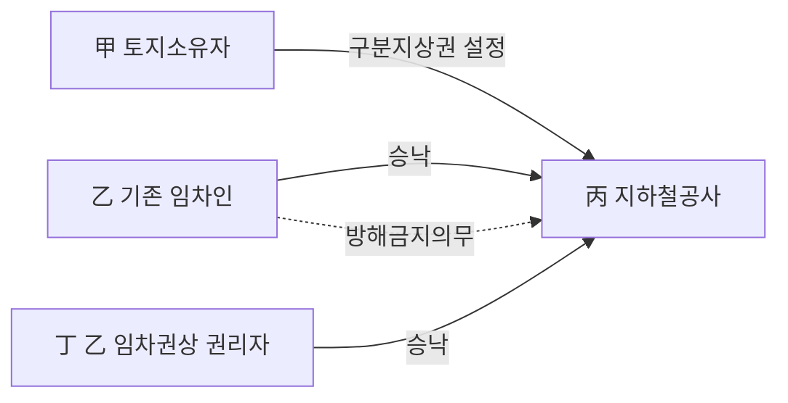

**⭐ 일반지상권 vs 구분지상권 비교표 (최빈출)**

| 비교 항목 | 일반지상권 | 구분지상권 |
|---|---|---|
| 근거 조문 | 제279조 | **제289조의2** |
| 효력이 미치는 범위 | 토지소유권이 미치는 **상하 전부** | **정해진 상하의 일정 범위(층)**만 |
| 목적물 | 건물 기타 공작물 **또는 수목** | 건물 기타 공작물 — **수목은 불가** |
| 토지소유자의 이용 | 전면적으로 배제됨 | 설정범위 밖은 **계속 이용 가능** |
| 등기사항 | 목적과 범위 | 목적과 범위 + **상하의 범위를 반드시 등기** |
| 제3자 용익권자의 승낙 | 불요 | **권리자 및 그 권리를 목적으로 하는 권리자 전원의 승낙 필요** |
| 사용제한 특약 | 규정 없음 | 설정행위로 **토지 사용을 제한하는 특약 가능** |
| 지료 | 성립요소 아님 | 성립요소 아님 (동일) |
| 존속기간 | 최단기 O, 최장기 제한 X | 동일. **영구 약정도 허용** |
| 양도·임대·소멸청구 | 제282조·제287조 | **동일**(제290조 제2항 준용) |

> 🔑 다른 점은 딱 넷 — ==범위·수목·승낙·등기==. 나머지는 전부 같다.

**구분지상권에 준용되는 규정 (제290조 제2항)**

| 준용 조문 | 내용 | 구분지상권에서의 의미 |
|---|---|---|
| 제280조·제281조 | 존속기간 | 최단기 적용, 최장기 무제한(영구 가능) |
| 제282조 | 양도·임대 | 설정자 동의 없이 자유. 금지특약 무효 |
| 제283조 | 갱신청구권·지상물매수청구권 | 갱신청구는 청구권, 매수청구는 형성권 |
| 제284조 | 갱신과 존속기간 | 갱신 시에도 최단기 하회 불가 |
| 제285조 | 수거의무·설정자의 매수청구권 | 소멸 시 원상회복 의무 |
| 제286조 | 지료증감청구권 | 조세·지가 변동 시 증감 청구 |
| 제287조·제288조 | 소멸청구·저당권자에 대한 통지 | 2년 연체 시 소멸청구, 저당권자 통지 필요 |
| 제289조 | 편면적 강행규정 | 지상권자에게 불리한 특약 무효 |
| 제290조 제1항 | 상린관계 | 수직 인접관계에 준용 |

#### 4. 관련 조문

> 📌 **민법 제289조의2(구분지상권)** — "① 지하 또는 지상의 공간은 상하의 범위를 정하여 건물 기타 공작물을 소유하기 위한 지상권의 목적으로 할 수 있다. 이 경우 설정행위로써 지상권의 행사를 위하여 토지의 사용을 제한할 수 있다.
> ② 제1항의 규정에 의한 구분지상권은 제3자가 토지를 사용·수익할 권리를 가진 때에도 그 권리자 및 그 권리를 목적으로 하는 권리를 가진 자 전원의 승낙이 있으면 이를 설정할 수 있다. 이 경우 토지를 사용·수익할 권리를 가진 제3자는 그 지상권의 행사를 방해하여서는 아니된다."

> 📌 **민법 제290조(준용규정)** — "① 제213조, 제214조, 제216조 내지 제244조의 규정은 지상권자간 또는 지상권자와 인지소유자간에 이를 준용한다.
> ② 제280조 내지 제289조 및 제1항의 규정은 제289조의2의 규정에 의한 구분지상권에 관하여 이를 준용한다."

> 📌 **민법 제280조(존속기간을 약정한 지상권)** — "① 계약으로 지상권의 존속기간을 정하는 경우에는 그 기간은 다음 연한보다 단축하지 못한다. 1. 석조, 석회조, 연와조 또는 이와 유사한 견고한 건물이나 수목의 소유를 목적으로 하는 때에는 30년 2. 전호 이외의 건물의 소유를 목적으로 하는 때에는 15년 3. 건물 이외의 공작물의 소유를 목적으로 하는 때에는 5년"

> 📌 **민법 제282조(지상권의 양도, 임대)** — "지상권자는 타인에게 그 권리를 양도하거나 그 권리의 존속기간 내에서 그 토지를 임대할 수 있다."

> 📌 **민법 제287조(지상권소멸청구권)** — "지상권자가 2년 이상의 지료를 지급하지 아니한 때에는 지상권설정자는 지상권의 소멸을 청구할 수 있다."

> 📌 **민법 제289조(강행규정)** — 제280조 내지 제287조의 규정에 위반되는 계약으로 지상권자에게 불리한 것은 그 효력이 없다.

#### 5. 핵심 판례 법리

**① 존속기간을 영구로 약정하는 것도 허용된다.**
민법은 지상권의 존속기간에 관하여 최단기만 규정할 뿐 최장기에는 아무런 제한이 없으며, 존속기간이 영구인 지상권을 인정할 실제의 필요성도 있고, **특히 구분지상권의 경우에는 존속기간이 영구라고 할지라도 대지의 소유권을 전면적으로 제한하지 아니한다**는 점에 비추어 보면, 지상권의 존속기간을 영구로 약정하는 것도 허용된다(대판 2001.5.29. 99다66410).
→ 판례가 영구 지상권을 인정하면서 든 **핵심 논거가 바로 구분지상권**이라는 점이 중요하다.

**② 지료는 지상권(구분지상권)의 성립요소가 아니다.**
지상권에 있어서 지료의 지급은 지상권의 요소가 아니어서 ==지료에 관한 유상 약정이 없는 이상 지료의 지급을 청구할 수 없다==(대판 1999.09.03. 99다24874). 지료에 대한 지급약정이 없어도 지상권의 성립에는 영향이 없다.

**③ 지료 약정을 등기하지 않으면 제3자에게 대항할 수 없다.**
지료액 또는 그 지급시기 등의 약정은 ==이를 등기하여야만== 그 뒤에 토지소유권 또는 지상권을 양수한 사람 등 제3자에게 대항할 수 있다(대판 1999.9.3. 99다24874).

**④ 다만 등기가 없어도 당사자 사이에서는 지료를 청구할 수 있다.**
지료에 관한 약정이 있는 이상 토지소유자는 ==등기 여부에 관계없이 지상권자에 대하여== 그 약정된 지료의 지급을 구할 수 있고, 다만 등기가 되어 있지 않다면 지상권을 양수한 사람 등 제3자에게 대항할 수 없을 뿐이다(대판 2009.9.24. 2007두7505).

**⑤ 지상권의 양도성은 절대적으로 보장된다.**
지상권은 독립된 물권으로서 다른 권리에 부종함이 없이 그 자체로서 양도될 수 있으며 그 양도성은 절대적으로 보장되고 있으므로 ==소유자의 의사에 반하여도 자유롭게== 타인에게 양도할 수 있다(대판 1991.11.8. 90다15716). 구분지상권도 제282조가 준용되므로 같다.
→ 따라서 **양도금지 특약은 지상권자에게 불리하여 무효**이고, 이를 위반하여 양도하여도 양수인은 그 지위를 설정자에게 주장할 수 있다(제289조).

**⑥ 지상권자는 지상권을 유보한 채 지상물만, 지상물을 유보한 채 지상권만 양도할 수 있다.**
지상권자와 그 지상물의 소유권자가 ==반드시 일치하여야 하는 것은 아니다==(대판 2006.6.15. 2006다6126).

**⑦ 2년 연체 후 일부를 변제받아 연체액이 2년 미만이 되면 소멸청구를 할 수 없다.**
지상권설정자가 소멸을 청구하지 않고 있는 동안 연체된 지료의 일부를 지급받아 ==연체된 지료가 2년 미만==으로 된 경우에는 지상권의 소멸을 청구할 수 없다(대판 2014.8.28. 2012다102384).

**⑧ 연체기간은 양도인·양수인에게 각각 2년 이상이어야 한다.**
지료지급 연체가 토지소유권의 양도 전후에 걸쳐 이루어진 경우, 양도인에 대하여 2년 이상 연체하였더라도 ==양수인에 대한 연체가 2년 이상이 아니면== 양수인은 지상권의 소멸을 청구할 수 없다(대판 2001.03.13. 99다17142).

**⑨ 최단존속기간 규정은 '건축·식재' 목적일 때만 적용된다.**
최단 존속기간 규정은 지상권자가 그 소유의 건물 등을 ==‘건축’하거나 수목을 ‘식재’하여== 토지를 이용할 목적으로 지상권을 설정한 경우에만 적용이 있다(대판 1996.3.22. 95다49318). 따라서 **기존 건물의 사용을 목적으로 한 경우에는 최단기 제한이 없다**.

**⑩ 지상권설정자는 소유자라도 그 범위를 사용·수익할 수 없다.**
지상권을 설정해 준 대지소유자는 그 소유권행사에 제한을 받아 대지를 사용·수익할 수 없으므로 ==불법점유자에게 임료 상당의 손해금을 청구할 수 없다==(대판 1974.11.12. 74다1150).
→ 구분지상권에서는 이 법리가 **등기된 상하의 범위 안에서만** 작동한다. 그 밖의 층은 여전히 소유자가 사용·수익한다.

#### ⭐ 기출 출제포인트

1. **수목** — "구분지상권에 의해 소유할 수 있는 목적물은 건물 기타의 공작물 및 수목이다"라는 형태로 **수목을 끼워 넣는** 함정. 가장 빈출.
2. **제3자의 승낙** — "지상권이 설정된 토지의 소유자는 그 지상권자의 **승낙 없이** 구분지상권을 설정할 수 있다"라는 형태의 정면 오답(2023년 기출).
3. **영구 존속기간** — "구분지상권의 존속기간을 영구적인 것으로 약정하는 것은 허용된다"(옳음). 2019년 기출·문제집 반복.
4. **지료** — "구분지상권의 성립에 있어서 지료의 지급은 그 요건이다"(틀림). 지료는 성립요건이 아니다.
5. **양도금지 특약** — 구분지상권도 제290조 제2항으로 제282조·제289조가 준용되어 **양도금지 특약은 무효**.
6. **설정 주체** — 구분지상권을 설정해 주는 자는 **토지소유자**다. 지상권자가 제3자에게 구분지상권을 설정해 줄 수는 없다.

#### 📊 기출 분석

| 연도 | 출제 형태 | 핵심 논점 |
|---|---|---|
| 2019년 기출 (지상권 옳지 않은 것) | 선지 ② | **구분지상권의 존속기간을 영구적인 것으로 약정하는 것은 허용** (옳은 선지) |
| 2023년 기출 (지상권 옳은 것) | 선지 ④ | 지상권이 설정된 토지의 소유자가 **지상권자의 승낙 없이** 구분지상권 설정 가능? (틀린 선지) |
| 2025년 기출 (지상권 옳지 않은 것) | 선지 ③ | 지상권자가 제3자에게 구분지상권을 설정해 줄 수 있는가 |
| 문제집 제5장 기본문제 08 | 단독 5지 | 목적물에 **수목 포함** 여부 / 승낙한 제3자의 방해금지 / 범위의 등기 |
| 문제집 제5장 실전문제 07 | 단독 5지 | **지료는 성립요건이 아님** / 사용제한 특약 / 양도금지 특약 무효 / 물권적 청구권 |
| 문제집 제5장 실전문제 08 | 선지 ③ | 구분지상권의 영구 존속기간 약정 |

**출제 빈도** — 구분지상권 **단독 문제**는 감정평가사 기출에서 확인되지 않는다. 그러나 **지상권 5지선다 안의 한 선지**로는 2019·2023·2025년에 반복 출제되어, 사실상 매년 등장한다고 보아야 한다. 문제집에는 단독 문제가 2개(기본 08, 실전 07) 있다.

**반복되는 함정 선지** —
① 목적물에 **수목**을 슬쩍 넣는다(→ 건물 기타 공작물만).
② **지료를 성립요건**이라고 한다(→ 아니다).
③ **제3자의 승낙 없이** 설정할 수 있다고 한다(→ 전원의 승낙이 필요).
④ 존속기간 **영구 약정을 부정**한다(→ 판례는 허용).

**최근 경향** — 2023년·2025년 모두 구분지상권 선지가 **정답 선지(옳지 않은 것)**의 자리에 배치되었다. 즉 구분지상권을 몰라도 다른 선지로 풀 수 있던 예전과 달리, 최근에는 **구분지상권 자체를 물어야 정답이 나온다.** 특히 **누가 설정하는가(설정 주체)**와 **누구의 승낙이 필요한가**를 정확히 알아야 한다.

#### 🔍 기출 선지로 배우는 법리

> 실제 출제된 선지를 그대로 놓고 O/X와 근거를 확인한다.

**②** 구분지상권의 존속기간을 영구적인 것으로 약정하는 것은 허용된다. (2019년 기출) — **O**
근거: 민법은 최장기에 제한이 없고, **구분지상권의 경우에는 존속기간이 영구라도 대지 소유권을 전면적으로 제한하지 아니한다**는 점에 비추어 영구 약정도 허용된다(대판 2001.5.29. 99다66410).

**④** 지상권이 설정된 토지의 소유자는 그 지상권자의 승낙 없이 그 토지 위에 구분지상권을 설정할 수 있다. (2023년 기출) — **X**
어디가 틀렸나: 제3자가 사용·수익할 권리를 가진 토지에 구분지상권을 설정하려면 **그 권리자 및 그 권리를 목적으로 하는 권리를 가진 자 전원의 승낙**이 있어야 한다(제289조의2 제2항).
옳게 고치면: "지상권자 **및 그 지상권을 목적으로 하는 권리를 가진 자 전원의 승낙을 얻어** 구분지상권을 설정할 수 있다."

**③** 지상권자는 제3자에게 구분지상권을 설정해 줄 수 있다. (2025년 기출) — **X**
어디가 틀렸나: 구분지상권을 **설정해 주는 자는 토지소유자**다. 지상권자는 그 권리를 양도하거나 존속기간 내에서 **토지를 임대**할 수 있을 뿐이고(제282조), 물권인 구분지상권을 창설해 줄 권능은 없다. 제289조의2 제2항은 토지소유자가 설정할 때 기존 용익권자의 **승낙**을 얻으라는 규정이지, 용익권자가 설정 주체가 된다는 규정이 아니다.

**⑤** 구분지상권에 의해 소유할 수 있는 목적물은 건물 기타의 공작물 및 수목이다. (문제집 제5장 기본문제 08번, 정답 ⑤) — **X**
어디가 틀렸나: 구분지상권은 **건물 기타 공작물의 소유를 목적으로 하며 수목은 그 객체가 될 수 없다**. 일반지상권은 수목의 소유를 위해서도 설정할 수 있으나, 구분지상권은 그렇지 못하다.

**②** 구분지상권이 당해 토지를 사용·수익할 권리를 가진 제3자의 승낙을 얻어 설정된 경우에는 이 권리를 가진 제3자는 지상권의 정당한 행사를 방해하지 못한다. (문제집 제5장 기본문제 08번) — **O**
근거: 제289조의2 제2항 후단 — "토지를 사용·수익할 권리를 가진 제3자는 그 지상권의 행사를 방해하여서는 아니된다."

**②** 구분지상권의 성립에 있어서 지료의 지급은 그 요건이다. (문제집 제5장 실전문제 07번, 정답 ②) — **X**
어디가 틀렸나: **지료의 지급은 성립요건이 아니다.** 지료에 관한 유상 약정이 없으면 지료의 지급을 구할 수 없을 뿐이고(대판 1999.09.03. 99다24874), 무상의 구분지상권도 유효하다.

**④** 구분지상권자는 구분지상권의 존속기간 내에 자신의 구분지상권을 양도할 수 있으며, 양도를 금지하는 특약을 하더라도 그 특약은 무효이다. (문제집 제5장 실전문제 07번) — **O**
근거: 구분지상권에는 지상권 규정이 준용되므로(제290조 제2항) 제282조의 양도·임대의 자유가 인정되고, 제289조에 의해 **지상권자에게 불리한 특약은 무효**다.

**④** 구분지상권은 토지의 어느 층만을 객체로 한다는 점에서 일반지상권과 양적인 차이가 있으나, 그 성질에 있어서는 지상권과 다를 바 없고 그 범위를 반드시 등기하여야 한다. (문제집 제5장 기본문제 08번) — **O**
근거: 구분지상권은 성질상 지상권의 일종이며, 상하의 범위가 특정되지 않으면 일반지상권과 구별될 수 없으므로 **그 범위는 필수적 등기사항**이다.

#### ✏️ 사례형 적용

> **사례 1** 甲은 자기 소유 X토지를 乙에게 임대하여 乙이 그 지상에서 주차장을 운영하고 있고, 丙은 乙의 임차권을 목적으로 하는 권리를 취득하였다. 지하철공사 丁은 X토지 지하 20~40m 구간에 터널을 뚫기 위해 甲과 구분지상권설정계약을 체결하고 등기를 마쳤다. 그런데 乙의 승낙만 받았을 뿐 丙의 승낙은 받지 않았다.

**검토** — 제289조의2 제2항은 "그 권리자 **및 그 권리를 목적으로 하는 권리를 가진 자 전원**의 승낙"을 요구한다. 여기서 乙은 사용·수익권자, 丙은 그 권리를 목적으로 하는 권리자이므로 **둘 다 승낙해야** 한다. 丙의 승낙이 빠졌으므로 **전원의 승낙이라는 성립요건이 흠결**되어 丁의 구분지상권 설정은 丙에게 대항할 수 없다. 반면 승낙한 乙은 제289조의2 제2항 후단에 따라 **丁의 지상권 행사를 방해하여서는 아니 된다.**

> **사례 2** 甲은 자기 소유 Y토지의 지상 10m 이상 공간에 대해 송전선로 설치를 목적으로 한국전력 乙에게 존속기간을 **영구**로 하는 구분지상권을 설정해 주었다. 설정계약에는 "甲은 Y토지 위에 높이 10m를 넘는 건축물을 축조하지 아니한다"는 특약과 "乙은 구분지상권을 타인에게 양도하지 못한다"는 특약이 함께 들어 있었다. 그 후 乙은 이를 무시하고 丙에게 구분지상권을 양도하였다.

**검토** —
① **영구 약정** — 유효하다. 판례는 최장기 제한이 없고 **구분지상권은 영구라도 대지 소유권을 전면적으로 제한하지 않는다**는 점을 들어 영구 지상권을 허용한다(99다66410).
② **사용제한 특약** — 유효하다. 제289조의2 제1항 후단이 명문으로 "설정행위로써 지상권의 행사를 위하여 토지의 사용을 제한할 수 있다"고 한다.
③ **양도금지 특약** — **무효**다. 제290조 제2항에 의해 제282조·제289조가 준용되고, 양도금지는 지상권자에게 불리한 약정이므로 효력이 없다. 따라서 **丙은 양수한 구분지상권을 甲에게 주장할 수 있다.**

> **사례 3** 甲이 乙에게 Z토지의 지하 5~15m 구간에 구분지상권을 설정해 준 뒤, 무단점유자 丙이 지표를 점유하여 야적장으로 쓰고 있다. 甲은 丙에게 임료 상당 손해배상을 청구할 수 있는가?

**검토** — 일반지상권이라면 대지소유자는 소유권행사에 제한을 받아 대지를 사용·수익할 수 없으므로 불법점유자에게 임료 상당 손해금을 청구할 수 없다(74다1150). 그러나 구분지상권은 **등기된 상하의 범위(지하 5~15m)에서만** 소유권을 제한한다. **지표는 여전히 甲이 사용·수익할 수 있는 부분**이므로 甲은 丙에게 임료 상당 손해배상을 청구할 수 있다. 반면 乙은 지하 5~15m 구간이 침해된 것이 아니므로 구분지상권 침해를 이유로 한 청구는 할 수 없다.

#### ⚠️ 이 관의 함정 총정리

1. "구분지상권은 건물·공작물 **및 수목**의 소유를 목적으로 설정할 수 있다"라고 하면 틀림 → ==건물 기타 공작물만== 가능하고 **수목은 안 된다**.
2. "구분지상권은 지료의 지급을 성립요건으로 한다"라고 하면 틀림 → ==지료는 성립요소가 아니다.== 무상 구분지상권도 유효.
3. "토지소유자는 기존 지상권자의 승낙 없이 구분지상권을 설정할 수 있다"라고 하면 틀림 → ==권리자 및 그 권리를 목적으로 하는 권리자 전원의 승낙==이 필요.
4. "구분지상권은 토지소유권을 전면 제한하므로 영구 약정은 무효"라고 하면 틀림 → 판례는 오히려 ==구분지상권은 소유권을 전면적으로 제한하지 않는다==는 이유로 **영구 약정을 허용**한다.
5. "구분지상권의 양도금지 특약은 당사자 자치이므로 유효하다"라고 하면 틀림 → 제290조 제2항으로 제289조가 준용되어 ==지상권자에게 불리한 특약은 무효==.

#### ✅ OX 확인문제

> 다음 진술의 참·거짓을 판단하시오.

**1.** 지하 또는 지상의 공간은 상하의 범위를 정하여 건물 기타 공작물을 소유하기 위한 지상권의 목적으로 할 수 있다.
→ **O**. 제289조의2 제1항 본문 그대로다.

**2.** 구분지상권은 수목의 소유를 목적으로도 설정할 수 있다.
→ **X**. 일반지상권과 달리 구분지상권은 **건물 기타 공작물의 소유를 목적으로만** 설정할 수 있고, 수목의 소유를 위한 구분지상권 설정은 허용되지 않는다.

**3.** 제3자가 토지를 사용·수익할 권리를 가진 때에도, 그 권리자 및 그 권리를 목적으로 하는 권리를 가진 자 전원의 승낙이 있으면 구분지상권을 설정할 수 있다.
→ **O**. 제289조의2 제2항 전단. 기존 지상권·지역권·전세권·임차권·저당권자를 보호하기 위한 규정이다.

**4.** 구분지상권 설정에 승낙한 용익권자는 그 후에도 자신의 권리를 자유로이 행사할 수 있으므로 구분지상권자의 지상권 행사를 방해하여도 무방하다.
→ **X**. 제289조의2 제2항 후단은 "토지를 사용·수익할 권리를 가진 제3자는 그 지상권의 행사를 **방해하여서는 아니된다**"고 명시한다.

**5.** 구분지상권의 성립에 있어서 지료의 지급은 그 요건이 아니다.
→ **O**. 지료의 지급은 지상권의 요소가 아니므로 유상 약정이 없으면 지료의 지급을 구할 수 없다(대판 1999.09.03. 99다24874).

**6.** 구분지상권의 존속기간을 영구적인 것으로 약정하는 것도 허용된다.
→ **O**. 민법은 최장기 제한을 두지 않았고, 판례는 **구분지상권의 경우 존속기간이 영구라도 대지 소유권을 전면적으로 제한하지 않는다**는 점을 근거의 하나로 들어 영구 지상권을 인정한다(대판 2001.5.29. 99다66410).

**7.** 설정행위로써 구분지상권의 행사를 위하여 토지소유자의 토지 사용을 제한하는 특약을 할 수 있다.
→ **O**. 제289조의2 제1항 후단이 명문으로 인정한다.

**8.** 구분지상권자가 자신의 구분지상권을 양도하는 것을 금지하는 특약은 유효하다.
→ **X**. 제290조 제2항에 의해 제282조·제289조가 준용되므로 **지상권자에게 불리한 양도금지 특약은 무효**다.

**9.** 제3자에 의하여 구분지상권이 침해된 때에도 구분지상권은 상하 일부의 권리에 불과하므로 물권적 청구권을 행사할 수 없다.
→ **X**. 구분지상권도 물권이므로 그 내용이 침해되면 반환·방해제거·방해예방청구권이 인정된다(제290조 제1항, 제213조·제214조).

**10.** 구분지상권자가 2년 이상의 지료를 지급하지 아니한 때에는 설정자는 구분지상권의 소멸을 청구할 수 있다.
→ **O**. 제290조 제2항에 의해 제287조가 준용된다. 다만 연체된 지료의 일부를 변제받아 **연체액이 2년 미만이 되면 소멸청구를 할 수 없다**(대판 2014.8.28. 2012다102384).

#### 🧠 암기법

> 🔑 **구분지상권 "공(工)만 되고 목(木)은 안 된다"**
> 구분지상권의 목적물은 **공**작물·건물뿐. **목**(수목)은 절대 안 된다.
> 지하철 터널·지하상가·송전탑을 떠올려라 — 거기에 나무를 심을 일은 없다.

> 🔑 **승낙은 "권리자 + 그 위의 권리자" = 전원**
> 전세권자만? ✕ / 전세권자 **와** 전세권저당권자 **둘 다** ○
> 제289조의2 제2항의 "**전원**"은 **1층(사용·수익권자) + 2층(그 권리를 목적으로 하는 권리자)** 모두를 뜻한다.

> 🔑 **"영구는 구분에서 나왔다"**
> 판례가 영구 지상권을 허용하며 든 결정적 논거가 "**구분**지상권은 영구라도 대지 소유권을 전면적으로 제한하지 않는다"였다(99다66410).
> 그러니 "구분지상권 + 영구 = ○"는 반사적으로 O를 찍어라.

> 🔑 **준용 3종 세트 — "무·자·2"**
> **무**상(지료는 요소 아님) · **자**유(양도·임대 자유, 금지특약 무효) · **2**년(2년 연체 시 소멸청구).
> 구분지상권에서 헷갈리면 "일반지상권과 똑같다"로 돌아가라. **다른 것은 오직 목적물(수목 ✕)과 승낙요건뿐이다.**

#### ⚖️ 법조문 원문

> 📖 이 관이 근거로 삼은 조문의 **전문**이다. 본문 인용은 발췌지만 여기서는 조 전체를 싣는다. 출처는 법제처 정본이다.

**― 민법 ―**

> 📌 **민법 제280조(존속기간을 약정한 지상권)** — "①계약으로 지상권의 존속기간을 정하는 경우에는 그 기간은 다음 연한보다 단축하지 못한다. 1. 석조, 석회조, 연와조 또는 이와 유사한 견고한 건물이나 수목의 소유를 목적으로 하는 때에는 30년 2. 전호이외의 건물의 소유를 목적으로 하는 때에는 15년 3. 건물이외의 공작물의 소유를 목적으로 하는 때에는 5년 ②전항의 기간보다 단축한 기간을 정한 때에는 전항의 기간까지 연장한다."

> 📌 **민법 제282조(지상권의 양도, 임대)** — "지상권자는 타인에게 그 권리를 양도하거나 그 권리의 존속기간 내에서 그 토지를 임대할 수 있다."

> 📌 **민법 제287조(지상권소멸청구권)** — "지상권자가 2년 이상의 지료를 지급하지 아니한 때에는 지상권설정자는 지상권의 소멸을 청구할 수 있다."

> 📌 **민법 제289조(강행규정)** — "제280조 내지 제287조의 규정에 위반되는 계약으로 지상권자에게 불리한 것은 그 효력이 없다."

> 📌 **민법 제289조의2(구분지상권)** — "①지하 또는 지상의 공간은 상하의 범위를 정하여 건물 기타 공작물을 소유하기 위한 지상권의 목적으로 할 수 있다. 이 경우 설정행위로써 지상권의 행사를 위하여 토지의 사용을 제한할 수 있다. ②제1항의 규정에 의한 구분지상권은 제3자가 토지를 사용ㆍ수익할 권리를 가진 때에도 그 권리자 및 그 권리를 목적으로 하는 권리를 가진 자 전원의 승낙이 있으면 이를 설정할 수 있다. 이 경우 토지를 사용ㆍ수익할 권리를 가진 제3자는 그 지상권의 행사를 방해하여서는 아니된다."

> 📌 **민법 제290조(준용규정)** — "①제213조, 제214조, 제216조 내지 제244조의 규정은 지상권자간 또는 지상권자와 인지소유자간에 이를 준용한다. ②제280조 내지 제289조 및 제1항의 규정은 제289조의2의 규정에 의한 구분지상권에 관하여 이를 준용한다."

### 제6관 분묘기지권

> 📖 분묘기지권은 타인의 토지에 분묘라는 특수한 공작물을 설치한 자가 그 분묘를 소유하기 위하여 그 토지를 사용할 수 있는 **지상권과 유사한 관습법상의 물권**이다. 민법에 조문이 없고 판례가 만들어 온 권리라는 점에서 앞의 관들과 결정적으로 다르다.
> 등기 없이 성립하고, 수호·봉사를 계속하는 한 존속하므로 ==토지 소유권이 사실상 영구적으로 제한==될 수 있다. 그래서 2017년·2021년 대법원 전원합의체가 잇달아 이 권리의 존폐와 지료를 정면으로 다루었다.
> 시험에서는 **취득 3유형 × 지료** 표 하나만 정확히 외우면 대부분 해결된다.

> ⭐ **이 관에서 반드시 챙길 3가지**
> ① 시효취득은 ==장사법 시행일 2001. 1. 13. 이전에 설치된 분묘==에 대해서만 인정된다(대판 2017.1.19. 2013다17292 전합). 그렇다고 분묘기지권 관습법 자체가 소멸한 것은 **아니다**.
> ② **지료** — 승낙형은 약정에 따르고 약정이 없으면 무상, 시효취득형은 ==토지소유자가 청구한 날부터== 유상(대판 2021.4.29. 2017다228007 전합), 양도형은 ==분묘기지권이 성립한 때부터== 유상(대판 2021.5.27. 2020다295892).
> ③ 효력 범위는 분묘 기지 자체뿐 아니라 ==수호 및 제사에 필요한 주위의 공지==까지 미치지만, 그 범위 안에서도 **새로운 분묘 설치·합장·이장의 권능은 포함되지 않는다.**

#### 1. 의의

**분묘기지권(墳墓基地權)**이란 타인의 토지에 분묘를 설치한 자가 그 분묘를 소유하기 위하여 그 분묘가 있는 토지를 사용할 수 있는 **지상권 유사의 물권**을 말한다.

- **분묘**란 봉분의 묘지만이 아니라 적어도 ==분묘의 보호 및 제사에 필요한 주위의 공지==를 포함한 지역을 가리킨다(대판 1959.10.8. 4291민상770).
- 성질은 **관습법상의 물권**이다. 당사자의 합의에 의하지 않고 성립하는 지상권 유사의 권리이고, 그로 인하여 ==토지 소유권이 사실상 영구적으로 제한==될 수 있다(대판 2021.4.29. 전합).
- **등기를 요하지 않는다.** 봉분 등 분묘의 존재를 인식할 수 있는 형태를 갖추고 있으므로 그 특성상 등기 없이 취득한다(대판 1996.6.14. 96다14036). 제187조 단서(등기하여야 처분 가능)도 적용의 여지가 없다.

> ⚠️ 분묘기지권은 **토지의 소유권을 취득하는 것이 아니다.** 20년간 평온·공연하게 분묘 기지를 점유하여도 그 점유자는 시효에 의하여 ==지상권 유사의 물권을 취득할 뿐 소유권을 취득하는 것은 아니다==(대판 1969.01.28. 68다1920).

#### 2. 요건

**가. 공통 성립요소**

| 요소 | 내용 | 결론 |
|---|---|---|
| 시신의 안장 | 실제로 시신이 안장되어 있을 것 | 시신 없이 외형상 분묘 형태만 갖춘 **장래 묘소(가묘)** → 분묘기지권 ✕ (대판 1976.10.26. 76다1359,1360) |
| 분묘의 외형 | 봉분 등 외부에서 분묘의 존재를 인식할 수 있는 형태 | **평장·암장**된 경우 → 분묘기지권 ✕ (대판 1991.10.25. 91다18040; 대판 1996.6.14. 96다14036) |
| 등기 | 불요 | 위 외형이 공시기능을 대신한다 |

> 🔑 **"시신 ✕ + 봉분 ○ = ✕ / 시신 ○ + 봉분 ✕ = ✕"** — **둘 다 갖춰야** 성립한다.

**나. 취득의 3유형 (핵심 비교표)**

| 구분 | ① 승낙형 | ② 시효취득형 | ③ 양도형(자기 토지 처분형) |
|---|---|---|---|
| 사실관계 | 토지소유자의 **승낙**을 얻어 그 토지에 분묘 설치 | 타인 토지에 **승낙 없이** 분묘 설치 후 점유 | 자기 소유 토지에 분묘 설치 후 **특약 없이** 토지만 처분 |
| 요건 | 분묘 수호·관리권자에 대한 토지소유자의 승낙 | **20년간 평온·공연**하게 분묘 기지를 점유 | 분묘기지 소유권 유보나 **이장 특약이 없을 것** |
| 시적 제한 | 없음 | **장사법 시행일 2001. 1. 13. 이전 설치 분묘**에 한함 | 없음 |
| 지료 | ==약정에 의하되 약정이 없으면 무상== | ==토지소유자가 지료를 청구한 날부터== 지급의무 | ==분묘기지권이 성립한 때부터== 지급의무 |
| 근거 판례 | 대판 2021.9.16. 2017다271834, 271841 | 대판 2017.1.19. 2013다17292 전합 / 대판 2021.4.29. 2017다228007 전합 | 대판 1967.10.12. 67다1920 / 대판 2021.5.27. 2020다295892 |

> ⭐ **지료 3단 정리 — "약정 / 청구한 날 / 성립한 때"**
> 승낙형은 **약정**, 시효취득형은 **청구한 날부터**, 양도형은 **성립한 때부터**. 이 세 칸이 이 관의 최다 출제 지점이다.

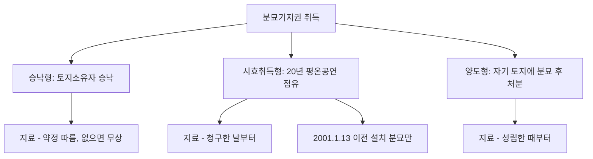

#### 3. 효과

| 구분 | 효과 |
|---|---|
| 권리의 성질 | **지상권 유사의 관습법상 물권**. 등기 없이 취득하고 제3자에게 대항 가능 |
| 사용 범위 | 분묘의 기지 자체뿐 아니라 ==수호 및 제사에 필요한 범위 내의 주위 공지==에까지 미침(대판 2011.11.10. 2011다63017) |
| 면적 제한 | 법령이 1기당 20㎡로 제한하더라도 **분묘기지권의 범위가 그 제한면적 내로 한정되는 것은 아님**(대판 1994.12.23. 94다15530) |
| 사성(莎城) | 사성이 조성되어 있다 하여 반드시 그 부분까지 분묘기지권이 미치는 것은 **아님**(대판 1997.5.23. 95다29086,29093) |
| 토지소유자의 의무 | 토지소유자라도 **적법하게 존재하는 타인의 묘지 주변을 침범하여 공작물을 설치할 수 없음**(대판 1959.10.08. 4291민상770) |
| 새로운 분묘 설치 | ==포함되지 않음.== 효력 범위 안이라도 기존 분묘 외에 새로운 분묘를 신설할 권능은 없다(대판 2013.01.16. 2011다38592) |
| 이장(移葬) | **포함되지 않음.** 원래의 분묘를 다른 곳으로 이장할 권능도 없다(대판 2007.6.28. 2007다16885) |
| 합장 | ==허용되지 않음.== 부부 중 일방 사망 후 다른 일방을 쌍분 또는 단분 형태로 합장하는 것도 안 된다(대판 1997.5.23. 95다29086,29093; 대판 2007.06.28. 2005다44114) |
| 존속기간 | 약정이 있으면 그에 따르고, 없으면 **권리자가 분묘의 수호와 봉사를 계속하며 그 분묘가 존속하는 동안** 존속(대판 2001.08.21. 2001다28367; 대판 2009.05.14. 2009다1092) |
| 일시적 멸실 | 분묘가 멸실되어도 **유골이 존재하여 원상회복이 가능한 일시적 멸실**이면 소멸하지 않음(대판 2007.6.28. 2005다44114) |
| 소멸 | 분묘를 **다른 곳으로 이장**하면 당연히 소멸(대판 2007.6.28. 2007다16885) / 지료 2년분 이상 연체 시 제287조 유추적용으로 소멸청구(대판 2015.7.23. 2015다206850) |

**⭐ 지상권 vs 분묘기지권 비교표**

| 비교 항목 | 지상권 | 분묘기지권 |
|---|---|---|
| 근거 | **법률**(제279조 이하) | **관습법** |
| 성립 | 설정계약 + 등기 | 승낙·시효·양도 3유형, **등기 불요** |
| 목적물 | 건물 기타 공작물·수목 | **분묘** |
| 존속기간 | 최단기 규정(30/15/5년) | 약정 없으면 **수호·봉사를 계속하는 동안** |
| 지료 | 성립요소 아님(무상 원칙) | 유형별로 다름(약정 / 청구한 날 / 성립한 때) |
| 2년 연체 시 | 제287조 소멸청구 | 제287조 **유추적용**하여 소멸청구 |
| 양도성 | 자유롭게 양도 가능 | 수호·제사 주체와 결합, 분묘 존속이 전제 |
| 공시방법 | 등기 | **봉분 등 외부에서 인식할 수 있는 형태** |

**효력이 미치는가 — O/X 총정리**

| 대상 | 결론 | 근거 |
|---|---|---|
| 분묘의 기지 자체 | **O** | 당연 |
| 수호 및 제사에 필요한 주위의 공지 | **O** | 4291민상770; 2011다63017 |
| 법령상 제한면적(1기당 20㎡)을 넘는 부분 | **O**(제한면적 내로 한정되지 않음) | 94다15530 |
| 사성(莎城) 부분 | **반드시 미치는 것은 아님** | 95다29086,29093 |
| 새로운 분묘의 신설 | **X** | 2011다38592; 2007다16885 |
| 원래 분묘의 이장 | **X** (오히려 이장하면 소멸) | 2007다16885 |
| 배우자의 쌍분·단분 합장 | **X** | 95다29086,29093; 2005다44114 |
| 토지 소유권의 취득 | **X** (지상권 유사의 물권일 뿐) | 68다1920 |

#### 4. 관련 조문

분묘기지권은 **민법에 직접적인 근거 조문이 없는 관습법상의 물권**이다. 다만 다음 조문들이 유추적용되거나 관련된다.

> 📌 **민법 제279조(지상권의 내용)** — "지상권자는 타인의 토지에 건물 기타 공작물이나 수목을 소유하기 위하여 그 토지를 사용하는 권리가 있다."
> → 분묘기지권은 이 지상권과 **유사한** 물권으로 설명된다.

> 📌 **민법 제287조(지상권소멸청구권)** — "지상권자가 2년 이상의 지료를 지급하지 아니한 때에는 지상권설정자는 지상권의 소멸을 청구할 수 있다."
> → 판례는 지료 액수가 판결로 정해진 뒤 2년분 이상 지체된 경우 **이 조문을 유추적용**하여 분묘기지권의 소멸청구를 인정한다(대판 2015.7.23. 2015다206850).

> 📌 **민법 제187조(등기를 요하지 아니하는 부동산물권취득)** 단서와 관련하여 — 분묘기지권의 취득에는 등기를 요하지 않으며, **제187조 단서의 규정도 적용의 여지가 없다**.

> 📌 **「장사 등에 관한 법률」(법률 제6158호)** — **시행일 2001. 1. 13.** 이 날 이후 토지소유자의 승낙 없이 설치한 분묘에 대해서는 분묘기지권의 시효취득을 주장할 수 없다.

#### 5. 핵심 판례 법리

**① 장사법 시행일 전 분묘의 시효취득은 여전히 유효한 법적 규범이다.**
타인 소유의 토지에 분묘를 설치한 경우 20년간 평온·공연하게 분묘의 기지를 점유하면 지상권과 유사한 관습상의 물권인 분묘기지권을 시효로 취득한다는 점은 오랜 세월 지속되어 온 관습으로서 법적 규범으로 승인되어 왔고, 이러한 법적 규범이 ==장사법 시행일인 2001. 1. 13. 이전에 설치된 분묘에 관하여 현재까지 유지==되고 있다(대판 2017.1.19. 2013다17292 전합).
→ 함께 판시된 내용: 화장률 증가 등 장묘문화 의식에 일부 변화가 생겼더라도 ==사회 구성원들의 법적 구속력에 대한 확신이 소멸하였다거나 그 관행이 본질적으로 변경되었다고 인정할 수 없다.== 즉 **관습법 자체는 살아 있다.**

**② 시효취득형 분묘기지권도 청구한 날부터 지료를 지급해야 한다(판례 변경).**
타인의 토지에 분묘를 설치하여 20년간 평온·공연하게 분묘의 기지를 점유함으로써 분묘기지권을 시효로 취득한 경우, 분묘기지권자는 ==토지소유자가 지료를 청구하면 그 청구한 날부터의 지료를 지급할 의무==가 있다고 보는 것이 형평에 부합한다(대판 2021.4.29. 2017다228007 전합).
→ 종전에는 "시효취득 시 지료 지급의무 없음"이 정설이었으나 **이 전원합의체로 뒤집혔다.** 다만 **소급하여 전부**가 아니라 **청구한 날부터**라는 점이 정답 포인트.

**③ 양도형은 성립한 때부터 지료를 지급해야 한다.**
자기 소유 토지에 분묘를 설치한 사람이 그 토지를 양도하면서 분묘를 이장하겠다는 특약을 하지 않음으로써 분묘기지권을 취득한 경우, 특별한 사정이 없는 한 분묘기지권자는 ==분묘기지권이 성립한 때부터== 토지 소유자에게 그 분묘의 기지에 대한 토지사용의 대가로서 지료를 지급할 의무가 있다(대판 2021.5.27. 2020다295892).

**④ 승낙형의 지료 약정은 기지 승계인에게도 효력이 미친다.**
토지 소유자의 승낙에 의하여 성립하는 분묘기지권의 경우 성립 당시 토지 소유자와 분묘의 수호·관리자가 지료 지급의무의 존부나 범위 등에 관하여 약정을 하였다면 **그 약정의 효력은 분묘 기지의 승계인에 대하여도 미친다**(대판 2021.9.16. 2017다271834, 271841).
→ 같은 판결에서, 토지 소유자가 분묘 수호·관리권자에게 분묘의 설치를 승낙한 때에는 **그 기지에 관하여 분묘기지권을 설정한 것으로 보아야 한다**고 판시하였다.

**⑤ 자기 소유 토지에 분묘를 설치한 뒤 양도하면 판 사람이 물권을 취득한다.**
자기소유 토지에 분묘를 설치하고 이를 타에 양도한 경우에는 **판 사람이 분묘 소유를 위하여 산 사람의 토지에 대하여 지상권 유사의 물권을 취득한다**(대판 1967.10.12. 67다1920).

**⑥ 등기 없이 취득한다.**
분묘기지권은 **봉분 등 외부에서 분묘의 존재를 인식할 수 있는 형태를 갖추고 있는 경우에 한하여** 인정되고, 평장되어 있거나 암장되어 있어 객관적으로 인식할 수 있는 외형을 갖추고 있지 아니한 경우에는 인정되지 않으므로, 이러한 특성상 분묘기지권은 **등기 없이 취득한다**(대판 1996.06.14. 96다14036).

**⑦ 시효취득해도 소유권을 취득하는 것은 아니다.**
타인 소유의 토지 위에 승낙 없이 분묘를 설치한 자가 20년간 평온·공연하게 그 분묘의 기지를 점유한 때에는 **지상권 유사의 물권을 취득할 뿐 소유권을 취득하는 것은 아니다**(대판 1969.01.28. 68다1920).

**⑧ 효력 범위는 기지 자체 + 수호·제사에 필요한 주위 공지.**
분묘기지권은 분묘를 수호하고 봉제사하는 목적을 달성하는 데 필요한 범위 내에서 타인의 토지를 사용할 수 있는 권리로서, ==분묘의 기지 자체뿐만 아니라 수호 및 제사에 필요한 범위 내에서 분묘 기지 주위의 공지를 포함한 지역에까지 미친다==(대판 2011.11.10. 2011다63017; 대판 1959.10.8. 4291민상770).

**⑨ 법령상 제한면적으로 한정되지 않는다.**
매장 및 묘지 등에 관한 법률이 분묘의 점유면적을 1기당 20㎡로 제한하고 있으나, **분묘기지권의 범위가 위 법령이 규정한 제한면적 범위 내로 한정되는 것은 아니다**(대판 1994.12.23. 94다15530).

**⑩ 사성(莎城) 부분은 당연히 포함되지 않는다.**
사성(무덤 뒤를 반달형으로 둘러쌓은 둔덕)이 조성되어 있다 하여 **반드시 그 사성 부분을 포함한 지역에까지 분묘기지권이 미치는 것은 아니다**(대판 1997.5.23. 95다29086,29093).

**⑪ 새로운 분묘 설치·이장 권능은 없다.**
분묘기지권에는 그 효력이 미치는 범위 안에서 **새로운 분묘를 설치하거나 원래의 분묘를 다른 곳으로 이장할 권능은 포함되지 않는다**(대판 2007.6.28. 2007다16885; 대판 2013.01.16. 2011다38592).

**⑫ 합장(쌍분·단분)도 허용되지 않는다.**
부부 중 일방이 먼저 사망하여 이미 그 분묘가 설치되고 그 분묘기지권이 미치는 범위 내에서, 그 후에 사망한 다른 일방을 **쌍분 또는 단분 형태로 합장하여 분묘를 설치하는 것도 허용되지 않는다**(대판 1997.5.23. 95다29086,29093; 대판 2007.06.28. 2005다44114).

**⑬ 존속기간은 수호·봉사를 계속하는 동안이다.**
분묘기지권의 존속기간에 관하여는 민법의 지상권에 관한 규정에 따를 것이 아니라 당사자 사이에 약정이 있는 등 특별한 사정이 있으면 그에 따르고, 그러한 사정이 없으면 **권리자가 분묘의 수호와 봉사를 계속하며 그 분묘가 존속하고 있는 동안** 존속한다(대판 2009.05.14. 2009다1092; 대판 2001.08.21. 2001다28367).

**⑭ 일시적 멸실이면 소멸하지 않는다.**
분묘가 멸실된 경우라 하더라도 **유골이 존재하여 분묘의 원상회복이 가능하여 일시적인 멸실에 불과하다면** 분묘기지권은 소멸하지 않고 존속한다(대판 2007.6.28. 2005다44114; 대판 2001.08.21. 2001다28367).

**⑮ 지료 2년분 이상 연체 시 소멸청구를 할 수 있다.**
판결에 따라 분묘기지권에 관한 지료의 액수가 정해졌음에도 판결확정 후 책임 있는 사유로 상당한 기간 동안 지료의 지급을 지체하여 지체된 지료가 ==판결확정 전후에 걸쳐 2년분 이상==이 되는 경우에는 **민법 제287조를 유추적용**하여 새로운 토지소유자는 분묘기지권의 소멸을 청구할 수 있다(대판 2015.7.23. 2015다206850).
→ 반대로, 연체된 지료의 일부를 지급받아 ==연체된 지료가 2년 미만==으로 된 경우에는 소멸청구를 할 수 없다(대판 2014.8.28. 2012다102384).

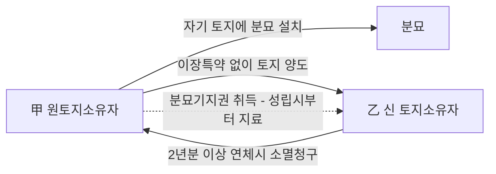

#### ⭐ 기출 출제포인트

1. **시효취득형의 지료** — "분묘기지권을 시효취득하는 경우에는 특약이 없는 한 지료를 지급할 필요가 없다"(2021년 기출 선지). **2021년 전합 이후 이 선지는 틀린 선지가 되었다.**
2. **장사법 시행일** — "장사법이 시행된 후 설치된 분묘에 대해서는 더 이상 시효취득이 인정되지 않는다"(옳음) vs "종전 관습법이 법적 규범으로서 효력을 상실하였다"(틀림). **두 선지를 붙여 놓고 구별시킨다.**
3. **등기 요부** — "20년 점유 후 **등기를 함으로써** 분묘기지권을 취득한다"(틀림). 등기 없이 취득한다.
4. **새 분묘·합장·이장** — 세 가지 모두 **권능에 포함되지 않는다**. 하나만 슬쩍 O로 바꿔 놓는다.
5. **소멸** — 이장하면 소멸(옳음) / 일시적 멸실은 소멸하지 않음(옳음). 이 둘의 방향을 뒤집는 함정.
6. **관습법의 법원성** — "관습법에 의한 분묘기지권은 더 이상 인정되지 않는다"(틀림). 민법 총칙의 **법원(法源)** 단원에서도 출제된다(2019년 기출 01번).

#### 📊 기출 분석

| 연도 | 출제 형태 | 핵심 논점 |
|---|---|---|
| 2019년 기출 (민법의 법원) | 선지 ② | "관습법에 의한 분묘기지권은 더 이상 인정되지 않는다" → **X** |
| 2021년 기출 (분묘기지권 단독 5지) | 옳지 않은 것 | **시효취득 시 지료** / 장사법 이후 시효취득 부정 / 관습법 효력 / 이장 시 소멸 / 일시적 멸실 |
| 2023년 기출 (지상권 옳은 것) | 선지 ⑤ (정답) | **장사법 시행 이전 설치 분묘의 시효취득은 법적 규범으로 유지** |
| 문제집 제5장 실전문제 02 | 선지 ⑤ | 승낙 없이 설치 + 20년 평온·공연 점유 → 분묘기지권 취득 |
| 문제집 제5장 실전문제 28 | 단독 5지 | 봉분 철거특약 없는 양도 / 쌍분 합장 / 이장 / 토지소유자의 공작물 설치 / **등기 요부** |
| 문제집 제5장 실전문제 29 | 단독 5지 | 물권성 / 일시적 멸실 / 암장 / **청구한 날부터 지료** / 새 분묘 신설 권능 |
| 문제집 제5장 실전문제 30 (변리사) | 박스형 | 세 유형의 지료 + 2년분 연체 시 소멸청구 — **3유형 종합** |

**출제 빈도** — 감정평가사 기출에서 **2021년에 단독 5지선다 1문항**이 나왔고, 2019년(법원 단원)·2023년(지상권 단원)에 **선지로** 출제되었다. 문제집에는 단독 문제가 3개 실려 있으며 전부 최신 전원합의체를 반영하고 있다.

**반복되는 함정 선지** —
① "시효취득하면 지료를 지급할 필요가 없다" → **청구한 날부터 지급의무 있음**(2021년 전합).
② "관습법이 법적 규범으로서 효력을 상실하였다" → **상실하지 않았다.** 장사법 이후 설치 분묘의 시효취득만 부정될 뿐이다.
③ "등기를 함으로써 취득한다" → **등기 없이** 취득한다.
④ "효력 범위 내에서는 새로운 분묘를 신설할 권능도 포함된다" → **포함되지 않는다.**

**최근 경향** — 2021년 전원합의체(2017다228007) 이후 출제의 무게중심이 **"성립 여부"에서 "지료"로 이동**했다. 2021년 기출 33번은 정답이 ③이었으나, 전원합의체 판결로 ①도 틀린 선지가 되어 문제집이 "①,③으로 변경"이라 표기하고 있을 정도다. 따라서 **취득 3유형별 지료 기산점**을 표로 외우는 것이 최우선이다.

#### 🔍 기출 선지로 배우는 법리

> 실제 출제된 선지를 그대로 놓고 O/X와 근거를 확인한다.

**①** 분묘기지권을 시효취득하는 경우에는 특약이 없는 한 지료를 지급할 필요가 없다. (2021년 기출) — **X**
어디가 틀렸나: 타인의 토지에 분묘를 설치하여 20년간 평온·공연하게 점유함으로써 시효취득한 경우에도 **토지소유자가 지료를 청구하면 그 청구한 날부터의 지료를 지급할 의무**가 있다(대판 2021.4.29. 2017다228007 전합).
옳게 고치면: "시효취득한 경우에도 **토지소유자가 청구하면 청구한 날부터** 지료를 지급할 의무가 있다." (출제 당시 정답은 ③이었으나 전원합의체 판결로 이 선지도 틀린 선지가 되었다.)

**②** 「장사 등에 관한 법률」이 시행된 후 설치된 분묘에 대해서는 더 이상 시효취득이 인정되지 않는다. (2021년 기출) — **O**
근거: 장사법 시행일 **2001. 1. 13.** 후에 토지소유자의 승낙 없이 설치한 분묘에 대해서는 분묘기지권의 시효취득을 주장할 수 없다(대판 2017.01.19. 2013다17292 전합).

**③** 분묘기지권의 시효취득을 인정하는 종전의 관습법은 법적 규범으로서의 효력을 상실하였다. (2021년 기출, 정답 ③) — **X**
어디가 틀렸나: 분묘기지권에 관한 관습에 대하여 **사회 구성원들의 법적 구속력에 대한 확신이 소멸하였다거나 그러한 관행이 본질적으로 변경되었다고 인정할 수 없다.** 장사법 시행 **이후** 설치 분묘의 시효취득이 부정될 뿐, 관습법적 효력 자체를 부정하는 것은 아니다(대판 2017.1.19. 2013다17292 전합).

**⑤** 「장사 등에 관한 법률」 시행 이전에 설치된 분묘에 관한 분묘기지권의 시효취득은 법적 규범으로 유지되고 있다. (2023년 기출, 정답 선지) — **O**
근거: 위 2013다17292 전원합의체. ②·③·⑤ 세 선지를 나란히 놓고 보면 **"이전 = 유지 / 이후 = 부정 / 관습법 자체 = 존속"**이라는 3단 구조가 보인다.

**②** 관습법에 의한 분묘기지권은 더 이상 인정되지 않는다. (2019년 기출, 민법의 법원) — **X**
어디가 틀렸나: 분묘기지권은 여전히 **관습법상의 물권**으로 인정된다. 장사법으로 소멸한 것은 관습법 자체가 아니라 **장사법 시행 후 설치 분묘의 시효취득 가능성**뿐이다.

**⑤** 타인의 토지 위에 토지 소유자의 승낙 없이 분묘를 설치한 후 20년간 평온·공연하게 분묘기지를 점유한 경우 그 기지에 대한 등기를 함으로써 분묘기지권을 취득한다. (문제집 제5장 실전문제 28번, 정답 ⑤) — **X**
어디가 틀렸나: 분묘기지권은 봉분 등 외부에서 분묘의 존재를 인식할 수 있는 형태를 갖추고 있으므로 **이러한 특성상 등기 없이 취득한다**(대판 1996.06.14. 96다14036).

**⑤** 분묘기지권의 효력이 미치는 지역의 범위에는 기존의 분묘 외에 새로운 분묘를 신설할 권능도 포함된다. (문제집 제5장 실전문제 29번, 정답 ⑤) — **X**
어디가 틀렸나: **기존의 분묘 외에 새로운 분묘를 신설할 권능은 포함되지 아니한다**(대판 2013.01.16. 2011다38592). 같은 판결에서 **이장하면 분묘기지권은 소멸**한다고 판시하였다.

**②** 부부 중 일방이 먼저 사망하여 이미 분묘가 설치된 후 다른 일방을 쌍분(雙墳) 형태로 합장하여 분묘를 설치하는 것은 그 분묘기지권이 미치는 범위 내라 하더라도 허용되지 않는다. (문제집 제5장 실전문제 28번) — **O**
근거: 대판 1997.5.23. 95다29086,29093; 대판 2007.06.28. 2005다44114. **쌍분이든 단분이든 합장은 안 된다.**

**㉢** 자기 소유의 토지 위에 분묘를 설치한 후 토지의 소유권이 경매 등으로 타인에게 이전되면서 분묘기지권을 취득한 자가, 판결에 따라 지료의 액수가 정해졌음에도 판결확정 후 책임 있는 사유로 상당한 기간 동안 지료의 지급을 지체하여 지체된 지료가 판결확정 전후에 걸쳐 2년분 이상이 되는 경우에는 새로운 토지소유자는 분묘기지권자에 대하여 분묘기지권의 소멸을 청구할 수 있다. (문제집 제5장 실전문제 30번) — **O**
근거: **민법 제287조를 유추적용**한다(대판 2015.7.23. 2015다206850). 판결확정 "전후에 걸쳐" 2년분이면 족하다는 점이 포인트.

**㉡** 자기 소유 토지에 분묘를 설치한 사람이 그 토지를 양도하면서 분묘를 이장하겠다는 특약을 하지 않음으로써 분묘기지권을 취득한 경우, 특별한 사정이 없는 한 분묘기지권자는 분묘기지권이 성립한 때로부터 토지소유자에게 지료를 지급할 의무가 있다. (문제집 제5장 실전문제 30번) — **O**
근거: 대판 2021.5.27. 2020다295892. **양도형은 "성립한 때부터"**로, 시효취득형의 "청구한 날부터"와 반드시 구별하라.

#### ✏️ 사례형 적용

> **사례 1** 甲은 1985년 乙 소유의 X임야에 乙의 승낙 없이 부친의 분묘를 봉분 형태로 설치하고, 그 후 계속 벌초하며 제사를 지내 왔다. 2024년 X임야를 매수한 丙이 甲에게 분묘 철거와 토지 인도를 구하면서, 예비적으로 지료 지급을 청구하였다.

**검토** —
① **성립** — 분묘 설치가 장사법 시행일(**2001. 1. 13.**) **이전**이고, 봉분 형태를 갖추었으며, 20년간 평온·공연하게 기지를 점유하였으므로 甲은 **시효취득형 분묘기지권**을 취득하였다(2013다17292 전합). 등기는 필요 없다(96다14036).
② **철거·인도 청구** — 甲에게 정당한 물권이 있으므로 丙의 철거·인도 청구는 인용될 수 없다. 토지소유자라도 적법하게 존재하는 타인의 묘지 주변을 침범하여 공작물을 설치할 수 없다(4291민상770).
③ **지료** — 2021년 전원합의체에 따라 甲은 **丙이 지료를 청구한 날부터**의 지료를 지급할 의무가 있다(2017다228007 전합). **과거 39년치를 소급하여 청구할 수는 없다.**
④ **연장** — 만약 판결로 지료액이 정해진 뒤 甲이 책임 있는 사유로 판결확정 전후에 걸쳐 2년분 이상을 지체하면, 丙은 제287조를 유추적용하여 **분묘기지권의 소멸을 청구**할 수 있다(2015다206850).

> **사례 2** 甲은 자기 소유 Y토지에 조부의 분묘를 설치하고 살다가, 이장에 관한 아무런 특약 없이 Y토지를 乙에게 매도하고 소유권이전등기를 마쳤다. 그 후 ① 乙이 甲에게 지료를 청구하였고, ② 甲은 조모가 사망하자 같은 분묘에 쌍분 형태로 합장하려 한다.

**검토** —
① **분묘기지권의 취득** — 자기 소유 토지에 분묘를 설치한 자가 소유권 유보나 이장 특약 없이 토지를 처분한 때에는 **판 사람(甲)이 분묘 소유를 위하여 산 사람(乙)의 토지에 지상권 유사의 물권을 취득한다**(대판 1967.10.12. 67다1920).
② **지료** — 양도형이므로 ==분묘기지권이 성립한 때(= 소유권이 이전된 때)부터== 지료 지급의무가 있다(2020다295892). 시효취득형과 달리 **청구를 기다리지 않는다.**
③ **합장** — 부부 일방 사망 후 다른 일방을 쌍분·단분 형태로 합장하여 분묘를 설치하는 것도 **허용되지 않는다**(95다29086,29093; 2005다44114). 甲은 **합장할 수 없다.** 하물며 새 분묘를 신설하거나 기존 분묘를 이장할 권능도 없다.

> **사례 3** 甲은 乙 소유 토지에 乙의 승낙을 받아 분묘를 설치하면서 "연 30만 원의 지료를 지급한다"고 약정하였다. 그 후 乙이 그 토지를 丙에게 양도하였고, 甲은 "지료 약정은 乙과의 것이므로 丙에게는 효력이 없다"고 주장한다. 한편 甲은 최근 분묘가 산사태로 훼손되었으나 유골은 그대로 남아 있어 복구를 준비 중이다.

**검토** —
① **승낙형의 성립** — 토지 소유자가 분묘 수호·관리권자에게 분묘 설치를 승낙한 때에는 그 기지에 관하여 **분묘기지권을 설정한 것으로 보아야 한다**(2017다271834, 271841).
② **지료 약정의 승계** — 성립 당시 토지 소유자와 분묘 수호·관리자가 지료 지급의무의 존부나 범위에 관하여 약정을 하였다면 **그 약정의 효력은 분묘 기지의 승계인에 대하여도 미친다**(같은 판결). 따라서 甲의 주장은 배척되고, **丙은 甲에게 연 30만 원의 지료를 청구할 수 있다.**
③ **일시적 멸실** — 분묘가 멸실되었더라도 **유골이 존재하여 원상회복이 가능한 일시적 멸실**에 불과하므로 분묘기지권은 소멸하지 않고 존속한다(2005다44114; 2001다28367).

#### ⚠️ 이 관의 함정 총정리

1. "분묘기지권을 시효취득하면 지료를 지급할 필요가 없다"라고 하면 틀림 → 2021년 전원합의체 이후 ==토지소유자가 청구한 날부터== 지료 지급의무가 있다(2017다228007 전합).
2. "장사법 시행으로 분묘기지권에 관한 관습법이 소멸하였다"라고 하면 틀림 → 소멸한 것은 ==장사법 시행 후 설치 분묘의 시효취득 가능성==뿐이고, **관습법 자체는 유지된다**(2013다17292 전합).
3. "20년 점유 후 등기를 함으로써 분묘기지권을 취득한다" 또는 "시효취득으로 토지 소유권을 취득한다"라고 하면 틀림 → ==등기 없이== 취득하고, 취득하는 것은 ==지상권 유사의 물권이지 소유권이 아니다==(96다14036; 68다1920).
4. "분묘기지권의 효력 범위 안에서는 새 분묘 설치·합장·이장이 가능하다"라고 하면 틀림 → ==세 가지 모두 권능에 포함되지 않는다==(2007다16885; 95다29086,29093; 2011다38592).
5. "분묘가 멸실되면 분묘기지권도 곧바로 소멸한다"라고 하면 틀림 → ==유골이 존재하여 원상회복이 가능한 일시적 멸실이면 존속==한다(2005다44114). 반면 **이장**하면 당연히 소멸한다(2007다16885).

#### ✅ OX 확인문제

> 다음 진술의 참·거짓을 판단하시오.

**1.** 분묘기지권은 분묘를 소유하기 위하여 타인의 토지를 제한된 범위 내에서 사용할 수 있는 관습법상의 물권이다.
→ **O**. 당사자의 합의에 의하지 않고 성립하는 **지상권 유사의 물권**으로, 그로 인하여 토지 소유권이 사실상 영구적으로 제한될 수 있다(대판 2021.4.29. 전합).

**2.** 타인의 토지에 소유자의 승낙 없이 분묘를 설치하고 20년간 평온·공연하게 점유하면, 그 기지에 관하여 등기를 함으로써 분묘기지권을 취득한다.
→ **X**. 봉분 등 외부에서 분묘의 존재를 인식할 수 있는 형태를 갖추고 있으므로 **등기 없이 취득한다**(대판 1996.06.14. 96다14036).

**3.** 「장사 등에 관한 법률」 시행일인 2001. 1. 13. 이후에 토지소유자의 승낙 없이 설치한 분묘에 대해서는 분묘기지권의 시효취득을 주장할 수 없다.
→ **O**. 대판 2017.01.19. 2013다17292 전원합의체. 다만 **시행일 이전에 설치한 분묘**에 관하여는 여전히 시효취득을 주장할 수 있다.

**4.** 장사법의 시행으로 분묘기지권 또는 그 시효취득에 관한 관습법은 법적 규범으로서의 효력을 상실하였다.
→ **X**. 사회 구성원들의 법적 구속력에 대한 확신이 소멸하였다거나 관행이 본질적으로 변경되었다고 인정할 수 없다(2013다17292 전합). **관습법 자체는 살아 있다.**

**5.** 분묘기지권을 시효로 취득한 자는 토지소유자가 지료를 청구하더라도 지료를 지급할 의무가 없다.
→ **X**. 시효취득한 경우에도 **토지소유자가 지료를 청구하면 그 청구한 날부터의 지료를 지급할 의무**가 있다(대판 2021.4.29. 2017다228007 전원합의체).

**6.** 자기 소유 토지에 분묘를 설치한 사람이 이장 특약 없이 그 토지를 양도하여 분묘기지권을 취득한 경우, 분묘기지권이 성립한 때부터 지료 지급의무를 진다.
→ **O**. 대판 2021.5.27. 2020다295892. 시효취득형("청구한 날부터")과 **기산점이 다르다**.

**7.** 토지소유자의 승낙에 의하여 성립한 분묘기지권에서 성립 당시 지료에 관한 약정이 있었다면, 그 약정의 효력은 분묘 기지의 승계인에게도 미친다.
→ **O**. 대판 2021.9.16. 2017다271834, 271841.

**8.** 분묘기지권의 효력이 미치는 범위 안에서는 기존 분묘 외에 새로운 분묘를 설치하거나 원래의 분묘를 다른 곳으로 이장할 권능도 포함된다.
→ **X**. **새로운 분묘 설치·이장·합장 모두 권능에 포함되지 않는다**(대판 2007.6.28. 2007다16885; 대판 2013.01.16. 2011다38592; 대판 1997.5.23. 95다29086,29093).

**9.** 분묘가 멸실되었더라도 유골이 존재하여 분묘의 원상회복이 가능한 일시적 멸실에 불과하다면 분묘기지권은 소멸하지 않는다.
→ **O**. 대판 2007.6.28. 2005다44114. 반면 분묘를 **다른 곳으로 이장**하면 분묘기지권은 당연히 소멸한다(2007다16885).

**10.** 판결로 분묘기지권의 지료 액수가 정해졌음에도 책임 있는 사유로 판결확정 전후에 걸쳐 2년분 이상의 지료 지급을 지체한 경우, 새로운 토지소유자는 분묘기지권의 소멸을 청구할 수 있다.
→ **O**. **민법 제287조를 유추적용**한다(대판 2015.7.23. 2015다206850). 다만 연체된 지료의 일부를 지급받아 연체액이 2년 미만이 되면 소멸청구를 할 수 없다(대판 2014.8.28. 2012다102384).

#### 🧠 암기법

> 🔑 **취득 3유형 — "승·시·양"**
> **승**낙형 → 약정(없으면 **무상**)
> **시**효형 → **청**구한 날부터
> **양**도형 → **성**립한 때부터
> 한 줄로: **"승은 약정, 시는 청구, 양은 성립"**

> 🔑 **장사법 날짜 — "01. 1. 13."**
> **2001년 1월 13일** — "이공공일 일일삼". **이 날 이전 설치 분묘만 시효취득 ○.**
> 헷갈리면 이렇게 잡아라: **"이전은 유지, 이후는 부정, 관습법은 존속."** (기출 3선지가 정확히 이 순서로 나온다.)

> 🔑 **분묘기지권에 없는 3가지 — "신·이·합"**
> **신**설(새 분묘) ✕ / **이**장 ✕ / **합**장(쌍분·단분) ✕
> 분묘기지권은 **있는 그 분묘 하나를 지키는 권리**일 뿐이다. 늘리지도, 옮기지도, 합치지도 못한다.

> 🔑 **성립요소 — "시신 + 봉분, 둘 다"**
> 시신 없이 봉분만(가묘) ✕ / 시신은 있으나 평장·암장 ✕
> **"보여야 하고, 들어 있어야 한다."**

#### ⚖️ 법조문 원문

> 📖 이 관이 근거로 삼은 조문의 **전문**이다. 본문 인용은 발췌지만 여기서는 조 전체를 싣는다. 출처는 법제처 정본이다.

**― 민법 ―**

> 📌 **민법 제187조(등기를 요하지 아니하는 부동산물권취득)** — "상속, 공용징수, 판결, 경매 기타 법률의 규정에 의한 부동산에 관한 물권의 취득은 등기를 요하지 아니한다. 그러나 등기를 하지 아니하면 이를 처분하지 못한다."

> 📌 **민법 제279조(지상권의 내용)** — "지상권자는 타인의 토지에 건물 기타 공작물이나 수목을 소유하기 위하여 그 토지를 사용하는 권리가 있다."

> 📌 **민법 제287조(지상권소멸청구권)** — "지상권자가 2년 이상의 지료를 지급하지 아니한 때에는 지상권설정자는 지상권의 소멸을 청구할 수 있다."

### 제7관 법정지상권

> 📖 우리 민법은 토지와 건물을 **각각 별개의 부동산**으로 취급한다. 그래서 처음에는 한 사람 소유였던 토지와 건물이 경매로 소유자가 갈리면, 건물은 대지이용권을 잃고 철거될 운명에 놓인다. 이 사회적·경제적 손실을 막기 위해 법률이 **당연히 지상권이 설정된 것으로 보는** 제도가 법정지상권이다. 앞 관의 약정지상권이 「계약+등기」로 생기는 것과 달리, 이 관의 지상권은 **법률규정으로, 등기 없이** 생긴다.

> ⭐ **이 관에서 반드시 챙길 3가지**
> ① 제366조 성립요건 4가지 — ==저당권설정 당시 건물 존재==, ==저당권설정 당시 동일인 소유==, 저당권 실행 경매, 경매로 소유자가 달라질 것. 판단 기준시점은 언제나 **저당권설정 당시**다.
> ② 나대지 저당 후 신축은 법정지상권 ==부정== (저당권자의 양해를 얻었어도 부정). 대신 저당권자에게 **일괄경매청구권**(제365조)이 주어진다.
> ③ 토지·건물 공동저당 후 건물을 철거·신축하면 신축건물을 위한 법정지상권은 ==성립하지 않는다== (전원합의체, 전체가치 고려설).

#### 1. 의의

**법정지상권(法定地上權)**이란, 처음에는 토지와 그 지상건물이 동일인에게 속하였으나 그 후 **법률이 정한 사유**로 토지와 건물의 소유자가 달라지게 된 경우에, 건물소유자를 위하여 **법률상 당연히 지상권이 설정된 것으로 보는** 권리를 말한다.

- **인정이유** — 민법은 토지와 건물을 별개 부동산으로 보아 독립하여 처분할 수 있게 하였다. 당사자의 의사로 어느 하나가 양도되는 경우에는 스스로 이용권을 설정할 기회가 있지만, **이용권을 설정할 기회 없이** 소유자가 달라지는 경우에는 법률이 토지이용관계를 조절하여 잠재적 이용관계를 현실화해 줄 필요가 있다.
- **법적 성질** — 기본서는 민법 제305조·제366조를 「가치권과 이용권의 조절을 위한 **공익상의 이유로 지상권의 설정을 강제하는 ==강행법규==**」로 본다. 또한 ==법률의 규정에 의한 부동산물권의 취득==이므로 **등기 없이도** 효력이 발생한다(제187조).

**법정지상권의 4가지 발생근거 — 비교표**

| 근거 | 발생사유 | 지상권 취득자 | 지료 | 강행규정성 |
|---|---|---|---|---|
| **민법 제366조** | ==저당물의 경매==로 토지·건물이 다른 소유자에 속하게 됨 | 건물소유자 | 협의 → 협의 불성립 시 **법원이 결정** | ==강행규정== (배제특약 무효) |
| **민법 제305조** | 대지·건물 동일소유자인데 ==건물에 전세권==을 설정한 뒤 대지소유권이 특별승계됨 | ==전세권설정자(건물소유자)==. **전세권자가 아니다** | 당사자 청구에 의해 법원이 결정 | 제366조와 같음 |
| **입목에 관한 법률 제6조** | 입목의 ==경매 기타 사유==로 토지와 입목의 소유자가 달라짐 | 입목소유자 | ==당사자의 약정에 따름== (제366조와 다른 점) | — |
| **가등기담보 등에 관한 법률 제10조** | 담보권의 사적 실행(청산에 의한 소유권취득·담보가등기에 기한 본등기)으로 소유자가 달라짐 | 건물소유자 | ==존속기간과 지료 모두== 당사자 청구로 법원이 결정 | 제366조의 특별규정 |

> 💡 **관습법상 법정지상권**은 이 4가지와 달리 **법률이 아닌 관습법**을 근거로 하고, 성립사유에 매매·증여 등을 포함하며, ==임의규정==이라는 점이 결정적으로 다르다(제8관 참조).

> ⚠️ 제305조에서 법정지상권을 취득하는 자는 **건물소유자(전세권설정자)**이지 전세권자가 아니다. 지상권은 「지상물을 소유하기 위한 권리」이기 때문이다. 문제집은 이 함정을 정면으로 출제했다(문제집 제5장 기본문제 04번, 정답 ①).

#### 2. 요건

**제366조 법정지상권의 성립요건 4가지**

| 요건 | 내용 | 비고 |
|---|---|---|
| ① ==저당권설정 당시 토지 위에 건물이 존재==할 것 | 저당권을 설정할 그때 이미 독립한 부동산으로서 건물이 있어야 한다 | 설정 후 신축은 ==부정==. 미등기·무허가는 무방 |
| ② ==저당권설정 당시 토지와 건물이 동일인 소유==일 것 | 판단 기준시점은 **경매 시가 아니라 저당권설정 시** | 설정 후 건물이 제3자에게 양도되어도 무방 |
| ③ ==저당권의 실행==(담보권 실행 경매)이 있을 것 | 토지·건물 중 어느 하나에만 저당권이 있어도, 양자 모두에 있어도 무방 | 강제경매·공매는 제366조가 아니라 관습법상 법정지상권 문제 |
| ④ ==경매의 결과 토지와 건물의 소유자가 달라질 것== | 매수인이 매각대금을 완납한 때 소유자가 갈린다 | 이때 법정지상권이 **발생**한다 |

> 🔑 문제집은 이 4요건을 그대로 열거한다 — 「ⓐ저당권설정 당시의 건물의 존재 ⓑ저당권설정 당시의 소유자의 동일성 ⓒ저당권의 설정 ⓓ경매로 소유자가 달라질 것」(문제집 제5장 실전문제 21번 해설).

**요건 ① — 「건물의 존재」를 둘러싼 판단**

| 사안 | 결론 | 근거 |
|---|---|---|
| 저당권설정 당시 건물이 **미등기·무허가** | ==성립 O== | 건물의 요건만 갖추면 미등기라도 지장 없다 (2004다13533) |
| 저당권설정 당시 건물이 존재했고 그 후 **개축·증축** | ==성립 O== | 90다카6399 |
| 저당권설정 당시 건물이 존재했고 그 후 **멸실·철거 후 재축·신축**(토지 단독저당) | ==성립 O==, 다만 내용은 **구 건물 기준** | 90다19985, 96다40080 |
| 건물등기부가 사실과 달리 **멸실 기재로 폐쇄**된 경우 | ==성립 O== | 저당권자가 폐쇄등기 부활 절차로 저당권 행사가 가능한 이상 불측의 손해가 없다 (2012다108634) |
| 저당권설정 당시 **건축 중**이었고 사회관념상 독립건물에 이르지 못함 | 규모·종류가 외형상 예상 가능한 정도까지 진전 + 매각대금 완납 시까지 ==기둥·지붕·주벽==을 갖추면 ==성립 O== | 2004다13533 |
| 저당권설정 당시 **나대지**, 그 후 건물 신축 | ==성립 X== | 토지 담보가치를 부당히 떨어뜨림 |
| 나대지 저당 후 **저당권자의 양해를 얻어** 신축 | ==성립 X== | 양해가 있어도 결론이 바뀌지 않는다 (2003다26051) |
| 저당권설정 당시 **가설건축물**만 존재 | ==성립 X== | 존치기간이 통상 3년 이내여서 독립한 부동산인 건물의 요건을 못 갖춤 (2020다224821) |

**요건 ② — 「동일인 소유」를 둘러싼 판단**

| 사안 | 결론 | 근거 |
|---|---|---|
| 설정 당시 동일인 소유 → **경매 전에 건물이 제3자에게 양도** | ==성립 O==, 건물을 양수한 **제3자가** 법정지상권 취득 | 99다52602 |
| **토지는 단독소유**, 건물은 그 토지소유자를 포함한 **공유** → 토지에만 저당권 | ==성립 O==, 건물공유자들은 **토지 전부**에 대하여 취득 | 2010다67159 |
| **구분소유적 공유** 토지에서 자기 몫 위의 건물 — 그 건물 또는 토지지분에 저당권 | ==성립 O== (내부관계상 단독소유로 보므로) | 2004다13533 |
| **토지 공유자 일부의 지분**만 목적으로 한 근저당권 실행 | ==성립 X== | 다른 공유자 지분에까지 처분행위를 허용하는 셈 (2011다73038,73045) |
| 미등기건물을 **대지와 함께 매수**했으나 대지만 이전등기 → 대지에 저당권 → 경매 | ==성립 X== (설정 당시 이미 소유자가 다름) | 2002다9660 전합 |
| 저당권설정 당시 대지 소유명의를 **타인에게 신탁** | ==성립 X== (신탁자는 제3자에게 자기 소유임을 주장 못함) | 92다20330 |
| 토지·건물에 **공동저당** → 건물 철거 후 **신축** | ==성립 X== (특별한 사정 없는 한) | 98다43601 전합, 2011다73038,73045 |

**요건 ③·④ — 저당권 실행과 소유자 분리**

- 토지와 건물 중 **어느 한쪽에만** 저당권이 설정되었든, **양쪽 모두**에 설정되었든 무방하다. 결과적으로 소유자가 갈리면 된다(문제집 제5장 실전문제 21번 해설 ③).
- 발생시기는 ==경매로 소유권이 매수인에게 이전하는 때, 즉 매각대금 완납 시==다.
- 요건이 갖추어지면 **당사자 특약으로 배제할 수 없다**. 배제약정은 ==무효==다(87다카1564).

#### 3. 효과

| 구분 | 효과 |
|---|---|
| **발생시기** | ==매각대금 완납 시== 당연히 성립 |
| **등기** | ==취득에는 등기 불요==(제187조). 취득 당시 토지소유자는 물론 그로부터 토지소유권을 **전득한 제3자에 대하여도 등기 없이 주장** 가능 (65다1222) |
| **처분** | 처분하려면 ==등기를 하여야 한다==(제187조 단서) |
| **권리의 범위** | 건물의 대지에 국한되지 않고 ==그 건물의 이용에 필요한 상당한 범위==에 미친다 |
| **개축·증축·재축 시 범위** | 법정지상권은 존속하나, 범위·존속기간은 ==구 건물을 기준==으로 그 유지·사용에 일반적으로 필요한 범위로 제한 (96다40080, 90다19985) |
| **존속기간** | 약정 없는 지상권으로 보아 제281조 → 제280조의 최단존속기간 |
| **지료** | 지상권과 달리 ==지급의무 있음==. 협의 → 협의 불성립 시 당사자 청구로 **법원이 결정**(제366조 단서) |
| **독립성** | 법정지상권은 건물소유권에 종속된 권리가 아니라 ==하나의 독립된 물권==. 건물과 법정지상권 중 어느 하나만 처분하는 것도 가능 (2000다1976) |
| **소멸** | 지상권 규정 준용. 2년분 이상 지료 연체 시 소멸청구(제287조) — 단, **지료가 확정되어 있어야** 한다 |

**존속기간 — 구 건물 기준**

| 구 건물의 종류 | 최단존속기간(제280조) |
|---|---|
| 석조·석회조·연와조 기타 ==견고한 건물==이나 수목 | 30년 |
| 기타의 건물(목조 등) | ==15년== |
| 건물 이외의 공작물 | 5년 |

> 💡 문제집은 「1층 목조건물 → 철거 → 2층 콘크리트 신축」 사안에서 **신 건물에 대해 15년**의 법정지상권을 인정한다. 신축건물이 콘크리트여도 ==구 건물이 목조==이므로 15년이다(문제집 제5장 실전문제 22번, 정답 ②).

**지료를 둘러싼 두 가지 함정**

| 쟁점 | 결론 |
|---|---|
| 지료 협의도 없고 법원의 지료결정도 없는데 2년 이상 지료 미지급 | ==지체가 아니다== → 토지소유자의 지상권소멸청구 **불가** (99다17142) |
| 지료를 정할 때, 그 토지 위에 건물이 서 있어 토지소유권이 제한받는 사정 | ==참작·평가해서는 안 된다== (법정지상권 설정 당시의 제반 사정은 참작) |
| 건물 양수인이 아직 지상권이전등기가 없어 철거청구를 거부할 수 있는 경우, 대지 점유·사용의 이득 | ==부당이득으로 반환할 의무 있다== (96다34665) |

**건물 양수인의 지위 — 자주 나오는 3단 구조**

| 단계 | 법률관계 | 근거 |
|---|---|---|
| ① 건물양도계약의 해석 | 주물·종물 이론의 유추적용상, 주된 권리인 건물소유권의 양도계약에는 ==종된 권리인 지상권의 양도계약도 뒤따른다== | 95다52864 |
| ② 이전등기 전 양수인의 지위 | 소유권이전등기만 있고 **지상권이전등기가 없으면** 양수인은 ==지상권을 취득한 것이 아니다== → 대지소유자에게 지상권을 직접 주장 못함 | 94다39925 |
| ③ 구제수단 | 건물양도인의 토지소유자에 대한 ==지상권설정등기청구권을 대위행사==한 뒤 자기에게 이전등기를 청구 | 80다2873, 84다카1131·1132 |
| ④ 토지소유자의 철거청구 | 법정지상권을 취득할 지위에 있는 자에 대한 건물철거·대지인도청구는 ==신의성실의 원칙상 허용되지 않는다== | 80다2873, 84다카1131·1132 |
| ⑤ 경매로 건물을 취득한 경락인 | 철거 매각조건 등 특별한 사정이 없는 한 ==경락취득과 함께 지상권도 당연히 취득==(등기 불요) | 84다카1578,1579, 79다1087 |

#### 3-2. 일괄경매청구권(제365조) — 나대지 저당의 짝

나대지에 저당권을 설정한 뒤 건물이 신축되면 법정지상권이 부정되어 건물은 철거될 운명이 된다. 이 사회경제적 손실을 막고, 동시에 저당권자에게는 지상건물 때문에 생기는 **경매의 어려움을 해소**해 주는 제도가 일괄경매청구권이다(2003다3850).

| 구분 | 내용 | 근거 |
|---|---|---|
| **요건 ①** | 저당권설정 당시 토지 위에 ==건물이 없다가== 설정자가 건물을 축조할 것 | 97마2935 |
| **요건 ②** | ==일괄경매 당시 토지와 건물이 동일인 소유==일 것 | 99마146 |
| 제3자가 건물을 축조한 경우 | 원칙적으로 ==청구 불가==. 다만 그 후 **저당권설정자가 그 건물의 소유권을 취득**하면 청구 가능 | 2003다3850 |
| 설정자가 축조 후 **제3자에게 건물을 양도**한 경우 | ==청구 불가== | 93마1736 |
| **성질** | 저당권자의 ==권리이지 의무가 아니다==. 토지만 경매할지 일괄경매할지는 저당권자의 자유 | 77다77 |
| 대지 매각대금만으로 채권 변제가 충분한 경우 | 그래도 일괄경매청구는 ==적법== | 4294민재항50 |
| **우선변제권** | 저당권의 효력은 토지에만 미치므로 ==건물의 경매대가에 대하여는 우선변제권이 없다== | 제365조 단서 |

#### 4. 관련 조문

> 📌 **민법 제366조(법정지상권)** — "저당물의 경매로 인하여 토지와 그 지상건물이 다른 소유자에 속한 경우에는 토지소유자는 건물소유자에 대하여 지상권을 설정한 것으로 본다. 그러나 지료는 당사자의 청구에 의하여 법원이 이를 정한다."

> 📌 **민법 제365조(저당지상의 건물에 대한 경매청구권)** — "토지를 목적으로 저당권을 설정한 후 그 설정자가 그 토지에 건물을 축조한 때에는 저당권자는 토지와 함께 그 건물에 대하여도 경매를 청구할 수 있다. 그러나 그 건물의 경매대가에 대하여는 우선변제를 받을 권리가 없다."

> 📌 **민법 제305조(건물의 전세권과 법정지상권)** — "① 대지와 건물이 동일한 소유자에 속한 경우에 건물에 전세권을 설정한 때에는 그 대지소유권의 특별승계인은 전세권설정자에 대하여 지상권을 설정한 것으로 본다. 그러나 지료는 당사자의 청구에 의하여 법원이 이를 정한다. ② 전항의 경우에 대지소유자는 타인에게 그 대지를 임대하거나 이를 목적으로 한 지상권 또는 전세권을 설정하지 못한다."

> 📌 **입목에 관한 법률 제6조(법정지상권)** — "① 입목의 경매 기타 사유로 인하여 토지와 그 입목이 각각 다른 소유자에게 속하게 되는 경우에는 토지소유자는 입목소유자에 대하여 지상권을 설정한 것으로 본다. ② 전항의 경우에 지료에 관하여는 당사자의 약정에 따른다."

> 📌 **가등기담보 등에 관한 법률 제10조(법정지상권)** — "토지와 그 위의 건물이 동일한 소유자에게 속하는 경우 그 토지나 건물에 대하여 제4조 제2항에 따른 소유권을 취득하거나 담보가등기에 따른 본등기가 행하여진 경우에는 그 건물의 소유를 목적으로 그 토지 위에 지상권이 설정된 것으로 본다. 이 경우 그 존속기간과 지료는 당사자의 청구에 의하여 법원이 정한다."

> 📌 **민법 제187조(등기를 요하지 아니하는 부동산물권취득)** — 상속·공용징수·판결·경매 기타 법률의 규정에 의한 부동산에 관한 물권의 취득은 등기를 요하지 아니한다. 그러나 ==등기를 하지 아니하면 이를 처분하지 못한다.==

> 📌 **민법 제280조(존속기간을 약정한 지상권)·제281조(존속기간을 약정하지 아니한 지상권)** — 법정지상권은 약정이 없는 지상권으로 보아 제281조를 거쳐 제280조의 최단존속기간(견고한 건물·수목 30년, 기타 건물 15년, 공작물 5년)이 적용된다.

#### 5. 핵심 판례 법리

**[1] 강행규정성** — 민법 제366조는 가치권과 이용권의 조절을 위한 공익상의 이유로 지상권의 설정을 강제하는 것이므로, 저당권설정의 당사자 간의 특약으로 저당목적물인 토지에 대하여 법정지상권을 배제하는 약정을 하더라도 ==그 특약은 효력이 없다== (87다카1564).

**[2] 미등기·무허가 건물, 건축 중인 건물** — 토지에 저당권이 설정될 당시 토지 소유자에 의하여 그 지상에 건물을 건축 중이었던 경우, 사회관념상 독립된 건물로 볼 수 있는 정도에 이르지 않았더라도 **건물의 규모·종류가 외형상 예상할 수 있는 정도까지 건축이 진전**되어 있었고, 그 후 경매절차에서 매수인이 매각대금을 다 낸 때까지 ==최소한의 기둥과 지붕 그리고 주벽==이 이루어지는 등 독립된 부동산으로서 건물의 요건을 갖추면 법정지상권이 성립하며, ==그 건물이 미등기라 하더라도 성립에 아무런 지장이 없다== (2004다13533).

**[3] 개축·증축·재축** — 저당권의 설정 당시 저당권의 목적이 되는 토지 위에 건물이 존재한 이상, 그 이후 건물을 ==개축·증축하는 경우에도== 법정지상권이 성립한다 (90다카6399). 나아가 건물이 멸실·철거된 후 재축·신축하는 경우에도 성립하나, 이때 ==존속기간·범위 등은 구 건물을 기준==으로 그 이용에 일반적으로 필요한 범위 내로 제한된다 (90다19985, 96다40080).

**[4] 건물등기부 폐쇄** — 토지와 함께 공동근저당권이 설정된 건물이 그대로 존속함에도 사실과 달리 등기부에 멸실의 기재가 이루어지고 이를 이유로 등기부가 폐쇄된 경우, 그 후 토지에 대하여만 경매절차가 진행되어 소유자가 달라졌다면 ==그 건물을 위한 법정지상권은 성립한다== (2012다108634). 저당권자는 폐쇄등기를 부활시켜 건물에 대한 저당권을 행사할 수 있어 불측의 손해가 없기 때문이다.

**[5] 가설건축물** — 민법상 건물의 법정지상권 최단존속기간이 견고한 건물 30년, 그 밖의 건물 15년인 데 비하여 건축법령상 가설건축물의 존치기간은 통상 3년 이내다. 따라서 가설건축물은 특별한 사정이 없는 한 ==독립된 부동산으로서 건물의 요건을 갖추지 못하여 법정지상권이 성립하지 않는다== (2020다224821).

**[6] 나대지 저당 후 신축 — 저당권자의 양해가 있어도 부정** — 건물이 없는 토지에 저당권을 설정한 후 ==저당권자의 양해를 얻어 건물을 지어도 법정지상권은 인정되지 않는다== (2003다26051). 이 경우 제366조의 법정지상권은 물론 **관습상의 법정지상권도 인정되지 않는다**(95마1262).

**[7] 저당권설정 후 건물이 제3자에게 양도된 경우** — 토지에 저당권을 설정할 당시 그 지상에 건물이 존재하였고 그 양자가 동일 소유자에게 속하였다가, 그 후 저당권의 실행으로 토지가 낙찰되기 **전에 건물이 제3자에게 양도된 경우**, ==건물을 양수한 제3자가 제366조의 법정지상권을 취득한다== (99다52602). **동일인 소유 판단시점이 저당권설정 당시**임을 보여주는 대표 판례다.

**[8] 토지 단독소유자가 건물의 공유자 1인인 경우** — 건물공유자의 1인이 그 건물의 부지인 토지를 단독으로 소유하면서 그 토지에 관하여만 저당권을 설정하였다가 경매로 토지 소유자가 달라진 경우에도, ==건물공유자들은 제366조에 의하여 토지 전부에 관하여== 건물의 존속을 위한 법정지상권을 취득한다 (2010다67159).

**[9] 미등기건물을 대지와 함께 매수한 경우 — 부정** — 미등기건물을 그 대지와 함께 매수한 사람이 **대지에 관하여만 소유권이전등기**를 넘겨받고 건물에 대하여는 등기를 이전받지 못하고 있다가 대지에 저당권을 설정하고 그 실행으로 대지가 경매된 경우에는, ==저당권설정 당시에 이미 대지와 건물이 각각 다른 사람의 소유==에 속하고 있었으므로 법정지상권이 성립될 여지가 없다 (2002다9660 전합).

**[10] 명의신탁된 토지** — 저당권설정 당시 대지의 소유명의를 타인에게 신탁한 경우, 신탁자는 제3자에게 그 대지가 자기 소유임을 주장할 수 없고, 따라서 ==대지와 지상건물이 동일인 소유임을 전제로 한 법정지상권을 취득할 수 없다== (92다20330).

**[11] 공동저당 후 건물 철거·신축 — 전체가치 고려설(전원합의체)** — 동일인의 소유에 속하는 토지 및 그 지상건물에 관하여 ==공동저당권==이 설정된 후 그 지상건물이 철거되고 새로 건물이 신축된 경우에는, 신축건물의 소유자가 토지소유자와 동일하고 **토지의 저당권자에게 신축건물에 관하여 토지의 저당권과 동일한 순위의 공동저당권을 설정해 주는 등** 특별한 사정이 없는 한, ==신축건물을 위한 법정지상권은 성립하지 않는다== (98다43601 전합, 2011다73038,73045).
> 이유 — 그렇게 해석하지 않으면 공동저당권자가 신축건물의 교환가치를 취득할 수 없게 되어, ==나대지로서의 교환가치 전체==를 실현시킬 수 있다고 기대하고 담보를 취득한 공동저당권자에게 불측의 손해를 입히기 때문이다. 이 법리는 집합건물의 전유부분과 대지지분에 공동저당권이 설정된 후 집합건물이 철거되고 신축된 경우에도 마찬가지다.
> ⚠️ **토지 단독저당**의 경우에는 반대다 — 건물이 있는 상태에서 토지에 저당권을 설정받은 자는 **건물에 의한 토지가치의 제한을 이미 인정**한 것이므로, 멸실·신축되어도 법정지상권이 성립한다(핵심요약서 08번 판례해설).

**[12] 공유관계** — 토지공유자의 한 사람이 다른 공유자의 지분 과반수의 동의를 얻어 건물을 건축한 후 **토지에 관한 공유자 일부의 지분만을 목적으로 하는 근저당권**이 설정되었다가 경매로 그 지분을 제3자가 취득한 경우에도 ==법정지상권은 성립하지 않는다== (2011다73038,73045). 자신의 지분을 제외한 다른 공유자의 지분에까지 지상권설정의 처분행위를 허용하는 셈이 되어 부당하기 때문이다.

**[13] 구분소유적 공유** — 공유로 등기된 토지의 소유관계가 구분소유적 공유관계에 있는 경우, **공유자 중 1인이 소유하는 건물과 그 대지**는 내부관계에서 그 공유자의 단독소유로 된다. 따라서 그가 건물 또는 토지지분에 저당권을 설정하였다가 그 실행으로 소유자가 달라지면 ==법정지상권을 취득한다== (2004다13533).

**[14] 등기 불요·대항력** — 법정지상권은 법률규정에 의한 물권취득이므로 ==등기를 요하지 아니하고==, 경락대금 완납 시 지상권취득의 효력이 발생하며, 취득 당시의 소유자나 이로부터 **토지소유권을 전득한 제3자에 대하여도 등기 없이** 지상권을 주장할 수 있다 (65다1222).

**[15] 법정지상권의 독립성** — 법정지상권은 건물의 소유에 부속되는 종속적 권리가 아니라 ==하나의 독립된 법률상의 물권==이므로, 건물의 소유자가 ==건물과 법정지상권 중 어느 하나만을 처분하는 것도 가능==하다 (2000다1976).

**[16] 지료 — 협의·결정이 없으면 지체가 아니다** — 법정지상권의 경우 당사자 사이에 지료에 관한 협의가 있었다거나 법원에 의하여 지료가 결정되었다는 아무런 입증이 없다면, 지료를 지급하지 않았더라도 ==지체한 것으로 볼 수 없으므로==, 2년 이상 지료 미지급을 이유로 하는 토지소유자의 ==지상권소멸청구는 이유 없다== (99다17142).

**[17] 지료 산정 시 참작금지** — 법정지상권자가 지급할 지료를 정할 때 **설정 당시의 제반 사정**은 참작하여야 하나, ==법정지상권이 설정된 토지 위에 건물이 건립되어 있음으로 인하여 토지소유권이 제한을 받는 사정은 참작·평가하여서는 안 된다== (판례).

**[18] 부당이득 반환의무** — 법정지상권자라도 대지소유자에게 지료를 지급할 의무는 있고, 법정지상권 있는 건물의 양수인으로서 장차 법정지상권을 취득할 지위에 있어 건물철거·대지인도청구를 거부할 수 있더라도, 그 대지를 점유·사용하여 얻은 이득은 ==부당이득으로 반환할 의무가 있다== (96다34665).

**[19] 건물 양수인 — 대위행사와 신의칙** — 법정지상권을 가진 건물소유자로부터 건물을 양수하면서 법정지상권까지 양도받기로 한 자는, ==채권자대위의 법리==에 따라 전 건물소유자 및 대지소유자에 대하여 차례로 지상권의 설정등기 및 이전등기절차 이행을 구할 수 있다 (84다카1131·1132, 80다2873). 그런 자에 대하여 대지소유자가 소유권에 기하여 건물철거 및 대지인도를 구하는 것은, ==지상의 부담을 용인하고 설정등기절차를 이행할 의무 있는 자가 그 권리자를 상대로 한 청구==여서 ==신의성실의 원칙상 허용될 수 없다==.
> 다만 소유권이전등기만 있고 **지상권이전등기가 없으면** 양수인은 소유권만 취득할 뿐 지상권을 취득한 것은 아니므로, 대지소유자에게 ==지상권 자체를 주장할 수는 없다== (94다39925).

**[20] 경매로 건물을 취득한 자** — 건물 소유를 위하여 법정지상권을 취득한 자로부터 **경매에 의하여** 그 건물의 소유권을 이전받은 경락인은, 경락 후 건물을 철거한다는 매각조건 등 특별한 사정이 없는 한 ==건물의 경락취득과 함께 위 지상권도 당연히 취득==하며, 이는 ==그에 대한 등기가 없어도== 그 후 담보토지를 전득한 자에 대하여 유효하다 (84다카1578,1579, 79다1087).

**[21] 건물양도계약의 해석** — 주물·종물 이론의 유추적용상, 주된 권리인 ==건물소유권의 양도계약에는 종된 권리인 그 건물소유를 위한 지상권의 양도계약도 뒤따른다== (95다52864).

**[22] 일괄경매청구권의 취지와 성질** — 제365조의 취지는 저당권설정 후 신축된 건물의 철거로 인한 사회경제적 불이익을 방지하고, 저당토지상 건물의 존재로 생기는 경매의 어려움을 해소하여 ==저당권의 실행을 쉽게== 하려는 데 있다 (2003다3850). 일괄경매청구권은 ==저당권자의 권리이지 의무가 아니므로==, 토지만 경매할지 일괄경매할지는 저당권자의 자유로운 선택에 달려 있다 (77다77).

#### ⭐ 기출 출제포인트

1. **「저당권설정 당시」 반복 확인** — 건물 존재·동일인 소유 판단시점을 「경매 당시」로 바꿔 놓은 선지가 매년 나온다. 둘 다 저당권설정 당시다.
2. **나대지 저당 후 신축 + 저당권자 동의** — 「저당권자의 동의를 얻었으므로 성립한다」는 선지는 항상 X. 2023년 기출과 2020년 기출에서 연속 출제되었다.
3. **공동저당 vs 단독저당의 갈림길** — 「건물 철거 후 신축」 사안에서 **공동저당이면 부정, 토지 단독저당이면 긍정(구 건물 기준)**. 이 대비를 물어 온다.
4. **미등기·무허가·건축 중 건물** — 「미등기건물이므로 성립하지 않는다」는 선지는 X. 다만 **가설건축물**은 성립하지 않는다.
5. **건물 양수인 3점 세트** — ⓐ 등기 없으면 지상권 주장 불가, ⓑ 대위행사로 설정·이전등기 청구, ⓒ 토지소유자의 철거청구는 신의칙 위반. 세 개를 뒤섞어 출제한다.
6. **지료** — 「협의도 법원결정도 없는데 2년 연체했으니 소멸청구 가능」은 X.

#### 📊 기출 분석

| 연도 | 출제 형태 | 핵심 논점 |
|---|---|---|
| 2020년 기출 (문제집 실전문제 16번) | 옳지 않은 것 모두 고르기 | 경락인의 지상권 당연취득 / 토지단독소유+건물공유 / 공동저당 후 신축 / 저당권자 동의 후 신축 |
| 2022년 기출 (문제집 실전문제 17번) | 옳은 것 모두 고르기 | 미등기건물 / 지료 협의·결정 없으면 지체 아님 / 경매취득 시 지상권 당연취득 (모두 O, 정답 ⑤) |
| 2023년 기출 (문제집 실전문제 10번) | 옳지 않은 것 | 저당권자 동의 후 신축(X) / 가설건축물 / 무허가·미등기 / 토지공유지분 저당 / 제305조 |
| 2019년 제30회 35번 해설 | 관습법상 법정지상권 문항의 해설이 2004다13533을 인용 | 건축 중 건물·미등기 건물 |

**출제 빈도** — 용익물권 파트에서 지상권·법정지상권은 거의 매년 1문항 이상 출제되고, 관습법상 법정지상권과 짝을 이루어 격년 이상으로 반복된다. 특히 **제366조 요건 4가지**는 단독 문항으로도, 지상권 종합 문항의 한 선지로도 계속 나온다.

**반복되는 함정 선지** —
- 「저당권자의 동의(양해)를 얻어 신축했으므로 법정지상권이 성립한다」 → X (2020년·2023년 연속).
- 「공동저당 후 신축된 건물을 위한 법정지상권이 성립한다」 → X (2020년, 핵심요약서 09번).
- 「법정지상권 배제특약도 유효하다」 → X (강행규정, 핵심요약서 01번).
- 「토지소유권을 전득한 제3자에게는 등기 없이 주장할 수 없다」 → X (문제집 실전문제 14번, 정답 ④).

**최근 경향** — 단순 요건 암기에서 벗어나 ⓐ **공동저당 vs 단독저당**, ⓑ **공유·구분소유적 공유**, ⓒ **건물 양수인의 지위(대위·신의칙)** 같은 **응용 사안**으로 이동하고 있다. 2021년 이후로는 가설건축물(2020다224821) 같은 **최신 판례**도 선지에 편입되었다.

#### 🔍 기출 선지로 배우는 법리

> 실제 출제된 선지를 그대로 놓고 O/X와 근거를 확인한다.

**①** 토지에 저당권이 설정된 후에 저당권자의 동의를 얻어 건물이 신축된 경우라도 법정지상권은 성립한다. *(2023년 기출)* — **X**
어디가 틀렸나: 법정지상권이 성립하려면 ==토지에 저당권이 설정될 당시에 건물이 존재==하고 있었어야 한다. 저당권자의 양해를 얻었더라도 결론은 같다(2003다26051).

**②** 토지의 정착물로 볼 수 없는 가설 건축물의 소유를 위한 법정지상권은 성립하지 않는다. *(2023년 기출)* — **O**
근거: 가설건축물의 존치기간은 통상 3년 이내여서 독립된 부동산으로서 건물의 요건을 갖추지 못한다(2020다224821).

**③** 토지공유자 중 1인이 다른 공유자의 동의를 얻어 그 지상에 건물을 소유하면서 자신의 토지지분에 저당권을 설정한 후 그 실행경매로 인하여 그 공유지분권자와 건물소유자가 달라진 경우에는 법정지상권이 성립하지 않는다. *(2023년 기출)* — **O**
근거: 다른 공유자의 지분에까지 지상권설정의 처분행위를 허용하는 셈이 되어 부당하다(2011다73038,73045).

**④** 동일인 소유의 토지와 건물 중 건물에 전세권이 설정된 후 토지소유자가 바뀐 경우, ==건물소유자==가 그 토지에 대하여 지상권을 취득한 것으로 본다. *(2023년 기출)* — **O**
근거: 제305조 제1항. 법정지상권을 취득하는 자는 **전세권설정자인 건물소유자**이지 전세권자가 아니다.

**⑤** X토지를 소유하는 甲이 乙과 함께 그 지상에 Y건물을 신축·공유하던 중 X토지에 저당권을 설정하였고 그의 실행에 의한 경매에서 丙이 X토지의 소유권을 취득한 경우, Y건물을 위한 법정지상권이 성립하지 않는다. *(2020년 기출)* — **X**
어디가 틀렸나: ==성립한다==. 건물공유자의 1인이 그 부지를 단독소유하면서 토지에만 저당권을 설정한 경우, 건물공유자들은 **토지 전부**에 대하여 법정지상권을 취득한다(2010다67159).

**⑥** 甲 소유의 X토지와 그 지상건물에 공동저당권이 설정된 후 지상건물을 철거하고 Y건물을 신축하였고 저당권의 실행으로 X토지와 Y건물이 다른 소유자에게 매각된 경우, 특별한 사정이 없으면 Y건물을 위한 법정지상권이 성립한다. *(2020년 기출)* — **X**
옳게 고치면: ==성립하지 않는다==. 신축건물에 토지 저당권과 동일 순위의 공동저당권을 설정해 주는 등 특별한 사정이 없는 한 부정된다(98다43601 전합, 2011다73038,73045).

**⑦** 당사자 사이에 지료에 관하여 협의한 사실이나 법원에 의하여 지료가 결정된 사실이 없다면, 법정지상권자가 지료를 지급하지 않았다고 하더라도 지료 지급을 지체한 것으로 볼 수 없다. *(2022년 기출)* — **O**
근거: 99다17142. 따라서 2년 연체를 이유로 한 지상권소멸청구도 이유 없다.

**⑧** 건물 소유를 위한 법정지상권을 취득한 사람으로부터 경매에 의해 건물소유권을 이전받은 매수인은 특별한 사정이 없는 한 건물의 매수취득과 함께 위 지상권도 당연히 취득한다. *(2022년 기출)* — **O**
근거: 84다카1578,1579 / 79다1087. **경매는 법률규정에 의한 물권변동**이므로 등기 없이 지상권이 함께 이전된다.

**⑨** 법정지상권도 법률의 규정에 의한 물권취득이므로 등기를 요하지 아니하나, 토지소유자나 토지소유권을 전득한 제3자에 대하여는 등기 없이 지상권을 주장할 수 없다. *(문제집 제5장 실전문제 14번)* — **X**
옳게 고치면: ==제3자에 대하여도 등기 없이 지상권을 주장할 수 있다== (87다카279, 65다1222).

**⑩** 관습법상의 법정지상권이나 제366조의 법정지상권 모두 건물의 사회적 효용을 위해 인정되는 권리라는 점에서 당사자에 의해 포기될 수 없다. *(문제집 제5장 실전문제 09번, 정답 ①)* — **X**
어디가 틀렸나: 제366조의 법정지상권은 ==강행규정==이라 배제특약이 무효지만, 관습법상 법정지상권은 ==임의규정==이라 포기특약이 가능하다.

#### ✏️ 사례형 적용

> **사례 1** — 甲은 자기 소유 X토지 위에 미등기·무허가 상태의 목조주택 Y를 소유하고 있었다. 甲은 乙에게서 돈을 빌리며 X토지에만 저당권을 설정해 주었다. 그 후 甲은 Y건물을 丙에게 양도하였다. 乙이 저당권을 실행하여 丁이 X토지를 경락받았다. 丙의 지위는?

**검토** —
① 저당권설정 당시 X토지 위에 건물 Y가 **존재**했다. 미등기·무허가라도 건물의 요건을 갖추었으면 무방하다(2004다13533).
② 저당권설정 당시 X와 Y는 **모두 甲의 소유**로 동일인 소유였다. 그 후 건물이 丙에게 양도되었더라도 **판단시점은 저당권설정 당시**이므로 요건은 충족된다.
③ 저당권 실행 경매로 ④ 토지는 丁, 건물은 丙에게 귀속되어 소유자가 달라졌다.
**결론** — 丙이 제366조의 법정지상권을 취득한다 (99다52602). 丙은 등기 없이 丁에게 법정지상권을 주장할 수 있고, 존속기간은 목조건물이므로 15년(제280조 제1항)이다. 다만 丁에게 **지료를 지급할 의무**가 있고, 협의가 안 되면 법원이 정한다.

> **사례 2** — 甲은 나대지인 X토지에 乙 앞으로 저당권을 설정한 뒤, 乙의 양해를 얻어 그 위에 Y건물을 신축하였다. 乙이 저당권을 실행하려 한다. ⓐ Y를 위한 법정지상권이 성립하는가? ⓑ 乙은 무엇을 할 수 있는가?

**검토** —
ⓐ **저당권설정 당시 건물이 존재하지 않았다.** 저당권자의 양해가 있었더라도 결론은 같아 제366조의 법정지상권은 성립하지 않는다 (2003다26051). 관습상의 법정지상권도 인정되지 않는다 (95마1262). 저당권자는 나대지로서의 담보가치 전체를 신뢰하고 담보를 취득했기 때문이다.
ⓑ 저당권설정 당시 건물이 없었고 설정자 甲 자신이 건물을 축조했으며 경매 당시 토지·건물이 甲의 동일 소유이므로, 乙은 제365조의 일괄경매청구권을 행사하여 토지와 Y건물을 함께 경매할 수 있다(97마2935). 다만 Y건물의 경매대가에 대하여는 우선변제를 받지 못한다(제365조 단서). 일괄경매는 乙의 **권리이지 의무가 아니므로** 토지만 경매해도 무방하다(77다77).
▶ **변형** — 만약 甲이 Y건물을 신축한 뒤 이를 丙에게 양도했다면? 경매 당시 토지·건물이 동일인 소유가 아니므로 일괄경매청구권도 부정된다(93마1736).

> **사례 3** — 甲은 자기 소유 X토지와 그 지상 구 건물 A에 관하여 乙에게 **공동저당권**을 설정해 주었다. 이후 甲은 A를 철거하고 새로 B건물을 신축하였으나, B에는 乙 앞으로 아무런 저당권을 설정해 주지 않았다. 乙의 경매실행으로 X토지는 丙이, B건물은 丁이 취득했다. B를 위한 법정지상권이 성립하는가?

**검토** — 저당권설정 당시 A건물이 존재했고 동일인 소유였으므로 형식적으로는 요건이 충족된 듯 보인다. 그러나 판례는 공동저당의 경우 저당권자가 **토지와 건물 전체의 교환가치**를 파악한 것으로 보아, 신축건물에 **동일 순위의 공동저당권을 설정해 주는 등 특별한 사정이 없는 한** 신축건물을 위한 법정지상권은 성립하지 않는다고 한다(98다43601 전합).
**결론** — B를 위한 법정지상권은 부정되고, 丁은 丙의 철거청구에 대항할 수 없다.
▶ **대비** — 만약 **X토지에만(단독저당)** 저당권이 설정되었더라면? 건물이 있는 상태에서 토지를 담보로 잡은 乙은 이미 **건물에 의한 토지가치의 제한을 인정**한 것이므로 법정지상권이 성립하고, 다만 그 존속기간·범위는 구 건물 A를 기준으로 정해진다(90다19985).

#### ⚠️ 이 관의 함정 총정리

1. 「동일인 소유 여부를 **경매 당시**로 판단한다」라고 하면 틀림 → 제366조는 ==저당권설정 당시==가 기준이다. (경매·압류 시 기준은 제8관의 **강제경매**에서만 문제 된다.)
2. 「저당권자의 동의를 얻어 신축했으니 법정지상권이 성립한다」라고 하면 틀림 → ==양해가 있어도 부정==. 대신 저당권자에게 일괄경매청구권이 생긴다.
3. 「법정지상권도 당사자 특약으로 배제할 수 있다」라고 하면 틀림 → 제366조는 ==강행규정==이라 배제특약은 무효. **임의규정인 것은 관습법상 법정지상권**이다.
4. 「법정지상권은 등기 없이 성립하므로 등기 없이 처분할 수도 있다」라고 하면 틀림 → ==취득에는 등기 불요, 처분에는 등기 필요==(제187조 단서).
5. 「건물이 재축·신축되었으니 존속기간·범위도 신 건물을 기준으로 한다」라고 하면 틀림 → ==구 건물을 기준==으로 그 유지·사용에 일반적으로 필요한 범위로 제한된다.
6. 「일괄경매청구권을 행사하면 건물 매각대금에서도 우선변제를 받는다」라고 하면 틀림 → 저당권의 효력은 토지에만 미치므로 ==건물 경매대가에는 우선변제권이 없다==.

#### ✅ OX 확인문제

> 다음 진술의 참·거짓을 판단하시오.

**1.** 저당권설정의 당사자 간에 저당목적물인 토지에 대하여 법정지상권을 배제하는 특약을 하면 그 특약은 유효하다.
→ **X**. 민법 제366조는 가치권과 이용권의 조절을 위한 공익상의 이유로 지상권 설정을 강제하는 강행규정이므로 그 특약은 효력이 없다(87다카1564).

**2.** 저당권설정 당시 토지 위에 건물이 존재한 이상, 그 이후 건물을 개축·증축하는 경우에도 법정지상권이 성립한다.
→ **O**. 90다카6399. 나아가 멸실·철거 후 재축·신축한 경우에도 성립하되, 그 범위·존속기간은 구 건물을 기준으로 한다.

**3.** 근저당권이 설정된 나대지의 소유자가 근저당권자의 동의를 얻어 그 지상에 건물을 신축하였다가 근저당권의 실행으로 토지만 제3자에게 낙찰된 경우, 건물소유자는 낙찰자에 대하여 법정지상권을 취득한다.
→ **X**. 저당권설정 당시 건물이 없었으므로 저당권자의 양해가 있었더라도 법정지상권은 인정되지 않는다(2003다26051).

**4.** 동일인 소유의 토지와 그 지상건물에 관하여 공동저당권이 설정된 후 그 건물이 철거되고 다른 건물이 신축된 경우, 저당물의 경매로 토지와 신축건물이 서로 다른 소유자에게 속하게 되면 법정지상권이 성립한다.
→ **X**. 신축건물에 토지 저당권과 동일 순위의 공동저당권을 설정해 주는 등 특별한 사정이 없는 한 성립하지 않는다(98다43601 전합).

**5.** 미등기건물을 대지와 함께 매수하였으나 대지에 관하여만 소유권이전등기를 넘겨받고 대지에 저당권을 설정한 후 저당권이 실행된 경우에는 법정지상권이 성립하지 않는다.
→ **O**. 저당권설정 당시 이미 대지와 건물이 각각 다른 사람의 소유에 속하고 있었기 때문이다(2002다9660 전합).

**6.** 토지에 저당권을 설정할 당시 그 지상에 건물이 존재하였고 양자가 동일인 소유였다가, 경매로 토지가 낙찰되기 전에 건물이 제3자에게 양도된 경우, 그 제3자는 법정지상권을 취득할 수 없다.
→ **X**. 동일인 소유 여부는 저당권설정 당시를 기준으로 하므로, 건물을 양수한 제3자가 법정지상권을 취득한다(99다52602).

**7.** 법정지상권은 법률의 규정에 의한 물권취득이므로 등기 없이 성립하고, 이를 제3자에게 처분할 때에도 등기를 요하지 않는다.
→ **X**. 취득에는 등기가 필요 없지만 처분하려면 등기를 하여야 한다(제187조 단서).

**8.** 법정지상권의 경우 당사자 사이에 지료에 관한 협의도 없고 법원의 지료결정도 없었다면, 법정지상권자가 2년 이상 지료를 지급하지 않았더라도 토지소유자는 지상권소멸청구를 할 수 없다.
→ **O**. 지료 지급을 지체한 것으로 볼 수 없기 때문이다(99다17142).

**9.** 토지를 목적으로 저당권을 설정한 후 그 설정자가 건물을 축조한 경우 저당권자는 토지와 함께 그 건물에 대하여도 경매를 청구할 수 있고, 그 건물의 경매대가에 대하여도 우선변제를 받을 수 있다.
→ **X**. 일괄경매청구는 가능하나(제365조 본문) 건물의 경매대가에 대하여는 우선변제를 받을 권리가 없다(제365조 단서).

**10.** 대지와 건물이 동일한 소유자에 속한 경우에 건물에 전세권을 설정한 때에는 그 대지소유권의 특별승계인은 전세권자에 대하여 지상권을 설정한 것으로 본다.
→ **X**. 제305조 제1항은 전세권설정자(건물소유자)에 대하여 지상권을 설정한 것으로 본다고 규정한다. 지상권은 지상물을 소유하기 위한 권리이기 때문이다.

#### 🧠 암기법

> 🔑 **제366조 4요건 — 「존·동·실·달」**
> **존**재(저당권설정 당시 건물) → **동**일인 소유(저당권설정 당시) → 저당권 **실**행 → 소유자가 **달**라질 것.
> 앞의 두 요건 앞에는 언제나 「저당권설정 당시」가 붙는다는 것까지 한 덩어리로 외운다.

> 🔑 **법정지상권 4근거 — 「366 · 305 · 입목 · 가담」**
> **3·6·6은 저당**(저당물 경매), **3·0·5는 전세**(건물전세권), **입목**은 입목법 제6조(지료는 **약정**), **가담**은 가등기담보법 제10조(존속기간·지료 **모두 법원**).
> 「저·전·입·가」 네 글자로 묶어 외운다.

> 🔑 **공동저당 vs 단독저당 — 「공(共)은 공(空)」**
> **공**동저당이면 저당권자가 **나대지(空地)로서의 전체가치**를 기대한 것이므로 신축건물 법정지상권 ==부정==.
> **단**독저당이면 이미 건물에 의한 제한을 **단**념하고 인정한 것이므로 ==긍정==(단, 구 건물 기준).

> 🔑 **건물 양수인 3단 — 「못·대·신」**
> 등기 없으면 지상권 주장 **못**한다 → 양도인의 권리를 **대**위행사한다 → 토지소유자의 철거청구는 **신**의칙 위반.

#### ⚖️ 법조문 원문

> 📖 이 관이 근거로 삼은 조문의 **전문**이다. 본문 인용은 발췌지만 여기서는 조 전체를 싣는다. 출처는 법제처 정본이다.

**― 민법 ―**

> 📌 **민법 제187조(등기를 요하지 아니하는 부동산물권취득)** — "상속, 공용징수, 판결, 경매 기타 법률의 규정에 의한 부동산에 관한 물권의 취득은 등기를 요하지 아니한다. 그러나 등기를 하지 아니하면 이를 처분하지 못한다."

> 📌 **민법 제280조(존속기간을 약정한 지상권)** — "①계약으로 지상권의 존속기간을 정하는 경우에는 그 기간은 다음 연한보다 단축하지 못한다. 1. 석조, 석회조, 연와조 또는 이와 유사한 견고한 건물이나 수목의 소유를 목적으로 하는 때에는 30년 2. 전호이외의 건물의 소유를 목적으로 하는 때에는 15년 3. 건물이외의 공작물의 소유를 목적으로 하는 때에는 5년 ②전항의 기간보다 단축한 기간을 정한 때에는 전항의 기간까지 연장한다."

> 📌 **민법 제281조(존속기간을 약정하지 아니한 지상권)** — "①계약으로 지상권의 존속기간을 정하지 아니한 때에는 그 기간은 전조의 최단존속기간으로 한다. ②지상권설정당시에 공작물의 종류와 구조를 정하지 아니한 때에는 지상권은 전조제2호의 건물의 소유를 목적으로 한 것으로 본다."

> 📌 **민법 제305조(건물의 전세권과 법정지상권)** — "①대지와 건물이 동일한 소유자에 속한 경우에 건물에 전세권을 설정한 때에는 그 대지소유권의 특별승계인은 전세권설정자에 대하여 지상권을 설정한 것으로 본다. 그러나 지료는 당사자의 청구에 의하여 법원이 이를 정한다. ②전항의 경우에 대지소유자는 타인에게 그 대지를 임대하거나 이를 목적으로 한 지상권 또는 전세권을 설정하지 못한다."

> 📌 **민법 제365조(저당지상의 건물에 대한 경매청구권)** — "토지를 목적으로 저당권을 설정한 후 그 설정자가 그 토지에 건물을 축조한 때에는 저당권자는 토지와 함께 그 건물에 대하여도 경매를 청구할 수 있다. 그러나 그 건물의 경매대가에 대하여는 우선변제를 받을 권리가 없다."

> 📌 **민법 제366조(법정지상권)** — "저당물의 경매로 인하여 토지와 그 지상건물이 다른 소유자에 속한 경우에는 토지소유자는 건물소유자에 대하여 지상권을 설정한 것으로 본다. 그러나 지료는 당사자의 청구에 의하여 법원이 이를 정한다."

**― 가등기담보법 ―**

> 📌 **가등기담보법 제10조(법정지상권)** — "토지와 그 위의 건물이 동일한 소유자에게 속하는 경우 그 토지나 건물에 대하여 제4조제2항에 따른 소유권을 취득하거나 담보가등기에 따른 본등기가 행하여진 경우에는 그 건물의 소유를 목적으로 그 토지 위에 지상권(地上權)이 설정된 것으로 본다. 이 경우 그 존속기간과 지료(地料)는 당사자의 청구에 의하여 법원이 정한다."

**― 입목에 관한 법률 ―**

> 📌 **입목에 관한 법률 제6조(법정지상권)** — "① 입목의 경매나 그 밖의 사유로 토지와 그 입목이 각각 다른 소유자에게 속하게 되는 경우에는 토지소유자는 입목소유자에 대하여 지상권을 설정한 것으로 본다. ② 제1항의 경우에 지료(地料)에 관하여는 당사자의 약정에 따른다."

### 제8관 관습법상 법정지상권

> 📖 제366조는 「저당물의 경매」만을 성립사유로 한다. 그래서 **매매·증여·대물변제·강제경매·공매** 등으로 토지와 건물의 소유자가 갈리면 건물은 보호받지 못하는 **입법적 결함**이 생긴다. 이 공백을 관습법이 메운 것이 관습법상 법정지상권이다. 성립사유가 넓어진 것 말고는 그 내용이 제366조와 다르지 않지만, ==임의규정==이라는 점과 ==판단 기준시점==에서 결정적 차이가 난다.

> ⭐ **이 관에서 반드시 챙길 3가지**
> ① 성립요건 3가지 — ==처분 당시 동일인 소유==, ==매매 기타 원인으로 소유자가 달라질 것==, ==건물철거 특약이 없을 것==. 셋째 요건의 **주장·증명책임은 특약의 존재를 주장하는 쪽**에 있다.
> ② **강제경매·공매**에서는 동일인 소유 판단시점이 매각대금 완납시가 아니라 ==압류(또는 선행 가압류)의 효력 발생시==다(전원합의체).
> ③ 관습법상 법정지상권은 ==임의규정==이다. 철거특약·임대차계약 체결은 ==포기==로 본다. 반면 제366조는 강행규정이다.

#### 1. 의의

**관습법상 법정지상권**이란, 토지와 건물이 동일인 소유에 속하였다가 **매매 기타의 원인**으로 소유자가 달라진 경우에, 건물을 철거한다는 특약이 없는 한 ==토지소유자가 건물소유자에 대하여 지상권을 설정한 것으로 보는== 관습법상의 권리를 말한다.

- **사회적 작용** — 매매 기타의 원인으로 소유자가 달라지면 대지이용권 없는 건물을 철거해야 하고 사회적·경제적 손실이 발생한다. 관습법상 법정지상권을 인정하면 건물을 유지할 수 있어 그 손실을 막는다.
- **성립사유의 확장** — 매매·증여·대물변제·**공매**·**강제경매**·현물분할 등이 포함된다. 기본서는 「제366조에 의하면 매매·증여 등에 의하여 소유권이 달라졌을 때 법정지상권의 보호를 받지 못하는 ==입법적 결함==을 해결하기 위하여 생긴 것」이라고 설명한다.
- **근거의 성질** — 관습법에 의한 부동산물권 취득이므로 ==등기를 요하지 않고==, 취득 당시의 소유자나 그로부터 토지소유권을 전득한 제3자에 대하여도 등기 없이 주장할 수 있다.

**제366조 법정지상권 vs 관습법상 법정지상권 — 핵심 비교표**

| 구분 | 제366조 법정지상권 | 관습법상 법정지상권 |
|---|---|---|
| **근거** | 민법 제366조(법률) | ==관습법== |
| **성립사유** | ==저당물의 경매==(담보권 실행) | 매매·증여·대물변제·==강제경매·공매== 등 |
| **동일인 소유 판단시점** | ==저당권설정 당시== | 원칙: ==처분 당시==. 강제경매·공매: ==압류(선행 가압류)의 효력 발생시== |
| **원시적 동일인 소유** | 불요 | ==불요==. 소유권이 유효하게 변동될 당시 동일인이면 족함 |
| **건물철거 특약** | 특약이 있어도 ==무효== | 특약이 있으면 ==성립하지 않음== |
| **법적 성질** | ==강행규정== | ==임의규정== (포기 가능) |
| **등기** | 취득에 불요 / 처분에 필요 | ==동일== |
| **존속기간** | 약정 없는 지상권 → 제281조·제280조 | ==동일== (기간을 정하지 않은 것으로 봄) |
| **지료** | 협의 → 법원 결정(제366조 단서) | 협의 → 법원 결정 |
| **2년 지료 연체** | 지료가 확정된 경우 소멸청구 가능(제287조) | ==민법 제287조 준용, 소멸청구 가능== (93다10781) |

#### 2. 요건

| 요건 | 내용 | 비고 |
|---|---|---|
| ① ==처분 당시 토지와 건물이 동일인 소유==일 것 | 토지와 건물 중 어느 하나가 처분될 당시 동일인 소유이면 족하고 ==원시적으로 동일인 소유일 필요는 없다== | 95다9075 / 2010다52140 전합 |
| ② ==매매 기타의 원인==으로 토지·건물의 소유자가 달라질 것 | 매매·증여·대물변제·공매·강제경매·현물분할 등 | ==환지·원인무효는 제외== |
| ③ 당사자 사이에 ==건물을 철거한다는 특약이 없을 것== | 소극적 요건. 특약의 존재에 관한 ==주장·증명책임은 그 존재를 주장하는 쪽==에 있다 | 87다카279 |

> 🔑 요건 ③의 이유 — 철거 합의가 「없을 때라야」 소유자가 달라진 후에도 건물소유자로 하여금 ==토지를 계속 사용하게 하려는 묵시적 합의==가 있는 것으로 볼 수 있기 때문이다(98다58467). 즉 관습법상 법정지상권의 본질은 **당사자의 추정적 의사**다.

**건물의 요건** — 건물로서의 요건을 갖추고 있는 이상 ==무허가건물이거나 미등기건물이거나를 가리지 않는다== (87다카2404, 91다16631).

**요건 ① — 동일인 소유 판단, 성립 O / X 총정리**

| 사안 | 결론 | 근거 |
|---|---|---|
| 원시적으로 동일인 소유가 **아니었어도** 처분 당시 동일인 소유 | ==성립 O== | 95다9075 |
| 시공회사가 토지를 매수해 수위실을 축조하여 미등기 양도하고 토지를 제3자에게 처분 | ==성립 O== | 92다49218 |
| 토지매수인이 이전등기 전 건물 신축 → 그 후 **매매계약 해제** | ==성립 X== | 87다카2895 |
| **명의수탁자**가 신탁토지 위에 건물 신축 → 명의신탁 해지로 토지가 신탁자에게 환원 | ==성립 X== | 86다카62 |
| 토지소유자가 **이미 토지를 매도할 의무를 부담한 상태**에서 건물 신축 후 매수인에게 이전등기 | ==성립 X== (매수인이 승낙하지 않는 한 철거될 운명임을 예상하고 지은 것) | 94다41072,94다41089 |
| 나대지에 **가등기** 경료 후 소유자가 건물 신축 → 가등기에 기한 **본등기** | ==성립 X== (가등기권자의 이익을 크게 해함) | 94다5458 |
| 나대지에 **환매특약등기** 후 건물 신축 → 환매권 행사 | ==성립 X== | 2010두16431 |
| **환지**로 새 분할지적선이 그어져 소유자가 달라짐 | ==성립 X== (환지의 성질상) | 2001다4101 |
| 동일인에게 귀속된 소유권이 **원인무효**로 소유자가 달라짐 | ==성립 X== | 98다64189 |

**요건 ① 응용 — 공유·구분소유적 공유**

| 사안 | 결론 | 근거 |
|---|---|---|
| **구분소유적 공유**에서 **자기 몫**의 대지 위에 건물 신축 후 그 지분을 상대방이 경락 취득 | ==성립 O== | 89다카24094 |
| 구분소유적 공유에서 ==자신의 특정 소유가 아닌 부분==에 건물 신축 | ==성립 X== | 93다49871 |
| 대지소유자가 그 지상건물을 **타인과 공유**하면서 단독소유 대지만을 철거조건 없이 매도 | ==성립 O==, 건물공유자들이 ==대지 전부==에 대하여 취득 | 76다388 |
| 토지공유자들이 **합의로 현물분할**하여 각기 단독소유가 되면서 소유자가 달라짐 | ==성립 O== (공유자 전원의 동의가 있음) | 73다353 |
| 토지공유자 1인이 **다른 공유자 지분 과반수의 동의**만 얻어 건물 신축 후 소유자 분리 | ==성립 X== | 92다55756 |
| 토지공유자 1인이 공유토지 위에 건물을 소유하다가 ==자기 토지지분만을 전매== | ==성립 X== | 86다카2188 |
| 토지공유자 일부 지분에 근저당권 설정 → 경매로 제3자 취득 | ==성립 X== | 2011다73038,73045 |
| 토지·건물 **모두가 각 공유**인데 공유자 1인이 **건물 지분만** 증여 | ==성립 X== | 2018다218601 |

> 💡 공유 사안의 통일된 판단기준 — ==「공유자 전원의 동의가 있었는가」==. 없으면 토지공유자 1인이 **다른 공유자의 지분에까지 지상권설정이라는 처분행위**를 하는 셈이 되어 부당하므로 부정한다.

**요건 ① 예외 — 강제경매·공매의 기준시점(전원합의체)**

| 경매 유형 | 동일인 소유 판단 기준시점 | 근거 |
|---|---|---|
| 강제경매 (가압류·저당권 없음) | ==압류의 효력이 발생하는 때== (매각대금 완납시 아님) | 2010다52140 전합 |
| 가압류 후 본압류로 이행되어 경매 | ==애초 가압류가 효력을 발생하는 때== | 2010다52140 전합 |
| 압류·가압류에 **선행하는 저당권**이 있다가 강제경매로 소멸 | ==저당권 설정 당시== | 판례 |
| 담보권 실행 경매(임의경매) | 제366조 문제 → ==저당권설정 당시== | 제366조 |

> ⚠️ 이 전원합의체 판결은 종래 「매각 당시(=처분 당시) 기준」이라는 판례를 ==강제경매에 한하여== 변경한 것이다. 「강제경매인데 매각대금 완납시 기준」이라고 하면 무조건 틀린 선지다.

**요건 ③ — 철거특약·포기로 볼 수 있는 사정**

| 사정 | 결론 | 근거 |
|---|---|---|
| 건물을 철거한다는 당사자 사이의 특약 | ==성립 X== (포기로 봄) | 87다카279 |
| 건물만 매수하면서 대지에 관한 **임대차계약 체결** | ==성립 X== (포기로 봄) | 91다1912 |
| 관습법상 법정지상권을 이미 취득한 뒤 토지소유자와 **건물소유 목적 임대차계약** 체결 | ==포기한 것으로 봄== | 79다572 |
| 토지의 점유·사용에 관한 약정이 있거나 토지소유자가 ==건물의 처분권까지 함께 취득== | ==성립 X== | 2002다9660 전합 |
| 미등기건물을 **대지와 함께 매도**하여 형식적으로만 명의자가 달라진 경우 | ==매도인에게 성립 X== | 2002다9660 전합 |
| 구 건물을 철거하되 **자기 이름으로 다시 신축하기로** 합의 | ==성립 O== (토지의 계속 사용을 그만두려는 의사가 아니므로) | 98다58467 |

#### 3. 효과

| 구분 | 효과 |
|---|---|
| **준용** | 민법의 지상권에 관한 규정이 ==준용==된다 |
| **등기** | ==취득에 등기 불요==. 취득 당시의 토지소유자나 ==전득한 제3자에 대하여도 등기 없이 주장== 가능 (87다카279). 처분하려면 등기 필요 |
| **토지사용권의 범위** | 건물의 유지·사용에 필요한 범위에 미치며, 이를 위해 토지를 점유할 수 있다 |
| **점유의 적법성** | 관습상 법정지상권에 기한 대지점유는 정당하므로 ==불법점유를 전제로 한 손해배상청구는 성립할 여지가 없다== |
| **증축·개축·재축** | 법정지상권은 존속하되, 그 범위는 ==구 건물을 기준==으로 유지·사용에 일반적으로 필요한 범위 내로 한정 (96다40080). 그 범위 내의 증축건물은 ==철거의무 없음== (95다9075,9082) |
| **존속기간** | 기간을 정하지 않은 것으로 보아 제281조 → 제280조의 최단존속기간 적용. 견고하지 않은 건물이면 ==15년== (문제집 기본문제 05번, 정답 ②) |
| **지료** | 지급의무 있음. 협의 → 협의 불성립 시 법원이 결정 |
| **소멸** | 2년분 이상 지료 연체 시 ==제287조에 따른 지상권소멸청구==로 소멸 (93다10781) |
| **처분 시 임의규정성** | 철거특약·임대차계약 체결 등으로 ==포기 가능== |

**건물소유권을 취득한 자의 지위 — 제7관과 동일한 구조**

| 취득 원인 | 지상권의 이전 | 근거 |
|---|---|---|
| **법률행위**(매매 등)로 건물 취득 | 지상권이전등기가 없으면 ==지상권자가 아니다==. 건물양도인의 지상권설정등기청구권을 ==대위행사==한 뒤 자기 앞으로 이전등기 청구 | 80다2873, 87다카279 |
| 그 사이 토지소유자의 건물철거청구 | ==신의성실의 원칙상 허용되지 않는다== | 80다2873, 84다카1131·1132 |
| **경매**로 건물 취득 | 물권변동에 등기가 불필요하므로 ==이전등기 없이도 당연히 취득== | 79다1087, 2011다13463 |
| 처분제한 등기(압류·가압류·체납처분압류)가 된 건물에 저촉되는 이전등기를 마친 자가 관습상 법정지상권을 취득한 후 경매·공매로 건물이 매각된 경우 | ==마찬가지로 경락인이 당연히 취득== | 2011다13463 |

#### 4. 관련 조문

> 📌 **민법 제187조(등기를 요하지 아니하는 부동산물권취득)** — 상속·공용징수·판결·경매 기타 **법률의 규정**에 의한 부동산에 관한 물권의 취득은 등기를 요하지 아니한다. 그러나 등기를 하지 아니하면 이를 처분하지 못한다.
> ▷ 관습법상 법정지상권은 「법률행위로 인한 물권의 취득이 아니므로 ==등기를 필요로 하지 않는다==」(87다카279).

> 📌 **민법 제280조(존속기간을 약정한 지상권) 제1항** — 계약으로 지상권의 존속기간을 정하는 경우에는 ① 석조·석회조·연와조 또는 이와 유사한 견고한 건물이나 수목의 소유를 목적으로 하는 때에는 30년, ② 그 밖의 건물의 소유를 목적으로 하는 때에는 15년, ③ 건물 이외의 공작물의 소유를 목적으로 하는 때에는 5년보다 단축하지 못한다.

> 📌 **민법 제281조(존속기간을 약정하지 아니한 지상권)** — 계약으로 존속기간을 정하지 아니한 때에는 그 기간은 제280조의 최단존속기간으로 한다.
> ▷ 판례는 관습법상 법정지상권을 ==존속기간을 약정하지 않은 경우==로 본다(63아11). 따라서 제281조·제280조로 기간이 정해진다.

> 📌 **민법 제287조(지상권소멸청구권)** — 지상권자가 2년 이상의 지료를 지급하지 아니한 때에는 지상권설정자는 지상권의 소멸을 청구할 수 있다.
> ▷ 관습상의 법정지상권에도 이 규정이 준용되어, 2년분 이상 지료를 지급하지 아니하면 ==소멸청구의 의사표시로 소멸==한다(93다10781).

> 📌 **민법 제366조** — 관습법상 법정지상권의 **직접 근거는 아니지만**, 그 내용(지료·존속기간·범위)은 제366조의 법정지상권과 다를 바 없다는 것이 기본서의 설명이다.

#### 5. 핵심 판례 법리

**[1] 기본 법리와 건물의 요건** — 토지와 그 지상의 건물이 동일한 소유자에게 속하였다가 토지 또는 건물이 **매매나 기타 원인**으로 양자의 소유자가 다르게 된 때에는, 그 건물을 철거하기로 하는 합의가 있었다는 등 특별한 사정이 없는 한 건물소유자는 토지소유자에 대하여 관습상의 지상권을 취득하며, ==그 건물은 반드시 등기가 되어 있어야 하는 것이 아니고 무허가건물이라도 상관이 없다== (91다16631, 87다카2404).

**[2] 원시적 동일인 소유 불요** — 관습법상의 법정지상권이 성립되기 위하여는 토지와 건물 중 어느 하나가 처분될 당시에 동일인 소유에 속하면 족하고 ==원시적으로 동일인 소유에 속할 필요는 없다== (95다9075). 전원합의체도 「그 ==소유권이 유효하게 변동될 당시==에 동일인이 토지와 그 지상 건물을 소유하였던 것으로 족하다」고 확인하였다(2010다52140 전합).

**[3] 강제경매·공매 — 압류의 효력 발생시 기준(전원합의체)** — 동일인 소유이던 토지와 그 지상 건물이 **강제경매 또는 국세징수법에 의한 공매** 등으로 소유자가 다르게 된 경우에도 철거특약이 없는 한 관습상 법정지상권을 취득한다. 그런데 그 성립 여부는 ==매수인이 소유권을 취득하는 매각대금의 완납시가 아니라 그 압류의 효력이 발생하는 때==를 기준으로 판단하여야 한다 (2010다52140 전합). 이 판결은 종래 「매각 당시 기준」 판례를 ==강제경매에 한하여== 변경한 것이다.

**[4] 가압류가 선행한 경우** — 경매의 목적이 된 부동산에 대하여 **가압류**가 있고 그것이 본압류로 이행되어 경매절차가 진행된 경우에는, ==애초 가압류가 효력을 발생하는 때==를 기준으로 토지와 그 지상 건물이 동일인에 속하였는지를 판단하여야 한다 (2010다52140 전합).

**[5] 저당권이 선행한 경우** — 강제경매를 위한 압류나 그에 선행한 가압류가 있기 **이전에 저당권이 설정**되어 있다가 강제경매로 저당권이 소멸한 경우에는, ==저당권 설정 당시==를 기준으로 동일인 소유 여부를 판단하여야 한다는 것이 판례다.

**[6] 철거특약의 소극적 요건성과 증명책임** — 건물을 철거하기로 하는 합의가 있었다는 등 **특별한 사정의 존재에 관한 주장·증명책임**은 ==그러한 사정의 존재를 주장하는 쪽==에 있다 (87다카279). 즉 관습법상 법정지상권을 부정하려는 자가 철거특약을 증명해야 한다.

**[7] 철거 합의의 「배제 효력」 범위** — 건물 철거의 합의가 배제 요건이 되는 이유는, 그런 합의가 없을 때라야 ==토지를 계속 사용하게 하려는 묵시적 합의==를 인정할 수 있기 때문이다. 따라서 배제 효력이 인정되려면 단지 형식적으로 건물을 철거한다는 내용만이 아니라 ==건물을 철거함으로써 토지의 계속 사용을 그만두고자 하는 당사자의 의사==가 인정되어야 한다. 토지만을 증여한 후 **구 건물을 철거하되 자신의 이름으로 다시 신축하기로 합의**한 경우, 그 철거 합의에는 ==배제 효력이 인정되지 않는다== (98다58467).

**[8] 임대차계약 체결 = 포기** — 대지상의 건물만을 매수하면서 대지에 관한 **임대차계약을 체결**하였다면 그 건물 매수로 취득하게 될 ==관습법상의 법정지상권을 포기==하였다고 본다 (91다1912). 또한 이미 관습상 법정지상권을 취득한 자가 토지소유자와 건물소유 목적 임대차계약을 체결하여 임차권을 취득한 경우에도 ==포기한 것으로 본다== (79다572).

**[9] 미등기건물을 대지와 함께 매도 — 매도인에게 부정** — 관습상의 법정지상권은 「건물소유자로 하여금 토지를 계속 사용하게 하려는 것이 당사자의 의사」라고 보아 인정되는 것이므로, 토지의 점유·사용에 관하여 당사자 사이에 약정이 있는 것으로 볼 수 있거나 ==토지소유자가 건물의 처분권까지 함께 취득한 경우==에는 인정할 까닭이 없다. 따라서 미등기건물을 그 대지와 함께 매도하여 형식적으로만 명의자가 달라졌더라도 ==매도인에게 관습상의 법정지상권을 인정할 이유가 없다== (2002다9660 전합).

**[10] 원인무효** — 동일인에게 귀속되었던 소유권이 ==원인무효==로 건물과 토지의 소유자가 달라진 경우에는 관습법상의 법정지상권이 성립하지 않는다 (98다64189).

**[11] 환지** — 환지로 인하여 새로운 분할지적선이 그어진 결과 환지 전에는 동일인에게 속하였던 토지와 그 지상건물의 소유자가 달라졌다 하더라도, ==환지의 성질상== 건물소유자가 환지된 토지에 대하여 관습상의 법정지상권을 취득한다거나 그 환지된 토지의 소유자가 그 부담을 안게 된다고 할 수 없다 (2001다4101).

**[12] 환매특약등기** — 나대지상에 **환매특약의 등기**가 마쳐진 상태에서 대지소유자가 건물을 신축하였다면, 통상의 대지소유자로서는 그 건물이 장차 ==철거되어야 하는 운명에 처하게 될 것임을 예상하면서도== 건물을 건축하였다고 볼 수 있으므로, 환매권 행사로 소유자가 달라져도 관습상의 법정지상권은 ==애초부터 생기지 않는다== (2010두16431).

**[13] 담보가등기 후 신축** — 채권담보를 위하여 나대지상에 **가등기**가 경료된 뒤 대지소유자가 그 지상에 건물을 신축하였고, 그 후 가등기에 기한 **본등기**가 경료되어 소유자가 달라진 경우, 관습상 법정지상권을 인정하면 ==애초에 가등기를 경료한 사람의 이익을 크게 해하게== 되므로 특별한 사정이 없는 한 성립하지 않는다 (94다5458).

**[14] 매매계약 해제·매도의무 부담 중 신축** — ⓐ 토지매매에 수반하여 토지소유자가 대금을 다 받기 전에 매수인에게 건물 신축을 위한 토지사용을 승낙하였더라도, ==매매계약이 적법하게 해제된 경우==에는 관습에 의한 법정지상권도 성립하지 않는다 (87다카2895). ⓑ 토지소유자가 건물을 건축할 당시 **이미 토지를 매도하여 소유권을 이전할 의무를 부담**하고 있었다면, 매수인이 그 건축행위를 승낙하지 않는 이상 그 건물은 장차 철거되어야 할 운명이므로 ==관습상의 법정지상권은 생기지 않는다== (94다41072,94다41089).

**[15] 명의신탁** — 명의신탁된 토지 위에 **수탁자**가 건물을 신축한 후 명의신탁이 해지되어 토지소유권이 신탁자에게 환원된 경우, 수탁자는 ==관습상의 법정지상권을 취득할 수 없다== (86다카62). 대내적 관계에서 수탁자는 토지소유권을 주장할 수 없기 때문이다.

**[16] 구분소유적 공유** — ⓐ 1필지의 대지를 구분소유적으로 공유하면서 **자기 몫의 대지** 위에 건물을 신축하여 점유하던 중 그 대지의 자기 지분만을 상대방이 경락 취득한 경우, ==관습상의 법정지상권을 취득한다== (89다카24094). ⓑ 반면 구분소유적 공유관계에 있는 자가 ==자신의 특정소유가 아닌 부분==에 건물을 신축한 경우에는 ==인정되지 않는다== (93다49871).

**[17] 건물 공유** — 대지소유자가 그 지상건물을 **타인과 함께 공유**하면서 그 단독소유의 대지만을 건물철거의 조건 없이 타에 매도한 경우에는, ==건물공유자들은 각기 건물을 위하여 대지 전부==에 대하여 관습에 의한 법정지상권을 취득한다 (76다388).

**[18] 토지 공유 — 전원 동의 여부가 갈림길** — ⓐ 공유대지 위에 공유자 1인 또는 수인 소유의 건물이 있을 때 공유자들이 **합의에 의하여 현물분할**하여 각기 단독소유로 귀속시킨 결과 소유자가 달라지면 ==관습법상의 법정지상권을 취득한다== (73다353). ⓑ 토지공유자 1인이 **다른 공유자 지분 과반수의 동의**만 얻어 건물을 건축한 후 소유자가 달라진 경우는 ==성립하지 않는다== (92다55756). ⓒ 토지공유자 1인이 공유토지 위에 건물을 소유하다가 ==토지지분만을 전매==한 경우도 ==성립하지 않는다== (86다카2188). ⓓ 토지·건물 모두가 각 공유인데 공유자 1인이 ==건물 지분만을 증여==한 경우도 ==성립하지 않는다== (2018다218601).

**[19] 점유의 적법성** — 관습상의 법정지상권에 기한 대지점유는 ==정당한 것이므로 불법점유를 전제로 한 손해배상청구는 성립할 여지가 없다==는 것이 판례다.

**[20] 증축과 철거의무** — 관습법상의 법정지상권이 성립된 토지에 대하여는 법정지상권자가 건물의 유지 및 사용에 필요한 범위를 벗어나지 않는 한 그 토지를 자유로이 사용할 수 있으므로, 지상건물이 법정지상권 성립 이후에 증축되었더라도 ==그 토지 위에 있는 이상 철거할 의무는 없다== (95다9075,9082). 다만 그 범위는 ==구 건물을 기준==으로 유지·사용에 일반적으로 필요한 범위 내의 대지 부분에 한정된다 (96다40080).

**[21] 지료 연체와 소멸청구** — 관습상의 법정지상권에 대하여는 특별한 사정이 없는 한 민법의 지상권에 관한 규정을 준용하여야 하므로, 지상권자가 2년분 이상의 지료를 지급하지 아니하였다면 ==민법 제287조에 따른 지상권소멸청구의 의사표시에 의하여 소멸==한다 (93다10781).

**[22] 건물 취득자의 지위** — ⓐ 관습법상 법정지상권자로부터 건물을 양수하였으나 아직 지상권 이전등기를 갖추지 못한 자는, 건물양도인의 토지소유자에 대한 ==지상권설정등기청구를 대위청구==한 후 자신에게 이전등기할 것을 청구할 수 있다 (80다2873, 87다카279). ⓑ 그 사이 대지소유자가 소유권에 기하여 건물철거를 구하는 것은 ==신의성실의 원칙상 허용될 수 없다== (80다2873). ⓒ 다만 소유권이전등기만 있고 지상권 이전등기가 없으면 양수인은 ==지상권을 취득한 것이 아니므로 대지소유자에게 지상권을 주장할 수 없다== (94다39925). ⓓ **경매**로 건물을 취득한 경락인은 등기 없이도 ==관습법상 법정지상권을 당연히 취득==한다 (79다1087, 2011다13463).

#### ⭐ 기출 출제포인트

1. **강제경매의 기준시점** — 「매각대금 완납시 기준」이라고 하면 항상 X. 압류(선행 가압류) 효력 발생시가 기준이다. 2019년·2022년에 연속 출제된 최빈출 함정이다.
2. **성립 O/X 사안 나열형** — 환지·원인무효·가등기 후 신축·미등기건물 대지 함께 양수·토지공유 과반수 동의 신축은 모두 X. 반면 무허가·미등기건물, 구분소유적 공유의 자기 몫, 건물 공유, 현물분할은 O.
3. **임의규정성** — 철거특약·대지 임대차계약 체결은 포기. 제366조와 대비시켜 출제한다.
4. **등기 불요·대항력** — 「토지소유권을 전득한 제3자에게는 등기 없이 주장할 수 없다」는 선지는 X.
5. **증명책임** — 철거특약의 존재는 그 존재를 주장하는 측이 증명한다.

#### 📊 기출 분석

| 연도 | 출제 형태 | 핵심 논점 |
|---|---|---|
| 2019년 제30회 35번 | 관습법상 법정지상권 옳지 않은 것 (정답 ①) | 미등기건물(O) / 임대차계약 = 포기 / 등기 없이 제3자 대항 / 점유의 적법성 / 가압류 효력발생시 기준 |
| 2022년 기출 (문제집 실전문제 20번, 정답 ①) | 옳지 않은 것 | 강제경매 기준시점 / 임대차계약 = 포기 / 등기 없이 대항 / 증축 시 구 건물 기준 / 배제특약 증명책임 |
| 2025년 제36회 32번 (정답 ①) | 성립할 수 있는 경우는? | 미등기건물 철거특약 없이 토지 매도(O) / 매도 후 무단 신축(X) / 가등기 후 신축·본등기(X) / 토지공유 과반수 동의 신축(X) |
| 2021년 변리사 (문제집 실전문제 26번) | 성립하지 않는 경우 모두 고르기 (정답 ⑤ — 전부) | 환지 / 미등기건물 대지 함께 양수 후 강제경매 / 토지공유자 지분 양도 / 원인무효 |
| 감정평가사 기출 (문제집 실전문제 19번, 정답 ②) | 옳지 않은 것 | 강제경매 기준시점 오답 선지 반복 |

**출제 빈도** — 제366조 법정지상권과 함께 사실상 매년 1문항 수준으로 출제된다. 2025년에는 「성립할 수 있는 경우는?」이라는 **긍정형 단독 문항**으로 나왔다.

**반복되는 함정 선지** —
- 「강제경매의 경우 매각대금 완납시를 기준으로 동일인 소유 여부를 판단한다」 → X (2019년·2022년·문제집 19번 반복).
- 「미등기건물에 대해서는 관습법상 법정지상권이 인정되지 않는다」 → X (2019년 정답 선지).
- 「토지공유자 1인이 다른 공유자 지분 과반수의 동의를 얻어 건물을 건축한 경우 성립한다」 → X (문제집 실전문제 15번 정답 ②).
- 「환지처분으로 소유자가 달라진 경우 성립한다」 → X (문제집 실전문제 18번 정답 ①).

**최근 경향** — ⓐ **강제경매·공매의 기준시점**(2010다52140 전합)이 고정 출제 소재로 굳었고, ⓑ **공유·구분소유적 공유**의 성립 여부가 사안형으로 확장되고 있으며(2018다218601 신규 편입), ⓒ 성립 O/X 사안을 5개 나열해 하나만 고르게 하는 **판별형**이 늘고 있다.

#### 🔍 기출 선지로 배우는 법리

> 실제 출제된 선지를 그대로 놓고 O/X와 근거를 확인한다.

**①** 미등기건물에 대해서는 건물로서의 요건을 갖추었다 하더라도 관습법상 법정지상권이 인정되지 않는다. *(2019년 기출, 정답 선지)* — **X**
어디가 틀렸나: 건물로서의 요건을 갖추고 있는 이상 ==무허가건물이거나 미등기건물이거나를 가리지 않는다==(87다카2404, 91다16631).

**②** 대지와 건물의 소유자가 건물만을 매도하였으나 매수인이 그 건물의 소유를 위하여 매도인과 대지에 관한 임대차계약을 체결하였다면, 특별한 사정이 없는 한 위 매수인은 대지에 관한 관습법상 법정지상권을 포기한 것으로 볼 수 있다. *(2019년 기출)* — **O**
근거: 91다1912. 관습법상 법정지상권은 ==임의규정==이므로 포기가 가능하다.

**③** 건물의 소유를 위한 관습법상 법정지상권을 취득한 자는 이를 취득할 당시의 토지소유자나 이로부터 토지소유권을 전득한 제3자에게 대하여도 등기 없이 그 지상권을 주장할 수 있다. *(2019년 기출)* — **O**
근거: 관습법에 의한 물권취득이므로 등기를 요하지 않는다(87다카279).

**④** 관습법상 법정지상권에 기한 대지점유는 정당한 것이므로 불법점유를 전제로 한 손해배상청구는 성립할 여지가 없다. *(2019년 기출)* — **O**
근거: 판례. 다만 ==지료 상당의 부당이득 반환의무는 별개==로 인정된다(96다34665 참조).

**⑤** 가압류 후 본압류 및 강제경매가 이루어지는 경우, 관습법상 법정지상권의 성립요건인 토지와 건물에 대한 소유자의 동일성 판단은 가압류의 효력 발생 시를 기준으로 한다. *(2019년 기출)* — **O**
근거: 2010다52140 전합. 가압류가 본압류로 이행되면 ==당초부터 본집행이 있었던 것과 같은 효력==이 있기 때문이다.

**⑥** 토지 또는 그 지상 건물의 소유권이 강제경매절차로 인하여 매수인에게 이전된 경우, ==매수인의 매각대금 완납시==를 기준으로 토지와 그 지상 건물이 동일인 소유에 속하였는지 여부를 판단하여야 한다. *(2022년 기출, 정답 선지)* — **X**
옳게 고치면: 매각대금 완납시가 아니라 ==압류의 효력이 발생하는 때==를 기준으로 판단한다(2010다52140 전합).

**⑦** 관습상의 법정지상권이 성립한 후에 건물이 증축된 경우, 그 법정지상권의 범위는 구 건물을 기준으로 그 유지·사용을 위하여 일반적으로 필요한 범위 내의 대지 부분에 한정된다. *(2022년 기출)* — **O**
근거: 96다40080. 증축 자체를 이유로 철거의무를 지는 것은 아니다(95다9075,9082).

**⑧** 관습상의 법정지상권 발생을 배제하는 특약의 존재에 관한 주장·증명책임은 그 특약의 존재를 주장하는 측에 있다. *(2022년 기출)* — **O**
근거: 87다카279.

**⑨** 자신의 토지에 미등기건물을 건축한 자가 건물의 철거특약 없이 토지를 매도한 경우 — 관습상의 법정지상권이 ==성립할 수 있다==. *(2025년 기출, 정답 ①)* — **O**
근거: 91다16631. 나머지 선지(매도 후 무단 신축, 가등기 후 신축·본등기, 토지공유자 과반수 동의 신축)는 모두 성립하지 않는다.

**⑩** 환지처분으로 인하여 토지와 그 지상건물의 소유자가 달라진 경우, 법정지상권이 그 지상건물의 토지 위에 성립한다. *(문제집 제5장 실전문제 18번, 정답 ①)* — **X**
옳게 고치면: ==환지의 성질상 성립하지 않는다==. 건물의 부지에 관하여 소유권을 상실한 건물소유자가 환지된 토지에 대하여 관습상의 법정지상권을 취득한다거나, 환지된 토지의 소유자가 그 부담을 안게 된다고 할 수 없다(2001다4101).

**⑪** 구분소유적 공유관계에 있는 자가 자신의 특정 소유가 아닌 부분에 신축한 건물을 제3자에게 양도한 경우에 관습상 법정지상권이 성립한다. *(문제집 제5장 실전문제 13번)* — **X**
옳게 고치면: ==성립하지 않는다==(93다49871). 반대로 **자기 몫의 특정 부분** 위에 신축한 경우에는 성립한다(89다카24094).

#### ✏️ 사례형 적용

> **사례 1** — 甲은 자기 소유 X토지 위에 무허가·미등기 목조주택 Y를 지어 살고 있었다. 甲은 X토지만을 乙에게 매도하고 이전등기를 마쳤는데, 매매계약서에는 건물 철거에 관한 아무런 언급이 없었다. 그 후 乙은 X토지를 丙에게 전매하였고, 丙이 甲에게 Y건물의 철거를 청구한다.

**검토** —
① **처분 당시 동일인 소유** — 매매 당시 X와 Y는 모두 甲의 소유였다. 건물이 무허가·미등기라도 건물의 요건을 갖추었으면 무방하다(91다16631).
② **매매로 소유자가 달라짐** — 충족.
③ **철거특약 없음** — 특약의 존재는 이를 주장하는 丙이 증명해야 하는데, 계약서에 언급이 없다(87다카279).
**결론** — 甲은 관습법상 법정지상권을 취득한다. 이는 관습법에 의한 물권취득이므로 등기 없이 토지소유권을 전득한 丙에게도 주장할 수 있다. 따라서 丙의 철거청구는 기각된다. 다만 甲은 丙에게 **지료를 지급할 의무**가 있고, 존속기간은 목조건물이므로 15년이다.

> **사례 2** — 甲 소유의 X토지와 그 지상 Y건물에 대하여, 甲의 채권자 乙이 2020년 3월 X토지를 **가압류**하였다. 甲은 2020년 8월 Y건물을 丁에게 매도하고 이전등기를 마쳤다. 그 후 乙의 가압류가 본압류로 이행되어 강제경매가 진행되었고, 2022년 丙이 X토지를 매각대금 완납으로 취득하였다. 丁은 관습법상 법정지상권을 주장할 수 있는가?

**검토** — **강제경매**이므로 제366조가 아니라 관습법상 법정지상권의 문제다. 판단 기준시점은 매각대금 완납시(2022년)가 아니라 애초 가압류가 효력을 발생한 때(2020년 3월)다(2010다52140 전합). 가압류가 본압류로 이행되면 당초부터 본집행이 있었던 것과 같은 효력이 있기 때문이다.
**결론** — 2020년 3월 당시 X토지와 Y건물은 모두 甲의 단독소유였으므로 동일인 소유 요건이 충족된다. 철거특약이 없는 한 丁은 관습법상 법정지상권을 취득한다.
▶ **변형** — 만약 甲이 **가압류 이전에** Y건물을 丁에게 팔았다면? 기준시점인 가압류 효력발생시에 이미 소유자가 달랐으므로 성립하지 않는다. 반대로 압류·가압류에 **선행하는 저당권**이 있었다가 강제경매로 소멸했다면 기준시점은 저당권 설정 당시로 다시 앞당겨진다.

> **사례 3** — A와 B는 X토지를 각 1/2 지분으로 공유하고 있다. A는 B의 동의(지분 과반수)를 얻어 X토지 위에 Y건물을 신축해 단독소유하였다. 그 후 A가 자기의 토지지분 1/2만을 C에게 매도하였다. Y건물을 위한 관습법상 법정지상권이 성립하는가?

**검토** — 형식적으로는 「처분 당시 동일인(A) 소유 → 매매로 분리 → 철거특약 없음」이 갖추어진 것처럼 보인다. 그러나 판례는 이를 인정하면 토지공유자 1인으로 하여금 자신의 지분을 제외한 다른 공유자(B)의 지분에까지 지상권설정이라는 처분행위를 허용하는 셈이 되어 부당하다고 본다(92다55756, 86다카2188).
**결론** — 관습법상 법정지상권은 성립하지 않는다. 이 법리는 ⓐ 제366조의 법정지상권, ⓑ 토지 공유자 일부 지분에 근저당권이 설정되어 경매된 경우(2011다73038,73045), ⓒ 토지·건물 모두가 각 공유인데 건물 지분만 증여된 경우(2018다218601)에도 마찬가지로 적용된다.
▶ **대비** — 만약 A와 B가 **합의로 현물분할**하여 각기 단독소유가 된 결과 소유자가 달라졌다면? 이때는 공유자 전원의 동의가 있는 셈이므로 성립한다(73다353). 판단의 갈림길은 언제나 「공유자 전원의 동의가 있었는가」다.

#### ⚠️ 이 관의 함정 총정리

1. 「강제경매에서 동일인 소유 여부는 **매각대금 완납시**를 기준으로 판단한다」라고 하면 틀림 → ==압류(선행 가압류)의 효력이 발생하는 때==가 기준이다.
2. 「관습법상 법정지상권도 강행규정이라 포기할 수 없다」라고 하면 틀림 → ==임의규정==이다. 철거특약·대지 임대차계약 체결로 포기된다. (강행규정인 것은 제366조.)
3. 「원시적으로 동일인 소유였어야 한다」라고 하면 틀림 → ==소유권이 유효하게 변동될 당시== 동일인이면 족하다.
4. 「환지·원인무효로 소유자가 달라진 경우에도 성립한다」라고 하면 틀림 → ==모두 부정==된다. 「당사자의 의사로 소유자가 갈린 것」이 아니기 때문이다.
5. 「미등기건물을 대지와 함께 매도한 매도인도 관습법상 법정지상권을 취득한다」라고 하면 틀림 → 매수인이 ==건물의 처분권까지 함께 취득==했으므로 ==부정==된다.
6. 「토지공유자 1인이 다른 공유자 지분 과반수의 동의를 얻어 건물을 지었으니 성립한다」라고 하면 틀림 → ==공유자 전원의 동의==가 아니면 부정된다.

#### ✅ OX 확인문제

> 다음 진술의 참·거짓을 판단하시오.

**1.** 무허가 또는 미등기건물을 소유하기 위한 관습법상의 법정지상권도 성립할 수 있다.
→ **O**. 건물로서의 요건을 갖추고 있는 이상 무허가·미등기를 가리지 않는다(87다카2404, 91다16631).

**2.** 강제경매의 목적이 된 토지 또는 그 지상 건물의 소유권이 강제경매로 매수인에게 이전된 경우, 매각대금의 완납시를 기준으로 토지와 그 지상 건물이 동일인에 속하였는지 여부를 판단한다.
→ **X**. 매각대금 완납시가 아니라 압류의 효력이 발생하는 때를 기준으로 판단한다(2010다52140 전합).

**3.** 관습상의 법정지상권이 성립하였으나 건물의 소유자가 토지의 소유자와 건물의 소유를 목적으로 하는 토지임대차계약을 체결한 경우에는 관습상의 법정지상권을 포기한 것으로 본다.
→ **O**. 79다572, 91다1912. 관습법상 법정지상권은 임의규정이기 때문이다.

**4.** 관습법상 법정지상권이 성립하려면 토지와 그 지상 건물이 애초부터 원시적으로 동일인의 소유에 속하였어야 한다.
→ **X**. 그 소유권이 유효하게 변동될 당시에 동일인이 소유하였던 것으로 족하다(95다9075, 2010다52140 전합).

**5.** 건물을 철거하기로 하는 합의가 있었다는 등 특별한 사정의 존재에 관한 주장·증명책임은 관습법상 법정지상권을 주장하는 건물소유자에게 있다.
→ **X**. 그러한 사정의 존재를 주장하는 쪽, 즉 법정지상권을 부정하려는 측에 있다(87다카279).

**6.** 토지와 건물의 소유자가 토지만을 타인에게 증여한 후 구 건물을 철거하되 그 지상에 자신의 이름으로 건물을 다시 신축하기로 합의한 경우, 그 철거 합의에는 관습법상 법정지상권의 발생을 배제하는 효력이 인정된다.
→ **X**. 그 합의는 토지의 계속 사용을 그만두고자 하는 내용의 합의로 볼 수 없어 배제 효력이 인정되지 않는다(98다58467).

**7.** 환지로 인하여 새로운 분할지적선이 그어진 결과 환지 전에는 동일인에게 속하였던 토지와 그 지상건물의 소유자가 달라진 경우, 건물소유자는 관습상의 법정지상권을 취득한다.
→ **X**. 환지의 성질상 취득한다고 할 수 없다(2001다4101).

**8.** 채권담보를 위한 가등기가 설정된 나대지 위에 대지소유자가 건물을 신축한 후 그 가등기에 기한 본등기가 행해져 소유자가 달라진 경우, 건물을 위한 관습상 법정지상권이 성립한다.
→ **X**. 인정하면 가등기를 경료한 사람의 이익을 크게 해하게 되므로 특별한 사정이 없는 한 성립하지 않는다(94다5458).

**9.** 대지소유자가 그 지상건물을 타인과 함께 공유하면서 그 단독소유의 대지만을 건물철거의 조건 없이 매도한 경우, 건물공유자들은 각기 건물을 위하여 대지 전부에 대하여 관습에 의한 법정지상권을 취득한다.
→ **O**. 76다388. 반대로 **토지가 공유**인 경우에는 공유자 전원의 동의가 없는 한 부정된다.

**10.** 관습상의 법정지상권자가 2년분 이상의 지료를 지급하지 아니한 경우, 토지소유자는 민법 제287조에 따른 지상권소멸청구를 할 수 있다.
→ **O**. 관습상의 법정지상권에는 민법의 지상권에 관한 규정이 준용된다(93다10781).

#### 🧠 암기법

> 🔑 **관습법상 법정지상권 3요건 — 「동·달·철」**
> **동**일인 소유(처분 당시) → 매매 기타 원인으로 소유자가 **달**라질 것 → **철**거특약이 없을 것.
> 「철거특약이 **없을 것**」이 소극적 요건이고, 그 ==증명책임은 특약을 주장하는 쪽==이라는 것까지 붙여 외운다.

> 🔑 **기준시점 3단 — 「저 · 압 · 가」**
> **저**당권 실행 경매 → **저**당권설정 당시.
> 강제경매 → **압**류 효력발생시.
> 가압류 선행 → **가**압류 효력발생시.
> 「매각대금 완납시」는 ==어느 경우에도 기준이 아니다==.

> 🔑 **성립 부정 5총사 — 「환·환·가·원·신」**
> **환**지, **환**매특약등기, **가**등기 후 신축, **원**인무효, 명의**신**탁 해지.
> 다섯 모두 「당사자의 의사로 이용권을 남겨줄 상황이 아니었다」는 점에서 공통된다.

> 🔑 **공유 판별 — 「전원 동의면 O」**
> 토지 현물분할 합의(전원 동의) → **O**.
> 지분 과반수 동의만, 지분 전매, 일부 지분 근저당 경매, 건물 지분만 증여 → 모두 **X**.
> 건물이 공유인 경우(토지는 단독소유)는 → **O**. ==공유의 대상이 토지인지 건물인지==를 먼저 보라.

#### ⚖️ 법조문 원문

> 📖 이 관이 근거로 삼은 조문의 **전문**이다. 본문 인용은 발췌지만 여기서는 조 전체를 싣는다. 출처는 법제처 정본이다.

**― 민법 ―**

> 📌 **민법 제187조(등기를 요하지 아니하는 부동산물권취득)** — "상속, 공용징수, 판결, 경매 기타 법률의 규정에 의한 부동산에 관한 물권의 취득은 등기를 요하지 아니한다. 그러나 등기를 하지 아니하면 이를 처분하지 못한다."

> 📌 **민법 제280조(존속기간을 약정한 지상권)** — "①계약으로 지상권의 존속기간을 정하는 경우에는 그 기간은 다음 연한보다 단축하지 못한다. 1. 석조, 석회조, 연와조 또는 이와 유사한 견고한 건물이나 수목의 소유를 목적으로 하는 때에는 30년 2. 전호이외의 건물의 소유를 목적으로 하는 때에는 15년 3. 건물이외의 공작물의 소유를 목적으로 하는 때에는 5년 ②전항의 기간보다 단축한 기간을 정한 때에는 전항의 기간까지 연장한다."

> 📌 **민법 제281조(존속기간을 약정하지 아니한 지상권)** — "①계약으로 지상권의 존속기간을 정하지 아니한 때에는 그 기간은 전조의 최단존속기간으로 한다. ②지상권설정당시에 공작물의 종류와 구조를 정하지 아니한 때에는 지상권은 전조제2호의 건물의 소유를 목적으로 한 것으로 본다."

> 📌 **민법 제287조(지상권소멸청구권)** — "지상권자가 2년 이상의 지료를 지급하지 아니한 때에는 지상권설정자는 지상권의 소멸을 청구할 수 있다."

> 📌 **민법 제366조(법정지상권)** — "저당물의 경매로 인하여 토지와 그 지상건물이 다른 소유자에 속한 경우에는 토지소유자는 건물소유자에 대하여 지상권을 설정한 것으로 본다. 그러나 지료는 당사자의 청구에 의하여 법원이 이를 정한다."

### 제1관 지역권의 의의와 성질

> 📖 지역권은 "내 토지를 더 잘 쓰기 위해 남의 토지를 끌어다 쓰는" 용익물권이다. 지상권·전세권이 **사람이 남의 부동산을 점유해서 쓰는 권리**인 데 반해, 지역권은 **토지와 토지 사이의 관계**라는 점에서 결정적으로 다르다. 이 관에서는 요역지·승역지 개념, 부종성·수반성·불가분성, 그리고 상린관계·지상권·전세권과의 구별을 잡는다. 이후 제2관(취득)·제3관(효력)·제4관(소멸)은 모두 여기서 잡은 성질의 파생이다.

> ⭐ **이 관에서 반드시 챙길 3가지**
> ① 지역권은 **토지의 편익**을 위한 권리이지 사람의 편익을 위한 권리가 아니며, ==승역지를 점유하는 권능이 없다==(→ 반환청구권 부정으로 직결).
> ② **부종성** — 지역권은 요역지소유권에 붙어 다니고(제292조 제1항), ==요역지와 분리하여 양도하거나 다른 권리의 목적으로 하지 못한다==(제292조 제2항).
> ③ **불가분성** — 공유자 1인에게 유리한 사유는 전원에게 미치고(제295조 제1항·제296조), ==불리한 사유는 1인이 단독으로 만들지 못한다==(제293조 제1항).

#### 1. 의의

**지역권(地役權)**이란 설정행위로 정한 일정한 목적(통행·인수·관망 등)을 위하여 ==타인의 토지를 자기 토지의 편익에 이용하는 용익물권==이다(제291조).

- **요역지(要役地)** — 편익을 **받는** 토지. 지역권자의 토지.
- **승역지(承役地)** — 편익을 **제공하는** 토지. 지역권설정자의 토지.

'편익에 이용한다'는 것은 ==요역지의 사용가치를 증가시킨다==는 뜻이다. 따라서 편익을 받는 주체는 반드시 **토지**여야 하고, 그 토지에 거주하는 자의 **인적(人的) 편익**은 지역권의 내용이 될 수 없다. 도자기 생산업자가 도자기를 만들기 위해 이웃 토지의 토사를 채취할 목적으로 지역권을 취득할 수는 없다는 것이 이 때문이다. 편익의 종류 자체에는 제한이 없다.

#### 2. 요건

| 요건 | 내용 | 비고 |
|---|---|---|
| 두 개의 토지 존재 | 요역지와 승역지가 있어야 한다 | ==인접할 필요는 없다== |
| 요역지의 범위 | ==반드시 1필 토지 전부==여야 한다 | 토지의 일부를 위한 지역권 설정 불가(부동산등기법 제70조 제4호) |
| 승역지의 범위 | ==1필 토지의 일부여도 무방==하다 | 일부일 때는 도면 번호를 기재(부동산등기법 제70조 제5호) |
| 설정목적 | 통행·인수·관망 등 일정한 목적 | 편익의 종류에 제한 없음 |
| 편익의 귀속 | ==토지의 편익==(요역지의 사용가치 증가) | 사람의 인적 편익은 불가 |
| 설정 주체 | 소유자뿐 아니라 **지상권자·전세권자·임차인**도 그 권한 내에서 유효하게 지역권을 설정받을 수 있다 | 이용의 조절이 목적이기 때문 |
| 대가 | ==유상·무상 모두 무방== | 지료는 성립요소가 아님(대판 2015.3.20. 2012다17479) |

#### 3. 효과

| 구분 | 효과 |
|---|---|
| 점유 | ==승역지를 점유할 권능이 없다== — 지역권은 점유를 요건으로 하는 물권이 아니다 |
| 물권적 청구권 | 방해제거·방해예방청구권은 인정, ==반환청구권은 부정==(제301조·제214조) |
| 부종성 | 요역지소유권이 이전되거나 다른 권리의 목적이 되면 지역권도 법률적 운명을 같이 한다(제292조 제1항). 다른 약정이 있으면 그 약정에 따른다 |
| 수반성 | 요역지소유권 이전등기가 있으면 ==별도의 지역권이전등기 없이도== 지역권이 함께 이전한다 |
| 처분의 제한 | ==요역지와 분리하여 양도·다른 권리의 목적으로 하지 못한다==(제292조 제2항) |
| 불가분성(유리) | 공유자 1인의 취득은 전원에게(제295조 제1항), 1인을 위한 소멸시효 중단·정지는 전원에게(제296조) |
| 불가분성(불리) | ==토지공유자 1인은 자기 지분에 관하여 지역권을 소멸하게 하지 못한다==(제293조 제1항) |
| 존속기간 | 약정으로 자유로이 정하고 등기하면 제3자에게 대항한다. ==영구무한의 지역권도 허용==(통설·판례) |
| 소멸시효 | ==20년의 소멸시효에 걸린다==(제162조 제2항) |

**지역권의 종류**

| 분류 | 내용 | 예 |
|---|---|---|
| 작위 지역권 | 지역권자가 일정한 행위를 하고 승역지 이용자가 인용의무를 부담 | 통행지역권, 인수지역권 |
| 부작위 지역권 | 승역지 이용자가 일정한 행위를 하지 않을 의무를 부담 | 관망(전망)지역권 |
| 계속 지역권 | 지역권의 행사가 끊임없이 계속되는 것 | ==통로를 개설한== 통행지역권 |
| 불계속 지역권 | 행사할 때마다 지역권자의 행위가 필요한 것 | 통로를 개설하지 않은 통행지역권 |
| 표현 지역권 | 행사에 외부에서 인식할 수 있는 외형적 사실이 수반되는 것 | 통행지역권 |
| 불표현 지역권 | 외형적 사실을 수반하지 않는 것 | 관망지역권 |

> 💡 이 분류는 장식이 아니다. **제294조의 시효취득 가부**가 여기서 갈린다(제2관 참조).

**상린관계와 지역권의 비교** — 매년 어느 형태로든 물어보는 자리다.

| 구분 | 상린관계 | 지역권 |
|---|---|---|
| 성질 | 소유권의 ==내재적 제한== | ==독립한 용익물권== |
| 목적 | 토지 이용의 조절 | 토지 이용의 조절(공통) |
| 성립 | ==법률의 규정== | ==법률행위(지역권설정계약)== |
| 등기 | 불필요 | 필요 |
| 관계 | 부동산 이용자와 이용자 사이의 관계 | ==두 개의 토지 사이의 관계== |
| 인접관계 | ==반드시 인접함을 요함== | ==인접함을 요하지 않음== |
| 소멸시효 | ==걸리지 않음== | ==걸림(20년)== |

**지상권·전세권·지역권의 비교**

| 구분 | 지상권 | 전세권 | 지역권 |
|---|---|---|---|
| 목적 | 건물·공작물·수목 소유 | 부동산의 사용·수익 | ==타인 토지를 자기 토지의 편익에 이용== |
| 객체 | 타인의 토지 | 타인의 토지·건물 | 타인의 토지 |
| 점유 | 점유 수반 | 점유 수반 | ==점유 수반하지 않음== |
| 성립 | 설정계약＋등기 | 설정계약＋등기＋전세금 수수 | 설정계약＋등기 |
| 대가 | 지료는 요소가 아님 | ==전세금이 반드시 수수== | 유상·무상 무방 |
| 독립 처분 | 지상권만 양도 가능 | 전세권만 양도 가능 | ==요역지와 분리하여 양도 불가== |
| 존속기간 | 최단기 제한 있음(30·15·5년) | 최장 10년 | ==제한 없음, 영구도 가능== |
| 물권적 청구권 | 반환·방해제거·방해예방 | 반환·방해제거·방해예방 | ==방해제거·방해예방만== |

#### 4. 관련 조문

> 📌 **민법 제291조(지역권의 내용)** — "지역권자는 일정한 목적을 위하여 타인의 토지를 자기토지의 편익에 이용하는 권리가 있다."

> 📌 **민법 제292조(부종성)** — "① 지역권은 요역지소유권에 부종하여 이전하며 또는 요역지에 대한 소유권 이외의 권리의 목적이 된다. 그러나 다른 약정이 있는 때에는 그 약정에 의한다. ② 지역권은 요역지와 분리하여 양도하거나 다른 권리의 목적으로 하지 못한다."

> 📌 **민법 제293조(공유관계, 일부양도와 불가분성) 제1항** — "토지공유자의 1인은 지분에 관하여 그 토지를 위한 지역권 또는 그 토지가 부담한 지역권을 소멸하게 하지 못한다."

> 📌 **민법 제295조(취득과 불가분성) 제1항** — "공유자의 1인이 지역권을 취득한 때에는 다른 공유자도 이를 취득한다."

> 📌 **민법 제296조(소멸시효의 중단, 정지와 불가분성)** — "요역지가 수인의 공유인 경우에 그 1인에 의한 지역권소멸시효의 중단 또는 정지는 다른 공유자를 위하여 효력이 있다."

> 📌 **민법 제162조 제2항** — 지역권은 20년 동안 행사하지 않으면 소멸시효가 완성한다.

> 📌 **부동산등기법 제70조** — 지역권의 등기사항. ==지역권자는 등기사항이 아니다==. 요역지는 1필 토지 전부(제4호), 승역지는 일부여도 무방하며 그 부분을 표시한 도면의 번호를 기재한다(제5호). 등기는 ==승역지의 등기기록 을구==에 한다.

#### 5. 핵심 판례 법리

1. **지료는 지역권의 성립요소가 아니다.** 지역권에 있어서 지역의 대가인 지료의 지급은 지역권의 성립요소가 아니어서, ==지료에 대한 지급약정이 없다고 하더라도 지역권의 성립에는 영향이 없다==(대판 2015.3.20. 2012다17479).
2. **영구무한의 지역권도 허용된다.** 존속기간이 영구인 지역권을 인정할 실제의 필요성도 있으므로 ==지역권의 존속기간을 영구로 약정하는 것도 허용된다==(대판 2015.3.20. 2012다17479). 지역권의 성질상 영구무한의 지역권을 설정할 수 있다는 것이 통설·판례의 태도이다.
3. **토지의 소유자뿐 아니라 지상권자·전세권자도 지역권의 주체가 될 수 있다.** 지역권은 두 개의 토지의 이용의 조절을 목적으로 하는 것이므로, 요역지 토지의 소유자뿐만 아니라 ==지상권자·전세권자 역시 그들이 이용하는 토지를 위하여 지역권을 설정할 수 있다==(대판 1976.10.29. 76다1694).
4. **불법점유자는 지역권의 주체가 될 수 없다.** 통행지역권은 인접한 토지의 상호이용의 조절에 기한 권리로서 토지의 소유자 또는 지상권자·전세권자 등 ==토지사용권을 가진 자에게 인정되는 권리==이므로, 그러한 권리자가 아닌 ==토지의 불법점유자는 통행지역권의 시효취득 주장을 할 수 없다==(대판 1976.10.29. 76다1694).
5. **도로를 개설하여 영구히 사용하게 하고 대금을 받은 약정은 지역권설정의 합의다.** 甲이 자기 소유의 토지에 도로를 개설하여 乙로 하여금 영구히 사용하게 한다고 약정하고 그 대금을 수령한 경우, 위의 약정은 ==지역권설정에 관한 합의==라고 본다(대법원 1982.01.29. 79다1704).
6. **단순한 통행 묵인은 지역권설정계약이 아니다.** 분양택지들을 매각하면서 토지 중 일부를 분양택지들을 위한 도로로 제공한 것이 아니라 다만 토지의 매수인으로서 그 부분에 대한 다른 택지소유자들의 통행을 묵인한 것에 불과하다면, ==묵시적인 지역권설정계약이 성립되었다고 볼 여지가 없다==(대판 1991.4.13. 90다15167).
7. **지역권에 기한 반환청구권은 인정되지 않는다.** 지역권은 일정한 목적에 따라 승역지에서 편익을 받는 권리이므로 편익을 받는 것이 방해되는 경우에는 방해배제청구권 또는 방해예방청구권을 행사할 수 있다. 그러나 ==지역권은 승역지의 점유를 수반하는 권리가 아니므로 반환청구권은 인정되지 않는다==(판례·통설).
8. **지역권은 요역지 소유권 이전에 따라 등기 없이 함께 이전한다.** 지역권은 ==별도의 지역권이전등기 없이도 요역지 소유권의 이전에 따라 함께 이전된다==. 제292조 제1항에 의한 법률의 규정에 의한 물권변동이기 때문이라는 것이 판례·통설의 설명이다. 지역권의 경우 지역권자가 등기사항이 아니라는 점(부동산등기법 제70조)도 같은 취지다.
9. **지역권이 설정된 후 요역지 위에 지상권·전세권을 취득한 자도 지역권을 행사할 수 있다.** 요역지의 편익은 요역지 자체에 붙어 있는 것이므로, 요역지의 후발적 이용권자도 그 편익을 누린다(통설).
10. **지역권은 소멸시효에 걸린다.** 지역권은 ==용익물권으로서 20년의 소멸시효에 걸린다==(제162조 제2항). 부작위지역권인 전망(관망)지역권이라 하여 예외가 아니다.

#### ⭐ 기출 출제포인트

1. **"지역권은 점유를 요건으로 하는 물권이다"** — 반복 출제되는 대표 오답. 점유를 요건으로 하지 않는다.
2. **"지역권은 독립하여 양도·처분할 수 있는 물권이다"** — 부종성 위반. 요역지와 분리하여 양도할 수 없다.
3. **"요역지와 승역지는 서로 인접해야 한다"** — 상린관계와 뒤바꾼 함정. 인접을 요하지 않는다.
4. **"지역권자는 승역지 반환청구권을 행사할 수 있다"** — 점유 무수반 → 반환청구권 부정.
5. **요역지는 1필 전부 / 승역지는 일부 가능** — 앞뒤를 바꿔 놓는 형태로 출제된다.

#### 📊 기출 분석

| 연도 | 출제 형태 | 핵심 논점 |
|---|---|---|
| 2020년 제31회 문35 | 옳은 것은? | 점유 요건 부정, 독립 양도 부정, 지료 약정은 성립요건 아님 |
| 2022년 제33회 문31 | 옳지 않은 것은? | 불가분성(제295조·제296조) 조문 대조 |
| 2023년 제34회 문34 | 옳지 않은 것은? | 요역지 사용가치 증가, 인접 불요, 반환청구권 부정 |
| 2025년 제36회 문33 | 옳지 않은 것은? | 부종성 배제약정, 존속기간·소멸시효, 수개의 용수지역권 |
| 감정평가사 기출 | 옳지 않은 것은? | 제292조·제293조 제1항·제295조 제2항·제298조 조문 대조 |

**출제 빈도** — 지역권은 용익물권 3개 중 조문 수가 가장 적지만, ==2~3년에 한 번은 반드시 1문항이 단독 출제==된다. 최근 6년만 보아도 2020·2022·2023·2025년에 각 1문항씩 나왔다.

**반복되는 함정 선지** — ① 점유 요건 여부 ② 독립 양도 가부 ③ 인접 요부 ④ 반환청구권 인정 여부 ⑤ 요역지·승역지의 필지 범위. 이 다섯이 돌아가며 나온다.

**최근 경향** — 조문을 그대로 옮긴 선지의 비중이 높다. ==제292조·제293조·제295조·제296조·제298조·제299조는 문언 자체를 외워야== 한다. 2025년에는 "전망지역권은 소멸시효에 걸리지 않는다"처럼 **부작위지역권을 끼워 넣어** 소멸시효 지식을 물었다.

#### 🔍 기출 선지로 배우는 법리

> 실제 출제된 선지를 그대로 놓고 O/X와 근거를 확인한다.

**①** 지역권은 점유를 요건으로 하는 물권이다. (2020년 기출) — **X**
어디가 틀렸나: 지역권은 점유를 요건으로 하지 않는다. 지역권자는 정해진 목적 범위 내에서 승역지를 자기 토지의 편익에 이용할 뿐 ==승역지를 점유할 권능이 없다==. / 옳게 고치면: "지역권은 점유를 요건으로 하지 않는다."

**②** 지역권은 독립하여 양도·처분할 수 있는 물권이다. (2020년 기출) — **X**
어디가 틀렸나: 요역지소유권이 이전되거나 다른 권리의 목적으로 된 때에는 지역권도 그와 법률적 운명을 같이 한다. ==지역권만을 독립적으로 양도할 수는 없다==(제292조).

**③** 통행지역권은 지료의 약정을 성립요건으로 한다. (2020년 기출) — **X**
어디가 틀렸나: ==지역권은 유상으로 하거나 무상으로 하거나 무방==하다. 지료의 지급은 지역권의 성립요소가 아니다(대판 2015.3.20. 2012다17479).

**④** 지역권은 요역지의 사용가치를 높이기 위해 승역지를 이용하는 것을 내용으로 하는 물권이다. (2023년 기출) — **O**
근거: 제291조. '편익에 이용한다'는 것은 요역지의 사용가치를 증가시킨다는 뜻이다.

**⑤** 요역지와 승역지는 서로 인접한 토지가 아니어도 된다. (2023년 기출) — **O**
근거: ==인접을 요하는 것은 상린관계==이고, 지역권은 인접을 요하지 않는다.

**⑥** 지역권자는 승역지의 점유침탈이 있는 경우, 지역권에 기하여 승역지 반환청구권을 행사할 수 있다. (2023년 기출) — **X**
어디가 틀렸나: 편익이 방해되면 방해배제청구권 또는 방해예방청구권을 행사할 수 있으나, 지역권은 승역지의 점유를 수반하는 권리가 아니므로 ==반환청구권은 인정되지 않는다==. / 옳게 고치면: "…반환청구권은 행사할 수 없다."

**⑦** 전망지역권은 소멸시효에 걸리지 않는다. (2025년 기출) — **X**
어디가 틀렸나: 지역권은 용익물권으로서 ==20년의 소멸시효에 걸린다==(제162조 제2항). 전망(관망)지역권이 부작위지역권이라는 점은 소멸시효 여부와 무관하다.

**⑧** 민법상 지역권의 존속기간은 최장 30년이지만 갱신할 수 있고, 이를 등기하여 제3자에 대항할 수 있다. (문제집 제5장 지역권 문항) — **X**
어디가 틀렸나: 지역권의 존속기간은 당사자의 약정으로 자유로이 정할 수 있으며, 등기함으로써 제3자에게 대항할 수 있다. ==영구무한의 지역권도 설정할 수 있다==는 것이 통설·판례다. 최장기 제한 규정 자체가 없다.

#### ✏️ 사례형 적용

> **사례 1** — 甲은 자기 소유 X토지에 도로를 개설한 뒤, 인근에서 공장을 운영하는 乙에게 "이 도로를 영구히 사용하게 해주겠다"고 약정하고 대금을 받았다. 그 후 甲은 "그 약정은 단순한 사용대차일 뿐"이라며 통행 금지를 요구한다.

**검토** — 甲이 자기 소유 토지에 도로를 개설하여 乙로 하여금 영구히 사용하게 한다고 약정하고 그 대금을 수령하였다면, 위의 약정은 ==지역권설정에 관한 합의==로 본다(대법원 1982.01.29. 79다1704). 다만 지역권은 물권이므로 설정계약만으로는 성립하지 않고 ==등기를 갖추어야 효력이 생긴다==(제186조). 등기 전이라면 乙은 甲에 대하여 지역권설정등기청구권을 가진다. 결론: 甲의 통행 금지 요구는 약정에 반하며, 乙은 지역권설정등기절차의 이행을 구할 수 있다.

> **사례 2** — 丙은 A토지를 매수한 후 이를 여러 필지의 택지로 분양하면서, A토지 중 일부를 다른 택지소유자들이 통행하는 것을 오랫동안 묵인해 왔다. 택지소유자 丁은 "묵시적으로 통행지역권이 설정되었다"고 주장한다.

**검토** — 토지의 일부를 분양택지들을 위한 **도로로 제공한 것이 아니라** 단지 토지의 매수인으로서 다른 택지소유자들의 통행을 **묵인한 것에 불과**하다면, ==묵시적인 지역권설정계약이 성립되었다고 볼 여지가 없다==(대판 1991.4.13. 90다15167). 결론: 丁의 주장은 배척된다. 丁으로서는 제2관의 **시효취득** 요건(통로 개설＋항시 사용 20년)을 갖추었는지를 따로 따져야 한다.

> **사례 3** — 요역지 Y의 소유자 戊는 Y에 관하여 己에게 지상권을 설정해 주었다. 己는 자신이 이용하는 Y의 편익을 위하여 이웃 Z토지에 통행지역권을 설정받고자 한다. 한편 Z토지를 권원 없이 점유하고 있는 庚도 "20년간 통행했으니 통행지역권을 시효취득했다"고 주장한다.

**검토** — ① 지역권은 두 개의 토지의 이용의 조절을 목적으로 하므로 ==소유자뿐 아니라 지상권자·전세권자도 그들이 이용하는 토지를 위하여 지역권을 설정받을 수 있다==(대판 1976.10.29. 76다1694). 따라서 己의 설정은 유효하다. ② 반면 통행지역권은 토지사용권을 가진 자에게 인정되는 권리이므로, ==토지의 불법점유자인 庚은 통행지역권의 시효취득을 주장할 수 없다==(같은 판례). 결론: 己 유효, 庚 불가.

#### ⚠️ 이 관의 함정 총정리

1. "지역권은 점유를 요건으로 하는 물권이다"라고 하면 틀림 → ==점유를 요건으로 하지 않는다==. 그래서 반환청구권도 없다.
2. "지역권은 요역지와 분리하여 양도할 수 있다"라고 하면 틀림 → ==분리 양도·다른 권리의 목적으로 하는 것 모두 금지==(제292조 제2항).
3. "요역지와 승역지는 반드시 인접해야 한다"라고 하면 틀림 → 인접을 요하는 것은 ==상린관계==다. 지역권은 인접 불요.
4. "1필의 토지의 일부에는 지역권을 설정할 수 없다"라고 하면 틀림 → ==승역지는 1필 토지의 일부여도 무방==하다. 1필 전부여야 하는 것은 **요역지**다.
5. "지역권은 소멸시효의 대상이 될 수 없다"라고 하면 틀림 → ==20년의 소멸시효에 걸린다==(제162조 제2항). 소멸시효에 걸리지 않는 것은 **상린관계**다.

#### ✅ OX 확인문제

> 다음 진술의 참·거짓을 판단하시오.

**1.** 지역권은 일정한 목적을 위하여 타인의 토지를 자기 토지의 편익에 이용하는 권리이다.
→ **O**. 제291조의 문언 그대로다. 편익을 받는 것은 '사람'이 아니라 '토지'다.

**2.** 도자기 생산업자가 도자기를 만들기 위하여 이웃 토지의 토사를 채취할 목적으로 지역권을 취득할 수 있다.
→ **X**. 지역권은 자기 '토지'의 편익을 위한 것이지 거주하는 자의 '인적' 편익을 위한 것이 아니다.

**3.** 요역지는 1필의 토지이어야 하지만, 승역지는 1필 토지의 일부라도 무방하다.
→ **O**. 부동산등기법 제70조 제4호·제5호. 승역지 일부인 때에는 그 부분을 표시한 도면의 번호를 기재한다.

**4.** 지역권은 유상으로 설정할 수도 있고 무상으로 설정할 수도 있다.
→ **O**. 지료의 지급은 지역권의 성립요소가 아니다(대판 2015.3.20. 2012다17479).

**5.** 지역권은 요역지와 분리하여 양도할 수는 없으나, 요역지와 분리하여 저당권의 목적으로 할 수는 있다.
→ **X**. 제292조 제2항은 "양도하거나 **다른 권리의 목적으로 하지 못한다**"고 규정한다. 분리하여 다른 권리의 목적으로 삼는 것도 금지된다.

**6.** 지상권자·전세권자는 그들이 이용하는 토지의 편익을 위하여 그 권한 내에서 유효하게 지역권을 설정받을 수 있다.
→ **O**. 대판 1976.10.29. 76다1694.

**7.** 지역권은 승역지의 점유를 수반하지 않으므로, 승역지의 점유가 침탈된 경우 지역권자는 지역권에 기한 반환청구권을 행사할 수 없다.
→ **O**. 방해제거·방해예방청구권만 인정된다(제301조·제214조).

**8.** 지역권의 존속기간을 영구로 약정하는 것은 물권법정주의에 반하여 허용되지 않는다.
→ **X**. 존속기간이 영구인 지역권을 인정할 실제의 필요성도 있으므로 영구 약정도 허용된다(대판 2015.3.20. 2012다17479).

**9.** 지역권은 상린관계와 마찬가지로 소멸시효에 걸리지 않는다.
→ **X**. 상린관계는 소멸시효에 걸리지 않지만, 지역권은 20년의 소멸시효에 걸린다(제162조 제2항).

**10.** 요역지의 소유권이 이전되면 지역권의 이전등기가 없어도 지역권이 함께 이전한다.
→ **O**. 지역권은 요역지소유권에 부종하여 이전한다(제292조 제1항). 지역권자는 등기사항이 아니다(부동산등기법 제70조).

#### 🧠 암기법

> 🔑 **"요1승반(要一承半)"**
> **요**역지는 **1**필 전부, **승**역지는 **반**(일부)도 된다.
> 시험은 이 둘을 뒤집어 놓는다. "1필의 토지 일부에는 지역권을 설정할 수 없다"가 나오면 즉시 X.

> 🔑 **"상린은 붙어야, 지역은 떨어져도"**
> **상린**관계 = 반드시 **인접**＋등기 불요＋소멸시효 **안 걸림**＋법률의 규정.
> **지역**권 = 인접 **불요**＋등기 필요＋소멸시효 **걸림(20년)**＋법률행위.
> 두 줄이 정확히 반대다. 하나만 외우면 나머지는 뒤집으면 된다.

> 🔑 **"지역권은 봐도 못 잡는다"**
> 점유가 없다 → **잡을(반환) 수 없다** → 반환청구권 ✕, 방해제거·방해예방 ○.

> 🔑 **불가분성 "유리는 다같이, 불리는 나 혼자 못"**
> **유리**(취득·시효 중단·정지)는 공유자 1인 사유가 **전원에게 미치고**(제295조 제1항·제296조),
> **불리**(소멸)는 1인이 **혼자 만들 수 없다**(제293조 제1항).

#### ⚖️ 법조문 원문

> 📖 이 관이 근거로 삼은 조문의 **전문**이다. 본문 인용은 발췌지만 여기서는 조 전체를 싣는다. 출처는 법제처 정본이다.

**― 민법 ―**

> 📌 **민법 제162조(채권, 재산권의 소멸시효)** — "①채권은 10년간 행사하지 아니하면 소멸시효가 완성한다. ②채권 및 소유권 이외의 재산권은 20년간 행사하지 아니하면 소멸시효가 완성한다."

> 📌 **민법 제291조(지역권의 내용)** — "지역권자는 일정한 목적을 위하여 타인의 토지를 자기토지의 편익에 이용하는 권리가 있다."

> 📌 **민법 제292조(부종성)** — "①지역권은 요역지소유권에 부종하여 이전하며 또는 요역지에 대한 소유권이외의 권리의 목적이 된다. 그러나 다른 약정이 있는 때에는 그 약정에 의한다. ②지역권은 요역지와 분리하여 양도하거나 다른 권리의 목적으로 하지 못한다."

> 📌 **민법 제293조(공유관계, 일부양도와 불가분성)** — "①토지공유자의 1인은 지분에 관하여 그 토지를 위한 지역권 또는 그 토지가 부담한 지역권을 소멸하게 하지 못한다. ②토지의 분할이나 토지의 일부양도의 경우에는 지역권은 요역지의 각 부분을 위하여 또는 그 승역지의 각부분에 존속한다. 그러나 지역권이 토지의 일부분에만 관한 것인 때에는 다른 부분에 대하여는 그러하지 아니하다."

> 📌 **민법 제295조(취득과 불가분성)** — "①공유자의 1인이 지역권을 취득한 때에는 다른 공유자도 이를 취득한다. ②점유로 인한 지역권취득기간의 중단은 지역권을 행사하는 모든 공유자에 대한 사유가 아니면 그 효력이 없다."

> 📌 **민법 제296조(소멸시효의 중단, 정지와 불가분성)** — "요역지가 수인의 공유인 경우에 그 1인에 의한 지역권소멸시효의 중단 또는 정지는 다른 공유자를 위하여 효력이 있다."

**― 부동산등기법 ―**

> 📌 **부동산등기법 제70조(지역권의 등기사항)** — "등기관이 승역지의 등기기록에 지역권설정의 등기를 할 때에는 제48조제1항제1호부터 제4호까지에서 규정한 사항 외에 다음 각 호의 사항을 기록하여야 한다. 다만, 제4호는 등기원인에 그 약정이 있는 경우에만 기록한다. 1. 지역권설정의 목적 2. 범위 3. 요역지 4. 「민법」 제292조제1항 단서, 제297조제1항 단서 또는 제298조의 약정 5. 승역지의 일부에 지역권설정의 등기를 할 때에는 그 부분을 표시한 도면의 번호"

### 제2관 지역권의 취득

> 📖 지역권을 어떻게 얻는가. 원칙은 **설정계약＋등기**(제186조)이고, 예외적으로 **시효취득**(제294조)이 인정된다. 다만 아무 지역권이나 시효취득되는 것이 아니라 ==계속되고 표현된 것==에 한한다. 통행지역권 시효취득은 감정평가사 시험에서 지역권 문항의 절반을 차지하는 최대 논점이다.

> ⭐ **이 관에서 반드시 챙길 3가지**
> ① 시효취득의 대상은 ==계속되고 표현된 지역권==에 한한다(제294조). 통로를 개설하지 않은 통행지역권은 불계속이라 시효취득 불가.
> ② 통행지역권 시효취득의 요건 — ==요역지 소유자가 승역지 위에 통로(도로)를 개설하여 늘 사용하는 객관적 상태==가 20년간 계속될 것.
> ③ 시효취득에 성공해도 ==등기하여야 취득==하고, 특별한 사정이 없으면 ==승역지 소유자가 입은 손해를 보상==해야 한다.

#### 1. 의의

지역권의 취득원인은 크게 **법률행위에 의한 취득**(설정계약＋등기, 양도·유언)과 **법률규정에 의한 취득**(시효취득, 상속, 요역지의 시효취득에 수반한 취득)으로 나뉜다.

지역권계약이 설정됨으로써 자신의 토지의 사용을 허용해 준 자가 **지역권설정자**, 타인의 토지를 사용할 수 있는 자가 **지역권자**다. 지역권설정자의 토지가 **승역지**, 지역권자의 토지가 **요역지**다.

| 취득원인 | 내용 |
|---|---|
| 설정계약＋등기 | 원칙적 취득방법. ==등기하여야 효력이 생긴다==(제186조) |
| 양도 | ==요역지의 소유권 기타의 권리와 함께== 하여야 한다(분리 양도 불가) |
| 유언·상속 | 요역지 소유권의 상속에 의해서도 취득된다 |
| 요역지의 시효취득 | 요역지에 대한 시효취득에 수반하여 지역권도 취득할 수 있다 |
| 지역권의 시효취득 | ==계속되고 표현된 것에 한하여== 점유취득시효 규정 준용(제294조) |

#### 2. 요건

**(1) 법률행위에 의한 취득의 요건**

| 요건 | 내용 | 비고 |
|---|---|---|
| 설정계약 | 승역지 소유자(또는 이용권자)와 요역지 이용자 사이의 합의 | ==묵인만으로는 부족==(대판 1991.4.13. 90다15167) |
| 등기 | 승역지 등기기록 을구에 지역권설정등기 | 제186조. ==지역권자는 등기사항이 아님== |
| 등기사항 | 지역권설정의 목적과 범위, 승역지 일부인 때에는 그 부분을 표시한 도면의 번호 | 부동산등기법 제70조 |
| 지료 | ==성립요소가 아님== | 약정이 있으면 등기 여부와 무관하게 청구 가능 |

**(2) 시효취득의 요건**

| 요건 | 내용 | 비고 |
|---|---|---|
| 준용 규정 | 점유취득시효(제245조)의 규정을 준용 | 제294조 |
| ==계속== | 승역지를 항시 사용하고 있는 상태 | 통로를 개설하지 않은 통행은 불계속 |
| ==표현== | 외부에서 인식할 수 있는 외형적 사실을 수반 | ==요역지 소유자가 승역지상에 통로를 개설==할 것 |
| 기간 | 20년간 평온·공연 | 제245조 제1항 |
| 주체 | 요역지의 소유자·지상권자·전세권자 등 ==토지사용권을 가진 자== | ==불법점유자는 불가== |
| 등기 | ==등기하여야 지역권을 취득== | 시효완성만으로는 부족 |

> ⚠️ **가장 잦은 함정** — "지역권이 계속되고 표현되면 충분하고 승역지 위에 통로를 개설할 필요는 없다"는 선지는 **X**다. 통로 개설이 바로 '표현'과 '계속'을 만들어내는 사실이다.

**(3) 계속·표현의 판정**

| 지역권 | 계속 여부 | 표현 여부 | 시효취득 |
|---|---|---|---|
| ==통로를 개설한== 통행지역권 | 계속 | 표현 | ==가능== |
| 통로를 개설하지 않은 통행지역권 | 불계속 | 표현 | ==불가== |
| 지상에 노출된 인수지역권 | 계속 | 표현 | ==가능== |
| 지하에 매설된 인수지역권 | 계속 | 불표현 | 불가 |
| 관망(전망)지역권 | 계속 | ==불표현== | ==불가== |

#### 3. 효과

| 구분 | 효과 |
|---|---|
| 등기의 효력 | 설정계약에 의한 취득은 ==등기하여야 효력이 생긴다==(제186조). 승역지 일부에 관한 사항은 등기함으로써 제3자에게 대항 |
| 시효취득의 효력 | 시효완성 후 ==등기함으로써 지역권을 취득==한다 |
| 손해보상의무 | 통행지역권을 시효취득한 자는 특별한 사정이 없는 한 ==승역지 소유자가 입은 손해를 보상==하여야 한다 |
| 시효완성 전의 관계 | 종전 승역지 사용이 무상이었다는 등 특별한 사정이 없으면, 취득시효 전에는 ==지료 지급의무 또는 부당이득반환의무==를 진다 |
| 공유와 취득 | ==공유자 1인이 지역권을 취득하면 다른 공유자도 취득==한다(제295조 제1항) |
| 취득시효의 중단 | ==지역권을 행사하는 모든 공유자에 대한 사유==가 아니면 중단의 효력이 없다(제295조 제2항) |
| 소멸시효 중단·정지 | 요역지 공유자 1인에 의한 중단·정지는 ==다른 공유자를 위하여 효력이 있다==(제296조) |

**공유와 불가분성 — 취득 국면 정리**

| 국면 | 조문 | 결론 | 공유자에게 |
|---|---|---|---|
| 1인의 지역권 취득 | 제295조 제1항 | 다른 공유자도 취득 | ==유리== |
| 취득시효의 중단 | 제295조 제2항 | ==모든 공유자에 대한 사유==가 아니면 무효 | 유리(중단되기 어려움) |
| 소멸시효 중단·정지 | 제296조 | 1인의 사유가 ==전원을 위하여 효력== | 유리 |
| 지역권의 소멸 | 제293조 제1항 | 1인이 자기 지분으로 ==소멸시키지 못함== | 유리(소멸 방지) |

#### 4. 관련 조문

> 📌 **민법 제294조(지역권 취득기간)** — "지역권은 계속되고 표현된 것에 한하여 전조의 규정(점유취득시효의 규정)을 준용한다."

> 📌 **민법 제245조 제1항** — 20년간 소유의 의사로 평온·공연하게 부동산을 점유하는 자는 등기함으로써 그 소유권을 취득한다. 지역권에 준용된다.

> 📌 **민법 제186조** — 부동산에 관한 법률행위로 인한 물권의 득실변경은 등기하여야 그 효력이 생긴다. 지역권설정계약에 의한 취득에 적용된다.

> 📌 **민법 제295조(취득과 불가분성)** — "① 공유자의 1인이 지역권을 취득한 때에는 다른 공유자도 이를 취득한다. ② 점유로 인한 지역권취득기간의 중단은 지역권을 행사하는 모든 공유자에 대한 사유가 아니면 그 효력이 없다."

> 📌 **민법 제296조(소멸시효의 중단, 정지와 불가분성)** — "요역지가 수인의 공유인 경우에 그 1인에 의한 지역권소멸시효의 중단 또는 정지는 다른 공유자를 위하여 효력이 있다."

> 📌 **부동산등기법 제70조** — 지역권의 등기사항(지역권설정의 목적과 범위, 요역지, 승역지 일부인 경우 도면의 번호). ==지역권자는 등기사항이 아니다==.

#### 5. 핵심 판례 법리

1. **통행지역권 시효취득의 핵심 요건.** 점유취득시효에 의하여 지역권을 취득하려면 요역지의 소유자가 타인의 토지를 20년간 통행하였다는 사실만으로는 부족하고, ==요역지의 소유자가 승역지상에 통로를 개설(＝표현)하여 승역지를 항시 사용(＝계속)하고 있는 상태가 20년 동안 계속된 사실==이 있어야 한다(대판 1970.7.21. 70다772,773).
2. **같은 취지의 확립된 법리.** 지역권은 계속되고 표현된 것에 한하여 민법 제245조의 규정을 준용하도록 되어 있으므로, 통행지역권은 ==요역지의 소유자가 승역지 위에 도로를 설치하여 승역지를 사용하는 객관적 상태가 민법 제245조에 규정된 기간 계속된 경우에 한하여== 그 시효취득을 인정할 수 있다(대법원 1995.06.13. 95다1088,1095).
3. **통행지역권 시효취득자의 손해보상의무.** 통행지역권의 취득시효는 종전의 승역지 사용이 무상으로 이루어졌다는 등의 다른 특별한 사정이 없다면, ==주위토지통행권의 경우와 마찬가지로 요역지 소유자는 승역지에 대한 도로 설치 및 사용에 의하여 승역지 소유자가 입은 손해를 보상하여야 한다==고 해석함이 타당하다(대판 2015.3.20. 2012다17479).
4. **취득시효 완성 전의 사용관계.** 종전의 승역지 사용이 무상으로 이루어졌다는 등의 특별한 사정이 없다면, ==취득시효 전에는 그 사용에 관한 지료 지급의무를 지거나 부당이득반환의무를 진다==(대판 2015.3.20. 2012다17479).
5. **기산점과 점유의 승계.** 취득시효기간을 계산할 때 점유기간 중에 해당 부동산의 소유권자가 변동된 경우에는 ==취득시효를 주장하는 자가 임의로 기산점을 선택하거나 소급하여 20년 이상 점유한 사실만 내세워 시효완성을 주장할 수 없다==. 한편 ==점유가 순차 승계된 경우에는 자기의 점유만을 주장하거나 자기의 점유와 전 점유자의 점유를 아울러 주장할 수 있는 선택권==이 있다. 이러한 법리는 ==통행지역권의 취득시효에도 마찬가지로 적용==된다(대판 2015.3.20. 2012다17479).
6. **시효취득자도 등기해야 취득한다.** 지역권을 시효취득한 자는 ==등기함으로써 그 지역권을 취득한다==(대법원 1990.10.30. 90다카20395).
7. **시효취득의 주체 — 불법점유자 배제.** 통행지역권은 인접한 토지의 상호이용의 조절에 기한 권리로서 토지의 소유자 또는 지상권자·전세권자 등 토지사용권을 가진 자에게 인정되는 권리이므로, ==토지의 불법점유자는 통행지역권의 시효취득 주장을 할 수 없다==(대판 1976.10.29. 76다1694).
8. **묵인·오랜 통행만으로는 취득 불가.** ==통로의 개설이 없이 일정한 장소를 오랜 시일 통행한 사실이 있다거나 토지의 소유자가 통행을 묵인하여 온 사실만으로는 지역권을 취득할 수 없다==(판례). 분양택지 매각 과정에서 다른 택지소유자들의 통행을 묵인한 것에 불과하다면 묵시적 지역권설정계약이 성립되었다고 볼 여지도 없다(대판 1991.4.13. 90다15167).
9. **지료 약정이 없어도 성립한다.** 지역권에 있어서 지료의 지급은 지역권의 성립요소가 아니어서 ==지료에 대한 지급약정이 없다고 하더라도 지역권의 성립에는 영향이 없다==(대판 2015.3.20. 2012다17479).
10. **통행지역권을 주장하려면 요역지의 존재를 주장·증명해야 한다.** 어느 토지에 대하여 통행지역권을 주장하려면 ==그 토지의 통행으로 편익을 얻는 요역지가 있음==을 주장·증명해야 한다(판례).

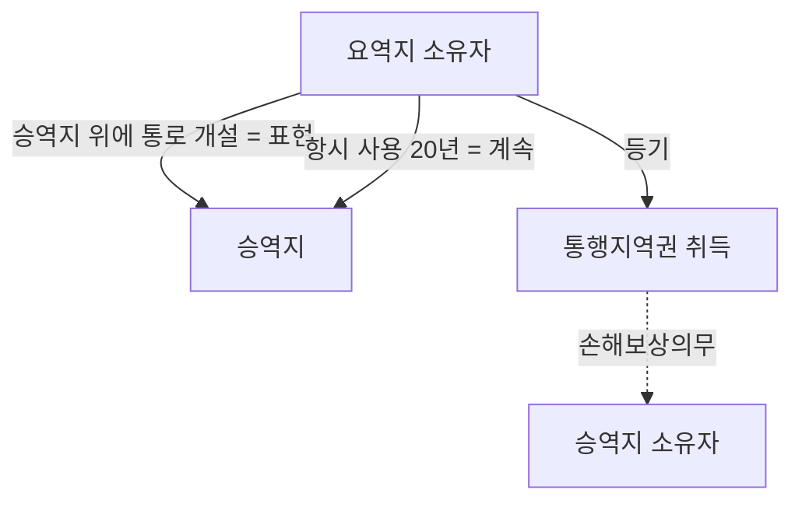

#### ⭐ 기출 출제포인트

1. **"계속·표현이면 충분하고 통로 개설은 불필요"** — 최빈출 오답. 통로 개설이 필수다.
2. **시효취득자의 손해보상의무** — 2020·2022년 모두 정답 또는 핵심 선지로 등장.
3. **제295조 제2항(취득시효 중단)과 제296조(소멸시효 중단·정지)의 방향 구별** — "모든 공유자에 대한 사유가 아니면 효력 없다" vs "1인의 사유가 전원에게 효력 있다".
4. **불계속·불표현 지역권의 시효취득 가부** — 관망지역권·통로 미개설 통행지역권.
5. **시효취득에도 등기가 필요한가** — 필요하다.

#### 📊 기출 분석

| 연도 | 출제 형태 | 핵심 논점 |
|---|---|---|
| 2020년 제31회 문35 | 옳은 것은? | 통로 개설 필요(④ X), 시효취득자의 손해보상(⑤ O — 정답) |
| 2022년 제33회 문31 | 옳지 않은 것은? | 도로 설치·늘 사용, 제295조 제1항·제2항, 제296조(③ X — 정답), 손해보상 |
| 감정평가사 기출 | 옳지 않은 것은? | 제295조 제2항(취득기간 중단) 조문 대조 |
| 문제집 제5장 기본문제 10번 | 틀린 것은? | 불계속·불표현 지역권의 시효취득 불가(⑤ — 정답) |
| 문제집 제5장 지역권 문항 | 틀린 것은? | 시효취득자의 등기 필요(대법원 1990.10.30. 90다카20395), 취득시효 중단의 불가분성 |

**출제 빈도** — 지역권 문항이 나오면 ==5개 선지 중 2~3개가 취득(특히 통행지역권 시효취득)==에서 나온다. 지역권 논점 중 단연 1위.

**반복되는 함정 선지** — ① "통로 개설 없이도 시효취득 가능" ② "손해를 보상하지 않아도 된다" ③ "요역지 공유자 1인의 소멸시효 중단은 다른 공유자에게 효력이 없다" ④ "취득시효 중단은 공유자 중 1인에 대한 사유로도 효력이 있다".

**최근 경향** — 2015년 전원합의 이후 확립된 ==손해보상 법리==가 사실상 고정 출제 요소가 되었다. 2020·2022년 모두 이 선지가 들어 있었다.

#### 🔍 기출 선지로 배우는 법리

> 실제 출제된 선지를 그대로 놓고 O/X와 근거를 확인한다.

**①** 통행지역권의 시효취득을 위하여 지역권이 계속되고 표현되면 충분하고 승역지 위에 통로를 개설할 필요는 없다. (2020년 기출) — **X**
어디가 틀렸나: 통행지역권은 ==요역지의 소유자가 승역지 위에 도로를 설치하여 승역지를 사용하는 객관적 상태==가 제245조의 기간 계속된 경우에 한하여 시효취득을 인정할 수 있다(대법원 1995.06.13. 95다1088,1095). / 옳게 고치면: "…승역지 위에 통로를 개설하여야 한다."

**②** 통행지역권을 시효취득한 요역지소유자는, 특별한 사정이 없으면 승역지의 사용으로 그 소유자가 입은 손해를 보상하여야 한다. (2020년 기출 — 정답 선지) — **O**
근거: 대판 2015.3.20. 2012다17479. 주위토지통행권의 경우와 마찬가지로 보상의무를 인정한다.

**③** 통행지역권의 점유취득시효는 승역지 위에 도로를 설치하여 늘 사용하는 객관적 상태를 전제로 한다. (2022년 기출) — **O**
근거: 제294조＋제245조. '도로 설치＝표현', '늘 사용＝계속'.

**④** 요역지의 공유자 중 1인이 지역권을 취득한 때에는 다른 공유자도 이를 취득한다. (2022년 기출) — **O**
근거: 제295조 제1항. 불가분성 중 **유리한 방향**의 조문.

**⑤** 요역지의 공유자 중 1인에 의한 지역권소멸시효의 중단은 다른 공유자에게는 효력이 없다. (2022년 기출 — 정답 선지) — **X**
어디가 틀렸나: 요역지를 공유하고 있는 경우에 ==공유자 1인을 위한 소멸시효의 중단 또는 정지의 사유는 다른 공유자를 위해서도 효력이 있다==(제296조). / 옳게 고치면: "…다른 공유자를 위하여도 효력이 있다."

**⑥** 점유로 인한 지역권취득기간의 중단은 지역권을 행사하는 모든 공유자에 대한 사유가 아니면 그 효력이 없다. (2022년 기출 / 감정평가사 기출) — **O**
근거: 제295조 제2항. 중단은 공유자에게 불리하므로 ==전원에 대한 사유==를 요구한다.

**⑦** 불계속 또는 불표현의 지역권도 시효취득할 수 있다. (문제집 제5장 기본문제 10번 — 정답 선지) — **X**
어디가 틀렸나: ==시효취득이 인정되는 지역권은 계속되고 표현된 지역권에 한한다==(제294조).

**⑧** 통로의 개설이 없는 일정한 장소를 오랜 시일 통행한 사실이 있다거나 또는 토지의 소유자가 통행을 묵인하여 온 사실만으로는 지역권을 취득할 수 없다. (문제집 제5장 지역권 문항) — **O**
근거: 통로 개설이 없으면 '계속·표현'이 갖추어지지 않는다. 묵인은 지역권설정계약도 아니다(대판 1991.4.13. 90다15167).

#### ✏️ 사례형 적용

> **사례 1** — 甲은 자기 소유 A토지에서 공로로 나가기 위해 乙 소유 B토지 위에 스스로 비용을 들여 콘크리트 포장 통로를 만들고, 25년간 매일 그 통로로 통행해 왔다. 乙은 이를 알면서도 아무 말이 없었다. 甲이 통행지역권의 시효취득을 주장한다.

**검토** — ① **표현** — 甲이 승역지 B 위에 통로를 개설했다. ② **계속** — 25년간 항시 사용했다. ③ **기간** — 20년을 넘겼다(제245조 제1항 준용). ④ **주체** — 甲은 요역지 A의 소유자다. 요건이 모두 충족되므로 甲은 시효취득을 주장할 수 있다. 다만 ==시효완성만으로 지역권이 생기는 것은 아니고 등기하여야 취득==하며(대법원 1990.10.30. 90다카20395), ==종전 사용이 무상이었다는 등의 특별한 사정이 없으면 甲은 도로 설치 및 사용으로 乙이 입은 손해를 보상==하여야 한다(대판 2015.3.20. 2012다17479). 결론: 등기청구 가능＋보상의무 있음.

> **사례 2** — 위 사례에서 甲이 통로를 전혀 개설하지 않은 채 B토지의 빈 공터를 25년간 가로질러 다녔을 뿐이라면?

**검토** — 통행의 사실만으로는 부족하다. ==통로를 개설하지 않은 통행지역권은 '불계속' 지역권==이어서 제294조의 시효취득 대상이 아니다. 요역지 소유자가 타인의 토지를 20년간 통행하였다는 사실만으로서는 부족하고 승역지상에 통로를 개설하여 항시 사용하는 상태가 20년 계속되어야 한다(대판 1970.7.21. 70다772,773). 결론: 시효취득 불가. 甲은 요건이 되면 주위토지통행권(상린관계)을 검토할 일이다.

> **사례 3** — 요역지 C를 丙·丁이 공유하고 있다. 丙만이 승역지 D 위에 통로를 개설하여 20년간 사용해 통행지역권의 시효취득 요건을 갖추었다. 한편 D의 소유자 戊는 시효기간 중 丙에 대해서만 중단사유를 발생시켰다.

**검토** — ① ==공유자 1인인 丙이 지역권을 취득하면 다른 공유자 丁도 이를 취득==한다(제295조 제1항). ② 반면 ==점유로 인한 지역권취득기간의 중단은 지역권을 행사하는 모든 공유자에 대한 사유가 아니면 효력이 없으므로==(제295조 제2항), 戊가 丙에 대해서만 중단사유를 발생시킨 것으로는 취득시효가 중단되지 않는다. 결론: 丙·丁 모두 지역권을 취득하고, 戊의 중단은 무효다.

#### ⚠️ 이 관의 함정 총정리

1. "계속되고 표현되면 족하고 통로 개설은 필요 없다"라고 하면 틀림 → ==통로(도로) 개설이 곧 표현·계속의 실질==이다.
2. "시효취득한 자는 손해를 보상하지 않아도 된다"라고 하면 틀림 → ==특별한 사정이 없으면 보상해야 한다==(대판 2015.3.20. 2012다17479).
3. "요역지 공유자 1인의 소멸시효 중단은 다른 공유자에게 효력이 없다"라고 하면 틀림 → ==전원을 위하여 효력이 있다==(제296조). 제295조 제2항(취득기간 중단)과 방향이 반대다.
4. "취득시효의 중단은 공유자 중 1인에 대한 사유로도 효력이 있다"라고 하면 틀림 → ==모든 공유자에 대한 사유==여야 한다(제295조 제2항).
5. "시효취득은 등기 없이 효력이 생긴다"라고 하면 틀림 → ==등기하여야 지역권을 취득한다==(대법원 1990.10.30. 90다카20395). 제245조 제1항의 '등기함으로써'가 준용된다.

#### ✅ OX 확인문제

> 다음 진술의 참·거짓을 판단하시오.

**1.** 지역권은 계속되고 표현된 것에 한하여 민법 제245조의 부동산 점유취득시효에 관한 규정을 준용한다.
→ **O**. 제294조.

**2.** 요역지 소유자가 타인의 토지를 20년간 통행하였다는 사실만으로 통행지역권을 시효취득할 수 있다.
→ **X**. 승역지상에 통로를 개설하여 항시 사용하는 상태가 20년간 계속되어야 한다(대판 1970.7.21. 70다772,773).

**3.** 관망지역권은 불표현 지역권이므로 시효취득의 대상이 되지 않는다.
→ **O**. 시효취득이 인정되는 것은 계속되고 표현된 지역권에 한한다.

**4.** 지역권을 시효취득한 자는 시효완성으로 곧바로 지역권을 취득하며 등기를 요하지 않는다.
→ **X**. 등기함으로써 지역권을 취득한다(대법원 1990.10.30. 90다카20395).

**5.** 통행지역권을 시효취득한 요역지 소유자는 특별한 사정이 없는 한 승역지에 대한 도로 설치 및 사용에 의하여 승역지 소유자가 입은 손해를 보상해야 한다.
→ **O**. 대판 2015.3.20. 2012다17479.

**6.** 토지의 불법점유자도 20년간 통로를 개설해 사용하였다면 통행지역권을 시효취득할 수 있다.
→ **X**. 통행지역권은 토지소유자·지상권자·전세권자 등 토지사용권을 가진 자에게 인정되므로 불법점유자는 시효취득을 주장할 수 없다(대판 1976.10.29. 76다1694).

**7.** 점유로 인한 지역권취득기간의 중단은 지역권을 행사하는 모든 공유자에 대한 사유가 아니면 그 효력이 없다.
→ **O**. 제295조 제2항.

**8.** 요역지가 수인의 공유인 경우 그 1인에 의한 지역권소멸시효의 중단은 다른 공유자를 위하여도 효력이 있다.
→ **O**. 제296조.

**9.** 지료에 관한 약정이 없으면 지역권설정계약은 무효이다.
→ **X**. 지료의 지급은 지역권의 성립요소가 아니어서 약정이 없어도 성립에 영향이 없다(대판 2015.3.20. 2012다17479).

**10.** 취득시효기간 중 승역지의 소유자가 변동된 경우, 시효취득을 주장하는 자는 임의로 기산점을 선택할 수 있다.
→ **X**. 임의로 기산점을 선택하거나 소급하여 20년 이상 점유한 사실만 내세워 시효완성을 주장할 수 없다(대판 2015.3.20. 2012다17479).

#### 🧠 암기법

> 🔑 **"계·표·통·이십·등(繼表通二十登)"** — 통행지역권 시효취득 5요소
> **계**속(항시 사용) → **표**현(외형적 사실) → **통**로 개설 → **이십**년 → **등**기.
> 다섯 중 하나라도 빠지면 취득 불가. 특히 "**통**로"를 빼는 선지가 최빈출 함정.

> 🔑 **"중단은 모두, 정지는 하나"**
> **취득**시효 **중단**(제295조 제2항) = ==**모두**에 대한 사유여야== 효력 있음.
> **소멸**시효 중단·**정지**(제296조) = ==**하나**의 사유로 전원에게== 효력 있음.
> 둘 다 결국 "==공유자에게 유리한 쪽으로==" 작동한다고 기억하면 방향이 헷갈리지 않는다.

> 🔑 **"개설 없으면 불계속"**
> 통로 **개설 ✕** → 불계속 → 시효취득 ✕.
> 통로 **개설 ○** → 계속＋표현 → 시효취득 ○.

#### ⚖️ 법조문 원문

> 📖 이 관이 근거로 삼은 조문의 **전문**이다. 본문 인용은 발췌지만 여기서는 조 전체를 싣는다. 출처는 법제처 정본이다.

**― 민법 ―**

> 📌 **민법 제186조(부동산물권변동의 효력)** — "부동산에 관한 법률행위로 인한 물권의 득실변경은 등기하여야 그 효력이 생긴다."

> 📌 **민법 제245조(점유로 인한 부동산소유권의 취득기간)** — "①20년간 소유의 의사로 평온, 공연하게 부동산을 점유하는 자는 등기함으로써 그 소유권을 취득한다. ②부동산의 소유자로 등기한 자가 10년간 소유의 의사로 평온, 공연하게 선의이며 과실없이 그 부동산을 점유한 때에는 소유권을 취득한다."

> 📌 **민법 제294조(지역권취득기간)** — "지역권은 계속되고 표현된 것에 한하여 제245조의 규정을 준용한다."

> 📌 **민법 제295조(취득과 불가분성)** — "①공유자의 1인이 지역권을 취득한 때에는 다른 공유자도 이를 취득한다. ②점유로 인한 지역권취득기간의 중단은 지역권을 행사하는 모든 공유자에 대한 사유가 아니면 그 효력이 없다."

> 📌 **민법 제296조(소멸시효의 중단, 정지와 불가분성)** — "요역지가 수인의 공유인 경우에 그 1인에 의한 지역권소멸시효의 중단 또는 정지는 다른 공유자를 위하여 효력이 있다."

**― 부동산등기법 ―**

> 📌 **부동산등기법 제70조(지역권의 등기사항)** — "등기관이 승역지의 등기기록에 지역권설정의 등기를 할 때에는 제48조제1항제1호부터 제4호까지에서 규정한 사항 외에 다음 각 호의 사항을 기록하여야 한다. 다만, 제4호는 등기원인에 그 약정이 있는 경우에만 기록한다. 1. 지역권설정의 목적 2. 범위 3. 요역지 4. 「민법」 제292조제1항 단서, 제297조제1항 단서 또는 제298조의 약정 5. 승역지의 일부에 지역권설정의 등기를 할 때에는 그 부분을 표시한 도면의 번호"

### 제3관 지역권의 효력

> 📖 지역권이 성립하면 지역권자는 무엇을 할 수 있고, 승역지 소유자는 무엇을 참고 무엇을 해야 하는가. 이 관은 ① 지역권자의 이용권과 물권적 청구권, ② 용수지역권의 특칙(제297조), ③ 승역지 소유자의 공작물 사용권(제300조)과 수선의무 승계(제298조)·위기(제299조), ④ 부종성에 따른 이전과 토지 분할·일부양도의 효과(제293조 제2항)를 다룬다. 조문 문언 그대로 선지가 되는 구간이므로 문언 암기가 곧 점수다.

> ⭐ **이 관에서 반드시 챙길 3가지**
> ① 지역권자는 승역지를 ==점유할 권능이 없으므로 반환청구권이 없다==. 방해제거·방해예방청구권만 있다(제301조·제214조).
> ② 계약으로 승역지 소유자가 공작물 설치·수선의무를 부담한 때에는 ==그 특별승계인도 그 의무를 부담==한다(제298조). 그리고 ==위기(委棄)로 그 부담을 면할 수 있다==(제299조).
> ③ 토지의 분할·일부양도가 있어도 지역권은 ==요역지의 각 부분을 위하여, 승역지의 각 부분에 존속==한다(제293조 제2항 본문). 단, 지역권이 토지의 일부분에만 관한 것인 때에는 예외(단서).

#### 1. 의의

지역권의 효력은 **지역권자 쪽의 권능**과 **승역지 이용권자 쪽의 인용·의무**로 나뉜다. 지역권자는 설정행위의 내용 또는 취득시효의 요건이 되는 점유의 내용에 의하여 정하여진 범위 내에서 지역권을 행사하여 승역지를 사용할 수 있다. 다만 지역권의 목적이 ==여러 개의 토지 사이의 이용을 조절하여 그 이용가치를 높이는 데== 있으므로, 행사에 있어서는 승역지의 이익을 존중하여 ==승역지 이용자에게 가장 손해가 적은 범위에 그쳐야== 한다.

#### 2. 요건

**지역권자의 권능과 그 한계**

| 구분 | 내용 | 근거 |
|---|---|---|
| 이용권 | 정해진 목적 범위 내에서 승역지를 자기 토지의 편익에 이용 | 제291조 |
| 점유 | ==점유할 권능 없음== | 용익물권이지만 점유를 수반하지 않음 |
| 행사의 한계 | ==승역지 이용자에게 가장 손해가 적은 범위==에 그쳐야 함 | 이용조절의 목적 |
| 물권적 청구권 | 방해제거·방해예방청구권 ○ / ==반환청구권 ✕== | 제301조·제214조 |
| 순위 | 물권이므로 ==먼저 성립한 지역권이 우선== | 제297조 제2항 |

**승역지 이용권자(소유자)의 권리와 의무**

| 구분 | 내용 | 근거 |
|---|---|---|
| 인용의무 | 승역지가 요역지의 편익에 이용되는 범위에서 ==인용·부작위 또는 작위의 의무== | 제298조 전제 |
| 공작물 공동사용권 | 지역권의 행사를 방해하지 않는 범위에서 ==지역권자가 설치한 공작물을 사용== 가능 | 제300조 제1항 |
| 비용분담 | 공작물을 사용하는 경우 ==수익정도의 비율==로 설치·보존비용 분담 | 제300조 제2항 |
| 수선의무의 승계 | 계약으로 자기 비용의 설치·수선의무를 부담한 때 ==특별승계인도 의무 부담== | 제298조 |
| 위기(委棄) | ==지역권에 필요한 부분의 토지소유권을 지역권자에게 위기==하여 위 의무를 면함 | 제299조 |

**지료 지급의무 정리** — "지역권은 무상"이라고 단순 암기하면 틀린다.

| 취득 유형 | 원칙 | 예외·부수효과 |
|---|---|---|
| 법률행위에 의한 취득 | ==원칙 무상== — 유상 약정이 없는 이상 지료 지급을 청구할 수 없다 | 약정이 있으면 ==지료에 관한 등기 여부와 관계없이== 약정 지료 청구 가능 |
| 시효취득 | 특별한 사정이 없으면 ==승역지 소유자가 입은 손해를 보상== | 취득시효 전에는 지료 지급의무 또는 부당이득반환의무 |

**토지의 분할·일부양도의 효과**

| 사안 | 효과 | 근거 |
|---|---|---|
| 요역지의 분할 | 지역권은 ==요역지의 각 부분을 위하여 존속== | 제293조 제2항 본문 |
| 승역지의 분할 | 지역권은 ==승역지의 각 부분 위에 존속== | 제293조 제2항 본문 |
| 요역지·승역지의 일부양도 | 위와 같다 | 제293조 제2항 본문 |
| 지역권이 토지의 일부분에만 관한 것인 때 | ==다른 부분에 대하여는 그러하지 아니하다== | 제293조 제2항 단서 |

#### 3. 효과

| 구분 | 효과 |
|---|---|
| 이전 | 요역지소유권이 이전되면 ==지역권 이전등기 없이도 지역권 이전의 효력==이 생긴다 |
| 부종성 배제약정 | ==다른 약정이 있으면 그 약정에 의한다==(제292조 제1항 단서). 함께 이전되지 않도록 하는 약정도 유효하고 등기할 수 있다 |
| 법률규정에 의한 취득 | 요역지에 대한 시효취득이나 ==요역지 소유권의 상속==에 의해서도 지역권을 취득할 수 있다 |
| 용수의 순위 | 용수승역지 수량이 부족하면 ==먼저 가용(家用)에 공급==하고 다른 용도에 공급. 설정행위에 다른 약정이 있으면 그에 의한다 |
| 용수지역권의 경합 | 승역지에 수개의 용수지역권이 설정된 때 ==후순위 지역권자는 선순위 지역권자의 용수를 방해하지 못한다== |
| 공작물 공동사용 | 승역지 소유자가 사용 가능, 단 ==수익정도의 비율==로 비용 분담 |
| 위기의 성질 | ==토지소유권을 지역권자에게 이전한다는 일방적 의사표시(물권적 단독행위)==. 소유권이 이전되면 지역권은 혼동으로 소멸(제191조 제1항) |

#### 4. 관련 조문

> 📌 **민법 제297조(용수지역권)** — "① 용수승역지의 수량이 요역지 및 승역지의 수요에 부족한 때에는 그 수요정도에 의하여 먼저 가용(家用)에 공급하고 다른 용도에 공급하여야 한다. 그러나 설정행위에 다른 약정이 있는 때에는 그 약정에 의한다. ② 승역지에 수개의 용수지역권이 설정된 때에는 후순위의 지역권자는 선순위의 지역권자의 용수를 방해하지 못한다."

> 📌 **민법 제298조(승역지소유자의 의무와 승계)** — "계약에 의하여 승역지소유자가 자기의 비용으로 지역권의 행사를 위하여 공작물의 설치 또는 수선의 의무를 부담한 때에는 승역지소유자의 특별승계인도 그 의무를 부담한다."

> 📌 **민법 제299조(위기에 의한 부담면제)** — "승역지의 소유자는 지역권에 필요한 부분의 토지소유권을 지역권자에게 위기하여 전조의 공작물의 설치 또는 수선의 의무 부담을 면할 수 있다."

> 📌 **민법 제300조(공작물의 공동사용)** — "① 승역지의 소유자는 지역권의 행사를 방해하지 아니하는 범위 내에서 지역권자가 지역권의 행사를 위하여 승역지에 설치한 공작물을 사용할 수 있다. ② 전항의 경우에 승역지의 소유자는 수익정도의 비율로 공작물의 설치, 보존의 비용을 분담하여야 한다."

> 📌 **민법 제293조 제2항** — "토지의 분할이나 토지의 일부양도의 경우에는 지역권은 요역지의 각 부분을 위하여 또는 그 승역지의 각 부분에 존속한다. 그러나 지역권이 토지의 일부분에만 관한 것인 때에는 다른 부분에 대하여는 그러하지 아니하다."

> 📌 **민법 제301조·제214조** — 지역권자는 지역권에 기한 방해제거·방해예방청구권을 가진다. ==반환청구권은 준용되지 않는다==.

> 📌 **민법 제191조 제1항** — 혼동. 위기에 의하여 승역지 소유권이 지역권자에게 이전하면 지역권은 혼동으로 소멸한다.

#### 5. 핵심 판례 법리

1. **지역권자에게 점유권능은 없다.** 지역권자는 정해진 목적 범위 내에서 승역지의 토지를 자기 토지의 편익에 이용할 뿐이므로 ==승역지를 점유할 권능은 없다==(통설·판례).
2. **반환청구권 부정.** 지역권은 일정한 목적에 따라 승역지에서 편익을 받는 권리이므로 편익을 받는 것이 방해되는 경우에는 ==방해배제청구권 또는 방해예방청구권==을 행사할 수 있으나, 승역지의 점유를 수반하는 권리가 아니므로 ==반환청구권은 인정되지 않는다==(판례).
3. **법률행위에 의한 지역권은 원칙적으로 무상이다.** ==지역권에 있어서 지료에 관한 유상 약정이 없는 이상 지료의 지급을 청구할 수 없다==(판례).
4. **유상 약정이 있으면 등기가 없어도 청구할 수 있다.** 지역권에 지료에 관한 약정이 있는 이상 지역권설정자는 ==지료에 관한 등기 여부에 관계없이== 지역권자에 대하여 그 약정된 지료의 지급을 구할 수 있다(판례).
5. **시효취득의 경우 손해보상·부당이득.** 통행지역권의 취득시효는 종전의 승역지 사용이 무상으로 이루어졌다는 등의 다른 특별한 사정이 없다면 ==취득시효 전에는 그 사용에 관한 지료 지급의무를 지거나 부당이득반환의무를 진다==(대판 2015.3.20. 2012다17479).
6. **요역지 소유권 이전 시 지역권은 등기 없이 따라간다.** 요역지의 소유권이 이전되면 지역권도 함께 이전하므로 ==요역지 소유권의 이전등기가 있으면 지역권의 이전등기 없이도 지역권 이전의 효력==이 생긴다. 지역권의 경우 지역권자가 등기사항이 아니기 때문이다(부동산등기법 제70조).
7. **요역지가 분필되어도 지역권설정등기 청구는 전부에 대하여 가능하다.** 요역지가 분필되어 그 부분의 소유권이 타인에게 이전되었다 하여도 요역지의 소유자가 아직 지역권설정등기를 이행받지 못하고 있는 이상, ==타인 소유로 된 대지부분까지를 요역지로 하여 지역권설정등기의 이행을 청구할 수 있다==(판례).
8. **지역권이 설정된 후 요역지에 용익권을 취득한 자도 지역권을 행사할 수 있다.** 지역권이 설정된 후 요역지 위에 지상권·전세권을 취득한 자도 그 편익을 누린다(통설·판례).
9. **위기는 물권적 단독행위다.** 위기(委棄)란 ==토지소유권을 지역권자에게 이전한다는 일방적 의사표시로서 물권적 단독행위==이며, 위기에 의하여 소유권이 지역권자에게 이전하면 지역권은 ==혼동에 의하여 소멸==한다(제191조 제1항).
10. **먼저 성립한 지역권이 우선한다.** 지역권은 물권이므로 먼저 성립한 지역권이 후에 성립하는 지역권보다 우선한다. 따라서 ==승역지에 수개의 용수지역권이 설정된 때에는 후순위 지역권자는 선순위 지역권자의 용수를 방해하지 못한다==(제297조 제2항).

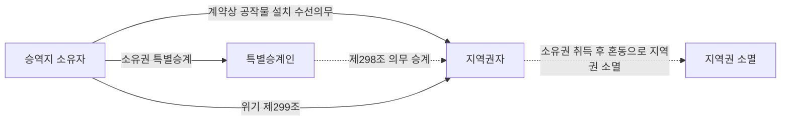

#### ⭐ 기출 출제포인트

1. **제298조 — 승역지 소유자의 특별승계인도 공작물 수선의무를 부담하는가** (부담한다). 등기한 경우를 전제로 묻는 형태로도 나온다.
2. **제299조 — 위기로 의무를 면할 수 있는가** (있다). "이전시킬 수 있다"는 표현으로 위장된다.
3. **제300조 — 승역지 소유자의 공작물 공동사용권과 비용분담**.
4. **제297조 — 동일 승역지 위에 수개의 용수지역권 설정 가능 여부** (가능하며, 후순위는 선순위를 방해하지 못한다).
5. **부종성 배제약정의 유효성** — "요역지소유권과 지역권이 함께 이전되지 않도록 하는 약정"은 유효하고 등기할 수 있다(제292조 제1항 단서).

#### 📊 기출 분석

| 연도 | 출제 형태 | 핵심 논점 |
|---|---|---|
| 2023년 제34회 문34 | 옳지 않은 것은? | 지역권에 기한 반환청구권 부정(④ — 정답) |
| 2025년 제36회 문33 | 옳지 않은 것은? | 부종성 배제약정(①), 제298조 승계(②), 수개의 용수지역권(③) |
| 감정평가사 기출 | 옳지 않은 것은? | 제298조 — 등기한 경우 특별승계인의 의무 부담(⑤) |
| 문제집 제5장 지역권 문항 | 틀린 것은? | 제299조 위기, 승역지 공작물 사용권(제300조) |
| 문제집 제5장 지역권 문항 | 옳지 않은 것은? | 위기에 의한 수선의무 면탈(④) |

**출제 빈도** — 효력 부분은 ==거의 전부가 조문 그대로== 나온다. 제297조~제300조 네 개 조문이 선지 공급원이다.

**반복되는 함정 선지** — ① "특별승계인은 의무를 부담하지 않는다" ② "지역권자는 반환청구권을 행사할 수 있다" ③ "승역지 소유자는 지역권자가 설치한 공작물을 사용할 수 없다" ④ "동일 승역지에 수개의 용수지역권을 설정할 수 없다".

**최근 경향** — 2025년에는 ==제292조 제1항 단서(다른 약정)==까지 선지로 등장했다. 부종성이 **강행규정이 아니라는 점**을 묻는 방향으로 심화되고 있다.

#### 🔍 기출 선지로 배우는 법리

> 실제 출제된 선지를 그대로 놓고 O/X와 근거를 확인한다.

**①** 계약에 의하여 승역지소유자가 자기의 비용으로 지역권의 행사를 위하여 공작물의 수선의무를 부담하기로 하고 이를 등기한 경우, 승역지소유자의 특별승계인도 그 의무를 부담한다. (감정평가사 기출) — **O**
근거: 제298조. 조문 문언 그대로다.

**②** 승역지소유자가 지역권자의 지역권 행사를 위하여 공작물 수선의무를 부담하기로 한 경우, 승역지소유자의 특별승계인도 그 의무를 부담한다. (2025년 기출) — **O**
근거: 제298조.

**③** 동일한 승역지 위에 수개의 용수지역권이 설정될 수 있다. (2025년 기출) — **O**
근거: 제297조 제2항이 "승역지에 수개의 용수지역권이 설정된 때"를 전제로 순위를 규율하고 있다. ==후순위 지역권자는 선순위 지역권자의 용수를 방해하지 못한다==.

**④** 요역지소유권과 지역권이 함께 이전되지 않도록 하는 약정은 유효하며 이를 등기할 수 있다. (2025년 기출) — **O**
근거: 제292조 제1항 단서 "그러나 다른 약정이 있는 때에는 그 약정에 의한다". ==부종성은 임의규정==이다.

**⑤** 지역권자는 승역지의 점유침탈이 있는 경우, 지역권에 기하여 승역지 반환청구권을 행사할 수 있다. (2023년 기출 — 정답 선지) — **X**
어디가 틀렸나: 지역권은 승역지의 점유를 수반하는 권리가 아니므로 ==반환청구권은 인정되지 않는다==. 방해배제·방해예방청구권만 가능하다.

**⑥** 승역지소유자가 자신의 비용으로 부담하고 있는 공작물의 설치 또는 수선의 의무를 면하기 위하여 지역권에 필요한 부분의 토지소유권을 지역권자에게 이전시킬 수 있다. (문제집 제5장 지역권 문항) — **O**
근거: 제299조의 ==위기(委棄)==. 해설도 "제299조"를 근거로 든다.

**⑦** 승역지 소유자는 지역권의 행사를 방해하지 않는 범위 내에서 지역권자가 지역권의 행사를 위하여 승역지에 설치한 공작물을 사용할 수 있다. (문제집 제5장 지역권 문항) — **O**
근거: 제300조 제1항. 다만 ==수익정도의 비율로 설치·보존 비용을 분담==해야 한다(제2항).

**⑧** 지역권이 설정된 후, 요역지 위에 지상권·전세권을 취득한 자는 지역권을 행사할 수 없다. (문제집 제5장 지역권 문항 — 정답 선지) — **X**
어디가 틀렸나: ==지역권이 설정된 후 요역지 위에 지상권·전세권을 취득한 자도 지역권을 행사할 수 있다==. 편익은 요역지 자체에 붙어 있기 때문이다.

#### ✏️ 사례형 적용

> **사례 1** — 甲(요역지)과 乙(승역지)은 통행지역권을 설정하면서 "승역지 소유자 乙이 자기 비용으로 통로를 포장·수선한다"고 약정하고 이를 등기하였다. 이후 乙이 승역지를 丙에게 매도하였다. 丙은 "나는 그런 약정을 한 적이 없다"며 수선을 거부한다. 丙이 부담을 벗어날 방법은 있는가.

**검토** — ① ==계약에 의하여 승역지 소유자가 자기 비용으로 공작물의 설치 또는 수선의무를 부담한 때에는 그 특별승계인도 그 의무를 부담한다==(제298조). 따라서 丙은 원칙적으로 수선의무를 진다. ② 다만 ==丙은 지역권에 필요한 부분의 토지소유권을 지역권자 甲에게 위기(委棄)하여 그 의무 부담을 면할 수 있다==(제299조). 위기는 일방적 의사표시인 물권적 단독행위이고, 위기로 소유권이 甲에게 이전되면 그 부분에 관한 지역권은 ==혼동으로 소멸==한다(제191조 제1항). 결론: 丙은 의무를 지되, 위기로 면할 수 있다.

> **사례 2** — 지역권자 甲이 승역지에 배수용 관로를 설치했다. 승역지 소유자 乙도 그 관로를 함께 쓰고 싶다.

**검토** — ==승역지의 소유자는 지역권의 행사를 방해하지 아니하는 범위 내에서 지역권자가 지역권의 행사를 위하여 승역지에 설치한 공작물을 사용할 수 있다==(제300조 제1항). 다만 이 경우 乙은 ==수익정도의 비율로 공작물의 설치·보존의 비용을 분담==하여야 한다(제300조 제2항). 결론: 사용 가능하되 무상은 아니다. 또한 사용이 甲의 지역권 행사를 방해한다면 허용되지 않는다.

> **사례 3** — 하나의 승역지 W에 A·B 두 개의 용수지역권이 순차로 설정되었다. 가뭄으로 물이 부족해지자 후순위 지역권자 B가 먼저 물을 끌어가 A의 용수가 끊겼다. 한편 승역지 소유자 자신의 가정용 수요도 부족한 상태다.

**검토** — ① ==승역지에 수개의 용수지역권이 설정된 때에는 후순위 지역권자는 선순위 지역권자의 용수를 방해하지 못한다==(제297조 제2항). 따라서 B의 행위는 위법하고, A는 지역권에 기한 ==방해제거·방해예방청구==를 할 수 있다(반환청구는 불가). ② ==용수승역지의 수량이 요역지 및 승역지의 수요에 부족한 때에는 그 수요정도에 의하여 먼저 가용(家用)에 공급하고 다른 용도에 공급==하여야 한다(제297조 제1항 본문). 다만 ==설정행위에 다른 약정이 있으면 그 약정에 의한다==(단서). 결론: 가용 우선 → 선순위 우선의 순서로 처리된다.

#### ⚠️ 이 관의 함정 총정리

1. "승역지 소유자의 특별승계인은 계약상 수선의무를 부담하지 않는다"라고 하면 틀림 → ==특별승계인도 그 의무를 부담한다==(제298조).
2. "지역권자는 승역지 반환청구권을 행사할 수 있다"라고 하면 틀림 → ==방해제거·방해예방만== 가능(제301조·제214조).
3. "위기(委棄)는 승역지 소유자와 지역권자의 계약이다"라고 하면 틀림 → ==일방적 의사표시인 물권적 단독행위==다.
4. "승역지 소유자는 지역권자가 설치한 공작물을 사용할 수 없다"라고 하면 틀림 → ==사용할 수 있고, 대신 수익정도의 비율로 비용을 분담==한다(제300조).
5. "요역지가 분할되면 지역권은 분할 전 부분에만 남는다"라고 하면 틀림 → ==요역지의 각 부분을 위하여, 승역지의 각 부분에 존속==한다(제293조 제2항 본문). 다만 지역권이 토지의 일부분에만 관한 것인 때에는 다른 부분에 미치지 않는다(단서).

#### ✅ OX 확인문제

> 다음 진술의 참·거짓을 판단하시오.

**1.** 지역권자는 승역지를 점유할 권능이 있으므로 승역지의 점유가 침탈되면 반환청구권을 행사할 수 있다.
→ **X**. 점유할 권능이 없으므로 반환청구권은 인정되지 않는다. 방해제거·방해예방청구권만 가능하다.

**2.** 계약에 의하여 승역지소유자가 자기의 비용으로 공작물의 설치 또는 수선의무를 부담한 때에는 승역지소유자의 특별승계인도 그 의무를 부담한다.
→ **O**. 제298조.

**3.** 승역지 소유자는 위기(委棄)에 의하여 제298조의 공작물 설치·수선의무 부담을 면할 수 있다.
→ **O**. 제299조. 위기는 물권적 단독행위이고, 그 결과 지역권은 혼동으로 소멸한다.

**4.** 승역지 소유자는 지역권자가 승역지에 설치한 공작물을 사용할 수 있으나, 이때 수익정도의 비율로 설치·보존 비용을 분담해야 한다.
→ **O**. 제300조 제1항·제2항.

**5.** 용수승역지의 수량이 부족한 때에는 언제나 요역지의 수요에 먼저 공급해야 한다.
→ **X**. 그 수요정도에 의하여 ==먼저 가용(家用)에 공급==하고 다른 용도에 공급한다. 설정행위에 다른 약정이 있으면 그 약정에 의한다(제297조 제1항).

**6.** 승역지에 수개의 용수지역권이 설정된 때에는 후순위 지역권자는 선순위 지역권자의 용수를 방해하지 못한다.
→ **O**. 제297조 제2항. 물권의 순위 원칙의 표현이다.

**7.** 요역지의 소유권이 이전되면 지역권의 이전등기를 별도로 마쳐야 지역권 이전의 효력이 생긴다.
→ **X**. 요역지 소유권의 이전등기가 있으면 지역권 이전등기 없이도 이전의 효력이 생긴다. 지역권자는 등기사항이 아니다(부동산등기법 제70조).

**8.** 요역지소유권과 지역권이 함께 이전되지 않도록 하는 약정은 부종성에 반하여 무효이다.
→ **X**. 제292조 제1항 단서에 의해 다른 약정이 있으면 그 약정에 의한다. 유효하며 등기할 수 있다.

**9.** 토지의 분할이나 일부양도가 있으면 지역권은 요역지의 각 부분을 위하여 또는 승역지의 각 부분에 존속한다.
→ **O**. 제293조 제2항 본문. 다만 지역권이 토지의 일부분에만 관한 것인 때에는 다른 부분에는 미치지 않는다(단서).

**10.** 지역권에 지료에 관한 약정이 있는 경우, 그 지료에 관한 등기가 없으면 지역권설정자는 약정 지료의 지급을 구할 수 없다.
→ **X**. 지료에 관한 약정이 있는 이상 ==등기 여부에 관계없이== 약정된 지료의 지급을 구할 수 있다.

#### 🧠 암기법

> 🔑 **"칠팔구백(七八九百)" — 지역권 효력 4대 조문**
> 제29**7**조 용**수**지역권(가용 우선·후순위 방해금지)
> 제29**8**조 **승**계(특별승계인도 수선의무)
> 제29**9**조 **위**기(委棄, 의무 면탈)
> 제**300**조 **공**작물 공동사용(＋비용분담)
> "수·승·위·공" 네 글자로 붙여 외운다.

> 🔑 **"지역권은 막을 수는 있어도 되찾을 수는 없다"**
> **방해제거 ○ · 방해예방 ○ · 반환 ✕**.
> 이유는 하나 — ==점유가 없으니까==.

> 🔑 **"위기는 던지고 혼동으로 사라진다"**
> **위기** = 소유권을 지역권자에게 **던지는** 일방적 의사표시(물권적 단독행위)
> → 지역권자가 승역지 소유권 취득 → ==혼동==으로 지역권 소멸(제191조 제1항).

#### ⚖️ 법조문 원문

> 📖 이 관이 근거로 삼은 조문의 **전문**이다. 본문 인용은 발췌지만 여기서는 조 전체를 싣는다. 출처는 법제처 정본이다.

**― 민법 ―**

> 📌 **민법 제191조(혼동으로 인한 물권의 소멸)** — "①동일한 물건에 대한 소유권과 다른 물권이 동일한 사람에게 귀속한 때에는 다른 물권은 소멸한다. 그러나 그 물권이 제삼자의 권리의 목적이 된 때에는 소멸하지 아니한다. ②전항의 규정은 소유권이외의 물권과 그를 목적으로 하는 다른 권리가 동일한 사람에게 귀속한 경우에 준용한다. ③점유권에 관하여는 전2항의 규정을 적용하지 아니한다."

> 📌 **민법 제214조(소유물방해제거, 방해예방청구권)** — "소유자는 소유권을 방해하는 자에 대하여 방해의 제거를 청구할 수 있고 소유권을 방해할 염려있는 행위를 하는 자에 대하여 그 예방이나 손해배상의 담보를 청구할 수 있다."

> 📌 **민법 제293조(공유관계, 일부양도와 불가분성)** — "①토지공유자의 1인은 지분에 관하여 그 토지를 위한 지역권 또는 그 토지가 부담한 지역권을 소멸하게 하지 못한다. ②토지의 분할이나 토지의 일부양도의 경우에는 지역권은 요역지의 각 부분을 위하여 또는 그 승역지의 각부분에 존속한다. 그러나 지역권이 토지의 일부분에만 관한 것인 때에는 다른 부분에 대하여는 그러하지 아니하다."

> 📌 **민법 제297조(용수지역권)** — "①용수승역지의 수량이 요역지 및 승역지의 수요에 부족한 때에는 그 수요정도에 의하여 먼저 가용에 공급하고 다른 용도에 공급하여야 한다. 그러나 설정행위에 다른 약정이 있는 때에는 그 약정에 의한다. ②승역지에 수개의 용수지역권이 설정된 때에는 후순위의 지역권자는 선순위의 지역권자의 용수를 방해하지 못한다."

> 📌 **민법 제298조(승역지소유자의 의무와 승계)** — "계약에 의하여 승역지소유자가 자기의 비용으로 지역권의 행사를 위하여 공작물의 설치 또는 수선의 의무를 부담한 때에는 승역지소유자의 특별승계인도 그 의무를 부담한다."

> 📌 **민법 제299조(위기에 의한 부담면제)** — "승역지의 소유자는 지역권에 필요한 부분의 토지소유권을 지역권자에게 위기하여 전조의 부담을 면할 수 있다."

> 📌 **민법 제300조(공작물의 공동사용)** — "①승역지의 소유자는 지역권의 행사를 방해하지 아니하는 범위내에서 지역권자가 지역권의 행사를 위하여 승역지에 설치한 공작물을 사용할 수 있다. ②전항의 경우에 승역지의 소유자는 수익정도의 비율로 공작물의 설치, 보존의 비용을 분담하여야 한다."

> 📌 **민법 제301조(준용규정)** — "제214조의 규정은 지역권에 준용한다."

### 제4관 지역권의 소멸

> 📖 지역권은 물권 일반의 소멸사유로도 소멸하고, 지역권 특유의 소멸원인으로도 소멸한다. 특히 ==20년의 소멸시효==(제162조 제2항)와 ==위기==(제299조), ==승역지의 시효취득==이 시험의 세 축이다. 반대로 공유관계에서는 제293조 제1항이 소멸을 **막는** 방향으로 작동한다는 점을 제1관·제2관의 불가분성과 이어서 정리해야 한다.

> ⭐ **이 관에서 반드시 챙길 3가지**
> ① 지역권은 ==20년의 소멸시효에 걸린다==(제162조 제2항). 부작위지역권인 전망(관망)지역권도 예외가 아니다.
> ② ==승역지의 점유자가 지역권의 존재를 승인하면서 점유를 계속한 때에는 승역지의 시효취득에 의하여 지역권이 소멸하지 않는다==.
> ③ ==토지공유자 1인은 자기 지분에 관하여 지역권을 소멸하게 하지 못한다==(제293조 제1항). 소멸은 '불리한 사유'라 불가분성이 막아 준다.

#### 1. 의의

지역권의 소멸원인은 **물권 일반의 소멸사유**와 **지역권 특유의 소멸원인**으로 나뉜다. 여기에 **불가분성에 의한 소멸의 제한**(제293조 제1항)이 더해진다.

| 구분 | 소멸사유 |
|---|---|
| 물권 일반의 소멸사유 | ① 요역지 또는 승역지의 멸실 ② 지역권자의 지역권 포기 ③ ==혼동== ④ 존속기간의 만료 ⑤ 약정소멸사유의 발생 ⑥ ==소멸시효== |
| 지역권 특유의 소멸원인 | ① ==승역지 소유자의 위기(委棄)==(제298조·제299조) ② ==승역지의 시효취득== ③ 승역지의 수용 |

#### 2. 요건

**소멸시효**

| 항목 | 내용 | 근거 |
|---|---|---|
| 기간 | ==20년간 행사하지 않으면 소멸시효 완성== | 제162조 제2항 |
| 대상 | 용익물권인 지역권 전반 | 전망(관망)지역권도 포함 |
| 중단·정지 | 요역지가 공유인 경우 ==1인에 의한 중단·정지가 전원을 위하여 효력== | 제296조 |
| 대비 | ==상린관계는 소멸시효에 걸리지 않는다== | 소유권의 내재적 제한이므로 |

**혼동과 위기**

| 구분 | 위기(委棄) | 혼동 |
|---|---|---|
| 개념 | ==토지소유권을 지역권자에게 이전한다는 일방적 의사표시== | 지역권과 승역지 소유권이 동일인에게 귀속 |
| 성질 | ==물권적 단독행위== | 법률규정에 의한 물권변동 |
| 목적 | 제298조의 공작물 설치·수선의무 부담을 면함 | — |
| 효과 | 소유권 이전 → ==혼동으로 지역권 소멸== | ==지역권 소멸==(제191조 제1항) |
| 전형 사례 | 승역지 소유자가 수선의무를 면하려는 경우 | ==요역지 소유자가 승역지의 소유권을 취득한 경우== |

**승역지의 시효취득에 의한 소멸**

| 사안 | 지역권의 운명 |
|---|---|
| 승역지 점유자가 ==지역권의 존재를 부정==하면서 점유를 계속하여 시효취득 | 지역권 ==소멸== |
| 승역지 점유자가 ==지역권의 존재를 승인==하면서 점유를 계속한 경우 | 지역권 ==소멸하지 않음== |
| 취득시효 진행 중 ==지역권자가 그 권리를 행사==한 경우 | 취득자는 지역권의 제한을 받으므로 지역권 ==소멸하지 않음== |

**공유관계에서의 소멸 제한**

| 국면 | 조문 | 결론 |
|---|---|---|
| 공유자 1인의 지분에 의한 지역권 소멸 | 제293조 제1항 | ==소멸시키지 못한다== |
| 공유자 1인을 위한 소멸시효 중단·정지 | 제296조 | ==전원을 위하여 효력== |
| 공유자 1인의 지역권 취득 | 제295조 제1항 | 전원이 취득 |
| 취득시효의 중단 | 제295조 제2항 | 전원에 대한 사유여야 효력 |

#### 3. 효과

| 구분 | 효과 |
|---|---|
| 소멸시효 완성 | 지역권 소멸. 등기의 말소는 소멸의 요건이 아니라 정리 절차 |
| 위기 | 승역지 소유권이 지역권자에게 이전 → ==혼동으로 지역권 소멸==, 승역지 소유자는 수선의무 면제 |
| 혼동 | 요역지 소유자가 승역지 소유권을 취득하면 ==지역권은 혼동으로 소멸==(제191조 제1항) |
| 승역지 수용 | 공익사업 등으로 승역지가 수용되면 지역권 소멸 |
| 요역지·승역지 멸실 | 물권의 객체가 없어지므로 소멸 |
| 공유자 1인의 처분 | ==지분에 관하여 소멸시킬 수 없으므로 소멸의 효과 발생 ✕==(제293조 제1항) |
| 일부 소멸 | 지역권이 토지의 일부분에만 관한 것인 때 그 부분 외에는 애초에 존속하지 않음(제293조 제2항 단서) |

#### 4. 관련 조문

> 📌 **민법 제162조 제2항** — 지역권은 20년 동안 행사하지 않으면 소멸시효가 완성한다.

> 📌 **민법 제293조(공유관계, 일부양도와 불가분성) 제1항** — "토지공유자의 1인은 지분에 관하여 그 토지를 위한 지역권 또는 그 토지가 부담한 지역권을 소멸하게 하지 못한다."

> 📌 **민법 제296조(소멸시효의 중단, 정지와 불가분성)** — "요역지가 수인의 공유인 경우에 그 1인에 의한 지역권소멸시효의 중단 또는 정지는 다른 공유자를 위하여 효력이 있다."

> 📌 **민법 제299조(위기에 의한 부담면제)** — "승역지의 소유자는 지역권에 필요한 부분의 토지소유권을 지역권자에게 위기하여 전조의 공작물의 설치 또는 수선의 의무 부담을 면할 수 있다."

> 📌 **민법 제191조 제1항** — 혼동에 의한 물권의 소멸. 위기로 승역지 소유권이 지역권자에게 이전하면 지역권은 혼동으로 소멸한다.

#### 5. 핵심 판례 법리

1. **지역권은 20년의 소멸시효에 걸린다.** ==지역권은 용익물권으로서 20년의 소멸시효에 걸린다==(제162조 제2항). 부작위지역권인 전망지역권이라 하여 달리 볼 것이 아니다.
2. **상린관계는 소멸시효에 걸리지 않는다.** 상린관계는 ==소유권의 내재적 제한==이므로 소멸시효의 대상이 아니다. 지역권과의 결정적 차이다.
3. **혼동에 의한 소멸.** ==요역지 소유자가 승역지의 소유권을 취득하면 지역권은 혼동으로 소멸한다==(판례·통설). "성질상 소멸하지 않는다"는 선지는 오답이다.
4. **위기에 의한 소멸.** 위기란 토지소유권을 지역권자에게 이전한다는 일방적 의사표시로서 ==물권적 단독행위==이고, ==위기에 의하여 지역권은 혼동으로 소멸==한다(제298조·제299조·제191조 제1항).
5. **승역지의 시효취득에 의한 소멸의 한계.** ==승역지의 점유자가 지역권의 존재를 승인하면서 점유를 계속한 때에는 지역권은 승역지의 시효취득에 의하여 소멸하지 않는다==(통설·판례).
6. **취득시효 진행 중 지역권 행사의 효과.** 승역지에 대하여 점유자의 취득시효가 진행하고 있는 동안에 ==지역권자가 그의 권리를 행사하면 취득자는 지역권의 제한을 받으므로, 승역지가 시효취득되어도 지역권은 소멸하지 않는다==.
7. **약정소멸사유로도 소멸한다.** 지역권은 ==약정소멸사유의 발생==으로도 소멸한다. 존속기간의 만료·지역권자의 포기도 마찬가지다.
8. **공유자 1인은 지역권을 소멸시키지 못한다.** ==토지공유자의 1인은 자기의 지분에 관하여 그 토지를 위한 지역권 또는 그 토지가 부담하고 있는 지역권을 소멸하게 하지 못한다==(제293조 제1항). 불가분성의 핵심 조문이다.
9. **소멸시효의 중단·정지는 전원에게 미친다.** 요역지를 공유하고 있는 경우에 ==공유자 1인을 위한 소멸시효의 중단 또는 정지의 사유는 다른 공유자를 위해서도 효력이 있다==(제296조).
10. **존속기간을 영구로 정해도 무방하다.** ==지역권의 존속기간을 영구로 약정하는 것도 허용된다==(대판 2015.3.20. 2012다17479). 존속기간 만료에 의한 소멸이 애초에 예정되지 않는 지역권도 가능하다는 뜻이다.

#### ⭐ 기출 출제포인트

1. **"지역권은 소멸시효의 대상이 될 수 없다"** — 대표적 오답. 20년 소멸시효에 걸린다.
2. **"전망지역권은 소멸시효에 걸리지 않는다"** — 2025년 정답 선지. 부작위지역권도 소멸시효 대상.
3. **"요역지 소유자가 승역지 소유권을 취득해도 지역권은 성질상 소멸하지 않는다"** — 혼동으로 소멸한다.
4. **승역지의 시효취득과 지역권의 존속** — 지역권의 존재를 승인하며 점유한 경우 소멸하지 않는다.
5. **제293조 제1항 — 공유자 1인의 소멸 가부** — "소멸하게 할 수 있다"로 바꿔 놓는 함정.

#### 📊 기출 분석

| 연도 | 출제 형태 | 핵심 논점 |
|---|---|---|
| 2025년 제36회 문33 | 옳지 않은 것은? | ==전망지역권도 20년 소멸시효에 걸린다==(④ — 정답) |
| 감정평가사 기출 | 옳지 않은 것은? | 제293조 제1항 — 공유자 1인은 소멸시키지 못함(② — 정답) |
| 문제집 제5장 기본문제 9번 | 틀린 것은? | 혼동에 의한 소멸(③ — 정답), 지역권 특유의 소멸원인 |
| 문제집 제5장 지역권 문항 | 옳지 않은 것은? | "지역권은 소멸시효의 대상이 될 수 없다"(① — 정답) |
| 2022년 제33회 문31 | 옳지 않은 것은? | 소멸시효 중단·정지의 불가분성(제296조) |

**출제 빈도** — 소멸은 ==단독 지문보다 다른 논점과 섞여 1~2개 선지로== 출제된다. 다만 "소멸시효 20년"은 거의 매 회차 어딘가에 들어 있다.

**반복되는 함정 선지** — ① "소멸시효에 걸리지 않는다"(상린관계와 혼동) ② "혼동으로 소멸하지 않는다" ③ "공유자 1인이 소멸시킬 수 있다" ④ "승역지가 시효취득되면 지역권은 언제나 소멸한다".

**최근 경향** — 2025년처럼 ==부작위지역권(전망·관망지역권)을 소재로== 소멸시효를 묻는 형태가 새로 등장했다. 지역권의 **종류 분류**와 **소멸시효**를 함께 물어보는 결합형이다.

#### 🔍 기출 선지로 배우는 법리

> 실제 출제된 선지를 그대로 놓고 O/X와 근거를 확인한다.

**①** 전망지역권은 소멸시효에 걸리지 않는다. (2025년 기출 — 정답 선지) — **X**
어디가 틀렸나: ==지역권은 용익물권으로서 20년의 소멸시효에 걸린다==(제162조 제2항). 전망(관망)지역권이 부작위지역권이라는 사정은 소멸시효와 무관하다. / 옳게 고치면: "전망지역권도 20년의 소멸시효에 걸린다."

**②** 토지공유자의 1인은 지분에 관하여 그 토지를 위한 지역권 또는 그 토지가 부담한 지역권을 소멸하게 할 수 있다. (감정평가사 기출 — 정답 선지) — **X**
어디가 틀렸나: ==토지공유자의 1인은 자기의 지분에 관하여 지역권을 소멸하게 하지 못한다==(제293조 제1항).

**③** 지역권은 소멸시효의 대상이 될 수 없다. (문제집 제5장 지역권 문항 — 정답 선지) — **X**
어디가 틀렸나: 해설이 명시한다 — ==지역권은 20년의 소멸시효에 걸린다==.

**④** 요역지 소유자가 승역지의 소유권을 취득하여도 지역권은 성질상 소멸하지 않는다. (문제집 제5장 기본문제 9번 — 정답 선지) — **X**
어디가 틀렸나: ==요역지 소유자가 승역지의 소유권을 취득하면 지역권은 혼동으로 소멸한다==.

**⑤** 지역권은 약정소멸사유의 발생으로도 소멸한다. (문제집 제5장 기본문제 9번) — **O**
근거: 물권 일반의 소멸사유 중 하나다.

**⑥** 승역지에 대하여 점유자의 취득시효가 진행하고 있는 동안에 지역권자가 그의 권리를 행사하면 지역권의 제한을 받으므로 승역지가 시효취득 되어도 지역권은 소멸하지 않는다. (문제집 제5장 기본문제 9번) — **O**
근거: ==승역지의 점유자가 지역권의 존재를 승인하면서 점유를 계속한 때에는 지역권은 승역지의 시효취득에 의하여 소멸하지 않는다==.

**⑦** 요역지의 공유자 중 1인에 대한 지역권 소멸시효의 정지는 다른 공유자를 위하여도 효력이 있다. (2023년 기출) — **O**
근거: 제296조. 소멸시효의 ==중단==만이 아니라 ==정지==도 같다.

**⑧** 요역지의 공유자 중 1인에 의한 지역권소멸시효의 중단은 다른 공유자에게는 효력이 없다. (2022년 기출 — 정답 선지) — **X**
어디가 틀렸나: 제296조에 정면으로 반한다. ==다른 공유자를 위하여 효력이 있다==.

#### ✏️ 사례형 적용

> **사례 1** — 甲은 乙 소유 승역지에 관하여 통행지역권을 등기해 두었으나, 다른 진입로가 생겨 25년간 한 번도 그 통로를 쓰지 않았다. 乙이 지역권의 소멸을 주장한다.

**검토** — ==지역권은 20년 동안 행사하지 않으면 소멸시효가 완성한다==(제162조 제2항). 甲은 25년간 지역권을 행사하지 않았으므로 소멸시효가 완성되어 지역권은 소멸한다. 만약 요역지가 甲·丙의 공유였고 그중 丙이 중간에 통행을 계속했다면, ==공유자 1인에 의한 소멸시효의 중단은 다른 공유자를 위하여 효력이 있으므로==(제296조) 甲의 지역권도 소멸하지 않는다. 결론: 단독소유면 소멸, 공유이고 1인이 행사했으면 불소멸.

> **사례 2** — 요역지 P의 소유자 甲이 승역지 Q를 매수하여 소유권을 취득했다. 그 후 甲이 Q만을 丁에게 매도했다. 甲은 "P를 위한 지역권은 그대로 살아 있다"고 주장한다.

**검토** — ==요역지 소유자가 승역지의 소유권을 취득하면 지역권은 혼동으로 소멸한다==(제191조 제1항). 甲이 Q를 취득한 순간 P를 위한 지역권은 이미 소멸했으므로, 그 후 Q를 丁에게 매도했다고 하여 소멸한 지역권이 부활하지 않는다. 甲은 丁과 새로 지역권설정계약을 맺고 등기해야 한다. 결론: 甲의 주장은 배척된다.

> **사례 3** — 승역지 R을 戊가 20년 넘게 점유해 취득시효를 완성했다. 그런데 戊는 점유 기간 내내 R 위의 통행지역권의 존재를 인정하고 지역권자 甲의 통행을 방해하지 않았다.

**검토** — 승역지의 시효취득은 지역권 특유의 소멸원인이지만 무제한이 아니다. ==승역지의 점유자가 지역권의 존재를 승인하면서 점유를 계속한 때에는 지역권은 승역지의 시효취득에 의하여 소멸하지 않는다==. 취득시효 진행 중 지역권자가 권리를 행사한 경우에도 시효취득자는 지역권의 제한을 받는다. 결론: 戊는 R의 소유권을 시효취득하되, ==지역권의 부담이 붙은 소유권==을 취득한다.

#### ⚠️ 이 관의 함정 총정리

1. "지역권은 소멸시효의 대상이 될 수 없다"라고 하면 틀림 → ==20년의 소멸시효에 걸린다==(제162조 제2항). 걸리지 않는 것은 상린관계.
2. "전망(관망)지역권은 부작위지역권이므로 소멸시효에 걸리지 않는다"라고 하면 틀림 → ==종류를 불문하고 20년 소멸시효==.
3. "요역지 소유자가 승역지 소유권을 취득해도 지역권은 소멸하지 않는다"라고 하면 틀림 → ==혼동으로 소멸==한다.
4. "토지공유자 1인은 자기 지분에 관하여 지역권을 소멸시킬 수 있다"라고 하면 틀림 → ==소멸하게 하지 못한다==(제293조 제1항).
5. "승역지가 시효취득되면 지역권은 언제나 소멸한다"라고 하면 틀림 → ==지역권의 존재를 승인하며 점유한 경우에는 소멸하지 않는다==.

#### ✅ OX 확인문제

> 다음 진술의 참·거짓을 판단하시오.

**1.** 지역권은 20년 동안 행사하지 않으면 소멸시효가 완성한다.
→ **O**. 제162조 제2항.

**2.** 부작위지역권인 관망지역권은 성질상 행사가 문제되지 않으므로 소멸시효에 걸리지 않는다.
→ **X**. 지역권은 용익물권으로서 20년의 소멸시효에 걸리며, 관망(전망)지역권도 예외가 아니다.

**3.** 요역지 소유자가 승역지의 소유권을 취득하면 지역권은 혼동으로 소멸한다.
→ **O**. 제191조 제1항.

**4.** 승역지 소유자의 위기(委棄)에 의하여 승역지 소유권이 지역권자에게 이전되면 지역권은 혼동으로 소멸한다.
→ **O**. 제299조＋제191조 제1항. 위기는 물권적 단독행위다.

**5.** 승역지의 점유자가 지역권의 존재를 승인하면서 점유를 계속한 경우에도, 승역지가 시효취득되면 지역권은 소멸한다.
→ **X**. 이 경우 지역권은 승역지의 시효취득에 의하여 소멸하지 않는다.

**6.** 토지공유자의 1인은 자기의 지분에 관하여 그 토지가 부담하고 있는 지역권을 소멸하게 할 수 있다.
→ **X**. 제293조 제1항에 의해 소멸하게 하지 못한다.

**7.** 요역지가 수인의 공유인 경우 1인에 의한 지역권소멸시효의 중단은 다른 공유자를 위하여 효력이 있다.
→ **O**. 제296조. 중단뿐 아니라 정지도 같다.

**8.** 승역지의 수용은 지역권 특유의 소멸원인에 해당한다.
→ **O**. 위기·승역지의 시효취득·승역지의 수용이 지역권 특유의 소멸원인이다.

**9.** 지역권은 약정소멸사유의 발생이나 지역권자의 포기로도 소멸한다.
→ **O**. 물권 일반의 소멸사유에 해당한다.

**10.** 지역권의 존속기간을 영구로 약정하면 존속기간 만료에 의한 소멸을 배제하는 것이어서 무효이다.
→ **X**. 존속기간을 영구로 약정하는 것도 허용된다(대판 2015.3.20. 2012다17479).

#### 🧠 암기법

> 🔑 **"멸·포·혼·만·약·시(滅抛混滿約時)" — 물권 일반의 소멸사유 6가지**
> **멸**실 · **포**기 · **혼**동 · 기간 **만**료 · **약**정소멸사유 · **시**효(20년).
> 여섯 개를 순서대로 읊으면 빠짐이 없다.

> 🔑 **"위·시·수(委時收)" — 지역권 특유의 소멸원인 3가지**
> **위**기(제298조·제299조) · 승역지의 **시**효취득 · 승역지의 **수**용.
> 특유 소멸원인은 셋뿐이다. "혼동"은 특유가 아니라 **일반** 사유임에 주의.

> 🔑 **"20년, 걸린다"**
> 지역권 = 걸**린**다(20년 소멸시효). 상린관계 = 안 걸린다.
> ==소멸시효 문제는 '상린이냐 지역권이냐'만 구별하면 끝==이다.

#### ⚖️ 법조문 원문

> 📖 이 관이 근거로 삼은 조문의 **전문**이다. 본문 인용은 발췌지만 여기서는 조 전체를 싣는다. 출처는 법제처 정본이다.

**― 민법 ―**

> 📌 **민법 제162조(채권, 재산권의 소멸시효)** — "①채권은 10년간 행사하지 아니하면 소멸시효가 완성한다. ②채권 및 소유권 이외의 재산권은 20년간 행사하지 아니하면 소멸시효가 완성한다."

> 📌 **민법 제191조(혼동으로 인한 물권의 소멸)** — "①동일한 물건에 대한 소유권과 다른 물권이 동일한 사람에게 귀속한 때에는 다른 물권은 소멸한다. 그러나 그 물권이 제삼자의 권리의 목적이 된 때에는 소멸하지 아니한다. ②전항의 규정은 소유권이외의 물권과 그를 목적으로 하는 다른 권리가 동일한 사람에게 귀속한 경우에 준용한다. ③점유권에 관하여는 전2항의 규정을 적용하지 아니한다."

> 📌 **민법 제293조(공유관계, 일부양도와 불가분성)** — "①토지공유자의 1인은 지분에 관하여 그 토지를 위한 지역권 또는 그 토지가 부담한 지역권을 소멸하게 하지 못한다. ②토지의 분할이나 토지의 일부양도의 경우에는 지역권은 요역지의 각 부분을 위하여 또는 그 승역지의 각부분에 존속한다. 그러나 지역권이 토지의 일부분에만 관한 것인 때에는 다른 부분에 대하여는 그러하지 아니하다."

> 📌 **민법 제296조(소멸시효의 중단, 정지와 불가분성)** — "요역지가 수인의 공유인 경우에 그 1인에 의한 지역권소멸시효의 중단 또는 정지는 다른 공유자를 위하여 효력이 있다."

> 📌 **민법 제299조(위기에 의한 부담면제)** — "승역지의 소유자는 지역권에 필요한 부분의 토지소유권을 지역권자에게 위기하여 전조의 부담을 면할 수 있다."

### 제5관 특수지역권

> 📖 민법 제302조가 규정하는 특수지역권은 이름은 '지역권'이지만 앞의 네 관에서 본 지역권과 구조가 다르다. 권리의 주체가 **토지**가 아니라 ==어느 지역의 주민이라는 사람의 집합체==이고, 내용도 편익이 아니라 ==초목·야생물·토사의 채취, 방목 기타의 수익==이다. 관습이 먼저 적용되고, 관습이 없는 부분에서 지역권의 규정(본장의 규정)이 준용된다.

> ⭐ **이 관에서 반드시 챙길 3가지**
> ① 주체가 ==어느 지역의 주민이 '집합체의 관계로'== 가지는 권리다. 요역지가 없고, ==사람(주민 집단)을 위한 권리==다.
> ② 내용은 ==초목·야생물 및 토사의 채취, 방목 기타의 수익==이라는 **수익권**이며, 지역권의 '편익'과 다르다.
> ③ ==관습에 의하는 외에 본장(지역권)의 규정을 준용==한다(제302조). 관습이 1순위, 지역권 규정이 2순위다.

#### 1. 의의

**특수지역권(特殊地役權)**이란 ==어느 지역의 주민이 집합체의 관계로 각자가 타인의 토지에서 초목·야생물 및 토사의 채취, 방목 기타의 수익을 하는 권리==를 말한다(제302조). 이른바 **입회권(入會權)**적 권리로서, 마을 주민들이 관습적으로 산에 들어가 나무를 하고 가축을 놓아 먹이던 권리를 민법이 수용한 것이다.

- **주체** — 개인이 아니라 ==어느 지역의 주민이라는 집합체==. 각 주민은 그 집합체의 구성원으로서 권능을 행사한다.
- **객체** — 타인의 토지(산림·초지 등).
- **내용** — ==초목·야생물 및 토사의 채취, 방목 기타의 수익==.
- **법원(法源)** — ==관습이 우선==하고, 관습에 없는 사항은 지역권에 관한 본장의 규정을 준용한다.

주민의 집합체가 권리를 가지되 각 구성원이 사용·수익하는 구조이므로, ==총유에 관한 규정이 유추적용된다는 것이 통설==이다. 권리의 관리·처분은 주민 집합체(단체)의 의사결정에 따르고, 사용·수익은 각 주민이 하며, 구성원의 자격을 잃으면 권능도 잃는다.

#### 2. 요건

| 요건 | 내용 | 비고 |
|---|---|---|
| 주체 | ==어느 지역의 주민==일 것 | 개인이 아닌 ==집합체의 관계== |
| 집합체성 | 주민이 '집합체의 관계로' 권리를 가질 것 | 총유적 귀속 형태 |
| 객체 | ==타인의 토지== | 요역지는 필요 없다 |
| 내용 | 초목·야생물 및 토사의 채취, ==방목 기타의 수익== | 편익이 아니라 **수익** |
| 근거 | ==관습==의 존재 | 관습이 없으면 본장의 규정 준용 |
| 등기 | 관습상의 권리이므로 ==등기를 요하지 않는 것이 보통== | 지역권과의 결정적 차이 |

#### 3. 효과

| 구분 | 효과 |
|---|---|
| 권리의 귀속 | 주민의 집합체에 ==총유적으로 귀속==(통설) |
| 사용·수익 | 각 주민이 ==구성원의 자격에서== 채취·방목 등 수익 |
| 관리·처분 | 집합체(단체)의 ==의사결정에 따름==. 개별 주민이 단독으로 처분할 수 없다 |
| 지분 처분 | ==개별 주민의 지분 처분·분할청구 불가==(총유의 법리) |
| 자격 상실 | 그 지역의 주민 자격을 잃으면 ==권능도 소멸== |
| 적용 순서 | ==관습 → 본장(지역권)의 규정 준용==(제302조) |
| 준용의 결과 | 불가분성·부종성 등 지역권 규정이 성질에 반하지 않는 범위에서 준용 |

**본장 규정의 준용 범위** — 제302조의 "본장의 규정을 준용한다"가 어디까지 미치는가.

| 지역권 규정 | 준용 여부 | 이유 |
|---|---|---|
| 제291조(권리의 내용) | ==성질이 허용하는 범위에서 준용== | 타인의 토지를 이용하는 제한물권이라는 구조는 공통 |
| 제292조(부종성·분리양도 금지) | ==그대로 적용되기 어려움== | ==요역지가 없다==. 대신 구성원 자격과 분리한 처분이 불가 |
| 제293조 제2항(분할·일부양도) | 그대로 적용되기 어려움 | 요역지 분할을 전제한 규정이기 때문 |
| 제295조·제296조(불가분성) | 취지 준용 가능 | 집합체의 권리라는 점과 방향이 같음 |
| 제301조·제214조(물권적 청구권) | ==준용됨== | 방해제거·방해예방 ○, ==반환청구 ✕== |
| 소멸사유(포기·혼동·기간만료·시효 등) | ==관습에 정함이 없으면 준용== | 관습이 1순위이기 때문 |

**지역권과 특수지역권의 비교 — 이 표가 이 관의 전부다**

| 구분 | 지역권 | 특수지역권 |
|---|---|---|
| 근거조문 | 제291조 이하 | ==제302조== |
| 권리 주체 | ==요역지의 소유자·지상권자·전세권자 등 토지 이용권자== | ==어느 지역의 주민(집합체)== |
| 편익의 귀속 | ==토지(요역지)== | ==사람(주민의 집합체)== |
| 요역지 | ==반드시 필요==(1필 전부) | ==불필요== |
| 권리의 성질 | 물권(용익물권), 단독 귀속 | 총유적 권리(통설) |
| 내용 | 통행·인수·관망 등 ==편익== | 초목·야생물·토사 채취, 방목 등 ==수익== |
| 성립 | 설정계약＋등기, 시효취득 | ==관습== |
| 등기 | ==필요== | ==원칙적으로 불요== |
| 양도성 | 요역지와 함께만 이전(제292조) | ==구성원 개인의 양도 불가== |
| 적용법규 | 제291조~제301조 | ==관습 → 본장의 규정 준용== |

**'인적 편익'과의 관계 정리** — 헷갈리기 쉬운 자리다.

| 사안 | 결론 | 이유 |
|---|---|---|
| 도자기 생산업자가 영업을 위해 이웃 토지의 토사를 채취할 지역권 | ==취득 불가== | 지역권은 ==토지의 편익==을 위한 것이지 인적 편익을 위한 것이 아님 |
| 어느 지역의 주민이 집합체로 타인의 토지에서 토사를 채취할 권리 | ==특수지역권으로 가능== | 제302조가 인적 결합체를 위한 권리를 별도로 인정 |
| 개인 1인이 타인의 토지에서 방목할 권리 | 특수지역권 ✕ | ==집합체의 관계==가 없음 |

#### 4. 관련 조문

> 📌 **민법 제302조(특수지역권)** — "어느 지역의 주민이 집합체의 관계로 각자가 타인의 토지에서 초목, 야생물 및 토사의 채취, 방목 기타의 수익을 하는 권리가 있는 경우에는 관습에 의하는 외에 본장의 규정을 준용한다."

> 📌 **민법 제291조(지역권의 내용)** — "지역권자는 일정한 목적을 위하여 타인의 토지를 자기토지의 편익에 이용하는 권리가 있다." — 제302조의 "본장의 규정"에 포함되어, 성질에 반하지 않는 범위에서 준용된다.

> 📌 **민법 제293조·제295조·제296조** — 불가분성에 관한 규정. 특수지역권에도 성질이 허용하는 범위에서 준용된다.

> 📌 **민법 제301조·제214조** — 방해제거·방해예방청구권. 특수지역권자(주민 집합체)도 준용에 의해 물권적 청구권을 행사할 수 있다. ==반환청구권은 준용되지 않는다==.

> 💡 총유에 관한 조문 번호는 이 관의 소스에서 확인되지 않아 **번호 없이** 법리로만 적는다. 특수지역권을 ==총유적 권리로 보아 총유 규정을 유추적용하는 것이 통설==이라는 점만 기억하면 된다.

#### 5. 핵심 판례 법리

1. **특수지역권은 인적 결합체를 위한 권리다.** 제302조는 ==어느 지역의 주민이 '집합체의 관계로'== 타인의 토지에서 수익하는 권리를 규율한다. 요역지를 전제하지 않으므로, 요역지·승역지 개념을 그대로 대입하면 안 된다.
2. **지역권과 달리 사람의 편익을 위한 권리다.** 일반 지역권에서는 ==거주하는 자의 '인적' 편익을 위해서 이용하는 것을 내용으로 하지 않는다==. 도자기 생산업자가 도자기를 만들기 위해 이웃 토지의 토사를 채취할 목적의 지역권을 취득할 수 없는 것이 그 예다. 이 공백을 메우는 것이 특수지역권이다.
3. **총유적 권리로 본다.** 주민의 집합체에 권리가 귀속하고 각 구성원이 사용·수익하는 구조이므로, ==총유에 관한 규정이 유추적용된다==는 것이 통설이다. 개별 주민은 지분을 처분하거나 분할을 청구할 수 없다.
4. **구성원 자격에 종속한다.** 그 지역의 주민이라는 자격에 기하여 인정되는 권능이므로, ==주민 자격을 상실하면 권능도 상실==한다. 권능만 분리하여 제3자에게 양도할 수 없다.
5. **관습이 우선한다.** 제302조는 ==관습에 의하는 외에== 본장의 규정을 준용한다고 정한다. 즉 ==관습이 1차 규범, 지역권 규정이 보충 규범==이다.
6. **준용은 성질이 허용하는 범위에서만 이루어진다.** 요역지를 전제로 한 규정(제292조의 요역지 분리 양도 금지, 제293조 제2항의 요역지 분할 등)은 성질상 그대로 적용되기 어렵다. 반면 물권적 청구권(제301조·제214조)이나 불가분성의 취지는 준용될 수 있다.
7. **점유를 수반하지 않는다.** 지역권과 마찬가지로 타인의 토지를 점유하는 권리가 아니므로 ==반환청구권은 인정되지 않고 방해제거·방해예방청구권만 인정==된다(준용의 결과).
8. **토지소유권을 배제하지 않는다.** 특수지역권은 타인의 토지 위의 제한물권적 권리이므로, ==토지소유자의 소유권 자체를 박탈하지 않고 그 이용을 제한할 뿐==이다. 이 점은 지역권에 의하여 승역지 소유권의 내용이 제한되고 일정한 침해행위를 인용하여야 하는 구조와 같다.
9. **유상·무상을 묻지 않는다.** 지역권이 유상·무상을 불문하는 것과 마찬가지로, 특수지역권도 관습에 따라 대가의 유무가 정해진다.
10. **소멸도 관습＋준용으로 처리된다.** 관습에 정함이 있으면 그에 따르고, 없으면 지역권의 소멸사유(포기·혼동·존속기간 만료·약정소멸사유·소멸시효 등)가 성질에 반하지 않는 범위에서 준용된다.

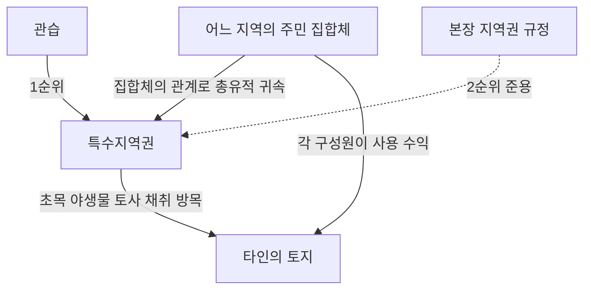

#### ⭐ 기출 출제포인트

1. **특수지역권의 주체** — "어느 지역의 주민이 집합체의 관계로"라는 문언 자체가 함정 소재다. '토지'로 바꿔 놓으면 오답.
2. **내용의 범위** — 초목·야생물 및 토사의 채취, 방목 **기타의 수익**. 항목을 하나 빼거나 '통행'을 끼워 넣는 변형.
3. **적용 순서** — ==관습 우선, 본장 규정 준용==. "본장의 규정에 의하는 외에 관습을 준용한다"로 뒤집는 함정.
4. **지역권과의 구별** — 요역지 요부, 등기 요부, 권리의 귀속 형태(단독 vs 총유).
5. **인적 편익 사안과의 연결** — 도자기 생산업자 사안(지역권 ✕)과 대비하여 출제될 수 있다.

#### 📊 기출 분석

> 📌 이 관은 최근 기출에서 단독 출제가 확인되지 않는다. 다만 ==지역권의 의의·성질(제1관)과 지역권의 효력(제3관)을 정확히 구별하기 위한 전제==로 요구된다. 특히 "지역권은 토지의 편익을 위한 것이지 인적 편익을 위한 것이 아니다"라는 논점은 특수지역권을 알아야 완결되므로, 제1관 선지의 배후 지식으로 준비해 두어야 한다.

#### 🔍 기출 선지로 배우는 법리

> 특수지역권 단독 선지는 확인되지 않으므로, ==제302조가 "본장의 규정을 준용한다"고 정한 결과 특수지역권 판단에도 그대로 작동하는 지역권 선지==를 놓고 확인한다.

**①** 지역권은 요역지의 사용가치를 높이기 위해 승역지를 이용하는 것을 내용으로 하는 물권이다. (2023년 기출) — **O**
근거: 제291조. ==여기서 편익의 귀속처가 '토지'==라는 점이, 편익의 귀속처가 '주민'인 특수지역권(제302조)과의 결정적 차이다.

**②** 지역권자는 승역지의 점유침탈이 있는 경우, 지역권에 기하여 승역지 반환청구권을 행사할 수 있다. (2023년 기출 — 정답 선지) — **X**
어디가 틀렸나: 점유를 수반하지 않으므로 반환청구권은 부정된다. ==본장의 규정이 준용되는 특수지역권에서도 마찬가지==로 방해제거·방해예방청구권만 인정된다.

**③** 지역권은 요역지와 분리하여 다른 권리의 목적으로 하지 못한다. (감정평가사 기출) — **O**
근거: 제292조 제2항. 다만 특수지역권은 요역지가 없으므로 이 규정은 ==성질상 그대로 적용되지 않고==, 대신 ==구성원 자격과 분리한 처분이 불가==하다는 총유의 법리로 대체된다.

**④** 토지공유자의 1인은 지분에 관하여 그 토지를 위한 지역권 또는 그 토지가 부담한 지역권을 소멸하게 할 수 있다. (감정평가사 기출 — 정답 선지) — **X**
어디가 틀렸나: 제293조 제1항에 반한다. ==개별 구성원이 단독으로 권리를 소멸시킬 수 없다==는 발상은 특수지역권의 총유적 구조와도 통한다.

**⑤** 지역권은 유상으로 하거나 무상으로 하거나 무방하다. (2020년 기출 해설) — **O**
근거: 지료는 성립요소가 아니다(대판 2015.3.20. 2012다17479). 특수지역권도 ==대가의 유무는 관습에 따른다==.

**⑥** 지역권은 소멸시효의 대상이 될 수 없다. (문제집 제5장 지역권 문항 — 정답 선지) — **X**
어디가 틀렸나: ==지역권은 20년의 소멸시효에 걸린다==. 특수지역권 역시 관습에 정함이 없으면 본장의 규정이 준용된다.

**⑦** 지역권은 요역지 소유권의 상속에 의하여 취득될 수 있다. (문제집 제5장 지역권 문항) — **O**
근거: 지역권은 요역지에 대한 시효취득이나 요역지 소유권의 상속에 의해서도 취득할 수 있다. 반면 특수지역권의 권능은 ==요역지가 아니라 주민 자격에 붙어 있어== 상속의 대상이 되지 않는다.

**⑧** 지역권이 설정된 후, 요역지 위에 지상권·전세권을 취득한 자는 지역권을 행사할 수 없다. (문제집 제5장 지역권 문항 — 정답 선지) — **X**
어디가 틀렸나: 지역권이 설정된 후 요역지 위에 지상권·전세권을 취득한 자도 지역권을 행사할 수 있다. 편익이 ==토지에 붙어 있기== 때문이며, 이는 권능이 ==주민 자격에 붙어 있는== 특수지역권과 대조된다.

#### ✏️ 사례형 적용

> **사례 1** — A마을 주민들은 오래전부터 인근 甲 소유의 임야에 들어가 땔감용 나무를 하고 소를 놓아 먹여 왔다. 이러한 관행은 마을 단위로 수십 년간 이어져 왔고, 주민이 아닌 사람은 들어가지 못했다. 甲이 최근 임야에 울타리를 치고 출입을 막았다.

**검토** — ① ==어느 지역의 주민이 집합체의 관계로 각자 타인의 토지에서 초목의 채취·방목 기타의 수익을 하는 권리==가 인정되는 경우이므로 제302조의 특수지역권 문제다. ② 이 경우 ==관습에 의하는 외에 본장의 규정을 준용==한다. ③ 준용의 결과 주민들은 ==방해제거·방해예방청구권==을 행사하여 울타리의 철거를 구할 수 있다(제301조·제214조 준용). 다만 특수지역권은 토지를 점유하는 권리가 아니므로 ==반환청구는 할 수 없다==. 결론: 관습의 존재가 인정되면 주민 집합체는 甲에게 방해제거를 구할 수 있다.

> **사례 2** — 위 사례에서 주민 乙이 A마을을 떠나 다른 지역으로 이사한 뒤에도 "나는 특수지역권자였으니 계속 나무를 하겠다"고 주장한다. 또 주민 丙은 자신의 채취 권능을 제3자 丁에게 팔았다고 한다.

**검토** — 특수지역권은 ==주민이라는 자격에 기하여 집합체의 관계로 인정되는 권리==이고, 통설은 이를 총유적 권리로 본다. ① ==乙은 주민 자격을 상실했으므로 권능도 잃는다==. ② ==丙은 자신의 지분이나 권능을 개별적으로 처분할 수 없으므로 丁에게의 양도는 효력이 없다==. 결론: 乙·丙·丁의 주장 모두 배척된다.

> **사례 3** — 도자기 생산업자 戊는 도자기를 만들 흙이 필요해, 이웃 己 소유 토지의 토사를 채취할 목적으로 자기 공장 부지를 요역지로 하는 지역권설정등기를 마쳤다.

**검토** — ① 지역권은 타인의 토지를 ==자기 '토지'의 편익==을 위해 이용하는 것을 내용으로 하며, ==거주하거나 영업하는 자의 '인적' 편익==을 위해 이용하는 것을 내용으로 하지 않는다. 도자기 생산업자가 도자기를 만들기 위해 이웃 토지의 토사를 채취할 목적의 지역권은 취득할 수 없다. ② 한편 ==토사의 채취는 제302조의 특수지역권의 내용==이기는 하나, 특수지역권은 ==어느 지역의 주민이 집합체의 관계로== 가지는 권리이므로 개인 戊에게는 성립할 여지가 없다. 결론: 지역권 ✕, 특수지역권 ✕. 戊는 채취계약(채권계약)으로 해결할 수밖에 없다.

#### ⚠️ 이 관의 함정 총정리

1. "특수지역권은 요역지의 편익을 위한 권리다"라고 하면 틀림 → ==요역지가 없다==. 어느 지역의 ==주민이 집합체의 관계로== 가지는 권리다.
2. "특수지역권은 본장의 규정에 의하는 외에 관습을 준용한다"라고 하면 틀림 → 순서가 반대다. ==관습에 의하는 외에 본장의 규정을 준용==한다(제302조).
3. "개별 주민은 자신의 특수지역권 지분을 양도할 수 있다"라고 하면 틀림 → ==총유적 권리로 보는 것이 통설==이어서 지분 처분·분할청구가 인정되지 않는다.
4. "특수지역권도 등기하여야 성립한다"라고 하면 틀림 → ==관습에 기한 권리이므로 등기가 성립요건이 아니다==. 등기가 필요한 것은 설정계약에 의한 지역권이다.
5. "개인도 타인의 토지에서 방목할 특수지역권을 취득할 수 있다"라고 하면 틀림 → ==집합체의 관계==가 요건이다. 개인 단독으로는 성립하지 않는다.

#### ✅ OX 확인문제

> 다음 진술의 참·거짓을 판단하시오.

**1.** 어느 지역의 주민이 집합체의 관계로 각자 타인의 토지에서 초목·야생물 및 토사의 채취, 방목 기타의 수익을 하는 권리가 있는 경우에는 관습에 의하는 외에 지역권에 관한 규정을 준용한다.
→ **O**. 제302조의 문언 그대로다.

**2.** 특수지역권은 요역지의 편익을 위한 권리이므로 반드시 요역지가 존재해야 한다.
→ **X**. 특수지역권은 ==주민의 집합체==를 위한 권리로서 요역지를 전제하지 않는다.

**3.** 특수지역권의 내용에는 초목·야생물 및 토사의 채취와 방목이 포함된다.
→ **O**. 제302조. "기타의 수익"까지 포함한다.

**4.** 특수지역권에는 관습보다 민법 지역권 규정이 우선 적용된다.
→ **X**. ==관습에 의하는 외에== 본장의 규정을 준용한다. 관습이 우선이다.

**5.** 특수지역권은 주민의 집합체에 총유적으로 귀속하는 것으로 보는 것이 통설이다.
→ **O**. 그 결과 개별 구성원의 지분 처분이나 분할청구는 인정되지 않는다.

**6.** 그 지역의 주민 자격을 상실하여도 이미 취득한 특수지역권의 권능은 그대로 유지된다.
→ **X**. 권능은 ==주민 자격에 기하여== 인정되므로 자격을 잃으면 권능도 잃는다.

**7.** 개인 1인도 타인의 토지에서 방목할 권리를 특수지역권으로 취득할 수 있다.
→ **X**. ==집합체의 관계==가 요건이므로 개인 단독으로는 성립하지 않는다.

**8.** 도자기 생산업자는 도자기를 만들기 위하여 이웃 토지의 토사를 채취할 목적의 지역권을 취득할 수 있다.
→ **X**. 지역권은 자기 '토지'의 편익을 위한 것이지 인적 편익을 위한 것이 아니다.

**9.** 특수지역권자도 준용에 의하여 방해제거·방해예방청구권을 행사할 수 있으나, 반환청구권은 인정되지 않는다.
→ **O**. 지역권과 마찬가지로 토지를 점유하는 권리가 아니기 때문이다.

**10.** 특수지역권은 관습상의 권리이므로 등기가 그 성립요건이다.
→ **X**. 등기를 요하지 않는 것이 보통이다. 등기가 필요한 것은 설정계약에 의한 지역권이다(제186조).

#### 🧠 암기법

> 🔑 **"주·집·초야토방(住集草野土放)"** — 제302조 통째 암기
> **주**민이 **집**합체의 관계로 → **초**목 · **야**생물 · **토**사 채취 · **방**목 기타의 수익.
> 여기에 꼬리표 하나: "==관습에 의하는 외에 본장의 규정을 준용==".

> 🔑 **"지역권은 땅이 주인, 특수지역권은 사람이 주인"**
> 지역권 = 편익이 **토지(요역지)**에 귀속 → 요역지 필요·등기 필요·요역지와 함께 이전.
> 특수지역권 = 권리가 **사람(주민 집합체)**에 귀속 → 요역지 불요·등기 불요·자격 상실 시 소멸.

> 🔑 **"관 → 본" 순서**
> **관**습 먼저, **본**장(지역권) 규정 나중.
> 뒤집어 놓은 선지("본장의 규정에 의하는 외에 관습을 준용")는 즉시 X.

#### ⚖️ 법조문 원문

> 📖 이 관이 근거로 삼은 조문의 **전문**이다. 본문 인용은 발췌지만 여기서는 조 전체를 싣는다. 출처는 법제처 정본이다.

**― 민법 ―**

> 📌 **민법 제214조(소유물방해제거, 방해예방청구권)** — "소유자는 소유권을 방해하는 자에 대하여 방해의 제거를 청구할 수 있고 소유권을 방해할 염려있는 행위를 하는 자에 대하여 그 예방이나 손해배상의 담보를 청구할 수 있다."

> 📌 **민법 제291조(지역권의 내용)** — "지역권자는 일정한 목적을 위하여 타인의 토지를 자기토지의 편익에 이용하는 권리가 있다."

> 📌 **민법 제293조(공유관계, 일부양도와 불가분성)** — "①토지공유자의 1인은 지분에 관하여 그 토지를 위한 지역권 또는 그 토지가 부담한 지역권을 소멸하게 하지 못한다. ②토지의 분할이나 토지의 일부양도의 경우에는 지역권은 요역지의 각 부분을 위하여 또는 그 승역지의 각부분에 존속한다. 그러나 지역권이 토지의 일부분에만 관한 것인 때에는 다른 부분에 대하여는 그러하지 아니하다."

> 📌 **민법 제295조(취득과 불가분성)** — "①공유자의 1인이 지역권을 취득한 때에는 다른 공유자도 이를 취득한다. ②점유로 인한 지역권취득기간의 중단은 지역권을 행사하는 모든 공유자에 대한 사유가 아니면 그 효력이 없다."

> 📌 **민법 제296조(소멸시효의 중단, 정지와 불가분성)** — "요역지가 수인의 공유인 경우에 그 1인에 의한 지역권소멸시효의 중단 또는 정지는 다른 공유자를 위하여 효력이 있다."

> 📌 **민법 제301조(준용규정)** — "제214조의 규정은 지역권에 준용한다."

> 📌 **민법 제302조(특수지역권)** — "어느 지역의 주민이 집합체의 관계로 각자가 타인의 토지에서 초목, 야생물 및 토사의 채취, 방목 기타의 수익을 하는 권리가 있는 경우에는 관습에 의하는 외에 본장의 규정을 준용한다."

### 제1관 전세권의 의의와 성립

> 📖 전세권은 전세금을 지급하고 타인의 부동산을 그 용도에 좇아 사용·수익하는 용익물권임과 동시에, 전세금에 관하여 우선변제를 받을 수 있는 담보물권성을 겸유하는 우리 민법 고유의 물권이다.
> 이 관은 "전세권이 무엇이고 어떻게 성립하는가"를 다룬다. 여기서 확정되는 두 개의 축 — ==전세금의 지급이 성립요소==라는 점과 ==용익물권성·담보물권성의 겸유==라는 점 — 이 뒤의 존속기간·효력·처분·소멸 전부를 지배한다.

> ⭐ **이 관에서 반드시 챙길 3가지**
> ① 전세권은 **용익물권성 + 담보물권성**을 겸유한다. 주된 성격은 용익물권성이고, 담보물권성은 전세금반환 확보를 위한 부수적 성격이다.
> ② **전세금의 지급은 성립요소**다. 다만 현실적 수수는 필요 없고 **기존 채권으로 갈음**할 수 있다. 반대로 **목적물의 인도는 성립요건이 아니다**.
> ③ 채권담보 목적의 전세권은 **사용·수익을 완전히 배제하지 않는 한 유효**하고, **완전히 배제하면 물권법정주의 위반으로 무효**다.

#### 1. 의의

전세권(傳貰權)이란 ==전세금을 지급하고 타인의 부동산을 점유하여 그 부동산의 용도에 좇아 사용·수익==하며, 그 부동산 전부에 대하여 후순위권리자 기타 채권자보다 ==전세금의 우선변제==를 받을 권리를 말한다(제303조 제1항).

- **용익물권성** — 타인의 부동산을 그 용도에 좇아 사용·수익한다. 이것이 전세권의 **주된 성격**이다.
- **담보물권성** — 전세금반환채권을 담보하기 위해 우선변제권·경매청구권이 인정된다. 이것은 **부수적**이다. 판례도 전세권설정등기를 마친 민법상 전세권은 ==용익물권적 성격과 담보물권적 성격을 겸비==한 것이라고 한다(2003다35659).
- 전세권설정계약으로 자신의 부동산 사용을 허용해 준 자가 **전세권설정자**, 타인의 부동산을 사용할 수 있는 자가 **전세권자**다.

| 구분 | 용익물권성 | 담보물권성 |
|---|---|---|
| 지위 | 전세권의 **주된 성격** | 전세금반환 확보를 위한 **부수적 성격** |
| 내용 | 목적물의 점유·사용·수익권(제303조 제1항 전단) | 우선변제권(제303조 제1항 후단)·경매청구권(제318조) |
| 근거 권능 | 사용·수익 권능 | 전세금반환채권을 담보하는 권능 |
| 존속기간 만료 시 | 등기 말소 없이도 당연히 소멸 | 전세금 반환 시까지 등기의 효력 존속 |
| 통유성 | (해당 없음) | 물상대위성·불가분성·부종성이 인정됨 |
| 처분 | 전세권 자체의 양도·전전세·임대 | 전세금반환채권과 함께 양도 가능 |
| 판례 | 2003다35659, 2014다10694 | 2003다35659, 98다31301 |

> 💡 **핵심 감각** — 전세권은 "기간 중에는 용익물권, 기간이 끝나면 담보물권"으로 **모습을 바꾼다**. 이 한 문장이 전세권 문제의 절반을 푼다.

#### 2. 요건

| 요건 | 내용 | 비고 |
|---|---|---|
| ① 전세권설정계약 | 부동산 소유자와 전세권 취득자 사이의 **물권적 합의** | 설정행위로 양도·전전세·임대 금지 특약 가능(제306조 단서) |
| ② 전세금의 지급 | 전세금의 지급은 전세권 성립의 요소 | 현실 수수 불요, **기존 채권으로 갈음 가능**(94다18508, 2008다67217) |
| ③ 등기 | 법률행위로 인한 물권변동이므로 **등기하여야 효력 발생**(제186조) | 전세금·범위는 필요적 기재사항 |
| ④ 목적물 적격 | 타인의 **토지 또는 건물**. 1필의 토지·1동의 건물의 **일부**도 가능 | 농경지는 전세권의 목적으로 하지 못한다(제303조 제2항) |
| ⑤ 사용·수익 권능 | 사용·수익 권능을 **완전히 배제하지 않을 것** | 완전 배제 시 물권법정주의 위반으로 무효(2018다40235, 40242) |
| (요건 아님) 인도 | 목적물의 인도는 전세권의 성립요소가 아니다 | 인도 없이도 전세권은 유효하게 성립(94다18508) |

**등기사항** — 전세권자와 전세금(또는 전전세금)·범위는 반드시 기재하고, 존속기간·위약금 또는 배상금·전세권 양도에 관한 사항은 등기원인에 약정이 있는 경우에만 기재한다(부동산등기법 제72조 제1항). 전세권설정이나 전전세의 범위가 **부동산의 일부**인 경우에는 그 부분을 표시한 **도면의 번호**를 기재하여야 한다(부동산등기법 제72조 제1항 제6호).

| 목적물 | 전세권 설정 가부 | 근거 |
|---|---|---|
| 토지 전부 | ○ | 제303조 제1항 |
| 건물 전부 | ○ | 제303조 제1항 |
| 1필 토지의 **일부** | ○ (도면 첨부) | 부동산등기법 제72조 제1항 제6호 |
| 1동 건물의 **일부** | ○ (도면 첨부) | 부동산등기법 제72조 제1항 제6호 |
| **농경지** | ✕ | 제303조 제2항 |
| 동산 | ✕ | 전세권은 부동산물권 |

#### 3. 효과

| 구분 | 효과 |
|---|---|
| 전세권자 | 목적물의 점유·사용·수익권, 과실수취권, 물권적 청구권(제319조), 우선변제권, 경매청구권 |
| 전세권설정자 | 사용·수익을 방해하지 않을 **소극적 인용의무**만 부담(사용·수익에 적합한 상태로 둘 적극적 의무 ✕) |
| 등기의 효력 | 전세권 취득 자체는 **권리변동적 효력**(제186조), 존속기간·전세금·위약금·양도 약정은 등기해야 **제3자 대항** |
| 전세금 | 목적부동산 사용의 대가 + **보증금**(정지조건부 반환채무를 부담하는 금전 소유권 이전) + 신용 수수의 성질 |
| 상린관계 | 소유권의 상린관계 규정이 전세권자에게 준용된다(제319조) |

**전세권 vs 임차권(부동산) 비교** — 전세권 문제의 절반은 "임차권이면 맞고 전세권이면 틀린" 선지로 만들어진다. 지상권까지 한 표에 놓고 외운다.

| 구분 | 지상권 | 전세권 | 임차권 |
|---|---|---|---|
| 성질 | 용익물권 / 절대권·대세권 | 용익물권 + 담보물권성 / 절대권·대세권 | 채권 / 상대권·대인권 |
| 성립 | 설정계약 + 등기 | 설정계약 + 등기 + 전세금 수수 | 설정계약 |
| 대항력 | 인정 | 인정(경매권·우선변제권 인정) | 등기하면 인정 |
| 최장기간 | 제한 없음 | 10년 | 제한 없음 |
| 최단기간 | 견고한 건물·수목 30년 / 기타 건물 15년 / 공작물 5년 | 토지전세권 제한 없음 / 건물전세권 1년 | 민법 제한 없음 / 주임법 2년 / 상임법 1년 |
| 기간 약정 없을 때 | 최단기간으로 제한 | 언제든지 소멸통고 | 언제든지 해지통고 |
| 약정갱신 | 최단기간 이상으로 약정 | 10년을 초과할 수 없음 | 제한 없음 |
| 법정갱신 | 규정 없음 | 규정 있음(건물전세권) | 규정 있음 |
| 대가의 요소성 | 지료는 요소가 **아님** | 반드시 전세금이 수수 | 차임이 요소 |
| 증감청구권 | 인정 | 인정 | 인정 |
| 연체 | 2년 연체 시 소멸청구 | — | 2기의 연체로 해지 |
| 비용상환 | 유익비만 | 유익비만 | 필요비·유익비 모두 |
| 매수청구권 | 지상물매수청구권 | 부속물매수청구권 | 지상물·부속물매수청구권 |
| 양도성 | 설정자 동의 없이 양도·임대 가능 | 설정자 동의 없이 양도·전전세·임대 가능 | 임대인의 동의가 있어야 양도·전대 가능 |
| 담보제공 | 저당권의 목적 가능 | 저당권의 목적 가능 | 저당권의 목적 불가 |

#### 4. 관련 조문

> 📌 **민법 제303조(전세권의 내용)** — "① 전세권자는 전세금을 지급하고 타인의 부동산을 점유하여 그 부동산의 용도에 좇아 사용·수익하며, 그 부동산 전부에 대하여 후순위권리자 기타 채권자보다 전세금의 우선변제를 받을 권리가 있다. ② 농경지는 전세권의 목적으로 하지 못한다."

> 📌 **민법 제186조(부동산물권변동의 효력)** — 부동산에 관한 법률행위로 인한 물권의 득실변경은 등기하여야 그 효력이 생긴다. 전세권설정계약에 의한 전세권 취득은 **등기하여야 효력이 생긴다**.

> 📌 **민법 제319조(준용규정)** — 제213조·제214조(물권적 청구권)와 상린관계 규정이 전세권자에게 준용된다.

> 📌 **부동산등기법 제72조 제1항** — 전세금 또는 전전세금과 범위는 필요적 등기사항이고, 존속기간·위약금 또는 배상금·전세권 양도에 관한 사항은 등기원인에 약정이 있는 경우에만 기재한다. 같은 항 제6호는 전세권의 범위가 부동산의 일부인 경우 **도면의 번호**를 기재하도록 한다.

#### 5. 핵심 판례 법리

- **① 용익물권성·담보물권성의 겸유와 만료 후의 모습** — 전세권설정등기를 마친 민법상의 전세권은 그 성질상 ==용익물권적 성격과 담보물권적 성격을 겸비==한 것으로서, 전세권의 존속기간이 만료되면 전세권의 용익물권적 권능은 전세권설정등기의 말소 없이도 당연히 소멸하고, 단지 전세금반환채권을 담보하는 담보물권적 권능의 범위 내에서 전세금의 반환 시까지 그 전세권설정등기의 효력이 존속한다(대법원 2005.03.25. 2003다35659).

- **② 합의해지의 경우도 같다** — 전세권이 존속기간의 만료나 ==합의해지== 등으로 종료하면 전세권의 용익물권적 권능은 소멸하고, 단지 전세금반환채권을 담보하는 담보물권적 권능의 범위 내에서 전세금의 반환 시까지 전세권설정등기의 효력이 존속한다(대법원 2015.11.17. 2014다10694).

- **③ 전세금 지급은 성립요소, 인도는 아니다** — 전세금의 지급은 전세권 성립의 요소가 되지만, 그렇다고 하여 전세금의 지급이 반드시 현실적으로 수수되어야만 하는 것은 아니고 기존의 채권으로 전세금의 지급에 갈음할 수도 있다(대법원 1995.2.10. 94다18508). 반면 ==목적물의 인도는 전세권의 성립요소가 아니다==(같은 판례).

- **④ 채권담보 목적의 전세권 — 원칙적 유효** — 전세권이 용익물권적 성격과 담보물권적 성격을 겸비하고 있다는 점 및 목적물의 인도는 전세권의 성립요건이 아닌 점 등에 비추어, 당사자가 주로 채권담보의 목적으로 전세권을 설정하였고 그 설정과 동시에 목적물을 인도하지 아니한 경우라 하더라도, ==장차 전세권자가 목적물을 사용·수익하는 것을 완전히 배제하는 것이 아니라면 그 전세권의 효력을 부인할 수 없다==(대법원 2009.01.30. 2008다67217; 대법원 1995.2.10. 94다18508).

- **⑤ 사용·수익 권능을 완전히 배제한 담보목적 전세권 — 무효** — 당사자의 진정한 의사 등에 비추어 전세권설정계약의 당사자가 전세권의 핵심인 사용·수익 권능을 배제하고 채권담보만을 위해 전세권을 설정하였다면, 법률이 정하지 않은 새로운 내용의 전세권을 창설하는 것으로서 ==물권법정주의에 반하여 허용되지 않고 이러한 전세권설정등기는 무효==다(대법원 2021.12.30. 2018다40235, 40242).

- **⑥ 제3자 명의의 전세권설정등기** — 전세권은 다른 담보권과 마찬가지로 전세권자와 전세권설정자 및 제3자 사이에 합의가 있으면 그 전세권자의 명의를 제3자로 하는 것도 가능하므로, 임대차계약에 바탕을 두고 이에 기한 임차보증금반환채권을 담보할 목적으로 임대인·임차인 및 제3자 사이의 합의에 따라 ==제3자 명의로 경료된 전세권설정등기는 유효==하다(대법원 2005.05.26. 2003다12311).

- **⑦ 통정허위표시라도 선의의 제3자에게는 무효를 주장할 수 없다** — 실제로는 전세권설정계약이 없으면서도 임대차계약에 기한 임차보증금반환채권을 담보할 목적으로 임차인과 임대인 사이의 합의에 따라 임차인 명의로 전세권설정등기를 경료한 후 그 전세권에 대하여 근저당권이 설정된 경우, 그것이 통정허위표시에 해당하여 무효라 하더라도, 그 전세권설정계약에 의하여 형성된 법률관계를 토대로 별개의 법률원인에 의하여 새로운 법률상 이해관계를 갖게 된 근저당권자에 대하여는 ==그와 같은 사정을 알고 있었던 경우에만 그 무효를 주장할 수 있다==(대법원 2008.03.13. 2006다29372).

- **⑧ 유효한 담보목적 전세권 + 악의의 전세권저당권자** — 임대차계약에 따른 임대차보증금반환채권을 담보할 목적으로 **유효한** 전세권설정등기가 마쳐진 경우에는, 전세권저당권자가 저당권 설정 당시 그 전세권설정등기가 임대차보증금반환채권을 담보할 목적으로 마쳐진 것임을 알고 있었다면, 제3채무자인 전세권설정자는 전세권저당권자에게 그 전세권설정계약이 임대차계약과 양립할 수 없는 범위에서 무효임을 주장할 수 있으므로 ==연체차임 등의 공제 주장으로 대항할 수 있다==(대법원 2021.12.30. 2018다268538).

- **⑨ 존속기간 시작 전에 마친 전세권설정등기** — 전세권의 존속기간이 시작되기 전에 마친 전세권설정등기는 특별한 사정이 없는 한 ==그 기간이 시작되기 전에도 효력이 있고, 유효한 것으로 추정된다==는 것이 판례의 태도다.

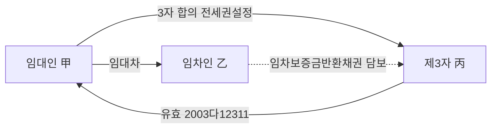

#### ⭐ 기출 출제포인트

1. **전세금 지급 = 성립요소 / 기존 채권으로 갈음 가능** — 거의 매년 반복되는 최다 빈출 선지.
2. **목적물의 인도는 성립요건이 아니다** — "인도는 전세권의 성립요건이다"는 대표적 오답.
3. **농경지는 전세권의 목적으로 하지 못한다** — 2022년 정답 선지로 직접 출제.
4. **채권담보 목적 전세권의 유효/무효 경계** — "완전 배제하지 않으면 유효" vs "사용·수익 권능 배제 시 무효".
5. **용익물권성 + 담보물권성 겸유** — 박스형 지문으로 자주 등장.

#### 📊 기출 분석

| 연도 | 출제 형태 | 핵심 논점 |
|---|---|---|
| 2019년 기출 | 옳지 않은 것 | 전세권의 성질, 저당권의 목적 적격, 상린관계 준용, 필요비 |
| 2020년 기출 | 옳은 것 | 인도는 성립요건 ✕, 전세금반환채권 분리양도 |
| 2021년 기출 | 옳은 것 | 전세금 현실 수수 요부, 존속기간 시작 전 등기 |
| 2022년 기출 | 옳지 않은 것 | 전세금 지급 = 성립요소, 기존 채권 갈음, **농경지**, 증감청구 |
| 2023년 기출 | 옳은 것 | 채권담보만을 위한 전세권 설정의 가부, 전세금 지급 = 성립요소 |
| 2025년 기출 | 사례형 | 임차보증금을 전세금으로 하는 전세권설정등기의 효력 |

**출제 빈도** — 전세권은 감정평가사 민법에서 해마다 1~2문항이 단독 출제되는 최상위 빈출 논점이고, 그 중에서도 "성립요소" 부분은 거의 모든 해에 선지로 들어간다.

**반복되는 함정 선지** — ① "목적물의 인도는 전세권의 성립요건이다"(✕) ② "전세금은 반드시 현실적으로 수수되어야 한다"(✕) ③ "농경지를 전세권의 목적으로 할 수 있다"(✕) ④ "존속기간 시작 전에 마친 전세권설정등기는 무효로 추정된다"(✕).

**최근 경향** — 단순 조문형에서 벗어나 채권담보 목적 전세권과 전세권저당권을 결합한 사례형이 늘고 있다. 2025년에는 임대차보증금반환채권 담보 목적의 전세권을 정면으로 물었다.

#### 🔍 기출 선지로 배우는 법리

> 실제 출제된 선지를 그대로 놓고 O/X와 근거를 확인한다.

**①** 전세금의 지급은 전세권 성립의 요소이다. (2022년 기출) — **O**
근거: 제303조 제1항의 해석. 전세금의 지급이 있을 때 비로소 전세권이 성립한다(94다18508).

**②** 기존 채권으로 전세금의 지급에 갈음할 수 있다. (2022년 기출) — **O**
근거: 전세금의 지급이 반드시 현실적으로 수수되어야만 하는 것은 아니다(2008다67217).

**③** 농경지를 전세권의 목적으로 할 수 있다. (2022년 기출) — **X**
어디가 틀렸나: 제303조 제2항이 정면으로 금지한다. / 옳게 고치면: 농경지는 전세권의 목적으로 하지 못한다.

**④** 목적물의 인도는 전세권의 성립요건이다. (2020년 기출) — **X**
어디가 틀렸나: 전세권이 성립하기 위해서는 설정계약과 등기, 그리고 전세금의 수수가 있어야 하나 목적물의 인도는 성립요건이 아니다(94다18508).

**⑤** 전세권을 설정하는 때에는 전세금이 반드시 현실적으로 수수되어야 한다. (2021년 기출) — **X**
어디가 틀렸나: 기존의 채권으로 전세금의 지급에 갈음할 수도 있다(2008다67217).

**⑥** 전세권의 존속기간이 시작되기 전에 마친 전세권설정등기는 특별한 사정이 없는 한 그 기간이 시작되기 전에는 무효이다. (2021년 기출) — **X**
어디가 틀렸나: 판례는 그 기간이 시작되기 전에도 효력이 있다고 본다.

**⑦** 전세권 설정계약의 당사자는 전세권의 사용·수익권능을 배제하고 채권담보만을 위한 전세권을 설정할 수 있다. (2023년 기출) — **X**
어디가 틀렸나: 전세권은 설정계약과 부동산의 용도에 좇아 사용·수익하는 물권으로서, 채권담보만을 위한 전세권 설정은 인정되지 않는다(2018다40235, 40242).

**⑧** 당사자가 채권담보의 목적으로 전세권을 설정하였으나 설정과 동시에 목적물을 인도하지 않았다면, 장차 전세권자가 목적물을 사용·수익하기로 하였더라도 그 전세권은 무효이다. (감정평가사 기출, 박스형 ㄹ지문) — **X**
어디가 틀렸나: 사용·수익을 완전히 배제하는 것이 아니라면 그 효력을 부인할 수 없다(94다18508).

**⑨** 농경지는 전세권의 목적이 될 수 있다. (문제집 제4장 11번) — **X**
어디가 틀렸나: 제303조 제2항. 문제집 정답도 ③(같은 취지).

**⑩** 전세권은 1필의 토지 중 일부에 대해서도 설정할 수 있다. (문제집 63번, 변리사 기출) — **O**
근거: 1필의 토지 또는 1동의 건물의 일부분 위에도 설정이 가능하다. 다만 등기신청 시 도면을 첨부해야 한다.

#### ✏️ 사례형 적용

> **사례 1** — 甲은 乙에게 5,000만 원을 빌려주었다. 변제기가 지나도 乙이 갚지 못하자, 甲과 乙은 이 대여금채권 5,000만 원을 전세금으로 하여 乙 소유 X건물에 甲 명의의 전세권설정등기를 마쳤다. 甲은 실제로 X건물에 입주하지는 않았지만, 언제든 사용·수익할 수 있도록 열쇠를 받아 두었다.

**검토** — ① 전세금 지급이 성립요소이나 기존 채권으로 갈음할 수 있으므로(94다18508) 전세금 요건은 충족된다. ② 목적물의 인도는 성립요건이 아니므로 입주하지 않았다는 사정만으로 전세권이 부정되지 않는다. ③ 주로 채권담보 목적이더라도 장차 사용·수익을 완전히 배제한 것이 아니므로 전세권의 효력을 부인할 수 없다(2008다67217). **결론: 甲의 전세권은 유효하게 성립한다.**

> **사례 2** — 위 사례에서 甲과 乙이 "甲은 X건물을 일절 사용·수익하지 않으며, 오직 대여금 담보만을 목적으로 한다"고 명시적으로 약정하고 전세권설정등기를 마쳤다면?

**검토** — 전세권의 핵심인 사용·수익 권능을 배제하고 채권담보만을 위해 전세권을 설정한 것이므로, 법률이 정하지 않은 새로운 내용의 전세권을 창설하는 것이 되어 물권법정주의에 반한다. **결론: 그 전세권설정등기는 무효다**(2018다40235, 40242). 다만 그 무효를 알지 못한 채 그 전세권에 근저당권을 설정받은 제3자에게는 무효를 주장할 수 없다(2006다29372).

> **사례 3** — 창고소유자 甲은 乙과 월차임 100만 원, 보증금 3억 원의 창고임대차계약을 체결하고, 보증금반환청구권을 담보하기 위하여 乙에게 전세금 3억 원, 임대차기간과 동일한 기간을 존속기간으로 하는 전세권등기를 경료해 주었다. (2025년 기출 사례)

**검토** — 본래의 계약은 임대차이지만, 당사자의 합의로 기존의 보증금채권을 전세금으로 하는 전세권설정등기를 갖추었으므로 乙은 甲에게 전세권의 효력을 주장할 수 있다(2008다67217). 나아가 甲에게서 창고를 매수한 丙에게도 전세권을 주장할 수 있고(2006다6072), 甲이 보증금 반환을 지체하면 전세권에 기한 경매도 신청할 수 있다. 다만 甲은 보증금에서 乙이 연체한 차임을 공제한 금액을 반환하면 된다(2025년 기출 정답 ④).

#### ⚠️ 이 관의 함정 총정리

1. "목적물의 인도가 있어야 전세권이 성립한다"고 하면 틀림 → ==인도는 성립요건이 아니다==(설정계약 + 등기 + 전세금).
2. "전세금은 반드시 현실적으로 수수되어야 한다"고 하면 틀림 → ==기존 채권으로 갈음 가능==.
3. "농경지에도 전세권을 설정할 수 있다"고 하면 틀림 → ==농경지는 전세권의 목적이 되지 못한다==(제303조 제2항).
4. "채권담보 목적 전세권은 언제나 무효/언제나 유효"라고 하면 틀림 → ==사용·수익 완전 배제 여부==가 갈림길.
5. "전세권의 주된 성격은 담보물권성이다"라고 하면 틀림 → ==주된 성격은 용익물권성==, 담보물권성은 전세금반환 확보를 위한 부수적 성격.

#### ✅ OX 확인문제

> 다음 진술의 참·거짓을 판단하시오.

**1.** 전세금의 지급은 전세권 성립의 요소이지만, 반드시 현실적으로 수수되어야 하는 것은 아니고 기존의 채권으로 전세금의 지급에 갈음할 수도 있다.
→ **O**. 대법원 1995.2.10. 94다18508, 대법원 2009.01.30. 2008다67217.

**2.** 목적물의 인도는 전세권의 성립요건이다.
→ **X**. 설정계약 + 전세금의 수수 + 등기만 있으면 인도가 없어도 전세권은 유효하게 성립한다.

**3.** 농경지도 당사자의 합의가 있으면 전세권의 목적으로 할 수 있다.
→ **X**. 제303조 제2항이 농경지를 전세권의 목적에서 명문으로 제외한다.

**4.** 1동의 건물의 일부분 위에도 전세권을 설정할 수 있다.
→ **O**. 다만 등기신청 시 그 부분을 표시한 도면의 번호를 기재하여야 한다.

**5.** 전세권은 용익물권적 성격과 담보물권적 성격을 겸비하고 있다.
→ **O**. 대법원 2005.03.25. 2003다35659.

**6.** 당사자가 주로 채권담보의 목적으로 전세권을 설정하고 목적물을 인도하지 않았더라도, 장차 전세권자의 사용·수익을 완전히 배제하는 것이 아니라면 전세권의 효력을 부인할 수 없다.
→ **O**. 대법원 1995.2.10. 94다18508.

**7.** 전세권설정계약의 당사자가 전세권의 사용·수익 권능을 배제하고 채권담보만을 위해 전세권을 설정한 경우에도 그 전세권설정등기는 유효하다.
→ **X**. 물권법정주의에 반하여 무효다(대법원 2021.12.30. 2018다40235, 40242).

**8.** 임차보증금반환채권을 담보할 목적으로 임대인·임차인 및 제3자 사이의 합의에 따라 제3자 명의로 경료된 전세권설정등기는 무효다.
→ **X**. 유효하다(대법원 2005.05.26. 2003다12311).

**9.** 임차보증금반환채권 담보 목적의 전세권설정등기가 통정허위표시로 무효인 경우, 그 전세권에 근저당권을 설정받은 자에 대해서는 그가 선의라도 무효를 주장할 수 있다.
→ **X**. 그와 같은 사정을 알고 있었던 경우에만 무효를 주장할 수 있다(대법원 2008.03.13. 2006다29372).

**10.** 전세권의 존속기간이 시작되기 전에 마친 전세권설정등기는 특별한 사정이 없는 한 그 기간이 시작되기 전에는 무효다.
→ **X**. 판례는 그 기간이 시작되기 전에도 효력이 있다고 본다.

#### 🧠 암기법

> 🔑 **성립 3요소 — "계·금·등"**
> **계**약(전세권설정계약) + 전세**금** 지급 + **등**기.
> 여기에 **인도는 없다**. "계금등, 인도는 빼고" — 이 다섯 글자로 성립요건 문제는 끝난다.

> 🔑 **전세금 — "요소이되 현금은 아니다"**
> 전세금 지급은 **요소**(없으면 불성립), 그러나 **현금 수수는 불요**(기존 채권으로 갈음 ○).
> 두 문장을 붙여 외운다: "==요소지만 현금은 아니다==".

> 🔑 **담보목적 전세권 — "완배무 (완전 배제하면 무효)"**
> 사용·수익 **완**전 **배**제 → **무**효(물권법정주의).
> 완전 배제가 아니면 → 유효.

> 🔑 **목적물 — "농(農)은 못 든다"**
> 토지 ○, 건물 ○, 일부 ○, ==농경지 ✕==. 전세권 목적물 문제는 '농' 한 글자만 찾으면 된다.

#### ⚖️ 법조문 원문

> 📖 이 관이 근거로 삼은 조문의 **전문**이다. 본문 인용은 발췌지만 여기서는 조 전체를 싣는다. 출처는 법제처 정본이다.

**― 민법 ―**

> 📌 **민법 제186조(부동산물권변동의 효력)** — "부동산에 관한 법률행위로 인한 물권의 득실변경은 등기하여야 그 효력이 생긴다."

> 📌 **민법 제303조(전세권의 내용)** — "①전세권자는 전세금을 지급하고 타인의 부동산을 점유하여 그 부동산의 용도에 좇아 사용ㆍ수익하며, 그 부동산 전부에 대하여 후순위권리자 기타 채권자보다 전세금의 우선변제를 받을 권리가 있다. ②농경지는 전세권의 목적으로 하지 못한다."

> 📌 **민법 제319조(준용규정)** — "제213조, 제214조, 제216조 내지 제244조의 규정은 전세권자간 또는 전세권자와 인지소유자 및 지상권자간에 이를 준용한다."

**― 부동산등기법 ―**

> 📌 **부동산등기법 제72조(전세권 등의 등기사항)** — "① 등기관이 전세권설정이나 전전세(轉傳貰)의 등기를 할 때에는 제48조에서 규정한 사항 외에 다음 각 호의 사항을 기록하여야 한다. 다만, 제3호부터 제5호까지는 등기원인에 그 약정이 있는 경우에만 기록한다. 1. 전세금 또는 전전세금 2. 범위 3. 존속기간 4. 위약금 또는 배상금 5. 「민법」 제306조 단서의 약정 6. 전세권설정이나 전전세의 범위가 부동산의 일부인 경우에는 그 부분을 표시한 도면의 번호 ② 여러 개의 부동산에 관한 권리를 목적으로 하는 전세권설정의 등기를 하는 경우에는 제78조를 준용한다."

### 제2관 전세권의 존속기간

> 📖 전세권은 기간이 있는 물권이다. 이 관은 그 기간을 ① 약정한 경우(최장·최단), ② 약정하지 않은 경우(소멸통고), ③ 갱신(합의갱신·법정갱신)의 세 갈래로 나누어 본다.
> 시험의 급소는 언제나 ==건물전세권과 토지전세권의 차이==다. **최단기간 1년**과 **법정갱신**은 오직 건물전세권에만 있다.

> ⭐ **이 관에서 반드시 챙길 3가지**
> ① **최장 10년**(토지·건물 공통, 약정이 넘으면 10년으로 단축), **최단 1년**(==건물전세권만==).
> ② 기간 약정이 없으면 각 당사자가 언제든지 **소멸통고** → 통고를 받은 날로부터 ==6월 경과==로 소멸(제313조).
> ③ **법정갱신은 건물전세권만** 인정되고, ==등기 없이도== 설정자·제3자에게 대항할 수 있으며, 갱신 후 존속기간은 ==정함이 없는 것으로 본다==.

#### 1. 의의

전세권의 존속기간이란 전세권자가 목적물을 사용·수익할 수 있는 기간을 말한다. 전세권은 존속기간이 만료하면 ==용익물권적 권능이 등기 말소 없이도 당연히 소멸==하고, 전세금 반환 시까지 담보물권적 권능만 남는다(2003다35659). 따라서 존속기간은 단순한 기간 문제가 아니라 **전세권의 성격이 전환되는 시점**을 정하는 문제다.

#### 2. 요건

| 구분 | 규율 | 근거 | 적용 대상 |
|---|---|---|---|
| 최장기간 | 10년을 넘지 못한다. 약정이 10년을 넘으면 **10년으로 단축** | 제312조 제1항 | 토지·건물 **모두** |
| 최단기간 | 존속기간을 1년 미만으로 정한 때에는 이를 1년으로 한다 | 제312조 제2항 | 건물전세권만 |
| 기간 무약정 | 각 당사자가 언제든지 **소멸통고** 가능, 통고 받은 날로부터 **6월** 경과로 소멸 | 제313조 | 토지·건물 모두 |
| 합의갱신 | 갱신 가능. 갱신한 날로부터 10년을 넘지 못한다 | 제312조 제3항 | 토지·건물 모두 |
| 법정갱신 | 설정자가 만료 전 **6월~1월** 사이에 갱신거절·조건변경 통지를 하지 않으면 동일 조건으로 갱신 | 제312조 제4항 | 건물전세권만 |
| 등기 | 존속기간은 등기하지 않으면 **제3자에게 대항력 없고**, 정하지 않은 것으로 다루어진다 | — | 토지·건물 모두 |

| 구분 | 건물전세권 | 토지전세권 |
|---|---|---|
| 최장기간 | 10년 | 10년 |
| 최단기간 | 1년 (1년 미만 약정 → 1년으로 의제) | 제한 없음 |
| 소멸통고(기간 무약정) | ○ (6월 경과로 소멸) | ○ (6월 경과로 소멸) |
| 합의갱신 | ○ (갱신일로부터 10년 이내) | ○ (갱신일로부터 10년 이내) |
| **법정갱신** | ○ (제312조 제4항) | ✕ |
| 계약갱신청구권 | ✕ | ✕ |

> ⚠️ **최다 함정** — "**토지**전세권의 존속기간을 1년 미만으로 정한 때에는 이를 1년으로 한다"는 선지는 **틀렸다**. 최단기간 1년은 ==건물전세권 전용==이다. 감정평가사 기출에서 이 선지가 정답(틀린 것)으로 출제되었다.

#### 3. 효과

| 구분 | 효과 |
|---|---|
| 기간 만료 | 용익물권적 권능은 등기 말소 없이 당연 소멸, 담보물권적 권능은 전세금 반환 시까지 존속 |
| 10년 초과 약정 | 초과 부분이 무효가 되어 **10년으로 단축**(전세권 자체는 유효) |
| 건물 1년 미만 약정 | **1년으로 의제** (약정 자체가 무효가 되는 것이 아님) |
| 소멸통고 | 통고 도달일로부터 **6월 경과 시** 전세권 소멸 (통고 즉시 ✕) |
| 법정갱신 | 등기 없이 전세권설정자·목적물을 취득한 제3자에게 대항 가능, 존속기간은 **정함이 없는 것으로 봄** |
| 법정갱신 후 | 기간의 정함이 없으므로 이후에는 **제313조의 소멸통고**로 종료시킬 수 있음 |

| 구분 | 합의갱신(제312조 제3항) | 법정갱신(제312조 제4항) |
|---|---|---|
| 성질 | 법률행위(설정계약의 갱신) | 법률의 규정에 의한 물권변동 |
| 등기 | **필요**(제186조) | 불요(제187조 법리) |
| 대상 | 토지·건물 모두 | 건물전세권만 |
| 기간 | 갱신한 날로부터 10년 이내 | 정함이 없는 것으로 본다 |
| 요건 | 당사자의 합의 | 설정자가 만료 전 6월~1월 사이에 갱신거절 등 통지를 하지 않을 것 |
| 제3자 대항 | 등기해야 대항 | 등기 없이도 대항 가능(88다카21029, 2009다35743) |

#### 4. 관련 조문

> 📌 **민법 제312조(전세권의 존속기간)** — "① 전세권의 존속기간은 10년을 넘지 못한다. 당사자의 약정기간이 10년을 넘는 때에는 이를 10년으로 단축한다. ② 건물에 대한 전세권의 존속기간을 1년 미만으로 정한 때에는 이를 1년으로 한다. ③ 전세권의 설정은 이를 갱신할 수 있다. 그 기간은 갱신한 날로부터 10년을 넘지 못한다. ④ 건물의 전세권설정자가 전세권의 존속기간 만료 전 6월부터 1월까지 사이에 전세권자에 대하여 갱신거절의 통지 또는 조건을 변경하지 아니하면 갱신하지 아니한다는 뜻의 통지를 하지 아니한 경우에는 그 기간이 만료된 때에 전전세권과 동일한 조건으로 다시 전세권을 설정한 것으로 본다. 이 경우 전세권의 존속기간은 그 정함이 없는 것으로 본다."

> 📌 **민법 제313조(전세권의 소멸통고)** — "전세권의 존속기간을 약정하지 아니한 때에는 각 당사자는 언제든지 상대방에 대하여 전세권의 소멸을 통고할 수 있고, 상대방이 이 통고를 받은 날로부터 6월이 경과하면 전세권은 소멸한다."

#### 5. 핵심 판례 법리

- **① 법정갱신은 등기 없이 효력이 생긴다** — 전세권의 법정갱신은 법률의 규정에 의한 부동산에 관한 물권변동이므로 등기를 필요로 하지 아니하고, 전세권설정자나 ==그 목적물을 취득한 제3자에 대하여도 등기 없이 법정갱신을 주장할 수 있다==(대법원 1989.7.11. 88다카21029).

- **② 같은 법리의 재확인** — 전세권이 법정갱신된 경우 이는 법률의 규정에 의한 물권의 변동이므로 전세권갱신에 관한 등기를 필요로 하지 아니하고, 전세권자는 ==등기 없이도 전세권설정자나 그 목적물을 취득한 제3자에 대하여 갱신된 권리를 주장할 수 있다==(대법원 2010.03.25. 2009다35743).

- **③ 존속기간 만료의 효과 — 용익권능만 소멸** — 전세권의 존속기간이 만료되면 전세권의 용익물권적 권능은 ==전세권설정등기의 말소 없이도 당연히 소멸==하고, 전세금반환채권을 담보하는 담보물권적 권능의 범위 내에서 전세금의 반환 시까지 그 등기의 효력이 존속한다(대법원 2005.03.25. 2003다35659).

- **④ 합의해지도 만료와 같다** — 전세권이 존속기간의 만료나 합의해지 등으로 종료하면 용익물권적 권능은 소멸하고 담보물권적 권능의 범위 내에서 전세금 반환 시까지 등기의 효력이 존속한다(대법원 2015.11.17. 2014다10694).

- **⑤ 기간만료 시 전세권저당권의 운명** — 전세권이 기간만료로 종료된 경우 전세권은 전세권설정등기의 말소등기 없이도 당연히 소멸하고, ==저당권의 목적물인 전세권이 소멸하면 저당권도 당연히 소멸==하므로 전세권을 목적으로 한 저당권자는 부동산 소유자에게 더 이상 저당권을 주장할 수 없다(대법원 1999. 9. 17. 98다31301).

- **⑥ 만료 후에도 전세권은 양도할 수 있다** — 존속기간의 경과로 본래의 용익물권적 권능이 소멸하고 담보물권적 권능만 남은 전세권에 대해서도 ==그 피담보채권인 전세금반환채권과 함께 제3자에게 양도할 수 있다==(대법원 2005.03.25. 2003다35659).

- **⑦ 존속 중의 분리양도는 불가** — 전세권이 ==존속하는 동안==은 전세권을 존속시키기로 하면서 전세금반환채권만을 전세권과 분리하여 확정적으로 양도하는 것은 허용되지 않는다(대법원 2002.08.23. 2001다69122). 존속기간은 이처럼 처분 가능성의 경계선이 된다.

- **⑧ 존속기간 중 소유권이 이전되어도 전세권은 그대로 존속** — 전세권은 전세권자와 목적물의 소유권을 취득한 신 소유자 사이에서 ==계속 동일한 내용으로 존속==하고, 신 소유자가 전세권설정자의 지위에서 전세금반환의무를 부담한다(대법원 2006.05.11. 2006다6072).

- **⑨ 존속기간 시작 전에 마친 등기** — 전세권의 존속기간이 시작되기 전에 마친 전세권설정등기는 특별한 사정이 없는 한 ==그 기간이 시작되기 전에도 효력이 있고 유효한 것으로 추정된다==는 것이 판례의 태도다.

- **⑩ 계약갱신청구권은 없다** — 전세권자에게는 지상권자와 달리 ==계약갱신청구권이 인정되지 않는다==. 건물전세권의 법정갱신이 그 기능을 대신할 뿐이다.

#### ⭐ 기출 출제포인트

1. **최단기간 1년은 건물전세권만** — "토지전세권의 존속기간을 1년 미만으로 정한 때에는 이를 1년으로 한다"(✕)가 정답 선지로 출제.
2. **법정갱신은 건물전세권만** — "토지전세권의 경우 전세권의 법정갱신이 인정된다"(✕).
3. **법정갱신 + 등기 불요 + 제3자 대항** — 세 요소가 한 선지에 묶여 나온다.
4. **법정갱신 후 존속기간** — "2년으로 본다"(✕) → 정함이 없는 것으로 본다.
5. **소멸통고의 6월** — "통고를 받은 날로부터 즉시 소멸"(✕).
6. **최장 10년** — 15년 약정 시 10년으로 단축, 갱신해도 갱신일로부터 10년 이내.

#### 📊 기출 분석

| 연도 | 출제 형태 | 핵심 논점 |
|---|---|---|
| 감정평가사 기출 | 옳지 않은 것 | 건물전세권 법정갱신·등기 불요 / **토지전세권 1년 미만 → 1년(✕)** |
| 2022년 기출 | 옳지 않은 것 | 건물에 대한 전세권의 존속기간 1년 미만 → 1년(제312조 제2항) |
| 문제집 46번·55번·62번 | 옳지 않은 것 | 법정갱신의 등기 불요·제3자 대항 |
| 문제집 41번 | 옳은 것 | 법정갱신 시 존속기간을 2년으로 본다(✕) |
| 문제집 56번 | 옳지 않은 것 | 토지전세권의 법정갱신 인정(✕) |
| 문제집 63번(변리사) | 옳지 않은 것 | 합의갱신의 기간 제한(갱신일로부터 10년) |

**출제 빈도** — 존속기간은 그 자체로 한 문항이 되기보다 **전세권 종합 문항의 1~2개 선지**로 매년 등장한다. 그 중 법정갱신의 출제 빈도가 압도적이다.

**반복되는 함정 선지** — ① 최단기간을 **토지**전세권에 적용 ② 법정갱신을 **토지**전세권에 인정 ③ 법정갱신 후 존속기간을 **2년**이라고 함 ④ 소멸통고 후 **즉시** 소멸이라고 함 ⑤ 법정갱신에 **등기가 필요**하다고 함.

**최근 경향** — 법정갱신을 전세권저당권과 결합해 "법정갱신되는 경우 전세기간에 대한 변경등기 없이도 갱신되는가"를 묻는 박스형이 늘고 있다.

#### 🔍 기출 선지로 배우는 법리

> 실제 출제된 선지를 그대로 놓고 O/X와 근거를 확인한다.

**①** 건물전세권이 법정갱신된 경우, 전세권자는 등기 없이도 전세권설정자나 그 목적물을 취득한 제3자에 대하여 갱신된 권리를 주장할 수 있다. (감정평가사 기출) — **O**
근거: 대법원 1989.7.11. 88다카21029; 대법원 2010.03.25. 2009다35743.

**②** 토지전세권의 존속기간을 1년 미만으로 정한 때에는 이를 1년으로 한다. (감정평가사 기출) — **X**
어디가 틀렸나: 최단존속기간의 제한은 건물의 전세권에 한한다(제312조 제2항). / 옳게 고치면: "**건물**에 대한 전세권의 존속기간을 1년 미만으로 정한 때에는 이를 1년으로 한다".

**③** 토지전세권의 존속기간을 약정하지 아니한 경우 각 당사자는 언제든지 상대방에 대하여 전세권의 소멸을 통고할 수 있다. (감정평가사 기출) — **O**
근거: 제313조. 소멸통고는 **토지·건물 구별 없이** 인정된다.

**④** 건물에 대한 전세권의 존속기간을 1년 미만으로 정한 때에는 이를 1년으로 한다. (2022년 기출) — **O**
근거: 제312조 제2항.

**⑤** 토지전세권의 경우 전세권의 법정갱신이 인정된다. (문제집 56번) — **X**
어디가 틀렸나: 제312조 제4항은 건물의 전세권설정자를 대상으로 한다. 따라서 토지전세권에는 법정갱신이 인정되지 않는다.

**⑥** 건물에 대한 전세권이 법정갱신되는 경우, 그 존속기간은 2년으로 본다. (문제집 41번) — **X**
어디가 틀렸나: 법정갱신 시 전세권의 존속기간은 그 정함이 없는 것으로 본다(제312조 제4항 후문).

**⑦** 전세권의 존속기간을 약정하지 않은 경우에는 각 당사자는 언제든지 상대방에 대하여 전세권의 소멸을 통고할 수 있고 상대방이 통고를 받은 날로부터 즉시 전세권은 소멸한다. (문제집 제4장 17번) — **X**
어디가 틀렸나: 통고를 받은 날로부터 6월이 경과하여야 소멸한다(제313조).

**⑧** 토지전세권의 존속기간을 15년으로 약정한 경우에 그 존속기간은 10년으로 단축되지만, 당사자는 존속기간 만료 시에 갱신한 날로부터 10년을 넘지 않는 기간으로 전세권을 갱신할 수 있다. (문제집 62번, 변리사 기출) — **O**
근거: 제312조 제1항·제3항.

**⑨** 乙의 전세권이 법정갱신되는 경우, 전세기간에 대한 변경등기 없이도 갱신된다. (문제집 61번 박스 ㉡) — **O**
근거: 법률의 규정에 의한 물권변동이므로 등기를 요하지 않는다(2009다35743).

#### ✏️ 사례형 적용

> **사례 1** — 甲은 자기 소유 X**건물**에 乙 명의의 전세권을 설정하면서 존속기간을 6개월로 약정하고 등기하였다. 6개월이 지난 뒤 甲은 "기간이 끝났으니 나가라"고 한다.

**검토** — 건물에 대한 전세권의 존속기간을 1년 미만으로 정한 때에는 이를 1년으로 한다(제312조 제2항). 따라서 약정 6개월은 **1년으로 의제**되고, 甲의 청구는 이유 없다. 만약 X가 **토지**였다면 최단기간 제한이 없으므로 6개월 약정이 그대로 유효하다.

> **사례 2** — 甲 소유 Y**건물**에 대한 乙의 전세권(존속기간 2년)이 만료를 앞두고 있었는데, 甲은 만료 전 6월부터 1월까지 사이에 아무런 통지도 하지 않았다. 만료 후 甲은 Y건물을 丙에게 매도하고 소유권이전등기를 마쳤다. 丙은 乙에게 명도를 구한다.

**검토** — ① 甲이 갱신거절 등 통지를 하지 않았으므로 만료 시 전전세권과 동일한 조건으로 다시 전세권을 설정한 것으로 본다(제312조 제4항). ② 법정갱신은 법률의 규정에 의한 물권변동이므로 등기가 필요 없고, 乙은 목적물을 취득한 제3자 丙에게도 등기 없이 갱신된 권리를 주장할 수 있다(88다카21029, 2009다35743). ③ 다만 갱신 후 존속기간은 정함이 없는 것으로 보므로, 丙은 제313조에 따라 소멸통고를 하고 6월이 경과하면 전세권을 소멸시킬 수 있다. **결론: 丙의 즉시 명도 청구는 이유 없다.**

> **사례 3** — 甲과 乙이 토지전세권의 존속기간을 15년으로 약정하고 등기하였다.

**검토** — 전세권의 존속기간은 10년을 넘지 못하고, 약정기간이 10년을 넘는 때에는 10년으로 단축된다(제312조 제1항). 전세권설정계약 자체가 무효가 되는 것은 아니다. 만료 시 당사자는 다시 갱신할 수 있으나 그 기간 역시 갱신한 날로부터 10년을 넘지 못한다(제312조 제3항).

#### ⚠️ 이 관의 함정 총정리

1. "토지전세권도 1년 미만으로 정하면 1년이 된다"고 하면 틀림 → ==최단 1년은 건물전세권만==.
2. "토지전세권에도 법정갱신이 인정된다"고 하면 틀림 → ==법정갱신은 건물전세권만==(제312조 제4항).
3. "법정갱신되면 존속기간은 종전과 같은 2년(또는 종전 기간)이 된다"고 하면 틀림 → ==정함이 없는 것으로 본다==.
4. "법정갱신을 제3자에게 주장하려면 갱신등기가 필요하다"고 하면 틀림 → ==등기 없이도 대항 가능==.
5. "소멸통고가 도달하면 즉시 전세권이 소멸한다"고 하면 틀림 → ==6월 경과==해야 소멸(다만 제314조 제2항의 일부멸실로 인한 소멸통고는 6월을 요하지 않는다).

#### ✅ OX 확인문제

> 다음 진술의 참·거짓을 판단하시오.

**1.** 전세권의 존속기간은 10년을 넘지 못하며, 당사자의 약정기간이 10년을 넘는 때에는 이를 10년으로 단축한다.
→ **O**. 제312조 제1항. 토지·건물 모두에 적용된다.

**2.** 토지에 대한 전세권의 존속기간을 1년 미만으로 정한 때에는 이를 1년으로 한다.
→ **X**. 최단존속기간 1년의 제한은 건물전세권에만 적용된다(제312조 제2항).

**3.** 전세권의 존속기간을 약정하지 아니한 때에는 각 당사자는 언제든지 상대방에 대하여 전세권의 소멸을 통고할 수 있다.
→ **O**. 제313조. 토지전세권·건물전세권 모두 같다.

**4.** 소멸통고를 받은 상대방은 통고를 받은 날로부터 즉시 전세권이 소멸함을 감수하여야 한다.
→ **X**. 6월이 경과하여야 전세권이 소멸한다(제313조).

**5.** 건물의 전세권설정자가 존속기간 만료 전 6월부터 1월까지 사이에 갱신거절의 통지를 하지 않으면 전전세권과 동일한 조건으로 다시 전세권을 설정한 것으로 본다.
→ **O**. 제312조 제4항.

**6.** 전세권이 법정갱신된 경우 전세권자는 갱신등기를 마쳐야 목적물을 취득한 제3자에게 갱신된 권리를 주장할 수 있다.
→ **X**. 법률의 규정에 의한 물권변동이므로 등기 없이도 주장할 수 있다(2009다35743).

**7.** 건물전세권이 법정갱신된 경우 그 존속기간은 갱신 전과 동일한 기간으로 본다.
→ **X**. 그 정함이 없는 것으로 본다(제312조 제4항 후문).

**8.** 토지전세권에도 법정갱신에 관한 규정이 적용된다.
→ **X**. 제312조 제4항은 건물의 전세권설정자만을 대상으로 한다.

**9.** 합의갱신의 경우 그 기간은 갱신한 날로부터 10년을 넘지 못한다.
→ **O**. 제312조 제3항.

**10.** 전세권의 존속기간이 만료하면 전세권의 용익물권적 권능은 전세권설정등기의 말소 없이도 당연히 소멸한다.
→ **O**. 대법원 2005.03.25. 2003다35659.

#### 🧠 암기법

> 🔑 **"건물만 1년, 건물만 갱신"**
> 최**단** 1년 → **건**물만. 법정**갱**신 → **건**물만.
> 토지전세권에는 둘 다 없다. 선지에 '**토지**전세권 + 1년' 또는 '**토지**전세권 + 법정갱신'이 보이면 즉시 ✕.

> 🔑 **법정갱신 3종 세트 — "무등기 · 무기간 · 대항 O"**
> ① **등기 불요**(법률규정에 의한 물권변동) ② **기간은 정함 없음** ③ **설정자·제3자 모두에게 대항 O**.

> 🔑 **숫자 정리 — "10 · 1 · 6 · 6-1"**
> **10**년(최장) · **1**년(건물 최단) · **6**월(소멸통고 경과기간) · **6월~1월**(법정갱신 통지기간).

> 🔑 **"전세권자에게 계약갱신청구권은 없다"**
> 지상권자에게는 지상물매수청구·계약갱신청구가 있으나, 전세권자에게는 ==계약갱신청구권이 없다==. 대신 건물전세권의 법정갱신이 있을 뿐.

#### ⚖️ 법조문 원문

> 📖 이 관이 근거로 삼은 조문의 **전문**이다. 본문 인용은 발췌지만 여기서는 조 전체를 싣는다. 출처는 법제처 정본이다.

**― 민법 ―**

> 📌 **민법 제312조(전세권의 존속기간)** — "①전세권의 존속기간은 10년을 넘지 못한다. 당사자의 약정기간이 10년을 넘는 때에는 이를 10년으로 단축한다. ②건물에 대한 전세권의 존속기간을 1년 미만으로 정한 때에는 이를 1년으로 한다. ③전세권의 설정은 이를 갱신할 수 있다. 그 기간은 갱신한 날로부터 10년을 넘지 못한다. ④건물의 전세권설정자가 전세권의 존속기간 만료전 6월부터 1월까지 사이에 전세권자에 대하여 갱신거절의 통지 또는 조건을 변경하지 아니하면 갱신하지 아니한다는 뜻의 통지를 하지 아니한 경우에는 그 기간이 만료된 때에 전전세권과 동일한 조건으로 다시 전세권을 설정한 것으로 본다. 이 경우 전세권의 존속기간은 그 정함이 없는 것으로 본다."

> 📌 **민법 제313조(전세권의 소멸통고)** — "전세권의 존속기간을 약정하지 아니한 때에는 각 당사자는 언제든지 상대방에 대하여 전세권의 소멸을 통고할 수 있고 상대방이 이 통고를 받은 날로부터 6월이 경과하면 전세권은 소멸한다."

### 제3관 전세권의 효력

> 📖 성립한 전세권이 당사자에게 어떤 권리·의무를 만들어내는가를 다룬다. 축은 셋이다. ① 전세권자의 **사용·수익권**과 그 파생물(물권적 청구권·상린관계, 건물전세권의 제304조·제305조), ② **전세금증감청구권**, ③ **비용상환**과 **부속물매수청구권**.
> 이 관의 최대 급소는 ==전세권자에게 필요비상환청구권이 없다==는 점이다. 유지·수선의무를 전세권자가 지기 때문이다.

> ⭐ **이 관에서 반드시 챙길 3가지**
> ① 전세권자는 **유지·수선의무**를 지므로 ==필요비상환청구권은 없고 유익비상환청구권만 있다==(제309조·제310조).
> ② 건물전세권의 효력은 그 건물의 소유를 목적으로 한 ==지상권 또는 임차권에 미치고==(제304조), 대지소유권의 특별승계인은 ==전세권설정자에 대하여== 지상권을 설정한 것으로 본다(제305조).
> ③ 전세금증액청구는 ==약정 전세금의 20분의 1을 초과하지 못하고==, 설정계약일 또는 증액일로부터 ==1년 이내에는 하지 못한다==.

#### 1. 의의

전세권의 효력이란 전세권자가 목적 부동산을 사용·수익하는 데 따르는 권리·의무의 총체를 말한다. 전세권자는 정해진 목적 범위 내에서 타인의 건물·토지를 ==점유하여 사용·수익==할 수 있고, 이에 대응하여 전세권설정자는 소유자라 하더라도 스스로 그 부동산을 사용·수익할 수 없다.

- 전세권설정자의 의무는 목적물을 사용·수익에 적합한 상태에 둘 **적극적 의무가 아니라**, 전세권자의 사용을 ==방해하지 않을 소극적 인용의무==에 그친다.
- 목적물의 현상을 유지하고 통상의 관리에 속한 수선을 할 의무는 ==전세권자==가 진다(제309조).

#### 2. 요건

| 효력 항목 | 요건 | 근거 |
|---|---|---|
| 사용·수익권 | 유효한 전세권의 성립 + 설정계약·목적물 성질에 따른 용법 준수 | 제303조 제1항 |
| 물권적 청구권 | 전세권 내용의 실현이 방해되거나 방해될 염려 | 제319조(제213조·제214조 준용) |
| 건물전세권의 지상권·임차권 효력 | 타인의 토지 위에 있는 건물에 전세권을 설정할 것 | 제304조 제1항 |
| 제305조 법정지상권 | ① 건물에 전세권 설정 당시 토지·건물이 동일소유자일 것 ② 그 후 대지소유권이 타인에게 이전되어 소유자가 달라질 것 | 제305조 제1항 |
| 전세금증액청구 | 조세·공과금 기타 부담의 증감 또는 경제사정의 변동 + 20분의 1 이내 + 설정계약일·증액일로부터 1년 경과 | 제312조의2 및 그 시행규정 제2조·제3조 |
| 유익비상환청구 | 개량을 위한 지출 + 가액의 증가가 현존할 것 | 제310조 제1항 |
| 부속물매수청구(전세권자) | 설정자의 동의를 얻어 부속시켰거나 설정자로부터 매수한 부속물일 것 + 존속기간 만료로 소멸 | 제316조 제2항 |

#### 3. 효과

| 구분 | 효과 |
|---|---|
| 전세권자의 권리 | 사용·수익권, 과실수취권, 물권적 청구권(반환·방해제거·방해예방), 우선변제권, 경매신청권, 전세금감액청구권, 유익비상환청구권, 부속물수거권·부속물매수청구권, 동시이행항변권, 전세권소멸통고권 |
| 전세권자의 의무 | 용법에 따른 사용·수익 의무, 목적물의 현상유지·통상의 관리에 속한 수선의무(제309조), 원상회복의무 |
| 전세권설정자의 권리 | 전세권소멸청구권(제311조), 원상회복·손해배상청구권, 전세금증액청구권, 부속물매수청구권 |
| 전세권설정자의 의무 | 사용·수익을 방해하지 않을 **소극적 인용의무**, 전세금반환의무, 지상권·임차권을 임의로 소멸시키지 않을 의무(제304조 제2항) |
| 비용상환 | 필요비 ✕ / 유익비 ○ (가액 증가가 현존하는 경우, 소유자의 선택에 좇아 지출액 또는 증가액) |
| 우선변제 | 부동산 **전부**에 대하여 후순위권리자 기타 채권자보다 전세금의 우선변제(제303조 제1항) |

| 비용 | 전세권자 | 근거 | 비고 |
|---|---|---|---|
| **필요비** | 상환청구 ✕ | 제309조(유지·수선의무) | 지상권자도 ✕ / 임차인은 ○ |
| **유익비** | 상환청구 ○ | 제310조 제1항 | 가액 증가가 현존할 것, 소유자의 선택에 좇아 지출액 또는 증가액 |
| 상환기간 | 법원이 소유자의 청구에 의하여 상당한 기간 허여 가능 | 제310조 제2항 | — |

> ⚠️ 유익비의 선택권자는 ==소유자==(전세권설정자)다. "전세권자의 선택에 좇아"라고 하면 틀린 선지다(문제집 47번 함정).

| 구분 | 제304조(건물전세권의 지상권·임차권에 대한 효력) | 제305조(건물의 전세권과 법정지상권) |
|---|---|---|
| 전제 상황 | 건물소유자가 **타인 토지**에 지상권·임차권을 갖고 그 건물에 전세권 설정 | 대지와 건물이 **동일소유자**였다가 대지소유권만 이전 |
| 효과 | 전세권의 효력이 지상권 또는 임차권에 미친다 | 대지소유권의 특별승계인은 전세권설정자에 대하여 지상권을 설정한 것으로 본다 |
| 권리자 | 전세권자(간접적으로 보호) | 건물소유자(즉 전세권설정자)이며, 전세권자가 아님 |
| 제한 | 설정자는 전세권자의 동의 없이 지상권·임차권을 소멸시키지 못한다(제2항) | 대지소유자는 타인에게 대지를 임대하거나 지상권·전세권을 설정하지 못한다(제2항) |
| 지료 | — | 당사자의 청구에 의하여 **법원**이 정한다 |
| 등기 | — | 법률의 규정에 의한 취득이므로 등기 불요 |

| 전세금증감청구권 | 내용 |
|---|---|
| 사유 | 조세·공과금 기타 부담의 증감 또는 경제사정의 변동으로 전세금이 상당하지 아니하게 된 때 |
| 청구권자 | 당사자 쌍방(증액은 설정자, 감액은 전세권자) |
| 효력 범위 | 장래에 대하여만 증감 청구 가능(소급 ✕) |
| 성질 | 형성권 |
| 증액 한도 | 약정한 전세금의 20분의 1(5%)을 초과하지 못한다 |
| 증액 시기 제한 | 전세권설정계약이 있은 날 또는 약정한 전세금의 증액이 있은 날로부터 1년 이내에는 하지 못한다 |
| 감액 | 비율·시기 제한 없음 (제한은 증액에만 있다) |

| 부속물매수청구권 | 전세권자 → 설정자 | 설정자 → 전세권자 |
|---|---|---|
| 근거 | 제316조 제2항 | 제316조 제1항 단서 |
| 요건 | 설정자의 동의를 얻어 부속시켰거나 설정자로부터 매수한 것 | 전세권이 존속기간 만료로 소멸하고 목적물에 부속시킨 물건이 있을 것 |
| 상대방의 지위 | — | 전세권자는 정당한 이유 없이 거절하지 못한다 |
| 성질 | 형성권 | 형성권 |

#### 4. 관련 조문

> 📌 **민법 제304조(건물의 전세권, 지상권, 임차권에 대한 효력)** — "① 타인의 토지에 있는 건물에 전세권을 설정한 때에는 전세권의 효력은 그 건물의 소유를 목적으로 한 지상권 또는 임차권에 미친다. ② 전항의 경우에 전세권설정자는 전세권자의 동의 없이 지상권 또는 임차권을 소멸하게 하는 행위를 하지 못한다."

> 📌 **민법 제305조(건물의 전세권과 법정지상권)** — "① 대지와 건물이 동일한 소유자에 속한 경우에 건물에 전세권을 설정한 때에는 그 대지소유권의 특별승계인은 전세권설정자에 대하여 지상권을 설정한 것으로 본다. 그러나 지료는 당사자의 청구에 의하여 법원이 이를 정한다. ② 전항의 경우에 대지소유자는 타인에게 그 대지를 임대하거나 이를 목적으로 한 지상권 또는 전세권을 설정하지 못한다."

> 📌 **민법 제309조(전세권자의 유지, 수선의무)** — "전세권자는 목적물의 현상을 유지하고 그 통상의 관리에 속한 수선을 하여야 한다."

> 📌 **민법 제310조(전세권자의 상환청구권)** — "① 전세권자가 목적물을 개량하기 위하여 지출한 금액 기타 유익비에 관하여는 그 가액의 증가가 현존한 경우에 한하여 소유자의 선택에 좇아 그 지출액이나 증가액의 상환을 청구할 수 있다. ② 전항의 경우에 법원은 소유자의 청구에 의하여 상당한 상환기간을 허여할 수 있다."

> 📌 **민법 제311조(전세권의 소멸청구)** — "① 전세권자가 전세권설정계약 또는 그 목적물의 성질에 의하여 정하여진 용법으로 이를 사용, 수익하지 아니한 경우에는 전세권설정자는 전세권의 소멸을 청구할 수 있다. ② 전항의 경우에는 전세권설정자는 전세권자에 대하여 원상회복 또는 손해배상을 청구할 수 있다."

> 📌 **민법 제312조의2(전세금 증감청구권)** — "전세금이 목적 부동산에 관한 조세·공과금 기타 부담의 증감이나 경제사정의 변동으로 인하여 상당하지 아니하게 된 때에는 당사자는 장래에 대하여 그 증감을 청구할 수 있다. 그러나 증액의 경우에는 대통령령이 정하는 기준에 따른 비율을 초과하지 못한다."

> 📌 **민법 제312조의2 단서의 시행에 관한 규정 제2조(증액청구의 비율)** — "전세금의 증액청구의 비율은 약정한 전세금의 20분의 1을 초과하지 못한다."
> 📌 **같은 규정 제3조(증액청구의 제한)** — "전세금의 증액청구는 전세금설정계약이 있은 날 또는 약정한 전세금의 증액이 있은 날로부터 1년 이내에는 이를 하지 못한다."

> 📌 **민법 제316조(원상회복의무, 매수청구권)** — "① 전세권이 그 존속기간의 만료로 인하여 소멸한 때에는 전세권자는 그 목적물을 원상에 회복하여야 하며 그 목적물에 부속시킨 물건은 수거할 수 있다. 그러나 전세권설정자가 그 부속물건의 매수를 청구한 때에는 전세권자는 정당한 이유없이 거절하지 못한다. ② 전항의 경우에 그 부속물건이 전세권설정자의 동의를 얻어 부속시킨 것인 때에는 전세권자는 전세권설정자에 대하여 그 부속물건의 매수를 청구할 수 있다. 그 부속물건이 전세권설정자로부터 매수한 것인 때에도 같다."

#### 5. 핵심 판례 법리

- **① 제304조 제2항이 제한하는 것의 범위** — 제304조 제2항이 제한하려는 것은 ==포기, 기간단축약정 등 지상권 등을 소멸하게 하거나 제한하여 건물전세권자의 지위에 불이익을 미치는 전세권설정자의 임의적인 행위==다(대법원 2010.8.19. 2010다43801).

- **② 지료 미지급으로 인한 지상권소멸청구는 전세권자의 동의 없이도 가능** — 건물에 대하여 전세권 또는 대항력 있는 임차권을 설정하여 준 지상권자가 지료를 지급하지 아니함을 이유로 토지소유자가 한 지상권소멸청구가 전세권자 또는 임차인의 동의 없이 행하여진 경우에도, ==지상권을 소멸하게 하는 행위를 할 수 있다==(대법원 2010.8.19. 2010다43801). 토지소유자의 지료 관련 권리행사는 설정자의 '임의적 행위'가 아니기 때문이다.

- **③ 제305조 법정지상권과 건물 양수인** — 토지와 건물을 함께 소유하던 소유자가 건물에 전세권을 설정하여 주었는데 그 후 토지가 타인에게 경락되어 제305조 제1항에 의한 법정지상권을 취득한 상태에서 다시 건물을 타인에게 양도한 경우, 건물 양수인은 법정지상권을 취득할 지위를 가지고 전세권 관계도 이전받게 되는바, 제304조 등에 비추어 ==건물 양수인이 전세권자의 동의 없이 법정지상권을 취득할 지위를 소멸시켰다고 하더라도 그 건물 양수인은 물론 토지 소유자도 그 사유를 들어 전세권자에게 대항할 수 없다==(대법원 2007.08.24. 2006다14684).

- **④ 건물 일부 전세권자의 우선변제 범위** — 건물의 일부에 대하여 전세권이 설정되어 있는 경우 그 전세권자는 제303조 제1항·제318조에 의하여 ==그 건물 전부에 대하여== 후순위 권리자 기타 채권자보다 전세금의 우선변제를 받을 권리가 있다(대법원 1992.3.10. 91마256,257).

- **⑤ 그러나 경매신청권은 목적물에 한정** — 건물의 일부에 대하여 전세권이 설정되어 있는 경우, 전세권의 목적물이 아닌 나머지 건물부분에 대하여는 ==우선변제권은 있지만 경매신청권은 없다==(대법원 2001.07.02. 2001마212). 그 부분이 구조상·이용상 독립성이 없어 그 부분만의 경매신청이 불가능한 경우에도 마찬가지다.

- **⑥ 목적물 소유권이 이전되면 전세권 관계의 당사자도 바뀐다** — 전세권 관계로부터 생기는 상환청구·소멸청구·갱신청구·전세금증감청구·원상회복·매수청구 등 법률관계의 당사자로 규정된 전세권설정자 또는 소유자는 모두 ==목적물의 소유권을 취득한 신 소유자==로 새길 수밖에 없다(대법원 2006.05.11. 2006다6072). 즉 이 관에서 다룬 효력의 상대방은 원칙적으로 **현재의 소유자**다.

- **⑦ 용익물권적 권능의 존속기간** — 전세권의 존속기간이 만료되면 ==용익물권적 권능은 등기 말소 없이 당연히 소멸==하므로, 이 관의 사용·수익 관련 효력은 존속기간 내에서만 문제된다(대법원 2005.03.25. 2003다35659).

- **⑧ 주택임차인 지위와 전세권자 지위는 별개** — 주택임차인이 그 지위를 강화하고자 별도로 전세권설정등기를 마치더라도 주택임대차보호법상 임차인으로서의 우선변제권과 전세권자로서의 우선변제권은 근거규정 및 성립요건을 달리하는 별개의 권리이므로, 임차인으로서의 지위에 기하여 배당요구를 하였다면 ==배당요구를 하지 아니한 전세권에 관하여는 배당요구가 있는 것으로 볼 수 없다==(대법원 2010.06.24. 2009다40790).

- **⑨ 담보목적 전세권과 연체차임 공제** — 임대차보증금반환채권 담보 목적의 유효한 전세권에 저당권을 설정받은 자가 그 사정을 알고 있었다면, 전세권설정자는 임대차계약에 따른 ==연체차임 등의 공제 주장으로 대항할 수 있다==(대법원 2021.12.30. 2018다268538).

- **⑩ 필요비상환청구권의 부정** — 전세권자는 목적물의 현상을 유지하고 그 통상의 관리에 속한 수선을 하여야 하므로(제309조), 그 수선을 위하여 필요비를 지출하였더라도 ==필요비의 상환을 청구하지 못한다==는 것이 판례·통설의 확립된 태도다.

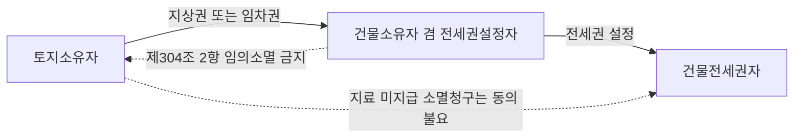

#### ⭐ 기출 출제포인트

1. **필요비 ✕ / 유익비 ○** — 감정평가사 기출에서 최소 3회 이상 정답 선지로 출제된 최다 빈출.
2. **유익비 선택권자는 소유자** — "전세권자의 선택에 좇아"는 오답.
3. **제304조** — 건물전세권의 효력이 지상권·**임차권**에도 미침(임차권을 빼면 오답).
4. **제305조** — 법정지상권을 취득하는 자는 전세권설정자이지 전세권자가 아님.
5. **지료 연체로 인한 지상권소멸청구** — 전세권자의 동의가 없어도 지상권은 소멸(2022년 정답 선지).
6. **전세금증액 — 20분의 1, 1년 제한**, 감액에는 제한 없음.
7. **건물 일부 전세권 — 우선변제는 전부, 경매신청은 목적물만**.

#### 📊 기출 분석

| 연도 | 출제 형태 | 핵심 논점 |
|---|---|---|
| 2019년 기출 | 옳지 않은 것 | 전세권자는 필요비 및 유익비의 상환을 청구할 수 있다(✕) |
| 2021년 기출 | 옳은 것 | 통상의 필요비를 지출한 경우 상환청구 불가(정답 선지) |
| 2022년 기출 | 옳지 않은 것 | 제304조·제305조 / 지료 연체 지상권소멸청구와 전세권자의 동의 |
| 2022년 기출 | 옳지 않은 것 | 전세금증감청구(경제사정 변동) |
| 문제집 47번·48번·49번·51번 | 옳지 않은 것 | 필요비/유익비, 유익비 선택권자 |
| 문제집 43번 | 부당한 것 | 물권적 청구권(반환청구권 포함 여부) |
| 문제집 16번 | 틀린 것 | 전세금증감청구권의 비율 제한은 증액에만 |

**출제 빈도** — 전세권 효력은 전세권 문항의 중핵이다. 특히 비용상환은 거의 매년 한 선지씩 들어간다.

**반복되는 함정 선지** — ① "전세권자는 필요비와 유익비 모두 상환청구할 수 있다"(✕) ② "전세권설정자는 목적물을 사용·수익에 적합한 상태로 유지할 적극적 의무가 있다"(✕) ③ "제305조의 법정지상권을 취득하는 자는 전세권자다"(✕) ④ "전세권자에게는 반환청구권이 없다"(✕) ⑤ "증감청구는 증액·감액 모두 20분의 1 제한을 받는다"(✕).

**최근 경향** — 제304조·제305조를 하나의 문항에 몰아 넣고 지상권소멸청구와 전세권자의 동의 여부를 정답 선지로 삼는 출제가 정착했다(2022년).

#### 🔍 기출 선지로 배우는 법리

> 실제 출제된 선지를 그대로 놓고 O/X와 근거를 확인한다.

**①** 전세권자는 필요비 및 유익비의 상환을 청구할 수 있다. (2019년 기출) — **X**
어디가 틀렸나: 목적물의 현상을 유지하고 통상의 관리에 속한 수선을 해야 할 의무는 전세권자에게 있으므로 필요비상환청구권이 인정되지 않는다(제309조). / 옳게 고치면: "유익비의 상환만 청구할 수 있다".

**②** 전세권자가 통상의 필요비를 지출한 경우 그 비용의 상환을 청구하지 못한다. (2021년 기출) — **O**
근거: 제309조·제310조. 이 선지가 그 해의 정답이었다.

**③** 타인의 토지에 있는 건물에 전세권을 설정한 때에는 전세권의 효력은 그 건물의 소유를 목적으로 한 지상권에 미친다. (2022년 기출) — **O**
근거: 제304조 제1항. 임차권에도 미친다는 점까지 함께 기억한다.

**④** 지상권을 가지는 건물소유자가 그 건물에 전세권을 설정하였으나 그가 2년 이상의 지료를 지급하지 아니하였음을 이유로 지상권설정자가 지상권의 소멸을 청구한 경우, 전세권자의 동의가 없다면 지상권은 소멸되지 않는다. (2022년 기출) — **X**
어디가 틀렸나: 지료 미지급을 이유로 한 지상권소멸청구는 설정자의 '임의적 행위'가 아니므로, 전세권자의 동의와 관계없이 지상권은 소멸한다(2010다43801).

**⑤** 대지와 건물이 동일한 소유자에 속한 경우에 건물에 전세권을 설정한 때에는 그 대지 소유권의 특별승계인은 전세권설정자에 대하여 지상권을 설정한 것으로 본다. (2022년 기출) — **O**
근거: 제305조 제1항. 법정지상권을 취득하는 자는 전세권설정자(건물소유자)다.

**⑥** 전세금이 경제사정의 변동으로 인하여 상당하지 아니하게 된 때에는 당사자는 장래에 대하여 그 증감을 청구할 수 있다. (2022년 기출) — **O**
근거: 제312조의2. 장래에 대하여만 청구할 수 있다는 점이 포인트.

**⑦** 전세권자는 목적물에 대한 방해제거청구권과 방해예방청구권을 가지고 있으나 목적물반환청구권은 없다. (문제집 43번) — **X**
어디가 틀렸나: 전세권은 점유를 수반하므로 반환청구권도 인정된다(제319조, 제213조). 반환청구권이 없는 것은 지역권이다.

**⑧** 전세권자가 전세목적물에 필요비를 지출한 경우, 전세권설정자의 선택에 좇아 그 지출액이나 증가액의 상환을 청구할 수 있다. (문제집 51번) — **X**
어디가 틀렸나: 필요비는 상환청구 자체가 안 된다. '소유자의 선택에 좇아 지출액이나 증가액'은 유익비의 법리다(제310조 제1항).

**⑨** 전세권설정자는 인도한 목적부동산을 사용·수익에 적합한 상태로 유지할 적극적 의무가 있다. (문제집 52번) — **X**
어디가 틀렸나: 설정자는 방해하지 않을 소극적 의무만 진다. 현상유지·통상수선 의무는 전세권자에게 있다.

**⑩** 전세권자와 인지(隣地)소유자 사이에도 상린관계에 관한 규정이 준용된다. (2019년 기출) — **O**
근거: 제319조.

#### ✏️ 사례형 적용

> **사례 1** — 乙이 甲의 건물을 전세권자로 사용하던 중 보일러가 고장 났다. 乙은 자기 비용으로 보일러를 수리하였다. 乙은 甲에게 수리비를 청구할 수 있는가? (문제집 제4장 18번 변형)

**검토** — 보일러 수리는 목적물의 현상을 유지하고 통상의 관리에 속한 수선이므로 제309조에 따라 **전세권자 乙의 의무**다. 따라서 乙은 甲에게 수리 또는 교체를 요구할 수 없고, 스스로 지출한 수리비는 필요비이므로 상환청구도 할 수 없다. **결론: 청구 불가.** (같은 상황에서 乙이 **임차인**이었다면 임대인이 수선의무를 지고 필요비상환청구도 가능하다 — 여기서 전세권과 임차권이 갈린다.)

> **사례 2** — 甲은 자기 소유 X대지와 그 지상 Y건물 중 Y건물에 乙 명의의 전세권을 설정해 주었다. 그 후 甲이 X대지만을 丙에게 매도하여 소유권이전등기를 마쳤다. 丙은 甲에게 건물 철거와 대지 인도를 구한다.

**검토** — 대지와 건물이 동일한 소유자에 속한 경우에 건물에 전세권을 설정한 때에는, 대지소유권의 특별승계인 丙은 전세권설정자 甲에 대하여 지상권을 설정한 것으로 본다(제305조 제1항). 법정지상권을 취득하는 자는 전세권자 乙이 아니라 전세권설정자 甲이다(지상권은 지상물을 소유하기 위한 권리이기 때문). 법률의 규정에 의한 취득이므로 등기 없이도 효력이 있고, 지료는 당사자의 청구에 의하여 법원이 정한다. 또한 丙은 타인에게 그 대지를 임대하거나 이를 목적으로 한 지상권·전세권을 설정하지 못한다(제2항). **결론: 丙의 철거·인도 청구는 이유 없다.**

> **사례 3** — 甲은 A토지에 지상권을 갖고 그 지상 Y건물을 소유하면서 乙에게 건물전세권을 설정해 주었다. 甲이 A토지 소유자 丁에게 2년분 이상의 지료를 지급하지 않자 丁이 지상권소멸을 청구하였다. 乙은 "내 동의가 없었으므로 지상권은 소멸하지 않는다"고 주장한다.

**검토** — 제304조 제2항이 금지하는 것은 포기·기간단축약정 등 설정자의 임의적인 행위에 한정된다(2010다43801). 지료 미지급을 이유로 한 토지소유자의 지상권소멸청구는 설정자의 임의적 행위가 아니므로, 전세권자 乙의 동의 없이도 지상권은 소멸한다. **결론: 乙의 주장은 이유 없다.** (반대로 甲이 스스로 지상권을 **포기**했다면 乙의 동의가 없는 한 전세권자에게 대항할 수 없다.)

#### ⚠️ 이 관의 함정 총정리

1. "전세권자는 필요비·유익비 모두 상환청구할 수 있다"고 하면 틀림 → ==필요비 ✕, 유익비 ○==.
2. "유익비는 전세권자의 선택에 좇아 지출액이나 증가액을 청구한다"고 하면 틀림 → ==소유자의 선택==에 좇는다.
3. "제305조의 법정지상권자는 전세권자다"라고 하면 틀림 → ==전세권설정자(건물소유자)==다.
4. "지료 연체로 인한 지상권소멸청구도 전세권자의 동의가 필요하다"고 하면 틀림 → ==동의 없이도 소멸==(2010다43801).
5. "전세금증감청구는 증액·감액 모두 20분의 1을 넘지 못한다"고 하면 틀림 → ==제한은 증액에만== 있다.

#### ✅ OX 확인문제

> 다음 진술의 참·거짓을 판단하시오.

**1.** 전세권자는 목적물의 현상을 유지하고 그 통상의 관리에 속한 수선을 하여야 한다.
→ **O**. 제309조. 그 결과 필요비상환청구권이 부정된다.

**2.** 전세권자가 목적물의 현상을 유지하기 위하여 지출한 필요비는 전세권설정자에게 그 상환을 청구할 수 있다.
→ **X**. 필요비상환청구권은 전세권자에게 인정되지 않는다.

**3.** 전세권자가 목적물을 개량하기 위하여 지출한 유익비는 가액의 증가가 현존한 경우에 한하여 소유자의 선택에 좇아 지출액이나 증가액의 상환을 청구할 수 있다.
→ **O**. 제310조 제1항.

**4.** 타인의 토지에 있는 건물에 전세권을 설정한 때에는 전세권의 효력은 그 건물의 소유를 목적으로 한 지상권 또는 임차권에 미친다.
→ **O**. 제304조 제1항.

**5.** 건물에 전세권을 설정한 지상권자가 지료를 지급하지 않아 토지소유자가 지상권소멸을 청구한 경우, 전세권자의 동의가 없으면 지상권은 소멸하지 않는다.
→ **X**. 전세권자의 동의 없이도 지상권은 소멸한다(대법원 2010.8.19. 2010다43801).

**6.** 대지와 건물이 동일한 소유자에 속한 경우에 건물에 전세권을 설정한 때에는, 대지소유권의 특별승계인은 전세권자에 대하여 지상권을 설정한 것으로 본다.
→ **X**. 전세권설정자에 대하여 지상권을 설정한 것으로 본다(제305조 제1항).

**7.** 전세금의 증액청구는 약정한 전세금의 20분의 1을 초과하지 못하고, 설정계약이 있은 날 또는 증액이 있은 날로부터 1년 이내에는 하지 못한다.
→ **O**. 제312조의2 단서 시행규정 제2조·제3조.

**8.** 전세권설정자는 목적부동산을 사용·수익에 적합한 상태에 둘 적극적 의무를 부담한다.
→ **X**. 방해하지 않을 소극적 의무만 진다.

**9.** 건물의 일부에 전세권이 설정된 경우 그 전세권자는 건물 전부에 대하여 후순위권리자 기타 채권자보다 전세금의 우선변제를 받을 권리가 있다.
→ **O**. 대법원 1992.3.10. 91마256,257; 대법원 2001.07.02. 2001마212.

**10.** 전세권이 존속기간의 만료로 소멸한 때 전세권설정자의 동의를 얻어 부속시킨 물건에 대해 전세권자는 그 매수를 청구할 수 있다.
→ **O**. 제316조 제2항. 설정자로부터 매수한 부속물도 같다.

#### 🧠 암기법

> 🔑 **비용상환 — "전·지는 유익만, 임차인은 둘 다"**
> **전**세권자·**지**상권자 → ==유익비만==. **임**차인 → 필요비·유익비 **둘 다**.
> 이유도 한 줄: 전세권자·지상권자는 ==현상유지·수선의무를 스스로 지기 때문==.

> 🔑 **제304조 vs 제305조 — "4는 미치고, 5는 본다"**
> 제30**4**조 = 전세권의 효력이 지상권·임차권에 "**미친다**".
> 제30**5**조 = 특별승계인이 전세권설정자에게 지상권을 설정한 것으로 "**본다**".
> 그리고 제305조에서 지상권을 얻는 자는 ==설정자==(건물소유자)이지 전세권자가 아니다.

> 🔑 **증액 제한 — "20분의 1, 1년, 증액만"**
> ==20분의 1==(5%) 한도 · ==1년== 이내 금지 · 제한은 ==증액에만==(감액은 자유).

> 🔑 **건물 일부 전세권 — "우선변제는 전부, 경매는 내 몫만"**
> 우선변제권 → 건물 **전부**. 경매신청권 → **전세권의 목적물**에 한정(독립성이 없어 경매가 불가능해도 나머지 부분에는 신청 불가).

#### ⚖️ 법조문 원문

> 📖 이 관이 근거로 삼은 조문의 **전문**이다. 본문 인용은 발췌지만 여기서는 조 전체를 싣는다. 출처는 법제처 정본이다.

**― 민법 ―**

> 📌 **민법 제2조(신의성실)** — "①권리의 행사와 의무의 이행은 신의에 좇아 성실히 하여야 한다. ②권리는 남용하지 못한다."

> 📌 **민법 제304조(건물의 전세권, 지상권, 임차권에 대한 효력)** — "①타인의 토지에 있는 건물에 전세권을 설정한 때에는 전세권의 효력은 그 건물의 소유를 목적으로 한 지상권 또는 임차권에 미친다. ②전항의 경우에 전세권설정자는 전세권자의 동의없이 지상권 또는 임차권을 소멸하게 하는 행위를 하지 못한다."

> 📌 **민법 제305조(건물의 전세권과 법정지상권)** — "①대지와 건물이 동일한 소유자에 속한 경우에 건물에 전세권을 설정한 때에는 그 대지소유권의 특별승계인은 전세권설정자에 대하여 지상권을 설정한 것으로 본다. 그러나 지료는 당사자의 청구에 의하여 법원이 이를 정한다. ②전항의 경우에 대지소유자는 타인에게 그 대지를 임대하거나 이를 목적으로 한 지상권 또는 전세권을 설정하지 못한다."

> 📌 **민법 제309조(전세권자의 유지, 수선의무)** — "전세권자는 목적물의 현상을 유지하고 그 통상의 관리에 속한 수선을 하여야 한다."

> 📌 **민법 제310조(전세권자의 상환청구권)** — "①전세권자가 목적물을 개량하기 위하여 지출한 금액 기타 유익비에 관하여는 그 가액의 증가가 현존한 경우에 한하여 소유자의 선택에 좇아 그 지출액이나 증가액의 상환을 청구할 수 있다. ②전항의 경우에 법원은 소유자의 청구에 의하여 상당한 상환기간을 허여할 수 있다."

> 📌 **민법 제311조(전세권의 소멸청구)** — "①전세권자가 전세권설정계약 또는 그 목적물의 성질에 의하여 정하여진 용법으로 이를 사용, 수익하지 아니한 경우에는 전세권설정자는 전세권의 소멸을 청구할 수 있다. ②전항의 경우에는 전세권설정자는 전세권자에 대하여 원상회복 또는 손해배상을 청구할 수 있다."

> 📌 **민법 제312조의2(전세금 증감청구권)** — "전세금이 목적 부동산에 관한 조세ㆍ공과금 기타 부담의 증감이나 경제사정의 변동으로 인하여 상당하지 아니하게 된 때에는 당사자는 장래에 대하여 그 증감을 청구할 수 있다. 그러나 증액의 경우에는 대통령령이 정하는 기준에 따른 비율을 초과하지 못한다."

> 📌 **민법 제316조(원상회복의무, 매수청구권)** — "①전세권이 그 존속기간의 만료로 인하여 소멸한 때에는 전세권자는 그 목적물을 원상에 회복하여야 하며 그 목적물에 부속시킨 물건은 수거할 수 있다. 그러나 전세권설정자가 그 부속물건의 매수를 청구한 때에는 전세권자는 정당한 이유없이 거절하지 못한다. ②전항의 경우에 그 부속물건이 전세권설정자의 동의를 얻어 부속시킨 것인 때에는 전세권자는 전세권설정자에 대하여 그 부속물건의 매수를 청구할 수 있다. 그 부속물건이 전세권설정자로부터 매수한 것인 때에도 같다."

### 제4관 전세권의 처분

> 📖 전세권자는 전세금으로 지출한 자본을 회수할 수 있어야 한다. 그래서 민법은 전세권의 ==양도·담보제공·전전세·임대==를 원칙적으로 허용하고(제306조 본문), 설정행위로만 이를 금지할 수 있게 하였다(단서).
> 이 관의 최대 난점은 두 가지다. ① 전세권과 ==전세금반환채권을 떼어낼 수 있는가==, ② 전세권에 설정된 저당권은 ==기간이 끝나면 어떻게 되는가==.

> ⭐ **이 관에서 반드시 챙길 3가지**
> ① 전세권의 양도·담보제공·전전세·임대는 ==전세권설정자의 동의 없이== 할 수 있다(설정행위로 금지한 때에는 예외).
> ② 전세권 ==존속 중에는 전세금반환채권만의 확정적 분리양도 불가==, 다만 ==장래의 조건부 채권으로는 양도 가능==. 존속기간 만료·합의해지 후에는 전세권과 함께(또는 분리하여) 양도할 수 있다.
> ③ 전세권저당권은 전세권이 기간만료로 소멸하면 ==저당권도 소멸==하여 전세권 자체에 실행할 수 없고, ==전세금반환채권에 물상대위==(압류·추심명령·전부명령·배당요구)해야 한다.

#### 1. 의의

전세권의 처분이란 전세권자가 자신의 전세권을 대상으로 하는 법률행위 일체를 말한다. 민법은 네 가지를 명시한다.

- **양도** — 전세권 자체를 타인에게 이전(제306조·제307조).
- **담보제공** — 전세권을 저당권의 목적으로 함(제371조).
- **전전세** — ==전세권자의 전세권을 존속시키면서== 그 전세목적물에 다시 전세권을 설정하는 것(제306조·제308조).
- **임대** — 존속기간 내에서 목적물을 타인에게 임대(제306조·제308조).

| 처분 유형 | 성립 방법 | 설정자의 동의 | 금지 가능 여부 |
|---|---|---|---|
| 양도 | 양도의 합의 + 등기 | 불요 | 설정행위로 금지 가능(제306조 단서) |
| 담보제공(저당권) | 저당권설정계약 + 등기 | 불요 | 설정행위로 금지 가능 |
| 전전세 | 전전세 설정합의 + 등기(부기등기) + 전전세금 지급 | 불요 | 설정행위로 금지 가능 |
| 임대 | 임대차계약 | 불요 | 설정행위로 금지 가능 |
| (비교) 임차권 양도·전대 | 계약 | 임대인의 동의 필요 | — |

> ⚠️ 처분금지 특약은 ==등기하여야 제3자에게 대항==할 수 있다. 또한 전세권자가 소유자의 승낙 없이 전세권을 양도한 사실만으로는 전세권 소멸청구 사유가 되지 않는다(설정행위로 금지되어 있지 않은 한).

#### 2. 요건

| 처분 | 요건 | 비고 |
|---|---|---|
| 양도 | ① 설정행위로 금지되지 않을 것 ② 양도의 합의 ③ 등기 | 양수인은 설정자에 대하여 양도인과 동일한 권리의무를 가진다(제307조) |
| 전전세 | ① 원전세권의 존속 ② 원전세권자와 전전세권자의 설정합의 ③ 등기(부기등기) ④ 전전세금의 지급 ⑤ 존속기간이 원전세권의 존속기간 내 | 전전세금은 원전세금의 한도를 초과할 수 없다(다수설). 원전세권설정자의 동의 불요 |
| 임대 | ① 설정행위로 금지되지 않을 것 ② 존속기간 내일 것 | 제306조 |
| 저당권 설정 | ① 설정행위로 금지되지 않을 것 ② 저당권설정계약 + 등기 | 저당권의 목적물은 물권인 전세권 자체이지 전세금반환채권이 아니다 |
| 전세금반환채권만의 양도 | 전세권 존속 중에는 확정적 분리양도 ✕ / 장래 조건부 채권으로는 ○ | 합의해지·존속기간 만료 후에는 분리양도 가능 |

| 시점 | 전세권만의 양도 | 전세금반환채권만의 양도 | 근거 |
|---|---|---|---|
| 전세권 존속 중 | ○ (전세금반환채권도 함께 이전) | ✕ 확정적 분리양도 불가 / 장래 조건부 채권으로는 ○ | 2001다69122 |
| 존속기간 만료 후 | ○ (담보물권적 권능 + 전세금반환채권 함께) | ○ | 2003다35659 |
| 합의해지 후 | ○ | ○ (양수인은 유효하게 양수) | 핵심요약서 11번 |
| 전세권과 채권의 분리 일반 | 전세권을 피담보채권과 분리하여 양도하는 것은 원칙적으로 ✕ | — | 97다33997 |

#### 3. 효과

| 구분 | 효과 |
|---|---|
| 양도 | 전세권양수인은 전세권설정자에 대하여 전세권양도인과 동일한 권리의무가 있다(제307조). 양도인은 전세권관계에서 이탈한다 |
| 전전세 | 원전세권은 그대로 존속한다. 원전세권이 소멸하면 전전세권도 소멸한다. 전전세권자에게도 제한적이나마 경매권이 인정된다 |
| 전전세·임대의 책임가중 | 전세권자는 전전세 또는 임대하지 아니하였으면 면할 수 있는 불가항력으로 인한 손해에 대하여도 책임을 부담한다(제308조) |
| 저당권 설정 | 저당권의 목적물은 전세권 자체. 전세권 존속 중에는 전세권에 대한 경매로 실행 |
| 저당권 + 기간만료 | 전세권 소멸 → 저당권도 소멸. 전세권 자체에 저당권 실행 불가 |
| 물상대위 | 저당권자는 전세금반환채권에 대하여 압류 및 추심명령 또는 전부명령을 받거나 배당요구를 하는 방법으로 물상대위권을 행사 |
| 제3자 압류가 없는 경우 | 전세권설정자는 전세권자에 대하여만 전세금반환의무를 부담한다 |
| 전세권 포기 제한 | 전세권을 목적으로 저당권을 설정한 자는 저당권자의 동의 없이 전세권을 소멸하게 하는 행위(포기 포함)를 하지 못한다 |

| 전전세 | 내용 |
|---|---|
| 의의 | 전세권자의 전세권을 그대로 존속시키면서 그 전세목적물에 다시 전세권을 설정하는 것 |
| 성질 | 전전세권도 하나의 전세권이다 |
| 설정자의 동의 | 불요 (원전세권설정자의 동의를 요하지 않는다) |
| 등기 | 필요(부기등기) |
| 전전세금 | 지급이 성립요소, 원전세금의 한도를 초과할 수 없다(다수설) |
| 존속기간 | 원전세권의 존속기간 내여야 한다 |
| 원전세권과의 관계 | 전전세권 설정은 원전세권의 효력에 영향 ✕ / 원전세권 소멸 → 전전세권도 소멸 |
| 책임 | 전세권자는 전전세하지 않았더라면 면할 수 있었던 불가항력 손해에 대하여도 책임(제308조) |
| 경매권 | 전전세권자에게도 제한적이나마 경매권 인정 |

#### 4. 관련 조문

> 📌 **민법 제306조(전세권의 양도, 임대 등)** — "전세권자는 전세권을 타인에게 양도 또는 담보로 제공할 수 있고 그 존속기간 내에서 그 목적물을 타인에게 전전세 또는 임대할 수 있다. 그러나 설정행위로 이를 금지한 때에는 그러하지 아니하다."

> 📌 **민법 제307조(전세권양도의 효력)** — "전세권양수인은 전세권설정자에 대하여 전세권양도인과 동일한 권리의무가 있다."

> 📌 **민법 제308조(전전세 등의 경우의 책임)** — "전세권의 목적물을 전전세 또는 임대한 경우에는 전세권자는 전전세 또는 임대하지 아니하였으면 면할 수 있는 불가항력으로 인한 손해에 대하여 그 책임을 부담한다."

> 📌 **민법 제371조(지상권, 전세권을 목적으로 하는 저당권) 제2항** — 전세권을 목적으로 저당권을 설정한 자는 ==저당권자의 동의 없이 전세권을 소멸하게 하는 행위를 하지 못한다==(포기도 포함).

> 📌 **물상대위의 근거** — 민법 제370조, 제342조 및 민사집행법 제273조에 의하여 저당권자는 전세금반환채권에 대하여 물상대위권을 행사한다.

#### 5. 핵심 판례 법리

- **① 존속 중 전세금반환채권만의 확정적 분리양도 불가** — 전세권은 전세금을 지급하고 타인의 부동산을 사용·수익하는 권리로서 전세금의 지급이 없으면 전세권은 성립하지 아니하는 등 전세금은 전세권과 분리될 수 없는 요소일 뿐 아니라, 전세권자는 전세권 자체를 처분하여 전세금으로 지출한 자본을 회수할 수 있으므로, ==전세권이 존속하는 동안은 전세권을 존속시키기로 하면서 전세금반환채권만을 전세권과 분리하여 확정적으로 양도하는 것은 허용되지 않는다==(대법원 2002.08.23. 2001다69122).

- **② 장래의 조건부 채권으로는 양도 가능** — 전세권 존속 중에는 장래에 그 전세권이 소멸하는 경우에 전세금반환채권이 발생하는 것을 조건으로 ==그 장래의 조건부 채권을 양도할 수 있을 뿐==이다(대법원 2002.08.23. 2001다69122).

- **③ 만료 후에는 전세권과 전세금반환채권을 함께 양도 가능** — 존속기간의 경과로 본래의 용익물권적 권능이 소멸하고 담보물권적 권능만 남은 전세권에 대해서도 그 피담보채권인 전세금반환채권과 함께 제3자에게 이를 양도할 수 있다(대법원 2005.03.25. 2003다35659). 합의해지 또는 존속기간 만료의 경우 ==전세금반환채권만의 분리양도==도 유효하다는 것이 판례의 태도다.

- **④ 전세권을 피담보채권과 분리하여 양도할 수 없다** — 전세권을 그 담보하는 전세금반환채권과 분리하여 양도하는 것은 ==원칙적으로 허용되지 않는다==(대법원 1999.2.5. 97다33997).

- **⑤ 담보권의 수반성의 의미** — 담보권의 수반성이란 피담보채권의 처분이 있으면 언제나 담보권도 함께 처분된다는 것이 아니라, 특별한 사정이 없는 한 피담보채권의 처분에 담보권의 처분도 당연히 포함된다고 보는 것이 합리적이라는 것일 뿐이므로, ==담보권의 처분이 따르지 않는 특별한 사정이 있는 경우==에는 채권양수인은 무담보의 채권을 양수한 것이 되고 채권의 처분에 따르지 않은 담보권은 소멸한다(대법원 2004.04.28. 2003다61542).

- **⑥ 전세권저당권의 목적물은 전세권 자체** — 전세권에 대하여 저당권이 설정된 경우 그 저당권의 목적물은 ==물권인 전세권 자체이지 전세금반환채권은 그 목적물이 아니다==(대법원 1999.9.17. 98다31301).

- **⑦ 기간만료 → 저당권도 소멸** — 전세권이 기간만료로 종료된 경우 전세권은 전세권설정등기의 말소등기 없이도 당연히 소멸하고, 저당권의 목적물인 전세권이 소멸하면 저당권도 당연히 소멸하므로, 전세권을 목적으로 한 저당권자는 부동산 소유자에게 ==더 이상 저당권을 주장할 수 없다==(대법원 1999.9.17. 98다31301; 대법원 2014.10.27. 2013다91672).

- **⑧ 물상대위의 행사 방법** — 저당권자는 저당권의 목적물인 전세권에 갈음하여 존속하는 것으로 볼 수 있는 ==전세금반환채권에 대하여 압류 및 추심명령 또는 전부명령을 받거나, 제3자가 전세금반환채권에 대하여 실시한 강제집행절차에서 배당요구를 하는 등의 방법으로 물상대위권을 행사==하여 전세금의 지급을 구하여야 한다(대법원 2014.10.27. 2013다91672; 대법원 2008.03.13. 2006다29372).

- **⑨ 제3자의 압류가 없으면 전세권자에게만 지급** — 전세권저당권이 설정된 경우에도 전세권이 기간만료로 소멸되면 전세권설정자는 ==전세금반환채권에 대한 제3자의 압류 등이 없는 한 전세권자에 대하여만 전세금반환의무를 부담한다==(대법원 1999.9.17. 98다31301).

- **⑩ 악의의 전세권저당권자에 대한 대항** — 임대차보증금반환채권을 담보할 목적으로 마쳐진 유효한 전세권에 저당권을 설정받은 자가 그 사정을 알고 있었다면, 제3채무자인 전세권설정자는 ==그 임대차계약에 따른 연체차임 등의 공제 주장으로 대항할 수 있다==(대법원 2021.12.30. 2018다268538).

- **⑪ 전전세권의 설정에 설정자의 동의는 필요 없다** — 전전세권도 하나의 전세권이므로 그 설정에 원전세권자와 전전세권자 간의 전전세권 설정의 합의 및 등기를 요하지만, ==원전세권설정자의 동의를 요하지 않는다==.

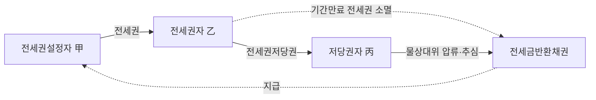

#### ⭐ 기출 출제포인트

1. **존속 중 분리양도 불가 / 조건부 양도 가능** — 두 문장이 한 세트로 매년 출제된다.
2. **전세권저당권의 목적물은 전세권 자체**, 전세금반환채권이 아니다.
3. **기간만료 시 전세권 자체에 저당권 실행 불가 → 물상대위**.
4. **저당권설정자는 저당권자의 동의 없이 전세권을 소멸하게 하는 행위를 하지 못한다**(제371조 제2항).
5. **전전세는 설정자의 동의 불요**, 존속기간은 원전세권 범위 내, 전전세금은 원전세금 한도 내.
6. **제308조의 책임가중** — 전전세·임대하지 않았으면 면할 수 있었던 불가항력 손해까지 책임.

#### 📊 기출 분석

| 연도 | 출제 형태 | 핵심 논점 |
|---|---|---|
| 2020년 기출 | 옳은 것 | 전세금반환채권만의 확정적 분리양도 불가(정답 선지) |
| 2021년 기출 | 옳지 않은 것 | 전세권저당권 — 기간만료 시 전세권 자체 실행 가능(✕), 물상대위 |
| 감정평가사 기출 | 옳지 않은 것 | 장래의 조건부 전세금반환채권 양도 가능 |
| 2023년 기출 | 옳은 것 | 전전세 — "존속기간 내에서 전전세할 수 없다"(✕) |
| 문제집 15번 | 틀린 것 | 전전세권이 설정되면 원전세권은 소멸한다(✕) |
| 문제집 58번·61번·62번 | 옳은 것/박스형 | 전전세 동의 불요, 전세권저당권 물상대위 |

**출제 빈도** — 전세권 처분은 전세권 단독 문항의 단골 소재이고, 특히 2021년에는 「전세권을 목적으로 하는 저당권」이 **한 문항 전체로** 출제되었다.

**반복되는 함정 선지** — ① "전세권의 존속기간이 만료된 경우 저당권자는 전세권 자체에 대해 저당권을 실행할 수 있다"(✕) ② "전세금반환채권은 저당권의 목적물이다"(✕) ③ "전전세권이 설정되면 원전세권은 소멸한다"(✕) ④ "전전세에는 원전세권설정자의 동의가 필요하다"(✕) ⑤ "전세권 존속 중에도 전세금반환채권만을 확정적으로 양도할 수 있다"(✕).

**최근 경향** — 전세권저당권 + 임대차보증금 담보목적 전세권을 결합한 복합 사례형(2025년)이 등장했다. 물상대위와 연체차임 공제 대항 여부가 새 논점이다.

#### 🔍 기출 선지로 배우는 법리

> 실제 출제된 선지를 그대로 놓고 O/X와 근거를 확인한다.

**①** 전세권이 존속하는 중에 전세권자는 전세권을 그대로 둔 채 전세금반환채권만을 확정적으로 양도하지 못한다. (2020년 기출) — **O**
근거: 대법원 2002.08.23. 2001다69122. 그 해의 정답 선지였다.

**②** 전세권 존속 중에는 장래에 그 전세권이 소멸하는 경우에 전세금반환채권이 발생하는 것을 조건으로 그 장래의 조건부 채권을 양도할 수 있다. (감정평가사 기출) — **O**
근거: 같은 판례. 확정적 양도 ✕ / 조건부 양도 ○의 대비를 기억한다.

**③** 전세권의 존속기간이 만료된 경우 저당권자는 전세권 자체에 대해 저당권을 실행할 수 있다. (2021년 기출) — **X**
어디가 틀렸나: 전세권이 소멸하면 저당권도 당연히 소멸하므로 전세권 자체에 실행할 수 없다(98다31301). / 옳게 고치면: "전세금반환채권에 대하여 물상대위할 수 있다".

**④** 전세권의 존속기간이 만료되면 저당권자는 전세금반환채권에 대하여 물상대위할 수 있다. (2021년 기출) — **O**
근거: 대법원 2014.10.27. 2013다91672; 대법원 2008.03.13. 2006다29372.

**⑤** 전세금반환채권은 저당권의 목적물이 아니다. (2021년 기출) — **O**
근거: 저당권의 목적물은 물권인 전세권 자체다(98다31301).

**⑥** 저당권설정자는 저당권자의 동의 없이 전세권을 소멸하게 하는 행위를 하지 못한다. (2021년 기출) — **O**
근거: 제371조 제2항. 포기도 여기에 포함된다.

**⑦** 전세권자는 특별한 사정이 없는 한 전세권의 존속기간 내에서 전세목적물을 타인에게 전전세 할 수 없다. (2023년 기출) — **X**
어디가 틀렸나: 전세권은 설정자의 동의 없이도 양도·임대·전전세·담보로 제공할 수 있다(제306조 본문).

**⑧** 전전세권이 설정되면 원전세권은 소멸한다. (문제집 제4장 15번) — **X**
어디가 틀렸나: 전전세는 전세권자의 전세권을 그대로 존속시키면서 다시 전세권을 설정하는 것이다. 반대로 원전세권이 소멸하면 전전세권이 소멸한다.

**⑨** 전전세권의 설정에는 원전세권자와 전전세권자 사이의 전전세권 설정의 합의 및 등기와 원전세권설정자의 동의를 요한다. (문제집 58번) — **X**
어디가 틀렸나: 원전세권설정자의 동의는 요하지 않는다. 설정계약과 등기(부기등기)로 성립한다.

**⑩** 전세권의 목적물을 전전세 또는 임대한 경우에는 전세권자는 전전세 또는 임대하지 아니하였으면 면할 수 있는 불가항력으로 인한 손해에 대하여 그 책임을 부담한다. (핵심요약서 26번) — **O**
근거: 제308조. 처분의 자유에 대응하는 책임가중이다.

#### ✏️ 사례형 적용

> **사례 1** — 甲은 자기 건물에 乙 명의의 전세권(전세금 1억 원, 존속기간 2년)을 설정해 주었다. 전세권 존속 중 乙은 丙에게 "전세권은 내가 그대로 갖고, 전세금반환채권 1억 원만 넘긴다"는 내용으로 채권양도를 하고 甲에게 통지하였다.

**검토** — 전세금은 전세권과 분리될 수 없는 요소이고, 전세권자는 전세권 자체를 처분하여 자본을 회수하도록 되어 있으므로, 전세권 존속 중 전세금반환채권만의 확정적 분리양도는 허용되지 않는다(2001다69122). **결론: 무효.** 다만 乙이 "장차 전세권이 소멸하여 전세금반환채권이 발생하는 것을 조건으로" 그 장래의 조건부 채권을 丙에게 양도하는 것은 가능하다. 또 존속기간이 만료되거나 합의해지된 뒤라면 분리양도가 유효하다.

> **사례 2** — 甲은 자신의 건물에 乙 명의의 전세권(전세금 1억 원)을 설정해 주었고, 乙은 그 전세권에 丙 명의의 저당권(피담보채권 7,000만 원)을 설정해 주었다. 그 후 전세권의 존속기간이 만료되었다. 丙은 어떻게 채권을 회수하는가?

**검토** — ① 전세권이 기간만료로 종료되면 전세권은 말소등기 없이도 당연히 소멸하고, 목적물인 전세권이 소멸하면 저당권도 당연히 소멸한다(98다31301). 따라서 丙은 전세권 자체에 저당권을 실행할 수 없다. ② 丙은 전세금반환채권에 대하여 압류 및 추심명령 또는 전부명령을 받거나 배당요구를 하는 방법으로 물상대위권을 행사하여야 한다(2013다91672). ③ 만약 丙이 아무런 압류도 하지 않았다면, 甲은 전세권자 乙에 대하여만 전세금반환의무를 부담하고 乙에게 지급하면 면책된다. **결론: 丙은 즉시 물상대위 절차를 밟아야 한다.**

> **사례 3** — 乙은 甲 소유 건물에 전세권을 갖고 있다. 설정계약에 처분금지 특약은 없다. 乙은 甲의 동의 없이 丁에게 그 목적물을 전전세하였고, 그 후 벼락으로 건물 일부가 훼손되었다. 이 손해는 乙이 전전세를 하지 않았더라면 피할 수 있었던 것이었다.

**검토** — ① 처분금지 특약이 없으므로 甲의 동의 없이 전전세할 수 있다(제306조 본문). 소유자의 승낙 없이 처분했다는 사정만으로 소멸청구 사유가 되지도 않는다. ② 그러나 전세권자는 전전세하지 아니하였으면 면할 수 있는 불가항력으로 인한 손해에 대하여 책임을 부담한다(제308조). **결론: 전전세 자체는 적법하나, 乙은 그 불가항력 손해를 배상해야 한다.**

#### ⚠️ 이 관의 함정 총정리

1. "전세권을 양도하거나 전전세하려면 설정자의 동의가 필요하다"고 하면 틀림 → ==동의 불요==(설정행위로 금지한 때만 예외).
2. "전세권 존속 중에도 전세금반환채권만을 확정적으로 양도할 수 있다"고 하면 틀림 → ==조건부 양도만 가능==.
3. "전세권저당권의 목적물은 전세금반환채권이다"라고 하면 틀림 → ==물권인 전세권 자체==.
4. "기간이 만료되어도 전세권 자체에 저당권을 실행할 수 있다"고 하면 틀림 → ==저당권도 소멸, 물상대위만 가능==.
5. "전전세권이 설정되면 원전세권이 소멸한다"고 하면 틀림 → ==원전세권은 그대로 존속==하고, 반대로 원전세권이 소멸하면 전전세권이 소멸한다.

#### ✅ OX 확인문제

> 다음 진술의 참·거짓을 판단하시오.

**1.** 전세권자는 설정행위로 금지되지 않은 한 전세권설정자의 동의 없이 전세권을 양도하거나 담보로 제공할 수 있다.
→ **O**. 제306조 본문·단서.

**2.** 전세권양수인은 전세권설정자에 대하여 전세권양도인과 동일한 권리의무가 있다.
→ **O**. 제307조.

**3.** 전세권이 존속하는 동안에 전세권을 존속시키기로 하면서 전세금반환채권만을 전세권과 분리하여 확정적으로 양도할 수 없다.
→ **O**. 대법원 2002.08.23. 2001다69122.

**4.** 전세권 존속 중에는 장래에 전세권이 소멸하는 경우 전세금반환채권이 발생하는 것을 조건으로 그 장래의 조건부 채권을 양도할 수 있다.
→ **O**. 같은 판례. 확정적 양도는 ✕, 조건부 양도는 ○.

**5.** 존속기간의 경과로 담보물권적 권능만 남은 전세권은 전세금반환채권과 함께 제3자에게 양도할 수 없다.
→ **X**. 양도할 수 있다(대법원 2005.03.25. 2003다35659).

**6.** 전세권에 저당권이 설정된 경우 그 저당권의 목적물은 전세금반환채권이다.
→ **X**. 목적물은 물권인 전세권 자체다(대법원 1999.9.17. 98다31301).

**7.** 전세권을 목적으로 한 저당권이 설정된 후 전세권의 존속기간이 만료되면 저당권자는 전세권 자체에 대하여 저당권을 실행할 수 있다.
→ **X**. 저당권도 당연히 소멸하여 실행할 수 없고, 전세금반환채권에 물상대위해야 한다.

**8.** 전세권을 목적으로 저당권을 설정한 자는 저당권자의 동의 없이 전세권을 소멸하게 하는 행위를 하지 못한다.
→ **O**. 제371조 제2항. 전세권의 포기도 여기에 포함된다.

**9.** 전전세권의 설정에는 원전세권설정자의 동의가 필요하다.
→ **X**. 동의는 필요 없고, 원전세권자와 전전세권자의 설정합의 및 등기로 성립한다.

**10.** 전세권의 목적물을 임대한 경우, 전세권자는 임대하지 아니하였으면 면할 수 있었던 불가항력으로 인한 손해에 대하여도 책임을 부담한다.
→ **O**. 제308조.

#### 🧠 암기법

> 🔑 **처분 4형제 — "양·담·전·임"**
> **양**도 · **담**보제공 · **전**전세 · **임**대. 전부 ==설정자의 동의 없이== 가능하고, ==설정행위로만 금지== 가능(제306조).
> 임차권은 정반대 — "임대인의 동의 없으면 아무것도 못 한다".

> 🔑 **분리양도 — "존속 중엔 조건부만, 끝나면 자유"**
> 전세권 **존속 중** → 확정적 분리양도 ✕ / ==조건부 양도 ○==.
> 기간만료·합의해지 **후** → ==분리양도 ○==.

> 🔑 **전세권저당권 — "전멸저멸, 대위로 산다"**
> **전**세권 **멸** → **저**당권 **멸**. 그 다음은 ==물상대위==(압류·추심명령·전부명령·배당요구)로만 산다.
> 그리고 압류가 없으면 설정자는 ==전세권자에게만== 갚으면 된다.

> 🔑 **전전세 — "동의는 없고, 한도와 기간은 있다"**
> 설정자 **동의 ✕** / 전전세금은 ==원전세금 한도 내== / 존속기간은 ==원전세권 기간 내==.

#### ⚖️ 법조문 원문

> 📖 이 관이 근거로 삼은 조문의 **전문**이다. 본문 인용은 발췌지만 여기서는 조 전체를 싣는다. 출처는 법제처 정본이다.

**― 민법 ―**

> 📌 **민법 제306조(전세권의 양도, 임대 등)** — "전세권자는 전세권을 타인에게 양도 또는 담보로 제공할 수 있고 그 존속기간내에서 그 목적물을 타인에게 전전세 또는 임대할 수 있다. 그러나 설정행위로 이를 금지한 때에는 그러하지 아니하다."

> 📌 **민법 제307조(전세권양도의 효력)** — "전세권양수인은 전세권설정자에 대하여 전세권양도인과 동일한 권리의무가 있다."

> 📌 **민법 제308조(전전세 등의 경우의 책임)** — "전세권의 목적물을 전전세 또는 임대한 경우에는 전세권자는 전전세 또는 임대하지 아니하였으면 면할 수 있는 불가항력으로 인한 손해에 대하여 그 책임을 부담한다."

> 📌 **민법 제371조(지상권, 전세권을 목적으로 하는 저당권)** — "①본장의 규정은 지상권 또는 전세권을 저당권의 목적으로 한 경우에 준용한다. ②지상권 또는 전세권을 목적으로 저당권을 설정한 자는 저당권자의 동의없이 지상권 또는 전세권을 소멸하게 하는 행위를 하지 못한다."

### 제5관 전세권의 소멸

> 📖 전세권의 마지막 국면이다. 어떤 사유로 소멸하는가(소멸사유)와, 소멸하면 무엇이 남는가(소멸의 효과)로 나뉜다.
> 효과 쪽의 핵심은 ==전세금반환과 목적물 인도 + 말소등기서류 교부의 동시이행==(제317조), 그리고 ==경매청구권과 우선변제권의 범위==다. 건물 일부에 전세권이 설정된 경우의 처리는 거의 모든 해에 출제된다.

> ⭐ **이 관에서 반드시 챙길 3가지**
> ① 전세금반환의무 ↔ ==목적물 인도 + 전세권설정등기 말소등기에 필요한 서류 교부==는 **동시이행**이다. 인도만 하고 서류를 주지 않으면 설정자는 전세금 반환을 거부할 수 있다.
> ② 건물 일부 전세권자는 ==건물 전부에 우선변제권==이 있으나, ==목적물이 아닌 나머지 부분에는 경매신청권이 없다==(독립성이 없어 경매가 불가능해도 마찬가지).
> ③ 목적물의 소유권이 이전되면 ==신 소유자가 전세금반환의무를 부담==하고 구 소유자는 그 의무를 면한다.

#### 1. 의의

전세권의 소멸이란 전세권이 종국적으로 효력을 잃는 것을 말한다. 다만 존속기간 만료의 경우 ==용익물권적 권능만 즉시 소멸==하고, 전세금반환채권을 담보하는 ==담보물권적 권능은 전세금 반환 시까지 존속==한다(2003다35659). 따라서 "전세권의 소멸"은 단계적으로 일어난다.

#### 2. 요건

| 구분 | 소멸사유 | 근거·비고 |
|---|---|---|
| **물권 일반의 소멸사유** | 목적물의 멸실 / 존속기간의 만료 / 혼동 / 소멸시효 / 전세권에 우선하는 저당권의 실행에 의한 경매 / 공용징수 | — |
| **전세권 특유의 소멸사유** | ① 전세권설정자의 소멸청구(용법위반) ② 전세권의 소멸통고 ③ 목적부동산의 멸실 ④ 전세권의 포기 ⑤ 기타 약정소멸사유 | 제311조, 제313조, 제314조·제315조, 제371조 제2항 |

| 구분 | 소멸청구(제311조) | 소멸통고(제313조) |
|---|---|---|
| 행사 주체 | 전세권설정자만 | 각 당사자 쌍방 |
| 사유 | 전세권자가 설정계약 또는 목적물의 성질에 의해 정해진 용법대로 사용·수익하지 않은 경우 | 존속기간을 약정하지 않은 경우 |
| 효력 발생 | 물권적 단독행위 — 등기하여야 효력(제186조) | 물권적 단독행위 — 등기하여야 효력. 통고 받은 날로부터 6월 경과 |
| 부수 효과 | 설정자는 원상회복 또는 손해배상 청구 가능(제311조 제2항) | — |
| 예 | 처분금지 특약 위반, 유지·수선의무 불이행 | — |

| 멸실의 태양 | 효과 | 근거 |
|---|---|---|
| 전부멸실(사유 불문) | 전세권 소멸 | 제314조 제1항 |
| 일부멸실(사유 불문) | 그 멸실된 부분의 전세권만 소멸 | 제314조 제1항 |
| 불가항력 일부멸실 + 잔존부분으로 목적 달성 불가 | 전세권자는 전세권 전부의 소멸을 통고하고 전세금 반환 청구 가능. 이 통고에는 6월의 기간이 요구되지 않는다(통설) | 제314조 제2항 |
| 전세권자의 귀책사유로 멸실 | 전세권자는 손해배상책임. 설정자는 전세금으로 손해배상에 충당하고 잉여는 반환, 부족은 다시 청구 | 제315조 |
| 포기 | 원칙적으로 자유. 다만 전세권이 제3자의 권리의 목적인 경우 그 제3자의 동의 없이 포기 불가 | 제371조 제2항 |

#### 3. 효과

| 구분 | 효과 |
|---|---|
| 동시이행 | 목적물의 인도 및 전세권설정등기 말소등기에 필요한 서류의 교부 ↔ 전세금의 반환(제317조) |
| 경매청구권 | 전세권설정자가 전세금의 반환을 지체한 때, 전세권자는 민사집행법이 정한 바에 따라 전세목적물의 경매를 청구(제318조) |
| 우선변제권 | 그 부동산 전부에 대하여 후순위권리자 기타 채권자보다 전세금의 우선변제(제303조 제1항) |
| 전세권자의 부속물매수청구권 | 설정자의 동의를 얻어 부속시켰거나 설정자로부터 매수한 부속물 — 형성권(제316조 제2항) |
| 전세권설정자의 부속물매수청구권 | 설정자도 매수를 청구할 수 있고, 전세권자는 정당한 이유 없이 거절하지 못한다(제316조 제1항 단서) |
| 유익비상환청구권 | 가액의 증가가 현존하는 경우 지출액 또는 증가액(제310조 제1항) |
| 원상회복의무·부속물수거권 | 전세권자는 목적물을 원상에 회복하여야 하고, 부속시킨 물건을 수거할 수 있다(제316조 제1항) |
| 전세권자의 손해배상책임 | 목적물이 전세권자의 귀책사유로 멸실된 때(제315조 제1항) |
| 전세금반환의무자 | 소유권이 이전된 경우 신 소유자가 부담하고 구 소유자는 면한다(2006다6072, 99다15122) |

| 건물 일부에 전세권이 설정된 경우 | 목적물인 부분 | 목적물이 아닌 나머지 건물부분 |
|---|---|---|
| 우선변제권 | ○ | ○ (건물 전부에 대하여) |
| 경매신청권 | ○ | ✕ |
| 목적 부분이 구조상·이용상 독립성이 없어 그 부분만의 경매가 불가능한 경우 | — | 여전히 경매신청권 ✕ |
| 근거 | 제303조 제1항, 제318조 | 91마256,257 / 2001마212 |

| 동시이행의 구조 | 전세권자의 의무 | 전세권설정자의 의무 |
|---|---|---|
| 내용 | ① 목적물의 인도 ② 전세권설정등기 말소등기에 필요한 서류의 교부 | 전세금의 반환 |
| 인도만 한 경우 | 이행제공 불충분 | 전세금 반환 거부 가능, 이자 상당액을 부당이득한 것도 아님 |
| 경매청구의 전제 | 이행제공을 완료하여 설정자를 이행지체에 빠뜨려야 함 | — |
| (비교) 임대차 | 목적물 반환 | 임대보증금 반환 — 역시 동시이행 |

#### 4. 관련 조문

> 📌 **민법 제311조(전세권의 소멸청구)** — "① 전세권자가 전세권설정계약 또는 그 목적물의 성질에 의하여 정하여진 용법으로 이를 사용, 수익하지 아니한 경우에는 전세권설정자는 전세권의 소멸을 청구할 수 있다. ② 전항의 경우에는 전세권설정자는 전세권자에 대하여 원상회복 또는 손해배상을 청구할 수 있다."

> 📌 **민법 제313조(전세권의 소멸통고)** — "전세권의 존속기간을 약정하지 아니한 때에는 각 당사자는 언제든지 상대방에 대하여 전세권의 소멸을 통고할 수 있고, 상대방이 이 통고를 받은 날로부터 6월이 경과하면 전세권은 소멸한다."

> 📌 **민법 제314조(불가항력으로 인한 멸실)** — "① 전세권의 목적물의 전부 또는 일부가 불가항력으로 인하여 멸실된 때에는 그 멸실된 부분의 전세권은 소멸한다. ② 전항의 일부멸실의 경우에 전세권자가 그 잔존부분으로 전세권의 목적을 달성할 수 없는 때에는 전세권설정자에 대하여 전세권전부의 소멸을 통고하고 전세금의 반환을 청구할 수 있다."

> 📌 **민법 제315조(전세권자의 손해배상책임)** — "① 전세권의 목적물의 전부 또는 일부가 전세권자에 책임 있는 사유로 인하여 멸실된 때에는 전세권자는 손해를 배상할 책임이 있다. ② 전항의 경우에 전세권설정자는 전세권이 소멸된 후 전세금으로써 손해의 배상에 충당하고 잉여가 있으면 반환하여야 하며 부족이 있으면 다시 청구할 수 있다."

> 📌 **민법 제317조(전세권의 소멸과 동시이행)** — "전세권이 소멸한 때에는 전세권설정자는 전세권자로부터 그 목적물의 인도 및 전세권설정등기의 말소등기에 필요한 서류의 교부를 받는 동시에 전세금을 반환하여야 한다."

> 📌 **민법 제318조(전세권자의 경매청구권)** — "전세권설정자가 전세금의 반환을 지체한 때에는 전세권자는 민사집행법의 정한 바에 의하여 전세목적물의 경매를 청구할 수 있다."

#### 5. 핵심 판례 법리

- **① 만료 시 소멸의 이중구조** — 전세권의 존속기간이 만료되면 용익물권적 권능은 전세권설정등기의 말소 없이도 당연히 소멸하고, 전세금반환채권을 담보하는 ==담보물권적 권능의 범위 내에서 전세금의 반환 시까지 등기의 효력이 존속==한다(대법원 2005.03.25. 2003다35659).

- **② 합의해지의 경우도 동일** — 전세권이 존속기간의 만료나 합의해지 등으로 종료하면 용익물권적 권능은 소멸하고 담보물권적 권능의 범위 내에서 전세금 반환 시까지 등기의 효력이 존속한다(대법원 2015.11.17. 2014다10694).

- **③ 기간만료 시 말소등기 불요** — 전세권이 기간만료로 종료된 경우 전세권은 ==전세권설정등기의 말소등기 없이도 당연히 소멸==한다(대법원 1999.9.17. 98다31301). 전세권저당권이 설정된 경우에도 마찬가지다.

- **④ 인도만으로는 부족하다** — 전세권설정자는 전세권자로부터 그 목적물의 인도 및 전세권설정등기의 말소등기에 필요한 서류의 교부를 받는 동시에 전세금을 반환할 의무가 있을 뿐이므로, 전세권자가 목적물을 인도하였다고 하더라도 말소등기에 필요한 서류를 교부하거나 그 이행의 제공을 하지 아니하는 이상 전세권설정자는 전세금의 반환을 거부할 수 있고, 이 경우 설정자가 ==전세금에 대한 이자 상당액의 이득을 법률상 원인 없이 얻는다고 볼 수 없다==(대법원 2002.02.05. 2001다62091).

- **⑤ 경매청구의 전제** — 전세권자의 전세목적물 인도의무 및 전세권설정등기 말소등기의무와 전세권설정자의 전세금반환의무는 서로 동시이행의 관계에 있으므로, ==전세권자가 경매를 청구하려면 우선 인도의무 및 말소의무의 이행제공을 완료하여 전세권설정자를 이행지체에 빠뜨려야 한다==(대법원 1977.04.13. 77마90).

- **⑥ 소유권 이전 시 전세금반환의무자** — 전세권은 전세권자와 목적물의 소유권을 취득한 신 소유자 사이에서 계속 동일한 내용으로 존속하므로, ==신 소유자가 전세권설정자의 지위에서 전세금반환의무를 부담한다==(대법원 2006.05.11. 2006다6072).

- **⑦ 구 소유자는 의무를 면한다** — 위 법리의 귀결로 ==구 소유자는 전세권설정자의 지위를 상실하여 전세금반환의무를 면한다==(대법원 2000.6.9. 99다15122). 따라서 경매대금으로 전세금의 일부만 만족받은 전세권자가 나머지를 전 소유자에게 청구할 수는 없다.

- **⑧ 건물 일부 전세권의 우선변제 범위** — 건물의 일부에 전세권이 설정되어 있는 경우 그 전세권자는 제303조 제1항·제318조에 의하여 ==그 건물 전부에 대하여== 후순위 권리자 기타 채권자보다 전세금의 우선변제를 받을 권리가 있다(대법원 1992.3.10. 91마256,257).

- **⑨ 그러나 경매신청권은 없다** — 건물의 일부에 전세권이 설정된 경우, 전세권의 목적물이 아닌 나머지 건물부분에 대하여는 우선변제권은 별론으로 하고 경매신청권은 없으며, 그 전세권의 목적이 된 부분이 ==구조상 또는 이용상 독립성이 없어 그 부분만의 경매신청이 불가능한 경우에도 마찬가지==다(대법원 2001.07.02. 2001마212).

- **⑩ 임차인 지위와 전세권자 지위의 배당요구** — 주택임대차보호법상 임차인으로서의 지위와 전세권자로서의 지위를 함께 가지고 있는 자가 그 중 ==임차인으로서의 지위에 기하여 배당요구를 하였다면, 배당요구를 하지 아니한 전세권에 관하여는 배당요구가 있는 것으로 볼 수 없다==(대법원 2010.06.24. 2009다40790).

- **⑪ 선순위 전세권과 후순위 저당권** — 이미 전세권이 있는 부동산에 저당권이 설정된 경우, 저당권자가 경매를 신청하더라도 기간이 만료하지 않은 전세권은 소멸하지 않는다. 다만 전세권자가 남은 기한의 이익을 포기하고 ==배당을 요구하면 전세권은 소멸==한다(민사집행법 제91조 제4항). 반대로 저당권이 먼저 설정된 경우에는 누가 경매를 신청하든 저당권과 전세권이 모두 소멸한다.

#### ⭐ 기출 출제포인트

1. **동시이행** — "전세목적물의 인도가 전세금 반환보다 선이행되어야 한다"(✕)가 2023년 오답 선지.
2. **인도만으로는 부족** — 말소등기서류 교부·이행제공까지 있어야 이행지체.
3. **건물 일부 전세권 — 경매신청권 없음** — 거의 매년 등장.
4. **소유권 이전 시 신 소유자가 전세금반환의무** — 2021년·2025년 출제.
5. **제315조** — 전세권자 귀책으로 멸실 시 전세금으로 손해배상에 충당(2022년 출제).
6. **소멸통고 6월** — "즉시 소멸"(✕).
7. **선순위 전세권 + 후순위 저당권 실행 시 전세권의 운명**.

#### 📊 기출 분석

| 연도 | 출제 형태 | 핵심 논점 |
|---|---|---|
| 2021년 기출 | 옳은 것 | 건물 일부 전세권의 경매신청권(✕), 소유권 이전과 전세금반환채무 |
| 2022년 기출 | 옳지 않은 것 | 제315조 — 전세권자 귀책 멸실 시 전세금으로 손해배상 충당 |
| 2023년 기출 | 옳은 것 | 인도가 전세금 반환보다 선이행되어야 한다(✕), 건물 일부 경매신청권 |
| 2025년 기출 | 사례형 | 보증금반환 지체 시 전세권에 기한 경매 신청 가부, 연체차임 공제 |
| 문제집 46번·47번 | 옳지 않은 것 | 동시이행(교부를 받은 "후"에 반환하면 된다 → ✕) |
| 문제집 17번 | 옳지 않은 것 | 소멸통고 후 즉시 소멸(✕) |
| 문제집 55번·57번 | 틀린 것/옳은 것 | 신 소유자의 전세금반환의무, 구 소유자의 면책 |

**출제 빈도** — 소멸의 효과, 특히 동시이행과 건물 일부 전세권의 경매신청권은 전세권 논점 중 **가장 반복 출제되는 두 축**이다.

**반복되는 함정 선지** — ① "전세권자의 목적물 인도는 전세금 반환보다 선이행되어야 한다"(✕) ② "말소등기서류를 받은 **후에** 전세금을 반환하면 된다"(✕ — **동시**이행이다) ③ "건물 일부 전세권자도 건물 전부에 경매신청할 수 있다"(✕) ④ "소유권이 이전되어도 전세금반환채무는 구 소유자가 진다"(✕) ⑤ "소멸통고 도달 즉시 전세권이 소멸한다"(✕).

**최근 경향** — 2025년에는 임대차보증금 담보목적 전세권에서 경매신청 가부 + 연체차임 공제를 함께 물어, 소멸의 효과를 담보목적 전세권 법리와 결합시켰다.

#### 🔍 기출 선지로 배우는 법리

> 실제 출제된 선지를 그대로 놓고 O/X와 근거를 확인한다.

**①** 전세권이 소멸된 경우, 전세권자의 전세목적물의 인도는 전세금의 반환보다 선이행되어야 한다. (2023년 기출) — **X**
어디가 틀렸나: 인도의무·말소등기의무와 전세금반환의무는 서로 동시이행의 관계에 있다(제317조, 77마90).

**②** 건물 일부의 전세권자는 나머지 건물 부분에 대해서도 경매신청권이 있다. (2023년 기출) — **X**
어디가 틀렸나: 나머지 건물부분에 대하여는 우선변제권은 있지만 경매신청권은 없다(2001마212).

**③** 건물의 일부에 전세권이 설정된 경우 전세권의 목적물이 아닌 나머지 부분에 대해서도 경매를 신청할 수 있다. (2021년 기출) — **X**
어디가 틀렸나: 위와 같다. 이 선지는 두 해에 걸쳐 같은 취지로 출제되었다.

**④** 전세권이 성립한 후 목적물의 소유권이 이전되더라도 전세금반환채무가 당연히 신소유자에게 이전되는 것은 아니다. (2021년 기출) — **X**
어디가 틀렸나: 신 소유자에게 이전된다(2006다6072, 99다15122).

**⑤** 전세권의 목적물의 전부 또는 일부가 전세권자에 책임있는 사유로 인하여 멸실된 경우, 전세권설정자는 전세권이 소멸된 후 전세금으로써 손해의 배상에 충당할 수 있다. (2022년 기출) — **O**
근거: 제315조 제2항. 잉여가 있으면 반환하고 부족하면 다시 청구할 수 있다.

**⑥** 전세권자가 그 목적물의 성질에 의하여 정하여진 용법으로 이를 사용, 수익하지 아니한 경우에는 전세권설정자는 전세권의 소멸을 청구할 수 있다. (감정평가사 기출) — **O**
근거: 제311조 제1항.

**⑦** 전세권이 소멸한 때에는 전세권설정자는 전세권자로부터 목적물의 인도 및 전세권설정등기의 말소등기에 필요한 서류의 교부를 받은 후에 전세금을 반환하면 된다. (문제집 46번) — **X**
어디가 틀렸나: "받은 **후에**"가 아니라 받는 **동시에** 반환하여야 한다(제317조, 2001다62091).

**⑧** 전세권의 존속기간을 약정하지 않은 경우 각 당사자는 언제든지 소멸을 통고할 수 있고 상대방이 통고를 받은 날로부터 즉시 전세권은 소멸한다. (문제집 17번) — **X**
어디가 틀렸나: 6월이 경과하여야 소멸한다(제313조).

**⑨** 전세목적물의 소유자가 바뀐 경우, 목적물의 경매대금으로 전세금채권의 일부밖에 만족 받지 못한 전세권자는 나머지 부분에 대해서는 전 소유자에 대하여 전세금반환을 청구하여야 한다. (문제집 55번) — **X**
어디가 틀렸나: 구 소유자는 전세금반환의무를 면한다(99다15122). 상대방은 신 소유자다.

**⑩** 전세권이 존속기간의 만료로 소멸한 때에는 전세권자는 전세권설정자에 대하여 그의 동의를 얻어 부속시킨 부속물의 매수를 청구할 수 있다. (문제집 47번) — **O**
근거: 제316조 제2항.

#### ✏️ 사례형 적용

> **사례 1** — 甲 소유 X건물에 대한 乙의 전세권(전세금 2억 원)이 존속기간 만료로 소멸하였다. 乙은 X건물에서 이사를 나가 甲에게 열쇠를 넘겨주었으나, 전세권설정등기 말소에 필요한 서류는 교부하지 않은 채 전세금 2억 원의 반환을 청구한다. 甲은 이를 거절하였다. 乙은 甲에게 2억 원에 대한 지연이자를 청구할 수 있는가?

**검토** — ① 전세권설정자는 목적물의 인도 **및** 말소등기에 필요한 서류의 교부를 받는 동시에 전세금을 반환할 의무가 있다(제317조). ② 乙이 인도만 하고 말소서류를 교부하거나 이행제공을 하지 않은 이상, 甲은 전세금의 반환을 거부할 수 있다. ③ 이 경우 甲이 전세금에 대한 이자 상당액의 이득을 법률상 원인 없이 얻는다고 볼 수 없다(2001다62091). **결론: 乙의 지연이자 청구는 이유 없다.** 나아가 乙이 경매를 청구하려면 이행제공을 완료하여 甲을 이행지체에 빠뜨려야 한다(77마90).

> **사례 2** — 乙은 甲 소유 5층 건물 중 3층에만 전세권을 설정받았다. 3층은 구조상·이용상 독립성이 없어 그 부분만 분할하여 경매하는 것이 불가능하다. 甲이 전세금 반환을 지체하자 乙은 건물 전부에 대한 경매를 신청하였다.

**검토** — ① 乙은 건물 전부에 대하여 후순위권리자 기타 채권자보다 우선변제를 받을 권리가 있다(제303조 제1항, 91마256,257). ② 그러나 전세권의 목적물이 아닌 나머지 건물부분에 대하여는 경매신청권이 없고, 3층이 독립성이 없어 그 부분만의 경매신청이 불가능하더라도 결론은 같다(2001마212). **결론: 乙의 건물 전부에 대한 경매신청은 부적법하다.** 다만 타인이 신청한 경매절차에서 배당요구를 하여 우선변제를 받는 것은 가능하다.

> **사례 3** — 乙의 전세권이 설정된 甲 소유 건물의 일부가 태풍(불가항력)으로 멸실되어, 남은 부분만으로는 乙이 전세권의 목적을 달성할 수 없게 되었다.

**검토** — ① 불가항력으로 목적물의 일부가 멸실된 때에는 그 멸실된 부분의 전세권은 소멸한다(제314조 제1항). ② 잔존부분으로 목적을 달성할 수 없는 때에는 乙은 甲에 대하여 전세권 전부의 소멸을 통고하고 전세금의 반환을 청구할 수 있다(제314조 제2항). ③ 이때의 소멸통고에는 그 성질상 제313조의 6개월 기간이 요구되지 않는다(통설). ④ 만약 멸실이 乙의 책임 있는 사유였다면 乙은 손해배상책임을 지고, 甲은 전세금으로 손해배상에 충당한 뒤 잉여를 반환하고 부족액은 다시 청구할 수 있다(제315조).

#### ⚠️ 이 관의 함정 총정리

1. "목적물의 인도가 전세금 반환보다 선이행되어야 한다"고 하면 틀림 → ==동시이행==(제317조).
2. "말소서류를 받은 **후에** 전세금을 반환하면 된다"고 하면 틀림 → ==받는 동시에== 반환.
3. "건물 일부 전세권자도 건물 전부에 경매신청을 할 수 있다"고 하면 틀림 → ==우선변제는 전부, 경매신청은 목적물만==.
4. "소유권이 이전되어도 구 소유자가 전세금반환의무를 진다"고 하면 틀림 → ==신 소유자가 부담, 구 소유자는 면책==.
5. "소멸통고가 도달하면 즉시 소멸한다"고 하면 틀림 → ==6월 경과==. 단 제314조 제2항의 일부멸실 통고는 6월을 요하지 않는다.

#### ✅ OX 확인문제

> 다음 진술의 참·거짓을 판단하시오.

**1.** 전세권이 소멸한 때 전세권설정자는 전세권자로부터 목적물의 인도 및 전세권설정등기의 말소등기에 필요한 서류의 교부를 받는 동시에 전세금을 반환하여야 한다.
→ **O**. 제317조.

**2.** 전세권자가 목적물을 인도하기만 하면 말소등기서류를 교부하지 않더라도 전세권설정자는 전세금 반환을 거부할 수 없다.
→ **X**. 말소등기서류의 교부나 이행제공이 없는 이상 반환을 거부할 수 있다(대법원 2002.02.05. 2001다62091).

**3.** 전세권자가 경매를 청구하려면 인도의무 및 말소등기의무의 이행제공을 완료하여 전세권설정자를 이행지체에 빠뜨려야 한다.
→ **O**. 대법원 1977.04.13. 77마90.

**4.** 건물의 일부에 전세권이 설정된 경우, 그 전세권자는 전세권의 목적물이 아닌 나머지 건물부분에 대하여도 경매를 신청할 수 있다.
→ **X**. 우선변제권은 있으나 경매신청권은 없다(대법원 2001.07.02. 2001마212).

**5.** 전세권이 성립한 후 전세목적물의 소유권이 이전된 경우, 전세권이 소멸하면 전세권자는 전 소유자에 대해서도 전세금반환을 청구할 수 있다.
→ **X**. 신 소유자가 전세금반환의무를 부담하고 구 소유자는 이를 면한다(2006다6072, 99다15122).

**6.** 전세권자에게 책임 있는 사유로 목적물이 멸실된 경우, 전세권설정자는 전세권이 소멸된 후 전세금으로 손해배상에 충당하고 잉여가 있으면 반환하여야 한다.
→ **O**. 제315조 제2항.

**7.** 전세권의 목적물의 일부가 불가항력으로 멸실된 때에는 전세권 전부가 소멸한다.
→ **X**. 그 멸실된 부분의 전세권만 소멸한다(제314조 제1항). 다만 잔존부분으로 목적을 달성할 수 없으면 전부의 소멸을 통고할 수 있다.

**8.** 전세권이 제3자의 권리의 목적으로 되어 있는 경우에도 전세권자는 자유롭게 전세권을 포기할 수 있다.
→ **X**. 그 제3자(저당권자)의 동의 없이는 포기할 수 없다(제371조 제2항).

**9.** 전세권설정자는 전세권자가 정해진 용법으로 사용·수익하지 아니한 경우 전세권의 소멸을 청구할 수 있고, 아울러 원상회복 또는 손해배상을 청구할 수 있다.
→ **O**. 제311조 제1항·제2항.

**10.** 주택임대차보호법상 임차인의 지위와 전세권자의 지위를 함께 가진 자가 임차인의 지위에 기하여 배당요구를 하였다면, 전세권에 관하여도 배당요구가 있는 것으로 본다.
→ **X**. 근거규정과 성립요건을 달리하는 별개의 권리이므로 전세권에 관하여는 배당요구가 있는 것으로 볼 수 없다(대법원 2010.06.24. 2009다40790).

#### 🧠 암기법

> 🔑 **동시이행 3종 — "인도 + 서류 ↔ 전세금"**
> 전세권자가 내놓을 것은 **둘**(==목적물 인도== + ==말소등기 서류==), 설정자가 내놓을 것은 **하나**(전세금).
> "둘 대 하나, 그러나 **동시**" — '후에', '선이행'이라는 단어가 보이면 즉시 ✕.

> 🔑 **건물 일부 전세권 — "우전경일 (우선변제는 전부, 경매는 일부)"**
> **우**선변제 → 건물 **전**부 / **경**매신청 → 목적물 **일**부만.
> 독립성이 없어 경매가 불가능해도 결론은 바뀌지 않는다.

> 🔑 **소멸사유 — "만·통·청·멸·포·혼"**
> **만**료 · 소멸**통**고 · 소멸**청**구 · **멸**실 · **포**기 · **혼**동.
> 이 중 ==통고·청구·포기==는 물권적 단독행위라서 ==등기를 해야 효력==이 생긴다.

> 🔑 **기간 숫자 — "6월은 통고, 6월 아닌 건 일부멸실"**
> 제313조 소멸통고 → ==6월 경과==.
> 제314조 제2항 일부멸실 소멸통고 → ==6월 불요(즉시)==.

---

#### ⚖️ 법조문 원문

> 📖 이 관이 근거로 삼은 조문의 **전문**이다. 본문 인용은 발췌지만 여기서는 조 전체를 싣는다. 출처는 법제처 정본이다.

**― 민법 ―**

> 📌 **민법 제311조(전세권의 소멸청구)** — "①전세권자가 전세권설정계약 또는 그 목적물의 성질에 의하여 정하여진 용법으로 이를 사용, 수익하지 아니한 경우에는 전세권설정자는 전세권의 소멸을 청구할 수 있다. ②전항의 경우에는 전세권설정자는 전세권자에 대하여 원상회복 또는 손해배상을 청구할 수 있다."

> 📌 **민법 제313조(전세권의 소멸통고)** — "전세권의 존속기간을 약정하지 아니한 때에는 각 당사자는 언제든지 상대방에 대하여 전세권의 소멸을 통고할 수 있고 상대방이 이 통고를 받은 날로부터 6월이 경과하면 전세권은 소멸한다."

> 📌 **민법 제314조(불가항력으로 인한 멸실)** — "①전세권의 목적물의 전부 또는 일부가 불가항력으로 인하여 멸실된 때에는 그 멸실된 부분의 전세권은 소멸한다. ②전항의 일부멸실의 경우에 전세권자가 그 잔존부분으로 전세권의 목적을 달성할 수 없는 때에는 전세권설정자에 대하여 전세권전부의 소멸을 통고하고 전세금의 반환을 청구할 수 있다."

> 📌 **민법 제315조(전세권자의 손해배상책임)** — "①전세권의 목적물의 전부 또는 일부가 전세권자에 책임있는 사유로 인하여 멸실된 때에는 전세권자는 손해를 배상할 책임이 있다. ②전항의 경우에 전세권설정자는 전세권이 소멸된 후 전세금으로써 손해의 배상에 충당하고 잉여가 있으면 반환하여야 하며 부족이 있으면 다시 청구할 수 있다."

> 📌 **민법 제317조(전세권의 소멸과 동시이행)** — "전세권이 소멸한 때에는 전세권설정자는 전세권자로부터 그 목적물의 인도 및 전세권설정등기의 말소등기에 필요한 서류의 교부를 받는 동시에 전세금을 반환하여야 한다."

> 📌 **민법 제318조(전세권자의 경매청구권)** — "전세권설정자가 전세금의 반환을 지체한 때에는 전세권자는 민사집행법의 정한 바에 의하여 전세권의 목적물의 경매를 청구할 수 있다."

### 📄 기본서 원문 (참조)

> 📌 감정평가사 민법 기본서 407p의 해당 장 원문이다. 위 관별 정리의 근거이며,
> 조문·판례 번호를 원문 그대로 확인할 때 참조한다.

#### 기본서 (p.317~356)

<!--p.317-->
제4장 용익물권  317
2. 지상권과 임차권의 비교
타인의 토지를 사용하기 위한 방법으로는 지상권의 설정 이외에 토지의 임대차(제
618조 이하)에 의하는 방법이 있다. 그러나 물권인 지상권이 임차권에 비하여 그 
효력이 강하기 때문에 경제적 강자인 토지소유자는 자기에게 불리한 지상권의 설정을 
꺼리는 결과 실제에 있어서는 지상권은 거의 이용되지 않고 있는 실정이다. 
(1) 권리의 성질
지상권은 물권이고, 임차권은 채권이다.
(2) 대항력
지상권은 등기하여야 효력이 생기며, 제3자에게도 대항력이 있으므로 토지소유자에게 
불리하나, 토지임차권은 등기하여야 대항력이 생기고 반대약정이 없으면 임대인은 
등기협력의무가 있으나(제621조 제1항) 지상권자보다 임차인의 지위는 불리하다.
(3) 투하자본의 회수
지상권은 양도
․ 임대할 수 있고(제282조), 지상권 위에 저당권도 설정할 수 있으나
(제371조) 임차권은 임대인의 동의 없이 양도 ․ 전대하지 못한다(제629조).
대법원 2006.06.15. 2006다6126
지상권자는 지상권을 유보한 채 지상물 소유권만을 양도할 수도 있고 지상물 소유권을 유보
한 채 지상권만을 양도할 수도 있는 것이어서  지상권자와 그 지상물의 소유권자가 반드시 
일치하여야 하는 것은 아니며, 또한 지상권설정시에 그 지상권이 미치는 토지의 범위와 그 
설정 당시 매매되는 지상물의 범위를 다르게 하는 것도 가능하다. 
대법원 1991.03.12. 90다카27570
토지를 매수하여 그 명의로 소유권이전청구권보전을 위한 가등기를 경료하고 그 토지상에 
타인이 건물 등을 축조하여 점유 사용하는 것을 방지하기 위하여 지상권을 설정하였다면 
이는 위 가등기에 기한 본등기가 이루어질 경우 그 부동산의 실질적인 이용가치를 유지 
확보할 목적으로 전소유자에 의한 이용을 제한하기 위한 것이라고 봄이 상당하다고 할 것이고 
그 가등기에 기한 본등기청구권이 시효의 완성으로 소멸하였다면 그 가등기와 함께 경료된 
위 지상권 또한 그 목적을 잃어 소멸되었다고 봄이 상당하다.

<!--p.318-->
318  제2편 물권법
(4) 존속기간
① 지상권은 최단기간의 제한이 있으나, 최장기간의 제한이 없다. 임차권은 20년의 
최장기간의 규정이 있으나(제651조) 위헌결정이 있었고(2013.12.26. 2011헌바
234), 최단기간의 제한은 민법은 그 제한을 두지 않고 특별법에 제한이 있다.
② 존속기간을 정하지 않은 경우에 지상권은 토지의 사용목적에 따라서 30년
․ 15년
․ 5년으로 하는데(제281조), 임차권은 언제나 해지통고가 가능하다.
③ 존속기간의 법정갱신에 관하여는, 지상권은 규정한 바 없으나 임차권은 이를 규정
하고 있다(제639조).
(5) 대가관계
① 지상권은 지료가 그 요소가 아니나(제279조), 차임은 임대차의 요소이다(제618조).
② 지상권의 경우에는 지상권자가 2년 이상 지료지급을 지체한 때에 한하여 그 소멸
청구를 할 수 있으나(제287조), 임차권의 경우에는 연체액이 2기의 차임액에 
달하면 해지가 가능하다(제640조
․ 제641조).
(6) 물권적 청구권
지상권이 침해되면 물권적 청구권이 생기고, 임차권의 침해에는 점유권에 기한 배제
청구권이 생기며, 임차물의 인도를 받기 전에는 임대인의 물권적 청구권을 대위 행사
할 수 있다.
3. 지상권의 취득
(1) 법률행위에 의한 취득
① 지상권은 원칙적으로 당사자 간의 계약(물권적 합의)과 등기를 함으로써 취득된다. 
즉, 지상권은 토지소유자와 지상권을 설정하여 그 토지를 이용하고자 하는 자와의 
설정계약과 등기를 함으로써 취득되는 것이 원칙이다.
② 지상권은 유언 또는 지상권의 양도에 의한 취득도 있을 수 있다.
(2) 법률의 규정에 의한 취득
상속․ 판결․ 경매․ 공용징수 등에 의하여 지상권은 취득될 수 있다. 즉, 이 경우는 법률의 
규정에 의한 지상권의 취득으로 등기를 요하지 아니한다(필요하지 않다).(제187조)

<!--p.319-->
제4장 용익물권  319
(3) 법정지상권에 의한 취득
305조 【건물의 전세권과 법정지상권】
① 대지와 건물이 동일한 소유자에 속한 경우에 건물에 전세권을 설정한 때에는 그 대지소유
권의 특별승계인은 전세권설정자에 대하여 지상권을 설정한 것으로 본다. 그러나 지료는 
당사자의 청구에 의하여 법원이 이를 정한다.
② 전항의 경우에 대지소유자는 타인에게 그 대지를 임대하거나 이를 목적으로 한 지상권 
또는 전세권을 설정하지 못한다.
제366조 【법정지상권】
저당물의 경매로 인하여 토지와 그 지상건물이 다른 소유자에 속한 경우에는 토지소유자는 
건물소유자에 대하여 지상권을 설정한 것으로 본다. 그러나 지료는 당사자의 청구에 의하여 
법원이 이를 정한다.
1) 서설
① 의의：지상권은 설정계약으로 취득되는 것이 원칙이다. 그러나 처음에는 토지와 
그 지상건물이 동일소유자에게 속하였으나, 그 후에 토지와 건물이 소유자를 달리
하게 되면 건물소유자를 위하여 법률상 당연히 지상권이 설정된 것으로 보는데 
이를 법정지상권이라 한다.
② 인정이유：민법은 토지와 건물을 각각 별개의 부동산으로 취급하여 독립하여 처
분할 수 있도록 하였다. 그런데 토지 및 건물이 동일한 소유자에 속하는 경우에는 
문제가 없고, 당사자의 의사에 의하여 어느 하나가 양도되는 경우에도 당사자가 
스스로 이용권을 설정함으로써 현실화할 수 있다. 그러나 당사자 간에 이러한 이
용권을 설정할 기회가 없이 소유자를 달리하게 될 경우, 법률이 토지이용관계를 
조절하여 주어서 위의 잠재적 관계를 현실화하여 줄 필요가 있다. 이와 같은 우리 
법제의 특수성 때문에 건물소유자에게 토지에 대한 이용권을 인정하여 주려는 것이 
법정지상권제도이다.
③ 법적 성질：이와 같이 법정지상권은 건물소유자의 이용권을 보호함으로써 토지
소유권을 제한하는 것이므로, 용익권과 소유권과의 조화의 관점에서 본 제도를 
생각하여야 할 것이며, 따라서 민법 제305조, 제366조는 공익상의 이유로 지상권의 
설정을 강제하는 강행법규이며, 법률의 규정에 의한 부동산물권의 취득이므로 
등기 없이도 효력을 발생한다.

<!--p.320-->
320  제2편 물권법
2) 제366조의 법정지상권
① 의의：저당물의 경매로 인하여 토지와 지상건물이 다른 소유자에 속한 경우에 
발생하는 법정지상권이다.
② 성립요건
㉠ 저당권설정 당시에 토지 위에 건물이 있었을 것：설정 후에 건물을 축조한 
경우도 포함된다는 견해가 있지만, 후에 건물을 축조하여 법정지상권의 제한을 
받게 된다면 그 토지의 교환가치가 크게 감소되어 저당권자에게 손해를 줄 
우려가 있고, 따라서 토지의 담보가치는 그 후의 건물을 위한 법정지상권의 
부담이 있다는 전제하에 평가되게 되어 그 가치가 부당하게 저하되므로 이를 
인정하지 않음이 통설
․ 판례이다. 그러나 설정 당시에 존재하였던 건물이 멸실
되어 재축 ․ 개축하는 경우는 상관없다.
㉡ 저당권설정 당시에 토지와 건물이 동일한 소유자에 속할 것
ⓐ 각각 다른 소유자에 속하였더라면 이미 건물을 위한 이용권이 성립하였을 
것이기 때문이다.
ⓑ 그러나 설정 당시에는 동일인에 속하였다가 그 후에 토지와 건물이 각각 
소유자를 달리하게 되어도 무방하다.
㉢ 경락의 결과 토지와 건물의 소유자가 달라질 것：이러한 결과가 생기는 한 
토지와 건물이 함께 저당권의 목적이 되었든, 어느 일방만이 목적이 되었든 
무방하다.
③ 내용：법정지상권도 지상권이므로 그 내용도 일반지상권의 경우와 다르지 않다.
㉠ 법정지상권의 발생시기：경매에 의하여 그 소유권이 경락인에게 이전하는 때
(즉, 매각대금지급시) 성립한다.
㉡ 권리의 범위：건물의 대지에 한정되는 것은 아니며 그 건물이용에 적당한 
범위에 미친다.
㉢ 지료와 존속기간：지료는 당사자의 협의에 의하여 정하고, 그렇지 못한 경우
에는 당사자의 청구에 의하여 법원이 정한다(제366조 단서). 존속기간은 그 
약정이 없는 지상권으로 보아 제281조에 따라 결정한다.
㉣ 등기：등기를 요하지 않으나, 다만 등기 없이는 이를 처분할 수 없다. 법정
지상권 발생 당시의 토지소유자에 변동이 있어 그 토지를 특별승계한 자에 
대하여도 등기 없이 지상권을 주장할 수 있다.

<!--p.321-->
제4장 용익물권  321
3) 제305조의 법정지상권
① 의의：대지와 건물이 동일소유자에 속한 경우에 건물에 전세권을 설정하였고 그 
대지소유권만이 양도되었을 때에 그 전세권설정자가 양수인에 대하여 취득하는 
법정지상권을 말한다.
② 성립요건
㉠ 건물에 전세권을 설정할 당시 토지와 건물이 동일소유자에 속할 것
㉡ 토지소유권이 타인에게 이전되거나 또는 건물이 경매됨으로써 건물과 토지의 
소유자가 달라질 것. 대지소유자가 그 대지를 처분한 것이라면 대지 양수인과의 
사이에 이용권에 관한 합의가 있었을 것이므로, 제305조는 그러한 조치를 
취하지 않은 경우를 위한 규정이다.
③ 내용：법정지상권을 취득하는 자는 건물소유자이고 전세권자가 아니다(왜냐하면 
지상권은 지상물을 소유하기 위한 권리이기 때문이다). 법정지상권의 취득에 등기를 
요하지 않음은 제366조와 같다. 지료
․ 존속기간․ 강행규정성은 제366조의 경우와 
다 를  바  없 다 .
(4) 기타
1) 관습법상의 법정지상권
① 의의：동일인에 속하는 토지와 건물을 임의로 타인에게 매각하거나 그 외의 원인
으로(증여 등) 양자의 소유자가 다르게 되었을 때는, 특히 그 건물을 철거한다는 
합의가 없는 한 그 건물의 소유자는 그 토지 위에 소위 관습법상의 법정지상권을 
취득하게 된다.
② 내용：제366조에 의하면 매매
․ 증여 등에 의하여 토지와 건물의 소유권이 달라졌을 
때에는 법정지상권의 보호를 받지 못하는 입법적 결함을 해결하기 위하여 생긴 
것으로서 성립요건에 경매 이외의 원인(매매
․ 증여 등)을 포함하는 것 외에는 그 
내용에 있어서 제366조와 다를 바 없다.
2) 입목에 관한 법률에 의한 법정지상권
입목에 관한 법률 제6조 【법정지상권】
① 입목의 경매 기타 사유로 인하여 토지와 그 입목이 각각 다른 소유자에게 속하게 되는 
경우에는 토지소유자는 입목소유자에 대하여 지상권을 설정한 것으로 본다.
② 전항의 경우에 지료에 관하여는 당사자의 약정에 따른다.

<!--p.322-->
322  제2편 물권법
① 의의：토지에 부착된 수목의 집단으로서 그 소유자가 ‘입목에 관한 법률’에 의하여 
소유권보존등기를 받은 것을 입목이라 하며, 이 입목은 독립의 부동산으로 취급
되므로, 토지와 분리하여 양도하거나 저당권의 목적으로 할 수 있다. 그러므로 
민법상의 건물과 토지와의 관계에서 나타날 수 있는 법률관계가 이 경우에도 생기며, 
동법은 제6조에서 입목의 경매 기타 사유로 인하여 토지와 그 입목이 각각 다른 
소유자에게 속하게 되는 경우에 법정지상권을 인정하고 있다.
② 내용：제366조와 다른 점은 경매뿐만 아니라 기타의 사유를 그 원인으로 들고 
있으므로, 매매
․ 증여 등도 이에 포함되고 있다고 해석된다. 이 점은 관습법상의 
법정지상권과 같다. 그 외의 성립요건과 내용은 민법상의 법정지상권과 다를 바 
없으나, 다만 지료에 관하여는 당사자의 약정에 따른다고 하여 민법 제366조 
단서와는 약간 다르게 규정하고 있다.
3) 가등기담보에 관한 법률에 의한 법정지상권
가등기담보 등에 관한 법률 제10조 【법정지상권】
토지와 그 위의 건물이 동일한 소유자에게 속하는 경우 그 토지나 건물에 대하여 제4조 제2
항에 따른 소유권을 취득하거나 담보가등기에 따른 본등기가 행하여진 경우에는 그 건물의 
소유를 목적으로 그 토지 위에 지상권이 설정된 것으로 본다. 이 경우 그 존속기간과 지료는 
당사자의 청구에 의하여 법원이 정한다.
동법 제10조에서는 ‘토지 및 그 지상의 건물이 동일한 소유자에게 속하는 경우에 그 
토지 또는 건물에 대하여 제4조 제2항의 규정에 의한 소유권을 취득하거나 담보
가등기에 기한 본등기가 행하여진 경우에는 그 건물의 소유를 목적으로 그 토지 위에 
지상권이 설정된 것으로 본다. 이 경우 존속기간 및 지료는 당사자의 청구에 의하여 
법원이 정한다’라고 규정하고 있다. 이는 민법 제366조의 특별규정을 의미한다.
법률행위로
인한 취득
① 지상권설정의 물권적 합의와 등기에 의한 취득
② 지상권의 양도에 의한 취득
법률의 규정에
의한 취득
①상 속 ․ 판결 ․ 경매 ․ 공용징수․ 취득시효 등에 의한 취득
② 법정지상권에 의한 취득
   ㉠ 대지와 건물이 동일소유자에게 속한 경우에 건물에 전세권을 설정한 
때에는 그 대지소유권의 특별승계인은 전세권설정자에 대하여 지상권을 
설정한 것으로 본다(제305조).

<!--p.323-->
제4장 용익물권  323
<법정지상권의 취득>
C B
②경 매
저당권자
①설 정
A
C → A：지상권취득(법정지상권)
A소유
A
C
②설 정
전세권자
①설 정
D
A → D：지상권취득(법정지상권)
A소유
B 저당권자
③경 매
②신 축
①설 정
C
A → C：법정지상권 ×
신소유자
B 저당권자
③경 매
A
   ㉡ 저당물의 경매로 인하여 토지와 그 지상건물이 다른 소유자에게 속한 
경우에는 토지소유자는 건물소유자에 대하여 지상권을 설정한 것으로 
본다(제366조).
      (성립요건) 
      ⓐ 저당권설정 당시에 건물이 존재할 것
      ⓑ 저당권설정 당시 토지와 건물이 동일소유자에게 속할 것 
   ㉢ 경매의 결과로 입목소유자와 토지소유자가 다르게 된 경우 입목소유자는 
법정지상권을 취득한 것으로 본다(입목법 제6조).
   ㉣ 토지와 건물이 동일소유자에게 속하는 경우, 그 토지 또는 건물에만 
가등기담보
․ 양도담보 등이 설정되고 이들의 실행으로 토지와 건물의 
소유자가 다르게 된 때 토지소유자는 건물소유자에 대하여 지상권을 
설정한 것으로 본다.
      ※ 법정지상권의 취득은 등기를 요하지 않으나 제3자에게 처분하기 
위해서는 등기를 하여야 한다.
      ※ 법정지상권에 관한 규정은 강행규정이므로 당사자의 특약으로 그 
성립을 막지 못한다.

<!--p.324-->
324  제2편 물권법
중요판례
대법원 1988.10.25. 87다카1564
민법 제366조는 가치권과 이용권의 조절을 위한 공익상의 이유로 지상권의 설정을 강제하는 
것이므로, 저당권설정의 당사자 간의 특약으로 저당목적물인 토지에 대하여 법정지상권을 
배제하는 약정을 하더라도 그 특약은 효력이 없다.
대법원 1990. 07.10. 90다카6399
민법 제366조 소정의 법정지상권이 성립하려면 저당권의 설정 당시, 저당권의 목적이 되는 
토지 위에 건물이 존재한 이상, 그 이후 건물을 개축․증축하는 경우에도 법정지상권이 성립
한다.
대법원 1985. 04. 09. 84다카1131․1132
법정지상권을 가진 건물소유자로부터 건물을 양수하면서 법정지상권까지 양도받기로 한 자는, 
채권자대위의 법리에 따라 전건물소유자 및 대지 소유자에 대하여 차례로 지상권의 설정등기 
및 이전등기의 절차이행을 구할 수 있다.
대법원 2004.06.11. 2004다13533
민법 제366조의 법정지상권은 저당권 설정 당시 동일인의 소유에 속하던 토지와 건물이 경
매로 인하여 양자의 소유자가 다르게 된 때에 건물의 소유자를 위하여 발생하는 것으로서, 
토지에 관하여 저당권이 설정될 당시 토지 소유자에 의하여 그 지상에 건물을 건축 중이었던
 
경우 그것이 사회관념상 독립된 건물로 볼 수 있는 정도에 이르지 않았다 하더라도 건물의 
규모·종류가 외형상 예상할 수 있는 정도까지 건축이 진전되어 있었고, 그 후 경매절차에서 
매수인이 매각대금을 다 낸 때까지 최소한의 기둥과 지붕 그리고 주벽이 이루어지는 등  
독립된 부동산으로서 건물의 요건을 갖추면 법정지상권이 성립하며, 그 건물이 미등기라  
하더라도 법정지상권의 성립에는 아무런 지장이 없는 것이다.
대법원  2002.06.20. 2002다9660 전원합의체
[1] 민법 제366조의 법정지상권은 저당권설정 당시에 동일인의 소유에 속하는 토지와 건물이 
저당권의 실행에 의한 경매로 인하여 각기 다른 사람의 소유에 속하게 된 경우에 건물의 
소유를 위하여 인정되는 것이므로, 미등기건물을 그 대지와 함께 매수한 사람이 그 대지에
 
관하여만 소유권이전등기를 넘겨받고 건물에 대하여는 그 등기를 이전받지 못하고 있다
가, 대지에 대하여 저당권을 설정하고 그 저당권의 실행으로 대지가 경매되어 다른 사람의 
소유로 된 경우에는, 그 저당권의 설정 당시에 이미 대지와 건물이 각각 다른 사람의 
소유에 속하고 있었으므로 법정지상권이 성립될 여지가 없다.

<!--p.325-->
제4장 용익물권  325
[2] 관습상의 법정지상권은 동일인의 소유이던 토지와 그 지상건물이 매매 기타 원인으로 
인하여 각각 소유자를 달리하게 되었으나 그 건물을 철거한다는 등의 특약이 없으면 
건물소유자로 하여금 토지를 계속 사용하게 하려는 것이 당사자의 의사라고 보아 인정
되는 것이므로 토지의 점유
․사용에 관하여 당사자 사이에 약정이 있는 것으로 볼 수 있
거나 토지소유자가 건물의 처분권까지 함께 취득한 경우에는 관습상의 법정지상권을 
인정할 까닭이 없다할 것이어서, 미등기건물을 그 대지와 함께 매도하였다면 비록 매수인
에게 그 대지에 관하여만 소유권이전등기가 경료되고 건물에 관하여는 등기가 경료되지 
아니하여 형식적으로 대지와 건물이 그 소유명의자를 달리하게 되었다 하더라도 매도인
에게 관습상의 법정지상권을 인정할 이유가 없다. 
대법원 1997.12.26. 96다34665
법정지상권자라 할지라도 대지 소유자에게 지료를 지급할 의무는 있는 것이고, 법정지상권이 
있는 건물의 양수인으로서 장차 법정지상권을 취득할 지위에 있어 대지소유자의 건물 철거나 
대지인도청구를 거부할 수 있다 하더라도 그 대지를 점유
․사용함으로 인하여 얻은 이득은 
부당이득으로서 대지소유자에게 반환할 의무가 있다.
대법원 1979.08.28. 79다1087
건물 소유를 위하여 법정지상권을 취득한 자로부터 경매에 의하여 그 건물의 소유권을 이전
받은 경락인은 위 지상권도 당연히 이전받았다 할 것이고 이는 그에 대한 등기가 없어도 
그 후에 담보토지를 전득한 자에 대하여 유효하다.
대법원 2014. 9. 4. 2011다73038,73045
동일인의 소유에 속하는 토지 및 그 지상건물에 관하여 공동저당권이 설정된 후 지상 건물
이 철거되고 새로 건물이 신축된 경우에, 신축건물의 소유자가 토지의 소유자와 동일하고 토
지의 저당권자에게 신축건물에 관하여 토지의 저당권과 동일한 순위의 공동저당권을 설정해 
주는 등 특별한 사정이 없는 한, 저당물의 경매로 인하여 토지와 신축건물이 다른 소유자에 
속하게 되더라도 신축건물을 위한 법정지상권은 성립하지 않는다.
 이는 건물이 철거된 후 
신축된 건물에 토지와 동순위의 공동저당권이 설정되지 아니하였는데도 신축건물을 위한 
법정지상권이 성립한다고 해석하게 되면, 공동저당권자가 법정지상권이 성립하는 신축건물
의 교환가치를 취득할 수 없게 되는 결과 법정지상권의 가액 상당 가치를 되찾을 길이 막혀 
당초 토지에 관하여 아무런 제한이 없는 나대지로서의 교환가치 전체를 실현시킬 수 있다고 
기대하고 담보를 취득한 공동저당권자에게 불측의 손해를 입게 하기 때문으로서, 이러한 법
리는 집합건물의 전부 또는 일부 전유부분과 대지 지분에 관하여 공동저당권이 설정된 후 
그 지상 집합건물이 철거되고 새로운 집합건물이 신축된 경우에도 마찬가지로 보아야 한다.

<!--p.326-->
326  제2편 물권법
4. 지상권의 존속기간
(1) 약정에 의한 존속기간
최단기간
① 다음 연한보다 단축하지 못한다.
∙ 석조, 석회조, 연와조 기타 견고한 건물이나 수목의 소유：30년
∙ 기타의 건물(목조 등)：15년
∙ 건물 이외의 공작물의 소유：5년
② 이상의 기간보다 짧은 약정기간은 위의 최단기간으로 연장된다.
최장기간
명문규정이 없으며, 영구무한의 지상권설정여부에 대해서는 학설의 대립이 있으나 
인정설이 판례의 태도이고 부정설이 다수설이다.
(2) 약정이 없는 경우의 존속기간
① 지상물의 종류와 구조에 따라 제280조의 최단존속기간을 그 기간으로 한다.
② 지상권설정 당시에 공작물의 종류와 구조를 정하지 않은 경우에는 15년으로 한다.
대법원 1999.11.23. 99다52602
토지에 저당권을 설정할 당시 토지의 지상에 건물이 존재하고 있었고 그 양자가 동일 소유자
에게 속하였다가 그 후 저당권의 실행으로 토지가 낙찰되기 전에 건물이 제3자에게 양도된 
경우, 건물을 양수한 제3자는 건물을 철거하여야 하는 손해를 입게 되는 점 등에 비추어 
위와 같은 경우 건물을 양수한 제3자는 민법 제 366조 소정의 법정지상권을 취득한다.
대법원 2001.12.27. 2000다1976
민법 제366조 소정의 법정지상권은 토지와 그 토지상의 건물이 같은 사람의 소유에 속하였
다가 그 중의 하나가 경매 등으로 인하여 다른 사람의 소유에 속하게 된 경우에 그 건물의 
유지, 존립을 위하여 특별히 인정된 권리이기는 하지만 그렇다고 하여 위 법정지상권이 
건물의 소유에 부속되는 종속적인 권리가 되는 것이 아니며 하나의 독립된 법률상의 물권
으로서의 성격을 지니고 있는 것이기 때문에 건물의 소유자가 건물과 법정지상권 중 어느 
하나만을 처분하는 것도 가능하다.

<!--p.327-->
제4장 용익물권  327
(3) 계약의 갱신과 존속기간
1) 갱신계약
존속기간이 만료되면 당사자는 그 기간을 갱신할 수 있다. 이 때에 갱신기간은 제280
조의 최단기간보다 단기로 약정하지는 못한다(제284조).
2) 갱신청구권
지상권이 존속기간의 만료로 소멸한 경우에 건물 기타의 공작물이나 수목이 현존하는 
경우 지상권자는 계약의 갱신을 청구할 수 있다(제283조 제1항).
3) 지상물매수청구권(형성권)
지상권자의 갱신청구가 있을 때 지상권설정자는 이를 거절할 수 있다. 그러나 이 경우 
지상권자는 상당한(적절한) 가액으로 지상물을 매수할 것을 청구할 수 있다(제283조 
제1항). 여기서 상당한(적절한) 가액이란 사회거래상 인정될 수 있는 가액을 말하며, 
이 규정은 지상권자의 보호를 위한 강행규정이다.
4) 강행규정
지상권자에게 불리한 것은 효력이 없다. 즉, 편면적 강행규정이다.
5. 지상권의 효력
(1) 토지사용권과 상린관계
지상권자는 설정행위로 정하여진 목적의 범위 안에서 토지를 사용할 수 있다. 그러나 
토지의 영구적 손해를 가져오는 변경은 할 수 없다. 상린관계에 관한 규정은 지상권
자와 이웃 토지의 이용자 사이에 준용된다(제290조).
(2) 물권적 청구권
지상권의 내용의 실현이 방해된 경우에는 반환청구권
․ 방해제거청구권 ․ 방해예방
청구권을 행사할 수 있다.
(3) 지상권의 처분(투하자본의 회수)
① 지상권자는 지상권을 양도할 수 있고 또한 존속기간 내에서 그 토지를 임대할 수 
있다(제282조). 이 규정은 강행규정으로서 이를 금지하는 특약은 무효이다.
② 지상권은 저당권의 목적이 된다(제371조). 

<!--p.328-->
328  제2편 물권법
(4) 지료증감청구권(사정변경의 원칙)
지료액이 결정된 후 토지에 관한 조세 기타의 부담의 증감이나 지가의 변동으로 종래의 
지료액이 불합리한 것으로 되는 때에는 당사자는 서로 그 증감을 청구할 수 있다
(제286조). 이 권리는 형성권이므로 토지소유자가 증액청구를 하거나 또는 지상권자가 
감액청구를 하면 곧 지료는 증액 또는 감액되고, 지상권자는 그 증액된 지료를 지급할 
의무를 부담하게 된다. 그러나 이러한 증감청구에 대하여 상대방이 다투는 경우에는 
결국 법원이 결정하게 될 것이나, 이때에 법원이 결정해 주는 지료의 증감은 그 증감
청구를 한 때에 소급하여 효력이 생긴다. 
(5) 지료체납의 효과
제287조 【지상권소멸청구권】
지상권자가 2년 이상의 지료를 지급하지 아니한 때에는 지상권설정자는 지상권의 소멸을 
청구할 수 있다.
제288조 【지상권소멸청구와 저당권자에 대한 통지】
지상권이 저당권의 목적인 때 또는 그 토지에 있는 건물, 수목이 저당권의 목적이 된 때에는 
전조의 청구는 저당권자에게 통지한 후 상당한 기간이 경과함으로써 그 효력이 생긴다.
지상권자가 2년 이상의 지료를 지급하지 않은 때에는 지상권설정자는 지상권의 소멸을 
청구할 수 있다(제287조).
(6) 강행규정성
지료증감청구권과 지료체납의 효과를 규정한 제286조와 제287조는 강행규정이므로 
지상권자에게 불리한 약정은 무효이다(제289조).
6. 지상권의 소멸
(1) 소멸사유
1) 지상권 일반의 소멸사유
지상권은 물권일반의 소멸, 즉 토지의 멸실 ․ 존속기간의 만료․ 혼동 ․ 소멸시효․ 경매 
등에 의하여 소멸한다.

<!--p.329-->
제4장 용익물권  329
2) 지상권 특유의 소멸사유
① 지상권소멸청구권：정기의 지료를 지급하여야 하는 지상권자가 2년 이상의 지료를 
체납한 경우에 지상권설정자는 지상권의 소멸을 청구할 수 있다(제287조). 이 소멸
청구권은 형성권이라고 보는 것이 통설이다. 다만, 지상권이 저당권의 목적인 때 
또는 그 토지에 있는 건물
․ 수목이 저당권의 목적이 된 때에는 저당권자에게 이를 
통지한 후 상당한 기간이 경과해야만 소멸하는 제한이 있다(제288조). 그리고 
지상권소멸청구에 의한 지상권의 소멸은 법률행위로 인한 물권변동으로서 말소
등기를 요한다.
② 지상권의 포기：지상권은 지상권자가 단독으로 포기할 수 있다. 이 때 말소등기를 
해야 소멸된다. 다만, 지상권 자체가 저당권의 목적으로 되어 있는 경우는 저당권
자의 동의 없이 포기할 수 없다(제371조 제2항).
③ 약정소멸사유：지상권자와 지상권설정자간에 약정으로 소멸사유를 정할 수 있다. 
그러나 강행규정으로 되어 있는 경우 지상권자에게 불리한 약정은 무효이다. 즉, 
지료를 3년간 체납한 때 소멸청구할 수 있다는 식의 약정은 유효하나, 1년만 체납한 
경우에도 소멸청구를 할 수 있다는 약정은 무효이다.
물권 일반의 소멸사유
∙ 토지의 멸실
∙ 존속기간의 만료
∙ 소멸시효
∙ 혼 동
∙ 지상권에 우선하는 저당권의 실행으로 인한 경매
∙ 토지수용
지상권의 특유한 소멸사유
∙ 지상권설정자의 소멸청구(제287조)
∙ 지상권의 포기(제156조 제2항 ․ 제371조 제2항 참조)
∙ 약정소멸사유의 발생
<지상권의 소멸사유>
(2) 지상권소멸의 통지
지상권이 저당권의 목적으로 되어 있는 경우 또는 그 토지 위에 있는 건물이나 수목이 
저당권의 목적으로 되어 있는 경우에는 설정자의 지상권소멸청구는 저당권자에게 
그것을 통지한 후 상당한 기간이 경과함으로써 비로소 그 효력이 생긴다(제288조).

<!--p.330-->
330  제2편 물권법
(3) 소멸의 효과
1) 지상물수거권과 지상물매수청구권(형성권)
지상권이 소멸하면 지상권자는 건물 기타의 공작물이나 수목을 수거하여 토지를 
원상에 회복하여야 한다. 이 때에 토지소유자가 상당한 가액을 제공하여 공작물이나 
수목의 매수를 청구하는 때에는 지상권자는 정당한 이유 없이 이를 거절하지 못한다
(제285조).
2) 유익비상환청구권
지상권자에게 필요비상환청구권은 인정되지 않으나 유익비상환청구권은 인정된다고 
보는 것이 통설의 입장이다. 지상권자에게 필요비상환청구권을 인정하지 않는 이유는 
임대인은 임차권의 사용
․ 수익에 필요한 상태유지의 의무가 있으나, 지상권설정자
에게는 이러한 의무가 없다. 따라서 지상권자가 토지에 투입한 필요비를 상환해 줄 
의무는 없다. 그러나 유익비를 지출한 경우에는 그만큼 토지의 가치가 증가되었다고 
볼 것이다. 따라서 이것을 설정자에게 그대로 취득시킨다면 부당이득이 된다. 그래서 
유익비의 상환청구는 인정해야 한다는 것이다. 이 때 지상권자는 지상권소멸 시에 
토지소유자의 선택에 좇아 지출금액이나 현존하는 증가액을 상환하게 할 수 있고, 
법원은 토지소유자의 청구에 의하여 상당한 상환기간을 허여할 수 있다(제626조 제2항).
<편면적 강행규정>
① 지상권의 존속기간(제280조)
② 지상권의 양도, 임대를 정한 규정(제 282조)
③ 계약갱신청구권(제283조)
④ 지상물매수청구권(제283조)
⑤ 지료증감청구권(제286조)
⑥ 지상권소멸청구권(제287조)
중요판례
대법원 1972. 07.25. 72다653
매수청구권은 형성권으로서 그 형성권 행사에 의하여 그 매수의 효력이 즉시 발생하며 그 
가격은 매수청구권 행사 당시의 시가상당액이다.
대법원 1972.12.26. 72다2085
지상권자가 2년간 지료를 지급하지 아니하여 지상권소멸청구를 당한 경우에는 지상물에 
대한 매수청구권을 행사하지 못한다.

<!--p.331-->
제4장 용익물권  331
7. 특수지상권
(1) 분묘기지권
1) 의의
타인의 토지에 분묘를 설치한 때에는 그 분묘기지에 대하여 지상권에 유사한 일종의 
물권을 취득한다.
2) 성립요건과 지료의 지급
① 소유자의 승낙을 얻어 그의 소유지 안에 분묘를 설치한 때 취득한다. 이 경우 
지료는 약정에 의하되 약정이 없으면 무상이다.
② 타인 토지에 승낙 없이 분묘를 설치한 경우에는 20년간 평온 ․ 공연하게 그 분묘
기지를 점유함으로써 분묘기지권을 시효로 취득한다. 이 경우 지료는 유상이다
(2021.4.29 대법원 판례변경).
③ 자기 소유의 토지에 분묘를 설치한 자가 후에 그 분묘기지에 대한 소유권을 유보
하거나 그 분묘를 이장한다는 특약 없이 토지를 매매 등으로 처분한 때에는 그 
분묘를 소유하기 위한 분묘기지권을 취득한다. 이 경우 지료는 유상이다.
3) 문제점
① 분묘기지권은 등기가 없이도 성립하고 대항할 수 있게 되므로, 분묘가 설치되어 
있는 토지를 취득하게 되는 자가 뜻밖의 피해를 입을 염려가 있다.
② 분묘기지권의 취득에는 등기를 요하지 않으며, 제187조 단서의 규정도 적용의 여지가 
없다. 그리고 평장
․ 암장 ․ 가묘의 경우에는 분묘기지권이 인정되지 아니한다.
4) 분묘기지권의 존속기간
존속기간의 약정이 있는 경우에는 약정기간에 의하고 약정이 없는 경우에는 분묘의 
수호와 봉사를 계속하고 있는 한 그 분묘가 존속하고 있는 동안 존속한다.
중요판례
대법원 2017.1.19. 2013다17292 전원합의체
[1] 분묘기지권을 둘러싼 전체적인 법질서 체계에 중대한 변화가 생겨 분묘기지권의 시효
취득에 관한 종래의 관습법이 헌법을 최상위 규범으로 하는 전체 법질서에 부합하지 
아니하거나 정당성과 합리성을 인정할 수 없게 되었다고 보기도 어렵다.

<!--p.332-->
332  제2편 물권법
[2] 화장률 증가 등과 같이 전통적인 장사방법이나 장묘문화에 대한 사회 구성원들의 의식에 
일부 변화가 생겼더라도 여전히 우리 사회에 분묘기지권의 기초가 된 매장문화가 자리 
잡고 있고 사설묘지의 설치가 허용되고 있으며, 분묘기지권에 관한 관습에 대하여 사회 
구성원들의 법적 구속력에 대한 확신이 소멸하였다거나 그러한 관행이 본질적으로 변경
되었다고 인정할 수 없다.
[3] 타인 소유의 토지에 분묘를 설치한 경우에 20년간 평온, 공연하게 분묘의 기지를 점유
하면 지상권과 유사한 관습상의 물권인 분묘기지권을 시효로 취득한다는 점은 오랜 
세월 동안 지속되어 온 관습 또는 관행으로서 법적 규범으로 승인되어 왔고, 이러한 
법적 규범이 장사 등에 관한 법률(장사법, 법률 제6158호) 시행일인 2001. 1. 13. 이전
에 설치된 분묘에 관하여 현재까지 유지되고 있다고 보아야 한다.
대법원 1996.06.14. 96다14036
타인 소유의 토지에 소유자의 승낙 없이 분묘를 설치한 경우에는 20년간 평온․공연하게 그 
분묘의 기지를 점유하면 지상권 유사의 관습상의 물권인 분묘기지권을 시효로 취득하는데, 
이러한 분묘기지권은 봉분 등 외부에서 분묘의 존재를 인식할 수 있는 형태를 갖추고 있는 
경우에 한하여 인정되고, 평장되어 있거나 암장되어 있어 객관적으로 인식할 수 있는 외형을 
갖추고 있지 아니한 경우에는 인정되지 않으므로, 이러한 특성상 분묘기지권은 등기 없이 
취득한다.
대법원 2011.11.10. 2011다63017 
분묘기지권은 분묘를 수호하고 봉제사하는 목적을 달성하는 데 필요한 범위 내에서 타인의 
토지를 사용할 수 있는 권리를 의미하는 것으로서, 분묘기지권은 분묘의 기지 자체 뿐만 
아니라 분묘의 설치목적인 분묘의 수호 및 제사에 필요한 범위 내에서 분묘 기지 주위의 
공지를 포함한 지역에까지 미치는 것이다.
대법원 2021.4.29. 2017다228007 전원합의체
타인의 토지에 분묘를 설치하여 20년간 평온ㆍ공연하게 분묘의 기지를 점유함으로써 분묘
기지권을 시효로 취득한 경우, 분묘기지권자는 토지소유자가 지료를 청구하면 그 청구한 날
부터의 지료를 지급할 의무가 있다.
대법원 2015.7.23. 2015다206850
자기 소유의 토지 위에 분묘를 설치한 후 토지의 소유권이 경매 등으로 타인에게 이전되면서 
분묘기지권을 취득한 자가, 판결에 따라 분묘기지권에 관한 지료의 액수가 정해졌음에도 
책임 있는 사유로 판결확정 전후에 걸쳐 2년분 이상의 지료지급을 지체한 경우, 새로운
 
토지소유자는 분묘기지권의 소멸을 청구할 수 있다.

<!--p.333-->
제4장 용익물권  333
(2) 관습법상의 법정지상권
1) 의의
동일인 소유의 토지와 건물 중의 어느 한쪽이 매매 기타의 원인으로 소유자를 달리하게 
된 경우, 당사자 사이에 특약이 없는 한 건물소유자는 당연히 지상권을 취득한다.
대법원 2013.01.16. 2011다38592 
분묘기지권은, 당사자 사이에 그 존속기간에 관한 약정이 있는 등 특별한 사정이 없는 한, 
권리자가 분묘의 수호와 봉사를 계속하며 그 분묘가 존속하고 있는 동안 존속하는 것이고, 
그 분묘를 다른 곳에 이장하면 그 분묘기지권은 소멸된다. 그리고 분묘기지권에는 그 효력이 
미치는 지역의 범위 내라고 할지라도 기존의 분묘 외에 새로운 분묘를 신설할 권능은 포함
되지 아니한다.
대법원 2007.06.28. 2005다44114
분묘기지권은 분묘를 수호하고 봉제사하는 목적을 달성하는 데 필요한 범위 내에서 타인의 
토지를 사용할 수 있는 권리를 의미하는 것으로서, 이 분묘기지권에는 그 효력이 미치는 
지역의 범위 내라고 할지라도 기존의 분묘 외에 새로운 분묘를 신설할 권능은 포함되지 
아니하는 것이므로, 부부 중 일방이 먼저 사망하여 이미 그 분묘가 설치되고 그 분묘기지권이
 
미치는 범위 내에서 그 후에 사망한 다른 일방을 쌍분 또는 단분 형태로 합장하여 분묘를 
설치하는 것도 허용되지 않는다.
대법원 2001.08.21. 2001다28367 
토지소유자의 승낙을 얻어 분묘가 설치된 경우 분묘소유자는 분묘기지권을 취득하고, 분묘
기지권의 존속기간에 관하여는 당사자 사이에 약정이 있는 등 특별한 사정이 있으면 그에 
따를 것이나, 그러한 사정이 없는 경우에는 권리자가 분묘의 수호와 봉사를 계속하며 그 
분묘가 존속하고 있는 동안 존속한다고 해석함이 타당하다. 또, 분묘가 멸실된 경우라고 
하더라도 유골이 존재하여 분묘의 원상회복이 가능하여 일시적인 멸실에 불과하다면 분묘
기지권은 소멸하지 않고 존속한다.
대법원 1969. 01.28. 68다1920
타인 소유의 토지 위에 그 소유자의 승낙 없이 분묘를 설치한 자가 20년간 평온 ․공연하게 
그 분묘의 기지를 점유한 때에는 그 점유자는 시효에 의하여 그 토지 위에 지상권 유사의 
물권을 취득하고 이에 대한 소유권을 취득하는 것은 아니다.

<!--p.334-->
334  제2편 물권법
2) 성립요건
① 토지와 건물의 소유자가 동일인일 것
② 토지와 건물 중 어느 한쪽이 매매 ․ 증여 등으로 소유자를 달리 할 것
③ 당사자 사이에 건물을 철거한다는 특약이 없을 것
3) 내용
민법의 지상권에 관한 규정은 관습법상의 법정지상권에 준용된다.
① 토지사용권의 범위에 대해서는 지상권에 관한 규정을 준용하며 그 건물의 사용에 
필요한 범위에 효력이 미친다.
② 관습법상의 법정지상권은 기간을 정하지 않은 것으로 보아 민법의 최단존속기간에 
관한 규정이 적용된다.
③ 지료는 약정에 의하고 약정이 없을 때에는 법원에서 정한다.
중요판례
대법원 1991.08.13. 91다16631
토지와 그 지상의 건물이 동일한 소유자에게 속하였다가 토지 또는 건물이 매매나 기타 
원인으로 인하여 양자의 소유자가 다르게 된 때에는 그 건물을 철거하기로 하는 합의가 
있었다는 등의 특별한 사정이 없는 한 건물소유자는 지상소유자에 대하여 그 건물을 위한 
관습상의 지상권을 취득하게 되고, 그 건물은 반드시 등기가 되어 있어야만 하는 것이 아니고 
무허가건물이라고 하여도 상관이 없다.
대법원 1988.09.27. 87다카279
[1] 토지 또는 건물이 동일한 소유자에게 속하였다가 건물 또는 토지가 매매 기타의 원인으로 
인하여 양자의 소유자가 다르게 된 때에 그 건물을 철거하기로 하는 합의가 있었다는 
등 특별한 사정이 없는 한 건물소유자는 토지소유자에 대하여 그 건물을 위한 관습상의 
지상권을 취득하게 되고 건물을 철거하기로 하는 합의가 있었다는 등의 특별한 사정의 
존재에 관한 주장입증책임은 그러한 사정의 존재를 주장하는 쪽에 있다. 
[2] 관습법상의 법정지상권은 법률행위로 인한 물권의 취득이 아니므로 등기를 필요로 하지 
않는다.
[3] 법정지상권을 취득한 건물소유자가 법정지상권의 설정등기를 경료함이 없이 건물을 양도
하는 경우에는 특별한 사정이 없는 한 건물과 함께 지상권도 양도하기로 하는 채권적 
계약이 있었다고 할 것이므로 법정지상권자는 지상권설정등기를 한 후에 건물양수인에게 
이의 양도등기절차를 이행하여 줄 의무가 있는 것이고 따라서 건물양수인은 건물양도인을 
순차대위하여 토지소유자에 대하여 건물소유자였던 최초의 법정지상권자에의 법정지상권
설정등기절차이행을 청구할 수 있다.

<!--p.335-->
제4장 용익물권  335
[4] 법정지상권을 가진 건물소유자로부터 건물을 양수하면서 지상권까지 양도받기로 한 사
람에 대하여 대지소유자가 소유권에 기하여 건물철거 및 대지의 인도를 구하는 것은 지
상의 부담을 용인하고 그 설정등기절차를 이행할 의무있는 자가 그 권리자를 상대로 한 
청구라 할 것이어서 신의성실의 원칙상 허용될 수 없다.
대법원 2012.10.18. 2010다52140 전원합의체
[1] 동일인의 소유에 속하고 있던 토지와 그 지상 건물이 강제경매 또는 국세징수법에 의한 
공매 등으로 인하여 소유자가 다르게 된 경우에는 그 건물을 철거한다는 특약이 없는 한 
건물소유자는 토지소유자에 대하여 그 건물의 소유를 위한 관습상 법정지상권을 취득한다. 
원래 관습법상 법정지상권이 성립하려면 토지와 그 지상 건물이 애초부터 원시적으로 
동일인의 소유에 속하였을 필요는 없고, 그 소유권이 유효하게 변동될 당시에 동일인이 
토지와 그 지상 건물을 소유하였던 것으로 족하다.
[2] 강제경매의 목적이 된 토지 또는 그 지상 건물의 소유권이 강제경매로 인하여 그 절차상의 
매수인에게 이전된 경우에 건물의 소유를 위한 관습상 법정지상권이 성립하는가 하는 
문제에 있어서는 그 매수인이 소유권을 취득하는 매각대금의 완납시가 아니라 그 압류의 
효력이 발생하는 때를 기준으로 하여 토지와 그 지상 건물이 동일인에 속하였는지가 판
단되어야 한다.
대법원 1999. 12.10. 98다58467
[1] 건물 철거의 합의가 관습상의 법정지상권 발생의 소극적 요건이 되는 이유는 그러한 
합의가 없을 때라야 토지와 건물의 소유자가 달라진 후에도 건물소유자로 하여금 그 
건물의 소유를 위하여 토지를 계속 사용하게 하려는 묵시적 합의가 있는 것으로 볼 수 
있다는 데 있고, 한편 관습상의 법정지상권은 타인의 토지 위에 건물을 소유하는 것을 
본질적 내용으로 하는 권리가 아니라, 건물의 소유를 위하여 타인의 토지를 사용하는 
것을 본질적 내용으로 하는 권리여서, 위에서 말하는 ‘묵시적 합의’라는 당사자의 추정 
의사는 건물의 소유를 위하여 ‘토지를 계속 사용한다’는 데 중점이 있는 의사라 할 것
이므로, 건물 철거의 합의에 위와 같은 묵시적 합의를 깨뜨리는 효력, 즉 관습상의 법정
지상권의 발생을 배제하는 효력을 인정할 수 있기 위하여서는, 단지 형식적으로 건물을 
철거한다는 내용만이 아니라 건물을 철거함으로써 토지의 계속 사용을 그만두고자 하는 
당사자의 의사가 그 합의에 의하여 인정될 수 있어야 한다. 
[2] 토지와 건물의 소유자가 토지만을 타인에게 증여한 후 구 건물을 철거하되 그 지상에 
자신의 이름으로 건물을 다시 신축하기로 합의한 경우, 그 건물 철거의 합의는 건물 
소유자가 토지의 계속 사용을 그만두고자 하는 내용의 합의로 볼 수 없어 관습상의 법정
지상권의 발생을 배제하는 효력이 인정되지 않는다.

<!--p.336-->
336  제2편 물권법
대법원 1995.07.28. 95다9075,9082
관습법상의 법정지상권이 성립된 토지에 대하여는 법정지상권자가 건물의 유지 및 사용에 
필요한 범위를 벗어나지 않은 한 그 토지를 자유로이 사용할 수 있는 것이므로, 지상건물이 
법정지상권이 성립한 이후에 증축되었다 하더라도 그 건물이 관습법상의 법정지상권이 성립
하여 법정지상권자에게 점유․사용할 권한이 있는 토지 위에 있는 이상 이를 철거할 의무는 
없다.
대법원 2002.06.20. 2002다9660 전원합의체
[1] 민법 제366조의 법정지상권은 저당권설정 당시에 동일인의 소유에 속하는 토지와 건물이 
저당권의 실행에 의한 경매로 인하여 각기 다른 사람의 소유에 속하게 된 경우에 건물의 
소유를 위하여 인정되는 것이므로, 미등기건물을 그 대지와 함께 매수한 사람이 그 대지
에 관하여만 소유권이전등기를 넘겨받고 건물에 대하여는 그 등기를 이전받지 못하고 
있다가, 대지에 대하여 저당권을 설정하고 그 저당권의 실행으로 대지가 경매되어 다른 
사람의 소유로 된 경우에는, 그 저당권의 설정 당시에 이미 대지와 건물이 각각 다른 
사람의 소유에 속하고 있었으므로 법정지상권이 성립될 여지가 없다.
[2] 관습상의 법정지상권은 동일인의 소유이던 토지와 그 지상건물이 매매 기타 원인으로 
인하여 각각 소유자를 달리하게 되었으나 그 건물을 철거한다는 등의 특약이 없으면 
건물소유자로 하여금 토지를 계속 사용하게 하려는 것이 당사자의 의사라고 보아 인정
되는 것이므로 토지의 점유
․사용에 관하여 당사자 사이에 약정이 있는 것으로 볼 수 
있거나 토지소유자가 건물의 처분권까지 함께 취득한 경우에는 관습상의 법정지상권을 
인정할 까닭이 없다할 것이어서, 미등기건물을 그 대지와 함께 매도하였다면 비록 매수
인에게 그 대지에 관하여만 소유권이전등기가 경료되고 건물에 관하여는 등기가 경료되지 
아니하여 형식적으로 대지와 건물이 그 소유명의자를 달리하게 되었다 하더라도 매도인
에게 관습상의 법정지상권을 인정할 이유가 없다. 
대법원 1993.06.29. 93다10781
관습상의 법정지상권에 대하여는 다른 특별한 사정이 없는 한 민법의 지상권에 관한 규정을 
준용하여야 할 것이므로 지상권자가 2년분 이상의 지료를 지급하지 아니하였다면 관습상의 
법정지상권도 민법 제287조에 따른 지상권소멸청구의 의사표시에 의하여 소멸한다.
대법원 1993.04.13. 92다55756
토지공유자의 한 사람이 다른 공유자의 지분 과반수의 동의를 얻어 건물을 건축한 후 토지와 
건물의 소유자가 달라진 경우 토지에 관하여 관습법상의 법정지상권이 성립되는 것으로 보게 
되면 이는 토지공유자의 1인으로 하여금 자신의 지분을 제외한 다른 공유자의 지분에 대하
여서까지 지상권설정의 처분행위를 허용하는 셈이 되어 부당하다.

<!--p.337-->
제4장 용익물권  337
대법원 2022. 8. 31. 2018다218601
토지 및 그 지상 건물 모두가 각 공유에 속한 경우 토지 및 건물공유자 중 1인이 그 중 건물 
지분만을 타에 증여하여 토지와 건물의 소유자가 달라진 경우에도 해당 토지 전부에 관하여 
건물의 소유를 위한 관습법상 법정지상권이 성립된 것으로 보게 된다면, 이는 토지공유자의 
1인으로 하여금 다른 공유자의 의사에 기하지 아니한 채 자신의 지분을 제외한 다른 공유자의 
지분에 대하여서까지 지상권설정의 처분행위를 허용하는 셈이 되어 부당하다.
대법원 1979.06.05. 79다572 
동일인 소유였던 토지와 그 지상건물의 소유권이 분리되어 건물소유자가 관습상의 법정
지상권을 취득한 후 토지소유자와 간에 건물소유를 위한 임대차계약을 체결하고 임차권을 
취득한 경우에는 관습법상의 법정지상권을 포기한 것으로 보아야 한다.
대법원 2014.09.04. 2011다13463
동일한 소유자에 속하는 대지와 그 지상건물이 매매에 의하여 각기 소유자가 달라지게 된 
경우에는 특히 건물을 철거한다는 조건이 없는 한 건물소유자는 대지 위에 건물을 위한 
관습상의 법정지상권을 취득하는 것이고, 한편 건물 소유를 위하여 법정지상권을 취득한 
자로부터 경매에 의하여 건물의 소유권을 이전받은 경락인은 경락 후 건물을 철거한다는 
등의 매각조건하에서 경매되는 경우 등 특별한 사정이 없는 한 건물의 경락취득과 함께 위 
지상권도 당연히 취득한다. 이러한 법리는 압류, 가압류나 체납처분압류 등 처분제한의 등
기가 된 건물에 관하여 그에 저촉되는 소유권이전등기를 마친 사람이 건물의 소유자로서 
관습상의 법정지상권을 취득한 후 경매 또는 공매절차에서 건물이 매각되는 경우에도 마찬
가지로 적용된다.
대법원 2001.05.08. 2001다4101
환지로 인하여 새로운 분할지적선이 그어진 결과 환지 전에는 동일인에게 속하였던 토지와 
그 지상건물의 소유자가 달라졌다 하더라도 환지의 성질상 건물의 부지에 관하여 소유권을 
상실한 건물 소유자가 환지된 토지(건물부지)에 대하여 건물을 위한 관습상의 법정지상권을 
취득한다거나 그 환지된 토지의 소유자가 그 건물을 위한 관습상의 법정지상권의 부담을 
안게 된다고는 할 수 없다.

<!--p.338-->
338  제2편 물권법
(3) 구분지상권
제289조의2 【구분지상권】
① 지하 또는 지상의 공간은 상하의 범위를 정하여 건물 기타 공작물을 소유하기 위한 지상
권의 목적으로 할 수 있다. 이 경우 설정행위로써 지상권의 행사를 위하여 토지의 사용을 
제한할 수 있다.
② 제1항의 규정에 의한 구분지상권은 제3자가 토지를 사용 ․ 수익할 권리를 가진 때에도 그 
권리자 및 그 권리를 목적으로 하는 권리를 가진 자 전원의 승낙이 있으면 이를 설정할 
수 있다. 이 경우 토지를 사용․ 수익할 권리를 가진 제3자는 그 지상권의 행사를 방해하여
서는 아니 된다.
제290조 【준용규정】
① 제213조, 제214조, 제216조 내지 제244조의 규정은 지상권자간 또는 지상권자와 인지
소유자간에 이를 준용한다.
② 제280조 내지 제289조 및 제1항의 규정은 제289조의2의 규정에 의한 구분지상권에 관
하여 이를 준용한다.
1) 의의
구분지상권이란 토지의 지상 또는 지하의 공간을 입체적으로 구분하여 건물 기타의 
공작물 등을 소유할 것을 목적으로 설정하는 지상권을 말한다. 1984년의 민법개정으로 
일반지상권 이외에 구분지상권이 신설되었다. 신설된 이유는 토지이용을 경제적으로 
활용하자는 데 있다. 즉, 일반지상권은 토지소유권이 미치는 상하의 범위전체에 대한 
권리이어서, 그것이 설정되면 비록 그것이 지표에 대한 평면적 이용을 주로 하는 것
일지라도 토지소유자의 토지이용은 전면적으로 배제되게 된다. 이것은 필요 이상으로 
토지이용을 제한하게 되어 비경제적인 것이다. 그래서 토지의 상하 중 일정범위를 
지정, 그 범위에만 지상권의 효력이 미치도록 하여 그 이외의 토지부분을 이용할 수 
있도록 하자는 취지에서 구분지상권의 제도가 신설된 것이다.
2) 내용
① 지하 또는 지상의 공간을 입체적으로 구분하여 각각 건물 기타 공작물을 소유하기 
위한 지상권의 목적으로 할 수 있다. 따라서 토지소유자 또는 지상권자가 지표에 
건물 기타 공작물 등을 소유하고 있더라도 다시 그 토지의 지하 또는 공중에 다른 
사람이 구분지상권을 설정할 수 있다. 수목의 소유를 위한 구분지상권의 설정은 
허용되지 않는다.

<!--p.339-->
제4장 용익물권  339
② 구분지상권도 부동산물권이므로 당사자 간의 설정행위와 등기를 갖추어야 한다.
③ 제3자가 사용․ 수익할 권리를 가진 어떤 토지에 구분지상권을 설정하려면 그 권리자 
및 그 권리를 목적으로 하는 권리를 가진 자 전원의 승낙이 있어야 한다(제289조의2 
제2항 전단). 이것은 이미 존재하고 있는 제3자의 권리, 예컨대 지상권
․ 지역권
․ 전세권․ 임차권 및 저당권 등을 보호하기 위함이다. 구분지상권의 목적 토지 위에 
이미 사용 ․ 수익권을 가지고 있던 자가 구분지상권의 설정에 승낙한 후에는 그 
지상권의 행사를 방해하여서는 아니 된다(제289조의2 제2항 후단).
④ 구분지상권의 존속기간 ․ 양도 ․ 임대 ․ 갱신청구권․ 매수청구권․ 수거의무․ 지료증감
청구권․ 지상권소멸청구권 등에 관하여는 일반지상권의 규정을 준용한다(제290조 
제2항).
3) 상린관계
구분지상권자와 토지소유자 등의 관계는 수직적으로 인접하고 있기 때문에 상린관계의 
규정이 준용된다.

<!--p.340-->
340  제2편 물권법
제2절 지역권
1. 지역권의 의의와 성질
(1) 의의
제291조 【지역권의 내용】
지역권자는 일정한 목적을 위하여 타인의 토지를 자기토지의 편익에 이용하는 권리가 있다.
설정행위로서 정한 일정한 목적(통행․ 인수․ 관망 등)을 위하여 타인의 토지를 자기의 
토지의 편익에 이용하는 용익물권이다. 여기서 편익을 얻는 토지를 요역지라고 하며, 
편익을 제공하는 토지를 승역지라고 한다. 자기의 토지의 편익을 위하여 타인의 토지를 
통행하고 타인의 토지로부터 물을 끌어오거나, 또는 타인의 토지에 관망을 방해하는 
공작물을 축조하지 못하게 하는 것 등은 그 예이다. 지역권에 의하여 승역지 소유권의 
내용은 제한되고 일정한 이용행위를 하지 못하게 되며, 또는 타인의 일정한 침해행위를 
인용하여야 한다.
<통행지역권>
요역지
지역권설정자
도
로
A
지역권자
B
승역지
(2) 성질
① 편익을 받는 것은 토지이어야 하며 ‘편익에 이용한다’는 것은 요역지의 사용가치를 
증가시킨다는 것을 뜻한다. 편익의 종류에는 제한이 없다.

<!--p.341-->
제4장 용익물권  341
② 지역권은 유상으로 하거나 무상으로 하거나 무방하다.
③ 지상권자 ․ 전세권자․ 임차인은 그들이 이용하는 토지의 편익을 위하여 그 권한 내
에서 유효하게 지역권을 설정받을 수 있다.
④ 요역지는 1필의 토지이어야 하고 토지의 일부를 위하여 지역권을 설정할 수 없으나, 
승역지는 토지의 일부라도 무방하다.
⑤ 요역지소유권의 처분은 지역권의 처분을 수반한다(부종성). 즉 요역지소유권이 
이전되거나 또는 다른 권리의 목적으로 된 때에는 지역권도 그와 법률적 운명을 
같이 한다. 그러나, 다른 약정이 있는 때에는 그 약정에 따른다(제292조).
⑥ 지역권은 요역지와 분리하여 양도하거나 다른 권리의 목적으로 하지 못한다.
⑦ 계속되고 표현된 지역권에 한하여 시효취득의 대상이 된다(통로가 설치된 통행
지역권, 지상에 노출된 인수지역권).
⑧ 토지공유자의 1인은 자기의 지분에 관하여 그 토지를 위한 지역권 또는 그 토지가 
부담하고 있는 지역권을 소멸하게 하지 못한다(제293조①).
⑨ 공유자의 1인이 지역권을 취득한 때에는 다른 공유자도 이를 취득한다(제295조①).
⑩ 요역지를 공유하고 있는 경우에 공유자의 1인을 위한 소멸시효의 중단 또는 정지가 
있는 경우에는 그 중단 또는 정지의 사유는 다른 공유자를 위해서도 효력이 있다
(제296조).
⑪ 요역지가 분할된 경우 승역지는 요역지의 각 부분을 위하여, 승역지가 분할된 경우 
지역권은 승역지 각 부분위에 존속한다.
*  ⑧⑨⑩⑪ 은  지 역 권 의  불 가 분 성 에  대 한  설 명 이 다 .
<지역권의 불가분성>
①분 할
요역지
승역지
위하여 존재
② 위하여 존재
①분 할요역지
승역지
위에 존속
②위 에 존 속

<!--p.342-->
342  제2편 물권법
2. 상린관계와 지역권의 비교
구분 상린관계 지역권
성질 소유권의 내재적 제한 독립한 용익물권
성립 법률의 규정 법률행위
동기 불필요 필요
관계 부동산이용자와 이용자 사이의 관계 두 개의 토지 사이의 관계
소멸시효 걸리지 않음 걸림
인접관계 반드시 인접을 요함 인접을 요하지 않음
<상린관계와 지역권의 비교>
3. 지역권의 존속기간
지역권의 존속기간은 당사자의 약정으로 자유로이 정할 수 있으며, 그것을 등기함
으로써 제3자에게 대항할 수 있다. 그리고 지역권의 성질로 보아 영구무한의 지역권도 
설정할 수 있다고 하는 것이 통설과 판례의 태도이다.
4. 지역권의 종류
작위 지역권
지역권자가 일정한 행위를 할 수 있고, 승역지 이용자가 이를 인용할 의무를 
부담하는 지역권
❙ 통행지역권, 인수지역권
부작위 지역권
승역지이용자가 일정한 행위를 하지 않을 의무를 부담하는 지역권
❙ 관망지역권
계속 지역권
지역권의 행사가 끊임없이 계속되는 것
❙ 통로를 개설한 통행지역권
불계속 지역권 지역권을 행사할 때마다 지역권자의 행위를 필요로 하는 것
❙ 통로를 개설하지 않은 통행지역권
표현 지역권
지역권의 행사에 외부에서 인식할 수 있는 외형적 사실을 수반하는 것
❙ 통행지역권
불표현 지역권
외형적 사실을 수반하지 않는 것
❙ 관망지역권

<!--p.343-->
제4장 용익물권  343
5. 지역권의 취득
취득사유
∙ 설정계약과 등기에 의해 취득됨이 원칙이며, 양도․ 유언 ․ 상속 등에 의해서도 
취득된다.
∙ 양도는 요역지의 소유권 기타의 권리와 함께 하여야 한다.
취득시효
∙ 계속되고 표현된 지역권에 한하여 취득시효의 대상이 된다.
∙ 등기하여야 효력이 생기며, 공유자의 1인이 지역권을 시효취득하면 모든 공유
자를 위하여 시효취득의 효과가 발생한다.
6. 지역권의 효력
(1) 지역권자의 권능
지역권자는 설정행위의 내용 또는 취득시효의 요건이 되는 점유의 내용에 의하여 
정하여진 범위 내에서 지역권을 행사하여 승역지를 사용할 수 있다. 그러나 지역권은 
그 목적이 여러 개의 토지 사이의 이용을 조절하여 그 이용가치를 높이는 데 있으므로, 
그것을 행사함에 있어서는 승역지의 이익을 존중하여 지역권의 목적을 달성하는 데 
필요한 것이다. 따라서 승역지 이용자에게 가장 손해가 적은 범위에 그쳐야 한다.
이러한 취지에서 민법은 다음과 같은 규정을 두고 있다.
① 용수지역권의 승역지의 수량이 요역지 및 승역지의 수요에 부족한 때에는 그 수요
정도에 의하여 먼저 가용에 공급하고 남는 것을 다른 용도에 공급하여야 한다.
그러나 설정행위에 다른 약정이 있는 때에는 그 약정에 의한다(제297조 제1항). 
이 다른 약정은 등기하지 않으면 제3자에게 대항하지 못한다.
② 승역지의 소유자(이용권자 포함)는 지역권의 행사를 방해하지 않는 범위 내에서 
지역권자가 지역권의 행사를 위하여 승역지에 설치한 공작물을 사용할 수 있다
(제300조 제1항). 그러나 이 경우에는 승역지의 소유자는 수익정도의 비율로 
공작물의 설치
․ 보존의 비용을 분담하여야 한다(제300조 제2항).
③ 지역권은 물권이므로 먼저 성립한 지역권이 후에 성립하는 지역권보다 우선한다. 
따라서 승역지에 수개의 용수지역권이 설정된 때에는 후순위의 지역권자는 선순
위의 지역권자의 용수를 방해하지 못한다(제297조 제2항).

<!--p.344-->
344  제2편 물권법
(2) 승역지 이용권자의 의무
① 승역지 이용권자는 승역지가 요역지의 편익에 이용되는 범위에서 인용․ 부작위 또는 
작위의 의무를 진다. 따라서 계약에 의하여 승역지 소유자가 자기의 비용으로 
지역권의 행사를 위하여 공작물의 설치 또는 수선의 의무를 부담한 때에는 승역지 
소유자의 특별승계인도 그 의무를 부담한다(제298조).
② 승역지소유자는 지역권에 필요한 부분의 토지소유권을 지역권자에게 위기(委棄)
하여 이 의무를 면할 수 있다(제299조). 이때의 위기는 토지소유권을 지역권자에게 
이전한다는 일방적 의사표시이며, 위기에 의하여 소유권이 지역권자에게 이전하면 
지역권은 혼동에 의하여 소멸한다(제191조 제1항).
(3) 지역권에 기인한 물권적 청구권
지역권은 일정한 목적에 따라 승역지에서 편익을 받는 권리이므로 편익을 받는 것이 
방해되는 경우에는 방해배제 또는 방해예방의 물권적 청구권이 생긴다. 그러나 지역
권은 승역지의 점유를 수반하는 권리가 아니므로 반환청구권은 인정되지 않는다.
7. 지역권의 소멸
물권 일반의
소멸사유
① 요역지 또는 승역지의 멸실
② 지역권자의 지역권의 포기
③혼 동
④ 존속기간의 만료
⑤ 약정소멸사유의 발생
⑥ 소멸시효
지역권 특유의 
소멸원인
① 승역지소유자의 위기(委棄)(제298조․ 제299조)
위기란 토지소유권을 지역권자에게 이전한다는 일방적 의사표시로서 물권적 
단독행위이다. 위기에 의하여 지역권은 혼동으로 소멸한다. 
② 승역지의 시효취득
승역지의 점유자가 지역권의 존재를 승인하면서 점유를 계속한 때에는 지역권은 
승역지의 시효취득에 의하여 소멸하지 않는다.
③ 승역지의 수용

<!--p.345-->
제4장 용익물권  345
중요판례
대법원 1982.01.29. 79다1704
甲이 자기소유의 토지에 도로를 개설하여 乙로 하여금 영구히 사용하게 한다고 약정하고 그 
대금을 수령한 경우 위의 약정은 지역권설정에 관한 합의라고 본다.
대법원 2015.03.20. 2012다17479
[1] 지역권은 일정한 목적을 위하여 타인의 토지를 자기 토지의 편익에 이용하는 권리로서 
계속되고 표현된 것에 한하여 취득시효에 관한 민법 제245조의 규정을 준용하도록 되어 
있다. 따라서 통행지역권은 요역지의 소유자가 승역지 위에 도로를 설치하여 요역지의 
편익을 위하여 승역지를 늘 사용하는 객관적 상태가 민법 제245조에 규정된 기간 계속된 
경우에 한하여 그 시효취득을 인정할 수 있다.
[2] 그리고 취득시효기간을 계산할 때에, 점유기간 중에 해당 부동산의 소유권자가 변동된 
경우에는 취득시효를 주장하는 자가 임의로 기산점을 선택하거나 소급하여 20년 이상 
점유한 사실만 내세워 시효완성을 주장할 수 없으며, 법원이 당사자의 주장에 구애됨이 
없이 소송자료에 의하여 인정되는 바에 따라 진정한 점유의 개시시기를 인정하고, 그에 
터 잡아 취득시효 주장의 당부를 판단하여야 한다. 한편 점유가 순차 승계된 경우에는 
취득시효의 완성을 주장하는 자가 자기의 점유만을 주장하거나 또는 자기의 점유와 전 
점유자의 점유를 아울러 주장할 수 있는 선택권이 있다. 소유권의 취득시효에 관한 위와 
같은 법리는 통행지역권의 취득시효에 관하여도 마찬가지로 적용된다.

<!--p.346-->
346  제2편 물권법
제3절 전세권
1. 전세권의 의의와 법률적 성질
(1) 의의
제303조 【전세권의 내용】
① 전세권자는 전세금을 지급하고 타인의 부동산을 점유하여 그 부동산의 용도에 좇아 사용
․ 수익하며, 그 부동산 전부에 대하여 후순위권리자 기타 채권자보다 전세금의 우선변제를 
받을 권리가 있다.
② 농경지는 전세권의 목적으로 하지 못한다.
전세금을 지급하고 타인의 부동산을 그 용도에 좇아 사용 ․ 수익하는 용익물권임과 
동시에 전세금의 우선변제를 받을 수 있는 담보물권성을 가진 권리이다. 즉, 전세금을 
지급하고 타인의 부동산을 점유하여 그 부동산의 용도에 좇아 사용
․ 수익하며, 그 
부동산 전부에 대하여 후순위권리자 기타 채권자보다 전세금에 관한 우선변제권이 
인정되는 특수한 용익물권이다(제303조 제1항). 말하자면, 그것은 타인의 부동산을 
사용
․ 수익한다는 용익물권이지만, 한편으로는 담보물권으로서의 특질도 아울러 가지고 
있는 특수한 물권이다. 그러나 전세권의 주된 성격은 용익물권성에 있으며, 담보물권
성은 전세금반환의 확보를 위한 부수적인 것이다.
(2) 법률적 성질
1) 타인의 토지 및 건물에 대한 권리이다.
① 1필의 토지 또는 1동의 건물의 일부분 위에도 설정이 가능하다. 다만 전세권의 
목적이 부동산의 일부인 때에는 등기신청시에 도면을 첨부하여야 한다(등기법 
제139조 제2항).
② 농경지는 전세권의 목적물이 되지 못한다(제303조 제2항).
2) 전세금의 지급은 전세권 성립의 요소이다.
① 증감청구권이 서로에게 인정되며, 증액청구는 연 20분의 1을 초과하지 못한다.

<!--p.347-->
제4장 용익물권  347
② 보증금(정지조건부 반환채무를 부담하는 금전 소유권이전)과 신용의 수수로서의 
성질을 가진다.
3) 용익물권으로서의 전세권
① 설정계약과 부동산의 용도에 좇아 사용 ․ 수익하는 물권이다.
② 소유권의 상린관계의 규정이 준용된다.
③ 전세권은 양도
․ 임대 ․ 전전세․ 담 보 로  제 공 할  수  있 다 .
4) 담보물권성(경매권․ 우선변제권)을 가지는 권리이다.
① 전세권자에게 우선변제권과 경매청구권 그리고 투하자본의 회수를 위하여 전전
세권이 인정된다.
② 전세권의 담보물권성에 의하여 담보물권의 통유성인 물상대위성․ 불가분성․ 부종성 
등이 인정된다.
2. 전세권의 취득과 존속기간
(1) 전세권의 취득
전세권은 설정계약과 등기에 의하여 취득된다(제816조). 다른 물권의 성립과 다른 점은 
전세금의 지급이 전세권의 요소를 이루므로, 당사자의 설정계약과 등기 이외에 약정된 
전세금의 수수가 있을 때에 비로소 전세권은 성립한다는 점이다. 설정자가 목적부동산을 
인도하는 것은 전세권의 성립요건이 아니다. 따라서 설정계약, 전세금의 수수, 등기만 
있으면 아직 목적부동산의 인도가 없더라도 전세권은 유효하게 성립된다.
(2) 전세권의 존속기간
1) 존속기간을 약정한 경우
① 최장기간：전세권의 존속기간은 당사자가 설정행위에서 임의로 정할 수 있다.
그러나 전세권의 존속기간은 10년을 넘지 못하며, 당사자의 약정기간이 10년을 
넘는 때에는 10년으로 단축된다.
② 최단기간：건물에 대한 존속기간을 1년 미만으로 정한 때에는 이를 1년으로 한다
(제312조 제2항). 이 최단기간은 건물전세권에만 적용되고 토지전세권에는 적용
되지 않는다.

<!--p.348-->
348  제2편 물권법
③ 존속기간의 갱신
㉠ 약정한 존속기간이 만료한 때에는 갱신할 수 있으나, 그 기간은 갱신한 날로부터 
10년을 넘지 못한다.
㉡ 묵시의 갱신：건물의 전세권설정자가 전세권의 존속기간 만료 전 6월부터 1월
까지 사이에 전세권자에 대하여 갱신거절의 통지 또는 조건을 변경하지 아니
하면 갱신하지 아니한다는 뜻의 통지를 아니 한 경우에는 그 기간이 만료된 
때에 전전세권과 동일한 조건으로 다시 전세권을 설정한 것으로 본다. 이 경우 
전세권의 존속기간은 그 정함이 없는 것으로 본다.
2) 존속기간의 약정이 없는 경우
당사자가 존속기간을 약정하지 않은 경우에는 각 당사자는 언제든지 전세권의 소멸을 
통고할 수 있고, 통고가 도달한 날로부터 6개월이 지나면 전세권은 소멸한다(제313조). 
이 때에도 말소등기를 하여야만 전세권은 소멸한다.
취득
① 설정계약 ＋ 등기 ＋ 전세금의 수수에 의하여 취득되며 목적부동산의 인도는 전세권
성립의 요소가 아니다.
② 시효취득에 의하여 취득할 수 있다(실제상으로는 가능성 희박).
존속
기간
① 최장기간：10년을 넘지 못한다(갱신하여도 동일).
② 최단기간：건물에 대한 전세권의 존속기간은 1년 미만으로 하지 못한다.
③ 건물의 전세권에 있어서의 법정갱신
건물의 전세권설정자가 전세권의 존속기간 만료 전 6월부터 1월까지의 사이에 전세권
자에 대하여 갱신거절의 통지나 또는 조건을 변경하지 않으면 갱신하지 않겠다는 
뜻의 통지를 하지 않은 경우에는 존속기간이 만료된 때에 전전세권의 동일한 조건으로 
다시 전세권을 설정한 것으로 본다(이 때 존속기간은 정하지 않은 것으로 본다).
④ 존속기간은 등기하지 않으면 제3자에게 대항력이 없으며 존속기간을 정하지 않은 
것으로 다루어진다.
⑤ 전세권자에게 ‘계약갱신청구권’은 인정되지 않는다.
⑥ 존속기간을 정하지 않은 경우에는 언제든지 소멸통고를 할 수 있고, 소멸통고가 상대
방에게 도달된 날로부터 6월이 경과하면 전세권은 소멸한다.

<!--p.349-->
제4장 용익물권  349
3. 전세권의 효력
(1) 전세권자의 사용 ․ 수익권
1) 타인의 토지 위의 건물에 대한 전세권
타인의 토지 위에 있는 건물에 전세권을 설정한 경우에는, 그 건물의 사용 ․ 수익을 
확보하기 위하여 전세권의 효력은 건물의 소유를 목적으로 한 지상권이나 임차권에도 
미친다. 이를 위해 전세권설정자는 지상권이나 임차권을 전세권자의 동의없이 소멸
시키지 못한다(제304조).
2) 설정자의 소멸청구권
전세권자가 설정계약 또는 그 부동산의 성질에 의해 결정되는 용법에 따라서 사용
․
수익하지 않은 경우에는, 전세권설정자는 전세권의 소멸을 청구할 수 있다. 이 경우 
설정자는 그의 선택에 따라 전세권자에 대하여 원상회복 또는 손해배상을 청구할 수 
있다.
(2) 수선유지의무
1) 전세권설정자
목적물의 사용
․ 수익을 방해해서는 안될 인용의 의무가 있다(소극적 의무).
2) 전세권자
목적물의 현상을 유지하고 통상의 관리에 속한 수선을 해야 할 의무가 있다(필요비용
상환청구권은 전세권자에게는 인정되지 않음).
( 3 ) 상 린 관 계 의  규 정 의  준 용
인접하는 토지와의 이용의 조절을 꾀하는 상린관계의 규정은 당연히 전세권자와 인접지
소유자, 전세권자와 인접지 전세권자 또는 지상권자 사이에도 준용된다(제319조).
(4) 물권적 청구권
전세금의 내용이 실현이 방해된 때에 전세권자는 물권적 청구권으로서 반환청구권․
방해제거청구권․ 방해예방청구권을 행사할 수 있다(제319조).

<!--p.350-->
350  제2편 물권법
(5) 전세금증감청구권
전세금이 목적부동산에 관한 조세․ 공과금 기타 부담의 증감이나 경제사정의 변동으로 
인하여 상당하지 아니하게 된 때에는 당사자는 장래에 대하여 그 증감을 청구할 수 
있다(제312조의2). 다만, 증액의 경우는 약정한 전세금의 20분의 1을 초과하지 못하고, 
또 전세권설정계약이 있은 날 또는 약정한 전세금의 증액이 있은 날로부터 1년 이내
에는 이를 하지 못한다.
4. 전세권의 처분
전세권자는 전세권을 타인에게 양도하거나 담보로 제공할 수 있고, 또한 그 존속기간
내에서 그 목적물을 타인에게 전전세 또는 임대할 수 있다(제306조 전단). 전세권의 
처분은 원칙적으로 자유이나 당사자가 설정행위로써 이를 금지할 수 있다(제306조 
단서). 그러나 이 처분금지의 특약은 이를 등기하여야만 제3자에게 대항할 수 있다.
서설 전세권자는 전세권을 양도 ․ 임대 ․ 전전세․ 담보로 제공할 수 있다(제 306조).
양도 양도의 합의와 등기를 함으로써 효력이 발생한다.
임대 금지특약이 없는 한 존속기간 내에 목적물을 임대할 수 있다.
담보제공 전세권은 저당권의 목적이 된다.
전전세
①의 의
전세권자의 전세권은 그대로 존속하면서 그 전세권을 목적으로 하는 전세권을 
다시 설정하는 것을 말한다.
②요 건
   ㉠ 설정자의 동의를 요하지 않으며 설정계약과 등기(부기등기)로서 성립한다.
   ㉡ 전전세금의 지급을 요하며, 원전세금의 한도를 초과할 수 없다(다수설).
   ㉢ 전전세권의 존속기간은 원전세권의 존속기간 내이어야 한다.
③효 과
   ㉠ 전전세권의 설정은 원전세권의 효력에 영향을 미치지 아니한다.
   ㉡ 원전세권이 소멸하면 전전세권도 따라서 소멸한다.
   ㉢ 전세권자는 전전세하지 않았더라면 면할 수 있었을 불가항력에 대한 손해에 
대해서도 책임을 진다.
   ㉣ 전전세권자에게도 제한적이나마 경매권이 인정된다.

<!--p.351-->
제4장 용익물권  351
5. 전세권의 소멸
(1) 전세권의 소멸사유
전세권은 물권 일반의 소멸원인에 의해 소멸한다(❙ 존속기간의 만료․ 혼동․ 소멸시효 
등). 그 밖에 전세권에 특유한 소멸원인으로서 문제가 되는 것은 전세권설정자의 
소멸청구
․ 전세권의 소멸통고․ 목적부동산의 멸실․ 전세권의 포기가 있다.
1) 전세권설정자의 소멸청구
전세권자가 설정계약 또는 목적부동산의 성질에 의하여 정하여진 용법으로 이를 사용
․ 수익하지 않은 경우에는 전세권설정자는 전세권의 소멸을 청구할 수 있다(제311조 
제1항). 설정행위로써 전세권의 양도 등을 금지하였는데도 전세권자가 양도 등을 
하거나(제306조 단서), 전세권자가 목적물의 유지
․ 수선의무를 이행하지 않는 경우
(제309조) 등이 이에 해당한다. 이 경우 전세권설정자는 전세권자에 대하여 원상회복 
또는 손해배상을 청구할 수 있다(제311조 제2항). 이 소멸청구는 전세권의 소멸을 
목적으로 하는 물권적 단독행위로서 그 등기를 하여야 효력이 생긴다(제186조).
2) 전세권의 소멸통고
전세권의 존속기간을 약정하지 않은 경우에는 각 당사자는 언제든지 상대방에 대하여 
전세권의 소멸을 통고할 수 있고, 상대방이 이 통고를 받은 날로부터 6개월이 경과
하면 전세권은 소멸한다(제313조). 이 소멸통고도 물권적 단독행위로서 그 등기를 
하여야 효력이 생긴다(제186조)
3) 목적부동산의 멸실
① 전부멸실의 경우：전세권의 목적물 전부가 멸실한 때에는 그 사유를 불문하고 
전세권은 소멸한다(제314조 제1항). 다만, 그 멸실이 전세권자의 귀책사유로 
생긴 때에는 전세권자는 손해배상책임을 지며(제315조 제1항), 이 때 전세권설정
자는 전세금으로 이를 충당하고 나머지가 있으면 반환하여야 하나 부족이 있으면 
그 부족액을 청구할 수 있다(제315조 제2항).
② 일부멸실의 경우：전세권의 목적물의 일부가 멸실한 때에는 그 사유가 무엇이든 
그 멸실된 부분의 전세권은 소멸한다(제314조 제1항). 다만, 불가항력으로 인한 
일부멸실의 경우에, 전세권자가 그 잔존부분으로 전세권의 목적을 달성할 수 없는 

<!--p.352-->
352  제2편 물권법
때에는 전세권설정자에 대하여 전세권 전부의 소멸을 통고하고 전세금의 반환을 
청구할 수 있다(제314조 제2항). 이 때의 소멸통고에는 그 성질상 6개월의 기간은 
요구되지 않는다고 할 것이다(통설). 전세권자의 귀책사유로 일부 멸실된 경우에 
관해서는 민법은 규정하고 있지 않으나, 이 때에도 전세권 전부의 소멸을 통고할 
수 있다고 봄이 타당하다. 다만, 이 때에는 전세권자는 그 일부멸실에 대해 손해
배상책임을 진다(제315조).
4) 전세권의 포기
전세권도 원칙적으로 자유로이 포기할 수 있다. 그러나 전세권이 제3자의 권리의 목
적으로 되어 있는 경우에는, 그 제3자의 동의 없이는 포기할 수 없다(제371조 제2항 
참조). 한편 전세권의 포기가 전세금의 포기도 포함하는 지는 당사자의 의사해석의 
문제이다. 전세권의 포기는 물권적 단독행위이므로, 그 등기를 하여야 효력이 생긴다
(제186조).
물권일반의
소멸원인
∙ 목적물의 멸실
∙ 존속기간의 만료
∙ 혼동
∙ 소멸시효
∙ 전세권에 우선하는 저당권의 실행에 의한 경매
∙ 공용징수
전세권의 
특유한 
소멸원인
∙ 전세권설정자의 소멸청구(전세권자의 용법위반시에 행사)
∙ 전세권의 소멸통고
- 존속기간을 약정하지 않은 경우 각 당사자가 상대방에게 행사한다.
- 통고받은 날로부터 6월이 경과하면 전세권은 소멸한다.
- 목적물의 일부멸실로 인한 소멸통고는 즉시 소멸한다.
∙ 전세권의 포기(전세권이 제3자의 권리의 목적으로 된 경우에는 포기할 수 없음)
∙ 기타 약정소멸사유의 발생
<전세권의 소멸사유>

<!--p.353-->
제4장 용익물권  353
6. 전세권소멸의 효과
전세권이 소멸하면 전세권자는 전세권 설정자에게 목적물을 반환하여야 하며, 전세권 
설정자는 전세권자에게 전세금을 반환하여야 하는데, 이에 관하여 민법은 다음과 같은 
규정을 두고 있다.
동시이행항변권 목적물의 인도 및 전세권말소등기서류 교부와 전세금의 반환은 동시이행의 
관계에 있다(제317조).
경매청구권 설정자가 전세금의 반환을 지체하는 경우 행사할 수 있다(제 318조).
전세권자의 
부속물매수청구권
설정자의 동의를 얻어 부속시킨 경우 또는 설정자로부터 매수한 부속물인 
경우에 설정자에 대하여 부속물의 매수를 청구할 수 있다(일종의 형성권)
(제316조 제2항).
유익비상환청구권 가액의 증가가 현존하는 경우에 한하여 지출액 또는 증가액의 상환을 청구할 
수 있다(제310조 제1항).
원상회복의무와 
부속물수거권
전세권자는 목적물을 원상에 회복하여야 하고, 부속물을 수거할 수 있다
(제316조 제1항).
전세권자의 
손해배상책임
목적물의 전부 또는 일부가 전세권자의 귀책사유로 인하여 멸실된 때에는 
전세권자는 손해를 배상할 책임이 있다(제 315조 제1항).
전세권설정자의 
부속물매수청구권
설정자도 전세권자에 대하여 부속물의 매수를 청구할 수 있다(일종의 형성
권)(제316조 제1항 단서).
중요판례
대법원 2009.01.30. 2008다67217 
전세권이 용익물권적 성격과 담보물권적 성격을 겸비하고 있다는 점 및 목적물의 인도는 
전세권의 성립요건이 아닌 점 등에 비추어 볼 때, 당사자가 주로 채권담보의 목적으로 전세
권을 설정하였고, 그 설정과 동시에 목적물을 인도하지 아니한 경우라 하더라도, 장차 전세
권자가 목적물을 사용 · 수익하는 것을 완전히 배제하는 것이 아니라면, 그 전세권의 효력을 
부인할 수는 없다 할 것이고, 한편 전세금의 지급은 전세권 성립의 요소가 되는 것이지만 
그렇다고 하여 전세금의 지급이 반드시 현실적으로 수수되어야만 하는 것은 아니고 기존의 
채권으로 전세금의 지급에 갈음할 수도 있다.
대법원 2004.04.28. 2003다61542
담보권의 수반성이란 피담보채권의 처분이 있으면 언제나 담보권도 함께 처분된다는 것이 
아니라 채권담보라고 하는 담보권 제도의 존재 목적에 비추어 볼 때 특별한 사정이 없는 한 
피담보채권의 처분에는 담보권의 처분도 당연히 포함된다고 보는 것이 합리적이라는 것일 

<!--p.354-->
354  제2편 물권법
뿐이므로, 피담보채권의 처분이 있음에도 불구하고, 담보권의 처분이 따르지 않는 특별한 
사정이 있는 경우에는 채권양수인은 담보권이 없는 무담보의 채권을 양수한 것이 되고 채권
의 처분에 따르지 않은 담보권은 소멸한다.
대법원 2006.05.11. 2006다6072
전세권이 성립한 후 전세목적물의 소유권이 이전된 경우 민법이 전세권 관계로부터 생기는 
상환청구, 소멸청구, 갱신청구, 전세금증감청구, 원상회복, 매수청구 등의 법률관계의 당사
자로 규정하고 있는 전세권설정자 또는 소유자는 모두 목적물의 소유권을 취득한 신 소유자로 
새길 수밖에 없다고 할 것이므로, 전세권은 전세권자와 목적물의 소유권을 취득한 신 소유자 
사이에서 계속 동일한 내용으로 존속하게 된다고 보아야 할 것이고, 따라서 목적물의 신 
소유자는 구 소유자와 전세권자 사이에 성립한 전세권의 내용에 따른 권리의무의 직접적인 
당사자가 되어 전세권이 소멸하는 때에 전세권자에 대하여 전세권설정자의 지위에서 전세
금 반환의무를 부담하게 된다.
대법원 2007.08.24. 2006다14684
토지와 건물을 함께 소유하던 토지 ․ 건물의 소유자가 건물에 대하여 전세권을 설정하여 
주었는데 그 후 토지가 타인에게 경락되어 민법 제305조 제1항에 의한 법정지상권을 취득한 
상태에서 다시 건물을 타인에게 양도한 경우 , 그 건물을 양수하여 소유권을 취득한 자는 
특별한 사정이 없는 한 법정지상권을 취득할 지위를 가지게 되고, 다른 한편으로는 전세권 
관계도 이전받게 되는바, 민법 제304조 등에 비추어 건물 양수인이 토지 소유자와의 관계에
서 전세권자의 동의 없이 법정지상권을 취득할 지위를 소멸시켰다고 하더라도, 그 건물 양
수인은 물론 토지 소유자도 그 사유를 들어 전세권자에게 대항할 수 없다 . 
대법원 1977.04.13. 77마90
전세권자의 전세목적물 인도의무 및 전세권설정등기 말소등기의무와 전세권설정자의 전세
금반환의무는 서로 동시이행의 관계에 있으므로 전세권자인 채권자가 전세목적물에 대한 경
매를 청구하려면 우선 전세권설정자에 대하여 전세목적물의 인도의무 및 전세권설정등기 말소
의무의 이행제공을 완료하여 전세권설정자를 이행지체에 빠뜨려야 한다.
대법원 2002.02.05. 2001다62091
전세권설정자는 전세권이 소멸한 경우 전세권자로부터 그 목적물의 인도 및 전세권설정등
기의 말소등기에 필요한 서류의 교부를 받는 동시에 전세금을 반환할 의무가 있을 뿐이므
로, 전세권자가 그 목적물을 인도하였다고 하더라도 전세권설정등기의 말소등기에 필요한 
서류를 교부하거나 그 이행의 제공을 하지 아니하는 이상, 전세권설정자는 전세금의 반환을 
거부할 수 있고, 이 경우 다른 특별한 사정이 없는 한 그가 전세금에 대한 이자 상당액의 
이득을 법률상 원인 없이 얻는다고 볼 수 없다 .

<!--p.355-->
제4장 용익물권  355
대법원 2001.07.02. 2001마212 결정
건물의 일부에 대하여 전세권이 설정되어 있는 경우 그 전세권자는 그 건물전부에 대하여 
후순위 권리자 기타 채권자보다 전세권의 우선변제를 받을 권리가 있고, 전세권설정자가 
전세금의 반환을 지체한 때에는 전세권의 목적물의 경매를 청구할 수 있으나, 전세권의 목
적물이 아닌 나머지 건물부분에 대하여는 우선변제권은 있지만 경매신청권은 없다 .
대법원 2010.06.24. 2009다40790 
주택임차인이 그 지위를 강화하고자 별도로 전세권설정등기를 마치더라도 주택임대차보호법
상 임차인으로서 우선변제를 받을 수 있는 권리와 전세권자로서 우선변제를 받을 수 있는 
권리는 근거규정 및 성립요건을 달리하는 별개의 권리라고 할 것인 점 등에 비추어 보면, 
주택임대차보호법상 임차인으로서의 지위와 전세권자로서의 지위를 함께 가지고 있는 자가 
그 중 임차인으로서의 지위에 기하여 경매법원에 배당요구를 하였다면 배당요구를 하지  
아니한 전세권에 관하여는 배당요구가 있는 것으로 볼 수 없다 . 
대법원 2010.03.25. 2009다35743
전세권이 법정갱신된 경우 이는 법률의 규정에 의한 물권의 변동이므로 전세권갱신에 관한 
등기를 필요로 하지 아니하고, 전세권자는 등기 없이도 전세권설정자나 그 목적물을 취득한 
제3자에 대하여 갱신된 권리를 주장할 수 있다.
대법원 2008.03.13. 2006다29372 
실제로는 전세권설정계약이 없으면서도 임대차계약에 기한 임차보증금 반환채권을 담보할 
목적으로 임차인과 임대인 사이의 합의에 따라 임차인 명의로 전세권설정등기를 경료한 후 
그 전세권에 대하여 근저당권이 설정된 경우, 그것이 통정허위표시에 해당하여 무효라 하더
라도 이로써 위 전세권설정계약에 의하여 형성된 법률관계를 토대로 별개의 법률원인에 
의하여 새로운 법률상 이해관계를 갖게 된 근저당권자에 대하여는 그와 같은 사정을 알고 
있었던 경우에만 그 무효를 주장할 수 있다 .
대법원 2005.03.25. 2003다35659
전세권설정등기를 마친 민법상의 전세권은 그 성질상 용익물권적 성격과 담보물권적 성격을 
겸비한 것으로서, 전세권의 존속기간이 만료되면 전세권의 용익물권적 권능은 전세권설정
등기의 말소 없이도 당연히 소멸하고 단지 전세금반환채권을 담보하는 담보물권적 권능의 
범위 내에서 전세금의 반환시까지 그 전세권설정등기의 효력이 존속하는 것이고, 이와 같이 
존속기간의 경과로서 본래의 용익물권적 권능이 소멸하고 담보물권적 권능만 남은 전세권에 
대해서도 그 피담보채권인 전세금반환채권과 함께 제3자에게 이를 양도할 수 있다 .

<!--p.356-->
356  제2편 물권법
대법원 2015.11.17. 2014다10694
전세권이 존속기간의 만료나 합의해지 등으로 종료하면 전세권의 용익물권적 권능은 소멸
하고 단지 전세금반환채권을 담보하는 담보물권적 권능의 범위 내에서 전세금의 반환 시까지 
전세권설정등기의 효력이 존속한다.
대법원 1999. 9. 17. 98다31301 
[1] 전세권이 기간만료로 종료된 경우 전세권은 전세권설정등기의 말소등기 없이도 당연히 
소멸하고, 저당권의 목적물인 전세권이 소멸하면 저당권도 당연히 소멸 하는 것이므로 
전세권을 목적으로 한 저당권자는 전세권의 목적물인 부동산의 소유자에게 더 이상 
저당권을 주장할 수 없다.
[2] 전세권에 대하여 저당권이 설정된 경우 그 저당권의 목적물은 물권인 전세권 자체이지 
전세금반환채권은 그 목적물이 아니고, 전세권의 존속기간이 만료되면 전세권은 소멸하
므로 더 이상 전세권 자체에 대하여 저당권을 실행할 수 없게 되고, 이러한 경우에는 
저당권의 목적물인 전세권에 갈음하여 존속하는 것으로 볼 수 있는 전세금반환채권에 
대하여 압류 및 추심명령 또는 전부명령을 받거나 제3자가 전세금반환채권에 대하여 실
시한 강제집행절차에서 배당요구를 하는 등의 방법으로 자신의 권리를 행사하여 비로소 
전세권설정자에 대해 전세금의 지급을 구할 수 있다.
[3] 원래 전세권에 있어 전세권설정자가 부담하는 전세금반환의무는 전세금반환채권에 대한 
제3자의 압류 등이 없는 한 전세권자에 대해 전세금을 지급함으로써 그 의무이행을 
다할 뿐이라는 점에 비추어 볼 때, 전세권저당권이 설정된 경우
에도 전세권이 기간만료로 
소멸되면 전세권설정자는 전세금반환채권에 대한 제3자의 압류 등이 없는 한 전세권자에 
대하여만 전세금반환의무를 부담한다고 보아야 한다.
대법원 2002.08.23. 2001다69122
전세권은 전세금을 지급하고 타인의 부동산을 그 용도에 따라 사용 ․ 수익하는 권리로서 
전세금의 지급이 없으면 전세권은 성립하지 아니하는 등으로 전세금은 전세권과 분리될 수 
없는 요소일 뿐 아니라, 전세권에 있어서는 그 설정행위에서 금지하지 아니하는 한 전세권
자는 전세권 자체를 처분하여 전세금으로 지출한 자본을 회수할 수 있도록 되어 있으므로 
전세권이 존속하는 동안은 전세권을 존속시키기로 하면서 전세금반환채권만을 전세권과 분
리하여 확정적으로 양도하는 것은 허용되지 않는 것이며, 다만 전세권 존속 중에는 장래에 
그 전세권이 소멸하는 경우에 전세금 반환채권이 발생하는 것을 조건으로 그 장래의 조건부 
채권을 양도할 수 있을 뿐이라 할 것이다 .
