# 단원 B05 — 담보물권

> **영역**: 물권법
> **수업 주제**: 유치권·질권·저당권·가등기담보


## 🗺️ 본문 목차

- [📘 위패스 마이 정리 (L1 - 메인 단권화)](#정리)
- [📖 핵심요약서 (L2 - 빠른 복습)](#핵심요약서)
- [📚 기본서 (L3 - 본격 학습)](#기본서)

---

## <a name="정리"></a>📘 위패스 마이 정리 — L1 (메인·단권화)

> 김묘엽 교수 「위패스 마이 민법총칙/물권법」 교재 정리본 (키워드 자동 분류).


### [물권법] 제22장 담보물권의 필요성

## 제22장 담보물권의 필요성


#### I. 채권의 문제점

1. 채무자의 재산에 국한

채무자가 채무를 이행하지 않으면 채권자는 채무자의 재산에 대해서만 강제집행을 해야 한다.

만약 채무자의 일반재산이 부족하거나 소멸하게 되면 채권자는 채권의

만족을 얻지 못하게 된다. 채권자가 제3자의 재산에 대해서도 권리를 행사할 수 있 게 되면 채권의 만족을 좀 더 보장받게 된다.

2. 채권자간에는 평등배당

채권자 평등의 원칙에 따라 동일한 채무자에 대하여 수개의 채권이 충돌하는 경우 에, 수개의 채권은 먼저 성립한 권리라도 나중에 성립한 권리와 평등하게 다루어진

다. 먼저 성립한 채권이라도 채무자의 일반재산이 부족하면 변제를 받지 못하게 된

다. 채권자가 다른 채권자보다 먼저 받을 수 있게 되면 채권의 만족을 확실히 보장 받게 된다.


#### II. 담보물권의 채권확보

1. 제3자의 재산에도 권리행사 담보물권은 채무자 외에도 제3자 소유의 물건을 담보로 할 수 있다. 타인의 물건에 대해서도 유치권은 인정되고,
물상보증인이라 한다.

제3자를 질권과 저당권의 설정자로 인정하는데 이를

2. 다른 채권자보다 우선적 지위 질권과 저당권은 채무자의 채무불이행이 있으면 그 대상물의 교환가치로부터 다른 채권자에 비해 우선변제를 받는 우선변제적 효력이 인정된다. 유치권은 질권 •저당

권과 같은 우선변제적 효력이 인정되지 않으나 채무자에게 가치가 높은 재산을 빼 앗아 이에 대한 회수를 거절하는 심리적 압박감을 이용해서 다른 채권자에 비해 사

실상 우선변제를 받게 된다.

凡신 담보물권의 성질


#### I. 담보물권에 공통 적용

1. 부종성
부종성이란 담보물권의 존재는 피담보채권의 존재가 전제되어야 한다는 성질을 말한
다. 피담보채권이 성립하지 않으면 담보물권도 성립할 수 없으며, 피담보채권이 소

멸하면 담보물권도 소멸하게 된다.

2. 수반성
수반성이란 피담보채권이 이전하면 담보물권도 이전한다는 성질을 말한다. 피담보채

권과 담보물권도 같이 이전하게 되면 그에 따른 채권양도의 대항요건과 저당권이전 의 부기등기가 각각 필요하다.
1. 원칙 - 피담보채권을 처분하면 당연히 담보권도 함께 처분
2. 예외 - 피담보채권을 처분하여도 담보권은 따르지 않는 경우

- 채권관계에서는 무담보채권을 양수 - 물권관계에서는 담보권은 소멸

수반성이란 피담보채권의 처분에는 담보권의 처분도 당연히 포함된다고 보는 것이

합리적이라는 것일 뿐이므로, 피담보채권의 처분이 있음에도 불구하고, 담보권의 처

분이 따르지 않는 특별한 사정이 있는 경우에는 채권양수인은 담보권이 없는 무담보 의 채권을 양수한 것이 되고, 채권의 처분에 따르지 않은 담보권은 원칙적으로 소멸

한다(대판 2004.4.28. 2003디우!542).
W-----------------------------------------------------------------------------------------------------------------------

3. 불가분성

불가분성이란 피담보채권의 전부를 변제받을 때까지 담보물권의 효력이 그 목적물의 전부에 미치는 것을 말한다.

피담보채권의 일부가 변제 등에 의하여 소멸하더라도

잔액이 있는 한 담보물권의 효력은 담보물의 전부에 미친다.


#### II. 담보물권간 차등 적용

1. 우선변제권

질권(제329조), 저당권(제356조)에는 우선변제권이 인정되지만, 유치권에는 우선변제권

이 인정되지 않는다. 유치권은 우선변제권이 인정되지 않아서 매각대금을 다른 채권 자들과 채권액에 비례한 평등배당을 받아야 한다

2. 물상대위권
질권(제342조), 저당권(제370조)에는 물상대위권이 인정되지만, 우선변제권이 인정되지

않는 유치권은 물상대위권도 인정되지 않는다.

3. 유치적 효력
유치권과 질권은 물건을 유치하고 돌려주지 않음으로써 물건의 사용을 방해하지만,
저당권은 물건에 대한 등기만을 할 뿐 유치하지 않아서 물건의 사용을 방해하지 않

는다.


#### III. 비교 유치권

질 권

저당권

구 분

법정담보물권

약정담보물권

약정담보물권

목적물

동산. 부동산 •유가증권

동산 •권리

부동산 •권리
O
X
0(법원의허가)

0(법원의허가)
경매권
부종성
수반성
불가분성

우선변제권
물상대위권
유치적 효력

간이변제 충당권
---

유치권


### 제1절


### [물권법] 제23장 서설

## 제23장 서설


#### I. 의의

유치권이란 타인의 물건 또는 유가증권을 점유하는 자가 그 물건이나 유가증권에

관하여 생긴 채권의 변제를 받을 때까지 그 물건 또는 유가증권의 인도를 거절하는 것을 말한다.


#### II. 담보물권

1. 법정담보물권
유치권은 당사자간의 담보설정계약이 아닌 법률의 규정에 의해 성립한 법정담보물권 이다. 담보물권의 부종성, 수반성, 불가분성을 가진다.

2. 사회적 작용
유치권은 질권 •저당권과 같은 우선변제적 효력이 인정되지 않으나 채무자에게 가치 가 높은 재산을 빼앗아 이에 대한 회수를 거절하는 심리적 압박감을 이용해서 다른

채권자에 비해 사실상 먼저 변제를 받게 된다.


### 제2절

유치권의 성립


#### I. 피담보채권

> **제320조 (유치권의 내용)** ① 타인의 물건 또는 유가증권을 점유한 자는 그 물건이나 유가증권에 관하여 생긴 채권이 변제기에 있는 경우에는 변제를 받을 때까지 그 물 건 또는 유가증권을 유치할 권리가 있다.

1.

채권과 물건 사이의 견련관계
가. 의의
유치권의 경우 피담보채권의 종류에는 제한이 있다. 유치권이 발생할 수 있는 피담 보채권은 “그 물건에 관하여 생긴 채권”이어야 한다. 이는 채권이 목적물 자체로부

터 발생한 경우는 물론이고 채권이 목적물의 반환청구권과 동일한 법률관계나 사실

관계로부터 발생한 경우도 포함한다(대판 2007.9.7. 2005다16942).

이를 채권과 물건

사이의 견련관계라고 한다.

나. 채권이 목적물 자체로부터 발생

|i. 비용상환청구권, 필요비 • 유익비의 상환청구권 - 유치권O
① 건물임차인이 건물에 지출한 각종의 유익비 또는 필요비의 상환청구권에 터잡아 임 차인은 유치권을 주장할 수 있다(대판 1975.4.22. 73다2010).

② 수리비 채권에 기하여 항공기에 대한 유치권을 행사할 수 있다(대판 2015.2.26. 2014다17220).

|2. 수급인의 공사대금채권 三유치권O

_

_______

주택건물의 신축공사를 한 수급인이 그 건물을 점유하고 있고 또 그 건물에 관하여

생긴 공사금 채권이 있다면, 수급인은 그 채권을 변제받을 때까지 건물을 유치할 권 리가 있다고 할 것이다(대판 1995.9.15. 95다16202).

|3. 임차보증금반환청구권三 유치권X
건물의 임대차에 있어서 임차인의 임대인에게 지급한 임차보증금반환청구권은 그 건

물에 관하여 생긴 채권이라 할 수 없으므로 유치권을 행사할 수 없다(대판 1976 05.11.
75 다1305).
14.

권리금반환청구권 - 유치권X
임대인과 임차인 사이에 건물명도시 권리금을 반환하기로 하는 약정이 있었다 하더

라도 그와 같은 권리금반환청구권은 건물에 관하여 생긴 채권이라 할 수 없으므로 그

와 같은 채권을 가지고 건물에 대한 유치권을 행사할 수 없다(대판 1994.10.14

93다62

119).

|5.

부속물매수청구권 - 유치권X
임차인의 부속물매수청구권에 대하여 유치권을 행사할 수 없다(대판 1977 12 13. 77다1
15).

|6.

건축자재대금채권, 매매대금채권 - 유치권X

① 건축자재대금채권은 매매계약에 따른 매매대금채권에 불과할 뿐 건물 자체에 관하여 생긴 채권이라고 할 수는 없기에 건물에 관한 유치권을 행사할 수 없다(대판 2012.01.2
6.

2011496208).

② 부동산 매도인이 매매대금을 다 지급받지 않은 상태에서 매수인에게 소유권이전등기 를 마쳐주었으나 부동산을 계속 점유하고 있는 경우, 매매대금채권을 피담보채권으로

하여 매수인이나 그에게서 부동산 소유권을 취득한 제3자에게 유치권을 주장할 수 없다(대판 2012.1.12. 2011마2380).

b，부당이득반환청구권

- 유치권 x

계약명의신탁에 있어 명의신탁자가 명의수탁자에 대하여 가지는 매매대금 상당의 부 당이득반환청구권에 기하여 유치권을 행사할 수 없다(대판 2009.3.26. 2008다34828).

다. 채권이 목적물의 반환청구권과 동일한 법률관계 - 사실관계로부터 발생 |l.

목적물로부터 입은 손해배상청구권 - 유치권O

'

추,'

타인의 말이 피고 소유의 농작물을 먹은 까닭에 피해를 보았고 말들의 사육비를 지출 하였다면 그 말의 유치권의 항변이 인정된다(대판 1969.11.25.
|z

69다1592).

제3자에 대한 손해배상청구권 - 유치권X
임대인이 건물시설을 아니하기 때문에 임차인에게 건물을 임차목적대로 사용하지 못

한 것을 이유로 하는 손해배상청구권은 그 건물에 관하여 생긴 채권이라 할 수 없다

(대판 1976.05.11,

75다1305).

2. 채무불이행으로 인한 손해배상 물건과 원채권과 사이에 견련관계가 있는 경우에는 그 손해배상채권과 그 물건과의 사이에도 견련관계가 있다할 것으로서 손해배상채권에 관하여 유치권항변을 내세울

수 있다 할 것이다(대판 1976.9.28. 76다582).

3. 유치물에 들어간 비용
가. 규정

> **제325조(유치권자의 상환청구권)** ① 유치권자가 유치물에 관하여 필요비를 지출한 때에는 소유자에게 그 상환을 청구할 수 있다.
> ② 유치권자가 유치물에 관하여 유익비를 지출한 때에는 그 가액의 증가가 현존한 경

우에 한하여 소유자의 선택에 좇아 그 지출한 금액이나 증가액의 상환을 청구할 수

있다. 그러나 법원은 소유자의 청구에 의하여 상당한 상환기간을 허여할 수 있다.

나. 유치권의 피담보채권에 포함
유치권자의 점유하에 있는 유치물의 소유자가 변동하더라도 유치권자의 점유는 유치 물에 대한 보존행위로서 하는 것이므로 적법하고 그 소유자변동 후 유치권자가 유

치물에 관하여 새로이 유익비를 지급하여 그 가격의 증가가 현존하는 경우에는 이

유익비에 대하여도 유치권을 행사할 수 있다(대판 1972.01.31.

기다2414).

다. 유치권의 피담보채권에 포함되지 않음
공사비 반환 약정을 근거로, 민법상 유익비에 해당하지 않는, 즉 건물의 객관적 가

치 증가와 무관한 비용지출로서 유치권 목적물과의 견련관계가 인정되지 않는 부분 까지 법정담보물권인 유치권의 피담보채권이 된다고 볼 수 없다(대판 2023.4.27. 2 다273018).
. 273


#### II. 유치권의 성립

1.

적법하게 점유하는 타인 소유의 물건 또는 유가증권
가. 타인 소유
타인의 물건에 유치권이 성립되는 것이지, 자기의 물건에 대해서는 유치권이 인정되

지 않는다. 타인의 물건이면 유치권이 성립되는 것이지 채무자의 소유이건 제3자의

소유이건 관계없이 유치권이 성립한다.

| k 유치물이 수급인의 소유 - 수급인의 유치권 X
유치권은 타물권인 점에 비추어 볼 때 수급인의 재료와 노력으로 건축되었고 독립한 건물에 해당되는 기성부분은 수급인의 소유라 할 것이므로 수급인은 공사대금을 지

급받을 때까지 이에 대하여 유치권을 가질 수 없다(대판 1993.3.26. 91다14116).

나. 물건 또는 유가증권

(1) 동산 ■ 부동산 • 유가증권

물건이라면 동산• 부동산을 가리지 않고 유가증권과 더불어 유치권의 목적이 된다.

(2) 독립한 물건

건물의 신축공사를 도급받은 수급인이 사회통념상 독립한 건물이라고 볼 수 없는

정착물을 토지에 설치한 상태에서 공사가 중단된 경우에 위 정착물은 토지의 부합 물에 불과하여 이러한 정착물에 대하여 유치권을 행사할 수 없는 것이다(대판 2008.0
5.30.

20070^98).

다. 점유

(1) 선관의무

> **제324조 (유치권자의 선관의무)** ① 유치권자는 선량한 관리자의 주의로 유치물을 점 | 유하여야 한다.

(2) 간접점유 중 점유개정은 불가

질권자의 점유는 현실인도•간이인도•목적물반환청구권의 양도부터 직접점유이든 간 접점유이든 상관없다. 다만 유치권은 목적물을 유치함으로써 채무자의 변제를 간접 적으로 강제하는 것을 본체적 효력으로 하는 권리인 점 등에 비추어, 그 직접점유자

가 채무자인 경우에는 유치권의 요건으로서의 점유에 해당하지 않는다고 할 것이다

(대판 2002.11.27. 2002마3516).

(3) 불법점유 불가

> **제320조(유치권의 내용)** ② 유치권은 그 점유가 불법행위로 인한 경우에 적용하지 아니한다.
11. 사기 • 강박 - 횡령에 의한 점유자 - 유치권 X
人｝기 • 강박• 횡령에 의한 점유자 또는 임대차계약을 체결함이 없이 점유한 점유자 등 불법점유자는 그 물건에 관하여 필요비 또는 유익비를 지출한 사실이 있다 하여도 이 에 대한 유치권은 성립하지 않는다.

2. 비용을 지출할 당시 점유할 권원이 없음을 알았거나 알지 못함에 중대한 과실 - 유 치권X
점유물에 대한 유치권의 주장을 배척하려면, 적어도 그 점유가 불법행위로 인하여 개

시되었거나 유익비 지출 당시 이를 점유할 권원이 없음을 알았거나 이를 알지 못함이

중대한 과실에 기인하였다고 인정할만한 사유를 상대방이 주장•증명하여야 한다(대판 1966.6.7. 66다600).

2. 변제기의 도래
유치권이 성립하려면 채권이 변제기에 있어야 한다(제320조).

변제기가 도래하기 전

에는 유치권이 성립하지 않게 된다.

3. 채권과 점유 사이의 견련관계 유치권에서는 채권과 점유 사이에 견련관계가 요구되지 않는다. 유치권자가 점유하 기 전에 발생된 건축비채권이라도 그 후 그 물건의 점유를 취득했다면 유치권은 성

립하고(대판 1965.03 30.

64다1977),

은 성립한다(대판 2014.12.11.

유치권 행사(=점유) 도중에 취득한 채권도 유치권

2014다53462).

4. 임의규정
(가) 배제특약은 유효

제한물권은 이해관계인의 이익을 부당하게 침해하지 않는 한 자

유로이 포기할 수 있는 것이 원칙이다. 당사자는 미리 유치권의 발생을 막는 특약을 할 수 있고 이러한 특약은 유효하다(대판 2018,01.24

2016다234043).
1.

임차인의 건물원상복구 후 임대인에게 명도약정 - 비용상환청구권 포기0, 임차인 유치권 주장X

임대차에서 건물의 임차인이 임대차관계 종료시에는 건물을 원상으로 복구하여 임대

인에게 명도하기로 약정한 것은 건물에 지출한 각종 유익비 또는 필요비의 상환청구 권을 미리 포기하기로 한 취지의 특약이라고 볼 수 있어 임차인은 유치권을 주장할 수 없다(대판 1975.04.22.
(나)

배제특약에 조건 가능

73다2010).

유치권 배제 특약에는 조건을 붙일 수 있다(대판 2018.01.24

2016다234043).

5. 취득시기

가. 압류 전 유치권 취득 |i.

압류의 효력이 발생하기 전 유치권 취득 - 유치권 행사Q, 유치권 대항Q
유치권의 취득시기가 근저당권설정 후라거나 유치권 취득 전에 설정된 근저당권에

기하여 경매절차가 개시되었던 경우라 하더라도 경매로 인한 압류의 효력이 발생하

기 전에 유치권을 취득한 경우에는 점유자로서는 유치권을 내세워 그 부동산에 관한 경매절차의 매수인에게 대항할 수 있다(대판 2009.01.15.
|z

2008다70763).

경매개시결정의 등기 전 유치권 취득 - 유치권 행사O, 유치권 대항O

$<$느

부동산에 저당권이 설정되거나 가압류등기가 된 뒤에 유치권을 취득하였더라도 경매 개시결정등기가 되기 전에 유치권을 취득하였다면 경매절차의 매수인에게 유치권을

행사할 수 있다(대판 2011 11.24.

2009다19246).

나. 압류 후 유치권 취득 |i.

압류 후 유치권 취득 - 유치권 행사X, 유치권 대항X

츠:

경매개시결정의 기입등기가 경료되어 압류의 효력이 발생한 후에 채무자가 위 부동

산에 관한 공사대금 채권자에게 그 점유를 이전함으로써 그로 하여금 유치권을 취득 하게 한 경우, 그와 같은 점유의 이전은 목적물의 교환가치를 감소시킬 우려가 있는 처분행위에 해당하여 압류의 처분금지효에 저촉되므로 점유자로서는 위 유치권을 내

세워 그 부동산에 관한 경매절차의 매수인에게 대항할 수 없다(대판 2011.10.13. 2011다55214).

| 2.

경매개시결정의 등기 후 유치권 취득 - 유치권 행사X , 유치권 대항X
부동산에 관하여 이미 경매절차가 개시되어 진행되고 있는 상태에서 비로소 그 부동

산에 유치권을 취득한 경우에도 아무런 제한 없이 경매절차의 매수인에 대한 유치권 의 행사를 허용하면 경매절차에 대한 신뢰와 절차적 안정성이 크게 위협받게 됨으로

써 경매 목적 부동산을 신속하고 적정하게 환가하기가 매우 어렵게 되고 경매절차의

이해관계인에게 예상하지 못한 손해를 줄 수도 있으므로, 부동산에 관하여 경매개시 결정등기가 된 뒤에 비로소 부동산의 점유를 이전받거나 피담보채권이 발생하여 유

치권을 취득한 경우에는 경매절차의 매수인에 대하여 유치권을 행사할 수 없다고 본

것이다(대판 2022.12.29. 2021다253710).


#### III. 유치권의 취득

가. 등기 불필요

유치권은 점유에 의하여 공시되므로 등기를 요하지 않고 성립한다.

나. 법정담보물권
유치권 배제 특약이 있는 경우 다른 법정요건이 모두 충족되더라도 유치권은 발생 하지 않는데, 특약에 따른 효력은 특약의 상대방뿐 아니라 그 밖의 사람도 주장할

수 있다(대판 2018.1.24. 2016다234043).

### 제3절

유치권의 효력


#### I. 유치적 효력

1. 유치물의 인도를 거절
(가) 인도를 거절

유치란 것은 점유를 계속하고 인도를 거절하는 것으로 유치권자는 채

권의 변제를 받을 때까지 목적물을 유치할 수 있다(제320조 제1항). 채무자뿐만 아니 라 그 물건의 소유자• 양수인 즉 경매의 매수인 등 모든 사람에게 인도를 거절할 수

있다.
(＞_) 상환급부판결

물건의 인도를 청구하는 소송에 있어서 피고의 유치권 항변이 인용

되는 경우에는 그 물건에 관하여 생긴 채권의 변제와 상환으로 그 물건의 인도를

명하여야 한다(대판 1969.11.25. 69다1592).

이를 상환급부판결이라 한다.

2. 인도거절의 범위

가. 물건 전부에 비용이 들어 물건 전부를 유치

> **제321조(유치권의 불가분성)** 유치권자는 채권전부의 변제를 받을 때까지 유치물 전 부에 대하여 그 권리를 행사할 수 있다.

나. 물건 전부에 비용이 들었지만 물건 일부만 유치 유치물은 그 각 부분으로써 피담보채권의 전부를 담보하며, 이와 같은 유치권의 불 가분성은 그 목적물이 분할 가능하거나 수개의 물건인 경우에도 적용된다(대판 2007.9.7. 1.

2005다16942).

일부 변제한다고 유치권의 일부가 소멸되지 않는다.

다세대주택의 전 창호에 공사를 완공한 수급인이 공사대금채권을 위해 다세대주택

중 한 세대만 점유 - 다세대주택 전체에 대한 공사대금채권 전액이 피담보채권O
다세대주택의 창호 등의 공사를 완성한 수급인이 공사대금채권의 잔액을 받기 위하

여 위 다세대주택 중 한 세대를 점유하여 유치권을 행사하는 경우, 그 유치권은 위 한 세대에 대하여 시행한 공사대금만이 아니라 다세대주택 전체에 대하여 시행한 공

사대금채권의 잔액 전부를 피담보채권으로 하여 성립한다(대판 2007.9.7. 42).

2005다169

다. 물건 일부에만 비용이 들면, 물건 일부에 대해서만 유치권 인정 타인이 임야의

일부를 개간한 자가 그 개간부분에 대하여 유치권을 항변하였는데

거래상 개간부분과는 다른 부분과의 분할이 가능함이 용이한 경우 그 유치권의 객 체는 임야 중 개간부분에 한한다(대판 1968.3.5. 67다2786).

3. 변제를 청구

유치권자는 경락인에 대하여 그 피담보채권의 변제가 있을 때까지 유치 목적물인

부동산의 인도를 거절할 수 있을 뿐이고 그 피담보채권의 변제를 청구할 수는 없다
(대판 1996.8.23. 95다8713).


#### II. 유치권의 양도 및 유치물의 사용 - 대여 - 담보제공의 제한

1. 유치권의 양도
유치권이 양도되는 경우에 피담보채권이 유치권과 함께 양도된다.

2. 유치물의 사용 - 대여 - 담보제공의 제한

> **제324조 (유치권자의 선관의무)** ② 유치권자는 채무자의 승낙 없이 유치물의 사용,

대여 또는 담보제공을 하지 못한다. 그러나 유치물의 보존에 필요한 사용은 할 수 있다.

가. 채무자의 승낙
유치권자는 채무자 또는 소유자의 승낙이 없는 이상 그 목적물을 타에 임대할 수 있는 권한이 없으므로, 소유자의 승낙 없는 유치권자의 임대차에 의하여 유치권의

목적물을 임차한 자의 점유는 소유자에게 대항할 수 있는 적법한 권원에 기한 것이 라고 볼 수 없다(대판 2011.2.10. 2010다94700).
나. 유치물의 보존에 필요한 사용 1.

유치권자가 유치물인 주택에 거주 - 유치물의 보존에 필요한 사용으로 채무자의 승 낙 없이도 가능_____________________________________________________________

유치권을 행사하는 자가 스스로 유치물인 주택에 거주하며 사용하는 것은 특별한 사

정이 없는 한 유치물인 주택의 보존에 도움이 되는 행위로서 유치물의 보존에 필요한 사용에 해당하므로, 그러한 경우에는 유치권의 소멸을 청구할 수 없다(대판 2009.09.2
4.

2.

2009다40684).

유치권자가 유치물인 주택에 거주 - 유치권자의 차임상당의 부당이득반환의무O,

유치권자의 불법행위 수해배상책임 X____________________ _________________
① 유치권자가 유치물의 보존에 필요한 사용을 한 경우에도 특별한 사정이 없는 한 차임 에 상당한 이득을 소유자에게 반환할 의무가 있다(대판 2009.9.24. 2009다40684).

② 유치권자가 유치물에 대한 보존행위로서 목적물을 사용하는 것은 적법행위이므로 불 법점유로 인한 손해배상책임이 없는 것이다(대판 1972.01.31. 기다2414).


#### III. 유치권의 순위

유치권은 다른 담보물권의 선후에 상관없이 영향을 받지 않고 별개로 성립한다. 저 당권이 설정된 건물에 유치권이 성립한 후 저당권이 경매에 의하여 실행되었다 하

더라도 유치권은 소멸하지 않고 존속한다.


### 제4절

해권충당방법

I - 유치물 자체
1. 경매청구권

> **제322조(경매)** ① 유치권자는 채권의 변제를 위하여 유치물을 경매할 수 있다.

|

2. 우선변제권 - 물상대위권

유치권에 의한 경매시 유치권자는 담보물권의 우선변제권이 인정되지 않으므로 일반 채권자와 동일한 순위로 배당을 받을 수 있을 뿐이다(대판 2011.6.15. 2010마1059).

우

선변제권이 인정되지 않는 유치권은 물상대위권도 인정되지 않는다.

3. 간이변제충당

> **제322조 (간이변제충당)** ② 정당한 이유 있는 때에는 유치권자는 감정인의 평가에 의 하여 유치물로 직접 변제에 충당할 것을 법원에 청구할 수 있다. 이 경우에는 유치 권자는 미리 채무자에게 통지하여야 한다.
유치물의 처분에 관하여 이해관계를 달리하는 다수의 권리자가 존재하거나 유치물의

공정한 가격을 쉽게 알 수 없는 등의 경우에는 민법 제322조 제2항에 의하여 유치 권자에게 유치물의 간이변제충당을 허가할 정당한 이유가 있다고 할 수 없다(대판 20
00.10.30.

2000마4002).


#### II. 유치물의 과실

> **제323조 (과실수취권)** ① 유치권자는 유치물의 과실을 수취하여 다른 채권보다 먼저 그 채권의 변제에 충당할 수 있다. 그러나 과실이 금전이 아닌 때에는 경매하여야 한다.
② 과실은 먼저 채권의 이자에 충당하고 그 잉여가 있으면 원본에 충당한다.
. 281


### 제5절

유치권의 소멸


#### I. 피담보채권의 소멸

유치권으로 담보한 피담보채권이 변제, 시효의 완성 기타 사유로 인하여 소멸한 때 에는 유치권도 소멸한다. 피담보채권 소멸로 인한 유치물의 반환은 동시이행의 관계 가 아니다. 채무자의 변제 등으로 인해 피담보채권이 먼저 소멸되어야 유치물의 반

환을 청구할 수 있다.


#### II. 담보물권의 소멸

1. 점유의 상실

> **제328조 (점유상실과 유치권소멸)** 유치권은 점유의 상실로 인하여 소멸한다.

2. 타담보제공

> **제327조 (타담보제공과 유치권소멸)** 채무자는 상당한 담보를 제공하고 유치권의 소멸 을 청구할 수 있다.

|l. 상당한 담보제공 - 유치권 소멸의 의사표시O
유치물의 가격이 채권액에 비하여 과다한 경우에는 채권액 상당의 가치가 있는 담보 를 제공하면 족하다고 할 것이고, 상당한 담보가 제공되어 있는 이상 유치권 소멸 청

구의 의사표시를 할 수 있다(대판 2001.12.11. 20이다59866).

3. 선관주의 의무위반에 따른 소멸청구

> **제324조(유치권자의 의무위반)** ③ 유치권자가 선관주의 의무로 유치물을 점유하지

못하거나,

채무자의 승낙 없이 유치물의 사용 • 대여 또는 담보제공금지를 위반한

때에는 채무자는 유치권의 소멸을 청구할 수 있다.

|i. 유치물 소유자의 승낙 없는 유치물의 임대 - 유치권 소멸청구O

유치권자가 민법 제324조 제2항을 위반하여 유치물 소유자의 승낙 없이 유치물을 임 대한 경우 유치물의 소유자는 이를 이유로 민법 제324조 제3항에 의하여 유치권의

소멸을 청구할 수 있다(대판 2023.08.31

2019다295278).

2. 여러 필지의 유치권 중에서 일부 필지에 대한 선관주의 의무 위반 - 위반행위가 있

두 팔지마 유치권 소멸청구O
___________________________________
하나의 채권을 피담보채권으로 하여 여러 필지의 토지에 대하여 유치권을 취득한 유

치권자가 그중 일부 필지의 토지에 대하여 선량한 관리자의 주의의무를 위반하였다
면 특별한 사정이 없는 한 위반행위가 있었던 필지의 토지에 대하여만 유치권 소멸청 구가 가능하다고 해석하는 것이 타당하다(대판 2022.6.16. 2018다301350).
---


### [물권법] 제24장 동산질권

## 제24장 동산질권


### 제1절

#### I. 의의

동산질권이란 채권의 담보를 위해서 채무자 또는 제3자가 제공한 동산을 유치하고,
채무의 변제가 없을 때에는 그로부터 자기 채권의 우선변제를 받는 물권을 말한다.


#### II. 담보물권

1. 약정담보물권
질권은 당사자간의 담보설정계약에 의해 성립하는 약정담보물권이다. 담보물권의 부 종성, 수반성, 불가분성을 가진다.

2. 사회적 작용
질권은 저당권과 달리 담보로 제공한 물건을 사용• 수익할 수 없다는 점 때문에 활

용도가 현저하게 축소되었다. 그 활용도를 높이기 위해서 2012
채권 등의 담보에 관한 법률이 시행되고 있다.

6.

11.부터 동산우


### 제2절

질권의 성립


#### I. 피담보채권

1. 피담보채권의 종류

질권의 경우 피담보채권의 종류에는 제한이 없다. 장래 발생하는 채권뿐만 아니라

조건부 • 기한부 채권에 대해서도 질권을 설정할 수 있다.

2. 피담보채권의 범위 334비용
조 (피담보채권의
범위)또는
질권은
원본,하자로
이자, 인한
위약금,
질권실행의
비용,
질물보
| 제
존의
및 채무불이행
질물의
손해배상의
채권을
담보한다.
그러나 다른 약정이 있는 때에는 그 약정에 의한다.

가. 채무불이행으로 인한 손해배상 저당권과 달리 채무불이행으로 인한 손해배상, 즉 지연배상에 대해 질권의 효력이

미치는 범위는 1년분에 한하지 않는다. 질권의 경우에는 1개의 물건에 관하여 1개의 질권이 성립하는 것이 대부분이어서 후순위 질권자를 해할 염려가 크지 않기 때문 이다.

나. 질물보존의 비용과 질물의 하자로 인한 손해배상 저당권과 달리 질물을 점유하는 질권의 특성상 질물보존의 비용과 질물의 하자로 인한 손해배상의 채권이 피담보채권의 범위에 추가된다.

3. 질물에 들어간 비용

> **제343조 (질권자의 상환청구권)** ① 질권자가 질물에 관하여 필요비를 지출한 때에는 소유자에게 그 상환을 청구할 수 있다.

② 질권자가 질물에 관하여 유익비를 지출한 때에는 그 가액의 증가가 현존한 경우

에 한하여 소유자의 선택에 좇아 그 지출한 금액이나 증가액의 상환을 청구할 수 있

다. 그러나 법원은 소유자의 청구에 의하여 상당한 상환기간을 허여할 수 있다.

#### II. 동산질권의 성립

1. 질권설정계약
가. 질권자
질권자는 원칙적으로 피담보채권의 채권자에 한한다. 하지만 예외적으로 제3자가 질 권자가 될 수 있다. 자세한 내용은 저당권에서 기술한다.

나. 질권설정자
질권설정자는 원칙적으로 피담보채권의 채무자에 한한다. 하지만 예외적으로 제3자 가 질권설정자가 될 수 있다. 이를 물상보증인이라고 한다. 자세한 내용은 저당권에

서 기술한다.

다. 유질계약금지

> **제339조 (유질계약의 금지)** 질권설정자는 채무변제기전의 계약으로 질권자에게 변제

에 갈음하여 질물의 소유권을 취득하게 하거나 법률에 정한 방법에 의하지 아니하

고 질물을 처분할 것을 약정하지 못한다.
변제기 전에 유질계약의 체결은 명문의 규정으로 금지되지만 변제기 이후에 채무자

의 자유의사에 기하여 성립된 유질계약은 허용된다.19,

2. 질물의 인도

> **제330조(설정계약의 요물성)** 질권의 설정은 질권자에게 목적물을 인도함으로써 그 효력이 생긴다.

가. 질권의 목적 • 객체

(1) 동산

> **제331조 (질권의 목적물)** 질권은 양도할 수 없는 물건을 목적으로 하지 못한다.
(가) 원칙

19)

동산은 질권의 목적이 된다.

빌린 돈보다 고가의 동산을 채권자에게 담보로 제공하는 유질계약을 변제기

전에 금지하는 이유는

질권이 서민금융의 담보수단으로 이용되기 때문에 이를 악용하는 것을 방지하기 위함이다

하지만 변제

기 이후에도 돈을 변제하지 못하는 경우까지 보호할 필요성이 있는 것은 아니어서 변제기 이후에는 유질

계약을 인정한다.

등기나 등록으로 공시되는 동산인 선박 • 자동차 • 항공기 • 중기 는 질권이 아닌 저당권의 목적이 된다.

(L) 등기 - 등록되는 동산

(>=) 성질상 양도할 수 없는 동산

아편, 위조통화, 문화재 등과 같이 성질상 양도할 수

없는 물건은 질권의 목적으로 하지 못한다(제331조).
(라) 특약으로 양도할 수 없는 동산 당사자의 특약으로 양도를 금지한 동산은 질권의

목적이 될 수 있다.

(2) 부동산

부동산은 질권의 목적이 되지 못한다.

나. 인도

(1) 선관의무

> **제343조 (질권자의 선관의무)** ① 질권자는 선량한 관리자의 주의로 질물을 점유하여 야 한다.

(2) 간접점유 중 점유개정은 불가

> **제332조 (설정자에 의한 대리점유의 금지)** 질권자는 설정자로 하여금 질물의 점유를 서 하게 하지 못한다.
__________
질권자의 점유는 현실인도•간이인도•목적물반환청구권의 양도부터 직접점유이든 간

접점유이든 상관없다. 질권설정자를 직접점유자로 하고 질권자가 간접점유하는 점유 개정의 방식으로는 질권의 성립을 인정하지 않는다.


#### III. 동산질권의 취득

동산질권은 동산을 인도함으로써 공시되므로 등기를 요하지 않고 성립한다.

### 제3절

질권의 효력

I - 유치적 효력
1. 질물의 인도를 거절

> **제335조 (유치적 효력)** 질권자는 채권의 변제를 받을 때까지 질물을 유치할 수 있다.
그러나 자기보다 우선권이 있는 채권자에게 대항하지 못한다.

2. 인도거절의 범위

가. 물건 전부에 비용이 들어 물건 전부를 유치

> **제343조 (질권의 불가분성)** 질권자는 채권전부의 변제를 받을 때까지 질물 전부에 대 하여 그 권리를 행사할 수 있다.

나. 주물 점유시 주물만 유치 종물은 주물의 처분에 따른다(제100조 제2항)는 규정에서의 처분은 점유 기타 사실관

계에 기한 권리의 득실변경에 대해서는 적용되지 않는다 주물에 대한 점유로 질권

이 설정된 경우, 점유를 하지 않는 종물에 대해서는 질권의 효력이 미치지 않는다.


#### II. 질권의 양도 및 질물의 사용 - 대여 - 담보제공의 제한

1. 질권의 양도
질권이 양도되는 경우에 피담보채권이 질권과 함께 양도된다.

2. 질물의 사용 • 대여 - 담보제공의 제한

> **제343조 (질권자의 선관의무)** ② 질권자는 채무자의 승낙 없이 질물의 사용, 대여 또 는 담보제공을 하지 못한다. 그러나 질물의 보존에 필요한 사용은 할 수 있다.

Ill. 질권의 순위 ! 제333조 (동산질권의 순위) 수개의 채권을 담보하기 위하여 동일한 동산에 수개의 질 권을 설정한 때에는 그 순위는 설정의 선후에 의한다.
순위승진의 원칙이 있어 선순위 질권이 있지만 소멸하게 되면 후순위의 질권이 선 순위로 올라가게 된다.

### 제4절


#### I. 채권충당방법

질물 자체

1. 경매청구권

> **제338조 (경매)** ① 질권자는 채권의 변제를 위하여 질물을 경매할 수 있다.

2. 우선변제권 • 물상대위권
가. 우선변제권
pH329조 (동산질권의 내용) 동산질권자는 채권의 담보로 채무자 또는 제3자가 제공 한 동산을 점유하고 그 동산에 대하여 다른 채권자보다 자기채권의 우선변제를 받 을 권리가 있다.

> **제340조 (질물 이외의 재산으로부터의 변제)** ① 질권자는 질물에 의하여 변제를 받지 못한 부분의 채권에 한하여 채무자의 다른 재산으로부터 변제를 받을 수 있다.
> ② 전항의 규정은 질물보다 먼저 다른 재산에 관한 배당을 실시하는 경우에는 적용

하지 아니한다. 그러나 다른 채권자는 질권자에게 그 배당금액의 공탁을 청구할 수 있다.

.

..

(가) 제340조 제1항 질권자는 채권의 변제를 받기 위하여 질물을 경매할 수 있다(제338조 제1항). 그 질물의 매각대금으로부터 순위에 따라 우선변제를 받는다. 경매 결과

잔액이

있으면 질권설정자에게 반환하고,

부족하면 질권자가 동시에 채권자이므로

일반채권자의 지위에서 채무자의 일반재산에 대하여 강제집행을 할 수 있다(제340조
제1항).

질물보다 먼저 채무자의 다른 물건의 매각대금을 배당할 경우에,
질권자는 채권 전액을 가지고 배당에 참가할 수 있으며, 다른 채권자는 질권자에게

(나) 제340조 제2항

그 배당금의 공탁을 청구할 수 있다(제340조 제2항). 질권자는 질권의 실행에 의하여 변제받지 못하는 부분을 공탁금에서 수령할 수 있다.

나. 물상대위권

> **제342조 (물상대위)** 질권은 질물의 멸실, 훼손 또는 공용징수로 인하여 질권설정자 가 받을 금전 기타 물건에 대하여도 이를 행사할 수 있다. 이 경우에는 그 지급 또 는 인도전에 압류하여야 한다.
(가) 의의

물상대위권이란 질물의 멸실, 훼손 또는 공용징수로 인하여 질권설정자가 받

을 금전 기타 물건, 즉 질물의 가치적 변형에 대하여 질권의 효력이 미치는 것을

말한다. 질권설정자가 받을 제3자에 대한 불법행위에 의한 손해배상청구권, 수용보 상금청구권에 대하여도 질권을 행사할 수 있다.
물상대위권에 관한 대부분의 판례가 저당권에 관한 것이어서 물상대위권에 관한 자세한 내용은 저당권에서 기술한다.

(나) 내용

3. 간이변제충당

> **제338조 (간이변제충당)** ② 정당한 이유 있는 때에는 질권자는 감정인의 평가에 의하 여 질물로 직접 변제에 충당할 것을 법원에 청구할 수 있다. 이 경우에는 질권자는

미리 채무자 및 질권설정자에게 통지하여야 한다.


#### II. 질물의 과실

> **제343조 (과실수취권)** ① 질권자는 질물의 과실을 수취하여 다른 채권보다 먼저 그 채 권의 변제에 충당할 수 있다. 그러나 과실이 금전이 아닌 때에는 경매하여야 한다.

② 과실은 먼저 채권의 이자에 충당하고 그 잉여가 있으면 원본에 충당한다.

### 제5절

질권의 소멸


#### I. 피담보채권의 소멸

질권으로 담보한 피담보채권이 변제, 시효의 완성 기타 사유로 인하여 소멸한 때에

는 질권도 소멸한다. 피담보채권 소멸로 인한 질물의 반환은 동시이행의 관계가 아

니다. 채무자의 변제 등으로 인해 피담보채권이 먼저 소멸되어야 질물의 반환을 청 구할 수 있다.


#### II. 담보물권의 소멸

1. 점유의 상실
물건의 유치를 목적으로 하는 질권은 점유의 상실로 인하여 소멸한다.

2. 선관주의 의무위반에 따른 소멸청구

> **제343조 (질권자의 선관의무)** ③ 질권자가 선관주의 의무로 질물을 점유하지 못하거

나, 채무자의 승낙 없이 질물의 사용 • 대여 또는 담보제공금지를 위반한 때에는 채

무자는 질권의 소멸을 청구할 수 있다.


### 제6절

전질권


#### I. 의의

전질이란 질권자가 질권으로 발생한 권리나 질물을 이용하여 다시 질권을 설정하는 것을 말한다. 이를 통해서 질권에 고정되어 있는 자금을 피담보채권의 변제기 전에

유동케 하는 작용을 한다.20, 전질에는 책임전질과 승낙전질이 있다.


#### II. 책임전질

1. 서설
가. 의의

> **제336조(전질권)** 질권자는 그 권리의 범위 내에서 자기의 책임으로 질물을 전질할 수 있다.

책임전질이란 질권설정자의 승낙 없이 질권자의 책임 하에 행하여진 전질을 말한다.

나. 법적성질
(가) 질물재입질설 질물재입질설은 제336조 규정대로 질권자가 점유하는 질물 위에 다시 질권을 설정한다는 견해이다. 이 견해에 따르면 동산에 질권을 설정한 것이 된다.
(나) 채권 • 질권공동입질설

채권• 질권공동입질설은 질물이 설정된 피담보채권에 질권을

설정한다는 견해이다. 이 견해에 따르면 채권에 질권을 설정한 것이 된다. 채권• 질 권공동입질이 통설적인 견해이다.

20)

지원림 제19판 민법강의. 홍문사

780페이지
2. 요건

가. 전(轉)질권설정계약 서 제337조 (전질의 대항요건) ① 책임전질의 경우에 질권자가 채무자에게 전질의 사실

을 통지하거나 채무자가 이를 승낙함이 아니면 전질로써 채무자, 보증인, 질권설정 자 및 그 승계인에게 대항하지 못한다.

② 채무자가 전항의 통지를 받거나 승낙을 한 때에는 전질권자의 동의 없이 질권자

에게 채무를 변제하여도 이로써 전질권자에게 대항하지 못한다.

책임전질은 원질권자와 전질권자 사이의 전질권설정계약 및 질물의 인도가 있어야 한다. 책임전질은 피담보채권의 입질을 포함하므로 권리질권설정의 요건을 갖추어야
나. 원질권의 범위 내 책임전질의 전질권은 원질권의 범위 내이어야 한다. 따라서 전질권의 피담보채권은

원질권의 피담보채권 내이어야 하고, 전질권의 존속기간은 원질권의 존속기간 내이

어야 한다.

3. 효과

가. 유치적 효력

> **제335조 (유치적 효력)** 질권자는 채권의 변제를 받을 때까지 질물을 유치할 수 있다.
그러나 자기보다 우선권이 있는 채권자에게 대항하지 못한다.

나. 전질권자의 직접청구

> **제353조(질권의 목적이 된 채권의 실행방법)** ① 질권자는 질권의 목적이 된 채권을 직접 청구할 수 있다.

② 채권의 목적물이 금전인 때에는 질권자는 자기채권의 한도에서 직접 청구할 수 있다.

다. 원질권자의 책임가중

> **제336조(전질권)** 책임전질의 경우에는 전질을 하지 아니하였으면 면할 수 있는 불 가항력으로 인한 손해에 대하여도 책임을 부담한다.

4. 소멸
책임전질의 전질권은 원질권에 종속하기 때문에 원질권이 소멸하면 전질권도 소멸 한다.


#### III. 승낙전질

1. 서설
가. 의의

> **제343조 (준용규정)** 질권자는 동산을 제공한 채무자 또는 제3자의 승낙 없이 유치물 의 사용, 대여 또는 담보제공을 하지 못한다.

승낙전질이란 질권설정자의 승낙을 얻어 행하여진 전질을 말한다.

나. 법적성질
(가) 질물재입질설

질물재입질설은 질권자가 점유하는 질물 위에 다시 질권을 설정한다

는 견해이다.

이 견해에 따르면 동산에 질권을 설정한 것이 된다. 질물재입질설이

통설적인 견해이다.
(L)채권

■ 질권공동입질설

채권 • 질권공동입질설은 질물이 설정된 피담보채권에 질권을

설정한다는 견해이다. 이 견해에 따르면 채권에 질권을 설정한 것이 된다.

2. 요건

가. 전(轉)질권설정계약 승낙전질은 원질권자와 전질권자 사이의 전질권설정계약 및 질물의 인도가 있어야 한다. 승낙전질은 질물소유자의 승낙이 있어야 한다.

나. 원질권과 무관
승낙전질의 전질권은 원질권의 범위에 종속되지 않는다. 따라서 전질권의 피담보채 권은 원질권의 피담보채권을 초과하여도 되고, 전질권의 존속기간은 원질권의 존속 기간 내이어야 할 필요는 없다.
3. 효과

가. 유치적 효력
승낙전질은 원질권에 종속하지 않기 때문에 원질권설정자는 자기의 채무를 원질권자 에게 변제함으로써 질권을 소멸시킬 수 있다.

나. 원질권자의 책임가중 안됨
승낙전질의 경우에는 전질을 하지 아니하였으면 면할 수 있는 불가항력으로 인한

손해에 대해서는 책임을 지지 않는다.

4. 소멸
승낙전질의 전질권은 원질권에 종속하지 않기 때문에 원질권이 소멸하여도 전질권이 소멸하지 않는다


---


### [물권법] 제25장 권리질권

## 제25장 권리질권


### 제1절

#### I. 의의

권리질권이란 동산 이외의 재산권을 목적으로 하는 질권을 말한다(제345조).


#### II. 담보물권

1. 약정담보물권
질권은 당사자간의 담보설정계약에 의해 성립하는 약정담보물권이다. 담보물권의 부 종성, 수반성, 불가분성을 가진다.

2. 사회적 작용
질권은 저당권과 달리 담보로 물건을 제공하면 사용 • 수익을 할 수 없다는 점 때문

에 활용도가 현저하게 축소되었다. 그 활용도를 높이기 위해서 2012
산•채권 등의 담보에 관한 법률이 시행되고 있다.

6. 11.부터 동
질권의 성립


#### I. 피담보채권

> **제334조 (피담보채권의 범위)** 질권은 원본, 이자, 위약금, 질권실행의 비용, 권리보 존의 비용 및 채무불이행 또는 권리의 하자로 인한 손해배상의 채권을 담보한다.
그러나 다른 약정이 있는 때에는 그 약정에 의한다.

동산질권의 피담보채권의 범위와 내용이 동일하다.


#### II. 권리질권의 성립

1. 질권설정계약

동산질권의 질권설정계약과 내용이 동일하다.

2. 재산권의 공시방법
가. 질권의 목적 - 객체
(1) 재산권

> **제345조(권리질권의 목적)** 질권은 재산권을 그 목적으로 할 수 있다.
(가) 원칙

|

재산권은 채권, 주식, 지식재산권(=특허권, 상표권 등) 등이 있고 이러한 권리

는 질권의 목적이 된다.

이 중에서 채권을 목적으로 하는 질권을 채권질권이라고

한다.
(나) 성질상 양도할 수 없는 권리

연금청구권과 같이 법률상 담보제공이 금지되거나 부 양청구권과 같이 법률상 처분이 금지된 채권 등은 질권의 목적으로 하지 못한다.

(2) 부동산의 사용 - 수익을 목적으로 하는 권리

> **제345조 (권리질권의 목적)** 부동산의 사용, 수익을 목적으로 하는 권리는 질권의 목 적으로 할 수 없다.

지상권과 전세권은 질권의 목적으로 할 수 없고, 저당권의 목적이 된다.

나. 공시방법

> **제346조 (권리질권의 설정방법)** 권리질권의 설정은 법률에 다른 규정이 없으면 그 권 리의 양도에 관한 방법에 의하여야 한다.
채권, 주식, 지식재산권(=특허권, 상표권 등) 등과 같은 권리에 대한 질권을 설정할 때에는 권리의 양도방법에 의한다(제346조). 이 중에서 채권을 목적으로 하는 특별규 정이 있다.


#### III. 채권질권의 취득

1. 지시채권

> **제350조(지시채권에 대한 질권의 설정방법)** 지시채권을 질권의 목적으로 한 질권의 설정은 증서에 배서하여 질권자에게 교부함으로써 그 효력이 생긴다.

2. 무기명채권

> **제351조 (무기명채권에 대한 질권의 설정방법)** 무기명채권을 목적으로 한 질권의 설정 은 증서를 질권자에게 교부함으로써 그 효력이 생긴다.

3. 저당권부 채권

> **제348조 (저당채권에 대한 질권과 부기등기)** 저당권으로 담보한 채권을 질권의 목적 으로 한 때에는 그 저당권등기에 질권의 부기등기를 하여야 그 효력이 저당권에 미 친다.
1. 원칙 - 피담보채권과 저당권이 함께 질권의 목적O, 저당권등기에 질권의 부기등기

를 해야 질권의 효력이 저당권에 미침O
2. 예외 - 피담보채권만 질권의 목적O___________________________________________
① 저당권으로 담보된 채권에 질권을 설정한 경우 원칙적으로는 저당권이 피담보채권과

함께 질권의 목적이 된다고 보는 것이 합리적이지만, 질권자와 질권설정자가 피담보

채권만을 질권의 목적으로 하고 저당권은 질권의 목적으로 하지 않는 것도 가능하고

이는 저당권의 부종성에 반하지 않는다(대판 2020.4.29. 2016다235411).

② 담보가 없는 채권에 질권을 설정한 다음 그 채권을 담보하기 위해 저당권이 설정된 경우, 질권의 효력이 저당권에 미치도록 하려면 저당권설정등기에 질권의 부기등기를

하여야 한다(대판 2020.4.29. 2016다235411).

담보가 없는 채권에 질권을 설정한 다음 그 채권을 담보하기 위하여 저당권이 설정
1. 원칙 - 저당권도 질권의 목적O, 저당권등기에 질권의 부기등기를 해야 질권의 효

력이 저당권에 미침O
2. 예외 - 피담보채권만 질권의 목적O___________________________________________

① 담보가 없는 채권에 질권을 설정한 다음 그 채권을 담보하기 위하여 저당권이 설정된

경우 원칙적으로는 저당권도 질권의 목적이 되지만, 질권자와 질권설정자가 피담보채

권만을 질권의 목적으로 하였고 그 후 질권설정자가 질권자에게 제공하려는 의사 없

이 저당권을 설정 받는 등 특별한 사정이 있는 경우에는 저당권은 질권의 목적이 되 지 않는다(대판 2020.04 29.

2016다235411).

② 담보가 없는 채권에 질권을 설정한 다음 그 채권을 담보하기 위해 저당권이 설정되었 더라도, 민법 제348조가 유추적용되어 저당권설정등기에 질권의 부기등기를 하지 않

으면 질권의 효력이 저당권에 미친다고 볼 수 없다(대판 2020.4.29. 2016다235411).

4. 지명채권

가. 증서가 있는 경우

> **제347조 (설정계약의 요물성)** 채권을 질권의 목적으로 하는 경우에 채권증서가 있는 때에는 질권의 설정은 그 증서를 질권자에게 교부함으로써 그 효력이 생긴다.

1. 임대차계약서 - 채권증서X

2. 임대차보증금반환채권에 관한 질권의 설정 - 임대차계약서를 교부하지 않아도 채권

질권 성립

임대차계약서와 같이 계약 당사자 쌍방의 권리의무관계의 내용을 정한 서면은 그 계

약에 의한 권리의 존속을 표상하기 위한 것이라고 할 수는 없으므로 지명채권을 목적 으로 한 질권에서의 채권증서에 해당하지 않는다. 질권설정자로부터 임대차계약서를

교부받지 않았어도 임대차보증금반환채권에 관한 질권설정의 효력에는 영향이 없다
(대판 2013.8.22. 2013다32574).

나. 증서가 없는 경우
(1) 질권의 성립

지명채권을 목적으로 한 질권의 설정은 당사자 사이의 질권설정의 합의만으로 성립

한다.

(2) 질권성립의 대항
제349조 제1항 준용 (지명채권에 대한 질권의 대항요건) ① 지명채권을 목적으로 한 질권의 설정은 설정자가 제3채무자에게 질권설정의 사실을 통지하거나 제3채무자가

이를 승낙함이 아니면 이로써 제3채무자 기타 제3자에게 대항하지 못한다.
② 전항의 통지나 승낙은 확정일자 있는 증서에 의하지 아니하면 채무자 이 외의 제 3자에게 대항하지 못한다.

제349조 제2항 준용 (승낙, 통지의 효과) ① 제3채무자가 이의를 보류하지 아니하고 승낙을 한 때에는 질권설정자에게 대항할 수 있는 사유로써 질권자에게 대항하지 못한다. 그러나 제3채무자가 채무를 소멸하게 하기 위하여 질권설정자에게 급여한 것이 있으면 이를 회수할 수 있고 질권설정자에 대하여 부담한 채무가 있으면 그 성

립되지 아니함을 주장할 수 있다.

② 질권설정자가 통지만을 한 때에는 제3채무자는 그 통지를 받은 때까지 질권설정 자에 대하여 생긴 사유로써 질권자에게 대항할 수 있다.
<301


### 제3절

질권의 효력

I - 유치적 효력
1. 채권증서의 유치 질권자는 채권의 변제를 받을 때까지 채권증서를 유치할 수 있다(제355조).

2. 인도거절의 범위 질권자는 채권전부의 변제를 받을 때까지 권리 전부에 대하여 질권의 효력이 미친 다(제355조, 제343조). 피담보채권액이 입질채권액보다 적은 경우에도 마찬가지이다.


#### II. 질권설정자의 권리처분 제한

> **제352조(질권설정자의 권리처분제한)** 질권설정자는 질권자의 동의 없이 질권의 목적 된 권리를 소멸하게 하거나 질권자의 이익을 해하는 변경을 할 수 없다.

［ 질권의 목적인 채권의 양도행위 - 질권자으|丄동의X

질권의 목적인 채권의 양도행위는 민법 제352조 소정의 질권자의 이익을 해하는 변 경에 해당되지 않으므로 질권자의 동의를 요하지 아니한다(대판 2005.12.22. 059).

2003다55


### 제4절

차!권충당방법


#### I. 권리 자체

1. 경매청구권
: 제338조 준용 (경매) ① 질권자는 채권의 변제를 위하여 질물을 경매할 수 있다.

2. 우선변제권 - 물상대위권
가. 우선변제권

> **제353조(질권의 목적이 된 채권의 실행방법)** ① 질권자는 질권의 목적이 된 채권을 직접 청구할 수 있다.
> ② 채권의 목적물이 금전인 때에는 질권자는 자기채권의 한도에서 직접 청구할 수

있다.
③ 채권의 목적물이 금전인 때 채권의 변제기가 질권자의 채권의 변제기보다 먼저

도래한 때에는 질권자는 제3채무자에 대하여 그 변제금액의 공탁을 청구할 수 있
다. 이 경우에 질권은 그 공탁금에 존재한다.
④ 채권의 목적물이 금전 이외의 물건인 때에는 질권자는 그 변제를 받은 물건에 대

하여 질권을 행사할 수 있다.

> **제354조 (동전)** 질권자는 전조의 규정에 의하는 외에 민사집행법에 정한 집행방법에 의하여 질권을 실행할 수 있다.

나. 물상대위권
동산질권의 물상대위권과 내용이 동일하다.

3. 간이변제충당
제338조 준용 (간이변제충당) ② 정당한 이유 있는 때에는 질권자는 감정인의 평가에 의하여 권리로 직접 변제에 충당할 것을 법원에 청구할 수 있다. 이 경우에는 질권

I 자는 미리 채무자 및 질권설정자에게 통지하여야 한다.

#### II. 권리의 과실

제355조 준용 (과실수취권) ① 질권자는 권리의 과실을 수취하여 다른 채권보다 먼저 그 채권의 변제에 충당할 수 있다. 그러나 과실이 금전이 아닌 때에는 경매하여야 한다.
② 과실은 먼저 채권의 이자에 충당하고 그 잉여가 있으면 원본에 충당한다.


---
저당권


### 제1절


### [물권법] 제26장 서설

## 제26장 서설


#### I. 의의

저당권이란 채권의 담보를 위해서 채무자 또는 제3자가 제공한 부동산 및 부동산 권리를 등기하고, 채무의 변제가 없을 때에는 그로부터 자기 채권의 우선변제를 받

는 물권을 말한다.


#### II. 담보물권

1. 약정담보물권
저당권은 당사자간의 담보설정 계약에 의해 성립하는 약정담보물권이다. 담보물권의

부종성, 수반성, 불가분성을 가진다.

2. 사회적 작용
저당권은 저당권설정자의 입장에서는 담보로 제공한 물건을 계속해서 사용•수익할 수 있고, 저당권자의 입장에서는 담보대상에 대한 별도의 보관비용이 들지 않는다는 점 때문에 활용도가 높다.

### 제2절


#### I. 저당권의 성립

피담보채권

1. 피담보채권의 종류 저당권의 경우 피담보채권의 종류에는 제한이 없다. 장래 발생하는 채권뿐만 아니 라 조건부• 기한부 채권에 대해서도 특정한 액수의 채권이라면 저당권을 설정할 수

있다.

2. 피담보채권의 범위

p||360조 (피담보채권의 범위) 저당권은 원본, 이자, 위약금, 채무불이행으로 인한 손 해배상 및 저당권의 실행비용을 담보한다. 그러나 지연배상에 대하여는 원본의 이

행기일을 경과한 후의 1년분에 한하여 저당권을 행사할 수 있다.

가. 채무불이행으로 인한 손해배상 질권과 달리 채무불이행으로 인한 손해배상, 즉 지연배상은 원본의 이행기일을 경과 한 후

1년분에

한하여 저당권의 효력이 미친다(제360조).

저당권의 경우에는

1개의

물건에 관하여 수개의 저당권이 성립하는 것이 대부분이어서 후순위 저당권자를 해

할 염려가 크기 때문이다.

나. 1년분의 범위를 넘는 지연배상액 (1) 이해관계 있는 제3자가 있는 경우

저당목적물에 이해관계 있는 제3자(후순위저당권자나 저당물의 제3취득자 등)가 있다
면

1년분의

지연배상액에 대해서만 저당권의 효력이 미친다.

(2) 이해관계 있는 제3자가 없는 경우

저당목적물에 이해관계 있는 제3자가 없다면 대해서 저당권의 효력이 미친다.

1년분이

아니라 전액의 지연배상•액에


#### II. 저당권의 성립

1. 저당권설정계약
가. 저당권자
저당권자는 원칙적으로 피담보채권의 채권자에 한한다. 하지만 예외적으로 제3자가 저당권자가 될 수 있다.
11丄 원칙적읏로 채권고［저당권이 주체를 달리할 수 없다.

______

_

저당권을 설정하는 경우에는 담보물권의 부종성의 법리에 비추어 원칙적으로 채권과 저당권이 그 주체를 달리할 수 없다(대판 2009.11.26. 2008다64478)._________________________

2. 채권자 - 채무자 - 제3자의 합의 + 제3자에게 채권이 실질적으로 귀속 - 채권자 아닌

제3자 명의의 저당권등기는 유효O
3. 채권자와 제3자가 불가분적 채권자의 관계 - 채권자 아닌 제3자 명의의 저당권등기

는 유효 O
채권자 아닌 제3자의 명의로 저당권등기를 하는 데 대하여 채권자와 채무자 및 제3

자 사이에 합의가 있었고, 나아가 제3자에게 그 채권이 실질적으로 귀속되었다고 볼 수 있는 특별한 사정이 있거나, 묵시적으로 채권자와 제3자가 불가분적 채권자의 관

계에 있다고 볼 수 있는 경우에는, 그 제3자 명의의 저당권등기도 유효하다고 볼 것

이 다(대판 2009.11 26.

2008^64478).

나. 저당권설정자

(1) 의의
저당권설정자는 원칙적으로 피담보채권의 채무자에 한한다. 하지만 예외적으로 제3
자가 저당권설정자가 될 수 있다. 이를 물상보증인이라고 한다.

(2) 채무자는 아님

물상보증인은 채무자가 아니므로 저당권자가 물상보증인에게 채무의 이행을 청구할

수는 없다. 하지만 민법 제341조에 의하여 물상보증인이 채무를 변제할 수 있게 하 고 있다.

(3) 담보권설정자

물상보증인은 담보권설정자로 책임을 진다. 저당권자가 저당권을 행사하여, 즉 경매

하여 물상보증인의 재산으로부터 채권의 우선변제를 받을 수 있다.
(4) 구상권의 발생

> **제370조 (물상보증인의 구상권)** 타인의 채무를 담보하기 위한 저당권설정자가 그 채 무를 변제하거나 저당권의 실행으로 인하여 저당물의 소유권을 잃은 때에는 보증채 무에 관한 규정에 의하여 채무자에 대한 구상권이 있다.

|l. 물상보증인 구상권 - 별개의 독립된 채권, 10년의 소멸시효에 걸린다.

물상보증인의 채무자에 대한 구상권은 민법에 의하여 인정된 별개의 독립한 권리이

고, 그 소멸시효에서는 민법상 일반채권(=10년)에 관한 규정이 적용된다(대판 2001.0
4 24.

200146237).

(2. 물상보증인 구상권의 액수三매각대금을 다 낸 때의 시가O, 매각대금X

물상보증인이 담보권의 실행으로 타인의 채무를 담보하기 위하여 제공한 부동산의

소유권을 잃은 경우 물상보증인이 채무자에게 구상할 수 있는 범위는 매수인이 매각

대금을 다 낸 때의 부동산 시가를 기준으로 하여야 하고, 매각대금을 기준으로 할 것 이 아니다(대판 2018.4.10. 2017다283028).

| 3. 물상보증인 사전구상권 행사 못함

수탁보증인의 사전구상권에 관한 민법 제442조는 물상보증인에게 적용되지 아니하 고 물상보증인은 사전구상권을 행사할 수 없다(대판 2009.7.23. 2009다19802,19819).

다. 유저당계약가능
저당권설정자는 채무변제기 전의 계약으로 저당권자에게 변제에 갈음하여

저당물의

소유권을 취득하게 하거나 법률에 정한 방법에 의하지 아니하고 저당물을 처분할 것을 약정할 수 있다.

2. 저당권의 등기
가. 저당권의 목적 - 객체

(1) 부동산
제371 (지상권, 전세권을 목적으로 하는 저당권) ① 본장의 규정은 지상권 또는 전세

권을 저당권의 목적으로 한 경우에 준용한다.
(가) 원칙

부동산은 저당권의 목적이 된다.

(나) 명인방법을 갖춘 수목이나 성숙한 농작물

부동산 중에서 명인방법을 갖춘 수목이 나 성숙한 농작물은 저당권의 목적이 되지 못한다.

(다) 부동산의 사용 - 수익을 목적으로 하는 권리

부동산의 사용 • 수익을 목적으로 하는

권리인 지상권과 전세권도 저당권의 목적이 된다(제3기조 제1항). 하지만 지역권은 저

당권의 목적이 되지 못한다(제3기조 제1항 반대해설).

(2) 동산
(가) 원칙

동산은 저당권의 목적이 되지 못한다.

(니 등기 • 등록되는 동산

등기나 등록으로 공시되는 동산인 선박•자동차.항공기 •중기

는 저당권의 목적이 된다.

나. 등기
채권액, 채무자의 성명 또는 명칭과 주소 또는 사무소 소재지, 변제기, 이자 및 그 발생기 • 지급시기, 원본 또는 이자의 지급장소, 채무불이행으로 인한 손해배상에 관

한 약정, 저당권의 효력이 저당부동산의 부합물•종물에 미치지 않는다는 특약, 채권

의 조건을 기재하여야 한다(부동산등기법 제75조 제1항 본문). 등기부의 을구란에 저당권 설정의 등기를 해야 한다.


#### III. 저당권의 취득

1. 예외적 권리변동적 효력 저당권설정계약에 의한 저당권 취득은 등기하여야 그 효력이 생긴다(제186조).

2. 원칙적 대항적 효력 변제기, 이자 및 그 발생기 • 지급시기, 원본 또는 이자의 지급장소, 채무불이행으로

인한 손해배상에 관한 약정, 저당권의 효력이 저당부동산의 부합물•종물에 미치지 않는다는 특약, 채권의 조건은 약정이 있는 경우에만 등기할 수 있고, 등기를 함으 로써 제3자에게 대항할 수 있다(부동산등기법 제75조 제1항 단서).

### 제3절


#### I. 저당권의 효력

담보적 효력

1. 유치적 효력은 부정 저당권은 목적물을 점유하지 않으므로 유치권 •질권처럼 목적물에 대한 유치적 효력 이 인정되지 않는다.

2. 저당권의 범위
가. 물건 전부에 권리행사

> **제370조 (저당권의 불가분성)** 저당권자는 채권전부의 변제를 받을 때까지 저당물 전 부에 대하여 그 권리를 행사할 수 있다.

나. 물건 외 부합물까지 확장

> **제358조 (저당권의 효력의 범위)** 저당권의 효력은 저당부동산에 부합된 물건에 미친

다. 그러나 법률에 특별한 규정 또는 설정행위에 다른 약정이 있으면 저당권의 효

력은 부합된 물건에 미치지 아니한다.

(1) 저당부동산에

부합

1) 부합의 의의

저당부동산에 부합된 물건에서 ‘부합’의 의미는 민법 제256조의 부동산에 부합과 동 일한 의미이다.

2) 토지에 심은 수목

권원 없이 타인의 토지에 수목을 식재한 경우, 토지저당권의 효력이 원칙적으로 수

목에 미친다. 다만 권원에 의하여 수목을 식재하거나 수목에 입목등기나 명인방법을

갖춘 경우에는 토지저당권의 효력이 수목에 미치지 않는다.

3) 토지에 심은 농작물

권원 없이 타인의 토지에 심은 농작물이 성숙하여 독립한 물건으로서의 존재를 갖

추었다면 명인방법을 갖추었는지에 상관없이 토지저당권의 효력이 원칙적으로 농작

물에 미치지 않는다.

4) 토지에 건물 신축

건물은 그 특성상 항상 ‘토지와 별개의 부동산’으로 독립성을 가진다. 권원 없이 타 인의 토지에 건물을 신축하여도 토지저당권의 효력이 건물에 미치지 않는다.

5) 건물에 대한 증축

1. 기존 건물에 있던 저당권의 효력 - 증축 부분에도 미침O, 건물 경매시 이 부분도
①

포함 O
기존 건물에 대하여 이미 설정되어 있던 저당권의 효력은 법률에 특별한 규정이나 설 정행위 등에 다른 약정이 없는 한 증축 부분에도 미친다고 할 것이다(대판 1999. 07. 27
98다32540).

② 건물부분에 저당권이 설정된 후 12평짜리 점포 1동과 18평짜리 창고가 한데 붙어 지

어져서 건물을 증축한 결과 통합된 한 개의 현존건물로 된 경우에는 종래의 건물과 현존건물이 동일한 것으로 볼 수 있으므로 종래의 건물에 대한 저당권은 동일한 건물

로서 증축된 현존건물에 미친다고 할 것이다(대판 1967.6.15. 67마439).

2. 기존 건물에 있던 저당권의 효력 - 연이서 설치한 건물에 일부에 대한 부분에도 미

침o丄 건물 경매시_0| 부분도 포함O
_ _________
등기부상 등재되지 아니한 부분이 그 자체가 독립된 건물이 아니고 근저당의 목적이 된 주택 및 부속건물에 연이어 설치한 것으로서 본 건물에 부속된 그 건물의 일부에 불과하다면 이는 민법 제358조에 따라 근저당권의 효력이 미치는 대상이 되고 따라 서 위 건물을 경매목적에 포함시킨 경매 법원의 조치에 아무런 위법이 없다(대판 198
6.05.23.

860>295).

3. 기존 건물에 있던 저당권의 효력 - 증축 부분에도 미침O,

(경매목적물로 평가되지

않았어도) 건물 경매시 이 부분도 포함O
건물의 증축 부분이 기존건물에 부합하여 기존건물과 분리하여서는 별개의 독립물로

서의 효용을 갖지 못하는 이상 기존건물에 대한 근저당권은 민법 제358조에 의하여 부합된 증축 부분에도 효력이 미치는 것이므로 기존건물에 대한 경매절차에서 경매 목적물로 평가되지 아니하였다고 할지라도 경락인은 부합된 증축 부분의 소유권을

취득한다(대판 2002.10.25. 2000다63110).
<311

4. 창고와 부속건물이 한 개의 건물로 등기 - 등기된 건물 전체가 경매의 대상O, 등기 된 건물 중 부속건물을 따로 떼어내어 경락허가X
1동의

건물은 그 전체를 경락허가의 대상으로 삼아야 할 것이고 그 일부분을 분리하

여 따로 경락허가의 대상으로 삼을 수는 없는 것인바, 경매의 대상이 된 건물인 1동 의 주택 및 창고와 부속건물 4동이 한 개의 건물로 등기되어 있고 미등기인 창고 2

동이 있는데 경매법원이 위 등기된 건물 중 원채인 주택 및 창고와 부속건물 중 1동

을 제외한 부속건물 3동을 따로 떼어 경락허가한 것은 일물일권주의에 위반되어 위 법하고, 미등기인 창고 2동은 그것이 위 등기된 건물에 부속된 것이라면 같은 이유로 위법하고 따로이 독립된 건물이라면 경매신청이 없는데 경락을 허가한 허물이 있다

(대판 1990.10.11. 90마679).

6) 부합의 시기

|l. 저당권 설정 전 • 후에 부합된 물건 - 저당권의 효력이 미친다.
저당권설정 당시에 이미 부합하여 있는 것이든, 그 후에 부합된 것이든 원칙적으로 부합된 물건에 대하여 저당권의 효력이 미친다(대판 1974.2.12. 73다298,기마757).

(2) 임의규정

저당권의 효력은 부합물에 미친다는 규정은 임의규정이다. 따라서 법률에 특별한 규

정 또는 설정행위에 다른 약정이 있으면 저당권의 효력은 부합물에 미치지 않는다
(제358조 후문 단서).

다. 물건 외 종물까지 확장

> **제358조 (저당권의 효력의 범위)** 저당권의 효력은 저당부동산의 종물에 미친다. 그러 나 법률에 특별한 규정 또는 설정행위에 다른 약정이 있으면 저당권의 효력은 종물 에 미치지 아니한다.

(1) 저당부동산의 종물 1) 종물의 의의
저당부동산의 종물에서 ‘종물’의 의미는 민법 제100조의 주물과 종물과 동일한 의미 이다.

2)

저당권의 효력은 종물까지 미침

주물에 설정된 저당권은 그 목적 부동산의 종물에 대하여도 그 효력이 미치므로, 저

당권의 실행으로 개시된 경매절차에서 부동산을 경락받은 자와 그 승계인은 종물의 소유권을 취득한다(대판 1993.8.13. 3)

92다43142).

저당권의 효력은 종된 권리까지 미침

저당권의 효력은 저당부동산에 부합된 물건과 종물에 미친다고 규정하고 있는데, 이

규정은 저당부동산에 종된 권리에도 유추적용되어 건물에 대한 저당권의 효력은 그

건물의 소유를 목적으로 하는 지상권이나 임차권에도 미친다(대판 1992 07.14.
대판 1993.4.13. 92다527,

92다24950).

4) 종속의 시기
|l.

저당권 설정 전 • 후에 종속된 물건 - 저당권의 효력이 미친다.

: • 三三, ； ■

저당권설정 당시에 이미 종속하여 있는 것이든, 그 후에 종속된 것이든 원칙적으로

종물에 대하여 저당권의 효력이 미친다(대판 1974.2.12. 73다298,기마757).

(2) 임의규정

저당권의 효력은 종물에 미친다는 규정은 임의규정이다. 따라서 법률에 특별한 규정

또는 설정행위에 다른 약정이 있으면 저당권의 효력은 종물에 미치지 않는다(제358조

후문 단서).

라. 등기의 효력
저당권의 효력이 저당부동산의 부합물• 종물에 미치지 않는다는 특약은 등기함으로

써 제3자에게 대항할 수 있다(부동산등기법 제75조 제1항 본문).
<313


#### II. 저당권의 양도 및 담보제공의 제한

> **제361조 (저당권의 처분제한)** 저당권은 그 담보한 채권과 분리하여 타인에게 양도하 거나 다른 채권의 담보로 하지 못한다.

1. 저당권 양도의 물권적 합의 물권변동의 일반원칙에 따라 저당권을 이전할 것을 목적으로 하는 물권적 합의와 등기가 있어야 저당권이 이전된다. 저당권의 이전을 위한 물권적 합의는 저당권의

양도• 양수받는 당사자 사이에 있으면 족하고 그 외에 그 채무자나 물상보증인 사이

에까지 있어야 하는 것은 아니다(대판 2005.6.10. 2002다15412,15429).

2. 피담보채권과의 관계 저당권이 양도되는 경우에 피담보채권이 저당권과 함께 양도된다고 보는 것이 합리 적이지만, 피담보채권의 처분이 있다고 해서 언제나 저당권도 함께 처분된다고는 할
수 없다. 저당권과 분리해서 피담보채권만을 양도한 경우 양도인은 채권을 상실하여

양도인 앞으로 된 저당권은 소멸하게 된다(대판 2020.4.29. 2016다235411).


#### III. 저당권의 순위

> **제370조 (저당권의 순위)** 수개의 채권을 담보하기 위하여 동일한 부동산에 수개의 저 당권을 설정한 때에는 그 순위는 설정의 선후에 의한다.

순위승진의 원칙이 있어 선순위 저당권이 있지만 소멸하게 되면 후순위의 저당권이

선순위로 올라가게 된다.


#### IV. 제3취득자

1. 서설
가. 의의

제3취득자란 저당권이 설정된 부동산에 대해 저당목적물의 소유권 • 지상권 • 전세권을 취득한 자를 말한다.

나. 사회적 작용
채무자가 저당권에 의해 담보된 채무를 변제하지 않으면 저당권이 실행되어 제3취 득자는 소유권• 지상권• 전세권을 상실하게 된다. 위와 같이 제3취득자는 불완전한 지위를 가지기 때문에 그 보호방법이 요구되고 있다.

2. 변제

> **제364조 (제3취득자의 변제)** 저당부동산에 대하여 소유권, 지상권 또는 전세권을 취 득한 제3자는 저당권자에게 그 부동산으로 담보된 채권을 변제하고 저당권의 소멸 을 청구할 수 있다.

3. 경매인

> **제363조 (저당권자의 경매청구권, 경매인)** ② 저당물의 소유권을 취득한 제3자도 경매 인이 될 수 있다.

4. 비용상환청구권 여부

> **제367조 (제3취득자의 비용상환청구권)** 저당물의 제3취득자가 그 부동산의 보존, 개 량을 위하여 필요비 또는 유익비를 지출한 때에는 저당물의 경매대가에서 (저당권 자보다) 우선상환을 받을 수 있다.

가. 법적성질
저당권이 설정되어 있는 부동산의 제3취득자가 저당부동산에 관하여 지출한 필요비,
유익비는 부동산 가치의 유지 •증가를 위하여 지출된 일종의 공익비용이므로 저당부 동산의 환가대금에서 부담하여야 할 성질의 비용이고 더욱이 제3취득자는 경매의

제26장 저당권 .315

결과 그 권리를 상실하게 되므로 특별히 경매로 인한 매각대금에서 우선적으로 상 환을 받도록 한 것이다(대판 2023.07 13.

2022다265093).

나. 배당요구
제3취득자가 민법 제367조에 의하여 우선상환을 받으려면 저당부동산의 경매절차에 서 배당요구의 종기까지 배당요구를 하여야 한다(대판 2023.7.13. 2022다265093).

다. 우선변제
민법 제367조에 의한 우선상환은 제3취득자가 경매절차에서 배당받는 방법으로 민 법 제203조 제1항, 제2항에서 규정한 비용에 관하여 경매절차의 매각대금에서 우선 변제를 받을 수 있다(대판 2023.7.13. 2022다265093).
|l.

공익비용 - 비용상환청구〉〈, 비용상환청구권을 피담보채권으로 유치권 X
민법 제367조에 의한 우선상환을 근거로 제3취득자가 직접 저당권설정자, 저당권자 또는 경매절차 매수인 등에 대하여 비용상환을 청구할 수 있는 권리가 인정될 수 없

다. 따라서 제3취득자는 민법 제367조에 의한 비용상환청구권을 피담보채권으로 주 장하면서 유치권을 행사할 수 없다(대판 2023.7.13. 2022다265093).


### 제4절

채권충당방법


#### I. 저당물 자체

1. 경매청구권

> **제363조 (저당권자의 경매청구권)** ① 저당권자는 그 채권의 변제를 받기 위하여 저당 물의 경매를 청구할 수 있다.

11. 피담보채권과 저당권을 함께 양수한 자 - 저당권 실행의 요건만 갖추면 경매신청O
피담보채권을 저당권과 함께 양수한 자는 저당권이전의 부기등기를 마치고 저당권실

행의 요건을 갖추고 있는 한 채권양도의 대항요건을 갖추고 있지 아니하더라도 경매 신청을 할 수 있다(대판 2005.6.23. 2004다29279).

2. 우선변제권 • 물상대위권
가. 우선변제권

> **제356조 (저당권의 내용)** 저당권자는 채무자 또는 제3자가 점유를 이전하지 아니하 고 채무의 담보로 제공한 부동산에 대하여 다른 채권자보다 자기채권의 우선변제를 받을 권리가 있다.

> **제370조(저당물 이외의 재산으로부터의 변제)** ① 저당권자는 저당물에 의하여 변제를 받지 못한 부분의 채권에 한하여 채무자의 다른 재산으로부터 변제를 받을 수 있다.

② 전항의 규정은 저당물보다 먼저 다른 재산에 관한 배당을 실시하는 경우에는 적

용하지 아니한다.

그러나 다른 채권자는 저당권자에게 그 배당금액의 공탁을 청구

할 수 있다.

나. 물상대위권

> **제370조(물상대위)** 저당권은 저당물의 멸실, 훼손 또는 공용징수로 인하여 저당권 설정자가 받을 금전 기타 물건에 대하여도 이를 행사할 수 있다. 이 경우에는 그 지

급 또는 인도전에 압류하여야 한다.

제26장 저당권 .317

(1) 의의

물상대위권이란 저당물의 멸실, 훼손 또는 공용징수로 인하여 저당권설정자가 받을

금전 기타 물건, 즉 저당물의 가치적 변형에 대하여 저당권의 효력이 미치는 것을

말한다. 저당권설정자가 받을 제3자에 대한 불법행위에 의한 손해배상청구권, 수용 보상금청구권에 대하여도 저당권을 행사할 수 있다.

(2) 적용 범위

질권(제329조), 저당권(제356조)에는 우선변제권이 인정되지만, 유치권에는 우선변제권

이 인정되지 않는다.

(3) 우선변제권과 물상대위권의 관계

저당물이 존속한다면 저당권을 행사하여 우선변제권을 취득하게 되므로 물상대위권

을 인정할 필요가 없다. 반면에 저당물이 존속하지 않으면 저당권을 행사할 수 없으 므로 물상대위를 인정할 필요성이 생긴다.
|i.

담보목적물의 매매대금, 차임 - 물상대위x

가

담보목적물의 매매나 임대의 경우에는 담보목적물이 존속하기 때문에 우선변제권이

인정될 뿐 물상대위가 인정되지 않는다. 따라서 매매대금이나 차임에 대해서 물상대 위가 인정되지 않는다.
| 2.

협의매수에 따른 보상금 - 물상대위X
공용용지의 취득 및 손실보상에 관한 특례법에 따라 토지소유자와 사업시행자 사이

에 협의가 성립된 경우에 동 토지의 저당권자는 토지소유자가 수령할 보상금에 대하 여 물상대위를 할 수 없다(대판 1981.05.26.
| 3.

80다2109).__________________________________________

화재로 인한 보험금청구권 - 물상대위O
저당목적물의 소실로 저당권 설정자가 취득하게 된 화재보험계약상의 보험금 청구권에

대하여 저당권자가 물상대위권을 행사할 수 있다(대판 2004.12.24. 2004다52798).

(4) 지급 또는 인도전에 압류하여야 한다

물상대위권을 행사하기 위해서는 저당권설정자가 받을 금전 기타 물건이 지급 또는 인도전에 압류해야 한다(제342조).

저당목적물의

변형물을 특정하여야 하므로 누가

압류를 하던, 어떤 방법을 사용하던 상관없이 특정성만 유지되면 된다.

|l. 담보물권자 압류 • 제3자 압류 - 물상대위권 행사O
①

’

' 호,

저당목적물의 변형물인 금전 기타 물건에 대하여 이미 제3자가 압류하여 그 금전 또 는 물건이 특정된 이상 저당권자가 스스로 이를 압류하지 않고서도 물상대위권을 행

사하여 일반 채권자보다 우선변제를 받을 수 있다(대판 2002.10.11.
②

2002다33137).

질권자는 민법 제342조 단서에 의한 압류를 스스로 하지 않더라도 당연히 그 물상대 위권의 효력이 미쳐 일반 채권자보다 우선변제를 받을 수 있다(대판 1987.5.26. 86다

카1058).
|么 압류 ■공탁 - 물상대위권 행사o
보상금 등이 공탁된 경우에도 특정성이 유지되므로 공탁금에 대해 압류를 하지 않더 라도 물상대위권을 행사할 수 있다(대판 1987.5.26. 86다카1058).
|3. 저당권설정자에게 금전이 이전 - 특정성 유지X, 물상대위권 행사X

근저당권자가 금전이나 물건의 인도청구권을 압류하기 전에 토지의 소유자가 인도청

구권에 기하여 금전 등을 수령한 경우 근저당권자는 더 이상 물상대위권을 행사할 수 없다(대판 2015.9.10. 2013다216273).

| <_ 저당권설정자에게 채권이 이전 三半정성 유지오물상대위권 행사O
물상대위권자의 압류 전에 양도 또는 전부명령 등에 의하여 보상금 채권이 타인에게 이전된 경우라도 보상금이 직접 지급되거나 보상금지급청구권에 관한 강제집행절차

에 있어서 배당요구의 종기에 이르기 전에는 여전히 그 청구권에 대한 추급이 가능하 다(대판 2000.6.23. 98다31899).

(5) 행사 방법
(가) 우선변제권이 있었다는 사실을 증명 물상대위권의 행사는 민사소송법 제733조에 의하여 담보권의 존재를 증명하는 서류를 집행법원에 제출하여 채권압류 및 전부명 령을 신청하거나, 민사소송법 제580조에 의하여 배당요구를 하는 방법에 의하여 하 는 것이다(대판 2000.5.12. 2000다4272).

배당요구는 늦어도 배당요구의 종기까지 하여야 하 는 것으로, 그 이후에는 물상대위권자로서의 우선변제권을 행사할 수 없다(대판 200

(나) 배당요구를 하는 경우에 시기

0.05 12

2000다4272).
.319

(6) 효과

(귀 배당을 요구한 경우

물상대위권의 행사로 배당요구를 하면 다른 채권자보다 자기

채권의 우선변제를 받을 권리가 있다.
(＞-) 배당을 요구하지 않은 경우

채권자가 배당을 요구하지 아니한 경우 즉 물상대위권

의 행사에 나아가지 아니한 채 단지 수용대상토지에 대하여 담보물권의 등기가 된 것만으로는 그 보상금으로부터 우선변제를 받을 수 없다. 그렇다면 다른 채권자가

그 보상금 등으로부터 이득을 얻었다고 하더라도 저당권자는 이를 부당이득으로서 반환청구할 수 없다(대판 2010.10.28. 2010다46756).


#### II. 저당물의 과실

1. 저당권설정자의 수취권

저당권설정자는 저당물에 대한 사용• 수익권한이 있으므로 원칙적으로 저당부동산의

과실수취권을 가진다.

2. 저당권자의 수취권

> **제359조 (과실에 대한 효력)** 저당권의 효력은 저당부동산에 대한 압류가 있은 후에 저당권설정자가 그 부동산으로부터 수취한 과실 또는 수취할 수 있는 과실에 미친
다. 그러나 저당권자가 그 부동산에 대한 소유권, 지상권 또는 전세권을 취득한 제 3자에 대하여는 압류한 사실을 통지한 후가 아니면 이로써 대항하지 못한다.

(가) 천연과실, 법정과실 제359조 과실에는 천연과실뿐만 아니라 법정과실도 포함되므 로 저당부동산에 대한 압류가 있으면 압류 이후의 저당권설정자의 저당부동산에 관 한 차임채권 등에도 저당권의 효력이 미친다(대판 2016.07.27.
(나)

사용이익

과실에는 사용이익이 포함된다(대판 1987.9.22. 2015다230020).

86다카1996).


### 제5절

저당권의 소멸


#### I. 피담보채권의 소멸

1. 의의

> **제369조 (부종성)** 저당권으로 담보한 채권이 시효의 완성 기타 사유로 인하여 소멸 한 때에는 저당권도 소멸한다.

저당권으로 담보한 피담보채권이 변제, 시효의 완성 기타 사유로 인하여 소멸한 때 에는 저당권도 소멸한다. 피담보채권 소멸로 인한 저당권등기의 말소는 동시이행의

관계가 아니다. 채무자의 변제 등으로 인해 피담보채권이 먼저 소멸되어야 질물의

반환을 청구할 수 있다.

2. 지연배상액이 1년분을 넘은 경우 지연배상에 대하여는 1년분에 한하여 저당권을 행사할 수 있다고 규정하고 있는 것

은 저당권자의 제3자에 대한 관계에서의 제한이며 채무자나 저당권설정자가 저당권 자에 대하여 대항할 수 있는 것이 아니다(대판 1992.5.12. 90다8855). 따라서 채무자나

저당권설정자(=물상보증인)은 지연배상액 전액에 대해서 채권자에게 변제하여야 저당 권등기말소를 청구할 수 있다.


#### II. 담보물권의 소멸

1. 경매를 통한 소멸

저당목적물의 경매가 되면 저당권은 순위의 선후를 불문하고 소멸한다(민사집행법 제91조 제2항).

2. 저당권의 대상인 지상권 - 전세권의 소멸 제3기조 (지상권, 전세권을 목적으로 하는 저당권) ② 지상권 또는 전세권을 목적으로 저당권을 설정한 자는 저당권자의 동의 없이 지상권 또는 전세권을 소멸하게 하는

행위를 하지 못한다.

제26장 저당권 .321


### 제6절

저당권침해에 대한 구제


#### I. 저당권의 침해 사유

1. 침해로 인정
저당부동산에 대한 점유가 저당부동산의 본래의 용법에 따른 사용•수익의 범위를 초과하여 그 교환가치를 감소시키거나, 점유자에게 저당권의 실현을 방해하기 위하 여 점유를 개시하였다는 점이 인정되는 등, 그 점유로 인하여 정상적인 점유가 있는

경우의 경락가격과 비교하여 그 가격이 하락하거나 경매절차가 진행되지 않는 등 저당권의 실현이 곤란하게 될 사정이 있는 경우에는 저당권의 침해가 인정될 수 있

다(대판 2005.04 29.

2005다3243).

2. 침해로 인정 안함
저당권은 목적물의 교환가치를 파악하여 채권의 우선변제를 받는 것을 내용으로 하 므로 저당권설정자가 목적물에 대해 정상적인 사용•수익을 하는 것은 저당권의 침 해에 해당하지 않■는다(대판 2005.4.29. 2005다3243).


#### II. 저당권의 침해가 되는 경우

1. 물권적 청구권과 손해배상청구권
가. 물권적 청구권

瓦70조 (저당물방해제거, 방해예방청구권) 저당권자는 저당권을 방해하는 자에 대하 여 방해의 제거를 청구할 수 있고 저당권을 방해할 염려 있는 행위를 하는 자에 대

하여 그 예방이나 손해배상의 담보를 청구할 수 있다.
저당권의 침해를 받고 있거나 침해받을 염려가 있는 경우에, 저당권자는 저당권에

기한 방해제거• 방해예방청구권을 가진다(제370조 저당권에 기한 반환청구권은 인정되지 않는다.

제214조).

점유할 권능이

없으므로

1. 담보물을 권한 없이 멸실 - 훼손하거나 담보가치를 감소 - 저당권에 기한 방해배제

청구권£

저당목적물의 소유자 또는 제3자가 저당목적물을 물리적으로 멸실 • 훼손하는 경우는 물론 그 밖의 행위로 저당부동산의 교환가치가 하락할 우려가 있는 등 저당권자의 우

선변제청구권의 행사가 방해되는 결과가 발생한다면 (나머지 가치만으로도 채권의

완전한 만족을 얻을 수 있다 하더라도) 저당권자는 저당권에 기한 방해배제청구권을 행사하여 방해행위의 제거를 청구할 수 있다(대판 2006.1.27. 2003다58454).

나. 손해배상청구권
1. 근저당목적물의 침해로 나머지 목적물로 채권의 완전한 만족을 얻을 수 없는 경우

- 근저당권자 불법행위 손해배상청구O
근저당권의 공동 담보물 중 일부를 권한 없이 멸실 • 훼손하거나 담보가치를 감소시키 는 행위로 인하여 근저당권자가 나머지 저당 목적물만으로 채권의 완전한 만족을 얻

을 수 없게 되었다면 근저당권자는 불법행위에 기한 손해배상청구권을 취득한다(대판 2009 05.28.

2006다42818).

2. 저당목적물의 침해로 나머지 목적물로 채권의 완전한 만족을 얻을 수 있는 경우 -

저당겨다 불법행위 손해배상청구X
저당권은 저당부동산의 교환가치로 파악하므로, 저당권에 대한 침해가 있었지만 나머 지 가치만으로도 채권의 완전한 만족을 얻을 수 있으면 손해배상청구권이 발생하지

않는다. 즉 손해배상청구권은 목적물의 침해로 저당권자가 완전한 만족을 얻을 수 없

게 되는 경우에 발생한다.21,
| 3. 근저당권등기 불법말소 - 근저당권자 불법행위 손해배상X

제 ； ■〜三

근저당권설정등기가 불법행위로 인하여 원인 없이 말소되었다 하더라도 그 물권의 효력에 아무런 영향이 없고, 회복등기 신청절차에 의하여 말소된 등기를 회복할 수

있으므로 말소된 근저당권설정등기의 등기명의인이 곧바로 근저당권 상실의 손해를

입게 된다고 할 수는 없다(대판 2010.02 11

o,

2009다68408).
|< 손해발생시기 - 저당권 침해시 담보권을 실행할 때 담보물을 권한 없이 멸실 •훼손하거나 담보가치를 감소시키는 행위로 채권자가 입게

되는 손해는 피담보채무의 변제기가 도래하여 그 담보권을 실행할 때 비로소 발생하

는 것이 아니다(대판 1998.11.10. 98다34126).

21)

지원림. 제19판 민법강의. 홍문사.

832페이지
<323

2. 즉시변제청구권

> **제388조 (기한의 이익의 상실)** 채무자가 담보를 손상 • 감소 • 멸실하게 하거나 담보제 공의무를 이행하지 아니한 때에는 채무자는 기한의 이익을 주장하지 못한다.
저당권의 침해가 채무자에게 책임 있는 사유에 기한 경우에 채무자는 기한의 이익

을 상실하므로 채권자는 즉시 변제를 청구할 수 있으며, 따라서 곧 저당권을 실행할 수 있다. 즉시변제청구권을 행사하면서 동시에 손해배상청구권을 행사할 수 있으나

담보물보충청구권은 행사할 수 없다.

3. 담보물보충청구권

> **제362조(저당물의 보충)** 저당권설정자의 책임 있는 사유로 인하여 저당물의 가액이

현저히 감소된 때에는 저당권자는 저당권설정자에 대하여 그 원상회복 또는 상당한

담보제공을 청구할 수 있다.
_____________________________ __________________________________________________________
저당권자가 담보물보충청구권을 행사하면 원칙적으로 손해배상청구권이나 즉시 변제

청구권을 행사할 수 없고, 그에 따른 만족이 없으면 손해배상청구권이나 즉시변제청 구권을 행사할 수 있다.


---
근저당권


### 제1절


#### I. ## 제27장 서설

의의
근저당권이란 그 담보할 채무의 최고액만을 정하고 채무의 확정을 장래에 보류하여

설정하는 저당권으로서, 계속적인 거래관계로부터 발생하는 다수의 불특정채권을 장

래의 결산기에서 일정한 한도까지 담보하기 위한 목적으로 설정되는 담보권을 말한 다(대판 2004.05.28.


#### II. 2003다70041).

담보물권

1. 약정담보물권
근저당권은 당사자간의 담보설정 계약에 의해 성립하는 약정담보물권이다. 담보물권 의 부종성, 수반성, 불가분성을 가진다.

2. 사회적 작용
근저당권은 다수의 채권 • 채무가 발생하고 소멸할 때마다 저당권을 설정하고 소멸시 켜야 하는 번거로움을 피하기 위하여 다수의 채권을 일정한 시기에 이르기까지 일

정한 금액의 범위 내에서 담보하려는 제도로 고안된 것이다.
<325


### 제2절

근저당권의 성립


#### I. 피담보채권

1. 피담보채권의 종류

> **제357조 (근저당)** ① 저당권은 그 담보할 채무의 최고액만을 정하고 채무의 확정을

장래에 보류하여 이를 설정할 수 있다. 이 경우에는 그 확정될 때까지의 채무의 소

멸 또는 이전은 저당권에 영향을 미치지 아니한다.

근저당권의 경우 피담보채권의 종류에는 제한이 없다. 장래 발생하는 채권뿐만 아니 라 조건부• 기한부 채권에 대해서도 불특정한 액수의 채권이라면 근저당권을 설정할

수 있다.

2. 피담보채권의 범위

> **제360조 (피담보채권의 범위)** 저당권은 원본, 이자, 위약금, 채무불이행으로 인한 손 해배상 및 저당권의 실행비용을 담보한다. 그러나 지연배상에 대하여는 원본의 이

행기일을 경과한 후의 1년분에 한하여 저당권을 행사할 수 있다.

가. 의의
근저당권은 채권최고액만을 정한 저당권에 불과하므로 피담보채권의 범위를 약정에 의하여 정하지 않은 한 저당권의 피담보채권의 범위가 당연히 적용된다. 저당권의 피담보채권의 범위에 대한 규정이 근저당권에서 어떻게 해석되는지가 문제된다.

나. 이자

> **제357조 (근저당)** ② 근저당권의 경우에는 채무의 이자는 최고액 중에 산입한 것으 로 본다.

다. 채무불이행으로 인한 손해배상 (가) 학설

저당권과 같이 채무불이행으로 인한 손해배상이 1년분에 한정되는지, 채권최

고액의 한도 내라면 1년분에 한정되지 않는지에 대해서 견해가 대립한다.
(니 판례

지연배상에 대하여는 저당권과 달리 1년분에 한하지 않고 근저당권의 채권최

고액의 한도 내에서 그 전액이 담보된다(대판 2009.12.10. 2008다72318).

1. 확정 전 원본채권에 관하여 확정 후에 발생하는 이자나 지연손해금 - 채권최고액

범위에서 여전히 담보O
확정 전에 발생한 원본채권에 관하여 확정 후에 발생하는 이자나 지연손해금 채권은

채권최고액의 범위 내에서 근저당권에 의하여 여전히 담보되는 것이다(대판 2007.04.2
6.

2005다38300).

라. 근저당권의 실행비용 저당권의 실행비용은 피담보채권액의 범위에 포함된다. 근저당권의 실행비용

(가) 학설

도 피담보채권에 포함되는지에 대하여 견해가 대립한다.22’
(나)

근저당권의 실행비용은 채권최고액에 포함되지 않는 것으로 이해한다(대판197

판례
1 05.15.

기마251).


#### II. 근저당권의 성립

1. 근저당권설정계약
가. 근저당권자

근저당권자는 원칙적으로 피담보채권의 채권자에 한한다. 하지만 예외적으로 제3자 가 근저당권자가 될 수 있다.
1. 원칙적으로 채권과 근저당권이 주체를 달리할 수 없다.

2. 채권자 - 채무자 • 제3자의 합의 + 제3자에게 채권이 실질적으로 귀속 - 채권자 아닌

제3자 명의의 근저당권등기는 유효O
3. 채권자와 제3자가 불가분적 채권자의 관계 - 채권자 아닌 제3자 명의의 근저당권등

기는 유효O
원칙적으로 채권자와 근저당권자가 동일인이 되어야 하지만, 채권자 아닌 제3자를

근저당권자로 한 근저당권설정등기를 하는 데 대하여 채권자와 채무자 및 제3자 사

이에 합의가 있었고, 나아가 제3자에게 그 채권이 실질적으로 귀속되었다고 볼 수 있 는 특별한 사정이 있거나 채권자와 제3자가 불가분적 채권자의 관계에 있다고 볼 수

있는 경우에는, 그 제3자를 근저당권자로 한 근저당권설정등기도 유효하다고 볼 것 이다(대판 2008.5.15. 22)

2007다23807).

집행관이 매각대금에서 미리 실행비용을 공제하고 그 잔액을 가지고 피담보채권을 변제하기 때문에

근저당권의 실행 비용은 채권최고액에 포함되지 않는다는 견해와 근저당권의 실행비용에 대해서 저당권과 달리 새겨야 할 근거가 없으므로 채권최고액에 포함되어야 한다는 견해가 대립한다.
.327
나. 근저당권설정자
근저당권설정자는 원칙적으로 피담보채권의 채무자에 한한다. 하지만 예외적으로 제 3자가

근저당권설정자가 될 수 있다. 이를 물상보증인이라고 한다.

2. 근저당권의 등기

가. 근저당권의 목적 - 객체 저당권의 목적 • 객체와 내용이 동일하다.

나. 등기
채권의 최고액, 채무자의 성명 또는 명칭과 주소 또는 사무소의 소재지, 근저당권의

효력이 근저당부동산의 부합물•종물에 미치지 않는다는 특약, 존속기간을 기재하여 야 한다(부동산등기법 제75조 제2항 본문). 등기부의 을구란에 저당권설정의 등기를 해야

#### III. 근저당권의 취득

1. 예외적 권리변동적 효력

근저당권설정계약에 의한 근저당권 취득은 등기하여야 그 효력이 생긴다(제186조).

2. 원칙적 대항적 효력
(가)
필요적 등기사항

채권의 최고액, 채무자의 성명 또는 명칭과 주소 또는 사무소의

소재지는 근저당부동산에서 반드시 기재해야 하는 필요적 등기사항이다.
(나)
임의적 등기사항

근저당부동산의 부합물•종물에 미치지 않는다는 특약, 존속기간

은 약정이 있는 경우에만 등기할 수 있고, 등기를 함으로써 제3자에게 대항할 수

있다(부동산등기법 제75조 제2항 단서). 이는 약정이 있는 경우에만 등기하므로 필요적 등

기사항이 아니다.


#### IV. 피담보채권의 확정

1. 의의
피담보채권의 확정이란 근저당권의 피담보채권은 기본계약이 존속하는 동안 채권의 발생 및 소멸을 반복하다가 어떤 사유로 인해 액수가 구체적으로 확정되는 것을 말

한다.

2. 계약의 종료에 따른 확정사유 |i. 존속기간이나 결산기가 도래 - 피담보채권액 확정Q

. . ■/,,

근저당권의 존속기간을 정하거나 근저당권으로 담보되는 기본적인 거래계약에서 결

산기를 정한 경우에는 원칙적으로 존속기간이나 결산기가 도래한 때에 피담보채권액 이 확정된다(대판 2002.5.24. 2002다7176).

三gM서료

| 入 거래관계가 종료 - 피담보채권액 확정O

존속기간의 약정이 없는 근저당권을 설정한 경우에 그 거래관계가 종료됨으로써 피 담보채무로 예정된 원본채무가 더 이상 발생할 가능성이 없게 된 때에는 그 때까지

잔존하는 채무로 확정된다(대판 1996.10.29. 95다2494).

| 3. 근저당권설정자의 해지의 의사표시 - 피담보채권액 확정O

三

존속기간이나 결산기의 정함이 없는 때에는 근저당권설정자가 근저당권자를 상대로

언제든지 해지의 의사표시를 함으로써 피담보채무를 확정시킬 수 있다(대판 2002.05.2
4.

2002다7176).

儀 제3취득자가 근저당권설정자의 해지의 의사표시 원용 - 피담보채권액 확정O
근저당부동산의 제3취득자는 근저당권설정자의 해지의 의사표시를 원용하여 근저당

권의 소멸을 청구할 수 있다(대판 2002.5.24. 2002다7176).

3. 경매신청에 따른 확정사유 |i. 근저당권자의 경매신청 - 경매신청시에 피담보채권액 확정Q

근저당권자가 피담보채무의 불이행을 이유로 경매신청을 한 경우에는 경매신청시에 근저당 채무액이 확정된다(대판 2002.11.26. 2001다73022).
12. 경매신청으로 경매개시결정 있은 후 경매신청 취하 - 채무확정의 효과는 번복X

경매신청을 하여 근저당 채무액이 확정되고 경매개시결정이 있은 후에 경매신청이

취하되었다고 하더라도 채무확정의 효과가 번복되는 것은 아니다(대판 2002.11.26. 01 다73022).

>3. 후순위권리자 또는 일반채권자의 경매신청 - 경락대금 완납시에 선순위근저당권자

의 피담보채권액 확정O _
_
후순위권리자 또는 일반채권자에 의하여 경매가 신청된 경우에는 선순위근저당권자 의 피담보채권은 경락대금 완납시에 확정된다(대판 1999.9.21. 99다26085).

4. 공동근저당권에서 일부 목적 부동산에 제3자가 신청한 경매절차에 참가하여 우선배

당을 받음 - 해당 부동산은 매각대금을 지급한 때(=경락대금 완납시에)에 피담보

차!궈액 확절O, 나머지 부동산은피담보채권액 확정X_
_
공동근저당권자가 목적 부동산 중 일부 부동산에 대하여 제3자가 신청한 경매절차에

소극적으로 참가하여 우선배당을 받은 경우, 해당 부동산에 관한 근저당권의 피담보

채권은 그 근저당권이 소멸하는 시기, 즉 매수인이 매각대금을 지급한 때에 확정되지 만, 나머지 목적 부동산에 관한 근저당권의 피담보채권은 기본거래가 종료하거나 채

무자나 물상보증인에 대하여 파산이 선고되는 등의 다른 확정사유가 발생하지 아니 하는 한 확정되지 아니한다(대판 2017.09.21

4.

2015다50637).

확정 효과
근저당권이 확정되면 그 때를 기준으로 피담보채권이 특정되고, 그 후 발생하는 채

권은 더 이상 근저당권에 의하여 담보되지 않고 보통의 저당권과 같은 취급을 받게 된다(대판 1993.3.12. 92다48567).


### 제3절

근저당권의 효력

. 담보적 효력

1. 유치적 효력은 부정

근저당권은 목적물을 점유하지 않으므로 유치권 •질권처럼 목적물에 대한 유치적 효

력이 인정되지 않는다.

2. 근저당권의 범위

가. 피담보채권 확정 전

(1) 채무의 범위 변경 1.

근저당권에 의하여 담보 - 채무 변경 후의 범위에 속하는 채권o, 채무 변경 전의

범위에 속하는 채권 x
피담보채무가 확정되기 이전이라면 채무의 범위를 변경할 수 있는 것이고, 채무의 범 위가 변경된 경우에는 당연히 변경 후의 범위에 속하는 채권만이 당해 근저당권에 의

하여 담보되고, 변경 전의 범위에 속하는 채권은 그 근저당권에 의하여 담보되는 채 무의 범위에서 제외된다(대판 1999.5.14. 97다15777,15784).

(2) 채무자 변경
1. 근저당권에 의하여 담보 - 변경 후의 채무자에 대한 채권O, 변경 전의 채무자에 대

한채권X
피담보채무가 확정되기 이전이라면 채무자를 변경할 수 있는 것이고, 채무자가 변경

된 경우에는 당연히 변경 후의 범위에 속하는 채무자에 대한 채권만이 당해 근저당권

에 의하여 담보되고, 변경 전의 범위에 속하는 채무자에 대한 채권은 그 근저당권에

의하여 담보되는 채무의 범위에서 제외된다(대판 1999.5.14. 97다15777,15784).
<331

(3) 이해관계인들의 승낙 불필요
1. 근저당권에 의하여 담보 - 변경 후의 채무자에 대한 채권O, 변경 전의 채무자에 대

한 채권X
근저당권을 설정한 후에 피담보채무가 확정되기 이전이라면 근저당설정자와 근저당 권자의 합의로 채무의 범위 또는 채무자를 추가하거나 교체하는 등으로 피담보채무 를 변경할 수 있다. 후순위저당권자 등 이해관계인은 근저당권의 채권최고액에 해당

하는 담보가치가 근저당권에 의하여 이미 파악되어 있는 것을 알고 이해관계를 맺었

기 때문에 이러한 변경으로 예측하지 못한 손해를 입었다고 볼 수 없으므로, 피담보 채무의 범위 또는 채무자를 변경할 때 이해관계인의 승낙을 받을 필요가 없다(대판 2
021.12 16.

2021다255648).

나. 피담보채권 확정 후
1. 피담보채권 확정 후 새로운 거래관계에서 발생한 원본채권 - 근저당권에 의하여 담

보X
근저당권자의 경매신청 등의 사유로 인하여 근저당권의 피담보채권이 확정되었을 경

우, 확정 이후에 새로운 거래관계에서 발생한 원본채권은 그 근저당권에 의하여 담보

되지 않는다(대판 1988.10.11. 87다카545).

2. 확정 전에 발생한 원본채권으로부터 피담보채권 확정 후에 발생한 이자나 지연손해

금 - 근저당권에 의하여 담보O
확정 전에 발생한 원본채권에 관하여 확정 후에 발생하는 이자나 지연손해금 채권은

채권최고액의 범위 내에서 근저당권에 의하여 여전히 담보된다(대판 2007.4.26. 2005다38300).


#### II. 근저당권의 양도 및 담보제공의 제한

> **제361조 (저당권의 처분제한)** 근저당권은 그 담보한 채권과 분리하여 타인에게 양도 하거나 다른 채권의 담보로 하지 못한다.

1. 근저당권 양도의 물권적 합의

물권변동의 일반원칙에 따라 근저당권을 이전할 것을 목적으로 하는 물권적 합의와

등기가 있어야 근저당권이 이전된다. 근저당권의 이전을 위한 물권적 합의는 근저당

권의 양도• 양수받는 당사자 사이에 있으면 족하고 그 외에 그 채무자나 물상보증인 사이에까지 있어야 하는 것은 아니다.

2. 피담보채권과의 관계

근저당권이 양도되는 경우에 피담보채권이 확정 전 •후에 상관없이 근저당권과 함께 양도된다고 보는 것이 합리적이지만, 피담보채권의 처분이 있다고 해서 언제나 근저

당권도 함께 처분된다고는 할 수 없다. 근저당권과 분리해서 피담보채권만을 양도한 경우 양도인은 채권을 상실하여 양도인 앞으로 된 근저당권은 소멸하게 된다.

3. 확정 전에 피담보채권의 일부 양도 근저당권은 거래가 종료하기까지 채권은 계속적으로 증감변동되는 것이므로, 근저당 거래관계가 계속 중인 경우 즉 근저당권의 피담보채권이 확정되기 전에 그 채권의

일부를 양도하거나 대위변제한 경우 근저당권이 양수인이나 대위변제자에게 이전할 여지가 없다(대판 1996.6.14. 95다53812).
<333


### 제4절

근저당권의 소멸


#### I. 피담보채권의 소멸

1. 피담보채권 확정 전

> **제357조(근저당)** ① 저당권은 그 담보할 채무의 최고액만을 정하고 채무의 확정을 장래에 보류하여 이를 설정할 수 있다. 이 경우에는 그 확정될 때까지의 채무의 소 멸 또는 이전은 저당권에 영향을 미치지 아니한다.

가. 전부 변제
근저당권의 피담보채권이 확정되기 전이라면, 채무가 전부 변제되어 채무가 소멸되 더라도 피담보채권이 소멸하지는 않고 근저당권도 소멸하지 않는다. 근저당권은 동 일성을 유지한 채 채권최고액의 범위 내에서 채권을 담보한다.

나. 일부 변제
근저당권의 피담보채권이 확정되기 전이라면, 채무가 일부 변제되어 채무가 일부 소 멸되더라도 피담보채권이 축소되지 않고 근저당권도 축소되지 않는다. 근저당권은 동일성을 유지한 채 채권최고액의 범위 내에서 채권을 담보한다.

2. 피담보채권 확정 후
가. 의의
근저당권으로 담보한 시효의 완성 기타 사유로 인하여 소멸한 때에는 근저당권도

소멸한다. 피담보채권 소멸로 인한 근저당권등기의 말소는 동시이행의 관계가 아니

다. 채무자의 변제 등으로 인해 피담보채권이 먼저 소멸되어야 근저당권등기의 말소

를 청구할 수 있다.

나. 피담보채권액이 채권최고액을 넘는 경우

|l. 채권최고액만 변제하면 근저당권등기의 말소 - 물상보증인 피담보채무가 확정된 이후에 근저당권의 물상보증인은 채권최고액만 변제하면 근저

당권설정등기의 말소를 구할 수 있다(대판 1975.3.25. 74다1998).

I 2丄H권최고액만 변제하면 근저당권등기으I 말소 - 제3취득자_________ ____________

근저당부동산에 대하여 소유권을 취득한 제3자는 피담보채무가 확정된 이후에 그 확

정된 피담보채무를 채권최고액의 범위 내에서 변제하고 근저당권의 소멸을 청구할

수 있다(대판 2002 05.24

2002다7176).

| 3. 전액을 변제해야 근저당권등기의 말소 - 채무자 겸 근저당권설정자

채무자의 채무액이 근저당 채권최고액을 초과하는 경우에 채무자 겸 근저당권설정자

가 그 채무의 일부인 채권최고액과 지연손해금 및 집행비용 만을 변제하였다면 채권 전액의 변제가 있을 때까지 근저당권의 효력은 잔존채무에 미치는 것이므로 위 채무

일부의 변제로써 위 근저당권의 말소를 청구할 수 없다(대판 1981.11.10. 80다2712).

| 4. 전액을 변제해야 근저당권등기의 말소 - 후순위근저당권자 근저당부동산에 대하여 후순위근저당권을 취득한 자는 피담보채무가 확정된 이후에 그 확정된 피담보채무를 채권최고액의 범위 내에서 변제하고 근저당권의 소멸을 청
구할 수 있는 제3취득자에 해당하지 아니하므로 후순위근저당권자는 근저당권의 채

권최고액 및 경매비용을 변제한 것만으로는 선순위근저당권의 소멸을 청구할 수 없

다(대판 2006.01.26.


#### II. 2005다17341).

담보물권의 소멸
근저당목적물의 경매가 되면 근저당권은 순위의 선후를 불문하고 소멸한다(민사집행법
제91조 제2항).
<335


---

공동저당


### 제1절


#### I. ## 제28장 서설

의의
공동저당권이란 채권자가 동일한 채권을 담보하기 위하여 수 개의 부동산 위에 저 당권을 설정하는 것을 말한다.


#### II. 담보물권

1. 약정담보물권
공동저당권은 당사자간의 담보설정 계약에 의해 성립하는 약정담보물권이다. 담보물

권의 부종성, 수반성, 불가분성을 가진다.

2. 사회적 작용
고액의 피담보채권을 여러 개의 목적물로 담보할 수 있고, 담보가치의 하락의 위험 을 여러 개의 목적물로 분산시킬 수 있다는 점에서 사회적 활용도가 높다.


### 제2절

공동저당의 성립


#### I. 피담보채권

저당권 •근저당권의 피담보채권과 내용이 동일하다.


#### II. 공동저당의 성립

1. 공동저당설정계약 1개의 저당권이 수개의 부동산에 있는 것이 아니라 저당목적물 만큼의 여러 개의 저당권이 중첩적으로 있는 것이다. 각 부동산 위에 저당권의 순위가 같아야 하는 것

은 아니며, 수개의 부동산의 소유자가 다르더라도 문제되지 않는다.

2. 공동저당의 등기
가. 공동저당의 목적 ■ 객체 저당권 • 근저당권의 목적 - 객체와 동일하다.

'",

|i. 부동산과 선반에 저당권 - 공동저당x

三’

‘ / <

동일한 채권의 담보로 부동산과 선박에 대하여 저당권이 설정된 경우, 공동저당의 규

정을 적용 또는 유추적용할 수 없다(대판 2002.07.12.

|z 누적적 저당권 - 공동저당X

20이다53264).

, ' ’

여러 개의 부동산에 근저당권을 설정하면서 각각의 근저당권 채권최고액을 합한 금 액을 우선변제받기 위하여 공동근저당권의 형식이 아닌 개별 근저당권의 형식을 취

한 경우, 이러한 근저당권은 공동근저당권이 아니라 피담보채권을 누적적으로 담보하

는 근저당권에 해당한다(대판 2020.4.9. 2014다51756,51763).

나. 등기
(1) 공동저당 등기

등기관이 동일한 채권에 관하여 여러 개의 부동산에 관한 권리를 목적으로 하는 저 당권설정의 등기를 할 때에는 각 부동산의 등기기록에 그 부동산에 관한 권리가 다

른 부동산에 관한 권리와 함께 저당권의 목적으로 제공된 뜻(=공동저당관계의 등기)

을 기록하여야 한다(부동산등기법

제78조 제1항).

공동저당관계의 등기를 공동저당권의

성립요건이나 대항요건이라고 할 수 없다(대판 2010.12.23. 2008다57746).

(2) 공동담보목록
등기관은 공동저당의 경우에 부동산이 5개 이상일 때에는 공동담보목록을 작성하여 야 한다(부동산등기법 제78조 제2항).


### 제3절

채권충당방법

I - 권리행사의 자유
1. 실행의 자유

공동저당권자의 권리행사에는 제한이 없다. 즉 수개의 목적물에 대한 저당권을 동시

에 실행하여도 되고, 이시에 따로 실행하여도 된다. 공동저당의 법리는 공동근저당

권의 경우에도 적용되고, 또한 공동근저당권자 스스로 경매를 실행하는 경우는 물론 타인이 실행한 경매에서 우선배당을 받는 경우에도 적용된다(대판 2006.10.27. 2005다1

4502).

2. 실행의 제한
공동 저당권자의 권리행사의 자유를 무조건적으로 관철한다면 목적 부동산의 소유자나 후순위저당권자 등에게 불공평한 결과가 생길 수 있다. 그리하여 민법은 합리적인

범위에서 부담을 할당하는 조치를 규정하고 있다.

||. 모두 채무자의 재산인 경우

1.

동시배당
가. 의의
동시 배당의

경우에 공동저당권자의 실행선택권과 우선변제 권을 침해하지 아니하는

범위 내에서 각 부동산의 책임을 안분함으로써 각 부동산의 소유자와 후순위 저당

권자 그 밖의 채권자의 이해관계를 조절하는데 그 취지가 있다(대판 2017 12.21.

2013다16992 전합).

나. 공동저당권

> **제368조 (공동저당과 대가의 배당)** ① 동일한 채권의 담보로 수개의 부동산에 저당권 을 설정한 경우에 그 부동산의 경매대가를 동시에 배당하는 때에는 각 부동산의 경 매대가에 비례하여 그 채권의 분담을 정한다.

채무자 A의 X토지 (2천만원 )

채무자 A의 Y토지 (1천만원)

1 저당권

甲

(1천 5백만원)

甲

(1천

2 저당권
(1천만원)
(5백만원)

채무자
Y토지는
X토지

지의

Y토지

여

동시에

토지의

X토지와

A의

1천만원의

경매대가

1천만원의

X토지로부터는
2번

한 나머지

동시에

Y토지를

매각대금을 받았다.

저당권자인
1천만원을

2：1에

비례

1천만원,

경매하는 경우,
X토지의

따라서

Y토지로부터는

江은

2천만원

배당 받고,

5백만원)

X토지는

경매대가

甲은

5백만원을

1천

2번

5백만원

Y토

채권은

배당 받게 된다.

중 甲에게 배당한

Y토지의

2천만원,

2천만원과

1천만원을

저당권자인 因은
제외

1천만원

중에서 甲에게 배당한 5백만원을 제외한 5백만원을 배당 받는다.

다. 공동근저당권
공동근저당권이 설정된 목적 부동산에 대하여 동시배당이 이루어지는 경우에 공동근 저당권자는 채권최고액 범위 내에서 피담보채권을 민법 제368조 제1항에 따라 부동 산별로 나누어 각 환가대금에 비례한 액수로 배당받으며, 공동근저당권의 각 목적

부동산에 대하여 채권최고액만큼 반복하여, 이른바 누적적으로 배당받지 아니한다(대판 2017.12.21. 2013다16992 전합).

2. 이시배당
가. 의의

공동저당권의 목적 부동산 중 일부의 경매대가를 먼저 배당하는 이른바 이시배당의

경우에도 최종적인 배당의 결과가 동시배당의 경우와 같게 함으로써 공동저당권자의

실행선택권 행사로 인하여 불이익을 입은 후순위 저당권자를 보호하는 데에 그 취

지가 있다(대판 2017.12.21. 2013다16992 전합).
物 I# 法

나. 공동저당권

> **제368조 (차순위자의 대위)** ② 저당부동산중 일부의 경매대가를 먼저 배당하는 경우

에는 그 대가에서 그 채권전부의 변제를 받을 수 있다. 이 경우에 그 경매한 부동

산의 차순위저당권자는 선순위저당권자가 동시배당시에 다른 부동산의 경매대 가에

서 변제를 받을 수 있는 금액의 한도에서 선순위자를 대위하여 저당권을 행사할 수 있다.

채무자 A의 Y토지 (1천만원)

채무자 A의 X토지 (2천만원 )
1 저당권

甲

(1천 5백만원)

甲

(1천 5백만원)

2저당권
(1천만원)
(5백만원)

채무자

을 받았다.
X토지

후
Y토지

후
X토지

X토지의

먼저
1번

에게 배당한
2번

다보니

1천

저당권자인 甲은

5백만원을

2번

제외한 남은

1천만원의

채무자

A의

Y토지를

받았다.

Y토지의

1천만원을

받은

1번

2번

1천

전부

중 甲

배당 받게 된다. 그러

5백만원을

1번

5백만원

2천만원

5백만원을

받지 못한다. 이

저당권자인 甲을 대위하여

한도에서 대신 행사할 수 있어서

먼저 경매하는 경우,

저당권자인 甲은

Y토지는

Y토지로부터

그 다음으로 채무자

매각대금으로부터 부족한 Y토지

1천만원의

1천

A의

5백만원을

매각대금을

5백만원

중 일부

X토지를

경매하여

추가로 배당 받는다

받지 못한

因은 동시배당에

비해

5백만원을

이때 제368조 제2항 규정에 의하여 內은

1번

저당권자인 甲을 대위

저당권자인

X토지의

경매대금

2천만원

백만원 중에서

5백만원을

배당 받는다.

하여

X토지로부터

매각대금

매각대금으로부터 부족한 5백만원을 배당 받는다.

배당 받는다

2천만원의

그러다보니

다.

5백만원의

甲의 저당권을

를 경매하여

2천만원의

저당권자인 江은

저당권자인 江은 동시배당에 비해

때 제368조 제2항 규정에 의하여 江은

인

X토지는

경매하는 경우,

를 배당 받는다. 그리고 채무자 A의

토지의

Y토지

X토지를

A의

중 甲이 받아간

5백만원을

제외한

1천

다. 공동근저당권
공동근저당권이 설정된 목적 부동산에 대하여 이시배당이 이루어지는 경우에도 동시

배당의 경우와 마찬가지로 공동근저당권자가 공동근저당권 목적 부동산의 각 환가대

금으로부터 채권최고액만큼 반복하여 배당받을 수는 없다고 해석하는 것이 민법 제368조 제1항 및 제2항의 취지에 부합한다. 따라서 최초의 채권최고액에서 우선변제 받은 금액을 공제한 나머지 채권최고액 범위에서 행사하여야 한다(대판 2017.12.21. 20
13다16992

전합).

Ill. 일부는 채무자, 일부는 물상보증인의 재산인 경우
1. 규정의 충돌
가. 제368조 제2항 규정 적용

> **제368조 (차순위자의 대위)** ② 저당부동산중 일부의 경매대가를 먼저 배당하는 경우 에는 그 대가에서 그 채권전부의 변제를 받을 수 있다. 이 경우에 그 경매한 부동

산의 차순위저당권자는 선순위저당권자가 동시배당시에 다른 부동산의 경매대 가에

서 변제를 받을 수 있는 금액의 한도에서 선순위자를 대위하여 저당권을 행사할 수 있다.

나. 제482조 제1항 규정 적용

> **제482조(변제자대위의 효과, 대위자간의 관계)** ① 채권자를 대위한 자는 자기의 권 리에 의하여 구상할 수 있는 범위에서 채권 및 그 담보에 관한 권리를 행사할 수 있다.

다. 학설 및 판례
학설은 제482조 제1항 규정 우선설과 제368조 제2항 규정 우선설로 견해가 대립한

다. 판례는 제482조 제1항 규정, 변제자대위 우선설의 입장이다(대판 1996.3.8. 95다

36596).

2. 동시배당
공동저당권이 설정되어 있는 수개의 부동산 중 일부는 채무자 소유이고 일부는 물 상보증인의 소유인 경우 위 각 부동산의 경매대가를 동시에 배당하는 때에는, 경매 법원으로서는 채무자 소유 부동산의 경매대가에서 공동저당권자에게 우선적으로 배

당을 하고, 부족분이 있는 경우에 한하여 물상보증인 소유 부동산의 경매대가에서

추가로 배당을 하여야 한다(대판 2010.04 15.

2008다41475).

물상보증인 B의 Y토지 (1천만원)

채무자 A의 X토지 (2천만원 )
1 저당권

甲

(1천 5백만원)

甲

(1천

2저당권
(1천만원)
(5백만원)

X토지
Y토지

동시에

채무자

A의

토지는

2천만원,

의

1번

Y토지는

저당권자인

1천만원의

甲은 채무자

배당 받는다

X토지의

천

제외한 나머지

5백만원을

Y토지를

물상보증인 日의

X토지와

2번

5백만원)

동시에 경매하는 경우,
매각대금을 받았다

X토지와

Y토지

1천

5백만원

전부를

A의

X토지로부터

저당권자인 江은
5백만원을

2천만원

중 甲에게 배당한

배당 받는다. 자신의 채무를 변제

한 채무자 A는 물상보증인 B에게 구상권을 행사할 수 없다.

3. 채무자의 부동산부터 이시배당 공동저당의 목적인 채무자 소유의 부동산과 물상보증인 소유의 부동산 중 채무자

소유의 부동산에 대하여 먼저 경매가 이루어져 그 경매대금의 교부에 의하여 1번 공동저당권자가 변제를 받더라도 채무자 소유의 부동산에 대한 후순위 저당권자는 민법 제368조 제2항 후단에 의하여 1번 공동저당권자를 대위하여 물상보증인 소유 의 부동산에 대하여 저당권을 행사할 수 없다. 그리고 이러한 법리는 채무자 소유의
부동산에 후순위 저당권이 설정된 후에 물상보증인 소유의 부동산이 추가로 공동저

당의 목적으로 된 경우에도 마찬가지로 적용된다(대판 2014.1.23. 2013다207996).
물상보증인 B의 Y토지 (1천만원)

채무자 A의 X토지 (2천만원 )
1 저당권

甲

(1천 5백만원)

甲

(1천

2저당권
(1천만원)
(5백만원)

채무자
X토지

후
Y토지

A의

을 받았다.
5백만원

X토지를
X토지의

먼저
1번

자신의

행사할 수 없다.

저당권자인

X토지는

甲은 채무자

전부를 배당 받는다 그리고 채무자

천만원 중 甲에게 배당한 받는다.

경매하는 경우,

1천

5백만원을

채무를 변제한 채무자

A의

2천만원의

A의

2번

매각대금

X토지로부터

1천

저당권자인 江은

제외한 나머지

A는

5백만원)

물상보증인

5백만원을
B에게

배당

구상권을

4. 물상보증인의 부동산부터 이시배당

가. 물상보증인 재산에 후순위저당권자가 없는 경우 공동저당의 목적인 물상보증인 소유의 부동산에 후순위 저당권이 설정되어 있는 경 우, 물상보증인 소유의 부동산에 대하여 먼저 경매가 이루어져 그 경매대금의 교부

에 의하여 선순위 공동저당권자가 변제를 받은 때에는 물상보증인은 채무자에 대하 여 구상권을 취득함과 동시에,

변제자대위에 의하여 채무자 소유의 부동산에 대한

선순위 저당권을 대위취득한다(대판 2009.5.28. 2008마109).

채무자 A의 X토지 (2천만원)
1 저당권

甲

(1천 5백만원)

2저당권
(1천만원)

물상보증인

B의

Y토지의

1천

중 일부인

5백만원

1번

X토지를

후
X토지

추가로 배당 받는다.

저당권자인

1천만원을

받은

경매하여

Y토지

甲

먼저 경매하는 경우,

Y토지를

금을 받았다.

물상보증인 B의 Y토지 (1천만원)
(1천 5백만원)

Y토지는

甲은 물상보증인

Y토지로부터

매각대금으로부터

2천만원의

부족한

중에서

1천

저당권자인 江은

A의

물상보증인

2번
B가

가져간

5백만원

1천만원을

1천만원을

2천만원

A의

5백만원을

타인의 채무를 변제한 물상보증인 日는 채무자

가게 된다 그리고 채무자 5백만원과

B의

매각대

배당 받는다. 그 다음으로 채무자

게 구상권을 행사할 수 있어서 남은

배당한

1천만원의

A에

받아

중 甲에게

제외한 나머지

5백

만원을 배당 받는다.

나. 물상보증인 재산에 후순위저당권자가 있는 경우 공동저당의 목적인 물상보증인 소유의 부동산에 후순위 저당권이 설정되어 있는 경 우, 물상보증인 소유의 부동산에 대하여 먼저 경매가 이루어져 그 경매대금의 교부

에 의하여 선순위 공동저당권자가 변제를 받은 때에는 물상보증인은 채무자에 대하 여 구상권을 취득함과 동시에,

변제자대위에 의하여 채무자 소유의 부동산에 대한

선순위 저당권을 대위취득하고, 그 물상보증인 소유의 부동산의 후순위 저당권자는

위 선순위 저당권에 대하여 물상대위를 할 수 있다. 그러므로 그 선순위 저당권설정 등기는 말소등기가 경료될 것이 아니라 위 물상보증인 앞으로 대위에 의한 저당권

이전의 부기등기가 경료되어야 할 성질의 것이며, 따라서 아직 경매되지 아니한 공 동저당물의 소유자로서는 위 선순위 저당권자에 대한 피담보채무가 소멸하였다는 사

정만으로는 그 말소등기를 청구할 수 없다고 보아야 한다. 그리고 위 후순위 저당권 자는 자신의 채권을 보전하기 위하여 물상보증인을 대위하여 선순위 저당권자에게

그 부기등기를 할 것을 청구할 수 있다(대판 2009.5.28. 2008마109).

물상보증인 휴의 Y토지 (1천만원)

채무자 A의 X토지 (2천만원)

5백만원)

1 저당권

甲

(1천 5백만원)

甲

(1천

2저당권
(1천만원)
(5백만원)

물상보증인 日의

금을 받았다
1천

5백만원

X토지를
Y토지

먼저 경매하는 경우,

Y토지를

Y토지의

1번

중 일부인

1천만원을

받은

경매하여

추가로 배당 받는다.

저당권자인

가게 되고 물상보증인 중에서

5백만원에

가 가져간
외한 나머지

매각대금으로부터

5백만원,

부족한

A의

5백만원을
A에

1천만원을

받아

B의

2번

2천만원

1천

5백만원

중에서

저당권자인 因은 물상보증인 日의

2번

배당 받게 된다.

그리고 채무자

1천만원

A의

5백만원과

물상보증인
저당권자 內이 가져간

5백만원을

제

중 甲에게 배당한

물상보증인

5백만원을

매각대

Y토지로부터

타인의 채무를 변제한 물상보증인 日는 채무자

한하여 물상대위를 할 수 있다.

번 저당권자인 仁은

1천만원의

배당 받는다. 그 다음으로 채무자

2천만원의

게 구상권을 행사할 수 있어서 남은 X토지

Y토지는

甲은 물상보증인 日의


---
비전형담보


### 제1절


#### I. ## 제29장 비전형담보의 발생

의의
비전형담보란 민법전에 규정된 담보물권이 아닌 거래계의 필요에 의해서 만들어진

담보물권을 말한다.


#### II. 비전형담보의 필요성

1. 점유개정 형식의 담보인정의 필요성 민법상의 질권은 점유개정 방식의 담보물권을 인정하지 않는다. 점유개정 방식으로

라도 담보를 설정해야 하는 분들, 가축을 기르거나 양식장을 하는 분들의 필요에 의 해서 점유개정을 인정하는 방식으로 비전형담보가 발생하게 되었다. 점유개정이라는

동산의 양도방식을 사용한 담보이므로 양도담보라고 불려졌다. 점유개정 방식은 공 시가 불충분하다는 단점 때문에 담보가치를 제대로 활용하지 못해 자금조달이 원활 하지 못하였다.

2. 채권자의 지나친 폭리를 저지할 필요성 민법상 규정은 없지만 판례는 부동산이나 등기나 등록이 가능한 동산의 경우에 유저 당계약을 인정하고 있었다. 유저당계약은 채권자의 입장에서는 저당권의 설정과 실행 에 있어 절차상의 복잡함과 불편함을 피할 수 있었고, 동시에 피담보채권보다 훨씬

큰 가치가 있는 저당물의 소유권을 취득하여 폭리를 취하는 것이 가능하게 되었다.
유저 당계약은 소유권이전등기 방식을 사용한 담보이므로 양도담보라고 불려졌다.

### 제2절

비전형담보의 해결방안

I - 점유개정 형식을 해결
1. 특별법 제정
동산•채권 등에 담보에 관한 법률이 제정되어 2012. 6. 11.부터 시행되고 있다. 담 보등기라는 새로운 공시방법을 도입하여 불충분한 공시방법을 보완하고 원활한 자금

조달이 가능하게 되었다.

기존의 질권이나 양도담보를 폐지하지 않고 선택에 따라

채택할 수 있고, 새로운 등기담보권을 설정할 수도 있다

2. 종래 양도담보 계속 유지 동산•채권 등에 담보에 관한 법률은 법인 또는 상업등기법에 따라 상호등기를 한

사람에 한해서만 적용된다. 따라서 그 외의 경우에는 종래의 양도담보이론이 계속적 으로 적용된다.


#### II. 채권자의 지나친 폭리를 해결

1. 민법의 제정
가. 제607조, 제608조 신설
제607조 (대물반환의 예으D 차용물의 반환에 관하여 차주가 차용물에 갈음하여 다른 재산권을 이전할 것을 예약한 경우에는 그 재산의 예약당시의 가액이 차용액 및 이 에 붙인 이자의 합산액을 넘지 못한다.

> **제608조 (차주에 불이익한 약정의 금지)** 전2조의 규정에 위반한 당사자의 약정으로서 차주에 불리한 것은 환매 기타 여하한 명목이라도 그 효력이 없다.

판례는 대물변제의 예약은 제607조 및 제608조가 적용되어 무효이더라도 그에 기 한 소유권이전등기는 채무자의 채무원리금을 담보하는 범위 안에서 그대로 효력이

있으며, 이러한 경우의 담보는 당사자 사이에 청산절차를 예정하고 있는 이른바 약 한 의미의 양도담보(대판 1982.7.13. 81다254)라고

판시하였다.

나. 여전히 문제점이 존재 채무자 또는 물상보증인이 청산금을 돌려줄 것을 담보권자에게 주장하더라도 이를

무시하고 돌려주지 않기 십상이었고, 담보권자가 사적으로 목적물을 처분해서 제3자 가 권리를 취득하게 되면 청산금을 지급하지 않은 담보권자에게 대항하기 위해서 목적물을 되찾아올 가능성이 거의 없었다.

2. 특별법 제정
가등기담보 등에 관한 법률이 제정되어 1984. 1. 1.부터 시행되고 있다. 채무자의 청산금 청구권의 주장이 가능한 확실한 방법을 두어 채권자의 폭리를 최소화함과

동시에 채무자 등이 목적물을 되찾아 올 수 있는 가능성을 넓혔다.


---

가등기담보 등에 관한 법률


### 제1절


#### I. ## 제30장 서설 가등기담보등에 관한 법률(이하 ‘가담법’이라 한다)은 담보권으로 가등기가 경료된 경

우뿐만 아니라 담보목적으로 소유권이전등기가 경료된 경우를 모두 포함한다. 가등

기를 경료하는 담보를 가등기담보, 소유권이전등기를 경료하는 담보를 양도담보라고 한다.


#### II. 담보물권

1. 약정담보물권
가등기담보는 당사자간의 담보설정 계약에 의해 성립하는 약정담보물권이다. 담보물 권의 부종성, 수반성, 불가분성을 가진다.

2. 담보계약
담보계약이란 차용물의 반환에 관하여 차주가 차용물을 갈음하여 다른 재산권을 이

전할 것을 예약할 때 그 재산의 예약 당시 가액이 차용액과 이에 붙인 이자를 합 산한 액수를 초과하는 경우의 모든 담보형태의 약정담보물권을 말한다(가등기담보법
제1조).


### 제2절

가담법이 적용되는 담보권의 성립


#### I. 피담보채권

1. 피담보채권의 종류 가담법이 적용되는 담보권의 경우 피담보채권의 종류에는 제한이 있다. 가담법이 적 용될 수 있는 피담보채권은 금전소비대차나 준소비대차에 한한다(대판 2004 04.27.
03다29968).

장래 발생하는 채권뿐만 아니라 조건부• 기한부 채권에 대해서도 가담법

상 담보권을 설정할 수 있다.

|i. 금전소비대차 또는 준소비대차만이 남게 된 경우 - 가등기담보법 적용O
금전소비대차나 준소비대차에 기한 차용금반환채무와 그 외의 원인으로 발생한 채무 를 동시에 담보할 목적으로 경료된 가등기나 소유권이전등기라도 그 후 후자의 채무

가 변제 기타의 사유로 소멸하고 금전소비대차나 준소비대차에 기한 차용금반환채무 의 전부 또는 일부만이 남게 된 경우에는 그 가등기담보나 양도담보에 가등기담보 등

에 관한 법률이 적용된다(대판 2004.4.27. 2003다29968).

|z 매매대금채권 - 가등기담보법 적용X
매매대금채권을 담보하기 위하여 가등기나 소유권이전등기를 경료한 경우에는 가등

기담보법이 적용되지 않는다(대판 2002.12. 24.

|3. 공사대금채권 - 가등기담보법 적용X

2002다50484).

；

공사대금채권을 담보할 목적으로 가등기나 소유권이전등기를 경료한 경우에는 가등 기담보법이 적용되지 않는다(대판 1992.4.10. 91다45356,91다45363).

2. 피담보채권의 범위

> **제360조 (피담보채권의 범위)** 저당권은 원본, 이자, 위약금, 채무불이행으로 인한 손 해배상 및 저당권의 실행비용을 담보한다. 그러나 지연배상에 대하여는 원본의 이 행기일을 경과한 후의 1년분에 한하여 저당권을 행사할 수 있다.
가. 의의
가담법이 적용되는 담보권은 제한물권을 을구란에 기재하는 저당권과 달리 갑구란에

기재하는 것에 불과하므로 피담보채권을 약정에 의하여 정하지 않는 한 저당권의 피담보채권의 범위가 적용된다(가등기담보법 제3조 제2항 전문).

|l. 피담보채권의 범위에 대한 당사자의 약정 - 유효하여 약정에 따라 결정 가등기의 원인증서인 매매예약서상의 매매대금은 가등기절차의 편의상 기재하는 것
에 불과하고 가등기의 피담보채권이 그 한도로 제한되는 것은 아니며 피담보채권의

범위는 당사자의 약정 내용에 따라 결정된다(대판 1996.12.23. 96다39387,39394).

나. 구상권
가등기담보 채권자가 가등기담보권을 실행하기 이전에 그의 계약상의 권리를 보전하

기 위하여 가등기담보 채무자의 제3자에 대한 선순위 가등기담보채무를 대위변제하 여 구상권이 발생하였다면 특별한 사정이 없는 한 이 구상권도 가등기담보계약에

의하여 담보된다고 보는 것이 상당하다(대판 2002.6.11. 99다41657).


#### II. 가담법이 적용되는 담보권의 성립

1.

담보설정계약
가. 담보권자
담보권자는 원칙적으로 피담보채권의 채권자에 한한다. 하지만 예외적으로 제3자가 담보권자가 될 수 있다.
1. 채권자 - 채무자 • 제3자의 합의 + 제3자에게 채권이 실질적으로 귀속 - 채권자 아닌

제:3자 명의의 가등기는 유효O
2. 채권자와 제3자가 불가분적 채권자의 관계 - 채권자 아닌 제3자 명의의 가등기는

유효 O
채권자 아닌 제3자의 명의로 가등기를 하는 데 대하여 채권자와 채무자 및 제3자 사

이에 합의가 있었고, 나아가 제3자에게 그 채권이 실질적으로 귀속되었다고 볼 수 있 는 특별한 사정이 있거나 채권자와 제3자가 불가분적 채권자의 관계에 있다고 볼 수

있는 경우에는, 그 제3자 명의의 가등기도 유효하다(대판 2002.12.24. 2002다50484).

나. 담보권설정자
담보권설정자는 원칙적으로 피담보채권의 채무자에 한한다. 하지만 예외적으로 제3
자가 담보권설정자가 될 수 있다. 이를 물상보증인이라고 한다.

2. 담보권의 등기
가. 담보권의 목적 - 객체

(1) 부동산
(가) 원칙

부동산은 가담법이 적용되는 담보권의 목적이 된다

|i. 예약 당시의 가액이 피담보채권액에 미치지 못함 - 가등기담보법 적용x
가등기담보부동산에 대한 예약 당시의 시가가 그 피담보채무액에 미치지 못하는 경

우에 있어서는 가등기담보법이 적용되지 아니하여 청산금평가액의 통지 및 청산금지 급 등의 절차를 이행할 여지가 없다(대판 1993.10.26.
(나)

부동산의 사용 ' 수익을 목적으로 하는 권리

93다27611).

부동산의 소유권뿐만 아니라 부동산의

그 외의 권리인 지상권 • 지역권 • 임차권 등의 취득은 가담법이 적용되는 담보권의 목

적이 되지만 권리질권 • 저당권 및 전세권은 제외한다(가등기담보법 제18조).

(2) 동산
(가) 원칙
(나)

동산은 가담법이 적용되는 담보권의 목적이 되지 못한다.

등기 ■ 등록되는 동산

등기나 등록으로 공시되는 동산인 선박• 자동차 •항공기 • 중기

는 가담법이 적용되는 담보권의 목적이 된다(가등기담보법 제18조 본문).

나. 등기
가등기담보권은 등기부의 갑구란에 가등기나 소유권이전등기의 등기를 해야 한다.
저당권설정등기와 달리 피담보채권액,

이자, 변제기 등이 공시되지 않으므로, 공시

방법으로서 불완전하다.
.351


### 제3절

가담법이 적용되는 담보권의 효력


#### I. 담보적 효력

1. 유치적 효력은 부정 저당권의 유치적 효력과 내용이 동일하다.

2. 담보권의 범위
저당권의 범위와 내용이 동일하다. 가담법이 적용되는 담보권은 불가분성을 가지고,

가담법이 적용되는 담보권의 효력은 담보부동산에 부합된 물건과 종물에까지 미친다


#### II. 담보권의 양도 및 담보제공의 제한

저당권의 양도 및 담보제공의 제한과 내용이 동일하다. 가담법이 적용되는 담보권은

그 담보한 채권과 분리하여 타인에게 양도하거나 다른 채권의 담보로 하지 못한다.


### 제4절

채권충당방법


#### I. 유형

가등기담보법 제12조 (경매의 청구) ① 담보가등기권리자는 자신의 선택에 따라 담보 권을 실행하여 그 담보목적부동산의 소유권을 취득하거나 담보목적부동산의 경매를 청구할 수 있다.


#### II. 담보물 자체의 공적실행

1. 임의경매
가. 경매청구권

가등기담보법 제12조 (경매의 청구) ① 담보가등기권리자는 자신의 선택에 따라 담보 목적부동산의 경매를 청구할 수 있다. 이 경우 경매에 관하여는 담보가등기권리를 저당권으로 본다.

1) 의의

법원이라는 공적기관이 경매를 진행하므로 공적실행임과 동시에 경매를 통해 담보물

을 외부로 처분한다고 하여 처분청산23으이라고 한다

가등기담보법은 공적실행의 방

식으로 처분청산만 인정하고 있다(가등기담보법 제12조 제1항).

2) 담보가등기권리자

담보물에 대한 경매를 청구할 수 있는 자는 가등기담보권자만이고, 양도담보권자는 청구하지 못한다.

나. 우선변제권 - 물상대위권 저당권의 우선변제권 • 물상대위권과 내용이 동일하다.

23) 교수님들 중에서는 ‘청산’ 대신에 ‘정산’이란 표현을 사용하시기도 한다. 처분정산• 귀속정산이라는 문 구가 나오면 처분청산• 귀속청산을 말하는 것이다.
.353

2. 강제경매
가등기담보법 제13조 (우선변제청구권) 담보가등기를 마친 부동산에 대하여 강제경매 등이 개시된 경우에 담보가등기권리자는 다른 채권자보다 자기채권을 우선변제 받 을 권리가 있다.

이 경우 그 순위에 관하여는 그 담보가등기권리를 저당권으로 보

고, 그 담보가등기를 마친 때에 그 저당권의 설정등기가 행하여진 것으로 본다.

가등기담보법 제14조(강제경매 등의 경우의 담보가등기) 담보가등기를 마친 부동산에 대하여 강제경매 등의 개시 결정이 있는 경우에 그 경매의 신청이 청산금을 지급하 기 전에 행하여진 경우(청산금이 없는 경우에는 청산기간이 지나기 전)에는 담보가

등기권리자는 그 가등기에 따른 본등기를 청구할 수 없다.

가등기담보법 제15조 (담보가등기권리의 소멸) 담보가등기를 마친 부동산에 대하여 강 제경매등이 행하여진 경우에는 담보가등기권리는 그 부동산의 매각에 의하여 소멸

한다.

가등기담보법 제16조 (강제경매등에 관한 특칙) ② 강제경매 등의 개시결정의 압류등

기 전에 이루어진 담보가등기권리가 매각에 의하여 소멸되면 해당 가등기가 담보가 등기로 그 채권의 존부 • 원인 - 금액 등의 채권신고를 한 경우에만 그 채권자는 매

각대금을 배당받거나 변제금을 받을 수 있다.

Ill. 담보물 자체의 사적실행

> **제3조 (담보권 실행의 통지와 청산기간)** ① 채권자가 담보계약에 따른 담보권을 실행 하여 그 담보목적부동산의 소유권을 취득하기 위하여는 그 채권의 변제기 후에 제4조의 청산금의 평가액을 채무자등에게 통지하고, 그 통지가 채무자등에게 도달한

날부터 2개월(이하 “청산기간”이라 한다)。］ 지나야 한다. 이 경우 청산금이 없다고 인정되는 경우에는 그 뜻을 통지하여야 한다.

> **제4조 (청산금의 지급과 소유권의 취득)** ① 채권자는 제3조제1항에 따른 통지 당시의

담보목적부동산의 가액에서 그 채권액을 뺀 금액(이하 “청산금”이라 한다)을 채무

자등에게 지급하여야 한다.

이 경우 담보목적부동산에 선순위담보권 등의 권리가

있을 때에는 그 채권액을 계산할 때에 선순위담보 등에 의하여 담보된 채권액을 포 함한다.

② 채권자는 담보목적부동산에 관하여 이미 소유권이전등기를 마친 경우에는 청산

기간이 지난 후 청산금을 채무자등에게 지급한 때에 담보목적부동산의 소유권을 취 득하며, 담보가등기를 마친 경우에는 청산기간이 지나야 그 가등기에 따른 본등기

를 청구할 수 있다.
③ 청산금의 지급채무와 부동산의 소유권이전등기 및 인도채무의 이행에 관하여는 동시이행의 항변권에 관한"민법"제536조를 준용한다.

> **제5조 (후순위권리자의 권리행사)** ① 후순위권리자는 그 순위에 따라 채무자등이 지급 받을 청산금에 대하여 제3조제1항에 따라 통지된 평가액의 범위에서 청산금이 지급 될 때까지 그 권리를 행사할 수 있고, 채권자는 후순위권리자의 요구가 있는 경우

에는 청산금을 지급하여야 한다.

> **제6조 (채무자등 외의 권리자에 대한 통지)** ① 채권자는 제3조제1항에 따른 통지가 채

무자등에게 도달하면 지체 없이 후순위권리자에게 그 통지의 사실과 내용 및 도달

일을 통지하여야 한다.

1. 의의
담보권자 개인이 담보권을 실행하므로 사적실행임과 동시에 담보권자가 담보물의 소

유권을 자신에게 귀속시킨다고 하여 귀속청산이라고 한다. 가등기담보법은 사적실행 의 방식으로 귀속청산만 인정하고 있다(가등기담보법 제3조 제1항).24}
.355

2. 청산절차의 진행

가. 채권의 변제기 도래 채권자가 담보계약에 따른 담보권을 실행하기 위해서는 먼저 채권의 변제기가 도래 하여야 한다(가등기담보법 제3조 제1항 전문).

나. 채권자가 청산금의 평가액을 통지 (1) 청산금의 평가액 산정 1) 채권자 자신의 피담보채권액

통지에는 통지 당시의 담보목적부동산의 평가액과 피담보채권 범위 내(저당권의 피담

보채권 범위 규정을 준용)의 채권액을 밝혀야 한다(가등기담보법 제3조 제2항 전문). 이 경

우 부동산이 둘 이상인 경우에는 각 부동산의 소유권이전에 의하여 소멸시키려는 채권과 그 비용을 밝혀야 한다(가등기담보법 제3조 제2항 후문).

2) 채권자 외 선순위 ■ 후순위 담보권자의 피담보채권액

담보목적부동산에 선순위담보권 등의 권리가 있을 때에는 그 채권액을 계산할 때에

선순위담보 등에 의하여 담보된 채권액을 포함한다(가등기담보법 제4조 제1항 후문). 반대

로 후순위담보권 등의 권리가 있을 때에는 채권액에 포함하지 않는다.

3) 청산금 산정과 구속력

통지 당시의 담보목적부동산의 평가액에서 피담보채권액을 뺀 금액을 청산금이라 한

다(가등기담보법 제4조 제1항 전문). 채권자는 자신이 통지한 청산금의 금액에 관하여 다

툴 수 없다(가등기담보법 제9조).

1.

채권자가 평가한 청산금액이 객관적인 평가액X - 실행통지의 효력이나 청산기간의 진행은 일어난다.

채권자가 주관적으로 평가한 평가액을 통지하면 되고, 청산금의 액이 객관적인 청산 금의 평가액에 미치지 못한다고 하더라도 담보권 실행통지의 효력이나 청산기간의

진행에는 아무런 영향이 없다(대판 1992.9.1. 92다10043,10050).

(2) 채무자 등에게 통지 24)
종전에는 담보가등기권리자 개인이 사적으로 외부로 처분하는 처분청산도 인정하고 있었으나 채권자 가 목적물을 처분해서 제3자가 권리를 취득했을 때 청산금을 지급하지 않은 채권자에게 대항하기 위해서 목적물을 되찾아올 가능성이 거의 없어서 가등기담보법에서는 사적실행에 한해서 처분청산을 인정하지 않고 귀속청산만 인정하고 있다.

1) 채무자 등

채권자가 청산금의 평가액을 채무자 등25,에게 통지하여야 한다.

1.

채무자 등에게 전부 - 일부에게 통지 X - 청산기간 진행〉〈, 본등기 청구X, 편법으 로 본등기를 하여도 소유권 취득X
채무자 등의 전부 또는 일부에 대하여 위 통지를 하지 않으면 통지로서의 효력이 발

생하지 않아 청산기간이 진행할 수 없게 되고, 따라서 가등기담보권자는 그 후 적절 한 청산금을 지급하거나 실제 지급할 청산금이 없다고 하더라도 가등기에 기한 본등

기를 청구할 수 없으며, 설령 편법으로 본등기를 마쳤다고 하더라도 그 소유권을 취 득할 수 없다(대판 2002 04 23.

2.

2001다81856).

채권자가 평가한 청산금액이 객관적인 평가액X - 채무자는 이전등기 - 이행을 거절 하면서 채무 전액을 채권자에게 지급하고 등기의 말소를 청구할 수 있을 뿐이다.

채무자 등은 정당하게 평가된 청산금을 지급받을 때까지 목적부동산의 소유권이전등

기 및 인도채무의 이행을 거절하면서 피담보채무 전액을 채권자에게 지급하고 그 채

권담보의 목적으로 경료된 가등기나 소유권이전등기의 말소를 청구할 수 있을 뿐이 다(대판 1992.9.1. 92다10043,10050).

2) 청산금이 없다고 인정되도 통지

청산금이 없다고 인정되는 경우에는 그 뜻을 통지하여야 한다(가등기담보법 제3조 제1항).
1. 부동산이 둘 이상인 때 부동산별로 소멸되는 채권과 비용을 구분하여 통지하지 않았

다 - 담보권 실행통지의 효력o
가등기담보 등에 관한 법률에 따른 담보권 실행 대상 부동산이 둘 이상인데 청산금이

없다고 인정되는 경우, (청산금이 없다고 통지는 했으나) 부동산별로 담보권 실행에 의하여 소멸되는 채권과 비용을 구분하여 명시하지 아니하였다는 이유로 담보권 실

행 통지의 효력을 부인할 수는 없다(대판 2016.4.12. 2014다61630).

(3) 채무자 등에게 도달 후 바로 후순위권리자에게 통지

채권자는 실행의 통지가 채무자 등에게 도달하면 지체 없이 후순위권리자26,에게 그

통지의 사실과 내용 및 도달일을 통지하여야 한다(가등기담보법 제6조 제1항).

25)

채무자 등이란 채무자, 담보가등기목적 부동산의 물상보증인, 담보가등기 후 소유권을 취득한 제3자

를 말한다(가등기담보법 제2조 제2호).
26) 후순위권리자란 담보가등기 후에 등기된 저당권자, 전세권자 및 담보가등기권리자를 말한다(가등기담

보법 제2조 제5호).
.357

(4) 채권자

채권자가 통지를 하지 아니하고 청산금을 지급한 경우에는 이로써 후순위권리자에게 대항하지 못한다(가등기담보법 제7조 제2항).

다. 청산기간의 경과

(1) 2개월의 청산기간 채권자의 실행의 통지가 채무자 등에게 도달한 날부터 2개월(이하 ‘청산기간’이라 한 다)이 지나야 한다(가등기담보법 제3조 제1항).

(2) 채무자

채무자가 청산기간이 지나기 전에 한 청산금에 관한 권리의 양도나 그 밖의 처분은

이로써 후순위권리자에게 대항하지 못한다(가등기담보법 제7조 제1항).

(3) 후순위권리자
1) 청산금 평가액수에 부정적

가등기담보법 제12조 (경매의 청구) ② 후순위권리자는 청산기간에 한정하여 그 피담 보채권의 변제기 도래 전이라도 담보목적부동산의 경매를 청구할 수 있다.

2) 청산금 평가액수에 긍정적

가등기담보법 제5조(후순위권리자의 권리행사) ① 후순위권리자는 그 순위에 따라 채 무자 등이 지급받을 청산금에 대하여 제3조제1항에 따라 통지된 평가액의 범위에서 청산금이 지급될 때까지 그 권리를 행사할 수 있고, 채권자는 후순위권리자의 요구

가 있는 경우에는 청산금을 지급하여야 한다.
② 후순위권리자는 제1항의 권리를 행사할 때에는 그 피담보채권의 범위에서 그 채 권의 명세와 증서를 채권자에게 교부하여야 한다.

(4) 채권자

채권자가 청산기간이 지나기 전에 청산금을 지급한 경우에는 이로써 후순위권리자에 게 대항하지 못한다(가등기담보법 제7조 제2항).

라. 채권자의 청산금 지급

(1) 의의

채권자는 청산금을 채무자 등에게 지급하여야 한다(가등기담보법 제4조 제1항 전문). 청산 금이 없는 경우에는 청산기간이 경과하기만 하면 청산절차는 종료된다.

(2) 동시이행관계

청산금의 지급채무와 부동산의 소유권이전등기 및 인도채무의 이행에 관하여는 동시

이행의 항변권에 관한 규정을 준용한다(가등기담보법 제4조 제3항).

| 1. 청산금을 받을 때까지 채무자는 동시이행항변권에 기하여 이행을 거절할 수 있다.
채무자 등은 채권자가 통지한 청산금액을 다투고 정당하게 평가된 청산금을 지급받 을 때까지 목적부동산의 소유권이전등기 및 인도채무의 이행을 거절하거나 피담보채 무 전액을 채권자에게 지급하고 채권담보의 목적으로 마쳐진 가등기의 말소를 구할 수 있다(대판 2008.04 11

2005다36618).

(3) 청산절차를 마친 등기 1) 가등기담보

채권자는 담보목적부동산에 관하여 담보가등기를 마친 경우에는 청산기간이 지난 후 청산금을 채무자 등에게 지급해야 가등기에 따른 본등기를 청구할 수 있다(가등기담보 법 제4조 제2항 후문).

소유권이전등기가 경료되면 채권자는 담보목적물의 소유권을 취

득한다 (제186조).

2) 양도담보

채권자는 담보목적부동산에 관하여 이미 소유권이전등기를 마친 경우에는 청산기간 이 지난 후 청산금을 채무자등에게 지급한 때에 담보목적부동산의 소유권을 취득한 다(가등기담보법 제4조 제2항 전문).

(4) 청산절차를 거치지 않은 등기 1) 가등기담보 가등기담보 등에 관한 법률 제3조, 제4조에 정한 절차를 위반하여 담보가등기에 기 한 본등기가 이루어진 경우에는 본등기는 무효이다(대판 2016.6.23. 2015다13171). 나중

에 청산절차를 마치면 무효인 본등기는 실체적 법률관계에 부합하는 유효한 등기가 될 수 있다(대판 2017.8.18. 2016다30296).
<359

2) 양도담보

가등기담보법 제11조(채무자등의 말소청구권) 채무자등은 청산금채권을 변제받을 때 까지 그 채무액(반환할 때까지의 이자와 손해금을 포함한다)을 채권자에게 지급하

고 그 채권담보의 목적으로 마친 소유권이전등기의 말소를 청구할 수 있다. 다만,
그 채무의 변제기가 지난 때부터 10년이 지나거나 선의의 제3자가 소유권을 취득한 경우에는 그러하지 아니하다.

1. 채무자는 채권자에게 정산을 요구할 청구권〉〈, 채무 전액을 채권자에게 지급하고

등기의 말소를 청구할 수 있을 뿐이다.

___________________

채무자가 채권자에게 적극적으로 위와 같은 정산을 요구할 청구권을 가지지는 아니

하며, 다만 채무자는 채무의 변제기가 지난 후에도 채권자가 담보권을 실행하여 정산 절차를 마치기 전에는 언제든지 채무를 변제하고 채권자에게 가등기 및 가등기에 기 한 본등기의 말소를 청구할 수 있을 뿐이다(대판 2016.10.27. 2015다63138,

63145).

2. 채무자가 자신의 담보목적 부동산에 관하여 채권자와 임대차계약을 체결하고 차임

을 지급 - 차임은 피담보채무 변제에 충당

채무자가 자신이 소유하는 담보목적 부동산에 관하여 채권자와 임대차계약을 체결하 고 채권자에게 차임을 지급하거나 채무자가 자신과 임대차계약을 체결하고 있는 임
차인으로 하여금 채권자에게 차임을 지급하도록 하여 채권자가 차임을 수령하였다

면, 차임은 피담보채무의 변제에 충당된 것으로 보아야 한다(대판 2019.6.13. 2018다300661).

|3. 1이켠의 기간 - 제척기간 가등기담보법 제11조 단서에 정한 10년의 기간은 제척기간이고, 가등기담보법 제11조 본문에 정한 채무자 등의 말소청구권은 위 제척기간의 경과로 확정적으로 소멸한

다(대판 2018.6.15. 2018다215947).


#### IV. 담보물의 과실

1. 담보권설정자의 수취권 가등기담보법의 경우, 담보권설정자가 담보물의 사용•수익권한이 있으므로 원칙적으

로 담보물의 과실수취권을 가진다.

2. 담보권자의 수취권 가등기 담보목적물에 대한 과실수취권 등을 포함한 사용•수익권은 청산절차의 종료 와 함께 채권자(=담보권자)에게 귀속된다고 보아야 한다(대판 2001.02.27.


### 제5절

2000다20465).

담보권의 소멸


#### I. 피담보채권의 소멸 가등기담보법상의 담보권으로 담보한 피담보채권이 변제, 시효의 완성 기타 사유로

인하여 소멸한 때에는 담보권도 소멸한다(대판 2007.3.15. 2006다12701).

피담보채권

소멸로 인한 담보권등기의 말소는 동시이행의 관계가 아니다. 채무자의 변제 등으로 인해 피담보채권이 먼저 소멸되어야 담보권등기의 말소를 청구할 수 있다.


#### II. 담보물권의 소멸 담보가등기를 마친 부동산에 대하여 강제경매 등이 행하여진 경우에는 담보가등기권 리는 그 부동산의 매각에 의하여 소멸한다(가등기담보법 저,15조).

<361

1/


### 제6절

담보권침해에 대한 구제

I - 가등기담보

담보목적으로 가등기를 경료한 경우 담보물에 대한 사용•수익권은 채무자인 가등기

설정자인 소유자에게 있다(대판 2001.2.27. 2000다20465).

| 1. 담보가등기에 기한 본등기가 무효 - 담보가등기설정자가 소유권과 사용 - 수익권을

[

본유

담보가등기에 기하여 마쳐진 본등기가 무효인 경우, 담보목적 부동산에 대한 소유권

은 담보가등기 설정자인 채무자 등에게 있고 소유권의 권능 중 하나인 사용수익권도

당연히 담보가등기 설정자가 보유한다(대판 2019.6.13. 2018다300661).


#### II. 양도담보 1 • 소유권자

양도담보의 경우, 소유명의가 양도담보권자 앞으로 되어있지만 이는 담보목적을 위 한 것에 불과하므로 양도담보권설정자가 여전히 소유자이다.
11. 불법점유자에게 (실질적 소유자임을 주장하여) 불법점유의 배제를 청구 - 양도담보

[ _숱조자O, 양도담보권자X__________________________

_________

부동산에 양도담보권 설정자는 부동산의 등기명의가 양도담보권자 앞으로 되어있다

할지라도 그 부동산의 불법점유자인 제3자에 대하여는 실질적 소유자임을 주장하여

불법점유상태의 배제권을 행사할 수 있다(대판 1976.2.24. 2.

75다1608).

미등기건물에 대한 양도담보계약상의 채권자의 지위를 승계하여 건물을 관리하는

_자 - (소유자임을 전제로 한) 건물에 다하츠거처분권을 기지고 있는 자X
미등기건물에 대한 양도담보계약상의 채권자의 지위를 승계하여 건물을 관리하고 있 는 자는 건물의 소유자가 아님은 물론 건물에 대하여 법률상 또는 사실상 처분권을

가지고 있는 자라고 할 수도 없다 할 것이어서 건물에 대한 철거처분권을 가지고 있 는 자라고 할 수 없다(대판 2003.1.24. 2002다61521).

2. 사용• 수익권자 부동산을 채권담보의 목적으로 양도한 경우 특별한 사정이

없는 한 목적부동산에

대한 사용수익권은 채무자인 양도담보 설정자에게 있는 것이므로 설정자와 양도담보 권자 사이에 양도담보권자가 목적물을 사용•수익하기로 하는 약정이 없는 이상 목

적부동산을 임대할 권한은 양도담보 설정자에게 있다(대판 2001.12.11. 2001다40213).

1. 양도담보권자 - 제3자에게 담보권 실행을 위해 담보물의 인도청구O, 제3자의 인도

거부시 담보권 실행의 방해를 이유로 손해배상청구£

양도담보권자는 담보권의 실행을 위하여 담보채무자가 아닌 제3자에 대하여도 담보 물의 인도를 구할 수 있고, 인도를 거부하는 경우에는 담보권 실행이 방해된 것을 이 유로 하는 손해배상을 구할 수는 있다(대판 1991.10.8. 90다9780).

2. 사용 - 수익할 수 있는 정당한 권한이 있는 양도담보권설정자나 양도담보권설정자로

부터 권한을 승계한 자 - 양도담보권자가 임료상당의 손해배상이나 부당이득반환청

구X
일반적으로 부동산을 채권담보의 목적으로 양도한 경우 특별한 사정이 없는 한 목적

부동산에 대한 사용수익권은 채무자인 양도담보설정자에게 있는 것이므로 양도담보 권자는 사용수익할 수 있는 정당한 권한이 있는 채무자나 채무자로부터 그 사용수익 할 수 있는 권한을 승계한 자에 대하여는 사용수익을 하지 못한 것을 이유로 임료상

당의 손해배상이나 부당이득반환청구는 할 수 없다(대판 1988.11.22. 87다카2555).
---
가담법 적용 제외 부분


### 제1절


### [물권법] 제31장 서설

## 제31장 서설


#### I. 가담법 적용 외 범위

매매대금채권 •공사대금채권이 피담보채권인 부동산에 대한 담보이거나 등기나 등록

이 불가능한 동산인 경우처럼 가담법의 적용을 받지 않는 경우에 이 법리가 적용된

다. 가등기담보법이 제정되기 전까지 비전형담보를 양도담보라고 기존부터 불러왔던 관행 때문에 현재에도 가담법이 적용되지 않는 비전형담보를 양도담보라고 통칭하고

있다.


#### II. 비전형담보의 문제점 여전히 존재

1. 점유개정 형식

점유개정의 방식은 공시가 불충분하여 자금조달이 원활하지 않다는 단점이 여전히

있다. 특히 문제가 되는 것은 동산의 담보는 대개 다수의 유동하는 집합물이나 집합 채권이 되는 경우가 많은데 이때 담보권의 효력이 미치는 범위가 문제된다

2. 청산금을 돌려주지 않거나 목적물 되찾기가 어려움

채무자 또는 물상보증인이 청산금을 돌려줄 것을 양도담보권자에게 주장하더라도 이

를 무시하고 돌려주지 않기 십상이었고, 양도담보권자가 사적으로 목적물을 처분해 서 제3자가 권리를 취득하게 되면 청산금을 지급하지 않은 양도담보권자에게 대항 하기 위해서 목적물을 되찾아올 가능성이 거의 없다는 단점이 여전히 있다.


### 제2절

양도담보권의 효력


#### I. 담보적 효력 가담법의 담보적 효력과 내용이 동일하다.


#### II. 담보권의 양도 및 담보제공의 제한 가담법의 담보권의 양도 및 담보제공의 제한과 내용이 동일하다.


### 제3절 IH권충당방법


#### I. 양도담보물 자체

1. 담보물 자체의 공적실행
가. 경매청구권
법원이라는 공적기관이 경매를 진행하므로 공적실행임과 동시에 경매를 통해 양도담 보물을 외부로 처분한다고 하여 처분청산이라고 한다. 가등기담보법과 같이 공적실 행의 방식으로 처분청산만 인정하고 있다.

나. 우선변제권 • 물상대위권 저당권의 우선변제권 •물상대위권과 내용이 동일하다.

1.

동산의 양도담보권설정자가 취득한 화재보험금청구권 - 양도담보권자가 물상대위권 행사0

동산의 양도담보권자는 양도담보 목적물이 소실되어 양도담보 설정자가 보험회사에 대하여 화재보험계약에 따른 보험금청구권을 취득한 경우에도 담보물 가치의 변형물 인 위 화재보험금청구권에 대하여 양도담보권에 기한 물상대위권을 행사할 수 있다

(대판 2009.11.26. 2006다37106).

2. 담보물 자체의 사적실행 양도담보권자 개인이 양도담보권을 실행하므로 사적 실행 임과 동시에 양도담보권자가 담보물의 소유권을 자신에게 귀속시키거나 타인에게 처분한다고 하여 귀속청산•처

분청산이라고 한다. 가등기담보법과 달리 사적실행의 방식으로 귀속청산과 처분청산 을 모두 인정하고 있다.


#### II. 양도담보물의 과실

1. 동산양도담보
가. 특정물과 집합물 구분 여러 개의 동산을 일괄하여 양도담보의 목적으로 하는 양도담보설정계약을 체결하면 서 향후 일정 장소에 편입되는 동산에 대해서도 양도담보의 효력을 받는 것으로 약

정한 경우에, 이를 특정된 동산들을 목적물로 한 양도담보로 볼 것인지, 일단의 증

감 변동하는 동산을 하나의 물건으로 보아 이를 목적물로 한 이른바 유동집합동산 양도담보로 볼 것인지는 양도담보설정계약의 해석의 문제이다(대판 2016.4.2. 2012다19659).

나. 특정물
양도담보권설정자는 담보물의 사용• 수익권한이 있으므로 원칙적으로 담보물의 과실 수취권을 가진다. 즉 과실에 대해서는 양도담보권의 효력이 미치지 않는다.

|l. 돼지가 낳은 새끼돼지 - 양도담보권설정자에게구I속 O, 양도담보권의 효력X
돼지를 양도담보의 목적물로 하여 소유권을 양도하되 점유개정의 방법으로 양도담보

설정자가 계속하여 점유 • 관리하면서 무상으로 사용■ 수익하기로 약정한 경우, 돼지 가 출산한 새끼 돼지는 원물인 돼지의 사용 • 수익권을 가지는 양도담보설정자에게 귀

속되므로, 다른 특별한 약정이 없는 한 양도담보의 효력이 미치지 않는다(대판 1996.0
9.10.

96다25463).

다. 집합물
집합물에 대한 양도담보권설정계약이 이루어지면 그 집합물을 구성하는 개개의 물건 이 변동되거나 변형되더라도 한 개의 물건으로서 동일성을 잃지 아니하므로 양도담 보권의 효력은 항상 현재의 집합물 위에 미치는 것이다(대판 1990.12.26. 88다카20224).

1. 돈사의 돼지들이 낳은 새끼돼지 - 양도담보권의 효력O

2. 돈사의 돼지들을 출하하여 얻은 수익으로 새로 구입한 돼지 - 양도담보권의 효력 O
3. 돈사의 돼지들과 교환한 돼지 - 양도담보권의 효력O
4. 별도의 자금을 투입하여 반입한 돼지 - 양도담보권의 효력 X

돈사에서 대량으로 사육되는 돼지를 집합물에 대한 양도담보의 목적물로 삼은 경우,
위 양도담보권의 효력은 양도담보설정자로부터 이를 양수한 양수인이 당초 양수한

돈사 내에 있던 돼지들 및 통상적인 양돈방식에 따라 그 돼지들을 사육•관리하면서 돼지를 출하하여 얻은 수익으로 새로 구입하거나 그 돼지와 교환한 돼지 또는 그 돼

지로부터 출산시켜 얻은 새끼돼지에 한하여 미치는 것이지 양수인이 별도의 자금을 투입하여 반입한 돼지에까지는 미치지 않는다(대판 2004.11.12. 2004다22858).

|5.

집합물을 이루는 개개의 물건을 나중에 반입 - 양도담보권의 효력O

네호

양도담보권자가 점유개정의 방법으로 양도담보권설정계약 당시 존재하는 집합물의 점유를 취득하면 그 후 양도담보권설정자가 집합물을 이루는 개개의 물건을 반입하

였더라도 별도의 양도담보권설정계약을 맺거나 점유개정의 표시를 하지 않더라도 양 도담보권의 효력이 나중에 반입된 물건에도 미친다(대판 2016.04.02.
| 6,

2012다19659).

돈사에 반입된 돼지가 제3자의 소유 - 양도담보권의 효력X
양도담보권설정자가 양도담보권설정계약에서 정한 종류•수량에 포함되는 물건을 계 약에서 정한 장소에 반입하였더라도 그 물건이 제3자의 소유라면 담보목적인 집합물 의 구성부분이 될 수 없고 따라서 그 물건에는 양도담보권의 효력이 미치지 않는다

(대판 2016.04.02

2012다19659).

부동산양도담보
가. 양도담보권설정자의 수취권

2.

양도담보권설정자는 담보물의 사용•수익권한이 있으므로 원칙적으로 담보물의 과실 수취권을 가진다.

나. 양도담보권자의 수취권 양도담보 목적물에 대한 과실수취권 등을 포함한 사용•수익권은 청산절차의 종료와 함께 채권자에게 귀속된다.


### 제4절

담보권의 소멸


#### I. 피담보채권의 소멸 양도담보권으로 담보한 피담보채권이 변제, 시효의 완성 기타 사유로 인하여 소멸한 때에는 양도담보권도 소멸한다. 피담보채권 소멸로 인한 양도담보권의 말소는 동시 이행의 관계가 아니다. 채무자의 변제 등으로 인해 피담보채권이 먼저 소멸되어야

양도담보권의 말소를 청구할 수 있다.


#### II. 담보물권의 소멸 양도담보를 마친 물건에 대하여 경매가 되면 양도담보권은 그 물건의 매각에 의하 여 소멸한다.

W « E


### 제5절

담보권침해에 대한 구제


#### I. 소유권자

1. 신탁적 소유권이전설

종래의 다수설과 판례는 양도담보를 채권담보의 목적을 가지는 신탁적 소유권양도행 위로 파악하여 양도담보권자와 양도담보권 설정자 사이에는 양도담보권 설정자가 소유

자임에 반해서, 제3자와의 관계에서는 소유권등기가 되어 있는 양도담보권자가 소유 자라고 보았다.
| k 제3자에대한 관계 - 양도담보권자가 소유자임을 주장

_________ _________

동산에 관하여 양도담보계약이 이루어지고 양도담보권자가 점유개정의 방법으로 인 도를 받았다면 그 청산절차를 마치기 전이라 하더라도 담보목적물에 대한 사용•수익

권은 없지만 제3자에 대한 관계에 있어서는 그 물건의 소유자임을 주장하고 그 권리 를 행사할 수 있다(대판 1994.8.26. 93다44739).

2. 담보권자로부터 취득한 제3자 양도담보권자가 제3자에게 담보목적물을 처분하게 되면 소유자로부터의 취득한 것이

되어 제3자는 담보권에 대한 선의 • 악의에 관계없이 완전한 소유권을 취득하게 된다.
|l.

담보목적 부동산을 담보권자로부터 취득 - 악의인 제3자의 취득은 유효O
매도담보의 목적이 된 부동산을 제3자가 채권자로부터 취득할 경우 그 부동산이 관 계당사자들 사이에 신탁된 부동산이라는 사실을 알고 있었다 하더라도 그 제3자의

취득행위는 유효한 것이다(대판 1969.10.23. 69다1338).

3. 담보권설정자로부터 취득한 제3자
1. 대지 매매대금을 담보하기 위하여 건축업자가 자신 건물의 소유권보존등기를 대지

소유자 명의로 해준 후에 건축업자가 제3자에게 건물을 처분 - 제3자가 대지소유자

에게 소유권이적등기청구X_________________________________________________
대지 소유자가 건축업자에게 대지를 매도하고 건축업자는 대지 소유자 명의로 건축 허가를 받았다면 이는 완성될 건물을 대지 매매대금의 담보로 제공키로 하는 합의로

서 법률행위에 의한 담보물권의 설정에 다름 아니어서, 완성된 건물의 소유권은 일단 이를 건축한 채무자(=양도담보권설정자)가 원시적으로 취득한 후 대지 소유자 명의 로 소유권보존등기를 마침으로써 담보목적의 범위 내에서 대지 소유자(=양도담보권

자)에게 그 소유권이 이전된다. 건축업자의 분양 등 처분행위는 대지 소유자의 담보

권에 반한다 할 것이고, 따라서 건축업자로부터 건물을 분양받고 소유권이전등기를

경료 받지 못한 자는 그보다 앞서 건물에 관하여 담보 목적으로 소유권보존등기를 경 료한 대지 소유자에 대하여 분양을 이유로 한 소유권이전등기를 구할 수 없다(대판 2
002.07.12.

2002다19254).


#### II. 사용 ■ 수익권자 담보목적으로 양도담보를 설정한 경우 담보물에 대한 사용• 수익권은 채무자인 양도

담보권설정자에게 있다(대판 2001.12.11. 2001다40213).

|i. 담보목적 동산의 사용 • 수익권 - 양도담보권설정자Q, 양도담보권자X

요

양도담보 설정자가 채권을 담보하기 위하여 그 소유의 동산을 채권자에게 양도한 경

우 담보목적물을 누가 사용 •수익할 수 있는지는 당사자의 합의로 정할 수 있지만 반

대의 특약이 없는 한 양도담보 설정자가 동산에 대한 사용• 수익권을 가진다(대판 201
8.05.30.

2018다201429).

2. 담보목적 동산에 다른 동산이 부합되어 권리를 상실하는 손해를 입은 자의 보상청구 - 양도담보권설정자O, 양도담보권자X
三

양도담보권의 목적인 주된 동산에 다른 동산이 부합되어 부합된 동산에 관한 권리자

가 권리를 상실하는 손해를 입은 경우 주된 동산이 담보물로서 가치가 증가된 데 따 른 실질적 이익은 주된 동산에 관한 양도담보권설정자에게 귀속되는 것이므로, 이 경 우 부합으로 인하여 권리를 상실하는 자는 양도담보권설정자를 상대로 민법 제261조

에 따라 보상을 청구할 수 있을 뿐 양도담보권자를 상대로 보상을 청구할 수는 없다

(대판 2016.04 28.

2012다19659).

위대 스

위패스 마이 물권법 (제5판)
발행일
저 자
발행인
편집자
연구원

2024년 06월 03일

김묘엽

윤혜영

ISBN 979-11-6267-430-7

_____ 정과

28 000원

구낙회
김준엽

본서는 저자와의 협의 하에 인지는 생략합니다 파본은 교환해 드립니다

■ 교재문의 및 주문

전 화
팩 스

주 소

카 페

02-6223-1103
02-6223-1104
서울시 성동구 왕십리로 8길 21-1

http：//cafe.naver. com/lawnorder21

이 책의 무단 전재 또는 복제행위는 저작권법 제136조 제1항에 의해 5년 이하의 징역 또는 5,000만원 이하의 벌금에 처하 거나 이를 병과할 수 있습니다.


---


---

## <a name="핵심요약서"></a>📖 핵심요약서 — L2 (빠른 복습)

> 스터디파이터 민법 핵심요약서.


### 핵심요약서 (p.151~162)


<!--p.151-->
151
CHAPTER 05  |   담보물권
(3) 동산 질권
성
립
계약당사자 채권자와 채무자 또는 제3자(물상보증인)이다. 
동산의 인도
① 현실의 인도, 간이인도, 반환청구권의 양도에 의한 질권의 설정도 인정하나 
    점유개정에 의한 설정은 부정된다. 
② 점유개정에 의한 질권설정은 유치적 효력이 확보되지 않기 때문이다.
객   체
① 양도할 수 없는 물건(금제물, 압류금지물 등)은 객체가 될 수 없다.
② 등기나 등록으로 공시되는 동산(선박·자동차·건설기계·항공기)은 
    저당권의 객체가 된다.
피담보채권 담보물권의 부종성으로 인해 반드시 피담보채권의 존재를 요한다.
법정질권 ① 토지임대인의 법정질권(제648조)
② 건물 등의 임대인의 법정질권(제650조)
효
력
효력이 미치는 
목적물의 범위
· 명문의 규정은 없으나 아래와 같이 해석한다.
   ① 종 물  ② 천연과실
   ③ 법정과실   ④ 물상대위성
피담보채권의 
범위
· 당사자의 약정이 없을 때의 피담보채권의 범위는 다음과 같다.
   ① 원 본  ② 이 자
   ③ 위약금  ④ 질권 실행비용
   ⑤ 질물 보존비용
   ⑥ 채무불이행으로 인한 손해배상(원본의 이행기일 경과 후 1년분)
   ⑦ 질물 하자로 인한 손해배상
점유보호청구권 점유가 침해된 경우에는 점유보호청구권으로 구제받을 수 있다.
우선변제적 효력 ① 질권의 본질적 효력이다.
② 변제기 전의 유질계약은 금지된다.
유치적 효력 피담보채권 전액을 변제받을 때까지 질물의 전부를 유치할 수 있다.

<!--p.152-->
민법 핵심정리
152
(4) 권리질권
권리질권은 채권 기타 재산권을 목적으로 하는 질권을 말한다(제345조 본문).
권리질권의 
목적
① 재산권이어야 하며 금전적 가치로서 평가할 수 있는 것이어야 한다. 
    따라서 인격권·상속권·친족권 등은 인정될 수 없다.
② 양도성이 있는 재산권이어야 한다. 부양청구권·재해보상청구권·연금청구권 등은 
    인정될 수 없다.
③ 부동산의 사용·수익을 목적으로 하는 지상권·전세권 등은 권리질권의 목적이 될 수 없다.
④ 어업권·광업권·공장재단 등은 권리질권의 목적이 될 수 없다. 
    권리질권의 목적이 되는 것으로 대표적인 것은 주식, 채권, 지식재산권 등이다.
채권질권의 
공시방법
① 지명채권 ： 합의와 채권증서의 교부(채무자에게 통지 또는 승낙은 대항요건)
② 지시채권 ： 합의와 배서 후 교부
③ 무기명채권 ： 합의와 교부
④ 저당권부채권 ： 합의와 부기등기
제3절 저당권     
(1) 저당권의 의의 및 법률적 성질
① 의 의
채무자 또는 제3자(물상보증인)가 점유를 이전하지 않고 채무의 담보로 제공한 물건에서 채권자가 우선변
제를 받을 수 있는 약정담보물권이다.    
② 법률적 성질
㉠ 약정담보물권이다.         
㉡ 우선변제적 효력이 인정된다.
㉢ 물상대위성·불가분성·타물권·부종성·수반성이 있다. 
㉣ 목적물의 점유를 수반하지 않는 권리이다.
(2) 저당권의 효력이 미치는 범위
피담보채권의 
범 위
① 원본
② 이자(변제기 이전의 이자는 제한 없이 담보된다)
③ 위약금(등기한 경우에 저당권에 의하여 담보된다.)
④ 채무불이행으로 인한 손해배상(지연배상·지연이자)
⑤ 저당권실행비용(감정평가비용·경매신청등록세 등의 비용)

<!--p.153-->
153
CHAPTER 05  |   담보물권
(3) 저당권과 용익관계
①  저당권을 설정하기 전에 이미 제3자가 목적물에 관하여 저당권에 대항할 수 있는 용익권(지상권·지역권·
전세권 및 등기된 임차권)을 가지고 있는 경우에는, 저당권이 실행되더라도 용익권자는 매수인(경락인)
에게 대항할 수 있다. 다만, 그 중 전세권의 경우에는 전세권자가 경매절차에서 배당요구를 하면 매각으
로 소멸한다(민사집행법 제91조). 
②  용익권이 저당권의 실행에 의하여 소멸하느냐의 여부는 경매를 신청한 저당권자와의 우열이 아니라 그 
부동산 위 최고 순위의 저당권과의 사이의 우열로 정하여진다. 후순위저당권의 실행으로 인해 선순위저
당권도 소멸하고 선순위저당권자는 배당에 참여하여 우선변제를 받기 때문이다(민사집행법 제91조).  
목적물의
범 위
①  저당권의 효력은 저당부동산에 부합(저당권의 설정전후를 불문)된 부합물과 종물에도 미친
다. 예외적으로 설정계약에서 반대의 특약을 한 경우와 지상권자·전세권자 등이 부합한 물
건에는 미치지 아니한다.  
②  토지와 건물은 별개의 부동산이므로 저당목적 토지 위의 건물에는 저당권의 효력이 미치지 
아니한다. 단, 설정자가 그 저당 토지 위에 건물을 축조한 경우에는 토지와 함께 건물에 대
해서도 경매를 청구할 수 있으나 먼저 건물의 매각대금으로부터는 우선변제를 받지 못한다. 
③  과실에는 저당권의 효력이 미치지 않으나 저당권의 실행으로 목적물에 대한 압류가 있은 후
에는 설정자가 수취하는 과실 또는 수취할 수 있는 과실에도 저당권의 효력이 미친다.
④  저당권에도 물상대위성이 있으므로 저당목적물의 멸실·훼손·공용징수로 인하여 저당권설정
자가 받을 금전 기타의 물건에 저당권의 효력이 미친다. 다만 이 경우에는 지급(인도)전에 반
드시 압류하여야 한다. 
◈ 우선적 효력
① 설정 ① 설정
② 설정 ② 설정
③ 경매
③ 경매
③ 경매
저당권자
② 저당권자
① 전세권자
(원칙) 존속
(예외) 배당요구 → 소멸
지상권자(소멸)
지상권자(존속) 저당권자
A A
B
乙
B
C
丙
C
甲

<!--p.154-->
민법 핵심정리
154
(4) 저당권침해에 대한 구제
① 물권적 청구권
저당권자는 그 저당권에 의거하여 침해의 제거 또는 예방을 청구할 수 있다(제214조·제370조). 
그러나 저당목적물의 반환청구권은 인정되지 아니한다.   
② 손해배상청구권
저당권침해가 불법행위의 요건을 충족하면 저당권자는 손해배상을 청구할 수 있다(제750조). 
그러나 침해에 의하여 담보가치가 감소되더라도 잔존부분에 의하여 완제가 가능한 경우에는 
손해가 없으므로 손해배상청구권이 생기지 않는다. 
그리고 손해배상을 청구함에는 저당권실행 전이라도 무방하다. 
그 이전이라도 손해액을 산정할 수 있기 때문이다.
③ 저당물보충청구권
저당권설정자의 책임있는 사유로 인하여 저당물의 가액이 현저히 감소된 때에는, 
저당권자는 설정자에 대하여 그 원상복구 또는 상당한 담보제공을 청구할 수 있다 (제362조). 
이 청구권을 행사하는 때에는 위의 손해배상청구권과 즉시변제청구권은 행사하지 못한다. 
④ 즉시변제청구권
저당권의 침해가 채무자의 귀책사유로 인한 때에는 채무자는 기한의 이익을 상실하고, 
저당권자는 즉시 변제를 청구할 수 있고 저당권을 실행할 수 있다(제388조 제1호). 
제4절 공동저당     
(1) 의 의
동일한 채권담보를 위하여 여러 개의 부동산 위에 설정되는 저당권으로서 불가분성의 예외가 된다.
(2) 실 행
① 동시배당：  공동저당권의 목적물을 전부 경매하여 동시에 배당하는 때에는 각 부동산의 경매대가에 
                    비례하여 피담보채권액을 안분한다(제368조 제1항).  
② 이시배당(순차배당) ：  공동저당의 목적물 중 일부만이 경매되어 그 대가를 먼저 배당하는 때에는 공동저
당권자는 전액변제를 받을 수 있으나, 그 부동산의 후순위저당권자는 선순위저당
권자가 동시배당하였더라면 다른 부동산의 경매대가에서 변제받을 수 있었던 한
도에서 선순위를 대위하여 저당권을 행사할 수 있다(제368조 제2항). 

<!--p.155-->
155
CHAPTER 05  |   담보물권
제5절 근저당     
(1) 근저당의 의의 및 설정
① 근저당은 거래에 따라 채권액이 증감하더라도 그 증감에 관계없이 결산기에 존재하는 채권을 
    미리 정한 최고액의 한도에서 담보하는 데 그 특색이 있다. 
② 근저당을 설정하려면 기본이 되는 계속적인 융자계약을 하고 담보할 최고액을 정하여, 
    이에 관한 저당권설정계약과 등기를 하게 된다. 이 등기에는 반드시 근저당이라는 취지와 채권의 
    최고액을 등기하여야 한다. 
(2) 근저당권의 효력
① 결산기에 저당권을 실행하여 우선변제를 받을 수 있는 액은 등기된 최고액의 범위 안에서 
    실제로 결산기에 존재한 채권액이다. 
② 최고액이란 채권자(근저당권자)의 목적물에 대한 우선변제를 받을 수 있는 한도액을 의미하는 것이지 
    채무자의 책임의 한도액을 의미하는 것이 아니다.  
③ 근저당권의 실행비용은 채권최고액에 포함되지 않으며 별도로 우선변제를 받는다. 
④ 이자는 최고액 속에 산입된 것으로 보게 되므로 원본과 이자를 합한 것이 최고액을 넘으면 
    그 초과부분은 담보되지 못한다.
◈ 동시배당
2번 저당권자
2번 저당권자
1번 저당권자(240)
A : B : C = 3 : 2 : 1
A : 240 × 
B : 240 × 
C : 240 × 
= 120
= 80
= 40
3
6
2
6
1
6
(60)
(120)
(60)
(40)
(20)
(180)
2번 저당권자
甲
A
丙
丁
乙
乙
戊
B
C

<!--p.156-->
민법 핵심정리
156
(3) 피담보채권의 확정 
① 설정계약 또는 기본계약에서 규정한 결산기의 도래  
② 근저당권의 존속기간이 있는 경우 존속기간의 만료  
③ 기본계약 또는 설정계약이 해지 또는 해제된 때   
④ 근저당권자가 경매를 신청하는 때   
⑤ 채무자에 대한 회생절차의 개시결정이 있는 때   
⑥ 제3자(후순위저당권자 등)가 경매 신청한 경우에는 매수인(경락인)이 매각대금을 완납한 때  
(4) 근저당권의 처분
근저당권은 그 기초인 계약관계와 함께 양도할 수 있다. 그러나 그것은 근저당권자라는 지위의 변동을 
생기게 하므로 근저당권자와 양수인 이외에 근저당채권의 채무자도 참가시킨 3면 계약으로 하여야 한다. 
근저당의 양도는 등기함으로써 그 효력이 생긴다.
(5) 근저당권의 소멸
①  피담보채권이 확정되면 근저당권은 보통의 저당권과 동일하게 되고 그 이후에 발생하는 채권은 
    근저당권에 의해 담보되지 않는다. 예컨대 기본계약인 당좌대월계약에서 발생한 채무를 담보하기 
    위한 근저당권은 그 결산기가 도래한 이후에 발행된 약속어음상의 채권을 담보하지 않는다(판례).  
②  피담보채권이 확정되기 전이라도 채권이 변제 등으로 소멸하거나 또는 거래의 계속을 원하지 않는 
    경우에는 근저당설정계약을 해지하고 설정등기의 말소를 청구할 수 있다.  
◈ 근저당과 부종성
근저당에서
저당권으로 ○
최고액
Zero
결산기2결산기1
초과부분은
담보 ❌
근저당
소멸 ❌

<!--p.157-->
157
CHAPTER 05  |   담보물권
01.  건물의 임대차에 있어서 임차보증금반환청구권이나 임대인이 건물시설을 아니하기 때문에 임차인에게 건
물을 임차목적대로 사용 못한 것을 이유로 하는 손해배상청구권은 모두 그 건물에 관하여 생긴 채권이라 
할 수 없다. 
02.  임대인과 임차인 사이에 건물명도시 권리금을 반환하기로 하는 약정이 있었다 하더라도 그와 같은 권리금
반환청구권은 건물에 관하여 생긴 채권이라 할 수 없으므로 그와 같은 채권을 가지고 건물에 대한 유치권
을 행사할 수 없다. 
      [판례해설]  임차보증금반환채권이나 권리금반환채권은 모두 그 건물에 관하여 생긴 채권이라 할 수 없
으므로 유치권의 성립요건인 ‘채권과 목적물의 견련성’에 해당하지 아니한다.
03.  주택건물의 신축공사를 한 수급인이 그 건물을 점유하고 있고 또 그 건물에 관하여 생긴 공사금 채권이 있
다면, 수급인은 그 채권을 변제받을 때까지 건물을 유치할 권리가 있다. 
      [판례해설]  수급인이 자기의 재료와 노력(제작물공급계약)으로 제작·완성한 경우에는 유치권이 성립하
지 않는다.
04.  어느 부동산에 관하여 경매개시결정등기가 된 뒤에 비로소 점유를 이전받아 유치권을 취득한 사람은 경매
절차에서 그의 유치권을 주장할 수 없다(대법원 2017.2.8. 2015마2025).
05.  물건의 인도를 청구하는 소송에서 피고의 유치권 항변이 인용되는 경우, 그 물건에 관하여 생긴 채권의 변
제와 상환으로 물건의 인도를 명하여야 한다.
06.  부동산의 점유가 불법행위로 인하여 시작되었을 경우에는 유치권이 성립하지 않는다. 
07.  건물의 임차인이 임대차 종료시에는 건물을 원상으로 복구하여 임대인에게 명도하기로 약정한 것은 건물
에 지출한 각종 유익비 또는 필요비의 상환청구권을 미리 포기하기로 한 취지의 특약이라고 볼 수 있어 임
차인은 유치권 주장을 할 수 없다.
08.  구분건물의 전유부분만에 관하여 설정된 저당권의 효력은 대지사용권의 분리처분이 가능하도록 규약으로 
정하는 등의 특별한 사정이 없는 한 그 전유부분의 소유자가 사후에라도 대지사용권을 취득함으로써 전유
부분과 대지권이 동일 소유자의 소유에 속하게 되었다면, 그 대지사용권에까지 미친다.
09.  저당권자는 설정자로부터 일탈한 저당목적물을 저당권자 자신에게 반환할 것을 청구할 수는 없다.
10.  저당권설정자로부터 저당토지에 대한 용익권을 설정 받은 자가 그 토지에 건물을 축조한 경우라도 그 후 
저당권설정자가 그 건물의 소유권을 취득한 경우에는 저당권자는 토지와 함께 그 건물에 대하여 일괄경매
를 청구할 수 있다.  
  핵심 판례 정리

<!--p.158-->
민법 핵심정리
158
11.  채권자가 물상보증인 소유토지와 공동담보로 주채무자 소유토지에 1번 근저당권을 취득한 후 이와 별도로 주
채무자 소유토지에 2번 근저당권을 취득한 사안에서, 먼저 주채무자의 토지에 대하여 피담보채무의 불이행
을 이유로 근저당권이 실행되어 경매대금에서 1번 근저당권의 피담보채권액을 넘는 금액이 배당된 경우에는, 
후순위(2번) 저당권자는 물상보증인 소유토지에 대하여 1번 근저당권을 대위행사할 수 없다. 
12.  근저당권의 물상보증인은 채권최고액만을 변제하면 근저당권설정등기의 말소청구를 할 수 있고 채권최고
액을 초과하는 부분의 채권액까지 변제할 의무가 있는 것이 아니다.
      [판례해설]  채무액이 최고액을 초과한 경우, 물상보증인이나 목적물의 제3취득자는 채권최고액만을 변
제하면 말소청구를 할 수 있으나, 채무자는 실제채무액 전부를 변제하여야 한다.
13.  근저당권이 설정된 후에 그 소유권이 제3자에게 이전된 경우에는 현재의 소유자가 자신의 소유권에 기하여 
피담보채무의 소멸을 원인으로 그 근저당권설정등기의 말소를 청구할 수 있음은 물론이지만, 근저당권설정자
인 종전의 소유자도 근저당권설정계약의 당사자로서 근저당권소멸에 따른 원상회복으로 근저당권자에게 근
저당권설정등기의 말소를 청구할 수 있다.  
14.  후순위 근저당권자가 경매를 신청한 경우 선순위 근저당권의 피담보채권은 그 근저당권이 소멸하는 시기, 즉 
경락인이 경락대금을 완납한 때에 확정된다고 보아야 한다.
15.  근저당권자가 피담보채무의 불이행을 이유로 경매신청을 한 경우에는 경매신청시에 근저당 채무액이 확정되
고, 위와 같이 경매신청을 하여 경매개시결정이 있은 후에 경매신청이 취하되었다고 하더라도 채무확정의 효
과가 번복되는 것은 아니다. 
16.  공동저당권이 설정되어 있는 수개의 부동산 중 일부는 채무자 소유이고 일부는 물상보증인 소유인 경우 각 
부동산의 경매대가를 동시에 배당하는 때에는 민법 제368조 제1항은 적용되지 아니하고, 채무자 소유 부동
산의 경매대가에서 공동저당권자에게 우선적으로 배당을 하고, 부족분이 있는 경우에 한하여 물상보증인 소
유 부동산의 경매대가에서 추가로 배당을 하여야 한다.
17.  이미 소멸한 근저당권에 기하여 임의경매가 개시되고 매각이 이루어진 경우, 그 경매는 무효이다. 민사집행법 
제267조(매수인의 부동산 취득은 담보권 소멸로 영향을 받지 아니한다)는 경매개시결정이 있은 뒤에 담보권
이 소멸하였음에도 경매가 계속 진행되어 매각된 경우에만 적용된다(대법원 2022.8.25. 2018다205209 전
원합의체). 

<!--p.159-->
159
CHAPTER 05  |   담보물권
01.  유치권의 성립요건이자 존속요건인 유치권자의 점유는 직접점유이든 간접점
유이든 관계가 없으므로, 직접점유자가 채무자인 경우에도 유치권의 요건으
로서의 점유에 해당한다. (     )
  중요 지문 정리
타당한 기술이다. ( ○ )
유치권은 목적물을 유치함으로써 채
무자의 변제를 간접적으로 강제하는 
것을 본체적 효력으로 하는 권리인 
점 등에 비추어, 그 직접점유자가 채
무자인 경우에는 유치권의 요건으로
서의 점유에 해당하지 않는다 (대법원 
2008.4.11. 2007다27236) . ( ❌ )
임대차관계 종료시에는 건물을 원상
으로 복구하여 임대인에게 명도하기
로 약정한 것은 건물에 지출한 각종 
유익비 또는 필요비의 상환청구권을 
미리 포기하기로 한 취지의 특약이라
고 볼 수 있어 임차인은 유치권을 주
장을 할 수 없다. ( ❌ )
정당한 이유가 있는 때에는 유치권자
는 감정인의 평가에 의하여 유치물로 
직접 변제에 충당할 것을 법원에 청
구할 수 있다. 이 경우에는 유치권자
는 미리 채무자에게 통지하여야 한
다. ( ❌ )
유치권의 행사는 채권의 소멸시효의 
진행에 영향을 미치지 아니한다. 
( ❌ )
대법원 2005.8.19. 2005다22688  ( ○ )
대법원 2009.9.24. 2009다40684  ( ○ )
대법원 2009.9.24 2009다39530  ( ○ )
타당한 기술이다. ( ○ )02.  임대인과 임차인 사이에 건물명도시 권리금을 반환하기로 하는 약정이 있
었다 하더라도 그와 같은 권리금반환청구권은 건물에 관한 채권이라 할 수 
없으므로, 그와 같은 채권을 가지고 건물에 대한 유치권을 행사할 수 없다. 
(     ) 
03.  채무자 소유의 건물 등 부동산에 강제경매개시결정의 기입등기가 경료되
어 압류의 효력이 발생한 이후에 채무자가 위 부동산에 관한 공사대금 채
권자에게 그 점유를 이전함으로써 그로 하여금 유치권을 취득하게 한 경
우, 점유자로서는 위 유치권을 내세워 그 부동산에 관한 경매절차의 매수
인에게 대항할 수 없다.(     )
05.  유치권이 성립한 부동산의 매수인은 피담보채권의 소멸시효가 완성되면 시
효로 인하여 채무가 소멸 되는 결과 직접적인 이익을 받는 자에 해당하므
로 소멸시효의 완성을 원용할 수 있는 지위에 있다. (     )
06.  건물의 임차인이 임대차관계 종료시에는 건물을 원상으로 복구하여 임대인
에게 명도하기로 약정하였다고 하더라도 임차인은 임대차 보증금을 반환받
을 때까지 건물에 관하여 비용상환청구권이 있음을 전제로 하는 유치권을 주
장할 수 있다. (     )
07.  유치권자는 정당한 이유가 있는 때에는 미리 채무자에게 통지함이 없이 감정
인의 평가에 의하여 유치물로 직접 변제에 충당할 것을 법원에 청구할 수 있
다. (     )
08.  유치권은 점유의 상실로 인하여 소멸한다. (     )
09. 유치권을 행사하면 채권의 소멸시효의 진행은 중단된다. (     )
04.  유치권자가 유치물의 보존에 필요한 사용을 한 경우에도 특별한 사정이 없는 
한 차임에 상당한 이득을 소유자에게 반환할 의무가 있다. (     )

<!--p.160-->
민법 핵심정리
160
10.  유치권자는 채무자의 승낙 없이 유치물의 사용, 대여, 담보제공을 하지 못하
고, 유치권자가 이에 위반한 때에는 채무자는 유치권의 소멸을 청구할 수 있
다. (     )
대법원 2009.11.26 2008다64478 
( ○ )
제334조  ( ○ )
질권의 목적인 채권의 양도행위는 질
권자의 이익을 해하는 변경에 해당되
지 않으므로 질권자의 동의를 요하지 
아니한다. ( ❌ )
종전의 소유자도 근저당권자에게 피
담보채무의 소멸을 이유로 하여 그 
근저당권설정등기의 말소를 청구할 
수 있다.  ( ❌ )
제323조 제1항 ( ○ )
제360조 ( ○ )
타당한 기술이다. ( ○ )
타당한 기술이다. ( ○ )
제360조 ( ○ )
대법원 2003.4.11. 2003다3850 
( ○ )
유치권의 불가분성 ( ○ )11.  유치권자는 채권전부의 변제를 받을 때까지 유치물 전부에 대하여 그 권리
를 행사할 수 있다. (     ) 
12.  유치권자는 유치물의 과실을 수취하여 다른 채권자보다 우선하여 자신의 
채권의 변제에 충당할 수 있다. (     )
14.  질권의 목적인 채권의 양도행위는 질권자의 이익을 해하는 변경에 해당하
므로 질권자의 동의를 요한다. (     )
15.  저당권은 채무불이행으로 인한 손해배상도 담보하나, 지연배상에 대하여는 
원본의 이행기일을 경과한 후의 1년분에 한한다. (     )
16.  피담보채권의 채권자가 아닌 제3자가 저당권자가 될 수 있는 경우가 있다. 
      (     )
17.  근저당권설정자인 종전의 소유자는 목적물의 소유권을 상실하였으므로 계약
상 권리에 따라 근저당권자에게 피담보채무의 소멸을 이유로 하여 그 근저당
권설정등기의 말소를 청구할 수 없다.  (     )
18. 건물의 소유를 목적으로 하여 토지를 임차한 사람이 그 토지 위에 소유하는 
건물에 저당권을 설정한 때에는 저당권의 효력은 건물의 소유를 목적으로 한 토지
의 임차권에도 미친다. (     )
20.  일괄경매청구권은 저당권설정자가 건물을 축조한 경우 뿐만 아니라 저당권
설정자로부터 저당토지에 대한 용익권을 설정받은 자가 그 토지에 건물을 축
조한 경우라도 그 후 저당권설정자가 그 건물의 소유권을 취득한 경우에는 저
당권자는 토지와 함께 그 건물에 대하여 경매를 청구할 수 있다. (     )
19.  위약금은 저당권에 의하여 담보될 수 있다. (     )
13.  질권은 원본, 이자, 위약금, 질권실행의 비용, 질물보존의 비용 및 채무불이행 
또는 질물의 하자로 인한 손해배상의 채권을 담보한다. 그러나 다른 약정이 있
는 때에는 그 약정에 의한다. (     )

<!--p.161-->
161
CHAPTER 05  |   담보물권
21.  저당권은 원본, 이자, 위약금, 채무불이행으로 인한 손해배상 및 저당권의 실
행비용을 담보하고, 특히 지연배상에 대하여는 원본의 이행기일을 경과한 기
간에 상관없이 저당권을 행사할 수 있다. (     )
대법원 2009.11.26. 2006다37106 
( ○ )
구분건물의 전유부분만에 관하여 설
정된 저당권의 효력은 대지사용권의 
분리처분이 가능하도록 규약으로 정
하는 등의 특별한 사정이 없는 한, 그 
전유부분의 소유자가 사후에라도 대
지사용권을 취득함으로써 전유부분
과 대지권이 동일 소유자의 소유에 
속하게 되면 그 대지사용권에까지 미
친다. ( ❌ )
근저당권자는 근저당권의 목적이 된 
토지의 공용징수 등으로 토지의 소
유자가 받을 금전이나 그 밖의 물건
에 대하여 물상대위권을 행사할 수 
있으나, 다만 그 지급이나 인도 전에 
압류하여야 한다. ( ❌ )
제360조 ( ❌ )
대법원 2012.3.29 2011다74932 ( ○ )
타당한 기술이다. ( ○ )
타당한 기술이다. ( ○ )
타당한 기술이다. ( ○ )
대법원 2008.2.28 2007다37394
( ❌ )
대법원 2002.11.26. 2001다73022 
( ○ )
22.  저당권은 그 담보한 채권과 분리하여 타인에게 양도하거나 다른 채권의 담
보로 하지 못한다. (     ) 
23.  부동산의 일부 공유지분에 관하여 저당권이 설정된 후 부동산이 분할된 경
우, 그 저당권은 분할된 각 부동산 위에 종전의 지분비율대로 존속하고, 분
할된 각 부동산은 저당권의 공동담보가 된다. (     )
25.  근저당권자는 근저당권의 목적이 된 토지의 공용징수 등으로 인하여 토지
의 소유자가 받을 금전이나 그 밖의 물건에 대하여 물상대위권을 행사할 수 
있으므로, 토지의 소유자가 금전 등을 수령한 경우에도 물상대위권을 행사
할 수 있다.  (     )
26.  후순위 근저당권자가 경매를 신청한 경우 선순위 근저당권의 피담보채권은 
그 근저당권이 소멸하는 시기, 즉 경락인이 경락대금을 완납한 때에 확정된
다. (     )
27.  근저당권자가 피담보채무의 불이행을 이유로 경매신청을 한 경우에는 경매신
청시에 근저당 채무액이 확정되고, 그와 같이 경매신청을 하여 경매개시결정
이 있은 후에 경매신청이 취하되었다고 하더라도 채무확정의 효과가 번복되
는 것은 아니다. (     )
28.  가등기담보 부동산에 대한 예약 당시의 시가가 그 피담보채무액에 미치지 못
하는 경우에 있어서는 가등기담보 등에 관한 법률이 정하는 청산금 평가액의 
통지 및 청산금 지급 등의 절차를 이행할 여지가 없다. (     )
29.  양도담보권자는 사용·수익할 수 있는 정당한 권한이 있는 채무자나 채무자로
부터 그 사용·수익할 수 있는 권한을 승계한 자에 대하여 사용·수익을 하지 못
한 것을 이유로 임료 상당의 손해배상이나 부당이득반환청구를 할 수 있다.
      (     )
30.  양도담보 목적물이 소실되어 양도담보 설정자가 보험회사에 대하여 화재보험
계약에 따른 보험금청구권을 취득한 경우, 양도담보권자는 위 화재보험금청
구권에 대하여 양도담보권에 기한 물상대위권을 행사할 수 있다. (     )
24.  구분건물의 전유부분만에 관하여 설정된 저당권의 효력은 특별한 사정이 없는 
한 그 전유부분의 소유자가 사후에 취득한 대지사용권에까지 미친다고 할 수 
없다. (     )

<!--p.162-->
감정평가사 민법 핵심정리

---

## <a name="기본서"></a>📚 기본서 — L3 (본격 학습)

> 감정평가사 민법 기본서 (407p) 해당 장.

### 제1관 담보물권의 의의와 종류

> 📖 담보물권 편의 문을 여는 관이다. ==채권자평등의 원칙==만으로는 채권의 회수가 보장되지 않는다는 문제의식에서 담보제도가 출발한다. 여기서 인적담보와 물적담보를 가르고, 물적담보 중 민법이 정한 유치권·질권·저당권의 좌표를 잡는다. 다음 제2관의 통유성(부종성·수반성·불가분성·물상대위성)은 이 좌표 위에서만 이해된다.

> ⭐ **이 관에서 반드시 챙길 3가지**
> ① ==유치권만 법정담보물권==이고 질권·저당권은 약정담보물권이다. 2023년 기출은 이 한 가지만 물었다.
> ② 유치적 효력과 우선변제적 효력을 ==모두 갖는 것은 질권== 하나뿐이다. 유치권은 우선변제권이 없고, 저당권은 유치적 효력이 없다.
> ③ 담보물권은 ==타물권(他物權)==이다. 자기 소유의 물건 위에는 담보물권이 성립하지 않는다.

#### 1. 의의

**(1) 채권자평등의 원칙과 그 한계**

채무자의 일반재산은 모든 채권자가 평등하게 변제받을 수 있는 채권자평등의 원칙이 지배하므로, 채권만으로는 담보로서 불충분하다. 구체적으로 채권에는 두 가지 구조적 약점이 있다.

| 채권의 문제점 | 내용 | 담보제도가 주는 해답 |
|---|---|---|
| 채무자의 재산에 국한 | 채무불이행 시 채권자는 채무자의 재산에 대해서만 강제집행할 수 있다. 일반재산이 부족·소멸하면 만족을 얻지 못한다 | 담보물권은 채무자 외에 ==제3자 소유의 물건==도 담보로 삼을 수 있다(물상보증인) |
| 채권자 간의 평등배당 | 동일 채무자에 대한 수개의 채권은 먼저 성립한 채권이라도 나중에 성립한 채권과 평등하게 다루어진다 | 질권·저당권에는 우선변제적 효력이 인정되어 다른 채권자보다 먼저 변제받는다 |

> 💡 유치권에는 우선변제적 효력이 법적으로는 인정되지 않는다. 다만 채무자에게 가치가 높은 재산을 붙들고 반환을 거절함으로써 생기는 ==심리적 압박==을 통해 **사실상** 다른 채권자보다 먼저 변제를 받게 된다. 기본서가 유치권의 우선적 효력을 "==없음(실질적: 인정)=="이라고 표기하는 이유다.

**(2) 담보제도의 두 갈래 — 인적담보와 물적담보**

| 구분 | 인적담보 | 물적담보 |
|---|---|---|
| 개념 | 채무자의 책임재산뿐 아니라 제3자의 책임재산을 추가하는 방법 | 채무자 또는 제3자가 제공한 ==특정재산의 교환가치==를 담보로 잡는 방법 |
| 예 | 보증채무·연대채무·불가분채무 | 유치권·질권·저당권, 가등기담보·양도담보 |
| 담보의 대상 | 사람(제3자)의 **일반재산 전체** | 물건(권리)의 **교환가치** |
| 위험 | 제3자의 자력이 악화되면 담보가치가 함께 무너진다 | 목적물이 존속하는 한 담보가치가 유지된다 |
| 실행 | 보증인에 대한 이행청구 → 일반 강제집행 | 담보물의 경매를 통한 우선변제 |
| 적합한 국면 | 인적 신뢰관계가 있는 사이 | 모르는 사람 사이의 거래에 유용 |

**(3) 담보물권의 의의**

담보물권이란 채권의 담보를 위하여 타인의 물건(또는 재산권)이 가지는 교환가치를 배타적으로 지배하는 제한물권을 말한다. 물적 담보제도에는 ㉠ 제한물권 설정의 법리에 의한 담보제도(유치권·질권·저당권)와 ㉡ 소유권 이전의 법리에 의한 담보제도(양도담보·가등기담보)가 있다.

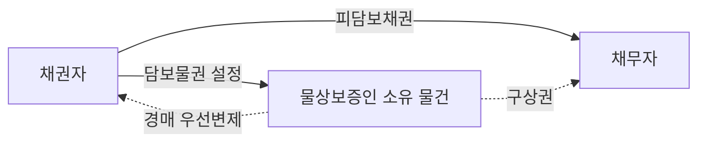

#### 2. 요건

담보물권의 성립요건은 종류에 따라 완전히 다르다. 이 표가 곧 제1관의 골격이다.

| 요건 | 유치권 | 질권 | 저당권 |
|---|---|---|---|
| 발생 근거 | 법률의 규정(당사자의 설정계약이 아님) | 설정계약 | 설정계약 |
| 공시 | 점유(등기 불요) | 인도(양도) | 등기 |
| 피담보채권 | 목적물에 관하여 생긴 채권일 것(견련성) | 제한 없음 | 제한 없음(장래·조건부 채권도 가능) |
| 목적물 | 동산·부동산·유가증권 | 동산·권리 | 부동산·권리 |
| 특약 | 발생을 배제하는 특약이 유효(임의규정) | 계약이 성립요건 | 계약이 성립요건 |

> ⚠️ 질권에서 ==점유개정에 의한 설정은 부정==된다. 점유개정으로는 유치적 효력이 확보되지 않기 때문이다. 반면 저당권은 애초에 점유를 수반하지 않으므로 이 문제가 없다.

#### 3. 효과

**(1) 담보물권의 효력 5가지**

| 효력 | 내용 | 인정 범위 |
|---|---|---|
| 우선변제적 효력 | 목적물의 교환가치로부터 다른 채권자에 앞서 변제받는 힘 | 질권(제329조)·저당권(제356조) O / 유치권 X |
| 유치적 효력 | 물건을 유치하여 인도를 거절함으로써 변제를 간접강제하는 힘 | 유치권·질권 O / 저당권 X |
| 수익적 효력 | 목적물을 사용·수익하여 그 수익으로 변제에 충당하는 힘 | 세 권리 모두 없음 (전세권이 용익물권성으로 이를 갖는 것과 대비된다) |
| 경매청구권 | 목적물을 환가하여 변제받는 힘 | 세 권리 모두 있음 |
| 간이변제충당권 | 감정인의 평가로 목적물 자체를 변제에 충당할 것을 법원에 청구 | 유치권(제322조)·질권(제338조) O / 저당권 X |

> 📌 기본서의 비교표는 유치권의 우선적 효력을 **"없음(실질적: 인정)"** 이라고 적는다. 경매의 매수인은 유치물에 관한 채권을 변제해야만 유치물을 수취할 수 있으므로 실제로는 우선변제권이 인정되는 것과 다름이 없기 때문이다.

**(2) ⭐ 담보물권 3종 종합비교표 (최빈출)**

| 구분 | 유치권 | 질권 | 저당권 |
|---|---|---|---|
| 성립 | 요건 충족 시 당연 성립하는 법정담보물권 | 설정계약＋인도(양도), 약정담보물권 | 설정계약＋등기, 약정담보물권 |
| 목적물 | 동산·부동산·유가증권 | 동산·권리 | 부동산·권리 |
| 점유이전 | 필요(점유가 성립·존속요건) | 필요(점유개정 불가) | 불요 |
| 공시방법 | 점유 | 인도 | 등기 |
| 우선변제적 효력 | 없음(실질적: 인정) | 있음 | 있음 |
| 유치적 효력 | 있음 | 있음 | 없음 |
| 수익적 효력 | 없음 | 없음 | 없음 |
| 경매권 | 있음 | 있음 | 있음 |
| 간이변제충당권 | 법원의 허가를 얻어 행함 | 유치권과 동일 | 없음 |
| 부종성 | 있음(가장 엄격) | 있음(다소 완화) | 있음(근저당에서 특히 완화) |
| 수반성 | 있음 | 있음 | 있음 |
| 불가분성 | 있음(제321조) | 있음(제343조) | 있음(제370조) |
| 물상대위성 | 없음 | 있음(제342조) | 있음(제370조) |

**(3) 종류별 분류 — 세 가지 축**

| 분류 축 | 유형 | 해당 권리 | 결정적 표지 |
|---|---|---|---|
| 성립원인 | 법정담보물권 | 유치권, 법정질권(제648조·제650조), 법정저당권(제649조) | 법률요건 충족 시 당연히 성립, 합의 불요 |
| 성립원인 | 약정담보물권 | 질권, 저당권, 근저당권, 가등기담보 | 설정계약이 있어야 성립 |
| 법전 편입 | 전형담보 | 유치권·질권·저당권 | 민법전 제2편 물권법에 규정 |
| 법전 편입 | 비전형담보 | 가등기담보·양도담보·소유권유보부매매 | 민법전에 없이 거래계의 필요로 형성 |
| 지배 방식 | 제한물권형 | 유치권·질권·저당권 | 타인 소유 그대로 두고 교환가치만 지배 |
| 지배 방식 | 소유권이전형 | 양도담보·가등기담보 | 소유권(등기)을 채권자에게 이전 |

> 💡 **법정질권과 법정저당권** — 약정담보물권인 질권·저당권에도 법률의 규정으로 당연히 성립하는 예외가 있다. 토지임대인의 법정질권(제648조), 건물 등 임대인의 법정질권(제650조), 그리고 토지임대인이 변제기를 경과한 최후 2년의 차임채권에 의하여 그 지상의 임차인 소유 건물을 압류한 때 저당권과 동일한 효력이 인정되는 법정저당권(제649조)이 그것이다.

**(4) 비전형담보가 생겨난 이유**

| 필요성 | 민법의 한계 | 거래계의 대응 | 입법적 해결 |
|---|---|---|---|
| 점유개정 방식의 담보 | 질권은 점유개정에 의한 설정을 부정 | 가축·양식장 등에서 점유개정을 이용한 양도담보 | 동산·채권 등의 담보에 관한 법률(2012. 6. 11. 시행) — 담보등기 도입 |
| 절차의 간이화 | 저당권의 설정·실행 절차가 복잡 | 유저당계약(소유권이전등기 방식의 양도담보) | — |
| 채권자의 폭리 저지 | 담보가치가 채권액을 크게 초과 | — | 제607조·제608조 신설 → 가등기담보 등에 관한 법률(1984. 1. 1. 시행) |

> 📌 판례는 대물변제의 예약이 제607조·제608조에 위반하여 무효이더라도 그에 기한 소유권이전등기는 채무원리금을 담보하는 범위 안에서 효력이 있다고 보아, 이를 청산절차를 예정한 ==약한 의미의 양도담보==로 파악한다(대판 1982.7.13. 81다254).

**(5) 유치권과 동시이행의 항변권 — 성질의 비교**

| 구분 | 유치권 | 동시이행의 항변권 |
|---|---|---|
| 성질 | 독립한 물권, 절대적 대세권 | 쌍무계약의 효력(작용), 상대적 대인권 |
| 대항력 | 있음 | 없음 |
| 목적 | 채권담보를 목적으로 함 | 일방당사자만이 선이행을 요구당함을 저지 |
| 대가관계 | 없음 | 있음 |
| 타담보 제공 | 타담보를 제공하고 소멸시킬 수 있음 | 타담보를 제공하고 소멸시킬 수 없음 |
| 경매권 | 있음 | 없음 |
| 거절 가능한 급부 | 물건 또는 유가증권의 인도에 한함 | 제한 없음 |
| 채권의 발생원인 | 제한 없음(계약관계 없이도 발생) | 동일한 쌍무계약에서 발생한 것에 한함 |

> ※ 양자는 모두 공평의 원리에 입각한 것으로 서로 배척하지 않고 병존할 수 있다.

**(6) 질권과 저당권의 비교**

| 사항 | 질권 | 저당권 |
|---|---|---|
| 본질 | 목적물의 점유가 질권자에게 이전 | 목적물의 점유가 설정자에게 그대로 남음 |
| 기능 | 서민의 금융수단 | 투자의 수단 |
| 성립 | 설정계약＋목적물 인도 | 설정계약＋등기 |
| 객체 | 동산·권리(주식·채권) | 부동산·권리(지상권·전세권) |
| 선의취득 | 성립 가능 | 성립 불능 |
| 유치력 | 있음 | 없음 |
| 사용수익권 | 보존의 범위 내에서 가능 | 없음 |
| 유질·유저당 | 금지 | 인정 |
| 과실에 대한 효력 | 효력이 미침 | 효력이 미치지 않음(압류 후에는 미침) |

> ⚠️ 함정 — "질권은 사용가치와 교환가치를 지배하고 저당권은 교환가치만을 지배한다"는 서술은 **틀렸다**. 양자 모두 교환가치만을 지배한다.

#### 4. 관련 조문

> 📌 **민법 제320조(유치권의 내용)** — "① 타인의 물건 또는 유가증권을 점유한 자는 그 물건이나 유가증권에 관하여 생긴 채권이 변제기에 있는 경우에는 변제를 받을 때까지 그 물건 또는 유가증권을 유치할 권리가 있다. ② 전항의 규정은 그 점유가 불법행위로 인한 경우에 적용하지 아니한다."

> 📌 **민법 제322조(경매, 간이변제충당)** — "① 유치권자는 채권의 변제를 받기 위하여 유치물을 경매할 수 있다. ② 정당한 이유 있는 때에는 유치권자는 감정인의 평가에 의하여 유치물로 직접변제에 충당할 것을 법원에 청구할 수 있다. 이 경우에는 유치권자는 미리 채무자에게 통지하여야 한다."

> 📌 **민법 제338조(간이변제충당)** — "② 정당한 이유 있는 때에는 질권자는 감정인의 평가에 의하여 질물로 직접 변제에 충당할 것을 법원에 청구할 수 있다."

> 📌 **민법 제342조(물상대위)** — "질권은 질물의 멸실, 훼손 또는 공용징수로 인하여 질권설정자가 받을 금전 기타 물건에 대하여도 이를 행사할 수 있다. 이 경우에는 그 지급 또는 인도전에 압류하여야 한다."

> 📌 **민법 제361조(저당권의 처분제한)** — "저당권은 그 담보한 채권과 분리하여 타인에게 양도하거나 다른 채권의 담보로 하지 못한다."

> 📌 **민법 제371조(지상권, 전세권을 목적으로 하는 저당권)** — "① 본장의 규정은 지상권 또는 전세권을 저당권의 목적으로 한 경우에 준용한다."

> 📌 우선변제권의 근거는 질권 제329조, 저당권 제356조이다. 법정질권은 제648조(토지임대인)·제650조(건물 등 임대인), 법정저당권은 제649조에 근거한다.

#### 5. 핵심 판례 법리

1. **법정담보물권성** — 유치권은 일정한 사유가 발생하면 당연히 성립되는 법정담보물권이고, 질권이나 저당권처럼 당사자의 합의에 의하여 성립하는 ==약정담보물권이 아니다==. 따라서 당사자의 합의로 유치권을 "설정"할 수는 없다.

2. **다만 배제특약은 유효** — 제한물권은 이해관계인의 이익을 부당하게 침해하지 않는 한 자유로이 포기할 수 있는 것이 원칙이므로, 당사자는 미리 ==유치권의 발생을 막는 특약==을 할 수 있고 이러한 특약은 유효하다(대판 2018.1.24. 2016다234043). 이 특약에는 조건을 붙일 수도 있고, 특약에 따른 효력은 특약의 상대방뿐 아니라 그 밖의 사람도 주장할 수 있다(대판 2018.1.24. 2016다234043).

3. **타물권성** — 유치권은 타물권인 점에 비추어 볼 때 수급인의 재료와 노력으로 건축되었고 독립한 건물에 해당되는 기성부분은 수급인의 소유라 할 것이므로, ==수급인은 공사대금을 지급받을 때까지 이에 대하여 유치권을 가질 수 없다==(대판 1993.3.26. 91다14116). 반대로 신축건물이 도급인 소유라면 수급인은 그 건물을 점유하고 공사금 채권이 있는 한 유치권을 가진다(대판 1995.9.15. 95다16202).

4. **유치권에 우선변제권이 없다는 것의 실제 의미** — 유치권에 의한 경매 시 유치권자는 담보물권의 우선변제권이 인정되지 않으므로 ==일반채권자와 동일한 순위로 배당==을 받을 수 있을 뿐이다(대판 2011.6.15. 2010마1059). 다만 유치권자는 매수인에 대하여 피담보채권의 변제가 있을 때까지 인도를 거절할 수 있을 뿐이고 변제를 청구할 수는 없다(대판 1996.8.23. 95다8713).

5. **유치적 효력의 본질과 점유** — 유치권은 목적물을 유치함으로써 채무자의 변제를 간접적으로 강제하는 것을 본체적 효력으로 하는 권리인 점에 비추어, 그 ==직접점유자가 채무자인 경우에는 유치권의 요건으로서의 점유에 해당하지 않는다==(대판 2002.11.27. 2002마3516; 대법원 2008.4.11. 2007다27236). 점유는 직접·간접을 불문하지만 이 경우만은 예외다.

6. **점유의 상실과 승계** — 유치권자는 점유를 상실하면 곧 유치권을 상실하므로 ==점유를 승계한 자도 유치권자의 유치권을 대위할 수 없다==(대판 1972.5.30. 72다548). 점유회수의 소를 제기하여 승소판결을 받았더라도 그에 의하여 점유를 회복하여야 유치권이 부활한다.

7. **간이변제충당의 "정당한 이유"** — 유치물의 처분에 관하여 이해관계를 달리하는 다수의 권리자가 존재하거나 유치물의 공정한 가격을 쉽게 알 수 없는 등의 경우에는 제322조 제2항에 의하여 유치권자에게 ==간이변제충당을 허가할 정당한 이유가 있다고 할 수 없다==(대판 2000.10.30. 2000마4002).

8. **부종성에서 나오는 저당권자 적격** — 저당권을 설정하는 경우에는 담보물권의 부종성의 법리에 비추어 원칙적으로 ==채권과 저당권이 그 주체를 달리할 수 없다==. 다만 채권자 아닌 제3자 명의로 저당권등기를 하는 데 대하여 채권자·채무자·제3자 사이에 합의가 있었고 나아가 그 제3자에게 채권이 실질적으로 귀속되었다고 볼 특별한 사정이 있거나 묵시적으로 채권자와 제3자가 불가분적 채권자의 관계에 있다고 볼 수 있는 경우에는, 그 제3자 명의의 저당권등기도 유효하다(대판 2009.11.26. 2008다64478).

9. **타물권성과 목적물의 소멸** — 전세권이 기간만료로 종료된 경우 전세권은 말소등기 없이도 당연히 소멸하고, 저당권의 목적물인 전세권이 소멸하면 저당권도 당연히 소멸하므로 전세권을 목적으로 한 저당권자는 부동산 소유자에게 더 이상 저당권을 주장할 수 없다(대법원 1999. 9. 17. 98다31301).

10. **저당권 이전의 물권적 합의 당사자** — 저당권의 이전을 위한 물권적 합의는 저당권을 양도·양수하는 당사자 사이에 있으면 족하고 그 외에 채무자나 물상보증인 사이에까지 있어야 하는 것은 아니다(대판 2005.6.10. 2002다15412,15429).

11. **상환급부판결** — 물건의 인도를 청구하는 소송에서 피고의 유치권 항변이 인용되는 경우에는 그 물건에 관하여 생긴 채권의 변제와 상환으로 그 물건의 인도를 명하여야 한다(대판 1969.11.25. 69다1592).

12. **비전형담보의 성질** — 대물변제의 예약이 제607조·제608조에 위반되어 무효이더라도 그에 기한 소유권이전등기는 채무원리금을 담보하는 범위 안에서 효력이 있으며, 이러한 담보는 청산절차를 예정한 약한 의미의 양도담보이다(대판 1982.7.13. 81다254).

#### ⭐ 기출 출제포인트

1. **"법률에서 정하는 요건이 충족되면 당연히 성립하는 법정담보물권에 해당하는 것은?"** — 선지에 유치권·채권질권·법정지상권·전세권저당권·동산담보권을 섞어 놓고 유치권만 고르게 하는 형태. 법정"지상권"은 담보물권이 아니라는 점이 함정이다.
2. **효력의 조합을 묻는 형태** — "유치적 효력과 우선변제적 효력을 모두 가지는 담보물권은?" → 질권. 유치권(우선변제 X)·저당권(유치적 X)·전세권·양도담보를 오답 선지로 배치한다.
3. **타물권성** — "원칙적으로 유치권은 채권자 자신 소유 물건에 대해서도 성립한다" 형태로 **틀린** 선지를 만든다(2022년 기출).
4. **질권 vs 저당권 비교** — 점유이전 여부, 선의취득 가능 여부, 유질·유저당의 허부, 과실에 대한 효력을 뒤섞는다.
5. **유치권 vs 동시이행의 항변권** — 대세권/대인권, 대가관계 유무, 타담보 제공으로 소멸 가능 여부, 경매권 유무를 뒤집는다.

#### 📊 기출 분석

| 연도 | 출제 형태 | 핵심 논점 |
|---|---|---|
| 2018년 기출 | 유치권 옳지 않은 것 | 불가분성·소멸시효·간접점유·변제청구 불가 |
| 2018년 기출 | 동산질권 옳지 않은 것 | 선의취득·유질계약·순위·피담보채권 범위·간이변제충당 통지 |
| 2022년 기출 | 민사유치권 옳은 것 | 배제특약·타담보제공·타물권성·간접점유·불법점유 |
| 2022년 기출 | 민사동산질권 옳지 않은 것 | 질권의 우선변제적 효력(일반채권자와 동순위라는 선지가 오답) |
| 2023년 기출 | 법정담보물권 고르기 | 유치권만 법정담보물권 |
| 2025년 기출 | 유치권 옳지 않은 것 | 과실수취·무단임대·일부 필지 소멸청구·일반채권자 동순위 배당·경매개시 전 취득 |

**출제 빈도** — 담보물권 총설은 매년 1문항이 통째로 나오지는 않지만, 유치권·질권·저당권 문항의 선지 1~2개는 반드시 이 관의 지식으로 풀린다. 2023년에는 총설만으로 한 문항이 완성되었다.

**반복되는 함정 선지** — ㉠ "유치권도 우선변제를 받는다" ㉡ "자기 소유 물건에도 담보물권이 성립한다" ㉢ "질권도 사용가치를 지배한다" ㉣ "저당권에도 간이변제충당이 인정된다" ㉤ "당사자의 합의로 유치권을 설정할 수 있다".

**최근 경향** — 단순 암기형(2023년 법정담보물권)과 판례 결합형(2025년 배당순위)이 교대로 나온다. 표의 가로줄(권리별)이 아니라 세로줄(효력별)로 물어오는 문제가 늘고 있다.

#### 🔍 기출 선지로 배우는 법리

> 실제 출제된 선지를 그대로 놓고 O/X와 근거를 확인한다.

**①** 법률에서 정하는 요건이 충족되면 당연히 성립하는 법정담보물권에 해당하는 것은? — **유치권** (2023년 기출)
근거: 유치권은 일정한 사유가 발생하면 당연히 성립되는 법정담보물권이고, 질권이나 저당권처럼 당사자의 합의에 의하여 성립하는 약정담보물권이 아니다. 채권질권·전세권저당권·동산담보권은 모두 약정담보물권이고, 법정지상권은 애초에 담보물권이 아니다.

**②** 원칙적으로 유치권은 채권자 자신 소유 물건에 대해서도 성립한다. (2022년 기출) — **X**
어디가 틀렸나: 담보물권은 타물권이다. 자신 소유의 물건에 대해서는 성립할 수 없다. / 옳게 고치면: "유치권은 타인의 물건에 대해서만 성립한다."

**③** 유치권 배제 특약이 있더라도 다른 법정요건이 모두 충족되면 유치권이 성립한다. (2022년 기출) — **X**
어디가 틀렸나: 유치권의 발생에 관한 규정은 임의규정이므로 배제특약이 있으면 성립하지 않는다(대판 2018.1.24. 2016다234043).

**④** 질권자는 피담보채권의 변제를 받기 위하여 질물을 경매할 수 있고, 그 매각대금으로부터 일반채권자와 동일한 순위로 변제받는다. (2022년 기출) — **X**
어디가 틀렸나: 질권은 담보물권으로서 일반채권자에 대하여 우선변제적 효력을 갖는다. 일반채권자와 동일한 순위로 배당받는 것은 유치권이다.

**⑤** 유치권에 의한 경매로 유치물이 매각되는 경우 유치권자는 일반채권자와 동일한 순위로 배당을 받는다. (2025년 기출) — **O**
근거: 유치권에 의한 경매 시 유치권자는 담보물권의 우선변제권이 인정되지 않으므로 일반채권자와 동일한 순위로 배당을 받을 수 있을 뿐이다(대판 2011.6.15. 2010마1059).

**⑥** 담보물권의 효력은 크게 유치적 효력과 우선변제적 효력으로 나눌 수 있다. 이 두 가지의 효력을 모두 가지는 담보물권은? — **질권** (문제집 제6장 기본문제 3번)
근거: 유치권은 유치적 효력만, 저당권은 우선변제적 효력만 가진다. 양자를 겸유하는 것은 질권이다.

**⑦** 질권은 사용가치와 교환가치를 지배하고 저당권은 교환가치만을 지배한다. (문제집 제6장 기본문제 10번) — **X**
어디가 틀렸나: 양자 모두 목적물의 교환가치만을 지배한다. 질권자가 질물을 사용·수익할 수 있는 것은 보존에 필요한 범위에 그친다.

**⑧** 동시이행의 항변권에 의하여 거절할 수 있는 급부에는 제한이 없으나, 유치권에 의하여 거절할 수 있는 것은 물건의 인도이다. (문제집 제6장 기본문제 6번) — **O**
근거: 유치권에 의하여 거절할 수 있는 급부는 물건 또는 유가증권의 인도에 한한다. 반면 동시이행의 항변권에는 그러한 제한이 없다.

**⑨** 저당물의 소유권을 취득한 제3자도 경매인이 될 수 있다. (문제집 제6장 기본문제 11번) — **O**
근거: 2022년 기출에서도 "저당물의 소유권을 취득한 제3자는 그 저당물에 관한 저당권 실행의 경매절차에서 경매인이 될 수 있다"는 선지가 옳은 것으로 출제되었다.

**⑩** 당사자의 합의로 유치권을 설정할 수 있다. (문제집 제6장 실전문제 16번) — **X**
어디가 틀렸나: 유치권은 법정담보물권이므로 합의로 설정할 수 없다. 다만 배제특약은 가능하다. 이 둘의 방향을 뒤집는 것이 전형적 함정이다.

#### ✏️ 사례형 적용

> **사례 1** — 甲은 乙에게 1억 원을 빌려주면서, 채무자 乙이 아니라 乙의 지인 丙 소유의 X부동산에 저당권을 설정받았다. 그 후 乙이 변제하지 않자 甲은 X를 경매하여 배당을 받았다.

**검토** — ㉠ 담보물권은 채무자 외에 제3자 소유의 물건도 목적으로 할 수 있고, 이때 제3자를 물상보증인이라 한다. ㉡ 물상보증인 丙은 채무자가 아니므로 甲이 丙에게 채무의 이행을 청구할 수는 없다. 丙은 담보권설정자로서의 책임만 진다. ㉢ 다만 丙은 제341조에 따라 채무를 변제할 수 있고, 경매로 소유권을 잃은 때에는 보증채무에 관한 규정에 의하여 채무자 乙에 대한 구상권을 가진다. ㉣ 결론: 甲의 배당은 적법하고, 丙은 乙에게 구상할 수 있다.

> **사례 2** — 甲은 자신 소유의 노트북을 수리업자 乙에게 맡기고 수리대금 10만 원을 지급하기로 하였으나 지급하지 않았다. 乙은 노트북을 반환하지 않고 있다. 그 사이 丙이 甲으로부터 노트북을 양수하고 乙에게 인도를 청구하였다. 한편 甲은 10만 원 중 7만 원만 지급하였다.

**검토** — ㉠ 乙의 수리대금채권은 목적물 자체로부터 발생한 채권으로 견련성이 인정되고, 변제기가 도래하였으며, 타인(甲) 소유 물건을 적법하게 점유하고 있으므로 유치권이 성립한다. ㉡ 유치권은 물권으로서 대세적 효력이 있으므로, 乙은 양수인 丙에 대해서도 인도를 거절할 수 있다. ㉢ 7만 원의 일부변제만으로는 불가분성(제321조)에 따라 유치권이 소멸하지 않는다. 乙은 채권 전부의 변제를 받을 때까지 노트북 전부를 유치할 수 있다. ㉣ 다만 乙은 선량한 관리자의 주의로 점유하여야 하며(제324조 제1항), 甲의 승낙 없이 타인에게 임대하거나 담보로 제공할 수 없다.

> **사례 3** — 채권자 甲과 채무자 乙, 그리고 제3자 丙이 협의하여, 甲의 乙에 대한 대여금채권을 담보하기 위해 乙 소유 부동산에 丙 명의로 저당권설정등기를 마쳤다. 丙에게 그 채권이 실질적으로 귀속되었다고 볼 특별한 사정이 있다.

**검토** — ㉠ 담보물권의 부종성상 원칙적으로 채권과 저당권은 그 주체를 달리할 수 없다. 따라서 채권자 아닌 제3자 명의의 저당권등기는 원칙적으로 무효다. ㉡ 그러나 판례는 채권자·채무자·제3자 사이에 합의가 있었고 제3자에게 채권이 실질적으로 귀속되었다고 볼 특별한 사정이 있거나 묵시적으로 채권자와 제3자가 불가분적 채권자의 관계에 있다고 볼 수 있는 경우에는 그 등기도 유효하다고 본다(대판 2009.11.26. 2008다64478). ㉢ 결론: 丙 명의의 저당권등기는 유효하다. 이 법리는 채권담보 목적의 가등기에도 마찬가지로 적용된다.

#### ⚠️ 이 관의 함정 총정리

1. "유치권도 다른 채권자보다 우선하여 배당받는다"라고 하면 틀림 → 유치권에는 우선변제권이 없어 일반채권자와 동일한 순위로 배당받는다. 다만 매수인이 채권을 변제해야 인도받으므로 사실상 우선변제를 받을 뿐이다.
2. "저당권자도 간이변제충당을 법원에 청구할 수 있다"라고 하면 틀림 → 간이변제충당권은 유치권과 질권에만 인정되고 저당권에는 없다.
3. "담보물권은 자기 소유의 물건 위에도 성립한다"라고 하면 틀림 → 담보물권은 타물권이다. 다만 혼동의 예외로서 소유자저당의 현상을 보이는 경우는 있다.
4. "유치권은 법정담보물권이므로 당사자의 특약으로 배제할 수 없다"라고 하면 틀림 → 유치권의 발생에 관한 규정은 임의규정이어서 배제특약이 유효하고, 조건도 붙일 수 있다.
5. "질권도 점유개정으로 설정할 수 있다"라고 하면 틀림 → 점유개정으로는 유치적 효력이 확보되지 않으므로 질권설정이 부정된다. 반면 양도담보는 바로 이 점유개정 수요 때문에 생겨났다.

#### ✅ OX 확인문제

> 다음 진술의 참·거짓을 판단하시오.

**1.** 유치권·질권·저당권 중 법률요건이 충족되면 당연히 성립하는 법정담보물권은 유치권뿐이다.
→ **O**. 질권과 저당권은 설정계약에 의해 성립하는 약정담보물권이다. 2023년 기출이 이 한 가지만 물었다.

**2.** 유치적 효력과 우선변제적 효력을 모두 가지는 담보물권은 저당권이다.
→ **X**. 저당권은 점유를 수반하지 않아 유치적 효력이 없다. 둘을 겸유하는 것은 질권이다.

**3.** 유치권에 의한 경매에서 유치권자는 일반채권자보다 우선하여 배당을 받는다.
→ **X**. 유치권에는 우선변제권이 인정되지 않으므로 일반채권자와 동일한 순위로 배당받을 수 있을 뿐이다(대판 2011.6.15. 2010마1059).

**4.** 담보물권은 타물권이므로 채권자 자신 소유의 물건에 대해서는 성립하지 않는다.
→ **O**. 2022년 기출에서 "원칙적으로 유치권은 채권자 자신 소유 물건에 대해서도 성립한다"는 선지가 틀린 것으로 출제되었다.

**5.** 유치권·질권·저당권 모두 경매청구권이 인정된다.
→ **O**. 우선변제권 유무와 무관하게 세 권리 모두 목적물을 환가할 수 있는 경매권을 가진다.

**6.** 간이변제충당권은 유치권과 질권에는 인정되지만 저당권에는 인정되지 않는다.
→ **O**. 유치권은 제322조 제2항, 질권은 제338조 제2항에 근거하며, 어느 경우든 법원에 청구하여야 한다.

**7.** 유치권·질권·저당권은 모두 수익적 효력을 가진다.
→ **X**. 세 권리 모두 수익적 효력은 없다. 목적물을 사용·수익하여 그 수익으로 변제에 충당하는 힘은 인정되지 않는다.

**8.** 토지임대인이 변제기를 경과한 최후 2년의 차임채권에 의하여 그 지상에 있는 임차인 소유의 건물을 압류한 때에는 저당권과 동일한 효력이 있다.
→ **O**. 제649조의 법정저당권이다. 약정담보물권인 저당권에도 법정 성립의 예외가 있다는 점을 보여준다.

**9.** 유치권은 물권이므로, 유치물의 소유권을 채무자 아닌 제3자가 취득한 경우 유치권자는 그 제3자에게 인도를 거절할 수 없다.
→ **X**. 유치권자는 채무자뿐 아니라 소유자·양수인·경매의 매수인 등 모든 사람에게 인도를 거절할 수 있다.

**10.** 저당권을 설정하는 경우 담보물권의 부종성상 채권자 아닌 제3자 명의의 저당권등기는 어떠한 경우에도 무효이다.
→ **X**. 원칙은 그러하나, 3자 간 합의와 제3자에 대한 채권의 실질적 귀속 등 특별한 사정이 있거나 묵시적으로 불가분적 채권자의 관계에 있다고 볼 수 있는 경우에는 유효하다(대판 2009.11.26. 2008다64478).

#### 🧠 암기법

> 🔑 **"유(留)만 법(法), 질저(質抵)는 약(約)"**
> 유치권만 **법**정담보물권, 질권·저당권은 **약**정담보물권.
> 여기에 법정질권(제648조·제650조)과 법정저당권(제649조)이라는 법률상 예외를 꼬리표로 붙여 둔다.

> 🔑 **"유치권은 우선(優先)이 없고, 저당권은 유치(留置)가 없다"**
> 빠진 자리를 외운다. 유치권 ─ 우선변제 X, 물상대위 X, 간이변제충당 O.
> 저당권 ─ 유치적 효력 X, 간이변제충당 X, 물상대위 O.
> 그러면 질권만 전부 O 라는 결론이 자동으로 남는다(수익적 효력은 셋 다 X).

> 🔑 **"경(競)은 셋 다, 수(收)는 셋 다 없다"**
> **경**매권은 유치권·질권·저당권 세 권리 모두 있고, **수**익적 효력은 세 권리 모두 없다.
> 표에서 가로로 전부 O인 줄은 경매권, 전부 X인 줄은 수익적 효력 하나씩뿐이다.

> 🔑 **"동(動)·부(不)·유(有) / 동·권 / 부·권"**
> 목적물 3단 정리 — 유치권은 **동**산·**부**동산·**유**가증권, 질권은 **동**산·**권**리, 저당권은 **부**동산·**권**리.
> 유가증권은 유치권과 질권의 목적일 뿐 저당권의 목적은 될 수 없다.

#### ⚖️ 법조문 원문

> 📖 이 관이 근거로 삼은 조문의 **전문**이다. 본문 인용은 발췌지만 여기서는 조 전체를 싣는다. 출처는 법제처 정본이다.

**― 민법 ―**

> 📌 **민법 제320조(유치권의 내용)** — "①타인의 물건 또는 유가증권을 점유한 자는 그 물건이나 유가증권에 관하여 생긴 채권이 변제기에 있는 경우에는 변제를 받을 때까지 그 물건 또는 유가증권을 유치할 권리가 있다. ②전항의 규정은 그 점유가 불법행위로 인한 경우에 적용하지 아니한다."

> 📌 **민법 제322조(경매, 간이변제충당)** — "①유치권자는 채권의 변제를 받기 위하여 유치물을 경매할 수 있다. ②정당한 이유있는 때에는 유치권자는 감정인의 평가에 의하여 유치물로 직접 변제에 충당할 것을 법원에 청구할 수 있다. 이 경우에는 유치권자는 미리 채무자에게 통지하여야 한다."

> 📌 **민법 제338조(경매, 간이변제충당)** — "①질권자는 채권의 변제를 받기 위하여 질물을 경매할 수 있다. ②정당한 이유있는 때에는 질권자는 감정자의 평가에 의하여 질물로 직접 변제에 충당할 것을 법원에 청구할 수 있다. 이 경우에는 질권자는 미리 채무자 및 질권설정자에게 통지하여야 한다."

> 📌 **민법 제342조(물상대위)** — "질권은 질물의 멸실, 훼손 또는 공용징수로 인하여 질권설정자가 받을 금전 기타 물건에 대하여도 이를 행사할 수 있다. 이 경우에는 그 지급 또는 인도전에 압류하여야 한다."

> 📌 **민법 제361조(저당권의 처분제한)** — "저당권은 그 담보한 채권과 분리하여 타인에게 양도하거나 다른 채권의 담보로 하지 못한다."

> 📌 **민법 제371조(지상권, 전세권을 목적으로 하는 저당권)** — "①본장의 규정은 지상권 또는 전세권을 저당권의 목적으로 한 경우에 준용한다. ②지상권 또는 전세권을 목적으로 저당권을 설정한 자는 저당권자의 동의없이 지상권 또는 전세권을 소멸하게 하는 행위를 하지 못한다."

### 제2관 담보물권의 통유성

> 📖 통유성(通有性)이란 담보물권 전체에 공통으로 흐르는 성질을 말한다. 부종성·수반성·불가분성·물상대위성이 그 네 기둥이고, 여기에 타물권성이 더해진다. 제1관에서 권리별로 좌표를 잡았다면, 이 관은 그 좌표를 성질별로 가로질러 읽는다. 시험은 늘 "어느 성질이 어느 권리에 없느냐"를 묻는다.

> ⭐ **이 관에서 반드시 챙길 3가지**
> ① 유치권에 없는 것은 물상대위성뿐이다. ==부종성·수반성·불가분성은 유치권에도 모두 있다==.
> ② 물상대위는 ==지급 또는 인도 전에 압류==해야 한다. 다만 제3자가 이미 압류하여 특정되었다면 스스로 압류하지 않아도 된다.
> ③ 저당권은 ==담보한 채권과 분리하여== 양도하거나 다른 채권의 담보로 하지 못한다(제361조). 수반성의 조문적 표현이다.

#### 1. 의의

담보물권의 통유성이란 유치권·질권·저당권에 공통되는 성질을 말한다. 담보물권이 피담보채권의 만족을 위한 수단이라는 점(부종성·수반성)과, 목적물의 교환가치를 파악하는 권리라는 점(불가분성·물상대위성)에서 각각 두 갈래로 도출된다.

| 통유성 | 내용 | 유치권 | 질권 | 저당권 |
|---|---|---|---|---|
| 부종성 | 피담보채권과 담보물권은 ==법률적 운명을 같이 한다==는 성질. 근저당은 부종성이 특히 완화된다 | O(가장 엄격) | O(다소 완화) | O(다소 완화) |
| 수반성 | 피담보채권이 이전하면 담보물권도 당연히 이전된다는 성질 | O | O | O |
| 불가분성 | 담보물권자는 피담보채권의 ==전액을 변제받을 때까지 목적물 전부== 위에 담보물권을 행사할 수 있다는 성질. 공동저당은 예외 | O | O | O |
| 물상대위성 | 목적물의 멸실·훼손·공용징수로 채무자가 받게 될 보험금·손해배상금·보상금 위에 담보물권의 효력이 존속하는 성질 | X | O | O |
| 타물권성 | 담보물권은 타인의 물건 위에 설정될 수 있다는 성질. 혼동의 예외로 소유자저당의 현상은 있다 | O | O | O |

> 💡 **왜 유치권에만 물상대위성이 없는가** — 물상대위는 담보물권이 교환가치를 취득하는 것을 내용으로 하기 때문에 인정된다. 유치적 효력만 있고 우선변제를 받을 수 없는 유치권은 애초에 교환가치를 파악하는 권리가 아니므로 대표물 위에 존속할 이유가 없다. ==우선변제권이 없으므로 물상대위성도 없다== — 이 인과관계를 통째로 외워야 한다.

#### 2. 요건

**(1) 부종성 — 성립·존속·소멸의 3단계**

| 단계 | 내용 | 근거·판례 |
|---|---|---|
| 성립상 부종성 | 피담보채권이 성립하지 않으면 담보물권도 성립하지 않는다 | 담보물권의 부종성으로 인해 질권은 반드시 피담보채권의 존재를 요한다 |
| 존속상 부종성 | 원칙적으로 ==채권과 담보물권은 주체를 달리할 수 없다== | 대판 2009.11.26. 2008다64478 |
| 소멸상 부종성 | 피담보채권이 ==시효의 완성 기타 사유==로 소멸하면 담보물권도 소멸한다 | 제369조 |

**(2) 부종성의 완화**

| 국면 | 완화의 내용 | 근거 |
|---|---|---|
| 장래채권 담보 | 저당권의 피담보채권은 종류에 제한이 없고, 장래 발생하는 채권과 조건부·기한부 채권도 특정한 액수라면 담보할 수 있다 | 저당권 성립 일반론 |
| 근저당 | 채권액이 증감·변동하여도, 일시적으로 채권액이 영(零)이 되어도 근저당권은 소멸하지 않는다 | 제357조 |
| 근저당의 조건부채권 | 장래에 발생할 특정의 조건부 채권도 근저당권의 피담보채권으로 확정될 수 있고, 확정 당시 조건이 성취되지 않았다는 사정만으로 근저당권이 소멸하는 것은 아니다 | 대법원 2015.12.24. 2015다200531 |
| 제3자 명의 저당권 | 3자 간 합의＋채권의 실질적 귀속 또는 불가분적 채권자 관계가 인정되면 채권자 아닌 제3자 명의의 저당권등기도 유효 | 대판 2009.11.26. 2008다64478 |
| 확정 후 복귀 | 근저당권의 피담보채권이 확정되면 그 이후부터 근저당권은 부종성을 회복하여 보통의 저당권과 같은 취급을 받는다 | 대법원 1998.10.27. 97다26104 |

**(3) 수반성 — 원칙과 예외**

| 구분 | 내용 |
|---|---|
| 원칙 | 피담보채권을 처분하면 당연히 담보권도 함께 처분된다. 채권양도의 대항요건과 저당권이전의 부기등기가 각각 필요하다 |
| 예외 | 피담보채권의 처분이 있음에도 담보권의 처분이 따르지 않는 특별한 사정이 있는 경우, 채권양수인은 ==무담보의 채권==을 양수한 것이 되고, 채권의 처분에 따르지 않은 담보권은 원칙적으로 소멸한다 |
| 역방향 제한 | 담보권만을 채권과 분리하여 양도하거나 다른 채권의 담보로 하는 것은 금지된다(제361조) |
| 저당권만 분리 시 | 저당권과 분리해서 피담보채권만을 양도한 경우, 양도인은 채권을 상실하여 양도인 앞으로 된 저당권은 소멸한다(대판 2020.4.29. 2016다235411) |

> ⚠️ 수반성은 "피담보채권의 처분에는 담보권의 처분도 당연히 포함된다고 보는 것이 합리적"이라는 해석원칙일 뿐이다. 당사자가 달리 정하면 담보권이 따라가지 않을 수 있고, 그 경우 담보권은 소멸한다. 반면 제361조는 강행적 금지다. 이 비대칭이 시험의 핵심이다.

**(4) 불가분성 — 근거조문 3종 세트**

| 권리 | 조문 | 문언 |
|---|---|---|
| 유치권 | 제321조 | "유치권자는 ==채권전부의 변제를 받을 때까지 유치물 전부==에 대하여 그 권리를 행사할 수 있다" |
| 질권 | 제343조 | "질권자는 채권전부의 변제를 받을 때까지 질물 전부에 대하여 그 권리를 행사할 수 있다" |
| 저당권 | 제370조 | "저당권자는 채권전부의 변제를 받을 때까지 저당물 전부에 대하여 그 권리를 행사할 수 있다" |

> 📌 민법은 유치권에 관하여 규정을 두고 질권·저당권에 준용하는 방식을 취한다(제343조·제370조). 그래서 불가분성은 모든 담보물권에 다 적용된다. ==공동저당은 불가분성의 예외==다.

**(5) 물상대위성 — 요건**

| 요건 | 내용 | 비고 |
|---|---|---|
| 대상 | 목적물의 멸실·훼손·공용징수 | 매각·임대는 목적물이 존속하므로 해당 없음 |
| 객체 | 설정자가 받을 금전 기타 물건(보험금·손해배상금·보상금) | 교환가치를 대표하는 것 |
| 압류 | 지급 또는 인도 전에 압류하여야 한다(제342조) | 변형물의 ==특정성 유지==가 목적 |
| 권리자 | 우선변제권이 있는 담보물권자 | 유치권자는 제외 |
| 행사방법 | 담보권의 존재를 증명하는 서류를 집행법원에 제출하여 채권압류 및 전부명령을 신청하거나 배당요구 | 배당요구는 늦어도 배당요구의 종기까지 |

#### 3. 효과

**(1) ⭐ 통유성 4가지 × 담보물권 3종 교차표 (최빈출)**

| 통유성 | 유치권 | 질권 | 저당권 | 결정적 이유 |
|---|---|---|---|---|
| 부종성 | O (가장 엄격) | O(다소 완화) | O(근저당에서 특히 완화) | 유치권은 법정담보물권이라 채권 없이는 존립 불가 |
| 수반성 | O | O | O(제361조로 분리양도 금지) | 담보물권은 채권의 종된 권리 |
| 불가분성 | O(제321조) | O(제343조) | O(제370조) | 유치권 규정을 질권·저당권에 준용 |
| 물상대위성 | X | O(제342조) | O(제370조) | 우선변제권 없는 유치권에는 대표물을 지배할 근거가 없음 |

> 💡 2020년 공인중개사 시험은 "담보물권이 가지는 특성(통유성) 중에서 유치권에 인정되는 것을 모두 고른 것은?"을 물었고, 정답은 부종성·수반성·불가분성 세 가지였다. 물상대위성 하나만 빼면 된다.

**(2) 물상대위의 객체 — O/X 판별표**

| 사안 | 물상대위 | 이유 |
|---|---|---|
| 저당목적물의 매매대금, 차임 | X | 담보목적물이 존속하므로 우선변제권이 인정될 뿐. 담보물권의 추급력으로 해결된다 |
| 협의매수에 따른 보상금 | X | 대판 1981.5.26. 80다2109 |
| 화재로 인한 보험금청구권 | O | 대판 2004.12.24. 2004다52798 |
| 공용징수 보상금 | O | 제342조가 명시 |
| 제3자의 불법행위에 의한 손해배상청구권 | O | 저당물의 가치적 변형물 |
| 유치물의 멸실로 소유자가 받을 금전 | X | 유치권에는 물상대위성이 없다 |
| 동산 양도담보 목적물 소실 시 화재보험금청구권 | O | 대판 2009.11.26. 2006다37106 |

**(3) 물상대위의 "압류" — 누가 언제**

| 사안 | 결론 | 근거 |
|---|---|---|
| 담보물권자 스스로 압류 | 물상대위 행사 O | 제342조 원칙 |
| 제3자가 이미 압류하여 금전·물건이 특정된 경우 | 스스로 압류하지 않아도 행사 O | 대판 2002.10.11. 2002다33137; 대법원 2010.10.28. 2010다46756 |
| 질권자가 압류하지 않은 경우 | 당연히 물상대위권의 효력이 미쳐 우선변제 O | 대판 1987.5.26. 86다카1058 |
| 보상금 등이 공탁된 경우 | 압류하지 않아도 행사 O(특정성 유지) | 대판 1987.5.26. 86다카1058 |
| 설정자가 금전을 이미 수령한 경우 | 행사 X(특정성 상실) | 대판 2015.9.10. 2013다216273 |
| 압류 전 보상금 채권이 양도·전부된 경우 | 배당요구의 종기 전이면 행사 O | 대판 2000.6.23. 98다31899 |

> ⚠️ 여기서 갈리는 것은 금전이 넘어갔는가(특정성 상실 → X)와 채권이 넘어갔는가(추급 가능 → O)다. 선지가 "토지의 소유자가 금전 등을 수령한 경우에도 물상대위권을 행사할 수 있다"라고 나오면 즉시 X를 찍는다.

**(4) 불가분성의 구체적 작동**

| 사안 | 결론 |
|---|---|
| 피담보채권의 일부가 변제된 경우 | 잔액이 있는 한 담보물권의 효력은 담보물 전부에 미친다. 목적물의 일부가 구속에서 벗어나는 일은 없다 |
| 목적물이 분할 가능하거나 수개의 물건인 경우 | 불가분성은 그대로 적용된다(대판 2007.9.7. 2005다16942) |
| 다세대주택 전 창호 공사 후 한 세대만 점유 | 그 한 세대에 대한 공사대금뿐 아니라 다세대주택 전체의 공사대금채권 잔액 전부가 피담보채권이 된다(대판 2007.9.7. 2005다16942) |
| 물건 일부에만 비용이 들고 분할이 용이한 경우 | 유치권의 객체는 그 일부에 한정된다(대판 1968.3.5. 67다2786) |
| 공유지분에 저당권 설정 후 부동산이 분할된 경우 | 저당권은 분할된 각 부동산 위에 종전의 지분비율대로 존속하고 각 부동산은 저당권의 공동담보가 된다(대법원 2012.3.29. 2011다74932) |
| 공동저당 | 불가분성의 예외. 동시배당 시 각 부동산의 경매대가에 비례하여 안분한다(제368조 제1항) |

#### 4. 관련 조문

> 📌 **민법 제321조(유치권의 불가분성)** — "유치권자는 채권전부의 변제를 받을 때까지 유치물 전부에 대하여 그 권리를 행사할 수 있다."

> 📌 **민법 제343조(질권의 불가분성 준용)** — "질권자는 채권전부의 변제를 받을 때까지 질물 전부에 대하여 그 권리를 행사할 수 있다."

> 📌 **민법 제370조(저당권의 불가분성 준용)** — "저당권자는 채권전부의 변제를 받을 때까지 저당물 전부에 대하여 그 권리를 행사할 수 있다."

> 📌 **민법 제342조(물상대위)** — "질권은 질물의 멸실, 훼손 또는 공용징수로 인하여 질권설정자가 받을 금전 기타 물건에 대하여도 이를 행사할 수 있다. 이 경우에는 그 지급 또는 인도전에 압류하여야 한다." 저당권에는 제370조가 이를 준용한다.

> 📌 **민법 제361조(저당권의 처분제한)** — "저당권은 그 담보한 채권과 분리하여 타인에게 양도하거나 다른 채권의 담보로 하지 못한다." 근저당권에도 같은 조가 적용된다.

> 📌 **민법 제369조(부종성)** — "저당권으로 담보한 채권이 시효의 완성 기타 사유로 인하여 소멸한 때에는 저당권도 소멸한다."

> 📌 **민법 제368조(공동저당)** — 동일한 채권담보를 위하여 여러 개의 부동산에 저당권을 설정한 경우, 동시배당 시에는 각 부동산의 경매대가에 비례하여 피담보채권을 분담하고(제1항), 이시배당 시에는 후순위저당권자가 선순위를 대위할 수 있다(제2항). 불가분성의 예외다.

#### 5. 핵심 판례 법리

1. **수반성의 예외** — 수반성이란 피담보채권의 처분에 담보권의 처분도 당연히 포함된다고 보는 것이 합리적이라는 것일 뿐이므로, 피담보채권의 처분이 있음에도 담보권의 처분이 따르지 않는 특별한 사정이 있는 경우에는 채권양수인은 담보권이 없는 무담보의 채권을 양수한 것이 되고, 채권의 처분에 따르지 않은 담보권은 원칙적으로 소멸한다고 판례는 본다.

2. **저당권만 남기고 채권을 양도한 경우** — 저당권이 양도되는 경우에 피담보채권이 저당권과 함께 양도된다고 보는 것이 합리적이지만, 피담보채권의 처분이 있다고 해서 언제나 저당권도 함께 처분된다고는 할 수 없다. 저당권과 분리해서 피담보채권만을 양도한 경우 양도인은 채권을 상실하여 양도인 앞으로 된 저당권은 소멸한다(대판 2020.4.29. 2016다235411).

3. **부종성의 원칙과 예외** — 저당권을 설정하는 경우에는 담보물권의 부종성의 법리에 비추어 원칙적으로 채권과 저당권이 그 주체를 달리할 수 없다. 다만 채권자·채무자·제3자 사이에 합의가 있고 제3자에게 채권이 실질적으로 귀속되었다고 볼 특별한 사정이 있거나 묵시적으로 불가분적 채권자의 관계에 있다고 볼 수 있는 경우에는 제3자 명의의 저당권등기도 유효하다(대판 2009.11.26. 2008다64478).

4. **부종성 완화(근저당)** — 장래에 발생할 특정의 조건부 채권을 담보하기 위하여도 저당권을 설정할 수 있으므로 그러한 채권도 근저당권의 피담보채권으로 확정될 수 있고, 그 조건이 성취될 가능성이 없게 되었다는 등의 특별한 사정이 없는 이상 ==확정 당시 조건이 성취되지 아니하였다는 사정만으로 근저당권이 소멸하는 것은 아니다==(대법원 2015.12.24. 2015다200531).

5. **부종성의 회복** — 근저당권자가 피담보채무의 불이행을 이유로 경매신청을 한 경우에는 경매신청시에 근저당권의 피담보채권액이 확정되고, 그 이후부터 근저당권은 부종성을 가지게 되어 보통의 저당권과 같은 취급을 받는다(대법원 1998.10.27. 97다26104). 반면 후순위 근저당권자가 경매를 신청한 경우 선순위 근저당권의 피담보채권은 경락인이 경락대금을 완납한 때 확정된다(대법원 1999.9.21. 99다26085).

6. **부종성의 극단적 귀결** — 이미 소멸한 근저당권에 기하여 임의경매가 개시되고 매각이 이루어진 경우 그 경매는 무효이다. 민사집행법 제267조는 경매개시결정이 있은 뒤에 담보권이 소멸하였음에도 경매가 계속 진행되어 매각된 경우에만 적용된다(대법원 2022.8.25. 2018다205209 전원합의체).

7. **불가분성과 수개의 물건** — 유치물은 그 각 부분으로써 피담보채권의 전부를 담보하며, 이와 같은 유치권의 불가분성은 그 목적물이 분할 가능하거나 수개의 물건인 경우에도 적용된다. 따라서 다세대주택의 창호 등 공사를 완성한 수급인이 공사대금채권의 잔액을 받기 위하여 그 중 한 세대를 점유하여 유치권을 행사하는 경우, 그 유치권은 위 한 세대에 대하여 시행한 공사대금만이 아니라 ==다세대주택 전체에 대하여 시행한 공사대금채권의 잔액 전부==를 피담보채권으로 하여 성립한다(대판 2007.9.7. 2005다16942).

8. **불가분성의 한계** — 타인의 임야의 일부를 개간한 자가 그 개간부분에 대하여 유치권을 항변하였는데 거래상 개간부분과 다른 부분과의 분할이 용이한 경우, 그 유치권의 객체는 ==임야 중 개간부분에 한한다==(대판 1968.3.5. 67다2786). 비용이 물건 일부에만 들어간 경우까지 전부에 미치는 것은 아니다.

9. **불가분성과 공유지분 저당** — 부동산의 일부 공유지분에 관하여 저당권이 설정된 후 부동산이 분할된 경우, 그 저당권은 분할된 각 부동산 위에 종전의 지분비율대로 존속하고, 분할된 각 부동산은 저당권의 공동담보가 된다(대법원 2012.3.29. 2011다74932).

10. **물상대위 — 제3자의 압류로 충분** — 저당목적물의 변형물인 금전 기타 물건에 대하여 ==이미 제3자가 압류하여 그 금전 또는 물건이 특정된 이상==, 저당권자가 스스로 이를 압류하지 않고서도 물상대위권을 행사하여 일반 채권자보다 우선변제를 받을 수 있다(대판 2002.10.11. 2002다33137; 대법원 2010.10.28. 2010다46756). 질권자도 마찬가지이며, 보상금이 공탁된 경우에도 압류 없이 물상대위권을 행사할 수 있다(대판 1987.5.26. 86다카1058).

11. **물상대위 — 특정성을 잃으면 끝** — 근저당권자가 금전이나 물건의 인도청구권을 압류하기 전에 ==토지의 소유자가 인도청구권에 기하여 금전 등을 수령한 경우==, 근저당권자는 더 이상 물상대위권을 행사할 수 없다(대판 2015.9.10. 2013다216273). 반면 압류 전에 보상금 채권이 양도·전부명령 등으로 타인에게 이전되었더라도, 보상금이 직접 지급되거나 배당요구의 종기에 이르기 전에는 여전히 추급이 가능하다(대판 2000.6.23. 98다31899).

12. **물상대위의 객체** — 저당목적물의 소실로 저당권설정자가 취득하게 된 화재보험계약상의 보험금청구권에 대하여 저당권자는 물상대위권을 행사할 수 있다(대판 2004.12.24. 2004다52798). 동산 양도담보권자도 목적물 소실로 설정자가 취득한 화재보험금청구권에 대하여 양도담보권에 기한 물상대위권을 행사할 수 있다(대판 2009.11.26. 2006다37106). 반면 협의매수에 따른 보상금에 대해서는 물상대위를 할 수 없다(대판 1981.5.26. 80다2109).

13. **유치권에는 물상대위성이 없다** — 유치권에 의한 경매 시 유치권자는 우선변제권이 인정되지 않으므로 일반채권자와 동일한 순위로 배당을 받을 뿐이고, 우선변제권이 인정되지 않는 유치권은 물상대위권도 인정되지 않는다(대판 2011.6.15. 2010마1059 참조). 유치권은 부종성·수반성·불가분성이 인정되나 ==추급력과 물상대위성은 부정==된다.

14. **부종성과 소멸시효** — 담보물권은 피담보채권에 부종하는 권리이므로 피담보채권이 존속하는 한 존속하며, 담보물권 자체는 소멸시효에 걸리지 않는다. 유치권도 독립하여 소멸시효에 걸리지 않으며, 피담보채권이 시효로 소멸하면 부종성에 의해 유치권도 소멸한다. 다만 유치권의 행사는 피담보채권의 소멸시효 진행에 영향을 미치지 아니한다(제326조).

15. **부종성과 채권최고액** — 근저당권의 물상보증인은 ==채권최고액만을 변제하면== 근저당권설정등기의 말소청구를 할 수 있고 채권최고액을 초과하는 부분까지 변제할 의무가 있는 것은 아니다(대법원 1974.12.10. 74다998). 반면 채무자 겸 근저당권설정자는 최고액을 넘는 실제 피담보채무 전액을 변제하여야 근저당권의 소멸을 청구할 수 있다(대법원 1992.5.26. 92다1896).

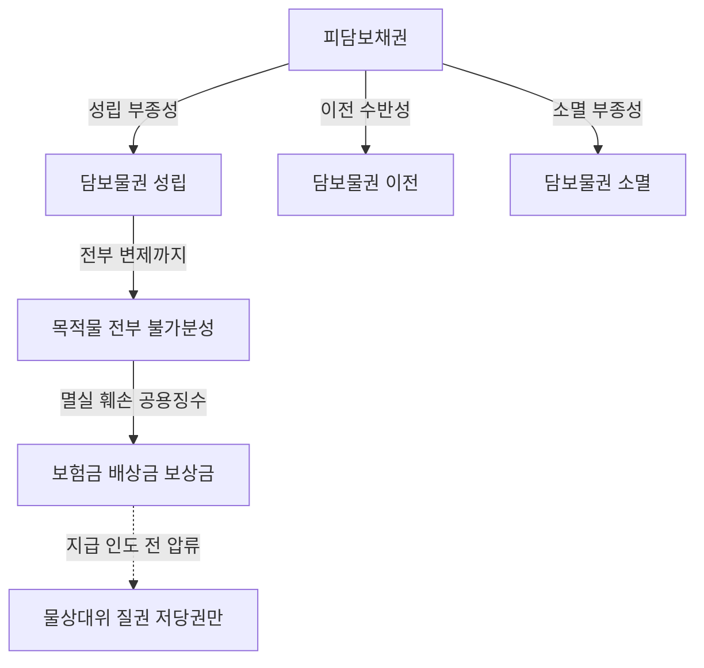

#### ⭐ 기출 출제포인트

1. **유치권에 인정되는 통유성 고르기** — 부종성·수반성·불가분성·물상대위성을 ㉠~㉣로 나열하고 유치권에 인정되는 것을 모두 고르게 한다. 정답은 언제나 ㉠㉡㉢.
2. **불가분성의 정의 고르기** — "피담보채권 전부의 변제가 있을 때까지 담보물권은 그 목적물의 전부 위에 효력이 미친다"를 다른 통유성 정의와 섞어 놓는다. 일부 변제로 목적물 일부가 벗어난다는 선지가 대표적 오답이다.
3. **제361조 그대로 출제** — "저당권은 그 담보한 채권과 분리하여 타인에게 양도하거나 다른 채권의 담보로 하지 못한다"는 조문 문언이 2021년·2022년에 연속 출제되었다(모두 옳은 선지).
4. **물상대위와 압류** — "이미 제3자가 압류하였더라도 저당권자가 스스로 압류하지 않으면 물상대위권을 행사할 수 없다"는 형태의 틀린 선지가 2021년·2022년에 반복 출제되었다.
5. **물상대위의 객체** — 매매대금·차임에는 물상대위가 미치지 않는다는 점, 설정자가 금전을 이미 수령하면 행사할 수 없다는 점을 뒤집어 낸다.

#### 📊 기출 분석

| 연도 | 출제 형태 | 핵심 논점 |
|---|---|---|
| 2018년 기출 | 유치권 옳지 않은 것 | "유치권자는 피담보채권 전부의 변제를 받을 때까지 유치물 전부에 대하여 그 권리를 행사할 수 있다"(불가분성, 옳은 선지) |
| 2019년 기출 | 근저당권 옳지 않은 것 | "장래에 발생할 특정의 조건부채권을 피담보채권으로 하는 근저당권의 설정은 허용되지 않는다"(부종성 완화, 틀린 선지) |
| 2021년 기출 | 저당권 옳지 않은 것 | 물상대위 압류(틀린 선지)와 제361조(옳은 선지)가 한 문항에 동시 배치 |
| 2022년 기출 | 저당권 옳지 않은 것 | 물상대위 압류(틀린 선지), 제361조, 전세권저당권의 물상대위 |
| 2022년 기출 | 질권 옳지 않은 것 | "질권자는 채권 전부를 변제받을 때까지 질물 전부에 대하여 그 권리를 행사할 수 있다"(불가분성) |
| 2024년 기출 | 질권 옳지 않은 것 | "질권자가 채권 일부를 변제받았더라도 질물 전부에 대하여 권리 행사"(불가분성), "질물이 멸실된 경우 설정자가 받을 금전을 압류하면 질권의 효력이 미친다"(물상대위) |

**출제 빈도** — 통유성은 거의 매년 어떤 형태로든 선지에 등장한다. 특히 불가분성과 물상대위는 유치권·질권·저당권 세 영역 모두에서 반복된다.

**반복되는 함정 선지** — ㉠ "제3자가 압류하였더라도 저당권자가 스스로 압류해야 한다"(X) ㉡ "저당목적물의 매각대금에도 물상대위가 미친다"(X) ㉢ "채권 일부를 변제하면 담보물권의 효력도 그만큼 축소된다"(X) ㉣ "유치권에도 물상대위가 인정된다"(X) ㉤ "저당권은 담보한 채권과 분리하여 양도할 수 있다"(X).

**최근 경향** — 2021년 이후 물상대위의 압류 주체·시기를 묻는 문항이 정착했다. 2024년에는 질권 문항 안에서 불가분성과 물상대위가 나란히 출제되어, 통유성을 권리별이 아니라 성질별로 정리해 두어야 대응할 수 있게 되었다.

#### 🔍 기출 선지로 배우는 법리

> 실제 출제된 선지를 그대로 놓고 O/X와 근거를 확인한다.

**①** 유치권자는 피담보채권 전부의 변제를 받을 때까지 유치물 전부에 대하여 그 권리를 행사할 수 있다. (2018년 기출) — **O**
근거: 제321조 유치권의 불가분성. 질권은 제343조, 저당권은 제370조가 이를 준용한다.

**②** 저당목적물의 변형물에 대하여 이미 제3자가 압류하였더라도 저당권자가 스스로 이를 압류하지 않으면 물상대위권을 행사할 수 없다. (2021년 기출) — **X**
어디가 틀렸나: 이미 제3자가 압류하여 금전 또는 물건이 특정된 이상, 저당권자는 스스로 압류하지 않고서도 물상대위권을 행사하여 일반 채권자보다 우선변제를 받을 수 있다(대법원 2010.10.28. 2010다46756).

**③** 저당권은 그 담보한 채권과 분리하여 타인에게 양도하거나 다른 채권의 담보로 하지 못한다. (2021년 기출·2022년 기출) — **O**
근거: 제361조 저당권의 처분제한. 수반성의 조문적 표현이며, 두 해 연속 옳은 선지로 출제되었다.

**④** 장래에 발생할 특정의 조건부채권을 피담보채권으로 하는 근저당권의 설정은 허용되지 않는다. (2019년 기출) — **X**
어디가 틀렸나: 장래에 발생할 특정의 조건부 채권을 담보하기 위하여도 저당권을 설정할 수 있으므로 그러한 채권도 근저당권의 피담보채권으로 확정될 수 있다(대법원 2015.12.24. 2015다200531). 부종성의 완화다.

**⑤** 질물이 멸실된 경우에도 그로 인하여 질권설정자가 받을 금전을 압류하면 질권의 효력이 그 금전에 미친다. (2024년 기출) — **O**
근거: 제342조 물상대위. 지급 또는 인도 전에 압류하여야 한다는 요건이 선지에 그대로 반영되어 있다.

**⑥** 다음 담보물권의 특질 중 불가분성에 해당하는 것은? ② 피담보채권이 전부의 변제가 있을 때까지 담보물권은 그 목적물의 전부의 위에 효력이 미친다. (문제집 제6장 기본문제 2번) — **O**
근거: ①은 부종성, ③은 불가분성을 뒤집은 오답, ④는 물상대위성, ⑤는 수반성의 정의다.

**⑦** 담보물권이 가지는 특성(통유성) 중에서 유치권에 인정되는 것을 모두 고른 것은? ㉠부종성 ㉡수반성 ㉢불가분성 ㉣물상대위성 (문제집 제6장 기본문제 5번) — 정답 **㉠㉡㉢**
근거: 유치권에는 물상대위성이 인정되지 않는다. 우선변제적 효력이 없기 때문이다.

**⑧** 저당권에도 물상대위성이 있으므로 저당목적물의 매각으로 인한 매매대금에도 저당권의 효력이 미친다. (문제집 제6장 기본문제 13번) — **X**
어디가 틀렸나: 물상대위는 멸실·훼손·공용징수로 설정자가 받을 금전에 미친다. 매매대금 등에는 저당권의 추급력으로 인해 물상대위성이 인정되지 않는다.

**⑨** 유치권자는 유치물의 멸실로 유치물의 소유자가 받을 금전에 대하여 유치권을 행사하지 못한다. (문제집 제6장 실전문제 2번) — **O**
근거: 유치권은 물상대위성이 없다. 유치권은 목적물을 유치할 수 있는 것을 본질로 하고 목적물의 교환가치를 목적으로 하는 것이 아니기 때문이다.

**⑩** 유치물이 분할 가능한 경우, 채무자가 피담보채무의 일부를 변제하면 그 범위에서 유치권은 일부 소멸한다. (문제집 제6장 실전문제 18번) — **X**
어디가 틀렸나: 피담보채무의 전액을 변제할 때까지 목적물 전부 위에 담보물권의 효력이 미친다(불가분성). 불가분성은 목적물이 분할 가능하거나 수개의 물건인 경우에도 적용된다(대판 2007.9.7. 2005다16942).

#### ✏️ 사례형 적용

> **사례 1** — 수급인 甲은 다세대주택 10세대 전부의 창호공사를 완성하였으나 공사대금 5,000만 원 중 3,000만 원을 받지 못하였다. 甲은 그 중 제101호 한 세대만 점유하며 유치권을 주장한다. 도급인 乙은 "101호 몫의 공사대금 500만 원만 받으면 되지 않느냐"고 다툰다.

**검토** — ㉠ 유치권의 불가분성은 목적물이 분할 가능하거나 수개의 물건인 경우에도 적용된다(대판 2007.9.7. 2005다16942). ㉡ 따라서 甲의 유치권은 101호에 대하여 시행한 공사대금만이 아니라 다세대주택 전체에 대하여 시행한 공사대금채권의 잔액 전부(3,000만 원)를 피담보채권으로 하여 성립한다. ㉢ 乙이 500만 원을 변제해도 잔액이 있는 한 甲은 101호 전부를 계속 유치할 수 있다. ㉣ 다만 비용이 물건 일부에만 들어갔고 분할이 용이한 경우라면 유치권의 객체가 그 일부로 한정될 수 있다는 점(대판 1968.3.5. 67다2786)과 구별해야 한다. 이 사안은 전체에 공사를 했다는 점에서 다르다.

> **사례 2** — 甲은 乙 소유 X건물에 1번 저당권을 가지고 있다. X건물이 화재로 소실되어 乙은 보험회사에 대해 화재보험금청구권 2억 원을 취득하였다. ㉮ 일반채권자 丙이 이 보험금청구권을 먼저 압류하였다. ㉯ 한편 다른 사안에서는 乙이 이미 보험금 2억 원을 수령해 버렸다.

**검토** — ㉠ 저당목적물의 소실로 설정자가 취득한 화재보험금청구권은 물상대위의 객체가 된다(대판 2004.12.24. 2004다52798). ㉡ ㉮의 경우, 이미 제3자 丙이 압류하여 금전이 특정된 이상 甲은 스스로 압류하지 않고서도 물상대위권을 행사하여 일반채권자보다 우선변제를 받을 수 있다(대법원 2010.10.28. 2010다46756). 다만 배당요구의 종기까지는 권리를 행사해야 한다. ㉢ ㉯의 경우, 설정자가 인도청구권에 기하여 금전을 이미 수령하였으므로 특정성이 상실되어 甲은 더 이상 물상대위권을 행사할 수 없다(대판 2015.9.10. 2013다216273). ㉣ 만약 甲이 저당권자가 아니라 유치권자였다면 애초에 물상대위 자체가 불가능하다.

> **사례 3** — 甲은 乙에 대한 1억 원의 대여금채권과 이를 담보하는 X부동산 저당권을 가지고 있다. ㉮ 甲이 대여금채권만을 丙에게 양도하고 저당권이전의 부기등기는 하지 않았다. ㉯ 甲이 저당권만을 丁에게 양도하려 한다.

**검토** — ㉠ ㉮의 경우, 수반성의 원칙상 피담보채권을 처분하면 담보권도 함께 처분되는 것이 원칙이다. 그러나 채권만 양도되고 담보권의 처분이 따르지 않는 특별한 사정이 있으면 丙은 무담보의 채권을 양수한 것이 되고, 채권의 처분에 따르지 않은 담보권은 원칙적으로 소멸한다. 저당권과 분리해 피담보채권만을 양도한 경우 양도인 甲은 채권을 상실하므로 甲 앞으로 된 저당권은 소멸한다(대판 2020.4.29. 2016다235411). ㉡ ㉯의 경우, 제361조에 의해 저당권은 그 담보한 채권과 분리하여 타인에게 양도하거나 다른 채권의 담보로 하지 못한다. 甲의 시도는 허용되지 않는다. ㉢ 정리하면, 채권만 이전은 가능하지만(담보권 소멸) 담보권만 이전은 금지된다. 이 비대칭이 결론이다.

#### ⚠️ 이 관의 함정 총정리

1. "유치권에는 부종성·수반성·불가분성·물상대위성이 모두 인정된다"라고 하면 틀림 → 유치권에 없는 것은 물상대위성(과 추급력)이다. 나머지 셋은 모두 있다.
2. "피담보채권의 일부가 변제되면 그만큼 목적물의 일부가 담보물권의 구속에서 벗어난다"라고 하면 틀림 → 불가분성상 잔액이 있는 한 목적물 전부에 효력이 미친다. 목적물이 분할 가능해도 마찬가지다.
3. "제3자가 이미 압류했더라도 담보물권자가 스스로 압류해야 물상대위권을 행사할 수 있다"라고 하면 틀림 → 특정성만 유지되면 누가 어떤 방법으로 압류했는지는 상관없다.
4. "저당목적물의 매매대금이나 차임에도 물상대위가 미친다"라고 하면 틀림 → 목적물이 존속하므로 우선변제권·추급력으로 해결되고 물상대위는 인정되지 않는다.
5. "저당권은 담보한 채권과 분리하여 다른 채권의 담보로 제공할 수 있다"라고 하면 틀림 → 제361조가 명문으로 금지한다. 반대로 유치권 배제특약과 달리 이는 임의로 뒤집을 수 없다.

#### ✅ OX 확인문제

> 다음 진술의 참·거짓을 판단하시오.

**1.** 담보물권의 통유성 중 유치권에 인정되지 않는 것은 물상대위성이다.
→ **O**. 유치권은 부종성·수반성·불가분성이 인정되나 추급력과 물상대위성은 부정된다.

**2.** 불가분성은 유치권에만 인정되고 질권·저당권에는 준용되지 않는다.
→ **X**. 민법은 유치권에 관하여 제321조를 두고 질권(제343조)·저당권(제370조)에 준용한다. 모든 담보물권에 적용된다.

**3.** 공동저당은 불가분성의 예외에 해당한다.
→ **O**. 동시배당 시 각 부동산의 경매대가에 비례하여 피담보채권을 안분하므로(제368조 제1항) 목적물 전부에 대한 행사라는 원칙이 수정된다.

**4.** 물상대위권을 행사하려면 목적물의 변형물이 지급 또는 인도되기 전에 압류하여야 한다.
→ **O**. 제342조. 압류를 요구하는 취지는 변형물의 특정성 유지에 있다.

**5.** 저당목적물의 변형물에 대하여 이미 제3자가 압류하여 특정된 경우에도 저당권자가 스스로 압류하지 않으면 물상대위권을 행사할 수 없다.
→ **X**. 이 경우 저당권자는 스스로 압류하지 않고서도 물상대위권을 행사하여 일반채권자보다 우선변제를 받을 수 있다(대법원 2010.10.28. 2010다46756).

**6.** 근저당권의 목적인 토지의 소유자가 공용징수 보상금을 이미 수령한 경우에도 근저당권자는 물상대위권을 행사할 수 있다.
→ **X**. 설정자가 인도청구권에 기하여 금전 등을 수령한 경우 특정성을 잃어 더 이상 물상대위권을 행사할 수 없다(대판 2015.9.10. 2013다216273).

**7.** 저당권은 그 담보한 채권과 분리하여 타인에게 양도하거나 다른 채권의 담보로 하지 못한다.
→ **O**. 제361조. 2021년·2022년 기출에 연속으로 옳은 선지로 출제되었다.

**8.** 피담보채권이 이전되었으나 담보권의 처분이 따르지 않는 특별한 사정이 있는 경우, 채권양수인은 담보권 있는 채권을 양수한 것으로 본다.
→ **X**. 이 경우 양수인은 무담보의 채권을 양수한 것이 되고, 채권의 처분에 따르지 않은 담보권은 원칙적으로 소멸한다.

**9.** 저당권으로 담보한 채권이 시효의 완성 기타 사유로 소멸한 때에는 저당권도 소멸한다.
→ **O**. 제369조가 정한 소멸상 부종성이다. 다만 담보물권 자체는 피담보채권과 독립하여 소멸시효에 걸리지 않는다.

**10.** 장래에 발생할 특정의 조건부 채권을 피담보채권으로 하는 근저당권의 설정은 부종성에 반하여 허용되지 않는다.
→ **X**. 그러한 채권도 근저당권의 피담보채권으로 확정될 수 있고, 확정 당시 조건이 성취되지 않았다는 사정만으로 근저당권이 소멸하지 않는다(대법원 2015.12.24. 2015다200531). 근저당은 부종성이 특히 완화된다.

#### 🧠 암기법

> 🔑 **"부·수·불·물 — 유치권은 물(物)만 빠진다"**
> **부**종성 · **수**반성 · **불**가분성 · **물**상대위성.
> 앞의 세 개는 유치권에도 다 있고, 마지막 물상대위성 하나만 빠진다.
> 이유까지 한 줄로: 우선변제권이 없으니 교환가치를 좇을 수도 없다.

> 🔑 **"멸·훼·공 → 보·손·보 / 지급 전 압류"**
> 물상대위의 원인은 **멸**실·**훼**손·**공**용징수, 객체는 **보**험금·**손**해배상금·**보**상금.
> 요건은 지급 또는 인도 전의 압류.
> 여기 없는 것은 매매대금·차임 — 목적물이 살아 있으면 물상대위는 없다.

> 🔑 **"321 · 343 · 370 — 불가분 3형제"**
> 불가분성은 유치권 **321**, 질권 **343**, 저당권 **370**.
> 물상대위는 질권 **342**, 저당권은 **370**이 준용.
> 370은 저당권의 만능 준용조문이라고 기억하면 두 줄이 한 번에 정리된다.

> 🔑 **"채권만 가면 담보는 죽고, 담보만 가는 건 막힌다"**
> 수반성의 양방향 정리 — 피담보채권만 양도하면 따라오지 않은 담보권은 소멸하고,
> 담보권만 떼어 양도하는 것은 제361조가 금지한다.
> 즉 한쪽 방향은 "소멸", 반대 방향은 "금지"다.

#### ⚖️ 법조문 원문

> 📖 이 관이 근거로 삼은 조문의 **전문**이다. 본문 인용은 발췌지만 여기서는 조 전체를 싣는다. 출처는 법제처 정본이다.

**― 민법 ―**

> 📌 **민법 제321조(유치권의 불가분성)** — "유치권자는 채권전부의 변제를 받을 때까지 유치물전부에 대하여 그 권리를 행사할 수 있다."

> 📌 **민법 제342조(물상대위)** — "질권은 질물의 멸실, 훼손 또는 공용징수로 인하여 질권설정자가 받을 금전 기타 물건에 대하여도 이를 행사할 수 있다. 이 경우에는 그 지급 또는 인도전에 압류하여야 한다."

> 📌 **민법 제343조(준용규정)** — "제249조 내지 제251조, 제321조 내지 제325조의 규정은 동산질권에 준용한다."

> 📌 **민법 제361조(저당권의 처분제한)** — "저당권은 그 담보한 채권과 분리하여 타인에게 양도하거나 다른 채권의 담보로 하지 못한다."

> 📌 **민법 제368조(공동저당과 대가의 배당, 차순위자의 대위)** — "①동일한 채권의 담보로 수개의 부동산에 저당권을 설정한 경우에 그 부동산의 경매대가를 동시에 배당하는 때에는 각부동산의 경매대가에 비례하여 그 채권의 분담을 정한다. ②전항의 저당부동산중 일부의 경매대가를 먼저 배당하는 경우에는 그 대가에서 그 채권전부의 변제를 받을 수 있다. 이 경우에 그 경매한 부동산의 차순위저당권자는 선순위저당권자가 전항의 규정에 의하여 다른 부동산의 경매대가에서 변제를 받을 수 있는 금액의 한도에서 선순위자를 대위하여 저당권을 행사할 수 있다."

> 📌 **민법 제369조(부종성)** — "저당권으로 담보한 채권이 시효의 완성 기타 사유로 인하여 소멸한 때에는 저당권도 소멸한다."

> 📌 **민법 제370조(준용규정)** — "제214조, 제321조, 제333조, 제340조, 제341조 및 제342조의 규정은 저당권에 준용한다."

### 제1관 유치권의 의의와 성립

> 📖 유치권은 **당사자의 계약이 아니라 법률의 규정으로 당연히 성립하는 법정담보물권**이다. 그래서 "설정"이 아니라 "성립"을 따진다.
> 이 관은 제320조의 문언을 성립요건 5가지로 분해하고, 그중 시험이 집요하게 파고드는 ==견련관계==와 ==점유==, 그리고 ==압류 후 취득한 유치권의 대항력==을 정리한다.
> 제2관(효력)·제3관(소멸)은 모두 "유치권이 성립했다"는 전제 위에서 움직이므로, 이 관이 무너지면 뒤가 전부 무너진다.

> ⭐ **이 관에서 반드시 챙길 3가지**
> ① **견련관계 O/X 목록** — 비용상환청구권·공사대금채권·목적물로부터의 손해배상은 O, **보증금·권리금·매매대금·건축자재대금·부속물매수대금은 전부 X**.
> ② **점유의 3중 함정** — 불법행위로 개시된 점유 X, **채무자를 직접점유자로 하는 간접점유 X**, 채권과 점유 사이의 견련관계는 요구 X.
> ③ **압류(경매개시결정 기입등기) 전후** — 등기 전 취득 = 매수인에게 대항 O, 등기 후 취득 = 대항 X. 저당권·가압류등기 후라도 **경매개시결정등기 전이면 대항 O**.

#### 1. 의의

유치권(留置權)이란 ==타인의 물건 또는 유가증권==을 점유하는 자가 그 물건이나 유가증권에 관하여 생긴 채권의 변제를 받을 때까지 그 물건 또는 유가증권의 인도를 거절할 수 있는 권리를 말한다(제320조 제1항).

**법률적 성질**

| 성질 | 내용 |
|---|---|
| 법정담보물권 | 당사자간의 담보설정계약이 아니라 ==법률의 규정에 의해== 성립한다. 합의로 유치권을 "설정"할 수는 없다 |
| 타물권 | 타인의 물건 위에만 성립한다. ==자기 소유 물건에는 성립하지 않는다== |
| 부종성·수반성·불가분성 | 모두 인정된다. 부종성은 질권·저당권보다 오히려 ==엄격하게== 요구된다 |
| 물상대위성 | ==인정되지 않는다==. 유치적 효력만 있고 교환가치 지배를 내용으로 하지 않기 때문 |
| 추급력 | 부정된다 |
| 우선변제권 | 법적으로는 부정되나 ==사실상(실질적)== 인정되는 것과 같다 |
| 별제권 | 채무자회생 및 파산에 관한 법률상 별제권이 인정된다 |

**사회적 작용** — 유치권은 질권·저당권과 같은 우선변제적 효력이 없다. 그러나 채무자에게 가치가 높은 재산을 붙잡고 인도를 거절함으로써 생기는 ==심리적 압박==을 통해, 결과적으로 다른 채권자보다 사실상 먼저 변제를 받게 된다.

**담보물권 3자 비교**

| 내용 | 유치권 | 질권 | 저당권 |
|---|---|---|---|
| 성립 | 요건 충족 시 당연히 성립하는 ==법정담보물권== | 설정계약＋인도(양도), 약정담보물권 | 설정계약＋등기, 약정담보물권 |
| 목적물 | 동산·부동산·유가증권 | 동산·권리 | 부동산·권리 |
| 우선적 효력 | ==없음(실질적: 인정)== | 있음 | 있음 |
| 경매권 | 있음 | 있음 | 있음 |
| 유치적 효력 | 있음 | 있음 | 없음 |
| 수익적 효력 | 없음 | 없음 | 없음 |
| 간이변제충당권 | 법원의 허가를 얻어 행할 수 있음 | 유치권과 동일 | 없음 |
| 물상대위성 | ==없음== | 있음 | 있음 |

**동시이행의 항변권과의 비교** — 둘 다 공평의 원리에서 나왔고 ==서로 배척하지 않고 병존==한다.

| 구분 | 유치권 | 동시이행의 항변권 |
|---|---|---|
| 성질 | 독립한 물권, ==절대적 대세권== | 쌍무계약의 효력(작용), 상대적 대인권 |
| 대항력 | 있음 — ==어느 누구에 대해서도== 행사 | 없음 — 계약 상대방에게만 |
| 목적 | 채권담보를 목적으로 함 | 일방당사자만이 선이행을 요구당함을 저지 |
| 대가관계 | 대가적 관계가 ==없음== | 대가적 관계가 있음 |
| 거절할 수 있는 급부 | ==물건 또는 유가증권의 인도에 한함== | 제한 없음 |
| 피담보채권 | 발생 원인을 묻지 않음, 계약관계 없이도 발생 | 동일한 쌍무계약에서 발생한 것에 한함 |
| 타담보 제공 | 타담보를 제공하고 ==소멸시킬 수 있음== | 타담보를 제공해도 소멸시킬 수 없음 |
| 경매권 | 있음 | 없음 |

#### 2. 요건

> ⭐ **성립요건 5가지 — 이 표가 이 관의 심장이다.**

| 요건 | 내용 | 함정 포인트 |
|---|---|---|
| ① **타인의 물건 또는 유가증권** | 동산·부동산·유가증권 모두 가능. 타인의 물건이면 되고 ==채무자 소유이든 제3자 소유이든 무방== | ==자기 소유 물건에는 성립 X==(타물권). 수급인이 자기 재료·노력으로 지은 독립건물은 수급인 소유 → 유치권 X. 독립한 물건이어야 하므로 토지의 부합물인 정착물에는 X |
| ② **채권과 목적물 사이의 견련관계** | 채권이 ==목적물 자체로부터 발생==하거나, ==목적물 반환청구권과 동일한 법률관계·사실관계로부터 발생==한 경우 | 보증금·권리금·매매대금·건축자재대금·부속물매수대금 = ==전부 X==. 반면 ==채권과 '점유' 사이의 견련관계는 요구되지 않는다== |
| ③ **채권의 변제기 도래** | 변제기 전에는 유치권이 성립하지 않는다(제320조 제1항) | 유익비상환청구권에 대해 법원이 ==상당한 상환기간을 허여==하면 변제기가 미도래하여 유치권은 성립하지 않는다(소멸한다). 변제기 도래는 성립요건일 뿐 ==경매실행요건은 아니다== |
| ④ **적법한 점유의 계속** | 직접점유·간접점유 불문. 점유는 ==성립요건이자 존속요건== | ㉠ ==불법행위로 인한 점유 X==(제320조 제2항) ㉡ ==직접점유자가 채무자인 간접점유 X== ㉢ 비용지출 당시 점유권원 없음을 알았거나 중과실로 몰랐으면 X |
| ⑤ **유치권 배제 특약이 없을 것** | 유치권 규정은 ==임의규정==. 미리 유치권의 발생을 막는 특약은 유효하고 ==조건을 붙일 수도== 있다 | 특약의 효력은 상대방뿐 아니라 ==그 밖의 제3자도 주장(원용)할 수 있다== |

**② 견련관계 — 인정례 vs 부정례 대비표 (최다 출제)**

| 채권 | 견련관계 | 근거 |
|---|---|---|
| 임차인의 필요비·유익비 상환청구권 | ==O== | 목적물 자체로부터 발생(73다2010) |
| 점유자의 비용상환청구권 | ==O== | 목적물에 지출한 비용 |
| 수리비 채권(항공기 수리) | ==O== | 물건의 수선비청구권(2014다17220) |
| 수급인의 공사대금채권(도급인 소유 건물) | ==O== | 그 건물에 관하여 생긴 채권(95다16202) |
| 목적물로부터 입은 손해배상청구권(가축이 농작물을 먹은 사안) | ==O== | 반환청구권과 동일한 사실관계(69다1592) |
| 임치물의 하자로부터 생긴 수치인의 손해배상채권 | ==O== | 목적물로부터 받은 손해배상청구권 |
| 원채권과 견련관계 있는 채무불이행 손해배상채권 | ==O== | 원채권의 연장(76다582) |
| 매매계약이 취소된 경우 부당이득에 의한 대금반환청구권 | ==O== | 반환청구권과 동일한 법률관계 |
| 소유자 변동 후 새로 지출한 유익비 | ==O== | 보존행위로서의 점유는 적법(71다2414) |
| **임차보증금반환청구권** | ==X== | 건물에 관하여 생긴 채권이 아님(75다1305) |
| **권리금반환청구권** | ==X== | 건물에 관하여 생긴 채권이 아님(93다62119) |
| **부속물매수청구권(부속물대금채권)** | ==X== | 판례는 유치권을 부정한다 |
| **건축자재대금채권** | ==X== | 매매대금채권일 뿐 건물 자체에 관한 채권이 아님 |
| **매도인의 매매대금채권** | ==X== | 소유권이전 후 점유해도 매수인·제3취득자에게 주장 불가(2011마2380) |
| **계약명의신탁에서 명의신탁자의 부당이득반환청구권** | ==X== | 견련성 부정(2008다34828) |
| **임대인이 건물시설을 하지 않아 생긴 손해배상청구권** | ==X== | 건물에 관하여 생긴 채권이 아님(75다1305) |
| 공사비 반환 약정에 기한 것이나 객관적 가치증가와 무관한 비용 | ==X== | 견련관계가 인정되지 않는 부분까지 피담보채권이 되지는 않음 |

**④ 점유 — 유형별 정리**

| 점유 유형 | 유치권 | 이유 |
|---|---|---|
| 직접점유 | ==O== | 당연 |
| 간접점유(제3자를 직접점유자로) | ==O== | 하수급인이 다른 하수급인을 통해 간접점유해도 요건 충족 가능 |
| **채무자를 직접점유자로 하는 간접점유** | ==X== | 유치권의 본체적 효력은 채무자에 대한 간접강제인데, 채무자가 직접점유하면 압박이 없음(2002마3516, 2007다27236) |
| 채권자와 채무자의 공동점유 | ==X== | 채무자가 점유를 유지하는 이상 간접강제 기능이 없음 |
| 불법행위로 개시된 점유(사기·강박·횡령, 무단점유) | ==X== | 제320조 제2항(76다482) |
| 비용지출 당시 점유권원 없음을 알았거나 중과실로 몰랐던 점유 | ==X== | 상대방이 주장·증명해야 한다(66다600) |
| 점유 취득 **후에** 채권이 발생 / 채권 발생 **후에** 점유 취득 | ==둘 다 O== | 채권과 '점유' 사이의 견련관계는 불요(64다1977, 2014다53462) |

**⑤ 취득시기 — 압류와의 관계 (대표 논점)**

| 시점 | 사안 | 결론 |
|---|---|---|
| 근저당권 설정 후 · 압류 효력 발생 **전** 취득 | 유치권 취득 전 설정된 근저당권에 기해 경매가 개시되었더라도 | ==매수인에게 대항 O==(2008다70763) |
| 저당권설정등기·**가압류등기** 후, 경매개시결정등기 **전** 취득 | 저당권·가압류가 앞서 있어도 | ==매수인에게 유치권 행사 O==(2009다19246) |
| 경매개시결정 기입등기(압류 효력 발생) **후** 채무자가 점유를 이전 | 점유 이전은 교환가치를 감소시킬 우려가 있는 ==처분행위==로 압류의 처분금지효에 저촉 | ==매수인에게 대항 X==(2005다22688, 2011다55214) |
| 경매개시결정등기 후 비로소 점유를 이전받거나 피담보채권이 발생 | 경매절차의 신뢰·절차적 안정성 훼손 | ==매수인에 대하여 유치권 행사 X==(2015마2025, 2021다253710) |

> 💡 체납처분압류만 되어 있고 아직 경매개시결정등기가 되기 전에 취득한 유치권에 대해서는, 판례는 **경매절차의 매수인에게 대항할 수 있다**고 본다. 압류의 처분금지효가 문제되는 기준시점은 어디까지나 ==경매개시결정 기입등기== 시점이라는 점을 기억하라. (이 판례의 사건번호는 소스에서 확인되지 않아 생략한다.)

**민사유치권 vs 상사유치권**

기출 문두가 굳이 "**민사**유치권에 관한 설명으로…"라고 표시하는 이유가 여기에 있다. 상법상 유치권(상사유치권)은 상인 간 상행위로 생긴 채권을 담보하며, 민사유치권과 요건이 다르다.

| 구분 | 민사유치권(민법 제320조) | 상사유치권 |
|---|---|---|
| 당사자 | 제한 없음 | ==쌍방적 상행위==로 생긴 채권, 상인 간 |
| 견련관계 | ==개별 목적물과 채권 사이의 견련관계 필요== | ==개별적 견련관계 불요== (상행위로 점유하게 된 물건이면 족함) |
| 목적물의 소유자 | 타인의 물건이면 되고 ==채무자 소유일 필요 없음== | ==채무자 소유의 물건·유가증권==일 것을 요함 |
| 목적물 | 동산·부동산·유가증권 | 물건·유가증권(부동산 포함 여부는 판례상 인정) |
| 배제특약 | 가능(임의규정) | 가능 |

> ⚠️ 상사유치권 부분은 소스에서 조문 번호가 확인되지 않아 **상법 조문 번호를 붙이지 않았다.** 시험에서는 "민사유치권은 채무자 소유일 필요가 없다 / 상사유치권은 채무자 소유여야 한다"는 대비만 정확히 기억하면 된다.

#### 3. 효과

| 구분 | 효과 |
|---|---|
| 성립 방식 | ==등기 불필요==. 유치권은 점유에 의하여 공시되므로 요건 충족 시 당연히 성립 |
| 목적물의 범위 | 물건 전부에 비용이 들었으면 전부, ==물건 일부에만 비용이 들었고 분할이 용이하면 그 일부==에만 성립(67다2786) |
| 피담보채권의 범위 | 유치물 전체에 대해 시행한 채권 잔액 전부(불가분성, 2005다16942) |
| 다른 담보물권과의 순위 | 유치권은 다른 담보물권의 선후에 ==상관없이 별개로 성립==. 저당권이 설정된 건물에 유치권이 성립한 후 저당권이 실행되어도 ==유치권은 소멸하지 않고 존속== |
| 배제특약이 있는 경우 | 다른 법정요건이 모두 충족되어도 ==유치권은 발생하지 않는다==. 특약의 효력은 ==제3자도 주장할 수 있다==(2016다234043) |

#### 4. 관련 조문

> 📌 **민법 제320조(유치권의 내용)** — "① 타인의 물건 또는 유가증권을 점유한 자는 그 물건이나 유가증권에 관하여 생긴 채권이 변제기에 있는 경우에는 변제를 받을 때까지 그 물건 또는 유가증권을 유치할 권리가 있다. ② 전항의 규정은 그 점유가 불법행위로 인한 경우에 적용하지 아니한다."

> 📌 **민법 제324조(유치권자의 선관의무) 제1항** — "유치권자는 선량한 관리자의 주의로 유치물을 점유하여야 한다."

> 📌 **민법 제325조(유치권자의 상환청구권)** — "① 유치권자가 유치물에 관하여 필요비를 지출한 때에는 소유자에게 그 상환을 청구할 수 있다. ② 유치권자가 유치물에 관하여 유익비를 지출한 때에는 그 가액의 증가가 현존한 경우에 한하여 소유자의 선택에 좇아 그 지출한 금액이나 증가액의 상환을 청구할 수 있다. 그러나 법원은 소유자의 청구에 의하여 상당한 상환기간을 허여할 수 있다."

#### 5. 핵심 판례 법리

- **견련관계의 정의** — 유치권이 발생할 수 있는 피담보채권은 "그 물건에 관하여 생긴 채권"이어야 한다. 이는 채권이 목적물 자체로부터 발생한 경우는 물론이고, ==채권이 목적물의 반환청구권과 동일한 법률관계나 사실관계로부터 발생한 경우==도 포함한다(대판 2007.9.7. 2005다16942).
- **비용상환청구권 — 유치권 O** — 건물임차인이 건물에 지출한 각종의 유익비 또는 필요비의 상환청구권에 터잡아 임차인은 유치권을 주장할 수 있다(대판 1975.4.22. 73다2010). 수리비 채권에 기하여 항공기에 대한 유치권을 행사할 수 있다(대판 2015.2.26. 2014다17220).
- **수급인의 공사대금채권 — 유치권 O** — 주택건물의 신축공사를 한 수급인이 그 건물을 점유하고 있고 또 그 건물에 관하여 생긴 공사금 채권이 있다면, 수급인은 그 채권을 변제받을 때까지 건물을 유치할 권리가 있다(대판 1995.9.15. 95다16202).
- **그러나 기성부분이 수급인 소유이면 — 유치권 X** — 유치권은 ==타물권==인 점에 비추어 볼 때 수급인의 재료와 노력으로 건축되었고 독립한 건물에 해당되는 기성부분은 수급인의 소유이므로, 수급인은 공사대금을 지급받을 때까지 이에 대하여 유치권을 가질 수 없다(대판 1993.3.26. 91다14116).
- **독립성 없는 정착물 — 유치권 X** — 건물의 신축공사를 도급받은 수급인이 사회통념상 독립한 건물이라고 볼 수 없는 정착물을 토지에 설치한 상태에서 공사가 중단된 경우, 그 정착물은 ==토지의 부합물==에 불과하여 유치권을 행사할 수 없고, 공사중단시까지 발생한 공사금 채권도 토지에 관하여 생긴 것이 아니므로 토지에 대해서도 유치권을 행사할 수 없다(대판 2008.5.30. 자 2007마98).
- **임차보증금·손해배상 — 유치권 X** — 건물의 임대차에 있어서 임차인이 임대인에게 지급한 보증금반환청구권이나, 임대인이 건물시설을 아니하기 때문에 임차인에게 건물을 임차목적대로 사용 못한 것을 이유로 하는 손해배상청구권은 ==모두 그 건물에 관하여 생긴 채권이라 할 수 없다==(대판 1976.5.11. 75다1305).
- **권리금반환청구권 — 유치권 X** — 임대인과 임차인 사이에 건물명도시 권리금을 반환하기로 하는 약정이 있었다 하더라도 그와 같은 권리금반환청구권은 건물에 관하여 생긴 채권이라 할 수 없으므로, 그 채권을 가지고 건물에 대한 유치권을 행사할 수 없다(대판 1994.10.14. 93다62119).
- **매매대금채권 — 유치권 X** — 부동산 매도인이 매매대금을 다 지급받지 않은 상태에서 매수인에게 소유권이전등기를 마쳐주었으나 부동산을 계속 점유하고 있는 경우, 매매대금채권을 피담보채권으로 하여 ==매수인이나 그에게서 소유권을 취득한 제3자에게 유치권을 주장할 수 없다==(대판 2012.1.12. 2011마2380).
- **부당이득반환청구권 — 유치권 X** — 계약명의신탁에 있어 명의신탁자가 명의수탁자에 대하여 가지는 매매대금 상당의 부당이득반환청구권에 기하여 유치권을 행사할 수 없다(대판 2009.3.26. 2008다34828).
- **목적물로부터 입은 손해배상청구권 — 유치권 O** — 타인의 말이 피고 소유의 농작물을 먹은 까닭에 피해를 보았고 말들의 사육비를 지출하였다면, 그 말에 대한 유치권의 항변이 인정된다(대판 1969.11.25. 69다1592).
- **채무불이행 손해배상채권 — 유치권 O** — 채무불이행에 의한 손해배상청구권은 ==원채권의 연장==이므로, 물건과 원채권 사이에 견련관계가 있는 경우에는 그 손해배상채권과 물건 사이에도 견련관계가 있어 유치권 항변을 내세울 수 있다(대판 1976.9.28. 76다582).
- **소유자 변동 후의 유익비 — 유치권 O** — 유치권자의 점유하에 있는 유치물의 소유자가 변동하더라도 유치권자의 점유는 유치물에 대한 ==보존행위==로서 하는 것이므로 적법하고, 소유자 변동 후 새로이 유익비를 지출하여 그 가격 증가가 현존하는 경우에는 그 유익비에 대하여도 유치권을 행사할 수 있다(대판 1972.1.31. 71다2414).
- **점유가 불법행위로 시작된 경우 — 유치권 X** — 부동산의 점유가 불법행위로 인하여 시작되었을 경우에는 유치권이 성립하지 않는다(대판 1976.5.25. 76다482). 점유물에 대한 유치권 주장을 배척하려면 그 점유가 불법행위로 개시되었거나 ==유익비 지출 당시 점유할 권원이 없음을 알았거나 이를 알지 못함에 중대한 과실이 있었음==을 상대방이 주장·증명하여야 한다(대판 1966.6.7. 66다600).
- **채무자를 직접점유자로 하는 간접점유 — 유치권 X** — 유치권의 성립요건이자 존속요건인 점유는 직접점유이든 간접점유이든 관계가 없으나, 유치권은 목적물을 유치함으로써 채무자의 변제를 ==간접적으로 강제==하는 것을 본체적 효력으로 하는 권리인 점에 비추어, 그 직접점유자가 채무자인 경우에는 유치권의 요건으로서의 점유에 해당하지 않는다(대판 2002.11.27. 2002마3516; 대판 2008.4.11. 2007다27236).
- **채권과 점유 사이의 견련관계는 불요** — 유치권자가 점유하기 전에 발생된 건축비채권이라도 그 후 그 물건의 점유를 취득했다면 유치권은 성립하고(대판 1965.3.30. 64다1977), ==유치권 행사(점유) 도중에 취득한 채권==도 유치권이 성립한다(대판 2014.12.11. 2014다53462).
- **비용상환청구권의 변제기** — 점유자의 필요비·유익비 상환청구권은 민법 제203조상 "점유물을 반환할 때" 청구할 수 있으므로, 그 상환청구권은 ==점유자가 회복자에게서 점유물 반환을 청구받은 때== 비로소 행사할 수 있는 상태가 되고, 또한 이때부터 유치권을 행사할 수 있다(대판 2011.12.13. 2009다5162).
- **유치권 배제 특약** — 제한물권은 이해관계인의 이익을 부당하게 침해하지 않는 한 자유로이 포기할 수 있으므로, 당사자는 미리 유치권의 발생을 막는 특약을 할 수 있고 이러한 특약은 유효하며 ==조건을 붙일 수도== 있다. 나아가 특약에 따른 효력은 ==특약의 상대방뿐 아니라 그 밖의 사람도 주장할 수 있다==(대판 2018.1.24. 2016다234043).
- **원상복구 명도 약정 = 비용상환청구권 포기 특약** — 건물의 임차인이 임대차관계 종료시에는 건물을 원상으로 복구하여 임대인에게 명도하기로 약정한 것은 유익비·필요비 상환청구권을 ==미리 포기하기로 한 취지의 특약==으로 볼 수 있어 임차인은 유치권을 주장할 수 없다(대판 1975.4.22. 73다2010).
- **압류 전 취득 — 대항 O** — 유치권의 취득시기가 근저당권설정 후라거나 유치권 취득 전에 설정된 근저당권에 기하여 경매절차가 개시되었더라도, ==경매로 인한 압류의 효력이 발생하기 전==에 유치권을 취득하였다면 매수인에게 대항할 수 있다(대판 2009.1.15. 2008다70763). 저당권이 설정되거나 가압류등기가 된 뒤에 유치권을 취득하였더라도 ==경매개시결정등기 전==이면 매수인에게 유치권을 행사할 수 있다(대판 2011.11.24. 2009다19246).
- **압류 후 취득 — 대항 X** — 경매개시결정 기입등기가 경료되어 압류의 효력이 발생한 후에 채무자가 부동산의 점유를 공사대금 채권자에게 이전하여 유치권을 취득하게 한 경우, 그 점유 이전은 목적물의 교환가치를 감소시킬 우려가 있는 ==처분행위==로서 압류의 처분금지효에 저촉되므로 매수인에게 대항할 수 없다(대판 2011.10.13. 2011다55214; 대판 2005.8.19. 2005다22688). 경매개시결정등기가 된 뒤에 비로소 점유를 이전받거나 피담보채권이 발생하여 유치권을 취득한 경우에도 매수인에 대하여 ==유치권을 행사할 수 없다==(대판 2017.2.8. 2015마2025; 대판 2022.12.29. 2021다253710).
- **다른 사람의 토지에 대한 관계** — 건물 점유자가 건물의 원시취득자에게 그 건물에 관한 유치권이 있다 하더라도, 그 건물의 존재와 점유가 ==토지소유자에게 불법행위==가 되고 있다면 그 유치권으로 토지소유자에게 대항할 수 없다(대판 1989.2.14. 87다카3073).

**유치권 성립 관계도**

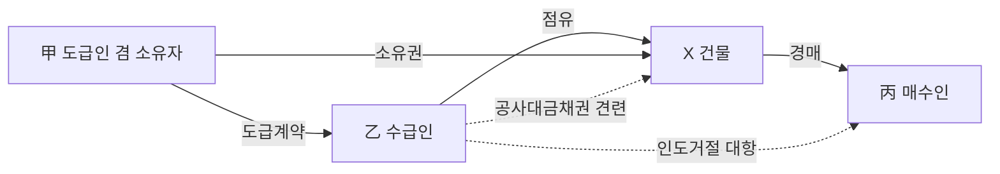

**압류 시점에 따른 대항력 판정**

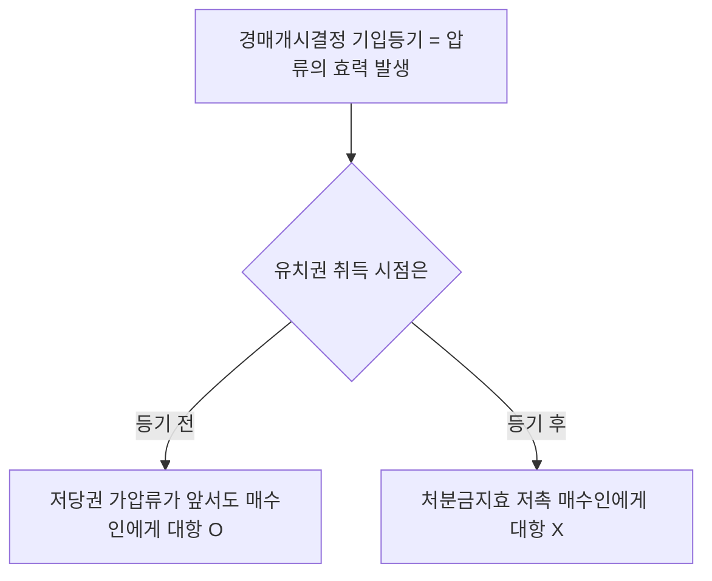

#### ⭐ 기출 출제포인트

1. **견련관계 O/X 5지선다** — "유치권의 피담보채권이 될 수 있는 것", "견련관계가 인정되지 않는 것"으로 거의 매년 변주된다. 보증금·권리금·매매대금·부속물매수대금이 오답 재료다.
2. **점유 요건 함정** — "채무자를 직접점유자로 하여 채권자가 간접점유하는 경우에도 유치권이 성립한다"는 ==정형화된 X 선지==다.
3. **압류 전후 대항력** — "경매개시결정의 기입등기 전에 취득한 유치권으로 매수인에게 대항할 수 없다"처럼 결론만 뒤집는 방식으로 출제된다.
4. **자기 물건 / 타물권성** — "원칙적으로 유치권은 채권자 자신 소유 물건에 대해서도 성립한다"(X), "수급인은 자기 재료·노력으로 완공한 건물에 유치권을 가지지 못한다"(O).
5. **배제특약** — "유치권 배제 특약이 있더라도 다른 법정요건이 모두 충족되면 유치권이 성립한다"(X)는 2022년 제33회에서 그대로 출제되었다.

#### 📊 기출 분석

| 연도 | 출제 형태 | 핵심 논점 |
|---|---|---|
| 2018년 제29회 | 유치권 옳지 않은 것 | 소멸시효 불영향·불가분성·압류 전 취득 대항력·채무자 직접점유·변제청구 불가 |
| 2019년 제30회 | 박스형(피담보채권이 될 수 있는 것) | 비용상환청구권 O, 공사대금채권 O / 보증금반환채권 X, 매매대금채권 X |
| 2020년 제31회 | 민사유치권 옳지 않은 것 | 수급인 소유 건물·증명책임·채무불이행 손해배상채권 견련성·압류 전 취득·일부 유치권 |
| 2021년 제32회 | 유치권 옳지 않은 것 | 보증금반환채권·건물시설 미비 손해배상채권·기성부분·채무자 직접점유·점유침탈 |
| 2022년 제33회 | 민사유치권 옳은 것 / 유치권자 甲 | 배제특약·타담보 소멸청구·타물권성·간접점유·불법점유 / 과실충당 순서 |
| 2023년 제34회 | 법정담보물권 고르기 / 유치권 옳지 않은 것 | 유치권 = 법정담보물권 / 소유자 변동 후 유익비·다세대주택 불가분성·기성부분 |
| 2025년 제36회 | 견련관계 부정 고르기 / 유치권 옳지 않은 것 | 임차보증금반환채권 X / 과실수취·무단임대·일부 필지 소멸청구·경매 배당순위 |

**출제 빈도** — 담보물권 4문항 중 ==유치권은 매년 1~2문항==으로, 저당권 다음으로 출제 비중이 높다. 그중 **성립요건(특히 견련관계·점유)**이 절반 이상을 차지한다.

**반복되는 함정 선지** — ① "채무자를 직접점유자로 한 간접점유도 점유에 해당한다"(X) ② "임차보증금반환채권으로 유치권을 행사할 수 있다"(X) ③ "유치권 배제 특약이 있어도 성립한다"(X) ④ "자기 소유 물건에도 성립한다"(X) ⑤ "점유가 불법행위로 인한 경우에도 성립한다"(X).

**최근 경향** — 단순 요건 암기에서 **압류·경매절차와의 충돌**(2005다22688, 2021다253710 계열)과 **불가분성의 구체적 적용**(다세대주택 한 세대 점유) 쪽으로 무게가 옮겨가고 있다.

#### 🔍 기출 선지로 배우는 법리

> 실제 출제된 선지를 그대로 놓고 O/X와 근거를 확인한다.

**①** 원칙적으로 유치권은 채권자 자신 소유 물건에 대해서도 성립한다. (2022년 제33회) — **X**
어디가 틀렸나: 담보물권은 ==타물권(他物權)==이다. / 옳게 고치면: 유치권은 **타인의 물건**에 성립하며 자기 소유 물건에는 성립할 수 없다. 다만 타인의 물건이면 채무자 소유이든 제3자 소유이든 무방하다.

**②** 채권자가 채무자를 직접점유자로 하여 간접점유하는 경우, 채권자의 점유는 유치권의 요건으로서의 점유에 해당한다. (2022년 제33회) — **X**
어디가 틀렸나: 유치권은 채무자의 변제를 ==간접적으로 강제==하는 것이 본체적 효력인데, 채무자가 직접점유하면 그 압박이 없다. / 옳게 고치면: 직접점유자가 채무자인 경우에는 점유 요건을 충족하지 못한다(2007다27236).

**③** 유치권 배제 특약이 있더라도 다른 법정요건이 모두 충족되면 유치권이 성립한다. (2022년 제33회) — **X**
어디가 틀렸나: 유치권 규정은 ==임의규정==이므로 배제특약이 있으면 다른 요건이 모두 갖추어져도 유치권은 발생하지 않는다(2016다234043).

**④** 수급인은 특별한 사정이 없으면 그의 비용과 노력으로 완공한 건물에 유치권을 가지지 못한다. (2020년 제31회) — **O**
근거: 수급인의 재료와 노력으로 건축된 독립한 건물은 ==수급인 자신의 소유==이므로 타물권인 유치권이 성립할 수 없다(91다14116).

**⑤** 채권과 물건 사이에 견련관계가 있더라도, 그 채무불이행으로 인한 손해배상채권과 그 물건 사이의 견련관계는 인정되지 않는다. (2020년 제31회) — **X**
어디가 틀렸나: 채무불이행 손해배상청구권은 ==원채권의 연장==이므로 원채권에 견련관계가 있으면 손해배상채권에도 견련관계가 인정된다(76다582).

**⑥** 저당권의 실행으로 부동산에 경매개시결정의 기입등기가 이루어지기 전에 유치권을 취득한 사람은 경매절차의 매수인에게 이를 행사할 수 있다. (2020년 제31회) — **O**
근거: 저당권·가압류등기가 앞서 있더라도 ==경매개시결정등기 전==에 유치권을 취득했다면 매수인에게 행사할 수 있다(2009다19246).

**⑦** 임대인이 건물시설을 하지 않아 임차인이 건물을 임차목적대로 사용하지 못하였음을 이유로 하는 손해배상청구권은 그 건물에 관하여 생긴 채권이다. (2021년 제32회) — **X**
어디가 틀렸나: 보증금반환청구권과 마찬가지로 ==건물에 관하여 생긴 채권이 아니다==(75다1305). 목적물 "자체로부터" 생긴 손해가 아니라 임대인의 채무불이행에서 나온 것이기 때문이다.

**⑧** 건물의 임차인이 임대차관계 종료시에는 건물을 원상으로 복구하여 임대인에게 명도하기로 약정하였다고 하더라도 임차인은 임대차 보증금을 반환받을 때까지 건물에 관하여 비용상환청구권이 있음을 전제로 하는 유치권을 주장할 수 있다. (감정평가사 기출) — **X**
어디가 틀렸나: 원상복구 명도 약정은 ==비용상환청구권을 미리 포기==하는 특약으로 해석되어 유치권 주장이 봉쇄된다(73다2010).

**⑨** 공사업자 乙에게 건축자재를 납품한 甲은 그 매매대금채권에 기하여 건축주 丙의 건물에 대하여 유치권을 행사할 수 없다. (문제집 제6장 실전문제 18번) — **O**
근거: 건축자재대금채권은 ==매매계약에 따른 매매대금채권==일 뿐 건물 자체에 관하여 생긴 채권이 아니다.

**⑩** 채권자와 채무자가 목적물을 공동으로 점유하는 경우에도 채권자는 목적물에 관한 유치권을 갖는다. (문제집 제6장 기본문제 12번) — **X**
어디가 틀렸나: 채무자가 점유를 유지하는 이상 간접강제 기능이 없다. ==채무자를 직접점유자로 하는 점유==와 같은 평가를 받는다.

#### ✏️ 사례형 적용

> **[사례 1]** 甲은 자기 소유 X건물의 신축공사를 乙에게 도급주었고, 완공된 X건물의 소유권은 甲에게 원시적으로 귀속되었다. 乙은 공사대금 3억 원을 못 받아 X건물을 점유하고 있다. 그 후 甲의 채권자 丙의 신청으로 X건물에 강제경매개시결정 기입등기가 되었고, 丁이 매각대금을 완납하였다. 乙은 丁에게 X건물의 인도를 거절할 수 있는가?

**검토** — ① 타인(甲)의 물건 O ② 공사대금채권과 X건물 사이의 견련관계 O(95다16202) ③ 변제기 도래 O ④ 적법한 직접점유 O ⑤ 배제특약 없음 O. 유치권 성립. 다만 결정적인 것은 **취득시기**다. 乙이 ==경매개시결정 기입등기 전==에 점유를 취득했다면 저당권·가압류가 앞서 있었더라도 丁에게 대항할 수 있다(2009다19246). 반대로 기입등기 후에 甲이 점유를 이전해 준 것이라면 처분금지효에 저촉되어 ==丁에게 대항할 수 없다==(2011다55214). **결론** — 점유 취득 시점이 기입등기 前이면 인도 거절 O, 後면 X.

> **[사례 2]** 乙은 甲 소유 Y건물을 임차하여 사용하던 중, ㉠ 임차보증금 5,000만 원, ㉡ 창호 교체에 지출한 유익비 1,000만 원, ㉢ 임대인이 약속한 냉난방 설비를 해주지 않아 영업에 지장을 받아 생긴 손해 2,000만 원의 채권을 갖게 되었다. 임대차 종료 후 乙은 어느 채권으로 Y건물에 유치권을 행사할 수 있는가? 만약 임대차계약에 "종료 시 원상복구하여 명도한다"는 조항이 있었다면?

**검토** — ㉠ 임차보증금반환채권은 ==건물에 관하여 생긴 채권이 아니어서 견련성 X==(75다1305). ㉡ 유익비상환청구권은 목적물 자체로부터 발생한 채권으로 ==견련성 O==(73다2010). 다만 법원이 소유자의 청구로 ==상당한 상환기간을 허여==하면 변제기 미도래로 유치권은 성립하지 않는다(제325조 제2항 단서). ㉢ 임대인의 채무불이행으로 인한 손해배상채권은 건물에 관하여 생긴 채권이 아니어서 ==견련성 X==(75다1305). **결론** — ㉡만 가능. 그러나 원상복구·명도 약정이 있으면 그것이 ==비용상환청구권 포기 특약==으로 해석되어 ㉡마저 유치권 주장이 배척된다(73다2010).

> **[사례 3]** 丙은 甲 소유 Z토지를 아무 권원 없이 무단으로 점유하다가, 그 토지를 개간하여 가치를 1억 원 증가시켰다. 甲이 Z토지의 인도를 청구하자 丙은 유익비상환청구권을 근거로 유치권을 주장한다. 한편 丙이 개간한 부분은 Z토지 전체 중 3분의 1이고, 나머지 부분과 분할이 거래상 용이하다.

**검토** — ① 점유가 ==불법행위로 개시==되었으므로 제320조 제2항에 따라 유치권이 성립하지 않는다(76다482). 설령 점유 개시 자체가 불법행위가 아니더라도, 甲이 "丙이 비용 지출 당시 ==점유할 권원이 없음을 알았거나 이를 알지 못함에 중대한 과실==이 있었다"는 점을 주장·증명하면 유치권 주장은 배척된다(66다600) — 증명책임은 ==유치권을 부인하는 상대방(甲)==에게 있다. ② 만약 丙의 점유가 적법했다면, 분할이 용이한 이상 유치권의 객체는 ==개간부분에 한정==된다(67다2786). **결론** — 유치권 불성립. 丙은 인도를 거절할 수 없다.

#### ⚠️ 이 관의 함정 총정리

1. "유치권은 채무자 소유 물건에만 성립한다"고 하면 틀림 → ==타인의 물건이면 되고 제3자 소유여도 무방==하다. 다만 자기 소유 물건에는 성립하지 않는다.
2. "채권과 점유 사이에도 견련관계가 필요하다"고 하면 틀림 → ==채권과 '목적물' 사이의 견련관계만 요구==된다. 점유를 취득하기 전에 발생한 채권도, 점유 중에 취득한 채권도 모두 유치권이 성립한다.
3. "변제기 도래는 성립요건이자 경매실행요건이다"라고 하면 틀림 → ==성립요건일 뿐, 환가를 위한 경매실행요건은 아니다==.
4. "간접점유로는 유치권이 성립하지 않는다"고 하면 틀림 → ==간접점유도 무방==하다. 안 되는 것은 ==채무자를 직접점유자로 하는== 간접점유뿐이다.
5. "당사자의 합의로 유치권을 설정할 수 있다"고 하면 틀림 → 유치권은 ==법정담보물권==이라 설정 합의로 창설할 수 없다. 반대로 ==배제 특약은 유효==하다는 점과 짝지어 외워라.

#### ✅ OX 확인문제

> 다음 진술의 참·거짓을 판단하시오.

**1.** 유치권의 성립요건이자 존속요건인 유치권자의 점유는 직접점유이든 간접점유이든 관계가 없으므로, 직접점유자가 채무자인 경우에도 유치권의 요건으로서의 점유에 해당한다.
→ **X**. 유치권은 목적물을 유치함으로써 채무자의 변제를 간접적으로 강제하는 것을 본체적 효력으로 하므로, 직접점유자가 채무자인 경우에는 ==유치권의 요건으로서의 점유에 해당하지 않는다==(2007다27236).

**2.** 임대인과 임차인 사이에 건물명도시 권리금을 반환하기로 하는 약정이 있었다 하더라도, 그와 같은 권리금반환청구권은 건물에 관한 채권이라 할 수 없으므로 그 채권을 가지고 건물에 대한 유치권을 행사할 수 없다.
→ **O**. 권리금반환채권은 ==건물에 관하여 생긴 채권이 아니다==(93다62119).

**3.** 채무자 소유의 부동산에 강제경매개시결정의 기입등기가 경료되어 압류의 효력이 발생한 이후에 채무자가 공사대금 채권자에게 그 점유를 이전하여 유치권을 취득하게 한 경우, 점유자는 그 유치권으로 경매절차의 매수인에게 대항할 수 없다.
→ **O**. 그 점유 이전은 ==압류의 처분금지효에 저촉되는 처분행위==다(2005다22688, 2011다55214).

**4.** 부동산에 저당권이 설정되거나 가압류등기가 된 뒤에 유치권을 취득하였다면, 경매개시결정등기 전에 취득하였더라도 경매절차의 매수인에게 유치권을 행사할 수 없다.
→ **X**. ==경매개시결정등기 전==에 취득하였다면 저당권·가압류가 앞서 있어도 매수인에게 유치권을 행사할 수 있다(2009다19246).

**5.** 유치권자가 점유하기 전에 발생한 건축비채권이라도 그 후 그 물건의 점유를 취득했다면 유치권은 성립한다.
→ **O**. ==채권과 점유 사이의 견련관계는 요구되지 않는다==(64다1977).

**6.** 건물의 신축공사를 도급받은 수급인이 사회통념상 독립한 건물이라고 볼 수 없는 정착물을 토지에 설치한 상태에서 공사가 중단된 경우, 수급인은 그 정착물에 대하여 유치권을 행사할 수 있다.
→ **X**. 그 정착물은 ==토지의 부합물==에 불과하여 유치권을 행사할 수 없고, 공사금 채권도 토지에 관하여 생긴 것이 아니므로 토지에 대한 유치권도 부정된다(2007마98).

**7.** 유치권 배제 특약이 있는 경우 그 특약에 따른 효력은 특약의 상대방뿐 아니라 그 밖의 사람도 주장할 수 있다.
→ **O**. 유치권 배제 특약은 유효하고 ==제3자도 이를 원용==할 수 있다(2016다234043).

**8.** 부동산 매도인이 매매대금을 다 지급받지 않은 상태에서 매수인에게 소유권이전등기를 마쳐주고 부동산을 계속 점유하는 경우, 매도인은 매매대금채권을 피담보채권으로 하여 매수인에게 유치권을 주장할 수 있다.
→ **X**. ==매매대금채권은 견련성이 인정되지 않아== 매수인이나 제3취득자에게 유치권을 주장할 수 없다(2011마2380).

**9.** 점유물에 대한 유치권의 주장을 배척하려면, 점유가 불법행위로 개시되었거나 유익비 지출 당시 점유권원 없음을 알았거나 중대한 과실로 몰랐다는 점을 상대방이 주장·증명하여야 한다.
→ **O**. ==증명책임은 유치권을 부정하려는 상대방==에게 있다(66다600).

**10.** 유치권은 등기하여야 성립하며, 등기 없이는 제3자에게 대항할 수 없다.
→ **X**. 유치권은 ==점유에 의하여 공시==되므로 등기를 요하지 않고 성립하며, 물권으로서 누구에게나 대항할 수 있다.

#### 🧠 암기법

> 🔑 **성립요건 5가지 — "타·견·변·점·특"**
> **타**인의 물건 → **견**련관계 → **변**제기 도래 → **점**유(적법) → **특**약 없을 것.
> 마지막 "특"은 ==없어야 성립==한다는 점에서 방향이 반대이므로 특히 주의.

> 🔑 **견련관계 부정 5총사 — "보·권·매·자·부"**
> **보**증금반환채권 · **권**리금반환채권 · **매**매대금채권 · 건축**자**재대금채권 · **부**속물매수대금채권.
> "보권매자부"는 전부 ==유치권 X==. 반대로 "비용·공사대금·목적물 손해배상"은 전부 O.

> 🔑 **점유 3금지 — "불·채·공"**
> **불**법행위로 개시된 점유 X · **채**무자를 직접점유자로 한 간접점유 X · **공**동점유(채무자와) X.

> 🔑 **압류 기준선 — "기입등기 한 줄"**
> 경매개시결정 **기입등기**를 세로선으로 그어라. 왼쪽(前)에서 취득했으면 ==저당권·가압류가 앞서도 대항 O==, 오른쪽(後)에서 취득했으면 ==무조건 대항 X==.

#### ⚖️ 법조문 원문

> 📖 이 관이 근거로 삼은 조문의 **전문**이다. 본문 인용은 발췌지만 여기서는 조 전체를 싣는다. 출처는 법제처 정본이다.

**― 민법 ―**

> 📌 **민법 제320조(유치권의 내용)** — "①타인의 물건 또는 유가증권을 점유한 자는 그 물건이나 유가증권에 관하여 생긴 채권이 변제기에 있는 경우에는 변제를 받을 때까지 그 물건 또는 유가증권을 유치할 권리가 있다. ②전항의 규정은 그 점유가 불법행위로 인한 경우에 적용하지 아니한다."

> 📌 **민법 제324조(유치권자의 선관의무)** — "①유치권자는 선량한 관리자의 주의로 유치물을 점유하여야 한다. ②유치권자는 채무자의 승낙없이 유치물의 사용, 대여 또는 담보제공을 하지 못한다. 그러나 유치물의 보존에 필요한 사용은 그러하지 아니하다. ③유치권자가 전2항의 규정에 위반한 때에는 채무자는 유치권의 소멸을 청구할 수 있다."

> 📌 **민법 제325조(유치권자의 상환청구권)** — "①유치권자가 유치물에 관하여 필요비를 지출한 때에는 소유자에게 그 상환을 청구할 수 있다. ②유치권자가 유치물에 관하여 유익비를 지출한 때에는 그 가액의 증가가 현존한 경우에 한하여 소유자의 선택에 좇아 그 지출한 금액이나 증가액의 상환을 청구할 수 있다. 그러나 법원은 소유자의 청구에 의하여 상당한 상환기간을 허여할 수 있다."

### 제2관 유치권의 효력

> 📖 제1관에서 성립한 유치권이 실제로 무엇을 할 수 있는가를 다룬다. 핵심은 **유치적 효력(인도 거절)**이며, 여기에 경매청구권·간이변제충당권·과실수취권·비용상환청구권이 부수한다.
> 반대로 유치권자는 선관주의로 보관해야 하고 채무자의 승낙 없이 사용·대여·담보제공을 하지 못한다. 이 의무 위반은 제3관의 소멸청구로 직결된다.
> 이 관의 최대 함정은 **"유치권에는 우선변제권이 없다"**는 한 문장이다. 경매권은 있지만 배당은 일반채권자와 같은 순위다.

> ⭐ **이 관에서 반드시 챙길 3가지**
> ① **유치적 효력의 한계** — 경매절차의 매수인(경락인)에게도 ==인도를 거절==할 수 있으나, ==피담보채권의 변제를 청구할 수는 없다==.
> ② **과실수취권의 충당 순서** — ==이자 먼저, 남으면 원본==. "원본 먼저"라고 하면 무조건 X.
> ③ **제324조의 구조** — 승낙 없는 사용·대여·담보제공 금지가 원칙이나 ==보존에 필요한 사용은 승낙 불요==. 다만 그 경우에도 ==차임 상당액은 부당이득으로 반환==해야 한다.

#### 1. 의의

유치권의 효력은 ① 목적물의 인도를 거절하는 ==유치적 효력==(본체적 효력), ② 채권을 회수하기 위한 ==환가·충당 권능==(경매청구권·간이변제충당권·과실수취권), ③ 유치권자가 부담하는 ==보관의무와 사용제한==, ④ 유치물에 지출한 비용의 ==상환청구권==으로 나뉜다.

유치권은 우선변제권이 법적으로 부정된다. 그럼에도 사실상 우선변제를 받는 것과 다름없는 이유는, 경매의 매수인이 ==유치물에 관한 채권을 변제해야만 유치물을 수취할 수 있기== 때문이다. 즉 "법적 우선변제권 X, ==사실상(실질적) 우선변제 O=="가 유치권 효력론의 출발점이다.

#### 2. 요건

효력이 문제되는 국면별로 요건이 다르다.

| 효력 | 발동 요건 | 근거 조문 |
|---|---|---|
| 유치적 효력(인도 거절) | 유치권의 성립요건 충족 + 점유 계속 | 제320조 제1항 |
| 불가분성 | 피담보채권 전부의 변제가 없을 것 | 제321조 |
| 경매청구권 | 채권의 변제를 받기 위할 것 (변제기 도래는 성립요건이지 ==경매실행요건은 아님==) | 제322조 제1항 |
| 간이변제충당 | ==정당한 이유== + 감정인의 평가 + ==법원에 청구== + ==미리 채무자에게 통지== | 제322조 제2항 |
| 과실수취권 | 유치물에서 과실이 발생할 것. 과실이 ==금전이 아니면 경매==해야 함 | 제323조 |
| 사용·대여·담보제공 | ==채무자(소유자)의 승낙==. 단 ==보존에 필요한 사용은 승낙 불요== | 제324조 제2항 |
| 비용상환청구권 | 필요비는 전액, 유익비는 ==가액 증가가 현존==할 것 | 제325조 |

**간이변제충당의 4요건 — 하나라도 빠지면 X**

| 요건 | 내용 | 함정 |
|---|---|---|
| 정당한 이유 | 목적물 가치가 너무 적어 경매비용을 들이는 것이 불합리한 경우 등 | ==이해관계를 달리하는 다수 권리자가 존재==하거나 공정한 가격을 쉽게 알 수 없으면 정당한 이유 부정(2000마4002) |
| 감정인의 평가 | 유치권자 임의평가 불가 | "유치권자가 스스로 평가하여" → X |
| 법원에 청구 | ==법원의 허가==가 필요 | "법원에 청구하지 않고 직접 변제에 충당할 수 있다" → X |
| 미리 채무자에게 통지 | ==사전== 통지 | "통지함이 없이" → X, "사후에 통지하면 족하다" → X |

#### 3. 효과

**유치권자의 권리**

| 권리 | 내용 |
|---|---|
| 유치적 효력 | 채권 변제를 받을 때까지 목적물을 유치. 채무자뿐 아니라 ==소유자·양수인·경매의 매수인 등 모든 사람==에게 인도를 거절할 수 있다 |
| 상환급부판결 | 인도청구 소송에서 유치권 항변이 인용되면 법원은 ==채권의 변제와 상환으로 인도를 명한다== (원고 전부 패소가 아니다) |
| 불가분성 | 채권 전부의 변제를 받을 때까지 ==유치물 전부==에 대하여 권리 행사(제321조) |
| 경매청구권 | 채권의 변제를 위하여 유치물을 경매할 수 있다(제322조 제1항). 이 경매는 우선변제를 위한 것이 아니라 ==환가를 위한 형식적 경매==다 |
| 간이변제충당권 | 정당한 이유가 있으면 감정인의 평가에 의해 유치물로 직접 변제에 충당할 것을 ==법원에 청구== |
| 과실수취권 | 과실을 수취하여 ==다른 채권보다 먼저== 그 채권의 변제에 충당. ==이자 → 원본== 순 |
| 사용권 | ==보존에 필요한 범위 내==에서는 승낙 없이 사용 가능 |
| 비용상환청구권 | 필요비는 전액, 유익비는 ==소유자의 선택==에 좇아 지출액 또는 증가액 |
| 점유보호청구권 | 점유가 침해되면 점유보호청구권으로 구제 |

**유치권자의 의무 — 위반하면 곧바로 제3관(소멸청구)으로 연결된다**

| 의무 | 내용 | 위반 효과 |
|---|---|---|
| 선관주의 보관의무 | ==선량한 관리자의 주의==로 유치물을 점유(제324조 제1항). "자기 재산과 동일한 주의"가 아니다 | 채무자(소유자)의 ==유치권 소멸청구== |
| 사용·대여·담보제공 금지 | 채무자의 승낙 없이 할 수 없다(제324조 제2항). 채무자와 소유자가 다르면 ==소유자의 승낙== 필요 | 소멸청구 |
| 부당이득 반환의무 | 보존에 필요한 사용이라도 ==차임 상당의 이득==은 반환 | 부당이득반환 |

**유치권에 "없는" 것 — 부정 논점 정리표**

| 항목 | 유치권 | 설명 |
|---|---|---|
| 우선변제권 | ==없음== | 유치권에 의한 경매에서 유치권자는 ==일반채권자와 동일한 순위==로 배당받을 뿐(2010마1059) |
| 물상대위성 | ==없음== | 유치물이 멸실되어 소유자가 받을 금전에 유치권을 행사할 수 없다 |
| 추급력 | ==없음== | 점유를 잃으면 유치권도 잃는다 |
| 피담보채권의 변제청구권 | ==없음== | 매수인(경락인)에게 인도를 거절할 수 있을 뿐 변제를 청구할 수는 없다(95다8713, 2014마1407) |
| 수익적 효력 | ==없음== | 사용·수익을 내용으로 하는 권리가 아니다 |
| 순위의 영향 | 무관 | 다른 담보물권의 선후에 상관없이 별개로 성립. 저당권 실행 경매로도 ==유치권은 소멸하지 않고 존속== |

**불가분성 — 세 가지 국면**

| 국면 | 결론 | 근거 |
|---|---|---|
| 물건 전부에 비용이 들어 물건 전부를 유치 | 채권 전부의 변제를 받을 때까지 ==전부== 유치. 일부 변제로 유치권이 일부 소멸하지 않는다 | 제321조 |
| 물건 전부에 비용이 들었으나 그 일부만 점유 | 점유하는 일부에 대해 ==전체 공사대금채권 잔액 전부==가 피담보채권이 된다 | 다세대주택 한 세대 점유 사안(2005다16942) |
| 물건 일부에만 비용이 들고 분할이 용이 | 유치권의 객체는 ==비용이 든 그 일부에 한정== | 임야 개간 사안(67다2786) |

#### 4. 관련 조문

> 📌 **민법 제321조(유치권의 불가분성)** — "유치권자는 채권전부의 변제를 받을 때까지 유치물 전부에 대하여 그 권리를 행사할 수 있다."

> 📌 **민법 제322조(경매, 간이변제충당)** — "① 유치권자는 채권의 변제를 받기 위하여 유치물을 경매할 수 있다. ② 정당한 이유 있는 때에는 유치권자는 감정인의 평가에 의하여 유치물로 직접변제에 충당할 것을 법원에 청구할 수 있다. 이 경우에는 유치권자는 미리 채무자에게 통지하여야 한다."

> 📌 **민법 제323조(과실수취권)** — "① 유치권자는 유치물의 과실을 수취하여 다른 채권보다 먼저 그 채권의 변제에 충당할 수 있다. 그러나 과실이 금전이 아닌 때에는 경매하여야 한다. ② 과실은 먼저 채권의 이자에 충당하고 그 잉여가 있으면 원본에 충당한다."

> 📌 **민법 제324조(유치권자의 선관의무)** — "① 유치권자는 선량한 관리자의 주의로 유치물을 점유하여야 한다. ② 유치권자는 채무자의 승낙 없이 유치물의 사용, 대여 또는 담보제공을 하지 못한다. 그러나 유치물의 보존에 필요한 사용은 그러하지 아니하다."

> 📌 **민법 제325조(유치권자의 상환청구권)** — "① 유치권자가 유치물에 관하여 필요비를 지출한 때에는 소유자에게 그 상환을 청구할 수 있다. ② 유치권자가 유치물에 관하여 유익비를 지출한 때에는 그 가액의 증가가 현존한 경우에 한하여 소유자의 선택에 좇아 그 지출한 금액이나 증가액의 상환을 청구할 수 있다. 그러나 법원은 소유자의 청구에 의하여 상당한 상환기간을 허여할 수 있다."

#### 5. 핵심 판례 법리

- **상환급부판결** — 물건의 인도를 청구하는 소송에서 피고의 유치권 항변이 인용되는 경우에는, 그 물건에 관하여 생긴 ==채권의 변제와 상환으로 그 물건의 인도를 명하여야 한다==(대판 1969.11.25. 69다1592). 이를 상환급부판결이라 한다.
- **변제청구는 불가** — 유치권자는 경락인에 대하여 그 피담보채권의 변제가 있을 때까지 유치 목적물인 부동산의 ==인도를 거절할 수 있을 뿐==이고, 그 피담보채권의 ==변제를 청구할 수는 없다==(대판 1996.8.23. 95다8713; 대판 2014.12.30. 자 2014마1407).
- **불가분성의 적용 범위** — 유치물은 그 각 부분으로써 피담보채권의 전부를 담보하며, 이러한 유치권의 불가분성은 그 목적물이 ==분할 가능하거나 수개의 물건인 경우에도 적용==된다(대판 2007.9.7. 2005다16942).
- **다세대주택 한 세대 점유** — 다세대주택의 창호 등의 공사를 완성한 수급인(하수급인)이 공사대금채권 잔액을 받기 위하여 다세대주택 중 ==한 세대를 점유하여 유치권을 행사==하는 경우, 그 유치권은 그 한 세대에 시행한 공사대금만이 아니라 ==다세대주택 전체에 대하여 시행한 공사대금채권의 잔액 전부==를 피담보채권으로 하여 성립한다(대판 2007.9.7. 2005다16942).
- **일부만 유치되는 경우** — 타인의 임야 일부를 개간한 자가 그 개간부분에 대하여 유치권을 항변하였는데 거래상 개간부분과 다른 부분의 분할이 용이한 경우, 그 유치권의 객체는 ==임야 중 개간부분에 한한다==(대판 1968.3.5. 67다2786).
- **유치권에 의한 경매의 배당순위** — 유치권에 의한 경매 시 유치권자는 담보물권의 ==우선변제권이 인정되지 않으므로 일반채권자와 동일한 순위==로 배당을 받을 수 있을 뿐이다(대판 2011.6.15. 2010마1059). 우선변제권이 없는 유치권에는 ==물상대위권도 인정되지 않는다==.
- **간이변제충당의 "정당한 이유"** — 유치물의 처분에 관하여 ==이해관계를 달리하는 다수의 권리자가 존재==하거나 유치물의 공정한 가격을 쉽게 알 수 없는 등의 경우에는, 제322조 제2항에 의하여 간이변제충당을 허가할 ==정당한 이유가 있다고 할 수 없다==(대판 2000.10.30. 2000마4002).
- **승낙 없는 임대 — 임차인은 소유자에게 대항 불가** — 유치권자는 ==채무자 또는 소유자의 승낙이 없는 이상== 그 목적물을 타에 임대할 권한이 없으므로, 소유자의 승낙 없는 유치권자의 임대차에 의하여 유치물을 임차한 자의 점유는 ==소유자에게 대항할 수 있는 적법한 권원에 기한 것이라고 볼 수 없다==(대판 2011.2.10. 2010다94700).
- **주택 거주는 보존에 필요한 사용** — 공사대금채권에 기하여 유치권을 행사하는 자가 스스로 유치물인 주택에 거주하며 사용하는 것은 특별한 사정이 없는 한 ==유치물의 보존에 필요한 사용==에 해당하므로, 그 경우에는 유치권의 소멸을 청구할 수 없다(대판 2009.9.24. 2009다40684).
- **그러나 차임 상당액은 부당이득** — 유치권자가 ==유치물의 보존에 필요한 사용을 한 경우에도== 특별한 사정이 없는 한 ==차임에 상당한 이득을 소유자에게 반환할 의무==가 있다(대판 2009.9.24. 2009다40684).
- **보존행위로서의 사용은 적법 — 손해배상책임 X** — 유치권자가 유치물에 대한 보존행위로서 목적물을 사용하는 것은 ==적법행위==이므로 불법점유로 인한 손해배상책임이 없다(대판 1972.1.31. 71다2414). 즉 ==부당이득반환의무는 O, 불법행위 손해배상책임은 X==라는 조합이 정답이다.
- **소유자 변동 후의 유익비도 피담보채권** — 유치권자의 점유하에 있는 유치물의 소유자가 변동하더라도 유치권자의 점유는 보존행위로서 하는 것이므로 적법하고, 소유자 변동 후 새로이 유익비를 지출하여 그 가격 증가가 현존하는 경우 ==그 유익비에 대하여도 유치권을 행사할 수 있다==(대판 1972.1.31. 71다2414).
- **유치권의 양도** — 유치권이 양도되는 경우에 ==피담보채권이 유치권과 함께 양도==된다(수반성).
- **유치권과 다른 담보물권의 순위** — 유치권은 다른 담보물권의 선후에 상관없이 영향을 받지 않고 별개로 성립한다. 저당권이 설정된 건물에 유치권이 성립한 후 저당권이 경매에 의하여 실행되었더라도 ==유치권은 소멸하지 않고 존속==한다.
- **유치권의 통유성** — 유치권에는 ==부종성·수반성·불가분성이 인정되나 추급력과 물상대위성은 부정==된다.

**유치권의 효력 구조도**

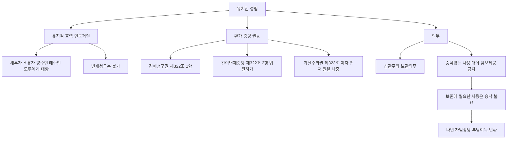

#### ⭐ 기출 출제포인트

1. **과실 충당 순서** — "먼저 원본에 충당하고 잉여가 있으면 이자에 충당한다"는 ==순서를 뒤집은 X 선지==가 2022년 제33회에 그대로 나왔다.
2. **간이변제충당의 절차** — "미리 채무자에게 통지함이 없이", "법원에 청구하지 않고 직접" 두 가지 방식으로 변형된다.
3. **경매권 O / 우선변제권 X** — "유치권에는 우선변제적 효력이 없으므로 유치물을 경매할 수 없다"(X)와 "유치권에 의한 경매에서 유치권자는 일반채권자와 동일한 순위로 배당받는다"(O)가 짝을 이룬다.
4. **보존에 필요한 사용 + 부당이득** — "차임 상당의 이득을 반환할 의무가 없다"(X)는 반복 출제 1순위다.
5. **불가분성의 구체적 적용** — 다세대주택 한 세대 점유 사안(2005다16942)은 2023년 제34회에 그대로 출제되었다.

#### 📊 기출 분석

| 연도 | 출제 형태 | 핵심 논점 |
|---|---|---|
| 2018년 제29회 | 유치권 옳지 않은 것 | 불가분성 O / 매수인에게 인도거절 O·변제청구 X |
| 2022년 제33회 | 과실수취권 단독 논점 | 과실은 ==이자 먼저 원본 나중== |
| 2022년 제33회(민사유치권자 甲) | 권리 종합 | 경매권·소멸시효 불영향·보존에 필요한 사용·불가분성 |
| 2023년 제34회 | 유치권 옳지 않은 것 | 소유자 변동 후 유익비 O·다세대주택 불가분성·보존행위 사용 적법 |
| 2025년 제36회 | 유치권 옳지 않은 것 | 과실수취(금전)·무단임대 시 임차인의 대항력·유치권 경매의 배당순위 |

**출제 빈도** — 성립요건 다음으로 자주 나오는 구간이다. 특히 ==제322조·제323조·제324조 세 조문의 문언 자체==가 그대로 선지가 된다.

**반복되는 함정 선지** — ① "과실은 먼저 원본에 충당한다"(X) ② "미리 채무자에게 통지함이 없이 간이변제충당을 청구할 수 있다"(X) ③ "보존에 필요한 사용을 한 경우 차임 상당 이득을 반환할 의무가 없다"(X) ④ "유치권에는 우선변제적 효력이 없으므로 경매할 수 없다"(X) ⑤ "유치권자는 매수인에게 피담보채권의 변제를 청구할 수 있다"(X).

**최근 경향** — 2025년 제36회처럼 **효력 논점만으로 5지선다 한 문항 전부**를 구성하는 방식이 자리잡았다. 조문 문언을 토씨까지 정확히 기억해야 한다.

#### 🔍 기출 선지로 배우는 법리

> 실제 출제된 선지를 그대로 놓고 O/X와 근거를 확인한다.

**①** 유치권자는 피담보채권 전부의 변제를 받을 때까지 유치물 전부에 대하여 그 권리를 행사할 수 있다. (2018년 제29회) — **O**
근거: ==유치권의 불가분성==(제321조). 일부 변제가 있어도 유치권의 일부가 소멸하지 않는다.

**②** 유치권자는 경매로 인한 매수인에 대하여 그 피담보채권의 변제가 있을 때까지 유치목적물의 인도를 거절할 수 있을 뿐, 그 피담보채권의 변제를 청구할 수는 없다. (2018년 제29회) — **O**
근거: 유치권에는 우선변제권이 없고, 매수인은 채무자가 아니다(95다8713).

**③** 甲이 수취한 유치물의 과실은 먼저 피담보채권의 원본에 충당하고 그 잉여가 있으면 이자에 충당한다. (2022년 감정평가사) — **X**
어디가 틀렸나: 순서가 뒤집혔다. / 옳게 고치면: ==먼저 채권의 이자에 충당하고 그 잉여가 있으면 원본에 충당한다==(제323조 제2항).

**④** 甲은 채무자의 승낙이 없더라도 유치물의 보존에 필요한 사용은 할 수 있다. (2022년 감정평가사) — **O**
근거: 제324조 제2항 단서. 다만 그 경우에도 ==차임 상당의 이득은 반환==해야 한다(2009다40684).

**⑤** 유치권자는 특별한 사정이 없는 한 법원에 청구하지 않고 유치물로 직접 변제에 충당할 수 있다. (문제집 제6장 실전문제 18번) — **X**
어디가 틀렸나: ==감정인의 평가에 의하여 유치물로 직접 변제에 충당할 것을 법원에 청구==해야 하고, ==미리 채무자에게 통지==해야 한다(제322조 제2항).

**⑥** 유치권에는 우선변제적 효력이 없으므로, 유치권자는 채권의 변제를 받기 위하여 유치물을 경매할 수 없다. (문제집 제6장 실전문제 12번) — **X**
어디가 틀렸나: ==우선변제권과 경매권은 별개==다. 유치권자에게 경매권은 인정된다(제322조 제1항). 다만 배당은 일반채권자와 같은 순위다.

**⑦** 유치권에 의한 경매로 유치물이 매각되는 경우 유치권자는 일반채권자와 동일한 순위로 배당을 받는다. (2025년 제36회) — **O**
근거: 유치권자에게는 담보물권의 우선변제권이 인정되지 않는다(2010마1059).

**⑧** 유치권자가 소유자의 허락 없이 유치물을 임대한 경우 임차인은 소유자에게 임대차로 대항할 수 없다. (2025년 제36회) — **O**
근거: 승낙 없는 임대는 제324조 제2항 위반이고, 그 임차인의 점유는 ==소유자에게 대항할 적법한 권원이 아니다==(2010다94700).

**⑨** 유치물이 분할 가능한 경우, 채무자가 피담보채무의 일부를 변제하면 그 범위에서 유치권은 일부 소멸한다. (문제집 제6장 실전문제 18번) — **X**
어디가 틀렸나: 불가분성은 ==목적물이 분할 가능하거나 수개의 물건인 경우에도 적용==된다(2005다16942). 전부 변제 전에는 일부도 소멸하지 않는다.

**⑩** 유치권자가 유치물의 보전에 필요한 사용을 하는 것은 적법하므로 소유자에 대하여 불법행위로 인한 손해배상책임이나 부당이득반환의무가 생기지 않는다. (문제집 제6장 기본문제 07번) — **X**
어디가 틀렸나: ==손해배상책임은 없지만 부당이득반환의무는 있다==. "둘 다 없다"고 묶은 것이 함정이다(71다2414 + 2009다40684).

#### ✏️ 사례형 적용

> **[사례 1]** 甲은 자기 소유 노트북의 수리를 수리업자 乙에게 맡기고 수리대금 10만 원을 지급하기로 했으나 지급하지 않았다. 乙은 유치권을 행사하여 노트북을 반환하지 않고 있다. ㉠ 甲으로부터 노트북을 양수한 丙이 인도를 청구하면? ㉡ 甲이 7만 원만 지급하면? ㉢ 乙이 甲의 동의를 얻어 노트북을 타인에게 임대하고 그 임대료를 변제에 충당할 수 있는가?

**검토** — ㉠ 유치권은 ==물권으로서 대세적 효력==이 있으므로 乙은 양수인 丙에게도 인도를 거절할 수 있다. ㉡ ==불가분성==(제321조)에 반하므로 일부 변제로는 반환의무가 생기지 않는다. ㉢ 유치물의 대여는 ==채무자의 승낙==이 있으면 가능하고(제324조 제2항), 그로부터 생긴 법정과실인 차임은 ==다른 채권보다 먼저 변제에 충당==할 수 있다(제323조). **결론** — ㉠ 인도 거절 O, ㉡ 반환의무 X, ㉢ 가능.

> **[사례 2]** 乙은 甲 소유 주택의 공사대금 1억 원을 받지 못해 그 주택을 점유하며 유치권을 행사하는 한편, 스스로 그 주택에 거주하고 있다. ㉠ 甲은 제324조 위반을 이유로 유치권 소멸을 청구할 수 있는가? ㉡ 甲은 乙에게 무엇을 청구할 수 있는가? ㉢ 만약 乙이 甲의 승낙 없이 그 주택을 丙에게 임대했다면?

**검토** — ㉠ 유치권자가 스스로 유치물인 주택에 거주하며 사용하는 것은 ==유치물의 보존에 필요한 사용==이므로 소멸청구는 인정되지 않는다(2009다40684). ㉡ 그러나 보존에 필요한 사용이라도 ==차임 상당의 이득==은 부당이득으로 반환해야 한다(2009다40684). 반면 그 사용은 적법행위이므로 ==불법점유로 인한 손해배상책임은 없다==(71다2414). ㉢ 승낙 없는 임대는 제324조 제2항 위반이므로 甲은 ==유치권 소멸을 청구==할 수 있고(2019다295278), 丙의 점유는 ==甲에게 대항할 수 있는 적법한 권원이 아니다==(2010다94700). **결론** — ㉠ X, ㉡ 차임 상당 부당이득반환, ㉢ 소멸청구 O.

> **[사례 3]** 하수급인 乙은 다세대주택(총 10세대)의 창호공사를 전부 완성하고 공사대금 잔액 5,000만 원을 받지 못했다. 乙은 그중 101호 한 세대만을 점유하며 유치권을 행사하고 있다. ㉠ 이때 피담보채권의 범위는? ㉡ 甲이 101호에 해당하는 공사대금 500만 원만 변제하면 乙은 101호를 인도해야 하는가?

**검토** — ㉠ 불가분성에 의해 유치권은 ==101호에 시행한 공사대금만이 아니라 다세대주택 전체에 대하여 시행한 공사대금채권의 잔액 전부(5,000만 원)==를 피담보채권으로 하여 성립한다(2005다16942). ㉡ 유치권자는 ==채권 전부의 변제를 받을 때까지== 유치물 전부에 대하여 권리를 행사할 수 있으므로(제321조), 500만 원 변제로는 인도의무가 생기지 않는다. **결론** — 피담보채권 5,000만 원 전부, 일부 변제로 인도의무 발생 X.

#### ⚠️ 이 관의 함정 총정리

1. "유치권자는 경매절차의 매수인에게 피담보채권의 변제를 청구할 수 있다"고 하면 틀림 → ==인도 거절만 가능==하고 변제청구는 불가하다.
2. "과실은 먼저 원본에 충당한다"고 하면 틀림 → ==이자 먼저, 잉여가 있으면 원본==(제323조 제2항).
3. "유치권에는 우선변제권이 없으므로 경매도 청구할 수 없다"고 하면 틀림 → ==경매권은 있다==(제322조 제1항). 다만 배당은 ==일반채권자와 동일한 순위==다.
4. "보존에 필요한 사용이므로 차임 상당 이득도 반환할 필요가 없다"고 하면 틀림 → ==소멸청구는 못 하지만 부당이득은 반환==해야 한다.
5. "간이변제충당은 유치권자가 스스로 평가하여 사후에 채무자에게 통지하면 된다"고 하면 틀림 → ==감정인 평가 + 법원 청구 + 미리(사전) 통지== 세 요소가 모두 필요하다.

#### ✅ OX 확인문제

> 다음 진술의 참·거짓을 판단하시오.

**1.** 유치권자는 채권전부의 변제를 받을 때까지 유치물 전부에 대하여 그 권리를 행사할 수 있다.
→ **O**. ==유치권의 불가분성==(제321조).

**2.** 유치권자는 유치물의 과실을 수취하여 다른 채권보다 먼저 자신의 채권의 변제에 충당할 수 있으며, 과실은 먼저 원본에 충당하고 잉여가 있으면 이자에 충당한다.
→ **X**. 과실수취권 자체는 옳으나 충당 순서가 틀렸다. ==먼저 이자에 충당하고 잉여가 있으면 원본==에 충당한다(제323조 제2항).

**3.** 유치권자는 정당한 이유가 있는 때에는 미리 채무자에게 통지함이 없이 감정인의 평가에 의하여 유치물로 직접 변제에 충당할 것을 법원에 청구할 수 있다.
→ **X**. ==미리 채무자에게 통지하여야 한다==(제322조 제2항).

**4.** 유치물의 처분에 관하여 이해관계를 달리하는 다수의 권리자가 존재하는 경우에도 간이변제충당을 허가할 정당한 이유가 있다.
→ **X**. 그러한 경우에는 ==정당한 이유가 있다고 할 수 없다==(2000마4002).

**5.** 유치권자가 유치물의 보존에 필요한 사용을 한 경우에도 특별한 사정이 없는 한 차임에 상당한 이득을 소유자에게 반환할 의무가 있다.
→ **O**. 보존에 필요한 사용이어서 ==소멸청구는 못 하지만 부당이득은 반환==해야 한다(2009다40684).

**6.** 유치권자가 유치물에 대한 보존행위로서 목적물을 사용하는 것은 적법행위이므로 불법점유로 인한 손해배상책임이 없다.
→ **O**. ==부당이득반환의무는 있으나 손해배상책임은 없다==(71다2414).

**7.** 다세대주택의 창호공사를 완성한 하수급인이 공사대금채권 잔액을 변제받기 위하여 그중 한 세대를 점유하는 경우, 그 유치권의 피담보채권은 그 한 세대에 시행한 공사대금에 한정된다.
→ **X**. ==다세대주택 전체에 대하여 시행한 공사대금채권의 잔액 전부==가 피담보채권이 된다(2005다16942).

**8.** 유치권자는 채무자 또는 소유자의 승낙 없이 유치물을 타에 임대할 수 없고, 승낙 없이 임대된 경우 그 임차인의 점유는 소유자에게 대항할 수 있는 적법한 권원에 기한 것이 아니다.
→ **O**. 제324조 제2항 위반이다(2010다94700).

**9.** 유치권에 의한 경매로 유치물이 매각되는 경우 유치권자는 다른 채권자보다 우선하여 배당을 받는다.
→ **X**. ==일반채권자와 동일한 순위==로 배당받을 뿐이다(2010마1059).

**10.** 저당권이 설정된 건물에 유치권이 성립한 후 저당권이 경매에 의하여 실행되면 유치권도 함께 소멸한다.
→ **X**. 유치권은 다른 담보물권의 선후에 영향을 받지 않으므로 ==소멸하지 않고 존속==한다.

#### 🧠 암기법

> 🔑 **유치권자의 권리 6개 — "유·경·간·과·사·비"**
> **유**치적 효력 → **경**매청구권 → **간**이변제충당 → **과**실수취권 → **사**용권(보존범위) → **비**용상환청구권.
> 앞의 셋은 "붙잡고 팔아서 때운다", 뒤의 셋은 "쓰고 갚아라"로 묶어 기억한다.

> 🔑 **간이변제충당 4요소 — "정·감·법·통"**
> **정**당한 이유 → **감**정인 평가 → **법**원에 청구 → 미리 **통**지.
> 하나라도 빠지면 X. 특히 "**통**지는 미리(사전)"를 놓치지 마라.

> 🔑 **과실 충당 순서 — "이 → 원"**
> 과실은 **이**자 먼저, 남으면 **원**본. "**이**것부터 **원**래"로 외운다. 순서를 뒤집은 선지가 정답(X)인 경우가 압도적이다.

> 🔑 **유치권에 없는 3종 — "우·물·추"**
> **우**선변제권 · **물**상대위성 · **추**급력. 반대로 있는 것은 부종성·수반성·불가분성. "우물추는 없고, 부수불은 있다."

#### ⚖️ 법조문 원문

> 📖 이 관이 근거로 삼은 조문의 **전문**이다. 본문 인용은 발췌지만 여기서는 조 전체를 싣는다. 출처는 법제처 정본이다.

**― 민법 ―**

> 📌 **민법 제321조(유치권의 불가분성)** — "유치권자는 채권전부의 변제를 받을 때까지 유치물전부에 대하여 그 권리를 행사할 수 있다."

> 📌 **민법 제322조(경매, 간이변제충당)** — "①유치권자는 채권의 변제를 받기 위하여 유치물을 경매할 수 있다. ②정당한 이유있는 때에는 유치권자는 감정인의 평가에 의하여 유치물로 직접 변제에 충당할 것을 법원에 청구할 수 있다. 이 경우에는 유치권자는 미리 채무자에게 통지하여야 한다."

> 📌 **민법 제323조(과실수취권)** — "①유치권자는 유치물의 과실을 수취하여 다른 채권보다 먼저 그 채권의 변제에 충당할 수 있다. 그러나 과실이 금전이 아닌 때에는 경매하여야 한다. ②과실은 먼저 채권의 이자에 충당하고 그 잉여가 있으면 원본에 충당한다."

> 📌 **민법 제324조(유치권자의 선관의무)** — "①유치권자는 선량한 관리자의 주의로 유치물을 점유하여야 한다. ②유치권자는 채무자의 승낙없이 유치물의 사용, 대여 또는 담보제공을 하지 못한다. 그러나 유치물의 보존에 필요한 사용은 그러하지 아니하다. ③유치권자가 전2항의 규정에 위반한 때에는 채무자는 유치권의 소멸을 청구할 수 있다."

> 📌 **민법 제325조(유치권자의 상환청구권)** — "①유치권자가 유치물에 관하여 필요비를 지출한 때에는 소유자에게 그 상환을 청구할 수 있다. ②유치권자가 유치물에 관하여 유익비를 지출한 때에는 그 가액의 증가가 현존한 경우에 한하여 소유자의 선택에 좇아 그 지출한 금액이나 증가액의 상환을 청구할 수 있다. 그러나 법원은 소유자의 청구에 의하여 상당한 상환기간을 허여할 수 있다."

### 제3관 유치권의 소멸

> 📖 유치권은 다른 물권과 공통된 일반 소멸사유 외에, **유치권에만 있는 특유의 소멸사유**를 가진다. 점유의 상실, 채무자의 소멸청구(의무위반), 다른 담보의 제공에 의한 소멸청구가 그것이다.
> 여기에 제326조 — "유치권의 행사는 채권의 소멸시효의 진행에 영향을 미치지 아니한다" — 라는 ==단골 함정 조문==이 붙는다.
> 제1관(성립)·제2관(효력)에서 배운 요건과 의무가 여기서 그대로 "소멸의 방아쇠"로 되돌아온다.

> ⭐ **이 관에서 반드시 챙길 3가지**
> ① **제326조** — 유치권을 행사해도 ==피담보채권의 소멸시효는 계속 진행==한다. "중단된다", "진행하지 않는다"는 전부 X.
> ② **두 종류의 소멸청구** — 제324조 제3항(의무위반, ==승낙 불요·형성권==)과 제327조(타담보 제공, ==유치권자의 승낙 필요==)를 구별하라.
> ③ **점유 상실** — 유치권은 점유의 상실로 소멸한다(제328조). 점유회수의 소에서 승소만 해도 부활하지 않고 ==실제로 점유를 회복==해야 한다.

#### 1. 의의

유치권의 소멸사유는 세 층으로 나뉜다.

| 층위 | 사유 |
|---|---|
| 물권 일반의 소멸사유 | 목적물의 ==멸실==, 공용징수, 혼동, ==포기==, 몰수 등 |
| 담보물권 공통의 소멸사유 | ==피담보채권의 소멸==(변제·시효완성 기타) — 부종성 |
| 유치권 특유의 소멸사유 | ① ==점유의 상실==(제328조) ② ==채무자의 소멸청구==(제324조 제3항) ③ ==타담보 제공에 의한 소멸청구==(제327조) |

**피담보채권의 소멸과 부종성** — 유치권으로 담보한 피담보채권이 변제, 시효의 완성 기타 사유로 소멸하면 ==유치권도 소멸==한다. 이때 피담보채권 소멸로 인한 유치물의 반환은 ==동시이행의 관계가 아니다==. 채무자의 변제 등으로 피담보채권이 ==먼저 소멸해야== 비로소 유치물의 반환을 청구할 수 있다.

**유치권 자체의 소멸시효** — 유치권은 ==독립하여 소멸시효에 걸리지 않는다==. 담보물권은 피담보채권에 부종하므로 피담보채권이 존속하는 한 존속한다. 다만 ==피담보채권이 소멸시효로 소멸하면 부종성에 의해 유치권도 소멸==한다.

#### 2. 요건

**유치권 특유 소멸사유 3종 — 요건 비교표**

| 사유 | 근거 | 요건 | 효과 |
|---|---|---|---|
| **점유의 상실** | 제328조 | 유치권자가 점유를 잃을 것 | ==당연히 소멸==(별도 의사표시 불요) |
| **의무위반 소멸청구** | 제324조 제3항 | ① 선관주의 보관의무 위반 또는 ② 승낙 없는 사용·대여·담보제공 + ③ 채무자(소유자)의 소멸청구 의사표시 | 청구로 ==즉시 소멸==. ==유치권자의 승낙 불요== |
| **타담보 제공 소멸청구** | 제327조 | ① 채무자가 ==상당한 담보==를 제공 + ② 소멸청구 의사표시 + ③ ==유치권자의 승낙== | 유치권 소멸 |

> ⚠️ 제324조 제3항의 소멸청구는 ==일방적 의사표시로 효력이 생기는 형성권==이지만, 제327조의 소멸청구는 ==유치권자의 승낙(동의)==이 있어야 효력이 생긴다는 것이 통설이다. 두 조문을 뭉뚱그리면 함정에 걸린다.

**"상당한 담보"의 판단**

| 쟁점 | 결론 |
|---|---|
| 담보의 종류 | 물적 담보·인적 담보 모두 가능 |
| 담보의 액수 | 유치물의 가격이 채권액에 비하여 과다한 경우에는 ==채권액 상당의 가치가 있는 담보==를 제공하면 족하다 |
| 소멸청구 의사표시 | ==상당한 담보가 제공되어 있는 이상== 유치권 소멸청구의 의사표시를 할 수 있다 |

**점유 상실 — 세부 유형**

| 유형 | 유치권 |
|---|---|
| 유치권자가 임의로 점유를 반환 | ==소멸== |
| 점유를 침탈당함 | 원칙적으로 ==소멸==(제328조) |
| 점유 침탈 후 ==점유물반환청구권을 행사하여 점유를 회복== | 점유를 계속한 것으로 의제되어 ==소멸하지 않은 것으로 취급==(제328조, 제192조 제2항 단서) |
| 점유회수의 소에서 ==승소판결만 받고 점유는 회복하지 못함== | ==부활 X==. 현실로 점유를 회복해야 유치권이 부활한다 |
| 유치권자로부터 ==점유를 승계한 자== | 승계인이 유치권자를 ==대위하여 유치권을 주장할 수 없다== |
| 간접점유로 전환(제3자를 직접점유자로) | 점유는 유지되므로 ==소멸하지 않음==. 단 채무자를 직접점유자로 하면 점유 요건 상실 |

**소멸청구의 범위 — 여러 필지의 경우**

| 사안 | 결론 |
|---|---|
| 하나의 채권을 피담보채권으로 여러 필지 토지에 유치권 취득, 그중 ==일부 필지==에 대해 선관주의 의무 위반 | 특별한 사정이 없는 한 ==위반행위가 있었던 필지의 토지에 대하여만== 유치권 소멸청구 가능 |
| 모든 필지에 대한 소멸청구 | ==인정되지 않는다== (2025년 제36회 오답 선지) |

#### 3. 효과

| 구분 | 효과 |
|---|---|
| 유치권 소멸 후 목적물 | 유치권자는 인도를 거절할 근거를 잃고 ==목적물을 반환==해야 한다 |
| 피담보채권 | 유치권이 소멸해도 ==피담보채권 자체는 존속==한다(담보만 잃을 뿐). 반대로 피담보채권이 소멸하면 부종성으로 유치권도 소멸 |
| 소멸청구의 효력 발생 시기 | 제324조 제3항의 소멸청구가 있으면 ==즉시 소멸== |
| 소멸시효와의 관계 | 유치권을 행사하는 동안에도 ==피담보채권의 소멸시효는 계속 진행==한다(제326조). 시효완성 시 부종성으로 유치권 소멸 |
| 시효완성의 원용권자 | 유치권이 성립한 부동산의 ==매수인==은 피담보채권의 시효완성으로 직접 이익을 받는 자에 해당하여 ==소멸시효 완성을 원용할 수 있다== |
| 물상대위 부정의 귀결 | 유치물이 멸실되어 소유자가 금전(보험금 등)을 받게 되어도 유치권자는 ==그 금전에 유치권을 행사할 수 없다== |

#### 4. 관련 조문

> 📌 **민법 제324조(유치권자의 선관의무) 제3항** — "유치권자가 전2항의 규정에 위반한 때에는 채무자는 유치권의 소멸을 청구할 수 있다." (선관주의 의무로 유치물을 점유하지 못하거나, 채무자의 승낙 없이 유치물의 사용·대여 또는 담보제공 금지를 위반한 때)

> 📌 **민법 제326조(피담보채권의 소멸시효)** — "유치권의 행사는 채권의 소멸시효의 진행에 영향을 미치지 아니한다."

> 📌 **민법 제327조(타담보제공과 유치권소멸)** — "채무자는 상당한 담보를 제공하고 유치권의 소멸을 청구할 수 있다."

> 📌 **민법 제328조(점유상실과 유치권소멸)** — "유치권은 점유의 상실로 인하여 소멸한다."

> 📌 **민법 제325조 제2항 단서** — "그러나 법원은 소유자의 청구에 의하여 상당한 상환기간을 허여할 수 있다." (유익비상환청구권에 상환기간이 허여되면 변제기 미도래로 ==유치권은 소멸한다==)

#### 5. 핵심 판례 법리

- **점유 상실과 대위 주장** — 유치권자는 ==점유를 상실하면 곧 유치권을 상실==하므로, 유치권자로부터 점유를 승계한 자가 유치권자를 ==대위하여 유치권을 주장할 수 없다==(대판 1972.5.30. 72다548).
- **점유회수의 소와 부활** — 점유를 침탈당한 유치권자가 점유회수의 소를 제기하여 ==승소판결을 받았더라도 점유를 회복하지 않으면 유치권이 부활하지 않는다==. 그 판결에 의하여 ==현실로 점유를 회복하여야== 유치권이 부활한다.
- **점유물반환청구권 행사 시** — 유치권의 목적물을 그 소유자가 몰래 침탈한 경우에도 유치권자가 ==점유물반환청구권을 행사하여 점유를 회복하면 유치권은 소멸하지 않는다==(제328조, 제192조 제2항 단서).
- **승낙 없는 임대 → 소멸청구 O** — 유치권자가 민법 제324조 제2항을 위반하여 ==유치물 소유자의 승낙 없이 유치물을 임대==한 경우, 유치물의 소유자는 이를 이유로 민법 제324조 제3항에 의하여 ==유치권의 소멸을 청구할 수 있다==(대판 2023.8.31. 2019다295278).
- **소멸청구의 범위는 위반 필지에 한정** — 하나의 채권을 피담보채권으로 하여 여러 필지의 토지에 대하여 유치권을 취득한 유치권자가 그중 일부 필지의 토지에 대하여 선량한 관리자의 주의의무를 위반하였다면, 특별한 사정이 없는 한 ==위반행위가 있었던 필지의 토지에 대하여만 유치권 소멸청구가 가능==하다(대판 2022.6.16. 2018다301350).
- **보존에 필요한 사용은 소멸청구 대상 아님** — 유치권을 행사하는 자가 스스로 유치물인 주택에 거주하며 사용하는 것은 특별한 사정이 없는 한 유치물의 보존에 도움이 되는 행위로서 ==유치물의 보존에 필요한 사용==에 해당하므로, 그러한 경우에는 ==유치권의 소멸을 청구할 수 없다==(대판 2009.9.24. 2009다40684).
- **보존행위로서의 점유·사용은 적법** — 유치권자의 점유하에 있는 유치물의 소유자가 변동하더라도 유치권자의 점유는 ==보존행위로서 하는 것이므로 적법==하고, 보존행위로서 목적물을 사용하는 것은 적법행위이므로 ==불법점유로 인한 손해배상책임이 없다==(대판 1972.1.31. 71다2414).
- **타담보 제공의 정도** — 유치물의 가격이 채권액에 비하여 과다한 경우에는 ==채권액 상당의 가치가 있는 담보를 제공하면 족하고==, 상당한 담보가 제공되어 있는 이상 ==유치권 소멸 청구의 의사표시를 할 수 있다==고 본다. (이 판례의 사건번호는 소스에 OCR 오류로 남아 있어 표기하지 않는다.)
- **소멸시효 완성의 원용권자** — 유치권이 성립한 부동산의 ==매수인==은 피담보채권의 소멸시효가 완성되면 시효로 인하여 채무가 소멸되는 결과 ==직접적인 이익을 받는 자==에 해당하므로, ==소멸시효의 완성을 원용할 수 있는 지위==에 있다(대판 2009.9.24. 2009다39530).
- **유치권 행사와 소멸시효** — 유치권의 행사는 ==피담보채권의 소멸시효 진행에 영향을 미치지 아니한다==(제326조). 따라서 건물공사대금 채권자가 그 건물에 대하여 유치권을 행사하는 동안에도 ==그 공사대금채권의 소멸시효는 계속 진행==한다.
- **담보물권 자체의 시효소멸 부정** — 담보물권은 피담보채권에 부종하는 권리이므로 ==피담보채권이 존속하는 한 존속==하며, 담보물권 자체는 ==소멸시효에 걸리지 않는다==. 유치권도 마찬가지다.
- **물상대위 부정의 귀결** — 유치권자는 ==유치물의 멸실로 유치물의 소유자가 받을 금전에 대하여 유치권을 행사하지 못한다==. 유치권은 목적물을 유치하는 것을 본질로 하고 교환가치를 목적으로 하지 않기 때문이다.
- **배제특약에 의한 불발생·제3자의 원용** — 유치권 배제 특약이 있는 경우 다른 법정요건이 모두 충족되더라도 유치권은 발생하지 않으며, 특약에 따른 효력은 ==특약의 상대방뿐 아니라 그 밖의 사람도 주장할 수 있다==(대판 2018.1.24. 2016다234043).
- **비용상환청구권의 사전 포기** — 임대차에서 건물의 임차인이 임대차관계 종료시 건물을 원상으로 복구하여 명도하기로 약정한 것은 ==유익비·필요비 상환청구권을 미리 포기==하기로 한 취지의 특약으로 볼 수 있어 임차인은 ==유치권을 주장할 수 없다==(대판 1975.4.22. 73다2010).
- **유익비 상환기간의 허여** — 민법은 유익비상환청구권에 관하여 법원이 상당한 기한을 허여할 수 있도록 규정하고 있는데(제325조 제2항 단서), 이 경우 채무자에게 기한이 허여되면 ==채권자의 유치권은 소멸한다==.
- **압류 후 취득 유치권의 무력화** — 경매개시결정등기가 된 뒤에 비로소 점유를 이전받거나 피담보채권이 발생하여 유치권을 취득한 경우에는 ==경매절차의 매수인에 대하여 유치권을 행사할 수 없다==(대판 2017.2.8. 2015마2025; 대판 2022.12.29. 2021다253710). 유치권 자체가 소멸하는 것은 아니지만 ==매수인에 대한 관계에서는 무력화==된다는 점에서 실질적 소멸에 준한다.

**소멸사유 판정 흐름도**

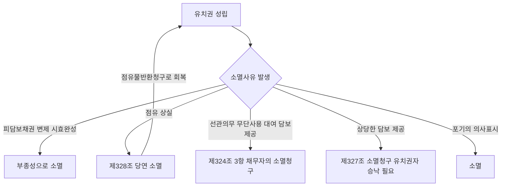

**두 소멸청구의 대비**


#### ⭐ 기출 출제포인트

1. **제326조 뒤집기** — "유치권을 행사하면 채권의 소멸시효는 중단된다", "유치권을 행사하는 동안 소멸시효는 진행하지 않는다"는 ==가장 자주 나오는 X 선지==다.
2. **제327조의 주체와 승낙** — "채무자는 상당한 담보를 제공하고 유치권의 소멸을 청구할 수 있다"(O). 여기서 담보를 제공하는 쪽은 ==채무자==이며 유치권자가 아니다.
3. **일부 필지 위반의 범위** — 2025년 제36회에서 "모든 토지에 대한 유치권소멸청구가 인정된다"(X)로 출제되었다.
4. **점유 상실·회복** — "점유를 침탈당한 유치권자가 점유회수의 소에서 승소판결을 받았더라도 점유를 회복하지 않으면 유치권이 부활하지 않는다"(O).
5. **소멸시효 원용권자** — "유치권이 성립한 부동산의 매수인은 피담보채권의 소멸시효 완성을 원용할 수 있다"(O)는 지문형으로 등장한다.

#### 📊 기출 분석

| 연도 | 출제 형태 | 핵심 논점 |
|---|---|---|
| 2018년 제29회 | 유치권 옳지 않은 것 | "유치권의 행사는 피담보채권의 소멸시효의 진행에 영향을 미치지 아니한다"(O 선지) |
| 2021년 제32회 | 유치권 옳지 않은 것 | "유치권자가 점유침탈로 유치물의 점유를 상실한 경우 유치권은 원칙적으로 소멸한다"(O 선지) |
| 2022년 제33회 | 민사유치권 옳은 것 | ==타담보 제공에 의한 소멸청구(제327조)가 정답 선지== |
| 2022년 제33회(민사유치권자 甲) | 권리·의무 종합 | "유치권을 행사하더라도 피담보채권의 소멸시효 진행에는 영향이 없다"(O) |
| 2025년 제36회 | 유치권 옳지 않은 것 | ==일부 필지 선관의무 위반 시 소멸청구의 범위==(정답 선지) |
| 감정평가사 기출(물권의 소멸) | 물권 소멸 종합 | 유치권 포기의 의사표시와 점유 반환의 관계 |

**출제 빈도** — 소멸 파트는 단독 문항보다 ==유치권 5지선다 안의 1~2개 선지==로 꾸준히 등장한다. 그러나 2022년·2025년처럼 ==정답 선지 자체가 소멸 논점==인 해도 적지 않다.

**반복되는 함정 선지** — ① "유치권을 행사하면 소멸시효가 중단된다"(X) ② "유치권자가 상당한 담보를 제공하고 소멸을 청구할 수 있다"(주체 바꾸기, X) ③ "일부 필지 위반이면 모든 필지에 소멸청구 가능"(X) ④ "보존에 필요한 사용을 이유로 소멸청구할 수 있다"(X) ⑤ "유치권도 20년의 소멸시효에 걸린다"(X).

**최근 경향** — 2022·2025년 연속으로 ==제324조 제3항과 제327조의 구별==이 정답 자리를 차지했다. 두 소멸청구의 요건 차이를 문장 단위로 정리해 둘 것.

#### 🔍 기출 선지로 배우는 법리

> 실제 출제된 선지를 그대로 놓고 O/X와 근거를 확인한다.

**①** 유치권의 행사는 피담보채권의 소멸시효의 진행에 영향을 미치지 아니한다. (2018년 제29회) — **O**
근거: 제326조. 유치권 행사는 ==채권의 행사가 아니므로 시효중단 사유가 아니다==.

**②** 채무자는 상당한 담보를 제공하고 유치권의 소멸을 청구할 수 있다. (2022년 제33회, 정답 선지) — **O**
근거: 제327조. 담보를 제공하는 주체는 ==채무자==이며, 유치권자의 승낙이 있어야 소멸의 효력이 생긴다.

**③** 여러 필지의 토지에 유치권을 행사하는 자가 그 토지 중 일부에 대해 선관주의의무를 위반한 경우 모든 토지에 대한 유치권소멸청구가 인정된다. (2025년 제36회, 정답 선지) — **X**
어디가 틀렸나: ==위반행위가 있었던 필지의 토지에 대하여만== 소멸청구가 가능하다(2018다301350).

**④** 유치권자가 점유침탈로 유치물의 점유를 상실한 경우, 유치권은 원칙적으로 소멸한다. (2021년 제32회) — **O**
근거: 제328조. 다만 ==점유물반환청구권을 행사하여 점유를 회복하면== 소멸하지 않은 것으로 취급된다.

**⑤** 유치권자로부터 점유를 승계한 자가 유치권자를 대위하여 유치권을 주장할 수 있다. (문제집 제6장 기본문제 08번) — **X**
어디가 틀렸나: 유치권자는 ==점유를 상실하면 곧 유치권을 상실==하므로, 점유를 승계한 자도 대위 주장을 할 수 없다(72다548).

**⑥** 점유를 침탈당한 유치권자가 점유회수의 소를 제기하여 승소판결을 받았더라도 점유를 회복하지 않으면 유치권이 부활하지 않는다. (문제집 제6장 실전문제 16번, 정답 선지) — **O**
근거: 승소판결만으로는 유치권을 회복한 것으로 볼 수 없고 ==그 판결에 의해 현실로 점유를 회복==해야 부활한다.

**⑦** 건물공사대금의 채권자가 그 건물에 대하여 유치권을 행사하는 동안에는 그 공사대금채권의 소멸시효가 진행하지 않는다. (문제집 제6장 실전문제 14번) — **X**
어디가 틀렸나: 제326조에 따라 ==유치권을 행사하는 동안에도 공사대금채권의 소멸시효는 진행==한다.

**⑧** 유치권이 성립한 부동산의 매수인은 피담보채권의 소멸시효가 완성되면 시효로 인하여 채무가 소멸되는 결과 직접적인 이익을 받는 자에 해당하므로 소멸시효의 완성을 원용할 수 있는 지위에 있다. (감정평가사 기출) — **O**
근거: 시효완성으로 ==직접 이익을 받는 자==에 해당한다(2009다39530).

**⑨** 채무자는 피담보채권의 소멸시효와는 별도로 유치권 자체의 시효에 의한 소멸을 주장할 수 있다. (문제집 제6장 실전문제 02번 변형) — **X**
어디가 틀렸나: 담보물권은 ==피담보채권이 존속하는 한 존속==하며 그 자체는 소멸시효에 걸리지 않는다.

**⑩** 유치권자는 유치물의 멸실로 유치물의 소유자가 받을 금전에 대하여 유치권을 행사하지 못한다. (문제집 제6장 실전문제 02번) — **O**
근거: 유치권에는 ==물상대위성이 없다==. 유치권은 목적물의 유치를 본질로 하고 교환가치를 목적으로 하지 않기 때문이다.

#### ✏️ 사례형 적용

> **[사례 1]** 乙은 甲 소유 X건물의 공사대금 2억 원을 피담보채권으로 X건물을 점유하며 유치권을 행사해 왔다. ㉠ 5년이 지나 甲이 "공사대금채권은 시효로 소멸했다"고 주장한다. 乙은 "유치권을 행사하고 있었으므로 시효가 중단되었다"고 반박한다. 누구 말이 맞는가? ㉡ 그 사이 X건물을 경매로 취득한 丙도 시효완성을 주장할 수 있는가?

**검토** — ㉠ ==유치권의 행사는 채권의 소멸시효 진행에 영향을 미치지 아니한다==(제326조). 유치권 행사는 물건을 붙잡고 있는 것일 뿐 채권 자체를 재판상 청구하는 것이 아니기 때문이다. 따라서 공사대금채권의 시효는 계속 진행했고, 완성되면 ==부종성에 의해 유치권도 소멸==한다. ㉡ 유치권이 성립한 부동산의 매수인 丙은 시효완성으로 ==직접적인 이익을 받는 자==이므로 소멸시효 완성을 원용할 수 있다(2009다39530). **결론** — 甲의 주장이 타당하고, 丙도 독자적으로 시효완성을 원용할 수 있다.

> **[사례 2]** 乙은 甲 소유의 3필지 토지(A·B·C)에 대해 하나의 공사대금채권 1억 원을 피담보채권으로 유치권을 취득했다. 乙은 ㉠ A필지에 대해서만 관리를 소홀히 하여 선관주의 의무를 위반했고, ㉡ B필지는 甲의 승낙 없이 丙에게 임대했다. 甲은 어떤 조치를 취할 수 있는가? 또 丙의 지위는?

**검토** — ㉠ 제324조 제1항 위반이다. 그러나 하나의 채권으로 여러 필지에 유치권을 취득한 경우, ==위반행위가 있었던 필지에 대해서만== 소멸청구가 가능하므로 甲은 ==A필지에 한하여== 소멸을 청구할 수 있다(2018다301350). ㉡ 승낙 없는 임대는 제324조 제2항 위반이므로 甲은 ==B필지에 대해 유치권 소멸을 청구==할 수 있다(2019다295278). 이때 丙의 점유는 ==소유자 甲에게 대항할 수 있는 적법한 권원에 기한 것이 아니다==(2010다94700). ㉢ C필지의 유치권은 그대로 존속한다. **결론** — A·B에 대해서만 소멸청구, 丙은 甲에게 대항 불가.

> **[사례 3]** 유치물인 기계(시가 5억 원)에 대해 乙이 공사대금 1억 원을 피담보채권으로 유치권을 행사 중이다. ㉠ 甲은 1억 원 상당의 부동산에 근저당권을 설정해 주고 유치권 소멸을 청구했다. 유치권은 소멸하는가? ㉡ 한편 乙이 甲의 승낙 없이 기계를 丁에게 담보로 제공했다면 甲은 어떤 조치를 취할 수 있는가? ㉢ 그 후 태풍으로 기계가 멸실되어 甲이 보험금 5억 원을 받게 되었다면 乙은 그 보험금에 유치권을 행사할 수 있는가?

**검토** — ㉠ 제327조에 따라 채무자는 ==상당한 담보를 제공하고== 유치권 소멸을 청구할 수 있다. 유치물의 가격이 채권액에 비해 과다한 경우에는 ==채권액 상당(1억 원)의 담보로 족하다==. 다만 제327조의 소멸청구는 ==유치권자의 승낙==이 있어야 효력이 생긴다는 것이 통설이다. ㉡ 승낙 없는 담보제공은 제324조 제2항 위반이므로 甲은 제324조 제3항에 따라 ==일방적 의사표시로 유치권 소멸을 청구==할 수 있다(이 경우에는 유치권자의 승낙이 불필요하다). ㉢ 유치권에는 ==물상대위성이 없으므로== 보험금에 유치권을 행사할 수 없다. **결론** — ㉠ 상당한 담보로 인정되나 유치권자의 승낙 필요, ㉡ 소멸청구 O, ㉢ 물상대위 X.

#### ⚠️ 이 관의 함정 총정리

1. "유치권을 행사하면 피담보채권의 소멸시효가 중단된다"고 하면 틀림 → ==영향을 미치지 아니한다==(제326조). 유치권을 행사하는 동안에도 시효는 계속 진행한다.
2. "유치권자가 상당한 담보를 제공하고 소멸을 청구할 수 있다"고 하면 틀림 → 담보를 제공하는 주체는 ==채무자==다(제327조). 주어를 바꾸는 것이 전형적 변형이다.
3. "제324조 제3항의 소멸청구도 유치권자의 승낙이 있어야 한다"고 하면 틀림 → 의무위반 소멸청구는 ==채무자의 일방적 의사표시로 즉시 소멸==한다. 승낙이 필요한 것은 ==제327조== 쪽이다.
4. "일부 필지에 대한 선관의무 위반이면 전체 필지에 소멸청구할 수 있다"고 하면 틀림 → ==위반행위가 있었던 필지에 한정==된다(2018다301350).
5. "유치권도 소멸시효에 걸린다" 또는 "점유를 침탈당하면 점유를 회복해도 유치권은 부활하지 않는다"고 하면 틀림 → 유치권 자체는 ==시효에 걸리지 않고==, 점유물반환청구권 행사로 ==점유를 회복하면 소멸하지 않은 것으로 취급==된다.

#### ✅ OX 확인문제

> 다음 진술의 참·거짓을 판단하시오.

**1.** 유치권은 점유의 상실로 인하여 소멸한다.
→ **O**. 제328조. 점유는 유치권의 ==성립요건이자 존속요건==이다.

**2.** 유치권을 행사하면 채권의 소멸시효의 진행은 중단된다.
→ **X**. ==유치권의 행사는 채권의 소멸시효의 진행에 영향을 미치지 아니한다==(제326조).

**3.** 채무자는 상당한 담보를 제공하고 유치권의 소멸을 청구할 수 있다.
→ **O**. 제327조. 유치물의 가격이 채권액에 비해 과다하면 ==채권액 상당의 담보==로 족하다.

**4.** 유치권자는 채무자의 승낙 없이 유치물의 사용, 대여, 담보제공을 하지 못하고, 유치권자가 이에 위반한 때에는 채무자는 유치권의 소멸을 청구할 수 있다.
→ **O**. 제324조 제2항·제3항. 다만 ==보존에 필요한 사용==은 승낙 없이 가능하다.

**5.** 유치권자가 유치물 소유자의 승낙 없이 유치물을 임대한 경우, 소유자는 이를 이유로 유치권의 소멸을 청구할 수 있다.
→ **O**. 제324조 제2항 위반이다(2019다295278).

**6.** 하나의 채권으로 여러 필지 토지에 유치권을 취득한 자가 일부 필지에 대해 선관주의 의무를 위반한 경우, 소유자는 모든 필지에 대하여 유치권 소멸을 청구할 수 있다.
→ **X**. ==위반행위가 있었던 필지의 토지에 대하여만== 소멸청구가 가능하다(2018다301350).

**7.** 유치권의 목적물을 소유자가 몰래 침탈한 경우에도 유치권자가 점유물반환청구권을 행사하여 점유를 회복하면 유치권은 소멸하지 않는다.
→ **O**. 제328조, 제192조 제2항 단서.

**8.** 유치권자로부터 점유를 승계한 자는 유치권자를 대위하여 유치권을 주장할 수 있다.
→ **X**. 유치권자는 점유 상실로 곧 유치권을 상실하므로 ==승계인의 대위 주장은 허용되지 않는다==(72다548).

**9.** 유치권은 독립하여 소멸시효에 걸리지 않으나, 피담보채권이 소멸시효로 소멸하면 부종성에 의해 유치권도 소멸한다.
→ **O**. 담보물권은 ==피담보채권이 존속하는 한 존속==한다.

**10.** 공사대금채권에 기하여 유치권을 행사하는 자가 스스로 유치물인 주택에 거주하며 사용한 경우, 소유자는 이를 이유로 유치권의 소멸을 청구할 수 있다.
→ **X**. 이는 ==유치물의 보존에 필요한 사용==에 해당하여 소멸청구는 인정되지 않는다. 다만 ==차임 상당의 부당이득==은 반환해야 한다(2009다40684).

#### 🧠 암기법

> 🔑 **유치권 특유 소멸사유 3종 — "점·의·담"**
> **점**유 상실(제328조) · **의**무위반 소멸청구(제324조 제3항) · **담**보 제공 소멸청구(제327조).
> 조문 번호도 "324 → 327 → 328" 순서로 **의 → 담 → 점**이 되니, 조문을 훑으면 순서까지 복원된다.

> 🔑 **두 소멸청구의 승낙 — "위반은 일방적, 담보는 쌍방적"**
> 제**324**조 제3항(의무 **위반**)은 채무자의 ==일방적 의사표시==로 즉시 소멸.
> 제**327**조(타**담보** 제공)는 ==유치권자의 승낙==이 있어야 효력 발생.

> 🔑 **제326조 한 줄 — "행사해도 시효는 흐른다"**
> 유치권을 아무리 오래 행사해도 ==피담보채권의 시효 시계는 멈추지 않는다==. "중단된다"·"진행하지 않는다"는 전부 X.

> 🔑 **점유 회복 공식 — "판결 말고 점유"**
> 점유회수의 소에서 ==승소판결만으로는 부활 X==, ==현실로 점유를 회복해야 부활 O==. "판결이 아니라 손에 다시 쥐어야 한다."

#### ⚖️ 법조문 원문

> 📖 이 관이 근거로 삼은 조문의 **전문**이다. 본문 인용은 발췌지만 여기서는 조 전체를 싣는다. 출처는 법제처 정본이다.

**― 민법 ―**

> 📌 **민법 제324조(유치권자의 선관의무)** — "①유치권자는 선량한 관리자의 주의로 유치물을 점유하여야 한다. ②유치권자는 채무자의 승낙없이 유치물의 사용, 대여 또는 담보제공을 하지 못한다. 그러나 유치물의 보존에 필요한 사용은 그러하지 아니하다. ③유치권자가 전2항의 규정에 위반한 때에는 채무자는 유치권의 소멸을 청구할 수 있다."

> 📌 **민법 제325조(유치권자의 상환청구권)** — "①유치권자가 유치물에 관하여 필요비를 지출한 때에는 소유자에게 그 상환을 청구할 수 있다. ②유치권자가 유치물에 관하여 유익비를 지출한 때에는 그 가액의 증가가 현존한 경우에 한하여 소유자의 선택에 좇아 그 지출한 금액이나 증가액의 상환을 청구할 수 있다. 그러나 법원은 소유자의 청구에 의하여 상당한 상환기간을 허여할 수 있다."

> 📌 **민법 제326조(피담보채권의 소멸시효)** — "유치권의 행사는 채권의 소멸시효의 진행에 영향을 미치지 아니한다."

> 📌 **민법 제327조(타담보제공과 유치권소멸)** — "채무자는 상당한 담보를 제공하고 유치권의 소멸을 청구할 수 있다."

> 📌 **민법 제328조(점유상실과 유치권소멸)** — "유치권은 점유의 상실로 인하여 소멸한다."

### 제1관 동산질권의 성립

> 📖 동산질권은 채권자가 채무자 또는 제3자가 제공한 **동산을 점유**하고, 변제가 없으면 그 동산에서 우선변제를 받는 약정담보물권이다. 유치권이 법정담보물권인 것과 달리 질권은 설정계약으로 생기고, 저당권과 달리 **목적물의 점유가 채권자에게 넘어간다**. 이 관은 "무엇을(객체) 어떻게(인도) 얼마만큼(피담보채권 범위) 잡을 수 있는가"를 다룬다.
> 뒤의 제2관은 이렇게 성립한 질권이 무슨 힘을 갖는지를, 제3관은 동산이 아닌 재산권을 목적으로 하는 권리질권을 다룬다.

> ⭐ **이 관에서 반드시 챙길 3가지**
> ① 질권설정은 **요물계약** — 합의만으로는 안 되고 인도가 있어야 효력이 생긴다(제330조). 그중 **점유개정은 금지**(제332조).
> ② 객체는 **양도할 수 있는 동산**(제331조). 등기·등록으로 공시되는 동산(선박·자동차·건설기계·항공기)과 부동산은 저당권의 객체다.
> ③ 피담보채권의 범위(제334조)는 저당권(제360조)보다 **넓다** — 질물보존비용과 질물의 하자로 인한 손해배상이 더 붙는다.

#### 1. 의의

동산질권(動産質權)이란 채권의 담보를 위하여 채무자 또는 제3자가 제공한 동산을 유치하고, 채무의 변제가 없을 때에는 그 동산으로부터 자기 채권의 우선변제를 받는 물권이다.

- **약정담보물권**이다. 당사자 사이의 담보설정계약으로 성립한다. 요건이 갖추어지면 법률상 당연히 성립하는 유치권과 결정적으로 다르다.
- 담보물권의 통유성 중 ==부종성·수반성·불가분성·물상대위성==을 모두 가진다.
- 목적물을 채권자에게 넘겨야 하므로 설정자가 그 물건을 계속 쓸 수 없다. 그래서 활용도가 낮아졌고, 이를 보완하기 위해 「동산·채권 등의 담보에 관한 법률」이 시행되고 있다.

| 구분 | 질권 | 저당권 |
|---|---|---|
| 본질 | 목적물의 점유가 질권자에게 이전 | 목적물의 점유가 저당권설정자에게 그대로 남음 |
| 기능 | 서민의 금융수단 | 투자의 수단 |
| 성립 | 설정계약 + 목적물의 인도 | 설정계약 + 등기 |
| 객체 | 동산, 권리(주식·채권) | 부동산, 권리(지상권·전세권) |
| 선의취득 | 성립 가능 | 성립 불능 |
| 유치력 | 있음 | 없음 |
| 사용권 | 보존의 범위 내에서 가능 | 없음 |
| 유질·유저당 | 변제기 이전의 유질계약 금지 | 인정 |
| 과실에 대한 효력 | 효력이 미침 | 효력이 미치지 않음 |

#### 2. 요건

| 요건 | 내용 | 비고 |
|---|---|---|
| 당사자 | 질권자는 원칙적으로 피담보채권의 채권자. 질권설정자는 원칙적으로 채무자 | 예외적으로 제3자가 질권자가 될 수 있고, 제3자가 설정자가 되면 물상보증인 |
| 물권적 합의 | 질권설정계약(담보설정의 합의) | 낙성·불요식이나 그것만으로는 효력이 생기지 않음 |
| 목적물의 인도 | 질권의 설정은 질권자에게 목적물을 인도함으로써 효력이 생김(제330조) | 요물계약 |
| 객체의 적격 | 양도할 수 있는 동산일 것(제331조) | 양도할 수 없는 물건은 목적이 되지 못함 |
| 피담보채권의 존재 | 담보물권의 부종성상 반드시 피담보채권이 존재해야 함 | 종류에 제한 없음. 장래채권·조건부·기한부 채권도 가능 |

**인도의 방법** — 여기가 매년 나온다.

| 인도 방법 | 질권 설정 | 이유 |
|---|---|---|
| 현실의 인도 | 가능 | 질권자가 직접점유를 취득 |
| 간이인도 | 가능 | 이미 질권자가 점유하고 있음 |
| 목적물반환청구권의 양도 | 가능 | 질권자가 간접점유를 취득 |
| 점유개정 | 불가능 (제332조) | 설정자가 계속 직접점유하면 유치적 효력이 확보되지 않기 때문 |

> 💡 질권자의 점유는 **직접점유든 간접점유든 상관없다.** 금지되는 것은 "설정자를 직접점유자로 두는 형태", 즉 점유개정 하나뿐이다.

**객체의 적격**

| 목적물 | 질권의 목적 | 근거·설명 |
|---|---|---|
| 일반 동산 | ○ | 원칙 |
| 부동산 | ✕ | 저당권의 객체 |
| 등기·등록되는 동산(선박·자동차·항공기·건설기계) | ✕ | 국가가 정책적으로 권리자에게 사용·수익하게 하려는 것 → 저당권의 객체 |
| 성질상 양도할 수 없는 물건(아편·위조통화·문화재 등 금제물, 압류금지물) | ✕ | 제331조 |
| 당사자의 특약으로 양도를 금지한 동산 | ○ | 특약은 물건의 양도성 자체를 없애지 못함 |

#### 3. 효과

| 구분 | 효과 |
|---|---|
| 성립시기 | 등기를 요하지 않고 인도만으로 성립·공시된다 |
| 유치적 효력 | 채권의 변제를 받을 때까지 질물을 유치할 수 있다(제335조) |
| 우선변제적 효력 | 다른 채권자보다 자기채권의 우선변제를 받을 권리(제329조) |
| 순위 | 동일한 동산에 수개의 질권을 설정하면 그 순위는 설정의 선후에 의한다(제333조). 선순위가 소멸하면 후순위가 올라가는 순위승진의 원칙이 있다 |
| 목적물의 범위 | 명문 규정은 없으나 종물·천연과실·법정과실·물상대위물에 미친다고 해석 |
| 피담보채권의 범위 | 제334조 — 아래 비교표 |

**피담보채권의 범위 — 제334조 vs 제360조 (반드시 외울 비교)**

| 항목 | 질권(제334조) | 저당권(제360조) |
|---|---|---|
| 원본 | ○ | ○ |
| 이자 | ○ | ○ |
| 위약금 | ○ | ○ (등기한 경우) |
| 실행비용 | ○ (질권실행의 비용) | ○ (저당권실행비용) |
| 질물보존의 비용 | ○ | ✕ |
| 채무불이행으로 인한 손해배상(지연배상) | ○ | ○ (다만 원본의 이행기일 경과 후 1년분에 한함) |
| 질물의 하자로 인한 손해배상 | ○ | ✕ |
| 특약 | 다른 약정이 있으면 그 약정에 의한다 | — |

> ⚠️ 질권에만 붙는 두 항목(질물보존비용·질물의 하자로 인한 손해배상)은 **질권자가 질물을 점유한다는 특성**에서 나온다. 점유하지 않는 저당권에는 있을 수 없는 항목이다.
> 지연배상의 범위에 관하여는 소스가 갈린다. 교재 정리는 "질권의 경우 1개의 물건에 1개의 질권이 성립하는 것이 대부분이어서 후순위 질권자를 해할 염려가 적으므로 **1년분에 한하지 않는다**"고 하고, 요약서·문제집 해설은 "**원본의 이행기일 경과 후 1년분**"으로 적는다. 시험은 제334조 **문언 자체**를 그대로 선지로 내므로 문언을 통째로 외우는 것이 안전하다.

**질물에 들어간 비용** — 질권자는 필요비를 지출하면 소유자에게 상환을 청구할 수 있고, 유익비는 가액의 증가가 현존한 경우에 한하여 소유자의 선택에 좇아 지출금액이나 증가액의 상환을 청구할 수 있다(제343조가 제325조를 준용).

#### 4. 관련 조문

> 📌 **민법 제329조(동산질권의 내용)** — "동산질권자는 채권의 담보로 채무자 또는 제3자가 제공한 동산을 점유하고 그 동산에 대하여 다른 채권자보다 자기채권의 우선변제를 받을 권리가 있다."

> 📌 **민법 제330조(설정계약의 요물성)** — "질권의 설정은 질권자에게 목적물을 인도함으로써 그 효력이 생긴다."

> 📌 **민법 제331조(질권의 목적물)** — "질권은 양도할 수 없는 물건을 목적으로 하지 못한다."

> 📌 **민법 제332조(설정자에 의한 대리점유의 금지)** — "질권자는 설정자로 하여금 질물의 점유를 하게 하지 못한다."

> 📌 **민법 제333조(동산질권의 순위)** — "수개의 채권을 담보하기 위하여 동일한 동산에 수개의 질권을 설정한 때에는 그 순위는 설정의 선후에 의한다."

> 📌 **민법 제334조(피담보채권의 범위)** — "질권은 원본, 이자, 위약금, 질권실행의 비용, 질물보존의 비용 및 채무불이행 또는 질물의 하자로 인한 손해배상의 채권을 담보한다. 그러나 다른 약정이 있는 때에는 그 약정에 의한다."

> 📌 **민법 제343조(준용규정)** — 유치권의 규정(제321조 불가분성, 제322조 경매·간이변제충당, 제323조 과실수취권, 제324조 선관의무, 제325조 상환청구권)이 질권에 준용된다. 이에 따라 질권자는 선량한 관리자의 주의로 질물을 점유하여야 하고, 채무자의 승낙 없이 질물의 사용·대여·담보제공을 하지 못한다(다만 질물의 보존에 필요한 사용은 할 수 있다).

> 📌 **법정질권** — 토지임대인의 법정질권(제648조), 건물 기타 공작물 임대인의 법정질권(제650조). 질권은 원칙적으로 약정담보물권이지만, 이 두 경우에는 **법률의 규정에 의하여** 임차인의 동산 위에 질권이 성립한다.

#### 5. 핵심 판례 법리

- **동산질권의 선의취득** — 판례는 동산질권을 선의취득하기 위하여는 질권자가 ==평온·공연하게 선의이며 과실 없이== 질권의 목적동산을 취득하여야 하고, 그 취득자의 ==무과실은 동산질권자가 증명==하여야 한다고 본다(대법원 1981.12.22. 80다2910). 즉 무과실은 추정되지 않으며, 입증책임은 질권을 주장하는 쪽에 있다.
- **선의취득이 가능한 담보물권** — 질권은 인도를 공시방법으로 하므로 선의취득이 성립할 수 있다. 등기를 공시방법으로 하는 저당권에서는 선의취득이 성립할 수 없다.
- **점유개정의 배제** — 통설·판례는 질권설정자를 직접점유자로 두고 질권자가 간접점유하는 점유개정 방식으로는 질권의 성립을 인정하지 않는다. 유치적 효력이 확보되지 않아 질권의 본질에 반하기 때문이다.
- **종물에 대한 효력** — 종물은 주물의 처분에 따른다는 규정(제100조 제2항)에서 말하는 '처분'은 ==점유 기타 사실관계에 기한 권리의 득실변경에는 적용되지 않는다.== 따라서 주물만 점유하여 질권이 설정된 경우, 점유하지 않은 종물에는 질권의 효력이 미치지 않는다.
- **부종성** — 담보물권의 부종성상 피담보채권이 성립하지 않으면 질권도 성립하지 않는다. 다만 유치권만큼 엄격하지는 않아, 장래에 발생할 채권이나 조건부·기한부 채권을 위해서도 질권을 설정할 수 있다.
- **제3자 명의의 담보권** — 담보권은 원칙적으로 채권자에게 귀속하여야 하지만, 채권자·채무자·제3자 사이에 합의가 있고 제3자에게 채권이 실질적으로 귀속되었다고 볼 특별한 사정이 있거나 묵시적으로 채권자와 제3자가 불가분적 채권자의 관계에 있다고 볼 수 있는 경우에는 그 제3자 명의의 담보권등기도 유효하다(대법원 2009.11.26. 2008다64478). 이 법리는 질권자 적격에도 그대로 통한다.
- **물상보증인** — 채무자가 아닌 제3자도 질권설정자가 될 수 있다. 물상보증인은 채무 없이 책임만 지며, 채무를 변제한 때에는 채무자에 대하여 구상권을 가진다(제341조).
- **양도금지 특약 있는 동산** — 성질상 양도할 수 없는 금제물과 달리, 당사자의 특약으로 양도를 금지한 동산은 여전히 질권의 목적이 될 수 있다는 것이 통설이다. 특약은 물건 자체의 양도성을 박탈하지 못하기 때문이다.
- **동산질권과 저당권의 병존** — 하나의 물건에 질권과 저당권이 동시에 성립할 수는 없다. 질권의 객체(동산)와 저당권의 객체(부동산·등기등록 동산)가 서로 배타적으로 나뉘어 있기 때문이다.


**전질(轉質)의 성립 비교 — 책임전질 vs 승낙전질**

| 사항 | 책임전질 | 승낙전질 |
|---|---|---|
| 의의 | 질권설정자의 승낙 없이 질권자의 책임 하에 하는 전질(제336조) | 질물소유자의 승낙을 얻어 하는 전질(제343조에 의한 제324조 준용) |
| 법적 성질 | 채권·질권공동입질설(다수설) | 질물재입질설(통설) |
| 요건 | 원질권자·전질권자 사이의 합의 + 질물의 인도 | 합의 + 질물의 인도 + 질물소유자의 승낙 |
| 범위 제한 | 원질권의 범위 내 — 피담보채권액은 원질권의 피담보채권액을 초과할 수 없고 존속기간도 원질권의 존속기간 내 | 원질권의 범위에 제한받지 않음 — 초과전질도 유효, 존속기간도 무관 |
| 대항요건 | 채무자에 대한 통지 또는 채무자의 승낙이 있어야 채무자·보증인·질권설정자 및 그 승계인에게 대항 가능(제337조 제1항) | 채무자에의 통지를 요하지 않음 |

#### ⭐ 기출 출제포인트

1. **점유개정에 의한 동산질권 설정의 가부** — "질물을 질권설정자가 계속 점유하는 방식으로 질권을 설정할 수 없다" 형태로 반복 출제된다.
2. **제334조 피담보채권 범위의 문언 나열** — 원본·이자·위약금·질권실행비용·질물보존비용·손해배상. 항목 하나를 빼거나 저당권의 문언과 섞어 놓는 방식.
3. **제331조 객체 적격** — "양도할 수 없는 물건은 질권의 목적이 되지 못한다"는 그대로 O, "부동산의 사용을 목적으로 하는 권리도 질권의 목적이 될 수 있다"는 X.
4. **제333조 순위** — "설정의 선후에 의한다"는 거의 매년 O선지로 등장하는 서비스 선지다.
5. **동산질권의 선의취득과 무과실의 증명책임** — 취득자가 자신의 선의·무과실을 증명해야 한다.

#### 📊 기출 분석

| 연도 | 출제 형태 | 핵심 논점 |
|---|---|---|
| 2018년 제29회 40번 | 동산질권 옳지 않은 것 | 선의취득 / 유질계약(변제기 후) / 제333조 순위 / 제334조 범위 / 간이변제충당 통지 |
| 2021년 제32회 37번 | 질권 옳지 않은 것 | 제331조 객체 / 경매 / 채권질권과 지연손해금 / 질권 목적 채권의 양도 / 제333조 |
| 2022년 제33회 36번 | 민사동산질권 옳지 않은 것 | 우선변제적 효력 / 제331조 / 제334조 / 제335조 단서 / 제333조 |
| 2023년 제34회 37번 | 질권 옳지 않은 것 | 점유개정 부정 / 불가분성 / 물상대위 / 전질 / 부동산 사용·수익 질권 |
| 2023년 제34회 22번 | 법정담보물권 고르기 | 채권질권은 약정담보물권 — 정답은 유치권 |
| 2025년 제36회 37번 | 질권 옳지 않은 것 | 점유개정 부정 / 책임전질 대항요건 / 매매대금과 물상대위 / 선의취득 증명책임 / 근질권 확정시기 |

**출제 빈도** — 담보물권 4문항(대개 37~40번) 중 **질권은 매년 1~2문항**이 고정 배당된다. 그중 성립요건(점유개정·객체·제334조)은 절반 이상의 지문에서 반복된다.

**반복되는 함정 선지** — ① "점유개정으로도 질권을 설정할 수 있다"(X), ② "부동산의 사용을 목적으로 하는 권리도 질권의 목적이 될 수 있다"(X), ③ 제334조에서 항목을 하나 빼거나 저당권 문언으로 바꿔치기, ④ "변제기 **전**의 유질계약도 유효"(X).

**최근 경향** — 2023·2025년처럼 **조문 문언 그대로 O선지 4개 + 판례 1개 X선지** 구조가 굳어졌다. 조문을 문언 단위로 외운 사람이 이긴다.

#### 🔍 기출 선지로 배우는 법리

> 실제 출제된 선지를 그대로 놓고 O/X와 근거를 확인한다.

**①** 점유개정에 의한 동산질권설정은 인정되지 않는다. (2023년 기출) — **O**
근거: 제332조. 질권자는 설정자로 하여금 질물의 점유를 하게 하지 못한다. 유치적 효력이 확보되지 않기 때문이다.

**②** 질물을 질권설정자가 계속 점유하는 방식으로 질권을 설정할 수 없다. (2025년 기출) — **O**
근거: 위와 같은 선지를 표현만 바꾼 것이다. 제332조.

**③** 양도할 수 없는 물건은 질권의 목적이 되지 못한다. (2021년 기출) — **O**
근거: 제331조. 아편·위조통화·문화재 등 금제물, 압류금지물이 여기에 해당한다.

**④** 질권은 양도할 수 없는 물건을 목적으로 하지 못한다. (2022년 기출) — **O**
근거: 제331조 문언 그대로.

**⑤** 다른 약정이 없는 한 질권은 원본, 이자, 위약금, 질권실행의 비용, 질물보존의 비용 및 채무불이행 또는 질물의 하자로 인한 손해배상의 채권을 담보한다. (2018년 기출) — **O**
근거: 제334조 문언 그대로. 저당권(제360조)에는 없는 ==질물보존의 비용==과 ==질물의 하자로 인한 손해배상==이 들어 있는 점이 핵심이다.

**⑥** 수개의 채권을 담보하기 위하여 동일한 동산에 수개의 질권을 설정한 때에는 그 순위는 설정의 선후에 의한다. (2018년·2022년 기출) — **O**
근거: 제333조. 선순위 질권이 소멸하면 후순위 질권이 올라가는 순위승진의 원칙이 적용된다.

**⑦** 동산질권의 선의취득이 인정되려면 취득자는 자신의 선의·무과실을 증명해야 한다. (2025년 기출) — **O**
근거: 대법원 1981.12.22. 80다2910. 무과실의 증명책임은 동산질권자에게 있다.

**⑧** 부동산의 사용을 목적으로 하는 권리도 질권의 목적이 될 수 있다. (2019년 기출) — **X**
어디가 틀렸나: 질권의 객체는 동산 또는 권리(주식·채권)이고, 부동산은 물론 부동산의 사용·수익을 목적으로 하는 권리도 객체가 되지 못한다. / 옳게 고치면: "부동산의 사용·수익을 목적으로 하는 권리는 질권의 목적이 될 수 없다"(제345조 단서).

#### ✏️ 사례형 적용

> **사례 1** 甲은 乙에게 1,000만 원을 빌려주면서 담보로 乙 소유의 고가 카메라를 질물로 삼기로 합의하였다. 다만 乙이 촬영 일정 때문에 카메라를 계속 써야 한다고 하여, 소유권은 그대로 두되 "乙이 甲을 위하여 카메라를 보관한다"는 약정만 하고 카메라는 乙이 계속 보유하였다. 甲은 질권을 취득하는가?

**검토** — 질권의 설정은 질권자에게 목적물을 인도함으로써 효력이 생긴다(제330조). 그런데 이 약정은 설정자 乙을 직접점유자로 두고 甲이 간접점유하는 ==점유개정==이다. 제332조는 질권자가 설정자로 하여금 질물의 점유를 하게 하지 못한다고 하므로, 점유개정에 의한 질권설정은 인정되지 않는다. **결론** — 甲은 질권을 취득하지 못한다. 甲이 질권을 얻으려면 현실의 인도를 받거나, 제3자가 보관 중이라면 반환청구권의 양도를 받아야 한다.

> **사례 2** 丙은 丁으로부터 丁이 보관 중이던 시계를 질물로 받아 500만 원의 채권에 대한 질권을 설정받았다. 그런데 그 시계는 사실 戊의 소유였고 丁은 처분권이 없었다. 丙은 시계의 출처를 묻지 않았고 통상적인 확인도 하지 않았다.

**검토** — 동산질권도 선의취득의 대상이 된다. 다만 판례는 질권자가 ==평온·공연·선의·무과실==로 목적동산을 취득할 것을 요구하고, 그 **무과실은 동산질권자가 증명하여야 한다**고 본다(대법원 1981.12.22. 80다2910). 丙은 출처 확인을 전혀 하지 않았으므로 무과실을 증명하기 어렵다. **결론** — 丙은 질권을 선의취득하지 못하고, 戊의 반환청구에 대항할 수 없다.

> **사례 3** 己는 庚에게 돈을 빌려주면서 庚 소유의 자동차에 질권을 설정받기로 하고 자동차를 인도받아 보관하였다. 己는 질권자로서 우선변제를 받을 수 있는가?

**검토** — 자동차는 동산이지만 **등록으로 공시되는 동산**이므로 질권이 아니라 ==저당권==의 객체다(선박·자동차·건설기계·항공기). 물권법정주의상 당사자가 합의하고 인도까지 했어도 자동차 위에 동산질권은 성립하지 않는다. **결론** — 己는 질권자로서 우선변제를 받을 수 없다. 다만 己가 인도받아 점유하고 있다는 사정만으로 유치권이 생기는 것도 아니다(견련성 없음).

#### ⚠️ 이 관의 함정 총정리

1. "합의만으로 질권이 성립한다"고 하면 틀림 → 질권설정은 ==요물계약==으로 **인도**가 있어야 효력이 생긴다(제330조).
2. "질권자의 점유는 반드시 직접점유여야 한다"고 하면 틀림 → 직접점유든 ==간접점유==든 상관없다. 금지되는 것은 **점유개정** 하나다.
3. "특약으로 양도를 금지한 동산은 질권의 목적이 될 수 없다"고 하면 틀림 → 목적이 될 수 ==있다.== 목적이 되지 못하는 것은 **성질상** 양도할 수 없는 물건이다(제331조).
4. "질권의 피담보채권 범위와 저당권의 그것은 같다"고 하면 틀림 → 질권에는 ==질물보존의 비용==과 ==질물의 하자로 인한 손해배상==이 더 붙어 **더 넓다**.
5. "질권은 언제나 설정계약으로만 생긴다"고 하면 틀림 → 토지임대인(제648조)·건물 등 임대인(제650조)의 ==법정질권==이 있다.

#### ✅ OX 확인문제

> 다음 진술의 참·거짓을 판단하시오.

**1.** 질권의 설정은 질권설정계약의 합의만으로 효력이 생긴다.
→ **X**. 제330조에 의하여 질권자에게 목적물을 인도하여야 효력이 생기는 요물계약이다.

**2.** 목적물반환청구권의 양도에 의한 동산질권의 설정은 인정된다.
→ **O**. 현실의 인도, 간이인도, 반환청구권의 양도는 모두 가능하고, 점유개정만 부정된다.

**3.** 질권자가 설정자로 하여금 질물의 점유를 하게 하는 방식의 질권설정도 유효하다.
→ **X**. 제332조에 정면으로 반한다. 유치적 효력이 확보되지 않기 때문이다.

**4.** 등기나 등록으로 공시되는 선박·자동차·항공기·건설기계는 질권의 객체가 된다.
→ **X**. 저당권의 객체가 된다.

**5.** 아편·위조통화와 같이 성질상 양도할 수 없는 물건은 질권의 목적이 되지 못한다.
→ **O**. 제331조.

**6.** 질권은 원본, 이자, 위약금, 질권실행의 비용, 질물보존의 비용 및 채무불이행 또는 질물의 하자로 인한 손해배상의 채권을 담보하며, 다른 약정이 있으면 그 약정에 의한다.
→ **O**. 제334조 문언 그대로다.

**7.** 수개의 채권을 담보하기 위하여 동일한 동산에 수개의 질권을 설정한 때 그 순위는 채권액의 크기에 의한다.
→ **X**. 설정의 선후에 의한다(제333조).

**8.** 동산질권을 선의취득하려는 자의 무과실은 추정되므로 이를 다투는 상대방이 과실을 증명하여야 한다.
→ **X**. 판례는 취득자의 무과실은 동산질권자가 증명하여야 한다고 본다(대법원 1981.12.22. 80다2910).

**9.** 주물에 대한 점유로 질권이 설정된 경우, 점유하지 않는 종물에도 당연히 질권의 효력이 미친다.
→ **X**. 종물이 주물의 처분에 따른다는 제100조 제2항의 '처분'에는 점유 기타 사실관계에 기한 권리의 득실변경이 포함되지 않으므로, 점유하지 않는 종물에는 효력이 미치지 않는다.

**10.** 토지임대인과 건물 기타 공작물의 임대인에게는 법률의 규정에 의한 질권이 인정된다.
→ **O**. 제648조·제650조의 법정질권이다.

#### 🧠 암기법

> 🔑 **인도 4형태 — "현·간·반은 되고, 개정은 안 된다"**
> **현**실의 인도 ○ / **간**이인도 ○ / **반**환청구권 양도 ○ / 점유**개정** ✕
> 이유 한 줄: 설정자가 계속 쥐고 있으면 **유치적 효력**이 죽는다.

> 🔑 **제334조 피담보채권 범위 — "원·이·위·실·보·불·하"**
> **원**본 · **이**자 · **위**약금 · 질권**실**행비용 · 질물**보**존비용 · 채무**불**이행 손해배상 · 질물의 **하**자 손해배상
> 저당권(제360조)에는 **보·하** 두 글자가 없다. 점유하지 않으니 보존비용도 하자책임도 생기지 않는다.

> 🔑 **질권의 객체가 안 되는 것 — "부·등·금"**
> **부**동산 / **등**기·등록되는 동산(선박·자동차·항공기·건설기계) / **금**제물(성질상 양도불가)
> 반대로 **특약**으로 양도금지한 동산은 객체가 **된다.**

> 🔑 **전질 두 종류 — "책임은 좁게, 승낙은 넓게"**
> **책**임전질: 승낙 ✕ → 그 대신 원질권 **범위 내**로 좁게, 채무자 통지·승낙이 대항요건.
> **승**낙전질: 승낙 ○ → 그 대신 원질권 범위에 **구애받지 않고** 넓게, 통지 불요.

#### ⚖️ 법조문 원문

> 📖 이 관이 근거로 삼은 조문의 **전문**이다. 본문 인용은 발췌지만 여기서는 조 전체를 싣는다. 출처는 법제처 정본이다.

**― 민법 ―**

> 📌 **민법 제329조(동산질권의 내용)** — "동산질권자는 채권의 담보로 채무자 또는 제삼자가 제공한 동산을 점유하고 그 동산에 대하여 다른 채권자보다 자기채권의 우선변제를 받을 권리가 있다."

> 📌 **민법 제330조(설정계약의 요물성)** — "질권의 설정은 질권자에게 목적물을 인도함으로써 그 효력이 생긴다."

> 📌 **민법 제331조(질권의 목적물)** — "질권은 양도할 수 없는 물건을 목적으로 하지 못한다."

> 📌 **민법 제332조(설정자에 의한 대리점유의 금지)** — "질권자는 설정자로 하여금 질물의 점유를 하게 하지 못한다."

> 📌 **민법 제333조(동산질권의 순위)** — "수개의 채권을 담보하기 위하여 동일한 동산에 수개의 질권을 설정한 때에는 그 순위는 설정의 선후에 의한다."

> 📌 **민법 제334조(피담보채권의 범위)** — "질권은 원본, 이자, 위약금, 질권실행의 비용, 질물보존의 비용 및 채무불이행 또는 질물의 하자로 인한 손해배상의 채권을 담보한다. 그러나 다른 약정이 있는 때에는 그 약정에 의한다."

> 📌 **민법 제343조(준용규정)** — "제249조 내지 제251조, 제321조 내지 제325조의 규정은 동산질권에 준용한다."

### 제2관 동산질권의 효력

> 📖 앞의 관에서 성립한 동산질권이 실제로 무슨 힘을 갖는지를 본다. 질권의 효력은 **유치적 효력**(변제할 때까지 물건을 붙잡아 심리적으로 압박)과 **우선변제적 효력**(변제가 없으면 그 물건에서 먼저 받는다)의 두 축이다.
> 여기에 불가분성·물상대위·과실수취권이 얹히고, 실행방법으로 경매·간이변제충당이 있으며, 질권자에게는 선관주의의무라는 부담이 따른다. 위반하면 질권 자체가 소멸청구의 대상이 된다.

> ⭐ **이 관에서 반드시 챙길 3가지**
> ① 유치적 효력에는 단서가 있다 — **자기보다 우선권이 있는 채권자에게는 대항하지 못한다**(제335조).
> ② **변제기 전의 유질계약은 금지**(제339조). 변제기 **후**의 유질계약은 유효하다. 이 앞뒤 뒤집기가 최다 출제 함정이다.
> ③ 물상대위는 **멸실·훼손·공용징수**로 받을 금전 기타 물건에만, 그것도 **지급 또는 인도 전에 압류**하여야 한다(제342조). 매각대금·차임은 물상대위의 객체가 아니다.

#### 1. 의의

동산질권의 효력이란, 성립한 질권이 질물과 피담보채권에 대하여 갖는 지배력을 말한다. 크게 넷으로 나뉜다.

- **유치적 효력** — 변제받을 때까지 질물의 인도를 거절하여 채무자를 간접적으로 압박한다.
- **우선변제적 효력** — 질권의 ==본질적 효력==이다. 경매 또는 간이변제충당으로 다른 채권자보다 먼저 변제받는다.
- **부수적 효력** — 불가분성, 물상대위, 과실수취권, 점유보호청구권.
- **질권자의 의무** — 선관주의의무, 사용·대여·담보제공의 제한. 위반하면 질권 소멸청구를 당한다.

#### 2. 요건

| 효력 | 발동요건 | 근거 |
|---|---|---|
| 유치적 효력 | 질권이 유효하게 성립하고 피담보채권의 변제가 없을 것. 단 자기보다 우선권 있는 채권자에게는 대항 불가 | 제335조 |
| 우선변제적 효력 | 피담보채권의 변제기 도래 + 질물의 경매 또는 간이변제충당 | 제329조·제338조 |
| 간이변제충당 | ①정당한 이유가 있을 것 ②감정인의 평가 ③법원에 청구 ④미리 채무자 및 질권설정자에게 통지 | 제338조 제2항 |
| 물상대위 | ①질물의 멸실·훼손·공용징수 ②설정자가 받을 금전 기타 물건 ③그 지급 또는 인도 전에 압류 | 제342조 |
| 질물 이외 재산으로부터의 변제 | 질물에 의하여 변제받지 못한 부분의 채권일 것 | 제340조 제1항 |
| 질권소멸청구 | 질권자가 선관주의의무를 위반하거나 승낙 없이 사용·대여·담보제공을 한 때 | 제343조(제324조 준용) |

#### 3. 효과

| 구분 | 효과 |
|---|---|
| 유치 | 채권의 변제를 받을 때까지 질물을 유치할 수 있다. 다만 자기보다 우선권이 있는 채권자에게는 대항하지 못한다 |
| 불가분성 | 채권 전부의 변제를 받을 때까지 질물 전부에 대하여 권리를 행사할 수 있다(제343조에 의한 제321조 준용) |
| 경매 | 질권자는 채권의 변제를 위하여 질물을 경매할 수 있다(제338조 제1항). 매각대금에서 순위에 따라 우선변제, 잔액은 설정자에게 반환 |
| 간이변제충당 | 감정인의 평가에 의하여 질물로 직접 변제에 충당할 것을 법원에 청구(제338조 제2항) |
| 유질계약 | 변제기 전의 유질계약은 무효(제339조). 변제기 후의 유질계약은 유효 |
| 물상대위 | 질물의 멸실·훼손·공용징수로 설정자가 받을 금전 기타 물건에 효력이 미친다. 지급 또는 인도 전 압류 필요(제342조) |
| 과실수취권 | 질물의 과실을 수취하여 다른 채권보다 먼저 변제에 충당. 과실이 금전이 아니면 경매. 먼저 이자에, 잉여가 있으면 원본에 충당 |
| 부족액 | 질물로 변제받지 못한 부분은 채무자의 다른 재산으로부터 변제받을 수 있다(제340조 제1항) |
| 사용·대여 | 채무자의 승낙 없이 질물의 사용·대여·담보제공 불가. 다만 질물의 보존에 필요한 사용은 가능 |
| 비용상환 | 필요비는 전액, 유익비는 가액의 증가가 현존한 경우 소유자의 선택에 좇아 지출액 또는 증가액 |

**질권의 실행방법 3형태**

| 방법 | 내용 | 요건상 특징 |
|---|---|---|
| 경매(제338조 제1항) | 질물을 경매하여 매각대금에서 순위에 따라 우선변제 | 원칙적 방법. 잔액은 설정자 반환, 부족액은 일반채권자 지위에서 강제집행 |
| 간이변제충당(제338조 제2항) | 감정인 평가액으로 질물 자체를 변제에 충당 | 법원의 허가 + 미리 채무자 및 질권설정자에게 통지 |
| 유질(제339조) | 변제에 갈음하여 질물의 소유권을 취득하거나 법정 방법에 의하지 않고 처분 | 변제기 전 약정은 **금지**. 변제기 후 자유의사에 기한 것은 허용 |

> 💡 왜 변제기 전에만 금지하나 — 질권은 서민금융의 담보수단이어서, 빌린 돈보다 훨씬 값나가는 물건을 잡히고 변제기 전에 소유권을 넘기기로 약정하면 채무자가 궁박한 처지에서 폭리를 당한다. 변제기가 지난 뒤에는 그런 궁박이 전제되지 않으므로 자유의사에 맡긴다. 다만 **상행위로 생긴 채권을 담보하는 상사질권**에서는 이 금지가 적용되지 않는다는 것이 상법의 태도다.

**질물 이외의 재산으로부터의 변제(제340조) — 두 항의 구조**

| 조항 | 상황 | 결론 |
|---|---|---|
| 제340조 제1항 | 질물을 먼저 경매한 경우 | 질물로 변제받지 못한 부족분에 한하여 채무자의 다른 재산에서 변제 |
| 제340조 제2항 | 질물보다 다른 재산이 먼저 배당되는 경우 | 제1항이 적용되지 않아 질권자는 채권 전액으로 배당에 참가할 수 있다. 다만 다른 채권자는 질권자에게 그 배당금액의 공탁을 청구할 수 있다 |

#### 4. 관련 조문

> 📌 **민법 제335조(유치적 효력)** — "질권자는 채권의 변제를 받을 때까지 질물을 유치할 수 있다. 그러나 자기보다 우선권이 있는 채권자에게 대항하지 못한다."

> 📌 **민법 제338조(경매, 간이변제충당)** — "① 질권자는 채권의 변제를 위하여 질물을 경매할 수 있다. ② 정당한 이유 있는 때에는 질권자는 감정인의 평가에 의하여 질물로 직접 변제에 충당할 것을 법원에 청구할 수 있다. 이 경우에는 질권자는 미리 채무자 및 질권설정자에게 통지하여야 한다."

> 📌 **민법 제339조(유질계약의 금지)** — "질권설정자는 채무변제기전의 계약으로 질권자에게 변제에 갈음하여 질물의 소유권을 취득하게 하거나 법률에 정한 방법에 의하지 아니하고 질물을 처분할 것을 약정하지 못한다."

> 📌 **민법 제340조(질물 이외의 재산으로부터의 변제)** — "① 질권자는 질물에 의하여 변제를 받지 못한 부분의 채권에 한하여 채무자의 다른 재산으로부터 변제를 받을 수 있다. ② 전항의 규정은 질물보다 먼저 다른 재산에 관한 배당을 실시하는 경우에는 적용하지 아니한다. 그러나 다른 채권자는 질권자에게 그 배당금액의 공탁을 청구할 수 있다."

> 📌 **민법 제342조(물상대위)** — "질권은 질물의 멸실, 훼손 또는 공용징수로 인하여 질권설정자가 받을 금전 기타 물건에 대하여도 이를 행사할 수 있다. 이 경우에는 그 지급 또는 인도전에 압류하여야 한다."

> 📌 **민법 제336조(전질권)** — "질권자는 그 권리의 범위 내에서 자기의 책임으로 질물을 전질할 수 있다. 이 경우에는 전질을 하지 아니하였으면 면할 수 있는 불가항력으로 인한 손해에 대하여도 책임을 부담한다."

> 📌 **민법 제337조(전질의 대항요건)** — "① 전조의 경우에 질권자가 채무자에게 전질의 사실을 통지하거나 채무자가 이를 승낙함이 아니면 전질로써 채무자, 보증인, 질권설정자 및 그 승계인에게 대항하지 못한다. ② 채무자가 전항의 통지를 받거나 승낙을 한 때에는 전질권자의 동의 없이 질권자에게 채무를 변제하여도 이로써 전질권자에게 대항하지 못한다."

> 📌 **민법 제343조(준용규정)** — 제321조(불가분성), 제322조(경매·간이변제충당), 제323조(과실수취권), 제324조(선관의무·사용대여담보제공 금지·소멸청구), 제325조(상환청구권)가 질권에 준용된다.

#### 5. 핵심 판례 법리

- **유치적 효력의 한계** — 제335조 단서에 따라 질권자는 ==자기보다 우선권이 있는 채권자==에게는 유치로써 대항하지 못한다. 유치권이 "누구에게나" 대항할 수 있는 것과 대비된다.
- **일반채권자와의 관계** — 질권은 담보물권으로서 일반채권자에 대하여 ==우선변제적 효력==을 갖는다. 따라서 "질물을 경매하여 그 매각대금으로부터 일반채권자와 동일한 순위로 변제받는다"는 설명은 틀렸다(2022년 기출 정답 선지).
- **물상대위의 압류요건** — 판례는 담보권자가 물상대위권을 행사하기 위하여 설정자가 받을 금전 기타 물건의 ==지급 또는 인도 전에 압류==하도록 한 것은 물상대위의 목적인 채권의 특정성을 유지하기 위한 것이라고 본다(대법원 2010.10.28. 2010다46756). 나아가 **이미 제3자가 압류하여 그 금전이나 물건이 특정된 이상 담보권자가 스스로 압류하지 않고서도** 물상대위권을 행사하여 일반채권자보다 우선변제를 받을 수 있다.
- **물상대위의 객체가 아닌 것** — 질물이나 저당물의 ==매각대금이나 차임==은 담보물권의 추급력으로 해결되므로 물상대위의 객체가 되지 아니한다. 질물의 소유자가 질물을 타인에게 매도하였다면 질권자는 그 매매대금에 대하여 질권을 행사할 수 없다(2025년 기출 O선지).
- **수용보상금·손해배상청구권** — 반대로 질권설정자가 받을 제3자에 대한 ==불법행위에 기한 손해배상청구권==이나 ==수용보상금청구권==에 대하여는 질권을 행사할 수 있다. 이들은 질물의 가치적 변형물이기 때문이다.
- **변제기 후의 유질계약** — 판례·통설은 변제기 전의 유질계약은 제339조로 금지되지만, ==변제기 이후에 채무자의 자유의사에 기하여 성립된 유질계약은 허용된다==고 본다.
- **변제와 질물반환의 선후** — 피담보채권 소멸로 인한 질물의 반환은 동시이행의 관계가 **아니다.** 채무자의 변제 등으로 피담보채권이 먼저 소멸하여야 질물의 반환을 청구할 수 있다. 즉 ==채무자의 변제의무가 채권자의 담보물반환의무보다 선이행의무==다(2020년 기출 정답 선지).
- **점유 상실과 질권의 소멸** — 물건의 유치를 목적으로 하는 질권은 점유의 상실로 소멸한다. 질권자가 질권설정자에게 목적물을 반환하면 동산질권은 소멸한다(문제집 해설).
- **의무위반과 소멸청구** — 질권자가 선관주의로 질물을 점유하지 못하거나 채무자의 승낙 없이 질물의 사용·대여·담보제공을 한 때에는 채무자는 질권의 소멸을 청구할 수 있다(제343조에 의한 제324조 준용). 준용되는 유치권 법리에 따르면, 목적물의 **보존에 필요한 범위의 사용**은 승낙 없이도 적법하다(대법원 2009.9.24. 2009다40684 참조).
- **책임전질에서 원질권자의 책임 가중** — 책임전질을 한 질권자는 전질을 하지 아니하였으면 면할 수 있었을 ==불가항력으로 인한 손해==에 대하여도 책임을 진다(제336조 후단). 반면 승낙전질에서는 이런 책임 가중이 없다.
- **책임전질의 대항력** — 대항요건(통지·승낙)을 갖춘 책임전질의 경우, 전질권자의 동의 없이 채무자가 원질권자에게 변제하여도 이로써 ==전질권자에게 대항하지 못한다.== 따라서 전질권자에게 질물의 반환을 청구하지 못한다(제337조 제2항).
- **전질권의 운명** — 책임전질의 전질권은 원질권에 종속하므로 ==원질권이 소멸하면 전질권도 소멸==한다. 그러나 승낙전질의 전질권은 원질권에 종속하지 않으므로 원질권이 소멸하여도 소멸하지 않고, 전질권자는 계속 질물을 점유할 수 있다.


**책임전질 vs 승낙전질 — 효과 비교**

| 사항 | 책임전질 | 승낙전질 |
|---|---|---|
| 불가항력 손해 | 전질하지 않았으면 면할 수 있었을 손해까지 책임 부담 | 책임 부담하지 않음 |
| 원질권자의 처분 제한 | 질권의 포기·채무면제 등 질권을 소멸시키는 행위를 하지 못함 | 제한 없음 |
| 채무자의 변제 | 대항요건 갖춘 경우 원질권자에게 변제하여도 전질권자에게 대항 불가 | 원질권설정자는 원질권자에게 변제하여 질권을 소멸시킬 수 있음 |
| 원질권 소멸의 영향 | 전질권도 소멸 | 전질권은 소멸하지 않음 |
| 실행 | 원질권·전질권이 모두 변제기에 있어야 전질권자가 실행 가능 | 원질권과 무관하게 실행 |

**동산질권의 소멸원인**

| 소멸원인 | 내용 |
|---|---|
| 피담보채권의 소멸 | 변제·시효완성 기타 사유로 피담보채권이 소멸하면 부종성에 의해 질권도 소멸. 변제가 선이행 |
| 점유의 상실 | 유치를 목적으로 하는 권리이므로 점유를 잃으면 소멸. 설정자에게 질물을 반환하면 소멸 |
| 소멸청구 | 선관의무 위반, 무단 사용·대여·담보제공 → 채무자의 소멸청구(제343조에 의한 제324조 준용) |
| 포기·혼동 | 물권 일반의 소멸원인 |
| 목적물의 멸실 | 다만 가치적 변형물이 있으면 물상대위로 존속(제342조) |

#### ⭐ 기출 출제포인트

1. **유질계약의 시점 뒤집기** — "채무변제기 **후**의 계약으로 …약정하지 못한다"는 X, "변제기 전의 계약으로 …약정하지 못한다"가 O.
2. **간이변제충당의 4요건** — 정당한 이유 / 감정인의 평가 / 법원에 청구 / **미리 채무자 및 질권설정자에게 통지**. 유치권의 간이변제충당은 "미리 채무자에게 통지"인 점과 대조된다.
3. **물상대위의 대상 구별** — 멸실·훼손·공용징수 O / **매각대금·차임** X. 그리고 지급 또는 인도 전 압류.
4. **제335조 단서** — 자기보다 우선권 있는 채권자에게는 대항하지 못한다.
5. **제340조 제2항** — 질물보다 다른 재산이 먼저 배당될 때 질권자는 배당에 참가할 수 있고, 다른 채권자가 공탁을 청구할 수 있다.

#### 📊 기출 분석

| 연도 | 출제 형태 | 핵심 논점 |
|---|---|---|
| 2018년 제29회 40번 | 동산질권 옳지 않은 것 | 변제기 후 유질계약 뒤집기(정답 선지) / 간이변제충당의 통지 상대방 |
| 2020년 제31회 38번 | 질권 옳지 않은 것 | 불가분성 / 부기등기 / 금전채권 직접 추심 / 변제기 후 유질 / 변제의무와 담보물반환의무의 선후 |
| 2022년 제33회 36번 | 민사동산질권 옳지 않은 것 | 일반채권자와 동일순위 뒤집기(정답 선지) / 제335조 단서 |
| 2023년 제34회 37번 | 질권 옳지 않은 것 | 불가분성 / 공용징수와 물상대위 / 전질의 허부(정답 선지) |
| 2024년 제35회 37번 | 질권 옳지 않은 것 | 제340조 제2항(정답 선지) / 불가분성 / 물상대위 / 간이변제충당 / 책임전질 |
| 2025년 제36회 37번 | 질권 옳지 않은 것 | 책임전질의 대항요건 / 매각대금과 물상대위 / 근질권의 피담보채권 확정시기(정답 선지) |

**출제 빈도** — 질권 문항의 **선지 절반 이상이 이 관에서 나온다.** 특히 유질계약·불가분성·물상대위·간이변제충당은 회차를 건너뛰지 않는다.

**반복되는 함정 선지** — ① 유질계약의 "전/후" 뒤집기, ② "일반채권자와 동일한 순위로 변제받는다", ③ "질물의 매매대금에 대하여도 물상대위를 행사할 수 있다", ④ "전질은 승낙이 있어도 허용되지 않는다", ⑤ "변제의무와 담보물반환의무는 동시이행관계".

**최근 경향** — 2024·2025년은 조문 문언 O선지를 깔아두고 **판례 한 줄**(제340조 제2항의 해석, 근질권 확정시기)로 정답을 가른다. 조문만으로는 한 문제를 못 지키는 구간이 생겼다.

#### 🔍 기출 선지로 배우는 법리

> 실제 출제된 선지를 그대로 놓고 O/X와 근거를 확인한다.

**①** 질권자는 피담보채권의 변제를 받을 때까지 질물을 유치할 수 있으나 자기보다 우선권이 있는 채권자에게 대항하지 못한다. (2022년 기출) — **O**
근거: 제335조 본문과 단서 그대로. 단서를 지운 채 출제하면 X가 된다.

**②** 질권자는 피담보채권의 변제를 받기 위하여 질물을 경매할 수 있고, 그 매각대금으로부터 일반채권자와 동일한 순위로 변제받는다. (2022년 기출) — **X**
어디가 틀렸나: 질권은 담보물권이므로 일반채권자에 대하여 **우선변제적 효력**을 갖는다. / 옳게 고치면: "다른 채권자보다 자기채권의 우선변제를 받는다"(제329조).

**③** 질권설정자는 채무변제기 후의 계약으로 질권자에게 변제에 갈음하여 질물의 소유권을 취득하게 할 것을 약정하지 못한다. (2018년 기출) — **X**
어디가 틀렸나: 금지되는 것은 **변제기 전**의 계약이다(제339조). 변제기 후의 유질계약은 유효하다. / 옳게 고치면: "채무변제기 **전**의 계약으로 …약정하지 못한다."

**④** 정당한 이유가 있는 경우 질권자는 간이변제충당을 법원에 청구할 수 있고, 이때 질권자는 미리 채무자 및 질권설정자에게 통지하여야 한다. (2018년 기출) — **O**
근거: 제338조 제2항. 유치권(제322조 제2항)은 "미리 **채무자**에게" 통지지만, 질권은 "채무자 **및 질권설정자**"다.

**⑤** 질물이 공용징수된 경우, 질권자는 질권설정자가 받을 수용보상금에 대하여도 질권을 행사할 수 있다. (2023년 기출) — **O**
근거: 제342조. 다만 그 지급 또는 인도 전에 압류하여야 한다.

**⑥** 질물의 소유자가 질물을 다른 사람에게 매도한 때에는 질권자는 특별한 사정이 없는 한 그 매매대금에 대하여 질권을 행사할 수 없다. (2025년 기출) — **O**
근거: 매각대금·차임은 담보물권의 추급력으로 해결되므로 물상대위의 객체가 되지 아니한다.

**⑦** 질물보다 다른 재산이 먼저 경매된 경우, 질권자는 그 매각대금으로부터 배당을 받을 수 없다. (2024년 기출) — **X**
어디가 틀렸나: 제340조 제2항은 질물보다 먼저 다른 재산에 관한 배당을 실시하는 경우 제1항을 적용하지 않는다고 한다. 질권자는 **채권 전액으로 배당에 참가**할 수 있고, 다른 채권자가 그 배당금액의 공탁을 청구할 수 있을 뿐이다.

**⑧** 전질은 질물소유자인 질권설정자의 승낙이 있어도 허용되지 않는다. (2023년 기출) — **X**
어디가 틀렸나: 전질에는 **책임전질과 승낙전질**이 있다. 승낙이 있으면 당연히 허용되고, 승낙이 없어도 자기 책임으로 하는 책임전질이 가능하다(제336조).

**⑨** 금전채무자가 채권자에게 담보물을 제공한 경우, 특별한 사정이 없으면 채무자의 변제의무와 채권자의 담보물반환의무는 동시이행관계에 있다. (2020년 기출) — **X**
어디가 틀렸나: **채무자의 변제의무가 선이행의무**다. 피담보채권이 먼저 소멸하여야 질물의 반환을 청구할 수 있다.

#### ✏️ 사례형 적용

> **사례 1** 甲은 乙에 대한 3,000만 원의 채권을 담보하기 위해 乙 소유의 미술품에 질권을 설정받아 점유하고 있다. 변제기가 지나도 乙이 갚지 않자, 甲은 경매비용이 아까워 감정인에게 평가를 받은 뒤 곧바로 그 미술품을 자기 소유로 하였다. 통지는 하지 않았다.

**검토** — 질물로 직접 변제에 충당하려면 ①정당한 이유가 있을 것, ②감정인의 평가에 의할 것, ③==법원에 청구==할 것, ④==미리 채무자 및 질권설정자에게 통지==할 것이 모두 갖추어져야 한다(제338조 제2항). 甲은 법원의 허가 없이 스스로 소유권을 취득했으므로 적법한 간이변제충당이 아니다. 이는 법률에 정한 방법에 의하지 아니한 질물의 처분으로, 사전에 그런 약정이 있었다면 제339조 위반이 된다. **결론** — 甲의 취득은 정당화되지 않는다. 甲은 경매(제338조 제1항) 또는 적법한 간이변제충당 절차를 밟아야 한다.

> **사례 2** 丙은 丁의 기계를 질물로 잡고 있었는데, 그 기계가 제3자 戊의 과실로 전소되어 丁이 戊에 대해 손해배상청구권을 갖게 되었다. 한편 丁은 별도로 그 기계를 己에게 매도하는 계약도 체결하여 매매대금채권도 갖고 있었다. 丙은 어느 쪽에 질권을 행사할 수 있는가?

**검토** — 제342조의 물상대위는 질물의 ==멸실·훼손·공용징수==로 설정자가 받을 금전 기타 물건에 미친다. 화재로 인한 멸실에서 발생한 **손해배상청구권**은 질물의 가치적 변형물이므로 물상대위의 객체가 된다. 반면 **매매대금채권**은 매각대금이어서 담보물권의 추급력으로 해결될 문제이지 물상대위의 객체가 아니다. **결론** — 丙은 戊에 대한 손해배상청구권에 물상대위를 행사할 수 있으나, 이때 ==그 지급 전에 압류==하여야 한다. 매매대금채권에는 행사할 수 없다.

> **사례 3** 원질권자 A는 설정자 B의 승낙 없이 자기 책임으로 질물을 C에게 전질하고, B의 채무자 지위에 있는 자에게 전질 사실을 통지하였다. 그 후 질물이 불가항력인 지진으로 파손되었고, B는 A에게 채무를 변제하며 질물의 반환을 구한다.

**검토** — 첫째, 승낙 없는 전질이므로 ==책임전질==이다(제336조). 책임전질의 질권자는 **전질을 하지 아니하였으면 면할 수 있었을 불가항력으로 인한 손해에 대하여도 책임**을 진다. 질물이 A의 수중에 있었다면 파손을 면할 수 있었을 사정이라면 A가 책임을 진다. 둘째, 통지로 대항요건을 갖추었으므로(제337조 제1항), B의 채무자가 전질권자 C의 동의 없이 A에게 변제하여도 이로써 C에게 대항하지 못한다(제337조 제2항). **결론** — B는 변제만으로 C로부터 질물의 반환을 받을 수 없고, A는 불가항력 손해에 대한 책임까지 진다.

#### ⚠️ 이 관의 함정 총정리

1. "질권자는 누구에게나 유치로써 대항할 수 있다"고 하면 틀림 → ==자기보다 우선권 있는 채권자==에게는 대항하지 못한다(제335조 단서).
2. "변제기 후의 유질계약도 무효"라고 하면 틀림 → 금지되는 것은 ==변제기 전==의 유질계약뿐이다(제339조).
3. "질물의 매각대금에도 물상대위를 행사할 수 있다"고 하면 틀림 → 매각대금·차임은 ==물상대위의 객체가 아니다.==
4. "간이변제충당은 채무자에게만 통지하면 된다"고 하면 틀림 → 질권은 ==채무자 및 질권설정자== 둘 다에게 미리 통지해야 한다(제338조 제2항).
5. "질물을 반환해도 피담보채권이 남아 있으면 질권은 존속한다"고 하면 틀림 → 유치를 본질로 하므로 ==점유의 상실로 질권은 소멸==한다.

#### ✅ OX 확인문제

> 다음 진술의 참·거짓을 판단하시오.

**1.** 질권자는 채권의 변제를 받을 때까지 질물을 유치할 수 있으나, 자기보다 우선권이 있는 채권자에게는 대항하지 못한다.
→ **O**. 제335조 본문과 단서 그대로다.

**2.** 질권자가 채권의 일부를 변제받았다면 그 비율만큼 질물의 일부를 반환하여야 한다.
→ **X**. 불가분성에 의해 채권 전부의 변제를 받을 때까지 질물 전부에 대하여 권리를 행사할 수 있다(제343조에 의한 제321조 준용).

**3.** 질권설정자는 채무변제기 전의 계약으로 질권자에게 변제에 갈음하여 질물의 소유권을 취득하게 할 것을 약정하지 못한다.
→ **O**. 제339조. 변제기 후의 유질계약은 유효하다.

**4.** 간이변제충당을 하려는 질권자는 감정인의 평가에 의하여 법원에 청구하여야 하고, 미리 채무자 및 질권설정자에게 통지하여야 한다.
→ **O**. 제338조 제2항.

**5.** 질물이 멸실된 경우, 질권설정자가 받을 금전을 압류하지 않았더라도 질권의 효력은 그 금전에 미친다.
→ **X**. 제342조 후단에 따라 그 지급 또는 인도 전에 압류하여야 한다.

**6.** 질권자는 질물에 의하여 변제를 받지 못한 부분의 채권에 한하여 채무자의 다른 재산으로부터 변제를 받을 수 있다.
→ **O**. 제340조 제1항. 다만 질물보다 다른 재산이 먼저 배당될 때는 이 제한이 적용되지 않는다(제2항).

**7.** 질권자는 질물의 과실을 수취하여 다른 채권보다 먼저 변제에 충당할 수 있고, 이때 먼저 원본에 충당한 뒤 잉여가 있으면 이자에 충당한다.
→ **X**. 순서가 반대다. 먼저 **이자**에 충당하고 잉여가 있으면 **원본**에 충당한다.

**8.** 질권자가 채무자의 승낙 없이 질물을 대여한 경우, 채무자는 질권의 소멸을 청구할 수 있다.
→ **O**. 제343조에 의해 준용되는 제324조. 다만 질물의 보존에 필요한 사용은 승낙 없이도 할 수 있다.

**9.** 책임전질을 한 질권자는 전질을 하지 아니하였으면 면할 수 있었을 불가항력으로 인한 손해에 대하여도 책임을 진다.
→ **O**. 제336조 후단. 승낙전질에는 이러한 책임 가중이 없다.

**10.** 승낙전질의 경우 원질권이 소멸하면 전질권도 함께 소멸한다.
→ **X**. 승낙전질의 전질권은 원질권에 종속하지 않으므로 원질권이 소멸하여도 소멸하지 않는다. 원질권 소멸과 운명을 같이하는 것은 **책임전질**이다.

#### 🧠 암기법

> 🔑 **간이변제충당 4요건 — "정·감·법·통"**
> **정**당한 이유 / **감**정인의 평가 / **법**원에 청구 / 미리 **통**지
> 통지 상대방이 갈린다: 유치권은 "채무자", 질권은 "채무자 **및 질권설정자**". 질권에는 물상보증인이 있을 수 있기 때문이다.

> 🔑 **물상대위 3사유 — "멸·훼·공, 그리고 압류 먼저"**
> **멸**실 · **훼**손 · **공**용징수 → 받을 금전 기타 물건. 반드시 지급·인도 **전에 압류**.
> 빠지는 것 두 개: **매각대금**과 **차임**. 이건 추급력으로 해결한다.

> 🔑 **유질 시점 — "앞은 막고 뒤는 연다"**
> 변제기 **앞**(전)의 유질계약 = 무효(궁박한 채무자 보호)
> 변제기 **뒤**(후)의 유질계약 = 유효(자유의사)

> 🔑 **전질 효과 — "책임전질은 무겁고 붙어 있다"**
> **책**임전질: 불가항력 손해까지 **책**임 + 원질권에 **붙어** 있어 원질권 소멸하면 같이 소멸.
> **승**낙전질: 책임 없고 원질권과 **떨어져** 있어 원질권이 죽어도 산다.

#### ⚖️ 법조문 원문

> 📖 이 관이 근거로 삼은 조문의 **전문**이다. 본문 인용은 발췌지만 여기서는 조 전체를 싣는다. 출처는 법제처 정본이다.

**― 민법 ―**

> 📌 **민법 제335조(유치적효력)** — "질권자는 전조의 채권의 변제를 받을 때까지 질물을 유치할 수 있다. 그러나 자기보다 우선권이 있는 채권자에게 대항하지 못한다."

> 📌 **민법 제336조(전질권)** — "질권자는 그 권리의 범위내에서 자기의 책임으로 질물을 전질할 수 있다. 이 경우에는 전질을 하지 아니하였으면 면할 수 있는 불가항력으로 인한 손해에 대하여도 책임을 부담한다."

> 📌 **민법 제337조(전질의 대항요건)** — "①전조의 경우에 질권자가 채무자에게 전질의 사실을 통지하거나 채무자가 이를 승낙함이 아니면 전질로써 채무자, 보증인, 질권설정자 및 그 승계인에게 대항하지 못한다. ②채무자가 전항의 통지를 받거나 승낙을 한 때에는 전질권자의 동의없이 질권자에게 채무를 변제하여도 이로써 전질권자에게 대항하지 못한다."

> 📌 **민법 제338조(경매, 간이변제충당)** — "①질권자는 채권의 변제를 받기 위하여 질물을 경매할 수 있다. ②정당한 이유있는 때에는 질권자는 감정자의 평가에 의하여 질물로 직접 변제에 충당할 것을 법원에 청구할 수 있다. 이 경우에는 질권자는 미리 채무자 및 질권설정자에게 통지하여야 한다."

> 📌 **민법 제339조(유질계약의 금지)** — "질권설정자는 채무변제기전의 계약으로 질권자에게 변제에 갈음하여 질물의 소유권을 취득하게 하거나 법률에 정한 방법에 의하지 아니하고 질물을 처분할 것을 약정하지 못한다."

> 📌 **민법 제340조(질물 이외의 재산으로부터의 변제)** — "①질권자는 질물에 의하여 변제를 받지 못한 부분의 채권에 한하여 채무자의 다른 재산으로부터 변제를 받을 수 있다. ②전항의 규정은 질물보다 먼저 다른 재산에 관한 배당을 실시하는 경우에는 적용하지 아니한다. 그러나 다른 채권자는 질권자에게 그 배당금액의 공탁을 청구할 수 있다."

> 📌 **민법 제342조(물상대위)** — "질권은 질물의 멸실, 훼손 또는 공용징수로 인하여 질권설정자가 받을 금전 기타 물건에 대하여도 이를 행사할 수 있다. 이 경우에는 그 지급 또는 인도전에 압류하여야 한다."

> 📌 **민법 제343조(준용규정)** — "제249조 내지 제251조, 제321조 내지 제325조의 규정은 동산질권에 준용한다."

### 제3관 권리질권

> 📖 권리질권은 **동산 이외의 재산권**을 목적으로 하는 질권이다(제345조). 동산을 잡을 수 없는 상황에서 채권·주식·지식재산권 같은 '보이지 않는 재산'을 담보로 삼는 제도로, 실무상 질권의 주된 활용 영역은 오히려 여기다.
> 성립·효력의 기본 골격은 동산질권과 같고(제355조가 동산질권 규정을 준용한다), 다른 것은 **공시방법**(그 권리의 양도방법에 의한다)과 **실행방법**(제3채무자에 대한 직접청구)이다. 이 둘이 이 관의 전부라고 해도 좋다.

> ⭐ **이 관에서 반드시 챙길 3가지**
> ① 객체는 재산권. 다만 **부동산의 사용·수익을 목적으로 하는 권리**(지상권·전세권·부동산임차권)는 제외된다(제345조 단서).
> ② 공시방법은 **그 권리의 양도에 관한 방법**(제346조). 지명채권=증서 교부 + 통지·승낙(대항요건), 지시채권=배서 후 교부, 무기명채권=교부, 저당권부채권=부기등기.
> ③ 실행은 **직접청구**(제353조). 금전이면 자기채권의 한도에서 직접 청구하고, 입질채권의 변제기가 먼저 오면 공탁을 청구한다.

#### 1. 의의

권리질권(權利質權)이란 동산 이외의 재산권을 목적으로 하는 질권을 말한다(제345조). 그중 **채권을 목적으로 하는 질권**을 채권질권이라 하며, 출제는 사실상 채권질권에 집중된다.

- 약정담보물권이며 부종성·수반성·불가분성·물상대위성을 가진다. 2023년에 "법률에서 정하는 요건이 충족되면 당연히 성립하는 법정담보물권에 해당하는 것"을 묻고 채권질권을 오답 선지로 깔았다. 채권질권은 ==약정담보물권==이다.
- 피담보채권의 범위는 동산질권과 같다(제334조). 다만 문언이 '질물'에서 '권리'로 바뀌어 권리보존의 비용, 권리의 하자로 인한 손해배상이 된다.

| 구분 | 동산질권 | 권리질권 |
|---|---|---|
| 객체 | 양도할 수 있는 동산 | 양도할 수 있는 재산권(채권·주식·지식재산권) |
| 성립 | 설정계약 + 목적물의 인도(제330조) | 설정계약 + 그 권리의 양도방법(제346조) |
| 유치의 대상 | 질물 | 채권증서 (제355조) |
| 실행 | 경매·간이변제충당 | 직접청구(제353조) + 민사집행법상 집행방법(제354조) + 경매·간이변제충당(준용) |
| 설정자의 처분 제한 | 명문 규정 없음 | 제352조 — 질권자의 동의 없이 목적된 권리를 소멸시키거나 이익을 해하는 변경 금지 |
| 물상대위 | 제342조 | 동산질권과 동일 |

#### 2. 요건

| 요건 | 내용 | 비고 |
|---|---|---|
| 질권설정계약 | 동산질권과 동일 | 당사자·물상보증인 구조도 같다 |
| 객체의 적격 | 양도성 있는 재산권으로 금전적 가치로 평가할 수 있을 것 | 인격권·상속권·친족권 ✕ / 부양청구권·재해보상청구권·연금청구권 ✕ |
| 객체의 제외 | 부동산의 사용·수익을 목적으로 하는 권리 | 지상권·전세권·부동산임차권 ✕ (제345조 단서) → 저당권의 목적 |
| 공시방법 | 그 권리의 양도에 관한 방법에 의할 것 | 제346조. 채권에는 특칙(제347조~제351조) |
| 피담보채권 | 존재할 것 | 제334조 |

**객체 적격 정리**

| 권리 | 권리질권의 목적 | 설명 |
|---|---|---|
| 채권(지명·지시·무기명) | ○ | 가장 대표적 |
| 주식 | ○ | 대표적 객체 |
| 지식재산권(특허권·상표권 등) | ○ | 대표적 객체 |
| 지상권·전세권·부동산임차권 | ✕ | 부동산의 사용·수익을 목적으로 하는 권리(제345조 단서). 저당권의 목적 |
| 어업권·광업권·공장재단·광업재단 | ✕ | 부동산에 준하여 취급 → 저당권의 목적 |
| 소유권·지역권·점유권 | ✕ | 성질상 권리질권의 목적이 될 수 없음 |
| 인격권·상속권·친족권 | ✕ | 금전적 가치로 평가할 수 없음 |
| 부양청구권·재해보상청구권·연금청구권 | ✕ | 법률상 처분·담보제공이 금지되어 양도성 없음 |

**채권질권의 공시방법 — 매년 나오는 표**

| 채권의 종류 | 설정방법 | 근거 |
|---|---|---|
| 지명채권(증서 있음) | 합의 + 채권증서의 교부 | 제347조 |
| 지명채권(증서 없음) | 합의만으로 성립 | — |
| 지명채권의 대항요건 | 설정자가 제3채무자에게 통지하거나 제3채무자가 승낙. 제3채무자 외의 제3자에게 대항하려면 확정일자 있는 증서 | 제349조 |
| 지시채권 | 증서에 배서하여 질권자에게 교부 | 제350조 |
| 무기명채권 | 증서를 질권자에게 교부 | 제351조 |
| 저당권부채권 | 합의 + 저당권등기에 질권의 부기등기 | 제348조 |

> ⚠️ 지명채권 질권에서 **통지·승낙은 대항요건이지 성립요건이 아니다.** 2019년에 "지명채권을 목적으로 한 질권은 제3채무자에게 질권설정의 사실을 통지하여야 성립할 수 있다"를 X선지로 냈다. 반면 지시채권의 **배서**와 무기명채권의 **교부**는 효력발생요건이다.

#### 3. 효과

| 구분 | 효과 |
|---|---|
| 유치적 효력 | 질권자는 채권의 변제를 받을 때까지 채권증서를 유치할 수 있다(제355조) |
| 불가분성 | 채권 전부의 변제를 받을 때까지 권리 전부에 질권의 효력이 미친다. 피담보채권액이 입질채권액보다 적어도 마찬가지다 |
| 설정자의 처분 제한 | 질권자의 동의 없이 목적된 권리를 소멸하게 하거나 질권자의 이익을 해하는 변경을 하지 못한다(제352조) |
| 직접청구 | 질권자는 질권의 목적이 된 채권을 직접 청구할 수 있다(제353조 제1항) |
| 금전채권인 때 | 질권자는 자기채권의 한도에서 직접 청구할 수 있다(제353조 제2항) |
| 변제기의 선후 | 입질채권의 변제기가 질권자의 채권의 변제기보다 먼저 도래한 때에는 제3채무자에게 변제금액의 공탁을 청구할 수 있고, 질권은 그 공탁금에 존재한다(제353조 제3항) |
| 금전 이외의 물건인 때 | 질권자는 그 변제를 받은 물건에 대하여 질권을 행사할 수 있다(제353조 제4항) |
| 그 밖의 실행 | 민사집행법에 정한 집행방법에 의하여도 질권을 실행할 수 있다(제354조). 경매·간이변제충당도 준용된다 |
| 과실 | 권리의 과실을 수취하여 다른 채권보다 먼저 변제에 충당. 먼저 이자, 잉여가 있으면 원본 |
| 물상대위 | 동산질권과 동일(제342조) |

**제353조 실행구조 — 입질채권의 성질과 변제기에 따라**

| 상황 | 질권자가 할 수 있는 것 |
|---|---|
| 입질채권이 금전채권 + 양쪽 변제기 도래 | 자기채권의 한도에서 직접 청구·추심하여 변제에 충당 |
| 입질채권의 변제기가 먼저 도래 | 제3채무자에게 변제금액의 공탁을 청구. 질권은 공탁금 위에 존속 |
| 입질채권이 금전 이외의 물건을 목적으로 함 | 변제받은 물건 위에 질권을 행사(그 물건이 동산이면 사실상 동산질권으로 전환) |
| 그 밖의 재산권 | 민사집행법상 집행방법(제354조) 또는 경매·간이변제충당 |

**저당권부채권에 대한 질권 — 원칙과 예외**

| 구분 | 내용 |
|---|---|
| 원칙 | 저당권으로 담보한 채권을 질권의 목적으로 한 때에는 피담보채권과 저당권이 함께 질권의 목적이 되며, 저당권등기에 질권의 부기등기를 하여야 그 효력이 저당권에 미친다(제348조) |
| 예외 | 질권자와 질권설정자가 피담보채권만을 질권의 목적으로 하는 것도 가능하고, 이는 저당권의 부종성에 반하지 않는다 |
| 후발적 저당권 | 담보 없는 채권에 질권을 설정한 다음 그 채권을 담보하기 위해 저당권이 설정된 경우에도, 제348조가 유추적용되어 부기등기를 하지 않으면 질권의 효력이 저당권에 미치지 않는다 |

**채권질권 vs 채권양도담보 — 구별**

| 구분 | 채권질권 | 채권양도담보 |
|---|---|---|
| 법적 구성 | 제한물권(담보물권)의 설정 | 채권 자체를 이전(신탁적 양도) |
| 채권의 귀속 | 여전히 설정자에게 귀속 | 담보권자에게 이전 |
| 근거 | 민법이 정한 전형담보 | 관습·거래에 의한 비전형담보 |
| 설정자의 처분 | 제352조로 제한. 다만 채권의 양도 자체는 동의 불요 | 이미 이전되었으므로 설정자의 처분 여지 없음 |
| 실행 | 직접청구·공탁청구·민사집행법상 방법(제353조·제354조) | 추심하여 정산 |
| 초과분 | 잔액은 설정자에게 반환 | 정산의무 |

#### 4. 관련 조문

> 📌 **민법 제345조(권리질권의 목적)** — "질권은 재산권을 그 목적으로 할 수 있다. 그러나 부동산의 사용, 수익을 목적으로 하는 권리는 그러하지 아니하다."

> 📌 **민법 제346조(권리질권의 설정방법)** — "권리질권의 설정은 법률에 다른 규정이 없으면 그 권리의 양도에 관한 방법에 의하여야 한다."

> 📌 **민법 제347조(설정계약의 요물성)** — "채권을 질권의 목적으로 하는 경우에 채권증서가 있는 때에는 질권의 설정은 그 증서를 질권자에게 교부함으로써 그 효력이 생긴다."

> 📌 **민법 제348조(저당채권에 대한 질권과 부기등기)** — "저당권으로 담보한 채권을 질권의 목적으로 한 때에는 그 저당권등기에 질권의 부기등기를 하여야 그 효력이 저당권에 미친다."

> 📌 **민법 제349조(지명채권에 대한 질권의 대항요건)** — "① 지명채권을 목적으로 한 질권의 설정은 설정자가 제3채무자에게 질권설정의 사실을 통지하거나 제3채무자가 이를 승낙함이 아니면 이로써 제3채무자 기타 제3자에게 대항하지 못한다. ② 전항의 통지나 승낙은 확정일자 있는 증서에 의하지 아니하면 채무자 이외의 제3자에게 대항하지 못한다."

> 📌 **민법 제350조(지시채권에 대한 질권의 설정방법)** — "지시채권을 질권의 목적으로 한 질권의 설정은 증서에 배서하여 질권자에게 교부함으로써 그 효력이 생긴다."

> 📌 **민법 제351조(무기명채권에 대한 질권의 설정방법)** — "무기명채권을 목적으로 한 질권의 설정은 증서를 질권자에게 교부함으로써 그 효력이 생긴다."

> 📌 **민법 제352조(질권설정자의 권리처분제한)** — "질권설정자는 질권자의 동의 없이 질권의 목적된 권리를 소멸하게 하거나 질권자의 이익을 해하는 변경을 할 수 없다."

> 📌 **민법 제353조(질권의 목적이 된 채권의 실행방법)** — "① 질권자는 질권의 목적이 된 채권을 직접 청구할 수 있다. ② 채권의 목적물이 금전인 때에는 질권자는 자기채권의 한도에서 직접 청구할 수 있다. ③ 전항의 채권의 변제기가 질권자의 채권의 변제기보다 먼저 도래한 때에는 질권자는 제3채무자에 대하여 그 변제금액의 공탁을 청구할 수 있다. 이 경우에 질권은 그 공탁금에 존재한다. ④ 채권의 목적물이 금전이외의 물건인 때에는 질권자는 그 변제를 받은 물건에 대하여 질권을 행사할 수 있다."

> 📌 **민법 제354조(동전)** — "질권자는 전조의 규정에 의하는 외에 민사집행법에 정한 집행방법에 의하여 질권을 실행할 수 있다."

> 📌 **민법 제355조(준용규정)** — 권리질권에는 본절(권리질권)의 규정 외에 동산질권에 관한 규정이 준용된다. 이에 따라 채권증서의 유치, 불가분성, 과실수취권, 경매·간이변제충당, 물상대위가 그대로 적용된다.

#### 5. 핵심 판례 법리

- **피담보채권만의 입질도 가능** — 저당권으로 담보된 채권에 질권을 설정한 경우 원칙적으로는 저당권이 피담보채권과 함께 질권의 목적이 된다고 보는 것이 합리적이지만, 질권자와 질권설정자가 ==피담보채권만을 질권의 목적으로 하고 저당권은 질권의 목적으로 하지 않는 것도 가능==하며 이는 저당권의 부종성에 반하지 않는다(대판 2020.4.29. 2016다235411).
- **후발적으로 설정된 저당권과 부기등기** — 담보가 없는 채권에 질권을 설정한 다음 그 채권을 담보하기 위해 저당권이 설정된 경우, 질권의 효력이 저당권에 미치도록 하려면 ==저당권설정등기에 질권의 부기등기==를 하여야 한다(대판 2020.4.29. 2016다235411).
- **제348조의 유추적용** — 위 경우에도 민법 제348조가 유추적용되어, 부기등기를 하지 않으면 ==질권의 효력이 저당권에 미친다고 볼 수 없다==(대판 2020.4.29. 2016다235411).
- **저당권이 질권의 목적이 되지 않는 특별한 사정** — 담보 없는 채권에 질권을 설정한 후 저당권이 설정된 경우 원칙적으로 저당권도 질권의 목적이 되지만, 질권자와 질권설정자가 피담보채권만을 질권의 목적으로 하였고 그 후 질권설정자가 질권자에게 제공하려는 의사 없이 저당권을 설정받는 등 특별한 사정이 있는 경우에는 저당권은 질권의 목적이 되지 않는다(대판 2020.4.29. 2016다235411).
- **임대차계약서는 채권증서가 아니다** — 임대차계약서와 같이 계약 당사자 쌍방의 권리의무관계의 내용을 정한 서면은 그 계약에 의한 권리의 존속을 표상하기 위한 것이라고 할 수 없으므로 지명채권을 목적으로 한 질권에서의 ==채권증서에 해당하지 않는다.== 따라서 질권설정자로부터 임대차계약서를 교부받지 않았어도 ==임대차보증금반환채권에 관한 질권설정의 효력에는 영향이 없다==(대판 2013.8.22. 2013다32574).
- **입질채권의 양도는 동의 불요** — 질권의 목적인 채권의 양도행위는 민법 제352조 소정의 ==질권자의 이익을 해하는 변경에 해당되지 않으므로 질권자의 동의를 요하지 아니한다==(대판 2005.12.22. 2003다55059). 양도되어도 질권의 부담이 붙은 채로 이전되므로 질권자가 해를 입지 않기 때문이다.
- **제352조 위반의 효력** — 반대로 질권설정자와 제3채무자가 질권자의 동의 없이 입질채권을 **소멸하게 하는 행위**(면제·상계·경개 등)는 제352조에 반한다. 다만 이는 ==질권자에 대한 관계에서 무효==일 뿐이어서, 특별한 사정이 없는 한 제3자가 그 무효를 주장할 수는 없다는 것이 통설·판례의 태도다.
- **근질권의 피담보채권 확정시기** — 근질권이 설정된 금전채권에 대하여 제3자의 압류로 강제집행절차가 개시된 경우, 근질권의 피담보채권은 강제집행이 개시된 때가 아니라 ==근질권자가 그 강제집행이 개시된 사실을 알게 된 때==에 확정된다(대법원 2009.10.15. 2009다43621). 압류 사실을 알고도 거래를 계속해 추가한 채권까지 담보시키면 제3자의 손해만 확대되기 때문이다.
- **채권질권의 효력범위** — 채권질권의 효력은 질권의 목적이 된 채권뿐 아니라 그 채권의 ==지연손해금에도 미친다.== 제334조가 채무불이행으로 인한 손해배상을 피담보채권의 범위에 넣고 있고, 입질채권의 이자·지연손해금은 그 채권의 과실 내지 연장으로 다루어지기 때문이다(2021년 기출 정답 선지).
- **통지·승낙의 지위** — 지명채권 질권에서 제3채무자에 대한 통지나 제3채무자의 승낙은 ==대항요건일 뿐 성립요건이 아니다.== 증서가 없는 지명채권의 입질은 당사자 사이의 합의만으로 성립한다.
- **이의를 보류하지 않은 승낙** — 제3채무자가 이의를 보류하지 아니하고 승낙한 때에는 질권설정자에게 대항할 수 있는 사유로써 질권자에게 대항하지 못한다. 반면 질권설정자가 통지만 한 때에는 제3채무자는 그 통지를 받은 때까지 질권설정자에 대하여 생긴 사유로써 질권자에게 대항할 수 있다.
- **부동산 사용·수익 목적 권리** — 지상권·전세권·부동산임차권은 부동산의 사용·수익을 목적으로 하므로 권리질권의 목적이 될 수 없다(제345조 단서). 이런 내용의 질권을 창설하는 것은 ==물권법정주의==에 반한다(2023년 기출 O선지).


#### ⭐ 기출 출제포인트

1. **제345조 단서** — "부동산의 사용을 목적으로 하는 권리도 질권의 목적이 될 수 있다"는 대표적 X선지.
2. **채권 종류별 공시방법** — 지시채권을 "배서 없이 교부만으로" 설정할 수 있다는 X선지, 지명채권의 통지를 성립요건으로 격상시키는 X선지가 짝을 이룬다.
3. **제353조 직접청구** — "질권자는 질권의 목적이 된 채권을 직접 청구할 수 없다"(X), "금전채권이면 자기채권액의 범위에서 직접 추심할 수 있다"(O).
4. **제353조 제3항** — 입질채권의 변제기가 먼저 오면 **자신에게 변제하라**가 아니라 **공탁을 청구**한다. 이 뒤집기가 최근 두 번 나왔다.
5. **제348조 부기등기** — 저당권부채권 질권은 부기등기를 해야 저당권에 효력이 미친다.
6. **제352조와 채권양도** — 입질채권의 양도에는 질권자의 동의가 필요 없다.

#### 📊 기출 분석

| 연도 | 출제 형태 | 핵심 논점 |
|---|---|---|
| 2019년 제30회 38번 | 권리질권 옳은 것(정답 ④) | 제345조 단서 / 직접청구 / 지명채권 통지의 성질 / 금전 이외 물건 / 지시채권 배서 |
| 2020년 제31회 38번 | 질권 옳지 않은 것 | 불가분성 / 제348조 부기등기 / 금전채권 직접추심 / 변제기 후 유질 |
| 2021년 제32회 37번 | 질권 옳지 않은 것 | 채권질권과 지연손해금(정답 선지) / 제352조와 채권양도 |
| 2023년 제34회 22번 | 법정담보물권 고르기 | 채권질권은 약정담보물권 — 오답 선지로 등장 |
| 2023년 제34회 37번 | 질권 옳지 않은 것 | 부동산 사용·수익 질권과 물권법정주의(O선지) |
| 2025년 제36회 38번 | 채권질권 옳지 않은 것 | 임차보증금반환채권의 입질 / 제347조 / 제353조 제4항 / 제352조와 채권양도 / 제352조 위반의 상대적 무효 |

**출제 빈도** — 권리질권은 **2~3년에 한 번은 단독 문항**으로, 그렇지 않은 해에도 질권 문항의 선지 2~3개로 반드시 섞여 나온다. 2025년에는 채권질권만으로 한 문항이 통째로 출제되었다.

**반복되는 함정 선지** — ① "부동산의 사용을 목적으로 하는 권리도 질권의 목적이 될 수 있다"(X), ② "지명채권 질권은 통지하여야 성립한다"(X — 대항요건), ③ "지시채권은 배서 없이 교부만으로 효력이 생긴다"(X), ④ "입질채권의 변제기가 먼저 도래하면 자신에게 변제할 것을 청구할 수 있다"(X — 공탁청구), ⑤ "입질채권의 양도에는 질권자의 동의가 필요하다"(X).

**최근 경향** — 조문 4개 + 판례 1개 구조가 정착했고, 그 판례 자리에 2013다32574(임대차계약서·채권증서)와 제352조 위반의 효력 같은 **세밀한 논점**이 들어오기 시작했다.

#### 🔍 기출 선지로 배우는 법리

> 실제 출제된 선지를 그대로 놓고 O/X와 근거를 확인한다.

**①** 입질된 채권의 목적물이 금전 이외의 물건인 때에는 질권자는 그 변제를 받은 물건에 대하여 질권을 행사할 수 있다. (2019년 기출, 정답 선지) — **O**
근거: 제353조 제4항.

**②** 질권자는 질권의 목적이 된 채권을 직접 청구할 수 없다. (2019년 기출) — **X**
어디가 틀렸나: 제353조 제1항은 질권자가 목적된 채권을 **직접 청구할 수 있다**고 정한다. / 옳게 고치면: "직접 청구할 수 있다."

**③** 지명채권을 목적으로 한 질권은 제3채무자에게 질권설정의 사실을 통지하여야 성립할 수 있다. (2019년 기출) — **X**
어디가 틀렸나: 통지·승낙은 제3자에 대한 대항요건이지 성립요건이 아니다(제349조). 증서가 없는 지명채권의 입질은 합의만으로 성립한다. / 옳게 고치면: "…통지하거나 승낙을 받아야 제3채무자 기타 제3자에게 대항할 수 있다."

**④** 지시채권을 목적으로 한 질권의 설정은 배서없이 증서를 교부하더라도 그 효력이 생긴다. (2019년 기출) — **X**
어디가 틀렸나: 지시채권은 증서에 **배서하여** 교부하여야 효력이 생긴다(제350조). 교부만으로 되는 것은 **무기명채권**이다(제351조).

**⑤** 저당권으로 담보된 채권에 설정된 질권은 그 저당권등기에 질권의 부기등기를 하여야 저당권에 효력이 미친다. (2020년 기출) — **O**
근거: 제348조. 담보 없는 채권에 질권을 설정한 뒤 저당권이 설정된 경우에도 유추적용된다(대판 2020.4.29. 2016다235411).

**⑥** 채권질권의 효력은 질권의 목적이 된 채권 외에 그 채권의 지연손해금에는 미치지 않는다. (2021년 기출, 정답 선지) — **X**
어디가 틀렸나: 질권은 채무불이행으로 인한 손해배상의 채권도 담보한다(제334조). 지연손해금에도 효력이 **미친다.**

**⑦** 질권의 목적인 채권의 양도행위는 질권자의 이익을 해하는 변경에 해당되지 않으므로 질권자의 동의를 요하지 않는다. (2021년 기출) — **O**
근거: 대판 2005.12.22. 2003다55059. 이를 뒤집어 "동의를 요한다"고 쓰면 X다.

**⑧** 질권설정자와 제3채무자가 질권자의 동의 없이 질권이 설정된 채권을 소멸하게 하는 행위를 한 경우 특별한 사정이 없는 한 제3자도 그 무효를 주장할 수 있다. (2025년 기출) — **X**
어디가 틀렸나: 제352조는 **질권자를 보호하기 위한 규정**이므로 그 위반행위는 질권자에 대한 관계에서만 무효인 상대적 무효다. / 옳게 고치면: "…특별한 사정이 없는 한 제3자는 그 무효를 주장할 수 없다."

#### ✏️ 사례형 적용

> **사례 1** 甲은 乙에 대한 채권을 담보하기 위하여, 乙이 임대인 丙에 대하여 가지는 임대차보증금반환채권에 질권을 설정받기로 합의하였다. 다만 乙이 임대차계약서 원본을 분실했다며 교부하지 않았고, 乙은 丙에게 질권설정 사실을 확정일자 있는 증서로 통지하였다. 질권은 유효하게 성립하는가?

**검토** — 제347조는 채권증서가 있는 때에 그 증서의 교부를 요구한다. 그런데 판례는 임대차계약서와 같이 쌍방의 권리의무관계의 내용을 정한 서면은 채권증서에 해당하지 않는다고 보아, 임대차계약서를 교부받지 않았어도 임대차보증금반환채권에 관한 질권설정의 효력에는 영향이 없다고 한다(대판 2013.8.22. 2013다32574). 나아가 확정일자 있는 증서에 의한 통지가 있었으므로 제3채무자 丙은 물론 제3자에 대하여도 대항할 수 있다(제349조). **결론** — 질권은 유효하게 성립하고 대항력도 갖춘다.

> **사례 2** 丁은 戊에 대한 1억 원의 채권에 질권을 취득하였다. 그런데 그 채권은 戊 소유 부동산에 설정된 저당권으로 담보되어 있었고, 丁은 저당권등기에 질권의 부기등기를 하지 않았다. 그 후 그 부동산이 경매되어 배당이 실시된다.

**검토** — 저당권으로 담보한 채권을 질권의 목적으로 한 때에는 저당권등기에 질권의 부기등기를 하여야 그 효력이 저당권에 미친다(제348조). 부기등기가 없으면 질권의 효력은 채권 자체에만 머물고 저당권에는 미치지 않으므로, 丁은 저당권에 기한 우선배당을 주장할 수 없다. 이는 담보 없는 채권에 질권을 설정한 뒤 저당권이 설정된 경우에도 제348조가 유추적용되어 마찬가지다(대판 2020.4.29. 2016다235411). **결론** — 丁은 저당권의 우선변제력을 원용할 수 없고, 입질채권 자체에 대한 직접청구(제353조)로 만족을 구해야 한다.

> **사례 3** 己는 庚에 대한 5,000만 원의 채권을 담보하기 위해 庚이 辛에 대하여 가지는 1억 원의 금전채권에 질권을 설정받고, 확정일자 있는 증서로 辛에게 통지하였다. ① 己의 채권과 입질채권 모두 변제기가 도래한 경우, ② 입질채권의 변제기만 먼저 도래한 경우 己는 어떻게 하는가?

**검토** — ① 채권의 목적물이 금전이므로 己는 자기채권의 한도인 5,000만 원의 범위에서 辛에게 직접 청구하여 변제에 충당할 수 있다(제353조 제2항). 입질채권액이 더 크더라도 초과분까지 취득하는 것은 아니다. ② 입질채권의 변제기가 己의 채권 변제기보다 먼저 도래한 때에는 己는 辛에게 ==그 변제금액의 공탁을 청구==할 수 있고, 이 경우 질권은 그 공탁금 위에 존재한다(제353조 제3항). 자기에게 변제하라고 청구할 수는 없다. **결론** — ①은 직접청구, ②는 공탁청구. 어느 쪽이든 己는 민사집행법상 집행방법을 택할 수도 있다(제354조).

#### ⚠️ 이 관의 함정 총정리

1. "지상권·전세권도 양도성이 있으므로 권리질권의 목적이 된다"고 하면 틀림 → ==부동산의 사용·수익을 목적으로 하는 권리==는 제외된다(제345조 단서). 저당권의 목적이다.
2. "지명채권 질권은 제3채무자에게 통지해야 성립한다"고 하면 틀림 → 통지·승낙은 ==대항요건==이다(제349조).
3. "지시채권 질권은 증서의 교부만으로 효력이 생긴다"고 하면 틀림 → ==배서하여 교부==해야 한다(제350조). 교부만으로 되는 것은 무기명채권이다.
4. "입질채권의 변제기가 먼저 도래하면 질권자는 제3채무자에게 자신에게 변제할 것을 청구할 수 있다"고 하면 틀림 → ==변제금액의 공탁을 청구==하고 질권은 공탁금에 존재한다(제353조 제3항).
5. "질권설정자가 입질채권을 양도하려면 질권자의 동의를 받아야 한다"고 하면 틀림 → ==동의를 요하지 않는다==(대판 2005.12.22. 2003다55059). 동의가 필요한 것은 권리를 **소멸시키거나 이익을 해하는 변경**을 하는 경우다(제352조).

#### ✅ OX 확인문제

> 다음 진술의 참·거짓을 판단하시오.

**1.** 질권은 재산권을 목적으로 할 수 있으나, 부동산의 사용·수익을 목적으로 하는 권리는 그러하지 아니하다.
→ **O**. 제345조 본문과 단서. 지상권·전세권·부동산임차권이 여기에 해당한다.

**2.** 어업권·광업권·공장재단은 권리질권의 목적이 될 수 있다.
→ **X**. 부동산에 준하여 취급되어 권리질권의 목적이 되지 않고 저당권의 목적이 된다.

**3.** 권리질권의 설정은 법률에 다른 규정이 없으면 그 권리의 양도에 관한 방법에 의하여야 한다.
→ **O**. 제346조. 채권에 대하여는 제347조 이하의 특칙이 있다.

**4.** 채권증서가 있는 지명채권을 질권의 목적으로 하는 경우, 그 증서를 질권자에게 교부하여야 질권의 효력이 생긴다.
→ **O**. 제347조. 다만 임대차계약서는 채권증서에 해당하지 않는다(대판 2013.8.22. 2013다32574).

**5.** 무기명채권을 목적으로 한 질권의 설정은 증서에 배서하여 교부하여야 효력이 생긴다.
→ **X**. 무기명채권은 증서의 **교부**만으로 효력이 생긴다(제351조). 배서가 필요한 것은 지시채권이다(제350조).

**6.** 지명채권을 목적으로 한 질권설정의 통지나 승낙은 확정일자 있는 증서에 의하지 아니하면 제3채무자 이외의 제3자에게 대항하지 못한다.
→ **O**. 제349조 제2항.

**7.** 저당권으로 담보한 채권을 질권의 목적으로 한 때에는 부기등기 없이도 질권의 효력이 저당권에 미친다.
→ **X**. 저당권등기에 질권의 부기등기를 하여야 그 효력이 저당권에 미친다(제348조).

**8.** 질권설정자는 질권자의 동의 없이 질권의 목적된 권리를 소멸하게 하거나 질권자의 이익을 해하는 변경을 하지 못하지만, 입질채권을 양도하는 데에는 질권자의 동의가 필요 없다.
→ **O**. 제352조 및 대판 2005.12.22. 2003다55059.

**9.** 입질채권의 목적물이 금전인 경우 질권자는 입질채권 전액을 자기에게 지급할 것을 청구할 수 있다.
→ **X**. 자기채권의 한도에서 직접 청구할 수 있다(제353조 제2항).

**10.** 근질권이 설정된 금전채권에 대해 제3자의 압류로 강제집행절차가 개시된 경우, 근질권의 피담보채권은 강제집행이 개시된 때에 확정된다.
→ **X**. 근질권자가 그 강제집행이 개시된 사실을 **알게 된 때**에 확정된다(대법원 2009.10.15. 2009다43621).

#### 🧠 암기법

> 🔑 **채권질권 공시방법 — "지명은 증서, 지시는 배서, 무기명은 교부, 저당은 부기"**
> **지명**채권 = 합의 + 증서 교부(통지·승낙은 **대항**요건)
> **지시**채권 = 배서 + 교부
> **무기명**채권 = 교부
> **저당권부**채권 = 합의 + 부기등기
> 한 줄로: "**명·시·무·저 = 증·배·교·부**"

> 🔑 **권리질권이 안 되는 것 — "사·부·인"**
> **사**용·수익 목적 권리(지상권·전세권·부동산임차권)
> **부**동산에 준하는 것(어업권·광업권·공장재단)
> **인**격·신분에 붙은 것(인격권·상속권·친족권, 부양·재해보상·연금청구권)

> 🔑 **제353조 실행 — "직·한·공·물"**
> ① **직**접 청구 → ② 금전이면 자기채권 **한**도 → ③ 입질채권 변제기가 먼저면 **공**탁청구(질권은 공탁금에) → ④ 금전 아닌 **물**건이면 그 물건에 질권 행사
> 순서대로 제353조 1·2·3·4항이다.

#### ⚖️ 법조문 원문

> 📖 이 관이 근거로 삼은 조문의 **전문**이다. 본문 인용은 발췌지만 여기서는 조 전체를 싣는다. 출처는 법제처 정본이다.

**― 민법 ―**

> 📌 **민법 제345조(권리질권의 목적)** — "질권은 재산권을 그 목적으로 할 수 있다. 그러나 부동산의 사용, 수익을 목적으로 하는 권리는 그러하지 아니하다."

> 📌 **민법 제346조(권리질권의 설정방법)** — "권리질권의 설정은 법률에 다른 규정이 없으면 그 권리의 양도에 관한 방법에 의하여야 한다."

> 📌 **민법 제347조(설정계약의 요물성)** — "채권을 질권의 목적으로 하는 경우에 채권증서가 있는 때에는 질권의 설정은 그 증서를 질권자에게 교부함으로써 그 효력이 생긴다."

> 📌 **민법 제348조(저당채권에 대한 질권과 부기등기)** — "저당권으로 담보한 채권을 질권의 목적으로 한 때에는 그 저당권등기에 질권의 부기등기를 하여야 그 효력이 저당권에 미친다."

> 📌 **민법 제349조(지명채권에 대한 질권의 대항요건)** — "①지명채권을 목적으로 한 질권의 설정은 설정자가 제450조의 규정에 의하여 제삼채무자에게 질권설정의 사실을 통지하거나 제삼채무자가 이를 승낙함이 아니면 이로써 제삼채무자 기타 제삼자에게 대항하지 못한다. ②제451조의 규정은 전항의 경우에 준용한다."

> 📌 **민법 제350조(지시채권에 대한 질권의 설정방법)** — "지시채권을 질권의 목적으로 한 질권의 설정은 증서에 배서하여 질권자에게 교부함으로써 그 효력이 생긴다."

> 📌 **민법 제351조(무기명채권에 대한 질권의 설정방법)** — "무기명채권을 목적으로 한 질권의 설정은 증서를 질권자에게 교부함으로써 그 효력이 생긴다."

> 📌 **민법 제352조(질권설정자의 권리처분제한)** — "질권설정자는 질권자의 동의없이 질권의 목적된 권리를 소멸하게 하거나 질권자의 이익을 해하는 변경을 할 수 없다."

> 📌 **민법 제353조(질권의 목적이 된 채권의 실행방법)** — "①질권자는 질권의 목적이 된 채권을 직접 청구할 수 있다. ②채권의 목적물이 금전인 때에는 질권자는 자기채권의 한도에서 직접 청구할 수 있다. ③전항의 채권의 변제기가 질권자의 채권의 변제기보다 먼저 도래한 때에는 질권자는 제삼채무자에 대하여 그 변제금액의 공탁을 청구할 수 있다. 이 경우에 질권은 그 공탁금에 존재한다. ④채권의 목적물이 금전 이외의 물건인 때에는 질권자는 그 변제를 받은 물건에 대하여 질권을 행사할 수 있다."

> 📌 **민법 제354조(동전)** — "질권자는 전조의 규정에 의하는 외에 민사집행법에 정한 집행방법에 의하여 질권을 실행할 수 있다."

> 📌 **민법 제355조(준용규정)** — "권리질권에는 본절의 규정외에 동산질권에 관한 규정을 준용한다."

### 제1관 저당권의 의의와 성립

> 📖 저당권은 목적물의 **점유를 옮기지 않은 채 교환가치만을 지배**하는 담보물권이다. 유치권·질권이 "물건을 붙들어 두는 힘"으로 채무자를 간접강제하는 것과 달리, 저당권은 **등기**라는 공시만으로 우선변제권을 확보한다. 이 관에서 저당권의 개념과 성립요건을 확정하고, 그 위에서 제2관(효력이 미치는 범위)과 제3관(우선변제·물상대위)이 전개된다.

> ⭐ **이 관에서 반드시 챙길 3가지**
> ① 제356조 — 저당권설정자가 **점유를 이전하지 아니한다** → ==유치적 효력이 없다==. 이것이 질권·유치권과의 결정적 차이다.
> ② 성립 = 저당권설정계약(물권적 합의) + ==등기==(제186조). 설정자는 채무자 외에 ==물상보증인==도 될 수 있고, 객체는 부동산 외에 ==지상권·전세권==까지다(제371조).
> ③ 저당권자는 원칙적으로 채권자에 한하나, 채권자·채무자·제3자의 ==합의==가 있고 그 제3자에게 채권이 ==실질적으로 귀속==되면 제3자 명의의 저당권등기도 유효하다.

#### 1. 의의

**저당권(抵當權)** 이란 채권의 담보를 위하여 채무자 또는 제3자가 **점유를 이전하지 않고** 담보로 제공한 부동산·부동산물권에 대하여, 채무의 변제가 없을 때 그 교환가치로부터 다른 채권자보다 **자기 채권의 우선변제**를 받는 물권이다(제356조).

**법률적 성질**

| 성질 | 내용 |
|---|---|
| ==약정==담보물권 | 당사자의 저당권설정계약으로 성립한다. 유치권(법정담보물권)과 대비된다. |
| 우선변제적 효력 | 저당권의 본질적 효력. 유치권에는 우선변제권이 없다. |
| 유치적 효력 **없음** | 목적물을 점유하지 않으므로 유치권·질권과 달리 ==유치적 효력이 인정되지 않는다==. |
| 공시방법 요구 | 등기(부동산)·등록(특수동산)을 요한다. 그 결과 저당권은 ==선의취득이 성립할 수 없다==. |
| 타물권 | 타인 소유의 물건 위에 성립한다. |
| 담보물권의 통유성 | 부종성·수반성·불가분성·물상대위성을 모두 가진다. |

> 💡 저당권은 설정자가 목적물을 계속 사용·수익할 수 있고, 저당권자는 별도의 보관비용을 들이지 않는다. 이 점 때문에 질권이 "서민의 금융수단"인 데 비해 저당권은 **"투자의 수단"** 으로 기능한다.

**유치권·질권·저당권 3면 비교** ⭐

| 사항 | 유치권 | 질권 | 저당권 |
|---|---|---|---|
| 발생근거 | 법정담보물권 | 약정담보물권 | ==약정==담보물권 |
| 점유 | 채권자가 점유 | 목적물의 점유가 질권자에게 이전 | 점유가 ==저당권설정자에게 그대로 남음== |
| 성립 | 법정요건 충족 | 설정계약 + 목적물 인도 | 설정계약 + ==등기== |
| 객체 | 물건·유가증권 | 동산·권리(주식, 채권) | 부동산·권리(==지상권, 전세권==) |
| 선의취득 | — | 성립 가능 | ==성립 불능== |
| 유치력 | 있음 | 있음 | ==없음== |
| 우선변제력 | ==없음== | 있음 | 있음 |
| 사용권 | 보존 범위 내 | 보존의 범위 내에서 가능 | 없음 |
| 유질·유저당 | — | 변제기 이전 유질계약 ==금지== | ==유저당 인정== |
| 과실에 대한 효력 | 과실수취권 인정 | 효력이 미침 | 원칙적으로 효력이 미치지 않음(압류 후에만) |

> ⚠️ "질권은 유질 금지, 저당권은 유저당 인정" — 시험에서 가장 잘 뒤집는 자리다. 저당권설정자는 채무변제기 전의 계약으로 저당권자에게 변제에 갈음하여 저당물의 소유권을 취득하게 하거나 법정 방법에 의하지 아니하고 저당물을 처분할 것을 **약정할 수 있다**(유저당계약).

#### 2. 요건

| 요건 | 내용 | 비고 |
|---|---|---|
| ① 저당권설정계약 | 저당권을 설정한다는 ==물권적 합의== | 당사자는 저당권자와 저당권설정자 |
| ② 등기 | 등기하여야 효력이 생긴다(제186조) | 등기부 을구에 기재. 등기 없으면 저당권 자체가 성립하지 않는다 |
| ③ 피담보채권의 존재 | 부종성상 피담보채권을 요한다 | 장래채권·조건부·기한부 채권도 가능 |
| ④ 적법한 객체 | 부동산, 지상권·전세권 등 | 지역권·농작물·명인방법 수목은 ==객체가 될 수 없다== |

**당사자**

| 당사자 | 원칙 | 예외 |
|---|---|---|
| 저당권자 | 피담보채권의 ==채권자==에 한한다(부종성) | 채권자·채무자·제3자의 합의 + 채권의 실질적 귀속(또는 묵시적 불가분적 채권자 관계) → 제3자 명의 저당권등기 유효 |
| 저당권설정자 | 피담보채권의 ==채무자== | 제3자 = ==물상보증인==. 목적재산의 소유자 외에 ==지상권자·전세권자==도 설정자가 될 수 있다(제371조) |

**물상보증인의 지위** — 시험 단골

| 논점 | 결론 |
|---|---|
| 채무자인가 | ==아니다==. 저당권자는 물상보증인에게 **채무의 이행을 청구할 수 없다** |
| 책임의 성질 | 담보권설정자로서 ==물적 유한책임==만 진다. 저당권 실행으로 그 재산에서 우선변제가 이루어질 뿐이다 |
| 변제할 수 있는가 | 있다(제341조 취지). 변제하면 채무자에 대해 ==구상권==이 생긴다 |
| 구상권의 성질 | 민법이 인정한 ==별개의 독립한 권리==이며 일반채권으로서 **10년**의 소멸시효에 걸린다 |
| 구상 범위 | 담보권 실행으로 소유권을 잃은 경우, 매수인이 ==매각대금을 다 낸 때의 부동산 시가==를 기준으로 한다(매각대금 기준 ✕) |
| 사전구상권 | 수탁보증인의 사전구상권에 관한 제442조는 물상보증인에게 적용되지 않는다 → ==사전구상권 행사 불가== |


**객체(목적물)**

| 저당권의 객체가 되는 것 | 저당권의 객체가 되지 못하는 것 |
|---|---|
| 부동산(제356조) | 동산(원칙) |
| ==지상권·전세권==(제371조 제1항) | ==지역권==(제371조 제1항 반대해석) |
| 등기된 선박(상법), 특수동산(자동차·항공기·건설기계) | ==명인방법만 갖춘 수목== |
| 입목에 관한 법률에 의한 입목등기가 된 수목의 집단 | ==성숙한 농작물== |
| 광업권·어업권, 공장재단·광업재단 | 소유권·점유권 등(권리질권·저당권 모두 불가) |
| 부동산의 공유지분, 1동 건물의 구분소유 부분 | 부동산의 물리적 일부(분필 전) |

> 💡 "성숙한 농작물·명인방법만 갖춘 수목"은 **소유권의 객체는 되지만 저당권의 객체는 되지 못한다.** 공시방법이 등기가 아니기 때문이다. 반대로 **타인 토지 위에 무단 건축되어 등기된 주택**은 토지와 별개의 부동산이므로 저당권의 객체가 된다.

**피담보채권**

| 항목 | 내용 |
|---|---|
| 종류 | 제한 없다. 금전채권이 보통이나 반드시 그에 한정되지 않는다 |
| 비금전채권 | 금전으로 평가하여 등기하여야 한다. 제3자에 대한 관계에서는 ==등기된 평가액의 한도==에서만 저당권의 효력을 주장할 수 있다 |
| 일부·복수 | 채권의 일부를 피담보채권으로 할 수 있고, 수개의 채권을 합하여 피담보채권으로 할 수 있다 |
| 장래채권 | 장래 발생하는 채권, ==조건부·기한부 채권==도 특정한 액수라면 가능 |
| 증감변동채권 | 장래의 증감변동하는 다수의 채권을 위한 저당권 = ==근저당== |

#### 3. 효과

| 구분 | 효과 |
|---|---|
| 우선변제권 | 다른 채권자보다 자기채권의 우선변제를 받을 권리(제356조) |
| 경매청구권 | 저당권자는 채권의 변제를 받기 위하여 저당물의 경매를 청구할 수 있다(제363조 제1항) |
| 불가분성 | 채권 전부의 변제를 받을 때까지 ==저당물 전부==에 대하여 권리를 행사할 수 있다 |
| 순위 | 동일 부동산에 수개의 저당권이 설정된 때 순위는 ==설정등기의 선후==. 우리 민법은 순위확정주의가 아니라 ==순위승진의 원칙==을 취한다 |
| 처분의 제한 | 저당권은 그 담보한 채권과 ==분리하여== 타인에게 양도하거나 다른 채권의 담보로 하지 못한다(제361조) |
| 부종성에 의한 소멸 | 피담보채권이 소멸하면 저당권은 말소등기 없이도 당연히 소멸한다 |
| 저당물 이외 재산 | 저당물에 의하여 변제받지 못한 부분의 채권에 한하여 채무자의 다른 재산으로부터 변제받을 수 있다 |

**약정저당권과 법정저당권** ⭐

| 구분 | 근거 | 내용 |
|---|---|---|
| 약정저당권 | 원칙 | 설정계약 + 등기 |
| ==법정저당권== | 제649조 | 토지임대인이 변제기를 경과한 **최후 2년의 차임채권**에 의하여 그 지상에 있는 임차인 소유의 건물을 ==압류==한 때에는 저당권과 동일한 효력이 있다 |
| 저당권설정청구권 | 제666조 | 부동산공사의 수급인은 보수채권을 담보하기 위하여 도급인에 대하여 그 부동산을 목적으로 하는 저당권의 ==설정을 청구==할 수 있다 |
| (비교) 법정질권 | 제648조·제650조 | 토지임대인의 법정질권, 건물 등 임대인의 법정질권 |

> ⚠️ 제666조는 저당권 자체가 당연히 성립하는 것이 아니라 **설정을 청구할 수 있는 권리**일 뿐이다. 제649조(법정저당권)와 혼동하면 안 된다. 또한 제649조는 "압류한 때" 비로소 저당권과 동일한 효력이 생긴다.

#### 4. 관련 조문

> 📌 **민법 제356조(저당권의 내용)** — "저당권자는 채무자 또는 제3자가 **점유를 이전하지 아니하고** 채무의 담보로 제공한 부동산에 대하여 다른 채권자보다 자기채권의 우선변제를 받을 권리가 있다."

> 📌 **민법 제371조(지상권, 전세권을 목적으로 하는 저당권)** — "① 본장의 규정은 **지상권 또는 전세권**을 저당권의 목적으로 한 경우에 준용한다."

> 📌 **민법 제361조(저당권의 처분제한)** — "저당권은 그 담보한 채권과 분리하여 타인에게 양도하거나 다른 채권의 담보로 하지 못한다."

> 📌 **민법 제363조(저당권자의 경매청구권, 경매인)** — "① 저당권자는 그 채권의 변제를 받기 위하여 저당물의 경매를 청구할 수 있다."

> 📌 **민법 제649조(임차지상의 건물에 대한 법정저당권)** — 토지임대인이 변제기를 경과한 후 최후 2년의 차임채권에 의하여 그 지상에 있는 임차인 소유의 건물을 압류한 때에는 저당권과 동일한 효력이 있다.

> 📌 **민법 제666조** — 부동산공사의 수급인은 그 보수채권을 담보하기 위하여 도급인에 대하여 그 부동산을 목적으로 하는 저당권의 설정을 청구할 수 있다.

> 📌 **민법 제186조** — 저당권설정계약에 의한 저당권의 취득은 **등기하여야** 그 효력이 생긴다. / **제187조** — 제3취득자의 변제 등으로 인한 저당권의 소멸에는 말소등기를 요하지 않는다.

> 📌 **부동산등기법 제75조 제1항** — 채권액, 채무자, 변제기, 이자 및 그 발생기·지급시기, 원본 또는 이자의 지급장소, 채무불이행으로 인한 손해배상에 관한 약정, **저당권의 효력이 부합물·종물에 미치지 않는다는 특약**, 채권의 조건 등을 등기한다. 본문 사항 외의 약정은 등기하여야 제3자에게 대항할 수 있다.

#### 5. 핵심 판례 법리

**① 부종성 — 채권과 저당권은 원칙적으로 주체를 달리할 수 없다**
채권담보의 목적으로 저당권을 설정하는 경우 담보물권의 부종성의 법리에 비추어 원칙적으로 ==채권과 저당권이 그 주체를 달리할 수 없다==(대법원 2009.11.26. 2008다64478).

**② 예외 — 제3자 명의의 저당권등기가 유효한 경우** ⭐⭐
채권자 아닌 제3자의 명의로 저당권등기를 하는 데 대하여 **채권자와 채무자 및 제3자 사이에 합의**가 있었고, 나아가 **제3자에게 그 채권이 실질적으로 귀속**되었다고 볼 수 있는 특별한 사정이 있거나, 거래경위에 비추어 제3자의 저당권등기가 한낱 명목에 그치는 것이 아니라 그 제3자도 채무자로부터 유효하게 채권을 변제받을 수 있고 채무자도 채권자나 제3자 중 누구에게든 채무를 유효하게 변제할 수 있는 관계, 즉 **묵시적으로 채권자와 제3자가 ==불가분적 채권자==의 관계**에 있다고 볼 수 있는 경우에는 그 제3자 명의의 저당권등기도 유효하다. 이 법리는 채권 담보를 목적으로 가등기를 하는 경우에도 마찬가지로 적용된다(대법원 2009.11.26. 2008다64478, 64485, 64492).

**③ 채무자를 달리한 근저당권등기 — 무효**
근저당권 설정계약상의 채무자 아닌 제3자를 채무자로 하여 된 근저당권 설정등기는 채무자를 달리한 것이므로 근저당권의 부종성에 비추어 ==원인 없는 무효의 등기==이다(대법원 1981.09.08. 80다1468).

> 💡 ②와 ③의 대비를 놓치면 안 된다. **저당권자(채권자) 명의는 합의+실질귀속이면 제3자로 할 수 있으나, 채무자를 딴사람으로 적은 등기는 무효**다.

**④ 비금전채권의 피담보채권화 — 등기된 평가액 한도**
일정한 금액을 목적으로 하지 아니한 채권을 금전으로 평가하여 그 평가액을 저당권의 피담보채권으로 등기한 경우, 채권자는 제3자에 대한 관계에서는 ==그 등기된 평가액의 한도==에서만 저당권의 효력을 주장할 수 있다(대법원 1980.09.18. 80마75).

**⑤ 장래의 조건부 채권도 피담보채권이 된다**
장래에 발생할 특정의 조건부 채권을 담보하기 위하여도 저당권을 설정할 수 있으므로 그러한 채권도 근저당권의 피담보채권으로 확정될 수 있고, 조건이 성취될 가능성이 없게 되었다는 등의 특별한 사정이 없는 이상 확정 당시 조건이 성취되지 아니하였다는 사정만으로 근저당권이 소멸하는 것은 아니다(대법원 2015.12.24. 2015다200531).

**⑥ 물상보증인의 구상 범위 — 시가 기준**
물상보증인이 담보권의 실행으로 부동산의 소유권을 잃은 경우 채무자에게 구상할 수 있는 범위는 ==매수인이 매각대금을 다 낸 때의 부동산 시가==를 기준으로 하여야 하고, 매각대금을 기준으로 할 것이 아니다(대법원 2018.4.10. 2017다283028).

**⑦ 물상보증인은 사전구상권을 행사할 수 없다**
수탁보증인의 사전구상권에 관한 민법 제442조는 물상보증인에게 적용되지 아니하고, 물상보증인은 ==사전구상권을 행사할 수 없다==(대법원 2009.7.23. 2009다19802, 19819).

**⑧ 물상보증인의 구상권 — 별개의 독립한 권리, 10년 시효**
물상보증인의 채무자에 대한 구상권은 민법에 의하여 인정된 별개의 독립한 권리이고, 그 소멸시효에는 민법상 ==일반채권(10년)==에 관한 규정이 적용된다.

**⑨ 저당권 이전의 물권적 합의는 양도인·양수인 사이면 족하다** ⭐
저당권을 이전할 것을 목적으로 하는 물권적 합의와 등기(부기등기)가 있어야 저당권이 이전된다. 그 물권적 합의는 저당권을 **양도·양수하는 당사자 사이에 있으면 족하고**, 그 외에 채무자나 물상보증인 사이에까지 있어야 하는 것은 아니다(대법원 2005.6.10. 2002다15412, 15429).

**⑩ 저당권과 분리하여 피담보채권만 양도한 경우**
저당권이 양도되는 경우 피담보채권이 저당권과 함께 양도된다고 보는 것이 합리적이지만, 피담보채권의 처분이 있다고 해서 언제나 저당권도 함께 처분된다고 할 수는 없다. 저당권과 분리해서 피담보채권만을 양도한 경우 양도인은 채권을 상실하므로 ==양도인 앞으로 된 저당권은 소멸==한다(대법원 2020.4.29. 2016다235411).

**⑪ 대항요건 없는 채권양수인도 경매신청을 할 수 있다**
피담보채권을 저당권과 함께 양수한 자는 ==저당권이전의 부기등기==를 마치고 저당권 실행의 요건을 갖추고 있는 한, **채권양도의 대항요건을 갖추고 있지 아니하더라도** 경매신청을 할 수 있다(대법원 2005.6.23. 2004다29279).

**⑫ 피담보채권이 소멸하면 저당권도 소멸한다**
피담보채권이 소멸하면 저당권은 그 부종성에 의하여 당연히 소멸하므로, 말소등기가 경료되기 전에 그 저당권부채권을 가압류하고 압류 및 전부명령을 받아 저당권 이전의 부기등기를 경료한 자라 할지라도, 그 ==가압류 이전에 피담보채권이 소멸된 이상== 근저당권을 취득할 수 없고 그 등기를 말소할 의무를 부담한다(대법원 2002.09.24. 2002다27910).

**⑬ 공유지분 위의 저당권과 부동산 분할**
부동산의 일부 공유지분에 관하여 저당권이 설정된 후 부동산이 분할된 경우, 그 저당권은 ==분할된 각 부동산 위에 종전의 지분비율대로 존속==하고, 분할된 각 부동산은 저당권의 **공동담보**가 된다(대법원 2012.03.29. 2011다74932).

**⑭ 담보지상권**
토지에 저당권을 취득하면서 담보가치 확보를 위하여 지상권을 취득한 경우, 그 지상권은 저당권이 실행될 때까지 제3자의 용익권 취득이나 담보가치 하락 행위를 배제하는 데 목적이 있으므로, 제3자가 저당토지 위에 건물을 신축하면 지상권자는 방해배제청구로서 ==신축 중인 건물의 철거와 대지의 인도==를 구할 수 있다(대법원 2008.2.15. 2005다47205).

**⑮ 저당권설정등기 말소청구의 주체**
근저당권이 설정된 후 소유권이 제3자에게 이전된 경우, 현재의 소유자는 물론 ==근저당권설정자인 종전의 소유자도== 근저당권설정계약의 당사자로서 근저당권 소멸에 따른 원상회복으로 그 말소를 청구할 수 있다. 이때 등기청구권의 법적 성질은 ==채권적 청구권==이다.

**⑯ 이미 소멸한 근저당권에 기한 임의경매는 무효**
이미 소멸한 근저당권에 기하여 임의경매가 개시되고 매각이 이루어진 경우 그 경매는 ==무효==이다. 민사집행법 제267조는 **경매개시결정이 있은 뒤에** 담보권이 소멸하였음에도 경매가 진행되어 매각된 경우에만 적용된다(대법원 2022.8.25. 2018다205209 전원합의체).

#### ⭐ 기출 출제포인트

1. **제3자 명의 저당권등기의 유효 요건** — "합의 + 채권의 실질적 귀속(또는 불가분적 채권자 관계)". 매년 어떤 형태로든 나온다. 반대로 "피담보채권의 실질적 귀속주체가 누구인지 불문하고 효력이 인정되지 않는다"는 지문은 **X**.
2. **저당권의 객체** — 지상권·전세권 O, 지역권 X, 성숙한 농작물 X, 명인방법만 갖춘 수목 X, 무단 건축되어 등기된 주택 O.
3. **저당권 이전의 물권적 합의 당사자** — 양도인·양수인만이면 족하고 저당권설정자·채무자는 불요.
4. **저당권 처분의 제한(제361조)** — "담보한 채권과 분리하여 양도하거나 다른 채권의 담보로 하지 못한다"는 조문 그대로 출제.
5. **물상보증인의 지위** — 채무 이행청구 대상 아님, 사전구상권 없음, 구상 범위는 매각대금 완납 시 시가.
6. **법정담보물권 판별** — 유치권만이 법정담보물권이고 채권질권·전세권저당권·동산담보권은 약정담보물권이다.

#### 📊 기출 분석

| 연도 | 출제 형태 | 핵심 논점 |
|---|---|---|
| 2018년 제29회 26번 | 저당권 옳지 않은 것 | 제3취득자의 경매인 자격, 일괄경매, 압류 후 차임채권, 제364조, 제362조 |
| 2019년 제30회 39번 | 박스형(ㄱ~ㄹ) | 증축부합, 방해배제청구, 제367조, **제3자 명의 저당권등기** |
| 2020년 제31회 39번 | 저당권 옳은 것 | 종전 소유자의 말소청구권, 1년분 지연배상, 물상대위 행사시기 |
| 2020년 제31회 40번 | 저당권 옳지 않은 것 | 과실, 대항요건 없는 양수인의 경매신청, **저당권 이전의 합의 당사자** |
| 2022년 제33회 40번 | 저당권 옳지 않은 것 | 제361조, 제363조 제2항, 종된 권리, 전세권저당권의 물상대위 |
| 2023년 제34회 38번 | 저당권 옳지 않은 것 | **제3자 명의 등기**, 근저당 확정, 무효등기 유용, 제367조, 압류 후 차임 |
| 2023년 제34회 21·22번 | 물권의 객체 / 법정담보물권 | 지상권도 저당권의 객체, 유치권만 법정담보물권 |

**출제 빈도** — 저당권은 담보물권에서 **매년 1~3문항**이 고정 출제되고, 그중 성립·객체·처분 영역은 최소 한 개 선지로 반드시 등장한다. 2018~2025 전 연도에 걸쳐 빠진 해가 없다.

**반복되는 함정 선지** — ⓐ "저당권자는 언제나 채권자여야 한다"(→ 예외 있음) ⓑ "지상권은 물건이 아니므로 저당권의 객체가 될 수 없다"(→ 제371조로 가능) ⓒ "저당권 이전에는 저당권설정자와의 물권적 합의도 필요하다"(→ 불요) ⓓ "저당부동산의 소유권이 이전되면 종전 소유자는 말소청구를 할 수 없다"(→ 할 수 있다).

**최근 경향** — 단순 조문 암기형이 줄고, **부종성의 원칙과 그 예외를 한 문항 안에서 대비**시키는 방식(2019·2023)이 늘었다. 물상보증인·제3취득자 등 **당사자별 지위**를 묻는 문항도 늘고 있다.

#### 🔍 기출 선지로 배우는 법리

> 실제 출제된 선지를 그대로 놓고 O/X와 근거를 확인한다.

**①** 채권자와 제3자가 불가분적 채권자의 관계에 있다고 볼 수 있는 경우에는 그 제3자의 명의의 저당권등기도 유효하다. (2023년 제34회 38번) — **O**
근거: 대법원 2009.11.26. 2008다64478. 묵시적으로 불가분적 채권자 관계에 있다고 볼 수 있으면 제3자 명의 등기도 유효하다.

**②** 채권자 아닌 타인의 명의로 저당권이 설정되었다면, 피담보채권의 실질적 귀속주체가 누구인지를 불문하고 그 효력이 인정되지 않는다. (2019년 제30회 39번 ㄹ) — **X**
어디가 틀렸나: "실질적 귀속주체를 불문하고" 부분. 옳게 고치면 — **합의가 있고 제3자에게 채권이 실질적으로 귀속되었다면 유효**하다.

**③** 지상권은 물건이 아니므로 저당권의 객체가 될 수 없다. (2023년 제34회 21번) — **X**
어디가 틀렸나: 제371조 제1항은 지상권·전세권을 저당권의 목적으로 할 수 있다고 명문으로 정한다. 다만 **지역권**은 반대해석상 객체가 되지 못한다.

**④** 저당권의 이전을 위하여 저당권의 양도인과 양수인, 그리고 저당권설정자 사이의 물권적 합의와 등기가 있어야 한다. (2020년 제31회 40번) — **X**
어디가 틀렸나: 저당권의 이전은 **양도인과 양수인의 물권적 합의와 등기(부기등기)** 로 족하다(대법원 2005.6.10. 2002다15412). 저당권설정자·채무자의 합의는 필요 없다.

**⑤** 저당권으로 담보된 채권을 양수하였으나 아직 대항요건을 갖추지 못한 양수인도 저당권이전의 부기등기를 마치고 저당권실행의 요건을 갖추면 경매를 신청할 수 있다. (2020년 제31회 40번) — **O**
근거: 대법원 2005.6.23. 2004다29279.

**⑥** 저당권은 그 담보한 채권과 분리하여 타인에게 양도하거나 다른 채권의 담보로 하지 못한다. (2022년 제33회 40번) — **O**
근거: 제361조 문언 그대로.

**⑦** 저당부동산의 소유권이 제3자에게 양도된 후 피담보채권이 변제된 때에는 저당권을 설정한 종전소유자도 저당권설정등기의 말소를 청구할 권리가 있다. (2020년 제31회 39번) — **O**
근거: 판례. 이때 등기청구권의 성질은 채권적 청구권이다.

**⑧** 저당권의 부종성 때문에 저당권자는 피담보채권의 채권자에 한한다. (문제집 제6장 실전문제 32번) — **원칙적으로 O, 그러나 예외 있음**
근거: 원칙은 옳으나 근저당권에서도 제3자를 명의인으로 하는 설정등기가 예외적으로 유효할 수 있다.

**⑨** 공유자 중 1인의 지분에 저당권이 설정된 후 공유토지가 분할된 경우, 저당권은 저당권설정자가 분할받은 토지에만 효력이 미친다. (문제집 제6장 실전문제 40번) — **X**
어디가 틀렸나: 분할된 **각 부동산 위에 종전의 지분비율대로 존속**하고 각 부동산이 공동담보가 된다(대법원 2012.03.29. 2011다74932).

**⑩** 토지임대인이 변제기를 경과한 최후 2년의 차임채권에 의하여 그 지상에 있는 임차인 소유의 건물을 압류한 때에는 저당권과 동일한 효력이 있다. (문제집 제6장 기본문제 15번) — **O**
근거: 제649조 법정저당권.

#### ✏️ 사례형 적용

> **사례 1** — 甲은 乙에게 3억 원을 대여하면서, 담보는 乙의 부동산이 아니라 乙의 친구 丙 소유의 X토지에 설정하기로 하였다. 丙은 X토지에 甲 명의의 저당권설정등기를 마쳐 주었다. 이후 乙이 변제하지 않자 甲은 丙에게 3억 원의 지급을 청구하였고, 경매도 신청하였다.

**검토** — 丙은 채무자가 아니라 ==물상보증인==이다. ① 물상보증인은 **채무자가 아니므로** 甲의 이행청구는 부당하다. ② 그러나 담보권설정자로서 물적 책임을 지므로 甲의 **경매신청은 적법**하다. ③ 경매로 丙이 X토지의 소유권을 잃으면 丙은 乙에 대해 구상권을 취득하고, 그 범위는 **매수인이 매각대금을 다 낸 때의 X토지 시가**를 기준으로 산정한다(2017다283028). ④ 丙이 경매 전에 미리 乙에게 구상하는 것(사전구상)은 허용되지 않는다(2009다19802).

> **사례 2** — A은행은 B에게 대출하면서, 내부사정상 계열사 C의 명의로 B 소유 부동산에 저당권설정등기를 하였다. A·B·C 사이에 그러한 합의가 있었고, C도 B로부터 유효하게 변제를 받을 수 있으며 B는 A·C 누구에게 변제해도 되는 관계였다. 후순위 저당권자 D가 C 명의 저당권등기의 무효를 주장한다.

**검토** — 원칙적으로 채권과 저당권은 주체를 달리할 수 없다. 그러나 ① **채권자·채무자·제3자 3자의 합의**가 있고, ② C에게 채권이 실질적으로 귀속되었다고 볼 사정이 있거나 ③ 묵시적으로 A와 C가 **불가분적 채권자의 관계**에 있다고 평가되면 C 명의의 저당권등기는 **유효**하다(2008다64478). 사안은 ①③을 충족하므로 D의 주장은 배척된다. 다만 만약 **채무자를 B가 아닌 다른 사람으로 기재**하였다면 그 등기는 부종성에 반하여 무효다(80다1468).

> **사례 3** — 甲은 乙 소유 토지에 저당권을 가지고 있다가, 피담보채권만을 丁에게 양도하고 저당권은 자기 앞에 남겨 두었다. 한편 戊는 甲으로부터 저당권과 피담보채권을 함께 양수하여 저당권이전의 부기등기를 마쳤으나, 아직 채무자 乙에게 채권양도 통지를 하지 않았다.

**검토** — ① **피담보채권만의 양도**: 甲은 채권을 상실하므로 甲 앞으로 남은 저당권은 ==소멸==한다(2016다235411). 저당권은 담보한 채권과 분리하여 존속할 수 없다(제361조). ② **함께 양수한 戊**: 부기등기를 마치고 저당권 실행의 요건(피담보채권 존재 + 이행기 도래)을 갖춘 이상, 채권양도의 대항요건이 없더라도 ==경매신청이 가능==하다(2004다29279). 대항요건은 채무자에 대한 채권행사의 문제일 뿐 담보권 실행의 요건이 아니다.

#### ⚠️ 이 관의 함정 총정리

1. "저당권자는 목적물을 유치할 수 있다"고 하면 틀림 → 저당권에는 ==유치적 효력이 없다==. 유치할 수 있는 것은 유치권·질권이다.
2. "저당권도 선의취득의 대상이 된다"고 하면 틀림 → 등기로 공시되므로 ==선의취득 성립 불능==. 선의취득이 가능한 것은 동산질권이다.
3. "변제기 전의 유저당계약은 무효"라고 하면 틀림 → 금지되는 것은 ==유질계약==이고 ==유저당은 인정==된다.
4. "지역권·성숙한 농작물도 저당권의 객체가 된다"고 하면 틀림 → 저당권의 객체는 부동산과 ==지상권·전세권==뿐이며 지역권은 제외된다.
5. "제3자 명의의 저당권등기는 언제나 무효"라고 하면 틀림 → 3자 합의 + 채권의 실질적 귀속(또는 ==불가분적 채권자 관계==)이면 유효다. 다만 ==채무자를 달리 기재한 등기는 무효==다.

#### ✅ OX 확인문제

> 다음 진술의 참·거짓을 판단하시오.

**1.** 저당권은 채무자 또는 제3자가 점유를 이전하지 아니하고 채무의 담보로 제공한 부동산에 대하여 성립한다.
→ **O**. 제356조의 문언 그대로이며, 이 점유 불이전이 유치권·질권과 구별되는 저당권의 본질이다.

**2.** 저당권에는 우선변제적 효력과 유치적 효력이 모두 인정된다.
→ **X**. 우선변제적 효력은 인정되지만 목적물을 점유하지 않으므로 **유치적 효력은 인정되지 않는다**.

**3.** 피담보채권의 채권자가 아닌 제3자가 저당권자가 될 수 있는 경우가 있다.
→ **O**. 채권자·채무자·제3자의 합의가 있고 제3자에게 채권이 실질적으로 귀속되거나 묵시적 불가분적 채권자 관계가 인정되면 유효하다(2008다64478).

**4.** 근저당권 설정계약상의 채무자가 아닌 제3자를 채무자로 하여 마쳐진 근저당권설정등기도 당사자 사이에 합의가 있으면 유효하다.
→ **X**. 채무자를 달리한 것이므로 부종성에 비추어 **원인 없는 무효의 등기**이다(80다1468).

**5.** 지상권과 전세권은 저당권의 목적이 될 수 있으나 지역권은 그러하지 아니하다.
→ **O**. 제371조 제1항이 지상권·전세권만을 규정하므로 지역권은 반대해석상 제외된다.

**6.** 명인방법을 갖춘 수목이나 성숙한 농작물도 저당권의 목적이 될 수 있다.
→ **X**. 소유권의 객체는 될 수 있어도 **저당권의 객체는 되지 못한다**. 등기라는 공시방법을 갖출 수 없기 때문이다.

**7.** 물상보증인은 채무자가 아니므로 저당권자는 물상보증인에게 채무의 이행을 청구할 수 없다.
→ **O**. 물상보증인은 담보권설정자로서 물적 유한책임만 진다.

**8.** 물상보증인은 수탁보증인과 마찬가지로 사전구상권을 행사할 수 있다.
→ **X**. 제442조는 물상보증인에게 적용되지 않으므로 **사전구상권을 행사할 수 없다**(2009다19802, 19819).

**9.** 저당권의 이전을 위한 물권적 합의는 저당권을 양도·양수하는 당사자 사이에 있으면 족하고, 채무자나 물상보증인 사이에까지 있어야 하는 것은 아니다.
→ **O**. 대법원 2005.6.10. 2002다15412, 15429.

**10.** 토지임대인이 변제기를 경과한 후 최후 2년의 차임채권에 의하여 임차인 소유의 지상 건물을 압류하면 저당권과 동일한 효력이 있다.
→ **O**. 제649조의 법정저당권이다. "압류한 때"라는 요건에 주의한다.

#### 🧠 암기법

> 🔑 **저당권 성질 — "약·우·불·물·부·수, 점유는 NO"**
> **약**정담보물권 · **우**선변제적 효력 · **불**가분성 · **물**상대위성 · **부**종성 · **수**반성. 여기에 하나 빠지는 것이 **점유(유치적 효력)** 다. 질권은 이 목록에 "유치력"이 더 붙는다고 외운다.

> 🔑 **제3자 명의 저당권등기 유효요건 — "3합 + 실귀"**
> **3합** = 채권자·채무자·제3자 **3자의 합의**, **실귀** = 채권의 **실질적 귀속**(또는 불가분적 채권자 관계).
> 반대로 **"채무자를 바꾸면 곧 무효"** 라고 짝지어 외운다.

> 🔑 **저당권 객체 — "부·지·전 O / 지역·농·명 X"**
> **부**동산 · **지**상권 · **전**세권은 되고, **지역**권 · 성숙한 **농**작물 · **명**인방법만 갖춘 수목은 안 된다.

> 🔑 **법정 담보물권 짝 — "질은 648·650, 저는 649"**
> 토지임대인의 법정**질**권 제648조 · 건물임대인의 법정질권 제650조 · 그 사이에 낀 제649조가 토지임대인의 법정**저당**권. 숫자가 나란히 붙어 있으니 세트로 외운다.

#### ⚖️ 법조문 원문

> 📖 이 관이 근거로 삼은 조문의 **전문**이다. 본문 인용은 발췌지만 여기서는 조 전체를 싣는다. 출처는 법제처 정본이다.

**― 민법 ―**

> 📌 **민법 제186조(부동산물권변동의 효력)** — "부동산에 관한 법률행위로 인한 물권의 득실변경은 등기하여야 그 효력이 생긴다."

> 📌 **민법 제356조(저당권의 내용)** — "저당권자는 채무자 또는 제삼자가 점유를 이전하지 아니하고 채무의 담보로 제공한 부동산에 대하여 다른 채권자보다 자기채권의 우선변제를 받을 권리가 있다."

> 📌 **민법 제361조(저당권의 처분제한)** — "저당권은 그 담보한 채권과 분리하여 타인에게 양도하거나 다른 채권의 담보로 하지 못한다."

> 📌 **민법 제363조(저당권자의 경매청구권, 경매인)** — "①저당권자는 그 채권의 변제를 받기 위하여 저당물의 경매를 청구할 수 있다. ②저당물의 소유권을 취득한 제삼자도 경매인이 될 수 있다."

> 📌 **민법 제371조(지상권, 전세권을 목적으로 하는 저당권)** — "①본장의 규정은 지상권 또는 전세권을 저당권의 목적으로 한 경우에 준용한다. ②지상권 또는 전세권을 목적으로 저당권을 설정한 자는 저당권자의 동의없이 지상권 또는 전세권을 소멸하게 하는 행위를 하지 못한다."

> 📌 **민법 제649조(임차지상의 건물에 대한 법정저당권)** — "토지임대인이 변제기를 경과한 최후 2년의 차임채권에 의하여 그 지상에 있는 임차인소유의 건물을 압류한 때에는 저당권과 동일한 효력이 있다."

> 📌 **민법 제666조(수급인의 목적부동산에 대한 저당권설정청구권)** — "부동산공사의 수급인은 전조의 보수에 관한 채권을 담보하기 위하여 그 부동산을 목적으로 한 저당권의 설정을 청구할 수 있다."

**― 부동산등기법 ―**

> 📌 **부동산등기법 제75조(저당권의 등기사항)** — "① 등기관이 저당권설정의 등기를 할 때에는 제48조에서 규정한 사항 외에 다음 각 호의 사항을 기록하여야 한다. 다만, 제3호부터 제8호까지는 등기원인에 그 약정이 있는 경우에만 기록한다. 1. 채권액 2. 채무자의 성명 또는 명칭과 주소 또는 사무소 소재지 3. 변제기(辨濟期) 4. 이자 및 그 발생기ㆍ지급시기 5. 원본(元本) 또는 이자의 지급장소 6. 채무불이행(債務不履行)으로 인한 손해배상에 관한 약정 7. 「민법」 제358조 단서의 약정 8. 채권의 조건 ② 등기관은 제1항의 저당권의 내용이 근저당권(根抵當權)인 경우에는 제48조에서 규정한 사항 외에 다음 각 호의 사항을 기록하여야 한다. 다만, 제3호 및 제4호는 등기원인에 그 약정이 있는 경우에만 기록한다. 1. 채권의 최고액 2. 채무자의 성명 또는 명칭과 주소 또는 사무소 소재지 3. 「민법」 제358조 단서의 약정 4. 존속기간"

### 제2관 효력이 미치는 범위

> 📖 저당권이 유효하게 성립했다면 다음 문제는 **"어디까지 미치는가"** 이다. 축은 둘이다. 하나는 **목적물의 범위**(부합물·종물·종된 권리·과실), 다른 하나는 **피담보채권의 범위**(제360조). 이 관은 저당권 단원에서 계산·판례·조문이 가장 촘촘하게 얽히는 자리이며, 실제 기출에서도 "저당권의 효력이 미치는 범위"라는 표제로 단독 출제된다(2024년 제35회 38번).

> ⭐ **이 관에서 반드시 챙길 3가지**
> ① 제358조 — 부합물·종물에 미친다. ==저당권 설정 전후를 불문==하며, 이 규정은 ==임의규정==이다.
> ② 제359조 — 과실에는 원칙적으로 미치지 않고 ==압류가 있은 후==에만 미친다. 천연과실·법정과실·사용이익 모두 포함.
> ③ 제360조 — 지연배상은 ==원본의 이행기일 경과 후 1년분==에 한한다. 질권(제334조)에는 이런 제한이 없다.

#### 1. 의의

저당권의 효력범위란 저당권 실행 시 **경매의 대상이 되어 환가되는 물적 범위**(목적물의 범위)와, 그 환가대금에서 **우선변제를 받을 수 있는 채권의 범위**(피담보채권의 범위)를 말한다. 앞의 것은 제358조·제359조, 뒤의 것은 제360조가 규율한다.

| 축 | 근거조문 | 핵심 |
|---|---|---|
| 목적물의 범위 | 제358조(부합물·종물), 제359조(과실) | 무엇이 함께 경매되어 매수인에게 넘어가는가 |
| 피담보채권의 범위 | 제360조 | 그 대금에서 얼마까지 우선변제받는가 |

#### 2. 요건 — 목적물의 범위 ⭐

**(1) 총괄표 — 효력이 미치는 것 / 미치지 않는 것**

| 효력이 **미치는** 것 | 효력이 **미치지 않는** 것 |
|---|---|
| 저당부동산에 부합된 물건(==설정 전후 불문==) | 설정계약에서 ==반대의 특약==을 한 부합물·종물 |
| 저당부동산의 종물 | ==지상권자·전세권자 등이 부합==시킨 물건 |
| 종된 권리(건물의 소유를 목적으로 하는 지상권·토지임차권) | 저당권 설정 후 ==분리·반출된== 부합물 |
| 구분건물 전유부분 저당권 → 대지사용권 | 토지 위에 신축된 ==독립한 건물== |
| 압류 후에 수취하였거나 수취할 수 있는 과실 | ==명인방법을 갖춘 수목==, ==성숙한 농작물== |
| 기존 건물에 부합한 증축부분 | 압류 ==전==의 과실 |
| 저당물의 멸실·훼손·공용징수로 인한 가치변형물(물상대위) | ==제3자 소유==의 물건, 독립성 있는 부속물 |

**(2) 부합물 세부표 — 제358조 본문**

| 사례 | 토지·건물 저당권의 효력 | 근거 |
|---|---|---|
| 권원 없이 타인 토지에 식재한 수목 | ==미친다== | 토지에 부합(제256조) |
| 권원에 의해 식재한 수목, 입목등기·명인방법을 갖춘 수목 | ==미치지 않는다== | 부합의 예외, 독립한 물건 |
| 권원 없이 심었어도 **성숙하여 독립성**을 갖춘 농작물 | ==미치지 않는다== | 명인방법 불문 소유권은 경작자에게(대법원 1979.8.28. 79다784) |
| 권원 없이 타인 토지에 신축한 건물 | ==미치지 않는다== | 건물은 항상 토지와 **별개의 부동산** |
| 기존 건물의 증축부분(독립성 없음) | ==미친다== | 제358조, 대법원 1992.12.8. 92다2672 |
| 등기부에 없는 부속건물로서 본건물의 일부에 불과한 것 | ==미친다== | 경매목적에 포함시켜도 위법 아님 |
| 저당권 설정 후에 부합된 물건 | ==미친다== | 부합 시기 불문(대법원 1974.2.12. 73다298) |

> ⚠️ **"토지 저당권은 그 지상 건물에 미치지 않는다"** — 토지와 건물이 별개의 부동산이라는 우리 법제의 대원칙이다. 다만 설정자가 저당토지 위에 건물을 축조한 경우 저당권자는 토지와 함께 건물의 **일괄경매를 청구**할 수 있으나(제365조) **건물의 경매대가에서는 우선변제를 받지 못한다.** 일괄경매청구권과 법정지상권(제366조)의 상세는 별도의 관에서 다룬다.

**(3) 종물·종된 권리 — 제358조**

| 구분 | 내용 |
|---|---|
| 종물의 의미 | 제100조의 종물과 같은 의미. ==주물의 상용에 이바지==하는 관계가 있어야 한다(대법원 1985.3.26. 84다카269) |
| 종속의 시기 | 설정 당시 이미 종속한 것이든 그 후 종속된 것이든 ==불문== |
| 효과 | 경매절차에서 부동산을 경락받은 자와 그 승계인은 ==종물의 소유권을 취득==한다(대법원 1993.8.13. 92다43142) |
| 종된 **권리** | 제358조를 유추적용하여, 건물 저당권의 효력은 그 건물의 소유를 목적으로 하는 ==지상권·임차권==에도 미친다 |
| 대지사용권 | 구분건물 전유부분의 저당권·압류의 효력은 종된 권리인 ==대지사용권==에까지 미친다(대법원 2008.3.13. 2005다15048) |
| 한계 | 주물 소유자의 상용에 공여되어도 주물 자체의 효용과 직접 관계가 없으면 종물이 아니다 |

**(4) 과실 — 제359조**

| 시점·유형 | 저당권의 효력 |
|---|---|
| 압류 ==전==의 과실 | 미치지 않는다. 설정자가 사용·수익권에 기해 과실수취권을 가진다 |
| 압류 ==후==의 과실 | 미친다. "수취한 과실 또는 수취할 수 있는 과실" |
| 천연과실 | 포함 |
| ==법정과실(차임채권)== | 포함. 압류 이후의 차임채권에도 저당권의 효력이 미친다(대법원 2015다230020) |
| 사용이익 | 포함된다(대법원 1987.9.22. 86다카1996) |
| 제3취득자에 대한 대항 | 저당권자가 소유권·지상권·전세권을 취득한 제3자에 대하여는 ==압류한 사실을 통지한 후==가 아니면 대항하지 못한다(제359조 단서) |

> 💡 질권과의 대비: **질권은 과실에 당연히 효력이 미치지만, 저당권은 압류 후에만 미친다.** 저당권자가 목적물을 점유하지 않기 때문이다.

**(5) 임의규정성과 등기**

| 논점 | 결론 |
|---|---|
| 제358조의 성질 | ==임의규정==. 법률에 특별한 규정 또는 설정행위에 다른 약정이 있으면 부합물·종물에 미치지 않는다(제358조 단서) |
| 특약의 대항력 | 부합물·종물에 미치지 않는다는 특약은 ==등기==하여야 제3자에게 대항할 수 있다(부동산등기법 제75조 제1항) |
| 제359조의 성질 | 마찬가지로 특약이 가능하나 압류라는 요건 자체는 조문상 요구된다 |

#### 3. 효과 — 피담보채권의 범위 ⭐

**(1) 제360조의 5항목**

| 항목 | 담보 여부 | 제한·요건 |
|---|---|---|
| ① 원본 | O | 금액·변제기·지급장소를 등기. 비금전채권은 평가액을 등기 |
| ② 이자 | O | ==변제기 이전의 이자는 제한 없이 무제한 담보==. 이자 약정은 등기하여야 한다 |
| ③ 위약금 | O | ==특약 + 등기==가 있어야 담보된다 |
| ④ 채무불이행으로 인한 손해배상(지연배상) | O | ==원본의 이행기일을 경과한 후의 1년분==에 한한다 |
| ⑤ 저당권의 실행비용 | O | 감정평가비용·경매신청등록세 등. ==등기하지 않아도== 효력이 미친다 |
| (참고) 저당물의 관리비용 | ✕ | 피담보채권의 범위에 속하지 않는다 |

> ⚠️ **"이자는 무제한, 지연배상은 1년분"** — 이 대비가 핵심이다. 변제기 전의 이자는 제한 없이 담보되지만, 변제기가 지나 지연배상(지연이자)으로 성격이 바뀌면 1년분으로 잘린다.

**(2) 1년분 제한의 취지와 예외** ⭐⭐

| 상황 | 담보되는 지연배상 |
|---|---|
| 저당목적물에 ==이해관계 있는 제3자==(후순위저당권자, 저당물의 제3취득자 등)가 **있는** 경우 | ==1년분에 한정== |
| 이해관계 있는 제3자가 **없는** 경우 | 1년분이 아니라 ==전액== |

**취지** — 저당권은 하나의 물건 위에 수개가 성립하는 것이 보통이므로, 저당권자의 태만으로 시일이 경과하여 지연배상이 불어나면 **후순위저당권자를 비롯한 다른 채권자에게 손해**를 주게 된다. 이를 막기 위한 규정이다. 따라서 **보호할 이해관계인이 없으면 제한할 이유도 없다**는 것이 판례의 논리다.

**(3) 질권(제334조)과의 비교** ⭐⭐ — 반드시 대조해서 외울 것

| 항목 | 질권(제334조) | 저당권(제360조) |
|---|---|---|
| 원본 | O | O |
| 이자 | O | O |
| 위약금 | O | O(등기 요) |
| 실행비용 | 질권 실행비용 O | 저당권 실행비용 O |
| ==보존비용== | **질물 보존비용 O** | ==규정 없음==(저당물 관리비용 ✕) |
| ==목적물 하자로 인한 손해배상== | **질물 하자로 인한 손해배상 O** | ==규정 없음== |
| 채무불이행 손해배상 | O — 원본의 이행기일 경과 후 1년분 | O — 원본의 이행기일 경과 후 ==1년분== |
| 특약 | 다른 약정이 있으면 그 약정에 의한다 | 설정행위의 다른 약정 가능(제358조 단서) |

> 📌 정리하면 **질권이 저당권보다 두 항목(질물 보존비용 + 질물 하자 손해배상)이 더 넓다.** 질권자가 목적물을 점유·보관하기 때문이다. 다만 **지연배상 1년분 제한은 질권 조문에도 같은 문언으로 들어 있으므로**, "질권은 1년분 제한이 없다"는 식의 단정은 위험하다. 시험에서 반복 출제되는 대비축은 ==보존비용·하자 손해배상의 유무==다.

**(4) 저당권의 불가분성**

저당권자는 채권 전부의 변제를 받을 때까지 ==저당물 전부==에 대하여 그 권리를 행사할 수 있다(제370조에 의한 준용). 일부 변제가 있어도 저당권의 효력범위가 그만큼 줄지 않는다.

#### 4. 관련 조문

> 📌 **민법 제358조(저당권의 효력의 범위)** — "저당권의 효력은 저당부동산에 **부합된 물건과 종물**에 미친다. 그러나 법률에 특별한 규정 또는 설정행위에 다른 약정이 있으면 그러하지 아니하다."

> 📌 **민법 제359조(과실에 대한 효력)** — "저당권의 효력은 저당부동산에 대한 **압류가 있은 후**에 저당권설정자가 그 부동산으로부터 수취한 과실 또는 수취할 수 있는 과실에 미친다. 그러나 저당권자가 그 부동산에 대한 소유권, 지상권 또는 전세권을 취득한 제3자에 대하여는 **압류한 사실을 통지한 후**가 아니면 이로써 대항하지 못한다."

> 📌 **민법 제360조(피담보채권의 범위)** — "저당권은 **원본, 이자, 위약금, 채무불이행으로 인한 손해배상 및 저당권의 실행비용**을 담보한다. 그러나 **지연배상에 대하여는 원본의 이행기일을 경과한 후의 1년분에 한하여** 저당권을 행사할 수 있다."

> 📌 **민법 제334조(피담보채권의 범위)** — 질권은 원본, 이자, 위약금, 질권실행의 비용, **질물보존의 비용** 및 채무불이행 또는 **질물의 하자로 인한 손해배상**의 채권을 담보한다. 그러나 다른 약정이 있는 때에는 그 약정에 의한다.

> 📌 **민법 제100조** — 저당부동산의 "종물"은 제100조의 종물과 같은 의미이며, **주물의 상용에 이바지**하는 관계를 요한다. / **민법 제256조** — "부합"의 의미는 제256조의 부동산 부합과 같다.

> 📌 **민법 제365조(저당지상의 건물에 대한 경매청구권)** — 토지 저당권 설정 후 설정자가 그 토지에 건물을 축조한 때에는 저당권자는 토지와 함께 경매를 청구할 수 있으나, **건물의 경매대가에 대하여는 우선변제를 받을 권리가 없다.** (상세는 일괄경매청구권 관에서 다룬다.)

#### 5. 핵심 판례 법리

**① 부합의 시기 — 설정 전후 불문**
저당권설정 당시에 이미 부합하여 있는 것이든 그 후에 부합된 것이든 원칙적으로 ==부합된 물건에 저당권의 효력이 미친다==(대법원 1974.2.12. 73다298). 종물의 종속 시기도 같다.

**② 증축부분 — 기존 건물 저당권의 효력이 미친다**
기존 건물에 대하여 이미 설정되어 있던 저당권의 효력은 법률에 특별한 규정이나 설정행위 등에 다른 약정이 없는 한 ==증축 부분에도 미친다==(대법원 1999.7.27. 98다32540). 건물의 증축부분이 기존건물에 부합하여 분리하여서는 별개의 독립물로서의 효용을 갖지 못하는 이상 근저당권은 제358조에 의하여 부합된 증축부분에도 효력이 미친다(대법원 1992.12.8. 92다2672).

**③ 경매목적물로 평가되지 않았어도 매수인이 취득한다** ⭐
기존건물에 부합한 증축부분에 대해서는, 기존건물에 대한 경매절차에서 경매목적물로 평가되지 아니하였다고 할지라도 경락인은 부합된 증축 부분의 소유권을 취득한다(대법원 1992.12.8. 92다26772, 26789; 대법원 2002.10.25. 2000다63110).

**④ 통합되어 한 개의 건물이 된 경우**
건물부분에 저당권이 설정된 후 점포와 창고가 한데 붙어 지어져 통합된 한 개의 현존건물로 된 경우, 종래의 건물과 현존건물이 동일한 것으로 볼 수 있으므로 종래의 건물에 대한 저당권은 증축된 현존건물에 미친다(대법원 1967.6.15. 67마439).

**⑤ 연이어 설치한 부속건물**
등기부상 등재되지 아니한 부분이 그 자체 독립된 건물이 아니고 근저당의 목적이 된 주택 및 부속건물에 연이어 설치한 것으로서 본 건물에 부속된 그 건물의 일부에 불과하다면 이는 ==제358조에 따라 근저당권의 효력이 미치는 대상==이 되고, 그 건물을 경매목적에 포함시킨 조치에 위법이 없다.

**⑥ 일물일권주의 — 1동의 건물은 전체가 경락허가의 대상**
1동의 건물은 그 전체를 경락허가의 대상으로 삼아야 하고 그 일부분을 분리하여 따로 경락허가의 대상으로 삼을 수는 없다(대법원 1990.10.11. 90마679).

**⑦ 종물의 판단기준 — 주물의 상용에 이바지**
저당권의 효력이 미치는 저당부동산의 종물이라 함은 제100조가 규정하는 종물과 같은 의미로서, 종물이기 위하여는 ==주물의 상용에 이바지되는 관계==가 있어야 한다(대법원 1985.3.26. 84다카269). 따라서 **주물 소유자의 상용에 공여되고 있을 뿐 주물 자체의 효용과 직접 관계가 없는 물건**은 종물이 아니고, 경매목적물로 평가되었더라도 매수인이 소유권을 취득하지 못한다.

**⑧ 종물에 대한 효력 — 경락인의 소유권 취득**
주물에 설정된 저당권은 그 목적 부동산의 종물에 대하여도 효력이 미치므로, 경매절차에서 부동산을 경락받은 자와 그 승계인은 ==종물의 소유권을 취득==한다(대법원 1993.8.13. 92다43142).

**⑨ 종된 권리 — 건물 저당권은 지상권·임차권에 미친다** ⭐⭐
제358조 본문을 유추하면 건물에 대한 저당권의 효력은 그 건물에 종된 권리인 ==건물의 소유를 목적으로 하는 지상권==에도 미치므로, 건물에 대한 저당권이 실행되어 경락인이 건물 소유권을 취득하였다면 특별한 사정이 없는 한 경락인은 건물 소유를 위한 지상권도 등기 없이 당연히 취득한다. 경락인이 건물을 제3자에게 양도한 때에는 종된 권리인 지상권도 함께 양도하기로 한 것으로 본다(대법원 1996.4.26. 95다52864). 건물의 소유를 목적으로 한 ==토지임차권==에도 같다(대법원 1993.4.13. 92다24950).

**⑩ 대지사용권 — 전유부분 저당권의 효력이 미친다**
집합건물 구분소유자의 대지사용권은 분리처분이 가능하도록 규약으로 정하였다는 등의 특별한 사정이 없는 한 전유부분과 ==종속적 일체불가분성==이 인정되므로, 구분건물 전유부분에 대한 저당권 또는 경매개시결정과 압류의 효력은 당연히 종물 내지 종된 권리인 ==대지사용권에까지 미치고==, 전유부분을 경락받은 자는 대지사용권도 함께 취득한다(대법원 2008.3.13. 2005다15048). 나아가 전유부분 소유자가 ==사후에 대지사용권을 취득==하여 전유부분과 대지권이 동일 소유자에게 속하게 되었다면 그 대지사용권에까지 미친다.

**⑪ 토지 저당권은 지상 건물에 미치지 않는다**
저당권은 법률에 특별한 규정이 있거나 설정행위에 다른 약정이 있는 경우를 제외하고 그 저당 부동산에 부합된 물건과 종물 이외에까지 효력이 미치는 것이 아니므로, 토지에 대한 경매절차에서 ==지상 건물을 토지의 부합물 내지 종물로 보아== 저당 토지와 함께 경매를 진행하고 경락허가를 하였다고 하여 ==그 건물의 소유권에 변동이 초래될 수 없다==(대법원 1997.9.26. 97다10314).

**⑫ 무단경작한 성숙 농작물 — 저당권의 효력 밖**
아무 권원 없이, 심지어 위법하게 타인의 토지에 농작물을 경작·재배하였더라도 그 농작물이 성숙하여 독립한 물건으로서의 존재를 갖추었다면 소유권은 언제나 경작자에게 속하고 명인방법을 갖추었는지는 문제되지 않는다(대법원 1979.8.28. 79다784). 따라서 토지저당권의 효력이 미치지 않는다.

**⑬ 압류 후의 차임채권 — 법정과실도 포함**
제359조의 과실에는 천연과실뿐만 아니라 ==법정과실도 포함==되므로, 저당부동산에 대한 압류가 있으면 압류 이후의 저당권설정자의 저당부동산에 관한 ==차임채권 등에도 저당권의 효력이 미친다==(대법원 2015다230020). 과실에는 ==사용이익==도 포함된다(대법원 1987.9.22. 86다카1996).

**⑭ 반출된 부합물 — 원상회복청구는 가능하나 자기에게 반환청구는 불가**
공장저당권의 목적 동산이 저당권자의 동의 없이 공장으로부터 반출된 경우, 저당권자는 설정자로부터 일탈한 저당목적물을 ==저당권자 자신에게 반환할 것을 청구할 수는 없지만==, 제3자에게 선의취득되지 아니하는 한 방해배제청구권의 행사로서 ==원래의 설치 장소에 원상회복할 것==을 청구할 수 있다(대법원 1996.3.22. 95다55184).

**⑮ 교환가치를 하락시키는 행위에 대한 방해배제**
저당권자는 저당권 설정 이후 환가에 이르기까지 저당물의 ==교환가치에 대한 지배권능==을 보유하므로, 물리적 멸실·훼손은 물론 그 밖의 행위로 저당부동산의 교환가치가 하락할 우려가 있는 등 저당권자의 우선변제청구권 행사가 방해되는 결과가 발생한다면 ==저당권에 기한 방해배제청구권==을 행사할 수 있다(대법원 2006.1.27. 2003다58454).

#### ⭐ 기출 출제포인트

1. **"부합 시기 불문"** — "저당권 설정 후에 부합한 물건에는 효력이 미치지 않는다"는 지문은 반드시 X.
2. **증축부분 + 경매목적물 미평가** — 평가되지 않았어도 매수인이 소유권 취득. 2019·2024년 모두 출제.
3. **종된 권리** — 건물 저당권 → 지상권·토지임차권. "미치지 않는다"는 지문은 X.
4. **대지사용권** — 전유부분 저당권 → 대지사용권, **사후 취득분까지** 미친다.
5. **제359조 압류 요건** — "압류가 있은 후"를 빼고 "과실에 당연히 미친다"고 하면 X. 반대로 "압류 후 차임채권에도 미친다"는 O.
6. **제360조 1년분** — "2년분", "기간에 상관없이"로 바꾸는 함정이 반복된다.
7. **종물성 판단** — 주물 소유자의 상용에 공여되나 주물 자체의 효용과 무관하면 종물이 아니다(2024년 제35회 38번 정답 선지).

#### 📊 기출 분석

| 연도 | 출제 형태 | 핵심 논점 |
|---|---|---|
| 2019년 제30회 39번 ㄱ | 박스형 | 증축되어 부합된 건물부분에도 효력이 미치는가 → O |
| 2020년 제31회 40번 ① | 옳지 않은 것 | 천연과실뿐 아니라 법정과실에도 미치는가 → O |
| 2021년 제32회 38번 ①④ | 옳지 않은 것 | 압류 후 차임채권, 부합된 물건 |
| 2022년 제33회 40번 ③ | 옳지 않은 것 | 건물 저당권 → 종된 권리인 지상권 |
| 2023년 제34회 38번 ⑤ | 옳지 않은 것 | 압류 이후의 차임채권 |
| 2024년 제35회 38번 | **"효력이 미치는 범위" 단독 출제** | 압류 후 차임, ==종물성 판단==(정답 ②), 대지사용권, 증축부분, 종된 권리 |
| 2025년 제36회 39번 | 박스형 | 건물 종물에 대한 강제집행, 지상권자가 식재한 수목, 지상권의 등기 없는 취득 |

**출제 빈도** — 저당권 관련 문항 중 **가장 높다.** 2018~2025년 사이 "효력이 미치는 범위"는 매년 최소 한 선지, 많게는 문항 전체(2024)가 배정된다.

**반복되는 함정 선지** — ⓐ "저당권 설정 후에 부합한 것에는 미치지 않는다"(X) ⓑ "증축부분이 경매목적물로 평가되지 않았으면 매수인은 취득하지 못한다"(X) ⓒ "지연배상은 2년분"(X) ⓓ "과실에 당연히 미친다"(X — 압류 후) ⓔ "구분건물 전유부분 저당권은 사후 취득한 대지사용권에는 미치지 않는다"(X).

**최근 경향** — 2024년처럼 **표제 자체가 "효력이 미치는 범위"** 인 단독 문항이 등장했고, 종물성(제100조)·부합(제256조)·대지사용권(집합건물법) 등 **다른 단원의 법리를 끌어와 판단시키는 복합형**이 강화되고 있다.

#### 🔍 기출 선지로 배우는 법리

> 실제 출제된 선지를 그대로 놓고 O/X와 근거를 확인한다.

**①** 저당권이 설정된 건물이 증축된 경우에 기존 건물에 대한 저당권은 법률에 특별한 규정 또는 설정행위에서 다른 약정이 없다면, 증축되어 부합된 건물부분에 대해서도 그 효력이 미친다. (2019년 제30회 39번 ㄱ) — **O**
근거: 제358조 본문, 대법원 1992.12.8. 92다2672.

**②** 주물 그 자체의 효용과는 직접 관계없지만 주물 소유자의 상용에 공여되고 있는 물건이 경매목적물로 평가되었다면 경매의 매수인이 소유권을 취득한다. (2024년 제35회 38번) — **X**
어디가 틀렸나: **주물 자체의 효용과 직접 관계가 없으면 종물이 아니다.** 종물이 아닌 이상 저당권의 효력이 미치지 않으므로, 경매목적물로 평가되었더라도 매수인은 소유권을 취득하지 못한다.

**③** 기존건물에 부합된 증축부분이 기존건물에 대한 경매절차에서 경매목적물로 평가되지 아니하였더라도 경매의 매수인이 증축부분의 소유권을 취득한다. (2024년 제35회 38번) — **O**
근거: 대법원 1992.12.8. 92다26772, 26789.

**④** 구분건물의 전유부분에 대한 저당권의 효력은 특별한 사정이 없는 한 대지사용권에도 미친다. (2024년 제35회 38번) — **O**
근거: 대법원 2008.3.13. 2005다15048.

**⑤** 저당부동산에 대한 압류 후에는 저당권설정자의 저당부동산에 관한 차임채권에도 저당권의 효력이 미친다. (2021년 제32회 38번) — **O**
근거: 제359조, 제359조의 과실에는 법정과실이 포함된다.

**⑥** 특약이 없는 한 건물에 대한 저당권의 효력은 건물의 소유를 목적으로 하는 지상권에도 미친다. (2024년 제35회 38번 / 2022년 제33회 40번) — **O**
근거: 제358조 유추, 대법원 1996.4.26. 95다52864.

**⑦** 저당권이 설정된 토지에 지상권을 취득한 자가 수목을 식재한 경우 그 지상권자는 토지 경매절차의 매수인에 대해 수목의 매수를 청구할 수 있다. (2025년 제36회 39번 ㄴ) — **X**
어디가 틀렸나: **지상권자 등이 부합시킨 물건에는 저당권의 효력이 미치지 않고**, 지상권자의 수목은 저당권과 무관한 자기 소유물이다. 매수인을 상대로 수목의 매수를 청구할 지위에 있지 않다.

**⑧** 건물에 설정된 저당권이 실행된 경우 경매절차의 매수인은 특별한 사정이 없는 한 건물의 소유를 위해 인정된 지상권도 등기 없이 취득한다. (2025년 제36회 39번 ㄷ) — **O**
근거: 대법원 1996.4.26. 95다52864 — "등기 없이 당연히 취득".

**⑨** 지연배상에 대하여는 원본의 이행기일을 경과한 후의 2년분에 한하여 저당권을 행사할 수 있다. (문제집 제6장 기본문제 16번) — **X**
어디가 틀렸나: **1년분**이다(제360조 단서). 참고로 "2년"이 나오는 자리는 제649조 법정저당권(최후 2년의 차임채권)이다.

**⑩** 저당권은 원본, 이자, 위약금, 채무불이행으로 인한 손해배상 및 저당권의 실행비용을 담보하고, 특히 지연배상에 대하여는 원본의 이행기일을 경과한 기간에 상관없이 저당권을 행사할 수 있다. (핵심요약서 중요지문 21번) — **X**
어디가 틀렸나: "기간에 상관없이" → **1년분에 한하여**.

**⑪** 저당권에 있어 피담보채권의 범위에 속하지 않는 것은 저당물의 관리비용이다. (문제집 제6장 기본문제 14번) — **O**
근거: 제360조는 원본·이자·위약금·채무불이행 손해배상·실행비용만 열거한다. **질물 보존비용을 담보하는 질권(제334조)과 대비**된다.

**⑫** 토지저당권의 효력은 토지상에 타인이 무단 경작하여 성숙한 농작물에는 미치나, 적법한 토지임차인이 경작한 농작물에는 미치지 않는다. (문제집 제6장 실전문제 33번) — **X**
어디가 틀렸나: **무단 경작이라도 성숙하여 독립성을 갖춘 농작물의 소유권은 경작자에게 속하므로** 저당권의 효력이 미치지 않는다(79다784).

#### ✏️ 사례형 적용

> **사례 1** — 甲은 乙 소유 X건물(연면적 100㎡)에 저당권을 설정받았다. 그 후 乙은 X건물에 30㎡를 증축하였는데, 증축부분은 독립한 출입구도 없고 분리하면 별개의 효용이 없다. 甲의 신청으로 경매가 진행되었으나 감정평가서에는 기존 100㎡만 기재되었고 증축부분은 누락되었다. 매수인 丙이 X건물을 매수하였다.

**검토** — ① 증축부분은 기존 건물에 **부합**하여 독립한 물건이 아니다. ② 제358조 본문상 저당권의 효력은 부합물에 미치고, **부합 시기가 저당권 설정 후여도 무방**하다(73다298). ③ 따라서 근저당권은 증축부분에도 효력이 미치며, **경매목적물로 평가되지 아니하였더라도 丙은 증축부분의 소유권을 취득**한다(92다26772; 2000다63110). ④ 만약 증축부분이 구분소유권의 객체가 될 만한 **독립성**을 갖췄다면 결론이 반대가 된다.

> **사례 2** — 甲은 乙 소유 토지에 저당권을 설정하였다. 그 후 ⓐ 乙이 그 토지에 사과나무를 심었고, ⓑ 아무 권원 없이 들어온 丙이 배추를 심어 수확기에 이르렀으며, ⓒ 乙이 그 토지 위에 창고를 신축하였고, ⓓ 丁이 乙로부터 지상권을 설정받아 조경수를 식재하고 명인방법을 갖추었다. 저당권 실행 시 각각의 운명은?

**검토** —
ⓐ 乙이 심은 수목: 토지에 **부합**하므로 저당권의 효력이 미친다 → 경매 대상에 포함.
ⓑ 丙의 배추: 권원 없이 심었더라도 **성숙하여 독립성**을 갖추었으면 소유권은 경작자 丙에게 속하고 명인방법도 불요 → 저당권의 효력 **미치지 않음**(79다784).
ⓒ 신축 창고: 건물은 항상 토지와 별개의 부동산 → **효력 미치지 않음**. 다만 저당권설정자 乙이 축조하였으므로 甲은 토지와 함께 **일괄경매를 청구**할 수 있으나 건물 대가에서는 우선변제를 받지 못한다(제365조).
ⓓ 丁의 조경수: **지상권자가 부합시킨 물건**이고 명인방법까지 갖추었으므로 저당권의 효력이 **미치지 않는다.**

> **사례 3** — 甲은 2023년 1월 乙에게 1억 원을 이율 연 10%, 변제기 2023년 12월 31일로 대여하고 乙 소유 부동산에 1번 저당권을 설정하였다. 乙은 변제기에 갚지 못했고 甲은 2026년 6월 경매를 신청하였다. 이 부동산에는 丙의 2번 저당권이 설정되어 있다. 甲이 우선변제받을 수 있는 범위는?

**검토** — ① 원본 1억 원 O. ② **변제기까지의 이자**는 제한 없이 담보된다. ③ 변제기(2023.12.31.) 이후 경매까지의 지연배상은 약 2년 6개월분이지만, 후순위저당권자 丙이라는 **이해관계 있는 제3자가 존재**하므로 ==원본의 이행기일 경과 후 1년분==만 담보된다. ④ 저당권 실행비용(감정평가비용·경매신청등록세)은 **등기 없이도** 담보된다. ⑤ 위약금 약정이 있었다면 **등기된 경우에 한하여** 담보된다. ⑥ 만약 丙의 2번 저당권도, 제3취득자도 없었다면 지연배상 **전액**이 담보되었을 것이다.

#### ⚠️ 이 관의 함정 총정리

1. "저당권 설정 후 부합한 물건에는 효력이 미치지 않는다"고 하면 틀림 → ==설정 전후를 불문==하고 미친다.
2. "제358조는 강행규정이다"라고 하면 틀림 → ==임의규정==이므로 설정행위의 다른 약정으로 배제할 수 있고, 그 특약은 ==등기==하여야 제3자에게 대항한다.
3. "저당권의 효력은 저당부동산의 과실에 당연히 미친다"고 하면 틀림 → ==압류가 있은 후==의 과실에만 미친다. 이것이 질권과의 결정적 차이다.
4. "지연배상은 원본의 이행기일 경과 후 2년분(또는 기간 제한 없이)"이라고 하면 틀림 → ==1년분==이다. 그리고 이 제한은 ==후순위 담보권자·제3취득자가 있을 때==의 이야기다.
5. "저당물의 관리비용도 피담보채권의 범위에 속한다"고 하면 틀림 → 제360조에 없다. ==질물 보존비용을 담보하는 질권(제334조)==과 헷갈리게 만든 함정이다.

#### ✅ OX 확인문제

> 다음 진술의 참·거짓을 판단하시오.

**1.** 저당권의 효력은 저당부동산에 부합된 물건과 종물에 미치나, 설정행위에 다른 약정이 있으면 그러하지 아니하다.
→ **O**. 제358조 본문과 단서. 제358조는 임의규정이다.

**2.** 저당권설정 당시에 이미 부합되어 있던 물건에만 저당권의 효력이 미치고, 그 후에 부합된 물건에는 미치지 않는다.
→ **X**. **부합 시기를 불문**하고 미친다(73다298). 종물의 종속 시기도 같다.

**3.** 건물의 증축부분이 기존건물에 부합하여 독립한 효용을 갖지 못하는 경우, 기존건물에 대한 경매절차에서 경매목적물로 평가되지 않았다면 매수인은 증축부분의 소유권을 취득하지 못한다.
→ **X**. **평가되지 않았더라도 취득한다**(92다26772; 2000다63110).

**4.** 건물의 소유를 목적으로 하여 토지를 임차한 사람이 그 토지 위에 소유하는 건물에 저당권을 설정한 때에는 저당권의 효력은 건물의 소유를 목적으로 한 토지의 임차권에도 미친다.
→ **O**. 제358조를 유추하여 **종된 권리**에도 미친다(92다24950).

**5.** 구분건물의 전유부분만에 관하여 설정된 저당권의 효력은, 그 전유부분의 소유자가 사후에 대지사용권을 취득한 경우에는 그 대지사용권에 미치지 않는다.
→ **X**. 분리처분이 가능하도록 규약으로 정하는 등의 특별한 사정이 없는 한 **사후에 취득한 대지사용권에까지 미친다**(2005다15048).

**6.** 저당권의 효력이 미치는 저당부동산의 종물이 되려면 주물의 상용에 이바지하는 관계가 있어야 한다.
→ **O**. 제100조의 종물과 같은 의미이다(84다카269). 주물 소유자의 상용에 공여될 뿐 주물 자체의 효용과 무관하면 종물이 아니다.

**7.** 저당권의 효력은 천연과실에만 미치고 차임과 같은 법정과실에는 미치지 않는다.
→ **X**. 제359조의 과실에는 **천연과실·법정과실·사용이익이 모두 포함**된다. 다만 압류 후에 한한다.

**8.** 저당권자가 저당부동산에 대한 소유권·지상권·전세권을 취득한 제3자에게 과실에 대한 효력을 주장하려면 압류사실을 통지하여야 한다.
→ **O**. 제359조 단서. 통지 전에는 그 제3자에게 대항하지 못한다.

**9.** 저당권은 원본, 이자, 위약금, 채무불이행으로 인한 손해배상 및 저당권의 실행비용을 담보하며, 저당권의 실행비용은 등기하여야만 담보된다.
→ **X**. **실행비용은 등기하지 않아도** 효력이 미친다. 등기를 요하는 것은 **위약금·이자 약정** 등이다.

**10.** 저당목적물에 후순위저당권자나 제3취득자와 같은 이해관계 있는 제3자가 없는 경우에도 지연배상은 1년분에 한하여 담보된다.
→ **X**. 1년분 제한은 **후순위 담보권자·제3취득자를 보호하기 위한 것**이므로, 그러한 이해관계인이 없으면 **전액**의 지연배상에 저당권의 효력이 미친다.

#### 🧠 암기법

> 🔑 **목적물 범위 — "부·종·종·과" 그리고 "압류 후"**
> **부**합물 · **종**물 · **종**된 권리 · **과**실. 앞의 셋은 무조건 미치고(설정 전후 불문), 마지막 하나 **과실만 "압류 후"** 라는 문턱이 붙는다.
> 반대로 **안 미치는 것 "특·지·분·건·명"** — 반대 **특**약, **지**상권자·전세권자가 부합시킨 것, **분**리·반출된 것, 신축 **건**물, **명**인방법 갖춘 수목·성숙 농작물.

> 🔑 **제360조 — "원·이·위·손·실"**
> **원**본 · **이**자 · **위**약금 · **손**해배상(지연배상) · **실**행비용.
> 그리고 꼬리표 두 개: **이자는 무제한, 지연배상은 1년분.**

> 🔑 **질권이 두 개 더 — "보존비 + 하자배상"**
> 질권(제334조) = 저당권(제360조) **＋ 질물 보존비용 ＋ 질물 하자 손해배상**.
> 이유는 하나다 — **질권자는 물건을 붙들고 있기 때문.** 붙들고 있으니 보존비가 들고, 붙들고 있는 물건에 하자가 있으면 손해를 입는다.

> 🔑 **숫자 정리 — "지연 1년 / 차임 2년"**
> 제360조 지연배상은 **1년**분, 제649조 법정저당권의 차임채권은 최후 **2년**분. 이 둘을 바꿔치기하는 것이 단골 함정이다.

#### ⚖️ 법조문 원문

> 📖 이 관이 근거로 삼은 조문의 **전문**이다. 본문 인용은 발췌지만 여기서는 조 전체를 싣는다. 출처는 법제처 정본이다.

**― 민법 ―**

> 📌 **민법 제100조(주물, 종물)** — "①물건의 소유자가 그 물건의 상용에 공하기 위하여 자기소유인 다른 물건을 이에 부속하게 한 때에는 그 부속물은 종물이다. ②종물은 주물의 처분에 따른다."

> 📌 **민법 제334조(피담보채권의 범위)** — "질권은 원본, 이자, 위약금, 질권실행의 비용, 질물보존의 비용 및 채무불이행 또는 질물의 하자로 인한 손해배상의 채권을 담보한다. 그러나 다른 약정이 있는 때에는 그 약정에 의한다."

> 📌 **민법 제358조(저당권의 효력의 범위)** — "저당권의 효력은 저당부동산에 부합된 물건과 종물에 미친다. 그러나 법률에 특별한 규정 또는 설정행위에 다른 약정이 있으면 그러하지 아니하다."

> 📌 **민법 제359조(과실에 대한 효력)** — "저당권의 효력은 저당부동산에 대한 압류가 있은 후에 저당권설정자가 그 부동산으로부터 수취한 과실 또는 수취할 수 있는 과실에 미친다. 그러나 저당권자가 그 부동산에 대한 소유권, 지상권 또는 전세권을 취득한 제삼자에 대하여는 압류한 사실을 통지한 후가 아니면 이로써 대항하지 못한다."

> 📌 **민법 제360조(피담보채권의 범위)** — "저당권은 원본, 이자, 위약금, 채무불이행으로 인한 손해배상 및 저당권의 실행비용을 담보한다. 그러나 지연배상에 대하여는 원본의 이행기일을 경과한 후의 1년분에 한하여 저당권을 행사할 수 있다."

> 📌 **민법 제365조(저당지상의 건물에 대한 경매청구권)** — "토지를 목적으로 저당권을 설정한 후 그 설정자가 그 토지에 건물을 축조한 때에는 저당권자는 토지와 함께 그 건물에 대하여도 경매를 청구할 수 있다. 그러나 그 건물의 경매대가에 대하여는 우선변제를 받을 권리가 없다."

### 제3관 우선변제적 효력과 물상대위

> 📖 저당권의 존재 이유는 결국 **"남보다 먼저 받는다"** 는 한 문장이다. 이 관은 그 우선변제가 실제 배당에서 어떤 순위로 관철되는지, 그리고 목적물이 사라졌을 때 그 **가치의 변형물**로 효력이 이어지는 물상대위(제370조 → 제342조 준용)를 다룬다. 마지막으로 저당부동산을 취득한 제3취득자가 이 우선변제권 앞에서 어떻게 자신을 방어하는지(제363조 제2항·제364조·제367조)를 정리한다.

> ⭐ **이 관에서 반드시 챙길 3가지**
> ① 우선변제의 순위는 ==설정등기의 선후==. 용익권의 운명은 경매신청자가 아니라 ==최선순위 저당권==과의 우열로 정해진다.
> ② 물상대위 3요건 — 멸실·훼손·공용징수 / 설정자가 받을 금전 기타 물건 / ==지급 또는 인도 전의 압류==. 누가 압류하든 무방하나, ==설정자가 수령해 버리면 끝==이다.
> ③ 제3취득자의 3종 무기 — ==경매인 자격==(제363조 제2항) · ==변제 후 소멸청구==(제364조) · ==필요비·유익비 우선상환==(제367조).

#### 1. 의의

**우선변제적 효력**이란 저당권자가 저당물의 환가대금으로부터 다른 채권자보다 먼저 변제를 받는 효력이다(제356조). **물상대위**란 저당물의 멸실·훼손·공용징수로 인하여 저당권설정자가 받을 금전 기타 물건, 즉 ==저당물의 가치적 변형물==에 대하여 저당권의 효력이 미치는 것을 말한다.

| 구분 | 우선변제권 | 물상대위권 |
|---|---|---|
| 전제 | 저당물이 ==존속==한다 | 저당물이 ==존속하지 않는다== |
| 대상 | 저당물의 경매대가 | 멸실·훼손·공용징수로 받을 금전 기타 물건 |
| 필요성 | 저당권 자체를 실행하면 된다 | 저당권을 행사할 수 없으므로 대위를 인정할 필요가 생긴다 |
| 담보물권별 | 질권·저당권 O, ==유치권 ✕== | 질권·저당권 O, ==유치권 ✕== |

> 💡 이 대응관계가 물상대위의 인정 범위를 결정한다. **목적물이 그대로 남아 있으면 물상대위는 필요 없다** — 매매대금·차임에 물상대위가 부정되는 이유가 바로 이것이다.

#### 2. 요건

**(1) 우선변제를 받는 모습**

| 유형 | 내용 |
|---|---|
| 저당권자 스스로 실행 | 민사집행법에 의한 ==담보권실행경매==. 확정판결과 같은 집행권원을 요하지 않는다 |
| 타인이 실행한 경매에 참가 | 일반채권자의 강제집행, 전세권자·후순위저당권자의 경매가 있으면 ==자기 순위에 따라 당연히 우선변제==를 받는다 |
| 남을 가망이 없는 경우 | 후순위자·일반채권자가 신청한 경매에서 선순위 부담과 절차비용을 변제하면 남을 것이 없다고 인정되면 법원은 경매절차를 취소하여야 한다 |
| 부족분 | 배당받고도 완제되지 않은 나머지 채권은 ==무담보 일반채권==으로 남는다 |
| 저당물 이외의 재산 | 저당물로 변제받지 못한 부분에 한하여 채무자의 다른 재산으로부터 변제받을 수 있다. 다만 저당물보다 먼저 다른 재산을 배당하는 경우에는 적용되지 않고, 다른 채권자는 ==배당금액의 공탁을 청구==할 수 있다 |

**(2) 저당권자의 우선적 지위 — 다른 권리와의 우열** ⭐

| 상대방 | 우열 |
|---|---|
| 일반채권자 | 저당권자가 ==언제나 우선== |
| 다른 저당권자·전세권자 | ==설정등기의 선후==에 의한다 |
| 주택·상가임대차보호법상 소액임차인 | 대항요건을 갖추면 보증금 중 일정액에 대해 ==최우선변제==(저당권보다 앞선다) |
| 임금채권 | 최종 ==3개월분의 임금==과 최종 ==3년간의 퇴직금==은 저당권에 우선한다 |
| 조세채권(일반) | 저당부동산 소유자가 체납한 국세·지방세의 우선순위는 ==저당권과 동일==(법정기일과 설정등기의 선후로 판단) |
| 조세채권(당해세) | 그 저당물 **자체에 부과된** 국세·지방세 등은 ==법정기일 전에 설정된 저당권에 대해서도 우선== |
| 유치권 | 이론상 우열 문제는 생기지 않으나, 유치권자는 ==사실상 우선변제==를 받는 결과가 된다 |

**(3) 저당권과 용익관계** ⭐

| 상황 | 용익권의 운명 |
|---|---|
| 저당권보다 **먼저** 설정·대항력을 갖춘 용익권(지상권·지역권·전세권·등기된 임차권) | 저당권이 실행되어도 ==매수인에게 대항할 수 있다== |
| 그중 **전세권** | 전세권자가 경매절차에서 ==배당요구를 하면 매각으로 소멸==한다 |
| 저당권보다 **뒤에** 설정된 용익권 | 매각으로 ==소멸==한다 |
| 판단 기준 | 경매를 신청한 저당권자와의 우열이 아니라 ==그 부동산 위 최고 순위의 저당권==과의 우열로 정한다 |
| 이유 | 후순위저당권의 실행으로 ==선순위저당권도 소멸==하고 선순위저당권자는 배당에 참여하여 우선변제를 받기 때문이다 |

> ⚠️ 그래서 "1번 저당권 → 지상권 → 2번 저당권" 순서에서 **2번 저당권이 실행되어도 지상권은 소멸한다.** 1번 저당권이 이른바 말소기준이 되기 때문이다. 대항력 있는 임차권도 마찬가지여서, 후순위저당권 실행으로 선순위저당권이 함께 소멸한 경우 **소멸된 선순위저당권보다 뒤에 대항력을 갖춘 임차권은 함께 소멸**하고, 그 경락인은 주택임대차보호법 제3조의 "임차주택의 양수인"에 포함되지 않는다(대법원 1987.2.24. 86다카1963).

**(4) 물상대위의 요건** ⭐⭐ — 최다 출제

| 요건 | 내용 | 함정 |
|---|---|---|
| ① 목적물의 ==멸실·훼손·공용징수== | 저당물이 존속하지 않게 되었을 것 | 매매·임대는 목적물이 존속 → ==물상대위 ✕== |
| ② 설정자가 받을 ==금전 기타 물건== | 보험금청구권, 수용보상금청구권, 불법행위 손해배상청구권 등 가치변형물 | 설정자가 받을 것이어야 한다 |
| ③ 지급 또는 인도 ==전의 압류== | 특정성 유지 + 제3자에게 불측의 손해 방지 | ==누가 압류하든 무방==. 이미 지급되었으면 불가 |

**물상대위 인정·부정 총괄표** ⭐

| 대상 | 물상대위 | 이유 |
|---|---|---|
| 화재로 인한 ==보험금청구권== | ==O== | 저당목적물이 소실되어 가치가 변형됨(대법원 2004.12.24. 2004다52798) |
| ==수용보상금청구권== | O | 공용징수로 인한 가치변형물 |
| 불법행위로 인한 손해배상청구권 | O | 멸실·훼손의 대가 |
| 전세권을 목적으로 한 저당권에서 ==전세금반환채권== | O | 전세권 소멸 시 가치변형물 |
| ==매매대금== | ==✕== | 담보목적물이 ==존속==하므로 우선변제권을 행사하면 족하다 |
| ==차임== | ==✕== | 마찬가지로 목적물이 존속. 단, 압류 후 차임은 제359조의 **과실**로서 효력이 미친다 |
| 협의매수에 따른 보상금 | ==✕== | 토지소유자와 사업시행자 사이의 협의성립에 따른 보상금(대법원 1981.5.26. 80다2109) |

> ⚠️ **차임의 두 얼굴**을 구별하라. 물상대위(제342조 준용)의 대상은 **아니지만**, 압류 후의 차임채권은 과실(제359조)로서 저당권의 효력이 미친다. 서로 다른 조문의 문제다.

**(5) 압류의 주체·시기별 효과표** ⭐

| 상황 | 물상대위권 행사 |
|---|---|
| 저당권자(담보물권자)가 스스로 압류 | ==O== |
| ==제3자가 이미 압류==하여 금전·물건이 특정된 경우 | ==O== — 저당권자가 스스로 압류하지 않아도 우선변제를 받을 수 있다 |
| 보상금 등이 ==공탁==된 경우 | O — 특정성이 유지되므로 압류하지 않아도 행사 가능 |
| 압류 전에 ==저당권설정자가 금전을 수령==한 경우 | ==✕== — 특정성이 깨져 더 이상 행사할 수 없다 |
| 압류 전에 ==채권 자체가 양도·전부==된 경우 | ==O== — 보상금이 직접 지급되거나 배당요구 종기에 이르기 전에는 여전히 추급 가능 |

> 💡 결정적 갈림길은 **"채권이 넘어갔는가(추급 가능)"** 대 **"돈이 지급되었는가(추급 불가)"** 이다. 채권이 타인에게 양도·전부되어도 아직 **돈이 나가지 않았다면** 특정성이 남아 있다.

**(6) 물상대위의 행사 방법**

| 방법 | 내용 |
|---|---|
| 채권압류 및 전부명령 신청 | ==담보권의 존재를 증명하는 서류==를 집행법원에 제출하여 신청 |
| 배당요구 | 배당요구를 하는 방법으로도 행사할 수 있다 |
| 시기 | 늦어도 ==배당요구의 종기==까지. 그 이후에는 우선변제권을 행사할 수 없다 |
| 행사하지 않은 경우 | 담보물권의 등기가 되어 있다는 사정만으로는 우선변제를 받을 수 없고, 다른 채권자가 그 보상금으로부터 이득을 얻었더라도 ==부당이득으로 반환청구할 수 없다== |

#### 3. 효과 — 제3취득자의 지위

**제3취득자**란 저당권이 설정된 부동산에 대해 ==소유권·지상권·전세권==을 취득한 자를 말한다. 저당권이 실행되기 전에는 아무런 영향을 받지 않지만, 채무자가 변제하지 않아 저당권이 실행되면 그 권리를 잃게 되는 **불안정한 지위**에 있다.

| 보호수단 | 근거 | 내용 |
|---|---|---|
| ① ==경매인 자격== | 제363조 제2항 | 저당물의 소유권을 취득한 제3자도 경매인이 될 수 있다. 조문은 소유권 취득자만 규정하나 ==지상권·전세권 취득자도 포함==된다고 해석 |
| ② ==변제 후 소멸청구== | 제364조 | 저당권자에게 그 부동산으로 담보된 채권을 변제하고 저당권의 소멸을 청구할 수 있다 |
| ③ ==비용상환 우선상환== | 제367조 | 보존·개량을 위한 필요비·유익비를 저당물의 경매대가에서 ==우선상환==받을 수 있다 |

**제364조 변제권의 세부 효과**

| 논점 | 결론 |
|---|---|
| 제3취득자의 지위 | ==이해관계 있는 제3자==이므로 채무자의 의사에 반해서도 변제할 수 있다(제469조 제2항) |
| 변제 후 지위 | 저당권자를 ==법정대위==하며 채무자에게 ==구상권==을 행사할 수 있다 |
| 저당권의 소멸 | 제3취득자의 변제로 저당권은 ==말소등기 없이도 당연히 소멸==한다(제187조) |
| 근저당의 경우 | 근저당부동산에 제364조의 권리를 취득한 제3자는 피담보채무가 ==확정된 이후== ==채권최고액의 범위 내==에서 확정된 피담보채무를 변제하고 소멸을 청구할 수 있다 |
| 후순위근저당권자 | 후순위근저당권을 취득한 자는 ==제3취득자에 해당하지 않으므로== 선순위근저당권의 소멸을 청구할 수 없다 |
| 물상보증인으로부터의 양수인 | 물상보증인으로부터 소유권을 양수한 제3자도 제3취득자로서 보호된다 |

**제367조 비용상환청구권의 성질** ⭐

| 논점 | 결론 |
|---|---|
| 법적 성질 | 제3취득자가 지출한 필요비·유익비는 부동산 가치의 유지·증가를 위한 ==공익비용==으로서 환가대금에서 부담할 성질의 비용이다 |
| 우선상환의 상대 | 저당권자보다 ==우선==하여 경매대가에서 상환받는다 |
| 실현 방법 | 경매절차에서 ==배당받는 방법==으로 실현한다. 제203조 제1항·제2항의 비용에 관하여 매각대금에서 우선변제를 받는다 |
| 절차적 요건 | ==배당요구의 종기까지 배당요구==를 하여야 한다 |
| 직접 청구 가부 | 설정자·저당권자·매수인 등에게 ==직접 비용상환을 청구할 권리는 인정되지 않는다== |
| 유치권 가부 | 제367조의 비용상환청구권을 피담보채권으로 하여 ==유치권을 행사할 수 없다== |

**대위 — 개요만**

공동저당에서 이시배당이 이루어진 경우 후순위저당권자는 선순위를 대위하여 저당권을 행사할 수 있고(제368조 제2항 후단), 물상보증인이 변제한 경우에는 **변제자대위**에 의하여 채무자 소유 부동산에 대한 선순위저당권을 취득한다. **상세는 공동저당 관에서 다룬다.**

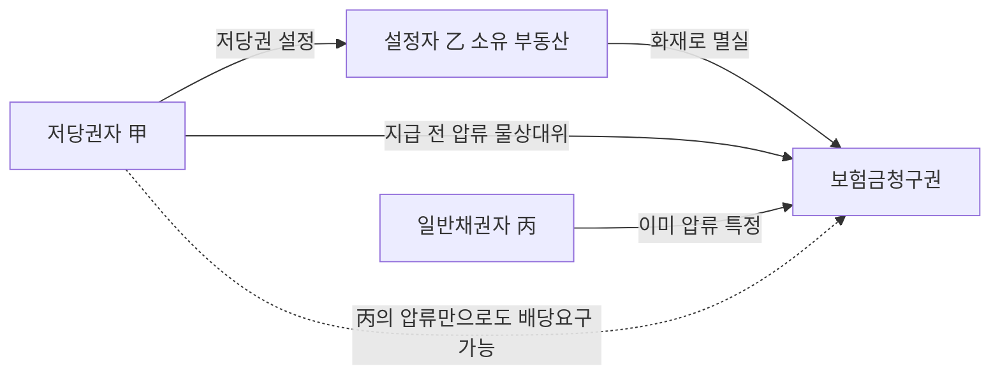

#### 4. 관련 조문

> 📌 **민법 제356조(저당권의 내용)** — "저당권자는 채무자 또는 제3자가 점유를 이전하지 아니하고 채무의 담보로 제공한 부동산에 대하여 **다른 채권자보다 자기채권의 우선변제를 받을 권리**가 있다."

> 📌 **민법 제370조(준용규정) → 제342조(물상대위)** — "저당권은 저당물의 **멸실, 훼손 또는 공용징수**로 인하여 저당권설정자가 받을 금전 기타 물건에 대하여도 이를 행사할 수 있다. 이 경우에는 그 **지급 또는 인도 전에 압류**하여야 한다."

> 📌 **민법 제363조(저당권자의 경매청구권, 경매인)** — "① 저당권자는 그 채권의 변제를 받기 위하여 저당물의 경매를 청구할 수 있다. ② **저당물의 소유권을 취득한 제3자도 경매인이 될 수 있다.**"

> 📌 **민법 제364조(제3취득자의 변제)** — "저당부동산에 대하여 **소유권, 지상권 또는 전세권**을 취득한 제3자는 저당권자에게 그 부동산으로 담보된 채권을 변제하고 **저당권의 소멸을 청구**할 수 있다."

> 📌 **민법 제367조(제3취득자의 비용상환청구권)** — "저당물의 제3취득자가 그 부동산의 **보존, 개량**을 위하여 필요비 또는 유익비를 지출한 때에는 저당물의 **경매대가에서 우선상환**을 받을 수 있다."

> 📌 **민법 제370조 → 제340조(저당물 이외의 재산으로부터의 변제)** — "① 저당권자는 저당물에 의하여 변제를 받지 못한 부분의 채권에 한하여 채무자의 다른 재산으로부터 변제를 받을 수 있다. ② 전항의 규정은 저당물보다 먼저 다른 재산에 관한 배당을 실시하는 경우에는 적용하지 아니한다. 그러나 다른 채권자는 저당권자에게 그 **배당금액의 공탁을 청구**할 수 있다."

> 📌 **민법 제469조 제2항** — 제3취득자는 이해관계 있는 제3자이므로 **채무자의 의사에 반하여서도** 변제할 수 있다. / **제187조** — 제3취득자의 변제로 저당권은 말소등기 없이 소멸한다.

> 📌 **민사집행법 제91조** — 용익권의 인수·소멸, 전세권자의 배당요구에 의한 소멸의 근거. / **민사집행법 제267조** — 매수인의 부동산 취득은 담보권 소멸로 영향을 받지 아니한다(경매개시결정 **이후**의 소멸에만 적용).

#### 5. 핵심 판례 법리

**① 물상대위 압류 요건의 취지** ⭐⭐
저당권자가 물상대위권을 행사하기 위하여 지급 또는 인도 전에 압류하여야 한다고 규정한 것은 ==물상대위의 목적인 채권의 특정성을 유지==하여 그 효력을 보전함과 동시에 ==제3자에게 불측의 손해를 입히지 않으려는 데== 그 취지가 있다(대법원 2010.10.28. 2010다46756).

**② 제3자가 압류하여 특정되면 저당권자는 스스로 압류하지 않아도 된다** ⭐⭐
저당목적물의 변형물인 금전 기타 물건에 대하여 이미 제3자가 압류하여 그 금전 또는 물건이 특정된 이상 저당권자가 스스로 이를 압류하지 않고서도 물상대위권을 행사하여 일반 채권자보다 우선변제를 받을 수 있다(대법원 2010.10.28. 2010다46756; 대법원 2002.10.11. 2002다33137). 질권자도 마찬가지로 제342조 단서에 의한 압류를 스스로 하지 않더라도 당연히 물상대위권의 효력이 미쳐 우선변제를 받을 수 있다(대법원 1987.5.26. 86다카1058).

**③ 공탁된 경우에도 물상대위권 행사 가능**
보상금 등이 ==공탁된 경우에도 특정성이 유지==되므로 공탁금에 대해 압류를 하지 않더라도 물상대위권을 행사할 수 있다(대법원 1987.5.26. 86다카1058).

**④ 설정자가 금전을 수령해 버리면 물상대위 불가** ⭐
근저당권자가 금전이나 물건의 인도청구권을 압류하기 전에 토지의 소유자가 인도청구권에 기하여 금전 등을 수령한 경우 근저당권자는 더 이상 물상대위권을 행사할 수 없다(대법원 2015.9.10. 2013다216273).

**⑤ 채권이 양도·전부되어도 배당요구 종기 전이면 추급 가능**
물상대위권자의 압류 전에 양도 또는 전부명령 등에 의하여 보상금 채권이 타인에게 이전된 경우라도, 보상금이 직접 지급되거나 보상금지급청구권에 관한 강제집행절차에서 배당요구의 종기에 이르기 전에는 여전히 그 청구권에 대한 추급이 가능하다(대법원 2000.6.23. 98다31899).

**⑥ 매매대금·차임에는 물상대위가 인정되지 않는다** ⭐
담보목적물의 매매나 임대의 경우에는 ==담보목적물이 존속==하기 때문에 우선변제권이 인정될 뿐 물상대위가 인정되지 않는다. 따라서 매매대금이나 차임에 대해서는 물상대위가 인정되지 않는다.

**⑦ 협의매수 보상금 — 물상대위 부정**
토지소유자와 사업시행자 사이에 협의가 성립된 경우 그 토지의 저당권자는 토지소유자가 수령할 보상금에 대하여 ==물상대위를 할 수 없다==(대법원 1981.5.26. 80다2109).

**⑧ 화재보험금청구권 — 물상대위 인정** ⭐
저당목적물의 소실로 저당권설정자가 취득하게 된 ==화재보험계약상의 보험금청구권==에 대하여 저당권자가 물상대위권을 행사할 수 있다(대법원 2004.12.24. 2004다52798). 양도담보 목적물이 소실되어 설정자가 보험금청구권을 취득한 경우에도 양도담보권자는 그 화재보험금청구권에 대하여 물상대위권을 행사할 수 있다(대법원 2002.11.26. 2001다73022).

**⑨ 물상대위의 행사방법과 시기**
물상대위권의 행사는 ==담보권의 존재를 증명하는 서류를 집행법원에 제출==하여 채권압류 및 전부명령을 신청하거나 ==배당요구==를 하는 방법에 의한다. 배당요구는 늦어도 ==배당요구의 종기까지== 하여야 하고, 그 이후에는 물상대위권자로서의 우선변제권을 행사할 수 없다(대법원 2000.5.12. 2000다4272).

**⑩ 물상대위권을 행사하지 않으면 부당이득반환청구도 불가** ⭐
물상대위권의 행사에 나아가지 아니한 채 단지 수용대상토지에 담보물권의 등기가 된 것만으로는 그 보상금으로부터 우선변제를 받을 수 없다. 따라서 다른 채권자가 그 보상금 등으로부터 이득을 얻었다고 하더라도 저당권자는 이를 ==부당이득으로서 반환청구할 수 없다==(대법원 2010.10.28. 2010다46756).

**⑪ 제367조 — 배당요구를 하여야 한다** ⭐
제3취득자가 필요비·유익비를 지출한 때 그 비용은 ==공익비용==으로서 환가대금에서 부담할 성질의 것이고 제3취득자는 경매로 권리를 상실하므로 특별히 매각대금에서 우선상환을 받도록 한 것이다. 다만 우선상환을 받으려면 저당부동산의 경매절차에서 ==배당요구의 종기까지 배당요구==를 하여야 한다(대법원 2023.7.13. 2022다265093).

**⑫ 제367조로 유치권을 주장할 수는 없다** ⭐
제367조에 의한 우선상환을 근거로 제3취득자가 직접 저당권설정자·저당권자 또는 경매절차 매수인 등에 대하여 ==비용상환을 청구할 수 있는 권리는 인정될 수 없다.== 따라서 제3취득자는 제367조에 의한 비용상환청구권을 피담보채권으로 주장하면서 ==유치권을 행사할 수 없다==(대법원 2023.7.13. 2022다265093).

**⑬ 근저당의 제3취득자 — 확정 후 채권최고액 범위**
제364조에 의한 권리를 취득한 제3자는 ==피담보채무가 확정된 이후에 채권최고액의 범위 내==에서 그 확정된 피담보채무를 변제하고 근저당권의 소멸을 청구할 수 있다. 그러나 후순위근저당권을 취득한 자는 제3취득자에 해당하지 아니하므로 선순위근저당권의 소멸을 청구할 수는 없다(대법원 2006.1.26. 2005다17341).

**⑭ 근저당권의 물상보증인·제3취득자의 변제 범위**
근저당권의 물상보증인은 ==채권최고액만을 변제하면== 근저당권설정등기의 말소청구를 할 수 있고 채권최고액을 초과하는 부분까지 변제할 의무가 있는 것이 아니다. 반면 ==채무자는 실제 채무액 전부==를 변제하여야 한다.

**⑮ 후순위저당권 실행 시 임차권의 운명**
후순위저당권의 실행으로 목적부동산이 경락되어 선순위저당권이 함께 소멸한 경우라면, 비록 후순위저당권자에게는 대항할 수 있는 임차권이더라도 소멸된 선순위저당권보다 뒤에 등기되었거나 대항력을 갖춘 임차권은 함께 소멸한다(대법원 1987.2.24. 86다카1963).

**⑯ 전세권을 목적으로 한 저당권**
전세권이 기간만료로 종료되면 전세권은 말소등기 없이도 당연히 소멸하고, 저당권의 목적물인 전세권이 소멸하면 저당권도 당연히 소멸하므로, 전세권을 목적으로 한 저당권자는 부동산의 소유자에게 더 이상 저당권을 주장할 수 없다(대법원 1999.9.17. 98다31301). 이 경우 저당권자는 ==전세금반환채권에 대하여 물상대위권을 행사==할 수 있다.

**⑰ 이미 소멸한 근저당권에 기한 경매는 무효**
이미 소멸한 근저당권에 기하여 임의경매가 개시되고 매각이 이루어진 경우 그 경매는 무효이다. 민사집행법 제267조는 ==경매개시결정이 있은 뒤에 담보권이 소멸==하였음에도 경매가 계속 진행되어 매각된 경우에만 적용된다(대법원 2022.8.25. 2018다205209 전원합의체).

**⑱ 실행비용의 부담자**
채무자가 피담보채무를 이행하지 않아 담보권자가 담보권을 실행하였을 때 그 실행에 필요한 상당한 비용은 채무불이행으로 인하여 발생한 비용이므로 당사자 간에 계약이 없는 한 ==채무자가 부담==한다(대법원 1976.12.24. 76다957).

**⑲ 청구금액의 확장 불가**
담보권 실행을 위한 경매절차에서 신청채권자가 경매신청서에 ==피담보채권의 일부만을 청구금액==으로 하여 경매를 신청하였다면 그 청구금액은 기재된 채권액을 한도로 확정되고, 그 후 채권계산서 제출 등의 방법으로 ==청구금액을 확장할 수 없다==(대법원 2011.12.8. 2011다65396).

#### ⭐ 기출 출제포인트

1. **"제3자가 압류하여 특정되었으면 저당권자가 스스로 압류하지 않아도 물상대위 가능"** — 2021·2022년 연속 출제된 최빈출 선지. "스스로 압류하여야 한다"는 지문은 무조건 X.
2. **매매대금·차임 물상대위 부정 / 화재보험금·수용보상금 인정** — 인정·부정 목록을 통으로 외운다.
3. **설정자가 금전을 수령한 뒤에는 물상대위 불가** — "토지 소유자가 금전 등을 수령한 경우에도 행사할 수 있다"는 지문은 X.
4. **협의취득 보상금** — 물상대위 부정(공인중개사·감정평가사 공통 출제).
5. **제363조 제2항** — "저당물의 소유권을 취득한 제3자는 경매인이 될 수 없다"는 지문이 반복 출제되는 **오답 선지**다.
6. **제367조** — "제3취득자는 유익비를 경매대가에서 우선상환받을 수 없다"는 지문은 X. 2019·2023·2025년 모두 등장.
7. **물상대위 행사 시기** — "배당요구의 종기(배당기일 전)"까지.

#### 📊 기출 분석

| 연도 | 출제 형태 | 핵심 논점 |
|---|---|---|
| 2018년 제29회 26번 | 저당권 옳지 않은 것 | ==제363조 제2항 경매인 자격==(정답 ①), 제364조 지상권 취득자의 변제 |
| 2019년 제30회 39번 ㄷ | 박스형 | 제367조 유익비 우선상환 — "받을 수 없다"는 X |
| 2020년 제31회 39번 ④ | 저당권 옳은 것 | 물상대위권 행사 시기(배당기일 전) |
| 2021년 제32회 38번 ② | 옳지 않은 것(정답) | ==제3자가 압류한 경우의 물상대위== |
| 2022년 제33회 40번 ④⑤ | 옳지 않은 것(정답 ⑤) | 전세권저당권의 물상대위, ==제3자 압류== |
| 2023년 제34회 38번 ④ | 옳지 않은 것(정답) | ==제367조 유익비 우선변제== |
| 2025년 제36회 40번 ⑤ | 공동저당 사례형 | 제3취득자의 유익비 우선상환 |

**출제 빈도** — 물상대위는 저당권 논점 중 **단일 선지 기준 최다 출제**다. 특히 "제3자 압류" 판례(2010다46756)는 2021·2022년 연속으로 **정답 선지**가 되었다.

**반복되는 함정 선지** — ⓐ "저당권자가 스스로 압류하여야 물상대위권을 행사할 수 있다"(X) ⓑ "토지 소유자가 금전을 수령한 경우에도 물상대위를 행사할 수 있다"(X) ⓒ "저당물의 소유권을 취득한 제3자는 경매인이 될 수 없다"(X) ⓓ "제3취득자는 유익비를 우선변제받을 수 없다"(X) ⓔ "물상대위권을 행사하지 않아도 등기가 있으면 우선변제받는다"(X).

**최근 경향** — 물상대위 자체보다 **물상대위 + 다른 담보물권(전세권저당권·양도담보)의 결합형**, 그리고 **제3취득자 보호수단 3종을 한 문항에 섞는 방식**이 늘고 있다.

#### 🔍 기출 선지로 배우는 법리

> 실제 출제된 선지를 그대로 놓고 O/X와 근거를 확인한다.

**①** 저당목적물의 변형물에 대하여 이미 제3자가 압류하였더라도 저당권자가 스스로 이를 압류하지 않으면 물상대위권을 행사할 수 없다. (2021년 제32회 38번 — 정답 선지) — **X**
어디가 틀렸나: **제3자의 압류로 특정된 이상 스스로 압류하지 않아도** 물상대위권을 행사하여 일반채권자보다 우선변제를 받을 수 있다(2010다46756).

**②** 저당목적물의 변형물인 물건에 대하여 이미 제3자가 압류하여 그 물건이 특정된 경우에도 저당권자는 스스로 이를 압류하여야 물상대위권을 행사할 수 있다. (2022년 제33회 40번 — 정답 선지) — **X**
어디가 틀렸나: 같은 법리다. 두 해 연속 같은 판례가 정답으로 출제되었다.

**③** 저당물의 소유권을 취득한 제3자는 경매인이 될 수 없다. (2018년 제29회 26번 — 정답 선지) — **X**
어디가 틀렸나: 제363조 제2항은 **"저당물의 소유권을 취득한 제3자도 경매인이 될 수 있다"** 고 명문으로 규정한다.

**④** 저당부동산에 대하여 지상권을 취득한 제3자는 저당권자에게 그 부동산으로 담보된 채권을 변제하고 저당권의 소멸을 청구할 수 있다. (2018년 제29회 26번 / 2021년 제32회 38번) — **O**
근거: 제364조. 소유권뿐 아니라 **지상권·전세권** 취득자도 포함된다.

**⑤** 저당부동산의 제3취득자는 부동산의 개량을 위해 지출한 유익비를 그 부동산의 경매 대가에서 우선 변제받을 수 없다. (2023년 제34회 38번 — 정답 선지) — **X**
어디가 틀렸나: 제367조에 의해 **경매대가에서 우선상환**을 받을 수 있다. 다만 배당요구의 종기까지 배당요구를 하여야 한다(2022다265093).

**⑥** 저당권자는 배당기일 전까지 물상대위권을 행사하여 우선변제를 받을 수 있다. (2020년 제31회 39번) — **O**
근거: 물상대위권의 행사는 배당요구의 종기까지 하여야 한다(2000다4272).

**⑦** 저당권자가 물상대위권을 행사하지 아니한 경우, 저당목적물의 변형물로부터 이득을 얻은 다른 채권자에 대하여 부당이득반환을 청구할 수 없다. (문제집 제6장 실전문제 36번) — **O**
근거: 대법원 2010.10.28. 2010다46756.

**⑧** 저당권의 목적 토지가 「공익사업을 위한 토지 등의 취득 및 보상에 관한 법률」에 따라 협의취득된 경우, 저당권자는 그 보상금청구권에 대해 물상대위권을 행사할 수 없다. (문제집 제6장 실전문제 48번) — **O**
근거: 협의성립에 따른 보상금에는 물상대위가 인정되지 않는다(80다2109).

**⑨** 전세권을 목적으로 한 저당권이 설정된 후 전세권이 존속기간 만료로 소멸된 경우, 저당권자는 전세금반환채권에 대하여 물상대위권을 행사할 수 있다. (2022년 제33회 40번) — **O**
근거: 전세권 소멸 후 저당권자는 목적물 소유자에게 저당권을 주장할 수 없고(98다31301), 그 대신 전세금반환채권에 물상대위한다.

**⑩** 근저당권자는 근저당권의 목적이 된 토지의 공용징수 등으로 토지의 소유자가 받을 금전에 대하여 물상대위권을 행사할 수 있으므로, 토지의 소유자가 금전 등을 수령한 경우에도 물상대위권을 행사할 수 있다. (핵심요약서 중요지문 25번) — **X**
어디가 틀렸나: **소유자가 금전을 수령하면 특정성이 깨져** 더 이상 물상대위권을 행사할 수 없다(2013다216273).

**⑪** 저당물의 제3취득자가 변제를 한 경우 제3취득자가 저당권자를 대위하게 되므로 채무자에게 구상권을 행사할 수 없다. (문제집 제6장 실전문제 34번 — 정답 선지) — **X**
어디가 틀렸나: 제3취득자는 저당권자를 **법정대위하며 동시에 채무자에게 구상권도 행사**할 수 있다.

**⑫** 지상권이 저당권보다 후에 설정된 경우, 지상권자는 저당권자에게 그 토지로 담보된 채권을 변제하고 저당권의 소멸을 청구할 수 있다. (문제집 제6장 실전문제 35번) — **O**
근거: 제364조. 후순위 지상권자도 제3취득자로서 변제권을 가진다.

#### ✏️ 사례형 적용

> **사례 1** — 甲은 乙 소유 X건물에 1번 저당권(피담보채권 5억 원)을 가지고 있다. X건물이 화재로 전소되어 乙은 보험회사에 대해 4억 원의 화재보험금청구권을 취득하였다. ⓐ 乙의 일반채권자 丙이 먼저 이 채권을 압류한 경우, ⓑ 乙이 이미 보험금 4억 원을 수령한 경우, ⓒ 乙이 이 채권을 丁에게 양도하였으나 아직 지급되지 않은 경우 甲의 지위는?

**검토** —
ⓐ **화재보험금청구권은 물상대위의 대상**이다(2004다52798). 제3자 丙의 압류로 이미 채권이 **특정**되었으므로 甲은 스스로 압류하지 않고도 배당요구를 하여 일반채권자 丙보다 **우선변제**를 받을 수 있다(2010다46756).
ⓑ 지급이 이루어진 이상 **특정성이 소멸**하여 물상대위권을 행사할 수 없다(2013다216273). 나아가 다른 채권자가 이득을 얻었더라도 **부당이득반환청구도 불가**하다.
ⓒ 채권이 丁에게 양도되었어도 **보상금이 직접 지급되거나 배당요구 종기에 이르기 전이라면 여전히 추급 가능**하다(98다31899). ⓑ와 ⓒ의 결론이 갈리는 지점이 **"돈이 나갔는가"** 임을 확인하라.

> **사례 2** — 丙은 甲의 저당권이 설정된 乙 소유 Y건물을 매수하여 소유권을 취득한 뒤, 노후 배관을 교체하는 데 필요비 3,000만 원, 리모델링에 유익비 5,000만 원을 지출하였다. 이후 甲이 저당권을 실행하였다. 丙은 어떻게 자신을 방어할 수 있는가?

**검토** — 丙은 **제3취득자**다. ① **제364조**에 따라 甲에게 피담보채권을 변제하고 저당권의 소멸을 청구할 수 있다. 이해관계 있는 제3자이므로 채무자 乙의 의사에 반해서도 변제할 수 있고, 변제하면 저당권은 **말소등기 없이 소멸**하며 丙은 甲을 법정대위하고 乙에게 구상할 수 있다. ② 변제하지 않는다면 **제363조 제2항**에 따라 스스로 **경매인**이 되어 매수할 수 있다. ③ 지출한 필요비·유익비는 **제367조**에 의해 경매대가에서 **저당권자보다 우선하여 상환**받는다. 다만 ㉠ **배당요구의 종기까지 배당요구**를 하여야 하고(2022다265093), ㉡ 甲이나 매수인에게 **직접 청구할 수는 없으며**, ㉢ 이 비용상환청구권을 피담보채권으로 **유치권을 행사할 수도 없다.**

> **사례 3** — X토지에 ① 甲의 1번 저당권, ② 丙의 지상권, ③ 乙의 2번 저당권이 순차로 설정되었다. 乙이 2번 저당권을 실행하여 경매가 진행되었고 丁이 매수하였다. 丙의 지상권은 어떻게 되는가? 만약 ②가 전세권이었다면?

**검토** — ① 용익권의 소멸 여부는 **경매를 신청한 저당권자(乙)와의 우열이 아니라 그 부동산 위 최고 순위의 저당권(甲)과의 우열**로 정해진다. ② 후순위 乙의 실행으로 **선순위 甲의 저당권도 소멸**하고 甲은 배당에 참여해 우선변제를 받으므로, 甲보다 뒤에 설정된 丙의 지상권은 ==소멸==한다. 丁은 부담 없는 소유권을 취득한다. ③ 만약 ②가 전세권이었다면 결론은 같다 — 최선순위 저당권보다 후순위이므로 매각으로 소멸한다. 다만 **전세권이 최선순위였다면** 원칙적으로 존속하되 **전세권자가 배당요구를 하면 매각으로 소멸**한다. ④ 대항력 있는 임차권도 같은 구조로, 소멸한 선순위저당권보다 뒤에 대항력을 갖췄다면 함께 소멸한다(86다카1963).

#### ⚠️ 이 관의 함정 총정리

1. "저당권자가 스스로 압류하여야 물상대위권을 행사할 수 있다"고 하면 틀림 → ==누가 압류하든 특정성만 유지되면 된다.==
2. "매매대금·차임에도 물상대위가 인정된다"고 하면 틀림 → 목적물이 ==존속==하므로 물상대위가 아니라 우선변제권의 문제다. 다만 압류 후 차임은 ==과실(제359조)==로 포섭된다.
3. "설정자가 보상금을 수령한 뒤에도 물상대위할 수 있다"고 하면 틀림 → ==특정성이 깨져== 불가하고, ==부당이득반환청구도 불가==하다.
4. "저당물의 소유권을 취득한 제3자는 경매인이 될 수 없다"고 하면 틀림 → 제363조 제2항이 ==될 수 있다==고 명문화했다.
5. "제3취득자는 유익비를 우선상환받을 수 없다" 또는 "그 비용상환청구권으로 유치권을 행사할 수 있다"고 하면 틀림 → ==우선상환은 되고(제367조), 유치권은 안 된다.==

#### ✅ OX 확인문제

> 다음 진술의 참·거짓을 판단하시오.

**1.** 저당권은 저당물의 멸실, 훼손 또는 공용징수로 인하여 저당권설정자가 받을 금전 기타 물건에 대하여도 행사할 수 있으나, 그 지급 또는 인도 전에 압류하여야 한다.
→ **O**. 제370조가 준용하는 제342조의 문언이다. 압류는 특정성 유지와 제3자 보호를 위한 요건이다.

**2.** 저당목적물의 변형물인 금전에 대하여 이미 제3자가 압류하여 특정된 경우에도 저당권자가 스스로 압류하여야만 물상대위권을 행사할 수 있다.
→ **X**. **스스로 압류하지 않아도** 물상대위권을 행사하여 일반채권자보다 우선변제를 받을 수 있다(2010다46756).

**3.** 담보목적물이 매도된 경우 그 매매대금에 대하여 저당권자는 물상대위권을 행사할 수 있다.
→ **X**. 매매의 경우 **담보목적물이 존속**하므로 우선변제권이 인정될 뿐 물상대위는 인정되지 않는다.

**4.** 저당목적물의 소실로 저당권설정자가 취득한 화재보험계약상의 보험금청구권에 대하여 저당권자는 물상대위권을 행사할 수 있다.
→ **O**. 대법원 2004.12.24. 2004다52798.

**5.** 보상금이 공탁된 경우에는 특정성이 유지되므로 공탁금에 대하여 압류를 하지 않더라도 물상대위권을 행사할 수 있다.
→ **O**. 대법원 1987.5.26. 86다카1058.

**6.** 물상대위권자의 압류 전에 보상금채권이 타인에게 양도된 경우에는 어떠한 경우에도 더 이상 추급할 수 없다.
→ **X**. 보상금이 직접 지급되거나 **배당요구의 종기에 이르기 전에는 여전히 추급이 가능**하다(98다31899).

**7.** 저당권자가 물상대위권을 행사하지 않은 경우, 담보물권의 등기가 되어 있다는 사정만으로도 그 보상금으로부터 우선변제를 받을 수 있다.
→ **X**. 우선변제를 받을 수 없고, 다른 채권자가 이득을 얻었더라도 **부당이득으로 반환청구할 수 없다**(2010다46756).

**8.** 저당물의 소유권을 취득한 제3자는 그 저당물에 관한 저당권 실행의 경매절차에서 경매인이 될 수 있다.
→ **O**. 제363조 제2항.

**9.** 저당부동산의 제3취득자가 그 부동산의 보존·개량을 위하여 지출한 필요비 또는 유익비는 저당물의 경매대가에서 우선상환을 받을 수 있으나, 이를 피담보채권으로 유치권을 행사할 수는 없다.
→ **O**. 제367조에 의한 우선상환은 배당절차에서만 실현되고, 직접 청구권이나 유치권은 인정되지 않는다(2022다265093).

**10.** 용익권이 저당권의 실행으로 소멸하는지는 경매를 신청한 저당권자와의 우열로 정해진다.
→ **X**. **그 부동산 위 최고 순위의 저당권과의 우열**로 정해진다. 후순위저당권의 실행으로 선순위저당권도 소멸하기 때문이다.

#### 🧠 암기법

> 🔑 **물상대위 3요건 — "멸·훼·공 / 금전 / 압류"**
> **멸**실·**훼**손·**공**용징수 → 설정자가 받을 **금전** 기타 물건 → 지급·인도 **전의 압류**.
> 한 줄로: **"물건이 돈으로 바뀌기 전에 붙잡아라."**

> 🔑 **물상대위 O/X — "보상·보험은 O, 매매·차임은 X"**
> **보**상금·**보**험금은 물건이 **없어져서** 생긴 돈이니 O.
> **매**매대금·**차**임은 물건이 **살아 있는데** 나온 돈이니 X.
> 판단 기준 한 줄: ==목적물이 존속하는가?==

> 🔑 **압류 갈림길 — "채권이 갔으면 OK, 돈이 갔으면 END"**
> 채권이 양도·전부되어도 배당요구 종기 전이면 추급 O.
> 설정자가 **돈을 받아버리면** 특정성 소멸로 물상대위 X.

> 🔑 **제3취득자 3종 무기 — "경·변·비" (363·364·367)**
> **경**매인이 될 수 있고(제36**3**조 제2항), **변**제하고 소멸청구할 수 있고(제36**4**조), **비**용을 우선상환받는다(제36**7**조).
> 조문번호가 3-4-7로 커지는 순서 그대로 "경·변·비"로 외운다.

#### ⚖️ 법조문 원문

> 📖 이 관이 근거로 삼은 조문의 **전문**이다. 본문 인용은 발췌지만 여기서는 조 전체를 싣는다. 출처는 법제처 정본이다.

**― 민법 ―**

> 📌 **민법 제340조(질물 이외의 재산으로부터의 변제)** — "①질권자는 질물에 의하여 변제를 받지 못한 부분의 채권에 한하여 채무자의 다른 재산으로부터 변제를 받을 수 있다. ②전항의 규정은 질물보다 먼저 다른 재산에 관한 배당을 실시하는 경우에는 적용하지 아니한다. 그러나 다른 채권자는 질권자에게 그 배당금액의 공탁을 청구할 수 있다."

> 📌 **민법 제342조(물상대위)** — "질권은 질물의 멸실, 훼손 또는 공용징수로 인하여 질권설정자가 받을 금전 기타 물건에 대하여도 이를 행사할 수 있다. 이 경우에는 그 지급 또는 인도전에 압류하여야 한다."

> 📌 **민법 제356조(저당권의 내용)** — "저당권자는 채무자 또는 제삼자가 점유를 이전하지 아니하고 채무의 담보로 제공한 부동산에 대하여 다른 채권자보다 자기채권의 우선변제를 받을 권리가 있다."

> 📌 **민법 제363조(저당권자의 경매청구권, 경매인)** — "①저당권자는 그 채권의 변제를 받기 위하여 저당물의 경매를 청구할 수 있다. ②저당물의 소유권을 취득한 제삼자도 경매인이 될 수 있다."

> 📌 **민법 제364조(제삼취득자의 변제)** — "저당부동산에 대하여 소유권, 지상권 또는 전세권을 취득한 제삼자는 저당권자에게 그 부동산으로 담보된 채권을 변제하고 저당권의 소멸을 청구할 수 있다."

> 📌 **민법 제367조(제삼취득자의 비용상환청구권)** — "저당물의 제삼취득자가 그 부동산의 보존, 개량을 위하여 필요비 또는 유익비를 지출한 때에는 제203조제1항, 제2항의 규정에 의하여 저당물의 경매대가에서 우선상환을 받을 수 있다."

> 📌 **민법 제370조(준용규정)** — "제214조, 제321조, 제333조, 제340조, 제341조 및 제342조의 규정은 저당권에 준용한다."

> 📌 **민법 제469조(제삼자의 변제)** — "①채무의 변제는 제삼자도 할 수 있다. 그러나 채무의 성질 또는 당사자의 의사표시로 제삼자의 변제를 허용하지 아니하는 때에는 그러하지 아니하다. ②이해관계없는 제삼자는 채무자의 의사에 반하여 변제하지 못한다."

**― 민사집행법 ―**

> 📌 **민사집행법 제91조(인수주의와 잉여주의의 선택 등)** — "①압류채권자의 채권에 우선하는 채권에 관한 부동산의 부담을 매수인에게 인수하게 하거나, 매각대금으로 그 부담을 변제하는 데 부족하지 아니하다는 것이 인정된 경우가 아니면 그 부동산을 매각하지못한다. ②매각부동산 위의 모든 저당권은 매각으로 소멸된다. ③지상권ㆍ지역권ㆍ전세권 및 등기된 임차권은 저당권ㆍ압류채권ㆍ가압류채권에 대항할 수 없는 경우에는 매각으로 소멸된다. ④제3항의 경우 외의 지상권ㆍ지역권ㆍ전세권 및 등기된 임차권은 매수인이 인수한다. 다만, 그중 전세권의 경우에는 전세권자가 제88조에 따라 배당요구를 하면 매각으로 소멸된다. ⑤매수인은 유치권자(留置權者)에게 그 유치권(留置權)으로 담보하는 채권을 변제할 책임이 있다."

### 제4관 저당권의 침해와 구제

> 📖 저당권자는 목적물을 점유하지 않는다(제356조). 그래서 침해가 곧바로 눈에 보이지 않고, 침해가 있어도 **남은 담보가치로 채권을 다 회수할 수 있으면 손해가 없다**. 이 두 가지가 저당권 침해론 전체를 지배한다.
> 앞의 관에서 본 저당권의 효력 범위(부합물·종물·과실·물상대위)가 곧 침해의 대상 범위이고, 뒤의 관에서 볼 소멸론은 침해가 극단화된 결과다.

> ⭐ **이 관에서 반드시 챙길 3가지**
> ① 물권적 청구권은 **방해제거·방해예방만** 인정되고 **반환청구권은 없다**(제370조가 제214조는 준용, 제213조는 준용하지 않음).
> ② **손해배상청구권**은 잔존가치로 완전한 만족을 얻을 수 없을 때 비로소 생긴다. 방해배제청구권은 잔존가치가 충분해도 행사할 수 있다 — **두 청구권의 발동 문턱이 다르다**.
> ③ **담보물보충청구권(제362조)** 을 행사하면 손해배상청구권·즉시변제청구권은 못 쓴다(선택적). 반면 **즉시변제청구권과 손해배상청구권은 병존**한다.

#### 1. 의의

**저당권의 침해(侵害)** 란 저당목적물의 교환가치를 감소시켜 저당권자의 우선변제청구권 행사를 방해하는 일체의 행위를 말한다. 저당물의 물리적 멸실·훼손이 전형이지만, 그 밖에 담보가치를 떨어뜨리는 사실적·법률적 행위도 포함된다.

저당권 침해에는 다른 담보물권에 없는 **두 가지 특수성**이 있다.

| 특수성 | 내용 | 파생되는 결론 |
|---|---|---|
| 점유를 수반하지 않음 | 저당권자는 채무자·제3자가 점유를 이전하지 아니하고 담보로 제공한 부동산에 권리를 가진다(제356조) | 침해가 겉으로 드러나지 않고, 반환청구권이 인정되지 않는다 |
| 교환가치만 파악 | 저당권은 목적물의 이용이 아니라 교환가치의 지배를 내용으로 한다 | 설정자의 정상적인 사용·수익은 침해가 아니고, 잔존가치로 완제가 가능하면 손해가 없다 |

> 💡 질권·유치권은 목적물을 점유하므로 침해가 있으면 **점유보호청구권**으로도 구제받는다. 저당권자에게는 그 길이 없다는 점이 대조된다.

#### 2. 요건

침해가 되는지 여부는 "교환가치를 감소시켜 우선변제청구권의 행사를 방해하는가"로 판정한다.

| 구분 | 인정 여부 | 근거 |
|---|---|---|
| 저당목적물을 물리적으로 멸실·훼손 | 침해 O | 대법원 2006.1.27. 2003다58454 |
| 그 밖의 행위로 저당부동산의 교환가치가 하락할 우려가 있는 등 우선변제청구권 행사가 방해되는 결과 발생 | 침해 O | 대법원 2006.1.27. 2003다58454 |
| 제3자의 점유가 본래의 용법에 따른 사용·수익 범위를 **초과**하여 교환가치를 감소시키는 경우 | 침해 O | 대법원 2005.4.29. 2005다3243 |
| 저당권의 실현을 방해하기 위하여 점유를 개시하였다는 점이 인정되는 경우 | 침해 O | 대법원 2005.4.29. 2005다3243 |
| 정상적 점유와 비교해 경락가격이 하락하거나 경매절차가 진행되지 않는 등 실현이 곤란해질 사정 | 침해 O | 대법원 2005.4.29. 2005다3243 |
| 저당권설정자가 목적물을 정상적으로 사용·수익하는 것 | **침해 X** | 대법원 2005.4.29. 2005다3243 |
| 설정자가 저당토지 위에 건물을 신축하는 것 자체 | 침해 X (제365조 일괄경매로 조절) | 대법원 2003.4.11. 2003다3850 |

> ⚠️ 점유 그 자체가 곧 침해는 아니다. "용법을 **초과**하는 점유" 또는 "**실현 방해 목적**의 점유"라는 가중요건이 붙어야 침해가 된다.

#### 3. 효과

침해가 인정되면 저당권자는 다음 다섯 가지 수단을 갖는다.

| 구제수단 | 근거조문 | 상대방 | 발동요건 | 내용 |
|---|---|---|---|---|
| ① 물권적 청구권 | 제370조(제214조 준용) | 채무자·설정자·제3자 모두 | 침해 또는 침해의 염려 | 방해제거·방해예방·손해배상의 담보 청구. 반환청구는 불가 |
| ② 손해배상청구권 | 제750조 | 채무자·설정자·제3자 모두 | 불법행위 요건 + 잔존가치로 완제 불가 | 담보가치 부족분 한도의 금전배상 |
| ③ 담보물보충청구권 | 제362조 | 저당권설정자에 한함 | 설정자의 책임 있는 사유로 저당물 가액이 현저히 감소 | 원상회복 또는 상당한 담보제공 |
| ④ 기한이익 상실 → 즉시변제청구 | 제388조 제1호 | 채무자에 한함 | 채무자가 담보를 손상·감소·멸실 또는 담보제공의무 불이행 | 기한의 이익 상실, 즉시 변제청구 |
| ⑤ 즉시 저당권 실행 | 제363조 제1항 | — | ④의 결과 변제기 도래 | 곧바로 경매 신청 |

**⭐ 구제수단 상호관계 — 이 표가 출제의 심장이다**

| 조합 | 가부 | 이유 |
|---|---|---|
| 방해제거청구권 + 손해배상청구권 | 병존 O | 목적이 다르다(원상 회복 vs 금전 전보) |
| 즉시변제청구권 + 손해배상청구권 | 병존 O | 판례·통설. 문제집 해설이 명시 |
| 방해제거청구권 + 즉시변제청구권 | 병존 O | 결합적 행사 가능 |
| **담보물보충청구권 + 손해배상청구권** | 선택적(병존 X) | 원상회복을 받으면 손해가 전보되므로 이중전보 금지 |
| **담보물보충청구권 + 즉시변제청구권** | 선택적(병존 X) | 담보를 보충받으면 기한이익을 뺏을 이유가 없다 |

> 💡 다만 담보물보충청구권을 행사했는데 **그에 따른 만족이 없으면** 다시 손해배상청구권이나 즉시변제청구권을 행사할 수 있다.

**침해자가 누구냐에 따른 차이**

| 침해자 | ① 물권적 청구권 | ② 손해배상 | ③ 담보물보충 | ④ 즉시변제청구 |
|---|---|---|---|---|
| 채무자(=설정자) | O (반환청구는 X) | O | O | O |
| 물상보증인(설정자) | O | O | O | X (채무자가 아님) |
| 제3자 | O | O | X | X |

> 🔑 제362조는 "저당권**설정자**", 제388조는 "**채무자**"라고 문언이 다르다. 제3자가 침해하면 ①과 ②만 남는다.

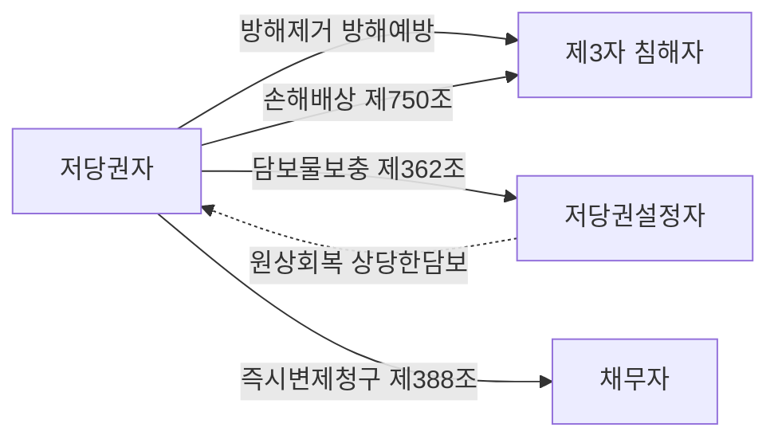

#### 4. 관련 조문

> 📌 **민법 제356조(저당권의 내용)** — "저당권자는 채무자 또는 제3자가 점유를 이전하지 아니하고 채무의 담보로 제공한 부동산에 대하여 다른 채권자보다 자기채권의 우선변제를 받을 권리가 있다."

> 📌 **민법 제370조(준용규정)** — 제214조(소유물방해제거·방해예방청구권)를 저당권에 준용한다. 저당권자는 저당권을 방해하는 자에 대하여 방해의 제거를 청구할 수 있고, 저당권을 방해할 염려 있는 행위를 하는 자에 대하여 그 예방이나 손해배상의 담보를 청구할 수 있다. ==제213조(소유물반환청구권)는 준용되지 않는다.==

> 📌 **민법 제362조(저당물의 보충)** — "저당권설정자의 책임 있는 사유로 인하여 저당물의 가액이 현저히 감소된 때에는 저당권자는 저당권설정자에 대하여 그 원상회복 또는 상당한 담보제공을 청구할 수 있다."

> 📌 **민법 제388조(기한의 이익의 상실) 제1호** — "채무자가 담보를 손상, 감소 또는 멸실하게 하거나 담보제공의무를 이행하지 아니한 때에는 채무자는 기한의 이익을 주장하지 못한다."

> 📌 **민법 제750조(불법행위의 내용)** — 저당권 침해가 불법행위의 요건을 충족하면 저당권자는 손해배상을 청구할 수 있다.

#### 5. 핵심 판례 법리

- **① 방해배제청구권의 범위** — 저당권자는 저당권 설정 이후 환가에 이르기까지 저당물의 교환가치에 대한 지배권능을 보유하므로, 저당목적물의 소유자 또는 제3자가 저당목적물을 물리적으로 멸실·훼손하는 경우는 물론 **그 밖의 행위로 저당부동산의 교환가치가 하락할 우려가 있는 등 저당권자의 우선변제청구권의 행사가 방해되는 결과가 발생한다면** 저당권자는 저당권에 기한 방해배제청구권을 행사하여 방해행위의 제거를 청구할 수 있다(대법원 2006.1.27. 2003다58454). ⇒ 나머지 가치만으로 채권의 완전한 만족을 얻을 수 있어도 방해배제는 가능하다는 점이 핵심.

- **② 공장기계 반출 — 반환청구는 X, 원상회복은 O** — 저당권자는 물권에 기하여 그 침해가 있는 때에는 그 제거나 예방을 청구할 수 있다. 공장저당권의 목적 동산이 저당권자의 동의를 얻지 아니하고 설치된 공장으로부터 반출된 경우, 저당권자는 설정자로부터 일탈한 저당목적물을 ==저당권자 자신에게 반환할 것을 청구할 수는 없지만==, 저당목적물이 제3자에게 선의취득되지 아니하는 한 방해배제청구권의 행사로서 ==원래의 설치 장소에 원상회복할 것을 청구==할 수 있다(대법원 1996.3.22. 95다55184).

- **③ 점유에 의한 침해의 인정 기준** — 저당부동산에 대한 점유가 저당부동산의 본래의 용법에 따른 사용·수익의 범위를 초과하여 그 교환가치를 감소시키거나, 점유자에게 저당권의 실현을 방해하기 위하여 점유를 개시하였다는 점이 인정되는 등, 그 점유로 인하여 정상적인 점유가 있는 경우의 경락가격과 비교하여 그 가격이 하락하거나 경매절차가 진행되지 않는 등 저당권의 실현이 곤란하게 될 사정이 있는 경우에는 저당권의 침해가 인정될 수 있다(대법원 2005.4.29. 2005다3243).

- **④ 정상적 사용·수익은 침해가 아니다** — 저당권은 목적물의 교환가치를 파악하여 채권의 우선변제를 받는 것을 내용으로 하므로, 저당권설정자가 목적물에 대해 정상적인 사용·수익을 하는 것은 ==저당권의 침해에 해당하지 않는다==(대법원 2005.4.29. 2005다3243).

- **⑤ 담보지상권에 의한 방해배제 — 신축 건물의 철거·대지 인도** — 토지에 관하여 저당권을 취득함과 아울러 그 저당권의 담보가치를 확보하기 위하여 지상권을 취득하는 경우, 특별한 사정이 없는 한 그 지상권은 저당권이 실행될 때까지 제3자가 용익권을 취득하거나 목적 토지의 담보가치를 하락시키는 침해행위를 하는 것을 배제함으로써 저당 부동산의 담보가치를 확보하는 데에 목적이 있으므로, 제3자가 저당권의 목적인 토지 위에 건물을 신축하는 경우에는 그 제3자가 지상권자에게 대항할 수 있는 권원을 가지고 있다는 등의 특별한 사정이 없는 한, 지상권자는 그 방해배제청구로서 ==신축중인 건물의 철거와 대지의 인도 등을 구할 수 있다==(대법원 2008.2.15. 2005다47205).

- **⑥ 손해배상청구권의 발생 문턱 — 완전한 만족 불가** — 근저당권의 공동 담보물 중 일부를 권한 없이 멸실·훼손하거나 담보가치를 감소시키는 행위로 인하여 근저당권자가 나머지 저당 목적물만으로 ==채권의 완전한 만족을 얻을 수 없게 되었다면== 근저당권자는 불법행위에 기한 손해배상청구권을 취득한다(대법원 2009.5.28. 2006다42818). 반대로 나머지 가치만으로 완전한 만족을 얻을 수 있으면 손해배상청구권은 발생하지 않는다.

- **⑦ 손해의 발생시기** — 담보물을 권한 없이 멸실·훼손하거나 담보가치를 감소시키는 행위로 채권자가 입게 되는 손해는 피담보채무의 변제기가 도래하여 ==그 담보권을 실행할 때 비로소 발생하는 것이 아니다==(대법원 1998.11.10. 98다34126). ⇒ 저당권 실행 전이라도 손해액을 산정할 수 있으므로 손해배상 청구가 가능하다.

- **⑧ 근저당권등기의 불법말소는 손해가 아니다** — 근저당권설정등기가 불법행위로 인하여 원인 없이 말소되었다 하더라도 그 ==물권의 효력에 아무런 영향이 없고==, 회복등기 신청절차에 의하여 말소된 등기를 회복할 수 있으므로 말소된 근저당권설정등기의 등기명의인이 곧바로 근저당권 상실의 손해를 입게 된다고 할 수는 없다(대법원 2010.2.11. 2009다68408).

- **⑨ 등기는 효력존속요건이 아니다** — 등기는 물권의 효력발생요건이고 효력존속요건이 아니므로, 부동산에 관하여 저당권설정등기가 경료되었다가 그 등기가 위조 등기서류에 의하여 아무런 원인 없이 말소되었다 하여 ==저당권이 소멸하는 것은 아니다==(대법원 1982.9.14. 81다카923).

- **⑩ 무효인 선순위 저당권등기의 말소 청구** — 이미 피담보채무가 변제되었음에도 선순위의 저당권등기가 말소되지 않고 있는 경우와 같이, 법률상 무효이지만 사실상 저당권의 실행 또는 양도에 장애를 받는 경우에 저당권자는 ==방해제거청구로 그 등기의 말소를 청구==할 수 있다(제370조·제214조).

#### ⭐ 기출 출제포인트

1. **"저당권에 기한 반환청구권"** — 인정되는 것처럼 써놓고 오답을 유도한다. 반환청구는 언제나 X, 다만 **원상회복 청구**는 O.
2. **"교환가치를 하락시키는 행위가 있더라도 방해배제청구권을 행사할 수 없다"** — 2019년 기출에 실제로 나온 틀린 선지.
3. **담보물보충청구권의 요건** — "설정자의 **책임 있는** 사유", "**현저히** 감소". 둘 중 하나를 빼거나 "책임 없는 사유로도"라고 바꾸는 함정.
4. **구제수단의 병존 여부** — 담보물보충 vs 손해배상·즉시변제(선택적) / 즉시변제 vs 손해배상(병존).
5. **잔존가치 충분 시** — 손해배상 X, 방해배제 O. 이 비대칭을 뒤집어 놓는 선지.

#### 📊 기출 분석

| 연도 | 출제 형태 | 핵심 논점 |
|---|---|---|
| 2018년 기출 26번 | 저당권 옳지 않은 것 | 제362조 담보물보충청구권 문언, 제363조 제2항 경매인 |
| 2019년 기출 39번 | 저당권 박스형 | 방해배제청구권 행사 가능 여부(ㄴ이 틀린 선지) |
| 문제집 저당목적물 침해 문제 | 침해 구제 5지 | 즉시변제 + 손해배상 병존 가부 |
| 문제집 산림 벌채 사례 | 사례형 5지 | 반환청구 X / 원상회복 O, 제388조·제362조 |
| 문제집 저당권 침해 문제 | 옳지 않은 것 | 무효 선순위등기 말소청구, 원인없는 말소와 물권의 효력 |

**출제 빈도** — 저당권 단독 문항(37~40번대)에서 **선지 1~2개**로 거의 매년 얼굴을 내민다. 단독 문항으로 나오는 일은 드물지만, 나오면 5지 전부가 구제수단 비교표에서 나온다.

**반복되는 함정 선지** — ⓐ "자신에게 반환할 것을 청구할 수 있다" ⓑ "교환가치가 하락해도 방해배제청구는 안 된다" ⓒ "설정자에게 **책임 없는** 사유로 감소해도 담보물보충을 청구할 수 있다" ⓓ "즉시변제청구와 손해배상청구는 동시에 못 한다".

**최근 경향** — 침해론을 **담보지상권**(나대지 저당권 + 지상권)과 묶어 묻는 방향이 늘고 있다. 저당권자 자신이 아니라 **지상권자의 지위**에서 신축 건물의 철거를 구한다는 구조를 반드시 기억할 것.

#### 🔍 기출 선지로 배우는 법리

> 실제 출제된 선지를 그대로 놓고 O/X와 근거를 확인한다.

**①** 저당부동산의 교환가치를 하락시키는 행위가 있더라도 저당권자는 저당권에 기한 방해배제청구권을 행사할 수 없다. (2019년 기출) — **X**
어디가 틀렸나: 교환가치 하락의 우려로 우선변제청구권 행사가 방해되면 방해배제청구권을 행사할 수 있다(대법원 2006.1.27. 2003다58454). 옳게 고치면: "…행사할 수 있다."

**②** 저당권설정자의 책임있는 사유로 인하여 저당물의 가액이 현저히 감소된 때에는 저당권자는 저당권설정자에 대하여 그 원상회복 또는 상당한 담보제공을 청구할 수 있다. (2018년 기출) — **O**
근거: 제362조 문언 그대로.

**③** 저당권자는 설정자로부터 일탈한 저당목적물을 저당권자 자신에게 반환할 것을 청구할 수는 없다. (감정평가사 기출) — **O**
근거: 저당권자에게는 점유할 권능이 없다. 다만 선의취득되지 않는 한 원래의 설치 장소로 원상회복할 것은 청구할 수 있다(대법원 1996.3.22. 95다55184).

**④** 갑은 이미 벌채되어 반출된 목재에 대하여도 을이 점유하고 있는 한, 자기에게 반환하도록 청구할 수 있다. (문제집 담보물권 문제) — **X**
어디가 틀렸나: 자기에게 반환하도록 청구할 수 없다. 옳게 고치면: "원래의 설치 장소에 원상회복할 것을 청구할 수 있다."

**⑤** 저당권자가 채무자에 대해 즉시변제를 청구함과 동시에 손해배상을 청구할 수는 없다. (문제집 저당목적물 침해 문제) — **X**
어디가 틀렸나: 해설은 "즉시변제청구권과 손해배상청구권은 ==병존할 수 있다=="고 명시한다. 병존이 금지되는 조합은 담보물보충청구권과의 조합이다.

**⑥** 저당권자가 채무자에 대해 즉시변제를 청구한 경우에는 담보물보충청구권을 행사할 수 없다. (문제집 저당목적물 침해 문제) — **O**
근거: 담보물보충청구권과 즉시변제청구권은 선택적 행사 관계다(통설).

**⑦** 저당권 설정자에게 책임 없는 사유로 저당물의 가액이 현저히 감소된 경우에도 저당권자는 담보물의 보충을 요구할 수 있는 권리를 가진다. (문제집 저당권 침해 문제) — **X**
어디가 틀렸나: 제362조는 "저당권설정자의 ==책임 있는 사유=="를 요구한다.

**⑧** 제3자가 저당목적물을 훼손한 경우, 잔존가격이 피담보채권의 담보로서 충분해도 저당권자는 불법행위로써 손해배상을 청구할 수 있다. (문제집 저당권 문제) — **X**
어디가 틀렸나: 침해가 있더라도 채권의 만족을 얻는 데 지장이 없으면 불법행위는 성립하지 않는다. 방해배제청구권과 혼동시키는 함정이다.

#### ✏️ 사례형 적용

> **사례 1** 甲은 채무자 乙 소유의 산림에 저당권을 설정받았다. 그 후 乙이 산림의 입목을 벌채하기 시작했고, 이미 일부는 벌채·반출되어 乙이 점유하고 있다.

**검토** — ⓐ 벌채는 저당목적물의 교환가치를 감소시키는 행위이므로 침해다. 甲은 제370조·제214조에 의해 ==진행 중인 벌채행위의 중지==를 청구할 수 있다. ⓑ 이미 반출된 목재에 대하여는 **자기에게 반환하라고는 청구할 수 없고**, 원래의 장소로 원상회복할 것을 청구할 수 있을 뿐이다(대법원 1996.3.22. 95다55184). ⓒ 침해자가 채무자 乙이므로 乙은 제388조 제1호에 의해 기한의 이익을 상실하고, 甲은 즉시 변제를 청구하며 곧바로 저당권을 실행할 수 있다. ⓓ 甲은 제362조에 의해 원상회복 또는 상당한 담보제공을 청구할 수도 있으나, 이를 택하면 ⓒ의 즉시변제청구권과 손해배상청구권은 행사하지 못한다. ⓔ 불법행위 요건이 갖추어지고 남은 산림가치로 채권을 완제할 수 없게 된 때에는 손해배상도 청구할 수 있다.

> **사례 2** 甲은 乙 소유 나대지에 저당권을 취득하면서 담보가치 확보를 위해 같은 토지에 지상권도 설정받았다. 그 후 아무런 권원 없는 丙이 그 토지에 건물을 신축하기 시작했다.

**검토** — 丙의 신축은 토지의 담보가치를 하락시키는 침해행위다. ⓐ 甲은 저당권자로서 제370조·제214조에 의해 공사중지 등 방해제거를 구할 수 있다. ⓑ 나아가 甲은 **지상권자의 지위**에서 방해배제청구로 ==신축중인 건물의 철거와 대지의 인도==를 구할 수 있다(대법원 2008.2.15. 2005다47205). 丙이 지상권자에게 대항할 수 있는 권원을 가진 경우는 예외다. ⓒ 침해자가 제3자이므로 담보물보충청구권(제362조)과 즉시변제청구권(제388조)은 쓸 수 없다.

> **사례 3** 丙이 저당토지의 지상 창고를 훼손하여 담보가치가 1억 원 감소했다. 그런데 저당권의 피담보채권은 3억 원이고, 훼손 후에도 토지·건물의 잔존가치는 5억 원이다.

**검토** — ⓐ **손해배상청구권**: 나머지 가치(5억 원)만으로 채권 3억 원의 완전한 만족을 얻을 수 있으므로 ==손해가 없어 손해배상청구권은 발생하지 않는다==(대법원 2009.5.28. 2006다42818의 반대해석). ⓑ **방해배제청구권**: 그럼에도 교환가치 하락으로 우선변제청구권의 행사가 방해될 우려가 있으면 방해행위의 제거는 청구할 수 있다(대법원 2006.1.27. 2003다58454). ⓒ 만약 이후 잔존가치가 2억 원으로 떨어졌다면 부족분 1억 원 한도에서 손해배상청구권이 성립하고, 그 손해는 담보권 실행 시가 아니라 침해 시에 이미 발생한 것으로 본다(대법원 1998.11.10. 98다34126).

#### ⚠️ 이 관의 함정 총정리

1. "저당권자는 일탈한 저당목적물을 자기에게 반환하라고 청구할 수 있다"고 하면 틀림 → ==반환청구권은 없고, 원래 장소로의 원상회복 청구만 가능==.
2. "잔존가치가 충분하면 방해배제청구도 할 수 없다"고 하면 틀림 → ==잔존가치가 충분해도 방해배제는 가능==. 안 되는 것은 손해배상이다.
3. "설정자에게 책임 없는 사유로 가액이 감소해도 담보물보충을 청구할 수 있다"고 하면 틀림 → 제362조는 ==설정자의 책임 있는 사유==를 요구한다.
4. "즉시변제청구와 손해배상청구는 동시에 못 한다"고 하면 틀림 → ==병존 가능==. 병존이 안 되는 것은 담보물보충청구권과의 조합이다.
5. "근저당권설정등기가 불법으로 말소되면 곧바로 근저당권 상실의 손해를 입는다"고 하면 틀림 → ==회복등기로 회복 가능하므로 손해가 없다==(대법원 2010.2.11. 2009다68408).

#### ✅ OX 확인문제

> 다음 진술의 참·거짓을 판단하시오.

**1.** 저당권자는 저당권을 방해하는 자에 대하여 방해의 제거를 청구할 수 있고, 방해할 염려 있는 행위를 하는 자에 대하여 그 예방이나 손해배상의 담보를 청구할 수 있다.
→ **O**. 제370조가 제214조를 준용한 결과다.

**2.** 저당권자는 저당권에 기하여 저당목적물의 반환을 청구할 수 있다.
→ **X**. 저당권자는 점유할 권능이 없으므로 반환청구권은 인정되지 않는다. 제213조는 준용되지 않는다.

**3.** 저당권설정자가 저당물을 본래의 용법에 따라 정상적으로 사용·수익하는 것은 저당권의 침해가 아니다.
→ **O**. 대법원 2005.4.29. 2005다3243.

**4.** 제3자의 점유는 그 자체만으로 언제나 저당권의 침해가 된다.
→ **X**. 본래 용법에 따른 사용·수익 범위를 초과하거나 저당권 실현을 방해할 목적으로 점유를 개시하는 등의 사정이 있어야 침해가 인정된다.

**5.** 저당목적물이 훼손되었더라도 나머지 목적물만으로 피담보채권의 완전한 만족을 얻을 수 있다면 저당권자에게 손해배상청구권은 발생하지 않는다.
→ **O**. 손해가 없기 때문이다.

**6.** 저당부동산의 교환가치가 하락할 우려가 있어도 잔존가치로 채권의 완전한 만족이 가능하면 저당권자는 방해배제청구권을 행사할 수 없다.
→ **X**. 방해배제청구권은 손해의 발생을 요건으로 하지 않는다(대법원 2006.1.27. 2003다58454).

**7.** 공장저당권의 목적 동산이 동의 없이 반출된 경우, 제3자가 선의취득하지 않는 한 저당권자는 원래의 설치 장소에 원상회복할 것을 청구할 수 있다.
→ **O**. 대법원 1996.3.22. 95다55184.

**8.** 저당권설정자의 책임 없는 사유로 저당물의 가액이 현저히 감소한 경우에도 저당권자는 담보물보충청구권을 행사할 수 있다.
→ **X**. 제362조는 설정자의 **책임 있는** 사유를 요건으로 한다.

**9.** 저당권자가 담보물보충청구권을 행사하는 경우에는 손해배상청구권이나 기한의 이익 상실로 인한 즉시변제청구권을 행사할 수 없다.
→ **O**. 통설. 다만 보충에 따른 만족이 없으면 다시 행사할 수 있다.

**10.** 담보물을 권한 없이 훼손하여 채권자가 입게 되는 손해는 피담보채무의 변제기가 도래하여 담보권을 실행할 때 비로소 발생한다.
→ **X**. 그렇지 않다(대법원 1998.11.10. 98다34126). 저당권 실행 전이라도 손해액을 산정할 수 있다.

#### 🧠 암기법

> 🔑 **「물·손·보·기」 — 저당권 침해 구제 4종 세트**
> **물**권적 청구권(제370조·제214조) → **손**해배상(제750조) → 담보물**보**충(제362조) → **기**한이익 상실·즉시변제(제388조).
> 순서대로 **370 → 750 → 362 → 388**.

> 🔑 **「보충하면 둘을 버린다」 — 병존 관계 한 줄 정리**
> 담보물**보충**청구권을 쓰면 **손해배상·즉시변제** 둘을 못 쓴다(선택적).
> 그 외 조합(즉시변제 + 손해배상, 방해제거 + 손해배상)은 **모두 병존**.

> 🔑 **「설정자에게 보충, 채무자에게 즉시」**
> 제3**62**조 = 저당권**설**정자 상대 → 원상회복·담보제공.
> 제3**88**조 = **채무자** 상대 → 기한이익 상실.
> 제3자 침해라면 이 둘은 **탈락**하고 물권적 청구권·손해배상만 남는다.

> 🔑 **「반환은 나에게 X, 원상은 제자리로 O」**
> 저당권자는 점유권이 없다 → **내게 달라(반환)는 안 되고, 제자리에 돌려놓으라(원상회복)는 된다.**

#### ⚖️ 법조문 원문

> 📖 이 관이 근거로 삼은 조문의 **전문**이다. 본문 인용은 발췌지만 여기서는 조 전체를 싣는다. 출처는 법제처 정본이다.

**― 민법 ―**

> 📌 **민법 제356조(저당권의 내용)** — "저당권자는 채무자 또는 제삼자가 점유를 이전하지 아니하고 채무의 담보로 제공한 부동산에 대하여 다른 채권자보다 자기채권의 우선변제를 받을 권리가 있다."

> 📌 **민법 제362조(저당물의 보충)** — "저당권설정자의 책임있는 사유로 인하여 저당물의 가액이 현저히 감소된 때에는 저당권자는 저당권설정자에 대하여 그 원상회복 또는 상당한 담보제공을 청구할 수 있다."

> 📌 **민법 제370조(준용규정)** — "제214조, 제321조, 제333조, 제340조, 제341조 및 제342조의 규정은 저당권에 준용한다."

> 📌 **민법 제388조(기한의 이익의 상실)** — "채무자는 다음 각호의 경우에는 기한의 이익을 주장하지 못한다. 1. 채무자가 담보를 손상, 감소 또는 멸실하게 한 때 2. 채무자가 담보제공의 의무를 이행하지 아니한 때"

> 📌 **민법 제750조(불법행위의 내용)** — "고의 또는 과실로 인한 위법행위로 타인에게 손해를 가한 자는 그 손해를 배상할 책임이 있다."

### 제5관 저당권의 처분과 소멸

> 📖 저당권은 채권을 담보하기 위한 권리이므로 **채권과 운명을 같이한다**. 이 관은 그 명제를 두 방향에서 확인한다. 앞에서는 처분(수반성·제361조), 뒤에서는 소멸(부종성·제369조)이다.
> 앞 관의 침해론이 "담보가치가 줄어드는 문제"였다면, 이 관은 "담보권 자체가 옮겨 가거나 없어지는 문제"다. 공동저당·근저당의 처분과 소멸은 별도의 관에서 다룬다.

> ⭐ **이 관에서 반드시 챙길 3가지**
> ① 제361조 — 저당권은 ==피담보채권과 분리하여== 양도하거나 다른 채권의 담보로 하지 못한다(수반성). 저당권 이전의 물권적 합의는 양도인·양수인 사이에만 있으면 되고, 등기는 부기등기다.
> ② 제369조 — 피담보채권이 소멸하면 저당권도 소멸한다(부종성). 저당권은 ==피담보채권과 독립하여 소멸시효에 걸리지 않는다.==
> ③ 저당권등기가 **원인 없이 말소되어도 저당권은 소멸하지 않는다**(등기는 효력존속요건이 아님). 다만 ==경매로 저당권이 소멸한 뒤에는 회복할 것이 없다.==

#### 1. 의의

**저당권의 처분**이란 저당권자가 저당권을 양도하거나 다른 채권의 담보로 제공하거나 순위를 변경·포기하는 것을 말한다. **저당권의 소멸**이란 그 저당권이 절대적으로 효력을 잃는 것을 말한다.

두 논점을 관통하는 축은 **담보물권의 통유성** 중 ==수반성==(처분)과 ==부종성==(소멸)이다.

| 성질 | 정의 | 발현 조문 | 결론 |
|---|---|---|---|
| 부종성 | 피담보채권이 없으면 저당권도 없다 | 제369조 | 채권 소멸 → 저당권 당연 소멸(말소등기 불요) |
| 수반성 | 피담보채권이 이전하면 저당권도 따라간다 | 제361조 | 채권과 분리하여 양도·입질 불가 |
| 불가분성 | 채권 전부를 변제받을 때까지 저당물 전부에 권리 행사 | 제370조(제321조 준용) | 일부 변제로 일부 말소 청구 불가 |
| 물상대위성 | 멸실·훼손·공용징수 시 대상물에 효력 | 제370조(제342조 준용) | 지급·인도 전 압류 필요 |

#### 2. 요건 — 저당권 처분의 모습

| 처분 형태 | 내용 | 허용 여부·요건 | 효과의 성질 |
|---|---|---|---|
| 저당권부 채권의 양도 | 피담보채권 + 저당권을 함께 양도 | 허용. 물권적 합의(양도인·양수인) + 부기등기 | 절대적 |
| 저당권만의 양도 | 채권과 분리하여 저당권만 이전 | 금지(제361조) | — |
| 피담보채권만의 양도 | 저당권과 분리하여 채권만 이전 | 가능하나, 양도인 앞으로 된 저당권은 소멸 | 절대적 |
| 전저당(轉抵當)·저당권부 채권의 입질 | 저당권으로 담보된 채권을 다른 채권의 담보로 제공 | 채권과 함께라야 가능. 공시방법은 합의 + 부기등기 | 절대적 |
| 저당권 순위의 양도 | 선순위자가 후순위자에게 순위를 넘김 | 당사자 사이의 합의로 가능 | 상대적(당사자 사이에서만) |
| 저당권 순위의 포기 | 선순위자가 특정 후순위자에 대해 우선권을 주장하지 않음 | 합의로 가능 | 상대적(다른 저당권자에게 영향 없음) |
| 저당권 자체의 포기 | 저당권을 절대적으로 소멸시킴 | 가능 | 절대적(후순위자가 순위승진) |

> 💡 **순위 양도·포기(상대적) vs 저당권 포기(절대적)** — 순위를 포기하면 그 상대방만 이득을 보고 제3자의 순위는 그대로다. 그러나 저당권 자체를 포기하면 저당권이 소멸하고 ==후순위 저당권자가 순위승진==한다. 이 차이가 계산문제·선지의 핵심이다.

#### 3. 효과 — 저당권의 소멸사유

| 유형 | 소멸사유 | 근거 | 비고 |
|---|---|---|---|
| 물권 일반 | 목적물의 멸실 | — | 다만 물상대위(제370조·제342조)로 대가물에 효력이 미칠 수 있다 |
| 물권 일반 | 혼동 | 물권 공통의 소멸원인 | 저당권자가 소유권을 취득한 경우. 예외 있음(아래 표) |
| 물권 일반 | 포기 | — | 절대적 소멸, 후순위자 순위승진 |
| 물권 일반 | 공용징수·몰수 | — | 물상대위 문제로 연결 |
| 담보물권 공통 | 피담보채권의 소멸(변제·상계·경개·면제·시효완성) | 제369조 | 부종성. 말소등기 없이 당연 소멸 |
| 저당권 특유 | 경매에 의한 소멸 | 민사집행법 제91조 제2항 | 순위의 선후를 불문하고 모두 소멸(소멸주의) |
| 저당권 특유 | 제3취득자의 변제에 의한 소멸청구 | 제364조 | 소유권·지상권·전세권 취득자 |
| 저당권 특유 | 목적인 지상권·전세권의 소멸 | 제371조 | 설정자는 저당권자 동의 없이 소멸시키지 못한다(제371조 제2항) |

> ⚠️ **경매 = 소멸주의**. 후순위저당권자가 신청한 경매라도 **선순위 저당권까지 전부** 소멸한다. 그래서 용익권의 운명은 "경매신청자와의 우열"이 아니라 ==그 부동산 위 최고 순위 저당권과의 우열==로 정해진다.

**혼동에 의한 소멸 — 정리표**

| 사안 | 저당권의 운명 | 이유 |
|---|---|---|
| 1번 저당권자가 소유권 취득, 2번 저당권자가 있는 경우 | 소멸하지 않는다 | 후순위자의 순위승진을 막아 자신의 이익을 지킬 필요 |
| 2번 저당권자가 소유권 취득한 경우 | 혼동으로 소멸 | 존속시킬 실익이 없다 |
| 지상권 위에 저당권을 설정한 자가 그 저당권을 취득한 경우 | 소멸 | 제한물권과 그를 목적으로 한 제한물권의 혼동 |
| 소유권 취득이 무효로 밝혀진 경우 | 소멸했던 저당권이 부활 | 혼동의 전제가 없어졌다 |

#### 4. 관련 조문

> 📌 **민법 제361조(저당권의 처분제한)** — "저당권은 그 담보한 채권과 분리하여 타인에게 양도하거나 다른 채권의 담보로 하지 못한다."

> 📌 **민법 제369조(부종성)** — "저당권으로 담보한 채권이 시효의 완성 기타 사유로 인하여 소멸한 때에는 저당권도 소멸한다."

> 📌 **민법 제364조(제3취득자의 변제)** — "저당부동산에 대하여 소유권, 지상권 또는 전세권을 취득한 제3자는 저당권자에게 그 부동산으로 담보된 채권을 변제하고 저당권의 소멸을 청구할 수 있다."

> 📌 **민법 제371조(지상권, 전세권을 목적으로 하는 저당권) 제2항** — "지상권 또는 전세권을 목적으로 저당권을 설정한 자는 저당권자의 동의 없이 지상권 또는 전세권을 소멸하게 하는 행위를 하지 못한다."

> 📌 **민법 제363조(저당권자의 경매청구권, 경매인) 제2항** — "저당물의 소유권을 취득한 제3자도 경매인이 될 수 있다."

> 📌 **민사집행법 제91조 제2항** — 저당목적물의 경매가 되면 저당권은 ==순위의 선후를 불문하고 소멸한다.==

> 📌 **민법 제187조** — 제3취득자의 변제로 저당권은 말소등기 없이도 당연히 소멸한다.

#### 5. 핵심 판례 법리

- **① 저당권 이전의 물권적 합의는 당사자 사이에만** — 물권변동의 일반원칙에 따라 저당권을 이전할 것을 목적으로 하는 물권적 합의와 등기가 있어야 저당권이 이전된다. 저당권의 이전을 위한 물권적 합의는 저당권을 양도·양수받는 당사자 사이에 있으면 족하고, 그 외에 그 ==채무자나 물상보증인 사이에까지 있어야 하는 것은 아니다==(대법원 2005.6.10. 2002다15412,15429).

- **② 저당권과 분리한 채권만의 양도** — 저당권이 양도되는 경우 피담보채권이 저당권과 함께 양도된다고 보는 것이 합리적이지만, 피담보채권의 처분이 있다고 해서 언제나 저당권도 함께 처분된다고는 할 수 없다. 저당권과 분리해서 피담보채권만을 양도한 경우 양도인은 채권을 상실하여 ==양도인 앞으로 된 저당권은 소멸==하게 된다(대법원 2020.4.29. 2016다235411).

- **③ 부기등기를 마친 양수인의 경매신청** — 피담보채권을 저당권과 함께 양수한 자는 저당권이전의 부기등기를 마치고 저당권실행의 요건을 갖추고 있는 한 ==채권양도의 대항요건을 갖추고 있지 아니하더라도 경매신청을 할 수 있다==(대법원 2005.6.23. 2004다29279).

- **④ 부종성 — 채권이 먼저 소멸하면 그 뒤의 저당권 취득은 불가** — 피담보채권이 소멸하면 저당권은 그 부종성에 의하여 당연히 소멸하므로, 그 말소등기가 경료되기 전에 그 저당권부채권을 가압류하고 압류 및 전부명령을 받아 저당권 이전의 부기등기를 경료한 자라 할지라도, 그 가압류 이전에 그 저당권의 피담보채권이 소멸된 이상 그 근저당권을 취득할 수 없고, 실체관계에 부합하지 않는 그 근저당권 설정등기를 ==말소할 의무를 부담==한다(대법원 2002.9.24. 2002다27910).

- **⑤ 이미 소멸한 근저당권에 기한 경매는 무효** — 이미 소멸한 근저당권에 기하여 임의경매가 개시되고 매각이 이루어진 경우, ==그 경매는 무효==이다. 민사집행법 제267조(매수인의 부동산 취득은 담보권 소멸로 영향을 받지 아니한다)는 경매개시결정이 있은 뒤에 담보권이 소멸하였음에도 경매가 계속 진행되어 매각된 경우에만 적용된다(대법원 2022.8.25. 2018다205209 전원합의체).

- **⑥ 등기가 원인 없이 말소되어도 저당권은 소멸하지 않는다** — 등기는 물권의 효력발생요건이고 효력존속요건이 아니므로, 저당권설정등기가 위조 등기서류에 의하여 아무런 원인 없이 말소되었다 하여 ==저당권이 소멸하는 것은 아니다==(대법원 1982.9.14. 81다카923). 이 경우 저당권자는 회복등기 신청절차에 의하여 말소된 등기를 회복할 수 있고, 그 때문에 말소만으로 곧바로 저당권 상실의 손해를 입는다고 할 수 없다(대법원 2010.2.11. 2009다68408).

- **⑦ 제3취득자의 소멸청구 — 후순위근저당권자는 제3취득자가 아니다** — 근저당부동산에 대하여 제364조의 권리를 취득한 제3자는 피담보채무가 확정된 이후에 채권최고액의 범위 내에서 그 확정된 피담보채무를 변제하고 근저당권의 소멸을 청구할 수 있으나, 후순위근저당권을 취득한 자는 ==제3취득자에 해당하지 아니하므로== 그가 확정된 피담보채무를 변제한 것은 이해관계 있는 제3자의 변제로 따져볼 수는 있어도 선순위근저당권의 소멸을 청구할 수 있는 사유로는 볼 수 없다(대법원 2006.1.26. 2005다17341).

- **⑧ 제3취득자의 변제 범위** — 경매부동산을 매수한 제3취득자는 그 부동산으로 담보하는 ==채권최고액과 경매비용을 변제공탁==하면 그 저당권의 소멸을 청구할 수 있다(대법원 1971.5.15. 71마251). 물상보증인·제3취득자는 채권최고액만 변제하면 되지만 채무자는 실제 채무액 전부를 변제하여야 한다.

- **⑨ 목적인 전세권이 소멸하면 저당권도 소멸** — 전세권이 기간만료로 종료된 경우 전세권은 전세권설정등기의 말소등기 없이도 당연히 소멸하고, ==저당권의 목적물인 전세권이 소멸하면 저당권도 당연히 소멸==하는 것이므로 전세권을 목적으로 한 저당권자는 그 부동산의 소유자에게 더 이상 저당권을 주장할 수 없다(대법원 1999.9.17. 98다31301). 이때 저당권자는 전세금반환채권에 대하여 물상대위권을 행사할 수 있을 뿐이다.

- **⑩ 종전 소유자의 말소등기청구권** — 근저당권이 설정된 후에 소유권이 제3자에게 이전된 경우, 현재의 소유자가 소유권에 기하여 피담보채무의 소멸을 원인으로 말소를 청구할 수 있음은 물론이지만, 근저당권설정자인 종전의 소유자도 근저당권설정계약의 당사자로서 근저당권 소멸에 따른 원상회복으로 근저당권설정등기의 말소를 청구할 수 있다. 이때의 등기청구권은 ==채권적 청구권==이다.

- **⑪ 근저당권 해지에 의한 말소** — 근저당권에 의하여 담보되는 채권이 전부 소멸하고 채무자가 채권자와의 거래를 계속할 의사가 없는 경우에는 기본계약상 결산기가 도래하지 않았더라도 근저당권설정자는 기본계약을 해지하고 근저당권의 말소를 구할 수 있다(대법원 2001.11.9. 2001다47528).

- **⑫ 무효인 저당권등기의 유용** — 무효인 저당권설정등기의 유용의 합의에 관해서는 ==이해관계인의 부존재를 요건==으로 한다(대법원 1970.12.24. 70다1630). 즉 유용의 합의 전에 등기상 이해관계 있는 제3자가 생겼다면 유용은 허용되지 않는다.

- **⑬ 소멸시효** — 저당권은 담보물권으로서 부종성을 가지므로 ==피담보채권과 독립하여 소멸시효에 걸리지 않는다==는 것이 통설·판례다. 피담보채권이 시효로 소멸하면 그때 저당권도 함께 소멸한다(제369조). 같은 이치로, 저당권의 담보가치 확보를 위해 설정된 **담보지상권**도 피담보채권이 소멸하면 부종적으로 소멸한다고 본다.

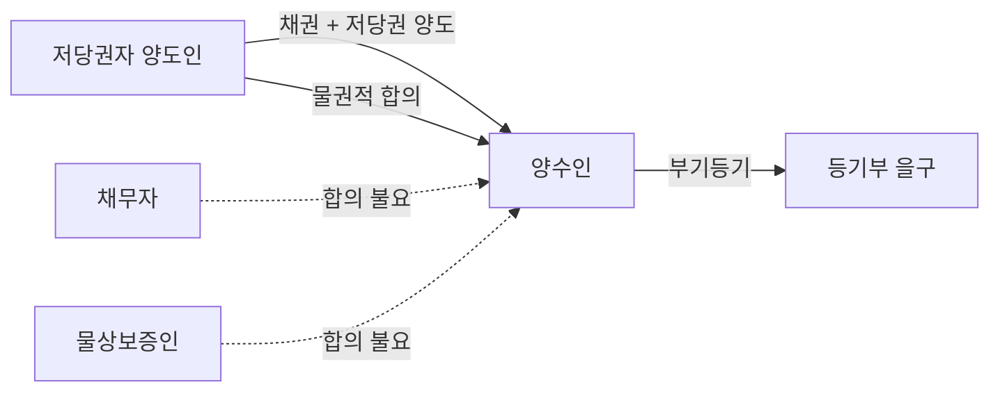

#### ⭐ 기출 출제포인트

1. **제361조 문언 그대로의 선지** — "저당권은 그 담보한 채권과 분리하여 타인에게 양도하거나 다른 채권의 담보로 하지 못한다" — 2021·2022년에 연속 출제된 O 선지.
2. **저당권 이전의 물권적 합의 당사자** — "양도인·양수인·**저당권설정자** 사이의 합의가 필요하다"고 하면 틀림. 2020년 기출의 정답 선지.
3. **부기등기 + 대항요건** — 채권양도의 대항요건이 없어도 부기등기와 실행요건만 갖추면 경매신청 가능.
4. **제364조 소멸청구의 주체** — 소유권·지상권·전세권 취득자 O / 후순위근저당권자 X.
5. **경매의 소멸주의** — "여러 개의 저당권 중 하나가 실행되면 나머지 저당권도 모두 소멸한다" — O 선지.
6. **혼동** — 1순위 저당권자의 소유권 취득(소멸 X) vs 2순위 저당권자의 소유권 취득(소멸 O).

#### 📊 기출 분석

| 연도 | 출제 형태 | 핵심 논점 |
|---|---|---|
| 2018년 기출 26번 | 저당권 옳지 않은 것 | 제364조 제3취득자의 소멸청구, 제363조 제2항 |
| 2020년 기출 39번 | 저당권 옳은 것 | 종전 소유자의 저당권말소등기청구권(정답) |
| 2020년 기출 40번 | 저당권 옳지 않은 것 | 저당권 이전의 물권적 합의 당사자(정답), 부기등기 + 경매신청 |
| 2021년 기출 38번 | 저당권 옳지 않은 것 | 제361조(O 선지), 물상대위 압류(정답) |
| 2022년 기출 40번 | 저당권 옳지 않은 것 | 제361조(O 선지), 전세권 소멸과 물상대위 |
| 2024년 기출 29번 | 물권의 소멸 | 혼동과 저당권 |
| 문제집 다수 | 5지 선다 | 순위승진, 소멸주의, 혼동, 근저당의 분리양도 금지 |

**출제 빈도** — 제361조는 **직접 인용형 O 선지**로 거의 격년마다 나온다. 소멸 쪽은 단독 문항보다 「물권의 소멸」 문항에서 **혼동**과 결합해 나온다.

**반복되는 함정 선지** — ⓐ "저당권 이전에는 설정자(채무자·물상보증인)의 합의도 필요하다" ⓑ "대항요건을 갖추지 못한 양수인은 경매를 신청할 수 없다" ⓒ "후순위근저당권자도 제3취득자로서 소멸청구를 할 수 있다" ⓓ "소유권이 이전되면 종전 소유자는 말소청구를 할 수 없다" ⓔ "선순위 저당권자가 소유권을 취득하면 저당권이 혼동으로 소멸하여 후순위 저당권이 1순위가 된다".

**최근 경향** — 2022년 전원합의체(2018다205209)로 **이미 소멸한 근저당권에 기한 경매의 효력**이 정리되면서, 부종성과 경매의 관계를 묻는 고난도 선지가 등장하고 있다.

#### 🔍 기출 선지로 배우는 법리

> 실제 출제된 선지를 그대로 놓고 O/X와 근거를 확인한다.

**①** 저당권은 그 담보한 채권과 분리하여 타인에게 양도하거나 다른 채권의 담보로 하지 못한다. (2021년 기출·2022년 기출) — **O**
근거: 제361조 문언 그대로. 수반성의 표현이다.

**②** 저당권의 이전을 위하여 저당권의 양도인과 양수인, 그리고 저당권설정자 사이의 물권적 합의와 등기가 있어야 한다. (2020년 기출) — **X**
어디가 틀렸나: 해설은 "저당권의 이전은 저당권의 ==양도인과 양수인의 물권적 합의와 등기(부기등기)==가 있어야 한다"고 한다. 설정자(채무자·물상보증인)는 당사자가 아니다.

**③** 저당권으로 담보된 채권을 양수하였으나 아직 대항요건을 갖추지 못한 양수인도 저당권이전의 부기등기를 마치고 저당권실행의 요건을 갖추면 경매를 신청할 수 있다. (2020년 기출) — **O**
근거: 대법원 2005.6.23. 2004다29279.

**④** 저당부동산의 소유권이 제3자에게 양도된 후 피담보채권이 변제된 때에는 저당권을 설정한 종전소유자도 저당권설정등기의 말소를 청구할 권리가 있다. (2020년 기출) — **O**
근거: 종전 소유자도 설정계약의 당사자로서 원상회복으로 말소를 구할 수 있고, 그 청구권의 법적 성질은 채권적 청구권이다.

**⑤** 저당부동산에 대하여 지상권을 취득한 제3자는 저당권자에게 그 부동산으로 담보된 채권을 변제하고 저당권의 소멸을 청구할 수 있다. (2018년 기출·2021년 기출) — **O**
근거: 제364조. 소유권뿐 아니라 지상권·전세권 취득자도 포함된다.

**⑥** 1번 저당권의 피담보채권이 소멸하면 저당권도 역시 소멸하고, 2번 저당권은 1번 저당권으로 그 순위가 올라간다. (문제집 저당권 문제) — **O**
근거: 제369조 부종성 + 순위승진의 원칙.

**⑦** 여러 개의 저당권이 설정된 경우에는 그 중 한 개의 저당권이 실행되면 나머지 저당권들도 모두 소멸하게 된다. (문제집 제3취득자 문제) — **O**
근거: 민사집행법 제91조 제2항. 순위의 선후를 불문하는 소멸주의.

**⑧** 丙 소유의 토지에 甲의 1순위저당권과 乙의 2순위 저당권이 설정되어 있을 때, 甲이 그 토지를 매수하여 소유권을 취득하였고 甲의 피담보채권이 존속할 경우에는 乙의 저당권이 1순위가 된다. (문제집 혼동 문제) — **X**
어디가 틀렸나: 해설은 "선순위 저당권자가 소유권을 취득하여도 ==순위승진을 막기 위하여 그 선순위 저당권은 존속==한다"고 한다. 따라서 乙은 그대로 2순위다.

**⑨** 피담보채권과 분리하여 근저당권만의 양도는 허용되지 않고 피담보채권이 없는 근저당권의 양도는 무효이다. (문제집 근저당권 문제) — **O**
근거: 제361조는 근저당권에도 적용된다.

#### ✏️ 사례형 적용

> **사례 1** 甲은 乙에 대한 1억 원의 대여금채권을 담보하기 위해 乙 소유 X토지에 저당권을 설정받았다. 甲은 이 채권과 저당권을 丙에게 양도하고 저당권이전의 부기등기를 마쳤으나, 乙에 대한 채권양도 통지는 아직 하지 않았다.

**검토** — ⓐ 저당권 이전을 위한 물권적 합의는 甲과 丙 사이에만 있으면 되고 채무자 乙의 합의는 필요 없다(대법원 2005.6.10. 2002다15412,15429). ⓑ 채권양도의 대항요건(통지·승낙)을 갖추지 못했어도 丙은 부기등기를 마치고 저당권 실행요건을 갖춘 이상 경매를 신청할 수 있다(대법원 2005.6.23. 2004다29279). ⓒ 만약 甲이 채권만 丙에게 양도하고 저당권은 자기 앞으로 두었다면, 甲은 채권을 상실하므로 ==甲 앞으로 된 저당권은 부종성에 의해 소멸==한다(대법원 2020.4.29. 2016다235411).

> **사례 2** 乙 소유 X토지에 甲의 1번 저당권(피담보채권 3억 원)과 丁의 2번 저당권이 설정되어 있었는데, 乙이 甲에게 3억 원을 전부 변제하였다. 그런데 甲 명의의 저당권설정등기가 말소되지 않은 채 남아 있는 상태에서, 戊가 甲의 저당권부채권을 가압류하고 전부명령을 받아 저당권이전의 부기등기를 마쳤다. 그 후 戊가 그 등기에 기해 임의경매를 신청하였다.

**검토** — ⓐ 변제로 피담보채권이 소멸하였으므로 제369조에 의해 甲의 저당권은 ==말소등기 없이 당연히 소멸==하였다. ⓑ 그 이후 부기등기를 마친 戊는 저당권을 취득할 수 없고, 실체관계에 부합하지 않는 등기를 말소할 의무를 진다(대법원 2002.9.24. 2002다27910). ⓒ 이미 소멸한 저당권에 기한 임의경매가 개시되어 매각까지 이루어졌다면 그 경매는 무효다. 민사집행법 제267조는 경매개시결정이 있은 **뒤에** 담보권이 소멸한 경우에만 적용되기 때문이다(대법원 2022.8.25. 2018다205209 전원합의체). ⓓ 한편 甲의 저당권이 소멸하였으므로 丁은 순위승진의 원칙에 따라 1순위가 된다.

> **사례 3** 甲의 저당권이 설정된 乙 소유 Y건물을 丙이 매수하여 소유권을 취득하였다. 丙은 저당권 실행을 막고자 한다.

**검토** — ⓐ 丙은 제364조의 제3취득자이므로 저당권자 甲에게 그 부동산으로 담보된 채권을 변제하고 ==저당권의 소멸을 청구==할 수 있다. 丙은 이해관계 있는 제3자이므로 채무자 乙의 의사에 반해서도 변제할 수 있고(제469조 제2항), 甲을 법정대위하여 乙에게 구상권을 행사할 수 있다. ⓑ 근저당권이라면 채권최고액과 경매비용을 변제공탁하면 족하고, 최고액을 초과하는 부분까지 변제할 의무는 없다(대법원 1971.5.15. 71마251). ⓒ 변제로 저당권은 말소등기 없이 당연히 소멸한다(제187조). ⓓ 丙이 굳이 경매를 막지 않는다면 저당물의 소유권을 취득한 제3자로서 경매인이 될 수도 있다(제363조 제2항). ⓔ 丙이 Y건물의 보존·개량을 위해 필요비·유익비를 지출했다면 저당물의 경매대가에서 우선상환을 받을 수 있다(제367조).

#### ⚠️ 이 관의 함정 총정리

1. "저당권 이전에는 채무자나 물상보증인과의 합의도 필요하다"고 하면 틀림 → ==양도인·양수인 사이의 물권적 합의로 족하다==.
2. "채권양도의 대항요건을 갖추지 못하면 경매신청을 할 수 없다"고 하면 틀림 → 부기등기 + 실행요건이면 신청 가능.
3. "저당권등기가 원인 없이 말소되면 저당권도 소멸한다"고 하면 틀림 → 등기는 ==효력존속요건이 아니다==. 다만 경매로 저당권이 이미 소멸한 뒤라면 회복할 대상이 없다.
4. "후순위근저당권자도 제3취득자로서 선순위근저당권의 소멸을 청구할 수 있다"고 하면 틀림 → ==제3취득자가 아니다==(대법원 2006.1.26. 2005다17341).
5. "선순위 저당권자가 소유권을 취득하면 그 저당권이 혼동으로 소멸하여 후순위 저당권이 1순위가 된다"고 하면 틀림 → 순위승진을 막기 위해 선순위 저당권은 존속한다.

#### ✅ OX 확인문제

> 다음 진술의 참·거짓을 판단하시오.

**1.** 저당권은 그 담보한 채권과 분리하여 타인에게 양도하거나 다른 채권의 담보로 하지 못한다.
→ **O**. 제361조. 담보물권의 수반성이 조문으로 표현된 것이다.

**2.** 저당권의 이전을 위한 물권적 합의는 양도인과 양수인 외에 채무자나 물상보증인 사이에까지 있어야 한다.
→ **X**. 양도·양수 당사자 사이에 있으면 족하다(대법원 2005.6.10. 2002다15412,15429).

**3.** 피담보채권을 저당권과 함께 양수한 자는 저당권이전의 부기등기를 마치고 실행요건을 갖추었다면 채권양도의 대항요건을 갖추지 못했더라도 경매를 신청할 수 있다.
→ **O**. 대법원 2005.6.23. 2004다29279.

**4.** 저당권과 분리해서 피담보채권만을 양도한 경우, 양도인 앞으로 된 저당권은 그대로 존속한다.
→ **X**. 양도인은 채권을 상실하므로 그 저당권은 소멸한다(대법원 2020.4.29. 2016다235411).

**5.** 저당권으로 담보한 채권이 시효의 완성 기타 사유로 소멸한 때에는 저당권도 소멸한다.
→ **O**. 제369조. 부종성의 조문이다.

**6.** 저당권은 피담보채권과 독립하여 그 자체로 소멸시효에 걸린다.
→ **X**. 담보물권의 부종성상 저당권이 독립하여 소멸시효에 걸리지는 않는다는 것이 통설·판례다.

**7.** 저당목적물이 경매되면 저당권은 순위의 선후를 불문하고 모두 소멸한다.
→ **O**. 민사집행법 제91조 제2항의 소멸주의.

**8.** 저당권설정등기가 위조서류로 아무런 원인 없이 말소되면 그 저당권은 소멸한다.
→ **X**. 등기는 효력존속요건이 아니므로 저당권은 소멸하지 않는다(대법원 1982.9.14. 81다카923). 말소회복등기를 구할 수 있다.

**9.** 이미 소멸한 근저당권에 기하여 임의경매가 개시되고 매각이 이루어진 경우 그 경매는 유효하다.
→ **X**. 무효다. 민사집행법 제267조는 경매개시결정이 있은 **뒤에** 담보권이 소멸한 경우에만 적용된다(대법원 2022.8.25. 2018다205209 전원합의체).

**10.** 지상권 또는 전세권을 목적으로 저당권을 설정한 자는 저당권자의 동의 없이 그 지상권 또는 전세권을 소멸하게 하는 행위를 하지 못한다.
→ **O**. 제371조 제2항. 목적인 용익물권이 소멸하면 그 위의 저당권도 소멸하기 때문이다.

#### 🧠 암기법

> 🔑 **「361은 붙어 다니고, 369는 같이 죽는다」**
> 제3**61**조 = 수반성(**분리 양도·입질 금지**) — 채권과 **붙어** 다닌다.
> 제3**69**조 = 부종성(**채권 소멸 → 저당권 소멸**) — 채권과 **같이** 죽는다.
> 숫자도 나란히 **61 → 69**.

> 🔑 **「경·혼·멸·변·포·부·청」 — 저당권 소멸사유 7가지**
> **경**매(민사집행법 제91조 제2항) · **혼**동 · 목적물 **멸**실 · **변**제 등 피담보채권 소멸 · **포**기 · **부**종성(제369조 시효) · 제3취득자의 소멸**청**구(제364조).

> 🔑 **「순위는 상대, 권리는 절대」**
> 순위의 **양도·포기** → 당사자 사이에서만 효력(**상대적**), 제3자 순위 불변.
> 저당권 자체의 **포기** → 저당권 소멸(**절대적**), 후순위자 **순위승진**.

> 🔑 **「1등은 버티고, 2등은 사라진다」 — 혼동**
> **1**순위 저당권자가 소유권 취득 → 순위승진을 막기 위해 **저당권 존속**.
> **2**순위 저당권자가 소유권 취득 → **혼동으로 소멸**.

#### ⚖️ 법조문 원문

> 📖 이 관이 근거로 삼은 조문의 **전문**이다. 본문 인용은 발췌지만 여기서는 조 전체를 싣는다. 출처는 법제처 정본이다.

**― 민법 ―**

> 📌 **민법 제187조(등기를 요하지 아니하는 부동산물권취득)** — "상속, 공용징수, 판결, 경매 기타 법률의 규정에 의한 부동산에 관한 물권의 취득은 등기를 요하지 아니한다. 그러나 등기를 하지 아니하면 이를 처분하지 못한다."

> 📌 **민법 제361조(저당권의 처분제한)** — "저당권은 그 담보한 채권과 분리하여 타인에게 양도하거나 다른 채권의 담보로 하지 못한다."

> 📌 **민법 제363조(저당권자의 경매청구권, 경매인)** — "①저당권자는 그 채권의 변제를 받기 위하여 저당물의 경매를 청구할 수 있다. ②저당물의 소유권을 취득한 제삼자도 경매인이 될 수 있다."

> 📌 **민법 제364조(제삼취득자의 변제)** — "저당부동산에 대하여 소유권, 지상권 또는 전세권을 취득한 제삼자는 저당권자에게 그 부동산으로 담보된 채권을 변제하고 저당권의 소멸을 청구할 수 있다."

> 📌 **민법 제369조(부종성)** — "저당권으로 담보한 채권이 시효의 완성 기타 사유로 인하여 소멸한 때에는 저당권도 소멸한다."

> 📌 **민법 제371조(지상권, 전세권을 목적으로 하는 저당권)** — "①본장의 규정은 지상권 또는 전세권을 저당권의 목적으로 한 경우에 준용한다. ②지상권 또는 전세권을 목적으로 저당권을 설정한 자는 저당권자의 동의없이 지상권 또는 전세권을 소멸하게 하는 행위를 하지 못한다."

**― 민사집행법 ―**

> 📌 **민사집행법 제91조(인수주의와 잉여주의의 선택 등)** — "①압류채권자의 채권에 우선하는 채권에 관한 부동산의 부담을 매수인에게 인수하게 하거나, 매각대금으로 그 부담을 변제하는 데 부족하지 아니하다는 것이 인정된 경우가 아니면 그 부동산을 매각하지못한다. ②매각부동산 위의 모든 저당권은 매각으로 소멸된다. ③지상권ㆍ지역권ㆍ전세권 및 등기된 임차권은 저당권ㆍ압류채권ㆍ가압류채권에 대항할 수 없는 경우에는 매각으로 소멸된다. ④제3항의 경우 외의 지상권ㆍ지역권ㆍ전세권 및 등기된 임차권은 매수인이 인수한다. 다만, 그중 전세권의 경우에는 전세권자가 제88조에 따라 배당요구를 하면 매각으로 소멸된다. ⑤매수인은 유치권자(留置權者)에게 그 유치권(留置權)으로 담보하는 채권을 변제할 책임이 있다."

### 제6관 공동저당

> 📖 공동저당은 동일한 채권을 담보하기 위해 여러 개의 부동산에 저당권을 설정하는 것이다. 담보물권의 불가분성을 그대로 관철하면 공동저당권자가 어느 부동산을 골라 실행하느냐에 따라 후순위저당권자·물상보증인의 운명이 갈리므로, 민법 제368조는 ==각 부동산의 경매대가에 비례한 분담==과 ==차순위저당권자의 대위==라는 두 장치로 이해를 조절한다. 앞 관의 저당권 일반론을 전제로 하되, 여기서는 **여러 부동산 사이의 부담 배분**이 논점이다.

> ⭐ **이 관에서 반드시 챙길 3가지**
> ① 동시배당은 **경매대가 비례 안분**(제368조 제1항), 이시배당은 **선순위자 전액 변제 + 차순위자의 대위**(제368조 제2항) — 최종 결과가 같아지도록 설계되어 있다.
> ② 목적 부동산 중 **일부가 물상보증인 소유**이면 제368조가 아니라 **변제자대위(제481조·제482조)가 우선**한다. 채무자 소유 부동산의 후순위자는 물상보증인 소유 부동산에 대위할 수 없고, 반대로 물상보증인은 채무자 소유 부동산에 대위할 수 있다.
> ③ 물상보증인 소유 부동산의 후순위저당권자는 물상보증인이 대위취득한 선순위저당권에 **물상대위**한다 — 그래서 그 선순위저당권등기는 말소가 아니라 **대위에 의한 저당권이전의 부기등기**로 남는다.

#### 1. 의의

공동저당권(共同抵當權)이란 채권자가 ==동일한 채권을 담보하기 위하여 수 개의 부동산 위에 저당권을 설정하는 것==을 말한다. 일명 총괄저당이라고도 한다.

- **법적 성질** — 당사자 간의 담보설정계약으로 성립하는 ==약정담보물권==이며, 부종성·수반성·불가분성을 가진다. 다만 담보물권의 불가분성에 대해서는 ==공동저당이 예외==가 된다(제368조가 부동산별로 부담을 안분시키기 때문이다).
- **1물1권주의와의 관계** — 수 개의 부동산 위에 **1개의 저당권**이 있는 것이 아니라, ==목적물의 수만큼 여러 개의 저당권이 중첩적으로 성립==하되 피담보채권을 공통으로 할 뿐이다.
- **사회적 작용** — 고액의 피담보채권을 여러 목적물로 담보할 수 있고, 담보가치 하락의 위험을 여러 목적물로 분산시킬 수 있다.

#### 2. 요건

| 요건 | 내용 | 비고 |
|---|---|---|
| 피담보채권의 동일성 | ==동일한 채권==의 담보일 것. 채권이 다르면 공동저당이 아니다 | 저당권·근저당권의 피담보채권과 내용이 같다 |
| 수 개의 부동산 | 2개 이상의 부동산(목적·객체는 보통 저당권과 동일) | 부동산 5개 이상이면 **공동담보목록** 작성(부동산등기법 제78조 제2항) |
| 공동저당설정계약 | 목적물 수만큼의 저당권이 중첩적으로 성립 | ==각 부동산의 순위가 같을 필요 없고, 소유자가 달라도 무방== |
| 설정시기 | 동시에 설정될 필요 없음 | 뒤에 목적물을 더 넣는 ==추가공동저당(추가담보)도 가능== |
| 등기 | 각 부동산 등기기록에 공동저당관계의 등기(부동산등기법 제78조 제1항) | ==공동저당관계의 등기는 성립요건도 대항요건도 아니다==(2008다57746) |
| 객체의 제한 | 부동산 상호 간이어야 함 | ==부동산과 선박==에 저당권이 설정된 경우는 제368조를 적용·유추적용할 수 없다(2001다53264) |

#### 3. 효과

| 구분 | 효과 |
|---|---|
| 실행의 자유 | 공동저당권자는 ==수 개의 목적물을 동시에 실행해도 되고 이시에 따로 실행해도 된다==. 일부만 실행하는 것도 권리남용이 아닌 한 정당하다(81다43) |
| 동시배당 | 각 부동산의 ==경매대가에 비례하여== 채권의 분담을 정한다(제368조 제1항) |
| 이시배당 | 먼저 배당하는 대가에서 ==채권 전부의 변제==를 받을 수 있고, 그 부동산의 차순위저당권자는 ==동시배당이었다면 다른 부동산에서 변제받았을 금액의 한도==에서 선순위자를 대위한다(제368조 제2항) |
| 후순위자 대위의 성질 | 법률의 규정에 의한 저당권의 이전. 대위의 부기등기 없이도 대위 자체는 인정되나, 등기 실무상 ==저당권이전의 부기등기==로 공시한다 |
| 물상보증인이 낀 경우 | ==제368조가 아니라 변제자대위(제481조·제482조)가 우선==한다(95다36596) |
| 공동근저당 | 공동저당의 법리는 공동근저당에도 적용되고, ==스스로 경매를 실행하는 경우뿐 아니라 타인이 실행한 경매에서 우선배당을 받는 경우에도 적용==된다(2005다14502) |

#### 4. 관련 조문

> 📌 **민법 제368조 제1항(공동저당과 대가의 배당)** — "동일한 채권의 담보로 수개의 부동산에 저당권을 설정한 경우에 그 부동산의 경매대가를 동시에 배당하는 때에는 ==각 부동산의 경매대가에 비례하여== 그 채권의 분담을 정한다."

> 📌 **민법 제368조 제2항(차순위자의 대위)** — "전항의 저당부동산 중 일부의 경매대가를 먼저 배당하는 경우에는 그 대가에서 ==그 채권 전부의 변제==를 받을 수 있다. 이 경우에 그 경매한 부동산의 차순위저당권자는 선순위저당권자가 전항의 규정에 의하여 다른 부동산의 경매대가에서 변제를 받을 수 있는 금액의 한도에서 ==선순위자를 대위==하여 저당권을 행사할 수 있다."

> 📌 **민법 제482조 제1항(변제자대위의 효과, 대위자간의 관계)** — "채권자를 대위한 자는 ==자기의 권리에 의하여 구상할 수 있는 범위==에서 채권 및 그 담보에 관한 권리를 행사할 수 있다." (제481조의 법정대위와 함께 물상보증인 보호의 근거가 된다)

> 📌 **민법 제367조(제3취득자의 비용상환청구권)** — 저당부동산의 제3취득자가 그 부동산의 보존·개량을 위하여 필요비 또는 유익비를 지출한 때에는 ==저당물의 매각대금에서 우선상환==을 받을 수 있다.

> 📌 **부동산등기법 제78조** — ① 등기관이 동일한 채권에 관하여 여러 개의 부동산에 관한 권리를 목적으로 하는 저당권설정의 등기를 할 때에는 각 부동산의 등기기록에 그 권리가 다른 부동산에 관한 권리와 함께 저당권의 목적으로 제공된 뜻을 기록하여야 한다. ② 등기관은 부동산이 ==5개 이상==일 때에는 공동담보목록을 작성하여야 한다.

#### 5. 핵심 판례 법리

**① 제368조의 취지(동시배당)** — 동시배당의 경우에 ==공동저당권자의 실행선택권과 우선변제권을 침해하지 않는 범위 내에서 각 부동산의 책임을 안분==함으로써 각 부동산의 소유자와 후순위저당권자 그 밖의 채권자의 이해관계를 조절하는 데 그 취지가 있다(2013다16992 전원합의체).

**② 제368조 제2항의 취지(이시배당)** — 이시배당의 경우에도 ==최종적인 배당의 결과가 동시배당의 경우와 같게 함==으로써 공동저당권자의 실행선택권 행사로 불이익을 입은 후순위저당권자를 보호하는 데 취지가 있다(2013다16992 전원합의체).

**③ 실행의 자유** — 공동저당권자가 공동저당물 중 일부만에 대하여 저당권을 실행하는 것은 저당권자의 권리에 속하므로 ==권리남용에 해당하지 않는 한 정당==하다. 토지·건물 전부에 경매절차를 진행하던 중 건물에 대한 경매신청을 취하하고 토지에 대해서만 경매를 실행하여 토지소유자가 소유권을 상실하였더라도 불법행위가 되지 않는다(81다43).

**④ 공동저당관계의 등기** — ==공동저당관계의 등기를 공동저당권의 성립요건이나 대항요건이라고 할 수 없다==(2008다57746).

**⑤ 부동산과 선박** — 동일한 채권의 담보로 ==부동산과 선박==에 대하여 저당권이 설정된 경우에는 민법 제368조 제2항 후문이 적용 또는 유추적용되지 아니한다. 따라서 선박이 먼저 경매되어 선순위저당권자가 전액 배당받아 선박의 후순위저당권자가 동시배당보다 적게 받게 되었더라도, ==선박의 후순위저당권자는 부동산에 대한 선순위저당권을 대위할 수 없다==(2001다53264).

**⑥ 누적적 저당권** — 여러 개의 부동산에 근저당권을 설정하면서 ==각각의 채권최고액을 합한 금액을 우선변제받기 위하여 공동근저당권의 형식이 아닌 개별 근저당권의 형식==을 취한 경우, 이는 공동근저당권이 아니라 피담보채권을 ==누적적으로 담보하는 근저당권==에 해당한다(2014다51756, 51763).

**⑦ 물상보증인이 낀 경우 — 규정의 충돌과 판례의 태도** — 제368조 제2항 우선설과 제482조 제1항 우선설이 대립하나, 판례는 ==변제자대위 우선설==의 입장이다(95다36596).

**⑧ 동시배당 — 채무자 소유 부동산부터** — 공동저당의 목적 부동산 중 일부는 채무자 소유이고 일부는 물상보증인 소유인 경우 동시에 배당하는 때에는, ==채무자 소유 부동산의 경매대가에서 공동저당권자에게 우선적으로 배당==하고, ==부족분이 있는 경우에 한하여== 물상보증인 소유 부동산의 경매대가에서 추가로 배당하여야 한다. 이 경우 ==제368조 제1항의 안분부담 원칙은 적용되지 않는다==(2008다41475).

**⑨ 채무자 소유 부동산이 먼저 경매된 경우** — 채무자 소유 부동산에 대하여 먼저 경매가 이루어져 1번 공동저당권자가 변제를 받더라도, ==채무자 소유 부동산의 후순위저당권자는 제368조 제2항 후단에 의하여 물상보증인 소유 부동산에 대하여 저당권을 행사할 수 없다.== 이 법리는 ==채무자 소유 부동산에 후순위저당권이 설정된 후에 물상보증인 소유 부동산이 추가로 공동저당의 목적이 된 경우에도 마찬가지==로 적용된다(2013다207996, 95마500).

> 💡 이유 — 대위를 허용하면 공동저당권자를 위해 담보를 제공한 물상보증인이 ==예기치 못한 사람의 채권까지 담보해주는 결과==가 되기 때문이다.

**⑩ 물상보증인 소유 부동산이 먼저 경매된 경우 — 변제자대위** — 물상보증인 소유 부동산이 먼저 경매되어 선순위 공동저당권자가 변제를 받은 때에는, 물상보증인은 ==채무자에 대하여 구상권을 취득함과 동시에 변제자대위에 의하여 채무자 소유 부동산에 대한 선순위저당권을 대위취득==한다(2008마109, 2013다41097).

**⑪ 물상보증인 소유 부동산의 후순위저당권자 — 물상대위** — 위 경우 물상보증인 소유 부동산의 후순위저당권자는 ==물상보증인이 대위취득한 선순위저당권에 대하여 물상대위==를 할 수 있다. 그러므로 그 선순위저당권설정등기는 ==말소등기가 아니라 물상보증인 앞으로 대위에 의한 저당권이전의 부기등기==가 경료되어야 할 성질의 것이고, 아직 경매되지 아니한 공동저당물의 소유자(채무자)는 ==피담보채무가 소멸하였다는 사정만으로 말소등기를 청구할 수 없다.== 나아가 그 후순위저당권자는 자신의 채권을 보전하기 위하여 ==물상보증인을 대위하여 선순위저당권자에게 부기등기를 할 것을 청구==할 수 있다(2008마109, 2013다41097).

**⑫ 물상보증인으로부터 양수한 제3취득자** — 물상보증인으로부터 소유권을 양수한 제3자는 저당권이 실행되면 소유권을 상실한다는 점에서 ==물상보증인과 유사한 지위==에 있다. 따라서 물상보증의 목적물인 저당부동산의 제3취득자가 채무를 변제하거나 저당권 실행으로 소유권을 잃은 때에는 ==물상보증인의 구상권에 관한 규정에 의하여 채무자에 대한 구상권==이 있다(2012다49285).

**⑬ 공동근저당 — 동시배당** — 공동근저당권이 설정된 목적 부동산에 대하여 동시배당이 이루어지는 경우, 공동근저당권자는 채권최고액 범위 내에서 피담보채권을 ==제368조 제1항에 따라 부동산별로 나누어 각 환가대금에 비례한 액수로 배당==받으며, ==각 목적 부동산에 대하여 채권최고액만큼 반복하여 누적적으로 배당받지 아니한다==(2013다16992 전원합의체).

**⑭ 공동근저당 — 이시배당** — 이시배당의 경우에도 채권최고액만큼 반복하여 배당받을 수 없고, ==최초의 채권최고액에서 우선변제받은 금액을 공제한 나머지 채권최고액 범위==에서만 행사하여야 한다(2013다16992 전원합의체).

**⑮ 공동저당과 법정지상권** — 동일인 소유의 토지 및 그 지상건물에 관하여 공동저당권이 설정된 후 ==지상건물이 철거되고 새로 건물이 신축된 경우==, 신축건물의 소유자가 토지소유자와 동일하고 토지의 저당권자에게 ==신축건물에 관하여 토지의 저당권과 동일한 순위의 공동저당권을 설정해 주는 등 특별한 사정이 없는 한==, 저당물의 경매로 토지와 신축건물이 다른 소유자에게 속하게 되더라도 ==신축건물을 위한 법정지상권은 성립하지 않는다==(2011다73038, 73045).

> 💡 근거 — 토지·건물 공동저당권자는 ==토지와 건물 전체의 담보가치를 파악==하고 있었으므로, 신축건물에 법정지상권을 인정하면 저당권자가 예상하지 못한 담보가치 하락을 입게 된다(전체가치 고려설).

**공동저당의 당사자 관계도**

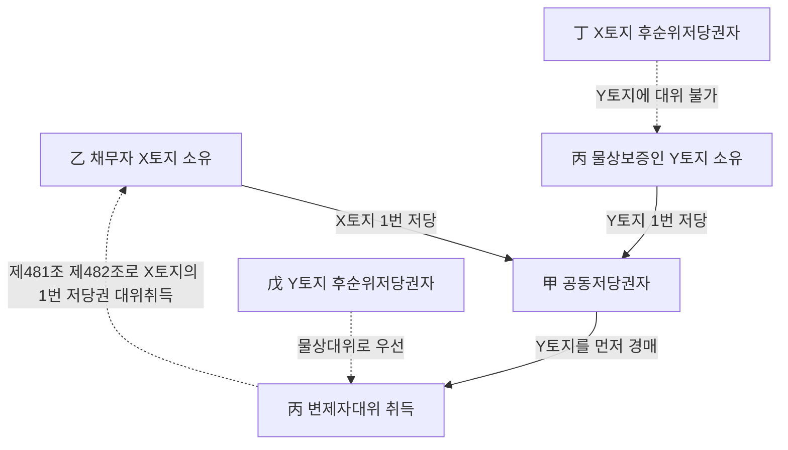

#### ⭐ 기출 출제포인트

1. **배당액 계산 문제** — 동시배당 또는 이시배당에서 특정 후순위저당권자가 받을 금액을 숫자로 묻는 유형. 감정평가사 시험에서 가장 자주 나오는 계산형이다.
2. **채무자 소유 + 물상보증인 소유의 조합** — 어느 쪽이 먼저 경매되느냐에 따라 대위의 가부가 뒤집힌다. 정답의 90%가 여기서 갈린다.
3. **물상보증인 소유 부동산의 후순위저당권자** — 물상대위 / 부기등기 청구 / 말소등기 청구 불가.
4. **제368조가 적용되지 않는 경우** — 부동산과 선박, 누적적 근저당권, 물상보증인이 낀 동시배당.
5. **공동저당관계의 등기** — 성립요건·대항요건이 아니라는 선지가 반복 출제된다.
6. **공동저당 + 법정지상권** — 토지·건물 공동저당 후 건물 철거·신축 시 법정지상권 부정.

#### 📊 기출 분석

| 연도 | 출제 형태 | 핵심 논점 |
|---|---|---|
| 2020년 기출 | 저당권 옳지 않은 것 (선지 ⑤) | 공동저당관계의 등기는 성립요건·대항요건이 아니다 |
| 2021년 기출 | 배당액 계산 (문제집 실전 63번) | 채무자 소유 X·Y 공동저당, 이시배당 시 후순위자의 대위 범위 |
| 2024년 기출 | 배당액 계산 (5지 금액 선택) | 물상보증인 소유 부동산 먼저 경매 → 채무자 소유 부동산 후순위자는 0원 |
| 2024년 기출 | 법정지상권 성립 여부 (보기 ㄴ) | 토지·건물 공동저당 후 건물 철거·신축 → 법정지상권 부정 |
| 2025년 기출 | 사례형 5지 (X토지 제3취득자) | 동시배당 시 채무자 소유 부동산에서 먼저 배당, 물상보증인의 변제자대위 |

**출제 빈도** — 공동저당은 담보물권 파트에서 ==거의 매년 1문항==, 특히 **계산형 또는 사례형**으로 출제된다. 2021·2024·2025년 3개 연도에 연속으로 등장했다.

**반복되는 함정 선지** — ① "채무자 소유 부동산의 후순위저당권자도 물상보증인 소유 부동산에 대위할 수 있다"(→ **X**), ② "물상보증인이 낀 동시배당에서도 제368조 제1항의 안분이 적용된다"(→ **X**), ③ "물상보증인이 변제한 경우 채무자는 자신의 부동산에 대한 저당권등기 말소를 청구할 수 있다"(→ **X**), ④ "공동저당관계의 등기가 없으면 공동저당이 성립하지 않는다"(→ **X**).

**최근 경향** — 단순 조문 암기에서 벗어나 ==구체적 금액을 계산하게 하는 사례형==으로 굳어졌다. 소유자 구성(채무자 소유인가, 물상보증인 소유인가, 제3취득자에게 양도되었는가)을 먼저 확정한 뒤 배당 순서를 따지는 훈련이 필요하다.

#### 🔍 기출 선지로 배우는 법리

> 실제 출제된 선지를 그대로 놓고 O/X와 근거를 확인한다.

**①** 공동저당관계의 등기를 공동저당권의 성립요건이나 대항요건이라고는 할 수 없다. (2020년 기출) — **O**
근거: 대법원 2008다57746. 공동저당관계의 등기는 이해관계인에게 공동담보의 존재를 알리는 기능을 할 뿐, 저당권 자체의 성립·대항과는 무관하다.

**②** 乙이 X토지의 경매에서 먼저 배당을 받은 경우, X토지의 후순위저당권자는 Y건물에 대한 乙의 저당권을 대위행사할 수 있다. (2025년 기출 선지 ②) — **X**
어디가 틀렸나: X토지는 채무자 소유(제3취득자에게 양도되었을 뿐), Y건물은 물상보증인 소유다. / 옳게 고치면: ==채무자 소유 부동산의 후순위저당권자는 물상보증인 소유 부동산에 대위할 수 없다==(2013다207996, 95마500).

**③** Y건물의 경매를 막기 위해 甲의 채무를 모두 변제한 丙은 X토지에 대한 乙의 저당권을 대위행사할 수 없다. (2025년 기출 선지 ③) — **X**
어디가 틀렸나: 丙은 물상보증인이다. / 옳게 고치면: ==물상보증인 丙이 채무를 변제하면 변제자대위에 의하여 채무자 소유 X토지에 대한 乙의 1번 저당권을 대위행사할 수 있다.==

**④** X토지와 Y건물이 경매되어 동시에 배당이 되는 경우, 乙은 X토지의 경매대가에서 먼저 배당받고 변제받지 못한 부분에 한하여 Y건물의 경매대가에서 배당받는다. (2025년 기출 선지 ④ — **정답 선지**) — **O**
근거: 대법원 2008다41475. ==채무자 소유 부동산의 경매대가에서 우선 배당하고 부족분에 한하여 물상보증인 소유 부동산에서 추가 배당==한다. 제368조 제1항의 안분은 적용되지 않는다.

**⑤** Y건물이 먼저 경매되고 X토지가 경매된 경우, 丁은 자신이 X토지에 지출한 유익비가 있어도 乙의 저당권을 대위하는 丙보다 우선하여 상환받을 수 없다. (2025년 기출 선지 ⑤) — **X**
어디가 틀렸나: 제367조를 무시했다. / 옳게 고치면: ==저당부동산의 제3취득자가 보존·개량을 위하여 지출한 필요비·유익비는 저당물의 매각대금에서 우선상환==받을 수 있다.

**⑥** 공동저당의 목적물 중 일부만이 경매되어 그 대가를 먼저 배당하는 때에는 공동저당권자는 전액변제를 받을 수 있으나, 그 부동산의 후순위저당권자는 선순위저당권자가 동시배당을 하였더라면 다른 부동산의 경매대가에서 변제받을 수 있었던 한도에서 선순위를 대위하여 저당권을 행사할 수 있다. (2021년 기출 해설) — **O**
근거: 제368조 제2항 문언 그대로.

**⑦** 공동저당권 설정계약시에 포함된 목적물에 대해서만 저당권이 성립하며 저당권설정계약 후 추가로 공동저당에 편입시킬 수 없다. (문제집 제6장 실전문제 56번) — **X**
어디가 틀렸나: / 옳게 고치면: ==저당권설정 후에 추가로 공동저당에 편입시킬 수 있다(추가저당·추가담보).== 각 저당권이 동시에 설정될 필요도 없다.

**⑧** 공동저당에 있어서 채무자 소유 부동산 위의 후순위저당권자의 대위권이 물상보증인 소유의 부동산까지 미치지 않는다. (문제집 제6장 기본문제 27번 선지 ⑤) — **O**
근거: 대법원 95마500. 대위를 허용하면 물상보증인이 예기치 못한 사람의 채권까지 담보하는 결과가 된다.

#### ✏️ 사례형 적용

**사례 1 — 모두 채무자 소유, 동시배당**

> 채무자 甲이 乙에 대한 5,000만원의 채무를 담보하기 위해 자기 소유 A부동산(경매대가 6,000만원)과 B부동산(경매대가 4,000만원)에 1번 공동저당권을 설정해 주었다. A부동산에는 丙이 4,000만원의 2번 저당권을, B부동산에는 丁이 3,000만원의 2번 저당권을 가지고 있다. A·B가 함께 경매되어 동시에 배당된다.

**검토** — 모두 채무자 소유이므로 제368조 제1항이 그대로 적용된다. 경매대가 비율은 6,000 대 4,000, 즉 3 대 2이다.

| 단계 | 계산 | A부동산 (6,000만원) | B부동산 (4,000만원) |
|---|---|---|---|
| ① 분담비율 결정 | 경매대가 6,000 대 4,000 = 3 대 2 | 5분의 3 | 5분의 2 |
| ② 1번 乙의 분담액 | 5,000만원을 3 대 2로 안분 | **3,000만원** | **2,000만원** |
| ③ 잔여 배당재원 | 경매대가 − 乙 배당액 | 6,000 − 3,000 = 3,000만원 | 4,000 − 2,000 = 2,000만원 |
| ④ 2번 저당권자 배당 | 잔여액 한도에서 | 丙 **3,000만원** (채권 4,000 중 1,000 미회수) | 丁 **2,000만원** (채권 3,000 중 1,000 미회수) |

**결론** — 乙 5,000만원 전액 회수, 丙 3,000만원, 丁 2,000만원. 동시배당은 각 부동산의 후순위자가 ==자기 부동산의 가치에 비례한 몫만큼만 침식==당하도록 만든다.

**사례 2 — 모두 채무자 소유, A부동산 먼저 이시배당**

> 사례 1과 같은 사실관계에서, 乙이 A부동산만 먼저 경매하여 배당이 이루어졌다.

**검토** — 제368조 제2항 전단에 의해 乙은 A의 경매대가에서 채권 전부를 변제받는다. 그로 인해 손해를 입은 丙은 후단에 의해 ==동시배당이었다면 乙이 B에서 받았을 금액(2,000만원)의 한도==에서 乙을 대위한다.

| 단계 | 처리 | 금액 |
|---|---|---|
| ① A 배당 — 1번 乙 | 제368조 제2항 전단, 채권 전부 변제 | 5,000만원 |
| ② A 배당 — 2번 丙 | 잔여 6,000 − 5,000 | 1,000만원 |
| ③ 丙의 손해 확인 | 동시배당이었다면 3,000만원 → 실제 1,000만원 | 2,000만원 부족 |
| ④ 丙의 대위 범위 | 동시배당 시 乙이 B에서 받았을 금액 = 2,000만원 | **2,000만원 한도로 乙의 B저당권 대위** |
| ⑤ B 배당 — 대위한 丙 | 대위 범위 내 | 2,000만원 |
| ⑥ B 배당 — 2번 丁 | 잔여 4,000 − 2,000 | 2,000만원 |

**결론** — 丙은 A에서 1,000만원 + B에서 대위로 2,000만원 = 합계 3,000만원, 丁은 2,000만원. ==동시배당과 최종 결과가 정확히 일치==한다. 이것이 제368조 제2항의 존재 이유다.

**사례 3 — 물상보증인 소유 부동산이 먼저 경매된 경우 (2024년 기출 유형)**

> 甲은 乙에 대한 3억원의 채권을 담보하기 위하여 채무자 乙 소유 X토지와 물상보증인 丙 소유 Y토지에 각각 1번 공동저당권을 취득하였고, 丁은 X토지에 피담보채권액 2억원의 2번 저당권을 취득하였다. 甲이 Y토지를 먼저 경매하여 매각대금 2억원을 배당받은 후, X토지를 경매하여 3억원에 매각되었다. 丁이 X토지의 매각대금에서 배당받을 수 있는 금액은?

**검토**

| 단계 | 처리 | 결과 |
|---|---|---|
| ① Y토지 배당 | 1번 甲이 매각대금 2억원 전액 배당 | 甲의 잔존채권 1억원 |
| ② 丙의 지위 | 물상보증인이 타인의 채무를 변제한 셈 → 구상권 취득 + ==변제자대위==(제481조·제482조) | X토지에 대한 甲의 1번 저당권을 **2억원 한도로 대위취득** |
| ③ X토지 배당 — 甲 | 잔존 피담보채권 | 1억원 |
| ④ X토지 배당 — 丙 | 대위취득한 1번 저당권 행사 | 2억원 |
| ⑤ X토지 배당 — 丁 | 3억 − 1억 − 2억 | **0원** |

**결론** — 丁이 배당받을 금액은 ==0원==이다. 채무자 소유 부동산의 후순위저당권자 丁은 애초에 물상보증인 소유 Y토지에 대위할 수 없을 뿐 아니라, 오히려 물상보증인 丙이 X토지의 1번 저당권을 가져가므로 ==선순위가 그대로 유지된 채 자기 순위만 뒤로 밀린다.== 만약 Y토지에 후순위저당권자 戊가 있었다면, 戊는 丙이 대위취득한 1번 저당권에 ==물상대위==하여 丙보다 먼저 변제받는다.

**소유자별 4유형 정리**

| 유형 | 목적 부동산 구성 | 적용 법리 | 결론 |
|---|---|---|---|
| ① 모두 채무자 소유 | 채무자 소유 A·B | ==제368조 제1항·제2항 그대로== | 동시배당은 경매대가 비례 안분, 이시배당은 후순위자가 대위 |
| ② 채무자 소유 + 물상보증인 소유 | 채무자 소유 X, 물상보증인 소유 Y | ==변제자대위(제481조·제482조) 우선==(95다36596) | 동시배당은 X에서 먼저·부족분만 Y(2008다41475). X 먼저 경매 → X의 후순위자는 Y에 대위 불가(2013다207996). Y 먼저 경매 → 물상보증인이 X의 1번 저당권 대위취득(2008마109) |
| ②-보 | 물상보증인 소유 Y에 후순위저당권자 존재 | ==물상대위== | Y의 후순위자는 물상보증인이 대위취득한 X의 선순위저당권에 물상대위. 등기는 말소가 아니라 ==대위에 의한 저당권이전의 부기등기==(2008마109, 2013다41097) |
| ③ 제3취득자에게 양도된 경우 | 물상보증 목적물을 양수한 제3취득자 | ==물상보증인과 유사한 지위== | 변제하거나 소유권을 잃으면 채무자에 대한 구상권 취득(2012다49285). 지출한 필요비·유익비는 매각대금에서 우선상환(제367조) |
| ④ 공동저당권자가 일부 부동산의 저당권을 포기한 경우 | 일부 저당권 포기 | 제368조 제2항의 대위 기대 보호 | 포기가 없었다면 ==후순위자가 대위할 수 있었던 범위에서 공동저당권자는 우선변제권을 상실==하고, 그 범위의 금액을 후순위자에게 양보하여야 한다 |

#### ⚠️ 이 관의 함정 총정리

1. "공동저당은 수 개의 부동산 위에 1개의 저당권이 성립한다"고 하면 틀림 → ==목적물의 수만큼 여러 개의 저당권이 성립하되 피담보채권만 공통==이다.
2. "공동저당관계의 등기가 없으면 공동저당권이 성립하지 않는다"고 하면 틀림 → ==성립요건도 대항요건도 아니다==(2008다57746).
3. "채무자 소유 부동산이 먼저 경매되면 그 후순위저당권자가 물상보증인 소유 부동산에 대위한다"고 하면 틀림 → ==대위할 수 없다==(2013다207996, 95마500). 후순위저당권이 먼저 설정되고 물상보증인 부동산이 추가된 경우에도 같다.
4. "물상보증인 소유 부동산이 먼저 경매되어 채무가 소멸했으므로 채무자는 자기 부동산의 저당권등기 말소를 청구할 수 있다"고 하면 틀림 → ==물상보증인 또는 그 후순위저당권자가 대위하므로 말소가 아니라 저당권이전의 부기등기가 경료될 성질==의 것이다.
5. "부동산과 선박에 공동으로 저당권이 설정되었으니 선박의 후순위저당권자도 제368조 제2항으로 대위한다"고 하면 틀림 → ==적용·유추적용되지 않는다==(2001다53264). 마찬가지로 ==각 채권최고액을 합산해 우선변제받으려고 개별 근저당권 형식을 취한 누적적 근저당권==도 공동근저당이 아니다(2014다51756, 51763).

#### ✅ OX 확인문제

> 다음 진술의 참·거짓을 판단하시오.

**1.** 동일한 채권의 담보로 수 개의 부동산에 저당권을 설정한 경우, 그 부동산의 경매대가를 동시에 배당하는 때에는 각 부동산의 경매대가에 비례하여 그 채권의 분담을 정한다.
→ **O**. 민법 제368조 제1항의 문언 그대로다. 동시배당에서의 안분부담 원칙이다.

**2.** 공동저당의 목적 부동산 중 일부의 경매대가를 먼저 배당하는 경우, 공동저당권자는 그 대가에서 채권 전부의 변제를 받을 수 있다.
→ **O**. 제368조 제2항 전단. 공동저당권자의 실행선택권과 우선변제권은 침해되지 않는다.

**3.** 공동저당관계의 등기는 공동저당권의 성립요건이자 대항요건이다.
→ **X**. 대법원 2008다57746은 ==성립요건이나 대항요건이라고 할 수 없다==고 본다.

**4.** 공동저당권자가 공동저당물 중 일부만에 대하여 저당권을 실행하는 것은 권리남용에 해당하지 않는 한 정당하다.
→ **O**. 대법원 81다43. 건물에 대한 경매신청을 취하하고 토지만 실행하여 토지소유자가 소유권을 잃었더라도 불법행위가 되지 않는다.

**5.** 동일한 채권의 담보로 부동산과 선박에 저당권이 설정된 경우에도 민법 제368조 제2항 후문이 유추적용되어 선박의 후순위저당권자는 부동산의 선순위저당권을 대위할 수 있다.
→ **X**. 대법원 2001다53264는 ==적용 또는 유추적용되지 아니한다==고 하여 대위를 부정한다.

**6.** 공동저당의 목적 부동산 중 일부는 채무자 소유, 일부는 물상보증인 소유인 경우 동시배당을 하는 때에는 제368조 제1항에 따라 경매대가에 비례하여 안분한다.
→ **X**. 대법원 2008다41475. ==채무자 소유 부동산의 경매대가에서 우선 배당하고 부족분에 한하여 물상보증인 소유 부동산에서 추가 배당==한다. 안분부담 원칙은 적용되지 않는다.

**7.** 채무자 소유 부동산이 먼저 경매되어 1번 공동저당권자가 변제받은 경우, 채무자 소유 부동산의 후순위저당권자는 물상보증인 소유 부동산에 대하여 1번 공동저당권자를 대위할 수 있다.
→ **X**. 대법원 2013다207996, 95마500. 대위를 허용하면 ==물상보증인이 예기치 못한 사람의 채권까지 담보==하게 되어 부당하다.

**8.** 물상보증인 소유 부동산이 먼저 경매되어 선순위 공동저당권자가 변제받은 경우, 물상보증인은 구상권을 취득함과 동시에 변제자대위에 의하여 채무자 소유 부동산에 대한 선순위저당권을 대위취득한다.
→ **O**. 대법원 2008마109, 2013다41097. 제481조·제482조에 의한 법정대위다.

**9.** 위 8번의 경우 물상보증인 소유 부동산의 후순위저당권자는 물상보증인이 대위취득한 선순위저당권에 대하여 물상대위를 할 수 있고, 물상보증인을 대위하여 선순위저당권자에게 저당권이전의 부기등기를 청구할 수 있다.
→ **O**. 대법원 2008마109. 그러므로 아직 경매되지 않은 공동저당물의 소유자는 피담보채무 소멸만을 이유로 말소등기를 청구할 수 없다.

**10.** 공동근저당권자는 목적 부동산 각각에 대하여 채권최고액만큼 반복하여 누적적으로 배당받을 수 있다.
→ **X**. 대법원 2013다16992 전원합의체. 동시배당이든 이시배당이든 ==최초 채권최고액에서 이미 우선변제받은 금액을 공제한 나머지 범위==에서만 행사할 수 있다.

#### 🧠 암기법

> 🔑 **"동비이대(同比異代)"**
> **동**시배당은 경매대가에 **비**례 안분(제368조 제1항), **이**시배당은 차순위자가 **대**위(제368조 제2항). 네 글자로 제368조 전체가 들어온다.

> 🔑 **"채후물무(債後物無)"**
> **채**무자 소유 부동산의 **후**순위저당권자는 **물**상보증인 소유 부동산에 대위할 권리가 **무**(無). 반대 방향은 통한다 — 물상보증인은 채무자 소유 부동산에 대위할 수 있다.
> 방향을 한 문장으로: ==대위는 물상보증인 쪽에서 채무자 쪽으로만 흐른다.==

> 🔑 **"물대 위에 물대"**
> 물상보증인은 **변제자대위**로 채무자 부동산의 선순위저당권을 얻고, 그 위에 물상보증인 부동산의 후순위저당권자가 **물상대위**로 올라탄다. 대위가 2층으로 쌓이므로 저당권등기는 말소가 아니라 ==부기등기==로 살려 둔다.

> 🔑 **"5개면 목록, 선박은 제외"**
> 공동담보 부동산이 **5개 이상**이면 공동담보목록 작성(부동산등기법 제78조 제2항), **선박**이 섞이면 제368조 제2항 후문 적용 **제외**(2001다53264).

#### ⚖️ 법조문 원문

> 📖 이 관이 근거로 삼은 조문의 **전문**이다. 본문 인용은 발췌지만 여기서는 조 전체를 싣는다. 출처는 법제처 정본이다.

**― 민법 ―**

> 📌 **민법 제367조(제삼취득자의 비용상환청구권)** — "저당물의 제삼취득자가 그 부동산의 보존, 개량을 위하여 필요비 또는 유익비를 지출한 때에는 제203조제1항, 제2항의 규정에 의하여 저당물의 경매대가에서 우선상환을 받을 수 있다."

> 📌 **민법 제368조(공동저당과 대가의 배당, 차순위자의 대위)** — "①동일한 채권의 담보로 수개의 부동산에 저당권을 설정한 경우에 그 부동산의 경매대가를 동시에 배당하는 때에는 각부동산의 경매대가에 비례하여 그 채권의 분담을 정한다. ②전항의 저당부동산중 일부의 경매대가를 먼저 배당하는 경우에는 그 대가에서 그 채권전부의 변제를 받을 수 있다. 이 경우에 그 경매한 부동산의 차순위저당권자는 선순위저당권자가 전항의 규정에 의하여 다른 부동산의 경매대가에서 변제를 받을 수 있는 금액의 한도에서 선순위자를 대위하여 저당권을 행사할 수 있다."

> 📌 **민법 제482조(변제자대위의 효과, 대위자간의 관계)** — "①전2조의 규정에 의하여 채권자를 대위한 자는 자기의 권리에 의하여 구상할 수 있는 범위에서 채권 및 그 담보에 관한 권리를 행사할 수 있다. ②전항의 권리행사는 다음 각호의 규정에 의하여야 한다. 1. 보증인은 미리 전세권이나 저당권의 등기에 그 대위를 부기하지 아니하면 전세물이나 저당물에 권리를 취득한 제삼자에 대하여 채권자를 대위하지 못한다. 2. 제삼취득자는 보증인에 대하여 채권자를 대위하지 못한다. 3. 제삼취득자 중의 1인은 각 부동산의 가액에 비례하여 다른 제삼취득자에 대하여 채권자를 대위한다. 4. 자기의 재산을 타인의 채무의 담보로 제공한 자가 수인인 경우에는 전호의 규정을 준용한다. 5. 자기의 재산을 타인의 채무의 담보로 제공한 자와 보증인간에는 그 인원수에 비례하여 채권자를 대위한다. 그러나 자기의 재산을 타인의 채무의 담보로 제공한 자가 수인인 때에는 보증인의 부담부분을 제외하고 그 잔액에 대하여 각 재산의 가액에 비례하여 대위한다. 이 경우에 그 재산이 부동산인 때에는 제1호의 규정을 준용한다."

**― 부동산등기법 ―**

> 📌 **부동산등기법 제78조(공동저당의 등기)** — "① 등기관이 동일한 채권에 관하여 여러 개의 부동산에 관한 권리를 목적으로 하는 저당권설정의 등기를 할 때에는 각 부동산의 등기기록에 그 부동산에 관한 권리가 다른 부동산에 관한 권리와 함께 저당권의 목적으로 제공된 뜻을 기록하여야 한다. ② 등기관은 제1항의 경우에 부동산이 5개 이상일 때에는 공동담보목록을 작성하여야 한다. ③ 제2항의 공동담보목록은 등기기록의 일부로 본다. ④ 등기관이 1개 또는 여러 개의 부동산에 관한 권리를 목적으로 하는 저당권설정의 등기를 한 후 동일한 채권에 대하여 다른 1개 또는 여러 개의 부동산에 관한 권리를 목적으로 하는 저당권설정의 등기를 할 때에는 그 등기와 종전의 등기에 각 부동산에 관한 권리가 함께 저당권의 목적으로 제공된 뜻을 기록하여야 한다. 이 경우 제2항 및 제3항을 준용한다. ⑤ 삭제 <2024.9.20>"

### 제7관 근저당

> 📖 근저당권은 계속적 거래관계에서 증감·변동하는 불특정다수의 채권을 ==장래의 결산기에 채권최고액의 한도까지== 담보하는 저당권이다. 보통 저당권과 달리 ==부종성이 특히 완화==되어, 피담보채권이 일시적으로 0이 되어도 근저당권은 소멸하지 않는다. 앞 관의 공동저당과 결합하면 공동근저당이 되고, 이 관의 마지막에서 그 특칙을 다룬다.

> ⭐ **이 관에서 반드시 챙길 3가지**
> ① **채권최고액의 사정 범위** — 이자는 최고액에 산입, 지연손해금도 최고액 범위 내라면 ==1년분 제한(제360조 단서) 없이== 전액 담보, 실행비용은 ==최고액과 별도==.
> ② **확정시기** — 근저당권자가 스스로 경매신청하면 ==경매신청시==, 후순위권리자·일반채권자가 경매신청하면 ==경락대금(매각대금) 완납시==. 이 두 시점의 대비가 최다 출제 포인트다.
> ③ **말소청구를 위한 변제 범위** — 채무자 겸 설정자는 ==채권 전액==, 물상보증인·제3취득자는 ==채권최고액==만 변제하면 된다. 후순위근저당권자는 제3취득자가 아니므로 최고액을 변제해도 말소를 청구할 수 없다.

#### 1. 의의

근저당권(根抵當權)이란 ==그 담보할 채무의 최고액만을 정하고 채무의 확정을 장래에 보류하여 설정하는 저당권==으로서, 계속적인 거래관계로부터 발생하는 다수의 불특정채권을 장래의 결산기에서 일정한 한도까지 담보하기 위한 목적으로 설정되는 담보권을 말한다(2003다70041, 2010다107408).

- **법적 성질** — 약정담보물권이며 부종성·수반성·불가분성을 가지되, ==부종성과 수반성이 특히 완화==되어 있다.
- **사회적 작용** — 다수의 채권·채무가 발생·소멸할 때마다 저당권을 설정·말소해야 하는 번거로움을 피하기 위해 고안된 제도다.
- **별도의 기본계약 필요** — 근저당권설정행위와는 ==별도로 근저당권의 피담보채권을 성립시키는 법률행위(기본계약)가 있어야== 하고, 그 존재에 대한 ==증명책임은 존재를 주장하는 측==에 있다(2010다107408).

**근저당권 vs 보통 저당권**

| 구분 | 보통 저당권 | 근저당권 |
|---|---|---|
| 피담보채권 | 특정된 채권 | ==장래 증감·변동하는 불특정다수의 채권== |
| 부종성 | 엄격 — 채권 소멸하면 저당권 소멸 | ==완화 — 확정 전에는 채권이 0이 되어도 소멸하지 않음== |
| 담보 한도 | 피담보채권액 | ==채권최고액== |
| 지연배상 | 원본 이행기 경과 후 ==1년분에 한정==(제360조 단서) | ==최고액 범위 내라면 1년분 제한 없음==(2008다72318) |
| 필요적 등기사항 | 채권액, 채무자 | ==채권최고액, 채무자==(존속기간은 임의적) |
| 확정 개념 | 없음 | ==피담보채권의 확정==이라는 고유 개념 |

#### 2. 요건

| 요건 | 내용 | 비고 |
|---|---|---|
| 기본계약 | 계속적 거래관계 등 ==피담보채권을 발생시키는 법률행위==가 별도로 존재 | 증명책임은 존재를 주장하는 측(2010다107408) |
| 피담보채권의 종류 | ==제한 없음==. 장래 발생 채권, 조건부·기한부 채권도 가능 | ==장래 발생할 특정의 조건부채권==도 피담보채권으로 확정될 수 있고, 확정 당시 조건이 성취되지 않았다는 사정만으로 근저당권이 소멸하지 않는다(2015다200531) |
| 근저당권자 | 원칙적으로 ==피담보채권의 채권자==. 채권과 근저당권은 주체를 달리할 수 없음 | 예외 — ⓐ 채권자·채무자·제3자의 합의 + 제3자에게 채권이 실질적으로 귀속, 또는 ⓑ 채권자와 제3자가 ==불가분적 채권자== 관계이면 제3자 명의 등기도 유효(2007다23807) |
| 근저당권설정자 | 원칙적으로 채무자. 예외적으로 제3자(==물상보증인==) | 설정계약상 채무자 아닌 제3자를 채무자로 한 등기는 ==부종성에 비추어 원인 없는 무효==(80다1468) |
| 설정계약 + 등기 | 제186조에 따라 등기하여야 효력 발생 | 등기에 ==근저당이라는 뜻과 채권최고액을 반드시 명시== |
| 필요적 등기사항 | ==채권최고액, 채무자의 성명·명칭과 주소·소재지== | 부동산등기법 제75조 제2항 본문 |
| 임의적 등기사항 | 부합물·종물에 효력이 미치지 않는다는 특약, ==존속기간== | 약정이 있는 경우에만 등기, 등기하면 제3자에게 대항(같은 항 단서) |

#### 3. 효과

| 구분 | 효과 |
|---|---|
| 유치적 효력 | ==부정==. 목적물을 점유하지 않으므로 유치권·질권과 달리 유치적 효력이 없다 |
| 우선변제적 효력 | 결산기에 실행하여 우선변제받는 액은 ==등기된 최고액의 범위 안에서 실제로 존재한 채권액== |
| 채권최고액의 의미 | ==우선변제를 받을 수 있는 한도액==일 뿐 ==채무자의 책임 한도액이 아니다== |
| 이자 | ==최고액 중에 산입한 것으로 본다==(제357조 제2항). 원본+이자가 최고액을 넘으면 초과부분은 담보되지 않는다 |
| 지연손해금 | ==최고액 범위 내라면 1년분 제한 없이 전액 담보==(2008다72318) |
| 확정 후 발생한 이자·지연손해금 | ==확정 전에 발생한 원본채권에 관한 것이라면 최고액 범위 내에서 여전히 담보==(2005다38300) |
| 실행비용 | ==채권최고액에 포함되지 않으며 별도로 우선변제==받는다(71마251) |
| 확정 전 채무범위·채무자 변경 | 가능. ==변경 후의 범위·채무자에 대한 채권만 담보==되고 변경 전의 것은 제외(97다15777, 15784). ==이해관계인의 승낙 불필요==(2021다255648) |
| 처분 제한 | ==피담보채권과 분리하여 양도하거나 다른 채권의 담보로 하지 못한다==(제361조) |
| 소멸 | 근저당목적물이 경매되면 ==순위의 선후를 불문하고 소멸==(민사집행법 제91조 제2항) |

**부종성·수반성의 완화**

| 성질 | 보통 저당권 | 근저당권(확정 전) | 근저당권(확정 후) |
|---|---|---|---|
| 성립상 부종성 | 피담보채권 없으면 성립 불가 | ==기본계약만 있으면 현재 채권이 없어도 성립== | — |
| 존속상 부종성 | 채권 소멸 → 저당권 소멸 | ==전부 변제되어도 근저당권 소멸하지 않음.== 일부 변제되어도 ==채권최고액이 축소되지 않음== | 채권 소멸(변제·시효완성 등) → ==근저당권 소멸== |
| 수반성 | 채권 이전 → 저당권 이전 | ==확정 전 채권 일부를 양도·대위변제해도 근저당권이 양수인·대위변제자에게 이전하지 않음==(95다53812) | 보통 저당권과 동일하게 수반 |
| 채무자·채무범위 변경 | 원칙적으로 불가 | ==가능==(97다15777, 15784) | 불가 |

**채권최고액에 무엇이 들어가는가**

| 항목 | 최고액 산입 여부 | 근거 |
|---|---|---|
| 원본 | ==산입== | 제360조 |
| 이자 | ==산입(간주)== | 제357조 제2항 — "채무의 이자는 최고액 중에 산입한 것으로 본다" |
| 지연손해금(지연배상) | ==산입. 다만 최고액 범위 내라면 1년분 제한 없이 전액 담보== | 2008다72318 |
| 확정 전 원본에서 확정 후 발생한 이자·지연손해금 | ==산입. 최고액 범위 내에서 여전히 담보== | 2005다38300 |
| 확정 후 새로운 거래에서 발생한 원본채권 | ==담보되지 않음== | 87다카545 |
| 근저당권 실행비용 | ==최고액에 포함되지 않고 별도로 우선변제== | 71마251 |

#### 4. 관련 조문

> 📌 **민법 제357조 제1항(근저당)** — "저당권은 ==그 담보할 채무의 최고액만을 정하고 채무의 확정을 장래에 보류하여== 이를 설정할 수 있다. 이 경우에는 ==그 확정될 때까지의 채무의 소멸 또는 이전은 저당권에 영향을 미치지 아니한다==."

> 📌 **민법 제357조 제2항** — "전항의 경우에는 ==채무의 이자는 최고액 중에 산입한 것으로 본다==."

> 📌 **민법 제360조(피담보채권의 범위)** — "저당권은 원본, 이자, 위약금, 채무불이행으로 인한 손해배상 및 저당권의 실행비용을 담보한다. 그러나 ==지연배상에 대하여는 원본의 이행기일을 경과한 후의 1년분==에 한하여 저당권을 행사할 수 있다." (근저당권의 지연배상에는 이 단서의 1년분 제한이 적용되지 않는다)

> 📌 **민법 제361조(저당권의 처분제한)** — "저당권은 ==그 담보한 채권과 분리하여 타인에게 양도하거나 다른 채권의 담보로 하지 못한다==."

> 📌 **민법 제364조(제3취득자의 변제)** — "저당부동산에 대하여 소유권, 지상권 또는 전세권을 취득한 제3자는 저당권자에게 그 부동산으로 담보된 채권을 변제하고 ==저당권의 소멸을 청구==할 수 있다."

> 📌 **부동산등기법 제75조 제2항** — 채권최고액, 채무자의 성명 또는 명칭과 주소 또는 사무소의 소재지는 ==필요적 등기사항==이고(본문), 부합물·종물에 효력이 미치지 않는다는 특약과 ==존속기간==은 약정이 있는 경우에만 등기할 수 있으며 등기하면 제3자에게 대항할 수 있다(단서).

#### 5. 핵심 판례 법리

**① 근저당권의 개념과 기본계약** — 근저당권은 담보할 채무의 최고액만을 정하고 채무의 확정을 장래에 보류하여 설정하는 저당권이므로, ==근저당권설정행위와는 별도로 피담보채권을 성립시키는 법률행위가 있어야 하고 그 존재의 증명책임은 이를 주장하는 측==에 있다(2010다107408, 2003다70041).

**② 채권자 아닌 제3자 명의의 근저당권** — 원칙적으로 채권자와 근저당권자가 동일인이어야 하지만, ⓐ 채권자·채무자·제3자 사이에 합의가 있었고 ==제3자에게 채권이 실질적으로 귀속==되었다고 볼 특별한 사정이 있거나 ⓑ ==채권자와 제3자가 불가분적 채권자의 관계==에 있다고 볼 수 있는 경우에는 그 제3자 명의의 근저당권설정등기도 ==유효==하다(2007다23807).

**③ 설정계약상 채무자 아닌 자를 채무자로 한 등기** — 근저당권설정계약상의 채무자가 아닌 제3자를 채무자로 한 근저당권설정등기는 채무자를 달리한 것이므로, ==근저당권의 부종성에 비추어 원인 없는 무효의 등기==이다(80다1468).

**④ 지연배상의 1년분 제한 배제** — 지연배상에 대하여는 저당권과 달리 ==1년분에 한하지 않고 근저당권의 채권최고액 한도 내에서 그 전액이 담보==된다(2008다72318).

**⑤ 확정 전 원본에서 확정 후 발생한 이자·지연손해금** — 근저당권의 피담보채권이 확정된 이후에 ==새로운 거래관계에서 발생한 원본채권은 담보되지 않지만==(87다카545), ==확정 전에 발생한 원본채권에 관하여 확정 후에 발생하는 이자나 지연손해금 채권은 채권최고액의 범위 내에서 여전히 담보==된다(2005다38300).

**⑥ 실행비용** — 근저당권의 실행비용은 ==채권최고액에 포함되지 않는다==(71마251). 집행관이 매각대금에서 미리 실행비용을 공제하고 잔액으로 피담보채권을 변제하기 때문이다.

**⑦ 확정사유 — 존속기간·결산기 도래, 거래관계 종료, 해지** — ⓐ 존속기간이나 결산기를 정한 경우 원칙적으로 ==그 도래·만료 시에 피담보채권액이 확정==된다(2002다7176). ⓑ 존속기간의 약정이 없는 근저당권에서 ==거래관계가 종료되어 원본채무가 더 이상 발생할 가능성이 없게 된 때==에는 그때까지 잔존하는 채무로 확정된다(95다2494). ⓒ 존속기간·결산기의 정함이 없는 때에는 ==근저당권설정자가 근저당권자를 상대로 언제든지 해지의 의사표시를 함으로써== 피담보채무를 확정시킬 수 있다(2002다7176). ⓓ ==근저당부동산의 제3취득자는 근저당권설정자의 해지의 의사표시를 원용==하여 근저당권의 소멸을 청구할 수 있다(2002다7176).

**⑧ 확정사유 — 근저당권자 스스로의 경매신청** — 근저당권자가 피담보채무의 불이행을 이유로 경매신청을 한 경우에는 ==경매신청시에 근저당 채무액이 확정==되고, 그 이후부터 근저당권은 부종성을 가지게 되어 보통의 저당권과 같은 취급을 받는다. ==경매개시결정이 있은 후에 경매신청이 취하되었더라도 채무확정의 효과는 번복되지 않는다==(2001다73022, 97다26104, 87다카545).

**⑨ 확정사유 — 제3자의 경매신청** — ==후순위권리자 또는 일반채권자에 의하여 경매가 신청된 경우에는 선순위근저당권자의 피담보채권은 경락대금(매각대금) 완납시에 확정==된다(99다26085, 99다2608). ==조세채권자가 체납처분을 하는 경우에도 매수대금을 완납한 때==에 확정된다(2001두7329).

**⑩ 확정 효과** — 근저당권이 확정되면 그때를 기준으로 피담보채권이 특정되고, ==그 후 발생하는 채권은 더 이상 근저당권에 의하여 담보되지 않으며 보통의 저당권과 같은 취급==을 받는다(92다48567).

**⑪ 확정 전 채무범위·채무자의 변경** — 피담보채무가 확정되기 이전이라면 ==채무의 범위나 채무자를 변경할 수 있고, 변경 후의 범위에 속하는 채권만이 담보되며 변경 전의 것은 담보 범위에서 제외==된다(97다15777, 15784). 나아가 후순위저당권자 등 이해관계인은 채권최고액 상당의 담보가치가 이미 파악되어 있음을 알고 이해관계를 맺었으므로 ==피담보채무의 범위·채무자를 변경할 때 이해관계인의 승낙을 받을 필요가 없다==(2021다255648).

**⑫ 확정 전 채권 일부의 양도·대위변제** — 근저당 거래관계가 계속 중인 경우, 즉 ==피담보채권이 확정되기 전에 그 채권의 일부를 양도하거나 대위변제한 경우 근저당권이 양수인이나 대위변제자에게 이전할 여지가 없다==(95다53812). 근저당권만을 피담보채권과 분리하여 양도할 수도 없다(제361조).

**⑬ 물상보증인의 변제 범위** — 근저당권의 물상보증인은 ==제357조에서 말하는 채권최고액만을 변제하면 근저당권설정등기의 말소청구를 할 수 있고, 채권최고액을 초과하는 부분의 채권액까지 변제할 의무가 없다==(74다998, 74다1998).

**⑭ 제3취득자의 변제 범위** — 근저당부동산에 대하여 소유권을 취득한 제3자는 ==피담보채무가 확정된 이후에 그 확정된 피담보채무를 채권최고액의 범위 내에서 변제하고 근저당권의 소멸을 청구==할 수 있다(2001다47528, 2002다7176). 경매부동산을 매수한 제3취득자는 ==채권최고액과 경매비용을 변제공탁==하면 저당권의 소멸을 청구할 수 있다(71마251, 71다26).

**⑮ 채무자 겸 근저당권설정자의 변제 범위** — 채무액이 채권최고액을 초과하는 경우, 채무자 겸 근저당권설정자가 ==채권최고액과 지연손해금 및 집행비용만을 변제하였다면 채권 전액의 변제가 있을 때까지 근저당권의 효력은 잔존채무에 미치므로 근저당권의 말소를 청구할 수 없다==(80다2712, 2010다3681, 2000다59081, 92다1896).

**⑯ 후순위근저당권자는 제3취득자가 아니다** — 근저당부동산에 대하여 후순위근저당권을 취득한 자는 제364조의 제3취득자에 해당하지 아니하므로, ==채권최고액 및 경매비용을 변제한 것만으로는 선순위근저당권의 소멸을 청구할 수 없다==(2005다17341). 그 변제는 이해관계 있는 제3자의 변제로 따져볼 수는 있을 뿐이다.

**⑰ 종전 소유자의 말소청구권** — 근저당권 설정 후 부동산 소유권이 제3자에게 이전된 경우, 현재의 소유자가 소유권에 기하여 말소를 청구할 수 있음은 물론이고, ==근저당권설정자인 종전의 소유자도 근저당권설정계약의 당사자로서 계약상 권리에 터잡아 말소를 청구==할 수 있다(93다16338).

**⑱ 공동근저당 — 확정의 개별성** — 공동근저당권자가 목적 부동산 중 ==일부 부동산에 대하여 제3자가 신청한 경매절차에 소극적으로 참가하여 우선배당을 받은 경우==, ==해당 부동산에 관한 근저당권의 피담보채권은 매수인이 매각대금을 지급한 때에 확정==되지만, ==나머지 목적 부동산에 관한 근저당권의 피담보채권은 기본거래가 종료하거나 채무자·물상보증인에 대하여 파산이 선고되는 등 다른 확정사유가 발생하지 아니하는 한 확정되지 아니한다==(2015다50637).

**⑲ 공동근저당 — 우선변제 범위** — 공동근저당권자가 스스로 근저당권을 실행하거나 타인에 의하여 개시된 경매·공매·수용·회생 절차 등을 통하여 공동담보 목적 부동산 중 일부의 환가대금에서 피담보채권의 일부를 우선 배당받은 경우, ==나머지 목적 부동산의 환가절차에서 다시 최초의 채권최고액 범위 내에서 우선변제권을 행사할 수는 없다==(2013다16992 전원합의체).

**⑳ 누적적 근저당권과의 구별** — 여러 개의 부동산에 근저당권을 설정하면서 ==각각의 채권최고액을 합한 금액을 우선변제받기 위하여 공동근저당권의 형식이 아닌 개별 근저당권의 형식==을 취한 경우, 이는 공동근저당권이 아니라 ==피담보채권을 누적적으로 담보하는 근저당권==에 해당한다(2014다51756, 51763).

**피담보채권의 확정시기**

| 확정사유 | 확정 시점 | 근거 |
|---|---|---|
| ① 존속기간·결산기 도래 | ==그 도래·만료 시== | 2002다7176 |
| ② 기본계약의 종료·해지 | 거래관계 종료 시 / ==해지의 의사표시 도달 시== | 95다2494, 2002다7176 |
| ③ 근저당권자 스스로 경매신청 | ==경매신청 시== (개시결정 후 취하해도 번복되지 않음) | 2001다73022, 97다26104 |
| ④ 후순위권리자·일반채권자의 경매신청 | ==경락대금(매각대금) 완납 시== | 99다26085, 99다2608 |
| ⑤ 조세채권자의 체납처분 | ==매수대금 완납 시== | 2001두7329 |
| ⑥ 채무자·근저당권설정자의 파산, 채무자에 대한 회생절차 개시결정 | 파산선고 시 / 개시결정 시 | 2015다50637, 기본서 |
| ⑦ 공동근저당에서 일부 부동산이 제3자 신청 경매로 배당된 경우 | ==그 부동산만 매각대금 지급 시 확정, 나머지는 확정되지 않음== | 2015다50637 |
| ⑧ 근저당부동산 제3취득자의 해지 원용 | 원용 시 | 2002다7176 |

> 💡 **④와 ③의 대비를 반드시 잡아라.** 스스로 신청하면 ==신청 시==(자기가 채권액을 확정해 신청했으니 그때), 남이 신청하면 ==완납 시==(자기 근저당권이 실제로 소멸하는 때). 시험은 이 둘을 바꿔 놓고 묻는다.

**확정 전 vs 확정 후**

| 쟁점 | 피담보채권 확정 **전** | 피담보채권 확정 **후** |
|---|---|---|
| 부종성 | ==완화==. 채무가 전부 변제되어 0이 되어도 근저당권 소멸하지 않음 | ==보통 저당권과 동일==. 채권 소멸(변제·시효완성) 시 근저당권 소멸 |
| 일부 변제 | ==피담보채권도 근저당권도 축소되지 않음.== 채권최고액이 줄지 않는다 | 변제한 만큼 피담보채권 감소 |
| 새로 발생하는 원본채권 | ==채권최고액 범위 내에서 담보== | ==담보되지 않음==(87다카545) |
| 확정 전 원본의 이자·지연손해금 | 담보 | ==확정 후 발생분도 최고액 범위 내에서 담보==(2005다38300) |
| 채무범위·채무자 변경 | ==가능. 이해관계인 승낙 불요==(97다15777·15784, 2021다255648) | 불가 |
| 채권 일부 양도·대위변제 | ==근저당권이 이전하지 않음==(95다53812) | 보통 저당권처럼 수반하여 이전(부기등기 요) |
| 근저당권만의 양도 | ==불가==(제361조). 기본계약상 지위와 함께 3면계약으로 이전 | 피담보채권과 함께 이전 |
| 말소청구 | 설정자는 해지하고 말소 청구 가능 | 확정된 채무를 변제해야 말소 청구 가능 |

**누가 얼마를 변제해야 말소를 청구할 수 있는가** (확정된 채무액이 채권최고액을 초과하는 경우)

| 지위 | 변제해야 할 금액 | 말소청구 가부 | 근거 |
|---|---|---|---|
| 채무자 겸 근저당권설정자 | ==채권 전액== | 최고액만 변제해서는 ==말소청구 불가== | 80다2712, 2010다3681, 92다1896 |
| 물상보증인 | ==채권최고액== | ==말소청구 가능== | 74다998, 74다1998 |
| 제3취득자(소유권·지상권·전세권 취득자) | ==채권최고액== (경매 매수인은 최고액 + 경매비용 변제공탁) | ==말소·소멸청구 가능== | 2001다47528, 2002다7176, 71마251, 71다26 |
| 후순위근저당권자 | 최고액 + 경매비용을 변제해도 부족 | ==소멸청구 불가== — 제364조의 제3취득자가 아니다 | 2005다17341 |
| 근저당권설정자였던 종전 소유자 | 피담보채무 소멸을 이유로 | ==계약상 권리에 기해 말소청구 가능== | 93다16338 |

**근저당권의 확정 흐름**

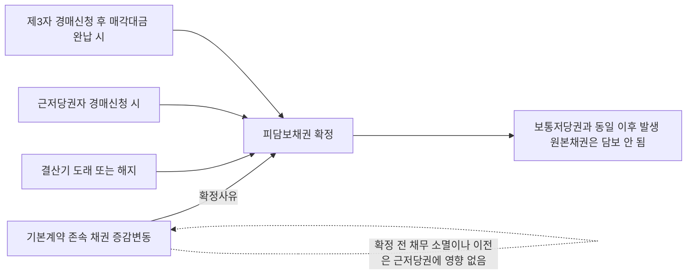

#### ⭐ 기출 출제포인트

1. **확정시기 5지선다** — 결산기 도래 / 해지 / 근저당권자 경매신청(신청 시) / 후순위자 경매신청(완납 시) / 공동근저당 일부 부동산 배당(나머지는 미확정)을 한 문제에 몰아 넣는 유형. 2019·2022년에 반복 출제되었다.
2. **채권최고액의 성격** — "이자는 최고액에 산입" / "일부 변제해도 최고액이 축소되지 않는다" / "실행비용은 별도".
3. **변제 범위 비교** — 채무자 전액 vs 물상보증인·제3취득자 최고액 vs 후순위근저당권자 불가.
4. **확정 전 채무자·채무범위의 변경 가부**와 이해관계인 승낙 요부.
5. **확정 전 채권 일부 양도·대위변제 시 근저당권 이전 여부**(→ 이전하지 않음).
6. **공동근저당** — 확정의 개별성과 누적 배당 금지.

#### 📊 기출 분석

| 연도 | 출제 형태 | 핵심 논점 |
|---|---|---|
| 2019년 기출 | 근저당권 옳지 않은 것 | ==조건부채권도 근저당의 피담보채권이 될 수 있다==(정답 선지 ②가 오답), 결산기 도래 확정, 제3취득자의 최고액 변제, 경매신청 취하와 확정 번복 불가, 최고액 필요적·존속기간 임의적 등기사항 |
| 2020년 기출 | 저당권 옳은 것 (선지 ③) | ==근저당권의 채무자가 일부 변제해도 채권최고액이 축소되지 않는다== |
| 2020년 기출 | 저당권 옳지 않은 것 (선지 ③) | 후순위담보권자 경매신청 시 선순위근저당의 피담보채권은 ==경락대금 완납 시 확정== |
| 2022년 기출 | 근저당권 옳지 않은 것 | ==공동근저당에서 일부 부동산이 제3자 신청 경매로 배당되어도 나머지 부동산의 피담보채권은 확정되지 않는다==(선지 ⑤가 정답) |
| 2023년 기출 | 저당권 옳지 않은 것 (선지 ②) | ==근저당권설정자가 적법하게 기본계약을 해지하면 피담보채권이 확정된다== |

**출제 빈도** — 근저당은 담보물권 파트에서 ==거의 매년 1문항 이상==, 저당권 문제의 개별 선지로도 상시 등장한다. 최근 7개 연도 중 5개 연도에서 확인된다.

**반복되는 함정 선지** — ① "채권의 이자는 최고액 중에 산입하지 않는다"(→ **X**), ② "일부 변제하면 그만큼 채권최고액이 축소된다"(→ **X**), ③ "후순위 근저당권자가 경매를 신청하면 선순위근저당권의 피담보채권도 경매신청 시에 확정된다"(→ **X**, ==완납 시==), ④ "공동근저당에서 일부 부동산이 배당되면 나머지도 확정된다"(→ **X**), ⑤ "채무자 겸 설정자도 최고액만 변제하면 말소를 청구할 수 있다"(→ **X**), ⑥ "확정 전에 채무자를 변경할 수 없다"(→ **X**).

**최근 경향** — ==확정시기를 여러 사유로 흩어 놓고 한 개만 틀리게 만드는 방식==이 정착했고, 2022년 이후로는 **공동근저당(2015다50637, 2013다16992 전원합의체)**이 새 단골 소재가 되었다.

#### 🔍 기출 선지로 배우는 법리

> 실제 출제된 선지를 그대로 놓고 O/X와 근거를 확인한다.

**①** 장래에 발생할 특정의 조건부채권을 피담보채권으로 하는 근저당권의 설정은 허용되지 않는다. (2019년 기출, 정답 선지) — **X**
어디가 틀렸나: 근저당권의 피담보채권 종류에는 제한이 없다. / 옳게 고치면: ==장래에 발생할 특정의 조건부 채권을 담보하기 위해서도 근저당권을 설정할 수 있고, 확정 당시 조건이 성취되지 않았다는 사정만으로 근저당권이 소멸하지 않는다==(2015다200531).

**②** 근저당권자가 피담보채무의 불이행을 이유로 경매신청을 하여 경매신청시에 근저당 채무액이 확정된 경우, 경매개시결정 후 경매신청이 취하되더라도 채무확정의 효과가 번복되지 않는다. (2019년 기출) — **O**
근거: 대법원 2001다73022. 확정은 이미 발생한 효과이므로 취하로 되돌아가지 않는다.

**③** 근저당권의 채무자가 피담보채권의 일부를 변제한 경우, 변제한 만큼 채권최고액이 축소된다. (2020년 기출) — **X**
어디가 틀렸나: 확정 전 근저당권은 동일성을 유지한 채 최고액 범위에서 채권을 담보한다. / 옳게 고치면: ==일부 변제되어도 피담보채권이 축소되지 않고 근저당권도 축소되지 않는다.== 채권최고액은 그대로다.

**④** 후순위담보권자가 경매를 신청한 경우, 선순위근저당권의 피담보채권은 매수인이 경락대금을 완납하여 그 근저당권이 소멸하는 때에 확정된다. (2020년 기출) — **O**
근거: 대법원 99다26085, 99다2608. 근저당권자 스스로 신청한 경우(경매신청 시)와 대비하여 외워야 한다.

**⑤** 공동근저당권자가 저당목적 부동산 중 일부 부동산에 대하여 제3자가 신청한 경매절차에 소극적으로 참가하여 우선배당을 받은 경우, 특별한 사정이 없는 한 나머지 저당목적 부동산에 관한 근저당권의 피담보채권도 확정된다. (2022년 기출, 정답 선지) — **X**
어디가 틀렸나: 확정은 배당받은 그 부동산에 한한다. / 옳게 고치면: ==해당 부동산의 피담보채권은 매수인이 매각대금을 지급한 때 확정되지만, 나머지 부동산의 피담보채권은 기본거래 종료·파산선고 등 다른 확정사유가 없는 한 확정되지 않는다==(2015다50637).

**⑥** 근저당권설정자가 적법하게 기본계약을 해지하면 피담보채권은 확정된다. (2023년 기출) — **O**
근거: 대법원 2002다7176. 존속기간·결산기의 정함이 없으면 설정자는 언제든지 해지의 의사표시로 확정시킬 수 있고, 제3취득자도 이를 원용할 수 있다.

**⑦** 근저당권에 의해 담보될 채권최고액에 채무의 이자는 포함되지 않는다. (문제집 제6장 실전문제 54번, 정답 선지) — **X**
어디가 틀렸나: 제357조 제2항을 정면으로 뒤집었다. / 옳게 고치면: ==이자는 최고액 중에 산입한 것으로 보므로, 원본과 이자를 합한 것이 최고액을 넘으면 초과부분은 담보되지 못한다.==

**⑧** 확정된 피담보채권액이 채권최고액을 초과하는 경우에 채무자는 채권최고액만을 변제하고 근저당권의 말소를 청구할 수 있다. (문제집 제6장 실전문제 53번, 정답 선지) — **X**
어디가 틀렸나: 채무자와 물상보증인·제3취득자를 뒤섞었다. / 옳게 고치면: ==근저당권자와 채무자 겸 근저당권설정자 사이에서는 채권 전액의 변제가 있을 때까지 근저당권의 효력이 잔존채무에 미친다==(2000다59081). ==제3취득자나 물상보증인만이 채권최고액(과 경매비용)을 변제하고 소멸을 구할 수 있다==(71다26).

**⑨** 선순위 근저당권의 확정된 피담보채권액이 채권최고액을 초과하는 경우, 후순위 근저당권자가 선순위 근저당권의 채권최고액을 변제하더라도 선순위 근저당권의 소멸을 청구할 수 없다. (문제집 제6장 실전문제 57번 보기 ㉣) — **O**
근거: 대법원 2005다17341. ==후순위근저당권자는 제364조의 제3취득자에 해당하지 않는다.==

**⑩** 근저당권의 피담보채권이 확정되기 전에 채권의 일부가 대위변제된 경우, 근저당권의 일부이전의 부기등기 여부와 관계없이 근저당권은 대위변제자에게 법률상 당연히 이전된다. (문제집 제6장 실전문제 59번) — **X**
어디가 틀렸나: 확정 전에는 수반성이 작동하지 않는다. / 옳게 고치면: ==확정 전에 채권의 일부를 양도하거나 대위변제한 경우 근저당권이 양수인이나 대위변제자에게 이전할 여지가 없다==(95다53812).

#### ✏️ 사례형 적용

**사례 1 — 채권최고액과 변제 범위**

> 甲은행은 乙과 계속적 대출거래계약을 맺고, 물상보증인 丙 소유 X부동산에 채권최고액 1억원의 근저당권을 설정받았다. 결산기가 도래하여 확정된 피담보채권액은 원본 1억 2,000만원과 지연손해금 1,500만원이다. 丙은 얼마를 변제하면 근저당권설정등기의 말소를 청구할 수 있는가? 만약 乙 자신이 X부동산의 소유자였다면 어떠한가?

**검토**

| 지위 | 논거 | 변제액 | 말소청구 |
|---|---|---|---|
| 물상보증인 丙 | 제357조의 채권최고액만을 변제하면 되고, 최고액 초과분까지 변제할 의무가 없다(74다998) | ==1억원== | ==가능== |
| 채무자 겸 설정자 乙 | 근저당권자와 채무자 겸 설정자 사이에서는 채권 전액의 변제가 있을 때까지 근저당권의 효력이 잔존채무에 미친다(2010다3681, 2000다59081) | ==1억 3,500만원 전액== | 최고액만으로는 ==불가== |

**결론** — 丙은 1억원, 乙이 소유자였다면 확정 채권 전액. 지연손해금 1,500만원은 ==1년분 제한 없이 최고액 1억원 범위 내에서 담보==되고(2008다72318), 근저당권 ==실행비용은 최고액과 별도==로 우선변제된다(71마251).

**사례 2 — 확정시기의 대비**

> 丙은 甲 소유 Y부동산에 채권최고액 5,000만원의 1번 근저당권을, 丁은 같은 부동산에 2번 근저당권을 가지고 있다. ⓐ 丙이 채무불이행을 이유로 경매를 신청한 경우와 ⓑ 丁이 경매를 신청한 경우, 丙의 피담보채권은 각각 언제 확정되는가? ⓒ ⓐ의 경우 丙이 경매개시결정 후 신청을 취하하면 확정의 효과는 어떻게 되는가?

**검토**

| 경우 | 확정 시점 | 근거 |
|---|---|---|
| ⓐ 근저당권자 丙 스스로 신청 | ==경매신청 시== | 2001다73022, 97다26104 |
| ⓑ 후순위근저당권자 丁이 신청 | ==매수인의 경락대금 완납 시==(丙의 근저당권이 소멸하는 시기) | 99다26085, 99다2608 |
| ⓒ ⓐ 후 취하 | ==확정의 효과는 번복되지 않는다== | 2001다73022 |

**결론** — ⓐ 신청 시, ⓑ 완납 시, ⓒ 번복되지 않음. ⓒ 이후 丙이 새로운 거래로 취득한 원본채권은 ==더 이상 담보되지 않으나==(87다카545), 확정 전 원본에서 확정 후 발생한 이자·지연손해금은 ==최고액 범위 내에서 여전히 담보==된다(2005다38300).

**사례 3 — 공동근저당의 배당 (누적적 근저당과의 구별)**

> 甲은행은 乙에 대한 대출채권을 담보하기 위하여 乙 소유 P·Q 두 부동산에 채권최고액 각 3억원의 근저당권을 설정하고, 등기기록에 공동담보의 뜻을 기록하였다. 이후 제3자 신청 경매로 P가 먼저 매각되어 甲이 2억원을 우선배당받았다. 그 뒤 Q가 경매될 때 甲은 얼마의 범위에서 우선변제권을 행사할 수 있는가? 만약 甲이 처음부터 공동근저당의 형식을 취하지 않고 P·Q에 각각 별개의 근저당권을 설정하여 최고액 합계 6억원을 우선변제받으려 한 것이라면?

**검토**

| 구성 | 성질 | Q에서의 우선변제 범위 | 근거 |
|---|---|---|---|
| 공동근저당(공동담보 등기) | 하나의 채권을 P·Q가 함께 담보 | ==최초 채권최고액 3억원 − 이미 배당받은 2억원 = 1억원 범위==. 최고액만큼 반복·누적 배당 불가 | 2013다16992 전원합의체 |
| 개별 근저당권 형식(최고액 합산 목적) | ==누적적 근저당권==. 공동근저당권이 아님 | 각 근저당권의 최고액을 각각 행사 | 2014다51756, 51763 |

**부수 논점** — P에 관한 근저당권의 피담보채권은 ==매수인이 매각대금을 지급한 때 확정==되지만, ==Q에 관한 근저당권의 피담보채권은 기본거래 종료·파산선고 등 다른 확정사유가 없는 한 확정되지 않는다==(2015다50637). 확정 시점을 부동산별로 쪼개어 판단해야 한다는 점이 이 판례의 핵심이다.

**결론** — 공동근저당이면 Q에서 1억원, 누적적 근저당이면 각 최고액을 별도로 행사. ==등기기록에 공동담보의 뜻이 있는지, 최고액 합산을 노린 개별 설정인지==가 갈림길이다.

#### ⚠️ 이 관의 함정 총정리

1. "확정 전에 채무가 전부 변제되면 근저당권도 소멸한다"고 하면 틀림 → ==확정될 때까지의 채무의 소멸 또는 이전은 저당권에 영향을 미치지 아니한다==(제357조 제1항 후단). 일부 변제로 ==채권최고액이 축소되지도 않는다==.
2. "지연손해금은 저당권과 마찬가지로 1년분만 담보된다"고 하면 틀림 → ==근저당권에서는 채권최고액 범위 내라면 1년분 제한 없이 전액 담보==된다(2008다72318). 반대로 ==실행비용은 최고액에 포함되지 않고 별도==다(71마251).
3. "후순위근저당권자가 경매를 신청하면 선순위근저당권의 피담보채권도 경매신청 시에 확정된다"고 하면 틀림 → ==매수인이 경락대금을 완납한 때== 확정된다(99다26085). 근저당권자 스스로 신청한 경우(==신청 시==)와 반드시 구별하라.
4. "채무자 겸 근저당권설정자도 채권최고액만 변제하면 말소를 청구할 수 있다"고 하면 틀림 → ==채권 전액을 변제해야 한다==(80다2712, 2010다3681). 최고액 변제로 족한 것은 ==물상보증인과 제3취득자==뿐이고, ==후순위근저당권자는 제3취득자가 아니어서 아예 소멸청구를 할 수 없다==(2005다17341).
5. "확정 전에 채권의 일부를 대위변제하면 그 범위에서 근저당권이 대위변제자에게 이전한다"고 하면 틀림 → ==확정 전에는 이전할 여지가 없다==(95다53812). 마찬가지로 ==근저당권만을 피담보채권과 분리하여 양도할 수 없다==(제361조).

#### ✅ OX 확인문제

> 다음 진술의 참·거짓을 판단하시오.

**1.** 저당권은 그 담보할 채무의 최고액만을 정하고 채무의 확정을 장래에 보류하여 설정할 수 있으며, 이 경우 그 확정될 때까지의 채무의 소멸 또는 이전은 저당권에 영향을 미치지 아니한다.
→ **O**. 민법 제357조 제1항 문언 그대로다. 근저당권의 ==부종성 완화==를 선언한 조문이다.

**2.** 근저당권의 경우 채무의 이자는 채권최고액에 산입되지 않고 별도로 담보된다.
→ **X**. 제357조 제2항은 ==이자는 최고액 중에 산입한 것으로 본다==고 정한다. 원본과 이자의 합이 최고액을 넘으면 초과부분은 담보되지 않는다.

**3.** 근저당권의 지연손해금은 원본의 이행기일을 경과한 후의 1년분에 한하여 담보된다.
→ **X**. 대법원 2008다72318. 저당권과 달리 ==채권최고액의 한도 내라면 1년분 제한 없이 전액 담보==된다.

**4.** 근저당권의 실행비용은 채권최고액에 포함된다.
→ **X**. 판례는 ==근저당권의 실행비용은 채권최고액에 포함되지 않으며 별도로 우선변제==받는 것으로 이해한다(71마251).

**5.** 근저당권의 존속기간이나 결산기의 정함이 없는 때에는 근저당권설정자가 근저당권자를 상대로 언제든지 해지의 의사표시를 함으로써 피담보채무를 확정시킬 수 있고, 근저당부동산의 제3취득자도 이 해지의 의사표시를 원용할 수 있다.
→ **O**. 대법원 2002다7176.

**6.** 근저당권자가 피담보채무의 불이행을 이유로 경매신청을 한 경우에는 경매개시결정이 있은 때에 근저당 채무액이 확정된다.
→ **X**. ==경매신청 시==에 확정된다(2001다73022). 나아가 개시결정 후 경매신청이 취하되어도 ==확정의 효과는 번복되지 않는다==.

**7.** 피담보채무가 확정되기 이전이라면 근저당권설정자와 근저당권자의 합의로 채무의 범위 또는 채무자를 변경할 수 있고, 이때 후순위저당권자 등 이해관계인의 승낙을 받을 필요가 없다.
→ **O**. 대법원 2021다255648, 97다15777·15784. 이해관계인은 이미 채권최고액 상당의 담보가치가 파악되어 있음을 알고 이해관계를 맺었기 때문이다.

**8.** 근저당권의 피담보채권이 확정되기 전에 그 채권의 일부를 양도하거나 대위변제한 경우, 그 범위에서 근저당권이 양수인이나 대위변제자에게 이전한다.
→ **X**. 대법원 95다53812. ==확정 전에는 근저당권이 이전할 여지가 없다.==

**9.** 확정된 채무액이 채권최고액을 초과하는 경우, 물상보증인과 근저당부동산의 제3취득자는 채권최고액만을 변제하고 근저당권설정등기의 말소를 청구할 수 있으나, 채무자 겸 근저당권설정자는 채권 전액을 변제하여야 한다.
→ **O**. 물상보증인은 74다998, 제3취득자는 2001다47528·2002다7176, 채무자 겸 설정자는 80다2712·2010다3681.

**10.** 공동근저당권자가 목적 부동산 중 일부의 환가대금에서 피담보채권의 일부를 우선 배당받은 경우, 나머지 목적 부동산의 환가절차에서 다시 최초의 채권최고액 범위 내에서 우선변제권을 행사할 수 있다.
→ **X**. 대법원 2013다16992 전원합의체. ==최초 채권최고액에서 이미 우선변제받은 금액을 공제한 나머지 범위==에서만 행사할 수 있다.

#### 🧠 암기법

> 🔑 **"이산 지전 비별(利算 遲全 費別)"**
> **이**자는 최고액에 **산**입, **지**연손해금은 최고액 내라면 **전**액(1년분 제한 없음), 실행**비**용은 최고액과 **별**도.
> 세 항목의 취급이 각각 다르다는 것만 잡으면 채권최고액 문제는 다 풀린다.

> 🔑 **"내신남완(내가 신청하면 신청 시, 남이 신청하면 완납 시)"**
> 근저당권자가 **내**가 경매를 **신**청 → ==경매신청 시== 확정.
> **남**(후순위권리자·일반채권자·조세채권자)이 신청 → ==매각대금 완**완**납 시== 확정.
> 확정시기 문제의 정답은 거의 항상 이 대비에서 갈린다.

> 🔑 **"채전 물제최(債全 物第最)"**
> **채**무자 겸 설정자는 **전**액 변제, **물**상보증인과 **제**3취득자는 **최**고액 변제.
> 여기에 한 줄 덧붙이면 완성 — ==후순위근저당권자는 제3취득자가 아니어서 아예 소멸청구를 못한다.==

> 🔑 **"공동은 깎아서, 누적은 따로"**
> **공동**근저당은 이미 배당받은 만큼 **깎아서**(최초 최고액 − 기수령액) 행사하고, **누적**적 근저당은 각 최고액을 **따로** 행사한다. 확정도 마찬가지로 ==배당받은 그 부동산만 확정, 나머지는 미확정==.

#### ⚖️ 법조문 원문

> 📖 이 관이 근거로 삼은 조문의 **전문**이다. 본문 인용은 발췌지만 여기서는 조 전체를 싣는다. 출처는 법제처 정본이다.

**― 민법 ―**

> 📌 **민법 제357조(근저당)** — "①저당권은 그 담보할 채무의 최고액만을 정하고 채무의 확정을 장래에 보류하여 이를 설정할 수 있다. 이 경우에는 그 확정될 때까지의 채무의 소멸 또는 이전은 저당권에 영향을 미치지 아니한다. ②전항의 경우에는 채무의 이자는 최고액 중에 산입한 것으로 본다."

> 📌 **민법 제360조(피담보채권의 범위)** — "저당권은 원본, 이자, 위약금, 채무불이행으로 인한 손해배상 및 저당권의 실행비용을 담보한다. 그러나 지연배상에 대하여는 원본의 이행기일을 경과한 후의 1년분에 한하여 저당권을 행사할 수 있다."

> 📌 **민법 제361조(저당권의 처분제한)** — "저당권은 그 담보한 채권과 분리하여 타인에게 양도하거나 다른 채권의 담보로 하지 못한다."

> 📌 **민법 제364조(제삼취득자의 변제)** — "저당부동산에 대하여 소유권, 지상권 또는 전세권을 취득한 제삼자는 저당권자에게 그 부동산으로 담보된 채권을 변제하고 저당권의 소멸을 청구할 수 있다."

**― 부동산등기법 ―**

> 📌 **부동산등기법 제75조(저당권의 등기사항)** — "① 등기관이 저당권설정의 등기를 할 때에는 제48조에서 규정한 사항 외에 다음 각 호의 사항을 기록하여야 한다. 다만, 제3호부터 제8호까지는 등기원인에 그 약정이 있는 경우에만 기록한다. 1. 채권액 2. 채무자의 성명 또는 명칭과 주소 또는 사무소 소재지 3. 변제기(辨濟期) 4. 이자 및 그 발생기ㆍ지급시기 5. 원본(元本) 또는 이자의 지급장소 6. 채무불이행(債務不履行)으로 인한 손해배상에 관한 약정 7. 「민법」 제358조 단서의 약정 8. 채권의 조건 ② 등기관은 제1항의 저당권의 내용이 근저당권(根抵當權)인 경우에는 제48조에서 규정한 사항 외에 다음 각 호의 사항을 기록하여야 한다. 다만, 제3호 및 제4호는 등기원인에 그 약정이 있는 경우에만 기록한다. 1. 채권의 최고액 2. 채무자의 성명 또는 명칭과 주소 또는 사무소 소재지 3. 「민법」 제358조 단서의 약정 4. 존속기간"

### 제1관 비전형담보 총설

> 📖 유치권·질권·저당권은 민법전이 마련한 전형담보(典型擔保)다. 그러나 질권은 점유개정에 의한 설정을 인정하지 않아 가축을 기르거나 양식장을 하는 채무자를 담보거래에서 사실상 배제했고, 저당권은 설정·실행 절차가 번거로워 채권자가 유저당계약으로 이를 우회하면서 폭리를 취했다. 이 두 결함을 메우려 거래계가 만들어 낸 것이 비전형담보다.
> 이 관은 뒤이어 나오는 제2관 가등기담보, 제3관 양도담보, 제4관 소유권유보부 매매를 관통하는 총론이다. 여기서 잡아 둔 "왜 생겼는가 — 무엇이 문제였는가 — 어떤 법률로 막았는가"의 축이 이하 세 관의 모든 논점을 지배한다.

> ⭐ **이 관에서 반드시 챙길 3가지**
> ① 비전형담보는 ==점유개정 형식의 담보를 인정할 필요==와 ==채권자의 지나친 폭리를 저지할 필요==라는 두 축에서 발생했다.
> ② 폭리 문제는 민법 제607조·제608조를 거쳐 ==가등기담보 등에 관한 법률==(1984. 1. 1. 시행)로, 불충분한 공시 문제는 ==동산·채권 등의 담보에 관한 법률==(2012. 6. 11. 시행, 담보등기 도입)로 대응했다.
> ③ 제607조·제608조 위반으로 대물변제의 예약이 무효가 되더라도 그에 기한 소유권이전등기는 ==채무원리금을 담보하는 범위 안에서 그대로 효력==이 있고, 이를 ==약한 의미의 양도담보==라 한다.

#### 1. 의의

**비전형담보**(非典型擔保)란 ==민법전에 규정된 담보물권이 아니라 거래계의 필요에 의해서 만들어진 담보==를 말한다. 민법이 정한 유치권·질권·저당권을 전형담보라 부르는 데 대응하는 개념이다.

거래계가 민법 밖으로 나간 이유는 두 가지다. 하나는 **목적물을 계속 사용하면서도 담보로 제공하고 싶다**는 채무자 쪽 요구이고, 다른 하나는 **경매를 거치지 않고 간이하게 담보를 실행하고 싶다**는 채권자 쪽 요구다. 앞의 요구가 동산 양도담보를, 뒤의 요구가 유저당계약(대물변제의 예약)에서 출발한 부동산 양도담보·가등기담보를 낳았다.

> 💡 **용어 정리** — 강학상 비전형담보에는 매도담보·양도담보·가등기담보·소유권유보부 매매가 들어간다. 그런데 가등기담보법이 제정되기 전까지 비전형담보를 통틀어 "양도담보"라고 부르던 관행 때문에, 현재에도 ==가담법이 적용되지 않는 비전형담보를 양도담보라고 통칭==한다. 시험에서 "양도담보"라는 말이 나오면 **가담법 적용 여부**를 먼저 따져야 하는 이유가 여기 있다.

#### 2. 요건

비전형담보가 발생하기 위한 사실상의 "요건", 즉 전형담보가 감당하지 못한 지점은 다음과 같다.

| 전형담보 | 한계 | 그래서 생긴 비전형담보 |
|---|---|---|
| **질권**(동산) | ==점유개정에 의한 설정을 인정하지 않는다==. 유치적 효력이 확보되지 않기 때문 | 점유개정으로 설정하는 **동산 양도담보** |
| **저당권**(부동산) | 설정·실행 절차가 복잡·불편하고 경매를 거쳐야 한다 | 유저당계약(대물변제의 예약) → **가등기담보·부동산 양도담보** |
| **유치권** | 법정담보물권이어서 당사자가 만들어 쓸 수 없고 우선변제권이 없다 | (직접적 대체물 없음) |

| 발생 동인 | 구체적 내용 | 부작용 |
|---|---|---|
| ==점유개정 형식의 담보 인정 필요== | 가축 사육·양식업처럼 목적물을 계속 점유·관리해야 하는 채무자도 담보를 설정할 수 있어야 한다 | ==공시가 불충분==하여 담보가치를 제대로 활용하지 못하고 자금조달이 원활하지 않다 |
| ==채권자의 폭리 저지 필요== | 판례가 부동산·등기등록 가능 동산에 유저당계약을 인정 → 채권자는 절차상 복잡함을 피할 수 있었다 | 피담보채권보다 ==훨씬 큰 가치의 목적물 소유권을 취득==하여 폭리를 취하는 것이 가능해졌다 |

#### 3. 효과

**◆ 비전형담보의 4유형 비교**

| 구분 | 매도담보 | 양도담보(협의) | 가등기담보 | 소유권유보부 매매 |
|---|---|---|---|---|
| 신용수수의 형식 | ==매매==의 형식 | ==소비대차==의 형식 | 소비대차 + 대물변제·매매의 예약 | 매매 그 자체 |
| 채권·채무관계 | 당사자 사이에 따로 남기지 ==않는다== | 채권·채무관계를 ==남긴다== | 남긴다 | 대금채권이 남는다 |
| 공시방법 | 소유권이전등기(인도) | ==소유권이전등기== 또는 ==점유개정== | ==가등기== | 없음(점유는 매수인에게 이전) |
| 설정 시 소유권 | 채권자에게 이전 | 채권자에게 이전(대외적) | ==이전되지 않음==(가등기뿐) | ==매도인에게 유보== |
| 적용 법률 | 요건 충족 시 가담법 | 요건 충족 시 가담법, 아니면 판례법리 | ==가등기담보법== | 민법(정지조건 법리) |
| 실행방법 | 청산(정산)의무 | 귀속청산·처분청산 모두 가능 | ==귀속청산만==(사적실행) + 경매 | 계약 해제·목적물 반환청구 |

> 📌 매도담보와 협의의 양도담보는 신용의 수수를 매매 형식으로 하느냐 소비대차 형식으로 하느냐의 차이일 뿐, ==현재에는 구별의 실익이 없다==고 본다.

**◆ 문제점과 입법적 해결**

| 문제점 | 구체적 폐해 | 입법적 해결 | 시행 |
|---|---|---|---|
| ==불충분한 공시==(점유개정) | 담보가치 활용 곤란 → 자금조달 부진, 이중담보 분쟁 | ==동산·채권 등의 담보에 관한 법률== — **담보등기**라는 새로운 공시방법 도입 | ==2012. 6. 11.== |
| ==채권자의 폭리== | 청산 없이 목적물 소유권 취득 | 민법 ==제607조·제608조== 신설 → 그래도 부족 | 민법 제정 시 |
| 위 폭리의 잔존 문제 | 청산금을 안 주고 버티거나 제3자에게 처분해 버림 | ==가등기담보 등에 관한 법률== — 청산금청구권을 확실히 보장, 목적물 회복 가능성 확대 | ==1984. 1. 1.== |

> ⚠️ **동산·채권 등의 담보에 관한 법률의 한계** — 이 법은 ==법인 또는 상업등기법에 따라 상호등기를 한 사람==에 한해서만 적용된다. 따라서 그 외의 경우에는 ==종래의 양도담보 이론이 계속 적용==된다. 또 기존의 질권이나 양도담보를 폐지한 것이 아니라, 당사자가 선택에 따라 채택하거나 새로운 담보등기권을 설정할 수 있게 한 **병존형** 입법이다.

**◆ 가담법 적용 여부에 따른 갈림**

| 갈림길 | 가담법 적용 O | 가담법 적용 X |
|---|---|---|
| 피담보채권 | ==소비대차·준소비대차==에 기한 채권 | ==매매대금채권·공사대금채권== 등 |
| 목적물 가액 | 예약 당시 가액 > 차용액 + 이자 | 예약 당시 시가 < 피담보채무액 |
| 목적물 | 등기·등록이 가능한 재산 | 등기·등록이 불가능한 ==일반 동산== |
| 처리 | 실행통지 → 청산기간 2개월 → 청산금 지급 → 소유권 취득 | ==약한 의미의 양도담보==로 보아 **정산의무**를 인정 |

**◆ 약한 의미의 양도담보**

| 항목 | 내용 |
|---|---|
| 개념 | 당사자 사이에 ==청산(정산)절차를 예정==하고 있는 담보 |
| 발생 국면 | ① 제607조·제608조 위반으로 대물변제예약이 무효인 경우 ② 담보목적 가등기에 기해 본등기까지 마친 경우 ③ 가담법이 적용되지 않는 대물변제예약 |
| 효력 | 소유권이전등기는 ==채무원리금을 담보하는 범위 안에서 유효== |
| 채무자의 지위 | 정산절차를 마치기 전에는 ==언제든지 채무를 변제하고== 등기의 말소를 청구할 수 있다 |
| 채권자의 의무 | 정당한 가격으로 처분하거나 소유권을 인수하려면 ==원리금 충당 후 잔액을 반환==하는 정산을 하여야 한다 |

#### 4. 관련 조문

> 📌 **민법 제607조(대물반환의 예약)** — "차용물의 반환에 관하여 차주가 차용물에 갈음하여 다른 재산권을 이전할 것을 예약한 경우에는 그 재산의 예약당시의 가액이 차용액 및 이에 붙인 이자의 합산액을 넘지 못한다."

> 📌 **민법 제608조(차주에 불이익한 약정의 금지)** — "전2조의 규정에 위반한 당사자의 약정으로서 차주에 불리한 것은 환매 기타 여하한 명목이라도 그 효력이 없다."

> 📌 **가등기담보법 제1조** — 담보계약이란 차용물의 반환에 관하여 차주가 차용물에 갈음하여 다른 재산권을 이전할 것을 예약할 때 ==그 재산의 예약 당시 가액이 차용액과 이에 붙인 이자를 합산한 액수를 초과==하는 경우의 담보형태의 약정을 말한다.

> 📌 **가등기담보법 제18조** — 부동산의 소유권 외에 ==지상권·지역권·임차권==의 취득을 목적으로 하는 계약에도 준용하되 ==권리질권·저당권 및 전세권은 제외==한다. 등기·등록으로 공시되는 동산(선박·자동차·항공기·건설기계)도 그 객체가 된다.

#### 5. 핵심 판례 법리

- **제607조·제608조 위반과 약한 의미의 양도담보** — 대물변제의 예약은 제607조 및 제608조가 적용되어 무효이더라도 그에 기한 소유권이전등기는 ==채무자의 채무원리금을 담보하는 범위 안에서 그대로 효력이 있으며==, 이러한 경우의 담보는 당사자 사이에 청산절차를 예정하고 있는 이른바 **약한 의미의 양도담보**라고 본다(대판 1982.7.13. 81다254).

- **담보가등기에 기한 본등기의 성질** — 채권자가 채권담보의 목적으로 부동산에 가등기를 경료하였다가 변제기까지 변제를 받지 못하여 그 가등기에 기한 본등기를 경료한 경우, 특별한 약정이 없는 한 ==그 본등기도 채권담보의 목적으로 경료된 것==으로서 정산절차를 예정한 약한 의미의 양도담보가 된 것으로 본다(대판 1996.07.30. 95다11900).

- **정산 전 피담보채권은 소멸하지 않는다** — 양도담보권자가 변제기 후에 담보권실행을 위하여 담보물을 정당한 가격으로 타에 처분하거나 자기가 소유권을 인수하려면 ==그 대금으로 피담보채권의 원리금을 충당하고 잔액을 채무자에게 반환하는 등의 정산을 마쳐야 하고==, 이를 마치지 않은 상태에서는 아직 피담보채권이 소멸되었다고 볼 수 없다(대판 1996.07.30. 95다11900).

- **정산 전 언제든지 변제하고 말소청구** — 약한 의미의 양도담보가 이루어진 경우에는 ==채무의 변제기가 도과된 후라도== 채권자가 담보권을 실행하여 정산절차를 마치기 전에는 채무자는 언제든지 채무를 변제하고 채권자에게 가등기 및 그에 기한 본등기의 말소를 청구할 수 있다(대판 1994.6.28. 94다3087·3094).

- **가담법의 적용범위 — 소비대차성** — 가담법이 적용될 수 있는 피담보채권은 ==금전소비대차나 준소비대차에 한한다==(대판 2004.4.27. 2003다29968).

- **매매대금채권 — 적용 X** — 가등기담보법은 차용물의 반환에 관하여 다른 재산권을 이전할 것을 예약한 경우에 적용되는 것이므로, 단순히 ==매매잔대금 채권을 담보하기 위하여 경료된 가등기==에 기하여 본등기를 구하는 경우에는 적용되지 아니한다(대판 1991.09.24. 90다13765). 매매대금채권을 담보하기 위한 양도담보에도 적용되지 않는다(대판 2001.03.23. 2000다29356). 매매대금이나 물품대금의 지급을 담보하기 위한 소유권이전청구권보전 가등기도 같다(대판 1992.10.27. 92다22879).

- **공사대금채권 — 적용 X** — 공사대금채권을 담보할 목적으로 가등기나 소유권이전등기를 경료한 경우에는 가등기담보법이 적용되지 않는다(대판 1992.4.10. 91다45356, 91다45363). ==공사잔대금==의 지급을 담보하기 위하여 체결된 양도담보계약에 기하여 소유권이전등기를 구하는 경우에도 적용되지 않는다(대판 1996.11.15. 96다31116).

- **목적물 가액이 채권액에 미달 — 적용 X** — 가등기담보법은 재산의 ==예약 당시의 가액이 차용액 및 이에 붙인 이자의 합산액을 초과하는 경우에 한하여== 적용되므로, 담보부동산에 대한 예약 당시의 시가가 그 피담보채무액에 미치지 못하는 경우에는 청산금평가액의 통지 및 청산금지급 등의 절차를 이행할 여지가 없다(대판 1993.10.26. 93다27611).

- **"재산의 가액"의 의미** — 여기서 재산의 가액은 원칙적으로 ==통상적인 시장에서 충분한 기간 거래된 후 그 대상재산의 내용에 정통한 거래당사자 간에 성립한다고 인정되는 적정가격==이고, 그 확인이 어려울 때에는 객관적이고 합리적인 방법으로 평가한 가액이다. 토지에 법정지상권 성립 가능성이 있는 등 이용상 제한 여부가 불분명하면 그 사정을 평가하여 성립 여부를 판단한 다음 그에 따라 평가한 가격을 가액으로 본다(대판 2007.06.15. 2006다5611).

- **혼합채권이 소비대차만 남은 경우 — 적용 O** — 금전소비대차·준소비대차에 기한 차용금반환채무와 그 외의 원인으로 발생한 채무를 동시에 담보할 목적으로 경료된 가등기·소유권이전등기라도, 그 후 ==후자의 채무가 소멸하고 차용금반환채무의 전부 또는 일부만이 남게 된 경우==에는 가등기담보법이 적용된다(대판 2004.4.27. 2003다29968).

- **집합물 양도담보의 유효성** — 일단의 증감 변동하는 동산을 하나의 물건으로 보아 채권담보의 목적으로 삼는 집합물 양도담보설정계약도 가능하고, 종류·소재장소·수량 지정 등의 방법으로 특정되어 있으면 그 전부를 하나의 재산권으로 보아 유효한 담보권의 설정이 된다(대판 1990.12.26. 88다카20224).

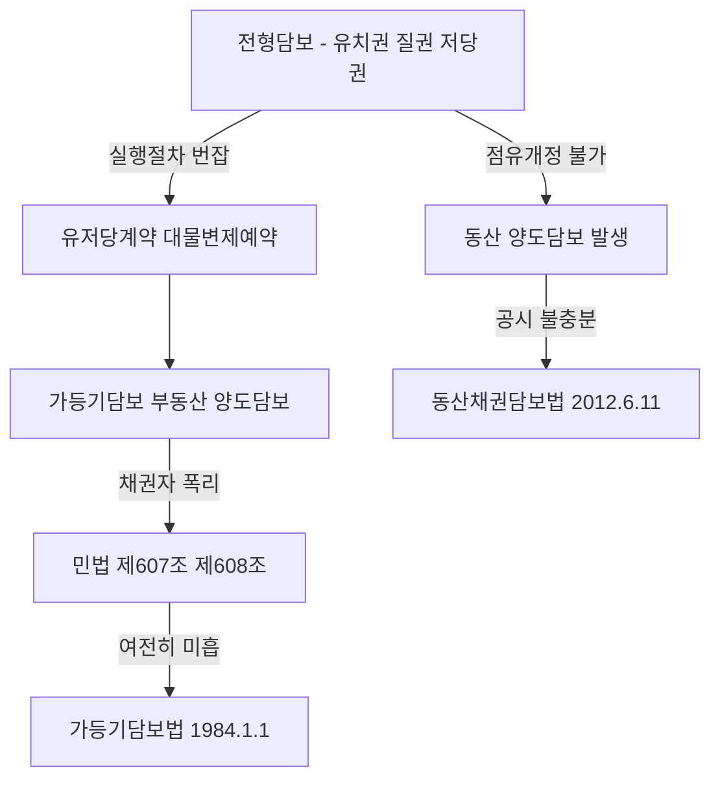

#### ⭐ 기출 출제포인트

1. **가담법 적용범위 3요건**을 선지 하나하나로 물어본다 — 소비대차성, 목적물 가액 초과, 등기·등록 가능성.
2. "판례는 ==소비대차 이외의 사유로 생긴 채권도== 가등기담보의 피담보채권이 된다"는 **틀린 선지**가 반복된다.
3. **동산·채권 등의 담보에 관한 법률에 따른 동산담보권**이 법정담보물권인지 약정담보물권인지(→ ==약정담보물권==).
4. **유동집합물**이 법률상 공시방법이 인정되지 않더라도 특정성이 있으면 양도담보의 목적이 될 수 있는지(→ **가능**).
5. **약한 의미의 양도담보**에서 정산 전 채무자의 변제·말소청구 가능 여부.

#### 📊 기출 분석

| 연도 | 출제 형태 | 핵심 논점 |
|---|---|---|
| 2022년 기출 | 물권의 객체 5지선다 중 1지 | ==유동집합물==도 특정성이 있으면 양도담보의 목적으로 가능 |
| 2023년 기출 | 법정담보물권 찾기 5지선다 중 1지 | 동산·채권 등의 담보에 관한 법률에 따른 ==동산담보권은 약정담보물권== |
| 감정평가사 기출·문제집 | 비전형담보 종합 5지선다 | 가담법 적용범위(소비대차성·가액 초과), 명인방법과 양도담보 |

**출제 빈도** — 비전형담보 총설이 단독 문항으로 나오는 일은 드물다. 그러나 ==물권의 객체·담보물권의 통유성·법정담보물권 vs 약정담보물권== 문항의 **선지 한 개**로 매년 얼굴을 내민다. 총설은 "제2관·제3관 문항의 함정을 읽는 눈"을 만들어 주는 자리다.

**반복되는 함정 선지** — ① "소비대차 이외의 사유로 생긴 채권도 가등기담보의 피담보채권이 된다"(X) ② "명인방법으로 양도담보를 공시할 수 없다"(X — ==명인방법을 갖춘 수목의 집단은 소유권과 양도담보의 객체가 될 수 있다==) ③ "유동집합물은 공시방법이 없어 양도담보의 목적이 될 수 없다"(X).

**최근 경향** — 동산·채권 등의 담보에 관한 법률이 선지에 등장하기 시작했다. **법정 vs 약정**, **담보등기라는 공시방법**, **적용 대상이 법인·상호등기자에 한정**된다는 세 가지만 정확히 잡아 두면 된다.

#### 🔍 기출 선지로 배우는 법리

> 실제 출제된 선지를 그대로 놓고 O/X와 근거를 확인한다.

**①** 법률상 공시방법이 인정되지 않는 유동집합물이라도 특정성이 있으면 이를 양도담보의 목적으로 할 수 있다. (2022년 기출) — **O**
근거: 일단의 증감·변동하는 동산도 종류·장소·수량의 지정 등으로 ==외부적·객관적으로 특정==되면 하나의 재산권으로 보아 유효한 담보권 설정이 된다(대판 1990.12.26. 88다카20224).

**②** 동산·채권 등의 담보에 관한 법률에 따른 동산담보권은 법률에서 정하는 요건이 충족되면 당연히 성립하는 법정담보물권이다. (2023년 기출 선지 변형) — **X**
어디가 틀렸나: 법정담보물권은 ==유치권==뿐이다. 동산담보권은 담보약정과 담보등기로 성립하는 **약정담보물권**이다. / 옳게 고치면: "당사자의 담보약정에 의하여 성립하는 약정담보물권이다."

**③** 판례는 소비대차 이외의 사유로 생긴 채권도 가등기담보의 피담보채권이 된다고 한다. (문제집 제6장 기본문제 29번) — **X**
어디가 틀렸나: 가담법은 ==소비대차·준소비대차에 따른 채권==을 담보하기 위해 대물변제의 예약을 하고 가등기 내지 소유권이전등기를 한 경우만을 규제한다. 매매잔대금채권을 담보하는 가등기에는 적용되지 않는다(대판 1991.9.24. 90다13765).

**④** 가등기담보 등에 관한 법률의 적용범위를 좁게 인정하여 피담보채권이 소비대차·준소비대차에 의하여 발생한 경우를 규율하며, 이때 담보의 목적물 가액이 차용액과 이자의 합산액을 ==넘지 않는 경우==에 한하여 적용한다. (문제집 제6장 실전문제 67번) — **X**
어디가 틀렸나: 방향이 정반대다. 목적물 가액이 차용액 및 이자의 합산액을 ==초과하는 경우==에 한하여 적용된다(대판 1993.10.26. 93다27611). 가액이 채권액에 미달하면 애초에 폭리가 성립할 수 없으므로 법이 개입할 이유가 없다.

**⑤** 명인방법으로 양도담보를 공시할 수 없다. (문제집 제6장 실전문제 03번) — **X**
어디가 틀렸나: ==명인방법을 갖춘 수목의 집단은 소유권과 양도담보의 객체가 될 수 있다==. 명인방법은 관습법상의 공시방법이다.

**⑥** 약한 의미의 양도담보가 이루어진 경우 채무의 변제기가 경과한 후라도 채권자가 담보권을 실행하여 청산절차를 마치기 전에는 채무자가 언제든지 채무를 변제하고 채권자에게 가등기 및 그에 기하여 이루어진 본등기의 말소를 청구할 수 있다. (문제집 제6장 실전문제 67번) — **O**
근거: 대판 1994.6.28. 94다3087·3094.

#### ✏️ 사례형 적용

> **사례 1** — 甲은 乙에게서 1억 원을 빌리면서, 변제하지 못하면 시가 3억 원인 甲 소유 X토지의 소유권을 乙에게 이전한다는 대물변제의 예약을 하고 乙 앞으로 소유권이전등기를 마쳐 주었다. 그러나 가등기는 하지 않았고, 乙은 변제기 후 아무런 청산절차 없이 X를 자기 것으로 여기고 있다.

**검토** — ① 피담보채권이 ==소비대차==에 기한 것이고 ② 예약 당시 가액(3억)이 차용액과 이자의 합산액(1억 남짓)을 ==초과==하며 ③ 목적물이 ==등기 가능한 부동산==이므로 가담법 적용요건을 모두 충족한다. 가담법상 담보권으로서 실행통지·청산기간·청산금 지급 절차를 밟아야 한다. 설령 가담법 적용이 부정되는 사안이었다 하더라도 제607조·제608조에 의해 대물변제의 예약은 무효이고, 소유권이전등기는 ==채무원리금을 담보하는 범위에서만 유효==한 **약한 의미의 양도담보**로 남는다(대판 1982.7.13. 81다254). 어느 쪽이든 **乙이 청산 없이 X의 완전한 소유권을 취득하는 일은 없다.**

> **사례 2** — 丙은 丁에게 건물 공사를 해 주고 공사대금 5억 원의 채권을 가졌는데, 이를 담보하기 위해 丁 소유 Y토지(시가 8억 원)에 소유권이전등기를 받았다. 丙은 변제기가 지나자 청산 없이 Y를 제3자에게 팔아 버렸다.

**검토** — 피담보채권이 ==공사대금채권==이므로 **가담법은 적용되지 않는다**(대판 1992.4.10. 91다45356, 91다45363; 대판 1996.11.15. 96다31116). 그렇다고 丙이 폭리를 취해도 좋다는 뜻은 아니다. 판례는 이런 경우를 ==약한 의미의 양도담보==로 보아 **정산의무**를 인정한다. 丙은 처분대금으로 피담보채권 원리금을 충당하고 ==잔액을 丁에게 반환==해야 하며, 정산을 마치기 전에는 피담보채권이 소멸했다고 볼 수 없다(대판 1996.07.30. 95다11900).

> **사례 3** — 개인사업자 戊는 자기 축사의 돼지 전부를 A은행에 점유개정으로 양도담보로 제공하려 한다. 戊는 상업등기법에 따른 상호등기를 하지 않았다.

**검토** — 동산·채권 등의 담보에 관한 법률은 ==법인 또는 상업등기법에 따라 상호등기를 한 사람==에게만 적용되므로, 戊는 담보등기를 이용할 수 없다. 따라서 **종래의 양도담보 이론**(점유개정에 의한 인도 + 집합물 특정 법리)이 그대로 적용된다. 목적물이 등기·등록 불가능한 일반 동산이므로 **가담법도 적용되지 않는다**. 제3관에서 다루는 동산 양도담보 법리의 무대가 바로 이 지점이다.

#### ⚠️ 이 관의 함정 총정리

1. "비전형담보는 민법에 규정이 없으므로 물권법정주의에 반해 무효"라고 하면 틀림 → ==거래계의 필요로 형성되어 판례·특별법이 승인한 담보==다.
2. "가담법은 목적물 가액이 차용액과 이자의 합산액을 **넘지 않는** 경우에 적용된다"고 하면 틀림 → ==초과하는 경우==에 적용된다.
3. "제607조·제608조에 위반하면 소유권이전등기도 전부 무효"라고 하면 틀림 → ==채무원리금을 담보하는 범위에서는 유효==한 약한 의미의 양도담보다.
4. "동산·채권 등의 담보에 관한 법률이 시행되어 종래의 동산 양도담보는 폐지되었다"고 하면 틀림 → ==기존 질권·양도담보를 폐지하지 않고 선택에 따라 채택==할 수 있는 병존형이며, 법인·상호등기자 외에는 여전히 종래 이론이 적용된다.
5. "명인방법으로는 양도담보를 공시할 수 없다"고 하면 틀림 → ==명인방법을 갖춘 수목의 집단은 양도담보의 객체가 된다==.

#### ✅ OX 확인문제

> 다음 진술의 참·거짓을 판단하시오.

**1.** 비전형담보란 민법전에 규정된 담보물권이 아니라 거래계의 필요에 의해서 만들어진 담보를 말한다.
→ **O**. 유치권·질권·저당권이 전형담보이고, 그 밖에 거래계가 형성한 담보가 비전형담보다.

**2.** 민법상 질권은 점유개정 방식의 설정을 인정하지 않으며, 이 점이 동산 양도담보가 발생한 계기가 되었다.
→ **O**. 점유개정에 의한 질권설정은 유치적 효력이 확보되지 않아 부정된다. 목적물을 계속 점유·관리해야 하는 채무자의 필요가 양도담보를 낳았다.

**3.** 가등기담보 등에 관한 법률은 1984. 1. 1.부터, 동산·채권 등의 담보에 관한 법률은 2012. 6. 11.부터 시행되고 있다.
→ **O**. 앞의 법은 폭리 저지를, 뒤의 법은 담보등기라는 새 공시방법 도입을 목적으로 한다.

**4.** 동산·채권 등의 담보에 관한 법률은 모든 자연인과 법인에게 적용된다.
→ **X**. ==법인 또는 상업등기법에 따라 상호등기를 한 사람==에 한해서만 적용된다. 그 외에는 종래의 양도담보 이론이 계속 적용된다.

**5.** 대물변제의 예약이 제607조·제608조에 의해 무효인 경우, 그에 기한 소유권이전등기도 언제나 전부 무효이다.
→ **X**. 소유권이전등기는 ==채무자의 채무원리금을 담보하는 범위 안에서 그대로 효력==이 있고, 이는 청산절차를 예정한 약한 의미의 양도담보다(대판 1982.7.13. 81다254).

**6.** 가등기담보법은 목적물의 예약 당시 가액이 차용액과 이에 붙인 이자의 합산액에 미치지 못하는 경우에도 적용된다.
→ **X**. ==초과하는 경우에 한하여== 적용된다. 미달하면 청산금평가액 통지·청산금지급 절차를 이행할 여지가 없다(대판 1993.10.26. 93다27611).

**7.** 공사대금채권을 담보할 목적으로 소유권이전등기를 경료한 경우에도 가등기담보법이 적용된다.
→ **X**. 가담법은 ==차용물의 반환에 관하여 다른 재산권을 이전할 것을 예약한 경우==에 적용되므로 공사잔대금 담보의 양도담보계약에는 적용되지 않는다(대판 1996.11.15. 96다31116).

**8.** 금전소비대차에 기한 채무와 그 밖의 원인으로 발생한 채무를 함께 담보하는 가등기라도, 후자가 소멸하고 차용금반환채무만 남게 되면 가등기담보법이 적용된다.
→ **O**. 대판 2004.4.27. 2003다29968.

**9.** 매도담보와 협의의 양도담보는 신용의 수수를 매매의 형식으로 하는가 소비대차의 형식으로 하는가에 따라 구별되지만, 현재는 구별의 실익이 없다고 한다.
→ **O**. 매도담보는 당사자 사이에 채권·채무관계를 따로 남기지 않는 점이 형식상 다르다.

**10.** 일단의 증감·변동하는 동산이라도 종류·소재장소·수량의 지정 등으로 특정되면 하나의 집합물로서 양도담보의 목적이 될 수 있다.
→ **O**. 대판 1990.12.26. 88다카20224.

#### 🧠 암기법

> 🔑 **비전형담보 발생 2대 동인 — "점(占)폭(暴)"**
> **점**유개정을 쓸 수 없어서(질권의 한계) + 채권자의 **폭**리를 막을 수 없어서(유저당의 폐해).
> 그래서 해법도 둘 — 점유개정 → **동산채권담보법**(2012), 폭리 → **가등기담보법**(1984).

> 🔑 **가담법 3요건 — "소·초·등"**
> **소**비대차(준소비대차 포함)일 것 / 목적물 가액이 차용액+이자를 **초**과할 것 / **등**기·등록이 가능한 재산일 것.
> 하나라도 빠지면 → ==약한 의미의 양도담보==로 넘어가 정산의무만 남는다.

> 🔑 **가담법 적용 배제 채권 — "매·공"**
> **매**매대금채권, **공**사대금채권. "빌린 게 아니면 가담법은 안 온다"로 외운다.

> 🔑 **연도 두 개 — "84 담보, 12 등기"**
> 19**84**년 가등기**담보**법, 20**12**년 동산채권담보법(담보**등기** 도입).

#### ⚖️ 법조문 원문

> 📖 이 관이 근거로 삼은 조문의 **전문**이다. 본문 인용은 발췌지만 여기서는 조 전체를 싣는다. 출처는 법제처 정본이다.

**― 민법 ―**

> 📌 **민법 제607조(대물반환의 예약)** — "차용물의 반환에 관하여 차주가 차용물에 갈음하여 다른 재산권을 이전할 것을 예약한 경우에는 그 재산의 예약당시의 가액이 차용액 및 이에 붙인 이자의 합산액을 넘지 못한다."

> 📌 **민법 제608조(차주에 불이익한 약정의 금지)** — "전2조의 규정에 위반한 당사자의 약정으로서 차주에 불리한 것은 환매 기타 여하한 명목이라도 그 효력이 없다."

**― 가등기담보법 ―**

> 📌 **가등기담보법 제1조(목적)** — "이 법은 차용물(借用物)의 반환에 관하여 차주(借主)가 차용물을 갈음하여 다른 재산권을 이전할 것을 예약할 때 그 재산의 예약 당시 가액(價額)이 차용액(借用額)과 이에 붙인 이자를 합산한 액수를 초과하는 경우에 이에 따른 담보계약(擔保契約)과 그 담보의 목적으로 마친 가등기(假登記) 또는 소유권이전등기(所有權移轉登記)의 효력을 정함을 목적으로 한다."

> 📌 **가등기담보법 제18조(다른 권리를 목적으로 하는 계약에의 준용)** — "등기 또는 등록할 수 있는 부동산소유권 외의 권리{질권(質權)ㆍ저당권 및 전세권은 제외한다}의 취득을 목적으로 하는 담보계약에 관하여는 제3조부터 제17조까지의 규정을 준용한다. 다만, 「동산ㆍ채권 등의 담보에 관한 법률」에 따라 담보등기를 마친 경우에는 그러하지 아니하다."

### 제2관 가등기담보

> 📖 가등기담보란 채권담보의 목적으로 채무자 소유 부동산에 대물변제의 예약 또는 매매의 예약을 하고 ==소유권이전청구권보전의 가등기==를 해 두는 담보다. 「가등기담보 등에 관한 법률」(이하 가담법)은 가등기가 경료된 경우뿐 아니라 ==담보목적으로 소유권이전등기가 경료된 경우(양도담보)까지 모두 포함==한다.
> 이 관의 뼈대는 딱 둘이다. **어디까지 가담법이 적용되는가(적용범위)**와 **어떻게 실행하는가(청산절차)**. 시험은 이 두 축에서만 나온다.

> ⭐ **이 관에서 반드시 챙길 3가지**
> ① 적용범위 3요건 — ==소비대차·준소비대차==에 기한 채권 / 목적물 가액이 ==차용액+이자를 초과== / ==등기·등록 가능한 재산==.
> ② 사적실행은 ==귀속청산만== 인정된다. 실행통지 → ==청산기간 2개월== → 청산금 지급 → 소유권 취득. ==청산금 지급 전에 한 본등기는 무효==다.
> ③ 담보가등기는 경매절차에서 ==저당권으로 본다==. 우선변제를 받고, 부동산의 매각에 의하여 ==소멸==한다.

#### 1. 의의

**가등기담보권**이란 채권자가 담보계약에 따라 채무자 등 소유 부동산에 담보가등기를 마침으로써 취득하는 담보물권이다. 가담법상 **담보계약**이란 ==차용물의 반환에 관하여 차주가 차용물에 갈음하여 다른 재산권을 이전할 것을 예약할 때 그 재산의 예약 당시 가액이 차용액과 이에 붙인 이자를 합산한 액수를 초과하는 경우==의 모든 담보형태의 약정을 말한다(가등기담보법 제1조).

| 성질 | 내용 |
|---|---|
| ==약정담보물권== | 당사자간의 담보설정계약에 의해 성립한다 |
| 통유성 | ==부종성·수반성·불가분성·물상대위성==을 가진다 |
| 담보제도의 형식 | ==소유권이전의 법리==에 의한 담보제도(갑구란에 기재) |
| 실행 | ==경매청구권==(특수한 저당권의 일종)이 인정되고, 우선변제권과 채무자회생법상 ==별제권==을 인정한다 |
| 유치적 효력 | ==없다==(저당권과 동일) |

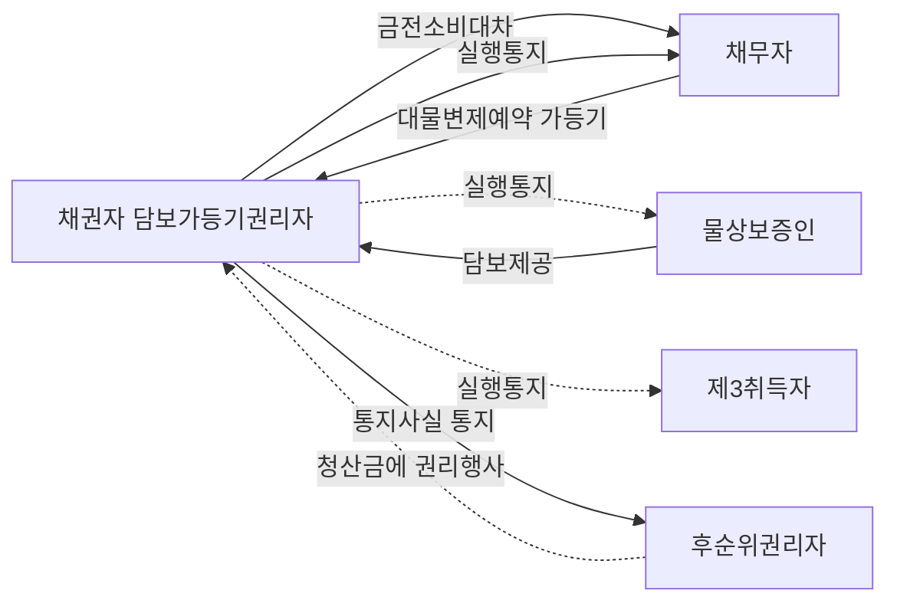

#### 2. 요건

**◆ 가담법의 적용범위 — 3요건**

| 요건 | 내용 | 적용 X가 되는 경우 |
|---|---|---|
| ① ==피담보채권의 종류== | ==금전소비대차 또는 준소비대차==에 기한 채권일 것. 장래 발생 채권, 조건부·기한부 채권도 가능 | ==매매대금채권==, 물품대금채권, ==공사대금채권== |
| ② ==목적물의 가액== | 예약 당시의 가액이 ==차용액과 이에 붙인 이자의 합산액을 초과==할 것 | 예약 당시 시가가 피담보채무액에 ==미달==하는 경우 |
| ③ ==목적물의 종류== | ==등기·등록이 가능한 재산==일 것 | 등기·등록이 불가능한 ==일반 동산== |

| 사안 | 가담법 적용 | 근거 |
|---|---|---|
| 금전소비대차·준소비대차 담보 | **O** | 대판 2004.4.27. 2003다29968 |
| 혼합채권 중 ==차용금반환채무만 남게 된 경우== | **O** | 대판 2004.4.27. 2003다29968 |
| ==매매대금채권== 담보 가등기·양도담보 | **X** | 대판 2001.03.23. 2000다29356; 대판 1991.09.24. 90다13765 |
| 매매대금·==물품대금== 담보 소유권이전청구권보전 가등기 | **X** | 대판 1992.10.27. 92다22879 |
| ==공사대금채권== 담보 가등기·소유권이전등기 | **X** | 대판 1992.4.10. 91다45356, 91다45363 |
| 공사잔대금 담보 ==양도담보계약== | **X** | 대판 1996.11.15. 96다31116 |
| 예약 당시 시가 ==< 피담보채무액== | **X** | 대판 1993.10.26. 93다27611 |
| 목적물이 ==동산==인 경우 | **X** | 가등기담보법 제18조 |

**◆ 담보권의 성립 — 당사자와 객체**

| 항목 | 원칙 | 예외 |
|---|---|---|
| 담보권자 | ==피담보채권의 채권자== | ① 채권자·채무자·제3자 사이의 합의 + ==제3자에게 채권이 실질적으로 귀속== ② 채권자와 제3자가 ==불가분적 채권자==의 관계 → 제3자 명의 가등기도 유효 |
| 담보권설정자 | 피담보채권의 ==채무자== | 제3자 = ==물상보증인== |
| 객체 | 부동산의 ==소유권·지상권·지역권·임차권==, 등기·등록되는 동산(선박·자동차·항공기·건설기계) | ==권리질권·저당권·전세권은 제외==(가등기담보법 제18조) — 권리실행방법이 별도로 규정되어 있기 때문 |
| 공시 | 등기부 ==갑구란==에 가등기 또는 소유권이전등기 | 피담보채권액·이자·변제기가 공시되지 않아 ==공시방법으로서 불완전== |

**◆ 피담보채권의 범위**

- 원칙적으로 저당권의 피담보채권 범위 규정(민법 제360조)이 적용된다(가등기담보법 제3조 제2항 전문).
- 다만 ==당사자의 약정이 있으면 그 약정에 따라 결정==된다. 가등기의 원인증서인 매매예약서상의 매매대금은 가등기절차의 편의상 기재하는 것에 불과하고 피담보채권이 그 한도로 제한되지 않는다(대판 1996.12.23. 96다39387, 39394).
- 담보권자가 실행 이전에 자기 권리 보전을 위해 채무자의 ==선순위 가등기담보채무를 대위변제하여 취득한 구상권==도 특별한 사정이 없는 한 담보된다(대판 2002.6.11. 99다41657).

#### 3. 효과

**◆ 실행방법 — 두 갈래**

> 📌 **가등기담보법 제12조(경매의 청구) 제1항** — "담보가등기권리자는 자신의 선택에 따라 담보권을 실행하여 그 담보목적부동산의 소유권을 취득하거나 담보목적부동산의 경매를 청구할 수 있다. 이 경우 경매에 관하여는 담보가등기권리를 저당권으로 본다."

| 구분 | 사적실행(권리취득에 의한 실행) | 공적실행(경매에 의한 실행) |
|---|---|---|
| 청산 방식 | ==귀속청산만== 인정 | ==처분청산==(경매를 통한 외부 처분) |
| 근거 | 가등기담보법 제3조 제1항 | 가등기담보법 제12조 제1항 |
| 실행 주체 | 채권자 개인 | 법원 |
| 청구권자 | 가등기담보권자·양도담보권자 | ==가등기담보권자만==. ==양도담보권자는 경매를 청구하지 못한다== |
| 담보가등기의 취급 | — | ==저당권으로 본다==. 담보가등기를 마친 때에 저당권설정등기가 된 것으로 본다 |

> ⚠️ **가장 중요한 대비** — 가담법은 ==사적실행에서는 처분청산을 인정하지 않고 귀속청산만== 인정한다. 채권자가 사적으로 목적물을 처분해 제3자가 권리를 취득해 버리면 청산금을 못 받은 채무자가 목적물을 되찾을 길이 없기 때문이다.

**◆ 권리취득에 의한 실행 — 4단계**

| 단계 | 내용 | 근거 |
|---|---|---|
| ① ==변제기 도래== | 채권의 변제기가 먼저 도래해야 한다 | 가등기담보법 제3조 제1항 전문 |
| ② ==실행통지== | ==청산금의 평가액==을 채무자등에게 통지. 통지에는 통지 당시의 부동산 평가액과 민법 제360조의 채권액을 밝힌다. ==청산금이 없다고 인정되면 그 뜻을 통지==해야 한다 | 가등기담보법 제3조 제1항·제2항 |
| ③ ==청산기간 2개월 경과== | 통지가 ==채무자등에게 도달한 날부터 2개월== | 가등기담보법 제3조 제1항 |
| ④ ==청산금 지급 → 소유권 취득== | 양도담보는 청산금 지급한 때 소유권 취득, 가등기담보는 청산기간 경과 후 청산금을 지급해야 본등기 청구 가능 | 가등기담보법 제4조 제1항·제2항 |

| 통지·권리행사의 상대방 | 정의 | 근거 |
|---|---|---|
| ==채무자등== | ==채무자, 담보가등기목적 부동산의 물상보증인, 담보가등기 후 소유권을 취득한 제3자== | 가등기담보법 제2조 제2호 |
| ==후순위권리자== | ==담보가등기 후에 등기된 저당권자·전세권자 및 담보가등기권리자== | 가등기담보법 제2조 제5호 |
| 후순위권리자에 대한 통지 | 채무자등에게 도달하면 ==지체 없이== 통지의 사실·내용·도달일을 통지 | 가등기담보법 제6조 제1항 |

**◆ 청산금의 계산**

| 가산·불산입 | 처리 |
|---|---|
| 통지 당시 담보목적부동산의 ==평가액== | 기준액 |
| 채권자 자신의 피담보채권액 | ==공제== |
| ==선순위담보권 등==에 의하여 담보된 채권액 | ==공제(채권액에 포함)== — 가등기담보법 제4조 제1항 후문 |
| ==후순위== 담보권 등의 채권액 | ==공제하지 않음==(스스로 권리를 행사하라는 취지) |
| 대항력 있는 임차권, 주택·상가임대차보호법상 소액보증금 | ==합산하여 공제== |

> 📌 **가등기담보법 제9조** — 채권자는 자신이 통지한 ==청산금의 금액에 관하여 다툴 수 없다==. 반대로 **채무자 등은 다툴 수 있다.**

**◆ 후순위권리자와 제3자의 보호**

| 상황 | 효과 | 근거 |
|---|---|---|
| 후순위권리자가 청산금 평가액에 ==불만==인 경우 | ==청산기간에 한정하여== 자기 채권의 변제기 도래 전이라도 경매를 청구할 수 있다 | 가등기담보법 제12조 제2항 |
| 후순위권리자가 청산금 평가액에 ==만족==하는 경우 | 통지된 평가액의 범위에서 청산금이 지급될 때까지 ==권리를 행사==할 수 있고, 채권자는 요구가 있으면 청산금을 지급해야 한다(채권 명세·증서 교부 필요) | 가등기담보법 제5조 |
| 채무자가 ==청산기간 경과 전==에 한 청산금 처분 | ==후순위권리자에게 대항하지 못한다== | 가등기담보법 제7조 제1항 |
| 채권자가 통지 없이 또는 청산기간 경과 전에 청산금 지급 | ==후순위권리자에게 대항하지 못한다== | 가등기담보법 제7조 제2항 |
| 담보가등기 후 대항요건을 갖춘 ==임차인== | 청산금의 범위 내에서 임차물 반환과 상환으로 보증금 반환 청구 가능. 다만 청산금이 부족해도 그를 이유로 ==임차물 반환을 거절하지는 못한다== | — |
| 채권자의 ==공탁== | 청산기간이 지난 후 청산금을 법원에 공탁하여 채무를 면할 수 있고, 채무자등과 (가)압류채권자에게 지체 없이 통지해야 한다 | 가등기담보법 제8조 |

> 💡 **선순위권리자는 청산금청구권자에서 제외된다.** 가등기담보권자가 소유권을 취득하더라도 ==선순위담보권은 소멸하지 않고 목적물 위에 그대로 존속==하기 때문이다. 다만 청산금을 **계산할 때는** 선순위권리자의 채권액을 고려해야 한다.

#### 4. 관련 조문

> 📌 **가등기담보법 제3조(담보권 실행의 통지와 청산기간) 제1항** — "채권자가 담보계약에 따른 담보권을 실행하여 그 담보목적부동산의 소유권을 취득하기 위하여는 그 채권의 변제기 후에 제4조의 청산금의 평가액을 채무자등에게 통지하고, 그 통지가 채무자등에게 도달한 날부터 2개월(이하 '청산기간'이라 한다)이 지나야 한다. 이 경우 청산금이 없다고 인정되는 경우에는 그 뜻을 통지하여야 한다."

> 📌 **가등기담보법 제4조(청산금의 지급과 소유권의 취득)** — "① 채권자는 제3조제1항에 따른 통지 당시의 담보목적부동산의 가액에서 그 채권액을 뺀 금액(이하 '청산금'이라 한다)을 채무자등에게 지급하여야 한다. 이 경우 담보목적부동산에 선순위담보권 등의 권리가 있을 때에는 그 채권액을 계산할 때에 선순위담보 등에 의하여 담보된 채권액을 포함한다. ② 채권자는 담보목적부동산에 관하여 이미 소유권이전등기를 마친 경우에는 청산기간이 지난 후 청산금을 채무자등에게 지급한 때에 담보목적부동산의 소유권을 취득하며, 담보가등기를 마친 경우에는 청산기간이 지나야 그 가등기에 따른 본등기를 청구할 수 있다. ③ 청산금의 지급채무와 부동산의 소유권이전등기 및 인도채무의 이행에 관하여는 동시이행의 항변권에 관한 민법 제536조를 준용한다. ④ 제1항부터 제3항까지의 규정에 어긋나는 특약으로서 채무자등에게 불리한 것은 그 효력이 없다. 다만, 청산기간이 지난 후에 행하여진 특약으로서 제3자의 권리를 침해하지 아니하는 것은 그러하지 아니하다."

> 📌 **가등기담보법 제5조(후순위권리자의 권리행사) 제1항** — "후순위권리자는 그 순위에 따라 채무자등이 지급받을 청산금에 대하여 제3조제1항에 따라 통지된 평가액의 범위에서 청산금이 지급될 때까지 그 권리를 행사할 수 있고, 채권자는 후순위권리자의 요구가 있는 경우에는 청산금을 지급하여야 한다."

> 📌 **가등기담보법 제6조(채무자등 외의 권리자에 대한 통지) 제1항** — "채권자는 제3조제1항에 따른 통지가 채무자등에게 도달하면 지체 없이 후순위권리자에게 그 통지의 사실과 내용 및 도달일을 통지하여야 한다."

> 📌 **가등기담보법 제11조(채무자등의 말소청구권)** — "채무자등은 청산금채권을 변제받을 때까지 그 채무액(반환할 때까지의 이자와 손해금을 포함한다)을 채권자에게 지급하고 그 채권담보의 목적으로 마친 소유권이전등기의 말소를 청구할 수 있다. 다만, 그 채무의 변제기가 지난 때부터 10년이 지나거나 선의의 제3자가 소유권을 취득한 경우에는 그러하지 아니하다."

> 📌 **가등기담보법 제13조(우선변제청구권)** — "담보가등기를 마친 부동산에 대하여 강제경매 등이 개시된 경우에 담보가등기권리자는 다른 채권자보다 자기채권을 우선변제 받을 권리가 있다. 이 경우 그 순위에 관하여는 그 담보가등기권리를 저당권으로 보고, 그 담보가등기를 마친 때에 그 저당권의 설정등기가 행하여진 것으로 본다."

> 📌 **가등기담보법 제14조(강제경매 등의 경우의 담보가등기)** — "담보가등기를 마친 부동산에 대하여 강제경매 등의 개시 결정이 있는 경우에 그 경매의 신청이 청산금을 지급하기 전에 행하여진 경우(청산금이 없는 경우에는 청산기간이 지나기 전)에는 담보가등기권리자는 그 가등기에 따른 본등기를 청구할 수 없다."

> 📌 **가등기담보법 제15조(담보가등기권리의 소멸)** — "담보가등기를 마친 부동산에 대하여 강제경매등이 행하여진 경우에는 담보가등기권리는 그 부동산의 매각에 의하여 소멸한다."

> 📌 **가등기담보법 제16조(강제경매등에 관한 특칙) 제2항** — "강제경매 등의 개시결정의 압류등기 전에 이루어진 담보가등기권리가 매각에 의하여 소멸되면 해당 가등기가 담보가등기로 그 채권의 존부·원인·금액 등의 채권신고를 한 경우에만 그 채권자는 매각대금을 배당받거나 변제금을 받을 수 있다."

> 📌 **민법 제360조(피담보채권의 범위)** — "저당권은 원본, 이자, 위약금, 채무불이행으로 인한 손해배상 및 저당권의 실행비용을 담보한다. 그러나 지연배상에 대하여는 원본의 이행기일을 경과한 후의 1년분에 한하여 저당권을 행사할 수 있다."

#### 5. 핵심 판례 법리

- **피담보채권은 소비대차·준소비대차에 한한다** — 가담법이 적용될 수 있는 피담보채권은 ==금전소비대차나 준소비대차에 한한다==. 다만 금전소비대차·준소비대차에 기한 차용금반환채무와 다른 원인의 채무를 동시에 담보할 목적으로 경료된 가등기·소유권이전등기라도, 후자가 변제 기타 사유로 소멸하고 ==차용금반환채무의 전부 또는 일부만 남게 되면 가담법이 적용된다==(대판 2004.4.27. 2003다29968).

- **채권자 아닌 제3자 명의의 가등기** — 채권자 아닌 제3자의 명의로 가등기를 하는 데 대하여 채권자·채무자·제3자 사이에 합의가 있었고, 나아가 ==제3자에게 그 채권이 실질적으로 귀속==되었다고 볼 특별한 사정이 있거나 ==채권자와 제3자가 불가분적 채권자의 관계==에 있다고 볼 수 있는 경우에는, 그 제3자 명의의 가등기도 유효하다(대판 2002.12.24. 2002다50484).

- **피담보채권의 범위는 약정으로 정한다** — 가등기의 원인증서인 매매예약서상의 매매대금은 ==가등기절차의 편의상 기재하는 것에 불과==하고 가등기의 피담보채권이 그 한도로 제한되지 않으며, 피담보채권의 범위는 ==당사자의 약정 내용에 따라 결정==된다(대판 1996.12.23. 96다39387, 39394).

- **대위변제 구상권도 담보된다** — 가등기담보 채권자가 담보권 실행 전에 자기의 계약상 권리를 보전하기 위하여 채무자의 제3자에 대한 ==선순위 가등기담보채무를 대위변제하여 구상권이 발생==하였다면, 특별한 사정이 없는 한 이 구상권도 가등기담보계약에 의하여 담보된다(대판 2002.6.11. 99다41657).

- **주관적 평가액도 통지로서 유효** — 채권자가 ==주관적으로 평가한== 평가액을 통지하면 되고, 청산금의 액이 객관적인 청산금의 평가액에 미치지 못한다 하더라도 ==담보권 실행통지의 효력이나 청산기간의 진행에는 아무런 영향이 없다==. 이 경우 채무자 등은 정당하게 평가된 청산금을 지급받을 때까지 소유권이전등기 및 인도채무의 이행을 거절하면서 피담보채무 전액을 지급하고 가등기의 말소를 구할 수 있을 뿐이다(대판 1992.9.1. 92다10043, 10050; 대판 1996.7.30. 96다6974).

- **다만 정당한 청산금을 청구할 수도 있다** — 채무자 등은 통지된 청산금액을 다투고 정당하게 평가된 청산금을 지급받을 때까지 이행을 거절하거나 피담보채무 전액을 지급하고 가등기의 말소를 구할 수 있을 뿐 아니라, ==채권자에게 정당하게 평가된 청산금을 청구할 수도 있다==. 한편 채무자는 채권자가 통지한 청산금액에 ==동의함으로써 청산금을 확정==시킬 수 있고, 그 동의는 명시적뿐 아니라 ==묵시적으로도 가능==하다(대판 2008.04.11. 2005다36618).

- **채무자등 일부에 대한 통지 누락의 효과** — 채무자 등의 ==전부 또는 일부에 대하여 통지를 하지 않으면 통지로서의 효력이 발생하지 않아 청산기간이 진행할 수 없==고, 따라서 가등기담보권자는 그 후 적절한 청산금을 지급하거나 지급할 청산금이 없다 하더라도 ==본등기를 청구할 수 없으며, 설령 편법으로 본등기를 마쳤다 하더라도 소유권을 취득할 수 없다==(대판 2002.04.23. 2001다81856). 양도담보의 경우에도 마찬가지로 소유권을 취득할 수 없다(대판 1995.4.28. 94다36162).

- **부동산이 둘 이상인데 청산금이 없는 경우** — 담보권 실행 대상 부동산이 둘 이상인데 청산금이 없다고 인정되는 경우, 청산금이 없다는 통지는 하였으나 ==부동산별로 소멸되는 채권과 비용을 구분하여 명시하지 아니하였다는 이유로 담보권 실행 통지의 효력을 부인할 수는 없다==(대판 2016.4.12. 2014다61630).

- **처분정산형 실행의 금지** — 가담법이 제3조·제4조에서 사적 실행방법으로 ==귀속정산의 원칙==을 규정하고 제12조·제13조에서 공적 실행방법으로 경매의 청구 및 우선변제청구권 등 처분정산을 별도로 규정한 점 등을 종합하면, 사적 실행에 있어서 ==채권자가 청산금 지급 이전에 본등기와 담보목적물의 인도를 받을 수 있다거나 청산기간이나 동시이행관계를 인정하지 아니하는 '처분정산'형의 담보권실행은 허용되지 아니한다==(대판 2002.12.10. 2002다42001).

- **청산절차 위반 본등기는 무효, 다만 사후 치유 가능** — 제3조·제4조를 위반하여 담보가등기에 기한 본등기가 이루어진 경우 ==그 본등기는 무효==이다(대판 2016.6.23. 2015다13171). 설령 그 본등기가 특약에 의한 것이라도 그 특약이 채무자에게 불리하여 무효라면 본등기는 여전히 무효일 뿐 ==약한 의미의 양도담보로서 담보의 목적 내에서 유효하다고 할 것이 아니다==. 다만 가등기권리자가 청산금 평가액을 통지한 후 정당한 청산금을 지급하거나 지급할 청산금이 없는 경우 2월의 청산기간이 경과하면 ==무효인 본등기는 실체적 법률관계에 부합하는 유효한 등기가 될 수 있다==(대판 2002.12.10. 2002다42001; 대판 2017.8.18. 2016다30296).

- **청산절차 전 강제경매가 신청된 경우** — 청산절차를 거치기 전에 강제경매 등의 신청이 행하여진 경우 담보가등기권자는 ==그 가등기에 기한 본등기를 청구할 수 없고==, 그 가등기가 부동산의 매각에 의하여 소멸하되 ==다른 채권자보다 자기 채권을 우선변제받을 권리가 있을 뿐==이다(대결 2010.11.09. 2010마1322).

- **동시이행항변권** — 채무자 등은 채권자가 통지한 청산금액을 다투고 정당하게 평가된 청산금을 지급받을 때까지 ==목적부동산의 소유권이전등기 및 인도채무의 이행을 거절==하거나, 피담보채무 전액을 지급하고 가등기의 말소를 구할 수 있다(대판 2008.04.11. 2005다36618).

- **청산기간 경과 후에도 말소청구 가능** — 채권자가 담보권실행을 통지하고 2월의 청산기간이 경과한 후에도, 채무자는 정당하게 평가된 청산금을 지급받을 때까지 이행을 거절하면서 ==피담보채무 전액과 그 이자 및 손해금을 지급하고 가등기의 말소를 청구할 수 있다==(대판 1994.06.28. 94다3087).

- **말소청구권의 10년 제척기간** — 채무자는 채권자에게 적극적으로 정산을 요구할 청구권을 가지지는 아니하며, 다만 ==정산절차를 마치기 전에는 언제든지 채무를 변제하고 가등기 및 본등기의 말소를 청구할 수 있을 뿐==이다(대판 2016.10.27. 2015다63138, 63145). 그리고 가등기담보법 제11조 단서의 ==10년의 기간은 제척기간==이고, 본문의 말소청구권은 그 경과로 ==확정적으로 소멸==한다(대판 2018.6.15. 2018다215947).

- **사용·수익권의 귀속** — 담보목적으로 가등기를 경료한 경우 담보물에 대한 사용·수익권은 ==가등기설정자인 소유자==에게 있으나, 채권자가 담보권 실행을 통지하고 청산금을 지급할 여지가 없어 2월의 청산기간 경과로 청산절차가 종료되면 ==과실수취권 등을 포함한 사용·수익권은 청산절차의 종료와 함께 채권자에게 귀속==된다(대판 2001.02.27. 2000다20465).

- **본등기가 무효인 경우의 사용·수익권** — 담보가등기에 기하여 마쳐진 ==본등기가 무효인 경우==, 담보목적 부동산에 대한 소유권은 담보가등기 설정자인 채무자 등에게 있고 소유권의 권능 중 하나인 ==사용수익권도 당연히 담보가등기 설정자가 보유==한다. 채무자가 담보목적 부동산에 관하여 채권자와 임대차계약을 체결하고 차임을 지급하였다면 그 ==차임은 피담보채무의 변제에 충당==된 것으로 보아야 한다(대판 2019.6.13. 2018다300661).

- **피담보채권 소멸과 담보권 소멸** — 가등기담보법상의 담보권으로 담보한 피담보채권이 변제·시효완성 기타 사유로 소멸한 때에는 ==담보권도 소멸==한다(대판 2007.3.15. 2006다12701). 피담보채권 소멸로 인한 담보권등기의 말소는 ==동시이행의 관계가 아니다==. 채무자의 변제 등으로 피담보채권이 먼저 소멸되어야 말소를 청구할 수 있다.

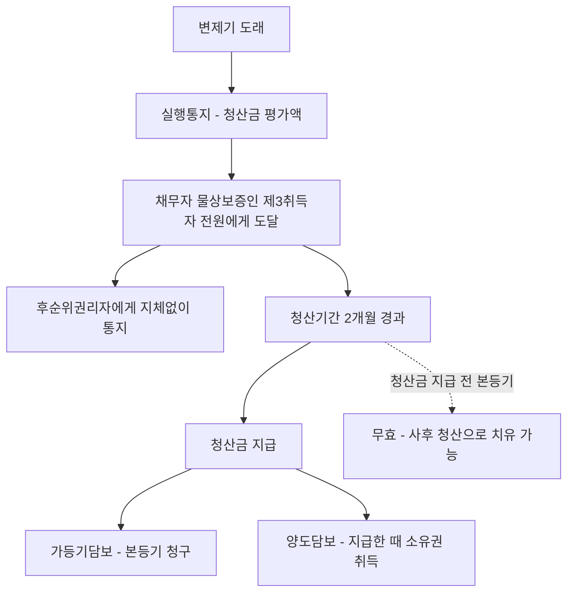

#### ⭐ 기출 출제포인트

1. **가담법 적용범위** — 매매대금채권·공사대금채권 담보는 적용 X, 목적물 가액이 채권액에 미달하면 적용 X. 매년 형태를 바꿔 나온다.
2. **실행통지의 상대방** — ==채무자·물상보증인·제3취득자 전원==. 일부라도 빠지면 청산기간이 진행하지 않는다.
3. **청산기간 2개월과 청산금 지급 전 본등기의 효력** — 무효, 그러나 사후 청산으로 치유될 수 있다.
4. **청산금의 계산** — 선순위담보권의 채권액은 ==포함(공제)==, 후순위권리자의 채권액은 ==불포함==.
5. **경매절차에서의 취급** — 담보가등기는 ==저당권으로 보고==, 부동산의 ==매각에 의하여 소멸==한다.
6. **말소청구권의 한계** — 변제기 후 ==10년(제척기간)== 또는 ==선의의 제3자가 소유권 취득==하면 불가.

#### 📊 기출 분석

| 연도 | 출제 형태 | 핵심 논점 |
|---|---|---|
| 감정평가사 기출·문제집 | 비전형담보 종합 5지선다 | 담보가등기의 저당권 의제, 매각으로 인한 소멸, 청산금 없어도 통지 의무 |
| 문제집 제6장 기본문제 | 권리취득에 의한 실행 절차 | 실행통지사항·상대방·시기, 청산금 계산식, 무청산특약의 효력 |
| 문제집 제6장 실전문제 | 비전형담보 판례이론 | 가담법 적용범위, 청산절차 전 강제경매, 약한 의미의 양도담보 |

**출제 빈도** — 감정평가사 1차 민법에서 가등기담보는 담보물권 파트의 ==마지막 단원==으로, 단독 출제보다는 **비전형담보 종합 문항**의 형태로 나온다. 다만 물권법 전 범위 종합 문제의 선지로는 꾸준히 등장한다.

**반복되는 함정 선지** — ① "소비대차 이외의 사유로 생긴 채권도 피담보채권이 된다"(X) ② "청산금이 없다고 인정되는 경우에는 통지할 필요가 없다"(X — ==그 뜻을 통지해야 한다==) ③ "청산기간 경과 전의 무청산특약도 유효하다"(X — ==강행규정 위반으로 무효==. 다만 청산기간 경과 후의 특약은 유효) ④ "지급할 청산금이 없으면 청산기간 경과 없이 곧바로 본등기를 청구할 수 있다"(X — ==반드시 청산기간이 경과해야== 한다).

**최근 경향** — 절차의 **순서**와 **상대방**을 뒤섞은 선지, 그리고 **청산금 계산에서 선순위·후순위의 처리**를 묻는 선지가 늘고 있다. 조문(제3조~제7조, 제11조~제16조)의 문언을 직접 읽어 둔 수험생과 아닌 수험생이 갈리는 구간이다.

#### 🔍 기출 선지로 배우는 법리

> 실제 출제된 선지를 그대로 놓고 O/X와 근거를 확인한다.

**①** 배당참가를 하는 경우에는 가등기담보권자는 가등기인 채로 그 가등기의 순위로서 다른 채권자보다 우선순위를 주장할 수 있다. (문제집 제6장 기본문제 29번) — **O**
근거: 담보가등기가 설정된 부동산에 경매가 개시되면 담보가등기권리자는 다른 채권자보다 우선변제를 받을 권리가 있고, 그 순위는 ==담보가등기권리를 저당권으로 보고 가등기를 마친 때에 저당권설정등기가 된 것으로 본다==(가등기담보법 제13조).

**②** 담보가등기가 경료된 부동산에 대하여 경매 등이 행하여진 때에는 담보가등기권리는 그 부동산의 매각에 의하여 소멸한다. (문제집 제6장 기본문제 29번) — **O**
근거: 가등기담보법 제15조.

**③** 양도담보의 실행 시 청산금의 평가 결과 청산금이 없는 것으로 인정되는 경우라도 상대방에게 그 뜻을 담은 통지를 하여야 한다. (문제집 제6장 기본문제 29번) — **O**
근거: 가등기담보법 제3조 제1항 후단. 청산금이 없어도 ==그 뜻을 통지==해야 하고, 그래야 청산기간이 진행한다.

**④** 가등기담보 등에 관한 법률의 규정에 따른 청산절차 진행 전에 신청된 강제경매에 의하여 제3자에게 소유권이 이전된 경우 담보가등기권자는 더 이상 위 가등기에 기하여 본등기를 청구할 수 없다. (문제집 제6장 실전문제 67번) — **O**
근거: 가등기담보법 제14조. 청산절차 전 강제경매가 신청되면 본등기 청구는 막히고, 담보가등기권자는 ==우선변제를 받을 권리가 있을 뿐==이다(대결 2010.11.09. 2010마1322).

**⑤** 통지의 상대방은 채무자, 물상보증인, 제3취득자이다. (문제집 제6장 기본문제 해설) — **O**
근거: 가등기담보법 제2조 제2호의 '채무자등'. 그 ==전부==에게 하여야 하고, 일부라도 빠지면 청산기간이 진행하지 않는다(대판 2002.04.23. 2001다81856).

**⑥** 지급할 청산금이 없는 경우에는 청산기간이 경과하지 않아도 본등기청구권을 행사할 수 있다. (문제집 제6장 기본문제 해설 변형) — **X**
어디가 틀렸나: ==지급할 청산금이 없는 경우에도 반드시 청산기간이 경과하여야== 본등기청구권을 행사할 수 있다. / 옳게 고치면: "청산금이 없는 때에는 ==청산기간이 경과한 후에== 곧바로 본등기를 청구할 수 있다."

**⑦** 청산기간 경과 전의 무청산특약(청산금지급면제특약)도 당사자의 합의이므로 유효하다. (문제집 제6장 기본문제 해설 변형) — **X**
어디가 틀렸나: 제4조 제1항 내지 제3항에 어긋나는 특약으로서 채무자등에게 불리한 것은 ==그 효력이 없다==(제4조 제4항). / 옳게 고치면: "==청산기간이 지난 후에== 행하여진 특약으로서 제3자의 권리를 침해하지 아니하는 것은 유효하다."

**⑧** 후순위저당권자는 청산금의 평가액에 불만이 있는 때에는 청산기간 내에 자기 채권의 변제기가 도래하고 있지 않더라도 경매를 청구할 수 있다. (문제집 제6장 기본문제 해설) — **O**
근거: 가등기담보법 제12조 제2항.

#### ✏️ 사례형 적용

> **사례 1** — 甲은 乙에게 2억 원을 빌려주면서 乙 소유 X부동산(시가 5억 원)에 담보가등기를 마쳤다. X에는 甲보다 앞선 丙의 근저당권(피담보채권 1억 원)과 甲보다 뒤인 丁의 저당권(피담보채권 1억 원)이 있다. 변제기가 지나자 甲은 청산금을 평가하려 한다.

**검토** — 청산금 = ==통지 당시 부동산 가액(5억) − 채권액==. 채권액에는 甲의 피담보채권 2억과 ==선순위 丙의 1억이 포함==된다(가등기담보법 제4조 제1항 후문). ==후순위 丁의 1억은 포함되지 않는다.== 따라서 청산금은 2억 원이다. 甲은 ① 乙(및 물상보증인·제3취득자가 있다면 그 전원)에게 청산금 평가액 2억을 통지하고 ② ==도달 즉시 후순위권리자 丁에게 통지의 사실·내용·도달일을 통지==하며(제6조 제1항) ③ 도달일로부터 ==2개월==이 지난 후 ④ 청산금을 지급해야 비로소 본등기를 청구할 수 있다. 丁은 이 청산금에 대하여 제5조의 권리를 행사하거나, 평가액에 불만이면 ==청산기간에 한정하여 변제기 전이라도 경매를 청구==할 수 있다(제12조 제2항).

> **사례 2** — 위 사례에서 甲이 통지도 하지 않고 乙과 "청산금 없이 곧바로 본등기를 해 준다"는 특약을 맺어 본등기를 마쳤다.

**검토** — 제3조·제4조를 위반한 본등기이므로 ==무효==다(대판 2016.6.23. 2015다13171). 그 특약은 제4조 제4항에 의해 채무자에게 불리한 특약으로서 무효이고, 무효인 본등기가 ==약한 의미의 양도담보로서 담보 목적 범위에서 유효하다고 볼 것도 아니다==(대판 2002.12.10. 2002다42001). 다만 甲이 뒤늦게라도 청산금 평가액을 통지하고 2월의 청산기간이 경과한 뒤 정당한 청산금을 지급하면, ==무효인 본등기는 실체적 법률관계에 부합하는 유효한 등기가 될 수 있다==(대판 2017.8.18. 2016다30296).

> **사례 3** — 甲이 적법하게 실행통지를 했는데, 甲이 평가한 청산금이 객관적 평가액보다 현저히 적었다. 乙은 어떻게 다툴 수 있는가.

**검토** — 채권자가 ==주관적으로 평가한 금액을 통지하면 실행통지의 효력과 청산기간의 진행에는 영향이 없다==(대판 1992.9.1. 92다10043, 10050). 乙은 ① 정당하게 평가된 청산금을 받을 때까지 ==소유권이전등기 및 인도채무의 이행을 거절==하거나 ② ==피담보채무 전액을 지급하고 가등기의 말소를 청구==하거나 ③ ==정당하게 평가된 청산금을 청구==할 수 있다(대판 2008.04.11. 2005다36618). 반면 甲은 ==자기가 통지한 청산금액에 관하여는 다툴 수 없다==(제9조).

#### ⚠️ 이 관의 함정 총정리

1. "가담법은 사적실행에서 처분청산도 인정한다"고 하면 틀림 → ==사적실행은 귀속청산만==. 처분청산은 경매(공적실행)로만 가능하다.
2. "양도담보권자도 담보목적부동산의 경매를 청구할 수 있다"고 하면 틀림 → ==경매를 청구할 수 있는 자는 가등기담보권자만==이다.
3. "청산금 계산 시 후순위담보권의 채권액도 공제한다"고 하면 틀림 → ==선순위만 포함, 후순위는 불포함==.
4. "청산금 지급 전에 마친 본등기는 약한 의미의 양도담보로서 담보 범위에서 유효하다"고 하면 틀림 → ==무효==다. 다만 사후 청산으로 유효한 등기가 될 수 있을 뿐이다.
5. "채무자는 채권자에게 정산을 요구할 청구권을 가진다"는 표현만 보고 O로 넘기면 위험 → 판례는 ==적극적으로 정산을 요구할 청구권은 없다==고 하면서도, 통지된 청산금을 다투는 국면에서는 ==정당하게 평가된 청산금을 청구할 수도 있다==고 한다. 문항 맥락(정산 요구권 일반 vs 실행통지 후 청산금청구)을 구별하라.

#### ✅ OX 확인문제

> 다음 진술의 참·거짓을 판단하시오.

**1.** 가등기담보법이 적용될 수 있는 피담보채권은 금전소비대차나 준소비대차에 기한 채권에 한한다.
→ **O**. 대판 2004.4.27. 2003다29968. 매매대금채권·공사대금채권 담보에는 적용되지 않는다.

**2.** 가등기담보 부동산에 대한 예약 당시의 시가가 그 피담보채무액에 미치지 못하는 경우에도 청산금 평가액의 통지 및 청산금 지급 절차를 이행하여야 한다.
→ **X**. 이 경우 ==가등기담보법이 적용되지 아니하여 그러한 절차를 이행할 여지가 없다==(대판 1993.10.26. 93다27611).

**3.** 실행통지는 채무자·물상보증인·제3취득자 전원에게 하여야 하고, 일부에게 하지 않으면 청산기간이 진행하지 않는다.
→ **O**. 편법으로 본등기를 마쳐도 ==소유권을 취득할 수 없다==(대판 2002.04.23. 2001다81856).

**4.** 채권자가 주관적으로 평가한 청산금액이 객관적 평가액에 미치지 못하면 담보권 실행통지 자체가 무효가 된다.
→ **X**. ==실행통지의 효력이나 청산기간의 진행에는 아무런 영향이 없다==(대판 1992.9.1. 92다10043, 10050). 채무자가 이행을 거절하거나 정당한 청산금을 청구할 수 있을 뿐이다.

**5.** 청산금의 지급채무와 부동산의 소유권이전등기 및 인도채무는 동시이행관계에 있다.
→ **O**. 가등기담보법 제4조 제3항이 민법 제536조를 준용한다.

**6.** 담보가등기권리자는 자신의 선택에 따라 담보권을 실행하여 소유권을 취득하거나 담보목적부동산의 경매를 청구할 수 있다.
→ **O**. 가등기담보법 제12조 제1항. 경매에 관하여는 ==담보가등기권리를 저당권으로 본다==.

**7.** 후순위권리자는 청산기간에 한정하여 그 피담보채권의 변제기가 도래하기 전이라도 담보목적부동산의 경매를 청구할 수 있다.
→ **O**. 가등기담보법 제12조 제2항.

**8.** 가등기담보법 제3조·제4조의 절차를 위반하여 이루어진 본등기라도, 채무자와의 특약이 있었다면 약한 의미의 양도담보로서 담보의 목적 범위에서는 유효하다.
→ **X**. 특약이 채무자에게 불리하여 무효라면 ==본등기는 여전히 무효==일 뿐이다(대판 2002.12.10. 2002다42001). 다만 사후에 청산절차를 마치면 실체관계에 부합하는 유효한 등기가 될 수 있다.

**9.** 채무자등의 말소청구권은 채무의 변제기가 지난 때부터 10년이 지나거나 선의의 제3자가 소유권을 취득한 경우에는 행사할 수 없고, 이 10년은 제척기간이다.
→ **O**. 가등기담보법 제11조 단서, 대판 2018.6.15. 2018다215947.

**10.** 담보가등기를 마친 부동산에 강제경매 등이 행하여진 경우에도 담보가등기권리는 매각으로 소멸하지 않고 존속한다.
→ **X**. ==그 부동산의 매각에 의하여 소멸한다==(가등기담보법 제15조).

#### 🧠 암기법

> 🔑 **실행 4단계 — "변·통·2·청"**
> **변**제기 도래 → 실행**통**지(청산금 평가액) → 청산기간 **2**개월 → **청**산금 지급 후 소유권 취득.
> 순서를 건너뛴 본등기는 전부 무효.

> 🔑 **통지 상대방 — "채·물·제" 전원**
> **채**무자 + **물**상보증인 + **제**3취득자 = 가담법 제2조 제2호의 '채무자등'.
> 한 명이라도 빠지면 청산기간 시계가 아예 돌지 않는다.

> 🔑 **청산금 계산 — "선(先)은 빼고 후(後)는 두고"**
> **선**순위담보권의 채권액은 ==공제==, **후**순위권리자의 채권액은 ==그대로 둔다==.
> 선순위는 소멸하지 않고 남아 매수인이 떠안으니 미리 빼 주는 것이고, 후순위는 청산금에서 스스로 챙기라는 취지다.

> 🔑 **실행 방식 — "사귀공처"**
> **사**적실행은 **귀**속청산, **공**적실행은 **처**분청산.
> 가담법은 사적 처분청산을 금지한다 — 채무자가 목적물을 되찾을 길이 막히기 때문이다.

#### ⚖️ 법조문 원문

> 📖 이 관이 근거로 삼은 조문의 **전문**이다. 본문 인용은 발췌지만 여기서는 조 전체를 싣는다. 출처는 법제처 정본이다.

**― 민법 ―**

> 📌 **민법 제360조(피담보채권의 범위)** — "저당권은 원본, 이자, 위약금, 채무불이행으로 인한 손해배상 및 저당권의 실행비용을 담보한다. 그러나 지연배상에 대하여는 원본의 이행기일을 경과한 후의 1년분에 한하여 저당권을 행사할 수 있다."

**― 가등기담보법 ―**

> 📌 **가등기담보법 제3조(담보권 실행의 통지와 청산기간)** — "① 채권자가 담보계약에 따른 담보권을 실행하여 그 담보목적부동산의 소유권을 취득하기 위하여는 그 채권(債權)의 변제기(辨濟期) 후에 제4조의 청산금(淸算金)의 평가액을 채무자등에게 통지하고, 그 통지가 채무자등에게 도달한 날부터 2개월(이하 "청산기간"이라 한다)이 지나야 한다. 이 경우 청산금이 없다고 인정되는 경우에는 그 뜻을 통지하여야 한다. ② 제1항에 따른 통지에는 통지 당시의 담보목적부동산의 평가액과 「민법」 제360조에 규정된 채권액을 밝혀야 한다. 이 경우 부동산이 둘 이상인 경우에는 각 부동산의 소유권이전에 의하여 소멸시키려는 채권과 그 비용을 밝혀야 한다."

> 📌 **가등기담보법 제4조(청산금의 지급과 소유권의 취득)** — "① 채권자는 제3조제1항에 따른 통지 당시의 담보목적부동산의 가액에서 그 채권액을 뺀 금액(이하 "청산금"이라 한다)을 채무자등에게 지급하여야 한다. 이 경우 담보목적부동산에 선순위담보권(先順位擔保權) 등의 권리가 있을 때에는 그 채권액을 계산할 때에 선순위담보 등에 의하여 담보된 채권액을 포함한다. ② 채권자는 담보목적부동산에 관하여 이미 소유권이전등기를 마친 경우에는 청산기간이 지난 후 청산금을 채무자등에게 지급한 때에 담보목적부동산의 소유권을 취득하며, 담보가등기를 마친 경우에는 청산기간이 지나야 그 가등기에 따른 본등기(本登記)를 청구할 수 있다. ③ 청산금의 지급채무와 부동산의 소유권이전등기 및 인도채무(引渡債務)의 이행에 관하여는 동시이행의 항변권(抗辯權)에 관한 「민법」 제536조를 준용한다. ④ 제1항부터 제3항까지의 규정에 어긋나는 특약(特約)으로서 채무자등에게 불리한 것은 그 효력이 없다. 다만, 청산기간이 지난 후에 행하여진 특약으로서 제삼자의 권리를 침해하지 아니하는 것은 그러하지 아니하다."

> 📌 **가등기담보법 제5조(후순위권리자의 권리행사)** — "① 후순위권리자는 그 순위에 따라 채무자등이 지급받을 청산금에 대하여 제3조제1항에 따라 통지된 평가액의 범위에서 청산금이 지급될 때까지 그 권리를 행사할 수 있고, 채권자는 후순위권리자의 요구가 있는 경우에는 청산금을 지급하여야 한다. ② 후순위권리자는 제1항의 권리를 행사할 때에는 그 피담보채권(被擔保債權)의 범위에서 그 채권의 명세와 증서를 채권자에게 교부하여야 한다. ③ 채권자가 제2항의 명세와 증서를 받고 후순위권리자에게 청산금을 지급한 때에는 그 범위에서 청산금채무는 소멸한다. ④ 제1항의 권리행사를 막으려는 자는 청산금을 압류(押留)하거나 가압류(假押留)하여야 한다. ⑤ 담보가등기 후에 대항력(對抗力) 있는 임차권(賃借權)을 취득한 자에게는 청산금의 범위에서 동시이행의 항변권에 관한 「민법」 제536조를 준용한다."

> 📌 **가등기담보법 제6조(채무자등 외의 권리자에 대한 통지)** — "① 채권자는 제3조제1항에 따른 통지가 채무자등에게 도달하면 지체 없이 후순위권리자에게 그 통지의 사실과 내용 및 도달일을 통지하여야 한다. ② 제3조제1항에 따른 통지가 채무자등에게 도달한 때에는 담보가등기 후에 등기한 제삼자(제1항에 따라 통지를 받을 자를 제외하고, 대항력 있는 임차권자를 포함한다)가 있으면 채권자는 지체 없이 그 제삼자에게 제3조제1항에 따른 통지를 한 사실과 그 채권액을 통지하여야 한다. ③ 제1항과 제2항에 따른 통지는 통지를 받을 자의 등기부상의 주소로 발송함으로써 그 효력이 있다. 그러나 대항력 있는 임차권자에게는 그 담보목적부동산의 소재지로 발송하여야 한다."

> 📌 **가등기담보법 제9조(통지의 구속력)** — "채권자는 제3조제1항에 따라 그가 통지한 청산금의 금액에 관하여 다툴 수 없다."

> 📌 **가등기담보법 제11조(채무자등의 말소청구권)** — "채무자등은 청산금채권을 변제받을 때까지 그 채무액(반환할 때까지의 이자와 손해금을 포함한다)을 채권자에게 지급하고 그 채권담보의 목적으로 마친 소유권이전등기의 말소를 청구할 수 있다. 다만, 그 채무의 변제기가 지난 때부터 10년이 지나거나 선의의 제삼자가 소유권을 취득한 경우에는 그러하지 아니하다."

> 📌 **가등기담보법 제12조(경매의 청구)** — "① 담보가등기권리자는 그 선택에 따라 제3조에 따른 담보권을 실행하거나 담보목적부동산의 경매를 청구할 수 있다. 이 경우 경매에 관하여는 담보가등기권리를 저당권으로 본다. ② 후순위권리자는 청산기간에 한정하여 그 피담보채권의 변제기 도래 전이라도 담보목적부동산의 경매를 청구할 수 있다."

> 📌 **가등기담보법 제13조(우선변제청구권)** — "담보가등기를 마친 부동산에 대하여 강제경매등이 개시된 경우에 담보가등기권리자는 다른 채권자보다 자기채권을 우선변제 받을 권리가 있다. 이 경우 그 순위에 관하여는 그 담보가등기권리를 저당권으로 보고, 그 담보가등기를 마친 때에 그 저당권의 설정등기(設定登記)가 행하여진 것으로 본다."

> 📌 **가등기담보법 제14조(강제경매등의 경우의 담보가등기)** — "담보가등기를 마친 부동산에 대하여 강제경매등의 개시 결정이 있는 경우에 그 경매의 신청이 청산금을 지급하기 전에 행하여진 경우(청산금이 없는 경우에는 청산기간이 지나기 전)에는 담보가등기권리자는 그 가등기에 따른 본등기를 청구할 수 없다."

> 📌 **가등기담보법 제15조(담보가등기권리의 소멸)** — "담보가등기를 마친 부동산에 대하여 강제경매등이 행하여진 경우에는 담보가등기권리는 그 부동산의 매각에 의하여 소멸한다."

> 📌 **가등기담보법 제16조(강제경매등에 관한 특칙)** — "① 법원은 소유권의 이전에 관한 가등기가 되어 있는 부동산에 대한 강제경매등의 개시결정(開始決定)이 있는 경우에는 가등기권리자에게 다음 각 호의 구분에 따른 사항을 법원에 신고하도록 적당한 기간을 정하여 최고(催告)하여야 한다. 1. 해당 가등기가 담보가등기인 경우: 그 내용과 채권[이자나 그 밖의 부수채권(附隨債權)을 포함한다]의 존부(存否)ㆍ원인 및 금액 2. 해당 가등기가 담보가등기가 아닌 경우: 해당 내용 ② 압류등기 전에 이루어진 담보가등기권리가 매각에 의하여 소멸되면 제1항의 채권신고를 한 경우에만 그 채권자는 매각대금을 배당받거나 변제금을 받을 수 있다. 이 경우 그 담보가등기의 말소에 관하여는 매수인이 인수하지 아니한 부동산의 부담에 관한 기입을 말소하는 등기의 촉탁에 관한 「민사집행법」 제144조제1항제2호를 준용한다. ③ 소유권의 이전에 관한 가등기권리자는 강제경매등 절차의 이해관계인으로 본다."

### 제3관 양도담보

> 📖 양도담보란 채권담보의 목적으로 담보목적 재산권의 ==소유권을 채권자에게 이전==하고, 채무를 이행하면 목적물을 반환하며 이행하지 않으면 그 목적물로부터 우선변제를 받는 비전형담보다. 양도담보권자는 외형상 소유권을 취득하고 있으나 ==그것은 담보권에 지나지 아니한다==.
> 목적물이 부동산이면(또는 등기·등록으로 공시되는 재산권이면) 가담법의 적용을 받아 제2관의 법리가 그대로 흐르고, 등기·등록이 불가능한 ==일반 동산==이면 가담법 밖에서 판례가 만든 독자적 법리가 작동한다. 이 관의 절반은 **동산 양도담보**, 특히 **유동집합동산** 논점이다.

> ⭐ **이 관에서 반드시 챙길 3가지**
> ① 소유권은 ==대외적으로는 양도담보권자==, ==대내적으로는 설정자==에게 있다. 사용·수익권은 반대의 특약이 없는 한 ==설정자==에게 있다.
> ② 동산 양도담보는 ==점유개정==으로 설정한다. 그래서 ==이중 양도담보에서 후행 양도담보권자는 선의라도 담보권을 적법하게 취득하지 못한다==.
> ③ 집합동산 양도담보는 종류·소재장소·수량으로 특정되면 유효하고 효력은 ==항상 현재의 집합물 위에== 미치지만, ==제3자 소유의 물건이 반입된 경우에는 미치지 않는다==.

#### 1. 의의

**양도담보**란 채권담보를 위해 담보목적인 재산권을 채권자에게 이전하고, 채무불이행 시에는 채권자가 그 목적물로부터 우선변제를 받지만 채무이행 시에는 목적물을 소유자에게 반환하는 방법에 의한 비전형담보를 말한다.

| 분류 기준 | 종류 | 내용 |
|---|---|---|
| 신용수수의 형식 | 협의의 양도담보 | ==소비대차==의 형식. 당사자 사이에 채권·채무관계를 남긴다 |
| " | 매도담보 | ==매매==의 형식. 따로 채권·채무관계를 남기지 않는다. ==현재는 구별의 실익이 없다== |
| 목적물 | 부동산 양도담보 | ==가등기담보법의 적용==을 받는다(등기·등록으로 공시되는 재산권 포함) |
| " | 동산 양도담보 | ==가담법 적용 X==. 점유개정에 의한 인도로 설정하고 판례법리가 적용된다 |
| 실행 태양 | 유담보형(강한 의미) | 청산 없이 확정적으로 소유권 취득 — ==현행법상 사실상 부정== |
| " | ==약한 의미의 양도담보== | 당사자 사이에 ==정산절차를 예정==. 판례가 원칙으로 삼는 형태 |

#### 2. 요건

| 요건 | 내용 | 비고 |
|---|---|---|
| 담보설정계약 | 채권담보를 목적으로 재산권을 이전한다는 합의 | 당사자는 채권자와 채무자 또는 ==물상보증인== |
| 피담보채권 | 제한 없음. ==매매대금채권·공사대금채권도 가능== | 다만 그 경우 ==가담법은 적용되지 않는다== |
| 공시 — 부동산 | ==소유권이전등기==(갑구란) | 가담법 적용 |
| 공시 — 동산 | ==점유개정==에 의한 인도로 족하다 | 질권과 결정적으로 다른 지점 |
| 집합동산의 특정 | ==종류·소재하는 장소 또는 수량의 지정== 등의 방법으로 외부적·객관적으로 특정 | 대판 2013.01.16. 2012다78726 |

> 💡 **특정 여부의 판단** — 목적물의 특정 여부 및 범위는 목적물의 종류·장소·수량 등에 관한 ==계약의 전체적 내용, 계약 당사자의 의사, 목적물 자체가 가지는 유기적 결합의 정도, 목적물의 성질, 담보물 관리와 이용방법== 등 여러 사정을 종합하여 구체적으로 판단한다(대판 2013.01.16. 2012다78726).

#### 3. 효과

**◆ 법적 성질 — 학설과 판례**

| 견해 | 내용 | 소유권의 귀속 |
|---|---|---|
| ==신탁적 소유권이전설== | 양도담보를 채권담보의 목적을 가지는 ==신탁적 소유권양도행위==로 파악. 종래의 다수설·판례 | 대내적으로는 ==설정자==, 대외적으로는 ==양도담보권자== |
| 담보물권설 | 소유권은 설정자에게 남고 채권자는 담보물권을 취득할 뿐 | 대내·대외 모두 설정자 |
| 판례의 실제 | 부동산 양도담보에 가담법이 적용되면 ==담보물권에 준하여== 규율(청산의무·우선변제·물상대위). 동산 양도담보에 관하여는 ==신탁적 양도의 구성을 유지==하여 "제3자에 대한 관계에서는 물건의 소유자임을 주장하고 그 권리를 행사할 수 있다"고 한다(대판 1994.8.26. 93다44739) | 이원적 |

**◆ 대내적 관계와 대외적 관계**

| 항목 | 대내적 관계(설정자 ↔ 담보권자) | 대외적 관계(제3자에 대하여) |
|---|---|---|
| 소유권 | ==양도담보권설정자가 소유자== | ==양도담보권자가 소유자임을 주장·행사== 가능(동산) |
| 사용·수익권 | ==설정자==에게 있다(반대 특약이 없는 한) | 담보권자는 사용·수익권 없음 |
| 목적물 임대 권한 | ==설정자== | — |
| 불법점유자에 대한 배제청구 | — | ==설정자==가 실질적 소유자임을 주장하여 행사 가능. 담보권자도 담보권 실행을 위해 인도 청구 가능 |
| 과실수취권 | ==설정자==(청산절차 종료 전) | 청산절차 종료와 함께 ==채권자==에게 귀속 |
| 담보권자의 처분 | — | 제3자는 ==선의·악의를 불문하고== 소유권 취득 |
| 부합으로 권리를 상실한 자의 보상청구 | ==설정자==를 상대로(민법 제261조) | 담보권자를 상대로는 청구할 수 없다 |

**◆ 실행방법**

| 구분 | 방식 | 가등기담보와의 차이 |
|---|---|---|
| 공적실행(경매) | ==처분청산==만 인정 | 가담법과 동일. 다만 ==양도담보권자는 담보목적부동산의 경매를 청구하지 못한다== |
| 사적실행 | ==귀속청산·처분청산 모두 인정== | 가담법은 ==귀속청산만== 인정하므로 결정적으로 다르다 |
| 우선변제권·물상대위권 | 저당권과 동일 | 목적물 소실 시 ==화재보험금청구권에 물상대위== 가능 |
| 정산의무 | 원리금 충당 후 ==잔액 반환== | 정산 전에는 피담보채권이 소멸하지 않는다 |

**◆ 집합동산(유동집합물) 양도담보의 효력 범위 — 돈사의 돼지 사안**

| 사안 | 양도담보권의 효력 | 이유 |
|---|---|---|
| 특정물 양도담보에서 돼지가 낳은 새끼돼지 | ==미치지 않음== | 천연과실의 수취권은 사용·수익권을 가지는 ==설정자==에게 귀속 |
| 집합물 양도담보에서 돈사의 돼지들이 낳은 새끼돼지 | ==미침== | 집합물의 동일성 유지 |
| 돼지를 출하하여 얻은 수익으로 ==새로 구입==한 돼지 | ==미침== | 위와 같음 |
| 기존 돼지와 ==교환==한 돼지 | ==미침== | 위와 같음 |
| 양수인이 ==별도의 자금을 투입하여 반입==한 돼지 | ==미치지 않음== | 당초 담보의 유기적 결합 밖 |
| 설정자가 계약상 종류·수량 범위 내로 나중에 반입한 물건 | ==미침==(별도 계약·점유개정 표시 불요) | 점유개정으로 집합물 점유를 취득한 효과 |
| 반입된 물건이 ==제3자의 소유==인 경우 | ==미치지 않음== | 담보목적 집합물의 구성부분이 될 수 없다 |

**◆ 가등기담보 vs 양도담보 비교**

| 구분 | 가등기담보 | 양도담보 |
|---|---|---|
| 공시방법 | ==가등기==(소유권이전청구권보전) | ==소유권이전등기== 또는 ==점유개정== |
| 설정 시 소유명의 | 설정자에게 남음 | ==채권자 앞으로 이전== |
| 소유권 취득 시점 | 청산기간 경과 + 청산금 지급 후 ==본등기 시== | 청산기간 경과 후 ==청산금을 지급한 때== |
| 청산금이 없는 경우 | 청산기간 경과 후 곧바로 본등기 청구 | ==청산기간의 말일==에 소유권 취득 |
| 경매청구권 | ==있다==(가등기담보법 제12조 제1항) | ==없다== |
| 사적실행 방식 | ==귀속청산만== | 가담법 적용 시 귀속청산, 비적용 시 ==귀속·처분청산 모두== |
| 채무자등의 말소청구권 | 가등기의 말소 청구 | ==소유권이전등기의 말소== 청구(가등기담보법 제11조) |
| 제3자가 담보권자로부터 취득 | 본등기 전이면 취득 불가 | ==선의의 제3자가 소유권을 취득하면 말소청구 불가== |

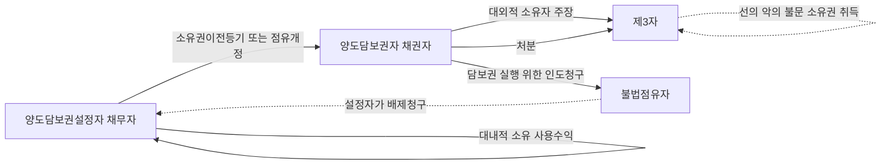

#### 4. 관련 조문

> 📌 **가등기담보법 제4조 제2항 전문** — "채권자는 담보목적부동산에 관하여 ==이미 소유권이전등기를 마친 경우==에는 청산기간이 지난 후 청산금을 채무자등에게 지급한 때에 담보목적부동산의 소유권을 취득하며…" — 부동산 양도담보의 소유권 취득 시점을 정한 조문이다.

> 📌 **가등기담보법 제11조(채무자등의 말소청구권)** — "채무자등은 청산금채권을 변제받을 때까지 그 채무액(반환할 때까지의 이자와 손해금을 포함한다)을 채권자에게 지급하고 그 채권담보의 목적으로 마친 ==소유권이전등기의 말소를 청구==할 수 있다. 다만, 그 채무의 변제기가 지난 때부터 ==10년이 지나거나 선의의 제3자가 소유권을 취득한 경우==에는 그러하지 아니하다."

> 📌 **민법 제261조(첨부로 인한 구상권)** — 부합 등으로 손해를 받은 자는 부당이득에 관한 규정에 의하여 보상을 청구할 수 있다. 양도담보 목적 동산에 다른 동산이 부합한 경우 보상청구의 상대방은 ==양도담보권설정자==다.

> 📌 **민법 제186조** — 부동산에 관한 법률행위로 인한 물권의 득실변경은 등기하여야 그 효력이 생긴다. 양도담보권자가 청산절차를 마치고 소유권을 취득하는 근거 규정이다.

#### 5. 핵심 판례 법리

- **대외적으로는 담보권자가 소유자** — 동산에 관하여 양도담보계약이 이루어지고 양도담보권자가 ==점유개정의 방법으로 인도를 받았다면==, 그 청산절차를 마치기 전이라 하더라도 담보목적물에 대한 ==사용·수익권은 없지만 제3자에 대한 관계에 있어서는 그 물건의 소유자임을 주장하고 그 권리를 행사할 수 있다==(대판 1994.8.26. 93다44739).

- **대내적으로는 설정자가 소유자 — 불법점유 배제** — 부동산의 양도담보권설정자는 그 부동산의 등기명의가 양도담보권자 앞으로 되어 있다 할지라도 ==그 부동산의 불법점유자인 제3자에 대하여는 실질적 소유자임을 주장하여 불법점유상태의 배제권을 행사할 수 있다==(대판 1976.2.24. 75다1608; 대판 1988.04.25. 87다카2696·2697).

- **담보권자로부터 취득한 제3자** — 매도담보의 목적이 된 부동산을 제3자가 채권자로부터 취득할 경우, ==그 부동산이 관계당사자들 사이에 신탁된 부동산이라는 사실을 알고 있었다 하더라도 그 제3자의 취득행위는 유효==하다(대판 1969.10.23. 69다1338). 따라서 양도담보권자가 담보목적 부동산을 임의로 처분하면 ==선의의 양수인은 소유권을 취득==하고, 채무자등의 말소청구권은 소멸한다(가등기담보법 제11조 단서 후단).

- **설정자로부터 취득한 제3자** — 대지 소유자가 건축업자에게 대지를 매도하고 건축업자가 대지 소유자 명의로 건축허가를 받았다면 이는 ==완성될 건물을 대지 매매대금의 담보로 제공하기로 하는 합의==로서 법률행위에 의한 담보물권의 설정에 다름 아니다. 완성 건물의 소유권은 ==채무자(건축업자)가 원시취득한 후 대지 소유자 명의의 보존등기로 담보목적 범위에서 대지 소유자에게 이전==된다. 건축업자로부터 건물을 분양받고 이전등기를 받지 못한 자는 앞서 담보 목적으로 보존등기를 마친 대지 소유자에 대하여 ==분양을 이유로 한 소유권이전등기를 구할 수 없다==(대판 2002.07.12. 2002다19254).

- **사용·수익권과 임대 권한** — 부동산을 채권담보의 목적으로 양도한 경우 특별한 사정이 없는 한 목적부동산에 대한 사용수익권은 ==채무자인 양도담보 설정자==에게 있으므로, 양도담보권자가 목적물을 사용·수익하기로 하는 약정이 없는 이상 ==목적부동산을 임대할 권한도 설정자에게 있다==(대판 2001.12.11. 2001다40213). 동산의 경우에도 반대의 특약이 없는 한 ==설정자가 사용·수익권을 가진다==(대판 2018.05.30. 2018다201429).

- **담보권자는 임료 상당 손배·부당이득을 청구할 수 없다** — 양도담보권자는 ==사용·수익할 수 있는 정당한 권한이 있는 채무자나 그로부터 사용·수익 권한을 승계한 자==에 대하여는 사용수익을 하지 못한 것을 이유로 ==임료 상당의 손해배상이나 부당이득반환청구를 할 수 없다==(대판 1988.11.22. 87다카2555).

- **담보권자의 인도청구는 가능** — 양도담보권자는 ==담보권의 실행을 위하여== 담보채무자가 아닌 제3자에 대하여도 담보물의 인도를 구할 수 있고, 인도를 거부하는 경우에는 ==담보권 실행이 방해된 것을 이유로 하는 손해배상==을 구할 수 있다(대판 1991.10.8. 90다9780).

- **미등기건물 양도담보 채권자의 지위 승계인** — 미등기건물에 대한 양도담보계약상의 채권자의 지위를 승계하여 건물을 관리하고 있는 자는 ==건물의 소유자가 아님은 물론 법률상 또는 사실상 처분권을 가지고 있는 자라고 할 수도 없어 건물에 대한 철거처분권을 가지고 있는 자라고 할 수 없다==(대판 2003.1.24. 2002다61521).

- **물상대위 — 화재보험금청구권** — 동산의 양도담보권자는 양도담보 목적물이 소실되어 양도담보 설정자가 보험회사에 대하여 화재보험계약에 따른 보험금청구권을 취득한 경우에도, ==담보물 가치의 변형물인 위 화재보험금청구권에 대하여 양도담보권에 기한 물상대위권을 행사할 수 있다==(대판 2009.11.26. 2006다37106).

- **특정물 양도담보와 천연과실** — 돼지를 양도담보의 목적물로 하여 소유권을 양도하되 점유개정의 방법으로 설정자가 계속하여 점유·관리하면서 무상으로 사용·수익하기로 약정한 경우, ==돼지가 출산한 새끼 돼지는 천연과실==로서 그 수취권은 원물의 사용·수익권을 가지는 ==설정자에게 귀속==되므로 다른 약정이 없는 한 ==양도담보의 효력이 미치지 않는다==(대판 1996.09.10. 96다25463).

- **집합물 양도담보의 유효성과 동일성** — 집합물에 대한 양도담보권설정계약이 이루어지면 그 집합물을 구성하는 개개의 물건이 ==변동되거나 변형되더라도 한 개의 물건으로서 동일성을 잃지 아니하므로 양도담보권의 효력은 항상 현재의 집합물 위에 미친다==. 성장을 계속하는 어류일지라도 특정 양만장 내의 뱀장어 등 어류 전부에 대한 양도담보계약은 목적물이 특정되었으므로 유효하게 성립한다(대판 1990.12.26. 88다카20224).

- **나중에 반입된 물건에도 효력이 미친다** — 양도담보권자가 점유개정의 방법으로 설정계약 당시 존재하는 집합물의 점유를 취득하면, 그 후 설정자가 집합물을 이루는 개개의 물건을 반입하였더라도 ==별도의 양도담보권설정계약을 맺거나 점유개정의 표시를 하지 않더라도 양도담보권의 효력이 나중에 반입된 물건에도 미친다==(대판 2016.04.02. 2012다19659; 대판 1990.12.26. 88다카20224).

- **제3자 소유 물건에는 미치지 않는다** — 설정자가 설정계약에서 정한 종류·수량에 포함되는 물건을 계약에서 정한 장소에 반입하였더라도 ==그 물건이 제3자의 소유라면 담보목적인 집합물의 구성부분이 될 수 없고, 따라서 그 물건에는 양도담보권의 효력이 미치지 않는다==(대판 2016.04.02. 2012다19659).

- **별도 자금으로 반입한 돼지** — 돈사에서 대량 사육되는 돼지를 집합물 양도담보의 목적물로 삼은 경우, 그 효력은 ==당초 양수한 돈사 내의 돼지들 및 그 돼지들을 사육·관리하면서 출하하여 얻은 수익으로 새로 구입하거나 교환한 돼지 또는 출산시킨 새끼돼지에 한하여 미치는 것이지, 양수인이 별도의 자금을 투입하여 반입한 돼지에까지는 미치지 않는다==(대판 2004.11.12. 2004다22858).

- **특정물 양도담보인가 유동집합동산 양도담보인가** — 여러 개의 동산을 일괄하여 양도담보의 목적으로 하면서 향후 일정 장소에 편입되는 동산에도 효력이 미치기로 약정한 경우, 이를 특정된 동산들을 목적물로 한 양도담보로 볼 것인지 유동집합동산 양도담보로 볼 것인지는 ==양도담보설정계약의 해석의 문제==다(대판 2016.4.2. 2012다19659).

- **부합으로 권리를 상실한 자의 보상청구 상대방** — 양도담보권의 목적인 주된 동산에 다른 동산이 부합되어 부합된 동산에 관한 권리자가 권리를 상실하는 손해를 입은 경우, 담보물로서 가치가 증가된 데 따른 ==실질적 이익은 양도담보권설정자에게 귀속==되므로 권리를 상실한 자는 ==설정자를 상대로 민법 제261조에 따라 보상을 청구할 수 있을 뿐 양도담보권자를 상대로 청구할 수는 없다==(대판 2016.04.28. 2012다19659).

- **이중 양도담보와 점유개정** — 동산에 이미 점유개정에 의한 양도담보가 설정된 뒤 설정자가 다시 제3자에게 점유개정의 방법으로 양도담보를 설정해 준 경우, ==후행 양도담보권자는 선행 담보권의 존재를 알지 못하였더라도 양도담보권을 적법하게 취득하지 못한다==. 판례는 ==점유개정에 의한 점유취득만으로는 선의취득이 인정되지 않는다==고 보기 때문이다.

#### ⭐ 기출 출제포인트

1. **유동집합물 양도담보의 유효성과 특정 방법** — "법률상 공시방법이 인정되지 않아도 특정성이 있으면 목적물이 된다."
2. **집합물 효력 범위** — 새끼돼지·교환한 돼지·새로 구입한 돼지는 O, ==별도 자금 투입 반입==과 ==제3자 소유==는 X.
3. **사용·수익권의 귀속과 그 파생** — 임대 권한, 임료 상당 손해배상·부당이득 청구의 가부.
4. **양도담보권자의 물상대위** — 화재보험금청구권.
5. **양도담보권자의 임의처분과 제3자의 보호** — 선의의 제3자가 소유권을 취득하면 말소청구권 소멸.
6. **양도담보권자에게 경매청구권이 없다**는 점(가등기담보권자와의 결정적 차이).

#### 📊 기출 분석

| 연도 | 출제 형태 | 핵심 논점 |
|---|---|---|
| 2022년 기출 | 물권의 객체 5지선다 중 1지 | ==유동집합물==도 특정성이 있으면 양도담보의 목적으로 가능 |
| 감정평가사 기출·문제집 | 비전형담보 종합 5지선다 | 양도담보권자·설정자 쌍방의 제3자에 대한 방해배제청구, 청산금이 없어도 통지 |
| 문제집 제6장 실전문제 66번 | 사례형(양식장 뱀장어) | 집합물 양도담보의 유효성, 효력은 ==항상 현재의 집합물== 위에 미침 |
| 문제집 제6장 실전문제 73번 | 가담법 적용 양도담보의 효력 | 피담보채권 범위, 물상대위, ==선의의 양수인은 소유권 취득==, 귀속청산 |
| 문제집 제6장 실전문제 74번 | 사례형(돈사 돼지) | 새끼돼지의 귀속, 별도 자금 반입 돼지, ==이중 양도담보와 선의취득==, 인도청구 |

**출제 빈도** — 비전형담보 중 ==양도담보가 가장 자주 나온다==. 특히 **집합동산 양도담보**는 사례형(양식장·돈사)으로 반복 출제된다.

**반복되는 함정 선지** — ① "양도담보권자가 담보목적 부동산을 임의로 처분한 경우, 양수인이 선의이더라도 소유권을 취득하지 못한다"(X — ==선의이면 취득한다==) ② "양도담보권자는 설정자에게 임료 상당의 손해배상이나 부당이득반환을 청구할 수 있다"(X) ③ "새끼돼지에도 언제나 양도담보의 효력이 미친다"(X — ==특정물 양도담보에서는 미치지 않는다==) ④ "양도담보권자도 담보목적부동산의 경매를 청구할 수 있다"(X).

**최근 경향** — 사례에 등장인물을 셋(설정자 甲 / 담보권자 乙 / 제3자 丙) 놓고 **대내·대외 관계를 동시에** 묻는다. 甲·乙 중 누가 소유자인가, 丙에게 누가 무엇을 청구할 수 있는가를 한 표로 정리해 두면 그대로 답이 나온다.

#### 🔍 기출 선지로 배우는 법리

> 실제 출제된 선지를 그대로 놓고 O/X와 근거를 확인한다.

**①** 양도담보의 목적물을 제3자가 불법점유하거나 기타 불법한 침해를 하고 있는 경우에 양도담보권자와 설정자 쌍방은 모두 제3자에 대한 반환청구 내지 방해배제청구권을 가진다. (문제집 제6장 기본문제 29번) — **O**
근거: 설정자는 ==실질적 소유자임을 주장하여 불법점유상태의 배제==를 구할 수 있고(대판 1976.2.24. 75다1608), 담보권자는 ==담보권 실행을 위하여== 제3자에게 인도를 구하고 거부 시 손해배상을 구할 수 있다(대판 1991.10.8. 90다9780).

**②** 양도담보권자가 담보목적 부동산을 임의로 처분한 경우, 그 부동산의 양수인이 선의이더라도 소유권을 취득하지 못한다. (문제집 제6장 실전문제 73번) — **X**
어디가 틀렸나: ==선의의 제3자가 소유권을 취득한 때에는 채무자등의 이전등기말소청구권이 소멸==한다(가등기담보법 제11조 단서 후단). / 옳게 고치면: "==양수인이 선의인 경우에는 양수인이 소유권을 취득한다.=="

**③** 양도담보권자에게는 양도담보권에 기한 물상대위가 인정된다. (문제집 제6장 실전문제 73번) — **O**
근거: 목적물이 소실되어 설정자가 취득한 ==화재보험금청구권==에 대해 물상대위권을 행사할 수 있다(대판 2009.11.26. 2006다37106).

**④** 뱀장어에 변동이 있더라도 양도담보권은 현재의 뱀장어 전부에 미친다. (문제집 제6장 실전문제 66번) — **O**
근거: 집합물 양도담보에서 개개의 물건이 변동·변형되어도 ==한 개의 물건으로서 동일성을 잃지 않으므로 효력은 항상 현재의 집합물 위에 미친다==(대판 1990.12.26. 88다카20224).

**⑤** 양도담보의 목적물인 돼지가 새끼 돼지를 출산한 경우 그 소유권은 양도담보설정자 甲에게 속한다. (문제집 제6장 실전문제 74번) — **O**
근거: 새끼돼지는 천연과실이고 그 수취권은 ==사용·수익권을 가지는 설정자==에게 귀속된다(대판 1996.09.10. 96다25463).

**⑥** 甲이 乙에게 양도담보권을 설정해 준 후 다시 丙으로부터 자금을 차용하면서 丙에게 점유개정의 방법으로 양도담보권을 설정해 준 경우, 丙이 甲의 乙에 대한 담보권 설정사실을 알지 못하였더라도 丙은 양도담보권을 적법하게 취득하지 못한다. (문제집 제6장 실전문제 74번) — **O**
근거: ==점유개정에 의한 점유취득으로는 선의취득이 인정되지 않는다==는 것이 판례다. 동산 양도담보의 공시가 불충분하다는 약점이 그대로 드러나는 대목이다.

**⑦** 법률상 공시방법이 인정되지 않는 유동집합물이라도 특정성이 있으면 이를 양도담보의 목적으로 할 수 있다. (2022년 기출) — **O**
근거: 종류·소재장소·수량 지정 등으로 ==외부적·객관적으로 특정==되면 그 전부를 하나의 재산권으로 보아 유효한 담보권 설정이 된다(대판 2013.01.16. 2012다78726).

**⑧** 甲이 사업 악화로 돈사 내 돼지를 丙에게 처분하였으나 丙이 선의취득할 수 없는 경우, 乙의 양도담보권은 여전히 그 돼지에는 미치나 丙이 별도의 자금을 투입하여 반입한 돼지에는 미치지 않는다. (문제집 제6장 실전문제 74번) — **O**
근거: 대판 2004.11.12. 2004다22858.

#### ✏️ 사례형 적용

> **사례 1** — 甲은 乙 은행에서 대출을 받으면서 자기 양만장 내 뱀장어 전부를 점유개정의 방법으로 양도담보로 제공했다. 계약서에는 "○○양만장 내 뱀장어 약 100만 마리"라고만 적혀 있다. 이후 甲은 성어를 팔고 치어를 새로 넣기를 반복했고, 그 사이 甲의 채권자 丙이 양만장의 뱀장어를 압류했다.

**검토** — ① **특정 여부**: 소재지·보관창고명·목적물·수량이 기재되어 있고 특별히 100만 마리로 담보 범위를 제한한 사정이 인정되지 않는다면, 기재된 수량은 ==당시 보관 중이던 수를 개략적으로 표시한 것에 불과==하고 당사자는 ==양만장 내 어류 전부==를 목적으로 한 것으로 본다. 성장을 계속하는 어류라도 특정 양만장 내 어류 전부에 대한 양도담보계약은 ==목적물이 특정되었으므로 유효==하다(대판 1990.12.26. 88다카20224). ② **효력 범위**: 개개의 물건이 변동·변형되어도 동일성을 잃지 않으므로 ==양도담보권의 효력은 항상 현재의 집합물 위에 미친다==. 새로 넣은 치어에도 별도의 설정계약이나 점유개정 표시 없이 효력이 미친다(대판 2016.04.02. 2012다19659). 따라서 乙은 압류에 대해 담보권을 주장할 수 있다.

> **사례 2** — 甲은 乙에게서 돈을 빌리며 돈사의 돼지 전부를 점유개정으로 양도담보 제공했다. ① 돼지들이 새끼를 낳았고 ② 甲이 별도 자금으로 다른 농장에서 돼지를 사 와 돈사에 넣었으며 ③ 이웃 丁이 위탁 사육을 맡긴 丁 소유의 돼지도 같은 돈사에 들어와 있다. 나아가 ④ 甲은 자금이 급해 다시 丙에게서 돈을 빌리며 같은 돼지들을 점유개정으로 양도담보 제공했다.

**검토** — ① 집합물 양도담보이므로 ==새끼돼지에도 효력이 미친다==(특정물 양도담보였다면 미치지 않는다 — 대판 1996.09.10. 96다25463). ② ==별도의 자금을 투입하여 반입한 돼지에는 미치지 않는다==(대판 2004.11.12. 2004다22858). ③ ==제3자 소유의 돼지는 담보목적 집합물의 구성부분이 될 수 없어 효력이 미치지 않는다==(대판 2016.04.02. 2012다19659). ④ 丙은 甲의 선행 담보 설정을 몰랐더라도 ==점유개정만으로는 선의취득이 되지 않아 양도담보권을 적법하게 취득하지 못한다==.

> **사례 3** — 甲은 채무담보로 X부동산의 소유권이전등기를 乙에게 넘겨주었다(가담법 적용 사안). 등기명의는 乙이지만 X는 甲이 계속 점유·사용 중이고, 제3자 丙이 X를 무단 점유하고 있다. 한편 乙은 청산절차를 밟지 않은 채 X를 선의의 丁에게 팔고 이전등기를 마쳐 주었다.

**검토** — ① **丙에 대하여**: 사용·수익권은 甲에게 있으므로 甲은 ==실질적 소유자임을 주장하여 불법점유 배제==를 구할 수 있고(대판 1988.04.25. 87다카2696·2697), 乙도 ==담보권 실행을 위하여== 丙에게 인도를 구할 수 있다(대판 1991.10.8. 90다9780). ② **乙에 대하여**: 乙은 甲에게 ==임료 상당의 손해배상이나 부당이득반환을 청구할 수 없다==(대판 1988.11.22. 87다카2555). ③ **丁에 대하여**: 甲의 이전등기말소청구권은 ==선의의 제3자가 소유권을 취득한 경우== 행사할 수 없다(가등기담보법 제11조 단서 후단). 甲에게는 乙에 대한 ==청산금 및 손해배상 청구==가 남을 뿐이다.

#### ⚠️ 이 관의 함정 총정리

1. "양도담보권자는 대내적으로도 소유자이므로 목적물을 사용·수익할 수 있다"고 하면 틀림 → ==반대의 특약이 없는 한 사용·수익권은 설정자==에게 있다.
2. "양도담보권자도 담보목적부동산의 경매를 청구할 수 있다"고 하면 틀림 → ==경매청구권은 가등기담보권자에게만== 있다.
3. "양도담보권자가 임의로 처분하면 양수인은 선의라도 소유권을 취득하지 못한다"고 하면 틀림 → ==선의의 제3자는 소유권을 취득==한다.
4. "집합물 양도담보의 효력은 돈사에 들어온 모든 돼지에 미친다"고 하면 틀림 → ==별도 자금으로 반입한 돼지==와 ==제3자 소유의 돼지==에는 미치지 않는다.
5. "점유개정으로 이중 양도담보를 받은 후행 담보권자도 선의라면 선의취득한다"고 하면 틀림 → ==점유개정으로는 선의취득이 되지 않는다==.

#### ✅ OX 확인문제

> 다음 진술의 참·거짓을 판단하시오.

**1.** 부동산의 양도담보권설정자는 등기명의가 양도담보권자 앞으로 되어 있더라도 불법점유자인 제3자에 대하여 실질적 소유자임을 주장하여 불법점유상태의 배제를 구할 수 있다.
→ **O**. 대판 1976.2.24. 75다1608; 대판 1988.04.25. 87다카2696·2697.

**2.** 동산 양도담보권자가 점유개정으로 인도를 받았다면 청산절차를 마치기 전이라도 제3자에 대한 관계에서 그 물건의 소유자임을 주장하고 권리를 행사할 수 있다.
→ **O**. 다만 ==사용·수익권은 없다==(대판 1994.8.26. 93다44739).

**3.** 양도담보권자는 사용·수익할 정당한 권한이 있는 채무자나 그로부터 권한을 승계한 자에 대하여 임료 상당의 손해배상이나 부당이득반환을 청구할 수 있다.
→ **X**. ==청구할 수 없다==(대판 1988.11.22. 87다카2555).

**4.** 양도담보 목적물이 소실되어 설정자가 화재보험금청구권을 취득한 경우, 양도담보권자는 그 청구권에 대하여 물상대위권을 행사할 수 있다.
→ **O**. 담보물 가치의 ==변형물==이기 때문이다(대판 2009.11.26. 2006다37106).

**5.** 특정된 돼지를 목적으로 한 양도담보에서 그 돼지가 낳은 새끼돼지에도 당연히 양도담보의 효력이 미친다.
→ **X**. 새끼돼지는 천연과실이고 수취권은 ==설정자==에게 귀속되므로 다른 약정이 없는 한 ==효력이 미치지 않는다==(대판 1996.09.10. 96다25463).

**6.** 양도담보권자가 점유개정으로 집합물의 점유를 취득한 후 설정자가 개개의 물건을 반입한 경우, 그때마다 별도의 설정계약을 맺거나 점유개정의 표시를 하여야 효력이 미친다.
→ **X**. ==별도의 계약이나 표시 없이도== 나중에 반입된 물건에 효력이 미친다(대판 2016.04.02. 2012다19659).

**7.** 설정자가 계약에서 정한 종류·수량에 포함되는 물건을 정한 장소에 반입하였더라도 그 물건이 제3자의 소유라면 양도담보권의 효력이 미치지 않는다.
→ **O**. 담보목적 집합물의 ==구성부분이 될 수 없기== 때문이다(대판 2016.04.02. 2012다19659).

**8.** 양도담보권의 목적인 주된 동산에 다른 동산이 부합되어 권리를 상실한 자는 양도담보권자를 상대로 보상을 청구하여야 한다.
→ **X**. 실질적 이익은 ==설정자==에게 귀속되므로 ==설정자를 상대로 민법 제261조에 따라== 청구할 수 있을 뿐이다(대판 2016.04.28. 2012다19659).

**9.** 미등기건물에 대한 양도담보계약상 채권자의 지위를 승계하여 건물을 관리하는 자는 그 건물에 대한 철거처분권을 가진다.
→ **X**. 소유자가 아님은 물론 ==법률상·사실상 처분권자도 아니므로 철거처분권이 없다==(대판 2003.1.24. 2002다61521).

**10.** 가담법이 적용되지 않는 동산 양도담보의 사적실행에서는 귀속청산뿐 아니라 처분청산도 인정된다.
→ **O**. 가등기담보법이 사적실행에서 ==귀속청산만== 인정하는 것과 결정적으로 다르다.

#### 🧠 암기법

> 🔑 **대내·대외 — "안은 설정자, 밖은 담보권자"**
> **안**(대내적 소유·사용수익·과실·부합보상) = ==설정자==.
> **밖**(대외적 소유자 주장·제3자에 대한 처분) = ==담보권자==.
> 딱 이 한 줄로 양도담보 문항의 절반이 풀린다.

> 🔑 **집합물 효력 O/X — "낳·바꾼·산 것은 O, 내 돈·남의 것은 X"**
> **낳**은 새끼 O / 기존 것과 **바꾼** 돼지 O / 출하수익으로 **산** 돼지 O
> **내 돈**(별도 자금) 넣어 반입 X / **남의 것**(제3자 소유) X.

> 🔑 **가등기담보 vs 양도담보 — "경(競)은 가등기만"**
> **경**매청구권은 ==가등기담보권자에게만==. 양도담보권자에게는 없다.
> 반대로 **사적 처분청산**은 가담법 적용 밖 양도담보에만 열려 있다.

> 🔑 **점유개정 3연타**
> 점유개정으로는 ① ==질권 설정 불가== ② ==선의취득 불가== ③ 그러나 ==양도담보 설정은 가능==.
> 이 세 줄을 붙여 외우면 이중 양도담보 문항이 즉답이 된다.

#### ⚖️ 법조문 원문

> 📖 이 관이 근거로 삼은 조문의 **전문**이다. 본문 인용은 발췌지만 여기서는 조 전체를 싣는다. 출처는 법제처 정본이다.

**― 민법 ―**

> 📌 **민법 제186조(부동산물권변동의 효력)** — "부동산에 관한 법률행위로 인한 물권의 득실변경은 등기하여야 그 효력이 생긴다."

> 📌 **민법 제261조(첨부로 인한 구상권)** — "전5조의 경우에 손해를 받은 자는 부당이득에 관한 규정에 의하여 보상을 청구할 수 있다."

**― 가등기담보법 ―**

> 📌 **가등기담보법 제4조(청산금의 지급과 소유권의 취득)** — "① 채권자는 제3조제1항에 따른 통지 당시의 담보목적부동산의 가액에서 그 채권액을 뺀 금액(이하 "청산금"이라 한다)을 채무자등에게 지급하여야 한다. 이 경우 담보목적부동산에 선순위담보권(先順位擔保權) 등의 권리가 있을 때에는 그 채권액을 계산할 때에 선순위담보 등에 의하여 담보된 채권액을 포함한다. ② 채권자는 담보목적부동산에 관하여 이미 소유권이전등기를 마친 경우에는 청산기간이 지난 후 청산금을 채무자등에게 지급한 때에 담보목적부동산의 소유권을 취득하며, 담보가등기를 마친 경우에는 청산기간이 지나야 그 가등기에 따른 본등기(本登記)를 청구할 수 있다. ③ 청산금의 지급채무와 부동산의 소유권이전등기 및 인도채무(引渡債務)의 이행에 관하여는 동시이행의 항변권(抗辯權)에 관한 「민법」 제536조를 준용한다. ④ 제1항부터 제3항까지의 규정에 어긋나는 특약(特約)으로서 채무자등에게 불리한 것은 그 효력이 없다. 다만, 청산기간이 지난 후에 행하여진 특약으로서 제삼자의 권리를 침해하지 아니하는 것은 그러하지 아니하다."

> 📌 **가등기담보법 제11조(채무자등의 말소청구권)** — "채무자등은 청산금채권을 변제받을 때까지 그 채무액(반환할 때까지의 이자와 손해금을 포함한다)을 채권자에게 지급하고 그 채권담보의 목적으로 마친 소유권이전등기의 말소를 청구할 수 있다. 다만, 그 채무의 변제기가 지난 때부터 10년이 지나거나 선의의 제삼자가 소유권을 취득한 경우에는 그러하지 아니하다."

### 제4관 소유권유보부 매매

> 📖 소유권유보부 매매란 동산 매매에서 ==대금이 완납될 때까지 소유권은 매도인에게 유보==하되 목적물은 먼저 매수인에게 인도하는 매매를 말한다. 매도인이 자기 소유권을 담보로 붙잡아 두는 구조이므로 강학상 비전형담보로 분류된다.
> 앞의 세 관이 "채권자에게 소유권을 넘겨주는" 담보였다면, 이 관은 "채권자가 소유권을 아직 넘기지 않는" 담보다. 방향이 반대일 뿐 담보목적이라는 본질은 같다.

> ⭐ **이 관에서 반드시 챙길 3가지**
> ① 법적 성질은 ==정지조건부 소유권이전==이다. ==대금이 모두 지급되는 것을 정지조건==으로 소유권이 매수인에게 이전한다.
> ② 매도인은 대금이 모두 지급될 때까지 ==매수인뿐만 아니라 제3자에 대하여도 유보된 소유권을 주장==할 수 있다.
> ③ ==부동산에는 인정되지 않는다==. 부동산은 등기가 소유권이전의 요건이므로 소유권유보의 특약을 인정할 실익이 없다.

#### 1. 의의

**소유권유보부 매매**(所有權留保附 賣買)란 동산의 매매계약을 체결하면서, ==매도인이 대금을 모두 지급받기 전에 목적물을 매수인에게 인도하기는 하지만 대금이 모두 지급될 때까지는 목적물의 소유권은 매도인에게 유보되며 대금이 모두 지급된 때에 그 소유권이 매수인에게 이전된다==는 내용의 특약(소유권유보의 특약)을 한 매매를 말한다.

경제적으로는 **할부매매의 대금채권을 담보**하는 기능을 한다. 매도인은 별도의 담보물권을 설정할 필요 없이 자기 소유권을 그대로 담보로 활용하고, 매수인은 대금을 다 치르기 전부터 목적물을 사용할 수 있다.

#### 2. 요건

| 요건 | 내용 | 비고 |
|---|---|---|
| ① 목적물 | ==동산==일 것 | ==부동산에는 인정되지 않는다== |
| ② 매매계약 | 유효한 동산 매매계약의 존재 | 할부매매·연불매매가 전형 |
| ③ ==소유권유보의 특약== | 대금 완납 시까지 소유권을 매도인에게 유보한다는 합의 | 명시적·묵시적 모두 가능 |
| ④ 목적물의 인도 | 대금 완납 전에 ==점유는 매수인에게 이전== | 그래서 외관과 권리가 어긋난다 |
| 공시 | ==없다== | 등기·등록도, 점유도 매도인에게 남지 않는다 |

> ⚠️ **부동산에 인정되지 않는 이유** — 부동산은 ==등기==가 있어야 소유권이 이전되므로(민법 제186조), 매도인이 이전등기를 하지 않고 있으면 그 자체로 소유권이 유보된 상태다. 따로 "소유권유보부 매매"라는 제도를 인정할 실익도 필요도 없다. 판례도 부동산에 대하여는 소유권유보부 매매를 인정하지 않는다.

#### 3. 효과

| 시기 | 소유권 | 점유 | 위험부담·과실 |
|---|---|---|---|
| 대금 완납 ==전== | ==매도인==(유보) | 매수인(직접점유) | 인도로 매수인에게 이전되는 것이 원칙 |
| 대금 ==완납 시== | ==매수인==에게 이전 — ==별도의 인도 없이 당연히== | 매수인 | — |
| 대금 미지급으로 계약 해제 | 매도인 | 매도인에게 ==반환== | 원상회복 |

| 지위 | 내용 |
|---|---|
| **매도인의 지위** | 소유자. 대금 완납 시까지 ==매수인뿐 아니라 제3자에 대하여도== 유보된 소유권을 주장할 수 있다 |
| **매수인의 지위** | ==조건부 권리(기대권)==를 가진다. 대금 완납이라는 정지조건이 성취되면 소유권을 취득한다 |
| **매수인의 점유** | 대금 완납 전 매수인의 점유는 ==타주점유==다 |
| **조건부 권리의 보호** | 조건의 성부가 미정한 동안 당사자는 ==조건 성취로 생길 상대방의 이익을 해하지 못한다==(민법 제148조). 조건부 권리는 ==처분·상속·보존·담보의 목적==으로 할 수 있다(민법 제149조) |

**◆ 매수인이 제3자에게 처분한 경우**

| 제3자의 사정 | 결론 | 근거 |
|---|---|---|
| 제3자가 ==악의·과실 있는 선의== | 소유권 취득 X. 매도인이 유보된 소유권을 주장할 수 있다 | 매수인은 무권리자다 |
| 제3자가 ==평온·공연·선의·무과실==로 점유 취득 | ==선의취득==으로 소유권 취득 O | 민법 제249조 |
| 제3자가 ==점유개정==으로만 인도받은 경우 | 선의취득 X | 점유개정으로는 선의취득이 되지 않는다 |

**◆ 양도담보와의 비교**

| 구분 | 소유권유보부 매매 | 양도담보 |
|---|---|---|
| 담보되는 채권 | ==매매대금채권== | 주로 ==대여금채권==(제한 없음) |
| 소유권의 흐름 | ==매도인에게 유보==(아직 넘어가지 않음) | ==채권자에게 이전==(일단 넘어감) |
| 소유권 이전 시점 | ==대금 완납 시==(정지조건 성취) | 설정 시 이전, 변제 시 복귀 |
| 목적물 | ==동산==에 한함 | 동산·부동산 모두 |
| 공시방법 | ==없음== | 점유개정 또는 소유권이전등기 |
| 적용 법률 | 민법(정지조건 법리) | 가담법 또는 판례법리 |
| 실행 | 계약 ==해제 + 목적물 반환청구== | ==청산(정산)절차== 후 귀속·처분 |
| 청산의무 | 원칙적으로 없음(원상회복의 문제) | ==있음== |

**◆ 매수인 도산 시 매도인의 지위**

| 구성 | 결론 |
|---|---|
| ==소유권이 매도인에게 있다==는 형식을 중시 | 매도인은 ==환취권==(도산재단에서 자기 물건을 되찾아 오는 권리)을 행사한다는 구성 |
| ==실질이 담보==라는 점을 중시 | 매도인은 담보권자에 준하여 ==별제권==을 행사한다는 구성 |
| 검토 | 소유권유보의 실질은 대금채권의 담보이므로 ==담보권으로 취급하려는 흐름==이 있다. 소스에서 확인되는 판례 태도는 ==정지조건부 소유권이전==이라는 점까지이므로, 도산 국면의 처리는 견해가 나뉘는 문제로 정리해 둔다 |

```mermaid
graph LR
  A[매도인 소유권 유보] -- 목적물 인도 --> B[매수인 대금 미완납]
  B -- 대금 완납 정지조건 성취 --> C[매수인 소유권 취득]
  B -- 무권리 처분 --> D[제3자]
  D -. 선의 무과실 현실인도 .-> E[선의취득 성립]
  D -. 악의 또는 점유개정 .-> F[취득 실패 매도인이 소유권 주장]
```

#### 4. 관련 조문

> 📌 **민법 제147조(조건성취의 효과) 제1항** — "정지조건 있는 법률행위는 조건이 성취한 때로부터 그 효력이 생긴다."
> 소유권유보부 매매에서 ==대금 완납==이 바로 그 정지조건이다.

> 📌 **민법 제148조(조건부권리의 침해금지)** — "조건 있는 법률행위의 당사자는 조건의 성부가 미정한 동안에 조건의 성취로 인하여 생길 상대방의 이익을 해하지 못한다."
> 매수인의 기대권을 보호하는 근거다.

> 📌 **민법 제186조** — 부동산에 관한 법률행위로 인한 물권의 득실변경은 ==등기하여야 그 효력이 생긴다==.
> 부동산에 소유권유보부 매매를 인정할 실익이 없는 근거다.

> 📌 **민법 제249조(선의취득)** — 평온·공연하게 동산을 양수한 자가 선의이며 과실 없이 그 동산을 점유한 경우에는 양도인이 정당한 소유자가 아닌 때에도 즉시 그 동산의 소유권을 취득한다.
> 매수인이 무권리자로서 처분한 경우 제3자를 구제하는 통로다.

#### 5. 핵심 판례 법리

- **법적 성질 — 정지조건부 소유권이전** — 목적물의 소유권은 ==대금이 모두 지급된 때에 그 소유권이 매수인에게 이전된다는 내용의 이른바 소유권유보의 특약을 한 경우, 목적물의 소유권 이전은 매매대금이 모두 지급되는 것을 정지조건으로 한다==(대판 1999.09.07. 99다30534).

- **제3자에 대하여도 유보된 소유권을 주장할 수 있다** — 동산의 매매계약을 체결하면서 매도인이 대금을 모두 지급받기 전에 목적물을 매수인에게 인도하기는 하지만 대금이 모두 지급될 때까지는 소유권이 매도인에게 유보된다는 소유권유보의 특약을 한 경우, ==대금이 모두 지급되는 것을 정지조건으로 하므로, 목적물이 매수인에게 인도되었다고 하더라도 특별한 사정이 없는 한 매도인은 대금이 모두 지급될 때까지 매수인뿐만 아니라 제3자에 대하여도 유보된 목적물의 소유권을 주장할 수 있다==(대판 2007.06.01. 2006도8400).

- **대금 완납 전 매수인의 점유는 타주점유** — 소유권유보부매매의 경우 ==대금 완납 시까지 매수인의 점유는 타주점유==다(대판 1995.12.22. 95다30062). 매수인은 소유의 의사로 점유하는 것이 아니라 매도인의 소유권을 승인하면서 점유하기 때문이며, 따라서 ==점유취득시효의 자주점유 요건을 충족하지 못한다==.

- **조건 성취 시 당연 이전** — 정지조건 있는 법률행위는 조건이 성취한 때로부터 그 효력이 생기므로(민법 제147조 제1항), 판례에 따르면 ==대금이 완납되면 별도의 물권행위나 인도 없이 소유권이 매수인에게 이전==된다. 이미 목적물은 매수인이 점유하고 있기 때문이다.

- **조건 성취의 증명책임** — 판례는 ==정지조건부 법률행위에 있어서 조건이 성취되었다는 사실은 이에 의하여 권리를 취득하고자 하는 측에서 증명책임을 진다==고 본다(대판 1993.04.12. 81다카692). 소유권유보부 매매에서 대금 완납 사실은 ==소유권 취득을 주장하는 매수인 측==이 증명해야 한다.

- **매수인의 지위 — 기대권** — 통설·판례에 따르면 매수인은 조건이 성취되면 소유권을 취득하게 되는 ==조건부 권리(기대권)==를 가지며, 이는 조건부권리로서 ==처분·상속·보존 또는 담보의 목적==으로 할 수 있다. 상대방인 매도인은 조건의 성부가 미정한 동안 ==조건 성취로 생길 매수인의 이익을 해하지 못한다.==

- **제3자의 선의취득** — 매수인은 대금 완납 전에는 무권리자이므로 그로부터 목적물을 양수한 제3자는 원칙적으로 소유권을 취득하지 못한다. 다만 제3자가 ==평온·공연하게 양수하고 선의·무과실로 점유를 취득==하면 선의취득이 성립한다. 반대로 ==점유개정의 방법으로만 인도받은 제3자는 선의취득할 수 없다==는 것이 판례의 일관된 태도다.

- **부동산에는 인정되지 않는다** — 통설·판례에 따르면 ==부동산에 대하여는 소유권유보부 매매가 인정되지 않는다.== 부동산 물권변동은 등기를 요건으로 하므로(민법 제186조), 매도인이 이전등기를 마쳐 주지 않는 것만으로 이미 소유권이 유보되어 있고, 별도로 이 제도를 인정할 실익이 없기 때문이다.

- **매도인의 구제수단** — 매수인이 대금을 지급하지 않으면 매도인은 ==매매계약을 해제하고 소유권에 기하여 목적물의 반환을 청구==할 수 있다. 이 점에서 청산(정산)의무를 지는 양도담보와 실행 구조가 다르다. 다만 매수인이 이미 지급한 대금이 목적물의 가치를 넘는 등의 사정이 있으면 ==원상회복의 법리==로 조정된다.

#### ⭐ 기출 출제포인트

1. **법적 성질** — "소유권유보의 특약은 ==정지조건부== 계약이다."
2. **제3자에 대한 소유권 주장** — 목적물이 인도되었더라도 대금 완납 전이면 ==제3자에 대하여도== 유보 소유권을 주장할 수 있다.
3. **점유의 성질** — 대금 완납 전 매수인의 점유는 ==타주점유==(자주점유 논점에서 반복 출제).
4. **적용 대상** — ==동산에 한하고 부동산에는 인정되지 않는다.==
5. **제3자의 선의취득** 성립 여부 — 현실인도 O, 점유개정 X.

#### 📊 기출 분석

> 📌 이 관은 최근 기출에서 단독 출제가 확인되지 않는다. 다만 ==점유의 성질(자주·타주점유)==, ==조건부 법률행위(정지조건)==, ==비전형담보 종합== 문항의 전제로 요구된다.

**출제 형태** — 실제 확인되는 출제는 세 갈래다. ① 자주점유 문항의 선지로 "소유권유보부매매의 경우 대금 완납 시까지 매수인의 점유는 타주점유이다"(감정평가사 기출·문제집) ② 조건부 법률행위 단원에서 "소유권유보의 특약 = 정지조건부 계약"(대판 1999.09.07. 99다30534) ③ 비전형담보 종합 문항의 선지로 "동산의 매매계약을 체결하면서 소유권유보의 계약을 한 경우 목적물이 매수인에게 인도되었다고 하더라도 특별한 사정이 없는 한 매도인은 대금이 모두 지급될 때까지 매수인뿐만 아니라 제3자에 대하여 유보된 목적물의 소유권을 주장할 수 있다"(문제집 제6장 실전문제 67번).

**반복되는 함정 선지** — ① "소유권유보의 특약은 해제조건부 계약이다"(X — ==정지조건부==) ② "목적물이 인도된 이상 매도인은 제3자에게는 소유권을 주장할 수 없다"(X) ③ "대금 완납 전 매수인의 점유는 자주점유다"(X — ==타주점유==) ④ "부동산에도 소유권유보부 매매가 인정된다"(X).

#### 🔍 기출 선지로 배우는 법리

> 실제 출제된 선지를 그대로 놓고 O/X와 근거를 확인한다.

**①** 동산의 매매계약을 체결하면서 소유권유보의 계약을 한 경우 목적물이 매수인에게 인도되었다고 하더라도 특별한 사정이 없는 한 매도인은 대금이 모두 지급될 때까지 매수인뿐만 아니라 제3자에 대하여 유보된 목적물의 소유권을 주장할 수 있다. (문제집 제6장 실전문제 67번) — **O**
근거: 대금 완납을 ==정지조건==으로 소유권이 이전되므로 완납 전 매도인은 여전히 소유자다(대판 1999.9.7. 99다30534; 대판 2007.06.01. 2006도8400).

**②** 소유권유보부매매의 경우 대금 완납 시까지 매수인의 점유는 타주점유이다. (감정평가사 기출·문제집, 자주점유 문항) — **O**
근거: 매수인은 ==매도인의 소유권을 승인하면서== 점유하는 것이므로 소유의 의사가 인정되지 않는다(대판 1995.12.22. 95다30062).

**③** 목적물의 소유권은 대금이 모두 지급된 때에 매수인에게 이전된다는 소유권유보의 특약을 한 경우, 그 소유권 이전은 매매대금이 모두 지급되는 것을 ==해제조건==으로 한다. — **X**
어디가 틀렸나: ==해제조건이 아니라 정지조건==이다. / 옳게 고치면: "매매대금이 모두 지급되는 것을 ==정지조건==으로 한다"(대판 1999.09.07. 99다30534).

**④** 정지조건부 법률행위에서 조건이 성취되었다는 사실은 그 법률행위의 효력을 다투는 상대방이 증명하여야 한다. — **X**
어디가 틀렸나: ==조건 성취로 권리를 취득하고자 하는 측==이 증명책임을 진다(대판 1993.04.12. 81다카692). / 옳게 고치면: 대금 완납 사실은 소유권 취득을 주장하는 ==매수인==이 증명한다.

**⑤** 소유권유보부 매매의 매수인으로부터 목적물을 매수하여 현실의 인도를 받은 제3자는 선의·무과실이면 소유권을 취득할 수 있다. — **O**
근거: 매수인은 무권리자이지만 제3자에게 ==선의취득==(민법 제249조)이 성립할 수 있다.

**⑥** 부동산 매매에서도 대금 완납 시까지 소유권을 매도인에게 유보하는 소유권유보부 매매가 인정된다. — **X**
어디가 틀렸나: 부동산 물권변동은 ==등기==를 효력요건으로 하므로(민법 제186조) 이전등기를 하지 않는 것만으로 이미 소유권이 유보되어 있어 이 제도를 인정할 실익이 없다. / 옳게 고치면: "==동산에 한하여== 인정된다."

#### ✏️ 사례형 적용

> **사례 1** — 甲은 乙에게 기계 1대를 1억 원에 팔면서 "대금 완납 시까지 소유권은 甲에게 유보한다"고 약정하고 기계를 인도했다. 乙은 5,000만 원만 지급한 상태에서 이 기계를 丙에게 팔고 현실로 인도해 주었다. 丙은 소유권유보 사실을 전혀 몰랐고 알지 못한 데 과실도 없었다.

**검토** — ① **乙의 지위**: 대금이 완납되지 않았으므로 정지조건이 성취되지 않아 ==소유권은 여전히 甲에게 있다==(대판 1999.09.07. 99다30534). 乙은 ==무권리자==다. ② **丙의 지위**: 그러나 丙은 평온·공연하게 양수하고 ==선의·무과실로 현실의 인도==를 받았으므로 ==선의취득==이 성립하여 소유권을 취득한다(민법 제249조). ③ **甲의 구제**: 甲은 丙에게 반환을 구할 수 없고, ==乙에 대하여 잔대금 청구, 계약 해제에 따른 손해배상, 부당이득반환==으로 해결해야 한다. 만약 丙이 ==점유개정으로만== 인도받았다면 선의취득이 성립하지 않아 甲은 여전히 ==제3자인 丙에 대하여도 유보된 소유권을 주장==할 수 있다(대판 2007.06.01. 2006도8400).

> **사례 2** — 위 사례에서 乙이 기계를 20년간 점유해 왔다며 점유취득시효를 주장한다.

**검토** — 대금 완납 시까지 ==매수인의 점유는 타주점유==다(대판 1995.12.22. 95다30062). 소유의 의사가 인정되지 않으므로 ==점유취득시효의 자주점유 요건을 충족하지 못한다.== 乙의 주장은 배척된다. 반대로 乙이 대금을 완납한 시점부터는 정지조건이 성취되어 ==소유권 자체를 취득==하므로 시효를 논할 필요가 없다.

> **사례 3** — 丁은 戊에게 X토지를 매도하면서 "대금 완납 시까지 소유권은 丁에게 유보한다"는 특약을 하고 토지를 인도했다. 이전등기는 하지 않았다. 戊는 이 특약이 소유권유보부 매매라며 대금 완납과 동시에 등기 없이 소유권을 취득한다고 주장한다.

**검토** — 부동산에는 ==소유권유보부 매매가 인정되지 않는다.== 부동산 물권변동은 ==등기를 하여야 효력이 생기므로==(민법 제186조), 대금을 완납해도 등기 없이 소유권이 이전될 수는 없다. 이 특약은 단지 ==이전등기의무의 이행기를 대금 완납 시로 정한 약정==(또는 동시이행의 확인)에 지나지 않는다. 戊의 주장은 받아들여질 수 없고, 戊는 대금 완납 후 ==소유권이전등기청구권==을 행사할 수 있을 뿐이다.

#### ⚠️ 이 관의 함정 총정리

1. "소유권유보의 특약은 해제조건부 계약이다"라고 하면 틀림 → ==정지조건부==다(대판 1999.09.07. 99다30534).
2. "목적물이 인도된 이상 매도인은 제3자에게 소유권을 주장할 수 없다"고 하면 틀림 → ==매수인뿐만 아니라 제3자에 대하여도== 유보된 소유권을 주장할 수 있다.
3. "대금 완납 전 매수인의 점유도 자주점유"라고 하면 틀림 → ==타주점유==다.
4. "부동산에도 소유권유보부 매매가 인정된다"고 하면 틀림 → ==동산에 한한다.== 등기가 소유권이전 요건이기 때문이다.
5. "매도인이 유보소유권을 실행할 때에도 양도담보처럼 청산금을 지급해야 한다"고 단정하면 위험 → 소유권유보는 ==계약 해제와 원상회복==의 구조이지 청산절차를 예정한 제도가 아니다.

#### ✅ OX 확인문제

> 다음 진술의 참·거짓을 판단하시오.

**1.** 소유권유보부 매매란 동산 매매에서 대금 완납 시까지 소유권을 매도인에게 유보하고 목적물은 먼저 매수인에게 인도하는 매매를 말한다.
→ **O**. 매도인이 자기 소유권을 대금채권의 담보로 붙잡아 두는 구조다.

**2.** 대금이 모두 지급된 때에 소유권이 매수인에게 이전된다는 소유권유보의 특약이 있는 경우, 소유권 이전은 매매대금이 모두 지급되는 것을 정지조건으로 한다.
→ **O**. 대판 1999.09.07. 99다30534.

**3.** 목적물이 매수인에게 인도된 이상 매도인은 제3자에 대하여는 유보된 소유권을 주장할 수 없다.
→ **X**. 특별한 사정이 없는 한 ==매수인뿐만 아니라 제3자에 대하여도== 유보된 소유권을 주장할 수 있다(대판 2007.06.01. 2006도8400).

**4.** 소유권유보부매매에서 대금 완납 전 매수인의 점유는 자주점유이다.
→ **X**. ==타주점유==다(대판 1995.12.22. 95다30062). 따라서 점유취득시효의 자주점유 요건을 충족하지 못한다.

**5.** 부동산 매매에서도 소유권유보부 매매가 인정된다.
→ **X**. 부동산은 ==등기가 물권변동의 효력요건==이므로(민법 제186조) 이 제도를 인정할 실익이 없다. ==동산에 한하여== 인정된다.

**6.** 정지조건 있는 법률행위는 조건이 성취한 때로부터 그 효력이 생긴다.
→ **O**. 민법 제147조 제1항. 소유권유보부 매매에서는 ==대금 완납==이 정지조건이다.

**7.** 소유권유보부 매매의 매수인은 조건 성취 전에는 아무런 법적 지위를 갖지 못한다.
→ **X**. 매수인은 ==조건부 권리(기대권)==를 가지며, 매도인은 조건의 성부가 미정한 동안 ==조건 성취로 생길 매수인의 이익을 해하지 못한다==(민법 제148조).

**8.** 소유권유보부 매매의 매수인으로부터 목적물을 매수하여 현실의 인도를 받은 제3자는 선의·무과실이면 소유권을 취득할 수 있다.
→ **O**. 매수인은 무권리자이지만 ==선의취득==(민법 제249조)이 성립할 수 있다. 다만 ==점유개정으로만 인도받은 경우에는 선의취득이 인정되지 않는다==.

**9.** 정지조건부 법률행위에서 조건이 성취되었다는 사실은 그에 의하여 권리를 취득하고자 하는 자가 증명하여야 한다.
→ **O**. 대판 1993.04.12. 81다카692. 대금 완납 사실은 ==매수인==이 증명한다.

**10.** 소유권유보부 매매는 양도담보와 마찬가지로 담보권자에게 소유권이 이전되는 구조다.
→ **X**. 양도담보는 소유권이 ==채권자에게 이전==되지만, 소유권유보부 매매는 소유권이 ==아직 매도인에게 남아 있다==. 방향이 정반대다.

#### 🧠 암기법

> 🔑 **성질 한 줄 — "완납이 정지조건"**
> 대금 **완납**이 성취되어야 소유권이 넘어간다 = ==정지조건부 소유권이전==.
> 해제조건이라고 쓰면 즉시 오답. "아직 안 넘어갔다(정지)"로 기억한다.

> 🔑 **세 개의 X — "부(不)·자(自)·해(解)"**
> **부**동산에는 인정 X / 매수인의 점유는 **자**주점유 X(타주점유) / **해**제조건 X(정지조건).
> 이 셋만 지우면 소유권유보 선지는 거의 틀리지 않는다.

> 🔑 **방향으로 외우는 비전형담보**
> 양도담보·가등기담보 = 소유권이 ==채권자 쪽으로 간다==.
> 소유권유보부 매매 = 소유권이 ==채권자(매도인) 쪽에 남는다==.
> 화살표 방향만 반대일 뿐, 목적은 똑같이 '대금·대여금의 담보'다.

---

#### ⚖️ 법조문 원문

> 📖 이 관이 근거로 삼은 조문의 **전문**이다. 본문 인용은 발췌지만 여기서는 조 전체를 싣는다. 출처는 법제처 정본이다.

**― 민법 ―**

> 📌 **민법 제147조(조건성취의 효과)** — "①정지조건있는 법률행위는 조건이 성취한 때로부터 그 효력이 생긴다. ②해제조건있는 법률행위는 조건이 성취한 때로부터 그 효력을 잃는다. ③당사자가 조건성취의 효력을 그 성취전에 소급하게 할 의사를 표시한 때에는 그 의사에 의한다."

> 📌 **민법 제148조(조건부권리의 침해금지)** — "조건있는 법률행위의 당사자는 조건의 성부가 미정한 동안에 조건의 성취로 인하여 생길 상대방의 이익을 해하지 못한다."

> 📌 **민법 제186조(부동산물권변동의 효력)** — "부동산에 관한 법률행위로 인한 물권의 득실변경은 등기하여야 그 효력이 생긴다."

> 📌 **민법 제249조(선의취득)** — "평온, 공연하게 동산을 양수한 자가 선의이며 과실없이 그 동산을 점유한 경우에는 양도인이 정당한 소유자가 아닌 때에도 즉시 그 동산의 소유권을 취득한다."

### 📄 기본서 원문 (참조)

> 📌 감정평가사 민법 기본서 407p의 해당 장 원문이다. 위 관별 정리의 근거이며,
> 조문·판례 번호를 원문 그대로 확인할 때 참조한다.

#### 기본서 (p.357~407)

<!--p.357-->
제5장 담보물권  357
제1절 총설
1. 담보물권의 의의
(1) 담보물권의 의의 및 종류
1) 의의
채무자의 일반재산은 모든 채권자가 평등하게 변제받을 수 있는 채권자평등의 원칙이 
지배되므로 채권의 담보로서는 불충분하다. 이에 대비하여 자기채권의 실현을 확보하기 
위하여 마련된 제도가 담보제도이다. 즉, 채권자의 일반 재산보다도 강력한 변제수단의 
확보가 필요하게 되므로 채권담보제도가 나타나게 된 것이다.
2) 담보의 종류
① 인적 담보제도：보증채무
․ 연대채무․ 불가분채무 등과 같이 채무자의 책임재산뿐 
아니라 제3자의 책임재산도 추가하는 방법에 의한 담보제도를 말한다.
② 물적 담보제도：채무자 또는 제3자가 제공한 특정재산에 대한 담보제도로서 그 
재산의 교환가치를 담보하는 것을 말한다. 따라서 채무자의 채무불이행시 담보물
로부터 우선변제를 받는 것을 그 내용으로 한다. 통상적으로 모르는 사람 사이
에서의 담보제도로서 유용한 제도라 할 수 있다. 물적 담보제도에는 제한물권설정의 
법리에 의한 담보제도와 소유권이전의 법리에 의한 담보제도가 있다.
(2) 담보물권의 비교
담보물권
내용 유치권 질권 저당권
성립
일정한 요건이 성립하면 
당연히 성립하는 법정담
보물권
∙ 설정계약＋인도(양도)
∙ 약정담보물권
∙ 설정계약＋등기
∙ 약정담보물권
목적물 동산 ․ 부동산․ 유가증권 동산 ․ 권리 부동산 ․ 권리
5장 담보물권

<!--p.358-->
358  제2편 물권법
2. 담보물권의 통유성
(1) 부종성
피담보채권이 존재해야만 담보물권도 존재하는 것을 말한다. 즉, 피담보채권이 성립
하지 않거나 소멸한 때에는 담보물권도 성립하지 않거나 소멸한다. 유치권에서는 
엄격히 요구되나 질권
․ 저당권에는 다소 완화된다.
(2) 수반성
피담보채권이 이전되면 담보물권도 이전되고, 피담보채권 위에 부담이 생기면 담보
물권도 역시 부담을 받는 것을 말한다. 부종성의 한 내용으로 파악하기도 한다.
(3) 불가분성
민법은 담보물권의 효력을 강하게 하기 위하여, 담보물권자는 피담보채권의 전부를 
변제받을 때까지 목적물의 전부에 대하여 그 담보권을 행사할 수 있게 하고 있는 바, 
이를 불가분성이라고 한다. 모든 담보물권에 다 적용된다. 민법은 유치권에 관하여 
규정을 하고 질권
․ 저당권에 준용을 하고 있다.
(4) 물상대위성
담보물권은 그 목적물이 멸실․ 훼손․ 공용징수로 인하여 담보물권설정자(목적물 소유자)가 
받을 금전 기타 물건(보험금․ 배상금․ 보상금 등 교환가치를 대표하는 것)에 대하여도 
담보물권
내용 유치권 질권 저당권
우선적 효력 없음(실질적：인정) 있음 있음
경매권 있음 있음 있음
유치적 효력 있음 있음 없음
수익적 효력 없음 없음 없음
간이변제충당권
법원의 허가를 얻어 
행할 수 있음 유치권과 동일 없음
물상대위성 없음 있음 있음

<!--p.359-->
제5장 담보물권  359
행사할 수 있다. 즉, 담보물권이 그 대표물 위에 존속한다. 담보물권은 교환가치를 
취득하는 것을 내용으로 하므로 인정한 것이다. 따라서 유치적 효력만 있는 유치권에는 
물상대위성이 인정되지 않고 우선변제를 받을 수 있는 질권
․ 저당권에만 인정된다.
통유성 내용
물상대위성
∙ 목적물의 멸실․ 훼손 ․ 공용징수에 의하여 채무자가 받게 될 보험금․ 손해배상금
․ 보상금 위에 담보물권의 효력이 존속하는 성질을 말한다.
∙ 유치권에는 인정되지 않는다.
∙ 질물이나 저당물의 매각대금이나 차임 등은 담보물권의 추급력으로 인하여 물상
대위의 객체가 되지 아니한다.
불가분성
∙ 담보물권자는 피담보채권의 전액을 변제받을 때까지 목적물 전부 위에 담보물권
을 행사할 수 있다는 성질을 말한다.
∙ 공동저당은 예외이다.
타물권
∙ 담보물권은 타인의 물건 위에 설정될 수 있다는 성질을 말한다.
∙ 혼동의 예외로서 소유자저당의 현상을 보이는 경우는 있다.
부종성
∙ 피담보채권과 담보물권은 법률적 운명을 같이 한다는 성질을 말한다. 
∙ 근저당은 부종성이 특히 완화되고 있다.
수반성 피담보채권이 이전하면 담보물권도 당연히 이전된다는 성질을 말한다.
<통유성의 내용>

<!--p.360-->
360  제2편 물권법
제2절 유치권
1. 유치권의 의의와 성질
(1) 의의
타인의 물건 또는 유가증권을 점유하는 자가 그 물건이나 유가증권에 관하여 생긴 
채권이 변제기에 있는 경우에 변제를 받을 때까지 그 물건 또는 유가증권을 유치하여 
우선변제를 간접적으로 강제하는 법정담보물권을 말한다.
(2) 법률적 성질
① 법정담보물권이다.
② 부종성
․ 수반성․ 불가분성이 인정되나 추급력과 물상대위성은 부정된다. 
③ 우선변제권은 법적으로 부정되나 실질적으로는 인정되는 것과 같다.
④ 별제권이 인정된다(채무자회생 및 파산에 관한 법률).
(3) 항변권과의 비교
① 동시이행의 항변권은 채권계약인 쌍무계약의 효력으로서 상대방의 청구에 대한 
항변권을 내용으로 하지만, 유치권은 물권으로서 물건의 직접지배의 결과 그 인도가 
거부되게 되는 것이다. 따라서 동시이행의 항변권은 계약의 상대방에 대해서만 
행사할 수 있는 데 반하여, 유치권은 어느 누구에 대해서도 행사할 수 있다.
② 동시이행의 항변권과 유치권은 모두 공평의 원칙에 기인하는 것이다. 그렇지만 
전자는 채권계약의 쌍무성에서 당사자의 일방만의 선이행의 강요를 피하는 것을 
그 목적으로 하는 데 반하여, 후자는 유치권자의 채권담보를 그 목적으로 한다. 
따라서 상당한 담보를 제공하여 유치권의 소멸을 청구할 수 있다.
③ 동시이행의 항변권에 의하여 거절할 수 있는 급부에는 제한이 없다. 그러나 유치
권에 의하여 거절할 수 있는 급부는 물건 또는 유가증권의 인도에 한한다.
④ 동시이행의 항변권에 의하여 보호되는 채권은 동일한 쌍무계약에 의하여 발생한 
것에 한하지만, 유치권에서의 채권은 그 발생 원인을 묻지 않으며, 계약관계 없이도 
발생할 수 있다.

<!--p.361-->
제5장 담보물권  361
구분 유치권 동시이행의 항변권
성질 ∙ 독립한 물권
∙ 절대적 대세권
∙ 쌍무계약의 효력(작용)
∙ 상대적 대인권
대항력 있음 없음
목적 채권담보를 목적으로 함 일방당사자만이 선이행을 요구당함을 저
지함이 목적
관계 대가적 관계가 없음 대가적 관계가 있음
타담보 타담보를 제공하고 소멸시킬 수 있음 타담보를 제공하고 소멸시킬 수 없음
경매권 있음 없음
※ 공평의 원리에 입각하여 인정된 것이며 양자는 서로 배척하지 않고 병존할 수 있다.
2. 유치권의 성립요건과 효력
제320조 【유치권의 내용】
① 타인의 물건 또는 유가증권을 점유한 자는 그 물건이나 유가증권에 관하여 생긴 채권이 
변제기에 있는 경우에는 변제를 받을 때까지 그 물건 또는 유가증권을 유치할 권리가 있다.
② 전항의 규정은 그 점유가 불법행위로 인한 경우에 적용하지 아니한다.
제322조 【경매, 간이변제충당】
① 유치권자는 채권의 변제를 받기 위하여 유치물을 경매할 수 있다.
② 정당한 이유 있는 때에는 유치권자는 감정인의 평가에 의하여 유치물로 직접변제에 충당할 
것을 법원에 청구할 수 있다. 이 경우에는 유치권자는 미리 채무자에게 통지하여야 한다.
제323조 【과실수취권】
① 유치권자는 유치물의 과실을 수취하여 다른 채권보다 먼저 그 채권의 변제에 충당할 수 
있다. 그러나 과실이 금전이 아닌 때에는 경매하여야 한다.
② 과실은 먼저 채권의 이자에 충당하고 그 잉여가 있으면 원본에 충당한다.
제324조 【유치권자의 선관의무】
② 유치권자는 채무자의 승낙 없이 유치물의 사용, 대여 또는 담보제공을 하지 못한다.
그러나 유치물의 보존에 필요한 사용은 그러하지 아니하다.
제325조 【유치권자의 상환청구권】
① 유치권자가 유치물에 관하여 필요비를 지출한 때에는 소유자에게 그 상환을 청구할 수 
있다.

<!--p.362-->
362  제2편 물권법
성
립
요
건
① 유치권의 목적물은 부동산
․ 동산 ․ 유가증권이다.
② 채권과 목적물과의 견련성이 있어야 한다. 그러나 채권과 ‘목적물의 점유’와의 견련성을 
요하지는 않는다. 따라서 채권이 목적물에 관하여 발생한 경우라면 그 후 채권자가 그 
목적물의 점유를 취득하더라도 유치권은 성립한다.
   ㉠ 물건의 수선비청구권
   ㉡ 목적물에 지출한 비용상환청구권
   ㉢ 목적물로부터 받은 손해배상청구권
   ㉣ 서로 물건을 바꾸어 간 경우
   ㉤ 매매계약이 취소된 경우 부당이득에 의한 대금반환청구권
③ 채권이 변제기에 있어야 한다. 아울러 민법은 유익비의 상환청구권에 관하여 법원이 
상당한 기한을 허여(許與)할 수 있도록 규정하고 있는데, 이 경우 채무자에게 기한이 
허여되면 채권자의 유치권은 소멸한다.
④ 점유가 계속되어야 한다.
   ㉠ 직접, 간접점유를 불문한다.
   ㉡ 불법행위로 인한 점유가 아니어야 한다. 예컨대, 도인(盜人)이 그의 도품에 비용을 
지출하여도 그 비용의 상환청구권에 관하여 유치권을 취득하지 못한다.
⑤ 유치권의 발생을 배제하는 특약이 없어야 한다. 즉, 유치권의 발생에 관한 민법의 규정은 
임의규정이다(통설
․ 판례). 
효
력
유치권자의 
권리
① 목적물을 유치할 수 있다. 토지의 임차인이 비용상환청구권에 관하여 유치권을 
행사하는 경우는 종전의 사용상태를 계속하는 것이 유치의 방법이라고 
할 수밖에 없지만 그 동안의 이득은 부당이득으로 반환해야 할 것이다.
② 경매권을 행사할 수 있다. 경매의 경우에 매수인(경락인)은 유치물에 관한 
채권을 변제해야만 유치물을 수취할 수 있으므로 실제로는 유치권자에게 
우선변제권이 인정되는 것과 다름이 없다.
③ 간이변제충당권이 인정된다. 정당한 이유가 있을 때에는(목적물의 가치가 
너무 적어 비용을 들여 경매에 붙이는 것이 불합리한 경우) 유치권자는 
감정인의 평가에 의하여 유치물로 직접 변제에 충당할 것을 법원에 청구할 
수 있다(제322조).
④ 과실수취권이 인정된다. 유치물의 과실을 수취하여 1차적으로 이자에 
충당하고 2차적으로는 원본에 충당하여야 한다.
② 유치권자가 유치물에 관하여 유익비를 지출한 때에는 그 가액의 증가가 현존한 경우에 
한하여 소유자의 선택에 좇아 그 지출한 금액이나 증가액의 상환을 청구할 수 있다. 그러나 
법원은 소유자의 청구에 의하여 상당한 상환기간을 허여할 수 있다.


<!--p.363-->
제5장 담보물권  363
3. 유치권의 소멸
① 유치권은 소멸시효에 걸리지 않으며 피담보채권이 소멸시효에 걸려 소멸하면 
부종성에 의해 유치권도 소멸한다. 아울러 유치권의 행사는 피담보채권의 소멸
시효진행에 영향을 미치지 아니한다.
② 유치권자가 그의 의무에 위반한 경우 채무자의 소멸청구로 유치권은 소멸한다. 
예컨대, 유치권자가 소유자의 승낙 없이 목적물을 임대 또는 담보로 제공한 경우에 
채무자가 의무위반을 이유로 유치권의 소멸을 청구하면 유치권은 즉시 소멸한다
(제324조).
③ 다른 담보의 제공 또는 점유의 상실로 유치권은 소멸한다. 
⑤ 유치물의 사용권이 있다. 따라서 유치물의 보존범위 내에서의 사용은 채무
자의 승낙을 요하지 아니한다.
⑥ 비용상환청구권이 인정된다. 따라서 필요비상환청구권은 전액을, 유익비
상환청구권은 지출금액 또는 증가액의 상환을 청구할 수 있다.
유치권자의 
의무
① 선량한 관리자의 주의의무로 유치물을 보관하여야 한다.
② 채무자의 승낙 없는 유치물의 사용 ․ 대여 ․ 담보제공행위는 할 수 없다.
채무자와 소유자가 동일인이 아닐 때에는 소유자의 승낙이 있어야 한다. 
이러한 의무에 위반하면 소유자는 유치권의 소멸을 청구할 수 있다(제324조 
제3항).
중요판례
대법원 1972.01.31. 71다2414
유치권자의 점유하에 있는 유치물의 소유자가 변동하더라도 유치권자의 점유는 유치물에 
대한 보존행위로서 하는 것이므로 적법하고 그 소유자변동 후 유치권자가 유치물에 관하여 
새로이 유익비를 지급하여 그 가격의 증가가 현존하는 경우에는 이 유익비에 대하여도 유치
권을 행사할 수 있다 . 유치권자가 유치물에 대한 보존행위로서 목적물을 사용하는 것은 
적법행위이므로 불법점유로 인한 손해배상책임이 없는 것이다.
대법원 2009.09.24. 2009다40684
민법 제324조에 의하면, 유치권자는 선량한 관리자의 주의로 유치물을 점유하여야 하고, 
소유자의 승낙 없이 유치물을 보존에 필요한 범위를 넘어 사용하거나 대여 또는 담보제공을 
할 수 없으며, 소유자는 유치권자가 위 의무를 위반한 때에는 유치권의 소멸을 청구할 수 
있다고 할 것인바, 공사대금채권에 기하여 유치권을 행사하는 자가 스스로 유치물인 주택에 

<!--p.364-->
364  제2편 물권법
거주하며 사용하는 것은 특별한 사정이 없는 한 유치물인 주택의 보존에 도움이 되는 행위
로서 유치물의 보존에 필요한 사용에 해당한다고 할 것이다. 그리고 유치권자가 유치물의 
보존에 필요한 사용을 한 경우에도 특별한 사정이 없는 한 차임에 상당한 이득을 소유자에
게 반환할 의무가 있다 . 
대법원 1976.05.25. 76다482
부동산의 점유가 불법행위로 인하여 시작되었을 경우에는 유치권이 성립하지 않는다 .
대법원 1976.05.11. 75다1305
건물의 임대차에 있어서 임차인의 임대인에게 지급한 보증금반환청구권이나 임대인이 건물
시설을 아니하기 때문에 임차인에게 건물을 임차목적대로 사용 못한 것을 이유로 하는 손해
배상청구권은 모두 그 건물에 관하여 생긴 채권이라 할 수 없다 .
대법원 1975.04.22. 73다2010
건물의 임차인이 임대차관계 종료시에는 건물을 원상으로 복구하여 임대인에게 명도하기로 
약정한 것은 건물에 지출한 각종 유익비 또는 필요비의 상환청구권을 미리 포기하기로 한 
취지의 특약이라고 볼 수 있어 임차인은 유치권 주장을 할 수 없다.
대법원 1994.10.14. 93다62119
임대인과 임차인 사이에 건물명도시 권리금을 반환하기로 하는 약정이 있었다 하더라도 그와 
같은 권리금반환청구권은 건물에 관하여 생긴 채권이라 할 수 없으므로 그와 같은 채권을 
가지고 건물에 대한 유치권을 행사할 수 없다 .
☞ 임차보증금반환채권이나 권리금반환채권은 모두 그 건물에 관하여 생긴 채권이라 할 수 
없으므로 유치권의 성립요건인 ‘채권과 목적물의 견련성’에 해당하지 아니한다.
대법원 2017.2.8. 2015마2025
어느 부동산에 관하여 경매개시결정등기가 된 뒤에 비로소 점유를 이전받아 유치권을 취득
한 사람은 경매절차에서 그의 유치권을 주장할 수 없다.
대법원 2008.05.30. 자 2007마98
건물의 신축공사를 한 수급인이 그 건물을 점유하고 있고 또 그 건물에 관하여 생긴 공사금 
채권이 있다면, 수급인은 그 채권을 변제받을 때까지 건물을 유치할 권리가 있는 것이지만, 
건물의 신축공사를 도급받은 수급인이 사회통념상 독립한 건물이라고 볼 수 없는 정착물을 
토지에 설치한 상태에서 공사가 중단된 경우에 위 정착물은 토지의 부합물에 불과하여 이러
한 정착물에 대하여 유치권을 행사할 수 없는 것이고, 또한 공사중단시까지 발생한 공사금 
채권은 토지에 관하여 생긴 것이 아니므로 위 공사금 채권에 기하여 토지에 대하여 유치권을 
행사할 수도 없다. 

<!--p.365-->
제5장 담보물권  365
대법원 2007.9.7. 2005다16942
다세대주택의 창호 등의 공사를 완성한 하수급인이 공사대금채권 잔액을 변제받기 위하여 
위 다세대주택 중 한 세대를 점유하여 유치권을 행사하는 경우, 그 유치권은 위 한 세대에 
대하여 시행한 공사대금만이 아니라 다세대주택 전체에 대하여 시행한 공사대금채권의 잔액 
전부를 피담보채권으로 하여 성립한다.
대법원 2008.04.11. 2007다27236
유치권의 성립요건이자 존속요건인 유치권자의 점유는 직접점유이든 간접점유이든 관계가 
없으나, 다만 유치권은 목적물을 유치함으로써 채무자의 변제를 간접적으로 강제하는 것을 
본체적 효력으로 하는 권리인 점 등에 비추어, 그 직접점유자가 채무자인 경우에는 유치권의 
요건으로서의 점유에 해당하지 않는다.
대법원 2011.12.13. 2009다5162
점유자가 점유물을 보존하거나 개량하기 위하여 지출한 필요비나 유익비에 관하여 민법 제
203조는 ‘점유자가 점유물을 반환할 때’에 상환을 청구할 수 있도록 규정하고 있으므로, 그 
상환청구권은 점유자가 회복자에게서 점유물 반환을 청구받은 때에 비로소 이를 행사할 수 
있는 상태가 되고 또한 이때부터 유치권을 행사할 수 있다.
대법원 2014.12.30. 자2014마1407
유치권자는 경락인에 대하여 그 피담보채권의 변제가 있을 때까지 유치목적물인 부동산의 
인도를 거절할 수 있을 뿐이고 그 피담보채권의 변제를 청구할 수는 없다.
대법원 1972. 05.30. 72다548
유치권자는 점유를 상실하면 곧 유치권을 상실하므로 유치권자로부터 점유를 승계한 자가 
유치권자를 대위하여 유치권을 주장할 수 없다.


<!--p.366-->
366  제2편 물권법
제3절 질권
1. 질권의 의의와 성질
(1) 의의
채권자가 그 채권을 담보하기 위하여 채무자 또는 제3자 소유의 동산 또는 권리를 
채무가 변제될 때까지 유치함으로써 채무자를 간접적으로 강제하는 동시에 변제가 
없는 경우에는 그 목적물로부터 우선적으로 변제받는 것을 내용으로 하는 약정담보
물권이다.
(2) 법률적 성질
① 약정담보물권이다.
② 타물권이다. 즉, 교환가치를 지배한다.
③ 부종성
․ 수반성․ 불가분성․ 물상대위성을 가진다.
④ 유치적 효력과 우선변제적 효력을 갖는다.
2. 질권과 저당권의 비교
사항 질권 저당권
본질 목적물의 점유가 질권자에게 이전 목적물의 점유가 
저당권설정자에게 그대로 남음
기능 서민의 금융수단 투자의 수단
성
립
설정계약 설정계약＋목적물 인도 설정계약＋등기
객체 동산 ․ 권리(주식, 채권) 부동산 ․ 권리(지상권, 전세권)
선의취득 성립 가능 성립 불능
효
력
유치력 있음 없음
우선변제력 있음 있음
사용권 보존의 범위 내에서 가능 없음
유질, 유저당 금지(변제기 이전의 유질계약) 인정
과실에 대한 효력 효력이 미침 효력이 미치지 않음

<!--p.367-->
제5장 담보물권  367
3. 동산질권
(1) 의의
채권자가 그 채권을 담보하기 위하여 채무자 또는 제3자 소유의 동산 또는 권리를 
채무가 변제될 때까지 유치함으로써 채무자를 간접적으로 강제하는 동시에 변제가 
없는 경우에는 그 목적물로부터 우선적으로 변제받는 것을 내용으로 하는 약정담보
물권이다.
(2) 법률적 성질
① 약정담보물권이다.
② 부종성
․ 수반성․ 불가분성․ 물상대위성을 가진다.
③ 유치적 효력과 우선변제적 효력을 갖는다.
성
립
계약당사자 채권자와 채무자 또는 제3자(물상보증인)이다. 
동산의 인도
① 현실의 인도, 간이인도, 반환청구권의 양도에 의한 질권의 설정도 인
정하나 점유개정에 의한 설정은 부정된다. 
② 점유개정에 의한 질권설정은 유치적 효력이 확보되지 않기 때문이다.
객체
양도가 가능해야 한다.
① 양도할 수 없는 물건(금제물, 압류금지물 등)은 객체가 될 수 없다.
② 국가가 정책적 이유에서 권리자로 하여금 스스로 사용
․ 수익하게 하려
는 동산(선박 ․ 자동차․ 건설기계․ 항공기)은 저당권의 객체가 된다.
피담보채권 담보물권의 부종성으로 인해 반드시 피담보채권의 존재를 요한다.
법정질권 ① 토지임대인의 법정질권(제648조)
② 건물 등의 임대인의 법정질권(제 650조)
효
력
효력이 미치는 
목적물의 범위
명문의 규정은 없으나 아래와 같이 해석한다.
① 종 물 ② 천연과실
③ 법정과실 ④ 물상대위성
피담보채권의 
범위
당사자의 약정이 없을 때의 피담보채권의 범위는 다음과 같다.
①원  본 ②이  자
③ 위약금 ④ 질권 실행비용
⑤ 질물 보존비용
⑥ 채무불이행으로 인한 손해배상(원본의 이행기일 경과 후 1년분)
⑦ 질물 하자로 인한 손해배상

<!--p.368-->
368  제2편 물권법
4. 권리질권
권리질권은 채권 기타 재산권을 목적으로 하는 질권을 말한다(제345조 본문). 다만, 
부동산의 사용․ 수익을 목적으로 하는 권리(지상권․ 전세권․ 부동산임차권)는 제외한다
(동조 단서). 
권리질권의 
목적
∙ 재산권이어야 하며 금전적 가치로서 평가할 수 있는 것이어야 한다. 따라서 인격권
․ 상속권․ 친족권 등은 인정될 수 없다.
∙ 양도성이 있는 재산권이어야 한다. 부양청구권․ 재해보상청구권․ 연금청구권 등은 
인정될 수 없다.
∙ 부동산의 사용․ 수익을 목적으로 하는 지상권․ 전세권․ 부동산임차권 등은 권리
질권의 목적이 될 수 없다.
∙ 어업권․ 광업권․ 공장재단 등은 권리질권의 목적이 될 수 없다.
※ 권리질권의 목적이 되는 것으로 대표적인 것：주식, 채권, 지식재산권
채권질권의 
공시방법
∙ 지명채권：합의와 채권증서의 교부(채무자에게 통지 또는 승낙은 대항요건)
∙ 지시채권：합의와 배서 후 교부
∙ 무기명채권：합의와 교부
∙ 저당권부채권：합의와 부기등기
중요판례
대법원 1981.12.22. 80다2910
동산질권을 선의취득하기 위하여는 질권자가 평온 ․ 공연하게 선의이며, 과실 없이 질권의 
목적동산을 취득하여야 하고, 그 취득자의 무과실은 동산질권자가 증명하여야 한다 .
대법원 2005.12.22. 2003다55059 
질권의 목적인 채권의 양도행위는 민법 제352조 소정의 질권자의 이익을 해하는 변경에 
해당되지 않으므로 질권자의 동의를 요하지 아니한다.
점유보호청구권
① 점유가 침해된 경우에는 점유보호청구권으로 구제받을 수 있다.
② 질권 자체에 기인한 물권적 청구권을 규정하지 않고 있지만 입법의 
미비로 해석하는 것이 다수설이다.
우선변제적 효력 ① 질권의 본질적 효력이다.
② 변제기 전의 유질계약은 금지된다.
유치적 효력 피담보채권 전액을 변제받을 때까지 질물의 전부를 유치할 수 있다.

<!--p.369-->
제5장 담보물권  369
5. 동산질권자의 전(轉)질권
제336조 【전질권】
질권자는 그 권리의 범위 내에서 자기의 책임으로 질물을 전질할 수 있다. 이 경우에는 전질을 
하지 아니하였으면 면할 수 있는 불가항력으로 인한 손해에 대하여도 책임을 부담한다.
제337조 【전질의 대항요건】
① 전조의 경우에 질권자가 채무자에게 전질의 사실을 통지하거나 채무자가 이를 승낙함이 
아니면 전질로써 채무자, 보증인, 질권설정자 및 그 승계인에게 대항하지 못한다.
② 채무자가 전항의 통지를 받거나 승낙을 한 때에는 전질권자의 동의 없이 질권자에게 채무를 
변제하여도 이로써 전질권자에게 대항하지 못한다. 질권자는 채무자의 승낙을 얻어서 또는 
그 권리의 범위 내에서 자기책임으로 자기채권을 담보하기 위하여 질물을 다시 입질할 수 
있다(제336조). 승낙을 얻어서 하는 것을 승낙전질, 승낙 없이 자기 책임으로 하는 것을 
책임전질이라 한다. 
( 1 )  의 의  및  종 류
① 의의
질권자가 자기의 채무를 담보하기 위하여 다른 제2의 질권을 설정하는 것을 말한다.
② 종류
책임전질과 승낙전질이 있다.
(2) 책임전질과 승낙전질의 비교
사항 질권 저당권
의의 질권자가 질권설정자의 승낙없이 오직 
자기의 책임으로 하는 전질이다(제336조).
질권자가 질물소유자의 승낙을 얻어 
질물위에 대시 질권을 설정하는 전질이다.
법적 성질 채권·질권공동입질설(다수설) 질물재입질설(통설)
요 건
① 원질권자와 전질권자 사이에 합의와 
질물의 인도가 있을 것
② 원질권의 범위 내의 계약일 것  
  ㉠ 피담보채권액은 원질권의 피담보
채권액을 초과할 수 없고, 존속기간도 
원질권의 존속기간 내에서만 설정
① 원질권자와 전질권자 사이에 전질권
설정계약과 질물의 인도 이외에 질물
소유자의 승낙이 있을 것
② 원질권의 범위에 의한 제한을 받지
않는다. 
  ㉠ 원질권의 피담보채권액을 초과하는 

<!--p.370-->
370  제2편 물권법
6. 권리질권
사항 질권 저당권
할 수 있다. 
  ㉡ 초과전질은 원질권의 범위 내에서만 
유효하다.
③ 원질권자의 채무자에 대한 통지 또는 
채무자의 승낙이 있어야 전질권자가 
채무자에게 대항할 수 있다(제337조 
제1항)
초과전질도 유효하다.
  ㉡ 존속기간도 원질권과 관계없이 정할 
수 있다. 
③ 책임전질과 같은 채무자에의 통지를 
요하지도 않는다.
효 과
① 전질하지 않았더라면 면할 수 있는 불가
항력으로 인한 손해에 대하여도 책임을 
면할 수 없다.
② 원질권자는 질권을 소멸하게 하는 행위를 
행하지 못한다. 따라서 질권의 포기나 
채무자의 채무를 면제하는 행위를 할 수 
없다.
③ 대항요건을 갖춘 책임전질의 경우, 전질
권자의 동의 없이 채무자가 원질권자에게  
변제하여도 이로써 전질권자에게 대항
하지 못한다. 따라서 전질권자에게 질물의  
반환을 청구하지 못한다.
④ 대항요건을 갖추지 않은 전질권은 질권설
정자는 원질권자에게 변제하고 원질권을 
소멸시킬 수 있고 원질권이 소멸되면 
전질권도 따라서 소멸한다.
⑤ 전질권이 소멸된 경우, 전질권자에게 
소유물반환청구권을 행사하면, 전질
권자는 반환청구에 응하여야 한다
(제213조).
⑥ 원질권이 소멸하면 전질권도 소멸한다.
① 원질권자는 불가항력으로 인한 손해배상
책임을 부담하지 않는다.
② 원질권이 소멸하여도 전질권에는 영향이 
없으므로 전질권은 소멸하지 않는다.
③ 전질권자는 계속 질물을 점유할 수 있다.
제345조 【권리질권의 목적】
질권은 재산권을 그 목적으로 할 수 있다. 그러나 부동산의 사용, 수익을 목적으로 하는 권리는 
그러하지 아니하다.

<!--p.371-->
제5장 담보물권  371
권리질권은 채권 기타 재산권을 목적으로 하는 질권을 말한다(제345조 본문).
다만, 부동산의 사용 ․수익을 목적으로 하는 권리(지상권 ․ 전세권 ․ 부동산임차권)는 
제외한다(제345조 단서). 보통 권리질권의 목적이 되는 재산권은 채권 ․ 주식 ․ 지식
재산권 등이다. 부동산에 준하여 취급되는 광업권 ․어업권 등은 물론이고, 소유권 ․
지역권 ․ 점유권 등도 그 성질상 권리질권의 목적이 될 수 없다. 
권리질권의 
목적
∙ 재산권이어야 하며 금전적 가치로서 평가할 수 있는 것이어야 한다. 따라서 인격권․
상속권․친족권 등은 인정될 수 없다.
∙ 양도성이 있는 재산권이어야 한다. 부양청구권․재해보상청구권․연금청구권 등은 
인정될 수 없다.
∙ 부동산의 사용․수익을 목적으로 하는 지상권․전세권․부동산임차권 등은 권리질권의 
목적이 될 수 없다.
∙ 어업권․ 광업권․ 공장재단 등은 권리질권의 목적이 될 수 없다.
∙ 권리질권의 목적이 되는 것으로 대표적인 것은 주식, 채권, 지식재산권이다.
채권질권의 
공시방법
∙ 지명채권：합의와 채권증서의 교부(채무자에게 통지 또는 승낙은 대항요건)
∙ 지시채권：합의와 배서 후 교부
∙ 무기명채권：합의와 교부
∙ 저당권부채권：합의와 부기등기
<권리질권의 객체와 공시방법>
제346조 【권리질권의 설정방법】
권리질권의 설정은 법률에 다른 규정이 없으면 그 권리의 양도에 관한 방법에 의하여야 한다.
제352조 【질권설정자의 권리처분제한】
질권설정자는 질권자의 동의 없이 질권의 목적된 권리를 소멸하게 하거나 질권자의 이익을 
해하는 변경을 할 수 없다.
제353조 【질권의 목적이 된 채권의 실행방법】
① 질권자는 질권의 목적이 된 채권을 직접 청구할 수 있다.
② 채권의 목적물이 금전인 때에는 질권자는 자기채권의 한도에서 직접 청구할 수 있다.
③ 전항의 채권의 변제기가 질권자의 채권의 변제기보다 먼저 도래한 때에는 질권자는 제3
채무자에 대하여 그 변제금액의 공탁을 청구할 수 있다. 이 경우에 질권은 그 공탁금에 
존재한다.
④ 채권의 목적물이 금전이외의 물건인 때에는 질권자는 그 변제를 받은 물건에 대하여 질권을 
행사할 수 있다.


<!--p.372-->
372  제2편 물권법
제4절 저당권
1. 저당권의 의의와 성질
(1) 의의
제356조 【저당권의 내용】
저당권자는 채무자 또는 제3자가 점유를 이전하지 아니하고 채무의 담보로 제공한 부동산에 
대하여 다른 채권자보다 자기채권의 우선변제를 받을 권리가 있다.
채무자 또는 제3자(물상보증인)가 점유를 이전하지 않고 채무의 담보로 제공한 물건
에서 채권자가 우선변제를 받을 수 있는 약정담보물권이다.
(2) 법률적 성질
① 약정담보물권이다.
② 우선변제적 효력이 인정된다.
③ 목적물의 점유를 수반하지 않는 권리이다.
④ 공시방법(등기 또는 등록)을 요하는 권리이다.
⑤ 물상대위성
․ 불가분성․ 타물권․ 부종성․ 수반성이 있다.
중요판례
대법원 2010.10.28. 2010다46756
저당권자가 물상대위권을 행사하기 위하여 저당권설정자가 받을 금전 기타 물건의 지급 또
는 인도 전에 압류하여야 한다고 규정한 것은 물상대위의 목적인 채권의 특정성을 유지하여 
그 효력을 보전함과 동시에 제3자에게 불측의 손해를 입히지 않으려는 데에 그 취지가 있다. 
따라서 저당목적물의 변형물인 금전 기타 물건에 대하여 이미 제3자가 압류하여 그 금전 
또는 물건이 특정된 이상 저당권자가 스스로 이를 압류하지 않고서도 물상대위권을 행사하
여 일반 채권자보다 우선변제를 받을 수 있다.


<!--p.373-->
제5장 담보물권  373
2. 저당권의 설정
(1) 저당권 설정계약에 의한 성립
① 저당권은 약정담보물권이므로 당사자 간의 저당권설정계약에 의하여 성립되는 
것이 원칙이다. 저당권설정계약이란 당사자 간에 저당권을 설정한다는 합의를 
하는 것을 말한다. 
② 저당권설정계약의 당사자는 저당권을 취득할 자(저당권자)와 목적재산에 저당권
이라는 부담을 질 자(저당권설정자)이다. 저당권자는 채권자에 한하나, 저당권
설정자는 채무자 이외에 제3자(물상보증인)가 될 수 있다. 저당권설정자는 목적
재산의 소유자 외에 지상권자 ․ 전세권자도 될 수 있다(제371조).
③ 저당권설정계약은 등기를 하여야 그 효력이 생긴다(제186조). 등기하여야 할 
사항은 채권채무자, 채권액, 변제기, 이자, 이자의 발생기 또는 지급시기, 원본 
또는 이자의 지급장소, 제358조 단서의 약정, 채권이 조건부인 때에 그 조건의 
내용 등이다.
(2) 법정저당권의 성립
저당권은 약정담보물권으로서 당사자 사이의 합의와 등기에 의하여 성립하는 것이 
원칙이지만, 예외로 법률상 당연히 성립하는 경우가 있는데, 이를 법정저당권이라 
한다. 즉, 토지임대인이 변제기를 경과한 후 최후 2년의 차임채권에 의하여 그 지상에 
있는 임차인 소유의 건물을 압류한 때에는 저당권과 동일한 효력이 있다(제649조).
(3) 부동산공사수급인의 저당권설정청구권
부동산공사의 수급인은 그 보수채권을 담보하기 위하여 도급인에 대하여 그 부동산을 
목적으로 하는 저당권의 설정을 청구할 수 있다(제666조). 
성립요건 ‘설정계약과 등기’로서 설정
당사자 저당권자(채권자)와 저당권설정자(채무자 또는 물상보증인)
등기사항
① 채권자
② 채무자
③ 채권액
④ 변제기
⑤ 이자 및 그 지급시기
⑥ 원본 또는 이자의 지급장소
⑦ 제358조 단서의 약정 등
<저당권의 성립>

<!--p.374-->
374  제2편 물권법
객체
① 민법상 부동산(제356조)과 지상권 ․ 전세권(제371조 제1항)
② 상법상의 등기된 선박(상법 제 871조)
③ 입목에 관한 법률에 의한 입목등기가 된 수목의 집단
④ 광업권
․ 어업권
⑤ 특별법상의 공장재단 ․ 광업재단
⑥ 특수동산(자동차 ․ 항공기․ 건설기계)
피담보채권
① 금전채권인 것이 보통이나, 반드시 그에 한정되지 아니한다.
② 채권의 일부를 피담보채권으로 할 수 있고, 수개의 채권을 합하여 피담보채권으
로 할 수 있다.
③ 장래의 증감변동하는 다수의 채권을 위하여 저당권을 설정할 수 있다(근저당).
중요판례
대법원 2009.11.26. 2008다64478
채권담보의 목적으로 채무자 소유의 부동산을 담보로 제공하여 저당권을 설정하는 경우에는 
담보물권의 부종성의 법리에 비추어 원칙적으로 채권과 저당권이 그 주체를 달리할 수 없는 
것이지만, 채권자 아닌 제3자의 명의로 저당권등기를 하는 데 대하여 채권자와 채무자 및 
제3자 사이에 합의가 있었고, 나아가 제3자에게 그 채권이 실질적으로 귀속되었다고 볼 수 
있는 특별한 사정이 있거나, 거래경위에 비추어 제3자의 저당권등기가 한낱 명목에 그치는 
것이 아니라 그 제3자도 채무자로부터 유효하게 채권을 변제받을 수 있고 채무자도 채권자
나 저당권 명의자인 제3자 중 누구에게든 채무를 유효하게 변제할 수 있는 관계 즉 묵시적
으로 채권자와 제3자가 불가분적 채권자의 관계에 있다고 볼 수 있는 경우에는, 그 제3자 
명의의 저당권등기도 유효하다고 볼 것이고, 이러한 법리는 채권 담보를 목적으로 가등기를 
하는 경우에도 마찬가지로 적용된다.
대법원 1981.09.08. 80다1468
근저당권 설정계약상의 채무자 아닌 제3자를 채무자로 하여 된 근저당권 설정등기는 채무
자를 달리 한 것이므로 근저당권의 부종성에 비추어 원인 없는 무효의 등기이다.
대법원 1980.09.18. 80마75
일정한 금액을 목적으로 하지 아니한 채권을 금전으로 평가하여 그 평가액을 저당권의 피담보
채권으로 등기한 경우에 있어서 채권자는 제3자에 대한 관계에 있어서는 그 등기된 평가액의 
한도에서만 저당권의 효력을 주장할 수 있다.


<!--p.375-->
제5장 담보물권  375
3. 저당권의 효력
(1) 저당권의 효력이 미치는 범위
제360조 【피담보채권의 범위】
저당권은 원본, 이자, 위약금, 채무불이행으로 인한 손해배상 및 저당권의 실행비용을 담보한다. 
그러나 지연배상에 대하여는 원본의 이행기일을 경과한 후의 1년분에 한하여 저당권을 행사
할 수 있다.
① 원본
담보되는 원본(元本)의 금액과 변제기, 지급장소는 등기하여야 한다. 피담보채권이 
금전채권이 아닌 경우에는 미리 그 평가액을 등기하여야 한다(부동산등기법 제77조).
② 이자
이자를 발생하게 하는 특약이 있는 때에는 이자
․ 발생기․ 지급장소에 관한 약정은 
이를 등기하여야 한다(부동산등기법 제75조). 이자채권은 저당권에 의하여 무제한
으로 담보된다. 다만, 변제기 이후에는 지연배상(지연이자)으로 되어 일정한 제한이 
있게 된다.
③ 채무불이행으로 인한 손해배상
채무불이행으로 인한 손해배상, 즉 지연배상(지연이자)은 원본의 이행기일을 경과한 
후의 1년분에 한한다(제360조). 이와 같은 제한은 저당권자의 태만으로 인한 
시일경과로 후순위저당권자를 비롯한 다른 채권자에게 손해를 주는 것을 막기 위한 
것이다.
④ 위약금
위약금의 특약이 있고 등기가 되어 있으면 저당권에 의하여 담보된다.
⑤ 저당권실행의 비용
저당권의 실행에는 감정평가비용, 경매신청 등록세 등의 비용이 든다. 이는 등기
하지 않아도 효력이 미친다.
목적물의
범위
① 저당권의 효력은 저당부동산에 부합(저당권의 설정전후를 불문)된 부합물과 
종물에도 미친다. 예외적으로 설정계약에서 반대의 특약을 한 경우와 지상권
자
․ 전세권자 등이 부합한 물건에는 미치지 아니한다.
② 토지와 건물은 별개의 부동산이므로 저당목적 토지 위의 건물에는 저당권의 

<!--p.376-->
376  제2편 물권법
(2) 우선변제를 받는 모습
① 저당권에 의해 우선변제를 받는 경우
㉠ 저당권자 자신이 직접 민사집행법에 의해 경매하여 우선변제를 받는 것을 
말한다. 이를 담보권실행 등을 위한 경매(담보권실행경매)라고 한다.
㉡ 일반채권자의 강제집행, 전세권자 또는 후순위저당권자의 경매가 있는 경우에, 
저당권자는 그가 가지는 우선순위에 따라 당연히 우선변제를 받는다. 다만, 
일반채권자 또는 후순위저당권자가 신청하는 경매에 있어서는, 최저매각가격
으로부터 그들의 채권에 우선하는 부동산의 모든 부담과 절차비용을 변제하면 
남을 것이 없겠다고 인정되는 때에는 법원은 일정한 사유가 없는 한 그 경매
절차를 취소하여야 한다(민사집행법 제102조
․268조).
② 단순한 채권자로서 변제를 받는 경우
㉠ 경매절차에서 저당부동산의 매각대금으로부터 배당은 받았지만 채권을 완전히 
변제받지 못한 경우에는, 저당권자의 나머지 채권은 무담보의 채권으로 남는다.
㉡ 나머지 채권에 대해서는 단순한 일반채권자로서 채무자의 재산에 강제집행을 
하거나 타인이 집행하는 경우에 배당에 가입하여 변제받을 수 있다.
(3) 저당권자의 우선적 지위
① 저당권자는 일반채권자에 대해서는 언제나 우선한다.
② 다른 저당권자와 전세권자 사이에서는 설정등기의 선후에 의한다.
효력이 미치지 아니한다. 단, 설정자가 그 저당 토지 위에 건물을 축조한 경우
에는 토지와 함께 건물에 대해서도 경매를 청구할 수 있으나 먼저 건물의 
매각대금으로부터는 우선변제를 받지 못한다. 
③ 과실에는 저당권의 효력이 미치지 않으나 저당권의 실행으로 목적물에 대한 
압류가 있은 후에는 설정자가 수취하는 과실 또는 수취할 수 있는 과실에도 
저당권의 효력이 미친다. 그러나 저당권자가 그 부동산에 대한 소유권, 지상권 
또는 전세권을 취득한 제3자에 대하여는 압류한 사실을 통지한 후가 아니면 
대항하지 못한다(제359조 단서).
④ 저당권에도 물상대위성이 있으므로 저당목적물의 멸실
․ 훼손 ․ 공용징수로 
인하여 저당권설정자가 받을 금전 기타의 물건에 저당권의 효력이 미친다. 
다만 이 경우에는 지급(인도)전에 반드시 압류하여야 한다.

<!--p.377-->
제5장 담보물권  377
③ 주택(상가)임대차보호법상의 임차인은 대항요건을 갖춘 경우에는 보증금 중의 일
정액에 대해서는 최우선변제를 받는다.
④ 최종 3개월분의 임금과 최종 3년간의 퇴직금은 저당권에 우선한다.
⑤ 저당부동산의 소유자가 체납하고 있는 국세
․ 지방세의 우선순위는 저당권과 동일
하나, 그 저당물 자체에 부과된 국세나 지방세 등은 그 법정기일 전에 설정된 저
당권에 대해서도 우선한다.
⑥ 유치권은 이론상으로는 저당권과의 우열의 문제는 생기지 않으나 유치권자는 사
실상으로는 우선변제를 받는 결과가 된다.
(4) 저당권과 용익관계
① 저당권을 설정하기 전에 이미 제3자가 목적물에 관하여 저당권에 대항할 수 있는 
용익권(지상권
․ 지역권․ 전세권 및 등기된 임차권)을 가지고 있는 경우에는, 저당
권이 실행되더라도 용익권자는 매수인(경락인)에게 대항할 수 있다. 다만, 그 중 
전세권의 경우에는 전세권자가 경매절차에서 배당요구를 하면 매각으로 소멸한다
(민사집행법 제91조). 
② 용익권이 저당권의 실행에 의하여 뒤집어지느냐의 여부는 경매를 신청한 저당권
자와의 우열이 아니라 그 부동산 위 최고 순위의 저당권과의 사이의 우열로 정하여
진다. 왜냐하면, 후순위저당권의 실행으로 인해 선순위저당권도 소멸하고 선순위
저당권자는 배당에 참여하여 우선변제를 받기 때문이다(민사집행법 제91조).
<우선적 효력>
A
저당권자
① 설정 B
C② 설정
③ 경매
지상권자(존속)
A
저당권자① 설정 B
C② 설정
③ 경매
지상권자(소멸)
甲
③ 경매
② 저당권자
(원칙) 존속
(예외) 배당요구→ 소멸乙
丙
① 전세권자

<!--p.378-->
378  제2편 물권법
(5) 저당권침해에 대한 구제
① 물권적 청구권
저당권자는 그 저당권에 의거하여 침해의 제거 또는 예방을 청구할 수 있다(제
214조
․ 제370조). 그러나 저당목적물의 반환청구권은 인정되지 아니한다.
② 손해배상청구권
저당권침해가 불법행위의 요건을 충족하면 저당권자는 손해배상을 청구할 수 있다
(제750조). 그러나 침해에 의하여 담보가치가 감소되더라도 잔존부분에 의하여 
완제가 가능한 경우에는 손해가 없으므로 손해배상청구권이 생기지 않는다. 그리고 
손해배상을 청구함에는 저당권실행 전이라도 무방하다. 그 이전이라도 손해액을 
산정할 수 있기 때문이다.
③ 저당물보충청구권
저당권설정자의 책임있는 사유로 인하여 저당물의 가액이 현저히 감소된 때에는, 
저당권자는 설정자에 대하여 그 원상복구 또는 상당한(적절한) 담보제공을 청구할 
수 있다(제362조). 이 청구권을 행사하는 때에는 위의 손해배상청구권과 즉시변제
청구권은 행사하지 못한다(통설). 
④ 즉시변제청구권
저당권의 침해가 채무자의 귀책사유로 인한 때에는 채무자는 기한의 이익을 상실
하고, 저당권자는 즉시 변제를 청구할 수 있고 저당권을 실행할 수 있다(제388조 
제1호). 
채무자에
의한 침해
① 물권적 청구권은 인정하나 저당물반환청구권은 인정되지 않는다.
② 손해배상청구권은 저당물방해제거청구권 ․ 기한이익의 상실로 인한 즉시변제
청구권과 결합적으로 행사할 수 있으나 담보물보충청구권과는 선택적으로 행사
할 수 있다.
③ 담보물보충청구권은 저당권설정자의 귀책사유로 저당물의 가액이 현저하게 
감소한 때에 저당권자가 청구할 수 있다.
④ 채무자가 담보물을 손상
․ 감소․ 멸실하게 한 때 또는 담보제공의무를 이행하지 
아니한 때에는 기한이익을 상실케 하고 즉시변제청구권을 행사할 수 있다.
제3자에 
의한 침해 위의 ①과 ②만을 인정한다.
<채무자에 의한 침해와 제3자에 의한 침해>

<!--p.379-->
제5장 담보물권  379
4. 저당권의 실행
(1) 담보권실행경매에 의한 저당권실행
① 담보권실행경매의 의의
담보권의 실행경매는 유치권․질권․저당권 등의 담보권의 실행을 위한 경매를 말하며, 
부동산의 경매만을 의미하는 것은 아니다. 그 절차는 민사집행법 제264조 이하의 
규정에 의한다. 그리고 이러한 경매는 강제경매와 달리 확정판결과 같은 집행권원을 
요하지 않는다.
② 저당권실행의 요건
저당권을 실행하기 위해서는 유효한 피담보채권과 저당권이 존재하고, 또한 채무의 
이행기가 도래(채무자의 이행지체)하여야 한다. 
③ 경매절차
민사집행법이 규정한 경매절차는 대체로 강제경매에 관한 규정을 준용하여 ① 경매
신청, ② 경매개시결정, ③ 매각, ④ 대금의 납부와 배당의 순서로 진행된다.
 
(2) 담보권실행경매에 의하지 않는 저당권실행(유저당)
유저당(流抵當)계약이란 저당권설정계약에서 또는 피담보채권의 변제기가 도래하기 
전의 특약으로, 저당채무의 불이행이 있는 경우에는 저당목적물의 소유권을 저당권자가 
그대로 취득하는 것으로 하거나(대물변제의 예약), 또는 법률로 정하여져 있는 방법
(담보권실행경매)이 아닌 임의의 방법으로 저당목적물을 처분 내지 환가하여도 좋다는 
내용의 약정(임의환가의 약정)을 말한다.
1) 대물변제의 예약
① 저당권을 설정하면서 피담보채무의 불이행이 있는 경우 저당부동산의 소유권을 
저당권자에게 이전한다는 합의인 대물변제예약을 하고 가등기를 한 경우에는 가등기
담보가 되고, 가등기담보 등에 관한 법률이 적용된다. 이 경우에는 당연히 청산절차를 
거쳐야 한다(가등기담보법 제3조 이하).
② 대물변제의 예약을 하고 가등기를 하지 않고 소유권이전등기서류만을 교부받고 
있거나 아무런 후속조치를 취하지 않고 있는 경우에는 가등기담보법이 적용되지 
않는다. 판례는 이러한 경우에는 특별한 사정이 없으면, 약한 의미의 양도담보

<!--p.380-->
380  제2편 물권법
계약을 맺은 것으로 보아야 하고, 채권자가 채무의 변제기 후에 반드시 청산절차를 
거쳐야 한다고 판시한다.
2) 임의환가의 약정
임의환가의 약정은 저당부동산의 환가를 담보권실행경매가 아닌 임의의 방법, 즉 제3자
에게 매각하여 청산하기로 하는 약정을 말한다.
5. 제3취득자의 보호
저당부동산의 제3취득자란 저당부동산의 양수인이나 저당부동산에 대하여 지상권․
전세권을 취득한 자를 말한다. 그들은 저당권이 실행되기 전에는 저당권의 존재로 
인하여 아무런 영향을 받지 않는다. 그러나 채무자가 변제를 하지 않아 저당권이 
실행되면 제3취득자는 그 권리를 잃게 된다. 따라서 제3취득자의 지위는 결국 채무자의 
변제의 유무에 달려있고, 그 결과 매우 불안정하므로 그 지위의 보호가 특히 문제된다.
(1) 제3취득자의 변제권
① 제3취득자는 저당권을 실행하는 경매에 참가하여 매수인이 될 수 있다(제363조 
제2항). 민법은 소유권을 취득한 자만을 규정하고 있으나, 지상권
․전세권을 취득한 
자도 포함된다고 해석한다.
② 저당부동산의 제3취득자는 저당권자에게 그 부동산으로 담보된 채권을 변제하고 
저당권의 소멸을 청구할 수 있다(제364조). 여기서의 제3취득자는 이해관계 있는 
제3자이므로 채무자의 의사에 반하여서도 대신 변제할 수 있다(제469조 제2항).
③ 위 ②의 경우에는 제3취득자는 저당권자를 법정대위하며, 채무자에게 구상권을 
행사할 수 있다.
④ 제3취득자의 변제로 저당권은 말소등기 없이도 당연히 소멸한다(제187조)
(2) 비용상환청구권
저당부동산의 제3취득자가 그 부동산의 보존
․개량을 위하여 필요비 또는 유익비를 
지출한 때에는 저당물의 매각대금에서 우선상환을 받을 수 있다(제367조).

<!--p.381-->
제5장 담보물권  381
중요판례
대법원 1996.03.22. 95다55184
저당권자는 물권에 기하여 그 침해가 있는 때에는 그 제거나 예방을 청구할 수 있다고 할 
것인바, 공장저당권의 목적 동산이 저당권자의 동의를 얻지 아니하고 설치된 공장으로부터 
반출된 경우에는 저당권자는 설정자로부터 일탈한 저당목적물을 저당권자 자신에게 반환할 
것을 청구할 수는 없지만, 저당목적물이 제3자에게 선의취득되지 아니하는 한 방해배제청구권
의 행사로서 원래의 설치 장소에 원상회복할 것을 청구할 수 있다.
대법원 2008. 2. 15. 2005다47205
토지에 관하여 저당권을 취득함과 아울러 그 저당권의 담보가치를 확보하기 위하여 지상권
을 취득하는 경우, 특별한 사정이 없는 한 그 지상권은 저당권이 실행될 때까지 제3자가 
용익권을 취득하거나 목적 토지의 담보가치를 하락시키는 침해행위를 하는 것을 배제함으
로써 저당 부동산의 담보가치를 확보하는 데에 그 목적이 있다고 할 것이므로, 제3자가 저
당권의 목적인 토지 위에 건물을 신축하는 경우에는, 그 제3자가 지상권자에게 대항할 수 
있는 권원을 가지고 있다는 등의 특별한 사정이 없는 한, 지상권자는 그 방해배제청구로서 
신축중인 건물의 철거와 대지의 인도 등을 구할 수 있다고 할 것이다.
대법원 2006.01.27. 2003다58454
저당권자는 저당권 설정 이후 환가에 이르기까지 저당물의 교환가치에 대한 지배권능을 
보유하고 있으므로 저당목적물의 소유자 또는 제3자가 저당목적물을 물리적으로 멸실·훼손
하는 경우는 물론 그 밖의 행위로 저당부동산의 교환가치가 하락할 우려가 있는
 등 저당권
자의 우선변제청구권의 행사가 방해되는 결과가 발생한다면 저당권자는 저당권에 기한 방해
배제청구권을 행사하여 방해행위의 제거를 청구할 수 있다.
대법원 2002.09.24. 2002다27910
피담보채권이 소멸하면 저당권은 그 부종성에 의하여 당연히 소멸하므로, 그 말소등기가  
경료되기 전에 그 저당권부채권을 가압류하고 압류 및 전부명령을 받아 저당권 이전의 부기
등기를 경료한 자라 할지라도, 그 가압류 이전에 그 저당권의 피담보채권이 소멸된 이상, 
그 근저당권을 취득할 수 없고, 실체관계에 부합하지 않는 그 근저당권 설정등기를 말소할 
의무를 부담한다. 
대법원 1976.12.24. 76다957
채무자가 피담보채무를 이행하지 않아 담보권자가 담보권을 실행하였을 때에는 그 실행에 
필요한 상당한 비용은 채무불이행으로 인하여 발생한 비용이라고 할 것이므로 당사자 간에 
계약이 없는 한 채무자가 부담하여야 한다 .

<!--p.382-->
382  제2편 물권법
대법원 1997.09.26. 97다10314
[1] 저당권은 법률에 특별한 규정이 있거나 설정행위에 다른 약정이 있는 경우를 제외하고 
그 저당 부동산에 부합된 물건과 종물 이외에까지 그 효력이 미치는 것이 아니므로, 토
지에 대한 경매절차에서 그 지상 건물을 토지의 부합물 내지 종물로 보아 경매법원에서 
저당 토지와 함께 경매를 진행하고 경락허가를 하였다고 하여 그 건물의 소유권에 변동이 
초래될 수 없다.
[2] 경락에 의하여 건물의 소유자와 그 토지의 소유자가 달라지게 되어 경매 당시의 건물의 
소유자가 그 건물의 이용을 위한 법정지상권을 취득한 경우, 토지 소유자는 건물을 점유
하는 자에 대하여 그 건물로부터의 퇴거를 구할 수 없다. 
대법원 1985. 03.26. 84다카269
저당권의 효력이 미치는 저당부동산의 종물이라 함은 민법 제100조가 규정하는 종물과 같은 
의미로서의 종물이기 위하여는 주물의 상용에 이바지 되어야 하는 관계가 있어야 한다
.
대법원 1992.12. 08. 92다2672
건물의 증축부분이 기존건물에 부합하여 기존건물과 분리하여서는 별개의 독립물로서의 
효용을 갖지 못하는 이상, 기존건물에 대한 근저당권은 민법 제358조에 의하여 부합된 증축
부분에도 효력이 미친다.
대법원 1996.04.26. 95다52864
저당권의 효력이 저당부동산에 부합된 물건과 종물에 미친다는 민법 제358조 본문을 유추
하여 보면 건물에 대한 저당권의 효력은 그 건물에 종된 권리인 건물의 소유를 목적으로 
하는 지상권에도 미치게 되므로, 건물에 대한 저당권이 실행되어 경락인이 그 건물의 소유권을 
취득하였다면 특별한 사정이 없는 한, 경락인은 건물 소유를 위한 지상권도 등기 없이 당연히 
취득하게 되고, 한편 이 경우에 경락인이 건물을 제3자에게 양도한 때에는, 특별한 사정이 
없는 한 건물과 함께 종된 권리인 지상권도 양도하기로 한 것으로 본다.
대법원 2008.03.13. 2005다15048
집합건물 구분소유자의 대지사용권은 전유부분과 분리처분이 가능하도록 규약으로 정하였다는 
등의 특별한 사정이 없는 한 전유부분과 종속적 일체불가분성이 인정되므로, 구분건물의 
전유부분에 대한 저당권 또는 경매개시결정과 압류의 효력은 당연히 종물 내지 종된 권리인 
대지사용권에까지 미치고, 그에 터잡아 진행된 경매절차에서 전유부분을 경락받은 자는 그 
대지사용권도 함께 취득한다.
대법원 2003.04.11. 2003다3850
민법 제365조가 토지를 목적으로 한 저당권을 설정한 후 그 저당권설정자가 그 토지에 건물을 
축조한 때에는 저당권자가 토지와 건물을 일괄하여 경매를 청구할 수 있도록 규정한 취지는, 

<!--p.383-->
제5장 담보물권  383
저당권은 담보물의 교환가치의 취득을 목적으로 할 뿐 담보물의 이용을 제한하지 아니하여 
저당권설정자로서는 저당권설정 후에도 그 지상에 건물을 신축할 수 있는데, 후에 그 저당권의 
실행으로 토지가 제3자에게 경락될 경우에 건물을 철거하여야 한다면 사회경제적으로 현저한 
불이익이 생기게 되어 이를 방지할 필요가 있으므로 이러한 이해관계를 조절하고, 저당권자
에게도 저당토지상의 건물의 존재로 인하여 생기게 되는 경매의 어려움을 해소하여 저당권의 
실행을 쉽게 할 수 있도록 한 데에 있다는 점에 비추어 볼 때, 저당지상의 건물에 대한 일괄
경매청구권은 저당권설정자가 건물을 축조한 경우뿐만 아니라 저당권설정자로부터 저당토
지에 대한 용익권을 설정받은 자가 그 토지에 건물을 축조한 경우라도 그 후 저당권설정자가 
그 건물의 소유권을 취득한 경우에는 저당권자는 토지와 함께 그 건물에 대하여 경매를  
청구할 수 있다 .
대법원 1987.02.24. 86다카1963
후순위저당권의 실행으로 목적부동산이 경락되어 그 선순위저당권이 함께 소멸한 경우라면 
비록 후순위저당권자에게는 대항할 수 있는 임차권이더라도 소멸된 선순위저당권보다 뒤에 
등기되었거나 대항력을 갖춘 임차권은 함께 소멸하고, 따라서 이와 같은 경우의 경락인은 
주택임대차보호법 제3조에서 말하는 임차주택의 양수인 중에 포함되지 않는다 할 것이므로, 
경락인에 대하여 그 임차권의 효력을 주장할 수 없다.
대법원 2022.8.25. 2018다205209 전원합의체
이미 소멸한 근저당권에 기하여 임의경매가 개시되고 매각이 이루어진 경우, 그 경매는 무효
이다. 민사집행법 제267조(매수인의 부동산 취득은 담보권 소멸로 영향을 받지 아니한다)는 
경매개시결정이 있은 뒤에 담보권이 소멸하였음에도 경매가 계속 진행되어 매각된 경우에만 
적용된다.
대법원 2011.12.08. 2011다65396 
담보권 실행을 위한 경매절차에서 신청채권자가 경매신청서에 피담보채권의 일부만을 청구
금액으로 하여 경매를 신청하였을 경우에는 다른 특별한 사정이 없는 한 신청채권자의 청구
금액은 그 기재된 채권액을 한도로 확정되고 그 후 신청채권자가 채권계산서에 청구금액을 
확장하여 제출하는 등 방법에 의하여 청구금액을 확장할 수 없다.
대법원 2006.01.26. 2005다17341 
민법 제364조는 “저당부동산에 대하여 소유권, 지상권 또는 전세권을 취득한 제3자는 저당
권자에게 그 부동산으로 담보된 채권을 변제하고 저당권의 소멸을 청구할 수 있다.”고 규정
하고 있다. 그러므로 근저당부동산에 대하여 민법 제 364조의 규정에 의한 권리를 취득한 
제3자는 피담보채무가 확정된 이후에 채권최고액의 범위 내에서 그 확정된 피담보채무를 

<!--p.384-->
384  제2편 물권법
6. 특수한 저당권
(1) 공동저당
1) 의의
동일한 채권담보를 위하여 여러 개의 부동산 위에 설정되는 저당권으로서 불가분성의 
예외가 되며, 일명 총괄저당이라고도 한다.
2) 실행
① 동시배당：공동저당권의 목적물을 전부 경매하여 동시에 배당하는 때에는 각 
부동산의 경매대가에 비례하여 피담보채권액을 안분한다(제368조 제1항).
② 이시배당(순차배당)：공동저당의 목적물 중 일부만이 경매되어 그 대가를 먼저 
배당하는 때에는 공동저당권자는 전액변제를 받을 수 있으나, 그 부동산의 후순위
저당권자는 선순위저당권자가 동시배당하였더라면 다른 부동산의 경매대가에서 
변제받을 수 있었던 한도에서 선순위를 대위하여 저당권을 행사할 수 있다(제368조 
제2항).
변제하고 근저당권의 소멸을 청구할 수 있으나, 근저당부동산에 대하여 후순위근저당권을 
취득한 자는 제3취득자에 해당하지 아니하므로 이러한 후순위근저당권자가 선순위근저당권
의 피담보채무가 확정된 이후에 그 확정된 피담보채무를 변제한 것은 이해관계 있는 제3자
의 변제로서 따져볼 수는 있으나, 선순위근저당권의 소멸을 청구할 수 있는 사유로는 볼 수 
없다.
대법원 1971.05.15. 71마251
경매부동산을 매수한 제3취득자는 그 부동산으로 담보하는 채권최고액과 경매비용을 변제
공탁하면 그 저당권의 소멸을 청구할 수 있다.
대법원 2014.12.24. 2012다49285 
타인의 채무를 담보하기 위하여 저당권을 설정한 부동산의 소유자인 물상보증인으로부터 
소유권을 양수한 제3자는 채권자에 의하여 저당권이 실행되게 되면 저당부동산에 대한 소
유권을 상실한다는 점에서 물상보증인과 유사한 지위에 있다. 따라서 물상보증의 목적물인 
저당부동산의 제3취득자가 채무를 변제하거나 저당권의 실행으로 저당물의 소유권을 잃은 
때에는 물상보증인의 구상권에 관한 보증채무에 관한 규정에 의하여 채무자에 대한 구상권이
 
있다.


<!--p.385-->
제5장 담보물권  385
<동시배당>
甲
(180)
1번 저당권자(240)
A：B：C = 3：2：1
B (120)
C (60)
2번 저당권자      (60)丙
2번 저당권자      (40)丁
2번 저당권자      (20)戊
乙
乙
A：240 × 
 =1 2 0
B：240 × 
 = 8 0
C：240 × 
 = 4 0
A
채무자와 물상보증인의 부동산에 공동저당이 설정된 경우
1. 채무자 소유의 부동산이 경매된 경우
① 甲이 1억 5천만원의 채권을 담보하기 위하여 채무자 乙소유의 Ｘ토지와 물상보증인 丙 
소유의 Ｙ토지에 대해 각각 1번 저당권을 가지고 있고, Ｘ토지에는 丁이 2번 저당권을 
가지고 있는 경우, 甲이 채무자 乙소유의 Ｘ토지에 대해 저당권을 실행하여 채권 전액을 
변제받아도 Ｘ토지의 후순위자인 丁이 Ｙ토지에 대한 甲의 저당권을 대위하지는 못한다. 
② 만약 이 경우에도 대위를 허용한다면 공동저당권자 甲을 위해서 담보를 제공한 물상보증인 
丙으로서는 예기치 못한 사람의 채권까지 담보해주는 결과가 되기 때문이다. 
2. 물상보증인 소유의 부동산이 경매된 경우 
① 공동저당권자 甲이 물상보증인 丙소유의 Ｙ토지를 먼저 경매하여 채권을 변제받은 경우
에는, 丙은 ‘변제자대위’에 의하여 채무자 乙 소유의 Ｘ地에 대한 甲의 1번 저당권을 
취득한다. 변제자대위는 물상보증인 丙의 채무자 乙에 대한 구상권의 실현수단으로서 
인정되는 것이다.
② 물상보증인 丙소유의 Ｙ토지에 戊가 2번 저당권을 가지고 있는 경우, 丙이 변제자대위에 
의하여 취득한 X토지상의 甲의 1번 저당권을 다시 戊가 ‘물상대위’에 의해 대위 취득하여 
먼저 우선변제를 받게 된다.
③ 물상보증인 丙소유의 Ｙ토지가 먼저 경매되고 甲이 자신의 채권을 모두 변제받은 경우에도 
채무자 乙은 X토지에 대한 甲의 저당권에 대해 그 등기의 말소를 청구할 수는 없다.
丙 내지는 戊가 이를 대위하기 때문이다(대판 2009.5.28, 2008마109).
3. 동시배당의 경우
① 채무자 소유의 부동산과 물상보증인 소유의 부동산이 함께 경매되어 그 경매대가를 동시에 
배당하는 경우에는 채무자 소유 부동산의 경매대가에서 우선적으로 배당을 받고, 부족

<!--p.386-->
386  제2편 물권법
중요판례
대법원 1983. 03.22. 81다43
공동저당권자가 공동저당물 중 일부만에 대하여 저당권을 실행하는 것은 저당권자의 권리에 
속하는 것으로 권리남용에 해당하지 않는 한 정당하다고 할 것이므로 공동저당물인 토지와 
건물 전부에 대하여 경매절차를 진행하던 중 건물에 대한 경매신청을 취하하고 토지에 대해
서만 경매를 실행하여 토지소유자가 그에 대한 소유권을 상실하였더라도 불법행위가 된다고 
할 수 없다 .
대법원 2014.01.23. 2013다207996
공동저당의 목적인 채무자 소유의 부동산과 물상보증인 소유의 부동산 중 채무자 소유의 
부동산에 대하여 먼저 경매가 이루어져 그 경매대금의 교부에 의하여 1번 공동저당권자가 
변제를 받더라도 채무자 소유의 부동산에 대한 후순위 저당권자는
 민법 제368조 제2항 후단에 
의하여 1번 공동저당권자를 대위하여 물상보증인 소유의 부동산에 대하여 저당권을 행사할 
수 없다. 그리고 이러한 법리는 채무자 소유의 부동산에 후순위 저당권이 설정된 후에 물상
보증인 소유의 부동산이 추가로 공동저당의 목적으로 된 경우에도 마찬가지로 적용된다.
대법원 2015.11.27. 2013다41097
공동저당의 목적인 물상보증인 소유의 부동산에 후순위저당권이 설정되어 있는 경우에 물상
보증인 소유의 부동산이 먼저 경매되어 경매대금에서 선순위공동저당권자가 변제를 받은 
때에는 특별한 사정이 없는 한 물상보증인은 채무자에 대하여 구상권을 취득함과 동시에 
변제자대위에 관한 민법 제481조, 제482조에 따라 채무자 소유의 부동산에 대한 선순위
공동저당권자의 저당권을 대위취득하고, 물상보증인 소유의 부동산에 대한 후순위저당권자는 
물상보증인이 대위취득한 채무자 소유의 부동산에 대한 선순위공동저당권자의 저당권에  
대하여 물상대위를 할 수 있다 .
대법원 2002.07.12. 2001다53264
동일한 채권의 담보로 부동산과 선박에 대하여 저당권이 설정된 경우에는 민법 제368조 제
2항 후문의 규정이 적용 또는 유추적용되지 아니하므로, 동일한 채권을 담보하기 위하여 
분이 있는 경우에 한하여 물상보증인 소유 부동산의 경매대가에서 추가로 배당을 받게 
된다. 채무자가 궁극적인 책임을 져야 할 자이기 때문이다. 따라서 이 경우에는 동시
배당에 있어서의 안분부담의 원칙에 관한 
｢민법｣ 제368조 제1항이 적용되지 않는다
(대판 2010.4.15, 2008다41475). 
② 위의 예에서 채무자 乙소유의 Ｘ토지와 물상보증인 丙소유의 Ｙ토지가 각 1억 원과 2억 
원에 경매되고 이를 동시에 배당하는 경우에 공동저당권자 甲은 X토지에서 1억 원 그리고 
Y토지에서 5천만 원을 배당받게 된다.


<!--p.387-->
제5장 담보물권  387
(2) 근저당
1) 근저당의 의의 및 설정
① 근저당은 거래에 따라 채권액이 증감하더라도 그 증감에 관계없이 결산기에 존재
하는 채권을 미리 정한 최고액의 한도에서 담보하는 데 그 특색이 있다. 
② 근저당을 설정하려면 기본이 되는 계속적인 융자계약을 하고 담보할 최고액을 정
하여, 이에 관한 저당권설정계약과 등기를 하게 된다. 이 등기에는 반드시 근저당
이라는 취지와 채권의 최고액을 등기하여야 한다. 근저당의 결산기, 즉 존속기간의 
등기는 임의적 등기사항이다.
2) 근저당권의 효력
① 결산기에 저당권을 실행하여 우선변제를 받을 수 있는 액은 등기된 최고액의 범위 
안에서 실제로 결산기에 존재한 채권액이다.
부동산과 선박에 선순위저당권이 설정된 후 선박에 대하여서만 후순위저당권이 설정된 경우, 
먼저 선박에 대하여 담보권실행절차가 진행되어 선순위저당권자가 선박에 대한 경매대가에서 
피담보채권 전액을 배당받음으로써 선박에 대한 후순위저당권자가 부동산과 선박에 대한 
담보권실행절차가 함께 진행되어 동시에 배당을 하였더라면 받을 수 있었던 금액보다 적은 
금액을 배당받게 되었다고 하더라도, 선박에 대한 후순위저당권자는 부동산에 대한 선순위
저당권자의 저당권을 대위할 수 없다.
대법원 2003.04.11. 2003다3850
민법 제365조가 토지를 목적으로 한 저당권을 설정한 후 그 저당권설정자가 그 토지에 건
물을 축조한 때에는 저당권자가 토지와 건물을 일괄하여 경매를 청구할 수 있도록 규정 한 
취지는, 저당권은 담보물의 교환가치의 취득을 목적으로 할 뿐 담보물의 이용을 제한하지 
아니하여 저당권설정자로서는 저당권설정 후에도 그 지상에 건물을 신축할 수 있는데, 후에 
그 저당권의 실행으로 토지가 제3자에게 경락될 경우에 건물을 철거하여야 한다면 사회
경제적으로 현저한 불이익이 생기게 되어 이를 방지할 필요가 있으므로 이러한 이해관계를 
조절하고, 저당권자에게도 저당토지상의 건물의 존재로 인하여 생기게 되는 경매의 어려움을 
해소하여 저당권의 실행을 쉽게 할 수 있도록 한 데에 있다는 점에 비추어 볼 때, 저당지상의 
건물에 대한 일괄경매청구권은 저당권설정자가 건물을 축조한 경우뿐만 아니라 저당권설정
자로부터 저당토지에 대한 용익권을 설정받은 자가 그 토지에 건물을 축조한 경우라도 그 
후 저당권설정자가 그 건물의 소유권을 취득한 경우에는 저당권자는 토지와 함께 그 건물에 
대하여 경매를 청구할 수 있다.


<!--p.388-->
388  제2편 물권법
② 최고액이란 채권자(근저당권자)의 목적물에 대한 우선변제를 받을 수 있는 한도액을 
의미하는 것이지 채무자의 책임의 한도액을 의미하는 것이 아니다.
③ 근저당권의 실행비용은 채권최고액에 포함되지 않으며 별도로 우선변제를 받는다.
④ 이자는 최고액 속에 산입된 것으로 보게 되므로 원본과 이자를 합한 것이 최고액을 
넘으면 그 초과부분은 담보되지 못한다.
3) 피담보채권의 확정 
① 설정계약 또는 기본계약에서 규정한 결산기의 도래
② 근저당권의 존속기간이 있는 경우 존속기간의 만료
③ 기본계약 또는 설정계약이 해지 또는 해제된 때
④ 근저당권자가 경매를 신청하는 때
⑤ 채무자에 대한 회생절차의 개시결정이 있는 때
⑥ 제3자(후순위저당권자 등)가 경매 신청한 경우에는 매수인(경락인)이 매각대금을 
완납한 때
4) 근저당권의 처분
근저당권은 그 기초인 계약관계와 함께 양도할 수 있다. 그러나 그것은 근저당권자라는 
지위의 변동을 생기게 하므로 근저당권자와 양수인 이외에 근저당채권의 채무자도 
참가시킨 3면 계약으로 하여야 한다. 근저당의 양도는 당연히 저당권의 처분을 의미
하므로 등기함으로써 그 효력이 생긴다.
5) 근저당권의 소멸
① 피담보채권이 확정되면 근저당권은 보통의 저당권과 동일하게 되고 그 이후에 
발생하는 채권은 근저당권에 의해 담보되지 않는다. 예컨대 기본계약인 당좌대월
계약에서 발생한 채무를 담보하기 위한 근저당권은 그 결산기가 도래한 이후에 
발행된 약속어음상의 채권을 담보하지 않는다(판례).
② 피담보채권이 확정되기 전이라도 채권이 변제 등으로 소멸하거나 또는 거래의 
계속을 원하지 않는 경우에는 근저당설정계약을 해지하고 설정등기의 말소를 
청구할 수 있다.

<!--p.389-->
제5장 담보물권  389
의의와 
성질
∙ 계속적인 거래관계로부터 생기는 불특정다수의 채무를 장래의 결산기에 있어서 
일정한 한도액(최고액)까지 담보하기 위하여 현재에 설정하는 저당권을 말한다(제
357조).
∙ 장래의 증감변동하는 불특정다수의 채권을 담보한다.
∙ 피담보채권이 영(0)이 되거나 일시적으로 소멸하여도 저당권의 효력에는 영향을 
미치지 아니한다. 즉 부종성이 특히 완화된다.
근저당의 
설정
∙ 설정계약과 등기로써 성립한다.
∙ 등기에는 근저당이라는 뜻과 최고액을 반드시 명시하여야 한다.
근저당의 
처분 근저당권자와 양수인 및 채무자의 3면 계약으로 양도가 가능하다.
근저당의 
효력
∙ 증감변동하는 채권의 결산기에 있어서의 총화를 일정한 최고액까지 담보한다.
∙ 이자는 최고액 중에 산입된 것으로 다룬다.
∙ ‘원본 ＋ 이자 ＝ 총액 > 최고액’인 경우 초과부분은 담보되지 아니한다.
<근저당권의 기본적 사항>
<피담보채권의 증감 및 부종성 완화: 근저당과 부종성>
최고액
Zero
결산기2결산기1
← 근저당에서
   저당권으로 ○
근저당
소멸 ×
초과부분은
담보 ×
중요판례
대법원 2011.04.28. 2010다107408
근저당권은 그 담보할 채무의 최고액만을 정하고, 채무의 확정을 장래에 보류하여 설정하는 
저당권으로서, 계속적인 거래관계로부터 발생하는 다수의 불특정채권을 장래의 결산기에서 
일정한 한도까지 담보하기 위한 목적으로 설정되는 담보권이므로, 근저당권설정행위와는 
별도로 근저당권의 피담보채권을 성립시키는 법률행위가 있어야 하고, 근저당권의 성립 당시
 

<!--p.390-->
390  제2편 물권법
근저당권의 피담보채권을 성립시키는 법률행위가 있었는지 여부에 대한 증명책임은 그 존재를 
주장하는 측에 있다.
대법원 1988.10.11. 87다카545
근저당권자가 그 피담보채무의 불이행을 이유로 경매신청한 때에는 그 경매신청시에 근저
당권은 확정되는 것이며 근저당권이 확정되면 그 이후에 발생하는 원금채권은 그 근저당권에 
의하여 담보되지 않는다.
대법원 2010.05.13. 2010다3681 
근저당권자의 채권액이 채권최고액을 초과하는 경우, 근저당권자와 그 채무자 겸 근저당권
설정자 사이에서는 채권최고액 등 그 채권 일부의 변제가 있더라도 채권 전액의 변제가 있을 
때까지 근저당권의 효력이 잔존채무에 미친다.
대법원 1974.12.10. 74다998
근저당권의 물상보증인은 민법 제357조에서 말하는 채권의 최고액만을 변제하면 근저당권
설정등기의 말소청구를 할 수 있고 채권최고액을 초과하는 부분의 채권액까지 변제할 의무가 
있는 것이 아니다.
대법원 2001.11.09. 2001다47528
근저당부동산에 대하여 소유권을 취득한 제3자는 피담보채무가 확정된 이후에 그 확정된 
피담보채무를 채권최고액의 범위 내에서 변제하고 근저당권의 소멸을 청구할 수 있다 .
대법원 1999.09.21. 99다2608
후순위 근저당권자가 경매를 신청한 경우 선순위 근저당권의 피담보채권은 그 근저당권이 
소멸하는 시기, 즉 경락인이 경락대금을 완납한 때에 확정된다고 보아야 한다 .
대법원 2001.12.11. 선고 2001두7329
후순위 근저당권자가 경매를 신청한 경우 선순위 근저당권의 피담보채권은 그 근저당권이 
소멸하는 시기, 즉 경락인이 경락대금을 완납한 때에 확정되는 것과 마찬가지로, 조세채권
자가 체납처분을 하는 경우에도 선순위 근저당권자의 피담보채권은 그 근저당권이 소멸하는 
시기, 즉 매수대금을 완납한 때에 확정된다 .
대법원 1981. 09. 08. 80다1468
근저당권설정계약상의 채무자 아닌 제3자를 채무자로 한 근저당권설정등기는 채무자를 달리한 
것이므로, 근저당권의 부종성에 비추어 원인 없는 무효의 등기이다 .

<!--p.391-->
제5장 담보물권  391
대법원 1999.05.14. 97다15777․ 15784
근저당권은 당사자 사이의 계속적인 거래관계로부터 발생하는 불특정채권을 어느 시기에 
계산하여 잔존하는 채무를 일정한 한도액 범위 내에서 담보하는 저당권으로서 보통의 저당
권과 달리 발생 및 소멸에 있어 피담보채무에 대한 부종성이 완화되어 있는 관계로 피담보
채무가 확정되기 이전이라면 채무의 범위나 또는 채무자를 변경할 수 있고, 채무의 범위나 
채무자가 변경된 경우에는 당연히 변경 후의 범위에 속하는 채권이나 채무자에 대한 채권만이 
당해 근저당권에 의하여 담보되고, 변경 전의 범위에 속하는 채권이나 채무자에 대한 채권은 
그 근저당권에 의하여 담보되는 채무의 범위에서 제외된다.
대법원 1996.06.14. 95다53812
근저당권이라고 함은 계속적인 거래관계로부터 발생하고 소멸하는 불특정다수의 장래채권을 
결산기에 계산하여 잔존하는 채무를 일정한 한도액의 범위 내에서 담보하는 저당권이어서, 
거래가 종료하기까지 채권은 계속적으로 증감변동되는 것이므로, 근저당 거래관계가 계속 
중인 경우 즉 근저당권의 피담보채권이 확정되기 전에 그 채권의 일부를 양도하거나 대위변
제한 경우 근저당권이 양수인이나 대위변제자에게 이전할 여지가 없다 .
대법원 1994.01.25. 93다16338
근저당권이 설정된 후에 그 부동산의 소유권이 제3자에게 이전된 경우에는 현재의 소유자가 
자신의 소유권에 기하여 피담보채무의 소멸을 원인으로 그 근저당권설정등기의 말소를 
청구할 수 있음은 물론이지만, 근저당권설정자인 종전의 소유자도 근저당권설정계약의 당
사자로서 근저당권소멸에 따른 원상회복으로 근저당권자에게 근저당권설정등기의 말소를 
구할 수 있는 권리가 있으므로 이러한 계약상 권리에 터잡아 근저당권자에게 피담보채무의 
소멸을 이유로 하여 그 근저당권설정등기의 말소를 청구할 수 있다.
대법원 2002.05.24. 2002다7176
채무자가 채권자로부터 새로이 금원을 차용하는 등 거래를 계속할 의사가 없는 경우에는, 
그 존속기간 또는 결산기가 경과하기 전이라 하더라도 근저당권설정자는 계약을 해지하고 
근저당권설정등기의 말소를 구할 수 있고, 한편 존속기간이나 결산기의 정함이 없는 때에는 
근저당권의 피담보채무의 확정방법에 관한 다른 약정이 없는 경우라면 근저당권설정자가 
근저당권자를 상대로 언제든지 해지의 의사표시를 함으로써 피담보채무를 확정시킬 수 있다.
대법원 2002.11.26. 2001다73022
근저당권자가 피담보채무의 불이행을 이유로 경매신청을 한 경우에는 경매신청시에 근저당 
채무액이 확정되고, 그 이후부터 근저당권은 부종성을 가지게 되어 보통의 저당권과 같은 
취급을 받게 되는바, 위와 같이 경매신청을 하여 경매개시결정이 있은 후에 경매신청이 
취하되었다고 하더라도 채무확정의 효과가 번복되는 것은 아니다 . 

<!--p.392-->
392  제2편 물권법
대법원 2017.9.21. 2015다50637
공동근저당권자가 목적 부동산 중 일부 부동산에 대하여 제3자가 신청한 경매절차에 소극적
으로 참가하여 우선배당을 받은 경우, 해당 부동산에 관한 근저당권의 피담보채권은 그 
근저당권이 소멸하는 시기, 즉 매수인이 매각대금을 지급한 때에 확정되지만, 나머지 목적 
부동산에 관한 근저당권의 피담보채권은 기본거래가 종료하거나 채무자나 물상보증인에 대
하여 파산이 선고되는 등의 다른 확정사유가 발생하지 아니하는 한 확정되지 아니한다.
대법원 2017.12.21. 2013다16992 전원합의체
공동근저당권자가 스스로 근저당권을 실행하거나 타인에 의하여 개시된 경매·공매 절차, 수용 
절차 또는 회생 절차 등을 통하여 공동담보의 목적 부동산 중 일부에 대한 환가대금 등으로
부터 다른 권리자에 우선하여 피담보채권의 일부에 대하여 배당받은 경우, 공동담보의 나머
지 목적 부동산에 대한 경매 등의 환가절차에서 나머지 피담보채권에 대하여 다시 최초의 
채권최고액 범위 내에서 공동근저당권자로서 우선변제권을 행사할 수는 없다.


<!--p.393-->
제5장 담보물권  393
제5절 가등기담보
1. 가등기담보의 의의와 성질
(1) 의의
① 가등기담보법이 적용되려면 먼저 소비대차계약을 하면서 이행기에 이행하지 못할 
경우를 대비해서 대물변제의 예약 또는 매매의 예약을 하고, 이를 담보하기 위해서 
가등기(가등기담보) 또는 소유권이전등기(양도담보)를 하여야 한다.
② 담보부동산에 대한 예약당시의 시가가 그 피담보채권액에 미치지 못하는 경우에는 
가등기담보법이 적용되지 않는다(대판 1993.10.26., 93다26711).
③ 매매대금이나 물품대금의 지급을 담보하기 위하여 소유권이전청구권보전을 위한 
가등기가 경료된 경우에는 가등기담보법이 적용되지 않는다(대판 1992.10.27, 
92다22879).
④ 공사대금채권을 담보할 목적으로 가등기가 경료된 경우에는 가등기담보법이 적용
되지 않는다(대판 1992.4.10, 91다45356). 
(2) 성질
① 소유권이전의 법리에 의한 담보제도이다.
② 경매청구권(특수한 저당권의 일종)이 인정된다.
③ 우선변제권과 별제권(채무자회생법)을 인정한다.
④ 담보물권의 통유성(물상대위성
․불가분성․타물권․부종성․수반성)을 인정한다.
2. 가등기담보권의 설정 및 이전
(1) 설정
① 계약의 당사자는 채권자와 채무자 또는 물상보증인이다.
② 계약의 요건은 채권을 담보하는 것이 계약의 내용이며, 채무불이행시에는 일정한 
권리를 채권자에게 이전한다는 내용의 계약이 체결되어야 한다.
③ 목적물에 대해 가등기 또는 소유권이전등기를 할 수 없는 경우, 목적물이 동산인 
경우에도 적용되지 않는다.

<!--p.394-->
394  제2편 물권법
④ 권리실행방법을 별도로 규정하고 있는 권리질권 ․ 저당권 및 전세권의 취득을 
목적으로 하는 계약에는 적용되지 않는다. 
⑤ 따라서 부동산의 소유권 ․ 지상권 ․ 지역권 ․ 임차권과 입목 ․ 등기한 선박 ․ 자동차 ․
항공기․ 건 설 기 계  등 이  그  객 체 가  될  수  있 다 .
(2) 이전
① 가등기담보권도 일종의 담보물권으로서 양도성이 있다.
② 저당권에 관한 제361조가 적용되므로, 피담보채권과 분리하여 양도할 수 없다.
3. 가등기담보권의 효력과 실행
(1) 일반적 효력
① 가등기담보권의 효력이 미치는 범위, 즉 피담보채권(원본․이자 등)의 범위, 목적물
(부합물․종물)의 범위, 물상대위성 등에 있어서는 저당권의 범위와 같다.
② 가등기담보권의 우선변제력도 저당권과 동일하며 채무자회생법상의 별제권을 
인정한다.
(2) 실행방법
① 권리취득에 의한 실행(귀속청산의 방법에 의한 우선변제)
피담보채권의 변제기가 도래하였음에도 채무자가 이행하지 않는 경우에, 가등기
담보권자는 채무자 등에게 실행통지를 하고, 통지 후 2개월의 청산기간이 지나면 
가등기담보권자는 실행하게 된다.
② 경매에 의한 실행
제12조 【경매의 청구】
① 담보가등기권리자는 그 선택에 따라 제3조에 따른 담보권을 실행하거나 담보목적부동산의 
경매를 청구할 수 있다. 이 경우 경매에 관하여는 담보가등기권리를 저당권으로 본다.
② 후순위권리자는 청산기간에 한정하여 그 피담보채권의 변제기 도래 전이라도 담보목적
부동산의 경매를 청구할 수 있다.
제13조 【우선변제청구권】
담보가등기를 마친 부동산에 대하여 강제경매 등이 개시된 경우에 담보가등기권리자는 다른 
채권자보다 자기채권을 우선변제 받을 권리가 있다. 이 경우 그 순위에 관하여는 그 담보가등기

<!--p.395-->
제5장 담보물권  395
㉠ 담보가등기권리자는 그 선택에 따라 권리취득에 의한 담보권을 실행하거나 
목적부동산의 경매를 청구할 수 있다. 이 경우 경매에 관하여는 담보가등기
권리를 저당권으로 본다. 
㉡ 담보가등기가 설정된 부동산에 대하여 경매가 개시된 경우에, 담보가등기권리
자는 다른 채권자보다 자기 채권의 우선변제를 받을 권리가 있다. 이 경우 그 
순위에 관하여는 그 담보가등기권리를 저당권으로 보고, 그 담보가등기가 설정된 
때에 그 저당권의 설정등기가 된 것으로 본다.
4. 권리취득에 의한 실행
(1) 실행통지
제3조 【담보권 실행의 통지와 청산기간】
① 채권자가 담보계약에 따른 담보권을 실행하여 그 담보목적부동산의 소유권을 취득하기 
위하여는 그 채권의 변제기 후에 제4조의 청산금의 평가액을 채무자등에게 통지하고, 그 
통지가 채무자등에게 도달한 날부터 2개월(청산기간)이 지나야 한다. 이 경우 청산금이 
없다고 인정되는 경우에는 그 뜻을 통지하여야 한다.
② 제1항에 따른 통지에는 통지 당시의 담보목적부동산의 평가액과 민법 제360조에 규정된 
채권액을 밝혀야 한다. 이 경우 부동산이 둘 이상인 경우에는 각 부동산의 소유권이전에 
의하여 소멸시키려는 채권과 그 비용을 밝혀야 한다.
채권의 변제기 후에 청산금의 평가액을 채무자 등(채무자, 물상보증인, 제3취득자)에게 
통지하여야 한다(가등기담보법 제3조).
권리를 저당권으로 보고, 그 담보가등기를 마친 때에 그 저당권의 설정등기가 행하여진 것으로 
본다.
제14조 【강제경매 등의 경우의 담보가등기】
담보가등기를 마친 부동산에 대하여 강제경매 등의 개시 결정이 있는 경우에 그 경매의 신청이 
청산금을 지급하기 전에 행하여진 경우(청산금이 없는 경우에는 청산기간이 지나기 전)에는 
담보가등기권리자는 그 가등기에 따른 본등기를 청구할 수 없다.
제15조 【담보가등기권리의 소멸】
담보가등기를 마친 부동산에 대하여 강제경매 등이 행하여진 경우에는 담보가등기권리는 그 
부동산의 매각에 의하여 소멸한다.


<!--p.396-->
396  제2편 물권법
① 청산금은 실행통지 당시의 목적부동산의 가액에서 그 시점의 피담보채권액을 공제한 
차액으로, 목적부동산에 선순위 담보권자가 있을 때는 그에게 우선 변제해 주어야 
하므로 채권액을 계산함에 있어 이를 포함하여야 한다. 따라서 목적부동산 위에 
담보가등기를 하기 전에 이미 성립하고 있는 선순위담보권, 대항력 있는 임차권, 
주택 또는 상가임대차보호법에 의해 대항력이 인정되는 소액보증금이 있는 때에는 
그 금액도 합산하여 공제하여야 한다.
② 그러나 후순위 권리자의 채권액은 포함시킬 필요가 없다. 이는 채무자와 후순위 
권리자 등은 자신의 권리를 스스로 행사하라는 취지이다.
③ 만약 목적부동산의 가액이 피담보채권액에 미달하여 청산금이 없다고 인정되는 
경우에는 청산금이 없다는 뜻을 통지하여야 한다.
④ 목적부동산이 2개 이상인 때에는(공동가등기담보) 각 부동산의 소유권이전에 의하여 
소멸시키려고 하는 채권과 그 비용을 명시하여야 한다.
⑤ 통지는 채무자 등, 모두에게 하여야 하는 것으로서 채무자 등의 전부 또는 일부에 
대하여 통지를 하지 않으면 청산기간이 진행할 수 없게 되고, 따라서 가등기담보
권자는 그 후 적절한 청산금을 지급하였다 하더라도 가등기에 기한 본등기를 청구
할 수 없으며 양도담보의 경우에는 그 소유권을 취득할 수 없다(대판 1995.4.28, 
94다36162).
⑥ 채권자는 그가 통지한 청산금의 금액(數額)에 관하여 다툴 수 없다. 즉 실제평가액이 
청산금보다 적더라도 채권자는 그가 통지한 청산금에 구속된다. 그러나 채무자 등은 
다툴 수 있다.
⑦ 채권자가 나름대로 평가한 청산금의 액수가 객관적인 청산금의 평가액에 미치지 
못한다고 하더라도 담보권 실행의 통지로서의 효력이나 청산기간의 진행에는 
아무런 영향이 없고, 다만 채무자 등은 정당하게 평가된 청산금을 지급받을 때까지 
목적부동산의 소유권이전등기 및 인도 채무의 이행을 거절하면서 피담보채무 
전액을 채권자에게 지급하고 채권담보의 목적으로 마쳐진 가등기의 말소를 구할 수 
있을 뿐이다(대판 1996.7.30, 96다6974).

<!--p.397-->
제5장 담보물권  397
(2) 청산
제4조 【청산금의 지급과 소유권의 취득】
① 채권자는 제3조제1항에 따른 통지 당시의 담보목적부동산의 가액에서 그 채권액을 뺀 
금액(청산금)을 채무자 등에게 지급하여야 한다. 이 경우 담보목적부동산에 선순위담보권 
등의 권리가 있을 때에는 그 채권액을 계산할 때에 선순위담보 등에 의하여 담보된 채권
액을 포함한다.
② 채권자는 담보목적부동산에 관하여 이미 소유권이전등기를 마친 경우에는 청산기간이 지난 
후 청산금을 채무자등에게 지급한 때에 담보목적부동산의 소유권을 취득하며, 담보가등기를 
마친 경우에는 청산기간이 지나야 그 가등기에 따른 본등기를 청구할 수 있다.
③ 청산금의 지급채무와 부동산의 소유권이전등기 및 인도채무의 이행에 관하여는 동시이행의 
항변권에 관한 민법 제 536조를 준용한다.
④ 제1항부터 제3항까지의 규정에 어긋나는 특약으로서 채무자등에게 불리한 것은 그 효력이 
없다. 다만, 청산기간이 지난 후에 행하여진 특약으로서 제3자의 권리를 침해하지 아니하는 
것은 그러하지 아니하다.
가등기담보권자는 실행통지 당시의 목적물가액과 채권액의 차액(청산금)을 청산기간
(실행통지가 채무자 등에게 도달한 날로부터 2개월)이 만료한 때 채무자 등에게 지급
하여야 한다.
① 청산의무의 발생시기는 청산기간이 만료한 때이다(동법 제3조). 채권자가 그 이전에 
변제한 경우에는 후순위권리자에게 대항하지 못한다(동법 제7조).
② 청산의무에 관한 가등기담보법 제4조 제1항에 위반하는 특약으로서 채무자 등에게 
불리한 것은 무효이다.
③ 채무자 등이 채권자에 대하여 청산금의 지급을 면제하는 것과 같은 무청산특약은 
일체 부정되나 청산기간이 경과한 후에 하는 무청산특약은 유효하다.
④ 청산은 채권자가 청산금을 지급함과 동시에 가등기에 기한 본등기를 함으로써 
소유권을 취득하는 귀속청산의 방법에 따라서 하여야 한다는 것이 판례이다
(2002.12.10. 2002다42001). 
⑤ 청산금의 지급의무와 부동산의 소유권이전등기 및 목적물인도의무는 동시이행
관계에 있다.

<!--p.398-->
398  제2편 물권법
중요판례
대법원 2002.12.10. 선고 2002다42001
[1] 가등기담보 등에 관한 법률이 제3조와 제4조에서 가등기담보권의 사적 실행방법으로 
귀속정산의 원칙을 규정함과 동시에 제12조와 제13조에서 그 공적 실행방법으로 경매
의 청구 및 우선변제청구권 등 처분정산을 별도로 규정하고 있는 점, 위 제4조가 제1항 
내지 제3항에서 채권자의 청산금 지급의무, 청산기간 경과와 본등기청구, 청산금의 지급
의무와 부동산의 소유권이전등기 및 인도 채무의 동시이행관계 등을 순차로 규정한 다
음, 제4항에서 제1항 내지 제3항에 반하는 특약으로서 채무자 등에게 불리한 것은 그 
효력이 없다(다만, 청산기간 경과 후에 행하여진 특약으로서 제3자의 권리를 해하지 아
니하는 경우는 제외된다.)고 규정하고 있는 점, 나아가 제11조는 채무자 등이 청산금 
채권을 변제받을 때까지 그 채무액을 채권자에게 지급하고 그 채권담보의 목적으로 경
료된 소유권이전등기의 말소를 청구할 수 있다고 규정하고 있는 점 등을 종합하여 보면, 
가등기담보권의 사적 실행에 있어서 채권자가 청산금의 지급 이전에 본등기와 담보목적
물의 인도를 받을 수 있다거나 청산기간이나 동시이행관계를 인정하지 아니하는 '처분
정산'형의 담보권실행은 가등기담보 등에 관한 법률상 허용되지 아니한다. 
[2] 가등기담보 등에 관한 법률 제3조, 제4조의 각 규정에 비추어 볼 때 그 각 규정을 위반
하여 담보가등기에 기한 본등기가 이루어진 경우에는 그 본등기는 무효라고 할 것이고, 
설령 그와 같은 본등기가 가등기권리자와 채무자 사이에 이루어진 특약에 의하여 이루어
졌다고 할지라도 만일 그 특약이 채무자에게 불리한 것으로서 무효라고 한다면 그 본등
기는 여전히 무효일 뿐, 이른바 약한 의미의 양도담보로서 담보의 목적 내에서는 유효하다고 
할 것이 아니고, 다만 가등기권리자가 가등기담보 등에 관한 법률 제3조, 제4조에 정한 
절차에 따라 청산금의 평가액을 채무자 등에게 통지한 후 채무자에게 정당한 청산금을 
지급하거나 지급할 청산금이 없는 경우에는 채무자가 그 통지를 받은 날로부터 2월의 
청산기간이 경과하면 위 무효인 본등기는 실체적 법률관계에 부합하는 유효한 등기가 
될 수 있다.
대법원 2010.11.09. 자2010마1322
[1] 담보가등기의 경우 청산금의 평가액을 채무자 등에게 통지한 후 채무자에게 정당한 
청산금을 지급하거나 지급할 청산금이 없는 경우에는 채무자가 그 청산의 통지를 받은 
날로부터 2월의 청산기간이 경과하여야 하는 청산절차를 거친 후에야 그 가등기에 기한 
본등기를 청구할 수 있는데, 위 각 규정을 위반하여 담보가등기에 기한 본등기가 이루어
진 경우에는 그 본등기는 무효이고 , 다만 가등기권리자가 이러한 청산절차를 거치면 위 
무효인 본등기는 실체적 법률관계에 부합하는 유효한 등기가 될 수 있을 뿐이다.
[2] 그리고 이러한 청산절차를 거치기 전에 강제경매 등의 신청이 행하여진 경우 담보가등기
권자는 그 가등기에 기한 본등기를 청구할 수 없고, 그 가등기가 부동산의 매각에 의하여 
소멸하되 다른 채권자보다 자기 채권을 우선변제를 받을 권리가 있을 뿐이다.

<!--p.399-->
제5장 담보물권  399
(3) 청산금청구권자 
설정자(채무자 또는 물상보증인) 또는 제3취득자 및 후순위권리자가 청산금청구권자
이다. 그 밖에 담보가등기 후에 성립한 대항요건을 갖춘 임차인도 청산금의 범위 내
에서 보증금의 반환을 청구할 수 있다.
① 후순위권리자는 담보가등기 후에 등기된 저당권자
․전세권자 등으로 유치권자는 
후순위권리자에 포함되지 않는다.
② 후순위권리자는 청산기간이 경과한 후 청산금이 채무자에게 지급되기 전에 제3조 
제1항의 실행통지시에 채권자가 통지한 청산금의 범위 내에서 우선순위에 따라 
자기채권의 명세와 증서를 제시하여 그 변제를 채권자에게 청구할 수 있다. 채권
자의 지급에 의하여 그 범위 내에서 채권자의 청산금의무는 당연히 소멸한다(동법 
제5조).
③ 채무자의 일반채권자는 후순위권리자가 청산금으로부터 자기채권의 우선변제를 
받는 것을 저지하려면 미리 청산금을 압류 또는 가압류하여야 한다. 채권자는 
청산기간이 지난 후에 청산금을 법원에 공탁하여 채무를 면할 수 있으며, 채무자 
등과 압류채권자 또는 가압류채권자에게 지체없이 공탁의 통지를 하여야 한다
(동법 제8조).
대법원 2008.04.11. 2005다36618
[1] 채권자가 가등기담보 등에 관한 법률에 의한 가등기담보권을 실행하여 그 담보목적 
부동산의 소유권을 취득하기 위하여 채무자 등에게 하는 담보권 실행의 통지에는 채권
자가 주관적으로 평가한 통지 당시의 목적 부동산의 가액과 피담보채권액을 명시함으로
써 청산금의 평가액을 채무자 등에게 통지하면 족하며, 채권자가 이와 같이 주관적으로 
평가한 청산금의 액수가 정당하게 평가된 청산금의 액수에 미치지 못한다고 하더라도 
담보권 실행의 통지로서의 효력이나 청산기간의 진행에는 아무런 영향이 없고 청산기간
이 경과한 후에는 그 가등기에 기한 본등기를 청구할 수 있다.
[2] 이 경우에, 채무자 등은 채권자가 통지한 청산금액을 다투고 정당하게 평가된 청산금을 
지급받을 때까지 목적부동산의 소유권이전등기 및 인도채무의 이행을 거절하거나 피담
보채무 전액을 채권자에게 지급하고 채권담보의 목적으로 마쳐진 가등기의 말소를 구할 
수 있을 뿐 아니라, 채권자에게 정당하게 평가된 청산금을 청구할 수도 있다. 한편, 채무
자는 채권자가 통지한 청산금액에 동의함으로써 청산금을 확정시킬 수 있으며, 그 경우 
동의는 명시적 뿐만 아니라 묵시적으로도 가능하다 고 할 것이다.


<!--p.400-->
400  제2편 물권법
④ 담보가등기 후에 대항요건을 갖춘 임차권을 취득한 자는 청산금의 범위 내에서 
임차물의 반환과 상환으로 보증금의 반환을 청구할 수 있다. 그러나 청산금이 
보증금을 지급하기에 부족한 때에는 그 부족을 이유로 임차물의 반환을 거절하지는 
못한다. 
⑤ 청구권자에서 선순위권리자는 제외된다. 선순위담보권자를 청구권자에서 제외한 
것은 가등기담보권자가 권리실행으로 목적물의 소유권을 취득하게 되며 선순위
담보권은 소멸하지 않고서 그 목적물 위에 그대로 존속하기 때문이다. 다만 채권
자가 채무자에게 지급할 청산금을 계산함에 있어서는 선순위권리자의 채권액도 
고려하여야 한다.
(4) 소유권 취득
실행통지를 하고 청산기간이 경과한 후 청산을 하게 되면 가등기담보권자는 그의 
담보가등기에 기하여 소유권이전등기를 함으로써 목적부동산의 소유권을 취득하게 
된다.
① 목적부동산의 가액이 채권액에 미달하여 청산금이 없는 때에는 가등기담보권자는 
청산기간이 경과한 후에 곧바로 가등기에 기한 본등기를 청구할 수 있다.
② 청산절차를 거치지 아니하고 이루어진 본등기는 무효라고 할 것이고, 설령 그와 
같은 본등기가 가등기권리자와 채무자 사이에 이루어진 특약에 의하여 이루어졌
다고 할지라도 만일 그 특약이 채무자에게 불리한 것으로서 무효라고 한다면 그 
본등기는 여전히 무효일 뿐, 이른바 약한 의미의 양도담보로서 담보의 목적 내에
서는 유효하다고 할 것이 아니라고 한다(대판 2002.12.10. 2002다42001).
③ 양도담보권자는 이미 소유권 이전등기의 본등기가 행해졌으므로 청산기간 경과 후 
청산금이 없을 때는 청산기간의 말일로 소유권을 취득하며 청산금이 있는 때에는 
청산금을 채무자에 지급한 때에 소유권을 취득한다.
④ 가등기담보권의 실행으로 청산절차가 종료된 후 담보목적물에 대한 과실수취권 등을 
포함한 사용
․수익권은 청산절차의 종료와 함께 채권자에게 귀속된다고 보아야 한다
(대판 2001.2.27, 2000다20465).

<!--p.401-->
제5장 담보물권  401
(5) 채무자 등의 가등기말소청구권 
가등기담보계약의 당사자인 채무자나 물상보증인 또는 이들로부터 담보가등기 후에 
소유권을 취득한 제3취득자는 채권자로부터 청산금을 지급받을 때까지는 채무액
(반환시까지의 이자와 손해금을 포함)을 채권자에게 지급하고, 가등기담보권을 소멸
시킴으로써 가등기의 말소를 청구할 수 있다.
① 청산금이 없는 경우에는 채권자는 청산기간이 경과하면 가등기에 기한 본등기를 
함으로써 목적부동산의 소유권을 취득할 수 있지만, 이 경우에도 채권자가 본등기를 
할 때까지는 채무자 등은 채무를 변제하고 가등기의 말소를 청구할 수 있다.
② 채무의 변제기가 경과한 때로부터 10년이 경과하거나 또는 선의의 제3자가 소유
권을 취득한 때에는 채무자가 아직 청산금을 받지 못하고 있더라도 채무액을 제공
해서 가등기의 말소를 청구하지 못한다(동법 제11조 단서)
중요판례
대법원 1994.06.28, 94다3087
채권자가 가등기담보권을 실행하여 그 담보목적 부동산의 소유권을 취득하기 위하여 채무자
에게 담보권실행을 통지하고 2월의 청산기간이 경과한 후에도, 채무자는 정당하게 평가된 
청산금을 지급받을 때까지 목적부동산의 소유권이전등기 및 인도채무의 이행을 거절하면서 
피담보채무 전액과 그 이자 및 손해금을 지급하고 그 채권담보의 목적으로 경료된 가등기의 
말소를 청구할 수 있다.
☞ 청산기간이 경과된 이후라 하더라도 가등기담보권자로부터 청산금을 지급받기 전에는 
채무자는 피담보채무를 변제하고 가등기의 말소를 청구할 수 있다.
4. 가등기담보권의 소멸
(1) 물권에 공통된 소멸원인
① 목적물의 멸실 등 물권공통의 소멸사유에 의하여 소멸한다.
② 피담보채권의 소멸시효, 채무의 변제 등, 담보물권 공통의 소멸사유로 소멸한다.
(2) 가등기담보에 특유한 소멸원인
① 목적부동산에 경매가 행해지면 그 부동산의 매각으로 소멸한다.

<!--p.402-->
402  제2편 물권법
② 가등기담보권자가 청산금을 지급하고 소유권을 취득한 때 소멸한다(동법 제4조).
③ 채무의 변제기가 경과한 때로부터 10년이 경과하거나 또는 선의의 제3자가 소유
권을 취득한 때에도 가등기담보권은 소멸한다(동법 11조 단서후단).
중요판례
대법원 1996. 07.30. 95다11900
채권자가 채권담보의 목적으로 부동산에 가등기를 경료하였다가 그 후 변제기까지 변제를 
받지 못하게 되어 그 가등기에 기한 소유권이전의 본등기를 경료한 경우에는 당사자들이 
달리 특별한 약정을 하지 아니하는 한 그 본등기도 채권담보의 목적으로 경료된 것으로서 
당사자 사이에 정산절차를 예정하고 있는 이른바 ‘약한 의미의 양도담보’가 된 것으로 보아
야 할 것이고, 약한 의미의 양도담보가 이루어진 경우에는 채무의 변제기가 도과된 후라고 
하더라도 채권자가 담보권을 실행하여 정산절차를 마치기 전에는 채무자는 언제든지 채무
를 변제하고 채권자에게 가등기 및 가등기에 기한 본등기의 말소를 청구할 수 있는 것이며, 
양도담보권자가 변제기 후에 담보권실행을 위하여 담보물을 정당한 가격으로 타에 처분하
거나 자기가 그 소유권을 인수하려면 그 대금으로써 피담보채권의 원리금을 충당하고 잔액이 
있으면 이를 채무자에게 반환하는 등의 정산을 필하지 않은 상태에서는 아직 그 피담보채권
이 소멸되었다고는 볼 수 없다.
대법원 1993.10.26. 93다27611
가등기담보 등에 관한 법률은 재산권 이전의 예약에 의한 가등기담보에 있어서 그 재산의 
예약 당시의 가액이 차용액 및 이에 붙인 이자의 합산액을 초과하는 경우에 한하여 그 적용이 
있다고 할 것이므로, 담보부동산에 대한 예약 당시의 시가가 그 피담보채무액에 미치지 못
하는 경우에 있어서는 같은 법 제3조, 제4조가 정하는 청산금평가액의 통지 및 청산금지급 
등의 절차를 이행할 여지가 없다.
대법원 2007.06.15. 2006다5611 
가등기담보 등에 관한 법률은 재산권 이전의 예약에 의한 가등기담보에 있어서 그 재산의 
예약 당시의 가액이 차용액 및 이에 붙인 이자의 합산액을 초과하는 경우에 적용되는 것인
바, 여기에서 말하는 재산의 가액은 원칙적으로 ‘통상적인 시장에서 충분한 기간 거래된 후 
그 대상재산의 내용에 정통한 거래당사자 간에 성립한다고 인정되는 적정가격’이고,  그 와  
같은 적정가격을 확인하기 어려울 때에는 객관적이고 합리적인 방법으로 평가한 가액이라
고 할 것이므로, 대상재산이 토지로서 법정지상권의 성립가능성이 있는 등 토지이용상 제
한을 받는지 여부가 불분명한 경우에는 법정지상권의 성립에 관한 사정을 객관적이고 합리
적으로 평가하여 그 성립 여부를 판단한 다음 그에 따라 평가한 토지의 가격을 가액으로 봄이 
상당하다.

<!--p.403-->
제5장 담보물권  403
대법원 1996.11.15. 96다31116
가등기담보 등에 관한 법률은 차용물의 반환에 관하여 다른 재산권을 이전할 것을 예약한 
경우에 적용되는 것이므로, 공사잔대금의 지급을 담보하기 위하여 체결된 양도담보계약에 
기하여 소유권이전등기를 구하는 경우에는 적용되지 않는다.
대법원 1991.09.24. 90다13765
차주가 차용물의 반환에 관하여 차용물에 갈음하여 다른 재산권을 이전할 것을 예약한 경우가 
아니라 단순히 매매잔대금 채권을 담보하기 위하여 경료된 가등기에 기하여 본등기를 구하
는 경우에는 가등기담보 등에 관한 법률은 적용되지 아니한다.
대법원 2001.03.23. 2000다29356
가등기담보법은 차용물의 반환에 관하여 다른 재산권을 이전할 것을 예약한 경우에 적용
되므로 매매대금채권을 담보하기 위하여 경료된 양도담보에는 그 법은 적용되지 아니한다.
대법원 2001.02.27. 2000다20465
일반적으로 담보목적으로 가등기를 경료한 경우 담보물에 대한 사용․수익권은 가등기설정자
인 소유자에게 있으나, 가등기담보약정은 채무자가 본래의 채무를 이행하지 못할 경우 채권
자에게 담보목적물의 소유권을 이전하기로 하는 예약으로서 유상계약인 쌍무계약적 재산
권이전약정에 해당하므로 그 성질에 반하지 않는 한 매매에 관한 민법 규정이 준용된다 할 
것이고(민법 제567조), 채권자가 가등기담보권을 실행하여 그 담보목적부동산의 소유권을 
취득하기 위하여 가등기담보등에관한법률에 따라 채무자에게 담보권 실행을 통지한 경우 
청산금을 지급할 여지가 없는 때에는 2월의 청산기간이 경과함으로써 청산절차는 종료되고, 
이에 따라 채권자는 더 이상의 반대급부의 제공 없이 채무자에 대하여 소유권이전등기청구권 
및 목적물 인도청구권을 가진다 할 것임에도 채무자가 소유권이전등기의무 및 목적물 인도
의무의 이행을 지연하면서 자신이 담보목적물을 사용
․수익할 수 있다고 하는 것은 심히 공평에 
반하여 허용될 수 없으므로 이러한 경우 담보목적물에 대한 과실수취권 등을 포함한 사용
․ 수익권은 청산절차의 종료와 함께 채권자에게 귀속된다.


<!--p.404-->
404  제2편 물권법
제6절 양도담보
1. 의의
채권담보를 위해 담보목적인 재산권을 채권자에게 이전하고 채무불이행시에는 채권
자가 그 목적물로부터 우선변제를 받지만, 채무이행시에는 목적물을 그 소유자에게 
반환하는 방법에 의한 비전형담보를 말한다. 양도담보권자는 외형상 소유권을 취득하고 
있으나 그것은 담보권에 지나지 아니한다.
2. 종류
(1) 협의의 양도담보와 매도담보
① 신용의 수수를 소비대차의 형식으로 행하여 당사자 사이에 채권․채무관계를 남겨 
두는 방법이 협의의 양도담보이고, 신용의 수수를 소비대차가 아닌 매매의 형식으로 
행하고 당사자 사이에 따로 채권
․채무관계를 남기지 않는 방법이 매도담보이다. 
② 현재에는 구별의 실익이 없다고 한다.
(2) 부동산 양도담보와 동산 양도담보
목적물이 부동산인가 동산인가에 따른 구별로서, 부동산 양도담보(또는 등기․ 등록으로 
공시되는 재산권을 목적으로 하는 양도담보)는 가등기담보법의 적용을 받는다. 
3. 실행
(1) 권리취득에 의한 실행
① 실행통지와 청산, 그리고 소유권취득의 단계를 거치는 가등기담보법의 실행방법에 
의한다.
② 이미 본등기가 되어 있기 때문에 가등기담보에서와 달리 따로 등기를 할 필요는 
없다.

<!--p.405-->
제5장 담보물권  405
(2) 채무자 등의 이전등기말소청구권
① 채무자 등은 청산금을 지급받을 때까지는 채무액을 양도담보권자에게 지급하고 
이전등기의 말소를 청구할 수 있다.
② 거래안전을 위하여 이전등기말소청구권을 제한할 수 있으며 그 제한사유는 ‘가
등기담보 등에 관한 법률’의 규정을 적용한다. 따라서 채무의 변제기가 경과한 
때로부터 10년이 경과하거나 또는 선의의 제3자가 소유권을 취득한 때에도 
이전등기말소청구권은 소멸한다(가등기담보법 11조 단서후단).
중요판례
대법원 1988.04.25. 87다카2696․2697
부동산의 양도담보권설정자는 그 부동산의 등기명의가 양도담보권자 앞으로 되어있다 할지
라도 그 부동산의 불법점유자인 제3자에 대하여는 그 실질적 소유자임을 주장하여 불법점
유의 상태의 배제권을 행사할 수 있다.
대법원 2013.01.16. 2012다78726
일단의 증감 변동하는 동산을 하나의 물건으로 보아 이를 채권담보의 목적으로 삼는 이른바 
유동집합물에 대한 양도담보계약의 경우에, 양도담보의 효력이 미치는 범위를 명시하여 제3
자에게 불측의 손해를 입지 않도록 하고 권리관계를 미리 명확히 하여 집행절차가 부당히 
지연되지 않도록 하기 위하여 그 목적물을 특정할 필요가 있으므로, 담보목적물은 담보설정
자의 다른 물건과 구별될 수 있도록 그 종류, 소재하는 장소 또는 수량의 지정 등의 방법에 
의하여 외부적·객관적으로 특정되어 있어야 하고, 목적물의 특정 여부 및 목적물의 범위는 
목적물의 종류, 장소, 수량 등에 관한 계약의 전체적 내용, 계약 당사자의 의사, 목적물 자체가 
가지는 유기적 결합의 정도, 목적물의 성질, 담보물 관리와 이용방법 등 여러 가지 사정을 
종합하여 구체적으로 판단하여야 할 것이다.
대법원 1990.12.26. 88다카20224　 
[1] 양도담보계약서 중 양도물건목록에 소재지, 보관창고명과 목적물이 양만장 내 뱀장어, 
수량 약 백만마리라고 기재되어 있을 뿐이고 특별히 위 양만장 내의 뱀장어 중 
1,000,000마리로 그 수량을 지정하여 담보의 범위를 제한한 사실이 인정되지 않는다면 
위 양도담보계약서에 기재된 수량은 단순히 위 계약 당시 위 양만장 내에 보관하고 있던 
뱀장어 등의 수를 개략적으로 표시한 것에 불과하고 당사자는 위 양만장 내의 뱀장어 
등 어류전부를 그 목적으로 하였다고 봄이 당사자의 의사에 합치된다.
[2] 성장을 계속하는 어류일지라도 특정 양만장 내의 뱀장어 등 어류 전부에 대한 양도담보
계약은 그 양도담보물이 특정되었으므로 유효하게 성립된다.

<!--p.406-->
406  제2편 물권법
[3] 집합물에 대한 양도담보권설정계약이 이루어지면 그 집합물을 구성하는 개개의 물건이 
변동되거나 변형되더라도 한 개의 물건으로서의 동일성을 잃지 아니하므로 양도담보권의 
효력은 항상 현재의 집합물 위에 미치는 것이고, 따라서 양도담보권자가 담보권설정계약 
당시 존재하는 집합물을 점유개정의 방법으로 그 점유를 취득하면 그 후 양도담보설정
자가 그 집합물을 이루는 개개의 물건을 반입하였다 하더라도 그 때마다 별도의 양도담
보권설정계약을 맺거나 점유개정의 표시를 하여야 하는 것은 아니다.
대법원 1996.09.10. 96다25463
돼지를 양도담보의 목적물로 하여 소유권을 양도하되 점유개정의 방법으로 양도담보설정자가 
계속하여 점유․관리하면서 무상으로 사용 ․수익하기로 약정한 경우, 양도담보 목적물로서 
원물인 돼지가 출산한 새끼 돼지는 천연과실에 해당하고 그 천연과실의 수취권은 원물인 
돼지의 사용․수익권을 가지는 양도담보설정자에게 귀속되므로, 다른 특별한 약정이 없는 한 
천연과실인 새끼 돼지에 대하여는 양도담보의 효력이 미치지 않는다.


<!--p.407-->
