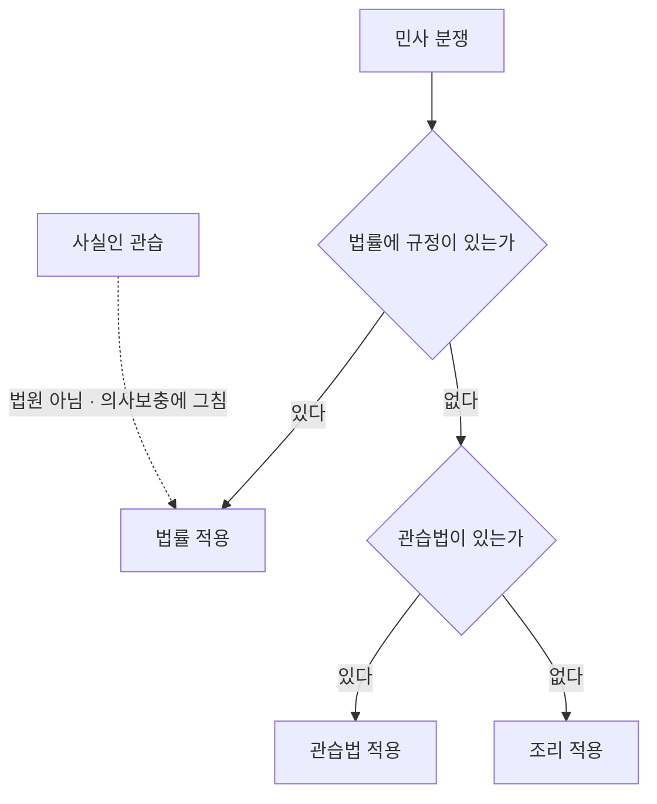
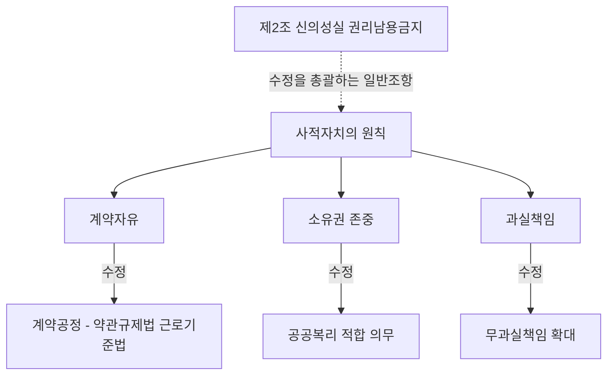
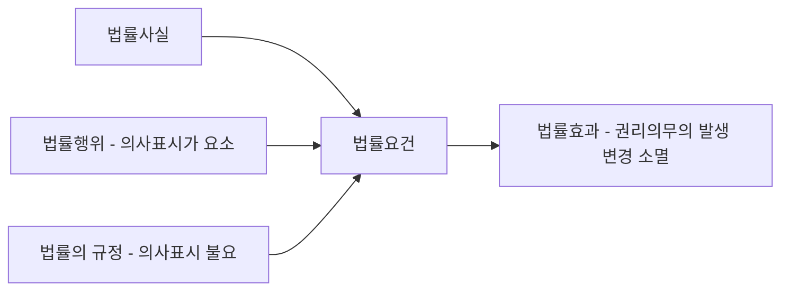
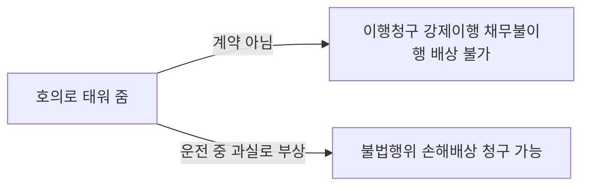
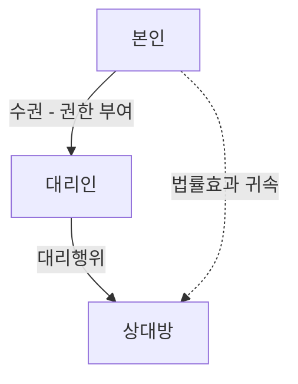
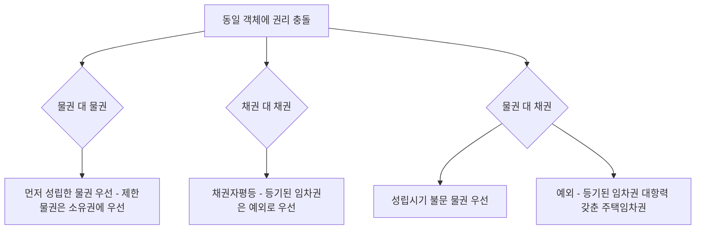

# 단원 M01 — 서론

> **영역**: 민법총칙
> **수업 주제**: 법원·법률관계·법률행위 변동

## 🗺️ 본문 목차

- [📘 위패스 마이 정리 (L1 - 메인 단권화)](#정리)
- [📖 핵심요약서 (L2 - 빠른 복습)](#핵심요약서)
- [📚 기본서 (L3 - 본격 학습)](#기본서)

---

## 📘 위패스 마이 정리 — L1 (메인·단권화)

> 김묘엽 교수 「위패스 마이 민법총칙/물권법」 교재 정리본 (키워드 자동 분류).

---

## 📖 핵심요약서 — L2 (빠른 복습)

> 스터디파이터 민법 핵심요약서.

### 핵심요약서 (p.3~16)

<!--p.3-->
3
목차
CHAPTER 01
CHAPTER 02
CHAPTER 03
CHAPTER 04
CHAPTER 05
물권변동
점유권
소유권
용익물권
담보물권
110
119
125
139
149
PART 02
물권법
CHAPTER 01
CHAPTER 02
CHAPTER 03
CHAPTER 04
CHAPTER 05
CHAPTER 06
PART 01
민법 총칙 서론
권리의 주체(자연인)
권리의 주체(법인)
권리의 객체(물건)
법률행위
기간과 소멸시효
006
015
033
045
052
094

<!--p.4-->
감정평가사 민법 핵심정리

<!--p.5-->
감정평가사 민법 핵심정리      ·     ·     ·     ·     ·     ·     ·     ·     ·     ·     ·     ·     ·
PART
01
민법총칙
CHAPTER 01 서론
CHAPTER 02 권리의 주체(자연인)
CHAPTER 03 권리의 주체(법인)
CHAPTER 04 권리의 객체(물건)
CHAPTER 05 법률행위
CHAPTER 06 기간과 소멸시효

<!--p.6-->
민법
핵심정리
민법 핵심정리
6
① 법원의 종류(법률·관습법·조리)와 그 순위를 정하고 있다.
② 판례의 법원성은 법적으로는 부정되고 있다.
③  민법 제1조에서의 법률은 실질적 의미의 법률을 말하므로, 명령이나 자치법규 등을 포함하는 
넓은 의미의 법률이다. 반면 민법 제185조(물권법정주의)에서의 법률은 형식적 의미의 법률이다.
① 민법 제764조의 적용에 있어서 사죄광고를 명하는 판결은 위헌이라는 결정(헌재 1991.4.1. 89헌가160)
② 임대차의 존속기간은 20년을 넘지 못한다고 규정한 제651조제1항에 대한 위헌 결정(2013.12.26. 2011
       헌바234)
제1조 【법원】 민사에 관하여 법률에 규정이 없으면 관습법에 의하고 관습법이 없으면 조리에 의한다.
서론01
CHAPTER
구 분 28회 29회 30회 31회 32회 33회 34회
서론 2 0 3 2 2 2 2
성문민법＝법률(민법전)·명령·대법원규칙·조약·자치법규
헌법재판소의 결정은 법률과 동일한 효력을 가지므로 그 결정 내용이 실질적으로 민사에 관한 것인 때에는 
민법의 법원이 된다.
헌법재판소의 결정
제1절 법원(法源)의 순위
제2절 성문민법과 불문민법
◎ 단원별 출제경향
1. 성문민법

<!--p.7-->
7
CHAPTER 01  |   서론
(1) 관습법
① 관습법의 성립요건
㉠ 법적 내용에 관한 민사관행이 있어야 한다.
㉡ 관행이 법적 가치를 가진다는 법적 확신(법원의 판결)에 의하여 지지를 받아야 한다. 
㉢ 관행이 사회질서에 반하지 않아야 한다. 
② 인정되는 제도 
㉠ 분묘기지권·관습법상의 법정지상권·동산의 양도담보권이 있다. 
   그러나 온천권, 미등기 무허가건물에 대한 소유권취득이나 근린공원이용권 등은 
   관습법상의 물권에 해당하지 않는다. 
㉡ 관습법상의 공시방법으로서 미분리과실과 수목집단에 대한 명인방법이 있다.
불문민법＝관습법·판례법·조리
(2) 판례법
(3) 조리(條理)
경험칙·신의칙·사회통념 등으로 표현하기도 한다. 
제3절 신의성실의 원칙 
법률관계에 참여한 모든 자는 상대방의 정당한 이익을 고려할 의무를 진다는 것이며, 즉 상대방의 신뢰를 헛되
이 하지 않도록 성실하게 행동하여야 한다는 원칙을 말한다. 당사자의 행위규범이자 법관의 재판규범이 될 수 
있다.
“권리의 행사와 의무의 이행은 신의에 좇아 성실히 하여야 한다.”(법 제2조 제1항)
① 신의성실의 원칙은 민법의 전 영역에 적용되며 사법의 전 영역과 나아가 사회법  및 공법에도 적용된다.
② 신의칙위반을 이유로 제한능력자의 취소권을 배척하지는 못한다. 
    우리 민법상 제한능력자 제도는 어떤 제도보다 우월하게 적용된다.
1. 의 의
2. 근 거
3. 적 용
2. 불문민법

<!--p.8-->
민법 핵심정리
8
(1) 실효의 원칙
권리를 장기간 행사하지 않아서 상대방이 그 권리를 행사하지 않는 것으로 믿을 만한 사유가 있은 후 새삼
스럽게 그 권리를 행사하는 것은 이 원칙에 반하여 인정되지 않는다.
(2) 사정변경의 원칙
계속적 채권관계, 즉 계속적인 보증계약에 있어서 보증계약 성립 당시의 사정에 현저한 변경이 생긴 경우에
는 사정변경을 이유로 보증계약을 해지할 수 있다고 한다. 사정변경의 원칙은 계약준수의 원칙의 예외로서 
인정된다.
(3) 금반언(禁反言)의 원칙
자신의 선행행위와 모순되는 행위는 허용되지 않는다는 원칙이다.
외형상은 권리의 행사와 같이 보이지만 구체적·실질적으로 볼 때에는 권리의 사회성·공공성에 반하여 권리의 
행사로서 인정될 수 없는 행위를 말한다. 민법은 “권리는 남용하지 못한다.”라고 규정(제2조 제2항)하고 있다.
제4절 권리남용금지의 원칙 
권리남용금지원칙은 신의칙과 함께 민법 전체에 적용되는 규정이며, 공법분야에도 이 원칙은 적용된다.
① 권리의 행사가 있을 것(권리의 불행사가 권리남용이 되는 경우가 있음)
② 권리의 행사가 사회성·공공성에 반할 것
③ 가해목적이 존재할 것(주관적 요건)
④ 위법성이 있을 것
대법원의 판례는 대체로 주관적 요건과 객관적 요건을 모두 그 요건으로 요구하고 있다.
4. 파생원칙
1. 의의 및 근거
2. 적 용
3. 요 건
4. 판례의 태도

<!--p.9-->
9
CHAPTER 01  |   서론
제5절 권리의 분류
01 권리의 기본적 분류
① 청구권의 행사가 남용이 되면 법은 조력(助力)하지 않는다(주장배척).
② 형성권의 행사가 남용이 되면 효과의 발생이 부정된다. 
③ 친권의 행사가 남용이 되면 친권상실 또는 일시정지의 선고를 받는 경우가 있다(제924조).
④ 항변권의 행사가 남용이 되면 권리의 행사가 저지된다.
종류 내용
내용에
의한
분류
재산권 경제적 이익을 누리는 것을 내용으로 하는 권리로서 
양도성과 상속성을 가지는 권리이다(물권·준물권·채권·지식재산권).
인격권 권리의 주체와 분리할 수 없는 인격적 이익을 누리는 것을 내용으로 
하는 권리이다(생명권·신체권·명예권·정조권·성명권·초상권 등).
가족권 가족관계 내지 친족관계에 있어서의 일정한 지위에 따르는 이익을 
누리는 것을 내용으로 하는 권리이다(친권·부양청구권·상속권 등).
사원권 사단의 구성원이 그 지위에 기하여 사단에 대하여 가지는 권리를 말한다
(이익배당청구권·의결권·업무집행권 등).
작용에
의한
분류
지배권 권리의 객체를 직접 배타적으로 지배할 수 있는 권리로서 절대권 또는 
대세권이라고도 한다(인격권·물권·지식재산권·친권 등).
청구권 특정인이 다른 특정인에 대하여 일정한 행위(급부)를 요구할 수 있는 
권리이다(채권·물권적 청구권·부양청구권·재산분할청구권·계약갱신청구권 등).
형성권 권리자의 일방적 의사표시만으로 권리의 발생·변경·소멸의 효과가 생기는 
권리를 말하며, 상대방의 동의나 승낙을 요하지 않는다(별도로 설명).
항변권
타인의 청구권의 행사를 저지하는 권리를 말한다(연기적 항변권으로서의 
동시이행의 항변권과 보증인의 최고·검색의 항변권이 있고, 
영구적 항변권으로서 상속인의 한정승인의 항변권이 있다).
5. 남용의 효과

<!--p.10-->
민법 핵심정리
10
01.  관습법은 당사자의 주장·입증을 기다림이 없이 법원이 직권으로 이를 확정하여야 하고 사실인 관습은 
그 존재를 당사자가 주장·증명하여야 한다.
02.  성년 남자만을 종중의 구성원으로 하고 여성은 종중의 구성원이 될 수 없다는 종래의 관습은, 변화된 
우리의 전체 법질서에 부합하지 아니하여 정당성과 합리성이 있다고 할 수 없으므로, 종중 구성원의 자
격을 성년 남자만으로 제한하는 종래의 관습법은 이제 더 이상 법적 효력을 가질 수 없게 되었다.
03.  동일인 소유이던 토지와 그 지상 건물이 매매 등으로 인하여 각각 소유자를 달리하게 되었을 때 그 건물 
철거 특약이 없는 한 건물 소유자가 법정지상권을 취득한다는 관습법은 현재에도 그 법적 규범으로서
의 효력을 여전히 유지하고 있다고 보아야 한다(대법원 2022.7.21. 2017다236749 전원합의체).
04.  신의칙은 비단 계약법의 영역에 한정되지 않고 모든 법률관계를 규제·지배하는 원리로 파악되며, 따라
서 신의칙에 반하는 소권(訴權)의 행사 또한 허용될 수 없다.
05.  신의성실의 원칙에 반하는 것은 강행규정에 위배되는 것이므로 당사자의 주장이 없더라도 법원은 직권
으로 판단할 수 있다.
02 권리의 구체적 분류
일방적 의사표시에
의하여 행사하는 것
동의권, 철회권, 상계권, 추인권, 해지권, 해제권, 취소권, 매매의 일방예약완결권 
등이다.
재판에 의하여
행사하여야 하는 것
① 채권자취소권은 실체법상의 권리이지만 반드시 재판상 행사하여야 한다(406조).
② 재판상 이혼권(840조), 친생부인권(846조), 입양취소권(884조), 재판상 파양권
    (905조) 등이 있다.
청구권으로 불리지만
형성권으로 해석되는 것
① 공유물분할청구권(268조)
② 지상권자 및 지상권설정자의 지상물매수청구권(283조, 285조)
③ 전세권자 및 전세권설정자의 부속물매수청구권(316조)
④ 지료증감청구권(286조), 매매대금감액청구권(572조), 
    차임증감청구권(627조, 628조), 전세금증감청구권(312조의2) 
⑤ 지상권소멸청구권(287조), 전세권소멸청구권(311조) 등이 있다.
◎ 계약갱신청구권이나 등기청구권, 상속회복청구권 등은 청구권이다.
  핵심 판례 정리

<!--p.11-->
11
CHAPTER 01  |   서론
06.  사용자로부터 해고된 근로자가 퇴직금 등을 수령하면서 아무런 이의의 유보나 조건을 제기하지 않았다
면, 다른 특별한 사정이 없는 한 해고처분을 유효한 것으로 인정했다고 할 것이고, 따라서 해임 및 의원
면직된 후 9년이 지난 후에 해고의 효력을 다투는 訴를 제기하는 것은 신의칙이나 금반언의 원칙에 위
배된다.
07.  신의성실의 원칙에 위배된다는 이유로 권리의 행사를 부정하기 위해서는 상대방에게 신의를 공여하였
다거나 객관적으로 보아 상대방이 신의를 가짐이 정당한 상태에 있어야 하며, 이러한 상대방의 신의에 
반하여 권리를 행사하는 것이 정의관념에 비추어 용인될 수 없는 정도에 이르러야 한다.
08.  취득시효완성 후에 그 사실을 모르고 당해 토지에 관하여 어떠한 권리도 주장하지 않기로 하였다가 이
에 반하여 시효주장을 하는 것은 특별한 사정이 없는 한 신의칙상 허용되지 않는다.
09.  법정대리인의 동의 없이 신용구매계약을 체결한 미성년자가 사후에 법정대리인의 동의 없음을 사유로 
들어 이를 취소하는 것이 신의칙에 위배된 것이라고 할 수 없다.
10.  강행법규를 위반한 자가 스스로 그 약정의 무효를 주장하는 것이 신의칙에 위반되는 권리의 행사라는 
이유로 그 주장을 배척한다면, 강행법규에 의하여 배제하려는 결과를 실현시키는 결과가 되므로 특별
한 사정이 없는 한 위와 같은 주장은 신의칙에 반하는 것이라고 할 수 없다.
      [판례해설]  법령에 위반되어 무효임을 알고서도 그 법률행위를 한 자가 강행법규 위반을 이유로 무효를 
주장한다 하여 신의칙 또는 금반언의 원칙에 반하거나 권리남용에 해당한다고 볼 수는 없다.
11.  회사의 이사의 지위에서 부득이 회사와 제3자 사이의 계속적 거래로 인한 회사의 채무에 대하여 보증
인이 된 자가 그 후 퇴사하여 이사의 지위를 떠난 때에는 보증계약 성립 당시의 사정에 현저한 변경이 
생긴 경우에 해당하므로 이를 이유로 보증계약을 해지할 수 있다.
12.  병원은 진료뿐만 아니라 환자에 대한 숙식의 제공을 비롯하여 간호, 보호 등 입원에 따른 포괄적 채무
를 지는 것인 만큼, 입원환자의 휴대품 등의 도난을 방지함에 필요한 적절한 조치를 강구하여 줄 신의칙
상의 보호의무가 있다.
13.  동시이행의 항변권의 행사가 주로 자기 채무의 이행만을 회피하기 위한 수단이라고 보여지는 경우에는 
그 항변권의 행사는 권리남용으로서 배척된다.
14.  아파트 분양자는 아파트단지 인근에 공동묘지가 조성되어 있는 사실을 수분양자에게 고지할 신의칙상
의 의무를 부담한다.

<!--p.12-->
민법 핵심정리
12
15.  권리의 행사가 주관적으로 오직 상대방에게 고통을 주고 손해를 입히려는 데 있을 뿐 이를 행사하는 사
람에게는 아무런 이익이 없고, 객관적으로 사회질서에 위반된다고 볼 수 있으면, 그 권리의 행사는 권리
남용으로서 허용되지 아니하고, 그 권리의 행사가 상대방에게 고통이나 손해를 주기 위한 것이라는 주
관적 요건은 권리자의 정당한 이익을 결여한 권리행사로 보여지는 객관적인 사정에 의하여 추인할 수 
있다(대법원 2010. 12. 9. 2010다59783).
16.  학교의 편입학허가가 교육법에 위반되어 무효라면 이와 같은 당연무효의 행위를 학교법인이 취소하는 
것은 그 편입학허가 등의 행위가 처음부터 무효이었음을 당사자에게 통지하여 확인시켜주는 것에 지나
지 않으므로 여기에 신의칙을 적용할 수 없고 그러한 뜻의 취소권은 시효로 인하여 소멸하지도 않는다.
17.  변호사와 의뢰인 사이에 약정된 보수액이 부당하게 과다하여 신의성실의 원칙이나 형평의 원칙에 반한
다고 볼 만한 특별한 사정이 있는 경우에는, 상당하다고 인정되는 범위 내의 보수액만을 청구할 수 있다.
18.  인지청구권은 본인의 일신전속적인 신분관계상의 권리로서 포기할 수도 없으며 실효의 법리가 적용되
지 않는다.
01.  신의성실의 원칙은 법질서 전체를 관통하는 일반 원칙으로서 실정법이나 
계약을 형식적이고 엄격하게 적용할 때 생길 수 있는 부당한 결과를 막고 
구체적 타당성을 실현하는 작용을 하므로, 사적 자치나 계약자유도 신의칙
에 따라 제한될 수 있다. (     )
  중요 지문 정리
신의성실의 원칙은 법질서 전체를 관
통하는 일반 원칙으로서 실정법이
나 계약을 형식적이고 엄격하게 적
용할 때 생길 수 있는 부당한 결과를 
막고 구체적 타당성을 실현하는 작
용을 한다. 사적 자치나 계약자유도 
신의칙에 따라 제한될 수 있다 (대법원 
2018.5.17. 2016다35833)). ( ○ )
판례에 의하여 인정되는 관습법으로
는 분묘기지권 (2013다17292) ㆍ관 습법
상의 법정지상권, 명인방법 ㆍ 명의신
탁 ㆍ동산양도담보 등이 있다. 그러나, 
사도(私道)통행권 ㆍ온천권 ㆍ공원이
용권 등은 관습법상 인정되는 물권
이 아니다. ( ❌ )
종중이란 공동선조의 분묘수호와 제
사 및 종원 상호간의 친목 등을 목적
으로 하여 구성되는 자연발생적인 
종족집단이므로, 종중의 이러한 목
적과 본질에 비추어 볼 때 공동선조
와 성과 본을 같이 하는 후손은 성별
의 구별 없이 성년이 되면 당연히 그 
구성원이 된다고 보는 것이 조리에 
합당하다. ( ❌ )
02.  판례에 의하여 인정되는 관습법으로는 분묘기지권, 동산양도담보 등이 있
고, 관습법상 인정되는 물권으로는 사도통행권, 온천권 등이 있다. (     ) 
03. 종중의 구성원인 종원의 자격은 성년의 남자로만 제한된다. (     )

<!--p.13-->
13
CHAPTER 01  |   서론
04.  사회생활규범이 관습법으로 승인되었다면 그것을 적용하여야 할 시점에서
의 전체 법질서에 부합하지 않아도, 그 관습법은 법적 규범으로서의 효력
이 인정된다. (     )
관습법은 헌법을 최상위 규범으로 
하는 전체 법질서에 반하지 아니하
는 것으로서 정당성과 합리성이 있다
고 인정될 수 있는 것이어야 하고, 그
렇지 아니한 사회생활규범은 비록 그
것이 사회의 거듭된 관행으로 생성된 
것이라고 할지라도 이를 법적 규범으
로 삼아 관습법으로서의 효력을 인
정할 수 없다 (대법원 2005.07.21. 2002다
1178 전원합의체). ( ❌ )
아파트 분양자는 아파트 단지 인근에 
쓰레기 매립장이 건설예정인 사실을 
분양계약자에게 고지할 신의칙상 의
무를 부담한다 (대법원 2006.10.12, 2004다
48515). ( ❌ )
법령에 위반되어 무효임을 알고서도 
그 법률행위를 한 자가 강행법규 위
반을 이유로 무효를 주장하는 것이 
신의칙 또는 금반언의 원칙에 반하거
나 권리남용에 해당한다고 볼 수는 
없다. ( ❌ )
신의성실의 원칙에 반하는 것 또는 
권리남용은 강행규정에 위배되는 것
이므로 당사자의 주장이 없더라도 법
원은 직권으로 판단할 수 있다 (대법원 
1998.08.21. 97다37821) . ( ○ )
임차권 양도에 관한 임대인의 동의 
여부 및 임대차 재계약 여부에 대한 
설명 없이 임차권을 양도한 것은 기
망행위에 해당하고 신의칙에 위배된
다. ( ○ )
타당한 기술이다 (대법원 2019.7.25. 2016
다274607). ( ○ )
타당한 기술이다 (대법원 1998.5.22. 96다
24101). ( ○ )
05.  신의성실의 원칙에 반하는 것은 강행규정에 위배되는 것으로서 당사자의 
주장이 없더라도 법원이 직권으로 판단할 수 있다. (     )
06.  임차권의 양도에 있어서 양도인은 그 임차권의 존속기간, 임대기간 종료 후
의 재계약 여부, 임대인의 동의 여부와 이에 관계되는 모든 사정을 양수인
에게 알려주어야 할 신의칙상의 의무가 있다. (     )
07.  분양회사는 아파트단지 인근에 쓰레기 매립장이 건설될 예정이라는 사실을 
알았더라도 이를 수분양자에게 고지할 신의칙상 의무를 부담하지 않는다. 
      (     )
08.  법령에 위반되어 무효임을 알고서도 그 법률행위를 한 자가 강행법규 위반
을 이유로 무효를 주장하는 것은 신의칙 또는 금반언의 원칙에 반하므로 
허용되지 않는다. (     )
09.  신의칙에 위배된다는 이유로 그 권리행사를 부정하기 위해서는 상대방에게 
신의를 공여하였거나 객관적으로 보아 상대방이 신의를 가지는 것이 정당
한 상태에 이르러야 하고 이와 같은 상대방의 신의에 반하여 권리를 행사하
는 것이 정의관념에 비추어 용인될 수 없는 정도의 상태에 이르러야 한다. 
      (     ) 
10.  취득시효 완성 후에 그 사실을 모르고 당해 토지에 관해 어떠한 권리도 주
장하지 않기로 하였다 하더라도 이에 반하여 시효주장을 하는 것은 특별한 
사정이 없는 한 신의칙상 허용되지 않는다. (     )

<!--p.14-->
민법 핵심정리
14
12.  계속적 거래관계로 인하여 발생하는 불확정한 채무를 보증하기 위한 이른
바 계속적 보증에 있어서 보증계약 성립 당시의 사정에 현저한 변경이 생긴 
경우에는 보증인은 보증계약을 해지할 수 있다. (     )
이사의 지위에 있었기 때문에 부득
이 회사와 은행 사이의 계속적 거래
로 인한 회사의 채무에 대하여 연대
보증인이 된 자가 그 후 퇴사하여 이
사의 지위를 상실한 경우, 사정변경
을 이유로 연대보증계약을 일방적으
로 해지할 수 있다 (대법원 2000.3.10. 99
다61750). ( ○ )
권리남용의 요건으로는 권리의 존재, 
권리의 행사라고 볼 수 있는 행위의 
존재, 행위자의 이익과 상대방의 불
이익 사이의 불균형(객관적 요건), 행
위자에게 이익이 없으면서 상대방에
게 손해 ㆍ 고통만을 주기 위한 목적(주
관적 요건)이 있어야 한다 (대법원 2003
다40422) . ( ❌ )
형성권은 권리자의 일방적 의사표시
에 의하여 행사하는 것과 반드시 재
판에 의하여 행사하여야 하는 것이 
있다. 전자에는 동의권, 철회권, 상계
권, 추인권, 해지권, 해제권, 취소권, 
매매의 일방예약완결권 등이 있고, 
후자에는 채권자취소권(제406조), 
친생부인권(제846조), 입양취소권
(제884조), 재판상 이혼권 (840조)  등
이 있다. ( ❌ )
타당한 기술이다 (대법원 1998.6.26. 97다
4282). ( ○ )
공무원의 직무상 불법행위책임에 대
하여 국가배상법과 민법의 규정이 경
합하는 경우 전자만이 적용되는데 
이를 법규의 경합(특별법우선의 원
칙)이라고 한다. ( ○ )
13.  판례는 일반적으로 권리남용의 요건으로 행위자에게 이익이 없으면서 상대
방에게 손해 ㆍ 고통만을 주기 위한 목적이 있어야 한다는 주관적 요건은 요
구하지 않는다. (     )
15. 형성권은 반드시 재판상 행사해야 한다. (     )
14.  판례는 일반적으로 권리남용에 있어 주관적 요건을 요구하고 있는데, 권리
의 행사가 상대방에게 고통이나 손해를 주기 위한 것이라는 주관적 요건은 
권리자의 정당한 이익을 결여한 권리행사로 보이는 객관적인 사정에 의하
여 추인할 수 있다. (     )
16.  공무원의 직무상 불법행위책임에 대하여 국가배상법과 민법의 규정이 경합
하는 경우 전자만이 적용된다. (     )
인지청구권의 행사가 상속재산에 대
한 이해관계에서 비롯되었다 하더라
도 정당한 신분관계를 확정하기 위해
서라면 신의칙에 반하는 것이라 하여 
막을 수 없다 (대법원 2001.11.27. 2001므
1353). ( ○ )
11.  인지청구권의 행사가 상속재산에 대한 이해관계에서 비롯되었다 하더라도 
정당한 신분관계를 확정하기 위해서라면 신의칙에 반하는 것이라 하여 막
을 수 없다. (     )

<!--p.15-->
민법
핵심정리
15
민법 핵심정리
(1) 우리 민법의 태도(개별적 보호주의)
중요한 법률관계에 대해서만 태아를 이미 출생한 것으로 보는 입법주의, 즉 개별적 보호주의를 취하고 있다.
권리의 주체(자연인)02
CHAPTER
제1절 자연인의 권리능력 
구 분 28회 29회 30회 31회 32회 33회 34회
자연인 3 3 3 3 2 2 2
◎ 단원별 출제경향
출생이 있으면 1월 이내에 관계공무원에게 신고하여야 하지만 출생신고의 유무는 권리능력의 취득과는 무관
(보고적 신고)하다. 출생신고는 일종의 보고적 신고이지 창설적 신고가 아니므로 신고가 없어도 출생과 동시
에 당연히 권리능력을 취득한다.  
1. 출생의 신고
2. 태아의 권리능력 
① 불법행위로 인한 손해배상청구권(제762조)
㉠  父의 생명침해로 인한 子 자신이 위자료를 청구하는 경우를 말하며, 父의 생명침해로 인한 재산적 
손해는 일단 父에게 손해배상청구권이 발생하고 그것이 상속인(태아)에게 상속된다는 것이 판례의 
태도이다. 
㉡ 태아 자신이 입은 불법행위로 인한 손해에 대하여 배상청구를 하는 경우이다.
② 상속(제1000조)
③ 유류분권(제1112조)
④ 대습상속(제1001조)
⑤ 유증(제1064조)
⑥ 인지(제858조)
父의 태아에 대한 인지는 인정되나 태아의 父에 대한 인지청구권은 부정된다는 것이 판례의 태도이다.
⑦ 사인증여(제562조)
    판례는 부정한다. 법률행위의 성질상 유증은 단독행위이고 사인증여는 계약이기에 태아가 승낙할 수
가 없다. 그리고 현행법상 태아의 법정대리인제도가 인정되지 않는다. 

<!--p.16-->
민법 핵심정리
16
(2) 태아의 법률상의 지위 
개별적 보호주의에 입각하여 태아의 지위를 “이미 출생한 것으로 본다.”의 의미를 어떻게 파악하여야 하는
가에 대하여 판례는 정지조건설의 입장이다. 태아의 개별적 보호주의에 따른 그 권리의 행사는 태아가 살아
서 출생한다는 것을 전제로 하는 것이다.
제2절 권리능력의 종기(終期) 
자연인의 권리능력은 심폐정지설(맥박종지설)에 입각한 사망으로 소멸한다. 
(1) 2인 이상이 동일한 위난으로 사망한 경우에는 동시에 사망한 것으로 추정한다(제30조).
(2) 동시에 사망한 것으로 추정됨으로써 사망자 사이에는 상속의 문제가 발생되지 아니한다. 
(3) 추정규정이므로 반증을 들어 그 추정을 번복할 수 있다. 
(1)  사망한 것이 확실하다고 생각되지만 시체를 발견할 수 없는 경우에 그것을 조사한 관공서의 사망보고에 
의하여 가족관계등록부에 사망으로 기재하는 제도이다 (가족관계등록에 관한 법률 제87조).
(2) 실종선고는 간주주의를 취하나, 인정사망은 추정주의를 취한다. 
사망이 확실하지 않으나 그 개연성이 매우 높은 경우에 실종선고에 의하여 일정한 시기에 사망한 것으로 
간주하는 제도이다(제27조). 실종자의 종래의 주소나 거소를 중심으로 한 사법적 법률관계만을 종료하게 
하는 제도로서 실종자의 권리능력의 상실과는 무관하다.
1. 자연인의 사망
2. 동시사망의 추정
3. 인정사망
4. 실종선고

---

## 📚 기본서 — L3 (본격 학습)

> 감정평가사 민법 기본서 (407p) 해당 장.

### 제1절 민법의 의의와 성격

> 📖 민법 공부의 첫 단추는 "민법이 도대체 어떤 성격의 법인가"라는 좌표를 잡는 일이다. 민법은 사인(私人) 사이의 관계를 다루는 **사법**이고, 그중에서도 기본이 되는 **일반법**이며, 권리·의무의 내용 자체를 정하는 **실체법**이다. 이 세 좌표를 잡아 두어야 다음 관인 **제2절 민법의 법원**에서 "무엇이 민법의 법원이 되는가", "특별법이 있으면 어느 것이 먼저 적용되는가"를 흔들림 없이 판단할 수 있다.

> ⭐ **이 관에서 반드시 챙길 3가지**
> ① ==형식적 의의의 민법==(민법전)과 ==실질적 의의의 민법==(사인간 권리·의무를 정한 모든 법)의 구별 — 제1조의 "법률"을 어느 쪽으로 읽느냐가 기출의 단골이다
> ② 민법은 ==사법·일반법·실체법== 세 가지 성격을 동시에 가진다
> ③ 같은 사항에 일반법과 특별법이 함께 있으면 ==특별법이 먼저== 적용된다 — 주택임대차에는 민법보다 주택임대차보호법이 앞선다

#### 1. 의의

민법(民法)이란 개인과 개인 사이의 권리·의무를 규율하는 법이다. 그런데 "민법"이라는 말은 두 가지 크기로 쓰인다.

| 구분 | 내용 | 범위 |
|---|---|---|
| **형식적 의의의 민법** | ==민법전== 그 자체 | 1958년 제정·공포되고 1960년 1월 1일부터 시행된 법전. 본문 1118개조, 총칙·물권·채권·친족·상속의 ==5편== 체계(판덱텐 체계) |
| **실질적 의의의 민법** | 사인 간의 권리·의무를 담고 있는 ==모든 법== | 민법전 + 부동산등기법·주택임대차보호법·가족관계의 등록 등에 관한 법률 등 |

> 💡 시험에서 "민법 제1조의 법률"이 무엇이냐고 물으면 답은 ==실질적 의미의 법률==이다. 반면 물권법정주의를 정한 제185조의 "법률"은 국회가 만든 ==형식적 의미의 법률==만을 가리킨다. **같은 낱말이 조문마다 다른 크기로 쓰인다**는 점이 이 관의 최대 함정이다.

#### 2. 민법의 세 가지 성격

| 성격 | 대비되는 개념 | 판별 기준 | 민법이 그쪽인 이유 |
|---|---|---|---|
| **사법**(私法) | 공법(公法) | 규율 대상이 ==사인 상호간==인가, 국가와 개인 또는 국가기관 상호간인가 | 민법은 사인끼리의 재산관계·가족관계를 규율한다 |
| **일반법** | 특별법 | 법률관계에 ==기본적으로== 적용되는가, 일반법의 적용을 배제하려고 특별히 만든 것인가 | 민법은 사법관계 전반에 원칙적으로 적용된다 |
| **실체법** | 절차법 | ==권리·의무의 내용== 자체를 정하는가, 그 실현 절차를 정하는가 | 민사소송법·민사집행법이 절차법이고 민법은 실체법이다 |

공법과 사법을 나누는 기준으로는 이익설·성질설·주체설·다원설 등이 대립하나, 실무는 어느 하나의 기준을 고집하지 않고 **종합적으로** 판단한다. 국가가 당사자가 되는 이른바 **공공계약**에 대하여 판례는 ==사경제 주체로서 대등한 위치에서 체결하는 사법상 계약==으로 본다(대판 2012.9.20. 2012마1097).

> ⚠️ "국가가 당사자면 공법관계"라고 외우면 틀린다. 판단 기준은 당사자가 누구인가가 아니라 ==국가가 우월적 지위에서 행위했는가, 대등한 사경제 주체로 행위했는가==다.

#### 3. 효과 — 적용순서

일반법·특별법의 관계에서 나오는 효과는 하나뿐이지만 결정적이다.

| 구분 | 효과 |
|---|---|
| 같은 사항에 일반법과 특별법이 모두 있는 경우 | ==특별법 우선의 원칙==에 따라 특별법이 먼저 적용된다 |
| 특별법에 규정이 없는 사항 | 일반법인 민법이 ==보충적으로== 적용된다 |
| 상사(商事)에 관한 사항 | 상법 → 상관습법 → 민법의 순서. 상관습법이 ==민법보다 앞선다== |

> 🔑 상법 제1조는 "상사에 관하여 본법에 규정이 없으면 ==상관습법==에 의하고, 상관습법이 없으면 ==민법==에 의한다"고 정한다. 즉 상관습법은 상법에 대해서는 보충적이지만, **민법에 대해서는 우선한다**. "상관습법보다 민법이 먼저"라는 선지는 항상 틀린 선지다.

#### 4. 관련 조문

> 📌 **민법 제1조(법원)** — "민사에 관하여 법률에 규정이 없으면 관습법에 의하고 관습법이 없으면 조리에 의한다."

> 📌 **민법 제185조(물권의 종류)** — "물권은 법률 또는 관습법에 의하는 외에는 임의로 창설하지 못한다."
> 여기의 "법률"은 ==형식적 의미의 법률==이다. 제1조의 "법률"과 범위가 다르다.

> 📌 **상법 제1조** — "상사에 관하여 본법에 규정이 없으면 상관습법에 의하고, 상관습법이 없으면 민법에 의한다."

#### 5. 핵심 판례 법리

- 국가가 당사자가 되는 이른바 **공공계약**은 사경제 주체로서 상대방과 대등한 위치에서 체결하는 ==사법상 계약==으로서 그 본질적인 내용은 사인 간의 계약과 다를 바가 없다(대판 2012.9.20. 2012마1097).
- 따라서 공공계약에는 사적 자치와 계약자유의 원칙 등 ==사법의 원리==가 그대로 적용된다.

#### ⭐ 기출 출제포인트

1. **제1조의 "법률" 범위** — "민법전만을 의미한다"는 선지가 반복 출제된다(2023년 감정평가사). 정답은 ==명령·대법원규칙·조약·자치법규를 포함하는 실질적 의미의 법률==이다.
2. **제1조의 법률 vs 제185조의 법률** — 물권법정주의의 "법률"만은 형식적 의미의 법률이다.
3. **특별법 우선** — 주택임대차·상가건물임대차 사안에서 민법과 특별법 중 무엇이 먼저인지.
4. **상관습법과 민법의 순위** — "상행위 관련 법률관계에서는 상관습법이 민법보다 우선한다"는 ==옳은== 선지로 출제된 적이 있다.
5. **공공계약의 성질** — 국가가 당사자여도 사법상 계약이라는 점.

#### 📊 기출 분석

> 📌 이 관은 최근 기출에서 "민법의 성격"을 정면으로 묻는 단독 출제가 확인되지 않는다. 다만 **민법의 법원** 문항(2021·2022·2023·2024년 감정평가사)의 선지를 판단하는 전제로 매년 요구된다.

**출제 빈도** — 서론 단원 전체가 회차당 ==0~3문항==(28회 2, 29회 0, 30회 3, 31회 2, 32회 2, 33회 2, 34회 2)이고, 그 대부분이 다음 관인 **법원**에 집중된다. 이 관은 그 문항을 읽어내기 위한 배경 지식으로 요구된다.

**반복되는 함정 선지**
1. "민법 제1조의 법률은 ==민법전만==을 의미한다" → 실질적 의미의 법률이다.
2. "대법원규칙(공탁규칙 등)은 민법의 법원이 될 수 없다" → 민사에 관한 것이면 ==법원이 된다==.
3. "상행위에서도 민법이 상관습법에 우선한다" → ==상관습법이 우선==한다.

**최근 경향** — 성격론 자체는 사라지고, 그 결론(무엇이 법원이 되는가·어느 법이 먼저인가)만 법원 문항의 선지로 흡수되는 흐름이다.

#### ✏️ 사례형 적용

> 甲은 자기 소유 주택을 乙에게 보증금 1억 원에 임대하였다. 임대차기간·대항력·우선변제권을 두고 다툼이 생겼는데, 민법의 임대차 규정과 주택임대차보호법의 규정이 서로 다르다. 어느 법이 적용되는가?

**검토**
1. 주택임대차보호법은 주거용 건물 임대차라는 ==특정 영역==에 관하여 민법의 적용을 배제·수정하려고 제정된 법이므로 **특별법**이다.
2. 민법은 사법관계 전반에 적용되는 **일반법**이다.
3. ==특별법 우선의 원칙==에 따라 주택임대차보호법이 먼저 적용된다.
4. 다만 주택임대차보호법에 규정이 없는 사항(예: 임차인의 선관주의의무)은 ==일반법인 민법==이 보충 적용된다.
5. **결론** — 주택임대차보호법 우선 적용, 흠결 부분은 민법 보충.

#### ⚠️ 이 관의 함정 총정리

1. 민법 제1조의 "법률"을 민법전만이라고 하면 틀림 → ==실질적 의미의 법률==(명령·대법원규칙·조약·자치법규 포함)
2. 제185조의 "법률"도 실질적 의미라고 하면 틀림 → 물권법정주의의 법률은 ==형식적 의미의 법률==
3. 국가가 당사자인 계약은 언제나 공법관계라고 하면 틀림 → 공공계약은 ==사법상 계약==
4. 특별법에 규정이 없으면 그 사안은 규율되지 않는다고 하면 틀림 → ==일반법인 민법이 보충== 적용
5. 상행위에서 민법이 상관습법에 우선한다고 하면 틀림 → ==상관습법이 민법에 우선==

#### ✅ OX 확인문제

> 다음 진술의 참·거짓을 판단하시오.

**1.** 형식적 의의의 민법이란 1960년 1월 1일부터 시행된 민법전을 말한다.
→ **O**. 1958년 제정·공포되고 1960년 1월 1일 시행된 법전이다.

**2.** 부동산등기법이나 주택임대차보호법은 실질적 의의의 민법에 포함된다.
→ **O**. 사인 간의 권리·의무를 정하고 있으므로 ==실질적 의미의 민법==이다.

**3.** 민법 제1조에서 말하는 "법률"은 국회가 제정한 형식적 의미의 법률만을 뜻한다.
→ **X**. 명령·대법원규칙·조약·자치법규를 포함하는 ==실질적 의미의 법률==이다.

**4.** 민법 제185조의 "법률"은 국회가 제정한 형식적 의미의 법률을 의미한다.
→ **O**. 물권법정주의의 법률은 ==형식적 의미의 법률==이며, 명령·규칙은 포함되지 않는다.

**5.** 민법은 사법이자 절차법이다.
→ **X**. 민법은 사법이자 ==실체법==이다. 절차법은 민사소송법·민사집행법이다.

**6.** 같은 사항에 관하여 일반법과 특별법이 있으면 일반법이 먼저 적용된다.
→ **X**. ==특별법 우선의 원칙==에 따라 특별법이 먼저 적용된다.

**7.** 상사에 관하여 상법에 규정이 없으면 민법이 상관습법보다 먼저 적용된다.
→ **X**. 상법 제1조에 따라 상법 → ==상관습법== → 민법의 순서다.

**8.** 국가가 당사자가 되는 공공계약은 그 본질적 내용이 사인 간의 계약과 다를 바 없는 사법상 계약이다.
→ **O**. 판례는 사경제 주체로서 대등한 위치에서 체결한 ==사법상 계약==으로 본다.

**9.** 민법전은 총칙·물권·채권·친족·상속의 5편으로 구성되어 있다.
→ **O**. 판덱텐 체계에 따른 ==5편== 구성이다.

**10.** 특별법에 규정이 없는 사항에 대하여는 일반법인 민법이 보충적으로 적용된다.
→ **O**. 특별법 우선은 ==적용 순서==의 문제일 뿐, 일반법의 보충 적용을 막지 않는다.

#### 🧠 암기법

> 🔑 **민법의 성격 — "사·일·실"**
> **사**법 · **일**반법 · **실**체법. "사일실"을 한 덩어리로 외우고, 각각의 반대말(공법 · 특별법 · 절차법)을 짝으로 붙여 둔다.

> 🔑 **두 개의 "법률" — "일실 · 팔오형"**
> 제**1**조의 법률은 **실**질적, 제**185**조(팔오)의 법률은 **형**식적.
> "1조는 넓게, 185조는 좁게"라고 한 줄로 기억한다.

> 🔑 **적용순서 — "특 → 일 → 관 → 조"**
> **특**별법 → **일**반법(민법) → **관**습법 → **조**리. 상사라면 맨 앞에 상법·상관습법이 끼어든다.

---

### 제2절 민법의 법원

> 📖 법원(法源)이란 법의 존재형식, 즉 ==법관이 재판할 때 적용해야 할 기준==을 말한다. 민법 제1조는 그 순위를 법률 → 관습법 → 조리로 못 박아 두었다. 앞 관에서 잡은 "실질적 의미의 법률"이라는 좌표가 여기서 그대로 쓰인다. 서론 단원에서 **가장 많이 출제되는 관**이며, 특히 관습법과 사실인 관습의 구별은 거의 매년 나온다.

> ⭐ **이 관에서 반드시 챙길 3가지**
> ① 제1조의 순위 — ==법률 → 관습법 → 조리==. 관습법은 성문법에 대하여 ==보충적== 효력만 갖는다(판례)
> ② **관습법 vs 사실인 관습** — 관습법은 ==법원이 직권으로 확정==, 사실인 관습은 ==당사자가 주장·증명==하며 법원(法源)이 아니라 ==당사자 의사를 보충==할 뿐이다
> ③ 판례의 법원성은 ==부정==, 헌법재판소 결정의 법원성은 ==긍정==

#### 1. 의의

법원(法源)이란 법의 존재형식을 말한다. 재판을 거부할 수 없는 법관에게 "무엇을 기준으로 판단하라"고 지시하는 것이 민법 제1조다.

| 순위 | 법원 | 내용 |
|---|---|---|
| 1순위 | **법률** | ==실질적 의미의 법률==. 민법전·민사특별법·명령·대법원규칙·조약·자치법규·헌법재판소 결정 |
| 2순위 | **관습법** | 관행이 ==법적 확신==을 얻어 법규범으로 승격된 것 |
| 3순위 | **조리** | 사물의 도리. 경험칙·신의칙·사회통념·사회질서·정의 등으로도 표현 |

**성문민법**과 **불문민법**으로 나누면 다음과 같다.

| 구분 | 종류 | 비고 |
|---|---|---|
| **성문민법** | 민법전 | 민사특별법(주택임대차보호법·상가건물임대차보호법·가등기담보 등에 관한 법률 등) 포함 |
| | 명령 | 대통령령·총리령·부령. ==집행명령==도 민사에 관한 것이면 법원이 된다 |
| | 대법원규칙 | ==부동산등기규칙·공탁규칙·입목등기규칙== 등 |
| | 조약 | 헌법에 의해 체결·공포된 민사에 관한 조약(예: 세계저작권협약) |
| | 자치법규 | 조례·규칙 중 민사에 관한 규정(통설) |
| | 대통령의 긴급명령 | 민사에 관한 긴급명령·긴급재정경제명령 |
| **불문민법** | 관습법 | 아래 2·3 참조 |
| | 판례법 | 법원성 ==부정==(다수설) |
| | 조리 | 법원성 ==긍정==(다수설) |

> ⚠️ "조약은 국회의 비준을 얻더라도 법원이 될 수 없다", "대법원규칙은 민법의 법원이 될 수 없다", "헌법재판소 결정은 민법의 법원이 될 수 없다" — 셋 다 ==틀린 선지==다. 민사에 관한 것이면 모두 법원이 된다.

#### 2. 요건 — 관습법의 성립요건

| 요건 | 내용 | 비고 |
|---|---|---|
| ① 관행의 존재 | 법적 내용에 관한 ==민사관행==이 있을 것 | 상당 기간 동일한 행위가 거듭 반복된 상태 |
| ② 법적 확신 | 그 관행이 법적 가치를 가진다는 ==법적 확신==의 지지를 받을 것 | 법적 확신설(통설) |
| ③ 사회질서 적합 | 관행이 ==선량한 풍속 기타 사회질서==에 반하지 않을 것 | 헌법을 최상위로 하는 ==전체 법질서==에 반하지 않고 정당성·합리성이 있어야 한다 |

> 🔑 **성립 시기** — 관습법은 법원의 판결로 그 존재가 확인되지만, 성립 시기는 ==판결시가 아니라 법적 확신을 취득한 때로 소급==한다. 판결은 이미 생성된 관습법을 **확인하는 절차**에 불과하다.

#### 3. 효과

| 구분 | 효과 |
|---|---|
| 성문법과의 관계 | ==보충적 효력설==(다수설·판례). 성문법에 규정이 없는 부분만 보충한다. 제1조의 문언이 근거다 |
| 법령에 저촉될 때 | ==법령에 저촉되지 않는 한== 법칙으로서의 효력이 있다. 저촉되면 효력을 잃는다 |
| 법적 확신이 사라진 때 | 사회 구성원들이 법적 구속력에 확신을 갖지 않게 되면 ==효력이 부정==된다 |
| 적용 시점의 법질서에 반하게 된 때 | 적용해야 할 시점의 ==전체 법질서에 부합하지 않게 되면== 효력이 부정된다 |
| 증명책임 | ==법원이 직권==으로 확정한다. 다만 법원이 알 수 없는 경우 결국 당사자가 주장·증명할 필요가 있다 |

**관습법으로 인정된 것과 부정된 것**은 그대로 선지가 된다.

| 인정 ⭕ | 부정 ❌ |
|---|---|
| 분묘기지권 | 관습상의 ==사도(私道)통행권== |
| 관습법상의 법정지상권 | ==온천==에 관한 권리 |
| 동산의 양도담보 | 근린==공원이용권== |
| 명인방법(미분리과실·수목집단의 공시방법) | ==미등기 무허가건물==의 양수인에게 소유권에 준하는 관습상 물권 |
| 명의신탁 | |

#### 4. 관련 조문

> 📌 **민법 제1조(법원)** — "민사에 관하여 법률에 규정이 없으면 ==관습법==에 의하고 관습법이 없으면 ==조리==에 의한다."

> 📌 **민법 제106조(사실인 관습)** — "법령 중의 선량한 풍속 기타 사회질서에 관계없는 규정과 다른 관습이 있는 경우에 당사자의 의사가 명확하지 아니한 때에는 그 관습에 의한다."
> 즉 사실인 관습은 ==임의규정에 우선==하여 당사자의 의사를 보충한다.

> 📌 **민법 제185조(물권의 종류)** — "물권은 법률 또는 ==관습법==에 의하는 외에는 임의로 창설하지 못한다."
> 관습법에 의한 물권 창설은 허용된다. "물권은 관습법에 의하여 창설될 수 없다"는 선지는 틀린 것이다.

> 📌 **상법 제1조** — 상사에 관하여 상법에 규정이 없으면 상관습법, 상관습법이 없으면 민법에 의한다.

#### 5. 핵심 판례 법리

**(1) 관습법과 사실인 관습의 구별 — 대판 1983.6.14. 80다3231**

- 관습법이란 사회의 거듭된 관행으로 생성한 사회생활규범이 사회의 ==법적 확신과 인식==에 의하여 법적 규범으로 승인·강행되기에 이른 것을 말한다.
- 사실인 관습은 사회생활규범인 점에서 관습법과 같으나 ==법적 규범으로 승인된 정도에 이르지 않은 것==을 말한다.
- 관습법은 ==법령과 같은 효력==을 가지므로 법원이 직권으로 확정하여야 하고, 사실인 관습은 그 존재를 ==당사자가 주장·증명==하여야 한다. 다만 법원이 이를 알 수 없는 경우 결국 당사자가 주장·증명할 필요가 있다.
- 사실인 관습은 법령으로서의 효력이 없는 단순한 관행으로서 ==법률행위 당사자의 의사를 보충함에 그친다==.
- 사실인 관습은 그 분야의 제정법이 주로 **임의규정**일 때에는 법률행위의 해석기준 또는 의사보충 기능으로 재판의 자료가 될 수 있으나, 주로 **강행규정**일 때에는 ==강행규정 자체에 결함이 있거나 강행규정이 스스로 관습에 따르도록 위임한 경우== 외에는 법적 효력을 부여할 수 없다.

> 💡 예외 판례 — 사실인 관습은 일반생활에서의 일종의 ==경험칙==에 속하고 경험칙은 일종의 법칙이므로, 법관은 당사자의 주장·증명에 구애됨 없이 ==직권으로== 판단할 수 있다(대판 1976.7.13. 76다983). 수험용으로는 "사실인 관습은 당사자가 주장·증명할 수도 있고 법원이 직권으로 판단할 수도 있다"로 정리한다.

**(2) 관습법의 효력이 부정되는 경우**

- 관습법으로 승인되었더라도 사회 구성원들이 ==법적 구속력에 대한 확신을 갖지 않게 되었거나==, 기본 이념·사회질서의 변화로 ==적용해야 할 시점의 전체 법질서에 부합하지 않게 되었다면== 법적 규범으로서의 효력이 부정된다(대판 2005.7.21. 2002다1178 전원합의체).
- 종중 구성원의 자격을 ==성년 남자만==으로 제한하는 종래의 관습법은 변화된 전체 법질서에 부합하지 않아 더 이상 법적 효력을 가질 수 없다(같은 판결).
- 공동선조와 성과 본을 같이 하는 후손은 ==성별의 구별 없이 성년이 되면== 당연히 종중의 구성원이 된다고 보는 것이 ==조리==에 합당하다(대판 2005.7.21. 2002다1178 전합; 대판 2007.9.6. 2007다34982).

> ⚠️ 종중원 자격은 ==성년==이 되어야 한다. "미성년자인 후손도 종중의 구성원이 된다"는 선지는 틀린 것이다(2021년 감정평가사 출제).

**(3) 개별 관습법의 인정·부정**

- **분묘기지권** — 타인 토지에 분묘를 설치하고 20년간 평온·공연하게 점유하면 지상권과 유사한 관습상의 물권을 시효취득한다는 법적 규범은 「장사 등에 관한 법률」 시행일 ==이전에 설치된 분묘==에 관하여 현재까지 유지된다(대판 2017.1.19. 2013다17292 전합). 반대로 위 법 시행 후 설치된 분묘에는 ==시효취득이 인정되지 않는다==.
- 시효취득한 분묘기지권자도 토지소유자가 ==지료를 청구하면 지료를 지급==하여야 한다(대판 2021.4.29. 2017다228007 전합).
- **관습법상 법정지상권** — 동일인 소유이던 토지와 건물이 매매 등으로 소유자를 달리하게 된 때 ==건물 철거 특약이 없는 한== 건물소유자가 법정지상권을 취득한다는 관습법은 현재에도 효력을 유지한다(대판 2022.7.21. 2017다236749 전합; 대판 1965.9.23. 65다1222).
- **명인방법** — 관습법상 입목 소유권 변동의 공시방법으로 인정된다(대판 1967.2.28. 66다2442).
- **사도통행권 부정** — 타인 토지에 대한 관습상의 사도통행권은 인정되지 않는다(대판 2002.2.26. 2001다64165).
- **온천권 부정** — 온천에 관한 권리는 관습상의 물권이나 준물권이라 할 수 없다(대판 1972.8.29. 72다1243).
- **공원이용권 부정** — 근린공원으로 지정된 공원을 자유로이 이용할 수 있다는 사정만으로 누구에게나 주장할 수 있는 배타적 권리를 취득한 것은 아니다(대판 1995.5.23. 94마2218).
- **미등기 무허가건물 부정** — 미등기 무허가건물의 양수인은 소유권이전등기를 마치지 않는 한 소유권을 취득할 수 없고, ==소유권에 준하는 관습상의 물권==도 인정되지 않는다(대판 2014.2.13. 2011다64782; 대판 1996.6.14. 94다53006).

**(4) 판례와 헌법재판소 결정의 법원성**

| 구분 | 법원성 | 근거 |
|---|---|---|
| **판례** | ==부정==(다수설) | 상급법원의 판단은 ==해당 사건에 한하여== 하급심을 기속할 뿐 일반적 구속력이 없다. 법원성을 인정하면 법원에 입법권을 주는 셈이 되어 삼권분립에 어긋난다 |
| **헌법재판소 결정** | ==긍정== | 위헌결정은 법원·국가기관·지방자치단체를 ==기속==하므로 일반적 구속력이 있다. 결정 내용이 민사에 관한 것이면 민법의 법원이 된다 |

민법의 법원이 된 헌법재판소 결정의 예로는 ⅰ) 민법 제764조의 적용에서 ==사죄광고==를 명하는 판결은 위헌이라는 결정(헌재 1991.4.1. 89헌가160), ⅱ) 임대차 존속기간을 ==20년==으로 제한한 제651조 제1항에 대한 위헌결정(헌재 2013.12.26. 2011헌바234), ⅲ) 국유재산법 제5조 제2항에 대한 위헌결정(헌재 1991.5.13. 89헌가97)이 있다.

> 🔑 **법원(法院)은 판례변경을 통해 기존 관습법의 효력을 부정할 수 있다.** 판례 자체는 법원(法源)이 아니지만, 관습법의 성립·소멸을 확인하는 것은 법원의 몫이기 때문이다. 2024년 감정평가사 시험에서 ==옳은 선지==로 출제되었다.

#### ⭐ 기출 출제포인트

1. **제1조의 법률 범위** — 조약·대법원규칙(공탁규칙)·헌법재판소 결정·명령·자치법규가 법원이 되는지(2022·2023·2024년 반복).
2. **관습법 vs 사실인 관습** — ① 직권확정 vs 주장·증명 ② 법원성 유무 ③ 의사보충 기능 ④ 임의규정·강행규정에서의 취급(2021·2023·2024년).
3. **관습법의 보충적 효력** — "제정법과 배치되면 관습법이 우선한다"는 선지의 진위(2024년 ==틀린 선지==).
4. **관습법으로 인정된 것·부정된 것 열거** — 분묘기지권·관습법상 법정지상권·명인방법 ⭕ / 사도통행권·온천권·공원이용권·미등기 무허가건물 ❌.
5. **종중원 자격** — 성별 무관, 다만 ==성년==일 것. 미성년자 후손은 구성원이 아니다(2021년).
6. **법적 확신의 상실·전체 법질서 부적합** — 관습법의 효력이 사후에 부정될 수 있는지(2021·2024년).

#### 📊 기출 분석

| 연도 | 출제 형태 | 핵심 논점 |
|---|---|---|
| 2021년 감정평가사 | 관습법과 사실인 관습 — 옳지 않은 것 | 보충적 효력 / 미성년 종중원 / 법적 확신 상실 / 사실인 관습의 의사보충 / ==미등기 무허가건물 관습상 물권 부정==(정답) |
| 2022년 감정평가사 | 민법의 법원 — 옳은 것 모두 고르기 | ==조약도 법원==(ㄱ 틀림) / 법적 확신 필요 / 법령에 저촉되지 않는 한 효력 |
| 2023년 감정평가사 | 민법의 법원 — 옳은 것 | 제1조의 법률은 민법전만? / 관습법에 사실인 관습 포함? / 공탁규칙 / 조약 / ==미등기 무허가건물==(정답) |
| 2024년 감정평가사 | 민법의 법원 — 옳지 않은 것 | 헌재 결정의 법원성 / 사실인 관습의 해석기준성 / 판례변경에 의한 관습법 효력 부정 / ==관습법 우선(정답·틀림)== / 직권확정 |

**출제 빈도** — 서론 단원은 회차당 0~3문항이며, 그중 ==거의 매년 1문항==이 이 관에서 나온다. 서론에서 가장 확실한 득점처다.

**반복되는 함정 선지**
1. "관습법이 제정법과 배치되는 경우 ==관습법이 우선==한다" → 판례는 ==보충적 효력설==. 법령에 저촉되면 관습법은 효력을 상실한다.
2. "조약·공탁규칙·헌재결정은 법원이 될 수 없다" → 민사에 관한 것이면 ==모두 법원==이다.
3. "관습법은 당사자의 주장·증명이 없으면 법원이 직권으로 확정할 수 없다" → ==직권으로 확정하여야 한다==.
4. "제1조의 관습법에는 ==사실인 관습이 포함==된다" → 포함되지 않는다.
5. "미등기 무허가건물의 매수인은 소유권에 준하는 관습상 물권을 취득한다" → ==취득하지 못한다==. 3개 연도에 걸쳐 정답 선지로 반복.
6. "물권은 관습법에 의하여 창설될 수 없다" → 제185조상 ==창설될 수 있다==.

**최근 경향** — ① 관습법의 **사후적 효력 부정**(법적 확신 상실·전체 법질서 부적합·판례변경)을 묻는 선지가 늘고 있고, ② 사실인 관습의 **임의규정/강행규정 취급 차이**가 정교하게 출제된다. 단순 열거형에서 판례 법리형으로 이동하는 중이다.

#### ✏️ 사례형 적용

> 甲과 乙이 X물건의 매매계약을 체결하면서 인도 시기에 관하여 아무런 약정을 하지 않았다. 그 지역에는 "이러한 거래에서는 대금 완납 후 7일 이내에 인도한다"는 오랜 거래관행이 있으나, 그것이 법적 확신에까지 이르렀다고 볼 자료는 없다. 이 관행을 재판의 자료로 삼을 수 있는가?

**검토**
1. 법적 확신에 이르지 못하였으므로 이는 관습법이 아니라 ==사실인 관습==이다.
2. 사실인 관습은 법원(法源)이 아니므로 제1조에 의하여 곧바로 적용되지는 않는다.
3. 그러나 매매의 인도시기에 관한 규정은 ==임의규정==의 영역이고, 당사자의 의사가 명확하지 않다.
4. 제106조에 따라 사실인 관습은 ==임의규정에 우선==하여 당사자의 의사를 보충한다.
5. 사실인 관습의 존재는 원칙적으로 ==당사자가 주장·증명==하여야 하나, 법원이 직권으로 판단할 수도 있다.
6. **결론** — 관습법으로는 적용될 수 없으나, ==법률행위의 해석기준·의사보충 수단==으로 재판의 자료가 된다.

#### ⚠️ 이 관의 함정 총정리

1. 관습법이 성문법에 우선한다고 하면 틀림 → 판례는 ==보충적 효력설==, 법령에 저촉되면 효력 상실
2. 사실인 관습도 민법 제1조의 법원이라고 하면 틀림 → 법원이 아니라 ==당사자 의사를 보충==할 뿐
3. 관습법도 당사자가 주장·증명해야 한다고 하면 틀림 → ==법원이 직권으로 확정==(다만 알 수 없으면 당사자가 증명할 필요)
4. 관습법으로 한 번 승인되면 효력이 계속된다고 하면 틀림 → 법적 확신 상실·==전체 법질서 부적합==이면 효력 부정
5. 온천권·사도통행권·공원이용권·미등기 무허가건물의 관습상 물권을 인정하면 틀림 → 모두 ==부정==

#### ✅ OX 확인문제

> 다음 진술의 참·거짓을 판단하시오.

**1.** 헌법에 의하여 체결·공포된 민사에 관한 조약은 민법의 법원이 된다.
→ **O**. 제1조의 법률은 조약을 포함하는 ==실질적 의미의 법률==이다.

**2.** 대법원이 정한 공탁규칙은 민사에 관한 것이더라도 민법의 법원이 될 수 없다.
→ **X**. 민사에 관한 대법원규칙은 ==민법의 법원이 된다==.

**3.** 관습법은 당사자의 주장·증명을 기다림이 없이 법원이 직권으로 확정하여야 한다.
→ **O**. 다만 법원이 알 수 없는 경우에는 결국 당사자가 주장·증명할 필요가 있다.

**4.** 민법 제1조에서 민법의 법원으로 규정한 "관습법"에는 사실인 관습이 포함된다.
→ **X**. 사실인 관습은 ==법적 확신에 이르지 못한 것==으로 법원이 아니다.

**5.** 관습법이 제정법과 배치되는 경우에는 신법우선의 원칙에 따라 관습법이 우선한다.
→ **X**. 판례는 ==보충적 효력설==이다. 법령에 저촉되면 관습법은 효력을 잃는다.

**6.** 사회생활규범이 관습법으로 승인되었다면 이를 적용할 시점의 전체 법질서에 부합하지 않더라도 효력이 인정된다.
→ **X**. 적용 시점의 전체 법질서에 부합하지 않으면 ==효력이 부정==된다.

**7.** 공동선조와 성과 본을 같이하는 미성년자인 후손도 당연히 종중의 구성원이 된다.
→ **X**. 성별의 구별은 없어졌으나 ==성년==이 되어야 구성원이 된다.

**8.** 미등기 무허가건물의 매수인은 소유권이전등기를 마치지 않아도 소유권에 준하는 관습상의 물권을 취득한다.
→ **X**. 그러한 ==관습상의 물권은 인정되지 않는다==.

**9.** 사실인 관습은 그 분야의 제정법이 주로 강행규정인 경우에도 언제나 법적 효력이 인정된다.
→ **X**. 강행규정 자체에 결함이 있거나 ==강행규정이 관습에 따르도록 위임한 경우== 외에는 효력이 없다.

**10.** 법원(法院)은 판례변경을 통해 기존 관습법의 효력을 부정할 수 있다.
→ **O**. 판례 자체는 법원(法源)이 아니지만, 관습법의 성립·소멸 확인은 법원의 몫이다.

#### 🧠 암기법

> 🔑 **법원의 순위 — "법·관·조"**
> **법**률 → **관**습법 → **조**리. 제1조 문언 그대로다. "법관조"를 한 호흡에 외운다.

> 🔑 **관습법 성립요건 — "관·확·질"**
> **관**행 + 법적 **확**신 + 사회**질**서 적합. 셋 중 하나만 빠져도 관습법이 아니다.

> 🔑 **관습법 ⭕ / ❌ — "분법명담신" 되고 "사온공무" 안 된다**
> 되는 것: **분**묘기지권 · 관습법상 **법**정지상권 · **명**인방법 · 양도**담**보 · 명의**신**탁
> 안 되는 것: **사**도통행권 · **온**천권 · **공**원이용권 · 미등기 **무**허가건물

> 🔑 **직권이냐 주장이냐 — "법은 직권, 사실은 주장"**
> 관습**법**은 법원이 **직권** 확정, **사실**인 관습은 당사자가 **주장**·증명. 이름에 "법"이 붙었는지로 갈라라.

---

### 제3절 민법의 기본원리

> 📖 우리 민법전은 19세기 유럽의 자유주의적 세계관을 바탕으로 만들어졌다. 그 밑바닥에 깔린 사고가 ==사적자치(私的自治)의 원칙==, 즉 "자기 일은 자기 의사로 정하고 국가는 개입하지 않는다"는 것이다. 그런데 자본주의가 발달하면서 자유가 오히려 불평등을 낳자, 국가와 법질서가 개입하여 이를 **수정**하게 되었다. 이 관은 그 **원칙 → 폐해 → 수정**의 삼단 구조를 잡는 관이며, 수정 원리의 총괄 규정인 신의칙(제2조)으로 이어진다.

> ⭐ **이 관에서 반드시 챙길 3가지**
> ① 근대민법의 3대 원리 — ==계약자유·소유권 존중·과실책임==. 셋 모두 사적자치의 표현이다
> ② 수정 원리 — ==계약공정·소유권의 공공복리 적합·무과실책임== 확대. 3대 원리를 **폐기**한 것이 아니라 **수정**한 것이다
> ③ 수정을 총괄하는 조문이 ==제2조(신의성실·권리남용금지)==이며, 이는 사법을 넘어 ==공법·사회법에도== 적용된다

#### 1. 의의 — 사적자치의 원칙

**사적자치의 원칙**이란 개인이 자신의 의사에 따라 자주적으로 법률관계를 형성하고, 국가나 법질서는 여기에 ==직접 개입하거나 간섭하지 않는다==는 원칙을 말한다. 자기결정에는 자기책임이 따르므로, 사적자치는 ==자기책임의 원칙==과 동전의 양면을 이룬다.

#### 2. 3대 원리와 그 내용

| 원리 | 내용 | 사적자치와의 관계 |
|---|---|---|
| **계약자유의 원칙** | 타인의 간섭 없이 자기의 법률관계를 스스로 정한다. ==체결의 자유·상대방 선택의 자유·내용결정의 자유·방식의 자유==의 넷으로 구성된다 | 사적자치가 채권법에서 나타난 모습 |
| **소유권 존중의 원칙**(소유권 절대의 원칙) | 개인이 자기 인격을 자유롭게 펼치기 위한 물질적 기초로서 ==소유권으로 대표되는 재산권==을 존중한다 | 사적자치가 물권법에서 나타난 모습 |
| **과실책임의 원칙**(자기책임의 원칙) | 자기의 행위로 타인에게 손해를 주었더라도 ==그 결과가 자기의 정신작용(고의·과실)에 기한 경우에만== 배상책임을 진다 | 사적자치의 이면인 자기책임의 표현 |

> 🔑 **계약자유의 4요소 — 체결·상대방·내용·방식.** 시험에서는 "계약자유에는 방식의 자유가 포함되지 않는다"처럼 하나를 빼는 방식으로 함정을 만든다.

#### 3. 효과 — 수정 원리로의 이행

개인의 자유와 평등을 강조한 근대민법 아래에서 자본주의는 비약적으로 발전했지만, 동시에 ==타인의 자유를 침해하거나 불평등한 관계를 낳는== 문제가 생겼다. 모든 국민에게 인간다운 생활을 보장하려면 사법관계를 사적자치에만 맡길 수 없다는 결론에 이르렀다.

| 3대 원리 | 수정 원리 | 구체적 수정 수단 |
|---|---|---|
| 계약자유 | ==계약공정==의 원칙 | 약관의 규제에 관한 법률, 근로기준법 등에 의한 계약 내용 통제 |
| 소유권 존중 | ==소유권의 공공복리 적합== | 재산권 행사는 공공복리를 위하여 제한되며 법률의 범위 내에서만 허용된다 |
| 과실책임 | ==무과실책임==의 확대 | 특히 기업책임에서 고의·과실이 없더라도 손해배상책임을 부담시키는 범위가 넓어졌다 |

> ⚠️ **"수정 = 폐기"가 아니다.** 3대 원리는 여전히 민법의 기본 골격이고, 수정 원리는 그 **한계**로 작동한다. "현대민법은 계약자유의 원칙을 포기하였다"는 식의 선지는 틀린 것이다.

#### 4. 관련 조문

> 📌 **민법 제2조(신의성실)** — "① 권리의 행사와 의무의 이행은 ==신의에 좇아 성실히== 하여야 한다. ② 권리는 ==남용하지 못한다==."

> 📌 **민법 제105조(임의규정)** — "법률행위의 당사자가 법령 중의 선량한 풍속 기타 사회질서에 관계없는 규정과 다른 의사를 표시한 때에는 ==그 의사에 의한다==."
> 임의규정보다 당사자의 의사가 앞선다는 것, 그 자체가 ==사적자치==의 조문상 근거다.

> 📌 **민법 제104조(불공정한 법률행위)**, **제391조(이행보조자의 고의·과실)**, **제535조(계약체결상의 과실)**, **제537조(위험부담)** 등은 모두 신의칙이 개별 조문으로 구체화된 예다.

#### 5. 핵심 판례 법리

- 신의성실의 원칙은 ==법질서 전체를 관통하는 일반 원칙==으로서, 실정법이나 계약을 형식적·엄격하게 적용할 때 생길 수 있는 부당한 결과를 막고 구체적 타당성을 실현하는 작용을 한다. 따라서 ==사적 자치나 계약자유도 신의칙에 따라 제한==될 수 있다(대판 2018.5.17. 2016다35833).
- 신의칙은 계약법의 영역에 한정되지 않고 ==모든 법률관계를 규제·지배==하는 원리이며, 신의칙에 반하는 소권(訴權)의 행사도 허용되지 않는다(대판 1983.5.24. 82다카1919). 즉 사법을 넘어 사회법·공법에도 적용된다.
- 신의칙 위반 또는 권리남용은 ==강행규정 위배==에 해당하므로 당사자의 주장이 없더라도 ==법원이 직권으로 판단==할 수 있다(대판 1998.8.21. 97다37821).
- 다만 신의칙을 인정하는 것이 ==강행법규의 입법취지를 몰각==하게 하는 경우에는 신의칙이 적용되지 않는다. 강행법규를 위반한 자가 스스로 무효를 주장하더라도 특별한 사정이 없는 한 신의칙에 반하지 않는다(대판 2003.4.22. 2003다2390, 2406).
- 신의칙 위반을 이유로 ==제한능력자의 취소권을 배척하지는 못한다==. 제한능력자 보호제도는 어떤 제도보다 우월하게 적용되기 때문이다(대판 2007.11.16. 2005다71659).

> 💡 신의칙·권리남용금지의 상세한 요건·파생원칙(실효·사정변경·금반언)은 **M06 단원의 「제2절 신의성실의 원칙」**에서 본격적으로 다룬다. 이 관에서는 그것이 ==사적자치를 수정하는 일반조항==이라는 위치만 확실히 잡아 두면 된다.

#### ⭐ 기출 출제포인트

1. **계약자유의 4요소** — 체결·상대방·내용·방식 중 하나를 빼거나 다른 것을 끼워넣는 선지.
2. **3대 원리와 수정 원리의 짝짓기** — 과실책임 ↔ 무과실책임 확대, 소유권 절대 ↔ 공공복리 적합.
3. **신의칙의 적용 범위** — 사법뿐 아니라 ==공법·사회법==에도 적용되는지.
4. **신의칙의 직권판단성** — 당사자의 주장 없이 법원이 판단할 수 있는지.
5. **신의칙의 한계** — 제한능력자의 취소권, 강행법규 위반자의 무효 주장에 신의칙을 들이댈 수 있는지.

#### 📊 기출 분석

| 연도 | 출제 형태 | 핵심 논점 |
|---|---|---|
| 2024년 감정평가사 | 신의성실의 원칙 — 옳지 않은 것 | 숙박·입원·기획여행 계약상 ==보호의무== / ==사정변경==과 신의칙(정답 선지) / 토지거래허가 무효 주장과 신의칙 |

> 📌 기본원리(사적자치·3대 원리) 자체를 정면으로 묻는 단독 출제는 확인되지 않는다. 다만 그 수정 원리인 **신의칙**은 위와 같이 출제되며, 신의칙의 요건·파생원칙은 **M06**의 해당 관에서 집중적으로 다룬다.

**출제 빈도** — 기본원리 총론은 ==사실상 비출제==, 신의칙은 ==회차당 0~1문항==. 이 관은 신의칙 문항의 사고 틀(원칙 → 한계)을 세우는 역할을 한다.

**반복되는 함정 선지**
1. "계약의 자유는 ==상대방 선택의 자유를 포함하지 않는다==" → 포함한다.
2. "신의칙은 사법에만 적용된다" → ==공법·사회법에도== 적용된다.
3. "신의칙 위반은 당사자의 주장이 있어야만 법원이 판단할 수 있다" → ==직권으로 판단==할 수 있다.
4. "강행법규를 위반한 자가 스스로 무효를 주장하는 것은 신의칙에 반한다" → 특별한 사정이 없는 한 ==반하지 않는다==.

**최근 경향** — 원리 자체가 아니라, 원리가 **구체적 사안에서 어디까지 제한되는가**(보호의무·고지의무·사정변경)를 판례로 묻는 방향이 확고하다.

#### ✏️ 사례형 적용

> 甲 회사는 자신이 일방적으로 작성한 약관으로 소비자 乙과 계약을 체결하면서, 손해가 생겨도 회사는 일체 책임지지 않는다는 조항을 두었다. 乙은 그 조항의 존재를 알고 서명하였다. 이 조항은 계약자유의 원칙에 따라 그대로 유효한가?

**검토**
1. 원칙적으로 당사자는 ==내용결정의 자유==를 가지므로 어떤 내용의 계약이든 맺을 수 있다.
2. 그러나 약관에 의한 계약에서는 사업자와 소비자 사이에 ==실질적 대등성이 없다==. 형식적 자유를 그대로 관철하면 오히려 불평등이 심화된다.
3. 그래서 근대민법의 계약자유는 ==계약공정의 원칙==으로 수정되었고, 약관의 규제에 관한 법률 등이 그 수단이다.
4. 나아가 제2조의 신의칙은 ==사적 자치나 계약자유도 제한할 수 있는== 법질서 전체의 일반 원칙이다(대판 2018.5.17. 2016다35833).
5. **결론** — 서명하였다는 사정만으로 유효가 확정되지 않는다. 신의칙과 약관 규제에 의하여 ==효력이 제한==될 수 있다.

#### ⚠️ 이 관의 함정 총정리

1. 계약자유를 "내용결정의 자유"만이라고 하면 틀림 → ==체결·상대방·내용·방식==의 4자유
2. 현대민법이 3대 원리를 폐기했다고 하면 틀림 → ==수정==했을 뿐 골격은 유지
3. 소유권 존중의 원칙은 아무 제한도 받지 않는다고 하면 틀림 → ==공공복리==를 위해 제한된다
4. 신의칙이 사법에만 적용된다고 하면 틀림 → ==사회법·공법==에도 적용
5. 신의칙으로 제한능력자의 취소권을 배척할 수 있다고 하면 틀림 → ==배척하지 못한다==

#### ✅ OX 확인문제

> 다음 진술의 참·거짓을 판단하시오.

**1.** 사적자치의 원칙은 개인이 자기 의사에 따라 자주적으로 법률관계를 형성하고 국가는 이에 개입하지 않는다는 원칙이다.
→ **O**. 민법 전체를 관통하는 ==출발점==이다.

**2.** 계약자유의 원칙은 체결의 자유, 상대방 선택의 자유, 내용결정의 자유, 방식의 자유를 내용으로 한다.
→ **O**. 네 가지를 모두 포함한다.

**3.** 과실책임의 원칙은 사적자치와 무관한 별개의 원리다.
→ **X**. 사적자치의 이면인 ==자기책임의 원칙==과 실질적으로 다르지 않다.

**4.** 근대민법의 3대 원리는 현대에 이르러 모두 폐기되었다.
→ **X**. 폐기가 아니라 ==수정==되었다. 원칙은 여전히 유지된다.

**5.** 과실책임의 원칙은 기업책임의 영역에서 무과실책임이 확대되는 방향으로 수정되었다.
→ **O**. 고의·과실이 없어도 배상책임을 지우는 범위가 넓어졌다.

**6.** 신의성실의 원칙은 당사자의 행위규범이자 법관의 재판규범이 될 수 있다.
→ **O**. 두 성격을 모두 가진다.

**7.** 신의성실의 원칙은 민법 등 사법에만 적용되고 공법에는 적용되지 않는다.
→ **X**. ==사회법·공법에도== 적용된다. 신의칙에 반하는 소권의 행사도 허용되지 않는다.

**8.** 신의칙 위반 또는 권리남용은 당사자의 주장이 없으면 법원이 판단할 수 없다.
→ **X**. 강행규정 위배에 해당하므로 ==법원이 직권으로== 판단할 수 있다.

**9.** 법정대리인의 동의 없이 신용구매계약을 체결한 미성년자가 사후에 동의 없음을 이유로 취소하는 것은 신의칙에 반한다.
→ **X**. ==신의칙에 반하지 않는다==. 제한능력자 보호제도가 우선한다.

**10.** 사적 자치나 계약자유도 신의칙에 따라 제한될 수 있다.
→ **O**. 신의칙은 법질서 전체를 관통하는 일반 원칙이다.

#### 🧠 암기법

> 🔑 **3대 원리 — "계·소·과"**
> **계**약자유 · **소**유권 존중 · **과**실책임. 수정 원리는 각각 앞에 "공정 / 공공복리 / 무(無)"를 붙인다.
> 계약**공정** · 소유권의 **공공복리** 적합 · **무**과실책임.

> 🔑 **계약자유 4요소 — "체·상·내·방"**
> **체**결 · **상**대방 · **내**용 · **방**식. "체상내방"을 한 단어로 외운다.

> 🔑 **신의칙의 두 얼굴 — "행위규범이자 재판규범"**
> 당사자에게는 어떻게 행동하라는 **행위**규범, 법관에게는 어떻게 판단하라는 **재판**규범.

---

### 제4절 민법의 효력과 해석

> 📖 앞의 세 관이 "민법이 무엇인가"를 다뤘다면, 이 관은 "그 민법이 ==언제·누구에게·어디서== 힘을 미치고, 그 문언을 ==어떻게 읽을 것인가=="를 다룬다. 서론의 마무리이자, 이어지는 제2장 법률관계로 넘어가는 다리다.

> ⭐ **이 관에서 반드시 챙길 3가지**
> ① **시간적 효력** — 부칙 제2조 본문은 ==소급효를 원칙==으로 하되, 단서가 "이미 구법에 의하여 생긴 효력에 영향을 미치지 아니한다"고 하여 실질적으로 ==불소급==과 같은 결과가 된다
> ② **인적·장소적 효력** — ==속인주의 + 속지주의==의 병용. 국외의 한국인에게도, 국내의 외국인에게도 적용된다
> ③ **해석의 방법** — 문리·논리(체계)·역사·목적론적 해석과, 유추·확장·축소·반대·물론해석의 구별

#### 1. 의의

민법의 **효력범위**란 민법이라는 규범이 힘을 미치는 시간적·인적·장소적 범위를 말한다. 민법의 **해석**이란 추상적으로 쓰인 법문의 의미를 구체적 사안에 적용할 수 있도록 확정하는 작업을 말한다.

#### 2. 효과 — 세 방향의 효력범위

| 방향 | 원칙 | 내용 |
|---|---|---|
| **시**(時) | ==소급효 원칙 + 기득권 존중== | 부칙 제2조 본문: "본법은 특별한 규정이 있는 경우 외에는 본법 시행일 전의 사항에 대하여도 적용한다." 단서: "그러나 ==이미 구법에 의하여 생긴 효력에 영향을 미치지 아니한다==." 결과적으로 실질은 불소급에 가깝다 |
| **인**(人) | ==속인주의== | 대한민국 국적을 가진 자에게 적용된다. 국내에 있든 ==국외에 있든== 적용 |
| | ==속지주의== | 대한민국 영토 내의 ==모든 외국인==에게도 적용된다 |
| **장소** | 영토 전반 | 우리나라 영토 전체에 효력이 미치며, 헌법상 영토조항에 따라 ==북한 지역==에도 미친다 |

> ⚠️ "민법은 국내에 있는 한국인에게만 적용된다"는 선지는 틀린다. ==속인주의와 속지주의를 함께== 쓰므로, 국외의 한국인에게도 국내의 외국인에게도 적용된다.

#### 3. 해석의 방법

법의 해석은 목적에 따라 다음과 같이 나뉜다. 시험에서는 ==명칭과 결론의 방향==만 정확히 짝지으면 된다.

| 해석 방법 | 내용 |
|---|---|
| **문리해석** | 법문의 ==언어적 의미==를 문법에 따라 밝힌다. 모든 해석의 출발점 |
| **논리·체계해석** | 다른 조문·제도와의 ==체계적 관련성==을 고려하여 모순 없이 읽는다 |
| **역사적 해석** | 입법자의 의사, 입법 자료·연혁을 고려한다 |
| **목적론적 해석** | 그 규정이 달성하려는 ==입법 목적==에 비추어 의미를 확정한다 |

적용 방식으로는 다음이 있다.

| 방식 | 내용 | 예 |
|---|---|---|
| **확장해석** | 문언의 통상적 의미보다 ==넓게== 새긴다 | — |
| **축소해석** | 문언의 통상적 의미보다 ==좁게== 새긴다 | — |
| **유추해석** | 명문이 없는 사안에 ==유사한 규정==을 끌어다 적용한다 | 민법 제74조의 유추해석상, 법인과 어느 이사 사이의 관계사항을 의결할 때 그 이사는 의결권이 없다 |
| **반대해석** | 규정이 정한 요건에 해당하지 않으면 ==반대의 효과==가 생긴다고 새긴다 | 제25조의 반대해석상 재산관리인은 보존행위와 성질을 변하지 않는 범위의 이용·개량행위는 ==허가 없이== 할 수 있다 |
| **물론해석** | 규정의 취지상 ==더욱 당연히== 포함된다고 새긴다 | — |

> 💡 민법은 사법(私法)이므로 형법과 달리 ==유추해석이 널리 허용==된다. 형법의 유추해석 금지 원칙을 민법에 그대로 옮기면 안 된다.

#### 4. 관련 조문

> 📌 **민법 부칙 제2조** — "본법은 특별한 규정이 있는 경우 외에는 본법 시행일 전의 사항에 대하여도 적용한다. ==그러나 이미 구법에 의하여 생긴 효력에 영향을 미치지 아니한다.=="

> 📌 **민법 제105조(임의규정)** — 당사자가 임의규정과 다른 의사를 표시한 때에는 ==그 의사에 의한다==.

> 📌 **민법 제106조(사실인 관습)** — 임의규정과 다른 관습이 있는 경우 당사자의 의사가 명확하지 아니한 때에는 ==그 관습에 의한다==.

> 🔑 제105조·제106조를 겹쳐 읽으면 **임의규정 영역에서의 적용 순서**가 나온다.
> ==당사자의 의사 → 사실인 관습 → 임의규정==. 강행규정이 있으면 그것이 맨 앞에 선다.

#### 5. 핵심 판례 법리

- 법률행위의 해석은 최종적으로 ==법원(法院)==에 의하여 행하여진다. 계약서에 "이의가 생기면 매도인의 해석에 따른다"는 조항이 있더라도 이는 ==법원의 법률행위 해석권을 구속하는 조항이라고 볼 수 없다==는 것이 판례다.
- 사실인 관습은 제정법이 주로 ==임의규정==인 분야에서는 법률행위의 ==해석기준== 또는 의사보충 기능으로 재판의 자료가 될 수 있다(대판 1983.6.14. 80다3231).

> 💡 **법률행위의 해석**(자연적 해석·규범적 해석·보충적 해석, 오표시무해의 원칙)은 이 관이 아니라 **M05 법률행위** 단원의 소관이다. 이 관에서는 "법의 해석"과 "법률행위의 해석"이 ==다른 층위==라는 점, 그리고 둘 다 최종 권한이 법원에 있다는 점만 잡아 둔다.

#### ⭐ 기출 출제포인트

1. **부칙 제2조의 구조** — 본문(소급 적용)과 단서(구법상 생긴 효력 불변경)를 함께 읽는지.
2. **속인주의·속지주의 병용** — 국외 한국인·국내 외국인에 대한 적용 여부.
3. **임의규정 영역의 적용 순서** — 당사자 의사 → 사실인 관습 → 임의규정.
4. **유추해석의 허용** — 민법에서는 허용된다는 점(형법과의 차이).
5. **법률행위 해석권의 귀속** — 당사자 약정으로 법원의 해석권을 배제할 수 있는지.

#### 📊 기출 분석

> 📌 이 관은 최근 기출에서 단독 출제가 확인되지 않는다. 다만 **사실인 관습의 해석기준성**(2024년 감정평가사 법원 문항 ② 선지)과 **임의규정·강행규정의 구별**(M05 법률행위)에서 전제로 요구된다.

**출제 빈도** — 효력범위·해석론은 ==사실상 비출제 영역==이다. 그러나 제105조·제106조의 적용 순서는 다른 단원 선지의 배경으로 반복 등장한다.

**반복되는 함정 선지**
1. "사실인 관습은 임의규정보다 후순위다" → ==임의규정에 우선==하여 의사를 보충한다.
2. "민법에서는 유추해석이 허용되지 않는다" → ==허용된다==(형법과 다르다).
3. "민법은 국내에 있는 한국인에게만 적용된다" → 국외 한국인·국내 외국인에게도 적용된다.

**최근 경향** — 이 관의 내용이 단독 문항이 되기보다, ==제106조를 매개로== 법원(法源) 문항 안에 흡수되어 출제되는 형태가 굳어졌다.

#### ✏️ 사례형 적용

> 甲과 乙은 계약서에 "본 계약의 해석에 관하여 다툼이 있을 때에는 매도인 甲의 해석에 따른다"는 조항을 넣었다. 이후 인도 목적물의 범위를 두고 다툼이 생기자 甲은 이 조항을 근거로 자신의 해석이 관철되어야 한다고 주장한다. 타당한가?

**검토**
1. 법률행위의 해석은 그 내용의 의미를 확정하는 작업으로, 최종적으로 ==법원==이 행한다.
2. 사적자치에 따라 당사자는 계약 내용을 자유롭게 정할 수 있으나, ==법원의 재판권 자체를 배제==하는 합의까지 유효한 것은 아니다.
3. 판례도 "이의가 생기면 매도인의 해석에 따른다"는 조항은 ==법원의 법률행위 해석권을 구속하는 조항으로 볼 수 없다==고 한다.
4. **결론** — 甲의 주장은 타당하지 않다. 법원은 그 조항에 구속되지 않고 독자적으로 계약을 해석한다.

#### ⚠️ 이 관의 함정 총정리

1. 민법 부칙 제2조가 완전한 불소급을 정했다고 하면 틀림 → 본문은 ==소급 적용==, 단서로 기득권을 보호할 뿐
2. 민법이 국내의 외국인에게 적용되지 않는다고 하면 틀림 → ==속지주의==에 따라 적용된다
3. 국외에 있는 한국인에게는 민법이 적용되지 않는다고 하면 틀림 → ==속인주의==에 따라 적용된다
4. 민법에서 유추해석이 금지된다고 하면 틀림 → ==허용==된다
5. 당사자 약정으로 법원의 법률행위 해석권을 배제할 수 있다고 하면 틀림 → ==배제할 수 없다==

#### ✅ OX 확인문제

> 다음 진술의 참·거짓을 판단하시오.

**1.** 민법 부칙 제2조는 본법 시행일 전의 사항에 대하여도 민법을 적용한다고 정하고 있다.
→ **O**. 본문은 ==소급 적용==을 원칙으로 한다.

**2.** 부칙 제2조 단서에 따라 이미 구법에 의하여 생긴 효력에는 영향을 미치지 않는다.
→ **O**. 기득권 존중의 취지로, 실질은 ==불소급에 가까운== 결과가 된다.

**3.** 민법은 국외에 거주하는 대한민국 국민에게는 적용되지 않는다.
→ **X**. ==속인주의==에 따라 국외의 한국인에게도 적용된다.

**4.** 민법은 대한민국 영토 내에 있는 외국인에게도 적용된다.
→ **O**. ==속지주의==의 결과다.

**5.** 임의규정과 다른 관습이 있고 당사자의 의사가 명확하지 않으면 그 관습에 의한다.
→ **O**. 제106조. 사실인 관습은 ==임의규정에 우선==한다.

**6.** 당사자가 임의규정과 다른 의사를 표시한 때에도 임의규정이 우선 적용된다.
→ **X**. 제105조에 따라 ==그 의사에 의한다==.

**7.** 형법과 마찬가지로 민법에서도 유추해석은 금지된다.
→ **X**. 민법에서는 유추해석이 ==널리 허용==된다.

**8.** 반대해석이란 법이 정한 요건에 해당하지 않는 경우에 반대의 효과를 인정하는 해석방법이다.
→ **O**. 제25조의 반대해석 등이 그 예다.

**9.** 계약서에 다툼이 있으면 매도인의 해석에 따른다는 조항이 있으면 법원은 그에 구속된다.
→ **X**. 법원의 ==법률행위 해석권을 구속하는 조항이라고 볼 수 없다==.

**10.** 사실인 관습은 제정법이 주로 임의규정인 분야에서 법률행위의 해석기준이 될 수 있다.
→ **O**. 강행규정 영역에서는 원칙적으로 법적 효력이 없다.

#### 🧠 암기법

> 🔑 **효력의 세 방향 — "시·인·장"**
> **시**간(부칙 제2조) · **인**적(속인) · **장**소(속지). "시인장"으로 묶어 외운다.

> 🔑 **속인 + 속지 — "밖의 우리 사람, 안의 남의 사람"**
> 국**외**의 한국인에게도, 국**내**의 외국인에게도 민법은 적용된다. 두 방향 모두 열려 있다.

> 🔑 **임의규정 영역 적용순서 — "의·관·임"**
> 당사자의 **의**사(제105조) → 사실인 **관**습(제106조) → **임**의규정.
> 강행규정이 있으면 그 앞에 선다.

---

### 제1관 법률관계와 호의관계

> 📖 사람의 생활관계 중에는 법이 개입하는 것과 개입하지 않는 것이 있다. 앞의 것이 **법률관계**, 뒤의 것이 호의관계·도덕관계 등이다. 이 관은 ① 법률관계가 ==무엇을 계기로 발생하는가==(법률행위냐 법률의 규정이냐), ② 법률관계가 아닌 ==호의관계==는 어떤 취급을 받는가를 다룬다. 여기서 잡은 "법률요건 → 법률효과"의 틀은 M05 법률행위 단원 전체의 뼈대가 된다.

> ⭐ **이 관에서 반드시 챙길 3가지**
> ① 법률관계의 발생원인은 ==법률행위==(의사표시를 요소로 함)와 ==법률의 규정==(의사표시 없이 법이 정한 요건) 둘이다
> ② **준법률행위**는 표의자의 의사와 무관하게 ==법률이 정한 효과==가 생긴다. 표현행위(의사의 통지·관념의 통지·감정의 표시)와 사실행위로 나뉜다
> ③ 호의관계에서는 ==권리·의무가 발생하지 않는다==. 다만 그 과정에서 불법행위가 있으면 ==법률관계로 비화==한다

#### 1. 의의

**법률관계**란 사람의 생활관계 중 ==법률의 규율을 받는 것==을 말한다. 법률관계 속에서 법적인 "권리"를 가지는 자와 "의무"를 지는 자가 나뉜다.

법률관계가 성립하려면 일정한 요건이 갖추어져야 하는데, 그 요건 전체를 **법률요건**, 법률요건을 구성하는 개개의 요소를 **법률사실**이라 한다.

#### 2. 요건 — 법률관계의 두 발생원인

| 구분 | 법률행위 | 법률의 규정 |
|---|---|---|
| **요소** | 하나 또는 수개의 ==의사표시==를 반드시 요소로 한다 | ==의사표시 없이== 법이 정한 요건을 요소로 한다 |
| **효과의 근거** | ==당사자의 의사가 의욕한 대로== 효과가 생긴다 | ==법률이 정한 대로== 효과가 생긴다 |
| **예** | 매매계약, 소유권의 포기, 유언 | 사망, 법정추인, 소멸시효에 의한 권리소멸, 점유의 취득, 건물 신축에 의한 소유권취득, 무주물 선점, 유실물 습득, 매장물 발견, 취득시효, 법정지상권, 유치권의 취득, 불법행위 손해배상 |

> 💡 의사표시 **하나**로 성립하는 법률행위(소유권 포기 등)에서는 의사표시와 법률행위가 같지만, 계약처럼 ==둘 이상==의 의사표시로 성립하는 법률행위에서는 같지 않다. 확실한 것은 **법률행위는 언제나 하나 이상의 의사표시를 요소로 한다**는 점이다.

#### 3. 효과 — 준법률행위의 처리

**준법률행위**란 표의자가 어떤 의사를 표시하였으나 그 의욕한 대로가 아니라 ==법률이 정한 효과==가 발생하는 것을 말한다. 따라서 준법률행위에는 ==효과의사가 필요하지 않다==.

| 분류 | 종류 | 내용 | 예 |
|---|---|---|---|
| **표현행위** | 의사의 통지 | 자기의 ==의사==를 알리는 행위 | 각종 최고(제88조·제89조·제131조·제387조·제540조·제552조 등), 제한능력자 상대방의 확답 촉구(제15조), 각종 거절 |
| | 관념의 통지 | 일정한 ==사실==을 알리는 행위 | 채권양도의 통지·승낙(제450조), 변제공탁의 통지(제488조), 시효중단사유인 승인(제168조) |
| | 감정의 표시 | 일정한 ==감정==을 나타내는 행위 | 배우자의 부정행위에 대한 용서(제841조), 수증자의 망은행위에 대한 용서(제556조) |
| **사실행위** | 순수 사실행위 | 외부적 결과의 발생만 있으면 효과가 부여됨 | 주소의 설정, 매장물의 발견, 가공, 부합 |
| | 혼합 사실행위 | 결과 외에 ==일정한 의식과정==(자연적 의사)이 필요 | 점유의 취득·상실, 유실물 습득, 무주물 선점, 사무관리 |

| 구분 | 효과 |
|---|---|
| 원칙 | 당사자의 의사와 관계없이 ==법률규정이 정한 효과==가 부여된다 |
| 유추적용 | 성질이 허용하는 한, 특히 ==의사의 통지·관념의 통지==에는 의사표시·법률행위에 관한 규정(제한능력, 의사표시의 효력발생, 대리, 조건·기한)이 ==유추적용==된다 |

> 🔑 채권양도의 통지와 같은 준법률행위의 **도달**도 의사표시와 마찬가지로, 사회관념상 채무자가 ==통지의 내용을 알 수 있는 객관적 상태==에 놓였을 때를 말한다. 채무자가 현실적으로 수령하거나 내용을 알았을 것까지는 필요 없다(대판 1983.8.23. 82다카439).

#### 4. 호의관계

**호의관계**란 ==법률의 규율을 받을 의사 없이== 어떤 행위를 해 주기로 하는 관계를 말한다. 이웃을 무상으로 태워 주는 호의동승, 친구의 이삿짐을 거들어 주기로 하는 약속 등이 그 예다.

| 구분 | 효과 |
|---|---|
| **원칙 — 법률관계 발생 없음** | 당사자 사이에 ==권리·의무가 발생하지 않는다==. 따라서 ⅰ) 이행을 청구할 수 없고 ⅱ) ==강제이행==을 구할 수 없으며 ⅲ) ==채무불이행 손해배상==도 청구할 수 없다 |
| **예외 — 법률관계로 비화** | 호의관계의 실행 과정에서 ==불법행위==가 발생하면 불법행위 손해배상을 청구할 수 있다. 호의동승 중 운전자의 과실로 동승자가 다친 경우 동승자는 ==불법행위 손해배상==을 청구할 수 있다 |

> ⚠️ 호의동승 사안의 정답 구조는 항상 같다. **"계약상 책임 ❌ / 불법행위 책임 ⭕"**. "호의관계이므로 어떠한 책임도 지지 않는다"는 서술은 ==틀린 것==이다.

#### 5. 관련 조문

> 📌 **민법 제105조(임의규정)** — 당사자가 임의규정과 다른 의사를 표시한 때에는 그 의사에 의한다. 법률행위가 ==법률규정에 우선==하는 영역을 정한 조문이다.

> 📌 **민법 제106조(사실인 관습)** — 임의규정과 다른 관습이 있는 경우 당사자의 의사가 명확하지 아니한 때에는 그 관습에 의한다.

> 📌 **민법 제750조(불법행위의 내용)** — 고의 또는 과실로 인한 위법행위로 타인에게 손해를 가한 자는 그 손해를 배상할 책임이 있다. ==호의관계가 법률관계로 비화==하는 통로다.

> 📌 **민법 제394조(손해배상의 방법)** — 손해는 원칙적으로 ==금전으로== 배상한다.

#### 6. 핵심 판례 법리

- 준법률행위에는 당사자가 의욕하는 대로가 아니라 법률이 정한 효과가 발생하므로 ==어떠한 효과의사도 필요하지 않다==는 것이 판례의 태도다.
- 채권양도의 통지와 같은 준법률행위의 도달은 의사표시와 마찬가지로 사회관념상 채무자가 그 내용을 ==알 수 있는 객관적 상태==에 놓였을 때를 말하고, 현실적 수령이나 인식까지는 필요하지 않다(대판 1983.8.23. 82다카439).

#### ⭐ 기출 출제포인트

1. **법률행위 vs 법률의 규정** — 어떤 사안이 어느 쪽에서 발생하는 법률관계인지 분류.
2. **준법률행위의 3분류** — 최고는 ==의사의 통지==, 통지·승낙·승인은 ==관념의 통지==, 용서는 ==감정의 표시==.
3. **순수 사실행위 vs 혼합 사실행위** — 유실물 습득·무주물 선점·점유 취득이 ==혼합==이라는 점.
4. **준법률행위에 대한 의사표시 규정의 유추적용** — 도달주의·제한능력·대리 규정의 유추.
5. **호의관계의 효과** — 계약책임 부정, 불법행위책임 긍정.

#### 📊 기출 분석

> 📌 이 관은 최근 감정평가사 기출에서 단독 출제가 확인되지 않는다. 다만 **M05 법률행위** 단원의 "법률행위의 요건", **M06 소멸시효**의 "승인(관념의 통지)", **B02 점유권**의 "점유의 취득" 문항을 푸는 데 필수적인 분류 틀로 요구된다.

**출제 빈도** — 서론 단원 중에서도 ==비출제에 가까운== 관이다. 그러나 준법률행위 분류는 다른 단원의 선지 속에서 반복적으로 전제된다.

**반복되는 함정 선지**
1. "최고는 관념의 통지다" → ==의사의 통지==다.
2. "채권양도의 승낙은 의사표시다" → ==관념의 통지==(준법률행위)다.
3. "준법률행위에는 의사표시에 관한 규정이 일절 적용되지 않는다" → 성질이 허용하는 한 ==유추적용==된다.
4. "호의동승 중 사고가 나도 아무런 책임이 없다" → ==불법행위 책임==을 진다.

**최근 경향** — 이 관의 개념은 그 자체로 출제되기보다, "승인", "최고", "통지"라는 낱말이 다른 단원 선지에 등장할 때 ==그 성질을 알아야 풀리는== 방식으로 요구된다.

#### ✏️ 사례형 적용

> 甲은 출근길에 이웃 乙을 자기 차에 무상으로 태워 주기로 약속하였다. 그런데 ⑴ 어느 날 甲이 아무 말 없이 먼저 출발해 버려 乙이 지각하였고, ⑵ 다른 날에는 甲의 부주의한 운전으로 사고가 나 乙이 다쳤다. 甲의 책임은?

**검토**
1. 무상으로 태워 주기로 한 약속은 ==법률의 규율을 받을 의사==가 없는 ==호의관계==다.
2. ⑴ 호의관계에서는 권리·의무가 발생하지 않으므로 乙은 ==이행청구·강제이행·채무불이행 손해배상 어느 것도== 구할 수 없다. 지각으로 인한 손해도 마찬가지다.
3. ⑵ 그러나 운전 중 부주의(과실)로 타인에게 손해를 가한 것은 ==위법한 가해행위==로서 제750조의 불법행위 요건을 충족한다.
4. 이 경우 호의관계는 ==법률관계로 비화==한다.
5. **결론** — ⑴ 책임 없음, ⑵ ==불법행위 손해배상책임==을 진다.

#### ⚠️ 이 관의 함정 총정리

1. 법률행위에 의사표시가 필수요소가 아니라고 하면 틀림 → ==언제나 하나 이상의 의사표시==를 요소로 한다
2. 준법률행위에 효과의사가 필요하다고 하면 틀림 → ==효과의사는 불요==
3. 각종 최고를 관념의 통지라고 하면 틀림 → ==의사의 통지==
4. 유실물 습득·무주물 선점을 순수 사실행위라고 하면 틀림 → ==혼합 사실행위==
5. 호의관계에서는 어떠한 책임도 발생하지 않는다고 하면 틀림 → ==불법행위 책임==은 발생한다

#### ✅ OX 확인문제

> 다음 진술의 참·거짓을 판단하시오.

**1.** 법률관계란 사람의 생활관계 중 법률의 규율을 받는 것을 말한다.
→ **O**. 그 안에서 권리자와 의무자가 나뉜다.

**2.** 법률행위는 언제나 하나 이상의 의사표시를 요소로 한다.
→ **O**. 의사표시는 법률행위의 ==필수불가결한 요소==다.

**3.** 취득시효에 의한 소유권취득은 법률행위에 의한 법률관계의 발생이다.
→ **X**. 의사표시 없이 성립하므로 ==법률의 규정==에 의한 것이다.

**4.** 준법률행위는 표의자가 의욕한 대로 효과가 발생하므로 효과의사가 필요하다.
→ **X**. 법률이 정한 효과가 발생하므로 ==효과의사는 필요 없다==.

**5.** 각종 최고와 제한능력자 상대방의 확답 촉구는 의사의 통지에 해당한다.
→ **O**. 자기의 의사를 알리는 행위다.

**6.** 채권양도의 통지, 시효중단사유인 승인은 관념의 통지에 해당한다.
→ **O**. 일정한 사실을 알리는 행위다.

**7.** 유실물 습득과 무주물 선점은 순수 사실행위에 해당한다.
→ **X**. 자연적 의사가 필요한 ==혼합 사실행위==다.

**8.** 준법률행위에는 성질이 허용하는 한 의사표시에 관한 규정이 유추적용될 수 있다.
→ **O**. 특히 의사의 통지·관념의 통지에서 그러하다.

**9.** 호의관계의 당사자는 상대방에게 그 이행을 청구하거나 채무불이행 손해배상을 구할 수 있다.
→ **X**. 권리·의무가 발생하지 않으므로 ==모두 불가==하다.

**10.** 호의동승 중 운전자의 과실로 동승자가 다친 경우 동승자는 불법행위 손해배상을 청구할 수 있다.
→ **O**. 호의관계가 ==법률관계로 비화==한 경우다.

#### 🧠 암기법

> 🔑 **준법률행위 표현행위 3종 — "의·관·감"**
> **의**사의 통지(최고·촉구·거절) · **관**념의 통지(통지·승낙·승인) · **감**정의 표시(용서).
> "최고는 의사, 승인은 관념, 용서는 감정"으로 한 짝씩 외운다.

> 🔑 **혼합 사실행위 — "점·유·무·사"**
> **점**유의 취득·상실 · **유**실물 습득 · **무**주물 선점 · **사**무관리. 이 넷은 사람의 자연적 의사가 필요하다.

> 🔑 **호의관계 — "계약은 안 되고 불법은 된다"**
> **계**약책임 ❌ / **불**법행위책임 ⭕. 이 한 줄이 호의동승 문제의 전부다.

---

### 제2관 권리

> 📖 앞 관에서 본 법률관계는 결국 ==권리와 의무==의 관계로 나타난다. 이 관은 권리가 무엇이며, 권리와 헷갈리기 쉬운 ==권한·권능·권원·반사적 이익==을 어떻게 갈라내는지를 다룬다. 네 개념은 이름이 비슷하지만 서 있는 위치가 전혀 다르므로, 여기서 확실히 자리를 잡아야 대리(권한)·소유권(권능)·건물철거 대항(권원) 논점이 흔들리지 않는다.

> ⭐ **이 관에서 반드시 챙길 3가지**
> ① 권리 = ==일정한 이익을 누리도록 법이 부여한 힘==(법력설), 의무 = 법률상 강요되는 구속
> ② ==권한·권능·권원==의 3분 — 권한은 **타인을 위한 자격**, 권능은 **권리의 조각**, 권원은 **행위를 정당화하는 원인**
> ③ ==반사적 이익==은 권리가 아니다. 법이 누군가에게 의무를 지운 결과 다른 사람이 사실상 누리는 이익일 뿐이다

#### 1. 의의

**권리**란 일정한 이익을 향유할 수 있도록 ==법이 부여한 힘==을 말한다(법력설, 통설). **의무**란 ==법률상 강요되는 구속==을 말한다.

권리·의무 관계로서의 법률관계는 역사적으로 처음에는 ==의무를 중심==으로 규율되다가, 개인의 자유를 중시하는 근대에 이르러 ==권리를 중심==으로 규율되기에 이르렀다.

| 학설 | 권리의 본질 | 한계 |
|---|---|---|
| 의사설 | 법에 의하여 주어진 ==의사의 힘== | 의사능력 없는 유아·법인에게 권리를 설명하기 어렵다 |
| 이익설 | 법에 의하여 보호되는 ==이익== | 이익은 권리의 목적일 뿐 권리 자체가 아니다 |
| **법력설**(통설) | 일정한 이익을 누리게 하기 위하여 법이 부여한 ==힘== | — |

#### 2. 요건 — 권리와 구별되는 네 개념

| 개념 | 정의 | 핵심 표지 | 예 |
|---|---|---|---|
| **권한**(權限) | ==타인을 위하여== 일정한 행위를 하고 그 법률효과를 ==그 타인에게== 귀속시킬 수 있는 법률상의 자격·지위 | 효과가 ==남에게== 간다 | ==대리권==, 대표권, 부재자 재산관리인의 재산관리권, 사원의 의결권 |
| **권능**(權能) | 권리의 내용을 이루는 ==개개의 법률상의 힘== | 권리의 ==조각·부분== | 소유권의 내용인 ==사용·수익권, 처분권== |
| **권원**(權原) | 일정한 법률상 또는 사실상의 행위를 ==정당화하는 법률상 원인== | =="왜 그래도 되는가"==의 근거 | 타인 토지 위에 건물을 지은 자가 철거청구에 대항하기 위해 주장하는 ==지상권·임차권== |
| **반사적 이익** | 법이 특정인이나 일반인에게 일정한 행위를 명함으로써 ==다른 사람이 누리게 되는 이익== | ==권리가 아님== — 침해되어도 그 자체로는 구제를 구할 수 없다 | 도로 관리 의무의 결과로 주민이 누리는 통행상 편익 등 |

> 🔑 **한 문장 구분법**
> ==권한==은 "**남**을 위한 자격", ==권능==은 "권리의 **부분**", ==권원==은 "행위의 **명분**", ==반사적 이익==은 "얻어걸린 **덕**".

#### 3. 효과 — 구별의 실익

| 구분 | 구별했을 때의 결론 |
|---|---|
| 권한 | 대리인은 ==자기 권리를 행사하는 것이 아니라== 본인을 위한 자격을 행사한다. 그래서 효과는 ==본인에게 귀속==된다 |
| 권능 | 권능은 독립한 권리가 아니므로 원칙적으로 ==권능만 따로 양도·시효소멸==하지 않는다. 소유권에서 사용·수익권만 떼어 영구히 포기하는 약정이 문제되는 이유다 |
| 권원 | 권원이 있으면 ==적법한 점유·건축==이 되어 철거·인도청구를 막을 수 있다. 권원이 없으면 ==불법점유==다 |
| 반사적 이익 | 권리가 아니므로 침해되어도 ==그 이익만을 근거로 소를 제기할 수 없다== |

> 💡 위 관계도가 곧 **권한**의 정의다. 대리인은 자기 이름의 권리를 쓰는 것이 아니라 ==타인을 위한 자격==을 쓰고, 효과는 ==본인에게== 간다. 자세한 것은 M05 대리 논점에서 다룬다.

#### 4. 관련 조문

> 📌 **민법 제2조(신의성실)** — "① 권리의 행사와 의무의 이행은 신의에 좇아 성실히 하여야 한다. ② 권리는 남용하지 못한다."
> 권리에는 언제나 ==행사의 한계==가 따른다는 점을 정한 총칙 규정이다.

> 📌 **민법 제3조(권리능력의 존속기간)** — "사람은 ==생존한 동안== 권리와 의무의 주체가 된다."
> 권리를 가질 수 있는 지위(권리능력)에 관하여는 **M02 자연인** 단원에서 상세히 다룬다.

#### 5. 핵심 판례 법리

- 인격권은 사람의 생명·신체·자유·명예·신용·초상 등 ==권리자의 인격과 분리할 수 없는== 사회생활상 이익을 보호하기 위하여 인정된 권리다. 명예권에 기초하여 가해자에 대하여 현재 이루어지고 있는 침해행위를 배제하거나 장래의 침해를 예방하기 위하여 ==침해행위의 금지를 구할 수도 있다==(대판 2013.3.28. 2010다60950).
- 즉 인격권은 단순한 반사적 이익이 아니라 ==금지청구권까지 인정되는 권리==다. 이는 인격권이 ==지배권==의 성질을 가지기 때문이며, 다음 관의 분류로 이어진다.

#### ⭐ 기출 출제포인트

1. **권한·권능·권원의 짝짓기** — 대리권=권한, 사용·수익권=권능, 지상권·임차권=권원.
2. **권능은 독립한 권리가 아니라는 점** — 소유권의 사용·수익 권능만 따로 떼어낼 수 있는지.
3. **권원의 기능** — 건물철거·토지인도 청구에 대한 항변의 근거.
4. **반사적 이익은 권리가 아니라는 점** — 침해되어도 독자적 구제가 없다.
5. **인격권에 기한 금지청구** — 손해배상뿐 아니라 ==사전적 금지==까지 구할 수 있다.

#### 📊 기출 분석

> 📌 이 관은 최근 감정평가사 기출에서 단독 출제가 확인되지 않는다. 다만 **M05 대리**(권한), **B03 소유권**과 **B04 용익물권**(권원·권능), **M03 법인**(대표권) 문항의 용어 전제로 요구된다.

**출제 빈도** — 개념 구별 자체를 묻는 문항은 ==거의 없으나==, "정당한 권원 없이 점유하는 자", "대표권의 제한" 같은 표현이 다른 단원 지문에 반복 등장한다.

**반복되는 함정 선지**
1. "대리권은 대리인이 가지는 권리다" → 권리가 아니라 ==권한==이다. 효과가 본인에게 귀속된다.
2. "사용·수익권은 소유권과 별개의 독립한 권리다" → 소유권의 ==권능==이다.
3. "반사적 이익도 법이 보호하는 권리이므로 침해 시 구제를 구할 수 있다" → ==권리가 아니다==.

**최근 경향** — 용어 자체보다는, 물권법에서 "==점유할 권원==이 있는가"를 판단하게 하는 방식으로 흡수되어 출제된다.

#### ✏️ 사례형 적용

> 甲 소유의 X토지 위에 乙이 건물을 신축하여 점유하고 있다. 甲이 乙을 상대로 건물철거와 토지인도를 청구하자, 乙은 ⑴ 甲과 체결한 토지임대차계약, 또는 ⑵ 甲이 설정해 준 지상권을 주장한다. 乙의 주장은 무엇을 다투는 것인가?

**검토**
1. 甲의 청구는 ==소유권==이라는 지배권에 기한 물권적 청구권의 행사다.
2. 乙이 주장하는 임차권·지상권은 ==타인의 토지 위에 건물을 소유하는 행위를 정당화하는 법률상 원인==, 즉 ==권원==이다.
3. 권원이 인정되면 乙의 점유는 ==적법한 점유==가 되어 甲의 철거·인도청구는 배척된다.
4. 이때 乙이 주장하는 것은 甲의 소유권 자체를 부정하는 것이 아니다. 소유권은 그대로 두고 ==자신의 행위가 정당함==을 주장하는 것이다.
5. **결론** — 임차권·지상권은 ==권원==으로서 甲의 청구를 막는다. 권원이 없으면 乙의 점유는 불법점유가 된다.

#### ⚠️ 이 관의 함정 총정리

1. 대리권을 권리라고 하면 틀림 → ==권한==이다(효과가 본인에게 귀속)
2. 소유권의 사용·수익권을 독립한 권리라고 하면 틀림 → 소유권의 ==권능==이다
3. 권원을 "권리의 원조·상위 권리"로 이해하면 틀림 → 행위를 ==정당화하는 법률상 원인==이다
4. 반사적 이익을 권리라고 하면 틀림 → ==권리가 아니다==
5. 인격권 침해에는 손해배상만 가능하다고 하면 틀림 → ==침해행위의 금지==도 구할 수 있다

#### ✅ OX 확인문제

> 다음 진술의 참·거짓을 판단하시오.

**1.** 통설에 따르면 권리란 일정한 이익을 향유할 수 있도록 법이 부여한 힘이다.
→ **O**. ==법력설==이 통설이다.

**2.** 의무란 법률상 강요되는 구속을 말한다.
→ **O**. 권리에 대응하는 개념이다.

**3.** 대리권·대표권·부재자 재산관리인의 재산관리권은 모두 권한에 해당한다.
→ **O**. ==타인을 위하여== 행위하고 효과를 그 타인에게 귀속시키는 자격이다.

**4.** 소유권의 내용인 사용·수익권과 처분권은 권능에 해당한다.
→ **O**. 권리의 내용을 이루는 ==개개의 법률상 힘==이다.

**5.** 타인 토지 위에 건물을 지은 자가 철거청구에 대항하기 위해 주장하는 지상권·임차권은 권원이다.
→ **O**. 행위를 ==정당화하는 법률상 원인==이다.

**6.** 반사적 이익은 법이 보호하는 권리이므로 그 침해를 이유로 독자적으로 구제를 구할 수 있다.
→ **X**. ==권리가 아니므로== 그것만을 근거로 구제를 구할 수 없다.

**7.** 권리·의무 관계로서의 법률관계는 근대에 이르러 권리를 중심으로 규율되고 있다.
→ **O**. 그 이전에는 ==의무를 중심==으로 규율되었다.

**8.** 권한을 행사한 결과 발생한 법률효과는 그 권한을 행사한 자 본인에게 귀속된다.
→ **X**. ==타인(본인)에게== 귀속된다. 그 점이 권리와 다르다.

**9.** 명예권에 기하여 현재 이루어지고 있는 침해행위의 배제나 장래 침해의 예방을 구할 수 있다.
→ **O**. 인격권에 기한 ==금지청구==가 인정된다.

**10.** 권능은 독립한 권리이므로 권리의 다른 부분과 분리하여 언제나 자유롭게 처분할 수 있다.
→ **X**. 권능은 권리의 ==구성부분==일 뿐 독립한 권리가 아니다.

#### 🧠 암기법

> 🔑 **권리 4형제 — "한·능·원·반"**
> 권**한**(남을 위한 자격) · 권**능**(권리의 조각) · 권**원**(행위의 명분) · **반**사적 이익(권리 아님).
> 대리권 = 한, 사용수익권 = 능, 지상권·임차권 = 원.

> 🔑 **권한의 정의 — "남·행·남"**
> **남**을 위해 · **행**위하고 · 효과는 **남**에게. 세 박자로 외우면 권리와 절대 안 섞인다.

> 🔑 **권리의 본질 — "의·이·법"**
> **의**사설 → **이**익설 → **법**력설(통설). 뒤로 갈수록 통설이다.

---

### 제3관 권리의 종류

> 📖 앞 관에서 권리가 무엇인지 잡았다면, 이 관은 그 권리를 ==작용(법률상의 힘의 모습)==과 ==내용(누리는 이익의 성질)==이라는 두 개의 자로 잘라 분류한다. 특히 **형성권**은 어떤 것이 재판상으로만 행사되는지, 어떤 것이 "청구권"이라는 이름을 달고도 실질은 형성권인지가 반복 출제되는 최대 논점이다. 다음 관의 **권리의 경합과 충돌**은 여기서 나눈 종류를 전제로 성립한다.

> ⭐ **이 관에서 반드시 챙길 3가지**
> ① 작용에 의한 4분 — ==지배권·청구권·형성권·항변권==. 지배권·형성권은 타인의 행위가 필요 없고, 청구권·항변권은 타인과의 관계에서 작동한다
> ② 형성권 중 ==반드시 재판상 행사==해야 하는 것(채권자취소권·친생부인권·재판상 이혼권·입양취소권·재판상 파양권)을 외운다
> ③ ==이름은 청구권인데 실질은 형성권==인 것들 — 공유물분할청구권·매수청구권·증감청구권·소멸청구권 계열

#### 1. 의의

권리의 분류는 두 개의 자로 이루어진다.

| 분류축 | 기준 | 갈래 |
|---|---|---|
| **작용에 의한 분류** | 권리에 담긴 ==법률상 힘의 정도·모습== | 지배권 · 청구권 · 형성권 · 항변권 |
| **내용에 의한 분류** | 누리는 이익이 ==경제적 가치를 가지는가== | 재산권 · 사원권(경제적) / 인격권 · 가족권(비경제적) |

#### 2. 작용에 의한 분류

| 종류 | 정의 | 타인의 행위 | 예 |
|---|---|---|---|
| **지배권** | 타인의 행위를 매개하지 않고 객체를 ==직접·배타적으로 지배==하는 권리. ==절대권·대세권==이라고도 한다 | 불요 | ==물권==, 지식재산권, 인격권, 친권 |
| **청구권** | 특정인이 다른 특정인에 대하여 일정한 행위(급부)를 ==요구==할 수 있는 권리. ==상대권·대인권==이라고도 한다 | 필요 | ==채권==, 물권적 청구권, 부양청구권, 부부의 동거청구권, 재산분할청구권, 상속회복청구권, 계약갱신청구권, 등기청구권 |
| **형성권** | 권리자의 ==일방적 의사표시==만으로 권리의 발생·변경·소멸을 가져오는 권리. 상대방의 동의·승낙이 필요 없다 | 불요 | 동의권, 철회권, 상계권, 추인권, 해제권, 해지권, 취소권, 매매의 일방예약완결권 |
| **항변권** | 타인의 ==청구권 행사를 저지==하는 권리. 청구권 자체를 소멸시키지는 않는다 | 필요(방어) | 동시이행의 항변권, 보증인의 최고·검색의 항변권, 상속인의 한정승인의 항변권 |

> 🔑 **항변권은 청구권을 죽이지 않는다.** 다만 ==행사를 막을== 뿐이다. 그래서 항변권을 행사해도 상대방의 채권은 그대로 존속한다.

**항변권의 두 유형**

| 유형 | 저지의 정도 | 예 |
|---|---|---|
| ==연기적 항변권== | 일시적으로 저지 | 동시이행의 항변권, 보증인의 ==최고·검색==의 항변권 |
| ==영구적 항변권== | 영구적으로 저지 | 상속인의 ==한정승인==의 항변권 |

#### 3. 형성권의 세 갈래 — 최대 빈출

| 갈래 | 내용 | 예 |
|---|---|---|
| ① 일방적 ==의사표시==로 행사 | 재판 밖에서 의사표시만으로 효력 발생 | 동의권, 철회권, 상계권, 추인권, 해지권, 해제권, 취소권, 매매의 ==일방예약완결권== |
| ② 반드시 ==재판상== 행사 | 법원의 판결로 비로소 효력 발생 | ==채권자취소권(제406조)==, 친생부인권(제846조), 입양취소권(제884조), 재판상 이혼권(제840조), 재판상 파양권(제905조) |
| ③ 이름은 청구권, ==실질은 형성권== | "청구권"이라 불리지만 일방적 의사표시로 효과가 생김 | 공유물분할청구권(제268조), 지상물매수청구권(제283조·제285조), 부속물매수청구권(제316조), 지료증감청구권(제286조), 매매대금감액청구권(제572조), 차임증감청구권(제627조·제628조), 전세금증감청구권(제312조의2), 지상권소멸청구권(제287조), 전세권소멸청구권(제311조) |

> ⚠️ **반대로 "청구권"이라 불리고 실제로도 청구권인 것**도 함께 외워야 한다. ==계약갱신청구권·등기청구권·상속회복청구권==은 실질도 **청구권**이다. 이 셋을 형성권으로 분류하면 틀린다.

> ⚠️ "형성권은 반드시 재판상 행사해야 한다"는 서술은 ==틀린 것==이다. 재판상 행사가 필요한 것은 ==일부==에 지나지 않는다.

> 💡 형성권은 성질상 ==권리의 일부만 행사할 수 없다==. 취소권을 절반만 행사한다는 것은 관념할 수 없다.

#### 4. 내용에 의한 분류

| 종류 | 내용 | 예 |
|---|---|---|
| **재산권** | 경제적 이익을 누리는 것을 내용으로 하며 ==양도성·상속성==을 가진다 | 물권(점유권·소유권·지상권·지역권·전세권·유치권·질권·저당권), 준물권(==광업권·어업권==), 채권, 지식재산권(저작권·특허권·실용신안권·디자인권·상표권) |
| **인격권** | 권리의 주체와 ==분리할 수 없는== 인격적 이익 | 생명권·신체권·자유권·명예권·정조권·성명권·초상권 |
| **가족권**(신분권) | 가족·친족관계상의 지위에 따르는 이익 | 친권, 부양청구권, 부부의 동거청구권, 면접교섭권, 재산분할청구권, 상속권 |
| **사원권** | 단체의 구성원이 그 지위에 기하여 단체에 대하여 가지는 포괄적 권리 | ==공익권==(의결권·소수사원권·사무집행권·감독권), ==자익권==(이익배당청구권·잔여재산분배청구권·사단설비이용권) |

#### 5. 기타 분류

| 분류 | 내용 |
|---|---|
| **절대권 · 상대권** | 절대권(대세권)은 ==모든 사람==에게 주장할 수 있는 권리(물권·지식재산권·친권·후견권), 상대권(대인권)은 ==특정인==에게만 주장할 수 있는 권리(채권 등 청구권) |
| **일신전속권 · 비전속권** | 일신전속권은 ==양도성·상속성이 없는== 권리(인격권·신분권), 비전속권은 양도·상속이 가능한 권리(물권·채권 등 재산권) |
| **주된 권리 · 종된 권리** | 원본채권이 주된 권리라면 ==이자채권==은 종된 권리 |
| **기대권** | 현재 발생한 상태가 아니라 ==기대 상태==에 있는 권리(조건부 권리·기한부 권리) |

**일신전속권의 두 갈래**도 함께 정리한다.

| 갈래 | 내용 | 예 |
|---|---|---|
| ==귀속상== 일신전속권 | 권리주체만 향유할 수 있고 ==양도·상속이 불가== | 부양청구권 |
| ==행사상== 일신전속권 | 권리주체만 행사할 수 있고 ==타인이 대위행사 불가== | 유류분반환청구권, 이혼으로 인한 재산분할청구권 |

#### 6. 관련 조문

> 📌 **민법 제406조(채권자취소권)** — 채권자취소권은 실체법상의 권리이지만 ==반드시 재판상== 행사하여야 한다.

> 📌 **민법 제268조(공유물의 분할청구)**, **제283조·제285조(지상물매수청구)**, **제316조(부속물매수청구)**, **제286조(지료증감청구)**, **제572조(대금감액청구)**, **제627조·제628조(차임증감청구)**, **제312조의2(전세금증감청구)**, **제287조(지상권소멸청구)**, **제311조(전세권소멸청구)** — 모두 ==이름은 청구권, 실질은 형성권==이다.

> 📌 **민법 제846조(친생부인)**, **제884조(입양취소)**, **제840조(재판상 이혼)**, **제905조(재판상 파양)** — 반드시 ==재판상== 행사하여야 하는 형성권이다.

> 📌 **민법 제924조** — ==친권==의 행사가 남용되면 친권상실 또는 일시정지의 선고를 받을 수 있다.

#### 7. 핵심 판례 법리

- **점유권에 기한 물권적 청구권**은 반드시 ==재판상== 행사하여야 하고, 그 행사기간을 ==출소기간==이라 한다(대판 2002.4.26. 2001다8097, 8103).
- **인격권**에 기초하여 현재의 침해행위 배제 또는 장래 침해의 예방을 위하여 ==침해행위의 금지==를 구할 수 있다(대판 2013.3.28. 2010다60950).

**권리 종류별 남용의 효과**도 이 분류를 전제로 한다.

| 권리의 종류 | 남용의 효과 |
|---|---|
| 청구권 | 법이 ==조력하지 않는다==(주장 배척) |
| 형성권 | ==효과의 발생이 부정==된다 |
| 친권 | ==친권상실 또는 일시정지==의 선고를 받을 수 있다(제924조) |
| 항변권 | 권리의 ==행사가 저지==된다 |

#### ⭐ 기출 출제포인트

1. **형성권의 재판상 행사 여부** — "형성권은 반드시 재판상 행사해야 한다"는 ==틀린 선지==의 단골.
2. **청구권 명칭의 형성권 목록** — 공유물분할청구권·매수청구권·증감청구권·소멸청구권.
3. **진짜 청구권** — 계약갱신청구권·등기청구권·상속회복청구권.
4. **항변권의 성질** — 청구권을 소멸시키는가, 행사만 저지하는가.
5. **연기적 항변권 vs 영구적 항변권** — 한정승인의 항변권이 ==영구적==이라는 점.
6. **일신전속권의 두 갈래** — 재산분할청구권·유류분반환청구권은 ==행사상== 일신전속권.

#### 📊 기출 분석

> 📌 이 관은 최근 감정평가사 기출에서 "권리의 종류"를 정면으로 묻는 단독 문항이 확인되지 않는다. 다만 형성권 여부는 **M05 취소·해제**, **B03 공유물분할**, **B04 지상물매수청구·전세금증감청구** 문항에서 ==결론을 좌우하는 전제==로 매년 요구된다.

**출제 빈도** — 총론적 분류 문항은 드물지만, 그 결론(제척기간 적용 여부, 상대방 동의 요부, 재판상 행사 요부)은 ==각론 전반==에서 반복된다.

**반복되는 함정 선지**
1. "형성권은 반드시 재판상 행사하여야 한다" → ==일부만== 재판상 행사한다.
2. "공유물분할청구권은 청구권이다" → 이름만 청구권, 실질은 ==형성권==이다.
3. "계약갱신청구권은 형성권이다" → 실질도 ==청구권==이다.
4. "항변권을 행사하면 상대방의 청구권이 소멸한다" → ==행사가 저지될 뿐== 소멸하지 않는다.
5. "재산분할청구권은 귀속상 일신전속권이다" → ==행사상== 일신전속권이다.

**최근 경향** — 분류 자체를 묻기보다, "==상대방의 동의 없이== 효력이 생기는가", "==제척기간==의 적용을 받는가"처럼 형성권의 **성질에서 나오는 결론**을 각론 사안에 얹어 묻는 방식이다.

#### ✏️ 사례형 적용

> 甲과 乙이 X토지를 공유하고 있다. 甲이 乙에게 "공유물을 분할하자"는 의사를 표시하였다. ⑴ 이 권리의 성질은 무엇이며, ⑵ 乙이 응하지 않으면 분할의 효과는 생기지 않는가?

**검토**
1. 공유물분할청구권(제268조)은 "청구권"이라는 이름을 쓰지만 ==실질은 형성권==이다.
2. 형성권은 권리자의 ==일방적 의사표시==만으로 법률관계의 변동을 가져오며, ==상대방의 동의나 승낙이 필요 없다==.
3. 따라서 甲의 분할청구 의사표시가 도달하면 곧바로 ==공유자 사이에 분할을 실현할 법률관계==가 형성된다. 乙의 동의는 요건이 아니다.
4. 다만 분할의 ==구체적 방법==에 관하여 협의가 이루어지지 않으면 재판상 분할로 나아가게 된다. 이는 형성권 행사 요건의 문제가 아니라 분할방법의 문제다.
5. **결론** — ⑴ ==형성권==, ⑵ 乙이 응하지 않아도 ==형성의 효과 자체는 발생==한다.

#### ⚠️ 이 관의 함정 총정리

1. 형성권을 모두 재판상 행사해야 한다고 하면 틀림 → ==채권자취소권 등 일부만== 재판상 행사
2. 공유물분할청구권·매수청구권·증감청구권을 청구권이라 하면 틀림 → ==실질은 형성권==
3. 계약갱신청구권·등기청구권·상속회복청구권을 형성권이라 하면 틀림 → ==실질도 청구권==
4. 항변권 행사로 상대방의 청구권이 소멸한다고 하면 틀림 → ==행사가 저지==될 뿐
5. 한정승인의 항변권을 연기적 항변권이라 하면 틀림 → ==영구적 항변권==

#### ✅ OX 확인문제

> 다음 진술의 참·거짓을 판단하시오.

**1.** 지배권은 객체를 직접·배타적으로 지배하는 권리로 절대권 또는 대세권이라고도 한다.
→ **O**. 물권·지식재산권·인격권이 그 예다.

**2.** 형성권은 권리자의 일방적 의사표시만으로 효과가 생기며 상대방의 동의나 승낙을 요하지 않는다.
→ **O**. 그것이 형성권의 본질이다.

**3.** 형성권은 그 성질상 반드시 재판상으로만 행사하여야 한다.
→ **X**. ==채권자취소권·친생부인권·재판상 이혼권 등 일부만== 재판상 행사한다.

**4.** 채권자취소권은 실체법상의 권리이지만 반드시 재판상 행사하여야 한다.
→ **O**. 제406조.

**5.** 공유물분할청구권과 지상물매수청구권은 명칭과 달리 실질은 형성권이다.
→ **O**. 지료·차임·전세금 증감청구권, 지상권·전세권 소멸청구권도 같다.

**6.** 계약갱신청구권과 등기청구권은 실질이 형성권이다.
→ **X**. 이름과 실질이 모두 ==청구권==이다.

**7.** 항변권을 행사하면 상대방의 청구권 자체가 소멸한다.
→ **X**. 청구권의 ==행사를 저지==할 뿐 소멸시키지 않는다.

**8.** 보증인의 최고·검색의 항변권은 연기적 항변권, 상속인의 한정승인의 항변권은 영구적 항변권이다.
→ **O**. 저지의 지속 정도로 나눈다.

**9.** 이혼으로 인한 재산분할청구권과 유류분반환청구권은 행사상 일신전속권이다.
→ **O**. 타인이 ==대위하여 행사할 수 없다==.

**10.** 점유권에 기한 물권적 청구권은 재판 외에서도 자유롭게 행사할 수 있다.
→ **X**. ==재판상으로만== 행사하여야 하며 그 기간을 출소기간이라 한다.

#### 🧠 암기법

> 🔑 **작용에 의한 4분 — "지·청·형·항"**
> **지**배권 · **청**구권 · **형**성권 · **항**변권. "지청형항"을 리듬으로 외운다.
> 남의 행위가 **필요 없는 것**이 지배권·형성권, **필요한 것**이 청구권·항변권.

> 🔑 **재판상 형성권 — "취·친·입·이·파"**
> 채권자**취**소권 · **친**생부인권 · **입**양취소권 · 재판상 **이**혼권 · 재판상 **파**양권.
> 채권자취소권 하나만 재산법이고 나머지 넷은 ==가족법==이라는 점으로 묶으면 빠뜨리지 않는다.

> 🔑 **이름만 청구권 — "분·매·증·소"**
> 공유물**분**할 · **매**수(지상물·부속물) · **증**감(지료·차임·전세금·대금감액) · **소**멸(지상권·전세권).
> 반대로 "**갱**신 · **등**기 · **상**속회복"은 진짜 청구권이다("갱등상").

> 🔑 **항변권 — "연기는 최·동, 영구는 한정"**
> **연**기적 = **최**고·검색 + **동**시이행 / **영**구적 = **한정**승인.

---

### 제4관 권리의 경합과 충돌

> 📖 앞 관에서 권리를 종류별로 갈랐다면, 이 관은 그 권리들이 ==하나의 사실관계에서 겹칠 때==(경합) 그리고 ==하나의 객체를 두고 부딪칠 때==(충돌) 어떻게 처리하는지를 다룬다. 경합은 "권리자 한 사람이 여러 권리를 가지는" 문제이고, 충돌은 "여러 권리자가 하나의 객체를 놓고 다투는" 문제다. 이 둘을 혼동하지 않는 것이 이 관의 전부다.

> ⭐ **이 관에서 반드시 챙길 3가지**
> ① **권리의 경합** — 하나의 사실에 수개의 법규 요건이 충족되어 ==같은 목적의 수개 권리==가 발생. 권리자는 ==선택하여== 행사할 수 있고, 하나로 목적을 달성하면 나머지는 소멸한다
> ② **법조경합** — 특별법·일반법 관계 등으로 ==한 개의 권리만== 발생. 권리 경합과 다르다
> ③ **권리의 충돌** — ==물권 > 채권==(성립 시기 불문), 물권끼리는 ==먼저 성립한 것==이 우선, 채권끼리는 ==채권자평등==

#### 1. 의의

| 구분 | 정의 | 발생하는 권리의 수 |
|---|---|---|
| **권리의 경합** | 하나의 사실에 수개의 법규가 정한 요건이 충족되어 ==동일한 목적==을 가지는 수개의 권리가 발생하는 것 | ==여러 개== |
| **법조경합** | 동일한 생활사실이 수개 법규의 요건을 충족하지만, 특별법·일반법 관계 등으로 ==전자의 법규만== 적용되는 것 | ==한 개== |
| **권리의 충돌** | 동일한 객체에 수개의 권리가 존재하여 ==모든 권리를 만족시킬 수 없는== 경우 | 여러 개(다만 순위 문제) |

#### 2. 요건 — 권리 경합의 유형

| 유형 | 내용 | 예 |
|---|---|---|
| **청구권과 청구권의 경합** | 같은 손해·같은 목적물을 두고 두 개의 청구권이 발생 | ① 채무불이행 손해배상청구권(제390조 이하)과 ==불법행위 손해배상청구권==(제750조 이하)의 경합 ② 임대차 종료 시 임대차계약에 기한 반환청구권과 ==소유권에 기한 물권적 반환청구권==의 경합 |
| **무효와 취소의 경합**(이중효) | 하나의 법률행위가 무효사유와 취소사유를 ==모두== 갖춘 경우, 당사자는 각 요건을 증명하여 어느 쪽이든 주장할 수 있다 | 제한능력자가 ==의사무능력 상태==에서 법정대리인의 동의 없이 단독으로 법률행위를 한 경우 — ==무효(의사무능력)== 또는 ==취소(제한능력)== 주장 가능 |
| **취소와 취소의 경합** | 일방에게 둘 이상의 취소원인이 있는 경우 | 제한능력자가 ==사기==를 당해 법률행위를 한 경우. 제한능력에 대해 추인하여 그 취소사유가 없어져도 ==사기·강박·착오를 이유로 한 취소권까지 배제되지는 않는다== |
| **법조경합**(구별 대상) | 특별법이 일반법을 배제 | 공무원의 직무상 불법행위에서 ==국가배상법==과 민법이 경합하면 ==국가배상법만== 적용된다 |

> ⚠️ **취소와 취소의 경합**에서 원칙은 "한쪽 취소원인으로 취소하면 소급무효가 되어 다른 취소권도 소멸"이다. 그러나 제한능력을 이유로 한 취소는 ==부당이득 반환범위==(현존이익 반환)가 달라 실익이 다르므로, 다른 취소권이 남는다는 점을 기억한다.

#### 3. 효과

**(1) 권리 경합의 효과**

| 구분 | 효과 |
|---|---|
| 선택적 행사 | 경합하는 수개의 권리는 ==별개로 독립하여== 존재하므로 권리자는 ==어느 것이든 선택==하여 행사할 수 있다 |
| 목적 달성 시 | 하나의 권리행사로 목적을 달성하면 나머지 권리는 존재 목적을 잃고 ==당연히 소멸==한다 |
| 목적 미달성 시 | 하나로 목적을 달성하지 못하면 ==나머지 권리를 행사==하여 달성할 수 있다 |
| 개별적 소멸 | 각 권리는 독립하여 존재하므로 ==각각 시효 기타 원인으로 소멸==할 수 있다 |

**(2) 권리 충돌의 처리 — 순위표**

| 충돌 유형 | 원칙 | 예외 |
|---|---|---|
| **물권 vs 물권** | ==먼저 성립한== 물권이 우선. 제한물권은 ==언제나 소유권에 우선== | — |
| **채권 vs 채권** | ==채권자평등의 원칙==. 성립 순서와 무관하게 평등 | ==등기된 임차권==은 다른 채권에 우선 |
| **물권 vs 채권** | ==성립 시기를 불문하고 물권이 우선==(물권 우선의 원칙) | 등기된 부동산임차권(제621조), 대항요건을 갖춘 주택임차권은 ==후에 성립한 물권에 우선== |

> 🔑 **물권 우선의 근거** — 물권은 물건에 대한 ==직접 지배권==인 데 반해, 채권은 채무자의 행위를 통하여 ==간접적으로== 지배를 미치는 데 그치기 때문이다.

#### 4. 관련 조문

> 📌 **민법 제390조(채무불이행과 손해배상)**와 **제750조(불법행위의 내용)** — 임차인이 임차목적물을 소실시켜 반환할 수 없게 된 경우 두 손해배상청구권이 ==경합==한다.

> 📌 **민법 제621조(임대차의 등기)** — 부동산임차권은 등기하면 ==제3자에 대하여 효력==이 생긴다. 등기된 임차권이 후에 성립하는 물권에 우선하는 근거다.

> 📌 **민법 제756조(사용자의 배상책임)** vs **국가배상법 제2조** — 공무원의 직무상 불법행위에서는 ==국가배상법만== 적용된다. 권리의 경합이 아니라 ==법조경합==(특별법 우선)의 예다.

#### 5. 핵심 판례 법리

- 경합하는 수개의 권리는 ==별개로 독립하여== 존재하므로, 채권자는 그 선택에 따라 ==어느 권리든 행사==할 수 있다.
- 다만 동일한 목적을 위하여 존재하므로, 하나의 권리행사로 ==목적을 달성하면 나머지는 자동적으로 소멸==한다.
- 물권과 채권이 충돌하면 ==성립 시기를 불문하고 물권이 우선==한다. 등기 없는 임차권이 먼저 성립하고 전세권이 나중에 성립하였더라도 ==물권인 전세권이 우선==한다.
- 전세권이 먼저 설정된 후 저당권이 설정된 경우, 저당권이 실행되어 경매가 되더라도 ==먼저 성립한 전세권은 소멸하지 않는다==.

#### ⭐ 기출 출제포인트

1. **권리 경합 vs 법조경합** — 발생하는 권리가 ==여러 개인가 한 개인가==.
2. **국가배상법과 민법의 관계** — 특별법 우선에 따른 ==법조경합==이라는 점.
3. **채무불이행 책임과 불법행위 책임의 경합** — 선택적 행사 가능.
4. **무효와 취소의 이중효** — 의사무능력 + 제한능력 사안.
5. **물권 우선의 원칙과 그 예외** — 등기된 임차권·대항요건을 갖춘 주택임차권.

#### 📊 기출 분석

> 📌 이 관은 최근 감정평가사 기출에서 단독 출제가 확인되지 않는다. 다만 **B01 물권변동**·**B04 용익물권**·**B05 담보물권**에서 "누가 우선하는가"를 묻는 문항의 ==판단 원리==로 요구되며, "국가배상법과 민법이 경합하면 전자만 적용된다"는 지문은 학습 자료의 ==중요 지문==으로 정리되어 있다.

**출제 빈도** — 총론 문항으로는 ==희소==하나, 우선순위 판단은 물권법 문항에서 ==사실상 매년== 요구된다.

**반복되는 함정 선지**
1. "권리의 경합과 법조경합은 모두 수개의 권리가 발생한다" → 법조경합은 ==한 개==만 발생한다.
2. "채무불이행책임과 불법행위책임은 하나만 선택하면 다른 하나는 처음부터 발생하지 않는다" → 둘 다 발생하고, ==목적 달성 시에== 나머지가 소멸한다.
3. "물권과 채권이 충돌하면 먼저 성립한 권리가 우선한다" → ==성립 시기 불문 물권 우선==(등기된 임차권 등은 예외).
4. "채권은 성립 순서에 따라 우선순위가 정해진다" → ==채권자평등의 원칙==이 적용된다.

**최근 경향** — 총론의 순위 원칙을 그대로 묻지 않고, 전세권·저당권·대항력 있는 임차권이 뒤섞인 ==구체적 사안==에 얹어 묻는다. 이 관의 3원칙(물권 우선 / 물권 간 선착순 / 채권자평등)을 먼저 세우고 예외를 붙이는 순서로 접근해야 한다.

#### ✏️ 사례형 적용

> 甲은 乙로부터 X건물을 임차하여 사용하던 중 자신의 과실로 X건물을 소실시켜 반환할 수 없게 되었다. 乙은 어떤 권리를 가지는가?

**검토**
1. 임대차계약상 甲은 임차목적물을 ==원상대로 반환할 채무==를 진다. 이를 이행할 수 없게 되었으므로 ==채무불이행==(제390조 이하)이 성립한다.
2. 동시에 甲의 과실로 乙의 소유물이 멸실되었으므로 ==불법행위==(제750조 이하)의 요건도 충족된다.
3. 하나의 사실관계에서 ==동일한 목적(손해의 전보)==을 가지는 두 개의 권리가 발생하였으므로 ==권리의 경합==이다.
4. 두 권리는 독립하여 존재하므로 乙은 ==어느 쪽이든 선택==하여 행사할 수 있고, 각각 별도로 시효가 진행한다.
5. 그러나 어느 하나의 행사로 ==손해가 전보되면== 나머지 권리는 존재 목적을 잃고 ==당연히 소멸==한다. 이중으로 배상받을 수는 없다.
6. **결론** — ==권리의 경합==. 선택적 행사 가능, 목적 달성 시 나머지 소멸.

#### ⚠️ 이 관의 함정 총정리

1. 법조경합에서도 수개의 권리가 발생한다고 하면 틀림 → ==한 개의 권리==만 발생
2. 경합하는 권리는 하나만 행사할 수 있고 다른 하나는 처음부터 없다고 하면 틀림 → ==모두 발생==, 목적 달성 시 소멸
3. 물권과 채권의 충돌에서 먼저 성립한 것이 우선한다고 하면 틀림 → ==성립 시기 불문 물권 우선==
4. 채권 상호간에도 성립 순서로 우선순위가 정해진다고 하면 틀림 → ==채권자평등의 원칙==
5. 제한물권은 소유권에 뒤진다고 하면 틀림 → ==제한물권이 소유권에 우선==

#### ✅ OX 확인문제

> 다음 진술의 참·거짓을 판단하시오.

**1.** 권리의 경합이란 하나의 사실에 수개의 법규 요건이 충족되어 동일한 목적의 수개 권리가 발생하는 것이다.
→ **O**. 발생하는 권리가 ==여러 개==라는 점이 법조경합과 다르다.

**2.** 법조경합에서는 수개의 권리가 발생하고 권리자가 그중 하나를 선택한다.
→ **X**. 법조경합에서는 ==한 개의 권리만== 발생한다.

**3.** 공무원의 직무상 불법행위에 대하여 국가배상법과 민법이 경합하면 국가배상법만 적용된다.
→ **O**. ==특별법 우선==에 따른 법조경합이다.

**4.** 경합하는 수개의 권리는 각각 독립하여 존재하므로 각각 시효로 소멸할 수 있다.
→ **O**. 별개의 권리이기 때문이다.

**5.** 하나의 권리를 행사하여 목적을 달성하면 나머지 권리는 당연히 소멸한다.
→ **O**. 동일한 목적을 위해 존재하기 때문이다.

**6.** 제한능력자가 의사무능력 상태에서 단독으로 법률행위를 한 경우, 무효와 취소를 모두 주장할 수 있다.
→ **O**. 무효와 취소의 ==이중효==가 인정된다.

**7.** 물권과 채권이 충돌하는 경우에는 먼저 성립한 권리가 우선한다.
→ **X**. ==성립 시기를 불문하고 물권이 우선==한다.

**8.** 등기된 부동산임차권은 그 후에 성립한 물권에 우선한다.
→ **O**. 물권 우선 원칙의 ==예외==다.

**9.** 동일한 채무자에 대한 여러 채권은 먼저 성립한 것이 나중에 성립한 것에 우선한다.
→ **X**. ==채권자평등의 원칙==에 따라 평등하게 다루어진다.

**10.** 소유권과 제한물권이 충돌하면 소유권이 언제나 우선한다.
→ **X**. ==제한물권이 소유권에 우선==한다.

#### 🧠 암기법

> 🔑 **경합 vs 법조경합 — "여럿이냐 하나냐"**
> 권리의 **경합** = 권리가 **여럿** → 골라 쓴다.
> **법조**경합 = 권리는 **하나** → 특별법이 먹는다(국가배상법).

> 🔑 **충돌 3원칙 — "물채는 물, 물물은 선(先), 채채는 평(平)"**
> **물**권 대 **채**권 → **물**권 우선 / **물**권 대 **물**권 → **선**착순 / **채**권 대 **채**권 → **평**등.

> 🔑 **물권 우선의 예외 — "등기된 임차권"**
> 임차권은 채권이지만 ==등기==되거나 주택임대차보호법상 ==대항요건==을 갖추면 물권처럼 취급된다.
> "임차권이 이겼다면 반드시 등기나 대항요건이 있다"고 거꾸로 기억한다.

---

### 📄 기본서 원문 (참조)

> 📌 감정평가사 민법 기본서 407p의 해당 장 원문이다. 위 관별 정리의 근거이며, 조문·판례 번호를 원문 그대로 확인할 때 참조한다.

> 감정평가사 민법 기본서 (407p) 해당 장.

#### 기본서 (p.5~26)

<!--p.5-->
제1장 서 론  5
2. 민법의 법원의 종류
(1) 성문민법
1) 법률
① 민법전
본문 1118개조로 구성된 현행 민법을 의미하며, 1958년 2월 22일 제정 ․ 공포
(법률 제471호)되고, 1960년 1월 1일 시행되었다. 전 5편으로 구성(민법총칙, 
물권법, 채권법, 친족법, 상속법：Pandekten system)되어 있다.
② 민사특별법
민사특별법이란 민법전에 규정하지 않은 특수한 사항에 대하여 규정하거나, 
민법전의 제정 이후 사회사정의 변화에 대처하기 위하여 제정된 법률을 말하며, 
주택임대차보호법, 상가건물임대차보호법, 가등기담보 등에 관한 법률 등이 있다.
③ 헌법재판소의 결정
헌법재판소의 결정은 법률과 동일한 효력을 가지므로 그 결정 내용이 실질적으로 
민사에 관한 것인 때에는 민법의 법원이 된다. 헌법재판소의 결정으로서 민법의 
법원이 될 수 있는 것은 ⅰ) 임대차의 존속기간은 20년을 넘지 못한다고 규정한 
제651조 제1항에 대한 헌법에 위반된다는 헌법재판소의 결정(2011헌바234, 
2013.12.26. 선고), ⅱ) 민법 제764조의 적용에 있어서 사죄광고를 명하는 판결은 
위헌이라는 결정(헌재 1991.4.1. 89헌가160), ⅲ) 국유재산법 제5조 제2항에 
대한 위헌결정(헌재 1991.5.13. 89헌가97) 등을 들 수 있다.
④ 대통령의 긴급명령
민사에 관한 대통령의 긴급명령, 경제명령 등은 민법의 법원이 된다.
2) 명령
국회의 의결을 거치지 아니하고 다른 국가기관에 의하여 제정된 법규, 즉 대통령령, 
총리령, 각 부령을 말한다. 법률의 규정을 집행하기 위하여 세칙을 정하는 민사에 
관한 집행명령도 민법의 법원이 된다.
3) 대법원규칙
민법의 법원이 되는 대법원규칙의 예를 들면 부동산등기규칙, 공탁규칙, 입목등기규칙 
등이다.

<!--p.6-->
6  제 1 편  민 법  총 칙
4) 조약
조약이란 국가와 국가 간의 문서에 의한 합의로서 민법의 법원이 되는 조약의 예를 
들면 세계저작권협약 등을 들 수 있다.
5) 자치법
조례나 규칙 중에서 민사에 관한 규정은 민법의 법원이 된다(통설).
(2) 불문민법
불문민법으로는 관습법과 판례법, 그리고 조리가 있다.
1) 관습법
①의 의
자연적으로 발생한 관행이나 관례가 사회 일반인들의 법적 확신을 얻음으로써 법
규범으로 승격된 것을 말한다. 여기서 관행이란 어떤 사항에 대하여 상당한 기간 동
일한 행위가 수차 반복된 상태를 말한다.
② 관습법의 성립요건(법적 확신설：통설)
㉠ 법적 내용에 관한 민사관행이 있어야 한다.
㉡ 관행이 법적 가치를 가진다는 법적 확신(법원의 판결)에 의하여 지지를 받아야 
한다.
㉢ 관행이 공서양속(사회질서)에 반하지 않아야 한다.
③ 성립 시기
관습법은 법원의 판결에 의하여 그 존재가 시인되어야만 관습법으로 인정될 수 
있다. 그러나 관습법의 성립 시기는 법원의 판결시가 아니라 거듭된 관행이 사회
에서 법적 확신을 취득하였을 때로 소급한다(법적 확신설：통설).
④효 력
㉠ 보충적 효력설(다수설
․ 판례)
ⓐ 성문법이 없는 부분에 관하여 관습법이 이를 보충하는 효력에 불과하다는 
견해로서, 민법 제1조의 규정에 의하더라도 보충적 효력설이 타당하다고 
한다.
ⓑ 법치주의원리에 비추어 볼 때 관습법의 성문법에 대한 개폐력을 인정하는 
것은 무리가 있다는 견해이다.

<!--p.7-->
제1장 서 론  7
㉡ 변경적 효력설(소수설)
ⓐ 성문법이 존재하더라도 관습법의 부단한 발생을 막을 수 없다고 본다.
ⓑ 관습법상의 법정지상권, 동산의 양도담보, 명의신탁, 분묘기지권, 미분리
과실과 수목집단의 소유권이전에 관한 명인방법에서와 같이 성문법이 
관습법에 의해 개폐되고 있으므로 정면으로 변경적 효력을 인정하는 것이 
타당하다는 견해이다.
ⓒ 상법 제1조의 규정, 즉 “상사(商事)에 관하여 본법에 규정이 없으면 상관
습법에 의하고, 상관습법이 없으면 민법에 의한다.”는 규정을 또 하나의 
근거로 든다.
2) 판례법
①의 의
법원의 재판을 통하여 형성되는 법을 말한다. 판례는 성문법주의 국가에서도 
중요한 기능을 담당한다. 즉, 법과 현실과의 틈을 메우는 작용을 한다.
② 법원성
㉠ 부정설(다수설)：판례에 법원성을 인정하는 것은 법원에 입법권을 주는 결과가 
되므로 삼권분립의 정신에 어긋난다.
㉡ 긍정설(소수설)
3) 조리(條理)
① 의의：경험칙
․ 신의칙․ 사회통념․ 사회질서․ 정의 등으로 표현하기도 한다.
② 법원성
㉠ 긍정설(다수설)：실정법과 법률행위의 해석의 기준이 되며, 실정법이나 관습
법도 없는 경우에는 최후의 보충적인 법원으로서 재판의 준거가 된다.
㉡ 부정설(소수설)
중요판례
대법원 2005.07.21. 2002다1178 전원합의체
[1] 관습법이란 사회의 거듭된 관행으로 생성한 사회생활규범이 사회의 법적 확신과 인식에 
의하여 법적 규범으로 승인 ․ 강행되기에 이른 것을 말하고, 그러한 관습법은 법원(法源)
으로서 법령에 저촉되지 아니하는 한 법칙으로서의 효력이 있는 것이고, 또 사회의 거듭된 

<!--p.8-->
8  제 1 편  민 법  총 칙
관행으로 생성한 어떤 사회생활규범이 법적 규범으로 승인되기에 이르렀다고 하기 위하
여는 헌법을 최상위 규범으로 하는 전체 법질서에 반하지 아니하는 것으로서 정당성과 
합리성이 있다고 인정될 수 있는 것 이어야 하고, 그렇지 아니한 사회생활규범은 비록 
그것이 사회의 거듭된 관행으로 생성된 것이라고 할지라도 이를 법적 규범으로 삼아 
관습법으로서의 효력을 인정할 수 없다.
[2] 사회의 거듭된 관행으로 생성된 사회생활규범이 관습법으로 승인되었다고 하더라도 
사회 구성원들이 그러한 관행의 법적 구속력에 대하여 확신을 갖지 않게 되었다거나, 
사회를 지배하는 기본적 이념이나 사회질서의 변화로 인하여 그러한 관습법을 적용하여야 
할 시점에 있어서의 전체 법질서에 부합하지 않게 되었다면 그러한 관습법은 법적 규범
으로서의 효력이 부정될 수밖에 없다.
[3] 종원의 자격을 성년 남자로만 제한하고 여성에게는 종원의 자격을 부여하지 않는 종래 
관습에 대하여........중략........변화된 우리의 전체 법질서에 부합하지 아니하여 정당성과 
합리성이 있다고 할 수 없으므로, 종중 구성원의 자격을 성년 남자만으로 제한하는 종래의
 
관습법은 이제 더 이상 법적 효력을 가질 수 없게 되었다 .
[4] 종중이란 공동선조의 분묘수호와 제사 및 종원 상호간의 친목 등을 목적으로 하여 구성
되는 자연발생적인 종족집단이므로, 종중의 이러한 목적과 본질에 비추어 볼 때 공동선
조와 성과 본을 같이 하는 후손은 성별의 구별 없이 성년이 되면 당연히 그 구성원이 
된다고 보는 것이 조리에 합당하다.
☞ 전체 법질서에 부합하지 않아 정당성과 합리성이 결여된 관습에 대하여는 법적 규범인 
관습법으로 인정될 수 없다. 따라서 종중 구성원의 자격을 성년 남자만으로 제한하는 종
래의 관습법은 이제 더 이상 법적 효력을 가질 수 없게 되었다.
대법원 1983.06.14. 80다3231
[1] 관습법이란 사회의 거듭된 관행으로 생성한 사회생활규범이 사회의 법적 확신과 인식에 
의하여 법적 규범으로 승인
․ 강행되기에 이르른 것을 말하고, 사실인 관습은  사회의 
관행에 의하여 발생한 사회생활규범인 점에서 관습법과 같으나 사회의 법적 확신이나 
인식에 의하여 법적 규범으로서 승인된 정도에 이르지 않은 것 을 말하는 바, 관습법은 
바로 법원으로서 법령과 같은 효력을 갖는 관습으로서 법령에 저촉되지 않는 한 법칙
으로서의 효력이 있는 것이며, 이에 반하여 사실인 관습은 법령으로서의 효력이 없는 
단순한 관행으로서 법률행위의 당사자의 의사를 보충함에 그치는 것이다 .
[2] 법령과 같은 효력을 갖는 관습법은 당사자의 주장․ 증명을 기다림이 없이 법원이 직권으로 
이를 확정하여야 하고 사실인 관습은 그 존재를 당사자가 주장․ 증명하여야 하나, 관습은 
그 존부자체도 명확하지 않을 뿐만 아니라 그 관습이 사회의 법적 확신이나 법적 인식에 
의하여 법적 규범으로까지 승인되었는지의 여부를 가리기는 더욱 어려운 일이므로, 
법원이 이를 알 수 없는 경우 결국은 당사자가 이를 주장
․ 증명할 필요가 있다.

<!--p.9-->
제1장 서 론  9
[3] 사실인 관습은 사적 자치가 인정되는 분야 즉 그 분야의 제정법이 주로 임의규정일 경우
에는 법률행위의 해석기준으로서 또는 의사를 보충하는 기능으로서 이를 재판의 자료로 
할 수 있을 것이나 이 이외의 즉 그 분야의 제정법이 주로 강행규정일 경우에는 그 강행
규정 자체에 결함이 있거나 강행규정 스스로가 관습에 따르도록 위임한 경우 등 이외에는 
법적 효력을 부여할 수 없다 .
대법원 1976.07.13. 76다983
사실인 관습은 일반생활에 있어서의 일종의 경험칙에 속한다 할 것이고 경험칙은 일종의 
법칙인 것이므로 법관은 어떠한 경험칙의 유무를 판단함에 있어서는 당사자의 주장이나 증
명에 구애됨이 없이 스스로 직권에 의하여 판단할 수 있다.
☞ 사실인 관습은 그 존재를 당사자가 주장 ․ 증명하여야 함이 원칙이나, 당사자의 주장이나 
증명 없이도 법원이 직권에 의하여 판단할 수 있다는 예외적인 판결이다.

<!--p.10-->
10  제1편 민법 총칙
제2절 신의성실의 원칙과 권리남용금지의 원칙
1. 신의성실의 원칙
(1) 의의
법률관계에 참여한 모든 자는 상대방의 정당한 이익을 고려할 의무를 진다는 것(考慮의 
命題)이며, 즉 상대방의 신뢰를 헛되이 하지 않도록 성실하게 행동하여야 한다는 원칙을 
말한다. 이러한 신의성실의 원칙은 당사자의 행위규범이자 당사자 사이에서의 다툼에 
대하여 법관의 재판규범(판단기준)이 될 수 있다.
(2) 근거
제2조 【신의성실】
① 권리의 행사와 의무의 이행은 신의에 좇아 성실히 하여야 한다.
② 권리는 남용하지 못한다.
“권리의 행사와 의무의 이행은 신의에 좇아 성실히 하여야 한다.”(법 제2조 제1항). 
이에 따라 권리의 행사가 신의칙에 반하면 권리의 남용이 되며, 의무의 이행이 신의
칙에 반하면 채무불이행이 된다. 따라서 권리의 행사가 신의칙에 반하면 권리남용이 
된다고 하여 권리남용의 금지를 신의칙의 효과로 보고 있으므로 신의칙과 권리남용
금지의 원칙의 중복적용을 인정하고 있다(통설
․ 판례).
(3) 적용
① 민법 전반에 적용되는 원칙이며, 특히 채권분야 ․ 계약관계에 가장 현저하게 적용
된다. 따라서 신의칙이 적용되기 위해서는 당사자 사이에 법적인 결합관계가 
있어야 한다. 그러나 후술하는 권리남용금지의 원칙은 법적인 결합관계가 없는 
경 우 에 도  적 용 될  수  있 다 .
② 신의성실의 원칙은 민법의 전 영역에 적용되며 사법의 전영역과 나아가 사회법
(노동법 등) 및 공법(헌법
․ 행정법․ 세법 등) 등에도 적용되고 있다.

<!--p.11-->
제1장 서 론  11
③ 민법상으로는 불공정한 법률행위(제104조), 조건의 성취와 불성취의 의제(제150
조), 상린관계(제215조 이하), 사정변경의 원칙(제286조․ 제628조), 이행보조자의 
고의 또는 과실로 인한 채무자의 책임(제391조), 채권자지체(제400조․ 제538조), 
계약체결상의 과실(제535조), 위험부담의 문제(제537조) 등에 그 적용이 있다.
④ 신의칙위반을 이유로 제한능력자의 취소권을 배척하지는 못한다. 우리 민법상 
제한능력자 제도는 어떤 제도보다 우월하게 적용되기 때문이다. 아울러 신의칙을 
인정하는 것이 강행법규의 입법취지를 몰각(위배)하게 하는 경우에도 신의칙은 
적용되지 않는다는 것이 판례의 태도이다.
(4) 파생원칙
1) 실효의 원칙
권리자가 그의 권리를 장기간 행사하지 않아서 상대방이 이제는 그 권리를 행사하지 
않는 것으로 믿을 만한 사유가 있은 후 새삼스럽게 그 권리를 행사하는 것은 이 원칙에 
반하여 인정되지 않는다.
2) 사정변경의 원칙
판례는 사정변경의 원칙을 용인(容忍)하지 않고 있으나 예외적으로 계속적 채권관계, 
즉 계속적인 보증계약에 있어서 보증계약 성립 당시의 사정에 현저한 변경이 생긴 
경우에는 사정변경을 이유로 보증계약을 해지할 수 있다고 한다.
3) 금반언(禁反言)의 원칙
자신의 선행행위와 모순되는 행위는 허용되지 않는다는 원칙으로서 모순행위금지의 
원칙이라고도 한다.
중요판례
대법원 1983.05.24. 82다카1919
신의칙은 비단 계약법의 영역에 한정되지 않고 모든 법률관계를 규제 ․ 지배하는 원리로 
파악되며, 따라서 신의칙에 반하는 소권(訴權)의 행사 또한 허용될 수 없는 것이다.
☞ 민사소송법은 “당사자와 소송관계인은 신의에 따라 성실하게 소송을 수행하여야 한다
(제1조 제2항).” 고 규정하고 있다. 따라서 신의칙은 널리 공법분야에도 적용된다.

<!--p.12-->
12  제1편 민법 총칙
대법원 1983.05.25. 91다41750
사용자로부터 해고된 근로자가 퇴직금 등을 수령하면서 아무런 이의의 유보나 조건을 제기
하지 않았다면, 다른 특별한 사정이 없는 한 해고처분을 유효한 것으로 인정했다고 할 것이고, 
따라서 해임 및 의원면직된 후 9년이 지난 후에 해고의 효력을 다투는 訴를 제기하는 것은 
신의칙이나 금반언의 원칙에 위배된다.
대법원 2003.4.11. 2002다63275 
환자가 병원에 입원하여 치료를 받는 경우에 있어서, 병원은 진료뿐만 아니라 환자에 대한 
숙식의 제공을 비롯하여 간호, 보호 등 입원에 따른 포괄적 채무를 지는 것인 만큼, 병원은 
병실에의 출입자를 통제·감독하든가 그것이 불가능하다면 최소한 입원환자에게 휴대품을 
안전하게 보관할 수 있는 시정장치가 있는 사물함을 제공하는 등으로 입원환자의 휴대품 
등의 도난을 방지함에 필요한 적절한 조치를 강구하여 줄 신의칙상의 보호의무가 있다고 
할 것이고, 이를 소홀히 하여 입원환자와는 아무런 관련이 없는 자가 입원환자의 병실에 무
단출입하여 입원환자의 휴대품 등을 절취하였다면 병원은 그로 인한 손해배상책임을 면하
지 못한다.
대법원 1996.05.10. 95다12217
민법상의 신의성실의 원칙은 법률관계의 당사자를 상대방의 이익을 배려하여 형평에 어긋
나거나 신뢰를 저버리는 내용 또는 방법으로 권리를 행사하거나 의무를 이행하여서는 안 
된다는 추상적인 규범을 말하는 것으로서, 신의성실에 위배된다는 이유로 그 권리행사를 
부정하기 위하여는 상대방에게 신의를 공여하였다거나, 객관적으로 보아 상대방이 신의를 
가짐이 정당한 상태에 이르러야 하고 이와 같은 상대방의 신의에 반하여 권리를 행사하는 
것이 정의관념에 비추어 용인될 수 없는 정도의 상태에 이르러야 한다.
대법원 1998.08.21. 97다37821
신의성실의 원칙에 반하는 것 또는 권리남용은 강행규정에 위배되는 것이므로 당사자의
 
주장이 없더라도 법원은 직권으로 판단할 수 있다 .
대법원 2019.4.23. 2015다28968
[1] 부동산 거래에 있어 거래 상대방이 일정한 사정에 관한 고지를 받았더라면 그 거래를 
하지 않았을 것임이 경험칙상 명백한 경우에는 신의성실의 원칙상 사전에 상대방에게 
그와 같은 사정을 고지할 의무가 있으며, 그와 같은 고지의무의 대상이 되는 것은 직접
적인 법령의 규정뿐 아니라 널리 계약상, 관습상 또는 조리상의 일반원칙에 의하여도 
인정될 수 있고, 일단 고지의무의 대상이 되는 사실이라고 판단되는 경우 이미 알고 있는 
자에 대하여는 고지할 의무가 별도로 인정될 여지는 없다 .

<!--p.13-->
제1장 서 론  13
[2] 우리 사회의 통념상으로는 공동묘지가 주거환경과 친한 시설이 아니어서 분양계약의 체결 
여부 및 가격에 상당한 영향을 미치는 요인일 뿐만 아니라 대규모 공동묘지를 가까이에
서 조망할 수 있는 곳에 아파트단지가 들어선다는 것은 통상 예상하기 어렵다는 점 등을 
감안할 때 아파트 분양자는 아파트단지 인근에 공동묘지가 조성되어 있는 사실을 수분
양자에게 고지할 신의칙상의 의무를 부담한다.
대법원 2002.09.04. 2000다54406
일반적으로 교환계약을 체결하려는 당사자는 서로 자기가 소유하는 교환 목적물은 고가로 
평가하고 상대방이 소유하는 목적물은 염가로 평가하여 보다 유리한 조건으로 교환계약을 
체결하기를 희망하는 이해상반의 지위에 있고 각자가 자신의 지식과 경험을 이용하여 최대
한으로 자신의 이익을 도모할 것이 예상되기 때문에, 당사자 일방이 알고 있는 정보를 상대
방에게 사실대로 고지하여야 할 신의칙상의 주의의무가 인정된다고 볼 만한 특별한 사정이 
없는 한, 어느 일방이 교환 목적물의 시가나 그 가액 결정의 기초가 되는 사항에 관하여 
상대방에게 설명 내지 고지를 할 주의의무를 부담한다고 할 수 없고, 일방 당사자가 자기가 
소유하는 목적물의 시가를 묵비하여 상대방에게 고지하지 아니하거나 혹은 허위로 시가보다 
높은 가액을 시가라고 고지하였다 하더라도 이는 상대방의 의사결정에 불법적인 간섭을 한 
것이라고 볼 수 없다 .
대법원 1995.02.28. 94다51789
토지거래허가(土地去來許可)를 받지 아니하여 유동적 무효상태에 있는 계약이라고 하더라도 
일단 거래허가신청을 하여 불허되었다면 특별한 사정이 없는 한, 불허된 때로부터 그 거래
계약은 확정적으로 무효가 된다고 보아야 할 것이고, 거래허가신청을 하지 아니하여 유동적 
무효상태에 있던 계약이 확정적으로 무효로 됨에 있어서 귀책사유가 있는 자라고 하더라도 
그 계약의 무효를 주장하는 것이 신의칙에 반한다고 할 수 없다(이 경우 상대방은 그로 인한 
손해의 배상을 청구할 수는 있다).
대법원 2003.04.22. 2003다2390,2406
특별한 사정이 없는 한, 법령에 위반되어 무효임을 알고서도 그 법률행위를 한 자가 강행법규 
위반을 이유로 무효를 주장하더라도 신의칙 또는 금반언의 원칙에 반하지 않는다.
대법원 1989.4.11. 87다카131
학생에 대한 학교의 편입학허가, 대학교졸업인정 등이 그 자격요건을 규정한 교육법에 위반
되어 무효라면 이와 같은 당연무효의 행위를 학교법인이 취소하는 것은 그 편입학허가 등의 
행위가 처음부터 무효이었음을 당사자에게 통지하여 확인시켜주는 것에 지나지 않으므로 
여기에 신의칙을 적용할 수 없고 그러한 뜻의 취소권은 시효로 인하여 소멸하지도 않는다.

<!--p.14-->
14  제1편 민법 총칙
대법원 1998.05.22. 96다24101
취득시효완성 후에 그 사실을 모르고 당해 토지에 관하여 어떠한 권리도 주장하지 않기로 
하였다가 이에 반하여 시효주장을 하는 것은 특별한 사정이 없는 한 신의칙상 허용되지 않는다.
대법원 1981.07.07. 80다2064
채권자가 채권을 확보하기 위하여 제3자의 부동산을 채무자에게 명의신탁하도록 한 다음 
해당 부동산에 대하여 강제집행을 하는 행위는 신의칙에 반한다.
대법원 2007.11.16. 2005다71659
법정대리인의 동의 없이 신용구매계약을 체결한 미성년자가 사후에 법정대리인의 동의  
없음을 사유로 들어 이를 취소하는 것은 신의칙에 반하지 않는다.
대법원 2005.10.28. 2005다45827
권리자가 실제로 권리를 행사할 수 있는 기회가 있었음에도 불구하고 상당한 기간이 경과
하도록 권리를 행사하지 아니하여 의무자인 상대방으로서도 이제는 권리자가 권리를 행사
하지 아니할 것으로 신뢰할 만한 정당한 기대를 가지게 된 다음에 새삼스럽게 그 권리를 
행사하는 것이 법질서 전체를 지배하는 신의성실의 원칙에 위반하는 것으로 인정되는 결과가 
될 때에는 이른바 실효의 원칙에 따라 그 권리의 행사가 허용되지 않는다 고 보아야 할 것
이고, 또한 실효의 원칙이 적용되기 위하여 필요한 요건으로서의 실효기간(권리를 행사하지 
아니한 기간)의 길이와 의무자인 상대방이 권리가 행사되지 아니하리라고 신뢰할 만한 정당한 
사유가 있었는지의 여부는 일률적으로 판단할 수 있는 것이 아니라 구체적인 경우마다 권리를 
행사하지 아니한 기간의 장단과 함께 권리자 측과 상대방 측 쌍방의 사정 및 객관적으로 
존재한 사정 등을 모두 고려하여 사회통념에 따라 합리적으로 판단하여야 할 것이다.
대법원 2006.6.15. 2004다59393
세무사
의 세무대리업무처리에 대한 보수에 관하여 의뢰인과의 사이에 약정이 있는 경우, 
그 대리업무를 종료한 세무사는 특별한 사정이 없는 한 약정된 보수액을 전부 청구할 수 
있는 것이 원칙이지만, 대리업무수임의 경위, 보수금의 액수, 세무대리업무의 내용 및 그 업무
처리과정, 난이도, 노력의 정도, 의뢰인이 세무대리의 결과 얻게 된 구체적 이익과 세무사
보수규정, 기타 변론에 나타난 제반 사정을 고려하여 그 약정된 
보수액이 부당하게 과다하여 
신의성실의 원칙이나 형평의 원칙에 반하는 특별한 사정이 있는 경우에는 예외적으로 상당
하다고 인정되는 범위 내의 보수액만을 청구할 수 있다고 할 것이다.

<!--p.15-->
제1장 서 론  15
대법원 1992.3.31. 91다29804
변호사의 소송위임사무처리에 대한 보수의 액에 관하여 의뢰인과 사이에 약정이 있는 경우에 
위임사무를 완료한 변호사는 특별한 사정이 없는 한 약정된 보수액을 전부 청구할 수 있는 
것이 원칙이기는 하지만, 의뢰인과의 평소부터의 관계·사건 수임의 경위·착수금의 액·사건 
처리의 경과와 난이도·노력의 정도·소송물가액·의뢰인이 승소로 인하여 얻게 된 구체적 이익과 
소속 변호사회의 보수규정 등 기타 변론에 나타난 제반 사정에 비추어, 약정된 보수액이
 
부당하게 과다하여 신의성실의 원칙이나 형평의 원칙에 반한다고 볼 만한 특별한 사정이 
있는 경우에는, 예외적으로 위와 같은 제반 사정을 고려하여 상당하다고 인정되는 범위 내의 
보수액만을 청구할 수 있다고 보아야 할 것이다.
대법원 2001.11.27. 2001므1353
인지청구권은 본인의 일신전속적인 신분관계상의 권리로서 포기할 수도 없으며 포기하였더
라도 그 효력이 발생할 수 없는 것이고, 이와 같이 인지청구권의 포기가 허용되지 않는 이상 
거기에 실효의 법리가 적용될 여지도 없다.
대법원 2002.01.08. 2001다60019
[1] 권리자가 장기간에 걸쳐 그 권리를 행사하지 아니하여 새삼스럽게 그 권리를 행사하는 
것이 신의성실의 원칙에 위반되어 허용되지 아니한다고 하려면, 의무자인 상대방이 더 
이상 권리자가 그 권리를 행사하지 아니할 것으로 믿을 만한 정당한 사유가 있어야 한다.
[2] 토지소유자가 그 점유자에 대하여 부당이득반환청구권을 장기간 적극적으로 행사하지 
아니하였다는 사정만으로는 부당이득반환청구권이 이른바 실효의 원칙에 따라 소멸하였
다고 볼 수 없다 .
☞ 일반적인 권리행사와 달리 소유권에 관한 권리의 실효인정에 대하여 판례는 신중한 태도를 
보이고 있다.
대법원 2002.05.31. 2002다1673
계속적 보증에 있어서는 보증계약 후 당초 예기하지 못한 사정변경이 생겨 보증인에게 계속
하여 보증책임을 지우는 것이 당사자의 의사해석 내지 신의칙에 비추어 상당하지 못하다고 
인정되는 경우에, 상대방인 채권자에게 신의칙상 묵과할 수 없는 손해를 입게 하는 등의 
특별한 사정이 없는 한 보증인의 일방적인 보증계약해지의 의사표시에 의하여 보증계약을 
해지할 수 있다 .

<!--p.16-->
16  제1편 민법 총칙
대법원 1990.02.27. 89다카1381
회사의 임원이나 직원의 지위에 있기 때문에 회사의 요구로 부득이 회사와 제3자 사이의 
계속적 거래로 인한 회사의 채무에 대하여 보증인이 된 자가 그 후 회사로부터 퇴사하여  
임원이나 직원의 지위를 떠난 때에는 보증계약 성립당시의 사정에 현저한 변경이 생긴 경우에 
해당하므로 사정변경을 이유로 보증계약을 해지할 수 있다
고 보아야 한다.
대법원 2004.01.27. 2003다45410
채권자와 채무자 사이에 계속적인 거래관계에서 발생하는 불확정한 채무를 보증하는 이른바 
계속적 보증의 경우뿐만 아니라 특정채무를 보증하는 일반보증의 경우에 있어서도, 채권자의 
권리행사가 신의칙에 비추어 용납할 수 없는 성질의 것인 때에는 보증인의 책임을  제한
하는 것이 예외적으로 허용될 수 있을 것이나, 일단 유효하게 성립된 보증계약에 따른 책임을 
신의칙과 같은 일반원칙에 의하여 제한하는 것은 자칫 잘못하면 사적 자치의 원칙이나 
법적 안정성에 대한 중대한 위협이 될 수 있으므로 신중을 기하여 극히 예외적으로 인정
하여야 한다.
☞ 사정변경의 원칙의 적용에 있어서, 판례는 계속적 채권관계, 특히 계속적 보증관계에서는 
일관되게 사정변경의 원칙을 인정한다. 아울러 일반 확정채무에 대한 보증에 대하여는 
그 적용을 부정하였으나, 일반 보증에 있어서도 신의칙에 반하는 특별한 사정이 있는 
경우에는 보증인의 책임을 합리적인 범위로 제한할 수 있다고 하여, 판례의 태도가 완화
되었다.
대법원 2007.03.29. 2004다31302
사정변경으로 인한 계약해제는
, 계약성립 당시 당사자가 예견할 수 없었던 현저한 사정의 
변경이 발생하였고 그러한 사정의 변경이 해제권을 취득하는 당사자에게 책임 없는 사유로 
생긴 것으로서, 계약내용대로의 구속력을 인정한다면 신의칙에 현저히 반하는 결과가 생기는 
경우에 계약준수 원칙의 예외로서 인정되는 것이고, 여기에서 말하는 사정이라 함은 계약의 
기초가 되었던 객관적인 사정으로서, 일방당사자의 주관적 또는 개인적인 사정을 의미하는 
것은 아니다.
☞ 종래의 판례는 사정변경에 의한 계약해제권을 인정하지 않았으나, 당사자가 예견할 수 
없었던 현저한 사정의 변경이 있고, 해제권을 취득하는 당사자에게 책임 없는 사유로 생긴 
경우에는 해제권을 인정한다는 판결이다.
대법원 1996.11.12. 96다34061
임대차계약에 있어서 차임 부증액의 특약이 있더라도
 그 약정 후 그 특약을 그대로 유지시
키는 것이 신의칙에 반한다고 인정될 정도의 사정변경이 있다고 보여지는 경우에는 형평의 
원칙상 임대인에게 차임증액청구를 인정하여야 한다.

<!--p.17-->
제1장 서 론  17
◈ 금반언의 원칙의 적용을 긍정한 판례
대법원 1994.09.27. 94다20617
대리권한 없이 타인의 부동산을 매도한 자가  그 부동산을 상속한 후 소유자의 지위에서 
자신의 대리행위가 무권대리행위임을 이유로 무효임을 주장하여 등기말소 등을 구하는 것은 
금반언의 원칙이나 신의칙상 허용될 수 없다 .
☞ 무권대리인이 본인의 지위를 상속받아 승계한 경우, 상속인의 지위에서 추인을 거절하여 
무효를 주장하는 것은 금반언의 원칙이나 신의칙에 반한다.
대법원 2000.04.25. 99다34475
사용자로부터 해고된 근로자가 퇴직금 등을 수령하면서 아무런 이의의 유보나 조건을 제기
하지 않았다면 해고의 효력을 인정하지 아니하고 이를 다투고 있었다고 볼 수 있는 객관적인 
사정이 있다거나 그 외에 상당한 이유가 있는 상황 하에서 이를 수령하는 등의 특별한 사정이 
없는 한 그 해고의 효력을 인정하였다고 할 것이고, 따라서 그로부터 오랜 기간이 지난 후에 
그 해고의 효력을 다투는 소를 제기하는 것은 신의칙이나 금반언의 원칙에 위배된다 .
대법원 1997.06.27. 97다12211
근저당권자가 담보로 제공된 건물에 대한 담보가치를 조사할 당시 대항력을 갖춘 임차인이 
그 임대차사실을 부인하고 임차보증금에 대한 권리주장을 않겠다는 내용의 확인서를 작성
해 준 경우, 그 후 건물에 대한 경매절차에서 이를 번복하여 대항력 있는 임대차의 존재를 
주장함과 아울러 임차보증금의 배당요구를 하는 것은 금반언 및 신의칙에 위반된다 .
◈ 금반언의 원칙의 적용을 부정한 판례
대법원 1993.12.24. 93다44319,93다44326
강행법규인 국토이용관리법(現 국토의 계획 및이용에 관한 법률) 규정을 위반하였을 경우에 
있어서 위반한 자 스스로가 무효를 주장함이 신의성실의 원칙에 위배되는 권리의 행사라는 
이유로서 이를 배척한다면 투기거래계약의 효력발생을 금지하려는 국토이용관리법의 입법
취지를 완전히 몰각시키는 결과가 되므로 , 거래당사자 사이의 약정내용과 취득목적대로 
관할관청에 토지거래허가신청을 하였을 경우에 그 신청이 국토이용관리법 소정의 허가기준에 
적합하여 허가를 받을 수 있었으나 다른 급박한 사정으로 이러한 절차를 회피하였다고 
볼만한 특단의 사정이 엿보이지 아니하는 한, 그러한 주장이 신의성실의 원칙에 반한다고는 
할 수 없다 .
☞ 대법원은 같은 취지로 다음과 같은 판결을 하였다. “강행법규에 위반하여 무효인 수익
보장약정이 투자신탁회사가 먼저 고객에게 제의를 함으로써 체결된 것이라고 하더라도, 
이러한 경우에 강행법규를 위반한 투자신탁회사 스스로가 그 약정의 무효를 주장함이 
신의칙에 위반되는 권리의 행사라는 이유로 그 주장을 배척한다면, 이는 오히려 강행
법규에 의하여 배제하려는 결과를 실현시키는 셈이 되어 입법취지를 완전히 몰각하게 

<!--p.18-->
18  제1편 민법 총칙
2. 권리남용금지의 원칙
(1) 의의 및 근거
외형상은 권리의 행사와 같이 보이지만 구체적․ 실질적으로 볼 때에는 권리의 사회성․
공공성에 반하여 권리의 행사로서 인정될 수 없는 행위를 말한다. 민법은 “권리는 남용
하지 못한다.”라고 규정(제2조 제2항)하고 있다.
(2) 적용
권리남용금지원칙은 신의칙과 함께 민법 전체에 적용되는 통칙적 규정이며, 공권
(公權) 중에서도 소권(訴權) 등이 남용되는 경우에도 이 원칙이 적용되므로 널리 공법
분야에도 이 원칙은 적용된다.
(3) 요건
① 권리의 행사가 있을 것(권리의 불행사가 권리남용이 되는 경우가 있음)
② 권리의 행사가 사회성
․ 공공성에 반할 것
③ 가해목적이 존재할 것(이 요건은 주관적 요건으로서 반드시 요하는 것은 아니라는 
학설, 즉 객관적 표준설이 다수설)
④ 위법성이 있을 것
되므로, 달리 특별한 사정이 없는 한 위와 같은 주장이 신의성실의 원칙에 반하는 것이
라고 할 수 없다(대법원 1999.03.23. 99다4405).”
대법원 2016.9.30. 2016다218713
채무자의 소멸시효에 기한 항변권의 행사도 우리 민법의 대원칙인 신의성실의 원칙과 권리
남용금지의 원칙의 지배를 받는 것 이어서, 채무자가 시효완성 전에 채권자의 권리행사나 
시효중단을 불가능 또는 현저히 곤란하게 하였거나, 그러한 조치가 불필요하다고 믿게 하는 
행동을 하였거나, 객관적으로 채권자가 권리를 행사할 수 없는 장애사유가 있었거나, 또는 
일단 시효완성 후에 채무자가 시효를 원용하지 아니할 것 같은 태도를 보여 권리자가 그와 
같이 신뢰하게 하였거나, 채권자 보호의 필요성이 크고 같은 조건의 다른 채권자가 채무의 
변제를 수령하는 등의 사정이 있어 채무이행의 거절을 인정함이 현저히 부당하거나 불공평
하게 되는 등의 특별한 사정이 있는 경우에는 채무자가 소멸시효의 완성을 주장하는 것이 
신의성실의 원칙에 반하여 권리남용으로서 허용될 수 없다.

<!--p.19-->
제1장 서 론  19
(4) 판례의 태도
대법원의 판례는 학설의 견해와는 달리 주관적 요건의 인정 여부에 대하여 명료하지는 
않으나 대체로 주관적 요건과 객관적 요건을 모두 그 요건으로 요구하는 것이 주류적 
태도이다.
(5) 남용의 효과
① 청구권의 행사가 남용이 되면 법은 조력(助力)하지 않는다(주장배척).
② 형성권의 행사가 남용이 되면 효과의 발생이 부정된다.
③ 친권의 행사가 남용이 되면 친권상실 또는 일시정지의 선고를 받는 경우가 있다
(제924조).
④ 항변권의 행사가 남용이 되면 권리의 행사가 저지된다.
중요판례
대법원 2003.11.27. 2003다40422
[1] 권리의 행사가 주관적으로 오직 상대방에게 고통을 주고 손해를 입히려는 데 있을 뿐 
이를 행사하는 사람에게는 아무런 이익이 없고, 객관적으로 사회질서에 위반된다고 
볼 수 있으면, 그 권리의 행사는 권리남용으로서 허용되지 아니하고, 그 권리의 행사가 
상대방에게 고통이나 손해를 주기 위한 것이라는 주관적 요건은 권리자의 정당한 이익을
 
결여한 권리행사로 보여지는 객관적인 사정에 의하여 추인할 수 있으며, 어느 권리행사가 
권리남용이 되는가의 여부는 개별적이고 구체적인 사안에 따라 판단되어야 한다.
[2] 신축중인 건물 부지를 경락받은 자가 완공된 건물의 철거를 구하는 것은 권리남용에 
해당하지 않는다.
☞ 권리남용의 요건으로서의 주관적 요건(가해의 의사나 목적)은 필요하지 않다는 것이 통설
(객관적표준설)의 입장이며, 판례는 일관성이 없으나 과거부터 현재에 이르기까지 다수의 
판결에서는 객관적 요건과 함께 주관적 요건도 함께 요구하고 있다.
대법원 2003.4.11, 2002다59481
상계권자의 지위가 법률상 보호를 받는 것은, 원래 상계제도가 서로 대립하는 채권
․ 채무를 
간이한 방법에 의하여 결제함으로써 양자의 채권채무관계를 원활하고 공평하게 처리함을 
목적으로 하고 있으므로 상계권을 행사함에 이른 구체적
․ 개별적 사정에 비추어, 그것이 
위와 같은 상계 제도의 목적이나 기능을 일탈하고, 법적으로 보호받을 만한 가치가 없는 
경우에는, 그 상계권의 행사는 신의칙에 반하거나 상계에 관한 권리를 남용하는 것으로서 
허용되지 않는다고 함이 상당하고, 상계권 행사를 제한하는 위와 같은 근거에 비추어 볼 때 
일반적인 권리 남용의 경우에 요구되는 주관적 요건을 필요로 하는 것은 아니다.

<!--p.20-->
20  제1편 민법 총칙
대법원 2006.03.10. 2002다1321
권리의 행사는 신의에 좇아 성실히 하여야 하며(민법 제2조), 법률관계의 당사자는 상대방의 
이익을 배려하여 형평에 어긋나는 내용 또는 방법으로 권리를 행사하여서는 아니 되고, 
권리행사가 정의관념에 비추어 용인할 수 없는 상태에 이른 경우에는 신의성실의 원칙에 
의하여 그 권리행사를 부정할 수 있다.
대법원 1998.06.12. 96다52670
외국에 이민을 가 있어 주택에 입주하지 않으면 안 될 급박한 사정이 없는 딸이 고령과 지병
으로 고통을 겪고 있는 상태에서 달리 마땅한 거처도 없는 아버지와 그를 부양하면서 동거
하고 있는 남동생을 상대로 자기 소유 주택의 명도 및 퇴거를 청구하는 행위는 인륜에 반하는 
행위로서 권리남용에 해당한다.
대법원 1997.01.24. 96다43928
친권자인 모(母)가 미성년자인 자(子)의 법정대리인으로서 자의 유일한 재산을 아무런 대가도 
받지 않고 증여하였고 상대방이 그 사실을 알고 있었던 경우, 그 증여행위는 친권의 남용에 
의한 것이므로 그 효과는 자에게 미치지 않는다.
☞ 권리남용금지의 원칙은 물권법외에 채권법이나 가족법에도 적용된다. 상기의 판례는 
권리남용금지의 원칙이 가족법에 적용됨을 판시한 것이다. 그러나 가장 두드러지게 적용
되는 분야(실효성이 가장 큰 분야)는 물권법이다.

<!--p.21-->
제1장 서 론  21
제3절 민법의 효력
(1) 시(時)
“본법은 특별한 규정이 있는 경우 외에는 본법 시행일 전의 사항에 대하여도 적용한다.”고 
규정(민법부칙 제2조)하여 법률불소급의 원칙의 예외를 인정하고 있다. 그러나 기득권 
존중의 이상에 입각하여 “그러나 이미 구법에 의하여 생긴 효력에 영향을 미치지 
아니한다.”라고 규정(부칙 제2조 단서)하여 실질적으로는 불소급의 원칙을 채택한 것과 
같다.
(2) 인(人)
① 민법은 모든 한국국적을 가지는 자에게 적용한다. 따라서 국외에 있는 한국인에게도 
당연히 적용된다(속인주의 ; 屬人主義).
② 민법은 대한민국 영토 내의 모든 외국인에게도 적용된다(속지주의 ; 屬地主義).
(3) 장소
민법은 우리나라 영토 전체에 그 효력이 미친다.

<!--p.22-->
22  제1편 민법 총칙
제4절 민법상의 권리(私權)
1. 권리의 분류
(1) 내용상의 분류
1) 인격권
권리의 주체와 분리할 수 없는 권리이다.
❙ 생명권․ 신체권․ 자유권․ 명예권․ 정조권․ 성명권․ 초상권 등
2) 가족권(신분권)
친족권과 상속권이 이에 해당한다.
❙ ① 친족권：친권 ․ 부양청구권 ․ 부부 사이의 동거청구권 ․ 면접교섭권 ․ 재산분할
청구권 등
   ② 상속권：재산상속권
3) 재산권
경제적 이익을 내용으로 하는 권리로서 양도성과 상속성을 가지는 권리이다.
❙ ① 물권：점유권 ․ 소유권․ 지상권․ 지역권․ 전세권․ 유치권․ 질권 ․ 저당권 등
② 준물권：광업권 ․ 어업권 등 물건을 전속적으로 취득할 수 있는 권리
③ 채권：임차권․ 이자채권 등 일방이 타방에 대하여 일정한 행위를 요구하는 권리
   ④ 지식재산권(지적재산권 ․ 지식재산권)：저작권․ 특허권․ 실용신안권․ 디자인권․
상표권 등
4) 사원권
단체의 구성원이 그 지위에 기하여 단체에 대하여 가지는 권리를 말한다.
❙ ① 공익권：의결권 ․ 소수사원권․ 사무집행권․ 감독권 등
② 자익권：이익배당청구권․ 잔여재산분배청구권․ 사단설비이용권 등

<!--p.23-->
제1장 서 론  23
(2) 작용에 의한 분류
1) 지배권
객체를 직접 배타적으로 지배할 수 있는 권리로서 절대권 또는 대세권(對世權)이라 
한다.
❙ 인격권 ․ 물권 ․ 지식재산권 등
2) 청구권
특정의 타인에 대하여 작위 또는 부작위를 요구할 수 있는 권리를 말하며 상대권 또는 
대인권(對人權)이라 한다.
❙ 채 권․ 물권적 청구권 ․ 부양청구권․ 부부의 동거청구권 ․ 재산분할청구권․ 상속회복
청구권 등
3) 형성권
권리자의 일방적 의사표시만으로 권리의 발생 ․ 변경 ․ 소멸의 효과가 생기는 권리를 
말한다.
❙ ① 권리자의 의사표시만으로 효력이 생기는 것：동의권 ․ 철회권․ 상계권․ 추인권․
해지권․ 해제권․ 취소권․ 매매의 일방예약완결권 등
② 법원의 판결에 의하여 비로소 효력이 생기는 것：채권자취소권 ․ 친생부인권․
재판상 이혼권 등
③ 청구권이라는 이름으로 불리우나 실질이 형성권인 권리：공유물분할청구권 ․
지상물매수청구권․ 지료(차임, 전세금)증감청구권․ 지상권소멸청구권․ 전세권
소멸청구권․ 부속물매수청구권 등
4) 항변권
타인의 청구권의 행사를 저지하는 권리를 말한다.
❙ ① 연기적 항변권：동시이행의 항변권, 보증인의 최고 ․ 검색의 항변권
② 영구적 항변권：상속인의 한정승인의 항변권

<!--p.24-->
24  제1편 민법 총칙
4) 항변권
구분 종류 내용
내용에
의한
분류
재산권
경제적 이익을 누리는 것을 내용으로 하는 권리로서 양도성과 상속성을 
가지는 권리이다(물권․ 준물권․ 채권 ․ 지식재산권).
인격권
권리의 주체와 분리할 수 없는 인격적 이익을 누리는 것을 내용으로 
하는 권리이다(생명권․ 신체권․ 명예권․ 정조권․ 성명권․ 초상권 등).
가족권
가족관계 내지 친족관계에 있어서의 일정한 지위에 따르는 이익을 누리는 
것을 내용으로 하는 권리이다(친권 ․ 부양청구권․ 상속권 등).
사원권
사단의 구성원이 그 지위에 기하여 사단에 대하여 가지는 권리를 말한다
(이익배당청구권․ 의결권․ 업무집행권 등).
작용에
의한
분류
지배권
권리의 객체를 직접 배타적으로 지배할 수 있는 권리로서 절대권 또는 
대세권이라고도 한다(인격권․ 물권 ․ 지식재산권․ 친권 등).
청구권
특정인이 다른 특정인에 대하여 일정한 행위(급부)를 요구할 수 있는 
권리이다(채권․ 물권적 청구권 ․ 부양청구권․ 재산분할청구권․ 계약갱
신청구권 등).
형성권
권리자의 일방적 의사표시만으로 권리의 발생 ․ 변경 ․ 소멸의 효과가 
생기는 권리를 말하며, 상대방의 동의나 승낙을 요하지 않는다(별도로 
설명).
항변권
타인의 청구권의 행사를 저지하는 권리를 말한다(연기적 항변권으로서의 
동시이행의 항변권과 보증인의 최고 ․ 검색의 항변권이 있고, 영구적 
항변권으로서 상속인의 한정승인의 항변권이 있다).
기 타
절대권과
상대권
절대권(대세권)은 모든 사람에 대해 주장할 수 있는 권리(물권 ․ 지식
재산권․ 친권․ 후견권 등)이며, 상대권(대인권)이란 특정인에 대해서만 
주장할 수 있는 권리이다(채권 등의 청구권).
일신전속권과 
비전속권
일신전속적 권리란 양도성과 상속성이 없는 권리를 말하며(인격권․ 신
분권 등), 비전속적 권리란 양도성․ 상속성이 있는 권리이다(물권․ 채권 
등의 재산권).
주된 권리와
종된 권리 원본채권이 주된 권리라면, 이자채권은 종된 권리에 해당한다.
기대권 현재 발생된 상태의 권리가 아니라 기대상태에 있는 권리이다(조건부 
권리 ․ 기한부 권리 등).
<정리도해(권리의 기본적 분류)>

<!--p.25-->
제1장 서 론  25
2. 권리의 순위와 경합
(1) 권리의 충돌
① 물 권 과  채 권 의  충 돌
㉠ 성립순위와 관계없이 원칙적으로 물권이 채권에 우선한다.
㉡ 등기된 임차권은 물권과 동일한 효력(물권화)이 있으므로 후에 성립하는 물권에 
우선한다(제621조).
②  물 권  상 호 간 의  충 돌
㉠ 물권 상호간에는 먼저 성립한 물권이 후에 성립한 물권에 우선한다.
㉡ 제한물권은 소유권에 우선한다.
③  채 권  상 호 간 의  충 돌
㉠ 모든 채권 상호간에는 채권자평등의 원칙이 적용된다.
㉡ 등기된 임차권은 다른 채권에 우선한다.
(2) 권리의 경합
① 임차인이 임차목적물을 소실시켜 반환할 수 없게 된 경우에는 채무불이행으로 인한 
손해배상청구권(제390조 이하)과 불법행위로 인한 손해배상청구권(제750조 이하)의 
경합이 일어나게 된다.
② 하나의 권리를 행사하여 목적 달성이 된 경우에는 나머지 권리는 존재 목적을 잃고 
당연히 소멸한다.
③ 각각의 권리는 독립하여 존재하므로 서로 관계없이 행사할 수 있으며 각각 시효 
기타 원인으로 소멸할 수 있다.
(3) 법규의 경합
구 분 내 용
의의
① 하나의 사실관계에 대해 여러 개의 권리가 발생하지만 그 중 하나의 법규가 다른 
법규를 배제하는 것을 말한다.
② 보통 일반법과 특별법과의 관계에서 나타난다.
사례 사용자배상책임(제 756조)과 국가배상책임(국가배상법 제2조)

<!--p.26-->
26  제1편 민법 총칙
제1절 권리능력
1. 권리주체와 권리능력
(1) 권리주체
권리주체란 권리의 귀속자를 말한다. 따라서 의무의 귀속자를 의무주체라고 할 수 있다.
(2) 권리능력
제3조 【권리능력의 존속기간】
사람은 생존한 동안 권리와 의무의 주체가 된다.
구분 내용
자연인
① 민법 제3조는 “사람은 생존한 동안 권리와 의무의 주체가 된다.”라고 규정하여 
권리능력의 존속기간을 명시하고 있다.
② 권리능력에 관한 규정은 강행규정이다.
법인
① 사단법인과 재단법인으로서 권리의 주체로서의 독립성을 인정한다.
② 권리능력의 존속기간은 설립등기에서 청산의 종결까지이다.
③ 권리능력 없는 사단이나 재단은 예외적으로 소송법상 당사자능력을 인정한다.
외국인 내외국인 평등주의에 입각하나 예외적으로 권리능력을 제한하는 경우가 있다.
<주체별 권리능력의 취득>
2. 자연인의 권리능력
(1) 출생의 시기에 관한 학설의 대립
진통설(형법상 통설)과 전부노출설(민법상 통설)이 있다.
2장 권리의 주체(自然人)
