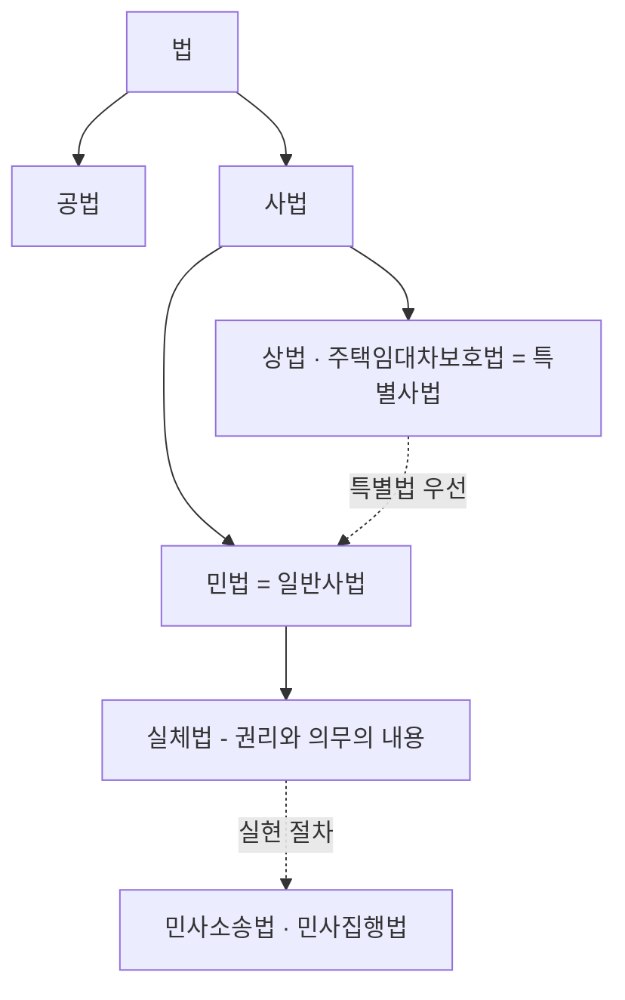
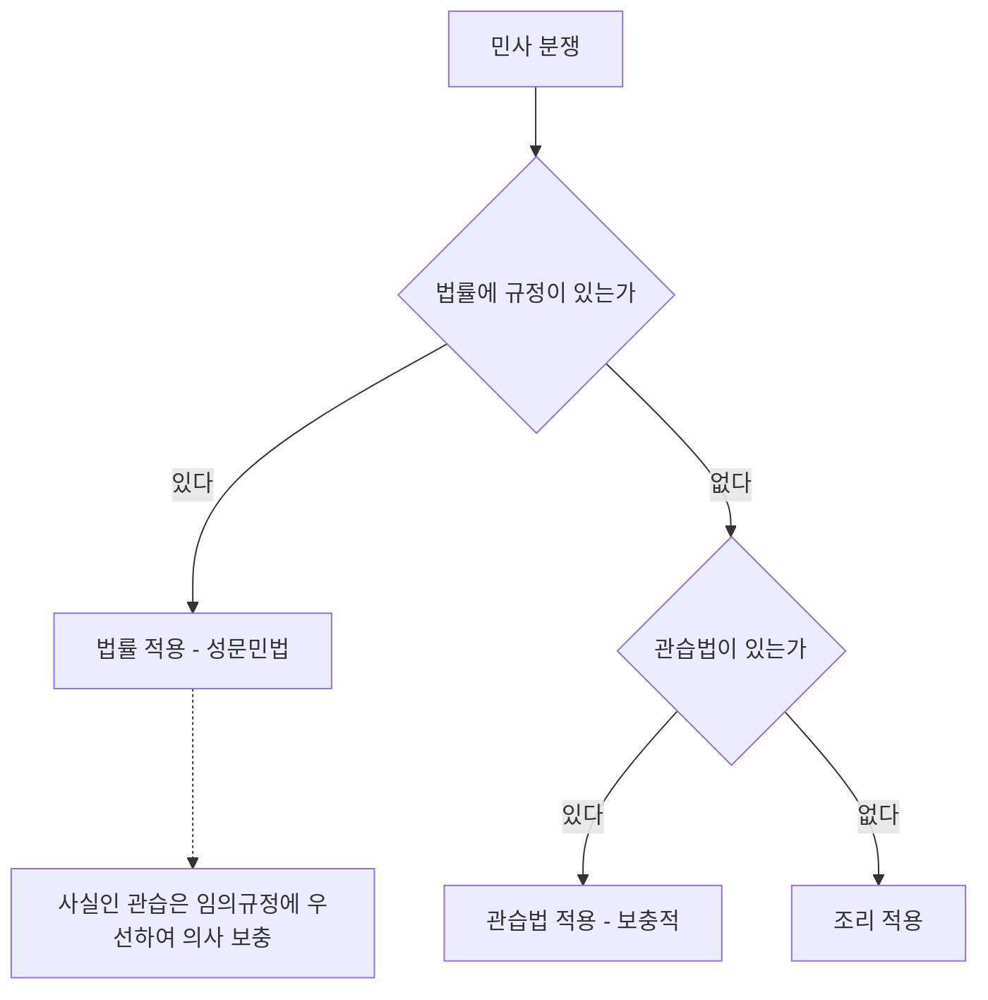
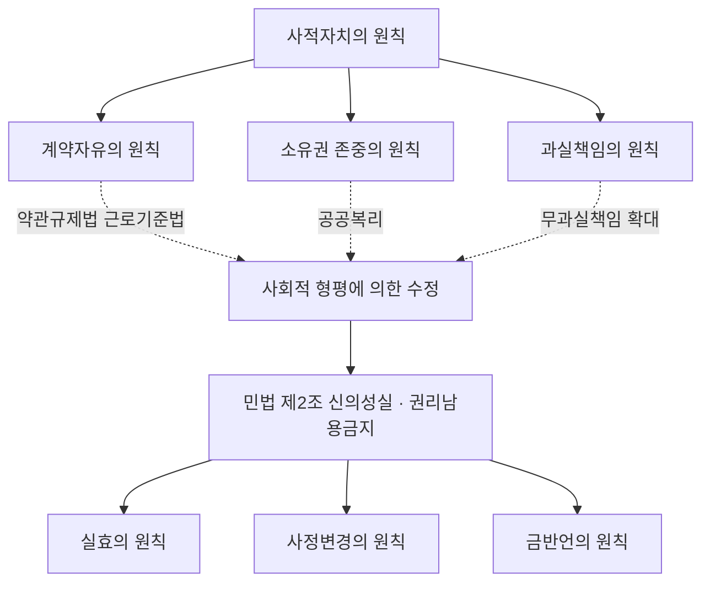
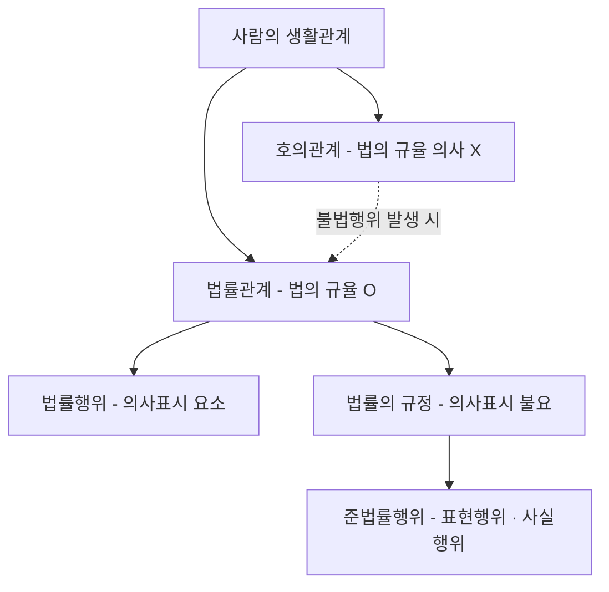
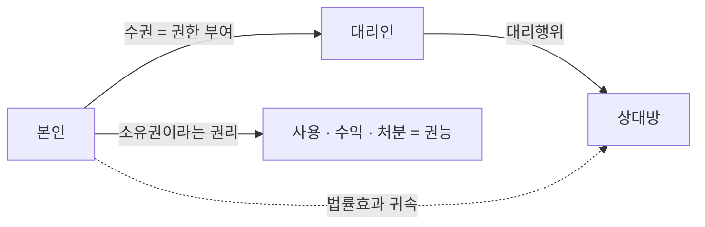
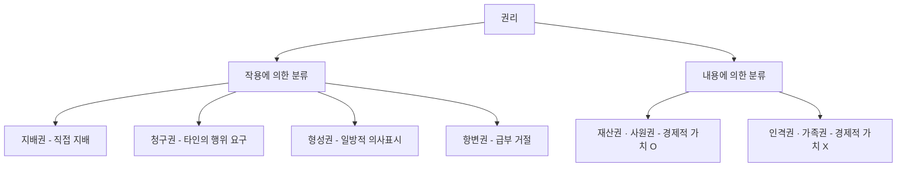
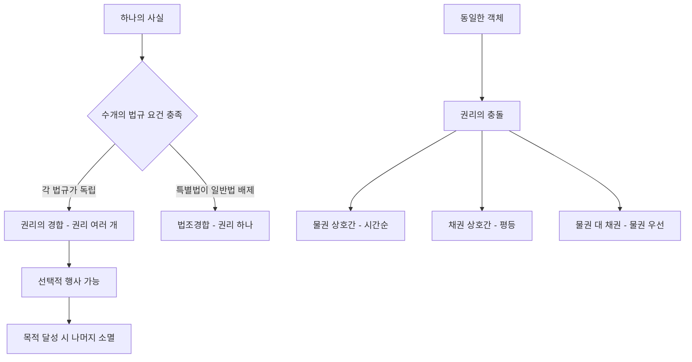

# 단원 M01 — 서론

> **영역**: 민법총칙
> **수업 주제**: 법원·법률관계·법률행위 변동

## 🗺️ 본문 목차

- [📘 위패스 마이 정리 (L1 - 메인 단권화)](#정리)
- [📖 핵심요약서 (L2 - 빠른 복습)](#핵심요약서)
- [📚 기본서 (L3 - 본격 학습)](#기본서)

---

## 📘 위패스 마이 정리 — L1 (메인·단권화)

> 김묘엽 교수 「위패스 마이 민법총칙/물권법」 교재 정리본.

### [민법총칙] 제1장 서론

## 제1장 서론

### 제1절 서론 및 민법의 성질

#### I. 서론

1. 의의
민법은 개인과 개인 사이의 권리의무를 규정하는 사법(私法)인 동시에 실체법이자

일반법이다.

2. 유형
(가) 형식적 의의의 민법

형식적 의미의 민법이란 1958년 제정 •공포되어

1960년

1월

일부터 시행된 민법전을 말한다.

(나) 실질적 의의의 민법

실질적 의미의 민법이란 민법전 외에 부동산등기법이나 주택

임대차보호법, 가족관계의등록등에관한법률 등 개인 간의 권리 • 의무에 관한 내용을

담고 있는 모든 법률들을 말한다.

#### II. 민법의 성질

1. 사법인 민법
가. 의의
법은 공법과 사법으로 구분할 수 있는데, 사법이란 사인간의 사적인 관계를 규율하

는 법을 말하고, 공법이란 개인과 국가 간 또는 국가기관 간의 공적인 관계를 규율 하는 법을 말한다 민법은 사법에 속한다.

나. 공법과 사법의 구분 공법과 사법을 구분하는 기준에 대해 이익설, 성질설, 주체설, 다원설 등 많은 학설 이 대립하나 판례는 국가가 당사자가 되는 이른바 공공계약은 사경제 주체로서 상
대방과 대등한 위치에서 체결하는 사법상 계약으로서 본질적인 내용은 사인 간의 계약과 다를 바가 없다(대판 2012.9.20. 2012마1097)고

하여 종합적으로 평가하여 결정

제1장 서 론 y오

하는 입장이다.

2. 일반법인 민법
가. 의의
법은 일반법과 특별법으로 구분할 수 있는데, 일반법이란 법률관계에 있어서 기본적

으로 적용되는 법을 말하고, 특별법이란 일반법 적용을 배제하기 위해 특별히 만든 법을 말한다. 민법은 일반법에 속한다.

나. 적용순서
같은 사항에 대해 일반법과 특별법이 존재하는 경우 특별법 우선의 원칙에 따라 특 별법이 먼저 적용된다. 주택에 대한 임대차계약에서는 민법의 임대차보다 특별법인

주택임대차보호법이 우선 적용된다.

3. 실체법인 민법
법은 실체법과 절차법으로 구분할 수 있는데, 실체법이란 당사자의 권리 • 의무를 규 정하는 법을 말하고, 절차법이란 실체적 권리를 보장하기 위한 절차를 규정한 법으

로 민사소송법, 민사집행법 등을 말한다. 민법은 실체법에 속한다.

### 제2절 민법의 기본원리

#### I. 사적자치로부터 출발

1. 역사적 배경
우리의 민법전은

19세기에

유럽의 영향을 받아서 자유주의적 세계관을 바탕으로 하

고 있다. 따라서 자유와 평등이라는 근대이념을 바탕으로 개인에게 많은 자유를 부 여하고 개인의 의사를 존중하는 것을 이상으로 삼고 있다. 따라서 민법의 내면에 깔

려있는 사고는 자신의 의사에 따라 자주적으로 법률관계를 처리하고,

이에 국가나

법질서는 직접적으로 개입하거나 간섭하면 안 된다는 사적자치의 원칙이다.

2. 내용
가. 계약자유의 원칙 계약법의 영역에서 당사자들은 국가를 포함한 타인의 간섭을 받지 않고 자기의 법 률관계를 스스로 정할 수 있다. 계약자유는 구체적으로 계약 자체를 맺을 것인지 여

부에 관한 체결의 자유, 누구와의 사이에 계약을 맺을 것인지에 관한 상대방 선택의

자유, 어떤 내용으로 계약을 맺을 것인지에 관한 내용결정의 자유 및 어떤 방식으로 계약을 맺을 것인지에 관한 방식의 자유를 내용으로 한다.

나. 소유권 존중의 원칙 개인이 자기 인격을 자유롭게 전개하기 위한 물질적 기초, 즉 소유권으로 대표되는

재산권을 존중하여 주는 소유권 존중의 원칙도 사적자치의 표현이다.

다. 과실책임의 원칙 개인의 자유로운 활동을 보장하여 주는 과실책임의 원칙도 사적자치의 한 내용인 자기책임의 원칙과 실질적으로 다르지 않다. 자기의 행위로 인하여 타인에게 재산상
손실 그 밖의 불이익을 주었을 때에, 자신의 행위에 의해 야기되었다는 사실만으로

행위자에게 책임이 부과되어서는 안 된다. 그 결과가 자기의 정신작용에 기한 것인 경우에 그 손해에 대해서 배상책임을 져야 하고 이를 과실책임의 원칙이라고 한다.

#### II. 국가나 법질서의 개입 필요성 개인의 자유와 평등을 강조했던 근대민법하에서 자본주의는 비약적인 발전을 이루었 고, 타인의 자유를 침해하거나 불평등한 관계를 야기하는 문제점이 발생하였다. 이

러한 상황 하에서 모든 국민에게 인간다운 생활을 보장해 주기 위하여 개인 상호간

의 법률관계를 사적자치에만 맡겨둘 수 없고, 국가나 법질서가 이에 개입하지 않으 면 안 된다는 결론에 이르게 되었다.

#### III. 사회적 형평의 고려 계약자유의 원칙은 기존의 계약의 자유를 일정한 경우에 제한하는 약관의 규제 등

에 관한 법률이나 근로기준법 등의 제정으로 계약의 공정을 지향하게 된다. 소유권 의 존중의 원칙은 공공의 복리를 위하여 제한되거나 법률의 범위 내에서만 허용되

는 제한을 받는다. 과실책임의 원칙은 특히 기업책임에 있어서 고의나 과실이 없더 라도 그 손해를 배상할 책임을 부담하여야 한다는 무과실책임의 범위를 넓히고 있다.

### 제3절 기초정리

#### I. 조문 읽는 방법

> **제36조 (용도지역의 지정)** ① 국토교통부장관, 시 • 도지사 또는 대도시 시장은 다음

각 호의 어느 하나에 해당하는 용도지역의 지정 또는 변경을 도시 • 군관리계획으로 결정한다.
1.

도시지역: 다음 각 목의 어느 하나로 구분하여 지정한다.

가. 주거지역: 거주의 안녕과 건전한 생활환경의 보호를 위하여 필요한 지역

나. 상업지역: 상업이나 그 밖의 업무의 편익을 증진하기 위하여 필요한 지역
다. 공업지역: 공업의 편익을 증진하기 위하여 필요한 지역

라. 녹지지역 : 자연환경 • 농지 및 산림의 보호, 보건위생, 보안과 도시)무질서한 확산을 방지하기 위하여 녹지의 보전이 필요한 지역 2.

관리지역: 다음 각 목의 어느 하나로 구분하여 지정한다.

가. 보전관리지역: 자연환경 보호, 산림 보호, 수질오염 방지, 녹지공간 확보 및 생태계 보

전 등을 위하여 보전이 필요하나, 주변 용도지역과의 관계 등을 고려할 때 자연환경보 전지역으로 지정하여 관리하기가 곤란한 지역

나. 생산관리지역 : 농업 • 임업 • 어업 생산 등을 위하여 관리가 필요하나, 주변 용도지역과의 관계 등을 고려할 때 농림지역으로 지정하여 관리하기가 곤란한 지역

다. 계획관리지역: 도시지역으로의 편입이 예상되는 지역이나 자연환경을 고려하여 제한적 인 이용 • 개발을 하려는 지역으로서 계획적 • 체계적인 관리가 필요한 지역 3.

농림지역

4.

자연환경보전지역

② 국토교통부장관, 시 • 도지사 또는 대도시 시장은 대통령령으로 정하는 바에 따

라 제1항 각호및 같은 항각호각목의 용도지역을 도시 - 군관리계획결정으로 다

시 세분하여 지정하거나 변경할 수 있다.
(가) 제36조

제36조라고 읽는다.

(나) 제36조 ①

제36조 제1항이라고 읽는다.

) 제36조 ① 1.

제36조 제1항 제1호라고 읽는다.

(라) 제36조 ① 1. 가.

제36조 제1항 제1호 가목이라고 읽는다.

#### II. 선의 • 악의

(가) 선으I (善意)
(나)

#### III. 선의란 어떤 사정을 알지 못하는 것을 말한다

악의(惡意)

악의란 어떤 사정을 알고 있는 것을 말한다.

고의 - 과실

1. 고의
고의란 일정한 결과의 발생을 인식하면서 의도적으로 행하는 것을 말한다.

2. 과실
가. 의의

.

과실이란 주의의무의 부족으로, 즉 주의의무를 지키지 못하여 결과를 피하지 못한 실 수를 말한다. 과실은 주의의무의 기준에 따라 추상적 과실과 구체적 과실로 나뉜다.

나. 추상적 과실
(가) 의의

추상적 과실이란 평균인을 기준으로 한 주의의무를 지키지 못한 것을 말한

다. 이를 ‘선량한 관리자의 주의의무 위반’ 줄여서 ‘선관주의의무 위반’이라 한다.
(나)
경과실

) 중과실

경과실이란 선관주의의무를 위반한 것을 말한다.

중과실이란 선관주의의무를 현저하게 위반한 것을 말한다.

다. 구체적 과실
구체적 과실이란 개인을 기준으로 한 주의의무를 지키지 못한 것을 말한다.

이를

‘자기재산과 동일한 주의의무 위반’ 줄여서 ‘자기주의의무 위반’이라 한다.

3. 고의와 과실의 관계 귀책사유란 행위자의

일정한 정신작용에 따라 발생한 결과에 책임을 지우게 하는

것으로 고의 •과실을 말한다. 형법에서는 고의범과 과실범은 처벌 유무와 형량의 결 정에서 차별을 두는데 반해, 민법에서는 고의범이든 과실범이든 발생한 결과에 대하 여 손해배상책임을 지기 때문에 효과면에서 고의와 과실을 동등하다고 본다.

#### IV. 양자의 연습

1. 알았거나 알 수 있었을 경우에 무효로 한다.
(가) 악의 또는 과실
(나)

악의 또는 과실인 경우에 무효로 한다.

악의 그리고 과실

악의 그리고 과실인 경우에 무효로 한다

(다) 악의 그리고 무과실
(라) 선의 그리고 과실

악의 그리고 무과실인 경우에 무효로 한다.
선의 그리고 과실인 경우에 무효로 한다.

(다) 선의 그리고 무과실

선의 그리고 무과실인 경우에 유효로 한다.

2. 알았거나 중대한 과실이 있는 경우에 무효로 한다.
(가) 악의 또는 중과실
(나)

악의 또는 중과실인 경우에 무효로 한다.

악의 그리고 중과실

) 악의 그리고 무중과실
(라) 선의 그리고 중과실

(다) 선의 그리고 무중과실

악의 그리고 중과실인 경우에 무효로 한다.

악의 그리고 무중과실인 경우에 무효로 한다.
선의 그리고 중과실인 경우에 무효로 한다.

선의 그리고 무중과실인 경우에 유효로 한다.

제장 서 론 • 15

---

---

### [민법총칙] 제2장 법원

## 제2장 법원

### 제1절 민법의 법원[法源]

#### I. 의의

> **제1조 (법원)** 민사에 관하여 법률에 규정이 없으면 관습법에 의하고 관습법이 없으 면 조리에 의한다.

법원(法源)이란 법의 존재형식, 즉 법관이 재판을 함에 있어서 적용하여야 할 기준 을 말한다

#### II. 법률 민법 제1조(법원)의 법률은 국회에서 제정한 법률, 형식적 의미의 법률, 민법전만을 의미하는 것은 아니다. 각종의 명령(대통령의 민사에 관한 긴급명령,

긴급재정경제

명령 등), 각종의 규칙(대법원 규칙 등), 지방자치단체의 조례와 규칙, 헌법에 의하 여 체결 •공포된 조약과 일반적으로 승인된 국제법규 등이 전부 포함된 성문법을 의 미하고 법령이라고도 부른다.

#### III. 관습법

1. 서설
가. 의의
관습법은 사회의 거듭된 관행으로 생성한 사회생활규범이 사회의 법적 확신과 인식

에 의하여 법적 규범으로 승인 • 강행되기에 이른 것을 말한다(대판 1983.6.14. 80다32

31).

나. 입증책임
관습법은 당사자의 주장• 입증을 기다림이 없이 법원(法院)이 직권으로 이를 확정하 여야 한다(대판 1983.06 14

16 - 위퍠스 - 마이 민법총칙

80다3231).

2. 법규범으로서의 효력 반복된 관행이 사회구성원들에게 법적 확신을 얻은 때로 소급하여 법규범으로서의

관습법이 성립하고 법원의 판결은 이미 생성된 관습법을 확인하는 절차에 불과하다.

3. 법규범으로서의 효력이 부정
가. 요건의 흠결
관습법으로 승인되었다고 하더라도 사회 구성원들이 그러한 관행의 법적 구속력에 대하여 확신을 갖지 않게 되었다면 그러한 관습법은 법적 규범으로서의 효력이 부 정될 수밖에 없다(대판 2003.7.24. 2001다48781

전합).

나. 성문법 • 법령에 저촉 (D 학설

(가) 보충적 효력설

보충적 효력설이란 민법 제1조의 규정에 따라 관습법은 성문법에

규정이 없을 때에만 적용된다는 견해이다.
(나)

변경적 효력설

변경적 효력설이란 신법우선의 원칙에 따라 기존의 성문법과 다른

내용의 새로운 관습법이 성립하면 관습법이 우선 적용되어 기존의 성문법을 변경한 다는 견해이다.

(2) 판례

관습법은 바로 법원(法源)으로서 법령과 같은 효력을 갖는 관습으로서 법령에 저촉

되지 않는 한 법칙으로서의 효력이 있는 것이다.

법령에 저촉되면 관습법으로서의

효력을 상실한다. 따라서 관습법은 성문법에 대하여 열후적• 보충적 성격을 가진다
(대판 1983.6.14. 1.

80다3231).

종래 관습법으로 분묘기지권의 시효취득을 인정 - 장사 등에 관한 법률시행 후 분묘기지권의 시효취득 인정X________ _________________________________________________

분묘기지권의 시효취득을 인정하지 않는"장사 등에 관한 법률"이 시행된 후에 설치된 분묘에 관해서는 종래 관습법으로 인정되어 왔던 분묘기지권의 시효취득이 더 이상

인정되지 않는다(대판 2017.1.19. 2013다17292

전합).

다. 헌법에 저촉
(1) 관습법은 전체법질서에 반하지 않아야 한다.

사회의 거듭된 관행으로 생성된 사회생활규범이 관습법으로 승인되기에 이르렀다고 하기 위해서는 헌법을 최상위 규범으로 하는 전체 법질서에 반하지 아니하는 것으 로서 정당성과 합리성이 있다고 인정될 수 있는 것이어야 한다(대판 2003.7.24. 2001다48781 전합).

(2) 종래 관습법을 적용해야 할 시점에 전체법질서에 반하는 경우

사회의 거듭된 관행으로 생성된 사회생활규범이 관습법으로 승인되었다고 하더라도 사회를 지배하는 기본적 이념이나 사회질서의 변화로 인하여 그러한 관습법을 적용

하여야 할 시점에 있어서의 전체 법질서에 부합하지 않게 되었다면 그러한 관습법 은 법적 규범으로서의 효력이 부정될 수밖에 없다(대판 2005.7.21. 2002다1178

전합).

종중의 구성원을 남자만으로 학고 여자를 제외시킨 종래의 관습법 - 법적 효력X

공동선조의 후손 중 성년 남자만을 종중의 구성원으로 하고 여성은 종중의 구성원이 될 수 없다는 종래의 관습은, 공동선조의 분묘수호와 봉제사 등 종중의 활동에 참여 할 기회를 출생에서 비롯되는 성별만에 의하여 생래적으로 부여하거나 원천적으로 박

탈하는 것으로서, 앞으로 더욱 강화될 남녀평등의 원칙이라는 전체 법질서에 부합하 지 아니하여 정당성과 합리성이 있다고 할 수 없으므로, 종중 구성원의 자격을 성년 남자만으로 제한하는 종래의 관습법은 이제 더 이상 법적 효력을 가질 수 없게 되었

다(대판 2005.7.21. 2002다1178

전합).

라. 판례변경
종래의 판결은 시효취득한 분묘기지권은 관습법상 지료를 지급할 필요가 없다는 입 장이었으나 대법원 전원합의체를 통해 토지 소유자가 지료를 청구하면 지료를 지급 해야 한다고 기존 관습법의 효력을 부정하였다(대판 2021.04 29.

2017다228007

전합).

#### IV. 조리 조리란 사물의 도리를 말한다. 재판관은 법률 또는 관습법이 없다고 재판을 거부할

수 없으므로 법원(法源)에 법의 존재형식을 가지지 아니한 조리가 포함되었다.
h.

성별의 구별없이 성년이 되면 종중의 구성원이 된다 - 조리에 합당 종중원의 후손은 성별의 구별 없이 성년이 되면 당연히 그 구성원이 된다고 보는 것

이 조리에 합당하다(대판 2007.09.06.

#### V. 2007다34982).

법원(法源)에 따라 판결한 내용의 법원성 인정여부

1. 법원
법원조직법에는 “상급법원 재판에서의 판단은 해당 사건에 관하여 하급심을 기속한
다.”는 규정이 있다. 이는 상급법원 재판은 해당 사건에 한해서만 구속력을 가질 뿐

일반적인 구속력은 가지지 않음을 뜻한다. 따라서 판례는 민법의 법원(法源)이 되지 못한다.

2. 헌법재판소
법률에 대한 헌법재판소의 위헌결정은 법원 기타 국가기관 및 지방자치단체를 기속

한다(헌재법 제47조 제1항). 이는 헌법재판소의 결정이 일반적인 구속력을 가짐을 뜻한
다. 따라서 헌법재판소의 결정내용이 민사에 관한 것인 때에는 민법의 법원(法源)이

된다.

#### VI. 사실인 관습

1. 서설
가. 의의
사실인 관습은 사회의 관행에 의하여 발생한 사회생활규범인 점에서 관습법과 같으

나 관습법과 달리 사회의 법적 확신이나 인식에 의하여 법적 규범으로서 승인된 정 도에 이르지 않은 것을 말한다(대판 1983.6.14. 80다3231).

t〈法 總 M

나. 입증책임
(가 주류적인 판례태도 983.06.14

80다3231)는

(나) 예외적인 판례태도

사실인 관습은 그 존재를 당사자가 주장 입증하여야 한다(대판 1

것이 판례의 주류적인 입장이다.
사실인 관습은 일반생활에 있어서의 일종의 경험칙에 속한다

할 것이고 경험칙은 일종의 법칙인 것이므로 법관은 어떠한 경험칙의 유무를 판단 함에 있어서는 당사자의 주장이나 입증에 구애됨이 없이 스스로 직권에 의하여 판

단할 수 있다(대판 1976.07.13.
(다) 수험에 적합한 정리

76다983)는

예외적인 판례도 있다.

사실인 관습은 당사자가 주장• 입증할 수도 있지만 법원이 직

권에 의하여 판단할 수도 있다.

2. 의사를 보충하는 효력

> **제106조 (사실인 관습)** 법령중의 선량한 풍속 기타 사회질서에 관계없는 규정( = 임 의규정)과 다른 관습이 있는 경우에 당사자의 의사가 명확하지 아니한 때에는 그

관습에 의한다.
관습법은 바로 법원으로서 법령과 같은 효력을 갖는 관습으로서 법령에 저촉되지

않는 한 법칙으로서의 효력이 있는 것이며, 이에 반하여 사실인 관습은 법령으로서

의 효력이 없는 단순한 관행으로서 민법 제1조의 법원(法源)이 될 수 없고 법률행위

의 당사자의 의사를 보충함에 그치는 것이다(대판 1983.6.14. 80다3231).

1. 임의규정 - 사실은 관습은 의사를 보충하는 기능

2. 강행규정 - 강행규정 자체에 결함이나 관습에 따르도록 위임한 경우 외에는 사실 인 관습에 법적 효력이 없음

사실인 관습은 사적자치가 인정되는 분야 즉 그 분야의 제정법이 주로 임의규정일 경 우에는 법률행위의 해석기준으로서 또는 의사를 보충하는 기능으로서 이를 재판의 자

료로 할 수 있을 것이나 이 이외의 즉 그 분야의 제정법이 주로 강행규정일 경우에는 그 강행규정 자체에 결함이 있거나 강행규정 스스로가 관습에 따르도록 위임한 경우

등 이외에는 법적 효력을 부여할 수 없다(대판 1983.6.14. 80다3231).

### 제2절 물권법의 법원[法源]

I -

의의

> **제185조 (물권의 종류)** 물권은 법률 또는 관습법에 의하는 외에는 임의로 창설하지 못한다.
물권법정주의란 물권의 종류와 내용은 법률 또는 관습법이 정하는 것에 한정되며,

당사자들이 임의로 이와 다른 물권을 창설하는 것이 금지되는 것을 말한다. 제185조는 물권법정주의를 규정하였다.

#### II. 법률 물권법정주의의 법률은 국회에서 제정되는 법률, 즉 형식적 의미의 법률만을 의미한

다. 각종의 명령, 각종의 규칙 등은 포함되지 않는다.

#### III. 관습법

1. 관습법상의 물권을 인정한 판례
1. 분묘기지권 - 관습법상의 물권O

2. 장사 등에 관한 법률 시행 후에도 분묘기지권 소멸 X
타인 소유의 토지에 분묘를 설치한 경우에

20년간

평온, 공연하게 분묘의 기지를 점

유하면 지상권과 유사한 관습상의 물권인 분묘기지권을 시효로 취득한다는 점은 오랜

세월 동안 지속되어 온 관습 또는 관행으로서 법적 규범으로 승인되어 왔고, 이러한 법적 규범이"장사 등에 관한 법률"시행일인 2001

1.

13.

이전에 설치된 분묘에 관

하여 현재까지 유지되고 있다고 보아야 한다(대판 2017.1.19. 2013다17292 전합).

| 3. 관습법상 법정지상권 - 관습법상의 물권O
동일인의 소유에 속하였던 토지 및 가옥이 매매로 인하여 각기 소유자를 달리할 때에 는 그 가옥의 매매에 있어 이를 철거한다는 특약이 없는 한 가옥소유자는 그 가옥을

위하여 관습법상의 법정지상권을 취득한다(대판 1965.9.23. 65다1222).
K 法 總 J히

| 4三 명인방법- 관습법상으 |j물권 O

_

_

_

관습법에 의하여 명인방법은 입목소유권 변동에 관한 공시방법으로 인정되고 있다(대

판 1967 02 28.

66다2442).

미분리과실은 관습법상의 명인방법을 갖추었을 때 수목 또

는 토지와는 별개로 독립한 물건이 된다(대판 1972.02.29. 기다2573).

2.

관습법상의 물권을 부정한 판례 11.

관습상의 사도통행권 - 관습법상의 물권!x
타인의 토지에 대한 관습상의 사도통행권은 인정되지 않는다(대판 2002.2.26. 2001다6
4165).

| 2. 온천에 관한 권리 - 관습법상의 물권 X
온천에 관한 권리는 관습상의 물권이나 준물권이라 할 수 없고 온천수는 공용수 또는 생활상 필요한 용수에 해당되지 않는다(대판 1972.8.29. 72다1243).

|3. 공원이용권 - 관습법상의 물권X
도시공원법상 근린공원으로 지정된 공원은 일반 주민들이 다른 사람의 공동 사용을 방해하지 않는 한 자유로이 이용할 수 있지만 그러한 사정만으로 인근 주민들이 누구

에게나 주장할 수 있는 공원이용권이라는 배타적인 권리를 취득하였다고는 할 수 없 다(대판 1995.5.23. 94마2218).

| 4. 소유권에 준하는 관습상의 물권三관습법상의 로궈X____ _________

_

미등기 무허가건물의 매수인은 소유권이전등기를 마치지 않는 한 건물의 소유권을 취 득할 수 없고, 소유권에 준하는 관습상의 물권이 있다고도 할 수 없으며, 현행법상 사 실상의 소유권이라고 하는 포괄적인 권리 또는 법률상의 지위를 인정하기도 어렵다

(대판 2014 02.13.

#### IV. 2011다64782).

물권법정주의 위반
물권법정주의는 강행규정이므로 법률 또는 관습법이 인정하지 않는 새로운 종류의

물권을 창설하거나 다른 내용을 물권에 부여하지 못하고 이를 위반한 당사자 간의

약정은 무효가 된다.

22 - 위퍠스 - 마이 민법총칙

### 제3절 민법의 효력범위 (가) 시간

‘본법 시행일 전의 사항에 대하여도 이를 적용한다’ 라고 하여 원칙적으로 소

급효를 인정하고 있다. 그러나 이미 구법에 의하여 생긴 효력에는 영향을 미치지 아

니한다(부칙 제2조 단서).
(L)대상

우리나라의 국민에게 민법이 적용된다

따라서 국민이 국내에 있든 국외에

있든 상관없이 민법이 적용된다.

(＞=) 장소

우리나라의 영토 전반에 민법이 적용된다. 따라서 우리 영토 내에 있는 외국

인과 북한의 지역에도 민법이 적용된다.
---

법률관계와 권리의무

### 제1절 법률관계

#### I. 의의

법률관계란 사람의 생활관계 중 법률의 규율을 받는 것을 말한다. 우리의 생활관계

대부분이 이러한 법에 의한 규율을 받게 되고 그 속에서 법적인 ‘의무’를 가지는 자 와 ‘권리’를 가지는 자가 발생하게 된다.

#### II. 분류

1. 유형
법률관계의 대부분은 의사표시를 요소로 하는 법률행위를 통해서 발생하지만, 경우

에 따라서는 의사표시 없이도 법률이 정한 일정한 요소를 통해서 발생하기도 한다.

2. 법률행위
가. 의의
법률행위란 법률사실1,중에서 하나 또는 수개의 의사표시를 요소로 하는 법률요건을

말한다. 의사표시는 법률행위의 필수불가결한 요소이다. 매매계약에 따른 권리와 의 무는 물건을 팔고자 하는 자와 물건을 사고자 하는 자 사이에 의사표시에 의해서 성립된다.

나. 유형
의사표시 하나로 성립하는 법률행위(소유권의 포기 등)의 경우 의사표시와 법률행위

는 동일하지만, 하나 이상의 의사표시로 성립하는 법률행위(계약 등)의 경우 의사표 시와 법률행위는 동일하지 않다. 확실한 것은 법률행위는 항상 하나 이상의 의사표

시를 요소로 한다.

01)

법률관계가 성립하기 위해서는 사안에 따라 다양한 요건들을 갖추어야 하는데, 이러한 법률요건을

구성하는 개개의 요소가 법률사실이다.

다. 효과
법률행위는 당사자의 의사가 의욕하는 대로 법률효과가 생긴다. 그 의사표시에 따라

효력이 생기는 것을 ‘유효’라고 하고, 효력이 생기지 않는 것을 ‘무효’라고 한다.

3. 법률의 규정
가. 의의
법률의 규정이란 의사표시 없이 법률이 정한 일정한 요건을 요소로 하는 법률요건

을 말한다. 교통사고로 발생한 손해에 대한 불법행위 손해배상청구는 민법 제750조 에 따른 법률의 규정에 의해서 발생한다.

나. 유형
법률규정에 의한 법률관계는 사망, 법정추인, 소멸시효에 의한 권리소멸, 점유의 취

득, 건물의 신축에 의한 소유권취득, 무주물 선점에 의한 소유권취득, 유실물의 습 득에 의한 소유권취득, 매장물의 발견에 의한 소유권취득, 취득시효에 의한 소유권

취득, 법정지상권, 유치권의 취득 등이 있다.

다. 효과
법률규정은 법률에서 정한 일정한 법적 효과가 부여된다. 교통사고로 발생한 손해에

대한 불법행위 손해배상청구는 제394조에 의해서 금전으로 배상하도록 하고 있다.

#### III. 법률행위와 법률의 규정과의 관계

1. 의의
법률행위와 법률의 규정은 서로 별개임이 원칙이지만, 경우에 따라서 양자는 상호간

에 영향을 미치게 된다

법률행위의 효과가 법률의 규정에 의해 발생하기도 하고,

법률규정과 다른 내용의 법률행위를 하는 경우도 있다.

2. 준법률행위
가. 의의
준법률행위란 표의자가 어떠한 의사표시를 하였는데 당사자가 의욕하는 대로 법률효 과가 발생하는 것이 아니라 그와 무관하게 법률이 정한 법적효과가 발생되는 것을 말한다. 따라서 준법률행위는 어떠한 효과의사도 필요하지가 않다(대판 2013.2.28. 11 다21556).

나. 유형

(D 분류

준법률행위에는 다시 표현행위와 사실행위로 나뉜다.

표현행위는 의식내용을 다른

사람에게 전달하는 것으로 의사의 통지, 관념의 통지, 감정의 표시가 있다.

(2) 표현행위

(가) 의사의 통지

의사의 통지란 자기의 의사를 알리는 행위이다. 각종의 최고(제88조,

제89조, 제131조, 제387조, 제540조, 제552조 등)와 확답에 대한 촉구(제15조), 각종의 거절 (통설과 달리 소수설은 각종의 거절은 의사표시라고 본다) 등은 의사의 통지로 준법률

행위에 해당한다.
(니 관념의 통지
125조,

관념의 통지란 일정한 사실을 알리는 행위이다. 각종의 통지(제기조, 제

제450조, 제488조), 각종의 승낙(제450조), 각종의 승인(제168조) 등은 관념의 통지

로 준법률행위에 해당한다.

(다) 감정의 표시

감정의 표시란 일정한 감정을 나타내는 행위이다. 배우자의 부정행위

에 대한 용서(제841조), 수증자의 망은행위에 대한 용서(저］556조) 등이 있다.

(3) 사실행위

사실행위란 법률이 행위자의 의사와 관계없이 법률효과를 부여하는 사실적인 결과에

향하여진 행위이다. 통설은 사실행위를 외부적 결과의 발생만 있으면 법률이 일정한 효과를 부여하는 순수 사실행위와 그 밖에 어떤 의식과정이 따를 것을 요구하는 혼 합 사실행위로 나누고 있다. 순수 사실행위로는 주소의 설정, 매장물의 발견, 가공,
부합 등을 들 수 있다. 혼합 사실행위에 있어서는 사람의 의사가 뒤따라야 한다. 그

러나 여기의 의사는 법률행위에 있어서의 의사와 달라 자연적 의사라고 한다. 혼합

사실행위는 점유의 취득과 상실, 유실물 습득, 무주물 선점, 사무관리 등을 들 수 있다.

다. 효과

(1) 법률규정에 의한 효과발생

준법률행위는 당사자의 의사와는 관계없이 법률규정에서 정한 일정한 법적 효과가 부여된다.

(2) 의사표시 - 법률행위에 관한 규정의 유추적용

준법률행위는 성질이 허용하는 한 특히 의사의 통지와 관념의 통지의 경우에는 의 사표시 내지 법률행위에 관한 규정이 유추적용 된다. 따라서 준법률행위 중에서도

의사의 통지와 관념의 통지도 제한능력자,

의사표시의 효력발생,

대리, 조건• 기한

부분이 유추적용 되게 된다.

11. 통자의 도들三으!사표시으I 도달주의 유추적용_________
채권양도의 통지와 같은 준법률행위의 도달은 의사표시와 마찬가지로 사회관념상 채

무자가 통지의 내용을 알 수 있는 객관적 상태에 놓여졌을 때를 지칭하고, 그 통지를

채무자가 현실적으로 수령하였거나 그 통지의 내용을 알았을 것까지는 필요하지 않 다(대판 1983.8.23. 82다카439).

3. 법률규정과 다른 법률행위의 효력
가. 문제점
일정한 행위를 금지하는 법률규정과 다른 내용의 법률행위가 효력이 있는지(=유효인 지), 효력이 없는지(=무효인지)가 문제된다. 이런 경우에 법률의 규정이 가지는 법률 효과가 어떤 성격을 가지고 있는지를 정해야 한다.

나. 임의규정

> **제105조 (임의규정)** 법률행위의 당사자가 법령 중의 선량한 풍속 기타 사회질서에 관계없는 규정( = 임의규정)과 다른 의사를 표시한 때에는 그 의사에 의한다.
(가) 의의
(나)

임의규정이란 선량한 풍속 기타 사회질서에 관계없는 규정을 말한다.

임의규정에 반한 법률행위의 효력

임의규정에 반하는 내용의 법률행위를 정하면

그 내용대로 효력이 발생한다.
다. 강행규정
(가 의의

강행규정이란 선량한 풍속 기타 사회질서에 관계있는 규정을 말한다.

(니 강행규정에 반한 법률행위의 효력

강행규정에 반하는 내용의 법률행위를 정하면

그 내용대로 효력이 발생하지는 않는다.

라. 판정기준
어떤 법률규정이 강행규정인지 임의규정인지를 결정하는 일반적인 기준은 없다. 법

률자체에서 강행규정임을 명시적으로 나타내는 경우가 있으나, 그렇지 않은 경우에 는 법률의 입법목적 • 성질 등을 종합적으로 고려하여 판단하여야 한다.

#### IV. 호의관계

1. 의의
호의관계란 법률의 규율을 받을 의사가 없이 어떤 행위를 해주기로 하는 관계를 말

한다.

2. 효과
가. 법률관계 발생 안함
호의관계의 당사자 간에 권리나 의무가 발생하지 않으므로 이행을 청구할 수도 없 고, 이행을 하지 않았다고 하여 강제이행이나 채무불이행 손해배상을 청구할 수도 없다.

나. 예외적인 법률관계 발생 호의관계 중에 불법행위가 발생하게 되면 불법행위 손해배상을 청구할 수 있기 때 문에 호의관계는 법률관계로 비화된다. 호의동승에 있어서 운전자의 과실로 동승자

가 다친 경우에 동승자는 운전자에게 불법행위 손해배상을 청구할 수 있다.

### 제2절 권리와 의무

#### I. 서설

1. 의의
권리란 일정한 이익을 향유할 수 있도록 법이 부여한 힘이고, 의무란 법률상 강요되 는 구속을 말한다. 권리 •의무관계로서의 법률관계는 처음에는 의무를 중심으로 규

율하였다가 개인의 자유를 중시하는 근대에 이르러 권리를 중심으로 규율하고 있다.

2. 구분
(가) 권한

권한이란 타인을 위해 일정한 행위를 하고 그로 인한 법률효과를 그 타인에

게 발생하게 할 수 있는 법률상의 자격이나 지위를 말한다. 대리권, 대표권, 부재자

재산관리인의 재산관리권, 사원의 의결권 등이 권한이다.
(나)

권능

권능이란 권리의 내용을 이루는 개개의 법률상의 힘을 말한다. 소유권의 내

용인 사용•수익권, 처분권 등이 권능이다

(다)권원

권원이란 일정한 법률상 또는 사실상 행위를 정당화하는 법률상 원인을 말한

다. 타인의 부동산에 건물 등을 지은 경우에 소유자의 건물철거에 대항하기 위해서

주장할 수 있는 지상권과 임차권 등이 권원이다.
(라) 반사적 이익

반사적 이익이란 법률이 어느 특정인이나 일반인에게 특정 행위를 명

함으로써 다른 특정인 또는 일반인이 누리는 이익을 말한다.

#### II. 권리의 종류

1. 작용에 따른 분류
가. 의의
작용에 따른 분류란 법률상의 힘의 정도를 기준으로 권리를 분류하는 것을 말한다.

타인의 행위를 필요로 하지 않는 것으로 지배권과 형성권이 있고, 타인의 행위를 필

요로 하는 청구권과 청구권의 행위를 거절하는 항변권이 있다.
나. 지배권
지배권이란 타인의 행위를 매개하지 않고 일정한 객체를 직접 지배할 수 있는 권리 를 말한다. 지배권에는 재산권 중에서는 물권뿐만 아니라 지식재산권도 이에 포함되 고, 비재산권 중에서는 인격권 등이 있다

다. 청구권
(가 의의

청구권이란 권리자가 어떤 사람에게 일정한 행위를 요구할 수 있는 권리를

말한다. 청구권은 채권에서 나오는 것이 보통(채권적 청구권)이지만 물권(물권적 청구

권)이나 가족법상의 권리에 기해서 발생(가족법상의 청구권)하기도 한다.
(나) 유형

청구권은 일반적으로 재판상•재판외의 구분 없이 행사할 수 있지만, 반드시

법원의 판결을 통해 재판상으로만 행사하여야 하는 청구권도 있다.

점유권에 기한

물권적 청구권은 재판상으로만 행사하여야 하고, 이에 대한 행사기간을 출소기간이

라 한다(대판 2002.4.26. 20이다8097,8103).

라. 항변권
(거 의의

항변권이란 청구권의 행사에 대해 일정한 이유에 의해 급부를 거부할 수 있

는 권리를 말한다. 항변권을 행사한다고 하여 청구권자의 권리자체를 소멸시키는 것 은 아니다.
(나)

유형

상대방의 청구권의 행사를 일시적으로 저지하는 연기적 항변권(동시이행의 항

변권, 보증인의 최고• 검색의 항변권 등)과 상대방의 청구권을 영구적으로 저지하는 영 구적 항변권(상속의 한정승인 등)이 있다.

마. 형성권

(1) 의의

형성권이란 권리자의 일방적 의사표시에 의하여 법률관계의 발생, 변경, 소멸 즉 권 리의 변동을 가져올 수 있는 권리를 말한다. 따라서 형성권의 효력이 발생함에 있어

서 상대방의 동의나 승낙이 필요하지 않는다. 형성권의 성질상 권리의 일부만을 행

사할 수는 없다

(2) 유형

(가) 형성권 자체

형성권은 일반적으로 재판상• 재판외의 구분 없이 행사할 수 있지만

(동의권, 취소권, 추인권, 계약의 해제•해지, 최고권 채무의 면제권, 상계권, 담보책임,

매매의 일방예약완결권 등), 반드시 법원의 판결을 통해 재판상으로만 행사하여야 하 는 형성권(채권자취소권)도 있다.
(나)

청구권으로 표시되었으나 형성권인 권리

유물분할청구권,

지상물매수청구권, 부속물매수청구권, 공

지료증감청구권, 대금감액청구권, 차임 증감청구권 등은 청구권이 라

는 표현을 쓰고 있으나 실상은 형성권이다.

2. 내용에 따른 분류
가. 의의
권리의 내용에 따른 분류란 내용을 이루는 구체적 이익이 경제적 가치를 가지는지

를 기준으로 권리를 분류하는 것이다. 경제적 가치를 가지는 것으로 재산권과 사원

권이 있고, 경제적 가치를 가지지 않은 것으로 인격권과 가족권이 있다.

나. 가족권
(가 의의

가족권이란 일정한 신분관계가 있음으로써 인정되는 권리로 부양청구권, 상속

권 등이 있다. 일신전속권이란 권리의 성질상 타인에게 귀속시킬 수 없는 권리를 말

한다.
(나)

유형

일신전속권에는 권리의 주체만이 향유할 수 있고 타인에게 양도•상속이 불가

능한 귀속상의 일신전속권(부양청구권 등)과 권리의 주체만이 행사할 수 있고 타인이 대위하여 행사할 수 없는 행사상의 일신전속권(유류분반환청구권, 이혼으로 인한 재산

분할청구권 등)이 있다.

다. 사원권
사원권이란 단체의 구성원이 그 지위에 기하여 가지는 포괄적 권리를 말한다. 사원

권에는 자익권(이익배당청구권,

잔여재산분배청구권 등)과 공익권(의결권,

소수사원권,

사원총회소집청구권 등)이 있다.

라. 인격권
인격권이란 사람의 생명 • 신체 자유 • 명예 •신용• 초상 등과 같이 권리자의 인격과 분

리할 수 없는 사회생활상 이익을 보호하기 위하여 인정된 권리를 말한다. 명예권에

기초하여 가해자에 대하여 현재 이루어지고 있는 침해행위를 배제하거나 장래에 생 길 침해를 예방하기 위하여 침해행위의 금지를 구할 수도 있다(대판 2013.3.28. 2010
<31

다60950).

마. 재산권

(1) 의의

재산권이란 경제적 가치 있는 이익을 누리는 것을 목적으로 하는 권리를 말한다. 이 에는 물권, 채권 및 지식재산권 등이 포함된다.

(2) 유형

(가) 물권

물권이란 권리자가 물건을 직접 지배해서 그것으로부터 발생하는 이익을 독

점적 • 배타적으로 향유할 수 있는 권리를 말한다. 물권으로는 점유권과 본권이 있고,

본권은 소유권과 지상권, 지역권, 전세권의 용익물권과 유치권, 질권, 저당권, 근저 당권, 공동저당권, 가등기담보, 양도담보 등의 담보물권이 있다.
(>_) 채권

채권이란 특정인이 다른 특정인에게 특정한 행위를 요구할 수 있는 권리를

말한다. 민법상 채권으로는 매매, 증여, 임대차 등이 있다.
(다)

지식재산권

지식재산권이란 저작• 발명 등의 정신적 • 지능적 창조물을 독점적으로

이용하는 것을 내용으로 하는 권리를 말한다. 특허권, 상표권, 저작권 등이 있다.

#### III. 권리의 경합

1. 의의
권리의 경합이란 하나의 사실에 수개의 법규가 정하는 요건을 충족하여, 동일한 목

적을 가지는 수개의 권리가 발생하는 경우를 말한다.

2. 유형
가. 청구권과 청구권의 경합 채무불이행에 의한 손해배상청구권과 불법행위에 따른 손해배상청구권의 경합, 임대

차 기간이 만료시 임대인의 임대차계약에 기한 반환청구권과 소유권에 기한 물권적 반환청구권의 경합 등이 있다.

나. 무효와 취소의 경합 (거 의의

어떤 법률행위가 무효와 취소사유를 모두 포함하고 있는 경우, 당사자는 그

---- - - - ----------- - ---- -- ---- ----一 -------- - ---------- --- ----- - ---- —…一.
요건을 각각 증명하여 무효 또는 취소를 주장할 수 있다. 이를 무효와 취소의 이중 효라 한다.
(나)

경합

제한능력자가 의사무능력 상태에서 법정대리인의 동의 없이 단독으로 법률행

위를 한 경우 의사무능력자임을 이유로 무효를 주장하거나 제한능력을 이유로 취소

를 주장할 수도 있다. 양 권리는 경합한다

다. 취소와 취소의 경합 (->) 일반

일방에게

2개

이상의 취소원인이 있는 경우에, 한 쪽의 취소원인에 의하여

취소하면 그 법률행위는 소급하여 무효가 되고, 원칙적으로 다른 쪽의 원인에 의한

취소권도 소멸한다.
(나) 경합

제한능력자가 사기를 당하여 법률행위를 한 경우처럼 일방이 수개의 취소권

을 가지는 경우에 있어서 제한능력에 대해서는 동의를 얻어서 추인한 결과 취소사 유가 없어졌지만 또 다른 취소사유인 사기나 강박, 착오에 의한 취소권이 배제되는 것은 아니다. 취소에 따른 부당이득반환범위가 제한능력과 기타의 취소가 차이가 있

기 때문이다.

라. 법조경합
법조경합이란 동일한 생활사실이 수개의 법규가 규정하는 요건을 충족하지만, 그 수

개의 법규가 특별법과 일반법의 관계에 있거나 하나의 법규가 다른 법규와 경합하 여 그 효과를 제한하는 경우에 전자의 법규만이 적용되는 것을 말한다. 법조경합은 한 개의 권리가 발생한다는 점에서 수개의 권리가 발생하는 권리의 경합과 다르다.

3. 효과
(가 선택적 행사가능

경합된 수개의 권리는 별개로 독립하여 존재하므로 채권자는 그

의 선택에 따라 어느 권리든 행사할 수 있다.

(나) 목적 달성시 다른 권리의 소멸

동일한 목적을 위하여 존재하기 때문에, 하나의 권

리행사로 목적을 달성하면 나머지 권리는 자동적으로 소멸하고 하나의 권리행사로

목적을 달성하지 못하면 나머지 권리의 행사로 목적을 달성할 수 있다.
<33

#### IV. 권리의 충돌

1. 의의
동일한 객체에 수개의 권리가 존재하여 모든 권리를 만족시킬 수 없는 경우를 말 한다.

2. 유형
가. 물권과 물권의 충돌 물권은 먼저 성립한 권리가 나중에 성립한 권리에 우선한다. 전세권이 먼저 설정된 후 저당권이 설정된 경우 저당권이 실행되어 경매가 된 이후에도 전세권은 소멸하
지 않는다. 소유권과 제한물권 사이에서는 제한물권이 언제나 우선한다.

나. 채권과 채권의 충돌 동일한 채무자에 대하여 수개의 채권이 충돌하는 경우에, 수개의 채권은 먼저 성립 한 권리라도 나중에 성립한 권리와 평등하게 다루어진다. 이를 채권자 평등의 원칙

이라 한다.

다. 물권과 채권의 충돌 (->) 물권우선의 원칙

동일물에 대하여 물권과 채권이 충돌하는 경우에는 그 성립시기

를 불문하고 물권이 언제나 우선한다. 물권은 물건에 대한 직접 지배권인데 반해 채 권은 채무자의 행위를 통해 간접적으로 지배를 미치는 성질상의 차이에서 연유한다.
예를 들어 등기 없는 임차권이 먼저 성립하고 전세권이 나중에 성립하였더라도 물 권인 전세권이 우선한다.
(나)

물권과 채권이 동일한 효력

예외적으로 부동산임차권이 등기되거나 주택임차권이

주택임대차보호법에 의한 대항요건을 갖추고 저당권이 나중에 성립하면 먼저 성립한

임차권이 채권이 나중에 성립된 저당권에 우선한다.

---

## 📖 핵심요약서 — L2 (빠른 복습)

> 스터디파이터 민법 핵심요약서.

### 핵심요약서 (p.3~16)

<!--p.3-->
3
목차
CHAPTER 01
CHAPTER 02
CHAPTER 03
CHAPTER 04
CHAPTER 05
물권변동
점유권
소유권
용익물권
담보물권
110
119
125
139
149
PART 02
물권법
CHAPTER 01
CHAPTER 02
CHAPTER 03
CHAPTER 04
CHAPTER 05
CHAPTER 06
PART 01
민법 총칙 서론
권리의 주체(자연인)
권리의 주체(법인)
권리의 객체(물건)
법률행위
기간과 소멸시효
006
015
033
045
052
094

<!--p.4-->
감정평가사 민법 핵심정리

<!--p.5-->
감정평가사 민법 핵심정리      ·     ·     ·     ·     ·     ·     ·     ·     ·     ·     ·     ·     ·
PART
01
민법총칙
CHAPTER 01 서론
CHAPTER 02 권리의 주체(자연인)
CHAPTER 03 권리의 주체(법인)
CHAPTER 04 권리의 객체(물건)
CHAPTER 05 법률행위
CHAPTER 06 기간과 소멸시효

<!--p.6-->
민법
핵심정리
민법 핵심정리
6
① 법원의 종류(법률·관습법·조리)와 그 순위를 정하고 있다.
② 판례의 법원성은 법적으로는 부정되고 있다.
③  민법 제1조에서의 법률은 실질적 의미의 법률을 말하므로, 명령이나 자치법규 등을 포함하는 
넓은 의미의 법률이다. 반면 민법 제185조(물권법정주의)에서의 법률은 형식적 의미의 법률이다.
① 민법 제764조의 적용에 있어서 사죄광고를 명하는 판결은 위헌이라는 결정(헌재 1991.4.1. 89헌가160)
② 임대차의 존속기간은 20년을 넘지 못한다고 규정한 제651조제1항에 대한 위헌 결정(2013.12.26. 2011
       헌바234)
제1조 【법원】 민사에 관하여 법률에 규정이 없으면 관습법에 의하고 관습법이 없으면 조리에 의한다.
서론01
CHAPTER
구 분 28회 29회 30회 31회 32회 33회 34회
서론 2 0 3 2 2 2 2
성문민법＝법률(민법전)·명령·대법원규칙·조약·자치법규
헌법재판소의 결정은 법률과 동일한 효력을 가지므로 그 결정 내용이 실질적으로 민사에 관한 것인 때에는 
민법의 법원이 된다.
헌법재판소의 결정
제1절 법원(法源)의 순위
제2절 성문민법과 불문민법
◎ 단원별 출제경향
1. 성문민법

<!--p.7-->
7
CHAPTER 01  |   서론
(1) 관습법
① 관습법의 성립요건
㉠ 법적 내용에 관한 민사관행이 있어야 한다.
㉡ 관행이 법적 가치를 가진다는 법적 확신(법원의 판결)에 의하여 지지를 받아야 한다. 
㉢ 관행이 사회질서에 반하지 않아야 한다. 
② 인정되는 제도 
㉠ 분묘기지권·관습법상의 법정지상권·동산의 양도담보권이 있다. 
   그러나 온천권, 미등기 무허가건물에 대한 소유권취득이나 근린공원이용권 등은 
   관습법상의 물권에 해당하지 않는다. 
㉡ 관습법상의 공시방법으로서 미분리과실과 수목집단에 대한 명인방법이 있다.
불문민법＝관습법·판례법·조리
(2) 판례법
(3) 조리(條理)
경험칙·신의칙·사회통념 등으로 표현하기도 한다. 
제3절 신의성실의 원칙 
법률관계에 참여한 모든 자는 상대방의 정당한 이익을 고려할 의무를 진다는 것이며, 즉 상대방의 신뢰를 헛되
이 하지 않도록 성실하게 행동하여야 한다는 원칙을 말한다. 당사자의 행위규범이자 법관의 재판규범이 될 수 
있다.
“권리의 행사와 의무의 이행은 신의에 좇아 성실히 하여야 한다.”(법 제2조 제1항)
① 신의성실의 원칙은 민법의 전 영역에 적용되며 사법의 전 영역과 나아가 사회법  및 공법에도 적용된다.
② 신의칙위반을 이유로 제한능력자의 취소권을 배척하지는 못한다. 
    우리 민법상 제한능력자 제도는 어떤 제도보다 우월하게 적용된다.
1. 의 의
2. 근 거
3. 적 용
2. 불문민법

<!--p.8-->
민법 핵심정리
8
(1) 실효의 원칙
권리를 장기간 행사하지 않아서 상대방이 그 권리를 행사하지 않는 것으로 믿을 만한 사유가 있은 후 새삼
스럽게 그 권리를 행사하는 것은 이 원칙에 반하여 인정되지 않는다.
(2) 사정변경의 원칙
계속적 채권관계, 즉 계속적인 보증계약에 있어서 보증계약 성립 당시의 사정에 현저한 변경이 생긴 경우에
는 사정변경을 이유로 보증계약을 해지할 수 있다고 한다. 사정변경의 원칙은 계약준수의 원칙의 예외로서 
인정된다.
(3) 금반언(禁反言)의 원칙
자신의 선행행위와 모순되는 행위는 허용되지 않는다는 원칙이다.
외형상은 권리의 행사와 같이 보이지만 구체적·실질적으로 볼 때에는 권리의 사회성·공공성에 반하여 권리의 
행사로서 인정될 수 없는 행위를 말한다. 민법은 “권리는 남용하지 못한다.”라고 규정(제2조 제2항)하고 있다.
제4절 권리남용금지의 원칙 
권리남용금지원칙은 신의칙과 함께 민법 전체에 적용되는 규정이며, 공법분야에도 이 원칙은 적용된다.
① 권리의 행사가 있을 것(권리의 불행사가 권리남용이 되는 경우가 있음)
② 권리의 행사가 사회성·공공성에 반할 것
③ 가해목적이 존재할 것(주관적 요건)
④ 위법성이 있을 것
대법원의 판례는 대체로 주관적 요건과 객관적 요건을 모두 그 요건으로 요구하고 있다.
4. 파생원칙
1. 의의 및 근거
2. 적 용
3. 요 건
4. 판례의 태도

<!--p.9-->
9
CHAPTER 01  |   서론
제5절 권리의 분류
01 권리의 기본적 분류
① 청구권의 행사가 남용이 되면 법은 조력(助力)하지 않는다(주장배척).
② 형성권의 행사가 남용이 되면 효과의 발생이 부정된다. 
③ 친권의 행사가 남용이 되면 친권상실 또는 일시정지의 선고를 받는 경우가 있다(제924조).
④ 항변권의 행사가 남용이 되면 권리의 행사가 저지된다.
종류 내용
내용에
의한
분류
재산권 경제적 이익을 누리는 것을 내용으로 하는 권리로서 
양도성과 상속성을 가지는 권리이다(물권·준물권·채권·지식재산권).
인격권 권리의 주체와 분리할 수 없는 인격적 이익을 누리는 것을 내용으로 
하는 권리이다(생명권·신체권·명예권·정조권·성명권·초상권 등).
가족권 가족관계 내지 친족관계에 있어서의 일정한 지위에 따르는 이익을 
누리는 것을 내용으로 하는 권리이다(친권·부양청구권·상속권 등).
사원권 사단의 구성원이 그 지위에 기하여 사단에 대하여 가지는 권리를 말한다
(이익배당청구권·의결권·업무집행권 등).
작용에
의한
분류
지배권 권리의 객체를 직접 배타적으로 지배할 수 있는 권리로서 절대권 또는 
대세권이라고도 한다(인격권·물권·지식재산권·친권 등).
청구권 특정인이 다른 특정인에 대하여 일정한 행위(급부)를 요구할 수 있는 
권리이다(채권·물권적 청구권·부양청구권·재산분할청구권·계약갱신청구권 등).
형성권 권리자의 일방적 의사표시만으로 권리의 발생·변경·소멸의 효과가 생기는 
권리를 말하며, 상대방의 동의나 승낙을 요하지 않는다(별도로 설명).
항변권
타인의 청구권의 행사를 저지하는 권리를 말한다(연기적 항변권으로서의 
동시이행의 항변권과 보증인의 최고·검색의 항변권이 있고, 
영구적 항변권으로서 상속인의 한정승인의 항변권이 있다).
5. 남용의 효과

<!--p.10-->
민법 핵심정리
10
01.  관습법은 당사자의 주장·입증을 기다림이 없이 법원이 직권으로 이를 확정하여야 하고 사실인 관습은 
그 존재를 당사자가 주장·증명하여야 한다.
02.  성년 남자만을 종중의 구성원으로 하고 여성은 종중의 구성원이 될 수 없다는 종래의 관습은, 변화된 
우리의 전체 법질서에 부합하지 아니하여 정당성과 합리성이 있다고 할 수 없으므로, 종중 구성원의 자
격을 성년 남자만으로 제한하는 종래의 관습법은 이제 더 이상 법적 효력을 가질 수 없게 되었다.
03.  동일인 소유이던 토지와 그 지상 건물이 매매 등으로 인하여 각각 소유자를 달리하게 되었을 때 그 건물 
철거 특약이 없는 한 건물 소유자가 법정지상권을 취득한다는 관습법은 현재에도 그 법적 규범으로서
의 효력을 여전히 유지하고 있다고 보아야 한다(대법원 2022.7.21. 2017다236749 전원합의체).
04.  신의칙은 비단 계약법의 영역에 한정되지 않고 모든 법률관계를 규제·지배하는 원리로 파악되며, 따라
서 신의칙에 반하는 소권(訴權)의 행사 또한 허용될 수 없다.
05.  신의성실의 원칙에 반하는 것은 강행규정에 위배되는 것이므로 당사자의 주장이 없더라도 법원은 직권
으로 판단할 수 있다.
02 권리의 구체적 분류
일방적 의사표시에
의하여 행사하는 것
동의권, 철회권, 상계권, 추인권, 해지권, 해제권, 취소권, 매매의 일방예약완결권 
등이다.
재판에 의하여
행사하여야 하는 것
① 채권자취소권은 실체법상의 권리이지만 반드시 재판상 행사하여야 한다(406조).
② 재판상 이혼권(840조), 친생부인권(846조), 입양취소권(884조), 재판상 파양권
    (905조) 등이 있다.
청구권으로 불리지만
형성권으로 해석되는 것
① 공유물분할청구권(268조)
② 지상권자 및 지상권설정자의 지상물매수청구권(283조, 285조)
③ 전세권자 및 전세권설정자의 부속물매수청구권(316조)
④ 지료증감청구권(286조), 매매대금감액청구권(572조), 
    차임증감청구권(627조, 628조), 전세금증감청구권(312조의2) 
⑤ 지상권소멸청구권(287조), 전세권소멸청구권(311조) 등이 있다.
◎ 계약갱신청구권이나 등기청구권, 상속회복청구권 등은 청구권이다.
  핵심 판례 정리

<!--p.11-->
11
CHAPTER 01  |   서론
06.  사용자로부터 해고된 근로자가 퇴직금 등을 수령하면서 아무런 이의의 유보나 조건을 제기하지 않았다
면, 다른 특별한 사정이 없는 한 해고처분을 유효한 것으로 인정했다고 할 것이고, 따라서 해임 및 의원
면직된 후 9년이 지난 후에 해고의 효력을 다투는 訴를 제기하는 것은 신의칙이나 금반언의 원칙에 위
배된다.
07.  신의성실의 원칙에 위배된다는 이유로 권리의 행사를 부정하기 위해서는 상대방에게 신의를 공여하였
다거나 객관적으로 보아 상대방이 신의를 가짐이 정당한 상태에 있어야 하며, 이러한 상대방의 신의에 
반하여 권리를 행사하는 것이 정의관념에 비추어 용인될 수 없는 정도에 이르러야 한다.
08.  취득시효완성 후에 그 사실을 모르고 당해 토지에 관하여 어떠한 권리도 주장하지 않기로 하였다가 이
에 반하여 시효주장을 하는 것은 특별한 사정이 없는 한 신의칙상 허용되지 않는다.
09.  법정대리인의 동의 없이 신용구매계약을 체결한 미성년자가 사후에 법정대리인의 동의 없음을 사유로 
들어 이를 취소하는 것이 신의칙에 위배된 것이라고 할 수 없다.
10.  강행법규를 위반한 자가 스스로 그 약정의 무효를 주장하는 것이 신의칙에 위반되는 권리의 행사라는 
이유로 그 주장을 배척한다면, 강행법규에 의하여 배제하려는 결과를 실현시키는 결과가 되므로 특별
한 사정이 없는 한 위와 같은 주장은 신의칙에 반하는 것이라고 할 수 없다.
      [판례해설]  법령에 위반되어 무효임을 알고서도 그 법률행위를 한 자가 강행법규 위반을 이유로 무효를 
주장한다 하여 신의칙 또는 금반언의 원칙에 반하거나 권리남용에 해당한다고 볼 수는 없다.
11.  회사의 이사의 지위에서 부득이 회사와 제3자 사이의 계속적 거래로 인한 회사의 채무에 대하여 보증
인이 된 자가 그 후 퇴사하여 이사의 지위를 떠난 때에는 보증계약 성립 당시의 사정에 현저한 변경이 
생긴 경우에 해당하므로 이를 이유로 보증계약을 해지할 수 있다.
12.  병원은 진료뿐만 아니라 환자에 대한 숙식의 제공을 비롯하여 간호, 보호 등 입원에 따른 포괄적 채무
를 지는 것인 만큼, 입원환자의 휴대품 등의 도난을 방지함에 필요한 적절한 조치를 강구하여 줄 신의칙
상의 보호의무가 있다.
13.  동시이행의 항변권의 행사가 주로 자기 채무의 이행만을 회피하기 위한 수단이라고 보여지는 경우에는 
그 항변권의 행사는 권리남용으로서 배척된다.
14.  아파트 분양자는 아파트단지 인근에 공동묘지가 조성되어 있는 사실을 수분양자에게 고지할 신의칙상
의 의무를 부담한다.

<!--p.12-->
민법 핵심정리
12
15.  권리의 행사가 주관적으로 오직 상대방에게 고통을 주고 손해를 입히려는 데 있을 뿐 이를 행사하는 사
람에게는 아무런 이익이 없고, 객관적으로 사회질서에 위반된다고 볼 수 있으면, 그 권리의 행사는 권리
남용으로서 허용되지 아니하고, 그 권리의 행사가 상대방에게 고통이나 손해를 주기 위한 것이라는 주
관적 요건은 권리자의 정당한 이익을 결여한 권리행사로 보여지는 객관적인 사정에 의하여 추인할 수 
있다(대법원 2010. 12. 9. 2010다59783).
16.  학교의 편입학허가가 교육법에 위반되어 무효라면 이와 같은 당연무효의 행위를 학교법인이 취소하는 
것은 그 편입학허가 등의 행위가 처음부터 무효이었음을 당사자에게 통지하여 확인시켜주는 것에 지나
지 않으므로 여기에 신의칙을 적용할 수 없고 그러한 뜻의 취소권은 시효로 인하여 소멸하지도 않는다.
17.  변호사와 의뢰인 사이에 약정된 보수액이 부당하게 과다하여 신의성실의 원칙이나 형평의 원칙에 반한
다고 볼 만한 특별한 사정이 있는 경우에는, 상당하다고 인정되는 범위 내의 보수액만을 청구할 수 있다.
18.  인지청구권은 본인의 일신전속적인 신분관계상의 권리로서 포기할 수도 없으며 실효의 법리가 적용되
지 않는다.
01.  신의성실의 원칙은 법질서 전체를 관통하는 일반 원칙으로서 실정법이나 
계약을 형식적이고 엄격하게 적용할 때 생길 수 있는 부당한 결과를 막고 
구체적 타당성을 실현하는 작용을 하므로, 사적 자치나 계약자유도 신의칙
에 따라 제한될 수 있다. (     )
  중요 지문 정리
신의성실의 원칙은 법질서 전체를 관
통하는 일반 원칙으로서 실정법이
나 계약을 형식적이고 엄격하게 적
용할 때 생길 수 있는 부당한 결과를 
막고 구체적 타당성을 실현하는 작
용을 한다. 사적 자치나 계약자유도 
신의칙에 따라 제한될 수 있다 (대법원 
2018.5.17. 2016다35833)). ( ○ )
판례에 의하여 인정되는 관습법으로
는 분묘기지권 (2013다17292) ㆍ관 습법
상의 법정지상권, 명인방법 ㆍ 명의신
탁 ㆍ동산양도담보 등이 있다. 그러나, 
사도(私道)통행권 ㆍ온천권 ㆍ공원이
용권 등은 관습법상 인정되는 물권
이 아니다. ( ❌ )
종중이란 공동선조의 분묘수호와 제
사 및 종원 상호간의 친목 등을 목적
으로 하여 구성되는 자연발생적인 
종족집단이므로, 종중의 이러한 목
적과 본질에 비추어 볼 때 공동선조
와 성과 본을 같이 하는 후손은 성별
의 구별 없이 성년이 되면 당연히 그 
구성원이 된다고 보는 것이 조리에 
합당하다. ( ❌ )
02.  판례에 의하여 인정되는 관습법으로는 분묘기지권, 동산양도담보 등이 있
고, 관습법상 인정되는 물권으로는 사도통행권, 온천권 등이 있다. (     ) 
03. 종중의 구성원인 종원의 자격은 성년의 남자로만 제한된다. (     )

<!--p.13-->
13
CHAPTER 01  |   서론
04.  사회생활규범이 관습법으로 승인되었다면 그것을 적용하여야 할 시점에서
의 전체 법질서에 부합하지 않아도, 그 관습법은 법적 규범으로서의 효력
이 인정된다. (     )
관습법은 헌법을 최상위 규범으로 
하는 전체 법질서에 반하지 아니하
는 것으로서 정당성과 합리성이 있다
고 인정될 수 있는 것이어야 하고, 그
렇지 아니한 사회생활규범은 비록 그
것이 사회의 거듭된 관행으로 생성된 
것이라고 할지라도 이를 법적 규범으
로 삼아 관습법으로서의 효력을 인
정할 수 없다 (대법원 2005.07.21. 2002다
1178 전원합의체). ( ❌ )
아파트 분양자는 아파트 단지 인근에 
쓰레기 매립장이 건설예정인 사실을 
분양계약자에게 고지할 신의칙상 의
무를 부담한다 (대법원 2006.10.12, 2004다
48515). ( ❌ )
법령에 위반되어 무효임을 알고서도 
그 법률행위를 한 자가 강행법규 위
반을 이유로 무효를 주장하는 것이 
신의칙 또는 금반언의 원칙에 반하거
나 권리남용에 해당한다고 볼 수는 
없다. ( ❌ )
신의성실의 원칙에 반하는 것 또는 
권리남용은 강행규정에 위배되는 것
이므로 당사자의 주장이 없더라도 법
원은 직권으로 판단할 수 있다 (대법원 
1998.08.21. 97다37821) . ( ○ )
임차권 양도에 관한 임대인의 동의 
여부 및 임대차 재계약 여부에 대한 
설명 없이 임차권을 양도한 것은 기
망행위에 해당하고 신의칙에 위배된
다. ( ○ )
타당한 기술이다 (대법원 2019.7.25. 2016
다274607). ( ○ )
타당한 기술이다 (대법원 1998.5.22. 96다
24101). ( ○ )
05.  신의성실의 원칙에 반하는 것은 강행규정에 위배되는 것으로서 당사자의 
주장이 없더라도 법원이 직권으로 판단할 수 있다. (     )
06.  임차권의 양도에 있어서 양도인은 그 임차권의 존속기간, 임대기간 종료 후
의 재계약 여부, 임대인의 동의 여부와 이에 관계되는 모든 사정을 양수인
에게 알려주어야 할 신의칙상의 의무가 있다. (     )
07.  분양회사는 아파트단지 인근에 쓰레기 매립장이 건설될 예정이라는 사실을 
알았더라도 이를 수분양자에게 고지할 신의칙상 의무를 부담하지 않는다. 
      (     )
08.  법령에 위반되어 무효임을 알고서도 그 법률행위를 한 자가 강행법규 위반
을 이유로 무효를 주장하는 것은 신의칙 또는 금반언의 원칙에 반하므로 
허용되지 않는다. (     )
09.  신의칙에 위배된다는 이유로 그 권리행사를 부정하기 위해서는 상대방에게 
신의를 공여하였거나 객관적으로 보아 상대방이 신의를 가지는 것이 정당
한 상태에 이르러야 하고 이와 같은 상대방의 신의에 반하여 권리를 행사하
는 것이 정의관념에 비추어 용인될 수 없는 정도의 상태에 이르러야 한다. 
      (     ) 
10.  취득시효 완성 후에 그 사실을 모르고 당해 토지에 관해 어떠한 권리도 주
장하지 않기로 하였다 하더라도 이에 반하여 시효주장을 하는 것은 특별한 
사정이 없는 한 신의칙상 허용되지 않는다. (     )

<!--p.14-->
민법 핵심정리
14
12.  계속적 거래관계로 인하여 발생하는 불확정한 채무를 보증하기 위한 이른
바 계속적 보증에 있어서 보증계약 성립 당시의 사정에 현저한 변경이 생긴 
경우에는 보증인은 보증계약을 해지할 수 있다. (     )
이사의 지위에 있었기 때문에 부득
이 회사와 은행 사이의 계속적 거래
로 인한 회사의 채무에 대하여 연대
보증인이 된 자가 그 후 퇴사하여 이
사의 지위를 상실한 경우, 사정변경
을 이유로 연대보증계약을 일방적으
로 해지할 수 있다 (대법원 2000.3.10. 99
다61750). ( ○ )
권리남용의 요건으로는 권리의 존재, 
권리의 행사라고 볼 수 있는 행위의 
존재, 행위자의 이익과 상대방의 불
이익 사이의 불균형(객관적 요건), 행
위자에게 이익이 없으면서 상대방에
게 손해 ㆍ 고통만을 주기 위한 목적(주
관적 요건)이 있어야 한다 (대법원 2003
다40422) . ( ❌ )
형성권은 권리자의 일방적 의사표시
에 의하여 행사하는 것과 반드시 재
판에 의하여 행사하여야 하는 것이 
있다. 전자에는 동의권, 철회권, 상계
권, 추인권, 해지권, 해제권, 취소권, 
매매의 일방예약완결권 등이 있고, 
후자에는 채권자취소권(제406조), 
친생부인권(제846조), 입양취소권
(제884조), 재판상 이혼권 (840조)  등
이 있다. ( ❌ )
타당한 기술이다 (대법원 1998.6.26. 97다
4282). ( ○ )
공무원의 직무상 불법행위책임에 대
하여 국가배상법과 민법의 규정이 경
합하는 경우 전자만이 적용되는데 
이를 법규의 경합(특별법우선의 원
칙)이라고 한다. ( ○ )
13.  판례는 일반적으로 권리남용의 요건으로 행위자에게 이익이 없으면서 상대
방에게 손해 ㆍ 고통만을 주기 위한 목적이 있어야 한다는 주관적 요건은 요
구하지 않는다. (     )
15. 형성권은 반드시 재판상 행사해야 한다. (     )
14.  판례는 일반적으로 권리남용에 있어 주관적 요건을 요구하고 있는데, 권리
의 행사가 상대방에게 고통이나 손해를 주기 위한 것이라는 주관적 요건은 
권리자의 정당한 이익을 결여한 권리행사로 보이는 객관적인 사정에 의하
여 추인할 수 있다. (     )
16.  공무원의 직무상 불법행위책임에 대하여 국가배상법과 민법의 규정이 경합
하는 경우 전자만이 적용된다. (     )
인지청구권의 행사가 상속재산에 대
한 이해관계에서 비롯되었다 하더라
도 정당한 신분관계를 확정하기 위해
서라면 신의칙에 반하는 것이라 하여 
막을 수 없다 (대법원 2001.11.27. 2001므
1353). ( ○ )
11.  인지청구권의 행사가 상속재산에 대한 이해관계에서 비롯되었다 하더라도 
정당한 신분관계를 확정하기 위해서라면 신의칙에 반하는 것이라 하여 막
을 수 없다. (     )

<!--p.15-->
민법
핵심정리
15
민법 핵심정리
(1) 우리 민법의 태도(개별적 보호주의)
중요한 법률관계에 대해서만 태아를 이미 출생한 것으로 보는 입법주의, 즉 개별적 보호주의를 취하고 있다.
권리의 주체(자연인)02
CHAPTER
제1절 자연인의 권리능력 
구 분 28회 29회 30회 31회 32회 33회 34회
자연인 3 3 3 3 2 2 2
◎ 단원별 출제경향
출생이 있으면 1월 이내에 관계공무원에게 신고하여야 하지만 출생신고의 유무는 권리능력의 취득과는 무관
(보고적 신고)하다. 출생신고는 일종의 보고적 신고이지 창설적 신고가 아니므로 신고가 없어도 출생과 동시
에 당연히 권리능력을 취득한다.  
1. 출생의 신고
2. 태아의 권리능력 
① 불법행위로 인한 손해배상청구권(제762조)
㉠  父의 생명침해로 인한 子 자신이 위자료를 청구하는 경우를 말하며, 父의 생명침해로 인한 재산적 
손해는 일단 父에게 손해배상청구권이 발생하고 그것이 상속인(태아)에게 상속된다는 것이 판례의 
태도이다. 
㉡ 태아 자신이 입은 불법행위로 인한 손해에 대하여 배상청구를 하는 경우이다.
② 상속(제1000조)
③ 유류분권(제1112조)
④ 대습상속(제1001조)
⑤ 유증(제1064조)
⑥ 인지(제858조)
父의 태아에 대한 인지는 인정되나 태아의 父에 대한 인지청구권은 부정된다는 것이 판례의 태도이다.
⑦ 사인증여(제562조)
    판례는 부정한다. 법률행위의 성질상 유증은 단독행위이고 사인증여는 계약이기에 태아가 승낙할 수
가 없다. 그리고 현행법상 태아의 법정대리인제도가 인정되지 않는다. 

<!--p.16-->
민법 핵심정리
16
(2) 태아의 법률상의 지위 
개별적 보호주의에 입각하여 태아의 지위를 “이미 출생한 것으로 본다.”의 의미를 어떻게 파악하여야 하는
가에 대하여 판례는 정지조건설의 입장이다. 태아의 개별적 보호주의에 따른 그 권리의 행사는 태아가 살아
서 출생한다는 것을 전제로 하는 것이다.
제2절 권리능력의 종기(終期) 
자연인의 권리능력은 심폐정지설(맥박종지설)에 입각한 사망으로 소멸한다. 
(1) 2인 이상이 동일한 위난으로 사망한 경우에는 동시에 사망한 것으로 추정한다(제30조).
(2) 동시에 사망한 것으로 추정됨으로써 사망자 사이에는 상속의 문제가 발생되지 아니한다. 
(3) 추정규정이므로 반증을 들어 그 추정을 번복할 수 있다. 
(1)  사망한 것이 확실하다고 생각되지만 시체를 발견할 수 없는 경우에 그것을 조사한 관공서의 사망보고에 
의하여 가족관계등록부에 사망으로 기재하는 제도이다 (가족관계등록에 관한 법률 제87조).
(2) 실종선고는 간주주의를 취하나, 인정사망은 추정주의를 취한다. 
사망이 확실하지 않으나 그 개연성이 매우 높은 경우에 실종선고에 의하여 일정한 시기에 사망한 것으로 
간주하는 제도이다(제27조). 실종자의 종래의 주소나 거소를 중심으로 한 사법적 법률관계만을 종료하게 
하는 제도로서 실종자의 권리능력의 상실과는 무관하다.
1. 자연인의 사망
2. 동시사망의 추정
3. 인정사망
4. 실종선고

---

## 📚 기본서 — L3 (본격 학습)

> 감정평가사 민법 기본서 (407p) 해당 장.

### 제1절 민법의 의의와 성격

> 📖 민법 공부의 첫 단추는 "민법이 어떤 성격의 법인가"라는 좌표를 잡는 일이다. 민법은 사인(私人) 사이의 관계를 규율하는 **사법**이고, 그중에서도 기본이 되는 **일반법**이며, 권리·의무의 내용 자체를 정하는 **실체법**이다.
> 이 세 좌표는 곧바로 다음 관인 **제2절 민법의 법원**으로 이어진다. "무엇이 민법의 법원이 되는가", "특별법이 있으면 어느 것이 먼저 적용되는가"는 결국 이 좌표 위에서 판단되기 때문이다.

> ⭐ **이 관에서 반드시 챙길 3가지**
> ① 형식적 의의의 민법(민법전) vs 실질적 의의의 민법(사인 간 권리·의무를 규율하는 모든 법)의 구별 — 민법 제1조의 "법률"은 ==실질적 의미==의 법률이다.
> ② 사법·일반법·실체법이라는 3좌표와, 각 좌표에서 도출되는 적용순서(특별법 우선).
> ③ 공법과 사법의 구별기준에 관한 판례의 태도 — 국가가 당사자인 공공계약도 ==사법상 계약==이다.

#### 1. 의의

민법(民法)이란 **개인과 개인 사이의 권리·의무를 규율하는 법**이다. 국가가 개입하는 공적 관계가 아니라, 대등한 사인 사이의 사적 관계를 다룬다.

**(1) 형식적 의의의 민법**
1958년 2월 22일 제정·공포(법률 제471호)되어 ==1960년 1월 1일==부터 시행된 **민법전 그 자체**를 말한다. 본문 1,118개조, 총 5편(민법총칙·물권법·채권법·친족법·상속법)의 이른바 ==판덱텐 체계(Pandekten system)==로 구성되어 있다.

**(2) 실질적 의의의 민법**
민법전뿐 아니라 **부동산등기법, 주택임대차보호법, 가족관계의 등록 등에 관한 법률** 등 개인 간의 권리·의무에 관한 내용을 담고 있는 **모든 법률**을 말한다. 민법 제1조가 말하는 "법률"은 바로 이 ==실질적 의미의 법률==이다.

> 💡 **핵심 대비** — 민법 제1조(법원)의 "법률"은 ==실질적== 의미의 법률(명령·규칙·조약·자치법규 포함), 민법 제185조(물권법정주의)의 "법률"은 ==형식적== 의미의 법률(국회 제정 법률만). 이 한 줄이 거의 매년 선지로 나온다.

| 구분 | 형식적 의의의 민법 | 실질적 의의의 민법 |
|---|---|---|
| 범위 | 민법전 1편~5편 | 민법전 + 민사특별법 + 민법부속법령 |
| 예 | 총칙·물권·채권·친족·상속 | 부동산등기법, 주택임대차보호법, 가등기담보법 |
| 제1조의 "법률" | 이것만 의미하는 것이 ==아니다== | ==이것==을 의미한다 |
| 제185조의 "법률" | ==이것==을 의미한다 | 이것을 의미하는 것이 아니다 |

#### 2. 요건 — 민법의 성격을 판정하는 3좌표

| 좌표 | 판정 기준 | 민법의 위치 | 대립 개념 |
|---|---|---|---|
| 공법 / 사법 | 규율 대상이 ==사인 사이==의 관계인가, 국가·국가기관이 개입한 공적 관계인가 | ==사법== | 헌법·행정법·형법·소송법 |
| 일반법 / 특별법 | 법률관계에 ==기본적==으로 적용되는가, 일반법의 적용을 배제하기 위해 특별히 만든 법인가 | ==일반법== | 상법, 주택임대차보호법, 상가건물임대차보호법 |
| 실체법 / 절차법 | 당사자의 ==권리·의무 자체==를 정하는가, 그 권리를 실현하는 ==절차==를 정하는가 | ==실체법== | 민사소송법, 민사집행법 |

**공법과 사법의 구별기준**

| 학설 | 기준 | 한계 |
|---|---|---|
| 이익설 | ==공익==을 보호하면 공법, ==사익==을 보호하면 사법 | 대부분의 법이 두 이익을 겸유한다 |
| 성질설 | ==불평등·수직==관계면 공법, ==대등·수평==관계면 사법 | 사법에도 강제적 요소가 있다 |
| 주체설 | ==국가·공공단체==가 당사자면 공법 | 국가가 사경제 주체로 행위하는 경우를 설명하지 못한다 |
| 다원설 | 위 기준을 ==종합적으로 평가== | 판례의 실질적 태도에 가깝다 |

> 💡 판례는 어느 하나의 기준을 절대시하지 않고 **종합적으로 평가**하여 결정한다. 국가가 당사자인 공공계약을 사법상 계약으로 본 것이 그 결과다.

**민법의 적용을 배제·수정하는 주요 특별법**

| 특별법 | 규율 대상 | 민법과의 관계 |
|---|---|---|
| 주택임대차보호법 | 주거용 건물의 임대차 | 민법 임대차에 ==우선== |
| 상가건물임대차보호법 | 상가건물의 임대차 | 민법 임대차에 ==우선== |
| 가등기담보 등에 관한 법률 | 가등기담보·양도담보 | 민법 담보물권 규정을 ==수정== |
| 상법 | 상사(商事) | 상법 → 상관습법 → ==민법== 순으로 적용 |
| 국가배상법 | 공무원의 직무상 불법행위 | 민법 제756조를 ==배제==(법조경합) |

#### 3. 효과

| 좌표 | 도출되는 효과 |
|---|---|
| 사법 | 사적자치의 원칙이 지배한다. 국가·법질서는 원칙적으로 개입하지 않는다. |
| 일반법 | ==특별법 우선의 원칙==에 따라 특별법이 먼저 적용되고, 특별법에 규정이 없는 부분만 민법이 보충한다. |
| 실체법 | 민법은 권리의 "내용"만 정한다. 그 권리를 강제로 실현하려면 ==민사소송법·민사집행법==이라는 절차법을 거쳐야 한다. |

**적용순서의 실전 예** — 주택에 관한 임대차계약에서는 민법의 임대차 규정보다 특별법인 ==주택임대차보호법==이 우선 적용된다. 상행위에 관하여는 상법 → 상관습법 → 민법의 순서로 적용된다.

#### 4. 관련 조문

> 📌 **민법 제1조(법원)** — "민사에 관하여 법률에 규정이 없으면 관습법에 의하고 관습법이 없으면 조리에 의한다."

> 📌 **민법 제185조(물권의 종류)** — "물권은 법률 또는 관습법에 의하는 외에는 임의로 창설하지 못한다."

> 📌 **민법 제3조(권리능력의 존속기간)** — "사람은 생존한 동안 권리와 의무의 주체가 된다."

> 📌 **상법 제1조** — "상사(商事)에 관하여 본법에 규정이 없으면 상관습법에 의하고, 상관습법이 없으면 민법에 의한다."
> ☞ 상관습법은 상법에 대하여는 ==보충적== 효력이지만, 민법에 대하여는 ==우선적== 효력을 가진다.

#### 5. 핵심 판례 법리

- **공공계약의 성질** — 국가가 당사자가 되는 이른바 공공계약은 사경제 주체로서 상대방과 **대등한 위치에서** 체결하는 ==사법상 계약==으로서, 본질적인 내용은 사인 간의 계약과 다를 바가 없다(대판 2012.9.20. 2012마1097). 국가가 당사자라는 사정만으로 공법관계가 되지 않는다는 뜻이다.
- **관습법의 지위** — 관습법은 바로 법원(法源)으로서 **법령과 같은 효력**을 갖는 관습으로서 법령에 저촉되지 않는 한 법칙으로서의 효력이 있다(대판 1983.6.14. 80다3231). 실질적 의의의 민법이 성문법에 한정되지 않음을 보여준다.
- **헌법재판소 결정의 법원성** — 헌법재판소의 결정은 법률과 동일한 효력을 가지므로, 그 결정 내용이 실질적으로 민사에 관한 것인 때에는 ==민법의 법원==이 된다. 민법 제764조의 적용에서 사죄광고를 명하는 판결은 위헌이라는 결정(헌재 1991.4.1. 89헌가160)이 대표적이다.
- **위헌결정에 의한 실체법 규정의 실효** — 임대차의 존속기간은 20년을 넘지 못한다고 규정한 민법 제651조 제1항에 대하여 위헌결정이 있었다(헌재 2013.12.26. 2011헌바234). 국유재산법 제5조 제2항에 대한 위헌결정(헌재 1991.5.13. 89헌가97)도 같은 예이다.
- **법조경합과 특별법 우선** — 공무원의 직무상 불법행위책임에 관하여 **국가배상법과 민법**이 경합하는 경우 특별법인 ==국가배상법==만이 적용된다. 사용자배상책임(제756조)과 국가배상책임(국가배상법 제2조)의 관계가 그 전형이다.
- **실체법과 절차법의 접점** — 점유권에 기한 물권적 청구권은 반드시 **재판상으로만** 행사하여야 하며, 그 행사기간을 ==출소기간==이라 한다. 실체법상 권리라도 그 실현 방식이 절차법에 의해 제약될 수 있음을 보여준다.
- **미등기 무허가건물의 지위** — 미등기 무허가건물의 양수인이라 할지라도 소유권이전등기를 마치지 않는 한 건물의 소유권을 취득할 수 없고, 그러한 취득자에게 ==소유권에 준하는 관습상의 물권==이 있다고 볼 수 없다(대판 1996.6.14. 94다53006; 대판 2014.2.13. 2011다64782). 현행법상 "사실상의 소유권"이라는 포괄적 권리나 지위는 인정되지 않는다.
- **사법을 넘는 원리의 확산** — 신의칙은 비단 계약법의 영역에 한정되지 않고 **모든 법률관계**를 규제·지배하는 원리로 파악되며, 따라서 신의칙에 반하는 소권(訴權)의 행사 또한 허용될 수 없다(대판 1983.5.24. 82다카1919). 사법의 대원칙이 공법영역에도 미친다는 점에서 공법·사법 구별의 상대성을 보여준다.

#### ⭐ 기출 출제포인트

1. **제1조의 "법률" = 실질적 의미** vs **제185조의 "법률" = 형식적 의미** — 이 대비를 뒤집어 놓은 선지가 반복 출제된다.
2. "민법 제1조의 '민사에 관한 법률'은 **민법전만을** 의미한다" 형태의 함정 선지.
3. 조약·대법원규칙·대통령 긴급명령·자치법규가 민법의 법원이 되는지 — 모두 ==된다==.
4. 상관습법과 민법의 적용 우열(상법 제1조) — "민법이 상관습법에 우선한다"는 함정.
5. 미등기 무허가건물 매수인의 지위 — 사실상 소유권·관습상 물권 ==부정==.

#### 📊 기출 분석

| 연도 | 출제 형태 | 핵심 논점 |
|---|---|---|
| 2021년도 감정평가사 | 5지선다(옳지 않은 것) | 관습법의 보충적 효력, 미등기 무허가건물 |
| 2022년도 감정평가사 | 박스형(모두 고른 것) | 조약의 법원성, 관습법의 성립요건·효력 |
| 2023년도 감정평가사 | 5지선다(옳은 것) | 제1조 "법률"의 범위, 공탁규칙, 국제조약 |
| 2024년도 감정평가사 | 5지선다(옳지 않은 것) | 헌재 결정의 법원성, 관습법과 성문법의 우열 |

**출제 빈도** — 핵심요약서의 단원별 출제경향표에 따르면 서론 단원은 28회~34회에 걸쳐 매회 **0~3문항**(대부분 2문항)이 출제된다. 그중 "민법의 의의·성격"은 단독 출제보다 **법원(法源) 문제의 선지**로 녹아 나온다.

**반복되는 함정 선지** — ① "제1조의 법률은 민법전만을 의미한다"(X) ② "상행위에서는 민법이 상관습법에 우선한다"(X) ③ "조약은 국회의 비준을 얻더라도 법원이 될 수 없다"(X).

**최근 경향** — 형식적/실질적 의미의 구별을 직접 묻기보다, **조약·대법원규칙·헌재결정** 등 개별 항목을 나열하고 법원성 여부를 판단하게 하는 방식이 자리 잡았다.

#### 🔍 기출 선지로 배우는 법리

> 실제 출제된 선지를 그대로 놓고 O/X와 근거를 확인한다.

**①** "민법 제1조에서 민법의 법원으로 규정한 '민사에 관한 법률'은 민법전만을 의미한다." (2023년도 감정평가사) — **X**
어디가 틀렸나: 제1조의 법률은 민법전뿐 아니라 명령·조례·대법원규칙·조약·자치법규 등을 포함한 ==실질적 의미의 법률==이다. / 옳게 고치면: "민법전만이 아니라 민사에 관한 모든 성문법을 의미한다."

**②** "조약은 국회의 비준을 얻더라도 법원(法源)이 될 수 없다." (문제집 기본문제 01) — **X**
어디가 틀렸나: 헌법에 의하여 체결·공포된 조약은 국내법과 같은 효력을 가지므로, 민사에 관한 것이면 ==민법의 법원==이 된다(예: 세계저작권협약).

**③** "상행위와 관련된 법률관계에서는 상관습법이 민법보다 우선하여 적용된다." (문제집 기본문제 01) — **O**
근거: 상법 제1조는 "상사에 관하여 본법에 규정이 없으면 상관습법에 의하고, 상관습법이 없으면 민법에 의한다"고 규정한다. 상관습법은 상법에 대하여는 보충적, 민법에 대하여는 ==우선적== 효력을 가진다.

**④** "상행위와 관련된 법률관계에서는 민법이 상관습법에 우선한다." (문제집 기본문제 03) — **X**
어디가 틀렸나: ③과 정반대다. 적용순서는 ==상법 → 상관습법 → 민법==이다.

**⑤** "미등기 무허가건물의 매수인은 그 소유권이전등기를 마치지 않아도 소유권에 준하는 관습상의 물권을 취득한다." (2021년도 감정평가사) — **X**
어디가 틀렸나: 등기를 마치지 않는 한 소유권을 취득할 수 없고, 소유권에 준하는 관습상의 물권도 인정되지 않는다(대판 1996.6.14. 94다53006).

**⑥** "공무원의 직무상 불법행위책임에 대하여 국가배상법과 민법의 규정이 경합하는 경우 전자만이 적용된다." (핵심요약서 중요지문) — **O**
근거: 일반법·특별법 관계에서 특별법만 적용되는 ==법조경합(법규의 경합)==의 전형이며, 권리의 경합과 달리 발생하는 권리는 ==하나==뿐이다.

#### ✏️ 사례형 적용

> **[사례 1]** 甲(개인)은 조달청과 물품공급계약을 체결하였다가, 계약의 이행 여부를 둘러싸고 분쟁이 생겼다. 甲은 "상대방이 국가이므로 이 계약은 공법관계이고 민법이 적용될 수 없다"고 주장한다.

**검토** — 판례는 국가가 당사자가 되는 이른바 공공계약을 사경제 주체로서 상대방과 대등한 위치에서 체결하는 ==사법상 계약==으로 보아, 그 본질적 내용은 사인 간의 계약과 다를 바 없다고 한다(대판 2012.9.20. 2012마1097). 공법·사법의 구별은 주체만으로 결정되지 않고 종합적으로 판단된다. → **甲의 주장은 이유 없고, 이 계약에는 민법이 적용된다.**

> **[사례 2]** 乙은 丙 소유 주택을 임차하면서 임대차기간을 1년으로 정하였다. 민법 임대차 규정과 주택임대차보호법의 규정이 서로 다르게 적용될 여지가 있다.

**검토** — 민법은 ==일반법==, 주택임대차보호법은 ==특별법==이다. 같은 사항에 관하여 일반법과 특별법이 모두 존재하면 ==특별법 우선의 원칙==에 따라 특별법이 먼저 적용된다. → **주택임대차보호법이 우선 적용되고, 그 법에 규정이 없는 부분에 한하여 민법 임대차 규정이 보충 적용된다.**

> **[사례 3]** 丁은 자기 소유 토지에 대한 소유권을 침해당하였다. 丁은 "민법에 반환청구권이 있으니 직접 상대방의 재산을 압류하겠다"고 한다.

**검토** — 민법은 ==실체법==으로서 권리의 내용만을 정한다. 그 권리를 강제로 실현하려면 민사소송법에 따른 판결절차와 민사집행법에 따른 집행절차라는 ==절차법==의 경로를 거쳐야 한다. → **丁의 자력집행은 허용되지 않는다.**

#### ⚠️ 이 관의 함정 총정리

1. "민법 제1조의 법률은 민법전만을 의미한다"고 하면 틀림 → ==실질적 의미의 법률==(명령·규칙·조약·자치법규 포함).
2. "민법 제185조의 법률에도 명령·규칙이 포함된다"고 하면 틀림 → 제185조는 ==형식적 의미의 법률==만.
3. "국가가 당사자인 계약은 공법관계이다"라고 하면 틀림 → 공공계약은 ==사법상 계약==.
4. "민법은 절차법이므로 강제집행의 근거가 된다"고 하면 틀림 → 민법은 ==실체법==, 집행은 민사집행법.
5. "일반법이 특별법에 우선한다"고 하면 틀림 → ==특별법 우선의 원칙==.

#### ✅ OX 확인문제

> 다음 진술의 참·거짓을 판단하시오.

**1.** 형식적 의의의 민법이란 1958년 제정·공포되어 1960년 1월 1일부터 시행된 민법전을 말한다.
→ **O**. 본문 1,118개조, 5편(총칙·물권·채권·친족·상속)의 판덱텐 체계로 구성되어 있다.

**2.** 주택임대차보호법은 실질적 의의의 민법에 포함되지 않는다.
→ **X**. 사인 간의 권리·의무를 규율하므로 실질적 의의의 민법에 포함된다. 다만 형식적 의의의 민법(민법전)에는 포함되지 않는다.

**3.** 민법 제1조의 "법률"과 민법 제185조의 "법률"은 그 범위가 같다.
→ **X**. 제1조는 실질적 의미의 법률, 제185조는 형식적 의미의 법률로 범위가 다르다.

**4.** 국가가 당사자가 되는 공공계약은 사경제 주체로서 체결하는 사법상 계약이다.
→ **O**. 대판 2012.9.20. 2012마1097.

**5.** 같은 사항에 대해 민법과 주택임대차보호법이 모두 적용될 수 있으면 민법이 먼저 적용된다.
→ **X**. 특별법 우선의 원칙에 따라 주택임대차보호법이 먼저 적용된다.

**6.** 민법은 실체법이고 민사집행법은 절차법이다.
→ **O**. 실체법은 권리·의무의 내용을, 절차법은 그 실현절차를 규정한다.

**7.** 상행위에 관하여 상법에 규정이 없으면 민법이 적용되고, 그래도 없으면 상관습법이 적용된다.
→ **X**. 상법 제1조상 순서는 상법 → 상관습법 → 민법이다.

**8.** 헌법재판소의 결정 내용이 실질적으로 민사에 관한 것인 때에는 민법의 법원이 된다.
→ **O**. 헌재 결정은 법률과 동일한 효력을 가진다(예: 헌재 1991.4.1. 89헌가160).

**9.** 미등기 무허가건물의 매수인에게는 등기가 없어도 소유권에 준하는 관습상의 물권이 인정된다.
→ **X**. 대판 1996.6.14. 94다53006 등은 이를 부정한다.

**10.** 공무원의 직무상 불법행위에 대하여 국가배상법과 민법이 경합하면 두 청구권을 모두 행사할 수 있다.
→ **X**. 법조경합에 해당하여 특별법인 국가배상법만 적용되고, 발생하는 권리는 하나이다.

#### 🧠 암기법

> 🔑 **"사·일·실" — 민법의 3좌표**
> ==사==법 · ==일==반법 · ==실==체법. 반대 개념은 각각 공법 · 특별법 · 절차법. "민법은 사일실"로 외운다.

> 🔑 **"1은 넓고 185는 좁다"**
> 제==1==조의 법률은 넓게(실질적 의미), 제==185==조의 법률은 좁게(형식적 의미). 조문번호가 작을수록 범위가 넓다고 기억한다.

> 🔑 **"상·상·민" — 상사 적용순서**
> ==상==법 → ==상==관습법 → ==민==법. 민법이 맨 뒤라는 점이 함정의 핵심이다.

> 🔑 **"58에 낳아 60에 걷는다"**
> 민법전 제정·공포 19==58==년, 시행 19==60==년 1월 1일.

---

### 제2절 민법의 법원

> 📖 앞 관에서 잡은 "실질적 의의의 민법"이라는 좌표를 실제 재판규범 목록으로 펼쳐 놓는 관이다. 법원(法源)이란 법관이 재판을 할 때 적용하여야 할 **기준의 존재형식**을 말한다.
> 민법 제1조는 ==법률 → 관습법 → 조리==라는 3단계 순위를 정한다. 이 관은 서론 단원에서 **출제 빈도가 가장 높은 관**이며, 특히 관습법과 사실인 관습의 구별이 반복해서 나온다.

> ⭐ **이 관에서 반드시 챙길 3가지**
> ① 관습법은 ==법원(法院)이 직권으로 확정==, 사실인 관습은 ==당사자가 주장·증명==(다만 법원이 알 수 없으면 결국 당사자가 주장·증명할 필요가 있음).
> ② 관습법은 성문법에 대하여 ==보충적== 효력(판례·다수설). 성문법과 배치되면 관습법이 진다.
> ③ 관습법으로 인정된 것과 부정된 것의 목록 — 분묘기지권·관습법상 법정지상권·명인방법·동산양도담보는 ==O==, 사도통행권·온천권·공원이용권·사실상 소유권은 ==X==.

#### 1. 의의

> 📌 **민법 제1조(법원)** — "민사에 관하여 법률에 규정이 없으면 관습법에 의하고 관습법이 없으면 조리에 의한다."

**법원(法源)**이란 법의 존재형식, 즉 법관이 재판을 함에 있어서 적용하여야 할 기준을 말한다. 민법의 법원은 성문민법과 불문민법으로 나뉜다.

| 구분 | 종류 |
|---|---|
| 성문민법 | 법률(민법전·민사특별법·헌법재판소 결정·대통령의 긴급명령), 명령, 대법원규칙, 조약, 자치법규 |
| 불문민법 | 관습법, 판례법, 조리 |

**(1) 성문민법**

| 항목 | 내용 | 법원성 |
|---|---|---|
| 민법전 | 1958.2.22. 제정(법률 제471호), 1960.1.1. 시행, 1,118개조 5편 | ==O== |
| 민사특별법 | 주택임대차보호법, 상가건물임대차보호법, 가등기담보 등에 관한 법률 | ==O== |
| 헌법재판소 결정 | 법률과 동일한 효력. 내용이 실질적으로 민사에 관한 것일 때 | ==O== |
| 대통령의 긴급명령 | 민사에 관한 긴급명령·긴급재정경제명령 | ==O== |
| 명령 | 대통령령·총리령·부령, 집행명령 | ==O== |
| 대법원규칙 | 부동산등기규칙, 공탁규칙, 입목등기규칙 | ==O== |
| 조약 | 헌법에 의해 체결·공포된 민사에 관한 조약(예: 세계저작권협약) | ==O== |
| 자치법규 | 조례·규칙 중 민사에 관한 규정(통설) | ==O== |

**(2) 불문민법**

| 항목 | 법원성 | 근거 |
|---|---|---|
| 관습법 | ==O== | 민법 제1조가 명문으로 규정 |
| 판례법 | ==X==(다수설) | 상급법원의 재판은 ==해당 사건==에 관하여만 하급심을 기속 |
| 조리 | ==O==(다수설) | 민법 제1조가 최후의 보충적 법원으로 규정 |

> 💡 **판례 vs 헌재 결정** — 판례는 해당 사건에만 구속력이 있어 일반적 구속력이 없으므로 법원성이 ==부정==된다. 반면 법률에 대한 헌법재판소의 위헌결정은 법원 기타 국가기관 및 지방자치단체를 기속하므로(헌법재판소법 제47조 제1항) 일반적 구속력이 있어 법원성이 ==인정==된다. 이 대비가 시험의 단골이다.

#### 2. 요건 — 관습법의 성립요건과 그 상실

| 요건 | 내용 | 비고 |
|---|---|---|
| ① 관행의 존재 | 어떤 사항에 대하여 상당한 기간 동일한 행위가 수차 반복된 상태 | 법적 내용에 관한 ==민사관행== |
| ② 법적 확신 | 그 관행이 법적 가치를 가진다는 사회 구성원의 ==법적 확신==의 지지 | 법적 확신설(통설) |
| ③ 사회질서 적합 | 관행이 ==공서양속(사회질서)==에 반하지 않을 것 | 헌법을 최상위로 하는 전체 법질서에 반하지 않을 것 |
| ④ 성립시기 | 법원의 판결시가 아니라, 관행이 ==법적 확신을 취득한 때로 소급== | 판결은 이미 생성된 관습법의 ==확인==절차 |

**효력이 부정되는 경우**

| 사유 | 내용 | 판례 |
|---|---|---|
| 법적 확신의 상실 | 사회 구성원들이 그 관행의 법적 구속력에 대하여 확신을 갖지 않게 된 경우 | 대판 2003.7.24. 2001다48781 전합 |
| 전체 법질서 부적합 | 관습법을 적용하여야 할 시점의 전체 법질서에 부합하지 않게 된 경우 | 대판 2005.7.21. 2002다1178 전합 |
| 성문법 저촉 | 법령에 저촉되면 관습법으로서의 효력을 상실(보충적 효력설) | 대판 1983.6.14. 80다3231 |
| 판례변경 | 대법원 전원합의체가 기존 관습법의 효력을 부정 | 대판 2021.4.29. 2017다228007 전합 |

#### 3. 효과 — 관습법 vs 사실인 관습

| 구분 | 관습법 | 사실인 관습 |
|---|---|---|
| 법적 확신 | ==있음==(법적 규범으로 승인·강행) | ==없음==(단순한 관행) |
| 법원성(제1조) | ==인정== | ==부정== |
| 효력 | 법령과 같은 효력. 법령에 저촉되지 않는 한 법칙으로서의 효력 | 법령으로서의 효력 없음 |
| 기능 | 재판규범(성문법의 ==보충==) | 법률행위 당사자의 ==의사를 보충== / 해석기준 |
| 주장·증명 | 당사자의 주장·증명 없이 ==법원이 직권으로 확정== | ==당사자가 주장·증명==(원칙) |
| 예외 | 법원이 알 수 없으면 결국 당사자가 주장·증명할 필요 | 경험칙이므로 법원이 직권으로 판단할 수도 있음 |
| 근거조문 | 제1조 | 제106조 |

> 📌 **민법 제106조(사실인 관습)** — "법령중의 선량한 풍속 기타 사회질서에 관계없는 규정과 다른 관습이 있는 경우에 당사자의 의사가 명확하지 아니한 때에는 그 관습에 의한다."
> ☞ 사실인 관습은 ==임의법규에 우선==하여 법률행위의 해석기준이 된다.

**관습법상 물권의 인정 여부**

| 인정 (관습법상 물권 O) | 부정 (관습법상 물권 X) |
|---|---|
| 분묘기지권 (대판 2017.1.19. 2013다17292 전합) | 관습상의 사도통행권 (대판 2002.2.26. 2001다64165) |
| 관습법상 법정지상권 (대판 1965.9.23. 65다1222; 대판 1984.9.11. 83다카2245) | 온천에 관한 권리 (대판 1972.8.29. 72다1243; 대판 1970.5.26. 69다1239) |
| 명인방법 — 수목집단·미분리과실의 공시방법 (대판 1967.2.28. 66다2442) | 근린공원 이용권 (대판 1995.5.23. 94마2218) |
| 동산의 양도담보, 명의신탁 | 소유권에 준하는 관습상 물권(미등기 무허가건물) (대판 2014.2.13. 2011다64782) |

#### 4. 관련 조문

> 📌 **민법 제1조(법원)** — "민사에 관하여 법률에 규정이 없으면 관습법에 의하고 관습법이 없으면 조리에 의한다."

> 📌 **민법 제185조(물권의 종류)** — "물권은 법률 또는 관습법에 의하는 외에는 임의로 창설하지 못한다."
> ☞ 물권법정주의. 여기의 "법률"은 국회가 제정한 ==형식적 의미의 법률==만을 뜻하며, 명령·규칙은 포함되지 않는다. 물권법정주의는 강행규정이므로 이를 위반한 당사자 사이의 약정은 ==무효==이다.

> 📌 **민법 제106조(사실인 관습)** — "법령중의 선량한 풍속 기타 사회질서에 관계없는 규정과 다른 관습이 있는 경우에 당사자의 의사가 명확하지 아니한 때에는 그 관습에 의한다."

> 📌 **상법 제1조** — "상사에 관하여 본법에 규정이 없으면 상관습법에 의하고, 상관습법이 없으면 민법에 의한다."

> 📌 **헌법재판소법 제47조 제1항** — 법률에 대한 헌법재판소의 위헌결정은 법원 기타 국가기관 및 지방자치단체를 기속한다.

#### 5. 핵심 판례 법리

- **관습법과 사실인 관습의 개념·효력** — 관습법이란 사회의 거듭된 관행으로 생성한 사회생활규범이 사회의 법적 확신과 인식에 의하여 법적 규범으로 승인·강행되기에 이른 것을 말하고, 사실인 관습은 관행이라는 점에서는 같으나 ==법적 확신에 이르지 않은 것==을 말한다. 관습법은 법령과 같은 효력을 가지지만, 사실인 관습은 법령으로서의 효력이 없는 단순한 관행으로서 ==법률행위 당사자의 의사를 보충함에 그친다==(대판 1983.6.14. 80다3231).
- **입증책임** — 법령과 같은 효력을 갖는 관습법은 당사자의 주장·증명을 기다림이 없이 ==법원이 직권으로== 확정하여야 하고, 사실인 관습은 그 존재를 ==당사자가 주장·증명==하여야 하나, 관습은 그 존부 자체가 불명확하므로 법원이 이를 알 수 없는 경우 결국 당사자가 주장·증명할 필요가 있다(대판 1983.6.14. 80다3231).
- **사실인 관습의 적용범위** — 사실인 관습은 그 분야의 제정법이 주로 ==임의규정==일 경우에는 법률행위의 해석기준 또는 의사보충 기능으로 재판의 자료가 될 수 있으나, 주로 ==강행규정==인 분야에서는 그 강행규정 자체에 결함이 있거나 강행규정이 스스로 관습에 따르도록 위임한 경우 등 이외에는 법적 효력을 부여할 수 없다(대판 1983.6.14. 80다3231).
- **사실인 관습의 직권판단(예외)** — 사실인 관습은 일반생활에 있어서의 일종의 ==경험칙==에 속하고 경험칙은 일종의 법칙이므로, 법관은 당사자의 주장이나 증명에 구애됨이 없이 스스로 ==직권에 의하여 판단==할 수 있다(대판 1976.7.13. 76다983).
- **관습법의 한계 — 전체 법질서 적합성** — 사회생활규범이 관습법으로 승인되기에 이르렀다고 하려면 ==헌법을 최상위 규범으로 하는 전체 법질서==에 반하지 아니하는 것으로서 정당성과 합리성이 있다고 인정될 수 있어야 한다(대판 2005.7.21. 2002다1178 전합).
- **관습법의 효력 상실** — 관습법으로 승인되었더라도 사회 구성원들이 그 관행의 법적 구속력에 확신을 갖지 않게 되었거나(대판 2003.7.24. 2001다48781 전합), 사회를 지배하는 기본이념·사회질서의 변화로 그 관습법을 ==적용하여야 할 시점==의 전체 법질서에 부합하지 않게 되었다면 법적 규범으로서의 효력이 부정된다(대판 2005.7.21. 2002다1178 전합).
- **종중 구성원의 자격** — 공동선조의 후손 중 성년 남자만을 종중의 구성원으로 하고 여성은 될 수 없다는 종래의 관습은 남녀평등의 원칙이라는 전체 법질서에 부합하지 아니하여, 종중 구성원의 자격을 성년 남자만으로 제한하는 종래의 관습법은 ==더 이상 법적 효력을 가질 수 없다==(대판 2005.7.21. 2002다1178 전합).
- **조리에 의한 보충** — 종중은 공동선조의 분묘수호와 제사 및 종원 상호간의 친목 등을 목적으로 자연발생적으로 성립하는 종족집단이므로, 공동선조와 성과 본을 같이 하는 후손은 ==성별의 구별 없이 성년이 되면== 당연히 그 구성원이 된다고 보는 것이 ==조리==에 합당하다(대판 2005.7.21. 2002다1178 전합; 대판 2007.9.6. 2007다34982). 관습법이 효력을 잃은 자리를 조리가 메운 대표적 사례다.
- **관습법의 보충적 효력** — 관습법은 법원(法源)으로서 법령과 같은 효력을 갖되 ==법령에 저촉되지 않는 한== 법칙으로서의 효력이 있다. 법령에 저촉되면 관습법으로서의 효력을 상실하므로, 관습법은 성문법에 대하여 ==열후적·보충적== 성격을 가진다(대판 1983.6.14. 80다3231).
- **분묘기지권과 장사법** — 타인 소유 토지에 분묘를 설치하고 20년간 평온·공연하게 점유하면 지상권과 유사한 관습상 물권인 분묘기지권을 시효취득한다는 법적 규범은, ==장사 등에 관한 법률 시행일인 2001.1.13. 이전==에 설치된 분묘에 관하여 현재까지 유지된다(대판 2017.1.19. 2013다17292 전합). 그 시행 후에 설치된 분묘에 관하여는 시효취득이 더 이상 인정되지 않는다.
- **판례변경에 의한 관습법 효력의 부정** — 종래 시효취득한 분묘기지권에는 지료 지급의무가 없다는 입장이었으나, 대법원 전원합의체는 토지 소유자가 지료를 청구하면 ==지료를 지급하여야 한다==고 하여 기존 관습법의 효력을 부정하였다(대판 2021.4.29. 2017다228007 전합).
- **관습법상 법정지상권의 존속** — 동일인 소유이던 토지와 그 지상 건물이 매매 등으로 각각 소유자를 달리하게 되었을 때 건물 철거 특약이 없는 한 건물 소유자가 법정지상권을 취득한다는 관습법은 ==현재에도 법적 규범으로서의 효력을 유지==한다(대판 2022.7.21. 2017다236749 전합; 대판 1984.9.11. 83다카2245).
- **관습법상 물권의 부정** — 타인의 토지에 대한 관습상의 사도통행권은 인정되지 않고(대판 2002.2.26. 2001다64165), 온천에 관한 권리는 관습상의 물권이나 준물권이라 할 수 없으며(대판 1972.8.29. 72다1243), 근린공원에 대하여 인근 주민이 누구에게나 주장할 수 있는 배타적 공원이용권을 취득하였다고 할 수 없다(대판 1995.5.23. 94마2218).
- **명인방법** — 관습법에 의하여 명인방법은 입목 소유권 변동에 관한 ==공시방법==으로 인정되고, 미분리과실은 명인방법을 갖추었을 때 수목 또는 토지와 별개의 독립한 물건이 된다(대판 1967.2.28. 66다2442).

#### ⭐ 기출 출제포인트

1. **관습법 vs 사실인 관습의 입증책임** — 직권확정(관습법) / 주장·증명(사실인 관습). 뒤집어 놓는 함정이 압도적으로 많다.
2. **관습법의 효력** — 성문법에 대하여 보충적(판례). "제정법과 배치되면 관습법이 우선한다"는 오답 선지.
3. **관습법상 물권 목록** — 분묘기지권·관습상 법정지상권·명인방법·동산양도담보(O) / 사도통행권·온천권·공원이용권·사실상 소유권(X).
4. **판례의 법원성 부정 vs 헌재 결정의 법원성 인정**.
5. **조약·대법원규칙(공탁규칙)·긴급명령·자치법규**의 법원성 — 모두 인정.
6. **종중 구성원 자격** — 관습법 효력 부정 + 조리에 의한 보충.

#### 📊 기출 분석

| 연도 | 출제 형태 | 핵심 논점 |
|---|---|---|
| 2021년도 감정평가사 | 5지선다(옳지 않은 것) | 보충적 효력, 미성년 후손의 종원 자격, 법적 확신 상실, 사실인 관습의 기능, 미등기 무허가건물 |
| 2022년도 감정평가사 | 박스형(모두 고른 것) | 조약의 법원성, 법적 확신, 법령 저촉 시 효력 |
| 2023년도 감정평가사 | 5지선다(옳은 것) | 제1조의 "법률" 범위, 사실인 관습 포함 여부, 공탁규칙, 국제조약, 미등기 무허가건물 |
| 2024년도 감정평가사 | 5지선다(옳지 않은 것) | 헌재 결정의 법원성, 사실인 관습의 해석기준성, 판례변경, 성문법과 관습법의 우열, 직권확정 |

**출제 빈도** — 서론 단원에서 **가장 빈출**하는 관이다. 최근 4년(2021~2024) 연속으로 법원(法源) 또는 관습법 문제가 출제되었다.

**반복되는 함정 선지** — ① "제정법과 배치되면 관습법이 우선한다"(X) ② "사실인 관습도 법원이 직권으로 확정하여야 한다"(X) ③ "관습법상 인정되는 물권으로 사도통행권·온천권이 있다"(X) ④ "제1조의 관습법에는 사실인 관습이 포함된다"(X) ⑤ "조약은 민법의 법원이 될 수 없다"(X).

**최근 경향** — 단순 암기형에서 벗어나, **판례변경으로 관습법의 효력을 부정할 수 있는가**(2024년), **적용시점의 전체 법질서 부합 여부**(2021년)처럼 관습법의 동태적 변화를 묻는 방향으로 이동하고 있다.

#### 🔍 기출 선지로 배우는 법리

> 실제 출제된 선지를 그대로 놓고 O/X와 근거를 확인한다.

**①** "민사에 관한 헌법재판소의 결정은 민법의 법원이 될 수 있다." (2024년도 감정평가사) — **O**
근거: 헌재 결정은 법률과 동일한 효력을 가지고 법원 기타 국가기관을 기속하므로(헌법재판소법 제47조 제1항), 그 내용이 실질적으로 민사에 관한 것이면 민법의 법원이 된다.

**②** "관습법은 사회 구성원의 법적 확신으로 성립된 것이므로 제정법과 배치되는 경우에는 관습법이 우선한다." (2024년도 감정평가사) — **X**
어디가 틀렸나: 판례·다수설은 ==보충적 효력설==이다. 관습법은 법령에 저촉되지 않는 한 효력이 있을 뿐이고, 법령에 저촉되면 효력을 상실한다(대판 1983.6.14. 80다3231). / 옳게 고치면: "제정법과 배치되면 관습법은 효력을 상실한다."

**③** "법원(法院)은 판례변경을 통해 기존 관습법의 효력을 부정할 수 있다." (2024년도 감정평가사) — **O**
근거: 대법원 전원합의체는 시효취득한 분묘기지권의 지료에 관하여 종래의 관습법상 법리를 변경하였다(대판 2021.4.29. 2017다228007 전합).

**④** "법원(法院)은 관습법에 관한 당사자의 주장이 없더라도 직권으로 그 존재를 확정할 수 있다." (2024년도 감정평가사) — **O**
근거: 대판 1983.6.14. 80다3231. 다만 법원이 알 수 없는 경우에는 결국 당사자가 주장·증명할 필요가 있다.

**⑤** "사적자치가 인정되는 분야의 제정법이 주로 임의규정인 경우, 사실인 관습은 법률행위 해석기준이 될 수 있다." (2024년도 감정평가사) — **O**
근거: 대판 1983.6.14. 80다3231. 반대로 강행규정 분야에서는 원칙적으로 법적 효력이 부여되지 않는다.

**⑥** "헌법에 의해 체결·공포된 민사에 관한 조약은 민법의 법원이 되지 않는다." (2022년도 감정평가사) — **X**
어디가 틀렸나: 조약도 실질적 의미의 법률에 포함되어 ==민법의 법원이 된다==(예: 세계저작권협약).

**⑦** "공동선조와 성과 본을 같이하는 미성년자인 후손은 종중의 구성원이 될 수 없다." (2021년도 감정평가사) — **O**
근거: 성별의 구별 없이 ==성년==이 되면 당연히 구성원이 된다는 것이 조리에 합당하다(대판 2005.7.21. 2002다1178 전합). 즉 미성년자는 아직 종원이 아니다. "성별"은 제한이 아니지만 "성년"은 요건이라는 점이 핵심이다.

**⑧** "관습법은 성문법에 대하여 보충적 효력을 갖는다." (2021년도 감정평가사) — **O**
근거: 민법 제1조의 문언과 판례(대판 1983.6.14. 80다3231). 소수설인 변경적 효력설은 상법 제1조 등을 근거로 든다.

**⑨** "사실인 관습은 당사자의 주장·증명을 요하지 않고 법원이 직권으로 확정하여야 한다." (문제집 실전문제 05) — **X**
어디가 틀렸나: 직권확정 대상은 ==관습법==이다. 사실인 관습은 당사자가 주장·증명하여야 함이 원칙이다(대판 1983.6.14. 80다3231).

#### ✏️ 사례형 적용

> **[사례 1]** 甲은 2005년 乙 소유 토지에 조상의 분묘를 설치하고 이후 20년 넘게 평온·공연하게 그 기지를 점유해 왔다. 甲은 분묘기지권을 시효취득하였다고 주장한다.

**검토** — 분묘기지권의 시효취득은 관습법상 물권으로 인정되어 왔으나, 그 법적 규범은 ==장사 등에 관한 법률 시행일인 2001.1.13. 이전==에 설치된 분묘에 한하여 유지된다(대판 2017.1.19. 2013다17292 전합). 甲의 분묘는 2005년에 설치되었으므로 시행일 이후이다. → **甲은 분묘기지권을 시효취득할 수 없다.**

> **[사례 2]** 丙 종중은 "종원의 자격은 성년 남자에 한한다"는 종래의 관습을 들어 여성인 丁의 종원 자격을 부인하였다. 丁은 종원 지위 확인을 구한다.

**검토** — ① 종래의 관습이 관습법으로 승인되었더라도, 이를 적용하여야 할 시점의 전체 법질서(남녀평등의 원칙)에 부합하지 않으면 법적 규범으로서의 효력이 부정된다(대판 2005.7.21. 2002다1178 전합). ② 관습법이 효력을 잃은 자리는 ==조리==가 메우며, 공동선조와 성과 본을 같이 하는 후손은 성별의 구별 없이 ==성년==이 되면 당연히 종중의 구성원이 된다. → **丁이 성년이라면 종원 지위가 인정된다.**

> **[사례 3]** 戊와 己는 매매계약을 체결하면서 대금 지급시기를 정하지 않았다. 그 지역에는 "수확 후 지급한다"는 오랜 상관행이 있으나 법적 확신에는 이르지 않았다. 이 사항에 관한 민법 규정은 임의규정이다.

**검토** — 그 관행은 법적 확신이 없으므로 ==사실인 관습==이다. 사실인 관습은 법원(法源)이 되지 못하지만, 제정법이 주로 임의규정인 분야에서는 법률행위의 해석기준·의사보충 기능으로 재판의 자료가 될 수 있고(대판 1983.6.14. 80다3231), 민법 제106조에 따라 ==당사자의 의사가 명확하지 아니한 때== 그 관습에 의한다. → **"수확 후 지급"이라는 관습에 따라 지급시기가 보충된다. 다만 그 존재는 원칙적으로 당사자가 주장·증명하여야 한다.**

#### ⚠️ 이 관의 함정 총정리

1. "사실인 관습도 법원이 직권으로 확정하여야 한다"고 하면 틀림 → 직권확정은 ==관습법==, 사실인 관습은 ==당사자 주장·증명==.
2. "제정법과 배치되면 관습법이 우선한다"고 하면 틀림 → 판례는 ==보충적 효력설==, 법령 저촉 시 효력 상실.
3. "제1조의 관습법에는 사실인 관습이 포함된다"고 하면 틀림 → ==포함되지 않는다==.
4. "관습법상 물권으로 사도통행권·온천권·공원이용권이 있다"고 하면 틀림 → 모두 ==부정==된 예다.
5. "판례는 민법의 법원이 된다"고 하면 틀림 → 상급법원 재판은 ==해당 사건==에만 기속력이 있어 법원성 ==부정==(다수설).
6. "관습법은 법원의 판결시에 성립한다"고 하면 틀림 → ==법적 확신을 취득한 때로 소급==하여 성립하고, 판결은 확인절차에 불과하다.

#### ✅ OX 확인문제

> 다음 진술의 참·거짓을 판단하시오.

**1.** 관습법은 당사자의 주장·증명을 기다림이 없이 법원이 직권으로 이를 확정하여야 한다.
→ **O**. 대판 1983.6.14. 80다3231. 다만 법원이 알 수 없는 경우 결국 당사자가 주장·증명할 필요가 있다.

**2.** 사실인 관습은 법령으로서의 효력이 없는 단순한 관행에 지나지 않으므로 법률행위 당사자의 의사를 보충하는 수단이 될 수 없다.
→ **X**. 법원(法源)은 되지 못하지만 당사자의 의사를 ==보충==하는 기능은 한다(제106조, 대판 1983.6.14. 80다3231).

**3.** 관습법이 성립한 후 사회 구성원들이 그 관행의 법적 구속력에 더 이상 법적 확신을 갖지 않게 되면 그 관습법은 법적 규범으로서의 효력이 없다.
→ **O**. 대판 2003.7.24. 2001다48781 전합.

**4.** 관습법은 법원의 판결에 의하여 비로소 성립하며, 성립시기도 판결시이다.
→ **X**. 관행이 법적 확신을 취득한 때로 소급하여 성립하고, 판결은 이미 생성된 관습법을 확인하는 절차에 불과하다.

**5.** 대법원이 정한 공탁규칙은 민법의 법원이 될 수 없다.
→ **X**. 민사에 관한 대법원규칙(부동산등기규칙·공탁규칙·입목등기규칙 등)도 민법의 법원이 된다.

**6.** 온천에 관한 권리는 관습법상의 물권으로 인정된다.
→ **X**. 대판 1972.8.29. 72다1243, 대판 1970.5.26. 69다1239 모두 부정한다.

**7.** 물권은 법률 또는 관습법에 의하는 외에는 임의로 창설하지 못하며, 여기의 법률은 형식적 의미의 법률만을 의미한다.
→ **O**. 민법 제185조. 명령·규칙은 포함되지 않는다.

**8.** 장사 등에 관한 법률 시행일 이후에 설치된 분묘에 대해서도 분묘기지권의 시효취득이 인정된다.
→ **X**. 시행일(2001.1.13.) 이후 설치된 분묘에는 인정되지 않는다(대판 2017.1.19. 2013다17292 전합).

**9.** 사회생활규범이 관습법으로 승인되었다면 그것을 적용하여야 할 시점의 전체 법질서에 부합하지 않아도 효력이 인정된다.
→ **X**. 적용시점의 전체 법질서에 부합하지 않으면 효력이 부정된다(대판 2005.7.21. 2002다1178 전합).

**10.** 판례는 일반적 구속력이 없으므로 민법의 법원이 되지 못한다는 것이 다수설이다.
→ **O**. 상급법원의 재판은 해당 사건에 관하여만 하급심을 기속한다.

#### 🧠 암기법

> 🔑 **"관직 사주" — 입증책임 두문자**
> ==관==습법은 법원의 ==직==권확정, ==사==실인 관습은 당사자의 ==주==장·증명. "관직은 나라가 정하고, 사주는 당사자가 댄다"로 묶는다.

> 🔑 **"분·법·명·양" — 관습법상 물권 O**
> ==분==묘기지권 · 관습법상 ==법==정지상권 · ==명==인방법 · 동산==양==도담보.
> 반대로 "사·온·공·사" = ==사==도통행권 · ==온==천권 · ==공==원이용권 · ==사==실상 소유권은 모두 X.

> 🔑 **"법 - 관 - 조" 3단 사다리**
> 제1조의 순서는 ==법==률 → ==관==습법 → ==조==리. 위 칸이 있으면 아래 칸은 내려오지 않는다(보충적 효력).

> 🔑 **"판은 X, 헌은 O"**
> ==판==례는 법원성 부정, ==헌==재 결정은 법원성 인정. 이유는 "일반적 구속력"의 유무.

### 제3절 민법의 기본원리

> 📖 앞의 두 관이 "민법이 어떤 법이고 어디에 적혀 있는가"를 다뤘다면, 이 관은 "민법이 어떤 정신으로 움직이는가"를 다룬다. 출발점은 ==사적자치의 원칙==이고, 이를 구체화한 것이 근대민법 3대 원칙(계약자유·소유권 존중·과실책임)이다.
> 그러나 자유만으로는 불평등이 생기므로 국가·법질서가 개입하게 되고, 그 개입의 통로가 바로 민법 제2조의 ==신의성실의 원칙==과 ==권리남용금지의 원칙==이다. 서론 단원에서 판례가 가장 많이 축적된 곳이 이 관이다.

> ⭐ **이 관에서 반드시 챙길 3가지**
> ① 사적자치 → 3대 원칙 → 사회적 형평에 의한 수정이라는 3단 구조.
> ② 신의칙 위반·권리남용은 ==강행규정 위배==이므로 당사자의 주장이 없어도 ==법원이 직권으로 판단==한다.
> ③ 신의칙이 적용되지 않는 두 영역 — ==제한능력자의 취소권==, ==강행법규 위반자의 무효 주장==.

#### 1. 의의

**(1) 사적자치의 원칙**
우리 민법전은 19세기 유럽의 영향을 받아 자유주의적 세계관을 바탕으로 한다. 자신의 의사에 따라 ==자주적으로 법률관계를 처리==하고, 국가나 법질서는 직접적으로 개입·간섭하면 안 된다는 것이 민법 내면에 깔린 사고이며, 이를 **사적자치의 원칙**이라 한다.

**(2) 근대민법의 3대 원칙**

| 원칙 | 내용 | 사적자치와의 관계 |
|---|---|---|
| 계약자유의 원칙 | 국가를 포함한 타인의 간섭 없이 자기의 법률관계를 스스로 정할 수 있다. ==체결==의 자유 · ==상대방 선택==의 자유 · ==내용결정==의 자유 · ==방식==의 자유 | 사적자치의 정면 표현 |
| 소유권 존중의 원칙 | 개인이 인격을 자유롭게 전개하기 위한 물질적 기초, 즉 소유권으로 대표되는 재산권을 존중 | 사적자치의 물적 기초 |
| 과실책임의 원칙 | 자기의 행위로 타인에게 손실을 주었더라도, 그 결과가 ==자기의 정신작용에 기한 것==인 경우에만 배상책임을 진다 | ==자기책임==의 원칙과 실질적으로 동일 |

**(3) 수정 — 사회적 형평의 고려**

| 원칙 | 수정의 모습 | 근거 법률의 예 |
|---|---|---|
| 계약자유 | 계약의 ==공정==을 지향(계약자유의 제한) | 약관의 규제에 관한 법률, 근로기준법 |
| 소유권 존중 | ==공공복리==를 위한 제한, 법률의 범위 내에서만 허용 | 각종 공법상 규제 |
| 과실책임 | ==무과실책임==의 범위 확대(특히 기업책임) | 제조물책임·환경책임 등 |

> 💡 근대민법이 개인의 자유·평등을 강조한 결과 자본주의는 비약적으로 발전했으나, 타인의 자유를 침해하거나 불평등한 관계를 야기하는 문제가 생겼다. 모든 국민에게 인간다운 생활을 보장하기 위하여 사적자치에만 맡겨둘 수 없고 국가·법질서가 개입해야 한다는 결론에 이른 것이다.

**(4) 신의성실의 원칙**
법률관계에 참여한 모든 자는 상대방의 정당한 이익을 고려할 의무를 진다는 것(고려의 명제)이며, 상대방의 신뢰를 헛되이 하지 않도록 성실하게 행동하여야 한다는 원칙이다. 당사자의 ==행위규범==이자 법관의 ==재판규범==이 된다.

**(5) 권리남용금지의 원칙**
외형상은 권리의 행사와 같이 보이지만 구체적·실질적으로 볼 때에는 권리의 ==사회성·공공성==에 반하여 권리의 행사로 인정될 수 없는 행위를 말한다.

#### 2. 요건

**(1) 신의칙 위반의 요건**

| 요건 | 내용 | 근거 |
|---|---|---|
| ① 신뢰의 공여 | 상대방에게 ==신의를 공여==하였거나, 객관적으로 보아 상대방이 신의를 가짐이 정당한 상태에 이를 것 | 대판 1996.5.10. 95다12217 |
| ② 신의에 반하는 권리행사 | 그 신의에 반하여 권리를 행사할 것 | 같은 판례 |
| ③ 정의관념상 용인 불가 | 그 행사가 ==정의관념에 비추어 용인될 수 없는 정도==에 이를 것 | 같은 판례 |

**(2) 권리남용의 요건**

| 요건 | 내용 | 비고 |
|---|---|---|
| ① 권리의 행사 | 권리의 행사가 있을 것 | 권리의 ==불행사==가 권리남용이 되는 경우도 있음 |
| ② 사회성·공공성 위반 | 권리의 행사가 사회성·공공성에 반할 것 | 객관적 요건 |
| ③ 가해목적 | 오직 상대방에게 고통·손해를 주려는 목적이 있을 것 | 학설(객관적 표준설, 다수설)은 ==불요==, 판례는 대체로 ==요구== |
| ④ 위법성 | 위법성이 있을 것 | |

> ⚠️ **주관적 요건의 처리** — 통설(객관적 표준설)은 주관적 요건을 요하지 않는다고 보지만, 대법원 판례는 대체로 ==주관적 요건과 객관적 요건을 모두== 요구하는 것이 주류적 태도다. 다만 주관적 요건은 "권리자의 정당한 이익을 결여한 권리행사로 보이는 ==객관적인 사정에 의하여 추인==할 수 있다"고 하여 사실상 완화한다(대판 2003.11.27. 2003다40422; 대판 2010.12.9. 2010다59783). 예외적으로 ==상계권 남용==의 경우에는 주관적 요건을 요하지 않는다(대판 2003.4.11. 2002다59481).

**(3) 신의칙의 파생원칙**

| 파생원칙 | 내용 | 대표 판례 |
|---|---|---|
| 실효의 원칙 | 권리를 장기간 행사하지 않아 상대방이 이제는 행사하지 않으리라 믿을 만한 사유가 있은 후 새삼스럽게 행사하는 것은 허용되지 않음 | 대판 2005.10.28. 2005다45827 |
| 사정변경의 원칙 | 계속적 채권관계(특히 계속적 보증)에서 성립 당시 사정에 현저한 변경이 생긴 경우 해지 가능. ==계약준수 원칙의 예외== | 대판 1990.2.27. 89다카1381 |
| 금반언의 원칙 | 자신의 ==선행행위와 모순되는 행위==는 허용되지 않음(모순행위금지의 원칙) | 대판 1994.9.27. 94다20617 |

#### 3. 효과

| 구분 | 효과 |
|---|---|
| 신의칙 위반 — 권리행사 | ==권리남용==이 되어 권리행사가 부정된다 |
| 신의칙 위반 — 의무이행 | ==채무불이행==이 된다 |
| 소송상 취급 | 신의칙 위반·권리남용은 ==강행규정 위배==이므로 당사자의 주장이 없더라도 법원이 ==직권으로 판단== 가능(대판 1998.8.21. 97다37821) |
| 청구권의 남용 | 법은 조력(助力)하지 않는다(==주장 배척==) |
| 형성권의 남용 | ==효과의 발생이 부정==된다 |
| 친권의 남용 | 친권상실 또는 일시정지의 선고를 받는 경우가 있다(제924조) |
| 항변권의 남용 | 권리의 ==행사가 저지==된다 |

**적용범위** — 신의칙은 민법 전 영역에 적용되며, 사법의 전 영역과 나아가 ==사회법(노동법)·공법(헌법·행정법·세법)==에도 적용된다. 권리남용금지의 원칙도 민법 전체의 통칙적 규정이며, 소권(訴權) 등 공권의 남용에도 적용된다. 다만 신의칙은 당사자 사이에 ==법적 결합관계==가 있어야 적용되는 반면, 권리남용금지는 법적 결합관계가 없는 경우에도 적용될 수 있다.

> ⚠️ **신의칙이 물러나는 두 지점**
> ① ==제한능력자의 취소권== — 신의칙 위반을 이유로 제한능력자의 취소권을 배척하지 못한다. 제한능력자 제도는 어떤 제도보다 우월하게 적용된다.
> ② ==강행법규 위반자의 무효 주장== — 신의칙을 인정하는 것이 강행법규의 입법취지를 몰각하게 하는 경우에는 신의칙이 적용되지 않는다.

#### 4. 관련 조문

> 📌 **민법 제2조(신의성실)** — "① 권리의 행사와 의무의 이행은 신의에 좇아 성실히 하여야 한다. ② 권리는 남용하지 못한다."

> 📌 **민법 제924조** — 친권의 남용이 있는 경우 친권상실 또는 일시정지의 선고를 받을 수 있다.

**신의칙이 구체화된 민법 규정** — 불공정한 법률행위(제104조), 조건의 성취·불성취의 의제(제150조), 상린관계(제215조 이하), 사정변경의 원칙(제286조·제628조), 이행보조자의 고의·과실로 인한 채무자의 책임(제391조), 채권자지체(제400조·제538조), 계약체결상의 과실(제535조), 위험부담(제537조).

#### 5. 핵심 판례 법리

- **신의칙의 지위** — 신의성실의 원칙은 ==법질서 전체를 관통하는 일반 원칙==으로서 실정법이나 계약을 형식적·엄격하게 적용할 때 생길 수 있는 부당한 결과를 막고 구체적 타당성을 실현하는 작용을 하므로, ==사적 자치나 계약자유도 신의칙에 따라 제한==될 수 있다(대판 2018.5.17. 2016다35833).
- **적용범위의 확장** — 신의칙은 비단 계약법의 영역에 한정되지 않고 모든 법률관계를 규제·지배하는 원리로 파악되며, 따라서 ==신의칙에 반하는 소권(訴權)의 행사==도 허용될 수 없다(대판 1983.5.24. 82다카1919).
- **권리행사 부정의 요건** — 신의성실에 위배된다는 이유로 그 권리행사를 부정하려면 상대방에게 ==신의를 공여==하였다거나 객관적으로 보아 상대방이 신의를 가짐이 정당한 상태에 이르러야 하고, 그 신의에 반하여 권리를 행사하는 것이 ==정의관념에 비추어 용인될 수 없는 정도==에 이르러야 한다(대판 1996.5.10. 95다12217).
- **직권판단** — 신의성실의 원칙에 반하는 것 또는 권리남용은 ==강행규정에 위배==되는 것이므로 당사자의 주장이 없더라도 법원은 ==직권으로 판단==할 수 있다(대판 1998.8.21. 97다37821).
- **보호의무(안전배려의무)** — 병원은 진료뿐 아니라 숙식 제공·간호·보호 등 입원에 따른 포괄적 채무를 지므로, 입원환자의 휴대품 등의 도난을 방지함에 필요한 적절한 조치를 강구하여 줄 ==신의칙상의 보호의무==가 있다(대판 2003.4.11. 2002다63275). 같은 취지에서 숙박업자·기획여행업자도 고객의 안전을 배려할 신의칙상 보호의무를 부담한다.
- **고지의무** — 부동산 거래에서 거래 상대방이 일정한 사정을 고지받았더라면 거래를 하지 않았을 것임이 경험칙상 명백한 경우에는 신의칙상 ==고지의무==가 있고, 그 대상은 법령의 규정뿐 아니라 계약상·관습상·조리상의 일반원칙에 의하여도 인정된다. 아파트 분양자는 단지 인근에 ==공동묘지==가 조성되어 있는 사실을 수분양자에게 고지할 신의칙상 의무를 부담한다(대판 2019.4.23. 2015다28968). 인근에 ==쓰레기 매립장==이 건설될 예정이라는 사실도 마찬가지로 고지의무의 대상이다(대판 2006.10.12. 2004다48515).
- **고지의무의 한계** — 반면 교환계약의 당사자는 이해상반의 지위에 있으므로, 특별한 사정이 없는 한 ==교환 목적물의 시가==나 가액 결정의 기초가 되는 사항에 관하여 설명·고지할 주의의무를 부담하지 않는다. 시가를 묵비하거나 허위로 높은 가액을 고지하였더라도 불법적 간섭으로 볼 수 없다(대판 2002.9.4. 2000다54406).
- **임차권 양도인의 설명의무** — 임차권의 양도에서 양도인은 임차권의 존속기간, 임대기간 종료 후의 재계약 여부, ==임대인의 동의 여부==와 이에 관계되는 모든 사정을 양수인에게 알려주어야 할 신의칙상 의무가 있다(대판 1998.6.26. 97다4282).
- **강행법규 위반자의 무효 주장** — 강행법규를 위반한 자가 스스로 그 약정의 무효를 주장하는 것을 신의칙 위반으로 배척한다면 ==강행법규의 입법취지를 몰각==시키는 결과가 되므로, 특별한 사정이 없는 한 그 주장은 신의칙에 반하지 않는다(대판 2003.4.22. 2003다2390,2406; 대판 1993.12.24. 93다44319, 93다44326; 대판 1999.3.23. 99다4405).
- **토지거래허가와 신의칙** — 토지거래허가를 받지 않아 유동적 무효 상태에 있던 계약이 확정적으로 무효로 됨에 있어 ==귀책사유가 있는 자==라 하더라도 그 계약의 무효를 주장하는 것이 신의칙에 반한다고 할 수 없다(대판 1995.2.28. 94다51789).
- **제한능력자의 취소권** — 법정대리인의 동의 없이 신용구매계약을 체결한 미성년자가 사후에 법정대리인의 동의 없음을 사유로 들어 이를 취소하는 것은 ==신의칙에 반하지 않는다==(대판 2007.11.16. 2005다71659).
- **당연무효 행위의 취소** — 학교의 편입학허가가 교육법에 위반되어 무효라면 학교법인이 이를 취소하는 것은 처음부터 무효였음을 확인시켜 주는 것에 지나지 않으므로 ==신의칙을 적용할 수 없고==, 그러한 취소권은 시효로 소멸하지도 않는다(대판 1989.4.11. 87다카131).
- **실효의 원칙** — 권리자가 권리를 행사할 기회가 있었음에도 상당한 기간이 경과하도록 행사하지 아니하여 상대방이 이제는 권리를 행사하지 아니할 것으로 신뢰할 만한 정당한 기대를 가지게 된 다음 새삼스럽게 행사하는 것은 허용되지 않는다. 실효기간의 길이와 정당한 사유의 유무는 일률적으로 판단할 수 없고 ==구체적 사정을 모두 고려==하여 사회통념에 따라 합리적으로 판단한다(대판 2005.10.28. 2005다45827).
- **실효의 한계** — 토지소유자가 점유자에 대하여 부당이득반환청구권을 장기간 적극적으로 행사하지 아니하였다는 사정만으로는 그 청구권이 실효되었다고 볼 수 없다(대판 2002.1.8. 2001다60019). ==소유권에 관한 권리의 실효==에 대하여 판례는 신중하다. 또한 ==인지청구권==은 일신전속적 권리로서 포기할 수 없으므로 실효의 법리가 적용될 여지가 없다(대판 2001.11.27. 2001므1353).
- **금반언 — 긍정례** — ① 대리권한 없이 타인의 부동산을 매도한 자가 그 부동산을 ==상속==한 후 소유자의 지위에서 자신의 대리행위가 무권대리임을 이유로 무효를 주장하는 것은 허용되지 않는다(대판 1994.9.27. 94다20617). ② 해고된 근로자가 아무런 이의의 유보 없이 퇴직금을 수령한 뒤 오랜 기간이 지나 해고의 효력을 다투는 소를 제기하는 것은 신의칙·금반언에 위배된다(대판 2000.4.25. 99다34475). ③ 대항력을 갖춘 임차인이 근저당권자에게 임대차사실을 부인하는 확인서를 작성해 주고도 경매절차에서 이를 번복하여 배당요구를 하는 것은 금반언·신의칙에 위반된다(대판 1997.6.27. 97다12211).
- **사정변경의 원칙 — 계속적 보증** — 회사의 임원·직원의 지위에 있었기 때문에 부득이 회사의 계속적 거래상 채무에 대하여 보증인이 된 자가 그 후 ==퇴사하여 지위를 떠난 때==에는 보증계약 성립 당시의 사정에 현저한 변경이 생긴 경우에 해당하므로 사정변경을 이유로 보증계약을 해지할 수 있다(대판 1990.2.27. 89다카1381; 대판 2000.3.10. 99다61750; 대판 2002.5.31. 2002다1673).
- **사정변경의 원칙 — 일반보증** — 특정채무를 보증하는 일반보증의 경우에도 채권자의 권리행사가 신의칙상 용납할 수 없는 성질의 것이면 보증인의 책임을 제한할 수 있으나, 유효하게 성립된 보증계약의 책임을 일반원칙으로 제한하는 것은 사적 자치와 법적 안정성에 대한 위협이 될 수 있으므로 ==극히 예외적==으로 인정하여야 한다(대판 2004.1.27. 2003다45410).
- **사정변경으로 인한 계약해제** — 사정변경으로 인한 계약해제는 계약성립 당시 당사자가 예견할 수 없었던 현저한 사정변경이 발생하고 그것이 해제권을 취득하는 당사자에게 ==책임 없는 사유==로 생긴 것으로서, 계약내용대로의 구속력을 인정하면 신의칙에 현저히 반하는 결과가 되는 경우에 계약준수 원칙의 예외로 인정된다. 여기의 "사정"은 ==계약의 기초가 되었던 객관적인 사정==을 말하고, 일방당사자의 주관적·개인적 사정을 의미하지 않는다(대판 2007.3.29. 2004다31302).
- **차임증액청구** — 임대차계약에 차임 부증액의 특약이 있더라도 그 특약을 그대로 유지시키는 것이 신의칙에 반한다고 인정될 정도의 사정변경이 있으면 ==형평의 원칙상 임대인에게 차임증액청구를 인정==하여야 한다(대판 1996.11.12. 96다34061).
- **보수의 감액** — 변호사의 소송위임사무 보수(대판 1992.3.31. 91다29804), 세무사의 세무대리 보수(대판 2006.6.15. 2004다59393)에 관하여 약정 보수액이 ==부당하게 과다==하여 신의성실·형평의 원칙에 반한다고 볼 특별한 사정이 있는 경우에는 예외적으로 ==상당하다고 인정되는 범위 내==의 보수액만 청구할 수 있다.
- **명의신탁을 통한 강제집행** — 채권자가 채권을 확보하기 위하여 제3자의 부동산을 채무자에게 명의신탁하도록 한 다음 그 부동산에 강제집행을 하는 행위는 신의칙에 반한다(대판 1981.7.7. 80다2064).
- **소멸시효 항변의 남용** — 채무자의 소멸시효에 기한 항변권의 행사도 신의칙과 권리남용금지 원칙의 지배를 받으므로, 채무자가 시효완성 전에 권리행사를 현저히 곤란하게 하였거나 시효를 원용하지 아니할 것 같은 태도를 보여 권리자가 신뢰하게 한 경우 등 특별한 사정이 있으면 소멸시효 완성 주장은 ==권리남용으로서 허용되지 않는다==(대판 2016.9.30. 2016다218713).
- **권리남용의 요건과 추인** — 권리의 행사가 주관적으로 오직 상대방에게 고통을 주고 손해를 입히려는 데 있을 뿐 행사자에게는 아무런 이익이 없고 객관적으로 사회질서에 위반된다고 볼 수 있으면 권리남용으로서 허용되지 않으며, 그 ==주관적 요건은 객관적인 사정에 의하여 추인==할 수 있다(대판 2003.11.27. 2003다40422; 대판 2010.12.9. 2010다59783). 다만 신축중인 건물 부지를 경락받은 자가 완공된 건물의 철거를 구하는 것은 권리남용에 해당하지 않는다.
- **상계권의 남용** — 상계권의 행사가 상계제도의 목적·기능을 일탈하고 법적으로 보호받을 만한 가치가 없는 경우에는 권리남용으로 허용되지 않으며, 이때에는 ==일반적인 권리남용에서 요구되는 주관적 요건을 필요로 하지 않는다==(대판 2003.4.11. 2002다59481).
- **권리남용의 인정례** — ① 외국에 이민을 가 있어 주택에 입주할 급박한 사정이 없는 딸이, 고령과 지병으로 고통을 겪는 아버지와 그를 부양하며 동거하는 남동생을 상대로 명도·퇴거를 청구하는 행위는 ==인륜에 반하는 행위==로서 권리남용에 해당한다(대판 1998.6.12. 96다52670). ② 친권자인 모가 미성년 자의 유일한 재산을 대가 없이 증여하고 상대방이 이를 알고 있었던 경우, 그 증여행위는 ==친권의 남용==에 의한 것이므로 효과가 자에게 미치지 않는다(대판 1997.1.24. 96다43928).
- **권리행사의 일반적 한계** — 권리의 행사는 신의에 좇아 성실히 하여야 하며(제2조), 법률관계의 당사자는 상대방의 이익을 배려하여 형평에 어긋나는 내용·방법으로 권리를 행사하여서는 안 되고, 권리행사가 정의관념에 비추어 용인할 수 없는 상태에 이른 경우에는 신의성실의 원칙에 의하여 그 권리행사를 부정할 수 있다(대판 2006.3.10. 2002다1321).

#### ⭐ 기출 출제포인트

1. **신의칙상 보호의무·고지의무의 인정범위** — 숙박·입원·기획여행 계약(O), 공동묘지·쓰레기매립장 고지(O), 교환계약의 시가 고지(X).
2. **사정변경의 원칙** — "사정"은 ==계약의 기초가 된 객관적 사정==이며, 계약성립의 기초가 되지 않은 사정의 변경은 해당하지 않는다.
3. **강행법규 위반자의 무효 주장·제한능력자의 취소권** — 신의칙에 반하지 ==않는다==.
4. **신의칙 위반·권리남용의 직권판단** — 강행규정 위배이므로 직권판단 가능.
5. **권리남용의 주관적 요건** — 판례는 대체로 요구하되 객관적 사정으로 추인. 상계권 남용은 예외적으로 주관적 요건 불요.
6. **실효의 원칙이 적용되지 않는 권리** — 인지청구권, (신중하게) 소유권에 기한 부당이득반환청구권.

#### 📊 기출 분석

| 연도 | 출제 형태 | 핵심 논점 |
|---|---|---|
| 2024년도 감정평가사 | 5지선다(옳지 않은 것) | 숙박·입원·기획여행계약상 보호의무, 사정변경의 "사정", 토지거래허가와 무효 주장 |
| 핵심요약서 중요지문 | O/X | 신의칙의 일반원칙성, 직권판단, 임차권 양도 설명의무, 매립장 고지의무, 강행법규 무효 주장, 계속적 보증 해지, 권리남용의 주관적 요건, 인지청구권 |

**출제 빈도** — 서론 단원 2문항 중 **1문항이 신의칙·권리남용**인 해가 많다. 법원(法源)과 함께 서론의 양대 축이다.

**반복되는 함정 선지** — ① "강행법규 위반자가 스스로 무효를 주장하는 것은 신의칙에 반한다"(X) ② "미성년자가 동의 없음을 이유로 취소하는 것은 신의칙에 반한다"(X) ③ "쓰레기 매립장 건설예정 사실은 고지의무의 대상이 아니다"(X) ④ "판례는 권리남용에서 주관적 요건을 요구하지 않는다"(X) ⑤ "형성권은 반드시 재판상 행사해야 한다"(X).

**최근 경향** — 신의칙의 **적용 한계**(어디까지 신의칙으로 해결하고 어디부터는 안 되는가)를 묻는 문제가 늘고 있다. 특히 사정변경의 "사정" 개념을 정면으로 묻는 2024년 출제가 상징적이다.

#### 🔍 기출 선지로 배우는 법리

> 실제 출제된 선지를 그대로 놓고 O/X와 근거를 확인한다.

**①** "숙박계약상 숙박업자는 투숙객의 안전을 배려하여야 할 신의칙상 보호의무를 부담한다." (2024년도 감정평가사) — **O**
근거: 급부의무 외에 상대방의 생명·신체·재산을 배려할 부수적 보호의무가 신의칙상 인정된다.

**②** "입원계약상 병원은 입원환자에 대하여 휴대품 도난 방지를 위하여 필요한 적절한 조치를 할 신의칙상 보호의무가 있다." (2024년도 감정평가사) — **O**
근거: 대판 2003.4.11. 2002다63275. 병원은 입원에 따른 포괄적 채무를 지므로 시정장치 있는 사물함 제공 등 적절한 조치를 하여야 한다.

**③** "계약성립의 기초가 되지 않은 사정의 변경으로 일방당사자가 계약 당시 의도한 계약 목적을 달성할 수 없게 되어 손해를 입은 경우, 그 계약의 효력을 그대로 유지하는 것은 특별한 사정이 없는 한 신의칙에 반한다." (2024년도 감정평가사) — **X**
어디가 틀렸나: 사정변경의 원칙에서 말하는 "사정"은 ==계약의 기초가 되었던 객관적인 사정==이다(대판 2007.3.29. 2004다31302). ==계약성립의 기초가 되지 않은== 사정이 변경된 것이라면 애초에 사정변경의 원칙이 적용될 여지가 없다. / 옳게 고치면: "계약의 기초가 된 객관적 사정이 현저히 변경된 경우에 한하여 사정변경의 원칙이 문제된다."

**④** "토지거래허가구역 내의 토지에 관해 허가를 받지 않고 매매계약을 체결한 자가 허가가 없음을 이유로 그 계약의 무효를 주장하는 것은 특별한 사정이 없는 한 신의칙에 반하지 않는다." (2024년도 감정평가사) — **O**
근거: 대판 1995.2.28. 94다51789. 무효로 됨에 귀책사유가 있는 자라도 무효 주장이 신의칙에 반하지 않는다. 강행법규의 입법취지를 몰각시킬 수 없기 때문이다.

**⑤** "신의성실의 원칙에 반하는 것은 강행규정에 위배되는 것으로서 당사자의 주장이 없더라도 법원이 직권으로 판단할 수 있다." (핵심요약서 중요지문 05) — **O**
근거: 대판 1998.8.21. 97다37821.

**⑥** "분양회사는 아파트단지 인근에 쓰레기 매립장이 건설될 예정이라는 사실을 알았더라도 이를 수분양자에게 고지할 신의칙상 의무를 부담하지 않는다." (핵심요약서 중요지문 07) — **X**
어디가 틀렸나: 아파트 분양자는 인근에 쓰레기 매립장이 건설예정인 사실을 분양계약자에게 ==고지할 신의칙상 의무를 부담한다==(대판 2006.10.12. 2004다48515).

**⑦** "법령에 위반되어 무효임을 알고서도 그 법률행위를 한 자가 강행법규 위반을 이유로 무효를 주장하는 것은 신의칙 또는 금반언의 원칙에 반하므로 허용되지 않는다." (핵심요약서 중요지문 08) — **X**
어디가 틀렸나: 이를 배척하면 강행법규로 배제하려는 결과를 실현시키는 셈이 되므로, ==신의칙에 반한다고 할 수 없다==(대판 2003.4.22. 2003다2390,2406).

**⑧** "판례는 일반적으로 권리남용의 요건으로 행위자에게 이익이 없으면서 상대방에게 손해·고통만을 주기 위한 목적이 있어야 한다는 주관적 요건은 요구하지 않는다." (핵심요약서 중요지문 13) — **X**
어디가 틀렸나: 통설(객관적 표준설)은 불요라고 보지만, ==판례는 대체로 주관적 요건도 요구==한다(대판 2003.11.27. 2003다40422).

**⑨** "인지청구권의 행사가 상속재산에 대한 이해관계에서 비롯되었다 하더라도 정당한 신분관계를 확정하기 위해서라면 신의칙에 반하는 것이라 하여 막을 수 없다." (핵심요약서 중요지문 11) — **O**
근거: 대판 2001.11.27. 2001므1353. 인지청구권은 일신전속권으로 포기할 수 없고 실효의 법리도 적용되지 않는다.

#### ✏️ 사례형 적용

> **[사례 1]** 甲은 乙 회사의 이사로 재직하던 중 회사의 요구로 회사와 丙 은행 사이의 계속적 거래로 인한 회사 채무에 대하여 연대보증인이 되었다. 이후 甲은 퇴사하여 이사의 지위를 떠났고, 회사는 그 뒤에도 계속 거래를 하여 채무가 늘어났다.

**검토** — 계속적 보증에서 이사의 지위 때문에 부득이 보증인이 된 자가 그 후 퇴사하여 지위를 떠난 때에는 ==보증계약 성립 당시의 사정에 현저한 변경==이 생긴 경우에 해당한다(대판 1990.2.27. 89다카1381; 대판 2000.3.10. 99다61750). → **甲은 사정변경을 이유로 보증계약을 일방적으로 해지할 수 있고, 해지 이후 발생한 채무에 대하여는 책임을 지지 않는다.**

> **[사례 2]** 丁은 강행법규인 토지거래허가 규정을 알면서도 허가를 받지 않고 토지매매계약을 체결하였다. 그 후 시세가 오르자 丁은 스스로 "허가가 없어 무효"라고 주장한다. 상대방은 "자기가 위반해 놓고 무효를 주장하는 것은 금반언에 반한다"고 다툰다.

**검토** — 강행법규를 위반한 자가 스스로 무효를 주장하는 것을 신의칙 위반으로 배척한다면 ==강행법규의 입법취지를 완전히 몰각==시키는 결과가 된다(대판 1993.12.24. 93다44319, 93다44326; 대판 2003.4.22. 2003다2390,2406). 확정적 무효로 됨에 귀책사유가 있는 자라도 마찬가지다(대판 1995.2.28. 94다51789). → **丁의 무효 주장은 신의칙에 반하지 않는다. 다만 상대방은 그로 인한 손해의 배상을 청구할 수는 있다.**

> **[사례 3]** 戊는 자기 소유 토지에 관하여 己가 무단으로 건물을 신축하자 철거를 구하였다. 己는 "戊가 얻는 이익에 비해 철거로 인한 손해가 훨씬 크므로 권리남용"이라고 항변한다.

**검토** — 권리남용이 되려면 ① 권리행사가 있고 ② 사회성·공공성에 반하며 ③ 판례상 대체로 ==오직 상대방에게 고통·손해를 주려는 목적==(주관적 요건)이 있어야 하고 ④ 위법성이 있어야 한다. 주관적 요건은 권리자의 정당한 이익을 결여한 권리행사로 보이는 객관적 사정으로 추인할 수 있다(대판 2003.11.27. 2003다40422). 판례는 신축중인 건물 부지를 경락받은 자가 완공된 건물의 철거를 구하는 것을 권리남용으로 보지 않았다. → **戊에게 토지 이용이라는 정당한 이익이 있는 이상 단순한 이익·손해의 불균형만으로는 권리남용이 되지 않는다.**

#### ⚠️ 이 관의 함정 총정리

1. "신의칙 위반은 당사자의 주장이 있어야 법원이 판단한다"고 하면 틀림 → 강행규정 위배이므로 ==직권판단== 가능.
2. "강행법규 위반자가 무효를 주장하는 것은 신의칙에 반한다"고 하면 틀림 → ==반하지 않는다==.
3. "신의칙 위반을 이유로 제한능력자의 취소권을 배척할 수 있다"고 하면 틀림 → ==배척하지 못한다==.
4. "판례는 권리남용에서 주관적 요건을 요구하지 않는다"고 하면 틀림 → 통설은 불요, ==판례는 대체로 요구==(다만 상계권 남용은 예외).
5. "사정변경의 원칙은 계약준수의 원칙과 나란한 원칙이다"라고 하면 부정확 → ==계약준수 원칙의 예외==로서 극히 제한적으로 인정된다.
6. "인지청구권도 장기간 행사하지 않으면 실효된다"고 하면 틀림 → 일신전속권으로 ==실효의 법리가 적용되지 않는다==.

#### ✅ OX 확인문제

> 다음 진술의 참·거짓을 판단하시오.

**1.** 신의성실의 원칙은 사법의 전 영역뿐 아니라 사회법 및 공법에도 적용된다.
→ **O**. 신의칙에 반하는 소권의 행사도 허용될 수 없다(대판 1983.5.24. 82다카1919).

**2.** 신의칙 위반을 이유로 제한능력자의 취소권을 배척할 수 있다.
→ **X**. 제한능력자 제도는 어떤 제도보다 우월하게 적용되므로 배척하지 못한다.

**3.** 계속적 보증에서 이사의 지위 때문에 보증인이 된 자가 퇴사한 경우, 사정변경을 이유로 보증계약을 해지할 수 있다.
→ **O**. 대판 1990.2.27. 89다카1381, 대판 2000.3.10. 99다61750.

**4.** 사정변경의 원칙에서 말하는 "사정"에는 일방당사자의 주관적·개인적 사정도 포함된다.
→ **X**. 계약의 기초가 되었던 ==객관적인 사정==만을 의미한다(대판 2007.3.29. 2004다31302).

**5.** 아파트 분양자는 단지 인근에 공동묘지가 조성되어 있는 사실을 수분양자에게 고지할 신의칙상 의무를 부담한다.
→ **O**. 대판 2019.4.23. 2015다28968.

**6.** 교환계약의 당사자는 특별한 사정이 없는 한 자기 목적물의 시가를 상대방에게 고지할 신의칙상 의무를 부담한다.
→ **X**. 이해상반의 지위에 있으므로 원칙적으로 고지의무가 없다(대판 2002.9.4. 2000다54406).

**7.** 권리남용의 주관적 요건은 권리자의 정당한 이익을 결여한 권리행사로 보이는 객관적 사정에 의하여 추인할 수 있다.
→ **O**. 대판 2003.11.27. 2003다40422, 대판 2010.12.9. 2010다59783.

**8.** 상계권의 남용을 인정하기 위해서는 일반적인 권리남용에서 요구되는 주관적 요건이 반드시 필요하다.
→ **X**. 상계권 남용에는 주관적 요건이 필요하지 않다(대판 2003.4.11. 2002다59481).

**9.** 토지소유자가 점유자에 대한 부당이득반환청구권을 장기간 행사하지 않았다는 사정만으로 그 청구권은 실효된다.
→ **X**. 그 사정만으로는 실효되었다고 볼 수 없다(대판 2002.1.8. 2001다60019).

**10.** 채무자의 소멸시효 완성 주장도 특별한 사정이 있으면 신의칙에 반하는 권리남용으로서 허용되지 않을 수 있다.
→ **O**. 대판 2016.9.30. 2016다218713.

#### 🧠 암기법

> 🔑 **"계·소·과" — 근대민법 3대 원칙**
> ==계==약자유 · ==소==유권 존중 · ==과==실책임. 수정되면 각각 "계약공정 · 소유권 제한 · 무과실책임"으로 바뀐다.

> 🔑 **"실·사·금" — 신의칙의 3파생원칙**
> ==실==효의 원칙 · ==사==정변경의 원칙 · ==금==반언의 원칙. "실사금(실제로 사금파리)"으로 묶는다.

> 🔑 **"제·강 앞에서는 신의칙이 진다"**
> ==제==한능력자의 취소권, ==강==행법규 위반자의 무효 주장 — 이 둘은 신의칙으로 막지 못한다.

> 🔑 **"청·형·친·항" — 권리남용의 효과**
> ==청==구권은 주장 배척, ==형==성권은 효과 발생 부정, ==친==권은 상실·일시정지, ==항==변권은 행사 저지.

---

### 제4절 민법의 효력과 해석

> 📖 앞 관에서 민법의 정신을 보았다면, 이 관은 그 민법이 **언제·누구에게·어디에서** 힘을 미치고, 규정이 모호할 때 **어떻게 읽어야 하는가**를 다룬다.
> 특히 "법률에 규정이 없을 때 무엇으로 메우는가"라는 문제는 제2절(법원)과 직결되고, "임의규정이냐 강행규정이냐"는 다음 관인 제1관 법률관계와 곧바로 연결된다.

> ⭐ **이 관에서 반드시 챙길 3가지**
> ① 민법 부칙 제2조 — 본문은 ==소급효 인정==, 단서는 ==기득권 존중==. 결과적으로 불소급의 원칙을 채택한 것과 같다.
> ② 인적 효력은 ==속인주의==, 장소적 효력은 ==속지주의==. 두 원리가 함께 작동한다.
> ③ 규정의 성질 판정 — ==임의규정==이면 다른 의사표시가 우선(제105조), 다른 관습이 보충(제106조). ==강행규정==이면 반하는 법률행위는 무효.

#### 1. 의의

**민법의 효력범위**란 민법이 시간적·인적·장소적으로 어디까지 적용되는가의 문제이고, **민법의 해석**이란 추상적으로 규정된 법문을 구체적 사안에 적용할 수 있도록 그 의미를 밝히는 작업이다.

#### 2. 요건 — 효력이 미치는 범위

| 구분 | 원칙 | 내용 |
|---|---|---|
| 시(時) | ==소급효 인정==(부칙 제2조 본문) | "본법은 특별한 규정이 있는 경우 외에는 본법 시행일 전의 사항에 대하여도 적용한다" |
| 시(時) — 한계 | ==기득권 존중==(부칙 제2조 단서) | "그러나 이미 구법에 의하여 생긴 효력에 영향을 미치지 아니한다" → 실질적으로 불소급 |
| 인(人) | ==속인주의== | 한국 국적을 가지는 모든 자에게 적용. 국내에 있든 ==국외에 있든== 적용된다 |
| 인(人) | ==속지주의== | 대한민국 영토 내의 모든 ==외국인==에게도 적용된다 |
| 장소 | 영토 전반 | 우리나라 영토 전체에 효력이 미친다. 헌법상 영토조항에 따라 ==북한 지역==에도 미친다 |

**해석의 방법**

| 방법 | 내용 |
|---|---|
| 문리해석 | 법문의 ==문언==과 통상적 어의에 따라 해석 |
| 논리·체계적 해석 | 다른 조문·법체계와의 ==정합성==을 고려하여 해석 |
| 확장해석 / 축소해석 | 법문의 의미를 통상적 범위보다 넓히거나 좁혀 해석 |
| 유추적용 | 유사한 사안에 관한 규정을 ==준용==. 준법률행위에 의사표시·법률행위 규정을 유추적용하는 것이 대표적 |
| 목적론적 해석 | 규정의 ==입법목적==에 비추어 해석. 강행규정·임의규정의 판정기준이기도 하다 |

**조문 읽는 방법 — 법령 해석의 출발점**

| 표기 | 읽는 방법 |
|---|---|
| 제36조 | 제36조 |
| 제36조 ① | 제36조 ==제1항== |
| 제36조 ① 1. | 제36조 제1항 ==제1호== |
| 제36조 ① 1. 가. | 제36조 제1항 제1호 ==가목== |

> 💡 항(項)·호(號)·목(目)의 층위를 정확히 읽지 못하면 조문 인용 자체가 틀린다. 민법 제2조 제1항(신의성실)과 제2항(권리남용금지)의 구별이 대표적이다.

#### 3. 효과 — 규정의 성질에 따른 결론

| 구분 | 임의규정 | 강행규정 |
|---|---|---|
| 정의 | 선량한 풍속 기타 사회질서에 ==관계없는== 규정 | 선량한 풍속 기타 사회질서에 ==관계있는== 규정 |
| 다른 의사표시 | 그 ==의사에 의한다==(제105조) → 유효 | 그 내용대로 효력이 발생하지 ==않는다== |
| 다른 관습 | 당사자의 의사가 명확하지 아니한 때 ==그 관습에 의한다==(제106조) | 원칙적으로 사실인 관습에 법적 효력을 부여할 수 없다 |
| 예외 | — | 강행규정 자체에 ==결함==이 있거나 강행규정이 ==스스로 관습에 따르도록 위임==한 경우에는 효력 인정 |
| 판정기준 | 일반적 기준은 없다. 법률이 명시하지 않으면 ==입법목적·성질==을 종합적으로 고려 | 물권법정주의(제185조)는 대표적 강행규정 |

**선의·악의, 고의·과실 — 조문을 읽는 기본 어휘**

| 용어 | 의미 |
|---|---|
| 선의(善意) | 어떤 사정을 ==알지 못하는 것== |
| 악의(惡意) | 어떤 사정을 ==알고 있는 것== |
| 고의 | 일정한 결과의 발생을 인식하면서 ==의도적==으로 행하는 것 |
| 추상적 과실 | ==평균인==을 기준으로 한 주의의무 위반 = 선량한 관리자의 주의의무 위반(선관주의의무 위반) |
| 경과실 / 중과실 | 선관주의의무를 위반 / 선관주의의무를 ==현저하게== 위반 |
| 구체적 과실 | ==자기 재산과 동일한 주의의무== 위반(자기주의의무 위반) |

> 💡 **조문 문언 해독 훈련** — "알았거나 알 수 있었을 경우에 무효로 한다"는 곧 ==악의 또는 과실==이면 무효라는 뜻이다. 따라서 ==선의 그리고 무과실==인 경우에만 유효가 된다. 마찬가지로 "알았거나 중대한 과실이 있는 경우에 무효로 한다"는 ==악의 또는 중과실==이면 무효이므로, ==선의 그리고 무중과실==인 경우에만 유효다. 민법 전 영역에서 반복되는 독해 공식이다.

#### 4. 관련 조문

> 📌 **민법 부칙 제2조** — "본법은 특별한 규정이 있는 경우 외에는 본법 시행일 전의 사항에 대하여도 적용한다. 그러나 이미 구법에 의하여 생긴 효력에 영향을 미치지 아니한다."

> 📌 **민법 제105조(임의규정)** — "법률행위의 당사자가 법령 중의 선량한 풍속 기타 사회질서에 관계없는 규정과 다른 의사를 표시한 때에는 그 의사에 의한다."

> 📌 **민법 제106조(사실인 관습)** — "법령중의 선량한 풍속 기타 사회질서에 관계없는 규정과 다른 관습이 있는 경우에 당사자의 의사가 명확하지 아니한 때에는 그 관습에 의한다."

> 📌 **민법 제1조(법원)** — "민사에 관하여 법률에 규정이 없으면 관습법에 의하고 관습법이 없으면 조리에 의한다."
> ☞ 재판관은 법률 또는 관습법이 없다는 이유로 ==재판을 거부할 수 없으므로==, 법의 존재형식을 가지지 아니한 조리까지 법원에 포함시킨 것이다.

> 📌 **민법 제185조(물권의 종류)** — "물권은 법률 또는 관습법에 의하는 외에는 임의로 창설하지 못한다."

#### 5. 핵심 판례 법리

- **관습법의 시적 판단기준** — 관습법의 효력은 그것을 ==적용하여야 할 시점==의 전체 법질서를 기준으로 판단한다. 승인 당시에는 정당했더라도 적용시점에 부합하지 않으면 효력이 부정된다(대판 2005.7.21. 2002다1178 전합). 법의 효력이 시간축 위에서 움직인다는 점을 보여주는 대표 법리다.
- **법적 확신의 상실과 효력 소멸** — 관습법으로 승인되었더라도 사회 구성원들이 그 관행의 법적 구속력에 확신을 갖지 않게 되면 법적 규범으로서의 효력이 부정된다(대판 2003.7.24. 2001다48781 전합).
- **판례변경의 효력** — 대법원 전원합의체는 판례변경을 통하여 기존 관습법의 효력을 부정할 수 있다. 시효취득한 분묘기지권의 지료에 관한 종래 법리가 변경된 것이 그 예다(대판 2021.4.29. 2017다228007 전합).
- **경과규정에 의한 시적 획정** — 분묘기지권의 시효취득에 관한 법적 규범은 ==장사 등에 관한 법률 시행일(2001.1.13.) 이전==에 설치된 분묘에 관하여만 유지된다(대판 2017.1.19. 2013다17292 전합). 법령의 시행일이 관습법의 시적 적용범위를 가르는 사례다.
- **임의규정 분야의 해석기준** — 사실인 관습은 제정법이 주로 ==임의규정==인 분야에서는 법률행위의 해석기준 또는 의사를 보충하는 기능으로 재판의 자료가 될 수 있다(대판 1983.6.14. 80다3231).
- **강행규정 분야의 한계** — 제정법이 주로 ==강행규정==인 분야에서는 그 강행규정 자체에 결함이 있거나 강행규정이 스스로 관습에 따르도록 위임한 경우 등 이외에는 사실인 관습에 법적 효력을 부여할 수 없다(대판 1983.6.14. 80다3231).
- **경험칙의 직권판단** — 사실인 관습은 일반생활에 있어서의 일종의 ==경험칙==에 속하고 경험칙은 일종의 법칙이므로, 법관은 당사자의 주장·증명에 구애됨이 없이 직권으로 판단할 수 있다(대판 1976.7.13. 76다983).
- **조리에 의한 흠결 보충** — 공동선조와 성과 본을 같이 하는 후손은 성별의 구별 없이 성년이 되면 당연히 종중의 구성원이 된다고 보는 것이 ==조리==에 합당하다(대판 2005.7.21. 2002다1178 전합; 대판 2007.9.6. 2007다34982). 법률·관습법이 없거나 효력을 잃은 자리를 조리가 메운다.
- **강행규정 위반과 해석의 한계** — 강행법규를 위반한 자가 스스로 무효를 주장하는 것을 신의칙으로 배척하면 ==강행법규의 입법취지를 몰각==하게 되므로 허용되지 않는다(대판 2003.4.22. 2003다2390,2406; 대판 1993.12.24. 93다44319, 93다44326). 해석으로 강행규정의 목적을 뒤집을 수 없다는 뜻이다.
- **강행규정 위반 약정의 무효** — 물권법정주의는 강행규정이므로 법률 또는 관습법이 인정하지 않는 새로운 종류의 물권을 창설하거나 물권에 다른 내용을 부여하지 못하고, 이를 위반한 당사자 사이의 약정은 ==무효==가 된다(민법 제185조). 미등기 무허가건물 매수인에게 "사실상 소유권"을 인정할 수 없다는 판례도 같은 맥락이다(대판 2014.2.13. 2011다64782).
- **신의칙의 재판규범성** — 신의성실의 원칙은 실정법을 형식적·엄격하게 적용할 때 생길 수 있는 부당한 결과를 막고 ==구체적 타당성==을 실현하는 작용을 한다(대판 2018.5.17. 2016다35833). 해석의 최후 조정장치가 신의칙이다.

#### ⭐ 기출 출제포인트

1. **부칙 제2조의 구조** — 본문(소급효 인정) + 단서(기득권 존중) = 실질적 불소급.
2. **속인주의와 속지주의의 병존** — "국외에 있는 한국인에게는 적용되지 않는다"는 함정.
3. **임의규정 vs 강행규정의 판정** — 일반적 기준이 없고 입법목적·성질을 종합 고려.
4. **제105조와 제106조의 대비** — 다른 ==의사표시==가 있으면 제105조, 의사가 ==명확하지 않으면== 제106조.
5. **조리의 법원성** — 재판 거부 금지에서 도출되는 최후의 보충적 법원.
6. **선의·악의, 과실 문언의 독해** — "알았거나 알 수 있었을 경우" = 악의 또는 과실.

#### 📊 기출 분석

> 📌 이 관은 최근 기출에서 **효력범위(시·인·장소) 자체의 단독 출제가 확인되지 않는다.** 다만 다음 두 경로로 반드시 요구된다.
> ① **법원(法源) 문제의 전제** — "적용하여야 할 시점의 전체 법질서"(2021년도 감정평가사), "판례변경을 통한 관습법 효력 부정"(2024년도 감정평가사)은 모두 **법의 시적 효력**에 관한 판단이다.
> ② **사실인 관습 문제의 전제** — "제정법이 주로 임의규정인 경우"(2024년도 감정평가사 ②), "강행규정에서 관습에 따르도록 위임한 경우"(문제집 기본문제 03 ④)는 모두 **임의규정·강행규정의 해석**을 요구한다.

#### 🔍 기출 선지로 배우는 법리

> 실제 출제된 선지를 그대로 놓고 O/X와 근거를 확인한다.

**①** "사적자치가 인정되는 분야의 제정법이 주로 임의규정인 경우, 사실인 관습은 법률행위 해석기준이 될 수 있다." (2024년도 감정평가사) — **O**
근거: 대판 1983.6.14. 80다3231. 임의규정 분야에서만 해석기준·의사보충 기능이 인정된다.

**②** "사실인 관습이 강행규정에 관한 것이더라도, 강행규정에서 관습에 따르도록 위임한 경우라면 그 관습에 대하여 법적 효력을 부여할 수 있다." (문제집 기본문제 03) — **O**
근거: 대판 1983.6.14. 80다3231. 강행규정 자체에 ==결함==이 있거나 강행규정이 스스로 ==위임==한 경우가 예외다.

**③** "사실인 관습이 강행규정에 반하는 경우에는 당사자의 의사가 명확치 않은 때에도 해석의 표준이 될 수 없다." (문제집 실전문제 05) — **O**
근거: 제106조는 ==선량한 풍속 기타 사회질서에 관계없는 규정==(임의규정)과 다른 관습만을 대상으로 한다.

**④** "사실인 관습은 사적자치가 인정되는 분야에서 당사자의 의사가 분명하지 않은 경우에 임의법규에 우선하여 당사자의 의사를 보충한다." (문제집 실전문제 05) — **O**
근거: 제106조. 사실인 관습은 ==임의법규에 우선==하여 법률행위의 해석기준이 된다.

**⑤** "사회의 거듭된 관행이 관습법으로 승인되었다면, 그것이 적용될 시점에 전체 법질서와 부합하지 않더라도 효력이 인정된다." (문제집 기본문제 03) — **X**
어디가 틀렸나: ==적용하여야 할 시점==의 전체 법질서에 부합하지 않게 되었다면 효력이 부정된다(대판 2005.7.21. 2002다1178 전합).

**⑥** "물권은 관습법에 의하여 창설될 수 없다." (문제집 기본문제 03) — **X**
어디가 틀렸나: 민법 제185조는 "물권은 ==법률 또는 관습법에 의하는 외에는== 임의로 창설하지 못한다"고 규정하므로, 관습법에 의한 물권 창설은 가능하다.

**⑦** "법원(法院)은 판례변경을 통해 기존 관습법의 효력을 부정할 수 있다." (2024년도 감정평가사) — **O**
근거: 대판 2021.4.29. 2017다228007 전합. 법의 효력은 시간에 따라 재평가된다.

#### ✏️ 사례형 적용

> **[사례 1]** 甲은 1959년에 구법(舊法)에 따라 유효하게 어떤 권리를 취득하였다. 1960년 1월 1일 시행된 현행 민법에 의하면 그 권리는 인정되지 않는다. 甲의 권리는 어떻게 되는가.

**검토** — 부칙 제2조 본문은 시행일 전의 사항에 대하여도 민법을 적용한다고 하여 소급효를 인정하지만, 단서는 "이미 구법에 의하여 생긴 효력에 영향을 미치지 아니한다"고 하여 ==기득권을 존중==한다. → **甲이 구법에 의하여 이미 취득한 효력은 그대로 유지된다. 결과적으로 실질적 불소급이 관철된다.**

> **[사례 2]** 미국에 거주하는 한국 국적자 乙과, 국내에 체류 중인 외국인 丙이 각각 국내 토지에 관한 민사분쟁의 당사자가 되었다. 두 사람에게 우리 민법이 적용되는가.

**검토** — 인적 효력은 ==속인주의==에 따라 한국 국적자에게는 국내·국외를 불문하고 민법이 적용되고, ==속지주의==에 따라 우리 영토 내의 외국인에게도 적용된다. → **乙에게도, 丙에게도 우리 민법이 적용된다.**

> **[사례 3]** 丁과 戊는 계약을 하면서 민법의 어느 규정과 다른 내용을 약정하였다. 그 규정이 임의규정인 경우와 강행규정인 경우 결론은 어떻게 달라지는가.

**검토** — ① 그 규정이 ==임의규정==(선량한 풍속 기타 사회질서에 관계없는 규정)이라면 제105조에 따라 당사자가 표시한 의사에 의하므로 약정대로 효력이 발생한다. ② ==강행규정==(사회질서에 관계있는 규정)이라면 그 내용대로 효력이 발생하지 않는다. ③ 어느 쪽인지는 법률이 명시하지 않은 한 ==입법목적·성질==을 종합적으로 고려하여 판단한다. → **결론은 규정의 성질 판정에 달려 있으며, 물권법정주의처럼 강행규정으로 확립된 경우 위반 약정은 무효다.**

#### ⚠️ 이 관의 함정 총정리

1. "민법은 법률불소급의 원칙을 명문으로 채택하였다"고 하면 부정확 → 부칙 제2조 ==본문은 소급효를 인정==하고, 단서로 기득권을 존중하여 실질적 불소급이 된다.
2. "국외에 있는 한국인에게는 민법이 적용되지 않는다"고 하면 틀림 → ==속인주의==상 적용된다.
3. "우리 영토 내의 외국인에게는 민법이 적용되지 않는다"고 하면 틀림 → ==속지주의==상 적용된다.
4. "강행규정 분야에서는 사실인 관습이 어떤 경우에도 효력이 없다"고 하면 틀림 → 강행규정에 ==결함==이 있거나 ==위임==이 있으면 예외적으로 효력이 있다.
5. "물권은 관습법으로 창설할 수 없다"고 하면 틀림 → 제185조는 ==법률 또는 관습법==에 의한 창설을 허용한다.

#### ✅ OX 확인문제

> 다음 진술의 참·거짓을 판단하시오.

**1.** 민법 부칙 제2조 본문은 시행일 전의 사항에 대하여도 민법을 적용한다고 하여 소급효를 인정한다.
→ **O**. 다만 단서에서 이미 구법에 의하여 생긴 효력에는 영향을 미치지 않는다고 하여 기득권을 존중한다.

**2.** 민법은 국외에 있는 한국인에게는 적용되지 않는다.
→ **X**. 속인주의에 따라 국내·국외를 불문하고 적용된다.

**3.** 대한민국 영토 내에 있는 외국인에게도 민법이 적용된다.
→ **O**. 속지주의의 결과이며, 헌법상 영토조항에 따라 북한 지역에도 민법의 효력이 미친다.

**4.** 임의규정과 다른 의사를 표시한 때에는 그 의사에 의한다.
→ **O**. 민법 제105조.

**5.** 임의규정과 다른 관습이 있으면 당사자의 의사가 명확한 때에도 언제나 그 관습에 의한다.
→ **X**. 제106조는 당사자의 의사가 ==명확하지 아니한 때==에 적용된다.

**6.** 어떤 규정이 강행규정인지 임의규정인지를 결정하는 일반적 기준이 법에 마련되어 있다.
→ **X**. 일반적 기준은 없고, 법률의 입법목적·성질 등을 종합적으로 고려하여 판단한다.

**7.** 법률 또는 관습법이 없으면 법관은 재판을 거부할 수 있다.
→ **X**. 재판을 거부할 수 없으므로 최후의 보충적 법원으로 조리가 인정된다(제1조).

**8.** "알았거나 알 수 있었을 경우에 무효로 한다"는 규정에서는 선의이면서 무과실인 경우에만 유효가 된다.
→ **O**. 악의 또는 과실이면 무효이기 때문이다.

**9.** 추상적 과실이란 자기 재산과 동일한 주의의무를 위반한 것을 말한다.
→ **X**. 추상적 과실은 ==평균인==을 기준으로 한 선관주의의무 위반이고, 자기 재산과 동일한 주의의무 위반은 ==구체적 과실==이다.

**10.** 민법에서는 고의와 과실이 효과 면에서 원칙적으로 동등하게 취급된다.
→ **O**. 형법과 달리 민법에서는 고의든 과실이든 발생한 결과에 대하여 손해배상책임을 진다.

#### 🧠 암기법

> 🔑 **"본문은 소급, 단서는 기득권"**
> 부칙 제2조는 앞에서 소급효를 열어 두고 뒤에서 닫는다. 결국 실질은 ==불소급==.

> 🔑 **"사람 따라(속인) + 땅 따라(속지)"**
> 한국인은 어디에 있든, 우리 땅에 있는 사람은 누구든 민법이 따라붙는다.

> 🔑 **"105는 의사, 106은 관습"**
> 제==105==조는 다른 ==의사표시==가 있을 때, 제==106==조는 의사가 불명확하고 다른 ==관습==이 있을 때. 번호가 하나 커지면 의사에서 관습으로 넘어간다.

> 🔑 **"선무유(善無有)"**
> ==선==의 + ==무==과실 = ==유==효. "알았거나 알 수 있었을 경우 무효"라는 문언을 만나면 이 한 덩어리만 떠올리면 된다.

### 제1관 법률관계와 호의관계

> 📖 여기서부터는 민법의 "재료"를 다룬다. 법률관계란 사람의 생활관계 중 **법률의 규율을 받는 것**을 말하고, 그 안에서 권리를 가지는 자와 의무를 지는 자가 생긴다.
> 이 관의 핵심은 두 갈래다. ① 법률관계는 무엇으로 발생하는가 — ==법률행위==와 ==법률의 규정==. ② 법의 규율을 받을 의사 자체가 없는 관계, 즉 ==호의관계==는 어디까지 법 밖에 있고 어디서부터 법 안으로 들어오는가.

> ⭐ **이 관에서 반드시 챙길 3가지**
> ① 법률행위는 ==의사표시==를 요소로 하고 의욕한 대로 효과가 생긴다. 법률의 규정은 의사표시 없이 ==법이 정한== 효과가 생긴다.
> ② 준법률행위는 ==효과의사가 필요 없다==. 다만 성질이 허용하는 한 의사표시·법률행위 규정이 ==유추적용==된다.
> ③ 호의관계는 원칙적으로 권리·의무가 발생하지 않지만, ==불법행위==가 개입하면 법률관계로 비화한다(호의동승).

#### 1. 의의

**법률관계**란 사람의 생활관계 중 법률의 규율을 받는 것을 말한다. 우리 생활관계 대부분이 법에 의한 규율을 받게 되고, 그 속에서 법적인 ==의무==를 가지는 자와 ==권리==를 가지는 자가 발생한다.

**호의관계**란 ==법률의 규율을 받을 의사가 없이== 어떤 행위를 해주기로 하는 관계를 말한다. 이웃에게 차를 태워주기로 하는 것, 아이를 잠시 돌봐주기로 하는 것 등이 그 예다.

> 💡 **법률사실 - 법률요건 - 법률효과** — 법률관계가 성립하려면 다양한 요건을 갖추어야 하는데, 이러한 ==법률요건==을 구성하는 개개의 요소가 ==법률사실==이다. 법률요건이 갖추어지면 법률효과가 발생한다.

#### 2. 요건 — 법률관계의 발생원인

| 구분 | 법률행위 | 법률의 규정 |
|---|---|---|
| 정의 | 하나 또는 수개의 ==의사표시==를 요소로 하는 법률요건 | 의사표시 없이 ==법률이 정한 일정한 요건==을 요소로 하는 법률요건 |
| 필수요소 | 의사표시(==필수불가결==) | 법정 요건사실 |
| 효과의 근거 | 당사자의 ==의사가 의욕하는 대로== | 법률이 정한 대로 |
| 예 | 매매계약, 소유권의 포기 | 불법행위 손해배상(제750조), 사망, 법정추인, 소멸시효에 의한 권리소멸, 점유의 취득, 건물 신축에 의한 소유권취득, 무주물 선점, 유실물 습득, 매장물 발견, 취득시효, 법정지상권, 유치권의 취득 |

> 💡 의사표시 하나로 성립하는 법률행위(소유권의 포기 등)에서는 의사표시와 법률행위가 동일하지만, 둘 이상의 의사표시로 성립하는 법률행위(계약 등)에서는 동일하지 않다. 확실한 것은 ==법률행위는 항상 하나 이상의 의사표시를 요소로 한다==는 점이다.

**준법률행위의 분류**

| 대분류 | 소분류 | 내용 | 예(조문) |
|---|---|---|---|
| 표현행위 | 의사의 통지 | 자기의 ==의사를 알리는== 행위 | 각종의 최고(제88조, 제89조, 제131조, 제387조, 제540조, 제552조), 확답에 대한 촉구(제15조), 각종의 거절 |
| 표현행위 | 관념의 통지 | 일정한 ==사실을 알리는== 행위 | 각종의 통지(제125조, 제450조, 제488조), 각종의 승낙(제450조), 각종의 승인(제168조) |
| 표현행위 | 감정의 표시 | 일정한 ==감정을 나타내는== 행위 | 배우자의 부정행위에 대한 용서(제841조), 수증자의 망은행위에 대한 용서(제556조) |
| 사실행위 | 순수 사실행위 | 외부적 ==결과의 발생만== 있으면 법률이 효과를 부여 | 주소의 설정, 매장물의 발견, 가공, 부합 |
| 사실행위 | 혼합 사실행위 | 결과 외에 어떤 ==의식과정==(자연적 의사)이 따를 것을 요구 | 점유의 취득과 상실, 유실물 습득, 무주물 선점, 사무관리 |

> ⚠️ **거절의 성질** — 통설은 각종의 거절을 ==의사의 통지==(준법률행위)로 보지만, 소수설은 이를 의사표시로 본다.

**법률행위 vs 준법률행위**

| 구분 | 법률행위 | 준법률행위 |
|---|---|---|
| 효과의사 | ==필요==(의사표시가 필수요소) | ==불요== |
| 효과의 근거 | 당사자가 ==의욕한 대로== | ==법률이 정한 대로== |
| 관련 규정 | 의사표시·법률행위 규정이 ==직접 적용== | 성질이 허용하는 한 ==유추적용==(제한능력자, 의사표시의 효력발생, 대리, 조건·기한) |
| 예 | 매매계약, 소유권의 포기 | 최고, 채권양도의 통지, 승인, 용서, 무주물 선점 |

**법률관계 vs 호의관계**

| 구분 | 법률관계 | 호의관계 |
|---|---|---|
| 법의 규율을 받을 의사 | ==있음== | ==없음== |
| 권리·의무의 발생 | 발생 | ==발생하지 않음== |
| 이행청구·강제이행 | 가능 | ==불가== |
| 채무불이행 손해배상 | 가능 | ==불가== |
| 불법행위 손해배상 | 가능 | ==가능==(이때 법률관계로 비화) |

#### 3. 효과

| 구분 | 효과 |
|---|---|
| 법률행위 | 당사자의 의사가 의욕하는 대로 효과가 생긴다. 효력이 생기면 ==유효==, 생기지 않으면 ==무효== |
| 법률의 규정 | 법률이 정한 효과가 부여된다. 예: 불법행위 손해배상은 ==금전으로 배상==(제394조) |
| 준법률행위 | 당사자의 의사와 관계없이 ==법률규정이 정한== 효과가 부여된다. 다만 성질이 허용하는 한 의사표시·법률행위 규정(제한능력자, 의사표시의 효력발생, 대리, 조건·기한)이 ==유추적용== |
| 임의규정과 다른 법률행위 | 그 내용대로 ==효력이 발생==한다(제105조) |
| 강행규정과 다른 법률행위 | 그 내용대로 효력이 발생하지 ==않는다== |
| 호의관계 | 권리·의무가 발생하지 않으므로 ==이행청구·강제이행·채무불이행 손해배상이 불가== |
| 호의관계 + 불법행위 | 불법행위 손해배상을 청구할 수 있으므로 ==법률관계로 비화==한다 |

#### 4. 관련 조문

> 📌 **민법 제105조(임의규정)** — "법률행위의 당사자가 법령 중의 선량한 풍속 기타 사회질서에 관계없는 규정과 다른 의사를 표시한 때에는 그 의사에 의한다."

> 📌 **민법 제106조(사실인 관습)** — "법령중의 선량한 풍속 기타 사회질서에 관계없는 규정과 다른 관습이 있는 경우에 당사자의 의사가 명확하지 아니한 때에는 그 관습에 의한다."

> 📌 **민법 제750조(불법행위의 내용)** — 고의 또는 과실로 인한 위법행위로 타인에게 손해를 가한 자는 그 손해를 배상할 책임이 있다.
> ☞ 교통사고로 발생한 손해에 대한 배상청구는 의사표시가 아니라 ==법률의 규정==에 의하여 발생한다.

> 📌 **민법 제394조** — 손해배상은 다른 의사표시가 없으면 ==금전==으로 한다.

> 📌 **민법 제2조(신의성실)** — "① 권리의 행사와 의무의 이행은 신의에 좇아 성실히 하여야 한다. ② 권리는 남용하지 못한다."

#### 5. 핵심 판례 법리

- **준법률행위와 효과의사** — 준법률행위는 표의자가 의사를 표시하더라도 당사자가 의욕하는 대로 효과가 발생하는 것이 아니라 그와 무관하게 법률이 정한 효과가 발생하는 것이므로, ==어떠한 효과의사도 필요하지 않다==는 것이 판례의 태도다.
- **준법률행위에 대한 의사표시 규정의 유추적용** — 채권양도의 통지와 같은 준법률행위의 도달은 의사표시와 마찬가지로 사회관념상 채무자가 통지의 내용을 ==알 수 있는 객관적 상태==에 놓여졌을 때를 지칭하고, 채무자가 현실적으로 수령하였거나 그 내용을 알았을 것까지는 필요하지 않다(대판 1983.8.23. 82다카439).
- **임의규정 분야에서의 의사 보충** — 사실인 관습은 법령으로서의 효력이 없는 단순한 관행으로서 ==법률행위 당사자의 의사를 보충함에 그친다==(대판 1983.6.14. 80다3231). 즉 법률관계의 내용은 법률행위 → 임의규정 → 사실인 관습의 관계 속에서 결정된다.
- **강행규정 분야에서의 한계** — 사실인 관습은 제정법이 주로 강행규정인 분야에서는 그 강행규정 자체에 결함이 있거나 강행규정이 스스로 관습에 따르도록 위임한 경우 등 이외에는 ==법적 효력을 부여할 수 없다==(대판 1983.6.14. 80다3231).
- **강행규정 위반 법률행위의 무효** — 물권법정주의는 강행규정이므로 법률 또는 관습법이 인정하지 않는 새로운 종류의 물권을 창설하거나 물권에 다른 내용을 부여하는 당사자 사이의 약정은 ==무효==다(제185조). 미등기 무허가건물 매수인에게 소유권에 준하는 관습상 물권이나 "사실상의 소유권"을 인정할 수 없다는 것도 같은 취지다(대판 2014.2.13. 2011다64782).
- **강행법규 위반자의 무효 주장** — 강행법규를 위반한 자가 스스로 그 약정의 무효를 주장하더라도 특별한 사정이 없는 한 ==신의칙·금반언의 원칙에 반하지 않는다==(대판 2003.4.22. 2003다2390,2406).
- **사적자치의 한계** — 신의성실의 원칙은 법질서 전체를 관통하는 일반 원칙으로서 구체적 타당성을 실현하는 작용을 하므로, ==사적 자치나 계약자유도 신의칙에 따라 제한==될 수 있다(대판 2018.5.17. 2016다35833).
- **계약관계에서 발생하는 부수적 보호의무** — 병원은 진료뿐 아니라 숙식 제공·간호·보호 등 입원에 따른 포괄적 채무를 지므로 입원환자의 휴대품 도난을 방지할 ==신의칙상의 보호의무==가 있고, 이를 소홀히 하여 절취가 발생하면 손해배상책임을 면하지 못한다(대판 2003.4.11. 2002다63275). 급부의무 외에 보호의무라는 법률관계가 함께 발생함을 보여준다.
- **계약체결 전 단계의 법률관계** — 부동산 거래에서 상대방이 일정한 사정을 고지받았더라면 거래를 하지 않았을 것임이 경험칙상 명백한 경우에는 신의칙상 ==고지의무==가 있고, 그 대상은 법령의 규정뿐 아니라 계약상·관습상·조리상의 일반원칙에 의하여도 인정된다(대판 2019.4.23. 2015다28968). 계약이 성립하기 전에도 법률관계가 형성될 수 있다.
- **제한능력자의 법률행위** — 법정대리인의 동의 없이 신용구매계약을 체결한 미성년자가 사후에 동의 없음을 이유로 취소하는 것은 ==신의칙에 반하지 않는다==(대판 2007.11.16. 2005다71659). 법률행위의 효력은 제한능력자 보호라는 강행적 요청에 의해 좌우된다.

#### ⭐ 기출 출제포인트

1. **법률행위 vs 법률의 규정** — 효과의 근거가 "의사"인지 "법률"인지 가르는 문제.
2. **준법률행위의 3유형** — 의사의 통지 / 관념의 통지 / 감정의 표시. 최고·촉구는 의사의 통지, 통지·승낙·승인은 관념의 통지.
3. **순수 사실행위 vs 혼합 사실행위** — 점유의 취득·유실물 습득·무주물 선점·사무관리는 ==혼합==.
4. **준법률행위에 대한 의사표시 규정의 유추적용** — 채권양도 통지의 도달주의.
5. **임의규정·강행규정과 법률행위의 효력**.
6. **호의관계와 불법행위** — 호의동승 사안.

#### 📊 기출 분석

> 📌 이 관은 최근 감정평가사 기출에서 **단독 출제가 확인되지 않는다.** 다만 다음 두 방향에서 반드시 요구된다.
> ① **법률행위 단원의 전제** — 법률행위·준법률행위의 구별, 임의규정·강행규정의 구별은 뒤에 나오는 법률행위의 무효·취소 문제의 출발점이다.
> ② **사실인 관습 문제의 실질** — "사적자치가 인정되는 분야의 제정법이 주로 임의규정인 경우, 사실인 관습은 법률행위 해석기준이 될 수 있다"(2024년도 감정평가사 ②)는 바로 이 관의 논점이다.

#### 🔍 기출 선지로 배우는 법리

> 실제 출제된 선지를 그대로 놓고 O/X와 근거를 확인한다.

**①** "사실인 관습은 법령으로서의 효력이 없는 단순한 관행에 지나지 않으므로 법률행위 당사자의 의사를 보충하는 수단이 될 수 없다." (문제집 실전문제 07) — **X**
어디가 틀렸나: 법원(法源)은 되지 못하지만 ==당사자의 의사를 보충==하는 기능은 한다(제106조, 대판 1983.6.14. 80다3231). / 옳게 고치면: "법령으로서의 효력은 없으나 당사자의 의사를 보충함에 그친다."

**②** "관습법은 사실인 관습과 구별되지만, 양자 모두 법률행위의 당사자의 의사를 보충함에 그치는 점에서는 동일하다." (문제집 실전문제 03) — **X**
어디가 틀렸나: ==관습법은 법원(法源)==으로서 기능하고, 의사를 보충하는 것은 ==사실인 관습==이다.

**③** "민법에 규정된 내용과 다른 관습이 있는 경우에 그 관습이 우선적으로 적용되는 경우도 있다." (문제집 실전문제 03) — **O**
근거: 제106조. 사실인 관습은 ==임의법규에 우선==하여 법률행위의 해석기준이 된다.

**④** "사적자치가 인정되는 분야의 제정법이 주로 임의규정인 경우, 사실인 관습은 법률행위 해석기준이 될 수 있다." (2024년도 감정평가사) — **O**
근거: 대판 1983.6.14. 80다3231.

**⑤** "법정대리인의 동의 없이 신용구매계약을 체결한 미성년자가 사후에 법정대리인의 동의 없음을 사유로 들어 이를 취소하는 것이 신의칙에 위배된 것이라고 할 수 없다." (핵심요약서 핵심판례 09) — **O**
근거: 대판 2007.11.16. 2005다71659. 제한능력자 제도는 어떤 제도보다 우월하게 적용된다.

**⑥** "숙박계약상 숙박업자는 투숙객의 안전을 배려하여야 할 신의칙상 보호의무를 부담한다." (2024년도 감정평가사) — **O**
근거: 계약상 법률관계에서는 급부의무 외에 상대방의 생명·신체·재산을 배려할 부수적 보호의무가 발생한다.

**⑦** "입원계약상 병원은 입원환자에 대하여 휴대품 도난 방지를 위하여 필요한 적절한 조치를 할 신의칙상 보호의무가 있다." (2024년도 감정평가사) — **O**
근거: 대판 2003.4.11. 2002다63275.

#### ✏️ 사례형 적용

> **[사례 1]** 甲은 이웃 乙의 부탁으로 아무런 대가 없이 乙을 자기 승용차에 태워 주기로 하였다. 그런데 약속 당일 甲이 사정이 생겨 태워 주지 않았고, 乙은 택시비를 지출하였다. 乙은 甲에게 채무불이행 손해배상을 청구할 수 있는가.

**검토** — 甲과 乙 사이의 약속은 법률의 규율을 받을 의사가 없는 ==호의관계==다. 호의관계에서는 권리·의무가 발생하지 않으므로 이행을 청구할 수도 없고, 이행하지 않았다고 하여 강제이행이나 채무불이행 손해배상을 청구할 수도 없다. → **乙의 채무불이행 손해배상청구는 인정되지 않는다.**

> **[사례 2]** 위 사례에서 甲이 乙을 태우고 운행하던 중 甲의 과실로 사고가 나 乙이 다쳤다. 乙은 무엇을 청구할 수 있는가.

**검토** — 호의관계 중에 ==불법행위==가 발생하면 그 관계는 법률관계로 비화한다. ==호의동승==에서 운전자의 과실로 동승자가 다친 경우 동승자는 운전자에게 ==불법행위 손해배상==을 청구할 수 있다(제750조). 손해배상은 다른 의사표시가 없으면 금전으로 한다(제394조). → **乙은 甲에게 불법행위에 기한 손해배상을 청구할 수 있다.**

> **[사례 3]** 丙은 丁에 대한 채권을 戊에게 양도하고 丁에게 내용증명우편으로 양도통지를 발송하였다. 우편물은 丁의 주소지에 배달되었으나 丁은 이를 개봉하지 않았다. 丁은 "통지 내용을 알지 못했으므로 도달하지 않았다"고 다툰다.

**검토** — 채권양도의 통지는 일정한 사실을 알리는 ==관념의 통지==로서 준법률행위이며, 성질이 허용하는 한 의사표시에 관한 규정이 유추적용된다. 판례는 그 도달을 사회관념상 채무자가 통지 내용을 ==알 수 있는 객관적 상태==에 놓여졌을 때로 보고, 현실적 수령이나 내용의 인식까지는 요구하지 않는다(대판 1983.8.23. 82다카439). → **통지는 배달된 때에 도달하였고, 丁의 주장은 이유 없다.**

#### ⚠️ 이 관의 함정 총정리

1. "준법률행위에도 효과의사가 필요하다"고 하면 틀림 → ==어떠한 효과의사도 필요하지 않다==.
2. "준법률행위에는 의사표시에 관한 규정이 전혀 적용되지 않는다"고 하면 틀림 → 성질이 허용하는 한 ==유추적용==된다(특히 의사의 통지·관념의 통지).
3. "각종의 승인·통지는 의사의 통지다"라고 하면 틀림 → ==관념의 통지==다. 최고·촉구가 의사의 통지다.
4. "점유의 취득은 순수 사실행위다"라고 하면 틀림 → 자연적 의사가 필요한 ==혼합 사실행위==다.
5. "호의관계에서는 어떠한 책임도 발생하지 않는다"고 하면 틀림 → ==불법행위==가 개입하면 손해배상책임이 발생한다.
6. "법률행위는 반드시 둘 이상의 의사표시를 요한다"고 하면 틀림 → 소유권의 포기처럼 ==하나==의 의사표시로 성립하는 것도 있다.

#### ✅ OX 확인문제

> 다음 진술의 참·거짓을 판단하시오.

**1.** 법률행위는 항상 하나 이상의 의사표시를 요소로 한다.
→ **O**. 의사표시는 법률행위의 필수불가결한 요소다.

**2.** 교통사고로 인한 불법행위 손해배상청구권은 당사자의 의사표시에 의하여 발생한다.
→ **X**. 민법 제750조라는 ==법률의 규정==에 의하여 발생한다.

**3.** 준법률행위에는 효과의사가 필요하지 않다.
→ **O**. 당사자가 의욕한 것과 무관하게 법률이 정한 효과가 발생한다.

**4.** 각종의 최고와 확답에 대한 촉구는 관념의 통지에 해당한다.
→ **X**. 자기의 의사를 알리는 행위이므로 ==의사의 통지==다.

**5.** 채권양도의 통지는 관념의 통지로서 준법률행위에 해당한다.
→ **O**. 일정한 사실을 알리는 행위이기 때문이다.

**6.** 채권양도 통지의 도달은 채무자가 통지 내용을 현실적으로 알았을 때를 의미한다.
→ **X**. 사회관념상 알 수 있는 ==객관적 상태==에 놓여졌을 때를 말한다(대판 1983.8.23. 82다카439).

**7.** 무주물 선점과 유실물 습득은 자연적 의사를 요하는 혼합 사실행위다.
→ **O**. 반면 주소의 설정·매장물의 발견·가공·부합은 순수 사실행위다.

**8.** 강행규정에 반하는 내용의 법률행위를 하면 그 내용대로 효력이 발생한다.
→ **X**. 임의규정에 반하는 경우에만 그 내용대로 효력이 발생한다(제105조).

**9.** 호의관계에서는 이행청구나 강제이행, 채무불이행 손해배상 청구가 인정되지 않는다.
→ **O**. 권리·의무가 발생하지 않기 때문이다.

**10.** 호의동승 중 운전자의 과실로 동승자가 다친 경우 동승자는 아무런 청구도 할 수 없다.
→ **X**. ==불법행위== 손해배상을 청구할 수 있고, 이때 호의관계는 법률관계로 비화한다.

#### 🧠 암기법

> 🔑 **"의(意)는 최고, 관(觀)은 통·승·승"**
> ==의==사의 통지 = ==최고==·촉구·거절. ==관==념의 통지 = ==통==지·==승==낙·==승==인. "최고는 내 뜻, 승인은 남의 사실"로 갈라 둔다.

> 🔑 **"점·유·무·사는 혼합"**
> ==점==유의 취득·상실, ==유==실물 습득, ==무==주물 선점, ==사==무관리 → 자연적 의사가 필요한 ==혼합 사실행위==.

> 🔑 **"호의는 계약이 아니라 사고에서 법이 된다"**
> 호의관계 자체로는 권리·의무 없음. ==불법행위==가 생겨야 법률관계로 넘어온다.

> 🔑 **"법률행위는 뜻대로, 법률규정은 법대로"**
> 효과의 근거가 의사인지 법률인지 한 문장으로 붙잡는다.

---

### 제2관 권리

> 📖 앞 관에서 법률관계가 발생하면 그 안에 권리자와 의무자가 생긴다고 했다. 이 관은 그 ==권리==와 ==의무==의 개념 자체, 그리고 실무에서 권리와 자주 혼동되는 이웃 개념들(권한·권능·권원·반사적 이익)을 정리한다.
> 개념 구별이 전부인 관처럼 보이지만, 시험에서는 "대리권은 권리인가", "근린공원 이용권은 권리인가" 같은 형태로 반드시 되돌아온다. 다음 관인 **제3관 권리의 종류**의 전제이기도 하다.

> ⭐ **이 관에서 반드시 챙길 3가지**
> ① 권리 = 일정한 이익을 향유할 수 있도록 ==법이 부여한 힘==. 의무 = ==법률상 강요되는 구속==.
> ② 권한·권능·권원·반사적 이익은 권리가 ==아니다==. 특히 대리권은 ==권한==, 소유권의 사용·수익·처분은 ==권능==이다.
> ③ 근대 이후 법률관계는 의무 중심에서 ==권리 중심==으로 옮겨 왔고, 그 권리행사는 제2조(신의칙·권리남용금지)의 통제를 받는다.

#### 1. 의의

**권리**란 일정한 이익을 향유할 수 있도록 ==법이 부여한 힘==이고, **의무**란 ==법률상 강요되는 구속==을 말한다. 권리·의무관계로서의 법률관계는 처음에는 의무를 중심으로 규율되었다가, 개인의 자유를 중시하는 근대에 이르러 ==권리를 중심==으로 규율되고 있다.

#### 2. 요건 — 권리와 구별되는 개념

| 개념 | 정의 | 예 | 권리인가 |
|---|---|---|---|
| 권한(權限) | 타인을 위해 일정한 행위를 하고 그 법률효과를 그 ==타인에게== 발생하게 할 수 있는 법률상의 자격·지위 | ==대리권==, 대표권, 부재자 재산관리인의 재산관리권, 사원의 의결권 | X |
| 권능(權能) | 권리의 내용을 이루는 ==개개의== 법률상의 힘 | 소유권의 ==사용·수익권==, ==처분권== | X (권리의 구성부분) |
| 권원(權原) | 일정한 법률상·사실상 행위를 ==정당화하는 법률상 원인== | 타인의 토지 위에 건물을 지은 경우 철거청구에 대항하기 위한 ==지상권·임차권== | X (권리의 근거) |
| 반사적 이익 | 법률이 특정인·일반인에게 특정 행위를 ==명함으로써== 다른 사람이 누리는 이익 | 근린공원을 자유로이 이용하는 사실상의 이익 | X |

> 💡 **구별 실익** — 권리가 아니면 그 자체를 소송으로 관철할 수 없다. 예컨대 근린공원 이용은 반사적 이익에 불과하므로 "누구에게나 주장할 수 있는 배타적 공원이용권"을 취득한 것이 아니고(대판 1995.5.23. 94마2218), 대리권은 권한이므로 대리인이 자기를 위한 권리를 가지는 것이 아니다.

**권리와 의무의 대응관계**

| 구분 | 권리 | 의무 |
|---|---|---|
| 정의 | 이익을 향유하도록 ==법이 부여한 힘== | ==법률상 강요되는 구속== |
| 역사적 중심 | 근대 이후 ==권리 중심== | 전근대에는 의무 중심 |
| 통제 규정 | 신의에 좇아 행사(제2조 제1항), ==남용 금지==(제2조 제2항) | 신의에 좇아 이행(제2조 제1항) |
| 위반의 효과 | ==권리남용== → 행사 부정 | ==채무불이행== → 강제이행·손해배상 |

**판례가 권리성을 부정한 목록 — 시험 직결**

| 문제된 이익 | 결론 | 판례 |
|---|---|---|
| 근린공원 이용권 | 배타적 권리 ==부정==(반사적 이익) | 대판 1995.5.23. 94마2218 |
| 미등기 무허가건물의 "사실상 소유권" | ==부정== | 대판 2014.2.13. 2011다64782; 대판 1996.6.14. 94다53006 |
| 온천에 관한 권리 | 관습상 물권·준물권 ==부정== | 대판 1972.8.29. 72다1243 |
| 관습상의 사도통행권 | ==부정== | 대판 2002.2.26. 2001다64165 |

#### 3. 효과

| 구분 | 효과 |
|---|---|
| 권리 | 권리자가 이익을 향유하고, 침해 시 ==청구권·손해배상==으로 관철할 수 있다 |
| 의무 | 이행하지 않으면 ==강제이행==과 ==채무불이행 손해배상==의 대상이 된다 |
| 권리행사의 한계 | 신의에 좇아 성실히 하여야 하고, 남용하지 못한다(제2조) |
| 권한의 행사 | 법률효과가 ==타인(본인)==에게 귀속된다 |
| 반사적 이익 | 침해되어도 ==그 자체로 소송상 관철할 수 없다== |

#### 4. 관련 조문

> 📌 **민법 제2조(신의성실)** — "① 권리의 행사와 의무의 이행은 신의에 좇아 성실히 하여야 한다. ② 권리는 남용하지 못한다."
> ☞ 권리와 의무를 함께 규율하는 민법의 통칙적 규정이다.

> 📌 **민법 제3조(권리능력의 존속기간)** — "사람은 생존한 동안 권리와 의무의 주체가 된다."
> ☞ 권리·의무의 "귀속자"를 정하는 규정으로, 이 관의 개념이 다음 장(권리의 주체)으로 이어지는 다리다.

> 📌 **민법 제185조(물권의 종류)** — "물권은 법률 또는 관습법에 의하는 외에는 임의로 창설하지 못한다."
> ☞ 새로운 "권리"를 당사자가 마음대로 만들 수 없음을 보여주는 조문이다.

#### 5. 핵심 판례 법리

- **인격권의 권리성과 금지청구** — 인격권은 사람의 생명·신체·자유·명예·신용·초상 등 권리자의 인격과 분리할 수 없는 사회생활상 이익을 보호하기 위하여 인정된 권리다. ==명예권==에 기초하여 가해자에 대하여 현재 이루어지고 있는 침해행위를 배제하거나 장래에 생길 침해를 예방하기 위하여 ==침해행위의 금지를 구할 수 있다==(대판 2013.3.28. 2010다60950).
- **반사적 이익과 권리의 경계** — 도시공원법상 근린공원으로 지정된 공원은 일반 주민들이 다른 사람의 공동 사용을 방해하지 않는 한 자유로이 이용할 수 있지만, 그러한 사정만으로 인근 주민들이 ==누구에게나 주장할 수 있는 공원이용권==이라는 배타적인 권리를 취득하였다고 할 수 없다(대판 1995.5.23. 94마2218).
- **사실상의 지위는 권리가 아니다** — 미등기 무허가건물의 매수인은 소유권이전등기를 마치지 않는 한 소유권을 취득할 수 없고, ==소유권에 준하는 관습상의 물권==이 있다고도 할 수 없으며, 현행법상 "사실상의 소유권"이라는 포괄적인 권리 또는 법률상의 지위를 인정하기도 어렵다(대판 2014.2.13. 2011다64782; 대판 1996.6.14. 94다53006).
- **권리행사의 시간적 한계 — 실효** — 권리자가 권리를 행사할 기회가 있었음에도 상당한 기간이 경과하도록 행사하지 아니하여 상대방이 이제는 행사하지 아니할 것으로 신뢰할 만한 정당한 기대를 가지게 된 다음 새삼스럽게 행사하는 것은 ==실효의 원칙==에 따라 허용되지 않는다(대판 2005.10.28. 2005다45827).
- **소유권에 대한 실효 인정의 신중** — 토지소유자가 점유자에 대하여 부당이득반환청구권을 장기간 적극적으로 행사하지 아니하였다는 사정만으로는 그 청구권이 실효되었다고 볼 수 없다(대판 2002.1.8. 2001다60019).
- **일신전속권** — 인지청구권은 본인의 ==일신전속적인 신분관계상의 권리==로서 포기할 수도 없고, 포기가 허용되지 않는 이상 ==실효의 법리가 적용될 여지도 없다==(대판 2001.11.27. 2001므1353).
- **권리행사의 통제 — 신의칙** — 신의성실에 위배된다는 이유로 그 권리행사를 부정하려면 상대방에게 신의를 공여하였다거나 객관적으로 보아 상대방이 신의를 가짐이 정당한 상태에 이르러야 하고, 그 신의에 반한 권리행사가 ==정의관념에 비추어 용인될 수 없는 정도==에 이르러야 한다(대판 1996.5.10. 95다12217).
- **권리행사의 통제 — 권리남용** — 권리의 행사가 주관적으로 오직 상대방에게 고통·손해를 주려는 데 있을 뿐 행사자에게는 아무런 이익이 없고 객관적으로 사회질서에 위반된다고 볼 수 있으면 그 권리행사는 ==권리남용으로서 허용되지 아니한다==(대판 2003.11.27. 2003다40422).
- **권한의 남용** — 친권자인 모가 미성년 자의 법정대리인으로서 자의 유일한 재산을 아무런 대가도 받지 않고 증여하였고 상대방이 그 사실을 알고 있었던 경우, 그 증여행위는 ==친권의 남용==에 의한 것이므로 그 효과는 자에게 미치지 않는다(대판 1997.1.24. 96다43928). 타인을 위한 법률상 자격인 "권한"도 남용의 통제를 받는다.
- **의무의 이행과 신의칙** — 권리의 행사는 신의에 좇아 성실히 하여야 하며, 법률관계의 당사자는 상대방의 이익을 배려하여 형평에 어긋나는 내용·방법으로 권리를 행사하여서는 안 된다(대판 2006.3.10. 2002다1321). 의무의 이행이 신의칙에 반하면 ==채무불이행==이 된다.

#### ⭐ 기출 출제포인트

1. **권한·권능·권원의 구별** — 대리권(권한), 사용·수익·처분권(권능), 지상권·임차권(권원).
2. **반사적 이익** — 근린공원 이용권 사안이 대표 소재.
3. **일신전속권** — 인지청구권의 포기 불가, 실효 법리 부적용.
4. **인격권의 침해금지청구권** — 명예권에 기한 금지청구 인정.
5. **권리행사의 한계** — 신의칙·권리남용·실효의 원칙에 의한 통제.
6. **사실상의 소유권 부정** — 미등기 무허가건물 매수인.

#### 📊 기출 분석

| 연도 | 출제 형태 | 핵심 논점 |
|---|---|---|
| 2021년도 감정평가사 | 5지선다(옳지 않은 것) | 미등기 무허가건물 매수인의 권리 부정 |
| 2023년도 감정평가사 | 5지선다(옳은 것) | 미등기 무허가건물 양수인의 관습법상 물권 부정(정답 선지) |
| 핵심요약서 중요지문 | O/X | 인지청구권과 신의칙, 신의칙 위반의 직권판단, 신의칙에 의한 권리행사 부정 요건 |

**출제 빈도** — "권리" 개념 자체를 정면으로 묻는 문제는 드물지만, **권리인지 아닌지**를 판단하게 하는 선지(사실상 소유권·공원이용권·온천권)는 반복적으로 등장한다.

**반복되는 함정 선지** — ① "미등기 무허가건물의 매수인도 사실상 소유권을 취득한다"(X) ② "근린공원 인근 주민은 배타적 공원이용권을 가진다"(X) ③ "인지청구권도 장기간 불행사하면 실효된다"(X).

**최근 경향** — 개념 정의형에서 벗어나, **판례가 권리성을 부정한 목록**을 정확히 아는지를 묻는 방향이다.

#### 🔍 기출 선지로 배우는 법리

> 실제 출제된 선지를 그대로 놓고 O/X와 근거를 확인한다.

**①** "미등기 무허가건물의 매수인은 그 소유권이전등기를 마치지 않아도 소유권에 준하는 관습상의 물권을 취득한다." (2021년도 감정평가사) — **X**
어디가 틀렸나: 등기를 마치지 않는 한 소유권을 취득할 수 없고 관습상의 물권도 인정되지 않는다(대판 1996.6.14. 94다53006). "사실상의 소유권"이라는 포괄적 지위도 인정되지 않는다.

**②** "미등기무허가 건물의 양수인에게는 소유권에 준하는 관습법상의 물권이 인정되지 않는다." (2023년도 감정평가사) — **O**
근거: 같은 판례. 2021년과 2023년에 O/X를 뒤집어 출제한 대표적 사례다.

**③** "판례에 의하여 인정되는 관습법으로는 분묘기지권, 동산양도담보 등이 있고, 관습법상 인정되는 물권으로는 사도통행권, 온천권 등이 있다." (핵심요약서 중요지문 02) — **X**
어디가 틀렸나: 앞부분은 옳으나 뒷부분이 틀렸다. ==사도통행권·온천권·공원이용권==은 관습법상 물권이 ==아니다==.

**④** "인지청구권의 행사가 상속재산에 대한 이해관계에서 비롯되었다 하더라도 정당한 신분관계를 확정하기 위해서라면 신의칙에 반하는 것이라 하여 막을 수 없다." (핵심요약서 중요지문 11) — **O**
근거: 대판 2001.11.27. 2001므1353. 일신전속권으로 포기할 수 없고 실효의 법리도 적용되지 않는다.

**⑤** "신의칙에 위배된다는 이유로 그 권리행사를 부정하기 위해서는 상대방에게 신의를 공여하였거나 객관적으로 보아 상대방이 신의를 가지는 것이 정당한 상태에 이르러야 하고 이와 같은 상대방의 신의에 반하여 권리를 행사하는 것이 정의관념에 비추어 용인될 수 없는 정도의 상태에 이르러야 한다." (핵심요약서 중요지문 09) — **O**
근거: 대판 1996.5.10. 95다12217.

**⑥** "취득시효 완성 후에 그 사실을 모르고 당해 토지에 관해 어떠한 권리도 주장하지 않기로 하였다 하더라도 이에 반하여 시효주장을 하는 것은 특별한 사정이 없는 한 신의칙상 허용되지 않는다." (핵심요약서 중요지문 10) — **O**
근거: 대판 1998.5.22. 96다24101. 권리가 있어도 그 행사가 신의칙으로 통제된다.

**⑦** "신의성실의 원칙에 반하는 것은 강행규정에 위배되는 것으로서 당사자의 주장이 없더라도 법원이 직권으로 판단할 수 있다." (핵심요약서 중요지문 05) — **O**
근거: 대판 1998.8.21. 97다37821.

#### ✏️ 사례형 적용

> **[사례 1]** 甲은 乙에게 자기 소유 부동산의 매도에 관한 대리권을 수여하였다. 乙은 丙과 매매계약을 체결하였다. 乙은 이 부동산에 관하여 어떤 "권리"를 가지는가.

**검토** — 乙이 가지는 것은 타인(甲)을 위해 행위를 하고 그 법률효과를 甲에게 귀속시킬 수 있는 법률상 자격, 즉 ==권한==이지 권리가 아니다. 대리행위의 효과는 모두 본인 甲과 상대방 丙 사이에 귀속된다. → **乙은 부동산에 대한 어떠한 권리도 취득하지 않는다.**

> **[사례 2]** 근린공원 인근에 사는 주민 丁은 공원 부지에 건물이 들어서게 되자 "나의 공원이용권이 침해되었다"며 공사 금지를 구하였다.

**검토** — 근린공원은 일반 주민이 다른 사람의 공동 사용을 방해하지 않는 한 자유로이 이용할 수 있지만, 그 사정만으로 인근 주민이 ==누구에게나 주장할 수 있는 배타적 권리==를 취득하였다고 할 수 없다(대판 1995.5.23. 94마2218). 주민이 누리는 것은 ==반사적 이익==에 불과하다. → **丁의 청구는 인정되지 않는다.**

> **[사례 3]** 戊는 언론사가 곧 자신에 관한 허위 보도를 하려 한다는 사실을 알게 되었다. 아직 손해는 발생하지 않았다. 戊는 사전에 무엇을 구할 수 있는가.

**검토** — 인격권은 권리자의 인격과 분리할 수 없는 사회생활상 이익을 보호하기 위해 인정된 권리이며, ==명예권==에 기초하여 현재의 침해행위를 배제하거나 ==장래에 생길 침해를 예방==하기 위하여 침해행위의 금지를 구할 수 있다(대판 2013.3.28. 2010다60950). → **戊는 손해가 발생하기 전이라도 침해행위의 금지를 구할 수 있다.**

#### ⚠️ 이 관의 함정 총정리

1. "대리권은 권리다"라고 하면 틀림 → 타인을 위한 법률상 자격, 즉 ==권한==이다.
2. "소유권의 처분권은 그 자체로 하나의 독립한 권리다"라고 하면 틀림 → 소유권의 내용을 이루는 ==권능==이다.
3. "근린공원 인근 주민은 공원이용권이라는 권리를 가진다"고 하면 틀림 → ==반사적 이익==에 불과하다.
4. "미등기 무허가건물의 매수인도 사실상의 소유권을 가진다"고 하면 틀림 → ==포괄적 권리나 지위를 인정할 수 없다==.
5. "인지청구권도 오래 행사하지 않으면 실효된다"고 하면 틀림 → 포기가 허용되지 않는 이상 ==실효의 법리가 적용될 여지가 없다==.

#### ✅ OX 확인문제

> 다음 진술의 참·거짓을 판단하시오.

**1.** 권리란 일정한 이익을 향유할 수 있도록 법이 부여한 힘을 말한다.
→ **O**. 의무는 법률상 강요되는 구속을 말한다.

**2.** 대리권·대표권·부재자 재산관리인의 재산관리권은 모두 권한에 해당한다.
→ **O**. 타인을 위해 행위하고 그 효과를 타인에게 귀속시키는 법률상 자격이다.

**3.** 소유권의 사용·수익권과 처분권은 권원에 해당한다.
→ **X**. 권리의 내용을 이루는 개개의 힘이므로 ==권능==이다.

**4.** 타인의 토지에 건물을 지은 자가 철거청구에 대항하기 위해 주장하는 지상권·임차권은 권원이다.
→ **O**. 일정한 행위를 정당화하는 법률상 원인이기 때문이다.

**5.** 근린공원 인근 주민은 누구에게나 주장할 수 있는 배타적인 공원이용권을 취득한다.
→ **X**. 대판 1995.5.23. 94마2218은 이를 부정한다. 반사적 이익에 그친다.

**6.** 명예권에 기초하여 장래에 생길 침해를 예방하기 위한 금지청구도 인정된다.
→ **O**. 대판 2013.3.28. 2010다60950.

**7.** 인지청구권은 포기할 수 있으므로 실효의 법리가 적용된다.
→ **X**. 일신전속권으로 포기할 수 없고 실효의 법리도 적용되지 않는다(대판 2001.11.27. 2001므1353).

**8.** 권리·의무관계로서의 법률관계는 근대에 이르러 권리를 중심으로 규율되고 있다.
→ **O**. 처음에는 의무를 중심으로 규율되었다.

**9.** 미등기 무허가건물의 매수인에게는 사실상의 소유권이라는 포괄적 권리가 인정된다.
→ **X**. 대판 2014.2.13. 2011다64782는 이를 부정한다.

**10.** 권리의 행사는 신의에 좇아 성실히 하여야 하고 권리는 남용하지 못한다.
→ **O**. 민법 제2조 제1항·제2항.

#### 🧠 암기법

> 🔑 **"한·능·원" — 권리의 이웃 3형제**
> ==한==(권한) = 남을 위한 자격(대리권). ==능==(권능) = 권리의 부품(사용·수익·처분). ==원==(권원) = 행위의 정당화 근거(지상권·임차권). 셋 다 권리 그 자체는 아니다.

> 🔑 **"반사(反射)는 되받을 수 없다"**
> 반사적 이익은 법이 남에게 명령한 결과 튕겨 나온 이익일 뿐이라 ==소송으로 되받을 수 없다==. 근린공원이 대표 사례.

> 🔑 **"인격권은 미리 막는다"**
> 손해가 나기 전이라도 ==예방적 금지청구==가 가능한 것이 인격권의 특징.

> 🔑 **"권리는 있어도 행사는 통제된다 — 신·남·실"**
> ==신==의칙 · 권리==남==용 · ==실==효의 원칙. 권리가 존재한다는 것과 행사할 수 있다는 것은 별개다.

### 제3관 권리의 종류

> 📖 앞 관에서 권리의 개념을 잡았다면, 이 관은 그 권리를 **어떻게 분류하는가**를 다룬다. 분류축은 크게 둘이다. ==작용(법률상의 힘의 정도)==에 의한 분류와 ==내용(경제적 가치의 유무)==에 의한 분류다.
> 시험이 집요하게 파고드는 곳은 ==형성권==이다. 이름은 "청구권"인데 실질은 형성권인 권리들, 반드시 재판상으로만 행사해야 하는 권리들의 목록이 곧 문제은행이다.

> ⭐ **이 관에서 반드시 챙길 3가지**
> ① 작용별 4분류 — ==지배권 · 청구권 · 형성권 · 항변권==. 타인의 행위를 필요로 하지 않는 것이 지배권·형성권, 필요로 하는 것이 청구권, 이를 거절하는 것이 항변권.
> ② ==청구권이라 불리지만 실질은 형성권==인 목록(공유물분할·지상물매수·부속물매수·각종 증감청구권 등)과, ==이름과 실질이 모두 청구권==인 것(계약갱신·등기·상속회복청구권)의 대비.
> ③ 형성권은 원칙적으로 재판 외 행사가 가능하고, ==채권자취소권==처럼 반드시 재판상 행사해야 하는 것은 예외다.

#### 1. 의의

**작용에 의한 분류**란 ==법률상의 힘의 정도==를 기준으로, **내용에 의한 분류**란 권리의 내용을 이루는 구체적 이익이 ==경제적 가치==를 가지는지를 기준으로 권리를 나누는 것이다.

| 분류축 | 하위 유형 |
|---|---|
| 작용 | 지배권 · 청구권 · 형성권 · 항변권 |
| 내용 | 재산권 · 인격권 · 가족권 · 사원권 |
| 기타 | 절대권 / 상대권, 일신전속권 / 비전속권, 주된 권리 / 종된 권리, 기대권 |

#### 2. 요건 — 작용에 의한 분류

| 종류 | 정의 | 타인의 행위 | 예 |
|---|---|---|---|
| 지배권 | 타인의 행위를 매개하지 않고 객체를 ==직접·배타적으로 지배==할 수 있는 권리. ==절대권·대세권== | 불요 | 물권, 지식재산권, 인격권, 친권 |
| 청구권 | 권리자가 특정인에게 일정한 행위(급부)를 ==요구==할 수 있는 권리. ==상대권·대인권== | 필요 | 채권, 물권적 청구권, 부양청구권, 재산분할청구권, 계약갱신청구권, 상속회복청구권 |
| 형성권 | 권리자의 ==일방적 의사표시==만으로 권리의 발생·변경·소멸을 가져오는 권리. 상대방의 동의·승낙 불요 | 불요 | 취소권, 해제권, 상계권 등 |
| 항변권 | 청구권의 행사에 대해 일정한 이유로 ==급부를 거부==할 수 있는 권리 | — | 동시이행의 항변권, 최고·검색의 항변권, 한정승인의 항변권 |

> 💡 **청구권의 발생근거** — 청구권은 채권에서 나오는 것이 보통(==채권적 청구권==)이지만, 물권에 기하여 발생하거나(==물권적 청구권==) 가족법상의 권리에 기하여 발생하기도 한다(==가족법상의 청구권==). 청구권은 일반적으로 재판상·재판외의 구분 없이 행사할 수 있으나, ==점유권에 기한 물권적 청구권==은 반드시 재판상으로만 행사하여야 하며 그 행사기간을 ==출소기간==이라 한다.

> ⚠️ **항변권의 성질** — 항변권을 행사한다고 하여 ==청구권자의 권리 자체를 소멸시키는 것은 아니다==. 상대방의 청구권 행사를 일시적으로 저지하는 ==연기적 항변권==(동시이행의 항변권, 보증인의 최고·검색의 항변권)과 영구적으로 저지하는 ==영구적 항변권==(상속의 한정승인)이 있다.

**형성권의 3분류**

| 구분 | 내용 | 예(조문) |
|---|---|---|
| ① 일방적 의사표시로 행사 | 권리자의 의사표시만으로 효력이 생김 | 동의권, 철회권, 상계권, 추인권, 해지권, 해제권, 취소권, 최고권, 채무면제권, 담보책임, ==매매의 일방예약완결권== |
| ② 반드시 재판상 행사 | 법원의 판결에 의하여 비로소 효력이 생김 | ==채권자취소권(제406조)==, 친생부인권(제846조), 입양취소권(제884조), 재판상 이혼권(제840조), 재판상 파양권(제905조) |
| ③ 이름은 청구권, 실질은 형성권 | "청구권"이라는 표현을 쓰지만 실상은 형성권 | 공유물분할청구권(제268조), 지상물매수청구권(제283조·제285조), 부속물매수청구권(제316조), 지료증감청구권(제286조), 매매대금감액청구권(제572조), 차임증감청구권(제627조·제628조), 전세금증감청구권(제312조의2), 지상권소멸청구권(제287조), 전세권소멸청구권(제311조) |

> ⚠️ **반대로 이름도 실질도 청구권인 것** — ==계약갱신청구권==, ==등기청구권==, ==상속회복청구권==은 청구권이다. ③의 목록과 뒤섞어 놓는 것이 전형적 함정이다.
> 또한 형성권은 성질상 ==권리의 일부만을 행사할 수 없다==.

#### 3. 효과 — 내용에 의한 분류

| 종류 | 정의 | 예 | 경제적 가치 |
|---|---|---|---|
| 재산권 | 경제적 가치 있는 이익을 누리는 것을 목적으로 하는 권리. ==양도성·상속성== 있음 | 물권(점유권·소유권·지상권·지역권·전세권·유치권·질권·저당권 등), 준물권(광업권·어업권), 채권, 지식재산권(저작권·특허권·실용신안권·디자인권·상표권) | ==있음== |
| 사원권 | 단체의 구성원이 그 지위에 기하여 가지는 포괄적 권리 | ==자익권==(이익배당청구권·잔여재산분배청구권·사단설비이용권), ==공익권==(의결권·소수사원권·사무집행권·감독권·사원총회소집청구권) | ==있음== |
| 인격권 | 생명·신체·자유·명예·신용·초상 등 권리자의 인격과 ==분리할 수 없는== 사회생활상 이익을 보호하는 권리 | 생명권·신체권·자유권·명예권·정조권·성명권·초상권 | 없음 |
| 가족권 | 일정한 신분관계가 있음으로써 인정되는 권리 | 친권·부양청구권·부부간 동거청구권·면접교섭권·재산분할청구권·상속권 | 없음 |

**기타 분류**

| 구분 | 내용 |
|---|---|
| 절대권 / 상대권 | 절대권(대세권)은 모든 사람에게 주장 가능(물권·지식재산권·친권·후견권), 상대권(대인권)은 특정인에게만 주장 가능(채권 등 청구권) |
| 일신전속권 / 비전속권 | ==귀속상==의 일신전속권 = 양도·상속 불가(부양청구권) / ==행사상==의 일신전속권 = 타인이 대위 행사 불가(유류분반환청구권, 이혼으로 인한 재산분할청구권) |
| 주된 권리 / 종된 권리 | 원본채권이 주된 권리, 이자채권이 종된 권리 |
| 기대권 | 현재 발생한 상태의 권리가 아니라 기대상태에 있는 권리(조건부 권리·기한부 권리) |

#### 4. 관련 조문

> 📌 **민법 제406조(채권자취소권)** — 채권자취소권은 실체법상의 권리이지만 반드시 ==재판상== 행사하여야 한다.

> 📌 **민법 제268조(공유물의 분할청구)** — 공유물분할청구권. 이름은 청구권이나 실질은 ==형성권==이다.

> 📌 **민법 제312조의2(전세금 증감청구권)** — 전세금증감청구권도 이름과 달리 형성권이다. 같은 계열로 지료증감청구권(제286조), 차임증감청구권(제627조·제628조), 매매대금감액청구권(제572조)이 있다.

> 📌 **민법 제924조** — 친권의 남용이 있는 경우 친권상실 또는 일시정지의 선고를 받을 수 있다.

> 📌 **민법 제2조(신의성실)** — "① 권리의 행사와 의무의 이행은 신의에 좇아 성실히 하여야 한다. ② 권리는 남용하지 못한다."
> ☞ 권리의 ==종류마다 남용의 효과가 다르다==. 청구권은 주장 배척, 형성권은 효과 발생 부정, 친권은 상실·일시정지, 항변권은 행사 저지.

#### 5. 핵심 판례 법리

- **점유보호청구권의 출소기간** — 청구권은 일반적으로 재판상·재판외의 구분 없이 행사할 수 있지만, ==점유권에 기한 물권적 청구권==은 반드시 재판상으로만 행사하여야 하고 그 행사기간을 ==출소기간==이라고 보는 것이 판례의 태도다.
- **인격권과 예방적 금지청구** — 인격권에 해당하는 ==명예권==에 기초하여 가해자에 대하여 현재 이루어지고 있는 침해행위를 배제하거나 ==장래에 생길 침해를 예방==하기 위하여 침해행위의 금지를 구할 수 있다(대판 2013.3.28. 2010다60950). 지배권의 성질에서 나오는 결론이다.
- **일신전속권의 성질** — 인지청구권은 본인의 ==일신전속적인 신분관계상의 권리==로서 포기할 수도 없고, 포기가 허용되지 않는 이상 실효의 법리가 적용될 여지도 없다(대판 2001.11.27. 2001므1353).
- **형성권 행사의 남용 — 상계권** — 상계권의 행사가 상계제도의 목적·기능을 일탈하고 법적으로 보호받을 만한 가치가 없는 경우에는 신의칙에 반하거나 상계에 관한 권리를 남용하는 것으로서 허용되지 않으며, 이때에는 ==일반적 권리남용에서 요구되는 주관적 요건이 필요하지 않다==(대판 2003.4.11. 2002다59481).
- **항변권 행사의 남용** — ==동시이행의 항변권==의 행사가 주로 자기 채무의 이행만을 회피하기 위한 수단이라고 보이는 경우에는 그 항변권의 행사는 ==권리남용으로서 배척==된다는 것이 판례의 태도다.
- **청구권 행사의 통제** — 취득시효 완성 후에 그 사실을 모르고 당해 토지에 관하여 어떠한 권리도 주장하지 않기로 하였다가 이에 반하여 시효주장을 하는 것은 특별한 사정이 없는 한 ==신의칙상 허용되지 않는다==(대판 1998.5.22. 96다24101).
- **항변권으로서의 소멸시효 항변** — 채무자의 소멸시효에 기한 항변권의 행사도 신의성실의 원칙과 권리남용금지의 원칙의 지배를 받으므로, 특별한 사정이 있는 경우에는 시효완성 주장이 ==권리남용으로서 허용될 수 없다==(대판 2016.9.30. 2016다218713).
- **권한(친권)의 남용** — 친권자인 모가 미성년 자의 유일한 재산을 아무런 대가 없이 증여하였고 상대방이 그 사실을 알고 있었던 경우, 그 증여행위는 ==친권의 남용==에 의한 것이므로 효과가 자에게 미치지 않는다(대판 1997.1.24. 96다43928).
- **재산권 취득의 요건** — 미등기 무허가건물의 양수인이라 할지라도 소유권이전등기를 마치지 않는 한 ==물권==인 소유권을 취득할 수 없고, 소유권에 준하는 관습상의 물권도 인정되지 않는다(대판 1996.6.14. 94다53006; 대판 2014.2.13. 2011다64782).
- **권리성이 부정된 이익** — 근린공원에 대하여 인근 주민들이 ==누구에게나 주장할 수 있는 배타적인 공원이용권==을 취득하였다고는 할 수 없고(대판 1995.5.23. 94마2218), 온천에 관한 권리도 관습상의 물권이나 준물권이라 할 수 없다(대판 1972.8.29. 72다1243).

#### ⭐ 기출 출제포인트

1. **형성권 목록의 3분류** — 재판 외 행사 / 반드시 재판상 행사 / 이름만 청구권.
2. **"청구권"이라 불리나 형성권인 것 vs 진짜 청구권** — 계약갱신청구권·등기청구권·상속회복청구권은 ==청구권==.
3. **항변권의 연기적·영구적 구분** — 한정승인은 ==영구적== 항변권.
4. **일신전속권의 귀속상·행사상 구분** — 유류분반환청구권·재산분할청구권은 ==행사상== 일신전속권.
5. **권리남용의 효과가 권리 종류마다 다름** — 청구권/형성권/친권/항변권.
6. **지배권의 예** — 물권뿐 아니라 지식재산권·인격권·친권도 포함.

#### 📊 기출 분석

| 출처 | 출제 형태 | 핵심 논점 |
|---|---|---|
| 핵심요약서 중요지문 15 | O/X | "형성권은 반드시 재판상 행사해야 한다"의 정오 |
| 핵심요약서 권리의 구체적 분류 | 표 정리 | 채권자취소권의 재판상 행사, 청구권으로 불리는 형성권 목록 |
| 2021·2023년도 감정평가사 | 5지선다 | 미등기 무허가건물 — 물권(재산권) 취득 여부 |

**출제 빈도** — 권리의 분류는 서론에서 **개념 확인형 선지**로 자주 등장하고, 뒤의 법률행위·물권 단원에서 형성권 목록이 반복 소환된다.

**반복되는 함정 선지** — ① "형성권은 반드시 재판상 행사해야 한다"(X) ② "공유물분할청구권은 청구권이다"(X) ③ "계약갱신청구권은 형성권이다"(X) ④ "항변권을 행사하면 상대방의 청구권이 소멸한다"(X).

**최근 경향** — 분류 자체보다 **분류의 결과가 낳는 효과**(재판상 행사 여부, 대위행사 가능 여부, 남용 시의 효과)를 묻는 방향이다.

#### 🔍 기출 선지로 배우는 법리

> 실제 출제된 선지를 그대로 놓고 O/X와 근거를 확인한다.

**①** "형성권은 반드시 재판상 행사해야 한다." (핵심요약서 중요지문 15) — **X**
어디가 틀렸나: 형성권은 ==권리자의 일방적 의사표시에 의하여 행사하는 것==(동의권·철회권·상계권·추인권·해지권·해제권·취소권·매매의 일방예약완결권)과 ==반드시 재판에 의하여 행사하여야 하는 것==(채권자취소권·친생부인권·입양취소권·재판상 이혼권)이 있다. / 옳게 고치면: "형성권 중 일부만 재판상 행사하여야 한다."

**②** "채권자취소권은 실체법상의 권리이지만 반드시 재판상 행사하여야 한다." (핵심요약서 권리의 구체적 분류) — **O**
근거: 민법 제406조. 같은 계열로 친생부인권(제846조), 입양취소권(제884조), 재판상 이혼권(제840조), 재판상 파양권(제905조)이 있다.

**③** "계약갱신청구권이나 등기청구권, 상속회복청구권 등은 청구권이다." (핵심요약서 권리의 구체적 분류) — **O**
근거: 이름과 실질이 모두 청구권인 대표 목록이다. 공유물분할청구권·지상물매수청구권 등과 반드시 구분해야 한다.

**④** "공유물분할청구권, 지상물매수청구권, 지료증감청구권 등은 청구권이라는 표현을 쓰고 있으나 실상은 형성권이다." (핵심요약서·기본서 원문) — **O**
근거: 제268조, 제283조·제285조, 제286조 등. 일방적 의사표시로 법률관계가 변동되기 때문이다.

**⑤** "인지청구권의 행사가 상속재산에 대한 이해관계에서 비롯되었다 하더라도 정당한 신분관계를 확정하기 위해서라면 신의칙에 반하는 것이라 하여 막을 수 없다." (핵심요약서 중요지문 11) — **O**
근거: 대판 2001.11.27. 2001므1353. 일신전속적 신분관계상의 권리이기 때문이다.

**⑥** "미등기 무허가건물의 매수인은 그 소유권이전등기를 마치지 않아도 소유권에 준하는 관습상의 물권을 취득한다." (2021년도 감정평가사) — **X**
어디가 틀렸나: 물권이라는 재산권은 등기 없이 취득할 수 없다(대판 1996.6.14. 94다53006).

**⑦** "동시이행의 항변권의 행사가 주로 자기 채무의 이행만을 회피하기 위한 수단이라고 보여지는 경우에는 그 항변권의 행사는 권리남용으로서 배척된다." (핵심요약서 핵심판례 13) — **O**
근거: 항변권의 남용은 그 ==권리의 행사가 저지==되는 효과를 낳는다.

#### ✏️ 사례형 적용

> **[사례 1]** 甲과 乙은 토지를 공유하고 있다. 甲이 분할을 원하여 乙에게 "공유물을 분할하자"는 의사를 통지하였으나 乙이 응하지 않는다. 甲의 통지만으로 어떤 효과가 생기는가.

**검토** — ==공유물분할청구권(제268조)==은 이름은 청구권이지만 실질은 ==형성권==이다. 따라서 甲의 일방적 의사표시로 공유자 사이에 분할을 실현할 법률관계(분할협의 의무)가 발생하고, 乙의 동의나 승낙은 필요하지 않다. 협의가 이루어지지 않으면 재판상 분할로 나아간다. → **乙이 응하지 않아도 甲의 의사표시만으로 형성적 효력이 발생한다.**

> **[사례 2]** 丙은 丁에 대한 채권을 보전하기 위하여 丁이 戊에게 한 사해행위를 취소하려 한다. 丙은 戊에게 "취소한다"는 내용증명을 보냈다.

**검토** — ==채권자취소권(제406조)==은 형성권이지만 반드시 ==재판상== 행사하여야 하는 유형에 속한다. 재판 외의 의사표시만으로는 취소의 효과가 발생하지 않는다. → **丙의 내용증명만으로는 취소의 효력이 없고, 사해행위취소의 소를 제기하여야 한다.**

> **[사례 3]** 己는 庚에 대하여 매매대금채권을 가지고 있고, 庚은 己에 대하여 동시이행관계에 있는 목적물 인도채권을 가지고 있다. 庚은 자기 채무의 이행을 회피할 목적만으로 동시이행의 항변권을 행사하고 있다.

**검토** — 항변권은 청구권 자체를 소멸시키는 것이 아니라 그 행사를 ==저지==하는 권리다. 그러나 동시이행의 항변권의 행사가 주로 자기 채무의 이행만을 회피하기 위한 수단이라고 보이는 경우에는 그 행사가 ==권리남용으로 배척==된다. 권리남용의 효과로서 항변권은 ==행사가 저지==된다. → **庚의 항변은 배척되고 己의 청구가 인용될 수 있다.**

#### ⚠️ 이 관의 함정 총정리

1. "형성권은 반드시 재판상 행사해야 한다"고 하면 틀림 → 원칙은 ==재판 외 행사 가능==, 채권자취소권 등이 예외.
2. "공유물분할청구권·지상물매수청구권은 청구권이다"라고 하면 틀림 → 이름만 청구권, 실질은 ==형성권==.
3. "계약갱신청구권·상속회복청구권은 형성권이다"라고 하면 틀림 → ==청구권==이다.
4. "항변권을 행사하면 상대방의 청구권이 소멸한다"고 하면 틀림 → ==행사를 저지==할 뿐 권리 자체는 남는다.
5. "한정승인의 항변권은 연기적 항변권이다"라고 하면 틀림 → ==영구적== 항변권이다.
6. "청구권은 언제나 재판 외에서도 행사할 수 있다"고 하면 틀림 → ==점유권에 기한 물권적 청구권==은 재판상으로만 행사한다(출소기간).

#### ✅ OX 확인문제

> 다음 진술의 참·거짓을 판단하시오.

**1.** 지배권은 타인의 행위를 매개하지 않고 객체를 직접 지배하는 권리로서 절대권·대세권이라고도 한다.
→ **O**. 물권·지식재산권·인격권·친권이 이에 속한다.

**2.** 형성권의 효력이 발생하려면 상대방의 동의나 승낙이 필요하다.
→ **X**. 권리자의 일방적 의사표시만으로 효력이 생긴다.

**3.** 채권자취소권은 반드시 재판상 행사하여야 한다.
→ **O**. 민법 제406조.

**4.** 공유물분할청구권은 이름과 달리 형성권이다.
→ **O**. 지상물매수청구권·부속물매수청구권·각종 증감청구권도 같다.

**5.** 상속회복청구권은 청구권이라 불리지만 실질은 형성권이다.
→ **X**. 상속회복청구권·계약갱신청구권·등기청구권은 ==청구권==이다.

**6.** 항변권을 행사하면 상대방의 청구권 자체가 소멸한다.
→ **X**. 청구권의 행사를 저지할 뿐 권리 자체를 소멸시키지 않는다.

**7.** 상속인의 한정승인의 항변권은 영구적 항변권이다.
→ **O**. 동시이행의 항변권·보증인의 최고·검색의 항변권이 연기적 항변권이다.

**8.** 유류분반환청구권과 이혼으로 인한 재산분할청구권은 행사상의 일신전속권이다.
→ **O**. 부양청구권은 귀속상의 일신전속권이다.

**9.** 사원권 중 이익배당청구권·잔여재산분배청구권은 공익권에 해당한다.
→ **X**. ==자익권==이다. 의결권·소수사원권·사원총회소집청구권이 공익권이다.

**10.** 형성권의 행사가 권리남용이 되면 효과의 발생이 부정된다.
→ **O**. 청구권은 주장이 배척되고, 항변권은 행사가 저지된다.

#### 🧠 암기법

> 🔑 **"지·청·형·항" — 작용별 4분류**
> ==지==배권(직접) · ==청==구권(요구) · ==형==성권(일방) · ==항==변권(거절). "지청형항"을 한 덩어리로 외운다.

> 🔑 **"분·매·부·증·소는 형성권"**
> 공유물==분==할 · 지상물==매==수 · ==부==속물매수 · 각종 ==증==감 · 지상권(전세권)==소==멸청구권 → 이름만 청구권.
> 반대로 "갱·등·상"(계약==갱==신 · ==등==기 · ==상==속회복)은 진짜 청구권.

> 🔑 **"취·친·입·이·파는 법정에서"**
> ==취==(채권자취소권) · ==친==(친생부인권) · ==입==(입양취소권) · ==이==(재판상 이혼권) · ==파==(재판상 파양권) → 반드시 재판상 행사.

> 🔑 **"자익은 돈, 공익은 표"**
> ==자익==권 = 이익배당·잔여재산분배(내 몫의 돈). ==공익==권 = 의결권·소수사원권(단체 운영의 표).

---

### 제4관 권리의 경합과 충돌

> 📖 앞 관에서 권리를 종류별로 갈라 놓았다면, 이 관은 그 권리들이 **서로 부딪칠 때** 어떻게 처리하는가를 다룬다. 두 국면이 있다.
> ① ==권리의 경합== — 하나의 사실에서 같은 목적을 가진 여러 권리가 한 사람에게 발생하는 경우. ② ==권리의 충돌== — 하나의 객체에 여러 권리가 존재하여 모두를 만족시킬 수 없는 경우.
> 여기에 ==법조경합==(법규의 경합)이 더해진다. 경합은 권리가 ==여러 개==, 법조경합은 권리가 ==하나==라는 점이 결정적 차이다. 서론 단원의 마지막 관이자, 물권법·채권법 전체의 예고편이다.

> ⭐ **이 관에서 반드시 챙길 3가지**
> ① 권리의 경합은 ==선택적 행사== 가능, 하나로 목적을 달성하면 나머지는 ==자동 소멸==.
> ② 법조경합은 특별법만 적용되어 ==권리가 하나==만 발생한다(국가배상법 vs 민법 제756조).
> ③ 충돌의 3원칙 — 물권 상호간은 ==시간순==, 채권 상호간은 ==평등==, 물권과 채권은 ==물권 우선==(예외: 등기된 임차권·대항요건 갖춘 주택임차권).

#### 1. 의의

| 개념 | 정의 | 발생하는 권리의 수 |
|---|---|---|
| 권리의 경합 | 하나의 사실에 수개의 법규가 정하는 요건을 충족하여, ==동일한 목적==을 가지는 수개의 권리가 발생하는 경우 | ==여러 개== |
| 법조경합(법규의 경합) | 동일한 생활사실이 수개의 법규 요건을 충족하지만, 그 법규들이 ==특별법·일반법== 관계에 있거나 하나가 다른 것의 효과를 제한하여 ==전자만 적용==되는 경우 | ==하나== |
| 권리의 충돌 | ==동일한 객체==에 수개의 권리가 존재하여 모든 권리를 만족시킬 수 없는 경우 | 여러 개(권리자가 다름) |

#### 2. 요건 — 경합의 유형

| 유형 | 내용 | 예 |
|---|---|---|
| 청구권과 청구권의 경합 | 하나의 사실에서 두 개의 청구권이 발생 | ==채무불이행==에 의한 손해배상청구권(제390조 이하)과 ==불법행위==에 따른 손해배상청구권(제750조 이하)의 경합 / 임대차 기간 만료 시 임대차계약에 기한 반환청구권과 소유권에 기한 ==물권적 반환청구권==의 경합 |
| 무효와 취소의 경합 | 어떤 법률행위가 무효사유와 취소사유를 모두 포함 — ==무효와 취소의 이중효== | 제한능력자가 ==의사무능력== 상태에서 법정대리인의 동의 없이 단독으로 법률행위를 한 경우 → 의사무능력을 이유로 ==무효== 주장 또는 제한능력을 이유로 ==취소== 주장 |
| 취소와 취소의 경합 | 일방에게 2개 이상의 취소원인이 존재 | 제한능력자가 ==사기==를 당하여 법률행위를 한 경우 |
| 법조경합 | 특별법이 일반법을 배제 | ==사용자배상책임(제756조)==과 ==국가배상책임(국가배상법 제2조)== |

> ⚠️ **취소와 취소의 경합에서 주의할 점** — 일방에게 2개 이상의 취소원인이 있는 경우 한쪽 원인으로 취소하면 법률행위는 소급하여 무효가 되고 원칙적으로 다른 취소권도 소멸한다. 그러나 제한능력에 대하여 ==동의를 얻어 추인==한 결과 그 취소사유가 없어졌더라도 사기·강박·착오에 의한 취소권이 배제되는 것은 아니다. 취소에 따른 ==부당이득반환범위==가 제한능력과 그 밖의 취소에서 다르기 때문이다.

#### 3. 효과

**(1) 권리 경합의 효과**

| 구분 | 효과 |
|---|---|
| 선택적 행사 | 경합된 수개의 권리는 ==별개로 독립하여 존재==하므로 채권자는 선택에 따라 어느 권리든 행사할 수 있다 |
| 목적 달성 시 | 하나의 권리행사로 목적을 달성하면 나머지 권리는 ==자동적으로 소멸==한다 |
| 목적 미달성 시 | 하나로 목적을 달성하지 못하면 나머지 권리의 행사로 목적을 달성할 수 있다 |
| 소멸 | 각각의 권리는 독립하여 존재하므로 각각 ==시효 기타 원인으로 소멸==할 수 있다 |
| 법조경합과의 차이 | 법조경합은 ==한 개의 권리==만 발생하므로 선택의 여지가 없다 |

**(2) 권리 충돌의 해결원칙**

| 충돌 유형 | 원칙 | 내용 |
|---|---|---|
| 물권 vs 물권 | ==시간 우선== | 먼저 성립한 물권이 나중에 성립한 물권에 우선한다. 전세권이 먼저 설정된 후 저당권이 설정되었다면 저당권 실행으로 경매가 되어도 전세권은 소멸하지 않는다 |
| 소유권 vs 제한물권 | ==제한물권 우선== | 제한물권이 언제나 우선한다 |
| 채권 vs 채권 | ==채권자 평등== | 성립 선후를 불문하고 평등하게 다루어진다(채권자 평등의 원칙) |
| 물권 vs 채권 | ==물권 우선== | 성립시기를 불문하고 물권이 언제나 우선한다. 물권은 물건에 대한 직접 지배권인 반면 채권은 채무자의 행위를 통한 간접적 지배라는 ==성질상의 차이==에서 연유한다 |
| 물권 vs 채권 (예외) | ==채권의 물권화== | 부동산임차권이 ==등기==되거나(제621조) 주택임차권이 주택임대차보호법상 ==대항요건==을 갖춘 뒤 저당권이 성립하면, 먼저 성립한 임차권이 나중에 성립한 저당권에 우선한다 |

#### 4. 관련 조문

> 📌 **민법 제390조(채무불이행과 손해배상)** — 채무자가 채무의 내용에 좇은 이행을 하지 아니한 때에는 채권자는 손해배상을 청구할 수 있다.

> 📌 **민법 제750조(불법행위의 내용)** — 고의 또는 과실로 인한 위법행위로 타인에게 손해를 가한 자는 그 손해를 배상할 책임이 있다.
> ☞ 임차인이 임차목적물을 소실시켜 반환할 수 없게 된 경우 제390조 이하와 제750조 이하의 ==청구권 경합==이 일어난다.

> 📌 **민법 제756조(사용자의 배상책임)** — 사용자배상책임. 공무원의 직무상 불법행위에 관하여는 특별법인 ==국가배상법 제2조==만 적용되며, 이를 ==법규의 경합(특별법 우선의 원칙)==이라 한다.

> 📌 **민법 제621조(임대차의 등기)** — 등기된 부동산임차권은 물권과 동일한 효력(==물권화==)이 있으므로 그 후에 성립하는 물권에 우선한다.

> 📌 **민법 제185조(물권의 종류)** — "물권은 법률 또는 관습법에 의하는 외에는 임의로 창설하지 못한다."
> ☞ 충돌 해결의 전제가 되는 물권의 종류·내용이 법정되어 있다는 뜻이다.

#### 5. 핵심 판례 법리

- **청구권 경합의 전형** — 임차인이 임차목적물을 소실시켜 반환할 수 없게 된 경우에는 ==채무불이행으로 인한 손해배상청구권(제390조 이하)==과 ==불법행위로 인한 손해배상청구권(제750조 이하)==의 경합이 일어난다. 각각의 권리는 독립하여 존재하므로 서로 관계없이 행사할 수 있고, 각각 시효 기타 원인으로 소멸할 수 있다.
- **경합의 소멸** — 하나의 권리를 행사하여 ==목적 달성이 된 경우==에는 나머지 권리는 존재 목적을 잃고 당연히 소멸한다. 이중으로 만족을 얻을 수는 없기 때문이다.
- **법조경합** — 공무원의 직무상 불법행위책임에 관하여 국가배상법과 민법의 규정이 경합하는 경우 ==전자만이 적용==되며, 이를 법규의 경합(특별법 우선의 원칙)이라 한다. 권리의 경합과 달리 ==한 개의 권리==만 발생한다는 점이 결정적 차이다.
- **무효와 취소의 이중효** — 어떤 법률행위가 무효사유와 취소사유를 모두 포함하고 있는 경우, 당사자는 그 요건을 각각 증명하여 ==무효 또는 취소를 선택하여 주장==할 수 있다. 제한능력자가 의사무능력 상태에서 법정대리인의 동의 없이 단독으로 법률행위를 한 경우가 대표적이다.
- **물권 취득의 요건과 충돌의 전제** — 미등기 무허가건물의 양수인은 소유권이전등기를 마치지 않는 한 ==물권을 취득할 수 없고==, 소유권에 준하는 관습상의 물권도 인정되지 않는다(대판 1996.6.14. 94다53006; 대판 2014.2.13. 2011다64782). 물권이 성립하지 않으면 물권 우선의 원칙도 적용될 여지가 없다.
- **관습법상 물권과 소유권의 충돌** — 타인 소유 토지에 분묘를 설치하고 20년간 평온·공연하게 점유하면 지상권과 유사한 ==관습상의 물권==인 분묘기지권을 시효취득한다(대판 2017.1.19. 2013다17292 전합). 이때 토지 소유권은 분묘기지권이라는 제한물권에 의하여 제약된다.
- **제한물권의 대가관계** — 종래 시효취득한 분묘기지권에는 지료 지급의무가 없다는 입장이었으나, 대법원 전원합의체는 ==토지 소유자가 지료를 청구하면 지료를 지급하여야 한다==고 하여 기존 관습법의 효력을 부정하였다(대판 2021.4.29. 2017다228007 전합). 소유권과 제한물권 사이의 이익 조정이다.
- **관습법상 법정지상권** — 동일인 소유이던 토지와 그 지상 건물이 매매 등으로 각각 소유자를 달리하게 되었을 때 건물 철거 특약이 없는 한 건물 소유자가 법정지상권을 취득한다는 관습법은 ==현재에도 효력을 유지==한다(대판 2022.7.21. 2017다236749 전합; 대판 1965.9.23. 65다1222; 대판 1984.9.11. 83다카2245). 토지소유권과 건물소유권의 충돌을 조정하는 장치다.
- **경합하는 권리 행사의 통제 — 상계권** — 상계권의 행사가 상계제도의 목적·기능을 일탈하고 법적으로 보호받을 만한 가치가 없는 경우에는 신의칙에 반하거나 권리를 남용하는 것으로서 허용되지 않는다(대판 2003.4.11. 2002다59481).
- **경합하는 권리 행사의 통제 — 시효항변** — 채무자가 소멸시효의 완성을 주장하는 것도 신의칙과 권리남용금지 원칙의 지배를 받으므로, 특별한 사정이 있으면 ==권리남용으로서 허용될 수 없다==(대판 2016.9.30. 2016다218713).
- **규범 사이의 우열** — 관습법은 법원(法源)으로서 법령과 같은 효력을 갖되 ==법령에 저촉되지 않는 한== 효력이 있고, 저촉되면 효력을 상실한다(대판 1983.6.14. 80다3231). 권리 충돌의 배후에는 규범 충돌의 해결원칙이 있다.

#### ⭐ 기출 출제포인트

1. **권리의 경합 vs 법조경합** — 발생하는 권리가 ==여러 개==인지 ==하나==인지.
2. **국가배상법과 민법 제756조** — 법조경합의 대표 사례.
3. **무효와 취소의 이중효** — 의사무능력 + 제한능력의 중복.
4. **충돌 3원칙** — 물권 시간순 / 채권 평등 / 물권 우선.
5. **물권 우선의 예외** — 등기된 임차권(제621조), 대항요건 갖춘 주택임차권.
6. **소유권과 제한물권** — 제한물권이 언제나 우선.

#### 📊 기출 분석

| 출처 | 출제 형태 | 핵심 논점 |
|---|---|---|
| 핵심요약서 중요지문 16 | O/X | 국가배상법과 민법의 경합 — 법규의 경합(특별법 우선) |
| 2021·2023년도 감정평가사 | 5지선다 | 미등기 무허가건물 — 물권 취득의 가부 |
| 2024년도 감정평가사 | 5지선다 | 성문법과 관습법의 우열(규범 충돌의 해결) |
| 문제집 기본문제 01·03 | 5지선다 | 상관습법과 민법의 우선순위, 관습법에 의한 물권 창설 |

**출제 빈도** — 권리의 경합·충돌을 정면으로 묻는 문제는 서론에서 드물지만, **물권법 전반(물권의 우선적 효력)**과 **채권법(청구권 경합)**의 전제로 계속 요구된다.

**반복되는 함정 선지** — ① "국가배상법과 민법이 경합하면 두 청구권을 모두 행사할 수 있다"(X — 법조경합) ② "채권도 성립 순서에 따라 우열이 정해진다"(X — 채권자 평등) ③ "등기된 임차권도 언제나 물권에 뒤진다"(X) ④ "제정법과 배치되는 관습법이 우선한다"(X).

**최근 경향** — 서론 단계에서는 **규범 사이의 우열**(성문법 vs 관습법, 민법 vs 상관습법, 일반법 vs 특별법)이라는 형태로 이 관의 사고방식을 묻는다.

#### 🔍 기출 선지로 배우는 법리

> 실제 출제된 선지를 그대로 놓고 O/X와 근거를 확인한다.

**①** "공무원의 직무상 불법행위책임에 대하여 국가배상법과 민법의 규정이 경합하는 경우 전자만이 적용된다." (핵심요약서 중요지문 16) — **O**
근거: ==법규의 경합(특별법 우선의 원칙)==이다. 권리의 경합과 달리 한 개의 권리만 발생하므로 선택의 여지가 없다.

**②** "미등기 무허가건물의 매수인은 그 소유권이전등기를 마치지 않아도 소유권에 준하는 관습상의 물권을 취득한다." (2021년도 감정평가사) — **X**
어디가 틀렸나: 등기 없이는 물권을 취득할 수 없으므로, 애초에 물권 우선의 원칙을 원용할 지위 자체가 없다(대판 1996.6.14. 94다53006).

**③** "관습법은 사회 구성원의 법적 확신으로 성립된 것이므로 제정법과 배치되는 경우에는 관습법이 우선한다." (2024년도 감정평가사) — **X**
어디가 틀렸나: 규범 충돌의 해결원칙상 관습법은 성문법에 대하여 ==보충적==이며, 법령에 저촉되면 효력을 상실한다(대판 1983.6.14. 80다3231).

**④** "관습법은 성문법에 대하여 보충적 효력을 갖는다." (2021년도 감정평가사) — **O**
근거: 민법 제1조의 문언과 판례. 성문법 → 관습법 → 조리의 순위가 규범 충돌의 기본 해결원칙이다.

**⑤** "상행위와 관련된 법률관계에서는 상관습법이 민법보다 우선하여 적용된다." (문제집 기본문제 01) — **O**
근거: 상법 제1조. 특별법 영역의 불문법이 일반법인 민법에 우선하는 구조다.

**⑥** "물권은 관습법에 의하여 창설될 수 없다." (문제집 기본문제 03) — **X**
어디가 틀렸나: 민법 제185조는 "물권은 ==법률 또는 관습법에 의하는 외에는== 임의로 창설하지 못한다"고 규정한다. 분묘기지권·관습법상 법정지상권이 그 예다.

**⑦** "종중 구성원의 자격을 성년 남자만으로 제한하는 종래의 관습법은 이제 더 이상 법적 효력을 가질 수 없다." (문제집 실전문제 06) — **O**
근거: 대판 2005.7.21. 2002다1178 전합. 규범이 상위 법질서와 충돌하면 효력을 잃는다는 점을 보여준다.

#### ✏️ 사례형 적용

> **[사례 1]** 임차인 甲의 과실로 임차건물이 소실되어 반환이 불가능하게 되었다. 임대인 乙은 어떤 권리를 가지며, 어떻게 행사해야 하는가.

**검토** — 하나의 사실(건물 소실)에서 ① ==채무불이행==으로 인한 손해배상청구권(제390조 이하)과 ② ==불법행위==로 인한 손해배상청구권(제750조 이하)이 발생하여 ==청구권 경합==이 일어난다. 두 권리는 별개로 독립하여 존재하므로 乙은 선택에 따라 어느 것이든 행사할 수 있고, 각각 시효 기타 원인으로 소멸할 수 있다. 다만 하나의 권리행사로 목적을 달성하면 나머지는 ==당연히 소멸==한다. → **乙은 어느 쪽이든 선택하여 행사할 수 있으나 이중으로 배상받을 수는 없다.**

> **[사례 2]** 丙은 丁 소유 주택을 임차하여 주택임대차보호법상 대항요건(주택 인도 + 주민등록)을 갖추었다. 그 후 戊가 그 주택에 저당권을 설정받았고, 경매가 진행되었다.

**검토** — 원칙적으로 물권(저당권)이 채권(임차권)에 우선하지만, 주택임차권이 ==대항요건을 먼저 갖춘 경우==에는 나중에 성립한 저당권에 우선한다. 부동산임차권이 ==등기==된 경우(제621조)도 마찬가지로 물권과 동일한 효력을 가진다. → **丙의 임차권이 戊의 저당권에 우선하고, 경매로 매각되어도 丙은 대항할 수 있다.**

> **[사례 3]** 己는 의사무능력 상태에 있는 미성년자였는데, 법정대리인의 동의 없이 단독으로 매매계약을 체결하였다. 己 측은 어떤 주장을 할 수 있는가.

**검토** — 그 법률행위는 ==의사무능력==을 이유로 한 무효사유와 ==제한능력==을 이유로 한 취소사유를 모두 포함한다. 이를 ==무효와 취소의 이중효==라 하며, 당사자는 그 요건을 각각 증명하여 무효 또는 취소를 선택하여 주장할 수 있다. → **己 측은 무효를 주장하거나 취소를 주장할 수 있고, 양 권리는 경합한다.**

#### ⚠️ 이 관의 함정 총정리

1. "법조경합에서도 두 개의 권리가 발생한다"고 하면 틀림 → ==한 개==의 권리만 발생한다.
2. "채권도 먼저 성립한 것이 우선한다"고 하면 틀림 → ==채권자 평등의 원칙==이 적용된다.
3. "물권은 언제나 채권에 우선한다"고 단정하면 부정확 → ==등기된 임차권·대항요건 갖춘 주택임차권==이라는 예외가 있다.
4. "소유권이 제한물권에 우선한다"고 하면 틀림 → ==제한물권이 언제나 우선==한다.
5. "취소원인이 여러 개일 때 하나로 취소하면 언제나 다른 취소권도 함께 소멸한다"고 단정하면 부정확 → 제한능력을 추인하여 그 취소사유가 없어졌더라도 ==사기·강박·착오에 의한 취소권은 배제되지 않는다==.
6. "경합하는 권리 중 하나로 목적을 달성해도 나머지 권리를 다시 행사할 수 있다"고 하면 틀림 → 나머지는 ==자동 소멸==한다.

#### ✅ OX 확인문제

> 다음 진술의 참·거짓을 판단하시오.

**1.** 권리의 경합에서 경합된 수개의 권리는 별개로 독립하여 존재하므로 권리자는 선택에 따라 어느 권리든 행사할 수 있다.
→ **O**. 다만 하나로 목적을 달성하면 나머지는 소멸한다.

**2.** 법조경합에서는 수개의 권리가 발생한다.
→ **X**. ==한 개==의 권리만 발생한다는 점에서 권리의 경합과 다르다.

**3.** 공무원의 직무상 불법행위에 관하여 국가배상법과 민법이 경합하면 국가배상법만 적용된다.
→ **O**. 특별법 우선의 원칙에 따른 법규의 경합이다.

**4.** 제한능력자가 의사무능력 상태에서 법정대리인의 동의 없이 단독으로 법률행위를 한 경우, 무효와 취소를 선택하여 주장할 수 있다.
→ **O**. 무효와 취소의 ==이중효==다.

**5.** 물권 상호간에는 나중에 성립한 물권이 먼저 성립한 물권에 우선한다.
→ **X**. ==먼저 성립한== 물권이 우선한다.

**6.** 소유권과 제한물권이 충돌하면 소유권이 우선한다.
→ **X**. ==제한물권==이 언제나 우선한다.

**7.** 동일한 채무자에 대한 수개의 채권은 성립 선후를 불문하고 평등하게 다루어진다.
→ **O**. 채권자 평등의 원칙이다.

**8.** 동일물에 관하여 물권과 채권이 충돌하면 성립시기를 불문하고 물권이 우선하는 것이 원칙이다.
→ **O**. 물권은 직접 지배권, 채권은 간접적 지배라는 성질상 차이에서 나온다.

**9.** 등기 없는 임차권이 먼저 성립하고 전세권이 나중에 성립하였다면 임차권이 우선한다.
→ **X**. 등기 없는 임차권은 채권이므로 물권인 전세권이 우선한다.

**10.** 주택임차권이 주택임대차보호법상 대항요건을 갖춘 후에 저당권이 성립하였다면 임차권이 저당권에 우선한다.
→ **O**. 채권의 물권화에 따른 예외다. 부동산임차권의 등기(제621조)도 같다.

#### 🧠 암기법

> 🔑 **"경합은 여럿, 법조경합은 하나"**
> 이름이 비슷해서 헷갈리지만 결론은 정반대다. 권리 개수로 갈라 기억한다.

> 🔑 **"물시(物時) · 채평(債平) · 물우(物優)"**
> ==물==권끼리는 ==시==간순, ==채==권끼리는 ==평==등, 물권 대 채권은 ==물==권 ==우==선.

> 🔑 **"등기하면 임차권도 물권처럼"**
> 물권 우선의 예외는 딱 하나의 사고로 정리된다 — ==공시(등기·대항요건)==를 갖추면 채권도 물권처럼 대우받는다.

> 🔑 **"제한물권은 언제나 이긴다"**
> 소유권 vs 제한물권에서는 시간을 따지지 않는다. 제한물권이 존재한다는 것 자체가 소유권을 깎아낸 결과이기 때문이다.

---

### 📄 기본서 원문 (참조)

> 📌 감정평가사 민법 기본서 407p의 해당 장 원문이다. 위 관별 정리의 근거이며, 조문·판례 번호를 원문 그대로 확인할 때 참조한다.

> 감정평가사 민법 기본서 (407p) 해당 장.

#### 기본서 (p.5~26)

<!--p.5-->
제1장 서 론  5
2. 민법의 법원의 종류
(1) 성문민법
1) 법률
① 민법전
본문 1118개조로 구성된 현행 민법을 의미하며, 1958년 2월 22일 제정 ․ 공포
(법률 제471호)되고, 1960년 1월 1일 시행되었다. 전 5편으로 구성(민법총칙, 
물권법, 채권법, 친족법, 상속법：Pandekten system)되어 있다.
② 민사특별법
민사특별법이란 민법전에 규정하지 않은 특수한 사항에 대하여 규정하거나, 
민법전의 제정 이후 사회사정의 변화에 대처하기 위하여 제정된 법률을 말하며, 
주택임대차보호법, 상가건물임대차보호법, 가등기담보 등에 관한 법률 등이 있다.
③ 헌법재판소의 결정
헌법재판소의 결정은 법률과 동일한 효력을 가지므로 그 결정 내용이 실질적으로 
민사에 관한 것인 때에는 민법의 법원이 된다. 헌법재판소의 결정으로서 민법의 
법원이 될 수 있는 것은 ⅰ) 임대차의 존속기간은 20년을 넘지 못한다고 규정한 
제651조 제1항에 대한 헌법에 위반된다는 헌법재판소의 결정(2011헌바234, 
2013.12.26. 선고), ⅱ) 민법 제764조의 적용에 있어서 사죄광고를 명하는 판결은 
위헌이라는 결정(헌재 1991.4.1. 89헌가160), ⅲ) 국유재산법 제5조 제2항에 
대한 위헌결정(헌재 1991.5.13. 89헌가97) 등을 들 수 있다.
④ 대통령의 긴급명령
민사에 관한 대통령의 긴급명령, 경제명령 등은 민법의 법원이 된다.
2) 명령
국회의 의결을 거치지 아니하고 다른 국가기관에 의하여 제정된 법규, 즉 대통령령, 
총리령, 각 부령을 말한다. 법률의 규정을 집행하기 위하여 세칙을 정하는 민사에 
관한 집행명령도 민법의 법원이 된다.
3) 대법원규칙
민법의 법원이 되는 대법원규칙의 예를 들면 부동산등기규칙, 공탁규칙, 입목등기규칙 
등이다.

<!--p.6-->
6  제 1 편  민 법  총 칙
4) 조약
조약이란 국가와 국가 간의 문서에 의한 합의로서 민법의 법원이 되는 조약의 예를 
들면 세계저작권협약 등을 들 수 있다.
5) 자치법
조례나 규칙 중에서 민사에 관한 규정은 민법의 법원이 된다(통설).
(2) 불문민법
불문민법으로는 관습법과 판례법, 그리고 조리가 있다.
1) 관습법
①의 의
자연적으로 발생한 관행이나 관례가 사회 일반인들의 법적 확신을 얻음으로써 법
규범으로 승격된 것을 말한다. 여기서 관행이란 어떤 사항에 대하여 상당한 기간 동
일한 행위가 수차 반복된 상태를 말한다.
② 관습법의 성립요건(법적 확신설：통설)
㉠ 법적 내용에 관한 민사관행이 있어야 한다.
㉡ 관행이 법적 가치를 가진다는 법적 확신(법원의 판결)에 의하여 지지를 받아야 
한다.
㉢ 관행이 공서양속(사회질서)에 반하지 않아야 한다.
③ 성립 시기
관습법은 법원의 판결에 의하여 그 존재가 시인되어야만 관습법으로 인정될 수 
있다. 그러나 관습법의 성립 시기는 법원의 판결시가 아니라 거듭된 관행이 사회
에서 법적 확신을 취득하였을 때로 소급한다(법적 확신설：통설).
④효 력
㉠ 보충적 효력설(다수설
․ 판례)
ⓐ 성문법이 없는 부분에 관하여 관습법이 이를 보충하는 효력에 불과하다는 
견해로서, 민법 제1조의 규정에 의하더라도 보충적 효력설이 타당하다고 
한다.
ⓑ 법치주의원리에 비추어 볼 때 관습법의 성문법에 대한 개폐력을 인정하는 
것은 무리가 있다는 견해이다.

<!--p.7-->
제1장 서 론  7
㉡ 변경적 효력설(소수설)
ⓐ 성문법이 존재하더라도 관습법의 부단한 발생을 막을 수 없다고 본다.
ⓑ 관습법상의 법정지상권, 동산의 양도담보, 명의신탁, 분묘기지권, 미분리
과실과 수목집단의 소유권이전에 관한 명인방법에서와 같이 성문법이 
관습법에 의해 개폐되고 있으므로 정면으로 변경적 효력을 인정하는 것이 
타당하다는 견해이다.
ⓒ 상법 제1조의 규정, 즉 “상사(商事)에 관하여 본법에 규정이 없으면 상관
습법에 의하고, 상관습법이 없으면 민법에 의한다.”는 규정을 또 하나의 
근거로 든다.
2) 판례법
①의 의
법원의 재판을 통하여 형성되는 법을 말한다. 판례는 성문법주의 국가에서도 
중요한 기능을 담당한다. 즉, 법과 현실과의 틈을 메우는 작용을 한다.
② 법원성
㉠ 부정설(다수설)：판례에 법원성을 인정하는 것은 법원에 입법권을 주는 결과가 
되므로 삼권분립의 정신에 어긋난다.
㉡ 긍정설(소수설)
3) 조리(條理)
① 의의：경험칙
․ 신의칙․ 사회통념․ 사회질서․ 정의 등으로 표현하기도 한다.
② 법원성
㉠ 긍정설(다수설)：실정법과 법률행위의 해석의 기준이 되며, 실정법이나 관습
법도 없는 경우에는 최후의 보충적인 법원으로서 재판의 준거가 된다.
㉡ 부정설(소수설)
중요판례
대법원 2005.07.21. 2002다1178 전원합의체
[1] 관습법이란 사회의 거듭된 관행으로 생성한 사회생활규범이 사회의 법적 확신과 인식에 
의하여 법적 규범으로 승인 ․ 강행되기에 이른 것을 말하고, 그러한 관습법은 법원(法源)
으로서 법령에 저촉되지 아니하는 한 법칙으로서의 효력이 있는 것이고, 또 사회의 거듭된 

<!--p.8-->
8  제 1 편  민 법  총 칙
관행으로 생성한 어떤 사회생활규범이 법적 규범으로 승인되기에 이르렀다고 하기 위하
여는 헌법을 최상위 규범으로 하는 전체 법질서에 반하지 아니하는 것으로서 정당성과 
합리성이 있다고 인정될 수 있는 것 이어야 하고, 그렇지 아니한 사회생활규범은 비록 
그것이 사회의 거듭된 관행으로 생성된 것이라고 할지라도 이를 법적 규범으로 삼아 
관습법으로서의 효력을 인정할 수 없다.
[2] 사회의 거듭된 관행으로 생성된 사회생활규범이 관습법으로 승인되었다고 하더라도 
사회 구성원들이 그러한 관행의 법적 구속력에 대하여 확신을 갖지 않게 되었다거나, 
사회를 지배하는 기본적 이념이나 사회질서의 변화로 인하여 그러한 관습법을 적용하여야 
할 시점에 있어서의 전체 법질서에 부합하지 않게 되었다면 그러한 관습법은 법적 규범
으로서의 효력이 부정될 수밖에 없다.
[3] 종원의 자격을 성년 남자로만 제한하고 여성에게는 종원의 자격을 부여하지 않는 종래 
관습에 대하여........중략........변화된 우리의 전체 법질서에 부합하지 아니하여 정당성과 
합리성이 있다고 할 수 없으므로, 종중 구성원의 자격을 성년 남자만으로 제한하는 종래의
 
관습법은 이제 더 이상 법적 효력을 가질 수 없게 되었다 .
[4] 종중이란 공동선조의 분묘수호와 제사 및 종원 상호간의 친목 등을 목적으로 하여 구성
되는 자연발생적인 종족집단이므로, 종중의 이러한 목적과 본질에 비추어 볼 때 공동선
조와 성과 본을 같이 하는 후손은 성별의 구별 없이 성년이 되면 당연히 그 구성원이 
된다고 보는 것이 조리에 합당하다.
☞ 전체 법질서에 부합하지 않아 정당성과 합리성이 결여된 관습에 대하여는 법적 규범인 
관습법으로 인정될 수 없다. 따라서 종중 구성원의 자격을 성년 남자만으로 제한하는 종
래의 관습법은 이제 더 이상 법적 효력을 가질 수 없게 되었다.
대법원 1983.06.14. 80다3231
[1] 관습법이란 사회의 거듭된 관행으로 생성한 사회생활규범이 사회의 법적 확신과 인식에 
의하여 법적 규범으로 승인
․ 강행되기에 이르른 것을 말하고, 사실인 관습은  사회의 
관행에 의하여 발생한 사회생활규범인 점에서 관습법과 같으나 사회의 법적 확신이나 
인식에 의하여 법적 규범으로서 승인된 정도에 이르지 않은 것 을 말하는 바, 관습법은 
바로 법원으로서 법령과 같은 효력을 갖는 관습으로서 법령에 저촉되지 않는 한 법칙
으로서의 효력이 있는 것이며, 이에 반하여 사실인 관습은 법령으로서의 효력이 없는 
단순한 관행으로서 법률행위의 당사자의 의사를 보충함에 그치는 것이다 .
[2] 법령과 같은 효력을 갖는 관습법은 당사자의 주장․ 증명을 기다림이 없이 법원이 직권으로 
이를 확정하여야 하고 사실인 관습은 그 존재를 당사자가 주장․ 증명하여야 하나, 관습은 
그 존부자체도 명확하지 않을 뿐만 아니라 그 관습이 사회의 법적 확신이나 법적 인식에 
의하여 법적 규범으로까지 승인되었는지의 여부를 가리기는 더욱 어려운 일이므로, 
법원이 이를 알 수 없는 경우 결국은 당사자가 이를 주장
․ 증명할 필요가 있다.

<!--p.9-->
제1장 서 론  9
[3] 사실인 관습은 사적 자치가 인정되는 분야 즉 그 분야의 제정법이 주로 임의규정일 경우
에는 법률행위의 해석기준으로서 또는 의사를 보충하는 기능으로서 이를 재판의 자료로 
할 수 있을 것이나 이 이외의 즉 그 분야의 제정법이 주로 강행규정일 경우에는 그 강행
규정 자체에 결함이 있거나 강행규정 스스로가 관습에 따르도록 위임한 경우 등 이외에는 
법적 효력을 부여할 수 없다 .
대법원 1976.07.13. 76다983
사실인 관습은 일반생활에 있어서의 일종의 경험칙에 속한다 할 것이고 경험칙은 일종의 
법칙인 것이므로 법관은 어떠한 경험칙의 유무를 판단함에 있어서는 당사자의 주장이나 증
명에 구애됨이 없이 스스로 직권에 의하여 판단할 수 있다.
☞ 사실인 관습은 그 존재를 당사자가 주장 ․ 증명하여야 함이 원칙이나, 당사자의 주장이나 
증명 없이도 법원이 직권에 의하여 판단할 수 있다는 예외적인 판결이다.

<!--p.10-->
10  제1편 민법 총칙
제2절 신의성실의 원칙과 권리남용금지의 원칙
1. 신의성실의 원칙
(1) 의의
법률관계에 참여한 모든 자는 상대방의 정당한 이익을 고려할 의무를 진다는 것(考慮의 
命題)이며, 즉 상대방의 신뢰를 헛되이 하지 않도록 성실하게 행동하여야 한다는 원칙을 
말한다. 이러한 신의성실의 원칙은 당사자의 행위규범이자 당사자 사이에서의 다툼에 
대하여 법관의 재판규범(판단기준)이 될 수 있다.
(2) 근거
제2조 【신의성실】
① 권리의 행사와 의무의 이행은 신의에 좇아 성실히 하여야 한다.
② 권리는 남용하지 못한다.
“권리의 행사와 의무의 이행은 신의에 좇아 성실히 하여야 한다.”(법 제2조 제1항). 
이에 따라 권리의 행사가 신의칙에 반하면 권리의 남용이 되며, 의무의 이행이 신의
칙에 반하면 채무불이행이 된다. 따라서 권리의 행사가 신의칙에 반하면 권리남용이 
된다고 하여 권리남용의 금지를 신의칙의 효과로 보고 있으므로 신의칙과 권리남용
금지의 원칙의 중복적용을 인정하고 있다(통설
․ 판례).
(3) 적용
① 민법 전반에 적용되는 원칙이며, 특히 채권분야 ․ 계약관계에 가장 현저하게 적용
된다. 따라서 신의칙이 적용되기 위해서는 당사자 사이에 법적인 결합관계가 
있어야 한다. 그러나 후술하는 권리남용금지의 원칙은 법적인 결합관계가 없는 
경 우 에 도  적 용 될  수  있 다 .
② 신의성실의 원칙은 민법의 전 영역에 적용되며 사법의 전영역과 나아가 사회법
(노동법 등) 및 공법(헌법
․ 행정법․ 세법 등) 등에도 적용되고 있다.

<!--p.11-->
제1장 서 론  11
③ 민법상으로는 불공정한 법률행위(제104조), 조건의 성취와 불성취의 의제(제150
조), 상린관계(제215조 이하), 사정변경의 원칙(제286조․ 제628조), 이행보조자의 
고의 또는 과실로 인한 채무자의 책임(제391조), 채권자지체(제400조․ 제538조), 
계약체결상의 과실(제535조), 위험부담의 문제(제537조) 등에 그 적용이 있다.
④ 신의칙위반을 이유로 제한능력자의 취소권을 배척하지는 못한다. 우리 민법상 
제한능력자 제도는 어떤 제도보다 우월하게 적용되기 때문이다. 아울러 신의칙을 
인정하는 것이 강행법규의 입법취지를 몰각(위배)하게 하는 경우에도 신의칙은 
적용되지 않는다는 것이 판례의 태도이다.
(4) 파생원칙
1) 실효의 원칙
권리자가 그의 권리를 장기간 행사하지 않아서 상대방이 이제는 그 권리를 행사하지 
않는 것으로 믿을 만한 사유가 있은 후 새삼스럽게 그 권리를 행사하는 것은 이 원칙에 
반하여 인정되지 않는다.
2) 사정변경의 원칙
판례는 사정변경의 원칙을 용인(容忍)하지 않고 있으나 예외적으로 계속적 채권관계, 
즉 계속적인 보증계약에 있어서 보증계약 성립 당시의 사정에 현저한 변경이 생긴 
경우에는 사정변경을 이유로 보증계약을 해지할 수 있다고 한다.
3) 금반언(禁反言)의 원칙
자신의 선행행위와 모순되는 행위는 허용되지 않는다는 원칙으로서 모순행위금지의 
원칙이라고도 한다.
중요판례
대법원 1983.05.24. 82다카1919
신의칙은 비단 계약법의 영역에 한정되지 않고 모든 법률관계를 규제 ․ 지배하는 원리로 
파악되며, 따라서 신의칙에 반하는 소권(訴權)의 행사 또한 허용될 수 없는 것이다.
☞ 민사소송법은 “당사자와 소송관계인은 신의에 따라 성실하게 소송을 수행하여야 한다
(제1조 제2항).” 고 규정하고 있다. 따라서 신의칙은 널리 공법분야에도 적용된다.

<!--p.12-->
12  제1편 민법 총칙
대법원 1983.05.25. 91다41750
사용자로부터 해고된 근로자가 퇴직금 등을 수령하면서 아무런 이의의 유보나 조건을 제기
하지 않았다면, 다른 특별한 사정이 없는 한 해고처분을 유효한 것으로 인정했다고 할 것이고, 
따라서 해임 및 의원면직된 후 9년이 지난 후에 해고의 효력을 다투는 訴를 제기하는 것은 
신의칙이나 금반언의 원칙에 위배된다.
대법원 2003.4.11. 2002다63275 
환자가 병원에 입원하여 치료를 받는 경우에 있어서, 병원은 진료뿐만 아니라 환자에 대한 
숙식의 제공을 비롯하여 간호, 보호 등 입원에 따른 포괄적 채무를 지는 것인 만큼, 병원은 
병실에의 출입자를 통제·감독하든가 그것이 불가능하다면 최소한 입원환자에게 휴대품을 
안전하게 보관할 수 있는 시정장치가 있는 사물함을 제공하는 등으로 입원환자의 휴대품 
등의 도난을 방지함에 필요한 적절한 조치를 강구하여 줄 신의칙상의 보호의무가 있다고 
할 것이고, 이를 소홀히 하여 입원환자와는 아무런 관련이 없는 자가 입원환자의 병실에 무
단출입하여 입원환자의 휴대품 등을 절취하였다면 병원은 그로 인한 손해배상책임을 면하
지 못한다.
대법원 1996.05.10. 95다12217
민법상의 신의성실의 원칙은 법률관계의 당사자를 상대방의 이익을 배려하여 형평에 어긋
나거나 신뢰를 저버리는 내용 또는 방법으로 권리를 행사하거나 의무를 이행하여서는 안 
된다는 추상적인 규범을 말하는 것으로서, 신의성실에 위배된다는 이유로 그 권리행사를 
부정하기 위하여는 상대방에게 신의를 공여하였다거나, 객관적으로 보아 상대방이 신의를 
가짐이 정당한 상태에 이르러야 하고 이와 같은 상대방의 신의에 반하여 권리를 행사하는 
것이 정의관념에 비추어 용인될 수 없는 정도의 상태에 이르러야 한다.
대법원 1998.08.21. 97다37821
신의성실의 원칙에 반하는 것 또는 권리남용은 강행규정에 위배되는 것이므로 당사자의
 
주장이 없더라도 법원은 직권으로 판단할 수 있다 .
대법원 2019.4.23. 2015다28968
[1] 부동산 거래에 있어 거래 상대방이 일정한 사정에 관한 고지를 받았더라면 그 거래를 
하지 않았을 것임이 경험칙상 명백한 경우에는 신의성실의 원칙상 사전에 상대방에게 
그와 같은 사정을 고지할 의무가 있으며, 그와 같은 고지의무의 대상이 되는 것은 직접
적인 법령의 규정뿐 아니라 널리 계약상, 관습상 또는 조리상의 일반원칙에 의하여도 
인정될 수 있고, 일단 고지의무의 대상이 되는 사실이라고 판단되는 경우 이미 알고 있는 
자에 대하여는 고지할 의무가 별도로 인정될 여지는 없다 .

<!--p.13-->
제1장 서 론  13
[2] 우리 사회의 통념상으로는 공동묘지가 주거환경과 친한 시설이 아니어서 분양계약의 체결 
여부 및 가격에 상당한 영향을 미치는 요인일 뿐만 아니라 대규모 공동묘지를 가까이에
서 조망할 수 있는 곳에 아파트단지가 들어선다는 것은 통상 예상하기 어렵다는 점 등을 
감안할 때 아파트 분양자는 아파트단지 인근에 공동묘지가 조성되어 있는 사실을 수분
양자에게 고지할 신의칙상의 의무를 부담한다.
대법원 2002.09.04. 2000다54406
일반적으로 교환계약을 체결하려는 당사자는 서로 자기가 소유하는 교환 목적물은 고가로 
평가하고 상대방이 소유하는 목적물은 염가로 평가하여 보다 유리한 조건으로 교환계약을 
체결하기를 희망하는 이해상반의 지위에 있고 각자가 자신의 지식과 경험을 이용하여 최대
한으로 자신의 이익을 도모할 것이 예상되기 때문에, 당사자 일방이 알고 있는 정보를 상대
방에게 사실대로 고지하여야 할 신의칙상의 주의의무가 인정된다고 볼 만한 특별한 사정이 
없는 한, 어느 일방이 교환 목적물의 시가나 그 가액 결정의 기초가 되는 사항에 관하여 
상대방에게 설명 내지 고지를 할 주의의무를 부담한다고 할 수 없고, 일방 당사자가 자기가 
소유하는 목적물의 시가를 묵비하여 상대방에게 고지하지 아니하거나 혹은 허위로 시가보다 
높은 가액을 시가라고 고지하였다 하더라도 이는 상대방의 의사결정에 불법적인 간섭을 한 
것이라고 볼 수 없다 .
대법원 1995.02.28. 94다51789
토지거래허가(土地去來許可)를 받지 아니하여 유동적 무효상태에 있는 계약이라고 하더라도 
일단 거래허가신청을 하여 불허되었다면 특별한 사정이 없는 한, 불허된 때로부터 그 거래
계약은 확정적으로 무효가 된다고 보아야 할 것이고, 거래허가신청을 하지 아니하여 유동적 
무효상태에 있던 계약이 확정적으로 무효로 됨에 있어서 귀책사유가 있는 자라고 하더라도 
그 계약의 무효를 주장하는 것이 신의칙에 반한다고 할 수 없다(이 경우 상대방은 그로 인한 
손해의 배상을 청구할 수는 있다).
대법원 2003.04.22. 2003다2390,2406
특별한 사정이 없는 한, 법령에 위반되어 무효임을 알고서도 그 법률행위를 한 자가 강행법규 
위반을 이유로 무효를 주장하더라도 신의칙 또는 금반언의 원칙에 반하지 않는다.
대법원 1989.4.11. 87다카131
학생에 대한 학교의 편입학허가, 대학교졸업인정 등이 그 자격요건을 규정한 교육법에 위반
되어 무효라면 이와 같은 당연무효의 행위를 학교법인이 취소하는 것은 그 편입학허가 등의 
행위가 처음부터 무효이었음을 당사자에게 통지하여 확인시켜주는 것에 지나지 않으므로 
여기에 신의칙을 적용할 수 없고 그러한 뜻의 취소권은 시효로 인하여 소멸하지도 않는다.

<!--p.14-->
14  제1편 민법 총칙
대법원 1998.05.22. 96다24101
취득시효완성 후에 그 사실을 모르고 당해 토지에 관하여 어떠한 권리도 주장하지 않기로 
하였다가 이에 반하여 시효주장을 하는 것은 특별한 사정이 없는 한 신의칙상 허용되지 않는다.
대법원 1981.07.07. 80다2064
채권자가 채권을 확보하기 위하여 제3자의 부동산을 채무자에게 명의신탁하도록 한 다음 
해당 부동산에 대하여 강제집행을 하는 행위는 신의칙에 반한다.
대법원 2007.11.16. 2005다71659
법정대리인의 동의 없이 신용구매계약을 체결한 미성년자가 사후에 법정대리인의 동의  
없음을 사유로 들어 이를 취소하는 것은 신의칙에 반하지 않는다.
대법원 2005.10.28. 2005다45827
권리자가 실제로 권리를 행사할 수 있는 기회가 있었음에도 불구하고 상당한 기간이 경과
하도록 권리를 행사하지 아니하여 의무자인 상대방으로서도 이제는 권리자가 권리를 행사
하지 아니할 것으로 신뢰할 만한 정당한 기대를 가지게 된 다음에 새삼스럽게 그 권리를 
행사하는 것이 법질서 전체를 지배하는 신의성실의 원칙에 위반하는 것으로 인정되는 결과가 
될 때에는 이른바 실효의 원칙에 따라 그 권리의 행사가 허용되지 않는다 고 보아야 할 것
이고, 또한 실효의 원칙이 적용되기 위하여 필요한 요건으로서의 실효기간(권리를 행사하지 
아니한 기간)의 길이와 의무자인 상대방이 권리가 행사되지 아니하리라고 신뢰할 만한 정당한 
사유가 있었는지의 여부는 일률적으로 판단할 수 있는 것이 아니라 구체적인 경우마다 권리를 
행사하지 아니한 기간의 장단과 함께 권리자 측과 상대방 측 쌍방의 사정 및 객관적으로 
존재한 사정 등을 모두 고려하여 사회통념에 따라 합리적으로 판단하여야 할 것이다.
대법원 2006.6.15. 2004다59393
세무사
의 세무대리업무처리에 대한 보수에 관하여 의뢰인과의 사이에 약정이 있는 경우, 
그 대리업무를 종료한 세무사는 특별한 사정이 없는 한 약정된 보수액을 전부 청구할 수 
있는 것이 원칙이지만, 대리업무수임의 경위, 보수금의 액수, 세무대리업무의 내용 및 그 업무
처리과정, 난이도, 노력의 정도, 의뢰인이 세무대리의 결과 얻게 된 구체적 이익과 세무사
보수규정, 기타 변론에 나타난 제반 사정을 고려하여 그 약정된 
보수액이 부당하게 과다하여 
신의성실의 원칙이나 형평의 원칙에 반하는 특별한 사정이 있는 경우에는 예외적으로 상당
하다고 인정되는 범위 내의 보수액만을 청구할 수 있다고 할 것이다.

<!--p.15-->
제1장 서 론  15
대법원 1992.3.31. 91다29804
변호사의 소송위임사무처리에 대한 보수의 액에 관하여 의뢰인과 사이에 약정이 있는 경우에 
위임사무를 완료한 변호사는 특별한 사정이 없는 한 약정된 보수액을 전부 청구할 수 있는 
것이 원칙이기는 하지만, 의뢰인과의 평소부터의 관계·사건 수임의 경위·착수금의 액·사건 
처리의 경과와 난이도·노력의 정도·소송물가액·의뢰인이 승소로 인하여 얻게 된 구체적 이익과 
소속 변호사회의 보수규정 등 기타 변론에 나타난 제반 사정에 비추어, 약정된 보수액이
 
부당하게 과다하여 신의성실의 원칙이나 형평의 원칙에 반한다고 볼 만한 특별한 사정이 
있는 경우에는, 예외적으로 위와 같은 제반 사정을 고려하여 상당하다고 인정되는 범위 내의 
보수액만을 청구할 수 있다고 보아야 할 것이다.
대법원 2001.11.27. 2001므1353
인지청구권은 본인의 일신전속적인 신분관계상의 권리로서 포기할 수도 없으며 포기하였더
라도 그 효력이 발생할 수 없는 것이고, 이와 같이 인지청구권의 포기가 허용되지 않는 이상 
거기에 실효의 법리가 적용될 여지도 없다.
대법원 2002.01.08. 2001다60019
[1] 권리자가 장기간에 걸쳐 그 권리를 행사하지 아니하여 새삼스럽게 그 권리를 행사하는 
것이 신의성실의 원칙에 위반되어 허용되지 아니한다고 하려면, 의무자인 상대방이 더 
이상 권리자가 그 권리를 행사하지 아니할 것으로 믿을 만한 정당한 사유가 있어야 한다.
[2] 토지소유자가 그 점유자에 대하여 부당이득반환청구권을 장기간 적극적으로 행사하지 
아니하였다는 사정만으로는 부당이득반환청구권이 이른바 실효의 원칙에 따라 소멸하였
다고 볼 수 없다 .
☞ 일반적인 권리행사와 달리 소유권에 관한 권리의 실효인정에 대하여 판례는 신중한 태도를 
보이고 있다.
대법원 2002.05.31. 2002다1673
계속적 보증에 있어서는 보증계약 후 당초 예기하지 못한 사정변경이 생겨 보증인에게 계속
하여 보증책임을 지우는 것이 당사자의 의사해석 내지 신의칙에 비추어 상당하지 못하다고 
인정되는 경우에, 상대방인 채권자에게 신의칙상 묵과할 수 없는 손해를 입게 하는 등의 
특별한 사정이 없는 한 보증인의 일방적인 보증계약해지의 의사표시에 의하여 보증계약을 
해지할 수 있다 .

<!--p.16-->
16  제1편 민법 총칙
대법원 1990.02.27. 89다카1381
회사의 임원이나 직원의 지위에 있기 때문에 회사의 요구로 부득이 회사와 제3자 사이의 
계속적 거래로 인한 회사의 채무에 대하여 보증인이 된 자가 그 후 회사로부터 퇴사하여  
임원이나 직원의 지위를 떠난 때에는 보증계약 성립당시의 사정에 현저한 변경이 생긴 경우에 
해당하므로 사정변경을 이유로 보증계약을 해지할 수 있다
고 보아야 한다.
대법원 2004.01.27. 2003다45410
채권자와 채무자 사이에 계속적인 거래관계에서 발생하는 불확정한 채무를 보증하는 이른바 
계속적 보증의 경우뿐만 아니라 특정채무를 보증하는 일반보증의 경우에 있어서도, 채권자의 
권리행사가 신의칙에 비추어 용납할 수 없는 성질의 것인 때에는 보증인의 책임을  제한
하는 것이 예외적으로 허용될 수 있을 것이나, 일단 유효하게 성립된 보증계약에 따른 책임을 
신의칙과 같은 일반원칙에 의하여 제한하는 것은 자칫 잘못하면 사적 자치의 원칙이나 
법적 안정성에 대한 중대한 위협이 될 수 있으므로 신중을 기하여 극히 예외적으로 인정
하여야 한다.
☞ 사정변경의 원칙의 적용에 있어서, 판례는 계속적 채권관계, 특히 계속적 보증관계에서는 
일관되게 사정변경의 원칙을 인정한다. 아울러 일반 확정채무에 대한 보증에 대하여는 
그 적용을 부정하였으나, 일반 보증에 있어서도 신의칙에 반하는 특별한 사정이 있는 
경우에는 보증인의 책임을 합리적인 범위로 제한할 수 있다고 하여, 판례의 태도가 완화
되었다.
대법원 2007.03.29. 2004다31302
사정변경으로 인한 계약해제는
, 계약성립 당시 당사자가 예견할 수 없었던 현저한 사정의 
변경이 발생하였고 그러한 사정의 변경이 해제권을 취득하는 당사자에게 책임 없는 사유로 
생긴 것으로서, 계약내용대로의 구속력을 인정한다면 신의칙에 현저히 반하는 결과가 생기는 
경우에 계약준수 원칙의 예외로서 인정되는 것이고, 여기에서 말하는 사정이라 함은 계약의 
기초가 되었던 객관적인 사정으로서, 일방당사자의 주관적 또는 개인적인 사정을 의미하는 
것은 아니다.
☞ 종래의 판례는 사정변경에 의한 계약해제권을 인정하지 않았으나, 당사자가 예견할 수 
없었던 현저한 사정의 변경이 있고, 해제권을 취득하는 당사자에게 책임 없는 사유로 생긴 
경우에는 해제권을 인정한다는 판결이다.
대법원 1996.11.12. 96다34061
임대차계약에 있어서 차임 부증액의 특약이 있더라도
 그 약정 후 그 특약을 그대로 유지시
키는 것이 신의칙에 반한다고 인정될 정도의 사정변경이 있다고 보여지는 경우에는 형평의 
원칙상 임대인에게 차임증액청구를 인정하여야 한다.

<!--p.17-->
제1장 서 론  17
◈ 금반언의 원칙의 적용을 긍정한 판례
대법원 1994.09.27. 94다20617
대리권한 없이 타인의 부동산을 매도한 자가  그 부동산을 상속한 후 소유자의 지위에서 
자신의 대리행위가 무권대리행위임을 이유로 무효임을 주장하여 등기말소 등을 구하는 것은 
금반언의 원칙이나 신의칙상 허용될 수 없다 .
☞ 무권대리인이 본인의 지위를 상속받아 승계한 경우, 상속인의 지위에서 추인을 거절하여 
무효를 주장하는 것은 금반언의 원칙이나 신의칙에 반한다.
대법원 2000.04.25. 99다34475
사용자로부터 해고된 근로자가 퇴직금 등을 수령하면서 아무런 이의의 유보나 조건을 제기
하지 않았다면 해고의 효력을 인정하지 아니하고 이를 다투고 있었다고 볼 수 있는 객관적인 
사정이 있다거나 그 외에 상당한 이유가 있는 상황 하에서 이를 수령하는 등의 특별한 사정이 
없는 한 그 해고의 효력을 인정하였다고 할 것이고, 따라서 그로부터 오랜 기간이 지난 후에 
그 해고의 효력을 다투는 소를 제기하는 것은 신의칙이나 금반언의 원칙에 위배된다 .
대법원 1997.06.27. 97다12211
근저당권자가 담보로 제공된 건물에 대한 담보가치를 조사할 당시 대항력을 갖춘 임차인이 
그 임대차사실을 부인하고 임차보증금에 대한 권리주장을 않겠다는 내용의 확인서를 작성
해 준 경우, 그 후 건물에 대한 경매절차에서 이를 번복하여 대항력 있는 임대차의 존재를 
주장함과 아울러 임차보증금의 배당요구를 하는 것은 금반언 및 신의칙에 위반된다 .
◈ 금반언의 원칙의 적용을 부정한 판례
대법원 1993.12.24. 93다44319,93다44326
강행법규인 국토이용관리법(現 국토의 계획 및이용에 관한 법률) 규정을 위반하였을 경우에 
있어서 위반한 자 스스로가 무효를 주장함이 신의성실의 원칙에 위배되는 권리의 행사라는 
이유로서 이를 배척한다면 투기거래계약의 효력발생을 금지하려는 국토이용관리법의 입법
취지를 완전히 몰각시키는 결과가 되므로 , 거래당사자 사이의 약정내용과 취득목적대로 
관할관청에 토지거래허가신청을 하였을 경우에 그 신청이 국토이용관리법 소정의 허가기준에 
적합하여 허가를 받을 수 있었으나 다른 급박한 사정으로 이러한 절차를 회피하였다고 
볼만한 특단의 사정이 엿보이지 아니하는 한, 그러한 주장이 신의성실의 원칙에 반한다고는 
할 수 없다 .
☞ 대법원은 같은 취지로 다음과 같은 판결을 하였다. “강행법규에 위반하여 무효인 수익
보장약정이 투자신탁회사가 먼저 고객에게 제의를 함으로써 체결된 것이라고 하더라도, 
이러한 경우에 강행법규를 위반한 투자신탁회사 스스로가 그 약정의 무효를 주장함이 
신의칙에 위반되는 권리의 행사라는 이유로 그 주장을 배척한다면, 이는 오히려 강행
법규에 의하여 배제하려는 결과를 실현시키는 셈이 되어 입법취지를 완전히 몰각하게 

<!--p.18-->
18  제1편 민법 총칙
2. 권리남용금지의 원칙
(1) 의의 및 근거
외형상은 권리의 행사와 같이 보이지만 구체적․ 실질적으로 볼 때에는 권리의 사회성․
공공성에 반하여 권리의 행사로서 인정될 수 없는 행위를 말한다. 민법은 “권리는 남용
하지 못한다.”라고 규정(제2조 제2항)하고 있다.
(2) 적용
권리남용금지원칙은 신의칙과 함께 민법 전체에 적용되는 통칙적 규정이며, 공권
(公權) 중에서도 소권(訴權) 등이 남용되는 경우에도 이 원칙이 적용되므로 널리 공법
분야에도 이 원칙은 적용된다.
(3) 요건
① 권리의 행사가 있을 것(권리의 불행사가 권리남용이 되는 경우가 있음)
② 권리의 행사가 사회성
․ 공공성에 반할 것
③ 가해목적이 존재할 것(이 요건은 주관적 요건으로서 반드시 요하는 것은 아니라는 
학설, 즉 객관적 표준설이 다수설)
④ 위법성이 있을 것
되므로, 달리 특별한 사정이 없는 한 위와 같은 주장이 신의성실의 원칙에 반하는 것이
라고 할 수 없다(대법원 1999.03.23. 99다4405).”
대법원 2016.9.30. 2016다218713
채무자의 소멸시효에 기한 항변권의 행사도 우리 민법의 대원칙인 신의성실의 원칙과 권리
남용금지의 원칙의 지배를 받는 것 이어서, 채무자가 시효완성 전에 채권자의 권리행사나 
시효중단을 불가능 또는 현저히 곤란하게 하였거나, 그러한 조치가 불필요하다고 믿게 하는 
행동을 하였거나, 객관적으로 채권자가 권리를 행사할 수 없는 장애사유가 있었거나, 또는 
일단 시효완성 후에 채무자가 시효를 원용하지 아니할 것 같은 태도를 보여 권리자가 그와 
같이 신뢰하게 하였거나, 채권자 보호의 필요성이 크고 같은 조건의 다른 채권자가 채무의 
변제를 수령하는 등의 사정이 있어 채무이행의 거절을 인정함이 현저히 부당하거나 불공평
하게 되는 등의 특별한 사정이 있는 경우에는 채무자가 소멸시효의 완성을 주장하는 것이 
신의성실의 원칙에 반하여 권리남용으로서 허용될 수 없다.

<!--p.19-->
제1장 서 론  19
(4) 판례의 태도
대법원의 판례는 학설의 견해와는 달리 주관적 요건의 인정 여부에 대하여 명료하지는 
않으나 대체로 주관적 요건과 객관적 요건을 모두 그 요건으로 요구하는 것이 주류적 
태도이다.
(5) 남용의 효과
① 청구권의 행사가 남용이 되면 법은 조력(助力)하지 않는다(주장배척).
② 형성권의 행사가 남용이 되면 효과의 발생이 부정된다.
③ 친권의 행사가 남용이 되면 친권상실 또는 일시정지의 선고를 받는 경우가 있다
(제924조).
④ 항변권의 행사가 남용이 되면 권리의 행사가 저지된다.
중요판례
대법원 2003.11.27. 2003다40422
[1] 권리의 행사가 주관적으로 오직 상대방에게 고통을 주고 손해를 입히려는 데 있을 뿐 
이를 행사하는 사람에게는 아무런 이익이 없고, 객관적으로 사회질서에 위반된다고 
볼 수 있으면, 그 권리의 행사는 권리남용으로서 허용되지 아니하고, 그 권리의 행사가 
상대방에게 고통이나 손해를 주기 위한 것이라는 주관적 요건은 권리자의 정당한 이익을
 
결여한 권리행사로 보여지는 객관적인 사정에 의하여 추인할 수 있으며, 어느 권리행사가 
권리남용이 되는가의 여부는 개별적이고 구체적인 사안에 따라 판단되어야 한다.
[2] 신축중인 건물 부지를 경락받은 자가 완공된 건물의 철거를 구하는 것은 권리남용에 
해당하지 않는다.
☞ 권리남용의 요건으로서의 주관적 요건(가해의 의사나 목적)은 필요하지 않다는 것이 통설
(객관적표준설)의 입장이며, 판례는 일관성이 없으나 과거부터 현재에 이르기까지 다수의 
판결에서는 객관적 요건과 함께 주관적 요건도 함께 요구하고 있다.
대법원 2003.4.11, 2002다59481
상계권자의 지위가 법률상 보호를 받는 것은, 원래 상계제도가 서로 대립하는 채권
․ 채무를 
간이한 방법에 의하여 결제함으로써 양자의 채권채무관계를 원활하고 공평하게 처리함을 
목적으로 하고 있으므로 상계권을 행사함에 이른 구체적
․ 개별적 사정에 비추어, 그것이 
위와 같은 상계 제도의 목적이나 기능을 일탈하고, 법적으로 보호받을 만한 가치가 없는 
경우에는, 그 상계권의 행사는 신의칙에 반하거나 상계에 관한 권리를 남용하는 것으로서 
허용되지 않는다고 함이 상당하고, 상계권 행사를 제한하는 위와 같은 근거에 비추어 볼 때 
일반적인 권리 남용의 경우에 요구되는 주관적 요건을 필요로 하는 것은 아니다.

<!--p.20-->
20  제1편 민법 총칙
대법원 2006.03.10. 2002다1321
권리의 행사는 신의에 좇아 성실히 하여야 하며(민법 제2조), 법률관계의 당사자는 상대방의 
이익을 배려하여 형평에 어긋나는 내용 또는 방법으로 권리를 행사하여서는 아니 되고, 
권리행사가 정의관념에 비추어 용인할 수 없는 상태에 이른 경우에는 신의성실의 원칙에 
의하여 그 권리행사를 부정할 수 있다.
대법원 1998.06.12. 96다52670
외국에 이민을 가 있어 주택에 입주하지 않으면 안 될 급박한 사정이 없는 딸이 고령과 지병
으로 고통을 겪고 있는 상태에서 달리 마땅한 거처도 없는 아버지와 그를 부양하면서 동거
하고 있는 남동생을 상대로 자기 소유 주택의 명도 및 퇴거를 청구하는 행위는 인륜에 반하는 
행위로서 권리남용에 해당한다.
대법원 1997.01.24. 96다43928
친권자인 모(母)가 미성년자인 자(子)의 법정대리인으로서 자의 유일한 재산을 아무런 대가도 
받지 않고 증여하였고 상대방이 그 사실을 알고 있었던 경우, 그 증여행위는 친권의 남용에 
의한 것이므로 그 효과는 자에게 미치지 않는다.
☞ 권리남용금지의 원칙은 물권법외에 채권법이나 가족법에도 적용된다. 상기의 판례는 
권리남용금지의 원칙이 가족법에 적용됨을 판시한 것이다. 그러나 가장 두드러지게 적용
되는 분야(실효성이 가장 큰 분야)는 물권법이다.

<!--p.21-->
제1장 서 론  21
제3절 민법의 효력
(1) 시(時)
“본법은 특별한 규정이 있는 경우 외에는 본법 시행일 전의 사항에 대하여도 적용한다.”고 
규정(민법부칙 제2조)하여 법률불소급의 원칙의 예외를 인정하고 있다. 그러나 기득권 
존중의 이상에 입각하여 “그러나 이미 구법에 의하여 생긴 효력에 영향을 미치지 
아니한다.”라고 규정(부칙 제2조 단서)하여 실질적으로는 불소급의 원칙을 채택한 것과 
같다.
(2) 인(人)
① 민법은 모든 한국국적을 가지는 자에게 적용한다. 따라서 국외에 있는 한국인에게도 
당연히 적용된다(속인주의 ; 屬人主義).
② 민법은 대한민국 영토 내의 모든 외국인에게도 적용된다(속지주의 ; 屬地主義).
(3) 장소
민법은 우리나라 영토 전체에 그 효력이 미친다.

<!--p.22-->
22  제1편 민법 총칙
제4절 민법상의 권리(私權)
1. 권리의 분류
(1) 내용상의 분류
1) 인격권
권리의 주체와 분리할 수 없는 권리이다.
❙ 생명권․ 신체권․ 자유권․ 명예권․ 정조권․ 성명권․ 초상권 등
2) 가족권(신분권)
친족권과 상속권이 이에 해당한다.
❙ ① 친족권：친권 ․ 부양청구권 ․ 부부 사이의 동거청구권 ․ 면접교섭권 ․ 재산분할
청구권 등
   ② 상속권：재산상속권
3) 재산권
경제적 이익을 내용으로 하는 권리로서 양도성과 상속성을 가지는 권리이다.
❙ ① 물권：점유권 ․ 소유권․ 지상권․ 지역권․ 전세권․ 유치권․ 질권 ․ 저당권 등
② 준물권：광업권 ․ 어업권 등 물건을 전속적으로 취득할 수 있는 권리
③ 채권：임차권․ 이자채권 등 일방이 타방에 대하여 일정한 행위를 요구하는 권리
   ④ 지식재산권(지적재산권 ․ 지식재산권)：저작권․ 특허권․ 실용신안권․ 디자인권․
상표권 등
4) 사원권
단체의 구성원이 그 지위에 기하여 단체에 대하여 가지는 권리를 말한다.
❙ ① 공익권：의결권 ․ 소수사원권․ 사무집행권․ 감독권 등
② 자익권：이익배당청구권․ 잔여재산분배청구권․ 사단설비이용권 등

<!--p.23-->
제1장 서 론  23
(2) 작용에 의한 분류
1) 지배권
객체를 직접 배타적으로 지배할 수 있는 권리로서 절대권 또는 대세권(對世權)이라 
한다.
❙ 인격권 ․ 물권 ․ 지식재산권 등
2) 청구권
특정의 타인에 대하여 작위 또는 부작위를 요구할 수 있는 권리를 말하며 상대권 또는 
대인권(對人權)이라 한다.
❙ 채 권․ 물권적 청구권 ․ 부양청구권․ 부부의 동거청구권 ․ 재산분할청구권․ 상속회복
청구권 등
3) 형성권
권리자의 일방적 의사표시만으로 권리의 발생 ․ 변경 ․ 소멸의 효과가 생기는 권리를 
말한다.
❙ ① 권리자의 의사표시만으로 효력이 생기는 것：동의권 ․ 철회권․ 상계권․ 추인권․
해지권․ 해제권․ 취소권․ 매매의 일방예약완결권 등
② 법원의 판결에 의하여 비로소 효력이 생기는 것：채권자취소권 ․ 친생부인권․
재판상 이혼권 등
③ 청구권이라는 이름으로 불리우나 실질이 형성권인 권리：공유물분할청구권 ․
지상물매수청구권․ 지료(차임, 전세금)증감청구권․ 지상권소멸청구권․ 전세권
소멸청구권․ 부속물매수청구권 등
4) 항변권
타인의 청구권의 행사를 저지하는 권리를 말한다.
❙ ① 연기적 항변권：동시이행의 항변권, 보증인의 최고 ․ 검색의 항변권
② 영구적 항변권：상속인의 한정승인의 항변권

<!--p.24-->
24  제1편 민법 총칙
4) 항변권
구분 종류 내용
내용에
의한
분류
재산권
경제적 이익을 누리는 것을 내용으로 하는 권리로서 양도성과 상속성을 
가지는 권리이다(물권․ 준물권․ 채권 ․ 지식재산권).
인격권
권리의 주체와 분리할 수 없는 인격적 이익을 누리는 것을 내용으로 
하는 권리이다(생명권․ 신체권․ 명예권․ 정조권․ 성명권․ 초상권 등).
가족권
가족관계 내지 친족관계에 있어서의 일정한 지위에 따르는 이익을 누리는 
것을 내용으로 하는 권리이다(친권 ․ 부양청구권․ 상속권 등).
사원권
사단의 구성원이 그 지위에 기하여 사단에 대하여 가지는 권리를 말한다
(이익배당청구권․ 의결권․ 업무집행권 등).
작용에
의한
분류
지배권
권리의 객체를 직접 배타적으로 지배할 수 있는 권리로서 절대권 또는 
대세권이라고도 한다(인격권․ 물권 ․ 지식재산권․ 친권 등).
청구권
특정인이 다른 특정인에 대하여 일정한 행위(급부)를 요구할 수 있는 
권리이다(채권․ 물권적 청구권 ․ 부양청구권․ 재산분할청구권․ 계약갱
신청구권 등).
형성권
권리자의 일방적 의사표시만으로 권리의 발생 ․ 변경 ․ 소멸의 효과가 
생기는 권리를 말하며, 상대방의 동의나 승낙을 요하지 않는다(별도로 
설명).
항변권
타인의 청구권의 행사를 저지하는 권리를 말한다(연기적 항변권으로서의 
동시이행의 항변권과 보증인의 최고 ․ 검색의 항변권이 있고, 영구적 
항변권으로서 상속인의 한정승인의 항변권이 있다).
기 타
절대권과
상대권
절대권(대세권)은 모든 사람에 대해 주장할 수 있는 권리(물권 ․ 지식
재산권․ 친권․ 후견권 등)이며, 상대권(대인권)이란 특정인에 대해서만 
주장할 수 있는 권리이다(채권 등의 청구권).
일신전속권과 
비전속권
일신전속적 권리란 양도성과 상속성이 없는 권리를 말하며(인격권․ 신
분권 등), 비전속적 권리란 양도성․ 상속성이 있는 권리이다(물권․ 채권 
등의 재산권).
주된 권리와
종된 권리 원본채권이 주된 권리라면, 이자채권은 종된 권리에 해당한다.
기대권 현재 발생된 상태의 권리가 아니라 기대상태에 있는 권리이다(조건부 
권리 ․ 기한부 권리 등).
<정리도해(권리의 기본적 분류)>

<!--p.25-->
제1장 서 론  25
2. 권리의 순위와 경합
(1) 권리의 충돌
① 물 권 과  채 권 의  충 돌
㉠ 성립순위와 관계없이 원칙적으로 물권이 채권에 우선한다.
㉡ 등기된 임차권은 물권과 동일한 효력(물권화)이 있으므로 후에 성립하는 물권에 
우선한다(제621조).
②  물 권  상 호 간 의  충 돌
㉠ 물권 상호간에는 먼저 성립한 물권이 후에 성립한 물권에 우선한다.
㉡ 제한물권은 소유권에 우선한다.
③  채 권  상 호 간 의  충 돌
㉠ 모든 채권 상호간에는 채권자평등의 원칙이 적용된다.
㉡ 등기된 임차권은 다른 채권에 우선한다.
(2) 권리의 경합
① 임차인이 임차목적물을 소실시켜 반환할 수 없게 된 경우에는 채무불이행으로 인한 
손해배상청구권(제390조 이하)과 불법행위로 인한 손해배상청구권(제750조 이하)의 
경합이 일어나게 된다.
② 하나의 권리를 행사하여 목적 달성이 된 경우에는 나머지 권리는 존재 목적을 잃고 
당연히 소멸한다.
③ 각각의 권리는 독립하여 존재하므로 서로 관계없이 행사할 수 있으며 각각 시효 
기타 원인으로 소멸할 수 있다.
(3) 법규의 경합
구 분 내 용
의의
① 하나의 사실관계에 대해 여러 개의 권리가 발생하지만 그 중 하나의 법규가 다른 
법규를 배제하는 것을 말한다.
② 보통 일반법과 특별법과의 관계에서 나타난다.
사례 사용자배상책임(제 756조)과 국가배상책임(국가배상법 제2조)

<!--p.26-->
26  제1편 민법 총칙
제1절 권리능력
1. 권리주체와 권리능력
(1) 권리주체
권리주체란 권리의 귀속자를 말한다. 따라서 의무의 귀속자를 의무주체라고 할 수 있다.
(2) 권리능력
제3조 【권리능력의 존속기간】
사람은 생존한 동안 권리와 의무의 주체가 된다.
구분 내용
자연인
① 민법 제3조는 “사람은 생존한 동안 권리와 의무의 주체가 된다.”라고 규정하여 
권리능력의 존속기간을 명시하고 있다.
② 권리능력에 관한 규정은 강행규정이다.
법인
① 사단법인과 재단법인으로서 권리의 주체로서의 독립성을 인정한다.
② 권리능력의 존속기간은 설립등기에서 청산의 종결까지이다.
③ 권리능력 없는 사단이나 재단은 예외적으로 소송법상 당사자능력을 인정한다.
외국인 내외국인 평등주의에 입각하나 예외적으로 권리능력을 제한하는 경우가 있다.
<주체별 권리능력의 취득>
2. 자연인의 권리능력
(1) 출생의 시기에 관한 학설의 대립
진통설(형법상 통설)과 전부노출설(민법상 통설)이 있다.
2장 권리의 주체(自然人)
