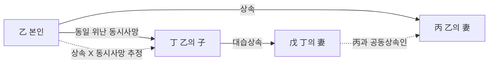
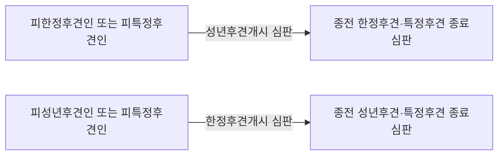
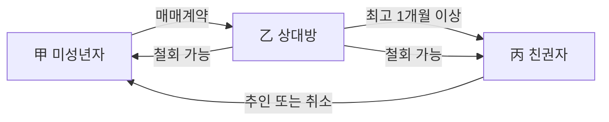
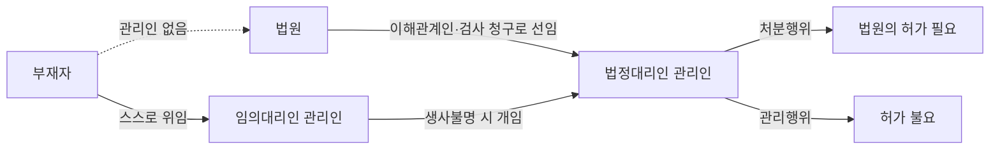

# 단원 M02 — 자연인

> **영역**: 민법총칙
> **수업 주제**: 권리능력·의사능력·행위능력·부재실종·주소

## 🗺️ 본문 목차

- [📘 위패스 마이 정리 (L1 - 메인 단권화)](#정리)
- [📖 핵심요약서 (L2 - 빠른 복습)](#핵심요약서)
- [📚 기본서 (L3 - 본격 학습)](#기본서)

---

## 📘 위패스 마이 정리 — L1 (메인·단권화)

> 김묘엽 교수 「위패스 마이 민법총칙/물권법」 교재 정리본.

### [민법총칙] 제6장 자연인

## 제6장 자연인

### 제1절 권리능력

#### I. 서설

1. 의의
권리능력이란 권리를 가질 수 있고 의무를 부담할 수 있는 지위 내지 자격을 말한
다. 정확한 표현은 권리 •의무능력이겠지만 권리 중심의 관점에서 권리능력이라 부

른다.

2. 규정

： 제3조(권리능력의 존속기간) 사람은 생존한 동안 권리와 의무의 주체가 된다.
(가 권리능력

모든 자연인은 생존한 동안 권리능력이 인정된다. 이러한 자연인의 권리

능력을 다른 말로 ‘인격’이라고 부른다.
(나) 강행규정

권리능력에 관한 규정은 강행규정이다. 따라서 법률행위로 이에 반하는

내용을 정할 수 없다.

#### II. 1.

권리능력의 발생
출생
사람의 권리능력은 출생5,과 동시에 취득하는 것이지, 출생신고나 가족관계등록부의

기재로 인하여 취득하는 것이 아니다.

[l. 출생에 대한 가족관계등록부는 기재가 적법 • 진실하다는 추정 - 반증으로 번복O
출생사실에 대한 가족관계등록부는 그 기재가 적법하게 되었고 기재사항이 진실에 부합한다는 추정을 받는다. 그러나 가족관계등록부의 기재에 반하는 증거가 있거나

그 기재가 진실이 아니라고 볼만한 특별한 사정이 있을 때에는 그 추정은 번복될 수

있다(대판 2019.2.14. 05)

2017두62587).

출생이란 태아가 모체로부터 완전히 나온 순간을 말한다

2. 태아의 권리능력
가. 의의
출생 전인 태아는 원칙적으로 권리능력이 없어서 권리를 가질 수 없다. 태아를 보호 하기 위해서 우리민법은 일반적 보호주의9가 아닌 개별적 보호주의"를 택하여 중요

한 법률관계에 대하여만 예외적으로 태아의 권리능력을 인정하고 있다.

나. 개별적 보호주의에 따른 권리

(1) 태아에게 인정되는 권리

(가) 불법행위에 기한 손해배상청구권

태아는 불법행위에 기한 손해배상의 청구권에 관

하여는 이미 출생한 것으로 본다(제762조).

태아인 동안 父의 사망• 상해에 대하여

태아 자신의 정신적 고통에 대한 위자료가 발생한다.
(나)

상속

태아는 상속순위8〉에 관하여는 이미 출생한 것으로 본다(제1000조 제3항). 부(父)

의 사망으로 인한 부의 불법행위 손해배상청구권은 태아에게 상속된다.

(다) 대습상속9’

대습상속에 대해서 민법의 규정은 없으나 학설은 이러한 경우에 태아를

이미 출생한 것으로 본다.
(라) 유증

유증에 관하여 태아는 이미 출생한 것으로 본다(제1064조).

(다) 유류분

민법의 규정은 없으나 학설은 유류분에 대해서도 태아를 이미 출생한 것으

로 본다.

(2) 태아에게 인정되지 않는 권리 (가) 각종의 계약

증여와 사인증여에 관하여는 태아의 수증능력이 인정되지 아니하므로

고 법정대리인도 수증행위를 할 수 없다(대판 1982.02.09.

(나) 인지청구권

81디-534).

부는 태아를 인지할 수 있다(제858조). 그러나 태아는 부에 대한 인지청

구를 할 수 없다.

일반적 보호주의는 모든 법률관계에서 태아의 권리능력을 인정하는 견해이다
개별적 보호주의는 중요한 법률관계에서만 태아의 권리능력을 인정하는 견해이다.
08) 상속에 있어서 1순위 상속인은 피상속인의 직계비속, 2순위 상속인은 피상속인의 직계존속 등이다
(제1000조 제1항). 동순위의 상속인이 수인인 때에는 최근친을 선순위로 하고 동친 등의 상속인이 수인 인 때에는 공동상속인이 된다(제1000조 제2항). 피상속인의 배우자는 1순위, 2순위 상속인이 있는 경우 06)
07)

에는 그 상속인과 동순위로 공동상속인이 되고 그 상속인이 없는 때에는 단독상속인이 된다(제1003조 제1항).
09) 대습상속이란 상속인이 될 직계비속 또는 형제자매가 상속개시 전에 사망하거나 결격자로 된 경우 에, 그 직계비속이 있는 때에는 사망하거나 결격된 자의 순위에 갈음하여 상속인이 된다
다. 태아로 있는 동안
(1) 정지조건설과 판례

(가) 태아인 동안 권리능력 없음

거래의 안전을 위해 태아로 있는 동안에는 태아에게

인정되는 권리에 권리능력을 인정하지 않는다. 태아가 살아서 출생하는 것을 조건으

로 권리발생 시에 소급해서 권리능력을 취득한다고 보는 견해이다.
(나) 태아인 동안 법정대리인 없음

태아로 있는 동안에 권리능력을 인정하지 않으므로

법정대리인이 있을 수 없고 대리행위도 할 수 없다.

|i. 태아인 동안 - 법정대리인X, 법정대리인에 의한 수증행위X
태아인 동안에는 법정대리인이 있을 수 없으므로 법정대리인에 의한 수증행위도 할 수 없다(대판 1982.2.9. 81다534).

(2) 해제조건설

(가) 태아인 동안 권리능력 있음

태아의 이익보호를 위해 태아로 있는 동안에는 태아에

게 인정되는 권리에 권리능력을 인정한다. 태아가 사산한 것으로 조건으로 권리발생 시에 소급해서 권리능력을 잃는다고 보는 견해이다.
(L)

태아인 동안 법정대리인 있음

태아로 있는 동안에 권리능력을 인정하므로 법정대

리인이 있고 대리행위도 할 수 있다.

라. 태아의 출생 • 불출생
(1) 태아의 출생

(가) 태아는 권리능력을 가짐

태아는 출생하게 되면 학설대립과 관계없이 권리능력을

갖는다. 조산인지, 기형인지, 바로 사망했는지 묻지 않는다.

(1. 부가 교통사고로 상해 - 사망 + 태아가 출생 - 위자료 청구O
부가 교통사고로 사망이나 상해를 입을 당시 태아가 출생하지 아니하였다고 하더라

도 그 뒤에 살아서 출생한 이상 부의 사망•상해로 인하여 입게 될 정신적 고통에 대 한 위자료를 청구할 수 있다(대판 1993.4.27. 93다4663).

| 2. 모가 교통사고로 상해 + 태아가 출생 - 불법행위에 기한 손해배상청구권O
산모에 대한 교통사고의 충격으로 태아가 조산되고 또 그로 인하여 제대로 성장하지

못하고 사망하였다면 위 불법행위는 한편으로 산모에 대한 불법행위인 동시에 한편 으로는 태아 자신에 대한 불법행위라고 볼 수 있으므로 따라서 죽은 아이는 생명침해 로 인한 손해배상청구권이 있다(대판 1968.3.5. 67다2869).

(L)

피상속인의 공동상속인

태아가 출생하게 되면 태아인 동안 사망한 부에 대한 상속

을 받게 되어 피상속인의 배우자와 공동상속인이 된다. 만약 기존에 직계존속과 피 상속인의 배우자가 공동상속이었다면 태아의 출생으로 직계존속은 후순위 상속인이

되고, 태아와 피상속인의 배우자가 공동상속인이 된다.

(2) 태아의 불출생

(가) 태아는 권리능력을 가지지 못함

태아는 사산하게 되면 학설대립과 관계없이 권리

능력을 갖지 못한다.

모가 교통사고로 사망 + 태아도사망 - 태아 작신의 손해배상청구권서__________

태아가 모체와 같이 사망하여 출생의 기회를 못 가진 이상 불법행위에 대한 손해배상

청구권을 논할 여지가 없다(대판 1976.09.14.
(나) 태아의 권리를 상속받지 못함

76다1365).

태아가 출생하지 못하면 태아가 가진 권리 자체가

없으므로 태아의 권리를 부모가 상속받는다는 것은 있을 수 없다.

3. 외국인의 권리능력 헌법은 외국인의 지위를 국제법과 조약이 정하는 바에 의하여 보장한다는 규정을

두고 있다. 이에 반해 민법은 외국인의 권리능력에 관하여 아무런 규정도 없지만 헌 법의 평등주의에 따라 외국인도 원칙적으로 내국인과 평등한 권리능력을 갖는다고

본다. 경우에 따라 예외적으로 외국인의 권리능력이 제한(한국토지의 취득 또는 양도,
지식재산권의 취득 등의 제한)되거나 부정(한국선박 및 한국항공기의 소유, 도선사 자격

등이 부정)되는 경우도 있다.
권리능력의 소멸

#### III. 1. 사망 사람의 권리능력은 사망과 동시에 소멸하는 것이지 사망신고나 가족관계등록부의 기 재로 인하여 소멸되는 것은 아니다. 권리능력 소멸원인은 오직 사망밖에 없다.

|i. 사망에 대한 가족관계등록부는 기재가 적법 • 진실하다는 추정 - 반증으로 번복o
사망사실에 대한 가족관계등록부는 그 기재가 적법하게 되었고 기재사항이 진실에

부합한다는 추정을 받는다. 그러나 가족관계등록부의 기재에 반하는 증거가 있거나

그 기재가 진실이 아니라고 볼만한 특별한 사정이 있을 때에는 그 추정은 번복될 수

있다(대판 2016.4.29. 2014다210449).

2. 사망의 확증이 있는 때

> **제30조 (동시사망)** 2인 이상이 동일한 위난으로 사망한 경우에는 동시에 사망한 것 으로 추정한다.
(가) 동시사망의 경우 상속은 부정

2인

이상이 동일한 위난으로 사망한 경우에, 동시에

사망한 것으로 추정됨으로써 상속이 일어나지 않는다.
(나) 동시사망의 경우 대습상속은 인정

동시사망이 추정되는 경우에도 대습상속은 가능

하고, 사위도 상속인의 배우자로서 대습상속을 할 지위에 있다(대판 2001 03.09.

99다1

3157).

3. 사망의 확증이 없는 때 (귀 인정사망 추정

인정사망이란 수난 • 화재 • 해난 등으로 인하여 사망의 증명을 얻을

수는 없으나 사망이 확실시되는 경우에 이를 조사한 관공서가 가족관계등록부에 사 망을 기재하는 것을 말한다. 관공서에 의한 가족관계등록부의 기재로 사망한 것으로 추정된다. 추정의 성질상 반하는 증거가 있거나 그 기재가 진실이 아니라고 볼만한

특별한 사정이 있을 때에는 그 추정은 번복될 수 있다.
(나)

실종선고 간주

실종선고란 부재자의 생사불명 상태가 일정기간 계속된 경우에 가

정법원의 실종선고를 받는 것을 말한다. 가정법원에 의한 선고로 사망한 것으로 간

주된다.

### 제2절 의사능력

#### I. 의사능력의 유무

1. 의의
(가) 의사능력

의사능력이란 자신의 행위의 의미나 결과를 정상적인 인식력과 예기력을

바탕으로 합리적으로 판단할 수 있는 정신적 능력 내지 지능을 말한다(대판 2009.01 1
5.
(나)

2008다58367).

의사능력이 없는 자를 의사무능력자라 한다. 유아나 중증의 정신병자,

의사무능력

지능지수가

58인

정신지체

3급

장애인(대판 2006.9.22. 2006다29358),

만취한 성년자

등이 의사무능력자에 해당한다.

2. 판단기준
의사능력의 유무는 구체적인 법률행위와 관련하여 개별적으로 판단되어야 할 것이다
(대판 2009.1.15. 2008다58367).

3. 판단범위
어떤 법률행위가 그 일상적인 의미만을 이해하여서는 알기 어려운 특별한 법률적인

의미나 효과가 부여되어 있는 경우 의사능력이 인정되기 위해서는 그 행위의 일상 적인 의미뿐만 아니라 법률적인 의미나 효과에 대하여도 이해할 수 있어야 한다(대

판 2009 01.15.

2008다58367).

4. 효과
명문의 규정이 없지만 의사무능력자가 한 의사표시는 무효이다(대판 2009.1.15. 2008다58367). 의사무능력자의 법률행위를 그의 의사에 기한 행위라고 보아 법률효과를

부여할 수 없기 때문이다.
1. 의사무능력자가 근저당권을 설정해 주고 대출받은 금원을 제3자에게 대여한 경우 - 대출거래약정 무효, 근저당권설정계약 무효

2 제3자에게 대여한 행위 무효

의사무능력자가 자신이 소유하는 부동산에 근저당권을 설정해 주고 금융기관으로부 터 금원을 대출받아 이를 제3자에게 대여한 사안에서, 이 사건 대출거래약정과 근저

당권설정계약은 의사능력이 흠결된 상태에서 체결된 것으로서 무효이고, 따라서 이를 원인으로 하는 이 사건 근저당권설정등기도 원인무효로서 말소되어야 하고 제3자에 게 대여한 행위도 무효이다(대판 2009.01.15.

#### II. 2008다58367).

각종의 능력과의 관계

1. 권리능력과 관계 권리능력을 가진 자들이 전부 의사능력을 가졌다고 할 수는 없지만, 의사능력자•의 사무능력자 전부 권리능력을 가지고 있다.

2. 행위능력과 관계
가. 의사능력의 문제점 의사능력은 구체적인 법률행위와 관련하여 개별적으로 판단되기 때문에 각각의 법률 행위에 의사능력이 있었는지에 대한 증명이 쉽지 않다.

나. 행위능력의 태동 이러한 의사능력에 대한 문제점을 해결하고자 민법은 객관적이고 획일적인 기준(연

령이나 법원의 심판)을 만들어 이에 부합하는 자를 행위능력자, 이에 부합하지 않는

자를 제한능력자라고 부르는 행위능력제도를 만들었다.

다. 효과
행위능력자의 행위는 유효하고, 제한능력자의 행위는 취소할 수 있게 하였다.

### 제3절 행위능력

#### I. 1. 의의 행위능력이란 단독으로 유효한 법률행위를 할 수 있는 능력을 말한다. 제한능력자란

행위능력이 제한되는 자를 말한다. 제한능력자는 연령을 기준으로 미성년자, 법원심 판을 기준으로 피성년후견인, 피한정후견인, 피특정후견인이 있다

2. 취지
제한능력자 제도는 거래의 안전을 희생시키더라도 제한능력자를 보호하고자 함에 근

본적인 입법취지가 있다(대판 2007.11.16. 2005다71659).

3. 강행규정
제한능력자 보호에 관한 규정은 강행규정이다. 따라서 법률행위로 제한능력자의 보 호에 반하는 내용을 정할 수 없다.

미성년자

#### II. 1. 서설

> **제4조(성년)** 사람은 19세로 성년에 이르게 된다.

(가) 미성년자
(나)

성년에 달하지 않은 만 19세 미만인 자가 미성년자이다.

법정대리인의 권리

미성년자의

법정대리인으로는 친권자와 미성년후견인이

있다.

이들은 동의권(취소권), 대리권을 가진다.

1. 근로계약체결 - 법정대리인의 동의권(취소권) 만 인정 O, 대리권 인정 X

2. 근로계약체결은 법정대리인의 동의를 얻어 미성년자가 직접 체결해야 한다.

친권자 또는 미성년후견인과 같은 법정대리인은 미성년자의 근로계약을 체결할 수

없다(근로기준법 제67조 제1항). 근로기준법 제67조 제1항은 법정대리인이 미성년자의 근로계약을 대리할 수 없다고 규정하고 있다. 다수설은 근로계약은 법정대리인의 동

의를 얻어서 미성년자 자신이 직접 체결하여야 한다.
民法 總 I꿰

2. 미성년자의 제한능력
가. 법정대리인의 동의

> **제5조 (미성년자의 능력)** ① 미성년자가 법률행위를 함에는 법정대리인의 동의를 얻 어야 한다.

> **제7조 (동의의 취소)** 법정대리인은 미성년자가 아직 법률행위를 하기 전에는 동의를 취소할 수 있다.

(가) 의사표시

법정대리인의 동의라는 의사표시를 할 때, 표시 방법에 제한이 없는 것

이 원칙이다.

(나)입증책임

법정대리인의 동의가 있었다는 것에 대한 증명책임은 미성년자의 법률행

위가 유효하다고 주장하는 상대방 즉 취소권의 배제를 주장하는 자가 부담한다(대판 1970.02 24

69다1568).

나. 동의의 효과

> **제5조 (미성년자의 능력)** ② 법정대리인의 동의를 얻지 아니한 미성년자의 법률행위 는 취소할 수 있다.
(가) 동의가 없는 법률행위

법정대리인 동의를 얻지 않은 미성년자의 법률행위는 (일단

유효한 행위로) 취소할 수 있다(제5조 제2항).
(나)

동의를 얻은 법률행위

법정대리인 동의를 얻은 미성년자의 법률행위는 (유효한 행

위가 되어) 취소할 수 없다.

3. 미성년자가 단독으로 유효하게 할 수 있는 법률행위
가. 권리만을 얻거나 의무만 면하는 행위

> **제5조 (미성년자의 능력)** ① 권리만을 얻거나 의무만을 면하는 행위는 법정대리인의 동의를 얻어야 하는 것은 아니다.

(1) 의의

권리만을 얻거나 의무만을 면한다는 의미는 행위는 경제적 관점이 아닌 법적 효과

를 기준으로 판단되어야 한다.

(2) 권리만을 얻거나 의무만을 면하는 행위

부담 없는 증여를 받는 행위, 친권자에 대한 부양청구권은 권리만을 얻는 행위로,

채무면제를 청약하는 것에 대한 승낙은 의무만을 면하는 행위로 미성년자가 법정대 리인의 동의 없이 단독으로 할 수 있다.

(3) 권리와 의무를 동시에 가지는 행위

경제적으로 유리한 매매계약을 체결하거나 부담부 증여를 받는 행위, 상속을 승인하

는 행위 등은 의무도 함께 부담하므로 미성년자가 법정대리인의 동의 없이 단독으

로 할 수 없고, 단독으로 하면 취소할 수 있다.

나. 처분을 허락한 재산의 처분행위 6조 (처분을 법정대리인이 범위를 정하여 처분을 허락한 재산은 미성 | 제
년자가
임의로 허락한
처분할재산)
수 있다.

> **제7조 (허락의 취소)** 법정대리인은 미성년자가 아직 법률행위를 하기 전에는 허락을 취소할 수 있다.

(1) 의사표시

법정대리인의 처분허락이라는 의사표시를 할 때, 표시 방법에 제한이 없는 것이 원

칙이다.

1. 미성년자가 스스로 얻고 있던 소득 - 법정대리인의 묵시적 처분허락O

2. 미성년자가 월 소득범위 내에서 신용구매계약 체결 - 처분을 허락 받은 재산 범 위 내의 처분행위O

미성년자가 월 소득범위 내에서 신용구매계약을 체결한 경우, 스스로 얻고 있던 소득

에 대하여는 법정대리인의 묵시적 처분허락이 있었다고 보아 위 신용구매계약은 처 분허락을 받은 재산범위 내의 처분행위에 해당한다(대판 2007.11.16. 2005다71659).

(2) 목적과 상관없이 처분

처분을 허락한 재산에 사용목적을 정한 경우, 그 목적과 상관없이 처분해도 유효하

다. 사용목적의 범위를 정한 것으로 보지 않고 재산의 범위를 정했다고 보기 때문 이다.
다. 허락된 영업에 관한 행위 너 제8조 (영업의 허락) ① 미성년자가 법정대리인으로부터 허락을 얻은 특정한 영업에 관하여는 성년자와 동일한 행위능력이 있다.

② 법정대리인은 영업의 허락을 취소 또는 제한할 수 있다. 그러나 선의의 제3자에 게 대항하지 못한다.
미성년자는 영업에 관하여 성년자와 동일한 행위능력을 가지므로, 그 범위에서 법정

대리인의 동의권(취소권), 대리권은 소멸한다.

미성년자는 특정한 영업에 관하여 법

정대리인의 동의 없이도 단독으로 유효한 법률행위를 할 수 있고, 법정대리인은 영

업에 관하여는 미성년자를 대리할 수 없다.

라. 혼인

> **제826조의2 (성년의제)** 미성년자가 혼인을 한 때에는 성년자로 본다.
혼인한 미성년자는 사법관계 전반에 행위능력을 가지므로, 그 범위에서 법정대리인

의 동의권(취소권),

대리권은 소멸한다.

미성년자는 사법관계 전반에 법정대리인의

동의 없이도 단독으로 유효한 법률행위를 할 수 있고, 법정대리인은 사법관계 전반

에 미성년자를 대리할 수 없다.

마. 대리인
； 제117조 (대리인의 행위능력) 대리인은 행위능력자임을 요하지 아니한다.

제한능력자는 대리인이 되어 단독으로 대리행위를 할 수 있다.

|

대리행위의 효과가

본인에게 귀속되어 제한능력자는 불이익이 없기 때문이다.

바. 유언

> **제1061조 (성년의제)** 17세에 달하지 못한 자는 유언을 하지 못한다.

사. 임금청구
미성년인 근로자는 단독으로 임금을 청구할 수 있다(근로기준법 제68조). 근로계약체결

에서부터 법정대리인의 대리권이 인정되지 않으므로 임금청구도 대리권이 인정되지 않는다.

#### III. 피성년후견인, 피한정후견인, 피특정후견인

1. 개시심판
가. 피성년후견인

> **제9조 (성년후견개시의 심판)** ① 가정법원은 질병, 장애, 노령, 그 밖의 사유로 인한 정신적 제약으로 사무를 처리할 능력이 지속적으로 결여된 사람에 대하여 본인, 배 우자, 4촌 이내의 친족, 미성년후견인, 미성년후견감독인, 한정후견인, 한정후견감 독인, 특정후견인, 특정후견감독인, 검사 또는 지방자치단체의 장의 청구에 의하여
성년후견개시의 심판을 한다.

> **제9조 (성년후견개시의 심판)** ② 가정법원은 성년후견개시의 심판을 할 때 본인의 의 사를 고려하여야 한다.

나. 피한정후견인

> **제12조 (한정후견개시의 심판)** ① 가정법원은 질병, 장애, 노령, 그 밖의 사유로 인 한 정신적 제약으로 사무를 처리할 능력이 부족한 사람에 대하여 본인, 배우자, 4
촌 이내의 친족, 미성년후견인, 미성년후견감독인 , 성년후견인 , 성년후견감독인 ,

특정후견인, 특정후견감독인,

검사 또는 지방자치단체의 장의 청구에 의하여 한정

후견개시의 심판을 한다.

> **제12조 (한정후견개시의 심판)** ② 가정법원은 한정후견개시의 심판을 할 때 본인의 의사를 고려하여야 한다.

다. 피특정후견인

> **제14조의2 (특정후견의 심판)** ① 가정법원은 질병, 장애, 노령, 그 밖의 사유로 인한

정신적 제약으로 일시적 후원 또는 특정한 사무에 관한 후원이 필요한 사람에 대하

여 본인, 배우자, 4촌 이내의 친족, 미성년후견인, 미성년후견감독인,
지방자치단체의 장의 청구에 의하여 특정후견의 심판을 한다.

검사 또는

> **제14조의2 (특정후견의 심판)** ② 특정후견은 본인의 의사에 반하여 할 수 없다.

> **제14조의2 (특정후견의 심판)** ③ 특정후견의 심판을 하는 경우에는 특정후견의 기간 또는 사무의 범위를 정하여야 한다.
라. 본인의 의사를 고려하여야 한다.

(1) 의의

성년후견이나 한정후견에 관한 심판 절차는 가사소송법에서 정한 가사비송사건으로 서, 가정법원이 당사자의 주장에 구애받지 않고 후견적 입장에서 합목적적으로 결정

할 수 있다. 이때 성년후견이든 한정후견이든 본인의 의사를 고려하여 개시 여부를

결정한다(대판 2021.6.10. 2020스596).

(2) 주장에 구애받지 않고

한정후견의 개시를 청구한 사건에서 의사의 감정 결과 등에 비추어 성년후견 개시 의 요건을 충족하고 본인도 성년후견의 개시를 희망한다면 법원이 성년후견을 개시

할 수 있고, 성년후견 개시를 청구하고 있더라도 필요하다면 한정후견을 개시할 수 있다(대판 2021.6.10. 2020스596).

(3) 의사의 감정이 없더라도

피성년후견인이나 피한정후견인이 될 사람의 정신상태를 판단할 만한 다른 충분한

자료가 있는 경우, 가정법원은 의사의 감정이 없더라도 성년후견이나 한정후견을 개

시할 수 있다(대판 2021.6.10. 2020스596).

2. 능력
가. 피성년후견인

> **제10조 (피성년후견인의 행위와 취소)** ① 피성년후견인의 법률행위는 취소할 수 있다.

② 제1항에도 불구하고 가정법원은 취소할 수 없는 피성년후견인의 법률행위의 범 위를 정할 수 있다.
④ 제1항에도 불구하고 일용품의 구입 등 일상생활에 필요하고 그 대가가 과도하지 아니한 법률행위는 성년후견인이 취소할 수 없다.

(1) 원칙적 취소

피성년후견인의 법률행위는 취소할 수 있다(제io조 제1항). 성년후견인의 동의를 얻었

든 얻지 않았든 간에 피성년후견인의 법률행위는 취소할 수 있다.

(2) 예외적 취소 못함
(가) 일용품의 구입

일용품의 구입 등 일상생활에서 필요하고 그 대가가 과도하지 아니

한 법률행위는 성년후견인이 취소할 수 없다(제10조 제4항).
(나)

가정법원이 취소할 수 없는 범위를 정한 부분

가정법원이 취소할 수 없는 피성년

후견인의 법률행위의 범위를 정할 수 있다(제10조 제2항). 그 범위 내에서 피성년후견 인은 예외적으로 행위능력을 가지고 확정적으로 유효한 법률행위를 할 수 있다.

(3) 성년후견인
(가) 수와 자격

여러 명의 성년후견인을 둘 수 있고(제930조 제2항), 법인도 성년후견인이

될 수 있다(제930조 제3항).
(나) 권리

성년후견인은 원칙적으로 동의권이 없고, 취소권과 대리권만 가진다. 피성년

후견인의 법률행위라도 성년후견인이 추인하면 유효로 될 수 있다(제143조).

나. 피한정후견인

> **제13조 (피한정후견인의 행위와 동의)** ① 가정법원은 피한정후견인이 한정후견인의 동의를 받아야 하는 행위의 범위를 정할 수 있다.
> ③ 한정후견인의 동의를 필요로 하는 행위에 대하여 한정후견인이 피한정후견인의

이익이 침해될 염려가 있음에도 그 동의를 하지 아니하는 때에는 가정법원은 피한

정후견인의 청구에 의하여 한정후견인의 동의를 갈음하는 허가를 할 수 있다.
④ 한정후견인의 동의가 필요한 법률행위를 피한정후견인이 한정후견인의 동의 없

이 하였을 때에는 그 법률행위를 취소할 수 있다. 다만, 일용품의 구입 등 일상생활 에 필요하고 그 대가가 과도하지 아니한 법률행위에 대하여는 그러하지 아니하다.

(1) 동의를 받아야 하는 범위를 정함

가정법원은 피한정후견인이 한정후견인의 동의를 받아야 하는 행위의 범위를 정할

수 있다(제13조 제1항).

(2) 동의를 받아야 하는 범위를 동의 없이 한 경우 (가) 동의 없이 하였을 때 취소

한정후견인의 동의가 필요한 법률행위를 피한정후견인

이 한정후견인의 동의 없이 하였을 때에는 그 법률행위를 취소할 수 있다(제13조 제4항 본문).
(＞-) 예외적으로 취소 못하는 일용품의 구입

일용품의 구입 등 일상생활에서 필요하고

그 대가가 과도하지 않은 법률행위는 한정후견인의 동의 없이 하였더라도 취소할 수 없다(제13조 제4항).
(3) 동의를 받아야 하는 범위가 아닌 부분

가정법원이 정한 동의를 필요로 하는 법률행위가 아니면 피한정후견인은 확정적으로

유효한 법률행위를 할 수 있다.

(4) 한정후견인
(가) 수와 자격

여러 명의 한정후견인을 둘 수 있고(제935조의3 제2항 제930조 제2항), 법인

도 한정후견인이 될 수 있다(제935조의3 제2항 제930조 제3항).
(나) 권리

한정후견인은 동의권(취소권), 대리권을 가진다. 피한정후견인의 동의를 요하

는 법률행위라도 한정후견인이 추인하면 유효로 될 수 있다(제143조).

다. 피특정후견인

j 제14조의2 (특정후견의 심판) ③ 특정후견의 심판을 하는 경우에는 특정후견의 기간 또는 사무의 범위를 정하여야 한다.

(1) 기간이나 사무범위를 정함

특정후견의 심판을 하는 경우에는 특정후견의 기간 또는 사무의 범위를 정하여야

한다(제14조의2 제3항).

(2) 행위능력이 제한되지 않음

특정후견의 심판이 있어도 피특정후견인의 행위능력은 제한되지 않는다.

(3) 특정후견인
(가) 수와 자격

여러 명의 특정후견인을 둘 수 있고(제935조의9 제2항, 제930조 제2항), 법인

도 특정후견인이 될 수 있다(제935조의9 제2항, 제930조 제3항).

(나) 권리

특정후견인은 동의권, 취소권이 없고 대리하기 위한 대리권만이 있다.

3. 변경
가. 피성년후견인

j 제10조 (피성년후견인의 행위와 취소) ③ 가정법원은 본인, 배우자, 4촌 이내의 친 족,

성년후견인,

성년후견감독인,

검사 또는 지방자치단체의 장의 청구에 의하여

가정법원이 취소할 수 없는 것으로 정한 범위를 변경할 수 있다.

나. 피한정후견인

> **제13조 (피한정후견인의 행위와 동의)** ② 가정법원은 본인, 배우자, 4촌 이내의 친족,
한정후견인, 한정후견감독인, 검사 또는 지방자치단체의 장의 청구에 의하여 가정

법원이 한정후견인의 동의를 받아야만 할 수 있는 행위의 범위를 변경할 수 있다.

4. 기존 심판의 종료
가. 피성년후견인

> **제11조 (성년후견종료의 심판)** 성년후견개시의 원인이 소멸된 경우에는 가정법원은 본인, 배우자, 4촌 이내의 친족, 성년후견인, 성년후견감독인, 검사 또는 지방자치 단체의 장의 청구에 의하여 성년후견종료의 심판을 한다.
성년후견개시의 원인이 소멸된 후 가정법원의 성년후견종료의 심판이 있어야 피성년 후견인은 행위능력을 회복한다. 종료심판은 장래에 향하여 효력을 가진다.

나. 피한정후견인

> **제14조 (한정후견종료의 심판)** 한정후견개시의 원인이 소멸된 경우에는 가정법원은 본인, 배우자, 4촌 이내의 친족, 한정후견인, 한정후견감독인, 검사 또는 지방자치 단체의 장의 청구에 의하여 한정후견종료의 심판을 한다.
한정후견개시의 원인이 소멸된 후 가정법원의 한정후견종료의 심판이 있어야 피한정 후견인은 행위능력을 회복한다. 종료심판은 장래에 향하여 효력을 가진다.

다. 피특정후견인
특정후견은 1회적• 특정적 보호제도이므로 후견의 종료를 별도로 심판할 필요가 없 으며, 기간의 종료나 정해진 사무 처리의 종결로 종료한다

5. 다른 심판을 통한 기존심판의 종료
가. 피한정후견인 • 피특정후견인 - 성년후견개시 심판

> **제14조의3 (심판 사이의 관계)** ① 가정법원이 피한정후견인 또는 피특정후견인에 대 하여 성년후견개시의 심판을 할 때에는 종전의 한정후견 또는 특정후견의 종료 심 판을 한다.
나. 피성년후견인 - 피특정후견인 -* 한정후견개시 심판

> **제14조의3 (심판 사이의 관계)** ② 가정법원이 피성년후견인 또는 피특정후견인에 대 하여 한정후견개시의 심판을 할 때에는 종전의 성년후견 또는 특정후견의 종료 심 판을 한다.

#### IV. 제한능력자 상대방의 보호 1.

확답을 촉구할 권리

> **제15조 (제한능력자 상대방의 확답을 촉구할 권리)** ① 제한능력자의 상대방은 제한능

력자가 능력자로 된 후에 그에게 1개월 이상의 기간을 정하여 그 취소할 수 있는 행 위를 추인할 것인지 여부의 확답을 촉구할 수 있다. 능력자로 된 사람이 그 기간 내

에 확답을 발송하지 아니하면 그 행위를 추인한 것으로 본다.
② 제한능력자가 아직 능력자가 되지 못한 경우에는 그의 법정대리인에게 1개월 이 상의 기간을 정하여 그 취소할 수 있는 행위를 추인할 것인지 여부의 확답을 촉구할

수 있다.

법정대리인이 그 정하여진 기간 내에 확답을 발송하지 아니한 경우에는

그 행위를 추인한 것으로 본다.
③ 특별한 절차를 요하는 행위에 관하여는 그 기간 내에 그 절차를 밟은 확답을 발

하지 아니하면 취소한 것으로 본다.

가. 상대방의 선의 - 악의 확답의 촉구는 상대방의 선의 • 악의의 구분 없이 행사할 수 있다.

나. 누구에게 확답을 촉구 제한능력자의 상대방은 제한능력자가 능력자가 된 후에 그에게, 제한능력자가 아직

능력자가 되지 못한 경우에는 법정대리인에게 확답을 촉구하여야 한다. 제한능력자 에게 확답을 촉구하진 못한다.

다. 확답을 발송하지 아니한 경우 상대방의 확답 촉구에 대하여 기간 내에 확답을 발송하지 아니하면 그 행위를 추인 한 것으로 본다(제15조 제1항, 제2항).

철회권과 거절권

2.

> **제16조 (제한능력자의 상대방의 철회권)** ① 제한능력자가 맺은 계약은 추인이 있을 때

까지 상대방이 그 의사표시를 철회할 수 있다. 다만, 상대방이 계약 당시에 제한능 력자임을 알았을 경우에는 철회권을 행사할 수 없다.

② 제한능력자의 단독행위는 추인이 있을 때까지 (선의 - 악의 불문하고) 상대방이 거절할 수 있다.
③ 철회나 거절의 의사표시는 제한능력자에 대하여도 할 수 있다.

가. 계약과 단독행위 구분
(1) 철회 ■ 거절

제한능력자와 계약을 맺은 경우에 상대방은 철회할 수 있고, 제한능력자의 단독행위 인 경우에 상대방은 거절할 수 있다(제16조 제1항 제2항).

(2) 상대방의 선의 - 악의

상대방이 계약 당시에 제한능력자임을 알았을 경우에는 철회권을 행사할 수 없지만 (제16조 제1항), 선의의 상대방은 철회권을 행사할 수 있다. 반면 거절권의 행사는 상

대방의 선의 • 악의의 구분 없이 행사할 수 있다(제16조 제1항 제2항).

나. 누구에게 철회 - 거절 철회나 거절의 의사표시는 제한능력자에 대하여도 할 수 있다(제16조 제3항).

다. 추인권과 철회권 • 거절권의 관계 추인이 있을 때까지 상대방은 철회권• 거절권을 행사할 수 있다. 추인이 있으면 상

대방은 철회권 • 거절권을 행사할 수 없고, 반대로 상대방이 철회권 • 거절권을 행사하 면 추인할 수 없다.

3. 속임수에 의한 취소권의 배제
가. 속임수의 유형
(가) 적극적 기망수단

적극적 기망수단이란 물증을 제시하면서 기망하는 것으로 동의서

나 주민등록증을 위조• 변조하는 것을 말한다.
(나)

소극적 기망수단

소극적 기망수단이란 물증을 제시함이 없이 기망하는 것으로 능 력자로 칭하거나, 연령을 허위로 기재하는 것을 말한다.

(다) 판례

판례는 적극적 기망수단만이 속임수라고 한다(대판 197112 14. 기다2045). 소극

적 기망수단은 속임수에 해당하지 않아서 취소권이 배제되지 않는다. 즉 취소할 수

있다.

나. 속임수에 의한 취소권 배제 (1) 제한능력자가 능력자로 믿게 한 경우

> **제17조 (제한능력자의 속임수)** ① 제한능력자( = 미성년자, 피성년후견인, 피한정후견 인)가 속임수로써 자기를 능력자로 믿게 한 경우에는 그 행위를 취소할 수 없다.

(2) 미성년자나 피한정후견인이 법정대리인의 동의가 있는 것으로 믿게 한 경우

> **제17조 (제한능력자의 속임수)** ② 미성년자나 피한정후견인이 속임수로써 법정대리인 의 동의가 있는 것으로 믿게 한 경우에는 그 행위를 취소할 수 없다.

(3) 피성년후견인 정리
(가) 제17조 제1항의 피성년후견인이 능력자로 믿게 한 경우 피성년후견인이 적극적 기 망수단으로써 자기를 능력자로 믿게 한 경우에는 속임수에 해당하여 취소를 할 수

없다.
(나) 제17조 제2항의 피성년후견인이 동의가 있는 것으로 믿게 한 경우

피성년후견인이
적극적 기망수단으로써 법정대리인의 동의가 있는 것으로 믿게 한 경우에는 속임수 에 해당하지 않아서 취소를 할 수 있다.

다. 입증책임
계약을 체결한 상대방이 제한능력자의 취소권을 배제하기 위하여 민법 제17조 소정 의 속임수를 썼다고 주장하는 때에는 그 주장자인 상대방 측 즉 취소권의 배제를

주장하는 자에 그에 대한 입증책임이 있다(대판 1971.12.14. 기다2045).

### 제4절 부대와 실종

#### I. 1. 의의 민법은 1차적으로 생존하고 있는 부재자가 돌아오길 기다리며 부재자의 재산을 관리

한다. 부재자의 생사불명의 상태가 일정기간 계속되면 2차적으로 실종선고를 통해 사망한 것으로 간주하고 법률관계를 정리한다.

2. 사회적 작용
사람이 종래의 주소나 거소를 떠나 돌아올 가망이 없는 상태가 오래 계속된다면, 잔

존배우자 등 이해관계인을 보호하기 위하여 부재자 재산관리에 적절한 조치를 취할

필요가 있다.10’

부재자의 재산관리

#### II. 1. 부재자

(가) 의의

부재자란 종래의 주소• 거소를 떠나서 용이하게 돌아올 가능성이 없어서 그의

재산을 관리하여야 할 필요성이 있는 자를 말한다. 유학생이 국내의 재산을 다른 사 람을 통해 관리하고 있다면 부재자라 할 수 없다.
(나)
법인은 부재자가 될 수 없음

부재자는 성질상 자연인에 한한다(대판 1965.02.09.

민상9). 부재자가 될 수 없는 법인은 재산관리인을 둘 수 없다.

2. 법원이 재산관리인을 선임한 경우
가. 의의

> **제22조 (부재자의 재산의 관리)** ① 종래의 주소나 거소를 떠난 자가 재산관리인을 정 하지 아니한 때에는 법원은 이해관계인이나 검사의 청구에 의하여 재산관리에 관하 여 필요한 처분을 명하여야 한다. 본인의 부재 중 재산관리인의 권한이 소멸한 때 에도 재산관리에 관하여 필요한 처분을 명하여야 한다.

10)

지원림. 제19판 민법강의. 홍문사.

91페이지
(1) 법원의 개입 사유

부재자가 재산관리인을 선임하지 아니한 때에는 법원은 이해관계인이나 검사의 청구 에 의하여 재산관리에 관하여 필요한 처분을 명하여야 한다(제22조 제1항 전문). 부재

자가 재산관리인을 선임했으나 본인의 부재 중 권한이 소멸한 때에도 법원은 이해 관계인이나 검사의 청구에 의하여 재산관리에 관하여 필요한 처분을 명하여야 한다

(제22조 제1항 후문).

(2) 재산관리에 관하여 필요한 처분

재산관리에 필요한 처분에는 재산관리인의 선임, 잔존재산의 매각 등이 있으나 일반 적으로 재산관리인을 선임한다. 이하는 법원이 선임한 재산관리인에 대한 설명이다.

나. 법정대리인
법원에 의하여 선임된 재산관리인은 일종의

법정대리인이다.

재산관리인은 선량한

관리자의 주의의무를 다하여 직무를 수행하여야 하고(제681조),

언제든지 사임할 수

있다.

다. 직무

> **제24조(관리인의 직무)** ① 법원이 선임한 재산관리인은 관리할 재산목록을 작성하여 야 한다.

② 법원은 그 선임한 재산관리인에 대하여 부재자의 재산을 보존하기 위하여 필요 한 처분을 명할 수 있다.

④ 전3항의 경우에 그 비용은 부재자의 재산으로써 지급한다.

> **제26조(관리인의 담보제공, 보수)** ① 법원은 그 선임한 재산관리인으로 하여금 재산 의 관리 및 반환에 관하여 상당한 담보를 제공하게 할 수 있다.

② 법원은 그 선임한 재산관리인에 대하여 부재자의 재산으로 상당한 보수를 지급

할 수 있다.
(가) 재산목록 작성

법원이 선임한 재산관리인은 관리할 재산목록을 작성하여야 한다(제24조 제1항).
(나)

필요한 처분명령

법원은 선임한 재산관리인에 대하여 부재자의 재산을 보존하기

위하여 필요한 처분을 명할 수 있다(제24조 제2항).
(다)

비용지급

부재자 재산목록 작성하거나 재산을 보존하는데 들어간 비용은 부재자의

재산으로써 지급한다(제24조 제4항).
(라) 담보제공

법원은 선임한 재산관리인으로 하여금 재산의 관리 및 반환에 관하여 상

당한 담보를 제공하게 할 수 있다(제26조 제1항).
(마) 보수지급

법원은 선임한 재산관리인에 대하여 부재자의 재산으로 상당한 보수를

지급할 수 있다(제26조 제2항).

라. 권한
(1) 의의
부재자 재산관리인의 권한과 관리방법 등은 제118조에 의하여 결정된다.

(2) 관리행위
(가 의의

관리행위란 보존행위와 이용• 개량행위 합쳐서 부르는 말이다. 법원이 선임한

재산관리인은 관리행위에 해당하는 보존행위와 대리의 목적인 물건이나 권리의 성질 을 변하지 아니하는 범위에서 이용•개량행위에 대해서는 가정법원의 허가 없이 자 유롭게 할 수 있다(제25조 반대해석).
(＞-) 보존행위

원금을 금고에 보관하는 행위, 부패하기 쉬운 물건의 처분행위, 수선행

위, 미등기부동산을 등기하는 행위, 불법하게 경료된 부동산 소유권이전등기 말소등

기절차 이행청구나 인도청구, 소멸시효 중단, 차임청구, 채무의 변제, 불법행위 손해

배상청구권 등의 보존행위를 할 때에는 법원의 허가 없이도 할 수 있다.
(다) 대리의 목적인 물건이나 권리의 성질을 변하지 아니하는 범위에서 그 이용 또는 개

량하는 행위

원금을 은행에 예치하는 행위, 물건의 임대, 무이자부를 이자부로 변

경하는 행위 등의 이용 또는 개량하는 행위를 할 때에는 법원의 허가 없이도 할 수

있다.

(3) 처분행위

> **제25조 (관리인의 권한)** 법원이 선임한 재산관리인이 제118조에 규정한 권한을 넘는 행위를 함에는 법원의 허가를 얻어야 한다.
(가) 의의

법원이 선임한 재산관리인은 처분행위(=대리의 목적인 물건이나 권리의 성질을

변하는 범위에서 그 이용 또는 개량하는 행위)를 하고자 할 때에는 가정법원의 허가를

얻어야 한다(제25조 전문). 법원의 허가범위를 넘는 처분행위는 무권대리행위로 무효 이다.
원금을 가지고 주식투자를 하는 행위, 재산의 매각, 저당권설정 등의 처 분행위를 할 때에는 법원의 허가를 얻어야 한다.

(나) 처분행위
k 법원으£허가 - 사전허가O으J나후허가O

부재자의 재산관리인에 의한 부재자소유 부동산매각행위의 추인행위가 법원의 허가 를 얻기 전이어서 권한 없이 행하여진 것이라고 하더라도, 법원의 재산관리인의 초과

행위 결정의 효력은 그 허가받은 재산에 대한 장래의 처분행위뿐만 아니라 기왕의 처

분행위를 추인하는 행위로도 할 수 있는 것이다(대판 1982.12.14. 80다1872).

2丄 부재자와 관계없느자를 우I해 근저당권 설정 - 무효

부재자 재산관리인이 법원의 매각처분허가를 받은 후 부재자와 아무 관계없는 제3자

의 채무담보를 위해 부재자의 재산에 근저당을 설정한 것은 무효이다(대판 1976.12.21. 75 마551).

［으丄법원의 허가를 으어 부재자의 재산을 매각 - 유효

___________________

관리인이 법원의 허가를 얻어 부재자의 재산을 매각한 후, 법원이 관리인 선임결정을

취소하여도 관리인의 처분행위는 유효하다(대판 1960.2.4. 42912민상636).

(4三 법원의 허가를 얻어 권한초과행위 - 유효

부재자 재산관리인으로서 권한초과행위의 허가를 받고 그 선임결정이 취소되기 전에 위 권한에 의하여 이루어진 행위는 부재자에 대한 실종선고기간이 만료된 뒤에 이루

어 졌다고 하더라도 유효하다(대판 1981.7.28. 80다2668).

마. 재산관리의 종료

(1) 부재자가 후에 재산관리인을 둔 경우

> **제22조 (부재자의 재산의 관리)** ② 본인이 그 후에 재산관리인을 정한 때에는 법원은

본인, 재산관리인, 이해관계인 또는 검사의 청구에 의하여 재산관리인 선임 명령을

취소하여야 한다

(2) 부재자의 사망

재산관리인의 선임결정이 있는 이상 부재자가 사망한 사실이 판명되었더라도 그 결

정이 취소되지 않은 한 재산관리인의 권한은 당연히 소멸하는 것은 아니고 계속해 서 그 권한을 행사할 수 있다(대판 1971.03.23. 기다189).

(3) 부재자의 실종선고가 확정

부재자의 재산관리인에 의하여 소송절차가 진행되던 중 부재자 본인에 대한 실종선 고가 확정되면 그 재산관리인으로서의 지위는 종료된다(대판 1987.3.24. 85다카1151).

3. 부재자가 재산관리인을 선임한 경우
가. 일반

(1) 임의대리인

부재자가 둔 재산관리인은 부재자의 임의대리인이다. 재산관리인은 선량한 관리자의

주의의무를 다하여 직무를 수행하여야 한다(제681조).

(2) 직무

부재자와 관리인 사이의 계약에 의하여 결정된다

(3) 권한

부재자 재산관리인의 권한과 관리방법 등은 계약에 의하여 결정된다.

[i. 부재자로부터 재산처분권을 받은 재산관리인 - 처분시 법원의 허가x
부재자로부터 재산처분권까지 위임받은 재산관리인은 그 재산을 처분함에 있어 가정 법원의 허가를 받을 필요가 없다(대판 1973.7.24. 72다2136).

나. 부재자의 생사가 분명하지 아니한 때 (1) 재산관리인의 개임

> **제23조 (관리인의 개임)** 부재자가 재산관리인을 정한 경우에 부재자의 생사가 분명하 지 아니한 때에는 법원은 재산관리인, 이해관계인 또는 검사의 청구에 의하여 재산 관리인을 개임할 수 있다.
(가) 법원이 재산관리인을 개임한 경우

부재자 재산관리인을 개임하였다면 법원이 재산

관리인을 선임한 것이 되어 임의대리인이었던 재산관리인은 법정대리인이 된다. 이

는 법원이 재산관리인을 선임한 경우에 해당하고 이는 전술하였다.

(나) 법인이 재산관리인을 개임하지 않은 경우

부재자가 선임한 재산관리인이 계속 재 산을 관리한다. 이하는 법원이 재산관리인을 개임하지 않은 경우에 대한 설명이다.
<71

(2) 직무

> **제24조 (관리인의 직무)** ③ 부재자의 생사가 분명하지 아니한 경우에 이해관계인이나 검사의 청구가 있는 때에는 법원은 부재자가 정한 재산관리인에게 재산목록 작성과 필요한 처분명령을 명할 수 있다.
④ 전항의 경우에 그 비용은 부재자의 재산으로써 지급한다.

> **제26조 (관리인의 담보제공, 보수)** ③ 담보제공과 보수지급은 부재자의 생사가 분명하 지 아니한 경우에 부재자가 정한 재산관리인에 준용한다.
(가) 재산목록 작성

부재자의 생사가 분명하지 아니한 경우에 법원은 부재자가 정한 재

산관리인에게 관리할 재산목록의 작성을 명할 수 있다(제24조 제:3항).
(나) 필요한 처분명령

부재자의 생사가 분명하지 아니한 경우에 법원은 부재자가 정한

재산관리인에게 부재자의 재산을 보존하기 위하여 필요한 처분을 명할 수 있다(제24조 제3항).
) 비용지급

부재자 재산목록을 작성하거나 재산을 보존하는데 들어간 비용은 부재자

의 재산으로써 지급한다(저|24조 제4항).
(라) 담보제공

부재자의 생사가 분명하지 아니한 경우에 부재자가 정한 재산관리인으로

하여금 재산의 관리 및 반환에 관하여 상당한 담보를 제공하게 할 수 있다(제26조 제3항).

(다) 보수지급

부재자의 생사가 분명하지 아니한 경우에 법원은 부재자가 정한 재산관

리인에 대하여 부재자의 재산으로 상당한 보수를 지급할 수 있다(제26조 제3항).

(3) 권한

> **제25조 (관리인의 권한)** 부재자의 생사가 분명하지 아니한 경우에 부재자가 정한 재 산관리인이 권한을 넘는 행위를 할 때 법원의 허가를 얻어야 한다.

Ill.

실종선고와 그 취소

1. 의의
실종선고란 생사불명 상태가 일정기간 계속된 부재자를 가정법원의 실종선고를 통해 사망한 것으로 간주하는 것을 말한다.

2. 실종선고
가. 요건

> **제27조 (실종의 선고)** ① 부재자의 생사가 5년간 분명하지 아니한 때에는 법원은 이 해관계인이나 검사의 청구에 의하여 실종선고를 하여야 한다.
> ② 전지에 임한 자, 침몰한 선박 중에 있던 자, 추락한 항공기 중에 있던 자 기타

사망의 원인이 될 위난을 당한 자의 생사가 전쟁종지 후 또는 선박의 침몰, 항공기 의 추락 기타 위난이 종료한 후 1년간 분명하지 아니한 때에도 법원은 이해관계인 이나 검사의 청구에 의하여 실종선고를 하여야 한다.

(1) 부재자의 생사가 분명하지 않음
(가) 사망으로 기재되어 있는 자

가족관계등록부상 이미 사망한 것으로 기재되어 있는

자에 대해서는 등록부상 사망기재의 추정력 때문에 실종선고를 할 수 없다(대판 199
7.11.27.

97스4).

(＞-) 실종선고를 받은 자

실종선고가 되어 확정되었는데도, 그 이후 타인의 청구에 의

하여 새로이 확정된 실종선고를 기초로 상속관계를 판단한 것은 잘못이다(대판 1995.1
2.22.

95다12736).

(2) 실종기간의 경과
(가) 보통실종

(부재자의 생존을 증명할 수 있는 최후의 시점을 기준으로) 부재자의 생사가

5년간 분명하지 아니한 때에는 법원은 이해관계인이나 검사의 청구에 의하여 실종 선고를 하여야 한다(저］27조 제1항).

|l. 바다에서 부상하지 않은 자 - 보통실종, 실종기간 5년 잠수장비를 착용한 채 바다에 입수하였다가 부상하지 아니한 채 행방불명되었다 하

더라도, 이는 특별실종의 “사망의 원인이 될 위난”이라고 할 수 없다(대판 201101.31.
2010스165).
특별실종은 전지에 임한 자, 침몰한 선박 중에 있던 자, 추락한 항공기 중에 있던 자 기타 사망의 원인이 될 위난을 당한 자의 생사가 전쟁종지 후 또는

(나) 특별실종

선박의 침몰, 항공기의 추락 기타 위난이 종료한 후 1년간 생사가 분명하지 아니한 때에는 법원은 이해관계인이나 검사의 청구에 의하여 실종선고를 하여야 한다(제27조

제2항).

(3) 실종선고의 청구
(가) 이해관계인

실종선고를 청구할 수 있는 이해관계인이라 함은 부재자의 법률상 사

망으로 인하여 직접적으로 신분상 또는 경제상의 권리를 취득하거나 의무를 면하게 되는 사람만을 뜻한다(대판 1986.10.10. 86스20).

(■-) 긍정한 판례 선순위 상속인은 실종선고를 청구할 이해관계인이 된다. 제1순위 상속 인이나 부재자의 배우자 등이 선순위 상속인이다.

(다) 부정한 판례

부재자의 제1순위 재산상속인이 있는 경우에 후순위 상속인(제2순위 •

제4순위)에 불과한 자는 부재자에 대한 실종선고를 청구할 이해관계인이 될 수 없다
(대판 1986.10.10. 86스20, 대판 1980.9.8. 80*7).

(4) 공시최고
실종선고를 청구 받은 법원은 6개월 이상의 공시최고 기간을 거쳐야 한다. 공시최 고 기간이 지나도록 신고가 없을 경우에는 가정법원은 반드시 실종선고를 하여야

한다.

나. 사망의 효과가 생기는 시기

> **제28조 (실종선고의 효과)** 실종선고를 받은 자는 실종기간이 만료한 때에 사망한 것 으로 본다.

(1) 실종기간 만료시로 소급

실종선고를 받은 자는 실종기간이 만료한 때에 사망한 것으로 본다(제28조). 사망간

주 시점이 실종기간이 만료한 때로 소급한다. 보통실종의 경우 2000년 3월 20일에

최후의 생존이 확인된 자에게 2010년에 실종선고가 내려지면 그의 사망간주 시점은 2005년 3월 20일이다.

(2) 피상속인의 사망 후 실종선고

피상속인의 사망 후에 실종선고가 이루어졌으나 실종기간이 피상속인의 사망 이전에

만료된 경우에는 실종선고를 받은 자는 상속권을 주장할 수 없다(대판 1982.09.14

다144).

(3) 실종선고 전 실종자를 상대로 한 판결

실종선고 확정 전에 실종자를 당사자로 한 판결이 확정된 후에 실종선고가 확정되 어 그 사망간주의 시점이 소 제기 전으로 소급하는 경우에도 위 판결 자체가 소급 하여 당사자능력이 없는 사망한 사람을 상대로 한 판결로서 무효가 된다고는 볼 수

없다(대판 1992.07.14

92다2455

판결).

다. 사망의 효과가 미치는 범위

(1) 사법상 법률관계

(가) 권리능력 상실 아님
(나)

실종선고는 실종자의 권리능력을 상실시키는 것은 아니다.

종래의 사법상 법률관계를 종료

실종선고는 실종자의 종래의 주소 또는 거소를 중

심으로 하는 사법상 법률관계만을 종료시킨다. 이에 상속이 개시되고 혼인이 종료되

어 잔존 배우자에게 재혼의 기회를 부여한다.
(C)새로운

사법상 법률관계를 형성

영향을 미치지 못한다.

실종선고가 실종자의 새로운 사법상 법률관계에

실종자는 새로운 주소지에서 사법상 법률관계를 형성할 수

있고, 종래의 주소지에 돌아와 새로운 사법상 법률관계를 형성할 수도 있다.

(2) 공법상 법률관계

실종선고가 실종자의 공법상 법률관계에 영향을 미치지는 못한다. 실종자는 선거에

출마하거나 투표를 할 수도 있고, 형사범죄를 저지르거나 범죄의 대싱■이 되기는 등 의 공법상 법률관계를 형성할 수 있다.

(3) 인적 범위

실종선고의 효과는 선고에 관여하지 않은 모든 이들에게도 미친다.
3. 실종선고의 취소
가. 요건

> **제29조 (실종선고의 취소)** ① 실종자의 생존한 사실 또는 실종기간 만료시와 상이한 때에 사망한 사실의 증명이 있으면 법원은 본인,

이해관계인 또는 검사의 청구에

의하여 실종선고를 취소하여야 한다.

(1) 실종자의 생존한 사실 또는 실종기간 만료시와 상이한 때에 사망한 사실 (가) 사유

실종선고를 받은 자가 이후 살아서 돌아오거나 실종선고를 받은 자가 실종기

간 생존한 사실이 밝혀졌다면 기존의 실종선고를 취소하여야 한다(저］29조 제1항 전문).
(나)

이유

실종선고를 받은 자는 사망한 것으로 ‘간주’하기 때문에 실종선고가 취소되지

않는 한 반증을 들어 실종선고의 효과를 다툴 수는 없다(대판 1995.2.17. 94다52751).

실종선고의 효과를 번복하기 위해서는 실종선고의 취소가 필요하다.
|l. 실종선고를 받은 자가 살아서 돌아옴 - 실종선고의 효력이 상실X

실종선고로 인하여 상속이 개시된 이상 설사 이후에 살아 돌아왔다고 하더라도 실종

선고가 취소되지 아니하는 한 기존 실종선고의 효력이 당연히 상실하는 것이 아니다

(대판 1994.9.27. 94다21542).

2.

실종선고를 받은 자가 실종기간 생존한 사실이 밝혀짐 - 실종선고 취소 없이 개

시된 상속을 부정하고 다른 상속관계 인정X
실종선고를 받은 자가 실종기간 동안 생존한 사실이 밝혀진 경우 실종선고가 취소되 지 아니했음에도 이미 개시된 상속을 부정하고 다른 상속관계를 인정할 수 없다(대판 1994 09.27.

94다21542).

(2) 실종선고취소의 청구

피상속인의 후순위 상속인에 불과한 청구인은 실종선고취소를 청구할 이해관계인이

될 수 없다(대판 2008.8.28. 2008스20).

(3) 공시최고

실종선고와 달리 실종선고의 취소에서는 공시최고 절차를 거칠 필요가 없다.

나. 효과

(1) 소급효

실종선고가 취소되면 처음부터 실종선고가 없었던 것이 되고, 실종선고로 인해 생긴 법률관계는 소급하여 무효가 된다. 상속재산은 실종자에게 복귀되고, 종전의 혼인관 계도 존속한다.

(2) 소급효의 제한

> **제29조 (실종선고의 취소)** ① 실종선고 후 그 취소 전에 선의로 한 행위의 효력에 영

향을 미치지 않는다.

> **제29조 (실종선고의 취소)** ② 실종선고의 취소가 있을 때에 실종의 선고를 직접원인 으로 하여 재산을 취득한 자가 선의인 경우에는 그 받은 이익이 현존하는 한도에서 반환할 의무가 있고, 악의인 경우에는 그 받은 이익에 이자를 붙여서 반환하고 손

해가 있으면 이를 배상하여야 한다.

(가) 실종선고를 직접 원인으로 재산을 취득한 자는 제29조 제2항 적용 실종선고의 취 소가 있을 때 실종선고를 직접원인으로 재산을 취득한 자가 선의인 경우에는 그 받

은 이익이 현존하는 한도에서 반환할 의무가 있고, 악의인 경우에는 그 받은 이익에 이자를 붙여서 반환하고 손해가 있으면 이를 배상하여야 한다(제29조 제2항).
(나) 실종선고를 직접 원인으로 재산을 취득한 자로부터 전득한 자는 제29조 제1항 적용

실종선고의 취소가 있을 때 실종선고를 직접원인으로 재산을 취득한 자로부터 전득 한 자가 선의인 경우에는 반환할 의무가 없다(제29조 제1항). 악의인 경우에는 부당이

득반환의무에 따라 그 받은 이익에 이자를 붙여서 반환하고 손해가 있으면 이를 배 상하여야 한다.

### 제5절 주소

#### I. 주소

1. 의의
주소란 일정한 법률관계를 어느 장소를 기준으로 하여 정하는 것이 고려될 여지가 있는 경우에 그 기준이 되는 곳이라고 할 수 있다.

2. 유형
가. 자연인의 주소
示18조(주소) ① 생활의 근거되는 곳을 주소로 한다.
② 주소는 동시에 두 곳 이상 있을 수 있다.
(가) 복수주의
(나)

실질주의

주소는 동시에 두 곳 이상 있을 수 있다(제18조 제2항).
생활의 근거되는 곳을 주소로 한다(제18조 제1항). 이를 주소의 실질주의라

고 한다.
(다) 객관주의

정주의 의사까지 필요로 하지 않는다. 주소는 생활관계의 객관적 사실에

따라 판명할 것이다(대판 1984.3.27. 83누548).

나. 법인의 주소

> **제36조 (법인의 주소)** 법인의 주소는 그 주된 사무소의 소재지에 있는 것으로 한다.

3. 구별실익
주소는 부재와 실종,
등의 표준이 된다.

법인의 주소,

변제의 장소, 재판관할의 장소, 상속의 개시지

#### II. 거소

1. 의의
사람이 다소의 기간 계속하여 거주하는 장소로서, 그 장소와의 밀접한 정도가 주소

만 못한 곳을(일시적으로 체류하는 장소) 말한다.

2. 규정

> **제19조(거소)** 주소를 알 수 없으면 거소를 주소로 본다.

> **제20조 (거소)** 국내에 주소 없는 자에 대하여는 국내에 있는 거소를 주소로 본다.

#### III. 가주소

1. 의의
가주소란 당사자가 어떤 거래에 관하여 일정한 장소를 선정하여 그 거래관계에 한 해서는 그 장소를 주소로 보는 곳을 말한다.

2. 규정

> **제21조 (가주소)** 어느 행위에 있어서 가주소를 정한 때에는 그 행위에 관하여는 이를 주소로 본다.

#### IV. 주민등록지 주민등록지는 30일 이상 거주할 목적으로 일정한 장소에 주소 또는 거소를 가진 자

가 주민등록법의 규정에 의하여 등록한 장소로서 반증이 없는 한 주소로 추정된다
(주민등록법 제6조).
---

## 📖 핵심요약서 — L2 (빠른 복습)

> 스터디파이터 민법 핵심요약서.

### 핵심요약서 (p.17~34)

<!--p.17-->
17
CHAPTER 02  |   권리의 주체(자연인)
미성년자
제3절 행위능력   
제4절 제한능력자의 유형 
① 제한능력자가 단독으로 행한 법률행위는 원칙적으로 취소할 수 있다. 
② 제한능력자제도에 관한 규정은 강행규정이며 어떠한 제도보다 우선하여 적용된다.
⑴ 미성년자
만 19세 미만자로서 혼인하지 않는 자를 미성년자라고 한다.
⑵ 혼인에 의한 성년의제(성년간주)
① 미성년자가 법정대리인의 동의를 얻어 혼인한 경우 성년자와 같은 능력을 갖는다. 
② 성년의제는 민사상의 법률관계에 한하여 적용되며, 공법상의 법률관계에는 적용되지 않는다. 
③ 혼인이 해소되거나 혼인이 취소된 경우에도 성년의제의 효과는 소멸하지 않는다.
⑴ 원 칙
미성년자가 법률행위를 하려면 원칙으로 법정대리인의 동의를 얻어야 한다(제5조 제1항 본문). 
동의를 얻지 않은 법률행위는 미성년자 본인이나 법정대리인이 이를 취소할 수 있다(동조 제2항).
(1) 제한능력자의 법률행위는 제한능력자 측에서 취소할 수 있다(제5조 제2항). 
     그리고 제한능력에 대한 증명책임은 법률행위의 효력을 부인하는 자에게 있다. 
(2) 취소의 효과는 절대적 취소로써 선의의 제3자에게 대항할 수 있다. 
(3) 취소의 효과로 권리의무에 관하여 아직 이행하지 않은 부분은 이행할 필요가 없게 되지만 
     이미 이행한 부분은 부당이득으로 서로 반환하여야 한다(제741조). 
     이 경우에 제한능력자측은 현존이익만을 반환하면 된다 (제141조 단서).
1. 제한능력자제도의 성격
1. 미성년자의 의의
2. 미성년자의 행위능력
2. 제한능력자의 법률행위의 효력

<!--p.18-->
민법 핵심정리
18
⑵ 예 외
다음의 경우에는 미성년자가 법정대리인의 동의 없이 단독으로 법률행위를 할 수 있지만 의사능력은 가지고 
있어야 한다.
① 권리만을 얻거나 의무만을 면하는 행위(제5조 제1항 단서)
㉠ 부담 없는 증여를 받거나 채무면제를 받는 행위, 서면에 의하지 않은 증여계약의 해제(제555조)
㉡  부담부 증여, 상속의 승인, 경제적으로 유리한 매매계약을 체결하는 행위, 변제를 받는 행위 등은 
법정대리인의 동의를 요한다. 
② 처분(포괄적인 재산처분의 허락이 아니라 범위를 정하여)이 허락된 재산의 처분행위(제6조)
③ 허락받은 영업에 관한 행위(제8조 제1항)
㉠  법정대리인이 영업을 허락함에 있어서는 반드시 영업의 종류를 특정하여야 한다. 따라서 모든 영
업을 허락하거나, 영업 중의 일부만을 허락할 수는 없다.
㉡  미성년자의 허락받은 영업에 관한 행위(점포임대차, 점원고용, 자금차입 등)에 관하여는 법정대리
인의 대리권은 소멸한다. 
④ 대리행위(제117조)
  대리인은 행위능력자임을 요하지 않으므로 미성년자인 대리인의 대리행위로 인한 모든 법률효과는 
직접 본인에게 귀속되고 대리행위로 인한 불이익이 미성년자에게 귀속되지 않으므로 허용된다.
⑤ 혼인을 한 미성년자의 행위(제826조의2)
⑥ 유언행위(제1061조)
 만 17세에 달한 미성년자는 단독으로 유효하게 유언을 할 수 있다.
⑦ 근로계약의 체결과 임금의 청구(근로기준법 제67조·제68조)
 임금의 청구에 대하여는 법정대리인의 대리권이 제한된다.
①  미성년자가 법률행위를 하기 전에는 법정대리인은 동의나 일정범위의 재산처분에 대한 허락을 
    취소할 수 있다(제7조). 여기서의 취소는 철회의 의미로 해석한다. 따라서 소급효가 없다. 
    철회의 상대방은 미성년자나 그 상대방이 된다. 
②  법정대리인은 미성년자에게 한 영업의 허락을 취소(철회) 또는 제한할 수 있으나 그것을 가지고 
    선의의 제3자에게는 대항할 수 없다고 해석한다(제8조 제2항). 미성년자와 거래한 상대방을 
    보호하기 위한 규정이다.
③ 동의를 받은 미성년자가 단독으로 법률행위를 행하기 위해서는 적어도 의사능력을 필요로 한다.
⑶ 동의와 허락의 취소 또는 제한

<!--p.19-->
19
CHAPTER 02  |   권리의 주체(자연인)
⑷ 미성년자의 법정대리인(法定代理人)
① 미성년자의 법정대리인이 되는 자는 제1차로 친권자이고 제2차로 후견인이다.
② 친권은 부모가 혼인 중인 경우에는 공동으로 행사한다. 
③ 친권자가 없거나 대리권을 행사할 수 없을 때에는 후견인이 법정대리인이 된다.
제12조 【한정후견개시의 심판】 
①  가정법원은 질병, 장애, 노령, 그 밖의 사유로 인한 정신적 제약으로 사무를 처리할 능력이 부족한 사
람에 대하여 본인, 배우자, 4촌 이내의 친족, 미성년후견인, 미성년후견감독인, 성년후견인, 성년후견
감독인, 특정후견인, 특정후견감독인, 검사 또는 지방자치단체의 장의 청구에 의하여 한정후견개시의 
심판을 한다.
② 한정후견개시의 경우에 제9조제2항을 준용한다.
⑴ 동의권
⑵ 대리권
⑶ 취소권
법정대리인은 미성년자가 동의를 받지 않고서 행한 법률행위를 취소할 수 있다(제5조 제2항, 제140조 이하). 
⑷ 추인권
법정대리인은 취소할 수 있는 법률행위를 추인할 수 있다.
3. 미성년자의 법정대리인의 권한
1. 피한정후견인의 의의
피한정후견인
① 가정법원은 피한정후견인이 한정후견인의 동의를 받아야 하는 행위의 범위를 정할 수 있다(제13조 제1항).
②  가정법원은 본인, 배우자, 4촌 이내의 친족, 한정후견인, 한정후견감독인, 검사 또는 지방자치단체의 
장의 청구에 의하여 제1항에 따른 한정후견인의 동의를 받아야만 할 수 있는 행위의 범위를 변경할 수 
있다(제13조 제2항).
2. 피한정후견인의 행위와 동의

<!--p.20-->
민법 핵심정리
20
③  한정후견인의 동의를 필요로 하는 행위에 대하여 한정후견인이 피한정후견인의 이익이 침해될 염려가 
있음에도 그 동의를 하지 아니하는 때에는 가정법원은 피한정후견인의 청구에 의하여 한정후견인의 
동의를 갈음하는 허가를 할 수 있다(제13조 제3항).
④  한정후견인의 동의가 필요한 법률행위를 피한정후견인이 한정후견인의 동의 없이 하였을 때에는 
    그 법률행위를 취소할 수 있다. 다만, 일용품의 구입 등 일상생활에 필요하고 그 대가가 과도하지 
    아니한 법률행위에 대하여는 그러하지 아니하다(제13조 제4항).
3. 한정후견의 종료
한정후견개시의 원인이 소멸된 경우에는 가정법원은 본인, 배우자, 4촌 이내의 친족, 한정후견인, 
한정후견감독인, 검사 또는 지방자치단체의 장의 청구에 의하여 한정후견종료의 심판을 한다(제14조).
① 피성년후견인의 법률행위는 취소할 수 있다(제10조 제1항).
제9조 【성년후견개시의 심판】
①  가정법원은 질병, 장애, 노령, 그 밖의 사유로 인한 정신적 제약으로 사무를 처리할 능력이 지속적으로 
결여된 사람에 대하여 본인, 배우자, 4촌 이내의 친족, 미성년후견인, 미성년후견감독인, 한정후견인, 
한정후견감독인, 특정후견인, 특정후견감독인, 검사 또는 지방자치단체의 장의 청구에 의하여 성년후
견개시의 심판을 한다.
② 가정법원은 성년후견개시의 심판을 할 때 본인의 의사를 고려하여야 한다.
제14조의3 【심판사이의 관계】
①  가정법원이 피한정후견인 또는 피특정후견인에 대하여 성년후견개시의 심판을 할 때에는 종전의 한정
후견 또는 특정후견의 종료 심판을 한다.
②  가정법원이 피성년후견인 또는 피특정후견인에 대하여 한정후견개시의 심판을 할 때에는 종전의 성년
후견 또는 특정후견의 종료 심판을 한다.
1. 피성년후견인의 의의
2. 피성년후견인의 행위와 취소
피성년후견인

<!--p.21-->
21
CHAPTER 02  |   권리의 주체(자연인)
② 제1항에도 불구하고 가정법원은 취소할 수 없는 피성년후견인의 법률행위의 범위를 정할 수 있다
    (제10조 제2항).
③ 가정법원은 본인, 배우자, 4촌 이내의 친족, 성년후견인, 성년후견감독인, 검사 또는 지방자치단체의 
    장의 청구에 의하여 제2항의 범위를 변경할 수 있다(제10조 제3항).
④ 제1항에도 불구하고 일용품의 구입 등 일상생활에 필요하고 그 대가가 과도하지 아니한 법률행위는 
    성년후견인이 취소할 수 없다(제10조 제4항).
성년후견개시의 원인이 소멸된 경우에는 가정법원은 본인, 배우자, 4촌 이내의 친족, 성년후견인, 
성년후견감독인, 검사 또는 지방자치단체의 장의 청구에 의하여 성년후견종료의 심판을 한다(제11조).
① 특정후견의 심판을 하는 경우에 가정법원은 특정후견의 기간 또는 사무의 범위를 정하여야 한다.
② 특정후견의 심판이 있다고 하여 피특정후견인의 행위능력이 제한되는 것은 아니다.
① 가정법원은 질병, 장애, 노령, 그 밖의 사유로 인한 정신적 제약으로 일시적 후원 또는 특정한 사무에 
    관한 후원이 필요한 사람에 대하여 본인, 배우자, 4촌 이내의 친족, 미성년후견인, 미성년후견감독인, 
    검사 또는 지방자치단체의 장의 청구에 의하여 특정후견의 심판을 한다(제14조의 2 제1항).
② 특정후견은 본인의 의사에 반하여 할 수 없다(제14조의 2 제2항).
③  특정후견의 심판을 하는 경우에는 특정후견의 기간 또는 사무의 범위를 정하여야 한다 (제14조의 2 제3항).
3. 성년후견의 종료
2. 피특정후견인의 행위능력
1. 피특정후견인의 의의
피특정후견인

<!--p.22-->
민법 핵심정리
22
제5절 제한능력자와 거래한 상대방보호   
제15조 【제한능력자의 상대방의 확답을 촉구할 권리(최고권)】
①  제한능력자의 상대방은 제한능력자가 능력자가 된 후에 그에게 1개월 이상의 기간을 정하여 그 취소
할 수 있는 행위를 추인할 것인지 여부의 확답을 촉구할 수 있다. 능력자로 된 사람이 그 기간 내에 확
답을 발송하지 아니하면 그 행위를 추인한 것으로 본다.
② 제한능력자가 아직 능력자가 되지 못한 경우에는 그의 법정대리인에게 제1항의 촉구를 할 수 있고, 
    법정대리인이 그 정하여진 기간 내에 확답을 발송하지 아니한 경우에는 그 행위를 추인한 것으로 본다.
③  특별한 절차가 필요한 행위는 그 정하여진 기간 내에 그 절차를 밟은 확답을 발송하지 아니하면 취소
한 것으로 본다.
제16조 【제한능력자의 상대방의 철회권과 거절권】
① 제한능력자가 맺은 계약은 추인이 있을 때까지 상대방이 그 의사표시를 철회할 수 있다. 
    다만, 상대방이 계약 당시에 제한능력자임을 알았을 경우에는 그러하지 아니하다.
② 제한능력자의 단독행위는 추인이 있을 때까지 상대방이 거절할 수 있다.
③ 제1항의 철회나 제2항의 거절의 의사표시는 제한능력자에게도 할 수 있다.
1. 확답을 촉구할 권리(최고권)
구분 내용
의  의
① 형성권의 일종이다.
② 제한능력자 측에 취소 또는 추인 여부를 촉구하고 기간 내에 확답이 없을 때에는 취소 
    또는 추인의 효과가 발생한다. 
요  건 상대방은 제한능력자 측에 대하여 1월 이상의 유예기간을 정하여 추인 여부의 확답을 
최고할 수 있다.
상대방 법정대리인 또는 제한능력자이었던 본인이 그 상대방이 된다. 
효  과
기간 내에 확답을 발신하지 않은 때
① 보통의 경우(법정대리인이 단독으로 추인할 수 있는 경우)：추인으로 간주한다.
② 특별한 절차를 요하는 경우：취소로 간주한다. 
2. 제한능력자의 상대방의 철회권과 거절권

<!--p.23-->
23
CHAPTER 02  |   권리의 주체(자연인)
제17조 【제한능력자의 속임수(사술)】
① 제한능력자가 속임수로써 자기를 능력자로 믿게 한 경우에는 그 행위를 취소할 수 없다.
②  미성년자나 피한정후견인이 속임수로써 법정대리인의 동의가 있는 것으로 믿게 한 경우에도 제1항과 
같다.
3. 취소권의 배제
1. 입법주의
2. 주소와 비슷한 개념
①  선의의 상대방은 제한능력자와 체결한 계약에 대하여 제한능력자 측의 추인이 있기 전까지는 그 의사표
시를 철회할 수 있다(제16조 제1항).
②  제한능력자의 단독행위에 대해 제한능력자 측에서 추인하기 전까지는 상대방은 거절할 수 있다 (제16조 
제2항). 철회권과 달리 거절권은 상대방의 선의·악의를 불문한다.
③ 철회나 거절의 의사표시는 법정대리인뿐만 아니라 제한능력자에 대하여도 할 수 있다. 
①  미성년자나 피한정후견인이 속임수로써 법정대리인의 동의가 있는 것으로 믿게 한 경우에도 그 행위를 
취소할 수 없다.
② 속임수(사술)의 정도에 대하여 판례는 적극적 사술(동의서 위조 등)만이 사술에 해당한다고 한다. 
우리 민법이 인정하는 입법주의는 실질주의(생활의 실질관계를 중시하여 구체적으로 결정)와 복수주의(주
소는 동시에 두 곳 이상 둘 수 있다.)이며, 민법에 명문규정은 없으나 객관주의(정주(定住)의 사실만으로 주
소를 결정)를 취하는 것이 통설이다.
(1) 거소 :  주소를 알 수 없을 때와 국내에 주소가 없는 자에 대해서는 거소를 주소로 본다(제19조·제20조).
(2) 현재지 : 장소와의 밀접도가 거소보다 못한 곳(ex. 여행자가 일시 체재하는 장소)을 말한다.
(3) 가주소 : 어떤 거래에 관하여 당사자가 일정한 장소를 정하여 주소로 정한 때 그 장소를 말한다(제21조).
제6절 주소

<!--p.24-->
민법 핵심정리
24
제7절 부재자의 재산관리
1. 부재자 자신이 재산관리인을 정한 경우
2. 부재자 자신이 재산관리인을 정하지 않은 경우
지  위 부재자의 수임인이며 임의대리인이다. 
권  한 ① 부재자와 재산관리인의 계약에 의한다. 
② 재산관리인의 권한이 분명치 않을 때에는 제118조를 적용한다. 
법원의 개입
• 원칙：법원은 개입하지 않는다. 
• 개입 
  ① 본인의 부재 중에 관리인의 권한이 소멸한 때
  ② 부재자의 생사가 불명하게 된 경우
     ( 가정법원은 재산관리인·이해관계인·검사의 청구에 의해 관리인을 개임하거나 
감독을 행함)
(1) 법원의 처분
① 법원은 이해관계인 또는 검사의 청구에 의하여 재산관리에 관하여 필요한 처분을 명한다. 
② 필요한 처분이란 재산관리인의 선임 등이다.
③ 이해관계인이란 법률상의 이해관계인을 말하는 것으로 상속인, 배우자, 채권자, 보증인 등을 말하며 
    사실상의 이해관계를 가진 자, 즉 사실혼의 배우자나 친구 등은 이에 해당하지 아니한다.
④ 선임된 재산관리인은 언제든지 사임할 수 있고, 법원도 언제든지 개임할 수 있다.
(2) 재산관리인의 권리와 의무
지  위 일종의 법정대리인이다. 
권  리 보수청구권을 가진다(제26조 제2항).
권  한 ① 관리행위(보존·이용·개량행위)는 가능하다(제118조).
②  처분행위(매각·담보설정행위)는 법원의 허가를 요하며 또한 부재자를 위한 경우에 가능하다(판례). 
의  무 선량한 관리자의 주의의무로 재산을 관리하여야 한다(제681조).

<!--p.25-->
25
CHAPTER 02  |   권리의 주체(자연인)
제8절 실종선고    
1. 의 의
2. 요 건
부재자의 생사불명의 상태가 장기간 계속된 경우에 일정한 조건하에 법원이 실종선고를 하고 
일정한 기간(실종기간)의 경과에 의해서 사망으로 간주하는 제도이다. 
(1) 부재자의 생사가 불명할 것    
(2) 일정한 실종기간이 경과할 것
(3) 이해관계인(배우자, 상속인, 채권자, 법정대리인, 재산관리인 등) 또는 검사의 청구가 있을 것
     (제27조 제1항·제2항), 사실상의 이해관계인(사실혼 배우자, 친구 등)은 해당되지 않는다.
(4) 공시최고를 행할 것
① 6월 이상의 기간을 정하여 공시최고를 행한다.
② 공시최고기간의 경과 후 실종선고를 한다. 
    이상의 요건이 갖추어진 경우에는 법원은 반드시 실종선고를 하여야 한다. 
보통실종
(제27조 제1항)
최후의 소식이 있은 때로부터 기산한다(통설). 5년
특별실종
(제27조 제2항)
전쟁실종 전쟁이 종지한 때(항복·휴전선언) 1년
선박실종 선박이 침몰한 때 1년
항공기실종 항공기가 추락한 때 1년
위난실종 위난이 종료한 때(지진·화재·홍수 등) 1년
3. 효 과
(1) 실종기간 만료시에 사망한 것으로 간주한다(제28조). 따라서 상속이 개시되고 잔존배우자와의 사이에 
     혼인관계가 종료한다. 간주주의(의제주의)를 취하므로 실종선고가 취소되지 않는 한 생존 등의 반증이 
     제기되더라도 선고의 효력을 부정할 수 없다. 
(2) 실종자의 종래의 주소를 중심으로 하는 사법적 법률관계(상속·혼인의 종료 등)만을 종료하게 한다. 
     따라서 공법관계(선거권·피선거권·납세의무·범죄능력 등)에는 선고의 효과가 미치지 아니한다. 
(3) 생환 후의 법률관계나 신주소지에서의 법률관계에는 선고의 효과가 미치지 아니한다. 
     실종선고제도는 실종자의 권리능력 자체를 박탈하는 제도가 아니다.

<!--p.26-->
민법 핵심정리
26
2017.02.05 (A)
행방불명 실종선고청구 공시최고 실종선고
사망간주
① ② ③ ④
⑤
2023.03.05 (A의 처 B) 2023.03.09 (가정법원) 2023.09.09
2022.02.05 (24시)
상속개시
혼인종료
◎ 실종선고와 효과
4. 실종선고의 취소
(1) 절 차
① 본인·이해관계인·검사의 실종선고취소청구가 있어야 한다(제29조 제1항).
② 실종선고절차와 달리 공시최고는 요하지 아니한다. 
(2) 효 과
① 원칙
실종선고로 인하여 생긴 법률관계는 소급적으로 무효가 된다. 
② 예외
㉠ 실종선고로 직접 재산을 취득한 자의 반환의무
ⓐ 선의자는 그 받은 이익이 현존하는 한도에서 반환의무가 있다.
ⓑ 악의자는 그 받은 이익에 이자를 붙여 반환하여야 하고, 손해가 있으면 그것을 배상하여야 한다. 
㉡ 실종선고 후 그 취소 전에 선의로 한 행위의 효력에는 영향을 미치지 아니한다. 
01.  의사능력이란 자기 행위의 의미나 결과를 정상적인 인식력과 예기력을 바탕으로 합리적으로 판단할 수 
있는 정신적 능력이나 지능을 말한다. 의사능력 유무는 구체적인 법률행위와 관련하여 개별적으로 판
단해야 하고, 특히 어떤 법률행위가 일상적인 의미만을 이해해서는 알기 어려운 특별한 법률적 의미나 
효과가 부여되어 있는 경우 의사능력이 인정되기 위해서는 그 행위의 일상적인 의미뿐만 아니라 법률적
인 의미나 효과에 대해서도 이해할 수 있어야 한다.
02.  교통사고의 충격으로 태아가 조산(早産)되고 또 그로 인하여 제대로 성장하지 못하고 사망하였다면 위 
불법행위는 한편으로 산모에 대한 불법행위인 동시에 한편으로는 태아 자신에 대한 불법행위라고 볼 수 
있다.
  핵심 판례 정리

<!--p.27-->
27
CHAPTER 02  |   권리의 주체(자연인)
03.  태아가 특정한 권리에 있어서 이미 태어난 것으로 본다는 것은 살아서 출생한 때에 사건의 시기까지 소
급하여 태아가 출생한 것과 같이 보아야 하므로 태아가 모체와 같이 사망하여 출생의 기회를 못 가진 
이상 배상청구권이 인정되지 않는다.
04.  부(父)가 교통사고로 상해를 입을 당시 태아가 출생하지 아니하였다고 하더라도 그 뒤에 출생한 이상 
父의 부상으로 인하여 입게 될 정신적 고통에 대한 위자료를 청구할 수 있다.
05.  미성년자가 토지매매를 부인하는 경우에는 미성년자가 그 법정대리인의 동의를 얻었다는 점에 관한 증
명책임은 미성년자의 상대방에게 있다.
06.  미성년자가 법률행위를 함에 있어서 요구되는 법정대리인의 동의는 언제나 명시적이어야 하는 것은 아
니고 묵시적으로도 가능하다.
07.  만 18세가 넘은 미성년자가 월 소득범위 내에서 신용구매계약을 체결한 사안에서, 스스로 얻고 있던 소
득에 대하여는 법정대리인의 묵시적 처분허락이 있었다고 보아 위 신용구매계약은 처분허락을 받은 재
산범위 내의 처분행위에 해당한다.
08.  ‘제한능력자가 사술로써 능력자로 믿게 한 때’ 에 있어서의 사술을 쓴 것이라 함은 적극적으로 사기수
단을 쓴 것을 말하는 것이고 단순히 자기가 능력자라 사언(詐言)함은 사술을 쓴 것이라고 할 수 없다.
09.  부재자재산처분에 있어서는 민법 제25조에 따른 권한초과행위에 대한 허가를 받아야 하며 그 허가를 
받지 아니하고 한 부재자의 재산매각은 무효이다.
10.  재산관리인에 의한 부재자 소유의 부동산 매매에 대한 법원의 허가결정은 그 허가를 받은 재산에 대한 
장래의 처분행위뿐만 아니라 과거의 처분행위(기왕의 매매)를 추인하는 방법으로도 할 수 있다.
11.  부재자 재산관리인으로서 권한초과행위의 허가를 받고 그 선임결정이 취소되기 전에 위 권한에 의하여 
이루어진 행위는 부재자에 대한 실종선고기간이 만료된 뒤에 이루어졌다고 하더라도 유효하다.
12.  법원이 선임한 부재자의 재산관리인은 그 부재자의 사망이 확인된 후라 할지라도 위 선임결정이 취소되
지 않는 한 그 관리인으로서의 권한이 소멸되는 것은 아니다.
      [판례해설]  부재자 재산관리인의 선임결정이 취소되었다 하더라도 그 취소는 소급효가 없으며, 따라서 
이미 한 처분행위는 그대로 유효하다.

<!--p.28-->
민법 핵심정리
28
13.  부재자 재산관리인이 법원의 매각처분허가를 얻었다 하더라도 부재자와 아무런 관계가 없는 남의 채무
의 담보만을 위하여 부재자 재산에 근저당권을 설정하는 행위는 부재자를 위한 처분행위로 볼 수 없다.
      [판례해설]  법원의 매각처분허가를 얻었다 하더라도, 그것은 부재자의 이익을 위하여 처분되어야 하는 
것을 전제로 한다.
14.  부재자로부터 재산처분권까지 위임받은 재산관리인은 그 재산을 처분함에 있어 법원의 허가를 요하는 
것은 아니다.
      [판례해설]  부재자 자신이 재산관리인을 둔 경우, 이는 부재자의 수임인이며 임의대리인이므로 부재자
와 재산관리인 사이의 계약에 의하여 정하여진다.
15.  실종선고를 청구할 수 있는 이해관계인이라 함은 법률상뿐만 아니라 경제적 또는 신분적 이해관계인이
어야 할 것이므로 부재자의 제1순위 재산상속인이 있는 경우에 제2순위의 재산상속인은 위 부재자에 
대한 실종선고를 청구할 이해관계인이 될 수 없다.
16.  실종선고의 효력이 발생하기 전에는 실종기간이 만료된 실종자라 하여도 소송상 당사자능력을 상실하
는 것은 아니므로 실종선고 확정 전에는 실종기간이 만료된 실종자를 상대로 하여 제기된 소도 적법하
고 실종자를 당사자로 하여 선고된 판결도 유효하다.
17.  실종선고에 의한 사망의 효과를 저지하려면 반증으로서는 안 되고, 실종선고의 취소가 있어야 한다.
01.  자연인은 출생으로 권리능력을 취득하지만 예외적으로 태아가 살아서 출생
하지 못한 경우에도 권리능력을 가지는 경우가 있다. (     )
  중요 지문 정리
태아의 개별적 보호주의에 다른 권리
능력은 태아가 살아서 출생한다는 것
을 전제로 인정되는 것이므로, 태아
가 사산(유산)된 경우에는 권리능력
을 인정할 여지가 없다. ( ❌ )
불법행위로 인한 손해에 대하여 배상
청구를 하는 경우 출생한 것으로 본
다. ( ❌ )
우리 민법은 태아의 경우 모든 법률
관계가 아니라 개별적 법률관계에서
만 출생한 것으로 보는 입법주의인 
개별적 보호주의를 취하고 있다. 
( ❌ )
02.  태아는 채무불이행에 기한 손해배상의 청구권에 관하여는 이미 출생한 것
으로 본다. (     ) 
03. 태아는 모든 법률관계에서 자연인과 동일한 권리능력을 갖는다. (     )
04.  의사능력은 자신의 행위의 의미와 결과를 합리적으로 판단할 수 있는 정신
적 능력으로 구체적인 법률행위와 관련하여 개별적으로 판단되어야 한다.
      (     )
타당한 기술이다. ( ○ )

<!--p.29-->
29
CHAPTER 02  |   권리의 주체(자연인)
미성년자가 법정대리인의 동의를 얻
지 않고 한 법률행위는 본인(미성년
자) 또는 그 법정대리인이 취소할 수 
있다. ( ❌ )
미성년자가 월 소득범위 내에서 신
용구매계약을 체결한 사안에서, 스
스로 얻고 있던 소득에 대하여는 법
정대리인의 묵시적 처분허락이 있었
다고 보아 위 신용구매계약은 처분허
락을 받은 재산범위 내의 처분행위에 
해당한다(대법원 2007.11.16. 2005다71659) 
( ❌ )
근로계약의 체결과 임금의 청구는 미
성년자가 단독으로 할 수 있고 (근로기
준법 제67조·제68조), 임금의 청구에 대하
여는 법정대리인의 대리권이 제한된
다. ( ❌ )
타당한 기술이다. ( ○ )
타당한 기술이다 (대법원 1970.02.24. 69
다1568) ( ○ )
타당한 기술이다 ( ○ )
타당한 기술이다 ( ○ )
법정대리인의 동의 없이 신용구매계
약을 체결한 미성년자가 사후에 법
정대리인의 동의 없음을 사유로 들어 
이를 취소하는 것은 신의칙에 반하지 
않는다(대법원 2007.11.16. 2005다71659). ( 
○ )
타당한 기술이다. ( ○ )
05.  행위능력은 독자적으로 완전하고 유효한 법률행위를 할 수 있는 자격 또는 
능력을 말한다. (     )
06.  미성년자가 유효한 법률행위를 하려면 원칙적으로 법정대리인의 동의를 얻
어야 하며, 법정대리인의 동의를 얻지 않은 미성년자의 법률행위는 법정대
리인만이 취소할 수 있다. (     )
07.  단순히 권리만을 얻거나 의무만을 면하는 행위는 법정대리인의 동의 없이도 
미성년자가 단독으로 할 수 있다. (     )
08.  미성년자가 월 소득범위 내에서 신용구매계약을 체결한 경우라도 법정대리
인의 명시적인 동의가 없는 경우라면 제한행위능력을 이유로 그 법률행위
를 취소할 수 있다.  (     )
09.  미성년자가 토지매매행위를 부인하고 있는 이상, 미성년자가 그 법정대리인
의 동의를 얻었다는 점에 관한 증명책임은 미성년자에게 없고 이를 주장하
는 상대방에게 있다. (     ) 
11.  미성년자는 대리행위, 유언행위(만 17세 이상), 임금청구, 법정대리인이 범
위를 정하여 처분을 허락한 재산의 처분행위, 법정대리인으로부터 허락을 
얻은 특정한 영업에 관한 행위에 관하여 법정대리인의 동의 없이 단독으로 
유효한 법률행위를 할 수 있다. (     ) 
10.  미성년자의 근로계약체결은 법률행위이므로 법정대리인이 근로계약체결을 
대리하여야 한다. (     )
12.  법정대리인의 동의 없이 신용구매계약을 체결한 미성년자가 사후에 법정대
리인의 동의 없음을 사유로 들어 이를 취소하는 것이 신의칙에 위배된 것이
라고 할 수 없다. (     )
13.  법정대리인이 범위를 정하여 처분을 허락한 재산은 미성년자가 임의로 처
분할 수 있으나, 미성년자가 아직 법률행위를 하기 전이라면 법정대리인은 
위 허락을 취소할 수 있다. (     )

<!--p.30-->
민법 핵심정리
30
타당한 기술이다 (제13조 제3항). ( ○ )
가정법원은 성년후견개시의 심판을 
할 때 본인의 의사를 고려하여야 한
다(제9조 제2항). 한정후견개시의 
경우에 제9조 제2항을 준용한다(제
12조 제2항). 따라서 가정법원은 성
년후견개시의 경우뿐만 아니라 한정
후견개시의 심판을 할 때에도 본인의 
의사를 고려하여야 한다. ( ❌ )
가정법원은 취소할 수 없는 피성년
후견인의 법률행위의 범위를 정할 수 
있으나, 일상적 법률행위의 범위를 
미리 정하여야 한다는 명문은 없다 (제
10조 제2항). ( ❌ )
가정법원이 피한정후견인 또는 피특
정후견인에 대하여 성년후견개시의 
심판을 할 때에는 종전의 한정후견 
또는 특정후견의 종료 심판을 한다. ( 
❌ )
제한능력자의 단독행위는 추인이 있
을 때까지 상대방이 거절할 수 있으
며, 이 때 상대방의 거절권은 악의인 
경우에도 인정된다. ( ❌ )
가정법원은 취소할 수 없는 피성년
후견인의 법률행위의 범위를 정할 수 
있다(제10조 제2항). ( ○ )
가정법원은 성년후견개시의 심판을 
할 때 본인의 의사를 고려하여야 한
다(제9조 제2항) . ( ○ )
15.  한정후견인의 동의가 필요한 행위에 대하여 피한정후견인의 이익이 침해될 
염려가 있음에도 한정후견인이 동의를 하지 아니하는 때에는 가정법원은 
피한정후견인의 청구에 의하여 한정후견인의 동의를 갈음하는 허가를 할 
수 있다. (     )
16.  가정법원은 성년후견개시 심판을 하면서 피성년후견인의 행위 중 취소할 
수 없는 법률행위의 범위를 정할 수 있다. (     )
18.  가정법원은 성년후견개시의 경우와는 달리 한정후견개시의 심판을 할 때에
는 본인의 의사를 고려하지 않을 수도 있다. (     )
19.  일용품의 구입 등 일상생활에 필요하고 그 대가가 과도하지 아니한 법률행
위는 성년후견인이 취소할 수 없고, 가정법원은 위 일상적 법률행위의 범위
를 미리 정하여야 한다. (     )
20.  가정법원이 피한정후견인 또는 피특정후견인에 대하여 성년후견개시의 심
판을 한 때에는 종전의 한정후견 또는 특정후견은 별도의 심판 없이 종료한
다. (     )
17.  가정법원이 질병, 장애, 노령 등으로 인한 정신적 제약으로 사무를 처리할 
능력이 지속적으로 결여된 사람에 대하여 본인, 배우자, 검사 등의 청구에 
의하여 성년후견개시의 심판을 할 때 본인의 의사를 고려하여야 한다. 
      (     )
14.  가정법원은 질병, 장애, 노령, 그 밖의 사유로 인한 정신적 제약으로 사무를 
처리할 능력이 지속적으로 결여된 사람에 대하여 한정후견개시의 심판을 
한다. (     )
21.  제한능력자의 단독행위는 추인이 있을 때까지 상대방이 거절할 수 있으나, 
상대방이 그 단독행위 당시에 제한능력자임을 알았을 경우에는 거절할 수 
없다. (     )
가정법원은 질병, 장애, 노령, 그 밖
의 사유로 인한 정신적 제약으로 사
무를 처리할 능력이 부족한 사람에 
대하여 한정후견개시의 심판을 한다
(제12조 제1항). ( ❌ )

<!--p.31-->
31
CHAPTER 02  |   권리의 주체(자연인)
타당한 기술이다. ( ○ )
타당한 기술이다 (제18조, 제19조). ( ○ )
부재자란 종래의 주소나 거소를 떠
나서 당분간 돌아올 가망성이 없어
서 그의 재산이 관리되지 못하고 있
는 상태에 있는 자인데, 부재자가 재
산관리인을 정한 경우에 부재자의 생
사가 분명하지 아니한 때에는 법원은 
예외적으로 재산관리인, 이해관계인 
또는 검사의 청구에 의하여 재산관
리인을 개임할 수 있다(제23조). ( ○ )
부재자의 제1순위 재산상속인이 있
는 경우에 제2순위의 재산상속인
은 부재자에 대한 실종선고를 청구
할 이해관계인이 될 수 없다 (대법원 
1980.09.08. 80스27) . ( ○ )
거절권과 철회권은 제한능력자에게
도 행사할 수 있다(제16조 제3항). ( ❌ )
제한능력자가 아직 능력자가 되지 못
한 경우에는 그의 법정대리인에게 1
개월 이상의 기간을 정하여 그 취소
할 수 있는 행위를 추인할 것인지 여
부의 확답을 촉구할 수 있고, 법정대
리인이 그 정하여진 기간 내에 확답
을 발송하지 아니한 경우에는 그 행
위를 추인한 것으로 본다 (제15조 제2항). 
( ❌ )
법원이 선임한 부재자의 재산관리인
은 그 부재자의 사망이 확인된 후라 
하더라도 그 선임결정이 취소되지 않
는 한 그 관리인으로서의 권한이 소
멸되는 것은 아니다 (대법원 1971.03.23. 
71다189). ( ❌ )
실종선고에 의한 사망의 효과를 번
복하려면 반증으로서는 안 되고, 
그 선고의 취소가 있어야 한다 (대법원 
1995.2.17. 94다52751). ( ❌ )
23.  상대방은 제한능력자 측에서 추인하기 전까지 그의 의사표시를 철회할 수 
있지만, 제한능력자에 대하여는 능력자로 된 경우에만 철회의 의사표시를 
할 수 있다. (     )
24.  미성년자와 부동산매매계약을 체결한 자가 미성년자의 친권자에게 1개월 
이상의 기간을 정하여 그 취소할 수 있는 행위에 대한 추인 여부의 확답을 
촉구하였으나 친권자가 그 기간 내에 확답을 발송하지 않은 때에는 추인을 
거절한 것으로 본다. (     )
26.  부재자가 사망한 사실이 확인되면 부재자 재산관리인 선임결정이 취소되
지 않더라도 관리인의 권한은 당연히 소멸한다. (     )
27.  부재자가 위임계약을 통하여 자신의 재산관리인을 선임하였으나 그의 생사
가 불분명해진 경우에는 법원은 재산관리인, 이해관계인 또는 검사의 청구
에 의하여 재산관리인을 개임할 수 있다.  (     )
28.  부재자의 1순위 상속인이 따로 있는 경우 제2순위 내지 3순위 상속인은 특
별한 사정이 없는 한 실종선고를 청구할 수 있는 이해관계인에 해당하지 않
는다. (     )
25.  주소는 동시에 두 곳 이상 있을 수 있고, 국내에 주소가 없는 자에 대하여
는 국내에 있는 거소를 주소로 본다. (     )
22.  미성년자가 속임수(사술)로써 법정대리인의 동의가 있는 것으로 믿게 한 경
우에는 그 행위를 취소하지 못한다. (     )
29.  실종선고를 받은 자가 실종기간 동안 생존했던 사실이 확인된 경우, 실종선
고의 취소 없이도 이미 개시된 상속은 부정된다. (     )

<!--p.32-->
민법 핵심정리
32
실종선고가 취소되더라도 ‘실종선고 
후 그 취소 전’에 선의로 한 행위의 
효력에는 영향을 미치지 아니한다. 
선의란 실종선고가 사실과 다르다는 
사실을 알지 못하는 것을 말한다. 
( ❌ )
잠수장비를 착용한 채 바다에 입수
하였다가 부상하지 아니한 채 행방불
명되었다 하더라도, 이는「사망의 원
인이 될 위난」이라고 할 수 없다(대법원 
2011.1.31. 2010스165). 따라서 특별실종
(위난실종)이 아니라 보통실종이다. 
( ❌ )
실종선고의 취소가 있을 때에 실종
의 선고를 직접원인으로 하여 재산
을 취득한 자가 선의인 경우에는 그 
받은 이익이 현존하는 한도에서 반환
할 의무가 있고 악의인 경우에는 그 
받은 이익에 이자를 붙여서 반환하고 
손해가 있으면 이를 배상하여야 한
다(제29조 제2항) . ( ❌ )
실종선고의 청구권자는 이해관계인
이나 검사이나, 실종선고 취소의 청
구권자는 본인 ㆍ이해관계인 또는 검
사이다. ( ❌ )
30.  실종선고가 취소되더라도 실종기간 만료 후 실종선고 취소 전에 선의로 한 
행위의 효력에는 영향을 미치지 아니한다. (     )
31.  실종선고의 청구권자와 실종선고 취소의 청구권자는 동일하다. (     )
32.  잠수장비를 착용하고 바다에 입수하여 부상하지 아니한 채 행방불명되었
다면 1년의 특별실종기간이 진행된다. (     )
33.  실종선고를 직접원인으로 하여 재산권을 취득한 자가 실종선고취소의 결
과 이득을 반환해야 할 경우, 그 반환범위는 이득자의 선·악에 관계없이 그 
받은 이익이 현존하는 한도이다. (     )
34.  부재자재산관리인의 권한초과행위에 대한 법원의 허가는 과거의 처분행위
를 추인하는 방법으로도 할 수 있다. (     )
부재자 재산관리인에 의한 부재자 
소유의 부동산 매매행위에 대한 법
원의 허가결정은 그 허가를 받은 재
산에 대한 장래의 처분행위뿐만 아
니라 과거의 처분행위(기왕의 매매)
에 대한 추인으로도 할 수 있다 (대법원 
2000.12.26. 99다19278) . ( ○ )

<!--p.33-->
민법
핵심정리
33
민법 핵심정리
권리의 주체(법인)03
CHAPTER
제1절 사단법인과 재단법인의 비교  
구 분 28회 29회 30회 31회 32회 33회 34회
권리의 주체(법인) 2 3 2 2 3 3 3
◎ 단원별 출제경향
설
립
행
위
정관의 
필요적
기   재
사   항
① 목 적
② 명 칭
③ 사무소의 소재지
④ 자산에 관한 규정
⑤ 이사의 임면에 관한 규정
⑥ 사원자격 득실에 관한 규정
⑦  존립시기나 해산사유를 정하는 경우 
    시기 또는 사유
① ~ ⑤
정
관
변
경
요   건
①  사원총회의 결의：원칙적으로 
    총사원의 3분의 2 이상의 동의
② 주무관청의 허가를 받아야 효력발생
원칙적으로 변경이 불가하나 다음의 경우에 가능
①  설립자가 정관에서 그 변경방법을 정하고 있는 
경우
② 명칭·사무소의 소재지 변경
③  목적달성이 불가능한 경우 주무관청의 허가를 
얻어 정관변경
④ 주무관청의 허가를 받아야 효력발생
해
산
사
유
공   통
① 존립시기의 만료 기타 정관에서 정한 해산사유의 발생
② 법인의 목적달성 또는 달성불능
③ 파 산
④ 설립허가의 취소
사   단
법   인
특   유
① 사원이 없게 된 때
② 총회의 해산결의(임의해산：총사원의 4분의 3 이상의 동의)

<!--p.34-->
민법 핵심정리
34
제2절 권리능력없는 사단과 재단  
구분 권리능력 없는 사단 권리능력 없는 재단
의 의
사단으로서의 실체를 가지나 주무관청의 허가나 
설립등기를 하지 않아 법인격이 없는 단체를 말
한다. 
ex) 종중,문중,교회 등
재단으로서의 실체를 가지나 주무관청의 허가나 
설립등기를 하지 않아 법인격이 없는 단체를 말
한다. 
ex)  재단저당의 목적재산, 상속인 없는 상속재산
내부
관계
① 비영리사단법인의 규정을 유추적용
②  재산소유형태는 총유(부채도 총유적으로 귀속
한다. 따라서 개인 재산에는 그 영향을 미치지 
않는 유한책임)
① 재단법인에 관한 규정을 유추적용
② 재산소유형태는 재단의 단독소유
외부
관계
①  대표자가 있을 때 민사소송법상 당사자능력을 
인정
② 부동산등기능력을 인정
③ 단체에 불법행위능력을 인정
    左同
제3절 재단법인의 출연재산의 귀속시기  
1. 민법의 규정
2. 출연재산(소유권) 귀속시기에 대한 학설의 대립과 판례
(1)  출연재산의 종류는 불문하며 출연재산의 귀속시기에 대한 민법의 규정은 
     생전행위(증여의 규정을 준용)인 경우에는 법인의 설립등기시에 귀속(제48조 제1항)하며,
(2) 유언(유증의 규정을 준용)인 경우에는 유언자의 사망시에 귀속(제48조 제2항)한다고 규정하고 있다.
①  법률의 규정에 의한 물권변동으로 보아 등기나 인도를 요하지 않고 당연히 설립등기시 또는 유언의 효력발
생시에 법인에 귀속한다(다수설).
②  인도청구권만이 법인설립시 또는 유언효력발생시에 법인에 귀속하고 현실적으로 재산권이 법인에 귀속되
는 것은 일정한 형식(등기 또는 인도)을 갖춘 때이다(소수설). 
③  출연자와 법인 사이에서는 다수설의 입장을 따르나 법인이 제3자에게 대항하기 위해서는 일정한 형식 (등기 
또는 인도)을 갖추어야 한다는 입장을 취한다(판례).

---

## 📚 기본서 — L3 (본격 학습)

> 감정평가사 민법 기본서 (407p) 해당 장.

### 제1관 권리능력

> 📖 권리능력은 "권리·의무의 주체가 될 수 있는 자격"이다. 민법 제3조는 사람이 **생존한 동안** 권리능력을 가진다고 못박았으므로, 이 관의 실질은 ① 언제 시작하는가(출생·태아) ② 언제 끝나는가(사망·동시사망·인정사망·실종선고) 두 개의 시점 싸움이다. 뒤의 제2관(의사능력)·제3관(행위능력)이 "할 수 있느냐"의 문제라면, 이 관은 "될 수 있느냐"의 문제다.

> ⭐ **이 관에서 반드시 챙길 3가지**
> ① 권리능력의 취득은 ==출생==, 소멸은 ==사망== 뿐 — 출생신고·사망신고는 보고적 신고에 불과하다.
> ② 태아는 ==개별적 보호주의== — 열거된 경우에만 출생한 것으로 보고, 그것도 ==살아서 출생==해야 한다.
> ③ 사망 시점을 다투는 3종 세트 — 동시사망은 ==추정==, 인정사망은 ==추정==, 실종선고는 ==간주==.

#### 1. 의의

권리능력(權利能力)이란 권리를 가질 수 있고 의무를 부담할 수 있는 지위 내지 자격을 말한다. 정확히는 "권리·의무능력"이지만 권리 중심의 관점에서 권리능력이라 부르며, 자연인의 권리능력을 다른 말로 ==인격(人格)==이라고도 한다.

권리능력은 ==추상적·획일적== 능력이다. 성별·연령·직업·정신상태를 묻지 않고 살아 있는 모든 사람에게 평등하게 인정된다. 심각한 정신질환자도 권리능력은 있다. 또한 권리능력에 관한 규정은 ==강행규정==이므로, 법률행위로 이를 포기하거나 양도하거나 이에 반하는 내용을 정할 수 없다.

권리능력이 없는 자의 법률행위는 애초에 ==법률행위가 성립하지 않는다(또는 무효)==. 의사능력 흠결이 "무효", 행위능력 흠결이 "취소"인 것과 구별해야 한다.

#### 2. 요건

| 구분 | 요건 | 내용 |
|---|---|---|
| 시기(始期) | 출생 | 태아가 ==모체로부터 완전히 나온 순간==(전부노출설). 조산·기형·즉시 사망을 묻지 않는다 |
| 시기의 예외 | 태아 | 민법이 ==개별적으로 열거한 법률관계==에 한하여 이미 출생한 것으로 본다 |
| 신고 | 출생신고 | 출생 후 1월 내 신고하나, 신고는 ==보고적 신고==이므로 권리능력 취득과 무관 |
| 종기(終期) | 사망 | ==심폐정지설==에 입각한 사망. 권리능력 소멸사유는 ==사망이 유일== |
| 종기의 신고 | 사망신고 | 역시 보고적 신고. 신고로 권리능력이 소멸하는 것이 아니다 |
| 외국인 | 평등주의 | 민법에 규정은 없으나 헌법의 평등주의에 따라 원칙적으로 내국인과 평등 |

#### 3. 효과

**(1) 태아에게 인정되는 권리와 인정되지 않는 권리**

| 인정 ○ (개별적 보호주의) | 근거 | 인정 × | 이유 |
|---|---|---|---|
| 불법행위로 인한 손해배상청구권 | 제762조 | ==증여·사인증여 수증능력== | 판례: 계약이고 태아의 법정대리인제도가 없음 |
| 상속(상속순위) | 제1000조 제3항 | 태아의 ==父에 대한 인지청구권== | 다수설·판례 부정 |
| 대습상속 | 제1001조 | 채무불이행에 기한 손해배상청구권 | 열거되지 않음 |
| 유증 | 제1064조 | 각종의 계약 일반 | 열거되지 않음 |
| 유류분권 | 제1112조 | | |
| 父의 태아에 대한 인지 | 제858조 | | |

> 💡 인지(제858조)는 **父 → 태아 방향만 ○**, **태아 → 父 방향은 ×** 다. 방향을 바꿔 놓는 것이 단골 함정이다.

**(2) 태아의 법률상 지위 — 정지조건설 vs 해제조건설**

| 구분 | 정지조건설(==판례==) | 해제조건설(다수설) |
|---|---|---|
| 태아인 동안의 권리능력 | ==없다== | 출생한 것으로 보는 범위에서 ==있다== |
| 태아인 동안 법정대리인 | ==둘 수 없다== | 둘 수 있다 |
| 살아서 출생한 경우 | 사건 발생시까지 ==소급==하여 권리능력 취득 | 태아 중 처리된 법률관계에 변동 없음 |
| 사산한 경우 | 태아 중 처리된 법률관계에 변동 없음 | 사건 발생시까지 소급하여 ==소멸==, 재정리 필요 |
| 보호의 초점 | 상대방·제3자(거래안전) | 태아 |

> ⚠️ 어느 학설에 의하든 ==태아가 살아서 출생하는 것==이 대전제다. 사산하면 학설대립과 무관하게 권리능력이 없다.

**(3) 권리능력의 소멸 — 사망 시점을 확정하는 3제도**

| 제도 | 요건 | 효력 | 번복 방법 |
|---|---|---|---|
| 동시사망(제30조) | 2인 이상이 ==동일한 위난==으로 사망 | 동시에 사망한 것으로 ==추정== | ==반증==으로 번복 가능 |
| 인정사망 | 수난·화재·해난 등으로 사망이 확실하나 시체 미발견, 관공서의 사망보고로 등록부 기재 | 사망한 것으로 ==추정== | ==반증==으로 번복 가능 |
| 실종선고(제27조) | 생사불명이 실종기간 계속 + 가정법원의 선고 | 사망한 것으로 ==간주== | ==실종선고 취소==로만 |

> 💡 동시사망·인정사망은 **추정 → 반증 OK**, 실종선고는 **간주 → 반증 불가, 취소만**. 이 대비가 시험의 축이다.

**(4) 동시사망의 효과**

동시에 사망한 것으로 추정되면 ==그들 사이에는 상속이 일어나지 않는다==. 그러나 ==대습상속은 인정된다==. 사망자에게 배우자나 직계비속이 있으면 그 자가 대습상속인이 되므로, "상속 없음 = 아무 일도 없음"이 아니라는 점을 놓치면 안 된다.

#### 4. 관련 조문

> 📌 **민법 제3조(권리능력의 존속기간)** — "사람은 생존한 동안 권리와 의무의 주체가 된다."

> 📌 **민법 제30조(동시사망)** — "2인 이상이 동일한 위난으로 사망한 경우에는 동시에 사망한 것으로 추정한다."

> 📌 **민법 제762조** — 태아는 손해배상의 청구권에 관하여는 이미 출생한 것으로 본다.

> 📌 **민법 제1000조 제3항** — 태아는 상속순위에 관하여는 이미 출생한 것으로 본다.

> 📌 **민법 제1064조** — 유증에 관하여 태아는 이미 출생한 것으로 본다.

> 📌 관련 조문 — 대습상속 제1001조, 유류분 제1112조, 인지 제858조, 사인증여 제562조, 상속순위 제1000조·제1003조.

#### 5. 핵심 판례 법리

- **대판 1968.3.5. 67다2869** — 산모에 대한 교통사고의 충격으로 태아가 조산되고 그로 인하여 제대로 성장하지 못하고 사망하였다면, 위 불법행위는 한편으로 산모에 대한 불법행위인 동시에 한편으로는 ==태아 자신에 대한 불법행위==라고 볼 수 있으므로, 죽은 아이는 생명침해로 인한 손해배상청구권이 있다.
- **대판 1976.9.14. 76다1365** — 태아가 ==모체와 같이 사망하여 출생의 기회를 가지지 못한 이상==, 불법행위로 인한 손해배상청구권을 논할 여지가 없다.
- **대판 1993.4.27. 93다4663** — 태아도 손해배상청구권에 관하여는 이미 출생한 것으로 보는바, 父가 교통사고로 상해를 입을 당시 태아가 출생하지 아니하였더라도 ==그 뒤에 살아서 출생한 이상== 父의 부상으로 인하여 입게 될 정신적 고통에 대한 위자료를 청구할 수 있다.
- **대판 1982.2.9. 81다534** — 증여·사인증여에 관하여는 ==태아의 수증능력이 인정되지 아니하며==, 태아인 동안에는 법정대리인이 있을 수 없으므로 ==법정대리인에 의한 수증행위도 할 수 없다==. (판례가 정지조건설을 취함을 보여주는 결정적 판시)
- **대판 2019.2.14. 2017두62587** — 출생사실에 대한 가족관계등록부는 그 기재가 적법하게 되었고 기재사항이 진실에 부합한다는 추정을 받는다. 그러나 ==기재에 반하는 증거가 있거나 진실이 아니라고 볼만한 특별한 사정==이 있을 때에는 그 추정은 번복될 수 있다.
- **대판 2016.4.29. 2014다210449** — 사망사실에 대한 가족관계등록부의 기재도 같은 추정을 받으며, 마찬가지로 ==반증으로 번복==될 수 있다.
- **대판 2013.7.25. 2011두13309** — 전투·작전 수행 중 행방불명된 군인 등에 대하여 사망 사실을 구체적으로 확인하거나 사망한 것으로 볼 상당한 객관적 근거도 없이 부대장이 임의로 어느 날짜를 지정하여 작성한 전사확인서는 사망신고의 첨부 증명 서면에 해당한다고 할 수 없고, 그에 의한 등록부 기재는 ==그 사망일자에 사망하였다는 추정이 유지될 수 없다==.
- **동시사망과 대습상속** — 판례는 동시사망이 추정되는 경우에도 ==대습상속은 가능==하고, 사위도 상속인의 배우자로서 대습상속을 할 지위에 있다고 본다.
- **인지청구권** — 다수설·판례는 父의 태아에 대한 인지는 인정하되 ==태아의 父에 대한 인지청구권은 부정==한다.
- **동시사망 추정의 성질** — 동시사망의 추정은 경험칙에 의한 사실상의 추정이 아니라 ==법률상의 추정==이다. (문제집 「기본문제 03」 해설)

#### ⭐ 기출 출제포인트

1. "사람이 권리능력을 상실하는 사유로는 ==사망이 유일==하다" — O 지문의 단골.
2. 태아 사산 시 "==부모가 태아의 손해배상청구권을 상속==하여 행사할 수 있다" — X 함정. 사산하면 태아에게 권리 자체가 없으므로 상속할 것이 없다.
3. "현행 민법은 태아의 권리능력에 관하여 ==일반적 보호주의==를 취한다" — X. 개별적 보호주의다.
4. "태아의 상태에서는 ==법정대리인이 있을 수 없고==, 법정대리인에 의한 수증행위도 할 수 없다" — O(정지조건설·판례).
5. 동시사망 추정 시 대습상속 인정 여부 — 상속 ×, 대습상속 ○.
6. 2인 이상 동일 위난 사망은 "추정"인가 "간주"인가 — ==추정==.

#### 📊 기출 분석

| 연도 | 출제 형태 | 핵심 논점 |
|---|---|---|
| 2019년 제30회 | 권리능력에 관해 옳지 않은 것 | 제3조, 사망 유일성, 동시사망 추정, ==태아 사산 시 상속 불가==, 인정사망 추정 |
| 2020년 제31회 | 권리주체에 관해 옳지 않은 것 | 의사능력 판단기준, ==개별적 보호주의==, 태아의 법정대리인 부존재, 동시사망과 대습상속 |
| 문제집 다수 | 태아 사례형·동시사망 상속계산 | 사산·조산·위자료, 대습상속 결과 공동상속인 확정 |

**출제 빈도** — 자연인 파트에서 권리능력은 ==2~3년에 1회== 단독 출제되며, 태아·동시사망은 사례형으로도 반복된다.
**반복되는 함정 선지** — ① "일반적 보호주의" ② "사산해도 부모가 상속" ③ "동시에 사망한 것으로 간주" ④ "사망신고로 권리능력 상실".
**최근 경향** — 태아 논점이 단독 문항보다는 ==권리주체 종합 문항의 1개 선지==로 들어오는 경향이 강하다.

#### 🔍 기출 선지로 배우는 법리

> 실제 출제된 선지를 그대로 놓고 O/X와 근거를 확인한다.

**①** "사람은 생존한 동안 권리와 의무의 주체가 된다." (2019년 제30회 문5 ①) — **O**
근거: 민법 제3조 문언 그대로.

**②** "수인이 동일한 위난으로 사망한 경우, 그들은 동시에 사망한 것으로 추정되므로 이 추정이 깨어지지 않는 한 그들 사이에는 상속이 일어나지 않는다." (2019년 제30회 문5 ③) — **O**
근거: 제30조. 동시사망 추정의 효과는 상호간 상속의 부정이다. 다만 대습상속은 별개로 인정된다.

**③** "의사의 과실로 태아가 사망한 경우, 태아의 부모는 태아의 의사에 대한 손해배상채권을 상속하여 행사할 수 있다." (2019년 제30회 문5 ④) — **X**
어디가 틀렸나: 태아의 권리능력은 ==살아서 출생==함을 전제로 한다. 사산이면 태아에게 권리능력이 없어 손해배상채권 자체가 발생하지 않고, 따라서 상속될 것도 없다(76다1365). / 옳게 고치면: "==상속하여 행사할 수 없다==."

**④** "현행 민법은 태아의 권리능력에 관하여 일반적 보호주의를 취한다." (2020년 제31회 문2 ③) — **X**
어디가 틀렸나: 우리 민법은 중요한 법률관계만 열거하는 ==개별적 보호주의==다. / 옳게 고치면: "개별적 보호주의를 취한다."

**⑤** "태아의 상태에서는 법정대리인이 있을 수 없고, 법정대리인에 의한 수증행위도 할 수 없다." (2020년 제31회 문2 ④) — **O**
근거: 판례가 취하는 ==정지조건설==의 논리적 귀결(81다534).

**⑥** "피상속인과 그의 직계비속 또는 형제자매가 동시에 사망한 것으로 추정되는 경우에도 대습상속이 인정된다." (2020년 제31회 문2 ⑤) — **O**
근거: 판례는 동시사망 추정의 경우에도 대습상속을 긍정한다.

**⑦** "자연인은 출생으로 권리능력을 취득하지만 예외적으로 태아가 살아서 출생하지 못한 경우에도 권리능력을 가지는 경우가 있다." (문제집 기본문제 02 ④) — **X**
어디가 틀렸나: 사산이면 어떤 경우에도 권리능력을 인정할 여지가 없다.

**⑧** "외국인이라도 한국사람의 명의로 한국선박의 소유권을 취득할 수 있다." (문제집 기본문제 07 ④) — **X**
어디가 틀렸나: 외국인에게는 ==한국선박·항공기의 소유권 및 도선사가 되는 권리==가 부정된다(선박법·항공법·도선법). 명의를 빌려도 마찬가지다.

#### ✏️ 사례형 적용

> **[사례 1]** 甲男과 乙女는 법률상 부부이고, 乙은 태아 A를 임신 중이다. ① 甲의 동생 丙이 태아 A를 대리한 甲과의 계약으로 아파트를 A에게 증여할 수 있는가? ② 甲이 丁의 음주운전차량에 치어 사망한 뒤 A가 출생하였다면 A는 丁에게 위자료를 청구할 수 있는가? ③ 丙이 A에게 아파트를 유증할 수 있는가?

**검토** — ① 증여는 태아에게 권리능력이 인정되지 않고, 정지조건설상 태아의 법정대리인도 있을 수 없으므로 ==증여계약은 불가능==하다(81다534). ② 태아는 불법행위 손해배상청구권에 관하여 출생한 것으로 보고(제762조), ==살아서 출생한 이상== 父의 사망으로 인한 자신의 정신적 고통에 대한 위자료를 청구할 수 있다(93다4663). ③ 유증은 제1064조가 명문으로 인정하므로 ==가능==하다.

> **[사례 2]** 乙(본인)에게는 父 甲, 妻 丙, 子 丁이 있고 丁에게는 妻 戊가 있다. 乙과 丁이 함께 여행 중 비행기 추락으로 사망하였고 사망의 선후를 가릴 수 없다.

**검토** — 제30조에 의해 乙과 丁은 ==동시사망으로 추정==되어 둘 사이에는 상속이 일어나지 않는다. 그러나 丁에게 妻 戊가 있으므로 ==戊가 丁의 지위에 갈음하여 대습상속==한다. 결국 乙의 재산은 ==丙과 戊가 공동상속==한다. "동시사망 = 상속 없음"으로 끝내면 오답이다.

> **[사례 3]** 특수임무 수행 중 복귀하지 않아 생사불명이 된 군인 X에 대하여, 부대장이 사망 사실의 객관적 근거 없이 임의로 날짜를 지정해 작성한 전사확인서로 사망신고가 되어 가족관계등록부에 사망이 기재되었다.

**검토** — 등록부 기재는 원칙적으로 진실에 부합한다는 추정을 받으나, 그 첨부서면이 ==사망 사실을 증명하는 서면에 해당하지 않는 경우==에는 그 사망일자에 사망하였다는 추정이 유지될 수 없다(2011두13309). 이 경우 이해관계인은 별도로 실종선고를 청구할 실익이 생긴다.

#### ⚠️ 이 관의 함정 총정리

1. "출생신고를 마쳐야 권리능력을 취득한다"라고 하면 틀림 → ==출생신고는 보고적 신고==이고 출생 자체로 취득한다.
2. "태아는 모든 법률관계에서 자연인과 동일한 권리능력을 갖는다"라고 하면 틀림 → ==개별적 보호주의==.
3. "태아는 채무불이행에 기한 손해배상청구권에 관하여 출생한 것으로 본다"라고 하면 틀림 → ==불법행위==에 기한 손해배상청구권이다.
4. "2인 이상이 동일한 위난으로 사망하면 동시에 사망한 것으로 간주한다"라고 하면 틀림 → ==추정==이다(반증 가능).
5. "동시사망으로 추정되면 대습상속도 일어나지 않는다"라고 하면 틀림 → 상속은 ×이지만 ==대습상속은 ○==.
6. "실종선고를 받으면 권리능력을 상실한다"라고 하면 틀림 → 실종선고는 ==권리능력을 박탈하는 제도가 아니다==.

#### ✅ OX 확인문제

> 다음 진술의 참·거짓을 판단하시오.

**1.** 자연인의 권리능력은 사망으로만 소멸한다.
→ **O**. 권리능력의 소멸원인은 사망이 유일하다. 실종선고는 사망으로 간주할 뿐 권리능력 자체를 박탈하지 않는다.

**2.** 태아는 채무불이행에 기한 손해배상의 청구권에 관하여는 이미 출생한 것으로 본다.
→ **X**. 제762조는 ==불법행위==에 기한 손해배상청구권에 관한 규정이다. 채무불이행은 열거되어 있지 않다.

**3.** 판례는 태아의 법률상 지위에 관하여 해제조건설을 취한다.
→ **X**. 판례는 ==정지조건설==이고, 해제조건설은 다수설이다.

**4.** 父는 태아를 인지할 수 있으나, 태아는 父에 대한 인지청구를 할 수 없다.
→ **O**. 제858조는 父의 인지만을 인정하며, 태아의 인지청구권은 다수설·판례가 부정한다.

**5.** 산모에 대한 교통사고 충격으로 조산된 태아가 출생 후 사망한 경우, 그 태아 자신에게도 생명침해로 인한 손해배상청구권이 인정된다.
→ **O**. 67다2869. 산모에 대한 불법행위인 동시에 태아 자신에 대한 불법행위이다.

**6.** 동시사망의 추정은 사실상의 추정이 아니라 법률상의 추정이다.
→ **O**. 경험칙에 의한 추인이 아니라 법률이 정한 추정이다.

**7.** 출생사실에 관한 가족관계등록부의 기재는 반증으로도 번복될 수 없다.
→ **X**. 기재에 반하는 증거나 진실이 아니라고 볼 특별한 사정이 있으면 ==추정은 번복==된다(2017두62587).

**8.** 외국인은 우리나라에서 원칙적으로 내국인과 평등한 권리능력을 가지나, 한국선박의 소유권이나 도선사가 되는 권리는 인정되지 않는다.
→ **O**. 절대적 제한의 대표적 예다.

**9.** 태아가 모체와 같이 사망하여 출생의 기회를 가지지 못한 경우에도 불법행위로 인한 손해배상청구권이 인정된다.
→ **X**. 76다1365. 살아서 출생하지 못한 이상 청구권을 논할 여지가 없다.

**10.** 권리능력에 관한 규정은 임의규정이므로 당사자의 특약으로 이를 제한할 수 있다.
→ **X**. ==강행규정==이므로 법률행위로 이에 반하는 내용을 정할 수 없고, 양도·포기도 불가능하다.

#### 🧠 암기법

> 🔑 **태아 6종 세트 — "불상대유유인"**
> **불**법행위 손해배상 · **상**속 · **대**습상속 · **유**증 · **유**류분 · **인**지(父→태아). 여기에 없는 **증여·사인증여·인지청구권**은 ×.

> 🔑 **사망 3제도 — "동인은 추, 실은 간"**
> **동**시사망·**인**정사망은 **추**정(반증 OK), **실**종선고는 **간**주(취소만).

> 🔑 **정지조건설 = 판례 = "태아 중엔 아무것도 없다"**
> 권리능력 ×, 법정대리인 ×, 수증행위 ×. 살아서 나오면 그때 소급.

---

#### ⚖️ 법조문 원문

> 📖 이 관이 근거로 삼은 조문의 **전문**이다. 본문 인용은 발췌지만 여기서는 조 전체를 싣는다. 출처는 법제처 정본이다.

**― 민법 ―**

> 📌 **민법 제3조(권리능력의 존속기간)** — "사람은 생존한 동안 권리와 의무의 주체가 된다."

> 📌 **민법 제30조(동시사망)** — "2인 이상이 동일한 위난으로 사망한 경우에는 동시에 사망한 것으로 추정한다."

> 📌 **민법 제762조(손해배상청구권에 있어서의 태아의 지위)** — "태아는 손해배상의 청구권에 관하여는 이미 출생한 것으로 본다."

> 📌 **민법 제1000조(상속의 순위)** — "①상속에 있어서는 다음 순위로 상속인이 된다. 1. 피상속인의 직계비속 2. 피상속인의 직계존속 3. 피상속인의 형제자매 4. 피상속인의 4촌 이내의 방계혈족 ②전항의 경우에 동순위의 상속인이 수인인 때에는 최근친을 선순위로 하고 동친등의 상속인이 수인인 때에는 공동상속인이 된다. ③태아는 상속순위에 관하여는 이미 출생한 것으로 본다."

> 📌 **민법 제1064조(유언과 태아, 상속결격자)** — "제1000조제3항, 제1004조의 규정은 수증자에 준용한다."

### 제2관 의사능력·책임능력

> 📖 권리능력이 "주체가 될 자격"이라면, 의사능력은 "이 행위를 이해하고 판단할 수 있었는가"라는 **구체적·개별적** 능력이다. 민법에 명문규정이 없지만 판례가 확립한 법리이며, 이 관의 쌍둥이 개념인 책임능력은 같은 능력을 **불법행위 측면**에서 본 것이다. 의사능력의 증명이 어렵다는 문제점에서 다음 관의 행위능력 제도가 태어났다.

> ⭐ **이 관에서 반드시 챙길 3가지**
> ① 의사능력의 유무는 ==구체적인 법률행위와 관련하여 개별적으로== 판단한다.
> ② 특별한 법률적 의미·효과가 있는 행위는 ==법률적 의미·효과까지 이해==할 수 있어야 의사능력이 인정된다.
> ③ 의사무능력자의 법률행위는 ==절대적 무효==(명문규정 없음). 취소가 아니다.

#### 1. 의의

**의사능력**(意思能力)이란 자신의 행위의 의미나 결과를 정상적인 인식력과 예기력을 바탕으로 합리적으로 판단할 수 있는 정신적 능력 내지 지능을 말한다(대판 2009.1.15. 2008다58367). 단순한 심리적 능력이 아니라 ==구체적 법률행위와 관련하여 판단되는 규범적 능력==이다.

의사능력이 없는 자를 **의사무능력자**라 한다. 유아, 중증의 정신병자, ==만취한 성년자==, 지능지수가 58인 정신지체 3급 장애인(대판 2006.9.22. 2006다29358) 등이 이에 해당한다.

**책임능력**(責任能力, 불법행위능력)이란 자기 행위의 책임을 변식할 수 있는 ==구체적·개별적== 능력을 말한다. ==의사능력을 불법행위의 측면에서 본 것==이 책임능력이며, 책임능력을 의사능력보다 조금 높게 인정하는 견해도 있다. 책임능력이 없으면 불법행위책임이 없고, 그 책임은 감독자에게 귀속된다(제753조 이하).

#### 2. 요건

| 요건 | 내용 | 비고 |
|---|---|---|
| 판단의 대상 | 자기 행위의 ==의미와 결과==를 인식·예기 | 정상적인 인식력·예기력 |
| 판단의 단위 | ==구체적인 법률행위와 관련하여 개별적으로== | 획일적 기준(연령 등)이 아님 |
| 판단의 심도 | 일상적 의미만으로 알기 어려운 ==특별한 법률적 의미·효과==가 있는 행위라면, 그 법률적 의미·효과까지 이해 가능해야 함 | 근저당권설정·대출거래약정 등 |
| 명문규정 | ==없음== | 판례가 확립한 법리 |

#### 3. 효과

| 구분 | 효과 |
|---|---|
| 의사무능력자의 법률행위 | ==무효== (명문규정 없으나 판례) |
| 무효의 성질 | ==절대적 무효== — 선의의 제3자에게도 무효로 대항 가능 |
| 무효행위의 전환(제138조) | ==인정되지 아니한다== |
| 반환범위 | 부당이득 반환. 통설·판례는 의사무능력자도 ==현존이익== 한도에서 반환 |
| 책임능력 없는 자의 불법행위 | 불법행위책임 없음 → ==감독자의 책임==(제753조 이하) |

**각종 능력의 비교 — 이 표가 이 파트의 전부다.**

| 종류 | 의의 | 성질 | 흠결의 효과 |
|---|---|---|---|
| 권리능력 | 권리·의무의 주체가 될 수 있는 능력 | ==추상적·획일적== | 법률행위 불성립(또는 무효) |
| 의사능력 | 사물을 판단하고 행위의 의미·결과를 예측할 수 있는 능력 | ==구체적·개별적== | 법률행위 ==무효== |
| 행위능력 | 단독으로 유효한 법률행위를 할 수 있는 능력 | ==추상적·획일적== | 법률행위 ==취소== |
| 책임능력(불법행위능력) | 행위의 책임을 변식할 수 있는 능력 | ==구체적·개별적== | 불법행위책임 없음(감독자 책임) |

> 💡 "추상적·획일적"은 권리능력·행위능력, "구체적·개별적"은 의사능력·책임능력. 이 짝을 바꿔 놓는 것이 대표 함정이다.

**의사능력과 권리능력·행위능력의 관계**

| 명제 | 참·거짓 |
|---|---|
| 의사능력자는 모두 권리능력자다 | ==참== |
| 권리능력자는 모두 의사능력자다 | ==거짓== |
| 행위능력자 중에 의사능력이 없는 자가 있을 수 있다 | ==참== (만취한 성년자) |
| 제한능력자 중에 의사능력이 있는 자가 있을 수 있다 | ==참== (고등학생 미성년자) |
| 의사무능력자는 성년후견개시 심판 없이도 피성년후견인으로 보호된다 | ==거짓== (심판이 있어야 피성년후견인이다) |

#### 4. 관련 조문

> 📌 **의사능력에 관하여는 민법에 명문규정이 없다.** 판례가 확립한 법리로 처리한다.

> 📌 **민법 제138조(무효행위의 전환)** — 무효인 법률행위가 다른 법률행위의 요건을 구비하고 당사자가 그 무효를 알았더라면 다른 법률행위를 하는 것을 의욕하였으리라고 인정될 때에는 다른 법률행위로서 효력을 가진다. → 의사무능력을 이유로 한 무효에는 ==적용되지 않는다==.

> 📌 **민법 제141조(취소의 효과) 단서** — "제한능력자는 그 행위로 인하여 받은 이익이 현존하는 한도에서 상환할 책임이 있다."

> 📌 **민법 제753조 이하** — 책임능력 없는 미성년자·심신상실자의 불법행위에 대한 감독자의 책임.

#### 5. 핵심 판례 법리

- **대판 2009.1.15. 2008다58367** — 의사능력이란 자신의 행위의 의미나 결과를 ==정상적인 인식력과 예기력==을 바탕으로 합리적으로 판단할 수 있는 정신적 능력 내지 지능을 말한다.
- **대판 2009.1.15. 2008다58367** — 의사능력의 유무는 ==구체적인 법률행위와 관련하여 개별적으로 판단==되어야 한다.
- **대판 2009.1.15. 2008다58367** — 어떤 법률행위가 그 일상적인 의미만을 이해하여서는 알기 어려운 특별한 법률적인 의미나 효과가 부여되어 있는 경우, 의사능력이 인정되기 위해서는 ==그 행위의 일상적인 의미뿐만 아니라 법률적인 의미나 효과에 대하여도 이해==할 수 있어야 한다.
- **대판 2009.1.15. 2008다58367** — 의사무능력자가 자신 소유 부동산에 근저당권을 설정해 주고 금융기관으로부터 금원을 대출받아 이를 제3자에게 대여한 사안에서, ==대출거래약정과 근저당권설정계약은 무효==이고, 이를 원인으로 하는 근저당권설정등기도 원인무효로서 말소되어야 하며, ==제3자에게 대여한 행위도 무효==이다.
- **대판 2006.9.22. 2006다29358** — 지능지수가 58인 ==정신지체 3급 장애인==에 대하여 해당 법률행위와 관련한 의사능력을 부정한 사례.
- **의사무능력 무효의 절대성** — 의사무능력자의 법률행위는 ==절대적 무효==로서 선의의 제3자에게도 무효로 대항할 수 있고, 무효행위의 전환(제138조)도 인정되지 아니한다.
- **의사능력 규정의 부재** — 판례는 명문규정이 없음에도, 의사무능력자의 법률행위를 ==그의 의사에 기한 행위라고 보아 법률효과를 부여할 수 없다==는 이유로 무효를 인정한다.
- **책임능력의 위치** — 제한능력자가 불법행위를 한 경우에는 제한능력자 제도가 아니라 ==책임능력의 유무==에 따라 판단하여야 한다.

#### ⭐ 기출 출제포인트

1. 의사능력의 정의 — "정상적인 인식력과 예기력을 바탕으로 합리적으로 판단할 수 있는 정신적 능력"의 문언 그대로 출제.
2. "==구체적인 법률행위와 관련하여 개별적으로== 판단" — O 지문의 정석.
3. "특별한 법률적 의미·효과가 있는 경우 그것까지 이해할 수 있어야 한다" — O 지문의 정석.
4. 각종 능력의 흠결 효과를 뒤바꾼 선지 — 의사능력 흠결은 ==무효==, 행위능력 흠결은 ==취소==.
5. "자기행위의 결과와 의미를 판별할 수 있는 능력이 ==책임능력==이다" — X. 그것은 ==의사능력==이다.
6. "의사무능력자는 성년후견개시 심판 없이도 피성년후견인으로 보호된다" — X.

#### 📊 기출 분석

| 연도 | 출제 형태 | 핵심 논점 |
|---|---|---|
| 2020년 제31회 문2 | 권리주체 종합 (옳지 않은 것) | ①②가 의사능력 선지로 출제 — ==개별적 판단==, ==법률적 의미까지 이해== |
| 문제집 기본문제 01 | 각종 능력 비교 (틀린 것) | 책임능력과 의사능력의 정의 바꿔치기 |
| 문제집 실전문제 04 | 2020년 기출 재수록 | 동일 논점 |

**출제 빈도** — 의사능력이 단독 문항으로 나오는 일은 드물고, ==권리주체·제한능력자 종합 문항의 1~2개 선지==로 거의 매년 등장한다.
**반복되는 함정 선지** — ① 의사능력을 "획일적으로 판단" ② 의사무능력의 효과를 "취소" ③ 의사능력의 정의를 책임능력의 정의와 교환.
**최근 경향** — 2008다58367의 판시 문장이 ==거의 원문 그대로== 선지로 출제된다. 문장을 통째로 외워두는 것이 가장 효율적이다.

#### 🔍 기출 선지로 배우는 법리

> 실제 출제된 선지를 그대로 놓고 O/X와 근거를 확인한다.

**①** "의사능력은 자신의 행위의 의미와 결과를 합리적으로 판단할 수 있는 정신적 능력으로 구체적인 법률행위와 관련하여 개별적으로 판단되어야 한다." (2020년 제31회 문2 ①) — **O**
근거: 대판 2009.1.15. 2008다58367.

**②** "어떤 법률행위가 일상적인 의미만으로 알기 어려운 특별한 법률적 의미나 효과를 가진 경우, 이를 이해할 수 있을 때 의사능력이 인정된다." (2020년 제31회 문2 ②) — **O**
근거: 같은 판례. 근저당권설정·대출거래약정처럼 법적 구조가 복잡한 행위가 전형이다.

**③** "자기행위의 결과와 의미를 판별할 수 있는 능력이 책임능력이다." (문제집 기본문제 01 ④) — **X**
어디가 틀렸나: 그것은 ==의사능력==의 정의다. / 옳게 고치면: "행위의 ==책임을 변식==할 수 있는 능력이 책임능력이다."

**④** "민법에는 의사능력에 관한 명문규정이 없다." (문제집 기본문제 01 ⑤) — **O**
근거: 판례가 확립한 법리로 처리한다.

**⑤** "행위능력자 중에 의사능력이 없는 자도 있고, 제한능력자 중에 의사능력이 있는 자도 있다." (문제집 기본문제 04 ①) — **O**
근거: 의사능력은 개별적, 행위능력은 획일적으로 판단되기 때문이다.

**⑥** "자기 행위의 결과를 정상적으로 인식할 수 없는 심각한 정신질환자라 하더라도 권리능력은 있다." (문제집 기본문제 04 ③) — **O**
근거: 권리능력은 생존한 동안 모든 자연인에게 평등하게 인정된다(제3조).

**⑦** "의사무능력자는 성년후견개시 심판 없이도 피성년후견인으로서 보호된다." (문제집 기본문제 08 ②) — **X**
어디가 틀렸나: 피성년후견인이 되려면 ==가정법원의 성년후견개시 심판==이 있어야 한다. 심판 없는 의사무능력자는 개별 법률행위마다 ==무효==를 주장할 수 있을 뿐이다.

#### ✏️ 사례형 적용

> **[사례 1]** 의사무능력 상태의 甲이 자기 소유 부동산에 근저당권을 설정해 주고 금융기관 乙로부터 1억 원을 대출받아, 그 돈을 제3자 丙에게 대여하였다. 법률관계는?

**검토** — ① 甲의 의사능력이 흠결된 상태에서 체결된 ==대출거래약정과 근저당권설정계약은 모두 무효==다. ② 이를 원인으로 한 근저당권설정등기도 ==원인무효==이므로 말소되어야 한다. ③ 丙에 대한 ==대여행위도 무효==다. 무효는 절대적이므로 선의의 제3자에게도 대항할 수 있다(2008다58367). ④ 甲은 대출금에 관하여 ==현존이익== 한도에서 반환하면 된다.

> **[사례 2]** 만 25세의 성년자 甲이 만취 상태에서 시가 3억 원의 아파트를 1억 원에 매도하는 계약을 체결하였다.

**검토** — 甲은 ==행위능력자==이므로 제한능력을 이유로 취소할 수는 없다. 그러나 만취 상태에서 그 매매의 의미·결과를 합리적으로 판단할 수 없었다면 ==의사무능력==을 이유로 계약의 ==무효==를 주장할 수 있다. 다만 의사무능력은 ==구체적·개별적==으로 판단되므로, 만취의 정도와 해당 계약의 복잡성을 함께 따져야 하고 그 ==증명책임은 무효를 주장하는 甲==이 부담한다. 증명의 어려움이 바로 행위능력 제도가 만들어진 이유다.

> **[사례 3]** 책임능력 없는 만 8세의 甲이 이웃 乙의 유리창을 깨뜨렸다.

**검토** — 甲은 자기 행위의 책임을 변식할 능력이 없으므로 ==불법행위책임을 지지 않는다==. 이 경우 책임은 ==감독의무자==에게 귀속된다(제753조 이하). 여기서 제한능력자 제도는 적용되지 않는다 — 불법행위 영역은 행위능력이 아니라 ==책임능력==으로 판단하기 때문이다.

#### ⚠️ 이 관의 함정 총정리

1. "의사능력의 유무는 획일적으로 판단한다"라고 하면 틀림 → ==구체적·개별적==으로 판단한다.
2. "의사무능력자의 법률행위는 취소할 수 있다"라고 하면 틀림 → ==무효==다.
3. "의사무능력을 이유로 한 무효는 선의의 제3자에게 대항할 수 없다"라고 하면 틀림 → ==절대적 무효==로 대항 가능하다.
4. "의사무능력으로 무효인 행위도 무효행위의 전환이 인정된다"라고 하면 틀림 → ==인정되지 않는다==.
5. "권리능력자는 모두 의사능력자다"라고 하면 틀림 → ==반대 방향만 참==이다(의사능력자는 모두 권리능력자).
6. "제한능력자가 불법행위를 하면 제한능력을 이유로 책임을 면한다"라고 하면 틀림 → ==책임능력의 유무==로 판단한다.

#### ✅ OX 확인문제

> 다음 진술의 참·거짓을 판단하시오.

**1.** 의사능력의 유무는 구체적인 법률행위와 관련하여 개별적으로 판단되어야 한다.
→ **O**. 2008다58367. 행위능력이 획일적으로 판단되는 것과 대비된다.

**2.** 민법은 의사능력에 관하여 명문의 규정을 두고 있다.
→ **X**. 명문규정이 없고, 판례가 무효라는 법리를 확립하였다.

**3.** 의사무능력자의 법률행위는 취소할 수 있는 행위이다.
→ **X**. ==무효==다. 취소는 행위능력 흠결의 효과다.

**4.** 의사무능력을 이유로 한 무효는 선의의 제3자에게도 주장할 수 있다.
→ **O**. 절대적 무효이므로 대항할 수 있다.

**5.** 의사무능력으로 무효인 법률행위에도 무효행위의 전환(제138조)이 인정된다.
→ **X**. 인정되지 아니한다.

**6.** 어떤 행위에 특별한 법률적 의미나 효과가 부여되어 있는 경우, 그 일상적 의미만 이해하면 의사능력이 인정된다.
→ **X**. ==법률적 의미나 효과까지== 이해할 수 있어야 한다(2008다58367).

**7.** 책임능력은 의사능력을 불법행위의 측면에서 본 것이라고 할 수 있다.
→ **O**. 둘 다 구체적·개별적으로 판단되는 능력이다.

**8.** 책임능력 없는 자의 불법행위에 대하여는 감독자가 책임을 진다.
→ **O**. 제753조 이하.

**9.** 지능지수가 58인 정신지체 3급 장애인이 한 법률행위에 대하여 판례가 의사능력을 부정한 예가 있다.
→ **O**. 2006다29358.

**10.** 행위능력자라도 의사능력이 없는 상태에서 한 법률행위는 무효가 될 수 있다.
→ **O**. 만취한 성년자가 전형적인 예다.

#### 🧠 암기법

> 🔑 **능력 4형제 — "권·행은 획일, 의·책은 개별"**
> **권**리능력·**행**위능력 = 추상적·**획일**적 / **의**사능력·**책**임능력 = 구체적·**개별**적.

> 🔑 **흠결의 효과 — "불·무·취·무책"**
> 권리능력 → 불성립, 의사능력 → 무효, 행위능력 → 취소, 책임능력 → 불법행위책임 없음(감독자).

> 🔑 **의사능력 3단 판시 — "정상 인식·예기 → 개별 판단 → 법률적 의미까지"**
> 2008다58367 한 판례에서 세 문장이 모두 나온다. 이 판례 번호 하나만 정확히 기억하면 된다.

#### ⚖️ 법조문 원문

> 📖 이 관이 근거로 삼은 조문의 **전문**이다. 본문 인용은 발췌지만 여기서는 조 전체를 싣는다. 출처는 법제처 정본이다.

**― 민법 ―**

> 📌 **민법 제138조(무효행위의 전환)** — "무효인 법률행위가 다른 법률행위의 요건을 구비하고 당사자가 그 무효를 알았더라면 다른 법률행위를 하는 것을 의욕하였으리라고 인정될 때에는 다른 법률행위로서 효력을 가진다."

> 📌 **민법 제141조(취소의 효과)** — "취소된 법률행위는 처음부터 무효인 것으로 본다. 다만, 제한능력자는 그 행위로 인하여 받은 이익이 현존하는 한도에서 상환(償還)할 책임이 있다."

> 📌 **민법 제753조(미성년자의 책임능력)** — "미성년자가 타인에게 손해를 가한 경우에 그 행위의 책임을 변식할 지능이 없는 때에는 배상의 책임이 없다."

### 제3관 행위능력 총설

> 📖 의사능력은 행위마다 따져야 해서 증명이 지극히 어렵다. 그래서 민법은 **연령**과 **법원의 심판**이라는 객관적·획일적 기준을 만들어, 기준에 미달하는 자를 제한능력자로 묶고 그 법률행위를 **취소할 수 있게** 하였다. 이 관은 그 제도의 골격 — 취지·성격·적용범위·효력 — 을 다루고, 구체적 유형은 제4관(미성년자)·제5관(후견인 3종)으로 이어진다.

> ⭐ **이 관에서 반드시 챙길 3가지**
> ① 제한능력자 제도는 ==거래의 안전을 희생시키더라도 제한능력자를 보호==하려는 것이며, 규정은 ==강행규정==이다.
> ② 제한능력자의 법률행위는 ==취소할 수 있고==, 그 취소는 ==절대적 취소==여서 ==선의의 제3자에게도 대항==할 수 있다.
> ③ 증명책임 — ==제한능력 사실==은 효력을 부인하는 자가, ==법정대리인의 동의==는 유효를 주장하는 상대방이 진다.

#### 1. 의의

**행위능력**(行爲能力)이란 ==단독으로 유효한 법률행위를 할 수 있는 능력==을 말한다. 권리능력과 마찬가지로 ==추상적·획일적== 능력이다.

**제한능력자**란 행위능력이 제한되는 자로, ==연령==을 기준으로 하는 **미성년자**와 ==법원의 심판==을 기준으로 하는 **피성년후견인·피한정후견인·피특정후견인**이 있다. 다만 피특정후견인은 심판이 있어도 ==행위능력이 제한되지 않는다==는 점에서 이름만 제한능력자 유형에 얹혀 있다.

#### 2. 요건

**(1) 제도의 성격**

| 항목 | 내용 |
|---|---|
| 입법취지 | ==거래의 안전을 희생시키더라도 제한능력자를 보호==하는 데 일차적 목적(2005다71659) |
| 규정의 성질 | ==강행규정==이며 ==어떠한 제도보다 우선==하여 적용된다 |
| 판단기준 | 연령·법원의 심판이라는 ==객관적·획일적== 기준 |
| 의사능력과의 관계 | 의사능력 증명의 곤란을 해결하기 위해 태동. 동의를 받은 제한능력자도 ==적어도 의사능력은 있어야== 한다 |

**(2) 적용범위 — 어디에 적용되고 어디에 적용되지 않는가**

| 영역 | 적용 여부 | 근거·귀결 |
|---|---|---|
| 재산상 법률행위 | ==적용 ○== | 원칙적으로 취소 가능 |
| 가족법상 ==신분행위== | ==원칙적으로 적용 ×== | 특별규정이 있는 경우를 제외 |
| ==불법행위== | ==적용 ×== | ==책임능력==의 유무로 판단 |
| ==사실적 계약관계== | ==원칙적으로 적용 ×== | |
| 대리행위(대리인 측) | 적용 ×(제117조) | 대리인은 ==행위능력자임을 요하지 아니한다== |

#### 3. 효과

| 구분 | 효과 |
|---|---|
| 제한능력자의 법률행위 | ==제한능력자 측==에서 ==취소== 가능(제5조 제2항) |
| 취소권자 | 제한능력자 ==본인==과 ==법정대리인== 모두(제140조). 본인은 능력자가 되기 전에도 단독으로 취소 가능 |
| 취소의 성질 | ==절대적 취소== — ==선의의 제3자에게도 대항== 가능 |
| 미이행 부분 | 이행할 필요 없음 |
| 기이행 부분 | ==부당이득==으로 상호 반환(제741조). 다만 제한능력자 측은 ==현존이익==만 반환(제141조 단서) |
| 증명책임(제한능력) | ==법률행위의 효력을 부인하는 자== |
| 증명책임(법정대리인의 동의) | ==유효를 주장하는 상대방==(69다1568) |

> ⚠️ 증명책임 두 갈래를 반드시 구분하라. "내가 미성년자였다"는 취소하려는 쪽이, "동의를 받았다"는 유효를 주장하는 쪽이 증명한다.

**제한능력자의 반환범위 — 현존이익**

| 당사자 | 반환범위 |
|---|---|
| 제한능력자 | ==현존이익== 한도(제141조 단서). 선의·악의를 ==묻지 않는다== |
| 상대방 | 받은 이익 전부(부당이득 일반원칙) |

> 💡 미성년자가 매매대금 일부를 ==유흥비로 낭비==하였다면 그 부분은 현존이익이 아니다. 반면 ==생활비로 사용==하거나 ==예금==해 두었다면 현존이익이 있다(문제집 실전문제 27 해설).

#### 4. 관련 조문

> 📌 **민법 제5조(미성년자의 능력) 제2항** — "전항의 규정에 위반한 행위는 취소할 수 있다."

> 📌 **민법 제117조(대리인의 행위능력)** — "대리인은 행위능력자임을 요하지 아니한다."

> 📌 **민법 제140조(법률행위의 취소권자)** — "취소할 수 있는 법률행위는 제한능력자, 착오로 인하거나 사기·강박에 의하여 의사표시를 한 자, 그의 대리인 또는 승계인만이 취소할 수 있다."

> 📌 **민법 제141조(취소의 효과)** — "취소된 법률행위는 처음부터 무효인 것으로 본다. 다만, 제한능력자는 그 행위로 인하여 받은 이익이 현존하는 한도에서 상환(償還)할 책임이 있다."

> 📌 **민법 제741조** — 취소로 이미 이행한 부분은 부당이득으로 반환한다.

#### 5. 핵심 판례 법리

- **대판 2007.11.16. 2005다71659** — 제한능력자 제도는 ==거래의 안전을 희생시키더라도 제한능력자를 보호==하고자 함에 근본적인 입법취지가 있다.
- **대판 2007.11.16. 2005다71659** — 법정대리인의 동의 없이 신용구매계약을 체결한 미성년자가 사후에 법정대리인의 동의 없음을 사유로 들어 이를 취소하는 것은 ==신의칙에 반하지 아니한다==.
- **대판 1970.2.24. 69다1568** — 미성년자가 문제된 토지매매행위를 부인하고 있는 경우에는, ==법정대리인의 동의를 얻었다는 점에 관한 증명책임은 미성년자의 상대방==에게 있다.
- **증명책임의 배분** — 제한능력 사실 자체에 대한 증명책임은 ==법률행위의 효력을 부인하는 자==에게 있다.
- **취소의 절대적 효력** — 제한능력을 이유로 한 취소의 소급적 효과는 ==선의의 제3자에 대해서도 주장==할 수 있다. 착오·사기·강박 취소가 선의의 제3자에게 대항할 수 없는 것(제109조 제2항·제110조 제3항)과 결정적으로 다르다.
- **등기의 추정력** — 판례는 전(前) 등기명의인이 미성년자라 하더라도 일단 상대방에게 이전등기가 경료되었다면 ==적법한 절차를 거친 등기로 추정==된다고 본다(2020년 제31회 문3 ② 지문).
- **대판 1991.11.26. 91다32466** — 미성년자의 친권자인 모(母)가 자기 오빠의 제3자에 대한 채무 담보로 미성년자 소유 부동산에 근저당권을 설정하는 행위는, 미성년자에게 불이익만 주는 것이라 하더라도 제921조 제1항의 ==「친권자와 그 子 사이에 이해상반되는 행위」라고 볼 수 없다==.
- **대판 1981.8.25. 80다3149** — 미성년자는 원칙적으로 법정대리인에 의하여서만 소송행위를 할 수 있으나, ==자신의 노무제공에 따른 임금의 청구==는 근로기준법 규정에 의하여 ==미성년자가 독자적으로== 할 수 있다.
- **대판 2009.1.15. 2008다58367** — 행위능력과 별개로, 의사능력이 없는 상태에서 한 법률행위는 ==무효==다. 행위능력자라 하여 의사무능력의 항변이 봉쇄되지 않는다.

#### ⭐ 기출 출제포인트

1. "행위능력제도는 ==자기책임의 원칙을 구현하여 거래의 안전을 도모==하기 위한 것이다" — X. 제한능력자 보호가 일차적 목적이다.
2. 제한능력자 취소의 ==절대적 효력==(선의의 제3자 대항 가능) — O 지문 단골.
3. 증명책임의 주체를 바꿔 놓은 선지 — "동의를 얻었다는 증명책임은 미성년자에게 있다" 식의 X 함정.
4. "미성년자가 타인을 대리할 때에는 법정대리인의 동의를 얻어야 한다" — X(제117조).
5. 제한능력자 측 반환범위를 "받은 이익 전부"로 바꾼 X 함정 → ==현존이익==.
6. 제한능력자 제도의 적용범위 — 신분행위·불법행위·사실적 계약관계에는 원칙적으로 적용되지 않는다.

#### 📊 기출 분석

| 연도 | 출제 형태 | 핵심 논점 |
|---|---|---|
| 2020년 제31회 문3 | 미성년자의 행위능력 (옳은 것) | ① 제도의 취지, ② ==등기추정력==(정답), ③ 친권자 대리, ④ 이해상반행위, ⑤ ==제117조== |
| 2021년 제32회 문3 | 제한능력 (옳지 않은 것) | 후견 심판 관련 — 제5관과 연결 |
| 2022년 제33회 문3 | 미성년자 甲·법정대리인 乙 사례 | 취소·영업허락·대리·신의칙·처분허락 철회 |
| 문제집 기본문제 01·04 | 각종 능력 비교표 | 흠결의 효과·획일성 |

**출제 빈도** — 제한능력자 총론은 미성년자·후견 문항의 ==앞 1~2개 선지==로 매년 등장한다.
**반복되는 함정 선지** — ① "거래의 안전을 도모하기 위한 제도" ② "선의의 제3자에게 대항할 수 없다" ③ "대리인은 행위능력자여야 한다" ④ "악의의 제한능력자는 전부 반환".
**최근 경향** — 단독 논점보다 ==미성년자 사례형 안에 녹여== 출제한다.

#### 🔍 기출 선지로 배우는 법리

> 실제 출제된 선지를 그대로 놓고 O/X와 근거를 확인한다.

**①** "행위능력제도는 자기책임의 원칙을 구현하여 거래의 안전을 도모하기 위한 것이다." (2020년 제31회 문3 ①) — **X**
어디가 틀렸나: 제한능력자 제도는 ==거래의 안전보다 제한능력자 자신의 보호==에 일차적 목적이 있다(2005다71659). / 옳게 고치면: "제한능력자 자신을 보호하기 위한 것이다."

**②** "미성년자가 그 소유의 부동산을 그의 친권자에게 증여하고 소유권이전등기를 마친 경우, 다른 사정이 없으면 적법한 절차를 거친 등기로 추정된다." (2020년 제31회 문3 ②, 정답 지문) — **O**
근거: 등기의 추정력. 전 등기명의인이 미성년자라는 사정만으로 추정이 깨지지 않는다.

**③** "미성년자가 타인을 대리할 때에는 법정대리인의 동의를 얻어야 한다." (2020년 제31회 문3 ⑤) — **X**
어디가 틀렸나: ==제117조==에 의해 대리인은 행위능력자임을 요하지 않는다. 대리효과가 본인에게 귀속되어 미성년자에게 불이익이 없기 때문이다.

**④** "친권자가 그의 친구인 제3자에 대한 채무를 담보하기 위하여 미성년자 소유의 부동산에 담보를 설정하는 행위는 이해상반행위이다." (2020년 제31회 문3 ④) — **X**
어디가 틀렸나: 판례는 ==행위 자체의 외형==으로 판단하므로, 친권자와 子 사이에 이해가 대립하는 형식이 아닌 이상 이해상반행위가 아니다(91다32466).

**⑤** "갑이 을의 동의 없이 타인의 적법한 대리인으로서 법률행위를 했더라도 을은 갑의 제한능력을 이유로 그 법률행위를 취소할 수 있다." (2022년 제33회 문3 ③) — **X**
어디가 틀렸나: 제117조에 따라 ==대리행위는 취소 대상이 아니다==. 효과는 본인에게 귀속된다.

**⑥** "갑이 을의 동의 없이 신용구매계약을 체결한 이후에 을의 동의 없음을 이유로 그 계약을 취소하는 것은 신의칙에 반한다." (2022년 제33회 문3 ④) — **X**
어디가 틀렸나: 판례는 ==신의칙에 반하지 않는다==고 본다(2005다71659). 제한능력자 보호 규정은 강행규정이므로 신의칙으로 무력화할 수 없다.

**⑦** "제한능력자의 법률행위가 취소된 경우, 제한능력자가 악의이면 그는 받은 이익 전부를 반환하여야 한다." (문제집 기본문제 08 ④) — **X**
어디가 틀렸나: 제141조 단서상 제한능력자는 ==선의·악의를 불문하고 현존이익==만 반환한다.

#### ✏️ 사례형 적용

> **[사례 1]** 18세 A가 유흥비를 마련하려고 자기 소유 승용차를 B에게 1,000만 원에 매도하고 대금을 수령한 뒤, 그중 600만 원을 유흥비로 낭비하고 400만 원은 통장에 넣어두었다. A의 법정대리인이 매매계약을 취소하였다.

**검토** — ① 법정대리인의 동의 없는 미성년자의 매매는 ==취소할 수 있다==(제5조 제2항). ② 취소로 계약은 ==처음부터 무효==가 되고(제141조 본문), 쌍방은 부당이득을 반환한다. ③ 그러나 A는 ==현존이익== 한도에서만 상환하면 되므로(제141조 단서), 낭비한 600만 원은 반환의무가 없고 ==400만 원만== 반환하면 된다. ④ B가 선의였다는 사정은 ==반환범위에 영향을 주지 않는다==.

> **[사례 2]** 미성년자 A가 B의 위임을 받아 B의 대리인으로서 C와 부동산 매매계약을 체결하였다. A의 법정대리인이 "A가 미성년자이므로 취소한다"고 주장한다.

**검토** — 제117조상 ==대리인은 행위능력자임을 요하지 않는다==. 대리행위의 법률효과는 전부 본인 B에게 귀속되고 A에게는 불이익이 없으므로, ==A의 제한능력을 이유로 한 취소는 인정되지 않는다==. 다만 A에게 ==의사능력==조차 없었다면 대리행위 자체가 무효가 될 수 있다는 점은 별개다.

> **[사례 3]** 미성년자 A가 계약 체결 당시 자신이 미성년자임을 밝히지 않은 채 계약을 체결하였다. 뒤늦게 이를 안 상대방 B가 "A가 아무 말도 하지 않았으므로 취소권이 배제된다"고 주장한다.

**검토** — 취소권 배제는 제17조의 ==속임수(적극적 기망수단)==가 있어야 한다. ==단순한 침묵·불고지==는 속임수가 아니므로 취소권은 배제되지 않는다(문제집 실전문제 25 ⑤ 해설). 취소권 배제를 주장하는 ==B가 속임수를 증명==해야 한다.

#### ⚠️ 이 관의 함정 총정리

1. "제한능력자 제도는 거래의 안전을 위한 것"이라고 하면 틀림 → ==제한능력자 보호==가 일차 목적이다.
2. "제한능력을 이유로 한 취소는 선의의 제3자에게 대항할 수 없다"라고 하면 틀림 → ==절대적 취소==로 대항할 수 있다.
3. "동의를 얻었다는 증명책임은 미성년자에게 있다"라고 하면 틀림 → ==상대방==에게 있다(69다1568).
4. "제한능력자 제도는 신분행위·불법행위에도 그대로 적용된다"라고 하면 틀림 → 신분행위는 ==원칙적 부적용==, 불법행위는 ==책임능력==으로 판단.
5. "악의의 제한능력자는 받은 이익 전부를 반환한다"라고 하면 틀림 → ==선의·악의 불문 현존이익==.
6. "미성년자는 타인의 대리인이 될 수 없다"라고 하면 틀림 → ==제117조==상 될 수 있다.

#### ✅ OX 확인문제

> 다음 진술의 참·거짓을 판단하시오.

**1.** 제한능력자 제도에 관한 규정은 강행규정이며 어떠한 제도보다 우선하여 적용된다.
→ **O**. 당사자의 특약으로 배제할 수 없다.

**2.** 제한능력을 이유로 한 취소는 선의의 제3자에게는 대항할 수 없다.
→ **X**. ==절대적 취소==로서 선의의 제3자에게도 대항할 수 있다.

**3.** 제한능력 사실에 대한 증명책임은 법률행위의 효력을 부인하는 자에게 있다.
→ **O**. 반면 법정대리인의 동의가 있었다는 증명책임은 상대방에게 있다.

**4.** 대리인은 행위능력자임을 요하지 아니한다.
→ **O**. 제117조. 대리효과가 본인에게 귀속되기 때문이다.

**5.** 취소된 법률행위에서 제한능력자는 받은 이익 전부를 반환하여야 한다.
→ **X**. ==현존이익== 한도에서 상환하면 된다(제141조 단서).

**6.** 제한능력자가 불법행위를 한 경우에도 제한능력자 제도가 적용되어 책임을 면한다.
→ **X**. 불법행위 영역은 ==책임능력==의 유무로 판단한다.

**7.** 가족법상의 신분행위에는 특별규정이 있는 경우를 제외하고 행위능력에 관한 총칙 규정이 원칙적으로 적용되지 않는다.
→ **O**. 신분행위는 본인의 진의가 더 중시된다.

**8.** 법정대리인의 동의 없이 신용구매계약을 체결한 미성년자가 나중에 동의 없음을 이유로 취소하는 것은 신의칙에 반한다.
→ **X**. 판례는 ==신의칙에 반하지 않는다==고 본다(2005다71659).

**9.** 미성년자는 자신의 노무제공에 따른 임금 청구를 독자적으로 할 수 있다.
→ **O**. 80다3149, 근로기준법 제68조.

**10.** 동의를 받은 제한능력자가 단독으로 법률행위를 하기 위해서는 적어도 의사능력이 필요하다.
→ **O**. 동의가 의사능력을 대체하지는 못한다.

#### 🧠 암기법

> 🔑 **제한능력자 제도 한 줄 — "안전을 버리고 사람을 지킨다"**
> 거래안전 < 제한능력자 보호. 그래서 취소가 ==절대적==이다.

> 🔑 **증명책임 — "제한능력은 깨는 쪽, 동의는 살리는 쪽"**
> 제한능력 사실 = 효력을 ==부인==하는 자 / 법정대리인 동의 = 효력을 ==주장==하는 상대방.

> 🔑 **적용 안 되는 3영역 — "신·불·사"**
> **신**분행위 · **불**법행위 · **사**실적 계약관계.

---

#### ⚖️ 법조문 원문

> 📖 이 관이 근거로 삼은 조문의 **전문**이다. 본문 인용은 발췌지만 여기서는 조 전체를 싣는다. 출처는 법제처 정본이다.

**― 민법 ―**

> 📌 **민법 제5조(미성년자의 능력)** — "①미성년자가 법률행위를 함에는 법정대리인의 동의를 얻어야 한다. 그러나 권리만을 얻거나 의무만을 면하는 행위는 그러하지 아니하다. ②전항의 규정에 위반한 행위는 취소할 수 있다."

> 📌 **민법 제117조(대리인의 행위능력)** — "대리인은 행위능력자임을 요하지 아니한다."

> 📌 **민법 제140조(법률행위의 취소권자)** — "취소할 수 있는 법률행위는 제한능력자, 착오로 인하거나 사기ㆍ강박에 의하여 의사표시를 한 자, 그의 대리인 또는 승계인만이 취소할 수 있다."

> 📌 **민법 제141조(취소의 효과)** — "취소된 법률행위는 처음부터 무효인 것으로 본다. 다만, 제한능력자는 그 행위로 인하여 받은 이익이 현존하는 한도에서 상환(償還)할 책임이 있다."

> 📌 **민법 제741조(부당이득의 내용)** — "법률상 원인없이 타인의 재산 또는 노무로 인하여 이익을 얻고 이로 인하여 타인에게 손해를 가한 자는 그 이익을 반환하여야 한다."

### 제4관 미성년자

> 📖 제한능력자 4유형 중 압도적으로 많이 출제되는 관이다. 축은 단 하나 — **"원칙은 법정대리인의 동의, 예외는 단독으로 가능한 행위 목록"**이다. 예외 목록을 통째로 외우고, 각 예외의 경계(허락의 철회, 영업허락의 특정성, 근로계약의 특칙)를 붙잡는 것이 이 관의 전부다.

> ⭐ **이 관에서 반드시 챙길 3가지**
> ① 미성년자는 ==만 19세 미만==. 혼인하면 ==성년의제==되고, 혼인이 해소·취소되어도 ==의제는 소멸하지 않는다==.
> ② 단독으로 가능한 행위 ==7~8종==을 목록으로 암기. 특히 ==권리만 얻거나 의무만 면하는 행위==는 ==법적 효과 기준==으로 판단한다.
> ③ 동의·처분허락의 철회는 ==법률행위를 하기 전==까지만. 영업허락의 철회·제한은 ==선의의 제3자에게 대항 불가==.

#### 1. 의의

**미성년자**란 ==만 19세 미만==인 자를 말한다(제4조). 연령은 ==출생일을 산입==하여 역(曆)에 따라 계산한다(제158조, 초일산입). 따라서 2000년 2월 21일 23시에 출생한 자는 ==2019년 2월 20일 24시==에 성년이 된다.

**성년의제**(成年擬制) — 미성년자가 혼인을 한 때에는 성년자로 본다(제826조의2).

| 성년의제의 쟁점 | 결론 |
|---|---|
| 혼인의 종류 | ==법률혼==만. ==사실혼은 ×== |
| 적용범위 | ==민사상 법률관계에 한함==. 공직선거법·근로기준법·청소년보호법 등 ==공법관계에는 적용 ×== |
| 혼인이 해소·취소된 경우 | 성년의제의 효과는 ==소멸하지 않는다== |
| 법정대리인의 권한 | 사법관계 전반에서 동의권(취소권)·대리권이 ==소멸== |

#### 2. 요건

**(1) 원칙 — 법정대리인의 동의**

| 요건 | 내용 | 비고 |
|---|---|---|
| 동의의 방식 | ==표시방법에 제한 없음==. 명시적·==묵시적== 모두 가능 | 2005다71659 |
| 동의의 시기 | 법률행위 ==전==에 하여야 함 | 사후 동의는 추인의 문제 |
| 증명책임 | ==상대방==(취소권 배제를 주장하는 자) | 69다1568 |
| 동의 없는 행위 | ==취소할 수 있다== (일단 유효) | 제5조 제2항 |
| 동의 있는 행위 | 확정적으로 ==유효==, 취소 불가 | 다만 의사능력은 필요 |

**(2) 예외 — 미성년자가 단독으로 유효하게 할 수 있는 행위**

| 번호 | 행위 | 근거 | 주의점 |
|---|---|---|---|
| ① | ==권리만을 얻거나 의무만을 면하는 행위== | 제5조 제1항 단서 | ==법적 효과== 기준(경제적 유·불리 아님) |
| ② | ==처분을 허락한 재산==의 처분행위 | 제6조 | ==범위를 정하여== 허락. 포괄적 허락은 ×. 사용목적과 달리 써도 유효 |
| ③ | ==허락받은 영업==에 관한 행위 | 제8조 제1항 | ==영업의 종류를 특정==해야 함. 전부 허락·일부만 허락 ×. 그 범위에서 성년자와 동일한 행위능력 |
| ④ | ==대리행위== | 제117조 | 본인에게 효과 귀속 |
| ⑤ | ==혼인한 미성년자==의 행위 | 제826조의2 | 사법관계 전반 |
| ⑥ | ==만 17세 이상의 유언== | 제1061조 | ==17세 미달자는 유언 불가== |
| ⑦ | ==근로계약의 체결과 임금의 청구== | 근로기준법 제67조·제68조 | 법정대리인이 ==대리할 수 없다== |
| ⑧ | 법정대리인의 허락을 얻어 회사의 ==무한책임사원==이 된 자의 사원자격에 기한 행위 | 상법 제7조 | |

> ⚠️ ①의 판단은 **경제적 관점이 아니라 법적 효과**다. 따라서 ==경제적으로 유리한 매매계약==, ==부담부 증여==, ==상속의 승인==, ==변제의 수령==은 의무도 함께 지므로 ==단독으로 할 수 없다==.

**(3) 권리만 얻거나 의무만 면하는 행위 — ○/× 목록**

| 단독 가능 ○ | 단독 불가 × (동의 필요) |
|---|---|
| ==부담 없는 증여를 받는 행위== | ==부담부 증여를 받는 행위== |
| ==채무면제의 청약에 대한 승낙== | ==상속의 승인== |
| 친권자에 대한 부양청구권 행사 | ==경제적으로 유리한 매매계약 체결== |
| ==서면에 의하지 않은 증여계약의 해제==(제555조) | ==변제를 받는 행위(채무변제의 수령)== |

**(4) 동의·허락의 철회와 제한**

| 대상 | 가능 여부 | 효과 | 근거 |
|---|---|---|---|
| 동의의 취소(철회) | 미성년자가 ==아직 법률행위를 하기 전==까지 | ==소급효 없음==(철회의 의미) | 제7조 |
| 처분허락의 취소(철회) | 같음 | 같음 | 제7조 |
| 영업허락의 취소·제한 | 가능 | ==선의의 제3자에게 대항하지 못한다== | 제8조 제2항 |

> 💡 철회의 상대방은 ==미성년자 또는 그 상대방==이 된다.

#### 3. 효과

| 구분 | 효과 |
|---|---|
| 동의 없는 법률행위 | 미성년자 본인 또는 법정대리인이 ==취소== 가능(제5조 제2항) |
| 취소권 행사 시기 | 미성년자 본인은 ==능력자가 되기 전에도 단독으로 취소== 가능 |
| 추인 | 미성년자 본인은 ==취소원인 종료 후==(성년이 된 후)라야 단독 추인 가능. 법정대리인은 언제든 추인 가능 |
| 반환범위 | 제한능력자 측은 ==현존이익==(제141조 단서) |
| 영업허락의 범위 | 그 범위에서 법정대리인의 ==동의권(취소권)·대리권이 소멸== |

**미성년자의 법정대리인**

| 항목 | 내용 |
|---|---|
| 순위 | 제1차 ==친권자==, 제2차 ==미성년후견인== |
| 친권의 행사 | 부모가 혼인 중이면 ==공동행사==. 의견 불일치 시 당사자 청구로 ==가정법원==이 정함(제909조 제2항) |
| 권한 | ==동의권·대리권·취소권·추인권== 4가지 |
| 대리권의 한계 | ==근로계약의 체결==은 대리할 수 없고, ==임금청구==도 대리권이 제한된다 |
| 후견인의 제약 | 법률이 정한 중요한 행위에 동의하려면 ==후견감독인의 동의==를 얻어야 함(제950조) |

#### 4. 관련 조문

> 📌 **민법 제4조(성년)** — "사람은 19세로 성년에 이르게 된다."

> 📌 **민법 제5조(미성년자의 능력)** — "① 미성년자가 법률행위를 함에는 법정대리인의 동의를 얻어야 한다. ==그러나 권리만을 얻거나 의무만을 면하는 행위는 그러하지 아니하다.== ② 전항의 규정에 위반한 행위는 취소할 수 있다."

> 📌 **민법 제6조(처분을 허락한 재산)** — "법정대리인이 ==범위를 정하여== 처분을 허락한 재산은 미성년자가 임의로 처분할 수 있다."

> 📌 **민법 제7조(동의와 허락의 취소)** — "법정대리인은 미성년자가 ==아직 법률행위를 하기 전에는== 전2조의 동의와 허락을 취소할 수 있다."

> 📌 **민법 제8조(영업의 허락)** — "① 미성년자가 법정대리인으로부터 허락을 얻은 ==특정한 영업==에 관하여는 성년자와 동일한 행위능력이 있다. ② 법정대리인은 전항의 허락을 취소 또는 제한할 수 있다. ==그러나 선의의 제3자에게 대항하지 못한다.=="

> 📌 **민법 제826조의2(성년의제)** — "미성년자가 혼인을 한 때에는 성년자로 본다."

> 📌 **민법 제1061조** — "17세에 달하지 못한 자는 유언을 하지 못한다."

> 📌 **근로기준법 제67조 제1항·제68조** — 법정대리인은 미성년자의 근로계약을 대리할 수 없고, 미성년자는 독자적으로 임금을 청구할 수 있다.

#### 5. 핵심 판례 법리

- **대판 2007.11.16. 2005다71659 [1]** — 미성년자가 ==월 소득범위 내에서 신용구매계약을 체결==한 사안에서, 스스로 얻고 있던 소득에 대하여는 법정대리인의 ==묵시적 처분허락==이 있었다고 보아, 그 신용구매계약은 ==처분허락을 받은 재산범위 내의 처분행위==에 해당한다.
- **대판 2007.11.16. 2005다71659 [2]** — 미성년자가 법률행위를 함에 있어 요구되는 법정대리인의 동의는 ==언제나 명시적이어야 하는 것은 아니고 묵시적으로도 가능==하며, 묵시적 동의가 인정되거나 처분허락이 있는 재산의 처분에 해당하면 미성년자는 ==더 이상 제한능력을 이유로 취소할 수 없다==.
- **대판 2007.11.16. 2005다71659** — 다만 법정대리인의 동의 없이 체결한 계약을 사후에 동의 없음을 이유로 취소하는 것 자체는 ==신의칙에 반하지 않는다==.
- **대판 1970.2.24. 69다1568** — 미성년자가 토지매매행위를 부인하는 경우, ==법정대리인의 동의를 얻었다는 증명책임은 미성년자의 상대방==에게 있다.
- **대판 1981.8.25. 80다3149** — 미성년자 자신의 노무제공에 따른 ==임금의 청구==는 근로기준법 규정에 의하여 ==미성년자가 독자적으로== 할 수 있다.
- **근로계약 체결의 법리** — 근로기준법 제67조 제1항은 법정대리인이 미성년자의 근로계약을 ==대리할 수 없다==고 규정한다. 다수설은 근로계약은 ==법정대리인의 동의를 얻어 미성년자 자신이 직접 체결==하여야 한다고 본다.
- **대판 1991.11.26. 91다32466** — 친권자인 모가 자기 오빠의 채무 담보로 미성년자 소유 부동산에 근저당권을 설정한 행위는 ==이해상반행위가 아니다==.
- **등기의 추정력** — 전 등기명의인이 미성년자라 하더라도 상대방에게 이전등기가 경료되었다면 ==적법한 절차를 거친 등기로 추정==된다. 법정대리인의 동의 여부와 무관하다(문제집 실전문제 14 ㉤).
- **처분허락의 범위 해석** — 처분을 허락한 재산에 ==사용목적을 정한 경우에도 그 목적과 상관없이 처분하면 유효==하다. 목적의 범위가 아니라 ==재산의 범위==를 정한 것으로 보기 때문이다.
- **취득재산의 재처분** — 처분행위로 취득한 재산이 처분이 허락된 재산보다 상당한 고액인 경우, 그 취득재산을 다시 처분하려면 ==법정대리인의 동의가 필요==하다고 해석된다.

#### ⭐ 기출 출제포인트

1. "16세인 미성년자가 단독으로 유효하게 할 수 없는 법률행위는?" → ==유언행위==(17세 미달). 2018년·문제집에 중복 출제된 초빈출 형태.
2. 단독 가능 행위 5지 나열형 — 대리행위·임금청구·유언(17세↑)·처분허락 재산·부담 없는 증여.
3. ==부담부 증여·상속 승인·경제적으로 유리한 매매·변제 수령==은 단독 불가.
4. 처분허락·동의의 철회 시기 — ==법률행위를 하기 전==까지.
5. 영업허락의 취소·제한은 ==선의의 제3자에게 대항 불가==.
6. 성년의제 — ==공법관계에는 적용 ×==, ==혼인 해소·취소되어도 소멸 ×==.
7. 묵시적 처분허락 판례(2005다71659) — "명시적 동의가 없으면 언제나 취소 가능"이라는 X 함정.

#### 📊 기출 분석

| 연도 | 출제 형태 | 핵심 논점 |
|---|---|---|
| 2018년 제29회 문2 | "16세 미성년자가 단독으로 할 수 ==없는== 것" | ==유언행위==(정답 ①) |
| 2020년 제31회 문3 | 미성년자의 행위능력 (옳은 것) | 제도취지·등기추정력·이해상반행위·제117조 |
| 2022년 제33회 문3 | 甲(미성년자)·乙(법정대리인) 사례 | ==처분허락의 철회==(정답 ⑤)·영업허락·대리·신의칙 |
| 문제집 다수 | 단독가능 행위 조합형, 성년 도달일 계산 | 초일산입, 만 19세 |

**출제 빈도** — 자연인 파트 ==최다 빈출==. 최근 8년 중 4회 이상 단독 문항으로 출제되었다.
**반복되는 함정 선지** — ① "16세 미성년자의 유언" ② "영업허락을 취소하면 모든 제3자에게 대항 가능" ③ "법정대리인이 근로계약을 대리해야 한다" ④ "묵시적 동의는 인정되지 않는다" ⑤ "취소는 법정대리인만 할 수 있다".
**최근 경향** — 甲(미성년자)·乙(법정대리인)·丙(상대방) ==3면 사례형==으로 출제되어 제6관(상대방 보호)과 결합된다.

#### 🔍 기출 선지로 배우는 법리

> 실제 출제된 선지를 그대로 놓고 O/X와 근거를 확인한다.

**①** "16세인 미성년자가 단독으로 유효하게 할 수 없는 법률행위는 ==유언행위==이다." (2018년 제29회 문2, 문제집 기본문제 27) — **O**
근거: 제1061조. ==17세에 달하지 못한 자==는 유언을 하지 못한다. 나머지 대리행위·의무만 면하는 행위·권리만 얻는 행위·처분허락 재산의 처분행위는 모두 단독 가능.

**②** "을이 갑에게 특정한 영업에 관한 허락을 한 경우에도 을은 그 영업에 관하여 여전히 갑을 대리할 수 있다." (2022년 제33회 문3 ②) — **X**
어디가 틀렸나: 허락받은 영업에 관하여는 미성년자가 ==성년자와 동일한 행위능력==을 가지므로, 그 범위에서 법정대리인의 ==대리권은 소멸==한다(제8조 제1항).

**③** "을이 재산의 범위를 정하여 갑에게 처분을 허락한 경우, 갑이 그에 관한 법률행위를 하기 전에는 을은 그 허락을 취소할 수 있다." (2022년 제33회 문3 ⑤, 정답 지문) — **O**
근거: 제7조. 여기서 "취소"는 ==철회==의 의미이므로 소급효가 없다.

**④** "미성년자가 월 소득범위 내에서 소규모의 일상적인 신용구매계약을 체결하였더라도 스스로 얻은 소득에 대해 법정대리인의 묵시적 처분허락이 있었다고 볼 수는 없다." (문제집 실전문제 06 ④) — **X**
어디가 틀렸나: 판례는 ==묵시적 처분허락을 인정==하여 처분허락 받은 재산범위 내의 처분행위로 본다(2005다71659).

**⑤** "법정대리인이 미성년자에게 준 영업허락의 취소는 실질적으로 철회를 의미하며, 제한능력자 보호의 정신에 따라 이 취소는 미성년자와 거래한 모든 제3자에게 대항할 수 있다." (문제집 기본문제 04 ⑤) — **X**
어디가 틀렸나: ==선의의 제3자에게는 대항하지 못한다==(제8조 제2항 단서). 이 규정은 제한능력자가 아니라 ==거래한 상대방을 보호==하기 위한 것이다.

**⑥** "미성년자의 근로계약체결은 법률행위이므로 법정대리인이 근로계약체결을 대리하여야 한다." (핵심요약서 중요지문 10) — **X**
어디가 틀렸나: 근로기준법 제67조 제1항상 ==법정대리인은 근로계약을 대리할 수 없다==. 미성년자가 동의를 얻어 직접 체결해야 한다.

**⑦** "미성년자가 토지매매행위를 부인하고 있는 이상, 법정대리인의 동의를 얻었다는 증명책임은 미성년자에게 없고 이를 주장하는 상대방에게 있다." (핵심요약서 중요지문 09) — **O**
근거: 69다1568.

**⑧** "1995. 3. 30. 오후 9시에 출생한 자는 2014. 3. 29. 오후 12시(24시)에 성년자로 된다." (문제집 실전문제 06 ①) — **O**
근거: 제158조 ==초일산입==. 출생일을 1일로 세므로 성년 도달일은 19번째 생일의 ==전날 24시==다.

#### ✏️ 사례형 적용

> **[사례 1]** 미성년자 甲과 그의 유일한 법정대리인 乙. ① 甲이 자기 물건 매매계약을 체결한 뒤 미성년인 상태에서 대금 이행을 청구해 전액 수령하였다면 乙은 취소할 수 있는가? ② 乙이 특정 영업을 허락한 경우 乙은 그 영업에 관해 甲을 대리할 수 있는가? ③ 乙이 범위를 정해 처분을 허락한 경우, 甲이 법률행위를 하기 전에 허락을 취소할 수 있는가?

**검토** — ① 미성년자가 스스로 이행을 청구하고 수령한 것은 ==법정추인 사유가 아니다==(제145조의 법정추인은 취소권자가 ==취소의 원인이 소멸한 후== 한 행위여야 한다). 미성년 상태에서 한 이행청구·수령은 취소권을 소멸시키지 못하므로 ==乙은 여전히 취소할 수 있다==. ② 영업허락의 범위에서 ==乙의 대리권은 소멸==하므로 대리할 수 ==없다==. ③ 제7조상 ==법률행위 전==이므로 ==취소(철회)할 수 있다==. → ③이 옳은 지문이다.

> **[사례 2]** 만 15세 甲이 친권자 丙의 동의를 얻어 자기 소유 X토지를 乙에게 매도하였다. ㉠ 丙의 동의는 묵시적으로도 가능한가? ㉡ 甲이 丙의 동의가 있는 것처럼 보이려 ==소극적 사술==을 쓴 것만으로 취소권이 배제되는가? ㉢ 甲 명의 매매계약서에 근거해 乙에게 이전등기가 경료되었다면 丙의 동의 여부와 관계없이 적법한 등기로 추정되는가?

**검토** — ㉠ ==가능==하다(2005다71659). ㉡ 판례는 ==적극적 기망수단만==을 속임수로 보므로 소극적 사술로는 ==취소권이 배제되지 않는다==. ㉢ ==추정된다==. 등기절차의 적법추정은 전 명의인이 미성년자라는 사정만으로 깨지지 않는다.

> **[사례 3]** 18세 A가 부모로부터 "대학 등록금"이라며 500만 원을 받았는데, 이를 친구의 병원비로 지급하였다.

**검토** — 제6조의 처분허락은 ==재산의 범위==를 정한 것이지 ==사용목적의 범위==를 정한 것이 아니다. 따라서 등록금이라는 목적과 달리 병원비로 썼더라도 ==처분행위는 유효==하고, 법정대리인은 이를 취소할 수 없다. 다만 만약 A가 그 500만 원으로 시가 5,000만 원 상당의 물건을 취득하였다면, 그 ==취득재산을 다시 처분==할 때에는 별도의 동의가 필요하다고 해석된다.

#### ⚠️ 이 관의 함정 총정리

1. "17세 미만의 미성년자도 유언을 할 수 있다"라고 하면 틀림 → ==17세에 달해야== 한다(제1061조).
2. "경제적으로 유리한 매매계약은 권리만 얻는 행위이므로 단독으로 할 수 있다"라고 하면 틀림 → ==법적 효과== 기준이므로 의무도 지는 매매는 ==동의 필요==.
3. "법정대리인은 미성년자에게 모든 영업을 포괄적으로 허락할 수 있다"라고 하면 틀림 → ==영업의 종류를 특정==해야 한다.
4. "영업허락의 취소는 모든 제3자에게 대항할 수 있다"라고 하면 틀림 → ==선의의 제3자에게 대항 불가==(제8조 제2항).
5. "법정대리인의 동의는 반드시 명시적이어야 한다"라고 하면 틀림 → ==묵시적 동의도 가능==(2005다71659).
6. "법정대리인이 미성년자의 근로계약을 대리하여야 한다"라고 하면 틀림 → ==대리할 수 없다==(근로기준법 제67조 제1항).
7. "혼인이 취소되면 성년의제도 소멸한다"라고 하면 틀림 → ==소멸하지 않는다==.

#### ✅ OX 확인문제

> 다음 진술의 참·거짓을 판단하시오.

**1.** 미성년자가 법정대리인의 동의 없이 한 법률행위는 미성년자 본인도 단독으로 취소할 수 있다.
→ **O**. 제140조. 취소는 능력자가 되기 전에도 단독으로 가능하다.

**2.** 미성년자가 부담부 증여를 받는 행위는 법정대리인의 동의 없이 단독으로 할 수 있다.
→ **X**. ==부담(의무)도 함께 지므로== 동의가 필요하다. 부담 없는 증여만 단독 가능하다.

**3.** 법정대리인이 범위를 정하여 처분을 허락한 재산은, 미성년자가 그 사용목적과 달리 처분하여도 유효하다.
→ **O**. 목적의 범위가 아니라 ==재산의 범위==를 정한 것으로 보기 때문이다.

**4.** 법정대리인은 미성년자가 이미 법률행위를 한 후에도 동의를 취소(철회)할 수 있다.
→ **X**. 제7조상 ==아직 법률행위를 하기 전==까지만 가능하다.

**5.** 허락받은 영업에 관하여 미성년자는 성년자와 동일한 행위능력을 가지므로, 그 범위에서 법정대리인의 대리권은 소멸한다.
→ **O**. 제8조 제1항.

**6.** 법정대리인이 영업의 허락을 취소한 경우 선의의 제3자에게도 대항할 수 있다.
→ **X**. ==대항하지 못한다==(제8조 제2항 단서).

**7.** 미성년자의 근로계약은 법정대리인이 대리하여 체결하여야 한다.
→ **X**. 근로기준법 제67조 제1항상 ==대리할 수 없다==. 미성년자가 직접 체결한다.

**8.** 성년의제는 공법상의 법률관계에도 적용된다.
→ **X**. ==민사상 법률관계에 한정==된다. 공직선거법·근로기준법·청소년보호법 등에는 적용되지 않는다.

**9.** 미성년자가 월 소득범위 내에서 신용구매계약을 체결한 경우, 스스로 얻은 소득에 관하여는 법정대리인의 묵시적 처분허락이 인정될 수 있다.
→ **O**. 2005다71659.

**10.** 미성년자는 만 17세에 달하면 법정대리인의 동의 없이 단독으로 유효한 유언을 할 수 있다.
→ **O**. 제1061조의 반대해석.

#### 🧠 암기법

> 🔑 **단독 가능 8종 — "권·처·영·대·혼·유·근·무"**
> **권**리만 얻는 행위 · **처**분허락 재산 · **영**업허락 · **대**리행위 · **혼**인(성년의제) · **유**언(17세↑) · **근**로계약·임금청구 · **무**한책임사원 행위.

> 🔑 **단독 불가 4대장 — "부·상·유·변"**
> **부**담부 증여 · **상**속의 승인 · 경제적으로 **유**리한 매매 · **변**제의 수령. 전부 "이익도 있지만 의무도 진다".

> 🔑 **철회 3원칙 — "하기 전에만, 소급 없이, 영업은 선의에 못 이긴다"**
> 제7조(전에만·소급효 없음) + 제8조 제2항(선의의 제3자 대항 불가).

> 🔑 **성년의제 3연타 — "법률혼만, 사법만, 안 없어진다"**
> 사실혼 ×, 공법 ×, 이혼·취소되어도 유지.

#### ⚖️ 법조문 원문

> 📖 이 관이 근거로 삼은 조문의 **전문**이다. 본문 인용은 발췌지만 여기서는 조 전체를 싣는다. 출처는 법제처 정본이다.

**― 민법 ―**

> 📌 **민법 제4조(성년)** — "사람은 19세로 성년에 이르게 된다."

> 📌 **민법 제5조(미성년자의 능력)** — "①미성년자가 법률행위를 함에는 법정대리인의 동의를 얻어야 한다. 그러나 권리만을 얻거나 의무만을 면하는 행위는 그러하지 아니하다. ②전항의 규정에 위반한 행위는 취소할 수 있다."

> 📌 **민법 제6조(처분을 허락한 재산)** — "법정대리인이 범위를 정하여 처분을 허락한 재산은 미성년자가 임의로 처분할 수 있다."

> 📌 **민법 제7조(동의와 허락의 취소)** — "법정대리인은 미성년자가 아직 법률행위를 하기 전에는 전2조의 동의와 허락을 취소할 수 있다."

> 📌 **민법 제8조(영업의 허락)** — "①미성년자가 법정대리인으로부터 허락을 얻은 특정한 영업에 관하여는 성년자와 동일한 행위능력이 있다. ②법정대리인은 전항의 허락을 취소 또는 제한할 수 있다. 그러나 선의의 제삼자에게 대항하지 못한다."

> 📌 **민법 제826조의2(성년의제)** — "미성년자가 혼인을 한 때에는 성년자로 본다."

> 📌 **민법 제1061조(유언적령)** — "17세에 달하지 못한 자는 유언을 하지 못한다."

### 제5관 피성년·피한정·피특정후견인

> 📖 2013년 시행 성년후견제도가 종전의 금치산·한정치산을 대체하였다. 세 유형은 **정신적 제약의 정도**(지속적 결여 / 부족 / 일시적·특정 사무)에 따라 나뉘고, 그에 따라 **행위능력 제한의 폭**과 **후견인의 권한 구성**이 달라진다. 유형별 대비표 한 장이 이 관의 뼈대다.

> ⭐ **이 관에서 반드시 챙길 3가지**
> ① 피성년후견인은 ==원칙적으로 전부 취소==(동의를 얻어도 취소 가능), 피한정후견인은 ==정해진 범위만 취소==, 피특정후견인은 ==행위능력이 제한되지 않는다==.
> ② 성년후견인은 ==동의권이 없다==. 취소권·대리권만 가진다. 한정후견인은 ==동의권(취소권)·대리권==, 특정후견인은 ==대리권만==.
> ③ 가정법원은 ==성년후견·한정후견 모두== 심판 시 ==본인의 의사를 고려==해야 하고, ==특정후견은 본인의 의사에 반하여 할 수 없다==.

#### 1. 의의

| 유형 | 정신적 제약의 정도 | 근거 |
|---|---|---|
| 피성년후견인 | 사무를 처리할 능력이 ==지속적으로 결여==된 사람 | 제9조 제1항 |
| 피한정후견인 | 사무를 처리할 능력이 ==부족==한 사람 | 제12조 제1항 |
| 피특정후견인 | ==일시적 후원 또는 특정한 사무에 관한 후원==이 필요한 사람 | 제14조의2 제1항 |

세 유형 모두 질병·장애·노령, 그 밖의 사유로 인한 ==정신적 제약==을 공통 원인으로 하며, 가정법원의 ==심판==으로 개시된다.

#### 2. 요건

**(1) 청구권자 — 누가 심판을 청구할 수 있는가**

| 유형 | 청구권자 |
|---|---|
| 성년후견개시 | 본인, 배우자, ==4촌 이내의 친족==, 미성년후견인, 미성년후견감독인, ==한정후견인·한정후견감독인·특정후견인·특정후견감독인==, 검사 또는 지방자치단체의 장 |
| 한정후견개시 | 본인, 배우자, 4촌 이내의 친족, 미성년후견인, 미성년후견감독인, ==성년후견인·성년후견감독인·특정후견인·특정후견감독인==, 검사 또는 지방자치단체의 장 |
| 특정후견 | 본인, 배우자, 4촌 이내의 친족, 미성년후견인, 미성년후견감독인, ==검사 또는 지방자치단체의 장== |

> 💡 성년후견 청구권자 목록에는 "성년후견인"이 없고, 한정후견 청구권자 목록에는 "한정후견인"이 없다. **이미 그 후견을 받고 있으면 그 후견을 다시 청구할 이유가 없기 때문**이다.

**(2) 본인의 의사 고려**

| 유형 | 본인의 의사 |
|---|---|
| 성년후견 | ==고려하여야 한다==(제9조 제2항) |
| 한정후견 | ==고려하여야 한다==(제12조 제2항이 제9조 제2항 준용) |
| 특정후견 | ==본인의 의사에 반하여 할 수 없다==(제14조의2 제2항) — 고려를 넘어 ==구속== |

#### 3. 효과

**(1) 유형별 행위능력·후견인 권한 대비표 — 이 관의 심장**

| 구분 | 피성년후견인 | 피한정후견인 | 피특정후견인 |
|---|---|---|---|
| 행위능력 | 원칙적으로 ==전면 제한== | ==법원이 정한 범위==만 제한 | ==제한되지 않음== |
| 법률행위의 효력 | 원칙 ==취소 가능==(제10조 제1항) | 동의 요하는 범위를 동의 없이 하면 ==취소 가능==(제13조 제4항) | 확정적 유효 |
| 후견인의 동의를 얻은 경우 | 그래도 ==취소 가능== | 취소 불가 | — |
| 취소할 수 없는 예외 | ① ==일용품 구입 등 일상생활에 필요하고 대가가 과도하지 않은 행위==(제10조 제4항) ② 가정법원이 정한 ==취소할 수 없는 범위==(제10조 제2항) | 일용품 구입 등 일상적·소액 행위(제13조 제4항 단서) | — |
| 후견인의 동의권 | ==없음== | ==있음== | ==없음== |
| 후견인의 취소권 | ==있음== | ==있음== | ==없음== |
| 후견인의 대리권 | ==있음== | ==있음== | ==있음== |
| 후견인의 수·자격 | 여러 명 가능, ==법인도 가능==(제930조 제2·3항) | 여러 명 가능, 법인 가능(제935조의3 제2항) | 여러 명 가능, 법인 가능(제935조의9 제2항) |
| 추인 | 후견인이 추인하면 유효(제143조) | 후견인이 추인하면 유효(제143조) | — |

> ⚠️ **성년후견인에게는 동의권이 없다.** 피성년후견인이 성년후견인의 동의를 얻어 법률행위를 하였더라도 ==여전히 취소할 수 있다==. 이것이 미성년자·피한정후견인과의 결정적 차이다.

**(2) 범위의 변경**

| 유형 | 변경 대상 | 청구권자 | 근거 |
|---|---|---|---|
| 피성년후견인 | 가정법원이 정한 ==취소할 수 없는 범위== | 본인·배우자·4촌 이내 친족·성년후견인·성년후견감독인·검사·지자체장 | 제10조 제3항 |
| 피한정후견인 | ==동의를 받아야 하는 행위의 범위== | 본인·배우자·4촌 이내 친족·한정후견인·한정후견감독인·검사·지자체장 | 제13조 제2항 |
| 피한정후견인 | 한정후견인이 부당하게 동의하지 않을 때 ==동의를 갈음하는 허가== | ==피한정후견인의 청구== | 제13조 제3항 |

**(3) 후견의 종료**

| 유형 | 종료 방법 | 효력 |
|---|---|---|
| 성년후견 | 개시 원인이 소멸된 후 ==성년후견종료의 심판==(제11조) | ==장래를 향하여== 행위능력 회복 |
| 한정후견 | 개시 원인이 소멸된 후 ==한정후견종료의 심판==(제14조) | 장래를 향하여 행위능력 회복 |
| 특정후견 | ==별도의 종료심판 불요==. 기간의 종료나 정해진 사무 처리의 종결로 종료 | 1회적·특정적 보호제도이기 때문 |

> ⚠️ 성년후견·한정후견은 원인이 소멸하더라도 ==종료심판이 있어야== 행위능력을 회복한다. "원인 소멸로 당연 종료"라는 선지는 X다.

**(4) 심판 사이의 관계(제14조의3)**

> ⚠️ 새 후견을 개시하면 종전 후견은 ==자동으로 종료되는 것이 아니라, 법원이 종료 심판을 한다==. "별도의 심판 없이 종료한다"는 선지는 X다.

#### 4. 관련 조문

> 📌 **민법 제9조(성년후견개시의 심판)** — "① 가정법원은 질병, 장애, 노령, 그 밖의 사유로 인한 정신적 제약으로 ==사무를 처리할 능력이 지속적으로 결여된 사람==에 대하여 본인, 배우자, 4촌 이내의 친족, 미성년후견인, 미성년후견감독인, 한정후견인, 한정후견감독인, 특정후견인, 특정후견감독인, 검사 또는 지방자치단체의 장의 청구에 의하여 성년후견개시의 심판을 한다. ② 가정법원은 성년후견개시의 심판을 할 때 ==본인의 의사를 고려하여야 한다.=="

> 📌 **민법 제10조(피성년후견인의 행위와 취소)** — "① 피성년후견인의 법률행위는 취소할 수 있다. ② 제1항에도 불구하고 가정법원은 취소할 수 없는 피성년후견인의 법률행위의 범위를 정할 수 있다. ④ 제1항에도 불구하고 ==일용품의 구입 등 일상생활에 필요하고 그 대가가 과도하지 아니한 법률행위==는 성년후견인이 취소할 수 없다."

> 📌 **민법 제11조(성년후견종료의 심판)** — 성년후견개시의 원인이 소멸된 경우에는 가정법원은 본인, 배우자, 4촌 이내의 친족, 성년후견인, 성년후견감독인, 검사 또는 지방자치단체의 장의 청구에 의하여 성년후견종료의 심판을 한다.

> 📌 **민법 제12조(한정후견개시의 심판)** — "① … ==사무를 처리할 능력이 부족한 사람==에 대하여 … 한정후견개시의 심판을 한다. ② 한정후견개시의 경우에 제9조 제2항을 준용한다."

> 📌 **민법 제13조(피한정후견인의 행위와 동의)** — "① 가정법원은 피한정후견인이 한정후견인의 동의를 받아야 하는 행위의 범위를 정할 수 있다. ③ … 한정후견인이 … 동의를 하지 아니하는 때에는 가정법원은 ==피한정후견인의 청구==에 의하여 한정후견인의 ==동의를 갈음하는 허가==를 할 수 있다. ④ 한정후견인의 동의가 필요한 법률행위를 피한정후견인이 한정후견인의 동의 없이 하였을 때에는 그 법률행위를 취소할 수 있다. 다만, 일용품의 구입 등 일상생활에 필요하고 그 대가가 과도하지 아니한 법률행위에 대하여는 그러하지 아니하다."

> 📌 **민법 제14조의2(특정후견의 심판)** — "② ==특정후견은 본인의 의사에 반하여 할 수 없다.== ③ 특정후견의 심판을 하는 경우에는 ==특정후견의 기간 또는 사무의 범위를 정하여야 한다.=="

> 📌 **민법 제14조의3(심판 사이의 관계)** — "① 가정법원이 피한정후견인 또는 피특정후견인에 대하여 성년후견개시의 심판을 할 때에는 종전의 한정후견 또는 특정후견의 종료 심판을 한다. ② 가정법원이 피성년후견인 또는 피특정후견인에 대하여 한정후견개시의 심판을 할 때에는 종전의 성년후견 또는 특정후견의 종료 심판을 한다."

#### 5. 핵심 판례 법리

- **대판 2021.6.10. 2020스596** — 성년후견이나 한정후견에 관한 심판 절차는 가사소송법상 ==가사비송사건==으로서, 가정법원이 ==당사자의 주장에 구애받지 않고 후견적 입장에서 합목적적으로== 결정할 수 있다.
- **대판 2021.6.10. 2020스596** — 성년후견이든 한정후견이든 ==본인의 의사를 고려==하여 개시 여부를 결정하여야 한다.
- **대판 2021.6.10. 2020스596** — ==한정후견의 개시를 청구한 사건==에서 의사의 감정 결과 등에 비추어 성년후견 개시의 요건을 충족하고 본인도 성년후견의 개시를 희망한다면 법원이 ==성년후견을 개시할 수 있고==, 반대로 성년후견 개시를 청구하고 있더라도 필요하다면 ==한정후견을 개시할 수 있다==.
- **대판 2021.6.10. 2020스596** — 피성년후견인이나 피한정후견인이 될 사람의 정신상태를 판단할 만한 ==다른 충분한 자료가 있는 경우==, 가정법원은 ==의사의 감정이 없더라도== 성년후견이나 한정후견을 개시할 수 있다.
- **성년후견인의 권한 구성** — 성년후견인은 ==원칙적으로 동의권이 없고== 취소권과 대리권만 가진다. 따라서 피성년후견인이 성년후견인의 동의를 얻어 한 법률행위도 ==취소할 수 있다==.
- **한정후견인의 권한 구성** — 한정후견인은 ==동의권(취소권)과 대리권==을 가지며, 피한정후견인의 동의를 요하는 법률행위라도 한정후견인이 ==추인하면 유효==로 될 수 있다(제143조).
- **특정후견인의 권한 구성** — 특정후견인은 ==동의권·취소권이 없고== 대리하기 위한 ==대리권만== 갖는다. 특정후견의 심판이 있어도 ==피특정후견인의 행위능력은 제한되지 않는다==.
- **후견의 종료 효력** — 성년후견·한정후견은 개시 원인이 소멸한 후 ==가정법원의 종료심판==이 있어야 행위능력이 회복되며, 종료심판은 ==장래에 향하여== 효력을 가진다.
- **의사무능력자와의 구별** — 의사무능력자라 하더라도 ==성년후견개시 심판이 없으면 피성년후견인이 아니다==. 개별 법률행위의 무효를 주장할 수 있을 뿐이다.
- **취소권 배제와의 관계(제17조)** — 피성년후견인이 속임수로 ==자기를 능력자로 믿게 한 경우==에는 취소할 수 없으나(제17조 제1항), ==법정대리인의 동의가 있는 것으로 믿게 한 경우==(제17조 제2항)에는 ==취소할 수 있다==. 제17조 제2항의 주체가 ==미성년자·피한정후견인==으로 한정되어 있고 성년후견인에게는 동의권 자체가 없기 때문이다.

#### ⭐ 기출 출제포인트

1. "가정법원은 ==한정후견==개시의 심판을 할 때 본인의 의사를 고려하지 않아도 된다" — X. 제12조 제2항이 제9조 제2항을 준용한다.
2. "피성년후견인이 성년후견인의 동의를 얻어 한 법률행위는 취소할 수 없다" — X. ==취소할 수 있다==.
3. "가정법원은 피성년후견인이 성년후견인의 ==동의를 받아야 하는== 법률행위의 범위를 정할 수 있다" — X. 그것은 ==한정후견==의 규정(제13조 제1항)이다. 성년후견은 ==취소할 수 없는== 범위를 정한다(제10조 제2항).
4. "일용품 구입 등 일상적 법률행위의 범위를 가정법원이 미리 정하여야 한다" — X. 그런 명문은 없다.
5. "성년후견개시 심판을 하면 종전 한정후견은 별도 심판 없이 종료한다" — X. ==종료 심판을 한다==(제14조의3).
6. ==특정후견은 본인의 의사에 반하여 할 수 없다== — O 지문의 단골.
7. 피특정후견인의 행위능력은 제한되지 않는다 — O.

#### 📊 기출 분석

| 연도 | 출제 형태 | 핵심 논점 |
|---|---|---|
| 2021년 제32회 문3 | 제한능력 (옳지 않은 것) | ==한정후견 심판 시 본인 의사 고려==(정답 ①), 취소할 수 없는 범위의 변경, 일용품, 성년후견인 동의권 부존재 |
| 2025년 제36회 문2 | 후견 관련 (해설상) | ==성년후견 본인 의사 고려==(제9조 제2항) + ==특정후견은 본인 의사에 반해 불가==(제14조의2 제2항), 정답 ⑤ |
| 문제집 실전문제 11·12·13 | 성년후견·한정후견 비교 | 동의권 유무, 심판 사이의 관계, 취소할 수 없는 범위 |

**출제 빈도** — 성년후견제도는 ==2~3년에 1회== 단독 문항으로 출제되며, 조문 문언을 그대로 옮긴 선지가 대부분이다.
**반복되는 함정 선지** — ① 한정후견 심판 시 본인 의사 고려 불요 ② 성년후견인에게 동의권 인정 ③ 제10조 제2항과 제13조 제1항의 교환 ④ 심판 사이의 자동 종료.
**최근 경향** — 개정 조문 문언의 ==미세한 단어 교체==(취소할 수 없는 / 동의를 받아야 하는)로 함정을 만든다. 조문을 문언 단위로 읽어야 한다.

#### 🔍 기출 선지로 배우는 법리

> 실제 출제된 선지를 그대로 놓고 O/X와 근거를 확인한다.

**①** "가정법원은 한정후견개시의 심판을 할 때 본인의 의사를 고려하지 않아도 된다." (2021년 제32회 문3 ①, 정답 지문) — **X**
어디가 틀렸나: ==제12조 제2항이 제9조 제2항을 준용==하므로 한정후견에서도 본인의 의사를 고려하여야 한다. / 옳게 고치면: "고려하여야 한다."

**②** "가정법원은 취소할 수 없는 피성년후견인의 법률행위의 범위를 정할 수 있으나, 성년후견인의 청구에 의하여 이를 변경할 수 있다." (2021년 제32회 문3 ②) — **O**
근거: 제10조 제2항·제3항. 성년후견인도 변경청구권자에 포함된다.

**③** "성년후견인은 일상생활에 필요하고 그 대가가 과도하지 않은 피성년후견인의 법률행위를 취소할 수 없다." (2021년 제32회 문3 ③) — **O**
근거: 제10조 제4항.

**④** "피성년후견인이 성년후견인의 동의를 얻어 재산상의 법률행위를 한 경우에도 성년후견인은 이를 취소할 수 있다." (2021년 제32회 문3 ⑤) — **O**
근거: 성년후견인에게는 ==동의권이 없으므로==, 동의는 취소권을 배제하지 못한다.

**⑤** "가정법원은 피성년후견인이 성년후견인의 동의를 받아야 하는 법률행위의 범위를 정할 수 있다." (문제집 실전문제 12 ③) — **X**
어디가 틀렸나: 그것은 ==한정후견==의 규정(제13조 제1항)이다. 성년후견은 ==취소할 수 없는 범위==를 정한다(제10조 제2항).

**⑥** "가정법원은 甲에 대한 한정후견개시의 심판을 할 때 취소할 수 없는 甲의 법률행위의 범위를 정할 수 있다." (문제집 실전문제 11 ④) — **X**
어디가 틀렸나: 한정후견에서는 ==동의를 받아야 하는 행위의 범위==를 정한다. "취소할 수 없는 범위"는 성년후견의 용어다.

**⑦** "가정법원이 피성년후견인에 대하여 한정후견개시의 심판을 할 때에는 종전의 성년후견의 종료 심판을 한다." (문제집 실전문제 13 ⑤, 정답 지문) — **O**
근거: 제14조의3 제2항.

**⑧** "일용품의 구입 등 일상생활에 필요하고 그 대가가 과도하지 아니한 법률행위는 성년후견인이 취소할 수 없고, 가정법원은 위 일상적 법률행위의 범위를 미리 정하여야 한다." (핵심요약서 중요지문 19) — **X**
어디가 틀렸나: 전단은 옳으나(제10조 제4항), ==일상적 법률행위의 범위를 미리 정하여야 한다는 명문은 없다==.

#### ✏️ 사례형 적용

> **[사례 1]** 甲의 배우자가 甲에 대한 ==한정후견개시==를 청구하였는데, 심리 결과 甲은 사무처리 능력이 지속적으로 결여된 상태였고 甲 본인도 성년후견 개시를 희망하였다. 또한 의사의 감정은 이루어지지 않았으나 甲의 정신상태를 판단할 충분한 다른 자료가 있었다.

**검토** — ① 성년후견·한정후견 심판은 ==가사비송사건==이므로 법원은 ==당사자의 주장에 구애받지 않고== 후견적 입장에서 결정할 수 있다. 따라서 ==한정후견 청구에 대해 성년후견을 개시할 수 있다==. ② 甲 본인이 성년후견을 희망하므로 ==본인의 의사 고려== 요건도 충족한다. ③ 정신상태를 판단할 충분한 다른 자료가 있으면 ==의사의 감정 없이도== 개시할 수 있다(2020스596). ④ 다만 종전에 특정후견 등이 있었다면 법원은 ==그 종료 심판==도 함께 해야 한다(제14조의3 제1항).

> **[사례 2]** 피성년후견인 甲이 성년후견인 乙의 동의를 받아 시가 2억 원의 토지를 丙에게 매도하였다. 그 후 乙이 매매계약을 취소하려 한다.

**검토** — 성년후견인에게는 ==동의권이 없으므로== 乙의 동의는 취소권을 배제하지 않는다. 따라서 乙은 ==여전히 취소할 수 있다==(제10조 제1항). 다만 ① 가정법원이 그 행위를 ==취소할 수 없는 범위==로 정해 두었거나(제10조 제2항), ② 그 행위가 ==일용품 구입 등 일상적·소액 행위==(제10조 제4항)라면 취소할 수 없다. 토지 매매는 어느 예외에도 해당하지 않는다. 한편 乙이 ==추인==하면 확정적으로 유효해진다(제143조).

> **[사례 3]** 피한정후견인 甲에 대하여 가정법원은 "3,000만 원 이상의 처분행위"를 한정후견인 乙의 동의를 받아야 하는 행위로 정하였다. 甲이 자기에게 매우 유리한 계약을 체결하려 하는데 乙이 정당한 이유 없이 동의를 거부한다.

**검토** — 한정후견인이 ==피한정후견인의 이익이 침해될 염려가 있음에도 동의를 하지 아니하는 때==에는, 가정법원은 ==피한정후견인 甲의 청구==에 의하여 ==한정후견인의 동의를 갈음하는 허가==를 할 수 있다(제13조 제3항). 청구권자가 후견인이나 제3자가 아니라 ==피한정후견인 본인==이라는 점이 출제 포인트다.

#### ⚠️ 이 관의 함정 총정리

1. "성년후견인은 동의권을 가진다"라고 하면 틀림 → ==동의권 없음==. 취소권·대리권만.
2. "한정후견개시 심판에서는 본인의 의사를 고려할 필요가 없다"라고 하면 틀림 → ==제9조 제2항을 준용==하므로 고려해야 한다.
3. "가정법원은 피성년후견인이 동의를 받아야 하는 행위의 범위를 정한다"라고 하면 틀림 → 성년후견은 ==취소할 수 없는 범위==다.
4. "특정후견의 심판이 있으면 피특정후견인의 행위능력이 제한된다"라고 하면 틀림 → ==제한되지 않는다==.
5. "성년후견개시 원인이 소멸하면 후견은 당연히 종료한다"라고 하면 틀림 → ==종료심판==이 있어야 하고, 효력은 ==장래를 향해==서만 생긴다.
6. "새 후견이 개시되면 종전 후견은 별도 심판 없이 종료한다"라고 하면 틀림 → 법원이 ==종료 심판을 한다==(제14조의3).
7. "피성년후견인이 속임수로 법정대리인의 동의가 있는 것으로 믿게 하면 취소할 수 없다"라고 하면 틀림 → 제17조 제2항의 주체는 ==미성년자·피한정후견인==뿐이다.

#### ✅ OX 확인문제

> 다음 진술의 참·거짓을 판단하시오.

**1.** 가정법원은 성년후견개시의 심판을 할 때 본인의 의사를 고려하여야 한다.
→ **O**. 제9조 제2항.

**2.** 가정법원은 한정후견개시의 심판을 할 때에는 본인의 의사를 고려하지 않아도 된다.
→ **X**. 제12조 제2항이 제9조 제2항을 ==준용==한다.

**3.** 특정후견은 본인의 의사에 반하여 할 수 없다.
→ **O**. 제14조의2 제2항. 성년·한정후견의 "고려"보다 강한 구속이다.

**4.** 피특정후견인은 특정후견의 심판이 있으면 그 범위에서 행위능력이 제한된다.
→ **X**. 특정후견 심판이 있어도 ==행위능력은 제한되지 않는다==.

**5.** 피성년후견인이 성년후견인의 동의를 얻어 한 법률행위는 취소할 수 없다.
→ **X**. 성년후견인에게 ==동의권이 없으므로== 여전히 취소할 수 있다.

**6.** 가정법원은 취소할 수 없는 피성년후견인의 법률행위의 범위를 정할 수 있다.
→ **O**. 제10조 제2항.

**7.** 한정후견인이 부당하게 동의를 거부하는 경우, 한정후견감독인의 청구에 의하여 가정법원이 동의를 갈음하는 허가를 할 수 있다.
→ **X**. 청구권자는 ==피한정후견인==이다(제13조 제3항).

**8.** 법인도 성년후견인이 될 수 있고, 성년후견인을 여러 명 둘 수도 있다.
→ **O**. 제930조 제2항·제3항.

**9.** 성년후견개시의 원인이 소멸되면 별도의 심판 없이도 피성년후견인은 행위능력을 회복한다.
→ **X**. ==성년후견종료의 심판==(제11조)이 있어야 하고, 그 효력은 ==장래를 향하여== 생긴다.

**10.** 가정법원이 피한정후견인에 대하여 성년후견개시의 심판을 할 때에는 종전의 한정후견의 종료 심판을 한다.
→ **O**. 제14조의3 제1항.

#### 🧠 암기법

> 🔑 **정도 3단계 — "결여 / 부족 / 일시"**
> 지속적 **결여** = 성년후견 · **부족** = 한정후견 · **일시**적·특정 사무 = 특정후견.

> 🔑 **후견인 권한 — "성:취대 / 한:동취대 / 특:대"**
> **성**년후견인 = 취소권·대리권 / **한**정후견인 = 동의권·취소권·대리권 / **특**정후견인 = 대리권만.

> 🔑 **범위를 정하는 말이 다르다 — "성은 못 취소, 한은 동의"**
> 성년후견 = "==취소할 수 없는== 범위"(제10조 제2항) / 한정후견 = "==동의를 받아야 하는== 범위"(제13조 제1항).

> 🔑 **본인 의사 — "성·한은 고려, 특은 반대 불가"**
> 특정후견만 본인의 의사가 ==거부권==으로 작동한다.

---

#### ⚖️ 법조문 원문

> 📖 이 관이 근거로 삼은 조문의 **전문**이다. 본문 인용은 발췌지만 여기서는 조 전체를 싣는다. 출처는 법제처 정본이다.

**― 민법 ―**

> 📌 **민법 제9조(성년후견개시의 심판)** — "① 가정법원은 질병, 장애, 노령, 그 밖의 사유로 인한 정신적 제약으로 사무를 처리할 능력이 지속적으로 결여된 사람에 대하여 본인, 배우자, 4촌 이내의 친족, 미성년후견인, 미성년후견감독인, 한정후견인, 한정후견감독인, 특정후견인, 특정후견감독인, 검사 또는 지방자치단체의 장의 청구에 의하여 성년후견개시의 심판을 한다. ② 가정법원은 성년후견개시의 심판을 할 때 본인의 의사를 고려하여야 한다."

> 📌 **민법 제10조(피성년후견인의 행위와 취소)** — "① 피성년후견인의 법률행위는 취소할 수 있다. ② 제1항에도 불구하고 가정법원은 취소할 수 없는 피성년후견인의 법률행위의 범위를 정할 수 있다. ③ 가정법원은 본인, 배우자, 4촌 이내의 친족, 성년후견인, 성년후견감독인, 검사 또는 지방자치단체의 장의 청구에 의하여 제2항의 범위를 변경할 수 있다. ④ 제1항에도 불구하고 일용품의 구입 등 일상생활에 필요하고 그 대가가 과도하지 아니한 법률행위는 성년후견인이 취소할 수 없다."

> 📌 **민법 제11조(성년후견종료의 심판)** — "성년후견개시의 원인이 소멸된 경우에는 가정법원은 본인, 배우자, 4촌 이내의 친족, 성년후견인, 성년후견감독인, 검사 또는 지방자치단체의 장의 청구에 의하여 성년후견종료의 심판을 한다."

> 📌 **민법 제12조(한정후견개시의 심판)** — "① 가정법원은 질병, 장애, 노령, 그 밖의 사유로 인한 정신적 제약으로 사무를 처리할 능력이 부족한 사람에 대하여 본인, 배우자, 4촌 이내의 친족, 미성년후견인, 미성년후견감독인, 성년후견인, 성년후견감독인, 특정후견인, 특정후견감독인, 검사 또는 지방자치단체의 장의 청구에 의하여 한정후견개시의 심판을 한다. ② 한정후견개시의 경우에 제9조제2항을 준용한다."

> 📌 **민법 제13조(피한정후견인의 행위와 동의)** — "① 가정법원은 피한정후견인이 한정후견인의 동의를 받아야 하는 행위의 범위를 정할 수 있다. ② 가정법원은 본인, 배우자, 4촌 이내의 친족, 한정후견인, 한정후견감독인, 검사 또는 지방자치단체의 장의 청구에 의하여 제1항에 따른 한정후견인의 동의를 받아야만 할 수 있는 행위의 범위를 변경할 수 있다. ③ 한정후견인의 동의를 필요로 하는 행위에 대하여 한정후견인이 피한정후견인의 이익이 침해될 염려가 있음에도 그 동의를 하지 아니하는 때에는 가정법원은 피한정후견인의 청구에 의하여 한정후견인의 동의를 갈음하는 허가를 할 수 있다. ④ 한정후견인의 동의가 필요한 법률행위를 피한정후견인이 한정후견인의 동의 없이 하였을 때에는 그 법률행위를 취소할 수 있다. 다만, 일용품의 구입 등 일상생활에 필요하고 그 대가가 과도하지 아니한 법률행위에 대하여는 그러하지 아니하다."

> 📌 **민법 제14조의2(특정후견의 심판)** — "① 가정법원은 질병, 장애, 노령, 그 밖의 사유로 인한 정신적 제약으로 일시적 후원 또는 특정한 사무에 관한 후원이 필요한 사람에 대하여 본인, 배우자, 4촌 이내의 친족, 미성년후견인, 미성년후견감독인, 검사 또는 지방자치단체의 장의 청구에 의하여 특정후견의 심판을 한다. ② 특정후견은 본인의 의사에 반하여 할 수 없다. ③ 특정후견의 심판을 하는 경우에는 특정후견의 기간 또는 사무의 범위를 정하여야 한다."

> 📌 **민법 제14조의3(심판 사이의 관계)** — "① 가정법원이 피한정후견인 또는 피특정후견인에 대하여 성년후견개시의 심판을 할 때에는 종전의 한정후견 또는 특정후견의 종료 심판을 한다. ② 가정법원이 피성년후견인 또는 피특정후견인에 대하여 한정후견개시의 심판을 할 때에는 종전의 성년후견 또는 특정후견의 종료 심판을 한다."

### 제6관 제한능력자의 상대방 보호

> 📖 제한능력자와 거래한 상대방은 "언제 취소될지 모르는" 불안한 지위에 놓인다. 민법은 ① 일반적 보호로 **취소권의 단기소멸(제146조)·법정추인(제145조)** 을, ② 특별한 보호로 **확답을 촉구할 권리(제15조)·철회권과 거절권(제16조)·취소권의 배제(제17조)** 를 두었다. 이 관은 ②의 세 제도를 다룬다.

> ⭐ **이 관에서 반드시 챙길 3가지**
> ① 확답 촉구는 ==1개월 이상==의 기간. 무응답이면 원칙 ==추인 간주==, 특별한 절차를 요하는 행위면 ==취소 간주==.
> ② ==철회권은 선의의 상대방만==(계약), ==거절권은 선의·악의 불문==(단독행위). 둘 다 ==제한능력자에게 직접== 할 수 있다.
> ③ 속임수는 ==적극적 기망수단==만. 단순히 "나는 능력자다"라고 말하는 소극적 사술은 ==속임수가 아니다==.

#### 1. 의의

제한능력자 측이 취소권을 행사할 수 있는 동안 상대방은 불확정한 지위에 놓인다. 이를 신속히 확정하기 위한 제도가 상대방 보호제도다.

| 구분 | 제도 | 조문 |
|---|---|---|
| 일반적 보호 | 취소권의 ==단기소멸==(3년/10년) | 제146조 |
| 일반적 보호 | ==법정추인== | 제145조 |
| 특별한 보호 | ==확답을 촉구할 권리(최고권)== | 제15조 |
| 특별한 보호 | ==철회권·거절권== | 제16조 |
| 특별한 보호 | ==취소권의 배제(속임수)== | 제17조 |

#### 2. 요건

**(1) 확답을 촉구할 권리(제15조)**

| 항목 | 내용 |
|---|---|
| 성질 | ==형성권==의 일종 |
| 상대방의 선의·악의 | ==불문==하고 행사 가능 |
| 촉구의 상대방 | 제한능력자가 ==능력자가 된 후==에는 ==그 본인==에게 / 아직 능력자가 되지 못하였으면 ==법정대리인==에게. ==제한능력자 본인에게는 촉구할 수 없다== |
| 기간 | ==1개월 이상==의 기간을 정하여. "상당한 기간"이 아니다 |
| 발신·도달 | ==확답을 발송==하면 되므로 ==발신주의== |

**(2) 철회권과 거절권(제16조)**

| 구분 | 철회권 | 거절권 |
|---|---|---|
| 대상 | 제한능력자가 맺은 ==계약== | 제한능력자의 ==단독행위== |
| 행사기간 | ==추인이 있을 때까지== | ==추인이 있을 때까지== |
| 상대방의 선의·악의 | ==선의여야 함==(계약 당시 제한능력자임을 알았으면 ×) | ==선의·악의 불문== |
| 의사표시의 상대방 | 법정대리인뿐 아니라 ==제한능력자에 대하여도== 가능 | 법정대리인뿐 아니라 ==제한능력자에 대하여도== 가능 |

> ⚠️ 추인과 철회·거절은 ==먼저 행사한 쪽이 이긴다==. 상대방이 이미 철회하였다면 그 후의 추인은 효력이 없다.

**(3) 속임수에 의한 취소권 배제(제17조)**

| 속임수의 유형 | 내용 | 판례 |
|---|---|---|
| ==적극적 기망수단== | 물증을 제시하며 기망 — ==동의서·주민등록증의 위조·변조== | ==속임수 ○== → 취소권 배제 |
| ==소극적 기망수단== | 물증 없이 기망 — ==능력자라고 말하거나 연령을 허위 기재== | ==속임수 ×== → 취소 가능 |

| 조항 | 주체 | 내용 |
|---|---|---|
| 제17조 제1항 | ==제한능력자==(미성년자·피성년후견인·피한정후견인) | 속임수로 ==자기를 능력자로 믿게 한== 경우 → 취소 불가 |
| 제17조 제2항 | ==미성년자·피한정후견인==만 | 속임수로 ==법정대리인의 동의가 있는 것으로 믿게 한== 경우 → 취소 불가 |

> ⚠️ **제17조 제2항에 피성년후견인은 없다.** 성년후견인에게는 애초에 동의권이 없기 때문이다. 따라서 피성년후견인이 "동의가 있다"고 속였어도 ==취소할 수 있다==.

#### 3. 효과

| 제도 | 무응답·행사 시 효과 |
|---|---|
| 확답 촉구 — 보통의 경우 | 기간 내 확답 미발송 → ==추인 간주== |
| 확답 촉구 — 특별한 절차를 요하는 행위 | 그 절차를 밟은 확답 미발송 → ==취소 간주== |
| 철회 | 계약의 ==의사표시가 철회==되어 계약이 확정적으로 실효 |
| 거절 | 단독행위의 효력이 확정적으로 부정 |
| 속임수 | 제한능력자 측의 ==취소권이 배제==(확정적 유효) |

**증명책임**

| 쟁점 | 증명책임자 |
|---|---|
| 제한능력 사실 | 법률행위의 효력을 ==부인==하는 자 |
| 법정대리인의 동의 | 유효를 주장하는 ==상대방==(69다1568) |
| ==속임수의 존재== | 취소권 배제를 주장하는 ==상대방==(71다2045) |
| 철회 시 상대방의 선의 | 철회를 다투는 구조에 따라 정해지나, 계약 당시 악의였음은 취소를 주장하는 제한능력자 측이 내세우는 항변사유 |

#### 4. 관련 조문

> 📌 **민법 제15조(제한능력자의 상대방의 확답을 촉구할 권리)** — "① 제한능력자의 상대방은 제한능력자가 능력자가 된 후에 그에게 ==1개월 이상의 기간==을 정하여 그 취소할 수 있는 행위를 추인할 것인지 여부의 확답을 촉구할 수 있다. 능력자로 된 사람이 그 기간 내에 ==확답을 발송하지 아니하면 그 행위를 추인한 것으로 본다.== ② 제한능력자가 아직 능력자가 되지 못한 경우에는 그의 법정대리인에게 제1항의 촉구를 할 수 있고, 법정대리인이 그 정하여진 기간 내에 확답을 발송하지 아니한 경우에는 그 행위를 추인한 것으로 본다. ③ ==특별한 절차가 필요한 행위==는 그 정하여진 기간 내에 그 절차를 밟은 확답을 발송하지 아니하면 ==취소한 것으로 본다.=="

> 📌 **민법 제16조(제한능력자의 상대방의 철회권과 거절권)** — "① 제한능력자가 맺은 계약은 추인이 있을 때까지 상대방이 그 의사표시를 철회할 수 있다. ==다만, 상대방이 계약 당시에 제한능력자임을 알았을 경우에는 그러하지 아니하다.== ② 제한능력자의 단독행위는 추인이 있을 때까지 상대방이 거절할 수 있다. ③ 제1항의 철회나 제2항의 거절의 의사표시는 ==제한능력자에게도 할 수 있다.=="

> 📌 **민법 제17조(제한능력자의 속임수)** — "① 제한능력자가 속임수로써 ==자기를 능력자로 믿게 한 경우==에는 그 행위를 취소할 수 없다. ② ==미성년자나 피한정후견인==이 속임수로써 ==법정대리인의 동의가 있는 것으로 믿게 한 경우==에도 제1항과 같다."

> 📌 **민법 제145조(법정추인)·제146조(취소권의 소멸)** — 일반적 보호제도로서 후술 단원에서 다룬다.

#### 5. 핵심 판례 법리

- **대판 1971.12.14. 71다2045** — 미성년자가 ==단순히 자기가 능력자라 사언(詐言)함==은 민법 제17조의 이른바 ==속임수(사술)를 쓴 것이라고 할 수 없다==. 즉 소극적 기망수단은 속임수가 아니므로 취소권이 배제되지 않는다.
- **대판 1971.12.14. 71다2045** — 계약을 체결한 상대방이 제한능력자의 취소권을 배제하기 위하여 제17조의 속임수를 썼다고 주장하는 때에는, 그 ==주장자인 상대방 측==에 그에 대한 ==증명책임==이 있다.
- **대판 1971.6.22. 71다940** — 미성년자가 ==속임수(사술)로써 상대방으로 하여금 성년자로 믿게 한== 의사표시는 이를 ==취소할 수 없다==.
- **속임수의 판정기준** — 판례는 ==적극적 기망수단==(동의서·주민등록증의 위조 등)만을 속임수로 보고, ==능력자라 칭하거나 연령을 허위로 기재==하는 소극적 기망수단은 속임수로 보지 않는다.
- **단순한 침묵·불고지** — 미성년자가 계약 당시 자신이 제한능력자임을 ==고지하지 않은 것만으로는== 취소권이 배제되지 않는다.
- **최고의 상대방 제한** — 최고(촉구)의 상대방은 ==법정대리인==이며, ==제한능력자는 직접 최고의 상대방이 될 수 없다==. 다만 제한능력자가 ==능력자로 된 후==라면 직접 최고의 상대방이 될 수 있다.
- **최고와 철회·거절의 관계** — 상대방의 최고에 대하여 제한능력자 측에서 ==추인을 하면 상대방은 철회 또는 거절할 수 없다==. 반대로 상대방이 먼저 철회·거절하면 그 후의 추인은 효력이 없다.
- **거절권의 무차별성** — 철회권과 달리 ==거절권은 상대방의 선의·악의를 불문==한다(제16조 제2항).
- **제17조 제2항의 인적 범위** — 제17조 제2항은 ==미성년자·피한정후견인==만을 주체로 하므로, ==피성년후견인==이 동의가 있는 것으로 믿게 한 경우에는 ==취소권이 배제되지 않는다==. 성년후견인에게 동의권이 없기 때문이다.

#### ⭐ 기출 출제포인트

1. 촉구기간을 "상당한 기간"으로 바꾼 X 함정 → ==1개월 이상==.
2. 무응답의 효과를 "추인 거절"로 바꾼 X 함정 → ==추인 간주==(특별한 절차 요하는 행위만 취소 간주).
3. "철회의 의사표시는 제한능력자에게는 할 수 없다" — X. ==제한능력자에게도 할 수 있다==(제16조 제3항).
4. "거절권은 상대방이 선의인 경우에만 인정된다" — X. ==선의·악의 불문==.
5. "단순히 능력자라고 말한 것도 속임수다" — X. ==적극적 기망수단만==.
6. 피성년후견인 + 제17조 제2항 조합 — ==취소 가능==.
7. 최고의 상대방을 아직 미성년인 본인으로 한 경우 — ==최고 효력 없음==.

#### 📊 기출 분석

| 연도 | 출제 형태 | 핵심 논점 |
|---|---|---|
| 2025년 제36회 문3 | 제한능력자의 상대방보호 (옳지 않은 것) | ① 법정대리인에 대한 1개월 이상 촉구, ② 선의 상대방의 철회, ③ 단독행위 거절, ④ ==제한능력자에 대한 철회 불가==(정답, X), ⑤ 적극적 속임수 |
| 문제집 실전문제 05·15·25 | 甲(미성년)·丙(친권자)·乙(상대방) 3면 사례 | 최고의 상대방, 무응답 효과, 철회와 추인의 선후, 속임수 |
| 문제집 기본문제 08·14 | 속임수의 범위 | 소극적 사술은 속임수 아님 |

**출제 빈도** — ==2025년 단독 출제==를 포함해 미성년자 사례형에 결합되어 자주 등장한다.
**반복되는 함정 선지** — ① "제한능력자에게는 철회할 수 없다" ② "확답 없으면 취소한 것으로 본다" ③ "거절권은 선의여야" ④ "단순 사언도 속임수".
**최근 경향** — 제15조~제17조를 ==한 문항에 몰아넣는== 형태가 정착되었다. 세 조문의 문언 차이를 표로 정리해 두어야 한다.

#### 🔍 기출 선지로 배우는 법리

> 실제 출제된 선지를 그대로 놓고 O/X와 근거를 확인한다.

**①** "상대방은 제한능력자의 법정대리인에게 1개월 이상의 기간을 정하여 취소할 수 있는 행위를 추인할 것인지 여부의 확답을 촉구할 수 있다." (2025년 제36회 문3 ①) — **O**
근거: 제15조 제2항.

**②** "계약 당시에 당사자가 제한능력자임을 알지 못한 상대방은 추인이 있을 때까지 제한능력을 이유로 취소할 수 있는 계약의 의사표시를 철회할 수 있다." (2025년 제36회 문3 ②) — **O**
근거: 제16조 제1항. ==선의==가 요건이다.

**③** "제한능력자의 취소할 수 있는 단독행위는 추인이 있을 때까지 상대방이 거절할 수 있다." (2025년 제36회 문3 ③) — **O**
근거: 제16조 제2항. 선의·악의를 묻지 않는다.

**④** "상대방은 제한능력을 이유로 취소할 수 있는 계약에 대한 철회를 제한능력자에게 할 수 없다." (2025년 제36회 문3 ④, 정답 지문) — **X**
어디가 틀렸나: ==제16조 제3항==은 철회·거절의 의사표시를 ==제한능력자에게도 할 수 있다==고 명시한다. / 옳게 고치면: "제한능력자에게도 할 수 있다."

**⑤** "적극적인 속임수를 사용하여 자기를 능력자로 믿게 하여 상대방과 계약을 체결한 제한능력자는 제한능력을 이유로 그 계약을 취소할 수 없다." (2025년 제36회 문3 ⑤) — **O**
근거: 제17조 제1항, 71다940.

**⑥** "미성년자가 단순히 자기가 성년자라고 말하여 계약 상대방을 믿게 한 경우에는 그 계약을 취소할 수 있다." (문제집 기본문제 08 ③, 정답 지문) — **O**
근거: 71다2045. 소극적 사술은 속임수가 아니다.

**⑦** "피성년후견인이 속임수로써 법정대리인의 동의가 있는 것으로 계약 상대방을 믿게 한 경우에는 그 계약을 취소할 수 없다." (문제집 기본문제 08 ①) — **X**
어디가 틀렸나: 제17조 제2항의 주체는 ==미성년자·피한정후견인==뿐이다. ==성년후견인에게 동의권이 없으므로== 피성년후견인은 여전히 취소할 수 있다.

**⑧** "乙의 최고에 대해서 유예기간 내에 丙(친권자)이 확답을 발하지 않으면 추인을 거절한 것으로 본다." (문제집 실전문제 05 ②) — **X**
어디가 틀렸나: 제15조 제2항상 ==추인한 것으로 본다==.

**⑨** "제한능력자의 단독행위는 추인이 있을 때까지 상대방이 거절할 수 있으나, 상대방이 그 단독행위 당시에 제한능력자임을 알았을 경우에는 거절할 수 없다." (문제집 실전문제 13 ③) — **X**
어디가 틀렸나: 거절권은 ==악의인 경우에도 인정==된다.

#### ✏️ 사례형 적용

> **[사례 1]** 미성년자 甲이 행위능력자 乙과 자기 소유 자전거를 매도하는 계약을 체결하였고, 乙은 그 후 甲이 미성년자임을 알게 되었다. 甲에게는 친권자 丙이 있고 甲은 여전히 미성년자다.

**검토** — ① 乙은 ==丙에게== 1개월 이상의 기간을 정하여 추인 여부를 촉구할 수 있다. 아직 미성년인 ==甲에게 직접 최고할 수는 없다==(제15조 제2항). ② 丙이 기간 내 확답을 발송하지 않으면 ==추인한 것으로 본다==. ③ 乙은 계약 당시 ==선의==였으므로 丙의 추인이 있기 전까지 ==丙뿐 아니라 甲에 대해서도== 철회할 수 있다(제16조 제1항·제3항). ④ 甲은 미성년 상태에서 단독으로 ==추인할 수는 없으나 취소는 단독으로 할 수 있다==. ⑤ 甲이 ==속임수로 丙의 동의가 있는 것으로 믿게 하였다면== 취소하지 못한다(제17조 제2항).

> **[사례 2]** 친권자 乙이 미성년자 甲과 丙 사이의 부동산매매계약을 추인한다고 주장한다. 이에 대해 丙은 그 전에 이미 甲에게 계약을 철회하였음을 증명하였다.

**검토** — 추인권과 철회권은 ==먼저 행사한 쪽이 이긴다==. 丙이 먼저 철회하였으므로 그 후 乙의 추인은 ==효력이 없다==. 따라서 乙은 승소하기 어렵다. 반대로 乙이 먼저 추인하였다면 丙은 더 이상 철회할 수 없다.

> **[사례 3]** 상대방 丙이 미성년자 甲의 친권자 乙에게 ==10일==의 기간을 정하여 최고하였는데 乙이 확답을 하지 않았다. 丙은 "추인 간주"라고 주장한다.

**검토** — 제15조는 ==1개월 이상==의 기간을 정할 것을 요구한다. ==10일은 요건 미달==이므로 최고 자체가 부적법하고, 추인 간주의 효과도 발생하지 않는다. 따라서 乙은 여전히 취소할 수 있다.

#### ⚠️ 이 관의 함정 총정리

1. "상당한 기간을 정하여 최고한다"라고 하면 틀림 → ==1개월 이상==의 기간이다.
2. "확답을 발송하지 않으면 취소한 것으로 본다"라고 하면 틀림 → 원칙은 ==추인 간주==. ==특별한 절차를 요하는 행위==만 취소 간주다.
3. "철회·거절의 의사표시는 법정대리인에게만 할 수 있다"라고 하면 틀림 → ==제한능력자에게도== 할 수 있다(제16조 제3항).
4. "거절권도 선의의 상대방만 행사할 수 있다"라고 하면 틀림 → ==선의·악의 불문==.
5. "단순히 능력자라고 말한 것도 속임수에 해당한다"라고 하면 틀림 → ==적극적 기망수단==만이다(71다2045).
6. "피성년후견인이 동의가 있는 것으로 믿게 하면 취소권이 배제된다"라고 하면 틀림 → 제17조 제2항의 주체가 아니다.
7. "속임수의 증명책임은 제한능력자에게 있다"라고 하면 틀림 → ==취소권 배제를 주장하는 상대방==에게 있다.

#### ✅ OX 확인문제

> 다음 진술의 참·거짓을 판단하시오.

**1.** 확답을 촉구할 권리는 상대방의 선의·악의를 불문하고 행사할 수 있다.
→ **O**. 철회권과 달리 최고권에는 선의 요건이 없다.

**2.** 제한능력자가 아직 능력자가 되지 못한 경우, 상대방은 제한능력자 본인에게 직접 확답을 촉구할 수 있다.
→ **X**. ==법정대리인==에게 촉구해야 한다(제15조 제2항).

**3.** 법정대리인이 1개월 이상의 기간 내에 확답을 발송하지 않으면 그 행위를 추인한 것으로 본다.
→ **O**. 제15조 제2항.

**4.** 특별한 절차가 필요한 행위에 관하여 기간 내에 그 절차를 밟은 확답을 발송하지 않으면 추인한 것으로 본다.
→ **X**. ==취소한 것으로 본다==(제15조 제3항).

**5.** 계약 당시 상대방이 제한능력자임을 알았더라도 추인 전까지는 철회할 수 있다.
→ **X**. ==악의의 상대방은 철회할 수 없다==(제16조 제1항 단서).

**6.** 제한능력자의 단독행위에 대한 거절권은 상대방이 악의인 경우에도 인정된다.
→ **O**. 제16조 제2항은 선의를 요건으로 하지 않는다.

**7.** 철회나 거절의 의사표시는 제한능력자에 대하여도 할 수 있다.
→ **O**. 제16조 제3항.

**8.** 미성년자가 단순히 자기가 성년자라고 말한 것만으로도 속임수에 해당하여 취소권이 배제된다.
→ **X**. 71다2045. ==적극적 기망수단==이어야 한다.

**9.** 미성년자가 속임수로 법정대리인의 동의가 있는 것으로 믿게 한 경우에는 그 행위를 취소하지 못한다.
→ **O**. 제17조 제2항.

**10.** 상대방이 이미 철회의 의사표시를 한 후에도 법정대리인은 그 계약을 추인할 수 있다.
→ **X**. 철회가 먼저 이루어졌으면 ==그 후의 추인은 효력이 없다==.

#### 🧠 암기법

> 🔑 **3제도 한 줄 — "최고는 1개월, 철회는 선의, 거절은 아무나"**
> 제15조(1개월 이상·추인 간주) / 제16조 제1항(계약·선의) / 제16조 제2항(단독행위·선악 불문).

> 🔑 **무응답의 방향 — "보통은 추인, 특별절차는 취소"**
> 상대방을 보호해야 할 보통의 경우는 계약을 살리는 ==추인==, 별도 절차가 필요한 무거운 행위는 ==취소==.

> 🔑 **속임수 — "물증 있으면 속임수, 말뿐이면 아니다"**
> 동의서·주민등록증 위조(적극) ○ / 능력자라 사언·연령 허위기재(소극) ×.

> 🔑 **제17조 제2항 주체 — "미·한만, 성은 빠진다"**
> ==미==성년자·피==한==정후견인만. 피==성==년후견인은 성년후견인에게 동의권이 없으니 애초에 성립 불가.

#### ⚖️ 법조문 원문

> 📖 이 관이 근거로 삼은 조문의 **전문**이다. 본문 인용은 발췌지만 여기서는 조 전체를 싣는다. 출처는 법제처 정본이다.

**― 민법 ―**

> 📌 **민법 제15조(제한능력자의 상대방의 확답을 촉구할 권리)** — "① 제한능력자의 상대방은 제한능력자가 능력자가 된 후에 그에게 1개월 이상의 기간을 정하여 그 취소할 수 있는 행위를 추인할 것인지 여부의 확답을 촉구할 수 있다. 능력자로 된 사람이 그 기간 내에 확답을 발송하지 아니하면 그 행위를 추인한 것으로 본다. ② 제한능력자가 아직 능력자가 되지 못한 경우에는 그의 법정대리인에게 제1항의 촉구를 할 수 있고, 법정대리인이 그 정하여진 기간 내에 확답을 발송하지 아니한 경우에는 그 행위를 추인한 것으로 본다. ③ 특별한 절차가 필요한 행위는 그 정하여진 기간 내에 그 절차를 밟은 확답을 발송하지 아니하면 취소한 것으로 본다."

> 📌 **민법 제16조(제한능력자의 상대방의 철회권과 거절권)** — "① 제한능력자가 맺은 계약은 추인이 있을 때까지 상대방이 그 의사표시를 철회할 수 있다. 다만, 상대방이 계약 당시에 제한능력자임을 알았을 경우에는 그러하지 아니하다. ② 제한능력자의 단독행위는 추인이 있을 때까지 상대방이 거절할 수 있다. ③ 제1항의 철회나 제2항의 거절의 의사표시는 제한능력자에게도 할 수 있다."

> 📌 **민법 제17조(제한능력자의 속임수)** — "① 제한능력자가 속임수로써 자기를 능력자로 믿게 한 경우에는 그 행위를 취소할 수 없다. ② 미성년자나 피한정후견인이 속임수로써 법정대리인의 동의가 있는 것으로 믿게 한 경우에도 제1항과 같다."

> 📌 **민법 제145조(법정추인)** — "취소할 수 있는 법률행위에 관하여 전조의 규정에 의하여 추인할 수 있는 후에 다음 각호의 사유가 있으면 추인한 것으로 본다. 그러나 이의를 보류한 때에는 그러하지 아니하다. 1. 전부나 일부의 이행 2. 이행의 청구 3. 경개 4. 담보의 제공 5. 취소할 수 있는 행위로 취득한 권리의 전부나 일부의 양도 6. 강제집행"

> 📌 **민법 제146조(취소권의 소멸)** — "취소권은 추인할 수 있는 날로부터 3년내에 법률행위를 한 날로부터 10년내에 행사하여야 한다."

### 제7관 주소

> 📖 사람의 생활관계는 일정한 장소를 중심으로 형성되고, 그 장소를 기준으로 여러 법률효과가 발생한다. 민법은 주소를 "생활의 근거가 되는 곳"으로 정의하고(제18조), 주소를 알 수 없거나 국내에 주소가 없을 때를 위해 **거소**를, 특정 거래를 위해 **가주소**를 마련해 두었다. 다음 관의 부재자·실종은 "종래의 주소나 거소를 떠난 자"를 다루므로, 이 관은 그 전제가 된다.

> ⭐ **이 관에서 반드시 챙길 3가지**
> ① 우리 민법의 입법주의 3종 — ==실질주의(제18조 제1항)·복수주의(제18조 제2항)·객관주의(명문 없는 통설)==.
> ② 거소는 ==주소를 알 수 없을 때==와 ==국내에 주소가 없을 때== 주소로 본다(제19조·제20조).
> ③ 가주소는 ==그 행위에 관하여만== 주소로 본다(제21조). "모든 법률행위"가 아니다.

#### 1. 의의

**주소**(住所)란 일정한 법률관계를 어느 장소를 기준으로 정하는 것이 고려될 여지가 있는 경우에 그 기준이 되는 곳으로, 민법은 ==생활의 근거되는 곳==을 주소로 한다(제18조 제1항).

**거소**(居所)란 사람이 다소의 기간 계속하여 거주하는 장소로서, 그 장소와의 밀접한 정도가 ==주소만 못한 곳==을 말한다.

**현재지**(現在地)란 장소와의 밀접도가 ==거소보다 못한 곳==(여행자가 일시 체재하는 장소 등)을 말한다. 민법상의 거소는 현재지를 포함하는 것으로 해석한다.

**가주소**(假住所, 임시주소)란 당사자가 어떤 거래에 관하여 일정한 장소를 선정하여, ==그 거래관계에 한해서== 주소로 보는 곳을 말한다.

#### 2. 요건 — 입법주의

| 대립축 | 내용 | 우리 민법 |
|---|---|---|
| 형식주의 | 형식적 표준에 따라 획일적으로 결정(등록기준지·주민등록지) | ✕ |
| ==실질주의== | ==생활의 실질관계==를 중시하여 구체적으로 결정 | ==○ (제18조 제1항)== |
| 의사주의 | 생활의 근거라는 객관적 사실 외에 ==정주(定住)의 의사==까지 필요 | ✕ |
| ==객관주의== | ==정주의 사실만으로== 주소를 결정 | ==○ (명문규정 없으나 통설)== |
| 단수주의 | 주소를 한 곳밖에 인정하지 않음 | ✕ |
| ==복수주의== | 주소는 ==동시에 두 곳 이상== 둘 수 있음 | ==○ (제18조 제2항)== |

> 💡 "==실·객·복==" — 실질주의·객관주의·복수주의. 객관주의만 ==명문규정이 없다==는 점이 함정 포인트다.

#### 3. 효과

**(1) 주소와 유사 개념의 비교**

| 개념 | 정의 | 법적 취급 | 근거 |
|---|---|---|---|
| ==주소== | 생활의 근거되는 곳 | 원칙적 기준. 동시에 두 곳 이상 가능 | 제18조 |
| ==거소== | 다소의 기간 계속 거주, 밀접도가 주소만 못한 곳 | ① ==주소를 알 수 없으면== 주소로 봄 ② ==국내에 주소 없는 자==는 국내 거소를 주소로 봄 | 제19조·제20조 |
| ==현재지== | 밀접도가 거소보다 못한 곳(여행지 등) | 민법상 거소에 포함되는 것으로 해석 | — |
| ==가주소== | 어떤 거래에 관하여 당사자가 정한 장소 | ==그 행위에 관하여만== 주소로 봄 | 제21조 |
| ==주민등록지== | 주민등록법에 따라 등록한 장소 | ==공법상 개념==. 반증이 없는 한 주소로 ==추정== | 주민등록법 |
| ==법인의 주소== | 주된 사무소의 소재지 | 법정 | 제36조 |

**(2) 주소의 법률상 효과 — 주소는 무엇의 표준이 되는가**

| 효과 | 근거 |
|---|---|
| ==부재와 실종==의 표준 | 제22조·제27조 |
| ==법인의 주소== | 제36조 |
| ==상속의 개시지== | 제998조 |
| ==채무의 이행장소(변제의 장소)== | 제467조 |
| ==부부동거의 장소== | 제826조 |
| 재판관할의 표준 | 민사소송법 |

**(3) 적용의 우선순위 — 어느 장소를 주소로 볼 것인가**

| 순위 | 상황 | 주소로 보는 곳 | 근거 |
|---|---|---|---|
| 1 | ==그 행위에 관하여 가주소를 정한 때== | ==가주소== (그 행위에 한하여) | 제21조 |
| 2 | 생활의 근거가 되는 곳이 확인되는 때 | ==주소==(두 곳 이상 가능) | 제18조 |
| 3 | ==주소를 알 수 없는 때== | ==거소== | 제19조 |
| 4 | ==국내에 주소가 없는 자== | ==국내에 있는 거소== | 제20조 |
| 참고 | 주민등록이 되어 있는 때 | 반증이 없는 한 주소로 ==추정==(공법상 개념) | 주민등록법 |

#### 4. 관련 조문

> 📌 **민법 제18조(주소)** — "① ==생활의 근거되는 곳==을 주소로 한다. ② 주소는 ==동시에 두 곳 이상 있을 수 있다.=="

> 📌 **민법 제19조(거소)** — "==주소를 알 수 없으면== 거소를 주소로 본다."

> 📌 **민법 제20조(거소)** — "==국내에 주소 없는 자==에 대하여는 국내에 있는 거소를 주소로 본다."

> 📌 **민법 제21조(가주소)** — "==어느 행위에 있어서== 가주소를 정한 때에는 ==그 행위에 관하여는== 이를 주소로 본다."

> 📌 **민법 제36조(법인의 주소)** — "법인의 주소는 그 주된 사무소의 소재지에 있는 것으로 한다."

> 📌 **민법 제467조** — 채무의 이행장소(변제의 장소)의 표준.

> 📌 **민법 제998조** — 상속은 피상속인의 주소지에서 개시한다.

#### 5. 핵심 판례 법리

- **대판 1984.3.27. 83누548** — 주소는 ==정주(定住)의 의사까지 필요로 하지 않으며==, ==생활관계의 객관적 사실==에 따라 판명하여야 한다. 우리 법의 객관주의를 확인한 판시다.
- **복수주의의 확인** — 제18조 제2항은 주소가 동시에 두 곳 이상 있을 수 있음을 명문으로 정한다. 생활의 근거가 여러 곳이면 ==주소도 여럿==이다.
- **객관주의의 근거** — 민법에 명문규정은 없으나, ==정주의 사실만으로 주소를 결정==한다는 것이 통설이다.
- **주민등록지의 법적 성질** — 주민등록지는 ==공법상의 개념==으로서 민법상의 주소와 반드시 일치하지 않으며, ==반증이 없는 한 주소로 추정==될 뿐이다.
- **거소의 보충적 지위** — 거소는 ==주소를 알 수 없을 때==와 ==국내에 주소가 없는 자==에 대해서만 주소로 의제된다. 주소가 확인되면 거소는 주소가 되지 못한다.
- **가주소의 한정적 효력** — 가주소는 ==당해 거래관계에 한하여만== 주소로서의 효과를 가진다. 모든 법률행위에 대하여 주소가 되는 것이 아니다.
- **주소와 변제장소** — 민법상 주소는 ==변제 장소를 정하는 표준==이 된다(제467조). "표준이 될 수 없다"는 선지는 X다(문제집 기본문제 17 ⑤).
- **부재자 개념과의 연결** — 부재자란 ==종래의 주소나 거소를 떠난 자==이므로, 주소·거소의 확정은 제8관의 논리적 전제가 된다.

#### ⭐ 기출 출제포인트

1. "주소는 동시에 두 곳 이상 있을 수 있다" — O. ==복수주의==.
2. "주소를 정하거나 변경함에 있어서 ==정주의 의사==가 필요한 것은 아니다" — O. ==객관주의==.
3. "가주소를 정한 때에는 ==모든== 법률행위에 관하여 이를 주소로 본다" — X. ==그 행위에 관하여만==.
4. "주소는 변제 장소를 정하는 표준이 될 수 없다" — X. ==표준이 된다==(제467조).
5. "주민등록지는 반증이 없는 한 주소로 추정된다" — O.
6. 제19조(주소를 알 수 없을 때)와 제20조(국내에 주소 없는 자)를 뒤바꾼 함정.

#### 📊 기출 분석

| 연도 | 출제 형태 | 핵심 논점 |
|---|---|---|
| 문제집 기본문제 17 | 주소 (옳지 않은 것) | 주민등록지 추정, 객관주의, 복수주의, 가주소, ==변제장소 표준==(정답 ⑤) |
| 문제집 기본문제 18 | 주소 관련 민법 내용 (틀린 것) | 제18~21조 문언, ==가주소의 범위==(정답 ⑤) |
| 핵심요약서 중요지문 25 | 주소·거소 (O 지문) | 복수주의 + 제20조 |

> 📌 감정평가사 본시험에서 주소가 ==단독 문항==으로 출제된 예는 최근 기출에서 확인되지 않는다. 다만 부재와 실종 문항의 전제 개념으로, 또 문제집에서는 독립 문항으로 반복 출제된다.

**출제 빈도** — 본시험 단독 출제는 드물고, ==문제집·모의고사 수준에서 반복==된다.
**반복되는 함정 선지** — ① "가주소는 모든 법률행위의 주소" ② "주소는 변제장소 표준이 아님" ③ "정주의 의사 필요" ④ "주소는 한 곳만".
**최근 경향** — 조문 문언 그대로 묻는 ==저난도 문항==. 실점하면 손해가 큰 구간이다.

#### 🔍 기출 선지로 배우는 법리

> 실제 출제된 선지를 그대로 놓고 O/X와 근거를 확인한다.

**①** "주민등록지는 반증이 없는 한 주소로 추정된다." (문제집 기본문제 17 ①) — **O**
근거: 주민등록법상 등록지는 공법상 개념이나 사실상 주소로 추정된다.

**②** "주소를 정하거나 변경함에 있어서 정주의 의사가 필요한 것은 아니다." (문제집 기본문제 17 ②) — **O**
근거: ==객관주의==(통설). 83누548도 생활관계의 객관적 사실에 따라 판명한다고 본다.

**③** "주소는 동시에 두 곳 이상 둘 수 있다." (문제집 기본문제 17 ③) — **O**
근거: 제18조 제2항 ==복수주의==.

**④** "주소는 변제 장소를 정하는 표준이 될 수 없다." (문제집 기본문제 17 ⑤, 정답 지문) — **X**
어디가 틀렸나: 민법상 주소는 ==변제 장소를 정하는 표준이 된다==(제467조). / 옳게 고치면: "표준이 된다."

**⑤** "가주소를 정한 때에는 모든 법률행위에 관하여 이를 주소로 본다." (문제집 기본문제 18 ⑤, 정답 지문) — **X**
어디가 틀렸나: 제21조는 "==어느 행위에 있어서== 가주소를 정한 때에는 ==그 행위에 관하여는== 이를 주소로 본다"고 한정한다.

**⑥** "국내에 주소 없는 자에 대하여는 국내에 있는 거소를 주소로 본다." (문제집 기본문제 18 ④) — **O**
근거: 제20조.

**⑦** "주소는 동시에 두 곳 이상 있을 수 있고, 국내에 주소가 없는 자에 대하여는 국내에 있는 거소를 주소로 본다." (핵심요약서 중요지문 25) — **O**
근거: 제18조 제2항 + 제20조.

#### ✏️ 사례형 적용

> **[사례 1]** 甲은 서울에 생활의 근거를 두고 사업체를 운영하면서, 부산에도 가족과 함께 거주하는 생활의 근거를 두고 있다. 甲의 주소는 어디인가?

**검토** — 우리 민법은 ==복수주의==를 취하므로(제18조 제2항), 생활의 근거가 되는 곳이 둘이면 ==서울과 부산 모두 甲의 주소==다. "주민등록지가 서울이므로 서울만 주소"라고 하면 틀린다 — 주민등록지는 ==공법상 개념==으로 반증이 없는 한 추정될 뿐이고, 민법상 주소는 ==생활관계의 객관적 사실==로 판명한다(83누548).

> **[사례 2]** 외국에 생활의 근거를 두고 있는 외국인 乙이 국내에 잠시 머무르는 오피스텔에서 甲과 계약을 체결하였다. 乙의 국내 재판관할·변제장소를 정할 기준은?

**검토** — 乙은 ==국내에 주소가 없는 자==이므로 제20조에 따라 ==국내에 있는 거소를 주소로 본다==. 따라서 그 오피스텔이 거소에 해당하는 이상 이를 주소로 보아 변제장소·재판관할을 정한다. 제19조(주소를 알 수 없을 때)가 아니라 ==제20조==가 적용되는 사안임에 주의해야 한다.

> **[사례 3]** 甲과 乙이 부동산 매매계약을 체결하면서 "이 계약에 관한 통지·변제는 X빌딩 3층을 주소로 한다"고 약정하였다. 그 후 乙이 甲에게 별개의 대여금을 청구하면서 X빌딩 3층으로 최고하였다.

**검토** — X빌딩 3층은 ==그 매매계약에 관한 가주소==일 뿐이다(제21조). ==그 행위에 관하여만== 주소로 보므로, ==별개의 대여금 채권==에 관하여는 가주소로서의 효력이 없다. 대여금 최고는 甲의 실제 주소·거소로 하여야 한다.

#### ⚠️ 이 관의 함정 총정리

1. "주소를 정하려면 정주의 의사가 있어야 한다"라고 하면 틀림 → ==객관주의==. 정주의 사실만으로 족하다.
2. "주소는 한 곳만 인정된다"라고 하면 틀림 → ==복수주의==(제18조 제2항).
3. "가주소는 모든 법률행위에 관하여 주소가 된다"라고 하면 틀림 → ==그 행위에 관하여만==(제21조).
4. "주소를 알 수 없으면 국내에 있는 거소를 주소로 본다"라고 하면 틀림 → 제19조는 ==거소를 주소로 본다==는 것이고, "국내에 있는 거소"는 ==제20조==(국내에 주소 없는 자)의 문언이다.
5. "주민등록지는 곧 민법상의 주소다"라고 하면 틀림 → ==공법상 개념==이고 ==추정==될 뿐이다.
6. "객관주의는 민법에 명문규정이 있다"라고 하면 틀림 → ==명문규정 없는 통설==이다.

#### ✅ OX 확인문제

> 다음 진술의 참·거짓을 판단하시오.

**1.** 우리 민법은 주소에 관하여 실질주의와 복수주의를 취하고 있다.
→ **O**. 제18조 제1항(실질주의)·제2항(복수주의).

**2.** 객관주의는 민법에 명문규정을 두고 있다.
→ **X**. ==명문규정은 없고 통설==이다.

**3.** 주소를 알 수 없으면 거소를 주소로 본다.
→ **O**. 제19조.

**4.** 국내에 주소 없는 자에 대하여는 국내에 있는 거소를 주소로 본다.
→ **O**. 제20조.

**5.** 가주소를 정한 때에는 그 행위 외의 법률행위에 관하여도 이를 주소로 본다.
→ **X**. ==그 행위에 관하여만== 주소로 본다(제21조).

**6.** 현재지는 거소보다 장소와의 밀접도가 높은 곳을 말한다.
→ **X**. 현재지는 ==거소보다 밀접도가 못한== 곳이다.

**7.** 주소는 상속의 개시지, 채무의 이행장소, 부재와 실종의 표준이 된다.
→ **O**. 제998조·제467조·제22조·제27조.

**8.** 법인의 주소는 그 주된 사무소의 소재지에 있는 것으로 한다.
→ **O**. 제36조.

**9.** 주민등록지는 반증이 있어도 주소로 확정된다.
→ **X**. ==반증이 없는 한 추정==될 뿐이다.

**10.** 판례에 따르면 주소는 생활관계의 객관적 사실에 따라 판명하여야 한다.
→ **O**. 83누548.

#### 🧠 암기법

> 🔑 **우리 민법의 3주의 — "실·객·복"**
> **실**질주의(제18조 ①) · **객**관주의(명문 ×, 통설) · **복**수주의(제18조 ②).

> 🔑 **거소 2경우 — "모르면 / 없으면"**
> 주소를 ==모르면== 거소(제19조) · 국내에 주소가 ==없으면== 국내 거소(제20조).

> 🔑 **주소가 표준이 되는 5가지 — "부·법·상·변·부"**
> **부**재와 실종 · **법**인의 주소 · **상**속 개시지 · **변**제 장소 · **부**부동거 장소.

---

#### ⚖️ 법조문 원문

> 📖 이 관이 근거로 삼은 조문의 **전문**이다. 본문 인용은 발췌지만 여기서는 조 전체를 싣는다. 출처는 법제처 정본이다.

**― 민법 ―**

> 📌 **민법 제18조(주소)** — "①생활의 근거되는 곳을 주소로 한다. ②주소는 동시에 두 곳 이상 있을 수 있다."

> 📌 **민법 제19조(거소)** — "주소를 알 수 없으면 거소를 주소로 본다."

> 📌 **민법 제20조(거소)** — "국내에 주소없는 자에 대하여는 국내에 있는 거소를 주소로 본다."

> 📌 **민법 제21조(가주소)** — "어느 행위에 있어서 가주소를 정한 때에는 그 행위에 관하여는 이를 주소로 본다."

> 📌 **민법 제36조(법인의 주소)** — "법인의 주소는 그 주된 사무소의 소재지에 있는 것으로 한다."

> 📌 **민법 제467조(변제의 장소)** — "①채무의 성질 또는 당사자의 의사표시로 변제장소를 정하지 아니한 때에는 특정물의 인도는 채권성립당시에 그 물건이 있던 장소에서 하여야 한다. ②전항의 경우에 특정물인도 이외의 채무변제는 채권자의 현주소에서 하여야 한다. 그러나 영업에 관한 채무의 변제는 채권자의 현영업소에서 하여야 한다."

> 📌 **민법 제998조(상속개시의 장소)** — "상속은 피상속인의 주소지에서 개시한다."

### 제8관 부재자의 재산관리

> 📖 사람이 종래의 주소·거소를 떠나 돌아올 가망이 없으면 남겨진 재산이 방치되어 본인과 이해관계인 모두 손해를 본다. 민법은 이를 **2단계**로 해결한다 — **1단계는 부재자 재산관리(제22조~제26조)** 로 "일단 살아 있다고 보고 재산을 관리하며 기다리는" 제도, **2단계는 실종선고(제27조~제29조)** 로 "사망으로 간주하고 법률관계를 정리하는" 제도다. 이 관은 1단계를 다룬다.

> ⭐ **이 관에서 반드시 챙길 3가지**
> ① ==법원이 선임==한 재산관리인은 ==법정대리인==, ==부재자 자신이 선임==한 재산관리인은 ==임의대리인==. 여기서 모든 차이가 갈린다.
> ② 법원 선임 재산관리인은 ==관리행위(보존·이용·개량)는 허가 없이==, ==처분행위는 법원의 허가==를 얻어야 한다(제25조).
> ③ 선임결정은 ==취소되지 않는 한== 살아 있다. 부재자의 ==사망이 확인되어도== 권한은 당연히 소멸하지 않고, 취소의 효력은 ==장래를 향해서만== 생긴다.

#### 1. 의의

**부재자**(不在者)란 ==종래의 주소·거소를 떠나서 당분간(용이하게) 돌아올 가능성이 없어== 그의 재산을 관리하여야 할 필요성이 있는 자를 말한다.

| 쟁점 | 결론 |
|---|---|
| 생사불명일 것을 요하는가 | ==요하지 않는다==. 장기간 외국에 있어 잔류재산 관리가 필요하면 부재자다 |
| 법인도 부재자가 될 수 있는가 | ==될 수 없다==. 부재자는 ==성질상 자연인에 한한다== |
| 국내 재산을 타인이 관리 중인 유학생 | ==부재자가 아니다==. 관리의 필요성이 없기 때문 |

#### 2. 요건

**(1) 부재자 자신이 재산관리인을 정한 경우**

| 항목 | 내용 |
|---|---|
| 지위 | 부재자의 ==수임인이며 임의대리인== |
| 직무·권한 | ==부재자와 관리인 사이의 계약==에 의하여 결정 |
| 권한이 불분명할 때 | ==제118조== 적용(보존행위 + 성질을 변하지 않는 범위의 이용·개량행위) |
| 처분권까지 위임받은 경우 | ==법원의 허가 불요== (72다2136) |
| 법원의 개입 | ==원칙적으로 개입하지 않는다== |
| 예외적 개입 사유 | ① 본인의 부재 중에 ==관리인의 권한이 소멸==한 때 ② 부재자의 ==생사가 분명하지 아니한== 때 |

**(2) 부재자가 재산관리인을 정하지 않은 경우 — 법원의 처분**

| 항목 | 내용 | 근거 |
|---|---|---|
| 청구권자 | ==이해관계인 또는 검사== | 제22조 제1항 |
| 이해관계인의 범위 | ==법률상==의 이해관계인 — 상속인·배우자·채권자·보증인 등. ==사실혼 배우자·친구 등 사실상 이해관계인은 ×== | |
| 필요한 처분 | 재산관리인의 선임, 잔존재산의 매각 등. 일반적으로 ==재산관리인 선임== | |
| 사임·개임 | 선임된 재산관리인은 ==언제든지 사임==할 수 있고, 법원도 ==언제든지 개임==할 수 있다 | |
| 명령의 취소 | 본인이 그 후에 재산관리인을 정한 때에는 법원은 ==선임 명령을 취소하여야 한다== | 제22조 제2항 |

**(3) 부재자가 선임하였으나 생사가 분명하지 아니한 경우 — 중간 유형**

| 항목 | 내용 | 근거 |
|---|---|---|
| 개임 | 법원은 ==재산관리인·이해관계인 또는 검사==의 청구로 재산관리인을 ==개임할 수 있다== | 제23조 |
| 개임하면 | 법원이 선임한 것이 되어 ==임의대리인 → 법정대리인==으로 전환 | |
| 개임하지 않으면 | 부재자가 정한 재산관리인이 계속 관리하되, 법원은 ==재산목록 작성·필요한 처분==을 명할 수 있다 | 제24조 제3항 |
| 담보제공·보수 | ==준용==된다 | 제26조 제3항 |
| 권한초과행위 | ==법원의 허가==를 얻어야 한다 | 제25조 후문 |

> ⚠️ 부재자가 스스로 선임한 관리인이라도 ==생사가 불분명해지면== 권한초과행위에 ==법원의 허가가 필요==해진다(제25조 후문). "임의대리인이니 언제나 허가 불요"가 아니다. 다만 ==생사가 분명한 상태==에서 ==처분권까지 위임==받았다면 허가는 불요다(72다2136).

#### 3. 효과

**(1) 법원이 선임한 재산관리인의 지위·권리·의무·권한**

| 구분 | 내용 | 근거 |
|---|---|---|
| 지위 | ==일종의 법정대리인== | |
| 의무 | ==선량한 관리자의 주의의무== | 제681조 |
| 직무 | ==재산목록 작성== | 제24조 제1항 |
| 법원의 명령 | 재산 보존에 필요한 ==처분을 명할 수 있음== | 제24조 제2항 |
| 비용 | ==부재자의 재산==으로써 지급 | 제24조 제4항 |
| 담보제공 | 법원이 ==상당한 담보를 제공하게 할 수 있음== | 제26조 제1항 |
| 보수 | 법원이 ==부재자의 재산으로 상당한 보수를 지급할 수 있음== | 제26조 제2항 |

**(2) 권한의 범위 — 허가가 필요한가**

| 유형 | 구체적 예 | 법원의 허가 |
|---|---|---|
| ==보존행위== | 금고 보관, 부패하기 쉬운 물건의 처분, 수선, ==미등기부동산의 등기==, ==부동산 소유권이전등기 말소등기절차 이행청구·인도청구==, ==소멸시효 중단==, ==차임청구==, 채무의 변제, 불법행위 손해배상청구 | ==불요== |
| ==이용·개량행위==(성질을 변하지 않는 범위) | 원금을 은행에 예치, ==물건의 임대==, 무이자부를 이자부로 변경 | ==불요== |
| ==처분행위== | ==재산의 매각==, ==저당권·근저당권 설정==, 원금으로 주식투자 | ==필요==(제25조) |

> ⚠️ 허가 없이 한 처분행위는 ==무권대리행위로서 무효==다(76다1437).

**(3) 재산관리의 종료**

| 사유 | 효과 |
|---|---|
| 본인이 그 후 재산관리인을 정한 때 | 법원은 선임 명령을 ==취소하여야 한다==(제22조 제2항) |
| ==부재자의 사망이 확인된 때== | ==선임결정이 취소되지 않는 한 권한은 당연히 소멸하지 않는다==(71다189) |
| 선임결정이 취소된 때 | ==취소의 효력은 장래에 향하여서만== 생기므로, 이미 한 처분행위는 유효(70다741) |
| ==실종선고가 확정된 때== | 소송절차 진행 중이라도 ==재산관리인으로서의 지위는 종료==(85다카1151) |

#### 4. 관련 조문

> 📌 **민법 제22조(부재자의 재산의 관리)** — "① 종래의 주소나 거소를 떠난 자가 재산관리인을 정하지 아니한 때에는 법원은 ==이해관계인이나 검사의 청구==에 의하여 재산관리에 관하여 필요한 처분을 명하여야 한다. ==본인의 부재중 재산관리인의 권한이 소멸한 때에도 같다.== ② 본인이 그 후에 재산관리인을 정한 때에는 법원은 본인, 재산관리인, 이해관계인 또는 검사의 청구에 의하여 전항의 명령을 취소하여야 한다."

> 📌 **민법 제23조(관리인의 개임)** — "부재자가 재산관리인을 정한 경우에 ==부재자의 생사가 분명하지 아니한 때==에는 법원은 ==재산관리인, 이해관계인 또는 검사==의 청구에 의하여 재산관리인을 개임할 수 있다."

> 📌 **민법 제24조(관리인의 직무)** — "① 법원이 선임한 재산관리인은 ==관리할 재산목록을 작성==하여야 한다. ② 법원은 그 선임한 재산관리인에 대하여 부재자의 재산을 보존하기 위하여 필요한 처분을 명할 수 있다. ③ 부재자의 생사가 분명하지 아니한 경우에 이해관계인이나 검사의 청구가 있는 때에는 법원은 ==부재자가 정한 재산관리인==에게 전2항의 처분을 명할 수 있다. ④ 전3항의 경우에 그 비용은 ==부재자의 재산으로써== 지급한다."

> 📌 **민법 제25조(관리인의 권한)** — "법원이 선임한 재산관리인이 ==제118조에 규정한 권한을 넘는 행위==를 함에는 ==법원의 허가==를 얻어야 한다. 부재자의 생사가 분명하지 아니한 경우에 부재자가 정한 재산관리인이 권한을 넘는 행위를 할 때에도 같다."

> 📌 **민법 제26조(관리인의 담보제공, 보수)** — "① 법원은 그 선임한 재산관리인으로 하여금 재산의 관리 및 반환에 관하여 ==상당한 담보를 제공==하게 할 수 있다. ② 법원은 그 선임한 재산관리인에 대하여 ==부재자의 재산으로 상당한 보수==를 지급할 수 있다. ③ 전2항의 규정은 부재자의 생사가 분명하지 아니한 경우에 부재자가 정한 재산관리인에 준용한다."

> 📌 **민법 제118조** — 권한을 정하지 아니한 대리인은 ① 보존행위 ② 대리의 목적인 물건이나 권리의 성질을 변하지 아니하는 범위에서 그 이용 또는 개량하는 행위만을 할 수 있다.

> 📌 **민법 제681조** — 수임인은 위임의 본지에 따라 ==선량한 관리자의 주의==로써 위임사무를 처리하여야 한다.

#### 5. 핵심 판례 법리

- **대판 1997.3.22. 76다1437** — 부재자 재산처분에 있어서는 ==제25조에 따른 권한초과행위에 대한 허가==를 받아야 하며, ==그 허가를 받지 아니하고 한 부재자의 재산매각은 무효==이다.
- **대판 2000.12.26. 99다19278** — 부재자 재산관리인에 의한 부재자 소유 부동산 매매행위에 대한 법원의 허가결정은 ==장래의 처분행위뿐만 아니라 과거의 처분행위(기왕의 매매)에 대한 추인으로도== 할 수 있다.
- **대판 1982.12.14. 80다1872** — 같은 취지로, 부재자 소유 부동산 매각행위의 추인행위가 법원의 허가를 얻기 전이어서 권한 없이 행하여진 것이라 하더라도, 법원의 초과행위 결정의 효력은 ==기왕의 처분행위를 추인하는 행위로도== 할 수 있다.
- **대판 1976.12.21. 75마551** — 부재자 재산관리인이 법원의 ==매각처분허가를 얻었다 하더라도==, 부재자와 ==아무런 관계가 없는 타인의 채무 담보==를 위하여 근저당권을 설정하는 행위는 ==부재자를 위한 처분행위라고 볼 수 없어 무효==다. 허가는 ==부재자의 이익을 위하여 처분될 것==을 전제로 한다.
- **대판 1981.7.28. 80다2668** — 부재자 재산관리인으로서 ==권한초과행위의 허가를 받고 그 선임결정이 취소되기 전에== 위 권한에 의하여 이루어진 행위는, ==부재자에 대한 실종선고기간이 만료된 뒤에 이루어졌다고 하더라도 유효==하다.
- **대판 1971.3.23. 71다189** — 법원이 선임한 부재자의 재산관리인은 ==그 부재자의 사망이 확인된 후라 하더라도==, ==선임결정이 취소되지 않는 한 관리인으로서의 권한이 소멸되는 것은 아니다==.
- **대판 1970.7.28. 70다741** — 부재자 재산관리인 선임결정이 있었던 이상 부재자가 그 이전에 사망하였음이 밝혀졌다 하여도 선임결정이 취소되지 않는 한 권한은 소멸하지 아니하며, ==선임결정이 취소된 경우에도 그 취소의 효력은 장래를 향하여서만== 생긴다.
- **대판 1973.7.24. 72다2136** — ==부재자로부터 재산처분권까지 위임받은 재산관리인==은 그 재산을 처분함에 있어 ==법원의 허가를 받아야 하는 것은 아니다==. 부재자 자신이 둔 관리인은 ==수임인이자 임의대리인==이므로 권한은 계약으로 정해지기 때문이다.
- **대판 1987.3.24. 85다카1151** — 부재자의 재산관리인에 의하여 ==소송절차가 진행되던 중 부재자 본인에 대한 실종선고가 확정==되면 그 ==재산관리인으로서의 지위는 종료==된다.
- **부재자의 인적 범위** — 판례는 부재자는 ==성질상 자연인에 한한다==고 보아, 법인은 부재자가 될 수 없고 따라서 부재자 재산관리인을 둘 수 없다고 한다.
- **허가 후 선임결정 취소** — 관리인이 법원의 허가를 얻어 부재자의 재산을 매각한 후 법원이 관리인 선임결정을 취소하더라도, ==관리인의 처분행위는 유효==하다는 것이 판례다.
- **필요비·손해배상 청구** — 관리인은 재산관리를 위하여 지출한 ==필요비와 그 이자 및 과실 없이 받은 손해의 배상==을 청구할 수 있으며, 이때 ==법원의 허가는 요하지 아니한다==(제24조 제4항).

#### ⭐ 기출 출제포인트

1. ==처분권까지 위임받은 임의대리인== → 법원 허가 ==불요==. 2018·2020·2023·2025년 반복 출제된 최빈출 지문.
2. 허가결정이 ==기왕의 처분행위 추인== 방법으로도 가능한가 → ==가능==(99다19278).
3. 부재자의 ==사망이 확인==되어도 선임결정 취소 전에는 권한 ==소멸하지 않음==(71다189).
4. ==실종선고가 확정==되면 재산관리인의 지위 ==종료==(85다카1151).
5. 법원은 부재자의 재산으로 ==상당한 보수를 지급할 수 있다==(제26조 제2항).
6. ==보존행위==(말소등기절차 이행청구·차임청구 등)는 허가 ==불요==.
7. 부재자와 무관한 제3자 채무 담보를 위한 근저당 설정 → ==허가받았어도 무효==(75마551).

#### 📊 기출 분석

| 연도 | 출제 형태 | 핵심 논점 |
|---|---|---|
| 2018년 제29회 문1 | 부재와 실종 (옳지 않은 것) | ① 처분권 위임 시 허가 불요(O), ③ 기왕의 처분 추인(O), ④ ==취소 없이 상속 부정==(정답 X) |
| 2020년 제31회 문4 | 부재자 재산관리 (옳지 않은 것) | ① ==처분권 위임 시에도 허가 필요==(정답 X), ③ 실종선고 확정 시 지위 종료(O), ④ 사망 확인해도 권한 존속(O) |
| 2022년 제33회 문4 | 부재와 실종 (옳은 것) | ② ==보수 지급 가능==(정답 O), ① 기왕 처분 추인 부정(X) |
| 2023년 제34회 | 부재자 재산관리 (옳지 않은 것) | ⑤ ==사망 확인 시 권한 당연 소멸==(정답 X), ③ 차임청구는 보존행위(O) |
| 2025년 제36회 문4 | 부재자 재산관리 (옳지 않은 것) | ① ==처분권 위임 시 허가 필요==(정답 X), ④ 말소등기 이행청구는 보존행위(O) |

**출제 빈도** — ==거의 매년== 출제되는 초빈출 관이다. 최근 8년 중 5회 이상 단독 문항.
**반복되는 함정 선지** — ① "처분권을 위임받아도 법원 허가 필요" ② "기왕의 처분행위는 추인할 수 없다" ③ "사망이 확인되면 권한이 당연히 소멸한다" ④ "보존행위에도 법원 허가 필요" ⑤ "법원은 보수를 지급할 수 없다".
**최근 경향** — ==①과 ⑤가 정답 지문으로 번갈아 출제==된다. 두 판례(72다2136, 71다189)만 정확히 잡아도 정답률이 크게 올라간다.

#### 🔍 기출 선지로 배우는 법리

> 실제 출제된 선지를 그대로 놓고 O/X와 근거를 확인한다.

**①** "부재자로부터 재산처분권을 위임받은 재산관리인은 그 재산을 처분함에 있어서 법원의 허가를 받을 필요가 없다." (2018년 제29회 문1 ①, 2025년 제36회 문4 ①의 반대 표현) — **O**
근거: 72다2136. 부재자 자신이 둔 관리인은 ==임의대리인==이므로 권한은 위임계약으로 정해진다. 2025년 문4 ①은 이를 "허가를 받아야 한다"로 뒤집어 ==정답(틀린 지문)==이 되었다.

**②** "부재자 소유의 부동산에 관한 재산관리인의 매매행위에 대한 법원의 허가결정은 기왕의 매매를 추인하는 방법으로도 할 수 있다." (2025년 제36회 문4 ②, 2018년 문1 ③) — **O**
근거: 99다19278.

**③** "법원이 선임한 재산관리인은 법원의 허가없이 보존행위로서 부동산 소유권이전등기 말소등기절차 이행청구를 할 수 있다." (2025년 제36회 문4 ④) — **O**
근거: 말소등기절차 이행청구는 ==보존행위==이므로 제118조 제1호의 범위 내다.

**④** "재산관리인이 소송절차를 진행하던 중 부재자에 대한 실종선고가 확정되면 그 재산관리인의 지위도 종료한다." (2020년 제31회 문4 ③) — **O**
근거: 85다카1151.

**⑤** "생사불명의 부재자를 위하여 법원이 선임한 재산관리인은 그가 부재자의 사망을 확인한 때에도 선임결정이 취소되지 않으면 계속 권한을 행사할 수 있다." (2020년 제31회 문4 ④) — **O**
근거: 71다189, 70다741.

**⑥** "부재자가 사망한 사실이 확인되면 부재자 재산관리인 선임결정이 취소되지 않더라도 관리인의 권한은 당연히 소멸한다." (2023년 제34회 문 ⑤, 정답 지문) — **X**
어디가 틀렸나: ==선임결정이 취소되지 않는 한 소멸하지 않는다==(71다189). / 옳게 고치면: "선임결정이 취소되지 않는 한 소멸하지 않는다."

**⑦** "부재자재산관리인의 권한초과행위에 대한 법원의 허가는 과거의 처분행위를 추인하는 방법으로는 할 수 없다." (2022년 제33회 문4 ①) — **X**
어디가 틀렸나: ==추인하는 방법으로도 할 수 있다==(99다19278).

**⑧** "법원은 선임한 재산관리인에 대하여 부재자의 재산으로 상당한 보수를 지급할 수 있다." (2022년 제33회 문4 ②, 정답 지문) — **O**
근거: 제26조 제2항.

**⑨** "법원이 선임한 재산관리인이 부재자의 재산에 대해 보존행위를 함에는 법원의 허가를 얻어야 한다." (문제집 실전문제 30 ①) — **X**
어디가 틀렸나: ==관리행위(보존·이용·개량)는 허가 불요==다(제118조). 허가가 필요한 것은 ==처분행위==다.

**⑩** "부재자가 사전에 재산관리인을 정해 둔 이상 법원은 재산관리인을 선임할 수 없다." (문제집 기본문제 19 ①) — **X**
어디가 틀렸나: ==본인의 부재 중 관리인의 권한이 소멸==하거나(제22조 제1항 후문) ==생사가 불분명==해진 경우(제23조)에는 법원이 개입할 수 있다.

#### ✏️ 사례형 적용

> **[사례 1]** 해외지사 장기 파견을 가게 된 甲이 사촌동생 乙에게 자기 소유 X건물의 ==관리·처분==을 위임하였다. ① 乙이 甲에게 경제적으로 불리한 가격에 X를 매각한 경우 법원의 허가가 필요한가? ② 乙의 권한이 甲의 부재 중 소멸한 경우 법원은 어떻게 하는가? ③ 甲의 생사가 불명해져 법원이 乙을 재산관리인으로 유임한 후 乙이 X를 매각하려면?

**검토** — ① 乙은 ==처분권까지 위임받은 임의대리인==이므로 ==법원의 허가는 불요==다(72다2136). 경제적으로 불리하다는 사정은 위임계약 위반·선관주의의무 위반의 문제일 뿐 허가 요부와 무관하다. ② 제22조 제1항 후문상 법원은 ==이해관계인(추정상속인 포함)이나 검사의 청구==에 의하여 재산관리에 필요한 처분을 명하여야 한다. ③ 법원이 유임(개임)하면 乙은 ==법정대리인==이 되므로, 매각과 같은 처분행위에는 ==법원의 허가가 필요==하고 이에 위반한 처분은 ==무효==다.

> **[사례 2]** 법원이 부재자 甲의 재산관리인으로 乙을 선임하였다. ① 乙이 甲의 재산을 허가 없이 처분한 후 법원이 이를 허가하였다. ② 그 후 甲이 이미 사망하였음이 확인되었다. ③ 다시 그 후 법원이 乙의 선임결정을 취소하였다.

**검토** — ① 법원의 허가는 ==기왕의 처분행위를 추인하는 방법으로도== 할 수 있으므로 乙의 처분행위는 ==유효==하게 된다(99다19278, 80다1872). ② 부재자의 사망이 확인되어도 ==선임결정이 취소되지 않는 한 乙의 권한은 소멸하지 않는다==(71다189). ③ 취소의 효력은 ==장래를 향하여서만== 생기므로, ==이미 한 처분행위는 그대로 유효==하다(70다741, 80다2668).

> **[사례 3]** 부재자 甲의 재산관리인 乙이 법원의 매각처분허가를 받은 뒤, 甲과 아무 관계없는 丙의 채무를 담보하기 위하여 甲 소유 부동산에 근저당권을 설정하였다.

**검토** — 법원의 허가는 ==부재자의 이익을 위하여 처분될 것을 전제==로 한다. 甲과 아무런 관계가 없는 타인의 채무 담보를 위한 근저당권 설정은 ==부재자를 위한 처분행위라고 볼 수 없으므로 무효==다(75마551). 형식적으로 허가를 받았다는 사실만으로 유효가 되지 않는다는 점이 이 판례의 핵심이다.

#### ⚠️ 이 관의 함정 총정리

1. "부재자 자신이 선임한 재산관리인도 처분에 법원의 허가가 필요하다"라고 하면 틀림 → ==처분권까지 위임받았으면 불요==(72다2136). 다만 ==생사불명 시==에는 필요하다(제25조 후문).
2. "부재자가 사망한 것이 확인되면 재산관리인의 권한은 당연히 소멸한다"라고 하면 틀림 → ==선임결정이 취소되어야== 한다(71다189).
3. "선임결정이 취소되면 이미 한 처분행위도 소급하여 무효가 된다"라고 하면 틀림 → 취소는 ==장래효==뿐이다(70다741).
4. "법원의 허가는 장래의 처분에 대해서만 할 수 있다"라고 하면 틀림 → ==기왕의 처분행위 추인==으로도 가능하다(99다19278).
5. "보존행위에도 법원의 허가가 필요하다"라고 하면 틀림 → ==관리행위는 허가 불요==(제118조).
6. "허가만 받으면 어떤 처분이든 유효하다"라고 하면 틀림 → ==부재자를 위한 처분==이어야 한다(75마551).
7. "사실혼 배우자도 이해관계인이다"라고 하면 틀림 → ==법률상 이해관계인==만이다.
8. "법인도 부재자가 될 수 있다"라고 하면 틀림 → ==자연인에 한한다==.

#### ✅ OX 확인문제

> 다음 진술의 참·거짓을 판단하시오.

**1.** 부재자는 성질상 자연인에 한하며, 법인은 부재자가 될 수 없다.
→ **O**. 판례. 따라서 법인은 부재자 재산관리인을 둘 수 없다.

**2.** 부재자로부터 재산처분권까지 위임받은 재산관리인은 그 재산을 처분할 때 법원의 허가를 받아야 한다.
→ **X**. ==임의대리인==이므로 허가가 필요 없다(72다2136).

**3.** 법원이 선임한 재산관리인은 법원의 허가 없이 부재자의 재산에 대한 차임을 청구할 수 있다.
→ **O**. 차임청구는 ==보존행위==다.

**4.** 재산관리인의 권한초과행위에 대한 법원의 허가는 과거의 처분행위를 추인하는 방법으로도 할 수 있다.
→ **O**. 99다19278.

**5.** 부재자의 사망이 확인되면 선임결정이 취소되지 않더라도 재산관리인의 권한은 소멸한다.
→ **X**. ==선임결정이 취소되지 않는 한 소멸하지 않는다==(71다189).

**6.** 부재자 재산관리인 선임결정이 취소된 경우, 그 취소는 소급효가 없으므로 이미 한 처분행위는 유효하다.
→ **O**. 70다741, 80다2668.

**7.** 법원은 그 선임한 재산관리인에 대하여 부재자의 재산으로 상당한 보수를 지급할 수 있다.
→ **O**. 제26조 제2항.

**8.** 부재자 재산관리인이 법원의 매각처분허가를 받았다면, 부재자와 아무런 관계 없는 타인의 채무 담보를 위한 근저당권 설정도 유효하다.
→ **X**. ==부재자를 위한 처분행위가 아니므로 무효==다(75마551).

**9.** 부재자가 재산관리인을 정한 경우에도 그의 생사가 분명하지 아니한 때에는 법원은 재산관리인, 이해관계인 또는 검사의 청구에 의하여 재산관리인을 개임할 수 있다.
→ **O**. 제23조.

**10.** 재산관리인에 의하여 소송절차가 진행되던 중 부재자에 대한 실종선고가 확정되면 재산관리인의 지위는 종료된다.
→ **O**. 85다카1151.

#### 🧠 암기법

> 🔑 **두 갈래 대원칙 — "내가 뽑으면 임의, 법원이 뽑으면 법정"**
> 부재자가 선임 = ==임의대리인==(계약이 권한) / 법원이 선임 = ==법정대리인==(제118조 + 제25조 허가).

> 🔑 **허가의 경계 — "관리는 프리, 처분은 허가"**
> 보존·이용·개량 = 허가 불요 / 매각·담보설정 = ==허가 필요==. 다만 ==부재자를 위한 것==이어야 한다.

> 🔑 **선임결정의 생명력 — "죽어도 안 죽는다, 취소돼도 과거는 산다"**
> 사망 확인 → 취소 전엔 권한 존속(71다189) / 취소 → ==장래효==뿐(70다741).

> 🔑 **허가의 시간축 — "앞으로도 되고 뒤로도 된다"**
> 장래의 처분 ○ + ==기왕의 처분 추인== ○(99다19278).

#### ⚖️ 법조문 원문

> 📖 이 관이 근거로 삼은 조문의 **전문**이다. 본문 인용은 발췌지만 여기서는 조 전체를 싣는다. 출처는 법제처 정본이다.

**― 민법 ―**

> 📌 **민법 제22조(부재자의 재산의 관리)** — "①종래의 주소나 거소를 떠난 자가 재산관리인을 정하지 아니한 때에는 법원은 이해관계인이나 검사의 청구에 의하여 재산관리에 관하여 필요한 처분을 명하여야 한다. 본인의 부재 중 재산관리인의 권한이 소멸한 때에도 같다. ②본인이 그 후에 재산관리인을 정한 때에는 법원은 본인, 재산관리인, 이해관계인 또는 검사의 청구에 의하여 전항의 명령을 취소하여야 한다."

> 📌 **민법 제23조(관리인의 개임)** — "부재자가 재산관리인을 정한 경우에 부재자의 생사가 분명하지 아니한 때에는 법원은 재산관리인, 이해관계인 또는 검사의 청구에 의하여 재산관리인을 개임할 수 있다."

> 📌 **민법 제24조(관리인의 직무)** — "①법원이 선임한 재산관리인은 관리할 재산목록을 작성하여야 한다. ②법원은 그 선임한 재산관리인에 대하여 부재자의 재산을 보존하기 위하여 필요한 처분을 명할 수 있다. ③부재자의 생사가 분명하지 아니한 경우에 이해관계인이나 검사의 청구가 있는 때에는 법원은 부재자가 정한 재산관리인에게 전2항의 처분을 명할 수 있다. ④전3항의 경우에 그 비용은 부재자의 재산으로써 지급한다."

> 📌 **민법 제25조(관리인의 권한)** — "법원이 선임한 재산관리인이 제118조에 규정한 권한을 넘는 행위를 함에는 법원의 허가를 얻어야 한다. 부재자의 생사가 분명하지 아니한 경우에 부재자가 정한 재산관리인이 권한을 넘는 행위를 할 때에도 같다."

> 📌 **민법 제26조(관리인의 담보제공, 보수)** — "①법원은 그 선임한 재산관리인으로 하여금 재산의 관리 및 반환에 관하여 상당한 담보를 제공하게 할 수 있다. ②법원은 그 선임한 재산관리인에 대하여 부재자의 재산으로 상당한 보수를 지급할 수 있다. ③전2항의 규정은 부재자의 생사가 분명하지 아니한 경우에 부재자가 정한 재산관리인에 준용한다."

> 📌 **민법 제118조(대리권의 범위)** — "권한을 정하지 아니한 대리인은 다음 각호의 행위만을 할 수 있다. 1. 보존행위 2. 대리의 목적인 물건이나 권리의 성질을 변하지 아니하는 범위에서 그 이용 또는 개량하는 행위"

> 📌 **민법 제681조(수임인의 선관의무)** — "수임인은 위임의 본지에 따라 선량한 관리자의 주의로써 위임사무를 처리하여야 한다."

### 제9관 실종선고

> 📖 부재자 재산관리(제8관)가 "기다리는" 1단계라면, 실종선고는 생사불명이 장기간 계속된 부재자를 **사망한 것으로 간주**하여 법률관계를 정리하는 2단계다. 핵심은 세 가지 시점 — **실종기간의 기산점**, **사망간주 시점(실종기간 만료시)**, **선고 시점** — 을 구별하는 것과, **간주주의**의 귀결(반증 불가, 취소만)이다.

> ⭐ **이 관에서 반드시 챙길 3가지**
> ① 사망간주 시점은 ==선고시가 아니라 실종기간 만료시==(제28조). 보통실종 ==5년==, 특별실종 ==1년==.
> ② ==간주주의== — 살아 돌아와도, 실종기간 중 생존이 밝혀져도, ==실종선고가 취소되지 않는 한 효과는 그대로==다.
> ③ 실종선고 취소의 소급효는 두 갈래로 제한된다 — ==선의로 한 행위(제29조 제1항 단서)==와 ==직접 취득자의 반환범위(제29조 제2항)==.

#### 1. 의의

**실종선고**란 부재자의 생사불명 상태가 장기간 계속된 경우에, 일정한 조건하에 법원이 실종선고를 하고 ==실종기간의 경과에 의해서 사망으로 간주==하는 제도다.

실종선고는 실종자의 ==종래의 주소나 거소를 중심으로 한 사법적 법률관계만을 종료==시키는 제도로서, ==실종자의 권리능력을 박탈하는 제도가 아니다==.

#### 2. 요건

| 요건 | 내용 | 근거 |
|---|---|---|
| ① 생사불명 | 부재자의 생사가 분명하지 아니할 것 | 제27조 |
| ② 실종기간 경과 | 보통실종 ==5년== / 특별실종 ==1년== | 제27조 제1·2항 |
| ③ 청구 | ==이해관계인 또는 검사==의 청구 | 제27조 |
| ④ 공시최고 | ==6월 이상==의 기간을 정하여 공시최고 | |
| 선고의 성질 | 요건이 갖추어지면 법원은 ==반드시 실종선고를 하여야 한다==(필연적 선고) | |

**(1) 실종기간과 기산점**

| 유형 | 기산점 | 기간 |
|---|---|---|
| ==보통실종==(제27조 제1항) | ==최후의 소식이 있은 때==(생존을 증명할 수 있는 최후의 시점)로부터 기산(통설) | ==5년== |
| 전쟁실종 | ==전쟁이 종지한 때==(항복·휴전선언) | ==1년== |
| 선박실종 | ==선박이 침몰한 때== | ==1년== |
| 항공기실종 | ==항공기가 추락한 때== | ==1년== |
| 위난실종 | ==위난이 종료한 때==(지진·화재·홍수 등) | ==1년== |

> ⚠️ 실종선고의 청구는 ==해당 실종기간이 만료된 후==에 하여야 한다. "항공기 추락 즉시 청구 가능"이라는 선지는 X다.

**(2) 청구권자 — 이해관계인**

| 구분 | 범위 |
|---|---|
| ==포함 ○== | 배우자, ==제1순위 상속인==, 채권자, 법정대리인, 재산관리인 등 — 부재자의 법률상 사망으로 ==직접적으로 신분상·경제상의 권리를 취득하거나 의무를 면하게 되는 사람== |
| ==포함 ×== | ==제1순위 상속인이 있는 경우의 제2순위 이하 상속인==(형제자매·직계존속 등), ==사실혼 배우자·친구 등 사실상 이해관계인== |

**(3) 실종선고를 할 수 없는 경우**

| 사유 | 이유 |
|---|---|
| 가족관계등록부상 ==이미 사망으로 기재==되어 있는 자 | ==사망기재의 추정력== 때문에 생사불분명자로 볼 수 없음(97스4) |
| 이미 ==실종선고가 확정==된 자 | 2차 선고를 기초로 상속관계를 판단함은 잘못(95다12736) |

#### 3. 효과

**(1) 사망간주와 그 범위**

| 항목 | 내용 |
|---|---|
| 사망간주 시점 | ==실종기간이 만료한 때==(제28조). ==선고시가 아니다== |
| 성질 | ==간주(의제)== — 반증으로 다툴 수 없고 ==취소==해야 한다 |
| 미치는 범위 | ==종래의 주소·거소를 중심으로 하는 사법상 법률관계==만 종료(상속 개시, 혼인 종료). ==재산법·가족법 불문== |
| 미치지 않는 범위 | ① ==공법상 법률관계==(선거권·피선거권·납세의무·범죄능력) ② ==새로운 주소지==에서의 법률관계 ③ ==생환 후==의 법률관계 |
| 권리능력 | ==상실되지 않는다== |
| 인적 범위 | 선고에 관여하지 않은 ==모든 이들에게 미친다== |

**(2) 사망간주 시점 계산 — 시험에서 반드시 나온다**

| 사례 | 계산 |
|---|---|
| 2015. 7. 1. 선박 침몰로 실종, 2017. 10. 1. 실종선고 | 특별실종 1년 → ==2016. 7. 1. 24시== 사망간주 |
| 2021. 4. 1. 선박 침몰, 2023. 5. 1. 실종선고 | 특별실종 1년 → ==2022. 4. 1. 24시== 사망간주 |
| 2012. 2. 15. 항공기 추락, 2016. 3. 5. 실종선고 | 특별실종 1년 → ==2013. 2. 15. 24시== 사망간주 |
| 2017. 2. 5. 행방불명, 2023. 9. 9. 실종선고 | 보통실종 5년 → ==2022. 2. 5. 24시== 사망간주 |

> 💡 선고일은 계산에 ==전혀 관여하지 않는다==. 기산점 + 실종기간 = 사망간주 시점이다.

**(3) 실종선고의 취소**

| 항목 | 내용 | 근거 |
|---|---|---|
| 실질적 요건 | ① 실종자가 ==생존==한 사실 ② 실종기간 만료시와 ==상이한 때에 사망==한 사실 ③ 실종기간 기산점 후 어느 시기에 ==생존한 사실== | 제29조 제1항 |
| 청구권자 | ==본인==·이해관계인·검사 | 제29조 제1항 |
| 공시최고 | ==요하지 아니한다== | |
| 선고 | ==필연적==(취소하여야 한다) | |
| 원칙적 효과 | 실종선고로 생긴 법률관계는 ==소급적으로 무효==. 상속재산 복귀, 종전 혼인관계 존속 | |

> ⚠️ **청구권자가 다르다.** 실종선고는 ==이해관계인·검사==, 실종선고 ==취소==는 ==본인·이해관계인·검사==. "동일하다"는 선지는 X다. 다만 취소청구의 이해관계인도 ==후순위 상속인은 제외==된다(2008스20).

**(4) 소급효의 제한 — 두 갈래**

| 갈래 | 내용 | 근거 |
|---|---|---|
| ① ==선의로 한 행위== | 실종선고 후 그 ==취소 전==에 ==선의로 한 행위==의 효력에 영향을 미치지 아니한다. 선의란 ==실종선고가 사실과 다르다는 사실을 알지 못함== | 제29조 제1항 단서 |
| ② ==직접 취득자의 반환== | ==선의== → 받은 이익이 ==현존하는 한도==에서 반환 / ==악의== → 받은 이익에 ==이자를 붙여 반환하고 손해가 있으면 배상== | 제29조 제2항 |

**"직접 재산을 취득한 자"의 범위**

| 해당 ○ | 해당 × |
|---|---|
| ==상속인== | ==전득자==(직접 취득자로부터 다시 취득한 자) |
| ==수유자== | |
| ==생명보험금 수익자== | |

> 💡 전득자에게는 제29조 제2항이 아니라 ==제29조 제1항 단서==가 적용된다. 즉 ==선의이면 반환의무가 없다==. 악의라면 부당이득 일반원칙에 따른다.

**반환의무의 성질** — ==부당이득의 반환==이며, 반환범위는 부당이득 수익자의 반환범위와 같다(제748조). 반환청구권은 ==10년의 소멸시효==에 걸린다.

**(5) 소급효 제한의 세부 — 학설**

| 유형 | 처리 |
|---|---|
| 계약(재산관계) | ==쌍방선의설==(다수설) — 당사자 일방 또는 쌍방이 악의면 본인에게 반환 / 개별결정설(소수설) |
| 단독행위 | ==행위자의 선의로 족하다==(통설). 상속인이 선의로 채무면제를 하면 채무자가 악의여도 유효 |
| ==선의취득·취득시효== 요건을 갖춘 경우 | 어느 견해에 의하든 ==그 권리를 인정==한다 |
| 신분관계(재혼) | 양 당사자가 모두 선의면 ==후혼은 전혼에 의하여 깨어지지 않는다==(통설·판례) / 일방이 악의면 제1설(후혼은 취소혼, 전혼 부활)·제2설(후혼 무효, 전혼 부활) 대립 |

> ⚠️ ==실종기간 만료 후 실종선고 전==에 이루어진 재혼은 제29조 제1항 단서의 "실종선고 후 그 취소 전"에 해당하지 않는다. 따라서 실종선고 취소로 ==전혼이 부활하여 후혼은 중혼이 되어 취소할 수 있다==(문제집 실전문제 27 ③).

#### 4. 관련 조문

> 📌 **민법 제27조(실종의 선고)** — "① 부재자의 생사가 ==5년간== 분명하지 아니한 때에는 법원은 ==이해관계인이나 검사==의 청구에 의하여 실종선고를 하여야 한다. ② ==전지에 임한 자, 침몰한 선박 중에 있던 자, 추락한 항공기 중에 있던 자 기타 사망의 원인이 될 위난을 당한 자==의 생사가 전쟁종지 후 또는 선박의 침몰, 항공기의 추락 기타 위난이 종료한 후 ==1년간== 분명하지 아니한 때에도 제1항과 같다."

> 📌 **민법 제28조(실종선고의 효과)** — "실종선고를 받은 자는 ==전조의 기간이 만료한 때에 사망한 것으로 본다.=="

> 📌 **민법 제29조(실종선고의 취소)** — "① 실종자의 ==생존한 사실== 또는 전조의 규정과 ==상이한 때에 사망한 사실==의 증명이 있으면 법원은 ==본인, 이해관계인 또는 검사==의 청구에 의하여 실종선고를 취소하여야 한다. ==그러나 실종선고후 그 취소전에 선의로 한 행위의 효력에 영향을 미치지 아니한다.== ② 실종선고의 취소가 있을 때에 실종의 선고를 ==직접원인으로 하여 재산을 취득한 자==가 ==선의==인 경우에는 그 받은 이익이 ==현존하는 한도==에서 반환할 의무가 있고 ==악의==인 경우에는 그 받은 이익에 ==이자를 붙여서 반환==하고 손해가 있으면 이를 ==배상==하여야 한다."

> 📌 **민법 제748조** — 부당이득 수익자의 반환범위. 제29조 제2항 반환의무의 성질을 이룬다.

> 📌 **민법 제30조(동시사망)·제22조(부재자의 재산의 관리)** — 실종선고와 구별·연결되는 조문.

#### 5. 핵심 판례 법리

- **대판 1980.9.8. 80스27** — 제27조 소정의 실종선고를 청구할 수 있는 이해관계인이라 함은 법률상뿐만 아니라 경제적 또는 신분적 이해관계인이어야 하므로, ==부재자의 제1순위 재산상속인이 있는 경우에 제2순위의 재산상속인은== 부재자에 대한 실종선고를 청구할 ==이해관계인이 될 수 없다==.
- **대판 1986.10.10. 86스20** — 실종선고를 청구할 수 있는 이해관계인이라 함은 부재자의 법률상 사망으로 인하여 ==직접적으로 신분상 또는 경제상의 권리를 취득하거나 의무를 면하게 되는 사람만==을 뜻한다. 부재자의 자매로서 제2순위 상속인에 불과한 자는 실종선고 여부에 따라 상속지분에 차이가 생긴다 하더라도 이는 ==간접적인 영향에 불과==하여 이해관계인이 될 수 없다.
- **대판 2008.8.28. 2008스20** — 피상속인의 ==후순위 상속인에 불과한 청구인==은 ==실종선고취소==를 청구할 이해관계인이 될 수 없다.
- **대판 1997.11.27. 97스4** — ==가족관계등록부상 이미 사망한 것으로 기재되어 있는 자==에 대해서는 등록부상 사망기재의 추정력 때문에 ==실종선고를 할 수 없다==. 그 추정력을 뒤집을 자료가 있어야 한다.
- **대판 1995.12.22. 95다12736** — 동일인에 대하여 ==2차례의 실종선고==가 있는 경우, 상속관계의 판단 기준시점은 ==제1의 선고==에 의하여 판단하여야 한다. 새로 확정된 실종선고를 기초로 상속관계를 판단한 것은 잘못이다.
- **대판 1994.9.27. 94다21542** — 실종선고로 인하여 ==실종기간 만료시를 기준으로 상속이 개시된 이상==, 이후 실종선고가 취소되어야 할 사유가 생겼다 하더라도 ==실제로 실종선고가 취소되지 않는 한==, 임의로 사망시점을 달리 정하여 ==이미 개시된 상속을 부정하고 다른 상속관계를 인정할 수 없다==.
- **대판 1995.2.17. 94다52751 / 대판 1970.3.10. 69다2103** — ==실종선고에 의한 사망의 효과를 번복하려면 반증으로서는 안 되고, 그 선고의 취소가 있어야 한다.==
- **대판 1992.7.14. 92다2455** — 실종선고의 효력이 발생하기 전에는 실종기간이 만료된 실종자라 하여도 ==소송상 당사자능력을 상실하는 것은 아니므로==, 실종선고 확정 전에 제기된 소도 적법하고 실종자를 당사자로 하여 선고된 판결도 유효하다. 그 후 실종선고가 확정되어 사망간주 시점이 소 제기 전으로 소급하더라도 ==위 판결이 무효가 된다고 볼 수 없다==.
- **대판 2011.1.31. 2010스165** — ==잠수장비를 착용한 채 바다에 입수하였다가 부상하지 아니한 채 행방불명==되었다 하더라도, 이는 특별실종의 "==사망의 원인이 될 위난=="이라고 할 수 없다. 따라서 ==보통실종(5년)==이 적용된다.
- **피상속인 사망 후의 실종선고** — 피상속인의 사망 후에 실종선고가 이루어졌으나 ==실종기간이 피상속인의 사망 이전에 만료==된 경우에는, 실종선고를 받은 자는 ==상속권을 주장할 수 없다==. 사망간주 시점이 피상속인보다 앞서기 때문이다.
- **선의취득·취득시효와의 관계** — 실종선고 취소 시에는 원상회복이 원칙이나, 재산취득자에게 ==취득시효(제245조)·선의취득(제249조)== 등 다른 권리취득의 요건이 구비된 때에는 그 한도에서 ==실종선고 취소의 효과를 받지 않는다==.

#### ⭐ 기출 출제포인트

1. ==사망간주 시점 계산== — 기산점 + 실종기간. 선고일은 무관. 사례형 단골.
2. ==특별실종/보통실종의 구별== — 잠수 후 행방불명은 ==보통실종==(2010스165).
3. "실종선고의 취소 없이도 이미 개시된 상속을 부정할 수 있다" — X (94다21542).
4. "제2순위 상속인도 실종선고를 청구할 수 있는 이해관계인" — X (80스27, 86스20).
5. "2차례 실종선고가 있으면 뒤에 내려진 선고를 기초로 상속관계 인정" — X (95다12736).
6. "실종자를 당사자로 한 판결은 무효가 된다" — X (92다2455).
7. ==실종선고 취소에는 공시최고 불요==, 청구권자에 ==본인 포함==.
8. 직접 취득자 반환범위 — ==선의는 현존이익, 악의는 이자 + 손해배상==.

#### 📊 기출 분석

| 연도 | 출제 형태 | 핵심 논점 |
|---|---|---|
| 2018년 제29회 문1 | 부재와 실종 (옳지 않은 것) | ④ ==취소 없이 상속 부정 가능==(정답 X), ② 제2순위 상속인 배제(O), ⑤ 실종기간 만료가 피상속인 사망 이전이면 상속인 아님(O) |
| 2019년 제30회 문6 | 어부 甲 선박침몰 사례 (옳은 것) | ① ==실종기간 1년==(정답 O), ② 사망간주 시점, ③ 2순위 청구 불가, ④ 자동취소 X, ⑤ 선의도 현존이익 반환 |
| 2021년 제32회 문4 | 실종선고 (옳지 않은 것) | ⑤ ==실종자 상대 판결 무효==(정답 X), ① 등록부 사망기재, ② 반증 불가, ③ 선의 행위 보호, ④ 공시최고 불요 |
| 2022년 제33회 문4 | 부재와 실종 (옳은 것) | ③ 후순위 상속인(X), ④ ==2차 선고 기준==(X), ⑤ 취소 없이 상속 부정(X) |
| 2025년 제36회 문5 | 실종선고 (옳지 않은 것) | ② ==2순위 상속인도 청구 가능==(정답 X), ①③④⑤는 모두 O |

**출제 빈도** — ==거의 매년== 출제되는 최빈출 관이다. 부재자 재산관리와 묶여 한 문항으로 나오기도 한다.
**반복되는 함정 선지** — ① "취소 없이 상속 부정" ② "후순위 상속인도 이해관계인" ③ "사망간주는 선고시" ④ "실종자 상대 판결 무효" ⑤ "취소에도 공시최고 필요" ⑥ "선의·악의 불문 현존이익".
**최근 경향** — ==판례 5종(80스27·94다21542·92다2455·95다12736·97스4)== 이 돌아가며 선지로 재활용된다. 이 다섯 개만 정확히 잡으면 대부분 해결된다.

#### 🔍 기출 선지로 배우는 법리

> 실제 출제된 선지를 그대로 놓고 O/X와 근거를 확인한다.

**①** "실종선고를 받은 자가 실종기간 동안 생존하였다는 사실이 밝혀진 경우, 실종선고의 취소 없이도 이미 개시된 상속을 부정할 수 있다." (2018년 제29회 문1 ④, 정답 지문) — **X**
어디가 틀렸나: 우리 민법은 ==간주주의==이므로 사실과 다르다는 것만으로 효과가 번복되지 않는다. ==법원의 취소절차==가 있어야 한다(94다21542). / 옳게 고치면: "실종선고의 취소가 있어야만 부정할 수 있다."

**②** "피상속인의 사망 후 그 상속인에 대한 실종선고가 이루어졌으나 실종기간 만료시점이 피상속인의 사망 이전인 경우, 실종선고된 자는 상속인이 될 수 없다." (2018년 제29회 문1 ⑤) — **O**
근거: 사망간주 시점이 피상속인의 사망보다 앞서므로 상속개시 당시 이미 사망한 자가 된다.

**③** "위 실종선고를 위해 필요한 실종기간은 1년이다." (2019년 제30회 문6 ①, 정답 지문 — 태풍으로 선박 침몰 사안) — **O**
근거: ==선박실종은 특별실종==이므로 실종기간은 1년이다(제27조 제2항).

**④** "갑이 극적으로 살아서 종래의 주소지로 돌아오면 위 실종선고는 자동으로 취소된다." (2019년 제30회 문6 ④) — **X**
어디가 틀렸나: ==본인·이해관계인·검사의 취소청구==와 ==법원의 취소심판==이 있어야 한다(제29조 제1항). 자동 취소는 없다.

**⑤** "갑의 생환으로 실종선고가 취소되면 갑의 상속인은 악의인 경우에만 상속재산을 갑에게 반환할 의무가 있다." (2019년 제30회 문6 ⑤) — **X**
어디가 틀렸나: ==선의인 경우에도 현존이익 한도에서 반환의무==가 있다(제29조 제2항).

**⑥** "실종자를 당사자로 한 판결이 확정된 후에 실종선고가 확정되어 그 사망간주의 시점이 소 제기 전으로 소급하는 경우, 특별한 사정이 없는 한 그 판결은 당사자능력이 없는 사람을 상대로 한 판결로서 무효가 된다." (2021년 제32회 문4 ⑤, 정답 지문) — **X**
어디가 틀렸나: ==무효가 된다고 볼 수 없다==(92다2455). 실종선고의 효력 발생 전에는 당사자능력을 상실하지 않는다.

**⑦** "동일인에 대하여 2차례의 실종선고가 내려져 있는 경우, 뒤에 내려진 실종선고를 기초로 상속관계가 인정된다." (2022년 제33회 문4 ④) — **X**
어디가 틀렸나: ==제1의 선고==를 기준으로 판단한다(95다12736).

**⑧** "부재자가 사망할 때에 1순위의 상속인이 있는 경우, 2순위의 상속인은 특별한 사정이 없더라도 그 부재자에 대한 실종선고를 청구할 수 있다." (2025년 제36회 문5 ②, 정답 지문) — **X**
어디가 틀렸나: ==후순위 상속인은 이해관계인이 아니다==(80스27, 86스20). / 옳게 고치면: "청구할 수 없다."

**⑨** "잠수장비를 착용하고 바다에 입수하여 부상하지 아니한 채 행방불명되었다면 1년의 특별실종기간이 진행된다." (핵심요약서 중요지문 32) — **X**
어디가 틀렸나: 이는 "==사망의 원인이 될 위난=="에 해당하지 않으므로 ==보통실종(5년)==이다(2010스165).

**⑩** "실종선고의 청구권자와 실종선고 취소의 청구권자는 동일하다." (핵심요약서 중요지문 31) — **X**
어디가 틀렸나: 실종선고는 ==이해관계인·검사==, 취소는 ==본인·이해관계인·검사==로서 ==본인이 추가==된다.

#### ✏️ 사례형 적용

> **[사례 1]** 어부 甲은 2015년 7월 1일 태풍으로 선박이 침몰하여 실종된 후, 2017년 10월 1일 실종선고를 받았다.

**검토** — ① ==선박실종은 특별실종==이므로 실종기간은 ==1년==이다. ② 기산점은 ==선박이 침몰한 때==(2015. 7. 1.)이므로 사망간주 시점은 ==2016. 7. 1. 24시==다. ==선고일 2017. 10. 1.은 계산에 관여하지 않는다.== ③ 1순위 상속인이 있으면 ==2순위 상속인은 실종선고를 청구할 수 없다==(80스27). ④ 甲이 살아 돌아와도 실종선고는 ==자동 취소되지 않는다==. ⑤ 취소되면 상속인은 ==선의라도 현존이익 한도에서 반환==해야 한다.

> **[사례 2]** 甲의 실종선고로 선의인 妻 乙과 子 丙이 10억 원을 상속받았다(상속분 乙 3/5 = 6억, 丙 2/5 = 4억). 丙은 자기 상속분 전부를 도박에 탕진하였고, 乙은 생활비로 1억 원을 쓰고 나머지 5억 원을 예금하였다. 그 후 甲이 생환하여 실종선고가 취소되었다.

**검토** — 제29조 제2항상 선의의 직접 취득자는 ==현존이익== 한도에서 반환한다. ① 丙: ==도박으로 탕진==한 것은 ==현존이익이 없으므로 반환의무 없음==. ② 乙: ==예금==은 물론 ==생활비 사용==도 그만큼 다른 재산의 지출을 면한 것이므로 ==이익이 현존==한다고 본다. 따라서 ==乙로부터 6억 원 전부를 반환받을 수 있다==. 결론적으로 甲은 ==乙에게만 6억 원==을 청구할 수 있다.

> **[사례 3]** 甲 생명보험회사가 乙의 실종선고로 인하여 보험수익자로 지정된 乙의 妻 丙에게 보험금을 지급하였다. 후일 乙이 생환하여 실종선고가 취소되었다.

**검토** — 丙은 ==실종선고를 직접원인으로 재산을 취득한 자==(생명보험금 수익자)이므로 제29조 제2항이 적용된다. 따라서 ==丙의 선의·악의를 불문하고 원칙적으로 반환을 청구할 수 있고==, 다만 ==선의이면 현존이익 한도==, ==악의이면 이자를 붙여 반환하고 손해가 있으면 배상==하여야 한다. "선의면 반환청구 불가"는 오답이다.

#### ⚠️ 이 관의 함정 총정리

1. "실종선고에 의한 사망의 효과는 ==선고시==에 발생한다"라고 하면 틀림 → ==실종기간이 만료한 때==(제28조).
2. "실종선고를 받은 자가 생존한 사실이 확인되면 선고는 자동으로 효력을 잃는다"라고 하면 틀림 → ==취소가 있어야== 한다(94다21542, 94다52751).
3. "후순위 상속인도 실종선고(또는 그 취소)를 청구할 이해관계인이다"라고 하면 틀림 → ==될 수 없다==(80스27, 86스20, 2008스20).
4. "실종선고의 취소에도 공시최고가 필요하다"라고 하면 틀림 → ==요하지 아니한다==.
5. "실종선고를 직접원인으로 재산을 취득한 자는 선악 불문 현존이익만 반환한다"라고 하면 틀림 → ==악의는 이자 + 손해배상==.
6. "실종선고를 받으면 공법상 권리도 소멸한다"라고 하면 틀림 → ==공법관계에는 효과가 미치지 않는다==.
7. "실종기간 만료 후 실종선고 전에 선의로 한 행위도 보호된다"라고 하면 틀림 → 제29조 제1항 단서는 "==실종선고 후 그 취소 전=="이다.
8. "잠수 중 행방불명은 위난실종으로 1년"이라고 하면 틀림 → ==보통실종 5년==(2010스165).

#### ✅ OX 확인문제

> 다음 진술의 참·거짓을 판단하시오.

**1.** 실종선고를 받은 자는 실종기간이 만료한 때에 사망한 것으로 본다.
→ **O**. 제28조. 선고시가 아니다.

**2.** 실종선고를 받아 사망으로 간주된 자는 실종선고가 취소되지 않는 한 반증을 통해 그 효력을 번복할 수 없다.
→ **O**. 간주주의의 귀결이다(94다52751, 69다2103).

**3.** 실종선고의 취소에는 실종선고와 마찬가지로 6월 이상의 공시최고가 필요하다.
→ **X**. 취소절차에서는 ==공시최고를 요하지 아니한다==.

**4.** 실종선고의 청구권자와 실종선고 취소의 청구권자는 동일하다.
→ **X**. 취소에는 ==본인==이 추가된다(제29조 제1항).

**5.** 부재자의 1순위 상속인이 따로 있는 경우 제2순위 내지 3순위 상속인은 특별한 사정이 없는 한 실종선고를 청구할 수 있는 이해관계인에 해당하지 않는다.
→ **O**. 80스27, 86스20.

**6.** 가족관계등록부상 이미 사망한 것으로 기재되어 있는 자에 대하여도 실종선고를 할 수 있다.
→ **X**. ==사망기재의 추정력==을 뒤집을 자료가 없는 한 실종선고를 할 수 없다(97스4).

**7.** 동일인에 대하여 2차례의 실종선고가 있는 경우, 상속관계는 뒤에 내려진 선고를 기준으로 판단한다.
→ **X**. ==제1의 선고==를 기준으로 한다(95다12736).

**8.** 실종선고 확정 전에는 실종기간이 만료된 실종자를 상대로 제기된 소도 적법하고, 실종자를 당사자로 하여 선고된 판결도 유효하다.
→ **O**. 92다2455.

**9.** 실종선고가 취소되더라도 실종기간 만료 후 실종선고 취소 전에 선의로 한 행위의 효력에는 영향을 미치지 아니한다.
→ **X**. 제29조 제1항 단서는 "==실종선고 후== 그 취소 전"이다. ==실종기간 만료 후==가 아니다.

**10.** 실종선고를 직접원인으로 재산을 취득한 자로부터 다시 재산을 취득한 전득자가 선의인 경우, 반환의무가 없다.
→ **O**. 전득자는 제29조 제2항의 "직접 취득한 자"가 아니므로 ==제29조 제1항 단서==에 의해 보호된다.

#### 🧠 암기법

> 🔑 **기간 — "보통 5, 특별 1"**
> 보통실종 5년(최후 소식) / 전쟁·선박·항공기·위난 = ==모두 1년==. 기산점만 각각 다르다(전쟁 종지·침몰·추락·위난 종료).

> 🔑 **사망간주 공식 — "기산점 + 기간 = 그날 24시"**
> ==선고일은 계산에 넣지 않는다.== 2015.7.1. 침몰 → 2016.7.1. 24시.

> 🔑 **간주주의 한 줄 — "돌아와도 취소해야 한다"**
> 반증 ×, 자동취소 ×, ==법원의 취소심판==만이 효과를 뒤집는다.

> 🔑 **취소의 소급효 제한 2갈래 — "선의행위는 그대로, 직접취득은 선현·악이손"**
> 제29조 제1항 단서(선의로 한 행위 유효) + 제29조 제2항(==선==의는 ==현==존이익 / ==악==의는 ==이==자 + ==손==해배상).

> 🔑 **청구권자 — "선고는 이·검, 취소는 본·이·검"**
> 취소에만 ==본인==이 들어간다. 어느 쪽이든 ==후순위 상속인은 제외==.

---

#### ⚖️ 법조문 원문

> 📖 이 관이 근거로 삼은 조문의 **전문**이다. 본문 인용은 발췌지만 여기서는 조 전체를 싣는다. 출처는 법제처 정본이다.

**― 민법 ―**

> 📌 **민법 제22조(부재자의 재산의 관리)** — "①종래의 주소나 거소를 떠난 자가 재산관리인을 정하지 아니한 때에는 법원은 이해관계인이나 검사의 청구에 의하여 재산관리에 관하여 필요한 처분을 명하여야 한다. 본인의 부재 중 재산관리인의 권한이 소멸한 때에도 같다. ②본인이 그 후에 재산관리인을 정한 때에는 법원은 본인, 재산관리인, 이해관계인 또는 검사의 청구에 의하여 전항의 명령을 취소하여야 한다."

> 📌 **민법 제27조(실종의 선고)** — "①부재자의 생사가 5년간 분명하지 아니한 때에는 법원은 이해관계인이나 검사의 청구에 의하여 실종선고를 하여야 한다. ②전지에 임한 자, 침몰한 선박 중에 있던 자, 추락한 항공기 중에 있던 자 기타 사망의 원인이 될 위난을 당한 자의 생사가 전쟁종지후 또는 선박의 침몰, 항공기의 추락 기타 위난이 종료한 후 1년간 분명하지 아니한 때에도 제1항과 같다."

> 📌 **민법 제28조(실종선고의 효과)** — "실종선고를 받은 자는 전조의 기간이 만료한 때에 사망한 것으로 본다."

> 📌 **민법 제29조(실종선고의 취소)** — "①실종자의 생존한 사실 또는 전조의 규정과 상이한 때에 사망한 사실의 증명이 있으면 법원은 본인, 이해관계인 또는 검사의 청구에 의하여 실종선고를 취소하여야 한다. 그러나 실종선고후 그 취소전에 선의로 한 행위의 효력에 영향을 미치지 아니한다. ②실종선고의 취소가 있을 때에 실종의 선고를 직접원인으로 하여 재산을 취득한 자가 선의인 경우에는 그 받은 이익이 현존하는 한도에서 반환할 의무가 있고 악의인 경우에는 그 받은 이익에 이자를 붙여서 반환하고 손해가 있으면 이를 배상하여야 한다."

> 📌 **민법 제30조(동시사망)** — "2인 이상이 동일한 위난으로 사망한 경우에는 동시에 사망한 것으로 추정한다."

> 📌 **민법 제748조(수익자의 반환범위)** — "①선의의 수익자는 그 받은 이익이 현존한 한도에서 전조의 책임이 있다. ②악의의 수익자는 그 받은 이익에 이자를 붙여 반환하고 손해가 있으면 이를 배상하여야 한다."

### 📄 기본서 원문 (참조)

> 📌 감정평가사 민법 기본서 407p의 해당 장 원문이다. 위 관별 정리의 근거이며,
> 조문·판례 번호를 원문 그대로 확인할 때 참조한다.

#### 기본서 (p.27~54)

<!--p.27-->
제2장 권리의 주체(自然人)  27
(2) 출생의 신고
출생이 있으면 1월 이내에 관계공무원에게 신고하여야 하지만 출생신고의 유무는 
권리능력의 취득과는 무관(보고적 신고)하다. 출생신고는 일종의 보고적 신고이지 
창설적 신고가 아니므로 신고가 없어도 출생과 동시에 당연히 권리능력을 취득한다.
(3) 태아의 권리능력
1) 입법주의
① 일반적 보호주의
㉠ 모든 법률관계에서 태아를 이미 출생한 것으로 보는 입법주의를 말한다.
㉡ 태아의 이익보호의 장점은 있으나 적용범위가 불명확하다는 단점이 있다.
② 개별적 보호주의
㉠ 중요한 법률관계에 대해서만 태아를 이미 출생한 것으로 보는 입법주의를 
말한다.
㉡ 적용범위가 명확하나 태아보호에 불완전하다는 단점이 있다.
2) 우리 민법의 태도(개별적 보호주의)
① 불법행위로 인한 손해배상청구권(제762조)
㉠ 父의 생명침해로 인한 子 자신이 위자료를 청구하는 경우를 말하며, 父의 생명
침해로 인한 재산적 손해는 일단 父에게 손해배상청구권이 발생하고 그것이 
상속인(태아)에게 상속된다는 것이 판례의 태도이다.
㉡ 태아 자신이 입은 불법행위로 인한 손해에 대하여 배상청구를 하는 경우이다.
② 상속(제1000조)
③ 유류분권(제1112조)
④ 대습상속(제1001조)
⑤ 유증(제1064조)
⑥ 인지(제858조)：父의 태아에 대한 인지는 인정되나 태아의 父에 대한 인지청구권은 
부정된다는 것이 다수설과 판례의 태도이다.
⑦ 사인증여(제562조)
㉠ 긍정설(다수설)

<!--p.28-->
28  제1편 민법 총칙
㉡ 부정설(소수설․ 판례)：논거로서 첫째, 법률행위의 성질상 유증은 단독행위이고 
사인증여는 계약이라는 것이다. 둘째, 현행법상 태아의 법정대리인제도가 
인정되지 않는다.
3) 태아의 법률상의 지위
개별적 보호주의에 입각하여 태아의 지위를 “이미 출생한 것으로 본다.”의 의미를 
어떻게 파악하여야 하는가에 대하여 정지조건설(판례)과 해제조건설(다수설)의 
대립이 있다.
학설 정지조건설 해제조건설
학설의 대립 판례 다수설
태아중의 
권리능력
① 태아인 동안에는 권리능력이 없다.
② 태아의 존재를 고려하지 않고 법률관계를 
처리한다.
① 태아인 동안에도 출생한 것으로 보는 
범위 내에서 사건이 발생한 시점부터 
제한적인 권리능력이 인정된다.
② 태아도 출생한 사람과 동일하게
법률관계를 처리한다. 
출생의 경우
사건 발생시까지 소급하여 출생했던 것으로 
여겨 법률관계를 처리한다. 
태아인 동안에 처리된 법률관계에는 
변동이 없다.
사산의 경우
태아인 동안에 처리된 법률관계에는 변동이 
없다.
사건발생시까지 소급하여 소멸하게 되며, 
태아인 동안에 처리된 법률관계는 다시 
정리를 요한다. 
권리행사의 
관계 출생 전에는 권리행사가 문제되지 않는다.
태아인 동안에도 권리행사를 위해 법정
대리인의 존재를 인정한다. 
장 ․ 단점
① 태아에게 권리능력이 없으므로 법정대
리인을 둘 수 없으며 따라서 상속재산의 
보존
․ 관리가 불가능하다.
② 태아의 사산의 경우에라도 타인에게 
예측하지 않은 손해를 줄 염려가 없다.
③ 태아보다는 상대방 또는 제3자의 보호에 
치중하고 있다.
정지조건설의 경우와 정반대의 결과가 
된다.

<!--p.29-->
제2장 권리의 주체(自然人)  29
중요판례
대법원 1968.03.05. 67다2869
교통사고의 충격으로 태아가 조산되고 그로 인하여 제대로 성장하지 못하고 사망하였다면 
한편으로 산모에 대한 불법행위인 동시에 한편으로는 태아에 대한 불법행위라고 볼 수 있다.
☞ 태아의 개별적 보호주의에 따라 태아는 가해자에 대하여 불법행위로 인한 손해배상청구
권을 행사할 수 있다. 다만, 그 권리의 행사는 태아가 살아서 출생한다는 것을 전제로 
하는 것이다. 비록 태아가 조산하였지만 살아서 출생한 후 사망한 것으로써 당연히 생명
침해로 인한 손해배상청구권을 행사할 수 있다는 판결이다.
대법원 1976.09.14. 76다1365
태아가 모체와 같이 사망하여 출생의 기회를 가지지 못한 이상, 불법행위로 인한 손해배상
청구권을 논할 여지가 없다.
☞ 개별적 보호주의에 따라 ‘태아가 특정한 권리에 있어서 이미 태어난 것으로 본다’는 의미에 
대하여 정지조건설(少, 判)과 해제조건설(多)의 대립이 있으며, 판례는 정지조건설을 취한다. 
그러나 어떤 견해에 의하더라도 최소한 태아가 살아서 출생한다는 것을 전제로 한다
.
대법원 1993.04.27. 93다4663
태아도 손해배상청구권에 관하여는 이미 출생한 것으로 보는 바, 父가 교통사고로 상해를 
입을 당시 태아가 출생하지 않았다 하더라도 그 뒤에 출생한 이상 父의 부상으로 인하여 
입게 될 정신적 고통에 대한 위자료를 청구할 수 있다 .
3. 외국인의 권리능력
(1) 외국인의 권리능력이 부정되는 경우(절대적 제한)
① 한국선박 ․ 항공기의 소유권(선박법 제2조, 항공법 제6조)
② 도선사가 되는 권리(도선법 제6조)
(2) 상호주의에 의한 제한
① 토지를 취득하는 계약을 체결한 경우에는 계약체결일로부터 60일 내에 신고관청에 
신고하여야 한다(부동산 거래신고 등에 관한 법률 제8조).
② 지식재산권(지적재산권)의 취득

<!--p.30-->
30  제1편 민법 총칙
4. 권리능력의 종기(終期)
(1) 자연인의 사망
자연인의 권리능력은 심폐정지설에 입각한 사망으로 소멸한다.
(2) 동시사망의 추정
제30조 【동시사망】
2인 이상이 동일한 위난으로 사망한 경우에는 동시에 사망한 것으로 추정한다.
① 2인 이상이 동일한 위난으로 사망한 경우에는 동시에 사망한 것으로 추정한다
(제30조). 추정규정이므로 반증을 들어 그 추정을 번복할 수 있다.
② 동시에 사망한 것으로 추정됨으로써 사망자 사이에는 상속의 문제가 발생되지 
아니한다. 예컨대, A와 미혼의 子인 B가 항공기로 여행 중에 항공기가 추락하여 
모두 사망하였는데 그 유족으로 A의 妻 C와 母 D가 있을 때, C와 D간의 상속
관계가 문제가 될 것이다. 즉, A와 B 중 누가 먼저 사망하였는가에 따라 결과가 
달라지게 되는 것이다. 만약 A가 먼저 사망하였음이 증명되면 B
․ C가 A를 상속하게 
되고 이어서 B의 상속분은 B의 사망으로 인해 C에게 단독 상속된다(제1000조). 
그러나 만약 B가 A보다 먼저 사망하였음이 증명되면 직계비속(B)이 없으므로 A의 
유산은 C
․ D에게 상속된다(제1000조․ 제1003조). 이처럼 A와 B의 사망의 선후에 
따라 그 결과가 달라지지만 실제 동일한 사고에 의한 경우에 누구의 사망이 먼저
인가를 증명한다는 것은 불가능하므로 우리 민법은 이 경우 A와 B가 동시에 사망
한 것으로 추정하고 있다. 따라서 이상의 사례에서의 결론은 C와 D가 공동상속하게 
되는 것이다.
(3) 인정사망
① 사망한 것이 확실하다고 생각되지만 시체를 발견할 수 없는 경우에 그것을 조사한 
관공서의 사망보고에 의하여 가족관계등록부에 사망으로 기재하는 제도이다(가족
관계등록에 관한 법률 제87조).
② 실종선고는 간주주의를 취하나, 인정사망은 추정주의를 취한다.

<!--p.31-->
제2장 권리의 주체(自然人)  31
(4) 실종선고
사망이 확실하지 않으나 그 개연성이 매우 높은 경우에 실종선고에 의하여 일정한 
시기에 사망한 것으로 간주하는 제도이다(제27조). 실종자의 종래의 주소나 거소를 
중심으로 한 사법적 법률관계만을 종료하게 하는 제도로서 실종자의 권리능력의 
상실과는 무관하다.

<!--p.32-->
32  제1편 민법 총칙
제2절 행위능력
1. 각종 능력의 비교
종류 의의 흠결의 효과
권리능력
권리나 의무의 주체가 될 수 있는 추상적․ 획일적 능력이다. 법률행위 불성립
(또는 무효)
의사능력
① 사물을 판단하고 행위의 의미나 결과를 예측할 수 있는 
구체적․ 개별적 능력으로서 단순한 심리적 능력이 아니라 
구체적 법률행위와 관련하여 판단되는 규범적 능력이다.
② 의사무능력자의 법률행위는 절대적 무효로서 선의의 제3
자에게도 무효로서 대항할 수 있으며 무효행위의 전환
(제138조)도 인정되지 아니한다.
③ 민법에 명문규정이 없다.
④ 의사능력자는 권리능력자이나 권리능력자가 반드시 의
사능력자인 것은 아니다.
법률행위 무효
(유아
․ 정신병자 ․ 술
에 만취된 자 등)
행위능력
① 단독으로 유효한 법률행위를 행할 수 있는 추상적․ 획일적 
능력을 말한다.
② 행위능력에 관한 총칙의 규정은 가족법상의 신분행위에는 
원칙적으로 적용되지 않는다.
법률행위 취소사유
(미성년자 ․ 피한정후
견인 ․ 피성년후견인)
불법행위
능력
(책임능력)
① 행위의 책임을 변식할 수 있는 구체적․ 개별적 능력을 말
한다.
② 의사능력을 불법행위의 측면에서 본 것이 책임능력이라 
할 수 있다.
③ 책임능력을 의사능력보다 조금 높게 인정하는 견해도 있다.
불법행위책임없음
(감독자의 책임으로 
귀속：제753조 이하)
2. 제한능력자 제도
(1) 제한능력자 제도의 성격 및 적용범위
1) 성격
① 제한능력자가 단독으로 행한 법률행위는 원칙적으로 취소할 수 있다. 따라서 제한

<!--p.33-->
제2장 권리의 주체(自然人)  33
능력자제도는 상대방과 거래의 안전보다는 제한능력자 자신을 보호하는 데 그 일차
적인 목적이 있다.
② 제한능력자제도에 관한 규정은 강행규정이며 어떠한 제도보다 우선하여 적용된다.
2) 적용범위
① 신분행위：가족법상의 신분행위에는 특별규정이 있는 경우를 제외하고는 원칙적
으로 적용되지 아니한다.
② 불법행위：제한능력자가 불법행위를 행한 경우에는 책임능력의 유무에 따라 판단
하여야 할 것이다.
③ 사실적 계약관계：원칙적으로 적용되지 아니한다.
(2) 제한능력자의 법률행위의 효력
① 제한능력자의 법률행위는 제한능력자측에서 취소할 수 있다(제5조 제2항). 그리고 
제한능력에 대한 증명책임은 법률행위의 효력을 부인하는 자에게 있다.
② 취소의 효과는 절대적 취소로써 선의의 제3자에게 대항할 수 있다.
③ 취소의 효과로 권리의무에 관하여 아직 이행하지 않은 부분은 이행할 필요가 없게 
되지만 이미 이행한 부분은 부당이득으로 서로 반환하여야 한다(제741조). 이 경우에 
제한능력자측은 현존이익만을 반환하면 된다(제141조 단서).
3. 제한능력자의 유형
미성년자
(1) 미성년자의 의의
제4조 【성년기】
사람은 19세로 성년에 이르게 된다.
1) 미성년자
① 만 19세 미만자로서 혼인하지 않는 자를 미성년자라고 한다.
② 연령은 출생일을 산입하여 역(曆)에 따라 계산한다(제158조, 초일산입).

<!--p.34-->
34  제1편 민법 총칙
2)  혼인에 의한 성년의제(성년간주)
① 미성년자가 법정대리인의 동의를 얻어 혼인한 경우 성년자와 같은 능력을 갖는다. 
여기서의 혼인은 법률혼을 말하는 것이지, 사실혼을 의미하지 않는다.
② 성년의제는 민사상의 법률관계에 한하여 적용되며, 공법상의 법률관계에는 적용
되지 않는다. 따라서 ｢공직선거법｣, ｢근로기준법｣, ｢청소년보호법｣ 등에는 성년
의제규정이 적용되지 않는다.
③ 혼인의 해소되거나 혼인이 취소된 경우에도 성년의제의 효과는 소멸하지 않는다.
(2) 미성년자의 행위능력
1) 원칙
제5조 【미성년자의 능력】
① 미성년자가 법률행위를 함에는 법정대리인의 동의를 얻어야 한다. 그러나 권리만을 얻거나 
의무만을 면하는 행위는 그러하지 아니하다.
② 전항의 규정에 위반한 행위는 취소할 수 있다.
미성년자가 법률행위를 하려면 원칙으로 법정대리인의 동의를 얻어야 한다(제5조 제
1항 본문). 동의를 얻지 않은 법률행위는 미성년자 본인이나 법정대리인이 이를 취소
할 수 있다(동조 제2항).
2) 예외
제6조 【처분을 허락한 재산】
법정대리인이 범위를 정하여 처분을 허락한 재산은 미성년자가 임의로 처분할 수 있다.
제7조 【동의와 허락의 취소】
법정대리인은 미성년자가 아직 법률행위를 하기 전에는 전2조의 동의와 허락을 취소할 수 
있다.
제8조 【영업의 허락】
① 미성년자가 법정대리인으로부터 허락을 얻은 특정한 영업에 관하여는 성년자와 동일한 
행위능력이 있다.
② 법정대리인은 전항의 허락을 취소 또는 제한할 수 있다. 그러나 선의의 제3자에게 대항하
지 못한다.

<!--p.35-->
제2장 권리의 주체(自然人)  35
다음의 경우에는 미성년자가 법정대리인의 동의 없이 단독으로 법률행위를 할 수 
있지만 의사능력은 가지고 있어야 한다.
① 권리만을 얻거나 의무만을 면하는 행위(제5조 제1항 단서)
㉠ 부담없는 증여를 받거나 채무면제를 받는 행위, 서면에 의하지 않은 증여계약의 
해제(제555조)
㉡ 부담부 증여, 상속의 승인, 경제적으로 유리한 매매계약을 체결하는 행위, 변제를 
받는 행위 등은 법정대리인의 동의를 요한다.
② 처분(포괄적인 재산처분의 허락이 아니라 범위를 정하여)이 허락된 재산의 처분
행위(제6조)
   
❙ 부모로부터 받은 등록금을 친구의 병원비로 지급하였다.
처분행위로 취득한 재산이 처분이 허락된 재산보다 상당한 고액인 경우, 이 취득
재산을 다시 처분하기 위해서는 법정대리인의 동의가 필요하다고 해석한다.
중요판례
대법원 2007.11.16. 2005다71659
[1] 만 19세(2013년 민법개정 전, 성년의 연령기준은 만20세)가 넘은 미성년자가 월 소득범위 
내에서 신용구매계약을 체결한 사안에서, 스스로 얻고 있던 소득에 대하여는 법정대리
인의 묵시적 처분허락이 있었다고 보아 위 신용구매계약은 처분허락을 받은 재산범위 
내의 처분행위에 해당한다.
[2] 미성년자가 법률행위를 함에 있어서 요구되는 법정대리인의 동의는 언제나 명시적이어야 
하는 것은 아니고 묵시적으로도 가능한 것이며, 미성년자의 행위가 위와 같이 법정대리
인의 묵시적 동의가 인정되거나 처분허락이 있는 재산의 처분 등에 해당하는 경우라면, 
미성년자로서는 더 이상 행위무능력(제한능력)을 이유로 그 법률행위를 취소할 수 없다.
대법원 1970.02.24. 69다1568
미성년자가 문제된 토지매매행위를 부인하고 있는 경우에는 미성년자가 그 법정대리인의 
동의를 얻었다는 점에 관한 증명책임은 미성년자의 상대방에게 있다.
대법원 1981.08.25. 80다3149
미성년자는 원칙적으로 법정대리인에 의하여서만 소송행위를 할 수 있으나, 미성년자 자신의 
노무제공에 따른 임금의 청구는 근로기준법 규정에 의하여 미성년자가 독자적으로 할 수 
있다.

<!--p.36-->
36  제1편 민법 총칙
③ 허락받은 영업에 관한 행위(제8조 제1항)
㉠ 여기서 ‘영업’이란 상업에 한하지 않고 널리 영리를 목적으로 하는 독립적 ․
계속적 사업을 의미하며 법정대리인이 영업을 허락함에 있어서는 반드시 영업의 
종류를 특정하여야 한다. 따라서 모든 영업을 허락하거나, 영업 중의 일부만을 
허락할 수는 없다.
㉡ 미성년자의 허락받은 영업에 관한 행위(점포임대차, 점원고용, 자금차입 등)에 
관하여는 법정대리인의 대리권은 소멸한다. 허락받은 영업에 관한 일체의 
행위는 미성년자가 단독으로 할 수 있기 때문이다.
④ 대리행위(제117조)：대리인은 행위능력자임을 요하지 않으므로 미성년자인 대리
인의 대리행위로 인한 모든 법률효과는 직접 본인에게 귀속되고 대리행위로 인한 
불이익이 미성년자에게 귀속되지 않으므로 허용된다.
⑤ 혼인을 한 미성년자의 행위(제826조의2)
⑥ 유언행위(제1061조)：만 17세에 달한 미성년자는 단독으로 유효하게 유언을 할 
수 있다.
⑦ 법정대리인의 허락을 얻어 회사의 무한책임사원이 된 미성년자가 그 사원자격에 
기하여 하는 행위(상법 제7조)
⑧ 근로계약의 체결과 임금의 청구(근로기준법 제67조
․ 제68조), 임금의 청구에 대하
여는 법정대리인의 대리권이 제한된다.
3) 동의와 허락의 취소(철회) 또는 제한
① 미성년자가 법률행위를 하기 전에는 법정대리인은 동의나 일정범위의 재산처분에 
대한 허락을 취소(철회)할 수 있다(제7조). 여기서의 취소는 철회의 의미로 해석한다. 
따라서 소급효가 없다. 철회의 상대방은 미성년자나 그 상대방이 된다. 
② 법정대리인은 미성년자에게 한 영업의 허락을 취소(철회) 또는 제한할 수 있으나 
그 것 을  가 지 고  선 의 의  제 3 자 에 게 는  대 항 할  수  없 다 고  해 석 한 다 ( 제 8 조  제 2 항 ) .
미성년자와 거래한 상대방을 보호하기 위한 규정이다.
③ 동의를 받은 미성년자가 단독으로 법률행위를 행하기 위해서는 적어도 의사능력을 
필요로 한다.
4) 미성년자의 법정대리인(法定代理人)
① 미성년자의 법정대리인이 되는 자는 제1차로 친권자이고 제2차로 후견인이다.

<!--p.37-->
제2장 권리의 주체(自然人)  37
② 친권은 부모가 혼인 중인 경우에는 공동으로 행사한다. 그러나 부모의 의견이 
일치하지 아니하는 때에는 당사자의 청구에 의하여 가정법원(법원, 이하 같음)이 
이를 정한다(제909조 제2항).
③ 친권자가 없거나 대리권을 행사할 수 없을 때에는 후견인이 법정대리인이 된다.
(3) 미성년자의 법정대리인의 권한
1) 동의권
① 미성년자는 법정대리인의 동의를 얻어 단독으로 유효한 법률행위를 할 수 있으므로 
법정대리인은 ‘동의권’을 갖는다.
② 후견인은 법률이 정한 일정한 중요한 행위에 관하여 동의를 하고자 할 때에는 
후견감독인의 동의를 얻어야 한다(제950조).
2) 대리권
법정대리인은 미성년자의 재산상의 법률행위를 대리할 수 있다(제920조, 제949조).
3) 취소권
① 법정대리인은 미성년자가 동의를 받지 않고서 행한 법률행위를 취소할 수 있다(제
5조 제2항, 제140조 이하). 이는 법정대리인 자신이 취소권자가 된다는 의미이다.
② 취소에는 소급효가 있으며, 제한능력을 이유로 한 취소의 소급적 효과는 선의의 
제 3 자 에  대 해 서 도  주 장 할  수  있 다 .
제140조 【법률행위의 취소권자】
취소할 수 있는 법률행위는 제한능력자, 착오로 인하거나 사기 ․ 강박에 의하여 의사표시를 
한 자, 그의 대리인 또는 승계인만이 취소할 수 있다.
제141조 【취소의 효과】
취소된 법률행위는 처음부터 무효인 것으로 본다. 다만, 제한능력자는 그 행위로 인하여 받은 
이익이 현존하는 한도에서 상환(償還)할 책임이 있다.
4) 추인권
법정대리인은 미성년자가 동의를 받지 않고서 행한 법률행위를 추인할 수 있다.

<!--p.38-->
38  제1편 민법 총칙
피한정후견인
(1) 피한정후견인의 의의
제12조 【한정후견개시의 심판】
① 가정법원은 질병, 장애, 노령, 그 밖의 사유로 인한 정신적 제약으로 사무를 처리할 능력이 
부족한 사람에 대하여 본인, 배우자, 4촌 이내의 친족, 미성년후견인, 미성년후견감독인, 
성년후견인, 성년후견감독인, 특정후견인, 특정후견감독인, 검사 또는 지방자치단체의 
장의 청구에 의하여 한정후견개시의 심판을 한다.
② 한정후견개시의 경우에 제9조 제2항을 준용한다.
(2) 피한정후견인의 행위와 동의
① 가정법원은 피한정후견인이 한정후견인의 동의를 받아야 하는 행위의 범위를 
정할 수 있다(제13조 제1항).
② 가정법원은 본인, 배우자, 4촌 이내의 친족, 한정후견인, 한정후견감독인, 검사 
또는 지방자치단체의 장의 청구에 의하여 제1항에 따른 한정후견인의 동의를 받아
야만 할 수 있는 행위의 범위를 변경할 수 있다(제13조 제2항).
③ 한정후견인의 동의를 필요로 하는 행위에 대하여 한정후견인이 피한정후견인의 
이익이 침해될 염려가 있음에도 그 동의를 하지 아니하는 때에는 가정법원은 피한정
후견인의 청구에 의하여 한정후견인의 동의를 갈음하는 허가를 할 수 있다(제13조 
제3항).
④ 한정후견인의 동의가 필요한 법률행위를 피한정후견인이 한정후견인의 동의 없이 
하였을 때에는 그 법률행위를 취소할 수 있다. 다만, 일용품의 구입 등 일상생활에 
필요하고 그 대가가 과도하지 아니한 법률행위에 대하여는 그러하지 아니하다
(제13조 제4항).
(3) 한정후견의 종료
한정후견개시의 원인이 소멸된 경우에는 가정법원은 본인, 배우자, 4촌 이내의 친족, 
한정후견인, 한정후견감독인, 검사 또는 지방자치단체의 장의 청구에 의하여 한정
후견종료의 심판(재판)을 한다(제14조).

<!--p.39-->
제2장 권리의 주체(自然人)  39
피성년후견인
(1) 피성년후견인의 의의
제9조 【성년후견개시의 심판】
① 가정법원은 질병, 장애, 노령, 그 밖의 사유로 인한 정신적 제약으로 사무를 처리할 능력이 
지속적으로 결여된 사람에 대하여 본인, 배우자, 4촌 이내의 친족, 미성년후견인, 미성년
후견감독인, 한정후견인, 한정후견감독인, 특정후견인, 특정후견감독인, 검사 또는 지방
자치단체의 장의 청구에 의하여 성년후견개시의 심판을 한다.
② 가정법원은 성년후견개시의 심판을 할 때 본인의 의사를 고려하여야 한다.
제14조의 3 【심판사이의 관계】
① 가정법원이 피한정후견인 또는 피특정후견인에 대하여 성년후견개시의 심판을 할 때에는 
종전의 한정후견 또는 특정후견의 종료 심판을 한다.
② 가정법원이 피성년후견인 또는 피특정후견인에 대하여 한정후견개시의 심판을 할 때에는 
종전의 성년후견 또는 특정후견의 종료 심판을 한다.
(2) 피성년후견인의 행위와 취소
① 피성년후견인의 법률행위는 취소할 수 있다(제10조 제1항).
② 제1항에도 불구하고 가정법원은 취소할 수 없는 피성년후견인의 법률행위의 범위를 
정 할  수  있 다 ( 제 1 0 조  제 2 항 ) .
③ 가정법원은 본인, 배우자, 4촌 이내의 친족, 성년후견인, 성년후견감독인, 검사 또는 
지방자치단체의 장의 청구에 의하여 제2항의 범위를 변경할 수 있다(제10조 제3항).
④ 제1항에도 불구하고 일용품의 구입 등 일상생활에 필요하고 그 대가가 과도하지 
아니한 법률행위는 성년후견인이 취소할 수 없다(제10조 제4항).
(3) 성년후견의 종료
성년후견개시의 원인이 소멸된 경우에는 가정법원은 본인, 배우자, 4촌 이내의 친족, 
성년후견인, 성년후견감독인, 검사 또는 지방자치단체의 장의 청구에 의하여 성년후견
종료의 심판을 한다(제11조).

<!--p.40-->
40  제1편 민법 총칙
피특정후견인
(1) 피특정후견인의 의의
① 가정법원은 질병, 장애, 노령, 그 밖의 사유로 인한 정신적 제약으로 일시적 후원 
또는 특정한 사무에 관한 후원이 필요한 사람에 대하여 본인, 배우자, 4촌 이내의 
친족, 미성년후견인, 미성년후견감독인, 검사 또는 지방자치단체의 장의 청구에 
의하여 특정후견의 심판을 한다(제14조의 2 제1항).
② 특정후견은 본인의 의사에 반하여 할 수 없다(제14조의 2 제2항).
③ 특정후견의 심판을 하는 경우에는 특정후견의 기간 또는 사무의 범위를 정하여야 
한다(제14조의 2 제3항).
(2) 피특정후견인의 행위능력
① 특정후견의 심판을 하는 경우에 가정법원은 특정후견의 기간 또는 사무의 범위를 
정하여야 한다.
② 특정후견의 심판이 있다고 하여 피특정후견인의 행위능력이 제한되는 것은 아니다.
4. 제한능력자와 거래한 상대방보호
(1) 상대방보호의 필요성과 보호제도
1) 상대방보호의 필요성
제한능력자가 법정대리인의 동의 없이 한 법률행위는 제한능력자나 그 법정대리인이 
취소할 수 있는 것이므로 제한능력자와 법률행위를 한 상대방은 언제 당해 법률행위가 
취소될지 모르는 불안한 지위에 놓이게 된다. 그리하여 
｢민법｣은 제한능력자 상대방의 
이러한 불확정한 상태를 신속히 확정함으로써 상대방을 보호하기 위해 상대방 보호
제도를 두고 있다.
2) 상대방 보호제도
일반적 보호방법으로서 취소권의 단기소멸제도와 법정추인제도를 두고, 이와 함께 
특별한 보호방법으로서 상대방의 최고권
․ 철회권․ 거절권 및 취소권의 배제를 규정하고 
있다. 취소권의 단기소멸제도(제146조)와 법정추인제도(제145조)는 후술하기로 한다.

<!--p.41-->
제2장 권리의 주체(自然人)  41
(2) 확답을 촉구할 권리(최고권)
제15조 【제한능력자의 상대방의 확답을 촉구할 권리】
① 제한능력자의 상대방은 제한능력자가 능력자가 된 후에 그에게 1개월 이상의 기간을 
정하여 그 취소할 수 있는 행위를 추인할 것인지 여부의 확답을 촉구할 수 있다. 능력자로 
된 사람이 그 기간 내에 확답을 발송하지 아니하면 그 행위를 추인한 것으로 본다.
② 제한능력자가 아직 능력자가 되지 못한 경우에는 그의 법정대리인에게 제1항의 촉구를 
할 수 있고, 법정대리인이 그 정하여진 기간 내에 확답을 발송하지 아니한 경우에는 그 
행위를 추인한 것으로 본다.
③ 특별한 절차가 필요한 행위는 그 정하여진 기간 내에 그 절차를 밟은 확답을 발송하지 
아니하면 취소한 것으로 본다.
구분 내용
의의
① 형성권의 일종이다.
② 제한능력자 측에 취소 또는 추인 여부를 촉구하고 기간 내에 확답이 없을 때에는 
취소 또는 추인의 효과가 발생한다. 
요건
상대방은 제한능력자 측에 대하여 1월 이상의 유예기간을 정하여 추인 여부의 확답을 
최고(촉구)할 수 있다.
상대방 법정대리인 또는 제한능력자이었던 본인이 그 상대방이 된다. 
효과
기간 내에 확답을 발신하지 않은 때
① 보통의 경우(법정대리인이 단독으로 추인할 수 있는 경우)：추인으로 간주한다.
② 특별한 절차를 요하는 경우：취소로 간주한다.
① 최고(촉구)의 상대방은 법정대리인이며, 제한능력자는 직접 최고의 상대방이 될 
수 없다. 그러나 제한능력자가 능력자로 된 후라면 직접 최고의 상대방이 될 수 
있다.
② 상대방의 최고에 대하여 제한능력자 측에서 추인을 하면 상대방은 철회 또는 거절
할 수 없다.

<!--p.42-->
42  제1편 민법 총칙
(3) 제한능력자의 상대방의 철회권과 거절권
제16조 【제한능력자의 상대방의 철회권과 거절권】
① 제한능력자가 맺은 계약은 추인이 있을 때까지 상대방이 그 의사표시를 철회할 수 있다. 
다만, 상대방이 계약 당시에 제한능력자임을 알았을 경우에는 그러하지 아니하다.
② 제한능력자의 단독행위는 추인이 있을 때까지 상대방이 거절할 수 있다.
③ 제1항의 철회나 제2항의 거절의 의사표시는 제한능력자에게도 할 수 있다.
① 선의의 상대방은 제한능력자와 체결한 계약에 대하여 제한능력자 측의 추인이 있기 
전까지는 그 의사표시를 철회할 수 있다(제16조 제1항).
② 제한능력자의 단독행위에 대해 제한능력자 측에서 추인하기 전까지는 상대방은 
거절할 수 있다(제16조 제2항). 철회권과 달리 거절권은 상대방의 선의 ․ 악의를 
불문한다.
③ 철회나 거절의 의사표시는 법정대리인뿐만 아니라 제한능력자에 대하여도 할 수 
있다. 
(4) 취소권의 배제
제17조 【제한능력자의 속임수】
① 제한능력자가 속임수로써 자기를 능력자로 믿게 한 경우에는 그 행위를 취소할 수 없다.
② 미성년자나 피한정후견인이 속임수로써 법정대리인의 동의가 있는 것으로 믿게 한 경우
에도 제1항과 같다.
① 제한능력자가 능력자인 것처럼 보이기 위하여 상대방을 속인 경우 제한능력자의 
취소권을 박탈하여 상대방을 보호하고 거래안전을 도모한다.
② 미성년자나 피한정후견인이 속임수로써 법정대리인의 동의가 있는 것으로 믿게 한 
경우에도 그 행위를 취소할 수 없다.
③ 속임수(사술)의 정도에 대하여 판례는 적극적 속임수(동의서 위조 등)만이 이에 
해당한다고 한다. 

<!--p.43-->
제2장 권리의 주체(自然人)  43
중요판례
대법원 1971.12.14. 71다2045
미성년자가 단순히 자기가 능력자라 사언(詐言)함은 민법 제17조의 이른바 속임수(사술)을 
쓴 것이라고 할 수 없다.
대법원 1971.06.22. 71다940
미성년자가 속임수(사술)로써 상대방으로 하여금 성년자로 믿게 한 의사표시는 이를 취소할 
수 없다.

<!--p.44-->
44  제1편 민법 총칙
제3절 주소
1. 의의
제18조 【주소】
① 생활의 근거되는 곳을 주소로 한다.
② 주소는 동시에 두 곳 이상 있을 수 있다.
사람의 생활관계는 일정한 장소를 중심으로 형성되며 그 장소를 중심으로 일정한 법률
효과가 발생한다. 민법은 주소를 “생활의 근거가 되는 곳”(제18조 제1항)이라고 규정
하고 있다.
2. 입법주의
(1) 형식주의와 실질주의
1) 형식주의 
형식적인 표준에 따라 획일적으로 주소를 결정한다(등록기준지 ․ 주민등록지).
2) 실질주의
생활의 실질관계를 중시하여 구체적으로 결정한다.
(2) 의사주의와 객관주의
1) 의사주의
생활의 근거라는 객관적 사실 외에 정주(定住)의 의사까지 필요하다는 입장이다.
2) 객관주의
정주(定住)의 사실만으로 주소를 결정한다(통설).
(3) 단수주의와 복수주의 
1) 단수주의
주소를 한 곳밖에 인정하지 않는 주의이다.

<!--p.45-->
제2장 권리의 주체(自然人)  45
2) 복수주의
주소는 동시에 두 곳 이상 둘 수 있다는 주의를 말한다(제18조 제2항).
(4) 우리 민법의 태도
우리 민법이 인정하는 입법주의는 실질주의(생활의 실질관계를 중시하여 구체적으로 
결정)와 복수주의(주소는 동시에 두 곳 이상 둘 수 있음)이며, 민법에 명문규정은 
없으나 객관주의(정주(定住)의 사실만으로 주소를 결정)를 취하는 것이 통설이다.
3. 주소의 법률상의 효과
① 부재와 실종의 표준(제22조 ․ 제27조)
② 법인의 주소(제36조)
③ 상속의 개시지(제998조)
④ 채무의 이행장소(제467조)
⑤ 부부동거의 장소(제826조)
4. 주소와 비슷한 개념
제19조 【거소】
주소를 알 수 없으면 거소를 주소로 본다.
제20조 【거소】
국내에 주소 없는 자에 대하여는 국내에 있는 거소를 주소로 본다.
제21조 【가주소】
어느 행위에 있어서 가주소를 정한 때에는 그 행위에 관하여는 이를 주소로 본다.
① 거소：주소를 알 수 없을 때와 국내에 주소가 없는 자에 대해서는 거소를 주소로 
본다(제19조․ 제20조).
② 현재지：장소와의 밀접도가 거소보다 못한 곳(❙ 여행자가 일시 체재하는 장소)을 
말한다.
③ 가주소(임시주소)：어떤 거래에 관하여 당사자가 일정한 장소를 정하여 주소로 정
한 때 그 장소를 말한다(제21조).

<!--p.46-->
46  제1편 민법 총칙
제4절 부재와 실종
1. 제도의 취지
부재자란 종래의 주소나 거소를 떠나서 당분간 돌아올 가능성이 없는 자를 말하는 것
으로 그의 잔류재산이 관리되지 못하고 방치된 상태에 있게 됨으로써 부재자 자신과 
잔존배우자, 상속인 등 이해관계인에게 불이익이 발생할 수 있는 것이다. 따라서 
민법은 부재자 본인과 이해관계인의 이익을 보호하고 법률생활의 안정을 도모하기 
위하여 2단계의 제도를 두고 있다.
∙ 제1단계：재산관리제도(제22조~제26조)
부재자가 일단은 생존하고 있는 것으로 취급하여 그의 재산을 관리하면서 돌아오기를 기다
리는 제도
∙ 제2단계：실종선고제도(제27조~제29조)
생사불명의 상태가 장기간 지속될 경우에 사망한 것으로 간주하여 상속을 개시하는 등, 
사망으로서 법률효과를 발생시키는 제도
2. 부재자의 재산관리
(1) 부재자의 의의
① 부재자란 종래의 주소나 거소를 떠나서 당분간 돌아올 가능성이 없는 자를 말하는 
것으로 반드시 생사불명일 것을 요하지 아니한다. 예컨대, 장기간 계속하여 외국에 
가 있어 그의 잔류재산을 관리할 필요가 있는 자는 부재자이다.
② 부재자는 성질상 자연인에 한하여 적용되며 법인에게는 적용의 여지가 없다.
(2)  부재자 자신이 재산관리인을 정한 경우
제22조 【부재자의 재산의 관리】
① 종래의 주소나 거소를 떠난 자가 재산관리인을 정하지 아니한 때에는 법원은 이해관계인
이나 검사의 청구에 의하여 재산관리에 관하여 필요한 처분을 명하여야 한다. 본인의 부재중 
재산관리인의 권한이 소멸한 때에도 같다.

<!--p.47-->
제2장 권리의 주체(自然人)  47
지위 부재자의 수임인이며 임의대리인이다. 
권한
① 부재자와 재산관리인의 계약에 의한다. 
② 재산관리인의 권한이 분명치 않을 때에는 제 118조를 적용한다. 
법원의 개입
∙ 원칙：법원은 개입하지 않는다. 
∙ 개입
  ① 본인의 부재 중에 관리인의 권한이 소멸한 때
  ② 부재자의 생사가 불명하게 된 경우
(가정법원은 재산관리인
․ 이해관계인․ 검사의 청구에 의해 관리인을 개임하
거나 감독을 행함)
② 본인이 그 후에 재산관리인을 정한 때에는 법원은 본인, 재산관리인, 이해관계인 또는 검사의 
청구에 의하여 전항의 명령을 취소하여야 한다.
제23조 【관리인의 개임】
부재자가 재산관리인을 정한 경우에 부재자의 생사가 분명하지 아니한 때에는 법원은 재산
관리인, 이해관계인 또는 검사의 청구에 의하여 재산관리인을 개임할 수 있다.
제24조 【관리인의 직무】
① 법원이 선임한 재산관리인은 관리할 재산목록을 작성하여야 한다.
② 법원은 그 선임한 재산관리인에 대하여 부재자의 재산을 보존하기 위하여 필요한 처분을 
명할 수 있다.
③ 부재자의 생사가 분명하지 아니한 경우에 이해관계인이나 검사의 청구가 있는 때에는 
법원은 부재자가 정한 재산관리인에게 전2항의 처분을 명할 수 있다.
④ 전3항의 경우에 그 비용은 부재자의 재산으로써 지급한다.
제25조 【관리인의 권한】
법원이 선임한 재산관리인이 제118조에 규정한 권한을 넘는 행위를 함에는 법원의 허가를 
얻어야 한다. 부재자의 생사가 분명하지 아니한 경우에 부재자가 정한 재산관리인이 권한을 
넘는 행위를 할 때에도 같다.
제26조 【관리인의 담보제공, 보수】
① 법원은 그 선임한 재산관리인으로 하여금 재산의 관리 및 반환에 관하여 상당한 담보를 
제공하게 할 수 있다.
② 법원은 그 선임한 재산관리인에 대하여 부재자의 재산으로 상당한 보수를 지급할 수 있다.
③ 전2항의 규정은 부재자의 생사가 분명하지 아니한 경우에 부재자가 정한 재산관리인에 
준용한다.

<!--p.48-->
48  제1편 민법 총칙
(3) 부재자 자신이 재산관리인을 정하지 않은 경우
1) 법원의 처분
① 법원은 이해관계인 또는 검사의 청구에 의하여 재산관리에 관하여 필요한 처분을 
명한다. 
② 필요한 처분이란 재산관리인의 선임 등이다.
③ 이해관계인이란 법률상의 이해관계인을 말하는 것으로 상속인, 배우자, 채권자, 
보증인 등을 말하며 사실상의 이해관계를 가진 자, 즉 사실혼의 배우자나 친구 등은 
이에 해당하지 아니한다.
④ 선임된 재산관리인은 언제든지 사임할 수 있고, 법원도 언제든지 개임할 수 있다.
2) 재산관리인의 권리와 의무
지위 일종의 법정대리인이다. 
권리 보수청구권을 가진다(제26조 제2항).
권한
① 관리행위(보존 ․ 이용 ․ 개량행위)는 가능하다(제118조).
② 처분행위(매각 ․ 담보설정행위)는 법원의 허가를 요하며 또한 부재자를 위한 
경우에 가능하다(판례). 
의무 선량한 관리자의 주의의무로 재산을 관리하여야 한다(제 681조).
중요판례
대법원 1997.03.22. 76다1437
부재자재산처분에 있어서는 민법 제25조에 따른 권한초과행위에 대한 허가를 받아야 하며 
그 허가를 받지 아니하고 한 부재자의 재산매각은 무효이다 .
대법원 2000.12.26. 99다19278
부재자 재산관리인에 의한 부재자 소유의 부동산 매매행위에 대한 법원의 허가결정은 그 
허가를 받은 재산에 대한 장래의 처분행위뿐만 아니라 과거의 처분행위(기왕의 매매)에  
대한 추인으로도 할 수 있다 .
대법원 1981.07.28. 80다2668
부재자 재산관리인으로서 권한초과행위의 허가를 받고 그 선임결정이 취소되기 전에 위 
권한에 의하여 이루어진 행위는 부재자에 대한 실종선고기간이 만료된 뒤에 이루어졌다고 
하더라도 유효하다.

<!--p.49-->
제2장 권리의 주체(自然人)  49
3. 실종선고
(1) 의의 
부재자의 생사불명의 상태가 장기간 계속된 경우에 일정한 조건하에 법원이 실종
선고를 하고 일정한 기간(실종기간)의 경과에 의해서 사망으로 간주하는 제도이다. 
(2) 요건
제27조 【실종의 선고】
① 부재자의 생사가 5년간 분명하지 아니한 때에는 법원은 이해관계인이나 검사의 청구에 
의하여 실종선고를 하여야 한다.
② 전지에 임한 자, 침몰한 선박 중에 있던 자, 추락한 항공기 중에 있던 자 기타 사망의 원인이 
될 위난을 당한 자의 생사가 전쟁종지 후 또는 선박의 침몰, 항공기의 추락 기타 위난이 
종료한 후 1년간 분명하지 아니한 때에도 제1항과 같다.
☞ 부재자 재산관리인의 선임결정이 취소되었다 하더라도 그 취소는 소급효가 없으며, 따라서 
이미 한 처분행위는 그대로 유효하다.
대법원 1971.03.23. 71다189
법원이 선임한 부재자의 재산관리인은 그 부재자의 사망이 확인된 후라 하더라도 그 선임
결정이 취소되지 않는 한 그 관리인으로서의 권한이 소멸되는 것은 아니다 .
대법원 1976.12.21. 75마551
부재자 재산관리인이 법원의 매각처분허가를 얻었다 하더라도 부재자와 아무런 관계가 없는 
타인의 채무 담보를 위하여 근저당권을 설정하는 행위는 부재자를 위한 처분행위라고 볼 
수 없다.
☞ 법원의 매각처분허가를 얻었다 하더라도, 그것은 부재자의 이익을 위하여 처분되어야 하는 
것을 전제로 한다.
대법원 1973.07.24. 72다2136
부재자로부터 재산처분권까지 위임받은 재산관리인은 그 재산을 처분함에 있어 법원의 
허가를 받아야 하는 것은 아니다.
☞ 부재자 자신이 재산관리인을 둔 경우, 이는 부재자의 수임인이며 임의대리인이므로 부재
자와 재산관리인 사이의 계약에 의하여 정하여진다.

<!--p.50-->
50  제1편 민법 총칙
1) 부재자의 생사가 불명할 것
2) 일정한 실종기간이 경과할 것
보통실종
(제27조 제1항) 최후의 소식이 있은 때로부터 기산한다(통설). 5년
특별실종
(제27조 제2항)
전쟁실종 전쟁이 종지한 때(항복 ․ 휴전선언) 1년
선박실종 선박이 침몰한 때 1년
항공기실종 항공기가 추락한 때 1년
위난실종 위난이 종료한 때(지진 ․ 화재 ․ 홍수 등) 1년
3) 이해관계인(배우자, 상속인, 채권자, 법정대리인, 재산관리인 등) 또는 검사의 청구가 
있을 것(제27조 제1항 ․ 제2항)
사실상의 이해관계인(사실혼 배우자, 친구 등)은 해당되지 않는다.
4) 공시최고를 행할 것
① 6월 이상의 기간을 정하여 공시최고를 행한다.
② 공시최고기간의 경과 후 실종선고를 한다. 
* 이상의 요건이 갖추어진 경우에는 법원은 반드시 실종선고를 하여야 한다. 즉, 선고는 
필연적이다.
(3) 효과
제28조 【실종선고의 효과】
실종선고를 받은 자는 전조의 기간이 만료한 때에 사망한 것으로 본다.
① 실종기간 만료시에 사망한 것으로 간주한다(제28조). 따라서 상속이 개시되고 잔존
배우자와의 사이에 혼인관계가 종료한다. 우리 민법은 간주주의(의제주의)를 취하
므로 실종선고가 취소되지 않는 한 생존 등의 반증이 제기되더라도 선고의 효력을 
부정할 수 없다. 
② 실종자의 종래의 주소를 중심으로 하는 사법적 법률관계(상속
․ 혼인의 종료 등)만을 
종료하게 한다. 따라서 공법관계(선거권 ․ 피선거권․ 납세의무․ 범죄능력 등)에는 
선고의 효과가 미치지 아니한다.

<!--p.51-->
제2장 권리의 주체(自然人)  51
③ 생환 후의 법률관계나 신주소지에서의 법률관계에는 선고의 효과가 미치지 아니
한다. 실종선고제도는 실종자의 권리능력 자체를 박탈하는 제도가 아님을 주의
하여야 한다.
2017. 2. 5.(A)
행방불명① 실종선고청구② 공시최고③ 실종선고④
2023. 3. 5.(A의 처 B) 2023. 3. 9.(가정법원) 2023. 9. 9.
사망간주⑤
2022. 2. 5.(24시)
5년
(4) 실종선고의 취소
1) 의의
제29조 【실종선고의 취소】
① 실종자의 생존한 사실 또는 전조의 규정과 상이한 때에 사망한 사실의 증명이 있으면 
법원은 본인, 이해관계인 또는 검사의 청구에 의하여 실종선고를 취소하여야 한다.
그러나 실종선고후 그 취소전에 선의로 한 행위의 효력에 영향을 미치지 아니한다.
② 실종선고의 취소가 있을 때에 실종의 선고를 직접원인으로 하여 재산을 취득한 자가 선의인 
경우에는 그 받은 이익이 현존하는 한도에서 반환할 의무가 있고 악의인 경우에는 그 받은 
이익에 이자를 붙여서 반환하고 손해가 있으면 이를 배상하여야 한다.
실종선고를 한 후 그 요건이 충족되지 않거나 잘못된 경우에는 일정한 요건 및 절차에 
따라 선고를 취소할 수 있는 제도를 말한다. 즉, 실종선고에 의하여 사망으로 의제되는 
효과를 번복하기 위한 가정법원의 심판절차를 말한다.
2) 취소의 요건(실질적 요건)
① 실종자가 생존하고 있는 것으로 판명된 경우(제29조 제1항)
② 선고에 의한 사망시기와 다른 시기에 사망한 확증이 있는 경우(제29조 제1항)
③ 실종기간 기산점 후 어느 시기에 생존한 사실이 있는 경우
3) 절차(형식적 요건)
①본 인
․ 이해관계인․ 검사의 실종선고취소청구가 있어야 한다(제29조 제1항).

<!--p.52-->
52  제1편 민법 총칙
② 실종선고절차와 달리 공시최고는 요하지 아니한다. 
③ 법원의 선고는 필연적이다. 
4) 효과
①원 칙
㉠ 실종선고로 인하여 생긴 법률관계는 소급적으로 무효가 된다. 
㉡ 실종자의 생존을 이유로 취소된 경우에는 종전의 재산관계 및 신분관계는 
복귀한다. 
② 예외
㉠ 소급효의 제한：민법은 실종선고를 신뢰하여 이해관계를 가지게 된 자를 보호
하기 위하여 다음과 같은 예외를 인정하고 있다.
㉡ 실종선고로 직접 재산을 취득한 자의 반환의무
ⓐ 선의자는 그 받은 이익이 현존하는 한도에서 반환의무가 있다.
ⓑ 악의자는 그 받은 이익에 이자를 붙여 반환하여야 하고, 손해가 있으면 그
것을 배상하여야 한다. 
ⓒ ‘직접 재산을 취득한 자’란 실종선고를 직접의 원인으로 재산을 취득한 
자로서 상속인
․ 수유자․ 생명보험금 수익자 등을 의미하며 이들로부터 다시 
재산을 취득한 전득자는 해당되지 않는다.
ⓓ 반환의무는 성질상 부당이득의 반환이며, 반환범위는 부당이득에 있어서의 
수익자의 반환범위와 동일하다(제748조).
ⓔ 반환청구권은 10년의 소멸시효에 걸린다. 
㉢ 효과：실종선고 후 그 취소 전에 선의로 한 행위의 효력에는 영향을 미치지 
아니한다. 여기서 선의란 실종선고가 사실과 다르다는 사실을 알지 못함을 
의미한다.
ⓐ 재산관계(계약의 경우) 
∙ 당사자의 일방 또는 쌍방이 악의인 경우에는 본인에게 반환하여야 한다는 
것이 다수설이다(쌍방선의설).
∙ 실종선고를 원인으로 하여 직접 재산을 취득한 자는 별개로 하고 이후의 
취득자가 선의이면 유효, 악의이면 무효로 한다는 견해, 즉 개별적으로 
결정하자는 학설이 있다(소수설).

<!--p.53-->
제2장 권리의 주체(自然人)  53
∙ 취득자가 선의취득이나 취득시효의 요건을 갖춘 경우에는 어느 견해에 
의하든 그 권리를 인정한다. 
∙ 단독행위의 경우에는 행위자의 선의로써 족하다는 것이 통설이다. 예컨대 
상속인이 상속한 채권에 대해 면제의 의사표시를 한 경우에는, 상속인이 
선의인 한 채무자가 악의이더라도 유효한 채무면제가 된다.
ⓑ 신분관계
∙ 양 당사자가 모두 선의인 경우에는 후혼(後婚)은 전혼(前婚)에 의하여 깨어
지지 아니한다(통설․ 판례).
∙ 당사자 일방이 악의인 경우에는 견해의 대립이 있다. 
－ 제1설：후혼은 유효이나 취소혼이 되고 전혼은 부활한다.
－ 제2설：후혼은 무효이며 전혼은 부활한다.
중요판례
대법원 1980.09.08. 80스27
민법 제27조 소정의 실종선고를 청구할 수 있는 이해관계인이라 함은 법률상뿐만 아니라 
경제적 또는 신분적 이해관계인이어야 하므로 부재자의 제1순위 재산상속인이 있는 경우에 
제2순위의 재산상속인은 부재자에 대한 실종선고를 청구할 이해관계인이 될 수 없다 .
대법원 1970.03.10. 69다2103
실종선고에 의한 사망의 효과를 번복하려면 반증으로서는 안 되고, 그 선고의 취소가 있어야 
한다.
대법원 1986.10.10. 86스20
[1] 민법 제27조의 실종선고를 청구할 수 있는 이해관계인이라 함은 부재자의 법률상 사망
으로 인하여 직접적으로 신분상 또는 경제상의 권리를 취득하거나 의무를 면하게 되는 
사람만을 뜻한다.
[2] 부재자의 자매로서 제2순위 상속인에 불과한 자는 부재자에 대한 실종선고의 여부에 따라 
상속지분에 차이가 생긴다고 하더라도 부재자에 대한 실종선고를 청구할 이해관계인이 
될 수 없다.
대법원 1994.09.27. 94다21542
실종선고를 받은 자는 실종기간이 만료한 때에 사망한 것으로 간주되는 것이므로, 실종선고로 
인하여 실종기간 만료시를 기준으로 하여 상속이 개시된 이상, 이후 실종선고가 취소되어야 

<!--p.54-->
54  제1편 민법 총칙
할 사유가 생겼다고 하더라도 실제로 실종선고가 취소되지 않는 한, 임의로 실종기간이  
만료하여 사망한 때로 간주되는 시점과 달리 사망시점을 정하여 이미 개시된 상속을 부정하고 
이와 다른 상속관계를 인정할 수는 없다.
☞ 우리민법은 실종선고에 관하여 간주주의를 취하는 결과, 실종선고가 사실과 다르다는 것
만으로는 선고의 효과가 번복되지 아니한다. 따라서 별도의 법원의 취소절차가 있어야 
선고의 결과를 부정할 수 있다.
대법원 1992.7.14, 92다2455
실종선고의 효력이 발생하기 전에는 실종기간이 만료된 실종자라 하여도 소송상 당사자
능력을 상실하는 것은 아니므로 실종선고 확정 전에는 실종기간이 만료된 실종자를 상대로 
하여 제기된 소(訴)도 적법하고, 실종자를 당사자로 하여 선고된 판결도 유효하다. 따라서 
실종자를 당사자로 한 판결이 확정된 후에 실종선고가 확정되어 그 사망간주의 시점이 소 
제기 전으로 소급하는 경우에도 위 판결 자체가 소급하여 당사자능력이 없는 사망한 사람을 
상대로 한 판결로서 무효가 된다고는 볼 수 없다.
대법원 1995.12.22. 95다12736
동일인에 대하여 2차례의 실종선고가 있는 경우, 상속관계의 판단 기준시점은 제1의 선고에 
의하여 판단하여야 한다.
