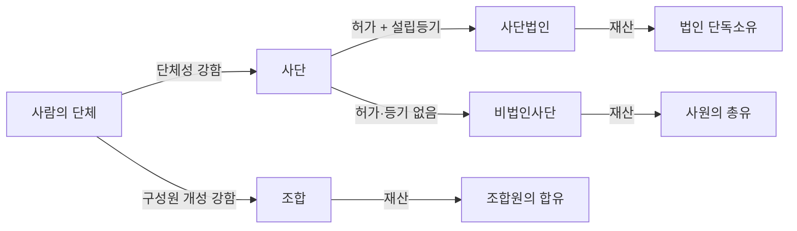
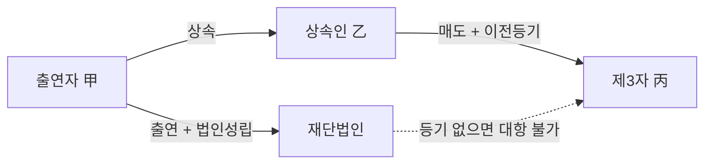
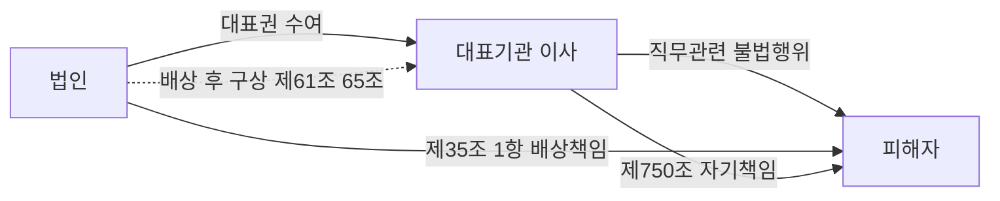
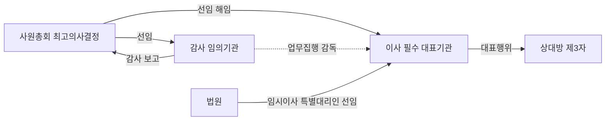
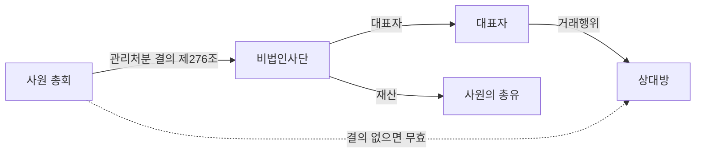

# 단원 M03 — 법인

> **영역**: 민법총칙
> **수업 주제**: 법인 설립·기관·권리능력·소멸

## 🗺️ 본문 목차

- [📘 위패스 마이 정리 (L1 - 메인 단권화)](#정리)
- [📖 핵심요약서 (L2 - 빠른 복습)](#핵심요약서)
- [📚 기본서 (L3 - 본격 학습)](#기본서)

---

## 📘 위패스 마이 정리 — L1 (메인·단권화)

> 김묘엽 교수 「위패스 마이 민법총칙/물권법」 교재 정리본.

### [민법총칙] 제7장 법인
### 제1절 권리능력

#### I. 서설

1. 의의
법인이란 법률의 규정으로 재산관계에 대해 독립한 권리와 의무의 주체로 인정되는 단체를 말한다. 이러한 법인은 사원으로 구성되는 사단법인과 재산으로 구성되는 재

단법인으로 나누어진다.

2. 규정

서 제31조 (법인성립의 준칙) 법인은 법률의 규정에 의함이 아니면 성립하지 못한다.
(가 권리능력

법인제도의 중요기능은 사원이나 재산의 출연자로부터 분리되어 독자적인

권리와 의무의 주체가 된다는 점이다. 이러한 법인의 권리능력을 다른 말로 ‘법인격’

이라고 부른다.

(나) 강행규정

권리능력을 포함한 법인에 관한 규정들은 원칙적으로 강행규정이다. 따라

서 법률행위로 이에 반하는 내용을 정할 수 없다.

#### II. 권리능력의 발생

1. 목적의 비영리성

> **제32조 (비영리법인의 성립과 허가)** 학술, 종교, 자선, 기예, 사교 기타 영리 아닌 사업을 목적으로 하는 사단 또는 재단은 주무관청의 허가를 얻어 이를 법인으로 할 수 있다.

> **제39조 (영리법인)** ① 영리를 목적으로 하는 사단은 상사회사설립의 조건에 좇아 이 를 법인으로 할 수 있다.

② 전항의 사단법인에는 모두 상사회사에 관한 규정( = 회사법)을 준용한다.

(가) 의의

영리 아닌 사업을 목적으로 한다는 것은 사업을 통해 이익을 얻지 못한다는

뜻이 아니라 얻은 이익을 구성원들에게 분배하지 않는 것을 말한다.
사단법인은 이익을 분배할 구성원인 사원이 있으므로 민법상 비영리법인 뿐만 아니라 회사법상 영리법인도 가능하다.

(나) 사단법인

재단법인은 재산만 있을 뿐 이익을 분배할 구성원인 사원이 없으므로 민 법상 비영리법인만 허용되고 회사법상 영리법인은 불가능하다.

0=) 재단법인

2. 설립행위
가. 의의
정관이라 함은 법인의 조직• 활동을 정한 근본규칙 또는 그 규칙을 기재한 서면을

의미한다. 이러한 법인의 정관작성을 다른 말로 ‘설립행위’라고 부른다.

나. 정관작성

> **제40조(사단법인의 정관)** 사단법인의 설립자는 다음 각호의 사항을 기재한 정관을 작성하여 기명날인하여야 한다.
1. 목적

2. 명칭
3. 사무소의 소재지
4. 자산에 관한 규정

5. 이사의 임면에 관한 규정
6. 사원자격의 득실에 관한 규정
7. 존립시기나 해산사유를 정하는 때에는 그 시기 또는 사유

> **제43조(재단법인의 정관)** 재단법인의 설립자는 일정한 재산을 출연하고 제40조제1호 내지 제5호의 사항( = 목적, 명칭, 사무소의 소재지, 자산에 관한 규정, 이사의 임면에 관한 규정)을 기재한 정관을 작성하여 기명날인하여야 한다.

(1)

방식

정관작성은 반드시 서면으로 작성하여야 하는 요식행위이다. 사단법인의 정관작성은 2인 이상의 설립자의 의사의 합치가 필요한 반면에 재단법인의 정관작성은 1인 이 상의 설립자로 충분하다.
(2) 정관의 법적성질 (가 자치법규

사단법인의 정관은 이를 작성한 사원뿐만 아니라 그 후에 가입한 사원이

나 사단법인의 기관 등도 구속하는 점에 비추어 보면, 그 법적 성질은 계약이 아니 라 자치법규로 보는 것이 타당하다(대판 2000.11.24. 99다12437).

(나 사원총회 결의에 따른 다른 해석은 사원 - 법원을 구속하지 않음

사단법인의 사원

들이 정관의 규범적인 의미 내용과 다른 해석을 사원총회의 결의라는 방법으로 표 명하였다고 하더라도, 그 결의에 의한 해석은 사단법인의 구성원인 사원이나 법원을

구속할 수 없다(대판 2000.11.24. 99다12437).

(3) 필요적 기재사항

정관의 필요적 기재사항이란 정관에 빠짐없이 모두 기재해야 하는 사항으로 어느

하나라도 빠지면 정관은 무효가 된다.
사단법인

재단법인

6) 목적

@ 목적

© 명칭

© 명칭

© 사무소의 소재지

© 사무소의 소재지

G 자산에 관한 규정

O 자산에 관한 규정

@ 이사의 임면에 관한 규정

@ 이사의 임면에 관한 규정

@ 사원자격의 득실에 관한 규정

G 존립시기나 해산사유를 정하는 때에는 그 시기 또는 사유

(4) 임의적 기재사항

임의적 기재사항에는 제한이 없다.

다만 임의적 기재사항도 일단 정관에 기재되면

필요적 기재사항과 차이가 없으며, 그것을 변경할 때에는 정관변경절차에 의하여야

한다.

2-1. 재단법인에만 인정되는 재산의 출연
가. 의의
사단법인 •재단법인 모두 자산에 관한 규정이 정관의 필요적 기재사항이지만 사단법 인은 재산의 출연이 있어야 법인이 성립할 수 있다고 보진 않는다. 법인 성립 후에

82- 위퍠스-마이 민법총칙

도 재산의 출연이 있으면 충분하다고 본다. 하지만 재단법인은 재산의 출연이 본체 적 요소이므로 재산의 출연이 있어야 법인이 성립할 수 있게 된다.

나. 준용 규정

> **제47조 (증여, 유증에 관한 규정의 준용)** ① 생전처분으로 재단법인을 설립하는 때에

는 증여에 관한 규정을 준용한다.

② 유언으로 재단법인을 설립하는 때에는 유증에 관한 규정을 준용한다.

다. 출연재산의 귀속시기

> **제48조 (출연재산의 귀속시기)** ① 생전처분으로 재단법인을 설립하는 때에는 출연재 산은 법인이 성립된 때로부터 법인의 재산이 된다.

② 유언으로 재단법인을 설립하는 때에는 출연재산은 유언의 효력이 발생한 때로부

터 법인에 귀속한 것으로 본다.

(1) 출연재산이 부동산인 경우 1.

출연자 • 출연자의 상속인 재단법인간 부동산 소유 - 부동산등기 없이도 재단

법인 소유
2. 제3자 vs

재단법인간 부동산 소유 - 부동산등기를 한 제3자의 소유

_

민법 제48조의 규정은 출연자(출연자의 상속인)와 법인과의 관계를 상대적으로 결정 하는 기준에 불과하여 재단법인 설립을 위해 출연된 재산이 부동산인 경우에도 출연

자(출연자의 상속인)와 법인 사이에는 법인의 성립 외에 (부동산) 등기를 필요로 하 는 것은 아니지만, 출연자와 제3자에 대한 관계에 있어서 출연행위는 법률행위이므

로 출연재산의 법인에의 귀속에는 부동산의 권리에 관한 것일 경우 (부동산) 등기를 필요로 한다(대판 1979.12.11 78다481,482 전합).

|3丄 명의신탁계약三丄내로

설립된 자다법이에 대해서는 효력 X

_

_

재단법인의 기본재산은 재단법인의 실체를 이루는 것이므로, 재단법인 설립을 위한

기본재산의 출연행위에 관하여 그 재산출연자가 소유명의만을 재단법인에 귀속시키

고 실질적 소유권은 출연자에게 유보하는 등의 행위는 재단법인 설립의 취지에 어긋 나고 재단법인의 존립 자체에 영향을 줄 것이므로, 명의신탁계약은 새로 설립된 재단

법인에 대해서는 효력을 미칠 수 없다(대판 2011.02.10 2006다65774).
(2)

출연재산이 동산이나 채권인 경우

법인설립 등기 외에 추가적인 등기가 필요 없는 동산이나 채권이 재단법인의 출연 재산인 경우에는 제48조가 정하는 시기인 법인성립등기시나 유언자 사망시에 당연 히 법인에게 귀속한다.

3. 주무관청의 허가

> **제32조 (비영리법인의 성립과 허가)** 학술, 종교, 자선, 기예, 사교 기타 영리 아닌 사업을 목적으로 하는 사단 또는 재단은 주무관청의 허가를 얻어 이를 법인으로 할 수 있다.

현행 법령상 비영리법인의 설립허가에 관한 구체적인 기준이 정하여져 있지 아니하 므로,

비영리법인의 설립허가를 할 것인지 여부는 주무관청의 정책적 판단에 따른

재량에 맡겨져 있다(대판 1996.9.10. 95누18437).

따라서 법률이 정하는 일정한 조직과

요건을 갖추었다고 하여 주무관청이 반드시 허가를 해주어야 하는 것이 아니다.

4. 설립등기
가. 등기사항

> **제49조 (법인의 등기사항)** ② 설립등기의 등기사항은 다음과 같다.
1. 목적

2. 명칭
3. 사무소

4. 설립허가의 연월일
5. 존립시기나 해산이유를 정한 때에는 그 시기 또는 사유
6. 자산의 총액
7. 출자의 방법을 정한 때에는 그 방법
8. 이사의 성명, 주소
9. 이사의 대표권을 제한한 때에는 그 제한

나. 등기기간

> **제49조 (법인의 등기사항)** ① 법인설립의 허가가 있는 때에는 3주간 내에 주된 사무 소소재지에서 설립등기를 하여야 한다.

다. 법인성립

(1) 주된 사무소 소재지

> **제33조 (법인설립의 등기)** 법인은 그 주된 사무소의 소재지에서 설립등기를 함으로 써 성립한다.

법인은 설립등기를 함으로써 권리능력 즉 법인격을 취득하여 권리와 의무의 주체가 된다.

(2) 분사무소설치의 등기

> **제50조 (분사무소설치의 등기)** ① 법인이 분사무소를 설치한 때에는 주사무소소재지

에서는 3주간 내에 분사무소를 설치한 것을 등기하고 그 분사무소 소재지에서는 3
주간 내에 법인의 설립등기사항을 등기하고 다른 분사무소 소재지에서는 3주간 내 에 그 분사무소를 설치한 것을 등기하여야 한다.
② 주사무소 또는 분사무소의 소재지를 관할하는 등기소의 관할구역 내에 분사무소

를 설치한 때에는 3주간 내에 그 사무소를 설치한 것을 등기하면 된다.

5. 설립등기 이외의 등기
가. 대항요건인 등기

> **제54조 (설립등기 이외의 등기의 효력과 등기사항의 공고)** ① 설립등기 이외의 본질의

등기사항은 그 등기후가 아니면 제3자에게 대항하지 못한다.
② 등기한 사항은 법원이 지체없이 공고하여야 한다.
(가 설립등기 이외의 본질의 등기사항

이사의 선임•해임• 퇴임 등기,

이사의 대표권

제한 등기, 법인의 해산 및 청산등기 등이 설립등기 이외의 본질의 등기사항에 속

한다.

이사의 선임 • 해임 • 퇴임 등기(=이사의 법인의 해산 및 청산등기 등을 하지 않으면

(나) 등기후가 아니면 제3자에게 대항하지 못한다
변경등기),

이사의 대표권 제한 등기,

이러한 사실이 발생되었음을 제3자에게 주장하지 못한다.
民法® 則

나. 이전등기

> **제51조 (사무소이전의 등기)** ① 법인이 그 사무소를 이전하는 때에는 구소재지에서는

3주간 내에 이전등기를 하고 신소재지에서는 3주간 내에 법인의 설립등기사항을 등 기하여야 한다.

② 동일한 등기소의 관할구역 내에서 사무소를 이전한 때에는 그 이전한 것을 등기 하면 된다.

다. 변경등기

> **제52조(변경등기)** 법인의 설립등기사항 중에 변경이 있는 때에는 3주간 내에 변경 등기를 하여야 한다.

라. 가처분 등기

> **제52조의2 (직무집행정지 등 가처분의 등기)** 이사의 직무집행을 정지하거나 직무대행 자를 선임하는 가처분을 하거나 그 가처분을 변경 • 취소하는 경우에는 주사무소와

분사무소가 있는 곳의 등기소에서 이를 등기하여야 한다.

마. 등기기간의 기산점

> **제53조 (등기기간의 기산)** 제51조, 제52조, 제52조의2의 규정에 의하여 등기할 사항 으로 관청의 허가를 요하는 것은 그 허가서가 도착한 날로부터 등기의 기간을 기산

한다.

6. 재산목록과 사원명부

> **제55조 (재산목록과 사원명부)** ① 법인은 성립한 때 및 매년 3월내에 재산목록을 작 성하여 사무소에 비치하여야 한다. 사업연도를 정한 법인은 성립한 때 및 그 연도

말에 이를 작성하여야 한다.
② 사단법인은 사원명부를 비치하고 사원의 변경이 있는 때에는 이를 기재하여야 한다.

#### III. 권리능력의 제한

1. 성질상 제한
법인은 자연인의 성질을 전제로 하는 권리, 즉 생명권 •육체상의 자유권 •상속권 등 은 누릴 수 없다. 그러나 재산권 • 인격권 • 명예권 •유증 등은 가질 수 있다.

2. 법률상 제한

> **제81조 (청산법인)** 해산한 법인은 청산의 목적범위 내에서만 권리가 있고 의무를 부 담한다.

|l. 해산사유 발생 - 청산의 목적 범위 내에서 권리 - 의무의 주체 해산사유가 발생하였다고 하더라도 곧바로 권리능력이 소멸하는 것이 아니라 청산사 무가 완료될 때까지 청산의 목적범위 내에서 권리 • 의무의 주체가 된다(대판 2007.11.1
6.

2006다41297).

| 入 해산사유 발생한 청산중인 법인이 청산법인 목적 범위 외 행위 - 무효 청산중인 법인은 해산 전의 법인과 동일하고 다만 그 목적이 청산 범위 내로 축소된 것에 지나지 않는다. 해산 전의 본래 사업을 적극적으로 수행할 수는 없고, 청산법인

이 목적 범위 외의 행위를 한 때는 무효이다(대판 1980.4.8. 79다2036).

3. 목적상 제한
서 제34조(법인의 권리능력) 법인은 법률의 규정에 좇아 정관으로 정한 목적의 범위 내 에서 권리와 의무의 주체가 된다.

|l. 법인의 목적범위 외 행위 - 법인에 대하여 효력X
법인의 행위능력은 목적 범위 내로 제한되므로, 법인의 대표기관이 법인의 목적 범위 에 속하지 않는 법률행위를 한 경우, 법인에 대하여 효력이 없다(대판 1965.07.06.

다854).

|z 법인의 목적범위 내 행위 - 목적 수행에 직접 - 간접으로 필요한 행위O
법인의 권리능력은 법인의 설립근거가 된 법률과 정관상의 목적에 의하여 제한되나

그 목적 범위 내의 행위라 함은 법률이나 정관에 명시된 목적 자체에 국한되는 것이 아니라 그 목적을 수행하는 데 있어 직접, 간접으로 필요한 행위는 모두 포함된다(대판 2001.9.21. 2000그98).

#### IV. 권리능력의 소멸

1. 설립허가의 취소

> **제38조 (법인의 설립허가의 취소)** 법인이 목적이외의 사업을 하거나 설립허가의 조건 에 위반하거나 기타 공익을 해하는 행위를 한 때에는 주무관청은 그 허가를 취소할 수 있다.

2. 해산
가. 의의
법인의 해산이란 법인이 본래의 목적달성을 위한 영업활동을 그치고 정리하는 청산 단계로 들어가는 것을 말한다.

나. 해산사유

> **제77조 (해산사유)** ① 법인은 존립기간의 만료, 법인의 목적의 달성 또는 달성의 불 능 기타 정관에 정한 해산사유의 발생, 파산 또는 설립허가의 취소로 해산한다.
> ② 사단법인은 사원이 없게 되거나 총회의 결의로도 해산한다.

다. 해산결의

> **제78조 (사단법인의 해산결의)** 사단법인은 총사원 4분의 3 이상의 동의가 없으면 해 산을 결의하지 못한다. 그러나 정관에 다른 규정이 있는 때에는 그 규정에 의한다.

3. 청산
가. 서설

(1) 의의

법인의 청산이란 해산한 법인의 잔무를 처리하고 재산을 정리하여 법인을 완전히

소멸시키는 절차를 말한다.

(2) 법적성질

청산절차에 관한 규정은 모두 제3자의 이해관계에 중대한 영향을 미치기 때문에 소 위 강행규정이라고 해석되므로 정관에서 이와 달리 정하더라도 무효이다(대판 1980.0
4 08.

79다2036).

b. 청산절차에 관한 규정 - 강행규정, 이에 반하는 잔여재산 처분행위는 무효 민법상의 청산절차에 관한 규정은 강행규정이라고 해석되므로 이에 반하는 잔여재산

의 처분행위는 특단의 사정이 없는 한 무효라고 보아야 한다(대판 1995.2.10. 94다134
73).

나. 법인소멸
청산종결등기가 경료된 경우에도 청산사무가 종료되었다 할 수 없는 경우에는 청산 법인으로 존속한다(대판 1980.4.8. 79다2036).

법인은 청산사무를 종결함으로써 권리

능력 즉 법인격이 소멸한다.

다. 청산인
(1) 선임

> **제82조 (청산인)** 법인이 해산한 때에는 파산의 경우를 제하고는 이사가 청산인이 된
다. 그러나 정관 또는 총회의 결의로 달리 정한 바가 있으면 그에 의한다.

> **제83조 (법원에 의한 청산인의 선임)** 청산인이 될 자가 없거나 청산인의 결원으로 인 하여 손해가 생길 염려가 있는 때에는 법원은 직권 또는 이해관계인이나 검사의 청 구에 의하여 청산인을 선임할 수 있다.

(2) 해임

> **제84조 (법원에 의한 청산인의 해임)** 중요한 사유가 있는 때에는 법원은 직권 또는 이해관계인이나 검사의 청구에 의하여 청산인을 해임할 수 있다.

(3) 직무

> **제87조 (청산인의 직무)** ① 청산인의 직무는 다음과 같다.
1. 현존사무의 종결

2. 채권의 추심 및 채무의 변제
3. 잔여재산의 인도
② 청산인은 전항의 직무를 행하기 위하여 필요한 모든 행위를 할 수 있다.
> **제85조 (해산등기)** ① 청산인은 파산의 경우를 제하고는 그 취임 후 3주간 내에 해 산의 사유 및 연월일, 청산인의 성명 및 주소와 청산인의 대표권을 제한한 때에는 그 제한을 주된 사무소 및 분사무소 소재지에서 등기하여야 한다.

> **제86조 (해산신고)** ① 청산인은 파산의 경우를 제하고는 그 취임 후 3주간 내에 전 조 제1항의사항을 주무관청에 신고하여야 한다.
> ② 청산중에 취임한 청산인은 그 성명 및 주소를 신고하면 된다.

(4) 준용규정

> **제96조(준용규정)** 제58조제2항, 제59조 내지 제62조, 제64조, 제65조 및 제70조 의 규정은 청산인에 이를 준용한다.

라. 청산절차

(1) 채권신고

> **제88조 (채권신고의 공고)** ① 청산인은 취임한 날로부터 2월 내에 3회 이상의 공고 로 채권자에 대하여 일정한 기간 내에 그 채권을 신고할 것을 최고하여야 한다. 그 기간은 2월 이상이어야 한다.
② 전항의 공고에는 채권자가 기간 내에 신고하지 아니하면 청산으로부터 제외될

것을 표시하여야 한다.

> **제89조 (채권신고의 최고)** 청산인은 알고 있는 채권자에게 대하여는 각각 그 채권신 고를 최고하여야 한다. 알고 있는 채권자는 청산으로부터 제외하지 못한다.

(2) 변제

> **제90조 (채권신고기간내의 변제금지)** 청산인은 제88조 제1항의 채권신고기간 내에는 채권자에 대하여 변제하지 못한다. 그러나 법인은 채권자에 대한 지연손해배상의 의무를 면하지 못한다.

> **제91조 (채권변제의 특례)** ① 청산중의 법인은 변제기에 이르지 아니한 채권에 대하 여도 변제할 수 있다.
> ② 전항의 경우에는 조건 있는 채권, 존속기간의 불확정한 채권 기타 가액의 불확 정한 채권에 관하여는 법원이 선임한 감정인의 평가에 의하여 변제하여야 한다.

•M

> **제92조 (청산으로부터 제외된 채권)** 청산으로부터 제외된 채권자는 법인의 채무를 완제 한 후 귀속권리자에게 인도하지 아니한 재산에 대하여서만 변제를 청구할 수 있다.

(3) 잔여재산의 귀속

> **제80조 (잔여재산의 귀속)** ① 해산한 법인의 재산은 정관으로 지정한 자에게 귀속 한다.

② 정관으로 귀속권리자를 지정하지 아니하거나 이를 지정하는 방법을 정하지 아니 한 때에는 이사 또는 청산인은 주무관청의 허가를 얻어 그 법인의 목적에 유사한 목

적을 위하여 그 재산을 처분할 수 있다. 그러나 사단법인에 있어서는 총회의 결의 가 있어야 한다.

③ 전2항의 규정에 의하여 처분되지 아니한 재산은 국고에 귀속한다.
1. 잔여재산 귀속권리자 지정 - 직접적 지정O, 사원총회나 이사회 결의에 따라 간 접적 지정O
법인 해산시 잔여재산의 귀속권리자를 직접 지정하지 아니하고 사원총회나 이사회의

결의에 따라 이를 정하도록 하는 등 간접적으로 그 귀속권리자의 지정방법을 정해 놓

은 정관 규정도 유효하다(대판 1995.02 10.

94다13473).

(4) 청산종결의 등기와 신고

> **제94조 (청산종결의 등기와 신고)** 청산이 종결한 때에는 청산인은 3주간 내에 이를 등기하고 주무관청에 신고하여야 한다.

4.

파산

> **제79조(파산신청)** 법인이 채무를 완제하지 못하게 된 때에는 이사는 지체없이 파산 신청을 하여야 한다.

> **제93조(청산중의 파산)** ① 청산중 법인의 재산이 그 채무를 완제하기에 부족한 것이 분명하게 된 때에는 청산인은 지체없이 파산선고를 신청하고 이를 공고하여야 한다.

② 청산인은 파산관재인에게 그 사무를 인계함으로써 그 임무가 종료한다.

③ 제88조제3항의 규정은 제1항의 공고에 준용한다.

### 제2절 법인의 기관

#### I. 서설

1. 의의
법인은 형체가 없는 관념상의 개념이므로 권리취득이나 의무부담을 직접 하지는 못 하고, 자연인의 행위에 의존한다. 자연인으로 구성되는 각각의 기관은 법인의 의사

를 결정하기도 하고, 외부적으로 법인을 대표하기도 하고, 내부적으로 법인의 사무 를 처리하기도 한다

2. 구성
민법으로 인정되는 법인의 기관으로는 이사, 사원총회, 감사가 있다. 사단•재단법인

의 필요기관으로는 이사가 있고, 사단법인의 필요기관으로는 사원총회가 있다. 감사

는 임의기관일 뿐이다.

#### II. 대표기관

1. 서설
가. 의의
법인의 행위능력이란 기관 중에서 누구의 행위가 법인의 행위로 되는지에 대한 문

제인데, 대표기관의 행위만이 법인의 행위가 된다.

나. 유형
민법상의 비영리법인에서는 이사, 직무대행자, 임시이사, 특별대리인, 청산인이 대표

기관이다.

2. 이사
가. 의의

> **제57조 (이사)** (사단 • 재단) 법인은 이사를 두어야 한다.

나. 선임
법인과 이사의 법률관계는 신뢰를 기초로 한 위임 유사의 관계이다(대판 2014.1.17. 013마1801).

이사의 수와 임기에 대해서 민법상의 제한은 없으므로 정관에서 임의로

정할 수 있다.

|i. 이사의 선임 - 명시적Q, 묵시적o

,

.

법인 대표자의 유임 내지 중임을 금지하는 규약이 없는 이상, 임기만료 후에 대표자 개임이 없었다면 그 대표자를 묵시적으로 다시 대표자로 선임하였다고 해석할 것이

다(대판 1970.9.17. 70다1256).

다. 사임
(1) 사임의 효력발생

|i. 이사의 사임 - 언제든지 사임O, 상대방 있는 단독행위O
위임계약은 원래 해지의 자유가 인정되어 쌍방 누구나 정당한 이유 없이도 언제든지

계약을 해지할 수 있다. 이사의 사임은 이러한 위임계약의 해지권이며, 형성권인 상 대방 있는 단독행위로 이사는 언제든지 사임할 수 있다(대판 2014.01.17.
I2.

사임의 효력발찰 저 -사임으!사철환으____

2013마1801).

_ __________________

이사가 사임의 의사표시를 하였더라도 정관에 따라 사임의 효력이 발생하기 전에는

그 사임의사를 자유롭게 철회할 수 있다(대판 2008.9.25. 2007다17109).

| 3. 사임의 의사표시는 원칙적 도달시 효력발생O - 도달 후 사임의사 철회 X

：

이사의 사임의 의사표시는 수령권한 있는 기관에 도달됨으로써 바로 효력을 발생하 는 것이며, 그 의사표시가 효력을 발생한 후에는 마음대로 이를 철회할 수 없다(대판 2003.1.10. 20()1다1171).

4. 사임의 의사표시에 대한 도달주의의 예외 - 도달 후 사임의사 철회O
5. 철회권유로 사임서 제출을 미룸 - 별도의 사임서 제출 전까지 사임의사 철회O
6. 대표자에게 사표처리를 일임 - 대표자의 수리행위가 있기 전까지 사임의사 철회O

7. 작성일자를 제출일 이후로 기재 - 기재일자가 도달흐PI 전까지 - 사임의사 철회O

이사가 사임서를 제시할 당시 즉각적인 철회권유로 사임서 제출을 미루거나, 대표자 에게 사표의 처리를 일임하거나, 사임서의 작성일자를 제출일 이후로 기재한 경우 등

사임의사가 즉각적이라고 볼 수 없는 특별한 사정이 있을 경우에는 별도의 사임서 제 출이나 대표자의 수리행위 등이 있어야 사임의 효력이 발생하고, 그 이전에 사임의사 를 철회할 수 있다(대판 2006.6.15. 2004다10909).
(2) 사임효력 발생 후 업무수행 1.

후임이사의 선임이 없거나 선임이 무효인 경우 - 후임이사가 선임될 때까지 구

이사는 직무를 계속 수행할 수 있다.
민법상 법인의 이사 전원 또는 그 일부의 임기가 만료되었거나 사임하였음에도 불구

하고, 그 후임 이사의 선임이 없거나 또는 그 후임 이사의 선임이 있었다고 하더라도 그 선임결의가 무효이고 남아 있는 다른 이사만으로는 정상적인 법인의 활동을 할 수

없는 경우, 구이사는 후임 이사가 선임될 때까지 민법 제691조의 규정을 유추하여 종전의 직무를 계속 수행할 수 있다(대판 2005.3.25. 2004다65336).

| 入 다른 이사들로 정상적인 활동을 할 수 있는 경우 - 구 이사 직무계속수행X
이사 중 일부의 임기가 만료되었더라도 아직 임기가 만료되지 아니한 다른 이사들로

정상적인 활동을 할 수 있는 경우에는 임기만료된 이사로 하여금 이사로서 직무를 행

사하게 할 필요가 없다(대판 2014.1.17. 3.

2013마1801).

후임이사 선임이 유효하나 선임의 효력을 둘러싼 다툼 있는 경우 - 구 이사만이

직무수행권을 가진다고 할 수 없다.
후임 이사가 유효히 선임되었는데도 그 선임의 효력을 둘러싼 다툼이 있다고 하여 그 다툼이 해결되기 전까지는 후임 이사에게는 직무수행권한이 없고 임기가 만료된 구

이사만이 직무수행권한을 가진다고 할 수는 없다(대판 2006.4.27. 2005도8875).

라. 해임
|l.

이사는 언제든지 해임O

위임계약은 원래 해지의 자유가 인정되어 쌍방 누구나 정당한 이유 없이도 언제든지 계약을 해지할 수 있다. 법인의 이사에 대한 해임은 이러한 위임계약의 해지권이며,
형성권인 상대방 있는 단독행위로 법인은 이사의 임기 만료 전에도 이사를 해임할 수

있다(대판 2013.11.28. 2011다41741).

2.

이사의 해임사유를 정관에 정한 경우 - 정관에 정하지 아니한 사유로 해임X

3.

이사의 해임사유를 정관에 정한 경우 - 이사의 중대한 의무위반이 있을 경우 정

관에 정하지 아니한 사유로 해임 O

법인의 정관에 이사의 해임사유에 관한 규정이 있는 경우 법인으로서는 이사의 중대 한 의무위반 또는 정상적인 사무집행 불능 등의 특별한 사정이 없는 이상, 정관에서

정하지 아니한 사유로 이사를 해임할 수 없다(대판 2013.11.28. 2011다41741).

3. 기타 대표기관
가. 직무대행자

> **제60조의2(직무대행자의 권한)** ① 직무대행자는 가처분명령에 다른 정함이 있는 경 우 외에는 법인의 통상사무에 속하지 아니한 행위를 하지 못한다. 다만, 법원의 허

가를 얻은 경우에는 통상사무가 아닌 행위도 할 수 있다.

② 직무대행자가 통상사무가 아닌 행위를 법원의 허가 없이 한 경우에도 법인은 선 의의 제3자에 대하여는 책임을 진다.

나. 임시이사

i 제63조 (임시이사의 선임) 이사가 없거나 결원이 있는 경우에 이로 인하여 손해가 생 길 염려 있는 때에는 법원은 이해관계인이나 검사의 청구에 의하여 임시이사를 선

임하여야 한다.
임시이사 선임의 요건으로 정하고 있는 ‘이사가 없거나 결원이 있는 경우’라 함은

이사가 전혀 없거나 정관에서 정한 인원수에 부족이 있는 경우를 말하고, ‘이로 인 하여 손해가 생길 염려가 있는 때’라 함은 통상의 이사선임절차에 따라 이사가 선임

되기를 기다릴 때에 법인이나 제3자에게 손해가 생길 우려가 있는 것을 의미한다(대

판 2009.11 19.

2008마699

전합).

|l. 임시이사 - 정식이사와 동일한 권한O

’ ,

민법상의 법인에 대하여 민법 제63조에 의하여 법원이 선임한 임시이사는 원칙적으 로 정식이사와 동일한 권한을 가진다. 따라서 임시이사들에게 정식이사 선임에 관한

의결권한이 있다(대판 2013.6.13. 2012다40332).

다. 특별대리인

> **제64조 (특별대리인의 선임)** 법인과 이사의 이익이 상반하는 사항에 관하여는 이사는 대표권이 없다. 이 경우에 법원은 이해관계인이나 검사의 청구에 의하여 특별대리 인을 선임하여야 한다.
11. 법인과 이사의 이익이 상반하는 사항 - 이사와 법인간의 재산에 대한 양도 • 양수 법인과 이사의 이익이 상반하는 사항은 법인과 이사가 직접 거래의 상대방이 되는 경 우뿐 아니라, 이사의 개인적 이익과 법인의 이익이 충돌하고 이사에게 선량한 관리자

로서의 의무 이행을 기대할 수 없는 사항은 모두 포함한다(대판 2013.11.28. 2010다918
31).

2.

법인과 이사의 이익이 상반하는 사항 - 이사가 개인의 입장에서 법인을 상대로

소송제기

사단법인의 이사장 직무대행자가 개인의 입장에서 그 사단법인을 상대로 소송을 하 는 것이 민법 제64조가 규정하는 이익상반사항에 해당함이 분명하다(대판 2003.5.27. 2002다69211).

라. 청산인

> **제82조 (청산인)** 법인이 해산한 때에는 파산의 경우를 제하고는 이사가 청산인이 된
다. 그러나 정관 또는 총회의 결의로 달리 정한 바가 있으면 그에 의한다.

4. 권한
가. 의의
대표기관은 대외적으로는 법인을 대표하고 대내적으로는 법인의 사무를 집행하는 역

할을 한다.

나. 대표권
(1) 각자가 대표
| 제59조 (이사의 대표권) ① (이사가 여럿인 경우) 이사는 법인의 사무에 관하여 각자 법인을 대표한다. 그러나 정관에 규정한 취지에 위반할 수 없고 특히 사단법인은

총회의 의결에 의하여야 한다.
② 법인의 대표에 관하여는 대리에 관한 규정을 준용한다.

(2) 대리에 관한 규정을 준용

법인이 대표기관을 통하여 법률행위를 한 때에는 대리에 관한 규정이 준용된다(제59조 제2항). 따라서 대표행위를 할 때 법인을 위한 것임을 표시해야 하고, 표현대리나

무권대리에 관한 규정도 준용된다.

1.

대표행위에 따른 법률행위 성립의 효과 - 법인에게만 귀속0, 대표기관에게 귀속X

2.

대표행위 위반에 따른 채무불이행 손해배상책임의 효과 - 법인에게만 귀속O, 대

표기괘에게j기속
적법한 대표권을 가진 자와 맺은 법률행위의 효과는 대표자 개인이 아니라 본인인 법

인에 귀속하고, 마찬가지로 그러한 법률행위상의 의무를 위반하여 발생한 채무불이행 으로 인한 손해배상책임도 대표기관 개인이 아닌 법인만이 책임의 귀속주체가 되는

것이 원칙이다(대판 2019.5.30. 2017다53265).

(3) 대표권의 제한

> **제41조 (이사의 대표권에 대한 제한)** 이사의 대표권에 대한 제한은 이를 정관에 기재 하지 아니하면 그 효력이 없다.

> **제60조 (이사의 대표권에 대한 제한의 대항요건)** 이사의 대표권에 대한 제한은 등기하 지 아니하면 제3자에게 대항하지 못한다.
| 1.

대표권 제한에 대한 등기가 없는로우 - 선의 - 악의의 제3자에게 대항X

_

법인의 정관에 법인 대표권의 제한에 관한 규정이 있으나 그와 같은 취지가 등기되어 있지 않다면 법인은 그와 같은 정관의 규정에 대하여 선의냐 악의냐에 관계없이 제3

자에 대하여 대항할 수 없다(대판 1992.2.14. 91다24564). 반대로 이사의 대표권 제한

에 관한 규정을 등기하면 선의냐 악의냐에 관계없이 제3자에게 대항할 수 있다.

| 2. 이사 전원의 의결에 의한 잔여재산의 처분 규정 - 청산인의 대표권 제한X
이사 전원의 의결에 의하여 잔여재산을 처분하도록 한 정관 규정은 성질상 등기하여 야만 제3자에게 대항할 수 있는 청산인의 대표권에 관한 제한이라고 볼 수 없다(대판 1995.2.10. 94다13473).

(4) 대표권의 남용

대표이사가 대표권의 범위 내에서 한 행위는 회사의 영리목적과 관계없이 자기 또

는 제3자의 이익을 도모할 목적으로 그 권한을 남용한 것이라 할지라도 일단 회사 의 행위로서 유효하고, 다만 그 행위의 상대방이 대표이사의 진의를 알았거나 알 수

있었을 때에는 회사에 대하여 무효가 되는 것이다(대판 2004.3.26. 2003다34045).
民法 總!W

다. 사무집행

(1) 이사의 과반수로 사무집행

> **제58조 (이사의 사무집행)** ① 이사는 법인의 사무를 집행한다.

② 이사가 수인인 경우에는 정관에 다른 규정이 없으면 법인의 사무집행은 이사의 과반수로써 결정한다.

(2) 선관주의의무

> **제61조 (이사의 주의의무)** 이사는 선량한 관리자의 주의로 그 직무를 행하여야 한다. |

> **제65조 (이사의 임무해태)** 이사가 그 임무를 해태한 때에는 그 이사는 법인에 대하여 연대하여 손해배상의 책임이 있다.

(3) 대리인 선임

> **제62조 (이사의 대리인 선임)** 이사는 정관 또는 총회의 결의로 금지하지 아니한 사항 에 한하여 타인으로 하여금 특정한 행위를 대리하게 할 수 있다.
(-＞) 포괄적 행위 대리 불가

법인의 이사는 특정한 행위를 다른 이사에게 대리하게 할

수 있으나, 법인의 제반 업무처리를 포괄적으로 위임할 수는 없다(대판 1989.05.09.

다카2407).

(나) 포괄적 행위를 대리하게 한 경우

법인의 이사가 행한 타인에 대한 업무의 포괄적

위임과 그에 따른 포괄적 수임인의 대행행위는 법인에 대하여 그 효력이 미치지 않

는다(대판 2011.4.28. 2008다!5438).

#### III. 감사

> **제66조 (감사)** 법인은 정관 또는 총회의 결의로 감사를 둘 수 있다.

> **제67조 (감사의 직무)** 감사의 직무는 다음과 같다.
1. 법인의 재산상황을 감사하는 일

2. 이사의 업무집행의 상황을 감사하는 일
3. 재산상황 또는 업무집행에 관하여 부정, 불비한 것이 있음을 발견한 때에는 이를 총회

또는 주무관청에 보고하는 일

4. 전호의 보고를 하기 위하여 필요 있는 때에는 총회를 소집하는 일

("＞) 의의

법인의 감사는 이사의 사무집행을 감독하는 기관이다.

(나) 임의기관

법인의 감사는 정관 또는 사원총회의 결의로 둘 수도 있고 안 둘 수도

있는 임의기관이다(제66조).

#### IV. 사원총회

1. 의의
사원총회는 사원 전원으로 구성된 사단법인의 최고의사결정기관으로 정관으로 이를 두지 않거나 폐지할 수 없는 필요기관이다. 재단법인에는 사원이 없으므로 사원총회

가 있을 수 없다.

2. 총회의 권한
가. 원칙

> **제68조 (총회의 권한)** 사단법인의 사무는 정관으로 이사 또는 기타 임원에게 위임한 사항 외에는 총회의 결의에 의하여야 한다.

나. 정관변경과 임의해산

> **제42조 (사단법인의 정관의 변경)** ① 사단법인의 정관은 총사원 3분의 2이상의 동의 가 있는 때에 한하여 이를 변경할 수 있다. 그러나 정수에 관하여 정관에 다른 규정 이 있는 때에는 그 규정에 의한다.
> **제78조 (사단법인의 해산결의)** 사단법인은 총사원 4분의 3 이상의 동의가 없으면 해 산을 결의하지 못한다. 그러나 정관에 다른 규정이 있는 때에는 그 규정에 의한다.

정관변경과 임의해산은 반드시 사원총회 결의를 거쳐야만 하는 사원총회의 전권사항

이므로 다른 기관에 위임할 수가 없고, 정관의 규정 또는 총회의 결의에 의하더라도 제한하거나 박탈할 수 없는 권리이다.

3.

총회의 소집

> **제69조 (통상총회)** 사단법인의 이사는 매년 1회 이상 통상총회를 소집하여야 한다.

> **제70조 (임시총회)** ① 사단법인의 이사는 필요하다고 인정한 때에는 임시총회를 소 집할 수 있다.
> ② 총사원의 5분의 1 이상으로부터 회의의 목적사항을 제시하여 청구한 때에는 이 사는 임시총회를 소집하여야 한다. 이 정수는 정관으로 증감할 수 있다.
> ③ 전항의 청구 있는 후 2주간 내에 이사가 총회소집의 절차를 밟지 아니한 때에는 청구한 사원은 법원의 허가를 얻어 이를 소집할 수 있다.

제기조 (총회의 소집) 총회의 소집은 1주간전에 그 회의의 목적사항을 기재한 통지 를 발하고 기타 정관에 정한 방법에 의하여야 한다.

4. 총회의 결의
가. 결의사항
서 제72조 (총회의 결의사항) 총회는 전조의 규정에 의하여 통지한 사항에 관하여서만

결의할 수 있다. 그러나 정관에 다른 규정이 있는 때에는 그 규정에 의한다.
총회를 소집할 때 미리 통지한 사항에 한하여만 결의할 수 있다(제72조 전문). 정관에

규정이 있으면, 총회를 소집할 때 미리 통지한 사항 외에도 결의할 수 있다(제72조 후문).

나. 결의권

> **제74조 (사원이 결의권 없는 경우)** 사단법인과 어느 사원과의 관계사항을 의결하는 경우에는 그 사원은 결의권이 없다.

100- 위퍠스-마이 민법총칙

1. 법인과 어느 이사와의 관계사항 의결 - 이사는 의결권〉〈, 의사정족수에는 포함되 곳 의결정족수에느 포함되지 않는다______________________________ __________

민법 제74조의 유추해석상 민법상 법인의 이사회에서 법인과 어느 이사와의 관계사 항을 의결하는 경우에는 그 이사는 의결권이 없다. 이 때 의결권이 없다는 의미는 이

해관계 있는 이사는 이사회에서 의결권을 행사할 수는 없으나 의사정족수 산정의 기 초가 되는 이사의 수에는 포함되고, 다만 결의 성립에 필요한 출석이사에는 산입되지 °)•니한다(대판 2009.4.9. 2008다1521).

다. 결의 방법

> **제73조 (사원의 결의권)** ① 각 사원의 결의권은 평등으로 한다.
> ② 사원은 서면이나 대리인으로 결의권을 행사할 수 있다.
> ③ 전2항의 규정은 정관에 다른 규정이 있는 때에는 적용하지 아니한다.

각 사원의

결의권은 평등하고(제73조 제1항),

서면이나 대리인으로 결의권을 행사할

수 있다(제73조 제2항). 정관에 규정이 있으면, 결의권이 불평등하기도 하고, 서면이나 대리인으로는 결의권을 행사하지 못할 수도 있다(제73조 제3항).

라. 정족수

> **제75조(총회의 결의방법)** ① 총회의 결의는 본법 또는 정관에 다른 규정이 없으면 사원 과반수의 출석과 출석사원의 결의권의 과반수로써 한다.

② 서면이나 대리인으로 결의권을 행사하는 경우, 당해사원은 출석한 것으로 한다.

마. 의사록 작성 및 비치

> **제76조 (총회의 의사록)** ① 총회의 의사에 관하여는 의사록을 작성하여야 한다.
> ② 의사록에는 의사의 경과, 요령 및 결과를 기재하고 의장 및 출석한 이사가 기명

날인하여야 한다.
③ 이사는 의사록을 주된 사무소에 비치하여야 한다.
.101

民法® 則

5. 사원권
[ 제56조 (사원권의 양도, 상속금지) 사단법인의 사원의 지위는 양도 또는 상속할 수

없다.

|l. 사단법인의 사원의 지위는 양도 또는 상속할 수 없다는 규정 - 임의규정 “사단법인의 사원의 지위는 양도 또는 상속할 수 없다”고 한 민법 제56조의 규정은 강행규정은 아니라고 할 것이다(대판 1992.4.14. 91다26850). 따라서 이에 반하는 내용

의 법률행위를 정하면 그 내용대로 효력이 발생한다.

|그 정관에 의하여 - 사원의 지위는 양도 • 상속이 가능 “사단법인의 사원의 지위는 양도 또는 상속할 수 없다”고 한 민법 제56조의 규정은 강행규정은 아니라고 할 것이므로, 정관에 의하여 이를 인정하고 있을 때에는 양도 •

상속이 허용된다(대판 1992.4.14. 91다26850).

### 제3절 불법행위능력

I - 의의

법인의 이사 기타 대표기관이 그 직무에 관하여 타인에게 손해를 가한 경우에 대표

기관은 당연히 손해배상책임을 진다. 법인의 불법행위능력이란 대표기관의 책임 외 에 법인이 추가적인 손해배상책임을 지는 것을 말한다.

#### II. 요건

1. 대표기관의 행위
가. 대표기관 인정
이사, 임시이사, 특별대리인, 직무대행자, 청산인은 대표기관으로 직무에 관한 불법 행위에 대하여 법인의 불법행위책임이 성립한다.
1.

법인을 사실상 대표하는 자 - 법인의 불법행위책임에서의 대표자에 포함o

2.

법인을 사실상 대표하는 자의 직무에 관한 불법행위 - 법인의 불법행위책임 성 립O
〒니패
?
으

법인의 불법행위책임(민법 제35조)에서 정한 ‘법인의 대표자’에는 그 명칭이나 직위 여하, 또는 대표자로 등기되었는지 여부를 불문하고 당해 법인을 실질적으로 운영하

면서 법인을 사실상 대표하여 법인의 사무를 집행하는 사람을 포함한다고 해석함이 상당하다(대판 2011.4.28. 2008다15438).

법인을 사실상 대표하는 자의 직무에 관한

불법행위에 대하여 법인의 불법행위책임이 성립한다.

나. 대표기관 부정
대표권이 없는 이사, 이사가 선임한 대리인, 감사, 사원총회는 대표기관이 아니므로 직무에 관한 불법행위에 대하여 법인의 불법행위책임이 성립하지 않는다.
1.

대표권이 없는 이사 - 법인의 불법행위책임에서의 대표자에 포함X

2. 대표권이 없는 이사의 직무에 관한 불법행위 - 법인의 불법행위책임 성립X

법인의 불법행위책임(민법 제35조)에서 말하는 ‘이사 기타 대표자’는 법인의 대표기

관을 의미하는 것이고 대표권이 없는 이사는 법인의 기관이기는 하지만 대표기관은

아니기 때문에 그들의 행위로 인하여 법인의 불법행위가 성립하지 않는다(대판 2005.
12 23.

2003다30159).
.103

1브 法 總 H«

2. 외형상 직무관련성
(가) 외형상 직무행위

직무에 관하여의 판단은 행위의 외형상 법인의 대표자의 직무행

위라고 인정할 수 있는 것이라면 설사 그것이 대표자 개인의 사리를 도모하기 위한 것(=대표자의 권한 남용, 부정한 대표행위)이었거나 혹은 법령의 규정에 위배(=강행규

정 위반)된 것이었다 하더라도 법인의 불법행위책임의 직무에 관한 행위에 해당된다
(대판 2004.2.27. 2003다15280).

(나) 직무행위와 밀접한 관련성이 있는 행위

대표기관의 직무행위에 속하지 않지만 통

상적 업무행위와 밀접한 관련을 가지고 있고, 외관상으로도 그 업무행위와 유사하여

그 업무행위의 범위에 속하는 것으로 보여지는 경우에 한하여 법인의 불법행위책임 의 직무에 관한 행위에 해당된다(대판 1974.5.28. 73다2014).

3. 대표기관의 불법행위성립 대표기관의 행위가 고의나 과실이 있고, 위법11’하고, 손해가 발생하여야 하는 불법행

위의 요건을 모두 갖추어야 한다.

4. 법인은 면책가능성이 없음
법인이 대표기관의 선임 • 감독에 관한 주의를 다하였음을 증명하더라도 법인의 불법 행위책임이 면책되지 않는다.

11) 위법행위는 법률이 가치가 없는 것으로 평가하여 허용하지 않는 행위이다. 위법행위의 경우에는 법 질서가 행위자에게 불이익을 부과한다.

#### III. 효과

1. 법인의 불법행위책임이 인정되는 경우

> **제35조 (법인의 불법행위능력)** ① 법인은 이사 기타 대표자가 그 직무에 관하여 타인 에게 가한 손해를 배상할 책임이 있다. 이사 기타 대표자는 이로 인하여 자기의 손 해배상책임을 면하지 못한다.

가. 법인의 추가적인 손해배상책임 법인은 이사 기타 대표자가 그 직무에 관하여 타인에게 가한 손해를 배상할 책임이 있다(저］35조 제1항 전문).

(1.

대표기관으L고의오厂피해자의 과실 - 과실상계o
법인에 대한 손해배상책임 원인이 대표기관의 고의적인 불법행위라고 하더라도, 피 해자에게 그 불법행위 내지 손해발생에 과실이 있다면 법원은 과실상계의 법리에 좇 아 손해배상의 책임 및 그 금액을 정함에 있어 이를 참작하여야 한다(대판 1987.12.0
8.

86다카1170).

나. 대표기관의 손해배상책임은 계속 인정 이사 기타 대표자는 법인의 불법행위책임이 성립하는 경우 자기의 손해배상책임을

면하지 못한다(제35조 제1항 후문).

|j三 사원이 대표자의 불법행위에가담 - 사원도 대표자와 연대하여 손해배상책의O
사원도 위 대표자와 공동으로 불법행위를 저질렀거나 이에 가담하였다고 볼 만한 사

정이 있으면 제3자에 대하여 위 대표자와 연대하여 손해배상책임을 진다(대판 2009.0
1.30.

2006다37465).

|z 사원이 사원총회 의결에 찬성 - 사원은 손해배상책임X
사원총회, 대의원 총회, 이사회의 의결은 원칙적으로 법인의 내부행위에 불과하므로 특별한 사정이 없는 한 그 사항의 의결에 찬성하였다는 이유만으로 제3자에 대하여

불법행위책임을 부담한다고 할 수는 없다(대판 2009.01 30.

2006다37465).
.105

다. 법인과 대표기관의 손해배상책임의 관계 (가) 부진정연대의 관계

대표기관의 손해배상책임과 법인의 손해배상책임은 부진정연대

의 관계에 있다. 따라서 피해자는 법인이나 대표기관 중 선택해서 배상을 청구할 수

있다.
(나)
구상권 발생

법인이 피해자에게 배상을 하면, 법인은 선량한 관리자의 주의의무위

반(제61조)을 이유로 대표기관 개인에 대하여 구상권을 행사할 수 있다.

2. 법인의 불법행위책임이 인정되지 않는 경우
가. 피해자가 직무행위가 아님을 알았거나 알지 못함에 중과실이 있음
법인의 대표자의 행위가 직무에 관한 행위에 해당하지 아니함을 피해자 자신이 알 았거나 또는 중대한 과실로 인하여 알지 못한 경우에는 법인에게 손해배상책임을

물을 수 없다(대판 2004 03.26.

2003다34045).

피해자가 경과실로 알지 못한 경우에는

법인에게 손해배상책임을 물을 수 있다.

나. 법인의 목적 범위 외 행위

> **제35조(법인의 불법행위능력)** ② 법인의 목적 범위 외의 행위로 인하여 타인에게 손 해를 가한 때에는 그 사항의 의결에 찬성하거나 그 의결을 집행한 사원, 이사 및 기 타 대표자가 연대하여 배상하여야 한다.

### 제4절 정관의 보충과 변경, 법인의 감독

#### I. 정관의 보충

> **제44조 (재단법인의 정관의 보충)** 재단법인의 설립자가 그 명칭, 사무소 소재지 또는 이사 임면의 방법을 정하지 아니하고 사망한 때에는 이해관계인 또는 검사의 청구

에 의하여 법원이 이를 정한다.
.
(가) 명칭 • 사무소 소재지 - 이사의 임명방법은 보충 가능

재단법인 설립자가 정관의 필

요적 기재사항 중 비교적 경미한 사항인 명칭, 사무소 소재지,

이사의 임면방법에

대해서 정하지 않고 사망한 경우, 법원이 이를 정한다(제44조).
(＞_) 목적 • 자산은 보충 불가

재단법인 설립자가 정관의 필요적 기재사항 중 목적이나

자산의 출연 부분을 정하지 않고 사망한 경우, 법원이 이를 정할 수 없다(제44조 반

대해석).

#### II. 정관의 변경

1. 의의
정관의 변경은 법인이 동일성을 유지하면서 그 조직을 변경하는 것을 말한다.

2. 사단법인의 정관변경

> **제42조 (사단법인의 정관의 변경)** ① 사단법인의 정관은 총사원 3분의 2이상의 동의 가 있는 때에 한하여 이를 변경할 수 있다. 그러나 정수에 관하여 정관에 다른 규정 이 있는 때에는 그 규정에 의한다.
② 사단법인의 정관의 변경은 주무관청의 허가를 얻지 아니하면 그 효력이 없다.

가. 정관으로 변경할 수 없다고 규정된 정관 정관에서 어떤 정관을 변경할 수 없다고 규정하고 있더라도 총사원의 동의가 있으

면 정관을 변경할 수 있다.
.107

나. 사원자격의 득실에 관한 정관 어느 사단법인과 다른 사단법인이 동일한 것인지 여부는 그 구성원인 사원이 동일

한지 여부에 따라 결정됨이 원칙이다

다만, 사원 자격의 득실변경에 관한 정관의

기재사항이 적법한 절차를 거쳐서 변경된 경우에는 구성원이 다르더라도 그 변경

전후의 사단법인은 동일성을 유지하면서 존속하는 것이고, 이러한 법리는 법인 아닌 사단에 있어서도 마찬가지이다(대판 2008.9.25. 3.

2006다37021).

재단법인의 정관변경

> **제45조 (재단법인의 정관변경)** ① 재단법인의 정관은 그 변경방법을 정관에 정한 때 에 한하여 변경할 수 있다.

② 재단법인의 목적달성 또는 그 재산의 보전을 위하여 적당한 때에는 정관으로 변

경방법을 정하지 않았더라도 명칭 또는 사무소의 소재지를 변경할 수 있다.
③ 재단법인의 정관의 변경은 주무관청의 허가를 얻지 아니하면 그 효력이 없다.

> **제46조 (재단법인의 목적 기타의 변경)** 재단법인의 목적을 달성할 수 없는 때에는 설

립자나 이사는 주무관청의 허가를 얻어 설립의 취지를 참작하여 그 목적 기타 정관

의 규정을 변경할 수 있다.

가. 정관 규정의 변경

(1) 정관으로 변경방법을 정하지 않은 경우

재단법인의 정관으로 변경방법을 정하지 않았더라도 재단법인의 목적달성 또는 그

재산의 보전을 위하여 적당한 때에는 명칭 또는 사무소의 소재지 정도는 변경할 수 있다(제45조 제2항).

(2) 목적을 달성할 수 없는 경우

재단법인의 목적을 달성할 수 없는 때에는 설립자나 이사는 주무관청의 허가를 얻 어 설립의 취지를 참작하여 그 목적 기타 정관의 규정을 변경할 수 있다(제46조).

나. 자산에 관한 정관

|i. 기본재산의 편입 - 처분 - 정관의 변경O, 주무관청의 허가가 있어야 유효 기존의 기본재산을 처분하는 행위는 물론 새로이 기본재산으로 편입하는 행위도 정 관의 변경을 초래하기 때문에 주무관청의 허가가 있어야만 유효하다(대판 1982 09.28.
82 다크｝499).

|z 기본재산의 저당권설정행위 - 정관의 변경X, 주무관청의 허가X
민법상 재단법인의 기본재산에 관한 저당권 설정행위는 특별한 사정이 없는 한 정관 의 기재사항을 변경하여야 하는 경우에 해당하지 않으므로, 그에 관하여는 주무관청 의 허가를 얻을 필요가 없다(대판 2018.7.20. 2017마1565).

|3. 기본재산의 강제집행 - 정관의 변경O, 주무관청의 허가O

/

>

주무관청의 허가를 얻은 정관에 기재된 기본재산의 처분행위로 인하여 재단법인의 정관 기재사항을 변경하여야 하는 경우에는, 그에 관하여 주무관청의 허가를 얻어야 한다. 이는 재단법인의 기본재산에 대하여 강제집행을 실시하는 경우에도 동일하다

(대판 2018.7.20. 2017마1565).

U. 정관규정에 의해 주무관청의 허가를 받아 근저당권설정 - 근저당권 실행할 때 다
시 주무관청의 허가스_________________

______________________________

정관 규정에 따라 주무관청의 허가•승인을 받아 민법상 재단법인의 기본재산에 관하

여 근저당권을 설정한 경우, 그와 같이 설정된 근저당권을 실행하여 기본재산을 매각 할 때에는 주무관청의 허가를 다시 받을 필요는 없다(대판 2019.2.28. 2018마800).

다. 주무관청의 허가 (귀 인가의 성격

재단법인 정관변경의 허가는 법률행위의 효력을 보충해주는 것이지

일반적 금지를 해제하는 것이 아니므로 그 법적 성격은 인가이다(대판 1996.05.16.

누4810 전합).
(나)

주무관청의 허가는 사전허가, 사후허가 모두 가능

주무관청의 허가를 얻은 정관에

기재된 기본재산의 처분행위로 인하여 재단법인의 정관 기재사항을 변경하여야 하는

경우에는, 그에 관하여 주무관청의 허가를 얻어야 한다. 주무관청의 허가는 반드시 사전에 얻어야 하는 것은 아니다(대판 2018.7.20. 2017마1565).
.109

#### III. 법인의 감독

> **제37조 (법인의 사무의 검사, 감독)** 법인의 사무는 주무관청이 검사, 감독한다.

> **제95조 (해산, 청산의 검人b, 감독)** 법인의 해산 및 청산은 법원이 검사, 감독한다.

### 제5절 권리능력 없는 사단과 재단 - 권리능력 없는 사단

1. 의의
사단의 실체를 갖추고 있으나 주무관청의 설립허가 내지 설립등기를 하지 않아 법 인격을 취득하지 못한 단체를 ‘권리능력

없는 사단,

법인격 없는 사단,

법인 아닌

사단 또는 비법인사단’이라고 한다.

2. 유형
비법인사단o
사단실체 필요

6) 아파트 입주자대표회의 © 어촌계, 동• 리, 자연부락 © 교회, 사찰, 하부조직

사단실체 불요

@ 종중

® 성균관

비법인사단X

G 유치원
@ 학교

G 노동조합
가. 실체관계가 요구되는 비법인사단 법인 아닌 사단은 사단의 실체를 가져야 하므로, 대표자와 총회 등 사단으로서의 조

직을 갖추어야 하고, 사단의 중요한 사항은 정관이나 규약으로 규정되어야 하며, 또 한 구성원의 변경과 관계없이 존속하여야 한다(대판 2008.5.29. 2007다63683).

|q 아파트 입주자대표회의 - 법인 아닌 사단

아파트 입주자대표회의 는 동별세대 수에 비례하여 선출되는 동별대 표자를 구성원으로

하는 법인 아닌 사단이다(대판 2007.6.15. 2007다6307).

［오동三 리三 법인 아닌 사다________________
어떠한 임야가 일정 아래의 임야조사령에 의하여 동(洞)이나 리(里)의 명의로 사정되 었다면, 그 동• 리는 다른 특별한 사정이 없는 한 단순한 행정구역을 가리키는 것이

아니라 그 행정구역 안에 거주하는 주민들로 구성된 법인 아닌 사단이다(대판 2012.10.25. 2010다75723).
I©-1 교회 - 법인 아닌 사단 법인 아닌 사단으로서의 실체를 갖춘 개신교 교회는 단독으로 종교활동을 할 수도 있

다(대판 2014.12.11. 2013다78990).

| ©-2 단체로서의 실체를 갖추고 독자적인 활동을 하는 하부조직 - 법인 아닌 사단 사단법인의 하부조직의 하나라 하더라도 스스로 단체로서의 실체를 갖추고 독자적인

활동을 하고 있다면 사단법인과는 별개의 독립된 비법인사단으로 볼 수 있다(대판 200
9.01.30.

2006다60908).

| ⑨ 노동조합 - 법인 아닌 사단

: 서거 스 으히:.

노동조합은 그 규약이 정하는 바에 의하여 법인으로 할 수 있다(노동조합법 제6조 제1항). 노동조합을 법인으로 하려는 때에는 그 주된 사무소의 소재지를 관할하는 등기소

에 등기해야 한다(노동조합법 시행령 제2조). 노동조합은 등기를 하기 전까지는 비법인사

단이다.

나. 실체관계가 요구되지 않는 비법인사단 종중은 공동선조의 후손 중 성년 이상의 남자를 종원으로 하여 구성되는 종족의 자

연발생적 집단이므로, 그 성립을 위하여 특별한 조직행위를 필요로 하는 것이 아니 고, 반드시 특별한 명칭의 사용 및 서면화된 중중규약이 있어야 하거나 종중의 대표

자가 선임되어 있는 등 조직을 갖추어야 성립하는 것은 아니다(대판 1996.03.12

94다5

6999).

3. 법률관계
가. 특별법에서 인정되는 권리 권리능력 없는 사단은 권리능력이 없어 권리를 가질 수 없지만, 권리능력 없는 사단

을 보호하기 위해서 특별법에서 부동산에 대한 등기능력(부동산등기법 제26조)과 소송상 의 당사자능력(민소법 제52조)을 인정하고 있다.

| 1. 등기능력 - 대표자나 관리인이 있는 경우 권리능력 없는 사단명의로 부동산 등기 종중, 문중, 그 밖에 대표자나 관리인이 있는 법인 아닌 사단이나 재단에 속하는 부 동산의 등기에 관하여 그 사단이나 재단을 등기권리자나 또는 등기의무자로 한다(부 동산등기법 제26조 제1항). 이러한 등기는 그 사단이나 재단의 명의로 그 대표자나 관리
인이 신청한다(부동산등기법 제26조 제2항). 따라서 법인 아닌 사단이나 재단도 대표자

나 관리인이 있는 경우에는 자신의 명의로 부동산 등기를 할 수 있다.

2.

당사자능력 - 사원총회결의를 거친 권리능력 없는 사단명의O, 사원전원의 명의 O,

사단의 대표자뿐만 아니라 사단 구성원 명의X

총유재산에 관한 소송은 법인 아닌 사단이 그 명의로 사원총회의 결의를 거쳐서 하거 나 또는 그 구성원 전원이 당사자가 되어 필수적 공동소송의 형태로 할 수 있을 뿐 그 사단의 구성원은 설령 그가 사단의 대표자라거나 사원총회의 결의를 거쳤다 하더

라도 그 소송의 당사자가 될 수 없고, 이러한 법리는 총유재산의 보존행위로서 소를 제기하는 경우에도 마찬가지라 할 것이다(대판 2005.9.15. 2004다44971

전합).

나. 학설과 판례를 통해 인정되는 권리 유추적용 X

O 대표권 제한

유추적용 O
© 권리능력의 제한 민법규정 유추적용

© 청산인에 관한 민법규정 유추적용

G 임시이사 선임에 관한 민법규정 유추적용 © 특정한 행위를 대리하게 하는 민법규정 유추적용

® 사원권에 관한 민법규정 유추적용

G 사원총회에 관한 민법규정 유추적용 @ 법인의 불법행위책임에 관한 민법규정 유추적용

(1) 의의
1.

권리능력 없는 사단은 법인격을 전제로 하는 것을 제외 - 법인에 관한 민법규정

을 유추적용O
비법인사단에 대하여는 사단법인에 관한 민법 규정 가운데서 법인격을 전제로 하는 것을 제외하고는 이를 유추적용하여야 한다(대판 1996.9.6. 94다18522).

(2) 유추적용을 부정한 판례 G

대표권 제한 - 민법규정을 유추적용乂, 상대방이 알았거나 알 수 있었을 경우가 아니라면 유효______________________________________________________________
비법인사단의 경우에는 대표자의 대표권 제한에 관하여 등기할 방법이 없어 ‘이사의

대표권에 대한 제한은 등기하지 않으면 제3자에게 대항하지 못한다’는 규정을 준용할 수 없고, 거래의 상대방이 그와 같은 대표권 제한 사실을 알았거나 알 수 있었을 경우

가 아니라면 그 거래행위는 유효하다고 봄이 상당하다(대판 2003.7.22. 2002다64780).
.113

(3) 유추적용을 긍정한 판례

I© 권리능력의 제한 민법규정 유추적용
①

.

법인의 명예가 훼손된 경우에 그 법인은 상대방에 대하여 불법행위로 인한 손해배상

과 함께 명예 회복에 적당한 처분을 청구할 수 있고, 종중과 같이 소송상 당사자능력 이 있는 비법인사단 역시 마찬가지이다(대판 1997.10.24. 96다17851).
② 비법인사단에 해산사유가 발생하였다고 하더라도 곧바로 당사자능력이 소멸하는 것

이 아니라 청산사무가 완료될 때까지 청산의 목적범위 내에서 권리 • 의무의 주체가

된다(대판 2007.11.16. 2006다41297).

③ 비법인 사단에 유추적용되는 민법 제34조에 따라 비법인 사단도 정관으로 정한 목적 의 범위 내에서 권리와 의무의 주체가 된다(대판 2010.5.27. 2006다72109).

I© 청산인에 관한 민법규정 유추적용 비법인사단인 교회가 해산하여 청산절차에 들어가게 되면 법인의 청산인에 관한 민

법 제82조 제1항을 유추적용하게 된다(대판 2003.11.14. 2001다32687).

| ® 임시이사 선임에 관한 민법규정 유추적용

‘

법인 아닌 사단이나 재단의 경우에도 이사가 없거나 결원이 생길 수 있으며, 임시이

사에 관한 민법 제63조의 규정은 법인 아닌 사단이나 재단에도 유추 적용할 수 있다
(대판 2009 11 19.

2008마699

전합).

' 心:‘ \‘門：,;

|@ 특정한 행위를 대리하게 하는 민법규정 유추적용

민법 제62조는 비법인사단에 유추적용되어야 할 것인바, 비법인사단의 대표자는 정

관 또는 총회의 결의로 금지하지 아니한 사항에 한하여 타인으로 하여금 특정한 행위 를 대리하게 할 수 있을 뿐 비법인사단의 제반 업무처리를 포괄적으로 위임할 수는

없으므로 비법인사단 대표자가 행한 타인에 대한 업무의 포괄적 위임과 그에 따른 포 괄적 수임인의 대행행위는 민법 제62조를 위반한 것이어서 비법인사단에 대하여 그 효력이 미치지 않는다(대판 2011.04.28.

| @ 사원권에 관한 민법규정 유추적용

2008다15438).

卦己 丁 :

사단법인의 사원의 지위는 양도 또는 상속할 수 없다고 규정한 민법 제56조의 규정

은 강행규정이라고 할 수 없으므로, 비법인사단에서도 사원의 지위는 규약이나 관행 에 의하여 양도 또는 상속될 수 있다(대판 1997.9.26. 95다6205).

I® 사원총회에 관하민법규정 유추적용
①

“사단법인의 사무는 정관으로 이사 또는 기타 임원에게 위임한 사항 외에는 총회의 결의에 의하여야 한다.”는 민법 제68조의 규정은 법인 아닌 사단에 대하여도 유추적

용될 수 있다(대판 1997.01.24.
②

96다39721,39738).

재건축조합은 비법인사단으로서 민법 제기조, 제72조에 비추어 볼 때 정관에 다른

규정이 없는 한 총회에서는 소집

1주간

전에 통지된 그 회의의 목적사항에 관하여만

결의할 수 있다(대판 2006.7.13. 2004다7408).

③ “총회의 결의는 민법 또는 정관에 다른 규정이 없으면 사원 과반수의 출석과 출석사 원의 의결권의 과반수로써 한다.”는 민법 제75조 제1항의 규정은 법인 아닌 사단에

대하여도 유추적용될 수 있다(대판 2007.12.27. 2007다17062).

④ 종중총회의 결의방법에 있어 종중규약에 다른 규정이 없는 이상 종원은 서면이나 대 리인으로 결의권을 행사할 수 있으므로 일부 종원이 총회에 직접 출석하지 아니하고

다른 출석 종원에 대한 위임장 제출방식에 의하여 종중의 대표자 선임 등에 관한 결

의권을 행사하는 것도 허용된다(대판 2000.2.25. 99다20155).

[© 법인의 불법행위책임에 파한 민법규정 유추적용
① 비법인사단의 대표자가 직무에 관하여 타인에게 손해를 가한 경우 그 사단은 민법 제35조

제1항의 유추적용에 의하여 그 손해를 배상할 책임이 있고, 비법인사단의 대표

자의 행위가 대표자 개인의 사리를 도모하기 위한 것이었거나 혹은 법령의 규정에 위 배된 것이었다 하더라도 외관상, 객관적으로 직무에 관한 행위라고 인정할 수 있다면 민법 제35조 제1항의 직무에 관한 행위에 해당한다(대판 2008.1.18. 2005다34711).

② 법인의 불법행위책임에서 정한 ‘법인의 대표자’에는 그 명칭이나 직위 여하, 또는 대

표자로 등기되었는지 여부를 불문하고 당해 법인을 실질적으로 운영하면서 법인을

사실상 대표하여 법인의 사무를 집행하는 사람을 포함한다고 해석함이 상당하다. 이 러한 법리는 비법인사단에도 마찬가지로 적용된다(대판 2011.4.28. 2008다15438).

③ 비법인사단의 대표자의 행위가 직무에 관한 행위에 해당하지 아니함을 피해자 자신 이 알았거나 또는 중대한 과실로 인하여 알지 못한 경우에는 비법인사단에게 손해배

상책임을 물을 수 없다(대판 2008.1.18. 2005다34711).

④ 노동조합의 간부들이 불법쟁의행위를 기획, 지시, 지도하는 등으로 주도한 경우에 이

와 같은 간부들의 행위는 조합의 집행기관으로서의 행위라 할 것이므로 이러한 경우 민법 제35조 제1항의 유추적용에 의하여 노동조합은 그 불법쟁의행위로 인하여 사용

자가 입은 손해를 배상할 책임이 있다(대판 1994.3.25. 93다32828).
.115

4. 재산의 귀속형태
가. 종유
설립등기를 한 법인의 경우에는 권리능력이 인정되므로 법인의 단독소유가

(가) 의의

되나 법인 아닌 사단의 사원이 집합체로서 물건을 소유할 때에는 총유로 한다(제275조 제1항).
(나)

지분이 없음

공유나 합유의 소유와는 달리 총유재산에 대해서는 구성원들이 특정

된 지분을 가지고 있는 것이 아니라 사단의 구성원이라는 지위에서 총유재산의 관 리 및 처분에 참여하고 있는 것에 불과하다(대판 1996.12.10. 95다57159).

나. 총유물
弓0276조 (총유물의 관리, 처분과 사용, 수익) ① 총유물의 관리 및 처분은 사원총회의 결의에 의한다.
② 각 사원은 정관 기타의 규약에 좇아 총유물을 사용, 수익할 수 있다.

(1) 강행규정

총유물의 관리 및 처분에 관하여는 정관이나 규약에 정한 바가 있으면 그에 의하되

정관이나 규약에서 정한 바가 없으면 사원총회의 결의에 의하도록 규정하고 있으므 로, 이러한 절차를 거치지 아니한 총유물의 관리 • 처분행위는 (강행법규 위반으로) 무

효라 할 것이다(대판 2014.2.13. 2012다112299,112305).

(2) 총유물의 관리 및 처분행위 긍정

|l. 총유물에 관한 매매계약의 체결 - 총유물의 처분행위Q
비법인사단이 총유물에 관한 매매계약을 체결하는 행위는 총유물 그 자체의 처분이 따 르는 채무부담행위로서 총유물의 처분행위에 해당한다(대판 2009.11.26. 2009다64383).

| 2. 종중의 수용보상금 분배결의 - 총유물의 처분행위O, 종원은 분배금을 직접 청구O
종중의 토지에 대한 수용보상금의 분배는 총유물의 처분에 해당하므로, 정관 기타 규

약에 달리 정함이 없는 한 종중총회의 분배결의가 없으면 종원이 종중에 대하여 직접 분배청구를 할 수 없지만, 종중 토지에 대한 수용보상금을 종원에게 분배하기로 결의

하였다면, 그 분배대상자라고 주장하는 종원은 종중에 대하여 직접 분배금의 청구를 할 수 있다(대판 1994.4.26. 93다32446).

(3) 총유물의 관리 및 처분행위 부정

|i. 설계용역계약 체결 - 총유물의 관리 - 처분행위x
재건축조합이 재건축사업의 시행을 위하여 설계용역계약을 체결하는 것은 총유물 그 자체에 대한 관리 및 처분행위라고 볼 수 없다(대판 2006.1.27. 2004다45349).

|2. 중개수수료를 지급하기로 한 약정 - 총유물의 관리 • 처분행위 X
종중이 그 소유 토지의 매매를 중개한 중개업자에게 중개수수료를 지급하기로 약정 을 체결하는 행위가 총유물 관리 • 처분행위에 해당하지 않는다(대판 2012.4.12. 2011다107900).

|3. 금전채무를 보증하는 행위 - 총유물의 관리 •처분행위X
비법인사단이 타인 간의 금전채무를 보증하는 행위는 총유물 그 자체의 관리 • 처분이

따르지 아니하는 단순한 채무부담행위에 불과하여 이를 총유물의 관리 • 처분행위라고 볼 수는 없다. 따라서 비법인사단이 총회 결의를 거치지 않았다고 하더라도 그것만으 로 바로 그 보증계약이 무효라고 할 수는 없다(대판 2007.04 19.

2004다으0072

전합).

세'

|4. 소멸시효 중단사유의 채무의 승인 - 총유물의 관리 • 처분행위 X

비법인사단이 총유물에 관한 매매계약에 의하여 부담하고 있는 채무의 존재를 인식

하고 있다는 뜻을 표시하는 데 불과한 소멸시효 중단사유로서의 승인은(=비법인사단 의 대표자가 총유물의 매수인에게 소유권이전등기를 해주기 위하여 매수인과 함께

법무사 사무실을 방문한 행위) 총유물 그 자체의 관리 • 처분이 따르는 행위가 아니어 서 총유물의 관리 • 처분행위라고 볼 수 없어서 특별한 사정이 없는 한 별도로 그에 대한 사원총회의 결의를 거칠 필요는 없다(대판 2009.11.26. 2009다64383).

다. 총유물에 관한 사원의 권리의무

> **제277조 (총유물에 관한 권리의무의 득상)** 총유물에 관한 사원의 권리의무는 사원의 지위를 취득상실함으로써 취득상실된다 .
.117

5. 종중
가. 종원의 자격
(1) 의의

공동선조와 성과 본을 같이 하는 후손은 성별의 구별 없이 성년이 되면 당연히 그

구성원이 된다고 보는 것이 조리에 합당하다(대판 2005.7.21. 2002다1178

전하. 미성년

자인 후손은 종원이 아니다.

(2) 종원자격 박탈 - 제한 • 확장

(가) 종원 자격을 제한 • 확장한 종중규약은 무효

일부 종원의 자격을 임의로 제한하거

나 확장한 종종 회칙은 종중의 본질에 반하여 무효이다(대판 1996.02.13.
(나) 종원의 자격을 제한 - 박탈한 종중규약은 무효

95다34842).

별도의 결의나 약정에 의하여 일부

종원의 자격을 제한하거나 박탈할 수는 없다 할 것이므로 비록 종중의 규약상 종원

명부에 등록된 자만이 종원이 될 수 있다고 규정되어 있다 하더라도 이를 근거로 삼아 종원명부에 미등재된 자의 종원자격을 부정할 수는 없다(대판 1991.11.8. 91다253

83).

(3) 부의 종원에서 모의 종원으로 변경

자녀의 복리를 위하여 자녀의 성과 본을 변경할 필요가 있어 자녀의 성과 본이 모

의 성과 본으로 변경되었을 경우 성년인 그 자녀는 모가 속한 종중의 공동선조와

성과 본을 같이 하는 후손으로서 당연히 종중의 구성원이 된다(대판 2022.5.26. 2017다260940).

나. 총회의 소집
(D 소집의 통지

(가) 소집통지 방법

종중총회의 소집통지의 방법은 반드시 직접 서면으로 하여야만 하

는 것은 아니고 구두 또는 전화로 하여도 되고 다른 종중원이나 세대주를 통하여 하여 도 무방하다(대판 2001.06. 29.
(나) 소집통지를 알게 된 경우

99다32257).

소집통지를 받지 아니한 종중원이 다른 방법에 의하여

이를 알게 된 경우에는 그 종중원이 종중총회에 참석하지 않았다고 하더라도 그 종

중총회의 결의를 무효라고 할 수 없다(대판 2012.4.13. 2011다70169).

(2) 소집절차의 하자

종중 총회 당시 남자 종중원들에게만 소집통지를 하고 여자 종중원들에게 소집통지

를 하지 않은 경우 일부 종중원에 대한 소집통지 없이 개최된 종중 총회의 결의에 해당하여 그 종중 총회에서의 결의는 효력이 없다(대판 2021.11.11. 2021다238902).

(3) 추인의 효력

소집절차에 하자가 있어 그 효력을 인정할 수 없는 종중총회의 결의라도 후에 적법 하게 소집된 종중총회에서 이를 추인하면 처음부터 유효로 된다(대판 1995.6.16. 94다

53563).

다. 총회의 결의
(1) 결의사항

종중재산의 분배에 관한 종중총회의 결의 내용이 현저하게 불공정하거나 선량한 풍

속 기타 사회질서에 반하는 경우 또는 종원의 고유하고 기본적인 권리의 본질적인 내용을 침해하는 경우 그 결의는 무효라고 할 것이다(대판 2010.9.30. 2007다74775).

(2) 결의권

특정지역 내에 거주하는 일부 종중원에 한하여 의결권을 부여하고 그 외의 지역에 거주하는 종중원의 의결권을 박탈하는 종중규약은 종중의 본질에 반하여 무효이다
(대판 1992.9.22. 92다15048).

라. 종중 탈퇴 및 분열 고유의 의미의 종중의 경우에는 종중이 종중원의 자격을 박탈한다든지 종중원이 종

중을 탈퇴할 수 없는 것이어서 공동선조의 후손들은 종중을 양분하는 것과 같은 종 중분열을 할 수 없는 것이다(대판 1998.2.27. 97도1993).
6. 교회
가. 분열
비법인사단인 교회의 분열은 허용되지 않는다(대판 2006.04 20.

2004다37775

전합). 사

찰이 일단 성립한 이상 사찰 그 자체의 분열도 인정되지 않는다(대판 2000.5.12. 99다
69983).

나. 탈퇴

(1) 교단변경 결의요건을 갖추지 못한 탈퇴

교단변경 결의요건을 갖추지 못한 상태에서 구성원들이 집단적으로 탈퇴하는 경우 종전 교회는 잔존 교인들을 구성원으로 하여 실체의 동일성을 유지하면서 존속하며

종전 교회의 재산은 그 교회에 소속된 잔존 교인들의 총유로 귀속됨이 원칙이다(대판 2006.4.20. 2004다37775

전합).

(2) 교단변경 결의요건을 갖춘 탈퇴

교단변경 결의요건을 갖추어(의결권을 가진 교인

3분의

이상의 찬성) 소속 교단에서

탈퇴하거나 다른 교단으로 변경한 경우에 종전 교회의 실체는 이와 같이 교단을 탈 퇴한 교회로서 존속하고 종전 교회의 재산은 위 탈퇴한 교회 소속 교인들의 총유로 귀속된다(대판 2008.1.10. 2006다39683).

#### II. A

교단에 가입한
B교단이
|
들였다고
인정 - 지교회가
교단변경의
탈퇴 정한 헌법을 지교회 자신의 자치규범으로 받아 교회가 법인 아닌 사단으로서 존재하는 이상 A교단에 가입한 지교회가 B교단이 정한 헌법을 지교회 자신의 자치규범으로 받아들였다고 인정되는 경우에는 교단변경으로

인하여 지교회의 명칭이나 목적 등 지교회의 규약에 포함된 사항의 변경까지 수반하

기 때문에, 소속 교단에서의 탈퇴 내지 소속 교단의 변경은 사단법인 정관변경에 준 하여 의결권을 가진 교인 2/3 이상의 찬성에 의한 결의를 필요로 하며, 다만 정수에 관하여 지교회의 규약에 다른 규정을 두고 있는 때에는 특별한 사정이 없는 한 그 규

정에 의한 결의가 필요하다(대판 2023.11.2. 2023다259316).

#### II. 권리능력 없는 재단

1. 의의
재단의 실체를 갖추고 있으나 주무관청의 설립허가 내지 설립등기를 하지 않아 법 인격을 취득하지 못한 단체를 ‘권리능력 없는 재단,

법인격 없는 재단, 법인 아닌

재단 또는 비법인재단’이라고 한다.

2. 재산의 귀속형태 권리능력 없는 사단의 경우 재산의 귀속형태가 사원들의 총유인데 반하여 권리능력 없는 재단의 경우에는 재산의 귀속형태가 권리능력 없는 재단의 단독소유에 속한다
(대판 1994.12.13. 93다43545).
---
1< 法 總 W

권리의 객처 I

## 📖 핵심요약서 — L2 (빠른 복습)

> 스터디파이터 민법 핵심요약서.

### 핵심요약서 (p.35~46)

<!--p.35-->
35
CHAPTER 03  |   권리의 주체(법인)
제4절 법인의 능력 
법인도 권리의 주체로서 권리능력·행위능력 및 불법행위능력이 있다. 다만, 민법은 권리능력(제34조)과 
불법행위능력(제35조)에 관한 규정만을 두고 있으며, 행위능력에 대하여는 명문이 없다.
1. 법인의 권리능력
2. 법인의 행위능력
3. 법인의 불법행위능력
법인의 권리능력은 법률의 규정과 정관으로 정한 목적에 의하여 제한된다(제34조). 
그 외에도 자연인과 다른 성질상의 제한이 있다.
목적범위 내에서 활동하며 법인의 행위능력의 범위는 권리능력의 범위와 같다. 
따라서 그 권리능력의 범위 내에서 모든 행위를 할 수 있다.
법인은 대표기관이 그 직무에 관하여 타인에게 가한 손해를 배상할 책임이 있다고 규정 (제35조 제1항)함으로써 
법인의 불법행위능력을 인정한다.
(1) 이사, 임시이사, 특별대리인, 청산인 등의 행위는 곧 법인의 행위로 본다.
(2) 대표행위의 방식에 관해서는 대리의 규정을 준용한다(제59조 제2항). 
     따라서 현명주의(顯名主義), 표현대리에 관한 규정을 준용한다.
(3)  법인의 대표기관의 대표권을 제한하는 경우에는 이를 등기하여야 하고 
     대표권제한을 등기하지 않은 경우에는 선의·악의를 불문하고 제3자에게 대항할 수 없다(판례).
(1) 대표기관의 행위
① 이사, 임시이사, 특별대리인, 청산인, 직무대행자의 행위이어야 한다.
② 사원총회, 감사, 이사의 임의대리인 등은 대표기관이 아니므로 법인의 불법행위는 성립될 수 없다. 
    단, 사용자배상책임은 성립할 수 있다.
(2) 대표기관의 직무에 관한 행위
① 외형상 직무행위로 볼 수 있는 행위와 직무행위와 사회통념상 견련성을 가지는 행위도 포함한다는 
    것이 판례의 태도이다. 
② 대표기관이 개인적인 목적으로 권한을 남용하여 부정한 대표행위를 행한 경우에도 법인의 직무에 
    관한 행위로 보아 법인의 불법행위책임을 인정한다(판례).
(3) 민법 제750조의 불법행위의 요건 구비
성립요건

<!--p.36-->
민법 핵심정리
36
① 법인은 대표자의 선임·감독상의 과실 없음을 가지고 항변하지 못한다(무과실책임).
② 피해자는 그가 받은 손해의 충분한 전보(塡補)를 받을 때까지 법인이나 대표기관에 대하여 동시에 또는 
    선택적으로 손해배상청구를 할 수 있다(부진정연대채무).
③ 법인이 배상한 경우에는 기관 개인에 대하여 선량한 관리자의 주의의무(제61조)의 위반을 이유로 
    구상권을 행사할 수 있다(제65조).
④ 법인의 불법행위가 성립하지 않는 경우에는 기관 개인만이 제750조에 의한 불법행위의 책임을 진다. 
    다만 민법은 피해자보호를 위하여 그 사항의 의결에 찬성한 사원과 이사 그리고 그것을 집행한 이사, 
    기타 대표기관은 언제나 연대하여 손해배상책임을 진다(제35조 제2항).
불법행위의 효과
제5절 법인의 기관  
기관 성격 임무
이사
① 사단·재단법인에 공통한 기관이다.
② 필수기관이다(제57조).
① 대외적으로 법인을 대표하고 
    대내적으로 법인의 업무를 집행한다(제58조,제59조).
② 선량한 관리자의 주의의무로써 사무집행을 하여야 한다.
③ 이사의 성명·주소는 등기사항이며 등기하지 않으면 
    이사의 선임·해임·퇴임을 가지고 제3자에게 대항할 수 
    없다(대항요건).
④ 각자 법인을 대표하며 대표의 방식은 
    대리의 규정을 준용한다(제59조 제2항).
⑤ 정관에 다른 규정이 없으면 법인의 사무집행은 
    이사의 과반수로써 결정한다(제58조 제2항).
감사 ① 사단·재단법인에 공통한 기관이다.
② 임의기관이다(제6조).
① 법인의 재산 및 사무상태를 감독한다(제67조).
② 선관주의의무를 지며 각자 단독으로 업무를 집행한다.
사원
총회 사단법인에만 존재한다. ① 사단법인의 최고의사결정기관이다(제68조).
② 통상총회와 임시총회가 있다.
01 이사와 감사

<!--p.37-->
37
CHAPTER 03  |   권리의 주체(법인)
구분 선임하여야 할 경우 선임기관
임시이사 이사가 없거나 결원이 된 때에 이해관계인이나 검사의 청구로 선임한다(제63조). 법 원
특별대리인 법인과 이사의 이익이 상반될 때에 다른 이사가 없는 경우에 이해관계인 또는 
검사의 청구로 선임한다(제64조). 법 원
제6절 법인의 소멸  
제7절 법인의 등기 
1. 법인의 청산
1. 등기의 성질
2. 청산인의 청산사무
청산절차에 관한 규정은 강행규정이다. 
청산인이 될 수 있는 자는 정관 또는 총회의 결의로 정한 바가 없으면 이사가 청산인이 된다. 
법인등기 중에서 설립등기는 성립요건(제33조)으로서의 등기이나 
기타의 등기는 모두 제3자에게 대항하기 위한 대항요건(제54조 제1항)으로서의 등기이다.
(1) 채무의 변제(제87조 제1항)
① 청산인은 채권신고기간 내에는 채권자에 대하여 변제하지 못한다. 
② 청산기간 내에는 변제기에 이르지 않은 채권에 대하여도 변제할 수 있으며(제91조), 
    청산인이 알고 있는 채권자는 신고가 없더라도 변제하여야 한다. 
(2) 잔여재산의 인도(제80조) ： 잔여재산의 귀속순서
① 정관에서 정한 자가 있을 때에는 그 자에게
② 지정한 자가 없는 경우에는 유사목적법인에게 귀속시키며
    (사단법인의 경우에는 총회의 결의절차를 요한다)
③ 최종적으로는 국고에 귀속시킨다. 
02 임시이사와 특별대리인

<!--p.38-->
민법 핵심정리
38
2. 설립등기
법인의 설립등기사항은 다음과 같다(제49조 제2항).
① 목 적
② 명 칭
③ 사무소
④ 설립허가의 연월일
⑤ 존립시기와 해산사유를 정한 때에는 그 시기 또는 사유
⑥ 자산의 총액
⑦ 출자의 방법을 정한 때에는 그 방법
⑧ 이사의 성명, 주소
⑨ 이사의 대표권을 제한한 때에는 그 제한
제8절 법인의 감독 
법인의 업무감독은 주무관청이 하고(제37조), 법인의 해산·청산의 감독은 법원이 행한다(제95조). 
주무관청과 법원의 법인에 관한 권한사항
주   무   관   청 법        원
① 비영리법인의 설립허가(제32조)
② 법인의 사무에 대한 검사·감독(제37조)
③ 법인의 설립허가의 취소(제38조)
④ 정관변경의 허가(제42·45·46조)
⑤ 청산인의 해산신고(제86조)
⑥ 청산인의 청산종결의 신고(제94조)
① 임시이사의 선임(제63조)
② 특별대리인의 선임(제64조)
③ 청산인의 선임·해임(제83·84조)
④ 해산·청산의 검사·감독(제95조)
⑤ 법인의 파산선고(파산법 제115조 이하)
01.  소집절차에 하자가 있어 그 효력을 인정할 수 없는 종중총회의 결의라도 후에 적법하게 소집된 종중총
회에서 이를 추인하면 처음부터 유효로 된다.
02.  법인의 목적달성이 불능하게 되었다는 것으로는 법인의 해산사유에 해당될지 몰라도 그 사유만으로 설
립허가를 취소할 사유에 해당된다 할 수 없다.
  핵심 판례 정리

<!--p.39-->
39
CHAPTER 03  |   권리의 주체(법인)
      [판례해설]  법인의 설립허가의 취소사유
       ① 허가조건의 위배
       ② 목적이외의 사업(영리추구)
       ③ 공익저해행위 
03.  법인 아닌 사단에 대하여는 사단법인에 관한 민법규정 가운데서 법인격을 전제로 하는 것을 제외하고
는 이를 유추적용하여야 할 것인 바, 사단법인에 있어서는 사원이 없게 된다고 하더라도 이는 해산사유
가 될 뿐 권리능력이 소멸하는 것은 아니다.
04.  법인 아닌 사단의 총회에서 회의 소집 통지에 목적 사항으로 기재하지 않은 사항에 관하여 결의한 때에
는 구성원 전원이 회의에 참석하여 그 사항에 의하여 의결한 경우가 아닌 한 그 결의가 원칙적으로 무
효이다.
05.  공동주택의 입주자대표회의는 단체로서의 조직을 갖추고 의사결정기관과 대표자가 있을 뿐만 아니라, 
또 현실적으로는 자치관리기구를 지휘, 감독하는 등 공동주택의 관리업무를 수행하고 있으므로 특별한 
다른 사정이 없는 한 법인아닌 사단으로서 당사자능력이 있다.
06.  정관변경 “허가”는 법률상의 표현이 허가로 되어 있기는 하나, 그 성질에 있어 법률행위의 효력을 보충
해 주는 것이지 일반적 금지를 해제하는 것이 아니므로, 그 법적 성격은 인가라고 보아야 한다.
07.  법인설립에서의 주무관청의 허가는 그 본질상 주무관청의 자유재량에 속하는 행위로서 그 허가여부는 
다툴 수 없으므로 그에 대한 불허가처분은 행정소송의 대상이 되지 아니한다.
08.  사단법인의 정관은 이를 작성한 사원뿐만 아니라 그 후에 가입한 사원이나 사단법인의 기관 등도 구속
하는 점에 비추어보면 그 법적 성질은 계약이 아니라 자치법규로 보는 것이 타당하다.
09.  출연재산이 부동산인 경우에 있어서도 위 양 당사자간의 관계에 있어서는 위 요건(법인의 성립) 외에 등
기를 필요로 하는 것이 아니나, 제3자에 대한 관계에 있어서는 출연행위가 법률행위이므로 출연재산의 
법인에의 귀속에는 부동산의 권리에 관해서는 법인성립외에 등기를 필요로 한다.
10.  재단법인의 출연자가 착오를 원인으로 출연을 한 경우에는 출연자는 재단법인의 성립 여부나 출연된 재
산의 기본재산인 여부와 관계없이 그 의사표시를 취소할 수 있다.
11.  재단법인의 기본재산의 변경은 정관의 변경을 초래하기 때문에 주무관청의 허가를 받아야 하고, 따라
서 기존의 기본재산을 처분하는 행위는 물론 새로이 기본재산으로 편입하는 행위도 주무관청의 허가가 
있어야만 유효하다.

<!--p.40-->
민법 핵심정리
40
12.  법인의 권리능력은 법인의 설립근거가 된 법률과 정관상의 목적에 의하여 제한되나 그 목적 범위 내의 
행위라 함은 법률이나 정관에 명시된 목적 그 자체에 국한되는 것이 아니라 그 목적을 수행하는데 있어 
직접, 간접으로 필요한 행위는 모두 포함된다.
13.  행위의 외형상 법인의 대표자의 직무행위라고 인정할 수 있는 것이라면 설사 그것이 대표자 개인의 사
리를 도모하기 위한 것이었거나 혹은 법령의 규정에 위배된 것이었다 하더라도 직무에 관한 행위로 보
아 법인의 불법행위책임을 인정한다.
14.  대표이사가 그 대표권의 범위 내에서 한 행위는 설사 대표이사가 회사의 영리목적과 관계없이 자기 또
는 제3자의 이익을 도모할 목적으로 그 권한을 남용한 것이라 할지라도 일단 회사의 행위로서 유효하
고, 다만 그 행위의 상대방이 대표이사의 진의를 알았거나 알 수 있었을 때에는 회사에 대하여 무효가 
되는 것이다.
      [판례해설]  대표기관이 대표권을 남용한 경우에 관하여 현재의 판례의 입장은 제107조 제1항 단서의 
유추적용설에 입각하여, 상대방이 그 사실을 알았거나 알 수 있었을 때에는 법인에 대하여 
무효가 된다고 한다.
15.  법인의 대표자의 행위가 직무에 관한 행위에 해당하지 아니함을 피해자 자신이 알았거나 또는 중대한 
과실로 인하여 알지 못한 경우에는 법인에게 손해배상책임을 물을 수 없다.
16.  법인에 관한 등기사항의 변경이 있을 때 그 변경등기는 효력발생요건이 아니고 제3자에 대한 대항요건
이다.
17.  법인의 정관에 법인대표권의 제한에 관한 규정이 있으나 그와 같은 취지가 등기되어 있지 않다면 법인
은 그와 같은 정관의 규정에 대하여 선의냐 악의냐에 관계없이 제3자에 대하여 대항할 수 없다.
18.  사단법인의 대표자가 채무를 인수함에 있어 사원총회와 이사회의 결의를 따로이 거치도록 되어 있다면 
이와 같은 총회나 이사회의 결의는 법인대표권에 대한 제한으로서 이러한 제한은 등기하지 않으면 제3
자에게 대항할 수 없다.
19.  대표자의 임기만료 후에 개임하지 않았을 경우 그 유임 내지 중임을 금한 계약이 없는 한 임기만료와 동
시에 묵시적으로 다시 대표자를 선출한 것으로 보아야 할 것이다.
20.  대표기관의 고의적인 불법행위라 하더라도 법인자체의 불법행위책임을 묻고 있는 피해자들에게 그 불
법행위 내지 손해발생에 과실이 있다면 법원은 과실상계의 법리에 좇아 손해배상의 책임 및 그 금액을 
정함에 있어 이를 참작하여야 한다.

<!--p.41-->
41
CHAPTER 03  |   권리의 주체(법인)
21.  사단법인의 사원의 지위는 양도 또는 상속할 수 없다고 규정한 민법 제56조의 규정은 강행규정이라고 
할 수 없으므로, 비법인사단에서도 사원의 지위는 규약이나 관행에 의하여 양도 또는 상속될 수 있다.
      [판례해설]  공익권이 강한 비영리법인의 경우에는 사원권을 양도 또는 상속할 수 없음이 원칙이나(일신전
속권;제56조), 규약이나 관행에 의하여 예외적으로 양도 또는 상속될 수 있다.
22.  청산절차에 관한 규정은 모두 제3자의 이해관계에 중대한 영향을 미치기 때문에 이른바 강행규정이다.
23.  법인에 대한 청산종결등기가 경료된 때에도 청산사무가 종료되었다 할 수 없는 경우에는 청산법인으로 
존속한다.
24.  대표자를 선임하기 위하여 개최되는 종중총회의 소집권을 가지는 연고항존자를 확정함에 있어서 여성
을 제외할 아무런 이유가 없으므로, 여성을 포함한 전체 종원 중 항렬이 가장 높고 나이가 가장 많은 사
람이 연고항존자가 된다.
01.  영리재단법인이란 존재할 수 없다. (     )
  중요 지문 정리
민법상의 재단법인은 언제나 비영리
법인이다. ( ○ )
대법원 2009.1.30. 2006다60908  ( ○ )
법인이 아닌 사단의 사원이 집합체
로서 물건을 소유할 때에는 총유로 
하며, 법인이 아닌 사단이나 재단은 
대표자 또는 관리인이 있는 경우에는 
그 사단이나 재단의 이름으로 소송의 
당사자가 될 수 있다. ( ❌ )
대표자의 행위가 직무에 관한 행위
에 해당하지 아니함을 피해자 자신이 
알았거나 또는 중대한 과실로 인하여 
알지 못한 경우에는 비법인사단에게 
손해배상책임을 물을 수 없다 (대법원 
2008.1.18. 2005다34711). ( ❌ )
02.  사단법인의 하부조직의 하나라 하더라도 스스로 단체로서의 실체를 갖추
고 독자적인 활동을 하고 있다면 사단법인과는 별개의 독립된 비법인사단
으로 볼 수 있다. (     ) 
03.  법인 아닌 사단은 사단의 실질은 가지고 있으나 아직 권리능력을 취득하지 
못한 것이므로, 법인 아닌 사단의 사원은 집합체로서 재산을 소유할 수 없
고, 법인 아닌 사단은 대표자가 있더라도 그 사단의 이름으로 소송의 당사
자가 될 수 없다. (     )
04.  대표자의 행위가 직무에 관한 행위에 해당하지 아니함을 피해자 자신이 알
았거나 또는 과실로 인하여 알지 못한 경우에는 비법인사단에게 손해배상
책임을 물을 수 없다. (     )

<!--p.42-->
민법 핵심정리
42
적법한 대표자 자격이 없는 비법인사
단의 대표자가 한 소송행위를 후에 
적법한 대표자가 추인한 경우에는 행
위시에 소급하여 효력을 가진다 (대법
원 2019.9.10. 2019다208953) . ( ❌ )
비법인사단에 해산사유가 발생하였
다고 하더라도 곧바로 당사자능력이 
소멸하는 것이 아니라 청산사무가 완
료될 때까지 청산의 목적범위 내에
서 권리 ㆍ 의무의 주체가 된다 (대법원 
2007.11.16. 2006다41297). ( ❌ )
비법인사단인 종중의 토지에 대한 
수용보상금은 종원의 총유에 속하
고, 그 수용보상금의 분배는 총유물
의 처분에 해당하므로, 정관 기타 규
약에 달리 정함이 없는 한 종중총회
의 결의에 의하여 그 수용보상금을 
분배할 수 있다 (대법원 2010.9.30. 2007다
74775). ( ❌ )
법인의 대표자에는 그 명칭이나 직
위 여하, 또는 대표자로 등기되었는
지 여부를 불문하고 당해 법인을 실
질적으로 운영하면서 법인을 사실
상 대표하여 법인의 사무를 집행하는 
사람을 포함한다. 그리고 이러한 법
리는 비법인사단에도 마찬가지로 적
용된다(대법원 2011.4.28. 2008다
15438). ( ○ )
부동산등기법 제26조  ( ○ )
법인 아닌 사단인 종중이 그 총유재
산에 대한 보존행위로서 소송을 하
는 경우에도 특별한 사정이 없는 한 
종중 총회의 결의를 거쳐야 한다 (대법
원 2010.2.11. 2009다83650) . ( ○ )
법인 아닌 사단에 대하여는 사단법
인에 관한 민법규정 가운데서 법인격
을 전제로 하는 것을 제외하고는 이
를 유추적용하여야 한다 (대법원 2001다
32687). ( ○ )
법인은 법률의 규정에 좇아 정관으로 
정한 목적의 범위내에서 권리와 의무
의 주체가 된다(제34조) . ( ○ )
05.  법인의 대표자로 등기되거나 대표자라는 명칭을 사용하지 않는 자라도 당
해 법인을 실질적으로 운영하면서 사실상 법인을 대표하여 법인의 사무를 
집행하는 자가 그 직무에 관하여 타인에게 손해를 가한 경우에는 그 법인
이 손해배상책임을 부담하는데, 이런 법리는 비법인사단에도 동일하게 적
용된다. (     )
06.  적법한 대표자 자격이 없는 비법인사단의 대표자가 한 소송행위는 후에 대
표자 자격을 적법하게 취득한 대표자가 그 소송행위를 추인하더라도 이를 
유효하게 할 수는 없다. (     )
07.  비법인사단에 해산사유가 발생하면 곧바로 당사자능력이 소멸하게 되고, 
청산사무가 완료될 때까지 청산의 목적범위 내에서 권리 ㆍ 의무의 주체가 된
다고 볼 수는 없다. (     )
08.  법인 아닌 사단인 종중이 그 총유재산에 대한 보존행위로서 소송을 하는 
경우에 특별한 사정이 없는 한 종중총회의 결의를 거쳐야 한다. (     )
09.  법인 아닌 사단에 대하여는 사단법인에 관한 민법규정 가운데서 법인격을 
전제로 하는 것을 제외하고는 이를 유추적용하여야 한다. (     ) 
11.  비법인사단인 종중의 토지에 대한 수용보상금은 종원의 총유에 속하고, 그 
수용보상금의 분배는 총유물의 처분에 해당하므로, 정관 기타 규약에 아무
런 정함이 없다면 종중총회의 결의에 의하여는 그 수용보상금을 분배할 수 
없다. (     ) 
10.  권리능력 없는 사단은 부동산등기능력이 있어 그 소유 재산을 사단 명의로 
등기할 수 있다. (     )
12.  법인은 그 주된 사무소의 소재지에서 설립등기를 함으로써 성립하고, 법률
의 규정에 좇아 정관으로 정한 목적의 범위 내에서 권리와 의무의 주체가 
된다. (     )

<!--p.43-->
43
CHAPTER 03  |   권리의 주체(법인)
정관의 규범적인 의미 내용과는 다
른 해석이 사원총회의 결의에 의하
여 표명된 경우, 그 결의에 의한 해석
은 사원들을 구속하지 아니한다 (대법
원 2000.11.24 99다12437). ( ❌ )
대표권이 없는 이사는 법인의 기관
이기는 하지만 대표기관은 아니므
로, 그의 행위에 의하여는 제35조 제
1항의 불법행위가 성립하지 않으며, 
756조의 사용자의 배상책임이 성립
할 수 있을 뿐이다 (대법원 2003다30159) . 
( ❌ )
외형상 법인의 대표자의 직무행위라
고 인정할 수 있는 것이라면 설사 그
것이 대표자 개인의 사리를 도모하
기 위한 것이었거나 혹은 법령의 규
정에 위배된 것이었다 하더라도 위의 
직무에 관한 행위에 해당한다고 보아
야 한다 (대법원 2004.2.27. 2003다15280) . 
( ❌ )
법인의 불법행위가 성립하는 경우에
는 피해자에 대하여 법인과 대표기
관이 배상할 책임을 지며, 양자의 책
임은 부진정연대채무의 관계에 있고, 
법인이 배상한 경우에는 대표기관에 
대하여 구상권을 행사할 수 있다. ( 
❌ )
대법원 1993.9.14. 93다8054  ( ○ )
제35조 ( ○ )
타당한 기술이다. ( ○ )
대법원 2004.3.26 2003다34045  ( ○ )
13.  사단법인의 사원들이 정관의 규범적인 의미 내용과 다른 해석을 사원총회
의 결의라는 방법으로 표명하였다면 그 결의에 의한 해석은 그 사단법인의 
구성원인 사원들을 구속한다. (     )
14.  유언으로 재단법인을 설립하는 경우 재단법인이 출연재산인 부동산에 관
하여 소유권이전등기를 마치지 아니하였다면 유언자의 상속인의 한 사람으
로부터 부동산의 지분을 취득하여 이전등기를 마친 선의의 제3자에 대하
여 대항할 수 없다. (     )
15.  법인의 목적범위 외의 행위로 인하여 타인에게 손해를 가한 때에는 그 사항
의 의결에 찬성하거나 그 의결을 집행한 사원, 이사 및 기타 대표자가 연대
하여 배상하여야 한다. (     )
16.  민법 제35조에서 말하는 이사 기타 대표자는 법인의 대표기관을 의미하
며, 이사에 의하여 선임된 특정 행위에 대한 대리인, 지배인, 사원총회, 감
사 등은 대표기관에 해당하지 않는다. (     )
17.  대표권이 없는 이사의 행위에 의하여도 민법 제35조 제1항의 불법행위가 
성립한다. (     ) 
19.  대표자의 행위가 직무에 관한 행위에 해당하지 아니함을 피해자 자신이 알
았거나 또는 중대한 과실로 인하여 알지 못한 경우에는 법인에게 손해배상
책임을 물을 수 없다. (     ) 
18.  대표자 개인의 사리를 도모하기 위한 것이었거나 법령의 규정에 위배된 것
이었다면, 이러한 행위는 직무에 관한 행위에 해당하지 않으므로 법인은 그 
대표자의 불법행위로 인한 손해배상의무를 부담하지 않는다. (     )
20.  법인의 불법행위가 성립하는 경우에는 피해자에 대하여 법인과 대표기관이 
배상할 책임을 지며, 양자의 책임은 부진정연대채무의 관계에 있고, 법인이 
배상한 경우에는 대표기관에 대하여 구상권을 행사할 수 없다. (     )

<!--p.44-->
민법 핵심정리
44
제59조 제1항 ( ○ )
이사는 정관 또는 총회의 결의로 금
지하지 아니한 사항에 한하여 타인
으로 하여금 특정한 행위를 대리하게 
할 수 있다(제62조) . ( ❌ )
대법원 1992.2.14. 91다24564 ( ○ )
대법원 2008.9.25 2007다17109  ( ○ )
대법원 1982.9.28. 82다카499  ( ○ )
사단법인의 사원의 지위는 양도 또는 
상속할 수 없다고 규정한 56조의 규
정은 강행규정이라고 할 수 없으므
로, 비법인사단에서도 사원의 지위
는 규약이나 관행에 의하여 양도 또
는 상속될 수 있다 (대법원 1997.9.26. 95
다6205) . ( ❌ )
법인해산시 잔여재산의 귀속권리자
를 직접 정하지 아니하고 사원총회
나 이사회의 결의에 따라 이를 정하
도록 하는 등 간접적으로 그 귀속권
리자의 지정방법을 정해 놓은 정관
규정도 유효하다 (대법원 1995.2.10 94다
13473). ( ❌ )
제41조 ( ○ )
법원의 직무집행정지 가처분결정에 
의해 회사를 대표할 권한이 정지된 
대표이사가 그 정지기간 중에 체결
한 계약은 절대적으로 무효이다 (대법원 
2008.5.29. 2008다4537) . ( ○ )
제61조 ( ○ )
21.  이사는 법인의 사무에 관하여 법인을 각자 대표함이 원칙이다. (     )
22.  이사의 대표권에 대한 제한은 이를 정관에 기재하지 않으면 그 효력이 없다. 
(     )
23.  법원의 직무집행정지 가처분결정에 의하여 회사를 대표할 권한이 정지된 
대표이사가 그 정지기간 중에 체결한 계약은 절대적으로 무효이다. (     )
24.  법인의 이사는 선량한 관리자의 주의로 그 직무를 행하여야 한다. (     )
25.  이사는 정관이나 총회의 결의로 금지되지 않은 이상 타인으로 하여금 포괄
적 대리를 하게 할 수 있다. (     ) 
27.  법인이 정관에서 이사의 사임절차나 사임의 의사표시의 효력발생시기 등에 
관하여 특별한 규정을 둔 경우, 이사가 사임의 의사표시를 하였고 그 의사
표시가 법인의 대표자에게 도달하였다고 하더라도 정관에 따라 사임의 효
력이 발생하기 전에는 그 사임의사를 자유롭게 철회할 수 있다. (     ) 
26.  법인의 정관에 법인 대표권의 제한에 관한 규정이 있으나 그와 같은 취지
가 등기되어 있지 않다면 법인은 그와 같은 정관의 규정에 대하여 선의냐 
악의냐에 관계없이 제3자에 대하여 대항할 수 없다. (     )
28.  사단법인의 사원의 지위는 양도 또는 상속할 수 없다고 규정한 민법 제56
조의 규정은 강행규정이므로, 비법인사단에서도 사원의 지위는 규약이나 
관행에 의하여 양도 또는 상속될 수 없다. (     )
29.  비영리사단법인의 정관 중 해산시 잔여재산의 귀속권리자를 직접 정하지 
않고 사원총회나 이사회의 결의에 따라 이를 정하도록 한 조항은 무효이다. 
(     )
30.  재단법인의 기본재산의 변경은 정관의 변경을 초래하기 때문에 주무관청의 
허가를 받아야 하는 데, 기존의 기본재산을 처분하는 행위는 물론 새로이 
기본재산으로 편입하는 행위도 주무관청의 허가가 있어야 유효하다. (     )

<!--p.45-->
민법
핵심정리
45
민법 핵심정리
권리의 객체(물건)04
CHAPTER
제1절 물건의 의의  
제2절 물건의 요건  
구 분 28회 29회 30회 31회 32회 33회 34회
권리의 객체(물건) 1 1 1 1 1 1 1
◎ 단원별 출제경향
물건이라 함은 유체물 및 전기 기타 관리가능(배타적 지배)한 자연력을 말한다(제98조).
1. 관리가능한 유체물 또는 자연력
2. 독립된 존재일 것 
(1) 용익물권의 객체는 토지나 건물의 일부 위에 설정이 가능하다.
(2) 명인방법을 갖춘 수목의 집단은 독립하여 소유권의 객체가 된다.
(3) 소유권보존등기를 한 수목의 집단은 독립하여 소유권과 저당권의 객체가 된다.
제3절 물건의 분류(부동산과 동산)  
사   항 부동산 동  산
의     의 토지와 그 정착물(제99조 제1항) 부동산 이외의 물건(제99조 제2항)
공시방법 등기(제186조) 점유(인도)(제188조)

<!--p.46-->
민법 핵심정리
46
사   항 부동산 동  산
상린관계 적용(제215조 이하) 적용배제
취득시효 ① 등기부취득시효 : 10년(제245조제2항)
② 점유취득시효 : 20년(제245조 제1항)
① 선의취득시효 : 5년(제246조 제2항)
② 일반취득시효 : 10년(제246조 제1항)
공 신 력 없음(등기). 있음(점유).
선의취득 적용배제 적용(제249조)
선      점 무주의 부동산은 국유 (제252조 제2항) 무주의 동산은 선점자의 소유(제252조 제1항)
제한물권 ① 지상권·지역권·전세권·저당권의 설정
② 유치권의 성립
① 질권의 설정
② 유치권의 성립
환매기간 5년 3년
부합의 
효  력
• 부동산에의 부합
  부동산소유자가 부합한 동산의 소유권을 
  취득(제256조)
• 동산 간의 부합
① 부합한 동산 사이에 주종을 구별할 수 있는 때 ：
   주된 동산의 소유자가 합성물의 소유권을 
   취득
②  주종을 구별할 수 없는 때 ： 각 동산의 소유
자는 부합 당시의 가격의 비율로 합성물을 
공유(제257조)
가공의 
효  력
가공은 인정되지 않음. 타인의 동산에 가공한 때에는 그 물건의 소유
권은 원칙적으로 원재료의 소유자에게 속함
(제259조 제1항).
제4절 물건의 분류(주물과 종물)  
1. 종물의 요건
(1) 주물의 상용에 공(供)하는 것일 것 
①  사회관념상 주된 물건의 경제적 효용을 보조하기 위하여 계속적으로 이바지되어야 하는 관계가 있어야 
한다.
② 주물 그 자체의 효용과 직접 관계가 없는 물건은 종물이 아니다. 
    식기·침구·난로·텔레비전·책상 등은 건물의 종물의 아니다. 

---

## 📚 기본서 — L3 (본격 학습)

> 감정평가사 민법 기본서 (407p) 해당 장.

### 제1관 법인의 의의와 종류

> 📖 자연인 다음으로 민법이 인정하는 또 하나의 권리주체가 법인이다. 이 관은 「법인이란 무엇이고 어떤 종류가 있는가」를 다룬다. 사단과 재단의 구별, 영리와 비영리의 구별, 그리고 단체이면서도 법인이 아닌 조합·비법인사단과의 경계선을 잡아 두어야 뒤의 제2관(설립)부터 제8관(권리능력 없는 사단·재단)까지가 하나로 연결된다.

> ⭐ **이 관에서 반드시 챙길 3가지**
> ① 법인은 ==법률의 규정==에 의함이 아니면 성립하지 못한다(제31조) — 법인법정주의.
> ② ==재단법인은 언제나 비영리법인==이다. 이익을 분배받을 사원이 없기 때문이다.
> ③ 비영리법인 설립허가는 주무관청의 ==자유재량==이고, 목적달성 불능은 ==해산사유==일 뿐 ==설립허가 취소사유==가 아니다.

#### 1. 의의

법인(法人)이란 ==자연인이 아니면서 법률에 의하여 권리능력이 부여된 사단 또는 재단==을 말한다.

| 개념 | 뜻 | 본체 |
|---|---|---|
| 사단(社團) | 일정한 목적 하에 결합된 ==사람의 단체== | 사원 |
| 재단(財團) | 일정한 목적 하에 갹출(醵出)된 ==재산의 집합체== | 출연재산 |
| 법인격 | 사원·출연자로부터 분리된 ==독자적 권리·의무의 주체==가 되는 지위 | 권리능력 |

법인제도의 핵심 기능은 단체가 그 구성원이나 재산출연자로부터 **분리되어** 독자적으로 권리·의무의 주체가 된다는 점이다. 이 권리능력을 다른 말로 ==법인격==이라 부른다. 권리능력을 포함한 법인에 관한 민법 규정들은 원칙적으로 ==강행규정==이므로 법률행위로 이에 반하는 내용을 정할 수 없다.

#### 2. 요건

법인이 성립하기 위해 갖추어야 할 요소는 다음과 같다(비영리법인 기준).

| 요건 | 내용 | 비고 |
|---|---|---|
| 법률의 규정 | 법인은 ==법률의 규정에 의함이 아니면 성립하지 못한다==(제31조) | 법인법정주의 |
| 목적의 비영리성 | 학술·종교·자선·기예·사교 기타 ==영리 아닌 사업==을 목적으로 할 것(제32조) | 이익을 구성원에게 ==분배하지 않는 것==을 말함 |
| 설립행위 | 정관작성(사단) / 재산출연 + 정관작성(재단) | ==요식행위== |
| 주무관청의 허가 | 비영리법인은 ==허가주의== | 자유재량 |
| 설립등기 | 주된 사무소 소재지에서 설립등기(제33조) | ==성립요건== |

> 💡 **영리성의 의미** — 「영리 아닌 사업」이란 사업으로 이익을 얻지 못한다는 뜻이 **아니라**, 얻은 이익을 ==구성원에게 분배하지 않는다==는 뜻이다. 따라서 비영리법인도 목적달성에 필요한 한도에서 ==수익사업을 할 수 있다==.

#### 3. 효과

| 구분 | 효과 |
|---|---|
| 권리·의무의 귀속 | 단체 자체가 권리·의무의 주체가 된다(사원 개인이 아님) |
| 재산의 귀속 | 법인의 ==단독소유==(비법인사단이라면 사원의 ==총유==) |
| 책임 | 사원은 단체 채무를 스스로 이행할 책임을 지지 않는다(==유한책임==) |
| 소송 | 법인은 당연히 ==당사자능력==을 가진다 |
| 존속 | 구성원이 바뀌어도 단체는 ==동일성==을 유지하며 존속한다 |

#### 3-1. 법인의 종류 — 비교표

| 기준 | 종류 | 내용 |
|---|---|---|
| 설립·관리에 공권력 관여 여부 | 공법인 / 사법인 | 공법인은 국가·지방자치단체·공공조합 등, ==공공사무의 집행==이 존재목적 |
| 영리성 | 영리법인 / 비영리법인 | 영리법인은 ==언제나 사단법인==(상사회사·민사회사), 설립은 ==준칙주의== |
| 실체 | 사단법인 / 재단법인 | 민법상 법인은 ==모두 비영리법인== |

| 구분 | 사단법인 | 재단법인 |
|---|---|---|
| 설립행위 | ==2인 이상==의 설립자의 정관작성(제40조) | 설립자의 ==재산출연==과 정관작성(제43조) |
| 구성원 | 2인 이상의 사원 | 일정한 목적에 바쳐진 재산(사원 없음) |
| 법적 성질 | ==합동행위== | 설립자 1인이면 ==상대방 없는 단독행위==, 2인 이상이면 단독행위 경합설(다수설) |
| 의사결정 | 사원총회 — ==자율적 법인== | 정관에서 정한 목적에 따름 — ==타율적 법인== |
| 기관 | 이사·감사·사원총회 | 이사·감사(사원총회 ==없음==) |
| 설립 모습 | 생전행위 | 생전행위 ==또는 사후행위(유언)== |
| 영리성 | 비영리·영리 모두 가능 | ==언제나 비영리== |

> ⚠️ 재단법인은 이익을 분배받을 사원이 없으므로 ==영리재단법인은 존재할 수 없다==. 반대로 사단은 사원이 있으므로 민법상 비영리사단법인은 물론 회사법상 영리사단법인도 가능하다(제39조).

#### 3-2. 사단과 조합의 구별

사람의 단체는 단체성의 강약에 따라 나뉘는데, 민법은 사단과 조합을 구별한다. 명칭이 「조합」이라도(노동조합·각종 협동조합) ==실체가 사단이면 사단==이다. 구별은 명칭이 아니라 실체로 한다.

| 사항 | 사단 | 조합 |
|---|---|---|
| 설립 | 주무관청 허가와 설립등기(법인격 있음) | 구성원의 ==계약==(법인격 없음) |
| 내부규제 | 정관 | 규약(계약관계) |
| 조직 | 계속적 조직체 | 독립된 조직체가 아님 |
| 단체성 | ==단체성이 강함== | ==구성원의 개성이 강함== |
| 대외적 거래주체 | 단체 자체 | 단체 구성원 |
| 업무집행 | 대표(이사) | 업무집행사원 |
| 재산소유 형태 | 단독소유 | ==합유== |
| 책임 | ==유한책임==(단체 자체가 부담) | ==무한책임==(조합원 전원의 공동부담) |
| 소송당사자능력 | 있음 | ==없음== |

#### 4. 관련 조문

> 📌 **민법 제31조(법인성립의 준칙)** — "법인은 법률의 규정에 의함이 아니면 성립하지 못한다."

> 📌 **민법 제32조(비영리법인의 성립과 허가)** — "학술, 종교, 자선, 기예, 사교 기타 영리 아닌 사업을 목적으로 하는 사단 또는 재단은 주무관청의 허가를 얻어 이를 법인으로 할 수 있다."

> 📌 **민법 제33조(법인설립의 등기)** — "법인은 그 주된 사무소의 소재지에서 설립등기를 함으로써 성립한다."

> 📌 **민법 제39조(영리법인)** — "① 영리를 목적으로 하는 사단은 상사회사설립의 조건에 좇아 이를 법인으로 할 수 있다. ② 전항의 사단법인에는 모두 상사회사에 관한 규정을 준용한다."

> 📌 **민법 제38조(법인의 설립허가의 취소)** — "법인이 목적이외의 사업을 하거나 설립허가의 조건에 위반하거나 기타 공익을 해하는 행위를 한 때에는 주무관청은 그 허가를 취소할 수 있다."

#### 5. 핵심 판례 법리

- 비영리법인의 설립허가에 관한 구체적 기준이 법령에 정해져 있지 아니하므로, ==설립허가 여부는 주무관청의 정책적 판단에 따른 재량==에 맡겨져 있다. 그 본질상 자유재량에 속하는 행위여서 허가 여부는 다툴 수 없고, ==불허가처분은 행정소송의 대상이 되지 않는다==(대판 1996.9.10. 95누18437).
- 법인에 대한 설립허가의 취소는 ==민법 제38조에 해당하는 경우에 한하여== 가능하다. 제38조에서 말하는 「공익을 해하는 행위를 한 때」란 법인의 기관이 공익을 침해하는 행위를 하거나 ==사원총회가 그러한 결의를 한 경우==를 의미한다(대판 1982.10.26. 81누363).
- 비영리법인 설립 후 그 ==목적달성이 불능하게 되었다는 것은 해산사유(제77조)에 해당할 뿐, 설립허가를 취소할 사유는 되지 않는다==(대판 1968.5.28. 67누55).
- 사단법인에 있어서는 ==사원이 없게 되더라도 이는 해산사유가 될 뿐 곧바로 권리능력이 소멸하는 것이 아니다==. 이 법리는 법인 아닌 사단에도 같아, 구성원이 없게 되었다 하여 곧바로 당사자능력을 상실하는 것이 아니고 ==청산사무가 완료되어야== 비로소 당사자능력이 소멸한다(대판 1992.10.9. 92다23087).
- 우리 민법은 사단법인에서 구성원의 탈퇴나 해산은 인정하지만 ==사단법인의 분열은 인정하지 아니한다==. 이 법리는 법인 아닌 사단에도 동일하게 적용된다(대판 2006.4.20. 2004다37775 전합).
- ==사단법인의 하부조직==이라 하더라도 스스로 단체로서의 실체를 갖추고 독자적인 활동을 하고 있다면 ==사단법인과는 별개의 독립된 비법인사단==으로 볼 수 있다(대판 2009.1.30. 2006다60908).
- 공동주택의 ==입주자대표회의==는 단체로서의 조직을 갖추고 의사결정기관과 대표자가 있으며 현실적으로 관리업무를 수행하고 있으므로, 특별한 사정이 없는 한 ==법인 아닌 사단으로서 당사자능력이 있다==(대판 1991.4.23. 91다4478).
- ==종중==은 그 성립을 위하여 특별한 조직행위를 필요로 하지 않는다. 반드시 특정한 명칭의 사용이나 서면화된 종중규약이 있어야 하거나 대표자가 계속 선임되어 있는 등의 조직을 갖추어야 하는 것은 아니다(대판 1995.11.14. 95다16103).
- 사단법인의 정관은 이를 작성한 사원뿐 아니라 그 후에 가입한 사원이나 기관도 구속하므로, 그 법적 성질은 계약이 아니라 ==자치법규==로 보는 것이 타당하다(대판 2000.11.24. 99다12437).
- 권리능력 없는 사단의 재산 귀속형태는 ==총유==이지만, 권리능력 없는 재단의 재산 귀속형태는 ==재단의 단독소유==이다(대판 1994.12.13. 93다43545).

#### ⭐ 기출 출제포인트

1. **「영리재단법인은 존재할 수 없다」의 O/X** — 민법상 재단법인은 언제나 비영리법인.
2. **설립허가의 법적 성질** — 자유재량 → 불허가처분에 대해 행정소송 불가.
3. **설립허가 취소사유 vs 해산사유의 구별** — 목적달성 불능은 해산사유일 뿐.
4. **사단 vs 조합의 재산소유형태·책임** — 단독소유·유한책임 vs 합유·무한책임.
5. **하부조직·입주자대표회의·종중이 비법인사단인지** — 사례형으로 반복 출제.

#### 📊 기출 분석

| 연도 | 출제 형태 | 핵심 논점 |
|---|---|---|
| 2019년 제30회 | 5지선다(법인 아닌 사단) | 총유, 부동산등기능력, 사단법인 규정의 유추적용 |
| 2020년 제31회 | 5지선다(법인) | 하부조직의 독립 비법인사단성, 설립중 단체의 권리귀속 |
| 2023년 제34회 | 5지선다(비법인사단) | 고유한 의미의 종중 — 조직행위·성문규약 불요 |
| 2024년 제35회 | 사례형(비법인사단 A) | 비법인사단의 대표자·사실상 대표자 |

**출제 빈도** — 「법인」 단원은 감정평가사 민법에서 ==매년 2~3문항==이 고정 출제되는 최대 빈출 단원이다. 다만 이 관(의의·종류)은 단독 출제보다 다른 관의 전제로 섞여 나온다.

**반복되는 함정 선지** — ① 「재단법인도 영리법인이 될 수 있다」(X) ② 「사원이 없게 되면 곧바로 권리능력이 소멸한다」(X) ③ 「목적달성이 불능하면 설립허가를 취소할 수 있다」(X) ④ 「비법인사단의 재산은 합유이다」(X — 총유).

**최근 경향** — 단순 분류 암기보다는, 「이 단체가 비법인사단인가」를 사실관계로 묻고 그에 따른 ==총유·당사자능력·유추적용== 효과를 연결시키는 복합형으로 이동하고 있다.

#### 🔍 기출 선지로 배우는 법리

> 실제 출제된 선지를 그대로 놓고 O/X와 근거를 확인한다.

**①** "사단법인의 하부조직 중 하나라 하더라도 스스로 단체의 실체를 갖추고 독자활동을 한다면 독립된 법인 아닌 사단으로 볼 수 있다." (2020년 제31회) — **O**
근거: 대판 2009.1.30. 2006다60908.

**②** "고유한 의미의 종중은 자연발생적 종족단체이므로 특별한 조직행위나 성문의 규약을 필요로 하지 않는다." (2023년 제34회) — **O**
근거: 대판 1995.11.14. 95다16103.

**③** "단체의 실체를 갖추어 법인 아닌 사단으로 성립하기 전에 설립주체인 개인이 취득한 권리·의무는 바로 법인 아닌 사단에 귀속된다." (2020년 제31회) — **X**
어디가 틀렸나: 아직 실체를 갖추지 못한 단계에서 설립주체 개인이 취득한 권리·의무는 ==장차 성립할 단체를 위한 것이라도 곧바로 그 단체에 귀속되지 않는다==. 설립중의 회사 법리를 유추적용할 수도 없다(대판 2008.2.28. 2007다37394·37400). / 옳게 고치면: "…바로 귀속되지 않는다."

**④** "영리재단법인이란 존재할 수 없다." (문제집 중요지문) — **O**
근거: 민법상의 재단법인은 언제나 비영리법인이다. 이익을 분배받을 ==사원이 없기== 때문이다.

**⑤** "법인 아닌 사단은 부동산 등기능력이 없다." (2019년 제30회) — **X**
어디가 틀렸나: 부동산등기법 제26조가 법인 아닌 사단·재단에 ==등기능력을 인정==한다. / 옳게 고치면: "대표자나 관리인이 있으면 그 사단 명의로 등기할 수 있다."

**⑥** "권리능력 없는 재단의 재산도 총유적으로 귀속한다." (문제집 기본문제 12) — **X**
어디가 틀렸나: 총유는 ==사단==의 소유형태다. 권리능력 없는 ==재단==의 재산은 ==재단의 단독소유==다.

**⑦** "법인설립에는 목적의 비영리성, 설립행위, 주무관청의 허가, 설립등기의 요건을 갖추어야 한다." (문제집 실전문제 21) — **O**
근거: 제32조·제33조·제40조·제43조의 종합.

#### ✏️ 사례형 적용

> **사례 1** — 甲 등 7인은 「지역문화진흥회」를 만들어 주무관청의 허가를 받고 설립등기를 마쳤다. 이 법인은 회원 대상 유료 강좌를 운영해 매년 흑자를 내고, 그 이익 전액을 시설 확충에 투입한다. 이 법인은 비영리법인인가?

**검토** — 「영리 아닌 사업」은 ==이익을 얻지 못한다==는 뜻이 아니라 ==얻은 이익을 구성원에게 분배하지 않는다==는 뜻이다. 흑자를 내더라도 이익을 사원에게 배분하지 않고 목적사업에 재투자하는 한 ==비영리성은 유지==된다(제32조). 목적달성에 필요한 한도의 수익사업은 허용된다. **결론: 비영리사단법인이다.**

> **사례 2** — 乙은 법령이 정하는 조직과 요건을 모두 갖추어 비영리 재단법인 설립허가를 신청했으나 주무관청이 이를 불허가했다. 乙은 불허가처분의 취소를 구하는 행정소송을 제기할 수 있는가?

**검토** — 현행 법령상 비영리법인 설립허가의 구체적 기준이 정해져 있지 아니하므로 허가 여부는 주무관청의 ==정책적 판단에 따른 재량==이며, 그 본질상 ==자유재량==에 속한다. 따라서 요건을 갖추었다고 하여 주무관청이 반드시 허가해야 하는 것이 아니고, ==불허가처분은 행정소송의 대상이 되지 않는다==(대판 1996.9.10. 95누18437). **결론: 다툴 수 없다.**

> **사례 3** — 「A아파트 입주자대표회의」가 관리업무와 관련해 시공사 B를 상대로 소를 제기했다. B는 "입주자대표회의는 법인이 아니어서 원고가 될 수 없다"고 다툰다.

**검토** — 입주자대표회의는 동별 세대수에 비례해 선출된 동별대표자를 구성원으로 하고, 의사결정기관과 대표자를 갖추고 자치관리기구를 지휘·감독하며 관리업무를 현실적으로 수행한다. 따라서 ==법인 아닌 사단==으로서 민사소송법 제52조에 의해 ==당사자능력이 인정==된다(대판 1991.4.23. 91다4478, 대판 2007.6.15. 2007다6307). **결론: B의 주장은 이유 없다.**

#### ⚠️ 이 관의 함정 총정리

1. "재단법인도 영리를 목적으로 할 수 있다"고 하면 틀림 → ==재단법인은 언제나 비영리==(이익을 분배받을 사원이 없음).
2. "비영리법인은 수익사업을 전혀 할 수 없다"고 하면 틀림 → ==목적달성에 필요한 한도에서 영리행위 가능==, 다만 이익을 사원에게 분배하지 않을 것.
3. "요건을 갖추어 신청하면 주무관청은 반드시 허가해야 한다"고 하면 틀림 → ==허가주의·자유재량==(인가주의였다면 반드시 인정해야 함).
4. "목적달성이 불능하면 설립허가 취소사유가 된다"고 하면 틀림 → ==해산사유==일 뿐이다.
5. "사단법인의 구성원이 집단으로 탈퇴하면 법인이 둘로 분열된다"고 하면 틀림 → ==사단법인의 분열은 인정되지 않는다==(법인 아닌 사단도 동일).

#### ✅ OX 확인문제

> 다음 진술의 참·거짓을 판단하시오.

**1.** 법인은 법률의 규정에 의함이 아니면 성립하지 못한다.
→ **O**. 제31조(법인성립의 준칙), 이른바 법인법정주의다.

**2.** 민법상의 재단법인도 영리를 목적으로 할 수 있다.
→ **X**. 재단법인은 이익을 분배할 사원이 없으므로 언제나 비영리법인이다. 영리법인은 언제나 사단법인이다.

**3.** 비영리법인의 설립허가 여부는 주무관청의 자유재량에 속하므로 불허가처분에 대해서는 행정소송을 제기할 수 없다.
→ **O**. 대판 1996.9.10. 95누18437.

**4.** 법인의 목적달성이 불능하게 되면 주무관청은 그 사유만으로 설립허가를 취소할 수 있다.
→ **X**. 목적달성 불능은 해산사유(제77조)일 뿐 설립허가 취소사유(제38조)에는 해당하지 않는다(대판 1968.5.28. 67누55).

**5.** 사단법인에서 사원이 한 사람도 없게 되면 그 즉시 법인의 권리능력이 소멸한다.
→ **X**. 해산사유가 될 뿐이며, 청산사무가 완료되어야 비로소 권리능력(당사자능력)이 소멸한다(대판 1992.10.9. 92다23087).

**6.** 조합의 재산은 조합원의 합유이고, 조합은 소송상 당사자능력이 없다.
→ **O**. 반면 사단은 단독소유·유한책임이며 당사자능력이 인정된다.

**7.** 명칭이 「조합」인 단체는 언제나 조합이며 사단이 될 수 없다.
→ **X**. 노동조합·각종 협동조합처럼 명칭이 조합이라도 실체가 사단이면 사단이다. 구별은 명칭이 아니라 실체로 한다.

**8.** 사단법인의 하부조직이라도 스스로 단체로서의 실체를 갖추고 독자적으로 활동한다면 별개의 비법인사단이 될 수 있다.
→ **O**. 대판 2009.1.30. 2006다60908.

**9.** 권리능력 없는 재단의 재산은 구성원들의 총유로 귀속한다.
→ **X**. 총유는 사단의 소유형태이고, 권리능력 없는 재단의 재산은 재단의 단독소유다(대판 1994.12.13. 93다43545).

**10.** 사단법인의 구성원들이 집단적으로 탈퇴하여 사단이 2개로 분열되고 종전 재산이 각 사단에 총유적으로 귀속되는 형태의 분열은 허용되지 않는다.
→ **O**. 대판 2006.4.20. 2004다37775 전합. 법인 아닌 사단에도 동일하게 적용된다.

#### 🧠 암기법

> 🔑 **법인 성립 5단계 — "비·설·허·등 + 법"**
> **법**률의 규정(제31조) → **비**영리 목적(제32조) → **설**립행위(정관작성·재산출연) → **허**가(주무관청) → **등**기(제33조, 성립요건).

> 🔑 **"재단은 언제나 비(非)"**
> **재**단법인 = **비**영리. 사원이 없으니 나눠 줄 사람이 없다. 반대로 **영**리는 언제나 **사**단 — "영사(營社)".

> 🔑 **설립허가 취소 3사유 — "조·목·공"**
> **조**건 위반, **목**적 이외의 사업, **공**익 저해(제38조). ==목적달성 불능은 여기 없다==(그건 해산사유).

> 🔑 **사단 vs 조합 — "사단은 단독·유한, 조합은 합유·무한"**
> **사**단 → **단**독소유·**유**한책임·당사자능력 **있음**. **조**합 → **합**유·**무**한책임·당사자능력 **없음**.

---

#### ⚖️ 법조문 원문

> 📖 이 관이 근거로 삼은 조문의 **전문**이다. 본문 인용은 발췌지만 여기서는 조 전체를 싣는다. 출처는 법제처 정본이다.

**― 민법 ―**

> 📌 **민법 제31조(법인성립의 준칙)** — "법인은 법률의 규정에 의함이 아니면 성립하지 못한다."

> 📌 **민법 제32조(비영리법인의 설립과 허가)** — "학술, 종교, 자선, 기예, 사교 기타 영리아닌 사업을 목적으로 하는 사단 또는 재단은 주무관청의 허가를 얻어 이를 법인으로 할 수 있다."

> 📌 **민법 제33조(법인설립의 등기)** — "법인은 그 주된 사무소의 소재지에서 설립등기를 함으로써 성립한다."

> 📌 **민법 제38조(법인의 설립허가의 취소)** — "법인이 목적 이외의 사업을 하거나 설립허가의 조건에 위반하거나 기타 공익을 해하는 행위를 한 때에는 주무관청은 그 허가를 취소할 수 있다."

> 📌 **민법 제39조(영리법인)** — "①영리를 목적으로 하는 사단은 상사회사설립의 조건에 좇아 이를 법인으로 할 수 있다. ②전항의 사단법인에는 모두 상사회사에 관한 규정을 준용한다."

### 제2관 법인의 설립

> 📖 제1관이 「법인이란 무엇인가」였다면 이 관은 「법인이 어떻게 태어나는가」다. 정관작성(설립행위) → 재산출연(재단법인) → 주무관청 허가 → 설립등기의 4단계를 순서대로 짚는다. 특히 ==출연재산의 귀속시기==는 물권변동 이론과 맞물리는 최빈출 논점이다.

> ⭐ **이 관에서 반드시 챙길 3가지**
> ① 정관의 법적 성질은 ==계약이 아니라 자치법규==다. 사원총회 결의로 한 정관 해석은 ==사원도 법원도 구속하지 못한다==.
> ② 출연재산은 ==출연자–법인 사이에서는 등기 없이== 법인성립시(유언이면 유언효력발생시)에 귀속하나, ==제3자에 대한 관계에서는 등기가 필요==하다(절충설·판례).
> ③ 법인은 ==설립등기==를 함으로써 성립한다(제33조). 설립등기는 대항요건이 아니라 ==성립요건==이다.

#### 1. 의의

**설립행위**란 법인의 조직·활동에 관한 근본규칙인 ==정관(定款)을 작성==하는 행위를 말한다. 재단법인의 경우에는 여기에 ==일정한 재산의 출연==이 더해진다.

| 구분 | 사단법인 | 재단법인 |
|---|---|---|
| 설립행위의 내용 | 정관작성(제40조) | ==재산출연 + 정관작성==(제43조) |
| 설립자 수 | ==2인 이상==(의사의 합치 필요) | ==1인 이상==으로 충분 |
| 법적 성질 | 합동행위 | 상대방 없는 단독행위(1인) |
| 방식 | 서면 작성 + 기명날인 — ==요식행위== | 서면 작성 + 기명날인 — ==요식행위== |
| 시기 | 생전행위 | 생전행위 또는 ==유언(사후행위)== |

#### 2. 요건

| 요건 | 내용 | 비고 |
|---|---|---|
| ① 목적의 비영리성 | 영리 아닌 사업을 목적으로 할 것(제32조) | 재단법인은 언제나 비영리 |
| ② 설립행위(정관작성) | 필요적 기재사항을 빠짐없이 기재하고 기명날인 | ==하나라도 빠지면 정관 무효== |
| ③ 재산의 출연(재단법인만) | 재산출연이 ==재단법인의 본체적 요소== | 사단법인은 성립 후 출연도 무방 |
| ④ 주무관청의 허가 | 허가주의, 자유재량 | 불허가처분은 행정소송 대상 아님 |
| ⑤ 설립등기 | 주된 사무소 소재지에서(제33조) | ==성립요건==, 허가 후 3주간 내(제49조 제1항) |

**정관의 필요적 기재사항**

| 번호 | 사단법인(제40조) | 재단법인(제43조) |
|---|---|---|
| 1 | 목적 | 목적 |
| 2 | 명칭 | 명칭 |
| 3 | 사무소의 소재지 | 사무소의 소재지 |
| 4 | 자산에 관한 규정 | 자산에 관한 규정 |
| 5 | 이사의 임면에 관한 규정 | 이사의 임면에 관한 규정 |
| 6 | ==사원자격의 득실에 관한 규정== | ==(없음)== |
| 7 | ==존립시기나 해산사유==를 정하는 때에는 그 시기 또는 사유 | ==(없음)== |

> ⚠️ ==감사의 임면에 관한 사항은 정관의 필요적 기재사항이 아니다==(감사는 임의기관). 2023년 제34회에서 이 선지가 그대로 출제되었다.
> ⚠️ ==임의적 기재사항==도 일단 정관에 기재되면 필요적 기재사항과 차이가 없어, 변경하려면 ==정관변경절차==를 밟아야 한다.

#### 3. 효과

| 구분 | 효과 |
|---|---|
| 정관의 효력 | ==자치법규==로서 작성한 사원, 이후 가입한 사원, 법인의 기관까지 구속 |
| 정관 해석 | ==객관적 법규해석==의 방법에 의함 — 사원총회 결의에 의한 해석은 사원·법원을 구속하지 못함 |
| 출연재산 귀속(생전처분) | ==법인이 성립한 때==부터 법인의 재산(제48조 제1항) |
| 출연재산 귀속(유언) | ==유언의 효력이 발생한 때==부터 법인에 귀속(제48조 제2항) |
| 제3자에 대한 관계 | 출연재산이 부동산이면 ==등기==를 갖추어야 대항 가능 |
| 법인격 취득 | ==설립등기==를 한 때 권리·의무의 주체가 됨(제33조) |

**출연재산 귀속시기 — 학설·판례**

| 견해 | 내용 |
|---|---|
| 다수설 | 제187조의 ==법률의 규정에 의한 물권변동==으로 보아 등기·인도 없이 당연히 법인에 귀속 |
| 소수설 | 인도청구권만 법인에 귀속하고, 현실적 귀속은 ==등기·인도==를 갖춘 때 |
| ==판례(절충설)== | 출연자–법인 사이에는 ==등기 불요==, ==제3자에 대한 관계==에서는 출연행위가 법률행위이므로 ==등기 필요== |

#### 4. 관련 조문

> 📌 **민법 제40조(사단법인의 정관)** — "사단법인의 설립자는 다음 각호의 사항을 기재한 정관을 작성하여 기명날인하여야 한다. 1. 목적 2. 명칭 3. 사무소의 소재지 4. 자산에 관한 규정 5. 이사의 임면에 관한 규정 6. 사원자격의 득실에 관한 규정 7. 존립시기나 해산사유를 정하는 때에는 그 시기 또는 사유"

> 📌 **민법 제43조(재단법인의 정관)** — "재단법인의 설립자는 일정한 재산을 출연하고 제40조제1호 내지 제5호의 사항을 기재한 정관을 작성하여 기명날인하여야 한다."

> 📌 **민법 제44조(재단법인의 정관의 보충)** — "재단법인의 설립자가 그 명칭, 사무소 소재지 또는 이사 임면의 방법을 정하지 아니하고 사망한 때에는 이해관계인 또는 검사의 청구에 의하여 법원이 이를 정한다."

> 📌 **민법 제47조(증여, 유증에 관한 규정의 준용)** — "① 생전처분으로 재단법인을 설립하는 때에는 증여에 관한 규정을 준용한다. ② 유언으로 재단법인을 설립하는 때에는 유증에 관한 규정을 준용한다."

> 📌 **민법 제48조(출연재산의 귀속시기)** — "① 생전처분으로 재단법인을 설립하는 때에는 출연재산은 법인이 성립된 때로부터 법인의 재산이 된다. ② 유언으로 재단법인을 설립하는 때에는 출연재산은 유언의 효력이 발생한 때로부터 법인에 귀속한 것으로 본다."

> 📌 **민법 제33조(법인설립의 등기)** — "법인은 그 주된 사무소의 소재지에서 설립등기를 함으로써 성립한다."

> 📌 **민법 제186조(부동산물권변동의 효력)** — "부동산에 관한 법률행위로 인한 물권의 득실변경은 등기하여야 그 효력이 생긴다."

#### 5. 핵심 판례 법리

- 사단법인의 정관은 이를 작성한 사원뿐만 아니라 그 후에 가입한 사원이나 사단법인의 기관 등도 구속하는 점에 비추어, 그 법적 성질은 ==계약이 아니라 자치법규==이며, ==객관적 기준에 따른 법규해석의 방법==으로 해석되어야 한다(대판 2000.11.24. 99다12437).
- 따라서 어느 시점의 사원들이 정관의 규범적 의미 내용과 다른 해석을 ==사원총회의 결의==라는 방법으로 표명하였다 하더라도, 그 결의에 의한 해석은 ==사원이나 법원을 구속하는 효력이 없다==(대판 2000.11.24. 99다12437).
- 민법 제48조는 출연자와 법인의 관계를 ==상대적으로 결정하는 기준==에 불과하다. 출연재산이 부동산인 경우에도 ==출연자(그 상속인)와 법인 사이==에서는 법인의 성립 외에 등기를 필요로 하지 않으나, ==제3자에 대한 관계==에서는 출연행위가 법률행위이므로 ==등기를 필요로 한다==(대판 1979.12.11. 78다481·482 전합, 대판 1993.9.14. 93다8054).
- ==유언==으로 재단법인을 설립하는 경우에도 제3자에 대한 관계에서는 등기가 필요하므로, 재단법인이 등기를 마치지 않았다면 ==유언자의 상속인으로부터 지분을 취득해 이전등기를 마친 선의의 제3자에게 대항할 수 없다==(대판 1993.9.14. 93다8054).
- 법인설립 등기 외에 추가 등기가 필요 없는 ==동산이나 채권==이 출연재산인 경우에는 제48조가 정하는 시기(법인성립등기시 또는 유언자 사망시)에 ==당연히 법인에 귀속==한다.
- 재단법인의 출연자가 ==착오==를 원인으로 출연을 한 경우에는, ==재단법인의 성립 여부나 출연재산이 기본재산인지 여부와 관계없이== 그 의사표시를 ==취소할 수 있다==(대판 1999.7.9. 98다9045).
- 재단법인의 기본재산은 재단법인의 실체를 이루므로, 출연자가 ==소유명의만 재단법인에 귀속시키고 실질적 소유권은 자신에게 유보==하는 부관을 붙여 출연하는 것은 재단법인 설립의 취지에 어긋나 ==관할 관청은 그러한 재단법인의 설립을 허가할 수 없고==, 그 ==명의신탁계약은 새로 설립된 재단법인에 대해 효력을 미칠 수 없다==(대판 2011.2.10. 2006다65774).
- 비영리법인의 설립허가는 그 본질상 ==주무관청의 자유재량==에 속하는 행위로서 허가 여부는 다툴 수 없고, ==불허가처분은 행정소송의 대상이 되지 않는다==(대판 1996.9.10. 95누18437).
- 교회가 실체를 갖추어 법인 아닌 사단으로 성립한 뒤 대표자가 취득한 권리·의무는 교회에 귀속하나, ==아직 실체를 갖추지 못한 단계==에서 설립주체인 개인이 취득한 권리·의무는 장차 성립할 교회를 위한 것이라도 ==곧바로 교회에 귀속될 수 없으며==, ==설립중의 회사의 법리를 유추적용할 수도 없다==(대판 2008.2.28. 2007다37394·37400).
- 판례는 재단법인 설립을 위한 정관작성(출연행위)을 ==상대방 없는 단독행위==로 보고, 사단법인의 설립행위는 ==합동행위==로 본다.

#### ⭐ 기출 출제포인트

1. **사원총회 결의에 의한 정관 해석의 구속력** — 「구속한다」로 바꿔 놓는 함정이 매년 출몰.
2. **출연재산 귀속시기 3단 구조** — (생전/유언) × (당사자간/제3자간).
3. **필요적 기재사항 목록** — 특히 ==감사의 임면==(필요적 기재사항 아님)과 ==출자의 방법==(설립등기사항이지 정관 필요적 기재사항 아님).
4. **재단법인 정관보충** — 명칭·사무소 소재지·이사 임면방법은 ==법원==이 보충(주무관청 아님).
5. **출연의 착오취소 가부** — 「취소할 수 없다」로 뒤집는 선지.

#### 📊 기출 분석

| 연도 | 출제 형태 | 핵심 논점 |
|---|---|---|
| 2018년 제29회 | 5지선다(법인의 정관) | 정관보충의 주체(법원), 대표권 제한의 정관기재, 재단법인 정관 기재사항 |
| 2019년 제30회 | 박스형(민법상 법인) | 출연 부동산의 귀속시기 — "출연 시 곧바로 귀속"은 오답 |
| 2023년 제34회 | 5지선다(법인의 정관) | 감사 임면·임의적 기재사항·기본재산 편입·저당권 설정 |
| 2024년 제35회 | 5지선다(정관 해석) | 사원총회 결의에 의한 정관 해석의 구속력 |
| 2025년 제36회 | 5지선다(설립등기사항) | 사원자격 득실 규정 = 정관 필요적 기재사항이나 설립등기사항 아님 |

**출제 빈도** — 정관·설립은 ==거의 매년 1문항== 나오는 고정 논점이다.

**반복되는 함정 선지** — ① 「사원총회 결의에 의한 정관 해석은 사원을 구속한다」(X) ② 「이사의 임면방법을 정하지 않고 사망하면 주무관청이 정한다」(X — 법원) ③ 「정관변경의 의결정족수만 충족하면 효력이 생긴다」(X — 주무관청 허가 필요) ④ 「출연 시 곧바로 재단법인에 귀속한다」(X).

**최근 경향** — 정관 기재사항과 설립등기사항을 ==교차시켜== 묻는 방식(2025년 제36회)이 새로 등장했다. 두 목록을 반드시 분리해 외워야 한다.

#### 🔍 기출 선지로 배우는 법리

> 실제 출제된 선지를 그대로 놓고 O/X와 근거를 확인한다.

**①** "재단법인 설립자가 이사의 임면방법을 정하지 아니하고 사망한 경우, 이해관계인의 청구에 의하여 주무관청이 이를 정한다." (2018년 제29회) — **X**
어디가 틀렸나: 보충 주체는 주무관청이 아니라 ==법원==이다(제44조). / 옳게 고치면: "…법원이 이를 정한다."

**②** "재단법인 설립자는 정관에 그 존립시기나 해산사유를 기재하고 기명날인하여야 한다." (2018년 제29회) — **X**
어디가 틀렸나: 존립시기·해산사유는 ==사단법인== 정관의 필요적 기재사항(제40조 제7호)이고, 재단법인 정관에는 ==제40조 제1호 내지 제5호==만 요구된다(제43조).

**③** "재단법인의 설립을 위해 부동산의 출연이 행해진 경우, 그 부동산의 소유권은 그 출연 시에 곧바로 설립중인 재단법인에게 귀속된다." (2019년 제30회) — **X**
어디가 틀렸나: 귀속시기는 ==법인설립등기시==(유언인 경우 ==유언자 사망시==)다(제48조). 「출연 시」가 아니다.

**④** "감사의 임면에 관한 사항은 정관의 필요적 기재사항이다." (2023년 제34회) — **X**
어디가 틀렸나: ==이사와 달리 감사의 임면==은 정관의 필요적 기재사항이 아니다. 감사는 임의기관이다.

**⑤** "정관의 임의적 기재사항은 정관에 기재되더라도 정관의 변경절차 없이 변경할 수 있다." (2023년 제34회) — **X**
어디가 틀렸나: 임의적 기재사항도 일단 기재되면 ==정관변경절차==를 거쳐야 변경된다.

**⑥** "사단법인의 사원들이 정관의 규범적인 의미 내용과 다른 해석을 사원총회의 결의라는 방법으로 표명하였다면 그 결의에 의한 해석은 그 사단법인의 구성원인 사원들을 구속한다." (핵심요약서 지문 13) — **X**
어디가 틀렸나: 정관은 ==자치법규==이므로 객관적 법규해석에 따라야 하고, 사원총회 결의에 의한 해석은 ==사원도 법원도 구속하지 못한다==(대판 2000.11.24. 99다12437).

**⑦** "재단법인 설립시 출연자가 출연재산의 소유명의만을 재단법인에 귀속시키고 실질적 소유권은 자신에게 유보하는 부관을 붙여서 이를 기본재산으로 출연하는 것도 가능하다." (문제집 기본문제 03) — **X**
어디가 틀렸나: 재단법인 설립 취지에 어긋나므로 ==관할 관청은 그러한 설립을 허가할 수 없다==(대판 2011.2.10. 2006다65774).

**⑧** "재단법인의 설립을 위한 출연의 의사표시는 착오를 이유로 취소할 수 없다." (문제집 실전문제 01) — **X**
어디가 틀렸나: ==재단법인의 성립 여부나 기본재산 여부와 관계없이 취소할 수 있다==(대판 1999.7.9. 98다9045).

#### ✏️ 사례형 적용

> **사례 1** — 甲은 A재단법인 설립을 위해 X부동산을 출연했고 A는 설립등기를 마쳤으나, X부동산은 A 명의로 이전등기되지 않은 채 甲이 사망했다. 甲의 상속인 乙은 X를 丙에게 매도하고 이전등기를 해 주었다. A와 丙의 관계는?

**검토** — ① 甲(그 상속인 乙)과 A 사이에서는 ==등기 없이도 법인성립시에 X가 A에게 귀속==한다(제48조 제1항). ② 그러나 ==제3자 丙에 대한 관계==에서는 출연행위가 법률행위이므로 ==등기를 갖춘 丙이 소유권을 취득==한다(대판 1979.12.11. 78다481·482 전합). ③ A는 丙에게 소유권을 주장할 수 없고, 대신 ==乙에 대해 채무불이행 책임을 물을 수 있다==. **결론: 丙이 유효하게 소유권을 취득한다.**

> **사례 2** — 甲은 유언으로 재단법인 B를 설립하면서 지명채권 C를 출연했다. C채권이 B에 귀속하는 시기는?

**검토** — 채권은 부동산과 달리 ==법인설립등기 외에 추가 공시절차가 필요 없다==. 유언으로 설립하는 경우 출연재산은 ==유언의 효력이 발생한 때(출연자 사망시)==부터 법인에 귀속한 것으로 본다(제48조 제2항). **결론: 甲의 사망시.**

> **사례 3** — D사단법인의 정관 제12조의 의미를 두고 다툼이 생기자 사원총회가 결의로 "제12조는 이러이러한 뜻"이라고 선언했다. 이 결의에 반해 소송을 제기한 사원 乙에게 법원은 결의대로 판단해야 하는가?

**검토** — 정관은 ==자치법규==이므로 그 해석은 ==객관적 기준에 따른 법규해석==의 방법에 의해야 하고, 작성자의 주관이나 해석 당시 사원의 다수결로 자의적으로 해석될 수 없다. 따라서 사원총회 결의에 의한 해석은 ==사원이나 법원을 구속하는 효력이 없다==(대판 2000.11.24. 99다12437). **결론: 법원은 결의에 구속되지 않는다.**

#### ⚠️ 이 관의 함정 총정리

1. "사원총회 결의로 정관의 의미를 확정하면 사원과 법원이 구속된다"고 하면 틀림 → ==구속력 없음==(자치법규·법규해석).
2. "재단법인 설립자가 목적이나 자산을 정하지 않고 사망해도 법원이 보충할 수 있다"고 하면 틀림 → ==명칭·사무소 소재지·이사 임면방법==만 보충 가능(제44조). ==목적·자산==은 보충 불가.
3. "출연재산은 출연한 때 곧바로 재단법인에 귀속한다"고 하면 틀림 → ==법인성립시==(생전처분) 또는 ==유언효력발생시==(유언).
4. "출연자와 법인 사이에서도 부동산 등기가 있어야 귀속한다"고 하면 틀림 → ==당사자 사이에는 등기 불요==, 제3자 관계에서만 등기 필요.
5. "출연은 착오를 이유로 취소할 수 없다"고 하면 틀림 → ==취소할 수 있다==(대판 1999.7.9. 98다9045).

#### ✅ OX 확인문제

> 다음 진술의 참·거짓을 판단하시오.

**1.** 사단법인의 정관은 그 법적 성질이 계약이 아니라 자치법규이다.
→ **O**. 대판 2000.11.24. 99다12437. 작성한 사원, 이후 가입한 사원, 기관까지 구속한다.

**2.** 사원총회의 결의로 표명된 정관 해석은 사단법인의 사원과 법원을 구속한다.
→ **X**. 구속하는 효력이 없다. 정관은 객관적 법규해석의 방법으로 해석되어야 한다.

**3.** 사단법인의 정관작성에는 2인 이상의 설립자가 필요하지만, 재단법인은 1인의 설립자로도 가능하다.
→ **O**. 사단법인의 설립행위는 합동행위이고, 재단법인은 1인이면 상대방 없는 단독행위다.

**4.** 사원자격의 득실에 관한 규정은 사단법인 정관의 필요적 기재사항이면서 동시에 설립등기사항이다.
→ **X**. 정관의 필요적 기재사항(제40조 제6호)이지만 ==설립등기사항에는 해당하지 않는다==(제49조 제2항).

**5.** 감사의 임면에 관한 사항은 정관의 필요적 기재사항이다.
→ **X**. 이사와 달리 감사의 임면은 필요적 기재사항이 아니다. 감사는 임의기관이다.

**6.** 정관의 임의적 기재사항도 일단 정관에 기재되면 이를 변경할 때 정관변경절차를 밟아야 한다.
→ **O**. 기재된 이상 필요적 기재사항과 효력에 차이가 없다.

**7.** 재단법인 설립자가 그 명칭, 사무소 소재지 또는 이사 임면의 방법을 정하지 아니하고 사망한 때에는 주무관청이 이를 정한다.
→ **X**. ==법원==이 정한다(제44조). 이해관계인 또는 검사의 청구에 의한다.

**8.** 생전처분으로 재단법인을 설립하는 때에는 출연재산은 법인이 성립된 때로부터 법인의 재산이 된다.
→ **O**. 제48조 제1항.

**9.** 유언으로 재단법인을 설립하면서 부동산을 출연한 경우, 재단법인이 이전등기를 마치지 않았더라도 상속인으로부터 지분을 취득해 이전등기를 마친 선의의 제3자에게 대항할 수 있다.
→ **X**. ==대항할 수 없다==(대판 1993.9.14. 93다8054). 제3자에 대한 관계에서는 등기가 필요하다.

**10.** 재단법인 설립을 위해 서면으로 출연한 자는 착오를 이유로 출연의 의사표시를 취소할 수 없다.
→ **X**. 재단법인의 성립 여부나 기본재산 여부와 관계없이 ==취소할 수 있다==(대판 1999.7.9. 98다9045).

#### 🧠 암기법

> 🔑 **사단법인 정관 필요적 기재사항 7 — "목·명·사·자·이 + 사·존"**
> **목**적 · **명**칭 · **사**무소 소재지 · **자**산에 관한 규정 · **이**사의 임면 (여기까지는 재단법인도 동일, 제43조) + **사**원자격의 득실 · **존**립시기·해산사유 (사단법인만).

> 🔑 **재단법인 정관 보충 — "명·사·이는 O, 목·자는 X"**
> **명**칭 · **사**무소 소재지 · **이**사 임면방법 → ==법원이 보충 O==. **목**적 · **자**산 → ==보충 X==(법인의 본체이므로).

> 🔑 **출연재산 귀속 — "안에서는 등기 없이, 밖으로는 등기 있게"**
> ==출연자–법인(안)== : 등기 없이 법인성립시 귀속. ==법인–제3자(밖)== : 등기 있어야 대항.

> 🔑 **설립 4단계 — "정·출·허·등"**
> **정**관작성 → **출**연(재단법인) → **허**가(주무관청) → **등**기(성립).

---

#### ⚖️ 법조문 원문

> 📖 이 관이 근거로 삼은 조문의 **전문**이다. 본문 인용은 발췌지만 여기서는 조 전체를 싣는다. 출처는 법제처 정본이다.

**― 민법 ―**

> 📌 **민법 제33조(법인설립의 등기)** — "법인은 그 주된 사무소의 소재지에서 설립등기를 함으로써 성립한다."

> 📌 **민법 제40조(사단법인의 정관)** — "사단법인의 설립자는 다음 각호의 사항을 기재한 정관을 작성하여 기명날인하여야 한다. 1. 목적 2. 명칭 3. 사무소의 소재지 4. 자산에 관한 규정 5. 이사의 임면에 관한 규정 6. 사원자격의 득실에 관한 규정 7. 존립시기나 해산사유를 정하는 때에는 그 시기 또는 사유"

> 📌 **민법 제43조(재단법인의 정관)** — "재단법인의 설립자는 일정한 재산을 출연하고 제40조제1호 내지 제5호의 사항을 기재한 정관을 작성하여 기명날인하여야 한다."

> 📌 **민법 제44조(재단법인의 정관의 보충)** — "재단법인의 설립자가 그 명칭, 사무소소재지 또는 이사임면의 방법을 정하지 아니하고 사망한 때에는 이해관계인 또는 검사의 청구에 의하여 법원이 이를 정한다."

> 📌 **민법 제47조(증여, 유증에 관한 규정의 준용)** — "①생전처분으로 재단법인을 설립하는 때에는 증여에 관한 규정을 준용한다. ②유언으로 재단법인을 설립하는 때에는 유증에 관한 규정을 준용한다."

> 📌 **민법 제48조(출연재산의 귀속시기)** — "①생전처분으로 재단법인을 설립하는 때에는 출연재산은 법인이 성립된 때로부터 법인의 재산이 된다. ②유언으로 재단법인을 설립하는 때에는 출연재산은 유언의 효력이 발생한 때로부터 법인에 귀속한 것으로 본다."

> 📌 **민법 제186조(부동산물권변동의 효력)** — "부동산에 관한 법률행위로 인한 물권의 득실변경은 등기하여야 그 효력이 생긴다."

### 제3관 법인의 능력

> 📖 법인도 권리의 주체이므로 ==권리능력·행위능력·불법행위능력==을 가진다. 다만 민법은 권리능력(제34조)과 불법행위능력(제35조)에 관한 규정만 두고 행위능력에는 명문이 없다. 이 관은 「법인이 무엇을 할 수 있고, 그 행위의 효과가 누구에게 귀속하며, 잘못했을 때 누가 책임지는가」를 다룬다. 감정평가사 민법에서 ==단일 논점으로 가장 많이 출제되는 곳==이다.

> ⭐ **이 관에서 반드시 챙길 3가지**
> ① 법인의 권리능력은 ==성질상·법률상·목적상== 제한된다. 「목적 범위 내」란 정관에 명시된 목적 자체에 국한되지 않고 ==직접·간접으로 필요한 행위를 모두 포함==한다.
> ② 대표권 제한은 ==정관에 기재하지 않으면 효력이 없고(제41조), 등기하지 않으면 제3자에게 대항하지 못한다(제60조)==. 판례는 이때 제3자의 ==선의·악의를 불문==한다.
> ③ 불법행위책임은 ==외형설==로 판단한다. 다만 피해자가 직무행위가 아님을 ==알았거나 중과실로 몰랐다면== 법인에 책임을 물을 수 없다.

#### 1. 의의

| 능력 | 근거 | 내용 |
|---|---|---|
| 권리능력 | ==제34조== | 법률의 규정에 좇아 정관으로 정한 ==목적의 범위 내==에서 권리·의무의 주체 |
| 행위능력 | ==명문 없음== | 권리능력의 범위와 같음 — 그 범위 내에서 모든 행위 가능 |
| 불법행위능력 | ==제35조== | 대표기관이 그 직무에 관하여 타인에게 가한 손해를 법인이 배상 |

이 규정들은 ==강행규정==으로서 모든 법인에 원칙적으로 적용된다.

#### 2. 요건

**(1) 권리능력의 제한 3유형**

| 제한 유형 | 내용 | 예 |
|---|---|---|
| ==성질상== 제한 | 자연인의 성질을 전제로 하는 권리는 향유 불가 | ==생명권·육체상의 자유권·친권·상속권==은 X / ==재산권·인격권·명예권·유증==은 O |
| ==법률상== 제한 | 개별 법률규정에 의한 제한 | 해산한 법인은 ==청산의 목적범위 내==에서만 권리·의무(제81조) |
| ==목적상== 제한 | 정관으로 정한 목적의 범위 내(제34조) | 목적수행에 ==직접·간접으로 필요한 행위==는 모두 포함 |

> ⚠️ 법인은 상속인이 될 수 없으나 ==유증(遺贈)은 받을 수 있다==. "상속 X, 유증 O" — 시험에 그대로 나온다.

**(2) 불법행위책임(제35조 제1항)의 성립요건**

| 요건 | 내용 | 함정 |
|---|---|---|
| ① 대표기관의 행위 | ==이사·임시이사·특별대리인·직무대행자·청산인== | ==사원총회·감사·이사의 임의대리인·지배인==은 대표기관이 아님(사용자책임만 가능) |
| ② 직무에 관한 행위 | ==외형설== — 외형상 직무행위로 인정되면 족함 | 사리 도모·법령 위반이어도 ==직무관련성 인정== |
| ③ 일반불법행위 요건 구비 | 제750조 — 고의·과실, 위법성, 손해, 인과관계, 책임능력 | — |
| ④ 피해자의 선의·무중과실 | 직무행위가 아님을 ==알았거나 중과실로 몰랐으면 책임 부정== | ==경과실==로 몰랐다면 여전히 책임 인정 |

#### 3. 효과

| 구분 | 효과 |
|---|---|
| 목적범위 내의 대표행위 | 효과가 ==법인에게만 귀속==(대표자 개인 X) — 채무불이행 손해배상책임도 법인이 부담 |
| 목적범위 외의 대표행위 | ==법인에 대하여 효력이 없다== |
| 법인의 면책 항변 | ==불가==. 선임·감독에 주의를 다했음을 증명해도 면책되지 않음(==무과실책임==) |
| 법인과 대표기관의 관계 | ==부진정연대채무== — 피해자는 동시에 또는 선택적으로 청구 가능 |
| 법인의 구상권 | 배상 후 ==선관주의의무 위반(제61조)==을 이유로 대표기관에 구상(제65조) |
| 법인의 불법행위 불성립 시 | 기관 개인만 제750조 책임. 다만 ==목적범위 외 행위==라면 의결에 찬성·집행한 ==사원·이사·기타 대표자가 연대배상==(제35조 제2항) |

**대표권 제한의 효력 — 2단 구조**

| 단계 | 요건 | 효과 |
|---|---|---|
| 정관 기재(제41조) | 정관에 기재하지 않으면 | 대표권 제한 자체가 ==무효== |
| 등기(제60조) | 정관에 기재했어도 등기하지 않으면 | ==선의·악의 불문==하고 제3자에게 대항 불가 |
| 등기한 경우 | — | ==선의·악의 불문==하고 제3자에게 대항 가능 |

#### 4. 관련 조문

> 📌 **민법 제34조(법인의 권리능력)** — "법인은 법률의 규정에 좇아 정관으로 정한 목적의 범위 내에서 권리와 의무의 주체가 된다."

> 📌 **민법 제35조(법인의 불법행위능력)** — "① 법인은 이사 기타 대표자가 그 직무에 관하여 타인에게 가한 손해를 배상할 책임이 있다. 이사 기타 대표자는 이로 인하여 자기의 손해배상책임을 면하지 못한다. ② 법인의 목적범위외의 행위로 인하여 타인에게 손해를 가한 때에는 그 사항의 의결에 찬성하거나 그 의결을 집행한 사원, 이사 및 기타 대표자가 연대하여 배상하여야 한다."

> 📌 **민법 제41조(이사의 대표권에 대한 제한)** — "이사의 대표권에 대한 제한은 이를 정관에 기재하지 아니하면 그 효력이 없다."

> 📌 **민법 제60조(이사의 대표권에 대한 제한의 대항요건)** — "이사의 대표권에 대한 제한은 등기하지 아니하면 제3자에게 대항하지 못한다."

> 📌 **민법 제59조 제2항** — "법인의 대표에 관하여는 대리에 관한 규정을 준용한다." (현명주의·무권대리·표현대리 규정이 준용된다)

> 📌 **민법 제81조(청산법인)** — "해산한 법인은 청산의 목적범위 내에서만 권리가 있고 의무를 부담한다."

#### 5. 핵심 판례 법리

- 법인의 권리능력은 설립근거 법률과 정관상의 목적에 의하여 제한되나, ==목적 범위 내의 행위란 법률이나 정관에 명시된 목적 그 자체에 국한되지 않고 그 목적을 수행하는 데 직접·간접으로 필요한 행위를 모두 포함==한다(대판 2001.9.21. 2000그98).
- 법인의 행위능력은 목적 범위 내로 제한되므로, ==대표기관이 목적 범위에 속하지 않는 법률행위를 한 경우 법인에 대하여 효력이 없다==는 것이 판례다.
- 해산사유가 발생하였더라도 곧바로 권리능력이 소멸하는 것이 아니라 ==청산사무가 완료될 때까지 청산의 목적범위 내에서 권리·의무의 주체==가 된다(대판 2007.11.16. 2006다41297).
- 청산 중인 법인은 해산 전 법인과 동일하고 목적이 청산 범위로 축소된 것에 지나지 않으므로, ==청산법인이 목적 범위 외의 행위를 한 때에는 무효==다(대판 1980.4.8. 79다2036, 대판 1992.4.28. 91누9848).
- 적법한 대표권을 가진 자와 맺은 법률행위의 효과는 ==대표자 개인이 아니라 법인에 귀속==하고, 그 의무를 위반하여 발생한 ==채무불이행으로 인한 손해배상책임도 법인만이 책임의 귀속주체==가 되는 것이 원칙이다(대판 2019.5.30. 2017다53265).
- 법인의 정관에 대표권 제한에 관한 규정이 있으나 ==그 취지가 등기되어 있지 않다면 법인은 제3자가 선의냐 악의냐에 관계없이 대항할 수 없다==(대판 1992.2.14. 91다24564). 반대로 등기하면 선의·악의를 불문하고 대항할 수 있다.
- 사단법인의 대표자가 채무를 인수함에 있어 ==사원총회와 이사회의 결의를 거치도록 되어 있다면 이는 법인 대표권에 대한 제한==으로서, 등기하지 않으면 제3자에게 대항할 수 없다(핵심요약서 핵심판례 18).
- 대표이사가 대표권의 범위 내에서 한 행위는 자기 또는 제3자의 이익을 도모할 목적으로 ==권한을 남용==한 것이라도 일단 회사의 행위로서 유효하고, 다만 ==상대방이 대표이사의 진의를 알았거나 알 수 있었을 때에는 회사에 대하여 무효==가 된다(대판 1997.8.29. 97다18059, 대판 2004.3.26. 2003다34045). 판례는 ==제107조 제1항 단서의 유추적용설==에 서 있다.
- 행위의 ==외형상== 법인 대표자의 직무행위라고 인정할 수 있는 것이라면, 설사 그것이 ==대표자 개인의 사리를 도모하기 위한 것이었거나 법령의 규정에 위배==된 것이었다 하더라도 직무에 관한 행위로 보아 법인의 불법행위책임을 인정한다(대판 2004.2.27. 2003다15280).
- 대표기관의 직무행위 자체에 속하지 않더라도 ==통상적 업무행위와 밀접한 관련==이 있고 외관상 그 업무행위의 범위에 속하는 것으로 보이는 경우에 한하여 「직무에 관한 행위」에 해당한다(대판 1974.5.28. 73다2014).
- 학교법인의 이사장이 이사회 결의와 주무관청 허가 없이 금원을 차용하여 개인 용도로 소비했더라도, 그 ==차금행위가 외형상 직무행위의 범위 내==에 속하면 학교법인이 손해를 배상해야 한다(대판 1978.3.14. 78다132). 이사 겸 학교장이 개인 사업자금 목적으로 법인 명의로 차용하면서 이사회 결의까지 있었다면 그 차금행위는 ==법인의 사무집행행위==에 해당한다(대판 1987.4.28. 86다카2534).
- 법인 대표자의 행위가 직무에 관한 행위에 해당하지 아니함을 ==피해자 자신이 알았거나(악의) 중대한 과실로(중과실) 알지 못한 경우에는 법인에게 손해배상책임을 물을 수 없다==(대판 2004.3.26. 2003다34045). ==경과실==로 몰랐다면 책임을 물을 수 있다.
- 제35조의 「이사 기타 대표자」는 ==법인의 대표기관==을 의미하고, ==대표권 없는 이사==는 법인의 기관이기는 하나 대표기관이 아니므로 그 행위로 법인의 불법행위는 성립하지 않는다(대판 2005.12.23. 2003다30159). 이 경우 ==제756조의 사용자책임==이 성립할 수 있을 뿐이다.
- 「법인의 대표자」에는 ==명칭·직위 여하, 대표자로 등기되었는지 여부를 불문==하고 법인을 실질적으로 운영하면서 ==사실상 대표하여 사무를 집행하는 사람==이 포함된다(대판 2011.4.28. 2008다15438). 이 법리는 ==비법인사단에도 동일==하게 적용된다.
- 손해배상책임의 원인이 ==대표기관의 고의적인 불법행위==라 하더라도 피해자에게 손해발생에 과실이 있다면 법원은 ==과실상계==의 법리에 따라 이를 참작하여야 한다(대판 1987.12.8. 86다카1170).
- 사원이 대표자와 ==공동으로 불법행위를 저질렀거나 이에 가담==하였다면 제3자에 대하여 대표자와 ==연대하여 손해배상책임==을 진다. 그러나 사원총회·대의원총회·이사회의 의결은 원칙적으로 ==법인의 내부행위==에 불과하므로 ==그 의결에 찬성하였다는 이유만으로는== 제3자에 대하여 불법행위책임을 부담하지 않는다(대판 2009.1.30. 2006다37465).
- ==노동조합의 간부==들이 불법쟁의행위를 기획·지시·지도하는 등으로 주도한 경우, 이는 조합의 ==집행기관으로서의 행위==이므로 제35조 제1항의 유추적용에 의하여 노동조합이 사용자의 손해를 배상할 책임이 있다(대판 1994.3.25. 93다32828).
- 법원의 ==직무집행정지 가처분결정==에 의해 대표권이 정지된 대표이사가 그 정지기간 중에 체결한 계약은 ==절대적으로 무효==다(대판 2008.5.29. 2008다4537).

#### ⭐ 기출 출제포인트

1. **대표권 제한 미등기 시 악의의 제3자 대항 가부** — 「악의자에게는 대항할 수 있다」로 뒤집는 함정이 ==최다 빈출==.
2. **외형설** — "사리 도모·법령 위반이면 직무행위가 아니다"라는 선지의 O/X.
3. **대표기관의 범위** — 대표권 없는 이사, 감사, 임의대리인, 지배인, 사실상 대표자.
4. **피해자의 악의·중과실** — 「과실로 알지 못한 경우」로 슬쩍 바꿔 놓는 함정(경과실은 여전히 책임).
5. **법인과 대표기관의 책임관계** — 부진정연대·구상권·과실상계·무과실책임.

#### 📊 기출 분석

| 연도 | 출제 형태 | 핵심 논점 |
|---|---|---|
| 2018년 제29회 | 5지선다(법인의 불법행위책임) | 외형설, 사실상 대표자, 과실상계, 사원의 의결찬성 |
| 2019년 제30회 | 박스형(민법상 법인) | 사실상 대표자 포함 여부, 대표권 제한과 악의의 제3자 |
| 2020년 제31회 | 5지선다(법인) | 대표기관 확정 기준은 등기가 아님, 악의·중과실 피해자 |
| 2021년 제32회 | 5지선다(법인의 불법행위책임) | 권한남용, 대표권 없는 이사, 대표기관의 자기책임 |
| 2022년 제33회 | 사례형(甲법인–乙대표이사–丙피해자) | 자기책임, 과실상계, 악의·중과실, 사원의 가담, 비법인사단 유추 |
| 2024년 제35회 | 사례형(사단법인 A–甲–乙) | 대표행위의 효과귀속, 대표권 남용, 대표권 제한 미등기, 이익상반 |
| 2025년 제36회 | 박스형(법인의 불법행위책임) | 대표자의 자기책임, 중과실 피해자, 법령 위배와 외형설 |

**출제 빈도** — 법인의 불법행위능력(제35조)은 ==8개년 중 6개년에 출제==된 최빈출 논점이다. 대표권 제한(제41조·제60조)도 거의 매년 선지로 등장한다.

**반복되는 함정 선지** — ① 「대표권 제한을 등기하지 않아도 악의의 제3자에게는 대항할 수 있다」(X) ② 「사리를 도모한 행위는 직무행위가 아니다」(X) ③ 「대표권 없는 이사의 행위로도 법인의 불법행위가 성립한다」(X) ④ 「법인이 배상책임을 지면 대표기관은 책임을 면한다」(X) ⑤ 「대표기관의 고의적 불법행위에는 과실상계가 적용되지 않는다」(X) ⑥ 「선임·감독에 과실이 없음을 증명하면 면책된다」(X).

**최근 경향** — 2022년·2024년처럼 ==甲법인–乙대표–丙상대방==의 3면 관계를 사례로 던지고, 계약책임(효과귀속·대표권남용·대표권제한)과 불법행위책임을 한 문항 안에서 섞어 묻는다.

#### 🔍 기출 선지로 배우는 법리

> 실제 출제된 선지를 그대로 놓고 O/X와 근거를 확인한다.

**①** "외형상 대표자의 직무행위로 인정되어도 그것이 대표자 개인의 사리를 도모하기 위한 것이면, 직무에 관한 행위에 해당하지 않는다." (2018년 제29회) — **X**
어디가 틀렸나: 외형설에 따라 ==사리 도모·법령 위배여도 직무에 관한 행위에 해당==한다(대판 2004.2.27. 2003다15280).

**②** "사단법인 이사의 대표권 제한은 등기되지 않았다고 하더라도 정관에 그 기재가 있는 한, 악의의 제3자에게 대항할 수 있다." (2019년 제30회) — **X**
어디가 틀렸나: 등기하지 않으면 ==선의·악의를 불문하고 대항할 수 없다==(대판 1992.2.14. 91다24564).

**③** "법인의 대표자는 그 명칭이나 직위 여하가 아니라 법인등기를 기준으로 엄격하게 확정하여야 한다." (2020년 제31회) — **X**
어디가 틀렸나: ==등기 여부를 불문==하고 법인을 실질적으로 운영하며 사실상 대표하는 자를 포함한다(대판 2011.4.28. 2008다15438).

**④** "대표권 없는 이사가 그 직무와 관련하여 타인에게 손해를 가한 경우, 법인의 불법행위 책임이 성립한다." (2021년 제32회) — **X**
어디가 틀렸나: 대표권 없는 이사는 ==대표기관이 아니므로== 법인의 불법행위는 성립하지 않는다. ==사용자책임(제756조)==이 문제될 뿐이다(대판 2005.12.23. 2003다30159).

**⑤** "甲의 손해배상책임 원인이 乙의 고의적인 불법행위인 경우에는 丙에게 과실이 있더라도 과실상계의 법리가 적용될 수 없다." (2022년 제33회) — **X**
어디가 틀렸나: 고의적 불법행위라도 ==피해자의 과실은 참작==하여야 한다(대판 1987.12.8. 86다카1170).

**⑥** "甲이 자신의 사익을 도모할 목적으로 대표권 범위 내에서 계약을 체결한 경우, 乙이 사실에 대해 알았다면 계약은 A에 대하여 효력이 없다." (2024년 제35회) — **O**
근거: 대표권 남용 — 상대방이 진의를 ==알았거나 알 수 있었을 때== 법인에 대하여 무효(제107조 제1항 단서 유추, 대판 1997.8.29. 97다18059).

**⑦** "법인이 대표이사의 직무상 불법행위로 인해 손해배상책임이 있는 경우, 그 이사는 이로 인하여 자기의 손해배상책임을 면하지 못한다." (2025년 제36회) — **O**
근거: 제35조 제1항 후문. 양자는 ==부진정연대채무== 관계다.

**⑧** "비법인사단의 대표자의 행위가 직무에 관한 행위에 해당하지 아니함을 중대한 과실로 알지 못한 피해자는 그 사단에게 손해배상책임을 물을 수 있다." (2025년 제36회) — **X**
어디가 틀렸나: ==악의 또는 중과실==이면 책임을 물을 수 없다(대판 2008.1.18. 2005다34711, 대판 2004.3.26. 2003다34045).

#### ✏️ 사례형 적용

> **사례 1** — A학교법인의 대표이사 甲은 「건물신축공사」를 명목으로 乙에게서 1억 원을 차용했다. 구 사립학교법상 의무부담에는 관할청 허가가 필요했으나, 甲은 실은 개인의 사리를 도모할 목적이었으므로 허가를 받지 않았다. 차용금이 변제되지 않자 乙이 A에게 책임을 물을 수 있는가?

**검토** — ① 신축공사를 위한 차입은 ==외형상 직무행위의 범위==에 든다(대판 1978.3.14. 78다132). ② 사리 도모·법령 위배여도 ==직무관련성은 유지==된다(대판 2004.2.27. 2003다15280). ③ 사립학교법 위반으로 소비대차가 무효가 되어 乙에게 손해가 발생했으므로 A의 ==제35조 제1항 불법행위책임==이 성립하고, 甲도 ==자기의 손해배상책임을 면하지 못한다==(부진정연대). ④ 다만 乙이 ==허가 없이 하는 것임을 미리 알고 있었다면== 직무행위 아님을 안 것이 되어 ==A에게 책임을 물을 수 없다==. **결론: 乙이 선의·무중과실인 한 A와 甲 모두에게 청구 가능.**

> **사례 2** — B사단법인의 정관에는 "대표이사가 금전소비대차계약을 체결하려면 이사회 결의를 거쳐야 한다"는 규정이 있으나 등기되지 않았다. 대표이사 丙이 결의 없이 丁과 1억 원의 차용계약을 체결했고, 丁은 그러한 정관 규정의 존재를 알고 있었다. B는 계약의 무효를 주장할 수 있는가?

**검토** — 이사회 결의를 거치도록 한 정관 규정은 ==대표권의 제한==에 해당한다. 제41조에 따라 정관 기재로 제한 자체는 유효하나, ==제60조에 따라 등기하지 않으면 제3자에게 대항하지 못하며 판례는 제3자의 선의·악의를 불문==한다(대판 1992.2.14. 91다24564). **결론: 丁이 악의여도 B는 대항할 수 없고, 계약은 유효하다.**

> **사례 3** — C법인의 사원 戊는 대표자의 위법한 사업 결의에 사원총회에서 ==찬성표만== 던졌다. 피해자 己가 戊에게도 손해배상을 청구할 수 있는가?

**검토** — 사원총회·이사회의 의결은 원칙적으로 ==법인의 내부행위==에 불과하므로, ==의결에 찬성하였다는 이유만으로== 제3자에 대해 불법행위책임을 지지 않는다(대판 2009.1.30. 2006다37465). 다만 戊가 대표자와 ==공동으로 불법행위를 하였거나 가담==하였다면 연대책임을 진다. 또한 그 행위가 ==법인의 목적범위 외의 행위==였다면 제35조 제2항에 의해 ==의결에 찬성한 사원도 연대배상책임==을 진다. **결론: 원칙 부정, 가담 또는 목적범위 외 행위이면 긍정.**

#### ⚠️ 이 관의 함정 총정리

1. "대표권 제한을 등기하지 않아도 악의의 제3자에게는 대항할 수 있다"고 하면 틀림 → 판례는 ==선의·악의 불문 대항 불가==.
2. "대표자가 개인의 사리를 도모했거나 법령을 위반했으면 직무행위가 아니다"라고 하면 틀림 → ==외형설==상 직무에 관한 행위에 해당.
3. "피해자가 과실로 직무행위 아님을 몰랐으면 법인은 면책된다"고 하면 틀림 → ==악의 또는 중과실==일 때만 면책. ==경과실==은 여전히 책임.
4. "법인이 선임·감독에 과실 없음을 증명하면 면책된다"고 하면 틀림 → 제35조는 ==무과실책임==(제756조 사용자책임과 다른 점).
5. "법인이 배상책임을 지면 대표기관 개인은 책임을 면한다"고 하면 틀림 → ==자기의 손해배상책임을 면하지 못한다==(제35조 제1항 후문).

#### ✅ OX 확인문제

> 다음 진술의 참·거짓을 판단하시오.

**1.** 법인의 목적 범위 내의 행위란 정관에 명시된 목적 그 자체에 국한된다.
→ **X**. 그 목적을 수행하는 데 ==직접·간접으로 필요한 행위를 모두 포함==한다(대판 2001.9.21. 2000그98).

**2.** 법인은 상속인이 될 수 없으나 유증을 받을 수는 있다.
→ **O**. 성질상 제한. 생명권·육체상 자유권·상속권은 X, 재산권·인격권·명예권·유증은 O.

**3.** 이사의 대표권에 대한 제한은 정관에 기재하지 아니하면 그 효력이 없다.
→ **O**. 제41조. 나아가 등기하지 않으면 제3자에게 대항하지 못한다(제60조).

**4.** 대표권 제한이 정관에 기재되었으나 등기되지 않은 경우, 법인은 그 제한을 알고 있던 제3자에게는 대항할 수 있다.
→ **X**. 판례는 ==선의·악의에 관계없이 대항할 수 없다==고 본다(대판 1992.2.14. 91다24564).

**5.** 외형상 법인 대표자의 직무행위로 인정되는 행위가 법령에 위배된 것이면 직무에 관한 행위에 해당하지 않는다.
→ **X**. 법령 위배여도 ==직무에 관한 행위==에 해당한다(대판 2004.2.27. 2003다15280).

**6.** 대표권 없는 이사의 행위로도 민법 제35조 제1항의 불법행위가 성립한다.
→ **X**. 대표기관이 아니므로 성립하지 않는다. 제756조 사용자책임이 성립할 수 있을 뿐이다.

**7.** 법인이 대표자의 선임·감독에 과실이 없음을 증명하면 제35조의 책임을 면한다.
→ **X**. ==무과실책임==이므로 면책되지 않는다.

**8.** 법인의 불법행위가 성립하는 경우 법인과 대표기관의 책임은 부진정연대채무 관계에 있고, 법인이 배상하면 대표기관에게 구상할 수 있다.
→ **O**. 선관주의의무 위반(제61조)을 이유로 구상권을 행사한다(제65조).

**9.** 법인의 목적범위 외의 행위로 타인에게 손해를 가한 때에는 그 사항의 의결에 찬성하거나 그 의결을 집행한 사원·이사·기타 대표자가 연대하여 배상하여야 한다.
→ **O**. 제35조 제2항. 제760조 공동불법행위의 특칙으로, 공동불법행위가 성립하지 않아도 연대책임을 진다.

**10.** 법원의 직무집행정지 가처분결정으로 대표권이 정지된 대표이사가 정지기간 중 체결한 계약은 상대방이 선의이면 유효하다.
→ **X**. ==절대적으로 무효==다(대판 2008.5.29. 2008다4537).

#### 🧠 암기법

> 🔑 **권리능력의 제한 3 — "성·법·목"**
> **성**질상(생명·자유·상속 X) · **법**률상(청산목적 범위, 제81조) · **목**적상(제34조, 직접·간접 필요행위 포함).

> 🔑 **대표기관 O/X — "이·임·특·직·청"은 O, "총·감·대·지"는 X**
> **이**사 · **임**시이사 · **특**별대리인 · **직**무대행자 · **청**산인 → 대표기관 O.
> 사원**총**회 · **감**사 · 임의**대**리인 · **지**배인 → 대표기관 X(사용자책임만).

> 🔑 **대표권 제한 2단 — "정관 없으면 무효, 등기 없으면 무력"**
> 제41조(정관 기재 없으면 ==효력 없음==) → 제60조(등기 없으면 ==대항 못함==, 선악 불문).

> 🔑 **피해자 보호선 — "악·중은 컷, 경은 세이프"**
> 피해자가 ==악의·중과실==이면 법인 면책, ==경과실==이면 법인 책임 인정.

---

#### ⚖️ 법조문 원문

> 📖 이 관이 근거로 삼은 조문의 **전문**이다. 본문 인용은 발췌지만 여기서는 조 전체를 싣는다. 출처는 법제처 정본이다.

**― 민법 ―**

> 📌 **민법 제34조(법인의 권리능력)** — "법인은 법률의 규정에 좇아 정관으로 정한 목적의 범위내에서 권리와 의무의 주체가 된다."

> 📌 **민법 제35조(법인의 불법행위능력)** — "①법인은 이사 기타 대표자가 그 직무에 관하여 타인에게 가한 손해를 배상할 책임이 있다. 이사 기타 대표자는 이로 인하여 자기의 손해배상책임을 면하지 못한다. ②법인의 목적범위외의 행위로 인하여 타인에게 손해를 가한 때에는 그 사항의 의결에 찬성하거나 그 의결을 집행한 사원, 이사 및 기타 대표자가 연대하여 배상하여야 한다."

> 📌 **민법 제41조(이사의 대표권에 대한 제한)** — "이사의 대표권에 대한 제한은 이를 정관에 기재하지 아니하면 그 효력이 없다."

> 📌 **민법 제59조(이사의 대표권)** — "①이사는 법인의 사무에 관하여 각자 법인을 대표한다. 그러나 정관에 규정한 취지에 위반할 수 없고 특히 사단법인은 총회의 의결에 의하여야 한다. ②법인의 대표에 관하여는 대리에 관한 규정을 준용한다."

> 📌 **민법 제60조(이사의 대표권에 대한 제한의 대항요건)** — "이사의 대표권에 대한 제한은 등기하지 아니하면 제삼자에게 대항하지 못한다."

> 📌 **민법 제81조(청산법인)** — "해산한 법인은 청산의 목적범위내에서만 권리가 있고 의무를 부담한다."

### 제4관 법인의 기관

> 📖 법인은 관념적 존재이므로 자연인의 행위를 빌려야 활동할 수 있다. 이 관은 그 「손발」인 기관을 다룬다. ==이사(필수·공통)==, ==감사(임의·공통)==, ==사원총회(사단법인만·필수)==의 3축을 먼저 세우고, 임시이사·특별대리인·직무대행자·청산인이라는 임시적 대표기관을 붙이면 구조가 완성된다.

> ⭐ **이 관에서 반드시 챙길 3가지**
> ① ==이사는 사단·재단 공통의 필수기관==, ==감사는 공통의 임의기관==, ==사원총회는 사단법인만의 필수기관==이다.
> ② 이사가 여럿이어도 ==각자대표==가 원칙이고(제59조 제1항), 대내적 사무집행은 ==이사의 과반수==로 결정한다(제58조 제2항).
> ③ ==임시이사==는 이사가 없거나 결원일 때, ==특별대리인==은 법인과 이사의 이익이 상반할 때. 둘 다 ==법원==이 선임한다.

#### 1. 의의

**기관**이란 법인의 의사를 결정하고, 외부적으로 법인을 대표하며, 내부적으로 사무를 처리하는 자연인 또는 그 조직을 말한다. 그중 ==대표기관의 행위만이 법인의 행위==가 된다.

| 기관 | 성격 | 임무 |
|---|---|---|
| ==이사== | 사단·재단 공통의 ==필수기관==(제57조) | 대외적으로 대표(제59조), 대내적으로 사무집행(제58조), 선관주의의무(제61조) |
| ==감사== | 사단·재단 공통의 ==임의기관==(제66조) | 재산상황·업무집행 감사, 부정 발견 시 총회·주무관청에 보고, 총회 소집(제67조) |
| ==사원총회== | ==사단법인에만== 존재하는 ==필수기관== | 최고의사결정기관(제68조), 통상총회·임시총회 |

#### 2. 요건

**(1) 대표기관의 유형**

| 유형 | 선임요건 | 선임기관 | 권한 |
|---|---|---|---|
| 이사 | 정관·총회 결의 | 법인 | 각자 대표, 사무집행 |
| ==임시이사== | 이사가 없거나 결원이 있고, 이로 인해 ==손해 생길 염려==가 있을 때(제63조) | ==법원==(이해관계인·검사 청구) | 원칙적으로 ==정식이사와 동일== |
| ==특별대리인== | 법인과 이사의 ==이익이 상반==하는 사항(제64조) | ==법원==(이해관계인·검사 청구) | 해당 사항에 한하여 법인 대표 |
| 직무대행자 | 직무집행정지 등 가처분(제52조의2) | 법원 | ==통상사무==에 한함(제60조의2) |
| 청산인 | 법인 해산(제82조) | 원칙적으로 이사가 청산인 | 청산의 목적범위 |

**(2) 이사의 사임·해임**

| 국면 | 원칙 | 예외 |
|---|---|---|
| 사임의 성질 | ==상대방 있는 단독행위== — 언제든지 사임 가능 | — |
| 효력발생 | ==수령권한 있는 기관에 도달==한 때, 도달 후에는 ==철회 불가== | 정관이 효력발생시기를 따로 정한 경우 그 ==효력발생 전에는 자유롭게 철회== 가능 |
| 즉각성이 없는 경우 | — | 철회권유로 제출을 미룸 / 대표자에게 ==사표처리 일임== / 작성일자를 제출일 이후로 기재 → ==별도의 사임서 제출·수리 전까지 철회 가능== |
| 해임 | 법인은 ==임기 만료 전에도 언제든지 해임== 가능 | 정관에 해임사유 규정이 있으면 ==정관에 정하지 않은 사유로는 해임 불가==(중대한 의무위반 등 특별사정 제외) |

**(3) 사원총회**

| 구분 | 내용 |
|---|---|
| 통상총회 | 이사는 ==매년 1회 이상== 소집(제69조) |
| 임시총회 | 이사가 필요하다고 인정할 때 / 감사가 보고를 위해 필요할 때 / ==총사원의 5분의 1 이상==이 목적사항을 제시해 청구한 때(제70조) |
| 소집절차 | ==1주간 전==에 회의의 목적사항을 기재한 통지 발송(제71조) |
| 결의사항 | 통지한 사항에 한함(제72조 전문), 정관에 다른 규정이 있으면 그에 의함(후문) |
| 결의권 | 각 사원 ==평등==, ==서면이나 대리인==으로 행사 가능(제73조) — 정관으로 달리 정할 수 있음 |
| 정족수 | ==사원 과반수 출석 + 출석사원 결의권의 과반수==(제75조 제1항) |
| 전권사항 | ==정관변경(제42조)·임의해산(제77조 제2항)== — 정관으로도 박탈 불가 |

#### 3. 효과

| 구분 | 효과 |
|---|---|
| 이사의 대표행위 | 대리에 관한 규정 준용(제59조 제2항) — ==현명주의·무권대리·표현대리== 준용 |
| 이사가 여럿인 경우 | 대외적으로는 ==각자대표==, 대내적 사무집행은 ==이사의 과반수== |
| 이사의 임무해태 | 법인에 대하여 ==연대하여 손해배상책임==(제65조) |
| 이사의 대리인 선임 | 정관·총회 결의로 금지하지 않은 사항에 한해 ==특정한 행위==만 대리하게 가능(제62조) — ==포괄위임은 무효== |
| 법인·이사 이익상반 | 그 이사는 ==대표권이 없고==, 법원이 특별대리인 선임(제64조) |
| 이사회 이익상반 의결 | 그 이사는 ==의결권 없음==. 다만 ==의사정족수에는 포함==, ==출석이사에는 불산입== |
| 사원의 지위 | 원칙적으로 ==양도·상속 불가==(제56조)하나 ==임의규정==이므로 정관·규약으로 허용 가능 |

#### 4. 관련 조문

> 📌 **민법 제57조(이사)** — "법인은 이사를 두어야 한다."

> 📌 **민법 제58조(이사의 사무집행)** — "① 이사는 법인의 사무를 집행한다. ② 이사가 수인인 경우에는 정관에 다른 규정이 없으면 법인의 사무집행은 이사의 과반수로써 결정한다."

> 📌 **민법 제59조(이사의 대표권)** — "① 이사는 법인의 사무에 관하여 각자 법인을 대표한다. 그러나 정관에 규정한 취지에 위반할 수 없고 특히 사단법인은 총회의 의결에 의하여야 한다. ② 법인의 대표에 관하여는 대리에 관한 규정을 준용한다."

> 📌 **민법 제62조(이사의 대리인 선임)** — "이사는 정관 또는 총회의 결의로 금지하지 아니한 사항에 한하여 타인으로 하여금 특정한 행위를 대리하게 할 수 있다."

> 📌 **민법 제63조(임시이사의 선임)** — "이사가 없거나 결원이 있는 경우에 이로 인하여 손해가 생길 염려 있는 때에는 법원은 이해관계인이나 검사의 청구에 의하여 임시이사를 선임하여야 한다."

> 📌 **민법 제64조(특별대리인의 선임)** — "법인과 이사의 이익이 상반하는 사항에 관하여는 이사는 대표권이 없다. 이 경우에는 전조의 규정에 의하여 특별대리인을 선임하여야 한다."

> 📌 **민법 제66조(감사)** — "법인은 정관 또는 총회의 결의로 감사를 둘 수 있다."

> 📌 **민법 제68조(총회의 권한)** — "사단법인의 사무는 정관으로 이사 또는 기타 임원에게 위임한 사항 외에는 총회의 결의에 의하여야 한다."

> 📌 **민법 제74조(사원이 결의권 없는 경우)** — "사단법인과 어느 사원과의 관계사항을 의결하는 경우에는 그 사원은 결의권이 없다."

> 📌 **민법 제75조(총회의 결의방법)** — "① 총회의 결의는 본법 또는 정관에 다른 규정이 없으면 사원 과반수의 출석과 출석사원의 결의권의 과반수로써 한다. ② 서면이나 대리인으로 결의권을 행사하는 경우, 당해사원은 출석한 것으로 한다."

> 📌 **민법 제56조(사원권의 양도, 상속금지)** — "사단법인의 사원의 지위는 양도 또는 상속할 수 없다."

#### 5. 핵심 판례 법리

- 법인과 이사의 법률관계는 ==신뢰를 기초로 한 위임 유사의 관계==다(대판 2014.1.17. 2013마1801). 이사의 수와 임기에 민법상 제한은 없어 ==정관으로 정할 수 있다==.
- 법인 대표자의 유임·중임을 금지하는 규약이 없는 이상, 임기만료 후 대표자 개임이 없었다면 그 대표자를 ==묵시적으로 다시 대표자로 선임==하였다고 해석한다(대판 1970.9.17. 70다1256).
- 이사의 사임은 위임계약의 해지권으로서 ==형성권인 상대방 있는 단독행위==이므로 이사는 ==언제든지 사임==할 수 있고(대판 2014.1.17. 2013마1801), 그 의사표시는 ==수령권한 있는 기관에 도달함으로써 효력이 발생==하며 효력 발생 후에는 ==마음대로 철회할 수 없다==(대판 2003.1.10. 2001다1171).
- 다만 정관이 사임절차나 효력발생시기를 따로 정한 경우, 의사표시가 대표자에게 도달했더라도 ==정관에 따라 사임의 효력이 발생하기 전에는 자유롭게 철회==할 수 있다(대판 2008.9.25. 2007다17109).
- 즉각적인 철회권유로 사임서 제출을 미루거나, ==대표자에게 사표처리를 일임==하거나, 사임서 작성일자를 제출일 이후로 기재하는 등 ==사임의사가 즉각적이라고 볼 수 없는 특별한 사정==이 있으면 별도의 사임서 제출이나 수리행위가 있어야 효력이 발생하고, 그 이전에는 ==철회할 수 있다==(대판 2006.6.15. 2004다10909). 종중 대표자의 사임은 ==권한을 대행할 자에게 도달한 때== 효력이 발생하고 그 후에는 철회할 수 없다(대판 2006.10.27. 2006다23695).
- 이사 전원 또는 일부의 임기가 만료·사임했음에도 ==후임 이사의 선임이 없거나 그 선임결의가 무효==여서 남은 이사만으로 정상적 활동을 할 수 없는 경우, 구이사는 후임 이사가 선임될 때까지 ==제691조를 유추==하여 종전 직무를 계속 수행할 수 있다(대판 2005.3.25. 2004다65336).
- 반대로 ==임기가 만료되지 않은 다른 이사들로 정상적인 활동이 가능==하면 임기만료된 이사에게 직무를 계속 행사하게 할 필요가 없어 ==당연히 퇴임==한다(대판 1983.9.27. 83다카938, 대판 2014.1.17. 2013마1801).
- 후임 이사가 ==유효하게 선임==되었는데도 그 선임의 효력을 둘러싼 다툼이 있다고 하여, 다툼이 해결되기 전까지 ==임기만료된 구이사만이 직무수행권한을 갖는다고 할 수는 없다==(대판 2006.4.27. 2005도8875).
- 법인은 ==이사의 임기 만료 전에도 언제든지 해임==할 수 있으나, ==정관에 해임사유 규정이 있는 경우==에는 이사의 중대한 의무위반 또는 정상적 사무집행 불능 등 특별한 사정이 없는 한 ==정관에 정하지 아니한 사유로 해임할 수 없다==(대판 2013.11.28. 2011다41741).
- 제63조의 「이사가 없거나 결원이 있는 경우」란 ==이사가 전혀 없거나 정관에서 정한 인원수에 부족==이 있는 경우를, 「손해가 생길 염려가 있는 때」란 ==통상의 이사선임절차를 기다리면 법인이나 제3자에게 손해가 생길 우려==가 있는 것을 의미한다(대판 2009.11.19. 2008마699 전합). 이 규정은 ==법인 아닌 사단·재단에도 유추적용==된다.
- 법원이 선임한 ==임시이사는 원칙적으로 정식이사와 동일한 권한==을 가지므로, ==정식이사 선임에 관한 의결권한==도 있다(대판 2013.6.13. 2012다40332).
- 제64조의 ==「법인과 이사의 이익이 상반하는 사항」==은 법인과 이사가 직접 거래의 상대방이 되는 경우뿐 아니라, ==이사의 개인적 이익과 법인의 이익이 충돌하여 선관주의의무의 이행을 기대할 수 없는 사항==을 모두 포함한다는 것이 판례다. 사단법인의 ==이사장 직무대행자가 개인의 입장에서 그 사단법인을 상대로 소송==을 하는 것도 이익상반사항에 해당한다(대판 2003.5.27. 2002다69211).
- 제74조의 유추해석상 ==법인의 이사회에서 법인과 어느 이사와의 관계사항을 의결==하는 경우 그 이사는 의결권이 없다. 이때 「의결권이 없다」는 것은 ==의사정족수 산정의 기초가 되는 이사의 수에는 포함==되나 ==결의 성립에 필요한 출석이사에는 산입되지 아니한다==는 의미다(대판 2009.4.9. 2008다1521).
- 법인의 이사는 특정한 행위를 다른 사람에게 대리하게 할 수 있으나 ==법인의 제반 업무처리를 포괄적으로 위임할 수는 없고==, 그에 따른 ==포괄적 수임인의 대행행위는 법인에 대하여 효력이 미치지 않는다==(대판 2011.4.28. 2008다15438). 이 법리는 비법인사단에도 유추적용된다.
- 「사단법인의 사원의 지위는 양도 또는 상속할 수 없다」는 ==제56조는 강행규정이 아니므로==, 정관·규약·관행에 의하여 ==양도·상속이 허용==된다(대판 1992.4.14. 91다26850, 대판 1997.9.26. 95다6205).

#### ⭐ 기출 출제포인트

1. **각자대표 vs 공동대표** — "이사는 공동으로 법인을 대표한다"는 선지는 항상 틀림.
2. **임시이사와 특별대리인의 선임사유 뒤바꾸기** — 이익상반인데 임시이사를 선임한다고 하면 틀림.
3. **이사회 이익상반 의결의 정족수 처리** — 의사정족수 포함 / 출석이사 불산입.
4. **사임의 효력발생과 철회** — 도달주의 원칙과 3가지 예외.
5. **포괄위임 금지(제62조)** — 비법인사단 사례로도 반복 출제.
6. **사원권 양도·상속(제56조)** — 임의규정.

#### 📊 기출 분석

| 연도 | 출제 형태 | 핵심 논점 |
|---|---|---|
| 2019년 제30회 | 박스형(민법상 법인) | 재단법인의 감사는 임의기관 |
| 2020년 제31회 | 5지선다(법인) | 법인과 이사의 관계 = 위임인–수임인 |
| 2022년 제33회 | 5지선다(민법상 법인) | 법인과 어느 사원의 관계사항 의결 시 결의권 배제 |
| 2022년 제33회 | 사례형(3인의 이사 乙丙丁) | 각자대표, 과반수 사무집행, 포괄위임, 이익상반 시 특별대리인 |
| 2023년 제34회 | 5지선다(법인의 기관) | 이사 변경등기의 성질, 각자대표, 정관변경 권한 박탈 불가, 이사회 의결권 |
| 2024년 제35회 | 사례형(비법인사단 A) | 포괄위임과 선관주의의무 위반 |
| 2025년 제36회 | 5지선다(사단법인) | 정관변경 3분의 2, 임시총회 5분의 1, 해산결의 4분의 3, 통지사항 외 결의 |

**출제 빈도** — 기관은 ==매년 1문항 이상== 나온다. 특히 ==정족수 숫자==(3분의 2, 4분의 3, 5분의 1, 1주간, 과반수)는 계산형 함정으로 반복된다.

**반복되는 함정 선지** — ① 「이사가 수인이면 공동대표」(X) ② 「이익상반 시 임시이사를 선임」(X — 특별대리인) ③ 「이해관계 있는 이사는 의사정족수에도 산입되지 않는다」(X) ④ 「정관변경 권한은 정관으로 박탈할 수 있다」(X) ⑤ 「이사는 포괄적 대리를 시킬 수 있다」(X) ⑥ 「해산결의는 총사원의 5분의 3」(X — 4분의 3).

**최근 경향** — 2022년·2024년처럼 ==이사 3인을 등장시킨 사례형==으로 각자대표·과반수·포괄위임·이익상반을 한 문항에 압축해 묻는다.

#### 🔍 기출 선지로 배우는 법리

> 실제 출제된 선지를 그대로 놓고 O/X와 근거를 확인한다.

**①** "재단법인의 감사는 임의기관이다." (2019년 제30회) — **O**
근거: 제66조. 상법상 법인과 달리 민법상 법인의 감사는 임의기관이다.

**②** "민법에서 법인과 그 기관인 이사의 관계는 위임인과 수임인의 법률관계와 같다." (2020년 제31회) — **O**
근거: 신뢰를 기초로 한 ==위임 유사의 관계==(대판 2014.1.17. 2013마1801).

**③** "이사가 수인인 경우, 특별한 사정이 없는 한 법인의 사무에 관하여 이사는 공동으로 법인을 대표한다." (2023년 제34회) — **X**
어디가 틀렸나: ==각자 법인을 대표==한다(제59조 제1항). 대내적 사무집행만 과반수로 결정한다(제58조 제2항).

**④** "사단법인의 정관 변경에 관한 사원총회의 권한은 정관에 의해 박탈할 수 있다." (2023년 제34회) — **X**
어디가 틀렸나: ==정관변경과 임의해산은 사원총회의 전권사항==으로 정관으로도 박탈하지 못한다.

**⑤** "이사회에서 법인과 어느 이사와의 관계사항을 의결하는 경우, 그 이사는 의사정족수 산정의 기초가 되는 이사의 수에 포함된다." (2023년 제34회) — **O**
근거: 대판 2009.4.9. 2008다1521. ==의사정족수에는 포함, 출석이사에는 불산입==.

**⑥** "甲의 토지를 丁이 매수하기로 한 경우, 이 사항에 관하여 丁은 대표권이 없으므로 법원은 이해관계인이나 검사의 청구에 의하여 임시이사를 선임하여야 한다." (2022년 제33회) — **X**
어디가 틀렸나: 이익상반 사항에는 ==특별대리인==을 선임한다(제64조). 임시이사(제63조)는 이사가 없거나 결원인 경우다.

**⑦** "정관이나 사원총회의 결의로 금지하지 않는 한, 이사는 타인으로 하여금 법인의 제반 사무처리를 포괄적으로 대리하게 할 수 있다." (2024년 제35회) — **X**
어디가 틀렸나: 제62조는 ==특정한 행위==의 대리만 허용한다. 포괄위임과 그에 따른 대행행위는 ==법인에 효력이 없고==, 그러한 위임은 ==선관주의의무 위반==이다(대판 2011.4.28. 2008다15438).

**⑧** "사단법인은 특별한 사정이 없는 한 총사원의 5분의 3이 동의한 경우에 해산을 결의할 수 있다." (2025년 제36회) — **X**
어디가 틀렸나: 해산결의는 ==총사원의 4분의 3 이상==(제78조), 정관변경은 ==3분의 2 이상==(제42조 제1항)이다.

**⑨** "이사는 법인에 대한 일방적인 의사표시로 사임할 수 없고, 이사회의 결의나 관할관청의 승인이 있어야 한다." (문제집 실전문제 09) — **X**
어디가 틀렸나: ==일방적 의사표시로 사임할 수 있고==, 수령권한 있는 기관에 도달하면 바로 효력이 생긴다(대판 2003.1.10. 2001다1171).

#### ✏️ 사례형 적용

> **사례 1** — 甲사단법인은 이사 乙·丙·丁 3인을 두고 있다. ① 乙이 단독으로 甲을 대표해 계약을 체결할 수 있는가? ② 丙이 제3자에게 甲의 제반 사무를 포괄 위임한 경우의 효력은? ③ 甲의 토지를 丁이 매수하려 할 때는?

**검토** — ① 이사가 여럿이어도 ==각자대표==가 원칙이므로(제59조 제1항) 乙은 단독으로 대표할 수 있다. 다만 ==대내적 사무집행==은 정관에 다른 규정이 없으면 ==3인의 과반수==로 결정한다(제58조 제2항). ② 제62조는 ==특정한 행위==의 대리만 허용하므로 포괄위임과 그에 따른 대행행위는 ==甲에게 효력이 없다==. ③ 법인과 이사의 ==이익이 상반==하므로 丁은 그 사항에 대표권이 없고, 법원이 ==특별대리인==을 선임한다(제64조).

> **사례 2** — A법인의 이사 戊는 2월 1일 사임서를 제출했다. ① A의 정관에 "사임은 이사회의 수리로 효력이 발생한다"고 되어 있다면, 戊는 이사회 수리 전에 사임을 철회할 수 있는가? ② 그런 정관 규정이 없다면?

**검토** — ① 정관이 사임의 효력발생시기를 따로 정한 경우, 의사표시가 도달했더라도 ==정관에 따른 효력발생 전에는 자유롭게 철회==할 수 있다(대판 2008.9.25. 2007다17109). ② 정관에 특칙이 없으면 ==수령권한 있는 기관에 도달함으로써 즉시 효력이 발생==하고 그 후에는 ==철회할 수 없다==(대판 2003.1.10. 2001다1171). 다만 사표처리를 대표자에게 일임하는 등 ==즉각성이 없는 특별한 사정==이 있으면 철회할 수 있다(대판 2006.6.15. 2004다10909).

> **사례 3** — B법인은 정관상 이사 5인을 두어야 하는데 현재 2인만 남았고, 사업 지연으로 거래처에 손해가 생길 우려가 있다. 이해관계인 己가 취할 조치는? 선임된 자는 정식이사 선임 결의에 참여할 수 있는가?

**검토** — 「정관에서 정한 인원수에 부족이 있는 경우」이고 「통상의 선임절차를 기다리면 손해가 생길 우려」가 있으므로 ==제63조의 임시이사 선임 요건==을 충족한다. 己는 ==법원==에 임시이사 선임을 청구할 수 있다(대판 2009.11.19. 2008마699 전합). 선임된 임시이사는 ==정식이사와 동일한 권한==을 가지므로 ==정식이사 선임에 관한 의결권한도 있다==(대판 2013.6.13. 2012다40332).

#### ⚠️ 이 관의 함정 총정리

1. "이사가 여럿이면 공동으로 대표한다"고 하면 틀림 → ==각자대표==가 원칙, 과반수는 ==대내적 사무집행==에만.
2. "법인과 이사의 이익이 상반하면 임시이사를 선임한다"고 하면 틀림 → ==특별대리인==(제64조). 임시이사는 ==결원==의 경우다.
3. "이해관계 있는 이사는 의사정족수에서도 빠진다"고 하면 틀림 → ==의사정족수에는 포함==, 출석이사에만 불산입.
4. "사임의 의사표시는 이사회 결의나 관할청 승인이 있어야 효력이 생긴다"고 하면 틀림 → ==도달만으로 효력 발생==.
5. "사원의 지위는 어떤 경우에도 양도·상속할 수 없다"고 하면 틀림 → 제56조는 ==임의규정==, 정관·규약으로 허용 가능.

#### ✅ OX 확인문제

> 다음 진술의 참·거짓을 판단하시오.

**1.** 이사는 사단법인과 재단법인에 공통된 필수기관이고, 감사는 공통된 임의기관이다.
→ **O**. 제57조(이사), 제66조(감사). 사원총회는 사단법인에만 있는 필수기관이다.

**2.** 이사가 수인인 경우 정관에 다른 규정이 없으면 법인의 사무집행은 이사의 과반수로써 결정한다.
→ **O**. 제58조 제2항. 다만 대외적 대표는 각자대표가 원칙이다(제59조 제1항).

**3.** 법인과 이사의 이익이 상반하는 사항에 관하여는 법원이 임시이사를 선임하여야 한다.
→ **X**. ==특별대리인==을 선임한다(제64조). 임시이사는 이사가 없거나 결원인 경우다(제63조).

**4.** 법원이 선임한 임시이사는 원칙적으로 정식이사와 동일한 권한을 가지므로 정식이사 선임에 관한 의결권한도 있다.
→ **O**. 대판 2013.6.13. 2012다40332.

**5.** 이사가 사임의 의사표시를 하여 그것이 수령권한 있는 기관에 도달한 후에는 원칙적으로 이를 철회할 수 없다.
→ **O**. 대판 2003.1.10. 2001다1171. 정관이 효력발생시기를 따로 정한 경우 등은 예외다.

**6.** 이사 중 일부의 임기가 만료되었더라도 임기가 남은 다른 이사들로 정상적 활동이 가능하면, 임기만료된 이사에게 직무를 계속 행사하게 할 필요가 없다.
→ **O**. 대판 1983.9.27. 83다카938, 대판 2014.1.17. 2013마1801.

**7.** 법인의 정관에 이사의 해임사유에 관한 규정이 있는 경우에도 법인은 언제나 정관에 없는 사유로 이사를 해임할 수 있다.
→ **X**. 중대한 의무위반 등 특별한 사정이 없는 한 ==정관에 정하지 아니한 사유로 해임할 수 없다==(대판 2013.11.28. 2011다41741).

**8.** 이사는 정관이나 총회 결의로 금지하지 않은 사항이면 법인의 제반 업무를 타인에게 포괄적으로 위임할 수 있다.
→ **X**. ==특정한 행위==만 대리하게 할 수 있고(제62조), 포괄위임에 따른 대행행위는 법인에 효력이 없다.

**9.** 총사원의 5분의 1 이상이 회의의 목적사항을 제시하여 임시총회 소집을 청구한 경우, 이사는 임시총회를 소집하여야 한다.
→ **O**. 제70조 제2항. 청구 후 2주간 내에 이사가 소집절차를 밟지 않으면 청구한 사원이 ==법원의 허가==를 얻어 소집할 수 있다(제3항).

**10.** 사단법인의 사원의 지위는 양도 또는 상속할 수 없다는 민법 제56조는 강행규정이다.
→ **X**. ==강행규정이 아니므로== 정관·규약·관행으로 양도·상속을 허용할 수 있다(대판 1992.4.14. 91다26850, 대판 1997.9.26. 95다6205).

#### 🧠 암기법

> 🔑 **기관 3축 — "이(필수·공통) / 감(임의·공통) / 총(필수·사단만)"**
> **이**사 = 없으면 안 됨, 사단·재단 공통. **감**사 = 있어도 되고 없어도 됨. 사원**총**회 = 사단법인에만, 그러나 필수.

> 🔑 **법원이 선임하는 자 — "임·특·청"**
> **임**시이사(제63조) · **특**별대리인(제64조) · **청**산인(제83조, 결원 시). 모두 ==법원==이 선임. 주무관청이 아니다.

> 🔑 **정족수 숫자 — "3분의2 정관, 4분의3 해산, 5분의1 임시, 1주간 통지"**
> 정관변경 ==2/3==(제42조) · 해산결의 ==3/4==(제78조) · 임시총회 청구 ==1/5==(제70조) · 소집통지 ==1주간 전==(제71조) · 일반결의 ==과반수 출석 + 출석 과반수==(제75조).

> 🔑 **이익상반 이사의 표 계산 — "머릿수엔 들어가고, 손드는 데선 빠진다"**
> ==의사정족수(머릿수)에는 포함==, ==출석이사(손)에는 불산입==(대판 2009.4.9. 2008다1521).

---

#### ⚖️ 법조문 원문

> 📖 이 관이 근거로 삼은 조문의 **전문**이다. 본문 인용은 발췌지만 여기서는 조 전체를 싣는다. 출처는 법제처 정본이다.

**― 민법 ―**

> 📌 **민법 제56조(사원권의 양도, 상속금지)** — "사단법인의 사원의 지위는 양도 또는 상속할 수 없다."

> 📌 **민법 제57조(이사)** — "법인은 이사를 두어야 한다."

> 📌 **민법 제58조(이사의 사무집행)** — "①이사는 법인의 사무를 집행한다. ②이사가 수인인 경우에는 정관에 다른 규정이 없으면 법인의 사무집행은 이사의 과반수로써 결정한다."

> 📌 **민법 제59조(이사의 대표권)** — "①이사는 법인의 사무에 관하여 각자 법인을 대표한다. 그러나 정관에 규정한 취지에 위반할 수 없고 특히 사단법인은 총회의 의결에 의하여야 한다. ②법인의 대표에 관하여는 대리에 관한 규정을 준용한다."

> 📌 **민법 제62조(이사의 대리인 선임)** — "이사는 정관 또는 총회의 결의로 금지하지 아니한 사항에 한하여 타인으로 하여금 특정한 행위를 대리하게 할 수 있다."

> 📌 **민법 제63조(임시이사의 선임)** — "이사가 없거나 결원이 있는 경우에 이로 인하여 손해가 생길 염려 있는 때에는 법원은 이해관계인이나 검사의 청구에 의하여 임시이사를 선임하여야 한다."

> 📌 **민법 제64조(특별대리인의 선임)** — "법인과 이사의 이익이 상반하는 사항에 관하여는 이사는 대표권이 없다. 이 경우에는 전조의 규정에 의하여 특별대리인을 선임하여야 한다."

> 📌 **민법 제66조(감사)** — "법인은 정관 또는 총회의 결의로 감사를 둘 수 있다."

> 📌 **민법 제68조(총회의 권한)** — "사단법인의 사무는 정관으로 이사 또는 기타 임원에게 위임한 사항외에는 총회의 결의에 의하여야 한다."

> 📌 **민법 제74조(사원이 결의권없는 경우)** — "사단법인과 어느 사원과의 관계사항을 의결하는 경우에는 그 사원은 결의권이 없다."

> 📌 **민법 제75조(총회의 결의방법)** — "①총회의 결의는 본법 또는 정관에 다른 규정이 없으면 사원 과반수의 출석과 출석사원의 결의권의 과반수로써 한다. ②제73조제2항의 경우에는 당해사원은 출석한 것으로 한다."

### 제5관 정관의 변경

> 📖 정관은 법인의 근본규칙이므로 함부로 바꿀 수 없다. 그러나 법인이 살아 움직이는 이상 변경이 필요한 때가 온다. 이 관은 ==사단법인은 자율적으로, 재단법인은 원칙적으로 불가하되 예외적으로==라는 대비 구조를 축으로 한다. 특히 ==재단법인의 기본재산 변경==은 곧 정관변경이므로 ==주무관청의 허가==가 필요하다는 점이 최다 빈출이다.

> ⭐ **이 관에서 반드시 챙길 3가지**
> ① ==사단법인은 총사원 3분의 2 이상의 동의==(제42조 제1항), ==재단법인은 정관에 변경방법을 정한 때에 한하여==(제45조 제1항). 어느 쪽이든 ==주무관청의 허가 없이는 효력이 없다==.
> ② 재단법인의 ==기본재산 처분·편입==은 정관변경을 초래하므로 ==허가 필요==. 그러나 ==저당권 설정==은 정관 기재사항 변경이 아니므로 ==허가 불요==.
> ③ 정관변경 「허가」는 법률상 표현일 뿐, 그 법적 성질은 ==인가==다(법률행위의 효력을 보충).

#### 1. 의의

**정관의 변경**이란 법인이 ==동일성을 유지하면서== 그 조직을 변경하는 것을 말한다. 정관의 필요적 기재사항은 물론 ==임의적 기재사항도 일단 기재된 이상== 변경하려면 정관변경절차를 밟아야 한다.

이와 구별되는 것이 **정관의 보충**이다. 재단법인 설립자가 ==명칭·사무소 소재지·이사 임면방법==을 정하지 않고 사망한 때, ==법원==이 이해관계인 또는 검사의 청구에 의하여 이를 정한다(제44조). ==목적·자산==은 법인의 본체이므로 ==보충할 수 없다==(반대해석).

| 구분 | 정관의 보충(제44조) | 정관의 변경(제42조·제45조·제46조) |
|---|---|---|
| 상황 | 설립자가 일부 사항을 ==정하지 않고 사망== | 이미 있는 정관을 ==바꿈== |
| 대상 법인 | ==재단법인만== | 사단법인·재단법인 |
| 대상 사항 | ==명칭·사무소 소재지·이사 임면방법==에 한정 | 원칙적으로 정관의 모든 사항(재단법인은 제한) |
| 주체 | ==법원==(이해관계인·검사의 청구) | 사원총회(사단) / 정관이 정한 방법·설립자·이사(재단) |
| 주무관청 허가 | ==불요== | ==필요==(없으면 효력 없음) |

#### 2. 요건

| 구분 | 사단법인 | 재단법인 |
|---|---|---|
| 원칙 | ==총사원 3분의 2 이상의 동의==(제42조 제1항) | ==원칙적으로 변경 불가== |
| 정수의 특칙 | 정관에 다른 규정이 있으면 ==그 규정==에 의함 | — |
| 예외적 변경 | 정관변경을 금지한 규정도 ==총사원의 동의==가 있으면 변경 가능(다수설) | ① 정관에 ==변경방법을 정한 때==(제45조 제1항) ② ==목적달성·재산보전==을 위하여 적당한 때 ==명칭·사무소 소재지== 변경(제45조 제2항) ③ ==목적달성 불능== 시 설립자·이사가 허가를 얻어 목적 기타 규정 변경(제46조) |
| 주무관청 | ==허가를 얻지 아니하면 효력 없음==(제42조 제2항) | ==허가를 얻지 아니하면 효력 없음==(제45조 제3항·제46조) |
| 한계 | 법인의 ==동일성을 해하거나 본질에 반하는 변경==(비영리→영리)은 총사원 동의로도 불가 | 설립자의 의사(설립 취지)를 참작 |

**재단법인 기본재산과 주무관청 허가 — 유형별 정리**

| 행위 | 정관변경 초래 | 주무관청 허가 |
|---|---|---|
| 기존 기본재산의 ==처분== | O | ==필요== |
| 새로이 기본재산으로 ==편입== | O | ==필요== |
| 기본재산에 대한 ==저당권 설정== | ==X== | ==불요== |
| 기본재산에 대한 ==강제집행(매각)== | O | ==필요== |
| 허가받아 설정된 근저당권의 ==실행에 따른 매각== | — | ==다시 받을 필요 없음== |
| 사회복지법인 기본재산의 ==경매절차 매각== | — | ==보건복지부장관 허가 필요== |

> 💡 **허가의 시기** — 주무관청의 허가는 ==반드시 사전에 얻어야 하는 것은 아니다==. ==사후허가도 가능==하다(대판 2018.7.20. 2017마1565).

#### 3. 효과

| 구분 | 효과 |
|---|---|
| 허가를 얻은 경우 | 정관변경의 ==효력 발생==. 등기사항이 변경되면 ==3주간 내 변경등기==(제52조) |
| 허가를 얻지 못한 경우 | ==효력이 없다== — 의결정족수를 충족해도 마찬가지 |
| 허가의 법적 성질 | ==인가==(법률행위의 효력을 보충). 일반적 금지의 해제가 아님 |
| 사원자격 득실 규정의 변경 | 적법한 절차를 거쳤다면 구성원이 달라져도 ==변경 전후의 법인은 동일성을 유지==하며 존속 |
| 무허가 기본재산 처분 | ==무효== |

#### 4. 관련 조문

> 📌 **민법 제42조(사단법인의 정관의 변경)** — "① 사단법인의 정관은 총사원 3분의 2이상의 동의가 있는 때에 한하여 이를 변경할 수 있다. 그러나 정수에 관하여 정관에 다른 규정이 있는 때에는 그 규정에 의한다. ② 사단법인의 정관의 변경은 주무관청의 허가를 얻지 아니하면 그 효력이 없다."

> 📌 **민법 제45조(재단법인의 정관변경)** — "① 재단법인의 정관은 그 변경방법을 정관에 정한 때에 한하여 변경할 수 있다. ② 재단법인의 목적달성 또는 그 재산의 보전을 위하여 적당한 때에는 정관으로 변경방법을 정하지 않았더라도 명칭 또는 사무소의 소재지를 변경할 수 있다. ③ 재단법인의 정관의 변경은 주무관청의 허가를 얻지 아니하면 그 효력이 없다."

> 📌 **민법 제46조(재단법인의 목적 기타의 변경)** — "재단법인의 목적을 달성할 수 없는 때에는 설립자나 이사는 주무관청의 허가를 얻어 설립의 취지를 참작하여 그 목적 기타 정관의 규정을 변경할 수 있다."

> 📌 **민법 제44조(재단법인의 정관의 보충)** — "재단법인의 설립자가 그 명칭, 사무소 소재지 또는 이사 임면의 방법을 정하지 아니하고 사망한 때에는 이해관계인 또는 검사의 청구에 의하여 법원이 이를 정한다."

#### 5. 핵심 판례 법리

- 제45조·제46조의 재단법인 정관변경 ==「허가」는 법률상의 표현이 허가일 뿐, 그 성질은 법률행위의 효력을 보충해 주는 것이지 일반적 금지를 해제하는 것이 아니므로 그 법적 성격은 인가==다(대판 1996.5.16. 95누4810 전합).
- 재단법인의 기본재산 변경은 정관의 변경을 초래하므로 주무관청의 허가를 받아야 한다. 따라서 ==기존의 기본재산을 처분하는 행위는 물론 새로이 기본재산으로 편입하는 행위도 주무관청의 허가가 있어야만 유효==하다(대판 1982.9.28. 82다카499).
- 민법상 재단법인의 ==기본재산에 관한 저당권 설정행위==는 특별한 사정이 없는 한 ==정관의 기재사항을 변경하여야 하는 경우에 해당하지 않으므로 주무관청의 허가를 얻을 필요가 없다==(대판 2018.7.20. 2017마1565).
- 주무관청의 허가를 얻은 정관에 기재된 기본재산의 처분행위로 정관 기재사항을 변경하여야 하는 경우에는 그에 관하여 허가를 얻어야 하고, ==이는 기본재산에 대하여 강제집행을 실시하는 경우에도 동일==하다. 또한 그 ==허가는 반드시 사전에 얻어야 하는 것은 아니다==(대판 2018.7.20. 2017마1565).
- 정관 규정에 따라 주무관청의 허가·승인을 받아 재단법인의 기본재산에 ==근저당권을 설정한 경우==, 그 근저당권을 실행하여 기본재산을 매각할 때에는 ==주무관청의 허가를 다시 받을 필요가 없다==(대판 2019.2.28. 2018마800).
- ==사회복지법인==이 기본재산을 매도하려면 보건복지부장관의 허가를 받아야 하고 이는 ==경매절차에 의한 매각에도 마찬가지==여서, 최고가매수신고인이 허가를 얻지 못하면 ==경매법원은 매각을 불허==하여야 한다(대판 2007.6.18. 2005마1193).
- 어느 사단법인과 다른 사단법인의 동일성 여부는 원칙적으로 그 구성원인 사원이 동일한지에 따라 결정되나, ==사원 자격의 득실변경에 관한 정관 기재사항이 적법한 절차를 거쳐 변경된 경우에는 구성원이 다르더라도 변경 전후의 사단법인은 동일성을 유지하면서 존속==한다. 이 법리는 ==법인 아닌 사단에도 마찬가지==다(대판 2008.9.25. 2006다37021).
- 정관은 ==자치법규==이므로 그 해석은 객관적 법규해석의 방법에 의하여야 하고, 사원총회 결의라는 방법으로 표명된 해석은 ==사원이나 법원을 구속하지 못한다==(대판 2000.11.24. 99다12437).
- 판례에 따르면 정관변경의 ==의결정족수를 충족하였더라도 주무관청의 허가가 없으면 정관변경의 효력이 생기지 않는다==.
- 통설은 ==비영리법인을 영리법인으로 바꾸는 것처럼 사단법인의 동일성을 해하거나 본질에 반하는 변경==은 총사원의 동의가 있어도 허용되지 않는다고 본다.
- 소속 교단에서의 탈퇴 내지 소속 교단의 변경은 ==사단법인 정관변경에 준하여 의결권을 가진 교인 2/3 이상의 찬성==에 의한 결의를 필요로 한다(대판 2006.4.20. 2004다37775 전합, 대판 2023.11.2. 2023다259316).

#### ⭐ 기출 출제포인트

1. **주무관청 허가의 필요성** — 「정관에서 변경방법을 정한 때에도 허가가 필요한가」(필요).
2. **기본재산 편입 vs 처분 vs 저당권 설정** — 3분법이 그대로 선지가 된다.
3. **허가의 법적 성질** — 인가(일반적 금지의 해제 아님).
4. **정관보충의 주체** — 법원(주무관청 아님).
5. **의결정족수 숫자** — 사단법인 3분의 2.

#### 📊 기출 분석

| 연도 | 출제 형태 | 핵심 논점 |
|---|---|---|
| 2018년 제29회 | 5지선다(법인의 정관) | 사단법인 정관변경은 「법원」 허가가 아님, 재단법인 명칭·소재지 변경 |
| 2021년 제32회 | 5지선다(법인) | 변경방법을 정한 때에도 허가 필요, 근저당권 설정, 기본재산 편입 |
| 2022년 제33회 | 5지선다(민법상 법인) | 정관에서 정한 방법에 따른 변경도 허가 필요 |
| 2023년 제34회 | 5지선다(법인의 정관) | 의결정족수만으로는 효력 없음, 기본재산 편입, 저당권 설정 |
| 2025년 제36회 | 5지선다(사단법인) | 총사원 3분의 2 이상의 동의 |

**출제 빈도** — 정관변경은 ==8개년 중 5개년 이상==에 등장한 초빈출 논점이다. 특히 ==기본재산 관련 허가== 선지는 2021·2023년에 연속 출제되었다.

**반복되는 함정 선지** — ① 「사단법인의 정관변경은 법원의 허가를 얻어야 한다」(X — 주무관청) ② 「정관에 변경방법을 정했다면 허가 없이도 효력이 있다」(X) ③ 「기본재산 편입은 허가가 불필요하다」(X) ④ 「기본재산 저당권 설정에도 허가가 필요하다」(X) ⑤ 「정관변경 허가의 성질은 일반적 금지의 해제」(X — 인가).

**최근 경향** — ==처분 / 편입 / 저당권 설정 / 강제집행==을 나란히 놓고 허가 필요 여부를 골라내게 하는 형태가 굳어졌다.

#### 🔍 기출 선지로 배우는 법리

> 실제 출제된 선지를 그대로 놓고 O/X와 근거를 확인한다.

**①** "사단법인의 정관변경은 법원의 허가를 얻지 않으면 그 효력이 없다." (2018년 제29회) — **X**
어디가 틀렸나: ==주무관청==의 허가다(제42조 제2항). 법원은 임시이사·특별대리인·청산인 선임과 해산·청산 감독을 맡는다.

**②** "재단법인의 재산보전을 위하여 적당한 때에는 정관에 변경방법이 없더라도 명칭 또는 사무소의 소재지를 변경할 수 있다." (2018년 제29회) — **O**
근거: 제45조 제2항.

**③** "재단법인의 정관변경은 그 변경방법을 정관에서 정한 때에도 주무관청의 허가를 얻지 않으면 그 효력이 없다." (2021년 제32회·2022년 제33회) — **O**
근거: 제45조 제3항.

**④** "재단법인의 기본재산에 관한 근저당권 설정행위는 특별한 사정이 없는 한 주무관청의 허가를 얻을 필요가 없다." (2021년 제32회) — **O**
근거: 대판 2018.7.20. 2017마1565. ==저당권 설정은 정관 기재사항의 변경이 아니다.==

**⑤** "재단법인의 기본재산 변경 시, 그로 인하여 기본재산이 새로이 편입되는 경우에는 주무관청의 허가를 얻을 필요가 없다." (2021년 제32회) — **X**
어디가 틀렸나: ==편입도 자산의 변경을 초래==하므로 허가가 있어야 유효하다(대판 1982.9.28. 82다카499).

**⑥** "정관변경의 의결정족수가 충족되면 주무관청의 허가가 없어도 정관변경의 효력이 생긴다." (2023년 제34회) — **X**
어디가 틀렸나: ==의결정족수 충족 + 주무관청 허가==를 모두 갖추어야 효력이 생긴다.

**⑦** "정관변경에 대한 주무관청의 허가의 법적 성질은 일반적 금지의 해제로 보는 것이 판례의 태도이다." (문제집 실전문제 29) — **X**
어디가 틀렸나: 법률행위의 효력을 보충하는 ==인가==로 본다(대판 1996.5.16. 95누4810 전합).

**⑧** "사원자격의 득실변경에 관한 정관의 기재사항이 적법한 절차를 거쳐서 변경된 경우에는 구성원이 다르더라도 그 변경 전후의 사단법인은 동일성을 유지하면서 존속한다." (문제집 실전문제 12) — **O**
근거: 대판 2008.9.25. 2006다37021.

#### ✏️ 사례형 적용

> **사례 1** — A재단법인은 정관에 "이사회 결의로 정관을 변경할 수 있다"고 정해 두었다. 이사회가 적법하게 목적사업의 범위를 넓히는 결의를 했으나 주무관청 허가는 받지 않았다. 정관변경의 효력은?

**검토** — 재단법인의 정관은 ==변경방법을 정관에 정한 때에 한하여 변경 가능==하므로(제45조 제1항) 절차 자체는 적법하다. 그러나 ==정관의 변경은 주무관청의 허가를 얻지 아니하면 그 효력이 없다==(제45조 제3항). **결론: 효력이 발생하지 않는다.**

> **사례 2** — B재단법인은 ① 기본재산인 X토지를 매도하려 하고, ② Y건물을 새로 기본재산으로 편입하려 하며, ③ 기본재산 Z에 은행을 위해 저당권을 설정하려 한다. 각각 주무관청의 허가가 필요한가?

**검토** — ① ==처분: 허가 필요==(정관변경 초래). ② ==편입: 허가 필요==(자산의 변경을 초래, 대판 1982.9.28. 82다카499). ③ ==저당권 설정: 허가 불요==(정관 기재사항의 변경에 해당하지 않음, 대판 2018.7.20. 2017마1565). 다만 ③에서 정관 규정에 따라 허가를 받아 근저당권을 설정했다면, 그 ==실행에 따른 매각 시 다시 허가받을 필요는 없다==(대판 2019.2.28. 2018마800).

> **사례 3** — C사단법인이 사원자격 요건을 대폭 바꾸는 정관변경을 적법하게 마쳐 구성원이 상당수 교체되었다. D는 "구성원이 달라졌으니 종전 C와 지금의 C는 다른 법인"이라며 종전 C에 대한 채권의 이행을 거절한다.

**검토** — 사단법인의 동일성은 원칙적으로 사원의 동일성으로 판단하지만, ==사원 자격의 득실변경에 관한 정관 기재사항이 적법한 절차로 변경된 경우에는 구성원이 다르더라도 동일성을 유지하며 존속==한다(대판 2008.9.25. 2006다37021). **결론: D의 주장은 이유 없다.**

#### ⚠️ 이 관의 함정 총정리

1. "사단법인의 정관변경은 법원의 허가가 필요하다"고 하면 틀림 → ==주무관청==의 허가.
2. "정관에 변경방법을 정해 두었으면 허가 없이 변경된다"고 하면 틀림 → ==허가 없으면 효력 없음==(제45조 제3항).
3. "기본재산의 편입에는 허가가 필요 없다"고 하면 틀림 → ==편입도 허가 필요==.
4. "기본재산에 저당권을 설정할 때도 허가가 필요하다"고 하면 틀림 → ==저당권 설정은 허가 불요==.
5. "정관변경 허가는 일반적 금지의 해제(강학상 허가)이다"라고 하면 틀림 → ==인가==(효력 보충).

#### ✅ OX 확인문제

> 다음 진술의 참·거짓을 판단하시오.

**1.** 사단법인의 정관은 특별한 사정이 없는 한 총사원 3분의 2 이상의 동의가 있는 때에 한하여 변경할 수 있다.
→ **O**. 제42조 제1항. 정수에 관하여 정관에 다른 규정이 있으면 그 규정에 의한다.

**2.** 재단법인의 정관은 그 변경방법을 정관에 정한 때에 한하여 변경할 수 있으나, 그 경우에도 주무관청의 허가를 얻어야 효력이 생긴다.
→ **O**. 제45조 제1항·제3항.

**3.** 재단법인의 목적달성 또는 재산의 보전을 위하여 적당한 때에는 정관에 변경방법이 없더라도 명칭 또는 사무소의 소재지를 변경할 수 있다.
→ **O**. 제45조 제2항.

**4.** 재단법인의 목적을 달성할 수 없는 때에는 설립자나 이사는 법원의 허가를 얻어 그 목적 기타 정관의 규정을 변경할 수 있다.
→ **X**. ==주무관청==의 허가다(제46조).

**5.** 기존의 기본재산을 처분하는 행위는 물론 새로이 기본재산으로 편입하는 행위도 주무관청의 허가가 있어야 유효하다.
→ **O**. 대판 1982.9.28. 82다카499.

**6.** 재단법인의 기본재산에 관한 저당권 설정행위는 특별한 사정이 없는 한 주무관청의 허가를 얻어야 한다.
→ **X**. 정관 기재사항의 변경에 해당하지 않으므로 ==허가가 필요 없다==(대판 2018.7.20. 2017마1565).

**7.** 기본재산 처분에 대한 주무관청의 허가는 반드시 사전에 얻어야 한다.
→ **X**. ==사후허가도 가능==하다(대판 2018.7.20. 2017마1565).

**8.** 재단법인 정관변경의 「허가」는 그 법적 성격이 인가이다.
→ **O**. 대판 1996.5.16. 95누4810 전합. 법률행위의 효력을 보충하는 것이지 일반적 금지의 해제가 아니다.

**9.** 재단법인의 기본재산에 대하여 강제집행을 실시하는 경우에는 주무관청의 허가가 필요 없다.
→ **X**. 정관 기재사항의 변경을 수반하므로 ==허가가 필요==하다(대판 2018.7.20. 2017마1565).

**10.** 사원자격의 득실변경에 관한 정관 기재사항이 적법하게 변경되면 구성원이 달라져도 변경 전후의 사단법인은 동일성을 유지한다.
→ **O**. 대판 2008.9.25. 2006다37021. 법인 아닌 사단에도 같다.

#### 🧠 암기법

> 🔑 **정관변경 정족수 — "사(社)는 3분의 2, 재(財)는 방법 정한 때만"**
> **사**단법인 = 총사원 ==2/3== 동의. **재**단법인 = ==정관에 변경방법을 정한 때==만. 양쪽 모두 ==주무관청 허가==가 최종 관문.

> 🔑 **기본재산 3분법 — "처·편은 허가, 저는 프리"**
> **처**분 O · **편**입 O · 강제집행 O → ==허가 필요==. **저**당권 설정 → ==허가 불요==.

> 🔑 **허가의 성질 — "허가라 쓰고 인가라 읽는다"**
> 정관변경 「허가」 = ==인가==(효력 보충). 설립 「허가」 = ==자유재량의 허가==. 이름은 같지만 성질이 다르다.

> 🔑 **재단법인 예외적 변경 3 — "방·명소·목불"**
> ① **방**법을 정관에 정한 때(제45조 제1항) ② **명**칭·사무**소** 소재지(제45조 제2항) ③ **목**적달성 **불**능 시(제46조).

---

#### ⚖️ 법조문 원문

> 📖 이 관이 근거로 삼은 조문의 **전문**이다. 본문 인용은 발췌지만 여기서는 조 전체를 싣는다. 출처는 법제처 정본이다.

**― 민법 ―**

> 📌 **민법 제42조(사단법인의 정관의 변경)** — "①사단법인의 정관은 총사원 3분의 2 이상의 동의가 있는 때에 한하여 이를 변경할 수 있다. 그러나 정수에 관하여 정관에 다른 규정이 있는 때에는 그 규정에 의한다. ②정관의 변경은 주무관청의 허가를 얻지 아니하면 그 효력이 없다."

> 📌 **민법 제44조(재단법인의 정관의 보충)** — "재단법인의 설립자가 그 명칭, 사무소소재지 또는 이사임면의 방법을 정하지 아니하고 사망한 때에는 이해관계인 또는 검사의 청구에 의하여 법원이 이를 정한다."

> 📌 **민법 제45조(재단법인의 정관변경)** — "①재단법인의 정관은 그 변경방법을 정관에 정한 때에 한하여 변경할 수 있다. ②재단법인의 목적달성 또는 그 재산의 보전을 위하여 적당한 때에는 전항의 규정에 불구하고 명칭 또는 사무소의 소재지를 변경할 수 있다. ③제42조제2항의 규정은 전2항의 경우에 준용한다."

> 📌 **민법 제46조(재단법인의 목적 기타의 변경)** — "재단법인의 목적을 달성할 수 없는 때에는 설립자나 이사는 주무관청의 허가를 얻어 설립의 취지를 참작하여 그 목적 기타 정관의 규정을 변경할 수 있다."

### 제6관 법인의 소멸

> 📖 자연인의 사망에 대응하는 것이 법인의 소멸이다. 그러나 법인은 사망처럼 한순간에 끝나지 않는다. ==해산 → 청산 → 청산종결==의 3단계를 밟아야 비로소 법인격이 사라진다. 이 관은 그 절차와, 「해산해도 곧바로 사라지지 않는다」는 ==청산법인==의 지위를 다룬다.

> ⭐ **이 관에서 반드시 챙길 3가지**
> ① 해산사유가 생겨도 곧바로 권리능력이 소멸하는 것이 아니라 ==청산의 목적범위 내==에서 여전히 권리·의무의 주체다(제81조).
> ② ==청산절차에 관한 규정은 강행규정==이므로 이에 반하는 잔여재산 처분행위는 ==무효==다.
> ③ ==청산종결등기가 경료되었더라도 청산사무가 끝나지 않았으면 청산법인으로 존속==한다.

#### 1. 의의

| 단계 | 내용 |
|---|---|
| ==해산== | 법인이 본래의 목적달성을 위한 활동을 그치고 ==정리(청산) 단계로 들어가는 것== |
| ==청산== | 해산한 법인의 ==잔무를 처리하고 재산을 정리==하여 법인을 완전히 소멸시키는 절차 |
| ==소멸== | ==청산사무를 종결==함으로써 법인격이 소멸 |

#### 2. 요건

**(1) 해산사유**

| 구분 | 사유 |
|---|---|
| 사단·재단 공통 | ① ==존립기간의 만료== ② ==법인의 목적의 달성 또는 달성불능== ③ 기타 ==정관에 정한 해산사유==의 발생 ④ ==파산== ⑤ ==설립허가의 취소== (제77조 제1항) |
| 사단법인 특유 | ⑥ ==사원이 없게 된 때== ⑦ ==총회의 해산결의(임의해산)== — 총사원 ==4분의 3 이상==의 동의(제77조 제2항·제78조) |

> ⚠️ ==채무초과 그 자체는 해산사유가 아니다==. 채무를 완제하지 못하게 되면 이사는 지체 없이 ==파산신청==을 하여야 하고(제79조), ==파산으로써== 해산된다.
> ⚠️ 재단법인은 사원이 없으므로 ==「사원이 없게 된 때」와 「총회의 해산결의」는 해산사유가 되지 않는다==.

**(2) 청산인**

| 구분 | 내용 |
|---|---|
| 원칙 | 파산의 경우를 제외하고 ==이사가 청산인==(제82조) |
| 예외 | ==정관 또는 총회의 결의==로 달리 정한 바가 있으면 그에 의함 |
| 법원 선임 | 청산인이 될 자가 없거나 결원으로 손해가 생길 염려가 있을 때, ==법원==이 직권 또는 이해관계인·검사의 청구로 선임(제83조) |
| 법원 해임 | 중요한 사유가 있으면 ==법원==이 직권 또는 청구로 해임(제84조) |

#### 3. 효과

**(1) 청산법인의 지위**

| 구분 | 효과 |
|---|---|
| 권리능력 | ==청산의 목적범위 내==에서만 권리·의무(제81조) |
| 동일성 | 청산 중인 법인은 ==해산 전 법인과 동일==, 목적만 청산 범위로 축소 |
| 목적범위 외 행위 | ==무효== |
| 청산종결등기 후 | 청산사무가 남아 있으면 ==여전히 청산법인으로 존속== |

**(2) 청산사무의 순서와 내용(제87조)**

| 순서 | 사무 | 근거 |
|---|---|---|
| 1 | ==해산등기·해산신고== (취임 후 3주간 내) | 제85조·제86조 |
| 2 | ==현존사무의 종결== | 제87조 제1항 제1호 |
| 3 | ==채권의 추심 및 채무의 변제== | 제87조 제1항 제2호 |
| 4 | ==잔여재산의 인도== | 제87조 제1항 제3호·제80조 |
| 5 | ==청산종결의 등기와 신고== (3주간 내) | 제94조 |

**(3) 채권신고와 변제**

| 항목 | 내용 |
|---|---|
| 채권신고 공고 | 취임한 날로부터 ==2월 내==에 ==3회 이상== 공고, 신고기간은 ==2월 이상==(제88조) |
| 알고 있는 채권자 | 각각 최고하여야 하며, ==청산으로부터 제외하지 못한다==(제89조) |
| 신고기간 내 변제 | ==변제하지 못한다==. 그러나 법인은 ==지연손해배상의 의무를 면하지 못한다==(제90조) |
| 변제기 미도래 채권 | ==변제할 수 있다==(제91조 제1항). 조건부·불확정 채권은 ==법원이 선임한 감정인==의 평가에 의함(제2항) |
| 제외된 채권자 | 채무 완제 후 ==귀속권리자에게 인도하지 아니한 재산==에 대하여만 변제 청구(제92조) |

**(4) 잔여재산의 귀속순서(제80조)**

| 순서 | 귀속처 |
|---|---|
| 1 | ==정관으로 지정한 자== |
| 2 | 지정이 없으면 ==주무관청의 허가==를 얻어 ==유사한 목적==을 위하여 처분(사단법인은 ==총회의 결의== 필요) |
| 3 | 처분되지 아니한 재산은 ==국고에 귀속== |

#### 4. 관련 조문

> 📌 **민법 제77조(해산사유)** — "① 법인은 존립기간의 만료, 법인의 목적의 달성 또는 달성의 불능 기타 정관에 정한 해산사유의 발생, 파산 또는 설립허가의 취소로 해산한다. ② 사단법인은 사원이 없게 되거나 총회의 결의로도 해산한다."

> 📌 **민법 제78조(사단법인의 해산결의)** — "사단법인은 총사원 4분의 3 이상의 동의가 없으면 해산을 결의하지 못한다. 그러나 정관에 다른 규정이 있는 때에는 그 규정에 의한다."

> 📌 **민법 제81조(청산법인)** — "해산한 법인은 청산의 목적범위 내에서만 권리가 있고 의무를 부담한다."

> 📌 **민법 제82조(청산인)** — "법인이 해산한 때에는 파산의 경우를 제하고는 이사가 청산인이 된다. 그러나 정관 또는 총회의 결의로 달리 정한 바가 있으면 그에 의한다."

> 📌 **민법 제80조(잔여재산의 귀속)** — "① 해산한 법인의 재산은 정관으로 지정한 자에게 귀속한다. ② 정관으로 귀속권리자를 지정하지 아니하거나 이를 지정하는 방법을 정하지 아니한 때에는 이사 또는 청산인은 주무관청의 허가를 얻어 그 법인의 목적에 유사한 목적을 위하여 그 재산을 처분할 수 있다. 그러나 사단법인에 있어서는 총회의 결의가 있어야 한다. ③ 전2항의 규정에 의하여 처분되지 아니한 재산은 국고에 귀속한다."

> 📌 **민법 제90조(채권신고기간내의 변제금지)** — "청산인은 제88조 제1항의 채권신고기간 내에는 채권자에 대하여 변제하지 못한다. 그러나 법인은 채권자에 대한 지연손해배상의 의무를 면하지 못한다."

> 📌 **민법 제79조(파산신청)** — "법인이 채무를 완제하지 못하게 된 때에는 이사는 지체없이 파산신청을 하여야 한다."

#### 5. 핵심 판례 법리

- ==청산절차에 관한 규정은 모두 제3자의 이해관계에 중대한 영향을 미치므로 강행규정==이라고 해석되며, 정관에서 이와 달리 정하더라도 무효다(대판 1980.4.8. 79다2036, 대판 1992.4.28. 91누9848).
- 따라서 ==청산절차에 관한 규정에 반하는 잔여재산의 처분행위==는 특단의 사정이 없는 한 ==무효==다(대판 1995.2.10. 94다13473).
- ==청산법인이 청산의 목적범위 외의 행위를 한 때에는 무효==다. 청산 중인 법인은 해산 전 법인과 동일하고 다만 목적이 청산 범위 내로 축소된 것에 지나지 않아 ==해산 전의 본래 사업을 적극적으로 수행할 수는 없다==(대판 1980.4.8. 79다2036, 대판 1992.4.28. 91누9848).
- ==법인에 대한 청산종결등기가 경료된 때에도 청산사무가 종료되었다 할 수 없는 경우에는 청산법인으로 존속==한다(대판 1980.4.8. 79다2036, 대판 1997.4.22. 97다3408).
- 해산사유가 발생하였다고 하더라도 곧바로 권리능력(당사자능력)이 소멸하는 것이 아니라 ==청산사무가 완료될 때까지 청산의 목적범위 내에서 권리·의무의 주체==가 된다(대판 2007.11.16. 2006다41297).
- 사단법인에서 ==사원이 없게 되더라도 이는 해산사유가 될 뿐 곧바로 권리능력이 소멸하는 것이 아니며==, 이 법리는 법인 아닌 사단에도 마찬가지로 ==청산사무가 완료되어야 당사자능력이 소멸==한다(대판 1992.10.9. 92다23087).
- 법인 해산 시 잔여재산의 귀속권리자를 ==직접 지정하지 아니하고 사원총회나 이사회의 결의에 따라 정하도록 하는 등 간접적으로 그 지정방법을 정해 놓은 정관 규정도 유효==하다(대판 1995.2.10. 94다13473).
- ==이사 전원의 의결에 의하여 잔여재산을 처분하도록 한 정관 규정==은 성질상 등기하여야만 제3자에게 대항할 수 있는 ==청산인의 대표권에 관한 제한이라고 볼 수 없다==(대판 1995.2.10. 94다13473).
- ==목적달성의 불능==은 법인의 ==해산사유==에 해당할 뿐 ==설립허가의 취소사유==는 아니다(대판 1968.5.28. 67누55).
- 판례에 따르면 ==채무초과 그 자체는 곧바로 해산사유가 되지 않으며==, 이사의 파산신청과 그에 따른 ==파산선고로써 해산==된다(제79조).
- 비법인사단인 교회가 해산하여 청산절차에 들어가면 ==법인의 청산인에 관한 제82조 제1항이 유추적용==된다(대판 2003.11.14. 2001다32687).

#### ⭐ 기출 출제포인트

1. **청산종결등기 후에도 청산법인으로 존속하는가** — 「등기하면 소멸한다」로 뒤집는 함정.
2. **청산절차 규정의 강행규정성과 잔여재산 처분의 효력**.
3. **채권신고기간 내 변제금지와 지연손해배상 의무** — 「지연배상 책임을 면한다」가 오답.
4. **잔여재산의 귀속순서 3단계** — 정관 지정자 → 유사목적 → 국고.
5. **해산사유 목록** — 특히 채무초과·목적달성 불능의 처리.

#### 📊 기출 분석

| 연도 | 출제 형태 | 핵심 논점 |
|---|---|---|
| 2021년 제32회 | 5지선다(법인) | 청산종결등기 경료 후에도 청산법인 존속 |
| 2022년 제33회 | 5지선다(민법상 법인) | 청산절차 규정 위반 잔여재산 처분의 무효, 채권신고기간 내 지연배상 |
| 2025년 제36회 | 5지선다(사단법인) | 해산결의 정족수(총사원 4분의 3) |

**출제 빈도** — 소멸·청산은 ==2~3년에 한 번꼴==로 나오지만, 나오면 ==거의 정답 선지==가 된다. 특히 2022년 제33회는 ⑤번(지연배상 면제)이 정답이었다.

**반복되는 함정 선지** — ① 「청산종결등기로 법인이 당연히 소멸한다」(X) ② 「채권신고기간 중에는 지연손해배상 의무도 면한다」(X) ③ 「잔여재산 귀속권리자를 간접적으로 지정한 정관은 무효」(X) ④ 「해산결의는 총사원 3분의 2」(X — 4분의 3) ⑤ 「청산절차 규정은 임의규정」(X).

**최근 경향** — 청산 관련 조문(제90조·제91조·제80조)의 ==문언 자체==를 살짝 비틀어 놓는 방식이다. 조문을 문언 그대로 읽어 두면 그대로 잡힌다.

#### 🔍 기출 선지로 배우는 법리

> 실제 출제된 선지를 그대로 놓고 O/X와 근거를 확인한다.

**①** "법인에 대한 청산종결등기가 경료된 경우에도 청산사무가 종결되지 않는 한 그 범위 내에서는 청산법인으로서 존속한다." (2021년 제32회) — **O**
근거: 대판 1980.4.8. 79다2036, 대판 1997.4.22. 97다3408.

**②** "민법상 법인의 청산절차에 관한 규정에 반하는 합의에 의한 잔여재산처분행위는 특별한 사정이 없는 한 무효이다." (2022년 제33회) — **O**
근거: 청산절차 규정은 ==강행규정==(대판 1995.2.10. 94다13473).

**③** "청산 중 법인의 청산인은 채권신고기간 내에는 채권자에 대하여 변제할 수 없으므로 법인은 그 기간 동안 지연배상 책임을 면한다." (2022년 제33회) — **X**
어디가 틀렸나: 변제는 금지되지만 ==법인은 채권자에 대한 지연손해배상의 의무를 면하지 못한다==(제90조 단서).

**④** "사단법인은 특별한 사정이 없는 한 총사원의 5분의 3이 동의한 경우에 해산을 결의할 수 있다." (2025년 제36회) — **X**
어디가 틀렸나: ==총사원 4분의 3 이상==의 동의가 필요하다(제78조).

**⑤** "비영리사단법인의 정관 중 해산시 잔여재산의 귀속권리자를 직접 정하지 않고 사원총회나 이사회의 결의에 따라 이를 정하도록 한 조항은 무효이다." (핵심요약서 지문 29) — **X**
어디가 틀렸나: 간접적으로 ==지정방법을 정해 놓은 정관 규정도 유효==하다(대판 1995.2.10. 94다13473).

**⑥** "법인의 채무가 초과한 때는 그 자체로 해산사유가 된다." (문제집 기본문제 15) — **X**
어디가 틀렸나: 채무초과 시 이사는 ==지체 없이 파산신청==을 해야 하고(제79조), ==파산에 의하여 해산==된다. 채무초과 자체가 곧 해산사유는 아니다.

**⑦** "채권신고기간 내에 신고하지 않은 채권자는 청산절차에서 완전히 배제된다." (문제집 기본문제 19) — **X**
어디가 틀렸나: ==청산인이 알고 있는 채권자는 신고가 없어도 변제==하여야 하고(제89조), 제외된 채권자도 ==귀속권리자에게 인도하지 아니한 재산==에 대하여는 변제를 청구할 수 있다(제92조).

**⑧** "청산법인은 청산의 목적범위 내에서만 권리가 있고 의무를 부담한다." (문제집 기본문제 16) — **O**
근거: 제81조.

#### ✏️ 사례형 적용

> **사례 1** — A사단법인은 해산 후 청산종결등기까지 마쳤다. 그런데 A가 B에 대해 갖고 있던 미회수 채권이 뒤늦게 발견되었다. B는 "A는 이미 소멸했으니 청구할 자격이 없다"고 다툰다.

**검토** — ==청산종결등기가 경료되었더라도 청산사무가 종료되지 않았다면 그 범위 내에서 청산법인으로 존속==한다(대판 1997.4.22. 97다3408). 채권의 추심은 청산인의 직무(제87조 제1항 제2호)이자 ==청산의 목적범위 내==의 행위다. **결론: A는 청산법인으로서 B에게 청구할 수 있다.**

> **사례 2** — C법인의 청산인 甲은 채권신고 공고를 한 뒤 신고기간 중에 채권자 乙에게 원금을 변제하려 했다. ① 변제할 수 있는가? ② 그 기간 동안의 지연손해금은 어떻게 되는가? ③ 아직 변제기가 오지 않은 채권 丙은?

**검토** — ① ==신고기간 내에는 변제하지 못한다==(제90조 본문). ② 그러나 ==법인은 지연손해배상의 의무를 면하지 못한다==(제90조 단서). ③ 청산 중의 법인은 ==변제기에 이르지 아니한 채권에 대하여도 변제할 수 있다==(제91조 제1항). 다만 조건 있는 채권 등은 ==법원이 선임한 감정인의 평가==에 의하여 변제한다(제2항).

> **사례 3** — D사단법인의 정관은 "잔여재산의 귀속권리자는 이사회 결의로 정한다"고만 규정한다. 이 규정은 유효한가? 만약 아무 지정도 없었다면 잔여재산은?

**검토** — 귀속권리자를 ==직접 지정하지 않고 이사회·사원총회 결의로 정하도록 한 간접적 지정방법도 유효==하다(대판 1995.2.10. 94다13473). 지정도 지정방법도 없었다면 ==주무관청의 허가를 얻어 유사목적을 위해 처분==하되 사단법인이므로 ==총회의 결의==가 필요하고(제80조 제2항), 그래도 처분되지 않은 재산은 ==국고에 귀속==한다(제3항).

#### ⚠️ 이 관의 함정 총정리

1. "청산종결등기를 하면 법인은 당연히 소멸한다"고 하면 틀림 → ==청산사무가 남아 있으면 청산법인으로 존속==.
2. "채권신고기간 중에는 변제도 못 하니 지연배상 책임도 없다"고 하면 틀림 → ==지연손해배상 의무는 면하지 못한다==(제90조 단서).
3. "청산절차 규정은 임의규정이므로 정관으로 달리 정할 수 있다"고 하면 틀림 → ==강행규정==, 위반한 잔여재산 처분은 무효.
4. "해산결의는 총사원 3분의 2 이상"이라고 하면 틀림 → ==4분의 3 이상==(정관변경이 3분의 2).
5. "채무가 초과하면 그것만으로 해산한다"고 하면 틀림 → ==파산신청 → 파산선고==를 거쳐 해산.

#### ✅ OX 확인문제

> 다음 진술의 참·거짓을 판단하시오.

**1.** 해산한 법인은 청산의 목적범위 내에서만 권리가 있고 의무를 부담한다.
→ **O**. 제81조. 청산법인이 목적범위 외의 행위를 하면 무효다.

**2.** 사단법인은 총사원 4분의 3 이상의 동의가 없으면 해산을 결의하지 못한다.
→ **O**. 제78조. 다만 정관에 다른 규정이 있으면 그에 의한다.

**3.** 법인이 해산한 때에는 파산의 경우를 제외하고 정관 또는 총회의 결의로 달리 정한 바가 없으면 이사가 청산인이 된다.
→ **O**. 제82조.

**4.** 청산인이 될 자가 없거나 결원으로 손해가 생길 염려가 있을 때에는 주무관청이 청산인을 선임한다.
→ **X**. ==법원==이 직권 또는 이해관계인·검사의 청구로 선임한다(제83조).

**5.** 청산절차에 관한 민법의 규정은 임의규정이므로 정관으로 달리 정할 수 있다.
→ **X**. ==강행규정==이며, 이에 반하는 잔여재산 처분행위는 무효다(대판 1995.2.10. 94다13473).

**6.** 청산인은 채권신고기간 내에는 채권자에게 변제하지 못하지만, 법인은 그 기간 동안의 지연손해배상 의무를 면하지 못한다.
→ **O**. 제90조 본문·단서.

**7.** 청산 중의 법인은 변제기에 이르지 아니한 채권에 대하여도 변제할 수 있다.
→ **O**. 제91조 제1항.

**8.** 정관으로 잔여재산의 귀속권리자를 지정하지 아니한 때, 이사 또는 청산인은 주무관청의 허가를 얻어 유사한 목적을 위하여 재산을 처분할 수 있고 사단법인은 총회의 결의를 거쳐야 한다.
→ **O**. 제80조 제2항. 처분되지 않은 재산은 국고에 귀속한다(제3항).

**9.** 청산종결등기가 경료되면 청산사무가 남아 있더라도 법인은 소멸한다.
→ **X**. ==청산법인으로 존속==한다(대판 1997.4.22. 97다3408).

**10.** 법인의 목적달성이 불능하게 된 것은 해산사유이면서 동시에 설립허가의 취소사유이다.
→ **X**. ==해산사유일 뿐 설립허가 취소사유는 아니다==(대판 1968.5.28. 67누55).

#### 🧠 암기법

> 🔑 **공통 해산사유 5 — "존·목·정·파·취"**
> **존**립기간 만료 · **목**적 달성/불능 · **정**관에 정한 사유 · **파**산 · 설립허가 **취**소. (사단법인 추가 2: ==사원이 없게 된 때 + 총회 해산결의==)

> 🔑 **청산사무 3 + 2 — "현·채·잔"에 앞뒤로 "등기"**
> (해산등기·신고) → **현**존사무 종결 → **채**권추심·채무변제 → **잔**여재산 인도 → (청산종결등기·신고).

> 🔑 **잔여재산 귀속 — "정·유·국"**
> **정**관 지정자 → **유**사목적 법인(사단은 총회결의 필요) → **국**고.

> 🔑 **채권신고 2·3·2 — "2월 내에 3회 이상, 기간은 2월 이상"**
> 취임 후 ==2월== 내 / ==3회== 이상 공고 / 신고기간 ==2월== 이상(제88조).

---

#### ⚖️ 법조문 원문

> 📖 이 관이 근거로 삼은 조문의 **전문**이다. 본문 인용은 발췌지만 여기서는 조 전체를 싣는다. 출처는 법제처 정본이다.

**― 민법 ―**

> 📌 **민법 제77조(해산사유)** — "①법인은 존립기간의 만료, 법인의 목적의 달성 또는 달성의 불능 기타 정관에 정한 해산사유의 발생, 파산 또는 설립허가의 취소로 해산한다. ②사단법인은 사원이 없게 되거나 총회의 결의로도 해산한다."

> 📌 **민법 제78조(사단법인의 해산결의)** — "사단법인은 총사원 4분의 3 이상의 동의가 없으면 해산을 결의하지 못한다. 그러나 정관에 다른 규정이 있는 때에는 그 규정에 의한다."

> 📌 **민법 제79조(파산신청)** — "법인이 채무를 완제하지 못하게 된 때에는 이사는 지체없이 파산신청을 하여야 한다."

> 📌 **민법 제80조(잔여재산의 귀속)** — "①해산한 법인의 재산은 정관으로 지정한 자에게 귀속한다. ②정관으로 귀속권리자를 지정하지 아니하거나 이를 지정하는 방법을 정하지 아니한 때에는 이사 또는 청산인은 주무관청의 허가를 얻어 그 법인의 목적에 유사한 목적을 위하여 그 재산을 처분할 수 있다. 그러나 사단법인에 있어서는 총회의 결의가 있어야 한다. ③전2항의 규정에 의하여 처분되지 아니한 재산은 국고에 귀속한다."

> 📌 **민법 제81조(청산법인)** — "해산한 법인은 청산의 목적범위내에서만 권리가 있고 의무를 부담한다."

> 📌 **민법 제82조(청산인)** — "법인이 해산한 때에는 파산의 경우를 제하고는 이사가 청산인이 된다. 그러나 정관 또는 총회의 결의로 달리 정한 바가 있으면 그에 의한다."

> 📌 **민법 제90조(채권신고기간내의 변제금지)** — "청산인은 제88조제1항의 채권신고기간내에는 채권자에 대하여 변제하지 못한다. 그러나 법인은 채권자에 대한 지연손해배상의 의무를 면하지 못한다."

### 제7관 법인의 등기·감독

> 📖 법인은 형체가 없으므로 ==등기==라는 공시수단으로 그 존재와 내용을 외부에 알린다. 이 관의 핵심은 ==설립등기만이 성립요건이고 나머지 등기는 전부 대항요건==이라는 한 줄이다. 뒤이어 법인의 사무는 ==주무관청==이, 해산·청산은 ==법원==이 감독한다는 이원 구조를 덧붙인다.

> ⭐ **이 관에서 반드시 챙길 3가지**
> ① ==설립등기 = 성립요건==(제33조), ==그 밖의 등기 = 제3자에 대한 대항요건==(제54조 제1항).
> ② ==정관의 필요적 기재사항==과 ==설립등기사항==은 겹치지만 같지 않다. ==사원자격의 득실 규정==은 정관 필요적 기재사항이지만 ==설립등기사항이 아니고==, ==출자의 방법==은 설립등기사항이지만 정관 필요적 기재사항이 아니다.
> ③ ==법인의 사무는 주무관청==이(제37조), ==해산·청산은 법원==이(제95조) 검사·감독한다.

#### 1. 의의

**법인등기**란 법인의 조직·활동에 관한 일정 사항을 공시하여 거래안전을 도모하는 제도다.

| 등기 | 성질 |
|---|---|
| ==설립등기==(제33조) | ==성립요건== — 등기해야 비로소 법인이 성립하고 권리능력을 취득 |
| 그 밖의 등기(변경·이전·분사무소·해산·청산종결 등) | ==대항요건==(제54조 제1항) — 등기 후가 아니면 제3자에게 대항하지 못함 |

#### 2. 요건

**(1) 설립등기사항 9가지(제49조 제2항)**

| 번호 | 등기사항 | 정관 필요적 기재사항인가 |
|---|---|---|
| 1 | 목적 | O |
| 2 | 명칭 | O |
| 3 | 사무소 | O |
| 4 | ==설립허가의 연월일== | ==X== |
| 5 | 존립시기나 해산사유를 정한 때에는 그 시기 또는 사유 | O(사단법인) |
| 6 | ==자산의 총액== | 「자산에 관한 규정」으로 O |
| 7 | ==출자의 방법==을 정한 때에는 그 방법 | ==X== |
| 8 | ==이사의 성명, 주소== | 「이사의 임면에 관한 규정」으로 O |
| 9 | ==이사의 대표권을 제한한 때에는 그 제한== | 제41조에 따라 정관 기재 필요 |

> ⚠️ ==사원자격의 득실에 관한 규정==은 사단법인 정관의 필요적 기재사항(제40조 제6호)이지만 ==설립등기사항에는 해당하지 않는다==(2025년 제36회 출제).
> ⚠️ ==감사의 성명·주소는 등기사항이 아니다==. 이사만 등기한다.

**(2) 등기의 종류와 기간**

| 등기 | 기간·장소 | 근거 |
|---|---|---|
| 설립등기 | 설립허가가 있는 때로부터 ==3주간 내==, 주된 사무소 소재지 | 제49조 제1항 |
| 분사무소 설치등기 | ==3주간 내==(주사무소·분사무소·다른 분사무소 각각) | 제50조 |
| 사무소 이전등기 | 구소재지·신소재지 각 ==3주간 내== | 제51조 |
| 변경등기 | 설립등기사항 중 변경이 있는 때 ==3주간 내== | 제52조 |
| 직무집행정지 등 가처분 등기 | 주사무소·분사무소 소재지 등기소 | 제52조의2 |
| 해산등기 | 청산인 취임 후 ==3주간 내== | 제85조 |
| 청산종결등기 | 청산 종결 후 ==3주간 내== | 제94조 |

> 💡 **기산점** — 제51조·제52조·제52조의2에 따라 등기할 사항으로 ==관청의 허가를 요하는 것==은 그 ==허가서가 도착한 날==로부터 등기기간을 기산한다(제53조).

**(3) 재산목록과 사원명부(제55조)**

| 항목 | 내용 |
|---|---|
| 재산목록 | 법인은 ==성립한 때 및 매년 3월 내==에 작성하여 사무소에 비치. 사업연도를 정한 법인은 ==성립한 때 및 그 연도말== |
| 사원명부 | ==사단법인==은 사원명부를 비치하고 사원의 변경이 있으면 기재 |

#### 3. 효과

| 구분 | 효과 |
|---|---|
| 설립등기를 한 때 | 법인 ==성립==, ==권리능력(법인격) 취득== |
| 설립등기 이외의 등기를 하지 않은 때 | 그 사실이 발생했음을 ==제3자에게 주장하지 못함==(제54조 제1항) |
| 이사의 선임·해임·퇴임 미등기 | ==제3자에게 대항 불가== |
| 대표권 제한 미등기 | ==선의·악의 불문== 제3자에게 대항 불가(제60조·판례) |
| 등기한 사항 | ==법원이 지체 없이 공고==(제54조 제2항) |

**법인 감독의 이원 구조**

| 주무관청 | 법원 |
|---|---|
| ① 비영리법인의 ==설립허가==(제32조) | ① ==임시이사==의 선임(제63조) |
| ② 법인의 사무에 대한 ==검사·감독==(제37조) | ② ==특별대리인==의 선임(제64조) |
| ③ 법인의 ==설립허가의 취소==(제38조) | ③ ==청산인의 선임·해임==(제83조·제84조) |
| ④ ==정관변경의 허가==(제42조·제45조·제46조) | ④ ==해산·청산의 검사·감독==(제95조) |
| ⑤ 청산인의 ==해산신고==(제86조) | ⑤ 법인의 ==파산선고== |
| ⑥ 청산인의 ==청산종결의 신고==(제94조) | — |

> 🔑 한 줄 요약 — **살아 있을 때는 주무관청, 죽을 때는 법원.** 다만 청산인의 ==신고==는 주무관청에, 청산인의 ==선임·해임==은 법원이 한다는 점을 구별하라.

#### 4. 관련 조문

> 📌 **민법 제33조(법인설립의 등기)** — "법인은 그 주된 사무소의 소재지에서 설립등기를 함으로써 성립한다."

> 📌 **민법 제49조(법인의 등기사항)** — "① 법인설립의 허가가 있는 때에는 3주간 내에 주된 사무소소재지에서 설립등기를 하여야 한다. ② 설립등기의 등기사항은 다음과 같다. 1. 목적 2. 명칭 3. 사무소 4. 설립허가의 연월일 5. 존립시기나 해산이유를 정한 때에는 그 시기 또는 사유 6. 자산의 총액 7. 출자의 방법을 정한 때에는 그 방법 8. 이사의 성명, 주소 9. 이사의 대표권을 제한한 때에는 그 제한"

> 📌 **민법 제54조(설립등기 이외의 등기의 효력과 등기사항의 공고)** — "① 설립등기 이외의 본절의 등기사항은 그 등기후가 아니면 제3자에게 대항하지 못한다. ② 등기한 사항은 법원이 지체없이 공고하여야 한다."

> 📌 **민법 제52조(변경등기)** — "법인의 설립등기사항 중에 변경이 있는 때에는 3주간 내에 변경등기를 하여야 한다."

> 📌 **민법 제52조의2(직무집행정지 등 가처분의 등기)** — "이사의 직무집행을 정지하거나 직무대행자를 선임하는 가처분을 하거나 그 가처분을 변경·취소하는 경우에는 주사무소와 분사무소가 있는 곳의 등기소에서 이를 등기하여야 한다."

> 📌 **민법 제37조(법인의 사무의 검사, 감독)** — "법인의 사무는 주무관청이 검사, 감독한다."

> 📌 **민법 제95조(해산, 청산의 검사, 감독)** — "법인의 해산 및 청산은 법원이 검사, 감독한다."

> 📌 **민법 제38조(법인의 설립허가의 취소)** — "법인이 목적이외의 사업을 하거나 설립허가의 조건에 위반하거나 기타 공익을 해하는 행위를 한 때에는 주무관청은 그 허가를 취소할 수 있다."

#### 5. 핵심 판례 법리

- 법인에 관한 ==등기사항의 변경이 있을 때 그 변경등기는 효력발생요건이 아니고 제3자에 대한 대항요건==이다(대판 2000.1.28. 98다26187). 이사의 변경등기도 마찬가지다.
- 법인의 정관에 대표권 제한에 관한 규정이 있으나 ==그 취지가 등기되어 있지 않다면, 법인은 제3자가 선의냐 악의냐에 관계없이 대항할 수 없다==(대판 1992.2.14. 91다24564).
- ==이사 전원의 의결에 의하여 잔여재산을 처분하도록 한 정관 규정==은 성질상 등기하여야만 제3자에게 대항할 수 있는 ==청산인의 대표권에 관한 제한이라고 볼 수 없다==(대판 1995.2.10. 94다13473).
- ==비법인사단==의 경우에는 대표자의 대표권 제한에 관하여 ==등기할 방법이 없어 민법 제60조를 준용할 수 없고==, 거래 상대방이 그러한 대표권 제한 사실을 ==알았거나 알 수 있었을 경우가 아니라면 거래행위는 유효==하다. 그 악의·과실은 ==이를 주장하는 비법인사단 측이 주장·증명==하여야 한다(대판 2003.7.22. 2002다64780).
- 법원의 ==직무집행정지 가처분결정==에 의해 대표권이 정지된 대표이사가 정지기간 중에 체결한 계약은 ==절대적으로 무효==다(대판 2008.5.29. 2008다4537). 이 가처분은 등기하여야 한다(제52조의2).
- 법인에 대한 ==설립허가의 취소는 민법 제38조에 해당하는 경우에 한하여 가능==하고, 「공익을 해하는 행위를 한 때」란 ==법인의 기관이 공익을 침해하는 행위를 하거나 사원총회가 그러한 결의를 한 경우==를 의미한다(대판 1982.10.26. 81누363).
- ==목적달성의 불능==은 제77조의 ==해산사유==에 해당할 뿐 ==설립허가의 취소사유는 아니다==(대판 1968.5.28. 67누55).
- 비영리법인 설립에 관한 주무관청의 허가는 그 본질상 ==자유재량==에 속하는 행위여서 허가 여부는 다툴 수 없고, ==불허가처분은 행정소송의 대상이 되지 않는다==(대판 1996.9.10. 95누18437).
- 재단법인 정관변경의 「허가」는 그 법적 성격이 ==인가==다(대판 1996.5.16. 95누4810 전합). 주무관청의 감독권 행사 형식을 구별하는 문제로 출제된다.
- 판례에 따르면 ==청산종결등기가 경료되었더라도 청산사무가 종료되지 않았으면 청산법인으로 존속==한다. 즉 ==등기에 창설적 효력이 없다==(대판 1997.4.22. 97다3408).

#### ⭐ 기출 출제포인트

1. **설립등기의 성질** — 성립요건. 「대항요건」으로 바꾸면 틀림.
2. **변경등기·이사 변경등기의 성질** — 대항요건. 「효력발생요건」으로 바꾸면 틀림.
3. **정관 필요적 기재사항 vs 설립등기사항 교차** — 사원자격 득실 규정, 출자의 방법, 설립허가 연월일.
4. **감독기관의 분담** — 주무관청(사무·설립허가·정관변경 허가) vs 법원(임시이사·특별대리인·청산인·해산청산 감독).
5. **설립허가 취소사유 3가지** — 조건 위반, 목적 외 사업, 공익 저해.

#### 📊 기출 분석

| 연도 | 출제 형태 | 핵심 논점 |
|---|---|---|
| 2020년 제31회 | 5지선다(법인) | "법인은 설립등기를 함으로써 성립한다" |
| 2023년 제34회 | 5지선다(법인의 기관) | 이사의 변경등기는 대항요건 |
| 2025년 제36회 | 5지선다(설립등기사항) | 사원자격 득실 규정 = 정관 필요적 기재사항이나 설립등기사항 아님 |

**출제 빈도** — 등기 논점은 단독 문항보다 ==다른 관의 한 선지로== 나오는 일이 많다. 다만 2025년 제36회처럼 ==정관·등기사항 교차==를 정면으로 묻기 시작했다. 감독기관 분담은 ==「청산절차 감독기관은?」== 형태로 문제집에 반복 등장한다.

**반복되는 함정 선지** — ① 「이사의 변경등기는 효력발생요건」(X) ② 「사원자격의 득실 규정은 설립등기사항」(X) ③ 「감사의 성명·주소도 등기사항」(X) ④ 「법인의 해산·청산은 주무관청이 감독한다」(X — 법원) ⑤ 「대표권 제한은 등기하지 않아도 악의자에게 대항 가능」(X).

**최근 경향** — 목록 암기를 ==교차 확인==하는 방향으로 진화했다. 「정관에만 있는 것 / 등기에만 있는 것」을 따로 뽑아 두어야 한다.

#### 🔍 기출 선지로 배우는 법리

> 실제 출제된 선지를 그대로 놓고 O/X와 근거를 확인한다.

**①** "법인은 설립등기를 함으로써 성립한다." (2020년 제31회) — **O**
근거: 제33조. 설립등기는 ==성립요건==이다.

**②** "이사의 변경등기는 대항요건이 아니라 효력발생요건이다." (2023년 제34회) — **X**
어디가 틀렸나: ==효력요건이 아니라 제3자에 대한 대항요건==이다(대판 2000.1.28. 98다26187, 제54조 제1항).

**③** "사원자격의 득실에 관한 규정은 사단법인 정관의 필요적 기재사항이면서 설립등기사항이다." (2025년 제36회 취지) — **X**
어디가 틀렸나: ==정관 필요적 기재사항일 뿐 설립등기사항이 아니다==(제40조 제6호 vs 제49조 제2항).

**④** "다음 중 사단법인의 정관의 필요적 기재사항이 아닌 것은? — 출자의 방법" (문제집 기본문제 07) — **O(정답 선지)**
근거: ==출자의 방법은 설립등기 기재사항==(제49조 제2항 제7호)이지 정관 필요적 기재사항이 아니다.

**⑤** "이사와 감사의 성명·주소는 등기사항이다." (문제집 기본문제 14) — **X**
어디가 틀렸나: ==감사의 성명·주소는 등기사항이 아니다==. 등기하는 것은 이사뿐이다(제49조 제2항 제8호).

**⑥** "「문화」에 관계된 사단법인의 청산절차에 관한 감독기관은 문화체육관광부장관이다." (문제집 기본문제 21) — **X**
어디가 틀렸나: ==해산·청산의 검사·감독은 법원==이 한다(제95조).

**⑦** "법인의 목적달성이 불능하게 되었다는 것으로는 법인의 해산사유에 해당될지 몰라도 그 사유만으로 설립허가를 취소할 사유에 해당된다 할 수 없다." (핵심요약서 핵심판례 02) — **O**
근거: 대판 1968.5.28. 67누55.

**⑧** "이사의 퇴임은 등기 후가 아니면 제3자에게 대항할 수 없다." (문제집 실전문제 10) — **O**
근거: 제54조 제1항. 이사의 선임·해임·퇴임 등기는 ==대항요건==이다.

#### ✏️ 사례형 적용

> **사례 1** — A법인은 이사 甲을 해임하고 乙을 선임했으나 변경등기를 하지 않았다. 그 사이 甲이 A를 대표해 丙과 계약을 체결했다. A는 "甲은 이미 이사가 아니다"라고 주장할 수 있는가?

**검토** — 이사의 선임·해임·퇴임 등기는 ==설립등기 이외의 등기==로서 ==등기 후가 아니면 제3자에게 대항하지 못한다==(제54조 제1항, 대판 2000.1.28. 98다26187). **결론: A는 미등기 상태에서 丙에게 甲의 퇴임을 주장할 수 없다.**

> **사례 2** — B사단법인이 정관을 변경해 사무소를 다른 등기소 관할로 옮기고 주무관청 허가를 받았다. 등기기간의 기산점은?

**검토** — 사무소 이전등기는 구소재지·신소재지에서 각 ==3주간 내==에 하여야 한다(제51조). 다만 등기할 사항으로 ==관청의 허가를 요하는 것==은 ==허가서가 도착한 날==부터 등기기간을 기산한다(제53조). **결론: 허가서 도착일부터 3주간.**

> **사례 3** — C법인의 대표이사 丁에 대해 법원이 직무집행정지 및 직무대행자 선임 가처분을 했다. ① 이 가처분은 등기해야 하는가? ② 정지기간 중 丁이 체결한 계약의 효력은? ③ 직무대행자가 법원 허가 없이 통상사무 아닌 행위를 했다면?

**검토** — ① ==주사무소와 분사무소 소재지 등기소에 등기==하여야 한다(제52조의2). ② 정지기간 중 丁이 체결한 계약은 ==절대적으로 무효==다(대판 2008.5.29. 2008다4537). ③ 직무대행자는 ==통상사무에 속하지 아니한 행위를 하지 못하나==, 그럼에도 법원 허가 없이 이를 한 경우 ==법인은 선의의 제3자에 대하여 책임을 진다==(제60조의2).

#### ⚠️ 이 관의 함정 총정리

1. "이사의 변경등기는 효력발생요건"이라고 하면 틀림 → ==대항요건==(설립등기만 성립요건).
2. "사원자격의 득실에 관한 규정도 설립등기사항"이라고 하면 틀림 → ==정관 필요적 기재사항일 뿐==.
3. "감사의 성명·주소도 등기사항"이라고 하면 틀림 → ==이사만 등기==.
4. "법인의 해산·청산은 주무관청이 감독한다"고 하면 틀림 → ==법원==(제95조). 다만 청산인의 ==신고==는 주무관청에.
5. "목적달성이 불능하면 주무관청이 설립허가를 취소할 수 있다"고 하면 틀림 → ==해산사유==일 뿐(취소사유는 ==조건 위반·목적 외 사업·공익 저해==).

#### ✅ OX 확인문제

> 다음 진술의 참·거짓을 판단하시오.

**1.** 법인등기 중 설립등기는 성립요건이고, 그 밖의 등기는 모두 제3자에 대한 대항요건이다.
→ **O**. 제33조·제54조 제1항.

**2.** 법인에 관한 등기사항의 변경이 있을 때 그 변경등기는 효력발생요건이다.
→ **X**. ==제3자에 대한 대항요건==이다(대판 2000.1.28. 98다26187).

**3.** 이사의 성명·주소는 설립등기사항이지만, 감사의 성명·주소는 등기사항이 아니다.
→ **O**. 제49조 제2항 제8호. 감사는 임의기관이며 등기 대상이 아니다.

**4.** 출자의 방법을 정한 때에는 그 방법은 설립등기사항이다.
→ **O**. 제49조 제2항 제7호. 반면 사단법인 정관의 필요적 기재사항은 아니다.

**5.** 사원자격의 득실에 관한 규정은 정관의 필요적 기재사항이자 설립등기사항이다.
→ **X**. 정관 필요적 기재사항(제40조 제6호)이지만 ==설립등기사항은 아니다==.

**6.** 법인이 사무소를 이전하는 때에는 구소재지와 신소재지에서 각 3주간 내에 등기하여야 한다.
→ **O**. 제51조 제1항. 관청 허가를 요하는 경우 허가서 도착일부터 기산한다(제53조).

**7.** 이사의 직무집행을 정지하는 가처분은 주사무소와 분사무소가 있는 곳의 등기소에서 등기하여야 한다.
→ **O**. 제52조의2.

**8.** 법인의 사무는 법원이, 법인의 해산 및 청산은 주무관청이 검사·감독한다.
→ **X**. 정반대다. ==법인의 사무는 주무관청==(제37조), ==해산·청산은 법원==(제95조)이 감독한다.

**9.** 임시이사·특별대리인·청산인의 선임은 모두 법원이 한다.
→ **O**. 제63조·제64조·제83조. 청산인의 해임도 법원이 한다(제84조).

**10.** 비법인사단의 대표권 제한도 등기하지 않으면 제3자에게 대항하지 못한다.
→ **X**. 비법인사단은 ==대표권 제한을 등기할 방법이 없어 제60조를 준용할 수 없고==, 상대방이 ==알았거나 알 수 있었을 경우가 아니면 거래는 유효==하다(대판 2003.7.22. 2002다64780).

#### 🧠 암기법

> 🔑 **등기의 성질 — "설립만 성(成), 나머지는 대(對)"**
> ==설**립**등기 = **성**립요건==. 변경·이전·분사무소·해산·청산종결 = ==**대**항요건==.

> 🔑 **설립등기사항 9 — "목·명·사 / 허·존 / 자·출 / 이·제"**
> **목**적 · **명**칭 · **사**무소 / 설립**허**가 연월일 · **존**립시기·해산사유 / **자**산의 총액 · **출**자의 방법 / **이**사의 성명·주소 · 대표권 **제**한.

> 🔑 **정관에만 / 등기에만 — "사원자격은 정관에만, 출자방법·허가일은 등기에만"**
> ==사원자격 득실==(정관 O, 등기 X) ↔ ==출자의 방법·설립허가 연월일·자산의 총액==(등기 O, 정관 항목 아님).

> 🔑 **감독 이원화 — "살아서는 관(官), 죽어서는 법(法)"**
> 사무 검사·설립허가·취소·정관변경 허가 → ==주무관청==. 임시이사·특별대리인·청산인 선임해임·해산청산 감독·파산선고 → ==법원==.

> 🔑 **등기기간은 언제나 "3주"**
> 설립·분사무소·이전·변경·해산·청산종결 ==모두 3주간 내==.

---

#### ⚖️ 법조문 원문

> 📖 이 관이 근거로 삼은 조문의 **전문**이다. 본문 인용은 발췌지만 여기서는 조 전체를 싣는다. 출처는 법제처 정본이다.

**― 민법 ―**

> 📌 **민법 제33조(법인설립의 등기)** — "법인은 그 주된 사무소의 소재지에서 설립등기를 함으로써 성립한다."

> 📌 **민법 제37조(법인의 사무의 검사, 감독)** — "법인의 사무는 주무관청이 검사, 감독한다."

> 📌 **민법 제38조(법인의 설립허가의 취소)** — "법인이 목적 이외의 사업을 하거나 설립허가의 조건에 위반하거나 기타 공익을 해하는 행위를 한 때에는 주무관청은 그 허가를 취소할 수 있다."

> 📌 **민법 제49조(법인의 등기사항)** — "①법인설립의 허가가 있는 때에는 3주간내에 주된 사무소소재지에서 설립등기를 하여야 한다. ②전항의 등기사항은 다음과 같다. 1. 목적 2. 명칭 3. 사무소 4. 설립허가의 연월일 5. 존립시기나 해산이유를 정한 때에는 그 시기 또는 사유 6. 자산의 총액 7. 출자의 방법을 정한 때에는 그 방법 8. 이사의 성명, 주소 9. 이사의 대표권을 제한한 때에는 그 제한"

> 📌 **민법 제52조(변경등기)** — "제49조제2항의 사항 중에 변경이 있는 때에는 3주간내에 변경등기를 하여야 한다."

> 📌 **민법 제52조의2(직무집행정지 등 가처분의 등기)** — "이사의 직무집행을 정지하거나 직무대행자를 선임하는 가처분을 하거나 그 가처분을 변경ㆍ취소하는 경우에는 주사무소가 있는 곳의 등기소에서 이를 등기하여야 한다."

> 📌 **민법 제54조(설립등기 이외의 등기의 효력과 등기사항의 공고)** — "①설립등기 이외의 본절의 등기사항은 그 등기후가 아니면 제삼자에게 대항하지 못한다. ②등기한 사항은 법원이 지체없이 공고하여야 한다."

> 📌 **민법 제95조(해산, 청산의 검사, 감독)** — "법인의 해산 및 청산은 법원이 검사, 감독한다."

### 제8관 권리능력 없는 사단·재단

> 📖 사단·재단의 실체는 갖추었으나 ==주무관청의 허가나 설립등기를 하지 않아 법인격이 없는== 단체가 있다. 종중·교회·아파트 입주자대표회의·재건축조합 등 현실에서 가장 자주 만나는 단체들이다. 이 관은 「법인격이 없는데도 어디까지 법인처럼 다루는가」를 다루며, 감정평가사 민법에서 ==단독 문항으로 매년 출제==되는 최중요 관이다.

> ⭐ **이 관에서 반드시 챙길 3가지**
> ① 비법인사단에는 사단법인에 관한 민법 규정 중 ==법인격을 전제로 하는 것을 제외하고는 유추적용==한다. 유추적용이 ==부정==되는 대표 규정이 ==제60조(대표권 제한의 등기)==다.
> ② 비법인사단의 재산은 사원의 ==총유==다. ==총유물의 관리·처분==에는 정관·규약이 없으면 ==사원총회의 결의==가 필요하고, 이를 거치지 않으면 ==무효==다.
> ③ 권리능력 없는 ==재단==의 재산은 총유가 아니라 ==재단의 단독소유==다.

#### 1. 의의

| 구분 | 권리능력 없는 사단 | 권리능력 없는 재단 |
|---|---|---|
| 의의 | ==사단의 실체==를 가지나 주무관청 허가·설립등기가 없어 법인격이 없는 단체 | ==재단의 실체==를 가지나 허가·설립등기가 없어 법인격이 없는 단체 |
| 예 | 종중, 문중, 교회, 사찰, 동·리, 자연부락, 어촌계, 아파트 입주자대표회의, 재건축조합, 미등기 노동조합 | ==재단저당의 목적재산==, ==상속인 없는 상속재산==, ==유치원== 등 |
| 성립요건 | ① 단체로서의 조직 ② 규칙·정관의 확정(대표의 방법, 명칭 등) | ==설립자의 단독행위==에 의하여 성립 |
| 내부관계 | ==비영리사단법인 규정 유추적용== | ==재단법인 규정 유추적용== |
| 재산 귀속 | ==사원의 총유==(부채도 총유적 귀속 → 유한책임) | ==재단의 단독소유== |
| 외부관계 | ==당사자능력==(민사소송법 제52조), ==부동산등기능력==(부동산등기법 제26조), ==불법행위능력== 인정 | ==당사자능력·부동산등기능력== 인정, ==명예권·명칭권 등 인격권== 향유 |

> ⚠️ ==유치원·학교==는 그 자체로는 비법인사단이 아니다(학교는 교육시설의 명칭일 뿐이다). ==노동조합==은 등기하기 전까지 비법인사단이다.

#### 2. 요건

**(1) 비법인사단의 성립요건**

| 요건 | 내용 | 예외 |
|---|---|---|
| 단체로서의 조직 | ==대표자와 총회== 등 사단으로서의 조직을 갖출 것 | ==종중==은 자연발생적 집단이므로 특별한 조직행위 불요 |
| 규약의 확정 | 중요한 사항이 ==정관이나 규약==으로 규정되어 있을 것 | 종중은 ==서면화된 규약·계속적 대표자 선임 불요== |
| 존속성 | ==구성원의 변경과 관계없이 존속==할 것 | — |

**(2) 사단법인 규정의 유추적용 O/X**

| 유추적용 부정 | 유추적용 긍정 |
|---|---|
| ==제60조(대표권 제한의 등기)== — 등기할 방법이 없음 | 제34조(권리능력의 제한), 제35조(불법행위능력), 제62조(대리인 선임), 제63조(임시이사), 제56조(사원권), 제68조·제71조·제72조·제75조(사원총회), 제82조(청산인) |

> 💡 대원칙 — "비법인사단에 대하여는 사단법인에 관한 민법 규정 가운데서 ==법인격을 전제로 하는 것을 제외하고는 이를 유추적용==하여야 한다"(대판 1996.9.6. 94다18522).

**(3) 총유물의 관리·처분(제276조)**

| 해당 O — 총회결의 필요 | 해당 X — 총회결의 불요 |
|---|---|
| 총유물에 관한 ==매매계약의 체결== | ==설계용역계약==의 체결(재건축조합) |
| ==종중 토지 수용보상금의 분배== 결의 | ==중개수수료 지급 약정== |
| 총유재산에 대한 ==보존행위로서의 소송== | 타인 간 ==금전채무의 보증== |
| 교회 재산의 처분 | 소멸시효 중단사유인 ==채무의 승인== |

#### 3. 효과

| 구분 | 효과 |
|---|---|
| 부동산등기 | 대표자나 관리인이 있으면 ==그 사단·재단 명의==로 등기(부동산등기법 제26조) |
| 소송당사자능력 | 대표자나 관리인이 있으면 ==사단·재단 이름==으로 당사자가 됨(민사소송법 제52조) |
| 총유재산 소송 | ==사단 명의로 사원총회 결의를 거쳐서== 하거나 ==구성원 전원이 필수적 공동소송==으로. ==구성원 개인==은 대표자여도 ==당사자가 될 수 없음==(보존행위도 같음) |
| 총유물의 관리·처분 | 정관·규약이 없으면 ==사원총회 결의== 필요, 결의 없는 처분은 ==무효==(강행법규 위반) |
| 대표권 제한 | 제60조 준용 불가 → 상대방이 ==알았거나 알 수 있었을 경우가 아니면 유효== |
| 대표자의 무권한 처분 | ==제126조 표현대리 준용 안 됨==(교회 재산 처분) |
| 불법행위 | 제35조 제1항 유추 → ==사단이 손해배상책임==, 피해자가 ==악의·중과실==이면 부정 |
| 사원권 | 제56조는 임의규정 → ==규약·관행에 의해 양도·상속 가능== |
| 지분 | 총유에는 ==지분이 없다==(공유·합유와 결정적 차이) |
| 사원의 권리의무 득실 | ==사원의 지위를 취득·상실==함으로써 취득·상실(제277조) |

#### 4. 관련 조문

> 📌 **민법 제275조(물건의 총유)** — "법인이 아닌 사단의 사원이 집합체로서 물건을 소유할 때에는 총유로 한다."

> 📌 **민법 제276조(총유물의 관리, 처분과 사용, 수익)** — "① 총유물의 관리 및 처분은 사원총회의 결의에 의한다. ② 각 사원은 정관 기타의 규약에 좇아 총유물을 사용, 수익할 수 있다."

> 📌 **민법 제277조(총유물에 관한 권리의무의 득상)** — "총유물에 관한 사원의 권리의무는 사원의 지위를 취득상실함으로써 취득상실된다."

> 📌 **부동산등기법 제26조** — "① 종중, 문중, 그 밖에 대표자나 관리인이 있는 법인 아닌 사단이나 재단에 속하는 부동산의 등기에 관하여는 그 사단이나 재단을 등기권리자 또는 등기의무자로 한다. ② 제1항의 등기는 그 사단이나 재단의 명의로 그 대표자나 관리인이 신청한다."

> 📌 **민사소송법 제52조** — "법인이 아닌 사단이나 재단은 대표자 또는 관리인이 있는 경우에는 그 사단이나 재단의 이름으로 당사자가 될 수 있다."

#### 5. 핵심 판례 법리

**(1) 성립·실체**

- 법인 아닌 사단은 사단의 실체를 가져야 하므로 ==대표자와 총회 등 사단으로서의 조직==을 갖추고, 중요한 사항이 ==정관이나 규약==으로 규정되어야 하며, ==구성원의 변경과 관계없이 존속==하여야 한다(대판 2008.5.29. 2007다63683).
- ==종중==은 공동선조의 후손으로 구성되는 ==종족의 자연발생적 집단==이므로 성립에 특별한 조직행위를 요하지 않고, ==특정한 명칭의 사용이나 서면화된 규약, 대표자의 계속적 선임도 필요하지 않다==(대판 1995.11.14. 95다16103).
- 공동선조와 ==성과 본을 같이 하는 후손은 성별의 구별 없이 성년이 되면 당연히 종원==이 된다(대판 2005.7.21. 2002다1178 전합). ==미성년자인 후손은 종원이 아니다==. 자녀의 성과 본이 ==모(母)의 성과 본으로 변경==된 경우 성년인 그 자녀는 ==모가 속한 종중의 구성원==이 된다(대판 2022.5.26. 2017다260940).
- ==아파트 입주자대표회의==는 동별 세대수에 비례해 선출되는 동별대표자를 구성원으로 하는 ==법인 아닌 사단==이다(대판 2007.6.15. 2007다6307, 대판 1991.4.23. 91다4478).
- 임야조사령에 의하여 ==동(洞)·리(里)== 명의로 사정되었다면 그 동·리는 단순한 행정구역이 아니라 그 안에 거주하는 ==주민들로 구성된 법인 아닌 사단==이다(대판 2012.10.25. 2010다75723).
- 사단법인의 ==하부조직==이라도 스스로 단체의 실체를 갖추고 독자적 활동을 하면 ==별개의 독립된 비법인사단==이다(대판 2009.1.30. 2006다60908).
- 아직 실체를 갖추지 못한 단계에서 ==설립주체 개인이 취득한 권리·의무==는 장차 성립할 단체를 위한 것이라도 ==곧바로 그 단체에 귀속되지 않으며==, 설립중의 회사 법리를 유추적용할 수도 없다(대판 2008.2.28. 2007다37394·37400).
- 문중·종중과 같은 법인 아닌 사단·재단도 ==취득시효 완성으로 인한 소유권을 취득할 수 있다==(대판 1970.2.10. 69다2013).

**(2) 사단법인 규정의 유추적용**

- 비법인사단에 대하여는 사단법인에 관한 민법 규정 가운데 ==법인격을 전제로 하는 것을 제외하고는 유추적용==하여야 한다(대판 1996.9.6. 94다18522).
- ==부정== — 비법인사단은 대표권 제한을 ==등기할 방법이 없어 제60조를 준용할 수 없고==, 사원총회 결의사항은 ==내부적 의사결정==에 불과하므로 거래 상대방이 그 제한을 ==알았거나 알 수 있었을 경우가 아니라면 거래행위는 유효==하다. 상대방의 악의·과실은 ==비법인사단 측이 주장·증명==한다(대판 2003.7.22. 2002다64780).
- ==긍정(권리능력)== — 비법인사단도 ==제34조의 유추적용==으로 정관으로 정한 목적 범위 내에서 권리·의무의 주체가 되고(대판 2010.5.27. 2006다72109), ==명예훼손에 대해 손해배상과 명예회복 처분을 청구==할 수 있으며(대판 1997.10.24. 96다17851), ==해산사유가 발생해도 청산사무가 완료될 때까지 청산의 목적범위 내에서 권리·의무의 주체==가 된다(대판 2007.11.16. 2006다41297).
- ==긍정(기관)== — 청산에는 ==제82조 제1항==이(대판 2003.11.14. 2001다32687), 임시이사 선임에는 ==제63조==가(대판 2009.11.19. 2008마699 전합), 대리인 선임에는 ==제62조==가 유추적용된다. 따라서 비법인사단 대표자의 ==포괄적 위임과 포괄적 수임인의 대행행위는 효력이 없다==(대판 2011.4.28. 2008다15438).
- ==긍정(사원권·총회)== — ==제56조는 강행규정이 아니므로 비법인사단에서도 사원의 지위는 규약이나 관행에 의하여 양도·상속될 수 있다==(대판 1997.9.26. 95다6205). 제68조(대판 1997.1.24. 96다39721·39738), 제71조·제72조(대판 2006.7.13. 2004다7408), 제75조 제1항(대판 2007.12.27. 2007다17062)도 유추적용된다. 종중총회에서도 규약에 다른 정함이 없으면 ==서면이나 대리인(위임장)으로 결의권 행사==가 허용된다(대판 2000.2.25. 99다20155).
- ==긍정(불법행위)== — 비법인사단의 대표자가 직무에 관하여 타인에게 손해를 가하면 ==제35조 제1항의 유추적용==으로 사단이 배상책임을 지고, 대표자 개인의 사리 도모나 법령 위배라도 ==외관상·객관적으로 직무에 관한 행위==면 해당한다. 다만 피해자가 직무행위가 아님을 ==알았거나 중과실로 몰랐다면 책임을 물을 수 없다==(대판 2008.1.18. 2005다34711). ==사실상 대표자== 법리도 비법인사단에 적용된다(대판 2011.4.28. 2008다15438). ==노동조합 간부==가 불법쟁의행위를 주도한 경우에도 유추적용된다(대판 1994.3.25. 93다32828).

**(3) 총유**

- 총유재산에 대해서는 구성원들이 ==특정된 지분을 가지고 있는 것이 아니라== 사단 구성원이라는 지위에서 관리·처분에 참여할 뿐이다(대판 1996.12.10. 95다57159).
- 총유물의 관리·처분에 관하여 정관·규약이 없으면 ==사원총회의 결의==에 의하여야 하므로, 이러한 절차를 거치지 아니한 관리·처분행위는 ==(강행법규 위반으로) 무효==다(대판 2014.2.13. 2012다112299·112305). ==총유물의 보존행위==에도 공유물 보존에 관한 제265조가 적용될 수 없고 ==총회 결의 또는 정관이 정한 절차==를 거쳐야 한다(같은 판결, 대판 2010.2.11. 2009다83650).
- 총유재산에 관한 소송은 ==사단이 그 명의로 사원총회 결의를 거쳐서== 하거나 ==구성원 전원이 필수적 공동소송==으로 할 수 있을 뿐이고, ==구성원은 그가 대표자이거나 총회결의를 거쳤더라도 당사자가 될 수 없다==. 이는 ==보존행위로서 소를 제기하는 경우에도 마찬가지==다(대판 2005.9.15. 2004다44971 전합).
- 비법인사단이 ==총유물에 관한 매매계약을 체결==하는 행위는 총유물 그 자체의 처분이 따르는 채무부담행위로서 ==처분행위에 해당==한다(대판 2009.11.26. 2009다64383).
- ==종중 토지 수용보상금의 분배==는 총유물의 처분에 해당하므로 ==종중총회의 분배결의==가 없으면 종원이 직접 분배청구를 할 수 없으나, ==분배결의가 있었다면 분배대상자인 종원은 직접 분배금을 청구==할 수 있다(대판 1994.4.26. 93다32446).
- 반대로 ==설계용역계약의 체결==(대판 2006.1.27. 2004다45349), ==중개수수료 지급 약정==(대판 2012.4.12. 2011다107900), ==타인 간 금전채무의 보증==(대판 2007.4.19. 2004다60072 전합), ==소멸시효 중단사유인 채무의 승인==(대판 2009.11.26. 2009다64383)은 ==총유물의 관리·처분행위가 아니다==.
- 종중 소유 재산의 관리·처분은 먼저 ==종중규약==에 따르고 규약이 없으면 ==종중총회의 결의==에 의하여야 하므로, 종중 대표자에 의한 처분이라도 그 절차를 거치지 않은 행위는 ==무효==다(대판 1996.8.20. 96다18656).
- 비법인사단인 교회의 대표자는 교인총회 결의 없이 총유물인 교회 재산을 처분할 권한이 없고, 그 권한 없는 처분행위에 대해서는 ==제126조의 표현대리 규정이 준용되지 아니한다==(대판 2009.2.12. 2006다23312).

**(4) 종중총회·교회**

- 종중총회 소집통지는 ==반드시 서면일 필요가 없고 구두·전화, 다른 종중원이나 세대주를 통해서도 무방==하다(대판 2001.6.29. 99다32257). 소집통지를 받지 못한 종중원이 ==다른 방법으로 이를 알게 되었다면== 참석하지 않았더라도 결의가 무효로 되지 않는다(대판 2012.4.13. 2011다70169).
- ==여자 종중원에게 소집통지를 하지 않고== 개최한 종중총회의 결의는 ==효력이 없다==(대판 2021.11.11. 2021다238902). 연고항존자를 확정할 때도 ==여성을 제외할 이유가 없다==(대판 2010.12.9. 2009다26596).
- ==소집절차에 하자가 있어 효력을 인정할 수 없는 종중총회의 결의라도, 후에 적법하게 소집된 종중총회에서 추인하면 처음부터 유효==로 된다는 것이 판례다.
- 일부 종원의 자격을 임의로 제한·확장하거나 박탈하는 ==종중규약·결의는 종중의 본질에 반하여 무효==다(대판 1996.2.13. 95다34842). 특정지역 거주 종원에게만 의결권을 주는 규약도 ==무효==다(대판 1992.9.22. 92다15048).
- 종중재산 분배에 관한 총회 결의 내용이 ==현저히 불공정하거나 선량한 풍속 기타 사회질서에 반하는 경우, 또는 종원의 고유하고 기본적인 권리의 본질적 내용을 침해==하는 경우 그 결의는 ==무효==다(대판 2010.9.30. 2007다74775).
- 고유한 의미의 종중은 ==종중원의 자격을 박탈할 수 없고 종중원도 탈퇴할 수 없어== 종중분열도 할 수 없다(대판 1998.2.27. 97도1993).
- ==비법인사단인 교회의 분열은 허용되지 않으며==(대판 2006.4.20. 2004다37775 전합), ==사찰도 일단 성립한 이상 분열이 인정되지 않는다==는 것이 판례다.
- 교단변경 결의요건(==의결권을 가진 교인 2/3 이상의 찬성==)을 갖추지 못한 채 구성원들이 집단 탈퇴하면 ==종전 교회는 잔존 교인들을 구성원으로 하여 동일성을 유지하며 존속==하고 재산은 ==잔존 교인들의 총유==로 귀속된다. 결의요건을 갖추어 탈퇴·변경한 경우에는 종전 교회의 실체가 ==탈퇴한 교회로서 존속==하고 재산은 ==탈퇴한 교회 교인들의 총유==로 귀속된다(대판 2006.4.20. 2004다37775 전합, 대판 2008.1.10. 2006다39683).
- A교단에 가입한 지교회가 B교단이 정한 헌법을 자신의 자치규범으로 받아들였다고 인정되는 경우, 교단변경은 지교회 규약에 포함된 사항의 변경을 수반하므로 ==사단법인 정관변경에 준하여 의결권을 가진 교인 2/3 이상의 찬성==에 의한 결의가 필요하다(대판 2023.11.2. 2023다259316).

**(5) 권리능력 없는 재단**

- 권리능력 없는 사단의 재산 귀속형태가 사원들의 ==총유==인 데 반하여, 권리능력 없는 ==재단의 재산 귀속형태는 재단의 단독소유==에 속한다(대판 1994.12.13. 93다43545).
- 권리능력 없는 재단은 ==설립자의 단독행위==에 의하여 성립하며, 내부관계에는 ==재단법인에 관한 규정이 유추적용==된다(다수설).
- 비법인재단도 대표자나 관리인이 있으면 ==재단 명의로 부동산등기==를 할 수 있고(부동산등기법 제26조) ==소송당사자==가 될 수 있으며(민사소송법 제52조), ==명예권·명칭권 등 인격권==을 향유한다.

#### ⭐ 기출 출제포인트

1. **비법인사단에 유추적용할 수 없는 규정** — ==제60조==. 2018년 제29회에서 그대로 정답이었다.
2. **총유물의 관리·처분 해당 여부** — 매매계약(O) / 보증(X) / 채무승인(X) / 설계용역(X) / 중개수수료(X).
3. **총유재산 소송의 당사자** — 구성원 개인은 대표자여도 불가, 보존행위도 총회결의 필요.
4. **포괄위임 금지(제62조 유추)** — 2023년·2024년 연속 출제.
5. **종중의 성립·종원 자격·소집통지·추인**.
6. **비법인사단의 대표권 제한** — 등기 불가 → 상대방의 악의·과실 기준.
7. **권리능력 없는 재단의 재산 = 단독소유**.

#### 📊 기출 분석

| 연도 | 출제 형태 | 핵심 논점 |
|---|---|---|
| 2018년 제29회 | 5지선다(유추적용 불가 규정) | ==제60조==(대표권 제한의 등기) |
| 2019년 제30회 | 5지선다(법인 아닌 사단) | 총유, 보증, 총회결의, 부동산등기능력 |
| 2020년 제31회 | 5지선다(법인) | 설립 전 개인 취득 권리의 귀속, 대표권 제한, 하부조직 |
| 2021년 제32회 | 5지선다(비법인사단) | 포괄위임, 연고항존자, 임시이사 유추, 분열 불허, 표현대리 준용 배제 |
| 2022년 제33회 | 사례형(불법행위) | 비법인사단에도 제35조 유추 |
| 2023년 제34회 | 5지선다(비법인사단) | 포괄위임, 총유물 관리행위, 종중 탈퇴·조직행위 |
| 2024년 제35회 | 사례형(비법인사단 A) | 포괄위임과 선관주의의무, 사실상 대표자의 계약·불법행위 |
| 2025년 제36회 | 5지선다(사단법인) | 비법인사단 사원 지위의 규약에 의한 상속 |

**출제 빈도** — ==8개년 전부==에서 비법인사단 논점이 출제되었다. 단일 관으로는 ==최다 빈출==이다.

**반복되는 함정 선지** — ① 「비법인사단은 부동산등기능력이 없다」(X) ② 「대표자는 업무를 포괄적으로 위임할 수 있다」(X) ③ 「구성원은 보존행위로서 각자 소를 제기할 수 있다」(X) ④ 「보증행위는 총유물의 관리·처분행위」(X) ⑤ 「비법인사단의 채무는 지분비율로 귀속」(X — 총유적 귀속) ⑥ 「해산사유가 발생하면 곧바로 당사자능력이 소멸」(X) ⑦ 「대표권 제한은 등기해야 대항 가능」(X — 등기 방법 없음).

**최근 경향** — 2024년·2025년은 ==사실상 대표자==와 ==포괄위임==을 결합한 사례형이 주력이다. 총유 관련 판례군은 ==해당 O / X 목록==을 통째로 외워 두어야 한다.

#### 🔍 기출 선지로 배우는 법리

> 실제 출제된 선지를 그대로 놓고 O/X와 근거를 확인한다.

**①** "정관이 있는 비법인사단에 유추적용할 수 없는 규정은? — 이사의 대표권에 대한 제한은 등기하지 아니하면 제3자에게 대항하지 못한다는 민법 제60조" (2018년 제29회) — **O(정답 선지)**
근거: 비법인사단은 ==대표권 제한을 등기할 방법이 없어 제60조를 준용할 수 없다==(대판 2003.7.22. 2002다64780).

**②** "법인 아닌 사단이 타인간의 금전채무를 보증하는 행위는 총유물의 관리 및 처분행위라고 볼 수 없다." (2019년 제30회) — **O**
근거: 대판 2007.4.19. 2004다60072 전합. ==총유물 자체의 관리·처분이 따르지 않는 단순 채무부담행위==다.

**③** "법인 아닌 사단은 부동산 등기능력이 없다." (2019년 제30회) — **X**
어디가 틀렸나: 부동산등기법 제26조에 의해 ==대표자·관리인이 있으면 사단 명의로 등기==할 수 있다.

**④** "법인 아닌 사단은 대표권제한을 등기할 수 없으므로 거래상대방이 사원총회가 대표권 제한을 결의한 사실을 몰랐고 모른 데 잘못이 없으면, 제한을 넘는 이사의 거래행위는 유효하다." (2020년 제31회) — **O**
근거: 대판 2003.7.22. 2002다64780.

**⑤** "비법인사단의 대표자는 자신의 업무를 타인에게 포괄적으로 위임할 수 있다." (2023년 제34회) — **X**
어디가 틀렸나: 제62조 유추적용상 ==특정한 행위==의 대리만 가능하고, 포괄위임에 따른 대행행위는 ==사단에 효력이 없다==(대판 2011.4.28. 2008다15438).

**⑥** "고유한 의미의 종중은 종중원의 신분이나 지위를 박탈할 수 없고, 종중원도 종중을 탈퇴할 수 없다." (2023년 제34회) — **O**
근거: 대판 1998.2.27. 97도1993.

**⑦** "비법인사단에 해산사유가 발생하면 곧바로 당사자능력이 소멸하게 되고, 청산사무가 완료될 때까지 청산의 목적범위 내에서 권리·의무의 주체가 된다고 볼 수는 없다." (핵심요약서 중요지문 07) — **X**
어디가 틀렸나: ==곧바로 소멸하지 않고, 청산사무 완료 시까지 청산 목적범위 내에서 권리·의무의 주체==가 된다(대판 2007.11.16. 2006다41297).

**⑧** "비법인사단의 구성원은 총유재산에 대한 보존행위로서 각자 소를 제기할 수 있다." (문제집 실전문제 22) — **X**
어디가 틀렸나: 총유물의 보존에는 제265조가 적용되지 않고 ==사원총회 결의 또는 정관이 정한 절차==를 거쳐야 한다(대판 2014.2.13. 2012다112299, 대판 2005.9.15. 2004다44971 전합).

**⑨** "비법인사단의 사원의 지위는 규약에 의하여 상속될 수 있다." (2025년 제36회) — **O**
근거: 제56조는 강행규정이 아니다(대판 1997.9.26. 95다6205).

**⑩** "비법인사단의 채무는 구성원의 지분비율에 따라 귀속한다." (문제집 실전문제 20) — **X**
어디가 틀렸나: 재산소유형태가 총유이므로 ==채무도 총유적으로 귀속==하고 ==지분이 없어== 사단재산에 대한 ==유한책임==을 진다.

#### ✏️ 사례형 적용

> **사례 1** — 비법인사단 A의 유일한 대표자 甲은 乙에게 대표자로서의 ==모든 권한을 포괄적으로 위임==하고 자신은 직무를 집행하지 않았다. 그 후 乙이 A의 사실상 대표자로서 丙과 금전소비대차계약을 체결하고, 직무집행 중 丁에게 불법행위를 저질렀다.

**검토** — ① 甲의 포괄위임은 제62조 유추적용에 반하므로 ==이사의 직무상 선관주의의무를 위반한 행위==이고, 포괄적 수임인의 대행행위는 ==A에 효력이 미치지 않는다==(대판 2011.4.28. 2008다15438). ② 다만 乙이 ==A를 실질적으로 운영하며 사실상 대표==하여 사무를 집행했다면, 그 직무에 관한 불법행위에 대하여 A는 ==제35조 제1항 유추적용에 의해 丁에게 손해배상책임==을 진다(대판 2011.4.28. 2008다15438). **결론: 계약의 효력은 A에 미치지 않으나, 丁에 대한 불법행위책임은 A가 진다.**

> **사례 2** — 종중 B가 소유 토지 X를 매도하려 한다. ① 종중규약에 처분 절차가 없다면? ② 대표자가 총회 결의 없이 매도한 경우의 효력은? ③ X의 수용보상금을 종원 戊에게 분배하려면?

**검토** — ① 종중재산의 관리·처분은 먼저 ==종중규약==, 없으면 ==종중총회의 결의==에 의하여야 한다(대판 1996.8.20. 96다18656). ② 그 절차를 거치지 않은 처분은 ==무효==다. 총유물에 관한 매매계약 체결은 ==처분행위==에 해당한다(대판 2009.11.26. 2009다64383). ③ 수용보상금의 분배도 ==총유물의 처분==이므로 ==종중총회의 분배결의==가 필요하고, 결의가 있으면 戊는 ==직접 분배금을 청구==할 수 있다(대판 1994.4.26. 93다32446).

> **사례 3** — 교회 C의 교인 중 40%가 소속 교단을 떠나 다른 교단으로 옮기기로 결의하고 집단 탈퇴했다. 종전 교회 재산의 귀속은?

**검토** — 교단변경(탈퇴)은 ==사단법인 정관변경에 준하여 의결권 있는 교인 2/3 이상의 찬성==이 필요하다. 40%는 요건 미달이므로, ==종전 교회는 잔존 교인들을 구성원으로 하여 동일성을 유지하며 존속==하고 ==재산은 잔존 교인들의 총유==로 귀속된다. 탈퇴한 교인들은 총유 재산의 관리·처분 의결에 참가할 지위와 사용·수익권을 ==상실==한다(대판 2006.4.20. 2004다37775 전합). 나아가 ==교회의 분열 자체가 허용되지 않는다==.

#### ⚠️ 이 관의 함정 총정리

1. "비법인사단의 대표권 제한도 등기해야 제3자에게 대항할 수 있다"고 하면 틀림 → ==등기할 방법이 없어 제60조 준용 불가==, ==상대방의 악의·과실==이 기준.
2. "총유재산의 보존행위는 구성원이 단독으로 할 수 있다"고 하면 틀림 → ==공유물 보존규정(제265조) 적용 배제==, 총회결의·정관 절차 필요.
3. "비법인사단이 타인의 채무를 보증하려면 총회결의가 필요하다"고 하면 틀림 → ==단순 채무부담행위==여서 총유물의 관리·처분행위가 아니다.
4. "권리능력 없는 재단의 재산도 총유"라고 하면 틀림 → ==재단의 단독소유==.
5. "비법인사단 대표자의 무권한 처분에도 제126조 표현대리가 준용된다"고 하면 틀림 → ==준용되지 않는다==(대판 2009.2.12. 2006다23312).

#### ✅ OX 확인문제

> 다음 진술의 참·거짓을 판단하시오.

**1.** 법인 아닌 사단에 대하여는 사단법인에 관한 민법 규정 가운데 법인격을 전제로 하는 것을 제외하고는 이를 유추적용한다.
→ **O**. 대판 1996.9.6. 94다18522. 대표적인 유추적용 부정 규정이 제60조다.

**2.** 비법인사단의 대표권 제한은 등기하지 않으면 선의·악의를 불문하고 제3자에게 대항하지 못한다.
→ **X**. 비법인사단은 ==등기할 방법이 없어 제60조를 준용할 수 없고==, 상대방이 ==알았거나 알 수 있었을 경우가 아니면 거래는 유효==하다(대판 2003.7.22. 2002다64780).

**3.** 법인이 아닌 사단의 사원이 집합체로서 물건을 소유할 때에는 총유로 하며, 총유에는 지분이 없다.
→ **O**. 제275조 제1항, 대판 1996.12.10. 95다57159. 공유·합유와 결정적으로 다른 점이다.

**4.** 정관이나 규약에 정함이 없는 이상 사원총회의 결의를 거치지 않은 총유물의 관리 및 처분행위는 무효이다.
→ **O**. 제276조 제1항, 대판 2014.2.13. 2012다112299·112305.

**5.** 비법인사단이 타인 간의 금전채무를 보증하는 행위는 총유물의 관리·처분행위에 해당한다.
→ **X**. ==단순한 채무부담행위==에 불과하여 해당하지 않는다(대판 2007.4.19. 2004다60072 전합).

**6.** 법인 아닌 사단인 종중이 그 총유재산에 대한 보존행위로서 소송을 하는 경우에도 특별한 사정이 없는 한 종중총회의 결의를 거쳐야 한다.
→ **O**. 대판 2010.2.11. 2009다83650, 대판 2014.2.13. 2012다112299.

**7.** 비법인사단의 대표자는 정관이나 총회 결의로 금지하지 않은 사항이면 제반 업무처리를 포괄적으로 위임할 수 있다.
→ **X**. 제62조 유추적용상 ==특정한 행위==만 대리하게 할 수 있고, 포괄위임에 따른 대행행위는 ==사단에 효력이 없다==(대판 2011.4.28. 2008다15438).

**8.** 소집절차에 하자가 있어 효력을 인정할 수 없는 종중총회의 결의라도 후에 적법하게 소집된 종중총회에서 추인하면 처음부터 유효로 된다.
→ **O**. 판례의 확립된 법리다.

**9.** 비법인사단인 교회의 대표자가 권한 없이 행한 교회 재산의 처분행위에 대해서는 민법 제126조의 표현대리 규정이 준용된다.
→ **X**. ==준용되지 아니한다==(대판 2009.2.12. 2006다23312).

**10.** 권리능력 없는 재단의 재산은 구성원들의 총유에 속한다.
→ **X**. ==재단의 단독소유==에 속한다(대판 1994.12.13. 93다43545). 총유는 사단의 소유형태다.

#### 🧠 암기법

> 🔑 **유추적용 대원칙 — "법인격 빼고 다 준다"**
> 비법인사단 = 사단법인 규정 중 ==법인격을 전제로 하는 것만 제외==하고 유추적용. 그 「법인격 전제」의 대표주자가 ==제60조(등기)==다.

> 🔑 **총유물 관리·처분 O/X — "매매는 O, 보·승·설·중은 X"**
> ==매==매계약 O / ==보==증 X · 채무의 ==승==인 X · ==설==계용역계약 X · ==중==개수수료 약정 X.

> 🔑 **총유재산 소송 — "사단이 결의 들고, 아니면 전원이"**
> ① 사단 명의 + ==사원총회 결의== ② 구성원 ==전원==의 필수적 공동소송. ==구성원 개인은 대표자여도 X==(보존행위도 동일).

> 🔑 **사단은 총유, 재단은 단독 — "사총재단(社總財單)"**
> 권리능력 없는 **사**단 = **총**유 / 권리능력 없는 **재**단 = **단**독소유.

> 🔑 **교회·종중의 2/3와 무분열 — "교단변경은 2/3, 분열은 없다"**
> 교단 탈퇴·변경 = ==의결권 있는 교인 2/3 이상==(정관변경에 준함). ==교회·사찰·종중의 분열은 인정되지 않는다==.

---

#### ⚖️ 법조문 원문

> 📖 이 관이 근거로 삼은 조문의 **전문**이다. 본문 인용은 발췌지만 여기서는 조 전체를 싣는다. 출처는 법제처 정본이다.

**― 민법 ―**

> 📌 **민법 제275조(물건의 총유)** — "①법인이 아닌 사단의 사원이 집합체로서 물건을 소유할 때에는 총유로 한다. ②총유에 관하여는 사단의 정관 기타 계약에 의하는 외에 다음 2조의 규정에 의한다."

> 📌 **민법 제276조(총유물의 관리, 처분과 사용, 수익)** — "①총유물의 관리 및 처분은 사원총회의 결의에 의한다. ②각 사원은 정관 기타의 규약에 좇아 총유물을 사용, 수익할 수 있다."

> 📌 **민법 제277조(총유물에 관한 권리의무의 득상)** — "총유물에 관한 사원의 권리의무는 사원의 지위를 취득상실함으로써 취득상실된다."

**― 민사소송법 ―**

> 📌 **민사소송법 제52조(법인이 아닌 사단 등의 당사자능력)** — "법인이 아닌 사단이나 재단은 대표자 또는 관리인이 있는 경우에는 그 사단이나 재단의 이름으로 당사자가 될 수 있다."

**― 부동산등기법 ―**

> 📌 **부동산등기법 제26조(법인 아닌 사단 등의 등기신청)** — "① 종중(宗中), 문중(門中), 그 밖에 대표자나 관리인이 있는 법인 아닌 사단(社團)이나 재단(財團)에 속하는 부동산의 등기에 관하여는 그 사단이나 재단을 등기권리자 또는 등기의무자로 한다. ② 제1항의 등기는 그 사단이나 재단의 명의로 그 대표자나 관리인이 신청한다."

### 📄 기본서 원문 (참조)

> 📌 감정평가사 민법 기본서 407p의 해당 장 원문이다. 위 관별 정리의 근거이며,
> 조문·판례 번호를 원문 그대로 확인할 때 참조한다.

#### 기본서 (p.55~78)

<!--p.55-->
제3장 권리의 주체(法人)  55
제1절 법인의 의의와 종류 등
1. 법인의 의의
법인이란 자연인이 아니면서 법률에 의하여 권리능력이 부여된 사단 또는 재단을 
말한다. 사단이란 일정한 목적하에 결합된 사람의 단체를 말하며, 재단이란 일정한 
목적 하에 각출된 재산의 집합체를 말한다.
2. 법인의 종류
제31조 【법인성립의 준칙】
법인은 법률의 규정에 의함이 아니면 성립하지 못한다.
제32조 【비영리법인의 설립과 허가】
학술, 종교, 자선, 기예, 사교 기타 영리 아닌 사업을 목적으로 하는 사단 또는 재단은 주무관
청의 허가를 얻어 이를 법인으로 할 수 있다.
공법인
① 법인의 설립이나 관리에 국가의 공권력이 관여하는 법인(국가, 지방자치단체, 
공공조합 등)을 말한다.
② 공공사무를 집행하는 것을 존재목적으로 하는 법인이다.
사법인 공법인 이외의 법인(사단법인, 재단법인, 각종의 회사 등)이다.
영리법인
① 영리를 목적으로 하는 법인을 말한다.
② 영리법인은 언제나 사단법인(상사회사, 민사회사)이다.
③ 영리사단법인은 상법상의 회사설립에 관한 규정에 따라 법인격을 취득한다.
④ 영리법인의 설립은 준칙주의에 따른다.
<넓은 의미의 법인의 분류>
3장 권리의 주체(法人)

<!--p.56-->
56  제1편 민법 총칙
(1) 사단법인과 재단법인의 비교
구분 사단법인 재단법인
설
립
행
위
의의
2인 이상의 설립자의 정관작성
(제40조)
설립자의 재산출연과 정관작성(제43조)
구성원 2인 이상의 사원 일정한 목적에 바쳐진 재산
법적
성질
합동행위 ① 설립자가 1인인 경우：
상대방 없는 단독행위
② 설립자가 2인 이상의 경우：
단독행위 경합설(다수설)
의사
결정
① 사원총회에 의해 결정
② 자율적 법인
① 설립자의 의도가 반영된 정관에서 정한 
목적에 따라 결정
② 타율적 법인
기관 이사 ․ 감사 ․ 사원총회 이사 ․ 감사
설립
모습 생전행위 생전행위 또는 사후행위
정관의 
필요적
기재
사항
①목  적
②명  칭
③ 사무소의 소재지
④ 자산에 관한 규정
⑤ 이사의 임면에 관한 규정
⑥ 사원자격의 득실에 관한 규정
⑦ 존립시기나 해산사유를 정하는 
경우 그 시기 또는 사유
①목  적
②명  칭
③ 사무소의 소재지
④ 자산에 관한 규정
⑤ 이사의 임면에 관한 규정
비영리법인
①학 술 ․ 종교․ 자선․ 기예․ 사교 기타 영리 아닌 사업을 목적으로 하는 법인을 말한다
(제32조).
② 민법상 법인은 모두 비영리법인이다. 단, 목적 달성을 위한 한도 내에서는 영리 
행위가 가능하다.
③ 비영리법인의 설립은 허가주의에 따른다.

<!--p.57-->
제3장 권리의 주체(法人)  57
구분 사단법인 재단법인
정
관
변
경
요건
① 사원총회의 결의：원칙적으로 
총사원의 3분의 2 이상의 동의
(제42조 제1항)
② 정관의 모든 사항에 관하여 변
경 가능(다수설)
③ 정관변경을 금지한 규정의 변경
도 가능하나 이 경우에는 전사
원의 동의가 필요(다수설)
④ 주무관청의 허가(제42조 제2
항)를 받아야 효력발생
원칙적으로 변경이 불가하나 다음의 경우에 
가능하다.
① 설립자가 정관에서 그 변경방법을 정하고 
있는 경우에는 그 방법에 따른 변경 가능
(제45조 제1항)
② 목적달성
․ 재산의 보전을 위하여 명칭․ 사
무소의 소재지 변경 가능(제45조 제2항)
③ 목적달성이 불가능한 경우 설립의 취지를 
참작하여 주무관청의 허가를 얻어 설립자나 
이사가 정관을 변경할 수 있다(제46조).
④ 주무관청의 허가를 받아야 효력발생(제45
조 제3항
․ 제46조)
해
산
사
유
공통
① 존립시기의 만료 기타 정관에서 정한 해산사유의 발생(제40조 제7호)
② 법인의 목적달성 또는 달성불능
③파  산
④ 설립허가의 취소
사단
법인
특유
① 사원이 없게 된 때
② 총회의 해산결의(임의해산：총사원의 4분의 3 이상의 동의)
중요판례
대법원 1982.10.26. 81누363
법인에 대한 설립허가의 취소는 민법 제38조에 해당하는 경우에 한하여 가능하다. 또한 제
38조에서 말하는 비영리법인이 공익을 해치는 행위를 한 때라 함은 법인의 기관이 공익을 
침해하는 행위를 하거나 사원총회가 그러한 결의를 한 경우를 의미한다 . 
대법원 1968.05.28. 67누55
비영리법인 설립 후에 그 목적달성이 불능하게 되었다는 것으로는 민법 제77조의 해산사유
에 해당되지만, 그 사유만으로 설립허가를 취소할 사유에 해당되지는 않는다.
☞ 법인의 설립허가의 취소사유는 다음과 같다. ① 허가조건의 위배, ② 목적이외의 사업
(영리추구), ③ 공익저해행위 등이다. 따라서 목적달성의 불능은 법인의 해산사유가 되고 
설립허가의 취소사유에는 해당하지 않는다. 

<!--p.58-->
58  제1편 민법 총칙
(2) 사단과 조합의 비교
1) 의의
사람의 단체는 단체성의 강약에 따라 여러 형태로 나누어지나 민법은 사단과 조합을 
구별하고 있다.
2) 사단
사단은 단체성이 강하여 그 구성원은 개성을 상실하고 단체가 표면에 나타난다. 즉, 
단체는 기관에 의하여 행동하고 그 법률효과도 직접 단체에게 발생하며, 구성원은 
총회를 통하여 단체의 운영에 참여한다. 단체의 자산이나 부채도 모두 단체 자체에 
속한다. 구성원은 단체의 자산으로부터 배당을 받을 뿐이고 단체의 채무에 대하여는 
이를 이행할 책임을 지지 않는다(유한책임). 따라서 사단은 소송당사자능력이 인정된다
(민사소송법 제48조).
3) 조합
조합은 단체이지만 그 단체로서의 일체성은 희박하며 구성원인 조합원의 개성이 
강하게 나타난다. 조합의 활동은 단체의 조합구성원 전원으로부터 대리권을 수여받은 
자에 의하여 이루어지고 그 법률효과도 조합원 전원에게 귀속된다. 조합의 재산은 
전원의 합유이며 채무는 조합원 전원이 공동으로 부담한다(무한책임). 민법은 조합을 
계약관계로 보아 채권법에 규정(제703조 이하)하고 있다. 아울러 노동조합, 각종의 
협동조합 등은 조합이라는 명칭으로 불리우나 그 실체는 사단에 해당하므로 사단과 
조합의 구별은 명칭만으로 정하여지는 것은 아니다.
4) 사단과 조합의 차이점
사항 사단 조합
설립
주무관청의 허가와 설립등기
(법인격 있음) 구성원의 계약(법인격 없음)
내부규제 정관 규약(계약관계)
구성원의 수 다수(2인 이상) 소수
조직 계속적 조직체 독립된 조직체가 아님
가입 ․ 탈퇴 비교적 자유로움 자유롭지 못함
단체성 단체성이 강함 구성원의 개성이 강함

<!--p.59-->
제3장 권리의 주체(法人)  59
사항 사단 조합
존속기간 장기간 단기간
대외적 
거래주체 단체 자체 단체 구성원
업무집행 대표(이사)
업무집행사원
(구성원 전원으로부터 위임받은 자)
재산소유 형태 단독소유 합 유
책임 유한책임(사단 자체가 부담) 무한책임(조합원 전원의 공동부담)
소송당사자능력 있음 없음
(3) 권리능력 없는 사단과 재단
구분 권리능력 없는 사단 권리능력 없는 재단
의의
사단으로서의 실체를 가지나 주무관청의 
허가나 설립등기를 하지 않아 법인격이 없는 
단체를 말한다.
❙ 종중, 문중, 교회, 동․ 리, 부락 등
재단으로서의 실체를 가지나 주무관청의 
허가나 설립등기를 하지 않아 법인격이 없는 
단체를 말한다.
❙ 재단저당의 목적재산, 상속인 없는 상속재산, 
유치원 등
성립
요건
① 단체로서의 조직을 가지고 있어야 한다.
② 규칙이나 정관이 확정되어 있어야 한다
(대표의 방법, 사단의 명칭 등).
권리능력 없는 재단은 설립자의 단독행위에 
의하여 이루어진다.
내부
관계
① 민법의 비영리사단법인의 규정을 유추
적용한다(다수설, 판례).
② 재산소유형태는 총유이며 부채도 총유적
으로 귀속한다(유한책임：다수설).
① 재단법인에 관한 규정을 유추적용한다
(다수설).
② 재산소유형태는 재단의 단독소유로 본다.
외부
관계
① 대표자가 있을 때 당사자능력을 인정한다
(민사소송법 제52조). 따라서 제3자는 
단체재산에 강제집행을 행할 수 있다.
② 부동산등기능력을 인정한다(부동산등기
법 제26조).
③ 단체에 불법행위능력을 인정하므로 기관
개인과 사단 자체가 손해배상책임을 진다.
당사자능력(민사소송법 제52조)과 부동산
등기능력(부동산등기법 제26조)을 인정하며 
명예권
․ 명칭권 등의 인격권도 향유한다.

<!--p.60-->
60  제1편 민법 총칙
중요판례
대법원 2014.02.13. 2012다112299
총유물의 보존에 있어서는 공유물의 보존에 관한 민법 제265조의 규정이 적용될 수 없고, 
민법 제276조 제1항의 규정에 따른 사원총회의 결의를 거치거나 정관이 정하는 바에 따른 
절차를 거쳐야 하므로, 법인 아닌 사단인 교회가 총유재산에 대한 보존행위로서 소송을 하는 
경우에도 교인 총회의 결의를 거치거나 정관이 정하는 바에 따른 절차를 거쳐야 한다 .
대법원 2003.07.22. 2002다64780
비법인사단의 경우에는 대표자의 대표권 제한에 관하여 등기할 방법이 없어 민법 제60조의 
규정을 준용할 수 없고, 비법인사단의 대표자가 정관에서 사원총회의 결의를 거쳐야 하도록 
규정한 대외적 거래행위에 관하여 이를 거치지 아니한 경우라도, 이와 같은 사원총회 결의
사항은 비법인사단의 내부적 의사결정에 불과하다 할 것이므로, 그 거래 상대방이 그와 같은
 
대표권 제한 사실을 알았거나 알 수 있었을 경우가 아니라면 그 거래행위는 유효하고, 거래의 
상대방이 대표권 제한 사실을 알았거나 알 수 있었음은 이를 주장하는 비법인사단 측이 주장
․ 증명하여야 한다. 
대법원 2011.04.28. 2008다15438
비법인사단에 대하여는 사단법인에 관한 민법 규정 가운데 법인격을 전제로 하는 것을 제외
하고는 이를 유추적용하여야 하는데, 민법 제62조에 비추어 보면 비법인사단의 대표자는 
정관 또는 총회의 결의로 금지하지 아니한 사항에 한하여 타인으로 하여금 특정한 행위를 
대리하게 할 수 있을 뿐 비법인사단의 제반 업무처리를 포괄적으로 위임할 수는 없으므로  
비법인사단 대표자가 행한 타인에 대한 업무의 포괄적 위임과 그에 따른 포괄적 수임인의 
대행행위는 민법 제62조를 위반한 것이어서 비법인사단에 대하여 그 효력이 미치지 않는다. 
대법원 1992.10.09. 92다23087
법인 아닌 사단에 대하여는 사단법인에 관한 민법규정 가운데서 법인격을 전제로 하는 것을 
제외하고는 이를 유추적용하므로, 사단법인에 있어서는 사원이 없게 된다고 하더라도 이는 
해산사유가 될 뿐 막바로 권리능력이 소멸하는 것이 아니므로, 법인 아닌 사단에 있어서도 
구성원이 없게 되었다 하여 막바로 그 사단이 소멸하여 소송상의 당사자능력을 상실하였다고 
할 수는 없고 , 청산사무가 완료되어야 비로소 그 당사자능력이 소멸한다.
대법원 2006.04.20. 2004다37775 전원합의체
[1] 우리 민법이 사단법인에 있어서 구성원의 탈퇴나 해산은 인정하지만 사단법인의 구성원
들이 2개의 법인으로 나뉘어 각각 독립한 법인으로 존속하면서 종전 사단법인에게 귀속

<!--p.61-->
제3장 권리의 주체(法人)  61
되었던 재산을 소유하는 방식의 사단법인의 분열은 인정하지 아니한다. 그 법리는 법인 
아닌 사단에 대하여도 동일하게 적용되며, 법인 아닌 사단의 구성원들의 집단적 탈퇴로써 
사단이 2개로 분열되고 분열되기 전 사단의 재산이 분열된 각 사단들의 구성원들에게 
각각 총유적으로 귀속되는 형태의 법인 아닌 사단의 분열은 허용되지 않는다.
[2] 일부 교인들이 교회를 탈퇴하여 그 교회 교인으로서의 지위를 상실하게 되면 탈퇴가 
개별적인 것이든 집단적인 것이든, 종전 교회의 총유 재산의 관리처분에 관한 의결에 
참가할 수 있는 지위나 그 재산에 대한 사용
․ 수익권을 상실하고, 종전 교회의 재산은 
그 교회에 소속된 잔존 교인들의 총유로 귀속됨이 원칙이다 .
[3] 소속 교단에서의 탈퇴 내지 소속 교단의 변경은 사단법인 정관변경에 준하여 의결권을 
가진 교인 2/3 이상의 찬성에 의한 결의를 필요로 하고, 그 결의요건을 갖추어 소속 
교단을 탈퇴하거나 다른 교단으로 변경한 경우에 종전 교회의 실체는 이와 같이 교단을 
탈퇴한 교회로서 존속하고 종전 교회 재산은 위 탈퇴한 교회 소속 교인들의 총유로 귀속
된다.
대법원 2009.02.12. 2006다23312
비법인사단인 교회의 대표자는 총유물인 교회 재산의 처분에 관하여 교인총회의 결의를 
거치지 아니하고는 이를 대표하여 행할 권한이 없다. 그리고 교회의 대표자가 권한 없이 행한
 
교회 재산의 처분행위에 대하여는 민법 제126조의 표현대리에 관한 규정이 준용되지 아니
한다. 
대법원 1995.11.14. 95다16103
종중은 그 성립을 위하여 특별한 조직행위를 필요로 하는 것이 아니다. 다만, 그 목적인 공동
선조의 분묘수호, 제사봉행, 종원 상호간의 친목을 규율하기 위하여 규약을 정하는 경우가 
있고 또 대외적인 행위를 할 때에는 대표자를 정할 필요가 있기는 하나, 반드시 특정한 명칭의
 
사용 및 서면화된 종중규약이 있어야 하거나 종중의 대표자가 계속하여 선임되어 있는 등의 
조직을 갖추어야 하는 것은 아니다 .
대법원 1991.04.23. 91다4478
공동주택의 입주자대표회의는 단체로서의 조직을 갖추고 의사결정기관과 대표자가 있을 뿐
만 아니라, 또 현실적으로는 자치관리기구를 지휘, 감독하는 등 공동주택의 관리업무를 
수행하고 있으므로 특별한 다른 사정이 없는 한 법인 아닌 사단으로서 당사자능력이 있다
.

<!--p.62-->
62  제1편 민법 총칙
대법원 2007.04.19. 2004다60072 전원합의체
비법인사단이 타인 간의 금전채무를 보증하는 행위는 총유물 그 자체의 관리․ 처분이 따르지 
아니하는 단순한 채무부담행위에 불과하여 이를 총유물의 관리․ 처분행위라고 볼 수는 없다. 
따라서 비법인사단인 재건축조합의 조합장이 채무보증계약을 체결하면서 조합규약에서 정한 
조합 임원회의 결의를 거치지 않았다거나 조합원총회 결의를 거치지 않았다 하더라도 그것
만으로 바로 그 보증계약이 무효라고 할 수는 없다.
대법원 1996.8.20. 96다18656
종중 소유의 재산은 종중원의 총유에 속하는 것이므로 그 관리 및 처분에 관하여 먼저 종중
규약에 정하는 바가 있으면 이에 따라야 하고, 그 점에 관한 종중규약이 없으면 종중총회의 
결의에 의하여야 하므로, 비록 종중 대표자에 의한 종중 재산의 처분이라고 하더라도 그러한 
절차를 거치지 아니한 채 한 행위는 무효이다 .
대법원 2009.01.30. 2006다60908
사단법인의 하부조직의 하나라 하더라도 스스로 단체로서의 실체를 갖추고 독자적인 활동을 
하고 있다면 사단법인과는 별개의 독립된 비법인사단으로 볼 수 있다.
대법원 1996.05.16. 95누4810 전원합의체
민법 제45조와 제46조에서 말하는 재단법인의 정관변경 “허가”는 법률상의 표현이 허가로 
되어 있기는 하나, 그 성질에 있어 법률행위의 효력을 보충해 주는 것이지 일반적 금지를 
해제하는 것이 아니므로, 그 법적 성격은 인가이다 .
대법원 1996.09.10. 95누18437
비영리 재단법인의 설립에 관하여 허가주의를 채용하고 있는 제도 아래서 그에 관한 주무관
청의 허가는 그 본질상 주무관청의 자유재량에 속하는 행위 로서 그 허가여부는 다툴 수 
없으므로 그에 대한 불허가처분은 행정소송의 대상이 되지 않는다 .
☞ 만약, 법인설립에 관하여 인가주의를 채택한다면, 법률이 정한 요건을 갖추어 인가를 
신청하면 주무관청은 반드시 법인설립을 인정하여야 한다. 즉, 허가주의와 달리 주무관
청의 자유재량의 여지가 없다.
대법원 2007.6.18. 2005마1193
사회복지법인이 기본재산을 매도하기 위하여는 보건복지부장관의 허가를 받아야 하고, 이는 
경매절차에 의한 매각의 경우에도 마찬가지인 바, 사회복지법인의 기본재산에 대하여 실시된 
부동산경매절차에서 최고가매수신고인이 그 부동산 취득에 관하여 보건복지부장관의 허가를
 
얻지 못하였다면 경매법원은 그에 대한 매각을 불허하여야 한다.

<!--p.63-->
제3장 권리의 주체(法人)  63
3. 재단법인의 출연재산의 귀속시기
(1) 민법의 규정
제47조 【증여, 유증에 관한 규정의 준용】
① 생전처분으로 재단법인을 설립하는 때에는 증여에 관한 규정을 준용한다.
② 유언으로 재단법인을 설립하는 때에는 유증에 관한 규정을 준용한다.
① 출연재산의 종류는 불문하며 출연재산의 귀속시기에 대한 민법의 규정은 생전행위
(증여의 규정을 준용)인 경우에는 법인의 설립등기시에 귀속(제48조 제1항)하며,
② 유언(유증의 규정을 준용)인 경우에는 유언자의 사망시에 귀속(제48조 제2항)한다고 
규정하고 있다.
대법원 2000.11.24. 99다12437
사단법인의 정관은 이를 작성한 사원뿐만 아니라 그 후에 가입한 사원이나 사단법인의 기관 
등도 구속하는 점에 비추어보면 그 법적 성질은 계약이 아니라 자치법규로 보는 것이 타당
하므로, 이는 어디까지나 객관적인 기준에 따라 그 규범적인 의미 내용을 확정하는 법규해
석의 방법으로 해석되어야 하는 것이지, 작성자의 주관이나 해석 당시의 사원의 다수결에 
의한 방법으로 자의적으로 해석될 수는 없다. 따라서 어느 시점의 사단법인의 사원들이 
정관의 규범적인 의미 내용과 다른 해석을 사원총회의 결의라는 방법으로 표명하였다 하더
라도 그 결의에 의한 해석은 그 사단법인의 구성원인 사원들이나 법원을 구속하는 효력이 
없다.
대법원 2018.7.20. 자2017마1565
민법상 재단법인의 기본재산에 관한 저당권 설정행위는 특별한 사정이 없는 한 정관의 기재
사항을 변경하여야 하는 경우에 해당하지 않으므로, 그에 관하여는 주무관청의 허가를 얻을 
필요가 없다.

<!--p.64-->
64  제1편 민법 총칙
(2) 출연재산(소유권) 귀속시기에 대한 학설의 대립과 판례
제48조 【출연재산의 귀속시기】
① 생전처분으로 재단법인을 설립하는 때에는 출연재산은 법인이 성립된 때로부터 법인의 
재산이 된다.
② 유언으로 재단법인을 설립하는 때에는 출연재산은 유언의 효력이 발생한 때로부터 법인에 
귀속한 것으로 본다.
제186조 【부동산물권변동의 효력】
부동산에 관한 법률행위로 인한 물권의 득실변경은 등기하여야 그 효력이 생긴다.
제187조 【등기를 요하지 아니하는 부동산물권취득】
상속, 공용징수, 판결, 경매 기타 법률의 규정에 의한 부동산에 관한 물권의 취득은 등기를 
요하지 아니한다. 그러나 등기를 하지 아니하면 이를 처분하지 못한다.
① 다수설：제187조의 법률의 규정에 의한 물권변동으로 보아 등기나 인도를 요하지 
않고 당연히 설립등기시 또는 유언의 효력발생시에 법인에 귀속한다.
② 소수설：재산권의 인도청구권만이 법인설립시 또는 유언효력발생시에 법인에 
귀속하고 현실적으로 재산권이 법인에 귀속되는 것은 일정한 형식(등기 또는 
인도)을 갖춘 때이다. 
③판 례
판례의 태도：출연자와 법인 사이에서는 다수설의 입장을 따르나 법인이 제3자에게 
대항하기 위해서는 일정한 형식(등기 또는 인도)을 갖추어야 한다는 입장(절충설)을 
취한다(대법원 1993. 9.14. 93다8054).
중요판례
대법원 1993.09.14. 93다8054
[1] 민법 제48조는 재단법인 성립에 있어서 재산출연자와 법인과의 관계에 있어서의 출연
재산의 귀속에 관한 규정이고, 이 규정은 그 기능에 있어서 출연재산의 귀속에 관하여 
출연자와 법인과의 관계를 상대적으로 결정함에 있어서의 기준이 되는 것에 불과하여, 
출연재산은 출연자와 법인과의 관계에 있어서 그 출연행위에 터잡아 법인이 성립되면 
그로써 출연재산은 민법의 위 조항에 의하여 법인성립시에 법인에게 귀속되어 법인의 
재산이 되는 것이고, 출연재산이 부동산인 경우에 있어서도 위 양 당사자 간의 관계에 

<!--p.65-->
제3장 권리의 주체(法人)  65
4. 법인의 능력
법인도 자연인과 마찬가지로 권리의 주체로서 권리능력․ 행위능력 및 불법행위능력을 
가지고 있다. 다만, 민법은 권리능력(제34조)과 불법행위능력(제35조)에 관한 규정만을 
두고 있으며, 이 규정은 강행규정으로서 모든 법인에 관하여 원칙적으로 적용한다.
(1) 법인의 권리능력
제34조 【법인의 권리능력】
법인은 법률의 규정에 좇아 정관으로 정한 목적의 범위 내에서 권리와 의무의 주체가 된다.
법인의 권리능력은 법률의 규정과 정관으로 정한 목적에 의하여 제한된다(제34조). 
그 외에도 자연인과 다른 성질상의 제한이 있다.
있어서는 위 요건(법인의 성립) 외에 등기를 필요로 하는 것이 아니나, 제3자에 대한  
관계에 있어서는 출연행위가 법률행위이므로 출연재산의 법인에의 귀속에는 부동산의 
권리에 관해서는 법인성립외에 등기를 필요로 한다 .
[2] 유언으로 재단법인을 설립하는 경우에는 제3자에 대한 관계에서는 출연재산이 부동산인 
경우는 그 법인에의 귀속에는 법인의 설립 외에 등기를 필요로 하는 것이므로, 재단법인이 
그와 같은 등기를 마치지 아니하였다면 유언자의 상속인의 한 사람으로부터 부동산의 
지분을 취득하여 이전등기를 마친 선의의 제3자에 대하여 대항할 수 없다 .
대법원 1999.07.09. 98다9045
재단법인의 출연자가 착오를 원인으로 출연을 한 경우에는 출연자는 재단법인의 성립 여부나 
출연된 재산의 기본재산인 여부와 관계없이 그 의사표시를 취소할 수 있다 .
대법원 2011.2.10. 2006다65774
재단법인의 기본재산은 재단법인의 실체를 이루는 것이므로, 재단법인 설립을 위한 기본
재산의 출연행위에 관하여 그 재산출연자가 소유명의만을 재단법인에 귀속시키고 실질적 
소유권은 출연자에게 유보하는 등의 부관을 붙여서 출연하는 것은 재단법인 설립의 취지에 
어긋나는 것이어서 관할 관청은 이러한 부관이 붙은 출연재산을 기본재산으로 하는 재단
법인의 설립을 허가할 수 없다.

<!--p.66-->
66  제1편 민법 총칙
(2) 법인의 행위능력
목적범위 내에서 활동하며 법인의 행위능력의 범위는 권리능력의 범위와 같다. 따라서 
그 권리능력의 범위 내에서 모든 행위를 할 수 있으며 민법은 법인의 행위능력에 
대해서는 명문규정을 두고 있지 않다.
① 이사, 임시이사, 특별대리인, 청산인, 직무대행자 등의 행위는 곧 법인의 행위로 본다.
② 대표행위의 방식에 관해서는 대리의 규정을 준용한다(제59조 제2항). 따라서 현명
주의(顯名主義), 무권대리, 표현대리에 관한 규정을 준용한다.
③ 법인의 대표기관의 대표권을 제한하는 경우에는 이를 등기하여야 하고 대표권
제한을 등기하지 않은 경우에는 선의
․ 악의를 불문하고 제3자에게 대항할 수 없다는 
것이 판례이다.
제41조 【이사의 대표권에 대한 제한】
이사의 대표권에 대한 제한은 이를 정관에 기재하지 아니하면 그 효력이 없다.
제60조 【이사의 대표권에 대한 제한의 대항요건】
이사의 대표권에 대한 제한은 등기하지 아니하면 제3자에게 대항하지 못한다.
중요판례
대법원 2001.09.21. 2000그98
법인의 권리능력은 법인의 설립근거가 된 법률과 정관상의 목적에 의하여 제한되나 그 목적 
범위 내의 행위라 함은 법률이나 정관에 명시된 목적 그 자체에 국한되는 것이 아니라 그 
목적을 수행하는데 있어 직접, 간접으로 필요한 행위는 모두 포함된다
. 
(3) 법인의 불법행위능력
제35조 【법인의 불법행위능력】
① 법인은 이사 기타 대표자가 그 직무에 관하여 타인에게 가한 손해를 배상할 책임이 있다. 
이사 기타 대표자는 이로 인하여 자기의 손해배상책임을 면하지 못한다.
② 법인의 목적범위외의 행위로 인하여 타인에게 손해를 가한 때에는 그 사항의 의결에 찬성
하거나 그 의결을 집행한 사원, 이사 및 기타 대표자가 연대하여 배상하여야 한다.

<!--p.67-->
제3장 권리의 주체(法人)  67
우리 민법은 제35조 제1항에서 법인은 대표기관이 그 직무에 관하여 타인에게 가한 
손해를 배상할 책임이 있다고 규정함으로써 법인의 불법행위능력을 인정하고 있다.
성립요건
(1) 대표기관의 행위
   ① 이사, 임시이사, 특별대리인, 청산인, 직무대행자의 행위이어야 한다.
   ② 사원총회, 감사, 이사의 임의대리인, 지배인은 대표기관이 아니므로 법인의 불법행위는 
성립될 수 없다. 단, 사용자배상책임은 성립할 수 있다.
(2) 대표기관의 직무에 관한 행위
   ① 외형상 직무행위로 볼 수 있는 행위와 직무행위와 사회통념상 견련성을 가지는 행위도 
포함한다는 견해(외형설)가 다수설과 판례의 태도이다. 이는 거래안전을 위한 것이다.
   ② 대표기관이 개인적인 목적으로 권한을 남용하여 부정한 대표행위를 행한 경우에도 법인의 
직무에 관한 행위로 보아 법인의 불법행위책임을 인정한다는 것이 판례이다.
(3) 민법 제750조의 불법행위의 요건 구비
불법행위의 효과
① 법인은 민법 제 756조의 사용자책임과 달리 대표자의 선임 ․ 감독상의 과실 없음을 가지고 
항변하지 못한다. 즉, 선임․ 감독에 주의를 다하였음을 이유로 면책되지 않는다(무과실책임).
② 피해자는 그가 받은 손해의 충분한 전보(塡補)를 받을 때까지 법인이나 대표기관에 대하여 
동시에 또는 선택적으로 손해배상청구를 할 수 있다(부진정연대채무).
③ 법인이 배상한 경우에는 기관 개인에 대하여 선량한 관리자의 주의의무(제61조)의 위반을 
이유로 구상권을 행사할 수 있다(제65조).
④ 법인의 불법행위가 성립하지 않는 경우에는 기관 개인만이 제750조에 의한 불법행위의 
책임을 진다. 다만 민법은 피해자보호를 위하여 그 사항의 의결에 찬성한 사원과 이사 그리고 
그것을 집행한 이사, 기타 대표기관은 언제나 연대하여 손해배상책임을 진다(제35조 제2항).
중요판례
대법원 1992.02.14. 91다24564
법인의 정관에 대표권제한에 관한 규정이 있으나, 그와 같은 취지가 등기되어 있지 않다면 
법인은 그와 같은 정관의 규정에 대하여 제3자가 선의냐 악의냐에 관계없이 대항할 수 없다.
대법원 1997.08.29. 97다18059
주식회사의 대표이사가 그 대표권의 범위 내에서 한 행위는 설사 대표이사가 회사의 목적과 
관계없이 자기 또는 제3자의 이익을 도모할 목적으로 그 권한을 남용한 것이라 할지라도 
일단 회사의 행위로서 유효하고, 다만 그 행위의 상대방이 대표이사의 진의를 알았거나 알 

<!--p.68-->
68  제1편 민법 총칙
수 있었을 때에는 회사에 대하여 무효가 된다 .
☞ 대표기관이 대표권을 남용한 경우에 관하여 현재의 판례의 입장은 제107조 제1항 단서의 
유추적용설에 입각하여, 상대방이 그 사실을 알았거나 알 수 있었을 때에는 법인에 대하여 
무효가 된다고 한다.
대법원 2004.02.27. 2003다15280
행위의 외형상 법인의 대표자의 직무행위라고 인정할 수 있는 것이라면 설사 그것이 대표자 
개인의 사리(私利)를 도모하기 위한 것이었거나 혹은 법령의 규정에 위배된 것이었다 하더
라도 직무에 관한 행위로 보아 법인의 불법행위책임을 인정한다.
대법원 1978.03.14. 78다132
학교법인의 이사장이 이사회의 결의와 주무관청의 허가를 받지 아니하고 금원을 차용하여 
개인적인 용도로 소비하였다 하더라도, 그 차금행위가 외형상 직무행위의 범위 내에 속할 
때에는 학교법인은 위 이사장의 행위로 인한 손해를 배상하여야 한다.
대법원 1987.04.28. 86다카2534
학교법인의 설립자로서 이사 겸 학교장인 자가 자기 개인의 사업자금으로 사용할 목적으로 
학교법인의 명의로 금원을 차용하면서, 그 차용을 위하여 학교법인의 이사회 결의까지 있었
다면 그 차용금의 사용목적이 무엇이었던 간에 위 학교장의 차금행위는 학교법인의 사무
집행행위에 해당한다.
대법원 2004.03.26. 2003다34045
법인의 대표자의 행위가 직무에 관한 행위에 해당하지 않음을 피해자 자신이 알았거나
(악의) 또는 중대한 과실로 인하여(중과실) 알지 못한 경우에는 법인에게 손해배상책임을  
물을 수 없다 .
대법원 2005.12.23. 2003다30159 
민법 제35조에서 말하는 ‘이사 기타 대표자’는 법인의 대표기관을 의미하는 것이고 대표권 
없는 이사는 법인의 기관이기는 하지만 대표기관은 아니기 때문에 그 행위로 인하여 법인의 
불법행위는 성립하지 않는다.
대법원 2011.04.28. 2008다15438
‘법인의 대표자’에는 그 명칭이나 직위 여하, 또는 대표자로 등기되었는지 여부를 불문하고 
당해 법인을 실질적으로 운영하면서 법인을 사실상 대표하여 법인의 사무를 집행하는 사람을 
포함한다.
대법원 1987.12.08. 86다카1170
법인에 대한 손해배상책임의 원인이 대표기관의 고의적인 불법행위라고 하더라도, 피해자
에게도 손해발생에 과실이 있다면 법원은 과실상계의 법리에 따라 이를 참작하여야 한다 .

<!--p.69-->
제3장 권리의 주체(法人)  69
5. 법인의 기관
법인이 사회적 활동을 하기 위해서는 법인의 내부 사무를 처리하고 외부에 대하여 
행동하는 기관을 필요로 한다. 이러한 기관에는 이사, 감사, 사원총회가 있다.
제57조 【이사】
법인은 이사를 두어야 한다.
제58조 【이사의 사무집행】
① 이사는 법인의 사무를 집행한다.
② 이사가 수인인 경우에는 정관에 다른 규정이 없으면 법인의 사무집행은 이사의 과반수로써 
결정한다.
제59조 【이사의 대표권】
① 이사는 법인의 사무에 관하여 각자 법인을 대표한다. 그러나 정관에 규정한 취지에 위반
할 수 없고 특히 사단법인은 총회의 의결에 의하여야 한다.
② 법인의 대표에 관하여는 대리에 관한 규정을 준용한다.
제61조 【이사의 주의의무】
이사는 선량한 관리자의 주의로 그 직무를 행하여야 한다.
제62조 【이사의 대리인 선임】
이사는 정관 또는 총회의 결의로 금지하지 아니한 사항에 한하여 타인으로 하여금 특정한 
행위를 대리하게 할 수 있다.
제65조 【이사의 임무해태】
이사가 그 임무를 해태한 때에는 그 이사는 법인에 대하여 연대하여 손해배상의 책임이 있다.
(1) 이사와 감사
기관 성격 임무
이사
①사 단 ․ 재단법인에 공통한 기관
이다.
② 필수기관이다(제57조).
① 대외적으로 법인을 대표하고 대내적으로 법인의 
업무를 집행한다(제58조, 제59조).
② 선량한 관리자의 주의의무로써 사무집행을 하여야 
한다.
③이 사 의  성 명․ 주소는 등기사항이며 등기하지 않으면 
이사의 선임․ 해임․ 퇴임을 가지고 제3자에게 대항
할 수 없다(대항요건).

<!--p.70-->
70  제1편 민법 총칙
(2) 임시이사와 특별대리인 
제63조 【임시이사의 선임】
이사가 없거나 결원이 있는 경우에 이로 인하여 손해가 생길 염려 있는 때에는 법원은 이해
관계인이나 검사의 청구에 의하여 임시이사를 선임하여야 한다.
제64조 【특별대리인의 선임】
법인과 이사의 이익이 상반하는 사항에 관하여는 이사는 대표권이 없다. 이 경우에는 전조의 
규정에 의하여 특별대리인을 선임하여야 한다.
구분 선임하여야 할 경우 선임기관
임시이사
이사가 없거나 결원이 된 때에 이해관계인이나 검사의 청구로 선임
한다(제63조). 법원
특별대리인
법인과 이사의 이익이 상반될 때에 다른 이사가 없는 경우에 이해
관계인 또는 검사의 청구로 선임한다(제64조). 법원
<임시이사와 특별대리인>
(3) 사원총회
④ 각자 법인을 대표하며 대표의 방식은 대리의 규정을 
준용한다(제59조 제2항).
⑤ 정관에 다른 규정이 없으면 법인의 사무 집행은 
이사의 과반수로써 결정한다(제58조 제2항).
감사
①사 단 ․ 재단법인에 공통한 기관
이다.
② 임의기관이다(제6조).
① 법인의 재산 및 사무상태를 감독한다(제67조).
② 선관주의의무를 지며 각자 단독으로 업무를 집행
한다.
사원
총회
사단법인에만 존재한다. ① 사단법인의 최고의사결정기관이다(제68조).
② 통상총회와 임시총회가 있다.
사원총회의 세부적 내용
(1) 총회의 종류
   ① 통상총회
      ㉠ 적어도 1년에 1회 이상 일정한 시기에 소집되는 사원총회이다(제69조).
      ㉡ 소집시기는 정관에 정함이 없으면 총회의 결의로 정하고, 총회의 결의가 없는 경우
에는 이사가 정한다.

<!--p.71-->
제3장 권리의 주체(法人)  71
   ② 임시총회
      ㉠ 이사가 필요하다고 인정한 때, 감사가 보고하기 위하여 필요한 때(제67조), 총사원의 
1/5 이상이 회의의 목적사항을 제시하여 청구한 때(소수사원권；제70조 제2항․ 제3항) 
소집된다.
      ㉡ 소수사원의 총회소집의 청구가 있은 후 2주간 내에 이사가 총회소집절차를 밟지 않은 
때에는 청구한 사원은 법원의 허가를 얻어 스스로 소집할 수 있다(제70조 제3항).
(2) 총회의 소집
소집은 1주간 전에 그 회의의 목적사항을 기재한 통지를 발신하고 그 밖에 정관에 정한 
방법에 의하여야 한다(제71조).
(3) 총회의 권한
   ① 총회는 이사 기타의 임원에게 위임한 사항을 제외하고는 사단법인의 모든 사무를 결의
할 수 있다(제68조).
   ② 정관의 변경(제42조) 및 임의해산(제77조 제2항)은 총회의 전권사항이며, 정관에 의하
여서도 이 권한을 박탈하지 못한다.
   ③ 소수사원권(제70조 제2항), 결의권(제73조)과 같은 사원의 고유의 권리는 그 사원의 동의 
없이는 총회의 결의로도 제한 또는 박탈하지 못한다.
(4) 총회의 결의방법
   ① 총회가 적법하게 소집되고 정족수의 사원이 출석하여야 한다. 
   ② 총회의 결의사항은 총회를 소집할 때 미리 통지된 사항에 한하며(제72조), 총회가 권한 
이외의 사항을 결의하거나 선량한 풍속 기타 사회질서에 위반되는 사항을 결의한 때에는 
무효이다.
   ③ 각 사원은 원칙적으로 평등한 결의권을 가지며(제73조 제1항), 이러한 결의권 평등의 
원칙은 사원의 고유권을 박탈하지 않는 범위 내에서 정관으로 변경할 수 있다. 법인과 
어느 사원과의 관계(
❙ 법인과 사원과의 매매계약)에 대하여 의결하는 때에는 그 사원은 
결의권이 없다.
   ④ 정관에 다른 규정이 없으면 결의에 필요한 정족수는 사원과반수의 출석과 출석사원의 
결의권의 과반수이다(제75조 제1항). 서면이나 대리인을 통해 결의권을 행사한 사원도 
출석한 것으로 본다(제75조 제2항).
(5) 사원권(사원의 지위)
   ① 사원의 권리로서는 공익권과 자익권이 있다.
   ② 사원의 의무로서는 회비납부의무, 출자의무(영리법인의 경우) 등이 있다.
   ③ 영리법인에서는 자익권이 강하게 나타나고, 비영리법인에서는 공익권이 강하게 나타난다.
   ④ 공익권이 강한 비영리법인의 경우에는 사원권을 양도
․ 상속할 수 없으나(일신전속권; 
제56조) 자익권이 강한 영리법인의 경우에는 그러하지 아니하다.

<!--p.72-->
72  제1편 민법 총칙
중요판례
대법원 2006.06.15. 2004다10909
법인의 이사를 사임하는 행위는 상대방 있는 단독행위라 할 것이어서 그 의사표시가 상대방
에게 도달함과 동시에 그 효력이 발생하고 그 의사표시가 효력을 발생한 후에는 마음대로 
이를 철회할 수 없음이 원칙이나, 사임의사가 즉각적이라고 볼 수 없는 특별한 사정이 있을 
경우에는 별도의 사임서 제출이나 대표자의 수리행위 등이 있어야 사임의 효력이 발생하고, 
그 이전에 사임의사를 철회할 수 있다.
대법원 2006.10.27. 2006다23695
종중의 대표자가 사임하는 경우에는 대표자의 사임으로 그 권한을 대행하게 될 자에게 도달
한 때에 사임의 효력이 발생하고 이와 같이 사임의 효력이 발생한 뒤에는 이를 철회할 수 
없다.
대법원 1970.09.17. 70다1256
대표자의 임기만료 후에 개임하지 않았을 경우 그 유임 내지 중임을 금한 계약이 없는 한 
임기만료와 동시에 묵시적으로 다시 대표자를 선출한 것으로 본다.
대법원 2005.03.25. 2004다65336 
민법상 법인의 기관인 이사의 임기가 만료되면 일단 법인과 이사와의 위임관계는 종료되는 
것이나, 기관이 없는 법인은 당장 정상적 활동을 중단치 않을 수 없어 이는 민법 제691조의 
급박한 사정이 있는 때에 해당하므로, 임기만료된 구이사는 후임 이사 선임시까지 이사의 
직무를 수행할 수 있다 .
대법원 1983.09.27. 83다카938
아직 임기가 만료되지 않은 다른 이사들로서 정상적인 법인의 활동을 할 수 있는 경우에는, 
구태여 구이사로 하여금 이사로서의 직무를 계속 행사케 할 필요가 없으므로, 임기만료된 
이사는 당연히 퇴임하는 것으로 본다.
대법원 2000.01.28. 98다26187
법인에 관한 등기사항의 변경이 있을 때 그 변경등기는 효력발생요건이 아니고 제3자에 대한
 
대항요건이다.
대법원 1997.09.26. 95다6205
사단법인의 사원의 지위는 양도 또는 상속할 수 없다고 규정한 민법 제56조의 규정은 강행
규정이 아니므로, 비법인사단에서도 사원의 지위는 규약이나 관행에 의하여 양도 또는 상속
될 수 있다.

<!--p.73-->
제3장 권리의 주체(法人)  73
대법원 2009.4.9. 2008다1521
민법 제74조는 사단법인과 어느 사원과의 관계사항을 의결하는 경우 그 사원은 의결권이 
없다고 규정하고 있으므로, 민법 제74조의 유추해석상 민법상 법인의 이사회에서 법인과 
어느 이사와의 관계사항을 의결하는 경우에는 그 이사는 의결권이 없다. 이 때 의결권이 없
다는 의미는 이해관계 있는 이사는 이사회에서 의결권을 행사할 수는 없으나 의사정족수 
산정의 기초가 되는 이사의 수에는 포함되고, 다만 결의 성립에 필요한 출석이사에는 산입
되지 아니한다고 풀이함이 상당하다.

<!--p.74-->
74  제1편 민법 총칙
제2절 법인의 소멸과 등기 
1. 법인의 소멸
(1) 법인의 청산
제81조 【청산법인】
해산한 법인은 청산의 목적범위 내에서만 권리가 있고 의무를 부담한다.
제82조 【청산인】
법인이 해산한 때에는 파산의 경우를 제하고는 이사가 청산인이 된다. 그러나 정관 또는 총회의 
결의로 달리 정한 바가 있으면 그에 의한다.
제83조 【법원에 의한 청산인의 선임】
전조의 규정에 의하여 청산인이 될 자가 없거나 청산인의 결원으로 인하여 손해가 생길 염려 
있는 때에는 법원은 직권 또는 이해관계인이나 검사의 청구에 의하여 청산인을 선임할 수 
있다.
제84조 【법원에 의한 청산인의 해임】
중요한 사유가 있는 때에는 법원은 직권 또는 이해관계인이나 검사의 청구에 의하여 청산인을 
해임할 수 있다.
제88조 【채권신고의 공고】
① 청산인은 취임한 날로부터 2월내에 3회이상의 공고로 채권자에 대하여 일정한 기간 내에 
그 채권을 신고할 것을 최고하여야 한다. 그 기간은 2월 이상이어야 한다.
② 전항의 공고에는 채권자가 기간 내에 신고하지 아니하면 청산으로부터 제외될 것을 표시
하여야 한다.
③ 제1항의 공고는 법원의 등기사항의 공고와 동일한 방법으로 하여야 한다.
제89조 【채권신고의 최고】
청산인은 알고 있는 채권자에게 대하여는 각각 그 채권신고를 최고하여야 한다. 알고 있는 
채권자는 청산으로부터 제외하지 못한다.
제90조 【채권신고기간내의 변제금지】
청산인은 제88조 제1항의 채권신고기간 내에는 채권자에 대하여 변제하지 못한다. 그러나 
법인은 채권자에 대한 지연손해배상의 의무를 면하지 못한다.

<!--p.75-->
제3장 권리의 주체(法人)  75
청산절차에 관한 민법의 규정은 제3자의 이해관계에 중대한 영향을 미치므로 강행
규정이다. 청산인이 될 수 있는 자는 정관 또는 총회의 결의로 정한 바가 없으면 
이사가 청산인이 된다.
(2) 청산인의 청산사무
1) 법인해산등기와 신고(제85조
․ 제86조)
2) 현존사무의 종결(제87조 제1항)
3) 채권의 추심(제87조 제1항)
4) 채무의 변제(제87조 제1항)
청산기간 내에는 변제기에 이르지 않은 채권에 대하여도 변제할 수 있으며(제91조), 
청산인이 알고 있는 채권자는 신고가 없더라도 변제하여야 한다.
5) 잔여재산의 인도(제80조)：잔여재산의 귀속순서
① 정관에서 정한 자가 있을 때에는 그 자에게
② 지정한 자가 없는 경우에는 유사목적법인에게 귀속시키며(사단법인의 경우에는 
총회의 결의절차를 요한다)
③ 최종적으로는 국고에 귀속시킨다. 
제91조 【채권변제의 특례】
① 청산중의 법인은 변제기에 이르지 아니한 채권에 대하여도 변제할 수 있다.
② 전항의 경우에는 조건있는 채권, 존속기간의 불확정한 채권 기타 가액의 불확정한 채권에 
관하여는 법원이 선임한 감정인의 평가에 의하여 변제하여야 한다.
제92조 【청산으로부터 제외된 채권】
청산으로부터 제외된 채권자는 법인의 채무를 완제한 후 귀속권리자에게 인도하지 아니한 
재산에 대하여서만 변제를 청구할 수 있다.

<!--p.76-->
76  제1편 민법 총칙
중요판례
대법원 1992.04.28. 91누9848
법인의 청산절차에 관한 규정은 제3자의 이해관계에 중대한 영향을 미치기 때문에 강행규
정이다. 청산법인이 청산의 목적범위 외의 행위를 한 때에는 무효이다.
대법원 1997.04.22. 97다3408
법인에 대한 청산종결등기가 경료된 때에도 청산사무가 종료되었다 할 수 없는 경우에는 
청산법인으로 존속한다.
2. 법인의 등기
(1) 등기의 성질
법인등기 중에서 설립등기는 성립요건(제33조)으로서의 등기이나 기타의 등기는 모두 
제3자에게 대항하기 위한 대항요건(제54조 제1항)으로서의 등기이다.
(2) 설립등기
법인의 설립등기사항은 다음과 같다(제49조 제2항).
①목 적
②명 칭
③ 사무소
④ 설립허가의 연월일
⑤ 존립시기와 해산사유를 정한 때에는 그 시기 또는 사유
⑥ 자산의 총액
⑦ 출자의 방법을 정한 때에는 그 방법
⑧ 이 사 의  성 명 ,  주 소
⑨ 이사의 대표권을 제한한 때에는 그 제한

<!--p.77-->
제3장 권리의 주체(法人)  77
3. 법인의 감독
법인의 업무감독은 주무관청이 하고(제37조), 법인의 해산 ․ 청산의 감독은 법원이 
행한다(제95조).
주무관청 법원
① 비영리법인의 설립허가(제32조)
② 법인의 사무에 대한 검사 ․ 감독(제37조)
③ 법인의 설립허가의 취소(제38조)
④ 정관변경의 허가(제42
․ 45 ․ 46조)
⑤ 청산인의 해산신고(제86조)
⑥ 청산인의 청산종결의 신고(제94조)
① 임시이사의 선임(제63조)
② 특별대리인의 선임(제64조)
③ 청산인의 선임
․ 해임(제83․ 84조)
④해 산 ․ 청산의 검사 ․ 감독(제95조)
⑤ 법인의 파산선고(파산법 제 115조 이하)
<주무관청과 법원의 법인에 관한 권한사항>

<!--p.78-->
78  제1편 민법 총칙
1. 물건의 의의
물건이라 함은 유체물 및 전기 기타 관리가능(배타적 지배)한 자연력을 말한다(제98조).
2. 물건의 요건
(1) 관리 가능한 유체물 또는 자연력
① 해, 달, 공기, 해양 등의 유체물은 관리가 가능하지 못하므로 법률상 물건이라고 
볼 수 없다. 다만, 해양은 일정한 구획을 정하여 둔 경우에는 어업권의 객체가 될 
수 있다. 
② 사람의 신체 또는 신체의 일부분은 인격존중의 원리에 비추어 볼 때 물건으로 볼 수 
없다. 그리고 신체에 부착된 의수․ 의족․ 가발․ 의치 등은 신체에 고착되어 있는 한 
물건으로 볼 수 없으며, 모발이나 혈액․ 치아 등이 신체로부터 분리되면 물건으로 
된다.
③ 학설과 판례는 대체적으로 시체나 유골을 물건으로 본다.
(2) 독립된 존재일 것 
① 권리의 객체인 물건은 배타적으로 지배할 수 있는 것이어야 하기 때문에 독립성이 
요구된다. 그리고 독립성 유무에 대한 판단은 사회관념에 의하여 결정된다.
② 용익물권의 객체는 토지나 건물의 일부 위에 설정이 가능하다.
③ 명인방법을 갖춘 수목의 집단은 독립하여 소유권의 객체가 된다.
④ 소유권보존등기를 한 수목의 집단은 독립하여 소유권과 저당권의 객체가 된다.
3. 물건의 분류(부동산과 동산)
제99조 【부동산, 동산】
① 토지 및 그 정착물은 부동산이다.
② 부동산이외의 물건은 동산이다.
4장 권리의 객체(물건)