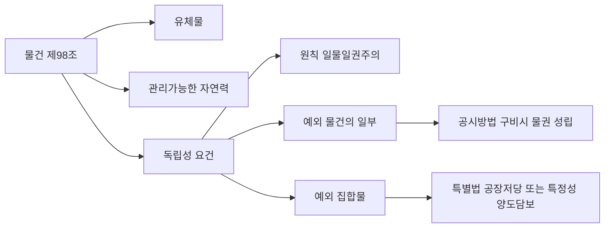
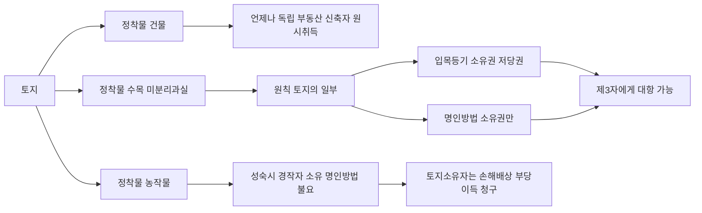
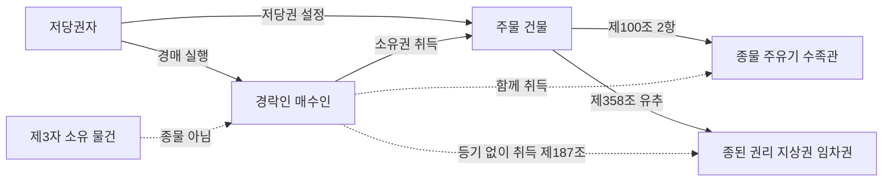
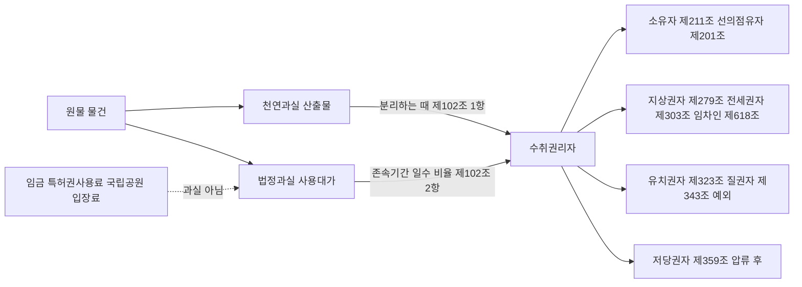

# 단원 M04 — 물건

> **영역**: 민법총칙
> **수업 주제**: 권리의 객체 — 동산·부동산·주물·종물·과실

## 🗺️ 본문 목차

- [📘 위패스 마이 정리 (L1 - 메인 단권화)](#정리)
- [📖 핵심요약서 (L2 - 빠른 복습)](#핵심요약서)
- [📚 기본서 (L3 - 본격 학습)](#기본서)

---

## 📘 위패스 마이 정리 — L1 (메인·단권화)

> 김묘엽 교수 「위패스 마이 민법총칙/물권법」 교재 정리본.

### [민법총칙] 제8장 물건
### 제1절 물건

#### I. 개념

> **제98조 (물건의 정의)** 본법에서 물건이라 함은 유체물 및 전기 기타 관리할 수 있는 자연력을 말한다.

1. 유체물 및 전기 기타 관리할 수 있는 자연력
가. 유체물
유체물이란 공간의 일부를 차지하고 사람의 오감에 의해서 존재를 깨달을 수 있는

물질을 말한다. 고체 • 액체 • 기체(=냉기)가 유체물이다.

나. 전기 기타 관리할 수 있는 자연력 (=무체물)
전기뿐만 아니라 햇빛• 바람• 지열 등의 자연력도 형체가 없는 무체물이다

이러한

무체물도 배타적인 지배가능성이 있다면 물건으로 인정된다. 전기는 그 자체로 배타

적 지배가능한 물건이고, 햇빛 • 바람• 지열 등은 원칙적으로 물건이 아니지만 배타적

으로 지배가능할 때, 즉 관리할 수 있을 때 물건이 된다.

2. 사람의 신체와 분리될 것
가. 신체와 부착, 분리되는 물건 인위적으로 인체에 부착된 의치(=임플란트) • 의안• 의수• 의족 등은 신체의 일부로 보 며 물건으로 취급되지 않는다.

반면에 신체의

일부가 몸으로부터 분리된 모발•치

아•혈액 등은 물건으로 취급되며 더 이상 신체의 일부가 아니다.

나. 사람의 유체와 유골 사람의 유체• 유골은 매장 • 관리• 제사 • 공양의 대상만이 되는 유체물로서, 사용 • 수

익• 처분의 대상이 될 수 없고, 분묘에 안치되어 있는 선조의 유체• 유골은 제사용

-MH
재산인 분묘와 함께 그 제사 주재자에게 승계되고, 피상속인 자신의 유체 • 유골 역

시 위 제사용 재산에 준하여 그 제사 주재자에게 승계된다(대판 2008.11.20. 2007다276

70).

1.

피상속인이 유체 • 유골을 처분하거나 매장장소를 지정 - 피상속인의 의사에 따를

도의적 의무O, 법률적 의무X
피상속인이 생전행위 또는 유언으로 자신의 유체 •유골을 처분하거나 매장장소를 지 정한 경우에, 선량한 풍속 기타 사회질서에 반하지 않는 이상 그 의사는 존중되어야 하고 이는 제사주재자로서도 마찬가지이지만, 피상속인의 의사를 존중해야 하는 의무

는 도의적인 것에 그치고, 제사주재자가 무조건 이에 구속되어야 하는 법률적 의무까

지 부담한다고 볼 수는 없다(대판 2008.11.20. 2007다27670).

3. 독립한 존재일 것
가. 의의
(1) 일물일권주의의 원칙

일물일권주의(一物一權主義)란 하나의 독립된 물건에 하나의 물권이 성립하는 것을

말한다(대판 2013.1.17. 2010다71578

전합).

이에 의하면 물건의 일부 또는 여러 개의

물건으로 이루어진 집합물에는 하나의 물권이 성립하지 않는다.

(2) 예외적인 사회적 필요성

물건의 일부 또는 여러 개의 물건으로 이루어진 집합물에 하나의 물권을 인정하여

야 할 사회적 필요성이 있고 공시방법이나 특정성을 갖추면 물건의 일부 또는 집합 물에 대해서도 하나의 물권의 성립을 인정하기도 한다.

나. 물건의 일부
(1) 소유권

(가 토지의 일부에 권리부정

1필의

토지의 일부에 대해서는 원칙적으로 등기를 할 수

없으므로 자기소유 토지의 일부에 대한 소유권의 양도를 할 수 없다.
(나) 건물의 일부에 권리인정

건물의 경우에는

1동의

건물의 일부가 구조상으로나 이용

상으로 다른 부분과 구분되는 독립성을 갖추었다면 구분소유권의 객체가 될 수 있 으나 공시방법을 갖추어야 한다(대판 1993.03.09

92다41214).
• 1 23

(2) 용익물권

(가 토지의 일부에 권리인정

용익물권은 분필절차를 밟지 않아도 등기라는 공시방법을

갖출 수 있으므로 1필의 토지 일부 위에 지상권, 지역권, 전세권을 설정할 수 있다.
(나) 건물의 일부에 권리인정 건물의 일부가 구조상• 이용상의 독립성이 인정된다면 용 익물권은 건물 일부에 등기를 할 수 있다. 건물의 일부를 하나의 물건으로 보고 전 세권을 설정할 수 있고 건물의 일부를 목적으로 하는 전세권은 그 목적물인 건물

부분에 한하여 그 효력을 미친다(대판 1997.08.22.

(3) 담보물권

96다53628).

타인이 임야의 일부를 개간하였고 거래상 개간부분과

(가 토지의 일부에 유치권 인정

는 다른 부분과의 분할이 용이한 경우, 임야 중 일부인 개간부분에 대하여 유치권이 성립할 수 있다(대판 1968.3.5. 67다2786).

일부에 저당권 부정 1필지의 토지를 수필로 분할하여 등기하려면 반드시 같은 법이 정하는 바에 따라 분할의 절차를 밟아 지적공부에 각 필지마다 등록되어

(나) 토지의

야 하고, 이러한 절차를 거치지 아니하는 한 1개의 토지로서 등기의 목적이 될 수 없는 것이니 토지의 소유자는 자기소유 토지의 일부에 대한 저당권의 설정행위를 할 수 없게 된다(대판 1992.12 08.

92누7542).

다. 다수의 물건의 집합
(가) 특별법상 공당저당권 인정

특별법상 저당권등기에 의하여 공장에 속하는 토지 또

는 건물에 설정한 저당권의 효력은 그 토지 또는 건물에 설치된 기겨卜기구 기타의 공장공용물에 미친다(대판 2000.04.14.
(나)

집합물에 대한 양도담보 인정

99마2273).

집합물을 하나의 물건으로 보아 일정 기간 계속하여

채권담보의 목적으로 삼으려는 이른바 집합물에 대한 양도담보권설정계약에서는 담

보목적인 집합물을 종류, 장소 또는 수량지정 등의 방법에 의하여 특정할 수 있으면 집합물 전체를 하나의 재산권 객체로 하는 양도담보권의 설정이 가능하다(대판 2016.4.28. 2012다19659).

4. 단일물• 합성물■ 집합물 (가) 단일물

단일물이란 형체상 단일한 일체를 이루고 있으면서 각 구성부분이 개성을

상실한 물건을 말한다. 한권의 책은 종이 • 잉크 • 접합본드로 이루어진 단일물이다.

(나)

합성물이란 각 구성부분이 개성을 잃지 않고 결합하여 하나의 형체를 이루

합성물

고 있는 물건을 말한다. 자동차는 엔진 • 타이어 등으로 이루어진 합성물이다.
단일물 또는 합성물이 집합하여 경제적으로 하나의 가치를 가지고 거래상으

(C)집합물

로 일체로 다루어지는 것을 말한다. 양식장은 뱀장어 전부로 이루어진 집합물이다.

#### II. 물건의 강학상 분류

1. 융통물-불융통물 융통물이란 사법상 거래의 객체가 될 수 있는 물건을 말한다.

(가) 융통물
(나) 불융통물

불융통물이란 사법상 거래의 객체가 될 수 없는 물건을 말한다. 불융통

물은 다시 공용물", 공공용물12
’, 금제물14,로 나뉜다.

2. 가분물■ 불가분물 가분물이란 물건의 성질 또는 가격을 현저하게 손상시키지 않고 분할할 수

(가) 가분물

있는 물건을 말한다.
(나)
불가분물

불가분물이란 물건의 성질 또는 가격을 현저하게 손상시켜야 분할할 수

있는 물건을 말한다.

3. 대체물• 부대체물
(가) 의의
(나)

대체물과 부대체물은 물건의 객관적 성질에 의하여 구분한다.

대체물

대체물이란 물건의 개성이 중요시 되지 않고 단순히 종류 • 품질 • 수량에 의

하여 정해지기 때문에 다른 것으로 교체가 가능한 물건을 말한다.

(다) 부대체물

부대체물이란 물건의 개성이 중요시 되어 다른 것으로 교체가 가능하지

않은 물건을 말한다.

12) 공용물이란 국가나 지방자치단체의 소유로서 공적 목적에 사용되는 물건을 말한다. 관공서의 건물,
국공립학교의 건물 등이 이에 속한다.
13) 공공용물이란 일반 공중의 사용에 제공되는 물건을 말한다. 도로, 하천, 공원, 항만 등이 이에 속

한다.
14) 금제물이란 법령에 의하여 거래가 금지되는 물건이다. 아편, 위조통화, 음란물, 국보, 지정문화재 등 이 이에 속한다
4. 특정물 • 불특정물
(가) 의의

특정물과 불특정물은 당사자의 주관적 의사에 의하여 구분한다. 대체물도 주

관적으로 특정물이 될 수 있다.

(나) 특정물

특정물이란 당사자가 동종의 다른 물건으로 바꾸지 못하게 한 물건을 말

한다.

0=) 불특정물

불특정물이란 당사자가 동종의 다른 물건으로 바꾸지 못하게 한 적이 없

는 물건을 말한다

### 제2절 부동산과 동산

#### I. 제99조 (부동산, 동산) ① 토지 및 그 정착물은 부동산이다.

② 부동산 이외의 물건은 동산이다.

#### II. 부동산

1. 의의
토지와 그 정착물이 부동산이다(제99조 제1항). 토지의 정착물이란 토지에 고정적으로

부착되어 용이하게 이동할 수 없는 물건으로서, 그러한 상태로 사용되는 것이 통상 적으로 용인되는 것을 말한다. 토지에 정착물로는 건물, 수목, 미분리과실, 농작물이 있다. 이들이 토지에 정착되어 있으면 부동산이다.

2. 토지
가. 의의
토지란 일정 범위의 지표면을 말한다. 토지는 연속되어 있으나 인위적으로 지표에 선을 그어 구별하며, 독립된 지번이 부여됨에 따라 독립성을 취득한다.

나. 토지의 개수
토지의 개수는 지적공부상의 토지의 ‘필(筆)’수를 표준으로 결정된다(대판 1992.12.8. 92누7542).

다. 토지의 구성부분
(가) 의의

토지의 구성부분인 물건은 토지와 분리하여 별도의 권리 또는 거래의 객체가

되지 못하지만, 토지와 별개의 독립한 물건은 토지와 분리하여 별도의 권리 또는 거 래의 객체가 된다.
(나)
토지의 구성부분인 물건

토석 그 자체의 굴취, 채취를 목적(광업권의 대상인 광물)

으로 하는 경우를 제외한 토석, 지하수•온천수는 토지의 구성부분으로서 토지와 분

리하여 별도로 권리 또는 거래의 객체로 되지는 못한다(대판 1989.6.27. 88다카25861,
• 1 27

L< 法 總 則

대판 1972 08.29.

72다1243).

(다) 토지와 별개의 독립한 물건

임야에 있는 자연석을 조각하여 만든 석불은 임야와는

독립된 소유권의 대상이 된다(대판 1970.9.22. 70다1494).

3. 건물
가. 의의
건물은 토지로부터 완전히 독립한 별개의 부동산으로 취급된다. 토지의 소유권을 취 득했다고 건물의 소유권을 취득하는 것은 아니다.

|i. 건물 - 기둥 + 지붕 + 주벽 독립된 부동산으로서의 건물이라고 함은 최소한의 기둥과 지붕 그리고 주벽이 이루 어져야 한다(대판 1996.6.14. 94다53006).

나. 건물의 개수
건물의 개수는 ‘동(혀)’수를 표준으로 결정된다.

1. 건물의 개수 - 거래관념에 따라 결정(= 물리적 구조 + 건축한 자나 소유자의 의 J사.트주곽젹 사정)____________________________________________________
건물의 개수를 판단함에 있어서는 사회통념 또는 거래관념에 따라 물리적 구조, 거래 또는 이용의 목적물로서 관찰한 건물의 상태 등 객관적 사정과 건축한 자 또는 소유

자의 의사 등 주관적 사정을 참작하여 결정되는 것이다(대판 1990.1.12. 88다카28518).

다. 무단 신축한 건물 건물은 언제나 토지와 별개의 독립된 부동산으로 취급된다 따라서 권한 없이 타인

의 토지에 신축한 건물은 부동산의 소유자에게 귀속하지 않고 건물이 되는 시점에 신축한 자가 소유권을 취득한다(대판 1993.4.23. 93다1527).

4. 수목과 미분리과실
가. 의의
토지로부터 분리되지 않은 수목과 수목으로부터 분리되지 않은 미분리과실은 원칙적

으로 토지의 일부로 취급된다. 토지의 소유권을 취득하게 되면 수목과 미분리과실의 소유권을 취득하게 된다.

나. 무단 식재한 수목 - 미분리과실 수목과 미분리과실은 원래 토지에 일부로 취급된다. 따라서 권한 없이 타인의 토지 에 심은 수목과 그 수목의 미분리과실도 부동산의 소유자에게 귀속되어 식재한 사

람은 소유권을 잃는다(대판 1970.11 30.

68다1995).

다. 공시방법을 갖춘 수목 - 미분리과실

(D 원칙

수목과 미분리과실은 별도의 공시방법을 갖춘 경우에 한해서 토지와 별개의 부동산

으로 취급된다.

(2) 수목의 입목등기
(가) 의의

"입목15,에 관한 법률"에 의하여 등기를 한 수목의 집단은 토지와 독립한 부동

산으로서 거래의 객체로 된다. 토지의 소유권을 취득했다고 입목의 소유권을 취득하

는 것은 아니다.
(나 설정할 수 있는 권리

등기한 입목은 소유권과 저당권의 객체가 된다. 소유권이전

형식을 취하는 양도담보권을 설정할 수도 있다.

(3) 수목의 명인방법 (가 의의

등기를 할 수 있는데도 하지 않은 수목, 입목법상의 수목의 집단이 아니어서

등기를 할 수 없는 수목은 관습법상의 명인방법을 갖추면 토지와 독립한 부동산으 로서 거래의 객체로 된다(대결 1998.10.28.

98마1817).

토지의 소유권을 취득했다고 명

인방법을 갖춘 수목의 소유권을 취득하는 것은 아니다.

(나) 설정할 수 있는 권리

명인방법을 갖춘 수목은 소유권의 객체가 되고, 저당권의 객

체가 되지 못한다. 소유권이전형식을 취하는 양도담보권을 설정할 수도 있다.

11. 입목 우 명인방법을 갖춘 수목 - 독립한 부동산O, 토지 평가에 포함X
입목에 관한 법률에 따라 등기된 입목이나 명인방법을 갖춘 수목의 경우에는 독립하 여 거래의 객체가 되므로 토지 평가에 포함되지 아니한다(대판 1998.10.28. 15)

98마1817).

입목이란 입목등기부에 소유권보존등기가 된 수목의 집단을 말한다
(4) 미분리과실의 명인방법

미분리과실은 관습법상의 명인방법을 갖추면 토지와 수목과 독립한 부동산으로서 거

래의 객체가 된다(대판 1972.02.29. 기다2573).

5. 농작물
가. 무단 식재한 농작물 농작물은 원래 토지의 일부로 취득된다. 하지만 판례는 이에 대한 예외를 인정하고 있다 권한 없이 타인의 토지에 심은 농작물이 성숙하여 독립한 물건으로서의 존재

를 갖추었다면 농작물의 소유권은 명인방법을 갖추지 않고서도 언제나 경작자에게 귀속한다(대판 1963.2.21. 62다913).16)

나. 농작물의 소유권 양도 수확되지 않은 농산물의 양도에 따른 물권의 변동에 있어서는 명인방법을 실시함으 로써 그 소유권을 취득하게 된다(대판 1996.02.23.

#### III. 95도2754).

동산

1. 의의
부동산 이외의 물건이 동산이다(제99조 제2항). 토지, 토지에 정착된 건물• 수목• 미분

리과실 • 농작물을 제외하면 전부 동산이다. 따라서 완전히 부서진 건물, 토지에서 뽑

은 수목• 분리된 과실 • 토지에서 뽑은 농작물처럼 토지에 정착되어 있지 않으면 동산 이 된다. 전기 기타 관리할 수 있는 자연력도 동산이다.

2. 채권과 구분
지시채권(어음이나 수표 등)이나 무기명채권(상품권이나 승차권 등)은 특정인이 특정인 에게만 주장할 수 있는 것이므로 동산이 아닌 채권이다.

16) 토지의 소유자는 경작자에 대하여 타인의 토지의 침범에 따른 불법행위에 기한 손해배상을 청구하거 나 타인의 토지를 사용함으로 얻은 이익에 대해서 부당이득반환을 청구를 할 수 있다

### 제3절 주물과 종물

#### I. 물건의 소유자가 그 물건의 상용에 공하기 위하여 자기소유인 다른 물건을 이에 부 속하게 한 때에는 ‘그 물건’을 주물이라 하고 ‘부속된 다른 물건’을 종물이라고 한다.

배와 노, 자물쇠와 열쇠, 주택과 창고 등이 주물과 종물의 관계이다.

#### II. 제100조 (주물, 종물) ① 물건의 소유자가 그 물건의 상용에 공하기 위하여 자기소유 인 다른 물건을 이에 부속하게 한 때에는 그 부속물은 종물이다.

1. 주물에 공하기 위하여 주물의 소유자나 이용자의 상용에 공여되고 있더라도 주물 그 자체의 효용과는 직 접 관계없는 물건은 종물이 아니다(대판 1985.3.26. 84다카269).

2. 상용
어느 건물이 주된 건물의 종물이기 위하여는 주된 건물의 경제적 효용을 보조하기

위하여 계속적으로 이바지 되어야 하는 관계가 있어야 한다(대법원 1988.

23.

선고 8

7 다카600).

3. 다른 물건
(가) 독립한 물건

종물은 주물의 구성부분이 아니라 법률싱으로 독립한 물건이어야 한

다. 주물의 구성부분이 된다면 이는 종물이 아니다. 따라서 주물과 종물은 법률적

운명을 같이 할 뿐 하나의 물건으로 취급되지 않는다.
(나)

물건

주물이든 종물이든 반드시 동산일 필요는 없고 부동산도 될 수 있다(대판 199

1 05.14

91다2779).
.131

民 法 總 !I'J

4. 부속
부속이란 장소적으로 밀접한 위치에 있는 것을 의미한다. 따라서 종물은 주물과 어

느 정도 밀접한 장소적 관계가 있어야 한다(대판 1956.5.24. 4288민상526).

5. 자기소유
종물은 물건의 소유자가 그 물건의 상용에 공하기 위하여 자기 소유인 다른 물건을 이에 부속하게 한 것을 말하므로, 주물과 다른 사람의 소유에 속하는 물건은 종물이

될 수 없다(대판 2008.5.8. 2007다36933).

6. 판례
종 물O
6)횟집의

종 물x

수족관은 점포 건물의 종물

@ 토지에 매설된 정화조

© 주유소의 주유기는 주유건물 자체의 종물

@ 주유소 지하에 매설된 유류저장탱크

© 전화교환설비는 백화점 건물의 종물 @ 낡은 가재도구 등을 보관하는 방, 연탄창 고, 공동변소는 본채의 종물

호텔의 각 방실에 시설된 텔레비전 •

전화기, 호텔 세탁실에

시설된 세탁

기•탈수기•드라이크리닝기 등

|@ 횟집건물의 수족관 - 횟집건물이 주물, 수족관이 종물 횟집으로 사용할 점포 건물에 거의 붙여서 횟감용 생선을 보관하기 위하여 즉 위 점

포 건물의 상용에 공하기 위하여 신축한 수족관 건물은 위 점포 건물의 종물이라고

해석할 것이다(대판 1993.2.12. 92도3234).

|© 주유소의 주유기 - 주유소가 주물, 주유기가 종물

’

:

주유소의 주유기는 계속해서 주유소 건물 자체의 경제적 효용을 다하게 하는 작용을 하고 있으므로 주유소 건물의 상용에 공하기 위하여 부속시킨 종물이다(대판 1995.6.29. 94다6345).

|© 백화점 건물의 전화교환설비 - 건물이 주물, 전화교환설비가 종물

전화교환설비는 독립한 물건이기는 하나, 그 용도, 설치된 위치와 그 위치에 해당하 는 건물의 용도, 건물의 형태, 목적, 용도에 대한 관계를 종합하여 볼 때, 위 건물에

연결되거나 부착하는 방법으로 설치되어 위 건물인 10층 백화점의 효용과 기능을 다

하기에 필요불가결한 시설들로서, 위 건물의 상용에 제공된 종물이라 할 것이다(대판 1993.8.13. 92다43142).

G 낡은 가재도구 등을 보관하는 방, 연탄창고, 공동변소 - 한옥집이 주물, 창고 및

공동변소가 종물

낡은 가재도구 등의 보관장소로 사용되고 있는 방과 연탄창고 및 공동변소는 본채에

서 떨어져 축조되어 있기는 하나 본채의 종물이다(대판 1991.5.14. 91다2779).

|@ 토지에 매설된 정화조 - 매설된 정화조는 건물의 종물X

정화조는 독립된 물건으로서의 종물이 아니라 건물의 구성부분이다(대판 1993.12.10. 9
3다42399).

건물의 종물이 아니다.

| @ 주유소 지하에 매설된 유류저장탱크 - 매설된 유류저장탱크는 주유소의 종물X
주유소의 지하에 매설된 유류저장탱크를 분리하는 데 과다한 비용이 들고 이를 분리

하여 발굴할 경우 그 경제적 가치가 현저히 감소할 것이 분명하다는 이유로, 그 유류 저장탱크는 토지에 부합되었다(대판 1995.6.29. 94다6345).

주유소의 종물이 아니다.

|® 호텔의 각종의 편의시설 - 전화기는 건물의 종물X

호텔의 각 방실에 시설된 텔레비전• 전화기, 호텔세탁실에 시설된 세탁기 • 탈수기 • 드 라이크리딩기, 호텔주방에 시설된 냉장고•제빙기, 호텔방송실에 시설된

VTR•앰프

등은 호텔의 이용자의 사용에 공여되고 있으므로 종물이 아니다(대판 1985.3.26. 84다

카269).

제8장 권리의 객체 - 133

#### III. 효과

> **제100조 (주물, 종물)** ② 종물은 주물의 처분에 따른다.

1. 처분에 따른다.
종물은 주물의 처분에 따른다(제100조 제2항)는 규정에서의 처분은

(가 처분행위도 적용

처분행위에 의한 권리변동을 말한다. 채권적 처분이든 물권적 처분이든 불문한다.

종물은 주물의 처분에 따른다(제100조 제2항)는 규정에서의 처 분은 압류와 같은 공법상의 처분 등에 의하여 생긴 경우에도 적용된다(대판 2006.10.2

(나) 공법상의 처분도 적용

6.

2006다29020).

따라서 주물에 대한 압류의 효력은 종물에도 미친다.

) 사실관계에 기한 권리의 득실변경에는 적용되지 않음

종물은 주물의 처분에 따른

다(제100조 제2항)는 규정에서의 처분은 점유 기타 사실관계에 기한 권리의 득실변경 에 대해서는 적용되지 않는다. 주물에 대한 점유시효취득이 완성된 경우에도 점유를

하지 않는 종물에 대해서는 점유시효취득의 효력이 미치지 않는다.

2. 임의규정
종물은 주물의 처분에 따른다(제100조 제2항)는 규정은 임의규정이다. 따라서 이에 반 하는 내용의 법률행위를 정하면 그 내용대로 효력이 발생한다

당사자는 특약으로

주물을 처분할 때에 종물을 제외할 수 있고, 종물만을 따로 처분할 수도 있다(대판 2
012 01 26.

2009다76546).

3. 저당권의 효력
(가) 저당권의 효력은 종물까지 미침

주물에 설정된 저당권은 그 목적 부동산의 종물에

대하여도 그 효력이 미친다(대판 1993.08.13.

(나) 주물을 경락받은 자 종물도 취득

92다43142).

저당권의 효력이 종물에 대하여도 미친다는 규정

은 종물은 주물의 처분에 따른다는 것과 이론적 기초를 같이한다(대판 2006.10.26. 06다29020).

저당권의 실행으로 개시된 경매절차에서 부동산을 경락받은 자와 그 승

계인은 종물의 소유권을 취득한다(대판 1993.8.13. 92다43142).

#### IV. 종물이론의 확장

1. 의의
종물과 주물의 관계에 관한 법리는 물건 상호간의 관계뿐 아니라 권리 상호간에도

적용된다(대판 2006.10.26. 2006다29020).

2. 요건
종된 권리라고 할 수 있으려면 종물과 마찬가지로 다른 권리의 경제적 효용에 이바

지하는 관계에 있어야 한다(대판 2014.6.12. 2012다92159,92166).

3. 효과
가. 처분에 따른다.
종된 권리는 주된 권리의 처분에 따른다.

나. 저당권의 효력
(가) 저당권의 효력은 종된 권리까지 미침

저당권의 효력은 저당부동산에 부합된 물건

과 종물에 미친다고 규정하고 있는데, 이 규정은 저당부동산에 종된 권리에도 유추

적용되어 건물에 대한 저당권의 효력은 그 건물의 소유를 목적으로 하는 지상권이

나 임차권에도 미친다(대판 1992.07.14.
(나)
92다527,

주된 권리를 경락받은 자 종된 권리도 취득

대판 1993.4.13. 92다24950).

건물에 대한 저당권이 실행되어 경락

인이 건물의 소유권을 취득한 때에는 특별한 사정이 없는 한 건물의 소유를 목적으

로 한 토지의 지상권이나 임차권도 건물의 소유권과 함께 경락인에게 이전된다(대판 1993.4.13. 92다24950).

제8장 권리의 객체 .135

### 제4절 원물과 과실

#### I. 개념

1. 의의
어떤 물건으로부터 생기는 경제적 수익을 과실이라 하고 과실을 생기게 하는 물건

을 원물이라고 한다. 민법은 과실로서 천연과실과 법정과실을 규정하고 있다.

2. 천연과실

제1()1조 (천연과실) ① 물건의 용법에 의하여 수취하는 산출물은 천연과실이다.

|

물건의 용법에 의하여 수취하는 산출물은 천연적으로 생산되는 것(=돼지가 낳은 돼 지새끼 등) 뿐만 아니라 인공적으로 수취되는 것(=토석장의 토석채취 등)도 포함한다.

3. 법정과실

> **제101조 (법정과실)** ② 물건의 사용대가로 받는 금전 기타의 물건은 법정과실로 한다.
가. 법정과실 인정
(가) 지료,

이자, 차임

법정과실은 토지의 사용대가인 지료, 금전의 사용대가인 이자,

임대목적물의 사용대가인 차임 등이 대표적이다.
(나) 사용이익

사용이익이란 물건을 사용하거나 권리를 보유함으로써 얻는 이익을 말한

다. 이러한 사용이익은 과실에 준하는 것으로(대판 1996.1.26. 95다44290)

과실에 관한

규정이 유추적용 된다.

나. 법정과실 부정
(가) 특허권의 사용료, 임금

노동의 사용대가로 받는 임금, 권리의 사용대가로 받는 특

허권의 사용료, 원물 사용의 대가로 받는 권리는 법정과실이 아니다.
(나) 국립공원의 입장료

국립공원의 입장료는 토지의 사용대가인 민법상 과실이 아니라

국립공원의 유지• 관리비용의 일부를 국립공원 입장객에게 부담시키고자 하는 것이

어서 과실수취권과는 아무런 관련이 없다(대판 2001.12.28. 2000다27749).

#### II. 과실수취권자

1. 사용 • 수익하는 자가 있는 경우
가. 원칙
과실수취권은 원칙적으로 원물을 사용•수익을 하는 소유자에게 인정된다. 예외적으

로 소유자 이외의 자가 사용•수익을 하는 경우에는 사용•수익을 하는 지상권자, 전

세권자, 임차인 등에게 과실수취권이 인정되고 지상권설정자, 전세권설정자, 임대인 등은 과실수취권이 인정되지 않는다.

나. 저당권의 특칙

> **제359조 (과실에 대한 효력)** 저당권의 효력은 저당부동산에 대한 압류가 있은 후에 저 당권설정자가 그 부동산으로부터 수취한 과실 또는 수취할 수 있는 과실에 미친다.
(가) 원칙

저당목적물을 사용•수익하는 저당권설정자에게 과실수취권이 인정된다.

(나) 저당권의 특칙

민법은 저당권자가 저당목적물을 압류한 후에는 저당권자에게 과실

수취권을 인정하고 있다. 따라서 저당권자의 저당물의 압류가 있기 전에는 저당권설

정자가 과실을 수취한다.

2. 사용 - 수익하는 자가 없는 경우 유치권자, 질권자는 담보물을 점유만 할 뿐 사용•수익하지 않으므로 원칙적으로는 과실수취권이 인정되지 않아야 하지만 민법은 예외적으로 유치권자, 질권자에게 과

실수취권을 인정하고 있다.

#### III. 과실수취권자가 바뀐 경우

1. 천연과실

> **제102조 (과실의 취득)** ① 천연과실은 그 원물로부터 분리하는 때에 이를 수취할 권 리자에게 속한다.

2. 법정과실

> **제102조 (과실의 취득)** ② 법정과실은 수취할 권리의 존속기간일수의 비율로 취득 한다.

3. 법적성질
과실취득에 관한 규정은 임의규정이다. 따라서 이에 반하는 내용의 법률행위를 정하 면 그 내용대로 효력이 발생한다.

---

---

## 📖 핵심요약서 — L2 (빠른 복습)

> 스터디파이터 민법 핵심요약서.

### 핵심요약서 (p.47~52)

<!--p.47-->
47
CHAPTER 04  |   권리의 객체(물건)
2. 종물의 효과
(2) 독립한 물건일 것
① 종물은 주물의 구성부분이 아니고, 독립한 물건이어야 한다. 
② 주물과 종물 모두 부동산이든 동산이든 불문한다.
(3) 장소적으로 밀접한 위치에 있을 것
주물에 부속시킨 것으로 인정할 만한 정도의 밀접한 장소적 관계가 있어야 한다.
(4) 주물·종물 모두 동일한 소유자에게 속할 것
(1) 종물은 주물의 처분에 따른다(제100조 제2항).
① 주물 위에 저당권이 설정된 경우에는 그 저당권의 효력은 저당권설정 전후를 불문하고 
    종물에도 그 효력이 미친다(제358조 참조).
② 제100조 제2항의 규정은 임의규정이다. 따라서 당사자의 특약으로 달리 약정할 수 있다.
(2) 종물이론의 준용
종물을 주물의 처분에 따르도록 한 법리는 권리 상호간에도 적용된다. 즉 주된 권리(피담보채권)가 
이전하면 종된 권리(담보물권)도 따라서 이전함이 원칙이다. 또한 물건과 권리 간에도 준용될 수 있다.
제5절 물건의 분류(원물과 과실)  
1. 천연과실
(1) 의 의
① 천연과실이란 물건의 용법에 따라 산출되는 산출물을 말한다 (제101조 제1항).
② 과수에 맺힌 열매, 가축의 새끼, 광산의 광물, 석재, 토사 등이 이에 해당한다.
③ 천연과실은 원물로부터 분리하는 때에 이를 수취할 권리자에게 귀속한다 (제102조 제1항).
(2) 천연과실의 수취권자
① 원물의 소유자(제211조)
② 선의의 점유자(제201조)
③ 지상권자(제279조)
④ 전세권자(제303조)
⑤ 유치권자(제323조)
⑥ 질권자(제343조)
⑦ 압류한 후의 저당권자(제359조)

<!--p.48-->
민법 핵심정리
48
⑧ 목적물인도 전의 매도인(제587조)
⑨ 사용차주(제609조)
⑩ 임차인(제618조)
*  유치권자와 질권자는 원칙적으로는 수취권자가 될 수 없으나, 예외적으로 담보물에서 파생되는 과실로서 
변제에 충당할 수 있다. 그리고 저당권의 효력도 목적물의 과실에는 원칙적으로 미치지 아니하나, 압류 
후에는 그 효력이 미친다.
2. 법정과실
(1) 의 의 
① 법정과실이란 물건의 사용대가로 받는 금전 기타의 물건을 말한다(제101조 제2항). 
    임대차에 있어서의 사용료, 즉 차임(집세)이나 지료 등 이다. 
② 원물과 과실은 모두 물건이어야 하므로 
    노동의 대가(임금)·권리사용의 대가(주식의 배당금·특허권의 사용료) 등은 법정과실이 아니다.
(2) 법정과실의 귀속
① 법정과실은 이를 수취할 권리의 존속기간 일수의 비율로 취득한다(제102조 제2항).
② 제102조 제2항은 임의규정이며 당사자의 특약이 있으면 그에 의한다.
01.  독립된 부동산으로서의 건물이라고 함은 최소한의 기둥과 지붕 그리고 주벽이 이루어지면 법률상 건물
이라고 할 수 있다.
02.  임야에 있는 자연석을 조각하여 제작한 석불이라도 그 임야의 일부분을 구성하는 것이라고는 할 수 없
고 임야와 독립된 소유권의 대상이 된다.
03.  온천에 관한 권리(온천권)는 관습법상의 물권이라고 볼 수 없다.
04.  구분건물이 되기 위하여는 객관적, 물리적인 측면에서 구분건물이 구조상, 이용상의 독립성을 갖추어
야 하고, 그 건물을 구분소유권의 객체로 하려는 의사표시 즉 구분행위가 있어야 한다.
05.  정화조는 건물의 대지가 아닌 다른 필지의 지하에 설치되어 있다 하더라도 독립한 물건인 종물이라기보
다는 건물의 구성부분이다.
  핵심 판례 정리

<!--p.49-->
49
CHAPTER 04  |   권리의 객체(물건)
06.  횟집으로 사용할 점포건물에 거의 붙여서 횟감용 생선을 보관하기 위하여, 즉 위 점포건물의 상용에 공
하기 위하여 신축한 수족관건물은 위 점포건물의 종물이다.
07.  건물에 대한 저당권의 효력은 그 건물에 종된 권리인 건물의 소유를 목적으로 하는 지상권에도 미친다.
08.  [1] 주유소의 지하에 매설된 유류저장탱크는 토지에 부합된 것으로 본다.
       [2]  주유소의 주유기는 계속해서 주유소 건물 자체의 경제적 효용을 다하게 하는 작용을 하고 있으므
로 주유소건물의 상용에 공하기 위하여 부속시킨 종물이다.
09.  백화점 건물의 지하 2층 기계실에 설치되어 있는 전화교환설비는 백화점의 효용과 기능을 다하기에 필
요 불가결한 시설들로서, 위 건물의 상용에 제공된 종물이라 할 것이다.
10.  국립공원의 입장료는 토지의 사용대가라는 민법상 과실이 아니라 수익자 부담의 원칙에 따라 국립공원
의 유지·관리비용의 일부를 국립공원 입장객에게 부담시키는 것이다.
11.  부동산의 상용에 공하여진 물건일지라도 그 물건이 부동산의 소유자가 아닌 다른 사람의 소유인 때에
는 이를 종물이라고 할 수 없으므로 부동산에 대한 저당권의 효력에 미칠 수 없어 부동산의 낙찰자가 
당연히 그 소유권을 취득하는 것은 아니다.
12.  피상속인이 생전행위 또는 유언으로 자신의 유체·유골을 처분하거나 매장장소를 지정한 경우에, 선량한 
풍속 기타 사회질서에 반하지 않는 이상 그 의사는 존중되어야 하고 이는 제사주재자로서도 마찬가지
이지만, 피상속인의 의사를 존중해야 하는 의무는 도의적인 것에 그치고, 제사주재자가 무조건 이에 구
속되어야 하는 법률적 의무까지 부담한다고 볼 수는 없다.
01.  부동산으로 취급되는 토지의 정착물에는 건물, 입목에 관한 법률에 의하여 
등기된 입목 등이 있으며, 독립된 건물이라고 하기 위해서는 최소한의 기둥
과 지붕 그리고 주벽이 이루어져야 한다. (     )
  중요 지문 정리
건물이라고 함은 최소한의 기둥과 
지붕 그리고 주벽이 이루어지면 이
를 법률상 건물이라 할 수 있다 (대법원 
1986.11.11. 86누173). ( ○ )
대법원 2008.5.8. 2007다36933  ( ○ )02.  부동산에 부합된 물건이 사실상 분리복구가 불가능하여 거래상 독립한 권
리의 객체성을 상실하고 그 부동산과 일체를 이루는 부동산의 구성부분이 
된 경우에는 타인이 권원에 의하여 이를 부합시켰더라도 그 물건의 소유권
은 부동산의 소유자에게 귀속된다. (     ) 

<!--p.50-->
민법 핵심정리
50
03.  주물과 다른 사람의 소유에 속하는 물건은 종물이 될 수 없다. (     )
04.  횟집으로 사용할 점포 건물에 거의 붙여서 횟감용 생선을 보관하기 위하여 
신축한 수족관 건물은 독립한 부동산이지만 점포 건물의 종물에 해당한다. 
(     )
대법원 2008.5.8. 2007다36933  ( ○ )
대법원 1993.2.12 92도3234 ( ○ )
대법원 1996.04.26. 95다52864 ( ○ )
종물은 주물의 처분에 수반된다는 
100조 2항은 임의규정이므로, 당
사자는 주물을 처분할 때에 특약으
로 종물을 제외할 수 있고 종물만
을 별도로 처분할 수도 있다 (대법원 
2012.1.26. 2009다76546) . ( ❌ )
구분건물의 전유부분에 대한 소유권
보존등기만 경료되고 대지지분에 대
한 등기가 경료되기 전에 전유부분
만에 대해 내려진 가압류결정의 효력
은, 대지사용권의 분리처분이 가능
하도록 규약으로 정하였다는 등의 특
별한 사정이 없는 한, 종물 내지 종된 
권리인 그 대지권에까지 미친다 (대법원 
2006다29020) . ( ❌ )
종물이론은 권리와 권리, 물건과 권
리 간에도 준용될 수 있다. ( ❌ )
국립공원의 입장료는 토지의 사용대
가라는 민법상 과실이 아니라 수익자 
부담의 원칙에 따라 국립공원의 유
지·관리비용의 일부를 국립공원 입
장객에게 부담시키고자 하는 것이어
서 토지의 소유권이나 그에 기한 과
실수취권과는 아무런 관련이 없다 (대
법원 2001. 12.28. 2000다27749) . ( ❌ )
권원 없이 타인의 토지에 경작·재배
한 경우에 명인방법을 갖출 필요 없
이 성숙한 농작물의 소유권은 언제나 
그 경작자에 있다 (대법원 1978.3.14. 77다
2396). ( ❌ )
05.  종물은 주물의 처분에 수반된다는 민법 제100조 제2항은 강행규정이므
로, 당사자는 주물을 처분할 때에 특약으로 종물을 제외할 수 없고 종물만
을 별도로 처분할 수 없다. (     )
06.  구분건물의 전유부분에 대한 소유권보존등기만 경료되고 대지지분에 대한 
등기가 경료되기 전에 전유부분만에 대해 내려진 가압류결정의 효력은, 그 
대지권에 미치지 아니한다. (     )
07.  4번지문과 중복으로 삭제
08.  건물에 대한 저당권의 효력은 그 건물소유를 목적으로 하는 지상권에도 미
친다. (     )
09.  권한 없이 타인의 토지에 농작물을 심은 경우, 수확기에 이른 농작물의 소
유권은 토지 소유자에게 귀속된다. (     ) 
11.  국립공원의 입장료는 법정과실이다. (     ) 
10.  주물과 종물의 법리는 물건 상호간에 적용되고, 권리 상호간에는 적용되지 
않는다. (     )

<!--p.51-->
51
CHAPTER 04  |   권리의 객체(물건)
12.  저당권의 효력은 저당부동산의 종물에 미치므로 경매를 통하여 저당부동
산의 소유권을 취득한 자는 특별한 사정이 없는 한 종물의 소유권을 취득한
다. (     )
13.  건물임대차에 있어서의 차임과 같이「물건의 사용대가로 받는 금전 기타의 
물건」이 법정과실이며, 법정과실은 수취할 권리의 존속기간 일수의 비율로 
취득한다. 따라서 임대 중인 건물이 매매된 경우에 그 차임은 임대인들, 즉 
그 건물의 매도인과 매수인에게 그 소유기간 일수의 비율로 귀속한다. 
      (     )
타당한 기술이다.. ( ○ )
타당한 기술이다.. ( ○ )

<!--p.52-->
민법
핵심정리
민법 핵심정리
52
법률행위05
CHAPTER
제1절 법률행위의 종류
구 분 28회 29회 30회 31회 32회 33회 34회
법률행위 10 10 8 9 10 10 10
◎ 단원별 출제경향
1. 기본적 분류
표 준 세  분 내  용 예
의  사
표  시
단독행위
상대방 있는 단독행위 동의, 철회, 상계, 추인, 해제, 해지, 취소, 채무면제 등 
상대방 없는 단독행위 권리의 포기, 재단법인의 설립행위, 유언 등
계      약 - 매매, 교환, 임대차, 사용대차, 증여, 소비대차, 위임, 도급, 
화해, 조합, 현상광고, 고용, 임치, 종신정기금, 여행계약
합동행위 - 사단법인의 설립행위
법  률
효  과
채권행위 채권을 발생시키며 이행의 문제를 남김(원인, 약속 ： 14종의 계약) ; 의무부담행위  
물권행위 물권변동이 일어나며 더 이상의 이행의 문제는 없음
(결과, 이행 ： 소유권이전, 전세권설정 등) ; 처분행위  
준물권행위 물권 이외의 권리의 종국적 변동을 일으키고 이행의 문제는 없음
(채권양도, 채무면제 등) ; 처분행위
⑴ 권리의 포기 중 기한이익의 포기, 시효이익의 포기, 제한물권의 포기는 상대방 있는 단독행위에 해당한다.
⑵  계약의 합의해제와 매매의 일방예약은 계약이며, 채권행위(매매, 임대차, 주택분양계약 등)는 의무부담행
위이고 물권행위(지상권 및 저당권설정행위 등)는 처분행위에 해당한다.

---

## 📚 기본서 — L3 (본격 학습)

> 감정평가사 민법 기본서 (407p) 해당 장.

### 제1절 물건의 의의와 분류

> 📖 물건은 권리의 객체 가운데 가장 기본이 되는 것으로, 물권의 객체는 원칙적으로 물건이다. 이 관은 「무엇이 민법상 물건인가」(제98조의 요건)와 「물건을 어떻게 나누어 보는가」(강학상 분류)를 다룬다. 여기서 확정하는 ==독립성==과 ==일물일권주의==는 제2절(부동산·동산), 제3절(주물·종물), 제4절(원물·과실) 전체의 전제가 된다.

> ⭐ **이 관에서 반드시 챙길 3가지**
> ① 제98조의 물건 = ==유체물 + 관리할 수 있는 자연력==. 무체물은 ==배타적 지배가능성(관리가능성)==이 있을 때에만 물건이 된다.
> ② ==일물일권주의==가 원칙 — 물건의 일부·집합물에는 원칙적으로 하나의 물권이 성립하지 않으나, ==사회적 필요성 + 공시방법·특정성==을 갖추면 예외가 인정된다.
> ③ 분류의 기준을 혼동하지 마라. 대체물·부대체물은 ==객관적 성질==에 의한 구별, 특정물·불특정물은 ==당사자의 주관적 의사==에 의한 구별이다.

#### 1. 의의

**물건(物件)**이란 유체물 및 전기 기타 관리할 수 있는 자연력을 말한다(제98조). 권리의 객체 중 ==물권의 객체==가 되는 것이 물건이며, 채권의 객체는 물건이 아니라 채무자의 급부(행위)다.

- **유체물(有體物)** — 공간의 일부를 차지하고 사람의 오감으로 그 존재를 인식할 수 있는 물질. ==고체·액체·기체==가 모두 유체물이다(냉기·수증기도 기체로서 유체물).
- **무체물(無體物)** — 형체가 없는 것. 전기·햇빛·바람·지열 등이다. 이 중 ==관리할 수 있는 자연력==만 물건이 된다. 전기는 그 자체로 배타적 지배가 가능하므로 물건이지만, 햇빛·바람·지열은 원칙적으로 물건이 아니고 ==배타적으로 지배·관리할 수 있게 된 때==에 비로소 물건이 된다.
- 물건은 ==사람의 신체가 아니어야 하고==(비인격성), ==독립한 존재==여야 한다(독립성). 이 두 가지는 조문에 명시되어 있지 않지만 물건 개념에 당연히 포함되는 요건이다.

#### 2. 요건

| 요건 | 내용 | 비고 |
|---|---|---|
| ① 유체물 또는 관리가능한 자연력 | 고체·액체·기체(유체물) / 전기·열·빛 등 자연력 | 무체물은 자연력에 한정 — ==권리·저작물 등은 물건이 아니다== |
| ② 관리가능성(배타적 지배가능성) | 사람이 배타적으로 지배·관리할 수 있어야 함 | 유체물이라도 ==배타적 관리가능성이 없으면 물건이 아니다==(해·달·별) |
| ③ 비인격성(신체와 분리) | 살아 있는 사람의 신체·신체의 일부는 물건이 아님 | 의치·의안·의수·의족 등 인위적 부착물 = ==신체의 일부==, 분리된 모발·치아·혈액 = ==물건== |
| ④ 독립성 | 하나의 물건으로 특정·독립되어야 함 | ==일물일권주의==의 근거. 물건의 일부·집합물은 원칙적으로 물권의 객체가 아님 |

**독립성 요건의 구체적 적용 — 물건의 일부에 물권이 성립하는가**

| 권리 | 토지의 일부 | 건물의 일부 |
|---|---|---|
| 소유권 | ==부정== — 분필 전에는 1필 토지 일부의 양도 불가 | ==인정== — 구조상·이용상 독립성 + 구분행위 있으면 구분소유권 |
| 용익물권(지상권·지역권·전세권) | ==인정== — 분필 없이 등기 가능 | ==인정== — 건물 일부에 전세권 설정 가능 |
| 저당권 | ==부정== — 1필 토지 일부에 저당권 설정 불가 | ==부정== — 1동 건물 일부에 저당권 설정 불가 |
| 유치권 | ==인정== — 개간부분처럼 분할이 용이하면 성립 가능 | 점유하는 부분에 성립 |

#### 3. 효과

| 구분 | 효과 |
|---|---|
| 물건에 해당함 | ==물권의 객체==가 되고, 소유권·점유권·담보물권 등의 대상이 된다 |
| 물건이 아님 | 물권의 객체가 될 수 없다. 인격권·채권 등 다른 법리로 규율된다 |
| 사람의 유체·유골 | ==매장·관리·제사·공양의 대상이 되는 유체물==. 사용·수익·처분의 대상은 될 수 없고, ==제사주재자==에게 승계된다 |
| 물건의 일부 | 원칙적으로 독립한 물권의 객체가 아니나, ==공시방법==을 갖추면 예외적으로 객체가 된다 |
| 집합물 | 원칙적으로 하나의 물건이 아니나, ==특별법상 공시==(공장저당) 또는 ==특정성==(양도담보)을 갖추면 하나의 물건으로 다룬다 |

**강학상 분류 — 5가지 기준**

| 기준 | 분류 | 내용·예 | 구별의 실익 |
|---|---|---|---|
| 사법상 거래의 대상이 되는가 | 융통물 / ==불융통물== | 불융통물 = 공용물(관공서 청사·국공립학교 건물) · 공공용물(도로·하천·항만·공원) · 금제물(국보·지정문화재·마약·위조지폐) | 거래(처분)의 가부 |
| 성질·가격을 현저히 손상하지 않고 나눌 수 있는가 | ==가분물== / 불가분물 | 가분물 = 금전·곡물·토지 / 불가분물 = 건물·소·말 | ==공유물의 분할(제269조)==, 다수당사자의 채권관계(제408조 이하) |
| 반복 사용·수익이 가능한가 | 소비물 / 비소비물 | 소비물 = 금전·곡물·술 / 비소비물 = 건물·책 | ==소비대차(제598조)== vs ==사용대차(제609조)== |
| 개성이 중요한가(==객관적== 기준) | ==대체물== / 부대체물 | 대체물 = 금전·곡물·술 / 부대체물 = 건물·그림·골동품 | 소비대차(제598조), ==소비임치(제702조)== |
| 당사자가 다른 것으로 바꾸는 것을 허용했는가(==주관적== 기준) | 특정물 / 불특정물 | 대체물이라도 당사자가 특정하면 ==특정물== | ==선관주의 보관의무(제374조)==, 변제의 장소(제467조), 매도인의 담보책임 |

**형태에 따른 분류 — 단일물·합성물·집합물**

| 분류 | 의의 | 예 |
|---|---|---|
| 단일물 | 형체상 단일한 일체를 이루고 각 구성부분이 ==개성을 상실==한 물건 | 책 1권, 접시 1개 |
| 합성물 | 각 구성부분이 ==개성을 잃지 않고== 결합하여 하나의 형체를 이룬 물건 | 자동차, 선박, 보석반지 |
| 집합물 | 단일물·합성물이 모여 경제적으로 하나의 가치를 갖고 거래상 일체로 다루어지는 것 | 도서관의 장서, 공장시설, 양만장의 뱀장어 전부 |

> 💡 단일물과 합성물은 ==하나의 물건==으로 취급되어 그대로 물권의 객체가 된다. 문제는 ==집합물==이다. 집합물은 원칙적으로 하나의 물건이 아니지만, 특별법상 공시 또는 특정성이 있으면 예외적으로 하나의 물건으로 인정된다.

#### 4. 관련 조문

> 📌 **민법 제98조(물건의 정의)** — "본법에서 물건이라 함은 ==유체물 및 전기 기타 관리할 수 있는 자연력==을 말한다."

> 📌 **민법 제99조(부동산, 동산)** — "① 토지 및 그 정착물은 부동산이다. ② 부동산 이외의 물건은 동산이다."

> 📌 **민법 제212조(토지소유권의 범위)** — 토지소유권은 ==정당한 이익 있는 범위 내에서== 토지의 상하에 미친다. (물건의 공간적 범위를 정하는 조문)

> 📌 **분류의 실익이 드러나는 조문** — 공유물의 분할(제269조), 다수당사자의 채권관계(제408조 이하), 소비대차(제598조), 사용대차(제609조), 소비임치(제702조), 특정물 채무자의 선관주의 보관의무(제374조), 변제의 장소(제467조).

#### 5. 핵심 판례 법리

1. **일물일권주의** — 판례는 ==하나의 독립된 물건에 하나의 물권이 성립한다==는 일물일권주의를 원칙으로 삼는다. 따라서 물건의 일부나 여러 개의 물건으로 이루어진 집합물에는 원칙적으로 하나의 물권이 성립하지 않는다(대판 2013.1.17. 2010다71578 전합).
2. **토지 일부의 저당권 — 부정** — 1필지의 토지를 수필로 분할하여 등기하려면 반드시 분할절차를 밟아 지적공부에 각 필지마다 등록되어야 하고, 그 절차를 거치지 않는 한 1개의 토지로서 등기의 목적이 될 수 없으므로 토지소유자는 ==자기소유 토지의 일부에 대한 저당권 설정행위를 할 수 없다==(대판 1992.12.8. 92누7542).
3. **토지 일부의 유치권 — 인정** — 타인이 임야의 일부를 개간하였고 거래상 개간부분과 다른 부분의 분할이 용이한 경우, 임야 중 ==일부인 개간부분에 대하여 유치권이 성립==할 수 있다(대판 1968.3.5. 67다2786).
4. **건물 일부의 구분소유권** — 1동의 건물의 일부가 ==구조상·이용상으로 다른 부분과 구분되는 독립성==을 갖추면 구분소유권의 객체가 될 수 있으나, 공시방법을 갖추어야 한다(대판 1993.3.9. 92다41214).
5. **구분소유권의 성립요건 — 구분행위** — 구분소유권이 인정되려면 객관적·물리적 측면에서 구조상·이용상의 독립성을 갖추어야 하고, 나아가 그 건물을 구분소유권의 객체로 하려는 의사표시, 즉 ==구분행위==가 있어야 한다. 소유자가 기존 건물에 증축을 한 경우에도 증축 부분이 구조상·이용상 독립성을 갖추었다는 사유만으로 당연히 구분소유권이 성립하는 것은 아니다(대법원 1990.7.27. 90다카6160).
6. **건물 일부의 전세권** — 건물의 일부를 목적으로 하는 전세권은 ==그 목적물인 건물 부분에 한하여== 효력이 미친다(대판 1997.8.22. 96다53628).
7. **집합물의 양도담보 — 특정성** — 일단의 증감·변동하는 동산을 하나의 물건으로 보아 채권담보의 목적으로 삼는 집합물 양도담보설정계약도 가능하며, 목적 동산이 ==종류·장소 또는 수량지정 등의 방법으로 특정==되어 있으면 그 전부를 하나의 재산권으로 보아 유효한 담보권 설정이 된다. 따라서 성장을 계속하는 어류라도 ==특정 양만장 내의 뱀장어 전부==에 대한 양도담보계약은 유효하다(대법원 1990.12.26. 88다카20224, 같은 취지 대법원 2013.1.16. 2012다78726).
8. **집합물 양도담보의 효력 범위** — 집합물에 대한 양도담보권자가 점유개정의 방법으로 계약 당시 존재하는 집합물의 점유를 취득한 후 설정자가 개개의 물건을 반입한 경우, ==양도담보권의 효력은 나중에 반입한 물건에도 미친다==. 다만 반입한 물건이 ==제3자 소유==인 경우에는 그러하지 아니하다(대법원 2016.4.28. 2012다19659).
9. **공장저당** — 특별법상 저당권등기에 의하여 공장에 속하는 토지 또는 건물에 설정한 저당권의 효력은 ==그 토지 또는 건물에 설치된 기계·기구 기타 공장공용물에 미친다==(대판 2000.4.14. 99마2273).
10. **유체·유골의 법적 성격** — 사람의 유체·유골은 ==매장·관리·제사·공양의 대상이 되는 유체물==로서 사용·수익·처분의 대상이 될 수 없고, 분묘에 안치된 선조의 유체·유골은 제사용 재산인 분묘와 함께 ==제사주재자==에게 승계되며, 피상속인 자신의 유체·유골도 제사용 재산에 준하여 제사주재자에게 승계된다(대판 2008.11.20. 2007다27670 전합).
11. **피상속인의 유체·유골 처분 의사** — 피상속인이 생전행위 또는 유언으로 자신의 유체·유골을 처분하거나 매장장소를 지정한 경우, 선량한 풍속 기타 사회질서에 반하지 않는 이상 그 의사는 존중되어야 하지만, 피상속인의 의사를 존중할 의무는 ==도의적인 것에 그치고 법률적 의무까지 부담하는 것은 아니다==(대판 2008.11.20. 2007다27670 전합).
12. **토지의 구성부분** — 토석 그 자체의 굴취·채취를 목적으로 하는 경우를 제외한 토석, ==지하수·온천수는 토지의 구성부분==으로서 토지와 분리하여 별도의 권리 또는 거래의 객체가 되지 못한다(대판 1989.6.27. 88다카25861, 대판 1972.8.29. 72다1243). 나아가 판례는 ==온천에 관한 권리(온천권)를 관습법상의 물권으로 인정하지 않는다==.
13. **토지와 별개의 독립한 물건** — 임야에 있는 자연석을 조각하여 제작한 ==석불==은 그 임야의 일부분이라 할 수 없고, ==임야와 독립된 소유권의 대상==이 된다(대법원 1970.9.22. 70다1494).

#### ⭐ 기출 출제포인트

1. **「관리할 수 있는 자연력은 물건이다 / 동산이다」** — 옳은 선지로 반복 출제. 전기는 부동산이 아니므로 ==동산==이다.
2. **「유체물이어도 배타적 관리가능성이 없으면 물건이 아니다」** — 옳은 선지.
3. **「집합물은 원칙적으로 하나의 물건으로 인정된다」** — ==틀린 선지==의 단골. 원칙은 부정, 예외적으로 인정.
4. **「1필의 토지의 일부에 저당권을 설정할 수 있다」** — ==틀린 선지==. 용익물권은 되지만 저당권은 안 된다.
5. **특정물·불특정물의 구별기준이 주관적이라는 점**, 대체물·부대체물이 객관적 성질에 의한다는 점의 뒤집기.
6. **유체·유골** — 「매장·관리의 대상이 될 수 있는 유체물이다」(옳음), 「제사주재자가 피상속인의 지정에 법적으로 구속된다」(틀림).

#### 📊 기출 분석

| 연도 | 출제 형태 | 핵심 논점 |
|---|---|---|
| 2021년 제32회 8번 | 물건에 관한 설명으로 옳지 않은 것 | ==분필절차 없는 1필 토지 일부의 저당권 설정==(틀림), 입목의 저당권 객체성 |
| 2022년 감정평가사(문제집 실전 16) | 물건에 관한 설명으로 옳지 않은 것 | ==사람의 유골 = 매장·관리 대상 유체물==(옳음), 전기 기타 자연력은 물건(옳음) |
| 2023년 감정평가사(문제집 실전 14) | 물건에 관한 설명으로 옳지 않은 것 | ==1필 토지의 일부는 분필 없이 용익물권 객체가 될 수 있다== |
| 2024년 제35회 8번 | 권리의 객체에 관한 설명으로 옳지 않은 것 | 토지의 개수 = 필수(筆數), 분필등기와 등기부취득시효 |
| 기출(문제집 기본 01·04, 실전 01·04) | 옳은 것 모두 고르기 | 온천수 = 토지의 구성부분, 집합물 양도담보, 무주의 부동산은 국유 |

**출제 빈도** — 「물건」 단원은 감정평가사 1차에서 ==거의 매년 1문항== 출제되는 고정 출제 단원이다. 그중 제1절의 요건·분류는 단독 문항보다는 ==다른 절(부동산·종물·과실)과 섞인 종합 5지선다==의 한두 선지로 등장한다.

**반복되는 함정 선지** — ① 「집합물은 원칙적으로 하나의 물건이다」 ② 「1필 토지의 일부에도 저당권을 설정할 수 있다」 ③ 「하천·공원은 공용물이다」(→ ==공공용물==) ④ 「무주의 부동산에도 선점이 인정된다」(→ ==국유==) ⑤ 「특정물과 불특정물의 구별은 객관적이다」.

**최근 경향** — 단순 정의 암기보다 ==판례 결론의 정오 판단==(온천수·석불·집합물 양도담보·유체유골)으로 이동하고 있다.

#### 🔍 기출 선지로 배우는 법리

> 실제 출제된 선지를 그대로 놓고 O/X와 근거를 확인한다.

**①** 「여러 개의 물건으로 이루어진 집합물은 원칙적으로 하나의 물건으로 인정된다」(기출, 물건에 관한 설명으로 옳지 않은 것) — **X**
어디가 틀렸나: ==일물일권주의==상 집합물은 원칙적으로 하나의 물권의 객체가 되지 못한다. / 옳게 고치면: 「집합물은 원칙적으로 하나의 물건으로 인정되지 않으나, 특별법상 공시방법이나 특정성을 갖추면 예외적으로 하나의 물건으로 취급된다.」

**②** 「정당한 이익이 있는 범위 내의 온천수는 토지의 구성부분으로 토지소유권의 범위에 속한다」(문제집 기본문제 01) — **O**
근거: 온천수는 토지소유권과 독립된 물건으로 볼 수 없고 ==토지의 구성부분==이다(대판 1989.6.27. 88다카25861 등).

**③** 「자연석을 조각하여 제작한 석불은 임야와 독립하여 소유권의 대상이 된다」(문제집 기본문제 01) — **O**
근거: 대법원 1970.9.22. 70다1494.

**④** 「무주(無主)의 부동산에도 선점이 인정된다」(문제집 기본문제 04) — **X**
어디가 틀렸나: ==무주의 부동산은 국유==(제252조 제2항)이며, 선점(제252조 제1항)은 ==무주의 동산==에만 인정된다.

**⑤** 「하천·공원은 공용물이다」(문제집 기본문제 04) — **X**
어디가 틀렸나: 하천·공원은 일반 공중의 사용에 제공되는 ==공공용물==이다. 공용물은 관공서 청사·국공립학교 건물처럼 ==국가·공공단체가 소유하고 공공목적에 사용==하는 물건이다.

**⑥** 「1필의 토지의 일부에 대하여는 저당권을 설정할 수 없다」(문제집 기본문제 04) — **O**
근거: 대판 1992.12.8. 92누7542. 다만 ==용익물권은 1필 토지 일부에도 설정 가능==하다.

**⑦** 「집합물은 이를 하나의 물건으로 인정하는 법률의 특별규정이 있는 경우에 한하여 하나의 물건으로 취급한다」(문제집 실전문제 04) — **X**
어디가 틀렸나: 특별법(공장 및 광업재단저당법)뿐 아니라 ==관습법상 양도담보==의 객체가 되는 경우에도 하나의 물건으로 취급된다.

**⑧** 「유체물이어도 배타적 관리가능성이 없으면 물건으로 보지 않는다」(문제집 실전문제 04) — **O**
근거: 물건의 요건인 ==관리가능성(배타적 지배가능성)==. 유체물이라도 지배할 수 없으면 물건이 아니다.

**⑨** 「사람은 유언으로 본인의 시신을 병원에 연구용으로 기증할 수 있으나, 제사를 주재하는 자가 이에 법적 구속을 받는 것은 아니다」(문제집 실전문제 04) — **O**
근거: 피상속인의 의사를 존중할 의무는 ==도의적인 것에 그친다==(대판 2008.11.20. 2007다27670 전합).

**⑩** 「특정물과 불특정물의 구별은 당사자의 의사에 의한 주관적인 구별이다」(문제집 기본문제 01) — **O**
근거: 대체물이라도 ==당사자가 특정시킨 경우에는 특정물==이 된다.

#### ✏️ 사례형 적용

> **사례 1** — 甲은 자기 소유 1필의 X토지 중 남쪽 절반을 乙에게 팔기로 하고, 그 부분에 대하여 乙 명의의 저당권을 설정해 주기로 약정하였다. 분필절차는 밟지 않았다.

**검토** — ① 토지의 개수는 ==지적공부상 필(筆)수==를 표준으로 결정된다. ② 분필절차를 거치지 않은 1필 토지의 일부는 ==독립한 등기의 목적==이 될 수 없다. ③ 따라서 소유권 양도등기도, ==저당권 설정등기도 할 수 없다==(대판 1992.12.8. 92누7542). ④ 다만 乙이 원한 것이 ==지상권·지역권·전세권 같은 용익물권==이었다면 분필 없이도 그 부분에 설정할 수 있었다. ⑤ **결론** — 저당권 설정 부분은 이행 불능이고, 甲·乙은 분필절차를 먼저 밟아야 한다.

> **사례 2** — 丙은 자신이 운영하는 양만장 안의 뱀장어 전부를 담보로 丁에게서 돈을 빌리면서, 점유개정의 방법으로 양도담보를 설정하였다. 그 후 丙은 새로 사들인 뱀장어를 같은 양만장에 반입하였다. 그중 일부는 戊가 위탁한 戊 소유의 뱀장어였다.

**검토** — ① 뱀장어 전부는 개개의 물건이 증감·변동하는 ==집합물==이다. ② 집합물이라도 ==종류·장소·수량지정 등의 방법으로 특정==되면 하나의 재산권으로 보아 양도담보권이 유효하게 성립한다(대법원 1990.12.26. 88다카20224). '특정 양만장 내의 뱀장어 전부'는 장소로 특정되어 있으므로 유효하다. ③ 양도담보권의 효력은 ==설정 후 반입된 물건에도 미친다==. ④ 그러나 ==반입 물건이 제3자(戊) 소유인 경우에는 미치지 않는다==(대법원 2016.4.28. 2012다19659). ⑤ **결론** — 丁의 양도담보권은 丙이 새로 반입한 뱀장어에는 미치나, 戊 소유 뱀장어에는 미치지 않는다.

> **사례 3** — 甲이 사망하자 장남 A와 차남 B가 유골의 매장장소를 두고 다툰다. 甲은 생전에 유언으로 "나를 화장하여 바다에 뿌려 달라"고 하였으나, 제사주재자인 A는 선산에 매장하려 한다.

**검토** — ① 사람의 유체·유골은 ==매장·관리·제사·공양의 대상이 되는 유체물==이지 사용·수익·처분의 대상이 아니다. ② 유체·유골은 제사용 재산인 분묘와 함께 ==제사주재자에게 승계==된다. ③ 피상속인의 의사는 선량한 풍속에 반하지 않는 한 존중되어야 하나, 제사주재자가 이에 구속될 의무는 ==도의적인 것에 그치고 법률적 의무는 아니다==(대판 2008.11.20. 2007다27670 전합). ④ **결론** — A가 선산에 매장하더라도 B는 이를 법적으로 강제하여 저지할 수 없다.

#### ⚠️ 이 관의 함정 총정리

1. 「무체물은 물건이 될 수 없다」라고 하면 틀림 → ==관리할 수 있는 자연력==은 무체물이지만 물건이다.
2. 「집합물도 원칙적으로 하나의 물건이다」라고 하면 틀림 → ==원칙은 부정==, 공시방법·특정성이 있을 때 예외적으로 인정.
3. 「1필 토지의 일부에는 어떠한 물권도 설정할 수 없다」라고 하면 틀림 → ==용익물권과 유치권은 가능==, 소유권 양도와 저당권만 불가.
4. 「대체물·부대체물은 당사자의 의사로 정한다」라고 하면 틀림 → 대체물·부대체물은 ==객관적 성질==, 특정물·불특정물이 ==주관적 의사==.
5. 「도로·하천·공원은 공용물이다」라고 하면 틀림 → ==공공용물==. 공용물은 관공서 청사·국공립학교 건물이다.

#### ✅ OX 확인문제

> 다음 진술의 참·거짓을 판단하시오.

**1.** 전기 기타 관리할 수 있는 자연력은 민법상 물건이다.
→ **O**. 제98조가 명문으로 규정한다. 부동산이 아니므로 ==동산==으로 취급된다.

**2.** 유체물이면 배타적 관리가능성이 없더라도 언제나 민법상 물건이다.
→ **X**. 유체물이라도 ==배타적 지배·관리가 불가능하면== 물건이 아니다(해·달·별).

**3.** 인위적으로 인체에 부착된 의치·의안은 물건으로 취급되지 않지만, 몸에서 분리된 모발·혈액은 물건이다.
→ **O**. 신체에 부착된 것은 ==신체의 일부==, 분리된 것은 ==물건==이다.

**4.** 사람의 유골은 매장·관리의 대상이 될 수 있는 유체물이다.
→ **O**. 다만 ==사용·수익·처분의 대상==은 되지 못한다(대판 2008.11.20. 2007다27670 전합).

**5.** 여러 개의 물건으로 이루어진 집합물은 원칙적으로 하나의 물건으로 인정된다.
→ **X**. ==일물일권주의==상 원칙적으로 부정된다.

**6.** 법률상 공시방법이 인정되지 않는 집합물이라도 특정성이 있으면 양도담보의 목적으로 할 수 있다.
→ **O**. ==종류·장소·수량지정==으로 특정되면 유효하다(대법원 1990.12.26. 88다카20224).

**7.** 분필절차를 거치지 않은 1필의 토지의 일부에 대해서도 저당권을 설정할 수 있다.
→ **X**. ==저당권은 불가==하다(대판 1992.12.8. 92누7542). 용익물권만 가능하다.

**8.** 1동 건물의 일부라도 구조상·이용상 독립성을 갖추고 구분행위가 있으면 구분소유권의 객체가 된다.
→ **O**. 독립성만으로는 부족하고 ==구분행위==가 필요하다(대법원 1990.7.27. 90다카6160).

**9.** 도로·하천·공원은 국가나 공공단체가 공적 목적에 사용하는 물건이므로 공용물이다.
→ **X**. 일반 공중의 사용에 제공되는 ==공공용물==이다.

**10.** 대체물이라도 당사자가 동종의 다른 물건으로 바꾸지 못하도록 정하면 특정물이 된다.
→ **O**. 특정물·불특정물은 ==당사자의 주관적 의사==에 의한 구별이기 때문이다.

#### 🧠 암기법

> 🔑 **물건의 4요건 — "유·관·비·독"**
> **유**체물(또는 자연력) · **관**리가능성 · **비**인격성 · **독**립성.
> "유관비독 — 유관(有關)한 것만 물건이고, 비독(非獨)이면 물건 아니다"로 외운다.

> 🔑 **토지 일부의 물권 — "용·유는 되고, 소·저는 안 된다"**
> **용**익물권 O · **유**치권 O / **소**유권(양도) X · **저**당권 X.

> 🔑 **불융통물 3형제 — "공·공·금"**
> **공**용물(관공서 청사) · **공**공용물(도로·하천·공원) · **금**제물(마약·위조지폐·국보).
> 헷갈리면 "==공공(公衆)이 쓰면 공공용물=="로 갈라라.

> 🔑 **구별기준 — "대·부는 객관, 특·불은 주관"**
> **대**체물·**부**대체물 = ==객관적 성질== / **특**정물·**불**특정물 = ==당사자 의사==.

### 제2절 부동산과 동산

> 📖 제1절에서 확정한 물건을 제99조가 ==부동산과 동산==으로 나눈다. 이 이분법은 공시방법(등기 vs 인도)·취득시효·선의취득·선점 등 민법 전반의 효과를 갈라놓는 ==가장 중요한 물건 분류==다. 특히 토지의 정착물 중 무엇이 토지와 독립한 부동산이 되는가(건물·입목·명인방법·농작물)가 시험의 핵심이다.

> ⭐ **이 관에서 반드시 챙길 3가지**
> ① ==토지의 개수는 필(筆), 건물의 개수는 동(棟)==. 토지는 지적공부, 건물은 거래관념(객관적 사정 + 건축자의 주관적 사정)으로 결정한다.
> ② 정착물의 4단계 — 건물(==언제나 독립 부동산==) / 입목등기(==소유권 + 저당권==) / 명인방법(==소유권만==) / 농작물(==무단 경작도 명인방법 없이 경작자 소유==).
> ③ 동산 중 ==금전==은 특수하다. ==점유 = 소유==이므로 물권적 반환청구권이 인정되지 않고 채권적 반환청구권만 인정되며, 간접점유가 없어 ==소비대차의 목적만== 될 수 있다.

#### 1. 의의

> 📌 **민법 제99조(부동산, 동산)** — "① ==토지 및 그 정착물==은 부동산이다. ② ==부동산 이외의 물건==은 동산이다."

- **토지** — 일정한 지면과, 사람의 지배·이용이 가능한 범위 내에서 그 상하에 미치는 ==입체적 존재==를 말한다(제212조 참조). 자연적으로는 연속되어 있으나 인위적으로 지표에 선을 그어 구획하고 ==토지대장 또는 임야대장에 등록==함으로써 독립성을 취득한다.
- **토지의 정착물** — 토지에 고정적으로 부착되어 용이하게 이동할 수 없는 물건으로서, ==거래관념상 계속적으로 토지에 부착하여 이용되는 것==으로 인정되는 것. 건물·수목·돌담·교량·도로의 포장 등이다. 반면 ==판잣집, 가식(假植) 중의 수목, 충분히 정착되지 않은 기계==는 정착물이 아니라 ==동산==이다.
- **동산** — 부동산 이외의 물건 전부. 완전히 부서진 건물, 뽑은 수목, 분리된 과실, 수확한 농작물, ==전기 기타 관리할 수 있는 자연력==이 모두 동산이다.

#### 2. 요건

**토지의 정착물이 「토지와 독립한 부동산」이 되기 위한 요건**

| 정착물 | 독립성 인정 요건 | 설정 가능한 권리 | 비고 |
|---|---|---|---|
| 건물 | 최소한의 ==기둥 + 지붕 + 주벽== | 소유권·용익물권·저당권 전부 | ==언제나== 토지와 별개의 독립 부동산 |
| 수목(입목법) | ==입목등기부에 소유권보존등기== | ==소유권 + 저당권==, 양도담보도 가능 | 독립한 ==부동산==. 토지 평가에 포함되지 않음 |
| 수목(명인방법) | 관습법상 ==명인방법== | ==소유권만==(저당권 X), 양도담보 가능 | 등기할 수 없거나 하지 않은 수목 |
| 미분리과실 | 관습법상 ==명인방법== | 소유권 | 토지·수목과 독립한 거래 객체 |
| 농작물 | ==성숙하여 독립한 물건==이 되면 족함 | 소유권 | 무단 경작이라도 ==명인방법 불요==(판례) |
| 판잣집·가식 중 수목·미정착 기계 | — | — | 정착물 아님 → ==동산== |

**토지의 구성부분 vs 독립한 물건**

| 구분 | 예 | 결론 |
|---|---|---|
| 토지의 구성부분 | 토석(굴취·채취 목적이 아닌 것), ==지하수·온천수== | 토지와 분리하여 별도의 권리·거래의 객체가 ==되지 못함== |
| 토지와 별개의 독립한 물건 | 임야의 자연석을 조각한 ==석불== | 임야와 ==독립된 소유권의 대상== |
| 국가에 유보 | ==광물==(광업법상 광업권의 대상) | 토지소유자의 소유권이 ==미치지 않음== |
| 국유·공유 | ==하천==(하천법 제3조) | 관리청 허가로 점유는 가능, ==소유는 불가== |
| 소유권은 인정되나 제한 | ==도로==(도로법 제4조) | 사적 소유권 인정되나 행사가 크게 제한됨 |

#### 3. 효과

**부동산과 동산의 효과 비교 — 이 표가 곧 출제 포인트다**

| 사항 | 부동산 | 동산 |
|---|---|---|
| 의의 | 토지와 그 정착물(제99조 제1항) | 부동산 이외의 물건(제99조 제2항) |
| 공시방법 | ==등기==(제186조) | ==점유(인도)==(제188조) |
| 공신력 | ==없음== | ==있음== |
| 선의취득 | ==적용 배제== | ==적용==(제249조) |
| 상린관계 | 적용(제215조 이하) | 적용 배제 |
| 취득시효 | 등기부취득시효 10년(제245조 제2항) / 점유취득시효 20년(제245조 제1항) | 선의취득시효 5년(제246조 제2항) / 일반취득시효 10년(제246조 제1항) |
| 무주물 | ==국유==(제252조 제2항) | ==선점자의 소유==(제252조 제1항) |
| 제한물권 | 지상권·지역권·전세권·==저당권== 설정, 유치권 성립 | ==질권== 설정, 유치권 성립 |
| 부합 | 부동산소유자가 부합한 동산의 소유권 취득(제256조) | 주종 구별 가능 시 주된 동산 소유자, 구별 불가 시 ==부합 당시 가액 비율로 공유==(제257조) |
| 가공 | 인정되지 않음 | 원칙적으로 ==원재료 소유자==에게 귀속(제259조 제1항) |
| 환매기간 | 5년 | 3년 |

**특수한 동산 — 금전**

| 쟁점 | 내용 |
|---|---|
| 점유와 소유 | ==점유가 곧 소유의 권원==이 되어 소유와 점유가 일치한다 |
| 반환청구 | 타인의 점유에 속한 금전에는 ==채권적 반환청구권만== 인정되고 ==물권적 반환청구권은 부정== |
| 간접점유 | ==인정되지 않는다== |
| 계약의 목적 | ==사용대차·임대차의 목적이 될 수 없고, 오로지 소비대차의 목적==만 될 수 있다 |

**동산인가 아닌가 — 경계선 정리표**

| 대상 | 결론 | 근거 |
|---|---|---|
| 관리할 수 있는 ==전기·자연력== | ==동산== | 물건이지만 부동산이 아니므로(제99조 제2항) |
| ==강제통용력을 상실한 주화== | ==동산== | 금전으로서의 통용력을 잃어 일반 물건이 됨 |
| ==지중(地中)의 지하수== | ==부동산==(토지의 구성부분) | 토지와 분리하여 거래 불가 |
| ==토지에 정착된 다리(橋)== | ==부동산==(정착물) | 계속적으로 토지에 부착·이용 |
| ==판잣집·가식 중의 수목·미정착 기계== | ==동산== | 정착물이 아님 |
| ==선박·자동차·항공기·건설기계== | 동산이나 ==법률상 부동산처럼 취급== | 등기·등록으로 공시, 저당권의 목적이 됨 |
| ==지시채권(어음·수표)·무기명채권(상품권·승차권)== | 동산이 아니라 ==채권== | 특정인에게만 주장할 수 있는 권리 |

#### 4. 관련 조문

> 📌 **민법 제99조(부동산, 동산)** — "① 토지 및 그 정착물은 부동산이다. ② 부동산 이외의 물건은 동산이다."

> 📌 **민법 제212조(토지소유권의 범위)** — 토지의 소유권은 ==정당한 이익 있는 범위 내에서== 토지의 상하에 미친다.

> 📌 **민법 제256조(부동산에의 부합)** — 부동산의 소유자는 그 부동산에 부합한 물건의 소유권을 취득한다. ==다만, 타인의 권원에 의하여 부속된 것은 그러하지 아니하다(단서)==.

> 📌 **「입목에 관한 법률」 제3조** — 입목등기부에 소유권보존등기를 한 수목의 집단(입목)은 ==독립하여 소유권과 저당권의 객체==가 된다.

> 📌 **「집합건물의 소유 및 관리에 관한 법률」 제1조** — 1동의 건물의 일부분이 ==구조상·이용상의 독립성==이 인정될 때에는 구분소유권의 목적이 될 수 있다.

> 📌 **부수 조문** — 등기(제186조), 인도(제188조), 상린관계(제215조 이하), 취득시효(제245조·제246조), 선의취득(제249조), 선점(제252조), 동산 간 부합(제257조), 가공(제259조), 하천법 제3조, 도로법 제4조.

#### 5. 핵심 판례 법리

1. **토지의 개수** — 토지의 개수는 ==지적공부상 토지의 '필(筆)'수==를 표준으로 결정된다(대판 1992.12.8. 92누7542). 최근 기출은 「공간정보의 구축 및 관리 등에 관한 법률에 의한 지적공부상 토지의 필수(筆數)」라는 표현으로 출제된다.
2. **건물의 요건** — 독립된 부동산으로서의 건물이라 함은 ==최소한의 기둥과 지붕 그리고 주벽==이 이루어지면 법률상 건물이라고 할 수 있다(대법원 1996.6.14. 94다53006, 같은 취지 대법원 1986.11.11. 86누173).
3. **건물의 개수** — 건물의 개수는 ==사회통념 또는 거래관념==에 따라 물리적 구조, 거래 또는 이용의 목적물로서 관찰한 건물의 상태 등 ==객관적 사정==과 ==건축한 자 또는 소유자의 의사 등 주관적 사정==을 참작하여 결정된다(대판 1990.1.12. 88다카28518). 물리적 구조만으로 판단하는 것이 아니다.
4. **무단 신축 건물** — 건물은 언제나 토지와 별개의 독립된 부동산이므로, 권한 없이 타인의 토지에 신축한 건물은 토지소유자에게 귀속하지 않고 ==건물이 되는 시점에 신축한 자가 소유권을 원시취득==한다(대판 1993.4.23. 93다1527).
5. **구분소유권** — 구분소유권이 인정되려면 구조상·이용상의 독립성 외에 ==구분행위==가 있어야 하며, 증축 부분이 독립성을 갖추었다는 사유만으로 당연히 구분소유권이 성립하지는 않는다(대법원 1990.7.27. 90다카6160).
6. **건물 일부의 전세권** — 건물의 일부를 목적으로 하는 전세권은 ==그 목적물인 건물 부분에 한하여 효력==이 미친다(대판 1997.8.22. 96다53628).
7. **무단 식재 수목** — 수목과 미분리과실은 원래 토지의 일부이므로, 권한 없이 타인의 토지에 심은 수목과 그 미분리과실은 ==토지소유자에게 귀속==되고 식재한 사람은 소유권을 잃는다(대판 1970.11.30. 68다1995).
8. **명인방법을 갖춘 수목** — 등기할 수 있는데도 하지 않은 수목이나 입목법상 수목의 집단이 아니어서 등기할 수 없는 수목은 ==관습법상 명인방법==을 갖추면 토지와 독립한 부동산으로서 거래의 객체가 된다(대결 1998.10.28. 98마1817).
9. **입목·명인방법 수목과 토지 평가** — 입목법에 따라 등기된 입목이나 명인방법을 갖춘 수목은 ==독립하여 거래의 객체==가 되므로 ==토지 평가에 포함되지 아니한다==(대결 1998.10.28. 98마1817).
10. **무단 경작 농작물** — 아무런 권원 없이 타인의 토지에 경작·재배한 경우에도 ==명인방법을 갖출 필요 없이 성숙한 농작물의 소유권은 언제나 그 경작자==에게 있다(대법원 1978.3.14. 77다2396, 같은 취지 대판 1963.2.21. 62다913, 대법원 1979.8.28. 79다784). 다만 토지소유자는 경작자에게 ==불법행위에 기한 손해배상 또는 부당이득반환==을 청구할 수 있다.
11. **정당한 권원에 의한 경작** — 정당한 권원에 의하여 타인의 토지에서 경작·재배한 농작물은 ==토지에 부합하지 않고 독립된 물건==으로 다루어진다(제256조 단서).
12. **수확 전 농작물의 양도** — 수확되지 않은 농산물의 양도에 따른 물권변동에서는 ==명인방법을 실시함으로써== 소유권을 취득한다(대판 1996.2.23. 95도2754).
13. **토지의 구성부분** — 토석(굴취·채취 목적이 아닌 것)·지하수·온천수는 ==토지의 구성부분==으로서 별도의 권리·거래의 객체가 되지 못한다(대판 1989.6.27. 88다카25861, 대판 1972.8.29. 72다1243). 반면 임야의 자연석을 조각한 ==석불==은 임야와 독립된 소유권의 대상이 된다(대법원 1970.9.22. 70다1494).
14. **미분리과실의 명인방법** — 미분리과실도 ==명인방법==을 갖추면 토지·수목과 독립한 거래의 객체가 된다는 것이 판례다.

#### ⭐ 기출 출제포인트

1. **토지의 개수 = 필수(筆數)** — 「토지의 개수는 지적공부상 토지의 필수를 표준으로 결정된다」는 ==옳은 선지==로 반복 출제.
2. **입목의 저당권 객체성** — 「입목법에 의하여 소유권보존등기를 한 수목의 집단은 저당권의 객체가 된다」(==O==) / 「소유권의 객체가 될 수 있을 뿐이다」(==X==) / 「토지와 독립한 동산으로 본다」(==X==, ==부동산==이다).
3. **명인방법의 효력 범위** — 명인방법 수목은 ==소유권의 객체는 되지만 저당권의 객체는 되지 못한다==.
4. **무단 경작 농작물** — 「명인방법을 갖추지 않아도 경작자에게 소유권이 있다」(==O==). 「최소한 명인방법은 갖추어야 한다」(==X==).
5. **1필 토지 일부의 용익물권 vs 저당권** — 용익물권 O / 저당권 X. 두 방향 모두 함정으로 출제된다.
6. **명인방법을 갖춘 미분리과실은 독립한 물건으로 거래의 객체가 될 수 있다**(2024년 제35회 8번 선지, ==O==).

#### 📊 기출 분석

| 연도 | 출제 형태 | 핵심 논점 |
|---|---|---|
| 2021년 제32회 8번 | 물건에 관한 설명으로 옳지 않은 것 | ②==입목의 저당권 객체성==(O), ④==분필 없는 1필 토지 일부의 저당권==(X, 정답) |
| 2024년 제35회 8번 | 권리의 객체에 관한 설명으로 옳지 않은 것 | ①==토지의 개수 = 필수==, ②분필등기와 등기부취득시효, ⑤==명인방법 갖춘 미분리과실== |
| 기출(농작물 문항) | 물건에 관한 설명으로 옳지 않은 것 | ③==권원 없이 경작한 농작물은 명인방법 없이 경작자 소유==(O) |
| 2023년 감정평가사(문제집 실전 14) | 물건에 관한 설명으로 옳지 않은 것 | ②==1필 토지의 일부는 분필 없이 용익물권 객체가 될 수 없다==(X, 정답) |
| 문제집 기본 01·03·11, 실전 03·08·12 | 물건·부동산 종합 | 온천수·석불·건물의 3요소·입목의 성격·건물 개수 판단기준 |

**출제 빈도** — 제2절은 「물건」 단원 안에서 ==출제 비중이 가장 높다==. 특히 ==입목·명인방법·농작물==의 3단 비교는 거의 매 회 어느 한 선지로 등장한다.

**반복되는 함정 선지** — ① 「입목은 토지와 독립한 ==동산==이다」(→ 부동산) ② 「입목은 소유권의 객체가 될 수 있을 뿐이다」(→ ==저당권==도 가능) ③ 「무단 경작 농작물도 ==명인방법==을 갖추어야 한다」(→ 불요) ④ 「1필 토지의 일부에는 지상권을 설정할 수 없다」(→ 가능) ⑤ 「건물의 개수는 물리적 구조만으로 결정한다」(→ ==주관적 사정도 참작==).

**최근 경향** — 2024년 제35회처럼 ==부동산 등기·시효취득과 결합==한 복합 선지가 늘고 있다. 물건 개념만으로는 풀리지 않고 물권법 지식이 함께 요구된다.

#### 🔍 기출 선지로 배우는 법리

> 실제 출제된 선지를 그대로 놓고 O/X와 근거를 확인한다.

**①** 「토지의 개수는 「공간정보의 구축 및 관리 등에 관한 법률」에 의한 지적공부상 토지의 필수(筆數)를 표준으로 결정된다」(2024년 제35회 8번) — **O**
근거: 대판 1992.12.8. 92누7542.

**②** 「명인방법을 갖춘 미분리과실은 독립한 물건으로서 거래의 객체가 될 수 있다」(2024년 제35회 8번) — **O**
근거: 미분리과실은 원칙적으로 토지·수목의 일부이나, ==관습법상 명인방법==을 갖추면 독립한 거래의 객체가 된다.

**③** 「「입목에 관한 법률」에 의하여 소유권보존등기를 한 수목의 집단은 저당권의 객체가 된다」(2021년 제32회 8번) — **O**
근거: 입목법 제3조. 등기된 입목은 ==소유권과 저당권==의 객체가 된다.

**④** 「분필절차를 거치지 않은 1필의 토지의 일부에 대해서도 저당권을 설정할 수 있다」(2021년 제32회 8번, 정답 선지) — **X**
어디가 틀렸나: ==저당권은 1필 토지 일부에 설정할 수 없다==. / 옳게 고치면: 「1필 토지의 일부에는 ==용익물권==은 설정할 수 있으나 저당권은 설정할 수 없다.」

**⑤** 「1필의 토지의 일부는 분필절차를 거치지 않는 한 용익물권의 객체가 될 수 없다」(2023년 감정평가사, 정답 선지) — **X**
어디가 틀렸나: 용익물권은 ==분필 없이도== 1필 토지 일부 위에 설정할 수 있다(등기라는 공시방법을 갖출 수 있으므로).

**⑥** 「입목에 관한 법률에 의한 입목은 토지와 독립한 동산으로 본다」(문제집 기본문제 11, 정답 선지) — **X**
어디가 틀렸나: 입목은 ==독립의 부동산==으로 취급된다.

**⑦** 「1년생 농작물은 권원 없이 타인의 토지에서 경작된 경우에도 경작자가 소유권을 갖지만 최소한 명인방법은 갖추어야 한다」(문제집 실전문제 12, 정답 선지) — **X**
어디가 틀렸나: ==명인방법을 갖출 필요 없이== 성숙한 농작물의 소유권은 언제나 경작자에게 있다(대법원 1978.3.14. 77다2396).

**⑧** 「독립된 건물로 인정되기 위해서는 최소한 기둥과 지붕 그리고 주벽이 갖추어지면 된다」(문제집 기본문제 01) — **O**
근거: 대법원 1996.6.14. 94다53006.

**⑨** 「건물의 개수를 판단함에 있어서는 물리적 구조와 같은 객관적 사정에 의해서만 판단하여야 하며, 당사자의 의사를 기준으로 삼아서는 안 된다」(문제집 기본문제 10, 정답 선지) — **X**
어디가 틀렸나: ==건축한 자의 의사 등 주관적 사정도 참작==하여야 한다(대판 1990.1.12. 88다카28518).

**⑩** 「지중(地中)에 있는 지하수는 동산이다」(문제집 기본문제 03) — **X**
어디가 틀렸나: 지하수는 ==토지의 구성부분==으로서 부동산에 속한다. 같은 문항에서 ==관리할 수 있는 전기==와 ==강제통용력을 상실한 주화==는 동산이다.

#### ✏️ 사례형 적용

> **사례 1** — 甲 소유의 X토지에 乙이 아무런 권원 없이 사과나무 묘목을 심고 몇 해 뒤 사과가 열렸다. 같은 시기 乙은 X토지 한쪽에 배추를 심어 수확기에 이르렀다.

**검토** — ① ==수목과 미분리과실==은 토지의 일부이므로, 권한 없이 심은 사과나무와 그 사과의 소유권은 ==토지소유자 甲==에게 귀속되고 乙은 소유권을 잃는다(대판 1970.11.30. 68다1995). ② 반면 ==농작물==에 관하여 판례는 예외를 인정하여, 권원 없이 경작한 것이라도 ==성숙하여 독립한 물건이 되면 명인방법 없이 경작자 乙의 소유==가 된다(대법원 1978.3.14. 77다2396). ③ 다만 甲은 乙에게 ==토지 침범에 따른 손해배상 또는 사용이익 상당의 부당이득반환==을 청구할 수 있다. ④ **결론** — 사과나무·사과는 甲, 배추는 乙의 소유. 甲은 乙에게 금전적 청구만 가능하다.

> **사례 2** — 丙은 자기 소유 Y임야의 잣나무 집단을 丁에게 매도하면서, ㉠ 입목등기를 하는 방안과 ㉡ 나무마다 페인트로 소유자 이름을 써 두는 명인방법만 갖추는 방안을 검토하고 있다. 丁은 그 나무들을 담보로 금융기관에서 대출을 받으려 한다.

**검토** — ① ㉠ ==입목법에 따라 소유권보존등기==를 하면 잣나무 집단은 토지와 독립한 부동산이 되어 ==소유권과 저당권의 객체==가 된다(입목법 제3조). ② ㉡ ==명인방법==만 갖추면 토지와 독립한 거래의 객체가 되어 ==소유권==은 취득할 수 있으나 ==저당권의 객체는 되지 못한다==(대결 1998.10.28. 98마1817). 다만 소유권이전 형식을 취하는 ==양도담보==는 설정할 수 있다. ③ **결론** — 丁이 저당권을 이용한 대출을 원한다면 반드시 ㉠ 입목등기를 해야 한다. ④ 덧붙여 Y임야가 경매로 평가될 때 등기된 입목이나 명인방법을 갖춘 수목은 ==토지 평가에 포함되지 않는다==.

> **사례 3** — 戊는 己에게 현금 5,000만 원을 맡겼는데, 己가 이를 자신의 예금계좌에 섞어 넣고 반환을 거부한다. 戊는 그 금전의 소유권에 기하여 반환을 청구할 수 있는가.

**검토** — ① ==금전은 특수한 동산==으로서 ==점유가 곧 소유의 권원==이 되어 소유와 점유가 일치한다. ② 따라서 타인의 점유에 속한 금전에는 ==물권적 반환청구권이 인정되지 않고 채권적 반환청구권만== 인정된다. ③ 금전에는 ==간접점유도 인정되지 않으므로== 사용대차·임대차의 목적이 될 수 없고 ==소비대차(또는 소비임치)의 목적==만 될 수 있다. ④ **결론** — 戊는 소유권에 기한 반환청구는 할 수 없고, ==소비임치 또는 부당이득에 기한 채권적 반환청구==를 하여야 한다.

#### ⚠️ 이 관의 함정 총정리

1. 「입목은 토지와 독립한 동산이다」라고 하면 틀림 → ==독립한 부동산==이다.
2. 「명인방법을 갖춘 수목에도 저당권을 설정할 수 있다」라고 하면 틀림 → ==소유권의 객체만== 된다. 저당권은 ==입목등기==를 해야 한다.
3. 「무단 경작한 농작물도 명인방법을 갖추어야 경작자 소유가 된다」라고 하면 틀림 → ==명인방법 불요==. 성숙하면 언제나 경작자 소유.
4. 「건물의 개수는 물리적 구조라는 객관적 사정만으로 결정한다」라고 하면 틀림 → ==건축한 자·소유자의 의사 등 주관적 사정도 참작==한다.
5. 「무주의 부동산은 선점의 대상이 된다」라고 하면 틀림 → ==무주의 부동산은 국유==(제252조 제2항), 선점은 동산에만.

#### ✅ OX 확인문제

> 다음 진술의 참·거짓을 판단하시오.

**1.** 토지의 개수는 지적공부상 토지의 필수(筆數)를 표준으로 결정된다.
→ **O**. 대판 1992.12.8. 92누7542. 건물은 ==동(棟)==수를 표준으로 한다.

**2.** 독립된 부동산으로서의 건물이 되려면 최소한의 기둥·지붕·주벽을 갖추어야 한다.
→ **O**. 대법원 1996.6.14. 94다53006.

**3.** 건물의 개수는 물리적 구조 등 객관적 사정만으로 결정되고, 건축한 자의 의사는 고려되지 않는다.
→ **X**. ==객관적 사정과 주관적 사정을 함께 참작==한다(대판 1990.1.12. 88다카28518).

**4.** 권한 없이 타인의 토지에 신축한 건물의 소유권은 토지소유자에게 귀속한다.
→ **X**. 건물은 언제나 토지와 별개의 부동산이므로 ==신축한 자가 원시취득==한다(대판 1993.4.23. 93다1527).

**5.** 「입목에 관한 법률」에 의하여 등기된 수목의 집단은 소유권의 객체가 될 수 있을 뿐 저당권의 객체는 되지 못한다.
→ **X**. ==소유권과 저당권==의 객체가 모두 된다(입목법 제3조).

**6.** 명인방법을 갖춘 수목은 토지와 독립한 거래의 객체가 되며, 저당권도 설정할 수 있다.
→ **X**. ==저당권의 객체는 되지 못한다==(대결 1998.10.28. 98마1817).

**7.** 권원 없이 타인의 토지에서 경작한 농작물이 성숙하여 독립한 물건으로 인정되면, 명인방법을 갖추지 않아도 그 소유권은 경작자에게 있다.
→ **O**. 대법원 1978.3.14. 77다2396. 다만 토지소유자는 ==손해배상·부당이득반환==을 청구할 수 있다.

**8.** 경매대상 토지를 평가할 때 등기된 입목은 그 평가에 포함되지 않는다.
→ **O**. 입목은 ==독립하여 거래의 객체==가 되기 때문이다(대결 1998.10.28. 98마1817).

**9.** 금전은 사용대차나 임대차의 목적이 될 수 있다.
→ **X**. 금전에는 간접점유가 인정되지 않아 ==소비대차의 목적만== 될 수 있다.

**10.** 상품권·승차권 같은 무기명채권은 유체물이므로 동산이다.
→ **X**. 현행 민법에서는 ==권리인 채권==으로 다룬다.

#### 🧠 암기법

> 🔑 **정착물 4단계 — "건 · 입 · 명 · 농"**
> **건**물(언제나 독립) → **입**목등기(소유권 + ==저당권==) → **명**인방법(==소유권만==) → **농**작물(==명인방법 없이 경작자==).
> "건입명농 — 아래로 갈수록 요건은 가벼워지고 설정 가능한 권리도 줄어든다."

> 🔑 **건물의 3요소 — "기 · 지 · 주"**
> **기**둥 + **지**붕 + **주**벽. "기지주(基地主)"로 외운다.

> 🔑 **개수의 단위 — "토는 필, 건은 동"**
> **토**지 = ==필(筆)==, 지적공부 기준(객관) / **건**물 = ==동(棟)==, 거래관념 기준(객관 + 주관).

> 🔑 **금전 3부정 — "물 · 간 · 임"**
> **물**권적 반환청구 X · **간**접점유 X · **임**대차(사용대차) X. 남는 것은 ==소비대차==뿐.

### 제3절 주물과 종물

> 📖 제1·2절이 「무엇이 물건이고 어떤 물건인가」를 다뤘다면, 이 관은 ==둘 이상의 물건이 경제적으로 결합했을 때 법률적 운명을 어떻게 함께하는가==를 다룬다. 「종물은 주물의 처분에 따른다」(제100조 제2항)는 한 줄이 저당권의 효력 범위, 경매 매수인의 권리, 압류의 효력에까지 연결되므로 물권법·민사집행과 직결되는 ==「물건」 단원 최대 출제처==다.

> ⭐ **이 관에서 반드시 챙길 3가지**
> ① 종물의 요건 4가지 — ==상용 공여 · 독립한 물건 · 장소적 밀접성 · 동일 소유자==. 이 중 「주물 그 자체의 효용」과 「소유자·이용자의 편익」을 가르는 것이 최다 출제 포인트다.
> ② 제100조 제2항의 「처분」은 ==채권적·물권적 처분 + 압류 등 공법상 처분==에 미치지만, ==점유 등 사실관계에 기한 권리의 득실변경에는 미치지 않는다==.
> ③ 종물이론은 ==물건 상호간을 넘어 권리 상호간, 물건과 권리 사이에도 유추적용==된다(건물 저당권 → 지상권·임차권).

#### 1. 의의

**주물(主物)·종물(從物)** — 물건의 소유자가 그 물건의 ==상용(常用)에 공(供)하기 위하여== 자기 소유인 다른 물건을 이에 부속하게 한 때, 그 물건을 ==주물==, 부속된 다른 물건을 ==종물==이라 한다(제100조 제1항).

- 전형적인 예 — ==배와 노, 자물통과 열쇠, 새와 새장, 주택과 광(창고), 안채와 사랑채==.
- 주물은 다른 물건의 도움 없이 ==독립적으로 경제적 가치를 가지는 물건==이다.
- 주물과 종물은 ==법률적 운명을 같이할 뿐, 하나의 물건으로 합쳐지지는 않는다==. 이 점에서 하나의 물건이 되어버리는 ==부합==과 결정적으로 다르다.

#### 2. 요건

| 요건 | 내용 | 비고 |
|---|---|---|
| ① 주물의 ==상용==에 공할 것 | 사회관념상 ==주된 물건의 경제적 효용을 보조==하기 위하여 계속적으로 이바지하는 관계 | 주물 소유자·이용자의 상용에 공여되더라도 ==주물 자체의 효용과 직접 관계없으면 종물이 아니다== |
| ② ==독립한 물건==일 것 | 주물의 ==구성부분이 아니어야== 한다 | 주물·종물 모두 ==동산이든 부동산이든 불문== |
| ③ ==장소적 밀접성==이 있을 것 | 특정 주물에 부속시킨 것으로 인정할 만한 밀접한 장소적 관계 | 본채에서 떨어져 축조되어도 밀접성이 인정될 수 있다 |
| ④ ==동일 소유자==에게 속할 것 | 주물과 종물이 같은 사람의 소유여야 한다 | 판례는 타인 소유 물건의 종물성을 부정. 다만 ==제3자의 권리를 해하지 않는 범위==에서 제100조를 적용한 판례도 있고, 통설은 이 경우 주물·종물 관계를 인정한다 |

**종물 O / X — 판례 정리표**

| 종물 O | 종물 X |
|---|---|
| ==횟집 점포건물에 붙여 신축한 수족관 건물== | ==토지에 매설된 정화조==(건물의 구성부분) |
| ==주유소 건물의 주유기== | ==주유소 지하에 매설된 유류저장탱크==(토지에 ==부합==) |
| ==백화점 건물 지하 2층의 전화교환설비== | ==호텔 각 방실의 텔레비전·전화기, 세탁실의 세탁기·탈수기·드라이클리닝기, 주방의 냉장고·제빙기, 방송실의 VTR·앰프== |
| ==본채와 떨어져 축조된 낡은 가재도구 보관용 방·연탄창고·공동변소== | ==식기·침구·난로·텔레비전·책상==(건물의 종물 아님) |

> 💡 갈림길은 하나다. ==「건물 자체의 효용」을 높이는가(종물 O), 「사람의 편익」을 높이는가(종물 X)==. 호텔 TV는 투숙객의 편익, 백화점 전화교환설비는 건물의 기능 — 이 대비를 통째로 외워라.

**종물 · 부합물 · 구성부분의 구별**

| 구분 | 독립성 | 소유권 | 예 |
|---|---|---|---|
| ==종물== | ==있음== | 주물과 별개로 존속하되 처분에 따름 | 주유기, 수족관 건물 |
| ==부합물== | ==없어짐== | 부동산 소유자에게 ==흡수==(제256조) | 유류저장탱크 |
| ==구성부분== | ==처음부터 없음== | 그 물건의 일부 | 정화조 |

#### 3. 효과

| 구분 | 효과 |
|---|---|
| 원칙 | ==종물은 주물의 처분에 따른다==(제100조 제2항) |
| 「처분」의 범위 ① | ==채권적 처분·물권적 처분 불문==. 처분행위에 의한 권리변동 전부 |
| 「처분」의 범위 ② | ==압류와 같은 공법상의 처분==에도 적용 → 주물에 대한 압류의 효력은 ==종물에도 미친다== |
| 「처분」의 범위 ③ | ==점유 기타 사실관계에 기한 권리의 득실변경에는 적용되지 않는다== → 주물의 ==점유취득시효==가 완성되어도 점유하지 않은 종물에는 효력이 미치지 않는다 |
| 법적 성질 | 제100조 제2항은 ==임의규정==. 특약으로 ==주물 처분 시 종물 제외==, ==종물만 별도 처분== 모두 가능 |
| 저당권 | 저당권의 효력은 ==저당권 설정 전후를 불문하고== 종물에 미친다(제358조). 경매로 저당부동산을 취득한 자는 ==종물의 소유권도 취득== |
| 저당권 배제특약 | 「저당권의 효력이 종물에 미치지 않는다」는 약정은 유효하나, ==등기하지 않으면 제3자에게 대항할 수 없다== |
| 타인 소유 물건 | 종물이 아니므로 저당권 효력이 미치지 않아 ==낙찰자가 당연히 소유권을 취득하지는 않는다==. 다만 매수인이 ==선의취득 요건==을 갖추면 소유권 취득 가능 |

**종물이론의 확장(유추적용)**

| 확장 영역 | 내용 | 예 |
|---|---|---|
| ==권리 상호간== | 종된 권리는 주된 권리의 처분에 따른다 | 피담보채권(주) 이전 → 담보물권(종) 이전 |
| ==물건과 권리 사이== | 준용 가능 | 구분건물 전유부분(물건) ↔ ==대지사용권==(권리) |
| ==저당권의 효력== | 제358조를 종된 권리에 유추 | 건물 저당권 → ==건물 소유를 목적으로 하는 지상권·임차권==에도 미침 |
| 요건 | 종된 권리도 ==다른 권리의 경제적 효용에 이바지==하는 관계여야 함 | — |

#### 4. 관련 조문

> 📌 **민법 제100조(주물, 종물)** — "① 물건의 소유자가 그 물건의 ==상용에 공하기 위하여 자기소유인 다른 물건을 이에 부속하게 한 때에는 그 부속물은 종물이다==. ② ==종물은 주물의 처분에 따른다==."

> 📌 **민법 제358조(저당권의 효력의 범위)** — 저당권의 효력은 ==저당부동산에 부합된 물건과 종물에 미친다==. 그러나 법률에 특별한 규정 또는 설정행위에 다른 약정이 있으면 그러하지 아니하다.

> 📌 **민법 제187조(등기를 요하지 아니하는 부동산물권취득)** — 경매 등에 의한 부동산물권의 취득은 ==등기를 요하지 아니한다==. (경락인이 건물 소유를 위한 지상권을 등기 없이 취득하는 근거)

> 📌 **민법 제256조(부동산에의 부합)** — 부동산의 소유자는 그 부동산에 부합한 물건의 소유권을 취득한다. (종물과 구별되는 조문)

#### 5. 핵심 판례 법리

1. **상용에 공한다는 의미** — 「상용에 공한다」 함은 ==사회관념상 계속하여 주물의 효용을 완성시키는 작용==을 한다고 인정되는 종류의 물건이고, 또 ==특정의 주물에 부속된다고 인정할 만한 장소적 관계==에 있어야 한다(대법원 1988.2.23. 87다카600).
2. **주물 자체의 효용 기준** — 어느 건물이 주된 건물의 종물이려면 주물의 상용에 이바지하는 관계가 있어야 하는데, 이는 ==주물 그 자체의 경제적 효용을 다하게 하는 것==을 말한다. 따라서 ==주물이 소유자나 이용자의 상용에 공여되고 있더라도 주물 그 자체의 효용과 직접 관계없는 물건은 종물이 아니다==(대법원 1994.6.10. 94다11606, 같은 취지 대판 1985.3.26. 84다카269).
3. **장소적 밀접성** — 종물은 ==특정의 주물에 종속된다고 볼 만한 장소적 관계==가 존재하여야 한다(대판 1956.5.24. 4288민상526).
4. **동일 소유자 요건** — 종물은 소유자가 자기 소유인 다른 물건을 부속하게 한 것이므로 ==주물과 다른 사람의 소유에 속하는 물건은 종물이 될 수 없고==, 부동산에 대한 저당권의 효력도 미치지 않아 ==낙찰자가 당연히 그 소유권을 취득하는 것은 아니다==(대판 2008.5.8. 2007다36933). 한편 판례는 ==종물이 타인 소유라도 그 타인의 권리를 해하지 않는 범위에서는 제100조가 적용된다==고도 한다(대법원 2002.2.5. 2000다38527).
5. **부동산도 종물이 된다** — 주물이든 종물이든 반드시 동산일 필요는 없고 ==부동산도 종물이 될 수 있다==. 낡은 가재도구 등의 보관장소로 쓰이는 방과 연탄창고 및 공동변소는 ==본채에서 떨어져 축조되어 있더라도 본채의 종물==이다(대판 1991.5.14. 91다2779).
6. **횟집 수족관** — 횟집으로 사용할 점포건물에 거의 붙여서 횟감용 생선을 보관하기 위하여, 즉 위 점포건물의 상용에 공하기 위하여 신축한 ==수족관 건물은 점포건물의 종물==이다(대법원 1993.2.12. 92도3234).
7. **주유기와 유류저장탱크** — ① 주유소의 지하에 매설된 ==유류저장탱크==는 분리에 과다한 비용이 들고 분리·발굴하면 경제적 가치가 현저히 감소하므로 ==토지에 부합==된 것으로 본다(종물이 아니다). ② 반면 ==주유소의 주유기==는 계속해서 주유소 건물 자체의 경제적 효용을 다하게 하는 작용을 하므로 ==주유소 건물의 종물==이다(대법원 1995.6.29. 94다6345). 나아가 토지 지하에 설치된 유류저장탱크와 건물에 설치된 주유기는 ==토지 및 건물에 대한 경매의 목적물이 된다==(대법원 2000.10.28. 2000마5527).
8. **백화점 전화교환설비** — 백화점 건물 지하 2층 기계실에 설치된 전화교환설비는 독립한 물건이기는 하나, 10층 백화점의 ==효용과 기능을 다하기에 필요불가결한 시설==로서 그 건물의 ==상용에 제공된 종물==이다(대법원 1993.8.13. 92다43142).
9. **호텔의 편의시설** — 호텔 각 방실의 텔레비전·전화기, 세탁실의 세탁기·탈수기·드라이클리닝기, 주방의 냉장고·제빙기, 방송실의 VTR·앰프 등은 ==호텔 이용자의 사용에 공여되는 것==이므로 종물이 아니다(대판 1985.3.26. 84다카269).
10. **정화조** — 정화조는 건물의 대지가 아닌 다른 필지의 지하에 설치되어 있더라도 독립한 물건인 종물이라기보다는 ==건물의 구성부분==이다(대법원 1993.12.10. 93다42399).
11. **공법상 처분에도 적용** — 제100조 제2항의 「처분」은 ==압류와 같은 공법상의 처분 등에 의하여 생긴 경우에도 적용==된다. 따라서 주물에 대한 압류의 효력은 종물에도 미친다. 또한 구분건물의 전유부분에 대한 소유권보존등기만 경료되고 대지지분 등기 전에 전유부분만에 내려진 ==가압류결정의 효력은 종물 내지 종된 권리인 대지권에까지 미친다==(대판 2006.10.26. 2006다29020).
12. **임의규정성** — 「종물은 주물의 처분에 따른다」는 제100조 제2항은 ==임의규정==이므로, 당사자는 특약으로 ==주물을 처분할 때 종물을 제외==할 수 있고 ==종물만을 따로 처분==할 수도 있다(대법원 1978.12.26. 78다2028, 대판 2012.1.26. 2009다76546).
13. **저당권과 경락인** — 주물에 설정된 저당권은 그 목적 부동산의 ==종물에 대하여도 효력이 미치며==, 저당권의 실행으로 개시된 경매절차에서 부동산을 경락받은 자와 그 승계인은 ==종물의 소유권을 취득==한다(대법원 1993.8.13. 92다43142). 저당권의 효력이 종물에 미친다는 규정은 ==종물은 주물의 처분에 따른다는 것과 이론적 기초를 같이한다==(대판 2006.10.26. 2006다29020).
14. **종물이 아닌 건물에 대한 경락** — 경매법원이 ==기존 건물의 종물이라거나 부합된 부속건물이라고 볼 수 없는 건물==에 대하여 경락허가를 하였더라도 그 독립된 건물에 대한 ==경락은 무효==이므로 경락인은 그 소유권을 취득하지 못한다(대법원 1988.2.23. 87다카600).
15. **종물이론의 권리에의 유추** — 주물·종물에 관한 법리는 ==물건 상호간의 관계뿐 아니라 권리 상호간에도 적용==된다(대판 2006.10.26. 2006다29020). 종된 권리가 되려면 종물과 마찬가지로 ==다른 권리의 경제적 효용에 이바지하는 관계==에 있어야 한다(대판 2014.6.12. 2012다92159, 92166).
16. **건물 저당권과 지상권** — 저당권의 효력이 저당부동산에 부합된 물건과 종물에 미친다는 제358조 본문을 유추하면, ==건물에 대한 저당권의 효력은 그 건물의 소유를 목적으로 하는 지상권에도 미친다==. 따라서 건물에 대한 저당권이 실행되어 경락인이 건물 소유권을 취득하면 ==경락인은 건물 소유를 위한 지상권도 제187조에 따라 등기 없이 당연히 취득==하고, 경락인이 건물을 제3자에게 양도한 때에는 ==제100조 제2항의 유추적용에 의하여 종된 권리인 지상권도 함께 양도==한 것으로 본다(대법원 1996.4.26. 95다52864, 같은 취지 대판 1992.7.14. 92다527, 대판 1993.4.13. 92다24950). 건물 소유를 목적으로 한 ==임차권==에도 같은 법리가 적용된다.

#### ⭐ 기출 출제포인트

1. **「종물은 주물소유자의 상용에 공여된 물건을 말한다」** — ==틀린 선지==(2020년 제31회 7번 정답). 주물 ==그 자체==의 상용에 공여되어야 한다.
2. **「주물과 다른 사람의 소유에 속하는 물건은 종물이 될 수 없다」** — ==옳은 선지==.
3. **「종물과 주물의 관계에 관한 법리는 권리 상호간에도 적용된다」** — ==옳은 선지==. 반대로 「권리 상호간에는 적용되지 않는다」는 ==틀린 선지==.
4. **「주물에 대한 압류의 효력은 종물에 미치지 않는다」** — ==틀린 선지==(2022년 감정평가사 정답). 반면 **「주물에 대한 점유취득시효의 효력은 점유하지 않은 종물에 미치지 않는다」** — ==옳은 선지==(2024년 제35회 8번). ==압류는 O, 점유시효취득은 X==.
5. **제100조 제2항의 임의규정성** — 「강행규정이므로 특약이 불가능하다」는 ==틀린 선지==.
6. **저당권 효력의 시적 범위** — 「저당권 설정 후에 부속한 종물에는 효력이 미치지 않는다」는 ==틀린 선지==. ==설정 전후 불문==.

#### 📊 기출 분석

| 연도 | 출제 형태 | 핵심 논점 |
|---|---|---|
| 2020년 제31회 7번 | 물건에 관한 설명으로 옳지 않은 것 | ①==「주물소유자의 상용」 표현이 함정==(정답), ②타인 소유 종물성 부정, ③권리 상호간 적용, ④제358조와 제100조 제2항의 이론적 기초 동일 |
| 2021년 제32회 8번 | 물건에 관한 설명으로 옳지 않은 것 | ①==주물 자체 효용과 무관하면 종물 아님==, ③권리 상호간, ⑤경매 매수인의 종물 소유권 취득 |
| 2022년 감정평가사(문제집 실전 16) | 물건에 관한 설명으로 옳지 않은 것 | ①==주물 압류의 효력은 종물에도 미친다==(정답), ⑤종물 제외 특약 유효 |
| 2023년 감정평가사(문제집 실전 14) | 물건에 관한 설명으로 옳지 않은 것 | ①주물의 구성부분은 종물 X, ④==장소적 밀접성이 있어도 주물 자체 효용과 무관하면 종물 X==, ⑤저당권 효력 배제특약의 등기 필요 |
| 2024년 제35회 8번 | 권리의 객체에 관한 설명으로 옳지 않은 것 | ③==점유취득시효는 종물에 미치지 않음==, ④타인 소유 X동산의 ==선의취득== |
| 2022년 변리사(문제집 기본 08) | 물건에 관한 설명으로 옳지 않은 것 | ④주물 효용과 무관한 물건의 종물성(정답) |

**출제 빈도** — 제3절은 「물건」 단원에서 ==단연 최다 출제==다. 물건 문항 5지선다에서 ==2~3개 선지==가 주물·종물에서 나오는 것이 보통이며, 종물이론의 권리에의 확장은 ==거의 매년== 등장한다.

**반복되는 함정 선지** — ① 「주물 ==소유자·이용자==의 상용에 공여되면 종물」(→ 주물 ==자체==의 효용) ② 「제100조 제2항은 ==강행규정==」(→ 임의규정) ③ 「저당권 설정 ==후== 부속한 종물에는 효력 X」(→ 전후 불문) ④ 「권리 상호간에는 적용 X」(→ 적용 O) ⑤ 「주유소 지하 ==유류저장탱크==는 종물」(→ ==부합물==) ⑥ 「==부동산==은 종물이 될 수 없다」(→ 가능).

**최근 경향** — 단순 요건 암기에서 ==「처분」의 외연==(압류 O / 점유취득시효 X)과 ==타인 소유 물건 + 선의취득== 같은 물권법 결합형으로 진화하고 있다.

#### 🔍 기출 선지로 배우는 법리

> 실제 출제된 선지를 그대로 놓고 O/X와 근거를 확인한다.

**①** 「종물은 주물소유자의 상용에 공여된 물건을 말한다」(2020년 제31회 7번, 정답 선지) — **X**
어디가 틀렸나: 「주물 ==소유자==의 상용」이 아니라 「==주물 그 자체==의 상용」이다. / 옳게 고치면: 「종물은 ==주물 그 자체의 경제적 효용==을 보조하기 위하여 계속적으로 이바지하는 물건을 말한다.」

**②** 「저당권의 효력이 종물에 미친다는 규정은 종물은 주물의 처분에 따른다는 것과 이론적 기초를 같이 한다」(2020년 제31회 7번) — **O**
근거: 대판 2006.10.26. 2006다29020.

**③** 「주물 소유자의 사용에 공여되는 물건이라도 주물 자체의 효용과 직접 관계가 없으면 종물이 아니다」(2021년 제32회 8번) — **O**
근거: 대법원 1994.6.10. 94다11606.

**④** 「저당권의 효력은 저당부동산의 종물에 미치므로 경매를 통하여 저당부동산의 소유권을 취득한 자는 특별한 사정이 없는 한 종물의 소유권을 취득한다」(2021년 제32회 8번) — **O**
근거: 제358조, 대법원 1993.8.13. 92다43142.

**⑤** 「주물에 대한 압류의 효력은 특별한 사정이 없는 한 종물에는 미치지 않는다」(2022년 감정평가사, 정답 선지) — **X**
어디가 틀렸나: 제100조 제2항의 「처분」에는 ==공법상 처분인 압류도 포함==되므로 ==종물에도 미친다==(대판 2006.10.26. 2006다29020).

**⑥** 「주물에 대한 점유취득시효의 효력은 점유하지 않은 종물에 미치지 않는다」(2024년 제35회 8번) — **O**
근거: 제100조 제2항은 ==점유 기타 사실관계에 기한 권리의 득실변경==에는 적용되지 않는다. ⑤와 짝지어 외워라.

**⑦** 「주물의 상용에 제공된 X동산이 타인 소유이더라도 주물에 대한 경매의 매수인이 선의취득 요건을 구비하는 경우, 그 매수인은 X의 소유권을 취득할 수 있다」(2024년 제35회 8번) — **O**
근거: 타인 소유 물건은 종물이 아니어서 저당권 효력이 미치지 않지만(대판 2008.5.8. 2007다36933), ==동산의 선의취득(제249조)==은 별개의 근거로 소유권 취득을 가능하게 한다.

**⑧** 「저당권 설정행위에 "저당권의 효력이 종물에 미치지 않는다"는 약정이 있는 경우, 이를 등기하지 않으면 그 약정으로써 제3자에게 대항할 수 없다」(2023년 감정평가사) — **O**
근거: 제358조 단서의 다른 약정은 유효하나 ==등기하여야 제3자에게 대항==할 수 있다.

**⑨** 「주유소의 지하에 매설된 유류저장탱크는 주유소의 종물이다」(문제집 실전문제 07) — **X**
어디가 틀렸나: 유류저장탱크는 ==토지에 부합==된 것이지 종물이 아니다(대법원 1995.6.29. 94다6345). 반면 ==주유기는 종물==이다.

**⑩** 「구분건물의 전유부분에 대한 가압류결정의 효력은 특별한 사정이 없는 한 그 대지권에 미치지 않는다」(문제집 실전문제 05) — **X**
어디가 틀렸나: 대지사용권의 분리처분이 가능하도록 규약으로 정한 특별한 사정이 없는 한 ==종물 내지 종된 권리인 대지권에까지 미친다==(대판 2006.10.26. 2006다29020).

#### ✏️ 사례형 적용

> **사례 1** — 甲은 자기 소유 X주유소 건물과 그 대지에 乙 명의의 저당권을 설정하였다. 저당권 설정 당시 건물에는 주유기가 설치되어 있었고, 지하에는 유류저장탱크가 매설되어 있었다. 그 후 甲은 주유기 1대를 추가 설치하였다. 乙이 저당권을 실행하여 丙이 경락받았다.

**검토** — ① ==주유기==는 주유소 건물 자체의 경제적 효용을 다하게 하므로 ==종물==이다(대법원 1995.6.29. 94다6345). ② ==유류저장탱크==는 분리에 과다한 비용이 들고 경제적 가치가 현저히 감소하므로 ==토지에 부합==된 부합물이다. ③ 저당권의 효력은 ==부합된 물건과 종물==에 미치고(제358조), ==설정 전후를 불문==하므로 나중에 설치한 주유기에도 미친다. ④ 따라서 경락인 丙은 ==건물·대지·주유기 전부(부합된 탱크 포함)==의 소유권을 취득한다(대법원 2000.10.28. 2000마5527). ⑤ **결론** — 丙이 전부 취득. 다만 甲·乙이 저당권 설정 시 「주유기에는 효력이 미치지 않는다」고 약정하고 ==이를 등기==하였다면 결론이 달라진다.

> **사례 2** — 丁은 戊 소유 Y토지 위에 지상권을 설정받아 Z건물을 신축하고, Z건물에 己 명의의 저당권을 설정하였다. 저당권이 실행되어 庚이 Z건물을 경락받았다.

**검토** — ① Z건물의 소유를 목적으로 하는 ==지상권==은 건물에 대한 ==종된 권리==다. ② 제358조 본문을 유추하면 ==건물 저당권의 효력은 그 지상권에도 미친다==(대법원 1996.4.26. 95다52864). ③ 경락인 庚은 건물 소유권과 함께 ==지상권도 제187조에 따라 등기 없이 당연히 취득==한다. ④ 庚이 다시 Z건물을 제3자에게 양도하면 ==제100조 제2항의 유추적용==으로 지상권도 함께 양도한 것으로 본다. ⑤ **결론** — 戊는 庚에게 건물 철거를 구할 수 없다. 건물 소유를 목적으로 한 ==임차권==이었더라도 같다.

> **사례 3** — 辛은 자기 소유 호텔 건물에 壬 명의의 저당권을 설정하였다. 호텔 각 객실에는 텔레비전과 전화기가, 세탁실에는 세탁기·드라이클리닝기가 설치되어 있다. 또 호텔 리스회사 소유의 냉난방기 1식이 설치되어 있다. 경매에서 癸가 호텔을 낙찰받았다.

**검토** — ① 객실 TV·전화기, 세탁실 세탁기·드라이클리닝기는 ==호텔 이용자의 사용에 공여==되는 것이지 건물 자체의 효용과 직접 관계가 없으므로 ==종물이 아니다==(대판 1985.3.26. 84다카269). 저당권의 효력이 미치지 않는다. ② 리스회사 소유 냉난방기는 ==타인 소유==이므로 종물이 될 수 없고 저당권 효력이 미치지 않아 ==낙찰만으로 소유권을 취득하지 못한다==(대판 2008.5.8. 2007다36933). ③ 다만 癸가 ==선의·무과실로 평온·공연하게 점유를 취득==하는 등 선의취득(제249조)의 요건을 갖추면 소유권을 취득할 수 있다. ④ **결론** — 건물만 취득이 원칙이며, 동산에 대해서는 선의취득 여부를 별도로 따져야 한다.

#### ⚠️ 이 관의 함정 총정리

1. 「주물 소유자나 이용자의 상용에 공여되면 종물이다」라고 하면 틀림 → ==주물 그 자체의 효용==을 보조해야 한다.
2. 「부동산은 종물이 될 수 없다」라고 하면 틀림 → ==주물·종물 모두 동산·부동산 불문==(연탄창고·수족관 건물).
3. 「제100조 제2항은 강행규정이다」라고 하면 틀림 → ==임의규정==. 종물 제외 특약도, 종물만의 처분도 유효.
4. 「주물에 대한 점유취득시효의 효력은 종물에도 미친다」라고 하면 틀림 → ==사실관계에 기한 득실변경에는 적용 X==. 반대로 ==압류에는 적용 O==.
5. 「주유소 지하의 유류저장탱크는 종물이다」라고 하면 틀림 → ==토지에 부합된 부합물==. 정화조도 종물이 아니라 ==건물의 구성부분==이다.

#### ✅ OX 확인문제

> 다음 진술의 참·거짓을 판단하시오.

**1.** 종물은 주물소유자의 상용에 공여된 물건을 말한다.
→ **X**. ==주물 그 자체==의 경제적 효용을 보조해야 한다(대법원 1994.6.10. 94다11606).

**2.** 주물과 다른 사람의 소유에 속하는 물건은 종물이 될 수 없다.
→ **O**. 대판 2008.5.8. 2007다36933. 따라서 ==낙찰자가 당연히 소유권을 취득하지 못한다==.

**3.** 주물과 종물은 모두 동산이어야 하며, 부동산은 종물이 될 수 없다.
→ **X**. ==동산이든 부동산이든 불문==한다(대판 1991.5.14. 91다2779).

**4.** 「종물은 주물의 처분에 따른다」는 민법 제100조 제2항은 임의규정이다.
→ **O**. 특약으로 ==종물을 제외==하거나 ==종물만 따로 처분==할 수 있다(대판 2012.1.26. 2009다76546).

**5.** 주물 위에 저당권이 설정된 경우, 그 저당권의 효력은 설정 후에 부속된 종물에는 미치지 않는다.
→ **X**. ==설정 전후를 불문==하고 미친다(제358조).

**6.** 주물에 대한 압류의 효력은 특별한 사정이 없는 한 종물에도 미친다.
→ **O**. 제100조 제2항의 「처분」에는 ==공법상 처분==도 포함된다(대판 2006.10.26. 2006다29020).

**7.** 주물에 대한 점유취득시효의 효력은 점유하지 않은 종물에도 미친다.
→ **X**. ==점유 기타 사실관계에 기한 권리의 득실변경==에는 제100조 제2항이 적용되지 않는다.

**8.** 주물과 종물의 법리는 물건 상호간에만 적용되고 권리 상호간에는 적용되지 않는다.
→ **X**. ==권리 상호간, 물건과 권리 사이에도 준용==된다(대판 2006.10.26. 2006다29020).

**9.** 주유소의 지하에 매설된 유류저장탱크는 주유소 건물의 종물이다.
→ **X**. ==토지에 부합==된 것이다(대법원 1995.6.29. 94다6345). ==주유기==가 종물이다.

**10.** 건물에 대한 저당권의 효력은 그 건물의 소유를 목적으로 하는 지상권에도 미친다.
→ **O**. 제358조 본문의 유추(대법원 1996.4.26. 95다52864). 경락인은 ==등기 없이== 지상권을 취득한다.

#### 🧠 암기법

> 🔑 **종물의 4요건 — "상 · 독 · 장 · 동"**
> **상**용에 공할 것 · **독**립한 물건일 것 · **장**소적 밀접성 · **동**일 소유자.
> "상독장동 — 상(常)·독(獨)·장(場)·동(同)"으로 끊어 외운다.

> 🔑 **종물 O / X — "건물이 좋아지면 O, 사람이 편해지면 X"**
> 수족관·주유기·전화교환설비 = ==건물의 효용== → 종물 O.
> 호텔 TV·전화기·세탁기, 식기·침구·난로·책상 = ==사람의 편익== → 종물 X.

> 🔑 **「처분」의 외연 — "압류는 따라오고, 시효는 안 따라온다"**
> ==압류(공법상 처분) O== / ==점유취득시효(사실관계) X==. 두 선지가 짝으로 출제된다.

> 🔑 **종물 아닌 3인방 — "탱 · 정 · 호"**
> **탱**크(유류저장탱크, ==부합==) · **정**화조(==구성부분==) · **호**텔 편의시설(==이용자 편익==).

### 제4절 원물과 과실

> 📖 물건에서 생기는 ==경제적 수익==을 어떻게 다루고 누구에게 귀속시킬 것인가를 정하는 관이다. 제3절이 「물건과 물건의 결합」이었다면 이 관은 「물건과 그 산출물·수익」의 관계다. 과실수취권은 점유·지상권·전세권·유치권·질권·저당권·매매·임대차 등 ==민법 전 영역의 조문과 연결==되므로, 조문 번호를 함께 외워야 한다.

> ⭐ **이 관에서 반드시 챙길 3가지**
> ① 천연과실은 ==분리하는 때==에 수취권리자에게 귀속(제102조 제1항), 법정과실은 ==존속기간 일수의 비율==로 취득(제102조 제2항). ==두 규정 모두 임의규정==이다.
> ② ==원물과 과실은 모두 물건==이어야 한다. 따라서 ==임금(노동의 대가), 특허권 사용료·주식 배당금(권리의 대가), 국립공원 입장료==는 법정과실이 아니다.
> ③ 과실수취권은 ==사용·수익하는 자==에게 있다. 유치권자·질권자는 사용·수익하지 않아 원칙적으로 수취권이 없으나 ==변제 충당을 위해 예외적으로 인정==되고, 저당권자는 ==압류 후==에만 미친다.

#### 1. 의의

**과실(果實)** — 어떤 물건으로부터 생기는 ==경제적 수익==. **원물(元物)** — 과실을 생기게 하는 물건. 민법은 과실을 ==천연과실==과 ==법정과실==로 나누어 규정한다(제101조).

| 구분 | 천연과실 | 법정과실 |
|---|---|---|
| 정의 | 물건의 ==용법에 의하여 수취하는 산출물==(제101조 제1항) | 물건의 ==사용대가로 받는 금전 기타의 물건==(제101조 제2항) |
| 예 | 과수의 열매, 가축의 새끼, 광산의 광물, 석재, 토사 | ==지료·이자·차임== |
| 범위 | ==천연적 산출물 + 인공적으로 수취되는 것==(토석장의 토석채취 등) | 물건의 사용대가에 한정 |
| 귀속 시기 | ==원물로부터 분리하는 때==(제102조 제1항) | ==수취할 권리의 존속기간 일수의 비율==(제102조 제2항) |
| 규정의 성질 | ==임의규정== | ==임의규정== |

#### 2. 요건

**과실로 인정되기 위한 요건**

| 요건 | 내용 | 비고 |
|---|---|---|
| ① 원물이 ==물건==일 것 | 원물은 물건이어야 한다 | ==권리(특허권·주식)는 원물이 될 수 없다== |
| ② 과실도 ==물건==일 것 | 금전 기타의 물건 | 노동의 대가인 ==임금==은 과실이 아니다 |
| ③ 천연과실 — ==물건의 용법==에 따른 산출물일 것 | 원물의 경제적 용도에 좇아 수취 | 천연적 산출뿐 아니라 ==인공적 수취(토석채취)==도 포함 |
| ④ 법정과실 — ==물건의 사용대가==일 것 | 물건을 사용하게 하고 받는 대가 | ==권리 사용의 대가는 제외== |

**법정과실 인정 / 부정**

| 법정과실 O | 법정과실 X |
|---|---|
| ==토지의 사용대가인 지료== | ==노동의 대가인 임금== |
| ==금전의 사용대가인 이자== | ==권리 사용의 대가인 특허권 사용료·주식 배당금== |
| ==임대목적물의 사용대가인 차임(집세)== | ==국립공원의 입장료== |
| ==사용이익==(과실에 준하여 과실 규정 유추적용) | — |

> 💡 **사용이익** — 물건을 사용하거나 권리를 보유함으로써 얻는 이익을 말한다. 판례는 이를 ==과실에 준하는 것==으로 보아 ==과실에 관한 규정을 유추적용==한다(대판 1996.1.26. 95다44290). 점유자의 부당이득 반환범위를 정할 때 실전에서 자주 쓰인다.

#### 3. 효과

| 구분 | 효과 |
|---|---|
| 천연과실의 귀속 | ==원물로부터 분리하는 때==에 이를 수취할 권리자에게 속한다(제102조 제1항). ==분리 시점의 권리자==가 전부를 가진다(비율 분할 없음) |
| 법정과실의 귀속 | ==수취할 권리의 존속기간 일수의 비율==로 취득한다(제102조 제2항). 임대 중인 건물이 매매되면 차임은 ==매도인·매수인이 소유기간 일수 비율==로 나눈다 |
| 규정의 성질 | 제102조는 ==임의규정==. 특약이 있으면 그에 따른다 |
| 원칙적 수취권자 | 원물을 ==사용·수익하는 자== |
| 소유자 아닌 사용·수익자 | ==지상권자·전세권자·임차인==에게 수취권이 있고, ==지상권설정자·전세권설정자·임대인==에게는 없다 |
| 담보물권자 | ==유치권자·질권자==는 사용·수익하지 않아 원칙적으로 수취권이 없으나, ==담보물에서 파생되는 과실을 변제에 충당==할 수 있다 |
| 저당권자 | 저당권의 효력은 과실에 원칙적으로 미치지 않으나, ==저당부동산에 대한 압류가 있은 후==에는 미친다(제359조) |

**과실수취권자 조문 총정리 — 그대로 외워라**

| 수취권자 | 조문 | 비고 |
|---|---|---|
| 원물의 소유자 | 제211조 | 원칙 |
| ==선의의 점유자== | 제201조 | 악의 점유자는 반환의무 |
| 지상권자 | 제279조 | ==지상권설정자 X== |
| 전세권자 | 제303조 | ==전세권설정자 X== |
| 유치권자 | 제323조 | ==예외적== 인정(변제 충당) |
| 질권자 | 제343조 | ==예외적== 인정(변제 충당) |
| ==압류한 후의== 저당권자 | 제359조 | 압류 전에는 ==저당권설정자==가 수취 |
| 목적물 인도 전의 매도인 | 제587조 | 매수인이 대금 미지급이면 ==매도인== |
| 사용차주 | 제609조 | — |
| 임차인 | 제618조 | ==임대인 X== |

#### 4. 관련 조문

> 📌 **민법 제101조(천연과실, 법정과실)** — "① 물건의 ==용법에 의하여 수취하는 산출물==은 천연과실이다. ② 물건의 ==사용대가로 받는 금전 기타의 물건==은 법정과실로 한다."

> 📌 **민법 제102조(과실의 취득)** — "① 천연과실은 그 ==원물로부터 분리하는 때==에 이를 수취할 권리자에게 속한다. ② 법정과실은 ==수취할 권리의 존속기간일수의 비율==로 취득한다."

> 📌 **민법 제359조(과실에 대한 효력)** — "저당권의 효력은 ==저당부동산에 대한 압류가 있은 후==에 저당권설정자가 그 부동산으로부터 수취한 과실 또는 수취할 수 있는 과실에 미친다."

> 📌 **수취권 근거조문** — 소유권(제211조), 선의점유자(제201조), 지상권(제279조), 전세권(제303조), 유치권(제323조), 질권(제343조), 매도인(제587조), 사용차주(제609조), 임차인(제618조).

#### 5. 핵심 판례 법리

1. **국립공원 입장료** — 국립공원의 입장료는 ==토지의 사용대가라는 민법상 과실이 아니라==, 수익자 부담의 원칙에 따라 국립공원의 유지·관리비용의 일부를 입장객에게 부담시키고자 하는 것이어서 ==토지의 소유권이나 그에 기한 과실수취권과는 아무런 관련이 없다==(대법원 2001.12.28. 2000다27749).
2. **사용이익의 성격** — 물건을 사용하거나 권리를 보유함으로써 얻는 ==사용이익은 과실에 준하는 것==으로서 과실에 관한 규정이 ==유추적용==된다(대판 1996.1.26. 95다44290).
3. **매매목적물의 과실** — 매매목적물이 매도인의 이행지체로 인도되지 않고 있더라도 ==매수인이 대금을 지급하지 않고 있다면 특별한 사정이 없는 한 과실은 매도인에게 귀속==한다(제587조 취지). 「매수인에게 귀속한다」는 진술은 틀린 것으로 출제된다.
4. **천연과실의 귀속 시점** — 판례·통설에 따르면 천연과실은 ==분리하는 때의 수취권리자==에게 전부 귀속하며, 법정과실처럼 일수로 나누지 않는다.
5. **과실 규정의 임의규정성** — 과실 취득에 관한 제102조는 ==임의규정==이므로, 이에 반하는 내용의 법률행위를 하면 ==그 내용대로 효력이 발생한다==. 「천연과실은 다른 특약이 있더라도 분리하는 때의 수취권리자에게 속한다」는 진술은 ==틀린 것==으로 출제된다.
6. **임금·권리 사용대가** — 원물과 과실은 모두 물건이어야 하므로, ==노동의 대가인 임금==, ==주식의 배당금==, ==특허권의 사용료==는 법정과실이 아니다. 원물 사용의 대가로 받는 ==권리== 역시 법정과실이 아니다.
7. **유치권자·질권자** — 원칙적으로 사용·수익하지 않으므로 과실수취권자가 될 수 없으나, ==담보물에서 파생되는 과실로 변제에 충당==할 수 있다(제323조, 제343조).
8. **저당권자와 과실** — 저당권의 효력은 목적물의 과실에 원칙적으로 미치지 아니하나, ==압류 후에는 그 효력이 미친다==(제359조). 따라서 압류 전 과실은 ==저당권설정자==가 수취한다.
9. **미분리과실의 독립성** — 미분리과실은 원칙적으로 원물(토지·수목)의 일부이나, ==명인방법==을 갖추면 독립한 물건으로서 거래의 객체가 된다(2024년 제35회 출제).
10. **인공적 수취물도 천연과실** — 물건의 용법에 의하여 수취하는 산출물에는 ==천연적으로 생산되는 것(가축의 새끼)뿐 아니라 인공적으로 수취되는 것(토석장의 토석채취, 광산의 광물)==도 포함된다.
11. **임대인·설정자에게는 수취권이 없다** — 소유자 이외의 자가 사용·수익하는 경우 수취권은 ==지상권자·전세권자·임차인==에게 있고, ==지상권설정자·전세권설정자·임대인==에게는 인정되지 않는다.

#### ⭐ 기출 출제포인트

1. **「국립공원의 입장료는 법정과실이다」** — ==틀린 선지==의 대표. 거의 매 회 어떤 형태로든 등장한다.
2. **「법정과실은 수취할 권리의 존속기간 일수의 비율로 취득한다」** — ==옳은 선지==. 「천연과실이 일수 비율로 취득된다」로 바꾸면 ==틀림==.
3. **「천연과실은 다른 특약이 있더라도 분리하는 때의 수취권리자에게 속한다」** — ==틀린 선지==. 제102조는 ==임의규정==.
4. **수취권자 골라내기** — 「유치권자 / 압류 전 저당권자 / 임대인 / 전세권설정자」는 ==원칙적으로 수취권 X==, 「인도 전 매도인 / 지상권자 / 전세권자 / 임차인 / 선의점유자」는 ==O==.
5. **「물건의 용법에 의하여 수취하는 산출물은 법정과실이다」** — ==틀린 선지==. ==천연과실==이다.
6. **「물건의 사용대가로 받은 물건도 법정과실이다」** — ==옳은 선지==. 금전에 한정되지 않는다.

#### 📊 기출 분석

| 연도 | 출제 형태 | 핵심 논점 |
|---|---|---|
| 2022년 감정평가사(문제집 실전 16) | 물건에 관한 설명으로 옳지 않은 것 | ④==법정과실은 존속기간 일수의 비율로 취득==(옳음) |
| 2023년 감정평가사(문제집 실전 14) | 물건에 관한 설명으로 옳지 않은 것 | ③==국립공원 입장료는 법정과실이 아니다==(옳음) |
| 문제집 기본문제 05 | 과실에 관한 설명으로 옳은 것 모두 고르기 | 사용대가로 받은 ==물건==도 법정과실, 국립공원 입장료(X), 제102조 제1·2항 |
| 문제집 실전문제 01 | 물건에 관한 설명으로 옳지 않은 것 | ④==「다른 특약이 있더라도」가 함정==(정답) — 제102조는 임의규정 |
| 문제집 실전문제 09·13 | 과실수취권자 모두 고르기 | 유치권자·압류 전 저당권자·임대인·전세권설정자 ==제외==, 인도 전 매도인·지상권자·선의점유자 ==포함== |
| 문제집 실전문제 10 | 주물·종물, 원물·과실 종합 | ④==매도인의 이행지체라도 대금 미지급이면 과실은 매도인에게==(정답) |

**출제 빈도** — 제4절은 물건 문항에서 ==1~2개 선지==로 꾸준히 출제된다. 특히 ==국립공원 입장료==와 ==법정과실의 일수비율 취득==은 출제 확률이 매우 높은 고정 선지다.

**반복되는 함정 선지** — ① 「국립공원 입장료 = 법정과실」(X) ② 「천연과실도 일수 비율로 취득」(X) ③ 「제102조는 강행규정」(X) ④ 「임대인·전세권설정자에게 과실수취권이 있다」(X) ⑤ 「임금·특허권 사용료도 과실」(X).

**최근 경향** — 과실 단독 문항보다 ==주물·종물과 묶인 종합 문항==에서 한 선지로 출제되며, ==점유자의 과실수취권(제201조)==·==저당권과 과실(제359조)== 등 물권법 조문과 연계된 선지가 늘고 있다.

#### 🔍 기출 선지로 배우는 법리

> 실제 출제된 선지를 그대로 놓고 O/X와 근거를 확인한다.

**①** 「국립공원의 입장료는 법정과실이 아니다」(2023년 감정평가사) — **O**
근거: 대법원 2001.12.28. 2000다27749. 수익자 부담 원칙에 따른 ==유지·관리비용 부담==일 뿐이다.

**②** 「법정과실은 수취할 권리의 존속기간 일수의 비율로 취득함이 원칙이다」(2022년 감정평가사) — **O**
근거: 제102조 제2항.

**③** 「천연과실은 다른 특약이 있더라도 그 원물로부터 분리하는 때에 이를 수취할 권리자에게 속한다」(문제집 실전문제 01, 정답 선지) — **X**
어디가 틀렸나: 과실 귀속에 관한 규정은 ==임의규정==이므로 ==특약이 우선==한다. / 옳게 고치면: 「다른 특약이 없으면 원물로부터 분리하는 때의 수취권리자에게 속한다.」

**④** 「물건의 사용대가로 받은 물건도 법정과실이다」(문제집 기본문제 05) — **O**
근거: 제101조 제2항의 「==금전 기타의 물건==」.

**⑤** 「물건의 용법에 의하여 수취하는 산출물은 법정과실에 해당한다」(문제집 실전문제 06) — **X**
어디가 틀렸나: 그것은 ==천연과실==이다(제101조 제1항).

**⑥** 「천연과실은 수취할 권리의 존속기간 일수의 비율로 취득함이 원칙이다」(문제집 실전문제 06) — **X**
어디가 틀렸나: 일수 비율은 ==법정과실==의 규정(제102조 제2항)이다. 천연과실은 ==분리하는 때==를 기준으로 한다.

**⑦** 「매매목적물이 매도인의 이행지체로 인도되지 않고 있고 매수인이 대금을 완제하지 않고 있다면, 특별한 사정이 없는 한 과실은 매수인에게 귀속한다」(문제집 실전문제 10, 정답 선지) — **X**
어디가 틀렸나: ==매도인에게 귀속==한다. 매수인이 대금을 지급하지 않은 이상 과실수취권은 매도인에게 남는다.

**⑧** 「유치물의 과실에 대한 유치권자, 질물의 과실에 대한 질권자는 과실을 수취할 수 있다」(문제집 실전문제 13) — **O**
근거: 제323조·제343조. 원칙적으로는 수취권자가 아니지만 ==변제에 충당하기 위해 예외적으로== 인정된다.

**⑨** 「토지전세권에서 토지의 과실에 대한 과실수취권은 전세권설정자에게 있다」(문제집 실전문제 13) — **X**
어디가 틀렸나: ==전세권자==에게 과실수취권이 있다(제303조).

**⑩** 「저당권을 실행하기 위하여 원물의 경매를 신청한 저당권자는 원칙적으로 천연과실의 소유권을 가진다」(문제집 실전문제 09) — **X**
어디가 틀렸나: 저당권의 효력은 ==압류가 있은 후==에 비로소 과실에 미친다(제359조). 원칙만 놓고 보면 수취권자가 아니다.

#### ✏️ 사례형 적용

> **사례 1** — 甲은 자기 소유 X건물을 乙에게 월 100만 원에 임대하고 있었는데, 3월 16일 X건물을 丙에게 매도하고 같은 날 소유권이전등기를 마쳤다. 3월분 차임(31일분)은 누구에게 얼마씩 귀속하는가.

**검토** — ① 차임은 ==건물의 사용대가로 받는 금전==이므로 ==법정과실==이다(제101조 제2항). ② 법정과실은 ==수취할 권리의 존속기간 일수의 비율==로 취득한다(제102조 제2항). ③ 3월 1일부터 15일까지는 매도인 甲이, 16일부터 31일까지는 매수인 丙이 소유자로서 수취권을 가진다. ④ 따라서 ==일수 비율로 안분==하여 甲과 丙에게 각각 귀속한다. ⑤ 다만 제102조는 ==임의규정==이므로, 甲·丙이 「3월분 차임 전부를 甲이 갖는다」고 특약하였다면 ==그 특약이 우선==한다.

> **사례 2** — 丁은 자기 소유 Y과수원에 戊 명의의 저당권을 설정하였다. 그 후 丁은 계속 과수원을 경작하여 사과를 수확해 왔다. 戊가 저당권을 실행하며 Y과수원을 압류한 뒤, 압류 다음 날 丁이 사과를 수확하였다.

**검토** — ① 사과는 물건의 용법에 의하여 수취하는 산출물로서 ==천연과실==이다(제101조 제1항). ② 저당권의 효력은 목적물의 과실에 ==원칙적으로 미치지 않으므로==, 압류 전에 丁이 수취한 사과는 ==저당권설정자 丁==의 것이다. ③ 그러나 ==저당부동산에 대한 압류가 있은 후==에는 저당권설정자가 수취한 과실 또는 수취할 수 있는 과실에 저당권의 효력이 미친다(제359조). ④ **결론** — 압류 다음 날 수확한 사과에는 ==戊의 저당권 효력이 미친다==. ⑤ 참고로 천연과실은 ==분리하는 때==의 수취권리자에게 귀속하므로(제102조 제1항), 분리 시점이 압류 전인지 후인지가 결정적이다.

> **사례 3** — 己는 庚 소유 Z토지를 자기 소유라고 믿고 점유하며 채소를 재배해 수확해 왔다. 나중에 庚이 소유권을 주장하며 Z토지의 반환과 그동안 수확한 채소 및 사용이익의 반환을 청구한다.

**검토** — ① 己가 ==선의의 점유자==라면 점유물의 과실을 취득한다(제201조 제1항). 수확한 채소는 ==천연과실==로서 ==분리하는 때==에 수취권리자인 己에게 귀속한다(제102조 제1항). ② 물건을 사용함으로써 얻은 ==사용이익==도 ==과실에 준하는 것==으로서 과실 규정이 유추적용되므로(대판 1996.1.26. 95다44290), 선의점유자인 己는 이를 반환할 의무가 없다. ③ 다만 己가 ==본권에 관한 소에서 패소한 때에는 소 제기 시부터 악의의 점유자로 간주==되므로, 그때부터의 과실·사용이익은 반환하여야 한다. ④ **결론** — 소 제기 전 수확분은 己의 것, 소 제기 후 수취분은 반환 대상이다.

#### ⚠️ 이 관의 함정 총정리

1. 「국립공원의 입장료는 토지의 사용대가로서 법정과실이다」라고 하면 틀림 → ==과실이 아니며 과실수취권과 무관==하다(대법원 2001.12.28. 2000다27749).
2. 「천연과실도 존속기간 일수의 비율로 취득한다」라고 하면 틀림 → 일수 비율은 ==법정과실==. 천연과실은 ==분리하는 때== 기준.
3. 「과실 취득에 관한 제102조는 강행규정이다」라고 하면 틀림 → ==임의규정==. 특약이 우선한다.
4. 「임금·특허권 사용료·주식 배당금도 법정과실이다」라고 하면 틀림 → 원물과 과실은 모두 ==물건==이어야 한다.
5. 「임대인·전세권설정자·지상권설정자에게 과실수취권이 있다」라고 하면 틀림 → ==실제로 사용·수익하는 임차인·전세권자·지상권자==에게 있다.

#### ✅ OX 확인문제

> 다음 진술의 참·거짓을 판단하시오.

**1.** 물건의 용법에 의하여 수취하는 산출물은 천연과실이다.
→ **O**. 제101조 제1항. ==인공적으로 수취되는 토석·광물==도 포함된다.

**2.** 물건의 사용대가로 받는 것은 금전에 한하며, 물건은 법정과실이 될 수 없다.
→ **X**. 제101조 제2항은 ==「금전 기타의 물건」==이라고 규정한다.

**3.** 국립공원의 입장료는 토지의 사용대가인 민법상 법정과실이다.
→ **X**. ==과실이 아니고 과실수취권과 아무런 관련이 없다==(대법원 2001.12.28. 2000다27749).

**4.** 노동의 대가인 임금이나 특허권의 사용료는 법정과실이 아니다.
→ **O**. 원물과 과실은 모두 ==물건==이어야 하기 때문이다.

**5.** 천연과실은 그 원물로부터 분리하는 때에 이를 수취할 권리자에게 속한다.
→ **O**. 제102조 제1항.

**6.** 법정과실은 수취할 권리의 존속기간 일수의 비율로 취득한다.
→ **O**. 제102조 제2항. 임대 중인 건물이 매매되면 차임은 ==매도인·매수인이 소유기간 일수 비율==로 나눈다.

**7.** 과실의 귀속에 관한 민법 규정은 강행규정이므로 당사자의 특약으로 달리 정할 수 없다.
→ **X**. ==임의규정==이므로 특약이 우선한다.

**8.** 유치권자와 질권자는 원칙적으로 과실수취권자가 아니지만, 담보물에서 파생되는 과실로 변제에 충당할 수 있다.
→ **O**. 제323조·제343조.

**9.** 저당권의 효력은 저당부동산에 대한 압류가 있기 전이라도 그 부동산에서 수취한 과실에 미친다.
→ **X**. ==압류가 있은 후==에 비로소 미친다(제359조). 압류 전에는 ==저당권설정자==가 수취한다.

**10.** 물건을 사용함으로써 얻는 사용이익에는 과실에 관한 규정이 유추적용된다.
→ **O**. 사용이익은 ==과실에 준하는 것==이다(대판 1996.1.26. 95다44290).

#### 🧠 암기법

> 🔑 **귀속기준 — "천은 분리, 법은 일수"**
> **천**연과실 = ==분리하는 때==(제102조 제1항) / **법**정과실 = ==존속기간 일수 비율==(제102조 제2항).
> 둘 다 ==임의규정==이라는 꼬리표를 반드시 붙여라.

> 🔑 **과실이 아닌 3가지 — "임 · 특 · 입"**
> **임**금(노동의 대가) · **특**허권 사용료·주식 배당금(권리의 대가) · **입**장료(국립공원).
> "임특입 — 물건이 아니면 과실이 아니다."

> 🔑 **수취권자 — "소·선·지·전·임 / 유·질·저는 예외"**
> **소**유자(제211조) · **선**의점유자(제201조) · **지**상권자(제279조) · **전**세권자(제303조) · **임**차인(제618조) = 원칙적 수취권자.
> **유**치권자(제323조) · **질**권자(제343조) = 변제 충당 목적의 예외, **저**당권자(제359조) = ==압류 후==에만.

> 🔑 **설정자·임대인은 못 받는다 — "빌려준 사람은 과실을 못 먹는다"**
> 지상권설정자·전세권설정자·임대인 ==모두 수취권 X==. 실제로 ==사용·수익하는 자==가 먹는다.

---

### 📄 기본서 원문 (참조)

> 📌 감정평가사 민법 기본서 407p의 해당 장 원문이다. 위 관별 정리의 근거이며,
> 조문·판례 번호를 원문 그대로 확인할 때 참조한다.

#### 기본서 (p.79~88)

<!--p.79-->
제4장 권리의 객체(물건)  79
(1) 토지
① 토지란 일정한 지면과 사람의 지배와 이용이 가능한 범위 내에서 그 상하에 미치는 
입체적 존재를 말한다(제212조 참조).
② 토지는 자연적으로는 연속하고 있으나 인위적으로는 지표에 선을 긋고 경계로 삼고 
구획되며 토지대장 또는 임야대장에 등록된다. 그리고 등록된 각 구역은 독립성이 
있으며 그 개수는 ‘필(筆)’로서 계산된다. 1필의 토지일부는 분필절차를 밟기 전에는 
양도나 제한물권을 설정하지 못하는 것이 원칙이나 예외적으로 용익물권은 1필의 
토지일부 위에도 설정할 수 있다.
③ 하천은 국유 또는 공유에 속하며(하천법 제3조), 사인은 관리청의 허가를 얻어 
하천구역을 점유할 수는 있어도 소유할 수는 없다.
④ 도로는 사적 소유권이 인정되나 그 행사가 크게 제한된다(도로법 제4조).
⑤ 광물을 취득할 권리는 광업법상 국가가 광업권자에게 이를 부여할 권능을 가지기 
때문에, 토지소유자의 소유권은 이에 미치지 않는다.
(2) 토지의 정착물 
① 토지의 정착물이란 토지에 고정적으로 부착되어 용이하게 이동할 수 없는 물건으
로서, 거래관념상 계속적으로 토지에 부착하여 이용되는 것으로 인정되는 것을 말
한다. 예컨대, 건물, 수목, 돌담, 교량, 도로의 포장 등을 들고 있다. 이에 대하여 
판잣집, 가식 중의 수목, 토지나 건물에 충분히 정착되어 있지 않은 기계 등은 정
착물이 아니라 동산이다.
② 건물은 토지로부터 완전히 독립한 별개의 부동산이다. 
③ 1동의 건물의 일부분이 구조상과 이용상의 독립성이 인정될 때에는 구분소유권의 
목적이 될 수 있음을 규정하고 있다(집합건물의 소유 및 관리에 관한 법률 제1조).
④ 용익물권 중 전세권은 1동의 건물의 일부 위에 설정될 수 있다.
⑤ 수목은 토지의 정착물로서 독립하여 물권의 객체가 되지 못한다. 그러나 입목법에 
의하여 등기된 수목의 집단은 독립하여 소유권과 저당권의 객체가 될 수 있다
(입목에 관한 법률 제3조). 그리고 관습법상의 명인방법을 갖춘 수목의 집단이나 
미분리의 과실은 독립하여 소유권의 객체가 된다.
⑥ 토지에 경작
․재배하고 있는 농작물은 토지의 일부이다. 다만, 정당한 권원에 의하여 

<!--p.80-->
80  제1편 민법 총칙
타인의 토지에서 경작․재배한 농작물은 토지에 부합하지 않고 토지와는 독립된 
물건으로 다루어진다(제256조 단서). 그런데 판례는 아무런 권원 없이 타인의 토지에 
경작
․재배한 경우에 명인방법을 갖출 필요 없이 성숙한 농작물의 소유권은 언제나 
그 경작자에 있다고 한다(대법원 1978.3.14. 77다2396). 
(3) 동산
① 부동산 이외의 물건은 모두 동산이다(제99조 제2항).
② 정착물이 아닌 토지의 부착물건 ․전기 기타 관리할 수 있는 자연력은 동산이나,
선박․자동차․항공기․건설기계 등은 법률상 부동산처럼 취급된다.
③ 상품권, 승차권 같은 무기명채권은 현행민법에서는 권리인 채권으로 다룬다.
(4) 특수한 동산(금전)
① 금전은 특수한 동산의 일종이다. 금전은 소유와 점유가 일치하여 점유가 곧 소유의 
권원이 되므로 타인의 점유에 속한 금전은 언제나 채권적 반환청구권만이 인정되며, 
물권적 반환청구권이 인정되지 아니한다.
② 금전에는 간접점유가 인정되지 않는다. 따라서 사용대차나 임대차의 목적이 될 수 
없으며, 오로지 소비대차의 목적만이 될 수 있을 뿐이다.
사항 부동산 동산
의의 토지와 그 정착물(제99조 제1항) 부동산 이외의 물건(제99조 제2항)
공시방법 등기(제 186조) 점유(인도)(제188조)
상린관계 적용(제 215조 이하) 적용배제
취득시효 ① 등기부취득시효：10년(제245조 제2항)
② 점유취득시효：20년(제245조 제1항)
① 선의취득시효：5년(제246조 제2항)
② 일반취득시효：10년(제246조 제1항)
공신력 없음(등기) 있음(점유)
선의취득 적용배제 적용(제 249조)
선점 무주의 부동산은 국유(제252조 제2항) 무주의 동산은 선점자의 소유(제 252조 
제1항)
제한물권 ①지 상 권․ 지역권․ 전세권․ 저당권의  설정
② 유치권의 성립
① 질권의 설정
② 유치권의 성립
환매기간 5년 3년

<!--p.81-->
제4장 권리의 객체(물건)  81
중요판례
대법원 1996.06.14. 94다53006
독립된 부동산으로서의 건물이라고 함은 최소한의 기둥과 지붕 그리고 주벽이 이루어지면 
법률상 건물이라고 할 수 있다.
대법원 1970.09.22. 70다1494
임야에 있는 자연석을 조각하여 제작한 석불이라도 그 임야의 일부분이라 할 수 없고, 임야와 
독립된 소유권의 대상이 된다.
대법원 1990.07.27. 90다카6160
구분소유권이 인정되기 위해서는 객관적, 물리적인 측면에서 구분건물이 구조상, 이용상의 
독립성을 갖추어야 하고, 그 건물을 구분소유권의 객체로 하려는 의사표시 즉 구분행위가 
있어야 하는 것으로서, 소유자가 기존 건물에 증축을 한 경우에도 증축 부분이 구조상, 이용
상의 독립성을 갖추었다는 사유만으로 당연히 구분소유권이 성립된다고 할 수 없다.
사항 부동산 동산
부합의 
효력
∙ 부동산에의 부합
부동산소유자가 부합한 동산의 소유권을 
취득(제256조)
∙ 동산 간의 부합
① 부합한 동산 사이에 주종을 구별할 수 
있는 때：주된 동산의 소유자가 합성
물의 소유권을 취득
② 주종을 구별할 수 없는 때：각 
동산의 
소유자는 부합 당시의 가격의 비율로 
합성물을 공유(제257조)
가공의 
효력
가공은 인정되지 않음 타인의 동산에 가공한 때에는 그 물건의 
소유권은 원칙적으로 원재료의 소유자에게 
속함(제259조 제1항)
강제집행의 
절차
강제경매․ 강제관리에 의함(민소법 제599조)압류에 의함(민소법 제525조)
재판관할의 
특칙
부동산에 관한 訴는 부동산소재지의 법원
에 제기할 수 있음(민소법 제18조)
규정 없음

<!--p.82-->
82  제1편 민법 총칙
4. 물건의 분류(주물과 종물)
제100조 【주물, 종물】
① 물건의 소유자가 그 물건의 상용에 공하기 위하여 자기소유인 다른 물건을 이에 부속하게 
한 때에는 그 부속물은 종물이다.
② 종물은 주물의 처분에 따른다.
(1) 주물 ․ 종물의 의의
물건의 소유자가 그 물건의 상용에 공(供)하기 위하여 자기 소유인 다른 물건을 이에 
부속시킨 경우에 그 물건을 주물이라 하고, 주물에 부속된 다른 물건을 종물이라 
한다(제100조 제1항).
(2) 종물의 요건
1) 주물의 상용에 공(供)하는 것일 것 
① 사회 관념상 주된 물건의 경제적 효용을 보조하기 위하여 계속적으로 이바지되어야 
하는 관계가 있어야 한다(대법원 1991.5.14. 91다2779). 예컨대, 배와 노, 자물통과 
열쇠, 새와 새장, 주택과 광은 주물
․ 종물의 관계에 있다. 
② 주물 그 자체의 효용과 직접 관계가 없는 물건은 종물이 아니다. 식기․ 침구․ 난로
․ 텔레비전․ 책상 등은 건물의 종물의 아니다. 
2) 독립한 물건일 것
① 종물은 주물의 구성부분이 아니고, 독립한 물건이어야 한다. 
② 주물과 종물 모두 부동산이든 동산이든 불문한다.
3) 장소적으로 밀접한 위치에 있을 것
주물에 부속시킨 것으로 인정할 만한 정도의 밀접한 장소적 관계가 있어야 한다.
4) 주물 ․ 종물 모두 동일한 소유자에게 속할 것
다만, 제3자의 권리를 침해하지 않는 경우에는 타인의 소유에 속하는 물건 사이에도 
주물 ․ 종물의 관계를 인정한다는 것이 통설이다.

<!--p.83-->
제4장 권리의 객체(물건)  83
(3) 종물의 효과
1) 종물은 주물의 처분에 따른다(제100조 제2항).
① 주물 위에 저당권이 설정된 경우에는 그 저당권의 효력은 저당권설정 전후를 불문
하고 종물에도 그 효력이 미친다(제358조 참조).
② 제100조 제2항의 규정은 임의규정이다. 따라서 당사자의 특약으로 달리 약정할 
수 있다.
2) 종물이론의 준용
종물이론은 권리 상호간과 물건과 권리 간에도 준용될 수 있다.
중요판례
대법원 1988.02.23. 87다카600
상용에 공한다 함은 사회관념상 계속하여 주물의 효용을 완성시키는 작용을 한다고 인정되는 
종류의 물건이고 또 특정의 주물에 부속된다고 인정할 만한 장소적 관계에 있어야 한다.
대법원 1993.02.12. 92도3234
횟집으로 사용할 점포건물에 거의 붙여서 횟감용 생선을 보관하기 위하여, 즉 위 점포건물의 
상용에 공하기 위하여 신축한 수족관건물은 횟집건물의 종물이다 .
대법원 1994.06.10. 94다11606
어느 건물이 주된 건물의 종물이기 위해서는 주물의 상용에 이바지되어야 하는 관계가 있어야 
하는 바, 여기에서 주물의 상용에 이바지한다 함은 주물 그 자체의 경제적 효용을 다하게 
하는 것을 말하는 것이며, 주물이 소유자나 이용자의 상용에 공여되고 있더라도 주물 그
 
자체의 효용과는 직접 관계없는 물건은 종물이 아니다 .
대법원 1996.04.26. 95다52864
저당권의 효력이 저당부동산에 부합된 물건과 종물에 미친다는 민법 제358조 본문을 유추
하여 보면, 건물에 대한 저당권의 효력은 그 건물에 종된 권리인 건물의 소유를 목적으로 
하는 지상권에도 미친다. 따라서 건물에 대한 저당권이 실행되어 경락인이 그 건물의 소유
권을 취득하였다면, 경락 후 건물을 철거한다는 등의 특별한 사정이 없는 한, 경락인은 건물
소유를 위한 지상권도 등기 없이 당연히 취득하게 되고, 경락인이 건물을 제3자에게 양도한 
때에는, 특별한 사정이 없는 한 건물과 함께 종된 권리인 지상권도 양도한 것으로 본다 .

<!--p.84-->
84  제1편 민법 총칙
대법원 2016.4.28. 2012다19659
[1] 집합물에 대한 양도담보권자가 점유개정의 방법으로 양도담보권설정계약 당시 존재하는 
집합물의 점유를 취득한 후 양도담보권설정자가 집합물을 이루는 개개의 물건을 반입한 
경우, 양도담보권의 효력은 나중에 반입한 물건에도 미친다. 다만 반입한 물건이 제3자 
소유인 경우에는 그러하지 아니하다.
[2] 양도담보권의 목적인 주된 동산에 다른 동산이 부합되어 부합된 동산에 관한 권리자가 
권리를 상실하는 손해를 입은 경우, 민법 제261조에 따라 보상을 청구할 수 있는 상대
방은 양도담보권자가 아니라 양도담보설정자이다.
대법원 1995.06.29. 94다6345
[1] 주유소의 지하에 매설된 유류저장탱크 를 토지로부터 분리하는데 과다한 비용이 들고 
이를 분리하여 발굴할 경우 그 경제적 가치가 현저히 감소할 것이 분명하다는 이유로, 
그 유류저장탱크는 토지에 부합된 것으로 본다. 따라서 부합물이며, 종물이 아니다.
[2] 주유소의 주유기는 계속해서 주유소 건물 자체의 경제적 효용을 다하게 하는 작용을 
하고 있으므로 주유소건물의 상용에 공하기 위하여 부속시킨 종물이다 .
대법원 2000.10.28. 2000마5527 
토지 지하에 설치된 유류저장탱크와 건물에 설치된 주유기는 토지에 부합되거나 건물의 
상용에 공하기 위하여 부속시킨 종물로서 토지 및 건물에 대한 경매의 목적물이 된다.
대법원 1993.08.13. 92다43142
백화점 건물의 지하 2층 기계실에 설치되어 있는 전화교환설비가 건물의 원소유자가 설치한 
부속시설이며, 위 건물인 10층 백화점의 효용과 기능을 다하기에 필요 불가결한 시설들로서, 
상용에 제공된 종물이다
.
대법원 1993.12.10. 93다42399
정화조는 건물의 대지가 아닌 다른 필지의 지하에 설치되어 있다 하더라도 독립한 물건인 
종물이라기보다는 건물의 구성부분이다.
대법원 1990.12.26. 88다카20224
일반적으로 일단의 증감 변동하는 동산을 하나의 물건으로 보아 이를 채권담보의 목적으로 
삼으려는 이른바 집합물에 대한 양도담보설정계약체결도 가능하며 이 경우 그 목적 동산이 
담보설정자의 다른 물건과 구별될 수 있도록 그 종류, 장소 또는 수량지정 등의 방법에 의하
여 특정되어 있으면 그 전부를 하나의 재산권으로 보아 이에 유효한 담보권의 설정이 된 
것으로 볼 수 있다. 따라서 성장을 계속하는 어류일지라도 특정 양만장 내의 뱀장어 등 어류 
전부에 대한 양도담보계약은 그 담보목적물이 특정되었으므로 유효하게 성립한다.

<!--p.85-->
제4장 권리의 객체(물건)  85
5. 물건의 분류(원물과 과실)
제101조 【천연과실, 법정과실】
① 물건의 용법에 의하여 수취하는 산출물은 천연과실이다.
② 물건의 사용대가로 받는 금전 기타의 물건은 법정과실로 한다.
제102조 【과실의 취득】
① 천연과실은 그 원물로부터 분리하는 때에 이를 수취할 권리자에게 속한다.
② 법정과실은 수취할 권리의 존속기간일수의 비율로 취득한다.
(1) 의의
과실이란 물건에서 생기는 경제적 수익을 말하며, 과실을 생기게 하는 물건을 원물이
라고 한다. 이러한 과실에는 천연과실(天然果實)과 법정과실(法定果實)이 있다.
(2) 천연과실 
1) 의의
① 천연과실이란 물건의 용법에 따라 산출되는 산출물을 말한다(제101조 제1항).
② 과수에 맺힌 열매, 가축의 새끼, 광산의 광물, 석재, 토사 등이 이에 해당한다.
③ 천연과실은 원물로부터 분리하는 때에 이를 수취할 권리자에게 귀속한다(제102조 
제1항).
2) 천연과실의 수취권자
① 원물의 소유자(제211조)
② 선의의 점유자(제201조)
③ 지상권자(제279조)
④ 전세권자(제303조)
⑤ 유치권자(제323조)
⑥ 질권자(제343조)
⑦ 압류한 후의 저당권자(제359조)
⑧ 목적물인도 전의 매도인(제587조)

<!--p.86-->
86  제1편 민법 총칙
⑨ 사용차주(제609조)
⑩ 임차인(제618조)
* 유치권자와 질권자는 원칙적으로는 수취권자가 될 수 없으나, 예외적으로 담보물에서 
파생되는 과실로서 변제에 충당할 수 있다. 그리고 저당권의 효력도 목적물의 과실
에 는  원 칙 적 으 로  미 치 지  아 니 하 나 ,  압 류  후 에 는  그  효 력 이  미 친 다 .
(3) 법정과실
1) 의의
① 법정과실이란 물건의 사용대가로 받는 금전 기타의 물건을 말한다(제101조 제
2항). 임대차에 있어서의 사용료, 즉 차임(집세)이나 지료 등이다.
② 원물과 과실은 모두 물건이어야 하므로 노동의 대가(임금)
․ 권리사용의 대가
(주식의 배당금 ․ 특허권의 사용료) 등은 법정과실이 아니다.
2) 법정과실의 귀속
① 법정과실은 이를 수취할 권리의 존속기간 일수의 비율로 취득한다(제102조 제2항).
② 제102조 제2항은 임의규정이며 당사자의 특약이 있으면 그에 의한다.
중요판례
대법원 2001.12.28. 2000다27749
국립공원의 입장료는 토지의 사용대가라는 민법상 과실이 아니라 수익자 부담의 원칙에 따라 
국립공원의 유지 ․ 관리비용의 일부를 국립공원 입장객에게 부담시키고자 하는 것이어서 
토지의 소유권이나 그에 기한 과실수취권과는 아무런 관련이 없다 .
6. 물건의 분류(학문상의 분류)
기준 분류 내용 구별의 실익
사법상 거래의 
대상이 될 수 
있는가에 
따른 분류
융통물 일반적인 물건
불융통물
∙ 공용물：관공서의 청사 ․ 국공립학교의 건물과 같이 국가 ․
공공단체가 소유하고 공공목적으로 사용되는 물건
∙ 공공용물：도로․ 하천 ․ 항만 ․ 공원과 같이 공중의 일반적 
사용에 제공되는 물건

<!--p.87-->
제4장 권리의 객체(물건)  87
기준 분류 내용 구별의 실익
∙ 금제물：국보․ 지정문화재․ 마약 ․ 위조지폐 등과 같이 거래 
또는 소유가 금지 ․ 제한되는 물건
물건의 성질 또는 
가격을 현저하게 
손상시키지 않고 
분할할 수 있는가의 
여부에 따른 분류
가분물 금전 ․ 곡물 ․ 토지 등 ∙공유물의 분할(제269조)
∙다수당사자의 채권관계
(제408조 이하) 
등에서 구별의 실익이 있다.불가분물
건물
․ 소 ․ 말 등
물건의 용도에 따른 
반복 사용 ․ 수익의 
여부에 따른 분류
소비물
금전 ․ 곡물 ․ 술 등과 같이 1
회의 사용으로 그 존재를 잃
거나 그 주체가 변하는 물건
∙ 소비대차(제598조)
∙ 사용대차(제609조)
등에서 구별의 실익이 있다.
비소비물
건물․ 책 등과 같이 반복 사용
․ 수 익 이  가 능 한  물 건
일반거래상 물건의 
개성의 중요성 
여부에 따른 분류
대체물
금전․ 곡물․ 술 등과 같이 동종
․ 동질․ 동량의 물건으로 바꾸
어도 당사자에게 영향을 주지 
않는 물건
∙ 소비대차(제598조)
∙ 소비임치(제702조)
등에서 구별의 실익이 있다.
불대체물
건물․ 그림․ 골동품 등과 같이 
개성이 중요시되어 다른 것으
로 바꿀 수 없는 물건
당사자의 의사에 
따른 분류
특정물
당사자가 동종의 다른 것으로 
바꿀 것을 허용하지 않는 물건
∙ 채권의 목적물의 보관의무
(제374조)
∙ 채무변제의 장소(제467조)
∙ 매도인의 담보책임(제507조) 
  등에서 구별의 실익이 있다.
불특정물
당사자가 동종의 다른 것으로 
바꿀 것을 허용한 물건
물건의 형태에 
따른 분류
단일물 책 1권, 접시 1개 등
합성물 자동차, 선박, 보석반지 등
집합물 도서관의 장서, 공장시설 등

<!--p.88-->
88  제1편 민법 총칙
제1절 법률행위의 의의와 종류
1. 법률사실 ․ 법률요건․ 법률효과
법률행위(법률요건)란 한 개 또는 수 개의 의사표시(법률사실)를 필수불가결의 요소로 
하는 법률요건을 말한다. 예컨대, 매매라는 법률행위(법률요건)는 서로 대립하는 
두 개의 의사표시(법률사실), 즉 청약과 승낙이 합치되어 이루어지며 이에 따라 매도
인의 재산권이전의무와 매수인의 대금지급의무(법률효과)가 발생하게 된다. 그리고 
법률요건은 보통 다수의 법률사실로 구성되어지나 한 개의 법률사실로써 법률요건을 
이루는 경우도 있다(단독행위인 법률행위).
2. 권리변동의 원인(용태와 사건)
법률행위는 표의자가 의욕한 바에 따라 그 효과가 발생하나 준법률행위는 법률에 
정해진 바에 따라 그 효과가 발생한다.
(1) 용태
사람의 의식이나 정신작용에 의하는 것을 말한다.
1) 외부적 용태：행위
․작위․부작위를 포함한다.
① 적법행위
㉠ 의의：법률이 가치 있는 것으로 평가하여 허용하는 행위를 말한다.
㉡ 의사표시(법률행위)：청약
․ 승낙 ․ 취소 ․ 추인 ․ 해제 ․ 해지 ․ 동의 ․ 철회 등
㉢ 준법률행위
ⓐ 의의：준법률행위란 법률행위를 제외한 인간의 행위 또는 행위의 결과를 
의미하며 법률의 규정에 의하여 일정한 법률효과가 발생한다.
5장 법률행위