# 단원 M05 — 법률행위

> **영역**: 민법총칙
> **수업 주제**: 법률행위·의사표시·대리·무효취소·부관

## 🗺️ 본문 목차

- [📘 위패스 마이 정리 (L1 - 메인 단권화)](#정리)
- [📖 핵심요약서 (L2 - 빠른 복습)](#핵심요약서)
- [📚 기본서 (L3 - 본격 학습)](#기본서)

---

## 📘 위패스 마이 정리 — L1 (메인·단권화)

> 김묘엽 교수 「위패스 마이 민법총칙/물권법」 교재 정리본.

### [민법총칙] 제5장 법률행위

## 제5장 법률행위

### 제1절 의사표시

#### I. 의의

법률행위란 일정한 법률효과의 발생을 목적으로 하는 하나 또는 수개의 의사표시를

불가결의 요소로 하는 법률요건이다. 법률행위는 의사표시를 불가결의 요소로 한다.

#### II. 구성요소2

1. 의사
의사표시 중 ‘의사’는 일정한 법률효과의 발생을 원하는 내심의 의사를 말한다. 내심

의 의사는 진정으로 마음속에서 바라는 사항과 특정한 내용의 의사표시를 하고자

하는 표의자의 생각으로 나뉘는데 진의(=진정한 의사)란 특정한 내용의 의사표시를 하고자 하는 표의자의 생각을 말한다(대판 1993.7.16. 92다41528).

2. 표시
의사표시 중 ‘표시’는 일정한 법률효과의 발생을 원하는 내심의 의사를 외부에 표시

하는 행위를 말한다.

3. 동기
동기라는 것은 법률행위를 하게 된 계기 • 목적 등을 말한다. ‘돈을 빌려달라고 부탁 을 하는 것’이 표시이고, ‘돈을 빌려 달라고 부탁해야지 하는 생각’이 의사이다.

이

돈이 필요한 목적인 ‘도박을 하기 위하여’는 동기가 된다.

02) 의사표시에 대한 견해는 교수님들의 견해대립이 있는 부분입니다 이하 교수님들의 공통된 견해와 판례의 태도를 중심으로 정리하였습니다
. 37

#### III. 방법

1. 작위
의사표시를 할 때, 표시방법에 제한이 없는 것이 원칙이다. 의사를 표시하는 경우

명시적 •묵시적 방법3’, 사전 •사후의 방법, 서면 •구두의 방법, 재판상•재판 외의 방

법이 모두 가능하다. 법률은 이에 대한 예외 규정만을 두고 있다. 해당부분에서 별 도로 검토한다

2. 부작위
의사를 외부로 표시한 적이 없는 부작위는 원칙적으로 의사표시가 될 수 없다. 하지

만 고지의무가 있는 자가 어떠한 표시행위도 하지 않은 경우에 부작위에 의한 의사 표시가 인정된다.

#### IV. 효력

1. 의사무능력자
자신의 행위의 의미나 결과를 정상적인 인식력과 예기력을 바탕으로 합리적으로 판

단할 수 있는 능력자체가 없는, 의사무능력자의 의사표시는 무효이다.

2. 의사능력자
의사능력이 있는 자는 적어도 자신의 행위가 어떤 의미를 가지고 있는지는 알고 있

거나 인식하고 있어야 한다. 의사능력자의 의사표시는 유효이다.

03)

의사표시를 직접적으로 표시하는 것을 명시적 방법이라 하고, 직접적인 표시 없이 제반사정에 비추

어 의사표시의 표시가 있었다고 인정되는 것을 묵시적 방법이라 한다. 묵시적 방법에 대해서는 학자들의 태도가 엇갈리고 있기에 수업 중에 알려드리는 정도로만 이해하시면 충분합니다.

### 제2절 법률행위의 요건

#### I. 서설

1. 의의
법률행위는 성립요건과 효력요건으로 구분된다. 법률행위가 효과를 발생하려면 먼저

법률행위 자체가 성립해야 하고, 다음으로 성립된 법률행위가 유효한 것이어야 한
다.

결국 법률행위의 무효라는 것도 법률행위가 성립된 것을 전제로 하는 것이고,

법률행위 자체가 아예 성립되지 않은 경우에는 무효자체가 문제되지 않는다.

2. 분류
법률행위의 성립요건과 효력요건은 모든 법률행위에 일반적으로 공통되는 요건과 개

별 법률행위에 적용되는 특유한 요건으로 구분된다. 따라서 일반 성립요건과 특별 성립요건, 일반 효력요건과 특별 효력요건으로 구분해서 기술한다.

#### II. 성립요건

1. 일반 성립요건
일반 성립요건이란 모든 법률행위에 일반적으로 요구되는 성립요건을 말한다.

일반

성립요건으로 O당사자, ©목적, ©의사표시가 있다.

2. 특별한 성립요건 특별 성립요건이란 일반 성립요건에 대하여 개별적으로 추가되는 성립요건을 말한

다. 특별 성립요건으로는(D요물계약에서의 목적물의 인도 기타의 급부(질물의 인도)

나(§)요식행위에서의 일정한 방식(혼인신고) 등이 있다.
k E « M

#### III. 효력요건

1. 일반 효력요건
일반 효력요건이란 모든 법률행위에 일반적으로 요구되는 효력요건을 말한다.
효력요건으로 당사자간에는 ©권리능력,

일반

의사능력, 행위능력이 있을 것(다만 권리능

력에 대해서 성립요건으로 보는 견해도 있다), 목적은 ©확정할 수 있고, 실현가능하여

야 하고, 적법하여야 하고, 사회적으로 타당성을 지니고 있을 것, 의사표시는 ©의 사와 표시가 일치하고, 사기 • 강박에 의한 의사표시가 아니어야 한다.

2. 특별 효력요건
특별 효력요건이란 법률행위에 특별히 요구되는 효력요건을 말한다. 특별효력요건은

법률의 규정에 의한 것도 있고, 당사자의 약정에 의한 것도 있다. ©대리행위에서의 대리권의 존재, ©제한능력자에 대한 법정대리인의 동의, 토지거래허가구역 안에서

체결하는 토지에 관한 계약에 있어서의 허가, ©조건부 법률행위에 있어서 조건의 성취, 기한부 법률행위에 있어서 기한의 도래 등이 있다.
성립 요건
일 반

효력 요건
특 별

6) 당사자

O 질물의 인도

© 목적

© 혼인 신고

일 반

® 권리능력, 의사능력, 행위능력

G 확정성, 실현가능성, 적법성,
사회적 타당성

특 별

G 대리
G 동의 •허가

@ 무효인 비진의표시가 아닐 것,

© 의사표시

통정허위표시가 아닐 것,
착오•사기 •강박이 아닐 것

(5)조건• 기한

### 제3절 법률행위의 종류

#### I. 단독행위-계약-합동행위

1. 단독행위
가. 의의
단독행위란 행위자의 의사표시만으로 성립하는 법률행위를 말한다. 단독행위에는 상

대방 있는 단독행위와 상대방 없는 단독행위로 구분된다.

나. 유형
(가) 상대방 있는 단독행위

상대방 있는 단독행위란 상대방에게 의사표시가 도달되어야

효력이 발생하는 법률행위를 말한다. 형성권이나 사직서 제출, 공유지분의 포기(대판 2016.10.27. 2015다52978)

(*-) 상대방 없는 단독행위

등은 상대방이 있는 단독행위이다.

상대방 없는 단독행위란 상대방에게 의사표시가 도달하지

않아도 효력이 발생하는 법률행위를 말한다. 재단법인 설립행위, 소유권의 포기, 상 속의 승인• 포기, 유언 등은 상대방이 없는 단독행위이다.
상대방 없는 단독행위

상대방 있는 단독행위

O 형성권

G 재단법인 설립행위

© 사직서 제출

@ 소유권의 포기

© 공유지분의 포기

® 상속의 승인 •포기

G 유언

2. 계약
가. 의의
계약이란 당사자 간의 청약과 승낙에 따른 의사표시의 합치에 의하여 성립하는 법

률행위를 말한다.

나. 유형
계약에는 매매, 증여, 임대차와 같은 채권상의 법률행위 외에도 지상권, 지역권, 전

세권, 질권, 저당권과 같은 물권상의 법률행위 나아가 혼인이나 입양과 같은 가족법 상의 법률행위도 포함된다.

3. 합동행위
가. 의의
합동행위란 두 개 이상의 의사표시가 상호 대립하는 것이 아니라 공동목적을 위해

서 같은 방향으로 합치하는 법률행위를 말한다.

나. 인정여부
사원들의 합동으로 사단법인을 설립하는 법률행위를 합동행위라고 한다.

#### II. 그 밖의 분류

1. 요식행위 - 불요식행위 (가 요식행위

요식행위란 법률행위의 효력발생에 일정한 방식을 요구하는 행위를 말한

다. 법인의 설립행위나 유언, 혼인 등이 요식행위에 해당한다.
(나)

불요식행위

불요식행위란 법률행위의 효력발생이 일정한 방식을 요구하지 않는 행

위를 말한다. 법률행위는 원칙적으로 불요식행위이다.

2. 채권행위 • 물권행위
(가) 채권행위

채권행위란 채권 • 채무를 발생시키는 법률행위를 말한다. 채무를 이행해

야 한다는 점에서 의무부담행위라고 한다.

물권행위란 물권의 변동을 발생시키는 법률행위를 말한다.
문제를 남기지 않는다는 점에서 처분행위라고 한다.

) 물권행위

이는 이행의

3. 유인행위 - 무인행위 (->) 유인행위

유인행위란 법률행위의 효력이 그 전제가 되는 원인의 존부에 영향을 받

는 경우를 말한다. 일반적인 거래행위는 유인행위이다.
(나)

무인행위

무인행위란 법률행위의 효력이 그 전제가 되는 원인의 존부에 영향을 받

지 않는 경우를 말한다. 어음•수표, 금전처럼 유통성을 목적으로 하는 행위는 무인

행위이다.

### 제4절 법률행위의 해석

#### I. 서설

1. 의의
법률행위의 해석이란 법원의 해석을 통해 법률행위 내용의 의미를 확정하는 것을

말한다. 법률행위는 의사표시를 불가결의 요소로 하므로 법률행위의 해석은 결국 의

사표시의 해석으로 귀결된다.

2. 해석의 주체
법률행위의 해석은 최종적으로 법원에 의하여 행하여진다. 매매계약서에 계약 사항

에 대한 이의가 생겼을 때에는 매도인의 해석에 따른다는 조항이 있더라도 법원의 법률행위 해석권을 구속하는 조항이라고 볼 수 없다(대판 1974.09.24

74다1057).

따라

서 법원은 매도인의 해석에 따른 판결을 하지 않는다.

#### II. 해석 방법

1. 자연적 해석
자연적 해석이란 표현된 문자나 언어의 의미에 구속되지 않고 표의자의 실제의人［를

밝히는 해석방법을 의미한다. 오표시무해의 원칙이란 표시와 관계없이 표의자가 의

도했던 대로 법률효과가 발생하게 되므로 잘못된 표시는 표의자에게 해가 되지 않 는다는 것으로 자연적 해석에 따른 것이다.

2. 규범적 해석
법률행위의 해석은 당사자가 그 표시행위에 부여한 객관적인 의미를 명백하게 확정

하는 것으로서 당사자의 내심의 의사가 어떤지에 관계없이 그 문언의 내용에 의하 여 당사자가 그 표시행위에 부여한 객관적 의미를 합리적으로 해석하여야 하는 것
이 다(대판 1996.10.25. 96다16049).
3. 보충적 해석
보충적 해석이란 법률행위의 내용의 일부에 틈이 있는 경우에 이를 보충하는 해석 방법을 말한다. 계약당사자 쌍방이 계약의 전제나 기초가 되는 사항에 관하여 같은

내용으로 착오가 있고 이로 인하여 그에 관한 구체적 약정을 하지 아니하였다면, 당

사자가 그러한 착오가 없을 때에 약정하였을 것으로 보이는 내용으로 당사자의 의 사를 보충하여 계약을 해석할 수 있다. 여기서 보충되는 당사자의 의사는 당사자의

실제 의사 또는 주관적 의사가 아니라 계약의 목적, 거래관행, 적용법규, 신의칙 등

에 비추어 객관적으로 추인되는 정당한 이익조정 의사를 말한다(대판 2023.8.18. 2019다200126).

#### III. 해석 순서

1. 의의
법률행위의 해석순서에 대해 자연적 해석부터 해야 한다는 견해와 규범적 해석부터

해야 한다는 견해가 대립한다. 판례는 규범적 해석부터 해야 한다는 것이 주류적인

입장이나 예외적으로 자연적 해석부터 해야 한다고 판시한 판례도 있다.4,

2. 판례의 주류적인 태도

가. 1차적 규범적 해석

|i. 비전형의 혼합계약의 해석 - 표시행위에 부여한 객관적인 의미를 그대로 확정o
규범적 해석의 법리는 비전형의 혼합계약의 해석에도 적용된다고 할 것인데, 당사자 가 그 표시행위에 부여한 객관적인 의미를 있는 그대로 확정하는 것이 필요하다(대판 2010.10.14

04)

2009中7313).

이하 판례의 태도를 중심으로 정리하였습니다.

2. 문언의 객관적인 의미가 명확 - 문언대로 의사표시의 존재와 내용을 인정0
3. 문언의 객관적인 의미가 명확하게 드러나지 않음 - (당사자의 내심의 의사 여하 에 관계없이) 상식과 거래의 통념에 따라 합리적으로 해석O

계약당사자 간에 어떠한 계약 내용을 처분문서인 서면으로 작성한 경우, 문언의 객관 적인 의미가 명확하다면 특별한 사정이 없는 한 문언대로의 의사표시의 존재와 내용

을 인정하여야 하지만, 문언의 객관적인 의미가 명확하게 드러나지 않는 경우에는 당 사자의 내심의 의사 여하에 관계없이 문언의 내용과 계약이 이루어지게 된 동기 및

경위 등을 종합적으로 고찰하여 사회일반의 상식과 거래의 통념에 따라 당사자 사이 의 계약의 내용을 합리적으로 해석하여야 한다(대판 2014.6.26. 2014다14115).

|4. 최대한 선처하겠다 - 노력하겠다O, 징계하지 않겠다X
‘최대한 선처하겠다’라고 합의한 경우, 이는 회사가 구속자에 대한 형사처벌이 감경되 도록 노력하겠다는 취지로 해석되고 구속자들을 징계하지 않겠다는 내용의 합의로는

볼 수 없다(대판 1993.5.11. 93다1503).

| 5. 돈을 받기 위하여 거짓 기재한 총완결 - 총완결 효력O
‘총완결’이라는 문언이 부기된 영수증에 있어서 동 영수증 작성경위가 그렇게 쓰지 아 니하면 돈을 주지 않겠다고 하기에 당시 궁박한 사정에 비추어 우선 돈을 받기 위하

여 거짓 기재한 것이라는 이유만으로는 총완결이란 의사표시가 당연무효라고 할 수

없다(대판 1969.7.8. 69다563).

| 6. 최대한 노력하겠습니다 - 법적인 의무부담X
문면에 ‘최대한 노력하겠습니다’라고 기재되어 있는 경우, 객관적인 의미는 문면 그

자체로 볼 때 그러한 의무를 법적으로는 부담할 수 없지만 사정이 허락하는 한 그 이 행을 사실상 하겠다는 취지로 해석함이 상당하다(대판 1994.3.25. 93다32668).

7. 하나의 법률관계에 다른 내용의 여러 개의 계약서가 순차로 작성 + 우열관계가 명확하지 않음 - 나중에 작성된 계약서에서 정한 대로 계약 내용이 변경Q

하나의 법률관계를 둘러싸고 각기 다른 내용을 정한 여러 개의 계약서가 순차로 작성

되어 있는 경우 당사자가 그러한 계약서에 따른 법률관계나 우열관계를 명확하게 정 하고 있다면 그와 같은 내용대로 효력이 발생한다. 그러나 여러 개의 계약서에 따른

법률관계 등이 명확히 정해져 있지 않다면 각각의 계약서에 정해져 있는 내용 중 서 로 양립할 수 없는 부분에 관해서는 원칙적으로 나중에 작성된 계약서에서 정한 대로 계약 내용이 변경되었다고 해석하는 것이 합리적이다(대판 2020.12.30. 2017다17603).
나. 2차적 자연적 해석
1. 부동산의 매매계약에 있어 쌍방 당사자가 모두 특정의 x토지를 계약의 목적물로 삼았으나 그 목적물의 지번 등에 관하여 착오를 일으켜 계약서상 그 목적물을 Y
토지로 표시하고, Y토지에 관하여 소유권이전등기가 경료 되었다.
2. X토지 - ©계약이 성립O, ©착오취소〉〈, ©소유권취득X
3. Y토지 - ©계약이 성립X , ©착오취소X , ©소유권취득X_______ ___________
© 호토지를 매매의 목적물로 한다는 쌍방 당사자의 의사합치가 있은 이상 매매계약은 X토지에

성립한 것으로 보아야 할 것이고,

Y토지에

관하여 매매계약이 체결된 것으

로 보아서는 안 될 것이다(대판 1993.10.26. 93다2629,2636).

X토지에

관하여 소유권이

전등기를 청구할 수 있다.
©

X토지에

대하여 쌍방 당사자의 의사합치가 있는 이상 표의자가 의도한 대로 효과가

발생하기 때문에,

Y토지에

대하여는 쌍방 당사자의 의사합치조차 없었기 때문에 착

오를 이유로 한 취소의 문제는 발생할 수가 없다.
©

X토지에

관하여는 소유권이전등기를 하지 않았으므로

취득하지 못하고,

Y토지에

X토지에

대하여는 소유권을

관하여 위 매매계약을 원인으로 하여 매수인 명의로 소유

권이전등기가 경료되었다면 이는 원인이 없이 경료된 것으로서 무효이다(대판 1993.1
0.26. 93다2629,2636).

4. 당사자가 계약상 지위에 관하여 의사합치가 있었으나 착오로 계약서에 다른 계약 상 지위를 기재 三당사자의 의사합치가 있는 계약상 지위에 관한 계약이 성립

계약서를 작성하면서 계약상 지위에 관하여 당사자들의 합치된 의사와 달리 착오로

잘못 기재하였는데 계약 당사자들이 오류를 인지하지 못한 채 계약상 지위가 잘못 기

재된 계약서에 그대로 기명날인이나 서명을 한 경우 계약서에 기재된 계약상의 지위

가 아니라 쌍방 당사자의 의사합치가 있는 계약상의 지위에 관하여 계약이 성립한 것 으로 보아야 한다(대판 2018.7.26. 2016다242334).

3. 판례의 예외적인 태도
가. 의사표시 해석의 문제 당사자들이 공통적으로 의사표시를 명확하게 인식하고 있다면, 그것이 당사자가 표 시한 문언과 다르더라도 당사자들의 공통적인 인식에 따라 의사표시를 해석하여야

한다. 그러나 의사표시를 한 사람이 생각한 의미가 상대방이 생각한 의미와 다른 경

우에는 의사표시를 수령한 상대방이 합리적인 사람이라면 표시된 내용을 어떻게 이 해하였다고 볼 수 있는지를 고려하여 의사표시를 객관적 • 규범적으로 해석하여야 한 다(대판 2017.2.15. 2014다19776,

19783).

나. 계약 당사자가 누구인지의 문제

(1) 의의

타인의 명의를 빌리거나 행위자 자신이 타인인 것처럼 그 자의 명의로 계약을 체결

하는 경우, 계약의 당사자가 누구인지는 계약에 관여한 당사자의 의사해석 문제이
다. 당사자들의 의사가 일치하는 경우에는 그 의사에 따라 계약의 당사자를 확정해

야 한다. 그러나 당사자들의 의사가 합치되지 않는 경우에는 의사표시 상대방의 관 점에서 합리적인 사람이라면 누구를 계약의 당사자로 이해하였을 것인지를 기준으로 판단해야 한다(대판 2020.12.10. 2019다267204).

(2) 판례
1. 본인과 상대방이 (유권 ■ 무권)대리인을 통해 계약을 체결 - 계약의 당사자는 본 인과 상대방

일방 당사자가 대리인을 통하여 계약을 체결하는 경우에 있어서 계약의 상대방이 대 리인을 통하여 본인과 사이에 계약을 체결하려는 데 의사가 일치하였다면 대리인의

대리권 존부 문제와는 무관하게 상대방과 본인이 그 계약의 당사자이다(대판 2003.12.12. 2003다44059).

2. 예금명의자의 위임으로 자금출연자가 대리인으로 예금계약을 체결 - 계약의 당사 자는 예금명의자와 금융기관

3. 예금반환청구권 - 예금명의자O, 자금출연자X______________

예금명의자의 위임에 의하여 자금 출연자 등의 제3자(이하 ‘출연자 등’이라 한다)가 대리인으로서 예금계약을 체결한 경우, 일반적으로 그 예금계약서에 예금주로 기재된

예금명의자나 그를 대리한 행위자 및 금융기관의 의사는 예금명의자를 예금계약의

당사자로 보려는 것이라고 해석하는 것이 경험법칙에 합당하다. 따라서 예금명의자가

예금반환청구권을 가지고, 자금출연자는 예금반환청구권이 배제된다(대판 2009.3.19. 2008다45828 전합).

4. 타인 명의로 계약체결시 행위자와 상대방의 의사가 불일치 - 상대방의 관점에서

행위자가 계으"당사자가 된다고 보는 경우해위자가 계약 당사자가 된다._________

계약을 체결하는 행위자가 타인의 이름으로 법률행위를 한 경우에 계약의 당사자가

누구인지에 관하여 당사자들의 의사가 합치되지 않는 경우에 상대방의 입장에서 합 리적으로 평가할 때 행위자 자신이 계약의 당사자가 된다고 보는 경우에는 행위자가

계약의 당사자가 되고 그 계약의 효과는 행위자에게 귀속된다(대판 2013.10.11. 2013다52622).
---

### [민법총칙] 제9장 법률행위의 목적

## 제9장 법률행위의 목적

### 제1절 확정성, 실현가능성, 적법성

#### I. 서설

법률행위의 목적이란 법률행위를 하는 자가 그 행위에 의하여 발생시키려고 하는 법률효과를 말한다. 법률행위의 목적은 의사의 내용에 의하여 결정된다. 법률행위가

유효하기 위해서는 목적이 확정성, 실현가능성, 적법성, 사회적 타당성의 요건을 모 두 갖추어야 한다.

#### II. 확정성

법률행위의 목적은 확정되어 있거나 적어도 장차 일정한 표준에 의하여 확정될 수

있어야 하며, 확정할 수 없는 것으로 드러난 법률행위는 무효이다.

#### III. 실현가능성

법률행위의 목적은 실현이 가능해야 한다. 애초에 목적이 불능인 법률행위는 무효"

이다. 불능 여부는 사회통념에 의해서 결정된다. 물리적으로 실현이 불가능한 경우 뿐만 아니라 물리적으로는 실현가능하더라도 경험법칙이나 거래관념에 비추어 실현

이 불가능한 경우도 법률적으로는 불능이다. 일시적인 불능은 실현될 가능성이 있으

므로 불능이 아니다

17) 여기서의 불능은 원시적 불능을 말한다 원시적 불능이란 계약체결 전부터 불능인 것으로 이때 체결 된 계약은 무효이다. 계약체결 후에 불능이 된 후발적 불능은 계약이 유효이다
.139

#### IV. 적법성

1. 행정법규상 효력규정을 위반한 거래행위
가. 의의
행정법규상 효력규정에 위반하는 내용의 법률행위를 하는 경우에 그 사법상의 효력

이 무효가 된다.

나. 공인중개사 판례 |1. 중개수수료 한도를 초과하는 중개수수료 약정 - 초과부분 무효

三，해-;버-

부동산중개업법에서 정한 중개수수료 한도를 초과하는 중개수수료 약정은 강행법규 위반으로 무효이므로 상환을 초과하는 부분에 대해서는 부당이득반환을 구할 수 있

다(대판 2007.12.20. 2005다32159

전합).

b，중개중개사 자격이 없는 자가 체결한 중개수수료 지급약정 - 무효 공인중개사 자격이 없는 자가 중개사무소 개설등록을 하지 아니한 채 부동산중개업 을 하면서 체결한 중개수수료 지급약정은 강행법규의 위반에 해당한다(대판 2010.12 2
3.

2008다75119).

다. 세무사 판례

|l. 부당이 과다한 세무대리업무처리에 대한 약정 - 초과부분 무효 세무사의 세무대리업무처리에 대한 약정 보수액이 부당히 과다함을 이유로 그 보수 액을 약정 보수액의
6.06.15.

75%로

정하고, 이를 초과하는 보수금 약정은 무효이다(대판 200

2004다59393).

|z 세무사 자격이 없는 자가 체결한 세무대리 동업 및 이익분배약정 - 무효 세무대리를 할 수 있는 사람을 세무사자격을 가진 사람으로 제한하는 세무사법을 위

반하여 세무사와 세무사 자격이 없는 사람 사이에 이루어진 세무대리의 동업 및 이익 분배약정은 무효이다(대판 2015.4.9. 2013다35788).

-■H

2. 행정법규상 단속규정을 위반한 거래행위
가. 의의
행정법규상 단속규정에 위반하는 내용의 법률행위를 하는 경우에 그 사법상의 효력

은 유효가 된다.

나. 중간생략등기 판례

|l. 중간생략등기합의 - 유효 중간생략등기를 금지하는 부동산등기특별조치법은 사법상 효력까지 무효로 하는 것
은 O]•니다(대판 1993.1.26. 92다39112).

다. 각종의 허가 판례 h. 허가명의대여 계약-유효

, 厂三'丁..

리$

식품접객업 영업허가의 명의를 대여하기로 하는 계약은 유효이다(대판 2004.3.12. 20
02도5090).

|2. 무허가 거래행위 - 유효

-三…
三厂."
幻V ：
무허가 음식점의 음식물판매행위(식품위생법 제22조, 제74조), 신고 없이 숙박업을 하는 행위(공중위생관리법 제3조, 제20조), 허가를 받지 않고 사회복지법인의 기본재산을 임대 하는 행위(사회복지사업법 제23조 제3항, 제53조)의 사법상의 거래행위는 유효하며 단지

일정한 벌칙을 받게 된다.
.141

### 제2절 사회적 타당성 I - 반사회질서의 법률행위

> **제103조 (반사회질서의 법률행위)** 선량한 풍속 기타 사회질서에 위반한 사항을 내용 으로 하는 법률행위는 무효로 한다.

1. 서설
가. 의의
선량한 풍속 기타 사회질서에 위반한 사항을 내용으로 하는 법률행위는 무효로 한

다(제103조). 선량한 풍속이란 사회의 일반적인 도덕관념, 즉 모든 국민들이 지켜야할

최소한의 도덕률을 의미하며, 사회질서란 국가사회의 공공질서 내지 일반적 이익을 의미한다.

나. 유형
민법 제103조에 의하여 무효로 되는 반사회질서행위는 법률행위의 목적인 권리의무 내용이 선량한 풍속 기타 사회질서에 위반되는 경우뿐만 아니라 그 내용자체는 반 사회질서적인 것이 아니라고 하여도 법률적으로 이를 강제하거나 그 법률행위에 반

사회질서적인 조건 및 금전적 대가가 결부됨으로써 반사회질서적 성질을 갖게 되는 경우 또는 표시되거나 상대방에게 알려진 법률행위의 동기가 반사회질서적인 경우를

포함한다(대판 1984.12.11. 84다카1402).

다. 판단시기
반사회적 법률행위에 해당하는지는 법률행위 시를 기준으로 판단하여야 한다(대판 20
15.07.23.

2015다200111전합).

|l. 매매계약체결 후 목적물이 범죄행위로 취득된 것을 알게 됨 - 반사회적 법률행위X

매매계약체결 당시에 정당한 대가를 지급하고 목적물을 매수하는 계약을 체결하였다
면 그 후 목적물이 범죄행위로 취득된 것을 알게 되었다고 하더라도 그러한 사유만으 로 선량한 풍속 기타 사회질서에 위반되는 행위라고 단정할 수 없다(대판 2001.11.9. 2001다44987).

2. 판례 분류
가. 첩계약
(가) 첩계약시 본처의 동의유무 불문

첩계약은 처의 동의유무를 불문하고 반사회적 법

률행위로서 무효이다(대판 1998.04.10.
(나)

96므1434).

부첩관계의 종료를 해제조건으로 한 증여

부첩관계의 종료를 해제조건으로 한 증

여계약은 반사회적 법률행위로 무효이다(대판 1966.06.21.

) 부첩관계 종료 후 금원을 지급하기로 약정

66다530).

피고가 원고와의 부첩관계를 해소하기

로 하는 마당에 그동안 원고가 피고를 위하여 바친 노력과 비용 등의 희생을 배상 내지 위자하고 또 원고의 장래 생활대책을 마련해 준다는 뜻에서 금원을 지급하기 로 약정한 것이라면 공서양속에 반하지 않는 유효한 약정이다(대판 1980.6.24. 80다458).

(라) 부정행위를 용서받는 대가로 부동산 양도 약정

부정행위를 용서받는 대가로 손해

를 배상함과 아울러 가정에 충실하겠다는 서약의 취지에서 처에게 부동산을 양도하 되, 부부관계가 유지되는 동안에는 처가 임의로 처분할 수 없다는 제한을 붙인 약정

은 선량한 풍속 기타 사회질서에 위반되는 것이라고 볼 수 없다(대판 1992.10.27

92므

204,211).

나. 면탈목적, 보험금 취득 목적 등의 각종의 목적

|i. 보험사고 목적 - 반사회적 법률행위o

기뉴

처음부터 오로지 보험사고를 가장하여 보험금을 취득할 목적으로 체결한 생명보험계 약은 사회질서에 위배되는 법률행위로서 무효이다(대판 2002.2.11. 99다49064).

|z 양도소득세 회피 목적 - 반사회적 법률행위X

양도소득세 회피의 목적으로 자신 앞으로 소유권이전등기를 하지 아니하고 미등기인

상태로 매매계약을 체결하였다고 하여 그것만으로 그 매매계약이 사회질서에 반하는 법률행위로서 무효가 된다고 할 수는 없다(대판 1993.5.25. 93다296)._________________

© 양도소득세를 회피하기 위한 방법으로 부동산을 명의신탁한 것이라 하더라도 그러한 이유 때문에 반사회적 법률행위로서 위 명의신탁이 무효라고 할 수 없다(대판 1991.9.13. 91다16334,16341).

© 양도소득세를 회피하기 위한 방법으로 실제로 거래한 가격보다 낮은 금액으로 매매 계약을 체결하였더라도 그 때문에 매매계약이 반사회적 법률행위로서 무효라고 할 수 없다(대판 1992.12 22

91다35540,35557).
|3. 강제집행을 면할 목적 - 반사회적 법률행위X

강제집행을 면할 목적으로 부동산에 허위의 근저당권설정등기를 경료하는 행위는 선

량한 풍속 기타 사회질서에 위반한 사항을 내용으로 하는 법률행위로 볼 수 없다(대판 2004.5.28. 2003다70041).

© 강제집행을 면할 목적으로 부동산의 소유자명의를 신탁하는 것이 선량한 풍속 기타 사회질서에 위반한 사항을 내용으로 하는 법률행위로 볼 수 없다(대판 1994.04.15.

다61307).
|4. 투기의 목적 - 반사회적 법률행위X

세입자입주권

15매를

..

후

투기의 목적으로 매수한 것이라 하여 그것만으로 그 피분양권

매매계약이 사회질서에 반하는 법률행위로서 무효로 된다고 할 수 없다(대판 1991.5.28. 90다19770).

다. 증언 및 진술
(가) 증언시 용인수준의 대가약정

타인의 소송에서 사실을 증언하는 증인이 그 증언을

조건으로 그 소송의 일방 당사자 등으로부터 통상적으로 용인될 수 있는 수준의 대

가를 제공받기로 하는 약정은 반사회적 법률행위로 무효가 되지 않는다(대판 2010.07.
29.

(나)

2009다56283).

증언시 용인수준을 넘어서는 대가약정

증인이 증언을 조건으로 소송의 일방 당사

자로부터 통상적으로 용인될 수 있는 수준을 넘어서는 대가를 제공받기로 하는 약 정은, 증언거부권 유무와 상관없이 반사회적 법률행위로서 무효이다(대판 2010.7.29. 2009다56283).
0=)

허위진술

수사기관에서 참고인으로 진술하면서 자신이 잘 알지 못하는 내용에 대

하여 허위의 진술을 하는 경우에 급부의 상당성 여부를 판단할 필요도 없이 허위진 술의 대가로 작성된 각서에 의한 급부의 약정은 반사회적 법률행위로서 무효이다(대판 2001.4.24. 2000다71999).

라. 개인의 자유 제한
(가) 이혼 • 결혼불가 약정

어떠한 일이 있어도 이혼 또는 결혼을 하지 않겠다고 약정하

는 것은 반사회적 법률행위로 무효이다(대판 1969.08.19.
(나) 위약벌의 약정이 과도하게 무거움

69므18).

위약벌의 약정은 그 의무의 강제에 의하여 얻어

지는 채권자의 이익에 비하여 약정된 벌이 과도하게 무거울 때에는 그 일부 또는

전부가 공서양속에 반하여 무효로 된다(대판 1993.3.23. 92다46905).

(다)완공이 불가능한 정도로 공사기간을 단축한 후 지체상금 요구

도급인이 일방적으

로 공사의 완공이 불가능할 정도의 공기 단축을 요구하여 수급인으로 하여금 부득 이 이에 응하게 한 경우, 그 단축된 준공기한 위반을 이유로 지체상금을 물게 하는

것은 선량한 풍속 기타 사회질서 위반이 될 수 있다(대판 1997.06.24
(라) 해외연수대가로 일정기간 근무약정

97다2221).

연수의 목적으로 해외에 파견된 근로자가 귀국

일로부터 일정기간 소속회사에서 근무해야 한다는 약정은 제103조에 위반하여 반사 회적 법률행위가 된다고 할 수 없다(대판 1982.06.22.

(마) 강박이라는 불법적 방법이 사용

82다카90).

법률행위의 성립과정에 강박이라는 불법적 방법이

사용된데 불과한 경우에는 반사회질서의 법률행위로서 무효라고는 할 수 없다(대판 1
992 11.27.

92다7719).

마. 부동산의 이중매매
(1) 중도금 지급 전 - 반사회적 법률행위 발생가능성 없음

|l. 부동산 이중매매 - 유효 부동산의 이중매매는 계약자유의 원칙상 허용되며 그 효과는 유효하다(대판 1994.03.1
1.

93다55289).

|入 부동산 이중매매 + 계약금만 지급(이행에 착수하기 전) - 유효 부동산 매매계약에서 계약금만 지급된 단계에서는 어느 당사자나 계약금을 포기하거

나 그 배액을 상환함으로써 자유롭게 계약의 구속력에서 벗어날 수 있다(대판 2020.0
5.14. 2019도16228).

따라서 매도인이 제1매수인으로부터 계약금만 받은 상태에서 제2

매수인의 권유에 의하여 부동산을 팔고 등기를 이전해 주는 것은 반사회적 법률행위 가 아니다.

(2) 중도금 지급 후 - 반사회적 법률행위 발생가능성 있음
1. 부동산 이중매매 + 중도금이 지급(이행에 착수) - 배임행위에 적극가담시 반사

회적 법률행위으

매도인이 제1매수인으로부터 중도금을 받은 이후에는 소유권을 이전해 줄 의무에서 벗어날 수 없기 때문에 제2매수인의 적극가담에 의하여 부동산을 팔고 등기를 이전

해 주는 것(=배임행위)은 반사회적 법률행위로서 무효가 된다(대판 2020.5.14. 2019도16228).
12. 적극가담의 의미 - 매도된 것을 안다X, 이미 매도된 것을 알고도 매도를 요청O

부동산의 이중매매가 반사회적 법률행위로서 무효가 되기 위한 적극가담하는 행위는

매수인이 다른 사람에게 매매목적물이 매도된 것을 안다는 것만으로는 부족하고, 적 어도 그 매도사실을 알고도 매도를 요청하여 매매계약에 이르는 정도가 되어야 한다

(대판 1994.3.11. 93다55289).

3. 매도된 부동산에 저당권등기 - 배임행위에 적극가담시 반사회적 법률행위0(이중

매매의 확장^

이미 매도된 부동산에 관하여 체결한 저당권설정계약이 반사회적 법률행위로 무효가

되기 위하여는 매도인의 배임행위와 저당권자가 매도인의 배임행위에 적극 가담한 행위로 이루어져야 한다(대판 1998.2.10. 97다26524).

4. 아버지인 매도인이 등기독촉을 받고 있음을 잘 알고 있는 자식이 증여 받음 - 반

사회적 법률행위O
아들은 그 부(父)가 이 건 부동산을 제3자에게 매도하여 등기독촉을 받고 있는 사정 을 잘 알면서 그로부터 이를 증여받은 경우에 그 아버지의 배임행위에 적극 가담한

것이라고 해석하여 수증행위를 반사회적 법률행위로서 무효라고 할 것이다(대판 1982.
02 09.

81다1134).

바. 도박
(가) 도박자금 대여

도박자금에 제공할 목적으로 이루어진 금전대차계약은 반사회질서의

법률행위로 무효이다(대판 1973.5.22. 72다2249).

도박이나 마약대금으로 부담한 채무의 변제로서 토지를 양도하는 계약은 반사회질서의 법률행위로 무효이다(대판 1973.5.22. 72다2249).

(나) 도박채무 변제

(＞=) 도박채무 변제를 위한 부동산처분의 대리권 수여

도박채무의 변제를 위하여 채무

자로부터 부동산의 처분을 위임받은 채권자가 그 부동산을 제3자에게 매도한 경우,
부동산 처분에 관한 대리권을 도박 채권자에게 수여한 행위 부분까지 무효라고 볼

수는 없다(대판 1995.07.14.

人h 변호사

(가) 민사사건의 성공보수약정

94다40147).

민사사건은 대립하는 당사자 사이의 사법상 권리 또는

법률관계에 관한 쟁송으로서 사적 자치의 원칙이나 계약자유의 원칙에 비추어 보더

라도 성공보수약정이 허용됨에 아무런 문제가 없다(대판 2015.07.23.
(나) 변호사 아닌 자의 민사사건의 성공보수약정

2015다200111

전합).

변호사 아닌 자가 민사소송의 당사자

를 승소시켜주고 소송물의 일부인 임야지분을 그 대가로 양도받기로 한 약정은 강 행법규인 변호사법 제78조 제2호에 위반되는 반사회적 법률행위로서 무효이다(대판 1
990.05.11.

89다카10514).

(디 형사사건의 성공보수약정

형사사건에 관한 성공보수약정은 반사회적

무효로 보아야 한다(대판 2015.7.23. 2015다200111

법률행위의

전합).

아. 증여
사찰이 그 존립에 필수불가결한 임야를 증여하는

(가) 존립에 필수불가결한 임야 증여

행위는 무효이다(대판 1991.08.27.
(나)

90다19848).

진정서 취하 조건으로 거액을 증여 약정

행정기관에 진정서를 제출하여 상대방을

궁지에 빠뜨린 다음, 이를 취하하는 조건으로 거액의 급부를 제공받기로 한 약정은 무효이다(대판 2000.2.11. 99다56833).

) 특별한 청탁에 뇌물 증여 약정

당사자의 일방이 상대방에게 공무원의 직무에 관한

사항에 관하여 특별한 청탁을 하게 하고 그에 대한 보수로 돈을 지급하기로 한 계 약은 사회질서에 반하는 무효의 계약이다(대판 1971.10.11. 기다1645).

(라) 범죄포기 조건의 증여

살인할 생각을 포기할 것을 조건으로 한 증여는 당연한 행

위를 하지 않을 것을 조건으로 하기 때문에 사회질서에 반하는 무효의 계약이다.

자. 2중의 행위

(가) 주지직 임명

전통사찰의 주지직을 거액의 금품의 대가로 양도하기로 하는 약정이

있었음을 알고도 이를 묵인 혹은 방조한 상태에서 행한 종교법인의 주지직 임명행

위는 반사회질서행위에 해당하지 않는다(대판 2001.02.09.
(＜_) 비자금 은닉

99다38613).

반사회적 행위에 의하여 조성된 재산인 이른바 비자금을 소극적으로

은닉하기 위하여 임치한 것은 사회질서에 반하는 법률행위로 볼 수 없으며 불법원 인급여도 아니다(대판 2001.4.10. 2000다49343).

차. 기타
(가) 성매매의 선불금

윤락행위를 할 사람을 고용하면서 성매매의 유인• 권유• 강요의

수단으로 이용되는 선불금 등 명목으로 제공한 금품이나 그 밖의 재산상 이익 등은

선량한 퐁속 기타 사회질서에 반한다(대판 2013.06.14.
(나)

매수인이 매도인의 공과금 부담 약정

20111北5174).

매매계약에서 매도인에게 부과될 공과금을 K i£ 總 則

매수인이 책임진다는 취지의 특약을 하였다 하더라도 이는 공과금이 부과되는 경우

그 부담을 누가 할 것인가에 관한 약정으로서 그 자체가 불법조건이라고 할 수 없 고 이것만 가지고 사회질서에 반한다고 단정하기도 어렵다(대판 1993.5.25. 93다296).

3. 효과
가. 누구나
무효는 귀책사유 있는 자를 포함한 누구나 주장할 수 있어서 무효를 주장하는 자가 입증책임도 진다.

나. 누구에게
반사회적 법률행위의 무효는 선의의 제3자 보호규정이 없어서 당사자와 악의의 제3

자는 물론이고 선의의 제3자에게도 무효를 대항할 수 있다(대판 1996.10.25. 96다29151).

다. 부당이득반환청구 (거 의의

반사회적 법률행위는 무효로 한다(제103조). 무효가 되면 이행하지 않은 부분

에 대해 이행할 의무도 이행을 청구할 권리도 없다.
(나)

불법원인급여

반사회적 법률행위에 따라 얻은 급여를 불법원인급여라고 한다. 일반

적인 무효와 달리 이미 이행한 부분에 대하여 부당이득으로 반환을 청구할 수 없다
(제746조 본문). 따라서 물건을 점유하거나 등기를 보유하고 있으면 물건의 반환 또는

등기의 말소를 청구할 수 없다.

#### II. 불공정한 법률행위

> **제104조 (불공정한 법률행위)** 당사자의 궁박, 경솔 또는 무경험으로 인하여 현저하게 공정을 잃은 법률행위는 무효로 한다.

1. 서설
가. 의의
당사자의 궁박, 경솔 또는 무경험으로 인하여 현저하게 공정을 잃은 법률행위는 무

효로 한다(제104조). 이와 같은 불공정한 법률행위를 폭리행위라고도 한다.

나. 판단시기
불공정한 법률행위에 해당하는지는 법률행위 시를 기준으로 판단하여야 한다(대판 20
13.09.26.

1.

2011다53683

전합).

계약체결시 불공정X, 계약체결 후에 일방에게 큰 손실, 상대방에게 큰 이익발생 o - 불공정한 법률행위X
계약 체결 당시를 기준으로 불공정한 것이 아니라면, 사후에 외부적 환경의 급격한

변화에 따라 계약당사자 일방에게 큰 손실이 발생하고 상대방에게는 그에 상응하는

큰 이익이 발생할 수 있는 구조라고 하여 그 계약이 당연히 불공정한 계약에 해당한 다고 말할 수 없다(대판 2013.9.26. 2011다53683

전합).

2. 요건
가. 급부와 반대급부 사이의 현저한 불균형 불공정한 법률행위는 객관적으로 급부와 반대급부 사이에 현저한 불균형이 존재하여

야 하고(대판 2011.1.13. 2009다21058),

현저한 불균형은 당사자의 주관적 가치가 아닌

거래상의 객관적 가치에 의하여야 한다(대판 2010.7.15. 2009다50308).

11. 채권포기행위 • 단독행위 - 불공정한 법률행위 O
가정부인이 궁박상태와 경험부족으로 남편이 구속된 상태하에서 구속된 남편을 석방 구제하기 위하여 남편의 대리인으로서 남편의 채권포기행위는 거래관계에 있어서 현

저하게 균형을 잃은 행위로서 사회적 정의에 반하는 불공정한 불법행위로 보는 것이

상당하다(대판 1975.5.13. 75다92).
.149

!||-----

|z 증여 • 무상증여 • 무상행위 • 기부행위 - 불공정한 법률행위X

=

기부행위(=증여, 무상증여 •무상행위)와 같이 아무런 대가관계 없이 당사자 일방이

상대방에게 일방적인 급부를 하는 경우에는 그 공정성 여부를 논할 수 있는 성질의

법률행위가 아니기 때문에 불공정한 법률행위의 적용대상이 아니다(대판 1993.3.23. 92 다52238).

나. 피해자의 궁박 - 경솔 또는 무경험 (1) 의의

급부와 반대급부 사이의 현저한 불균형은 그 판단에 있어서는 피해 당사자의 궁박우

경솔 • 무경험의 정도가 아울러 고려되어야 한다(대판 2010.7.15. 2009다50308).

(2) 궁박 ■ 경솔 - 무경험 (가) 궁박

궁박이라 함은 급박한 곤궁을 의미하는 것으로서 경제적 원인에 기인할 수도

있고 정신적 또는 심리적, 신체적 원인에 기인할 수도 있다(대판 2002.10.22. 927,

(나)

대판 1997.03.11.

경솔

2002다38

96다49353).

경솔이란 의사를 결정할 때에 그 행위의 결과나 장래에 관하여 보통 일반인

이 가지고 고려를 하는 판단력이 부족한 것을 말한다.

(다) 무경험

무경험이라 함은 일반적인 생활체험의 부족을 의미하는 것으로서 어느 특

정영역에 있어서의 경험부족이 아니라 거래일반에 대한 경험부족을 뜻한다(대판 200
2.10.22.

(라) 택일

2002다38927).

궁박• 경솔• 무경험은 모두 구비되어야 하는 것이 아니고, 그 중 하나만 갖추

어도 된다(대판 1993.10.12. 93다19924).

(3) 대리인이 있는 경우

대리인에 의하여 법률행위가 이루어진 경우 그 법률행위가 불공정한 법률행위에 해

당하는지 여부를 판단함에 있어서 경솔과 무경험은 대리인을 기준으로 하여 판단하

고, 궁박은 본인의 입장에서 판단하여야 한다(대판 2002.10.22. 2002다38927).

(4) 현저한 불균형과 궁박 ■ 경솔 - 무경험의 관계

법률행위가 현저하게 공정을 잃었다고 하여 그것이 경솔, 무경험 또는 급박한 곤궁

에 의한 것으로 추정되지 아니한다(대판 1959.7.23. 4291민상618).

다. 이를 이용한 법률행위 피해 당사자가 궁박, 경솔 또는 무경험의 상태에 있었다고 하더라도 그 상대방 당사 자에게 위와 같은 피해 당사자 측 사정을 알면서 이를 이용하려는 의사; 즉 폭리행

위의 악의가 없었다면 불공정한 법률행위는 성립하지 않는다(대판 2002.9.4. 2000다5

4406).

|l. 경매 - 불공정한 법률행위X

.

경매에 있어서 경락가격이 경매부동산의 시가에 비하여 저렴하다는 이유로 불공정한

법률행위는 적용될 여지가 없다(대판 1980.3.21. 80마77).

3. 효과
가. 누구나
무효는 귀책사유 있는 자를 포함한 누구나 주장할 수 있어서 무효를 주장하는 자가

입증책임도 진다.

11. 무효를 주장하는 자가 모든 사실을 입증해야 한다.

브fc

무효를 주장하는 자가 급부와 반대급부의 현저한 불균형 및 궁박• 경솔 •무경험의 상

태에 있었다는 사실을 입증해야 한다(대판 1970.11 24

70다2065).

나. 누구에게
불공정한 법률행위의 무효는 선의의 제3자 보호규정이 없어서 당사자와 악의의 제3

자는 물론이고 선의의 제3자에게도 무효를 대항할 수 있다(대판 1996.10.25. 96다29151).

다. 부당이득반환청구
(가) 의의

불공정한 법률행위는 무효로 한다(제104조). 무효가 되면 이행하지 않은 부분

에 대해 이행할 의무도 이행을 청구할 권리도 없다.

|l. 현저하게 불공정한 손실보상금 분배 - 무효 어업권의 소멸로 인한 손실보상금의 분배에 관한 어촌계 총회의 결의 내용이 현저하

게 불공정한 경우에는 그 결의는 무효이다(대판 2003.6.27. 2002다68034).
b，불공정한 법률행위의 부제소의 합의 - 무효

서
불공정한 법률행위에 해당하여 무효라고 한다면, 그 계약으로 인하여 불이익을 입는 당사자로 하여금 위와 같은 불공정성을 소송 등 사법적 구제수단을 통하여 주장하지

못하도록 하는 부제소합의 역시 다른 특별한 사정이 없는 한 무효라고 할 것이다(대판 2010.07 15.

2009다50308).

불공정한 법률행위는 불법원인급여가 아니므로 이미 이행한 부 분에 대하여 부당이득으로 반환을 청구할 수 있다. 따라서 물건을 점유하거나 등기

(나) 불법원인급여 아님

를 보유하고 있으면 물건의 반환 또는 등기의 말소를 청구할 수 있다.

#### III. 다른 규정과의 관계

1. 반사회적 법률행위와 불공정한 법률행위의 관계 불공정한 법률행위는 반사회적 법률행위의 구체적인 한 모습이므로, 불공정한 법률

행위의 요건을 완전히 구비하지 못하더라도, 반사회적 법률행위로 무효가 될 수도

있다. 공무원에게 특정한 청탁을 하고 그에 대한 보수로 돈을 지급하기로 한 증여계

약의 경우는 불공정한 법률행위는 아니지만, 반사회적 법률행위에 해당한다.

2. 반사회적 법률행위와 강행규정의 관계 건설업면허의 대여계약은 강행규정인 구 건설업법의 적용을 잠탈하기 위한 행위로서

무효이지만, 위 계약 자체가 선량한 풍속 기타 사회질서에 어긋나는 반윤리적인 것

은 아니어서 그 계약의 형식으로 이루어진 건설업면허의 대여가 불법원인급여에 해 당하는 것은 아니다(대판 1988.11.22. 88다카7306).

---

### [민법총칙] 제10장 의사표시

## 제10장 의사표시

### 제1절 서설

I.의사표시의

결함

1. 의의
법률행위가 유효하기 위해서는 의사와 표시가 일치해야 하고, 의사의 형성과정에 하 자가 있어서는 안 된다 의사와 표시가 일치하지 않거나 의사와 표시가 일치하지만 의사형성과정에 하자가 있는 경우를 의사표시의 결함이라고 한다.

2. 효력
의사표시의 결함이 있으면 처음부터 무효로 효력이 발생하지 않을 수도 있고, 일단

유효로써 효력이 발생한 후에 취소되어 효력이 부인될 수도 있다.

#### II. 결함의 유형

1. 의사와 표시가 일치하지 않음
의사와 표시가 일치하지 않는 경우, 즉 의사와 표시가 불일치하는 경우란 표시에 상 응하는 의사가 없음을 의미한다. 민법에서는 의사의 흠결이라고 한다. 의사표시 중

에 진의 아닌 의사표시, 통정허위표시, 착오에 의한 의사표시가 이에 해당한다.

2. 의사형성과정에 하자 의사형성과정에 하자가 있는 경우란 의사와 표시가 일치하지만 의사가 형성되는 과

정에서 기망이나 협박을 받아 동기의 형성과정에 하자가 발생한 것을 의미한다. 민 법에서는 하자 있는 의사표시라고 한다. 의사표시 중에 사기, 강박에 의한 의사표시

가 이에 해당한다.

제W장 의사표시 • 153

### 제2절 진의 아닌 의사표시

I -

서설

1. 의의
진의 아닌 의사표시, 즉 비진의표시란 자신의 진의와 다른 의사표시를 표의자 가 알 면서 하는 의사표시를 말한다. 일상생활에서는 거짓말이라고 한다.

2. 비교
진의 아닌 의사표시는 의사의 흠결이 있지만 상대방과 합의가 없다는 점에서 통정

허위표시와 구별되고, 진의와 다른 의사표시를 알면서 한다는 점에서 모르고 하는 착오와 구별된다.

#### II. 요건

1. 의사표시가 존재 법적으로 의미가 있는 의사표시이어야 하므로 의사표시 자체가 없는 사교상의 명백 한 농담, 연극배우의 대사 등은 진의 아닌 의사표시가 될 수 없다.

2. 진의와 표시가 불일치
가. 의의
진의 아닌 의사표시에 있어서의 진의란 특정한 내용의 의사표시를 하고자 하는 표 의자의 생각을 말하는 것이지 표의자가 진정으로 마음속에서 바라는 사항을 뜻하는 것은 아니라고 할 것이다(대판 1993.07 16.

92다41528).

나. 강박상태의 증여
(가) 재산을 강제로 뺏길 때 - 강박에 의한 진의

재산을 강제로 뺏긴다는 것이 표의자의

본심으로 잠재되어 있었다 하여도 표의자가 강박에 의하여서나마 증여를 하기로 하 고 그에 따른 증여의 의사표시를 한 이상 증여의 내심의 효과의사가 결여된 비진의 의사표시라고 할 수 없다(대판 1993.07.16.
(나)

당시상황에서는 최선이라고 판단

92다41528).

표의자가 의사표시의 내용을 진정으로 마음속에

서 바라지는 아니하였다고 하더라도 당시의 상황에서는 그것을 최선이라고 판단하여

그 의사표시를 하였을 경우에는 이를 내심의 효과의사가 결여된 비진의 의사표시라 고 할 수 없다(대판 1996.12.20. 95누16059).

다. 명의대여
법률상 또는 사실상의 장애로 자기 명의로 대출받을 수 없는 자를 위하여 대출금채 무자로서의

명의를 빌려준 자(=명의대여자)에게 그와 같은 채무부담의 의사가 없는

것이라고는 할 수 없으므로 그 의사표시를 비진의표시에 해당한다고 볼 수 없고 명

의대여자는 표시행위에 나타난 대로 대출금채무를 부담한다(대판 1996.9.10. 96다18182).

라. 사직서

|l. 경영방침에 따라 거짓말로 사직원 제출 후 재입사 - 진의 아닌 의사표시O

繼

근로자가 회사의 경영방침에 따라 사직원을 제출하고 즉시 재입사하는 형식을 취함

으로써 근로자가 그 퇴직 전후에 걸쳐 실질적인 근로관계의 단절이 없이 계속 근무하

였다면, 비진의표시에 해당한다(대판 1988.5.10. 87다카2578).

|z 경영진의 지시에 따라 거짓말로 사직원 제출 三진의 아나의사표시o

_

근로자들은 경영진의 지시 또는 종용에 따라 진의 아닌 사직원을 일괄하여 제출하였

고, 경영진은 이러한 사정을 알면서 선별적으로 사직의 의사표시를 받아들였다고 할 것이므로 위 사직의 의사표시는 비진의 의사표시이다(대판 1992.12.11. 92다23285).

|3. 근로자 스스로 퇴직의사를 결정 후 사직서제출三진의 아닌 의사표시X
근로자들이 제반 사항 등을 종합적으로 고려하여 스스로 진심으로 그와 같은 퇴직의 사를 결정하였거나 마음속으로 그와 같은 퇴직이 내키지 않았다 하더라도 당시의 상

황으로는 그것이 최선이라고 판단하여 이 사건 사직서를 제출하였다고 봄이 상당하 고, 비진의 의사표시로서 무효라고 할 수 없다(대판 2004.6.25. 2002다68058).

3. 표의자가 진의와 표시의 불일치를 알고 있을 것 진의 아닌 의사표시로 되려면 표의자 스스로 그의 진의와 표시행위의 의미가 일치하 지 않는다는 것을 알고 있어야 한다. 비진의표시를 하게 된 동기 • 목적은 불문한다.

제W장 의사표시

#### III. 효과

> **제107조(진의 아닌 의사표시)** ① 의사표시는 표의자가 진의 아님을 알고 한 것이라 도 그 효력이 있다. 그러나 상대방이 표의자의 진의 아님을 알았거나 이를 알 수 있

었을 경우에는 무효로 한다.

1. 원칙적 유효
의사표시는 표의자가 진의 아님을 알고 한 것이라도 그 효력이 있다(제107조 제1항 전 문). 진의 아닌 의사표시를 원칙적으로 유효로 하는 이유는 거짓말을 한 사람을 보 호할 필요가 없기 때문이다.

|l. 사태수습을 위하여 거짓말로 사직원 제출 - 사직원은 유효 물의를 일으킨 사립대학교 조교수가 사직원이 수리되지 않을 것이라고 믿고 사태수 습을 위하여 형식상 이사장 앞으로 사직원을 제출하였으나 의외로 사직원이 수리된

경우, 위 조교수의 사직원이 설사 비진의 의사표시라 하더라도 학교법인이나 그 이사 회에서 그러한 사실을 알았거나 알 수 있었을 경우가 아니라면 그 의사표시에 따라

효력을 발생하는 것이다(대판 2006.1.26. 2005다62891).

2. 예외적 무효
가. 누구나
무효는 귀책사유 있는 자를 포함한 누구나 주장할 수 있어서 무효를 주장하는 자가 입증책임도 진다.

11. 무효를 주장하는 자가 모든 사실을 입증해야 한다.
상대방이 진의 아님을 알았다거나 또는 알 수 있었다는 것은 의사표시의 무효를 주장 하는 표의자가 주장• 증명하여야 한다(대판 1992.5.22. 92다2295).

나. 누구에게

> **제107조 (진의 아닌 의사표시)** ② 진의 아닌 의사표시의 무효는 선의의 제3자에게 대 항하지 못한다.

진의 아닌 의사표시의 무효는 선의의 제3자에게 대항하지 못한다(제107조 제2항). 진 의 아닌 의사표시의 무효는 선의의 제3자 보호규정이 있어서 당사자와 악의의 제3

자에게는 무효를 대항할 수 있지만, 선의의 제3자에게는 무효를 대항할 수 없다. 통

정허위표시의 제3자와 내용이 동일하다.

다. 부당이득반환청구 상대방이 표의자의 진의 아님을 알았거나 알 수 있었을 경우에는 무효로 한

(가) 의의

다(제107조 제1항 후문). 무효가 되면 이행하지 않은 부분에 대해 이행할 의무도 이행

을 청구할 권리도 없다.

| 亡 경영방침에 따라 거짓말로 사직원 제출 후 재입사 - 사직의 의사표시는 무효 근로자가 회사의 경영방침에 따라 사직원을 제출하고 즉시 재입사하는 형식을 취함

으로써 근로자가 그 퇴직 전후에 걸쳐 실질적인 근로관계의 단절이 없이 계속 근무하 였다면, 비진의표시에 해당하고 사직원을 제출케 한 회사 또한 그와 같은 진의 아님

을 알고 있었다고 봄이 상당하다 할 것이므로 위 사직원제출과 퇴직처리에 따른 퇴직

의 효과는 생기지 아니한다(대판 1988.5.10. 87다카2578).

|z 경영진의 지시에 따라 거짓말로 사직원 제출 - 사직의 의사표시는 무효 근로자들은 경영진의 지시 또는 종용에 따라 진의 아닌 사직원을 일괄하여 제출하였 고, 경영진은 이러한 사정을 알면서 선별적으로 사직의 의사표시를 받아들였다고 할

것이므로 위 사직의 의사표시는 비진의 의사표시로서 무효이다(대판 1992.12.11. 92다2
3285).

(나) 불법원인급여 아님

급여가 아니다.

진의 아닌 의사표시의 무효는 반사회적 법률행위 즉 불법원인 이미 이행한 부분에 대하여 부당이득으로 반환을 청구할 수 있다.

따라서 물건을 점유하거나 등기를 보유하고 있으면 물건의 반환 또는 등기의 말소

를 청구할 수 있다.

3. 적용 범위
(가) 재산행위

재산행위이기만 하면 계약, 단독행위에 구분 없이 민법상 의사표시가 적

용된다. 단독행위의 경우에는 상대방 있는 단독행위 •상대방 없는 단독행위 모두 적 용된다.

|i. 재산행위지만 강행법규 위반한 계약 - 비진의표시 적용x

’

.

'

계약체결의 요건을 규정하고 있는 강행법규에 위반한 계약은 무효이므로 그 경우에

계약상대방이 선의 • 무과실이더라도 민법 제107조의 비진의표시의 법리가 적용될 여

지는 없다(대판 2016.5.12. 2013다49381).
(O

신분행위

신분행위이면 당사자의 진의가 절대적으로 존중되어야 하므로, 민법상 의

사표시가 적용되지 않는다
) 공법행위 - 소송행위

공법행위 •소송행위이면 형식적 확실성을 중시하고 표시가 절

대적으로 존중되어야 하므로, 민법상 의사표시가 적용되지 않는다. 공법행위 •소송행 위상의 비진의표시는 항상 유효이고 무효가 될 수 없다.
1.

공무원이 거짓말로 사직원 제출 - 민법의 의사표시 적용〉〈, 사직의 의사는 표시

된 대로 효력을 발생O
공무원이 사직의 의사표시를 하여 의원면직처분을 하는 경우 비록 사직원제출자의 내심의 의사가 사직할 뜻이 아니었다고 하더라도 진의 아닌 의사표시에 관한 민법 제107조는

그 성질상 사직의 의사표시와 같은 사인의 공법행위에는 준용되지 아니하므

로 그 의사가 외부에 표시된 이상 그 의사는 표시된 대로 효력을 발한다(대판 1997.12.12. 97누13962).

### 제3절 통정허위표시

- 서설
1. 의의
통정허위표시란 표의자가 상대방과 합의하여 행하는 허위의 의사표시를 말한다. 이

를 가장행위 또는 허위표시라고도 한다 즉 거짓말을 상대방과 합의하에 함께 하는 경우이다.

2. 유형
가. 가장행위만 있는 경우
(가) 의의

재산을 채권자에게 강제집행 당할 것을 우려하여 친구에게 재산을 양도하는

행위, 즉 명의신탁처럼 단순히 허위의 외관을 만드는 경우를 말한다.
(나)
가장행위만 있는 경우는 전형적인 통정허위표시에 해당하여 양도행위는 무효

이다.

나. 은닉행위와 가장행위가 있는 경우 (가) 의의

어떤 행위를 은폐하기 위하여 가장행위를 하는 경우가 있다. 부동산을 증여

하면서도 증여세를 면탈하기 위해 매매의 형식을 빌리는 경우로 허위표시인 매매는 가장행위로 무효이지만 은닉행위인 증여는 유효하다.
(나) 가장행위 외에 은닉행위가 있는 경우는 전형적인 통정허위표시에 해당하지

않고 은닉행위와 가장행위가 양립하는 범위에서는 유효하게 되지만, 양립할 수 없는

범위에서는 무효가 된다(대판 2021.12.30. 2018다268538).

民法® 則

|i. 은닉행위와 가장행위가 양립하지 않는 범위 - 통정허위표시 적용O
임대인과 임차인이 위와 같이 임대차보증금반환채권을 담보할 목적으로 전세권을 설 정하기 위하여 전세권설정계약을 체결하였다면, 임대차보증금에서 연체차임 등을 공

제하고 남은 돈을 전세금으로 하는 것이 임대인과 임차인의 합치된 의사라고 볼 수 있다. 그러나 그 전세권설정계약은 외관상으로는 그 내용에 차임지급 약정이 존재하

지 않고 이에 따라 전세금이 연체차임으로 공제되지 않는 등 임대인과 임차인의 진의

와 일치하지 않는 부분이 존재한다. 따라서 그러한 전세권설정계약은 위와 같이 임대 차계약과 양립할 수 없는 범위에서 통정허위표시에 해당하여 무효라고 봄이 타당하

다(대판 2021.12.30. 2018다268538).

#### II. 요건

1. 의사표시가 존재

2. 진의와 표시가 불일치

3. 표의자가 진의와 표시의 불일치를 알고 있을 것 통정허위표시로 되려면 표의자 스스로 그의 진의와 표시행위의 의미가 일치하지 않 는다는 것을 알고 있어야 한다. 통정허위표시를 하게 된 동기 • 목적은 불문한다.

|i. 명의대여자의 의사표시 - 진의에 의한 의사표시O, 통정허위표시X
甲이 금전소비대차약정서 등 대출관련서류에 주채무자 또는 연대보증인으로서 직접

서명 •날인하였다면 甲은 자신이 그 소비대차계약의 채무자임을 금융기관에 대하여 표시한 셈이고, 타인으로 하여금 제3자 명의로 대출을 받아 이를 사용하도록 할 의사 가 있었다거나 그 원리금을 타인의 부담으로 상환하기로 하였더라도, 특별한 사정이

없는 한 이는 소비대차계약에 따른 경제적 효과를 타인에게 귀속시키려는 의사에 불 과할 뿐, 그 법률상의 효과까지도 타인에게 귀속시키려는 의사로 볼 수는 없으므로

甲의 진의와 표시에 불일치가 있다고 보기는 어렵다. 따라서 위 소비대차계약이 통 정허위표시로서 무효인 법률행위가 아니다(대판 2008.6.12. 2008다7772,7789).

-MH

4. 상대방과의 통정이 있을 것 통정이 있다고 하기 위해서는 표의자가 진의 아닌 표시를 하는 것을 상대방이 알고
있는 것만으로는 부족하고, 그에 관하여 상대방과의 사이에 합의 또는 상대방의 양

해가 있어야 한다(대판 1972.12.26. 72다1776).

|i. 상대방의 양해 하에 이루어진 명의대여자의 의사표시 - 통정허위표시o
동일인에 대한 대출액 한도를 회피하기 위하여 실질적인 주채무자가 실제 대출받고 자 하는 채무액에 대하여 제3자를 형식상의 주채무자로 내세우고, 상호신용금고도

이를 양해하여 제3자에 대하여는 채무자로서 책임을 지우지 않을 의도 아래 제3자

명의로 대출관계서류를 작성 받은 경우, 제3자 명의로 되어 있는 대출약정은 상호신 용금고의 양해 아래 그에 따른 채무부담의 의사 없이 형식적으로 이루어진 것에 불과

하여 통정허위표시에 해당하는 무효의 법률행위이다(대판 2002.10.11.

#### III. 2001다7445).

효과

> **제108조 (통정한 허위의 의사표시)** ① 상대방과 통정한 허위의 의사표시는 무효로 한다.

1. 누구나
무효는 귀책사유 있는 자를 포함한 누구나 주장할 수 있어서 무효를 주장하는 자가 입증책임도 진다.

2. 누구에게

> **제108조 (통정한 허위의 의사표시)** ② 통정한 허위의 의사표시의 무효는 선의의 제3
자에게 대항하지 못한다.

가. 의의
통정한 허위의 의사표시의 무효는 선의의 제3자에게 대항하지 못한다(제108조 제2항).

통정허위표시는 선의의 제3자 보호규정이 있어서 당사자와 악의의 제3자에게는 무 효를 대항할 수 있지만, 선의의 제3자에게는 무효를 대항할 수 없다.

제io장 의사표시

. 161

나. 선의
선의란 종전의 법률행위가 허위표시임을 알지 못하는 것을 말하고, 이를 아

(가) 의의

는 것을 악의라 한다.
(나) 판단시기

선의 • 악의에 해당하는지는 법률행위 시 즉 법률상 새로운 이해관계를 맺

은 때를 기준으로 판단하여야 한다.

(다) 과실여부는 문제되지 않음 선의의 제3자는 선의이기만 하면 과실여부는 문제 삼지 아니한다(대판 2004.5.28. 2003다70041).
(라) 선의로 추정 제3자는 특별한 사정이 없는 한 선의로 추정할 것이므로, 제3자가 악 의라는 사실에 관한 주장•입증책임은 그 허위표시의 무효를 주장하는 자에게 있다
(대판 2006.3.10. 2002다!321).

다. 제3자
(1) 서설
(가) 의의 제3자란 허위표시의 당사자 및 포괄승계인 이외의 자로서 허위표시란 법률관 계를 토대로 실질적으로 새로운 이해관계를 맺은 자를 말한다.
(나) 제3자의 범위

선의의 제3자가 보호될 수 있는 법률상 이해관계는 법률행위의 당사 자를 상대로 하여 직접 법률상 이해관계를 가지는 경우 외에도 그 법률상 이해관계

를 바탕으로 하여 새로이 법률상 이해관계를 가지게 되는 경우도 포함된다(대판 201
3.02.15.

2012다49292).

(2) 채권자
TWiUWMMii'iii'Ih'Ti'iFriiiiViAiTrrvTiiqiTi'-Tnr'T丁iTji'ljgiF-…’；T7•'厂1"'"… "iWWr☆해 가장양수인의 일반챈권자 -J1I3자X
가장양수인의 일반채권자는 통정허위표시의 제3자에 해당하지 않는다.

| 2. 허위표시로 취득한 소유권에 가등기를 한 자 三 저|3자O

통정한 허위표시에 의하여 소유권을 취득한 매수인 사이에 매매계약에 인한 소유권

이전청구권 보존을 위한 가등기권을 취득한 자는 허위표시에 기초하여 새로운 법률 상 이해관계를 가지게 되므로 통정허위표시의 제3자에 해당한다(대판 1970.09.29.

다466).

| 3. 허위표시로 생긴 채권의 가압류권자 - 제3자O

통정한 허위표시에 의하여 외형상 형성된 법률관계로 생긴 채권을 가압류한 경우, 그 가압류권자는 허위표시에 기초하여 새로운 법률상 이해관계를 가지게 되므로 통정허

위표시의 제3자에 해당한다(대판 2004.5.28. 2003다70041).

우누；

| 4. 가장매매의 매수인에 대한 압류채권자 - 제3자O

통정한 허위표시에 의한 가장매매계약에 기하여 매매대금채권을 압류한 경우, 그 압 류한 자는 허위표시에 기초하여 새로운 법률상 이해관계를 가지게 되므로 통정허위

표시의 제3자에 해당한다.
15： 허위이 임대차보증금반환차!권 양수이의 압류 및추심며령으 받으 채권자三 제짜O

임대차보증금 반환채권이 양도된 후 양수인의 채권자가 임대차보증금반환채권에 대하

여 채권압류 및 추심명령을 받았는데 임대차보증금반환채권 양도계약이 허위표시로

서 무효인 경우 채권자는 그로 인해 외형상 형성된 법률관계를 기초로 실질적으로 새 로운 법률상 이해관계를 맺은 통정허위표시의 제3자에 해당한다(대판 2014.4.10. 3 다59753).

(3) 채권을 양수한 자 |l. 가장양수인의 일반채권자 - 제3자X

가장양수인의 일반채권자는 통정허위표시의 제3자에 해당하지 않는다.
|2. 가장소비대차의 대여금채권의 양수인 - 제3자O

으 으;

：노,
‘;1

가장소비대차에 기한 대여금채권의 양수인은 통정한 허위표시에 따라 외형상 형성된 법률관계를 토대로 실질적으로 새로운 법률상 이해관계를 가지게 된 통정허위표시의 제3자에 해당된다(대판 2004.1.15. 3.

2002다31537).

허위의 지명채권을 양수한 채권양수인 - 제3자O
生 채권양수인은 채권을 행사를 JI하서브대항요건을 갈추어야 한다._____ ____
채권양도인과 채무자 사이의 허위표시에 의해 성립한 지명채권을 선의로 양수한 채

권양수인이 채무자에게 채권을 행사하기 위하여 양도에 관한 합의 외에 채권양도의

대항요건을 갖추어야 한다(대판 2011.4.28. 2010다100315).
. 163

(4) 제한물권자
h.기존의 제한물권자-제3자x
저당권 등 제한물권이 가장 포기된 경우의 기존의 후순위 제한물권자는 통정허위표

시의 제3자에 해당하지 않는다.
|2. 허위표시로 생긴 소유권에 저당권을 설정 • 취득한 자 - 제3자O

녀주:퍼-,'

통정허위표시에 해당하여 무효인 매매계약상 소유권이전등기를 마친 후 채권을 담보

하기 위하여 저당권설정등기를 취득한 자는 허위표시에 기초하여 새로운 법률상 이해 관계를 가지게 되므로 통정허위표시의 제3자에 해당한다(대판 1998.9.4. 98다20981).
| 3. 허위표시로 생긴 전세권에 저당권을 설정 • 취득한 자 - 제3자O

통정허위표시에 해당하여 무효인 전세권설정등기를 마친 후 채권을 담보하기 위하여 위 전세권에 대하여 저당권설정등기를 취득한 자는 허위표시에 기초하여 새로운 법 률상 이해관계를 가지게 되므로 통정허위표시의 제3자에 해당한다(대판 2013.2.15. 2
012다49292).

(5) 채무자
|l. 허위표시인 채권양도계약의 채무자 - 제3자X

통정허위표시인 채권양도계약이 체결된 경우 채무자는 통정허위표시 소정의 제3자에 해당하지 않는다(대판 1983.1.18. 82다594).

|z 허위표시의 채무를 이행한 보증인 (=보증채무자) - 제3자O
주채무자의 채권자에 대한 채무 부담행위라는 허위표시에 기초하여 그에 따라 보증 채무자로서 그 채무까지 이행한 경우, 그 보증인이 주채무자의 채권자에 대한 채무 부담행위라는 허위표시에 기초하여 구상권 취득에 관한 법률상 이해관계를 가지게

되었다고 보아 통정허위표시의 제3자에 해당한다(대판 2000.7.6. 99다51258).

(6) 소유권등기를 받은 자
11. 소유권등기를 한 상속인 - 포괄승계인 - 제3자X

三,繫：普'？노

가장매매의 매수인으로부터 계약상의 지위를 상속받은 포괄승계인인 상속인은 통정 허위표시의 제3자에 해당하지 않는다.

| 2. 허위의 매수인으로부터 소유권이전등기를 마친 자 - 제3자O

” 히채:＜＞-‘

통정허위표시를 원인으로 한 부동산에 매수인으로부터 부동산을 양수하여 소유권이 전등기를 마친 자는 허위표시에 기초하여 새로운 법률상 이해관계를 가지게 되므로

통정허위표시의 제3자에 해당한다(대판 1957.3.23. 4289민상580).

| 3. 허위표시로 생긴 저당권이 실행되어 경락으로 소유권을 취득한 자 - 제3자O

채권자와 채무자가 통모하여 허위의 의사표시로써 저당권설정 행위를 하고 채권자가 그 저당권을 실행하여 경매절차가 적법히 진행된 결과 경락으로 소유권을 취득한 제

허위표시에 기초하여 새로운 법률상 이해관계를 가지게 되므로 통정허위표시

3자는

의 제3자에 해당한다(대판 1957.3.23. 4289민상580).

(7) 기타
I丄上이聖이三제3작서네！!昌日丁丁丄리리■리!

대리인이나 대표기관의 행위에 대한 본인 • 법인은 통정허위표시의 제3자에 해당하지

않는다.

2. 계약상의 지위를 이전받은 자 - 제3자X
3. 계약을 인수한 자 - 제3자X
6)계약상의

01.15.

지위가 이전받은 자는 통정허위표시의 제3자에 해당하지 않는다(대판 2004.

2002다31537).

© 계약당사자로서 지위 승계를 목적으로 하는 계약인수는 계약으로부터 발생하는 채 권• 채무의 이전 외에 계약관계로부터 생기는 해제권 등 포괄적 권리의무의 양도를

포함하는 것으로서 계약을 인수한 자는 통정허위표시의 제3자에 해당하지 않는다(대판 2020.12.10. 2020다245958).

| 4. 제3자를 위한 계약의 수익자 - 제3자X

스 뉴

心

초조,；제

제3자를 위한 계약의 요약자와 낙약자 사이의 계약에 의하여 직접 발생한 제3자는

통정허위표시의 제3자에 해당하지 않는다.
|5.파산관재인-제3자 O

•’

—따

파산관재인은 그 허위표시에 따라 외형상 형성된 법률관계를 토대로 실질적으로 새 로운 법률상 이해관계를 가지게 된 통정허위표시의 제3자에 해당한다(대판 2003.06.2
4.

2002다48214).

제io장 의사표시 • 165

6. 파산관재인의 악의 판단기준 - 파산관재인X, 총파산채권자O
7. 파산관재인의 악의 - 파산채권자 전부 악의O
8. 파산관재인의 선의 - 파산채권자 한명이라도 선의O

선의 • 악의도 파산관재인 개인의 선의 • 악의를 기준으로 할 수는 없고 총파산채권자

를 기준으로 하여 파산채권자 모두가 이사회의 결의가 없었음을 알았거나 이를 알지 못한 데 중대한 과실이 있지 않은 한 상대방 회사는 위 거래의 무효를 파산관재인에

게 주장할 수 없다(대판 2014.8.20. 2014다206563)

라. 대항하지 못한다
(1) 의의
(가) 대항 • 주장 대항하지 못한다는 것은 허위표시의 무효의 효과를 제3자에게 주장하 지 못한다는 의미이다.
(나) 선의의 제3자

선의의 제3자에게는 허위표시의 무효를 주장하지 못하므로 선의의

제3자가 물건을 점유하거나 등기를 보유하고 있으면 물건의 반환 또는 등기의 말소

를 청구할 수 없다. 반사적 이익에 의하여 선의의 제3자는 물건에 대하여 권리를 취득한다.
(다) 당사자나 악의의 제3자

제3자에 해당하지 아니하거나 악의의 제3자에게는 허위표

시의 무효를 주장할 수 있으므로 제3자에 해당하지 아니한 자나 악의의 제3자가 물 건을 점유하거나 등기를 보유하고 있으면 물건의 반환 또는 등기의 말소를 청구할

수 있다.

(2) 제3자의 선의 - 악의 (->) 제3자의 악의 후 선의 통정허위표시에 관하여 악의의 제3자로부터 전득한 자가 선 의라면 허위표시의 무효를 가지고 대항하지 못한다(대판 2013.2.15. 2012다49292). 전

득한 자도 보호받는 제3자에 포함되기 때문이다.
(나) 제3자의 선의 후 악의

선의의 제3자로부터 전득한 자가 악의라 할지라도 허위표시

의 무효를 가지고 대항하지 못한다. 선의의 제3자는 권리를 취득하였으므로 전득한 자는 악의라 할지라도 적법하게 권리를 취득한 것이 되기 때문이다.

3. 부당이득반환청구
(가) 의의

상대방과 통정한 허위의 의사표시는 무효로 한다(제108조 제1항). 무효가 되면

이행하지 않은 부분에 대해 이행할 의무도 이행을 청구할 권리도 없다.
(나 불법원인급여 아님

적

통정허위표시의 무효, 그에 따른 명의신탁약정의 무효는 반사회

법률행위 즉 불법원인급여가 아니다(대판 2004.5.28. 2003다70041).

이미

이행한

부분에 대하여 부당이득으로 반환을 청구할 수 있다. 따라서 물건을 점유하거나 등 기를 보유하고 있으면 물건의 반환 또는 등기의 말소를 청구할 수 있다.
0=)

채권자취소권의 대상

채무자의 법률행위가 통정허위표시인 경우에도 채권자취소권

의 대상이 된다(대판 1998.2.27. 97다50985).

4. 적용 범위
(가) 재산행위

재산행위이기만 하면 계약, 단독행위에 구분 없이 민법상 의사표시가 적

용된다. 단, 통정허위표시는 상대방과 합의를 하기 때문에 단독행위의 경우에는 상

대방 있는 단독행위에만 적용된다.
(나) 신분행위

신분행위이면 당사자의 진의가 절대적으로 존중되어야 하므로, 민법상 의

사표시가 적용되지 않는다.

) 공법행우I ■ 소송행위

공법행위 • 소송행위이면 형식적 확실성을 중시하고 표시가 절

대적으로 존중되어야 하므로, 민법상 의사표시가 적용되지 않는다. 공법행위 • 소송행

위상의 통정허위표시는 항상 유효이고 무효가 될 수 없다.

제io장 의사표시

### 제4절 착오로 인한 의사표시

#### I. 서설

1. 의의
착오란 자신의 진의와 다른 의사표시를 표의자가 알지 못하면서 하는 의사표시를 말한다(대판 1985.4.23. 84다카890).

2. 비교
착오는 의사의 흠결이 있지만, 거짓말을 하는 진의 아닌 의사표시나 쌍방이 합의하 에 거짓말을 하는 통정허위표시와 달리 표의자를 보호할 필요가 있기 때문에 취소

를 통해 의사표시의 구속으로부터 벗어날 수 있도록 하고 있다.

11 •

유영

1. 표시상의 착오
표시상의 착오란 표시행위를 잘못하는 것을 말한다. 즉 표의자가 표시하고자 의욕한 것과 다른 표시를 하는 것을 말한다. 매도한다고 말하려고 했는데 매수한다고 말하 거나 주문하면서 100개 대신 1,000개라고 잘못 쓴 경우이다.
1. 제3자의 기망으로 신원보증서류 대신에 연대보증서면에 서명날인 - 표시상의 착오

2. 표시상의 착오 - 착오취소O, 사기취소X

제3자의 기망에 의하여 신원보증서류에 서명 날인한다는 착각에 빠진 상태로 연대보

증의 서면에 서명 날인한 경우, 이른바 표시상의 착오에 해당하므로 사기에 의한 의 사표시에 관한 법리를 적용할 것이 아니라, 착오에 의한 의사표시에 관한 법리만을

적용하여 취소권 행사의 가부를 가려야 한다(대판 2005.5.27. 2004다43824).

2. 의미 ■ 내용상의 착오 내용의 착오란 표의자는 표시하고자 하는 것을 표시하였지만, 그 표시의 내용에 관

하여 착오에 빠진 경우를 말한다. 사실상 객관적 표시는 표의자의 효과의사에 일치 하지만, 즉 표시행위 자체에는 착오가 없으나 의사표시의 의미 또는 결과를 잘못 이 해한 경우이다. 미국달러와 홍콩달러의 가치가 동일하다고 생각하고 계약서에 표시

한 경우이다.

3. 동기의 착오
가. 의의
동기의 착오란 표의자가 효과의사결정에 의미를 갖는 상황을 실제와 달리 인식할 경 우, 의사형성의 과정에 착오가 있는 경우를 말한다. 시가의 착오는 동기의 착오이다.

나. 착오취소
| 1. 동기를 상대방에게 표시 + 의사표시 내용의 중요부분 - 착오취소Q

의사표시의 동기에 착오가 있었음을 이유로 표의자가 이를 취소하기 위하여는 그

동기가 상대방에 표시되고 의사표시 내용의 중요부분의 착오로 인정된 경우이어야 한다(대판 1990.5.22. 90다카7026).

| 2. 동기를 상대방과 의사표시의 내용으로 삼기로 하는 합의X

동기의 착오가 법률행위의 내용의 중요 부분의 착오에 해당함을 이유로 표의자가 법률행위를 취소하려면 그 동기를 당해 의사표시의 내용으로 삼을 것을 상대방에게 표시하고 의사표시의 해석상 법률행위의 내용으로 되어 있다고 인정되면 충분하고 당사자들 사이에 별도로 그 동기를 의사표시의 내용으로 삼기로 하는 합의까지 이

루어질 필요는 없다(대판 1997.9.30. 97다26210).

| 3. 동기가 상대방에 의해 유발 (동기를 표시X) - 착오취소O

동기의 착오가 상대방에 의하여 유발된 경우에는 (동기가 표시되지 않더라도 법률행 위 내용의 중요부분이 되어) 착오로 인한 의사표시로 취소할 수 있다(대판 2012.12.1
3.

4.

2012다65317).

동기를 의사표시의 내용으로 삼을 것 (= 동기를 상대방에게 표시 - 상대방에 의해

유발된 모든 경우) + 의사표시 내용의 중요부분 - 착오취소O
의사표시의 동기에 착오가 있는 경우에는 당사자 사이에 그 동기를 의사표시의 내 용으로 삼았을 때에 한하여 의사표시의 내용의 착오가 되는 것이고 그 착오가 중요 한 부분에 관한 것이면 표의자는 그 의사표시를 취소할 수 있다(대판 1989.1.17. 87
다카1271).

제io장 의사표시

다. 착오취소 - 사기취소
1. 기망행위 + 동기의 착오 - 사기취소o
2. 동기가 상대방에 의해 유발 (동기를 표시X) - 착오취소O

기망행위로 인하여 법률행위의 중요부분에 관하여 착오를 일으킨 경우뿐만 아니라

표시되지 아니한 의사결정의 동기에 관하여 착오를 일으킨 경우에도 표의자는 그 법률행위를 사기에 의한 의사표시로서 취소할 수 있다(대판 1985.4.9. 85도167).

라. 보충적 해석
| 1. 계약 당사자 쌍방의 동기의 착오 - 보충적JH셕________________________________

계약당사자 쌍방이 계약의 전제나 기초가 되는 사항에 관하여 같은 내용으로 착오 가 있고 이로 인하여 그에 관한 구체적 약정을 하지 아니하였다면, 당사자가 그러한

착오가 없을 때에 약정하였을 것으로 보이는 내용으로 당사자의 의사를 보충하여

계약을 해석할 수 있다(대판 2006.11.23. 2005다13288).

4. 법률의 착오
법률의 착오란 법률의 규정 유무 또는 그 의미에 관하여 착각이 있는 상태를 말한

다. 법률규정의 내용을 표의자가 의사표시의 내용으로 삼았다면 법률효과의 착오로

되는 반면, 표의자가 이를 의사표시의 내용으로 삼지 않은 경우에는 법률의 착오로 된다.
| 1. 법률의 착오 - 착오취소O

법률에 관한 착오라도 그것이 법률행위의 내용의 중요부분에 관한 것인 때에는 표

의자는 그 의사표시를 취소할 수 있다(대판 1981 11 10.

80다2475).

5. 자연적 해석과 상대방의 양해 (가) 자연적 해석

자연적 해석의 경우에는 표의자가 의도한 대로 효과가 발생하기 때문

에 착오를 이유로 한 취소의 문제는 발생하지 않는다.
(*-) 상대방의 양해

상대방이 사후에 표의자에 의하여 의욕 된 바를 알고 표의자의 진

의에 따른 법률효과를 동의한 경우에 착오취소가 배제된다. 표시된 바가 아닌 실제

로 의욕된 바가 의사표시의 내용이 되기 때문에 자연적 해석처럼 착오의 존재가 부 정 된다.

#### III. 요건

1. 의사표시에서 착오의 존재 (가) 착오의 존재

의사표시가 존재, 진의와 표시가 불일치, 표의자가 진의와 표시의 불

일치를 모르고 있을 것이라는 착오의 요건을 갖추어야 한다.

| 1. 장래의 미필적 불확실한 사실 - 착오Q___________________________________

부동산의 양도가 있은 경우에 그에 대하여 부과될 양도소득세 등의 세액에 관한 착 오가 미필적인 장래의 불확실한 사실에 관한 것이라도 민법 제109조 소정의 착오에 서 제외되는 것은 아니다(대판 1994.6.10. 93다24810).

| 入 장래의 미필적 불확실한 사실의 발생에 대한 기대나 예상이 빗나간 것 - 착오X

매매계약 당시 장차 도시계획이 변경되어 공동주택 • 호텔 등의 신축에 대한 인 • 허가 를 받을 수 있을 것이라 생각하였으나 그 후 생각대로 되지 않은 경우에 관하여, 이 는 법률행위 당시를 기준으로 장래의 미필적 사실의 발생에 대한 기대나 예상이 빗나 간 것에 불과할 뿐 착오라고 할 수는 없다(대판 2007.08.23.

(나) 판단시기

2006다15755).

착오가 존재여부는 법률행위 시 즉 의사표시의 당시를 기준으로 판단하

여야 한다.

2. 법률행위 내용의 중요부분에 착오

> **제109조 (착오로 인한 의사표시)** ① 의사표시는 법률행위의 내용의 중요부분에 착오 가 있는 때에는 취소할 수 있다.

가. 중요부분의 착오 법률행위의 중요 부분의 착오라 함은 표의자가 그러한 착오가 없었더라면 그 의사

표시를 하지 않으리라고 생각될 정도로 중요한 것이어야 하고 보통 일반인도 표의 자의 처지에 섰더라면 그러한 의사표시를 하지 않았으리라고 생각될 정도로 중요한 것이어야 한다. (대판 1999.4.23. 98다45546).

나. 표의자의 입증책임
착오를 이유로 의사표시를 취소하는 자는 법률행위의 내용에 착오가 있었다는 사실

과 함께 착오가 의사표시에 결정적인 영향을 미쳤다는 점, 즉 만일 착오가 없었더라 면 의사표시를 하지 않았을 것이라는 점을 증명하여야 한다(대판 2018.10.25. 2016다23
k 法 e i께

9345).

착오를 이유로 취소하는 자는 착오의 존재와 착오가 중요부분에 관한 것이라

는 점에 대하여 증명하여야 한다.

다. 판례

(1) 채무자의 동일성 |i. 주채무자의 동일성에 관한 착오 - 중요부분의 착오O, 착오취소O

보증계약의 주채무자의 동일성에 관한 착오는 법률행위 내용의 중요부분에 관한 착

오에 해당한다(대판 1993.10.22. 93다14912).

|2. 채무자의 동일성에 관한 착오 - 중요부분의 착오O, 착오취소O

근저당권설정계약상 채무자의 동일성에 관한 착오는 법률행위 내용의 중요부분에 관 한 착오에 해당한다(1995.12.22.

95다37087).

13三^채무자의J켠제자력丄다본가치에

각하 착오三 중요부분으1_착오으 착오추!소x_

보증인이 주채무자의 변제자력 또는 다른 담보의 가치에 관하여 착오하였더라도 보

증의사표시를 착오로 취소할 수 없다고 해야 한다(대판 1998.7.24. 97다35276).

(2) 목적물 점포
|l. 목적물인 점포의 착오 - 중요부분의 착오O, 착오취소O

노녀:：：낥［〒

이 사건 점포를 다른 점포와 오인한 것은 내용의 착오 중 목적물의 동일성에 대한 착 오로서 중요 부분의 착오에 해당한다(대판 1997.11.28. 97다32772,32789).
|2. 경제적인 불이익을 입지 않음 - 중요부분의 착오X, 착오취소X

쒀"

착오로 인하여 표의자가 무슨 경제적인 불이익을 입은 것이 아니라고 한다면 이를 법

률행위 내용의 중요 부분의 착오라고 할 수 없다(대판 1999.2.23. 98다47924).

(3) 토지의 현황 - 경계, 지분의 부족
11. 토지의 현황 ■ 경계에 대한 착오 - 중요부분의 착오O, 착오취소O

'후

@ 토지의 현황• 경계에 대한 착오는 특단의 사정이 없는 한 법률행위의 중요부분에 관 한 착오라 봄이 상당하다(대판 1993.9.28. 93다31634).

© 토지의 현황과 경계에 착오가 있어 계약을 체결하기 전에 이를 알았다면 계약의 목적 을 달성할 수 없음이 명백하여 계약을 체결하지 않았을 것으로 평가할 수 있을 경우

에 계약의 중요부분에 관한 착오가 인정된다(대판 2020.3.26. 2019다288232).

| 2. 지분이 근소하게 부족 - 중요부분의 착오X , 착오취소X

JQ；

매매목적물에 관한 지분이 근소하게 부족하다 하더라도 그러한 근소한 차이만으로써 는 매매계약의 중요부분에 착오가 있었다고 보기 어렵다(대판 1984.4.10. 83다카1328).

(4) 대상의 동일성 |l. 공리스에 리스물건의 존재 여부에 관한 착오 - 중요부분의 착오X, 착오취소X

리스물건이 있을 것이라 생각하고 보증을 섰으나 리스물건의 인도가 없는 점에 대해 보증인의 착오가 있는 경우에 리스물건의 존재 여부에 차이는 법률행위의 중요부분

의 착오가 아니고 동기의 착오에 불과하다(대판 2001.2.23. 2000다48135).

|2. 차용금반환채무가 아닌 구상금채무에 관한 보증 - 중요부분의 착오X, 착오취소X

주채 무자의 차용금반환채무를 보증할 의사로 연대보증 인으로 서 명날인하였으나 주채 무자의 기존의 구상금채무 등에 관한 증서이었던 경우에 법률행위의 중요부분에 관 한 착오라고 할 수 없다(대판 2006.12.7. 2006다41457).

(5) 시가의 착오
|l. 시가의 착오 - 동기의 착오O, 중요부분의 착오X, 착오취소X

부동산 매매에 있어서 시가에 관한 착오는 부동산을 매매하려는 의사를 결정함에 있 어 동기의 착오에 불과할 뿐 법률행위의 중요부분에 관한 착오라고 할 수 없다(대판 1992.10.23. 92다29337).

3. 표의자의 중대한 과실이 없을 것

> **제109조 (착오로 인한 의사표시)** ① 착오가 표의자의 중대한 과실로 인한 때에는 취 소하지 못한다.

가. 판단기준
중대한 과실이란 표의자의 직업, 행위의 종류, 목적 등에 비추어 보통 요구되는 주

의를 현저히 결여한 것을 말한다(대판 1997.8.22. 96다26657).
나. 상대방의 입증책임
착오한 표의자의 중대한 과실 유무에 관한 주장과 입증책임은 착오자가 아니라 의사 표시를 취소하게 하지 않으려는 상대방에게 있는 것이다(대판 2005.5.12. 2005다6228).

다. 상대방이 착오를 알면서 이용 상대방이 표의자의 착오를 알면서 이용한 경우에는 표의자에게 중과실이 있어도 표 의자는 착오를 이유로 취소할 수 있다(대판 2014 11.27.

2013다49794).

라. 판례
(D 중대한 과실이 있는 경우 | 亡 공장을 건축할 수 있는지 관할관청에 알아보지 않음 - 중대한 과실O, 착오취소X
공장을 설립할 목적으로 토지를 매수하려는 자가 공장을 건축할 수 있는지를 관할관

청에 알아보지 않은 것은 중대한 과실에 해당한다(대판 1993.6.29. 92다38881).

(2) 중대한 과실이 없는 경우 |l. 골동품 구매에 전문적 감정인의 감정을 거치지 않음 - 중대한 과실〉〈, 착오취소O

자신의 골동품 식별 능력과 매매를 소개한 자를 과신한 나머지 고려청자 진품이라고

믿고 전문적 감정인의 감정을 거치지 아니한 채 그 도자기를 고가로 매수한 것은 중 대한 과실에 해당하지 아니한다(대판 1997.8.22. 96다26657).

| 2. 중개업자가 잘못 소개한 점포를 믿은 매수인 - 중대한 과실 X, 착오취소O

부동산 중개업자가 다른 점포를 매매 목적물로 잘못 소개하여 매수인이 매매목적물

에 관하여 착오를 일으킨 경우에 중대한 과실에 해당하지 아니한다(대판 1997.11.28. 9
7다32772).

|3. 자격증 요구나 조회를 하지 않고 설계용역계약 체결 - 중대한 과실X, 착오취소O

건축설계용역계약 체결을 전후하여 상대방만의 말만 믿고 자격증에 대한 요구나 조 회를 하지 않은 채 설계용역계약을 체결한 경우에 중대한 과실에 해당하지 아니한다

(대판 2003.04.11

2002다70884).

4.

매수인이 매매목적물을 지적도와 일치하는지 확인하지 않음 - 중대한 과실 X, 착 오취소 O
토지매매에서 특별한 사정이 없는 한 매수인에게 측량을 하거나 지적도와 대조하는

등의 방법으로 매매목적물이 지적도상의 그것과 정확히 일치하는지 여부를 미리 확 인하여야 할 주의의무가 있다고 볼 수 없다(대판 2020.3.26. 2019다288232). 이를 확

인하지 않았다고 하더라도 중대한 과실이라고 보기 어렵다.

#### IV. 효과

1. 취소할 수 있다.

> **제109조 (착오로 인한 의사표시)** ① 법률행위 내용의 중요부분의 착오가 있고, 착오 가 표의자의 중대한 과실로 인한 것이 아닐 때에는 취소할 수 있다.

가. 손해배상책임
착오를 이유로 취소한 자가 상대방이 발생한 손해를 배상하여야 하는지에 관하여 민법의 규정은 없다. 판례는 민법에서 착오취소를 허용하고 있는 이상, 그 착오를

이유로 보증계약을 취소한 것이 위법하다고 할 수는 없다(대판 1997.08.22

97다13023)

고 하여 불법행위 손해배상책임을 부정한다.

나. 각각의 권리의 문제 | 1三 매도인의 해제 후 매수인의 착오 취소O

매도인이 매수인의 중도금 지급채무불이행을 이유로 매매계약을 적법하게 해제한 후 라도 매수인으로서는 상대방이 한 계약해제의 효과로서 발생하는 손해배상책임을 지 거나 매매계약에 따른 계약금의 반환을 받을 수 없는 불이익을 면하기 위하여 착오를

이유로 한 취소권을 행사하여 위 매매계약 전체를 무효로 돌리게 할 수 있다(대판 199
1.08.27.

91다11308).

| 스 매도인의 하자담보책임 성립 후 매수아착오 취소O_____________

매매계약 내용의 중요 부분에 착오가 있는 경우 매수인은 매도인의 하자담보책임이 성립하는지와 상관없이 착오를 이유로 매매계약을 취소할 수 있다(대판 2018.9.13. 20
15 다78703).
다. 임의규정
법률행위 내용의 중요부분에 착오가 있는 경우에도 당사자가 착오를 이유로 의사표

시를 취소하지 않기로 약정한 때에는 제109조는 임의규정이기 때문에 표의자는 의 사표시를 취소할 수 없다(대판 2014 11.27. 2013다49794).

라. 화해계약

> **제773조 (화해의 효력과 착오)** 화해계약은 착오를 이유로 하여 취소하지 못한다. 그 러나 화해당사자의 자격 또는 화해의 목적인 분쟁 이외의 사항에 착오가 있는 때에

는 착오를 이유로 하여 취소할 수 있다.

2. 취소로 인한 무효
가. 의의
착오를 이유로 취소할 수 있다(제109조 제1항).

착오를 이유로 법률행위를 취소하면

법률행위가 소급적으로 무효가 된다.

나. 누구나
무효는 귀책사유 있는 자를 포함한 누구나 주장할 수 있어서 무효를 주장하는 자가 입증책임을 진다.

다. 누구에게

> **제109조 (착오로 인한 의사표시)** ② 착오의 취소는 선의의 제3자에게 대항하지 못한다.
착오 취소의 무효는 선의의 제3자에게 대항하지 못한다(제109조 제2항). 착오 취소의

무효는 선의의 제3자 보호규정이 있어서 당사자와 악의의 제3자에게는 무효를 대항 할 수 있지만, 선의의 제3자에게는 무효를 대항할 수 없다. 통정허위표시의 제3자와 내용이 동일하다.

라. 부당이득반환청구
(가) 의의

무효가 되면 이행하지 않은 부분에 대해 이행할 의무도 이행을 청구할 권리

도 없다.
착오 취소의 무효는 반사회적 법률행위 즉 불법원인급여가 아 니다. 이미 이행한 부분에 대하여 부당이득으로 반환을 청구할 수 있다. 따라서 물

(나) 불법원인급여 아님

176 - 위퍠스 - 마이 민법총칙

건을 점유하거나 등기를 보유하고 있으면 물건의 반환 또는 등기의 말소를 청구할

수 있다.

3. 적용 범위
(가) 재산행위

재산행위이기만 하면 계약, 단독행위에 구분 없이 민법상 의사표시가 적

용된다. 단독행위의 경우에는 상대방 있는 단독행위 • 상대방 없는 단독행위 모두 적 용된다.

1. 착오를 이유로 재단법인의 출연재산을 취소할 수 있다.
2. 상대방 없는_단독행위

착오취소O
재단법인의 출연자가 착오를 원인으로 취소를 한 경우에는 출연자는 재단법인의 성 립 여부나 출연된 재산의 기본재산인 여부와 관계없이 그 의사표시를 취소할 수 있다
(대판 1999.7.9. 98다9045).

신분행위이면 당사자의 진의가 절대적으로 존중되어야 하므로, 민법상 의 사표시가 적용되지 않는다.

(나) 신분행위

) 공법행위 ■ 소송행위

공법행위 •소송행위이면 형식적 확실성을 중시하고 표시가 절

대적으로 존중되어야 하므로, 민법상 의사표시가 적용되지 않는다. 공법행위 • 소송행 위상의 착오는 항상 유효하고 취소할 수 없다.
|i. 소송행위 - 민법의 의사표시 적용X, 착오취소X

•.，

…‘

민법상의 법률행위에 관한 규정은 민사소송법상의 소송행위에는 특별한 규정 기타

특별한 사정이 없는 한 적용이 없다고 볼 것이요, 소 또는 항소를 취하함에 있어서

법률행위의 내용의 중요한 부분에 착오가 있다 하여 착오에 의하여 위 소송행위를 취 소할 수는 없다(대판 1964.9.15. 64다92).

|z 소취하합의 - 민법의 의사표시 적용O, 착오취소O

소취하합의의 의사표시(=소송행위가 아님) 역시 민법 제109조에 따라 법률행위의 내 용의 중요 부분에 착오가 있는 때에는 취소할 수 있을 것이다(대판 2020.10.15. 2020다227523,

227530).
凡刀 사기 - 강박에 의한 의사표시

#### I. 서설

1. 의의
사기 또는 강박에 의한 의사표시란 의사형성의 과정에 사기 •강박의 하자라는 부당

한 간섭이 존재하는 경우를 말한다.

2. 비교
불법한 수단에 의한 의사표시는 자신의 결정에 의한 것이 아니므로 취소를 통해 의 사표시의 구속으로부터 벗어날 수 있도록 하고 있다.

#### II. 요건

1. 사기에 의한 의사표시
가. 사기자의 고의
표의자를 기망하여 착오에 빠지게 하려는 고의와 착오에 기하여 의사표시를 하게 하려는 고의, 즉 이중의 고의가 있어야 한다. 피기망자에게 손해를 가할 의사는 필

요로 하지 않는다. 이들 중 한 쪽이라도 과실이 있다면 사기에 의한 의사표시가 성 립하지 않는다.

나. 기망행위

(1) 의의

기망행위란 표의자에게 그릇된 관념을 가지게 하거나 이를 유지 • 강화시키는 일체의

행태를 의미한다. 사기에 의한 의사표시란 타인의 기망행위로 말미암아 단지 의사의 형성과정 즉 의사표시의 동기에 착오가 있는 것에 불과하다(대판 2005.5.27. 2004다43

824).

(2) 작위에 의한 기망행위

작위에 의한 기망이란 허위의 사실을 주장하거나 날조하는 행위를 통해서 상대방을 기망하는 것을 말한다.

178 • 위퍠스-마이 민법총칙

11三백화점의 변축세일광고 - 기망행위O

_____

_

대형백화점의 이른바 변칙세일이 기망행위에 해당한다(대판 1993.08.13.
|2三연립준택의_분양시 과장 광고 - 기망행위스_

92다52665).

_________

연립주택을 분양함에 있어서 평형을 과장한 광고는 사회통념상 용인될 수 있는 상술 의 정도인 경우에는 기망행위에 해당하지 않는다(대판 1995.7.28. 95다19515).

|3三 비난받을 정도의 허위고지 - 기망행위O_____________________ _________________

거래에 있어서 중요한 사항에 관하여 구체적 사실을 신의성실의 의무에 비추어 비난 받을 정도의 방법으로 허위로 고지한 경우에는 기망행위에 해당한다(대판 1993.8.13. 92 다52665).

|< 다소의 과정이나 허위가 수반 - 기망행위X

상품의 선전, 광고에 있어 다소의 과장이나 허위가 수반되는 것은 그것이 일반 상거 래의 관행과 신의칙에 비추어 시인될 수 있는 한 기망성이 결여된다(대판 2002.2.5. 20이도5789).

|5. 교환계약 - 기망행위X

교환계약에서 일방 당사자가 허위로 시가보다 높은 가액을 시가라고 고지한 경우에

기망행위에 해당하지 않는다(대판 2002.9.4. 2000다54406).

(3) 부작위에 의한 기망행위

법률상 고지의무 있는 자가 사실을 고지하지 아니함으로써 상대방의 착오에 빠진

상태를 계속시켜 이를 이용하는 경우에 이른바 부작위에 의한 기망행위가 성립하는

것 이 다(대판 1985.04 09.

85도17).

1. 신의성실의 원칙- 고지의무 인정
2. 법령, 계약상, 관습상, 조리상의 일반원칙 - 고지의무 인정

부동산 거래에 있어 거래 상대방이 일정한 사정에 관한 고지를 받았더라면 그 거래를

하지 않았을 것임이 경험칙상 명백한 경우에는 신의성실의 원칙상 사전에 상대방에

게 그와 같은 사정을 고지할 의무가 있으며, 그와 같은 고지의무의 대상이 되는 것은 직접적인 법령의 규정뿐 아니라 널리 계약상, 관습상 또는 조리상의 일반원칙에 의하 여도 인정될 수 있다(대판 2006.10.12. 2004다48515).
13.

아파트 인근에 쓰레기 매립장 건설예정인 사실을 고지하지 않음 - 기망행위O
아파트 분양자는 아파트 단지 인근에 쓰레기 매립장이 건설예정인 사실을 분양계약

자에게 고지할 신의칙상 의무를 부담한다. 이를 분양계약자들에게 고지하지 않은 경 우 기망행위에 해당한다(대판 2006.10.12. 2004다48515).

|4. 아파트 인근에 공동묘지가 조성되어 있는 사실을 고지하지 않음 - 기망행위O
아파트 분양자는 아파트 단지 인근에 공동묘지가 조성되어 있는 사실을 수분양자에 게 고지할 신의칙상의 의무를 부담한다. 이를 분양계약자들에게 고지하지 않은 경우

기망행위에 해당한다(대판 2007.6.1. 2005다5812).

| 5. 임차권 양도계약시 임대인의 명도요구를 설명하지 않음 - 기망행위O

임차권양도계약이 체결될 당시에 임차건물에 대한 임대차기간의 연장이나 임차권 양 도에 대한 임대인의 동의 여부가 확실하지 않은 상태에서 몇 차례에 걸쳐 명도요구를 받고 있었던 임차권 양도인이 그 여부를 확인하여 양수인에게 설명하지 아니한 채 임

차권을 양도한 행위는 기망행위에 해당한다(대판 1996.6.14. 94다41003).
| 6. 교환계약 - 기망행위 X

교환계약에서 일방 당사자가 자기가 소유하는 목적물의 시가를 묵비하여 상대방에게

고지하지 아니한 경우에 기망행위에 해당하지 않는다(대판 2002.9.4. 2000다54406).

다. 기망행위의 위법성
라. 인과관계
기망행위와 동기의 착오 사이에 인과관계가 존재하여야 한다. 기망행위로 착오에 빠

진 상태에서 한 의사표시이어야 사기를 이유로 취소할 수 있다. 기망행위가 있었으 나 착오에 빠지지 않았다면 사기를 이유로 취소할 수 없다.

2. 강박에 의한 의사표시
가. 강박자의 고의
표의자에게 공포심을 일으키게 하려는 고의와 그 공포심에 기하여 의사표시를 하게

하려는 고의, 즉 이중의 고의가 있어야 한다. 이들 중 한 쪽이라도 과실이 있다면 강박에 의한 의사표시가 성립하지 않는다.

나. 강박행위

(1) 의의

강박행위란 해악을 가하겠다고 위협하여 공포심을 일으키게 하는 일체의 행태를 말

한다. 강박에 의한 의사표시란 타인의 강박행위로 말미암아 단지 의사의 형성과정

즉 공포심에 빠져서 한 의사표시에 불과하다.

(2) 판례

|i. 의산결정으£자유를제한三취소아강브［행위o
강박이 의사결정의 자유를 제한하는 정도에 그친 경우에는 그 의사표시는 취소할 수 있음에 그치고 무효라고까지 볼 수 없다(대판 1984.12.11. 84다카1402).

丁예

|z 의사결정의 자유를 완전히 박탈 - 무효인 강박행위O

상대방 또는 제3자의 강박에 의하여 의사결정의 자유가 완전히 박탈된 상태에서 이 루어진 의사표시는 효과의사에 대응하는 내심의 의사가 결여된 것이므로 무효라고
볼 수밖에 없다(대판 1984.12.11. 84다카1402).________________________________________________________

| 3. 강력이 요구한 것만 - 강박행위X
각서에 서명 •날인할 것을 강력히 요구한 것만으로 곧 강박행위로 볼 수 없다(대판 19
79.01 16.

78다1968).

| 4. 해제하여 손해배상을 청구하겠다 - 강박행위 X

' ..

계약을 해제하여 손해배상을 청구할 수 있다는 취지로 말한 것으로는 제반 사정상 위 법한 해악의 고지에 해당한다고까지 할 수 없다(대판 2010.2.11. 2009다72643).

다. 강박행위의 위법성 일반적으로 부정행위에 대한 고소, 고발은 그것이 부정한 이익을 목적으로 하는 것 이 아닌 때에는 정당한 권리행사가 되어 위법하다고 할 수 없으나, 부정한 이익의

취득을 목적으로 하는 경우에는 위법한 강박행위가 되는 경우가 있고 목적이 정당 하다 하더라도 행위나 수단 등이 부당한 때에는 위법성이 있는 경우가 있을 수 있

다(대판 1992.12 24

92다25120).
라. 인과관계
강박행위와 공포심 사이에 인과관계가 존재하여야 한다. 강박상태로 공포심에 빠진

상태에서 한 의사표시이어야 강박을 이유로 취소활 수 있다. 강박행위가 있었으나 공포심에 빠지지 않았다면 강박을 이유로 취소할 수 없다.

#### III. 효과

1. 취소할 수 있다.
가. 상대방의 사기 - 강박의 경우

> **제110조 (사기 - 강박에 의한 의사표시)** ① 사기나 강박에 의한 의사표시는 취소할 수 있다.

나. 제3자의 사기 • 강박의 경우

(1) 상대방 없는 의사표시 제3자의 사기 • 강박으로 표의자가 상대방 없는 의사표시를 한 때에는 표의자는 언제 든지 그 의사표시를 취소할 수 있다.

(2) 상대방 있는 의사표시

> **제110조 (사기 • 강박에 의한 의사표시)** ② 상대방 있는 의사표시에 관하여 제3자가 사기나 강박을 행한 경우에는 상대방이 그 사실을 알았거나 알 수 있었을 경우에 한

하여 그 의사표시를 취소할 수 있다.

제3자의 사기 • 강박의 경우 상대방이 그 사실을 알았거나 알 수 있었을 경우, 즉 악 의 또는 과실인 경우에 취소할 수 있지만 상대방이 그 사실을 몰랐고 모르는데 과

실이 없는 경우, 즉 선의 • 무과실인 경우에는 취소할 수 없다. 이때 계약을 취소하 기 위하여 상대방의 악의 또는 과실의 증명책임은 취소를 주장하는 자가 부담한다.

다. 상대방 사기 - 강박 VS 제3자 사기 ■ 강박 1.

상대방의 대리인이 기망 ■ 강박 - 제3자 사기 • 강박에서 제3자X, 상대방 사기 -

강박O, 제3자 사기三강박X
상대방의 대리인 등 상대방과 동일시할 수 있는 자의 사기나 강박은 제3자의 사기 •
강박에 해당하지 아니한다(대판 1999.2.23. 98다60828,60835).

2. 상대방이 선의 - 무과실인 경우 - 제3자 사기 - 강박취소0

3. 본인이 선의 • 무과실인 경우 - 상대방 사기 - 강박취소O

상대방의 대리인이 제3자에게 사기 • 강박을 하였다면 상대방이 선의 • 무과실이라 하

더라도 제3자는 의사표시를 취소할 수 있다.

© 대리인이 상대방에게 人b기 • 강박을 하였다면 본인이 선의 •무과실이라 하더라도 상대 방은 의사표시를 취소할 수 있다.

[4丄 상대방의 파호자가 기망 - 강박 - 상대방 사기 - 강박X , 제3자 사기 - 강박O

의사표시의 상대방이 아닌 자로서 기망행위를 하였으나 단순히 상대방의 피용자이거 나 상대방이 사용자책임을 져야 할 관계에 있는 피용자에 지나지 않는 자는 제3자에

해당한다(대판 1998.01 23.

96다41496).

라. 손해배상책임

(1) 취소 없이 손해배상청구 (가) 작위

제3자의 사기행위 자체가 불법행위를 구성하는 이상 제3자로서는 그 불법행

위로 인하여 피해자가 입은 손해를 배상할 책임을 부담하는 것이므로, 피해자가 제 3자를

상대로 손해배상청구를 하기 위하여 반드시 그 분양계약을 취소할 필요는 없

다(대판 1998.03.10.
(나)

부작위

97다55829).

고지의무 위반은 부작위에 의한 기망행위에 해당하므로 기망을 이유로 계

약을 취소할 수도 있고 취소를 원하지 않을 경우 그로 인한 손해배상만을 청구할

수도 있다(대판 2006.10.12. 2004다48515).

(2) 취소 후 손해배상청구

법률행위가 사기에 의한 것으로서 취소되는 경우에 그 법률행위가 동시에 불법행위

를 구성하는 때에는 취소의 효과로 생기는 부당이득반환청구권과 불법행위로 인한

손해배상청구권은 경합하여 병존하는 것이므로, 채권자는 어느 것이라도 선택하여 행사할 수 있지만 중첩적으로 행사할 수는 없다(대판 1993.04 27

92다56087).

2. 취소로 인한 무효
가. 의의
人h기 • 강박을 이유로 취소할 수 있다(제109조 제1항). 사기 • 강박을 이유로 법률행위를 취소하면 법률행위가 소급적으로 무효가 된다.

나. 누구나
무효는 귀책사유 있는 자를 포함한 누구나 주장할 수 있어서 무효를 주장하는 자가 입증책임을 진다.

다. 누구에게

> **제110조 (사기 - 강박에 의한 의사표시)** ③ 사기나 강박에 의한 취소는 선의의 제3자 에게 대항하지 못한다.

人＞기 • 강박 취소의 무효는 선의의 제3자에게 대항하지 못한다(제110조 제3항). 사기 • 강

박 취소의 무효는 선의의 제3자 보호규정이 있어서 당사자와 악의의 제3자에게는 무효를 대항할 수 있지만, 선의의 제3자에게는 무효를 대항할 수 없다. 통정허위표 시의 제3자와 내용이 동일하다.
11. 제3자 - 선의로 추정 O

사기의 의사표시로 인한 매수인으로부터 부동산의 권리를 취득한 제3자는 특별한 사 정이 없는 한 선의로 추정할 것이므로 사기로 인하여 의사표시를 한 부동산의 양도인

이 제3자에 대하여 사기에 의한 의사표시의 취소를 주장하려면 제3자의 악의를 입증 할 필요가 있다(대판 1970.11.24. 70다2155).

라. 부당이득반환청구
(가) 의의

무효가 되면 이행하지 않은 부분에 대해 이행할 의무도 이행을 청구할 권리

도 없다.
(山 불법원인급여 아님

취소로 무효가 되는 人?기 • 강박은 반사회적 법률행위 즉 불법

원인급여가 아니다. 이미 이행한 부분에 대하여 부당이득으로 반환을 청구할 수 있
다. 따라서 물건을 점유하거나 등기를 보유하고 있으면 물건의 반환 또는 등기의 말

소를 청구할 수 있다.

3. 적용 범위
(가) 재산행위

재산행위이기만 하면 계약, 단독행위에 구분 없이 민법상 의사표시가 적

용된다. 단독행위의 경우에는 상대방 있는 단독행위 • 상대방 없는 단독행위 모두 적 용된다.
(나)

신분행위

신분행위이면 당사자의 진의가 절대적으로 존중되어야 하므로, 민법상 의

사표시가 적용되지 않는다.

(다) 공법행우I ■ 소송행위

공법행위 •소송행위이면 형식적 확실성을 중시하고 표시가 절

대적으로 존중되어야 하므로, 민법상 의사표시가 적용되지 않는다. 공법행위 • 소송행 위상의 사기 • 강박은 항상 유효하고 취소할 수 없다.

|i. 소송행위 - 민법의 의사표시 적용X, 사기 • 강박 취소X
민법상의 법률행위에 관한 규정은 민사소송법상의 소송행위에는 특별한 규정 기타

특별한 사정이 없는 한 적용이 없다고 볼 것이요, 소 또는 항소를 취하함에 있어서 타인으로부터 기망을 당하였다 하여 人b기 • 강박에 의하여 위 소송행위를 취소할 수는

없다(대판 1964.9.15. 64다92).

제io장 의사표시

### 제6절 의사표시의 효력발생

I -

서설

1. 의사표시의 단계

.

의사표시의 단계는 1단계 의사를 표명(표현), 2단계 상대방에게 의사표시의 발신, 3
단계 의사표시의 상대방 도달, 4단계로 상대방의 의사표시 내용의 요지(인식)가 있
다. 평소 대화할 때는 의사표시의 단계가 느껴지지 않으나 편지나 메일을 보내는 경

우에는 의사표시의 단계가 확연히 구분된다.

2. 상대방 유무에 따른 차이 상대방이 없는 의사표시는 상대방에 대한 의사표시의 발신 •도달•요지(인식)의 문제

는 애초에 발생할 수가 없어서 표의자가 의사를 표명한 때 의사표시의 효력이 발생 하게 된다. 반면 상대방 있는 의사표시는 상대방과의 관계에서 의사표시 효력이 언

제쯤 발생할지, 상대방의 의사수령 능력이 없는 경우에 의사표시 효력이 발생하는 지, 상대방이 누구인지 모를 때 어떤 방식으로 의사표시를 해야 하는지가 문제될 수

있다.

#### II. 의사표시의 효력발생시기

> **제111조(의사표시의 효력발생시기)** ① 상대방이 있는 의사표시는 상대방에게 도달한 때에 그 효력이 생긴다.

1. 원칙적 도달주의
가. 서설
(가) 의의

상대방 있는 의사표시는 원칙적으로 그 통지가 상대방에게 도달한 때부터 효

력이 생긴다(제ill조 제1항).

(나) 임의규정
11조

상대방이 있는 의사표시는 상대방에게 도달한 때에 그 효력이 생긴다(제1

제1항)는 규정은 임의규정이다

그 내용대로 효력이 발생한다.

186- 위퍠스-마이 민법총칙

따라서 이에 반하는 내용의 법률행위를 정하면

나. 도달의 의미
도달이란 사회관념상 통지의 내용을 알 수 있는 객관적 상태에 놓였을 때를 지칭하

는 것으로, 그 통지를 현실적으로 수령하였거나 그 통지의 내용을 알았을 것까지는

필요하지 않다(대판 2008.6.12. 2008다19973).

|i. 상대방이 정당한 사유 없는 통지의 수령을 거절 - 의사표시의 도달q

상대방이 정당한 사유 없이 통지의 수령을 거절한 경우에는 상대방이 그 통지의 내용 을 알 수 있는 객관적 상태에 놓여 있는 때에 의사표시의 효력이 생기는 것으로 보아 야 한다(대판 2008.6.12. 2008다19973).

|z 우편물 통지인인 채권자가 우편물을 바로 회수 - 의사표시의 도달X_____________

우편물을 채무자의 가정부가 수령한 직후 한집에 거주하고 있는 통지인인 채권자가

그 우편물을 바로 회수해 버렸다면 그 통지는 피고에게 도달되었다고 볼 수 없을 것

이 다(대판 1983.8.23. 82다카439).

| 3. 채무자 주소지가 아닌 곳의 신원0[ 분명치 않은 자에게 송달 - 의사표시의 도달X

채무자의 주소나 사무소가 아닌 동업자의 사무소에서 그 신원이 분명치 않은 자에게

송달된 경우에는 사회관념상 채무자가 통지의 내용을 알 수 있는 객관적 상태에 놓여 졌다고 인정할 수 없다(대판 1997.11.25. 97다31281).
| 4. 경비원이 우편물을 수령한 후 우편함에 놓아둔 경우 - 의사표시의 도달X

우편함의 구조를 비롯하여 수취인이 우편물을 수취하였음을 추인할 만한 특별한 사

정에 대하여 심리를 다하지 아니한 채 아파트 경비원이 집배원으로부터 우편물을 수 령한 후 이를 우편함에 넣어 둔 사실만으로 수취인이 그 우편물을 수취하였다고 추단

할 수 없다(대판 2006.3.24. 2005다66411).

다. 도달주의 효과

(1) 의사표시의 불착 및 연착

도달주의를 취하는 결과, 의사표시의 불착 및 연착의 책임은 모두 표의자의 불이익 으로 돌아가게 된다. 따라서 그 도달에 대한 증명책임도 모두 표의자가 진다.

1.

보통우편으로 발송 + 반송된 사실이 없음 - 도달추정〉〈, 송달의 효력을 주장하 는 측에서 증명 O____
__________
보통우편으로 발송한 때에는 반송된 사실이 없더라도 당연히 도달한 것으로 추정할 수 없고, 송달의 효력을 주장하는 측에서 증거에 의하여 이를 입증하여야 한다(대판 1977.02 22.

76누263).
2. 등기우편 - 내용증명우편으로 발송 + 반송된 사실이 없음 - 도달추정O
3. 등기우편 - 내용증명우편으로 발송 + 반송된 사실이 없음 - 도달간주O
6)우편물을

등기수취의 방법 또는 내용증명우편으로 발송한 때는 반송되는 등의 특별

한 사정이 없는 한 그 무렵 수취인에게 도달한 것으로 추정된다(대판 1997.2.25. 96다
38322).

© 내용증명 우편물이 발송되고 달리 반송되지 아니하였다면 특별한 사정이 없는 한 이 는 그 무렵에 송달되었다고 봄이 상당하다(대판 2000.10.27. 2000다20052).

우 판례는 내용증명우편에 대하여 도달한 것으로 ‘추정’한다고 명시한 적도 있지만 봄이 상당하다라고 ‘본다’로 명시한 적도 있다. 따라서 내용증명 우편의 경우에는 ‘추정’과

‘본다’의 의미를 엄격하게 구분해서 문제를 풀어서는 안 된다.

(2) 의사표시의 철회

(가) 도달 전 철회가능

의사표시는 상대방에게 도달한 때에 그 효력이 생기므로, 발신

후 이더라도 도달하기 전에는 표의자가 임의로 그 의사표시를 철회할 수 있다(대판 2
000.09.05.
(나)

99두8657).

도달 후 철회불가

의사표시가 효력을 발생한 후, 즉 상대방에게 도달한 후에는 마

음대로 의사표시를 철회할 수 없다(대판 2003.01.10.
(다)도달 후 상대방 동의시 철회가능

20이다1171).

의사표시가 효력을 발생한 후에도 상대방의 동의

가 있으면 의사표시를 철회할 수 있다.

(3) 발신 후의 사정변경

> **제111조 (의사표시의 효력발생시기)** ② 의사표시자가 그 통지를 발송한 후 사망하거나 제한능력자가 되어도 의사표시의 효력에 영향을 미치지 아니한다( = 의사표시는 유 효하다).
(가) 계약의 청약의 의사표시

계약의 청약자가 청약의 의사표시를 발송한 후 사망하거

나 제한능력자가 되었다고 하더라도 청약의 효력에 영향을 미치지 아니하여 청약은

유효하다.
(나)

계약의 승낙의 의사표시

계약의 승낙자가 청약자에게 승낙의 의사표시를 발송한

후 사망하거나 제한능력자가 되었다고 하더라도 승낙의 효력에 영향을 미치지 아니

하여 승낙은 유효하고 따라서 계약이 성립한다.

2. 예외적 발신주의
가. 물어본 사람이 대답을 기다리는 경우 (가) 제한능력자의 상대방 측의 확답에 대한 촉구

제한능력자가 아직 능력자가 되지 못

한 때에는 그 법정대리인에 대하여 촉구를 할 수 있고 법정대리인이 그 기간 내에

확답을 빌하지 아니한 때에는 그 행위를 추인한 것으로 본다(제15조 제2항).
대리권 없는 자가 타인의 대리인으로 계약을 한 경우에 상대방은 상당한 기간을 정하여 본인에게 그 추인 여부의 확답을

(나) 무권대리인의 상대방 측의 확답에 대한 최고

최고할 수 있다. 본인이 그 기간 내에 확답을 발하지 아니한 때에는 추인을 거절한

것으로 본다(제131조).
) 채무인수에서 채무자의 채권자에 대한 최고

채무자는 상당한 기간을 정하여 승낙

여부의 확답을 채권자에게 최고할 수 있다. 채권자가 그 기간 내에 확답을 발송하지 아니한 때에는 거절한 것으로 본다(제455조).

(라) 격지자간의 계약에서 계약의 성립

격지자간의 계약은 승낙의 통지를 발송한 때에

성립한다(저］531조).

나. 불특정 다수에 대한 통지 총회의 소집은 1주간 전에 그 회의의 목적사항을 기재한 통지를 발하고 기타 정관 에 정한 방법에 의하여야 한다(제기조).

#### III. 의사표시의 공시송달

> **제113조 (의사표시의 공시송달)** 표의자가 과실 없이 상대방을 알지 못하거나 상대방 의 소재를 알지 못하는 경우에는 의사표시는 민사소송법 공시송달의 규정에 의하여 송달할 수 있다.

제W장 의사표시

#### IV. 의사표시의 수령능력

> **제112조 (제한능력자에 대한 의사표시의 효력)** 의사표시의 상대방이 의사표시를 받은 때에 제한능력자인 경우에는 의사표시자는 그 의사표시로써 대항할 수 없다. 다만

그 상대방의 법정대리인이 의사표시가 도달한 사실을 안 후에는 의사표시자는 그 의사표시로써 대항할 수 있다.
(가) 원칙

민법은 제한능력자 보호를 위해 제한능력자를 원칙적으로 의사표시의 수령무

능력자로 하고 있다. 수령무능력자의 제한능력자는 미성년자, 피성년후견인, 피한정 후견인으로 제한된다. 피특정후견인은 특정후견개시의 심판을 받아도 행위능력이 제

한되지 않기 때문이다.
(나) 예외

민법 규정은 없지만 통설은 제한능력자가 예외적으로 행위능력을 가지는 경

우(제5조, 제6조, 제8조)에는 그 한도에서는 의사표시의 수령능력이 인정되는 것으로 해

석하고 있다.

---
법률행위의 대리

### 제1절 서론

#### I. 서설

1. 의의
대리란 대리인이 본인의 이름으로 의사표시를 하거나 또는 의사표시를 수령함으로써 그 법률효과가 직접 본인에게 생기는 제도를 말한다. 대리인이 본인에게 효과가 귀 속되길 의욕하고,

이러한 의사를 적법한 것으로 민법이 인정하기 때문에 본인에게

효과가 발생하는 것이다.

2. 사회적 작용
대리제도는 임의대리의 경우에는 사적자치를 확장시키는 기능을 하고,

법정대리의

경우에는 사적자치를 보충하는 기능을 하게 된다.

#### II. 유형

1. 대리권 유무
대리권을 가진 자를 유권대리인 또는 대리인이라 하고, 대리권을 가지지 않은 자를 무권대리인이라 한다.

2. 대리권 발생 근거 대리권을 가진 자의 대리권이 법률규정에 의하여 발생하게 되면 법정대리인이라 하 고, 법률행위에 의하여 발생하게 되면 임의대리인이라 한다.

3. 대리행위의 형태 대리권을 가진 자가 의사표시를 하는 대리행위를 능동대리라 하고, 타인의 의사표시

를 받는 대리행위를 수동대리라 한다.

#### III. 대리가 인정되는 범위

1. 법률행위
대리는 원칙적으로 의사표시 또는 이를 요소로 하는 법률행위에 한하여 인정된다.
법률행위 중에서도 대리가 허용되지 않는 경우도 있다. 혼인• 인지• 유언과 같은 본

인의 의사가 절대적으로 존중되어야 하는 신분행위에서는 대리가 허용되지 않는다
또한 약정으로 대리를 금지하는 경우도 있고, 근로기준법상 미성년자의 근로계약체

결과 같이 법률상 대리가 금지되는 경우도 있다.

2. 준법률행위
준법률행위 중 의사의 통지나 관념의 통지와 같은 표현행위는 대리인이 할 수 있다
(대판 2013.6.28. 2011다83110).

준법률행위 중에서 사실행위에 불과한 부분은 대리의

법리가 적용되지 않는다.

3. 불법행위
불법행위에서는 대리의 법리가 적용되지 않는다.

#### IV. 타 제도와 비교

1. 대리와 대표
가. 유사점
대표기관의 법률행위에 의한 법률효과가 법인에게 귀속되어 법인이 권리 •의무를 취

득하는 점에서 대리인의 법률행위에 의한 법률효과가 본인에게 귀속하는 대리와 유 사하다. 그래서 민법은 법인이 대표기관을 통하여 법률행위를 한 때에는 대리에 관 한 규정을 준용하는 규정을 두고 있다(제59조 제2항).

나. 차이점
사실행위와 불법행위에 대해서 대리의 법리가 적용되지 않는데 반해, 대표의 행위는 사실행위와 불법행위에 대해서도 인정된다.

..................

........ . ........ ............................. —"""’m"1 "，" "

으

----------- -——

................... .................. ................................................... ...... .

2. 대리와 사자
가. 서설
(귀 의의

사자(使者)란 본인이 결정한 의사를 그대로 표시하거나 단순히 전달하는 자로

일종의 의사표시의 심부름꾼에 불과한 자를 말한다.
(＞-) 유형

본인이 결정한 의사표시를 그대로 표시하는 표시기관으로서의 사자와 그대로

전달하는 전달기관으로서의 사자로 나뉜다.

나. 인정되는 범위
법률행위를 제외한 사실행위는 대리가 허용되지 않는데 반해, 사자는 전달기관으로 서의 역할도 인정되므로 법률행위뿐만 아니라 사실행위도 가능하다.

다. 의사결정
(가) 의사결정자

사자는 본인이 결정한 의사를 그대로 표시하거나 전달하는데 불과하다.

따라서 의사결정은 본인이 한다. 반면에 대리는 대리인이 스스로 의사를 결정하고

표시한다는 점에서 사자와 다르다.
(나 의사표시의 하자

사자는 본인이 의사를 결정하므로 의사표시의 하자 여부를 본인

을 표준으로 결정하고, 대리는 대리인이 의사를 결정하므로 의사표시의 하자 여부를 대리인을 표준으로 결정한다.

) 각종의 능력

사자에서는 본인이 행위능력을 가져야 한다. 사자는 권리능력만으로

충분하고 의사능력이나 행위능력까지 요하진 않는다.

반면에 대리에서는 대리인은

의사능력만으로 충분하고 행위능력까지 요하진 않는다. 본인은 권리능력만으로 충분 하고 의사능력이나 행위능력까지 요하진 않는다.

라. 의사표시의 효력
(가) 본인의 의도와 다른 의사표시

대리인이 본인의 의도와 다른 의사표시를 하였더라

도 의사표시의 효력에는 아무런 영향이 없다. 전달기관으로서의 사자가 의사표시를

잘못 전달한 경우에는 의사표시의 부도달의 문제가 발생한다. 표시기관으로서의 사 자가 의사표시를 다르게 전달하게 되면 어떻게 될지에 대해서는 학설이 대립한다.

(나 의사표시의 수령

상대방이 사자에게 의사표시를 했다면 본인이 이를 알 수 있는

상태가 된 때에 비로소 도달의 효력이 생긴다. 반면에 대리인에게 의사표시를 했다
면 대리인이 알 수 있는 상태가 되면 도달의 효력이 생긴다.
.193

兄시 대리권

#### I. 대리권의 발생

1. 의의
대리권이란 대리인이 본인을 대신해서 의사표시를 하거나 의사표시를 받을 수 있는

지위를 말한다.

2. 법정대리권
법정대리인의 발생원인은 법률의 규정에 의한 법정대리인, 타인의 지정에 의한 법정 대리인, 법원의 선임에 의한 법정대리인의

3가지

유형이 있다. 미성년자의 친권자는

법률의 규정에 의한 법정대리인이고, 미성년자의 지정후견인은 친권자의 지정에 의 해서 선임된 법정대리인이다. 가정법원이 선임한 부재자 재산관리인은 법원의 선임

에 의한 법정대리인이다.

3. 임의대리권
가. 대리권의 수여
임의대리인은 본인이 대리인에게 대리권을 수여함으로써 발생한다. 본인이 대리인에

게 대리권을 수여하는 것을 수권행위라고 한다. 수권행위의 법적성질에 대하여 판례

는 상대방 있는 단독행위로 본다(대판 1997.12.12

95다20775).

나. 의사표시
(가) 작위

대리권을 수여하는 수권행위는 불요식의 행위로서 명시적인 의사표시에 의함

이 없이 묵시적인 의사표시에 의하여 할 수도 있다(대판 2016.05.26.
(나)

부작위 ■ 사실상의 용태

2016다203315).

어떤 사람이 대리인의 외양을 가지고 행위하는 것을 본인

이 알면서도 이의를 하지 아니하고 방임하는 등 사실상의 용태에 의하여 대리권의

수여가 추단되는 경우도 있다(대판 2016.5.26. 2016다203315).

4. 입증책임
대리행위에서 대리권이 있다는 점에 대한 증명책임은 그 효과를 주장하는 상대방에

게 있다(대판 1994.02.22.

#### II. 93다42047).

대리권의 범위

1- 법정대리권의 범위
가. 법률규정으로 결정 법정대리권의 범위는 각종의 법률에 규정되어 있으므로 이에 따라 대리권의 범위가 결정된다.

나. 민법 제118조 적용 법정대리권의 범위가 법률에 의하여 결정되어 있지 않는 경우에는 제118조를 적용한
다. 법원이 선임한 부재자 재산관리인은 법정대리인으로 선임만 되었을 뿐 그 권한

의 범위가 정해져 있지 않기 때문에 민법은 제118조 적용 규정을 두고 있다(제25조).

2. 임의대리권의 범위
가. 수권행위로 결정
(가) 대리범위

본인이 대리인에게 대리권을 수여할 때 임의대리권의 범위가 결정된다.

즉 임의대리권의 범위는 원칙적으로 수권행위를 통해서 결정된다. 본인이 대리인에

게 매매계약 체결권을 수여했다면, 대리인은 매매계약을 체결할 수 있다.
의사를 외부로 표시하는 방법에는 제한이 없는 것이 원칙이다. 임의대리 에서 수권행위의 의사표시도 명시적 • 묵시적 방법을 묻지 않는다.

(나) 의사표시

나. 수권행위의 해석 본인이 대리인에게 매매계약 체결권을 수여했고, 대리인이 매매계약을 체결한 직 후

계약체결 외에 매매대금을 수령할 수 있는지가 문제된다. 대리권의 범위를 넘는 행

위가 가능한지에 대해서는 수권행위의 해석을 통해서 결정된다.

|l. 임의대리권 - 필요한 한도에서 수령대리권을 포함O
수권행위의 통상의 내용으로서 임의대리권은 그 권한에 부수하여 필요한 한도에서 상대방의 의사표시를 수령하는 이른바 수령대리권을 포함한다(대판 1994.2.8. 93다3
9379).
.195

뎨

|2. 매매계약을 체결할 대리권 - 중도금이나 잔금을 수령O

부동산의 소유자로부터 매매계약을 체결할 대리권을 수여받은 대리인은 특별한 사정

이 없는 한 그 매매계약에서 약정한 바에 따라 중도금이나 잔금을 수령할 수 있다(대

판 1994 02 08.

93다39379).

3. 매매계약의 체결과 이행에 관한 포괄적 대리권 - 지급기일을 연기할 권한O

4. 매매계약을 체결할 대리권 - 지급기일을 연기할 권한X

매매계약의 체결과 이행에 관하여 포괄적으로 대리권을 수여받은 대리인은 특별한

다른 사정이 없는 한 상대방에 대하여 약정된 매매대금지급기일을 연기하여 줄 권한

도 가진다(대판 1992.4.14. 5.

91다43107).

대여금의 영수권한만을 위임받음 - 채무의 일부면제〉〈, 채무의 일부면제를 하기 위해선 특별수권이 필요O
대여금의 영수권한만을 위임받은 대리인이 그 대여금 채무의 일부를 면제하기 위하

여는 본인의 특별수권이 필요하다(대판 1981.6.23. 80다3221).

| 6. 예금계약의 체결을 위임받음 - 예금을 담보로 대출을 받거나 이를 처분할 권한X
예금계약의 체결을 위임받은 자가 가지는 대리권에 당연히 그 예금을 담보로 하여 대 출을 받거나 이를 처분할 수 있는 대리권이 포함되어 있는 것은 아니다(대판 1995.8.22. 94다59042).

| 7. 금전소비대차계약과 그를 위한 담보권설정계약을 체결할 대리권 - 해제할 권한X

금전소비대차계약과 그 담보를 위한 담보권설정계약을 체결할 대리권을 수여받은 것 으로 인정되는 경우라 하더라도 특별한 사정이 없는 한 일단 금전소비대차계약과 그

담보를 위한 담보권설정계약이 체결된 후에 이를 해제할 권한까지 당연히 가지고 있 다고 볼 수는 없다(대판 1997.9.30. 97다23372).

|8. 부동산을 매수할 권한을 수여받음 - 부동산을 처분할 대리권X

법률행위에 의하여 수여된 대리권은 그 원인된 법률관계의 종료에 의하여 소멸하는 것이므로 특별한 다른 사정이 없는 한 부동산을 매수할 권한을 수여받은 대리인에게

그 부동산을 처분할 대리권도 있다고 볼 수 없다(대판 1991.02 12.

9. 계약체결의 대리권 - 계약의 해제X,

90다7364).

처분권X, 해제와 처분에 대한 상대방의

의사를 수령할 권한X
계약을 대리하여 체결하였던 대리인이 체결된 계약의 해제 등 일체의 처분권과 상대

방의 의사를 수령할 권한까지 가지고 있다고 볼 수는 없다(대판 2008.6.12. 2008다112
76).

다. 민법 제118조 적용

> **제118조 (대리권의 범위)** 권한을 정하지 아니한 대리인은 다음 각호의 행위만을 할

수 있다.

1. 보존행위

2. 대리의 목적인 물건이나 권리의 성질을 변하지 아니하는 범위에서 그 이용 또는 개량하 는 행위

(1) 적용범위
제118조 ‘권한을 정하지 아니한 대리인’이란 의미에 수권행위를 통해서 대리인의 권 한을 정하지 않은 경우뿐만 아니라 수권행위 해석을 통해서 대리권의 범위가 불명

확한 경우도 포함된다.

(2) 관리행위

1) 개념

보존행위와 대리의 목적인 물건이나 권리의 성질을 변하지 아니하는 범위에서 이

용•개량행위를 통틀어 관리행위라고 한다.

2) 보존행위
(가) 의의
보존행위란 재산의 현상을 유지하기 위한 행위를 말한다. 권한을 정하지 아 니한 대리인은 보존행위를 할 수 있다(제118조 제1호).

(>-) 내용

보존행위에는 원금을 금고에 보관하는 행위, 부패하기 쉬운 물건의 처분행위,

수선행위, 미등기부동산을 등기하는 행위, 불법하게 경료 된 부동산 소유권이전등기

의 말소등기청구, 소멸시효 중단,

임대차의 차임청구, 기한이 도래한 채무의 변제,

불법행위로 인한 손해배상청구권 등이 포함된다.

3) 이용 • 개량행위
(가) 의의

이용행위란 재산의 수익을 꾀하는 행위, 개량행위란 사용가치 또는 교환가치

를 증가시키는 행위를 말한다. 권한을 정하지 아니한 대리인은 이용•개량행위를 할 수 있다(제118조 제2호).
이용 또는 개량하는 행위에는 원금을 은행에 예치하는 행위, 물건의 임대, 무 이자부를 이자부로 변경하는 행위 등이 포함된다.

(나) 내용
民 法 總 ！?J

(3) 처분행위
(가) 의의

처분행위란 물건이나 권리의 성질을 변하는 범위에서 이용• 개량행위를 말한

다. 권한을 정하지 아니한 대리인은 처분행위를 할 수 없다.
(나)

처분행위

처분행위에는 원금을 가지고 주식투자를 하는 행위, 재산의 매각, 저당권

설정 등이 포함된다.

대리권

#### III. 1. 자기계약• 쌍방대리

가. 의의
(가) 자기계약

자기계약이란 대리인이 본인을 대리함과 동시에 자신이 상대방이 되어

계약을 체결하는 것을 말한다.
(나)
쌍방대리

쌍방대리란 대리인이 하나의 법률행위에 관해 당사자 쌍방의 대리인이

되는 것을 말한다.

나. 자기계약 - 쌍방대리의 금지

> **제124조 (자기계약• 쌍방대리)** 대리인은 본인의 허락이 없으면 본인을 위하여 자기 와 법률행위( = 자기계약)를 하거나 동일한 법률행위에 관하여 당사자 쌍방을 대리 ( = 쌍방대리)하지 못한다. 그러나 채무의 이행은 할 수 있다.

(1) 취지

민법은 자기계약•쌍방대리행위를 원칙적으로 금지하고 있다. 자기계약의 경우 본인

과 대리인간, 쌍방대리의 경우 당사자 쌍방간 이해충돌이 발생할 우려가 있으므로

이를 막기 위한 취지이다.

(2) 적용 범위

(귀 임의대리에 적용

자기계약•쌍방대리의 금지는 임의대리에서 적용된다. 개업공인중

개사 등은 중개의뢰인과 직접 거래를 하거나 거래당사자 쌍방을 대리하는 행위를 하여서는 아니된다(공인중개사법 제33조 제1항 제6호).
(나)

법정대리에 적용

자기계약•쌍방대리의 금지는 법정대리에서 적용된다. 법정대리인

인 친권자가 미성년자인 자(子)의 부동산을 자기에게 증여하는 행위는 친권자와 미

198 - 위퍠스 - 마이 민법총칙

성년자인 자(子) 사이의 자기계약으로 금지된다

(3) 위반의 효과

자기계약 또는 쌍방대리를 위반한 대리행위는 무권대리행위로 유동적 무효가 되어

본인에게 효력이 미치지 않는다. 본인이 자기계약 또는 쌍방대리행위를 추인하면 행 위시로 소급하여 유효한 대리행위가 된다.

1.

자기계약금지를 위반한 개업공인중개사의 자기계약 - 유효

2之기계약分지를주정한 공인중개사법 제33조 제6호 三 강행규정 수 단속규정O

개업공인중개사 등이 중개의뢰인과 직접 거래를 하는 행위를 금지하는 공인중개사법

제33조 제6호의 규정에 위반하여 한 거래행위가 사법상의 효력까지도 부인하지 않으 면 안 될 정도로 현저히 반사회성, 반도덕성을 지닌 것이라고 할 수 없을 뿐만 아니

라 위 규정을 효력규정으로 보아 이에 위반한 거래행위를 일률적으로 무효라고 할 경 우 중개의뢰인이 직접 거래임을 알면서도 자신의 이익을 위해 한 거래도 단지 직접

거래라는 이유로 효력이 부인되어 거래의 안전을 해칠 우려가 있으므로, 위 규정은 강행규정이 아니라 단속규정이다(대판 2017.2.3. 2016다259677).

다. 자기계약 - 쌍방대리의 허용 (1) 본인의 허락

대리인은 본인의 허락이 있으면 자기계약 또는 쌍방대리를 할 수 있다 본인의 허락

하에서 한 자기계약과 쌍방대리는 유효하고 그 효과가 본인에게 귀속한다.
|l. 쌍방대리에서 당사자가 이의를 제기하지 않음 - 묵시적 허락O, 유효

변호사가 쌍방의 소송대리를 한 경우, 당사자가 이의를 제기하지 않으면 묵시적 허락

이 있는 것으로 보아 소송행위는 유효하다(대판 1995.7.28. 94다44903).

|z 동일물건에 관하여 2인 이상을 대리한 입찰 - 묵시적 허락X, 무효

부동산 입찰절차에서 동일물건에 관하여 이해관계가 다른 2인 이상의 대리인이 된 경우에는 그 대리인이 한 입찰은 무효이다(대판 2004.2.13. 2003마44).

(2) 채무의 이행

대리인은 채무의 이행에 대해서는 본인의 허락이 없어도 자기계약 또는 쌍방대리를

할 수 있다. 채무의 이행을 위한 자기계약과 쌍방대리는 유효하고 그 효과가 본인에

게 귀속한다.
.199

| 1. 자기계약 채무이행 - 유효 금전출납권이 있는 대리인이 본인에 대하여 금전채권을 갖고 있는 경우에 본인의 저 금에서 돈을 찾아 변제에 충당하는 것은 자기계약이지만 유효이다.

|2. 동일물건에 관하여 2인 이상을 대리한 등기이전 - 유효 B衰三 . 三
법무사가 등기권리자와 등기의무자 쌍방을 대리하여 등기를 신청하는 것은 쌍방대리

이지만 유효이다.

(3) 본인에게 이익만 있음

법정대리인인 친권자가 부동산을 매수하여 미성년인 자에게 증여하는 행위는 미성년

자인 자에게 이익만을 주는 행위이므로 친권자와 자 사이의 이해상반행위에 속하지 아니하고 자기계약이지만 유효하다(대판 1974.3.26. 73다1859).

2. 대리권의 제한

> **제119조 (각자대리)** 대리인이 수인인 때에는 각자가 본인을 대리한다. 그러나 법률 또는 수권행위에 다른 정한 바가 있는 때에는 공동으로 본인을 대리한다.

공동으로 대리행위를 하도록 정해졌음에도 공동대리 제한을 위반한 대리행위는 무권 대리행위로 유동적 무효가 되어 본인에게 효력이 미치지 않는다. 본인이 단독행위를

추인하면 행위시로 소급하여 유효한 대리행위가 된다.

3. 대리권의 남용
대리인이 대리권의 범위 내에서 자기 또는 제3자의 이익을 도모할 목적으로 대리권 을 남용한 경우 진의 아닌 의사표시가 대리인에 의하여 이루어지고 그 대리인의 진

의가 본인의 이익이나 의사에 반하여 자기 또는 제3자의 이익을 위한 배임적인 것 임을 그 상대방이 알았거나 알 수 있었을 경우에는 민법 제107조 제1항 단서의 유 추해석상 그 대리인의 행위에 대하여 본인은 아무런 책임을 지지 않는다(대판 2001.0
1 19.

2000다20694).

#### IV. 대리권의 소멸 1.

법정대리와 임의대리의 공통된 소멸사유

> **제127조 (대리권의 소멸사유)** (임의•법정)대리권은 다음 각 호의 어느 하나에 해당하 는 사유가 있으면 소멸된다.
1. 본인의 사망
2. 대리인의 사망, 성년후견의 개시 또는 파산

2.

임의대리인에 특유한 소멸사유

> **제128조 (임의대리의 종료)** 법률행위에 의하여 수여된 대리권( = 임의대리권)은 전조 의 경우 외에 그 원인된 법률관계의 종료에 의하여 소멸한다. 원인된 법률관계의

종료 전에 본인이 수권행위를 철회한 경우에도 대리권은 소멸한다.

### 제3절 대리행위

현명주의

#### I. 1. 본인을 표시

> **제114조(대리행위의 효력)** ① 대리인이 그 권한 내에서 본인을 위한 것임을 표시한 의사표시는 직접 본인에게 대하여 효력이 생긴다.

② 전항의 규정은 대리인에게 대한 제3자의 의사표시에 준용한다.

가. 현명주의
(가) 의의

현명주의란 대리인이 행하는 대리행위의

법률효과를 본인에게 생기게 하기

위하여 본인을 위한 것임을 표시하는 것을 말한다.
(나)

의사표시

의사를 외부로 표시하는 방법에는 제한이

없는 것이 원칙이다.

대리에

있어 본인을 위한 것임을 표시하는 이른바 현명의 의사표시도 명시적 •묵시적 방법 을 묻지 않는다(대판 2004 02.13.

2003다43490).

나. 현명의 주체
(가) 능동대리

대리인이 그 권한 내에서 본인을 위한 것임을 표시한 의사표시는 직접

본인에게 대하여 효력이 생긴다(제114조 제1항). 즉 능동대리에서는 대리인이 현명을

하여야 한다.
(나)

수동대리

상대방이 대리인에 대하여 본인을 위한 것임을 표시한 의사표시는 직접

본인에 대하여 효력이 생긴다(제114조 제2항). 즉 수동대리에서는 상대방이 현명을 하

여야 한다.

다. 표시방법
(가) 본인표시의 정도

현명의 형식은 반드시 본인을 표시해야 하는 것은 아니며 본인을

알 수 있을 정도면 된다(대판 1968.03.05.
(나)

본인명의로도 가능

67다2297).

대리인은 대리인임을 표시하여

아니고 본인명의로도 할 수 있다(대판 1963.05.09.

의사표시를 하여야 하는 것이

63다67).

(다) 매매위임장 제시 + 계약서에 대리인 자신의 이름기재

매매위임장을 제시하고 매매

계약서에 대리관계의 표시 없이 그 자신의 이름을 기재하였다고 해서 그것만으로

그 자신이 매도인으로서 타인물건을 매매한 것이라고 볼 수는 없고, 소유자를 대리 하게 매매계약을 체결한 것으로 보아야 한다(대판 1982 05.25. 81다1349).

2. 본인을 표시 안함

i 제115조 (본인을 위한 것임을 표시하지 아니한 행위) 대리인이 본인을 위한 것임을 표 시하지 아니한 때에는 그 의사표시는 자기를 위한 것으로 본다. 그러나 상대방이 대리인으로서 한 것임을 알았거나 알 수 있었을 때에는 직접 본인에 대하여 효력이 생긴다.

#### II. 대리행위의 하자

1.

대리인 기준

> **제116조 (대리행위의 하자)** ① 의사표시의 효력이 의사의 흠결( = 진의 아닌 의사표

시, 통정허위표시, 착오), 사기, 강박 또는 어느 사정을 알았거나 과실로 알지 못한

것으로 인하여 영향을 받을 경우에 그 사실의 유무는 대리인을 표준하여 결정한다.

가. 의사의 흠결
의사의 흠결이란 의사를 외부로 표시했으나 그에 상응하는 내부의 의사가 없는 것

을 말한다. 즉 의사와 표시의 불일치가 생긴 경우로 진의 아닌 의사표시, 통정허위 표시, 착오가 이에 해당한다.

|l. 진의 아닌 의사표시에 대한 판단 - 대리인을 기준 대리행위에서 진의 아닌 의사표시인지의 여부 및 상대방이 진의 아님을 알았거나 알 수 있었는지 여부는 대리인을 기준으로 결정한다(제116조).
| 2,

통정허위표시에 대한 판단 - 대리인을 기준 대리인에 의한 계약체결의 경우 통정허위표시는 대리인을 표준으로 결정한다(제116조). 대리인이 상대방과 통모하여 허위표시를 한 경우, 본인이 통정허위표시가 일어 난 것에 대해 선의라 하더라도 허위표시는 무효이다.
.203

|3. 착오에J가한 판단 - 대리인을 기준

대리인에 의한 계약체결의 경우 착오의 유무는 대리인을 표준으로 결정한다(제116조).
따라서 대리인이 단지 본인과 다른 의사표시를 했다는 것만으로 착오 상태에서 한 의 사표시가 아니기 때문에 착오로 인한 취소를 할 수 없다.
|4. 배임행위에 적극가담 여부에 대한 판단 - 대리인을 기준

대리인에 의한 이중매매에 있어서, 매도인의 배임행위에 적극 가담 여부는 대리인을

기준으로 판단하여야 하므로, 본인이 매도인의 배임행위에 적극 가담한 사정을 몰랐

다고 하더라도 이중매매가 사회질서에 위반된다는 점에 지장을 주지 아니한다(대판 19
98.02.27.

97다45532).

나. 사기, 강박
1. 사기 - 강박에 대한 판단 - 대리인을 기준

2. 본인이 사기 • 강박을 당한 경우 - 대리행위 취소X

3丄 대리인이 사기 • 강박을 당한 경우三 대리행위 취소O
6)

대리인을 표준으로 人］기 •강박에 의한 의사표시인지 여부를 판단하므로, 대리인이 사 기 • 강박을 당하지 않은 한 본인이 사기 • 강박을 당해도 대리행위를 취소할 수는 없다

(대판 1967.4.18. 66다66).

© 대리인이 사기 • 강박을 당했다면 본인의 사기 • 강박을 당하지 않아도 대리행위를 취 소할 수 있다.

2. 본인 기준

> **제116조 (대리행위의 하자)** ② 특정한 법률행위를 위임한 경우에 대리인이 본인의 지 시에 좇아 그 행위를 한 때에는 본인은 자기가 안 사정 또는 과실로 인하여 알지 못

한 사정에 관하여 대리인의 부지를 주장하지 못한다.

#### III. 대리인의 능력

> **제117조 (대리인의 행위능력)** 대리인은 행위능력자임을 요하지 아니한다.

1. 의의
제한능력자를 대리인을 선임할 수 있다. 본인이 제한능력자를 대리인으로 선정할 수 있는 것은 일의 중요도와 그에 따른 불이익을 본인이 감수하겠다는 의사가 있기 때 문에 가능하다. 따라서 피성년후견인도 대리인이 될 수 있다.

2. 제한능력자임을 이유로 한 취소 (가) 본인은 취소불가

본인은 제한능력자를 대리인으로 선임한 자이므로 대리인이 제한

능력자라는 이유로 대리행위를 취소할 수 없다.

)제한능력자 자신의 취소불가

제한능력자가 법정대리인의 동의 없이 대리인이 되었 다고 하여 제한능력자 스스로 제한능력자라는 이유로 대리행위를 취소할 수 없다.

(다) 제한능력자 법정대리인의 취소불가

제한능력자가 법정대리인의 동의 없이 대리인

이 되었다고 하여 법정대리인이 제한능력자라는 이유로 대리행위를 취소할 수 없다.

### 제4절 대리효과

#### I. 계약체결의 효과

1. 본인에게 귀속
대리인이 권한의 범위 내에서 본인을 위한 것임을

(가) 대리행위의 효과 본인에게 귀속

표시하고 대리행위를 한 경우, 그 대리행위의 효과는 직접 본인에게 생긴다. 설령 본인이 제한능력자라 하더라도 달라지지 않는다.
(L)대리행위에

하자가 없는 경우

대리행위에 하자가 없는 경우에 대리행위는 확정적

유효이므로 상대방은 본인에게 계약의 이행을 청구할 수 있고, 설령 본인이 제한능 력자라 하더라도 달라지지 않는다.

(다) 대리행위에 하자가 있는 경우

대리행위에 하자가 있어 발생하는 해제권 • 취소권 ,

계약상의 손해배상청구권 등도 모두 본인에게 귀속된다. 계약 당사자인 본인이 계약

을 해제하거나 취소할 수 있을 뿐, 당사자가 아닌 대리인은 계약을 해제하거나 취소 할 수 없다. 다만 제한능력자의 법정대리인은 법률규정에 의하여 예외적으로 취소권

이 인정된다(제5조 제2항 제140조).

2. 대리인에게 귀속하지 않음
대리행위의 효과가 대리인이 아닌 본인에게 생기므로 대리인이 그 권한에 기하여

계약상의 급부를 수령한 경우에도 직접 본인이 수령한 것과 같은 효과가 생길 뿐 이다.

#### II. 계약해제의 효과

1. 본인에게 귀속
채무불이행을 이유로 계약이 상대방 당사자에 의하여 유효하게 해제되었다면, 해제

로 인한 원상회복의무는 대리인이 아니라 계약의 당사자인 본인이 부담한다.

2. 대리인에게 귀속하지 않음
본인이 대리인으로부터 그 수령한 급부를 현실적으로 인도받지 못하였다거나 해제의

206 • 위퍠스-마이 민법총칙

원인이 된 계약상 채무의 불이행에 관하여 대리인에게 책임 있는 사유가 있다고 하 여도 해제로 인한 원상회복의무는 대리인이 아니라 계약의 당사자인 본인이 부담한 다(대판 2011.8.18. 2011다30871).
凡刀 복대리

#### I. 서설

1. 개념
(-＞) 의의

복대리인은 대리인이 그의 권한 내의 행위를 하기 위하여 대리인이 자신의

이름으로 선임한 본인의 대리인을 말한다. 이렇게 선임된 복대리인은 본인을 대리하

게 된다. 대리인이 복대리인을 선임할 수 있는 권한을 복임권이라 하고, 그 선임행 위를 복임행위라고 한다
(나) 대리인이 선임

복대리인은 대리인이 대리인의 이름으로 선임한다. 본인이 선임하거

나 대리인이 본인의 이름으로 선임하는 것이 아니다.

(다) 본인의 대리인

복대리인은 본인의 대리인이다. 대리인의 대리인이 아니다

2. 법적성질
법정대리인•임의대리인 모두 법률의 규정이 아닌 법률행위로 복대리인을 선임해야

하므로 복대리인은 언제나 임의대리인이다.

#### II. 복임행위와 책임

1. 법정대리인
가. 자유롭게

> **제122조 (법정대리인의 복임권과 그 책임)** 법정대리인은 그 책임으로 (언제든지) 복 대리인을 선임할 수 있다.

나. 부득이한 사유

> **제122조 (법정대리인의 복임권과 그 책임)** 법정대리인이 부득이한 사유로 복대리인을 선임한 때에는 선임감독에 관한 책임만이 있다.

2. 임의대리인
가. 본인의 승낙, 부득이한 사유

> **제120조 (임의대리인의 복임권)** 대리권이 법률행위에 의하여 부여된 경우에는 대리인 ( = 임의대리인)은 본인의 승낙이 있거나 부득이한 사유있는 때가 아니면 복대리인

을 선임하지 못한다.

[l. 일반적 복임권 행사 - 명시적 승낙O, 묵시적 승나O
대리의 목적인 법률행위의 성질상 대리인 자신에 의한 처리가 필요하지 아니한 경우

에는 본인이 복대리 금지의 의사를 명시하지 아니하는 한 복대리인의 선임에 관하여

묵시적인 승낙이 있는 것으로 보는 것이 타당하다(대판 1996.1.26. 94다30690).

2. 아파트 분양업무 - 법률행위의 성질상 대리인 자신에 의한 처리가 필요한 경우로 본인의 명시적인 승낙 없이는 복대리인의 선임이 허용X
아파트 분양업무는 그 성질상 분양 위임을 받은 수임인의 능력에 따라 그 분양사업의

성공 여부가 결정되는 사무로서, 본인의 명시적인 승낙 없이는 복대리인의 선임이 허

용되지 아니하는 경우로 보아야 한다(대판 1999.9.3. 97다56099).

> **제121조 (임의대리인의 복대리인선임의 책임)** ① 임의대리인이 본인의 승낙이나 부득 이한 사유가 있어 복대리인을 선임한 때에는 본인에게 대하여 그 선임감독에 관한

책임이 있다.

나. 본인의 지명에 의한 선임

> **제121조 (임의대리인의 복대리인선임의 책임)** ② 대리인이 본인의 지명에 의하여 복대 리인을 선임한 경우에는 그 부적임 또는 불성실함을 알고 본인에게 대한 통지나 그

해임을 태만한 때가 아니면 책임이 없다.

#### III. 복대리의 내용

1. 본인과 복대리인 | 제123조 (복대리인의 권한) ② 복대리인은 본인에 대하여 대리인과 동일한 권리의무

가 있다.

대리인이 본인에게 할 수 있는 권리의무를 복대리인도 가진다. 권한을 정하지 않은

복대리인도 관리행위는 가능하고,

행위능력자가 아니어도 복대리인이 될 수 있다.

각종의 비용도 본인에게 직접 상환청구를 할 수 있다.

2. 복대리인과 상대방

> **제123조 (복대리인의 권한)** ② 복대리인은 제3자( = 상대방)에 대하여 대리인과 동일 한 권리의무가 있다.
대리인이 상대방에게 할 수 있는 권리의무를 복대리인도 가진다. 복대리인이 수인인

경우 각자대리를 원칙으로 하고, 복대리인의 대리행위시 본인의 이름을 현명하고,

복대리인이 현명하지 않으면 복대리인 자기를 위한 것으로 본다. 복대리인의 하자

판단기준은 복대리인을 표준으로 결정한다.

이 외에도 표현대리, 무권대리에 관한

내용까지 복대리인에게 적용된다.

3. 본인과 상대방
복대리인이 그 권한의 범위 내에서 본인을 위한 것임을 표시하고 대리행위를 한 경 우, 그 대리행위의 효과는 직접 본인에게 생긴다. 복대리인의 대리행위에 하자가 있

어 발생하는 해제권• 취소권, 계약상의 손해배상청구권 등도 모두 본인에게 귀속된
다. 당사자가 아닌 복대리인은 계약을 해제하거나 취소할 수 없다.

4. 대리인과 복대리인의 관계
가. 대리권의 범위 내

> **제123조 (복대리인의 권한)** ① 복대리인은 그 권한 내에서 본인을 대리한다.

복대리인의 대리권은 대리인의 대리권의 범위 내에 한정된다.

나. 대리인의 복대리인 선임
대리인의 대리권은 복대리인의 선임에 의하여 소멸되는 것은 아니다.

다. 대리권의 소멸
복대리권은 대리권에 의존하기 때문에 대리권이 소멸하면 복대리권

(가) 대리권의 소멸

도 소멸한다.

본인이 사망하거나,

대리인의 사망•성년후견의 개시•파산을 당하는

경우 또는 임의대리인에 대한 원인된 법률관계의 종료나 수권행위의 철회로 인해 대리권이 소•멸하게 되면 복대리권도 소멸한다.
(■_) 복대리권의 소멸

복대리인도 대리인이므로 복대리인이 사망• 성년후견의 개시 • 파산

을 당하는 경우 또는 복대리인은 임의대리인이므로 대리인의 복임행위의 철회로 인 해서 복대리권은 소멸한다.

5.

복대리인의 복임권
통설은 복대리인은 임의대리인의 복임권에 따라서 다시 복대리인을 선임할 수 있다
고 한다.

### 제6절 표현대리

#### I. 서설

1. 의의
대리인에게 대리권이 없음에도 불구하고, 마치 그것이 있는 것과 같은 외관이 존재 하고, 본인이 그러한 외관형성에 관여하였다거나 그 밖에 본인이 책임져야 할 사정

이 있는 경우에, 그 무권대리 행위에 대하여 본인에게 책임을 지게 하는 제도가 표 현대리 제도이다.

2. 취지
표현대리의 법리는 거래의 안전을 위하여 어떠한 외관적 사실을 야기한 데 원인을

준 자는 그 외관적 사실을 믿음에 정당한 사유가 있다고 인정되는 자에 대하여는 책임이 있다는 일반적인 권리외관 이론에 그 기초를 두고 있다(대판 1998.5.29. 97다5

5317).

#### II. 공통 이론

1. 무권대리
(가) 표현대리 성립시 유권대리로 전환되지 않음

표현대리가 성립된다고 하여 무권대리

의 성질이 유권대리로 전환되는 것은 아니다(대판 1983.12.13.
(나) 유권대리 주장에 표현대리 주장 포함되지 않음

83다카1489

전합’).

유권대리에 관한 주장 속에 무권대

리에 속하는 표현대리의 주장이 포함되어 있다고 볼 수 없으므로(대판 1983.12 13.

巾H489 전합), 유권대리의 주장이 있는 경우 법원이 표현대리의 성립 여부까지 판단 해야 하는 것은 아니다(대판 1990.3.27. 88다카181).

2. 강행법규
가. 의의
대리행위가 강행법규 위반으로 무효인 경우에는 표현대리가 적용되지 아니한다.

나. 유형
(가) 사원총회의 결의를 거치지 않은 총유물의 관리 및 처분행위

법인 아닌 사단의 대

표자가 사원총회의 결의를 거치지 않은 총유물의 관리 및 처분행위는 (강행법규에 위반하여) 무효이고 이때 제126조 표현대리는 적용되지 아니한다(대판 2003.7.11. 1 다73626).

|l. 교인총회의 결의를 거치지 않은 교회재산의 처분행위 - 표현대리X
교인총회의 결의를 거치지 아니하고 교회의 대표자가 한 총유물인 교회 재산의 처분

행위에 대하여는 민법 제126조의 표현대리에 관한 규정이 준용되지 아니한다(대판 20
09.02.12.

2006다23312).

(!_) 투자수익보장 약정

투자수익보장이 강행법규에 위반되어 무효인 이상 표현대리의

법리가 준용될 여지가 없다(대판 1996.8.23. 94다38199).

3. 과실상계
표현대리행위가 성립하는 경우에 그 본인은 표현대리행위에 의하여 전적인 책임을

져야 하고, 상대방에게 과실18,이 있다고 하더라도 과실상계의 법리를 유추적용하여 본인의 책임을 경감할 수 없다(대판 1996.7.12. 95다49554).

4. 복대리
(가) 의의

복대리에서도 표현대리가 성립한다.

(＜_) 복대리도 제125조 표현대리가 성립 복임권이 없는 대리인이 복대리인을 선임하여 그 복대리인이 본인의 이름으로 대리행위를 한 경우 복대리인 선임행위는 대리권수

여의 표시에 해당하여 제125조 표현대리를 적용한다(대판 1967.11.21. 66다2197).

(다) 복대리도 제126조 표현대리가 성립 대리인이 임의로 선임한 복대리인을 통하여 권 한 외의 법률행위를 한 경우, 상대방이 그 행위자를 대리권을 가진 대리인으로 믿었 고 또한 그렇게 믿는 데에 정당한 이유가 있는 때에는 민법 제126조 표현대리가 성 립한다(대판 1998.3.27. 97다48982).

18)

불법행위에 있어서의 가해자의 과실이 의무 위반이라는 강력한 과실임에 반하여 과실상계에 있어서

의 과실이란 사회통념상, 신의성실의 원칙상, 공동생활상 요구되는 약한 부주의를 가리키는 것이다(대판 1992.02.14

91다4249).

상대방이 선의 • 무과실인 경우에도 약한 부주의가 있을 수 있으므로 과실상계가

가능한지를 별도로 판단한 것이다 상대방의 무과실과 모순되지 않는다.
(라) 복대리도 제129조 표현대리가 성립 대리인이 대리권 소멸 후 직접 상대방과 사이 에 대리행위를 하는 경우는 물론 대리인이 대리권 소멸 후 복대리인을 선임하여 복

대리인으로 하여금 상대방과 사이에 대리행위를 하도록 한 경우에도, 민법 제129조 에 의한 표현대리가 성립할 수 있다(대판 1998.5.29. 97다55317).

#### III. 제125조의 표현대리

> **제125조 (대리권수여의 표시에 의한 표현대리)** 제3자( = 상대방)에 대하여 타인에게

대리권을 수여함을 표시한 자는 그 대리권의 범위내에서 행한 그 타인과 그 제3자 간의 법률행위에 대하여 책임이 있다. 그러나 제3자가 대리권 없음을 알았거나 알 수 있었을 때에는 그러하지 아니하다.

1. 의의
본인이 실제로는 타인에게 대리권을 수여하지 않았음에도 불구하고, 대리권 수여표 시를 함으로써 대리권 수여의 외관이 존재하는 경우에 성립하는 표현대리이다. 대리 인이 아님에도 본인이 대리인이라고 표시한데에 따른 책임을 지게 하는 것이다.

2. 요건
가. 본인이 대리권을 수여함을 표시

(1) 본인이 표시

대리권 수여의 표시에 의한 표현대리는 본인과 대리행위를 한 자 사이의 기본적인 법률관계의 성질이나 그 효력의 유무와는 관계없이 어떤 자가 본인을 대리하여 제3

자와 법률행위를 함에 있어 본인이 그 자에게 대리권을 수여하였다는 표시를 제3자

에게 한 경우에 성립한다(대판 2007.8.23. 2007다23425). 따라서 제125조 표현대리는 임의대리에만 적용되고 법정대리에는 적용되지 않는다.

(2) 표시의 방법
의사를 외부로 표시하는 방법에는 제한이 없는 것이 원칙이다. 제125조 표현대리에 서 대리권 수여의 의사표시도 명시적 • 묵시적 방법을 묻지 않는다

1. 대리권 수여의 표시 - 반드시 대리권 • 대리인이라는 말을 사용X
2. 대리권 수여의 표시 - 대리권을 추단하는 직함이나 명칭 등의 사용을 승낙(작위)
O, 사용을 묵인 0(부작위)

본인에 의한 대리권 수여의 표시는 반드시 대리권 또는 대리인이라는 말을 사용하여 야 하는 것이 아니라 사회통념상 대리권을 추단할 수 있는 직함이나 명칭 등의 사용 을 승낙 또는 묵인한 경우에도 대리권수여의 표시가 있은 것으로 볼 수 있다(대판 199
8.06.12.

97다53762).

3. 대리권 수여의 표시 - 호텔의 판매점, 총대리점 또는 연락사무소 등의 명칭 사용

을 흐낙(작위) 으사용을 묵인 (부작위)

호텔 등의 시설이용 우대회원 모집계약을 체결하면서 자신의 판매점, 총대리점 또는 연락사무소 등의 명칭을 사용하여 회원모집 안내를 하거나 입회계약을 체결하는 것
을 승낙 또는 묵인하였다면 민법 제125조의 표현대리가 성립할 여지가 있다(대판 199
8.06.12.

97다53762).

(4. 대리궏 수여의 표시 丁 납세번호증을 이용하게 한 사실 X_

_

타인간의 거래에 있어 단지 세무회계상의 필요로 자기의 납세번호증을 이용하게 한 사실만으로는 그 거래에 관한 대리권을 수여하였음을 표시하였거나 또는 자기의 명 의 (상호)를 대여하였다고 보기 어렵다(대판 1978.6.27. 78다864).

|5. 대리권 수여의 표시 - (인장을 주지 아니한 채) 인감증명서만의 교부X

》；•우

인감증명서는 인장사용에 부수해서 그 확인방법으로 사용되며 인장사용과 분리해서

그것만으로는 어떤 증명방법으로 사용되는 것이 아니므로 인감증명서만의 교부는 일 반적으로 어떤 대리권을 부여하기 위한 행위라고 볼 수 없다(대판 1978.10.10. 78다75).

나. 상대방의 선의 - 무과실 (D 상대방

제125조 표현대리에서 보호되는 상대방은 대리권 수여의 표시를 받은 상대방에 한 정된다. 대리권 수여 표시를 특정인에게만 하였다면 그 특정인만이 보호받는 상대방 이 된다.

(2) 선의 • 무과실

제125조 표현대리로 인해 본인이 책임을 지기 위해서는 상대방은 선의 • 무과실이어 야 한다.
.215

|i. 상대방이 과실 - 상대방이 표현대리 주장X
민법 제125조의 표현대리에 해당하기 위하여는 상대방은 선의 •무과실이어야 하므로 상대방에게 과실이 있다면 제125조의 표현대리를 주장할 수 없다(대판 1997.3.25. 96
다51271).

3. 효과
타인에게 대리권을 수여했음을 표시한 자는 표시한 타인과 법률행위를 한 상대방에 대하여 책임이 있다. 상대방이 대리권 없음을 알았거나 알 수 있었을 때에는 표시한

자는 상대방에 대하여 책임이 없다.

#### IV. 제129조의 표현대리

> **제129조 (대리권소멸 후의 표현대리)** 대리권의 소멸은 선의의 제3자( = 상대방)에게

대항하지 못한다. 그러나 제3자가 과실로 인하여 그 사실을 알지 못한 때에는 그러 하지 아니하다.

1. 의의
대리인이 이전에 대리권을 가졌다는 점에 기인하여 현재에도 대리권이 있으리라고 믿은 상대방의 신뢰를 보호하기 위해 성립하는 표현대리이다. 대리권이 소멸되었음

에도 이를 알리지 않은 본인에게 책임을 지게 하는 것이다.

2. 요건
가. 대리권이 존재했다가 소멸 기본적인 어떠한 대리권도 없었던 자에 대하여 대리권한의 소멸 후의 표현대리관계

는 성립할 여지가 없다(대판 1984.10.10. 84다카780).

기존의 대리권이

있으면 되므로

제129조 표현대리는 임의대리, 법정대리 모두에 적용된다(대판 1975.1.28. 74다1199).

나. 상대방의 선의 - 무과실
제129조 표현대리로 인해 본인이 책임을 지기 위해서는 상대방은 선의 • 무과실이어 야 한다.

11. 상대방이 선의 - 무과실 - 표현대리 성립 상대방이 대리권 소멸 사실을 알지 못하여 복대리인에게 적법한 대리권이 있는 것으 로 믿었고 그와 같이 믿은 데 과실이 없다면 민법 제129조에 의한 표현대리가 성립

할 수 있다(대판 1998.5.29. 97다55317).

3. 효과
대리권이 소멸되었음에도 이를 알리지 않은 자는 대리권이 없어진 자와 법률행위를

한 상대방에 대하여 책임이 있다. 상대방이 대리권 없음을 알았거나 알 수 있었을

때에는 알리지 않은 자는 상대방에 대하여 책임이 없다.

#### V. 제126조의 표현대리

> **제126조 (권한을 넘은 표현대리)** 대리인이 그 권한 외의 법률행위를 한 경우에 제3자 ( = 상대방)가 그 권한이 있다고 믿을 만한 정당한 이유가 있는 때에는 본인은 그 행

위에 대하여 책임이 있다.

1. 의의
대리권을 가지고 있는 대리인이 대리권의 범위를 넘어서는 행위를 하였으나 상대방

이 대리권이 있다고 믿을 만한 정당한 사유가 있는 경우에 성립하는 표현대리이다.

권한을 넘어선 대리행위를 하는 대리인을 본인이 잘못 선임했기에 본인에게 책임을 지게 하는 것이다.

2. 요건
가. 기본대리권을 가진 대리인이 존재

(1) 기본대리권이 필요
제126조의 표현대리가 되기 위해서는 기본대리권이 존재해야 하며, 아무 대리권이 없는 자가 한 행위에 대하여는 적용할 수 없다(대판 1963.9.19. 63다388).

(2) 기본대리권으로 인정

(가) 사법상 • 공법상 행위의 대리권

사법상 행위의 대리권이든 공법상 행위의 대리권이 든 기본대리권이 되어 권한을 넘은 표현대리가 성립할 수 있다(대판 1978.3.28. 78다2

82).

(＞-)임의 - 법정대리권

임의대 리권이든 부부간의

일상가사대리권이라는 법정대리권이든

기본대리권이 되어 권한을 넘은 표현대리가 성립할 수 있다(대판 1968.11.26.

대판 1997.6.27. 68다1728,

97다3828).

(다) 대리인의 복대리인

대리인이 임의로 선임한 복대리인을 통하여 권한 외의 법률행

위를 한 경우, 상대방이 그 행위자를 대리권을 가진 대리인으로 믿었고 또한 그렇게 믿는 데에 정당한 이유가 있는 때에는, 복대리인 선임권이 없는 대리인에 의하여 선

임된 복대리인의 권한도 제126조 기본대리권이 될 수 있다(대판 1998.3.27. 97다48982).
(라) 대리인의 사자 대리인이 사자•(使者)를 통하여 권한 외의 법률행위를 한 경우, 상대 방이 그 행위자가 사자라고 하더라도 대리행위의 주체가 되는 대리인이 별도로 있

고 그들에게 본인으로부터 기본대리권이 수여된 이상, 제126조의 기본대리권이 될 수 있다(대판 1998.3.27. 97다48982).
(마) 제125조19’■ 제129조 표현대리 과거에 가졌던 대리권이 소멸되어 대리권 소멸 후 표현대리로 인정되는 경우에 그 표현대리의 권한을 넘는 대리행위가 있을 때에는 민법 제126조에 의한 표현대리가 성립할 수 있다(대판 2008.1.31. 2007다74713).

제12

9조에 기한 표현대리권이 제126조의 표현대리의 기본대리권으로 될 수 있다.

(3) 기본대리권으로 인정 안 함

증권회사로부터 위임받은 고객의 유치 •투자상담• 권유 등의 업무는 사실행위에 불과

하므로, 이를 기본대리권으로 하여서는 제126조의 표현대리가 성립할 수 없다(대판 1
992.05.26.

91다32190).

나. 대리인이 권한을 넘은 대리행위

(1) 의의

권한을 넘은 대리행위를 월권행위 또는 표현대리행위라고 표시하기도 한다

19)

제125조 표현대리로 인정되는 경우에 그 표현대리의 권한을 넘는 대리행위가 있을 때에는 민법 제1
의한 표현대리가 성립할 수 있는지에 대한 판례는 아직 존재하지 않는다

26조에

(2) 원칙

민법 제126조의 표현대리는 대리인이 본인을 위한다는 의사를 명시 혹은 묵시적으

로 표시하거나 대리의사를 가지고 권한 외의 행위를 하는 경우에 성립하고, 사술을 써서 대리행위의 표시를 하지 아니하고 단지 본인의 성명을 모용하여 자기가 마치 본인인 것처럼 기망하여 본인 명의로 직접 법률행위를 한 경우에는 특별한 사정이 없는 한 위 법조 소정의 표현대리는 성립할 수 없다(대판 1993.2.23. 92다52436).20’

|l 三본인의 성명 모용하여 자기가 본인인 것처럼 행우!_： 권한을 넘은 표현대리 성립X
본인의 성명을 모용하여 자기가 마치 본인인 것처럼 기망하여 본인 명의로 직접 법률

행위를 한 경우에는 특별한 사정이 없는 한 제126조의 표현대리는 성립될 수 없는

것 이다(대판 2002 06.28.
| 2三자기

2001다49814).

앞으로스의전등기 후즈기명의록J위 - 권한을 넘은 표현대리 성리X__________

대리인이 본인으로부터 위임받은 바와는 달리 이전등기 관계서류를 위조 내지 변조 하여 본인으로부터 직접 자기 앞으로 이전한 후 제3자를 위하여 담보권을 설정하였

다면 표현대리 이론이 개입될 여지가 없다(대판 1972.05.23. 기다2365).
|3丄젠3자를

남편으로 가장사켜 남편 명의로 행위 三 권한을 넘은 표현대리 성립X

처가 관련서류를 위조하고 제3자를 남편으로 가장시켜 남편 소유의 부동산을 담보로 금원을 대출받은 경우 남편에 대한 민법 제126조 소정의 표현대리가 적용될 수 없다

(대판 2002 06.28.

20이다49814).

(3) 예외
1.

본인으로 가장하여 아파트를 임대하고 다시 본인으로 가장하여 아파트를 매도한

행위 - 권한을 넘은 표현대리 성립O
본인으로부터 아파트에 관한 임대 등 일체의 관리권한을 위임받아 본인으로 가장하여

아파트를 임대한 바 있는 대리인이 다시 자신을 본인으로 가장하여 임차인에게 아파 트를 매도하는 법률행위를 한 경우에는 권한을 넘은 표현대리의 법리를 유추적용하여

본인에 대하여 그 행위의 효력이 미친다고 볼 수 있다(대판 1993.2.23. 92다52436).

20) 판례는 표현대리에서 만큼은 현명의 범위를 축소해서 해석한다 본인이 대리권을 수여하지 않은 부 분의 행위까지 본인에게 책임을 묻는 표현대리의 특성상 현명의 범위를 축소하는 것이다.
다. 기본대리권과 권한을 넘은 대리행위와의 관계 (가) 동종 • 유사할 필요 없음

기본대리권의 내용이 되는 행위와 권한을 넘은 대리행위 •

월권행위 • 표현대리행위가 동종 내지 유사할 것을 요하지 않는다(대판 1969.7.22. 69다

548).

(나) 공법상 기본대리권을 가지고 사법상 대리행위

기본대리권이

등기신청행위라
라도 표현대리인이 그 권한을 유월하여 대물변제라는 사법행위를 한 경우에는 제12
6조 표현대리의 법리가 적용된다(대판 1978.3.28. 78다282).

라. 상대방의 선의 - 무과실 (1) 상대방
제126조 표현대리에서 보호되는 제3자라 함은 당해 표현대리행위의 직접 상대방이 된 자만을 지칭하는 것이고, 그로부터 다시 전득한 자는 제126조 표현대리의 제3자 에는 해당하지 아니한다(대판 1994.5.27. 93다21521).

(2) 선의 ■ 무과실
(가) 내용

상대방이 권한을 넘은 대리행위가 대리권의 범위 내라고 믿을 만한 정당한

이유가 있어야 한다. 판례는 정당한 이유를 선의 • 무과실로 본다(대판 1989.04 11.

88다

카13219).
(L)판단시기

권한을 넘은 표현대리에 있어서 정당한 이유의 유무는 대리행위 당시를

기준으로 하여 판정하여야 하고 그 이후의 사정은 고려할 것이 아니다(대판 1981.12.0
8.
(C)

81다322).

판단기준

표현대리에 있어서 정당한 이유는 계약성립 당시의 제반사정을 객관적으

로 판단하여 결정하여야 하고 표현대리인의 주관적 사정을 고려하여서는 않된다(대판 1989.04 11

88다카13219).

3. 효과
가. 기본대리권
제126조의 표현대리는 기본대리권을 가진 유권대리인을 전제로 한다. 본인은 대리인 이 기본대리권 범위 내에서 한 법률행위에 대하여 책임을 져야 한다.

-MH
나. 권한을 넘은 대리행위 본인은 대리인과 권한을 넘은 대리행위를 한 상대방에 대하여 표현대리에 따른 책 임이 있다. 상대방이 대리권 없음을 알았거나 알 수 있었을 때에는 본인은 상대방에

대하여 책임이 없다.
[협의의]무권대리

### 제7절

I -

서설

1. 의의
협의의 무권대리, 즉 무권대리도 표현대리와 같이 대리권 없는 자인 무권대리인의

대리행위이다. 표현대리를 포함한 무권대리 전체를 광의의 무권대리라고 하고, 광의 의 무권대리 중에서 표현대리에 해당하는 부분을 제외한 것이 협의의 무권대리이다.

2. 사회적 작용
표현대리가 본인의 잘못에 대한 책임을 묻는 것이라면 무권대리는 본인의 잘못이

없어서 무권대리인에게 책임을 묻는 것이다.

#### II. 계약인 무권대리

1. 유동적 무효

> **제130조 (무권대리)** 대리권 없는 자가 타인의 대리인으로 한 계약은 본인이 이를 추 인하지 아니하면 본인에 대하여 효력이 없다.

무권대리행위는 유동적 무효이므로 효력이 발생하지 않지만, 본인이 추인을 하면 그

효과가 본인에게 생기도록 하고 있다.

2. 추인과 추인거절
가. 추인 - 추인거절을 하는 자 추인 • 추인거절은 본인이 할 수 있다(제130조). 본인으로부터 추인 • 추인거절의 특별수

권을 받은 임의대리인이라면 추인 • 추인거절을 할 수 있다.

나. 추인 - 추인거절의 상대방 (1) 상대방에 대하여 표시

추인 • 추인거절의 의사표시는 무권대리행위의 직접의 상대방에게 할 수 있다(대판 198
1 04 14.

80다2314).

추인 • 추인거절의 의사표시를 상대방에게 하면 그 상대방에 대항

할 수 있다(제132조 전문 반대해석).

(2) 무권대리인에 대하여 표시

> **제132조(추인, 거절의 상대방)** 추인 또는 거절의 의사표시는 상대방에 대하여 하지 아니하면 그 상대방에 대항하지 못한다. 그러나 상대방이 그 사실을 안 때에는 상

대방에게 대항할 수 있다.
본인의 추인 • 추인거절의 의사표시는 무권대리인에 대하여 할 수 있다(대판 1981 04.1
4.

80다2314).

다만 추인 또는 추인거절의 의사표시를 상대방에게 하지 아니하면 그

상대방에 대항하지 못한다(제132조 전문).

1. 본인이 무권대리인에게 추인 - 추인거절 + 상대방이 안 때 - 상대방에게 추인 • 추

인거절을 대항O 三상대방은 철회권 행사X
__________
본인이 무권대리인에게 한 추인 • 추인거절의 의사표시를 했다는 사실을 상대방이 안 때에는 추인 • 추인거절의 의사표시를 상대방에게 대항할 수 있다(제132조 후문). 상대 방은 무권대리임을 이유로 철회할 수 없다.

2.

본인이 무권대리인에게 추인 • 추인거절 + 상대방이 모른 때 - 상대방에게 추인 추인거절을 대항X — 상대방은 철회권 행사O
본인이 무권대리인에게 한 추인 • 추인거절의 의사표시를 했다는 사실을 상대방이 모 른 때에는 추인 - 추인거절의 의사표시를 상대방에게 대항할 수 없다(제132조 후문 반대

해석). 상대방은 무권대리임을 이유로 철회할 수 있고, 또 무권대리인에의 추인이 있 었음을 주장할 수도 있다(대판 1981.4.14. 80다2314).

(3) 승계인에 대하여 표시

추인• 추인거절의 의사표시는 무권대리행위로 인한 권리 또는 법률관계의 승계인• 양 수인(=제3자)에 대하여 할 수 있다(대판 1981.4.14. 80다2314).

다. 추인과 추인거절의 표시

(1) 의사표시

무권대리행위의 추인• 추인거절이라는 의사표시를 할 때, 표시 방법에 제한이

것이 원칙이다.

무권대리행위에서 추인의

않는다(대판 2009.09.24.

의사표시도 명시적•묵시적

없는

방법을 묻지

2009다37831).
.223

(2) 묵시적 추인을 인정한 판례 | 1. 본인이 매매대금의 전부 - 일부를 수령 - 묵시적 추인O

‘ A

본인이 매매계약을 체결한 무권대리인으로부터 매매대금의 전부 또는 일부를 수령하 였다면 무권대리행위의 묵시적 추인이 인정된다(대판 1963.4.11. 63다64).
|z 본인이 채무변제기의 유예를 요청 - 묵시적 추인o

辛돕 = -

본인이 채무변제기 유예를 요청하였다면 무권대리행위의 묵시적 추인이 인정된다(대

판 1973.01 30.

72다2309).

(3) 묵시적 추인을 부정한 판례 |i. 무권대리행위에 대하여 본인이 장시간 방치 - 묵시적 추인X

무권대리행위에 대하여 본인이 그 직후에 그것이 자기에게 효력이 없다고 이의를 제

기하지 아니하고 이를 장시간에 걸쳐 방치하였다고 하여 무권대리행위를 추인하였다
고 볼 수 없다(대판 1990.3.27. 88다카181),

|2. 범죄가 되는 무권대리행위에 장기간 형사고소를 하지 않음 - 묵시적 추인X

타인의 형사책임을 수반하는 무권대리행위에 의하여 권리의 침해를 받은 자가 그 침 해사실을 알고도 장기간 형사고소나 민사소송을 제기하지 않은 경우에 그 사실만으 로 그 행위에 대하여 묵시적 추인이 인정되는 것은 아니다(대판 1967.12.18. 67다2294,2
295).

|3. 본인이 매매계약의 해약을 요청 - 묵시적 추인X

그

‘ 三

매수인이 무권대리인인 子를 고소하겠다고 하는 관계로 父가 매매대금에 해당하는 돈을 반환해 주겠다고 하면서 그 매매계약을 해약해 달라고 요청하였다고 하여 무권

대리행위의 묵시적 추인이 인정되는 것은 아니다(대판 1986.3.11. 85다카2337).

(4) 알고 추인

무권대리행위는 본인의 추인 유무에 따라 본인에 대한 효력발생 여부가 결정되므로,
무권대리행위가 있음을 알고 추인하여야 한다(대판 2000.09.08.

(5) 형성권

추인• 추인거절은 형성권으로 그 효력이 발생함에 필요하지 않는다.

99다58471).

있어서 상대방의 동의나 승낙이

라. 추인의 효력발생
(1) 확정적 유효

추인이 있으면 유동적 무효인 법률행위가 확정적 유효로 변경된다. 본인이 무권대리

행위를 추인하면 본인에 대하여 효력이 있다(제130조 반대해석). 무권대리인에게는 책

임을 물을 수 없다.

(2) 추인의 소급효

> **제133조 (추인의 효력)** 추인은 다른 의사표시가 없는 때에는 계약시에 소급하여 그

효력이 생긴다. 그러나 제3자의 권리를 해하지 못한다.

(3) 임의규정

추인은 다른 의사표시가 있는 때에는 소급하여 효력이 생긴다(제133조 전문)는 규정은

임의규정이다. 따라서 이에 반하는 내용의 법률행위를 정하면 그 내용대로 효력이 발생한다. 다른 의사표시가 있는 때에는 추인의 소급효는 배제된다.

(4) 일부 또는 내용을 변경한 추인

추인은 의사표시의 전부에 대하여 행하여져야 하고, 그 일부에 대하여 추인을 하거

나 그 내용을 변경하여 추인을 하였을 경우에는 상대방의 동의를 얻지 못하는 한 무효이다(대판 1982.1.26. 81다카549).

마. 추인거절의 효력발생

(1) 확정적 무효

추인거절이 있으면 유동적 무효인 법률행위가 확정적 무효로 변경된다. 대리권 없는 자가 타인의 대리인으로 한 계약은 본인이 이를 추인하지 아니하면 본인에 대하여

효력이 없다(제130조).

(2) 추인거절의 장래효

추인거절은 다른 의사표시가 없는 때에는 장래에 그 효력이 생긴다.

(3) 추인거절 후 추인

추인을 거절한 본인은 다시 추인하지 못한다.
W—

3. 무권대리인 상대방의 보호
가. 확답을 최고할 권리

> **제131조 (상대방의 최고권)** 대리권 없는 자가 타인의 대리인으로 계약을 한 경우에

상대방은 (선의 • 악의에 상관없이) 상당한 기간을 정하여 본인에게 그 추인여부의

확답을 최고할 수 있다. 본인이 그 기간 내에 확답을 발하지 아니한 때에는 추인을

거절한 것으로 본다.

(1) 상대방의 선의 • 악의

확답의 최고는 상대방은 선의 • 악의의 구분 없이 행사할 수 있다(제131조 전문).

(2) 누구에게 확답을 최고

본인에 대하여 확답을 최고하여야 한다(제131조 전문).

(3) 확답을 발송하지 아니한 경우

상대방의 확답 최고에 대하여 기간 내에 확답을 발송하지 아니하면 그 행위의 추인 을 거절한 것으로 본다(제131조 후문).

나. 철회권
| 제134조 (상대방의 철회권) 대리권 없는 자가 한 계약은 본인의 추인이 있을 때까지 상대방은 본인이나 그 대리인에 대하여 이를 철회할 수 있다. 그러나 계약당시에

상대방이 대리권 없음을 안 때에는 철회할 수가 없다.
............................................................................................................................................................

(1) 철회

무권대리인과 계약을 맺은 경우에 상대방은 철회할 수 있다(제134조 전문).

(2) 상대방의 선의

철회권을 행사하려면 계약 당시에 무권대리인이라는 사실에 대해 선의의 상대방이어 야 한다(제134조 후문 반대해석). 계약당시에 상대방이 무권대리인이라는 사실을 안 때

에는 철회할 수가 없다(제134조 후문).

11. 상대방이 무권대리인임을 알았다는 입증책임 - 본인___________

_

상대방이 대리인에게 대리권이 없음을 알았다는 점에 대한 주장• 입증책임은 철회의 효과를 다투는 본인에게 있다(대판 2017.6.29. 2017다213838).

(3) 추인권과 철회권의 관계

본인의 추인이 있을 때까지 상대방은 철회권을 행사할 수 있다. 즉 본인의 추인이 있거나 추인거절을 하면 상대방은 철회권을 행사할 수 없고, 반대로 상대방이 철회

권을 행사하면 본인은 추인할 수 없다(대판 2017.6.29. 2017다213838).

4. 무권대리인의 책임

가. 무권대리인이 계약이행책임 또는 손해배상책임을 지는 경우

> **제135조 (상대방에 대한 무권대리인의 책임)** ① 다른 자의 대리인으로서 계약을 맺은 자가 그 대리권을 증명하지 못하고 또 본인의 추인을 받지 못한 경우에는 그는 상대 방의 선택에 따라 계약을 이행할 책임 또는 손해를 배상할 책임이 있다.

(1) 무권대리인의 책임

무권대리인의 상대방에 대한 책임은 무과실책임으로서 대리권의 흠결에 관하여 대리 인에게 과실 등의 귀책사유가 있어야만 인정되는 것이 아니고, 무권대리행위가 제3
자의 기망이나 문서위조 등 위법행위로 야기되었다고 하더라도 책임은 부정되지 아

니한다(대판 2014.2.27. 2013다213038).

(2) 상대방의 선의 - 무과실

무권대리에 있어서 상대방의 선의 •무과실은 대리행위 당시를 기준으로 하여 판정하

여야 하고 그 이후의 사정은 고려할 것이 아니다.

|l. 상대방이 무권대리인임을 알았거나 알 수 있었다는 입증책임 - 무권대리인 대리인으로서 계약을 맺은 자에게 대리권이 없다는 사실을 상대방이 알았거나 알 수

있었을 때에는 무권대리인에게 책임을 물을 수 없다고 정하고 있다. 상대방이 대리권 이 없음을 알았다는 사실 또는 알 수 있었는데도 알지 못하였다는 사실에 관한 주 장•증명책임은 무권대리인에게 있다(대판 2018.6.28. 2018다210775).
(3) 상대방의 선택

상대방이 계약의 이행을 선택한 경우 무권대리인은 마치 자신이 계약의 당사자가

된 것처럼 계약에서 정한 채무를 이행할 책임을 진다. 무권대리인이 계약에서 정한

채무를 이행하지 않으면 상대방에게 채무불이행에 따른 손해를 배상할 책임을 진다.

위 계약에서 채무불이행에 대비하여 손해배상액의 예정에 관한 조항을 둔 때에는 특별한 사정이 없는 한 무권대리인은 조항에서 정한 바에 따라 산정한 손해액을 지 급하여야 한다(대판 2018.6.28. 2018다210775).

나. 무권대리인이 계약이행책임 또는 손해배상책임을 지지 않는 경우

> **제135조 (상대방에 대한 무권대리인의 책임)** ② 대리인으로서 계약을 맺은 자에게 대 리권이 없다는 사실을 상대방이 알았거나 알 수 있었을 때 또는 대리인으로서 계약

을 맺은 사람이 제한능력자일 때에는 그는 계약을 이행할 책임 또는 손해를 배상할

책임이 없다.

(1) 무권대리인이 제한능력자인 경우

계약을 맺은 무권대리인이 제한능력자인 경우 계약을 이행할 책임 또는 손해를 배

상할 책임이 없다(제135조 제2항 후문).

(2) 상대방이 악의 또는 과실인 경우

무권대리인이라는 사실에 대해 상대방이 악의 또는 과실이 있는 경우 무권대리인은

계약을 이행할 책임 또는 손해를 배상할 책임이 없다(제135조 제2항 전문).

#### III. 단독행위인 무권대리

1. 상대방 없는 단독행위 상대방 없는 단독행위는 언제나 확정적 무효이다. 추인에 의하여 보호해야 할 상대 방이 없다는 점 때문이다. 본인의 추인에 의하여 유효하게 될 여지가 없고 무권대리

인의 책임도 발생하지 않는다.

2. 상대방 있는 단독행위

> **제136조 (단독행위와 무권대리)** 단독행위에는 그 행위 당시에 상대방이 대리인이라 칭하는 자의 대리권 없는 행위에 동의하거나 그 대리권을 다투지 아니한 때에 한하

여 계약의 무권대리의 규정을 준용한다. 대리권 없는 자에 대하여 그 동의를 얻어

단독행위를 한 때에도 계약의 무권대리의 규정을 준용한다.

상대방 있는 단독행위도 원칙적으로 무효이지만, 무권대리인에게 대리권 있다고 믿

은 상대방을 보호할 필요가 있다. 그래서 예외적으로 계약의 무권대리에 관한 규정 을 준용한다.
.229

---

### [민법총칙] 제12장 무효와 취소

## 제12장 무효와 취소

### 제1절 무효와 취소의 비교

#### I. 서설

1. 의의
법률행위의 무효란 성립한 법률행위가 처음부터 효력이 없는 것을 말한다. 법률행위 의 취소란 법률행위가 성립하면 일단 유효한 효력이

인정되고 제한능력 •착오•사

기.강박의 사유로 취소하면 법률행위 시로 소급하여 효력이 없어지는 것을 말한다.

2. 입법정책
어떤 법률행위를 무효 또는 취소로 할 것인가는 입법정책의 문제이다. 과거 민법규 정은 착오를 무효사유로 두었으나 현행 민법에서는 취소사유로 변경했다.

#### II. 취소

1. 주장하는 자
취소할 수 있는 법률행위는 제한능력자, 착오로 인하거나 人h기 • 강박에 의하여 의사 표시를 한 자, 그의 대리인 또는 승계인만이 취소할 수 있다(제140조).

2. 취소주장의 상대방 취소할 수 있는 법률행위의 상대방이 확정한 경우에는 그 취소는 그 상대방에 대한

의사표시로 하여야 한다(제142조).

3. 행사기간
취소권은 추인할 수 있는 날로부터 3년 내에 법률행위를 한 날로부터 10년 내에 행 사하여야 한다(제146조).

4. 취소의 효력
취소된 법률행위는 처음부터 무효인 것으로 본다(제141조 전문). 취소한 이후의 법률행 위는 결과에 있어서 무효와 동일하게 된다. 무효는 누구든지 주장할 수 있어서, 취

소를 한 자이든 그 상대방이든 모두 무효를 주장할 수 있다.

#### III. 무효

1. 주장하는 자
가. 누구나 주장할 수 있다.
무효는 처음부터 효력이 없기 때문에 누구든지 무효를 주장할 수 있다(대판 2016.03.2

2015다11281).

따라서 법률행위를 무효로 만든 귀책사유가 있는 자도 무효를 주장

할 수 있다.

|i.상대방-무효 주장 o

引,,?

：

반사회질서 법률행위를 원인으로 하여 부동산에 관한 소유권이전등기를 마쳤더라도 그 등기는 원인무효로서 말소될 운명에 있으므로 등기명의자가 소유권에 기한 물권

적 청구권을 행사하는 경우에, 권리 행사의 상대방은 법률행위의 무효를 항변으로서

주장할 수 있다(대판 2016.3.24. 2015다11281).

［수귄책사유가이트즈三무흔죽잘gjmmmm
국토이용관리법상 토지거래허가를 받지 않아 거래계약이 유동적 무효의 상태에 있는

경우, 거래계약이 확정적으로 무효가 된 경우에는 거래계약이 확정적으로 무효로 됨
에 있어서 귀책사유가 있는 자라고 하더라도 그 계약의 무효를 주장할 수 있다(대판 1997 07.25.

97다4357,4364).

나. 주장하는 자가 입증 무효는 누구든지 주장할 수 있어서 주장하는 자가 입증책임을 지게 된다.

2. 무효주장의 상대방
가. 절대적 무효
(가) 의의
(나)

효력

절대적 무효란 모든 사람에 대하여 주장할 수 있는 무효를 말한다.

무효는 처음부터 효력이 없기 때문에 누구에게라도 무효를 주장할 수 있다.

따라서 당사자 및 악의의 제3자는 물론이고 선의의 제3자에게도 무효를 주장할 수 의사무능력자의 법률행위의 무효, 강행규정 위반의 법률행위의 무효, 반사회 적 법률행위의 무효, 불공정한 법률행위의 무효, 무권대리행위의 무효, 무권리자의

0=)유형

처분행위의 무효, 제한능력의 취소로 인한 무효 등이 절대적 무효이다.

나. 상대적 무효
(가) 의의

상대적 무효란 일정한 자에 대하여 주장하지 못하는 무효를 말한다.

(나) 효력

민법은 무효 중 일부에 대해서 선의의 제3자 보호규정을 두어서 선의의 제3

자에게는 무효를 주장할 수 없게 하였다. 이 경우 선의의 제3자에게 무효를 주장할 수 없지만, 악의의 제3자에게는 무효를 주장할 수 있다.
) 유형 비진의표시의 무효, 통정허위표시의 무효, 착오의 취소로 인한 무효, 사기 • 강 박의 취소로 인한 무효가 상대적 무효이다.

3. 행사기간
무효는 일정시간이 경과된다고 해서 효력에 변동이 생기는지 않는다. 따라서 무효임 을 주장하는 데에 시간상의 제한이 없다.

#### IV. 무효와 취소의 이중효

1. 무효인 법률행위의 취소 무효와 취소의 이중효란 하나의 법률행위가 무효사유와 취소사유를 모두 포함한 경 우에 무효인 법률행위에 대해 취소할 수 있는 상황을 말한다. 의사무능력자인 동시

에 제한능력자인 5세 어린이가 법정대리인 동의 없이 단독으로 법률행위를 한 경우 에 의사무능력을 이유로 한 무효인 행위임에도 제한능력자의 취소를 주장할 수도 있다. 결론적으로 무효인 법률행위를 취소할 수 있다고 본다.

2. 취소의 의사표시를 다시 취소 행정법과 달리 민법에서는 취소의 의사표시를 다시 취소할 수는 없다.

### 제2절 법률행위의 취소와 추인

#### I. 유동적 유효

1. 의의
취소할 수 있는 법률행위는 취소 전까지는 일단 유효한 상태라는 점에서 유동적 유 효인 법률행위라고 한다. 이러한 유동적 유효인 법률행위를 취소를 하게 되면 확정 적 무효가 되고, 추인을 하게 되면 확정적 유효가 된다.

2. 사유
취소할 수 있는 법률행위에 해당하려면 법정대리인의 동의 없는 제한능력자의 법률 행위나 착오•사기.강박의 사유에 의한 법률행위가 있어야 한다. 취소사유 없이 한 취소의 의사표시는 효력이 발생하지 않는다.

#### II. 취소권

1. 취소의 당사자
가. 취소권자

> **제140조 (법률행위의 취소권자)** 취소할 수 있는 법률행위는 제한능력자, 착오로 인하

거나 사기 • 강박에 의하여 의사표시를 한 자, 그의 대리인 또는 승계인만이 취소할

수 있다.

(1) 의의

취소의 성질상 취소는 취소원인의 소멸여부와 상관없이 효력이 있다.

(2) 제한능력자

취소할 수 있는 법률행위는 제한능력자가 법정대리인의 동의 없이 단독으로 취소할

수 있다.
民法 總 J끼

(3) 착오 - 사기 - 강박에 의하여 의사표시를 한 자

취소할 수 있는 법률행위는 착오로 인해 의사표시를 한 자, 사기 • 강박에 의해 의사

표시를 한 자가 취소할 수 있다.

(4) 대리인

(가) 임의대리인

원칙적으로 대리행위의 하자로 발생하는 취소권은 당사자인 본인에게

귀속된다. 따라서 본인만이 취소할 수 있을 뿐이고, 당사자가 아닌 대리인은 취소 할 수 없다. 다만 대리인이 본인으로부터 취소권의 특별수권을 받았다면 취소할 수

있다.
(나) 법정대리인

법정대리인은 법률의 규정에 의해 예외적으로 인정된 고유의 취소권으

로 취소할 수 있다.

(5) 승계인

(귀 포괄승계인

취소할 수 있는 법률행위 이후에 취소권자의 포괄승계인(=상속인)은 취

소권자의 지위에서 취소할 수 있다.
(나)

특정승계인

특정승계인의 경우에는 취소권만의 승계는 인정되지 않으며, 취소할 수

있는 행위에 의하여 취득한 권리의 승계가 있는 경우에만 취소권자가 된다.21’

나. 취소의 상대방

> **제142조 (취소의 상대방)** 취소할 수 있는 법률행위의 상대방이 확정한 경우에는 그 취소는 그 상대방에 대한 의사표시로 하여야 한다.
취소할 수 있는 법률행위의 상대방이 그 행위로 취득한 권리를 양도한 경우에도 양 수인이 아니라 원래의 상대방에 대하여 취소의 의사표시를 하여야 한다.

2. 취소의 표시
가. 의사표시
의사를 외부로 표시하는 방법에는 제한이 없는 것이 원칙이다. 취소의 의사표시도

명시적 • 묵시적 방법을 묻지 않는다(대판 1993.9.14. 93다13162).

토■지소유자가 사기를 당하여 지상권을 설정한 후에 그 토지를 양도한 경우, 그 토지의 양수인은 승 계인으로서 지상권설정계약을 취소할 수 있다
21)

|l. 취소권 - 재판상o丄재판 외O
취소할 수 있는 권리는 형성권으로서 민법 제146조에 규정된 취소권의 존속기간은 제척기간이라고 보아야 할 것이지만, 그 제척기간 내에 소를 제기하는 방법으로 권리

를 재판상 행사하여야만 되는 것은 아니고, 재판 외에서 의사표시를 하는 방법으로도 권리를 행사할 수 있다고 보아야 한다(대판 1993.7.27. 92다52795).

나. 묵시적 취소 판례
1. 묵시적 취소 - 법률행위의 효력을 처음부터 배제하려는 의사가 드러나면 충분

2. 취소원인의 진술을으하지 않아도 취소의 의사표시는 유효

취소의 의사표시란 반드시 명시적이어야 하는 것은 아니고, 취소권자가 그 착오를 이

유로 자신의 법률행위의 효력을 처음부터 배제하려고 한다는 의사가 드러나면 족한

것이며, 취소원인의 진술 없이도 취소의 의사표시는 유효한 것이다(대판 2005.5.27. 2
004다43824).

| 3. 취소를 전제로 하는 소송상의 이행청구나 이행거절 - 취소의 의사표시가 포함
법률행위의 취소를 당연한 전제로 한 소송상의 이행청구나 이를 전제로 한 이행거절

가운데는 취소의 의사표시가 포함되어 있다고 볼 수 있다(대판 1993.9.14. 93다13162).

3. 행사기간

> **제146조 (취소권의 소멸)** 취소권은 추인할 수 있는 날로부터 3년 내에 법률행위를 한 날로부터 10년 내에 행사하여야 한다.

가. 추인할 수 있는 날 추인할 수 있는 날이란 취소의 원인이 종료되어 취소권 행사에 관한 장애가 없어져

서 취소권자가 취소의 대상인 법률행위를 추인할 수도 있고 취소할 수도 있는 상태

가 된 때를 가리킨다(대판 1998.11.27. 98다7421).

나. 취소권 소멸시점 취소권은 추인할 수 있는 날로부터

3년,

법률행위를 한 날로부터

10년

중 어느 것

이든 먼저 경과하면 소멸한다. 미성년자가 법률행위를 한 경우 그가 성년자가 된 날

부터

3년,

그 법률행위를 한 날로부터

10년

중 어느 것이든 먼저 경과하면 취소권

은 소멸한다.221
k 法*e 則

다. 제척기간

|l. 취소궈 행사가가三제척기간 취소권의 행사기간은 제척기간으로 법원이 직권으로 조사하여 고려한다(대판 1993.07.

92다52795).

|z 취소권 행사로 생긴 부당이득반환청구권 - 소멸시효 취소권 행사의 효과로서 생긴 부당이득반환청구권은 취소권 행사기간과는 별도로 일 반채권과 같이 10년의 소멸시효 기간이 진행되는 것이지, 제척기간 내에 이를 행사하 여야 하는 것은 아니다(대판 1991.2.22. 90다13420).

4. 취소의 효과
가. 취소의 효력발생

(1) 확정적 무효

취소가 있으면 유동적 유효인 법률행위가 확정적 무효로 변경된다. 무효가 되면 이

행하지 않은 부분에 대해 이행할 의무도 이행을 청구할 권리도 없다.

(2) 취소의 소급효

> **제141조 (취소의 효과)** 취소된 법률행위는 처음부터 무효인 것으로 본다.

|l. 근로계약의 취소 - 근로자 보호를 위해 소급효스________________________________
근로계약의 무효 또는 취소를 주장할 수 있다 하더라도 근로계약에 따라 그동안 행하

여진 근로자의 노무 제공의 효과를 소급하여 부정하는 것은 타당하지 않으므로 이미 제공된 근로자의 노무를 기초로 형성된 취소 이전의 법률관계까지 효력을 잃는다고
보아서는 아니 되고, 취소의 의사표시 이후 장래에 관하여만 근로계약의 효력이 소멸

된다고 보아야 한다(대판 2017 12.22

2013다25194,

25200).

나. 부당이득반환청구권 확정적 무효가 되면 부당이득반환청구권이 생긴다. 이미 이행한 부분에 대하여 부당

이득으로 반환을 청구할 수 있다.

22)

지원림. 제19판 민법강의. 홍문사.

370페이지

#### III. 추인권23,

1. 추인의 당사자
가. 추인권자

> **제143조 (추인의 방법)** ① 취소할 수 있는 법률행위는 취소권자( = 제한능력자, 착오 로 인하거나 사기 • 강박에 의하여 의사표시를 한 자, 그의 대리인 또는 승계인)가

추인할 수 있다.

> **제144조 (추인의 요건)** ① 추인은 취소의 원인이 소멸된 후에 하여야만 효력이 있다.
> ② 제1항은 법정대리인 또는 후견인이 추인하는 경우에는 적용하지 아니한다.

취소할 수 있는 법률행위에서 취소권자와 추인권자는 동일하다.

(1) 의의

추인의 성질상 추인은 취소원인이 소멸한 후에 하여야만 효력이 있다(제144조 제1항).

이를 가지고 취소원인이 소멸하기 전에는 추인을 할 수 없다고도 표현한다.

(2) 제한능력자

(가) 제한능력자

취소할 수 있는 법률행위는 제한능력자가 법정대리인의 동의 없이 단

독으로 추인을 해도 추인의 효력이 없다. 즉 법정대리인의 동의 없이 단독으로 추인

할 수 없다.
(나) 법정대리인의 동의를 얻은 제한능력자

취소할 수 있는 법률행위는 미성년자나 피

한정후견인은 법정대리인의 동의를 얻어 단독으로 추인을 하면 추인의 효력이 있다.

즉 법정대리인의 동의를 얻어 단독으로 추인할 수 있다. 다만 피성년후견인은 법정 대리인의 동의를 얻어서 단독으로 추인을 해도 추인의 효력이 없다. 즉 법정대리인

의 동의를 얻어 단독으로 추인할 수 없다.
(다) 능력자

취소할 수 있는 법률행위는 취소의 원인이 소멸된 후, 즉 제한능력자가 능

력자가 된 후에는 단독으로 추인을 하면 추인의 효력이 있다. 즉 단독으로 추인할

수 있다.

23)

교수님들은 추인권을 취소권의 소멸이라고 표시한다. 지원림. 제19판 민법강의. 홍문사.

368페이지
(3) 착오 - 사기 - 강박에 의하여 의사표시를 한 자 (가) 착오 • 사기 • 강박상태

착오로 인해 의사표시를 한 자, 人?기 • 강박에 의해 의사표

시를 한 자는 착오•사기• 강박상태에서 추인을 해도 추인의 효력이

없다. 추인을

해도 여전히 유동적 유효인 법률행위가 되어 착오 •사기 • 강박의 의사표시를 취소할

수 있다.
(■_)착오 • 사기 • 강박상태에서 벗어남

착오로 인해 의사표시를 한 자, 人h기 • 강박에 의

해 의사표시를 한 자는 착오 • 사기 • 강박에서 벗어난 상태에서 추인을 하면 추인의

효력이 있다. 착오 • 사기 • 강박상태에서 벗어난 상태에서는 추인할 수 있다.

(4) 대리인

법정대리인 또는 후견인은 취소의 취소원인이 소멸하기 전에 하여야만 효력이 있다
(제144조 제2항). 즉 소멸하기 전에 하여야만 추인할 수 있다.

나. 추인의 상대방

> **제143조 (추인의 방법, 효과)** ② 취소할 수 있는 법률행위의 상대방이 확정된 경우에 는 그 추인은 그 상대방에 대한 의사표시로 하여야 한다.

취소할 수 있는 법률행위에서 취소와 추인의 의사표시의 상대방은 동일하다.

2. 추인의 표시
가. 의사표시
의사를 외부로 표시하는 방법에는 제한이 없는 것이 원칙이다. 추인의 의사표시도

명시적 • 묵시적 방법을 묻지 않는다.

나. 알고 추인
추인도 의사표시이므로 추인하는 의사표시가 효력이 있기 위해서는 취소할 수 있는

법률행위임을 알고서 추인을 해야 한다(대판 1997.5.30. 97다2986).

3. 추인의 효과
가. 추인의 효력발생

(1) 확정적 유효

추인이 있으면 유동적 유효인 법률행위가 확정적으로 유효로 변경되어 더 이상 계

약을 취소할 수 없다.

(2) 추인의 장래효

추인된 법률행위는 추인한 때로부터 유효가 된다.

나. 채권자와 채무자 발생 확정적 유효가 되면 채권자의 권리와 채무자의 의무가 생긴다. 채권자는 채무자에게

이행을 청구할 수 있고,

이를 이행하지 않으면 채무불이행에 따른 손해배상청구나

계약을 해제• 해지할 수 있다. 자세한 내용은 채권법의 계약의 해제 • 해지에서 후술

한다.

#### IV. 법정추인

1.

법률규정에 의한 사유

> **제145조 (법정추인)** 취소할 수 있는 법률행위에 관하여 전조의 규정에 의하여 추인 할 수 있는 후에 다음 각 호의 사유가 있으면 추인한 것으로 본다. 그러나 이의를 보류한 때에는 추인한 것으로 보지 않는다.
1. 전부나 일부의 이행

2. 이행의 청구

3. 경개

4. 담보의 제공
5. 취소할 수 있는 행위로 취득한 권리의 전부나 일부의 양도
6. 강제집행

가. 체계
법정추인은 우리민법 규정에서 취소할 수 있는 법률행위에서만 인정된다.

나. 의의
추인의 성질상 법정추인은 취소원인이 소멸한 후에 하여야 효력이 있다(제145조 전

문). 이를 가지고 취소원인이 소멸하기 전에는 법정추인이 되지 않는다고 표현하기

도 한다. 법정추인 사유가 발생한 때 미성년자인 상태라면 법정추인이 인정되지 않

지만, 성년자인 상태라면 법정추인이 인정된다.
L《法 總則

다. 사유
(1) 전부나 일부의 이행

취소할 수 있는 행위로부터 생긴 채무의 전부 또는 일부를 취소권자가 이행한 경우

뿐만 아니라 상대방의 이행을 수령한 경우에도 법정추인이 된다(제145조 제1호).

(2) 이행의 청구

취소할 수 있는 행위로부터 생긴 채무의 이행을 취소권자가 청구한 경우에 한하여 법정추인이 된다. 취소권자가 상대방으로부터 이행의 청구를 받은 경우에는 법정추

인이 되지 않는다(제145조 제2호).

(3) 경개

구채무를 소멸시키고 새로운 채무를 성립시키기로 한 경개계약이 체결된 경우 취소

권자가 경개계약을 체결한 경우뿐만 아니라 상대방이 경개계약을 체결한 경우에도 법정추인이 된다(제145조 제3호).

(4) 담보의 제공

취소권자가 채무자로서 담보를 제공한 경우뿐만 아니라 채권자로서 담보의 제공을

받은 경우에 법정추인이 된다(제145조 제4호).

(5) 권리의 전부나 일부의 양도

취소할 수 있는 행위로 취득한 권리의 전부나 일부를 취소권자가 양도한 경우에 한

하여 법정추인이 된다. 상대방이 제3자에게 양도한 경우에는 법정추인이 되지 않는 다(제145조 제5호).

(6) 강제집행

취소권자가 채권자로 집행하는 경우와 취소권자가 채무자로서 집행을 받는 경우에도 법정추인이 된다(제145조 제6호).

2. 사유의 발생
가. 의사표시 아님
법률에 규정한 일정한 행위를 하면 추인의 의사표시가 없어도 추인과 동일한 효과 가 인정된다.

나. 알고 할 필요 없음
법정추인은 의사표시가 아니므로 취소할 수 있는 법률행위임을 모르더라도 추인과 동일한 효과가 인정된다.

다. 이의를 보류하지 않을 것 취소권자가 법정추인사유에 해당하는 행위를 할 때 이의를 보류하지 않아야 한다.

이의를 보류하게 되면 법정추인이 되지 않는다(제145조 후문).

3. 법정추인의 효과 추인의 효과와 동일하다.

#### V. 취소와 추인의 관계

1. 취소 후 추인
취소할 수 있는 법률행위가 일단 취소된 이상 그 후에는 취소할 수 있는 법률행위 의 추인에 의하여 이미 취소되어 무효인 것으로 간주된 당초의 의사표시를 다시 확

정적으로 유효하게 할 수는 없고, 다만 무효인 법률행위의 추인의 요건과 효력으로 서 추인할 수는 있다(대판 1997.12 12.

95다38240).

2. 추인 후 취소

> **제143조 (추인의 효과)** ① 추인 후에는 취소하지 못한다.
취소할 수 있는 법률행위를 추인하면 다시는 취소할 수 없다.
M---------------------

### 제3절 법률행위의 확정적 무효

#### I. 무효 일반

1. 의의
법률행위의

(확정적)무효란 법률행위가 성립한 처음부터 효력이

없는 것이 확정된

것을 말한다

2. 사유
의사무능력자의 법률행위의 무효,

제한능력의 취소로 인한 무효,

강행규정 위반의

법률행위의 무효, 반사회적 법률행위의 무효, 불공정한 법률행위의 무효,

비진의표

시의 무효, 통정허위표시의 무효, 착오•사기 •강박의 취소로 인한 무효 등이 확정적 무효이다.

3. 효과
무효인 법률행위는 그 법률행위가 성립한 당초부터 당연히 효력이 발생하지 않는 것이므로, 무효인 법률행위에 따른 법률효과를 침해하는 것처럼 보이는 위법행위나 채무불이행이 있다고 하여도 법률효과의 침해에 따른 손해는 없는 것이므로 그 손

해배상을 청구할 수는 없다(대판 2003.03.28.

#### II. 2002다72125).

일부 무효

! 제137조 (법률행위의 일부무효) 법률행위의 일부분이 무효인 때에는 (원칙적으로) 그 전부를 무효로 한다. 그러나 그 무효부분이 없더라도 법률행위를 하였을 것이라고

( = 가정적 의사) 인정될 때에는 나머지 부분은 무효가 되지 아니한다.

1. 임의규정
법률행위의 일부분이 무효인 때에는 그 전부를 무효로 한다. 그러나 그 무효부분이 없더라도 법률행위를 하였을 것이라고 인정될 때에는 나머지 부분은 무효가 되지

아니한다(제137조)는 규정은 임의규정이다. 따라서 이에 반하는 내용의 법률행위를 정

하면 그 내용대로 효력이 발생한다
(대판 2007.06.28.

일부무효를 배제하기로 하는 약정은 유효하다

2006다38161).

2. 일부취소
11. 판례는 일부취소 인정

北 배"'：11’ ；’‘ 으

각 계약이 전체적으로 경제적, 사실적으로 일체로서 행하여진 것으로 그 하나가 다른

하나의 조건이 되어 어느 하나의 존재 없이는 당사자가 다른 하나를 의욕하지 않았을 것으로 보이는 경우 등에는, 하나의 계약에 대한 기망 취소의 의사표시는 법률행위의

일부무효이론과 궤를 같이하는 법률행위 일부취소의 법리에 따라 전체 계약에 대한 취소의 효력이 있다(대판 2013.5.9. 2012다115120).

2. 일부취소는 전부취소가 원칙 - 임차권양도계약과 권리금계약이 결합 된 경우 권 리금계약만 따로 취소X
임차권 양도계약과 권리금계약은 임차권 양도계약과 결합하여 전체가 경제적 • 사실적으 로 일체로 행하여진 것으로서, 어느 하나의 존재 없이는 당사자가 다른 하나를 의욕

하지 않았을 것으로 보이므로 권리금계약 부분만을 따로 떼어 취소할 수 없다(대판 2
013.05.09.

2012다115120).

| 3. 일부취소한 부분이 나머지를 유지하려는 가정적 의사 인정되면 - 일부취소 가능 하나의 법률행위의 일부분에만 취소사유가 있다고 하더라도 그 법률행위가 가분적이 거나 그 목적물의 일부가 특정될 수 있다면, 그 나머지 부분이라도 이를 유지하려는

당사자의 가정적 의사가 인정되는 경우 그 일부만의 취소도 가능하다고 할 것이고,
그 일부의 취소는 법률행위의 일부에 관하여 효력이 생긴다(대판 2002.9.10. 2002다21
509).
h! 法 總 則

HI. 무효행위의 추인

> **제139조 (무효행위의 추인)** 무효인 법률행위는 추인하여도 (원칙적으로) 그 효력이 생기지 아니한다. 그러나 당사자가 그 무효임을 알고 추인한 때에는 새로운 법률행

위로 본다.

1. 무효사유 중에 추인이 가능한 경우
가. 의의
추인의 성질상 추인은 무효원인이 소멸한 후에 하여야만 효력이 있다. 이를 가지고 무효원인이 소멸하기 전에는 추인을 할 수 없다고도 표현한다.

나. 무효원인이 소멸되는 경우 (1) 의사무능력자의 경우

만취가 된 사용자가 의사무능력 상태에서 체결한 근로계약에 대하여 계속된 만취상 태에서 추인해도 여전히 무효인 근로계약이나, 무효원인이 소멸한 술이 깬 상태에서

추인을 하면 근로계약은 유효가 된다.

(2) 강박에 의한 취소의 경우

강박에 의한 의사표시임을 이유로 일단 유효하게 취소되어 당초의 의사표시가 무효

로 된 후에 추인한 경우, 그 추인이 효력을 가지기 위하여는 그 무효 원인이 소멸 한 후일 것을 요한다고 할 것인데, 무효 원인이 소멸한 후란 것은 당초의 의사표시

의 성립 과정에 존재하였던 취소의 원인이 종료된 후, 즉 강박 상태에서 벗어난 후 라고 보아야 한다(대판 1997.12.12

95다38240).

다. 무효원인이 소멸되지 않는 경우 강행규정을 위반한 무효인 법률행위, 반사회적인 법률행위, 불공정한 법률행위는 강 행규정을 위반한 사실, 사회질서에 반하는 상황, 현저한 불균형의 불공정성이 소멸

할 수 없으므로 당사자가 무효임을 알고 추인을 해도 새로운 법률행위로서 유효가

되지 않는다.

2. 추인의 표시
가. 의사표시
의사를 외부로 표시하는 방법에는 제한이 없는 것이 원칙이다. 추인의 의사표시도 명시적 • 묵시적 방법을 묻지 않는다(대판 2009.9.24. 2009다37831).
|l. 일부 추인도 가능

집합채권의 양도가 양도금지특약을 위반하여 무효인 경우 채무자는 일부 개별 채권

을 특정하여 추인하는 것이 가능하다(대판 2009.10.29. 2009다47685).

나. 묵시적 추인 판례

(1) 인정한 판례
1. 무효행위의 묵시적 추인O (작위)

- 법률행위가 무효임을 알거나 의심 + 법률행위의 효과를 자기에게 귀속시키도

록 하는 의사로 후속행위 무효인 법률행위의 묵시적 추인을 인정하기 위해서는 이전의 법률행위가 무효임을 알거나 적어도 무효임을 의심하면서도 그 행위의 효과를 자기에게 귀속시키도록 하

는 의사로 후속행위를 하였음이 인정되어야 할 것이다(대판 2014.3.27. 2012다106607).

2. 무효등기의 유용에 관한 묵시적 추인O (부작위)

- 무효등기를 알면서 + 무효등기를 유용할 의사에서 비롯되어 장기간 방치 무효등기의 유용에 관한 묵시적 합의 내지 추인을 인정하려면 무효등기 사실을 알면

서도 유효함을 전제로 기대되는 행위를 하거나 용태를 보이는 등 무효등기를 유용할

의사에서 비롯되어 장기간 방치된 것이라고 볼 수 있는 특별한 사정이 있어야 한다

(대판 2007.01.11

2006다50055).

(2) 부정한 판례
1.

무효행위의 묵시적 추인 x (작위)
- 법률행위가 존재함을 알고 + 유효함을 전제로 하여 후속행위

무효인 법률행위의 묵시적 추인을 인정하기 위해서는 이전의 법률행위가 존재함을

알고 그 유효함을 전제로 하여 이에 터 잡은 후속행위를 하였다고 해서 그것만으로

이전의 무효인 법률행위를 묵시적으로 추인하였다고 단정할 수는 없다(대판 2014.03. 2
7.

2012다106607).
民 法 ® HU

2.

무효등기의 유용에 관한 묵시적 추인X (부작위)
- 무효등기를 알면서 + 장기간 이의를 제기하지 아니하고 방치

무효등기의 유용에 관한 묵시적 합의 내지 추인을 인정하려면 무효등기 사실을 알면

서 장기간 이의를 제기하지 아니하고 방치한 것만으로는 부족하다(대판 2007.1.11. 20
06다50055).

다. 알고 추인
추인도 의사표시이므로 무효인 법률행위를 추인에 의하여 새로운 법률행위로 보기 위해서는 당사자가 이전의 법률행위가 무효임을 알고 그 행위에 대하여 추인하여야

한다(대판 2014.3.27. 2012다106607).

|l. 무효임을 알고 추인했음의 증명 - 법률행위 성립을 주장하는 측에서 부담 법률행위가 무효임을 알고 추인했음에 대한 증명책임은 새로운 법률행위의 성립을

주장하는 측에서 부담한다(대판 1992.5.12. 91다26546).

3. 추인의 효력발생
가. 확정적 유효
무효인 법률행위는 추인하여도 (원칙적으로) 효력이 생기지 아니한다 그러나 당사자 가 그 무효임을 알고 추인한 때에는 새로운 법률행위로 유효가 된다(제139조).

|l. 무효행위의 추인의 입증책임 - 법률행위의 성립을 주장하는 자 법률행위가 무효임을 알고 추인했음에 대한 증명책임은 새로운 법률행위의 성립을

주장하는 측에서 부담한다(대판 1992.5.12. 91다26546).

나. 추인의 장래효
당사자가 무효임을 알고 무효행위를 추인한 때에는 그 때부터 새로운 법률행위가 있는 것으로 원칙적으로 소급효가 인정되지 않는다(대판 1983.9.27. 83므22).

1. 무효등기의 유용 - 가등기O
2. 무효인 가등기를 유용 • 전용하는 약정 - 무효등기의 추인O, 장래효O, 소급효X

무효인 법률행위는 당사자가 무효임을 알고 추인할 경우 새로운 법률행위를 한 것으 로 간주할 뿐이고 소급효가 없는 것이므로 무효인 가등기를 유효한 등기로 전용키로

한 약정은 그때부터 유효하고 이로써 위 가등기가 소급하여 유효한 등기로 전환될 수 없다(대판 1992.5.12. 91다26546). 이처럼 무효등기의 유용의 효과는 유용의 합의가 있 는 때에 생기고 소급하지 않는다.

다. 임의규정
무효인 법률행위는 추인하여도 그 효력이 생기지 아니한다. 그러나 당사자가 그 무 효임을 알고 추인한 때에는 새로운 법률행위로 본다(제139조)는 규정은 임의규정이다.
따라서 이에 반하는 내용의 법률행위를 정하면 그 내용대로 효력이 발생한다. 소급

적 추인을 인정하기로 하는 약정은 유효하다.

라. 일부 추인
집합채권의 양도가 양도금지특약을 위반하여 무효인 경우 채무자는 일부 개별 채권

을 특정하여 추인하는 것이 가능하다(대판 2009.10.29. 2009다47685).

#### IV. 무효행위의 전환

> **제138조 (무효행위의 전환)** 무효인 법률행위가 다른 법률행위의 요건을 구비하고 당 사자가 그 무효를 알았더라면 다른 법률행위를 하는 것을 의욕하였으리라고 인정될 때에는 다른 법률행위로서 효력을 가진다.

|l. 친생자 출생신고 - 입양신고로 전환O

三：!,"三

당사자가 입양의 의사로 친생자 출생신고를 하고 입양의 실질적 요건이 모두 구비되 었다면 형식에 다소 잘못이 있더라도 입양의 효력이 발생한다(대판 2023.9.21. 2021므 13354).

(2. 불공정한 법률행위；- 유효행위로저환O

불공정한 법률행위에 해당하여 무효인 경우에도 무효행위의 전환에 관한 민법 제138조가 적용될 수 있다. 당사자 쌍방이 위와 같은 무효를 알았더라면 대금을 다른 액으 로 정하여 매매계약에 합의하였을 것이라고 예외적으로 인정되는 경우에는, 그 대금 액을 내용으로 하는 매매계약이 유효하게 성립한다(대판 2010.7.15. 2009다50308).
. 247

### 제4절 법률행위의 유동적 무효

#### I. 유동적 무효 일반

1. 의의
법률행위의 유동적 무효란 법률행위가 일단 무효이지만 사후에 추인이나 허가를 갖

춘 경우에 법률행위 당시로 소급하여 유효가 되는 무효를 말한다.

2. 사유
무권대리행위, 무권리자의 처분행위, 국토의 계획 및 이용에 관한 법률상의 토지거 래허가를 받지 않은 토지거래계약, 소집절차의 하자가 있는 종중총회의 결의 등이 유동적 무효이다.

#### II. 무권리자의 처분행위

1. 서설
가. 의의
무권리자의 처분행위란 타인의 권리를 자기의 이름으로 또는 자기의 권리로 처분하

는 것을 말한다.

나. 채권행위는 확정적 유효 양도계약의 목적물이 타인의 권리에 속하는 경우에 있어서도 그 양도계약은 계약당 사자간에 있어서는 유효하고, 그 양도계약에 따라 양도인은 그 목적물을 취득하여

양수인에게 이전하여 줄 의무가 있다(대판 1993.8.24. 93다24445).

다. 물권행위는 유동적 무효 법률행위에 따라 권리가 이전되려면 권리자 또는 처분권한이 있는 자의 처분행위가

있어야 한다.

양도계약의 목적물이 타인의 권리에 속하는 경우에 물권행위는 일단

무효인 유동적 무효이고, 특별한 사정이 없는 한 권리가 이전되지 않는다(대판 2017.0
6.08.

2017다3499).

|1.

무권리자으I_처분행위 - 무권리자가 받은 매매대금 반환청구x
원소유자가 소유권을 상실하지 아니하고, 또 무권리자가 제3자와 체결한 매매계약의

효력이 원소유자에게 미치는 것도 아니므로, 무권리자가 받은 매매대금이 부당이득에 해딩하여 이를 원소유자에게 반환하여야 한다고 볼 수는 없다(대판 2022.12.29. 2019다272275).

2. 추인의 표시
가. 의사표시
의사를 외부로 표시하는 방법에는 제한이 없는 것이 원칙이다. 무권리자의 처분행위 에서 추인의 의사표시도 명시적 • 묵시적 방법을 묻지 않는다(대판 2017.6.8. 2017다34

99).

나. 알고 추인
추인도 의사표시이므로 무권리자의 처분행위가 효력이 있기 위해서는 무권리자의 처 분행위임을 알고서 추인을 해야 한다(대판 2017.6.8. 2017다3499).

3. 추인의 효과
가. 무권대리 추인을 유추적용

제130조 유추적용 (무권리자) 무권리자가 한 처분행위는 권리자가 이를 추인하지 아 니하면 권리자에 대하여 효력이 없다.

제133조 유추적용 (추인의 효력) 추인은 다른 의사표시가 없는 때에는 계약시에 소급 하여 그 효력이 생긴다. 그러나 제3자의 권리를 해하지 못한다.

권리자가 무권리자의 처분을 추인하면 무권대리에 대해 본인이 추인을 한 경우와 당사자들 사이의 이익상황이 유사하므로, 무권대리의 추인에 관한 민법 제130조, 제133조 등을 무권리자의 추인에 유추 적용할 수 있다(대판 2017.6.8. 2017다3499).
나. 추인의 효력발생

(1) 확정적 유효

추인이 있으면 유동적 무효인 처분행위가 확정적으로 유효로 변경된다. 권리자가 무

권리자의 처분행위를 추인하면 권리자에 대하여 효력이 있다(대판 2017.6.8. 2017다3

499).

(2) 추인의 소급효

무권리자의 처분이 계약으로 이루어진 경우에 권리자가 이를 추인하면 원칙적으로 계약의 효과가 계약을 체결했을 때에 소급하여 권리자에게 귀속된다고 보아야 한다

(대판 2017.6.8. 2017다3499).

|j. 무권리자의 처분행위를 권리자가 추인 - 무권리자가 받은 매매대금 반환청구O
무권리자에 의한 처분행위를 권리자가 추인한 경우에 권리자는 무권리자에 대하여 무권리자가 처분행위로 인하여 얻은 이득의 반환을 청구할 수 있다(대판 2022.6.30. 2020다210686,

#### III. 210693).

토지거래허가구역 내 토지거래계약

1. 허가를 받기 전 유동적 무효인 상태
가. 의의
국토의 계획 및 이용에 관한 법률은 규제지역에 속한 토지에 대하여 거래계약을 체

결하는 경우에 국토이용관리법상의 허가를 받을 것을 규정하고 있다.

나. 토지계약 및 허가신청

(1) 토지계약은 유동적 무효

국토의 계획 및 이용에 관한 법률상 관할관청의 허가를 받기 전에는 토지거래계약

은 물권적 효력은 물론 채권적 효력도 발생하지 아니하는 유동적 무효이다(대판 1991.
90다12243

전합).

(2) 토지거래허가신청은 확정적 유효

_________________________

匕토지거래허가신청을 위한 협력의무으

허가를 전제로 거래계약을 체결한 당사자는 서로 협력할 의무가 있고, 당사자는 공동 으로 관할관청의 허가를 신청할 의무가 있다(대판 1991.12.24. 90다12243

전합).

| 入 토지거래허가신청의 협력의무 불이행 - 소송으로 이행청구o

쇄188

계약의 쌍방 당사자는 공동으로 관할관청의 허가를 신청할 의무가 있고 이러한 의무 에 위배하여 허가신청절차에 협력하지 않는 당사자에 대하여 상대방은 협력의무의

이행을 소송으로써 구할 이익이 있다(대판 1993.1.12. 92다36830).

3. 토지거래허가신청의 협력의무 불이행 - 손해배상청구O

4. 토지거래허가신청의 협력의무 불이행 - 손해배상액의 예정O
6)토지거래허가의

95.04 28.

허가신청 협력의무 불이행을 들어 손해배상을 청구할 수 있다(대판 19

93다26397).

© 당사자 사이에서 일방이 토지거래허가를 받기 위한 협력 자체를 이행하지 아니하거 나 허가신청에 이르기 전에 매매계약을 철회하는 경우 상대방에게 일정한 손해액을 배상하기로 하는 약정을 유효하게 할 수 있다(대판 1996.03.08.
| 5.

95다18673).

허가를 받을 수 없을 것이라는 사유三 협력의무 이행거절X_____________________
관할관청으로부터 결국 허가를 받을 수 없을 것이라는 사유로 협력의무의 이행을 거 절할 수도 없다(대판 1992.10.27. 92다34414).

다. 토지계약은 확정적 유효의 법리 적용 안 됨
1. 거래계약상의 채권적 효력 발생X - 권리의 이전 • 설정에 관한 내용의 이행청구X

2. 매매대금지급청구X, 소유권이전등기청구X

허가받을 것을 전제로 한 거래계약은 허가받기 전의 상태에서는 거래계약의 채권적

효력도 전혀 발생하지 않으므로 권리의 이전 또는 설정에 관한 어떠한 내용의 이행청 구도 할 수 없다(대판 1991.12.24. 90다12243

전합).

(3丄허가를 조건으로 한 소유권이전등기청구권 - 가처분 신청X_____________________

국토이용관리법상 허가 전의 ‘토지 등의 거래계약’은 성립을 용인할 수 없으며 허가를

조건으로 한 소유권이전등기청구권은 발생할 여지가 없다(대판 1991 12 24

90다12243

전합).
|4. 소유권이전등기청구의 불이행 - 손해배상청구X

허가받기 전의 상태에서는 상대방의 거래계약상 채무불이행을 이유로 손해배상을 청 구할 수도 없다. 매도인이 매매대금을 전액 수령하고서 소유권이전등기의무를 지체하 였다고 하더라도 이행지체로 인한 손해배상책임을 부담하지 아니한다(대판 2000.01.2
8.

99다40524).

|丁 소유권이전등기청구의 불이행시 - 해제x

토지거래허가구역 내의 토지에 관한 매매계약을 체결한 경우, 토지거래허가를 받기

전에 소유권 이전 등 이행청구를 하거나 채무불이행을 이유로 계약을 해제할 수 없다

(대판 2010.5.13. 2009다92685).

6. 토지거래허가를 받기 전 - 매수인 매매대금지급채무X
7. 토지거래허가를 받기 전에 매수인 매매대금지급채무 선행약정 + 매수인이 매매대

금지급의 불이행 - 해제X
토지거래허가를 받기까지는 매매계약이 그 계약내용대로의 효력이 있을 수 없는 것

이어서 매수인으로서도 그 계약내용에 따른 대금지급의무가 있다고 할 수 없으며, 설 사 계약상 매수인의 대금지급의무가 매도인의 소유권이전등기의무에 선행하여 이행

하기로 약정되어 있었다고 하더라도, 매수인에게 그 대금지급의무가 없음은 마찬가지

여서 매도인으로서는 그 대금지급이 없었음을 이유로 계약을 해제할 수 없다(대판 199
1.12.24.

90다12243

전합).

|8. 협력의무 불이행시 - 거래계약 자체의 해제X

협력할 의무를 이행하지 아니하였음을 들어 일방적으로 거래계약 자체를 해제할 수

없다(대판 1999.6.17. 98다40459).

| 9. 토지거래허가신청의 협력의무와 매매대금지급채무는 - 동시이행 관계 X

매도인의 토지거래허가 신청절차 협력의무와 매수인의 매매대금 또는 약정에 따른 양도소득세 상당의 금원 지급의무가 동시이행의 관계에 있지 않는다(대판 1996.10.25. 96 다23825).

© 협력의무의 이행을 청구함에 있어서 대금채무에 관하여 이행제공을 할 필요가 없고,
따라서 매매대금의 이행제공이 없었음을 이유로 협력의무의 이행을 거절할 수가 없

다(대판 1996.10.25. 96다23825).

라. 토지계약은 확정적 무효의 법리 적용 안 됨
|i. 토지거래허가를 받기 전 - 계약금 부당이득반환청구X
계약금 등은 그 계약이 유동적 무효상태로 있는 한 그를 부당이득으로서 반환을 구할 수 없고, 유동적 무효상태가 확정적으로 무효가 되었을 때 비로소 부당이득으로 그

반환을 구할 수 있다(대판 1997.11.11. 97다36965).
|z 토지거래허가를 받기 전 - 매매대금반환청구x

계약이 유동적 무효상태로 있는 한 매매대금을 부당이득으로 반환을 구할 수 없고 유

동적 무효상태가 확정적으로 무효로 되었을 때 비로소 부당이득으로 그 반환을 구할 수 있다(대판 1993.7.27. 91다33766).

2. 토지계약 확정적 유효로 전환 |i. 허가 - 소급효Q, 새로 거래계약을 체결할 필요x

.蘇；맳

토지거래허가구역 내의 계약은 일단 허가를 받으면 그 계약은 소급해서 유효한 계약

이 되므로 허가 후에 새로이 거래계약을 체결할 필요는 없다(대판 1991.12.24. 90다122

전합).

2. 허가구역 지정해제 - 확정적 유효

3. 확정적 무효 이후 허가구역 지정해제 - 확정적 무효

________________________
허가구역 지정기간 중에 허가구역 안의 토지에 대하여 토지거래허가를 받지 아니하

고 토지거래계약을 체결한 후 허가구역 지정해제 등이 된 때에는 그 토지거래계약이

허가구역 지정이 해제되기 전에 확정적으로 무효로 된 경우를 제외하고는, 더 이상 관할 행정청으로부터 토지거래허가를 받을 필요가 없이 확정적으로 유효로 된다(대판 1999.6.17. 98다40459

전합).

| 4. 허가구역 지정만료 후 재지정을 하지 아니함 - 확정적 유효______________________

토지거래허가구역 허가구역 지정기간이 만료되었는데 허가구역 재지정을 하지 아니 한 경우, 확정적으로 유효로 된다(대판 1996.6.17. 98다40459).

| 5. 허가구역지정 해제 후 다시 허가구역으로 지정 - 허가 필요X

허가구역지정이 해제되면 기존의 계약이 확정적 유효가 되며, 따라서 그 후 다시 허 가구역으로 지정되었다 하여 이미 확정적 유효로 된 계약에 허가를 받을 필요는 없다

(대판 2002 05.14

2002다12635).
3. 토지계약 확정적 무효로 전환 |l.

불허가 - 확정적 무효 관할 관청의 불허가처분이 있을 때 계약관계는 확정적으로 무효가 된다(대판 1997.7.25. 97다4357).

| 2. 처음부터 허가를 배제 • 잠탈할 목적 - 확정적 무효

토지거래계약이 처음부터 허가를 배제하거나 잠탈하는 내용의 계약인 경우에는 허가 여부를 기다릴 것도 없이 확정적으로 무효이다(대판 1996.6.28. 96다3982).

3. 토저거래허가를 받기 전 유동적 무효 - 사기 - 강박의 취소를 주장O
4.

일방이 사기 • 강박의 취소를 주장하면서 이행거절의 의사를 명백히 표시 - 확정

적 무효_____________________________________________________________
토지거래허가를 받지 않아 유동적 무효 상태에 있는 거래계약에 관하여 사기 또는 강

박에 의한 계약의 취소를 주장할 수 있다. 人＞기 • 강박과 같은 의사표시가 이루어진 경우, 취소를 주장할 수 있는 당사자는 그러한 거래허가를 신청하기 전 단계에서 이

러한 사유를 주장하여 거래허가신청협력에 대한 거절의사를 일방적으로 명백히 함으

로써 그 계약을 확정적으로 무효화시키고 자신의 거래허가절차에 협력할 의무를 면

할 수 있다(대판 1997.11.14. 97다36118).

| 5.

쌍방이 이행거절의 의사를 명백히 표시 - 확정적 무효

,

.：g

당사자 쌍방이 허가신청협력의무의 이행거절 의사를 명백히 표시한 경우에는 계약관 계는 확정적으로 무효가 된 경우에 귀책사유가 있는 자도 그 계약의 무효를 주장할 수 있다(대판 1997.07.25.
| 6.

97다4357).

정지조건(①) 이 불성취로 확정 (나) - 확정적 무효 토지거래허가 전의 거래계약이 정지조건부 계약인 경우에 있어서 그 정지조건이 토 지거래허가를 받기 전에 이미 불성취로 확정되었다면 그 계약관계는 확정적으로 무 효가 된다(대판 1998.3.27. 97다36996).

4. 허가 전 계약당사자의 지위 이전 |l. 매도인의 지위이전三거래허가가 불필요

제3자가 토지거래허가를 받기 전의 토지 매매계약상 매수인 지위를 인수하는 경우와

달리 매도인 지위를 인수하는 경우에는 최초매도인과 매수인 사이의 매매계약에 대 하여 관할 관청의 허가가 있어야만 매도인 지위의 인수에 관한 합의의 효력이 발생한 다고 볼 것은 아니다(대판 2013.12.26. 2012다1863).

| 2. 매수인의 지위이전 - 거래허가가 필요

:,

: 시?;:

거래허가 없이 체결된 토지 매매계약상 매수인의 지위를 이전하기로 매도인, 매수인 및 제3자가 합의한 경우, 그 합의만으로 유동적 무효상태의 매매계약의 매수인 지위 가 매수인으로부터 제3자에게 이전하고 제3자가 매도인에 대하여 직접 토지거래허가

신청절차 협력의무의 이행을 구할 수 없다(대판 1996.7.26. 96다7762).

5. 별도의 규정 및 약정 |l. 별개의 약정 - 토지거래허가를 받기 전 자동해제가능

유동적 무효상태인 매매계약에서 별개의 약정으로 매매잔금이 지급기일에 지급되지 않는 경우에 매매계약을 자동해제하기로 정할 수 있다(대판 2010.07.22.
|z 해약금의 민법규정 - 토지거래허가를 받기 전 계약금 해제 가능

2010다1456).
유동적 무효상태인 매매계약에 있어서도 당사자 사이의 매매계약은 매도인이 계약금 의 배액을 상환하고 계약을 해제함으로써 적법하게 해제된다(대판 1997.6.27. 97다93
69).

### 제5절 부당이득반환

I -

부당이득반환이 되는 경우

1. 의의
처음부터 무효이든지, 취소를 통해 무효가 되든지 간에 이미 이행한 부분에 대하여

는 원칙적으로 부당이 득반환청구권이 인정된다.

2. 반환범위
가. 원칙

> **제748조 (수익자의 반환범위)** ① 선의의 수익자는 그 받은 이익이 현존하는 한도에서

반환할 책임이 있다.

② 악의의 수익자는 그 받은 이익에 이자를 붙여 반환하고 손해가 있으면 이를 배상

하여야 한다.

> **제749조 (수익자의 악의인정)** ① 수익자가 이익을 받은 후 법률상 원인 없음을 안 때 에는 그때부터 악의의 수익자로서 이익반환의 책임이 있다.

② 선의의 수익자가 패소한 때에는 그 소를 제기한 때부터 악의의 수익자로 본다.

나. 예외1 - 선의처럼 반환 (1) 제한능력자의 취소

> **제141조 (취소의 효과)** 제한능력자는 (선의 •악의를 묻지 아니하고) 그 행위로 인하여 받은 이익이 현존하는 한도에서 상환할 책임이 있다.

1. 신용카드로 물품 구입 후 취소에 따른 현존이익 - 구입한 물건X, 물품대금 지급 채무 O
2. 금전상의 이득 - 현존하는 것으로 추정

미성년자가 신용카드발행인과 사이에 신용카드 이용 계약을 체결하여 신용카드 거래를

하다가 신용카드 이용계약을 취소하는 경우 미성년자는 가맹점에 대한 매매대금 지 급채무를 법률상 원인 없이 면제받는 이익을 얻었으며, 이러한 이익은 금전상의 이득 으로서 특별한 사정이 없는 한 현존하는 것으로 추정된다(대판 2005.4.15. 2003다602
97).

| 3. 금전상의 이득 - 현존이익 추정, 현존하지 아니함을 주장하는 자가 입증책임

법률상 원인 없이 타인의 재산 또는 노무로 인하여 이익을 얻고 그로 인하여 타인에

게 손해를 가한 경우에 그 취득한 것이 금전상의 이득인 때에는 그 금전은 이를 취득 한 자가 소비하였는가의 여부를 불문하고 현존하는 것으로 추정되므로, 위 이익이 현

존하지 아니함은 이를 주장하는 자, 즉 의사무능력자 측에 입증책임이 있다(대판 200
9.01 15.

2008다58367).

(2) 의사무능력자의 무효

제한능력자는 그 선의 • 악의를 묻지 아니하고 그 행위로 인하여 받은 이익이 현존하

는 한도에서 상환할 책임에 대한 규정은 의사능력의 흠결을 이유로 법률행위가 무 효로 되는 경우에도 유추적용 되어야 할 것이다(대판 2009.1.15. 2008다58367).

따라서

의사무능력을 이유로 무효인 경우에 의사무능력자는 그 선의 • 악의를 불문하고 그

행위로 인하여 받은 이익이 현존하는 한도에서 상환할 책임이 있다.
|l. 금융기관의 부당이득반환청구 - 의사무능력자의 제3자에 대한 채권양도반환청구

의사무능력자가 자신이 소유하는 부동산에 근저당권을 설정해 주고 금융기관으로부 터 금원을 대출받아 이를 제3자에게 대여한 사안에서, 대출로써 받은 이익이 위 제3

자에 대한 대여금채권 또는 부당이득반환채권의 형태로 현존하므로, 금융기관은 대출 거래약정 등의 무효에 따른 원상회복으로서 위 대출금 자체의 반환을 구할 수는 없더 라도 현존 이익인 위 채권의 양도를 구할 수 있다(대판 2009.01 15.

2008다58367).

다. 예외2 - 악의처럼 반환

> **제548조 (해제의 효과, 원상회복의무)** ① 당사자 일방이 계약을 해제한 때에는 각 당 사자는 그 상대방에 대하여 원상회복의 의무가 있다.
> ② 전항의 경우에 반환할 금전에는 그 받은 날로부터 이자를 가하여야 한다.

> **제551조 (해제와 손해배상)** 계약의 해제는 손해배상의 청구에 영향을 미치지 아니한다.

해제의 경우 원상회복에서의 반환의 범위는 이익의 현존 여부나 선의, 악의에 불문

하고 특단의 사유가 없는 한 받은 이익의 전부라고 할 것이다(대판 1998.12.23. 175).

98다43

원상회복의 경우에 반환할 금전에는 그 받은 날로부터 이자를 가하고(저］548조

제2항), 손해배상을 청구할 수 있다(제551조).

#### II. 부당이득반환이 되지 않는 경우

> **제746조 (불법원인급여)** 불법의 원인으로 인하여 재산을 급여하거나 노무를 제공한 때에는 그 이익의 반환을 청구하지 못한다. 그러나 그 불법원인이 수익자에게만 있 는 때에는 그 이익의 반환을 청구할 수 있다.

1. 불법의 원인으로 인하여 민법 제746조가 규정하는 불법원인이라 함은 그 원인된 행위가 선량한 풍속 기타 사회질서에 위반하는 경우를 말하는 것으로서 설사 법률의 금지에 위반하는 경우라

할지라도 그것이 선량한 풍속 기타 사회질서에 위반하지 않는 경우에는 이에 해당 하지 않는 것이다(대판 1983.11.22

83다430).

따라서 반사회적 법률행위에 따라 얻은

급여를 불법원인급여라고 칭한다.

2. 이익의 범위
불법원인급여의 이익은 재산상 가치가 있는 종국적인 것이어야 한다. 이익이 종국적 인 것이 아니어서 수령자가 그 이익을 향수하려면 경매신청을 하는 것과 같이 별도

의 조치를 취하여야 하는 것은 이에 해당하지 않는다(대판 1994.12.22. 93다55234).
|l. 소유권이전등기 - 종국적O, 부당이득반환청구X

도박 자금을 변제할 목적으로 부동산에 대한 소유권이전등기가 이루어진 경우에는 재산상 가치가 종국적으로 이전된 것이므로 부당이득반환을 청구할 수 없다.
| 2： 근저당권설정등기 - 종국적X , 부당이득반환청구O

도박자금으로 금원을 대여함으로 인하여 발생한 채권을 담보하기 위한 근저당권설정

등기가 경료되었을 뿐인 경우에는, 그 불법원인급여로 인한 이익이 종국적인 것이 아

니므로 등기설정자는 무효인 근저당권설정등기의 말소를 구할 수 있다(대판 1995.08.1
1.

94다54108).

258 - 위퍠스-마이 민법총칙

3. 반환을 청구하지 못한다.
(가) 부당이득반환청구 불가

반사회적 법률행위를 원인으로 하여 재산을 급여하거나 노

무를 제공한 때에는 그 이익의 반환을 청구하지 않는다. 불법원인급여를 한 사람은 그 원인행위가 법률상 무효라 하여 상대방에게 부당이득반환청구를 할 수 없다(대판 1979.11.13.
(나)

79다483

전합).

소유권에 기한 반환청구 불가

불법원인급여를 한 사람은 급여한 물건의 소유권은

여전히 자기에게 있다고 하여 소유권에 기한 반환청구도 할 수 없다. 따라서 급여한 물건의 소유권은 급여를 받은 상대방에게 귀속된다(대판 1979.11.13. 0=)불법행위

손해배상청구 불가

79다483

전합).

불법의 원인으로 재산을 급여한 사람은 특별한 사정

이 없는 한 상대방의 불법행위를 이유로 그 재산의 급여로 말미암아 발생한 자신의

손해를 배상할 것을 주장할 수 없다고 할 것이다(대판 2013.08.22

2013다35412).
---

법률행위의 부관

### 제1절 서론

#### I. 서설

1. 의의
법률행위가 성립하면 원칙적으로 즉시 효력이 발생한다. 그러나 이미 성립한 법률행 위의 효력의 발생 또는 소멸을 장래의 일정한 사실에 의존하고자 추가적으로 약정 을 부가할 수 있다. 이처럼 효력의 발생 또는 소멸을 장래의 일정한 사실에 의존하 고자 부가하는 약정을 법률행위의 부관이라고 한다.

2. 법적성질
부관인 조건과 기한은 이미 성립한 법률행위의 효력의 발생과 소멸에 관한 것이어

서 특별효력요건이다.

#### II. 예시

1. 법률행위의 효력 “아이스크림을 사주겠다.”는 증여계약이 성립하면 즉시 사달라고 할 수 있다.

2. 조건부 법률행위의 효력 “1차 시험에 합격하면 아이스크림을 사주겠다.”는 조건이 붙은 증여계약이 성립하면 효력발생 시점이 합격자 발표 이후로 늦추어졌다.

3. 기한부 법률행위의 효력 “2달 후에 아이스크림을 사주겠다.”는 기한이 붙은 증여계약이

시점이 2달 후로 늦추어졌다.

성립하면 효력발생

### 제2절 조건

. 서설
1. 의의
조건이란 법률행위 효력의 발생 또는 소멸을 장래에 발생할 것이 불확실한 사실에 의존하게 하는 부관이고, 법률행위에서 효과의사와 일체적인 내용을 이루는 의사표

시 그 자체이다(대판 2020.7.9. 2020다202821).

2. 의사표시
의사를 외부로 표시하는 방법에는 제한이 없는 것이 원칙이다. 조건을 붙이고자 하

는 의사(=조건의人나의 표시도 명시적 • 묵시적 방법을 묻지 않는다(대판 2018.6.28. 6 다221368).

3. 법적성질
가. 법률행위인 조건
(가) 법률행위의 내용

조건의사는 당사자의 의사표시로 임의로 정하는 법률행위의 내용

이 다(대판 2020.7.9. 2020다202821).

(니 표시되지 않은 조건은 동기에 불과

의사표시의 일반원칙에 따라 조건을 붙이고자

하는 의사 즉 조건의사와 그 표시가 필요하며, 조건의사가 있더라도 그것이 외부에 표시되지 않으면 법률행위의 동기에 불과할 뿐이고 그것만으로는 법률행위의 부관으

로서의 조건이 되는 것은 아니다(대판 2003.5.13. 2003다10797).

나. 법정조건
법정조건이란 법률규정으로 정한 조건으로 당사자가 의사에 의하여 정하지 않기에 조건이라 할 수 없다. 법인설립행위에서 주무관청의 허가를 얻도록 한 것이 법정조 건이다.
II -

1. 일반 조건
가. 정지조건과 해제조건 드제147조 (조건성취의 효과) ① 정지조건 있는 법률행위는 조건이 성취한 때로부터 그 효력이 생긴다.
② 해제조건 있는 법률행위는 조건이 성취한 때로부터 그 효력을 잃는다.

(가) 정지조건

정지조건이란 법률행위의 효력의 발생을 장래의 불확실한 사실에 의존케

하는 것을 말한다. 정지조건 있는 법률행위는 조건이 성취한 때로부터 그 효력이 생

긴다(제147조 제1항).
(나)

해제조건

해제조건이란 법률행위의 효력의 소멸을 장래의 불확실한 사실에 의존케

하는 것을 말한다. 해제조건 있는 법률행위는 조건이 성취한 때로부터 그 효력을 잃

는다(제147조 제2항).

| 1- 소유권유보의 특약三 정지조건부 계약_______________

_______

목적물의 소유권은 대금이 모두 지급된 때에 그 소유권이 매수인에게 이전된다는 내

용의 이른바 소유권유보의 특약을 한 경우, 목적물의 소유권 이전은 매매대금이 모두

지급되는 것을 정지조건으로 한다(대판 1999.09.07 99다30534).

| 2. 건축허가 신청 불허시 토지매매계약 무효의 약정 - 해제조건부 계약 주택건설을 위한 토지매매계약에 앞서 양자간의 협의에 의하여 건축허가를 필할 때

매매계약이 성립하고 건축허가 신청이 불허되었을 때에는 이를 무효로 한다는 약정

아래 이루어진 본건 계약은 해제조건부계약이다(대판 1983.8.23. 83다카552).

나. 기성조건과 불능조건
(가) 기성조건

기성조건이란 조건이 법률행위 당시부터 이미 성립되어 있는 상태를 말

한다.
(나) 불능조건

불능조건이란 조건이 법률행위 당시부터 이미 성취할 수 없는 상태를 말

한다.

262- 위퍠스 - 마이 민법총칙

---------------------------------------------------------------------------------------------------------------------------- MHH

다. 양자의 관계
(1) 기성조건과 정지조건 - 해제조건

> **제151조 (기성조건)** ② 조건이 법률행위의 당시 이미 성취한 것인 경우에는 그 조건

이 정지조건이면 조건 없는 법률행위로 하고 해제조건이면 그 법률행위는 무효로

한다.

(2) 불능조건과 정지조건 - 해제조건

> **제151조 (불능조건)** ③ 조건이 법률행위의 당시에 이미 성취할 수 없는 것인 경우에 는 그 조건이 해제조건이면 조건 없는 법률행위로 하고 정지조건이면 그 법률행위

는 무효로 한다.

2. 불법조건
p«151 조 (불법조건) ① 조건이 선량한 풍속 기타 사회질서에 위반한 것인 때에는 그 법률행위는 무효로 한다.
(-＞) 의의

불법조건이란 선량한 풍속 기타 사회질서에 위반한 조건을 말한다. 불법조건

의 불법은 불법행위의 불법이 아니다.
(나) 법률행위가 무효

조건부 법률행위에 있어 조건의 내용 자체가 불법적인 것이어서

무효일 경우 그 조건만을 분리하여 무효로 할 수 없고 그 법률행위 전부가 무효로 된다(대판 2005.11.8. 2005마541).

) 부첩관계의 종료를 해제조건으로 하는 증여

부첩관계의 종료를 해제조건으로 하는

증여는 그 조건은 물론 증여계약 자체가 무효이다(대판 1966.6.21. 66다530).

HI . 조건과 친하지 않은 법률행위
1. 의의
법률행위는 원칙적으로 조건을 붙일 수 있다. 그러나 조건이 붙으면 불확실한 사실

에 법률행위 효과가 의존하게 되므로 이를 감당할 수 없는 법률행위에는 조건을 붙 일 수 없다.

2. 단독행위
가. 원칙적 조건을 붙일 수 없음
단독행위, 특히 형성권에 조건을 붙이게 되면 상대방의 지위가 현저하게 불리하게

되므로 원칙적으로 조건을 붙일 수 없다.

|l. 조건이 허용되지 않는 법률행위 + 조건을 붙임 - 법률행위가 무효

쎄

조건을 붙이는 것이 허용되지 아니하는 법률행위에 조건을 붙인 경우 그 조건만을

분리하여 무효로 할 수 없고 그 법률행위 전부가 무효로 된다(대판 2005.11.8. 2005마541).

나. 예외적 조건을 붙일 수 있음
단독행위 중에서 상대방의 동의가 있거나 상대방에게 이익만 주거나 (채무면제) 상대

방에게 불이익이 되지 않는 행위(정지조건부 해제)에는 조건을 붙일 수 있다

1. 이행지체에 빠진 상대방에게 이행이 없으면 해제된 것으로 본다 - 해제권에 정지 조건을 붙인 정지조건부JH제__________________________________________ M
이행지체에 빠진 상대방에 대하여 일정한 기간을 정하여 최고를 하면서 그

기간 내

에 이행이 없으면 계약은 당연히 해제된 것으로 한다는 뜻을 포함하고 있는 이행청구 는 이행청구와 동시에 그 기간 내에 이행이 없는 것을 정지조건으로 하여 미리 해제

의 의사를 표시한 것으로 볼 수 있다(대판 1992.12.22. 92다28549).

3. 신분행위
가. 원칙적 조건을 붙일 수 없음
신분행위, 특히 혼인 • 입양• 인지 • 상속 등 가족법상의 법률행위에 조건을 붙이게 되

면 신분행위가 확실하지 않게 되므로 원칙적으로 조건을 붙일 수 없다.

나. 예외적 조건을 붙일 수 있음
신분행위 중에서도 유언은 조건을 붙일 수 있다(제1073조 제2항).

#### IV. 조건의 성취 - 불성취

1. 입증책임
|1. 조건 - 주장

법률행위에 어떤 조건이 붙어 있었는지 아닌지는 사실인정의 문제로서 그 조건의 존 재를 주장하는 자가 이를 증명하여야 한다(대판 2006.11.24. 2006다35766).
|z 정지 - 다투

정지조건부 법률행위에 해당한다는 사실은 그 법률행위로 인한 법률효과의 발생을

저지하는 사유로서 그 법률효과의 발생을 다투려는 자에게 주장• 입증책임이 있다(대판 1993.9.28. 93다20832).

＞；’：

|3. 성취 - 취득, 발생

정지조건이 성취되었다는 사실은 법률행위의 효력이 발생되었음을 주장하는 자•권리 를 취득하는 자가 입증해야 한다(대판 1983.4.12. 2.

81다카692).

반신의 행위

> **제150조 (조건성취, 불성취에 대한 반신의 행위)** ① 조건의 성취로 인하여 불이익을 받을 당사자가 신의성실에 반하여 조건의 성취를 방해한 때에는 상대방은 그 조건

이 성취한 것으로 주장할 수 있다.
② 조건의 성취로 인하여 이익을 받을 당사자가 신의성실에 반하여 조건을 성취시

킨 때에는 상대방은 그 조건이 성취하지 아니한 것으로 주장할 수 있다.

1. 제150조 제1항의 조건의 성취를 방해한 때 - 고의에 의한 행위O, 과실에 의한

행위 O
고의에 의한 경우만이 아니라 과실에 의한 경우에도 신의성실에 반하여 조건의 성취 를 방해한 때에 해당한다(대판 1998.12.22. 98다42356).
2. 제150조 제1항의 조건의 성취를 방해한 때 - 방해행위가 없었더라도 조건의 성취

가능성이 현저히 낮은 경우 포함X_________________________________________
‘조건의 성취를 방해한 때’란 사회통념상 일방 당사자의 방해행위가 없었더라면 조건 이 성취되었을 것으로 볼 수 있음에도 방해행위로 인하여 조건이 성취되지 못한 정도

에 이르러야 하고, 방해행위가 없었더라도 조건의 성취가능성이 현저히 낮은 경우까 지 포함되는 것은 아니다(대판 2022.12.29. 3.

2022다266645).

제150조 제1항의 조건이 성취된 것으로 의제되는 시점 - 조건이 성취되었으리라 고 추산되는 시점 조건의 성취로 인하여 불이익을 받을 당사자가 신의성실에 반하여 조건의 성취를 방 해한 경우, 조건이 성취된 것으로 의제되는 시점은 이러한 신의성실에 반하는 행위가

없었더라면 조건이 성취되었으리라고 추산되는 시점이다(대판 1998.12.22. 98다42356).

#### V. 조건부 법률행위의 효력

1. 조건의 성취가 미정한 경우

> **제149조 (조건부권리의 처분 등)** 조건의 성취가 미정한 권리의무는 일반규정에 의하 여 처분, 상속, 보존 또는 담보로 할 수 있다.

> **제148조 (조건부권리의 침해금지)** 조건 있는 법률행위의 당사자는 조건의 성부가 미 정한 동안에 조건의 성취로 인하여 생길 상대방의 이익을 해하지 못한다.

2. 조건성취 후 효력
가. 비소급적 효력
정지조건 있는 법률행위는 조건성취 시부터 효력이 생기고(제147조 제1항), 해제조건 있는 법률행위는 조건성취 시부터 효력을 잃게 되므로(제147조 제2항) 조건성취의 효

력은 소급하지 않는 것이 원칙이다.

나. 특약에 의한 소급적 효력 ! 제147조 (조건성취의 효과) ③ 당사자가 조건성취의 효력을 그 성취 전에 소급하게 할 의사를 표시한 때에는 그 의사에 의한다.

, . . . r. r

.

### 제3절 기한

. 서설
1. 의의
기한이란 법률행위 효력의 발생 또는 소멸을 장래에 발생할 것이 확실한 사실에 의

존하게 하는 부관을 말한다.

2. 조건과 비교
가. 의의
법률행위에 붙은 부관이 조건인지 기한인지가 명확하지 않은 경우 법률행위의 해석

을 통해서 이를 결정해야 한다(대판 2018.6.28. 2018다201702).

나. 불확정기한
부관에 표시된 사실이 발생한 때에는 물론이고 반대로 발생하지 않는 것이 확정된

때에도 채무를 이행하여야 한다고 보는 것이 합리적인 경우에는 표시된 사실의 발 생 여부가 확정되는 것을 불확정기한으로 정한 것으로 보아야 한다(대판 2018.6.28. 2018다201702).

‘甲이 사망하면’ 보험금을 지급한다는 것은 기한부 법률행위이다

1. 불확정기한

- 사실이 발생한 때 - 이행기한 도래O
- 사실의 발생이보가능한 때 - 이행기한 도래O
_
당사자가 불확정한 사실이 발생한 때를 이행기한으로 정한 경우, 즉 불확정기한의 경 우에는 그 사실이 발생한 때는 물론 그 사실의 발생이 불가능하게 된 때에도 이행기

한은 도래한 것으로 보아야 한다(대판 2002.3.29. 20()1다41766).

2. 이미 부담하고 있는 채무의 변제에 관하여 일정한 사실이 부관으로 붙여진 경우

_丄■ 변제기를 유예0丄불확정기한O
_________________________________
이미 부담하고 있는 채무의 변제에 관하여 일정한 사실이 부관으로 붙여진 경우에는 특별한 사정이 없는 한 그것은 변제기를 유예한 것으로서 그 사실이 발생한 때 또는 발생하지 아니하는 것으로 확정된 때에 기한이 도래한다(대판 2003.8.19. 2003다242
15).

M
13. 임대기한을 임대인이 생존할 때까지로 약정 - 불확정기한O

임대차에서 그 임대기한을 임대인이 생존할 때까지로 약정을 하였다면 그것은 도래 할지의 여부가 확실한 것이고 언제 도래할지가 확정되지 않은 불확정기한을 정한 것

이라고 볼 수 있다.

다. 조건
부관에 표시된 사실이 발생하지 않으면 채무를 이행하지 않아도 된다고 보는 것이 합리적인 경우에는 조건으로 보아야 한다(대판 2018.6.28. 2018다201702).

‘3년

안에

甲이 사망하면’ 보험금을 지급한다는 것은 조건부 법률행위이다.
|l. 임대기한을 임대물을 임차인에게 매도할 때까지로 약정 - 불확정기한X

임대차에서 그 임대기한을 임대물을 임차인에게 매도할 때까지로 약정을 하였다면 그것은 도래할지의 여부가 불확실한 것이므로 기한을 정한 것이라고 볼 수 없다(대판 1974.5.14. 73다631).

#### II. 종류

1. 시기와 종기

> **제152조 (기한도래의 효과)** ① 시기 있는 법률행위는 기한이 도래한 때로부터 그 효 력이 생긴다.

② 종기 있는 법률행위는 기한이 도래한 때로부터 그 효력을 잃는다.
(가) 시기

시기란 법률행위의 효력이 발생하는 기한을 말한다.

시기

있는 법률행위는

종기

있는 법률행위는

기한이 도래한 때로부터 그 효력이 생긴다(제152조 제1항).

(＞-)종기

종기란 법률행위의 효력이 소멸하는 기한을 말한다.

기한이 도래한 때로부터 그 효력을 잃는다(제152조 제2항).

2. 확정기한과 불확정기한
(가) 확정기한

확정기한이란 기한의 내용인 사실이 발생하는 시기가 확정되어 있는 것

을 말한다.24’

24)

내년 1월 1일부터 임대한다거나 내년 12월 31일까지 임대한다는 것은 확정기한이다
(나) 불확정기한

불확정기한이란 기한의

내용인 사실이 발생하는 시기가 불확정

되어

있는 것을 말한다.25’

#### III. 기한과 친하지 않은 법률행위

1. 의의
법률행위는 원칙적으로 기한을 붙일 수 있다. 그러나 법률행위에 기한이 붙으면 효

력이 즉시 나타나지 않게 되므로 이를 감당할 수 없는 법률행위에는 기한을 붙일 수 없다.

2. 단독행위
단독행위, 특히 형성권에 기한을 붙이게 되면 효력이 즉시 나타나지 않게 되므로 원

칙적으로 기한을 붙일 수 없다.

3. 신분행위
신분행위, 특히 혼인 • 입양• 인지 •상속 등 가족법상의 법률행위에 기한을 붙이게 되

면 신분행위가 즉시 생기지 않게 되므로 원칙적으로 기한을 붙일 수 없다.

#### IV. 기한부 법률행위의 효력

1. 기한이 도래하지 않은 경우

> **제154조 (기한부권리의 처분 등)** 기한의 도래가 미정한( = 기한이 도래하기 전) 권리 의무는 일반규정에 의하여 처분, 상속, 보존 또는 담보로 할 수 있다.

> **제154조 (기한부권리의 침해금지)** 기한 있는 법률행위의 당사자는 기한의 도래가 미

정한 동안( = 기한이 도래하기 전)에 기한의 도래로 인하여 생길 상대방의 이익을

해하지 못한다.

25)

甲이 사망하면 생활비를 지급한다거나 甲이 사망할 때까지 생활비를 지급한다는 것은 불확정기한

이다.

2. 기한도래 후 효력
가. 비소급적 효력
시기 있는 법률행위는 기한도래 시부터 효력이 생기고(제152조 제1항), 종기 있는 법률 행위는 기한도래 시부터 효력을 잃게 되므로(제152조 제2항) 기한도래의 효력은 소급

하지 않는 것이 원칙이다.

나. 특약에 의한 소급적 효력 부정 기한의 효력은 기한의 본질상 당사자의 특약으로도 소급효를 인정할 수 없다.

#### V. 기한의 이익

1. 서설
가. 의의

> **제153조 (기한의 이익과 그 포기)** ① 기한은 채무자의 이익을 위한 것으로 추정한다.
기한의 이익이란 기한이 도래하지 않음으로써 당사자가 받는 이익을 말한다. 당사자

의 특약이나 법률행위의 성질상 분명하지 않은 경우에는 기한은 채무자의 이익을

위한 것으로 추정한다(제153조 제:1항).

나. 유형
(가) 기한의 이익이 채무자에게만 있는 경우

무이자 소비대차, 사용대차와 같이 채권자

가 대가를 받지 않는 경우에는 채권자(=대주)는 기한의 이익이 없고, 일정기간 사용 하는 채무자(=차주)만이 기한의 이익이 있다.
(나) 기한의 이익이 채무자 • 채권자 모두에게 있는 경우

이자부 소비대차, 임대차와 같

이 채권자가 대가를 받는 경우에는 채권자(=대주, 임대인)도 기한의 이익이 있고, 일

정기간 사용하는 채무자(=차주, 임차인)도 기한의 이익이 있다.

(다) 기한의 이익이 채권자에게만 있는 경우

무상임치와 같이 대가를 받지 않고 물건을

맡은 채무자(=수치인)은 기한의 이익이 없고, 일정기간 물건을 맡긴 채권자(=임치인)

만이 기한의 이익이 있다.

2.

기한이익의 포기

> **제153조 (기한의 이익과 그 포기)** ② 기한의 이익은 포기할 수 있다. 그러나 상대방 의 이익을 해하지 못한다( = 상대방에게 손해를 배상하여야 한다).

가. 기한의 이익이 채무자에게만 있는 경우 무이자 소비대차, 사용대차의

경우 채무자(=차주)는 기한의 이익을 포기하고 기한

전에 변제를 할 수 있다.

나. 기한의 이익이 채무자 - 채권자 모두에게 있는 경우 (가) 채무자• 차주■ 임차인

이자부 소비대차,

임대차의

경우 채무자(=차주,

임차인)는

채권자에게는 변제기까지의 이자에 대한 손해배상을 하고 기한 전에 변제를 할 수

있다.
(!_) 채권자 - 대주 - 임대인

이자부 소비대차, 임대차의 경우 채권자(=대주, 임대인)는 변

제기까지의 이자 받는 것을 포기하고 기한 전에 변제를 청구할 수 없다. 채무자의

기한의 이익을 해할 수밖에 없기 때문이다.

3. 기한이익의 상실
가. 법률에 의한 기한이익의 상실

> **제388조 (기한의 이익의 상실)** 채무자는 다음 각 호의 경우에는 기한의 이익을 주장

하지 못한다.

1. 채무자가 담보를 손상, 감소 또는 멸실하게 한 때
2. 채무자가 담보제공의 의무를 이행하지 아니한 때

채무자가 담보를 손상, 감소 또는 멸실하게 한 때, 채무자가 담보제공의 의무를 이

행하지 아니한 때(제388조 제1호, 제2호), 채무자가 파산한 때(회생 및 파산에 관한 법률 제4
25조)에는

채무자는 기한의 이익을 주장하지 못한다(제388조).

나. 기한이익 상실의 특약
(1) 의의

기한의 이익의 상실특약이란 할부거래의 경우

1회

미납시 잔금 전액을 일시에 청구

하여도 즉 이행기 도래의 효과가 발생하여도 이의가 없다는 특약을 말한다.

(2) 유형

(가 정지조건부 기한이익상실의 특약

정지조건부 기한이익 상실의 특약이란 특약의 내

용에 의하여 일정한 사유가 발생하면 채권자의 청구 등을 요함이 없이 당연히 기한

의 이익이 상실되어 이행기가 도래하는 것을 말한다(대판 2002.9.4. 2002다28340).

형성권적 기한이익 상실의 특약이란 일정한 사유가 발생한 후 채권자의 통지나 청구 등 채권자의 의사행위를 기다려 비로소 이행기가

) 형성권적 기한이익상실의 특약

도래하는 것을 말한다(대판 2002.9.4. 2002다28340).

(다) 형성권적 기한이익상실의 특약으로 추정

기한이익상실의 특약이 양자 중 어느

것

에 해당하는 지에 대하여 정지조건부 기한이익 상실의 특약이라고 볼 만한 특별한 사정이 없는 이상 형성권적 기한이익 상실의 특약으로 추정하는 것이 타당하다(대판 2002 09.04

2002다28340).

### 제4절 기간

#### I. 서설

1. 의의
기간이란 어느 시점부터 어느 시점까지의 계속된 시간을 말한다. 기간의 계산에 관 한 민법규정은 사법관계뿐만 아니라 공법관계에도 적용된다.

2. 적용범위

> **제155조 (본장의 적용범위)** 기간의 계산은 법령, 재판상의 처분 또는 법률행위에 다
른 정한 바가 없으면 본장의 규정에 의한다.
(가) 임의규정

기간의 계산은 법률행위에 다른 정한 바가 없으면 민법의 규정에 의한다

(제155조)는 규정은 임의규정이다. 따라서 이에 반하는 내용의 법률행위를 정하면 그

내용대로 효력이 발생한다.
(나) 법률행위로 초일산입을 정하는 것 가능

민법 제157조는 초일불산입을 원칙으로 정

하고 있으나, 민법 제155조에 의하면 법령이나 법률행위 등에 의하여 초일을 산입 하기로 달리 정하는 것도 가능하다(대판 2007.8.23. 2006다62942).

#### II. 자연적 계산법 (시 분 •초)

> **제156조 (기간의 기산점)** 기간을 시, 분, 초로 정한 때에는 즉시로부터 기산한다.
(가) 의의

자연적 계산법은 시간의 흐름을 순간에서 순간까지 정확하게 계산하는 방법

이다. 기간의 단위를 ‘시 •분•초’로 정하는 경우에 사용하고 있다.
(나) 계산

7월 16일 9시에 돈을 빌리면서 10시간 후에 갚기로 했다면 7월 16일 19시

에, 48시간 후에 갚기로 했다면 7월 18일 9시에 갚아야 한다.

#### III. 역법적 계산법 (일 ■주•월 • 년)

1. 의의

> **제160조 (역에 의한 계산)** ① 기간을 주, 월 또는 연으로 정한 때에는 역에 의하여 계산한다.

역법적 계산법은 달력에 따라 계산하는 방법이다. 기간의 단위를 ‘일 • 주 • 월 • 연’으로 정하는 경우에 사용하고 있다.

2. 기산점
가. 초일불산입의 원칙

> **제157조 (기간의 기산점)** 기간을 일, 주, 월 또는 연으로 정한 때에는 기간의 초일은 | 산입하지 아니한다.

7월 16일 9시에 돈을 빌리면서 2일 후에 갚기로 했다면 7월 18일 24시에 갚아야 한다.

나. 초일산입의 예외
(1) 오전 0시부터 시작

> **제157조 (기간의 기산점)** 기간을 일, 주, 월 또는 연으로 정했으나 그 기간이 오전 영시로부터 시작하는 때에는 기간의 초일은 산입한다.

(가) 표시

7월 16일 0시부터,

다가오는 7월 16일부터, 오는 7월 16일부터,

7월 16일

오늘부터라는 표현은 오전 0시부터 기산점 시작을 의미한다.
7월 16일부터 2일 내에 돈을 갚기로 했다면 7월 18일 0시(=7월 17일 24시)
까지 갚아야 한다.

(L) 계산

(2) 연령 계산

> **제158조 (나이의 계산과 표시)** 나이는 출생일을 산입하여 만(滿) 나이로 계산하고,

연수(年數)로 표시한다. 다만, 1세에 이르지 아니한 경우에는 월수(月數)로 표시할 수 있다.
(가) 표시

성년, 정년이라는 표현은 연령계산을 의미한다.

(나) 계산

2000년 5월 25일 오후 11시에 출생한 자는 2019년 5월 25일 0시(=2019년

5월 24일 24시)에 성년이 된다.

1. 정년계산 - 연령계산
2. 정년이 53세 - 53세 도달하는 날O, 53세 만료일X

정년의 계산법에 대하여 정년이

53세라 함은

만 53세 만료일이 아니라 53세에 도달

하는 날을 말한다(대판 1973.06.12 기다2669).

다. 초일이 공휴일
기간의 초일이 공휴일이라 하더라도 기간은 초일부터 기산하는 것이지 다음 날부터

기산하는 것은 아니다(대판 1982.2.23. 81누204).

만료점
가. 일의 종료시점

3.

> **제159조 (기간의 만료점)** 기간을 일, 주, 월 또는 연으로 정한 때에는 기간말일의 종 료로 기간이 만료한다.

...................

....................................................... ................... .....................

기간말일의 종료란 하루의 종료시점인 24시(=오후 12시)를 말한다.

나. 월말 계산법
(1)

기산일에 해당한 날의 전일로 기간이 만료

> **제160조 (역에 의한 계산)** ② 주, 월 또는 연의 처음으로부터 기간을 기산하지 아니 하는 때에는 최후의 주, 월 또는 연에서 그 기산일에 해당한 날의 전일로 기간이 만

료한다.

2015년 4월 30일 10시에 돈을 빌리면서 1개월 후에 갚기로 했다면 초일불산입 원

칙에 의해서 5월 1일부터 기산하고 6월 1일의 전일인 5월 31일 24시에 기간이 만 료한다.

(2)

월에 해당일이 없을 때

> **제160조 (역에 의한 계산)** ③ 월 또는 연으로 정한 경우에 최종의 월에 해당일이 없 는 때에는 그 월의 말일로 기간이 만료한다.

(가) 1월 31일 9시의 1개월 후

1월 31일 9시의 1개월 후라고 하면 2월 31일 24시가

되어야 하나, 2월 달은 31일이 없으므로 2월 28일(윤년인 경우 29일) 24시에 기간 이 만료한다.
(나) 1월 30일 9시의 1개월 후

1월 30일 9시의 1개월 후인 경우에도 2월 달은 30일이

없으므로 2월 28일(윤년인 경우 29일) 24시에 기간이 만료한다.

다. 말일이 공휴일

> **제161조 (공휴일 등과 기간의 만료점)** 기간의 말일이 토요일 또는 공휴일에 해당한 때에는 기간은 그 익일로 만료한다.

4. 역산계산
(가) 민법규정

기간의 계산에 관한 민법규정은 기산일로부터 장래에 향한 계산방법(=정

산계산 방법)에 관한 것이다. 기산일로부터 소급하는 계산방법(=역산계산 방법)에 대 해서 별도의 규정이 없지만 역산계산도 민법규정에 의해 계산한다.
(나) 계산

5월 25일 11시에 사원총회가 개최되는 경우 1주일 전에 소집통지를 발송하여

야 하므로 5월 24일 24시부터 기산하여 5월 17일 24시까지는 소집통지서가 발송되 어야 한다.

---

---

## 📖 핵심요약서 — L2 (빠른 복습)

> 스터디파이터 민법 핵심요약서.

### 핵심요약서 (p.53~94)

<!--p.53-->
53
CHAPTER 05  |   법률행위
제2절 법률행위의 목적  
1. 목적의 가능과 불능
2. 기타의 분류
⑴ 재산행위와 신분행위(혼인, 이혼, 입양, 파양 등)
⑵ 요식행위(법인설립행위, 혼인 등의 신분행위, 어음·수표행위 등)와 불요식행위
⑶ 생전행위와 사후행위(유증, 사인증여 등)
⑷ 유상행위와 무상행위(사용대차, 증여 등)
⑸ 유인행위와 무인행위(어음·수표행위)
⑹ 독립행위와 보조행위(동의, 추인, 대리권 수여 등)
⑺ 주된 행위(소비대차계약)와 종된 행위(담보설정계약)
목적의 원시적 불능은 당연 무효이나, 목적의 후발적 불능은 법률행위를 무효로는 보지 않고
(원칙적으로 유효), 이행불능과 위험부담의 문제로 나누어 판단한다.
◎ 원시적 불능의 효과
◎ 후발적 불능의 효과
매도인
(악의 또는 과실)
매도인
(악의 또는 과실)
매도인
(귀책사유 없음)
甲
① 매매계약
(법률행위 이전 건물소실)
① 매매계약 ① 매매계약
② 신뢰이익의 배상청구
(계약체결상의 과실문제)
② 이중매도
       (이전등기)
② 丙의 실화로 전소
③ 이행불능을 이유로 
    계약해제 및 손해배상청구권 행사
③ 이행의무를 면하나 
    반대급부 청구 불가
매수인
(선의 그리고 무과실)
매수인 매수인
乙
甲 甲乙 乙
丙 丙
⑴ 이행불능 ⑵ 위험부담

<!--p.54-->
민법 핵심정리
54
2. 사회질서위반의 실질적 유형
법률행위의 목적이 적법하고 가능하더라도 그것이 선량한 풍속 기타 사회질서에 위반되는 것을 내용으로 
할 때에는 무효이다.  
유  형 구체적인 예
정의의 관념에
반하는 행위
① 매도인의 배임행위에 적극 가담한 이중매매 
② 법정에서 허위진술을 대가로 금전의 교부약정  
③ 경매나 입찰에서의 담합행위
④ 불법행위를 하거나 하지 않을 것을 내용으로 하는 계약
⑤ 피보험자를 살해하여 보험금을 편취할 목적으로 체결한 생명보험계약
⑥ 밀수자금의 소비대차, 공무원의 청탁과 수뢰약정  
인륜에 반하는 행위
① 첩계약은 처의 동의유무를 불문하고 무효 
    단, 첩관계의 단절을 목적으로 위자료 지급계약이나 
    첩관계에서 태어난 자(子)의 양육비 지급계약은 유효  
② 자식의 부모에 대한 불법행위를 이유로 한 손해배상청구
개인의 자유를
극도로 제한하는 행위
① 개인의 정신 또는 신체의 자유를 극도로 제한하는 행위
  • 평생 혼인하지 않겠다는 계약 
  • 혼인하면 퇴직하겠다는 각서를 써 준 경우
  • 어떠한 일이 있어도 이혼하지 않겠다는 약정  
② 개인의 경제활동의 자유를 지나치게 제한하는 행위  
생존의 기초가 되는 
재산의 처분행위
① 사찰이 그 존립에 없어서는 안 될 임야를 증여하는 행위
② 장래에 취득하게 될 모든 재산을 양도하는 계약
도박 등의 사행행위 ① 도박계약이나 도박자금을 대여하는 계약 
② 도박채무의 변제로 토지의 양도계약 
3. 부동산의 이중매매
(1) 이중매매의 유효성
이중매매는 원칙적으로 유효하다. 제2매수인이 소유권을 취득하는 경우 제1매매행위는 이행불능이 되어 
제1매수인은 매도인에게 채무불이행의 책임을 물을 수 있다.
(2) 이중매매가 무효인 경우 
① 제1매수인은 매도인을 대위하여 제2매수인에게 등기의 말소를 청구할 수 있다(채권자대위권).   
② 제1매수인의 채권자취소권은 부정된다는 것이 판례의 태도이다
    (채권자취소권의 피보전채권은 금전채권에 한함).  

<!--p.55-->
55
CHAPTER 05  |   법률행위
4. 불공정한 법률행위
(1) 요 건 
① 주관적 요건
㉠  가해자가 피해자의 궁박·경솔 또는 무경험을 이용하였어야 한다. 
    궁박이란 경제적인 궁박상태 뿐만 아니라 물리적·정신적 궁박도 포함된다. 
    그리고 당사자의 궁박·경솔·무경험 중 어느 하나라도 갖추어지면 된다. 
    아울러 무경험이란 특정영역에서의 경험부족을 말하는 것이 아니라, 
    거래 일반의 경험부족을 뜻하는 것이라는 것이 판례이다.  
㉡  폭리자가 피해자에게 위와 같은 사정이 있음을 알고서 그것을 이용하려는 의사, 
    즉 악의를 가지고 있어야 한다는 것이 판례의 태도이다.  
㉢  불공정한 법률행위가 성립하기 위한 객관적 요건과 주관적 요건은 
    그 법률행위의 무효를 주장하는 자가 이를 증명하여야 한다.  
                         ◈ 이중매매(유효인 경우)                                    ◈ 이중매매(무효인 경우)  
                         ◈ 이중매매(무효인 경우)                                    ◈ 이중매매(무효인 경우)  
매도인
매도인 매도인
매도인
① 매매계약
① 매매계약
① 매매계약
① 매매계약
② 매매계약 : 유효
② (배임) 이중매매
    : 무효 ② (배임) 이중매매
② (매도인의 배임행위에 적극가담)
     매매계약:무효
제2매수인
소유권취득 ○
선의의 전득자
소유권취득 ❌
제2매수인
제2매수인
제2매수인
제1매수인
제1매수인
불법원인급여
제1매수인
제1매수인
甲
甲
甲
甲
乙
乙
乙
乙
丙
丙
丙
丙
丁
③ 매도인을 대위하여
     말소등기청구 ○

<!--p.56-->
민법 핵심정리
56
② 객관적 요건
불균형을 판정하는 시기에 대하여 판례는 법률행위시를 기준으로 한다.
(4) 효 과
폭리행위는 무효이다.
◈ 불공정한 법률행위
매도인
(궁박·경솔·무경험)
매도인
매매계약 매매계약
: 절대적 무효
선의의 제3자
매수인
(폭리자)
매수인
매도
甲 甲乙 乙
丙
대금(1500만)지급
토지(1억)이전 증명(주+객)
대항 ○
01.  양도소득세의 일부를 회피할 목적으로 매매계약서에 실제로 거래한 가액을 매매대금으로 기재하지 아
니하고 그보다 낮은 금액을 매매대금으로 기재한 경우에도 그 매매계약이 사회질서에 반하는 법률행위
에 해당하지 않는다.
02.  주택매매계약에 있어서 매도인으로 하여금 주택의 보유기간이 3년 이상으로 되게 함으로써 양도소득
세를 부과 받지 않게 할 목적으로 소유권이전등기는 3년 후에 넘겨받기로 특약을 하였다고 하더라도, 
위 특약 자체가 사회질서나 신의칙에 위반한 것이라고는 볼 수 없다.
03.  부첩관계의 종료를 해제조건으로 하는 증여계약은 그 조건만이 무효인 것이 아니라 증여계약 자체가 무
효이다.
04.  처(妻)에게 부동산을 양도하되, 부부관계가 유지되는 동안에는 처가 임의로 처분할 수 없다는 제한을 
붙인 약정은 선량한 풍속 기타 사회질서에 위반되는 것이라고 볼 수 없다.
  핵심 판례 정리

<!--p.57-->
57
CHAPTER 05  |   법률행위
05.  법률행위의 성립과정에 강박이라는 불법적 방법이 사용된 데에 불과한 때에는 강박에 의한 의사표시의 
하자나 의사의 흠결을 이유로 효력을 논의할 수는 있을지언정 반사회질서의 법률행위로서 무효라고 할 
수는 없다.
06.  증언하여 주는 대가로 용인될 수 있는 정도를 초과하는 급부를 제공받기로 한 약정은 반사회질서행위
에 해당하여 무효이다.
07.  공무원의 직무에 관하여 특별한 청탁을 하게하고 그에 대한 보수로 돈을 지급할 것을 내용으로 한 약정
은 반사회질서행위에 해당하여 무효이다.
08.  해외에 파견된 근로자가 귀국일로부터 일정기간 소속회사에 근무하여야 한다는 사규나 약정은 민법 제
103조 또는 제104조에 위반된다고 할 수 없다.
09.  반사회적 행위에 의하여 조성된 재산인 이른바 비자금을 소극적으로 은닉하기 위하여 임치한 것은 사
회질서에 반하는 법률행위로 볼 수 없다.  
10.  종래 이루어진 형사사건에서의 성공보수약정의 경우에는 보수약정이 성공보수라는 명목으로 되어 있다
는 이유만으로 민법 제103조에 의하여 무효라고 단정하기는 어렵다. 그러나 대법원이 이 판결을 통하여 
형사사건에 관한 성공보수약정이 선량한 풍속 기타 사회질서에 위배되는 것으로 평가할 수 있음을 명확
히 밝혔음에도 불구하고 향후에도 성공보수약정이 체결된다면 이는 민법 제103조에 의하여 무효로 보
아야 한다(대법원 2015.7.23. 2015다200111 전원합의체).
11.  이중매매가 반사회적 법률행위로서 무효가 되기 위하여는 매수인이 다른 사람에게 매매목적물이 매도
된 것을 안다는 것만으로는 부족하고, 적어도 그 매도사실을 알고도 매도를 요청(적극 권유)하여 매매
계약에 이르는 정도가 되어야 한다.
12.  매도인의 매수인에 대한 배임행위에 가담하여 증여를 받아 이를 원인으로 소유권이전등기를 경료한 수증
자에 대하여 매수인은 매도인을 대위하여 위 등기의 말소를 청구할 수는 있으나 직접 청구할 수는 없다.
13.  이중매매에서 제1의 법률행위 또는 제2의 법률행위가 반드시 매매일 것을 요하지 아니한다.
14.  반사회적 법률행위에 해당하는 경우의 이중매매는 절대적으로 무효이므로, 부동산을 제2매수인으로부
터 다시 취득한 제3자는 설사 제2매수인이 당해 부동산의 소유권을 유효하게 취득한 것으로 믿었더라
도 이중매매계약이 유효하다고 주장할 수 없다.

<!--p.58-->
민법 핵심정리
58
15.  땅 소유자가 문맹에다 농사일 외의 다른 사회경험이 없고 부동산시세가 어두운 고령인 점을 이용, 현시
가 1억 원이상 짜리의 땅을 감정가격의 30%에도 미치지 못하는 1천5백만 원에 토지매매계약을 체결
했다면 그 계약은 무효이다.
16.  불공정한 법률행위가 성립하기 위하여는 법률행위의 당사자 일방이 궁박, 경솔 또는 무경험의 상태에 
있고, 상대방이 이러한 사정을 알고서 이를 이용하려는 의사가 있어야 하며, 나아가 급부와 반대급부 사
이에 현저한 불균형이 있어야 하는 바, 위 당사자 일방의 궁박, 경솔, 무경험은 모두 구비하여야 하는 요
건이 아니고 그 중 어느 하나만 갖추어져도 충분하다.
17.  대리인에 의하여 법률행위가 이루어진 경우 경솔과 무경험은 대리인을 기준으로 하여 판단하고, 궁박은 
본인의 입장에서 판단하여야 한다.
18.  민법 제104조에서 정하는 ‘불공정한 법률행위’에 해당하여 무효인 경우에도 무효행위의 전환에 관한 
민법 제138조가 적용되어 당사자 쌍방이 위와 같은 무효를 알았더라면 대금을 다른 액으로 정하여 매
매계약에 합의하였을 것이라고 예외적으로 인정되는 경우에는 그 대금액을 내용으로 하는 매매계약이 
유효하게 성립할 수 있다.
19.  ‘불공정한 법률행위’에 해당하여 무효라고 한다면, 그 계약으로 인하여 불이익을 입는 당사자로 하여금 
위와 같은 불공정성을 소송 등 사법적 구제수단을 통하여 주장하지 못하도록 하는 부제소합의 역시 다
른 특별한 사정이 없는 한 무효이다.
20.  불공정 법률행위에 해당하는지는 법률행위가 이루어진 시점을 기준으로 약속된 급부와 반대급부 사이
의 객관적 가치를 비교 평가하여 판단하여야 한다.
21.  계약뿐 아니라 권리의 포기와 같은 단독행위에서도 불공정한 법률행위는 발생한다. 그러나 부담 없는 
증여나 기부행위와 같은 무상행위, 그리고 경매는 일반매매와 달라서 제104조가 적용되지 않는다.
22.  ‘궁박’이라 함은 ‘급박한 곤궁’을 의미하는 것으로서 경제적 원인에 기인할 수도 있고 정신적 또는 심리
적 원인에 기인할 수도 있으며, ‘무경험’이라 함은 어느 특정영역에 있어서의 경험부족이 아니라 거래일
반에 대한 경험부족을 뜻하고, 피해당사자가 궁박, 경솔 또는 무경험의 상태에 있었다고 하더라도 그 폭
리자에게 그와 같은 피해 당사자 측의 사정을 알면서 이를 이용하려는 의사, 즉 폭리행위의 악의가 없
었다거나 또는 객관적으로 급부와 반대급부 사이에 현저한 불균형이 존재하지 아니한다면 불공정한 법
률행위는 성립하지 않는다.
23.  불공정한 법률행위로서 무효인 경우에는 추인에 의하여 무효인 법률행위가 유효로 될 수 없다. 

<!--p.59-->
59
CHAPTER 05  |   법률행위
24.  금융기관이 예금 명의자의 주민등록증을 통하여 실명 확인을 하고 그 명의의 예탁금계좌를 개설한 경
우에는 그 예탁금의 예금주는 예금 명의자인 것으로 보아야 한다.
25.  계약을 체결하는 행위자가 타인의 이름으로 법률행위를 한 경우에, 우선 행위자와 상대방의 의사가 일
치한 경우에는 그 일치한 의사대로 행위자 또는 명의인을 계약의 당사자로 확정하여야 한다. 
26.  부동산의 경매절차에서 경매목적 부동산을 경락받은 경락인이 실질적인 권리자가 아니라 단순히 타인
을 위하여 그 명의만을 빌려준 것에 불과하더라도 경매목적 부동산의 소유권은 경락대금을 실질적으로 
부담한 자가 누구인가에 상관없이 그 명의인이 적법하게 취득한다고 할 것이다.  
01.  계약체결의 요건을 규정하고 있는 강행법규에 위반한 계약은 무효이므로 
그 경우에 계약상대방이 선의 ㆍ 무과실이더라도 민법 제107조의 비진의표
시의 법리 또는 표현대리법리가 적용될 여지는 없다. (     )
  중요 지문 정리
절대적 무효는 추인할 수 없다. ( ○ )
관련 법령(공인중개사법)에서 정한 
한도를 초과하는 부동산 중개수수료 
약정은 그 한도를 초과하는 범위 내
에서 무효이다. ( ❌ )
103조에서 정하는 반사회질서의 법
률행위는 법률행위의 목적인 권리의
무의 내용이 선량한 풍속 기타 사회
질서에 위반되는 경우뿐만 아니라, 
그 내용 자체는 반사회질서적인 것이 
아니라고 하여도 법적으로 이를 강제
하거나 법률행위에 사회질서의 근간
에 반하는 조건 또는 금전적인 대가
가 결부됨으로써 그 법률행위가 반
사회질서적 성질을 띠게 되는 경우 
및 표시되거나 상대방에게 알려진 법
률행위의 동기가 반사회질서적인 경
우를 포함한다 (대법원 2009.9.10. 2009다
37251). ( ❌ )
대법원 2016.5.12. 2013다4938 ( ○ )
02.  강행법규 위반으로 무효인 경우에는 당사자의 추인이 있더라도 유효로 되
지 않는다. (     ) 
03.  관련 법령에서 정한 한도를 초과하는 부동산 중개수수료 약정은 그 약정 
전체를 무효로 한다. (     ) 
04.  표시되거나 상대방에게 알려진 법률행위의 동기가 반사회질서적인 경우라
도 법률행위의 내용 자체가 반사회질서적인 것이 아니라면 그 법률행위는 
무효로 볼 수 없다. (     ) 

<!--p.60-->
민법 핵심정리
60
06.  급부의 상당성 여부를 판단할 필요 없이 수사기관에서 허위 진술을 해 주
는 대가로 작성된 각서에 기한 급부의 약정은 민법 제103조 소정의 반사회
질서행위로 무효이다. (     )
07.  형사사건에 관한 변호사의 성공보수약정은 그 체결시기를 불문하고 모두 
선량한 풍속 기타 사회질서에 위배되어 무효이다. (     )
대법원 2001.4.24 2000다71999  ( ○ )
대법원 2000.2.11. 99다56833  ( ○ )
대법원이 이 판결을 통하여 형사사건
에 관한 성공보수약정이 선량한 풍
속 기타 사회질서에 위배되는 것으로 
평가할 수 있음을 명확히 밝혔음에
도 불구하고 향후에도 성공보수약정
이 체결된다면 이는 103조에 의하여 
무효로 보아야 한다 (대법원 2015.7.23., 
2015다200111 전원합의체). ( ❌ )
강제집행을 면할 목적으로 부동산에 
허위의 근저당권설정등기를 경료하
는 행위는 103조의 선량한 풍속 기
타 사회질서에 위반한 사항을 내용
으로 하는 법률행위로 볼 수 없다 (대
법원 2004.5.28. 2003다70041) . ( ❌ )
주택매매계약에 있어서 매도인으로 
하여금 주택의 보유기간이 3년 이
상으로 되게 함으로써 양도소득세
를 부과받지 않게 할 목적으로 매매
를 원인으로 한 소유권이전등기는 3
년 후에 넘겨 받기로 특약을 하였다
고 하더라도, 그와 같은 목적은 위 특
약의 연유나 동기에 불과한 것이어서 
위 특약 자체가 사회질서나 신의칙에 
위반한 것이라고는 볼 수 없다 (대법원 
1991.5.14. 91다6627). ( ❌ )
08.  강제집행을 면할 목적으로 부동산에 허위의 근저당권설정등기를 경료하는 
행위는 민법 제103조의 선량한 풍속 기타 사회질서에 위반한 사항을 내용
으로 하는 법률행위에 해당한다. (     )
09.  주택매매계약에 있어서 매도인으로 하여금 양도소득세를 면탈케 할 목적
으로 소유권이전등기는 3년 후에 넘겨 받기로 한 특약은 사회질서에 반하
는 것으로서 무효이다. (     )
10.  소송사건에 증인으로 출석하여 증언하는 것과 연계하여 어떤 급부를 하기
로 약정한 경우 그 급부의 내용이 전체적으로 통상 용인될 수 있는 수준을 
넘는 것이라면, 그 약정은 민법 제103조가 규정한 반사회질서행위에 해당
하여 전부가 무효이다. (     )
11.  행정기관에 진정서를 제출하여 상대방을 궁지에 빠뜨린 다음 이를 취하하
는 조건으로 거액의 급부를 제공받기로 약정한 경우, 민법 제103조 소정의 
반사회질서의 법률행위에 해당한다. (     )
당사자의 일방이 상대방에게 공무원
의 직무에 관한 사항에 관하여 특별
한 청탁을 하게 하고 그에 대한 보수
로 돈을 지급할 것을 내용으로 한 약
정은 사회질서에 반하여 무효이다 (대
법원 1971.10.11. 71다1645). ( ○ )
소송사건에 증인으로 출석하여 증언
하는 것과 연계하여 어떤 급부를 하
기로 약정한 경우 전체적으로 통상 
용인될 수 있는 수준을 넘는 급부를 
하기로 한 것이라면, 그 약정은 반사
회질서행위에 해당하여 전부가 무효
이다. ( ○ )
05.  당사자의 일방이 상대방에게 공무원의 직무에 관한 사항에 관하여 특별한 
청탁을 하게 하고 그에 대한 보수로 돈을 지급할 것을 내용으로 한 약정은 
사회질서에 반하는 무효의 계약이다. (     ) 

<!--p.61-->
61
CHAPTER 05  |   법률행위
대법원 2009.5.28. 2009다12115  ( ○ )
대법원 2013.6.27 2011다5813 ( ○ )
피해 당사자가 궁박한 상태에 있었
다고 하더라도 그 상대방 당사자에
게 그와 같은 피해 당사자 측의 사정
을 알면서 이를 이용하려는 의사, 즉 
폭리행위의 악의가 없었다거나 또는 
객관적으로 급부와 반대급부 사이
에 현저한 불균형이 존재하지 아니한
다면 104조에 규정된 불공정 법률
행위는 성립하지 않는다 (대법원 2002다
38927). ( ❌ )
공정 법률행위에 해당하는지는 법률
행위가 이루어진 시점을 기준으로 약
속된 급부와 반대급부 사이의 객관
적 가치를 비교 평가하여 판단하여
야 한다(대법원 2013.09.26. 2010다42075) . 
( ❌ )
도박채무 부담행위 및 그 변제약정이 
선량한 풍속 기타 사회질서에 위반되
어 무효라 하더라도, 그 무효는 변제
약정의 이행행위에 해당하는 위 부
동산을 제3자에게 처분한 대금으로 
도박채무의 변제에 충당한 부분에 
한정되고, 위 변제약정의 이행행위에 
직접 해당하지 아니하는 부동산 처
분에 관한 대리권을 도박 채권자에게 
수여한 행위 부분까지 무효라고 볼 
수는 없으므로, 위와 같은 사정을 알
지 못하는 거래 상대방인 제3자가 도
박 채무자부터 그 대리인인 도박 채
권자를 통하여 위 부동산을 매수한 
행위까지 무효가 된다고 할 수는 없
다(대법원 1995.7.14. 94다40147). ( ❌ )
불법의 원인으로 인하여 재산을 급
여하거나 노무를 제공한 때에는 그 
이익의 반환을 청구하지 못한다. 
( ❌ )
12.  피해 당사자가 궁박, 경솔 또는 무경험의 상태에 있었다면, 그 상대방 당사
자에게 폭리행위의 악의가 없었다 하더라도 불공정한 법률행위가 성립한
다. (     ) 
14.  보험계약자가 다수의 보험계약을 통하여 보험금을 부정취득할 목적으로 보
험계약을 체결한 경우 이러한 보험계약은 선량한 풍속 기타 사회질서에 위
반하여 무효이다. (     ) 
15.  부동산의 이중매매가 반사회적행위로서 무효가 된다는 법리는 이중으로 임
대차계약을 체결한 경우에도 적용될 수 있다. (     ) 
16.  사회질서에 반하는 법률행위는 절대적으로 무효이고, 선의의 제3자에게 
대항할 수 있으며, 그 무효인 법률행위에 따라 이행을 한 경우에는 이행된 
급부의 반환을 청구할 수 있다. (     ) 
17.  도박채무의 변제를 위하여 채무자로부터 부동산의 처분을 위임받은 도박 
채권자가 그 부동산을 제3자에게 매도한 경우, 그 제3자가 도박 채권자를 
통하여 그 부동산을 매수한 행위는 그 제3자가 계약 당시 위와 같은 사정을 
알지 못하였더라도 반사회질서의 법률행위로서 무효이다. (     ) 
13.  어떠한 법률행위가 불공정한 법률행위에 해당하는지는 계약 체결 당시가 
아니라 계약당사자 일방에게 손해가 발생한 때를 기준으로 판단하여야 한
다. (     )

<!--p.62-->
민법 핵심정리
62
제3절 의사표시
1. 비진의 의사표시
2. 통정허위표시
(1) 의 의 
표의자가 내심의 의사와 표시가 일치하지 않는다는 것을 알면서 하는 의사표시를 말한다. 
진의아닌 의사표시, 심리유보라고도 한다.
(2) 요 건
사법상의 의사표시가 존재하여야 한다. 따라서 공법상의 의사표시에는 제107조의 적용이 없다. 
진의와 표시가 불일치하여야 하고, 불일치를 표의자가 인식하고 있어야 한다.  
(3) 효 과
① 원 칙
표시주의이론에 따라 의사표시는 표시된 대로의 효력이 발생한다(제107조 제1항 본문). 
즉 상대방이 선의이며 무과실인 경우에는 유효이다.  
② 상대방에 대한 효력
㉠ 상대방이 표의자의 진의 아님을 알았거나(악의) 알 수 있었을 경우(과실)에는 
    그 의사표시는 무효로 한다(제107조 제1항 단서).   
㉡ 상대방의 악의 또는 과실유무에 대한 주장·증명책임은 무효를 주장하는 자에게 있다.
③ 제3자에 대한 효력
 “선의의 제3자에게는 대항하지 못한다.”(제107조 제2항). 
(1) 의 의 
허위표시란 상대방과 통정하여 하는 허위의 의사표시를 말하며, 
‘통정허위표시’ 또는 ‘가장행위’,  ‘통모’라고도 한다.
(2) 요 건  
① 표의자가 불일치를 인식하고 있어야 한다.
② 상대방과의 사이에 통정이 있어야 한다.
(3) 효 과
① 당사자 사이에는 언제나 무효이다(제108조 제1항).  
② 허위표시 자체가 사회적 타당성에 반하는 것은 아니므로 불법원인급여(제746조)의 적용은 되지 않는다는 
    것이 판례이다.
③ 가장양도인의 채권자는 채권자취소권의 요건을 구비한 때에는 채권자취소권(제406조)을 행사할 수 있다.   

<!--p.63-->
63
CHAPTER 05  |   법률행위
(4) 제3자에 대한 효력
① 허위표시의 무효를 가지고 선의의 제3자에게는 대항하지 못한다(제108조 제2항).  
선의에 대한 과실유무는 불문한다.  
② 선의의 제3자에게 대항하지 못한 결과, 가장양도인에게 손해가 있을 때에는 
    가장양도인은 가장양수인에 대하여 불법행위를 이유로 한 손해배상청구권 또는 
    부당이득반환청구권을 행사할 수 있다.   
③ 선의의 제3자로부터 악의의 전득자에게 양도되었을 때에도 대항하지 못한다.  
④ 선의의 제3자가 당사자에게 무효를 주장하는 것은 무방하다.   
⑤ 증명책임은 제3자가 악의라는 사실(무효)을 주장하는 자에게 있다.
⑥ 제3자라 함은 통정허위표시를 기초로 하여 새로운 법률상의 이해관계를 맺은 자를 말한다.
가장양도인
채무자
채권자
악의의 전득자
선의의 제3자
A
C
① 가장매매
② 매각
③ 매각
가장양수인
이전등기(토지)B
D
E
대항(❌)
대항(❌)
대항(❌)
대항(❌)

<!--p.64-->
민법 핵심정리
64
* 통정허위표시에 있어서의 제3자에 해당하는 자
* 통정허위표시에 있어서의 제3자에 해당하지 않는 자
㉠ 가장매매의 매수인으로부터 가등기를 취득한 자, 저당권을 설정 받은 자, 목적물의 임대차계약을 체결한 자 
㉡ 가장저당권설정행위에 기한 저당권의 실행으로 경락 받은 자
㉢ 가장매매에 기한 대금채권의 양수인
㉣ 가장소비대차에 기한 채권의 양수인
㉤ 허위표시에 의한 채권을 가압류한 자
㉥ 가장매매의 매수인에 대한 압류채권자
㉦ 가장전세권설정에 기한 전세권저당권자
㉧ 파산자와는 독립한 지위에서 파산채권자 전체의 공동의 이익을 위하여 직무를 행하게 된 파산관재인
㉠ 가장매매에 기한 손해배상청구권의 양수인
㉡ 채권의 가장양도에 있어서의 채무자
㉢ 주식이 가장양도된 경우의 그 회사
㉣ 가장매매의 매수인으로부터 그 지위를 상속받은 자
㉤ 저당권을 가장포기한 경우의 후순위저당권자
㉥ 제3자를 위한 계약에서의 제3자(수익자)
㉦ 채권의 가장 양수인으로부터 ‘추심’을 위하여 채권을 양수한 자
3. 착오로 인한 의사표시
(1) 의 의 
표시와 내심의 효과의사가 일치하지 않는 경우로서 그 불일치를 표의자 자신이 알지 못하는 것을 말한다.
(2) 착오의 유형 
① 표시상의 착오
표시행위 자체를 잘못하여 의사와 표시가 불일치한 경우를 말한다(매매계약서에 69만원이라고 기재하
려 했으나 오기하여 96만원으로 기재한 경우).
② 내용상의 착오
표시행위 자체에는 착오가 없으나 표시행위가 가지는 법적 의미(내용)에 관하여 착오가 있는 것을 말한
다(평과 m²를 같은 단위로 생각하고 100평이라고 기재할 것을 100m²로 기재한 경우).

<!--p.65-->
65
CHAPTER 05  |   법률행위
4. 하자있는 의사표시
(1) 의 의 
타인의 기망행위에 의하여 착오에 빠지고 그 결과로써 한 의사표시를 말한다.
(2) 성립요건 
① 2단의 고의가 있어야 한다.
② 위법한 기망행위가 있어야 한다.
㉠ 적극적 기망이란 허위사실을 날조 또는 유포하는 것을 의미한다.
㉡ 소극적 기망이란 진실을 은폐하거나 또는 침묵을 지키는 것
    (소극적 기망이 사기가 되기 위해서는 사기자에게 일정한 고지의무가 있었어야 한다)을 말한다.
㉢ 기망의 정도
기망행위는 사회통념상 위법성이 있다고 할 정도의 행위를 의미한다.
③ 인과관계가 있어야 한다.
③ 표시기관의 착오
본인의 착오와 동일하게 다룬다.
④ 전달기관의 착오
착오의 문제로 다루지 않으며 의사표시의 불도달의 문제로 다룬다(제111조).
⑤ 동기의 착오 
의사표시를 하게 된 동기(연유)에 착오가 있는 경우를 말하며, 동기의 착오가 취소의 대상이 되는 
착오인가에 대하여 다수설과 판례는 원칙적으로 제109조를 적용하지 않지만 표의자 본인의 보호와 
거래안전의 조화를 위하여, 동기의 착오는 ㉠ 동기가 표시된 경우 ㉡ 표시되지 않아도 상대방으로부터 
제공되었거나 유발된 경우에 한하여 제109조를 적용하여 취소할 수 있다고 한다.
(3) 효 과
① 원 칙
법률행위의 내용의 중요부분에 착오가 있는 때에는 취소할 수 있다(제109조 제1항). 
중요부분에 관한 것이라는 점에 대하여는 표의자가 증명책임을 부담한다.
② 예외
㉠ 표의자에게 중대한 과실이 있는 경우에는 취소하지 못한다(제109조 제1항 단서).  
㉡ 중대한 과실이란 표의자의 직업·행위의 종류·목적 등에 따라서 보통 기울여야 할 주의를 현저하게 
    결여한 것을 말한다.  
㉢ 표의자에게 중대한 과실이 있다 하더라도 상대방이 표의자의 착오를 악용하는 경우에는 표의자는 
    그 의사표시를 취소할 수 있는 것으로 본다.
㉣ 중대한 과실이 있다는 점에 대한 증명책임은 표의자의 상대방이 부담한다.  
사기에 의한 의사표시

<!--p.66-->
민법 핵심정리
66
(1) 의 의 
타인의 강박행위에 의해 공포심에 빠지고, 그 해(害)를 피하기 위하여 한 의사표시를 말한다.
(2) 성립요건 
① 2단의 고의가 있어야 한다.
② 위법한 강박행위가 있어야 한다.
㉠ 강박에 의하여 의사결정의 자유가 배제될 정도에 이른 경우 그 의사표시는 무효이다. 
㉡ 불법행위를 한 자를 고발· 고소하여 형사상 소추를 하겠다고 하는 경우에 대하여 다수설과 판례는 
    단순히 소추를 하겠다고 할 뿐이고 그것이 부정한 이익을 목적으로 하지 않을 때는 강박이 되지 
    않으나, 어떤 부정한 이익의 취득을 목적으로 하거나 목적이 정당하더라도 행위나 수단 등이 
    부당한 때에는 위법성이 있다고 한다.  
③ 인과관계가 있어야 한다.
(1) 상대방의 사기·강박의 경우
표의자는 언제든지 법률행위를 취소할 수 있다(제110조 제1항).
(2) 제3자의 사기·강박의 경우 
① 상대방 없는 의사표시
표의자는 언제든지 그 법률행위를 취소할 수 있다.
② 상대방 있는 의사표시 
㉠ 상대방이 제3자의 사기나 강박을 알았거나(악의), 알 수 있었을 경우(과실)에 한하여 취소할 수 있다
    (제110조 제2항).  
㉡ 상대방의 악의·과실에 대한 증명책임은 표의자가 부담한다.
(3) 제3자와의 관계
선의의 제3자에게는 대항하지 못한다(제110조 제3항). 
표의자
표의자 상대방
① 사기(강박)행위② 헐값에 매도
① 사기(강박)행위
② 헐값에 매도
③ 취소권
③ 취소권(B의 악의 또는 과실)
제3자
사기자(강박자)
A
A
B
B
C
강박에 의한 의사표시
하자 있는 의사표시의 효과

<!--p.67-->
67
CHAPTER 05  |   법률행위
(2) 의사표시의 공시송달(제113조)  
① 상대방 또는 상대방의 주소를 모르는 데 대하여 표의자의 과실이 없었어야 한다(무과실).
② 법원사무관 등이 공시송달할 서류를 보관하고, 그 사유를 법원게시판에 게시하며 법원게시판에 
    게시한 날로부터 2주일이 경과한 때에는 도달로 간주한다(민사소송법 제196조).
(3) 의사표시의 수령능력
① 민법상 모든 제한능력자는 의사표시의 수령능력이 없다(제112조). 
    따라서 의사표시를 제한능력자가 수령한 때에는 상대방은 도달을 주장하지 못한다. 
② 제한능력자가 도달을 주장하는 것은 무방하며, 법정대리인이 의사표시의 도달을 인식한 때에는 
    표의자는 도달을 주장할 수 있다.
5. 의사표시의 효력발생
(1) 도달주의의 원칙 
민법 제111조에서는 ‘상대방 있는 의사표시는 그 통지가 상대방에게 도달한 때에 효력이 생긴다.’ 라고 
규정함으로써 도달주의원칙을 취하고 있다.
① 도달의 개념은 사회통념상 요지할 수 있는 상태에 달한 때를 말한다. 
② 의사표시의 연착 또는 불착은 표의자의 불이익으로 돌아간다.  
③ 의사표시의 철회는 도달 전에 한하여 행할 수 있으며 늦어도 본래의 의사표시와 동시에 도달되어야 한다.   
④ 발신 후 도달 전의 사정의 변화(표의자의 사망, 행위능력상실)는 의사표시의 효력에 영향을 미치지 
    아니한다(제111조 제2항). 
* 민법상 발신주의 적용의 예
① 격지자 사이에서의 계약의 승낙의 통지(제531조)
② 제한능력자의 상대방의 최고에 대한 법정대리인의 확답(제15조)
③ 무권대리인의 상대방의 최고에 대한 본인의 확답(제131조)  
④ 사원총회소집의 통지(제71조)
⑤ 채권자의 채무인수자에 대한 승인의 통지(제455조 제2항)

<!--p.68-->
민법 핵심정리
68
01.  근로자가 회사의 경영방침에 따라 사직원을 제출하고 회사가 이를 받아들여 퇴직처리를 하였다가 즉시 
재입사하는 형식을 취함으로써 근로자가 그 퇴직전후에 걸쳐 실질적인 근로관계의 단절이 없이 계속 근
무하였다면 그 사직원제출은 비진의의사표시에 해당하고 회사 또한 진의 아님을 알고 있었다고 볼 수 
있으므로 사직원제출은 무효이고, 퇴직의 효과는 생기지 아니한다.
02.  진의 아닌 의사표시에 있어서의 ‘진의’란 특정한 내용의 의사표시를 하고자 하는 표의자의 생각을 말하
는 것이지 표의자가 진정으로 마음 속에서 바라는 사항을 뜻하는 것은 아니므로 표의자가 의사표시의 
내용을 진정으로 마음 속에서 바라지는 아니하였다고 하더라도 당시의 상황에서는 그것이 최선이라고 
판단하여 그 의사표시를 하였을 경우에는 비진의 의사표시라고 할 수 없다.
      [판례해설]  판례는 진심(본심)이 없다하여 진의(효과의사)까지 없다고는 볼 수 없다고 한다.
03.  표의자가 강박에 의하여서나마 증여를 하기로 하고 그에 따른 증여의 의사표시를 한 이상 증여의 내심
의 효과의사가 결여된 것이라고 할 수는 없다. 
04.  진의 아닌 의사표시가 대리인에 의하여 이루어지고 그 대리인의 진의가 본인의 이익이나 의사에 반하
여 자기 또는 제3자의 이익을 위한 배임적인 것임을 그 상대방이 알거나 알 수 있었을 경우에는 민법 제
107조 제1항 단서의 유추해석상 그 대리인의 행위는 본인의 행위로 성립할 수 없으므로 본인은 대리인
의 행위에 대하여 아무런 책임이 없다. 
      [판례해설]  대리인의 대리권남용에 관한 판례의 태도는 제107조 제1항 단서를 유추적용한다.  
05.  통정한 허위표시에 의하여 외형상 형성된 법률관계로 생긴 채권을 가압류한 경우, 그 가압류권자는 제
108조 제2항의 제3자에 해당하고, 제3자는 선의이면 족하고 무과실은 요건이 아니다. 
06.  강제집행을 면할 목적으로 부동산에 허위의 근저당권설정등기를 경료하는 행위는 민법 제103조의 선
량한 풍속 기타 사회질서에 위반한 사항을 내용으로 하는 법률행위로 볼 수 없다.
07.  채무자의 법률행위가 통정허위표시인 경우에도 채권자취소권의 대상이 될 수 있다.
08.  통정허위표시에 의한 매수인으로부터 부동산의 권리를 취득한 제3자는 선의로 추정되므로 제3자가 악
의라는 사실의 증명책임은 그 무효를 주장하는 자에게 있다.
09.  파산관재인은 그 허위표시에 따라 외형상 형성된 법률관계를 토대로 실질적으로 새로운 법률상 이해관
계를 가지게 된 민법 제108조 제2항의 제3자에 해당한다. 
  핵심 판례 정리

<!--p.69-->
69
CHAPTER 05  |   법률행위
10.  증여를 하면서 증여세를 탈세하기 위하여 매매로 가장하여 소유권이전등기를 하는 것과 같이 허위표시
(가장행위)뒤에 감추어진 행위를 은닉행위라 하고, 은닉행위라는 것만으로 당연히 무효라고 할 수 없다. 
11.  착오를 이유로 취소하는 자는 법률행위의 내용에 착오가 있었다는 사실과 함께 그 착오가 의사표시에 
결정적인 영향을 미쳤다는 점, 즉 만약 그 착오가 없었더라면 의사표시를 하지 않았을 것이라는 점을 
증명하여야 한다.
12.  착오로 인하여 표의자가 경제적인 불이익을 입은 것이 아니라고 한다면 이를 법률행위 내용의 중요 부
분의 착오라고 할 수 없다.
      [판례해설]  가압류등기가 없다고 믿고 보증하였더라도 그 가압류가 원인무효인 것으로 밝혀진 경우, 착
오를 이유로 보증계약을 취소할 수 없다.  
13.  동기의 착오가 법률행위의 내용의 중요부분의 착오에 해당함을 이유로 표의자가 법률행위를 취소하려
면 그 동기를 당해 의사표시의 내용으로 삼을 것을 상대방에게 표시하고 의사표시의 해석상 법률행위
의 내용으로 되어 있다고 인정되면 충분하고 당사자들 사이에 별도로 그 동기를 의사표시의 내용으로 
삼기로 하는 합의까지 이루어질 필요는 없다. 
14.  토지매매에 있어서 시가에 관한 착오는 토지를 매수하려는 의사를 결정함에 있어 그 동기의 착오에 불
과할 뿐 법률행위의 중요부분에 관한 착오라 할 수 없다. 
15.  당사자의 합의로 착오로 인한 의사표시 취소에 관한 민법 제109조 제1항의 적용을 배제할 수 있다.
16.  토지의 현황·경계에 관한 착오는 법률행위의 중요부분에 관한 착오라고 볼 수 있다.
17.  매매대상 토지 중 20～30평 가량만 도로에 편입될 것이라는 중개인의 말을 믿고 주택신축을 위하여 토
지를 매수하였고 그와 같은 사정이 계약체결과정에서 현출되어 매도인도 이를 알고 있었는데 실제로는 
전체면적의 약 30%에 해당하는 197평이 도로에 편입된 경우, 동기의 착오를 이유로 매매계약을 취소
할 수 있다.
      [판례해설]  매매대상 토지 중 도로편입 부분에 대한 매수인의 착오가 중대한 과실이라고 볼 수 없으므
로 매매계약을 취소할 수 있다.
18.  토지매매에서 특별한 사정이 없는 한 매수인에게 측량을 하거나 지적도와 대조하는 등의 방법으로 매
매목적물이 지적도상의 그것과 정확히 일치하는지 여부를 미리 확인하여야 할 주의의무가 있다고 볼 수 
없다. 

<!--p.70-->
민법 핵심정리
70
19.  매도인이 매수인의 중도금 지급채무 불이행을 이유로 매매계약을 적법하게 해제한 후라도 매수인은 착
오를 이유로 한 취소권을 행사하여 위 매매계약 전체를 무효로 할 수 있다.  
      [판례해설]  매도인의 해제권행사와 매수인의 착오로 인한 취소권행사에 관한 판례이다.
20.  상품의 선전 광고에 다소의 과장 허위가 수반되는 것은 그것이 일반 상거래의 관행과 신의칙에 비추어 
시인될 수 있는 한 기망성이 결여된다.
      [판례해설]  거래에 있어서 중요한 사항에 관하여 구체적 사실을 신의성실의 의무에 비추어 비난받을 정
도의 방법으로 허위로 고지한 경우에는 기망행위에 해당한다.
21.  일반적으로 교환계약을 체결하려는 일방 당사자가 자기가 소유하는 목적물의 시가를  허위로 높은 가액을 
시가라고 고지하였다 하더라도 이는 상대방의 의사결정에 불법적인 간섭을 한 것이라고 볼 수 없다.
      [판례해설]  즉 위법성이 있는 기망이라 볼 수 없다. 
22.  법률행위가 사기에 의한 것으로서 취소되는 경우에 그 법률행위가 동시에 불법행위를 구성하는 때에
는, 취소의 효과로 생기는 부당이득반환청구권과 불법행위로 인한 손해배상청구권은 경합하여 병존하
는 것이므로, 채권자는 어느 것이라도 선택하여 행사할 수 있지만 중첩적으로 행사할 수 없다.
23.  제3자의 사기행위로 인하여 피해자가 주택건설사와 사이에 주택에 관한 분양계약을 체결하였다고 하더
라도 제3자의 사기행위 자체가 불법행위를 구성하는 이상, 제3자로서는 그 불법행위로 인하여 피해자
가 입은 손해를 배상할 책임을 부담하는 것이므로, 피해자가 제3자를 상대로 손해배상청구를 하기 위
하여 반드시 그 분양계약을 취소할 필요는 없다.
24.  강박에 의한 법률행위가 무효로 되기 위하여는 강박의 정도가 극심하여 의사표시자의 의사결정의 자유
가 완전히 박탈된 상태에서 이루어져야 한다.
25.  상대방 있는 의사표시에 관하여 제3자가 사기나 강박을 한 경우에는 상대방이 그 사실을 알았거나 알 
수 있었을 경우에 한하여 그 의사표시를 취소할 수 있으나, 상대방의 대리인 등 상대방과 동일시할 수 
있는 자의 사기나 강박은 제3자의 사기·강박에 해당하지 아니한다.
26.  제110조 제2항에서 정한 제3자에 해당되지 아니한다고 볼 수 있는 자란 그 의사표시에 관한 상대방의 
대리인 등 상대방과 동일시할 수 있는 자만을 의미하고, 단순히 상대방의 피용자이거나 상대방이 사용
자책임을 져야할 관계에 있는 피용자에 지나지 않는 자는 제3자에 해당한다.
27.  도달이라 함은 사회관념상 채무자가 통지의 내용을 알 수 있는 객관적 상태에 놓여 졌다고 인정되는 상
태를 말한다. 

<!--p.71-->
71
CHAPTER 05  |   법률행위
28  우편물이 등기취급(또는 내용증명)의 방법으로 발송된 경우 반송되는 등 특별한 사정이 없는 한 그 무렵 
수취인에게 배달되었다고 보아야 한다.  
      [판례해설]  그러나 보통우편으로 발송된 때에는 비록 반송된 사실이 없다 하더라도 우편제도상 당연히 
도달된 것으로 추정되지 않는다는 것이 판례의 태도이다.
01.  진의 아닌 의사표시가 대리인에 의하여 이루어진 경우, 그 대리인의 진의가 
본인의 이익이나 의사에 반하여 자기의 이익을 위한 것임을 그 상대방이 알
았거나 알 수 있었을 경우라면, 본인은 책임을 지지 않는다. (     )
  중요 지문 정리
대법원 1999.1.15. 98다39602  ( ○ )
대법원 1992.5.22. 92다2295  ( ○ )
대법원 1996.9.10. 96다18182 ( ○ )
대법원 2015.08.27. 2015다211630 ( ❌ )
비진의의사표시에 있어서의 진의
란 특정한 내용의 의사표시를 하고
자 하는 표의자의 생각을 말하는 것
이지 표의자가 진정으로 마음속에
서 바라는 사항을 뜻하는 것은 아니
라고 할 것이므로, 비록 재산을 강제
로 뺏긴다는 것이 표의자의 본심으
로 잠재되어 있었다 하여도 표의자가 
강박에 의하여서나마 증여를 하기
로 하고 그에 따른 증여의 의사표시
를 한 이상 증여의 내심의 효과의사
가 결여된 것이라고 할 수는 없다 (대법
원2002.12.27. 2000다47361) . ( ❌ )
02.  어떠한 의사표시가 비진의 의사표시로서 무효라고 주장하는 경우에 그 증
명책임은 그 주장자에게 있다. (     ) 
03.  진의 아닌 의사표시에 있어서의 진의란 표의자가 진정으로 마음 속에서 바
라는 사항을 뜻한다. 따라서 표의자가 의사표시의 내용을 진정으로 마음 
속에서 바라지는 아니 하였지만 당시의 상황에서는 그것이 최선이라고 판
단하여 한 의사표시도 진의 아닌 의사표시에 해당한다. (     )
04.  표의자가 강박에 의하여 내심과 다른 의사표시를 한 경우라면, 강박에 의
한 의사표시임을 이유로 취소할 수도 있겠지만, 일반적으로 진의 아닌 의사
표시로서 무효가 된다. (     )
05.  법률상 또는 사실상의 장애로 자기 명의로 대출받을 수 없는 자를 위하여 
대출금채무자로서의 명의를 빌려준 자에게 그와 같은 채무부담의 의사가 
없는 것이라고는 할 수 없을 것이어서 그러한 의사표시를 비진의표시에 해
당한다고 볼 수 없다. (     )

<!--p.72-->
민법 핵심정리
72
06.  통정허위표시에 해당하여 무효인 계약에 기해 발생한 채권을 가압류한 자
도 민법 제108조 제2항의 ‘제3자’ 에 해당한다.  (     )
대법원 2004.5.28 2003다70041  ( ○ )
대법원 2006.3.10. 2002다1321  ( ○ )
대법원 2004.5.28 2003다70041  ( ○ )
대법원 1996.4.26 94다12074  ( ○ )
대법원 1998.2.27. 97다50985  ( ❌ )
무효인 법률행위는 그 법률행위가 성
립한 당초부터 당연히 효력이 발생하
지 않는 것이므로, 무효인 법률행위
에 따른 법률효과를 침해하는 것처럼 
보이는 위법행위나 채무불이행이 있
다고 하여도 법률효과의 침해에 따른 
손해는 없는 것이므로 그 손해배상
을 청구할 수는 없다 (대법원 2003.3.28. 
2002다72125). ( ❌ )
법률행위의 내용의 중요 부분에 착오
가 있는 경우, 소취하합의의 의사표
시도 취소할 수 있다 (대법원 2020.10.15. 
2020다22752) . ( ❌ )
착오로 인한 취소 제도와 매도인의 
하자담보책임 제도는 취지가 서로 다
르고, 요건과 효과도 구별된다. 따라
서 매매계약 내용의 중요 부분에 착
오가 있는 경우 매수인은 매도인의 
하자담보책임이 성립하는지와 상관
없이 착오를 이유로 매매계약을 취
소할 수 있다 (대법원 2018.9.13. 2015다
78703). ( ○ )
07.  민법 제108조 제2항에 규정된 ‘제3자’ 는 특별한 사정이 없는 한 선의로 
추정된다. (     ) 
08.  통정허위표시의 무효는 선의의 제3자에게 대항하지 못하는데, 여기의 제3
자는 선의이면 족하고 무과실은 요건이 아니다. (     )
09.  채무자의 법률행위가 통정허위표시인 경우에는 채권자취소권의 대상이 될 
수 없다. (     )
10.  상대방과 통정한 허위의 의사표시는 무효이고 누구든지 그 무효를 주장할 
수 있는 것이 원칙이나, 허위표시의 당사자 및 포괄승계인 이외의 자로서 
허위표시에 의하여 외형상 형성된 법률관계를 토대로 실질적으로 새로운 
법률상 이해관계를 맺은 선의의 제3자에 대하여는 허위표시의 당사자뿐만 
아니라 그 누구도 허위표시의 무효를 대항하지 못한다 할 것이고, 따라서 
위와 같은 선의의 제3자에 대한 관계에 있어서는 허위표시도 그 표시된 대
로 효력이 있다. (     )
11.  무효인 법률행위가 그 법률행위가 성립한 당초부터 당연히 효력이 발생하지 
않는 것이라 하더라도, 무효인 법률행위에 따른 법률효과를 침해하는 것처
럼 보이는 위법행위나 채무불이행이 있다면 그 손해가 없다고 할 수 없으므
로 손해배상을 청구할 수 있다. (     )
12.  매매계약 내용의 중요 부분에 착오가 있는 경우 매수인은 매도인의 하자담보
책임이 성립하는지와 상관없이 착오를 이유로 매매계약을 취소할 수 있다. 
      (     )
13.  소취하합의의 의사표시는 법률행위의 내용의 중요 부분에 착오가 있더라도 
민법 제109조에 따라 취소할 수는 없다. (     )

<!--p.73-->
73
CHAPTER 05  |   법률행위
대법원 2002.9.10. 2002다21509  ( ○ )
제109조 제1항 ( ○ )
대법원 2008.1.17. 2007다74188 ( ○ )
대법원 1997.8.26 97다6063  ( ○ )
대법원 2007.6.1 2005다5812  ( ○ )
매도인이 매수인의 중도금 지급채무 
불이행을 이유로 매매계약을 적법하
게 해제한 후라도 매수인으로서는 
상대방이 한 계약해제의 효과로서 
발생하는 손해배상책임을 지거나 매
매계약에 따른 계약금의 반환을 받
을 수 없는 불이익을 면하기 위하여 
착오를 이유로 한 취소권을 행사하여 
매매계약 전체를 무효로 돌리게 할 
수 있다(대법원 1996.12.6. 95다
24982). ( ❌ )
15.  법률행위 내용의 중요부분에 착오가 있는 경우 표의자는 그 의사표시를 취
소할 수 있으나, 그 착오가 표의자의 중대한 과실에 기한 경우에는 취소가 
허용되지 않는다. (     )
16.  상대방이 표의자의 착오를 알고 이를 이용한 경우에도 착오가 표의자의 중
대한 과실로 인한 것이라면 표의자는 의사표시를 취소할 수 없다. (     )
17.  착오를 이유로 의사표시를 취소하는 자는 법률행위의 내용에 착오가 있었
다는 사실과 함께 착오가 의사표시에 결정적인 영향을 미쳤다는 점, 즉 만
일 그 착오가 없었더라면 의사표시를 하지 않았을 것이라는 점을 증명하여
야 한다. (     )
18.  매도인이 매수인의 중도금 지급채무 불이행을 이유로 매매계약을 적법하게 
해제하였다면, 매수인으로서는 착오를 이유로 한 취소권을 행사하여 매매
계약 전체를 무효로 돌릴 수 없다. (     )
19.  동기의 착오가 법률행위의 내용의 중요부분의 착오에 해당함을 이유로 표의
자가 법률행위를 취소하려면 그 동기를 당해 의사표시의 내용으로 삼을 것을 
상대방에게 표시하고 의사표시의 해석상 법률행위의 내용으로 되어 있다고 
인정되는 외에, 당사자들 사이에 별도로 그 동기를 의사표시의 내용으로 삼
기로 하는 합의까지 이루어져야 한다. (     )
20.  상대방에 의하여 동기의 착오가 유발된 경우에는 그 의사표시를 취소할 수 
있다. (     )
21.  아파트 분양자는 인근에 대규모의 공동묘지가 조성되어 있다면, 분양시 그러한 
사실을 알려야 할 신의칙상 의무를 부담하고, 이를 고지하지 않을 경우 부작
위에 의한 기망행위가 성립한다. (     )
14.  하나의 법률행위의 일부분에만 취소사유가 있다고 하더라도 그 법률행위가 
가분적이거나 그 목적물의 일부가 특정될 수 있다면, 그 나머지 부분이라도 
이를 유지하려는 당사자의 가정적 의사가 인정되는 경우 그 일부만의 취소
도 가능하다고 할 것이고, 그 일부의 취소는 법률행위의 일부에 관하여 효
력이 생긴다. (     )
상대방이 표의자의 착오를 알고 이
를 이용한 경우에는 착오가 표의자의 
중대한 과실로 인한 것이라고 하더라
도 표의자는 의사표시를 취소할 수 
있다(대법원 2014.11.27. 2013다49794). 
( ❌ )
대법원 2000.5.12. 2000다12259  ( ❌ )

<!--p.74-->
민법 핵심정리
74
대법원 1998.3.10 97다55829  ( ○ )
대법원 1993.4.27. 92다56087  ( ○ )
대법원 2009.12.10. 2007두20140 ( ○ )
제113조 ( ○ )
제112조 ( ○ )
의사표시자가 그 통지를 발송한 후 
사망하거나 제한능력자가 되어도 의
사표시의 효력에 영향을 미치지 아니
한다(제111조 제2항).( ❌ )
통지는 사회관념상 채무자가 통지의 
내용을 알 수 있는 객관적 상태에 놓
여졌을 때를 지칭하고, 그 통지를 채
무자가 현실적으로 수령하였거나 그 
통지의 내용을 알았을 것까지는 필요
하지 않다 (대법원 1983.8.23. 82다카439) . 
( ❌ )
23.  매도인이 매수인의 기망행위를 이유로 계약을 취소한 경우에 그 기망행위
가 불법행위에 해당한다면 매도인은 부당이득반환과 불법행위로 인한 손해
배상을 중첩적으로는 청구할 수 없다. (     )
24.  강박에 의한 법률행위는 의사표시자로 하여금 의사결정을 스스로 할 수 있
는 여지를 완전히 박탈한 상태에서 의사표시가 이루어진 경우라 하더라도 
취소하지 않는 한 효력이 있다. (     )
25.  상대방 있는 의사표시에 관하여 제3자가 사기나 강박을 한 경우에는 상대
방이 그 사실을 알았거나 알 수 있었을 경우에 한하여 그 의사표시를 취소
할 수 있으나, 상대방의 대리인의 사기나 강박은 여기서 말하는 제3자의 사
기·강박에 해당하지 아니한다. (     )
26.  상대방이 있는 의사표시는 상대방에게 도달한 때에 그 효력이 생기므로, 
의사표시자가 그 통지를 발송한 후 사망하는 경우 그 의사표시는 효력이 
발생하지 않는다. (     )
27.  최고의 의사표시가 기재된 내용증명 우편물이 발송되고 반송되지 아니하였
다면 특별한 사정이 없는 한 이는 그 무렵에 송달되었다고 보는 것이 판례의 
태도이다. (     )
28.  표의자가 과실 없이 상대방을 알지 못하거나 상대방의 소재를 알지 못하는 
경우에는 의사표시는 민사소송법 공시송달의 규정에 의하여 송달할 수 있
다. (     )
29.  의사표시의 상대방이 의사표시를 받은 때에 제한능력자인 경우에는 의사
표시자는 그 의사표시로써 대항할 수 없다. 다만, 그 상대방의 법정대리인
이 의사표시가 도달한 사실을 안 후에는 그러하지 아니하다. (     )
30.  도달은 사회관념상 채무자가 그 통지를 현실적으로 수령하였거나 그 통지
의 내용을 알았을 것까지 필요하다. (     )
22.  제3자에 의한 사기행위로 계약을 체결한 경우, 그 계약을 취소하지 않고도 
제3자에 대하여 불법행위로 인한 손해배상청구를 할 수 있다. (     )
의사표시자로 하여금 의사결정을 스
스로 할 수 있는 여지를 완전히 박탈
한 상태에서 의사표시가 이루어진 
경우에는 무효이다 (대법원 2002.12.10. 
2002다56031) . ( ❌ )
상대방의 대리인 등 상대방과 동일시
할 수 있는 자의 사기나 강박은 제3
자의 사기·강박에 해당하지 아니한
다(대법원 1999.2.23. 98다60828) . ( ○ )

<!--p.75-->
75
CHAPTER 05  |   법률행위
제4절 법률행위의 대리
1. 대리권 일반
(1) 의 의 
타인이 본인을 위한 것을 표시하여 법률행위를 하거나 의사표시를 수령하여 그 효과가 직접 본인에게 
귀속되는 제도를 말한다.
(2) 대리의 허용범위
① 의사표시를 요소로 하는 법률행위에 인정된다 (114조).
② 가족법상의 신분행위(혼인, 인지, 입양, 파양, 유언), 불법행위, 사실행위, 
    준법률행위(의사의 통지와 관념의 통지는 대리를 유추적용 가능)는 대리가 부정된다.
(3) 임의대리권의 발생원인
① 상대방의 수령을 요하는 본인의 단독행위로 해석한다.
② 불요식행위(통상의 경우 위임장을 교부)이다.  
③ 기본행위(위임, 고용, 도급, 조합)와는 구별하여야 한다. 
(4) 임의대리권의 범위
본인의 수권행위에 의하여 결정되나 명확하지 않을 때에는 제118조를 적용한다.
* 권한이 분명하지 않은 대리인의 대리권(제118조)
보존행위  무제한 가능 재산의 현상을 유지하는 행위로서 건물의 수선, 기한 도래의 채무변제, 
소멸시효의 중단, 미등기부동산의 보존등기, 부패성 있는 물건의 처분행위 등
이용행위 권리나 물건의 
성질을 변하지 
않는 범위 내에서 
가능
수익을 도모하는 행위로서 부동산의 임대차 설정행위, 금전의 이자부대여 등
개량행위 경제적 가치를 증대하는 행위로서 사용대차를 임대차로, 무이자소비대차를 
이자부소비대차로 하는 행위 등
처분행위 불가능 매각행위, 담보설정행위(저당권 또는 전세권설정 등)
* 다만, 개량행위에 해당하는 것 중에서 본인의 예금을 인출하여 주식을 매입하는 행위 또는 본인의 농지를 
   대지로 지목을 변경하는 행위 등은 권리나 물건의 성질을 변하게 하는 행위로서 인정되지 않는다.

<!--p.76-->
민법 핵심정리
76
(5) 대리권의 제한
①  민법은 자기계약과 쌍방대리를 원칙적으로 금하나(제124조) 예외적으로 본인의 승낙 또는 채무의 이행
(등기신청)의 경우에는 허용된다. 단, 다툼이 있는 채무의 이행, 기한 미도래의 채무이행, 대물변제 등은 
허용하지 아니한다.  
② 대리인이 수인일 때 각자대리가 원칙이나 공동대리의 예외를 인정한다.  
③  자기계약·쌍방대리의 금지규정과 공동대리의 제한에 위반한 경우에는 권한을 넘은 대리행위
    (제126조의 표현대리)로 본다. 따라서 본인의 추인이 있을 경우에는 유권대리였던 것으로 본다.
(6) 대리권의 소멸
(7) 현명주의
①  본인을 위한 것임을 표시하여야 하며(제114조), 현명의 방식(명시적 또는 묵시적, 서면 또는 구두)에는 
    제한이 없다. 상행위의 대리와 일상가사대리에서는 대리인의 현명을 요하지 아니한다.  
②  현명하지 않은 대리행위는 대리인 자신을 위한 행위로 간주한다. 다만 상대방이 대리인으로서 한 것임을 
알았거나 알 수 있었을 때에는 본인에게 그 효력이 발생한다(제115조).
(8) 대리행위의 하자
① 의사표시의 효력이 의사의 흠결, 사기, 강박 또는 어떤 사정을 알았거나 과실로 알지 못한 것으로 
    인하여 영향을 받을 경우에 그 사실의 유무는 대리인을 표준으로 결정한다 (제116조 제1항).   
②  특정한 법률행위를 위임한 경우에 대리인이 본인의 지시에 좇아 그 행위를 한때에는 본인은 자기가 
    안 사정 또는 과실로 인하여 알지 못한 사정에 관하여 대리인의 부지(不知)를 주장하지 못한다
    (제116조 제2항).
(9) 대리인의 능력
대리인은 행위능력자임을 요하지 아니한다(제117조). 따라서 본인은 대리인의 제한능력을 이유로 
상대방에게 그 대리행위를 취소하지 못한다. 그러나 제한능력자는 본인과의 기초적 내부관계를 
발생시키는 행위(위임계약)를 취소할 수 있다.
공통 소멸사유(제127조)
① 본인의 사망
② 대리인의 사망
③ 대리인의 성년후견개시
④ 대리인의 파산
임의대리의 특유한 소멸사유(제128조)
① 수권행위의 철회  
② 원인된 법률관계의 종료

<!--p.77-->
77
CHAPTER 05  |   법률행위
2. 복대리 
3. 협의의 무권대리
(1) 의 의 
복대리인이란 대리인이 자기의 이름과 책임으로 선임한 본인의 대리인을 말한다(제123조).
(2) 법률적 성질
① 복대리인은 본인의 대리인이며, 복대리인은 언제나 임의대리인이다. 
② 복대리인은 대리인이 자기의 이름과 책임으로 선임한 자이다.
(3) 복임권
①  법정대리인은 언제든지 복임권이 있다(무과실책임). 
    다만, 부득이한 사유로 복대리인을 선임한 경우에는 그 책임이 경감된다(과실책임).
②  임의대리인은 원칙적으로 복임권이 없으나 예외적으로 본인의 승낙 또는 부득이한 사유가 있는 때에 
    한하여 복임권을 갖는다(과실책임). 임의대리인이 본인의 지명에 의하여 복대리인을 선임한 경우에는 
    책임이 경감된다. 즉, 본인이 지명한 자가 부적임 또는 불성실함을 알고도 본인에게 그 통지를 하지 
    않았거나 해임을 태만히 한 때가 아니면 책임지지 아니한다(제121조 제2항). 
(4) 복대리인의 지위
① 복대리권은 대리권의 범위를 초과할 수 없다(제123조).
② 대리인의 대리권이 소멸하면 복대리인의 복대리권도 소멸한다. 
③ 복대리인 선임 후에도 대리인의 대리권은 존속한다.
④ 본인에 대하여는 복대리인도 대리인과 동일한 지위를 가진다. 
⑤ 복대리인의 복임권에 대하여는 임의대리와 같은 조건하에서 인정된다.
(5) 복대리권의 소멸사유
① 대리권 일반의 소멸원인에 의하여 소멸한다.  
② 대리인의 대리권이 소멸하면 복대리인의 복대리권도 소멸한다.  
③ 대리인과 복대리인 사이의 선임행위의 철회에 의하여서도 소멸한다.
(1) 계약의 무권대리
① 추인은 단독행위이며 형성권으로서, 상대방의 동의를 요하지 않는다. 본인은 추인거절권을 가진다. 
②  추인의 의사표시는 상대방이나 무권대리인뿐만 아니라 무권대리행위로 인한 권리의 승계인에 대하여도 
할 수 있으나, 무권대리인에 대해 추인한 경우에는 상대방이 추인이 있었던 사실을 알지 못한 때에는 
    추인의 효과를 주장하지 못한다(제132조). 
③  본인이 무권대리인이 한 계약의 내용을 변경하여 추인하거나 일부 추인한 경우에는 상대방의 동의가 
    있어야 추인의 효력이 발생한다. 
④ 추인하면 무권대리행위는 계약한 때 소급하여 적법한 대리행위(유권대리)가 있는 것으로 된다. 
    추인의 소급효는 제3자의 권리를 해하지 못한다(제133조 단서). 

<!--p.78-->
민법 핵심정리
78
⑤  상대방은 상당한 기간을 정하여 본인에 대하여 추인여부의 확답을 구하는 최고를 할 수 있다. 
    그 기간 내에 본인이 확답을 발하지 않는 경우에는 추인을 거절한 것으로 본다. 
    악의의 상대방에게도 최고권을 인정한다.  
⑥  상대방은 계약 당시에 무권대리인임을 알지 못한 경우에(선의) 한하여 
    본인이 아직 추인하지 않고 있는 동안 본인이나 무권대리인에게 그 계약을 철회할 수 있다. 
⑦ 무권대리인은 상대방의 선택에 따라서 이행 또는 손해배상(이행이익)의 책임을 져야 한다.  
⑧ 무권대리인이 책임을 지기 위한 요건은 다음과 같다.  
㉠ 본인의 추인이 없을 것             
㉡ 상대방의 철회가 없을 것
㉢ 상대방이 선의·무과실일 것        
㉣ 대리권을 증명할 수 없을 것
㉤ 무권대리인이 행위능력자일 것 
(2) 단독행위의 무권대리
① 상대방이 없는 단독행위의 무권대리는 언제나 확정적·절대적으로 무효이다.
② 상대방이 있는 단독행위의 무권대리는 계약에 있어서의 무권대리와 동일하게 다룬다.
4. 표현대리 
(1) 제125조의 표현대리(대리권수여의 표시에 의한 표현대리) 
① 대리권수여의 뜻을 본인이 상대방에게 표시하였으나 사실은 대리권을 주고 있지 않은 경우를 말하며, 
    본조(제125조)의 표현대리는 임의대리에만 적용된다.
② 타인에게 명의를 대여하는 것도 대리권수여의 표시가 될 수 있다는 것이 판례의 태도이다.
③ 제3자(무권대리인의 상대방)는 대리권의 부존재에 대하여 선의·무과실일 것. 
    이 때 상대방의 악의 또는 과실에 대한 증명책임은 본인에게 있다.
④ 본인은 무권대리인의 행위에 대하여 상대방에 대하여 책임이 있다(제125조 본문). 
(2) 제126조의 표현대리(권한을 넘은 표현대리)
① 대리인이 권한 밖의 대리행위를 하였을 것.  
② 대리인의 기본적인 대리권과 월권된 행위가 반드시 동종, 유사일 것을 요하지 않는다는 것이 
    판례의 태도이다. 
③  상대방은 선의 그리고 무과실일 것. 즉, 상대방이 대리권한이 있다고 믿고, 그러한 믿음에 정당한 이유가 
있을 것을 요한다. 정당한 이유의 판단시점은 대리행위시를 기준으로 한다는 것이 판례의 태도이다. 
④ 정당한 이유의 증명책임에 대하여는 견해의 대립이 있으나 상대방이 증명하여야 한다는 것이 판례이다.
⑤ 본인은 대리인의 권한 밖의 행위에 대하여 책임이 있다. 
⑥ 본조는 임의대리 외에도 법정대리에도 적용된다. 일상가사대리권(日常家事代理權)도 법정대리권의 
    일종으로 그것을 기본대리권으로 하여 본조가 적용된다. 

<!--p.79-->
79
CHAPTER 05  |   법률행위
(3) 제129조의 표현대리(대리권소멸 후의 표현대리) 
① 대리행위를 할 때에는 대리권이 존재하지 않을 것
② 상대방은 선의 그리고 무과실일 것. 본인이 상대방의 악의 또는 과실을 증명하여야 한다.
③ 본조는 임의대리와 법정대리 양자에 적용된다. 
구  분 표현대리(제125조·제126조·제129조)
요건상의
공통점
㉠ 상대방은 선의·무과실이어야 한다.
㉡ 상대방의 악의 또는 과실의 증명책임은 본인에게 있다
    (제126조의 표현대리는 상대방이 선의·무과실을 증명하여야 한다는 것이 판례).
㉢ 제3자란 대리행위의 상대방만을 의미한다.
㉣ 제125조의 표현대리는 임의대리에만 적용된다. 
    제126조·제129조의 표현대리는 임의대리, 법정대리의 양자 모두에 적용된다.
효과상의
공통점
㉠ 상대방은 최고권·철회권을 행사할 수 있다.
㉡ 본인은 추인권을 행사할 수 있다.
㉢ 본인은 표현대리인에 대하여 손해배상을 청구할 수 있다.
01.  부동산의 소유자로부터 매매계약을 체결할 대리권을 수여받은 대리인은 특별한 사정이 없는 한 그 매매
계약에서 약정한 바에 따라 중도금이나 잔금을 수령할 권한도 있다고 보아야 하고, 매매계약의 체결과 
이행에 관하여 포괄적으로 대리권을 수여받은 대리인은 특별한 사정이 없는 한 상대방에 대하여 약정된 
매매대금지급기일을 연기하여 줄 권한도 가진다.
02.  계약을 대리하여 체결하였던 대리인이 체결된 계약의 해제 등 일체의 처분권까지 가지고 있다고 볼 수
는 없다.
03.  대여금의 영수권한만을 위임받은 대리인이 그 대여금 채무의 일부를 면제하기 위하여는 본인의 특별수
권이 필요하다.
04.  매매위임장을 제시하고 매매계약을 체결하는 자는 특단의 사정이 없는 한 소유자를 대리하여 매매행위
하는 것이라고 보아야 한다. 
  핵심 판례 정리

<!--p.80-->
민법 핵심정리
80
05.  임의대리인은 본인의 승낙이 있거나 부득이한 사유가 있지 아니하면 복대리인을 선임할 수 없는 것인 
바, 아파트 분양업무는 그 성질상 분양위임을 받은 수임인의 능력에 따라 그 분양사업의 성공 여부가 결
정되는 사무로서, 본인의 명시적인 승낙 없이는 복대리인의 선임이 허용되지 아니하는 경우로 보아야 
한다.   
      [판례해설]  본인의 승낙은 본래 명시적이거나 묵시적이거나를 불문한다. 그러나 대리인의 능력을 중시
하여 대리권이 수여된 경우에는 복대리인의 선임시 본인의 명시적인 승낙을 요한다.
06.  무권대리행위의 추인은 일정한 방식이 요구되는 것은 아니나, 그 무권대리행위를 안 직후에 그것이 자기
에게 효력이 없다고 이의를 제기하지 않았다거나 상당기간 방치하였다고 하여 그 무권대리행위를 추인
한 것으로 볼 수 없다.
07.  무권대리인 乙이 甲으로부터 부동산을 상속받아 소유권이전등기이행의무를 이행하는 것이 가능하게 된 
시점에서 자신이 소유자라고 하여 자신으로부터 부동산을 매수한 丙에게 원래 자신의 매매행위가 무권
대리행위였다는 이유로 丙 앞으로 경료된 소유권이전등기가 무효의 등기라고 주장하여 그 등기의 말소
를 청구하는 것(거절권 행사)은 금반언의 원칙이나 신의성실의 원칙에 반하여 허용될 수 없다.
08.  대리권수여의 표시에 의한 표현대리에서의 본인에 의한 대리권수여의 표시는 반드시 대리권 또는 대리
인이라는 말을 사용하여야 하는 것이 아니라 사회통념상 대리권을 추단할 수 있는 직함이나 명칭 등의 
사용을 승낙 또는 묵인한 경우에도 대리권수여의 표시가 있은 것으로 볼 수 있다. 
09.  본인이 무권대리행위의 상대방에게 의무를 이행하겠다는 의사를 적극적으로 표명한 경우에는 특별한 
사정이 없으면 무권대리행위를 추인한 것으로 본다.
10.  부동산매도에 관하여 인장 및 등기서류를 교부한 때에는 일반적으로 대리권을 수여한 것으로 해석되나, 
인감증명서만의 교부는 일반적으로 어떤 대리권을 부여하기 위한 행위라고 볼 수 없다. 
11.  처가 남편의 승낙 없이 그의 부동산에 대해 담보목적의 가등기를 설정하는 것은 일상가사대리권의 범위
를 벗어난 것이지만, 일상가사대리권에도 제126조의 적용이 있으므로, 제3자(상대방)가 처에게 그 권
한이 있다고 믿는 것에 정당한 이유가 있다면 남편은 그에 관해 책임을 져야 한다. 
12.  권한을 넘은 표현대리에 있어 대리인에게 그 권한이 있다고 믿을 만한 정당한 이유가 있는지 여부는 행
위 당시를 기준으로 판단하여야 한다.
13.  본인의 성명을 모용하여 자기가 마치 본인인 것처럼 기망하여 본인 명의로 직접 법률행위를 한 경우에
는 특별한 사정이 없는 한 제126조의 표현대리는 성립될 수 없다. 

<!--p.81-->
81
CHAPTER 05  |   법률행위
14.  기본대리권이 등기신청행위라도 표현대리인이 그 권한을 초과하여 매매라는 사법행위를 한 경우에는 
표현대리의 법리가 적용된다. 
      [판례해설]  기본행위가 공법행위인 경우에도 제126조의 표현대리가 성립될 수 있다. 
15.  권한을 넘은 표현대리에 관한 민법 제126조의 규정에서 제3자라 함은 당해 표현대리행위의 직접 상대
방이 된 자만을 지칭하는 것이다.  
      [판례해설]  표현대리의 규정에서의 제3자란 대리행위의 직접 상대방을 의미하는 것이며, 그로부터 전득
한 자는 제3자에 해당하지 않는다.
16.  표현대리가 성립함으로써 본인에게 그 효과가 발생한다고 하여 무권대리의 성질이 유권대리로 전환되는 
것은 아니다. 
17.  비법인사단인 교회의 대표자는 총유물인 교회 재산의 처분에 관하여 교인총회의 결의를 거치지 아니하
고는 이를 대표하여 행할 권한이 없다. 그리고 교회의 대표자가 권한 없이 행한 교회 재산의 처분행위에 
대하여는 민법 제126조의 표현대리에 관한 규정이 준용되지 아니한다. 
18.  표현대리행위가 성립하는 경우에 그 본인은 표현대리행위에 의하여 전적인 책임을 져야 하고, 상대방에
게 과실이 있다고 하더라도 과실상계의 법리를 유추적용하여 본인의 책임을 경감할 수 없다. 
19.  대리인이 대리권소멸 후 복대리인을 선임하여 복대리인으로 하여금 상대방과 사이에 대리행위를 하도록 
한 경우에도, 상대방이 대리권소멸 사실을 알지 못하여 복대리인에게 적법한 대리권이 있는 것으로 믿
었고 그와 같이 믿은 데 과실이 없다면 민법 제129조에 의한 표현대리가 성립할 수 있다. 

<!--p.82-->
민법 핵심정리
82
01.  대리인에 의하여 법률행위가 이루어진 경우 그 법률행위가 민법 제104조
의 불공정한 법률행위에 해당하는지 여부를 판단함에 있어서 경솔과 무경
험은 본인을 기준으로 하여 판단하고, 궁박은 대리인의 입장에서 판단하여
야 한다. (     )
  중요 지문 정리
대법원 1992.4.14 91다43107 ( ○ )
대법원 1994.2.8 93다39379  ( ○ )
대리인의 기망행위는 본인의 기망행위로 본다.  
( ○ )
제115조 단서 ( ○ )
대법원 2002.10.22. 2002다38927  ( ❌ )
임의대리권의 복임권 ( ○ )
어떠한 계약의 체결에 관한 대리권을 
수여받은 대리인이 수권된 법률행위
를 하게 되면 그것으로 대리권의 원
인된 법률관계는 원칙적으로 목적을 
달성하여 종료하는 것이고, 법률행위
에 의하여 수여된 대리권은 그 원인
된 법률관계의 종료에 의하여 소멸하
는 것이므로, 그 계약을 대리하여 체
결하였던 대리인이 체결된 계약의 해
제 등 일체의 처분권과 상대방의 의
사를 수령할 권한까지 가지고 있다고 
볼 수는 없다 (대법원 2008.6.12. 2008다
11276). ( ❌ )
부동산 입찰절차에서 동일한 물건에 
관하여 1인이 이해관계를 달리하는 
2인 이상의 대리인이 된 경우, 그 대
리인이 한 입찰행위는 원칙적으로 무
효이다(대법원 2004.2.13. 2003마44) . 
( ❌ )
02.  대리권이 법률행위에 의하여 부여된 경우에는 대리인은 본인의 승낙이 있
거나 부득이한 사유있는 때가 아니면 복대리인을 선임하지 못한다. (     ) 
03.  매매계약의 체결과 이행에 관하여 포괄적으로 대리권을 수여받은 대리인은 
특별한 다른 사정이 없는 한 상대방에 대하여 약정된 매매대금 지급기일을 
연기하여 줄 권한도 가진다. (     )
04.  부동산의 소유자로부터 매매계약을 체결할 대리권을 수여받은 대리인은 특
별한 다른 사정이 없는 한 그 매매계약에서 약정한 바에 따라 중도금이나 
잔금을 수령할 수도 있다. (     )
05.  어떠한 계약의 체결에 관한 대리권을 수여받은 대리인은 자신이 대리하여 
체결하였던 계약의 해제 등 일체의 처분권과 상대방의 의사를 수령할 권한
도 있다. (     )
06.  대리인이 본인을 위한 것임을 표시하지 아니하였는데, 상대방이 대리인으
로서 한 것임을 알 수 있었을 때에는 본인에 대하여 효력이 생긴다. (     )
07.  대리인의 기망에 의해 의사표시를 하게 된 상대방은 본인의 선의, 악의나 
과실의 유무를 묻지 않고 그 의사표시를 취소할 수 있다. (     )
08.  부동산 입찰절차에서 동일한 물건에 관하여 1인이 이해관계를 달리하는 2
인 이상의 대리인이 된 경우에도, 그 대리인이 한 입찰행위는 원칙적으로 
유효이다. (     )

<!--p.83-->
83
CHAPTER 05  |   법률행위
09.  무권대리행위의 추인은 무권대리인, 무권대리행위의 직접 상대방 및 그 무
권대리행위로 인한 권리 또는 법률관계의 승계인에 대하여도 할 수 있다. 
      (     )
대법원 1981.4.14. 80다2314 ( ○ )
제118조 ( ○ )
제117조 ( ○ )
제135조 제1항 ( ○ )
대법원 1998.2.10 97다31113 ( ○ )
대리인을 표준으로 결정한다 (제116조 
제1항). ( ❌ )
법정대리인은 그 책임으로 복대리인
을 선임할 수 있으나 부득이한 사유
로 인한 때에는 본인에게 대하여 그 
선임감독에 관한 책임만이 있다
(제122조). ( ❌ )
표현대리행위가 성립하는 경우에 그 
본인은 표현대리행위에 의하여 전적
인 책임을 져야 하고, 상대방에게 과
실이 있다고 하더라도 과실상계의 법
리를 유추적용하여 본인의 책임을 
경감할 수 없다 (대법원 1996.7.12. 95다
49554) . ( ❌ )
무권대리행위의 추인에 특별한 방식
이 요구되는 것이 아니므로 명시적인 
방법만 아니라 묵시적인 방법으로도 
할 수 있고, 그 추인은 무권대리인, 
무권대리행위의 직접의 상대방 및 그 
무권대리행위로 인한 권리 또는 법률
관계의 승계인에 대하여도 할 수 있
다(대법원 1981.4.14. 80다2314). 
( ❌ )
10.  의사표시의 효력이 의사의 흠결, 사기, 강박 또는 어느 사정을 알았거나 과
실로 알지 못한 것으로 인하여 영향을 받을 경우에 그 사실의 유무는 본인
을 표준하여 결정한다. (     ) 
11.  권한을 정하지 아니한 대리인은 보존행위 및 대리의 목적인 물건이나 권리
의 성질을 변하지 아니하는 범위 내에서 그 이용 또는 개량하는 행위만을 
할 수 있다. (     )
12.  법정대리인은 그 책임으로 복대리인을 선임할 수 있으나 부득이한 사유로 
인한 때에는 본인에게 대하여 책임지지 않는다. (     )
13.  대리인은 행위능력자임을 요하지 아니하고, 대리인이 수인인 때에는 원칙
적으로 각자가 본인을 대리한다. (     )
14.  무권대리인은 상대방에게 계약을 이행하거나 손해를 배상할 책임이 있는
데, 그 선택은 계약 상대방에게 있다. (     )
17.  무권대리행위가 범죄가 되는 경우에 대하여 그 사실을 알고도 장기간 형사
고소를 하지 아니하였다 하더라도 그 사실만으로 묵시적인 추인이 있었다
고 할 수는 없다.  (     )
15.  표현대리가 성립하는 경우라도, 과실상계의 법리를 유추적용하여 본인의 
책임을 경감할 수 있다. (     )
16.  무권대리인에 대하여 한 무권대리행위 추인은 아무런 효력이 없다. (     )

<!--p.84-->
민법 핵심정리
84
대법원 2002.6.28. 2001다49814 ( ○ )
대법원 1981.12.8 81다322 ( ○ )
대법원 2009.2.12 2006다23312 ( ❌ )
대법원 1978.3.28 78다282 ( ❌ )
18.  대리행위의 표시를 하지 아니하고 단지 본인의 성명을 모용하여 자기가 마
치 본인인 것처럼 기망하여 본인 명의로 직접 법률행위를 한 경우에는 특별
한 사정이 없는 한 민법 제126조의 표현대리는 성립될 수 없다. (     )
19.  비법인사단인 교회의 대표자는 총유물인 교회재산의 처분에 관하여 교인
총회의 결의를 거치지 아니하고는 이를 대표하여 행할 권한이 없는 것이지
만, 교회의 대표자가 권한없이 행한 교회재산의 처분행위에 대하여는 민법 
제126조의 표현대리에 관한 규정이 준용될 수 있다. (     )
20.  권한을 넘은 표현대리에 있어서 대리인에게 그 권한이 있다고 믿을 만한 정
당한 이유가 있는지의 여부는 행위 당시를 기준으로 판단하여야 한다. 
      (     )
21.  표현대리행위와 기본대리권은 동종 내지는 유사한 것이어야 하므로, 기본
대리권이 등기신청행위임에도 표현대리인이 대물변제를 한 경우와 같이 전
혀 별개의 행위를 한 경우에는 제126조의 표현대리가 성립할 수 없다. 
      (     )

<!--p.85-->
85
CHAPTER 05  |   법률행위
제5절 무효와 취소 
1. 법률행위의 무효
(1) 무효와 취소의 구별 
(2) 무효인 법률행위와 취소할 수 있는 법률행위
표 준 무 효 취 소
특정인의 주장 특정인의 주장을 필요로 하지 않고 
당연 무효이다.  
특정인(취소권자)의 주장이 있으면 
소급하여 무효가 된다.
성립시의 효력 처음부터 효력이 없다. 취소를 하기 전에는 일단은 유효하다.
추인의 차이 새로운 법률행위로 본다.
(비소급적 추인) 취소권의 포기와 같다.
시간의 경과와
보정(補正)
시간의 경과에 의하여 효력에 변동이 
생기지 않고 언제나 무효이다.
① 일정한 시간이 경과하면 취소권이 소멸한다.  
② 취소권을 행사하면 무효, 방치하면 유효가 된다.
무효인 법률행위 취소할 수 있는 법률행위
① 의사무능력자의 법률행위
② 원시적 불능인 법률행위
③ 강행법규(효력규정)에 위반한 법률행위(제105조)
④ 반사회질서의 법률행위(제103조)
⑤ 불공정한 법률행위(제104조)
① 제한능력자의 행위(제5조·제10조 등)
② 착오에 의한 의사표시(제109조)
③ 사기·강박에 의한 의사표시(제110조)
⑥ 비진의 의사표시(상대방의 악의, 과실)(제107조)
⑦ 통정허위표시(제108조)
① ~ ⑤ : 절대적 무효(추인 不可) 
⑥⑦ : 상대적 무효(추인 가능)
① : 절대적 취소(추인 가능)
②③ : 상대적 취소(추인 가능) 

<!--p.86-->
민법 핵심정리
86
(3) 유동적 무효  
현재는 무효이나 추후에 허가 또는 추인이 있게 되면 소급하여 유효한 것으로 될 수 있는 것을 
유동적 무효라고 한다.
① 확정적 무효사유
㉠ 불허가 처분을 받은 경우
㉡ 허가신청에 대한 이행거절의 의사를 명백히 한 경우
㉢ 처음부터 허가를 배제하거나 잠탈(潛脫)하는 내용의 계약을 체결한 경우 등
② 확정적 유효사유
㉠ 허가구역지정이 해제된 경우
㉡ 허가구역지정의 기간 만료 후 재지정이 없는 경우 등 
(4) 무효행위의 추인
①  당사자가 법률행위의 무효임을 알고서 추인한 경우에는 그 때부터 새로운 법률행위를 한 것으로 본다. 
따라서 무효행위의 추인은 소급효가 없는 것이 원칙이나(제139조), 예외적으로 당사자 사이에서만 소급
효를 인정하는 것은 무방하다(통설).   
② 절대적 무효에 해당하는 법률행위는 추인하여도 유효로 될 여지가 없다.   
③ 추인은 명시적 또는 묵시적으로도 할 수 있다.  
甲
토지거래
허가구역
허가제
사후에
허가신청
→ 허가 ○
⇒ 확정적 무효
③ 유동적 무효
⇒ 소급하여 유효
② ② 
乙① 무허가계약
유동적 무효
잠탈
위배
목적

<!--p.87-->
87
CHAPTER 05  |   법률행위
(5) 무효행위의 전환
①  무효행위의 전환이란 법률행위의 당사자가 본래 의욕한 대로 법률효과가 발생하지 못하는 무효인 행위
이지만 그 행위가 다른 법률행위로서의 요건을 갖추고, 당사자가 그러한 무효를 알았더라면 다른 법률행
위를 하는 것을 의욕하였으리라고 인정될 때에는 다른 법률행위로서의 효력발생을 인정하는 것을 말한
다(제138조).  
② 불요식행위로서 무효인 것을 다른 요식행위로의 전환은 인정되지 않는다.
① 임의대리인이 취소권을 행사하려면 본인으로부터 취소에 대한 별도의 수권이 있어야 한다.
② 특정승계인의 경우 취소권만의 승계는 인정되지 않는다.
③ 취소권은 형성권으로서 권리자의 일방적 의사표시로 하며, 취소의 상대방은 본래의 법률행위의 
    상대방이 된다. 
④ 취소권의 행사는 특별한 방식을 요하지 않으며 명시적으로 하든 묵시적으로 하든 무방하다.
(2) 취소할 수 있는 법률행위의 추인
① 취소할 수 있는 법률행위를 취소하지 않겠다는 의사표시로서 상대방 있는 단독행위이며, 형성권이다.
② 추인은 취소의 원인이 종료한 후에 행사하여야 하며(법정대리인은 이러한 제한이 없다),  
    취소할 수 있는 법률행위임을 알고서 행사하여야 한다. 
③ 일단 추인한 후에는 다시는 취소할 수 없으며 그 법률행위는 유효한 것으로 확정된다.  
(3) 법정추인
① 추인이라고 인정할 수 있는 일정한 사실이 있을 때 법률상 당연히 추인이 있었던 것으로 간주되는 것을 
    말한다. 
② 법정추인 역시 추인으로 간주되므로 다시는 취소권을 행사하지 못한다. 단, 이의의 유보가 없어야 한다.
제한능력자
착 오 에 의한 의사표시자·대리인·승계인
사기·강박
2. 법률행위의 취소
(1) 취소권자  

<!--p.88-->
민법 핵심정리
88
법정추인사유 내  용
전부나 일부의 이행 취소권자가 이행한 경우 또는 취소권자가 상대방의 이행을 수령한 경우에는 
추인으로 본다.  
이행의 청구 취소권자가 상대방에게 청구한 경우에 한한다.
경 개 취소권자가 채권자 또는 채무자로서 경개계약을 체결한 경우를 말한다.
강제집행 취소권자가 채권자로 집행하는 경우 또는 취소권자가 채무자로서 집행을 
받는 경우를 포함한다.
담보의 제공 취소권자가 채무자로서 담보를 제공하거나 채권자로서 담보의 제공을 받는 
경우가 이에 해당한다.
취소할 수 있는 행위로 취득한
권리의 전부나 일부의 양도
취소권자가 취소할 수 있는 행위로 취득한 권리의 전부나 일부를 양도하는 
것을 말한다.
(4) 취소권의 단기소멸
① 추인할 수 있는 날로부터 3년 내, 법률행위를 한 날로부터 10년 내에 취소권을 행사하지 아니하면 
    취소권은 소멸한다(제146조). 이 기간은 제척기간이라는 것이 판례의 태도이다.  
② 취소권 행사로 인하여 발생하는 부당이득반환청구권은 10년의 소멸시효에 걸린다.
③ 두 기간 중 어느 것이든 먼저 경과하면 취소권은 소멸한다.

<!--p.89-->
89
CHAPTER 05  |   법률행위
(2) 조건을 붙일 수 없는 법률행위(조건과 친하지 않은 법률행위)
① 가족법상 신분행위(혼인·이혼·입양·파양 등)
② 어음행위, 수표행위(기한과는 친함). 단 어음보증에는 조건을 허용한다.
③ 조건을 붙이는 것이 강행법규 또는 사회질서에 반하는 경우에는 허용되지 않는다. 
    따라서 불법조건은 조건만이 무효가 아니라 그 법률행위 전부를 무효로 한다.  
④ 단독행위(해제·해지·취소·상계 등)는 조건을 붙일 수 없으나 채무면제나 유증은 상대방만을 
    유리하게 하는 것으로 허용되며 상대방의 동의가 있는 경우에는 조건을 붙이는 것이 허용된다. 
(3) 조건성취와 불성취의 의제
① 조건의 성취로 불이익을 받을 당사자가 신의성실에 반하여 조건의 성취를 방해한 때에는 
    상대방은 그 조건이 성취된 것으로 주장할 수 있다(제150조 제1항).  
② 조건의 성취로 이익을 받을 당사자가 신의성실에 반하여 조건을 성취시킨 때에는 
    상대방은 그 조건이 성취되지 않은 것으로 주장할 수 있다(제150조 제2항). 
(4) 조건부 법률행위의 효력
① 조건부 권리의 의무자는 조건의 성부가 미정인 동안에 조건의 성취로 인하여 
    생길 상대방의 이익을 해하지 못한다(제148조).   
② 조건부 권리·의무는 일반규정에 따라 이를 처분·상속·보존·담보로 할 수 있다(제149조). 
③ 조건성취의 효력은 원칙적으로 소급효가 없으나 예외적으로 당사자의 특약으로 소급효를 부여할 수 
    있다. 기한도래의 효력에는 절대적으로 소급효를 부여할 수 없다.  
(1) 기한을 붙일 수 없는 법률행위
기한을 붙일 수 없는 법률행위는 조건을 붙일 수 없는 법률행위와 대체로 같으며, 
어음행위와 수표행위에는 시기를 붙이는 것이 허용된다. 
제6절 조건과 기한  
1. 조건부 법률행위
2. 기한부 법률행위
(1) 정지조건과 해제조건  
① 불능조건 ＋ 정지조건：무효
② 불능조건 ＋ 해제조건：유효(＝무조건) 
③ 기성조건 ＋ 정지조건：유효(＝무조건)
④ 기성조건 ＋ 해제조건：무효

<!--p.90-->
민법 핵심정리
90
(2) 기한의 이익
① 당사자의 특약이나 반대의 취지가 없는 한 기한의 이익은 채무자의 이익을 위한 것으로 추정한다
    (제153조 제1항). 
② 기한의 이익은 포기할 수 있으나 상대방의 이익을 해하지 못한다. 
③ 기한의 이익이 상대방을 위해서 존재하는 경우에는 상대방의 손해를 배상하고 포기할 수 있다.
(3) 기한이익의 상실
① 채무자가 담보를 손상·감소·멸실하게 한 때(제388조 제1항), 인적·물적 담보를 불문하며, 
    채무자의 고의·과실을 요하지 아니한다.
② 채무자가 담보제공의무를 이행하지 않은 때(제388조 제2항)  
③ 채무자가 파산한 때(채무자회생 및 파산에 관한 법률)
소급효 있는 행위 소급효 없는 행위
① 실종선고의 취소(제29조)
② 제한능력자의 법률행위의 취소
③ 착오·사기·강박에 의한 의사표시의 취소(제109조·제110조)
④ 무권대리행위의 추인(제133조)
⑤ 소멸시효의 완성(제167조)
⑥ 선택채권에 있어서의 선택(제386조)
⑦ 계약의 해제(제548조)
⑧ 상계(제493조)
① 미성년자의 영업허락의 취소(제8조)
② 성년후견종료의 심판(제11조)
③ 한정후견종료의 심판(제14조)
④ 부재자재산관리명령의 취소(제22조)
⑤ 법인설립허가의 취소(제38조)
⑥ 무효행위의 추인(제139조)
⑦ 기한부 법률행위의 효력(제152조)
⑧ 공유물의 분할(제269조)
⑨ 계약의 해지(제550조)
⑩ 조건의 성취(제147조)
* 소급효 있는 행위와 소급효 없는 행위

<!--p.91-->
91
CHAPTER 05  |   법률행위
01.  토지거래허가구역내의 일정한 거래계약은 관할 관청의 허가를 받아야만 그 효력이 발생하고 허가를 받
기 전에는 물권적 효력은 물론 채권적 효력도 발생하지 아니하여 무효라고 보아야 할 것인바, 다만 허
가를 받기 전의 거래계약이 처음부터 허가를 배제하거나 잠탈하는 내용의 계약일 경우에는 확정적으
로 무효로서 유효화될 여지가 없으나 이와 달리 허가받을 것을 전제로 한 거래계약일 경우에는 일단 허
가를 받으면 그 계약은 소급하여 유효한 계약이 되고 이와 달리 불허가가 된 때에는 무효로 확정되므로 
허가를 받기까지는 유동적 무효의 상태에 있다고 보는 것이 타당하므로 허가받을 것을 전제로 한 거래
계약은 허가받기 전의 상태에서는 거래계약의 채권적 효력도 전혀 발생하지 않으므로 권리의 이전 또는 
설정에 관한 어떠한 내용의 이행청구도 할 수 없으나 일단 허가를 받으면 그 계약은 소급해서 유효화되
므로 허가 후에 새로이 거래계약을 체결할 필요는 없다.  
02.  유동적 무효상태에서는 계약이 효력 있는 것으로 완성될 수 있도록 서로 협력할 의무가 있으므로, 이러
한 의무에 위반하여 허가신청절차에 협력하지 않는 당사자에 대하여 상대방은 협력의무의 이행을 소송
으로써 구할 수 있다.
03.  허가받기 전의 매매계약이 유동적 무효라고 하여 매매계약에 관한 계약금을 교부한 상태에 있는 계약
당사자 일방이 언제든지 계약의 무효를 주장하여 부당이득으로 계약금의 반환을 구할 수 는 없다.  
04.  유동적 무효 상태 하에서 당사자 일방이 허가신청협력의무의 이행거절의사를 명백히 표시한 경우에는 
계약의 유동적 무효상태가 더 이상 지속한다고 볼 수는 없고 그 계약관계는 확정적으로 무효가 된다. 
05.  무허가계약은 유동적 무효이나, 그 토지거래가 당사자의 비진의표시, 허위표시, 착오 또는 사기, 강박에 
의하여 이루어진 경우에는, 이들 사유에 의하여 그 거래의 무효 또는 취소를 주장할 수 있는 당사자는 
그러한 거래허가를 신청하기 전 단계에서 이러한 사유를 주장하여 거래허가신청 협력에 대한 거절의사
를 일방적으로 명백히 함으로써 그 계약을 확정적으로 무효화시키고 자신의 거래허가절차에 협력할 의
무를 면할 수 있다. 
06.  유동적 무효상태에서도 당사자 사이의 매매계약은 매도인이 계약금의 배액을 상환하고 계약을 해제함
으로써 적법하게 해제된다.  
07.  허가구역 지정기간 중에 토지거래허가를 받지 아니하고 토지거래계약을 체결한 후 허가구역 지정해제 
등이 된 때에는 그 토지거래계약이 허가구역 지정이 해제되기 전에 확정적으로 무효로 된 경우를 제외
하고는, 더 이상 토지거래허가를 받을 필요가 없이 확정적으로 유효로 된다. 
  핵심 판례 정리

<!--p.92-->
민법 핵심정리
92
08.  토지거래허가구역에서 최종 매수인이 자신과 최초 매도인을 매매당사자로 하는 토지거래허가를 받아 
자신 앞으로 소유권이전등기를 경료하였더라도 그러한 이전등기는 적법한 토지거래허가 없이 경료된 
등기로서 무효이다. 
09.  무효행위의 추인은 무효행위를 사후에 유효로 하는 것이 아니라 새로운 의사표시에 의하여 새로운 행위
가 있는 것으로 하여 그 때부터 유효하게 되는 것이므로, 원칙적으로 소급효가 인정되지 않는다.
10.  불공정한 법률행위로서 무효인 경우에는 추인에 의하여 무효인 법률행위가 유효로 될 수 없다. 
11.  법률행위의 취소는 상대방에 대한 의사표시로 하여야 하나, 법률행위의 취소를 당연한 전제로 한 소송
상의 이행청구나 이를 전제로 한 이행거절 가운데는 취소의 의사표시가 포함되어 있다고 볼 수 있다.  
12.  조건의 성취로 인하여 불이익을 받을 당사자가 신의성실에 반하여 조건의 성취를 방해한 경우, 조건이 
성취된 것으로 의제되는 시점은 이러한 신의성실에 반하는 행위가 없었더라면 조건이 성취되었으리라
고 추산되는 시점이다. 
13.  정지조건부 법률행위에 있어서 조건이 성취되었다는 사실은 이에 의하여 권리를 취득하고자 하는 측에
서 그 증명책임이 있다.
01.  무효인 법률행위가 다른 법률행위의 요건을 구비하고 당사자가 그 무효를 
알았더라면 다른 법률행위를 하는 것을 의욕하였으리라고 인정될 때에는 
다른 법률행위로서 효력을 가진다. (     )
  중요 지문 정리
대법원 2003.3.28 2002다72125  ( ○ )
상대적 무효는 추인할 수 있다. ( ❌ )
무효행위의 전환(제138조) ( ○ )
타당한 기술이다. ( ○ )02.  무효인 법률행위는 처음부터 무효라는 것이 확정되어 있으나 취소할 수 있
는 법률행위는 취소권자의 주장이 있어야 비로소 그 효력이 없게 된다. 
      (     ) 
03.  무효인 법률행위에 따른 법률효과를 침해하는 것처럼 보이는 위법행위나 
채무불이행이 있다고 하여도 법률효과의 침해에 따른 손해는 없는 것이므
로 그 손해배상을 청구할 수는 없다. (     )
04.  무효인 법률행위는 어느 경우에나 추인을 허용하지 않으나, 취소할 수 있는 
법률행위는 추인을 허용한다. (     )

<!--p.93-->
93
CHAPTER 05  |   법률행위
대법원 1992.5.12 91다26546 ( ○ )
대법원 2002.3.29 2001다41766  ( ○ )
제153조 ( ○ )
무효행위의 추인은 소급효가 없는 것
이 원칙이다(제139조). ( ❌ )
법정추인으로서의 ‘이행의 청구’ 는 
취소권자가 상대방에 대하여 하는 
경우만을 말한다. ( ❌ )
소멸시효가 아니라 제척기간에 해당
한다는 것이 판례이다. ( ❌ )
조건부 법률행위에 있어 조건의 내용 
자체가 불법적인 것이어서 무효일 경
우 또는 조건을 붙이는 것이 허용되
지 아니하는 법률행위에 조건을 붙인 
경우 그 조건만을 분리하여 무효로 
할 수는 없고 그 법률행위 전부가 무
효로 된다. ( ❌ )
제137조 ( ○ )
상대방만을 유리하게 하는 단독행위
인 채무면제나 유증에는 조건을 붙일 
수 있다. ( ❌ )
허가구역의 지정이 해제된 때에는 
유동적 무효인 계약은 모두 확정적 
유효가 된다. ( ❌ )
조건이 법률행위 당시에 이미 성취할 
수 없는 것인 경우에는 그 조건이 해
제조건이면 조건 없는 법률행위로 하
고 정지조건이면 그 법률행위는 무효
로 한다. ( ❌ )
05.  법률행위의 일부분이 무효인 때에는 그 전부를 무효로 하지만, 그 무효 부
분이 없더라도 법률행위를 하였을 것이라고 인정될 때에는 나머지 부분은 
무효가 되지 아니한다. (     )
06.  무효인 법률행위는 당사자가 무효임을 알고 추인한 때에는 소급하여 유효
한 행위로 되는 것이 원칙이다. (     )
07.  법정추인으로서의 ‘이행의 청구’ 는 취소권자가 상대방으로부터 청구를 당
한 경우도 포함한다. (     )
08.  취소권의 단기소멸(제146조)에서의 기간은 소멸시효에 해당한다는 것이 
판례의 태도이다.  (     )
09.  조건부 법률행위에 있어 조건의 내용 자체가 불법적인 것이어서 무효일 경
우 또는 조건을 붙이는 것이 허용되지 아니하는 법률행위에 조건을 붙인 경
우 그 조건만을 분리하여 무효로 할 수 있다. (     )
10.  단독행위는 어떠한 경우에도 조건을 붙이는 것을 인정하지 않는다. (     ) 
11.  토지거래허가제도가 폐지되지 않고 존치되어 있는 이상, 토지거래허가구역 
지정기간 중에 허가구역 안의 토지에 관하여 체결된 매매계약은 허가구역 
지정해제 등이 된 이후에도 여전히 허가를 받아야 유효로 된다. (     )
12.  무효인 법률행위는 당사자가 무효임을 알고 추인할 경우 새로운 법률행위
를 한 것으로 간주할 뿐이고 소급효가 없는 것이므로 무효인 가등기를 유효
한 등기로 전용키로 한 약정은 그때부터 유효하고 이로써 위 가등기가 소급
하여 유효한 등기로 전환될 수 없다.  (     )
13.  당사자가 불확정한 사실이 발생한 때를 이행기한으로 정한 경우, 그 사실이 
발생한 때는 물론 그 사실의 발생이 불가능하게 된 때에도 그 이행기한은 
도래한 것으로 보아야 한다. (     )
14.  해제조건이 법률행위 당시에 이미 성취할 수 없는 것인 경우 그 법률행위는 
무효로 한다. (     )
15.  기한의 이익은 상대방의 이익을 해하지 않는 한 포기할 수 있다. (     )

<!--p.94-->
민법
핵심정리
민법 핵심정리
94
기간과 소멸시효06
CHAPTER
제1절 기간
구 분 28회 29회 30회 31회 32회 33회 34회
기간과 소멸시효 2 3 3 3 2 2 2
◎ 단원별 출제경향
(1) 자연적 계산법
① 정확하나 불편한 단점이 있으며 주로 단기간에 적용한다.
② 시·분·초를 단위로 하는 계산법으로서 즉시로부터 기산하여 정해진 시·분·초가 만료한 때를 
    만료점으로 한다(제156조).
    ex) 오전 10시 15분부터 10시간은 오후 8시 15분이 만료점이다.
(2) 역법적 계산법
① 부정확하나 편리하다는 장점이 있으며 주로 장기간에 적용한다.
② 일·주·월·년을 단위로 하는 계산법이다.
기산점
① 초일불산입의 원칙이 적용된다(제157조).
② 초일산입의 경우
    ㉠ 기간이 오전 0시로부터 시작하는 경우(제157조)
    ㉡ 연령계산의 경우(제158조)
        ①  2023년 3월 5일 오후 2시로부터 10일간이라면 3월 15일 24시에 기간이 만료한다
(기산점은 3월 6일 오전 0시).
        ②  앞으로 도래할 9월 5일로부터 일주일이라면 9월 11일 24시에 기간이 만료한다
            (9월 5일 오전 0시로부터 기산하므로 초일을 산입한 결과).
        ③  2004년 7월 14일 오전 11시에 출생한 자의 성년이 되는 시기는 
            2023년 7월 14일 오전 0시에 성년이 된다(연령계산은 초일을 산입한 결과).

---

## 📚 기본서 — L3 (본격 학습)

> 감정평가사 민법 기본서 (407p) 해당 장.

### 제1관 권리변동의 모습

> 📖 민법총칙의 모든 논의는 결국 "어떤 사실이 있으면(법률요건) 어떤 권리변동이 생기는가(법률효과)"로 수렴한다. 이 관은 그 **결과 쪽**, 즉 권리가 발생·변경·소멸하는 모습을 유형화한다. 다음 관(법률요건과 법률사실)이 원인 쪽을 다루므로 두 관은 한 쌍이다.

> ⭐ **이 관에서 반드시 챙길 3가지**
> ① 원시취득과 승계취득의 구별 — ==타인의 권리에 기하는가==가 기준이다.
> ② 승계취득은 **이전적 승계(포괄·특정)** 와 **설정적 승계**로 갈린다.
> ③ 권리의 소멸에는 절대적 소멸과 상대적 소멸이 있고, ==상대적 소멸은 곧 타인 쪽에서 본 승계취득==이다.

#### 1. 의의

**권리변동(權利變動)** 이란 법률효과가 권리의 발생·변경·소멸이라는 모습으로 나타나는 것을 말한다. 이를 권리주체(사람)의 입장에서 바꾸어 보면 권리의 **취득·변경·상실**이 된다.

> 💡 같은 현상을 **권리 자체를 기준**으로 보면 발생·소멸이고, **사람을 기준**으로 보면 취득·상실이다. 甲이 乙에게 토지를 판 것은 권리 자체로 보면 소멸도 발생도 아니지만, 甲에게는 상실이고 乙에게는 취득이다. 이것이 ==상대적 발생·상대적 소멸==이다.

#### 2. 요건 — 권리취득의 두 갈래

| 구분 | 의의 | 예 |
|---|---|---|
| **원시취득**(절대적 발생) | ==타인의 권리에 의하지 않고== 새로이 권리가 발생 | 무주물 선점(제252조), 유실물 습득(제253조), 시효취득(제245조), 선의취득(제249조), 매장물 발견(제254조), 건물 신축 |
| **승계취득**(상대적 발생) | ==타인의 권리를 기초로== 권리를 취득 | 매매, 증여, 상속 등 |

승계취득은 다시 둘로 나뉜다.

| 승계의 모습 | 세분 | 의의 | 예 |
|---|---|---|---|
| **이전적 승계** | 포괄승계 | 타인의 권리를 ==포괄적으로== 승계 | 상속(제997조), 포괄유증(제1078조), 회사의 합병 |
| | 특정승계 | 타인의 ==개별적인== 권리를 승계 | 매매(제563조), 증여(제554조) |
| **설정적 승계** | — | 원권리자의 권리는 ==그대로 존속하면서== 타인이 새로운 (제한물)권을 설정받음 | 지상권설정(제279조), 지역권설정(제291조), 전세권설정(제303조), 저당권설정(제356조), 임차권설정(제618조) |

> ⚠️ **설정적 승계의 함정** — 저당권을 설정해 주어도 소유권은 여전히 설정자에게 남는다. 그래서 설정적 승계는 ==이전이 아니라 "얹어주기"== 다. 이전적 승계와 혼동하면 안 된다.

#### 3. 효과 — 권리의 변경과 소멸

| 권리의 변경 | 내용 | 예 |
|---|---|---|
| 주체의 변경 | 권리자가 바뀜 | 다른 면에서 보면 ==권리의 승계·상대적 소멸== 그 자체이다 |
| 작용의 변경 | 권리의 힘·순위가 바뀜 | 저당권의 순위 변경, 부동산임차권의 대항력 취득 |
| 성질적 변경 | 권리의 내용이 질적으로 바뀜 | 특정물인도채권이 ==손해배상채권==으로 변하는 것(제390조·제394조) |
| 수량적 변경 | 권리의 양이 늘거나 줆 | 소유권에 지상권 등 제한물권이 설정되거나 소멸하는 것 |

| 권리의 소멸 | 의의 | 예 |
|---|---|---|
| **절대적 소멸** | ==권리 자체가== 소멸 | 목적물 멸실로 인한 권리소멸, 소멸시효(제162조), 변제에 의한 권리소멸 |
| **상대적 소멸** | 권리 자체는 존속하고 ==주체만 변경== | 매매·증여로 인한 매도인·증여자의 권리상실 |

#### 4. 관련 조문

> 📌 **민법 제252조(무주물의 귀속)** — 무주(無主)의 동산을 소유의 의사로 점유한 자는 그 소유권을 취득한다. → 원시취득의 전형이다.

> 📌 **민법 제245조(점유로 인한 부동산소유권의 취득기간)** — 20년간 소유의 의사로 평온·공연하게 부동산을 점유하는 자는 등기함으로써 그 소유권을 취득한다. → 시효취득 역시 ==원시취득==이다.

> 📌 **민법 제997조(상속개시의 원인)** — 상속은 사망으로 인하여 개시된다. → 상속은 대표적 ==포괄승계==이다.

#### 5. 핵심 판례 법리

이 관은 개념 분류가 본체여서 판례보다 **조문과 체계**가 중심이 된다. 다만 실제 출제는 다음 논점들과 결합되어 나온다.

- 시효취득은 ==원시취득==이므로, 취득자는 종전 소유자의 권리에 붙어 있던 제한을 원칙적으로 승계하지 않는다는 것이 판례·통설의 태도이다.
- 선의취득(제249조) 역시 전주(前主)의 무권리에도 불구하고 권리가 새로 생기는 것이므로 ==원시취득==으로 본다.
- 환지처분·공용징수에 의한 취득은 종전 권리에 기하지 않고 법률의 힘으로 새 권리가 창설되는 것이어서 ==원시취득==으로 다룬다.
- 건물의 신축에 의한 소유권 취득은 ==원시취득==이며, 이는 도급인·수급인 사이의 소유권 귀속 논의의 출발점이 된다.
- 상속인은 피상속인의 재산상 지위를 그대로 물려받으므로, ==상속인은 제3자가 아니다== — 이 법리는 뒤의 통정허위표시 제108조 제2항의 "제3자" 판단에서 그대로 쓰인다(판례는 가장매매 매수인의 상속인은 제3자에 해당하지 않는다고 본다).

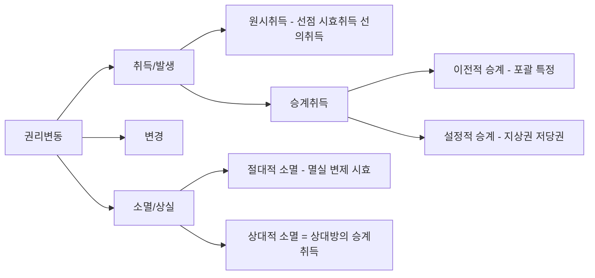

#### ⭐ 기출 출제포인트

1. **승계취득에 해당하는 것을 고르라** — 무주물 선점·건물 신축·환지처분·공용징수(원시취득) 중에서 ==상속==만 승계취득으로 골라내는 형태.
2. **원시취득 vs 승계취득의 정의를 뒤바꾼 선지** — "원시취득은 타인의 권리를 기초로 한다"는 식.
3. **설정적 승계를 이전적 승계로 서술한 선지** — "전세권설정은 소유권이 이전되는 것이다".
4. 권리의 **성질적 변경**(특정물인도채권 → 손해배상채권)을 권리의 소멸로 설명하는 선지.
5. 상속·포괄유증·회사합병을 ==특정승계==로 분류한 선지.

#### 📊 기출 분석

| 연도 | 출제 형태 | 핵심 논점 |
|---|---|---|
| 2021년 제32회 | "물건의 승계취득에 해당하는 것은?" (5지 택일) | 무주물 선점·환지처분·건물 신축·공용징수 = 원시취득 / ==상속 = 포괄승계== |

**출제 빈도** — 단독 출제 빈도는 높지 않으나, 출제되면 ==정답이 명확한 득점 문항==이다. 놓치면 손해가 크다.
**반복되는 함정 선지** — ①환지처분에 의한 국가의 소유권 취득(원시취득이다), ②건물 신축(원시취득이다), ③공용징수(원시취득이다). 이 셋이 매번 오답 선지로 나온다.
**최근 경향** — 법률사실 체계(다음 관)와 묶어 "법률행위 총론" 1문항으로 출제되는 경향이 있다.

#### 🔍 기출 선지로 배우는 법리

> 실제 출제된 선지를 그대로 놓고 O/X와 근거를 확인한다.

**①** 무주물 선점에 의한 소유권 취득 — 승계취득인가? **X**
어디가 틀렸나: 무주물 선점(제252조)은 타인의 권리에 기하지 않는 ==원시취득==이다. (2021년 제32회)

**②** 상속에 의한 소유권 취득 — 승계취득인가? **O**
근거: 상속은 피상속인의 재산상 지위를 포괄적으로 승계하는 것으로 ==승계취득 중 포괄승계==이다(제997조). (2021년 제32회, 정답 지문)

**③** 환지처분에 의한 국가의 소유권 취득 — 승계취득인가? **X**
어디가 틀렸나: 환지처분은 법률의 규정에 의해 새로운 권리가 창설되는 ==원시취득==이다.

**④** 건물 신축에 의한 소유권 취득 — 승계취득인가? **X**
옳게 고치면: 신축건물의 소유권 취득은 ==원시취득==이다.

**⑤** 공용징수에 의한 토지 소유권 취득 — 승계취득인가? **X**
어디가 틀렸나: 공용징수(수용)는 종전 권리의 제한을 끊고 새로 권리를 취득시키는 ==원시취득==이다.

#### ✏️ 사례형 적용

> 甲은 자신의 X토지에 乙을 위하여 저당권을 설정해 주었고, 그 후 사망하여 아들 丙이 단독상속하였다. 한편 丁은 甲 생전부터 X토지를 20년간 소유의 의사로 점유해 왔고 최근 점유취득시효 완성을 원인으로 등기를 마쳤다.

**검토** —
① 乙의 저당권 취득은 甲의 소유권이 그대로 존속하는 상태에서 새로운 제한물권을 얻은 것이므로 ==설정적 승계==다.
② 丙의 상속은 甲의 권리·의무를 통째로 물려받는 ==포괄승계(이전적 승계)== 이며, 甲 쪽에서 보면 상대적 소멸이다.
③ 丁의 시효취득은 타인의 권리에 기하지 않는 ==원시취득==이다. 따라서 종전 권리에 붙은 제한의 승계 여부가 별도로 문제된다.
**결론** — 하나의 토지를 두고 설정적 승계·포괄승계·원시취득이 모두 등장한다. 각 취득의 성질에 따라 종전 부담의 승계 여부가 달라진다는 점이 핵심이다.

#### ⚠️ 이 관의 함정 총정리

1. "시효취득은 종전 소유자의 권리를 승계하는 것이다"라고 하면 틀림 → ==원시취득==이다.
2. "포괄유증은 특정승계이다"라고 하면 틀림 → ==포괄승계==다.
3. "전세권설정으로 소유권이 전세권자에게 이전한다"고 하면 틀림 → ==설정적 승계==일 뿐 소유권은 그대로 있다.
4. "상대적 소멸은 권리 자체가 없어지는 것이다"라고 하면 틀림 → ==주체만 바뀌는 것==이다.
5. "특정물인도채권이 손해배상채권으로 바뀌면 권리가 소멸한 것이다"라고 하면 틀림 → 동일성을 유지한 ==성질적 변경==이다.

#### ✅ OX 확인문제

> 다음 진술의 참·거짓을 판단하시오.

**1.** 무주물 선점에 의한 소유권 취득은 원시취득이다.
→ **O**. 타인의 권리에 기하지 않고 새로 권리가 발생한다(제252조).

**2.** 상속에 의한 소유권 취득은 특정승계에 해당한다.
→ **X**. 피상속인의 재산상 지위를 통째로 승계하므로 포괄승계다(제997조).

**3.** 지상권설정은 설정적 승계에 해당한다.
→ **O**. 소유자의 권리는 존속하고 그 위에 새로운 권리가 설정된다(제279조).

**4.** 건물을 신축하여 소유권을 취득하는 것은 승계취득이다.
→ **X**. 원시취득이다.

**5.** 권리의 상대적 소멸은 권리 자체가 소멸하는 것을 말한다.
→ **X**. 권리는 존속하고 주체만 바뀐다. 상대방 쪽에서 보면 승계취득이다.

**6.** 소멸시효의 완성으로 채권이 소멸하는 것은 절대적 소멸이다.
→ **O**. 권리 자체가 없어진다(제162조).

**7.** 저당권의 순위가 변경되는 것은 권리의 작용의 변경이다.
→ **O**. 권리의 동일성은 유지되고 그 힘·순위만 바뀐다.

**8.** 특정물인도채권이 이행불능으로 손해배상채권으로 바뀌는 것은 권리의 성질적 변경이다.
→ **O**. 동일성을 잃지 않은 채 내용이 질적으로 변한다(제390조·제394조).

**9.** 선의취득은 전주(前主)의 권리를 승계하는 것이므로 승계취득이다.
→ **X**. 전주가 무권리자여도 권리를 취득하므로 원시취득이다(제249조).

**10.** 회사의 합병으로 인한 권리취득은 포괄승계에 해당한다.
→ **O**. 소멸회사의 권리·의무가 포괄적으로 이전한다.

#### 🧠 암기법

> 🔑 **원시취득 "선·습·시·선·매" (선점·습득·시효취득·선의취득·매장물발견)**
> 여기에 **신축·환지·수용**을 더하면 원시취득 8종이 완성된다. 시험에 나오는 원시취득은 사실상 이 8개뿐이다.

> 🔑 **"이전은 통째로, 설정은 얹어서"**
> 이전적 승계 = 권리가 통째로 옮겨감(포괄·특정). 설정적 승계 = 원권리는 그대로 두고 위에 얹음(제한물권).

> 🔑 **"주·작·성·수"(주체·작용·성질·수량) — 권리 변경의 네 모습**
> 주체 변경은 곧 승계, 작용 변경은 순위·대항력, 성질 변경은 손해배상채권으로의 전환, 수량 변경은 제한물권의 설정·소멸.

---

### 제2관 법률요건과 법률사실

> 📖 앞 관이 권리변동이라는 **결과**를 다루었다면, 이 관은 그 **원인**을 다룬다. 법률효과를 발생시키는 원인 전체가 법률요건이고, 그 법률요건을 이루는 개개의 사실이 법률사실이다. 법률행위는 여러 법률요건 중 ==가장 중요한 하나==일 뿐이라는 사실을 여기서 확인하게 된다.

> ⭐ **이 관에서 반드시 챙길 3가지**
> ① 법률사실은 ==용태(사람의 정신작용 O)== 와 ==사건(정신작용 X)== 으로 나뉜다.
> ② 준법률행위 3종(의사의 통지·관념의 통지·감정의 표시)의 ==예시를 통째로 외워야== 한다.
> ③ 사실행위는 ==순수사실행위와 혼합사실행위==로 갈리며, 대리가 인정되지 않는다.

#### 1. 의의

| 용어 | 의의 |
|---|---|
| **법률요건**(法律要件) | 일정한 법률효과를 발생시키는 데 필요한 ==사실의 총체== (예: 매매계약, 불법행위, 부당이득, 사무관리) |
| **법률사실**(法律事實) | 법률요건을 구성하는 ==개개의 사실== (예: 매매계약이라는 법률요건을 이루는 청약·승낙이라는 두 개의 의사표시) |
| **법률효과** | 법률요건이 갖추어졌을 때 발생하는 ==권리의 발생·변경·소멸== |

> 💡 법률요건 = 그릇, 법률사실 = 그릇을 채우는 알갱이. 매매(요건)는 청약과 승낙(사실) 두 알갱이로 이루어진다. 유언(요건)은 한 개의 의사표시(사실)만으로도 이루어진다.

#### 2. 요건 — 법률사실의 체계

법률사실은 **사람의 정신작용에 기하는가**를 기준으로 용태와 사건으로 나뉜다.

| 대분류 | 중분류 | 소분류 | 내용 | 예 |
|---|---|---|---|---|
| **용태** | 외부적 용태(행위) | 적법행위 — 의사표시 | 일정한 법률효과를 원하는 의사의 표시 | 청약, 승낙, 추인, 동의, 취소, 해제 |
| | | 적법행위 — 준법률행위(표현행위) | 아래 3종 | 의사의 통지·관념의 통지·감정의 표시 |
| | | 적법행위 — 비표현행위(사실행위) | 의식내용과 무관하거나 부수적 | 순수사실행위·혼합사실행위 |
| | | 위법행위 | 법이 허용하지 않는 행위 | 채무불이행(제390조), 불법행위(제750조) |
| | 내부적 용태 | 관념적 용태 | 일정한 사실에 대한 ==인식==의 유무 | 선의·악의(제29조·제107조·제108조·제109조·제110조), 정당한 대리인이라는 신뢰(제126조) |
| | | 의사적 용태 | 일정한 ==의사==를 가지는지 여부 | 소유의 의사(제197조), 제3자 변제에서 채무자의 허용·불허용 의사(제469조), 사무관리에서 본인의 의사(제734조) |
| **사건** | — | — | 사람의 정신작용에 기하지 않는 것 | 출생·사망·실종, 시간의 경과, 물건의 자연적 발생·소멸, 부합·혼화, 과실의 분리, 부당이득 |

#### 3. 효과 — 준법률행위와 사실행위의 세부

| 준법률행위 3종 | 의의 | 조문상 예 |
|---|---|---|
| **의사의 통지** | 자기의 ==의사==를 타인에게 통지 | 각종의 **최고**(제15조·제88조·제131조·제381조·제387조·제552조), 각종의 **거절**(제16조·제132조·제487조·제552조) |
| **관념의 통지** | 과거·현재의 ==사실==을 알림 | 사원총회소집의 통지(제71조), 채무의 승인(제68조·제450조), 채권양도의 통지·승낙(제450조), 공탁통지(제488조), 승낙연착통지(제528조), 대리권수여의 통지 |
| **감정의 표시** | 일정한 ==감정==을 표시 | 용서(제556조·제81조) — 망은행위에 대한 용서, 이혼사유에 대한 용서 |

| 사실행위 2종 | 의의 | 예 |
|---|---|---|
| **순수사실행위** | 행위자의 내심적 의식과 ==무관하게== 외부적 결과의 야기만으로 효과 발생 | 주소의 설정(제18조), 매장물발견(제254조), 가공(제259조) |
| **혼합사실행위** | 외부적 결과 외에 ==일정한 의식내용==을 필요로 함 | 무주물의 선점(제252조), 유실물 습득, 물건의 인도, 사무관리(제734조), 부부의 동거 |

> ⚠️ **준법률행위의 성질** — 준법률행위는 ==행위자가 원해서가 아니라 법률의 규정에 의해== 효과가 생긴다. 따라서 의사표시에 관한 규정이 그대로 적용되지 않고, 성질이 허용하는 범위에서 ==유추적용==될 뿐이다. 다만 판례는 채권양도의 통지와 같은 준법률행위에도 ==도달주의 원칙(제111조)이 유추적용==될 수 있다고 본다.

#### 4. 관련 조문

> 📌 **민법 제450조(지명채권양도의 대항요건)** — 지명채권의 양도는 양도인이 채무자에게 통지하거나 채무자가 승낙하지 아니하면 채무자 기타 제3자에게 대항하지 못한다. → 여기의 **통지·승낙**이 ==관념의 통지==다.

> 📌 **민법 제131조(상대방의 최고권)** — 대리권 없는 자가 타인의 대리인으로 계약을 한 경우에 상대방은 상당한 기간을 정하여 본인에게 그 추인 여부의 확답을 최고할 수 있다. → **최고**는 ==의사의 통지==다.

> 📌 **민법 제197조 제1항(점유의 태양)** — 점유자는 소유의 의사로 선의, 평온 및 공연하게 점유한 것으로 추정한다. → **소유의 의사**는 ==의사적 용태==다.

#### 5. 핵심 판례 법리

- 판례는 ==채권양도의 통지와 같은 준법률행위에도 도달주의 원칙이 유추적용==될 수 있다고 본다(2021년 제32회 출제 확인).
- 판례는 사무관리를 **혼합사실행위**로 다루며, 따라서 사무관리에서 "본인의 의사"는 의사적 용태로서 관리방법의 적법성 판단 기준이 된다.
- 채무의 승인은 관념의 통지이지만 소멸시효 중단이라는 법률효과를 낳는다. 판례는 승인에 ==처분능력·권한까지는 요구되지 않는다==고 본다.
- 불법행위·사실행위에는 ==대리가 인정되지 않는다==는 것이 확립된 태도이다(문제집 "대리가 허용되는 것은?" 정답: 채무의 승인).
- 반면 **채무의 승인**과 같은 준법률행위에는 성질상 ==대리가 허용된다==.
- 가족법상의 신분행위(약혼·유언 등)에는 원칙적으로 대리가 허용되지 않으나, 부양청구권의 행사·상속회복청구권·재산분할청구권과 같이 ==재산행위의 성질을 아울러 가지는 행위==에는 대리가 허용된다.
- 판례는 사원총회 소집의 통지를 관념의 통지로 보면서도, 그 통지의 흠결은 결의의 효력을 다투는 사유가 된다고 본다.
- 선의·악의는 관념적 용태로서, 민법 곳곳에서 ==제3자 보호의 분기점==이 된다(제107조~제110조의 선의의 제3자 보호 규정군).

#### ⭐ 기출 출제포인트

1. **"다음 중 관념의 통지가 아닌 것은?"** — 최고(의사의 통지)를 섞어 놓는 형태.
2. **"사무관리는 순수사실행위이다"** 형 선지 — 혼합사실행위로 고쳐야 한다.
3. **"채무자의 의사는 관념적 용태이다"** 형 선지 — 의사적 용태로 고쳐야 한다.
4. **"정당한 대리인이라는 신뢰는 의사적 용태이다"** 형 선지 — 관념적 용태다.
5. **대리가 허용되는 법률사실을 고르라** — 사실행위·불법행위·신분행위는 대리 불가.

#### 📊 기출 분석

| 연도 | 출제 형태 | 핵심 논점 |
|---|---|---|
| 2021년 제32회 | 의사표시의 효력발생 5지 | ==준법률행위(채권양도 통지)에 도달주의 유추적용== |
| 문제집(기본문제 02) | "법률사실에 관한 설명으로 옳은 것은?" | 사무관리=혼합사실행위 / 채무자의 의사=의사적 용태 / 채무승인=관념의 통지 / ==채권양도의 통지=관념의 통지(정답)== |
| 문제집(대리 기본문제 01) | "대리가 허용되는 것은?" | 약혼·유언(신분행위)·무주물선점(사실행위)·불법행위 = 불가 / ==채무의 승인 = 가능(정답)== |

**출제 빈도** — 단독 1문항으로는 드물지만, ==선지 1~2개로는 거의 매년 얼굴을 내민다.==
**반복되는 함정 선지** — "채무의 승인은 의사의 통지이다"(→관념의 통지), "사무관리는 순수사실행위이다"(→혼합사실행위).
**최근 경향** — 준법률행위에 민법총칙 규정이 유추적용되는지를 묻는 방향으로 진화하고 있다.

#### 🔍 기출 선지로 배우는 법리

> 실제 출제된 선지를 그대로 놓고 O/X와 근거를 확인한다.

**①** 사무관리는 순수사실행위이다. — **X**
어디가 틀렸나: 사무관리는 "타인을 위한다"는 관리의사를 요하므로 ==혼합사실행위==다(제734조). (문제집 제5장 기본문제 02)

**②** 채무자의 의사는 관념적 용태이다. — **X**
옳게 고치면: 일정한 **의사**를 가지는지가 문제되므로 ==의사적 용태==다(제469조).

**③** 채무자의 승인은 의사의 통지이다. — **X**
어디가 틀렸나: 승인은 채무가 존재한다는 **사실**을 알리는 것이므로 ==관념의 통지==다(제68조·제450조).

**④** 채권양도의 통지는 관념의 통지이다. — **O**
근거: 양도라는 과거의 사실을 채무자에게 알리는 것이다(제450조). (문제집 제5장 기본문제 02, 정답 ④)

**⑤** 정당한 대리인이라는 신뢰는 의사적 용태이다. — **X**
옳게 고치면: 일정한 사실에 대한 **인식**의 문제이므로 ==관념적 용태==다(제126조).

**⑥** 도달주의의 원칙은 채권양도의 통지와 같은 준법률행위에도 유추적용될 수 있다. — **O**
근거: 판례가 인정한다. (2021년 제32회 감정평가사)

**⑦** 대리가 허용되는 것은 채무의 승인이다. — **O**
근거: 사실행위(무주물선점)·불법행위·신분행위(약혼·유언)에는 대리가 인정되지 않으나, ==준법률행위인 채무승인에는 대리가 허용==된다. (문제집 대리 기본문제 01)

#### ✏️ 사례형 적용

> 甲은 乙에 대한 1억 원의 대여금채권을 丙에게 양도하고 乙에게 그 사실을 내용증명우편으로 통지하였다. 한편 乙은 그 직전 甲에게 "돈은 반드시 갚겠다"고 말한 바 있다. 또 乙은 甲의 창고에서 발견한 주인 없는 고철을 자기 것으로 삼을 생각으로 가져갔다.

**검토** —
① 甲의 **채권양도 통지**는 ==관념의 통지==다. 준법률행위이지만 판례는 ==도달주의(제111조)를 유추적용==하므로, 乙에게 도달한 때 대항요건이 갖추어진다.
② 乙의 **"갚겠다"는 말**은 채무의 존재를 인정하는 ==관념의 통지(승인)== 이며, 소멸시효 중단이라는 법률효과가 법률의 규정에 의해 발생한다.
③ 乙의 **무주물 선점**은 소유의 의사를 요하므로 ==혼합사실행위==이고, 그 효과는 소유권의 ==원시취득==이다(제252조).
**결론** — 하나의 사실관계에 관념의 통지 2개와 혼합사실행위 1개가 등장한다. 어느 것도 "의사표시"가 아니라는 점이 핵심이다.

#### ⚠️ 이 관의 함정 총정리

1. "최고는 관념의 통지이다"라고 하면 틀림 → ==의사의 통지==다.
2. "채무의 승인은 의사표시이다"라고 하면 틀림 → ==관념의 통지(준법률행위)== 다.
3. "선점은 순수사실행위이다"라고 하면 틀림 → 소유의 의사가 필요한 ==혼합사실행위==다.
4. "준법률행위에는 민법총칙 규정이 일절 적용되지 않는다"고 하면 틀림 → 성질이 허용하는 범위에서 ==유추적용==된다.
5. "부당이득은 용태에 속한다"고 하면 틀림 → 사람의 정신작용에 기하지 않는 ==사건==으로 분류한다.

#### ✅ OX 확인문제

> 다음 진술의 참·거짓을 판단하시오.

**1.** 법률요건은 법률효과를 발생시키는 사실의 총체이고, 법률사실은 그 구성요소이다.
→ **O**. 매매(요건)는 청약·승낙(사실)으로 이루어진다.

**2.** 각종의 최고는 관념의 통지에 해당한다.
→ **X**. 자기의 의사를 알리는 것이므로 의사의 통지다(제15조·제131조 등).

**3.** 채권양도의 통지는 관념의 통지이다.
→ **O**. 양도라는 사실을 알리는 것이다(제450조).

**4.** 망은행위에 대한 용서는 감정의 표시에 해당한다.
→ **O**. 준법률행위 중 감정의 표시다(제556조).

**5.** 가공은 혼합사실행위이다.
→ **X**. 내심적 의식과 무관하므로 순수사실행위다(제259조).

**6.** 무주물의 선점은 혼합사실행위이다.
→ **O**. 소유의 의사라는 의식내용을 요한다(제252조).

**7.** 소유의 의사는 관념적 용태이다.
→ **X**. 의사를 가지는지 여부이므로 의사적 용태다(제197조).

**8.** 선의·악의는 관념적 용태에 속한다.
→ **O**. 일정한 사실에 대한 인식의 문제다(제107조~제110조 등).

**9.** 사람의 사망·시간의 경과는 사건에 속한다.
→ **O**. 사람의 정신작용에 기하지 않는다.

**10.** 불법행위와 사실행위에는 대리가 인정되지 않는다.
→ **O**. 대리는 의사표시(및 성질상 허용되는 준법률행위)에만 인정된다.

#### 🧠 암기법

> 🔑 **관념의 통지 = "총·승·양·공·연"**
> **총**회소집통지 · 채무**승**인 · 채권**양**도통지 · **공**탁통지 · 승낙**연**착통지. 여기에 "대리권수여의 통지"를 얹으면 완성이다.

> 🔑 **의사의 통지 = "최·거"**
> **최**고와 **거**절. 이 둘만 의사의 통지다. 나머지 통지류는 대체로 관념의 통지라고 보면 실전에서 거의 맞는다.

> 🔑 **순수 vs 혼합 = "의식이 필요하면 혼합"**
> 가공·매장물발견·주소설정은 마음이 필요 없다(순수). 선점·습득·사무관리·동거는 마음이 필요하다(혼합).

### 제1관 법률행위의 의의와 종류

> 📖 법률행위는 ==의사표시를 불가결의 요소로 하는 법률요건==이다. 앞 절에서 본 여러 법률요건 중 사적 자치가 직접 관철되는 유일한 유형이며, 이 단원 전체(목적·의사표시·대리·무효취소·부관)가 모두 "법률행위"라는 한 그릇 안의 논의다. 이 관은 그 그릇의 정의와 분류, 그리고 ==성립요건과 효력요건의 구별==을 세운다.

> ⭐ **이 관에서 반드시 챙길 3가지**
> ① 단독행위는 ==상대방 있는 것과 없는 것==으로 갈리며, 시험은 늘 이 경계를 묻는다.
> ② 채권행위(의무부담행위) vs 물권행위·준물권행위(처분행위) — ==이행의 문제를 남기는가==가 기준.
> ③ **성립요건과 효력요건은 층이 다르다.** 성립하지 않은 법률행위에는 무효 자체가 문제되지 않는다.

#### 1. 의의

**법률행위**란 일정한 법률효과의 발생을 목적으로 하는 ==하나 또는 수개의 의사표시를 불가결의 요소로 하는 법률요건==이다. 의사표시가 없으면 법률행위가 아니다.

의사표시는 ①**의사**(일정한 법률효과의 발생을 원하는 내심의 의사), ②**표시**(그 의사를 외부에 나타내는 행위)로 구성되며, 그 앞단계에 ③**동기**(법률행위를 하게 된 계기·목적)가 있다.

> 💡 "돈을 빌려달라고 부탁해야지 하는 생각" = 의사, "돈을 빌려달라고 부탁하는 것" = 표시, "도박을 하기 위하여" = ==동기==. 동기는 원칙적으로 법률행위의 내용이 아니다. 이 구분이 뒤에서 **동기의 착오**·**동기의 불법**을 푸는 열쇠가 된다.

판례에 따르면 여기서 **진의(眞意)** 란 ==특정한 내용의 의사표시를 하고자 하는 표의자의 생각==을 말하는 것이지, 표의자가 진정으로 마음속에서 바라는 사항을 뜻하는 것은 아니다(대판 1993.7.16. 92다41528).

#### 2. 요건 — 성립요건과 효력요건

| 구분 | 일반요건 | 특별요건 |
|---|---|---|
| **성립요건** | ①당사자 ②목적 ③의사표시 | 혼인의 신고(제812조), 유언에서 증서의 작성(제1060조), 요물계약에서 목적물의 인도(질물의 인도) |
| **효력요건** | ①당사자: 권리능력·의사능력·행위능력 ②목적: ==확정성·실현가능성·적법성·사회적 타당성== ③의사표시: 의사와 표시가 일치하고 하자가 없을 것 | 대리행위에서 대리권의 존재, 제한능력자에 대한 법정대리인의 동의, 토지거래허가구역 내 토지계약의 허가, 조건의 성취·기한의 도래, 유언에서 유언자의 사망 |

> ⚠️ **층위 혼동 금지** — 법률행위의 **무효**란 ==법률행위가 성립한 것을 전제==로 한다. 아예 성립하지 않았다면 무효를 논할 여지조차 없다. "요물계약에서 물건의 인도"는 ==성립요건==이고 "조건의 성취"는 ==효력요건==이라는 구별이 그대로 출제된다.

#### 3. 효과 — 법률행위의 종류

**(1) 의사표시의 결합방식에 따른 분류**

| 종류 | 의의 | 예 |
|---|---|---|
| **단독행위** | 한 사람의 한 개의 의사표시로 성립 | 아래 세분 |
| ├ 상대방 **있는** 단독행위 | 의사표시가 ==도달==해야 효과 발생 | 동의·추인·채무면제·상계·취소·철회·해제·해지, 사직서 제출, ==공유지분의 포기==(대판 2016.10.27. 2015다52978), 제한물권의 포기, 기한이익의 포기, 시효이익의 포기 |
| └ 상대방 **없는** 단독행위 | 의사표시만 있으면 곧 효과 발생 | ==유증==, 재단법인의 설립행위, 소유권·점유권의 포기, 상속의 승인·포기 |
| **계약** | 대립하는 두 의사표시의 합치 | 15종 전형계약(매매·교환·임대차·사용대차·증여·소비대차·위임·도급·여행계약·화해·조합·현상광고·고용·임치·종신정기금), 물권계약, 가족법상 계약 |
| **합동행위** | 대립하지 않고 ==같은 방향==의 복수 의사표시가 합치 | 사단법인의 설립행위 |

**(2) 법률효과에 따른 분류**

| 종류 | 이행의 문제 | 성질 | 예 |
|---|---|---|---|
| **채권행위** | ==남긴다== | 의무부담행위 | 매매·증여·임대차 |
| **물권행위** | 남기지 않는다 | ==처분행위== | 소유권 이전, 지상권·저당권 설정 |
| **준물권행위** | 남기지 않는다 | ==처분행위== | 채권양도(제449조 제1항), 채무면제(제506조), 지식재산권의 양도 |

**(3) 그 밖의 분류**

| 기준 | 유형 | 예 |
|---|---|---|
| 방식 | 요식행위 / 불요식행위 | 요식: 법인 설립행위·유언·혼인·입양·어음수표행위 / 원칙은 ==불요식== |
| 효력발생시기 | 생전행위 / 사후행위(사인행위) | 사후행위: 유언(제1073조), 사인증여(제562조) |
| 재산 증감 | 출연행위 / 비출연행위 | 비출연: ==소유권의 포기, 대리권의 수여== |
| 대가 | 유상행위 / 무상행위 | 무상: 증여·사용대차 (주의의무가 제374조 선관주의 → 제695조 자기재산과 동일한 주의로 경감) |
| 원인과의 관계 | 유인행위 / 무인행위 | 무인: ==어음·수표행위== |
| 독립성 | 독립행위 / 보조행위 | 보조행위: 동의·추인·대리권 수여행위 |
| 부종성 | 주된 행위 / 종된 행위 | 종된 행위: 저당권설정계약, 보증계약, ==부부재산계약== |

#### 4. 관련 조문

> 📌 **민법 제449조 제1항(채권의 양도성)** — 채권은 양도할 수 있다. 그러나 채권의 성질이 이를 허용하지 아니하는 때에는 그러하지 아니하다. → 채권양도는 ==준물권행위(처분행위)== 다.

> 📌 **민법 제812조 제1항(혼인의 성립)** — 혼인은 「가족관계의 등록 등에 관한 법률」에 정한 바에 의하여 신고함으로써 그 효력이 생긴다. → 신고는 혼인의 ==특별성립요건==이다.

> 📌 **민법 제1060조(유언의 요식성)** — 유언은 본법의 정한 방식에 의하지 아니하면 효력이 생하지 아니한다. → 유언은 대표적 ==요식행위==이자 ==상대방 없는 단독행위==다.

#### 5. 핵심 판례 법리

- 판례는 **공유지분의 포기**를 ==상대방 있는 단독행위==로 본다(대판 2016.10.27. 2015다52978). 소유권 자체의 포기(상대방 없는 단독행위)와 구별해야 한다.
- 판례는 비진의표시의 **진의**를 ==특정한 내용의 의사표시를 하고자 하는 표의자의 생각==이라고 정의한다(대판 1993.7.16. 92다41528). 이는 법률행위의 구성요소론에서 출발한 정의다.
- 판례는 계약의 **당사자 확정**은 계약에 관여한 당사자의 ==의사해석의 문제==라고 본다. 당사자들의 의사가 일치하면 그 의사대로, 불일치하면 ==상대방의 관점에서 합리적인 사람이라면 누구를 당사자로 이해하였을지==를 기준으로 확정한다(대판 2020.12.10. 2019다267204).
- 일방 당사자가 대리인을 통해 계약을 체결하는 경우 ==대리권의 존부와 무관하게 상대방과 본인이 계약당사자==가 된다(대판 2003.12.12. 2003다44059).
- 예금명의자의 위임으로 출연자 등 제3자가 대리인으로 예금계약을 체결한 경우, ==예금명의자가 계약당사자==이고 예금반환청구권도 예금명의자에게 귀속하며 자금출연자는 배제된다(대판 2009.3.19. 2008다45828 전합).
- 타인 명의로 계약을 체결하였고 당사자 의사가 불일치하는 경우, 상대방 입장에서 합리적으로 평가할 때 ==행위자 자신이 당사자로 인정되면 행위자가 당사자==가 되고 효과도 행위자에게 귀속한다(대판 2013.10.11. 2013다52622).
- 단독행위에는 원칙적으로 조건·기한을 붙일 수 없으나, ==상대방의 동의를 얻거나 상대방을 오로지 유리하게 하는 경우==(채무면제·유증)에는 예외적으로 조건을 붙일 수 있다.
- **사무관리·가공·선점**과 같은 사실행위와 불법행위는 법률행위가 아니므로 ==대리가 인정되지 않는다.==

#### ⭐ 기출 출제포인트

1. **상대방 없는 단독행위를 고르라** — 유증·재단법인 설립행위·소유권 포기만 정답. (공유지분 포기·상계·추인·동의·채무면제는 상대방 있는 단독행위)
2. **법률행위가 아닌 것을 고르라** — ==동산의 가공==(순수사실행위)이 정답 단골.
3. **특별효력요건이 아닌 것을 고르라** — ==요물계약에서 물건의 인도==(성립요건)가 정답 단골.
4. **형성권으로만 묶인 것** — 해제권·취소권·지상물매수청구권(실질이 형성권).
5. 합동행위(사단법인 설립)와 상대방 없는 단독행위(재단법인 설립)를 뒤바꾼 선지.

#### 📊 기출 분석

| 연도 | 출제 형태 | 핵심 논점 |
|---|---|---|
| 2020년 제31회 | "형성권에 관한 설명으로 옳은 것을 모두 고른 것은?" | 일방적 의사표시로 행사 / 조건·기한 불가 / 일부행사 / ==제척기간== |
| 2023년 제34회 | "형성권으로만 모두 연결된 것은?" | ==해제권-취소권-지상물매수청구권== |
| 문제집(기본문제 05~07) | 단독행위·요식행위·무상행위 연결 | 재단법인 설립행위=상대방 없는 단독행위, 유증=상대방 없는 단독행위, ==공유지분 포기=상대방 있는 단독행위== |
| 문제집(기본문제 08) | "법률행위의 특별효력요건이 아닌 것은?" | ==요물계약의 물건 인도 = 성립요건(정답)== |

**출제 빈도** — 법률행위 총론은 ==2~3년에 한 번 단독 1문항==, 그 외에는 다른 논점의 전제로 늘 요구된다.
**반복되는 함정 선지** — "재단법인 설립행위는 합동행위이다"(→상대방 없는 단독행위), "유언에서 유언자의 사망은 성립요건이다"(→특별효력요건).
**최근 경향** — 권리의 종류(형성권·청구권·항변권)와 묶어 출제되는 흐름이 뚜렷하다.

#### 🔍 기출 선지로 배우는 법리

> 실제 출제된 선지를 그대로 놓고 O/X와 근거를 확인한다.

**①** 상대방 있는 단독행위에 해당하지 않는 것은 재단법인의 설립행위이다. — **O**
근거: 재단법인 설립행위는 ==상대방 없는 단독행위==다. 공유지분의 포기·무권대리행위의 추인·상계의 의사표시·취득시효 이익의 포기는 모두 상대방 있는 단독행위다. (문제집 기본문제 07)

**②** 손자에 대한 부동산의 유증은 상대방 없는 단독행위이다. — **O**
근거: 유증은 상대방 없는 단독행위다(제1073조). (문제집 기본문제 06)

**③** 단독행위에 대해서는 어떠한 경우에도 조건 또는 기한을 붙일 수 없다. — **X**
어디가 틀렸나: 원칙은 그렇지만 ==상대방의 동의를 얻거나 상대방을 유리하게 하는 경우==(채무면제·유증)에는 붙일 수 있다. (문제집 기본문제 03)

**④** 동산의 가공은 법률행위이다. — **X**
옳게 고치면: 가공은 ==순수사실행위==이지 법률행위가 아니다(제259조). (문제집 실전문제 02)

**⑤** 요물계약에서의 물건의 인도는 법률행위의 특별효력요건이다. — **X**
어디가 틀렸나: 물건의 인도는 ==특별성립요건==이다. 유언에서 유언자의 사망·조건의 성취·기한의 도래·대리권의 존재가 특별효력요건이다. (문제집 기본문제 08)

**⑥** 형성권은 다른 사정이 없으면 제척기간의 적용을 받는다. — **O**
근거: 형성권은 법률관계를 일방적으로 변동시키므로 ==단기의 제척기간==으로 조속히 확정한다. (2020년 제31회)

**⑦** 다른 사정이 없으면 형성권의 행사에 조건 또는 기한을 붙이지 못한다. — **O**
근거: 상대방의 지위를 불안정하게 하기 때문이다. (2020년 제31회)

#### ✏️ 사례형 적용

> **사례 1** — 甲은 자기 소유 X토지 중 자신의 1/3 공유지분을 포기한다는 의사를 표시하였고, 같은 날 유언공정증서로 조카 乙에게 Y건물을 유증하였다.

**검토** — ① 공유지분의 포기는 ==상대방 있는 단독행위==이므로 다른 공유자에게 의사표시가 도달해야 효력이 생긴다(대판 2016.10.27. 2015다52978). ② 유증은 ==상대방 없는 단독행위==이자 ==요식행위==이며, 유언자의 사망이라는 ==특별효력요건==이 갖추어져야 효력이 발생한다(제1073조·제1060조).
**결론** — 같은 "포기·수여" 유형이라도 상대방의 유무와 요식성 요구가 다르다.

> **사례 2** — 甲은 乙에게 X토지를 매도하는 계약을 체결하고 대금을 받았으나 아직 등기는 이전하지 않았다.

**검토** — 매매계약은 ==채권행위(의무부담행위)== 로서 ==이행의 문제를 남긴다.== 소유권이전등기라는 ==물권행위(처분행위)== 가 별도로 필요하다. 대금을 받았다는 사정만으로 물권변동이 일어나지 않는다.
**결론** — 채권행위와 물권행위는 층이 다르다. 이 구별을 놓치면 뒤의 "무효·취소의 효과" 전체가 흔들린다.

#### ⚠️ 이 관의 함정 총정리

1. "재단법인의 설립행위는 합동행위이다"라고 하면 틀림 → ==상대방 없는 단독행위==다(사단법인 설립행위가 합동행위).
2. "소유권의 포기와 공유지분의 포기는 모두 상대방 없는 단독행위이다"라고 하면 틀림 → ==공유지분의 포기는 상대방 있는 단독행위==다.
3. "요물계약에서의 인도는 효력요건이다"라고 하면 틀림 → ==성립요건==이다.
4. "채무면제는 채권행위이다"라고 하면 틀림 → ==준물권행위(처분행위)== 다.
5. "법률행위의 목적은 성립 당시 구체적으로 확정되어 있어야 유효하다"고 하면 틀림 → ==확정할 수 있으면 족하다.==

#### ✅ OX 확인문제

> 다음 진술의 참·거짓을 판단하시오.

**1.** 법률행위는 의사표시를 불가결의 요소로 하는 법률요건이다.
→ **O**. 의사표시가 없으면 법률행위가 아니다.

**2.** 유증은 상대방 있는 단독행위이다.
→ **X**. 상대방 없는 단독행위다(제1073조).

**3.** 공유지분의 포기는 상대방 있는 단독행위이다.
→ **O**. 판례의 태도다(대판 2016.10.27. 2015다52978).

**4.** 사단법인의 설립행위는 합동행위이다.
→ **O**. 같은 방향의 복수 의사표시가 합치한다.

**5.** 채권양도와 채무면제는 준물권행위로서 처분행위에 속한다.
→ **O**. 이행의 문제를 남기지 않는다(제449조·제506조).

**6.** 대리권의 수여행위는 출연행위이다.
→ **X**. 직접 재산의 증감을 가져오지 않는 비출연행위다.

**7.** 어음·수표행위는 유인행위이다.
→ **X**. 유통성 보호를 위한 대표적 무인행위다.

**8.** 조건의 성취는 법률행위의 특별효력요건이다.
→ **O**. 성립요건이 아니라 효력요건이다.

**9.** 법률행위의 목적은 법률행위 당시 확정되어 있지 않아도 확정할 수 있으면 유효하다.
→ **O**. 확정 가능성으로 족하다.

**10.** 부부재산계약은 혼인에 종된 행위이다.
→ **O**. 주된 행위인 혼인과 법률적 운명을 같이한다.

#### 🧠 암기법

> 🔑 **상대방 "없는" 단독행위 = "유·재·소·상"**
> **유**증(유언) · **재**단법인 설립행위 · **소**유권(점유권)의 포기 · **상**속의 승인·포기. 이 넷 말고는 사실상 다 상대방 있는 단독행위라고 보면 된다.

> 🔑 **처분행위 = "이행이 없다"**
> 채권행위는 "약속"(이행이 남음), 물권행위·준물권행위는 "결과"(이행이 없음). 그래서 채권행위는 **의무부담행위**, 나머지는 **처분행위**다.

> 🔑 **특별효력요건 = "대·동·허·조·기·사"**
> **대**리권 존재 · **동**의 · **허**가(토지거래허가) · **조**건 성취 · **기**한 도래 · 유언자의 **사**망. 요물계약의 인도만 빼면 다 여기다.

---

### 제2관 법률행위의 목적

> 📖 법률행위가 성립해도 그 **내용(목적)** 이 잘못되어 있으면 효력이 생기지 않는다. 목적은 ==확정성·실현가능성·적법성·사회적 타당성== 네 개의 관문을 통과해야 한다. 이 관은 그중 앞의 둘(확정성·실현가능성)과 적법성의 총론을 다루고, 이어지는 관들이 강행규정(적법성)·제103조·제104조(사회적 타당성)로 각각 분화한다.

> ⭐ **이 관에서 반드시 챙길 3가지**
> ① 목적은 ==확정되어 있을 필요는 없고 확정할 수 있으면 족하다.==
> ② ==원시적 불능은 무효, 후발적 불능은 유효==(이행불능 또는 위험부담의 문제).
> ③ 일부무효는 ==원칙 전부무효==, 예외적으로 가정적 의사가 인정되면 잔부 유효(제137조).

#### 1. 의의

**법률행위의 목적**이란 행위자가 그 법률행위에 의하여 발생시키려고 하는 ==법률효과==를 말하며, 법률행위의 **내용**이라고도 한다. 매매계약의 목적은 매도인의 대금지급청구권과 매수인의 재산권이전청구권이다.

> ⚠️ **목적 ≠ 목적물** — 법률행위의 목적(=내용)은 있어도 목적물이 존재하지 않는 경우가 있다. 노무 제공 계약이 그 예다.

#### 2. 요건 — 네 개의 관문

| 요건 | 내용 | 위반 시 효과 |
|---|---|---|
| **확정성** | 확정되어 있거나 ==장차 일정한 표준에 의해 확정할 수 있을 것== | 확정 불가능하면 무효 |
| **실현가능성** | 사회통념상 실현 가능할 것 | ==원시적 불능이면 무효== / 후발적 불능은 유효 |
| **적법성** | 강행법규에 위반하지 않을 것 | 효력규정 위반 = 무효 / 단속규정 위반 = ==사법상 유효== |
| **사회적 타당성** | 선량한 풍속 기타 사회질서에 반하지 않을 것(제103조) | 무효(절대적 무효) |

#### 3. 효과 — 불능의 분류와 효과

| 분류 | 의의 | 효과 |
|---|---|---|
| **원시적 불능** | 법률행위 성립 ==당시 이미== 실현불가능 | ==법률행위 무효.== 다만 불능을 알았거나 알 수 있었던 자는 상대방의 **신뢰이익**을 배상(제535조 계약체결상의 과실) |
| **후발적 불능 — 채무자 귀책 O** | 성립 후 채무자의 고의·과실로 불능 | 법률행위는 ==유효==, ==이행불능(제390조)== 으로 손해배상책임 |
| **후발적 불능 — 채무자 귀책 X** | 성립 후 채무자 책임 없이 불능 | 법률행위는 ==유효==, ==위험부담(제537조·제538조)== 의 문제 |

| 분류 | 의의 | 효과 |
|---|---|---|
| **전부불능** | 목적 전부가 불능 | 원시적/후발적 구분에 따라 처리 |
| **일부불능** | 목적 일부만 불능 | ==원칙 전부무효==, 예외적으로 그 무효부분이 없더라도 법률행위를 하였으리라 인정되면 나머지 유효(제137조) |

> 💡 **가능·불능의 표준은 사회통념** — 물리적으로 불가능한 경우(죽은 사람을 살린다는 계약)뿐 아니라 물리적으로는 가능해도 사회통념상 불가능한 경우(한강에 빠뜨린 바늘을 찾는다는 계약)도 ==불능==이다. 반면 ==일시적 불능==으로서 가능하게 될 개연성이 높으면 불능이 아니다.

#### 4. 관련 조문

> 📌 **민법 제535조(계약체결상의 과실)** — ① 목적이 불능한 계약을 체결할 때에 그 불능을 알았거나 알 수 있었을 자는 상대방이 그 계약의 유효를 믿었음으로 인하여 받은 손해를 배상하여야 한다. 그러나 그 배상액은 계약이 유효함으로 인하여 생길 이익액을 넘지 못한다. ② 전항의 규정은 상대방이 그 불능을 알았거나 알 수 있었을 경우에는 적용하지 아니한다.

> 📌 **민법 제137조(법률행위의 일부무효)** — 법률행위의 일부분이 무효인 때에는 그 전부를 무효로 한다. 그러나 그 무효부분이 없더라도 법률행위를 하였을 것이라고 인정될 때에는 나머지 부분은 무효가 되지 아니한다.

> 📌 **민법 제103조(반사회질서의 법률행위)** — 선량한 풍속 기타 사회질서에 위반한 사항을 내용으로 하는 법률행위는 무효로 한다.

#### 5. 핵심 판례 법리

- 판례는 목적의 **가능·불능**을 ==사회통념==에 의해 판단한다. 물리적으로 가능해도 사회통념상 실현할 수 없으면 무효다.
- 법률행위의 목적이 성립 당시에는 가능하였으나 그 이행 전에 불가능하게 된 경우(후발적 불능)에는 ==법률행위가 무효로 되지 않는다.== 이행불능 또는 위험부담의 문제일 뿐이다.
- 판례는 **일부무효**에 관한 제137조를 ==임의규정==으로 본다. 따라서 당사자가 달리 정할 수 있다(2022년 제33회 출제 확인).
- 판례는 계약당사자 쌍방이 계약의 전제·기초가 되는 사항에 관하여 같은 내용으로 착오하여 구체적 약정을 하지 않은 경우, ==당사자가 착오가 없었다면 약정하였을 내용으로 의사를 보충하여 계약을 해석==할 수 있다고 본다. 이때 보충되는 의사는 실제 의사가 아니라 ==계약의 목적·거래관행·적용법규·신의칙에 비추어 객관적으로 추인되는 정당한 이익조정 의사==이다(대판 2023.8.18. 2019다200126).
- 판례는 **매매계약이 매매대금의 과다로 제104조의 불공정한 법률행위에 해당하여 무효인 경우**에도 ==무효행위의 전환에 관한 제138조가 적용==될 수 있다고 본다(대판 2011.4.28. 2010다106702).
- 판례는 과실의 귀속에 관한 규정(제102조 제1항)과 기간계산에 관한 규정(제159조 등)을 ==임의규정==으로 본다.
- 판례는 **강행법규 위반을 스스로 저지른 자**가 그 무효를 주장하는 것도 ==특별한 사정이 없는 한 신의칙에 반하지 않는다==고 한다(대판 1999.3.23. 99다4405). 강행법규의 입법취지를 몰각시켜서는 안 되기 때문이다.
- 판례는 사찰이 그 존립에 필요불가결한 재산인 임야를 증여하는 계약을 ==무효==로 본다(생존의 기초가 되는 재산의 처분).

#### 6. 한눈에 보는 정리표

| 논점 | 결론 | 근거 |
|---|---|---|
| 목적의 확정성 | 확정 가능하면 유효 | — |
| 원시적 불능 | 무효 + 신뢰이익 배상 | 제535조 |
| 후발적 불능(귀책 O) | 유효 + 이행불능 | 제390조 |
| 후발적 불능(귀책 X) | 유효 + 위험부담 | 제537조 |
| 일부무효 | 원칙 전부무효 | 제137조 |

#### ⭐ 기출 출제포인트

1. **"후발적 불능이면 법률행위가 무효이다"** 형 함정 선지 — 유효다.
2. **원시적 불능 → 계약체결상의 과실 / 귀책 있는 후발적 불능 → 이행불능 / 귀책 없는 후발적 불능 → 위험부담**의 3분 연결 문제.
3. **"법률행위의 일부가 무효이면 원칙적으로 그 일부만 무효이다"** 형 함정 — 원칙은 ==전부무효==다.
4. **"법률행위의 목적은 성립 당시 구체적으로 확정되어야 한다"** 형 함정.
5. 임의규정 찾기 — 과실 귀속·기간계산 규정.

#### 📊 기출 분석

| 연도 | 출제 형태 | 핵심 논점 |
|---|---|---|
| 2023년 제34회 | "법률행위의 목적에 관한 설명으로 옳은 것을 모두 고른 것은?" | 매도인 방화로 인한 이전불능=**이행불능**(손해배상) / 재결수용으로 인한 이전불능=**위험부담** / 계약 전 지진 전파=**원시적 불능**(계약체결상 과실) — ==모두 옳음(정답 ⑤)== |
| 2022년 제33회 | "법률행위의 무효" 5지 | ==제137조는 임의규정== |
| 문제집(기본문제 09·11, 실전문제 04·06) | 목적의 확정성·가능성 | 확정 가능하면 유효 / 일부무효 원칙 전부무효 / 후발적 불능은 유효 |

**출제 빈도** — ==거의 매년 1선지 이상.== 2023년에는 단독 1문항으로 나왔다.
**반복되는 함정 선지** — "당사자의 귀책사유 없이 후발적 불능이 된 법률행위는 무효이다"(→유효, 위험부담).
**최근 경향** — 원시적 불능·이행불능·위험부담을 ==한 문항 안에서 3분해 묻는== 형태가 정착했다.

#### 🔍 기출 선지로 배우는 법리

> 실제 출제된 선지를 그대로 놓고 O/X와 근거를 확인한다.

**①** 甲이 乙에게 매도한 건물이 계약체결 후 甲의 방화로 전소하여 乙에게 이전할 수 없게 된 경우, 甲의 손해배상책임이 문제될 수 있다. — **O**
근거: 채무자 귀책의 ==후발적 불능 = 이행불능(제390조)== 이다. (2023년 제34회)

**②** 甲이 乙에게 매도한 토지가 계약체결 후 재결수용으로 이전할 수 없게 된 경우, 위험부담이 문제될 수 있다. — **O**
근거: 채무자 귀책 없는 ==후발적 불능 = 위험부담(제537조)== 이다. (2023년 제34회)

**③** 甲이 乙에게 매도하기로 한 건물이 계약체결 전에 지진으로 전파된 경우, 계약체결상의 과실책임이 문제될 수 있다. — **O**
근거: ==원시적 불능으로 계약은 무효==이고, 제535조의 신뢰이익 배상이 문제된다. (2023년 제34회)

**④** 법률행위의 목적이 성립 당시에는 가능하였지만 그 이행 전에 불가능하게 된 경우, 그 법률행위는 무효가 된다. — **X**
어디가 틀렸나: 후발적 불능이므로 ==법률행위는 유효==다. (문제집 기본문제 09)

**⑤** 법률행위의 일부가 무효인 경우에는 원칙적으로 그 일부만 무효이다. — **X**
옳게 고치면: ==원칙적으로 전부를 무효로 한다==(제137조 본문). (문제집 실전문제 06)

**⑥** 법률행위의 목적이 물리적으로 가능하더라도 사회통념상 실현할 수 없으면 무효이다. — **O**
근거: 가능·불능의 판단 기준은 ==사회통념==이다. (문제집 실전문제 06, 정답 지문)

**⑦** 법률행위의 일부무효에 관한 민법 제137조는 임의규정이다. — **O**
근거: 판례의 태도다. (2022년 제33회)

#### ✏️ 사례형 적용

> **사례** — 甲은 乙에게 자신의 X별장을 5억 원에 매도하기로 하였다. ⓐ 계약 전날 이미 산불로 X가 전소되어 있었는데 甲만 그 사실을 알고 있었다. ⓑ 만약 계약 후 甲의 담뱃불로 전소되었다면? ⓒ 계약 후 벼락으로 전소되었다면?

**검토** —
ⓐ ==원시적 불능 → 계약 무효.== 다만 불능을 알았던 甲은 계약의 유효를 믿은 乙의 신뢰이익을 배상해야 한다(제535조 제1항). 단, 乙도 불능을 알았거나 알 수 있었다면 배상책임이 없다(같은 조 제2항).
ⓑ ==채무자 귀책의 후발적 불능 → 계약은 유효==, 甲은 이행불능으로 인한 손해배상책임을 진다(제390조).
ⓒ ==채무자 귀책 없는 후발적 불능 → 계약은 유효==, 위험부담의 문제가 되어 甲은 이행의무를 면하나 대금도 청구할 수 없다(제537조).
**결론** — "언제 불능이 되었는가"와 "누구 탓인가" 두 축만 잡으면 세 결론이 자동으로 갈린다.

#### ⚠️ 이 관의 함정 총정리

1. "원시적 불능이면 계약체결상의 과실책임이 언제나 인정된다"고 하면 틀림 → 상대방도 불능을 알았거나 알 수 있었으면 ==적용되지 않는다==(제535조 제2항).
2. "후발적 불능이면 계약이 무효이다"라고 하면 틀림 → ==유효==하고 이행불능·위험부담의 문제다.
3. "일시적 불능도 불능이다"라고 하면 틀림 → 가능하게 될 개연성이 높으면 ==불능이 아니다.==
4. "일부무효는 원칙적으로 잔부 유효이다"라고 하면 틀림 → ==원칙 전부무효==(제137조 본문).
5. "계약체결상 과실책임의 배상범위는 이행이익이다"라고 하면 틀림 → ==신뢰이익==이며 이행이익을 넘지 못한다.

#### ✅ OX 확인문제

> 다음 진술의 참·거짓을 판단하시오.

**1.** 법률행위의 목적은 법률행위 당시 확정되어 있지 않으면 무효이다.
→ **X**. 장차 일정한 표준에 의해 확정할 수 있으면 유효하다.

**2.** 원시적 불능인 법률행위는 무효이나 계약체결상의 과실책임이 문제될 수 있다.
→ **O**. 제535조의 신뢰이익 배상이다.

**3.** 당사자의 귀책사유 없이 후발적 불능이 된 법률행위는 무효이다.
→ **X**. 유효하고 위험부담의 문제가 된다(제537조).

**4.** 일부불능인 법률행위는 원칙적으로 전부가 무효이다.
→ **O**. 제137조 본문.

**5.** 가능·불능의 판단은 그 시대의 사회통념에 의한다.
→ **O**. 물리적 기준이 아니다.

**6.** 법률행위의 목적은 있어도 목적물은 존재하지 않는 경우가 있다.
→ **O**. 노무 제공 계약이 그 예다.

**7.** 법률행위의 목적이 임의법규에 위반되면 그 법률행위는 무효이다.
→ **X**. 임의법규는 당사자의 특약으로 배제할 수 있으므로 유효하다.

**8.** 계약체결상 과실책임의 배상액은 계약이 유효함으로 인하여 생길 이익액을 넘지 못한다.
→ **O**. 제535조 제1항 단서.

**9.** 법률행위의 일부무효에 관한 민법 제137조는 강행규정이다.
→ **X**. 판례는 임의규정으로 본다.

**10.** 사찰이 그 존립에 필요불가결한 임야를 증여하는 계약은 무효이다.
→ **O**. 생존의 기초가 되는 재산의 처분으로 사회질서에 반한다.

#### 🧠 암기법

> 🔑 **목적의 4관문 = "확·가·적·사"**
> **확**정성 · **가**능성 · **적**법성 · **사**회적 타당성. 이 순서가 곧 교재의 목차 순서이자 출제 순서다.

> 🔑 **불능 3분법 = "전에 = 무효 / 후에 내탓 = 배상 / 후에 남탓아님 = 위험부담"**
> 계약 **전**이면 무효(제535조), 계약 **후 내 탓**이면 이행불능(제390조), 계약 **후 아무 탓 아님**이면 위험부담(제537조).

> 🔑 **일부무효 = "전부가 원칙, 잔부가 예외"**
> 제137조는 본문(전부무효)이 원칙, 단서(잔부유효)가 예외. 반대로 외우면 한 문제를 잃는다.

---

### 제3관 강행규정과 단속규정

> 📖 목적의 **적법성** 관문이다. 법규 위반이라고 다 무효가 아니다. 위반한 규정이 ==효력규정(강행규정)== 이면 사법상 무효, ==단속규정==이면 사법상 유효하고 벌칙만 받는다. 이 한 칸의 차이가 계약의 운명을 가른다.

> ⭐ **이 관에서 반드시 챙길 3가지**
> ① 효력규정 위반 = ==사법상 무효== / 단속규정 위반 = ==사법상 유효(+행정벌)==.
> ② **탈법행위**는 강행법규를 우회하는 것으로 ==무효==다.
> ③ 강행법규를 위반한 자가 ==스스로 무효를 주장해도 신의칙에 반하지 않는다.==

#### 1. 의의

| 개념 | 의의 |
|---|---|
| **강행법규**(强行法規) | 당사자의 의사로 그 적용을 ==배제할 수 없는== 규정 |
| **임의법규**(任意法規) | 선량한 풍속 기타 사회질서와 관계없는 규정으로, 당사자의 특약으로 ==배제·변경해도 유효==한 규정 |
| **효력규정** | 강행법규 중 위반 시 ==사법상 효력까지 부인==하는 규정 |
| **단속규정** | 행정목적 달성을 위해 일정한 행위를 금지·제한하고 위반 시 ==형벌·행정상 불이익==만 가하는 규정. 사법상 효력은 유효 |
| **탈법행위**(脫法行爲) | 강행법규에 직접 위반하지는 않으나 ==다른 적법행위의 형식을 빌려== 금지된 결과를 실질적으로 실현하는 행위. ==무효== |

> ⚠️ 민법은 그 규정 자체에서 강행규정임을 밝히는 경우(제608조)도 있으나 대부분은 명시하지 않는다. 따라서 ==규정의 성질·종류·입법목적을 고려해 개별적으로 판단==해야 한다.

#### 2. 요건 — 강행법규의 유형

| 유형 | 예 |
|---|---|
| 사회의 기본질서에 관한 규정 | 권리능력·행위능력·법인제도에 관한 규정 |
| 제3자·거래안전 보호 규정 | 물권편의 규정 중 사회일반의 이해에 직접 중요한 영향을 미치는 규정 |
| 경제적 약자 보호 규정 | 소멸시효에 관한 규정, 제608조 등 |
| 가족관계질서 유지 규정 | 친족·상속편의 규정 |
| **임의규정의 예** | ==과실의 귀속에 관한 규정(제102조 제1항)==, ==기간계산에 관한 규정==, ==의사표시 효력발생시기에 관한 제111조==, ==일부무효에 관한 제137조== |

#### 3. 효과 — 효력규정 위반 vs 단속규정 위반

| 구분 | 사법상 효력 | 공법상 제재 | 대표 사례 |
|---|---|---|---|
| **효력규정 위반** | ==무효== | 있을 수 있음 | 중개수수료 한도 초과 약정(초과부분 무효), 무자격자의 중개수수료 지급약정, 세무사 자격 없는 자와의 세무대리 동업·이익분배약정, 과다한 세무대리 보수약정(초과부분 무효) |
| **단속규정 위반** | ==유효== | 벌칙·과태료 | 중간생략등기 합의, 식품접객업 허가 명의대여 계약, 무허가 음식점의 음식물 판매행위, 신고 없는 숙박업, 허가 없는 사회복지법인 기본재산 임대 |

#### 4. 관련 조문

> 📌 **민법 제105조(임의규정)** — 법률행위의 당사자가 법령 중의 선량한 풍속 기타 사회질서에 관계없는 규정과 다른 의사를 표시한 때에는 그 의사에 의한다. → ==임의규정의 근거조문==이다.

> 📌 **민법 제137조(법률행위의 일부무효)** — 법률행위의 일부분이 무효인 때에는 그 전부를 무효로 한다. 그러나 그 무효부분이 없더라도 법률행위를 하였을 것이라고 인정될 때에는 나머지 부분은 무효가 되지 아니한다. → **중개수수료 한도 초과 약정에서 "초과부분만 무효"** 라는 결론의 근거가 된다.

> 📌 **민법 제103조(반사회질서의 법률행위)** — 선량한 풍속 기타 사회질서에 위반한 사항을 내용으로 하는 법률행위는 무효로 한다. → 강행법규 위반과 제103조 위반은 ==중첩될 수도, 갈릴 수도== 있다.

#### 5. 핵심 판례 법리

- **중개수수료 한도 초과 약정** — 부동산중개업법에서 정한 중개수수료 한도를 초과하는 약정은 ==강행법규 위반으로 무효==이므로, 한도를 초과하는 부분에 대해서는 ==부당이득반환을 구할 수 있다==(대판 2007.12.20. 2005다32159 전합).
- **무자격 중개행위의 보수약정** — 공인중개사 자격이 없는 자가 중개사무소 개설등록을 하지 않은 채 부동산중개업을 하면서 체결한 중개수수료 지급약정은 ==강행법규 위반==이다(대판 2010.12.23. 2008다75119).
- **세무대리 보수** — 세무사의 세무대리업무 처리에 대한 약정 보수액이 부당히 과다하면 상당한 범위로 감액되고 ==이를 초과하는 부분은 무효==다(대판 2004다59393).
- **세무대리 동업약정** — 세무대리를 할 수 있는 사람을 세무사자격자로 제한하는 세무사법을 위반하여 세무사와 무자격자 사이에 이루어진 ==세무대리 동업 및 이익분배약정은 무효==다(대판 2015.4.9. 2013다35788).
- **중간생략등기 합의** — 중간생략등기를 금지하는 부동산등기특별조치법은 ==사법상 효력까지 무효로 하는 것은 아니다==(대판 1993.1.26. 92다39112). 즉 단속규정이다.
- **허가 명의대여** — 식품접객업 영업허가의 명의를 대여하기로 하는 계약은 ==유효==다(대판 2004.3.12. 2002도5090).
- **무허가·무신고 영업행위** — 무허가 음식점의 음식물 판매행위, 신고 없이 하는 숙박업, 허가 없이 하는 사회복지법인 기본재산의 임대는 ==사법상 거래행위로서는 유효==하고 벌칙만 받는다.
- **신의칙과의 관계** — 강행법규에 위반하여 무효인 수익보장약정을 투자신탁회사가 먼저 제의하여 체결했더라도, ==그 회사가 스스로 무효를 주장하는 것이 신의칙 위반이라고 할 수 없다.== 그렇게 보면 강행법규의 입법취지를 몰각시키기 때문이다(대판 1999.3.23. 99다4405).
- **표현대리와의 관계** — 계약체결의 요건을 규정한 ==강행법규에 위반한 계약은 무효이므로, 상대방이 선의·무과실이더라도 제107조의 비진의표시 법리나 표현대리 법리가 적용될 여지가 없다==(대판 2016.5.12. 2013다49381).

#### 6. 한눈에 보는 정리표

| 위반한 규정 | 사법상 효력 | 대표 사례 |
|---|---|---|
| 효력규정(강행규정) | 무효 | 무자격 중개·세무대리 보수약정 |
| 한도 초과 약정 | 초과부분만 무효 | 중개보수·세무보수 |
| 단속규정 | 유효(+벌칙) | 중간생략등기 합의, 허가 명의대여 |
| 탈법행위 | 무효 | 강행법규 우회 |
| 임의규정 위반 | 유효 | 과실 귀속·기간계산 규정 |

#### ⭐ 기출 출제포인트

1. **"강행법규 위반을 스스로 저지른 자가 무효를 주장하는 것은 신의칙에 반한다"** 형 함정 — 반하지 ==않는다.==
2. **"강행법규에 위반하여 무효인 대리행위에도 표현대리 법리가 적용된다"** 형 함정 — ==적용되지 않는다.==
3. **효력규정인지 단속규정인지** 판정 문제 — 중간생략등기 합의(단속), 무자격 중개(효력).
4. **임의규정 찾기** — 과실 귀속, 기간계산, 제111조, 제137조.
5. **탈법행위의 효력** — 무효.

#### 📊 기출 분석

| 연도 | 출제 형태 | 핵심 논점 |
|---|---|---|
| 2019년 제30회 | 신의칙과 권리남용 5지 | ==강행법규 위반자의 무효 주장은 신의칙 위배 아님(옳은 선지)== |
| 2018년 제29회 | 무권대리와 표현대리 5지 | ==강행법규 위반 무효 대리행위에 표현대리 법리 적용 불가== |
| 문제집(기본문제 10, 실전문제 19) | 임의규정 찾기 | 과실 귀속 규정(제102조 제1항)·기간계산 규정 = ==임의규정== |
| 문제집(표현대리 기본문제 10) | 표현대리 5지 | ==강행법규 위반 무효행위에 표현대리 규정 적용 X(대판 2016.5.12. 2013다49381)== |

**출제 빈도** — 단독 출제보다 ==신의칙·표현대리·법률행위의 목적 문항의 한 선지==로 반복 등장한다.
**반복되는 함정 선지** — "강행법규 위반 무효인 법률행위에도 표현대리의 법리가 적용될 수 있다"(→적용 불가).
**최근 경향** — 강행법규 위반과 **신의칙**의 충돌을 묻는 문제가 정착했다. 답은 언제나 ==강행법규 우선==이다.

#### 🔍 기출 선지로 배우는 법리

> 실제 출제된 선지를 그대로 놓고 O/X와 근거를 확인한다.

**①** 강행법규에 반한다는 사정을 알면서 법률행위를 한 자가 강행법규 위반을 이유로 그 법률행위의 무효를 주장하는 것은 특별한 사정이 없는 한 신의칙에 위배되지 않는다. — **O**
근거: 대판 1999.3.23. 99다4405. 신의칙으로 배척하면 강행법규의 입법취지가 몰각된다. (2019년 제30회)

**②** 강행법규에 위반한 무효의 대리행위에 대해서도 표현대리의 법리가 적용될 수 있다. — **X**
어디가 틀렸나: ==적용될 여지가 없다==(대판 2016.5.12. 2013다49381). (2018년 제29회)

**③** 강행법규를 위반하여 무효인 법률행위라 하더라도 표현대리의 법리는 준용될 수 있다. — **X**
옳게 고치면: ==준용될 수 없다.== (2021년 제32회, 표현대리 박스형 ㄷ)

**④** 법정·천연과실의 귀속에 관한 규정은 강행규정이다. — **X**
어디가 틀렸나: 과실의 귀속을 정한 제102조 제1항은 ==임의규정==이다. (문제집 기본문제 10)

**⑤** 법률행위의 목적이 임의법규에 위반되더라도 그 법률행위는 유효하다. — **O**
근거: 임의법규는 당사자의 의사로 배제할 수 있다(제105조). (문제집 기본문제 11)

**⑥** 효력규정인 강행법규에 위반하는 법률행위는 무효이다. — **O**
근거: 사법상 효력 자체가 부인된다. (문제집 기본문제 09)

#### ✏️ 사례형 적용

> **사례 1** — 개업공인중개사 甲은 법정 한도가 500만 원인 중개보수를 1,000만 원으로 약정하고 전액 수령하였다.

**검토** — 중개수수료 한도를 정한 규정은 ==효력규정==이므로 한도 초과 약정은 무효다. 다만 ==초과부분만 무효==이고(제137조 단서의 취지), 의뢰인은 초과 지급한 500만 원에 대해 ==부당이득반환을 청구==할 수 있다(대판 2007.12.20. 2005다32159 전합).
**결론** — "전부 무효"라고 답하면 틀린다. ==초과부분 무효==다.

> **사례 2** — 甲·乙·丙 사이에 甲→乙→丙 순차 매매가 있었고 3자가 합의하여 甲에게서 丙 앞으로 직접 소유권이전등기를 마쳤다.

**검토** — 부동산등기특별조치법은 중간생략등기를 금지하지만 이는 ==단속규정==에 그친다. 따라서 3자간 중간생략등기 합의와 그에 따른 등기는 ==사법상 유효==하다(대판 1993.1.26. 92다39112). 형사처벌 등 공법상 제재는 별개다.
**결론** — 금지규정이라고 곧 무효가 아니다. ==규정의 성질을 먼저 판정==해야 한다.

#### ⚠️ 이 관의 함정 총정리

1. "금지규정을 위반하면 언제나 무효이다"라고 하면 틀림 → ==단속규정 위반은 사법상 유효==다.
2. "중간생략등기 합의는 무효이다"라고 하면 틀림 → ==유효==다(단속규정).
3. "중개보수 한도 초과 약정은 전부 무효이다"라고 하면 틀림 → ==초과부분만 무효==다.
4. "강행법규 위반자가 무효를 주장하는 것은 신의칙에 반한다"고 하면 틀림 → ==반하지 않는다.==
5. "강행법규 위반으로 무효인 대리행위에도 표현대리가 성립할 수 있다"고 하면 틀림 → ==성립할 수 없다.==

#### ✅ OX 확인문제

> 다음 진술의 참·거짓을 판단하시오.

**1.** 단속규정을 위반한 법률행위는 사법상 무효이다.
→ **X**. 사법상 유효하고 벌칙만 받는다.

**2.** 부동산중개업법상 중개수수료 한도를 초과하는 약정은 초과부분이 무효이다.
→ **O**. 대판 2007.12.20. 2005다32159 전합.

**3.** 공인중개사 자격 없는 자가 체결한 중개수수료 지급약정은 유효하다.
→ **X**. 강행법규 위반으로 무효다(대판 2010.12.23. 2008다75119).

**4.** 중간생략등기를 금지하는 부동산등기특별조치법은 사법상 효력까지 무효로 한다.
→ **X**. 단속규정에 그친다(대판 1993.1.26. 92다39112).

**5.** 식품접객업 영업허가의 명의를 대여하기로 하는 계약은 사법상 유효하다.
→ **O**. 대판 2004.3.12. 2002도5090.

**6.** 탈법행위는 강행법규에 직접 위반하지 않으므로 유효하다.
→ **X**. 실질적으로 금지된 결과를 실현하므로 무효다.

**7.** 강행법규 위반을 알면서 법률행위를 한 자가 그 무효를 주장하는 것은 신의칙에 반한다.
→ **X**. 특별한 사정이 없는 한 반하지 않는다(대판 1999.3.23. 99다4405).

**8.** 강행법규에 위반하여 무효인 계약에는 표현대리 법리가 적용될 수 없다.
→ **O**. 대판 2016.5.12. 2013다49381.

**9.** 세무사 자격이 없는 자와 세무사 사이의 세무대리 동업 및 이익분배약정은 무효이다.
→ **O**. 대판 2015.4.9. 2013다35788.

**10.** 소멸시효에 관한 규정은 임의규정이다.
→ **X**. 강행규정이다. 다만 시효기간의 단축·경감은 허용된다.

#### 🧠 암기법

> 🔑 **"자격은 효력, 절차는 단속"**
> 자격 없는 자의 영업·보수(중개사·세무사)는 ==효력규정 위반으로 무효==. 등기절차·허가절차 위반(중간생략등기·명의대여)은 ==단속규정으로 유효==. 완벽하진 않지만 실전 판별력이 매우 높다.

> 🔑 **"한도 초과는 초과분만"**
> 중개보수·세무보수 모두 ==한도(상당액)를 넘는 부분만 무효==. "전부 무효"는 함정이다.

> 🔑 **"강행법규 앞에 신의칙도 표현대리도 무릎 꿇는다"**
> 강행법규 위반자의 무효 주장 → 신의칙 위반 아님. 강행법규 위반 무효행위 → 표현대리 불가. 두 결론이 짝을 이룬다.

### 제4관 반사회질서의 법률행위

> 📖 목적의 **사회적 타당성** 관문이다. 제103조는 사법(私法)의 일반조항으로, 강행법규의 그물을 빠져나간 행위를 최후에 걸러낸다. 감정평가사 민법에서 ==거의 매년 1문항이 나오는 최다 빈출 논점==이며, 판례가 곧 답이다.

> ⭐ **이 관에서 반드시 챙길 3가지**
> ① 제103조 무효는 ==절대적 무효==다. **선의의 제3자에게도 대항**할 수 있다.
> ② **동기의 불법**은 그 동기가 ==표시되거나 상대방에게 알려진 경우==에만 제103조 위반이 된다.
> ③ 급부가 이행되었다면 ==불법원인급여(제746조)== 로 반환청구가 봉쇄되고, 그 반사적 효과로 소유권이 수령자에게 귀속된다.

#### 1. 의의

**반사회질서의 법률행위**란 선량한 풍속 기타 사회질서에 위반한 사항을 ==내용으로 하는== 법률행위를 말하며 무효다(제103조).

판단 기준시는 ==법률행위 당시==다. 계약체결 당시 정당한 대가를 지급하고 목적물을 매수하였다면, 그 후 목적물이 범죄행위로 취득된 것을 알게 되었더라도 그 사유만으로 반사회질서 행위가 되지 않는다(대판 2001.11.9. 2001다44987).

#### 2. 요건 — 반사회성의 실질적 유형

| 유형 | 무효인 예 | 무효가 **아닌** 예 |
|---|---|---|
| **정의의 관념에 반하는 행위** | 매도인의 배임행위에 ==적극 가담==한 이중매매 / 법정 허위진술 대가 금전교부 약정 / 증언 대가로 통상 용인수준을 넘는 급부 / 경매·입찰 담합 / 밀수자금 소비대차 / 공무원 청탁·수뢰약정 | 단순히 이중매매 사실을 아는 것 / 양도소득세 회피 목적의 ==다운계약서== / 양도세 회피 목적 ==명의신탁== / ==강제집행 면탈 목적의 허위 근저당권 설정== / 소유권이전등기를 일정기간 유보하는 특약 |
| **인륜에 반하는 행위** | ==첩계약(처의 동의 유무 불문)== / 모자 불동거계약 / 부첩관계 종료를 ==해제조건==으로 하는 증여 | 첩관계 ==단절·청산==을 위한 위자료·생활대책 금원 지급약정 / 첩관계에서 태어난 자의 양육비 지급약정 |
| **개인의 자유를 극도로 제한** | 평생 혼인하지 않겠다는 계약 / 혼인하면 퇴직한다는 각서 / ==어떠한 일이 있어도 이혼하지 않겠다는 약정== | 해외파견 근로자의 일정기간 의무근무 약정 |
| **생존기초 재산의 처분** | 사찰이 존립에 필요불가결한 임야를 증여하는 행위 / 장래 취득할 모든 재산의 양도계약 | — |
| **사행행위** | 도박계약·도박자금 대여 / ==도박·마약대금 채무의 변제로 토지를 양도하는 계약== / 보험사고를 가장하여 보험금을 취득할 목적의 생명보험계약 | 도박채무자가 도박채권자에게 준 ==부동산 처분대리권 수여 부분== |
| **직무의 공공성 침해** | ==형사사건에 관한 변호사 성공보수 약정== | ==민사사건==의 적정 수준 성공보수 약정 / 전통사찰 주지직 양도 약정을 묵인·방조한 종교법인의 주지임명행위 |

> ⚠️ **제103조의 대상은 "내용"이다** — 법률행위의 **성립과정**에서 단지 강박이라는 불법적 방법이 사용된 것에 불과한 때에는 ==제103조 위반이 아니다.== 제110조의 취소 문제일 뿐이다.

**동기의 불법** — 동기는 원칙적으로 법률행위의 내용이 아니지만, 판례는 ==표시되거나 상대방에게 알려진 동기가 반사회질서적인 경우==에도 제103조에 의해 무효가 된다고 본다(대판 1984.12.11. 84다카1402). 이른바 **표시설**이다.

#### 3. 효과

| 구분 | 효과 |
|---|---|
| 법률행위의 효력 | ==절대적 무효.== 추인해도 유효로 되지 않는다 |
| 제3자에 대한 관계 | ==선의의 제3자에게도 무효를 대항==할 수 있다(대판 1996.10.25. 96다29151) |
| 이행 전 | 이행할 필요 없다. 상대방은 이행을 청구할 수 없다 |
| 이행 후 | ==불법원인급여(제746조)== — 부당이득반환청구 불가. 나아가 원인행위가 무효임을 이유로 한 ==소유권에 기한 반환청구도 불가==하며, 그 반사적 효과로 급부한 물건의 소유권은 ==수령자에게 귀속==한다(대판[전합] 1979.11.13. 79다483) |
| 항변으로서의 주장 | 등기명의자가 물권적 청구권을 행사하는 경우 상대방은 ==법률행위의 무효를 항변으로 주장==할 수 있다 |

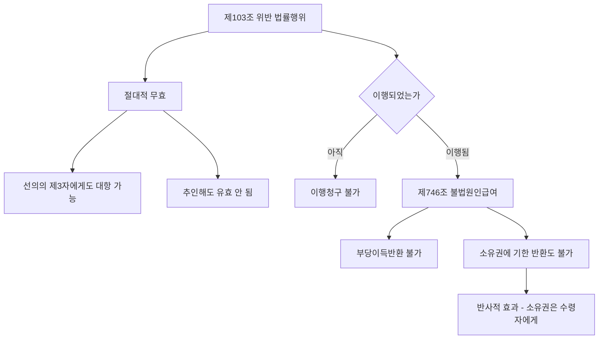

#### 4. 관련 조문

> 📌 **민법 제103조(반사회질서의 법률행위)** — 선량한 풍속 기타 사회질서에 위반한 사항을 내용으로 하는 법률행위는 무효로 한다.

> 📌 **민법 제746조(불법원인급여)** — 불법의 원인으로 인하여 재산을 급여하거나 노무를 제공한 때에는 그 이익의 반환을 청구하지 못한다. 그러나 그 불법원인이 ==수익자에게만 있는 때==에는 그러하지 아니하다.

> 📌 **민법 제151조 제1항(불법조건)** — 조건이 선량한 풍속 기타 사회질서에 위반한 것인 때에는 ==그 법률행위는 무효로 한다.== → 불법조건이 붙으면 조건만 무효가 아니라 ==법률행위 전부가 무효==다.

#### 5. 핵심 판례 법리

- **동기의 불법** — 제103조에 의하여 무효로 되는 반사회질서 행위는 ==표시되거나 상대방에게 알려진 법률행위의 동기가 반사회질서적인 경우==를 포함한다(대판 1984.12.11. 84다카1402).
- **판단 기준시** — 어느 법률행위가 사회질서에 반하는지는 원칙적으로 ==법률행위 당시==를 기준으로 판단한다. 계약체결 당시 정당한 대가를 지급하고 매수하였다면 그 후 목적물이 범죄행위로 취득된 것임을 알게 되었어도 반사회질서라고 단정할 수 없다(대판 2001.11.9. 2001다44987).
- **형사사건 성공보수** — 형사사건에 관한 성공보수약정은 수사·재판의 결과를 금전적 대가와 결부시켜 변호사 직무의 공공성을 저해하므로 ==선량한 풍속 기타 사회질서에 위배==된다. 다만 판결 선고 이전에 체결된 종래의 약정까지 소급하여 무효로 보기는 어렵고, ==판결 이후 체결된 것은 제103조에 의해 무효==다(대판 2015.7.23. 2015다200111 전합).
- **부동산 이중매매** — 제2매수인이 이중매매 사실을 ==아는 것만으로는 부족==하고, ==매도인의 배임행위에 적극 가담==하여야 반사회질서가 된다(대판 1994.3.11. 93다55289). 저당권 설정의 경우도 같다(대판 1998.2.10. 97다26524).
- **이중매매의 절대적 무효** — 이중매매가 반사회질서로 무효인 경우 ==제2매수인으로부터 다시 취득한 제3자는 선의라도 유효를 주장할 수 없다.== 다만 제1매수인은 매도인을 대위할 수 있을 뿐 ==제2매수인에게 직접 말소를 청구할 수는 없다.==
- **도박채무** — 도박·마약대금 채무의 변제로 토지를 양도하는 계약은 ==무효==다(대판 1973.5.22. 72다2249). 그러나 도박채무 변제를 위해 도박채권자에게 부동산 처분대리권을 수여한 부분까지 무효는 아니므로, ==사정을 모르는 제3자가 그 대리인을 통해 매수한 행위는 유효==하다(대판 1995.7.14. 94다40147).
- **보험** — 처음부터 오로지 보험사고를 가장하여 보험금을 취득할 목적으로 체결한 생명보험계약은 ==무효==다(대판 2002.2.11. 99다49064).
- **증언 대가** — 증인이 증언의 대가로 통상적으로 용인될 수 있는 수준을 넘어서는 급부를 받기로 한 약정은 ==증언거부권 유무와 상관없이 무효==다(대판 2010.7.29. 2009다56283; 대판 1999.4.13. 98다52483). 허위진술의 대가라면 급부의 상당성을 따질 필요도 없이 무효다(대판 2001.4.24. 2000다71999).
- **조세 관련** — 양도소득세를 회피할 목적으로 실제 거래가액보다 낮은 금액을 매매대금으로 기재하였다는 사정만으로 매매계약이 무효가 되지는 않는다(대판 2007.6.14. 2007다3285). 양도세 회피 목적의 ==명의신탁==도 그 이유만으로 무효는 아니다(대판 1991.9.13. 91다16334, 16341).
- **강제집행 면탈** — 강제집행을 면할 목적으로 부동산에 허위의 근저당권을 설정하는 행위는 특별한 사정이 없는 한 ==반사회적 법률행위가 아니다==(대판 2004.5.28. 2003다70041). ==통정허위표시(제108조)의 문제==일 뿐이다.
- **비자금** — 반사회적 행위로 조성된 비자금을 소극적으로 은닉하기 위하여 임치한 것은 ==사회질서 위반도 아니고 불법원인급여도 아니다==(대판 2001.4.10. 2000다49343).
- **첩관계** — 첩계약은 ==처의 동의 유무를 불문하고 무효==다(대판 1967.10.6. 67다1134). 그러나 부첩관계를 청산하면서 그동안의 희생을 배상하고 장래 생활대책을 마련해 준다는 뜻의 금원 지급약정은 ==공서양속에 반하지 않는 유효한 약정==이다(대판 1980.6.24. 80다458).
- **불법원인급여의 반사적 효과** — 급여자는 원인행위가 무효라며 부당이득반환을 청구할 수 없음은 물론, ==소유권에 기한 반환청구도 할 수 없고==, 그 반사적 효과로 급부한 물건의 소유권은 ==수령자에게 귀속==한다(대판[전합] 1979.11.13. 79다483).
- **절대적 무효** — 반사회질서 법률행위의 무효는 ==당사자는 물론 선의의 제3자에게도 대항==할 수 있다(대판 1996.10.25. 96다29151).

#### 6. 한눈에 보는 정리표

| 논점 | 결론 |
|---|---|
| 판단 기준시 | 법률행위 당시 |
| 무효의 성질 | 절대적 무효(선의의 제3자에게도 대항) |
| 추인 | 불가 |
| 이행 후 | 불법원인급여(제746조) — 반환청구 불가 |
| 동기의 불법 | 표시되거나 알려진 때 무효 |
| 성립과정의 강박 | 제103조 아님(제110조 문제) |

| 제103조와 인접 제도 | 무효의 성질 | 제3자 보호 |
|---|---|---|
| 제103조·제104조 | 절대적 무효 | 없음 |
| 제107조·제108조 | 상대적 무효 | 선의의 제3자 보호 |
| 제109조·제110조 | 취소 | 선의의 제3자 보호 |

#### ⭐ 기출 출제포인트

1. **"반사회질서의 법률행위로서 무효가 아닌 것은?"** — ==강제집행 면탈 목적 허위 근저당권==, ==다운계약서==, ==민사사건 성공보수==가 정답 3대장.
2. **"반사회적 법률행위임을 이유로 하는 무효는 선의의 제3자에게 대항할 수 있다"** — O.
3. **대리인이 배임행위에 적극 가담한 이중매매에서 본인이 몰랐다면?** — ==제116조에 따라 대리인 기준==이므로 여전히 무효.
4. **불법원인급여** — 도박채무 담보 저당권설정등기의 말소청구 가부(불가).
5. **판단 기준시** — 법률행위 당시(효력발생시가 아니다).

#### 📊 기출 분석

| 연도 | 출제 형태 | 핵심 논점 |
|---|---|---|
| 2018년 제29회 | 법률행위의 무효 5지 | 반사회 등기명의자의 물권적 청구권에 대해 ==상대방은 무효를 항변으로 주장할 수 있다== |
| 2020년 제31회 | 법률행위의 효력 박스형 | 양도세 면탈 목적 등기유보 특약=반사회 아님 / 경매=제104조 적용 X / ==도박자금 저당권설정자는 말소청구 불가== |
| 2021년 제32회 | "반사회적 법률행위에 관한 설명으로 옳지 않은 것은?" | ==대리인이 적극 가담한 이중매매는 본인이 몰라도 무효(정답 지문)== |
| 2022년 제33회 | "반사회질서의 법률행위로서 무효가 아닌 것은?" | ==양도세 면탈 목적 등기유보 특약(정답)== |
| 2023년 제34회 | "반사회적 법률행위로서 무효가 아닌 것은?" | ==민사소송 승소대가 성공보수(정답)== |

**출제 빈도** — ==단원 최다 빈출 5걸.== 2018·2020·2021·2022·2023년 모두 출제되었다.
**반복되는 함정 선지** — ①"강제집행을 면할 목적의 허위 근저당권 설정은 반사회적이다"(→아니다), ②"반사회 무효는 선의의 제3자에게 대항할 수 없다"(→대항할 수 있다), ③"대리인이 적극 가담해도 본인이 몰랐으면 유효"(→무효).
**최근 경향** — **성공보수 판결(2015다200111 전합)** 이후 형사/민사 구별이 고정 출제되었다.

#### 🔍 기출 선지로 배우는 법리

> 실제 출제된 선지를 그대로 놓고 O/X와 근거를 확인한다.

**①** 어느 법률행위가 사회질서에 반하는지 여부는 특별한 사정이 없는 한 법률행위 당시를 기준으로 판단해야 한다. — **O**
근거: 대판 2001.11.9. 2001다44987. (2021년 제32회)

**②** 강제집행을 면할 목적으로 부동산에 허위의 근저당권을 설정하는 행위는 특별한 사정이 없는 한 반사회적 법률행위라고 볼 수 없다. — **O**
근거: 대판 2004.5.28. 2003다70041. ==통정허위표시의 문제==다. (2021년 제32회)

**③** 대리인이 매도인의 배임행위에 적극 가담하여 이루어진 부동산 이중매매의 경우, 본인인 매수인이 그러한 사정을 몰랐다면 반사회적 법률행위가 되지 않는다. — **X**
어디가 틀렸나: 대리행위의 하자는 ==대리인을 기준==으로 판단하므로(제116조 제1항), 본인이 몰랐어도 ==무효==다. (2021년 제32회, 정답 지문)

**④** 반사회적 법률행위임을 이유로 하는 무효는 선의의 제3자에게 대항할 수 있다. — **O**
근거: 절대적 무효다(대판 1996.10.25. 96다29151). (2021년 제32회)

**⑤** 주택매매계약에서 양도소득세를 면탈할 목적으로 소유권이전등기를 일정기간 후에 이전받기로 한 특약은 반사회질서의 법률행위이다. — **X**
옳게 고치면: ==무효가 아니다.== (2022년 제33회, 정답 지문)

**⑥** 부첩관계의 종료를 해제조건으로 하는 증여계약은 해제조건뿐만 아니라 증여계약도 무효이다. — **O**
근거: 불법조건이 붙으면 ==법률행위 전부가 무효==다(제151조 제1항). (2023년 제34회)

**⑦** 변호사가 민사소송의 승소대가로 성공보수를 받기로 한 약정은 반사회적 법률행위이다. — **X**
어디가 틀렸나: ==형사사건==의 성공보수만 무효다(대판 2015.7.23. 2015다200111 전합). (2023년 제34회, 정답 지문)

**⑧** 도박에 쓸 것을 알면서 빌려준 금전을 담보하기 위하여 저당권을 설정한 사람은 저당권설정등기의 말소를 청구할 수 있다. — **X**
어디가 틀렸나: ==불법원인급여(제746조)== 에 해당하여 말소를 청구할 수 없다. (2020년 제31회)

#### ✏️ 사례형 적용

> **사례 1** — 甲은 자기 소유 X토지를 乙에게 매도하고 계약금·중도금을 받았다. 그 사정을 안 丙이 甲에게 "乙과의 계약을 깨고 나에게 팔라"고 적극 권유하여 甲은 丙에게 X를 이중으로 매도하고 이전등기를 마쳤다. 丙은 다시 선의의 丁에게 매도하여 등기를 넘겨주었다.

**검토** —
① 丙이 단순히 이중매매 사실을 안 것만으로는 부족하나, ==적극 권유(적극 가담)== 하였으므로 甲·丙 매매는 ==제103조 위반으로 무효==다(대판 1994.3.11. 93다55289).
② 그 무효는 ==절대적==이므로 ==선의의 丁도 소유권을 취득하지 못한다==(대판 1996.10.25. 96다29151).
③ 乙은 丙에게 **직접** 말소를 청구할 수는 없고, ==甲을 대위하여== 丙 명의 등기의 말소를 구해야 한다.
**결론** — 적극 가담 → 절대적 무효 → 제3자 보호 없음 → 채권자대위. 이 4단 흐름이 이중매매 문제의 정답 구조다.

> **사례 2** — 甲은 도박으로 乙에게 1억 원의 채무를 부담하고, 그 변제를 위해 자기 소유 Y토지에 乙 명의로 저당권을 설정해 주었다. 甲이 저당권설정등기의 말소를 구할 수 있는가?

**검토** — 도박채무 부담행위와 그 변제약정은 제103조 위반으로 무효다(대판 1973.5.22. 72다2249). 그러나 이미 급부가 이행되었으므로 ==제746조 불법원인급여==에 해당하여, 甲은 부당이득반환은 물론 ==소유권에 기한 말소청구도 할 수 없다==(대판[전합] 1979.11.13. 79다483).
**결론** — 말소청구 ==불가.== 다만 甲이 도박채권자 乙에게 부동산 **처분대리권**을 수여했고 사정을 모르는 제3자가 그 대리인을 통해 매수했다면 ==그 매수행위는 유효==다(대판 1995.7.14. 94다40147).

#### ⚠️ 이 관의 함정 총정리

1. "반사회질서 무효는 선의의 제3자에게 대항할 수 없다"고 하면 틀림 → ==대항할 수 있다(절대적 무효).==
2. "강제집행 면탈 목적 허위 근저당권 설정은 제103조 위반이다"라고 하면 틀림 → ==제108조 통정허위표시의 문제==다.
3. "이중매매 사실을 알고 매수하면 반사회적이다"라고 하면 틀림 → ==적극 가담==이 필요하다.
4. "제1매수인은 제2매수인에게 직접 말소를 청구할 수 있다"고 하면 틀림 → ==매도인을 대위==해야 한다.
5. "사회질서 위반 여부는 법률행위의 효력발생시를 기준으로 판단한다"고 하면 틀림 → ==법률행위 당시==다.

#### ✅ OX 확인문제

> 다음 진술의 참·거짓을 판단하시오.

**1.** 반사회질서 법률행위의 무효는 선의의 제3자에게도 대항할 수 있다.
→ **O**. 절대적 무효다(대판 1996.10.25. 96다29151).

**2.** 상대방에게 표시된 동기가 반사회질서적인 법률행위는 무효이다.
→ **O**. 표시설(대판 1984.12.11. 84다카1402).

**3.** 강제집행을 면할 목적으로 허위의 근저당권을 설정하는 행위는 제103조 위반으로 무효이다.
→ **X**. 반사회적 법률행위가 아니다(대판 2004.5.28. 2003다70041).

**4.** 형사사건에 관한 변호사 성공보수 약정은 사회질서에 위배된다.
→ **O**. 대판 2015.7.23. 2015다200111 전합.

**5.** 민사사건의 적정한 수준의 성공보수 약정도 무효이다.
→ **X**. 형사사건에 한한다.

**6.** 부첩관계를 청산하면서 생활대책 마련의 의미로 금원을 지급하기로 한 약정은 무효이다.
→ **X**. 유효한 약정이다(대판 1980.6.24. 80다458).

**7.** 제2매수인이 이중매매 사실을 알았다는 사정만으로 제2매매가 반사회적 법률행위가 된다.
→ **X**. 매도인의 배임행위에 적극 가담해야 한다.

**8.** 도박채무의 변제를 위해 설정해 준 저당권설정등기의 말소를 청구할 수 있다.
→ **X**. 불법원인급여로 말소청구가 봉쇄된다(제746조).

**9.** 반사회적 행위로 조성된 비자금을 소극적으로 은닉하기 위해 임치한 것은 사회질서에 반한다.
→ **X**. 반하지 않고 불법원인급여도 아니다(대판 2001.4.10. 2000다49343).

**10.** 반사회질서의 법률행위는 당사자가 무효임을 알고 추인하여도 유효로 되지 않는다.
→ **O**. 절대적 무효이므로 추인의 여지가 없다.

#### 🧠 암기법

> 🔑 **무효 아닌 3대장 = "강·다·민"**
> **강**제집행 면탈 허위 근저당 · **다**운계약서(양도세 회피) · **민**사사건 성공보수. "반사회가 아닌 것"을 고르라면 이 셋 중 하나가 정답이다.

> 🔑 **이중매매 4단 = "적·절·대·위"**
> **적**극 가담 → **절**대적 무효 → 제3자 보호 없음(대항 가능) → 제1매수인은 채권자**대위**.

> 🔑 **"첩은 무효, 청산은 유효"**
> 첩계약(처의 동의 불문) = 무효. 첩관계 **청산**을 위한 위자료·양육비·생활대책 = 유효.

> 🔑 **"내용은 103, 과정은 110"**
> 반사회성은 법률행위의 **내용**에 있어야 한다. 강박이라는 불법적 **과정**만 있었다면 제110조 취소 문제일 뿐이다.

---

### 제5관 불공정한 법률행위

> 📖 제104조는 제103조의 ==특칙(예시)== 이다. 급부의 현저한 불균형이라는 **객관적 요건**과 궁박·경솔·무경험의 이용이라는 **주관적 요건**이 결합할 때 성립한다. 감정평가사 시험은 이 관에서 ==증명책임·대리인 기준·경매 배제·전환 가부== 네 논점을 반복 출제한다.

> ⭐ **이 관에서 반드시 챙길 3가지**
> ① 궁박·경솔·무경험은 ==셋 다 필요 없고 하나만== 있으면 된다. 그러나 ==모두 무효 주장자가 증명==해야 한다.
> ② 대리행위에서 **경솔·무경험은 대리인 기준**, **궁박은 본인 기준**.
> ③ 무효이나 ==추인은 불가==, 그럼에도 ==제138조 무효행위의 전환은 가능==하다.

#### 1. 의의

**불공정한 법률행위(폭리행위)** 란 당사자의 궁박·경솔 또는 무경험으로 인하여 ==현저하게 공정을 잃은== 법률행위를 말하며 무효다(제104조).

| 용어 | 판례가 밝힌 의미 |
|---|---|
| **궁박**(窮迫) | ==경제적 원인뿐 아니라 정신적·심리적 원인==에 기인할 수도 있다 |
| **경솔**(輕率) | 의사결정 시 통상 요구되는 주의를 결여한 상태 |
| **무경험**(無經驗) | ==어느 특정 영역의 경험부족이 아니라 거래일반에 대한 경험부족==(일반적인 생활체험의 부족) |

#### 2. 요건

| 구분 | 요건 | 판례 |
|---|---|---|
| **객관적 요건** | 급부와 반대급부 사이의 ==현저한 불균형== | 불균형은 ==거래상의 객관적 가치==에 의하여 판단하며, 궁박·경솔·무경험의 정도도 아울러 고려된다(대판 2010.7.15. 2009다50308) |
| **주관적 요건 ①** | 피해자가 궁박·경솔·무경험 상태에 있을 것 | ==셋 중 하나만== 갖추어도 충분하다(대판 1998.3.13. 97다51506; 대판 2002.10.22. 2002다38927) |
| **주관적 요건 ②** | 폭리자가 그 사정을 ==알면서 이용하려는 의사==가 있을 것 | 이용의사가 없으면 성립하지 않는다(대판 1993.10.12. 93다19924) |
| **판단 기준시** | ==법률행위 시== | 약속된 급부와 반대급부의 객관적 가치를 그 시점에서 비교 |
| **증명책임** | ==무효를 주장하는 자(피해자)== 가 객관적·주관적 요건 모두를 증명 | 현저하게 공정을 잃었다고 하여 곧 궁박·경솔로 이루어진 것으로 ==추정되지 않는다==(대판 1993.10.12. 93다19924; 대판 1969.7.8. 69다594) |

> ⚠️ **대리행위의 기준** — 대리인에 의해 법률행위가 이루어진 경우, ==경솔·무경험은 대리인을 기준==으로, ==궁박은 본인의 입장에서== 판단한다(대판 2002.10.22. 2002다38927).

#### 3. 효과 — 적용범위와 무효의 성질

| 논점 | 결론 |
|---|---|
| **무상행위** | ==적용 없음.== 증여·기부행위와 같이 대가관계 없이 일방적 급부만 있는 행위는 불균형의 문제가 생기지 않는다(대판 2002.2.11. 99다56833; 대판 1993.3.23. 92다52238; 대판 1993.7.16. 92다41528) |
| **단독행위** | ==적용 있음.== 채권포기행위에도 제104조가 적용된다(대판 1975.5.13. 75다92) |
| **경매** | ==적용 없음.== 경매에는 제104조·제608조가 적용될 여지가 없다(대판 1980.3.21. 80마77) |
| **총유물 처분 결의** | 어촌계 총회의 손실보상금 분배 결의가 현저하게 불공정하면 ==그 결의는 무효==(대판 2003.6.27. 2002다68034) |
| **무효의 성질** | ==절대적 무효.== 선의의 제3자에게도 무효를 대항할 수 있다(대판 1996.10.25. 96다29151) |
| **추인** | ==불가.== 추인에 의하여 유효로 될 수 없다(대판 1994.6.24. 94다10900). 법정추인도 인정되지 않는다 |
| **무효행위의 전환** | ==가능.== 매매대금 과다로 제104조 무효인 경우에도 제138조가 적용되어, 당사자 쌍방이 무효를 알았더라면 다른 액으로 합의하였으리라 예외적으로 인정되면 ==그 대금액을 내용으로 하는 매매계약이 유효하게 성립==할 수 있다(대판 2011.4.28. 2010다106702) |
| **부제소합의** | 불공정성을 사법적 구제수단으로 주장하지 못하게 하는 부제소합의 역시 ==무효==(대판 2011.4.28. 2010다106702) |
| **불법원인급여와의 관계** | 불법이 ==가해자(폭리자)에게만== 있으므로, 피해자는 제746조 단서에 따라 ==급부의 반환을 청구할 수 있다== |

> 💡 **"추인은 안 되는데 전환은 된다"** — 언뜻 모순 같지만 다르다. **추인**은 무효인 그 행위를 그대로 살리는 것이고, **전환**은 무효인 행위를 ==다른 내용의 유효한 행위로 바꾸어== 살리는 것이다. 제104조의 취지(폭리 억제)는 후자를 막지 않는다.

#### 4. 관련 조문

> 📌 **민법 제104조(불공정한 법률행위)** — 당사자의 궁박, 경솔 또는 무경험으로 인하여 현저하게 공정을 잃은 법률행위는 무효로 한다.

> 📌 **민법 제138조(무효행위의 전환)** — 무효인 법률행위가 다른 법률행위의 요건을 구비하고 당사자가 그 무효를 알았더라면 다른 법률행위를 하는 것을 의욕하였으리라고 인정될 때에는 ==다른 법률행위로서 효력을 가진다.==

> 📌 **민법 제746조 단서(불법원인급여)** — 그러나 그 불법원인이 수익자에게만 있는 때에는 그러하지 아니하다. → 폭리행위의 ==피해자는 반환청구가 가능==한 근거다.

#### 5. 핵심 판례 법리

- **요건의 일부만으로 족함** — 궁박·경솔·무경험은 모두 구비되어야 하는 요건이 아니라 ==그 중 일부만 갖추어져도 충분==하다(대판 2002.10.22. 2002다38927; 대판 1998.3.13. 97다51506).
- **이용의사 필요** — 불공정한 법률행위가 성립하려면 당사자 일방이 궁박·경솔 또는 무경험 상태에 있고, ==상대방이 이러한 사정을 알고서 이를 이용하려는 의사==가 있어야 한다(대판 1993.10.12. 93다19924).
- **추정 부정·증명책임** — 법률행위가 현저하게 공정을 잃었다고 하여 곧 궁박·경솔하게 이루어진 것으로 ==추정되지 않으므로==, 주장하는 측에서 이를 증명하여야 한다(대판 1993.10.12. 93다19924; 대판 1969.7.8. 69다594).
- **대리인 기준** — 경솔과 무경험은 ==대리인==을 기준으로, 궁박은 ==본인==의 입장에서 판단한다(대판 2002.10.22. 2002다38927).
- **무상행위 배제** — 증여와 같이 대가적 의미의 재산상 출연 없이 일방의 급부만 있는 경우에는 ==급부와 반대급부 사이의 불균형 문제가 발생하지 않는다==(대판 1993.7.16. 92다41528; 대판 2002.2.11. 99다56833). 기부행위도 같다(대판 1993.3.23. 92다52238).
- **단독행위 적용** — 사회적 경험이 부족한 가정부인이 궁박 상태에서 구속된 남편을 구제하려고 남편을 대리하여 회사에 대한 물품잔대금 ==채권을 포기한 행위==는 불공정한 법률행위에 해당한다(대판 1975.5.13. 75다92).
- **경매 배제** — 경매에 있어서는 ==제104조·제608조가 적용될 여지가 없다==(대판 1980.3.21. 80마77). 매각대금이 시가보다 현저히 저렴해도 경매가 무효로 되지 않는다.
- **불균형의 판단** — 급부와 반대급부 사이의 현저한 불균형은 ==거래상의 객관적 가치==에 의해 판단한다(대판 2010.7.15. 2009다50308). 일방에게 큰 이익이 발생할 수 있는 구조라는 사정만으로 당연히 불공정한 계약이 되지는 않는다(대판 2013.9.26. 2011다53683).
- **추인 불가** — 불공정한 법률행위로서 무효인 경우에는 ==추인에 의하여 유효로 될 수 없다==(대판 1994.6.24. 94다10900).
- **전환 가능** — 매매대금의 과다로 제104조 무효인 경우에도 ==제138조가 적용==되어 다른 대금액을 내용으로 하는 매매계약이 유효하게 성립할 수 있다(대판 2011.4.28. 2010다106702).
- **부제소합의 무효** — 불공정성을 소송으로 다투지 못하게 하는 부제소합의도 ==무효==다(대판 2011.4.28. 2010다106702).
- **총유물 처분 결의** — 어업권 소멸로 인한 손실보상금 분배에 관한 어촌계 총회 결의가 손실의 정도에 비추어 현저하게 불공정하면 ==그 결의는 무효==다(대판 2003.6.27. 2002다68034).

#### 6. 한눈에 보는 정리표

| 논점 | 결론 |
|---|---|
| 요건의 수 | 궁박·경솔·무경험 중 하나만 |
| 증명책임 | 객관·주관 요건 모두 피해자 |
| 대리행위 | 궁박=본인 / 경솔·무경험=대리인 |
| 판단 기준시 | 법률행위 시 |
| 적용 배제 | 경매, 무상행위(증여·기부) |
| 적용 인정 | 단독행위(채권포기) |
| 추인 / 전환 | 추인 X / 제138조 전환 O |

#### ⭐ 기출 출제포인트

1. **"궁박·경솔·무경험을 모두 갖추어야 한다"** 형 함정 — ==하나만== 있으면 된다.
2. **"현저한 불균형이 있으면 궁박 등이 추정된다"** 형 함정 — ==추정되지 않는다.==
3. **대리인 기준 뒤집기** — "궁박은 대리인 기준"이라고 하면 틀림.
4. **경매에 제104조 적용 여부** — ==적용 없음.==
5. **제138조 전환 가부** — ==적용될 수 있다.== "적용될 수 없다"가 반복 오답.

#### 📊 기출 분석

| 연도 | 출제 형태 | 핵심 논점 |
|---|---|---|
| 2018년 제29회 | "불공정한 법률행위에 관한 설명으로 옳지 않은 것은?" | ==매매대금 과다로 무효인 경우 제138조가 적용될 수 없다 = 틀림(정답)== |
| 2020년 제31회 | "불공정한 법률행위에 관한 설명으로 옳은 것은?" | 전환 인정 / 추인 불가 / ==행위 시 기준(정답)== / 무상행위 배제 |
| 2022년 제33회 | "불공정한 법률행위에 관한 설명으로 옳지 않은 것은?" | ==경매절차의 저렴한 매각대금은 불공정 무효 아님(정답)== |
| 2024년 제35회 | "불공정한 법률행위에 관한 설명으로 옳지 않은 것은?" | ==추인 불가이나 법정추인은 인정된다 = 틀림(정답)== / 경매 적용 배제 / 선의의 제3자에게도 무효 |

**출제 빈도** — ==2018·2020·2022·2024년 단독 출제.== 사실상 격년 확정 출제 논점이다.
**반복되는 함정 선지** — ①"경매에도 제104조가 적용된다"(→적용 X), ②"제138조 전환이 적용될 수 없다"(→적용 O), ③"법정추인은 인정된다"(→인정 X), ④"불균형이 있으면 궁박 등이 추정된다"(→추정 X).
**최근 경향** — **전환은 되고 추인은 안 된다**는 미세한 구별을 정확히 아는지가 당락을 가른다.

#### 🔍 기출 선지로 배우는 법리

> 실제 출제된 선지를 그대로 놓고 O/X와 근거를 확인한다.

**①** 성립요건인 궁박, 경솔, 무경험은 그 중 하나만 갖추어도 충분하다. — **O**
근거: 대판 2002.10.22. 2002다38927. (2018년 제29회)

**②** 궁박은 경제적 원인 외에 정신적 또는 심리적 원인에 기인할 수도 있다. — **O**
근거: 판례가 명시한다. (2018년 제29회)

**③** 대리인에 의하여 행해진 법률행위에서 불공정한 법률행위가 문제되는 경우, 경솔이나 무경험은 대리인을 기준으로 판단한다. — **O**
근거: 궁박은 본인 기준, 경솔·무경험은 대리인 기준(대판 2002.10.22. 2002다38927). (2018년 제29회)

**④** 매매계약이 약정된 매매대금의 과다로 인하여 불공정한 법률행위에 해당하는 경우, 무효행위의 전환에 관한 민법 제138조가 적용될 수 없다. — **X**
어디가 틀렸나: ==적용될 수 있다==(대판 2011.4.28. 2010다106702). (2018년 제29회, 정답 지문)

**⑤** 경매절차에서 매각대금이 시가보다 현저히 저렴한 경우, 그 경매는 불공정한 법률행위로서 무효이다. — **X**
옳게 고치면: 경매에는 ==제104조가 적용되지 않는다==(대판 1980.3.21. 80마77). (2022년 제33회, 정답 지문)

**⑥** 불공정한 법률행위는 추인으로 유효로 될 수 없지만 법정추인은 인정된다. — **X**
어디가 틀렸나: ==법정추인도 인정되지 않는다.== 법정추인은 취소할 수 있는 행위에 관한 제도다. (2024년 제35회, 정답 지문)

**⑦** 불공정한 법률행위는 이를 기초로 새로운 이해관계를 맺은 선의의 제3자에 대해서도 무효이다. — **O**
근거: 절대적 무효다(대판 1996.10.25. 96다29151). (2024년 제35회)

**⑧** 급부와 반대급부 사이의 현저한 불균형은 그 무효를 주장하는 자가 증명해야 한다. — **O**
근거: 객관적·주관적 요건 모두 무효 주장자가 증명한다. (2022년 제33회)

#### ✏️ 사례형 적용

> **사례 1** — 시가 10억 원인 X토지를 소유한 甲은 사업 실패로 극심한 자금난에 몰렸다. 이를 알고 있던 乙은 이를 이용하여 X를 2억 원에 매수하였다. 甲은 대리인 丙(거래 경험이 전무한 조카)을 통해 계약하였다.

**검토** —
① **객관적 요건**: 시가 10억 대 대금 2억은 ==거래상 객관적 가치==에 비추어 현저한 불균형이다(대판 2010.7.15. 2009다50308).
② **주관적 요건**: ==궁박은 본인 甲을 기준==으로, ==경솔·무경험은 대리인 丙을 기준==으로 판단한다(대판 2002.10.22. 2002다38927). 乙의 ==이용의사==도 인정된다.
③ **효과**: 매매계약은 ==무효==다. 甲은 이미 이전한 등기의 말소를 구할 수 있고, 불법이 ==乙에게만== 있으므로 제746조 단서에 따라 반환청구가 가능하다.
④ 다만 쌍방이 무효를 알았더라면 8억 원에 합의하였으리라 예외적으로 인정되면, ==제138조에 따라 8억 원 매매로 전환==될 수 있다.
**결론** — 무효 → 반환청구 가능 → 그러나 전환의 여지 있음.

> **사례 2** — 甲의 X부동산이 강제경매절차에서 시가의 30%에 매각되었다. 甲은 제104조를 이유로 매각의 무효를 주장한다.

**검토** — ==경매에는 제104조가 적용될 여지가 없다==(대판 1980.3.21. 80마77). 경매는 국가기관이 행하는 절차로서 당사자의 궁박·경솔을 이용한 폭리행위 구조가 아니기 때문이다.
**결론** — 甲의 주장은 ==받아들여지지 않는다.==

#### ⚠️ 이 관의 함정 총정리

1. "궁박·경솔·무경험을 모두 갖추어야 한다"고 하면 틀림 → ==하나만== 있으면 된다.
2. "현저히 공정을 잃으면 궁박 등이 추정된다"고 하면 틀림 → ==추정되지 않는다.==
3. "궁박은 대리인을 기준으로 판단한다"고 하면 틀림 → ==본인 기준==이다.
4. "증여에도 제104조가 적용된다"고 하면 틀림 → ==무상행위에는 적용 없다.==
5. "제138조 전환은 적용될 수 없다"고 하면 틀림 → ==적용될 수 있다.== 반대로 "추인으로 유효로 된다"고 하면 틀림.

#### ✅ OX 확인문제

> 다음 진술의 참·거짓을 판단하시오.

**1.** 궁박·경솔·무경험은 그중 하나만 갖추어도 제104조가 적용될 수 있다.
→ **O**. 대판 2002.10.22. 2002다38927.

**2.** 급부와 반대급부의 현저한 불균형이 있으면 궁박·경솔·무경험이 추정된다.
→ **X**. 추정되지 않으며 주장자가 증명해야 한다.

**3.** 대리행위에서 궁박 여부는 본인을 기준으로 판단한다.
→ **O**. 경솔·무경험은 대리인 기준이다.

**4.** 무경험은 어느 특정 영역에서의 경험부족을 의미한다.
→ **X**. 거래일반에 대한 경험부족을 말한다.

**5.** 부담 없는 증여계약에도 불공정한 법률행위가 성립할 수 있다.
→ **X**. 무상행위에는 적용되지 않는다.

**6.** 채권포기와 같은 단독행위에도 제104조가 적용될 수 있다.
→ **O**. 대판 1975.5.13. 75다92.

**7.** 경매에서 매각대금이 시가보다 현저히 저렴하면 그 경매는 무효이다.
→ **X**. 경매에는 제104조가 적용되지 않는다(대판 1980.3.21. 80마77).

**8.** 불공정한 법률행위로 무효인 경우 추인에 의하여 유효로 될 수 없다.
→ **O**. 대판 1994.6.24. 94다10900.

**9.** 매매대금 과다로 제104조 무효인 경우 무효행위의 전환이 인정될 수 있다.
→ **O**. 대판 2011.4.28. 2010다106702.

**10.** 불공정한 법률행위임을 이유로 한 부제소합의는 유효하다.
→ **X**. 부제소합의 역시 무효다(대판 2011.4.28. 2010다106702).

#### 🧠 암기법

> 🔑 **"하나면 되지만, 증명은 다 해야"**
> 궁박·경솔·무경험은 **하나만** 있으면 성립. 그러나 객관적·주관적 요건은 **전부 피해자가 증명**. "하나 vs 전부"의 대비로 외운다.

> 🔑 **"궁은 본인, 경·무는 대리인"**
> **궁**박 = 본인 / **경**솔·**무**경험 = 대리인. 궁박은 처지의 문제라 본인, 경솔·무경험은 판단의 문제라 대리인.

> 🔑 **"경매·증여는 빠지고, 단독행위는 들어온다"**
> 적용 배제 = 경매·무상행위(증여·기부). 적용 인정 = 단독행위(채권포기).

> 🔑 **"추인 X, 전환 O, 부제소 X"**
> 세 결론을 한 줄로. 추인은 안 되고, 전환은 되고, 부제소합의는 무효.

---

### 제6관 법률행위의 해석

> 📖 법률행위의 내용이 다투어질 때 그 의미를 확정하는 작업이다. 해석은 ==법원의 권한==이며, 자연적·규범적·보충적 해석의 세 방법과 그 적용 순서가 핵심이다. **오표시무해의 원칙**과 **계약당사자의 확정**은 이 관의 두 축이자 최다 출제 지점이다.

> ⭐ **이 관에서 반드시 챙길 3가지**
> ① 오표시무해(誤表示無害) — 쌍방이 X를 의도했다면 계약서에 Y라 써도 ==X에 계약 성립==, ==착오취소 문제는 생기지 않는다.==
> ② 계약당사자의 확정은 ==의사해석의 문제==. 의사 일치하면 그대로, 불일치하면 ==상대방의 관점==에서.
> ③ 해석의 기준 순서 = ==당사자의 목적 → 사실인 관습 → 임의법규 → 조리(신의칙).==

#### 1. 의의

**법률행위의 해석**이란 법원의 해석을 통해 법률행위 내용의 의미를 확정하는 것이다. 법률행위는 의사표시를 불가결의 요소로 하므로 결국 ==의사표시의 해석==으로 귀결된다.

> ⚠️ **해석의 주체는 법원이다** — 매매계약서에 "계약 사항에 대한 이의가 생겼을 때에는 매도인의 해석에 따른다"는 조항이 있더라도 ==법원의 법률행위 해석권을 구속하는 조항이라고 볼 수 없다==(대판 1974.9.24. 74다1057).

#### 2. 요건 — 해석의 세 가지 방법

| 방법 | 의의 | 대표 법리 |
|---|---|---|
| **자연적 해석** | 표현된 문자·언어의 의미에 구속되지 않고 ==표의자의 실제 의사==를 밝히는 방법 | **오표시무해의 원칙** — 잘못된 표시는 표의자에게 해가 되지 않는다 |
| **규범적 해석** | 당사자의 내심의 의사와 관계없이 ==표시행위에 부여한 객관적 의미==를 합리적으로 확정 | 대판 1996.10.25. 96다16049 |
| **보충적 해석** | 법률행위 내용의 ==일부에 틈(흠결)== 이 있을 때 이를 메우는 방법 | 대판 2023.8.18. 2019다200126 |

**해석의 기준**(제106조의 취지) — ==당사자가 의도하는 목적 → 사실인 관습 → 임의법규 → 조리(신의성실의 원칙)== 순으로 적용한다.

> 💡 **사실인 관습 vs 관습법** — ==사실인 관습==은 법령으로서의 효력이 없는 단순한 관행으로서 ==법률행위 당사자의 의사를 보충함에 그친다.== 관습법은 법령에 저촉되지 않는 한 법칙으로서의 효력이 있다. 다만 사실인 관습도 ==당사자의 주장에 구애되지 않고 법원이 직권으로 판단==할 수 있다. 그리고 ==당사자의 의사가 명확하면 그 의사가 사실인 관습에 우선==한다.

#### 3. 효과 — 해석의 순서(판례의 태도)

| 단계 | 판례의 태도 | 근거 판례 |
|---|---|---|
| **1차: 규범적 해석** | 비전형의 혼합계약도 ==표시행위에 부여한 객관적 의미를 있는 그대로 확정== | 대판 2010.10.14. 2009다7313 |
| | 처분문서의 ==문언의 객관적 의미가 명확하면 문언대로== 의사표시의 존재와 내용을 인정 | 대판 2014.6.26. 2014다14115 |
| | 문언의 객관적 의미가 명확하지 않으면 ==내심의 의사 여하에 관계없이== 문언·동기·경위를 종합해 사회일반의 상식과 거래통념에 따라 합리적으로 해석 | 대판 2014.6.26. 2014다14115 |
| **2차: 자연적 해석** | 쌍방 당사자의 ==의사합치가 확인되면== 표시와 달리 그 의사대로 | 대판 1993.10.26. 93다2629, 2636 |
| **예외** | 당사자들이 ==공통적으로 의사표시를 명확히 인식==하고 있다면 문언과 달라도 공통 인식에 따라 해석. 그러나 서로 이해가 다르면 ==객관적·규범적==으로 해석 | 대판 2017.2.15. 2014다19776, 19783 |

**오표시무해의 원칙(falsa demonstratio non nocet)의 결론표**

| 대상 | 계약의 성립 | 착오취소 | 소유권 취득 |
|---|---|---|---|
| **X토지**(쌍방이 진정 의도한 토지) | ==성립 O== | ==문제 안 됨(취소 X)== | 등기가 없으므로 ==취득 X== |
| **Y토지**(계약서에 표시된 토지) | ==성립 X== | ==문제 안 됨(취소 X)== | 등기가 있어도 ==원인무효로 취득 X== |

> ⚠️ Y토지에 마쳐진 매수인 명의 이전등기는 ==원인 없이 경료된 것으로서 무효==다. 부동산에는 ==공신의 원칙이 인정되지 않으므로==, Y토지를 선의로 전득한 제3자도 소유권을 취득하지 못한다(대판 1993.10.26. 93다2629, 2636).

#### 4. 관련 조문

> 📌 **민법 제106조(사실인 관습)** — 법령 중의 선량한 풍속 기타 사회질서에 관계없는 규정과 다른 관습이 있는 경우에 당사자의 의사가 명확하지 아니한 때에는 ==그 관습에 의한다.==

> 📌 **민법 제105조(임의규정)** — 법률행위의 당사자가 법령 중의 선량한 풍속 기타 사회질서에 관계없는 규정과 다른 의사를 표시한 때에는 ==그 의사에 의한다.== → 제105조·제106조가 해석 기준의 순서를 만든다.

> 📌 **민법 제2조 제1항(신의성실)** — 권리의 행사와 의무의 이행은 신의에 좇아 성실히 하여야 한다. → ==보충적 해석의 최종 기준(조리)== 이 된다.

#### 5. 핵심 판례 법리

- **해석권의 귀속** — 매매계약서에 "이의가 생기면 매도인의 해석에 따른다"는 조항이 있어도 ==법원의 해석권을 구속하지 않는다==(대판 1974.9.24. 74다1057).
- **규범적 해석의 정식** — 법률행위의 해석은 당사자가 표시행위에 부여한 객관적인 의미를 명백히 확정하는 것으로서, ==당사자의 내심적 의사와 관계없이 서면의 기재 내용에 의하여 객관적 의미를 합리적으로 해석==하여야 한다(대판 1996.10.25. 96다16049; 대판 1994.3.25. 93다32668).
- **오표시무해** — 쌍방이 X토지를 목적물로 삼았으나 지번의 착오로 계약서에 Y토지로 표시하였다면 ==매매계약은 X토지에 관하여 성립==하고, Y토지에 마쳐진 이전등기는 ==원인 없이 경료된 것으로서 무효==다(대판 1993.10.26. 93다2629, 2636). ==착오취소의 문제는 발생하지 않는다.==
- **계약상 지위의 오기** — 계약서 작성 시 당사자들의 합치된 의사와 달리 착오로 계약상 지위를 잘못 기재하고 이를 인지하지 못한 채 서명한 경우, ==계약서 기재가 아니라 쌍방의 의사합치가 있는 계약상 지위에 관하여 계약이 성립==한 것으로 본다(대판 2018.7.26. 2016다242334).
- **비전형 혼합계약** — 규범적 해석의 법리는 비전형의 혼합계약에도 적용되며, ==표시행위에 부여한 객관적 의미를 있는 그대로 확정==하는 것이 필요하다(대판 2010.10.14. 2009다7313).
- **처분문서** — 문언의 객관적 의미가 명확하면 ==문언대로== 의사표시의 존재와 내용을 인정해야 하지만, 명확하지 않으면 ==내심의 의사 여하에 관계없이== 문언·동기·경위를 종합해 사회일반의 상식과 거래통념에 따라 합리적으로 해석해야 한다(대판 2014.6.26. 2014다14115).
- **여러 계약서의 우열** — 하나의 법률관계를 둘러싸고 다른 내용의 계약서가 순차로 작성되었고 우열관계가 명확하지 않다면, 양립할 수 없는 부분은 원칙적으로 ==나중에 작성된 계약서대로 변경==된 것으로 해석함이 합리적이다(대판 2020.12.30. 2017다17603).
- **"최대한 선처하겠다"** — 회사가 구속자에 대한 형사처벌이 감경되도록 ==노력하겠다는 취지==로 해석되고, 구속자를 ==징계하지 않겠다는 합의로는 볼 수 없다==(대판 1993.5.11. 93다1503).
- **"최대한 노력하겠습니다"** — 그러한 ==법적 의무를 부담하는 것은 아니고==, 사정이 허락하는 한 이행을 사실상 하겠다는 취지로 해석함이 상당하다(대판 1994.3.25. 93다32668).
- **"총완결"** — 영수증에 부기된 "총완결"이 돈을 받기 위해 거짓 기재된 것이라는 이유만으로 ==그 의사표시가 당연무효라고 할 수 없다==(대판 1969.7.8. 69다563).
- **보충적 해석** — 계약당사자 쌍방이 계약의 전제·기초 사항에 관하여 같은 내용으로 착오하여 구체적 약정을 하지 않았다면, ==착오가 없었을 때 약정하였을 내용으로 의사를 보충==하여 해석할 수 있다. 보충되는 의사는 실제·주관적 의사가 아니라 ==객관적으로 추인되는 정당한 이익조정 의사==다(대판 2023.8.18. 2019다200126).
- **계약당사자의 확정** — 타인의 명의를 빌리거나 타인인 것처럼 계약을 체결한 경우 당사자가 누구인지는 ==의사해석의 문제==이며, 의사가 일치하면 그에 따라, 불일치하면 ==상대방의 관점에서 합리적인 사람이라면 누구를 당사자로 이해하였을지==를 기준으로 판단한다(대판 2020.12.10. 2019다267204).
- **대리를 통한 계약** — 상대방이 대리인을 통해 본인과 계약을 체결하려는 데 의사가 일치하였다면 ==대리권 존부와 무관하게 상대방과 본인이 계약당사자==다(대판 2003.12.12. 2003다44059).
- **예금계약** — 예금명의자의 위임으로 출연자 등이 대리인으로서 예금계약을 체결한 경우 ==예금명의자가 계약당사자==이며, ==예금반환청구권은 예금명의자에게 귀속==하고 자금출연자는 배제된다(대판 2009.3.19. 2008다45828 전합).
- **행위자가 당사자가 되는 경우** — 타인 이름으로 법률행위를 하였고 당사자 의사가 불일치할 때, 상대방 입장에서 합리적으로 평가하여 ==행위자 자신이 당사자라고 인정되면 행위자가 당사자==가 되고 효과도 행위자에게 귀속한다(대판 2013.10.11. 2013다52622).

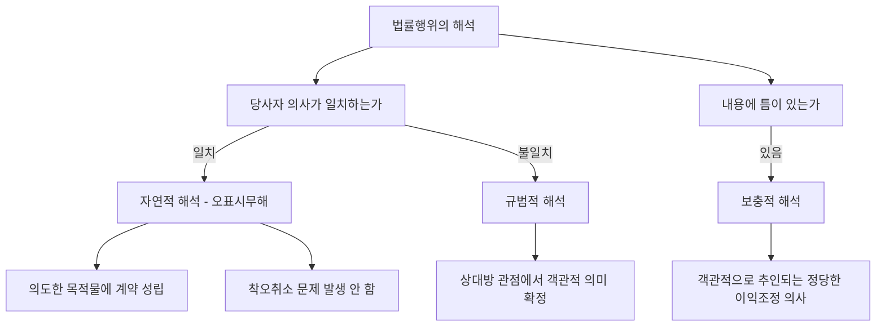

#### 6. 한눈에 보는 정리표

| 해석방법 | 언제 쓰는가 | 대표 결론 |
|---|---|---|
| 자연적 해석 | 당사자 의사가 일치할 때 | 오표시무해 — 의도한 목적물에 성립 |
| 규범적 해석 | 의사가 불일치할 때 | 상대방 관점의 객관적 의미 |
| 보충적 해석 | 내용에 틈이 있을 때 | 객관적으로 추인되는 정당한 이익조정 의사 |

| 계약당사자 확정 | 결론 |
|---|---|
| 대리인을 통한 계약 | 본인과 상대방이 당사자 |
| 예금명의자 위임 + 출연자 대리 | 예금명의자가 당사자 |
| 타인 명의 + 의사 불일치 | 상대방 관점에서 판단(행위자일 수도) |

#### ⭐ 기출 출제포인트

1. **오표시무해 사례** — "계약서에 X토지를 기재했어도 Y토지에 의사합치가 있었다면 Y토지 계약이 성립한다"의 O/X.
2. **착오취소 가부** — 오표시무해가 적용되면 ==착오의 문제는 생기지 않는다.==
3. **제3자 보호** — 잘못 표시된 토지의 등기를 신뢰한 선의의 제3자는 ==공신의 원칙 부정==으로 보호받지 못한다.
4. **해석 기준의 순서** — 목적 → 사실인 관습 → 임의법규 → 조리.
5. **매도인의 해석에 따른다는 조항의 효력** — 법원을 구속하지 못한다.

#### 📊 기출 분석

| 연도 | 출제 형태 | 핵심 논점 |
|---|---|---|
| 2019년 제30회 | "갑은 32만 달러에 팔기로 의욕하였으나 23만 달러로 표시" 사례 | 오표시무해·착오·통정허위표시·불합의의 구별 |
| 2020년 제31회 | 착오 5지 | ==계약서에 X토지를 기재해도 Y토지에 의사합치가 있으면 Y토지 계약 성립(옳은 선지)== |
| 문제집(기본문제 19~21, 실전문제 21~22·25) | 오표시무해·해석 기준 | X토지 계약 성립 / Y토지 등기 무효 / 제3자 보호 X / ==해석기준 = 목적-관습-임의법규-조리== |

**출제 빈도** — 착오(제109조) 문항의 한 선지로 ==거의 매년== 등장한다.
**반복되는 함정 선지** — "계약서에 표시된 토지에 계약이 성립한다"(→쌍방이 의도한 토지에 성립), "표의자는 착오를 이유로 취소할 수 있다"(→취소할 수 없다).
**최근 경향** — 자연적 해석(오표시무해) → 착오취소 배제 → 등기 무효 → 제3자 보호 부정이라는 ==4단 논리를 통째로== 묻는다.

#### 🔍 기출 선지로 배우는 법리

> 실제 출제된 선지를 그대로 놓고 O/X와 근거를 확인한다.

**①** 계약서에 X토지를 목적물로 기재한 때에도 Y토지에 대하여 의사의 합치가 있었다면 Y토지를 목적으로 하는 계약이 성립한다. — **O**
근거: 오표시무해의 원칙. ==쌍방이 의사합치한 토지==에 계약이 성립한다(대판 1993.10.26. 93다2629, 2636). (2020년 제31회)

**②** 당사자가 특정 토지를 계약 목적물로 합의하였으나 지번 표시 착오로 계약서에 다른 토지로 표시한 경우, 계약서에 표시된 토지에 대하여 계약이 성립한다. — **X**
어디가 틀렸나: ==합의한 토지==에 성립한다. (문제집 실전문제 22, 정답 지문)

**③** 甲은 착오를 이유로 X토지에 대한 매매계약을 취소할 수 있다. — **X**
옳게 고치면: 쌍방의 의사합치대로 효과가 발생하므로 ==착오취소의 문제 자체가 생기지 않는다.== (문제집 실전문제 21)

**④** 丙이 선의로 乙로부터 Y토지에 대한 이전등기를 경료받았다면 丙은 Y토지의 소유권을 취득한다. — **X**
어디가 틀렸나: Y토지 등기는 ==원인무효==이고 부동산에는 ==공신의 원칙이 인정되지 않으므로== 丙은 소유권을 취득하지 못한다. (문제집 실전문제 21)

**⑤** 매매계약서상 "계약사항에 대한 이의가 생겼을 때에는 매도인의 해석에 따른다"는 조항은 법원의 법률행위 해석권을 구속하지 않는다. — **O**
근거: 대판 1974.9.24. 74다1057. (문제집 기본문제 21, 정답 지문)

**⑥** 법률행위 해석의 기준 순서는 목적 - 관습 - 임의법규 - 조리이다. — **O**
근거: 제106조의 취지. (문제집 기본문제 20, 정답 ①)

**⑦** 당사자의 의사가 명확한 경우에도 사실인 관습이 우선하여 법률행위 내용을 확정하는 기준이 된다. — **X**
옳게 고치면: ==당사자의 의사(목적)가 사실인 관습에 우선==한다. (문제집 기본문제 21)

**⑧** 계약의 해석을 통하여 보충되는 당사자의 의사는 당사자의 주관적 의사가 아니라 거래관행이나 신의칙 등에 의하여 객관적으로 추인되는 의사를 의미한다. — **O**
근거: 대판 2023.8.18. 2019다200126. (문제집 실전문제 25)

#### ✏️ 사례형 적용

> **사례 1** — 甲과 乙은 양평 소재 A토지를 매매 목적물로 삼기로 합의하였으나, 지번을 착각하여 계약서에는 인접한 B토지로 표시하였다. 乙은 B토지에 관하여 이전등기를 마친 뒤 이를 丙에게 매도하고 등기를 넘겨주었다. 丙은 선의다.

**검토** —
① **계약의 성립**: 쌍방이 A토지에 관하여 의사합치를 하였으므로 ==매매계약은 A토지에 관하여 성립==하고, B토지에 관하여는 성립하지 않는다(자연적 해석·오표시무해).
② **착오**: A토지에 관하여는 의사와 표시가 결국 일치하는 결과가 되므로 ==착오취소의 문제가 생기지 않는다.== B토지에 관하여는 애초에 의사합치조차 없어 취소를 논할 여지가 없다.
③ **물권변동**: A토지는 ==등기가 없어 물권변동이 일어나지 않고==, B토지 등기는 ==원인 없이 경료되어 무효==다.
④ **제3자**: 부동산에는 ==공신의 원칙이 인정되지 않으므로== 선의의 丙도 ==소유권을 취득하지 못한다.==
**결론** — 乙은 甲에게 ==A토지의 이전등기를 청구==할 수 있고, 甲은 乙(및 丙)에게 ==B토지 등기의 말소를 청구==할 수 있다.

> **사례 2** — 예금주 甲의 위임을 받아 자금출연자 乙이 대리인으로서 은행과 예금계약을 체결하고 예금주란에 甲을 기재하였다. 이후 乙이 자신이 실질적 예금주라며 반환을 청구한다.

**검토** — 예금계약서에 예금주로 기재된 예금명의자, 그를 대리한 행위자, 금융기관의 의사는 ==예금명의자를 계약당사자로 보려는 것==이라고 해석함이 경험법칙에 합당하다. 따라서 ==예금반환청구권은 甲에게 귀속==하고 ==乙은 배제==된다(대판 2009.3.19. 2008다45828 전합).
**결론** — 乙의 청구는 ==인정되지 않는다.==

#### ⚠️ 이 관의 함정 총정리

1. "계약서에 표시된 토지에 계약이 성립한다"고 하면 틀림 → ==쌍방이 의도한 토지==에 성립한다.
2. "오표시무해 사안에서 표의자는 착오취소를 할 수 있다"고 하면 틀림 → ==착오 문제가 발생하지 않는다.==
3. "잘못 표시된 토지의 등기를 신뢰한 선의의 제3자는 보호된다"고 하면 틀림 → ==공신의 원칙 부정==으로 보호되지 않는다.
4. "당사자의 의사가 명확해도 사실인 관습이 우선한다"고 하면 틀림 → ==당사자 의사가 우선==한다.
5. "'최대한 노력하겠습니다'는 법적 의무를 부담하는 것이다"라고 하면 틀림 → ==법적 의무 부담이 아니다==(대판 1994.3.25. 93다32668).

#### ✅ OX 확인문제

> 다음 진술의 참·거짓을 판단하시오.

**1.** 오표시무해의 원칙은 자연적 해석에 따른 것이다.
→ **O**. 표의자의 실제 의사를 밝히는 해석방법이다.

**2.** 쌍방이 X토지를 의도했으나 계약서에 Y토지로 기재한 경우, 계약은 Y토지에 성립한다.
→ **X**. X토지에 성립한다(대판 1993.10.26. 93다2629, 2636).

**3.** 오표시무해 사안에서 표의자는 착오를 이유로 취소할 수 있다.
→ **X**. 착오의 문제가 발생하지 않는다.

**4.** 매매계약서에 "이의가 생기면 매도인의 해석에 따른다"는 조항은 법원을 구속한다.
→ **X**. 구속하지 않는다(대판 1974.9.24. 74다1057).

**5.** 사실인 관습은 당사자의 주장이 없어도 법원이 직권으로 판단할 수 있다.
→ **O**. 판례의 태도다.

**6.** 관습법은 법령으로서의 효력이 없는 단순한 관행으로 당사자의 의사를 보충함에 그친다.
→ **X**. 그것은 사실인 관습이다. 관습법은 법칙으로서의 효력이 있다.

**7.** 비전형 혼합계약의 해석에도 규범적 해석의 법리가 적용된다.
→ **O**. 대판 2010.10.14. 2009다7313.

**8.** 하나의 법률관계에 관해 여러 계약서가 순차로 작성되고 우열이 불명하면, 나중 계약서대로 변경된 것으로 해석함이 합리적이다.
→ **O**. 대판 2020.12.30. 2017다17603.

**9.** 계약을 체결한 자가 타인의 이름으로 법률행위를 한 경우, 행위자와 상대방의 의사가 일치하면 그 일치한 의사대로 당사자를 확정한다.
→ **O**. 대판 2020.12.10. 2019다267204.

**10.** 보충적 해석에서 보충되는 당사자의 의사는 당사자의 실제·주관적 의사를 말한다.
→ **X**. 객관적으로 추인되는 정당한 이익조정 의사다(대판 2023.8.18. 2019다200126).

#### 🧠 암기법

> 🔑 **해석기준 = "목·관·임·조"**
> **목**적(당사자 의사) → **관**습(사실인 관습) → **임**의법규 → **조**리(신의칙). 앞이 언제나 이긴다.

> 🔑 **오표시무해 4단 = "성립은 진짜, 착오는 없고, 등기는 무효, 제3자는 꽝"**
> ①진정 의도한 토지에 계약 성립 ②착오취소 불가 ③표시된 토지 등기는 원인무효 ④공신의 원칙 부정으로 선의의 제3자도 보호 X.

> 🔑 **"선처는 노력, 노력은 의무 아님, 총완결은 유효"**
> 최대한 **선처** = 노력하겠다는 뜻(징계 면제 아님). 최대한 **노력** = 법적 의무 아님. **총완결** = 거짓 기재라도 당연무효 아님.

### 제1관 의사표시 총설

> 📖 의사표시는 법률행위의 불가결의 구성요소다. 이 관은 의사표시의 구조(의사·표시·동기)와 ==결함의 두 갈래==, 즉 **의사와 표시의 불일치**(제107조~제109조)와 **하자 있는 의사표시**(제110조)를 지도처럼 펼쳐 놓는다. 이어지는 다섯 관이 그 각각의 각론이다.

> ⭐ **이 관에서 반드시 챙길 3가지**
> ① 결함의 두 갈래 — ==불일치 = 무효 또는 취소==, ==하자(사기·강박) = 취소==.
> ② 진의는 ==특정한 내용의 의사표시를 하고자 하는 표의자의 생각==이지 마음속 소망이 아니다.
> ③ 제107조~제110조는 모두 ==선의의 제3자 보호 규정==을 두고 있다(제107조 제2항·제108조 제2항·제109조 제2항·제110조 제3항).

#### 1. 의의

**의사표시**란 일정한 법률효과의 발생을 원하는 내심의 의사를 외부에 표시하는 행위다. 법률행위의 ==불가결의 요소==다.

| 구성요소 | 내용 | 예 |
|---|---|---|
| **동기** | 법률행위를 하게 된 ==계기·목적== | "도박을 하기 위하여" |
| **의사** | 일정한 법률효과 발생을 원하는 ==내심의 의사== | "돈을 빌려 달라고 부탁해야지 하는 생각" |
| **표시** | 그 의사를 ==외부에 나타내는 행위== | "돈을 빌려달라고 부탁하는 것" |

> 💡 판례는 **진의(眞意)** 를 ==특정한 내용의 의사표시를 하고자 하는 표의자의 생각==이라고 정의한다. 표의자가 진정으로 마음속에서 바라는 사항을 뜻하는 것이 아니다(대판 1993.7.16. 92다41528). 이 정의가 비진의표시 논의 전체를 지배한다.

#### 2. 요건 — 의사표시의 방법과 효력

| 구분 | 내용 |
|---|---|
| **작위에 의한 표시** | 표시방법에 제한이 없는 것이 원칙. ==명시적·묵시적==, 사전·사후, 서면·구두, 재판상·재판 외 모두 가능 |
| **부작위에 의한 표시** | 원칙적으로 의사표시가 될 수 없다. 다만 ==고지의무가 있는 자==가 아무런 표시행위를 하지 않은 경우에는 부작위에 의한 의사표시가 인정된다 |
| **의사무능력자의 의사표시** | ==무효== |
| **의사능력자의 의사표시** | 유효 |

#### 3. 효과 — 결함의 유형 지도

| 대분류 | 유형 | 조문 | 효과 | 제3자 보호 |
|---|---|---|---|---|
| **의사와 표시의 불일치** | 진의 아닌 의사표시 | 제107조 | 원칙 ==유효==, 상대방이 알았거나 알 수 있었으면 무효 | 선의의 제3자에게 대항 X |
| | 통정허위표시 | 제108조 | 당사자 사이에서 ==언제나 무효== | 선의의 제3자에게 대항 X |
| | 착오 | 제109조 | 법률행위 내용의 중요부분 착오면 ==취소 가능==(중과실 있으면 불가) | 선의의 제3자에게 대항 X |
| **하자 있는 의사표시** | 사기·강박 | 제110조 | ==취소 가능== | 선의의 제3자에게 대항 X |

> ⚠️ **불일치와 하자는 구조가 다르다** — 사기·강박에 의한 의사표시는 ==의사와 표시가 일치==한다. 다만 그 의사가 형성되는 **과정**에 하자가 있을 뿐이다. 그래서 무효가 아니라 ==취소==다. 이 구별이 5지선다에서 반복 출제된다.

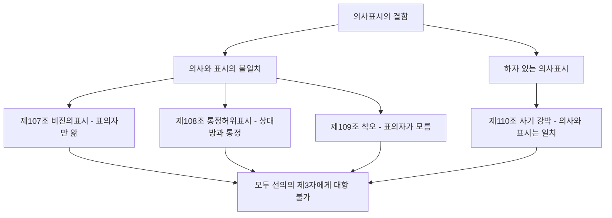

#### 4. 관련 조문

> 📌 **민법 제107조 제1항(진의 아닌 의사표시)** — 의사표시는 표의자가 진의 아님을 알고 한 것이라도 그 효력이 있다. 그러나 ==상대방이 표의자의 진의 아님을 알았거나 이를 알 수 있었을 경우==에는 무효로 한다.

> 📌 **민법 제108조(통정한 허위의 의사표시)** — ① 상대방과 통정한 허위의 의사표시는 무효로 한다. ② 전항의 의사표시의 무효는 ==선의의 제3자에게 대항하지 못한다.==

> 📌 **민법 제109조 제1항(착오로 인한 의사표시)** — 의사표시는 법률행위의 내용의 중요부분에 착오가 있는 때에는 취소할 수 있다. 그러나 그 착오가 ==표의자의 중대한 과실==로 인한 때에는 취소하지 못한다.

> 📌 **민법 제110조(사기, 강박에 의한 의사표시)** — ① 사기나 강박에 의한 의사표시는 취소할 수 있다. ② 상대방있는 의사표시에 관하여 ==제3자가 사기나 강박==을 행한 경우에는 상대방이 그 사실을 알았거나 알 수 있었을 경우에 한하여 그 의사표시를 취소할 수 있다. ③ 전2항의 의사표시의 취소는 ==선의의 제3자에게 대항하지 못한다.==

#### 5. 핵심 판례 법리

- **진의의 정의** — 진의란 ==특정한 내용의 의사표시를 하고자 하는 표의자의 생각==이지 진정으로 마음속에서 바라는 사항을 뜻하는 것이 아니다(대판 1993.7.16. 92다41528).
- **최선의 판단** — 표의자가 의사표시의 내용을 진정으로 마음속에서 바라지는 않았더라도 ==당시 상황에서 그것이 최선이라고 판단하여 의사표시를 하였다면== 내심의 효과의사가 결여된 비진의표시라고 할 수 없다(대판 1996.12.20. 95누16059; 대판 2015.8.27. 2015다211630).
- **강박에 의한 증여** — 재산을 강제로 빼앗긴다는 것이 표의자의 본심으로 잠재되어 있었더라도, 강박에 의해서나마 증여하기로 하고 증여의 의사표시를 한 이상 ==증여의 내심의 효과의사가 결여된 것이라고 할 수 없다==(대판 2002.12.27. 2000다47361; 대판 1993.7.16. 92다41528).
- **강박의 정도와 효과** — 강박이 ==의사결정의 자유를 제한하는 정도==에 그친 경우에는 취소할 수 있음에 그치나, ==의사결정의 자유가 완전히 박탈된 상태==에서 이루어진 의사표시는 효과의사에 대응하는 내심의 의사가 결여된 것이므로 ==무효==다(대판 1984.12.11. 84다카1402).
- **사기의 구조** — 사기에 의한 의사표시란 타인의 기망행위로 착오에 빠져 의사표시를 하는 경우이므로 ==의사와 표시의 불일치가 있을 수 없고==, 단지 의사의 형성과정(동기)에 착오가 있는 것에 불과하다(대판 2005.5.27. 2004다43824).
- **소송행위** — 민법상 법률행위에 관한 규정은 민사소송법상 소송행위에 특별한 규정·사정이 없는 한 적용되지 않으므로, ==소송행위를 강박·사기·착오를 이유로 취소할 수 없다==(대판 1964.9.15. 64다92). 다만 소송행위가 아닌 ==소취하 합의의 의사표시==는 제109조에 따라 취소할 수 있다(대판 2020.10.15. 2020다227523).
- **공법행위** — 사인의 공법행위에는 제107조가 적용되지 않으므로, 공무원의 사직 의사가 외부에 표시된 이상 ==표시된 대로 효력을 발한다==(대판 2001.8.24. 99두9971; 대판 1997.12.12. 97누13962).
- **강행법규와의 관계** — 계약체결의 요건을 규정한 강행법규에 위반한 계약은 무효이므로, 상대방이 선의·무과실이더라도 ==제107조의 비진의표시 법리나 표현대리 법리가 적용될 여지가 없다==(대판 2016.5.12. 2013다49381).

#### 6. 한눈에 보는 정리표

| 조문 | 결함 유형 | 원칙적 효력 | 제3자 |
|---|---|---|---|
| 제107조 | 비진의표시 | 유효(상대방 악의·과실 시 무효) | 선의 보호 |
| 제108조 | 통정허위표시 | 무효 | 선의 보호 |
| 제109조 | 착오 | 취소 가능 | 선의 보호 |
| 제110조 | 사기·강박 | 취소 가능 | 선의 보호 |

| 강박의 정도 | 효과 |
|---|---|
| 의사결정의 자유를 제한 | 취소 |
| 의사결정의 자유를 완전히 박탈 | 무효 |

#### ⭐ 기출 출제포인트

1. **"사기·강박에 의한 의사표시는 의사와 표시의 불일치가 있다"** 형 함정 — ==일치한다.==
2. **강박의 정도에 따른 효과 구별** — 제한 정도 = 취소 / 완전 박탈 = ==무효.==
3. **소송행위에 제109조·제110조 적용 여부** — ==적용 X.== 다만 소취하 **합의**는 적용 O.
4. **사인의 공법행위에 제107조 적용 여부** — ==적용 X.==
5. **선의의 제3자 보호 규정군**의 존재 여부 — 제107조~제110조 모두 있다.

#### 📊 기출 분석

| 연도 | 출제 형태 | 핵심 논점 |
|---|---|---|
| 2018년 제29회 | 법률행위의 무효 5지 | ==강박의 정도가 극심해 의사결정 여지가 완전히 박탈되면 무효(옳은 선지)== |
| 2019년 제30회 | 통정허위표시·비진의·착오 종합 사례 | 결함 유형의 구별 |
| 문제집(실전문제 26·31) | 하자 있는 의사표시의 효과 | 사기·강박은 ==의사와 표시가 일치==하고 형성과정에 하자 |

**출제 빈도** — 총설 단독 출제는 드물지만, ==각론 문항의 오답 선지가 대부분 이 총설의 구조를 뒤집은 것==이다.
**반복되는 함정 선지** — "사기나 강박에 의한 의사표시는 의사와 표시의 불일치가 있는 것이다"(→일치한다).
**최근 경향** — 하나의 사례에 비진의·허위표시·착오·불합의를 모두 섞어 ==어느 유형인지 판별==하게 하는 형태(2019년 제30회 12번)가 등장했다.

#### 🔍 기출 선지로 배우는 법리

> 실제 출제된 선지를 그대로 놓고 O/X와 근거를 확인한다.

**①** 사기나 강박에 의한 의사표시는 의사와 표시의 불일치가 있는 것이다. — **X**
어디가 틀렸나: ==의사와 표시는 일치==하고 의사의 형성과정에 하자가 있을 뿐이다. (문제집 기본문제 19)

**②** 강박의 정도가 심하여 표의자의 의사결정의 자유가 완전히 박탈된 상태에서 한 의사표시는 무효이다. — **O**
근거: 대판 1984.12.11. 84다카1402. (문제집 기본문제 19, 정답 지문 / 2018년 제29회)

**③** 소취하 등 소송행위에도 민법상 사기 또는 착오로 인한 취소규정이 적용된다. — **X**
옳게 고치면: 소송행위에는 ==적용되지 않는다==(대판 1964.9.15. 64다92). (문제집 실전문제 18, 정답 지문)

**④** 진의 아닌 의사표시에 있어서 진의는 표의자가 진정으로 마음속에서 바라는 사항을 의미한다. — **X**
어디가 틀렸나: ==특정한 내용의 의사표시를 하고자 하는 생각==을 말한다(대판 1993.7.16. 92다41528). (문제집 실전문제 25, 정답 지문)

**⑤** 사인의 공법행위에는 제107조가 적용되지 않으므로 공무원의 사직 의사가 외부에 표시된 이상 그 의사는 표시된 대로 효력을 발생한다. — **O**
근거: 대판 2001.8.24. 99두9971. (2018년 제29회)

#### ✏️ 사례형 적용

> **사례** — 甲은 乙의 협박에 못 이겨 자기 소유 X토지를 乙에게 증여한다는 의사표시를 하였다. 甲의 마음속에는 "재산을 강제로 빼앗긴다"는 인식이 있었다.

**검토** —
① **비진의표시인가?** 진의란 ==특정 내용의 의사표시를 하려는 생각==이므로, 甲이 강박에 의해서나마 증여를 하기로 하고 그 의사표시를 한 이상 ==증여의 내심의 효과의사가 결여된 것이 아니다.== 따라서 ==비진의표시가 아니다==(대판 2002.12.27. 2000다47361).
② **강박에 의한 의사표시인가?** 강박의 정도가 의사결정의 자유를 ==제한하는 정도==에 그쳤다면 제110조에 의한 ==취소==, ==완전히 박탈==된 정도라면 ==무효==다(대판 1984.12.11. 84다카1402).
③ **불공정한 법률행위인가?** 증여는 ==무상행위==이므로 급부와 반대급부의 불균형 문제가 생기지 않아 ==제104조는 적용되지 않는다==(대판 1993.7.16. 92다41528).
**결론** — 비진의표시 X, 제104조 X, 제110조 취소(또는 극심한 경우 무효). 이 한 사례에 세 관문이 모두 들어 있다.

#### ⚠️ 이 관의 함정 총정리

1. "사기·강박은 의사와 표시가 불일치한다"고 하면 틀림 → ==일치한다.==
2. "강박은 언제나 취소사유일 뿐이다"라고 하면 틀림 → 의사결정의 자유가 ==완전히 박탈==되면 무효다.
3. "진의는 표의자가 진정으로 바라는 사항이다"라고 하면 틀림 → ==특정 내용의 의사표시를 하려는 생각==이다.
4. "소취하 등 소송행위도 착오로 취소할 수 있다"고 하면 틀림 → ==소송행위에는 민법 규정이 적용되지 않는다.==
5. "부작위는 어떤 경우에도 의사표시가 될 수 없다"고 하면 틀림 → ==고지의무 있는 자의 침묵==은 의사표시가 될 수 있다.

#### ✅ OX 확인문제

> 다음 진술의 참·거짓을 판단하시오.

**1.** 의사표시는 의사와 표시로 구성되고, 동기는 원칙적으로 법률행위의 내용이 아니다.
→ **O**. 이 구별이 동기의 착오·동기의 불법 논의의 출발점이다.

**2.** 의사무능력자의 의사표시는 취소할 수 있다.
→ **X**. 무효다.

**3.** 사기에 의한 의사표시는 의사와 표시가 일치하지만 의사의 형성과정에 하자가 있다.
→ **O**. 대판 2005.5.27. 2004다43824.

**4.** 강박에 의해 의사결정의 자유가 완전히 박탈된 상태의 의사표시는 취소할 수 있을 뿐이다.
→ **X**. 무효다(대판 1984.12.11. 84다카1402).

**5.** 제107조부터 제110조까지는 모두 선의의 제3자 보호 규정을 두고 있다.
→ **O**. 각 조문의 제2항 또는 제3항이다.

**6.** 소송행위는 강박을 이유로 취소할 수 있다.
→ **X**. 민법 규정이 적용되지 않는다(대판 1964.9.15. 64다92).

**7.** 소취하 합의의 의사표시는 착오를 이유로 취소할 수 있다.
→ **O**. 소송행위가 아니라 사법상 계약이다(대판 2020.10.15. 2020다227523).

**8.** 사인의 공법행위에는 진의 아닌 의사표시에 관한 규정이 적용되지 않는다.
→ **O**. 대판 2001.8.24. 99두9971.

**9.** 고지의무 있는 자가 아무런 표시를 하지 않은 경우 부작위에 의한 의사표시가 인정될 수 있다.
→ **O**. 예외적으로 인정된다.

**10.** 강행법규에 위반하여 무효인 계약에는 제107조의 비진의표시 법리가 적용될 수 있다.
→ **X**. 적용될 여지가 없다(대판 2016.5.12. 2013다49381).

#### 🧠 암기법

> 🔑 **결함의 4형제 = "비·허·착·사(강)"**
> **비**진의(107) · **허**위표시(108) · **착**오(109) · **사**기강박(110). 앞의 셋은 불일치, 마지막은 하자. 그런데 ==넷 다 선의의 제3자에게는 못 이긴다.==

> 🔑 **"진의는 생각, 소망이 아니다"**
> 진의 = 그 내용의 의사표시를 하려는 **생각**. 마음속 **소망**이 아니다. 이 한 줄이 비진의표시 문항의 절반을 해결한다.

> 🔑 **"제한이면 취소, 박탈이면 무효"**
> 강박의 정도. 자유를 **제한**하는 정도 = 제110조 취소 / **완전 박탈** = 무효.

---

### 제2관 진의 아닌 의사표시

> 📖 표의자 ==혼자== 진의와 다름을 알면서 하는 의사표시다(심리유보·단독허위표시). 상대방과 짜면 다음 관의 통정허위표시가 된다. 원칙 유효라는 점에서 다른 결함 유형과 정반대이며, 이 역설이 그대로 출제된다.

> ⭐ **이 관에서 반드시 챙길 3가지**
> ① 원칙 ==유효==. 예외적으로 ==상대방이 알았거나 알 수 있었을 때== 무효.
> ② 증명책임 — ==무효를 주장하는 표의자==가 상대방의 악의·과실을 증명한다.
> ③ ==사인의 공법행위에는 적용되지 않는다.== 상대방 없는 단독행위에는 적용된다.

#### 1. 의의

**진의 아닌 의사표시(비진의표시)** 란 표의자가 ==내심의 의사와 표시가 일치하지 않는다는 것을 알면서== 하는 의사표시다(제107조). 심리유보(心裡留保)·단독허위표시라고도 한다.

#### 2. 요건

| 요건 | 내용 | 비고 |
|---|---|---|
| ① 의사표시의 존재 | 일정한 효과를 노리는 의사표시가 있을 것 | |
| ② 진의와 표시의 불일치 | 내심의 효과의사와 표시가 어긋날 것 | 진의 = ==특정 내용의 의사표시를 하려는 생각== |
| ③ 표의자의 인식 | 표의자가 그 불일치를 ==알고 있을 것== | 모르면 ==착오(제109조)== 가 된다 |
| ④ 이유·동기 불문 | 진의와 불일치한 표시를 한 ==이유나 동기는 묻지 않는다== | |

> ⚠️ **"상대방 있는 의사표시일 것"은 요건이 아니다.** 제107조는 ==상대방 없는 단독행위에도 적용==된다(다만 상대방이 없으므로 언제나 유효로 귀결된다). 이 점이 통정허위표시(상대방 없는 단독행위에 적용 X)와 갈린다.

#### 3. 효과

| 구분 | 효과 |
|---|---|
| **원칙** | ==유효.== 의사표시의 효력에 영향이 없다(제107조 제1항 본문) |
| **예외** | 상대방이 진의 아님을 ==알았거나 알 수 있었을 때== 무효(같은 항 단서) |
| **증명책임** | 상대방의 ==악의 또는 과실==은 무효를 주장하는 ==표의자==가 주장·증명(대판 1992.5.22. 92다2295) |
| **제3자 관계** | 무효로써 ==선의의 제3자에게 대항하지 못한다==(제107조 제2항) |
| **적용범위 ①** | ==상대방 없는 의사표시에도 적용==(언제나 유효로 귀결) |
| **적용범위 ②** | ==가족법상 신분행위에는 적용되지 않는다== |
| **적용범위 ③** | ==사인의 공법행위에는 적용되지 않는다== |
| **유추적용** | ==대리권 남용(배임적 대리행위)== 에 제107조 제1항 단서가 유추적용된다 |

#### 4. 관련 조문

> 📌 **민법 제107조(진의 아닌 의사표시)** — ① 의사표시는 표의자가 진의아님을 알고 한 것이라도 그 효력이 있다. 그러나 ==상대방이 표의자의 진의아님을 알았거나 이를 알 수 있었을 경우==에는 무효로 한다. ② 전항의 의사표시의 무효는 ==선의의 제3자에게 대항하지 못한다.==

> 📌 **민법 제116조 제1항(대리행위의 하자)** — 의사표시의 효력이 의사의 흠결, 사기, 강박 또는 어느 사정을 알았거나 과실로 알지 못한 것으로 인하여 영향을 받을 경우에 그 사실의 유무는 ==대리인을 표준하여 결정한다.== → 비진의 여부도 ==대리인 기준==이다.

#### 5. 핵심 판례 법리

- **진의의 의미** — 진의란 ==특정한 내용의 의사표시를 하고자 하는 표의자의 생각==이지 진정으로 마음속에서 바라는 사항을 뜻하는 것이 아니다(대판 1993.7.16. 92다41528).
- **최선의 판단** — 표의자가 의사표시의 내용을 진정으로 바라지는 않았더라도 ==당시 상황에서 최선이라고 판단하여 의사표시를 하였다면 비진의표시가 아니다==(대판 2015.8.27. 2015다211630; 대판 1996.12.20. 95누16059; 대판 2004.6.25. 2002다68058).
- **사직원 사안 ①(비진의 인정 X)** — 물의를 일으킨 사립대학교 조교수가 사직원이 수리되지 않을 것이라 믿고 형식상 사직원을 제출하였는데 이사회가 수리한 경우, 설사 비진의표시라 하더라도 ==학교법인·이사회가 그 사실을 알았거나 알 수 있었을 경우가 아니라면 그 의사표시대로 효력이 발생==한다(대판 1980.10.14. 79다2168).
- **사직원 사안 ②(비진의 인정 O)** — 근로자들이 사용자의 요구에 따라 일괄사직서를 제출하고 ==경영진이 그러한 사정을 알면서 선별적으로 수리한 경우==, 그 사직의 의사표시는 ==비진의 의사표시로서 무효==다(대판 1992.12.11. 92다23285).
- **명의대여** — 대출절차상 편의를 위해 명의를 빌려준 자는 ==표시행위에 나타난 대로 대출금채무를 부담==한다(대판 1996.9.10. 96다18182). 명의대여자의 의사표시를 비진의표시로 보아 무효라고 하지 않는다.
- **강박에 의한 증여** — 재산을 강제로 빼앗긴다는 것이 본심으로 잠재되어 있었더라도, 강박에 의해서나마 증여하기로 하고 의사표시를 한 이상 ==비진의표시가 아니다==(대판 2002.12.27. 2000다47361).
- **증명책임** — 상대방이 진의 아님을 알았다거나 알 수 있었다는 것은 ==의사표시의 무효를 주장하는 표의자==가 주장·증명하여야 한다(대판 1992.5.22. 92다2295).
- **사인의 공법행위** — 제107조는 ==사인의 공법행위에 적용되지 않는다.== 공무원에 대한 의원면직처분이 일괄사표·선별수리 방식으로 이루어졌더라도 당연무효라고 할 수 없다(대판 2001.8.24. 99두9971).
- **대리권 남용** — 진의 아닌 의사표시가 대리인에 의해 이루어지고 대리인의 진의가 본인의 이익·의사에 반하여 자기 또는 제3자의 이익을 위한 배임적인 것이었더라도 ==대리의사는 존재하므로 대리행위로서 유효==하다. 다만 ==상대방이 대리인의 배임적 의도를 알았거나 알 수 있었던 경우==에는 제107조 제1항 단서의 유추해석상 ==본인은 아무런 책임을 지지 않는다==(대판 2001.1.19. 2000다20694).
- **강행법규와의 관계** — 계약체결의 요건을 정한 강행법규를 위반한 계약은 무효이므로, 상대방이 선의·무과실이더라도 ==제107조의 법리가 적용될 여지가 없다==(대판 2016.5.12. 2013다49381).

#### 6. 한눈에 보는 정리표

| 논점 | 결론 |
|---|---|
| 원칙적 효력 | 유효 |
| 무효가 되는 경우 | 상대방이 알았거나 알 수 있었을 때 |
| 증명책임 | 표의자가 상대방의 악의·과실을 증명 |
| 제3자 | 선의의 제3자에게 대항 불가 |
| 적용 배제 | 사인의 공법행위, 가족법상 신분행위 |
| 유추적용 | 대리권 남용(배임적 대리행위) |

| 비진의표시 인정 여부 | 사안 |
|---|---|
| 인정 | 일괄사직서를 경영진이 사정을 알면서 선별 수리 |
| 부정 | 상황상 최선이라 판단하여 한 사직원 제출 / 강박에 의한 증여 / 명의대여자의 대출채무 부담 |

#### ⭐ 기출 출제포인트

1. **증명책임 뒤집기** — "상대방이 자신의 선의·무과실을 증명해야 한다"는 선지는 ==틀림.==
2. **진의의 정의 뒤집기** — "진의는 진정으로 마음속에서 바라는 사항"은 ==틀림.==
3. **강박에 의한 증여** — 비진의표시에 ==해당하지 않는다.==
4. **사인의 공법행위 적용 배제.**
5. **대리권 남용에 제107조 제1항 단서 유추적용** — 상대방이 ==알았거나 알 수 있었으면== 본인 면책.

#### 📊 기출 분석

| 연도 | 출제 형태 | 핵심 논점 |
|---|---|---|
| 2018년 제29회 | "진의 아닌 의사표시에 관한 설명으로 옳지 않은 것은?" | ==상대방이 자신의 선의·무과실을 증명해야 한다 = 틀림(정답)== |
| 2019년 제30회 | 대리 5지 | ==대리권 남용은 무권대리에 해당한다 = 틀림(정답 지문)== — 유권대리이나 제107조 단서 유추 |
| 문제집(실전문제 01·02·37) | 비진의표시 종합 | 공법행위 적용 X / 최선 판단이면 비진의 X / 증명책임은 표의자 |

**출제 빈도** — ==2018년 단독 출제.== 그 외에는 대리권 남용·의사표시 종합문항의 선지로 등장한다.
**반복되는 함정 선지** — ①"상대방이 선의·무과실을 증명해야 한다"(→표의자가 악의·과실을 증명), ②"진의는 마음속에서 바라는 사항"(→아니다), ③"강박에 의한 증여는 비진의표시다"(→아니다).
**최근 경향** — ==대리권 남용==의 법적 성질을 묻는 문제로 확장되었다.

#### 🔍 기출 선지로 배우는 법리

> 실제 출제된 선지를 그대로 놓고 O/X와 근거를 확인한다.

**①** 진의는 특정한 내용의 의사표시를 하려는 생각을 말하는 것이지 표의자가 진정으로 마음에서 바라는 사항을 뜻하는 것은 아니다. — **O**
근거: 대판 1993.7.16. 92다41528. (2018년 제29회)

**②** 표의자가 강박에 의하여 어쩔 수 없이 증여의 의사표시를 하였다면 이는 비진의표시에 해당하지 않는다. — **O**
근거: 대판 2002.12.27. 2000다47361. (2018년 제29회)

**③** 표의자가 비진의표시임을 이유로 의사표시의 무효를 주장하는 경우, 상대방이 자신의 선의·무과실을 증명해야 한다. — **X**
어디가 틀렸나: ==표의자가 상대방의 악의 또는 과실을 증명==해야 한다(대판 1992.5.22. 92다2295). (2018년 제29회, 정답 지문)

**④** 사인의 공법행위에는 적용되지 않으므로 공무원의 사직 의사가 외부에 표시된 이상 그 의사는 표시된 대로 효력을 발생한다. — **O**
근거: 대판 2001.8.24. 99두9971. (2018년 제29회)

**⑤** 진의 아닌 의사표시 규정은 대리인이 배임적 대리행위를 한 경우에 유추적용될 수 있다. — **O**
근거: 대판 2001.1.19. 2000다20694. (문제집 실전문제 01)

**⑥** 대리인이 자신의 이익을 도모하기 위하여 대리권을 남용한 경우는 무권대리에 해당한다. — **X**
옳게 고치면: 대리의사가 있으므로 ==유권대리==이나, 상대방이 배임적 의도를 알았거나 알 수 있었으면 ==본인이 책임지지 않는다.== (2019년 제30회, 정답 지문)

**⑦** 진의 아닌 의사표시로서 무효가 되는 경우 그 무효는 선의의 제3자에게 대항하지 못한다. — **O**
근거: 제107조 제2항. (문제집 실전문제 02)

#### ✏️ 사례형 적용

> **사례 1** — 회사 甲은 구조조정을 위해 전 직원에게 일괄사직서를 제출하게 하였고, 근로자 乙도 사직 의사가 전혀 없으면서 사직서를 냈다. 경영진은 그 사정을 알면서 乙의 사직서만 선별 수리하였다.

**검토** — 乙의 사직서 제출은 ==비진의표시==이고, 상대방(경영진)이 그 사정을 ==알면서== 수리하였으므로 제107조 제1항 단서에 따라 ==무효==다(대판 1992.12.11. 92다23285).
**결론** — 사직의 효력이 발생하지 않는다. 반대로 상대방이 그 사정을 알지도, 알 수도 없었다면 ==표시된 대로 유효==하다(대판 1980.10.14. 79다2168).

> **사례 2** — 甲의 대리인 乙은 자기 채무를 갚으려고 甲 소유 X토지를 丙에게 헐값에 매도하였다. 丙은 乙의 그러한 의도를 충분히 알 수 있었다.

**검토** — 대리권 남용 사안이다. 대리의사가 있으므로 ==대리행위 자체는 유효==하나, 상대방 丙이 배임적 의도를 ==알 수 있었으므로== 제107조 제1항 단서의 유추해석상 ==본인 甲은 아무런 책임을 지지 않는다==(대판 2001.1.19. 2000다20694).
**결론** — 무권대리가 아니라 ==유권대리이되 본인 면책==이라는 결론에 이르는 것이 판례의 구성이다.

#### ⚠️ 이 관의 함정 총정리

1. "비진의표시는 원칙적으로 무효이다"라고 하면 틀림 → ==원칙 유효==다.
2. "상대방이 자신의 선의·무과실을 증명해야 한다"고 하면 틀림 → ==표의자가 상대방의 악의·과실을 증명==한다.
3. "제107조는 상대방 있는 의사표시에만 적용된다"고 하면 틀림 → ==상대방 없는 단독행위에도 적용==된다.
4. "표의자가 불일치를 알지 못한 경우도 비진의표시이다"라고 하면 틀림 → 그것은 ==착오==다.
5. "대리권 남용은 무권대리이다"라고 하면 틀림 → ==유권대리이되 제107조 제1항 단서 유추로 본인 면책==이다.

#### ✅ OX 확인문제

> 다음 진술의 참·거짓을 판단하시오.

**1.** 비진의표시는 원칙적으로 유효하다.
→ **O**. 제107조 제1항 본문.

**2.** 상대방이 진의 아님을 알 수 있었던 경우에도 비진의표시는 유효하다.
→ **X**. 알았거나 알 수 있었으면 무효다.

**3.** 표의자가 진의와 표시의 불일치를 알지 못한 경우도 비진의표시에 해당한다.
→ **X**. 알아야 한다. 모르면 착오다.

**4.** 비진의표시의 무효는 선의의 제3자에게 대항하지 못한다.
→ **O**. 제107조 제2항.

**5.** 비진의표시임을 이유로 무효를 주장하는 자가 그 증명책임을 진다.
→ **O**. 대판 1992.5.22. 92다2295.

**6.** 진의 아닌 의사표시 규정은 상대방 없는 단독행위에는 적용되지 않는다.
→ **X**. 적용된다(다만 언제나 유효로 귀결).

**7.** 사인의 공법행위에도 제107조가 적용된다.
→ **X**. 적용되지 않는다(대판 2001.8.24. 99두9971).

**8.** 대출절차상 편의를 위해 명의를 빌려준 자는 표시행위대로 대출금채무를 부담한다.
→ **O**. 대판 1996.9.10. 96다18182.

**9.** 표의자가 당시 상황에서 최선이라고 판단하여 의사표시를 하였다면 비진의표시가 아니다.
→ **O**. 대판 2015.8.27. 2015다211630.

**10.** 대리권 남용의 경우 상대방이 대리인의 배임적 의도를 알 수 있었다면 본인은 책임을 지지 않는다.
→ **O**. 제107조 제1항 단서의 유추적용(대판 2001.1.19. 2000다20694).

#### 🧠 암기법

> 🔑 **"혼자 알면 유효, 둘이 알면 무효, 짜면 통정"**
> 표의자 **혼자** 알면 유효(제107조 본문) → 상대방도 알거나 알 수 있으면 무효(단서) → 아예 **짜면** 통정허위표시(제108조).

> 🔑 **"무효 주장자가 증명한다"**
> 비진의표시의 증명책임은 **표의자**. 통정허위표시에서 제3자의 악의 증명책임도 **무효 주장자**. 둘 다 "무효를 원하는 쪽이 증명"으로 통일된다.

> 🔑 **"공법·신분에는 안 통한다"**
> 사인의 공법행위(사직·의원면직)와 가족법상 신분행위에는 제107조 적용 X.

---

### 제3관 통정허위표시

> 📖 표의자와 상대방이 ==짜고== 하는 허위의 의사표시다. 당사자 사이에서는 언제나 무효지만, 그 외관을 믿은 ==선의의 제3자==는 보호된다. 감정평가사 시험에서 ==제3자의 범위==를 묻는 문제가 거의 격년으로 나오는 초빈출 관이다.

> ⭐ **이 관에서 반드시 챙길 3가지**
> ① 요건은 ==통정(합의)== 이다. 상대방이 단순히 알기만 한 것은 ==비진의표시==일 뿐이다.
> ② 제3자는 ==허위표시를 기초로 새로운 법률상 이해관계를 맺은 자==여야 한다. ==선의면 족하고 무과실은 불요==, ==선의는 추정==된다.
> ③ **은닉행위**는 가장행위와 별개로 ==그 자체의 요건을 갖추면 유효==하다.

#### 1. 의의

**통정허위표시**란 ==상대방과 통정하여== 하는 진의 아닌 의사표시를 말한다(제108조). 이에 의해 이루어지는 법률행위를 **가장행위**, 그 속에 감추어진 진짜 행위를 **은닉행위**라 한다.

#### 2. 요건

| 요건 | 내용 | 판례 |
|---|---|---|
| ① 의사표시의 존재 | | |
| ② 진의와 표시의 불일치 | | |
| ③ 표의자의 인식 | 불일치를 알고 있을 것 | |
| ④ **상대방과의 통정** | 상대방과 사이에 ==합의(양해)== 가 있을 것 | 단순히 상대방이 표의자의 의사를 알고 있는 것만으로는 부족하다. 그 경우는 ==비진의표시==다. ==상대방과의 사이에 합의(양해)== 가 있어야 한다(대판 1972.12.26. 72다1776) |

> ⚠️ **금전소비대차에서 통정 부정** — 대주가 실제로 돈을 대여하고 차주가 이를 수령한 이상 ==진의와 표시의 불일치가 있다고 보기 어렵다.== 소비대차계약이 통정허위표시로서 무효인 법률행위가 아니라고 본 판례가 있다(대판 2008.6.12. 2008다7772, 7789).

#### 3. 효과

**(1) 당사자 사이**

| 논점 | 결론 |
|---|---|
| 효력 | ==언제나 무효== |
| 이행 전 | 이행할 필요 없다 |
| 이행 후 | ==불법원인급여가 아니므로 부당이득반환을 청구할 수 있다==(대판 2004.5.28. 2003다70041; 대판 1994.4.15. 93다61307) |
| 손해배상 | 가장행위의 채무불이행을 이유로 한 ==손해배상청구 불가== |
| 철회 | 당사자 사이에서는 ==철회 가능==. 다만 선의의 제3자에게는 대항 불가 |
| 채권자취소권 | 통정허위표시도 ==채권자취소권(사해행위취소)의 대상이 된다==(대판 1998.2.27. 97다50985; 대판 1988.4.28. 87다카1380) |
| 적용범위 | ==상대방 없는 단독행위에는 적용 X.== 가족법상 신분행위에도 적용 X |

**(2) 제3자와의 관계 — 제108조 제2항**

| 논점 | 결론 |
|---|---|
| 제3자의 정의 | 당사자와 그 ==포괄승계인 이외의 자==로서, 허위표시행위를 기초로 ==별개의 법률원인에 의하여 새로운 법률상 이해관계를 맺은 자== |
| 선의만 요구 | ==무과실은 요구되지 않는다==(대판 2004.5.28. 2003다70041) |
| 선의의 추정 | ==제3자는 선의로 추정==되므로, 악의라는 사실의 증명책임은 ==무효를 주장하는 자==에게 있다(대판 2006.3.10. 2002다1321) |
| 누구도 대항 불가 | 선의의 제3자에 대해서는 ==당사자뿐 아니라 그 누구도== 무효로 대항하지 못한다 |
| 악의 → 선의 전득자 | ==악의의 제3자로부터 전득한 자가 선의라면 무효로 대항하지 못한다==(대판 2013.2.15. 2012다49292) |
| 선의 → 악의 전득자 | 선의의 제3자로부터 전득한 자가 악의여도, ==이미 선의자의 권리를 승계==하였으므로 유효하게 권리를 취득한다 |
| 제3자의 무효 주장 | ==제3자가 스스로 당사자에게 무효를 주장하는 것은 무방하다== |

**(3) 제3자에 해당하는가 — 판례 정리표**

| 제3자에 **해당** | 제3자에 **해당하지 않음** |
|---|---|
| 가장매매의 매수인으로부터 ==목적물을 매수하여 등기를 마친 자== | ==가장행위의 당사자와 그 포괄승계인(상속인)== (대판 1982.5.25. 80다1403) |
| 가장매매 매수인으로부터 ==이전등기청구권 보전 가등기를 마친 자== | ==채권의 가장양도에서의 채무자== (대판 1983.1.18. 82다594) |
| ==가장채권을 가압류한 자== | ==계약을 인수한 자== (대판 2020.12.10. 2020다245958) |
| ==가장 전세권에 저당권을 취득한 자== (대판 1998.9.4. 98다20981; 대판 2013.2.15. 2012다49292) | 대리인·대표기관이 상대방과 통정한 경우의 ==본인·법인== |
| ==가장저당권 실행 경매에서 목적부동산을 경락받은 자== | 저당권 등 제한물권이 ==가장포기된 경우의 기존 후순위 제한물권자== |
| ==가장소비대차에 기한 대여금채권을 양수한 자== | |
| ==가장채권자가 파산한 경우의 파산관재인== (대판 2003.6.2. 2002다48214) | |
| ==가장채무를 보증하고 보증채무를 이행한 보증인== | |

> 💡 **판별 공식** — ①허위표시를 ==기초로==, ②==새로운== 법률상 이해관계를, ③==별개의 법률원인==으로 맺었는가. 셋 중 하나라도 빠지면 제3자가 아니다. 채무자·상속인·계약인수인은 "새로운" 이해관계가 아니어서 탈락한다.

**(4) 은닉행위**

가장행위는 ==언제나 무효==이나, 은닉행위는 보통의 허위표시로 다룰 것이 아니라 ==그 감추어진 행위로서의 요건을 갖추었는지에 따라 효력을 결정==한다. 증여세를 면하려고 부자(父子) 사이에 매매의 형식을 빌린 경우, ==가장행위인 매매는 무효, 은닉행위인 증여는 유효==할 수 있다.

#### 4. 관련 조문

> 📌 **민법 제108조(통정한 허위의 의사표시)** — ① 상대방과 통정한 허위의 의사표시는 무효로 한다. ② 전항의 의사표시의 무효는 ==선의의 제3자에게 대항하지 못한다.==

> 📌 **민법 제406조 제1항(채권자취소권)** — 채무자가 채권자를 해함을 알고 재산권을 목적으로 한 법률행위를 한 때에는 채권자는 그 취소 및 원상회복을 법원에 청구할 수 있다. → ==통정허위표시도 사해행위취소의 대상==이 된다.

> 📌 **민법 제746조(불법원인급여)** — 불법의 원인으로 인하여 재산을 급여하거나 노무를 제공한 때에는 그 이익의 반환을 청구하지 못한다. → 허위표시는 제103조 위반이 아니므로 ==여기의 "불법"에 해당하지 않는다.==

#### 5. 핵심 판례 법리

- **통정의 필요** — 허위표시가 성립하려면 상대방과 사이에 ==합의(양해)== 가 있어야 한다(대판 1972.12.26. 72다1776). 상대방이 단지 알고 있는 것만으로는 부족하며 그 경우는 비진의표시다.
- **강제집행 면탈 목적** — 강제집행을 면할 목적으로 타인과 합의하여 그 명의로 소유권이전등기를 한 경우 ==허위표시로 처리되며 불법원인급여 규정의 적용은 없다==(대판 1994.4.15. 93다61307). 나아가 강제집행 면탈 목적의 허위 근저당권 설정은 ==반사회적 법률행위가 아니다==(대판 2004.5.28. 2003다70041).
- **제3자의 선의·무과실** — 선의의 제3자는 ==선의이기만 하면 되고 과실 여부는 문제 삼지 않는다==(대판 2004.5.28. 2003다70041).
- **선의의 추정과 증명책임** — 제3자는 특별한 사정이 없는 한 ==선의로 추정==되므로, 제3자가 악의라는 사실의 증명책임은 ==허위표시의 무효를 주장하는 자==에게 있다(대판 2006.3.10. 2002다1321).
- **가장 전세권의 저당권자** — 통정허위표시로 무효인 전세권설정등기를 마친 후 그 전세권에 대해 저당권설정등기를 취득한 자는 ==허위표시를 기초로 새로운 법률상 이해관계를 가지게 되므로 제3자에 해당==한다(대판 1998.9.4. 98다20981; 대판 2013.2.15. 2012다49292).
- **채권의 가장양도와 채무자** — 통정허위표시인 채권양도계약이 체결된 경우 ==채무자는 제108조 제2항의 제3자에 해당하지 않는다==(대판 1983.1.18. 82다594).
- **계약인수인** — 계약을 인수한 자는 ==제3자에 해당하지 않는다==(대판 2020.12.10. 2020다245958). 계약당사자의 지위를 그대로 승계할 뿐 새로운 이해관계를 맺은 것이 아니기 때문이다.
- **상속인** — 가장매매 매수인의 상속인은 ==포괄승계인이므로 제3자에 해당하지 않는다==(대판 1982.5.25. 80다1403).
- **파산관재인** — 파산자가 상대방과 통정한 허위표시로 성립한 가장채권을 보유하다 파산선고를 받은 경우, ==파산관재인은 제3자에 해당==한다(대판 2003.6.2. 2002다48214). 파산채권자 전체의 이익을 위해 독립한 지위에서 직무를 행하기 때문이다.
- **악의자로부터의 선의 전득자** — 통정허위표시에 관하여 ==악의의 제3자로부터 전득한 자가 선의라면 허위표시의 무효로 대항하지 못한다==(대판 2013.2.15. 2012다49292).
- **채권자취소권의 대상** — 통정허위표시로 무효인 법률행위도 ==채권자취소권(사해행위취소)의 대상이 된다==(대판 1998.2.27. 97다50985; 대판 1988.4.28. 87다카1380).
- **토지거래허가와의 결합** — 토지거래허가구역 내 토지거래계약이 허위표시로 이루어진 경우, 거래당사자는 허가신청 ==전 단계에서 허위표시임을 주장하여 협력의무 이행을 거절함으로써 계약을 확정적 무효로 만들 수 있다==(대판 1997.11.14. 97다36118).
- **대리와의 결합** — 대리인이 대리권 범위 내에서 현명하여 상대방과 통정허위표시를 한 경우, ==본인이 선의라도 허위표시의 유효를 주장할 수 없다.== 대리인의 행위는 곧 본인의 행위로 보기 때문이다.

#### ⭐ 기출 출제포인트

1. **"제3자에 해당하지 않는 자를 고르라"** — ==채권 가장양도의 채무자==, ==상속인==, ==계약인수인==이 정답 3대장.
2. **제3자의 무과실 요구 여부** — ==선의면 족하다.==
3. **악의의 제3자 → 선의의 전득자** — ==보호된다.==
4. **은닉행위의 효력** — 가장행위는 무효, ==은닉행위는 요건 갖추면 유효.==
5. **불법원인급여 여부** — 통정허위표시는 ==불법원인급여가 아니다.==

#### 📊 기출 분석

| 연도 | 출제 형태 | 핵심 논점 |
|---|---|---|
| 2019년 제30회 | "통정허위표시에 관한 설명으로 옳지 않은 것은?" | ==강제집행 면탈 허위 근저당은 제103조 위반이 아니다(정답)== / 과실 있는 제3자도 보호 / 누구도 대항 불가 / 은닉행위 유효 |
| 2021년 제32회 | "새로운 법률상 이해관계를 맺은 제3자에 해당하지 않은 자는?" | ==채권 가장양도의 채무자(정답)== / 가장전세권 저당권자·대여금채권 양수인·경락인·파산관재인 = 제3자 O |
| 2023년 제34회 | "통정허위표시에 관한 설명으로 옳은 것은?" | ==악의 제3자로부터의 선의 전득자에게 대항 불가(정답)== / 불법원인급여 X / 은닉행위 유효 / 무과실 불요 |
| 2024년 제35회 | 의사표시 5지 | 통정의 동기·목적은 성립에 영향 없음 / ==가장행위 채무불이행 손해배상 청구 불가== |

**출제 빈도** — ==2019·2021·2023년 단독 출제.== 사실상 격년 확정 출제 논점이다.
**반복되는 함정 선지** — ①"제3자는 무과실이어야 한다"(→선의면 족함), ②"채권 가장양도의 채무자는 제3자이다"(→아니다), ③"가장행위가 무효면 은닉행위도 당연히 무효"(→아니다), ④"통정허위표시에 의한 급부는 불법원인급여이다"(→아니다).
**최근 경향** — ==전득자의 보호(악의→선의)== 라는 한 단계 더 들어간 논점이 2023년에 정답으로 출제되었다.

#### 🔍 기출 선지로 배우는 법리

> 실제 출제된 선지를 그대로 놓고 O/X와 근거를 확인한다.

**①** 상대방과 통정한 허위의 의사표시는 무효이지만, 이러한 무효는 과실로 인하여 허위표시라는 사실을 인식하지 못한 제3자에게 대항할 수 없다. — **O**
근거: ==선의면 족하고 무과실은 불요==(대판 2004.5.28. 2003다70041). (2019년 제30회)

**②** 강제집행을 면할 목적으로 부동산에 허위의 근저당권설정등기를 경료하는 행위는 민법 제103조에 위반한 법률행위이다. — **X**
어디가 틀렸나: ==제103조 위반이 아니라 제108조 통정허위표시==의 문제다(대판 2004.5.28. 2003다70041). (2019년 제30회, 정답 지문)

**③** 당사자들이 실제로는 증여계약을 체결하면서 매매계약인 것처럼 통정허위표시를 하였다면 은닉행위인 증여계약은 유효할 수 있다. — **O**
근거: 은닉행위는 그 자체의 요건에 따라 효력이 결정된다. (2019년 제30회)

**④** 채권의 가장양도 후 채무가 변제되지 않고 있는 동안 채권양도가 허위임이 밝혀진 경우의 채무자는 제3자에 해당한다. — **X**
옳게 고치면: ==채무자는 제3자에 해당하지 않는다==(대판 1983.1.18. 82다594). (2021년 제32회, 정답 지문)

**⑤** 가장소비대차의 대주가 파산한 경우, 파산자와는 독립한 지위에서 파산채권자 전체의 공동의 이익을 위하여 직무를 행하게 된 파산관재인은 제3자에 해당한다. — **O**
근거: 대판 2003.6.2. 2002다48214. (2021년 제32회)

**⑥** 통정허위표시에 의한 급부는 특별한 사정이 없는 한 불법원인급여이다. — **X**
어디가 틀렸나: 제103조 위반이 아니므로 ==불법원인급여가 아니다.== 부당이득반환청구가 가능하다(대판 1994.4.15. 93다61307). (2023년 제34회)

**⑦** 가장행위인 매매계약이 무효라면 은닉행위인 증여계약도 당연히 무효이다. — **X**
옳게 고치면: 은닉행위는 ==그 요건을 갖추었는지에 따라== 효력이 결정된다. (2023년 제34회)

**⑧** 가장매매계약의 매수인과 직접 이해관계를 맺은 제3자가 악의라 하더라도 그와 다시 법률상 이해관계를 맺은 전득자가 선의라면 가장매매계약의 무효로써 전득자에게 대항할 수 없다. — **O**
근거: 대판 2013.2.15. 2012다49292. (2023년 제34회, 정답 지문)

**⑨** 대리인이 대리권의 범위 안에서 현명하여 상대방과 통정허위표시를 한 경우, 본인이 선의라면 허위표시의 유효를 주장할 수 있다. — **X**
어디가 틀렸나: 대리인의 행위는 곧 본인의 행위이므로 ==본인은 유효를 주장할 수 없다.== (2023년 제34회)

#### ✏️ 사례형 적용

> **사례 1** — 甲은 채권자의 강제집행을 피하려고 乙과 짜고 X부동산을 매도한 것처럼 꾸며 乙 명의로 이전등기를 마쳤다. 이후 ⓐ 乙은 그 사정을 아는 丙에게 X를 매도하였고, 丙은 다시 사정을 모르는 丁에게 매도하였다. ⓑ 한편 甲의 채권자 A는 甲·乙의 매매를 사해행위로 취소하려 한다.

**검토** —
ⓐ 甲·乙의 매매는 ==통정허위표시로 무효==이나 선의의 제3자에게 대항할 수 없다. 丙은 ==악의==이므로 보호받지 못하지만, ==악의자로부터 전득한 丁이 선의==라면 甲은 丁에게 무효로 대항할 수 없다(대판 2013.2.15. 2012다49292). 丁은 소유권을 취득한다.
ⓑ 통정허위표시로 무효인 법률행위도 ==채권자취소권의 대상==이 되므로(대판 1998.2.27. 97다50985), A는 사해행위취소를 구할 수 있다.
**결론** — "무효인데 왜 취소하나"는 의문이 들지만, 판례는 채권자 보호를 위해 ==병존을 허용==한다.

> **사례 2** — 甲과 乙은 증여세를 피하려고 실제로는 증여이면서 매매계약서를 작성하고 이전등기를 마쳤다.

**검토** — ==가장행위인 매매는 무효==다. 그러나 ==은닉행위인 증여==는 보통의 허위표시로 다룰 것이 아니라 ==증여로서의 요건을 갖추었는지==에 따라 효력이 결정되므로, 요건을 갖추었다면 ==유효==하다. 따라서 乙 명의 등기는 ==증여를 원인으로 하는 유효한 등기==로 인정될 수 있다.
**결론** — 조세포탈 목적이라는 사정만으로 증여가 무효가 되지는 않는다.

#### ⚠️ 이 관의 함정 총정리

1. "상대방이 표의자의 진의를 알고 있으면 통정허위표시이다"라고 하면 틀림 → ==합의(통정)== 가 필요하며, 단순히 알기만 했으면 ==비진의표시==다.
2. "제3자가 보호되려면 선의·무과실이어야 한다"고 하면 틀림 → ==선의면 족하다.==
3. "채권 가장양도의 채무자·상속인·계약인수인도 제3자이다"라고 하면 틀림 → ==모두 제3자가 아니다.==
4. "가장행위가 무효이면 은닉행위도 무효이다"라고 하면 틀림 → ==은닉행위는 별도 판단==한다.
5. "통정허위표시에 기한 급부는 불법원인급여이므로 반환청구할 수 없다"고 하면 틀림 → ==반환청구할 수 있다.==

#### ✅ OX 확인문제

> 다음 진술의 참·거짓을 판단하시오.

**1.** 통정허위표시는 당사자 사이에서는 언제나 무효이다.
→ **O**. 제108조 제1항.

**2.** 통정허위표시의 무효로 보호되는 제3자는 선의·무과실이어야 한다.
→ **X**. 선의면 족하다(대판 2004.5.28. 2003다70041).

**3.** 제3자의 악의는 무효를 주장하는 자가 증명해야 한다.
→ **O**. 제3자는 선의로 추정된다(대판 2006.3.10. 2002다1321).

**4.** 채권의 가장양도에서 채무자는 제108조 제2항의 제3자에 해당한다.
→ **X**. 해당하지 않는다(대판 1983.1.18. 82다594).

**5.** 가장 전세권에 저당권을 취득한 자는 제3자에 해당한다.
→ **O**. 대판 2013.2.15. 2012다49292.

**6.** 가장채권자가 파산한 경우의 파산관재인은 제3자에 해당한다.
→ **O**. 대판 2003.6.2. 2002다48214.

**7.** 악의의 제3자로부터 전득한 선의의 전득자에게는 허위표시의 무효로 대항할 수 있다.
→ **X**. 대항하지 못한다(대판 2013.2.15. 2012다49292).

**8.** 통정허위표시에 기한 급부는 불법원인급여이므로 반환을 청구할 수 없다.
→ **X**. 불법원인급여가 아니므로 반환청구할 수 있다(대판 1994.4.15. 93다61307).

**9.** 통정허위표시로 무효인 법률행위는 채권자취소권의 대상이 될 수 없다.
→ **X**. 대상이 된다(대판 1998.2.27. 97다50985).

**10.** 통정허위표시는 상대방 없는 단독행위에도 적용된다.
→ **X**. 통정할 상대방이 없으므로 적용되지 않는다.

#### 🧠 암기법

> 🔑 **제3자 판별 3요건 = "기초·새로·별개"**
> 허위표시를 **기초**로, **새로**운 법률상 이해관계를, **별개**의 법률원인으로. 채무자·상속인·계약인수인은 "새로"가 없어 탈락.

> 🔑 **제3자 아닌 3인방 = "채·상·인"**
> **채**무자(채권 가장양도) · **상**속인(포괄승계인) · 계약**인**수인. 출제되면 이 셋 중 하나가 정답이다.

> 🔑 **"악→선은 통과, 선→악도 통과"**
> 악의자로부터 전득한 **선의**자는 보호(새로 보호). 선의자로부터 전득한 **악의**자도 보호(승계로 보호). 결국 ==중간에 선의자가 한 번이라도 있으면 그 뒤는 안전==하다.

> 🔑 **"가장은 죽고 은닉은 산다"**
> 가장행위는 언제나 무효, 은닉행위는 자기 요건만 갖추면 유효.

### 제4관 착오에 의한 의사표시

> 📖 표의자가 ==스스로 알지 못한 채== 진의와 다른 의사표시를 하는 경우다. 비진의표시·허위표시가 "알면서"라면 착오는 "모르면서"다. 효과도 무효가 아니라 ==취소==이며, 감정평가사 시험에서 ==매년 1문항이 확정 출제되는 최대 빈출 관== 중 하나다.

> ⭐ **이 관에서 반드시 챙길 3가지**
> ① 취소요건 = ==법률행위 내용의 중요부분== + ==표의자에게 중대한 과실 없을 것.==
> ② **동기의 착오**는 원칙적으로 고려되지 않으나, ==동기가 표시되어 법률행위의 내용이 된 경우== 또는 ==상대방에 의해 유발·제공된 경우==에는 취소할 수 있다.
> ③ 증명책임 분배 — ==중요부분은 표의자==가, ==중대한 과실은 상대방==이 증명한다.

#### 1. 의의

**착오**란 자신의 진의와 다른 의사표시를 ==표의자가 알지 못하면서== 하는 의사표시를 말한다(대판 1985.4.23. 84다카890).

| 착오의 유형 | 의의 | 예 |
|---|---|---|
| **표시상의 착오** | 표시행위 자체를 잘못함 | 1,000만 원이라 쓰려다 100만 원이라 씀 / ==신원보증서류인 줄 알고 연대보증서에 서명날인== |
| **내용의 착오** | 표시의 의미를 오해 | ==목적물의 동일성 착오==(다른 점포로 오인) |
| **동기의 착오** | 의사형성 과정의 착오 | 시가·세금·법령상 제한에 관한 오인 |

#### 2. 요건

| 요건 | 내용 | 판례 |
|---|---|---|
| ① **법률행위 내용의 중요부분** | ==주관적==: 표의자가 그러한 착오가 없었더라면 의사표시를 하지 않았을 정도 + ==객관적==: 보통 일반인도 표의자의 처지에서 그러한 의사표시를 하지 않았으리라 인정될 정도 | 대판 1999.4.23. 98다45546 |
| ② **표의자에게 중대한 과실이 없을 것** | 중대한 과실 = 표의자의 ==직업·행위의 종류·목적==에 비추어 보통 요구되는 주의를 ==현저히 결여==한 것 | 대판 1997.8.22. 96다26657 |
| ③ **인과관계** | 착오가 없었더라면 의사표시를 하지 않았을 것 | 취소하는 자가 증명 |

**증명책임의 분배**

| 사항 | 증명책임자 |
|---|---|
| 착오가 법률행위 내용의 ==중요부분==에 관한 것이라는 점 | ==표의자(취소하려는 자)== |
| 착오가 없었더라면 의사표시를 하지 않았을 것이라는 점 | ==표의자== |
| 착오가 표의자의 ==중대한 과실==로 인한 것이라는 점 | ==상대방(취소를 저지하려는 자)== (대판 2005.5.12. 2005다6228) |

> ⚠️ **"중과실 없음을 표의자가 증명한다"는 함정** — 중대한 과실의 증명책임은 ==착오자가 아니라 상대방==에게 있다. 반복 출제되는 지점이다.

#### 3. 효과

| 논점 | 결론 |
|---|---|
| 원칙 | ==취소할 수 있다==(제109조 제1항 본문) |
| 중과실 있는 경우 | ==취소 불가==(같은 항 단서). 단, ==상대방이 표의자의 착오를 알면서 이용==한 경우에는 중과실이 있어도 ==취소 가능==(대판 2014.11.27. 2013다49794) |
| 상대방이 진의에 동의한 경우 | ==취소 불가==(상대방이 표의자가 의욕한 대로 이행하겠다면 보호할 이익이 없다) |
| 제3자 보호 | 취소의 효과는 ==선의의 제3자에게 대항하지 못한다==(제109조 제2항) |
| 손해배상 | 착오를 이유로 취소한 표의자는 상대방에게 ==불법행위책임을 지지 않는다==(대판 1997.8.22. 97다13023) |
| 제109조의 성질 | ==임의규정.== 당사자의 합의로 착오취소를 배제할 수 있다(대판 2014.11.27. 2013다49794) |
| 해제와의 관계 | 매도인이 매매계약을 ==적법하게 해제한 후에도== 매수인은 착오를 이유로 취소할 수 있다(대판 1991.8.27. 91다11308) |
| 하자담보책임과의 관계 | ==경합 인정.== 매도인의 하자담보책임이 성립하더라도 매수인의 착오취소권은 배제되지 않는다(대판 2018.9.13. 2015다78703) |
| 사기와의 관계 | ==경합 인정.== 상대방의 기망으로 중요부분 착오가 생기면 사기취소·착오취소 모두 가능(대판 1969.6.24. 68다1749) |
| 적용 배제 | ==소송행위==(대판 1964.9.15. 64다92), ==화해계약==(화해 목적인 분쟁 이외의 사항에 착오가 있는 때 제외), 공법상 행위 |
| 적용 인정 | ==재단법인 출연행위== — 출연자는 재단법인의 성립 여부나 출연재산의 기본재산 여부와 관계없이 취소할 수 있다(대판 1999.7.9. 98다9045) |

#### 4. 관련 조문

> 📌 **민법 제109조(착오로 인한 의사표시)** — ① 의사표시는 법률행위의 내용의 중요부분에 착오가 있는 때에는 취소할 수 있다. 그러나 그 착오가 ==표의자의 중대한 과실==로 인한 때에는 취소하지 못한다. ② 전항의 의사표시의 취소는 ==선의의 제3자에게 대항하지 못한다.==

> 📌 **민법 제110조 제2항(제3자의 사기·강박)** — 상대방있는 의사표시에 관하여 제3자가 사기나 강박을 행한 경우에는 상대방이 그 사실을 알았거나 알 수 있었을 경우에 한하여 그 의사표시를 취소할 수 있다. → 제3자의 기망으로 ==표시상의 착오==에 빠진 경우에는 이 조항이 아니라 ==제109조만 적용==된다.

> 📌 **민법 제116조 제1항(대리행위의 하자)** — 의사표시의 효력이 의사의 흠결, 사기, 강박 또는 어느 사정을 알았거나 과실로 알지 못한 것으로 인하여 영향을 받을 경우에 그 사실의 유무는 ==대리인을 표준하여 결정한다.== → 착오의 유무도 ==대리인 기준==이다.

#### 5. 핵심 판례 법리

**(1) 동기의 착오**

- 동기의 착오는 ==당사자 사이에 그 동기를 의사표시의 내용으로 삼았을 때에 한하여== 내용의 착오가 되고, 그 착오가 중요부분에 관한 것이면 취소할 수 있다(대판 1989.1.17. 87다카1271; 대판 1990.5.22. 90다카7026).
- 동기를 의사표시의 내용으로 삼을 것을 상대방에게 ==표시하고 해석상 법률행위의 내용으로 인정되면 충분==하며, ==당사자들 사이에 별도로 그 동기를 의사표시의 내용으로 삼기로 하는 합의까지 이루어질 필요는 없다==(대판 1997.9.30. 97다26210; 대판 2000.5.12. 2000다12259).
- 동기의 착오가 ==상대방에 의해 유발되거나 제공된 경우==에는 ==동기의 표시 여부를 묻지 않고== 제109조를 적용하여 취소할 수 있다.
- 부동산 매매에서 ==시가에 관한 착오==는 동기의 착오에 불과할 뿐 중요부분의 착오가 아니다(대판 1992.10.23. 92다29337; 대판 1984.4.10. 81다239).
- 토지를 매수하였으나 ==관계법령상 제한으로 건물을 짓지 못하는 경우==도 단순한 동기의 착오에 지나지 않아 취소할 수 없다(대판 1984.10.23. 83다카1187).
- 다만 양도소득세 등 ==세액에 관한 착오가 미필적인 장래의 불확실한 사실에 관한 것이라도 제109조의 착오에서 제외되는 것은 아니다==(대판 1994.6.10. 93다24810). 반면 ==장래의 미필적 사실의 발생에 대한 기대·예상이 빗나간 경우==에는 착오취소가 인정되지 않는다.

**(2) 중요부분 여부**

| 중요부분 **인정** | 중요부분 **부정** |
|---|---|
| ==목적물의 동일성 착오==(다른 점포로 오인)(대판 1997.11.28. 97다32772, 32789) | ==시가에 관한 착오==(대판 1992.10.23. 92다29337) |
| ==토지의 현황·경계에 관한 착오==(대판 1993.9.28. 93다31634; 대판 1974.4.23. 74다54) | ==경제적 불이익을 입지 않은 경우==(대판 1999.2.23. 98다47924) |
| ==채무자의 동일성에 관한 물상보증인의 착오==(대판 1995.12.22. 95다37087) | ==매매목적물 지분이 근소하게 부족한 경우==(대판 1984.4.10. 83다카1328) |
| 매매목적물이 지적도상 그것과 다른 경우(대판 2020.3.26. 2019다288232) | ==임차물이 임대인 소유인 것으로 오인==(특히 소유일 것을 계약 내용으로 삼은 경우 제외)(대판 1975.1.28. 74다2069) |
| | 연대보증인으로 서명날인하였으나 대상 채무가 다른 경우(대판 2006.12.7. 2006다41457) |

**(3) 중대한 과실 여부**

| 중과실 **인정** | 중과실 **부정** |
|---|---|
| 공장을 설립할 목적으로 토지를 매수하면서 ==건축 가능 여부를 관할관청에 알아보지 않은 경우==(대판 1993.6.29. 92다38881) | ==고서화·도자기의 진품 여부를 전문 감정인의 감정 없이 믿고 고가 매수==한 경우(대판 1997.8.22. 96다26657) |
| | ==부동산중개업자가 다른 점포를 잘못 소개하여 매수인이 착오한 경우==(대판 1997.11.28. 97다32772, 32789) |
| | ==토지 매수인이 측량·지적도 대조로 목적물의 일치를 미리 확인하지 않은 경우== — 그러한 주의의무가 있다고 볼 수 없다(대판 2020.3.26. 2019다288232) |

**(4) 그 밖의 핵심 법리**

- **상대방이 착오를 알고 이용한 경우** — 제109조 제1항 단서는 ==상대방의 이익을 보호하기 위한 것==이므로, ==상대방이 표의자의 착오를 알고 이를 이용한 경우에는 중대한 과실이 있더라도 취소할 수 있다==(대판 2014.11.27. 2013다49794).
- **제3자의 기망으로 표시상 착오** — 신원보증서류에 서명날인한다는 착각에 빠져 연대보증서면에 서명날인한 것은 ==표시상의 착오==에 해당하므로, 그 착오가 제3자의 기망행위로 일어났더라도 ==제110조 제2항이 아니라 착오의 법리만 적용==하여 취소권 행사 여부를 가려야 한다(대판 2005.5.27. 2004다43824).
- **해제 후 취소** — 매도인이 매수인의 중도금 미지급을 이유로 매매계약을 ==적법하게 해제한 후에도==, 매수인은 손해배상책임이나 계약금 반환 불가의 불이익을 면하기 위해 ==착오취소권을 행사하여 매매계약 전체를 무효로 돌릴 수 있다==(대판 1991.8.27. 91다11308).
- **취소자의 책임** — 착오를 이유로 취소한 표의자는 그로 인해 상대방에게 손해가 발생하였더라도 ==불법행위책임을 지지 않는다==(대판 1997.8.22. 97다13023).
- **화해계약** — 화해계약은 ==화해 당사자의 자격 또는 화해의 목적인 분쟁 이외의 사항==에 착오가 있는 때가 아닌 한 착오를 이유로 취소하지 못한다(대판 2005.8.19. 2004다53173).
- **재단법인 출연** — 착오를 원인으로 출연의 의사표시를 취소하는 경우, 출연자는 ==재단법인의 성립 여부나 출연재산의 기본재산 여부와 관계없이== 취소할 수 있다(대판 1999.7.9. 98다9045).
- **취소의 방식** — 착오취소의 의사표시는 반드시 명시적일 필요가 없고, ==취소자가 착오를 이유로 법률행위의 효력을 처음부터 배제하려는 의사가 드러나면 충분==하다.
- **판단 시점** — 착오의 존재 여부는 ==의사표시 당시==를 기준으로 판단한다.
- **대리행위** — 대리인에 의한 법률행위에서 착오의 유무는 ==대리인을 표준==으로 판단한다(제116조 제1항).

#### ⭐ 기출 출제포인트

1. **중과실의 증명책임** — "표의자가 중과실 없음을 증명한다"는 ==틀림.== 상대방이 중과실을 증명한다.
2. **상대방이 착오를 알고 이용한 경우** — 중과실 있어도 ==취소 가능.==
3. **동기의 착오** — 표시로 족하고 ==별도의 합의는 불요==, 상대방 유발이면 ==표시조차 불요.==
4. **해제 후 착오취소 가부** — ==가능.==
5. **대리행위에서 착오의 기준** — ==대리인.==

#### 📊 기출 분석

| 연도 | 출제 형태 | 핵심 논점 |
|---|---|---|
| 2018년 제29회 | "착오로 인한 의사표시에 관한 설명으로 옳지 않은 것은?" | ==제3자 기망으로 표시상 착오면 사기취소가 아니라 착오취소(정답 지문)== |
| 2020년 제31회 | "착오에 관한 설명으로 옳지 않은 것은?" | ==착오 규정은 법률의 착오에 적용되지 않는다 = 틀림(정답)== / 해제 후 취소 가능 / 오표시무해 |
| 2021년 제32회 | "착오에 의한 의사표시로 옳지 않은 것은?" | ==측량 미확인은 중과실 아님(정답 지문)== / 상대방 유발 동기의 착오 / 알고 이용시 취소 가능 |
| 2022년 제33회 | "착오에 의한 의사표시로 옳지 않은 것은?" | ==대리인이 의사표시를 한 경우 착오 유무는 대리인 기준(정답 지문)== |
| 2023년 제34회 | "착오로 인한 의사표시로 옳지 않은 것은?" | ==동기의 착오는 동기가 표시된 경우에 한해서만 유일하게 고려된다 = 틀림(정답)== |
| 2024년 제35회 | 의사표시 5지 | ==상대방이 알고 이용하면 중과실 있어도 취소 가능(정답 지문)== |

**출제 빈도** — ==2018·2020·2021·2022·2023·2024년 전부 출제.== 이 단원 최고 빈출 관이다.
**반복되는 함정 선지** — ①"상대방이 알고 이용해도 중과실 있으면 취소 불가"(→취소 가능), ②"대리행위의 착오는 본인 기준"(→대리인 기준), ③"동기의 착오는 표시된 경우에만 고려"(→상대방 유발도 고려), ④"제3자 기망으로 표시상 착오면 사기취소 가능"(→착오취소만).
**최근 경향** — ==중과실이 있어도 취소되는 예외(상대방의 인식·이용)== 가 2021·2024년 연속 정답 지문으로 나왔다.

#### 🔍 기출 선지로 배우는 법리

> 실제 출제된 선지를 그대로 놓고 O/X와 근거를 확인한다.

**①** 제3자의 기망으로 표시상의 착오가 발생한 경우, 표의자는 사기를 이유로 의사표시를 취소할 수 있다. — **X**
어디가 틀렸나: 표시상의 착오이므로 ==제110조 제2항이 아니라 착오의 법리만 적용==된다(대판 2005.5.27. 2004다43824). (2018년 제29회, 정답 지문)

**②** 표의자의 착오를 알고 상대방이 이를 이용한 경우에는 착오가 표의자의 중대한 과실로 발생하여도 취소할 수 있다. — **O**
근거: 대판 2014.11.27. 2013다49794. (2018년 제29회 / 2021년 제32회 / 2024년 제35회)

**③** 당사자의 합의로 착오로 인한 의사표시의 취소에 관한 민법 제109조 제1항의 적용을 배제할 수 있다. — **O**
근거: 제109조는 ==임의규정==이다. (2018년 제29회)

**④** 동기의 착오를 이유로 의사표시를 취소할 때 그 동기를 의사표시의 내용으로 하는 당사자의 합의까지는 필요 없다. — **O**
근거: 표시로 족하다(대판 1997.9.30. 97다26210; 대판 2000.5.12. 2000다12259). (2018년 제29회)

**⑤** 토지매매에 있어서 특별한 사정이 없는 한, 매수인이 측량을 통하여 매매목적물이 지적도상의 그것과 정확히 일치하는지 확인하지 않은 경우 중대한 과실이 인정된다. — **X**
옳게 고치면: ==그러한 주의의무가 있다고 볼 수 없다==(대판 2020.3.26. 2019다288232). (2021년 제32회, 정답 지문)

**⑥** 대리인이 의사표시를 한 경우, 착오의 유무는 본인을 표준으로 판단하여야 한다. — **X**
어디가 틀렸나: ==대리인을 표준==으로 한다(제116조 제1항). (2022년 제33회, 정답 지문)

**⑦** 동기의 착오는 동기가 표시되어 해석상 법률행위의 내용으로 된 경우에 한해서만 유일하게 고려된다. — **X**
옳게 고치면: ==상대방에 의해 유발·제공된 경우에는 표시 여부를 묻지 않고== 취소할 수 있다. (2023년 제34회, 정답 지문)

**⑧** 매도인의 하자담보책임이 성립하더라도 착오를 이유로 한 매수인의 취소권은 배제되지 않는다. — **O**
근거: 대판 2018.9.13. 2015다78703. (2023년 제34회)

**⑨** 착오로 인하여 표의자가 경제적인 불이익을 입지 않았다면, 법률행위 내용의 중요부분의 착오라고 할 수 없다. — **O**
근거: 대판 1999.2.23. 98다47924. (2018·2022·2024년 반복 출제)

#### ✏️ 사례형 적용

> **사례 1** — 甲은 부동산중개업자 A의 잘못된 안내로 X점포를 Y점포로 오인한 채 乙로부터 매수하였다. 乙은 甲이 착오에 빠진 사실을 알면서도 아무 말 없이 계약을 진행시켰다.

**검토** —
① **중요부분 여부**: 점포를 다른 점포로 오인한 것은 ==내용의 착오 중 목적물의 동일성에 대한 착오==로서 ==중요부분의 착오==다(대판 1997.11.28. 97다32772, 32789).
② **중과실 여부**: 중개업자가 잘못 소개하여 착오한 경우 ==매수인에게 중대한 과실이 없다==(같은 판례). 나아가 증명책임도 ==상대방 乙==에게 있다(대판 2005.5.12. 2005다6228).
③ **설령 중과실이 있더라도**: 乙이 甲의 착오를 알면서 이용하였으므로 ==취소할 수 있다==(대판 2014.11.27. 2013다49794).
**결론** — 甲은 ==착오를 이유로 취소할 수 있고==, 취소하더라도 乙에게 ==불법행위책임을 지지 않는다==(대판 1997.8.22. 97다13023).

> **사례 2** — 甲은 乙의 부탁으로 서류에 서명하였는데, 甲은 그것이 신원보증서류인 줄 알았으나 실제로는 丙 은행에 대한 연대보증서였다. 甲이 그렇게 오인한 것은 제3자 乙의 기망 때문이었고, 丙은 그 사정을 알지 못했으며 알 수도 없었다.

**검토** — 甲의 행위는 ==표시상의 착오(기명날인의 착오)== 에 해당한다. 따라서 제3자의 기망이 있었더라도 ==제110조 제2항(상대방의 악의·과실 요건)이 적용되지 않고, 착오의 법리만 적용==하여 취소 가부를 가린다(대판 2005.5.27. 2004다43824).
**결론** — 丙이 선의·무과실이어도 甲은 ==제109조에 따라 취소할 수 있다.== 만약 사기의 법리로 접근했다면 취소가 불가능했을 것이므로, ==유형의 판별이 결론을 뒤집는다.==

#### ⚠️ 이 관의 함정 총정리

1. "중대한 과실이 없음을 표의자가 증명해야 한다"고 하면 틀림 → ==상대방이 중과실을 증명==한다.
2. "상대방이 착오를 알고 이용해도 중과실이 있으면 취소할 수 없다"고 하면 틀림 → ==취소할 수 있다.==
3. "동기의 착오는 동기가 표시된 경우에만 고려된다"고 하면 틀림 → ==상대방 유발이면 표시 불요.==
4. "적법하게 해제된 후에는 착오취소를 할 수 없다"고 하면 틀림 → ==할 수 있다.==
5. "착오를 이유로 취소한 자는 상대방에게 불법행위책임을 진다"고 하면 틀림 → ==지지 않는다.==

#### ✅ OX 확인문제

> 다음 진술의 참·거짓을 판단하시오.

**1.** 착오가 표의자의 중대한 과실로 인한 때에는 취소하지 못한다.
→ **O**. 제109조 제1항 단서.

**2.** 중대한 과실의 증명책임은 표의자에게 있다.
→ **X**. 상대방에게 있다(대판 2005.5.12. 2005다6228).

**3.** 상대방이 표의자의 착오를 알면서 이용한 경우에는 중과실이 있어도 취소할 수 있다.
→ **O**. 대판 2014.11.27. 2013다49794.

**4.** 부동산 매매에서 시가에 관한 착오는 중요부분의 착오에 해당한다.
→ **X**. 동기의 착오에 불과하다(대판 1992.10.23. 92다29337).

**5.** 토지의 현황·경계에 관한 착오는 중요부분의 착오가 될 수 있다.
→ **O**. 대판 1993.9.28. 93다31634.

**6.** 상대방에 의해 유발된 동기의 착오는 동기가 표시되지 않았더라도 중요부분의 착오가 될 수 있다.
→ **O**. 판례의 확립된 태도다.

**7.** 대리인에 의한 법률행위에서 착오의 유무는 본인을 표준으로 판단한다.
→ **X**. 대리인을 표준으로 한다(제116조 제1항).

**8.** 매도인이 매매계약을 적법하게 해제한 후에는 매수인이 착오를 이유로 취소할 수 없다.
→ **X**. 취소할 수 있다(대판 1991.8.27. 91다11308).

**9.** 착오를 이유로 취소한 표의자는 상대방에게 불법행위책임을 진다.
→ **X**. 지지 않는다(대판 1997.8.22. 97다13023).

**10.** 착오에 의하여 출연한 재단법인의 설립자는 착오를 이유로 출연의 의사표시를 취소할 수 있다.
→ **O**. 대판 1999.7.9. 98다9045.

#### 🧠 암기법

> 🔑 **취소 2요건 = "중요부분 + 중과실 없음"**
> 그리고 증명은 ==엇갈린다.== **중요부분은 표의자**, **중과실은 상대방**. "내가 유리한 것은 내가, 나를 막는 것은 상대가."

> 🔑 **동기의 착오 3단계 = "표시하면 O, 유발되면 표시 없어도 O, 그냥 동기면 X"**
> 표시 → 취소 가능 / 상대방 유발 → 표시 불요 / 순수 동기(시가·세금·법령제한) → 취소 불가.

> 🔑 **중과실 인정 vs 부정 = "관청은 물어봐야, 감정은 안 해도 돼"**
> 건축 가능 여부는 **관청에 문의**해야 함(안 하면 중과실). 도자기 **전문 감정**은 안 해도 중과실 아님. 측량도 안 해도 중과실 아님.

> 🔑 **"알고 이용하면 뒤집힌다"**
> 상대방이 착오를 **알고 이용**하면, 중과실이라는 방패가 무너지고 취소가 가능해진다. 단서 규정은 ==상대방 보호용==이므로 보호할 가치가 없어지기 때문이다.

---

### 제5관 사기·강박에 의한 의사표시

> 📖 **하자 있는 의사표시**다. 의사와 표시는 일치하지만 그 의사의 ==형성과정==에 타인의 부당한 간섭이 있었다. 제110조는 표의자에게 ==취소권==을 주되, ==제3자의 사기·강박==과 ==선의의 제3자 보호==라는 두 개의 조절장치를 둔다.

> ⭐ **이 관에서 반드시 챙길 3가지**
> ① **제3자**의 사기·강박이면 ==상대방이 알았거나 알 수 있었을 경우에 한하여== 취소 가능(제110조 제2항).
> ② ==상대방의 대리인·피용자 등 상대방과 동일시할 수 있는 자==는 "제3자"가 아니다. 따라서 본인의 선의·악의를 불문하고 취소할 수 있다.
> ③ 취소하지 않고도 ==제3자에게 불법행위 손해배상을 청구할 수 있다.==

#### 1. 의의

**사기에 의한 의사표시**란 타인의 ==기망행위==로 착오에 빠져 하는 의사표시이고, **강박에 의한 의사표시**란 타인의 ==해악의 고지==로 공포심을 느껴 하는 의사표시다(제110조).

> 💡 사기의 경우 의사와 표시의 불일치가 있을 수 없고, 단지 ==의사의 형성과정(동기)에 착오==가 있는 것에 불과하다. 이 점에서 고유한 의미의 착오와 구분된다(대판 2005.5.27. 2004다43824).

#### 2. 요건

**(1) 사기**

| 요건 | 내용 | 판례 |
|---|---|---|
| ① **2단의 고의** | 표의자를 기망하여 착오에 빠뜨리려는 고의 + 그 착오에 기해 의사표시를 하게 하려는 고의 | |
| ② **기망행위** | 적극적 허위사실 날조뿐 아니라 ==소극적으로 진실을 숨기는 것·침묵==도 포함 | 침묵도 부작위에 의한 기망이 된다(대판 1971.5.24. 70다2878) |
| ③ **위법성** | 거래관념·신의칙에 비추어 허용될 수 없는 정도 | 상술의 정도면 위법성 부정 |
| ④ **인과관계** | 기망 → 착오 → 의사표시의 연쇄. ==피기망자의 주관적 인과관계로 족==하며, 착오는 ==단순한 동기의 착오로도 충분== | 대판 2005.5.27. 2004다43824 |

**(2) 강박**

| 요건 | 내용 | 판례 |
|---|---|---|
| ① **2단의 고의** | 공포심을 일으키려는 고의 + 그에 기해 의사표시를 하게 하려는 고의 | |
| ② **해악의 고지** | 장래의 해악을 알리는 행위 | ==각서에 서명날인할 것을 강력히 요구==하는 것만으로는 강박이 아니다 |
| ③ **위법성** | ①추구하는 이익이 정당하지 않거나, ②고지하는 해악의 내용이 법질서에 위배되거나, ③해악의 고지가 이익 달성 수단으로 부적당한 경우 | 대판 2000.3.23. 99다64049 |
| ④ **인과관계** | 강박행위와 공포심 사이에 인과관계 | |

> ⚠️ **부정행위에 대한 고소·고발**도 그 자체는 정당한 권리행사이지만, 목적이 부당하거나 수단이 부적당하면 ==강박행위가 될 수 있다.== 반대로 계약을 해제하고 손해배상을 청구할 수 있다는 취지로 말한 것은 ==위법한 해악의 고지가 아니다==(대판 2010.2.11. 2009다72643).

#### 3. 효과

**(1) 취소권의 발생**

| 구분 | 요건 | 근거 |
|---|---|---|
| **상대방의 사기·강박** | 언제나 취소 가능 | 제110조 제1항 |
| **제3자의 사기·강박(상대방 있는 의사표시)** | ==상대방이 그 사실을 알았거나 알 수 있었을 경우에 한하여== 취소 가능 | 제110조 제2항 |
| **제3자의 사기·강박(상대방 없는 의사표시)** | ==언제나 취소 가능== | 제2항은 상대방 있는 의사표시에 관한 규정 |
| **상대방과 동일시할 수 있는 자** | ==제3자가 아니므로== 본인의 선의·악의를 불문하고 취소 가능 | 대판 1999.2.23. 98다60828, 60835 |

**"제3자"에 해당하는가**

| 제3자에 **해당하지 않음**(=상대방과 동일시) | 제3자에 **해당** |
|---|---|
| ==상대방의 대리인== | 계약 외의 완전한 타인 |
| ==상대방의 이행보조자 등 상대방과 동일시할 수 있는 자== | ==단순히 상대방의 피용자에 지나지 않는 사람== |
| | 보증계약에서의 ==주채무자==(채권자·보증인 사이의 계약에서) |

**(2) 강박의 정도에 따른 효과**

| 정도 | 효과 |
|---|---|
| 의사결정의 자유를 ==제한==하는 정도 | ==취소== 가능(제110조) |
| 의사결정의 자유가 ==완전히 박탈==되어 법률행위의 외형만 만들어진 정도 | ==무효==(대판 2003.5.13. 2002다73708; 대판 1984.12.11. 84다카1402) |

**(3) 제3자 보호와 그 밖의 효과**

| 논점 | 결론 |
|---|---|
| 제3자 보호 | 취소는 ==선의의 제3자에게 대항하지 못한다==(제110조 제3항) |
| 제3자의 선의 | ==추정된다.== 취소를 주장하는 자가 ==제3자의 악의를 증명==해야 한다(대판 2006.3.10. 2002다1321; 대판 1970.11.24. 70다2155) |
| 불법행위와의 관계 | 사기·강박이 불법행위 요건을 갖추면 ==취소와 별도로 손해배상청구 가능.== ==반드시 취소해야 하는 것은 아니다==(대판 1999.3.10. 97다55829) |
| 청구권의 경합 | 취소의 효과인 ==부당이득반환청구권==과 ==불법행위 손해배상청구권==은 경합·병존하나 ==중첩적으로 행사할 수는 없다== |
| 착오와의 경합 | 상대방의 기망으로 중요부분 착오가 생기면 ==사기취소·착오취소 모두 가능==(대판 1969.6.24. 68다1749) |
| 소송행위 | ==적용 X.== 소송행위를 강박을 이유로 취소할 수 없다(대판 1964.9.15. 64다92) |
| 유동적 무효와의 결합 | 토지거래허가를 받지 않아 유동적 무효 상태인 법률행위라도 ==사기 요건이 충족되면 취소할 수 있다==(대판 1997.11.14. 97다36118) |

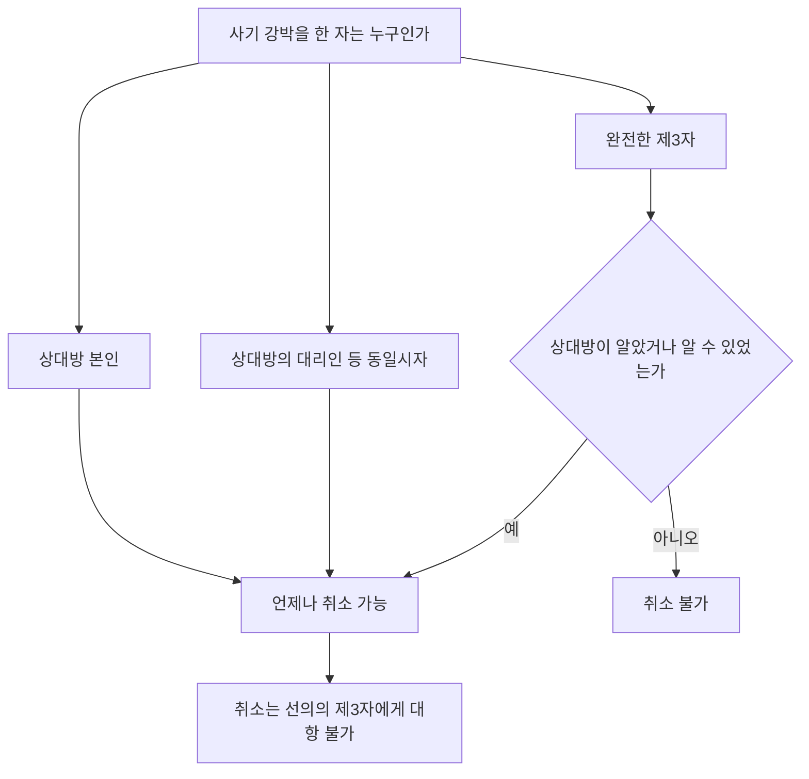

#### 4. 관련 조문

> 📌 **민법 제110조(사기, 강박에 의한 의사표시)** — ① 사기나 강박에 의한 의사표시는 취소할 수 있다. ② 상대방있는 의사표시에 관하여 ==제3자가 사기나 강박을 행한 경우==에는 상대방이 그 사실을 알았거나 알 수 있었을 경우에 한하여 그 의사표시를 취소할 수 있다. ③ 전2항의 의사표시의 취소는 ==선의의 제3자에게 대항하지 못한다.==

> 📌 **민법 제750조(불법행위의 내용)** — 고의 또는 과실로 인한 위법행위로 타인에게 손해를 가한 자는 그 손해를 배상할 책임이 있다. → 사기·강박은 ==취소와 별도로 불법행위==를 구성할 수 있다.

> 📌 **민법 제116조 제1항(대리행위의 하자)** — 의사표시의 효력이 의사의 흠결, ==사기, 강박== 또는 어느 사정을 알았거나 과실로 알지 못한 것으로 인하여 영향을 받을 경우에 그 사실의 유무는 ==대리인을 표준하여 결정한다.==

#### 5. 핵심 판례 법리

- **기망행위의 범위** — 거래에 있어서 중요한 사항에 관하여 구체적 사실을 ==신의성실의무에 비추어 비난받을 정도의 방법으로 허위 고지==한 경우에는 기망행위에 해당한다(대판 1993.8.13. 92다52665).
- **상술의 한계** — 연립주택을 분양하면서 평형을 과장한 광고는 ==사회통념상 용인될 수 있는 상술의 정도==인 경우 기망행위에 해당하지 않는다(대판 1995.7.28. 95다19515).
- **교환계약의 시가 묵비** — 교환계약 당사자가 자기 소유 목적물의 시가를 묵비하거나 허위로 높은 가액을 고지하였더라도 ==상대방의 의사결정에 불법적 간섭을 한 것으로 볼 수 없어 위법한 기망행위가 아니다==(대판 2002.9.4. 2000다54406).
- **고지의무의 근거** — 고지의무의 대상이 되는 것은 ==직접적인 법령의 규정뿐 아니라 널리 계약상·관습상 또는 조리상의 일반원칙==에 의해서도 인정될 수 있다(대판 2006.10.12. 2004다48515).
- **침묵에 의한 기망** — 소극적으로 진실을 숨기는 것과 단순한 침묵도 기망이 될 수 있다. ==임차권 양도에 관한 임대인의 동의 여부·재계약 여부에 대한 설명 없이 임차권을 양도한 것==은 기망행위다(대판 1996.6.14. 94다41003).
- **강박의 위법성** — 강박행위가 위법하려면 ==해악의 고지로 추구하는 이익이 정당하지 않거나, 고지하는 해악의 내용이 법질서에 위배되거나, 해악의 고지가 이익 달성 수단으로 부적당==해야 한다(대판 2000.3.23. 99다64049).
- **강박의 정도** — 강박에 의한 법률행위가 취소를 넘어 ==무효==가 되려면, 단순한 불법적 해악의 고지로 공포를 느끼게 하는 정도가 아니라 ==의사결정을 스스로 할 여지를 완전히 박탈한 상태==에서 의사표시가 이루어져 법률행위의 외형만 만들어진 정도여야 한다(대판 2003.5.13. 2002다73708).
- **강박이 아닌 예** — 상대방이 불법적인 해악의 고지 없이 ==각서에 서명날인할 것을 강력히 요구==하는 것만으로는 강박이 되지 않는다. 계약을 해제하여 손해배상을 청구할 수 있다는 취지로 말한 것도 ==위법한 해악의 고지가 아니다==(대판 2010.2.11. 2009다72643).
- **상대방의 대리인** — ==상대방의 대리인 등 상대방과 동일시할 수 있는 자의 사기·강박은 제3자의 사기·강박에 해당하지 않는다==(대판 1999.2.23. 98다60828, 60835). 따라서 본인의 선의·악의를 불문하고 취소할 수 있다. 반면 ==단순히 상대방의 피용자에 지나지 않는 사람==의 강박은 제3자의 강박에 해당한다.
- **제3자의 선의 추정** — 제3자는 특별한 사정이 없는 한 ==선의로 추정==되므로, 취소권을 행사하려면 ==제3자의 악의를 증명==해야 한다(대판 1970.11.24. 70다2155; 대판 2006.3.10. 2002다1321).
- **취소 없는 손해배상** — 제3자의 사기행위 자체가 불법행위를 구성하는 이상, ==피해자가 제3자를 상대로 손해배상을 청구하기 위해 반드시 계약을 취소할 필요는 없다==(대판 1999.3.10. 97다55829).
- **청구권의 경합** — 사기로 취소되는 법률행위가 동시에 불법행위를 구성하면 ==부당이득반환청구권과 손해배상청구권이 경합·병존==하며, 채권자는 선택하여 행사할 수 있으나 ==중첩적으로 행사할 수는 없다.==
- **사기와 착오의 경합** — 상대방의 기망에 의해 착오가 유발된 경우 ==사기취소와 착오취소가 경합==한다(대판 1969.6.24. 68다1749).
- **표시상의 착오와의 구별** — 제3자의 기망으로 ==표시상의 착오==에 빠진 경우에는 제110조 제2항이 아니라 ==착오의 법리만 적용==한다(대판 2005.5.27. 2004다43824).

#### ⭐ 기출 출제포인트

1. **상대방의 대리인의 사기** — ==제3자의 사기가 아니다.== 본인의 선의·악의 불문 취소 가능.
2. **취소 없이 제3자에게 손해배상 청구 가능** — "먼저 취소해야 한다"는 선지는 ==틀림.==
3. **제3자의 선의 추정** — "제3자가 선의를 증명해야 한다"는 ==틀림.==
4. **강박의 위법성** — "목적이 정당하면 수단이 부당해도 위법성 없다"는 ==틀림.==
5. **손해를 가할 의사** — 사기의 성립요건이 ==아니다.==

#### 📊 기출 분석

| 연도 | 출제 형태 | 핵심 논점 |
|---|---|---|
| 2020년 제31회 | "갑은 을의 기망으로 병에게 매도" 사례 | ==제3자의 사기 → 상대방 병의 선의·무과실 요건== / 제3자 정의 선의 추정 / 취소 없이 불법행위책임 |
| 2021년 제32회 | "사기·강박에 관한 설명으로 옳은 것은?" | ==유동적 무효 상태라도 사기취소 가능(정답)== / 교환계약 시가 묵비 = 기망 X / 대리인 기망 = 취소 가능 |
| 2022년 제33회 | "사기·강박에 관한 설명으로 옳지 않은 것은?" | ==제3자 사기시 먼저 취소해야 손해배상 청구 가능 = 틀림(정답)== |
| 2024년 제35회 | "사기·강박에 관한 설명으로 옳은 것은?" | ==상대방의 대리인의 사기는 제3자의 사기가 아니다== / ==피용자의 강박은 제3자의 강박이다== / ==제3자는 선의로 추정(정답)== |

**출제 빈도** — ==2020·2021·2022·2024년 출제.== 착오와 함께 격년 이상 확정 출제된다.
**반복되는 함정 선지** — ①"상대방의 대리인이 한 사기는 제3자의 사기에 해당한다"(→해당 X), ②"먼저 취소해야 손해배상 청구 가능"(→불필요), ③"강박행위의 목적이 정당하면 수단이 부당해도 위법성이 없다"(→있을 수 있다), ④"피기망자에게 손해를 가할 의사가 성립요건이다"(→아니다).
**최근 경향** — 2024년에는 ==대리인 vs 단순 피용자==의 구별을 정면으로 물었다.

#### 🔍 기출 선지로 배우는 법리

> 실제 출제된 선지를 그대로 놓고 O/X와 근거를 확인한다.

**①** 교환계약의 당사자가 자기 소유 목적물의 시가를 묵비하였다면 특별한 사정이 없는 한, 위법한 기망행위가 성립한다. — **X**
어디가 틀렸나: ==위법한 기망행위가 아니다==(대판 2002.9.4. 2000다54406). (2021년 제32회)

**②** 토지거래허가를 받지 않아 유동적 무효 상태에 있는 법률행위라도 사기에 의한 의사표시의 요건이 충족된 경우 사기를 이유로 취소할 수 있다. — **O**
근거: 대판 1997.11.14. 97다36118. (2021년 제32회, 정답 지문)

**③** 대리인의 기망행위로 계약을 체결한 상대방은 본인이 대리인의 기망행위에 대해 선의·무과실이면 계약을 취소할 수 없다. — **X**
옳게 고치면: 대리인의 기망은 ==제3자의 기망이 아니므로 본인의 선의·악의를 불문하고 취소할 수 있다==(대판 1999.2.23. 98다60828). (2021년 제32회)

**④** 강박행위의 목적이 정당한 경우에는 비록 그 수단이 부당하다고 하더라도 위법성이 인정될 여지가 없다. — **X**
어디가 틀렸나: ==수단이 부당하면 위법성이 인정될 수 있다==(대판 2000.3.23. 99다64049). (2021년 제32회)

**⑤** 제3자에 의한 사기행위로 계약을 체결한 경우, 표의자는 먼저 그 계약을 취소하여야 제3자에 대하여 불법행위로 인한 손해배상을 청구할 수 있다. — **X**
옳게 고치면: ==취소하지 않고도 청구할 수 있다==(대판 1999.3.10. 97다55829). (2022년 제33회, 정답 지문)

**⑥** 피기망자에게 손해를 가할 의사는 사기에 의한 의사표시의 성립요건이다. — **X**
어디가 틀렸나: ==성립요건이 아니다.== 2단의 고의로 족하다. (2024년 제35회)

**⑦** 상대방의 대리인이 한 사기는 제3자의 사기에 해당한다. — **X**
옳게 고치면: ==해당하지 않는다.== (2024년 제35회)

**⑧** 단순히 상대방의 피용자에 지나지 않는 사람이 한 강박은 제3자의 강박에 해당하지 않는다. — **X**
어디가 틀렸나: ==제3자의 강박에 해당한다.== 상대방과 동일시할 수 있는 자만 제외된다. (2024년 제35회)

**⑨** 매도인을 기망하여 부동산을 매수한 자로부터 그 부동산을 다시 매수한 제3자는 특별한 사정이 없는 한 선의로 추정된다. — **O**
근거: 대판 2006.3.10. 2002다1321. (2024년 제35회, 정답 지문)

#### ✏️ 사례형 적용

> **사례 1** — 甲은 乙(丙과는 아무 관계 없는 자)의 기망으로 자기 소유 건물을 丙에게 매도하고 이전등기를 마쳤다. 그 후 丙은 그 건물을 丁에게 전매하여 소유권을 이전하였다.

**검토** —
① **취소 가부**: 乙은 ==제3자==이므로 甲은 ==丙이 기망사실을 알았거나 알 수 있었을 경우에 한하여== 취소할 수 있다(제110조 제2항).
② **제3자 보호**: 甲이 취소하더라도 ==丁이 선의이면 소유권을 취득==한다(제110조 제3항). 丁의 선의는 ==추정==되므로 甲이 丁의 악의를 증명해야 한다.
③ **부당이득**: 취소하면 甲·丙 매매는 소급 무효이므로 甲은 丙에게 ==부당이득반환==을 청구할 수 있다.
④ **손해배상**: 甲은 ==매매계약을 취소하지 않고도== 乙에게 불법행위로 인한 손해배상을 청구할 수 있다(대판 1999.3.10. 97다55829).
**결론** — 취소는 상대방의 인식에 걸려 있지만, ==손해배상은 취소와 무관하게 가능==하다.

> **사례 2** — 채무자 甲이 보증인 乙을 기망하여, 乙이 채권자 丙과 보증계약을 체결하였다.

**검토** — 보증계약은 ==채권자 丙과 보증인 乙 사이의 계약==이므로, 채무자 甲은 그 계약의 ==제3자==에 해당한다. 따라서 乙은 ==丙이 기망사실을 알았거나 알 수 있었을 경우에 한하여== 보증계약을 취소할 수 있다(제110조 제2항).
**결론** — "채무자에게 기망을 이유로 취소를 주장한다"는 답은 틀린다. ==취소의 상대방은 계약의 상대방인 채권자==다.

#### ⚠️ 이 관의 함정 총정리

1. "상대방의 대리인이 한 사기는 제3자의 사기이다"라고 하면 틀림 → ==상대방과 동일시==하므로 제3자가 아니다.
2. "단순한 피용자의 강박은 제3자의 강박이 아니다"라고 하면 틀림 → ==제3자의 강박이다.==
3. "제3자에게 손해배상을 청구하려면 먼저 계약을 취소해야 한다"고 하면 틀림 → ==취소 불요.==
4. "제3자가 스스로 선의를 증명해야 한다"고 하면 틀림 → ==선의는 추정==되고 악의를 취소권자가 증명한다.
5. "강박은 언제나 취소사유일 뿐이다"라고 하면 틀림 → ==자유가 완전히 박탈되면 무효==다.

#### ✅ OX 확인문제

> 다음 진술의 참·거짓을 판단하시오.

**1.** 제3자가 사기를 행한 경우 상대방이 알았거나 알 수 있었을 때에 한하여 취소할 수 있다.
→ **O**. 제110조 제2항.

**2.** 상대방의 대리인이 한 사기는 제3자의 사기에 해당한다.
→ **X**. 해당하지 않는다(대판 1999.2.23. 98다60828).

**3.** 부작위나 침묵도 경우에 따라 기망행위가 될 수 있다.
→ **O**. 고지의무가 있으면 침묵도 기망이다.

**4.** 교환계약의 당사자가 자기 목적물의 시가를 묵비한 것은 위법한 기망행위이다.
→ **X**. 기망행위가 아니다(대판 2002.9.4. 2000다54406).

**5.** 사기를 이유로 취소하려면 기망행위와 의사표시 사이에 인과관계가 있어야 한다.
→ **O**. 인과관계는 피기망자의 주관적인 것으로 족하다.

**6.** 제3자에 의한 사기의 경우 표의자는 계약을 취소하지 않고도 제3자에게 손해배상을 청구할 수 있다.
→ **O**. 대판 1999.3.10. 97다55829.

**7.** 사기에 의한 의사표시의 취소는 선의의 제3자에게 대항하지 못하며, 제3자의 선의는 추정된다.
→ **O**. 제110조 제3항, 대판 2006.3.10. 2002다1321.

**8.** 상대방이 불법적 해악의 고지 없이 각서에 서명날인할 것을 강력히 요구한 것만으로 강박이 성립한다.
→ **X**. 강박이 되지 않는다.

**9.** 강박에 의해 의사결정의 자유가 완전히 박탈된 상태의 의사표시는 취소할 수 있을 뿐이다.
→ **X**. 무효다(대판 2003.5.13. 2002다73708).

**10.** 상대방의 기망으로 법률행위의 중요부분에 착오가 생긴 때에는 사기취소와 착오취소가 경합한다.
→ **O**. 대판 1969.6.24. 68다1749.

#### 🧠 암기법

> 🔑 **"대리인은 안, 피용자는 밖"**
> 상대방의 **대리인** = 상대방과 동일시 → 제3자 ==아님==(언제나 취소 가능). 단순 **피용자** = 제3자 ==맞음==(상대방의 인식 필요).

> 🔑 **"취소는 선택, 배상은 자유"**
> 사기·강박이 불법행위이면 ==취소하지 않고도== 손해배상 청구 가능. 다만 부당이득과 손해배상을 ==중첩 행사==는 불가.

> 🔑 **"제3자는 선의로 추정, 악의는 취소권자가 증명"**
> 제107조~제110조 전체에 공통된다. "제3자가 자기 선의를 증명"은 언제나 함정.

> 🔑 **사기 2단 고의 = "속이고 + 하게 하고"**
> 착오에 빠뜨리려는 고의 + 그 착오로 의사표시하게 하려는 고의. ==손해를 가할 의사는 불필요.==

---

### 제6관 의사표시의 효력발생

> 📖 의사표시가 언제 효력을 갖는가의 문제다. 민법은 ==도달주의==를 원칙으로 하되(제111조), 몇 가지 예외적으로 ==발신주의==를 취한다. 도달의 개념, 발신주의 예외 5종, 수령무능력자 규정이 출제의 전부라고 해도 좋을 만큼 범위가 명확하다.

> ⭐ **이 관에서 반드시 챙길 3가지**
> ① **도달** = 상대방이 ==알 수 있는 객관적 상태==. 현실로 수령하거나 내용을 알 필요는 없다.
> ② 발신 후 표의자가 ==사망하거나 제한능력자가 되어도 효력에 영향이 없다==(제111조 제2항).
> ③ **보통우편은 도달 추정 X**, ==등기·내용증명우편은 도달 추정 O.==

#### 1. 의의

| 구분 | 내용 |
|---|---|
| **원칙 — 도달주의** | 상대방 있는 의사표시는 그 통지가 ==상대방에게 도달한 때== 효력이 생긴다(제111조 제1항) |
| **도달의 의미** | 사회관념상 상대방이 통지의 내용을 ==알 수 있는 객관적 상태==에 놓인 것. ==현실적으로 수령하였거나 내용을 알았을 것까지는 필요 없다==(대판 1997.11.25. 97다31281) |
| **부도달·연착의 불이익** | ==표의자가 부담== |
| **철회** | 도달 ==전==에는 철회 가능. ==도달 후에는 상대방이 요지하기 전이라도 철회할 수 없다== |
| **제111조의 성질** | ==임의규정.== 당사자가 약정으로 효력발생시기를 달리 정할 수 있다 |

#### 2. 요건 — 도달로 인정되는가

| 도달 **인정** | 도달 **부정** |
|---|---|
| ==상대방과 동거하는 친족·고용인에게 전달==된 경우 | ==채무자가 아닌 자에게 송달==된 경우(대판 1997.11.25. 97다31281) |
| ==정당한 사유 없이 수령을 거절==한 경우 — 알 수 있는 객관적 상태에 놓인 때(대판 2008.6.12. 2008다19973) | ==아파트 경비원이 우편물을 수령한 후 우편함에 넣어둔 경우==(대판 2006.3.24. 2005다66411) |
| 상대방이 귀를 막아 듣지 않으려 해도 도달 | 수령자 몰래 호주머니에 넣어둔 경우 |
| ==등기우편·내용증명우편으로 발송되고 반송되지 않은 경우== — 그 무렵 도달 추정(대판 1997.2.25. 96다38322; 대판 2000.10.27. 2000다20052) | ==보통우편으로 발송된 사실만으로는 도달 추정 X== — 송달의 효력을 주장하는 측이 증명해야 한다(대판 2009.12.10. 2007두20140) |

#### 3. 효과

**(1) 발신주의의 예외 5종**

| 조문 | 내용 |
|---|---|
| **제15조** | 제한능력자의 상대방의 최고에 대한 ==법정대리인 등의 확답== |
| **제71조** | ==사원총회 소집의 통지== |
| **제131조** | 무권대리인의 상대방의 최고에 대한 ==본인의 확답== |
| **제455조** | 채무인수에서 채무자의 승낙 최고에 대한 ==채권자의 승낙== |
| **제531조** | ==격지자 간 계약의 승낙의 통지==(계약은 승낙의 통지를 발송한 때 성립) |

**(2) 표의자에게 생긴 사정**

> 📌 **민법 제111조 제2항** — 의사표시자가 그 통지를 발송한 후 ==사망하거나 제한능력자가 되어도== 의사표시의 효력에 영향을 미치지 아니한다.

**(3) 공시송달과 수령능력**

| 조문 | 내용 |
|---|---|
| **제113조(공시송달)** | 표의자가 ==과실 없이== 상대방을 알지 못하거나 그 소재를 알지 못하는 경우, 의사표시는 민사소송법 공시송달 규정에 의하여 송달할 수 있다 |
| **제112조(수령무능력)** | 의사표시의 상대방이 이를 받은 때에 ==제한능력자인 경우에는 표의자는 그 의사표시로써 대항하지 못한다.== 다만 ==법정대리인이 도달한 사실을 안 후==에는 그러하지 아니하다 |

> ⚠️ **수령무능력의 편면성** — 표의자는 도달을 주장하지 못하지만, ==제한능력자 측에서 도달을 주장하는 것은 무방==하다. 제112조는 ==제한능력자를 보호하기 위한 규정==이기 때문이다.

#### 4. 관련 조문

> 📌 **민법 제111조(의사표시의 효력발생시기)** — ① 상대방있는 의사표시는 ==상대방에게 도달한 때에 그 효력이 생긴다.== ② 의사표시자가 그 통지를 발송한 후 사망하거나 제한능력자가 되어도 의사표시의 효력에 영향을 미치지 아니한다.

> 📌 **민법 제112조(제한능력자에 대한 의사표시의 효력)** — 의사표시의 상대방이 의사표시를 받은 때에 제한능력자인 경우에는 의사표시자는 그 의사표시로써 대항할 수 없다. 다만, 그 상대방의 ==법정대리인이 의사표시가 도달한 사실을 안 후에는== 그러하지 아니하다.

> 📌 **민법 제113조(의사표시의 공시송달)** — 표의자가 ==과실없이== 상대방을 알지 못하거나 상대방의 소재를 알지 못하는 경우에는 의사표시는 민사소송법 공시송달의 규정에 의하여 송달할 수 있다.

> 📌 **민법 제531조(격지자간의 계약성립시기)** — 격지자간의 계약은 ==승낙의 통지를 발송한 때==에 성립한다.

#### 5. 핵심 판례 법리

- **도달의 개념** — 의사표시는 상대방에게 도달됨으로써 효력이 발생하며, 도달이란 ==사회관념상 상대방이 통지의 내용을 알 수 있는 객관적 상태==를 의미하므로 ==현실적으로 수령하였다거나 내용을 알았을 것까지는 필요하지 않다==(대판 1997.11.25. 97다31281).
- **수령거절** — 상대방이 ==정당한 사유 없이 통지의 수령을 거절==한 경우에는 상대방이 그 통지의 내용을 알 수 있는 객관적 상태에 놓여 있는 때에 ==의사표시의 효력이 생긴다==(대판 2008.6.12. 2008다19973).
- **경비원 수령** — 아파트 경비원이 우편물을 수령한 후 우편함에 넣어둔 경우에는 ==도달을 인정할 수 없다==(대판 2006.3.24. 2005다66411).
- **채무자 아닌 자에게 송달** — 통지가 채무자가 아닌 자에게 송달된 경우에는 사회관념상 ==채무자가 통지의 내용을 알 수 있는 객관적 상태에 놓였다고 인정할 수 없다==(대판 1997.11.25. 97다31281).
- **등기·내용증명우편** — 등기우편·내용증명우편으로 발송되고 ==반송된 사실이 없다면 특별한 사정이 없는 한 그 무렵 수취인에게 도달한 것으로 추정==된다(대판 1997.2.25. 96다38322; 대판 2000.10.27. 2000다20052).
- **보통우편** — 등기·내용증명우편과 달리 ==보통우편의 방법으로 발송되었다는 사실만으로는 상당한 기간 내에 도달하였다고 추정할 수 없고==, 송달의 효력을 주장하는 측이 이를 증명해야 한다(대판 2009.12.10. 2007두20140).
- **준법률행위에의 유추적용** — 도달주의 원칙은 ==채권양도의 통지와 같은 준법률행위에도 유추적용==될 수 있다.
- **표의자의 사망·능력상실** — 표의자가 통지를 발신한 후 ==사망하거나 행위능력을 상실하여도 의사표시의 효력에 영향이 없다==(제111조 제2항). 따라서 매매계약 승낙의 통지를 발신한 후 승낙자가 사망하였어도 그 의사표시가 청약자에게 정상적으로 도달하면 ==매매계약은 유효하게 성립==한다.
- **수령무능력의 편면성** — 의사표시를 제한능력자가 수령한 경우 표의자는 도달을 주장하지 못하지만, ==제한능력자 측에서 도달을 주장하는 것은 무방==하며, ==법정대리인이 도달을 인식한 때에는 표의자도 도달을 주장할 수 있다==(제112조 단서).
- **상대방 없는 의사표시** — ==재단법인 설립행위의 효력발생을 위해서는 의사표시의 도달이 요구되지 않는다.== 상대방 없는 단독행위이기 때문이다.

#### ⭐ 기출 출제포인트

1. **"도달은 현실적 수령 또는 내용을 안 것을 의미한다"** 형 함정 — ==알 수 있는 객관적 상태==면 족하다.
2. **"보통우편도 도달 추정된다"** 형 함정 — ==추정되지 않는다.==
3. **발신 후 사망·제한능력자화** — ==효력에 영향 없음.==
4. **발신주의 예외 5종 찾기** — 대화자 간 승낙은 ==예외가 아니다.==
5. **공시송달의 요건** — 표의자에게 ==과실이 없어야== 한다.

#### 📊 기출 분석

| 연도 | 출제 형태 | 핵심 논점 |
|---|---|---|
| 2019년 제30회 | "의사표시의 효력발생에 관한 설명으로 옳지 않은 것은?" | ==도달은 내용을 안 것을 의미한다 = 틀림(정답)== |
| 2020년 제31회 | "의사표시의 효력발생시기로 옳지 않은 것은?" | ==현실적 수령·요지를 요한다 = 틀림(정답)== / 등기우편 도달 추정 |
| 2021년 제32회 | "의사표시의 효력발생으로 옳지 않은 것은?" | ==발송 후 제한능력자가 되면 취소할 수 있다 = 틀림(정답)== / 준법률행위 유추적용 |
| 2022년 제33회 | "상대방 있는 의사표시의 효력발생으로 옳은 것은?" | ==제한능력자는 원칙적 수령무능력자(정답)== / 보통우편 추정 X / 사망해도 유효 |
| 2023년 제34회 | "의사표시의 효력발생으로 옳지 않은 것은?" | ==발신 후 사망하면 도달해도 무효 = 틀림(정답)== / 제111조 임의규정 / 재단법인 설립행위는 도달 불요 |

**출제 빈도** — ==2019·2020·2021·2022·2023년 5년 연속 출제.== 이 관은 ==거저 주는 문항==이므로 절대 놓쳐서는 안 된다.
**반복되는 함정 선지** — ①"도달 = 현실적 수령 또는 요지"(→객관적 상태), ②"보통우편도 도달 추정"(→추정 X), ③"발신 후 사망·제한능력자화하면 무효 또는 취소 가능"(→영향 없음).
**최근 경향** — 5년 연속 ==거의 같은 4~5개 선지가 순환==한다.

#### 🔍 기출 선지로 배우는 법리

> 실제 출제된 선지를 그대로 놓고 O/X와 근거를 확인한다.

**①** 의사표시의 도달이란 상대방이 그 내용을 안 것을 의미한다. — **X**
어디가 틀렸나: ==알 수 있는 객관적 상태==에 놓이면 족하다(대판 1997.11.25. 97다31281). (2019년 제30회, 정답 지문)

**②** 도달주의의 원칙을 정하는 민법 제111조는 임의규정이므로 당사자는 약정으로 효력발생시기를 달리 정할 수 있다. — **O**
근거: 판례의 태도다. (2019년 제30회 / 2023년 제34회)

**③** 상대방이 정당한 사유 없이 통지의 수령을 거절한 경우, 상대방이 그 통지의 내용을 알 수 있는 객관적 상태에 놓여 있는 때에 의사표시의 효력이 생긴다. — **O**
근거: 대판 2008.6.12. 2008다19973. (2020년 제31회 / 2021년 제32회 / 2023년 제34회)

**④** 보통우편의 방법으로 발송된 의사표시는 상당기간 내에 도달하였다고 추정된다. — **X**
옳게 고치면: ==추정되지 않는다==(대판 2009.12.10. 2007두20140). ==등기·내용증명==우편이라야 추정된다. (2022년 제33회)

**⑤** 의사표시자가 그 통지를 발송한 후 제한능력자가 되었다면 특별한 사정이 없는 한 그 의사표시는 취소할 수 있다. — **X**
어디가 틀렸나: ==효력에 영향이 없다==(제111조 제2항). (2021년 제32회, 정답 지문)

**⑥** 의사표시의 발신 후 표의자가 사망하였다면, 그 의사표시는 상대방에게 도달하더라도 무효이다. — **X**
옳게 고치면: ==유효==하다(제111조 제2항). (2023년 제34회, 정답 지문)

**⑦** 재단법인 설립행위의 효력발생을 위해서는 의사표시의 도달이 요구되지 않는다. — **O**
근거: ==상대방 없는 단독행위==이기 때문이다. (2023년 제34회)

**⑧** 도달주의의 원칙은 채권양도의 통지와 같은 준법률행위에도 유추적용될 수 있다. — **O**
근거: 판례의 태도다. (2021년 제32회)

**⑨** 표의자가 과실로 상대방을 알지 못하는 경우에는 민사소송법 공시송달 규정에 의하여 의사표시의 효력을 발생시킬 수 있다. — **X**
어디가 틀렸나: ==과실이 없어야== 한다(제113조). (2022년 제33회)

#### ✏️ 사례형 적용

> **사례 1** — 甲은 乙에게 계약 해지의 의사표시를 내용증명우편으로 발송한 다음 날 사망하였다. 우편물은 乙의 아파트 경비원이 수령하여 우편함에 넣어 두었고, 乙은 열흘 뒤에야 이를 확인하였다.

**검토** —
① **표의자의 사망**: 발신 후 사망하여도 ==의사표시의 효력에 영향이 없다==(제111조 제2항).
② **도달 여부**: 아파트 ==경비원이 수령하여 우편함에 넣어둔 것만으로는 도달이 인정되지 않는다==(대판 2006.3.24. 2005다66411). 다만 내용증명우편이 발송되고 ==반송되지 않았다면 그 무렵 도달한 것으로 추정==된다(대판 2000.10.27. 2000다20052).
③ **효력발생시점**: 乙이 실제로 내용을 안 시점이 아니라 ==알 수 있는 객관적 상태에 놓인 때==다.
**결론** — 사망은 문제되지 않고, ==도달 시점의 인정==이 쟁점이 된다.

> **사례 2** — 甲이 미성년자 乙에게 매매계약 해제의 의사표시를 하였다. 乙의 법정대리인 丙은 나중에 그 사실을 알게 되었다.

**검토** — 乙은 ==수령무능력자==이므로 甲은 원칙적으로 그 의사표시로써 ==대항할 수 없다==(제112조 본문). 그러나 ==법정대리인 丙이 도달 사실을 안 후==에는 甲도 도달을 주장할 수 있다(제112조 단서). 한편 ==乙 측에서 도달을 주장하는 것은 무방==하다.
**결론** — 제112조는 ==제한능력자를 보호하는 편면적 규정==이다.

#### ⚠️ 이 관의 함정 총정리

1. "도달이란 상대방이 내용을 안 것이다"라고 하면 틀림 → ==알 수 있는 객관적 상태==면 족하다.
2. "보통우편도 도달이 추정된다"고 하면 틀림 → ==등기·내용증명==만 추정된다.
3. "발신 후 표의자가 사망하면 의사표시가 무효가 된다"고 하면 틀림 → ==영향 없다.==
4. "도달 후에도 상대방이 요지하기 전이면 철회할 수 있다"고 하면 틀림 → ==철회할 수 없다.==
5. "표의자에게 과실이 있어도 공시송달할 수 있다"고 하면 틀림 → ==과실이 없어야== 한다.

#### ✅ OX 확인문제

> 다음 진술의 참·거짓을 판단하시오.

**1.** 상대방 있는 의사표시는 상대방에게 도달한 때에 효력이 생긴다.
→ **O**. 제111조 제1항.

**2.** 도달은 상대방이 현실적으로 수령하거나 내용을 알았을 것을 요한다.
→ **X**. 알 수 있는 객관적 상태면 족하다(대판 1997.11.25. 97다31281).

**3.** 표의자가 통지를 발송한 후 사망하여도 의사표시의 효력에 영향이 없다.
→ **O**. 제111조 제2항.

**4.** 보통우편으로 발송된 우편물은 상당한 기간 내에 도달한 것으로 추정된다.
→ **X**. 추정되지 않는다(대판 2009.12.10. 2007두20140).

**5.** 격지자 간의 계약은 승낙의 통지를 발송한 때에 성립한다.
→ **O**. 제531조(발신주의).

**6.** 대화자 간 계약의 승낙에도 발신주의가 적용된다.
→ **X**. 발신주의의 예외에 해당하지 않는다.

**7.** 상대방이 정당한 사유 없이 수령을 거절한 경우에도 도달이 인정될 수 있다.
→ **O**. 대판 2008.6.12. 2008다19973.

**8.** 제한능력자는 원칙적으로 의사표시의 수령무능력자이다.
→ **O**. 제112조.

**9.** 수령무능력자가 스스로 의사표시의 도달을 주장하는 것은 허용되지 않는다.
→ **X**. 제한능력자 측에서 도달을 주장하는 것은 무방하다.

**10.** 표의자가 과실 없이 상대방의 소재를 알지 못하는 경우 공시송달로 의사표시를 할 수 있다.
→ **O**. 제113조.

#### 🧠 암기법

> 🔑 **발신주의 5종 = "제·사·무·채·격"**
> **제**한능력자 상대방의 최고에 대한 확답(제15조) · **사**원총회 소집통지(제71조) · **무**권대리 최고에 대한 본인 확답(제131조) · **채**무인수 승낙 최고에 대한 채권자 승낙(제455조) · **격**지자 간 승낙(제531조).

> 🔑 **"등기·내용증명은 추정, 보통우편은 증명"**
> 등기·내용증명 = 반송 없으면 도달 **추정**. 보통우편 = 주장하는 쪽이 **증명**.

> 🔑 **"발신 후에는 무슨 일이 나도 상관없다"**
> 표의자의 사망·제한능력자화 → 효력에 영향 없음(제111조 제2항). 승낙자가 죽어도 계약은 성립.

> 🔑 **"수령무능력은 한쪽 문"**
> 표의자는 도달 주장 X, 제한능력자 측은 도달 주장 O. 법정대리인이 알면 그때부터 표의자도 O.

### 제1관 대리 서설

> 📖 대리는 ==타인(대리인)이 한 의사표시의 효과가 본인에게 귀속==하는 제도다. 사적 자치의 확장(임의대리)과 보충(법정대리)이라는 두 기능을 담당한다. 이 절 전체가 ==본인–대리인–상대방의 3면관계==로 짜여 있으므로, 이 관에서 그 뼈대를 세우고 간다.

> ⭐ **이 관에서 반드시 챙길 3가지**
> ① 대리의 3면관계 — ==수권(본인↔대리인)==, ==대리행위(대리인↔상대방)==, ==효과귀속(본인↔상대방).==
> ② 대리가 허용되는 것은 ==의사표시==와 ==성질이 허용하는 준법률행위==뿐. 사실행위·불법행위·신분행위는 ==불가.==
> ③ 대리(현명 O, 대리인의 의사표시)와 사자(현명 X 또는 본인의 의사 전달), 간접대리(자기 이름)와의 구별.

#### 1. 의의

**대리(代理)** 란 대리인이 본인의 이름으로 의사표시를 하거나 받음으로써 그 ==법률효과가 직접 본인에게 귀속==하는 제도다.

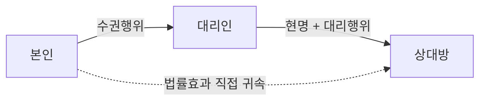

#### 2. 요건 — 대리의 3면관계

| 관계 | 내용 | 조문 |
|---|---|---|
| **본인 ↔ 대리인** | 대리권의 발생(수권행위 또는 법률의 규정) | 제114조 이하 |
| **대리인 ↔ 상대방** | 대리행위(현명 + 의사표시) | 제114조·제115조·제116조 |
| **본인 ↔ 상대방** | 효과의 직접 귀속 | 제114조 |

#### 3. 효과 — 대리의 종류와 인정범위

**(1) 대리의 종류**

| 기준 | 유형 | 내용 |
|---|---|---|
| 발생원인 | **임의대리** | 본인의 ==수권행위==에 의해 발생. 사적 자치의 ==확장== |
| | **법정대리** | ==법률의 규정==에 의해 발생. 사적 자치의 ==보충== |
| 행위의 방향 | **능동대리** | 대리인이 의사표시를 ==하는== 경우 |
| | **수동대리** | 대리인이 의사표시를 ==받는== 경우 |
| 대리권 유무 | **유권대리 / 무권대리** | 무권대리는 다시 협의의 무권대리·표현대리로 |

**(2) 대리가 인정되는 범위**

| 대리 **가능** | 대리 **불가** |
|---|---|
| ==의사표시(법률행위)== | ==사실행위== — 무주물 선점, 가공, 매장물 발견 |
| ==준법률행위 중 표현행위== — 의사의 통지(최고·거절), 관념의 통지(채무의 승인 등)(대판 2013.6.28. 2011다83110) | ==불법행위== |
| 재산적 성질을 아울러 가지는 가족법상 행위 — ==부양청구권의 행사, 상속회복청구권, 재산분할청구권== | ==가족법상 신분행위== — 약혼·혼인·입양·유언·인지 |

**(3) 유사 제도와의 구별**

| 구분 | 누구의 의사표시인가 | 이름 | 효과 귀속 |
|---|---|---|---|
| **대리** | ==대리인의 의사표시== | ==본인의 이름==(현명) | 본인 |
| **사자(使者)** | ==본인의 의사표시==(전달·표시기관) | 본인의 이름 | 본인 |
| **간접대리**(위탁매매) | 행위자의 의사표시 | ==자기의 이름== | 일단 ==행위자==, 후에 내부적으로 이전 |
| **대표** | 대표기관의 행위가 곧 법인의 행위 | 법인의 이름 | 법인 |

> ⚠️ **대리 vs 사자** — 사자는 의사결정을 하지 않으므로 ==의사능력이 필요 없다.== 반면 대리인은 스스로 의사표시를 하므로 ==의사능력은 필요하되 행위능력은 불요==(제117조)다.

#### 4. 관련 조문

> 📌 **민법 제114조(대리행위의 효력)** — ① 대리인이 그 권한내에서 ==본인을 위한 것임을 표시한 의사표시==는 직접 본인에게 대하여 효력이 생긴다. ② 전항의 규정은 대리인에게 대한 제3자의 의사표시에 준용한다.

> 📌 **민법 제117조(대리인의 행위능력)** — 대리인은 ==행위능력자임을 요하지 아니한다.==

> 📌 **민법 제116조 제1항(대리행위의 하자)** — 의사표시의 효력이 의사의 흠결, 사기, 강박 또는 어느 사정을 알았거나 과실로 알지 못한 것으로 인하여 영향을 받을 경우에 그 사실의 유무는 ==대리인을 표준하여 결정한다.==

#### 5. 핵심 판례 법리

- **준법률행위와 대리** — 준법률행위 중 ==의사의 통지나 관념의 통지와 같은 표현행위는 대리인이 할 수 있다==(대판 2013.6.28. 2011다83110).
- **사실행위·불법행위** — 사실행위(무주물 선점·가공)와 불법행위에는 ==대리가 인정되지 않는다.== 불법행위에는 대리의 법리가 적용되지 않으며, 사용자책임 등 별개의 법리로 해결한다.
- **신분행위** — 가족법상의 신분행위는 원칙적으로 대리가 허용되지 않으나, ==부양청구권의 행사, 상속회복청구권, 재산분할청구권==과 같이 재산행위의 성질을 아울러 가지는 행위에는 대리가 허용된다.
- **계약당사자의 확정** — 상대방이 대리인을 통하여 본인과 계약을 체결하려는 데 의사가 일치하였다면 ==대리권의 존부와 무관하게 상대방과 본인이 그 계약의 당사자==다(대판 2003.12.12. 2003다44059).
- **대리행위의 하자** — 의사의 흠결·사기·강박·선의악의 여부는 ==대리인을 표준==으로 결정한다(제116조 제1항). 따라서 대리인이 사회질서에 반하여 이중매수를 한 경우, ==본인이 그 사정을 몰랐어도 그 대리행위는 무효==다.
- **대리인 측의 사기·강박** — 상대방과의 계약에서 상대방의 대리인이 사기·강박을 한 경우, 대리인은 ==제110조 제2항의 "제3자"에 해당하지 않으므로== 본인의 지·부지를 불문하고 취소할 수 있다(대판 1999.2.23. 98다60828).
- **대리권 남용** — 대리인의 진의가 배임적이었더라도 ==대리의사는 존재하므로 대리행위로서 유효==하나, 상대방이 그 의도를 알았거나 알 수 있었다면 제107조 제1항 단서의 유추해석상 ==본인은 책임을 지지 않는다==(대판 2001.1.19. 2000다20694).
- **해제의 효과** — 계약이 해제된 경우, 그 원인이 된 계약상 채무의 불이행에 대리인에게 책임 있는 사유가 있더라도 ==해제로 인한 원상회복의무는 대리인이 아니라 계약의 당사자인 본인이 부담==한다(대판 2011.8.18. 2011다30871).

#### ⭐ 기출 출제포인트

1. **"불법행위에도 대리의 법리가 적용된다"** 형 함정 — ==적용되지 않는다.==
2. **대리행위의 하자 판단 기준** — ==대리인.==
3. **대리인의 행위능력** — ==불요.== 미성년자도 대리인이 될 수 있다.
4. **대리인이 공서양속에 반하는 행위를 한 경우** — 본인이 몰랐어도 ==무효.==
5. **해제의 원상회복의무자** — ==본인.==

#### 📊 기출 분석

| 연도 | 출제 형태 | 핵심 논점 |
|---|---|---|
| 2019년 제30회 | "대리에 관한 설명으로 옳지 않은 것은?" | 불법행위에 대리 적용 X / ==대리권 남용은 무권대리 = 틀림(정답)== / 공서양속 위반은 본인이 몰라도 무효 / 대리인의 사기는 본인 선의·무과실이라도 취소 가능 / 복대리인은 본인의 대리인 |
| 2023년 제34회 | "법률행위의 대리로 옳지 않은 것은?" | ==무권대리인의 책임은 대리인에게 귀책사유가 있는 경우에만 인정 = 틀림(정답)== / 각자대리 원칙 / 상대방 없는 단독행위 무권대리는 확정적 무효 |
| 문제집(대리 기본문제 01) | "대리가 허용되는 것은?" | ==채무의 승인(정답)== |

**출제 빈도** — 대리 절은 ==매년 2~3문항==이 나오는 최대 출제 구역이며, 서설의 기본 법리는 그 모든 문항의 전제다.
**반복되는 함정 선지** — "대리권 남용은 무권대리이다"(→유권대리이나 본인 면책).
**최근 경향** — 대리의 3면관계 어느 지점에서 문제가 생겼는지를 정확히 짚게 하는 사례형이 늘고 있다.

#### 🔍 기출 선지로 배우는 법리

> 실제 출제된 선지를 그대로 놓고 O/X와 근거를 확인한다.

**①** 불법행위에는 대리의 법리가 적용되지 않는다. — **O**
근거: 대리는 의사표시에 관한 제도다. (2019년 제30회)

**②** 대리인이 자신의 이익을 도모하기 위하여 대리권을 남용한 경우는 무권대리에 해당한다. — **X**
어디가 틀렸나: ==유권대리==이나 상대방이 알았거나 알 수 있었으면 본인이 면책된다(대판 2001.1.19. 2000다20694). (2019년 제30회, 정답 지문)

**③** 대리인의 대리행위가 공서양속에 반하는 경우, 본인이 그 사정을 몰랐다고 하더라도 그 행위는 무효이다. — **O**
근거: 제116조 제1항에 따라 ==대리인 기준==으로 판단한다. (2019년 제30회)

**④** 대리인이 상대방에게 사기·강박을 하였다면 상대방은 본인이 그에 대해 선의·무과실이라 하더라도 대리인과 행한 법률행위를 취소할 수 있다. — **O**
근거: 대리인은 제110조 제2항의 제3자가 아니다(대판 1999.2.23. 98다60828). (2019년 제30회)

**⑤** 대리가 허용되는 것은 채무의 승인이다. — **O**
근거: 준법률행위 중 ==관념의 통지==에는 대리가 허용된다(대판 2013.6.28. 2011다83110). 약혼·유언(신분행위), 무주물선점(사실행위), 불법행위는 불가. (문제집 대리 기본문제 01)

#### ✏️ 사례형 적용

> **사례** — 甲의 대리인 乙은 丙 소유 X토지가 이미 丁에게 매도된 사실을 알면서도 丙의 배임행위에 적극 가담하여 甲을 위해 X를 매수하였다. 甲은 그 사정을 전혀 몰랐다.

**검토** — 대리행위의 하자는 ==대리인 乙을 표준==으로 판단한다(제116조 제1항). 乙이 적극 가담하였으므로 그 매매는 ==제103조 위반으로 무효==이고, ==본인 甲이 선의라도 무효를 면하지 못한다.==
**결론** — 무효는 절대적이므로, 甲으로부터 다시 취득한 선의의 제3자도 보호받지 못한다.

#### ⚠️ 이 관의 함정 총정리

1. "대리인은 행위능력자여야 한다"고 하면 틀림 → ==행위능력은 불요==(제117조).
2. "불법행위에도 대리가 인정된다"고 하면 틀림 → ==인정되지 않는다.==
3. "대리권 남용은 무권대리이다"라고 하면 틀림 → ==유권대리이되 본인 면책==이다.
4. "대리행위의 하자는 본인을 표준으로 판단한다"고 하면 틀림 → ==대리인 표준==이다.
5. "해제로 인한 원상회복의무는 대리인이 부담한다"고 하면 틀림 → ==본인==이 부담한다(대판 2011.8.18. 2011다30871).

#### ✅ OX 확인문제

> 다음 진술의 참·거짓을 판단하시오.

**1.** 대리인이 권한 내에서 본인을 위한 것임을 표시한 의사표시는 직접 본인에게 효력이 생긴다.
→ **O**. 제114조 제1항.

**2.** 대리인은 행위능력자여야 한다.
→ **X**. 행위능력자임을 요하지 않는다(제117조).

**3.** 무주물 선점·가공과 같은 사실행위에도 대리가 인정된다.
→ **X**. 인정되지 않는다.

**4.** 준법률행위 중 관념의 통지에는 대리가 허용될 수 있다.
→ **O**. 대판 2013.6.28. 2011다83110.

**5.** 재산분할청구권의 행사에는 대리가 허용될 수 있다.
→ **O**. 재산행위의 성질을 아울러 가지기 때문이다.

**6.** 사자(使者)는 스스로 의사결정을 하므로 의사능력이 필요하다.
→ **X**. 본인의 의사를 전달·표시할 뿐이므로 의사능력이 필요하지 않다.

**7.** 간접대리인은 자기의 이름으로 법률행위를 하고 효과도 일단 자신에게 귀속한다.
→ **O**. 위탁매매가 그 예다.

**8.** 대리인이 상대방에게 사기를 한 경우 본인이 선의·무과실이면 상대방은 취소할 수 없다.
→ **X**. 대리인은 제3자가 아니므로 취소할 수 있다.

**9.** 대리행위가 공서양속에 반하면 본인이 몰랐어도 무효이다.
→ **O**. 제116조 제1항.

**10.** 계약 해제로 인한 원상회복의무는 대리인이 부담한다.
→ **X**. 계약당사자인 본인이 부담한다(대판 2011.8.18. 2011다30871).

#### 🧠 암기법

> 🔑 **3면관계 = "수·행·귀"**
> **수**권(본인→대리인) · 대리**행**위(대리인→상대방) · 효과**귀**속(본인↔상대방). 모든 대리 문제는 이 셋 중 어디가 고장 났는지를 묻는다.

> 🔑 **대리 불가 = "사·불·신"**
> **사**실행위 · **불**법행위 · **신**분행위. 다만 신분행위 중 ==재산적 성질을 겸한 것==(부양·상속회복·재산분할)은 예외.

> 🔑 **"의사는 필요, 행위능력은 불필요"**
> 대리인에게 의사능력은 필요하나 ==행위능력은 불요==(제117조). 그래서 미성년자도 대리인이 될 수 있고, 본인은 그를 이유로 취소하지 못한다.

---

### 제2관 대리권

> 📖 대리의 3면관계 중 ==본인–대리인== 축이다. 대리권이 어떻게 발생하고 어디까지 미치며 어떻게 제한되는가를 다룬다. **대리권의 범위**(제118조)와 **자기계약·쌍방대리 금지**(제124조)가 출제의 중심이다.

> ⭐ **이 관에서 반드시 챙길 3가지**
> ① 범위가 정해지지 않은 임의대리인은 ==보존행위 + 성질이 변하지 않는 범위의 이용·개량행위==만 가능(제118조).
> ② 자기계약·쌍방대리는 원칙 금지, ==본인의 허락 또는 채무의 이행==이면 허용(제124조). 위반 시 ==무권대리==다.
> ③ 계약체결의 대리권이 있다고 ==해제권까지 당연히 있는 것은 아니다.==

#### 1. 의의

**대리권**이란 대리인이 본인의 이름으로 의사표시를 하거나 받아 그 효과를 본인에게 귀속시킬 수 있는 ==법률상의 지위 또는 자격==이다.

#### 2. 요건 — 대리권의 발생

| 구분 | 발생원인 | 비고 |
|---|---|---|
| **법정대리** | ==법률의 규정==, 지정권자의 지정, 법원의 선임 | 친권자, 후견인, 부재자 재산관리인 등 |
| **임의대리** | ==수권행위(授權行爲)== | 상대방 있는 ==단독행위==. 불요식행위이며 위임장 교부가 필수는 아니다 |

> 💡 **수권행위의 인정** — 본인이 사회통념상 대리권을 추단할 수 있는 ==직함이나 명칭 등의 사용을 승낙==한 경우에는 수권행위가 있는 것으로 볼 수 있다(대판 2016.5.26. 2016다203315). 반면 ==인감증명서만의 교부==는 일반적으로 대리권 수여행위로 볼 수 없다(대판 1978.10.10. 78다75).

#### 3. 효과 — 대리권의 범위와 제한

**(1) 범위가 정해지지 않은 경우 — 제118조**

| 허용되는 행위 | 내용 | 예 |
|---|---|---|
| **보존행위** | 재산의 가치를 ==현상 유지==하는 행위 | 가옥의 수선, 소멸시효의 중단, 미등기부동산의 등기, 부패하기 쉬운 물건의 처분 |
| **이용행위** | ==성질이 변하지 않는 범위==에서 수익을 꾀하는 행위 | 물건의 임대, 금전의 이자부 대여 |
| **개량행위** | ==성질이 변하지 않는 범위==에서 가치를 증가시키는 행위 | 무이자 소비대차를 이자부로 변경 |

> ⚠️ ==처분행위는 포함되지 않는다.== 또 예금을 주식으로 바꾸는 것처럼 ==물건·권리의 성질을 변하게 하는 이용·개량행위==도 허용되지 않는다.

**(2) 임의대리권의 범위에 관한 판례**

| 포함 **O** | 포함 **X** |
|---|---|
| ==필요한 한도에서 상대방의 의사표시를 수령하는 수령대리권==(대판 1994.2.8. 93다39379) | ==계약체결의 대리권에 그 계약을 해제할 권한==(대판 1993.1.15. 92다39365) |
| 매매계약 체결·이행에 관한 포괄적 대리권 → ==약정 대금지급기일을 연기할 권한==(대판 1992.4.14. 91다43107) | 예금계약 체결을 위임받은 자의 ==예금 담보 대출·처분 권한==(대판 1995.8.22. 94다59042) |
| 매매계약 체결권한 → ==중도금·잔금 수령 권한== | 담보권설정계약 체결권한 → ==그 계약을 해제할 권한==(대판 1997.9.30. 97다23372) |
| | 대여금 ==수령권한만 위임==받은 대리인의 ==채무 일부 면제 권한==(대판 1981.6.23. 80다3221) |

**(3) 대리권의 제한**

| 제한 | 내용 | 조문 |
|---|---|---|
| **공동대리** | 대리인이 수인인 때에는 ==각자가 본인을 대리==한다. 다만 법률·수권행위에 다른 정함이 있으면 공동대리 | 제119조 |
| **자기계약·쌍방대리 금지** | 대리인은 본인의 허락 없이 ==본인을 위하여 자기와 법률행위를 하거나 동일한 법률행위에 관하여 당사자쌍방을 대리하지 못한다.== 그러나 ==채무의 이행==은 할 수 있다 | 제124조 |

> ⚠️ **수동대리의 공동대리** — 공동대리의 제한이 있는 경우에도 ==수동대리에서는 각 대리인이 단독으로 수령할 수 있다==는 것이 통설이다.

**(4) 제124조 위반의 효과**

위반하여 한 대리행위는 ==무효가 아니라 무권대리==다. 따라서 ==본인의 추인에 의해 유효로 될 수 있다.==

#### 4. 관련 조문

> 📌 **민법 제118조(대리권의 범위)** — 권한을 정하지 아니한 대리인은 다음 각호의 행위만을 할 수 있다. 1. ==보존행위== 2. 대리의 목적인 물건이나 권리의 ==성질이 변하지 아니하는 범위에서 그 이용 또는 개량하는 행위==

> 📌 **민법 제119조(각자대리)** — 대리인이 수인인 때에는 ==각자가 본인을 대리한다.== 그러나 법률 또는 수권행위에 다른 정한 바가 있는 때에는 그러하지 아니하다.

> 📌 **민법 제124조(자기계약, 쌍방대리)** — 대리인은 본인의 허락이 없으면 본인을 위하여 자기와 법률행위를 하거나 동일한 법률행위에 관하여 당사자쌍방을 대리하지 못한다. 그러나 ==채무의 이행==은 할 수 있다.

#### 5. 핵심 판례 법리

- **수령대리권의 포함** — 수권행위의 통상의 내용으로서 임의대리권은 그 권한에 부수하여 ==필요한 한도에서 상대방의 의사표시를 수령하는 수령대리권을 포함==한다(대판 1994.2.8. 93다39379).
- **해제권 불포함** — 본인을 대리하여 ==금전소비대차계약을 체결한 대리인에게 그 계약관계를 해제할 권한까지는 없다==(대판 1993.1.15. 92다39365). 담보권설정계약 체결 후 이를 ==해제할 권한도 당연히 갖지 않는다==(대판 1997.9.30. 97다23372).
- **대금지급기일 연기** — 매매계약의 체결과 이행에 관하여 포괄적으로 대리권을 수여받은 대리인은 특별한 사정이 없는 한 ==약정된 매매대금지급기일을 연기하여 줄 권한도 가진다==(대판 1992.4.14. 91다43107).
- **예금계약** — 예금계약의 체결을 위임받은 자의 대리권에 ==당연히 그 예금을 담보로 대출을 받거나 이를 처분할 대리권이 포함되어 있는 것은 아니다==(대판 1995.8.22. 94다59042).
- **일부 면제** — 대여금의 ==수령권한만 위임==받은 대리인에게는 ==대여금채무 일부를 면제할 권한이 포함되지 않으므로 본인의 특별수권이 필요==하다(대판 1981.6.23. 80다3221).
- **인감증명서** — 인감증명서만의 교부는 그것만으로 어떤 증명방법으로 사용되는 것이 아니므로 ==일반적으로 대리권을 부여하기 위한 행위라고 볼 수 없다==(대판 1978.10.10. 78다75).
- **직함의 사용 승낙** — 본인이 사회통념상 대리권을 추단할 수 있는 ==직함이나 명칭 등의 사용을 승낙한 경우에는 수권행위가 있는 것으로 볼 수 있다==(대판 2016.5.26. 2016다203315).
- **제124조의 성질** — 제124조는 ==강행규정이 아니라 단속규정==으로 보아야 한다는 판례가 있다(대판 2017.2.3. 2016다259677). 그 위반의 효과는 무효가 아니라 ==무권대리==이므로 본인의 추인으로 유효가 될 수 있다.
- **등기신청과 쌍방대리** — 등기신청행위는 ==채무의 이행에 준하므로 쌍방대리가 허용==된다. 소송행위에서도 본인의 허락이 있으면 유효하다(대판 1995.7.28. 94다44903).
- **부동산 입찰** — 부동산 입찰절차에서 동일 물건에 관하여 ==이해관계가 다른 2인 이상의 대리인이 된 경우 그 대리인이 한 입찰은 무효==다(대판 2004.2.13. 2003마44).
- **친권자의 자기계약** — 친권자가 본인의 지위와 법정대리인의 지위에서 ==자기의 부동산을 미성년 자녀에게 증여하는 자기계약==은, 자에게 ==이익만을 주는 행위==이므로 이해상반행위에 속하지 않고 ==유효==하다(대판 1974.3.26. 73다1859; 대판 1981.10.13. 81다649).

#### ⭐ 기출 출제포인트

1. **"계약체결의 대리권에는 해제권도 포함된다"** 형 함정 — ==포함되지 않는다.==
2. **"예금계약 체결 대리권에는 담보대출 권한이 포함된다"** 형 함정 — ==포함되지 않는다.==
3. **권한을 정하지 않은 대리인의 가능 행위** — ==보존·(성질 불변)이용·개량.==
4. **자기계약·쌍방대리 위반의 효과** — ==무권대리==(무효가 아니다).
5. **대리인이 수인인 경우** — ==각자대리가 원칙.==

#### 📊 기출 분석

| 연도 | 출제 형태 | 핵심 논점 |
|---|---|---|
| 2018년 제29회 | "대리권의 범위에 관한 설명으로 옳지 않은 것은?" | ==예금계약 체결 위임에 담보대출 권한 포함 = 틀림(정답)== / 수령대리권 포함 / 해제권 불포함 / 이용행위 |
| 2020년 제31회 | "대리에 관한 설명으로 옳지 않은 것은?" | ==계약체결 권한을 수여받은 대리인은 처분 권한이 있다 = 틀림(정답)== / 대금지급기일 연기 권한 O / 직함 사용 승낙 = 수권 |
| 2023년 제34회 | 대리 5지 | ==제124조 위반은 유동적 무효(무권대리)== / ==각자대리 원칙== |
| 2024년 제35회 | "甲은 乙의 임의대리인이다" 5지 | ==중도금·잔금 수령권한 O== / ==소비대차 계약 해제권 X== / 본인 사망 시 대리권 소멸 |

**출제 빈도** — ==2018·2020·2023·2024년 출제.== 대리 절에서 표현대리 다음으로 빈출이다.
**반복되는 함정 선지** — ①"계약체결 대리권에 해제권이 포함된다"(→불포함), ②"예금계약 체결 대리권에 담보대출 권한이 포함된다"(→불포함), ③"매매계약 체결 대리인은 중도금·잔금을 수령할 권한이 없다"(→있다).
**최근 경향** — 2024년에는 ==수령권한 O / 해제권 X== 를 한 문항에 나란히 배치해 정밀 구별을 요구했다.

#### 🔍 기출 선지로 배우는 법리

> 실제 출제된 선지를 그대로 놓고 O/X와 근거를 확인한다.

**①** 임의대리권은 통상 그 권한에 부수하여 필요한 한도에서 상대방의 의사표시를 수령하는 대리권을 포함한다. — **O**
근거: 대판 1994.2.8. 93다39379. (2018년 제29회)

**②** 계약체결의 대리권을 수여받은 대리인은 특별한 사정이 없는 한 체결된 계약을 해제할 수 있는 권한을 갖지 않는다. — **O**
근거: 대판 1993.1.15. 92다39365. (2018년 제29회)

**③** 예금계약의 체결을 위임받은 자의 대리권에는 특별한 사정이 없는 한 그 예금을 담보로 대출을 받을 수 있는 권한이 포함되어 있다. — **X**
어디가 틀렸나: ==포함되어 있지 않다==(대판 1995.8.22. 94다59042). (2018년 제29회, 정답 지문)

**④** 계약체결의 권한을 수여받은 대리인은 체결한 계약을 처분할 권한이 있다. — **X**
옳게 고치면: ==처분 권한은 없다.== (2020년 제31회, 정답 지문)

**⑤** 매매계약의 체결과 이행에 관한 대리권을 가진 대리인은, 특별한 사정이 없으면 매수인의 대금지급기일을 연기할 수 있는 권한을 가진다. — **O**
근거: 대판 1992.4.14. 91다43107. (2020년 제31회)

**⑥** 본인이 사회통념상 대리권을 추단할 수 있는 직함이나 명칭 등의 사용을 승낙한 경우, 수권행위가 있는 것으로 볼 수 있다. — **O**
근거: 대판 2016.5.26. 2016다203315. (2020년 제31회)

**⑦** 甲이 乙로부터 매매계약체결의 대리권을 수여받아 매매계약을 체결하였더라도 특별한 사정이 없는 한 甲은 그 계약에서 정한 중도금과 잔금을 수령할 권한은 없다. — **X**
어디가 틀렸나: ==수령할 권한이 있다.== (2024년 제35회)

**⑧** 민법 제124조에서 금지하는 자기계약이 행해졌다면 그 계약은 유동적 무효이다. — **O**
근거: ==무권대리==이므로 본인의 추인으로 유효가 될 수 있다. (2023년 제34회)

**⑨** 대리인이 수인인 경우, 법률 또는 수권행위에서 다른 정함이 없으면 각자가 본인을 대리한다. — **O**
근거: 제119조. (2023년 제34회)

#### ✏️ 사례형 적용

> **사례 1** — 甲은 乙에게 X부동산의 매도에 관한 권한만을 수여하였다. 乙은 丙과 매매계약을 체결하고 계약금·중도금을 수령한 뒤, 丙의 잔금 지급 지체를 이유로 매매계약을 해제하였다.

**검토** —
① **중도금 수령**: 매매계약 체결권한이 있으면 ==중도금·잔금을 수령할 권한도 포함==된다.
② **해제**: 계약체결의 대리권에 ==해제권까지 당연히 포함되지는 않는다==(대판 1993.1.15. 92다39365). 별도의 수권이 없다면 乙의 해제는 ==무권대리==다.
**결론** — 수령은 유효, 해제는 무권대리로서 본인 甲의 추인이 없으면 효력이 없다.

> **사례 2** — 친권자 甲은 자기 소유 Y토지를 미성년 자녀 乙에게 증여하면서, 자신이 증여자이자 乙의 법정대리인으로서 수증의 의사표시도 하였다.

**검토** — 형식적으로는 ==자기계약==(제124조)이지만, 자녀에게 ==이익만을 주는 행위==이므로 이해상반행위가 아니고 ==유효==하다(대판 1974.3.26. 73다1859).
**결론** — 제124조의 취지는 ==본인의 이익 보호==이므로, 본인에게 불이익이 없으면 금지의 이유가 없다.

#### ⚠️ 이 관의 함정 총정리

1. "권한을 정하지 않은 대리인도 처분행위를 할 수 있다"고 하면 틀림 → ==보존·이용·개량==만 가능하다.
2. "계약체결의 대리권에는 해제권이 당연히 포함된다"고 하면 틀림 → ==포함되지 않는다.==
3. "자기계약·쌍방대리 위반의 대리행위는 무효이다"라고 하면 틀림 → ==무권대리==로서 추인 가능하다.
4. "채무의 이행에도 쌍방대리가 금지된다"고 하면 틀림 → ==허용된다==(제124조 단서).
5. "인감증명서를 교부하면 대리권을 수여한 것이다"라고 하면 틀림 → ==볼 수 없다==(대판 1978.10.10. 78다75).

#### ✅ OX 확인문제

> 다음 진술의 참·거짓을 판단하시오.

**1.** 권한을 정하지 아니한 대리인은 보존행위를 할 수 있다.
→ **O**. 제118조 제1호.

**2.** 권한을 정하지 아니한 대리인은 대리의 목적인 물건의 성질이 변하는 이용행위도 할 수 있다.
→ **X**. 성질이 변하지 않는 범위에서만 가능하다.

**3.** 임의대리권은 통상 필요한 한도에서 수령대리권을 포함한다.
→ **O**. 대판 1994.2.8. 93다39379.

**4.** 계약체결의 대리권을 수여받은 대리인은 그 계약을 해제할 권한도 당연히 갖는다.
→ **X**. 갖지 않는다(대판 1993.1.15. 92다39365).

**5.** 예금계약 체결을 위임받은 대리인은 그 예금을 담보로 대출받을 권한을 가진다.
→ **X**. 포함되지 않는다(대판 1995.8.22. 94다59042).

**6.** 대리인이 수인인 경우 다른 정함이 없으면 공동으로만 대리할 수 있다.
→ **X**. 각자대리가 원칙이다(제119조).

**7.** 대리인은 본인의 허락이 있으면 자기계약·쌍방대리를 할 수 있다.
→ **O**. 제124조 본문의 반대해석.

**8.** 채무의 이행에 관해서는 쌍방대리가 허용된다.
→ **O**. 제124조 단서.

**9.** 부동산 입찰절차에서 이해관계가 다른 2인 이상의 대리인이 된 자의 입찰행위는 유효하다.
→ **X**. 쌍방대리 금지에 저촉되어 무효다(대판 2004.2.13. 2003마44).

**10.** 친권자가 자기 부동산을 미성년 자녀에게 증여하는 자기계약은 무효이다.
→ **X**. 자에게 이익만 주므로 유효하다(대판 1974.3.26. 73다1859).

#### 🧠 암기법

> 🔑 **제118조 = "보·이·개"**
> **보**존행위 · **이**용행위 · **개**량행위. 단, 이용·개량은 ==성질이 변하지 않는 범위==에서만. 처분은 절대 불가.

> 🔑 **"받는 건 되고, 끊는 건 안 된다"**
> 계약체결 대리권 → 대금 **수령**(받는 것) O / 계약 **해제**(끊는 것) X. 이 대비 하나로 2018·2024년 문항이 풀린다.

> 🔑 **제124조 예외 = "허락 또는 이행"**
> 본인의 **허락**이 있거나 채무의 **이행**이면 자기계약·쌍방대리 가능. 위반해도 ==무효가 아니라 무권대리==.

---

### 제3관 대리권의 소멸

> 📖 대리권이 언제 끝나는가. **공통 소멸사유**(제127조)와 **임의대리 특유의 소멸사유**(제128조)로 나뉜다. 조문 몇 줄이면 끝나지만, ==본인의 성년후견개시는 소멸사유가 아니다== 같은 미세한 함정이 반복 출제된다.

> ⭐ **이 관에서 반드시 챙길 3가지**
> ① 공통 소멸사유 = ==본인의 사망==, ==대리인의 사망·성년후견개시·파산==(제127조).
> ② ==본인의 성년후견개시·파산은 소멸사유가 아니다.==
> ③ 임의대리 특유 소멸사유 = ==원인된 법률관계의 종료==, ==수권행위의 철회==(제128조).

#### 1. 의의

**대리권의 소멸**이란 대리인이 가지던 대리권이 장래에 향하여 없어지는 것을 말한다. 대리권이 소멸한 뒤의 대리행위는 ==무권대리==가 되며, 상대방이 소멸 사실을 알지 못하고 그렇게 믿은 데 과실이 없으면 ==제129조 표현대리==가 문제된다.

#### 2. 요건 — 소멸사유의 정리

| 구분 | 소멸사유 | 조문 |
|---|---|---|
| **공통 소멸사유** | ① ==본인의 사망== | 제127조 제1호 |
| | ② ==대리인의 사망== | 제127조 제2호 |
| | ③ ==대리인의 성년후견개시== | 제127조 제2호 |
| | ④ ==대리인의 파산== | 제127조 제2호 |
| **임의대리 특유** | ⑤ ==원인된 법률관계의 종료==(위임의 종료 등) | 제128조 |
| | ⑥ ==수권행위의 철회== | 제128조 |
| **법정대리 특유** | 개개의 법률 규정에 의함 | — |

> ⚠️ **소멸사유가 아닌 것 4종** — ==본인의 성년후견개시==, ==본인의 파산==, ==대리인의 한정후견개시==, ==본인·대리인의 제한능력자화(성년후견 외)==. 특히 **"본인의 성년후견개시"** 는 문제집·기출에 반복 등장하는 오답 선지다.

#### 3. 효과

| 논점 | 결론 |
|---|---|
| 대리권 소멸 후의 대리행위 | ==무권대리.== 본인이 추인하지 않으면 효력이 없다 |
| 복대리권 | 대리권이 소멸하면 ==복대리권도 소멸==한다(부종성) |
| 표현대리와의 관계 | 상대방이 소멸 사실을 알지 못하고 그에 과실이 없으면 ==제129조 표현대리== 성립 가능 |
| 대리권 소멸 후 선임한 복대리인 | 그 복대리인의 대리행위에도 ==제129조 표현대리가 성립할 수 있다==(대판 1998.5.29. 97다55317) |
| 수권행위의 철회 | 임의대리에서만 가능. 원인된 법률관계가 존속 중이어도 ==철회할 수 있다== |

#### 4. 관련 조문

> 📌 **민법 제127조(대리권의 소멸사유)** — 대리권은 다음 각호의 사유로 소멸된다. 1. ==본인의 사망== 2. ==대리인의 사망, 성년후견의 개시 또는 파산==

> 📌 **민법 제128조(임의대리의 종료)** — 법률행위에 의하여 수여된 대리권은 전조의 경우 외에 그 ==원인된 법률관계의 종료==에 의하여 소멸한다. 법률관계의 종료전에 ==본인이 수권행위를 철회한 경우==에도 같다.

> 📌 **민법 제129조(대리권소멸후의 표현대리)** — 대리권의 소멸은 ==선의의 제3자에게 대항하지 못한다.== 그러나 제3자가 과실로 인하여 그 사실을 알지 못한 때에는 그러하지 아니하다.

#### 5. 핵심 판례 법리

- **본인의 사망** — 본인이 사망하면 대리권은 소멸하는 것이 원칙이다. 다만 ==특별한 약정이나 법률의 규정==이 있으면 달리 볼 여지가 있다.
- **복대리권의 부종성** — 대리인의 대리권이 소멸하면 ==복대리권도 소멸==한다. 반면 ==대리인이 복대리인을 선임한 후 사망하더라도 복대리권이 소멸하지 않는다==고 볼 수는 없다는 것이 판례의 기본 태도로, 복대리권은 대리권에 종속한다.
- **대리권 소멸 후 복대리인 선임** — 대리인이 ==대리권 소멸 후 복대리인을 선임하여 복대리인으로 하여금 상대방과 대리행위를 하도록 한 경우==에도, 상대방이 대리권 소멸 사실을 알지 못하여 복대리인에게 적법한 대리권이 있는 것으로 믿었고 그렇게 믿은 데 과실이 없다면 ==제129조에 의한 표현대리가 성립할 수 있다==(대판 1998.5.29. 97다55317).
- **제129조의 적용범위** — 제129조의 표현대리는 ==임의대리·법정대리 모두에 적용==된다(대판 1975.1.28. 74다1199).
- **수권행위가 무효인 경우** — ==처음부터 대리권이 존재하지 않았던 경우==에는 "소멸"을 전제로 하는 제129조가 적용될 여지가 없다(대판 1984.10.10. 84다카780).
- **제한능력자가 된 대리인** — 행위능력자인 임의대리인이 ==성년후견개시 심판을 받아 제한능력자가 되면 그의 대리권은 소멸==한다(제127조 제2호). 반면 ==한정후견개시==는 소멸사유로 규정되어 있지 않다.

#### 6. 한눈에 보는 정리표

| 사유 | 임의대리 | 법정대리 |
|---|---|---|
| 본인의 사망 | 소멸 | 소멸 |
| 대리인의 사망·성년후견개시·파산 | 소멸 | 소멸 |
| 본인의 성년후견개시·파산 | 소멸 안 함 | 소멸 안 함 |
| 원인된 법률관계의 종료 | 소멸 | 해당 없음 |
| 수권행위의 철회 | 소멸 | 해당 없음 |

| 소멸 후의 대리행위 | 결론 |
|---|---|
| 상대방이 선의·무과실 | 제129조 표현대리 성립 가능 |
| 상대방에게 과실 있음 | 협의의 무권대리 |
| 수권행위가 처음부터 무효 | 제129조 적용 불가 |

#### ⭐ 기출 출제포인트

1. **소멸사유가 아닌 것 고르기** — ==본인의 성년후견개시==가 정답 단골.
2. **본인의 사망** — 특별한 사정이 없는 한 ==대리권 소멸.==
3. **대리인의 성년후견개시** — ==소멸.==
4. **대리권 소멸 후 선임된 복대리인** — ==제129조 표현대리 성립 가능.==
5. **수권행위가 무효인 경우** — ==제129조 적용 X.==

#### 📊 기출 분석

| 연도 | 출제 형태 | 핵심 논점 |
|---|---|---|
| 2018년 제29회 | 복대리 5지 | ==대리권 소멸 후 선임한 복대리인의 대리행위에 표현대리 적용 가능== |
| 2022년 제33회 | 복대리 5지 | ==대리권이 소멸하면 복대리권도 소멸(옳은 선지)== |
| 2023년 제34회 | 대리 5지 | ==행위능력자인 임의대리인이 성년후견개시 심판을 받으면 대리권 소멸(옳은 선지)== |
| 2024년 제35회 | 임의대리 5지 | ==본인 乙이 사망하면 대리권이 소멸한다(→"소멸하지 않는다"는 선지는 틀림)== |
| 문제집(기본문제 07) | "대리권의 소멸사유가 아닌 것은?" | ==본인의 성년후견개시(정답)== |

**출제 빈도** — 단독 문항보다 ==복대리·임의대리 문항의 한 선지==로 매년 등장한다.
**반복되는 함정 선지** — ①"본인의 성년후견개시로 대리권이 소멸한다"(→소멸 X), ②"본인이 사망해도 대리권은 소멸하지 않는다"(→소멸).
**최근 경향** — 복대리권의 부종성과 결합되어 출제되는 흐름이 뚜렷하다.

#### 🔍 기출 선지로 배우는 법리

> 실제 출제된 선지를 그대로 놓고 O/X와 근거를 확인한다.

**①** 다음 중 대리권의 소멸사유가 아닌 것은 본인의 성년후견개시이다. — **O**
근거: 제127조는 ==본인의 사망==과 ==대리인의 사망·성년후견개시·파산==만 규정한다. (문제집 대리 기본문제 07, 정답 ③)

**②** 행위능력자인 임의대리인이 성년후견개시 심판을 받아 제한능력자가 되면 그의 대리권은 소멸한다. — **O**
근거: 제127조 제2호. (2023년 제34회)

**③** 乙이 사망하더라도 특별한 사정이 없는 한 甲의 대리권은 소멸하지 않는다. (甲은 乙의 임의대리인) — **X**
어디가 틀렸나: ==본인의 사망은 대리권 소멸사유==다(제127조 제1호). (2024년 제35회)

**④** 대리권이 소멸하면 특별한 사정이 없는 한 복대리권도 소멸한다. — **O**
근거: 복대리권은 대리권에 종속한다. (2022년 제33회)

**⑤** 대리인이 대리권 소멸 후 복대리인을 선임하여 그로 하여금 대리행위를 하도록 한 경우, 복대리인의 대리행위에 대하여 표현대리에 관한 규정이 적용될 수 있다. — **O**
근거: 대판 1998.5.29. 97다55317. (2018년 제29회)

**⑥** 수권행위가 무효인 경우, 민법 제129조의 대리권 소멸 후의 표현대리가 적용되지 않는다. — **O**
근거: "소멸"을 전제로 하는 규정이기 때문이다(대판 1984.10.10. 84다카780). (2024년 제35회)

#### ✏️ 사례형 적용

> **사례** — 甲은 乙에게 X토지 매도의 대리권을 수여하였으나 얼마 후 위임계약을 해지하였다. 그럼에도 乙은 자신이 임의로 선임한 복대리인 丙을 통해 丁에게 X를 매도하였다. 丁은 乙의 대리권이 소멸한 사실을 알지 못했고 그렇게 믿은 데 과실도 없다.

**검토** —
① **대리권 소멸**: ==원인된 법률관계(위임)의 종료==로 乙의 대리권은 소멸했다(제128조).
② **복대리권**: 대리권이 소멸했으므로 복대리권도 없다. 丙의 행위는 ==무권대리==다.
③ **표현대리**: 그러나 丁이 대리권 소멸 사실을 ==알지 못했고 과실도 없으므로==, 복대리인의 대리행위에 대해서도 ==제129조 표현대리가 성립할 수 있다==(대판 1998.5.29. 97다55317).
**결론** — 본인 甲은 ==제129조 표현대리 책임==을 진다.

#### ⚠️ 이 관의 함정 총정리

1. "본인의 성년후견개시로 대리권이 소멸한다"고 하면 틀림 → ==소멸사유가 아니다.==
2. "본인의 파산으로 대리권이 소멸한다"고 하면 틀림 → ==제127조의 파산은 대리인의 파산==이다.
3. "본인이 사망해도 대리권은 존속한다"고 하면 틀림 → ==소멸==한다.
4. "수권행위는 원인된 법률관계가 존속하는 동안에는 철회할 수 없다"고 하면 틀림 → ==철회할 수 있다==(제128조 후문).
5. "수권행위가 무효인 경우에도 제129조가 적용된다"고 하면 틀림 → ==적용되지 않는다.==

#### ✅ OX 확인문제

> 다음 진술의 참·거짓을 판단하시오.

**1.** 본인의 사망은 대리권의 소멸사유이다.
→ **O**. 제127조 제1호.

**2.** 본인의 성년후견개시는 대리권의 소멸사유이다.
→ **X**. 소멸사유가 아니다.

**3.** 대리인의 파산은 대리권의 소멸사유이다.
→ **O**. 제127조 제2호.

**4.** 대리인의 한정후견개시는 제127조가 정한 소멸사유이다.
→ **X**. 성년후견개시만 규정되어 있다.

**5.** 임의대리권은 원인된 법률관계의 종료로 소멸한다.
→ **O**. 제128조 전문.

**6.** 본인은 원인된 법률관계가 종료하기 전에는 수권행위를 철회할 수 없다.
→ **X**. 철회할 수 있다(제128조 후문).

**7.** 대리권이 소멸하면 복대리권도 소멸한다.
→ **O**. 복대리권은 대리권에 종속한다.

**8.** 대리권 소멸 후 선임된 복대리인의 대리행위에는 제129조 표현대리가 성립할 수 없다.
→ **X**. 성립할 수 있다(대판 1998.5.29. 97다55317).

**9.** 제129조의 표현대리는 법정대리에도 적용된다.
→ **O**. 대판 1975.1.28. 74다1199.

**10.** 수권행위가 처음부터 무효인 경우에도 제129조가 적용된다.
→ **X**. 적용되지 않는다(대판 1984.10.10. 84다카780).

#### 🧠 암기법

> 🔑 **공통 소멸사유 = "본은 죽어야, 대는 죽거나 미치거나 망하거나"**
> **본**인은 ==사망==만. **대**리인은 ==사망·성년후견개시·파산== 셋. 본인의 성년후견·파산은 ==소멸사유가 아니다.==

> 🔑 **임의대리 특유 = "종료 또는 철회"**
> 원인된 법률관계의 **종료**, 수권행위의 **철회**(제128조). 법정대리에는 없다.

> 🔑 **"없던 것은 소멸할 수 없다"**
> 수권행위가 처음부터 무효면 제129조(대리권 **소멸** 후) 적용 X. 이때는 제125조나 제126조를 검토해야 한다.

### 제4관 대리행위

> 📖 3면관계 중 ==대리인–상대방== 축이다. **현명(顯名)** 이라는 형식요건과 **대리행위의 하자**(제116조), **대리인의 능력**(제117조)이 핵심이다. 특히 ==하자는 대리인 기준, 효과는 본인 귀속==이라는 비대칭을 정확히 잡아야 한다.

> ⭐ **이 관에서 반드시 챙길 3가지**
> ① 현명하지 않으면 ==자기를 위한 것으로 본다.== 다만 상대방이 알았거나 알 수 있었으면 대리행위로 유효(제115조).
> ② 의사의 흠결·사기·강박·선의악의는 ==대리인을 표준==으로 결정(제116조 제1항). 단, ==본인의 지시에 좇은 경우==에는 본인이 자신이 안 사정에 관해 대리인의 부지를 주장하지 못한다(같은 조 제2항).
> ③ 대리인은 ==행위능력자임을 요하지 않는다==(제117조). 본인은 대리인이 제한능력자임을 이유로 취소하지 못한다.

#### 1. 의의

**대리행위**란 대리인이 ==본인을 위한 것임을 표시하여== 하는 의사표시(능동대리) 또는 그 수령(수동대리)이다.

#### 2. 요건 — 현명주의

| 구분 | 내용 |
|---|---|
| **원칙** | 대리인은 ==본인을 위한 것임을 표시==해야 한다(제114조 제1항). "본인을 위하여"는 ==본인에게 효과를 귀속시키려는 의사==를 뜻하며, 본인의 이익을 위한다는 뜻이 아니다 |
| **현명의 방식** | 반드시 본인의 이름을 명시할 필요는 없고, ==제반 사정으로 본인을 위한 것임을 알 수 있으면 족하다== |
| **현명하지 않은 경우** | 그 의사표시는 ==대리인 자신을 위한 것으로 본다==(제115조 본문). 그러나 ==상대방이 대리인으로서 한 것임을 알았거나 알 수 있었을 때==에는 대리행위로서 효력이 발생한다(같은 조 단서) |
| **수동대리** | 상대방이 ==본인에 대한 의사표시임을 표시==해야 한다(제114조 제2항) |
| **본인의 이름으로 직접 행위** | 대리인이 ==본인의 성명을 모용==하여 본인 명의로 직접 법률행위를 한 경우, 판례는 사정에 따라 대리행위의 법리를 유추하여 본인에게 효력이 미친다고 본 예가 있다 |

> 💡 대리인이 본인의 이름으로 매매계약을 체결하였다면, ==자신이 매도인으로서 타인의 물건을 매매한 것이 아니라 소유자를 대리하여 계약을 체결한 것==으로 보아야 한다(대판 1982.5.25. 81다1349).

#### 3. 효과 — 하자와 능력

**(1) 대리행위의 하자 — 제116조**

| 구분 | 판단 기준 |
|---|---|
| 의사의 흠결(비진의·허위표시·착오) | ==대리인== |
| 사기·강박 | ==대리인== |
| 어느 사정을 알았거나 과실로 알지 못한 것(선의·악의, 과실) | ==대리인== |
| **예외 — 본인의 지시에 좇아 대리행위를 한 경우** | ==본인은 자기가 안 사정에 관하여 대리인의 부지를 주장하지 못한다==(제116조 제2항) |
| **취소권의 귀속** | 하자로 취소권이 발생하더라도 그 취소권은 ==법률효과의 귀속주체인 본인==에게 귀속한다 |
| **불공정한 법률행위의 판단** | ==경솔·무경험은 대리인==, ==궁박은 본인== 기준(대판 2002.10.22. 2002다38927) |

**(2) 대리인의 능력 — 제117조**

| 논점 | 결론 |
|---|---|
| 대리인의 행위능력 | ==불요.== 미성년자도 대리인이 될 수 있다 |
| 본인의 취소권 | 본인은 대리인이 제한능력자임을 이유로 ==대리행위를 취소할 수 없다== |
| 제한능력자 본인의 보호 | 제한능력자인 대리인과 본인 사이의 ==내부관계(위임 등)는 별도로 취소 가능== |
| 대리인의 의사능력 | ==필요.== 의사무능력 상태의 대리행위는 무효 |

**(3) 대리의 효과 귀속**

| 논점 | 결론 |
|---|---|
| 법률효과 | 계약상 권리·의무는 ==모두 본인에게 직접 귀속== |
| 취소권·해제권 | ==본인==에게 귀속 |
| 해제로 인한 원상회복의무 | ==본인==이 부담. 대리인에게 채무불이행의 책임 있는 사유가 있어도 같다(대판 2011.8.18. 2011다30871) |
| 대리인의 이행보조자성 | 대리인은 계약당사자가 아니므로 ==스스로 이행책임을 지지 않는다== |

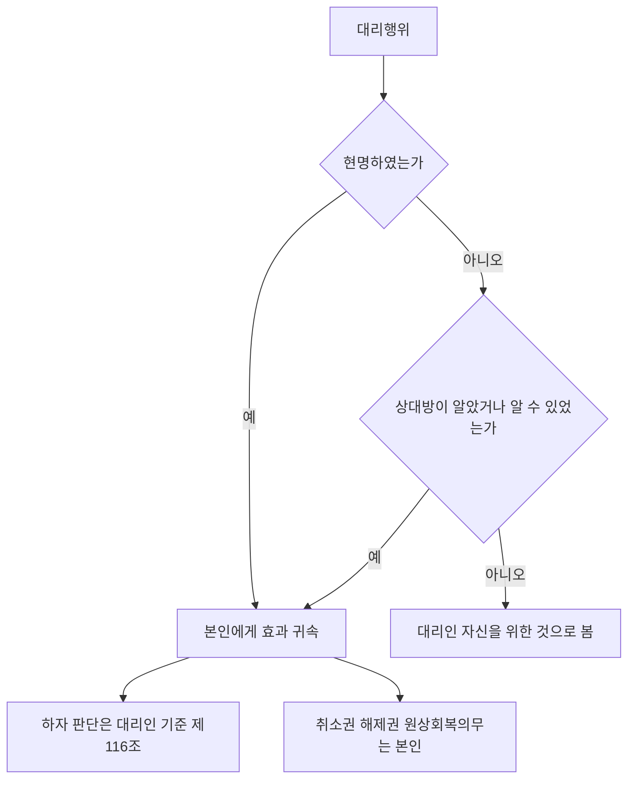

#### 4. 관련 조문

> 📌 **민법 제114조(대리행위의 효력)** — ① 대리인이 그 권한내에서 ==본인을 위한 것임을 표시한 의사표시==는 직접 본인에게 대하여 효력이 생긴다. ② 전항의 규정은 대리인에게 대한 제3자의 의사표시에 준용한다.

> 📌 **민법 제115조(본인을 위한 것임을 표시하지 아니한 행위)** — 대리인이 본인을 위한 것임을 표시하지 아니한 때에는 그 의사표시는 ==자기를 위한 것으로 본다.== 그러나 ==상대방이 대리인으로서 한 것임을 알았거나 알 수 있었을 때==에는 전조 제1항의 규정을 준용한다.

> 📌 **민법 제116조(대리행위의 하자)** — ① 의사표시의 효력이 의사의 흠결, 사기, 강박 또는 어느 사정을 알았거나 과실로 알지 못한 것으로 인하여 영향을 받을 경우에 그 사실의 유무는 ==대리인을 표준하여 결정한다.== ② ==특정한 법률행위를 위임한 경우==에 대리인이 본인의 지시에 좇아 그 행위를 한 때에는 본인은 자기가 안 사정 또는 과실로 인하여 알지 못한 사정에 관하여 대리인의 부지를 주장하지 못한다.

> 📌 **민법 제117조(대리인의 행위능력)** — 대리인은 ==행위능력자임을 요하지 아니한다.==

#### 5. 핵심 판례 법리

- **현명하지 않은 경우** — 대리인이 본인을 위한 것임을 표시하지 않은 때에는 자기를 위한 것으로 보지만, ==상대방이 대리인으로서 한 것임을 알았거나 알 수 있었을 때에는 대리행위로서 효력이 발생==한다(제115조 단서).
- **본인 명의의 계약** — 대리인이 본인 명의로 매매계약을 체결하였다면 ==자신이 매도인으로서 타인 물건을 매매한 것이라고 볼 수 없고, 소유자를 대리하여 계약을 체결한 것==으로 보아야 한다(대판 1982.5.25. 81다1349).
- **하자의 기준** — 의사의 흠결·사기·강박·선의악의는 ==대리인을 표준==으로 결정한다(제116조 제1항). 따라서 대리인이 공서양속에 반하는 이중매수를 한 경우 ==본인이 몰랐어도 무효==다.
- **취소권의 귀속** — 대리행위의 하자로 취소권이 발생한 경우 그 취소권은 ==법률효과의 귀속주체인 본인==에게 귀속한다.
- **본인 지시의 예외** — 특정한 법률행위를 위임한 경우 대리인이 ==본인의 지시에 좇아== 그 행위를 하였다면, 본인은 ==자기가 안 사정에 관하여 대리인의 부지를 주장하지 못한다==(제116조 제2항).
- **대리인 측 사기** — 상대방의 대리인이 한 사기·강박은 ==제110조 제2항의 제3자의 사기·강박에 해당하지 않으므로==, 본인의 지·부지를 불문하고 상대방은 취소할 수 있다(대판 1999.2.23. 98다60828).
- **대리인의 행위능력** — 대리인은 행위능력자임을 요하지 않으므로(제117조), ==본인은 대리인이 미성년자임을 이유로 대리행위를 취소할 수 없다.==
- **해제의 원상회복** — 계약 해제의 원인이 된 채무불이행에 대리인에게 책임 있는 사유가 있어도, ==원상회복의무는 계약당사자인 본인이 부담==한다(대판 2011.8.18. 2011다30871).
- **자기계약의 예외적 허용** — 예외적으로 자기계약이 허용되는 경우(제124조 단서 등)에는 ==대리인이 본인과의 사이에서 대리인과 상대방의 지위를 동시에 가질 수 있다.==
- **불공정한 법률행위** — 대리행위가 제104조에 해당하는지 판단할 때 ==경솔·무경험은 대리인==을, ==궁박은 본인==을 기준으로 한다(대판 2002.10.22. 2002다38927).

#### ⭐ 기출 출제포인트

1. **"현명하지 않으면 언제나 자기를 위한 것으로 본다"** 형 함정 — ==상대방이 알았거나 알 수 있었으면 대리행위.==
2. **하자의 기준** — ==대리인.== "본인 기준"은 오답.
3. **취소권의 귀속** — ==본인.== "대리인에게 귀속"은 오답.
4. **대리인의 행위능력** — ==불요.== 본인은 취소 불가.
5. **본인의 지시에 좇은 경우** — 본인은 ==대리인의 부지를 주장하지 못한다.==

#### 📊 기출 분석

| 연도 | 출제 형태 | 핵심 논점 |
|---|---|---|
| 2019년 제30회 | 대리 5지 | ==대리인의 사기는 본인 선의·무과실이라도 취소 가능== / 공서양속 위반은 본인 몰라도 무효 |
| 2022년 제33회 | 착오 5지 | ==대리인이 의사표시를 한 경우 착오 유무는 대리인 기준(정답 지문)== |
| 2024년 제35회 | 임의대리 5지 | ==미성년자 甲이 대리행위를 한 경우 乙은 甲이 미성년자임을 이유로 취소할 수 없다(정답 지문)== |
| 문제집(기본문제 05) | "대리행위에 관한 설명으로 옳은 것은?" | ==본인 지시에 좇은 경우 본인은 대리인의 부지를 주장 못함(정답 ④)== / 취소권은 본인에게 귀속 / 제124조 위반은 무권대리 |

**출제 빈도** — ==2019·2022·2024년 출제.== 착오·사기 문항의 마지막 선지로도 자주 붙는다.
**반복되는 함정 선지** — ①"착오의 유무는 본인 기준"(→대리인 기준), ②"취소권은 대리인에게 귀속"(→본인), ③"제124조 위반 대리행위는 무효"(→무권대리).
**최근 경향** — 2024년에는 ==제117조(대리인의 행위능력 불요)== 가 정답 지문으로 출제되었다.

#### 🔍 기출 선지로 배우는 법리

> 실제 출제된 선지를 그대로 놓고 O/X와 근거를 확인한다.

**①** 대리인이 법률행위를 하면서 본인을 위한 것임을 표시하지 아니한 경우, 그 행위는 언제나 자기를 위한 것으로 본다. — **X**
어디가 틀렸나: ==상대방이 알았거나 알 수 있었을 때==에는 대리행위로서 효력이 생긴다(제115조 단서). (문제집 기본문제 05)

**②** 대리행위의 하자로 인해 취소권이 발생한 경우, 그 취소권은 대리인에게 귀속된다. — **X**
옳게 고치면: ==법률효과의 귀속주체인 본인==에게 귀속한다. (문제집 기본문제 05)

**③** 임의대리인이 본인의 지시에 좇아 대리행위를 한 경우, 본인은 자기가 알고 있는 사정에 관하여 대리인의 부지를 주장하지 못한다. — **O**
근거: 제116조 제2항. (문제집 기본문제 05, 정답 ④)

**④** 자기계약과 쌍방대리의 금지규정에 위반하여 대리행위를 한 경우 그 대리행위는 무효이다. — **X**
어디가 틀렸나: ==무효가 아니라 무권대리==이므로 본인의 추인으로 유효가 될 수 있다. (문제집 기본문제 05)

**⑤** 미성년자인 甲이 乙로부터 매매계약체결의 대리권을 수여받아 매매계약을 체결한 경우, 乙은 甲이 체결한 매매계약을 甲이 미성년자임을 이유로 취소할 수 없다. — **O**
근거: 제117조. (2024년 제35회, 정답 지문)

**⑥** 대리인이 의사표시를 한 경우, 착오의 유무는 본인을 표준으로 판단하여야 한다. — **X**
옳게 고치면: ==대리인을 표준==으로 한다(제116조 제1항). (2022년 제33회, 정답 지문)

#### ✏️ 사례형 적용

> **사례 1** — 甲의 대리인 乙은 丙과 매매계약을 체결하면서 본인 甲을 밝히지 않았다. 그러나 丙은 이전부터 乙이 甲의 대리인으로 활동해 왔음을 알고 있었다.

**검토** — 현명이 없었으므로 원칙적으로는 ==乙 자신을 위한 것==으로 보아야 한다(제115조 본문). 그러나 ==丙이 대리인으로서 한 것임을 알았으므로== 제115조 단서에 따라 ==대리행위로서 효력이 발생==하여 효과는 甲에게 귀속한다.
**결론** — 현명은 형식이 아니라 ==상대방의 인식 가능성==으로 보완된다.

> **사례 2** — 甲은 乙에게 "丙 소유 X토지를 매수하라"고 특정하여 위임하였다. 甲은 X토지에 하자가 있음을 알고 있었으나 乙은 몰랐고, 乙은 甲의 지시대로 매수하였다. 이후 甲은 착오·하자를 이유로 다투려 한다.

**검토** — 원칙적으로 하자·선의악의는 ==대리인 乙 기준==이다(제116조 제1항). 그러나 특정한 법률행위를 위임하고 ==본인의 지시에 좇아== 행한 경우이므로, ==甲은 자기가 안 사정에 관하여 乙의 부지를 주장하지 못한다==(제116조 제2항).
**결론** — 甲의 주장은 ==배척==된다. 제116조 제2항은 본인이 대리인을 방패로 삼는 것을 막는 규정이다.

#### ⚠️ 이 관의 함정 총정리

1. "현명하지 않으면 언제나 대리인 자신을 위한 것이다"라고 하면 틀림 → ==상대방이 알았거나 알 수 있었으면 대리행위.==
2. "대리행위의 하자는 본인을 표준으로 한다"고 하면 틀림 → ==대리인 표준==이다.
3. "대리행위의 하자로 생긴 취소권은 대리인에게 귀속한다"고 하면 틀림 → ==본인==에게 귀속한다.
4. "본인은 대리인이 미성년자임을 이유로 대리행위를 취소할 수 있다"고 하면 틀림 → ==취소할 수 없다.==
5. "대리인은 본인과의 사이에서 대리인과 상대방의 지위를 동시에 가질 수 없다"고 하면 틀림 → ==자기계약이 허용되는 경우에는 가능==하다.

#### ✅ OX 확인문제

> 다음 진술의 참·거짓을 판단하시오.

**1.** 대리인이 권한 내에서 본인을 위한 것임을 표시한 의사표시는 직접 본인에게 효력이 생긴다.
→ **O**. 제114조 제1항.

**2.** 현명하지 않은 대리인의 의사표시는 어떤 경우에도 본인에게 효력이 생기지 않는다.
→ **X**. 상대방이 알았거나 알 수 있었으면 대리행위로 유효하다(제115조 단서).

**3.** 대리행위의 하자는 대리인을 표준으로 판단한다.
→ **O**. 제116조 제1항.

**4.** 본인의 지시에 좇아 대리행위를 한 경우에도 본인은 자기가 안 사정에 관하여 대리인의 부지를 주장할 수 있다.
→ **X**. 주장하지 못한다(제116조 제2항).

**5.** 대리인은 행위능력자임을 요하지 않는다.
→ **O**. 제117조.

**6.** 대리인이 미성년자인 경우 본인은 이를 이유로 대리행위를 취소할 수 있다.
→ **X**. 취소할 수 없다.

**7.** 대리행위의 하자로 발생한 취소권은 본인에게 귀속한다.
→ **O**. 효과의 귀속주체이기 때문이다.

**8.** 계약 해제로 인한 원상회복의무는 대리인이 부담한다.
→ **X**. 본인이 부담한다(대판 2011.8.18. 2011다30871).

**9.** 대리인이 본인 명의로 매매계약을 체결하였다면 대리인 자신이 타인 물건을 매도한 것으로 보아야 한다.
→ **X**. 소유자를 대리하여 계약을 체결한 것으로 본다(대판 1982.5.25. 81다1349).

**10.** 대리행위가 불공정한 법률행위인지 판단할 때 궁박은 대리인을 기준으로 한다.
→ **X**. 궁박은 본인, 경솔·무경험은 대리인 기준이다.

#### 🧠 암기법

> 🔑 **"하자는 대리인, 효과는 본인"**
> 판단(하자·선의악의)은 ==대리인 기준==, 귀속(권리·의무·취소권·원상회복)은 ==본인==. 이 비대칭이 대리행위 문항의 전부다.

> 🔑 **제115조 = "안 밝히면 내 것, 알면 네 것"**
> 현명 없으면 대리인 자신의 것. 다만 상대방이 **알았거나 알 수 있었으면** 본인의 것.

> 🔑 **제116조 제2항 = "시킨 대로 했으면 시킨 사람 책임"**
> 본인이 지시했다면, 본인이 안 사정을 대리인이 몰랐다고 방패 삼을 수 없다.

---

### 제5관 복대리

> 📖 대리인이 ==자기의 이름으로== 선임한 본인의 대리인이 복대리인이다. "대리인의 대리인"이 아니라 ==본인의 대리인==이라는 한 문장이 이 관 출제의 절반을 차지한다. 임의대리인과 법정대리인의 ==복임권·책임의 차이==가 나머지 절반이다.

> ⭐ **이 관에서 반드시 챙길 3가지**
> ① 복대리인은 ==본인의 대리인==이다. 그리고 ==대리인의 대리권은 소멸하지 않는다.==
> ② **임의대리인** — 원칙적으로 복임권 없음. ==본인의 승낙 또는 부득이한 사유==가 있어야 한다(제120조).
> ③ **법정대리인** — ==언제나 복임권==이 있으나 ==전(全) 책임==을 진다. 부득이한 사유로 선임하면 ==선임·감독 책임==으로 경감(제122조).

#### 1. 의의

**복대리인**이란 ==대리인이 자기의 이름으로 선임한 본인의 대리인==을 말한다. 복대리인을 선임하는 행위를 **복임행위**, 그 권한을 **복임권**이라 한다.

| 논점 | 결론 |
|---|---|
| 복대리인의 지위 | ==본인의 대리인.== 대리인의 대리인이 아니다 |
| 복임행위의 성질 | 대리행위가 아니라 ==대리인 자신의 이름으로 하는 행위== |
| 대리인의 대리권 | 복대리인을 선임해도 ==소멸하지 않는다.== 병존한다 |
| 복대리인의 권한 범위 | ==대리인의 대리권 범위를 넘을 수 없다== |
| 복대리권의 부종성 | ==대리권이 소멸하면 복대리권도 소멸==한다 |
| 복대리인의 복임권 | 복대리인도 임의대리인이므로 ==제120조의 요건 아래 복복대리인 선임 가능== |

#### 2. 요건 — 복임권과 책임

| 구분 | 복임권 | 책임 |
|---|---|---|
| **임의대리인**(제120조·제121조) | ==본인의 승낙== 또는 ==부득이한 사유==가 있는 때에 한하여 선임 가능 | 원칙: ==선임·감독에 관한 책임==(제121조 제1항) 예외: ==본인의 지명==에 의해 선임한 경우 → 그 ==부적임 또는 불성실을 알고도 본인에 대한 통지나 해임을 태만한 때에만== 책임(제121조 제2항) |
| **법정대리인**(제122조) | ==언제나== 복대리인 선임 가능 | 원칙: 선임·감독의 과실 유무를 묻지 않고 ==복대리인의 행위로 본인이 입은 손해 전부에 대해 책임==(제122조 본문) 예외: ==부득이한 사유==로 선임한 경우 → ==제121조 제1항의 책임(선임·감독 책임)== 으로 경감(제122조 단서) |

> ⚠️ **책임의 역전 구조** — 임의대리인은 ==복임권이 좁고 책임이 가볍다.== 법정대리인은 ==복임권이 넓고 책임이 무겁다.== 두 축이 정확히 반대라는 점을 기억하면 선지 판별이 쉬워진다.

> 💡 판례는 본인의 ==묵시적 승낙==에 기초한 임의대리인의 복임권 행사도 허용한다(대판 1996.1.26. 94다30690). 반면 대리의 성질상 대리인 자신에 의한 처리가 필요한 경우에는 ==복임이 허용되지 않는다==(대판 1999.9.3. 97다56099).

#### 3. 효과

| 논점 | 결론 | 조문·판례 |
|---|---|---|
| 복대리인의 권리·의무 | ==본인이나 제3자에 대하여 대리인과 동일한 권리·의무==가 있다 | 제123조 제2항 |
| 본인에 대한 관계 | 복대리인은 본인에 대하여 ==직접 권리·의무를 부담==한다 | 제123조 제2항 |
| 대리권 범위 | 복대리인의 대리권은 ==대리인의 대리권보다 넓을 수 없다== | |
| 복대리권의 소멸 | ①복대리권 자체의 소멸사유 ②==대리인의 대리권 소멸== ③대리인과 복대리인 사이의 내부관계 종료 | |
| **표현대리와의 결합 ①** | 대리인이 임의로 선임한 복대리인을 통하여 ==권한 외의 법률행위==를 한 경우, 상대방이 정당한 이유가 있으면 ==제126조 표현대리 성립== | 대판 1998.3.27. 97다48982 |
| **표현대리와의 결합 ②** | 대리인이 ==대리권 소멸 후 복대리인을 선임==하여 대리행위를 하게 한 경우에도, 상대방이 선의·무과실이면 ==제129조 표현대리 성립== | 대판 1998.5.29. 97다55317 |
| **기본대리권** | 복임권 없는 대리인에 의해 선임된 ==복대리인의 권한도 제126조의 기본대리권==이 될 수 있다 | 대판 1998.3.27. 97다48982 |

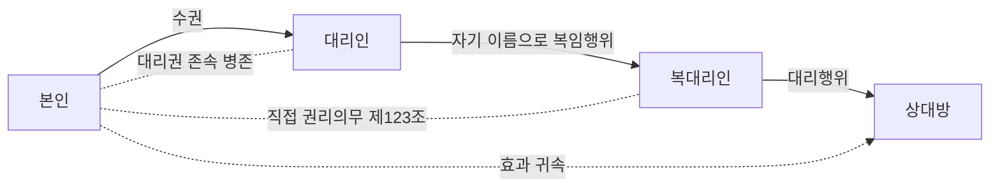

#### 4. 관련 조문

> 📌 **민법 제120조(임의대리인의 복임권)** — 대리권이 법률행위에 의하여 부여된 경우에는 대리인은 ==본인의 승낙이 있거나 부득이한 사유==있는 때가 아니면 복대리인을 선임하지 못한다.

> 📌 **민법 제121조(임의대리인의 복대리인선임의 책임)** — ① 전조의 규정에 의하여 대리인이 복대리인을 선임한 때에는 본인에게 대하여 ==그 선임감독에 관한 책임==이 있다. ② 대리인이 ==본인의 지명에 의하여== 복대리인을 선임한 경우에는 그 ==부적임 또는 불성실함을 알고 본인에게 대한 통지나 그 해임을 태만한 때==가 아니면 책임이 없다.

> 📌 **민법 제122조(법정대리인의 복임권과 그 책임)** — 법정대리인은 ==그 책임으로 복대리인을 선임할 수 있다.== 그러나 ==부득이한 사유로 인한 때==에는 전조 제1항에 정한 책임만이 있다.

> 📌 **민법 제123조(복대리인의 권한)** — ① 복대리인은 그 권한내에서 본인을 대리한다. ② 복대리인은 ==본인이나 제3자에 대하여 대리인과 동일한 권리의무가 있다.==

#### 5. 핵심 판례 법리

- **묵시적 승낙** — 임의대리인의 복임권 행사에 대해 본인의 ==묵시적인 승낙이 있는 것으로 보는 것이 타당한 경우==가 있다(대판 1996.1.26. 94다30690).
- **복임이 허용되지 않는 경우** — 대리의 성질상 ==대리인 본인에 의한 처리가 요구되는 경우==에는 복임권이 허용되지 아니한다(대판 1999.9.3. 97다56099).
- **복대리인의 권한 초과와 제126조** — 대리인이 임의로 선임한 복대리인을 통하여 권한 외의 법률행위를 한 경우, 상대방이 그 행위자를 대리권을 가진 대리인으로 믿었고 그렇게 믿는 데 ==정당한 이유가 있으면 제126조 표현대리가 성립==한다(대판 1998.3.27. 97다48982).
- **복대리권이 기본대리권** — ==복임권 없는 대리인에 의해 선임된 복대리인의 권한도 제126조의 기본대리권==이 될 수 있다(대판 1998.3.27. 97다48982).
- **대리권 소멸 후의 복대리** — 대리인이 대리권 소멸 후 복대리인을 선임하여 복대리인으로 하여금 상대방과 대리행위를 하도록 한 경우에도, 상대방이 ==대리권 소멸 사실을 알지 못하고 그에 과실이 없다면 제129조 표현대리가 성립==할 수 있다(대판 1998.5.29. 97다55317).
- **복대리인의 지위** — 복대리인은 ==본인의 대리인==이며, ==본인이나 제3자에 대하여 대리인과 동일한 권리·의무==를 가진다(제123조 제2항).
- **법정대리인의 무거운 책임** — 법정대리인은 언제든지 복임권을 가지지만, ==선임·감독의 과실 유무를 묻지 않고 복대리인의 행위로 본인이 입은 손해 전부에 대해 책임==을 진다(제122조 본문). 다만 ==부득이한 사유==로 선임한 경우에는 선임·감독의 과실에 대해서만 책임진다(같은 조 단서).
- **본인 지명의 경우** — 임의대리인이 본인의 지명에 의해 복대리인을 선임한 때에는 ==부적임·불성실을 알고도 통지·해임을 태만한 경우에만== 책임을 진다(제121조 제2항).
- **복대리권의 소멸** — 대리인의 대리권이 소멸하면 ==복대리권도 소멸==한다.

#### 6. 한눈에 보는 정리표

| 논점 | 결론 |
|---|---|
| 복대리인의 지위 | 본인의 대리인 |
| 대리인의 대리권 | 소멸하지 않고 병존 |
| 복대리권의 범위 | 대리권의 범위를 넘지 못함 |
| 복대리권의 소멸 | 대리권 소멸 시 함께 소멸 |
| 복대리인의 복임권 | 제120조 요건 아래 인정 |

| 표현대리와의 결합 | 적용 조문 |
|---|---|
| 복대리인이 권한을 넘은 행위 | 제126조 |
| 대리권 소멸 후 선임된 복대리인의 행위 | 제129조 |
| 복임권 없는 대리인이 선임한 복대리권 | 제126조의 기본대리권이 됨 |

#### ⭐ 기출 출제포인트

1. **"복대리인은 대리인의 대리인이다"** 형 함정 — ==본인의 대리인==이다.
2. **"복대리인이 선임되면 대리인의 대리권은 소멸한다"** 형 함정 — ==소멸하지 않는다.==
3. **"임의대리인은 본인의 승낙이 있는 경우에만 복임권이 있다"** 형 함정 — ==부득이한 사유==도 있다.
4. **"복대리인의 대리행위에는 표현대리가 성립할 수 없다"** 형 함정 — ==성립할 수 있다.==
5. **법정대리인의 책임 경감** — ==부득이한 사유로 선임==한 경우.

#### 📊 기출 분석

| 연도 | 출제 형태 | 핵심 논점 |
|---|---|---|
| 2018년 제29회 | "복대리에 관한 설명으로 옳지 않은 것은?" | ==임의대리인이 본인의 승낙을 얻어 선임하면 선임감독 책임이 없다 = 틀림(정답)== |
| 2021년 제32회 | "복대리에 관한 설명으로 옳은 것은?" | ==복대리인은 제3자에 대하여 대리인과 동일한 권리의무가 있다(정답)== / 묵시적 승낙 허용 / 법정대리인이 선임한 복대리인도 본인의 대리인 / 복대리에도 표현대리 성립 |
| 2022년 제33회 | "복대리에 관한 설명으로 옳지 않은 것은?" | ==복대리인의 대리행위에는 표현대리가 성립할 수 없다 = 틀림(정답)== |
| 2023년 제34회 | "복대리에 관한 설명으로 옳은 것은?" | ==복임권 없는 대리인이 선임한 복대리인의 대리행위에도 제126조 적용 가능(정답)== |
| 2024년 제35회 | 임의대리 5지 | ==부득이한 사유로 선임한 복대리인 丙은 甲(대리인)의 대리인이 아니라 본인의 대리인== |

**출제 빈도** — ==2018·2021·2022·2023·2024년 5년 연속 출제.== 대리 절 최다 빈출 관이다.
**반복되는 함정 선지** — ①"복대리인은 대리인의 대리인이다"(→본인의 대리인), ②"복대리인의 대리행위에는 표현대리가 성립할 수 없다"(→성립 가능), ③"임의대리인이 본인의 승낙을 얻어 선임하면 책임이 없다"(→선임감독 책임 있음).
**최근 경향** — 5년 연속 ==거의 동일한 5~6개 선지가 순환==한다. 완벽히 외우면 확정 득점 구간이다.

#### 🔍 기출 선지로 배우는 법리

> 실제 출제된 선지를 그대로 놓고 O/X와 근거를 확인한다.

**①** 임의대리인이 본인의 승낙을 얻어 복대리인을 선임한 경우, 본인에 대하여 그 선임감독에 관한 책임이 없다. — **X**
어디가 틀렸나: ==선임감독에 관한 책임이 있다==(제121조 제1항). 책임이 면제되는 것은 ==본인의 지명==에 의해 선임한 경우다. (2018년 제29회, 정답 지문)

**②** 법정대리인이 부득이한 사유로 복대리인을 선임한 경우, 본인에 대하여 그 선임감독에 관한 책임이 있다. — **O**
근거: 제122조 단서. 원칙인 전(全) 책임이 ==선임감독 책임으로 경감==된다. (2018년 제29회)

**③** 본인의 묵시적 승낙에 기초한 임의대리인의 복임권행사는 허용되지 않는다. — **X**
옳게 고치면: ==허용된다==(대판 1996.1.26. 94다30690). (2021년 제32회)

**④** 법정대리인이 그 자신의 이름으로 선임한 복대리인은 법정대리인의 대리인이다. — **X**
어디가 틀렸나: ==본인의 대리인==이다. (2021년 제32회)

**⑤** 복대리인은 제3자에 대하여 대리인과 동일한 권리의무가 있다. — **O**
근거: 제123조 제2항. (2021년 제32회, 정답 지문)

**⑥** 복대리인의 대리행위에 대해서는 표현대리가 성립할 수 없다. — **X**
옳게 고치면: ==성립할 수 있다==(대판 1998.3.27. 97다48982; 대판 1998.5.29. 97다55317). (2021·2022·2024년 반복 출제)

**⑦** 복대리인이 선임되면 복대리인의 대리권 범위 내에서 대리인의 대리권은 잠정적으로 소멸한다. — **X**
어디가 틀렸나: ==소멸하지 않고 병존==한다. (2023년 제34회)

**⑧** 복임권 없는 대리인에 의해 선임된 복대리인의 대리행위에 대해서도 권한을 넘은 표현대리에 관한 규정이 적용될 수 있다. — **O**
근거: 대판 1998.3.27. 97다48982. (2023년 제34회, 정답 지문)

**⑨** 甲이 부득이한 사유로 丙을 복대리인으로 선임한 경우, 丙은 甲의 대리인이다. — **X**
옳게 고치면: ==본인의 대리인==이다. (2024년 제35회)

#### ✏️ 사례형 적용

> **사례 1** — 임의대리인 甲은 본인 乙의 지명에 따라 丙을 복대리인으로 선임하였다. 그런데 丙은 처음부터 그 업무에 부적임한 자였고 甲도 이를 알고 있었으나 乙에게 알리지도, 丙을 해임하지도 않았다. 丙의 잘못으로 乙이 손해를 입었다.

**검토** — 임의대리인이 ==본인의 지명==에 의해 복대리인을 선임한 경우에는 원칙적으로 책임이 없으나, ==부적임 또는 불성실함을 알고도 통지나 해임을 태만한 때==에는 책임을 진다(제121조 제2항). 甲은 이를 알고도 태만하였으므로 ==책임을 진다.==
**결론** — 본인이 지명했다고 대리인이 무조건 면책되는 것은 아니다.

> **사례 2** — 甲의 대리인 乙은 본인의 승낙 없이 임의로 丙을 복대리인으로 선임하였고, 丙은 乙의 대리권 범위를 넘는 처분행위를 丁에게 하였다. 丁은 丙에게 그러한 권한이 있다고 믿을 만한 정당한 이유가 있었다.

**검토** — ① 乙의 복임행위는 제120조 위반으로 ==무권한==이지만, ② 판례는 ==복임권 없는 대리인이 선임한 복대리인의 권한도 제126조의 기본대리권==이 될 수 있다고 본다. ③ 丁에게 ==정당한 이유==가 있으므로 ==제126조 표현대리가 성립==한다(대판 1998.3.27. 97다48982).
**결론** — 본인 甲은 표현대리 책임을 진다.

#### ⚠️ 이 관의 함정 총정리

1. "복대리인은 대리인의 대리인이다"라고 하면 틀림 → ==본인의 대리인==이다.
2. "복대리인 선임으로 대리인의 대리권이 소멸한다"고 하면 틀림 → ==병존==한다.
3. "임의대리인은 본인의 승낙이 있는 경우에만 복임권을 가진다"고 하면 틀림 → ==부득이한 사유==도 있다.
4. "임의대리인이 본인의 승낙을 얻어 선임하면 책임이 없다"고 하면 틀림 → ==선임감독 책임==이 있다.
5. "복대리인의 대리행위에는 표현대리가 성립할 수 없다"고 하면 틀림 → ==성립할 수 있다.==

#### ✅ OX 확인문제

> 다음 진술의 참·거짓을 판단하시오.

**1.** 복대리인은 본인의 대리인이다.
→ **O**. 대리인의 대리인이 아니다.

**2.** 임의대리인은 본인의 승낙이 있거나 부득이한 사유가 있는 때가 아니면 복대리인을 선임하지 못한다.
→ **O**. 제120조.

**3.** 법정대리인은 그 책임으로 언제나 복대리인을 선임할 수 있다.
→ **O**. 제122조 본문.

**4.** 법정대리인이 부득이한 사유로 복대리인을 선임한 경우에도 손해 전부에 대해 책임을 진다.
→ **X**. 선임감독 책임으로 경감된다(제122조 단서).

**5.** 임의대리인이 본인의 지명에 따라 복대리인을 선임한 경우에는 어떠한 책임도 지지 않는다.
→ **X**. 부적임·불성실을 알고 통지·해임을 태만한 때에는 책임을 진다(제121조 제2항).

**6.** 복대리인의 대리권은 대리인의 대리권 범위를 넘을 수 없다.
→ **O**. 복대리권은 대리권에 종속한다.

**7.** 복대리인이 선임되면 대리인의 대리권은 소멸한다.
→ **X**. 소멸하지 않고 병존한다.

**8.** 복대리인은 본인이나 제3자에 대하여 대리인과 동일한 권리의무가 있다.
→ **O**. 제123조 제2항.

**9.** 복임권 없는 대리인이 선임한 복대리인의 권한은 제126조의 기본대리권이 될 수 없다.
→ **X**. 될 수 있다(대판 1998.3.27. 97다48982).

**10.** 대리권 소멸 후 선임된 복대리인의 대리행위에는 제129조 표현대리가 성립할 수 있다.
→ **O**. 대판 1998.5.29. 97다55317.

#### 🧠 암기법

> 🔑 **"복대리인은 본인의 사람"**
> 이름은 "복대리"지만 사람은 ==본인의 대리인==. 그리고 대리인의 대리권은 ==그대로 살아 있다.==

> 🔑 **복임권·책임의 시소 = "임의는 좁고 가볍게, 법정은 넓고 무겁게"**
> **임의**대리인: 복임권 ==좁음==(승낙·부득이), 책임 ==가벼움==(선임감독). **법정**대리인: 복임권 ==넓음==(언제나), 책임 ==무거움==(전 책임).

> 🔑 **책임 경감 2가지 = "본인이 지명 / 부득이"**
> 임의대리인은 **본인 지명**이면 경감(통지·해임 태만 시만 책임), 법정대리인은 **부득이한 사유**면 경감(선임감독 책임).

> 🔑 **"복대리에도 표현대리는 붙는다"**
> 권한 초과 → 제126조 / 대리권 소멸 후 선임 → 제129조. "복대리에는 표현대리가 성립할 수 없다"는 언제나 오답.

### 제6관 협의의 무권대리

> 📖 대리권 없이 한 대리행위 중 ==표현대리가 성립하지 않는 경우==다. 계약의 무권대리는 ==유동적 무효==이며, 본인에게 **추인권·추인거절권**, 상대방에게 **최고권·철회권**, 무권대리인에게 **제135조의 책임**이라는 세 갈래 장치가 작동한다.

> ⭐ **이 관에서 반드시 챙길 3가지**
> ① 계약의 무권대리 = ==유동적 무효.== 추인하면 ==계약 시로 소급==하여 유효(제133조).
> ② 상대방의 **최고**는 ==악의여도 가능==, **철회**는 ==선의여야== 가능. 확답 없으면 ==추인 거절==로 본다(제131조).
> ③ 무권대리인의 책임(제135조)은 ==무과실책임==이며 ==이행 또는 손해배상 중 상대방이 선택==한다.

#### 1. 의의

**협의의 무권대리**란 대리권 없이 한 대리행위로서 ==표현대리가 성립하지 않는 경우==를 말한다. 계약의 무권대리는 ==유동적 무효==이고, 단독행위의 무권대리는 원칙적으로 ==확정적 무효==다.

#### 2. 요건 — 4당사자의 권능

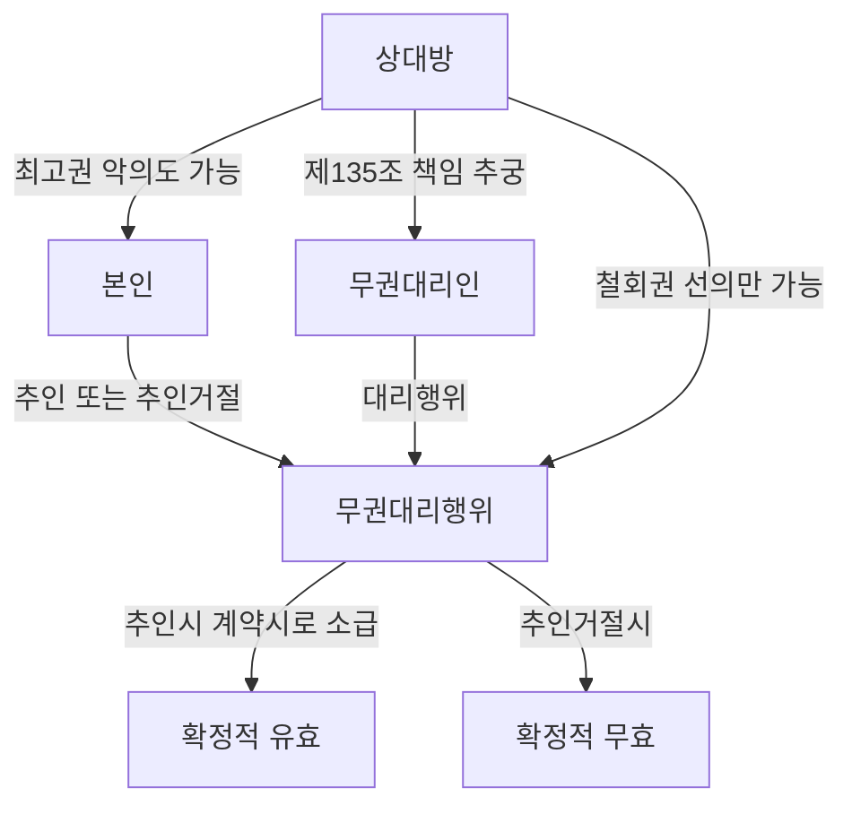

**(1) 본인의 추인권·추인거절권**

| 논점 | 결론 | 근거 |
|---|---|---|
| 성질 | ==상대방 있는 단독행위==. 무권대리인의 동의는 불요 | 제130조·제132조 |
| 추인의 상대방 | ==상대방·무권대리인·승계인== 모두 가능 | 대판 1981.4.14. 80다2314 |
| 무권대리인에게 한 추인 | 유효하나, ==상대방이 그 사실을 알기 전에는 상대방에게 대항하지 못한다.== 상대방은 여전히 철회할 수 있고, 반대로 추인이 있었음을 주장할 수도 있다 | 제132조, 대판 1981.4.14. 80다2314 |
| 방식 | 명시적·묵시적 모두 가능. 시기의 제한 없음(다만 ==상대방의 철회 후에는 불가==) | |
| 효과 | 다른 의사표시가 없으면 ==계약 시에 소급하여== 효력 발생. 단, ==제3자의 권리를 해하지 못한다== | 제133조 |
| 일부·조건부 추인 | 일부에 대해 추인하거나 내용을 변경하여 추인한 경우 ==상대방의 동의를 얻지 못하는 한 무효== | 대판 1982.1.26. 81다카549 |

**묵시적 추인의 인정 여부**

| 묵시적 추인 **인정** | 묵시적 추인 **부정** |
|---|---|
| 본인이 무권대리인으로부터 ==매매대금의 전부 또는 일부를 수령==(대판 1963.4.11. 63다64) | 본인이 이의를 제기하지 않고 ==장시간 방치==(대판 1990.3.27. 88다카181) |
| 본인이 ==채무 변제기의 유예를 요청== | 타인의 형사책임을 수반하는 무권대리로 권리침해를 받은 자가 침해를 알고도 ==장기간 형사고소·민사소송을 제기하지 않은 경우==(대판 1967.12.18. 67다2294, 2295) |
| 본인이 ==매매대금의 지급을 청구== | (대판 1986.3.11. 85다카2337) |

**(2) 상대방의 최고권·철회권**

| 구분 | 최고권(제131조) | 철회권(제134조) |
|---|---|---|
| 요건 | ==악의의 상대방도 가능== | ==선의의 상대방만 가능==(계약 당시 대리권 없음을 안 경우 불가) |
| 방법 | 본인에게 ==상당한 기간을 정하여== 추인 여부의 확답을 최고 | 본인이나 무권대리인에게 철회의 의사표시 |
| 시기 | 본인의 추인 전 | ==본인의 추인이 있기 전== |
| 효과 | 기간 내에 확답을 ==발하지 아니하면 추인을 거절한 것으로 본다==(==발신주의==) | 계약이 ==확정적 무효==로 되어 본인은 더 이상 추인할 수 없다 |
| 증명책임 | | 상대방이 대리권 없음을 알았다는 점은 ==철회의 효과를 다투는 본인==이 증명(대판 2017.6.29. 2017다213838) |

**(3) 무권대리인의 책임 — 제135조**

| 요건 | 내용 |
|---|---|
| ① 대리권을 증명하지 못할 것 | |
| ② 본인의 추인을 얻지 못할 것 | |
| ③ 상대방이 ==선의·무과실==일 것 | 상대방이 대리권 없음을 알았거나 알 수 있었으면 책임 없음. ==증명책임은 무권대리인==(대판 2018.6.28. 2018다210775) |
| ④ 무권대리인이 ==제한능력자가 아닐 것== | 제135조 제2항 |
| **성질** | ==무과실책임.== 무권대리인에게 귀책사유가 없어도 진다 |
| **효과** | ==상대방의 선택==에 좇아 ==계약의 이행 또는 손해배상==. 손해배상액 예정 조항이 있으면 ==그에 따라 산정==(대판 2018.6.28. 2018다210775) |

#### 3. 효과 — 무권대리와 상속

| 유형 | 결론 |
|---|---|
| **무권대리인이 본인을 상속** | 무권대리인이 본인의 지위에서 ==추인을 거절하는 것은 신의칙에 반하여 허용되지 않는다.== 무권대리행위가 무효임을 주장하는 것도 마찬가지다 |
| **본인이 무권대리인을 상속** | 본인은 여전히 ==추인을 거절할 수 있다==는 것이 다수설이다. 다만 제135조의 무권대리인 책임은 상속으로 승계된다 |

> ⚠️ **추인 후에도 제135조 책임을 물을 수 있는가** — 본인이 추인하면 계약은 소급하여 유효가 되어 상대방은 목적을 달성하므로, ==무권대리인의 책임을 물을 수 없다.==

#### 4. 관련 조문

> 📌 **민법 제130조(무권대리)** — 대리권없는 자가 타인의 대리인으로 한 계약은 ==본인이 이를 추인하지 아니하면 본인에 대하여 효력이 없다.==

> 📌 **민법 제131조(상대방의 최고권)** — 대리권없는 자가 타인의 대리인으로 계약을 한 경우에 상대방은 ==상당한 기간을 정하여 본인에게 그 추인여부의 확답을 최고할 수 있다.== 본인이 그 기간내에 확답을 발하지 아니한 때에는 ==추인을 거절한 것으로 본다.==

> 📌 **민법 제132조(추인, 거절의 상대방)** — 추인 또는 거절의 의사표시는 ==상대방에 대하여 하지 아니하면 그 상대방에 대항하지 못한다.== 그러나 상대방이 그 사실을 안 때에는 그러하지 아니하다.

> 📌 **민법 제133조(추인의 효력)** — 추인은 다른 의사표시가 없는 때에는 ==계약시에 소급하여 그 효력이 생긴다.== 그러나 ==제3자의 권리를 해하지 못한다.==

> 📌 **민법 제134조(상대방의 철회권)** — 대리권없는 자가 한 계약은 ==본인의 추인이 있을 때까지== 상대방은 본인이나 그 대리인에 대하여 이를 철회할 수 있다. 그러나 ==계약당시에 상대방이 대리권없음을 안 때에는 그러하지 아니하다.==

> 📌 **민법 제135조(상대방에 대한 무권대리인의 책임)** — ① 다른 자의 대리인으로서 계약을 맺은 자가 그 대리권을 증명하지 못하고 또 본인의 추인을 받지 못한 경우에는 ==상대방의 선택에 따라 계약을 이행할 책임 또는 손해를 배상할 책임==이 있다. ② 대리인으로서 계약을 맺은 자에게 대리권이 없다는 사실을 상대방이 알았거나 알 수 있었을 때 또는 대리인으로서 계약을 맺은 사람이 ==제한능력자==일 때에는 제1항을 적용하지 아니한다.

> 📌 **민법 제136조(단독행위와 무권대리)** — 단독행위는 그 행위당시에 ==상대방이 대리인이라 칭하는 자의 대리권없는 행위에 동의하거나 그 대리권을 다투지 아니한 때==에 한하여 제130조 내지 전조의 규정을 준용한다. 대리권없는 자에 대하여 그 동의를 얻어 단독행위를 한 때에도 같다.

#### 5. 핵심 판례 법리

- **추인의 상대방** — 추인·추인거절의 의사표시는 ==상대방뿐 아니라 무권대리인, 무권대리행위로 인한 권리·법률관계의 승계인(제3자)에 대하여도 할 수 있다==(대판 1981.4.14. 80다2314). 다만 무권대리인에게 한 추인은 ==상대방이 알기 전에는 상대방에게 대항하지 못하며==, 상대방은 철회할 수도 있고 반대로 ==추인이 있었음을 주장할 수도 있다.==
- **묵시적 추인 인정** — 본인이 매매계약을 체결한 무권대리인으로부터 ==매매대금의 전부 또는 일부를 수령==하였다면 무권대리행위의 ==묵시적 추인이 인정==된다(대판 1963.4.11. 63다64). 본인이 ==채무 변제기의 유예를 요청==한 경우도 같다.
- **묵시적 추인 부정** — 본인이 이의를 제기하지 않고 ==장시간에 걸쳐 방치==하였다고 하여 추인하였다고 볼 수 없다(대판 1990.3.27. 88다카181). 형사책임을 수반하는 무권대리로 권리침해를 받은 자가 침해사실을 알고도 ==장기간 고소·소송을 제기하지 않았다는 사실만으로 묵시적 추인이 인정되지 않는다==(대판 1967.12.18. 67다2294, 2295).
- **일부·변경 추인** — 무권대리행위의 ==일부에 대하여 추인을 하거나 그 내용을 변경하여 추인==한 경우에는 ==상대방의 동의를 얻지 못하는 한 무효==다(대판 1982.1.26. 81다카549).
- **철회와 추인의 선후** — 상대방이 ==철회권을 행사하면 본인은 더 이상 추인할 수 없다==(대판 2017.6.29. 2017다213838).
- **철회권의 증명책임** — 상대방이 대리인에게 대리권이 없음을 알았다는 점에 대한 주장·증명책임은 ==철회의 효과를 다투는 본인==에게 있다(대판 2017.6.29. 2017다213838).
- **제135조의 증명책임** — 상대방이 대리권 없음을 알았거나 알 수 있었는데 알지 못하였다는 사실에 관한 주장·증명책임은 ==무권대리인==에게 있다(대판 2018.6.28. 2018다210775).
- **손해배상액의 예정** — 무권대리인이 맺은 계약에 채무불이행에 대비한 ==손해배상액 예정 조항==이 있는 때에는 특별한 사정이 없는 한 무권대리인은 ==그 조항에 따라 산정한 손해액을 지급==하여야 한다(대판 2018.6.28. 2018다210775).
- **무권대리인의 본인 상속** — 무권대리인이 본인을 상속한 경우 ==본인의 지위에서 추인거절권을 행사하는 것은 신의칙에 반한다==는 것이 판례의 태도다. 무권대리행위가 무효임을 주장하는 것도 마찬가지로 허용되지 않는다.
- **제한능력자인 무권대리인** — 무권대리인이 ==제한능력자==라면 제135조의 책임을 지지 않으므로, 상대방이 이행이나 손해배상을 청구해도 ==제한능력을 이유로 대항할 수 있다==(제135조 제2항).
- **단독행위의 무권대리** — ==상대방 없는 단독행위==의 무권대리는 특별한 사정이 없는 한 ==확정적 무효==다. 상대방 있는 단독행위는 제136조의 요건(상대방의 동의 또는 대리권을 다투지 않을 것)을 갖춘 때에만 계약의 무권대리 규정이 준용된다.

#### ⭐ 기출 출제포인트

1. **최고에 대한 무응답의 효과** — ==추인 거절==로 본다(발신주의). "추인한 것으로 본다"는 오답.
2. **악의의 상대방** — ==최고권 O, 철회권 X.==
3. **추인의 소급효** — ==계약 시로 소급.== "추인한 때부터"는 오답.
4. **무권대리인이 본인을 상속** — ==추인거절은 신의칙 위반.==
5. **제135조 책임** — ==무과실책임==, 상대방 선택, 제한능력자는 면책.

#### 📊 기출 분석

| 연도 | 출제 형태 | 핵심 논점 |
|---|---|---|
| 2019년 제30회 | "갑으로부터 대리권을 수여받지 못한 을…" 사례 | ==악의의 상대방은 철회권 행사 불가(정답)== / 추인은 무권대리인에게도 가능 / 소급효 / 무응답 = 추인 거절 |
| 2020년 제31회 | "18세의 갑은 을의 대리인을 사칭…" 사례 | ==추인하면 확정적 유효== / ==제한능력자인 무권대리인은 제135조 책임 없음== / 악의의 상대방도 최고 가능 |
| 2022년 제33회 | "갑의 처 을이 연대보증계약" 사례 | ==일부만 보증하겠다는 추인은 상대방 동의 없으면 무효(정답)== / 추인에 무권대리인의 동의 불요 / 철회 후에는 추인 불가 / 악의의 상대방도 최고 가능 |
| 2024년 제35회 | "乙은 대리권 없이 甲의 X토지를 丙에게 매도" 사례 | ==매매대금 수령 = 묵시적 추인== / 무권대리인 상속 시 무효 주장은 신의칙 위반 / 무응답 = 추인 거절 / ==추인 후에는 제135조 책임 물을 수 없음(정답)== |

**출제 빈도** — ==2019·2020·2022·2024년 출제.== 대부분 ==사례형 5지==로 나온다.
**반복되는 함정 선지** — ①"최고에 무응답이면 추인한 것으로 본다"(→거절), ②"악의의 상대방도 철회할 수 있다"(→불가), ③"추인은 추인한 때부터 효력이 생긴다"(→계약 시로 소급), ④"추인해도 무권대리인의 책임을 물을 수 있다"(→불가).
**최근 경향** — 사례형에서 ==추인·철회·최고·제135조 책임 4개 장치를 한 문항에 모두== 배치하는 형태가 굳어졌다.

#### 🔍 기출 선지로 배우는 법리

> 실제 출제된 선지를 그대로 놓고 O/X와 근거를 확인한다.

**①** 갑은 을의 대리행위를 추인할 수 있으며, 그 추인은 을이 아닌 병에게 하여야 효력이 있다. — **X**
어디가 틀렸나: ==무권대리인 을에게도 추인할 수 있다.== 다만 상대방 병이 그 사실을 알기 전에는 병에게 대항하지 못할 뿐이다(제132조). (2019년 제30회)

**②** 갑이 추인하면서 특별한 의사표시를 하지 않았다면 을의 대리행위는 추인한 때로부터 갑에게 효력이 생긴다. — **X**
옳게 고치면: ==계약 시에 소급==하여 효력이 생긴다(제133조). (2019년 제30회)

**③** 병이 계약당시에 을에게 대리권이 없다는 사실을 알았다면 철회권을 행사할 수 없다. — **O**
근거: 제134조 단서. (2019년 제30회, 정답 지문)

**④** 병은 갑에게 상당한 기간을 정하여 추인 여부의 확답을 최고할 수 있으며, 갑이 그 기간 내에 확답을 발하지 아니하면 갑이 추인한 것으로 본다. — **X**
어디가 틀렸나: ==추인을 거절한 것으로 본다==(제131조 후문). (2019년 제30회)

**⑤** 계약 당시 을이 무권대리인임을 알았던 병은 갑에게 추인 여부의 확답을 최고할 수 없다. — **X**
옳게 고치면: ==악의의 상대방도 최고할 수 있다.== 철회권만 선의를 요구한다. (2022년 제33회)

**⑥** 갑이 자동차할부대금 보증채무액 중 절반만 보증하겠다고 한 경우, 병의 동의가 없으면 원칙적으로 무권대리행위의 추인으로서 효력이 없다. — **O**
근거: 대판 1982.1.26. 81다카549. (2022년 제33회, 정답 지문)

**⑦** 갑이 을의 무권대리행위를 추인하기 위해서는 을의 동의를 얻어야 한다. — **X**
어디가 틀렸나: 추인은 ==상대방 있는 단독행위==이므로 무권대리인의 동의가 필요 없다. (2022년 제33회)

**⑧** 乙이 丙으로부터 받은 매매대금을 甲이 수령한 경우, 특별한 사정이 없는 한 甲은 위 매매계약을 추인한 것으로 본다. — **O**
근거: 대판 1963.4.11. 63다64. (2024년 제35회)

**⑨** 甲을 단독상속한 乙이 자신의 매매행위가 무효임을 주장하는 것은 신의칙에 반하여 허용되지 않는다. — **O**
근거: 무권대리인의 본인 상속 사안의 판례 법리다. (2024년 제35회)

**⑩** 甲이 추인을 하더라도 丙은 乙을 상대로 무권대리인의 책임에 따른 손해배상을 청구할 수 있다. — **X**
어디가 틀렸나: 추인으로 계약이 확정적으로 유효가 되었으므로 ==제135조의 책임을 물을 수 없다.== (2024년 제35회, 정답 지문)

#### ✏️ 사례형 적용

> **사례 1** — 18세의 甲은 乙의 대리인을 사칭하여 자신이 보관하던 乙의 노트북을 사정을 모르는 丙에게 팔았다.

**검토** —
① **본인 乙의 추인**: 乙이 丙에게 추인하면 매매계약은 ==계약 시로 소급하여 확정적으로 유효==하다(제133조).
② **丙의 철회**: 丙은 선의이므로 乙의 추인 전까지 ==철회할 수 있다==(제134조). 다만 乙이 甲에게 추인한 뒤 丙이 그 사실을 알게 되었다면 더 이상 철회할 수 없다(제132조 단서).
③ **丙의 최고**: 丙은 악의였더라도 ==최고는 할 수 있으며==, 乙이 기간 내에 확답을 발하지 않으면 ==추인 거절==로 본다.
④ **甲의 책임**: 甲은 ==제한능력자(18세 미성년자)== 이므로 ==제135조의 책임을 지지 않는다==(제135조 제2항).
⑤ **乙이 추인한 경우**: 대리인은 행위능력자임을 요하지 않으므로(제117조), ==甲은 자신이 미성년자임을 이유로 매매계약을 취소하지 못한다.==
**결론** — 무권대리의 4장치가 모두 등장하는 전형 사례다.

> **사례 2** — 무권대리인 乙이 甲을 위한 것이라며 丙에게 X토지를 매도한 뒤, 甲이 사망하여 乙이 甲을 단독상속하였다. 乙은 이제 본인의 지위에서 추인을 거절하려 한다.

**검토** — 무권대리인이 본인을 상속하여 ==본인의 지위에서 추인거절권을 행사하는 것은 신의칙에 반하여 허용되지 않는다.== 스스로 만들어 낸 무권대리 상태를 상속이라는 우연으로 이용하는 것이기 때문이다.
**결론** — 乙의 추인거절은 ==허용되지 않고==, 丙은 X토지의 소유권이전등기를 청구할 수 있다.

#### ⚠️ 이 관의 함정 총정리

1. "최고에 확답이 없으면 추인한 것으로 본다"고 하면 틀림 → ==추인 거절==로 본다.
2. "악의의 상대방은 최고도 철회도 할 수 없다"고 하면 틀림 → ==최고는 가능==, 철회만 불가.
3. "추인은 추인한 때부터 효력이 생긴다"고 하면 틀림 → ==계약 시로 소급==한다.
4. "추인은 상대방에게만 할 수 있다"고 하면 틀림 → ==무권대리인·승계인에게도 가능==하다.
5. "본인이 추인해도 상대방은 무권대리인에게 제135조 책임을 물을 수 있다"고 하면 틀림 → ==물을 수 없다.==

#### ✅ OX 확인문제

> 다음 진술의 참·거짓을 판단하시오.

**1.** 무권대리행위의 추인은 본인이 무권대리인에 대해서도 할 수 있다.
→ **O**. 다만 상대방이 알기 전에는 대항하지 못한다(제132조).

**2.** 무권대리행위에 대한 본인의 추인은 다른 의사표시가 없는 한 소급효를 가진다.
→ **O**. 제133조.

**3.** 상대방이 상당한 기간을 정해 최고하였으나 본인이 확답을 발하지 않으면 추인한 것으로 본다.
→ **X**. 추인을 거절한 것으로 본다(제131조).

**4.** 계약 당시 대리권 없음을 알았던 상대방도 최고권을 행사할 수 있다.
→ **O**. 최고권은 선의를 요구하지 않는다.

**5.** 계약 당시 대리권 없음을 알았던 상대방도 철회권을 행사할 수 있다.
→ **X**. 철회권은 선의의 상대방만 행사할 수 있다(제134조 단서).

**6.** 무권대리행위의 일부만 추인하거나 내용을 변경하여 추인하면 상대방의 동의 없이도 효력이 있다.
→ **X**. 상대방의 동의가 없으면 무효다(대판 1982.1.26. 81다카549).

**7.** 무권대리인의 상대방에 대한 책임은 대리권 흠결에 관하여 대리인에게 귀책사유가 있는 경우에만 인정된다.
→ **X**. 무과실책임이다(제135조).

**8.** 무권대리인이 제한능력자인 경우에도 제135조의 책임을 진다.
→ **X**. 책임을 지지 않는다(제135조 제2항).

**9.** 본인이 무권대리인으로부터 매매대금을 수령한 경우 묵시적 추인이 인정될 수 있다.
→ **O**. 대판 1963.4.11. 63다64.

**10.** 본인이 이의를 제기하지 않고 무권대리행위를 장시간 방치한 것은 추인으로 볼 수 있다.
→ **X**. 추인으로 볼 수 없다(대판 1990.3.27. 88다카181).

#### 🧠 암기법

> 🔑 **4장치 = "추·최·철·책"**
> 본인의 **추**인(거절), 상대방의 **최**고·**철**회, 무권대리인의 **책**임(제135조). 사례형은 언제나 이 넷을 순서대로 훑으면 풀린다.

> 🔑 **"최고는 악의도, 철회는 선의만"**
> 최고권 = 악의의 상대방도 O(제131조). 철회권 = 선의만 O(제134조 단서). 그리고 ==무응답 = 거절.==

> 🔑 **"추인은 계약 시로, 다만 제3자는 못 건드린다"**
> 제133조 본문(소급) + 단서(제3자 권리 불가침). 소급효를 묻는 선지의 정답은 언제나 ==계약 시==.

> 🔑 **제135조 = "무과실·선택·제한능력자 제외"**
> 무권대리인의 책임은 ==무과실책임==, ==이행/손배는 상대방이 선택==, ==제한능력자면 면책==.

---

### 제7관 표현대리

> 📖 대리권이 없는데도 ==마치 있는 것 같은 외관==이 있고 그 외관 형성에 본인이 관여한 경우, 상대방을 보호하기 위해 본인에게 책임을 지우는 제도다. 권리외관이론에 기초하며, ==제125조·제126조·제129조== 세 유형으로 나뉜다. 감정평가사 시험 ==대리 절 최대 빈출 관==이다.

> ⭐ **이 관에서 반드시 챙길 3가지**
> ① 표현대리는 ==무권대리의 일종==이다. ==유권대리 주장 속에 표현대리 주장이 포함되어 있지 않다.==
> ② 표현대리가 성립하면 본인은 ==전적인 책임==을 지며, 상대방에게 과실이 있어도 ==과실상계로 감경할 수 없다.==
> ③ 적용범위 — ==제125조는 임의대리만==, ==제126조·제129조는 법정대리에도 적용.==

#### 1. 의의

**표현대리(表見代理)** 란 대리권이 없음에도 대리권이 있는 듯한 외관이 존재하고 그 외관 형성에 ==본인이 원인을 제공==한 경우, 그 외관을 신뢰한 상대방을 보호하여 ==본인에게 유권대리와 같은 책임==을 지우는 제도다.

판례는 표현대리를 ==외관을 만들어 준 자는 그 외관적 사실을 믿음에 정당한 사유가 있다고 인정되는 자에 대하여 책임이 있다는 일반적인 권리외관 이론==에 기초를 둔 것으로 본다(대판 1998.5.29. 97다55317).

#### 2. 요건 — 세 유형 비교

| 구분 | 제125조 대리권수여의 표시 | 제126조 권한을 넘은 표현대리 | 제129조 대리권 소멸 후 |
|---|---|---|---|
| **외관의 원인** | 본인이 제3자에게 ==타인에게 대리권을 주었다고 표시== | ==기본대리권==의 존재 + 그 권한을 넘는 행위 | 대리권이 있었으나 ==소멸== |
| **상대방의 주관** | ==선의·무과실== | ==정당한 이유==(=선의·무과실) | ==선의·무과실==(과실로 몰랐으면 X) |
| **적용범위** | ==임의대리만==(법정대리 X) | ==임의대리·법정대리 모두== | ==임의대리·법정대리 모두== |
| **증명책임** | 상대방의 악의·과실은 ==본인==이 증명 | ==정당한 이유는 상대방==이 증명 | 상대방의 과실은 ==본인==이 증명 |

**(1) 제125조 — 대리권수여의 표시에 의한 표현대리**

| 논점 | 결론 |
|---|---|
| 표시의 상대방 | ==특정인뿐 아니라 불특정 다수인==도 포함 |
| 표시의 방식 | ==대리인이라는 문자를 사용한 경우에만 한정되지 않는다.== 명칭·직함의 사용 승낙도 포함 |
| **인정 예** | 명의(상호)의 대여, 백지위임장의 교부 |
| **부정 예** | 세무회계상 필요로 ==납세번호증을 이용하게 한 것==(대판 1978.6.27. 78다864) / ==인감증명서만의 교부==(대판 1978.10.10. 78다75) |
| 성립 배제 | 상대방에게 ==과실이 있으면 제125조를 주장할 수 없다==(대판 1997.3.25. 96다51271) |

**(2) 제126조 — 권한을 넘은 표현대리**

| 논점 | 결론 |
|---|---|
| **기본대리권 필요** | ==아무 대리권 없는 자의 행위에는 적용할 수 없다==(대판 1963.9.19. 63다388) |
| **기본대리권의 종류** | ==사법상 행위든 공법상 행위든 무방==(등기신청 대리권도 기본대리권)(대판 1978.3.28. 78다282) |
| | ==복대리권==도 기본대리권이 된다(대판 1998.3.27. 97다48982) |
| | ==제125조·제129조 표현대리로 인정되는 권한==을 넘는 행위에도 제126조가 성립할 수 있다(대판 2008.1.31. 2007다74713) |
| | ==일상가사대리권==도 기본대리권이 될 수 있다 |
| **동종·유사성** | ==기본대리권과 월권행위가 동종·유사할 필요가 없다==(대판 1978.3.28. 78다282) |
| **성명모용** | 사술을 써서 대리행위의 표시를 하지 않고 ==본인의 성명을 모용하여 자기가 본인인 것처럼 기망하여 본인 명의로 직접 법률행위를 한 경우==에는 특별한 사정이 없는 한 ==제126조 표현대리가 성립할 수 없다==(대판 1993.2.23. 92다52436) |
| **제3자의 범위** | 제126조에서 보호되는 제3자는 ==당해 표현대리행위의 직접 상대방==만을 지칭하며, ==그로부터 전득한 자는 포함되지 않는다==(대판 1994.5.27. 93다21521) |
| **정당한 이유** | 대리권이 있다고 믿을 만한 ==정당한 이유==가 있어야 하며, ==대리행위 당시==를 기준으로 판단한다 |

**(3) 제129조 — 대리권 소멸 후의 표현대리**

| 논점 | 결론 |
|---|---|
| 요건 | 과거에 대리권이 존재했다가 ==소멸==했을 것 + 상대방의 선의·무과실 |
| 적용범위 | ==임의대리·법정대리 모두 적용==(대판 1975.1.28. 74다1199) |
| 수권행위가 무효인 경우 | ==적용 X.== 처음부터 대리권이 없었으므로 "소멸"을 전제로 할 수 없다(대판 1984.10.10. 84다카780) |
| 복대리와의 결합 | 대리권 소멸 후 선임된 복대리인의 대리행위에도 ==제129조 표현대리가 성립할 수 있다==(대판 1998.5.29. 97다55317) |

#### 3. 효과

| 논점 | 결론 |
|---|---|
| **본인의 책임** | 유권대리와 마찬가지로 ==본인에게 효과가 귀속==된다 |
| **전적 책임** | 표현대리가 성립하면 본인은 ==전적인 책임==을 지며, 상대방에게 과실이 있어도 ==과실상계의 법리를 유추적용하여 책임을 경감할 수 없다==(대판 1996.7.12. 95다49554) |
| **유권대리 주장과의 관계** | ==유권대리의 주장 속에 표현대리의 주장이 포함되어 있다고 볼 수 없다.== 따로 표현대리 주장이 없는 한 법원은 표현대리 성립 여부를 심리·판단할 필요가 없다(대판 1983.12.13. 83다카1489 전합; 대판 1990.3.27. 88다카181) |
| **주장의 특정** | 표현대리를 주장할 때에는 ==무권대리인과 표현대리에 해당하는 무권대리 행위를 특정==하여 주장하여야 한다 |
| **상대방의 철회권** | 표현대리가 성립하는 경우에도 ==선의의 상대방은 본인의 추인이 있을 때까지 무권대리를 이유로 계약을 철회할 수 있다== |
| **강행법규 위반** | 강행법규를 위반하여 무효인 법률행위에는 ==표현대리의 법리가 준용될 여지가 없다==(대판 1996.8.23. 94다38199; 대판 2016.5.12. 2013다49381) |
| **허위표시로 무효** | 대리행위 자체가 ==허위표시로서 무효==인 경우에는 표현대리가 성립할 수 없다 |

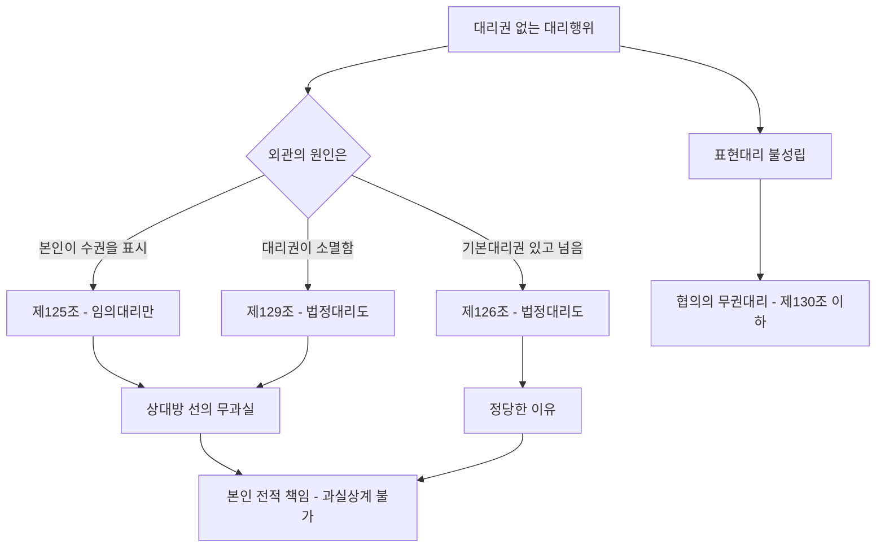

#### 4. 관련 조문

> 📌 **민법 제125조(대리권수여의 표시에 의한 표현대리)** — 제3자에 대하여 타인에게 대리권을 수여함을 표시한 자는 ==그 대리권의 범위내에서 행한 그 타인과 그 제3자간의 법률행위에 대하여 책임이 있다.== 그러나 제3자가 대리권없음을 ==알았거나 알 수 있었을 때==에는 그러하지 아니하다.

> 📌 **민법 제126조(권한을 넘은 표현대리)** — 대리인이 그 권한외의 법률행위를 한 경우에 제3자가 ==그 권한이 있다고 믿을만한 정당한 이유==가 있는 때에는 본인은 그 행위에 대하여 책임이 있다.

> 📌 **민법 제129조(대리권소멸후의 표현대리)** — 대리권의 소멸은 ==선의의 제3자에게 대항하지 못한다.== 그러나 제3자가 ==과실==로 인하여 그 사실을 알지 못한 때에는 그러하지 아니하다.

#### 5. 핵심 판례 법리

- **권리외관이론** — 표현대리는 ==외관을 만들어 준 자는 그 외관적 사실을 믿음에 정당한 사유가 있다고 인정되는 자에 대하여 책임이 있다==는 일반적 권리외관 이론에 기초한다(대판 1998.5.29. 97다55317).
- **유권대리와 표현대리** — ==유권대리에 관한 주장 속에 표현대리의 주장이 포함되어 있다고 볼 수 없으며==, 따로 표현대리에 관한 주장이 없는 한 법원은 그 성립 여부를 심리·판단할 필요가 없다(대판 1983.12.13. 83다카1489 전합; 대판 1990.3.27. 88다카181).
- **과실상계 배제** — 표현대리행위가 성립하는 경우 본인은 ==전적인 책임==을 져야 하고, 상대방에게 과실이 있더라도 ==과실상계의 법리를 유추적용하여 본인의 책임을 경감할 수 없다==(대판 1996.7.12. 95다49554).
- **강행법규 위반** — 강행법규에 위반하여 무효인 법률행위에는 ==표현대리의 법리가 준용될 여지가 없다==(대판 1996.8.23. 94다38199; 대판 2016.5.12. 2013다49381).
- **제125조의 적용범위** — 제125조 표현대리는 ==임의대리에만 적용되고 법정대리에는 적용되지 않는다==(대판 2007.8.23. 2007다23425).
- **제125조 부정 사례** — 타인 간의 거래에서 단지 세무회계상의 필요로 ==자기의 납세번호증을 이용하게 한 사실만으로는== 대리권 수여의 표시나 명의 대여로 보기 어렵다(대판 1978.6.27. 78다864). ==인감증명서만의 교부==도 대리권 부여 행위로 볼 수 없다(대판 1978.10.10. 78다75).
- **제125조와 상대방의 과실** — 제125조의 표현대리에 해당하려면 상대방이 ==선의·무과실==이어야 하므로, 상대방에게 과실이 있으면 이를 주장할 수 없다(대판 1997.3.25. 96다51271).
- **제126조 기본대리권의 필요** — 제126조의 표현대리가 되려면 ==기본대리권이 존재해야 하며, 아무 대리권 없는 자의 행위에는 적용할 수 없다==(대판 1963.9.19. 63다388).
- **기본대리권의 폭** — 사법상 행위의 대리권이든 ==공법상 행위의 대리권이든 기본대리권==이 될 수 있고, ==기본대리권이 등기신청행위라도 대물변제라는 사법행위를 한 경우 제126조가 적용==된다(대판 1978.3.28. 78다282). 즉 ==동종·유사성은 요구되지 않는다.==
- **복대리권과 사자** — 대리인이 임의로 선임한 ==복대리인의 권한==도, 대리인이 ==사자를 통해 권한 외 행위를 한 경우==에도 제126조의 기본대리권이 될 수 있다(대판 1998.3.27. 97다48982).
- **표현대리 권한을 넘는 경우** — 과거에 가졌던 대리권이 소멸하여 제129조 표현대리로 인정되는 경우에 ==그 표현대리의 권한을 넘는 대리행위가 있으면 제126조의 표현대리가 성립==할 수 있다(대판 2008.1.31. 2007다74713).
- **성명모용** — 제126조는 대리인이 ==대리의사를 가지고 권한 외의 행위를 하는 경우==에 성립하고, 사술을 써서 ==본인의 성명을 모용하여 본인 명의로 직접 법률행위를 한 경우==에는 특별한 사정이 없는 한 성립할 수 없다(대판 1993.2.23. 92다52436).
- **제126조의 제3자** — 제126조에서 보호되는 제3자는 ==당해 표현대리행위의 직접 상대방이 된 자만==을 지칭하고, ==그로부터 다시 전득한 자는 포함되지 않는다==(대판 1994.5.27. 93다21521).
- **제129조의 적용범위** — 제129조 표현대리는 ==임의대리·법정대리 모두에 적용==된다(대판 1975.1.28. 74다1199). 다만 ==수권행위 자체가 무효인 경우==에는 적용될 여지가 없다(대판 1984.10.10. 84다카780).
- **대리권 소멸 후의 복대리** — 대리인이 대리권 소멸 후 복대리인을 선임해 대리행위를 하게 한 경우에도 ==제129조 표현대리가 성립할 수 있다==(대판 1998.5.29. 97다55317).

#### ⭐ 기출 출제포인트

1. **유권대리 주장에 표현대리 주장이 포함되는가** — ==포함되지 않는다.== 매년 나오는 확정 선지.
2. **과실상계 유추적용 가부** — ==불가.== 본인은 전적 책임.
3. **제125조의 적용범위** — ==임의대리만.== 제126조·제129조는 법정대리도.
4. **기본대리권과 월권행위의 동종성** — ==요구되지 않는다.==
5. **강행법규 위반 무효행위에 표현대리 준용 가부** — ==불가.==

#### 📊 기출 분석

| 연도 | 출제 형태 | 핵심 논점 |
|---|---|---|
| 2018년 제29회 | "무권대리와 표현대리에 관한 설명으로 옳은 것은?" | ==추인은 무권대리인에게도 가능(정답)== / 강행법규 위반에 표현대리 X / 유권대리 주장에 표현대리 포함 X / 과실상계 X |
| 2021년 제32회 | "표현대리에 관한 설명으로 옳지 않은 것을 모두 고른 것은?" | ==제129조는 임의대리에만 적용 = 틀림== / ==강행법규 위반에 준용 가능 = 틀림== / ==과실상계 유추 가능 = 틀림== |
| 2022년 제33회 | 무권대리 사례 5지 | ==일상가사대리권을 기본대리권으로 하는 제126조 표현대리 검토== |
| 2024년 제35회 | "표현대리에 관한 설명으로 옳지 않은 것은?" | ==복대리인의 대리행위에는 표현대리가 성립할 수 없다 = 틀림(정답)== / 과실상계 X / 유권대리 주장에 포함 X / 제126조는 법정대리에도 적용 / 수권행위 무효면 제129조 X |

**출제 빈도** — ==2018·2021·2022·2024년 출제.== 사실상 격년 확정 출제.
**반복되는 함정 선지** — ①"과실상계로 본인 책임을 경감할 수 있다"(→불가), ②"유권대리 주장에 표현대리 주장이 포함된다"(→불포함), ③"제129조는 임의대리에만 적용된다"(→법정대리도), ④"강행법규 위반 무효행위에도 표현대리가 준용된다"(→불가), ⑤"복대리인의 대리행위에는 표현대리가 성립할 수 없다"(→성립 가능).
**최근 경향** — 세 유형의 ==적용범위(임의/법정)== 와 ==복대리·기본대리권의 확장==을 정밀하게 묻는다.

#### 🔍 기출 선지로 배우는 법리

> 실제 출제된 선지를 그대로 놓고 O/X와 근거를 확인한다.

**①** 강행법규에 위반한 무효의 대리행위에 대해서도 표현대리의 법리가 적용될 수 있다. — **X**
어디가 틀렸나: ==적용될 수 없다==(대판 1996.8.23. 94다38199). (2018년 제29회)

**②** 상대방의 유권대리 주장에는 표현대리의 성립 역시 포함되므로 법원은 표현대리의 성립여부까지 판단해야 한다. — **X**
옳게 고치면: ==포함되지 않으며 판단할 필요가 없다==(대판 1983.12.13. 83다카1489 전합). (2018년 제29회)

**③** 표현대리가 성립하는 경우, 상대방에게 과실이 있으면 과실상계의 법리가 적용된다. — **X**
어디가 틀렸나: ==과실상계로 본인의 책임을 경감할 수 없다==(대판 1996.7.12. 95다49554). (2018년 제29회 / 2021년 제32회 / 2024년 제35회)

**④** 대리권 소멸 후의 표현대리에 관한 규정은 임의대리에만 적용된다. — **X**
옳게 고치면: ==법정대리에도 적용==된다(대판 1975.1.28. 74다1199). (2021년 제32회)

**⑤** 표현대리를 주장할 때에는 무권대리인과 표현대리에 해당하는 무권대리 행위를 특정하여 주장하여야 한다. — **O**
근거: 판례의 태도다. (2021년 제32회)

**⑥** 민법 제126조의 권한을 넘은 표현대리 규정은 법정대리에도 적용된다. — **O**
근거: 판례의 확립된 태도다. (2024년 제35회)

**⑦** 복대리인의 대리행위에 대해서는 표현대리가 성립할 수 없다. — **X**
옳게 고치면: ==성립할 수 있다==(대판 1998.3.27. 97다48982; 대판 1998.5.29. 97다55317). (2024년 제35회, 정답 지문)

**⑧** 수권행위가 무효인 경우, 민법 제129조의 대리권 소멸 후의 표현대리가 적용되지 않는다. — **O**
근거: 대판 1984.10.10. 84다카780. (2024년 제35회)

**⑨** 기본대리권이 권한을 넘은 대리행위와 동종이어야 권한을 넘은 표현대리가 성립한다. — **X**
어디가 틀렸나: ==동종·유사할 필요가 없다==(대판 1978.3.28. 78다282). (문제집 기본문제 13)

**⑩** 표현대리가 성립하는 경우에도 선의의 상대방은 본인의 추인이 있을 때까지 무권대리를 이유로 계약을 철회할 수 있다. — **O**
근거: 표현대리도 ==무권대리의 일종==이기 때문이다. (문제집 기본문제 11)

#### ✏️ 사례형 적용

> **사례 1** — 甲은 乙에게 X부동산의 ==등기신청==에 관한 대리권만을 수여하였다. 그런데 乙은 甲의 인감과 등기서류를 이용하여 丙에게 X부동산으로 ==대물변제==를 하였다. 丙은 乙에게 그러한 권한이 있다고 믿을 만한 정당한 이유가 있었다.

**검토** —
① **기본대리권**: 등기신청 대리권은 ==공법상 행위의 대리권==이지만 제126조의 ==기본대리권이 될 수 있다==(대판 1978.3.28. 78다282).
② **동종성**: 기본대리권(등기신청)과 월권행위(대물변제)가 ==동종·유사할 필요는 없다.==
③ **정당한 이유**: 丙에게 정당한 이유가 인정되므로 ==제126조 표현대리 성립.==
④ **책임의 범위**: 甲은 ==전적인 책임==을 지며, 丙에게 일부 과실이 있어도 ==과실상계로 감경되지 않는다==(대판 1996.7.12. 95다49554).
**결론** — 甲은 대물변제의 효력을 부인할 수 없다.

> **사례 2** — 甲의 대리인이던 乙의 대리권이 소멸한 뒤, 乙은 소멸 사실을 모르는 丙과 종래 대리권 범위를 ==넘는== 계약을 체결하였다. 丙은 乙에게 그러한 권한이 있다고 믿을 정당한 이유가 있었다.

**검토** — ① 대리권이 소멸했으므로 우선 ==제129조 표현대리==가 문제되고, 丙이 선의·무과실이면 종래 대리권 범위 내에서는 표현대리가 성립한다. ② 나아가 ==그 표현대리의 권한을 넘는 행위==에 대해서는 ==제126조의 표현대리가 성립할 수 있다==(대판 2008.1.31. 2007다74713).
**결론** — 제129조와 제126조가 ==중첩 적용==되어 본인 甲이 책임진다.

> **사례 3** — 丙은 표현대리가 성립하는 계약의 직접 상대방이었고, 丁은 丙으로부터 그 목적물을 전득하였다. 丁이 제126조의 보호를 주장할 수 있는가?

**검토** — 제126조에서 보호되는 제3자는 ==당해 표현대리행위의 직접 상대방==만을 지칭하고 ==전득자는 포함되지 않는다==(대판 1994.5.27. 93다21521).
**결론** — 丁은 제126조를 직접 원용할 수 없다. 다만 직접 상대방 丙에게 표현대리가 성립하면 계약이 유효해지므로, 丁은 ==丙의 유효한 권리를 승계==하는 방식으로 보호받는다.

#### ⚠️ 이 관의 함정 총정리

1. "유권대리 주장 속에 표현대리 주장이 포함된다"고 하면 틀림 → ==포함되지 않는다.==
2. "상대방에게 과실이 있으면 과실상계로 본인의 책임을 경감할 수 있다"고 하면 틀림 → ==경감할 수 없다.==
3. "제126조·제129조는 임의대리에만 적용된다"고 하면 틀림 → ==법정대리에도 적용==된다(제125조만 임의대리 전용).
4. "기본대리권과 월권행위는 동종·유사해야 한다"고 하면 틀림 → ==요구되지 않는다.==
5. "강행법규 위반으로 무효인 대리행위에도 표현대리가 준용된다"고 하면 틀림 → ==준용될 여지가 없다.==

#### ✅ OX 확인문제

> 다음 진술의 참·거짓을 판단하시오.

**1.** 표현대리는 무권대리의 일종이다.
→ **O**. 대리권이 없다는 점에서 무권대리다.

**2.** 유권대리의 주장 속에는 표현대리의 주장이 포함되어 있다.
→ **X**. 포함되어 있지 않다(대판 1983.12.13. 83다카1489 전합).

**3.** 표현대리가 성립하는 경우 상대방의 과실을 이유로 본인의 책임을 경감할 수 있다.
→ **X**. 과실상계를 유추적용할 수 없다(대판 1996.7.12. 95다49554).

**4.** 제125조의 표현대리는 법정대리에도 적용된다.
→ **X**. 임의대리에만 적용된다(대판 2007.8.23. 2007다23425).

**5.** 제126조의 표현대리는 법정대리에도 적용된다.
→ **O**. 판례의 확립된 태도다.

**6.** 아무런 대리권이 없는 자의 행위에도 제126조가 적용될 수 있다.
→ **X**. 기본대리권이 반드시 존재해야 한다(대판 1963.9.19. 63다388).

**7.** 기본대리권이 등기신청행위인 경우에도 대물변제라는 사법행위에 제126조가 적용될 수 있다.
→ **O**. 동종·유사성은 불요다(대판 1978.3.28. 78다282).

**8.** 제126조에서 보호되는 제3자에는 표현대리행위의 상대방으로부터 전득한 자도 포함된다.
→ **X**. 직접 상대방만을 지칭한다(대판 1994.5.27. 93다21521).

**9.** 수권행위가 무효인 경우에도 제129조의 표현대리가 성립할 수 있다.
→ **X**. 성립할 여지가 없다(대판 1984.10.10. 84다카780).

**10.** 강행법규를 위반하여 무효인 법률행위에는 표현대리의 법리가 준용될 수 없다.
→ **O**. 대판 1996.8.23. 94다38199.

#### 🧠 암기법

> 🔑 **세 유형 = "표시(125) · 월권(126) · 소멸(129)"**
> 대리권을 준다고 **표시**했나 → 제125조. 권한을 **넘었**나 → 제126조. 대리권이 **소멸**했나 → 제129조.

> 🔑 **적용범위 = "125만 임의, 126·129는 둘 다"**
> 제125조는 본인의 표시를 전제로 하므로 ==임의대리 전용.== 나머지 둘은 ==법정대리에도 적용.==

> 🔑 **"본인은 전부 책임, 과실상계 없다"**
> 표현대리가 성립하면 본인은 ==전적 책임==. 상대방의 과실을 이유로 감경 불가. 이 선지는 4년에 3번 나온다.

> 🔑 **"유권대리 주장 ≠ 표현대리 주장"**
> 소송에서 유권대리만 주장했다면 법원은 표현대리를 판단하지 않는다. 전원합의체 판결(83다카1489)이 근거다.

### 제1관 무효 총설

> 📖 법률행위가 성립했으나 ==처음부터 법률효과가 발생하지 않는== 것이 무효다. 취소와 달리 ==주장권자가 따로 없고 기간 제한도 없다.== 이 관은 무효의 종류(절대적/상대적, 확정적/유동적, 전부/일부)와 ==유동적 무효(토지거래허가)== 를 다룬다.

> ⭐ **이 관에서 반드시 챙길 3가지**
> ① 무효는 ==누구든지, 언제든지, 누구에게나== 주장할 수 있는 것이 원칙(절대적 무효).
> ② 일부무효 = ==원칙 전부무효==, 예외적으로 ==가정적 의사==가 인정되면 잔부 유효(제137조).
> ③ 토지거래허가구역 내 계약 = ==유동적 무효.== 허가 전에는 이행청구 불가, ==협력의무는 소송으로 구할 수 있다.==

#### 1. 의의

**무효**란 법률행위가 성립한 때부터 당연히 그 법률효과가 발생하지 않는 것을 말한다. 무효는 ==법률행위가 성립한 것을 전제==로 하므로, 아예 성립하지 않았다면 무효를 논할 여지가 없다.

**무효와 취소의 비교**

| 구분 | 무효 | 취소 |
|---|---|---|
| 효력 | ==처음부터 당연히 효력 없음== | ==일단 유효==, 취소하면 소급 무효 |
| 주장권자 | ==누구든지== 주장 가능 | ==취소권자(제140조)== 만 |
| 주장기간 | ==제한 없음== | ==제척기간(3년/10년)== |
| 추인 | 원칙적으로 ==추인해도 유효로 안 됨==(제139조 본문). 다만 알고 추인하면 ==새로운 법률행위==(단서) | 추인하면 ==확정적 유효==, 다시 취소 못함 |
| 방치한 경우 | ==계속 무효== | ==확정적 유효== |

> 💡 **이중효** — 하나의 법률행위가 무효이면서 동시에 취소사유도 갖는 경우, 판례·통설은 ==무효인 법률행위도 취소할 수 있다==고 본다(취소의 실익이 있기 때문). 예: 의사무능력 + 제한능력.

#### 2. 요건 — 무효의 종류

| 분류 기준 | 유형 | 내용 | 예 |
|---|---|---|---|
| 주장 상대방 | **절대적 무효** | ==선의의 제3자에게도 대항== 가능 | 의사무능력, ==제103조·제104조 위반==, 강행법규 위반 |
| | **상대적 무효** | ==선의의 제3자에게 대항 불가== | ==제107조 제2항·제108조 제2항== |
| 확정 여부 | **확정적 무효** | 더 이상 유효로 될 수 없음 | 반사회질서 행위 |
| | **유동적 무효** | ==추인·허가 등으로 소급하여 유효가 될 수 있음== | ==토지거래허가 전의 계약==, ==무권대리행위==, ==무권리자의 처분행위== |
| 범위 | **전부무효 / 일부무효** | 제137조 | |
| 인식 가능성 | **당연무효 / 재판상 무효** | | |

**일부무효 — 제137조**

| 원칙 | 예외 |
|---|---|
| 법률행위의 일부분이 무효이면 ==그 전부를 무효==로 한다 | 그 무효부분이 없더라도 법률행위를 하였을 것이라고 인정될 때(==가정적 의사==)에는 나머지 부분은 무효가 되지 않는다 |

> 💡 판례는 **일부취소**에 관해서도 같은 법리를 적용한다. ==하나의 법률행위의 일부에만 취소사유가 있어도 원칙적으로 전체 계약에 취소의 효력==이 있으나(대판 2013.5.9. 2012다115120), ==당사자의 가정적 의사가 인정되면 일부만의 취소도 가능==하고 그 취소는 법률행위의 일부에 관하여 효력이 생긴다(대판 2002.9.10. 2002다21509). 제137조는 ==임의규정==이다.

#### 3. 효과 — 유동적 무효(토지거래허가)

| 논점 | 결론 | 근거 |
|---|---|---|
| 허가 전의 효력 | ==물권적 효력은 물론 채권적 효력도 발생하지 않는 유동적 무효== | 대판 1991.12.24. 90다12243 전합 |
| 이행청구 | ==권리의 이전·설정에 관한 어떠한 이행청구도 할 수 없다== | 같은 판례 |
| **협력의무** | 당사자는 ==공동으로 허가를 신청할 의무==가 있고, ==그 이행을 소송으로 구할 이익이 있다== | 대판 1993.1.12. 92다36830 |
| 협력의무 거절 | ==허가를 받을 수 없을 것이라는 사유로 협력의무 이행을 거절할 수 없다== | 대판 1992.10.27. 92다34414 |
| 동시이행 | 매도인의 ==협력의무==와 매수인의 ==대금지급의무==는 ==동시이행관계가 아니다== | 대판 1996.10.25. 96다23825 |
| 협력의무 불이행과 해제 | 협력의무 불이행을 이유로 ==계약을 해제할 수 없다== | |
| 계약금 해제 | 유동적 무효 상태에서도 ==계약금 배액상환에 의한 해제는 가능== | 대판 1997.6.27. 97다9369 |
| 부당이득반환 | 유동적 무효 상태에서는 ==대금반환을 청구할 수 없고==, ==확정적 무효로 된 때 비로소== 부당이득반환을 구할 수 있다 | 대판 1993.7.27. 91다33766 |
| 하자에 의한 취소 | 허위표시·착오·사기·강박이 있으면 ==허가 신청 전에도 이를 주장하여 협력 거절 의사를 명백히 함으로써 확정적 무효로 만들 수 있다== | 대판 1997.11.14. 97다36118 |

**확정적 유효 / 확정적 무효로 전환되는 경우**

| ==확정적 유효== | ==확정적 무효== |
|---|---|
| 관할관청의 ==허가== — 허가 후 새로 계약을 체결할 필요 없이 ==소급하여 유효== | 관할관청의 ==불허가처분==(대판 1997.7.25. 97다4357) |
| ==허가구역 지정이 해제==된 경우(지정 해제 전에 확정적 무효로 된 경우 제외)(대판 1999.6.17. 98다40459) | ==처음부터 허가를 배제·잠탈하는 내용==의 계약(대판 1996.6.28. 96다3982) |
| ==허가구역 지정기간 만료 후 재지정하지 않은 경우== | 정지조건부 계약에서 그 ==정지조건이 허가 전에 이미 불성취로 확정==(대판 1998.3.27. 97다36996) |
| | 당사자 쌍방이 ==허가신청을 하지 않기로 의사표시==를 명백히 한 경우 |

#### 4. 관련 조문

> 📌 **민법 제137조(법률행위의 일부무효)** — 법률행위의 일부분이 무효인 때에는 ==그 전부를 무효==로 한다. 그러나 그 무효부분이 없더라도 법률행위를 하였을 것이라고 인정될 때에는 ==나머지 부분은 무효가 되지 아니한다.==

> 📌 **민법 제139조(무효행위의 추인)** — 무효인 법률행위는 추인하여도 그 효력이 생기지 아니한다. 그러나 ==당사자가 그 무효임을 알고 추인한 때==에는 ==새로운 법률행위로 본다.==

> 📌 **민법 제746조(불법원인급여)** — 불법의 원인으로 인하여 재산을 급여하거나 노무를 제공한 때에는 그 이익의 반환을 청구하지 못한다. 그러나 그 불법원인이 수익자에게만 있는 때에는 그러하지 아니하다.

#### 5. 핵심 판례 법리

- **일부무효·일부취소** — 하나의 법률행위의 일부에만 취소사유가 있어도 ==일부무효 이론과 궤를 같이하는 법률행위 일부취소의 법리에 따라 전체 계약에 대한 취소의 효력==이 있다(대판 2013.5.9. 2012다115120). 다만 ==당사자의 가정적 의사가 인정되면 일부만의 취소도 가능==하고, 그 취소는 법률행위의 일부에 관하여 효력이 생긴다(대판 2002.9.10. 2002다21509).
- **무효의 주장** — 반사회질서 등 절대적 무효는 ==누구에게나 주장할 수 있으며==, 등기명의자가 소유권에 기한 물권적 청구권을 행사하는 경우 ==상대방은 법률행위의 무효를 항변으로 주장할 수 있다.==
- **유동적 무효의 성질** — 토지거래허가구역 내 토지에 관한 거래계약은 허가를 받기까지 ==물권적 효력은 물론 채권적 효력도 발생하지 않는 유동적 무효==다(대판 1991.12.24. 90다12243 전합).
- **협력의무** — 허가를 전제로 거래계약을 체결한 당사자는 ==서로 협력할 의무==가 있고 ==공동으로 관할관청의 허가를 신청할 의무==가 있으며(대판 1991.12.24. 90다12243 전합), ==그 이행을 소송으로써 구할 이익이 있다==(대판 1993.1.12. 92다36830).
- **협력의무 거절 불가** — 관할관청으로부터 ==결국 허가를 받을 수 없을 것이라는 사유로 협력의무의 이행을 거절할 수 없다==(대판 1992.10.27. 92다34414).
- **동시이행 부정** — 매도인의 ==토지거래허가 신청절차 협력의무==와 매수인의 ==매매대금 지급의무==는 ==동시이행의 관계에 있지 않다==(대판 1996.10.25. 96다23825).
- **계약금 해제** — 유동적 무효 상태인 매매계약에서도 매도인이 ==계약금의 배액을 상환하고 계약을 해제==함으로써 적법하게 해제할 수 있다(대판 1997.6.27. 97다9369).
- **부당이득반환의 시기** — 유동적 무효 상태에서는 대금반환을 구할 수 없고, ==확정적으로 무효로 되었을 때 비로소== 부당이득으로 반환을 구할 수 있다(대판 1993.7.27. 91다33766).
- **허가 후 재계약 불요** — 허가를 받으면 ==그 계약은 소급하여 유효==가 되므로 ==허가 후에 새로이 거래계약을 체결할 필요가 없다==(대판 1991.12.24. 90다12243 전합).
- **허가구역 지정 해제** — 허가구역 지정이 해제되거나 지정기간 만료 후 재지정하지 않은 경우, ==지정 해제 전에 확정적으로 무효로 된 경우를 제외하고는== 더 이상 허가를 받을 필요 없이 ==확정적으로 유효==가 된다(대판 1999.6.17. 98다40459).
- **허가 배제·잠탈** — 처음부터 ==허가를 배제하거나 잠탈하는 내용의 계약==은 허가 여부를 기다릴 것도 없이 ==확정적으로 무효==다(대판 1996.6.28. 96다3982).
- **불허가처분** — 관할관청의 ==불허가처분==이 있으면 계약관계는 ==확정적으로 무효==가 된다(대판 1997.7.25. 97다4357).
- **의사표시의 하자와 결합** — 거래가 비진의표시·허위표시·착오·사기·강박에 의해 이루어진 경우, 무효·취소를 주장할 수 있는 당사자는 ==허가신청 전 단계에서 이를 주장하여 협력 거절 의사를 일방적으로 명백히 함으로써 계약을 확정적 무효로 만들고 협력의무를 면할 수 있다==(대판 1997.11.14. 97다36118).
- **무권리자의 처분과 추인** — 권리자가 무권리자의 처분을 추인하면 ==무권대리의 추인에 관한 제130조·제133조를 유추적용==할 수 있고(대판 2017.6.8. 2017다3499), 권리자는 ==무권리자가 처분으로 얻은 이득의 반환을 청구할 수 있다==(대판 2022.6.30. 2020다210686, 210693).

#### ⭐ 기출 출제포인트

1. **일부무효의 원칙** — ==전부무효.== 제137조는 ==임의규정.==
2. **유동적 무효에서 협력의무** — ==소송으로 구할 수 있다.== 다만 ==협력의무 불이행으로 해제할 수는 없다.==
3. **허가 후 재계약 필요 여부** — ==불필요==(소급 유효).
4. **허가구역 지정 해제의 효과** — ==확정적 유효.==
5. **허가 잠탈 의도** — ==처음부터 확정적 무효==이며, 나중에 지정이 해제되어도 유효가 되지 않는다.

#### 📊 기출 분석

| 연도 | 출제 형태 | 핵심 논점 |
|---|---|---|
| 2018년 제29회 | "법률행위의 무효에 관한 설명으로 옳지 않은 것은?" | ==반사회 등기명의자의 물권적 청구권에 상대방은 무효를 항변으로 주장할 수 없다 = 틀림(정답)== |
| 2021년 제32회 | "소급효가 원칙적으로 인정되지 않는 것은?" | ==기한도래의 효과(정답)== / 무권대리 추인·토지거래허가·소멸시효 완성·취소는 모두 소급 |
| 2022년 제33회 | "법률행위의 무효에 관한 설명으로 옳지 않은 것은?" | ==집합채권 양도가 무효인 경우 일부 개별채권을 특정하여 추인할 수 없다 = 틀림(정답)== / 제137조는 임의규정 / 무효등기 유용은 소급 X |
| 2023년 제34회 | "법률행위의 무효에 관한 설명으로 옳지 않은 것은?" | ==허가 잠탈 의도였다면 지정 해제되어도 유효가 되지 않는다(정답 지문)== / 가정적 의사 고려 / 무권리자 처분의 추인 |
| 2024년 제35회 | 토지거래허가 사례 5지 | ==협력의무 불이행을 이유로 계약을 해제할 수 없다(정답 지문)== / 허가 시 소급 유효 / 사기취소 가능 |

**출제 빈도** — ==2018·2021·2022·2023·2024년 출제.== 특히 ==토지거래허가 유동적 무효==는 사례형 단골이다.
**반복되는 함정 선지** — ①"협력의무 불이행을 이유로 해제할 수 있다"(→불가), ②"허가를 받으면 새로 계약을 체결해야 한다"(→불요), ③"허가 잠탈 의도여도 지정 해제되면 유효가 된다"(→확정적 무효 유지).
**최근 경향** — 2024년에는 ==유동적 무효 + 사기취소== 를 결합한 사례형이 출제되었다.

#### 🔍 기출 선지로 배우는 법리

> 실제 출제된 선지를 그대로 놓고 O/X와 근거를 확인한다.

**①** 반사회적 법률행위를 원인으로 소유권이전등기를 마친 등기명의자가 소유권에 기한 물권적 청구권을 행사하는 경우, 상대방은 법률행위의 무효를 항변으로서 주장할 수 없다. — **X**
어디가 틀렸나: ==항변으로 주장할 수 있다.== 무효는 누구든지 주장할 수 있다. (2018년 제29회, 정답 지문)

**②** 법률행위의 일부무효에 관한 민법 제137조는 임의규정이다. — **O**
근거: 판례의 태도다. (2022년 제33회)

**③** 법률행위의 일부분이 무효일 때, 그 나머지 부분의 유효성을 판단함에 있어 나머지 부분을 유효로 하려는 당사자의 가정적 의사를 고려하여야 한다. — **O**
근거: 제137조 단서의 취지다. (2023년 제34회)

**④** 토지거래허가구역 내의 토지를 매매한 당사자가 계약체결시부터 허가를 잠탈할 의도였더라도, 그 후 허가구역 지정이 해제되었다면 위 매매계약은 유효가 된다. — **X**
어디가 틀렸나: ==처음부터 확정적으로 무효==이므로 지정 해제로 유효가 되지 않는다(대판 1996.6.28. 96다3982). (2023년 제34회, 정답 지문)

**⑤** 甲이 토지거래허가신청절차에 협력하지 않는 경우, 乙은 이를 이유로 계약을 해제할 수 있다. — **X**
옳게 고치면: ==해제할 수 없다.== 협력의무의 이행을 소송으로 구할 수 있을 뿐이다. (2024년 제35회, 정답 지문)

**⑥** 甲과 乙이 토지거래허가를 받으면 위 매매계약은 소급해서 유효로 되므로 허가 후에 새로 매매계약을 체결할 필요는 없다. — **O**
근거: 대판 1991.12.24. 90다12243 전합. (2024년 제35회)

**⑦** 甲의 사기에 의하여 위 매매계약이 체결된 경우, 乙은 토지거래허가를 신청하기 전이라도 甲의 사기를 이유로 매매계약을 취소할 수 있다. — **O**
근거: 대판 1997.11.14. 97다36118. (2024년 제35회)

**⑧** 소급효가 원칙적으로 인정되지 않는 것은 기한부 법률행위에서의 기한도래의 효과이다. — **O**
근거: 무권대리 추인(제133조)·토지거래허가·소멸시효 완성·취소(제141조)는 모두 소급하나, ==기한의 도래는 장래효==다. (2021년 제32회)

#### ✏️ 사례형 적용

> **사례 1** — 甲은 토지거래허가구역 내 자신의 X토지를 허가를 받을 것을 전제로 乙에게 매도하는 계약을 체결하고 계약금을 받았으나 아직 허가는 받지 않았다.

**검토** —
① **효력**: ==유동적 무효==로서 채권적 효력도 발생하지 않는다. 乙은 ==계약의 이행을 청구할 수 없다==(대판 1991.12.24. 90다12243 전합).
② **협력의무**: 다만 甲·乙은 ==공동으로 허가를 신청할 의무==가 있고, 乙은 ==그 이행을 소송으로 구할 수 있다==(대판 1993.1.12. 92다36830). 그러나 ==협력의무 불이행을 이유로 계약을 해제할 수는 없다.==
③ **대금반환**: 유동적 무효 상태에서는 ==부당이득반환을 구할 수 없고==, 확정적 무효가 된 뒤에야 가능하다(대판 1993.7.27. 91다33766).
④ **계약금 해제**: 甲은 ==계약금 배액을 상환하고 해제할 수 있다==(대판 1997.6.27. 97다9369).
⑤ **허가 후**: 허가를 받으면 ==소급하여 유효==가 되므로 ==새로 계약을 체결할 필요가 없다.==
**결론** — "이행청구 X, 협력의무 O, 해제 X, 계약금해제 O, 허가 시 소급유효"의 5단이 정답 구조다.

> **사례 2** — 甲과 乙은 처음부터 허가를 받지 않을 의도로 토지거래허가구역 내 토지 매매계약을 체결하였다. 그 후 허가구역 지정이 해제되었다.

**검토** — 처음부터 ==허가를 배제·잠탈하는 내용==의 계약이므로 허가 여부를 기다릴 것도 없이 ==확정적으로 무효==다(대판 1996.6.28. 96다3982). 확정적 무효로 된 계약은 ==허가구역 지정 해제로도 유효가 되지 않는다.==
**결론** — "지정 해제 → 확정적 유효"라는 명제에는 ==중요한 예외==가 있다.

#### ⚠️ 이 관의 함정 총정리

1. "법률행위의 일부가 무효이면 원칙적으로 그 일부만 무효이다"라고 하면 틀림 → ==전부무효==가 원칙이다.
2. "유동적 무효 상태에서 협력의무 불이행을 이유로 계약을 해제할 수 있다"고 하면 틀림 → ==해제할 수 없다.==
3. "허가를 받으면 그때부터 유효가 되므로 새로 계약을 체결해야 한다"고 하면 틀림 → ==소급 유효==이며 재계약 불요.
4. "협력의무와 대금지급의무는 동시이행관계다"라고 하면 틀림 → ==동시이행관계가 아니다.==
5. "허가 잠탈 의도의 계약도 지정이 해제되면 유효가 된다"고 하면 틀림 → ==확정적 무효가 유지==된다.

#### ✅ OX 확인문제

> 다음 진술의 참·거짓을 판단하시오.

**1.** 무효는 특정인만이 주장할 수 있고 일정 기간 내에 주장해야 한다.
→ **X**. 누구든지, 언제든지 주장할 수 있는 것이 원칙이다.

**2.** 법률행위의 일부가 무효인 경우 원칙적으로 전부를 무효로 한다.
→ **O**. 제137조 본문.

**3.** 제137조는 강행규정이다.
→ **X**. 임의규정이다.

**4.** 토지거래허가구역 내 계약은 허가 전에는 채권적 효력도 발생하지 않는다.
→ **O**. 대판 1991.12.24. 90다12243 전합.

**5.** 유동적 무효 상태에서 당사자는 허가신청 협력의무의 이행을 소송으로 구할 수 있다.
→ **O**. 대판 1993.1.12. 92다36830.

**6.** 협력의무 불이행을 이유로 계약을 해제할 수 있다.
→ **X**. 해제할 수 없다.

**7.** 매도인의 협력의무와 매수인의 대금지급의무는 동시이행관계에 있다.
→ **X**. 동시이행관계가 아니다(대판 1996.10.25. 96다23825).

**8.** 허가를 받으면 계약은 소급하여 유효가 되고 새로 계약을 체결할 필요가 없다.
→ **O**. 대판 1991.12.24. 90다12243 전합.

**9.** 처음부터 허가를 잠탈하려는 계약도 허가구역 지정이 해제되면 유효가 된다.
→ **X**. 확정적 무효이므로 유효가 되지 않는다.

**10.** 유동적 무효 상태에서도 계약금 배액상환에 의한 해제는 가능하다.
→ **O**. 대판 1997.6.27. 97다9369.

#### 🧠 암기법

> 🔑 **무효 vs 취소 = "누·언·누" vs "권·기·확"**
> 무효는 **누**구든지 · **언**제든지 · **누**구에게나. 취소는 취소**권**자만 · 제척**기**간 내에 · 방치하면 **확**정적 유효.

> 🔑 **유동적 무효 5단 = "이행X · 협력O · 해제X · 계약금해제O · 허가시소급"**
> 이 다섯 줄이 토지거래허가 사례형의 정답 전부다.

> 🔑 **확정적 무효 3형 = "불허가 · 잠탈 · 쌍방포기"**
> 관청의 **불허가**, 처음부터 **잠탈** 의도, 쌍방이 신청하지 않기로 **포기**. 이때는 지정 해제되어도 되살아나지 않는다.

---

### 제2관 무효행위의 전환과 추인

> 📖 무효인 법률행위를 살리는 두 가지 길이다. **전환**은 ==다른 법률행위로 바꾸어== 살리고(제138조), **추인**은 ==새로운 법률행위로== 살린다(제139조). 둘 다 소급하지 않는다는 점(추인)과 예외적으로만 인정된다는 점이 핵심이다.

> ⭐ **이 관에서 반드시 챙길 3가지**
> ① 무효행위의 추인은 ==원칙적으로 소급효가 없다.== 추인한 때부터 ==새로운 법률행위==로 본다.
> ② 추인이 되려면 ==당사자가 무효임을 알고== 추인해야 한다.
> ③ 전환은 ==다른 법률행위의 요건을 구비==하고 ==그것을 의욕하였으리라== 인정될 때 가능. ==불공정한 법률행위에도 적용==된다.

#### 1. 의의

| 제도 | 의의 | 조문 |
|---|---|---|
| **무효행위의 전환** | 무효인 법률행위가 ==다른 법률행위의 요건을 구비==하고 당사자가 무효를 알았더라면 다른 법률행위를 하는 것을 의욕하였으리라 인정될 때 ==그 다른 법률행위로서 효력==을 가지는 것 | 제138조 |
| **무효행위의 추인** | 무효인 법률행위를 ==당사자가 무효임을 알고 추인==하면 ==새로운 법률행위로 보는== 것 | 제139조 |

#### 2. 요건

**(1) 무효행위의 전환(제138조)**

| 요건 | 내용 |
|---|---|
| ① 무효인 법률행위의 존재 | |
| ② ==다른 법률행위의 요건을 구비==할 것 | 요식행위로의 전환은 원칙적으로 제한 |
| ③ ==전환의 가정적 의사==가 있을 것 | 당사자가 무효를 알았더라면 다른 법률행위를 의욕하였으리라 인정될 것 |

**(2) 무효행위의 추인(제139조)**

| 요건 | 내용 | 판례 |
|---|---|---|
| ① ==무효임을 알고== 추인할 것 | 무효임을 알거나 무효임을 의심하면서도 그 행위의 효과를 자기에게 귀속시키려는 의사 | 대판 1997.5.30. 97다2986; 대판 2014.3.27. 2012다106607 |
| ② 새로운 법률행위의 요건을 갖출 것 | 추인 시점에 유효요건이 충족되어야 한다 | |
| ③ 추인의 방식 | ==명시적·묵시적 모두 가능== | 대판 2009.9.24. 2009다37831 |
| ④ ==일부 추인 가능== | 개별 채권을 ==특정하여 추인==하는 것이 가능 | 대판 2009.10.29. 2009다47685 |
| **증명책임** | 추인 사실은 ==이를 주장하는 측==이 부담 | 대판 1992.5.12. 91다26546 |

> ⚠️ **묵시적 추인의 엄격성** — 후속행위가 묵시적 추인으로 인정되려면 ==이전의 법률행위가 무효임을 알거나 무효임을 의심하면서도 그 행위의 효과를 자기에게 귀속시키려는 의사로 후속행위를 하였음이 인정==되어야 한다(대판 2014.3.27. 2012다106607). ==장기간 이의를 제기하지 않고 방치한 것만으로는 부족==하다(대판 2007.1.11. 2006다50055).

#### 3. 효과

| 논점 | 결론 |
|---|---|
| **전환의 효과** | 무효인 행위가 ==다른 법률행위로서 효력==을 가진다 |
| **추인의 효과** | ==추인한 때부터 새로운 법률행위==가 있는 것으로 본다. ==소급효 없음==(대판 1983.9.27. 83므22) |
| **당사자의 약정에 의한 소급** | 당사자 사이에서는 ==소급효를 약정할 수 있으나== 제3자의 권리를 해할 수 없다 |
| **추인이 불가능한 무효** | ==제103조·제104조 위반, 강행법규 위반== 등 절대적 무효는 추인해도 유효로 되지 않는다 |
| **무효등기의 유용** | 무효인 가등기를 유효한 등기로 전용하기로 한 약정은 ==그때부터 유효==하고 ==가등기가 소급하여 유효한 등기로 전환되지는 않는다==(대판 1992.5.12. 91다26546) |
| **취소 후의 추인** | 법률행위를 ==취소한 후에도== 무효행위 추인의 요건을 갖추면 ==추인이 가능==하다 |

**전환의 대표 사례**

| 사례 | 결론 |
|---|---|
| 매매대금 과다로 ==제104조 무효==인 경우 | ==제138조 적용 O.== 다른 대금액을 내용으로 하는 매매계약이 유효하게 성립할 수 있다(대판 2011.4.28. 2010다106702; 대판 2010.7.15. 2009다50308) |
| 입양의 의사로 ==친생자 출생신고==를 한 경우 | 입양의 실질적 요건이 모두 구비되었다면 형식에 잘못이 있어도 ==입양의 효력 발생==(대판 2023.9.21. 2021므13354) |
| 무효인 ==비밀증서 유언==이 자필증서 유언의 방식에 맞는 경우 | 자필증서 유언으로 전환 |

#### 4. 관련 조문

> 📌 **민법 제138조(무효행위의 전환)** — 무효인 법률행위가 ==다른 법률행위의 요건을 구비==하고 당사자가 그 무효를 알았더라면 ==다른 법률행위를 하는 것을 의욕하였으리라고 인정될 때==에는 다른 법률행위로서 효력을 가진다.

> 📌 **민법 제139조(무효행위의 추인)** — 무효인 법률행위는 추인하여도 그 효력이 생기지 아니한다. 그러나 당사자가 ==그 무효임을 알고 추인한 때==에는 ==새로운 법률행위로 본다.==

> 📌 **민법 제133조(추인의 효력)** — 추인은 다른 의사표시가 없는 때에는 ==계약시에 소급==하여 그 효력이 생긴다. 그러나 제3자의 권리를 해하지 못한다. → **무권대리의 추인**은 소급하지만 **무효행위의 추인**은 소급하지 않는다는 ==대비==가 중요하다.

#### 5. 핵심 판례 법리

- **알고 추인** — 무효인 법률행위를 추인에 의하여 새로운 법률행위로 보기 위해서는 ==당사자가 이전의 법률행위가 무효임을 알고 그 행위에 대하여 추인==하여야 한다(대판 1997.5.30. 97다2986).
- **묵시적 추인의 요건** — 후속행위를 한 것이 묵시적 추인으로 인정되기 위해서는 ==이전의 법률행위가 무효임을 알거나 무효임을 의심하면서도 그 행위의 효과를 자기에게 귀속시키도록 하는 의사로 후속행위를 하였음이 인정==되어야 한다(대판 2014.3.27. 2012다106607).
- **방치만으로는 부족** — 장기간 이의를 제기하지 아니하고 ==방치한 것만으로는 묵시적 추인을 인정하기에 부족==하다(대판 2007.1.11. 2006다50055).
- **추인의 방식** — 추인의 의사표시도 ==명시적·묵시적 방법을 묻지 않는다==(대판 2009.9.24. 2009다37831).
- **일부 추인** — ==개별 채권을 특정하여 추인하는 것이 가능==하다(대판 2009.10.29. 2009다47685). 집합채권의 양도가 양도금지특약 위반으로 무효인 경우에도 일부 개별 채권을 특정하여 추인할 수 있다.
- **증명책임** — 추인 사실에 관한 증명책임은 ==이를 주장하는 측==이 부담한다(대판 1992.5.12. 91다26546).
- **추인의 장래효** — 당사자가 무효임을 알고 무효행위를 추인한 때에는 ==그때부터 새로운 법률행위가 있는 것==으로 보며 ==원칙적으로 소급효가 인정되지 않는다==(대판 1983.9.27. 83므22).
- **무효등기의 유용** — 무효인 가등기를 유효한 등기로 전용하기로 한 약정은 특별한 사정이 없는 한 ==그때부터 유효==하고, ==그 가등기가 소급하여 유효한 등기로 전환되지 않는다==(대판 1992.5.12. 91다26546).
- **제104조와 전환** — 매매계약이 매매대금 과다로 제104조의 불공정한 법률행위에 해당하여 무효인 경우에도 ==제138조가 적용==되어, 당사자 쌍방이 무효를 알았더라면 다른 액으로 합의하였으리라 예외적으로 인정되면 ==그 대금액을 내용으로 하는 매매계약이 유효하게 성립==한다(대판 2011.4.28. 2010다106702; 대판 2010.7.15. 2009다50308).
- **친생자 출생신고와 입양** — 당사자가 ==입양의 의사로 친생자 출생신고를 하고 입양의 실질적 요건이 모두 구비==되었다면 형식에 다소 잘못이 있더라도 ==입양의 효력이 발생==한다(대판 2023.9.21. 2021므13354).
- **처분권 없는 자의 처분** — ==처분권자는 명문의 규정이 없더라도 처분권 없는 자의 처분행위를 추인하여 유효하게 할 수 있다.== 이때 무권대리의 추인에 관한 ==제130조·제133조를 유추적용==할 수 있다(대판 2017.6.8. 2017다3499).
- **취소 후의 추인** — 법률행위를 ==취소한 후라도== 무효행위 추인의 요건을 충족하면 ==무효행위의 추인이 가능==하다.

#### ⭐ 기출 출제포인트

1. **무효행위 추인의 소급효** — ==없다.== "소급한다"는 오답.
2. **무효임을 알고 추인해야 하는가** — ==그렇다.==
3. **제104조 무효에 제138조 전환 가능한가** — ==가능.==
4. **취소 후 무효행위의 추인** — ==가능.==
5. **일부 추인** — ==가능.==

#### 📊 기출 분석

| 연도 | 출제 형태 | 핵심 논점 |
|---|---|---|
| 2018년 제29회 | "법률행위의 무효에 관한 설명으로 옳지 않은 것은?" | ==무효임을 알고 추인해야 함(옳은 선지)== / 묵시적 추인의 요건 / 제138조 전환 |
| 2018년 제29회 | 취소 5지 | ==법률행위를 취소한 후라도 무효행위 추인의 요건을 충족하면 추인 가능(옳은 선지)== |
| 2022년 제33회 | "법률행위의 무효에 관한 설명으로 옳지 않은 것은?" | ==집합채권 양도가 무효인 경우 일부 개별채권 특정 추인 불가 = 틀림(정답)== / 무효등기 유용은 소급 X / 취소 후 추인 가능 |
| 2023년 제34회 | "법률행위의 무효에 관한 설명으로 옳지 않은 것은?" | ==무효인 법률행위 추인은 무효를 알고서 해야 함(옳은 선지)== / 처분권자의 추인 |
| 2024년 제35회 | 불공정한 법률행위 5지 | ==불공정한 법률행위는 추인으로 유효로 될 수 없음== |

**출제 빈도** — ==2018·2022·2023년 출제.== 무효 총설과 묶여 매년 1선지 이상 나온다.
**반복되는 함정 선지** — ①"무효행위의 추인은 소급효가 있다"(→없다), ②"무효등기를 유용하기로 하면 가등기가 소급하여 유효로 된다"(→그때부터 유효), ③"일부 개별채권을 특정하여 추인할 수 없다"(→가능).
**최근 경향** — ==추인은 안 되는데 전환은 되는== 제104조 사안이 반복 출제된다.

#### 🔍 기출 선지로 배우는 법리

> 실제 출제된 선지를 그대로 놓고 O/X와 근거를 확인한다.

**①** 무효인 법률행위를 추인에 의하여 새로운 법률행위로 보기 위해서는 당사자가 이전의 법률행위가 무효임을 알고 그 행위에 대하여 추인하여야 한다. — **O**
근거: 대판 1997.5.30. 97다2986. (2018년 제29회 / 2023년 제34회)

**②** 후속행위를 한 것이 묵시적 추인으로 인정되기 위해서는 이전의 법률행위가 무효임을 알거나 무효임을 의심하면서도 그 행위의 효과를 자기에게 귀속시키도록 하는 의사로 후속행위를 하였음이 인정되어야 한다. — **O**
근거: 대판 2014.3.27. 2012다106607. (2018년 제29회)

**③** 법률행위를 취소한 후라도 무효행위 추인의 요건을 충족할 경우, 무효행위의 추인은 가능하다. — **O**
근거: 취소로 무효가 된 행위도 제139조 단서의 대상이 된다. (2018년 제29회 / 2022년 제33회)

**④** 집합채권의 양도가 양도금지특약을 위반하여 무효인 경우, 채무자는 집합채권의 일부 개별 채권을 특정하여 추인할 수 없다. — **X**
어디가 틀렸나: ==특정하여 추인할 수 있다==(대판 2009.10.29. 2009다47685). (2022년 제33회, 정답 지문)

**⑤** 무효인 가등기를 유효한 등기로 전용하기로 한 약정은 특별한 사정이 없는 한 그때부터 유효하고 이로써 그 가등기가 소급하여 유효한 등기로 전환될 수 없다. — **O**
근거: 대판 1992.5.12. 91다26546. (2022년 제33회)

**⑥** 처분권자는 명문의 규정이 없더라도 처분권 없는 자의 처분행위를 추인하여 이를 유효하게 할 수 있다. — **O**
근거: 대판 2017.6.8. 2017다3499. (2023년 제34회)

**⑦** 무효인 법률행위가 다른 법률행위의 요건을 구비하고 당사자가 그 무효를 알았더라면 다른 법률행위를 하는 것을 의욕하였으리라고 인정될 때에는 다른 법률행위로서 효력을 가진다. — **O**
근거: 제138조. (2018년 제29회)

**⑧** 불공정한 법률행위로서 무효인 경우에도 당사자가 그 무효임을 알고 추인한 때에는 새로운 법률행위로 본다. — **X**
어디가 틀렸나: ==절대적 무효==이므로 추인으로 유효가 될 수 없다(대판 1994.6.24. 94다10900). 다만 ==제138조 전환은 가능==하다.

#### ✏️ 사례형 적용

> **사례 1** — 甲은 궁박한 상태에서 시가 10억 원인 X토지를 乙에게 2억 원에 매도하였다. 乙은 이를 알고 이용하였다. 이후 甲은 "그래도 계약은 유효한 것으로 하자"며 추인의 의사를 밝혔다.

**검토** —
① **추인의 가부**: 제104조 위반은 ==절대적 무효==이므로 ==추인으로 유효가 될 수 없다==(대판 1994.6.24. 94다10900). ==법정추인도 인정되지 않는다.==
② **전환의 가부**: 그러나 쌍방이 무효를 알았더라면 ==다른 대금액으로 합의하였으리라== 예외적으로 인정된다면, ==제138조가 적용되어 그 대금액의 매매계약이 유효하게 성립==할 수 있다(대판 2011.4.28. 2010다106702).
**결론** — ==추인 X, 전환 O.== 이 대비가 문항의 정답 포인트다.

> **사례 2** — 甲과 乙 사이의 X부동산 매매가 무효였으나, 3년 뒤 甲은 그 무효를 알면서도 乙에게 잔금을 청구하고 이를 수령하였다.

**검토** — 甲은 ==무효임을 알면서 그 효과를 자기에게 귀속시키려는 의사로 후속행위==를 하였으므로 ==묵시적 추인==이 인정될 수 있다(대판 2014.3.27. 2012다106607). 다만 추인의 효과는 ==소급하지 않고 추인한 때부터 새로운 법률행위==가 있는 것으로 본다(제139조 단서, 대판 1983.9.27. 83므22).
**결론** — 계약은 ==추인 시점부터== 유효하다. 만약 甲이 단지 3년간 아무 말 없이 방치만 했다면 ==추인으로 볼 수 없다==(대판 2007.1.11. 2006다50055).

#### ⚠️ 이 관의 함정 총정리

1. "무효행위의 추인은 계약 시로 소급한다"고 하면 틀림 → ==추인한 때부터== 새로운 법률행위다.
2. "무효임을 몰랐어도 추인의 효과가 생긴다"고 하면 틀림 → ==알고 추인==해야 한다.
3. "장기간 방치하면 묵시적 추인이 된다"고 하면 틀림 → ==방치만으로는 부족==하다.
4. "제104조 무효에는 제138조 전환이 적용될 수 없다"고 하면 틀림 → ==적용될 수 있다.==
5. "무효등기를 유용하기로 하면 그 등기가 소급하여 유효로 된다"고 하면 틀림 → ==그때부터 유효==다.

#### ✅ OX 확인문제

> 다음 진술의 참·거짓을 판단하시오.

**1.** 무효인 법률행위는 추인하여도 원칙적으로 효력이 생기지 않는다.
→ **O**. 제139조 본문.

**2.** 당사자가 무효임을 알고 추인하면 계약 시로 소급하여 유효가 된다.
→ **X**. 추인한 때부터 새로운 법률행위로 본다.

**3.** 묵시적 추인이 인정되려면 무효임을 알거나 의심하면서 효과를 자기에게 귀속시키려는 의사가 인정되어야 한다.
→ **O**. 대판 2014.3.27. 2012다106607.

**4.** 장기간 이의를 제기하지 않고 방치한 것만으로 묵시적 추인이 인정된다.
→ **X**. 부족하다(대판 2007.1.11. 2006다50055).

**5.** 무효인 집합채권 양도에서 일부 개별채권을 특정하여 추인할 수 있다.
→ **O**. 대판 2009.10.29. 2009다47685.

**6.** 반사회질서 법률행위는 무효임을 알고 추인하면 새로운 법률행위로 볼 수 있다.
→ **X**. 절대적 무효이므로 추인의 여지가 없다.

**7.** 무효인 가등기를 유용하기로 한 약정은 가등기 시로 소급하여 효력이 있다.
→ **X**. 그때부터 유효하다(대판 1992.5.12. 91다26546).

**8.** 매매대금 과다로 제104조 무효인 경우에도 제138조의 전환이 적용될 수 있다.
→ **O**. 대판 2011.4.28. 2010다106702.

**9.** 법률행위를 취소한 후에는 무효행위의 추인을 할 수 없다.
→ **X**. 요건을 갖추면 가능하다.

**10.** 처분권 없는 자의 처분행위를 처분권자가 추인하면 유효하게 될 수 있다.
→ **O**. 대판 2017.6.8. 2017다3499.

#### 🧠 암기법

> 🔑 **"무권대리 추인은 소급, 무효행위 추인은 장래"**
> 제133조(무권대리) = ==계약 시로 소급.== 제139조(무효행위) = ==추인 시부터 장래효.== 이 대비가 매년 나온다.

> 🔑 **"추인은 알아야, 전환은 의욕해야"**
> 추인(제139조) = 무효임을 ==알고==. 전환(제138조) = 무효를 알았더라면 다른 행위를 ==의욕하였으리라.==

> 🔑 **제104조 = "추인 X, 전환 O"**
> 절대적 무효라 추인은 안 되지만, 다른 내용의 계약으로 바꾸는 전환은 된다. 매년 반복되는 정답 포인트다.

### 제3관 취소 총설

> 📖 취소는 ==일단 유효하게 성립한 법률행위==를 특정인의 의사표시로 ==소급하여 무효==로 만드는 제도다. 취소권자·취소의 상대방·행사방법·제척기간이 이 관의 내용이며, 감정평가사 시험에서 ==거의 매년 1문항==이 확정 출제된다.

> ⭐ **이 관에서 반드시 챙길 3가지**
> ① 취소권자 = ==제한능력자, 착오·사기·강박에 의해 의사표시를 한 자, 그 대리인, 승계인==(제140조).
> ② 취소의 상대방 = ==그 법률행위의 상대방==. 권리를 양수한 자가 아니다(제142조).
> ③ 제척기간 = ==추인할 수 있는 날로부터 3년, 법률행위를 한 날로부터 10년==(제146조). 어느 하나라도 지나면 소멸.

#### 1. 의의

**취소**란 일단 유효하게 성립한 법률행위의 효력을 ==취소권자의 일방적 의사표시==로 ==행위 시에 소급하여 무효==로 만드는 것을 말한다. 취소권은 ==형성권==이다.

**취소와 구별할 개념**

| 개념 | 차이 |
|---|---|
| **철회** | 아직 ==효력이 발생하지 않은== 의사표시의 효력 발생을 저지 |
| **해제** | ==유효하게 성립한 계약==을 채무불이행 등을 이유로 소멸. ==계약에만 인정==되고, 취소는 ==단독행위에도== 인정 |
| **해지** | 계속적 계약을 ==장래에 향하여== 소멸 |
| **재판상 취소** | 사해행위취소(제406조), 혼인취소 등은 ==소로써만== 행사 |

#### 2. 요건 — 취소권자와 상대방

**(1) 취소권자 — 제140조**

| 취소권자 | 내용 |
|---|---|
| **제한능력자** | ==법정대리인의 동의 없이 단독으로 취소할 수 있다== |
| **착오로 인하거나 사기·강박에 의하여 의사표시를 한 자** | |
| **그 대리인** | 법정대리인은 물론, ==임의대리인은 별도의 수권==이 있어야 한다 |
| **승계인** | ==포괄승계인==은 언제나 / ==특정승계인==은 취소권만의 승계는 불가하고 ==권리와 함께== 승계될 때에만 |

**(2) 취소의 상대방 — 제142조**

> 📌 **민법 제142조(취소의 상대방)** — 취소할 수 있는 법률행위의 ==상대방이 확정한 경우에는 그 취소는 그 상대방에 대한 의사표시로 하여야 한다.==

취소할 수 있는 법률행위의 상대방이 그 행위로 취득한 특정의 권리를 양도한 경우에도, ==양수인이 아닌 원래의 상대방==에게 취소의 의사표시를 하여야 한다.

**(3) 행사방법**

| 논점 | 결론 | 판례 |
|---|---|---|
| 방식 | ==특별한 방식 불요.== 명시적·묵시적 모두 가능 | 대판 1993.9.14. 93다13162 |
| 재판상 행사 요부 | ==재판 외에서 의사표시로도 가능== | 대판 1993.7.27. 92다52795 |
| 취소원인의 진술 | ==진술 없이도 취소의 의사표시는 유효== | 대판 2005.5.27. 2004다43824 |
| 소송상 이행청구 | 취소를 전제로 한 ==소송상의 이행청구 가운데는 취소의 의사표시가 포함==되어 있다고 볼 수 있다 | 대판 1993.9.14. 93다13162 |
| 착오취소의 표현 | 반드시 명시적일 필요 없고, ==법률행위의 효력을 처음부터 배제하려는 의사가 드러나면 충분== | |

#### 3. 효과 — 제척기간

> 📌 **민법 제146조(취소권의 소멸)** — 취소권은 ==추인할 수 있는 날로부터 3년내에==, ==법률행위를 한 날로부터 10년내에== 행사하여야 한다.

| 논점 | 결론 |
|---|---|
| 기간의 성질 | ==제척기간.== 법원의 직권조사사항 |
| 두 기간의 관계 | ==어느 하나라도 경과하면== 취소권 소멸 |
| "추인할 수 있는 날" | ==취소의 원인이 종료되어 취소권 행사에 장애가 없게 된 때==를 가리킨다(대판 1998.11.27. 98다7421) |
| **취소로 생긴 부당이득반환청구권** | 취소권 행사기간과 ==별도로 일반채권과 같이 10년의 소멸시효==가 진행하며, 제척기간 내에 행사해야 하는 것은 아니다(대판 1991.2.22. 90다13420) |

#### 4. 관련 조문

> 📌 **민법 제140조(법률행위의 취소권자)** — 취소할 수 있는 법률행위는 ==제한능력자, 착오로 인하거나 사기·강박에 의하여 의사표시를 한 자, 그의 대리인 또는 승계인==만이 취소할 수 있다.

> 📌 **민법 제141조(취소의 효과)** — 취소된 법률행위는 ==처음부터 무효인 것으로 본다.== 다만, ==제한능력자==는 그 행위로 인하여 받은 이익이 ==현존하는 한도에서 상환할 책임==이 있다.

> 📌 **민법 제144조(추인의 요건)** — ① 추인은 ==취소의 원인이 소멸된 후==에 하여야만 효력이 있다. ② 제1항은 ==법정대리인 또는 후견인이 추인하는 경우에는 적용하지 아니한다.==

#### 5. 핵심 판례 법리

- **행사의 방식** — 취소의 의사표시는 ==명시적·묵시적 방법을 묻지 않는다==(대판 1993.9.14. 93다13162).
- **재판 외 행사** — 취소권을 ==재판상 행사하여야만 하는 것은 아니고, 재판 외에서 의사표시를 하는 방법으로도 행사할 수 있다==(대판 1993.7.27. 92다52795).
- **취소원인의 진술** — ==취소원인의 진술 없이도 취소의 의사표시는 유효==하다(대판 2005.5.27. 2004다43824).
- **소송상 이행청구** — 취소를 전제로 한 ==소송상의 이행청구 가운데는 취소의 의사표시가 포함되어 있다==고 볼 수 있다(대판 1993.9.14. 93다13162).
- **추인할 수 있는 날** — 제146조의 "추인할 수 있는 날"이란 ==취소의 원인이 종료되어 취소권 행사에 장애가 없게 된 때==를 가리킨다(대판 1998.11.27. 98다7421).
- **부당이득반환청구권의 시효** — 취소권 행사의 효과로 생긴 부당이득반환청구권은 ==취소권 행사기간과는 별도로 일반채권과 같이 10년의 소멸시효==가 진행하는 것이지 제척기간 내에 행사해야 하는 것은 아니다(대판 1991.2.22. 90다13420).
- **취소의 상대방** — 취소할 수 있는 법률행위의 상대방이 그 행위로 취득한 특정 권리를 양도한 경우에도, ==양수인이 아니라 원래의 상대방==에게 취소의 의사표시를 하여야 한다(제142조).
- **해제 후의 취소** — 매도인이 매매계약을 ==적법하게 해제한 후에도== 매수인은 착오를 이유로 취소할 수 있다(대판 1991.8.27. 91다11308).
- **일부취소** — 하나의 법률행위의 일부에만 취소사유가 있어도 원칙적으로 ==전체 계약에 취소의 효력==이 있으나(대판 2013.5.9. 2012다115120), ==당사자의 가정적 의사가 인정되면 일부만의 취소도 가능==하다(대판 2002.9.10. 2002다21509).
- **소급효가 제한되는 경우** — 노무자의 노무가 일정 기간 제공된 후 행해진 ==고용계약의 취소에는 소급효가 인정되지 않는다.== 이미 제공된 노무를 원상회복할 수 없기 때문이다.

#### ⭐ 기출 출제포인트

1. **제척기간의 기산점** — ==추인할 수 있는 날==부터 3년 / ==법률행위를 한 날==부터 10년. "취소할 수 있는 날부터 3년"은 오답.
2. **취소의 상대방** — ==원래의 상대방.== 양수인이 아니다.
3. **취소권자에 승계인 포함** — ==포함.==
4. **취소의 방식** — 소로써만 행사할 필요 ==없다.==
5. **제한능력자의 단독 취소** — ==가능.==

#### 📊 기출 분석

| 연도 | 출제 형태 | 핵심 논점 |
|---|---|---|
| 2018년 제29회 | "법률행위의 취소에 관한 설명으로 옳지 않은 것은?" | ==제한능력자가 맺은 계약은 추인 있을 때까지 상대방이 취소할 수 있다 = 틀림(정답)== — 상대방에게는 철회권이 있을 뿐 |
| 2019년 제30회 | "법률행위의 취소에 관한 설명으로 옳지 않은 것은?" | ==미성년자의 법률행위를 법정대리인이 추인하는 경우 취소원인 소멸 후여야 한다 = 틀림(정답)== (제144조 제2항) |
| 2022년 제33회 | "법률행위의 취소에 관한 설명으로 옳지 않은 것은?" | ==친권자의 추인은 취소원인 소멸 후여야 한다 = 틀림(정답)== / 취소는 소 제기로만 하는 것 아님 |
| 2023년 제34회 | "법률행위의 취소에 관한 설명으로 옳지 않은 것은?" | ==취소권의 단기제척기간은 "취소할 수 있는 날"로부터 3년 = 틀림(정답)== — "추인할 수 있는 날" / 양수인이 아닌 원래 상대방에게 취소 / 고용계약 취소는 소급효 X |

**출제 빈도** — ==2018·2019·2022·2023년 출제.== 사실상 매년 나온다.
**반복되는 함정 선지** — ①"법정대리인의 추인도 취소원인 소멸 후여야 한다"(→제144조 제2항으로 적용 배제), ②"단기제척기간은 취소할 수 있는 날부터 3년"(→추인할 수 있는 날), ③"제한능력자가 맺은 계약을 상대방이 취소할 수 있다"(→철회권일 뿐).
**최근 경향** — ==제144조 제2항(법정대리인 추인의 예외)== 이 2019·2022년 연속 정답 지문으로 출제되었다.

#### 🔍 기출 선지로 배우는 법리

> 실제 출제된 선지를 그대로 놓고 O/X와 근거를 확인한다.

**①** 제한능력자가 맺은 계약은 추인이 있을 때까지 상대방이 그 의사표시를 취소할 수 있다. — **X**
어디가 틀렸나: 상대방에게는 ==철회권==이 있을 뿐, ==취소권은 취소권자(제140조)에게만== 있다. (2018년 제29회, 정답 지문)

**②** 법률행위의 취소를 전제로 한 소송상의 이행청구에는 취소의 의사표시가 포함되어 있다고 볼 수 있다. — **O**
근거: 대판 1993.9.14. 93다13162. (2018년 제29회)

**③** 취소권은 추인할 수 있는 날로부터 3년내에 법률행위를 한 날로부터 10년내에 행사하여야 한다. — **O**
근거: 제146조. (2018년 제29회 / 2019년 제30회 / 2022년 제33회)

**④** 미성년자가 동의없이 단독으로 행한 법률행위를 그 법정대리인이 추인하는 경우, 그 추인은 취소의 원인이 소멸한 후에 하여야만 효력이 있다. — **X**
옳게 고치면: ==법정대리인의 추인에는 제144조 제1항이 적용되지 않는다.== (2019년 제30회 / 2022년 제33회, 정답 지문)

**⑤** 착오로 인하여 취소할 수 있는 법률행위를 한 자의 포괄승계인은 그 법률행위를 취소할 수 있다. — **O**
근거: 제140조의 "승계인"에 포함된다. (2019년 제30회)

**⑥** 의사표시의 취소는 취소기간 내에 소를 제기하는 방법으로만 행사하여야 하는 것은 아니다. — **O**
근거: 대판 1993.7.27. 92다52795. (2022년 제33회)

**⑦** 취소권의 단기제척기간은 취소할 수 있는 날로부터 3년이다. — **X**
어디가 틀렸나: ==추인할 수 있는 날==로부터 3년이다(제146조). (2023년 제34회, 정답 지문)

**⑧** 취소할 수 있는 법률행위의 상대방이 그 행위로 취득한 특정의 권리를 양도한 경우, 양수인이 아닌 원래의 상대방에게 취소의 의사표시를 하여야 한다. — **O**
근거: 제142조. (2023년 제34회)

**⑨** 노무자의 노무가 일정 기간 제공된 후 행해진 고용계약의 취소에는 소급효가 인정되지 않는다. — **O**
근거: 이미 제공된 노무의 원상회복이 불가능하기 때문이다. (2023년 제34회)

#### ✏️ 사례형 적용

> **사례 1** — 미성년자 甲은 법정대리인의 동의 없이 乙에게 자신의 노트북을 매도하였다. 乙은 이를 丙에게 전매하였다.

**검토** —
① **취소권자**: 甲은 ==제한능력자로서 법정대리인의 동의 없이 단독으로 취소할 수 있다.== 법정대리인도 취소할 수 있다(제140조).
② **취소의 상대방**: 乙이 丙에게 권리를 양도했더라도 ==원래의 상대방 乙==에게 취소의 의사표시를 해야 한다(제142조).
③ **효과**: 취소하면 ==처음부터 무효==가 되며, 甲은 ==현존이익 한도에서만 상환==하면 된다(제141조 단서).
④ **제3자**: 제한능력을 이유로 하는 취소는 ==선의의 제3자에게도 대항할 수 있다.== 따라서 丙도 보호되지 않는다.
**결론** — 제한능력자 보호가 거래안전보다 우선한다.

> **사례 2** — 미성년자 甲이 2020년 3월 1일 계약을 체결했고, 2023년 3월 1일 성년이 되었다. 甲은 2027년에 취소하려 한다.

**검토** — ==추인할 수 있는 날==(취소원인 종료 = 성년이 된 2023.3.1.)로부터 ==3년==이 지났으므로 취소권은 ==2026.3.1. 소멸==했다. 법률행위를 한 날로부터 10년(2030.3.1.)은 아직 남았지만, ==어느 하나라도 경과하면 취소권이 소멸==한다.
**결론** — 甲은 취소할 수 없다.

#### ⚠️ 이 관의 함정 총정리

1. "단기제척기간은 취소할 수 있는 날부터 3년이다"라고 하면 틀림 → ==추인할 수 있는 날==부터다.
2. "취소는 반드시 소로써 행사해야 한다"고 하면 틀림 → ==재판 외에서도 가능==하다.
3. "권리를 양수한 자에게 취소의 의사표시를 해야 한다"고 하면 틀림 → ==원래의 상대방==이다.
4. "법정대리인의 추인도 취소원인 소멸 후에 해야 한다"고 하면 틀림 → ==적용 배제==(제144조 제2항).
5. "제한능력자는 법정대리인의 동의를 얻어야 취소할 수 있다"고 하면 틀림 → ==단독으로 취소할 수 있다.==

#### ✅ OX 확인문제

> 다음 진술의 참·거짓을 판단하시오.

**1.** 제한능력자는 법정대리인의 동의 없이 단독으로 법률행위를 취소할 수 있다.
→ **O**. 제140조.

**2.** 취소할 수 있는 법률행위의 승계인도 취소권자가 될 수 있다.
→ **O**. 제140조.

**3.** 취소의 의사표시는 상대방이 권리를 양도한 경우 양수인에게 하여야 한다.
→ **X**. 원래의 상대방에게 해야 한다(제142조).

**4.** 취소는 반드시 소를 제기하는 방법으로 행사해야 한다.
→ **X**. 재판 외에서도 가능하다(대판 1993.7.27. 92다52795).

**5.** 취소권 행사 시 반드시 취소원인의 진술이 함께 행해져야 한다.
→ **X**. 진술 없이도 유효하다(대판 2005.5.27. 2004다43824).

**6.** 취소권은 추인할 수 있는 날로부터 3년, 법률행위를 한 날로부터 10년 내에 행사하여야 한다.
→ **O**. 제146조.

**7.** "추인할 수 있는 날"이란 취소의 원인이 종료되어 취소권 행사에 장애가 없게 된 때를 말한다.
→ **O**. 대판 1998.11.27. 98다7421.

**8.** 취소권 행사로 생긴 부당이득반환청구권도 제척기간 내에 행사해야 한다.
→ **X**. 별도로 10년의 소멸시효가 진행한다(대판 1991.2.22. 90다13420).

**9.** 매도인이 매매계약을 적법하게 해제한 후에는 매수인이 착오를 이유로 취소할 수 없다.
→ **X**. 취소할 수 있다(대판 1991.8.27. 91다11308).

**10.** 노무가 제공된 후의 고용계약 취소에는 소급효가 인정되지 않는다.
→ **O**. 원상회복이 불가능하기 때문이다.

#### 🧠 암기법

> 🔑 **취소권자 = "제·착·사·강 + 대·승"**
> **제**한능력자 · **착**오자 · **사**기 · **강**박 피해자 + 그 **대**리인 · **승**계인. 제140조를 그대로 외운다.

> 🔑 **제척기간 = "추3 행10"**
> **추**인할 수 있는 날부터 **3**년 / 법률행위를 한 날(**행**)부터 **10**년. ==어느 하나만 지나도 끝==.

> 🔑 **"취소는 원래 상대방에게"**
> 상대방이 권리를 양도했어도 취소의 의사표시는 ==원래의 상대방==에게. 양수인은 취소의 상대방이 아니다.

---

### 제4관 취소의 효과와 법정추인

> 📖 취소하면 ==처음부터 무효==가 되고 부당이득반환 문제가 생긴다. 그런데 취소권자가 일정한 행위를 하면 ==추인한 것으로 간주==되어 더 이상 취소할 수 없다. 이것이 **법정추인**(제145조)이다. 제한능력자의 ==현존이익 반환==과 법정추인 ==6가지 사유==가 출제의 핵심이다.

> ⭐ **이 관에서 반드시 챙길 3가지**
> ① 취소하면 ==처음부터 무효.== 다만 ==제한능력자는 선의·악의를 불문하고 현존이익만== 반환(제141조 단서).
> ② 법정추인 6사유 중 ==이행의 청구와 강제집행은 취소권자가 하는 경우만== 해당한다.
> ③ 법정추인도 ==취소의 원인이 소멸한 후==에 있어야 한다. 다만 ==이의를 보류한 때에는 적용되지 않는다.==

#### 1. 의의

| 개념 | 의의 |
|---|---|
| **취소의 효과** | 취소된 법률행위는 ==처음부터 무효인 것으로 본다==(제141조 본문) |
| **추인** | 취소할 수 있는 법률행위를 ==확정적으로 유효==하게 하는 취소권자의 의사표시. 추인 후에는 ==다시 취소하지 못한다==(제143조) |
| **법정추인** | 일정한 사유가 있으면 ==추인의 의사 유무를 묻지 않고 추인한 것으로 보는== 제도(제145조) |

#### 2. 요건

**(1) 취소의 효과와 반환범위**

| 구분 | 반환범위 |
|---|---|
| **원칙(선의의 수익자)** | 받은 이익이 ==현존하는 한도==에서 반환(제748조 제1항) |
| **악의의 수익자** | ==받은 이익에 이자를 붙여 반환==하고 손해가 있으면 배상 |
| **제한능력자** | ==선의·악의를 불문하고 현존이익 한도==에서 상환할 책임(제141조 단서) |
| **의사무능력자** | 제141조 단서가 ==유추적용==된다(대판 2009.1.15. 2008다58367) |
| **현존이익의 추정** | 금전상의 이득은 특별한 사정이 없는 한 ==현존하는 것으로 추정==된다(대판 2005.4.15. 2003다60297) |

> 💡 **미성년자의 신용카드 사례** — 미성년자가 신용카드 이용계약을 취소하는 경우, 미성년자는 ==가맹점에 대한 매매대금 지급채무를 법률상 원인 없이 면제받는 이익==을 얻었고, 이러한 이익은 ==금전상의 이득으로서 현존하는 것으로 추정==된다(대판 2005.4.15. 2003다60297).

**(2) 추인의 요건 — 제144조**

| 요건 | 내용 |
|---|---|
| ① 추인권자 | 취소권자와 같다(제140조) |
| ② ==취소의 원인이 소멸된 후==일 것 | 제144조 제1항 |
| ③ **예외** | ==법정대리인 또는 후견인이 추인하는 경우==에는 ②가 적용되지 않는다(제144조 제2항) |
| ④ 취소할 수 있는 행위임을 ==알고== 추인할 것 | |
| 효과 | ==확정적으로 유효==가 되며 ==다시 취소하지 못한다==(제143조 제1항) |

**(3) 법정추인 — 제145조의 6가지 사유**

| 사유 | 취소권자가 한 경우만 해당? |
|---|---|
| ① **전부나 일부의 이행** | ==취소권자가 이행하거나 상대방의 이행을 수령한 경우 모두== 해당 |
| ② **이행의 청구** | ==취소권자가 청구한 경우만== 해당(상대방의 청구는 X) |
| ③ **경개** | 취소권자가 채권자·채무자 어느 쪽이든 해당 |
| ④ **담보의 제공** | ==취소권자가 제공하거나 상대방으로부터 제공받은 경우 모두== 해당 |
| ⑤ **취소할 수 있는 행위로 취득한 권리의 전부나 일부의 양도** | ==취소권자가 양도한 경우만== 해당 |
| ⑥ **강제집행** | ==취소권자가 집행한 경우만== 해당(취소권자가 집행을 받은 경우는 견해 대립) |

> ⚠️ **법정추인의 공통요건** — ① ==취소의 원인이 소멸한 후==에 있을 것, ② ==이의를 보류하지 않았을 것==(제145조 단서). 다만 ==취소할 수 있는 행위임을 알 필요는 없다.==

#### 3. 효과

| 논점 | 결론 |
|---|---|
| 추인·법정추인의 효과 | ==확정적으로 유효.== 다시 취소하지 못한다 |
| 취소 후의 법률관계 | 부당이득반환(제741조 이하). ==쌍방 반환의무는 동시이행관계== |
| 제3자 보호 | ==제한능력을 이유로 하는 취소==는 선의의 제3자에게도 ==대항 가능==(절대적 취소). ==착오·사기·강박을 이유로 하는 취소==는 선의의 제3자에게 ==대항 불가==(상대적 취소) |
| 취소 후 무효행위 추인 | 취소한 후라도 무효행위 추인의 요건을 갖추면 ==추인 가능== |

> ⚠️ **제한능력 취소의 절대성** — 2024년 제35회에서 "제한능력을 이유로 하는 취소는 선의의 제3자에게 대항할 수 없다"는 선지가 ==틀린 것==으로 출제되었다. 제한능력자 보호가 거래안전에 우선한다.

#### 4. 관련 조문

> 📌 **민법 제141조(취소의 효과)** — 취소된 법률행위는 ==처음부터 무효인 것으로 본다.== 다만, ==제한능력자==는 그 행위로 인하여 받은 이익이 ==현존하는 한도에서 상환할 책임==이 있다.

> 📌 **민법 제143조(추인의 방법, 효과)** — ① 취소할 수 있는 법률행위는 제140조에 규정한 자가 추인할 수 있고 ==추인후에는 취소하지 못한다.==

> 📌 **민법 제144조(추인의 요건)** — ① 추인은 ==취소의 원인이 소멸된 후==에 하여야만 효력이 있다. ② 제1항은 ==법정대리인 또는 후견인이 추인하는 경우에는 적용하지 아니한다.==

> 📌 **민법 제145조(법정추인)** — 취소할 수 있는 법률행위에 관하여 전조의 규정에 의하여 추인할 수 있는 후에 다음 각호의 사유가 있으면 ==추인한 것으로 본다.== 그러나 ==이의를 보류한 때에는 그러하지 아니하다.== 1. ==전부나 일부의 이행== 2. ==이행의 청구== 3. ==경개== 4. ==담보의 제공== 5. ==취소할 수 있는 행위로 취득한 권리의 전부나 일부의 양도== 6. ==강제집행==

#### 5. 핵심 판례 법리

- **현존이익의 추정** — 미성년자가 신용카드 이용계약을 취소하는 경우, 미성년자는 ==가맹점에 대한 매매대금 지급채무를 법률상 원인 없이 면제받는 이익==을 얻었으며, 이는 ==금전상의 이득으로서 특별한 사정이 없는 한 현존하는 것으로 추정==된다(대판 2005.4.15. 2003다60297).
- **의사무능력자에 대한 유추적용** — 받은 이익이 현존하는 한도에서 상환할 책임에 관한 규정은 ==의사능력의 흠결을 이유로 법률행위가 무효로 되는 경우에도 유추적용==되어야 한다(대판 2009.1.15. 2008다58367).
- **법정대리인의 추인** — 추인은 취소의 원인이 소멸된 후에 하여야 하지만, ==법정대리인 또는 후견인이 추인하는 경우에는 이 제한이 적용되지 않는다==(제144조 제2항).
- **추인 후 취소 불가** — 취소할 수 있는 법률행위를 ==추인한 후에는 이를 다시 취소하지 못한다==(제143조 제1항).
- **취소 후 무효행위의 추인** — 취소할 수 있는 법률행위를 ==취소한 후에도== 무효인 법률행위의 추인의 요건과 효력으로서 ==추인할 수 있다.==
- **법정추인 사유의 방향성** — ==이행의 청구==와 ==권리의 양도==는 ==취소권자가 하는 경우==에만 법정추인이 된다. 상대방이 이행을 청구한 경우에는 법정추인이 되지 않는다.
- **담보의 제공** — ==취소권자가 담보를 제공한 경우뿐 아니라 상대방으로부터 담보를 제공받은 경우==에도 법정추인이 된다.
- **일부취소의 법리** — 하나의 법률행위 일부에만 취소사유가 있는 경우 원칙적으로 ==전체 계약에 취소의 효력==이 있으나(대판 2013.5.9. 2012다115120), ==가정적 의사가 인정되면 일부취소도 가능==하다(대판 2002.9.10. 2002다21509).
- **제한능력 취소의 절대성** — 제한능력을 이유로 하는 취소는 ==선의의 제3자에게도 대항할 수 있다.== 반면 착오(제109조 제2항)·사기강박(제110조 제3항)을 이유로 하는 취소는 ==선의의 제3자에게 대항하지 못한다.==

#### ⭐ 기출 출제포인트

1. **제한능력자의 반환범위** — ==선의·악의 불문 현존이익.==
2. **법정대리인의 추인** — ==취소원인 소멸 전에도 가능.==
3. **법정추인 사유 구별** — ==이행의 청구·권리의 양도는 취소권자가 한 경우만.==
4. **추인 후 재취소** — ==불가.==
5. **제한능력 취소의 제3자 효** — ==선의의 제3자에게도 대항 가능.==

#### 📊 기출 분석

| 연도 | 출제 형태 | 핵심 논점 |
|---|---|---|
| 2018년 제29회 | "법률행위의 취소에 관한 설명으로 옳지 않은 것은?" | ==제한능력자는 현존이익 한도에서 상환(옳은 선지)== / 취소 후 무효행위 추인 가능 |
| 2019년 제30회 | "법률행위의 취소에 관한 설명으로 옳지 않은 것은?" | ==법정대리인 추인에 제144조 제1항 적용 X(정답)== / 추인 후 재취소 불가 |
| 2022년 제33회 | "법률행위의 취소에 관한 설명으로 옳지 않은 것은?" | ==친권자의 추인은 취소원인 소멸 후여야 한다 = 틀림(정답)== / 포괄승계인의 취소권 |
| 2024년 제35회 | 제한능력자 5지 | ==제한능력을 이유로 하는 취소는 선의의 제3자에게 대항할 수 없다 = 틀림== |
| 문제집(실전문제 29) | 법률행위 종합 | ==취소권자가 상대방으로부터 담보를 제공받은 경우 법정추인== |

**출제 빈도** — ==2018·2019·2022·2024년 출제.== 취소 총설과 한 문항에 섞여 나오는 경우가 많다.
**반복되는 함정 선지** — ①"법정대리인의 추인도 취소원인 소멸 후여야 한다"(→적용 배제), ②"제한능력 취소는 선의의 제3자에게 대항할 수 없다"(→대항 가능), ③"악의의 제한능력자는 받은 이익 전부를 반환해야 한다"(→현존이익).
**최근 경향** — 2024년에는 ==제한능력 취소의 절대성==이 정면으로 출제되었다.

#### 🔍 기출 선지로 배우는 법리

> 실제 출제된 선지를 그대로 놓고 O/X와 근거를 확인한다.

**①** 제한능력을 이유로 법률행위가 취소된 경우, 제한능력자는 그 행위로 인하여 받은 이익이 현존하는 한도에서 상환할 책임이 있다. — **O**
근거: 제141조 단서. ==선의·악의를 불문==한다. (2018년 제29회 / 2019년 제30회 / 2022년 제33회)

**②** 취소할 수 있는 법률행위를 추인한 후에는 이를 다시 취소하지 못한다. — **O**
근거: 제143조 제1항. (2019년 제30회)

**③** 미성년자가 동의없이 단독으로 행한 법률행위를 그 법정대리인이 추인하는 경우, 그 추인은 취소의 원인이 소멸한 후에 하여야만 효력이 있다. — **X**
어디가 틀렸나: ==법정대리인에게는 제144조 제1항이 적용되지 않는다==(제144조 제2항). (2019년 제30회 / 2022년 제33회, 정답 지문)

**④** 강박에 의하여 의사표시를 한 자의 포괄승계인은 그 의사표시를 취소할 수 있다. — **O**
근거: 제140조의 승계인에 해당한다. (2022년 제33회)

**⑤** 제한능력을 이유로 하는 취소는 특별한 사정이 없는 한 선의의 제3자에게 대항할 수 없다. — **X**
옳게 고치면: ==선의의 제3자에게도 대항할 수 있다.== 제한능력자 보호가 우선한다. (2024년 제35회)

**⑥** 취소권자가 상대방으로부터 담보를 제공받은 경우 법정추인이 된다. — **O**
근거: 제145조 제4호. 담보의 제공은 ==제공한 경우와 제공받은 경우 모두== 포함된다. (문제집 실전문제 29)

**⑦** 법률행위를 취소한 후라도 무효행위 추인의 요건을 충족할 경우, 무효행위의 추인은 가능하다. — **O**
근거: 제139조 단서. (2018년 제29회)

**⑧** 의사무능력자 甲은 그 선의·악의를 묻지 않고 乙에 대하여 현존이익을 반환할 책임이 있다. — **O**
근거: 제141조 단서가 유추적용된다(대판 2009.1.15. 2008다58367). (2024년 제35회)

#### ✏️ 사례형 적용

> **사례 1** — 미성년자 甲은 법정대리인 동의 없이 乙로부터 500만 원을 빌려 300만 원은 생활비로 쓰고 200만 원은 유흥비로 탕진하였다. 甲이 제한능력을 이유로 소비대차를 취소하였다.

**검토** —
① **취소의 효과**: 소비대차는 ==처음부터 무효==(제141조 본문).
② **반환범위**: 甲은 ==선의·악의를 불문하고 현존이익 한도==에서만 상환한다(제141조 단서).
③ **현존이익의 판단**: 금전상 이득은 ==현존하는 것으로 추정==되나(대판 2005.4.15. 2003다60297), 생활비로 사용한 300만 원은 ==필요한 지출을 면한 것이므로 현존이익 인정==, 유흥비로 탕진한 200만 원은 ==현존이익 부정==으로 다루는 것이 일반적 이해다.
**결론** — 甲은 원칙적으로 ==현존이익 상당액만== 반환하면 된다.

> **사례 2** — 甲(미성년자)이 2020년 계약을 체결했고, 2021년 甲의 법정대리인 乙이 상대방 丙에게 계약의 이행을 청구하였다.

**검토** —
① **추인의 요건**: 법정대리인 乙의 추인에는 ==취소원인 소멸(성년) 요건이 적용되지 않는다==(제144조 제2항).
② **법정추인**: 乙의 ==이행청구==는 제145조 제2호의 법정추인 사유이며, ==취소권자 측이 청구==한 것이므로 법정추인이 된다.
**결론** — 계약은 ==확정적으로 유효==가 되어 이후 甲도 乙도 취소할 수 없다.

#### ⚠️ 이 관의 함정 총정리

1. "악의의 제한능력자는 받은 이익 전부를 반환해야 한다"고 하면 틀림 → ==선의·악의 불문 현존이익==이다.
2. "법정대리인의 추인도 취소원인 소멸 후에 해야 한다"고 하면 틀림 → ==적용 배제==(제144조 제2항).
3. "상대방이 이행을 청구하면 법정추인이 된다"고 하면 틀림 → ==취소권자가 청구한 경우==만이다.
4. "추인 후에도 다시 취소할 수 있다"고 하면 틀림 → ==취소하지 못한다==(제143조).
5. "제한능력을 이유로 하는 취소는 선의의 제3자에게 대항할 수 없다"고 하면 틀림 → ==대항할 수 있다.==

#### ✅ OX 확인문제

> 다음 진술의 참·거짓을 판단하시오.

**1.** 취소된 법률행위는 처음부터 무효인 것으로 본다.
→ **O**. 제141조 본문.

**2.** 제한능력자는 악의인 경우 받은 이익 전부를 반환해야 한다.
→ **X**. 선의·악의 불문 현존이익 한도다(제141조 단서).

**3.** 제141조 단서는 의사무능력을 이유로 무효가 되는 경우에도 유추적용된다.
→ **O**. 대판 2009.1.15. 2008다58367.

**4.** 금전상의 이득은 특별한 사정이 없는 한 현존하는 것으로 추정된다.
→ **O**. 대판 2005.4.15. 2003다60297.

**5.** 추인은 취소의 원인이 소멸된 후에 하여야만 효력이 있다.
→ **O**. 제144조 제1항.

**6.** 법정대리인이 추인하는 경우에도 취소의 원인이 소멸된 후여야 한다.
→ **X**. 적용되지 않는다(제144조 제2항).

**7.** 취소할 수 있는 법률행위를 추인한 후에도 다시 취소할 수 있다.
→ **X**. 취소하지 못한다(제143조 제1항).

**8.** 취소권자가 상대방으로부터 담보를 제공받은 경우 법정추인이 된다.
→ **O**. 제145조 제4호.

**9.** 상대방이 이행을 청구한 경우에도 법정추인이 된다.
→ **X**. 취소권자가 청구한 경우만 해당한다.

**10.** 이의를 보류하고 이행한 경우에도 법정추인이 성립한다.
→ **X**. 이의를 보류한 때에는 법정추인이 되지 않는다(제145조 단서).

#### 🧠 암기법

> 🔑 **법정추인 6사유 = "이·청·경·담·양·강"**
> **이**행 · 이행의 **청**구 · **경**개 · **담**보제공 · 권리의 **양**도 · **강**제집행. 이 중 ==**청**구와 **양**도는 취소권자가 한 경우만==.

> 🔑 **"제한능력자는 현존이익만, 선악 불문"**
> 제141조 단서. 부당이득 일반(제748조)에서는 악의자가 이자까지 물지만, 제한능력자는 ==보호 우선.==

> 🔑 **"법정대리인은 기다릴 필요 없다"**
> 제144조 제2항. 법정대리인·후견인의 추인은 ==취소원인 소멸 전에도== 유효하다. 3년 연속 출제된 정답 포인트.

> 🔑 **"제한능력 취소는 절대, 착오·사기 취소는 상대"**
> 제한능력 취소 = ==선의의 제3자에게도 대항.== 착오·사기강박 취소 = ==대항 불가.==

### 제1관 부관 서설

> 📖 **법률행위의 부관**이란 법률행위의 효력을 제한하기 위해 당사자가 ==임의로 부가한 약관==이다. 조건·기한·부담 세 가지가 있으며, 민법총칙은 그중 ==조건과 기한==을 규정한다. 이 관은 부관의 개념과 ==조건·기한의 구별==, ==부관을 붙일 수 없는 법률행위==를 정리한다.

> ⭐ **이 관에서 반드시 챙길 3가지**
> ① 부관은 ==당사자가 임의로 부가==한 것이어야 한다. ==법정조건은 부관이 아니다.==
> ② 조건 = 발생 여부가 ==불확실==한 사실 / 기한 = 발생이 ==확실==한 사실(시기는 불확실해도 무방).
> ③ 조건·기한과 친하지 않은 법률행위가 있다 — ==신분행위, 단독행위, 어음·수표행위, 물권행위 등.==

#### 1. 의의

| 개념 | 의의 |
|---|---|
| **부관(附款)** | 법률행위의 효력의 발생·소멸을 제한하기 위해 당사자가 ==임의로 부가한 약관== |
| **조건(條件)** | 법률행위의 효력의 발생·소멸을 ==장래의 불확실한 사실==에 의존하게 하는 부관 |
| **기한(期限)** | 법률행위의 효력의 발생·소멸 또는 채무의 이행을 ==장래에 발생할 것이 확실한 사실==에 의존하게 하는 부관 |
| **부담(負擔)** | 무상행위에서 상대방에게 일정한 급부의무를 지우는 것. 부담부 증여·부담부 유증 |

> ⚠️ **법정조건은 부관이 아니다** — 조건이 되기 위해서는 ==법률이 요구하는 것이 아니라 당사자가 임의로 부가한 것==이어야 한다. 법인설립행위에서의 주무관청의 허가, 유언에서 유언자의 사망 등 ==법률이 정한 요건(법정조건)== 은 부관으로서의 조건이 아니다(대판 2003.5.13. 2003다10797).

#### 2. 요건 — 조건과 기한의 구별

| 구분 | 조건 | 기한 |
|---|---|---|
| 사실의 성질 | 발생 여부가 ==불확실== | 발생이 ==확실==(도래 시기는 불확실해도 무방) |
| 종류 | ==정지조건 / 해제조건== | ==시기 / 종기==, ==확정기한 / 불확정기한== |
| 소급효 | ==원칙적으로 소급하지 않음==(제147조 제3항으로 당사자 약정 시 소급 가능) | ==소급효 자체가 인정되지 않음== |
| 이익의 추정 | — | ==채무자의 이익을 위한 것으로 추정==(제153조 제1항) |

**조건인가 불확정기한인가 — 판례의 판별 기준**

| 사안 | 결론 | 판례 |
|---|---|---|
| 부관에 표시된 사실이 발생하지 않으면 ==채무를 이행하지 않아도 된다==고 보는 것이 합리적인 경우 | ==조건== | 대판 2018.6.28. 2018다201702 |
| 표시된 사실이 발생하지 않는 것으로 확정된 때에도 ==채무를 이행하여야 한다==고 보는 것이 합리적인 경우 | ==불확정기한== | 대판 2018.6.28. 2018다201702 |
| 이미 부담하고 있는 채무의 변제에 관하여 일정한 사실이 부관으로 붙여진 경우 | ==변제기를 유예한 것(불확정기한)== 으로서, 그 사실이 발생한 때 또는 ==발생하지 않는 것으로 확정된 때==에 기한이 도래 | 대판 2003.8.19. 2003다24215 |
| 임대차에서 임대기한을 ==임대물을 임차인에게 매도할 때까지==로 약정 | 도래 여부가 불확실하므로 ==기한을 정한 것이 아니다== | 대판 1974.5.14. 73다631 |

#### 3. 효과 — 부관을 붙일 수 없는 법률행위

| 유형 | 조건 | 기한 | 이유 |
|---|---|---|---|
| **가족법상 신분행위**(혼인·입양·인지·이혼) | ==X== | ==X== | 신분관계의 명확성·안정성 |
| **단독행위**(상계·취소·해제 등) | ==원칙 X== | ==원칙 X== | 상대방의 지위를 불안정하게 함 |
| ├ 예외 | 상대방의 ==동의==가 있거나 상대방에게 ==이익만 주는 경우==(채무면제·유증)에는 조건 O | 같음 | |
| **어음·수표행위** | ==X== | ==시기 X, 종기 X==(만기는 별개) | 유통성 보호 |
| **물권행위** | 학설상 논의 있으나, 등기 실무상 제한 | | |
| **상계** | ==X== | ==X== | 제493조 제1항 단서가 명문으로 금지 |

> ⚠️ **조건에 친하지 않은 법률행위에 조건을 붙이면?** — 그 ==법률행위 전부가 무효==가 된다. "조건 없는 법률행위로 전환된다"는 선지는 ==틀림==이다.

#### 4. 관련 조문

> 📌 **민법 제147조(조건성취의 효과)** — ① 정지조건있는 법률행위는 ==조건이 성취한 때로부터== 그 효력이 생긴다. ② 해제조건있는 법률행위는 ==조건이 성취한 때로부터== 그 효력을 잃는다. ③ 당사자가 조건성취의 효력을 그 성취전에 소급하게 할 의사를 표시한 때에는 그 의사에 의한다.

> 📌 **민법 제152조(기한도래의 효과)** — ① 시기있는 법률행위는 ==기한이 도래한 때로부터== 그 효력이 생긴다. ② 종기있는 법률행위는 ==기한이 도래한 때로부터== 그 효력을 잃는다.

> 📌 **민법 제493조 제1항(상계의 방법, 효과)** — 상계는 상대방에 대한 의사표시로 한다. 이 의사표시에는 ==조건 또는 기한을 붙이지 못한다.==

#### 5. 핵심 판례 법리

- **조건의 성질** — 조건은 법률행위의 효력의 발생·소멸을 장래의 불확실한 사실에 의존하게 하는 ==의사표시 그 자체==다(대판 2020.7.9. 2020다202821).
- **법정조건** — 조건이 되기 위해서는 ==법률이 요구하는 것이 아니라 당사자가 임의로 부가한 것==이어야 하므로, ==법정조건은 부관으로서의 조건이 아니다==(대판 2003.5.13. 2003다10797).
- **조건과 불확정기한의 구별** — 부관에 표시된 사실이 발생하지 않으면 ==채무를 이행하지 않아도 된다==고 보는 것이 합리적이면 ==조건==이고, 그 사실이 발생하지 않는 것으로 확정된 때에도 ==채무를 이행해야 한다==고 보는 것이 합리적이면 ==표시된 사실의 발생 여부가 확정되는 것을 불확정기한으로 정한 것==이다(대판 2018.6.28. 2018다201702).
- **변제기의 유예** — 이미 부담하고 있는 채무의 변제에 관하여 일정한 사실이 부관으로 붙여진 경우에는 특별한 사정이 없는 한 ==변제기를 유예한 것==으로서, 그 사실이 발생한 때 또는 ==발생하지 아니하는 것으로 확정된 때==에 기한이 도래한다(대판 2003.8.19. 2003다24215).
- **불확정 사실의 이행기한** — 당사자가 불확정한 사실이 발생한 때를 이행기한으로 정한 경우, 그 사실이 발생한 때는 물론 ==그 사실의 발생이 불가능하게 된 때에도 이행기한은 도래한 것==으로 보아야 한다(대판 1989.6.27. 88다카10579).
- **기한이 아닌 예** — 임대차에서 임대기한을 ==임대물을 임차인에게 매도할 때까지==로 약정하였다면 도래 여부가 불확실하므로 ==기한을 정한 것이라고 볼 수 없다==(대판 1974.5.14. 73다631).
- **불법조건** — 조건이 선량한 풍속 기타 사회질서에 위반한 것인 때에는 ==그 조건만을 분리하여 무효로 할 수 없고 법률행위 전부가 무효==가 된다(대판 2005.11.8. 2005마541).
- **부첩관계 해제조건부 증여** — 부첩관계의 종료를 해제조건으로 하는 증여는 ==그 조건은 물론 증여계약 자체가 무효==다(대판 1966.6.21. 66다530).
- **단독행위와 조건** — 단독행위에는 원칙적으로 조건을 붙일 수 없으나, ==상대방의 동의를 얻거나 상대방을 유리하게 하는 경우==(채무면제·유증)에는 예외적으로 조건을 붙일 수 있다.

#### ⭐ 기출 출제포인트

1. **"법정조건도 부관으로서의 조건이다"** 형 함정 — ==아니다.==
2. **"조건에 친하지 않은 법률행위에 불법조건을 붙이면 조건 없는 법률행위로 전환된다"** 형 함정 — ==전부 무효.==
3. **"단독행위에는 어떠한 경우에도 조건을 붙일 수 없다"** 형 함정 — ==예외 있음.==
4. **조건과 불확정기한의 구별 기준.**
5. **"조건은 장래에 생기는 것이 확실한 사실"** 형 함정 — ==불확실한 사실==이다.

#### 📊 기출 분석

| 연도 | 출제 형태 | 핵심 논점 |
|---|---|---|
| 2018년 제29회 | "법률행위의 조건과 기한에 관한 설명으로 옳은 것은?" | ==조건은 장래에 생기는 것이 확실한 사실 = 틀림== / ==입양에는 시기를 붙이지 못함(정답)== / 단독행위도 동의 있으면 조건 가능 |
| 2021년 제32회 | "법률행위의 조건과 기한에 관한 설명으로 옳은 것은?" | ==법정조건도 부관인 조건이다 = 틀림== / ==채무면제에는 조건을 붙일 수 있다== / ==불확정 사실의 발생이 불가능해도 기한 도래(정답)== |
| 2023년 제34회 | "법률행위 부관인 조건에 관한 설명으로 옳지 않은 것은?" | ==조건은 당사자가 임의로 부가한 것이어야 함(옳은 선지)== / 부첩관계 해제조건 증여는 전부 무효 |

**출제 빈도** — 조건·기한은 ==매년 1문항 확정 출제==이며, 이 관의 개념 구별이 그 전제가 된다.
**반복되는 함정 선지** — ①"법정조건도 조건이다"(→아니다), ②"조건은 확실한 사실에 의존"(→불확실), ③"조건에 친하지 않은 법률행위에 불법조건을 붙이면 조건 없는 법률행위가 된다"(→전부 무효).
**최근 경향** — ==조건 vs 불확정기한==의 판별을 사례로 묻는 방향으로 심화되고 있다.

#### 🔍 기출 선지로 배우는 법리

> 실제 출제된 선지를 그대로 놓고 O/X와 근거를 확인한다.

**①** 조건은 법률행위의 효력의 발생 또는 소멸을 장래에 생기는 것이 확실한 사실에 의존하게 하는 법률행위의 부관이다. — **X**
어디가 틀렸나: ==불확실한 사실==에 의존하게 하는 것이다. 확실한 사실은 기한이다. (2018년 제29회)

**②** 법률행위 당시에 곧바로 효력을 발생하게 할 필요가 있는 입양에는 시기를 붙이지 못한다. — **O**
근거: 신분행위에는 부관을 붙일 수 없다. (2018년 제29회, 정답 지문)

**③** 단독행위의 경우 상대방이 동의한 경우에도 조건을 붙일 수 없다. — **X**
옳게 고치면: ==상대방의 동의가 있거나 상대방을 유리하게 하는 경우== 조건을 붙일 수 있다. (2018년 제29회)

**④** 법정조건도 법률행위의 부관으로서 조건에 해당한다. — **X**
어디가 틀렸나: ==법정조건은 부관인 조건이 아니다==(대판 2003.5.13. 2003다10797). (2021년 제32회)

**⑤** 채무면제와 같은 단독행위에는 조건을 붙일 수 없다. — **X**
옳게 고치면: 상대방에게 ==이익만 주는 행위==이므로 조건을 붙일 수 있다. (2021년 제32회)

**⑥** 조건에 친하지 않은 법률행위에 불법조건을 붙이면 조건 없는 법률행위로 전환된다. — **X**
어디가 틀렸나: ==법률행위 전부가 무효==가 된다(대판 2005.11.8. 2005마541). (2021년 제32회)

**⑦** 조건이 되기 위해서는 법률이 요구하는 것이 아니라 당사자가 임의로 부가한 것이어야 한다. — **O**
근거: 대판 2003.5.13. 2003다10797. (2023년 제34회)

**⑧** 불확정한 사실의 발생을 기한으로 한 경우, 특별한 사정이 없는 한 그 사실의 발생이 불가능한 것으로 확정된 때에도 기한이 도래한 것으로 본다. — **O**
근거: 대판 1989.6.27. 88다카10579. (2021년 제32회, 정답 지문)

#### ✏️ 사례형 적용

> **사례 1** — 甲은 乙에 대한 기존 대여금 채무의 변제에 관하여 "내가 소유한 X부동산이 팔리면 갚겠다"고 약정하였다. X부동산은 결국 팔리지 않는 것으로 확정되었다.

**검토** — ==이미 부담하고 있는 채무==의 변제에 관하여 일정한 사실이 부관으로 붙여진 경우이므로, 이는 ==변제기를 유예한 불확정기한==으로 보아야 한다(대판 2003.8.19. 2003다24215). 따라서 X부동산이 팔린 때는 물론 ==팔리지 않는 것으로 확정된 때에도 기한이 도래==한다(대판 1989.6.27. 88다카10579).
**결론** — 甲은 변제해야 한다. 만약 이를 ==정지조건==으로 본다면 甲은 영영 갚지 않아도 되는데, 그런 해석은 합리적이지 않다.

> **사례 2** — 甲은 乙에게 "부첩관계를 청산하면 이 증여는 효력을 잃는다"는 해제조건을 붙여 부동산을 증여하였다.

**검토** — 부첩관계의 종료를 해제조건으로 하는 증여는 ==조건 자체가 사회질서에 반하며==, 제151조 제1항에 따라 ==조건만 분리하여 무효로 할 수 없고 증여계약 자체가 무효==다(대판 1966.6.21. 66다530; 대판 2005.11.8. 2005마541).
**결론** — 증여계약 ==전부 무효.==

#### ⚠️ 이 관의 함정 총정리

1. "조건은 장래에 생기는 것이 확실한 사실에 의존한다"고 하면 틀림 → ==불확실한 사실==이다.
2. "법정조건도 부관인 조건이다"라고 하면 틀림 → ==아니다.==
3. "단독행위에는 어떤 경우에도 조건을 붙일 수 없다"고 하면 틀림 → ==동의·이익만 주는 경우 예외.==
4. "불법조건이 붙으면 조건만 무효가 된다"고 하면 틀림 → ==법률행위 전부 무효==다.
5. "임대기한을 매도할 때까지로 정하면 불확정기한이다"라고 하면 틀림 → ==기한을 정한 것이 아니다.==

#### ✅ OX 확인문제

> 다음 진술의 참·거짓을 판단하시오.

**1.** 부관은 당사자가 임의로 부가한 것이어야 한다.
→ **O**. 법정조건은 부관이 아니다.

**2.** 조건은 장래에 발생할 것이 확실한 사실에 의존하게 하는 부관이다.
→ **X**. 불확실한 사실이다.

**3.** 입양·혼인과 같은 신분행위에는 조건이나 기한을 붙일 수 없다.
→ **O**. 신분관계의 명확성 때문이다.

**4.** 상계의 의사표시에는 조건 또는 기한을 붙이지 못한다.
→ **O**. 제493조 제1항 단서.

**5.** 채무면제와 유증에는 조건을 붙일 수 있다.
→ **O**. 상대방에게 이익만 주기 때문이다.

**6.** 조건에 친하지 않은 법률행위에 불법조건을 붙이면 조건 없는 법률행위가 된다.
→ **X**. 법률행위 전부가 무효다.

**7.** 이미 부담하는 채무의 변제에 일정한 사실이 부관으로 붙여진 경우 이는 변제기의 유예로 본다.
→ **O**. 대판 2003.8.19. 2003다24215.

**8.** 불확정한 사실의 발생을 기한으로 한 경우, 그 사실의 발생이 불가능하게 확정되면 기한이 도래하지 않는다.
→ **X**. 기한이 도래한 것으로 본다(대판 1989.6.27. 88다카10579).

**9.** 임대기한을 "임대물을 임차인에게 매도할 때까지"로 약정한 것은 불확정기한을 정한 것이다.
→ **X**. 기한을 정한 것이라고 볼 수 없다(대판 1974.5.14. 73다631).

**10.** 부첩관계의 종료를 해제조건으로 하는 증여계약은 조건만 무효이고 증여는 유효하다.
→ **X**. 증여계약 자체가 무효다(대판 1966.6.21. 66다530).

#### 🧠 암기법

> 🔑 **"조건은 될까 말까, 기한은 언젠가는"**
> 조건 = 발생 여부 ==불확실.== 기한 = 발생 ==확실==(시기만 불확실할 수 있음 = 불확정기한).

> 🔑 **부관 금지 = "신·단·어·상"**
> **신**분행위 · **단**독행위(원칙) · **어**음수표행위 · **상**계. 다만 단독행위는 ==동의·이익만 주는 경우== 예외.

> 🔑 **"불법조건은 통째로 죽인다"**
> 제151조 제1항. 조건만 떼어내지 못하고 ==법률행위 전부 무효.==

---

### 제2관 조건

> 📖 조건의 종류(정지·해제, 수의·비수의, 기성·불능, 불법)와 ==조건성취의 효과==, ==신의칙에 반하는 조건성취 방해·조작==(제150조), ==조건부 권리의 보호==(제148조·제149조)를 다룬다. 감정평가사 시험에서 ==매년 1문항 확정 출제==되는 관이다.

> ⭐ **이 관에서 반드시 챙길 3가지**
> ① 조건성취의 효력은 ==원칙적으로 소급하지 않는다.== 당사자가 약정하면 소급 가능(제147조 제3항).
> ② 기성·불능조건의 4가지 조합을 ==표로 통째로== 외운다(제151조).
> ③ 제150조 — 방해하면 ==성취된 것으로 주장 가능==, 신의칙에 반해 성취시키면 ==불성취로 주장 가능.==

#### 1. 의의

**조건**이란 법률행위의 효력의 발생·소멸을 ==장래의 불확실한 사실==에 의존하게 하는 부관이다.

#### 2. 요건 — 조건의 종류

| 분류 | 유형 | 내용 |
|---|---|---|
| 효력 | **정지조건** | 조건 성취로 효력이 ==발생== |
| | **해제조건** | 조건 성취로 효력이 ==소멸== |
| 성취의 의존 | **수의조건** | 당사자의 일방적 의사에 의존 |
| ├ 순수수의조건 | | 전적으로 채무자의 의사에만 의존 → ==무효== |
| ├ 단순수의조건 | | 의사 외에 다른 사실도 필요 → ==유효== |
| | **비수의조건** | 당사자의 의사와 무관(우성조건·혼성조건) → ==유효== |
| 실현 가능성 | **기성조건** | 법률행위 당시 ==이미 성취==된 조건 |
| | **불능조건** | ==객관적으로 실현이 불가능==한 사실을 내용으로 하는 조건 |
| 적법성 | **불법조건** | 선량한 풍속 기타 사회질서에 위반하는 조건 |

**기성·불능·불법조건의 효과 — 제151조**

| 조건의 종류 | 정지조건인 경우 | 해제조건인 경우 |
|---|---|---|
| **기성조건**(이미 성취) | ==조건 없는 법률행위== | ==무효== |
| **불능조건**(실현 불가능) | ==무효== | ==조건 없는 법률행위== |
| **불법조건** | ==법률행위 전부 무효== | ==법률행위 전부 무효== |

> 💡 **암기 요령** — "이미 이루어진 것을 정지조건으로 걸면 곧바로 효력이 생기니 ==조건 없는 법률행위==. 이미 이루어진 것을 해제조건으로 걸면 곧바로 소멸하니 ==무효==." 불능조건은 그 반대로 생각하면 된다.

#### 3. 효과

**(1) 조건성취의 효과 — 제147조**

| 구분 | 효과 |
|---|---|
| 정지조건 | 조건이 ==성취한 때로부터== 효력 발생 |
| 해제조건 | 조건이 ==성취한 때로부터== 효력 상실 |
| **소급효** | ==원칙적으로 없다.== 당사자가 조건성취의 효력을 성취 전으로 소급하게 할 의사를 표시하면 ==그 의사에 의한다==(제147조 제3항) |

**(2) 신의칙에 반하는 조건성취의 방해·조작 — 제150조**

| 구분 | 요건 | 효과 |
|---|---|---|
| **제150조 제1항** | 조건 성취로 ==불이익을 받을 당사자==가 신의성실에 반하여 조건의 성취를 ==방해==한 때 | 상대방은 ==그 조건이 성취한 것으로 주장할 수 있다== |
| **제150조 제2항** | 조건 성취로 ==이익을 받을 당사자==가 신의성실에 반하여 조건을 ==성취시킨== 때 | 상대방은 ==그 조건이 성취하지 아니한 것으로 주장할 수 있다== |
| **고의·과실** | ==고의뿐 아니라 과실에 의한 경우==에도 신의성실에 반하여 조건 성취를 방해한 때에 해당한다(대판 1998.12.22. 98다42356) |
| **성취 의제 시점** | ==방해행위가 없었더라면 조건이 성취되었으리라고 추산되는 시점==(대판 1998.12.22. 98다42356) |

**(3) 조건부 권리의 보호 — 제148조·제149조**

> 📌 **민법 제148조(조건부권리의 침해금지)** — 조건있는 법률행위의 당사자는 ==조건의 성부가 미정한 동안==에 조건의 성취로 인하여 생길 ==상대방의 이익을 해하지 못한다.==

> 📌 **민법 제149조(조건부권리의 처분 등)** — 조건의 성취가 미정한 권리의무는 ==일반규정에 의하여 처분, 상속, 보존 또는 담보로 할 수 있다.==

**(4) 증명책임**

| 사항 | 증명책임자 |
|---|---|
| 조건의 존재 | ==그 조건의 존재를 주장하는 자==(대판 2006.11.24. 2006다35766) |
| ==정지조건==의 성취 | ==조건의 성취로 권리를 취득하는 자== |
| ==해제조건==의 성취 | 법률효과의 발생을 ==다투려는 자==(대판 1993.9.28. 93다20832) |

#### 4. 관련 조문

> 📌 **민법 제147조(조건성취의 효과)** — ① 정지조건있는 법률행위는 조건이 성취한 때로부터 그 효력이 생긴다. ② 해제조건있는 법률행위는 조건이 성취한 때로부터 그 효력을 잃는다. ③ 당사자가 조건성취의 효력을 그 성취전에 소급하게 할 의사를 표시한 때에는 그 의사에 의한다.

> 📌 **민법 제150조(조건성취, 불성취에 대한 반신의행위)** — ① 조건의 성취로 인하여 ==불이익을 받을 당사자==가 신의성실에 반하여 조건의 성취를 방해한 때에는 상대방은 ==그 조건이 성취한 것으로 주장할 수 있다.== ② 조건의 성취로 인하여 ==이익을 받을 당사자==가 신의성실에 반하여 조건을 성취시킨 때에는 상대방은 ==그 조건이 성취하지 아니한 것으로 주장할 수 있다.==

> 📌 **민법 제151조(불법조건, 기성조건)** — ① 조건이 선량한 풍속 기타 사회질서에 위반한 것인 때에는 ==그 법률행위는 무효로 한다.== ② 조건이 법률행위의 당시 이미 성취한 것인 경우에는 그 조건이 정지조건이면 ==조건없는 법률행위==로 하고 해제조건이면 ==그 법률행위는 무효==로 한다. ③ 조건이 법률행위의 당시에 ==이미 성취할 수 없는 것==인 경우에는 그 조건이 해제조건이면 ==조건없는 법률행위==로 하고 정지조건이면 ==그 법률행위는 무효==로 한다.

#### 5. 핵심 판례 법리

- **조건의 성질** — 조건은 ==의사표시 그 자체==다(대판 2020.7.9. 2020다202821). 따라서 조건도 의사표시의 해석 문제로 확정된다.
- **법정조건** — 법률이 요구하는 요건은 ==부관으로서의 조건이 아니다==(대판 2003.5.13. 2003다10797).
- **불법조건** — 조건이 사회질서에 위반한 경우 ==그 조건만을 분리하여 무효로 할 수 없고 법률행위 전부가 무효==가 된다(대판 2005.11.8. 2005마541). 부첩관계 종료를 해제조건으로 하는 증여는 ==조건은 물론 증여계약 자체가 무효==다(대판 1966.6.21. 66다530).
- **조건의 존재에 대한 증명책임** — 법률행위에 어떤 조건이 붙어 있었는지는 ==사실인정의 문제==로서 그 ==조건의 존재를 주장하는 자==가 증명해야 한다(대판 2006.11.24. 2006다35766).
- **조건성취의 증명책임** — ==정지조건==의 성취는 ==그로 인해 권리를 취득하는 자==가, ==해제조건==의 성취는 ==법률효과의 발생을 다투려는 자==가 증명한다(대판 1993.9.28. 93다20832).
- **과실에 의한 방해** — 제150조 제1항의 "신의성실에 반하여 조건의 성취를 방해한 때"에는 ==고의에 의한 경우만이 아니라 과실에 의한 경우도 포함==된다(대판 1998.12.22. 98다42356).
- **조건성취 의제 시점** — 제150조에 의해 조건이 성취된 것으로 의제되는 시점은 ==방해행위가 없었더라면 조건이 성취되었으리라고 추산되는 시점==이다(대판 1998.12.22. 98다42356).
- **해제조건부 계약** — 특정 사실이 발생하면 계약의 효력이 소멸하기로 한 약정 아래 이루어진 계약은 ==해제조건부 계약==이다(대판 1983.8.23. 83다카552).
- **정지조건부 채권** — 특정 대금이 지급되는 것을 ==정지조건==으로 하는 약정이 인정될 수 있다(대판 1999.9.7. 99다30534).
- **소급효 부정** — 당사자의 특별한 의사표시가 없는 한 ==정지조건이든 해제조건이든 그 성취의 효력은 소급하지 않는다==(제147조 제1항·제2항).

#### ⭐ 기출 출제포인트

1. **기성·불능조건 4조합 표.**
2. **조건성취의 소급효** — ==원칙 없음==, 당사자 약정으로 가능.
3. **제150조 제2항** — 이익을 받을 당사자가 성취시키면 ==불성취로 주장 가능.==
4. **조건부 권리의 처분·상속·담보** — ==모두 가능==(제149조).
5. **증명책임 분배** — 조건의 존재는 주장자, 정지조건 성취는 권리취득자.

#### 📊 기출 분석

| 연도 | 출제 형태 | 핵심 논점 |
|---|---|---|
| 2018년 제29회 | "법률행위의 조건에 관한 설명으로 옳은 것은?" | 조건부 권리도 담보로 제공 가능 / 기성조건이 해제조건이면 무효 / ==제150조 제2항 = 불성취 주장 가능== / ==성취 의제 시점(정답)== |
| 2020년 제31회 | "조건과 기한에 관한 설명으로 옳지 않은 것은?" | 조건의 존재는 주장자 증명 / 정지조건 성취는 권리취득자 증명 / 불능조건이 정지조건이면 무효 / ==방해 시 처음부터 조건 없는 법률행위로 본다 = 틀림(정답)== |
| 2022년 제33회 | "법률행위의 조건에 관한 설명으로 옳지 않은 것은?" | ==조건 성취가 미정인 권리도 담보로 할 수 있다(옳은 선지)== / 기성조건이 해제조건이면 무효 → "조건 없는 법률행위"라는 선지가 정답 |
| 2023년 제34회 | "법률행위 부관인 조건에 관한 설명으로 옳지 않은 것은?" | ==물권행위에는 조건을 붙일 수 없다 = 틀림(정답)== / 과실에 의한 방해도 포함 / 부첩관계 해제조건 증여는 전부 무효 / 소급효 없음 |

**출제 빈도** — ==2018·2020·2022·2023년 출제.== 사실상 매년 조건 또는 기한에서 1문항이 나온다.
**반복되는 함정 선지** — ①"조건부 권리는 담보로 제공할 수 없다"(→가능), ②"기성조건이 해제조건이면 조건 없는 법률행위"(→무효), ③"방해 시 처음부터 조건 없는 법률행위로 본다"(→추산 시점에 성취 의제), ④"과실에 의한 방해는 제150조에 포함되지 않는다"(→포함).
**최근 경향** — 제150조의 ==성취 의제 시점==과 ==과실 포함 여부==가 반복 출제된다.

#### 🔍 기출 선지로 배우는 법리

> 실제 출제된 선지를 그대로 놓고 O/X와 근거를 확인한다.

**①** 조건의 성취가 미정인 권리는 일반규정에 의하여 처분, 상속할 수 있으나 담보로 제공할 수는 없다. — **X**
어디가 틀렸나: ==담보로도 할 수 있다==(제149조). (2018년 제29회 / 2022년 제33회)

**②** 조건이 법률행위의 당시 이미 성취한 것인 경우에는 그 조건이 해제조건이면 조건없는 법률행위로 한다. — **X**
옳게 고치면: 기성조건이 해제조건이면 ==그 법률행위는 무효==다(제151조 제2항). (2018년 제29회 / 2022년 제33회)

**③** 조건의 성취로 인하여 이익을 받을 당사자가 신의성실에 반하여 조건을 성취시킨 때에도 상대방은 그 조건이 성취하지 아니한 것으로 주장할 수 없다. — **X**
어디가 틀렸나: ==주장할 수 있다==(제150조 제2항). (2018년 제29회)

**④** 조건의 성취로 인하여 불이익을 받을 당사자가 신의성실에 반하여 조건의 성취를 방해한 경우, 조건이 성취된 것으로 의제되는 시점은 신의성실에 반하는 행위가 없었더라면 조건이 성취되었으리라고 추산되는 시점이다. — **O**
근거: 대판 1998.12.22. 98다42356. (2018년 제29회, 정답 지문)

**⑤** 조건의 성취로 불이익을 받을 당사자가 신의성실에 반하여 조건의 성취를 방해한 경우, 처음부터 조건없는 법률행위로 본다. — **X**
옳게 고치면: ==상대방이 조건 성취를 주장할 수 있을 뿐==이며, 추산 시점에 성취된 것으로 본다. (2020년 제31회, 정답 지문)

**⑥** 법률행위의 조건은 그 조건의 존재를 주장하는 사람이 증명하여야 한다. — **O**
근거: 대판 2006.11.24. 2006다35766. (2020년 제31회)

**⑦** 불능조건이 정지조건인 경우 그 법률행위는 무효이다. — **O**
근거: 제151조 제3항. (2020년 제31회)

**⑧** 조건의 성취를 의제하는 효과를 발생시키는 조건성취 방해행위에는 과실에 의한 행위도 포함된다. — **O**
근거: 대판 1998.12.22. 98다42356. (2023년 제34회)

**⑨** 물권행위에는 조건을 붙일 수 없다. — **X**
어디가 틀렸나: 물권행위에도 ==조건을 붙일 수 있다.== (2023년 제34회, 정답 지문)

**⑩** 당사자의 특별한 의사표시가 없는 한 정지조건이든 해제조건이든 그 성취의 효력은 소급하지 않는다. — **O**
근거: 제147조 제1항·제2항. (2023년 제34회)

#### ✏️ 사례형 적용

> **사례 1** — 甲은 乙에게 "乙이 중개하여 매매계약이 체결되면 보수 1억 원을 지급한다"고 약정하였다. 乙이 매수인을 찾아왔으나, 甲은 보수 지급을 피하려고 그 매수인과의 계약체결을 부당하게 거부하였다.

**검토** —
① **조건의 성질**: "매매계약 체결"은 ==정지조건==이다.
② **제150조 제1항**: 조건 성취로 ==불이익을 받을 당사자(甲)== 가 신의성실에 반하여 성취를 방해하였으므로, 乙은 ==조건이 성취된 것으로 주장할 수 있다.==
③ **고의·과실**: 고의가 아니라 ==과실에 의한 방해==여도 제150조가 적용된다(대판 1998.12.22. 98다42356).
④ **성취 시점**: 조건 성취가 의제되는 시점은 ==방해행위가 없었더라면 성취되었으리라 추산되는 시점==이다.
**결론** — 乙은 보수를 청구할 수 있다.

> **사례 2** — 甲은 乙에게 "내일 해가 서쪽에서 뜨면 X토지를 증여한다"고 약정하였다. 또 丙에게는 "내일 해가 서쪽에서 뜨면 이미 한 증여의 효력이 소멸한다"고 약정하였다.

**검토** — 해가 서쪽에서 뜨는 것은 ==불능조건==이다.
① 乙과의 약정은 ==불능조건 + 정지조건== 이므로 ==그 법률행위는 무효==다(제151조 제3항 후단).
② 丙과의 약정은 ==불능조건 + 해제조건== 이므로 ==조건 없는 법률행위==가 되어 증여는 그대로 유효하다(제151조 제3항 전단).
**결론** — 같은 조건이라도 정지/해제에 따라 정반대의 결론이 나온다.

#### ⚠️ 이 관의 함정 총정리

1. "조건부 권리는 담보로 제공할 수 없다"고 하면 틀림 → ==처분·상속·보존·담보 모두 가능==(제149조).
2. "기성조건이 해제조건이면 조건 없는 법률행위가 된다"고 하면 틀림 → ==무효==다.
3. "불능조건이 정지조건이면 조건 없는 법률행위가 된다"고 하면 틀림 → ==무효==다.
4. "과실에 의한 방해는 제150조에 해당하지 않는다"고 하면 틀림 → ==해당한다.==
5. "조건성취의 효력은 언제나 소급한다"고 하면 틀림 → ==원칙적으로 소급하지 않는다.==

#### ✅ OX 확인문제

> 다음 진술의 참·거짓을 판단하시오.

**1.** 정지조건 있는 법률행위는 조건이 성취한 때로부터 효력이 생긴다.
→ **O**. 제147조 제1항.

**2.** 조건성취의 효력은 당사자의 약정으로도 소급시킬 수 없다.
→ **X**. 당사자가 의사를 표시하면 소급한다(제147조 제3항).

**3.** 기성조건이 정지조건이면 조건 없는 법률행위가 된다.
→ **O**. 제151조 제2항.

**4.** 기성조건이 해제조건이면 조건 없는 법률행위가 된다.
→ **X**. 그 법률행위는 무효다.

**5.** 불능조건이 해제조건이면 조건 없는 법률행위가 된다.
→ **O**. 제151조 제3항.

**6.** 조건이 사회질서에 위반한 경우 그 조건만 무효가 된다.
→ **X**. 법률행위 전부가 무효다(제151조 제1항).

**7.** 조건의 성취로 불이익을 받을 자가 신의칙에 반하여 성취를 방해하면 상대방은 조건이 성취된 것으로 주장할 수 있다.
→ **O**. 제150조 제1항.

**8.** 조건의 성취로 이익을 받을 자가 신의칙에 반하여 조건을 성취시킨 경우 상대방은 불성취를 주장할 수 있다.
→ **O**. 제150조 제2항.

**9.** 조건의 성취가 미정인 권리의무는 처분·상속·보존 또는 담보로 할 수 있다.
→ **O**. 제149조.

**10.** 정지조건의 성취 사실은 그 성취로 권리를 취득하는 자가 증명하여야 한다.
→ **O**. 대판 1993.9.28. 93다20832.

#### 🧠 암기법

> 🔑 **제151조 4조합 = "기정(조건없음) 기해(무효) / 불정(무효) 불해(조건없음)"**
> **기**성+**정**지 = 조건 없는 법률행위 / **기**성+**해**제 = 무효 / **불**능+**정**지 = 무효 / **불**능+**해**제 = 조건 없는 법률행위. ==대각선이 같은 결론==이다.

> 🔑 **제150조 = "막으면 된 걸로, 만들면 안 된 걸로"**
> 불이익 받을 자가 **막으면** → 성취된 걸로 주장 O. 이익 받을 자가 **만들면** → 불성취로 주장 O.

> 🔑 **"조건부 권리도 재산이다"**
> 제149조 — 처분·상속·보존·담보 ==모두 가능.== "담보로는 안 된다"는 함정이 매년 나온다.

---

### 제3관 기한

> 📖 기한은 ==장래 도래할 것이 확실한 사실==에 법률행위의 효력이나 이행을 의존시키는 부관이다. **기한의 이익**(제153조)과 **기한이익 상실사유**(제388조), **기한이익 상실특약의 추정**이 이 관의 출제 핵심이다.

> ⭐ **이 관에서 반드시 챙길 3가지**
> ① 기한의 도래에는 ==소급효가 없다.== 이 점이 조건(당사자 약정 시 소급 가능)과 다르다.
> ② 기한의 이익은 ==채무자의 이익을 위한 것으로 추정==된다(제153조 제1항). ==포기할 수 있으나 상대방의 이익을 해하지 못한다.==
> ③ 기한이익 상실특약은 특별한 사정이 없는 한 ==형성권적 기한이익 상실특약으로 추정==된다.

#### 1. 의의

**기한**이란 법률행위의 효력의 발생·소멸 또는 채무의 이행을 ==장래에 발생할 것이 확실한 사실==에 의존하게 하는 부관이다.

| 분류 | 유형 | 내용 |
|---|---|---|
| 효력 | **시기(始期)** | 도래로 효력이 ==발생==(또는 이행기 도래) |
| | **종기(終期)** | 도래로 효력이 ==소멸== |
| 확정성 | **확정기한** | 도래 시기가 ==확정==("2026년 1월 1일") |
| | **불확정기한** | 도래는 확실하나 시기가 ==불확정==("아버지가 사망하면") |

#### 2. 요건 — 기한을 붙일 수 없는 법률행위

| 유형 | 이유 |
|---|---|
| ==가족법상 신분행위==(혼인·입양·인지) | 신분관계의 명확성. 입양에는 ==시기를 붙이지 못한다== |
| ==상계==(제493조 제1항 단서) | 소급효를 가지는 단독행위 |
| ==취소·해제 등 소급효 있는 단독행위== | 상대방의 지위 불안 |
| ==어음·수표행위의 시기== | 유통성 보호 |

#### 3. 효과

**(1) 기한도래의 효과 — 제152조**

| 구분 | 효과 |
|---|---|
| 시기 있는 법률행위 | 기한이 ==도래한 때로부터== 효력이 생긴다 |
| 종기 있는 법률행위 | 기한이 ==도래한 때로부터== 효력을 잃는다 |
| **소급효** | ==인정되지 않는다.== 당사자의 약정으로도 소급시킬 수 없다는 것이 통설이다 |

**(2) 기한부 권리의 보호 — 제154조**

> 📌 **민법 제154조(기한부권리와 준용규정)** — 제148조와 제149조의 규정은 기한있는 법률행위에 준용한다. → 기한부 권리도 ==침해가 금지되고 처분·상속·보존·담보로 할 수 있다.==

**(3) 기한의 이익 — 제153조**

| 논점 | 결론 |
|---|---|
| 추정 | 기한은 ==채무자의 이익을 위한 것으로 추정==한다(제153조 제1항) |
| 포기 | 기한의 이익은 ==포기할 수 있다.== 그러나 ==상대방의 이익을 해하지 못한다==(제153조 제2항) |
| 이자부 소비대차 | 채무자가 기한 전에 변제하려면 ==기한까지의 이자를 지급==해야 한다 |
| 무상임치 | 기한의 이익이 ==임치인(채권자)== 에게 있는 예 |
| 이자부 소비대차·정기예금 | 기한의 이익이 ==쌍방==에게 있는 예 |

**(4) 기한이익의 상실 — 제388조**

> 📌 **민법 제388조(기한의 이익의 상실)** — 채무자는 다음 각호의 경우에는 ==기한의 이익을 주장하지 못한다.== 1. ==채무자가 담보를 손상, 감소 또는 멸실하게 한 때== 2. ==채무자가 담보제공의 의무를 이행하지 아니한 때==

**기한이익 상실특약의 두 유형**

| 유형 | 내용 |
|---|---|
| **정지조건부 기한이익 상실특약** | 일정한 사유가 발생하면 ==채권자의 청구 없이 당연히== 기한의 이익이 상실되어 이행기가 도래 |
| **형성권적 기한이익 상실특약** | 일정한 사유가 발생하더라도 ==채권자의 청구(의사표시)가 있어야== 이행기가 도래 |
| **추정** | 특별한 사정이 없는 한 ==형성권적 기한이익 상실특약으로 추정==된다(대판 2002.9.4. 2002다28340) |

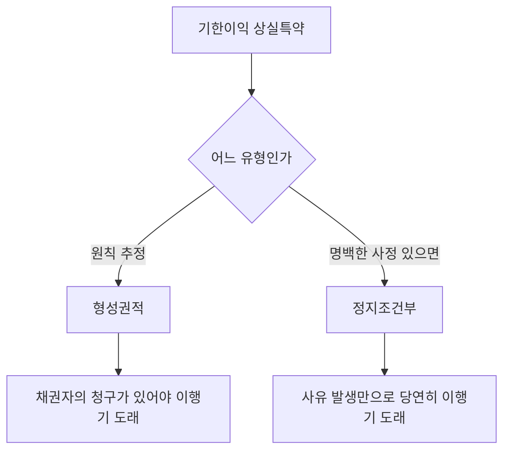

#### 4. 관련 조문

> 📌 **민법 제152조(기한도래의 효과)** — ① 시기있는 법률행위는 기한이 도래한 때로부터 그 효력이 생긴다. ② 종기있는 법률행위는 기한이 도래한 때로부터 그 효력을 잃는다.

> 📌 **민법 제153조(기한의 이익과 그 포기)** — ① 기한은 ==채무자의 이익을 위한 것으로 추정한다.== ② 기한의 이익은 이를 포기할 수 있다. 그러나 ==상대방의 이익을 해하지 못한다.==

> 📌 **민법 제154조(기한부권리와 준용규정)** — 제148조와 제149조의 규정은 기한있는 법률행위에 준용한다.

#### 5. 핵심 판례 법리

- **조건과 불확정기한의 구별** — 부관에 표시된 사실이 발생하지 않으면 채무를 이행하지 않아도 된다고 보는 것이 합리적이면 ==조건==, 발생하지 않는 것으로 확정된 때에도 채무를 이행해야 한다고 보는 것이 합리적이면 ==불확정기한==이다(대판 2018.6.28. 2018다201702). 이는 ==법률행위의 해석==을 통해 결정한다.
- **변제기의 유예** — 이미 부담하고 있는 채무의 변제에 관하여 일정한 사실이 부관으로 붙여진 경우에는 특별한 사정이 없는 한 ==변제기를 유예한 것==으로서, 그 사실이 발생한 때 또는 ==발생하지 아니하는 것으로 확정된 때==에 기한이 도래한다(대판 2003.8.19. 2003다24215).
- **불확정 사실의 이행기한** — 당사자가 ==불확정한 사실이 발생한 때를 이행기한==으로 정한 경우, 그 사실이 발생한 때는 물론 ==그 사실의 발생이 불가능하게 된 때에도 이행기한은 도래한 것==으로 보아야 한다(대판 1989.6.27. 88다카10579).
- **기한이 아닌 예** — 임대차에서 임대기한을 ==임대물을 임차인에게 매도할 때까지==로 약정하였다면 도래 여부가 불확실하므로 ==기한을 정한 것이라고 볼 수 없다==(대판 1974.5.14. 73다631).
- **기한이익 상실특약** — 기한이익 상실특약은 그 내용에 의하여 ==정지조건부 기한이익 상실특약==과 ==형성권적 기한이익 상실특약==으로 나뉘며, 특별한 사정이 없는 한 ==형성권적 기한이익 상실특약으로 추정==하는 것이 타당하다(대판 2002.9.4. 2002다28340).
- **정지조건부 상실특약의 효과** — 정지조건부 기한이익 상실특약의 경우 그 사유가 발생하면 ==채권자의 청구 등을 요하지 않고 당연히 기한의 이익이 상실되어 이행기가 도래==한다(대판 2002.9.4. 2002다28340).
- **기한의 이익 포기** — 기한의 이익은 ==포기할 수 있으나 상대방의 이익을 해하지 못한다.== 이자부 소비대차에서 채무자가 기한 전에 변제하려면 ==기한까지의 이자를 지급==해야 한다.
- **소급효 부정** — 기한의 도래에는 ==소급효가 인정되지 않는다.== 조건성취의 효력은 당사자 약정으로 소급시킬 수 있으나(제147조 제3항), 기한에는 그러한 규정이 없다.

#### ⭐ 기출 출제포인트

1. **기한도래의 소급효** — ==없다.== "소급효가 원칙적으로 인정되지 않는 것" 문항의 정답 단골.
2. **기한의 이익 추정** — ==채무자.== "채권자의 이익을 위한 것으로 추정"은 오답.
3. **기한이익 상실특약의 추정** — ==형성권적.==
4. **불확정 사실의 발생 불가능** — ==기한 도래.==
5. **종기 있는 법률행위** — 기한 도래로 ==효력 상실.== "효력이 생긴다"는 오답.

#### 📊 기출 분석

| 연도 | 출제 형태 | 핵심 논점 |
|---|---|---|
| 2018년 제29회 | "법률행위의 조건과 기한에 관한 설명으로 옳은 것은?" | ==종기 있는 법률행위는 기한 도래 시 효력이 생긴다 = 틀림== / 입양에 시기 X |
| 2020년 제31회 | "조건과 기한에 관한 설명으로 옳지 않은 것은?" | ==기한이익 상실의 약정은 형성권적 기한이익 상실약정으로 추정(옳은 선지)== |
| 2021년 제32회 | "소급효가 원칙적으로 인정되지 않는 것은?" | ==기한부 법률행위에서의 기한도래의 효과(정답)== |
| 2021년 제32회 | "법률행위의 조건과 기한에 관한 설명으로 옳은 것은?" | ==기한은 채권자의 이익을 위한 것으로 추정 = 틀림== / ==불확정 사실의 발생이 불가능해도 기한 도래(정답)== |

**출제 빈도** — ==2018·2020·2021년 출제.== 조건과 묶여 매년 1문항이 나온다.
**반복되는 함정 선지** — ①"기한은 채권자의 이익을 위한 것으로 추정한다"(→채무자), ②"종기 있는 법률행위는 기한 도래 시 효력이 생긴다"(→효력을 잃는다), ③"기한이익 상실약정은 정지조건부로 추정한다"(→형성권적).
**최근 경향** — ==조건과 불확정기한의 판별==을 사례로 묻는 문제가 늘고 있다.

#### 🔍 기출 선지로 배우는 법리

> 실제 출제된 선지를 그대로 놓고 O/X와 근거를 확인한다.

**①** 종기있는 법률행위는 기한이 도래한 때로부터 그 효력이 생긴다. — **X**
어디가 틀렸나: ==효력을 잃는다==(제152조 제2항). (2018년 제29회)

**②** 정지조건있는 법률행위에서 당사자는 조건성취의 효력을 그 성취전에 소급하게 할 수 없다. — **X**
옳게 고치면: ==소급하게 할 수 있다==(제147조 제3항). 기한에는 이런 규정이 없다. (2018년 제29회)

**③** 기한이익 상실의 약정은 특별한 사정이 없으면 형성권적 기한이익 상실의 약정으로 추정한다. — **O**
근거: 대판 2002.9.4. 2002다28340. (2020년 제31회)

**④** 소급효가 원칙적으로 인정되지 않는 것은 기한부 법률행위에서의 기한도래의 효과이다. — **O**
근거: 무권대리 추인(제133조)·토지거래허가·소멸시효 완성·취소(제141조)는 모두 소급효가 있다. (2021년 제32회, 정답 지문)

**⑤** 기한은 특별한 사정이 없는 한 채권자의 이익을 위한 것으로 추정한다. — **X**
어디가 틀렸나: ==채무자의 이익==을 위한 것으로 추정한다(제153조 제1항). (2021년 제32회)

**⑥** 불확정한 사실의 발생을 기한으로 한 경우, 특별한 사정이 없는 한 그 사실의 발생이 불가능한 것으로 확정된 때에도 기한이 도래한 것으로 본다. — **O**
근거: 대판 1989.6.27. 88다카10579. (2021년 제32회, 정답 지문)

**⑦** 법률행위 당시에 곧바로 효력을 발생하게 할 필요가 있는 입양에는 시기를 붙이지 못한다. — **O**
근거: 신분행위에는 부관을 붙일 수 없다. (2018년 제29회)

#### ✏️ 사례형 적용

> **사례 1** — 甲은 乙에게 1억 원을 대여하면서 "乙이 이자를 2회 이상 연체하면 기한의 이익을 상실한다"는 특약을 두었다. 乙이 이자를 3회 연체하였으나 甲은 아무런 청구를 하지 않았다.

**검토** — 기한이익 상실특약은 특별한 사정이 없는 한 ==형성권적 기한이익 상실특약으로 추정==된다(대판 2002.9.4. 2002다28340). 따라서 ==甲의 청구(의사표시)가 있어야== 이행기가 도래한다.
**결론** — 甲이 청구하지 않았으므로 아직 이행기가 도래하지 않았고, ==소멸시효도 진행하지 않는다.== 만약 정지조건부 특약이었다면 3회 연체 시점에 당연히 이행기가 도래했을 것이다.

> **사례 2** — 甲은 乙에게 "내가 소유한 X상가가 임대되면 그 임대료로 빌린 돈을 갚겠다"고 하였다. X상가는 결국 임대되지 못하는 것으로 확정되었다.

**검토** — ① 이미 부담하고 있는 채무의 변제에 관한 부관이므로 ==변제기를 유예한 불확정기한==으로 본다(대판 2003.8.19. 2003다24215). ② 또한 표시된 사실이 발생하지 않는 것으로 확정된 때에도 ==채무를 이행해야 한다고 보는 것이 합리적==이다(대판 2018.6.28. 2018다201702). ③ 따라서 임대가 불가능하게 확정된 때 ==기한이 도래==한다(대판 1989.6.27. 88다카10579).
**결론** — 甲은 변제해야 한다.

#### ⚠️ 이 관의 함정 총정리

1. "기한은 채권자의 이익을 위한 것으로 추정한다"고 하면 틀림 → ==채무자==의 이익이다.
2. "종기 있는 법률행위는 기한이 도래한 때부터 효력이 생긴다"고 하면 틀림 → ==효력을 잃는다.==
3. "기한도래의 효과도 당사자 약정으로 소급시킬 수 있다"고 하면 틀림 → ==소급효가 없다.==
4. "기한이익 상실약정은 정지조건부로 추정한다"고 하면 틀림 → ==형성권적==으로 추정한다.
5. "불확정 사실의 발생이 불가능하게 확정되면 기한이 도래하지 않는다"고 하면 틀림 → ==도래한다.==

#### ✅ OX 확인문제

> 다음 진술의 참·거짓을 판단하시오.

**1.** 시기 있는 법률행위는 기한이 도래한 때로부터 효력이 생긴다.
→ **O**. 제152조 제1항.

**2.** 종기 있는 법률행위는 기한이 도래한 때로부터 효력이 생긴다.
→ **X**. 효력을 잃는다(제152조 제2항).

**3.** 기한도래의 효과는 당사자의 약정으로 소급시킬 수 있다.
→ **X**. 기한에는 소급효가 인정되지 않는다.

**4.** 기한은 채무자의 이익을 위한 것으로 추정한다.
→ **O**. 제153조 제1항.

**5.** 기한의 이익은 포기할 수 있으나 상대방의 이익을 해하지 못한다.
→ **O**. 제153조 제2항.

**6.** 기한부 권리도 처분·상속·보존 또는 담보로 할 수 있다.
→ **O**. 제154조에 의한 제149조의 준용.

**7.** 기한이익 상실의 약정은 특별한 사정이 없으면 정지조건부 기한이익 상실약정으로 추정된다.
→ **X**. 형성권적으로 추정된다(대판 2002.9.4. 2002다28340).

**8.** 채무자가 담보를 손상·감소·멸실하게 한 때에는 기한의 이익을 주장하지 못한다.
→ **O**. 제388조 제1호.

**9.** 불확정한 사실의 발생을 이행기한으로 정한 경우, 그 사실의 발생이 불가능하게 되면 기한이 도래하지 않는다.
→ **X**. 기한이 도래한 것으로 본다(대판 1989.6.27. 88다카10579).

**10.** 임대차에서 임대기한을 "임대물을 임차인에게 매도할 때까지"로 정한 것은 기한을 정한 것이다.
→ **X**. 기한을 정한 것이라고 볼 수 없다(대판 1974.5.14. 73다631).

#### 🧠 암기법

> 🔑 **"조건은 소급 가능, 기한은 절대 불가"**
> 조건 = 당사자 약정으로 소급 O(제147조 제3항). 기한 = ==소급 X.== "소급효가 인정되지 않는 것"의 정답은 언제나 ==기한도래==.

> 🔑 **"기한은 채무자 편"**
> 제153조 제1항 — 채무자의 이익으로 ==추정.== 채권자 편이라고 하면 함정.

> 🔑 **기한이익 상실특약 = "형성권적으로 추정"**
> 원칙은 ==채권자의 청구가 있어야== 이행기 도래(형성권적). 소멸시효 기산점이 달라지므로 실전에서 중요하다.

> 🔑 **제388조 = "담보를 망치거나 안 주면 끝"**
> 채무자가 담보를 **손상·감소·멸실**시키거나 담보제공 의무를 **불이행**하면 기한의 이익 상실.

---

### 📄 기본서 원문 (참조)

> 📌 감정평가사 민법 기본서 407p의 해당 장 원문이다. 위 관별 정리의 근거이며,
> 조문·판례 번호를 원문 그대로 확인할 때 참조한다.

#### 기본서 (p.89~186)

<!--p.89-->
제5장 법률행위  89
ⓑ 표현행위(의식의 표현)
㉮ 의사의 통지：각종의 최고(제15조․제88조․제131조․제381조․제387조․제
552조 등)․각종의 거절(제16조․제132조․제487조․제552조 등)과 같이 
자기의 의사를 타인에게 통지하는 것을 말한다.
㉯ 관념의 통지(사실의 통지)：사원총회소집의 통지(제71조) ․채무승인
(제68조․제450조)․채권양도통지 및 승낙(제450조)․공탁통지(제488조)․
승낙연착통지(제528조)와 같이 과거 또는 현재의 사실을 상대방에게 
알리는 것을 말한다.
㉰ 감정의 표시：용서(제556조
․제81조)와 같이 일정한 감정을 표시하는 
것을 말한다.
ⓒ 비표현행위(사실행위) 
㉮ 순수사실행위：주소의 설정(제18조)․ 매장물발견(제254조)․ 가공(제259
조) 등과 같이 행위자의 내심적 의식과 관계 없이 외부적․ 사실적 결과의 
야기에 의하여 법이 이에 일정한 법률효과를 부여한 것이다.
㉯ 혼합사실행위：무주물의 선점(제252조) ․ 물건의 인도(제187조)․사무
관리(제734조) ․ 부부의 동거 등과 같이 외부적 결과의 야기 이외에 
일정한 의식내용을 필요로 하는 것을 말한다.
② 위법행위：법률이 가치 없는 것으로 평가하여 허용하지 않는 행위를 말한다. 이에
는 채무불이행(제390조)과 불법행위(제750조 이하)가 있다.
2) 내부적 용태
① 의의：내심적 의식상태로 원래는 법적 의미를 가지지 않으나 예외적인 일정한 
경우에 한하여 법적 효과를 부여한다.
② 관념적 용태：선의 ․ 악의(제29조․제107조․제108조․제109조․제110조) ․ 정당한 
대리인이라는 신뢰(제126조)와 같이 어떤 사람이 일정한 의사를 가지느냐 여부의 
내심적 과정이다.
③ 의사적 용태：소유의 의사(제197조), 제3자의 변제에 있어서 채무자의 허용 또는 
불허용의 의사(제469조), 사무관리에 있어서 본인의 의사(제734조), 반대의 의사와 
같이 일정한 사실에 관한 관념 또는 인식이 있는가 여부의 내심적 과정이다.

<!--p.90-->
90  제1편 민법 총칙
(2) 사건
사람의 정신작용에 기하지 않는 것을 말하며, 법률이 일정한 효과를 인정하고 있는 
것이다. 사람의 출생, 사망, 실종, 시간의 경과, 물건의 자연적 발생 또는 소멸, 물건의 
파괴, 부합
․혼화, 과실의 분리, 부당이득 등이 있다.
용
태
외
부
적
용
태
적법
행위
의 사 표 시 청약, 승낙, 추인, 동의 등
준
법
률
행
위
표현
행위
의사의 통지 각종의 최고나 거절
관념의 통지
사원총회소집의 통지, 대리권수여의 통지,
채무의 승인, 공탁의 통지, 채권양도의 통지,
승낙연착의 통지 
등
감정의 표시 망은행위에 대한 용서, 이혼사유에 대한 용서 등
비표현
행위
순수사실행위 매장물발견, 가공, 주소의 설정 등
혼합사실행위 선점, 물건의 인도, 부부의 동거, 사무관리 등
위법
행위
불법행위 불법행위
채무불이행 이행지체, 이행불능, 불완전이행 등
내부적 
용태
관념적 용태 선의 ․악의, 정당한 대리인이라는 신뢰 등
의사적 용태
점유의 의사, 소유의 의사, 정주의 의사,
본인을 위한 의사 등
사                건
물건의 자연적 발생과 소멸, 시간의 경과,
사람의 출생․사망․실종, 천연과실의 분리,
물건의 부합, 물건의 파괴 ․혼동 등
<법률사실의 체계>

<!--p.91-->
제5장 법률행위  91
3. 권리변동의 모습
법률효과는 권리의 발생 ․ 변경 ․ 소멸이라는 모습으로 나타나는데 이를 권리주체의 
입장에서 보면 권리의 취득․ 변경․ 상실이 된다. 이 때의 권리의 취득과 상실은 권리의 
상대적인 발생과 소멸을 의미하는 것이다.
다시 설명하면, 권리의 발생이란 어떤 자가 권리를 취득한다는 것을 의미하며, 권리의 
변경이란 권리가 그의 동일성을 잃지 않고서 그의 주체
․ 내용 ․ 작용에 관하여 변경을 
받는 것이다.
아울러 권리의 소멸이란, 그 사람이 권리를 상실한다는 것을 말한다.
모습 의의 예
권
리
변
동
권리의
취득
(발생)
절대적 발생
(원시취득)
타인의 권리에 의하지 않고
새로이 권리가 발생하는 것
선점(제252조)
․ 습득(제253
조)․ 시효취득(제245조)․ 선의
취득(제249조) 등
상대적
발생
(승계
취득)
이전적
승계
포괄
승계
타인의 권리를 포괄적으로 
승계하는 것
상속(제997조) ․ 포괄유증
(제1078조)․ 회사의 합병 등
특정
승계
타인의 개별적인 권리를 
승계하는 것
매매(제563조) ․ 증여(제554
조) 등
설정적
승계
소유자의 권리는 그대로 존속
하면서 타인이 새로운 권리를 
설정받는 것
지상권설정(제279조)
․ 지역권
설정(제291조) ․ 전세권설정
(제303조)․ 저당권설정(제356
조)․ 임차권설정(제618조)
권리의
변경
주체의 변경
다른 면에서 본다면 권리의
승계 ․ 상대적 소멸에 해당
작용의 변경
∙ 저당권의 순위가 변경되는 것
∙ 부동산임차권의 대항력 취득
성질적 변경
특정물인도채권이 손해배상
채권으로 변하는 경우(제
390조
․ 394조)
수량적 변경
소유권에 지상권 등의 제한물
권이 설정되거나 소멸하는 것

<!--p.92-->
92  제1편 민법 총칙
모습 의의 예
권
리
변
동
권리의
소멸
절대적 소멸
권리 자체가 소멸하는 것 목적물 멸실로 인한 권리의 
소멸
․ 소멸시효(제162조) ․
변제에 의한 권리소멸 등
상대적 소멸 권리 자체는 소멸하지 않고
권리의 주체만이 변경되는 것
매매나 증여로 인한 매도인 
또는 증여자의 권리상실 등
4. 법률행위의 종류
(1) 단독행위 ․ 계약 ․ 합동행위
1) 의의
법률행위의 불가결의 구성요소인 의사표시가 어떻게 결합하는가에 따른 분류로서, 
가장 기본적인 구별이다.
2) 단독행위
① 의의 : 단독행위란 행위자 한 사람이 한 개의 의사표시로 성립하는 법률행위이며, 
일방행위라고도 한다. 단독행위는 상대방에게 미치는 영향이 크므로 민법 기타 
법률에 특별규정이 있는 경우 이외에는 허용하지 아니한다. 단독행위는 상대방의 
유무에 따라 다시 나누어진다.
② 상대방 있는 단독행위：의사표시가 상대방에게 도달하여야 법률효과가 발생하는 
행위로 동의
․ 추인 ․ 채무면제․ 상계 ․ 취소 ․ 철회 ․ 해제 ․ 해지 등이다.
③ 상대방 없는 단독행위 : 의사표시를 수령한 상대방이 특정되어 있지 않고 그 의사
표시가 있으면 곧 법률효과가 발생하는 행위로, 유증․ 재단법인의 설립행위․ 권리의 
포기 등이다. 단, 권리의 포기 중에서 기한이익의 포기 ․ 시효이익의 포기 ․ 제한
물권의 포기는 상대방 있는 단독행위에 해당한다.
3) 계약
넓은 의미의 계약이란 두 개의 서로 대립되는 의사표시의 합치에 의하여 성립하는 
법률행위이다. 계약은 반드시 복수인의 의사표시를 필요로 하므로 단독행위와 다르다. 
따라서 이를 쌍방행위라고도 한다. 또한 계약은 이해관계가 대립되는 각 당사자의 
의사표시가 합치되어 성립하는 것이므로 합동행위와 다르다. 좁은 의미의 계약은 

<!--p.93-->
제5장 법률행위  93
채권의 발생을 목적으로 하는 채권계약만을 의미한다. 그러나 넓은 의미의 계약에는 
채권계약 외에도 물권계약과 가족법상 계약을 포함할 수 있다. 민법은 제3편 제2장에서 
15개의 전형적인 채권계약을 규정하고 있다.
4) 합동행위
합동행위란 서로 대립하지 않는 복수당사자의 내용과 방향을 같이하는 복수의 의사
표시가 합치함으로써 성립하는 법률행위이다. 사단법인의 설립행위를 그 예로 들 수 
있다.
(2) 채권행위
․ 물권행위․ 준물권행위
1) 의의
재산법상의 법률행위에 의하여 발생하는 효과의 종류에 따른 분류이다.
2) 채권행위 
채권행위란 단순히 채권․ 채무를 발생시키는 법률행위를 말한다. 매매․ 증여 ․ 임대차 
등이 이에 속한다. 채권행위가 행하여지는 경우에, 이를 채무자의 입장에서 본다면 
그는 언제나 일정한 채무를 부담하게 된다. 여기서 채무행위는 이를 의무부담행위라 
한다. 채권행위는 채권
․ 채무에 관하여 ‘이행’이라는 문제를 남기게 되나, 물권행위나 
준물권행위에서는 이행의 문제는 생기지 않는 점에서 크게 다르다. 여기서 물권행위나 
준물권행위를 처분행위라 한다.
3) 물권행위
물권행위란 물권의 발생
․ 변경․ 소멸, 즉 물권의 변동을 생기게 하는 법률행위를 말한다. 
소유권의 이전․ 지상권설정행위․ 저당권설정행위 등이 이에 속한다. 따라서 물권행위는 
채권행위와 같은 이행이라는 문제를 남기지 않는 점에 그 특색이 있다.
4) 준물권행위
준물권행위란 물권 이외의 권리의 발생․ 변경․ 소멸을 직접 생기게 하는 법률행위이다. 
다시 말해서 물권 이외의 권리를 종국적으로 변동시키고 더 이상은 이행의 문제를 
남기지 않는 법률행위를 말한다. 예컨대, 채권양도(제449조 제1항)
․ 채무면제(제506
조) ․ 지식재산권의 양도 등이 이에 속한다.

<!--p.94-->
94  제1편 민법 총칙
표준 세분 내용 예
의사
표시
단독행위
상대방 있는 단독행위
동의, 철회, 상계, 추인, 해제, 해지, 취소, 채
무면제 등 
상대방 없는 단독행위 권리의 포기, 재단법인의 설립행위, 유언 등
계약 전형계약(15종)
매매, 교환, 임대차, 사용대차, 증여, 소비대
차, 위임, 도급, 여행계약, 화해, 조합, 현상광
고, 고용, 임치, 종신정기금
합동행위 사단법인의 설립행위
법률
효과
채권행위
채권을 발생시키며 이행의 문제를 남김(원인, 약속：15종의 계약) ; 의무
부담행위
물권행위
물권변동이 일어나며 더 이상의 이행의 문제는 없음(결과, 이행：소유권
이전, 전세권설정 등) ; 처분행위
준물권행위
물권 이외의 권리의 종국적 변동을 일으키고 이행의 문제는 없음(채권
양도, 채무면제 등) ; 처분행위
<법률행위의 종류>
(3) 요식행위 ․ 불요식행위
1) 의의 
의사표시의 형식에 의한 분류이다. 즉, 법률행위가 성립하기 위하여 서면의 작성 등 
일정한 방식을 요하는가에 의한 구별이다.
2) 불요식행위
불요식행위는 법정의 방식을 요하지 아니하는 법률행위이다. 매매․ 임대차․ 소비대차
․ 위임 등이 그 예이다. 계약자유가 기본적 가치로서 인정되는 법제에서는 불요식행
위를 원칙으로 하고 있다.
3) 요식행위
요식행위란 의사표시가 일정한 방식에 따라 하였을 때에 비로소 법률행위가 성립 내지 
효력이 발생하는 법률행위를 말한다. 예컨대, 당사자로 하여금 신중하게 행위를 하게 
하기 위하여(혼인․ 이혼 등의 신분행위), 또는 법률관계를 명확하게 하기 위하여(법인의 
설립행위․ 유언 등), 특히 외형을 신뢰하여 민활하게 거래하게 할 필요가 있는 행위
(어음․ 수표 등의 유가증권에 관한 행위 등)에는 일정한 방식이 요구된다.

<!--p.95-->
제5장 법률행위  95
(4) 생전행위 ․ 사후행위(사인행위)
사후행위란 행위는 생전에 성립되지만, 행위자의 사망으로 그 효력이 발생하는 법률
행위이며 사인행위라고도 한다. 예컨대, 유언(제1073조)․ 사인증여(제562조)가 이에 
속한다. 생전행위는 문자 그대로 생전에 하는 법률행위를 말한다.
(5) 재산행위 ․ 가족법상의 행위(신분행위)
매매계약․ 임대차계약․ 증여계약과 같이 재산상의 법률효과를 발생케 하는 법률행위를 
재산행위라고 하며, 혼인 ․ 입양 ․ 인지 ․ 파양 등과 같이 신분상의 법률효과를 발생케 
하는 법률행위를 신분행위라고 한다.
(6) 출연행위 ․ 비출연행위
1) 의의
재산행위 중 자기의 재산을 감소시켜 타인의 재산을 증가시키는 행위(❙ 매매․ 임대차)를 
출연행위라고 하며, 타인의 재산을 증가시키지 않고 자기의 재산만을 감소시키거나
(
❙ 소유권의 포기), 직접 재산의 증감을 가져오지 않는 행위( ❙ 대리권의 수여)를 
비출연행위라고 한다. 출연행위는 다시 다음과 같이 분류된다.
2) 유상행위․ 무상행위
유상행위란 재산의 출연을 목적으로 하는 법률행위 중에서 매매․ 교환 ․ 임대차․ 고용 
등과 같이 대가를 수반하는 것을 말하며, 무상행위는 증여 ․ 사용대차와 같이 대가적 
출연을 받지 않는 행위를 말한다. 유상행위와 무상행위는 선량한 관리자의 주의의무
(제374조)를 지느냐, 자기재산과 동일한 주의의무(제695조)를 지느냐에 차이가 있다.
3) 유인행위
․ 무인행위
유인행위란 원인된 법률행위의 효력에 따라 영향을 받는 법률행위를 말하며, 무인행
위란 그러하지 아니한 법률행위를 말한다. 다시 말해서 유인행위란 그 원인이 불성립
하거나 무효가 되면 출연행위 자체도 무효가 되는 것을 말하며, 무인행위란 출연행위의 
효력이 그 원인의 불성립이나 무효에 의해 영향을 받지 않는 법률행위를 말한다. 
어음행위 및 수표행위가 무인행위에 해당한다.

<!--p.96-->
96  제1편 민법 총칙
(7) 독립행위 ․ 보조행위
독립행위는 직접 법률관계의 변동을 일어나게 하는 법률행위이고, 보조행위는 단순히 
다른 법률행위의 효과를 형식적으로 보충하거나 확정하는 법률행위이다. 대부분의 
법률행위는 독립행위이나 동의
․ 추인 ․ 대리권의 수여행위 등은 보조행위이다.
(8) 주된 행위와 종된 행위
법률행위가 유효하게 성립하기 위하여 다른 법률행위의 존재를 전제하여 이에 부종
하여 성립되는 법률행위를 종된 행위라 하고, 그 전제가 되는 행위를 주된 행위라 한다. 
부부재산계약은 혼인의 종된 계약이고, 질권 또는 저당권설정계약은 소비대차계약의 
종된 행위이다. 종된 행위는 주된 행위와 법률적 운명을 같이 하는 것이 원칙이다.

<!--p.97-->
제5장 법률행위  97
제2절 법률행위의 성립요건과 효력요건
1. 의의
법률행위가 그 법률효과를 발생하려면 먼저 법률행위로서 성립하고, 다음에 법률행위의 
효력이 발생되어야 한다. 이와 같이 법률행위가 성립하기 위한 요건을 법률행위의 
성립요건이라 하고, 성립한 법률행위가 효력이 발생되기 위한 요건을 효력요건 또는 
유효요건이라 한다.
2. 법률행위의 성립요건
(1) 일반적 성립요건
법률행위에 일반적으로 요구되는 성립요건으로서, 예컨대 매매라는 법률행위를 행하기 
위해서는 행위의 ‘당사자(매도인과 매수인)’가 존재하여야 하고, 당사자가 의도하는 
‘목적(재산권의 이전과 대금지급)’과 ‘의사표시(청약과 승낙)’가 있어야 한다. 따라서 
‘당사자
․ 목적 ․ 의사표시’ 이 세 가지를 일반적 성립요건이라 한다.
(2) 특별성립요건
개개의 법률행위에 관하여 그의 성립에 필요한 요건으로 규정하고 있는 것으로, 예를 
들면 혼인에 있어서의 신고(제812조), 유언에 있어서의 증서의 작성(제1060조), 요물
계약에서의 물건의 인도 등이 있다.
3. 법률행위의 효력요건
일단 성립한 법률행위가 법률상 효력을 발생하는 데 필요한 요건을 말한다.
(1) 일반적 효력요건
모든 법률행위에 요구되는 효력요건이다.
① 당사자가 권리능력 ․ 의사능력․ 행위능력을 가지고 있을 것

<!--p.98-->
98  제1편 민법 총칙
② 법률행위의 목적이 가능 ․ 적법 ․ 사회적 타당성 ․ 확정할 수 있을 것
③ 의사표시에 있어서 의사와 표시가 일치하고 의사표시에 하자가 없을 것
(2) 특별효력요건
일정한 법률행위에 있어서 요구되는 특유한 효력요건이다.
① 대리행위에 있어서의 정당한 대리권의 존재(제114조 내지 제136조)
② 조건부 법률행위에 있어서의 조건의 성취(제147조 이하)
③ 기한부 법률행위에 있어서의 기한의 도래
④ 유언에 있어서의 유언자의 사망(제1073조)
⑤ 토지거래허가구역에서의 관할관청의 허가
구분 성립요건 효력요건
일반요건
당사자 권리능력 ․ 의사능력․ 행위능력을 가질 것
목적 가능 ․ 적법 ․ 사회적 타당성 ․ 확정할 수 있을 것
의사표시 의사와 표시가 일치하고 의사표시에 하자가 없을 것
특별요건
∙ 법인설립시 정관작성
∙ 혼인의 경우 신고
∙ 유언의 경우 증서
∙ 요물계약에서의 물건
의 인도
∙ 대리에 있어서는 정당한 대리권의 존재
∙ 조건부 법률행위에 있어서는 조건의 성취
∙ 기한부 법률행위에 있어서는 기한의 도래
∙ 유언에 있어서는 유언자의 사망
∙ 토지거래허가구역에서의 관할관청의 허가
<성립요건과 효력요건의 비교>

<!--p.99-->
제5장 법률행위  99
제3절 법률행위의 목적
1. 의의
법률행위의 목적이란 행위자가 그의 법률행위에 의하여 발생시키려고 하는 법률효과를 
말하며 법률행위의 내용이라고도 한다. 예컨대, 매매계약이라는 법률행위의 목적은 
매도인의 대금지급청구권과 매수인의 재산권이전청구권이라 할 수 있다. 법률행위의 
목적은 가능
․ 적법 ․ 사회적 타당성 ․ 확정할 수 있는 것이어야 한다.
2. 목적의 적법
(1) 의의
강행법규란 당사자가 의사에 의하여 그 규정의 적용을 배제할 수 없는 규정을 말하며, 
임의법규란 당사자가 의사에 의하여 그 규정의 적용을 배제할 수 있는 규정을 말한다. 
따라서 강행법규에 반하는 내용의 법률행위는 그 효력이 발생되지 아니한다.
(2) 강행규정(강행법규)
민법은 그 규정 자체에서 강행규정이라고 밝히고 있는 경우(제608조)도 있으나 대부분은 
강행법규임을 명시하지 않고 있으므로 그 구별의 기준이 애매하다. 따라서 규정의 성질과 
종류, 입법목적 등을 고려하여 개별적으로 판단할 것을 요한다. 
(3) 단속규정(단속법규)
일정한 행정상의 목적을 달성하기 위하여 사실행위를 금지
․ 제한하거나 거래행위를 
금지 ․ 제한하고 이에 위반한 경우 형벌이나 행정상의 불이익을 가하게 하는 규정을 
말한다. 단순한 단속법규에 위반한 경우에는 그 사법상의 효력은 유효이나 벌칙의 
적용 대상이 된다.
(4) 임의규정(임의법규)
선량한 풍속 기타 사회질서와 관계 없는 규정으로서 당사자의 특약으로 그 규정의 
적용을 배제하거나 변경하더라도 무효가 아닌(유효) 규정을 말한다.

<!--p.100-->
100  제1편 민법 총칙
(5) 탈법행위
강행법규에 직접 위반하지는 않으나 강행규정이 금지하고 있는 것을 다른 적법행위의 
형식을 빌어서 실질적으로 실현하는 행위를 의미하며, 그 효과는 무효이다.
3. 목적의 가능
(1) 의의
법률행위의 목적은 그 실현이 가능한 것이어야 한다. 따라서 법률행위의 성립 당시에 
목적이 불능(원시적 불능)한 것이면 그 법률행위는 무효이다.
(2) 가능 ․ 불능의 표준 
법률행위의 목적이 가능한가 또는 불능한가의 표준은 사회통념에 따라 결정된다. 
즉, 물리적으로 불능인 경우(하늘의 별을 딴다는 계약, 죽은 사람을 살린다는 계약 
등)는 물론 물리적으로는 가능하더라도 사회통념상 불능한 경우(한강에 빠뜨린 바늘을 
찾는다는 계약 등)에도 불능이다. 아울러 불능은 확정적이어야 하며 일시적으로 불능한 
것이라도 가능으로 될 개연성이 높은 것은 불능이 아니다.
(3) 불능의 분류
1) 원시적 불능과 후발적 불능
① 의의：법률행위의 성립 당시에 이미 법률행위의 목적이 실현불가능인 것이 원시적 
불능이며, 법률행위의 성립 당시에는 가능하였으나, 그 이행 전에 불능하게 된 것이 
후발적 불능이다. 예컨대, 이미 불타 버린 건물의 매매계약을 체결한 것은 원시적 
불능이고, 매매계약체결 후에 건물이 불타 버린 경우라면 후발적 불능이다.
② 원시적 불능의 효과：원시적 불능의 법률행위는 무효이다. 다만 목적물의 인도
의무자가 그 불능을 알았거나(악의) 알 수 있었다면(과실) 상대방이 그 계약이 
유효하다고 믿음으로써 받은 손실(신뢰이익)을 배상하여야 한다(제535조, 계약체결
상의 과실).

<!--p.101-->
제5장 법률행위  101
제535조 【계약체결상의 과실】
① 목적이 불능한 계약을 체결할 때에 그 불능을 알았거나 알수 있었을 자는 상대방이 
그 계약의 유효를 믿었음으로 인하여 받은 손해를 배상하여야 한다. 그러나 그 배상
액은 계약이 유효함으로 인하여 생길 이익액을 넘지 못한다.
② 전항의 규정은 상대방이 그 불능을 알았거나 알 수 있었을 경우에는 적용하지 아니한다.
③ 후발적 불능의 효과：후발적 불능은 법률행위 자체를 무효로는 하지 않는다. 단, 
채무자의 귀책사유(고의 또는 과실)로 인한 후발적 불능인 경우에는 채무불이행의 
하나인 이행불능(제390조)이 되고, 채무자의 귀책사유 없는 후발적 불능인 경우에는 
위험부담의 문제(제537조)가 된다. 아울러, 이행불능의 경우에는 채무자는 손해
배상책임을 지게 되며, 위험부담의 문제가 될 때에는 채무자는 원칙적으로 자기
채무의 이행의무를 면하게 되나 상대방에 대하여 반대급부의 이행을 청구할 수 없게 
된다(제537조
․ 제538조 채무자 위험부담주의).
2) 전부불능과 일부불능
① 의의：매매목적물인 건물이 전부 소실된 경우와 같이 법률행위의 목적전부가 
불능인 것을 전부불능, 일부만이 소실된 경우와 같이 일부만이 불능인 것을 일부
불능이라 한다.
② 전부불능의 효과：원시적 불능인가 또는 후발적 불능인가에 따라 법률효과가 
발생한다.
③ 일부불능의 효과：일부불능의 경우에는 원칙적으로 전부무효가 되나 그 무효부분이 
없더라도 법률행위를 하였으리라 인정될 때에는 나머지 부분은 유효인 것으로 본다
(제137조).
4. 목적의 사회적 타당성
법률행위의 목적이 적법하고 가능하더라도 그것이 선량한 풍속 기타 사회질서에 
위반되는 것을 내용으로 할 때에는 무효이다.
제103조 【반사회질서의 법률행위】
선량한 풍속 기타 사회질서에 위반한 사항을 내용으로 하는 법률행위는 무효로 한다.

<!--p.102-->
102  제1편 민법 총칙
(1) 사회질서위반의 실질적 유형
사회질서에 위반하는 법률행위를 구체적으로 열거하는 것은 불가능하기에 민법은 제
103조에 추상적 ․ 일반적 규정을 두고 있다. 판례에 의하여 나타난 사회질서위반의 
구체적 내용은 다음과 같다.
유형 구체적인 예
정의의 관념에
반하는 행위
① 매도인의 배임행위에 적극 가담한 이중매매 
② 법정에서 허위진술을 대가로 금전의 교부약정  
③ 경매나 입찰에서의 담합행위
④ 불법행위를 하거나 하지 않을 것을 내용으로 하는 계약
⑤ 밀수자금의 소비대차, 공무원의 청탁과 수뢰약정  
인륜에 반하는
행위
① 첩계약은 처의 동의유무를 불문하고 무효 
단, 첩관계의 단절을 목적으로 위자료 지급계약이나 첩관계에서 태어난 
자(子)의 양육비 지급계약은 유효  
② 자식의 부모에 대한 불법행위를 이유로 한 손해배상청구
③ 모자(母子) 불동거계약
개인의 자유를
극도로 제한
하는 행위
① 개인의 정신 또는 신체의 자유를 극도로 제한하는 행위
∙ 평생 혼인하지 않겠다는 계약 
∙ 혼인하면 퇴직하겠다는 각서를 써 준 경우
∙ 어떠한 일이 있어도 이혼하지 않겠다는 약정  
② 개인의 경제활동의 자유를 지나치게 제한하는 행위  
생존의 기초가
되는 재산의 
처분행위
① 사찰이 그 존립에 없어서는 안 될 임야를 증여하는 행위
② 장래에 취득하게 될 모든 재산을 양도하는 계약
도박 등의 
사행행위
① 도박계약이나 도박자금을 대여하는 계약 
② 도박채무의 변제로 토지의 양도계약 

<!--p.103-->
제5장 법률행위  103
중요판례
대법원 1995.07.14. 94다40147
도박채무의 변제를 위하여 채무자로부터 부동산의 처분을 위임받은 채권자가 그 부동산을 
제3자에게 매도한 경우, 도박채무 부담행위 및 그 변제약정이 민법 제103조의 선량한 풍속 
기타 사회질서에 위반되어 무효라 하더라도, 위와 같은 사정을 알지 못하는 제3자가 도박채
무자의 대리인인 도박채권자를 통하여 위 부동산을 매수한 행위까지 무효가 된다고 할 수는 
없다. 
대법원 2004.05.28. 2003다70041
강제집행을 면할 목적으로 부동산에 허위의 근저당권설정등기를 경료하는 행위는 민법  
제103조의 선량한 풍속 기타 사회질서에 위반한 사항을 내용으로 하는 법률행위로 볼 수 
없다. 
대법원 1993.5.25, 93다296
양도소득세의 회피 및 투기의 목적으로 자신 앞으로 소유권이전등기를 하지 아니하고 미등
기인 채로 매매계약을 체결(명의신탁)하였다고 하여, 그것만으로 그 매매계약이 사회질서에 
반하는 법률행위로서 무효로 된다고 할 수 없다.
대법원 1967.10.06. 67다1134
혼인관계가 존속중인 사실을 알면서 남의 첩이 되어 부첩행위를 계속한 경우에는 본처의 
사전승인이 있었다 하더라도 장래의 부첩관계의 사전승인이라는 것은 선량한 풍속에 위배
되는 행위이므로 본처에 대하여 불법행위가 성립한다.
대법원 1980.06.24. 80다458
피고가 원고와의 부첩관계를 해소하기로 하는 마당에 그 동안 원고가 피고를 위하여 바친 
노력과 비용 등의 희생을 배상 내지 위자하고 또 원고의 장래 생활대책을 마련해 준다는 
뜻에서 금원을 지급하기로 약정한 것이라면 부첩관계를 해소하는 마당에 위와 같은 의미의 
금전지급약정은 공서양속에 반하지 않는다고 보는 것이 타당하다.
대법원 2001.11.09. 2001다44987
매매계약체결 당시에 정당한 대가를 지급하고 목적물을 매수하는 계약을 체결하였다면 , 
비록 그 후 목적물이 범죄행위로 취득된 것을 알게 되었다고 하더라도, 그 목적물에 대한 
소유권이전등기를 구하는 것은 민법 제103조의 공서양속에 반하는 행위라고 볼 수 없다
. 

<!--p.104-->
104  제1편 민법 총칙
☞ 법률행위가 반사회질서에 해당하는지의 여부를 어느 시기를 기준으로 하여 판단하여야 
하는지에 관하여, 학설은 법률행위시설과 효력발생시설이 대립하나, 판례는 법률행위
시설에 따른다.
대법원 1994.03.11. 93다40522
[1] 민법 제103조에 의하여 무효로 되는 반사회질서행위는
 법률행위의 목적인 권리의무의 
내용이 선량한 풍속 기타 사회질서에 위반되는 경우뿐만 아니라 그 내용 자체는 반사회
질서적인 것이 아니라고 하여도 법률적으로 이를 강제하거나 법률행위에 반사회질서적인
 
조건 또는 금전적 대가가 결부됨으로써 반사회질서적 성질을 띠게 되는 경우 및 표시되
거나 상대방에게 알려진 법률행위의 동기가 반사회질서적인 경우를 포함한다 .
[2] 어떠한 사실을 알고 있는 사람과의 사이에 소송에서 사실대로 증언하여 줄 것을 조건으로 
어떠한 급부를 할 것을 약정한 경우, 증인은 법률에 의하여 증언거부권이 인정되지 않는 
한 진실을 진술할 의무가 있는 것이고, 이러한 당연한 의무의 이행을 조건으로 상당한 
정도의 급부를 받기로 하는 약정은 증인에게 부당하게 이익을 부여하는 것이라고 할 것
이고, 그러한 급부의 내용이 통상적으로 용인될 수 있는 수준(예컨대 증인에게 일당 및 
여비가 지급되기는 하지만 증인이 증언을 위하여 법원에 출석함으로써 입게 되는 손해
에는 미치지 못하는 경우 그러한 손해를 전보하여 주는 경우 정도)을 넘어서, 어느 당사
자가 그 증언이 필요함을 기화로 증언하여 주는 대가로 용인될 수 있는 정도를 초과
하는 
급부를 제공받기로 한 약정은 반사회질서적인 금전적 대가가 결부된 경우로 그러한 약정은 
민법 제103조 소정의 반사회질서행위에 해당하여 무효로 된다.
대법원 2015.7.23, 2015다200111 전원합의체
[1] 형사사건에 관하여 체결된 성공보수약정이 가져오는 여러 가지 사회적 폐단과 부작용 
등을 고려하면, 구속영장청구 기각, 보석 석방, 집행유예나 무죄 판결 등과 같이 의뢰인
에게 유리한 결과를 얻어내기 위한 변호사의 변론활동이나 직무수행 그 자체는 정당하다 
하더라도, 형사사건에서의 성공보수약정은 수사
․ 재판의 결과를 금전적인 대가와 결부
시킴으로써, 기본적 인권의 옹호와 사회정의의 실현을 사명으로 하는 변호사 직무의 공
공성을 저해하고, 의뢰인과 일반 국민의 사법제도에 대한 신뢰를 현저히 떨어뜨릴 위험이 
있으므로, 선량한 풍속 기타 사회질서에 위배되는 것으로 평가할 수 있다. 다만 선량한 
풍속 기타 사회질서는 부단히 변천하는 가치관념으로서 어느 법률행위가 이에 위반되어 
민법 제103조에 의하여 무효인지는 법률행위가 이루어진 때를 기준으로 판단하여야 하고, 
또한 그 법률행위가 유효로 인정될 경우의 부작용, 거래자유의 보장 및 규제의 필요성, 
사회적 비난의 정도, 당사자 사이의 이익균형 등 제반 사정을 종합적으로 고려하여 사회
통념에 따라 합리적으로 판단하여야 한다.

<!--p.105-->
제5장 법률행위  105
[2] 그런데 그동안 대법원은 수임한 사건의 종류나 특성에 관한 구별 없이 성공보수약정이 
원칙적으로 유효하다는 입장을 취해 왔고, 대한변호사협회도 1983년에 제정한 ‘변호사
보수기준에 관한 규칙’에서 형사사건의 수임료를 착수금과 성공보수금으로 나누어 규정
하였으며, 위 규칙이 폐지된 후에 권고양식으로 만들어 제공한 형사사건의 수임약정서
에도 성과보수에 관한 규정을 마련하여 놓고 있었다. 이에 따라 변호사나 의뢰인은 형사
사건에서의 성공보수약정이 안고 있는 문제점 내지 그 문제점이 약정의 효력에 미칠 수 
있는 영향을 제대로 인식하지 못한 것이 현실이고, 그 결과 당사자 사이에 당연히 지급
되어야 할 정상적인 보수까지도 성공보수의 방식으로 약정하는 경우가 많았던 것으로 
보인다.
[3] 이러한 사정들을 종합하여 보면, 종래 이루어진 보수약정의 경우에는 보수약정이 성공
보수라는 명목으로 되어 있다는 이유만으로 민법 제103조에 의하여 무효라고 단정하기는 
어렵다. 그러나 대법원이 이 판결을 통하여 형사사건에 관한 성공보수약정이 선량한 풍속
 
기타 사회질서에 위배되는 것으로 평가할 수 있음을 명확히 밝혔음에도 불구하고 향후
에도 성공보수약정이 체결된다면 이는 민법 제 103조에 의하여 무효로 보아야 한다.
대법원 1969.08.19. 69므18
어떠한 일이 있어도 이혼하지 않겠다는 각서를 써 주었다 하더라도  그와 같은 의사표시는 
신분행위의 의사결정을 구속하는 것으로서 공서양속에 위배하여 무효이다.
대법원 2007.06.14. 2007다3285 
양도소득세의 일부를 회피할 목적으로 매매계약서에 실제로 거래한 가액을 매매대금으로 
기재하지 아니하고 그보다 낮은 금액을 매매대금으로 기재하였다 하여, 그것만으로 그 매매
계약이 사회질서에 반하는 법률행위로서 무효라고 볼 수 없다 . 
대법원 2001.2.9, 99다38613
다수의 문화재를 보유하고 있는 전통사찰의 주지직을 거액의 금품을 대가로 양도ㆍ양수하
기로 하는 약정이 있음을 알고도 이를 묵인 혹은 방조한 상태에서 한 종교법인의 주지임명
행위라고 하여, 그 임명행위 자체가 선량한 풍속 기타 사회질서에 반한다고는 할 수 없다.
☞ 甲이 전통사찰의 전 주지인 乙에게 주지직 사임 대가로 3억 원을 지급하기로 하고 乙을 
주지직에서 사임하게 한 다음 해당 종교법인으로부터 위 사찰의 주지로 임명받은 사안에서, 
대법원은 甲과 乙 사이의 위와 같은 약정은 전통사찰의 주지직을 거액의 금품을 대가로 
양도ㆍ양수하기로 하는 계약으로서 그 내용이 선량한 풍속 기타 사회질서에 반하는 행위로서 

<!--p.106-->
106  제1편 민법 총칙
甲男 乙女
① 증여(이전등기)
丙
②매 도불법원인급여
첩계약
소유권취득○
선 ․ 악 불문
소유권취득○
甲男 乙女
단절목적의 위자료
계약과 자(子)의
양육비계약은 유효
내연관계
<반사회질서의 법률행위(첩계약)>
(2) 부동산의 이중매매
1) 이중매매의 유효성
① 이중매매는 계약자유의 원칙에 따라 원칙적으로 유효하다. 제2매수인이 소유권을 
취득하는 경우 제1매매행위는 이행불능이 되어 제1매수인은 매도인에게 채무불
이행의 책임을 물을 수 있다.
무효라고 보아야 할 것이나, 해당 종교법인이 위와 같은 약정이 있음을 알고 이를 묵인
하거나 혹은 방조한 상태에서 甲을 주지로 임명하였다고 하더라도 그 임명행위 자체가 
선량한 풍속 기타 사회질서에 반한다고 할 수는 없다고 판시하였다.
대법원 1982.06.22. 82다카90
해외에 파견된 근로자가 귀국일로부터 일정기간 소속회사에 근무하여야 한다는 사규나 약정은 
민법 제103조 또는 제104조에 위반된다고 할 수 없다.
대법원 1995.08.11. 94다54108
[1] 민법 제746조에서 불법의 원인으로 인하여 급여함으로써 그 반환을 청구하지 못하는 
이익은 종국적인 것을 말한다.
[2] 도박자금으로 금원을 대여함으로 인하여 발생한 채권을 담보하기 위한 근저당권설정등
기가 경료되었을 뿐인 경우와 같이 수령자가 그 이익을 향수하려면 경매신청을 하는 등 
별도의 조치를 취하여야 하는 경우에는, 그 불법원인급여로 인한 이익이 종국적인 것이 
아니므로 등기설정자는 무효인 근저당권설정등기의 말소를 구할 수 있다.

<!--p.107-->
제5장 법률행위  107
② 제1매수인에 대한 매도인의 불법행위가 성립될 수 있으며, 제1매수인은 매도인에 
대하여 대상청구권을 행사할 수도 있다.
2) 이중매매가 무효인 경우
① 제2매매행위가 제103조 위반으로 무효라 하더라도 매도인 자신은 불법원인급여가 
되어 제2매수인에게 반환청구를 할 수 없고 소유권에 기한 반환청구도 할 수 없다.
② 판례는 제1매수인은 매도인을 대위하여 제2매수인에게 등기의 말소를 청구할 수 
있다고 한다(채권자대위권).
③ 제1매수인의 채권자취소권은 부정된다는 것이 통설과 판례의 태도이다(채권자
취소권의 피보전채권은 금전채권에 한함).
중요판례
대법원 1994.03.11. 93다55289
부동산의 이중매매가 반사회적 법률행위로서 무효가 되기 위하여는  매도인의 배임행위와 
매수인이 매도인의 배임행위에 적극 가담한 행위로 이루어진 매매로서, 그 적극 가담하는 
행위는 매수인이 다른 사람에게 매매목적물이 매도된 것을 안다는 것만으로는 부족하고,
 
적어도 그 매도사실을 알고도 매도를 요청하여 매매계약에 이르는 정도가 되어야 한다 .
대법원 1983.04.26. 83다카57
매도인의 매수인에 대한 배임행위에 가담하여 증여를 받아 이를 원인으로 소유권이전등기를 
경료한 수증자에 대하여 매수인은 매도인을 대위하여 위 등기의 말소를 청구할 수는 있으나 
직접 청구할 수는 없다는 것은 형식주의 아래서의 등기청구권의 성질에 비추어 당연하다.
대법원 1996.10.25. 96다29151
부동산의 이중매매가 반사회적 법률행위에 해당하는 경우에 이중매매계약은 절대적으로  
무효이므로, 당해 부동산을 제2매수인으로부터 다시 취득한 제3자는 설사 제2매수인이 당해 
부동산의 소유권을 유효하게 취득한 것으로 믿었더라도 이중매매계약이 유효하다고 주장할 
수 없다.

<!--p.108-->
108  제1편 민법 총칙
◈ 이중매매(유효인 경우) ◈ 이중매매(무효인 경우)
甲 乙
② (매도인의 배임행위에
적극가담) 매매계약 : 무효
매도인
丙 제2매수인
① 매매계약
제1매수인
甲 乙
제1매수인
丙
② 매매계약 : 유효
① 매매계약
매도인
제2매수인
소유권취득○
◈ 이중매매(무효인 경우) ◈ 이중매매(무효인 경우)
甲 乙
제1매수인
丙
② (배임)이중매매
:무 효
① 매매계약
매도인
제2매수인
불법원인급여 
③ 매도인을 대위하여
말소등기청구○
甲 乙
 (배임)
② 이중매매
丙 제2매수인
제1매수인
①매 매
계약
丁 선의의 전득자
소유권취득× 
(3) 불공정한 법률행위
제104조 【불공정한 법률행위】
당사자의 궁박, 경솔 또는 무경험으로 인하여 현저하게 공정을 잃은 법률행위는 무효로 한다.
1) 의의
불공정한 법률행위는 상대방의 자유로운 의사결정이 곤란한 상태를 이용하여 상대방
으로부터 자기의 급부에 비하여 현저하게 균형을 잃은 반대급부를 하게 하여 부당한 
재산적 이익을 얻는 행위를 말한다.

<!--p.109-->
제5장 법률행위  109
2) 제103조와의 관계
다수설과 판례는 제104조는 제103조의 하나의 예시적 규정에 해당한다고 한다.
3) 요건
① 주관적 요건
㉠ 가해자가 피해자의 궁박 ․ 경솔 또는 무경험을 이용하였어야 한다. 궁박이란 
경제적인 궁박상태 뿐만 아니라 물리적․ 정신적 궁박도 포함된다. 그리고 당사
자의 궁박 ․ 경솔 ․ 무경험 중 어느 하나라도 갖추어지면 된다. 아울러 무경험
이란 특정영역에서의 경험부족을 말하는 것이 아니라, 거래 일반의 경험부족을 
뜻하는 것이라는 것이 판례이다.
㉡ 폭리자가 피해자에게 위와 같은 사정이 있음을 알고서 그것을 이용하려는 의사, 
즉 악의를 가지고 있어야 한다는 것이 판례의 태도이다.
㉢ 불공정한 법률행위가 성립하기 위한 객관적 요건과 주관적 요건은 그 법률
행위의 무효를 주장하는 자가 이를 증명하여야 한다. 즉 급부와 반대급부가 
현저히 불공정하다고 하여 궁박
․ 경솔․ 무경험이 추정되는 것은 아니기 때문이다
(통설․ 판례).
② 객관적 요건
불균형을 판정하는 시기에 대하여 통설과 판례는 법률행위 당시를 기준으로 하여야 
한다고 해석한다.
4) 효과
① 급부가 이행되지 않은 경우
폭리행위는 무효이다. 따라서 아직 이행하기 전이면 이행할 필요가 없다.
② 급부가 이미 이행된 경우
불법원인은 폭리행위자 측에만 있으므로 폭리행위의 상대방은 급부한 것의 반환을 
청구할 수 있으나(제746조 단서), 폭리행위자는 반환청구권을 행사할 수 없다.
5) 폭리행위의 적용범위
① 유상 · 쌍무계약
폭리행위는 급부와 반대급부가 대가적 관계를 이루는 유상ㆍ쌍무계약에서 원칙적
으로 문제가 된다. 

<!--p.110-->
110  제1편 민법 총칙
② 무상행위
판례는 증여계약(또는 기부행위)과 같이 아무런 대가관계 없이 당사자 일방이 
상대방에게 일방적인 급부를 하는 법률행위는 그 공정성 여부를 논의할 수 있는 
성질의 법률행위가 아니라고 한다
(대판 2000.2.11, 99다다56833). 
③ 단독행위
이에 관해서 불공정한 법률행위임을 인정한 판례가 있다.  “남편의 징역을 면하기 
위하여 부정수표를 회수하려면 물품외상대금채권에 대한 포기서를 써야 된다는 
채무자의 요구에 따라, 처가 보관 중이던 남편의 인감을 이용하여 남편을 대리하여 
포기서를 작성하여 준 채권포기행위는 불공정한 법률행위로 보는 것이 상당하다.”
고 하였다(대판 1975.5.13., 75다92).
④ 경매
경매 등 법률행위에 의하지 않은 재산권의 이전에는 적용되지 않는다.
<불공정한 법률행위>
甲 乙
매도인
(궁박․경솔․무경험) 대금(1500만)지급
토지(1억)이전
매수인
(폭리자)
매매계약
丙
선의의 제3자
甲 乙매매계약
:절대적 무효
증명(주+객)
매수인
매도
매도인
대항○
중요판례
대법원 1994.03.11. 93다55289
부동산의 이중매매가 반사회적 법률행위로서 무효가 되기 위하여는  매도인의 배임행위와 
매수인이 매도인의 배임행위에 적극 가담한 행위로 이루어진 매매로서, 그 적극 가담하는 
행위는 매수인이 다른 사람에게 매매목적물이 매도된 것을 안다는 것만으로는 부족하고,
 
적어도 그 매도사실을 알고도 매도를 요청하여 매매계약에 이르는 정도가 되어야 한다.

<!--p.111-->
제5장 법률행위  111
대법원 1992.02.25. 91다40351
땅 소유자가 문맹에다 농사일 외의 다른 사회경험이 없고 부동산시세가 어두운 고령인 점을 
이용, 현시가 1억 원 이상 짜리의 땅을 감정가격의 30%에도 미치지 못하는 1천5백만 원에 
토지매매계약을 체결했다면 그 계약은 무효이다.
대법원 1993.10.12. 93다19924
불공정한 법률행위가 성립하기 위하여는 법률행위의 당사자 일방이 궁박, 경솔 또는 무경험의 
상태에 있고, 상대방이 이러한 사정을 알고서 이를 이용하려는 의사
가 있어야 하며, 나아가 
급부와 반대급부 사이에 현저한 불균형이 있어야 하는 바, 위 당사자 일방의 궁박, 경솔, 
무경험은 모두 구비하여야 하는 요건이 아니고 그 중 어느 하나만 갖추어져도 충분하다.
☞ 불공정한 법률행위를 주장하는 자는 스스로 궁박, 경솔, 무경험으로 인하였음을 증명
하여야 하고, 그 법률행위가 현저하게 공정을 잃었다 하여 곧 그것이 경솔하게 이루어졌
다고 추정하거나 궁박한 사정이 인정되는 것이 아니다(대법원 1969.07.08. 69다594). 
따라서 불공정한 법률행위가 성립하기 위한 주관적 요건인 궁박, 경솔, 또는 무경험과 
객관적 요건인 현저한 불공정은 모두 무효를 주장하는 자가 증명하여야 한다.
대법원 2011.04.28. 2010다106702
매매계약과 같은 쌍무계약이 급부와 반대급부와의 불균형으로 말미암아 민법 제104조에서 
정하는 ‘불공정한 법률행위’에 해당하여 무효라고 한다면, 그 계약으로 인하여 불이익을 입는 
당사자로 하여금 위와 같은 불공정성을 소송 등 사법적 구제수단을 통하여 주장하지 못하도록
 
하는 부제소합의 역시 다른 특별한 사정이 없는 한 무효이다.
대법원 2011.04.28. 선고 2010다106702
매매계약이 약정된 매매대금의 과다로 말미암아 민법 제104조에서 정하는 ‘불공정한 법률
행위’에 해당하여 무효인 경우에도 무효행위의 전환에 관한 민법 제138조가 적용되어 당사자 
쌍방이 위와 같은 무효를 알았더라면 대금을 다른 액으로 정하여 매매계약에 합의하였을 
것이라고 예외적으로 인정되는 경우에는 그 대금액을 내용으로 하는 매매계약이 유효하게 
성립할 수 있다.
대법원 2013.09.26. 2010다42075
불공정 법률행위에 해당하는지는 법률행위가 이루어진 시점을 기준으로 약속된 급부와 
반대급부 사이의 객관적 가치를 비교 평가하여 판단 하여야 할 문제이고, 당초의 약정대로 
계약이 이행되지 아니할 경우에 발생할 수 있는 문제는 달리 특별한 사정이 없는 한 채무의 
불이행에 따른 효과로서 다루어지는 것이 원칙이다.

<!--p.112-->
112  제1편 민법 총칙
대법원 1996.06.14. 94다46374
불공정한 법률행위에 있어서 ‘궁박’이라 함은 ‘급박한 곤궁’을 의미하는 것으로서 경제적 
원인에 기인할 수도 있고, 정신적 또는 심리적 원인에 기인할 수도 있는 바, 일반인이 수사
기관에서 법관의 영장에 의하지 않고 30시간 이상 불법구금된 상태에서 구속을 면하고자 
하는 상황에 처해 있었다면 특별한 사정이 없는 한 정신적 또는 심리적 원인에 기인한 급박한 
곤궁의 상태에 있었다고 본다.
대법원 2002.10.22. 2002다38927
‘궁박’이라 함은 ‘급박한 곤궁’을 의미하는 것으로서 경제적 원인에 기인할 수도 있고 정신적 
또는 심리적 원인에 기인할 수도 있으며, ‘무경험’이라 함은 일반적인 생활체험의 부족을  
의미하는 것으로서 어느 특정영역에 있어서의 경험부족이 아니라 거래일반에 대한 경험부족을 
뜻하고, 당사자가 궁박 또는 무경험의 상태에 있었는지 여부는 그의 나이와 직업, 교육 및 
사회경험의 정도, 재산 상태 및 그가 처한 상황의 절박성의 정도 등 제반사정을 종합하여 
구체적으로 판단하여야 하며, 한편 피해당사자가 궁박, 경솔 또는 무경험의 상태에 있었다
고 하더라도 그 폭리자에게 그와 같은 피해 당사자 측의 사정을 알면서 이를 이용하려는 
의사, 즉 폭리행위의 악의가 없었다거나 또는 객관적으로 급부와 반대급부 사이에 현저한 
불균형이 존재하지 아니한다면 불공정한 법률행위는 성립하지 않는다.
대법원 1994.06.24. 94다10900
불공정한 법률행위로서 무효인 경우에는 추인에 의하여 무효인 법률행위가 유효로 될 수 
없다.
대법원 2003.06.27. 2002다68034 
법인 아닌 어촌계가 취득한 어업권은 어촌계의 총유이고, 그 어업권의 소멸로 인한 보상금도 
어촌계의 총유에 속하므로 총유물인 손실보상금의 처분은 원칙적으로 계원총회의 결의에 
의하여 결정되어야 할 것이지만, 어업권의 소멸로 인한 손실보상금은 어업권의 소멸로 손실을 
입은 어촌계원들에게 공평하고 적정하게 분배되어야 할 것이므로, 어업권의 소멸로 인한 
손실보상금의 분배에 관한 어촌계 총회의 결의 내용이 각 계원의 어업권 행사 내용, 어업 
의존도, 계원이 보유하고 있는 어업 장비나 멸실된 어업 시설 등의 제반 사정을 참작한 손실의 
정도에 비추어 볼 때 현저하게 불공정한 경우에는 그 결의는 무효이다.
대법원 1993.07.16. 92다41528
불공정한 법률행위에 해당하기 위하여는 급부와 반대급부와의 사이에 현저히 균형을 잃을 
것이 요구되므로 증여와 같이 상대방에 의한 대가적 의미의 재산관계의 출연이 없이 당사자 
일방의 급부만 있는 경우에는 급부와 반대급부 사이의 불균형의 문제는 발생하지 않는다.

<!--p.113-->
제5장 법률행위  113
(4) 동기의 불법
1) 의의
도박을 위해 금전을 대차한다든가 또는 범행 장소로 사용하기 위해 건물을 임차하는 
경우와 같이 법률행위 자체는 사회질서에 위배되지 않으나 당사자가 그 의사표시를 
하게 된 동기에 반사회성이 있는 경우를 말한다. 이 때 이와 같은 소비대차, 매매, 
임대차계약의 효력 상의 문제가 나타난다.
2) 효력에 관한 학설과 판례
① 표사솔(다수설)：동기는 표시된 때에 한하여 법률행위의 내용을 이루므로 동기가 
공서양속에 반하더라도 표시된 경우에 한하여 그 법률행위는 무효로 된다고 하는 
견해이다.
② 판례의 태도：“민법 제103조에 의하여 무효로 되는 반사회질서행위는 표시되거나 
상대방에게 알려진 법률행위의 동기가 반사회질서적인 경우를 포함한다(대법원 
1984.12.11. 84다1402).”라고 하여 다수설과 같은 입장이다.
5. 목적의 확정
① 법률행위의 내용은 확정되어 있거나 확정할 수 있는 것이어야 한다. 따라서 늦어도 
이행기까지는 확정되어야 한다.
② 확정할 수 없는 경우에는 그 법률행위는 무효이다.
대법원 1993.03.23. 92다52238
민법 제104조가 규정하는 현저히 공정을 잃은 법률행위라 함은 자기의 급부에 비하여 현저
하게 균형을 잃은 반대급부를 하게 하여 부당한 재산적 이익을 얻는 행위를 의미하는 것이
므로 기부행위와 같은 아무런 대가관계 없이 당사자 일방이 상대방에게 일방적인 급부를 
하는 법률행위는 그 공정성 여부를 논의할 수 있는 성질의 법률행위가 아니다.
대법원 2002.10.22. 2002다38927 
대리인에 의하여 법률행위가 이루어진 경우 그 법률행위가 민법 제104조의 불공정한 법률
행위에 해당하는지 여부를 판단함에 있어서 경솔과 무경험은 대리인을 기준으로 하여 판단
하고, 궁박은 본인의 입장에서 판단하여야 한다.

<!--p.114-->
114  제1편 민법 총칙
③ 내용의 확정성은 법률행위의 해석의 문제와 직결된다.
중요판례
대법원 1997.01.24. 96다 26176
매매계약에 있어서 그 목적물과 대금을 반드시 계약체결 당시에 구체적으로 특정될 필요는 
없고 이를 사후에라도 구체적으로 특정할 수 있는 방법과 기준이 정해져 있으면 족하다. 그 
목적물의 표시가 너무 추상적이어서 매매계약 이후에 이를 구체적으로 특정할 수 있는 방법과 
기준이 정해져 있다고 볼 수 없다면 매매계약이 성립되었다고 볼 수 없다.
6. 법률행위의 해석
(1) 법률행위해석의 의의
법률행위의 해석이란 법률행위의 내용을 명확히 하는 것을 말한다. 그런데 법률행위는 
의사표시를 불가결의 구성요소로 하기 때문에 법률행위의 해석이란 의사표시의 해석
이라고도 한다.
(2) 법률행위해석의 표준
제106조 【사실인 관습】
법령중의 선량한 풍속 기타 사회질서에 관계없는 규정과 다른 관습이 있는 경우에 당사자의 
의사가 명확하지 아니한 때에는 그 관습에 의한다.
이는 명확하지 못한 법률행위에서의 해석의 순서라 할 수 있다. 즉 ① 당사자가 기도한 
목적, ② 사실인 관습, ③ 임의법규, ④ 신의성실의 원칙(조리)에 따라 합리적으로 
해석한다는 것이다.
(3) 법률행위의 해석방법
1) 자연적 해석 
표현의 문자적 의미에 구속되지 않고 표의자의 실제의 의사를 중시하여 해석하는 표의자 
중심의 해석방법이다. 일명 ‘오표시무해의 원칙(誤表示無害의 原則)’이라고 한다.

<!--p.115-->
제5장 법률행위  115
중요판례
대법원 1996.08.20. 96다19581
부동산의 매매계약에 있어 쌍방 당사자가 모두 특정의 A토지를 계약의 목적물로 삼았으나 
그 목적물의 지번 등에 관하여 착오를 일으켜 계약을 체결함에 있어서는 계약서상 그 목적
물을 A토지와는 별개인 B토지로 표시하였다 하여도, A토지에 관하여 이를 매매의 목적물로 
한다는 쌍방 당사자의 의사합치가 있은 이상 그 매매계약은 A토지에 관하여 성립한 것으로 
보아야 하고 B토지에 관하여 매매계약이 체결된 것으로 보아서는 안 될 것이며, 만일 B토지에 
관하여 그 매매계약을 원인으로 하여 매수인 명의로 소유권이전등기가 경료되었다면 이는 
원인 없이 경료된 것으로서 무효이다.
甲 乙
매도인
이전등기：무효
매수인
매매계약
丙
A(목적물)
B(계약서표기)
매도
이전등기：무효
① 상기의 판례에서는 양 당사자의 의사는 합치되므로 제109조의 착오문제는 발생하지 
않는다.
② A, B 토지 모두 물권변동(소유권이전)은 발생하지 않으므로 소유권은 甲에게 있다.
③ 乙은 甲에 대하여 A토지에 대한 소유권이전등기청구권을 행사할 수 있으며, 甲은 
乙에 대하여 B토지에 대한 원인무효를 이유로 한 말소등기청구권을 행사할 수 있다.
④ 丙은 무효인 등기를 기초로 소유권을 취득한 자이므로 비록 선의이더라도 소유권을 
취득하지 못한다. 
2) 규범적 해석
상대방의 시각에서 표시행위에 따라 법률행위의 내용을 확정하는 것으로 상대방 
중심의 해석방법이다. 규범적 해석에 따른 판례는 다음과 같다.

<!--p.116-->
116  제1편 민법 총칙
3) 보충적 해석
법률행위 특히 주로 계약에서 당사자가 정하지 않은 사항에 관하여 분쟁이 생기는 
수가 흔히 있다. 이러한 분쟁은 보통 임의규정을 보충적으로 적용하여 해결되지만, 
경우에 따라서는 임의규정이 없는 수가 있다. 그러한 경우에는 당사자가 법률행위의 
흠결을 알았다면 정하였을 내용인 당사자의 가정적 의사(假定的 意思)를 통해 보충하는 
해석방법이다. 이 보충은 법원이 한다.
4) 계약당사자의 확정
중요판례
대법원 2005.02.24. 2005다56186
법률행위의 해석은 당사자가 그 표시행위에 부여한 객관적인 의미를 명백하게 확정하는 것
으로서, 사용된 문언에만 구애받는 것은 아니지만, 어디까지나 당사자의 내심의 의사가 어
떤지에 관계없이 그 문언의 내용에 의하여 당사자가 그 표시행위에 부여한 객관적 의미를 
합리적으로 해석하여야 하는 것이고, 당사자가 표시한 문언에 의하여 그 객관적인 의미가 
명확하게 드러나지 않는 경우에는 그 문언의 형식과 내용 그 법률행위가 이루어진 동기 및 
경위, 당사자가 그 법률행위에 의하여 달성하려는 목적과 진정한 의사, 거래의 관행 등을 
종합적으로 고려하여 사회정의와 형평의 이념에 맞도록 논리와 경험의 법칙, 그리고 사회일
반의 상식과 거래의 통념에 따라 합리적으로 해석 하여야 한다.
대법원 1969.07.08. 69다563
채권자 A가 채무자 B로부터 36만 원을 수령하면서 실제는 더 받을 금전이 있는데도 36만 
원이라도 우선 받기 위해 영수증에 “총 완결”이라고 써 준 사안에서, 그것으로 모든 결제가 
끝난 것으로 해석하는 것이 영수증 작성자의 의사에 부합한다.
대법원 1979.05.22. 79다508
음식점 경영을 위하여 임대차계약을 체결하면서 종업원이나 고객의 부주의로 인한 경우는 
물론 그 밖의 모든 경우의 화재에 대하여도 임차인이 그 손해를 부담하기로 특약을 맺은 
사안에서, “모든 경우의 화재”에는 불가항력의 경우도 포함하는 뜻으로 해석함이 상당하다.
대법원 1996.10.25. 96다16049
어떠한 의무를 부담하는 것과 관련하여 “협조를 최대한 한다”라고 기재한 경우, 당사자가 
그 문구를 기재한 객관적인 의미는 그러한 의무를 법적으로 부담할 수는 없지만 사정이 
허락하는 한 그 이행을 사실상 하겠다는 취지로 해석함이 상당하다.

<!--p.117-->
제5장 법률행위  117
대법원 2008.03.13, 2007다76603
실제 매매계약을 체결한 행위자가 자신의 이름은 특정하여 기재하되 불특정인을 추가하는 
방식으로 매매계약서상의 매수인을 표시한 경우(즉, 실제 계약체결자의 이름에 ‘외 ○인’을 
부가하는 형태), ‘외 ○인’에 해당하는 매수인 명의를 특정하여 고지한 바가 없다면, 그러한 
계약의 매수인 지위는 실제 계약을 체결한 행위자에게만 인정된다 .
대법원 2001.05.29, 2000다3897
계약을 체결하는 행위자가 타인의 이름으로 계약을 한 경우에 행위자 또는 명의인 가운데 
누구를 계약의 당사자로 볼 것인가에 관하여는, 우선 행위자와 상대방의 의사가 일치한  
경우에는 그 일치한 의사대로 확정해야 하고 , 의사가 일치하지 않는 경우에는 상대방이 
합리적인 사람이라면 행위자와 명의자 중 누구를 계약 당사자로 이해할 것인가에 의하여 
당사자를 결정하여야 한다. 
☞ 말하자면 甲의 사업자등록명의를 빌려 乙이 甲의 이름으로 丙과 계약을 체결한 경우, 丙이 
甲을 당사자로 알고 있었고, 乙 또한 경제적 효과는 자신에게 귀속시킬지라도 법률상의 
효과는 甲에게 귀속시키려는 의사를 가지고 있었다면, 이 계약의 당사자는 甲과 丙이다.
대법원 2009.03.19, 2008다45828
예금의 실질적 출연자와 예금명의자가 다른 경우에는 예금명의자를 예금의 당사자로 본다
. 
☞ 예컨대 甲이 배우자인 乙을 대리하여 丙은행과 乙의 실명확인절차를 거쳐서 乙명의의 예
금계약을 체결한 경우, 丙은행이 예금의 실질적 출연자가 甲이라는 사실을 알고 있었다 
하더라도 원칙적으로 예금계약의 당사자는 乙이다.

<!--p.118-->
118  제1편 민법 총칙
제4절 의사표시
1. 의의
일정한 법률효과를 바라는 의사의 표시로서 법률행위의 불가결한 요소가 되는 법률
사실을 말한다.
2. 의사와 표시의 불일치
( 1 ) 의 사 와  표 시 와 의  불 일 치  
의사표시는 의사와 표시가 일치할 때에 비로소 의사표시대로 효과가 발생한다. 그런데 
때로는 표의자의 내심의 진정한 의사와 표시가 불일치하는 경우가 있다. 다시 말하면, 
표의자의 내심의 의사(내심의 효과의사)가 표시행위로부터 추단되는 의사(표시상의 
효과의사)와 일치하지 않는 경우가 있다. 이와 같이 표의자의 내심의 의사와 표시와의 
불일치, 즉 내심의 효과의사와 표시상의 효과의사와의 불일치를 ‘의사와 표시와의 
불일치’ 또는 ‘의사의 흠결’이라고 한다.
(2) 비진의 의사표시(심리유보, 단독허위표시)
제107조 【진의 아닌 의사표시】
① 의사표시는 표의자가 진의아님을 알고한 것이라도 그 효력이 있다. 그러나 상대방이 표의
자의 진의아님을 알았거나 이를 알 수 있었을 경우에는 무효로 한다.
② 전항의 의사표시의 무효는 선의의 제3자에게 대항하지 못한다.
1) 의의  
표의자가 내심의 의사와 표시가 일치하지 않는다는 것을 알면서 하는 의사표시를 말
한다. 진의아닌 의사표시, 심리유보라고도 한다.
2) 요건
① 사법상의 의사표시가 존재하여야 한다. 따라서 공법상의 의사표시에는 제107조의 
적용이 없다.

<!--p.119-->
제5장 법률행위  119
② 진의와 표시가 불일치하여야 한다.
③ 진의와 표시의 불일치를 표의자가 인식하고 있어야 한다.
3) 효과
①원 칙
표시주의이론에 따라 의사표시는 표시된 대로의 효력이 발생한다(제107조 제1항 
본문). 즉 상대방이 선의이며 무과실인 경우에는 유효이다.
② 상대방에 대한 효력
㉠ 상대방이 표의자의 진의 아님을 알았거나(악의) 알 수 있었을 경우(과실)에는 
그 의사표시는 무효로 한다(제107조 제1항 단서).
㉡ 상대방의 악의 또는 과실유무에 대한 주장
․ 증명책임은 무효를 주장하는 자에게 
있다(통설․ 판례). 
③ 제3자에 대한 효력
㉠ “선의의 제3자에게는 대항하지 못한다.”(제107조 제2항). 이는 거래의 안전
보호를 위한 취지이다.
㉡ ‘제3자’란 당사자와 포괄승계인 이외의 자 중에서 진의 아닌 의사표시에 의하여 
새로운 법률관계를 맺은 자를 의미한다.
중요판례
대법원 1992.02.18. 92다21036
근로자들이 일괄적으로 사직원을 제출할 때 근로계약관계를 종료시키고자 하는 내심의 
의사가 없었고, 사용자 또한 이러한 사정을 알고서 사직원을 수리하였다면 위 근로자들의 
사직의사표시는 무효이다.
대법원 1980.10.14. 79다2168
물의를 일으킨 사립대학교 조교수가 사직원이 수리되지 않을 것이라고 믿고 사태수습을 
위하여 형식상 이사장 앞으로 사직원을 제출하였던 바, 의외로 이사회에서 “본인의 의사이니 
하는 수 없다.”고 하여 사직원이 수리된 경우, 위 조교수의 사직원이 설사 진의에 이르지 
아니한 비진의의사표시라 하더라도 학교법인이나 그 이사회에서 그러한 사실을 알았거나 
알 수 있었을 경우가 아니라면 그 의사표시에 따라 효력을 발생한다 .
대법원 1980.07.08. 80다639
학교법인이 사립학교법상의 제한규정 때문에 그 학교의 교직원들의 명의를 빌려 A로부터 
금원을 차용한 경우에, A 역시 그러한 사정을 알고 있었다고 하더라도, 위 교직원들의 의사는 

<!--p.120-->
120  제1편 민법 총칙
(3) 통정허위표시
제108조 【통정한 허위의 의사표시】
① 상대방과 통정한 허위의 의사표시는 무효로 한다.
② 전항의 의사표시의 무효는 선의의 제3자에게 대항하지 못한다.
위 금전의 대차에 관하여 그들이 주채무자로서 채무를 부담하겠다는 뜻이라고 해석함이 
상당하므로 이를 진의 아닌 의사표시라고 볼 수 없다.
대법원 1996.09.01. 96다18182
비진의의사표시에 해당하여 그 표시행위에 나타난 대로의 법률효과가 발생하지 않기 위해
서는 적어도 그 표시행위에 대응하는 내심의 효과의사가 없어야 하는데, 법률상 또는 사실상 
장애로 자기명의로 대출받을 수 없는 자를 위하여 대출금채무자로서의 명의를 빌려준 자에게 
그와 같은 채무부담의 의사가 없는 것이라고 볼 수 없다.
대법원 2015.08.27. 2015다211630
진의 아닌 의사표시에 있어서의 ‘진의’란 특정한 내용의 의사표시를 하고자 하는 표의자의 
생각을 말하는 것이지 표의자가 진정으로 마음속에서 바라는 사항을 뜻하는 것은 아니므로 
표의자가 의사표시의 내용을 진정으로 마음속에서 바라지는 아니하였다고 하더라도 당시의 
상황에서는 그것이 최선이라고 판단하여 그 의사표시를 하였을 경우에는 이를 내심의 효과
의사가 결여된 진의 아닌 의사표시라고 할 수 없다.
대법원 1993.07.16. 92다41528
비진의의사표시에 있어서의 진의란 특정한 내용의 의사표시를 하고자 하는 표의자의 생각을 
말하는 것이지 표의자가 진정으로 마음 속에서 바라는 사항을 뜻하는 것은 아니므로, 비록 
재산을 강제로 뺏긴다는 것이 표의자의 본심으로 잠재되어 있었다 하여도 표의자가 강박에 
의하여서나마 증여를 하기로 하고 그에 따른 증여의 의사표시를 한 이상 증여의 내심의  
효과의사가 결여된 비진의의사표시라고 할 수 없다.
☞ 따라서 의사의 흠결이 아니므로 비진의의사표시에 해당하지 않으며, 증여는 무상행위이
므로 제104조의 불공정한 법률행위에도 적용되지 않는다. 민법 제110조의 강박에 의한 
의사표시로서 그 법률행위를 취소할 수 있다.

<!--p.121-->
제5장 법률행위  121
1) 의의
허위표시란 상대방과 통정함으로써 하는 진의 아닌 허위의 의사표시를 말하며, ‘통정
허위표시’ 또는 ‘가장행위’, ‘통모’라고도 한다.
2) 요건
① 의사표시가 존재하여야 한다.
② 표시와 진의가 불일치하여야 한다.
③ 표의자가 불일치를 인식하고 있어야 한다.
④ 상대방과의 사이에 통정이 있어야 한다.
3) 효과
① 당사자 사이에는 언제나 무효이다(제108조 제1항).
② 불법원인급여(제746조)의 적용은 없다. 왜냐하면 허위표시 자체가 사회적 타당성
에 반하는 것은 아니기 때문이다.
③ 가장양도인의 채권자는 채권자취소권의 요건을 구비한 때에는 채권자취소권(제
406조)을 행사할 수 있다.
4) 제3자에 대한 효력
① 허위표시의 무효를 가지고 선의의 제3자에게는 대항하지 못한다(제108조 제2항). 
선의에 대한 과실유무는 불문한다.
② 선의의 제3자에게 대항하지 못한 결과, 가장양도인에게 손해가 있을 때에는 가장
양도인은 가장양수인에 대하여 불법행위를 이유로 한 손해배상청구권 또는 부당
이득반환청구권을 행사할 수 있다.
③ 선의의 제3자로부터 악의의 전득자에게 양도되었을 때에도 대항하지 못한다.
④ 선의의 제3자가 당사자에게 무효를 주장하는 것은 무방하다.
⑤ 증명책임은 제3자가 악의라는 사실(무효)을 주장하는 자에게 있다.
⑥ 허위표시는 당사자 간에는 철회할 수 있으나 선의의 제3자에게는 대항할 수 없다.
⑦ 제3자라 함은 통정허위표시를 기초로 하여 새로운 법률상의 이해관계를 맺은 자를 
말한다.

<!--p.122-->
122  제1편 민법 총칙
D
A B
① 가장매매
가장양도인
이전등기(토지)
C
E
가장양수인
② 매각
③ 매각
선의의 제3자
악의의 전득자
채무자
채권자
대항(×)
대항(×)
대항(×)
대항(×)
통정허위표시에 있어서의 제3자에 해당하는 자
㉠ 가장매매의 매수인으로부터 가등기를 취득한 자, 저당권을 설정 받은 자, 목적물의 임대차
계약을 체결한 자 
㉡ 가장저당권설정행위에 기한 저당권의 실행으로 경락 받은 자
㉢ 가장매매에 기한 대금채권의 양수인
㉣ 가장소비대차에 기한 채권의 양수인
㉤ 허위표시에 의한 채권을 가압류한 자
㉥ 가장매매의 매수인에 대한 압류채권자
㉦ 가장전세권설정에 기한 전세권저당권자
㉧ 파산자와는 독립한 지위에서 파산채권자 전체의 공동의 이익을 위하여 직무를 행하게 된
파산관재인
통정허위표시에 있어서의 제3자에 해당하지 않는 자
㉠ 가장매매에 기한 손해배상청구권의 양수인
㉡ 채권의 가장양도에 있어서의 채무자
㉢ 주식이 가장양도된 경우의 그 회사
㉣ 가장매매의 매수인으로부터 그 지위를 상속받은 자
㉤ 저당권을 가장포기한 경우의 후순위저당권자
㉥ 제3자를 위한 계약에서의 제3자(수익자)
㉦ 채권의 가장 양수인으로부터 ‘추심’을 위하여 채권을 양수한 자 

<!--p.123-->
제5장 법률행위  123
허위표시와 구별하여야 할 행위
㉠ 은닉행위
증여를 하면서 증여세를 탈세하기 위하여 매매로 가장하여 소유권이전등기를 하는 것과 같이 
허위표시(가장행위) 뒤에 감추어진 행위를 은닉행위라 한다. 은닉행위라는 것만으로 당연히 
무효라고 할 수 없다. 즉, 감추어진 행위가 그에 요구되는 요건을 갖추고 있느냐 아니냐에 
따라서 그 효력이 정하여진다. 판례는 증여를 하면서 매매계약서를 작성한 경우에 당사자의 
진정한 의사가 증여라 하면 매매계약서는 증여계약서로 볼 수 있다고 한다(대판 1991.9.10. 
91다6160). 그러나 명의신탁의 등기원인을 매매로 가장한 경우에는 매매도 무효이며, 명의신탁 
약정의 은닉행위 또한 무효이다.
㉡ 신탁행위
신탁행위는 어떤 경제적인 목적을 달성하기 위하여 당사자의 일방이 상대방에게 그 목적
달성에 필요한 정도를 넘는 권리를 이전하면서, 경제상의 목적을 넘어서 권리를 행사하지 
않는다는 의무를 부여하는 법률행위를 민법학상의 신탁행위라 한다. 법률적 형식과 경제적 
목적이 일치하지 않으므로 허위표시와 비슷하지만 권리를 이전하려는 진의가 있기 때문에 
허위표시가 아니다. 예컨대, 양도담보, 추심을 위한 채권양도 등이 이에 해당한다.
중요판례
대법원 2004.05.28. 2003다70041
강제집행을 면할 목적으로 부동산에 허위의 근저당권설정등기를 경료하는 행위는 민법 제
103조의 선량한 풍속 기타 사회질서에 위반한 법률행위로 볼 수 없다 . 
대법원 1987.02.24. 86다215
매수인이 매수 당시 불과 400만 원의 전셋집에 살면서 세금도 못 낼 만큼 가세가 어려웠던 
터에 그가 출처불명의 현금 2,400만 원을 가지고 있다가 친구로부터 빌린 2,000만 원(역시 
출처불명)을 합쳐 매매대금 중 4,400만 원을 지급하였다는 것이 납득되지 않는 점 및 매도
인도 그가 받았다는 대금의 보관 상태나 사용처를 대지 못하는 점 등에 비추어 이는 가장
매매라고 본다.
대법원 1998.02.27. 97다50985
채무자의 법률행위가 통정허위표시인 경우에도 채권자취소권의 대상이 되고
, 한편 채권자
취소권의 대상으로 된 채무자의 법률행위라도 통정허위표시의 요건을 갖춘 경우에는 무효
이다.

<!--p.124-->
124  제1편 민법 총칙
대법원 1983.01.18. 82다594
통정허위표시의 무효를 가지고 대항할 수 없는 제3자란 허위표시의 당사자 및 포괄승계인 
이외의 자로서, 허위표시에 의하여 외형상 형성된 법률관계를 토대로 새로운 법률원인으로써 
이해관계를 갖게 된 자를 말한다 .
대법원 1996.04.26. 94다12074
상대방과 통정한 허위의 의사표시는 무효이고 누구든지 그 무효를 주장할 수 있는 것이 
원칙이나, 허위표시의 당사자 및 포괄승계인 이외의 자로서 허위표시에 의하여 외형상 형성된 
법률관계를 토대로 실질적으로 새로운 법률상 이해관계를 맺은 선의의 제3자에 대하여는 
허위표시의 당사자 뿐만 아니라 그 누구도 허위표시의 무효를 대항하지 못하고 , 따라서 
선의의 제3자에 대한 관계에 있어서는 허위표시도 표시된 대로 효력이 있다.
대법원 2006.03.10. 2002다1321 
[1] 민법 제108조 제1항에서 상대방과 통정한 허위의 의사표시를 무효로 규정하고, 제2항
에서 그 의사표시의 무효는 선의의 제3자에게 대항하지 못한다고 규정하고 있는데,  
여기에서 제3자는 특별한 사정이 없는 한 선의로 추정할 것이므로, 제3자가 악의라는 
사실에 관한 주장 ․ 증명책임은 그 허위표시의 무효를 주장하는 자에게 있다 .
[2] 민법 제108조 제2항에 규정된 통정허위표시에 있어서의 제3자는 그 선의 여부가 문제
이지 이에 관한 과실 유무는 따지지 않는다.
☞ 보호되는 제3자는 선의이기만 하면 되고, 무과실까지는 요하지 않는다.
대법원 1978.04.25. 78다226
특별한 사정 없이 동거하는 부부간에 토지를 매도하고 소유권이전등기까지 경료함은 이례에 
속하는 일로서 가장매매라고 추정된다.
대법원 2000.07.06. 99다51258
허위표시를 선의의 제3자에게 대항하지 못하게 한 취지는 이를 기초로 하여 별개의 법률
원인에 의하여 고유한 법률상의 이익을 갖는 법률관계에 들어간 자를 보호하기 위한 것이므로 
제3자의 범위는 권리관계에 기초하여 형식적으로만 파악할 것이 아니라 허위표시행위를 
기초로 하여 새로운 법률상 이해관계를 맺었는지 여부에 따라 실질적으로 파악하여야 한다.

<!--p.125-->
제5장 법률행위  125
(3) 착오로 인한 의사표시
제109조 【착오로 인한 의사표시】
① 의사표시는 법률행위의 내용의 중요부분에 착오가 있는 때에는 취소할 수 있다. 그러나 
그 착오가 표의자의 중대한 과실로 인한 때에는 취소하지 못한다.
② 전항의 의사표시의 취소는 선의의 제3자에게 대항하지 못한다.
1) 의의
표시와 내심의 효과의사가 일치하지 않는 경우로서 그 불일치를 표의자 자신이 알지 
못하는 것을 말한다.
2) 착오의 유형
① 표시상의 착오
표시행위 자체를 잘못하여 의사와 표시가 불일치한 경우를 말한다(매매계약서에 
69만 원이라고 기재하려 했으나 오기하여 96만 원으로 기재한 경우).
② 내용상의 착오
표시행위 자체에는 착오가 없으나 표시행위가 가지는 법적 의미(내용)에 관하여 
착오가 있는 것을 말한다(평과 ㎡를 같은 단위로 생각하고 100평이라고 기재할 
것을 100㎡로 기재한 경우).
③ 표시기간의 착오
표시기관이라는 매개자가 잘못 표시한 경우로 매개자에 의하여 전달된 내용이 
표시행위가 되므로 본인의 착오와 동일하게 다룬다. 
④ 전달기관의 착오
착오의 문제로 다루지 않으며 의사표시의 불도달의 문제로 다룬다(제111조).
⑤ 동기의 착오
의사표시를 하게 된 동기(연유)에 착오가 있는 경우를 말하며, 동기의 착오가 취소
의 대상이 되는 착오인가에 대하여 다수설과 판례는 원칙적으로 제109조를 적용
하지 않지만 표의자 본인의 보호와 거래안전의 조화를 위하여, 동기의 착오는 ㉠
동기가 표시된 경우 ㉡ 표시되지 않아도 상대방으로부터 제공되었거나 유발된 
경 우 에  한 하 여  제 1 0 9 조 를  적 용 하 여  취 소 할  수  있 다 고  한 다 .

<!--p.126-->
126  제1편 민법 총칙
3) 효과
①원 칙
법률행위의 내용의 중요부분에 착오가 있는 때에는 취소할 수 있다(제109조 제1항). 
중요부분에 관한 것(착오사실과 착오가 의사표시에 결정적 영향을 미쳤다는 사실)
이라는 점에 대하여는 표의자가 증명책임을 부담한다.
②예 외
㉠ 표의자에게 중대한 과실이 있는 경우에는 취소하지 못한다(제109조 제1항 단서).
㉡ 중대한 과실이란 표의자의 직업
․ 행위의 종류․ 목적 등에 따라서 보통 기울여야 
할 주의를 현저하게 결여한 것을 말한다.
㉢ 표의자에게 중대한 과실이 있다 하더라도 상대방이 표의자의 착오를 악용하는 
경우에는 표의자는 그 의사표시를 취소할 수 있는 것으로 본다.
㉣ 중대한 과실이 있다는 점에 대한 증명책임은 표의자의 상대방이 부담한다.
③ 임의규정성
착오에 관한 제109조 제1항의 규정은 임의규정으로서 그 적용을 배제하는 
약정은 유효이다.
(4) 제3자에 대한 관계 
착오로 인한 의사표시는 그 취소로써 선의의 제3자에게 대항하지 못한다(제109조 제
1항).
(5) 표의자의 손해배상
표의자가 과실(경과실)로 착오에 빠져 의사표시를 하였으나 그 과실 있는 표의자가 
착오를 이유로 취소한 경우, 취소로 인한 상대방의 손해를 표의자가 부담하는가에 
대하여 민법에는 규정이 없다. 이에 대하여 착오를 이유로 취소하는 경우에는 제535
조의 ‘계약체결상의 과실책임’을 유추적용하여 표의자의 상대방에 대한 신뢰이익의 
배상책임을 인정한다는 것이 다수설이나, 판례는 부정한다(1997.8.22. 97다13023).
(6) 적용범위
① 제109조는 원칙적으로 모든 재산상의 의사표시에 적용된다.

<!--p.127-->
제5장 법률행위  127
② 신분법상의 행위에는 적용되지 않는다.
③ 주식의 인수(상법 제320조 제1항) 등과 같은 단체법적 행위에는 그 적용이 없다.
④ 화해계약(제731조 이하)은 그 계약의 특수성으로 인하여 착오가 있더라도 취소는 
허용되지 않는다(제733조). 그러나 화해당사자의 자격에 착오가 있거나 화해의 
목적인 분쟁 이외의 사항에 착오가 있는 경우에는 제109조의 적용이 있다(제733조 
단서).
⑤ 공법상의 행위
․소송행위에 대하여는 제109조가 적용되지 않는다.
착오와 다른 제도와의 경합
㉠ 착오와 사기
착오가 타인의 기망행위에 기하여 발생한 때에는 착오와 사기가 경합된다. 이 경우 그 요건을 
증명하여 선택적으로 사기 또는 착오를 주장할 수 있다(다수설
․판례)
㉡ 착오와 하자담보책임
   ⓐ 매매계약의 당사자가 매매목적물에 하자가 있는 것을 모르고 매매계약을 체결한 경우에는 
착오에 의한 취소와 제570조 이하의 담보책임이 문제되는데, 양자의 관계에 대해서 
견해의 대립이 있다.
   ⓑ 다수설은 제570조 이하의 규정은 착오에 대한 특별규정이므로 매도인의 담보책임이 
성립하는 범위에서 제109조는 적용되지 않는다는 입장이다.
   ⓒ 판례는 양자를 선택적으로 행사할 수 있다고 한다(대판 1973.10.23. 73다268).
중요판례
대법원 1997.04.11. 96다31109
매수인이 토지에 대한 전용허가를 받기 위하여는 사업계획의 승인을 받는 등의 복잡한 절차를 
거쳐야 한다는 사실을 모르고 곧바로 벽돌공장을 지을 수 있는 것으로 잘못 알고 있었다고 
하여도, 그러한 착오는 동기의 착오에 지나지 않으므로 당사자 사이에 그 동기를 의사표시의
 
내용으로 삼았을 때 한하여 의사표시의 내용의 착오가 되어 취소할 수 있다 . 
☞ 동기의 착오는 원칙적으로 중요부분의 착오에 해당하지 않으나, 동기가 표시되어 상대방이 
알고 있는 경우에는 의사표시의 내용이 되므로 착오를 이유로 취소할 수 있다는 것이 
다수설과 판례의 태도이다.
대법원 1995.11.21. 95다5516
동기의 착오를 이유로 법률행위를 취소할 수 있게 되는 요건으로서의 중요부분의 착오는, 
표의자가 그 동기를 당해 의사표시의 내용으로 삼을 것을 상대방에게 표시하고 의사표시의 

<!--p.128-->
128  제1편 민법 총칙
해석상 법률행위의 내용으로 되어 있다고 인정되면 충분하고, 당사자들 사이에 별도로 그 
동기를 의사표시의 내용으로 삼기로 하는 합의까지 이루어질 필요는 없다 .
대법원 1978.07.11. 78다719
귀속해제된 토지인데도 귀속재산인줄로 잘못 알고 국가에 증여를 한 경우 이러한 착오는 
일종의 동기의 착오라 할 것이나 그 동기를 제공한 것이 관계 공무원이었고 그러한 동기의 
제공이 없었더라면 위 토지를 선뜻 국가에게 증여하지는 않았을 것이라면 그 동기는 증여
행위의 중요부분을 이룬다고 할 것이므로 뒤늦게 그 착오를 알아차리고 증여계약을 취소
했다면 그 취소는 적법하다 .
☞ 상대방에 의해 유발된 동기의 착오는 동기가 표시되지 않은 경우에도 중요부분의 착오로 
취소할 수 있다는 것이 판례의 태도이다.
대법원 1992.10.23. 92다29337 
부동산 매매에 있어서 시가에 관한 착오는 부동산을 매매하려는 의사를 결정함에 있어 동기의 
착오에 불과할 뿐 법률행위의 중요부분에 관한 착오라고 할 수 없다 .
대법원 1997.09.30. 97다26210
착오가 표의자의 중대한 과실로 인한 때에는 취소하지 못하는 바, 여기서 ‘중대한 과실’이라 
함은 표의자의 직업, 행위의 종류, 목적 등에 비추어 보통 요구되는 주의를 현저히 결여하는 
것을 의미한다.
대법원 2020.3.26. 2019다288232
[1] 의사표시는 법률행위 내용의 중요부분에 착오가 있는 때에는 취소할 수 있다. 법률행위 
중요부분의 착오란 표의자가 그러한 착오가 없었더라면 그 의사표시를 하지 않았으리라고 
생각될 정도로 중요한 것이어야 하고 보통 일반인도 표의자의 처지에 있었더라면 그러한 
의사표시를 하지 않았으리라고 생각될 정도로 중요한 것이어야 한다. 가령 토지의 현황과
 
경계에 착오가 있어 계약을 체결하기 전에 이를 알았다면 계약의 목적을 달성할 수 없음이 
명백하여 계약을 체결하지 않았을 것으로 평가할 수 있을 경우에 계약의 중요부분에  
관한 착오가 인정된다.
[2] 법률행위 내용의 중요부분에 착오가 있는 때에는 그 의사표시를 취소할 수 있으나 그 
착오가 표의자의 중대한 과실로 인한 때에는 취소하지 못한다. 여기서 ‘중대한 과실’이란 
표의자의 직업, 행위의 종류, 목적 등에 비추어 보통 요구되는 주의를 현저히 게을리한 
것을 의미한다. 토지매매에서 특별한 사정이 없는 한 매수인에게 측량을 하거나 지적도와
 
대조하는 등의 방법으로 매매목적물이 지적도상의 그것과 정확히 일치하는지 여부를  
미리 확인하여야 할 주의의무가 있다고 볼 수 없다 .

<!--p.129-->
제5장 법률행위  129
대법원 1989.07.25. 88다카9364
[1] 민법 제219조 제1항 소정의 주위토지통행권은 주위토지소유자에게 가장 손해가 적은 
범위내에서 허용되는 것이지만 적어도 통행권자가 그 소유토지 및 지상주택에서 일상
생활을 영위하기 위하여 출입을 하고 물건을 운반하기에 필요한 범위는 허용되어야 하며, 
어느 정도를 필요한 범위로 볼 것인가는 통행권자의 소유토지와 주위토지의 각 지리적 
상황 및 이용관계 등 제반사정을 참작하여 정하여야 한다.
[2] 주위토지통행권자가 인접대지위의 담장이 그 대지의 경계선과 일치하는 것으로 잘못 알고 
이 담장을 기준으로 통로 폭을 정하여 주위토지소유자의 담장설치에 합의하였다면 
이러한 합의는 토지의 현황
․ 경계에 관한 착오에 기인한 것으로서 그 착오는 법률행위의 
중요부분에 관한 착오라고 볼 수 있다 .
대법원 1981.11.10. 80다2475
법률에 관한 착오(양도소득세가 부과될 것인데도 부과되지 아니하는 것으로 오인)라도 그것
이 법률행위의 내용의 중요부분에 관한 것인 때에는 표의자는 그 의사표시를 취소할 수 있고, 
또 매도인에 대한 양도소득세의 부과를 회피할 목적으로 매수인이 주택건설을 목적으로 
하는 주식회사를 설립하여 여기에 출자하는 형식을 취하면 양도소득세가 부과되지 않을 것
이라고 말하면서 그러한 형식에 의한 매매를 제의하여 매도인이 이를 믿고 매매계약을 체결
한 것이라 하더라도 그것이 곧 사회질서에 반하는 것이라고 단정할 수 없으므로 이러한 
경우에 역시 의사표시의 착오의 이론을 적용할 수 있다.
대법원 1995.12.22. 95다37087
甲이 채무자란이 백지로 된 근저당권설정계약서를 제시받고 그 채무자가 乙인 것으로 알고 
근저당설정자로 서명날인을 하였는데 그 후 채무자가 丙으로 되어 근저당권설정등기가 
경료된 경우, 甲은 그 소유의 부동산에 관하여 근저당권설정계약상의 채무자를 丙이 아닌 
乙로 오인한 나머지 근저당설정의 의사표시를 한 것이고, 이와 같은 채무자의 동일성에
 
관한 착오는 법률행위내용의 중요부분에 관한 착오에 해당한다 .
대법원 1984.04.23. 84다카890
법률행위의 내용의 중요부분에 착오가 있는가의 여부는 각 행위에 관하여 주관적 ․ 객관적 
표준에 좇아 구체적 사정에 따라 가려져야 할 것이고 추상적․ 일률적으로 이를 정할 수 없다.
대법원 2006.12.07. 2006다41457 
착오로 인하여 표의자가 무슨 경제적인 불이익을 입은 것이 아니라면 이를 법률행위 내용의 
중요 부분의 착오라고 할 수 없다 . 

<!--p.130-->
130  제1편 민법 총칙
대법원 2000.05.12. 2000다12259
매매대상 토지 중 20~30평 가량만 도로에 편입될 것이라는 중개인의 말을 믿고 주택신축을 
위하여 토지를 매수하였고 그와 같은 사정이 계약체결과정에서 현출되어 매도인도 이를 알고 
있었는데 실제로는 전체면적의 약 30%에 해당하는 197평이 도로에 편입된 경우, 동기의 
착오를 이유로 매매계약의 취소를 인정할 수 있으며, 매매대상 토지 중 도로편입 부분에 대한 
매수인의 착오가 중대한 과실에 기인한 것이라고 볼 수 없다.
대법원 1993.06.29. 92다38881
[1] 민법 제109조 제1항 단서에서 규정하고 있는 “중대한 과실”이라 함은 표의자의 직업, 
행위의 종류, 목적 등에 비추어 보통 요구되는 주의를 현저하게 결여한 것을 말한다.
[2] 공장을 경영하는 자가 공장이 협소하여 새로운 공장을 설립할 목적으로 토지를 매수함에 
있어 토지상에 공장을 건축할 수 있는지 여부를 관할관청에 알아보지 아니한 과실은 “중
대한 과실”에 해당한다.
☞ 착오가 표의자의 중대한 과실에 기인한 경우에는 취소하지 못한다.
대법원 1991.08.27. 91다11308
매도인이 매수인의 중도금 지급채무 불이행을 이유로 매매계약을 적법하게 해제한 후라도 
매수인으로서는 상대방이 한 계약해제의 효과로서 발생하는 손해배상책임을 지거나 매매
계약에 따른 계약금의 반환을 받을 수 없는 불이익을 면하기 위하여 착오를 이유로 한 취소
권을 행사할 수 있다.
☞ 매도인의 해제권행사와 매수인의 착오로 인한 취소권행사에 관한 판례이다.

<!--p.131-->
제5장 법률행위  131
3. 의사표시의 하자
제110조 【사기, 강박에 의한 의사표시】
① 사기나 강박에 의한 의사표시는 취소할 수 있다.
② 상대방 있는 의사표시에 관하여 제3자가 사기나 강박을 행한 경우에는 상대방이 그 사실을 
알았거나 알 수 있었을 경우에 한하여 그 의사표시를 취소할 수 있다.
③ 전2항의 의사표시의 취소는 선의의 제3자에게 대항하지 못한다.
(1) 사기에 의한 의사표시
1) 의의
타인의 기망행위에 의하여 착오에 빠지고 그 결과로써 한 의사표시를 말한다.
2) 성립요건
① 2단의 고의가 있어야 한다(다수설).
㉠ 타인을 기망하여 착오에 빠지게 하려는 고의
㉡ 착오에 빠져 의사표시를 하게 하려는 고의
② 위법한 기망행위가 있어야 한다.
㉠적 극 적  기 망
허위사실을 날조 또는 유포하는 것을 의미한다.
㉡소 극 적  기 망
진실을 은폐하거나 또는 침묵을 지키는 것(소극적 기망이 사기가 되기 위해서는 
사기자에게 일정한 고지의무가 있었어야 한다)을 말한다.
㉢기 망 의  정 도
기망행위는 사회통념상 위법성이 있다고 할 정도의 행위를 의미한다.
③ 인과관계가 있어야 한다.
(2) 강박에 의한 의사표시
1) 의의
타인의 강박행위에 의해 공포심에 빠지고, 그 해악을 피하기 위하여 행한 진의 아닌 
의사표시를 말한다.

<!--p.132-->
132  제1편 민법 총칙
2) 성립요건
① 2단의 고의가 있어야 한다.
② 위법한 강박행위가 있어야 한다.
㉠ 강박에 의하여 의사결정의 자유가 배제될 정도에 이른 경우 그 의사표시는 
무효이다. 
㉡ 불법행위를 한 자를 고발․ 고소하여 형사상 소추를 하겠다고 하는 경우에 대하여 
다수설과 판례는 단순히 소추를 하겠다고 할 뿐이고 그것이 부정한 이익을 
목적으로 하지 않을 때는 강박이 되지 않으나, 어떤 부정한 이익의 취득을 
목적으로 하거나 목적이 정당하더라도 행위나 수단 등이 부당한 때에는 위법
성이 있다고 한다.
③ 인과관계가 있어야 한다.
(3) 하자 있는 의사표시의 효과
1) 상대방의 사기
․ 강박의 경우
표의자는 언제든지 법률행위를 취소할 수 있다(제110조 제1항).
2) 제3자의 사기 ․ 강박의 경우
① 상대방 없는 의사표시
표의자는 언제든지 그 법률행위를 취소할 수 있다(다수설).
② 상대방 있는 의사표시 
㉠ 상대방이 제3자의 사기나 강박을 알았거나(악의), 알 수 있었을 경우(과실)에 
한하여 취소할 수 있다(제110조 제2항).
㉡ 상대방의 악의 ․ 과실에 대한 증명책임은 표의자가 부담한다.
3) 제3자와의 관계
선의의 제3자에게는 대항하지 못한다(제110조 제3항). 

<!--p.133-->
제5장 법률행위  133
표의자 사기자(강박자)
A B
②헐 값 에  매 도
③취 소 권
① 사기(강박)행위
표의자
상대방
A B
② 헐값에 매도
③ 취소권(B의 악의 또는 과실)
C
①사 기 ( 강 박 ) 행 위
제3자
중요판례
대법원 2014.01.23. 2012다84417
상품의 선전 ․ 광고에 다소의 과장이나 허위가 수반되는 것은 그것이 일반 상거래의 관행과 
신의칙에 비추어 시인될 수 있는 한 기망성이 결여된다고 하겠으나, 거래에 있어서 중요한 
사항에 관하여 구체적 사실을 신의성실의 의무에 비추어 비난받을 정도의 방법으로 허위로 
고지한 경우에는 기망행위에 해당한다.
대법원 1993.08.13. 92다52665
대형백화점의 변칙세일은 물품구매동기에 있어서 중요한 요소인 가격조건에 관하여 기망이 
이루어진 것으로서 그 사술의 정도가 사회적으로 용인될 수 있는 상술의 정도를 넘은 것이
어서 위법성이 있다. 
대법원 1993.08.13. 92다52665
상품의 선전, 광고에 있어 다소의 과장이나 허위가 수반되는 것은 그것이 일반 상거래의 
관행과 신의칙에 비추어 시인될 수 있는 한 기망성이 결여된다고 하겠으나, 거래에 있어서 
중요한 사항에 관하여 구체적 사실을 신의성실의 의무에 비추어 비난받을 정도의 방법으로 
허위로 고지한 경우에는 기망행위에 해당한다.
대법원 2002.09.04. 2000다54406
일반적으로 교환계약을 체결하려는 당사자는 서로 자기가 소유하는 교환 목적물은 고가로 
평가하고 상대방이 소유하는 목적물은 염가로 평가하여 보다 유리한 조건으로 교환계약을 
체결하기를 희망하는 이해상반의 지위에 있고 각자가 자신의 지식과 경험을 이용하여 최대
한으로 자신의 이익을 도모할 것이 예상되기 때문에, 당사자 일방이 알고 있는 정보를 상대
방에게 사실대로 고지하여야 할 신의칙상의 주의의무가 인정된다고 볼 만한 특별한 사정이 
없는 한, 어느 일방이 교환 목적물의 시가나 그 가액 결정의 기초가 되는 사항에 관하여 상
대방에게 설명 내지 고지를 할 주의의무를 부담한다고 할 수 없고, 일방 당사자가 자기가 
소유하는 목적물의 시가를 묵비하여 상대방에게 고지하지 아니하거나 혹은 허위로 시가보다 

<!--p.134-->
134  제1편 민법 총칙
높은 가액을 시가라고 고지하였다 하더라도 이는 상대방의 의사결정에 불법적인 간섭(기망)
을 한 것이라고 볼 수 없다.
대법원 2001.05.29. 99다55601 
상가를 분양하면서 그 곳에 첨단 오락타운을 조성하고 전문경영인에 의한 위탁경영을 통하
여 일정 수익을 보장한다는 취지의 광고를 하였다고 하여 이로써 상대방을 기망하여 분양계
약을 체결하게 하였다거나 상대방이 계약의 중요부분에 관하여 착오를 일으켜 분양계약을 
체결하게 된 것이라 볼 수 없다.
대법원 1997.12.26. 96다44860
사기를 이유로 한 법률행위의 취소로써 대항할 수 없는 민법 제110조 제3항 소정의 제3자
라 함은 사기에 의한 의사표시의 당사자 및 포괄승계인 이외의 자로서 사기에 의한 의사표
시를 기초로 하여 새로운 법률원인으로써 이해관계를 맺은 자를 의미한다. 
대법원 1985.04.09. 85도167
기망행위로 인하여 법률행위의 중요부분에 관하여 착오를 일으킨 경우
뿐만 아니라, 법률행
위의 내용으로 표시되지 아니한 의사결정의 동기에 관하여 착오를 일으킨 경우에도, 표의자
는 그 법률행위를 사기에 의한 의사표시로써 취소할 수 있다
.
대법원 1993.04.27. 92다56087
법률행위가 사기에 의한 것으로서 취소되는 경우에 그 법률행위가 동시에 불법행위를 구성
하는 때에는, 취소의 효과로 생기는 부당이득반환청구권과 불법행위로 인한 손해배상청구
권은 경합하여 병존하는 것이므로, 채권자는 어느 것이라도 선택하여 행사할 수 있지만 중
첩적으로 행사할 수 없다.
대법원 1979.01.16. 78다1968
각서에 서명날인할 것을 강력히 요구한 것만으로는 이를 강박행위라고 할 수 없다
.
대법원 1997.03.25. 96다47951
일반적으로 부정행위에 대한 고소․ 고발은 그것이 부정한 이익을 목적으로 하는 것이 아닌 
때에는 정당한 권리행사가 되어 위법하다고 할 수 없는 바, 간통으로 고소하지 않기로 하는 
등의 대가로 금 1억7천만 원의 합의금을 받게 된 경우, 상간자의 배우자가 부정한 이익을 
목적으로 위법한 강박행위를 한 것으로 볼 수 없다.
대법원 2003.05.13. 2002다73708
강박에 의한 법률행위가 하자 있는 의사표시로써 취소되는 것에 그치지 않고, 나아가 무효로
 

<!--p.135-->
제5장 법률행위  135
되기 위하여는 강박의 정도가 단순한 불법적 해악의 고지로 상대방으로 하여금 공포를 느끼
도록 하는 정도가 아니고, 의사표시자로 하여금 의사결정을 스스로 할 수 있는 여지를 완전히 
박탈한 상태에서 의사표시가 이루어져 단지 법률행위의 외형만이 만들어진 것에  불과한 
정도이어야 한다.
☞ 강박에 의한 법률행위가 무효로 되기 위해서는 강박의 정도가 극심하여 의사표시자의 
의사결정의 자유가 완전히 박탈된 상태에서 이루어져야 한다.
대법원 2000.03.23. 99다64049
강박에 의한 의사표시라고 하려면 상대방이 불법으로 어떤 해악을 고지함으로 말미암아 
공포를 느끼고 의사표시를 한 것이어야 하는 바, 여기서 어떤 해악을 고지하는 강박행위가 
위법하다고 하기 위하여는, 강박행위 당시의 거래관념과 제반 사정에 비추어 해악의 고지로써 
추구하는 이익이 정당하지 아니하거나 강박의 수단으로 상대방에게 고지하는 해악의 내용이 
법질서에 위배된 경우 또는 어떤 해악의 고지가 거래관념상 그 해악의 고지로써 추구하는 
이익의 달성을 위한 수단으로 부적당한 경우 등에 해당하여야 한다.
대법원 2006.10.12. 2004다48515 
아파트 분양자는 아파트 단지 인근에 쓰레기 매립장이 건설예정인 사실을 분양계약자에게 
고지할 신의칙상 의무를 부담한다.
☞ 고지의무 위반은 부작위에 의한 기망행위에 해당하므로
 원고들로서는 기망을 이유로 
분양계약을 취소하고 분양대금의 반환을 구할 수도 있고 분양계약의 취소를 원하지 않을 
경우 그로 인한 손해배상만을 청구할 수도 있다.
대법원 1998.03.10. 97다55829
제3자의 사기행위로 인하여 피해자가 주택건설사와 사이에 주택에 관한 분양계약을 체결하
였다고 하더라도 제3자의 사기행위 자체가 불법행위를 구성하는 이상, 제3자로서는 그 불법
행위로 인하여 피해자가 입은 손해를 배상할 책임을 부담하는 것이므로, 피해자가 제3자를 
상대로 손해배상청구를 하기 위하여 반드시 그 분양계약을 취소할 필요는 없다.
대법원 1999.02.23. 98다60828,60835
상대방 있는 의사표시에 관하여 제3자가 사기나 강박을 한 경우에는 상대방이 그 사실을 
알았거나 알 수 있었을 경우에 한하여 그 의사표시를 취소할 수 있으나, 상대방의 대리인 
등 상대방과 동일시할 수 있는 자의 사기나 강박은 제3자의 사기․ 강박에 해당하지 아니한다.
대법원 1998.01.23. 96다41496
의사표시의 상대방이 아닌 자로서 기망행위를 하였으나 민법 제110조 제2항에서 정한 제3
자에 해당되지 아니한다고 볼 수 있는 자란 그 의사표시에 관한 상대방의 대리인 등 상대방과 

<!--p.136-->
136  제1편 민법 총칙
동일시할 수 있는 자만을 의미하고, 단순히 상대방이 사용자책임을 져야 할 관계에 있는 
피용자에 지나지 않는 자는 이 규정에서 말하는 제3자에 해당한다 .
☞ 제3자가 사기나 강박을 한 경우에는 상대방이 그 사실을 알았거나 알 수 있었을 경우에 
한하여 그 의사표시를 취소할 수 있으며(제110조 제2항), 이때의 제3자에 범위에 대하여 
대리인은 해당하지 않으나, 피용자는 제3자에 해당한다.
대법원 1970.11.24. 70다2155
사기의 의사표시로 인한 매수인으로부터 부동산의 권리를 취득한 제3자는 특별한 사정이 
없는 한 선의로 추정할 것이므로 사기로 인하여 의사표시를 한 부동산의 양도인이 제3자에 
대하여 사기에 의한 의사표시의 취소를 주장하려면 제3자의 악의를 증명하여야 한다 .
대법원 2005.05.27. 2004다43824
사기에 의한 의사표시란 타인의 기망행위로 말미암아 착오에 빠지게 된 결과 어떠한 의사표
시를 하게 되는 경우이므로 거기에는 의사와 표시의 불일치가 있을 수 없고, 단지 의사의 
형성과정 즉 의사표시의 동기에 착오가 있는 것에 불과하며, 이 점에서 고유한 의미의 착오에 
의한 의사표시와 구분되는데, 신원보증서류에 서명날인한다는 착각에 빠진 상태로 연대보
증의 서면에 서명날인한 경우, 결국 위와 같은 행위는 강학상 기명날인의 착오(또는 서명의 
착오), 즉 어떤 사람이 자신의 의사와 다른 법률효과를 발생시키는 내용의 서면에, 그것을 
읽지 않거나 올바르게 이해하지 못한 채 기명날인을 하는 이른바 표시상의 착오에 해당하므로
, 
비록 위와 같은 착오가 제3자의 기망행위에 의하여 일어난 것이라 하더라도 그에 관하여는 
사기에 의한 의사표시에 관한 법리, 특히 상대방이 그러한 제3자의 기망행위 사실을 알았거나 
알 수 있었을 경우가 아닌 한 의사표시자가 취소권을 행사할 수 없다는 민법 제110조 제2항의 
규정을 적용할 것이 아니라, 착오에 의한 의사표시에 관한 법리만을 적용하여 취소권 행사의
 
가부를 가려야 한다.

<!--p.137-->
제5장 법률행위  137
4. 의사표시의 효력발생
제111조 【의사표시의 효력발생시기】
① 상대방 있는 의사표시는 그 통지가 상대방에 도달한 때로부터 그 효력이 생긴다.
② 표의자가 그 통지를 발한 후 사망하거나 행위능력을 상실하여도 의사표시의 효력에 영향을 
미치지 아니한다.
(1) 효력발생시기에 관한 입법주의
1) 전달과정
표백(表白) → 발신 → 도달 → 요지(了知)의 단계
2) 표백주의
① 의사표시가 성립한 때에 효력이 발생한다.
② 표의자보호에 치중한 제도이다.
3) 발신주의
① 의사표시가 발신된 때에 효력이 발생한다.
② 표의자보호에 치중한 제도이다.
③ 주로 상법분야에 적용되는 경우가 많다.
민법상 발신주의 적용의 예
∙ 격지자 사이에서의 계약의 승낙의 통지(제531조)
∙ 제한능력자의 상대방의 최고에 대한 법정대리인의 확답(제15조)
∙ 무권대리인의 상대방의 최고에 대한 본인의 확답(제131조)
∙ 채권자의 채무인수자에 대한 승인의 통지(제455조 제2항)
∙ 사원총회소집의 통지(제71조)
∙ 승낙연착의 통지 및 지연의 통지(제528조 제2항)

<!--p.138-->
138  제1편 민법 총칙
4) 도달주의
① 의사표시가 상대방에게 도달된 때에 효력이 발생한다.
② 표의자와 상대방의 이익을 조화한 입법주의이다.
③ 우리 민법의 입법주의이다. 즉, “상대방 있는 의사표시는 그 통지가 상대방에게 
도달한 때에 효력이 생긴다.”(제111조：임의규정)라고 규정함으로써 도달주의
원칙을 취하고 있다.
5) 요지주의
① 상대방이 의사표시의 내용을 이해한 때에 효력이 발생한다.
② 상대방보호에 치중한 제도이다.
(2) 도달주의의 원칙
① 도달의 개념은 사회통념상 요지할 수 있는 상태에 달한 때를 말한다.
┌ 대화자 ┐
│ 시간적 │ → 거리적 ․ 장소적 개념이 아니라 시간적 개념이다.
└ 격지자 ┘
② 의사표시의 연착 또는 불착은 표의자의 불이익으로 돌아간다.
③ 의사표시의 철회는 도달 전에 한하여 행할 수 있으며 늦어도 본래의 의사표시와 
동시에 도달되어야 한다.
④ 발신 후 도달 전의 사정의 변화(표의자의 사망, 행위능력상실)는 의사표시의 효력에 
영향을 미치지 아니한다(제111조 제2항).
(3) 의사표시의 공시송달(제113조)
제113조 【의사표시의 공시송달】
표의자가 과실없이 상대방을 알지 못하거나 상대방의 소재를 알지 못하는 경우에는 의사표시는 
민사소송법공시송달의 규정에 의하여 송달할 수 있다.
① 상대방 또는 상대방의 주소를 모르는 데 대하여 표의자의 과실이 없었어야 한다
(무과실).
② 법원사무관 등이 공시송달할 서류를 보관하고, 그 사유를 법원게시판에 게시하며 

<!--p.139-->
제5장 법률행위  139
법원게시판에 게시한 날로부터 2주일이 경과한 때에는 도달로 간주한다(민사소송
법 제196조).
(4) 의사표시의 수령능력
제112조 【의사표시의 수령능력】
의사표시의 상대방이 이를 받은 때에 무능력자인 경우에는 그 의사표시로써 대항하지 못한
다. 그러나 법정대리인이 그 도달을 안후에는 그러하지 아니하다.
① 민법상 모든 제한능력자는 의사표시의 수령능력이 없다(제112조). 따라서 의사표
시를 제한능력자가 수령한 때에는 상대방은 도달을 주장하지 못한다.
② 제한능력자가 도달을 주장하는 것은 무방하며, 법정대리인이 의사표시의 도달을 
인식한 때에는 표의자는 도달을 주장할 수 있다.
중요판례
대법원 1997.11.25. 97다31281
의사표시는 상대방에게 도달됨으로써 효력을 발생하는 것이고, 여기서 도달이라 함은 사회
관념상 상대방이 통지의 내용을 알 수 있는 객관적 상태에 있다고 인정되는 상태를 의미하
므로, 상대방이 이를 현실적으로 수령하였다거나 그 통지의 내용을 알았을 것까지는 필요로 
하지 않는다.
대법원 1992.03.27. 91누3819
우편물이 등기취급의 방법으로 발송된 경우 반송되는 등 특별한 사정이 없는 한 그 무렵 
수취인에게 배달되었다고 본다.
대법원 2009.12.10. 2007두20140
내용증명우편이나 등기우편과는 달리, 보통우편의 방법으로 발송되었다는 사실만으로는 그 
우편물이 상당한 기간 내에 도달하였다고 추정할 수 없고, 송달의 효력을 주장하는 측에서 
증거에 의하여 이를 증명하여야 한다.
☞ 보통우편으로 발송된 때에는 비록 반송된 사실이 없다 하더라도 우편제도상 당연히 도달
된 것으로 추정되지 않는다는 것이 판례의 태도이다.

<!--p.140-->
140  제1편 민법 총칙
대법원 2006.03.24. 2005다66411
우편물이 수취인 가구의 우편함에 투입되었다고 하더라도 분실 등을 이유로 그 우편물이 
수취인의 수중에 들어가지 않을 가능성이 적지 않게 존재하는 현실에 비추어, 우편함의 
구조를 비롯하여 수취인이 우편물을 수취하였음을 추인할 만한 특별한 사정에 대하여 심리를 
다하지 아니한 채 아파트 경비원이 집배원으로부터 우편물을 수령한 후 이를 우편함에 넣어 
둔 사실만으로 수취인이 그 우편물을 수취하였다고 볼 수 없다 .

<!--p.141-->
제5장 법률행위  141
제5절 법률행위의 대리
1. 서론
(1) 의의
타인(대리인)이 본인을 위한 것을 표시하여 법률행위를 하거나 의사표시를 수령하여 
그 법률효과가 직접 본인에게 귀속되는 제도를 말한다. 대리제도는 법률행위에 있어서 
행위자와 그 효과의 귀속주체가 분리되는 예외적인 제도이다.
(2) 사회적 작용
1) 사적자치의 보충(법정대리제도)
제한능력자가 권리
․ 의무를 취득하려면 법정대리인의 대리나 동의가 있어야 한다. 이 
경우 대리는 제한능력자에 대한 능력의 보충이며, 그것은 사적자치의 보충이라는 
기능을 하고 있는 것이다. 사적자치의 보충의 작용은 법정대리에서 강하게 나타난다.
2) 사적자치의 확장(임의대리제도)
오늘날과 같이 거래관계가 고도화
․ 복잡화하여 거래규모가 현저하게 확대되고 있는 
경우에는 법률관계를 혼자의 힘만으로 처리한다는 것은 거의 불가능하다. 여기서 
타인을 대리인으로 하고, 그 대리인을 통해서 법률관계를 처리하게 한다면, 개인의 
활동범위는 그의 활동능력 이상으로 확대된다. 이러한 의미에서 대리제도는 사적
자치의 범위의 확대 내지 연장이라고 할 수 있다. 사적자치의 확장의 작용은 임의
대리에서 강하게 나타난다.
( 3 ) 대 리 가  인 정 되 는  범 위
① 의사표시를 요소로 하는 법률행위에 인정된다(114조).
② 가족법상의 신분행위(혼인, 인지, 입양, 파양, 유언), 불법행위, 사실행위, 준법률
행위(의사의 통지와 관념의 통지는 대리를 유추적용 가능)는 대리가 부정된다.

<!--p.142-->
142  제1편 민법 총칙
(4) 대리의 종류
1) 임의대리와 법정대리
① 임의대리란 본인의 수권행위에 의한 대리이며, 법정대리란 법률의 규정에 의하여 
대리권이 부여된 대리를 말한다.
② 양자의 구별실익은 복임권의 유무와 대리권의 소멸 등에 있다.
2) 능동대리와 수동대리
대리인이 상대방에 대하여 의사표시를 하는 대리가 능동대리(적극대리)이며, 제3자가 
하는 의사표시를 수령하는 대리를 수동대리(소극대리)라 한다.
3) 유권대리와 무권대리
정당한 대리권을 가진 대리를 유권대리, 그러하지 않은 경우를 무권대리라 한다.
2. 대리권
(1) 대리권의 성질
대리권이란 법률상 일정한 법률효과를 발생하게 하는 지위 또는 자격이라는 자격설이 
다수설이다. 따라서 대리권은 권리가 아니라 권한이다.
(2) 대리권의 발생원인
1) 법정대리권의 발생원인
① 일정한 지위에 있는 자가 당연히 대리인이 되는 경우：친권자, 미성년후견인 등
② 본인 이외의 일정한 지정권자의 지정으로 대리인이 되는 경우：지정후견인 등
③ 법원의 선임으로 대리인이 되는 경우：부재자의 재산관리인, 상속재산관리인 등
2) 임의대리권의 발생원인
본인의 수권행위에 의하여 발생하며, 수권행위의 법적 성질은 다음과 같다.
① 상대방의 수령을 요하는 본인의 단독행위로 해석한다(다수설).
② 불요식행위(통상의 경우 위임장을 교부)이다.
③ 기본행위(위임, 고용, 도급, 조합)와는 구별하여야 한다.

<!--p.143-->
제5장 법률행위  143
(3) 대리권의 범위
1) 법정대리
법률의 규정에 의한다(제25조․ 제916조․ 제941조․ 제1040조 등). 또한 법정대리권의 
범위에 관한 법률의 규정은 강행규정이다.
2) 임의대리
제118조 【대리권의 범위】
권한을 정하지 아니한 대리인은 다음 각 호의 행위만을 할 수 있다.
① 보존행위
② 대리의 목적인 물건이나 권리의 성질을 변하지 아니하는 범위에서 그 이용 또는 개량하는 
행위
본인의 수권행위의 해석에 의하여 결정되나 명확하지 않을 때에는 제118조를 적용한다.
보존행위 무제한 가능
재산의 현상을 유지하는 행위로서 건물의 수선, 기한 도래
의 채무변제, 소멸시효의 중단, 미등기부동산의 보존등기, 
부패성 있는 물건의 처분행위 등
이용행위 권리나 물건의 성질을 
변하지 않는 범위 
내에서 가능
수익을 도모하는 행위로서 부동산의 임대차 설정행위, 금전
의 이자부대여 등
개량행위
경제적 가치를 증대하는 행위로서 사용대차를 임대차로, 무
이자소비대차를 이자부소비대차로 하는 행위 등
처분행위  불가능 매각행위, 담보설정행위(저당권 또는 전세권설정 등)
<권한이 분명하지 않은 대리인의 대리권(제118조)>
다만, 개량행위에 해당하는 것 중에서 본인의 예금을 인출하여 주식을 매입하는 행위 
또는 본인의 농지를 대지로 지목을 변경하는 행위 등은 권리나 물건의 성질을 변하게 
하는 행위로서 인정되지 않는다.
중요판례
대법원 1994.02.08. 93다39379
임의대리에 있어서 대리권의 범위는 수권행위(대리권수여행위)에 의하여 정하여지는 것이므로 
어느 행위가 대리권의 범위 내의 행위인지의 여부는 개별적인 수권행위의 내용이나 그 해석에 

<!--p.144-->
144  제1편 민법 총칙
(4) 대리권의 제한
1) 자기계약․ 쌍방대리의 금지 
제124조 【자기계약, 쌍방대리】
대리인은 본인의 허락이 없으면 본인을 위하여 자기와 법률행위를 하거나 동일한 법률행위에 
관하여 당사자 쌍방을 대리하지 못한다. 그러나 채무의 이행은 할 수 있다.
의하여 판단할 것이나, 일반적으로 말하면 수권행위의 통상의 내용으로서의 임의대리권은 
그 권한에 부수하여 필요한 한도에서 상대방의 의사표시를 수령하는, 이른바 수령대리권을 
포함하는 것으로 보아야 한다. 따라서 부동산의 소유자로부터 매매계약을 체결할 대리권을 
수여받은 대리인은 특별한 사정이 없는 한 그 매매계약에서 약정한 바에 따라 중도금이나 
잔금을 수령할 권한도 있다.
대법원 1992.04.14. 91다43107
부동산의 소유자로부터 매매계약을 체결할 대리권을 수여받은 대리인은 특별한 다른 사정이 
없는 한 그 매매계약에서 약정한 바에 따라 중도금이나 잔금을 수령할 수도 있다고 보아야 
하고, 매매계약의 체결과 이행에 관하여 포괄적으로 대리권을 수여받은 대리인은 특별한 다른
 
사정이 없는 한 상대방에 대하여 약정된 매매대금지급기일을 연기하여 줄 권한도 가진다.
대법원 2008.06.12. 2008다11276
어떠한 계약의 체결에 관한 대리권을 수여받은 대리인이 수권된 법률행위를 하게 되면 그것
으로 대리권의 원인된 법률관계는 원칙적으로 목적을 달성하여 종료하는 것이고, 법률행위에 
의하여 수여된 대리권은 그 원인된 법률관계의 종료에 의하여 소멸하는 것이므로(민법 제
128조), 그 계약을 대리하여 체결하였던 대리인은 체결된 계약의 해제권 등 일체의 처분권과
 
상대방의 의사를 수령할 권한까지는 없다.
대법원 2001.01.19. 2000다20694
진의 아닌 의사표시가 대리인에 의하여 이루어지고 그 대리인의 진의가 본인의 이익이나 
의사에 반하여 자기 또는 제3자의 이익을 위한 배임적인 것임을 그 상대방이 알았거나 알 
수 있었을 경우에는 민법 제107조 제1항 단서의 유추해석상 그 대리인의 행위에 대하여 
본인은 아무런 책임을 지지 않는다.

<!--p.145-->
제5장 법률행위  145
① 대리인이 본인을 대리하면서 본인과 직접 법률행위를 하는 것을 자기계약이라고 
하며, 본인의 대리인이 상대방도 대리하는 것을 쌍방대리라고 한다. 민법은 자기
계약과 쌍방대리를 원칙적으로 금하나(제124조), 예외적으로 본인의 승낙 또는 
채무의 이행의 경우에는 허용된다. 그러나 다툼이 있는 채무의 이행, 기한 미도래의 
채무이행, 경개(更改), 대물변제는 허용하지 아니한다.
② 자기계약
․ 쌍방대리의 금지규정에 위반한 대리행위는 무효가 되는 것이 아니라 
무권대리행위(제126조의 표현대리)가 된다. 따라서 본인의 추인이 있을 경우에는 
유권대리가 될 수 있다.
③ 자기계약
․ 쌍방대리의 금지규정은 임의대리와 법정대리 모두에 적용된다.
2 ) 대 리 인 이  수 인 인  때
제119조 【각자대리】
대리인이 수인인 때에는 각자가 본인을 대리한다. 그러나 법률 또는 수권행위에 다른 정한 
바가 있는 때에는 그러하지 아니하다.
① 각자대리가 원칙이나 공동대리의 예외를 인정한다.
② 자기계약 ․ 쌍방대리의 금지규정과 공동대리의 제한에 위반한 경우에는 대리권의 
범위를 초과한 대리행위(제126조의 표현대리)로 본다.
(5) 대리권의 소멸
제127조 【대리권의 소멸사유】
대리권은 다음 각 호의 사유로 소멸한다.
① 본인의 사망
② 대리인의 사망, 성년후견의 개시 또는 파산
1) 공통 소멸사유(제127조)
① 본인의 사망(예외적으로 특약이 있는 경우 등은 소멸사유가 아니다)
② 대리인의 사망
③ 대리인의 성년후견개시(대리인의 한정후견개시는 소멸사유가 아니다)
④ 대리인의 파산

<!--p.146-->
146  제1편 민법 총칙
2) 임의대리의 특유한 소멸사유(제128조)
제128조 【임의대리의 종료】
법률행위에 의하여 수여된 대리권은 전조의 경우 외에 그 원인된 법률관계의 종료에 의하여 
소멸한다. 법률관계의 종료 전에 본인이 수권행위를 철회한 경우에도 같다.
① 수권행위의 철회
② 원인된 법률관계의 종료：다만, 원인된 법률관계가 종료하더라도 대리권만을 
존속시킬 수 있는 예외는 인정된다.
3) 법정대리의 특유한 소멸사유
① 법원의 개임(제23조 ․ 제1023조)
② 대리권의 상실선고(제924조․ 제925조․ 제940조․ 제1106조) 등
3. 대리행위
제114조 【대리행위의 효력】
① 대리인이 그 권한 내에서 본인을 위한 것임을 표시한 의사표시는 직접본인에게 대하여 
효력이 생긴다.
② 전항의 규정은 대리인에게 대한 제3자의 의사표시에 준용한다.
제115조 【본인을 위한 것임을 표시하지 아니한 행위】
대리인이 본인을 위한 것임을 표시하지 아니한 때에는 그 의사표시는 자기를 위한 것으로 
본다. 그러나 상대방이 대리인으로서 한 것임을 알았거나 알 수 있었을 때에는 전조 제1항의 
규정을 준용한다.
(1) 대리의사의 표시(현명주의)
① 본인을 위한 것임을 표시하여야 하며(제114조), 현명의 방식(명시적 또는 묵시적, 
서면 또는 구두)에는 제한이 없다. 상행위의 대리와 일상가사대리에서는 대리인의 
현명을 요하지 아니한다.
② 현명하지 않은 대리행위는 대리인 자신을 위한 행위로 간주한다. 다만 상대방이 
대리인으로서 한 것임을 알았거나 알 수 있었을 때에는 본인에게 그 효력이 발생
한다(제115조).

<!--p.147-->
제5장 법률행위  147
(2) 대리행위의 하자
제116조 【대리행위의 하자】
① 의사표시의 효력이 의사의 흠결, 사기, 강박 또는 어느 사정을 알았거나 과실로 알지 못한 
것으로 인하여 영향을 받을 경우에 그 사실의 유무는 대리인을 표준하여 결정한다.
② 특정한 법률행위를 위임한 경우에 대리인이 본인의 지시에 좇아 그 행위를 한 때에는 
본인은 자기가 안 사정 또는 과실로 인하여 알지 못한 사정에 관하여 대리인의 부지를 
주장하지 못한다.
① 의사표시의 효력이 의사의 흠결, 사기, 강박 또는 어떤 사정을 알았거나 과실로 
알지 못한 것으로 인하여 영향을 받을 경우에 그 사실의 유무는 대리인을 표준으로 
결정한다(제116조 제1항). 
② 특정한 법률행위를 위임한 경우에 대리인이 본인의 지시에 좇아 그 행위를 한때에는 
본인은 자기가 안 사정 또는 과실로 인하여 알지 못한 사정에 관하여 대리인의 
부지(不知)를 주장하지 못한다(제116조 제2항).
의사의 흠결․하자와 대리행위
㉠ 대리에 있어서의 비진의표시
   대리인이 진의 아닌 의사표시를 하더라도 그 의사표시는 표시된 대로 효력이 발생한다(제
107조 제1항 본문). 그러나 상대방이 진의 아님을 알 수 있었을 경우에는 비진의표시는 
무효이다(제107조 제1항 단서). 이 의사표시의 무효는 선의의 제3자에게는 대항하지 못하나
(제107조 제2항), 본인은 여기의 제3자에 해당하지 아니한다.
㉡ 대리에 있어서의 통정허위표시
   ⓐ 대리인이 상대방과 통정하여 허위의 의사표시를 한 경우에 그 의사표시는 무효이다(제
108조 제1항). 이 때 본인이 통정의 사실을 알지 못하였다 하더라도 본인은 선의의 제3
자로서 보호받지 못한다. 
   ⓑ 대리인과 상대방이 통정하여 본인을 기망할 목적으로 허위표시를 한 경우에는 본인을 
보호할 필요가 있다. 따라서 이 경우에는 본인은 통정허위표시의 무효를 주장할 수 
있으나, 상대방은 신의칙상 본인에 대하여 법률행위의 무효를 주장할 수 없다.
㉢ 대리에 있어서의 착오
   대리인에게 대리행위에 관한 착오가 있으면 그 착오가 표의자(대리인)의 중대한 과실로 
인한 것이 아닌 한 이를 취소할 수 있다(제108조). 착오의 유무, 중대한 과실의 유무는 모두 
대리인을 표준으로 결정한다. 따라서 본인에게 착오가 있다 하더라도 대리인에게 착오가 
없으면 취소할 수 없다.

<!--p.148-->
148  제1편 민법 총칙
(3) 대리인의 능력
제117조 【대리인의 행위능력】
대리인은 행위능력자임을 요하지 아니한다.
대리인은 행위능력자임을 요하지 아니한다(제117조). 따라서 본인은 대리인의 제한
능력을 이유로 상대방에게 그 대리행위를 취소하지 못한다. 그러나 제한능력자는 
본인과의 기초적 내부관계를 발생시키는 행위(위임계약)를 취소할 수 있다.
4. 복대리
1) 의의
복대리인이란 대리인이 자기의 이름과 책임으로 선임한 본인의 대리인을 말한다
(제123조).
2) 법률적 성질
① 복대리인은 본인의 대리인이며, 복대리인은 언제나 임의대리인이다.
② 복대리인은 대리인이 자기의 이름과 책임으로 선임한 자이며, 복대리인 선임행위는 
대리행위가 아니다.
㉣ 대리에 있어서의 사기 ․강박
   ⓐ 대리인이 상대방의 사기 ․강박에 의하여 의사표시를 한 경우에는 본인은 제110조 제1항에 
의하여 대리인의 의사표시를 취소할 수 있다. 사기․강박을 받았는지의 유무는 대리인을 
기준으로 하여 판단하여야 하므로, 본인이 사기․강박을 받았다 하더라도 대리인이 사기․
강박을 받지 않은 한 본인은 대리행위를 취소할 수 없다.
   ⓑ 상대방이 대리인의 사기 ․강박에 의하여 의사표시를 한 경우에는 상대방은 그 의사표시를 
취소할 수 있다.
㉤ 불공정한 법률행위에서의 궁박․경솔․무경험
   대리인에 의하여 법률행위가 이루어진 경우 그 법률행위가 민법 제104조의 불공정한 법률
행위에 해당하는지 여부를 판단함에 있어서 경솔과 무경험은 대리인을 기준으로 하여 판단
하고, 궁박은 본인의 입장에서 판단하여야 한다(대법원 2002.10.22. 2002다38927). 

<!--p.149-->
제5장 법률행위  149
3) 복임권
제122조 【법정대리인의 복임권과 그 책임】
법정대리인은 그 책임으로 복대리인을 선임할 수 있다. 그러나 부득이한 사유로 인한 때에는 
전조 제1항에 정한 책임만이 있다.
① 법정대리인은 언제든지 복임권이 있다(무과실책임). 다만, 부득이한 사유로 복대
리인을 선임한 경우에는 그 책임이 경감된다(과실책임).
제120조 【임의대리인의 복임권】
대리권이 법률행위에 의하여 부여된 경우에는 대리인은 본인의 승낙이 있거나 부득이한 
사유 있는 때가 아니면 복대리인을 선임하지 못한다.
제121조 【임의대리인의 복대리인 선임의 책임】
① 전조의 규정에 의하여 대리인이 복대리인을 선임한 때에는 본인에게 대하여 그 선임
감독에 관한 책임이 있다.
② 대리인이 본인의 지명에 의하여 복대리인을 선임한 경우에는 그 부적임 또는 불성실
함을 알고 본인에게 대한 통지나 그 해임을 태만한 때가 아니면 책임이 없다.
② 임의대리인은 원칙적으로 복임권이 없으나 예외적으로 본인의 승낙 또는 부득이한 
사유가 있는 때에 한하여 복임권을 갖는다(과실책임). 임의대리인이 본인의 지명에 
의하여 복대리인을 선임한 경우에는 책임이 경감된다. 즉, 본인이 지명한 자가 
부적임 또는 불성실함을 알고도 본인에게 그 통지를 하지 않았거나 해임을 태만
(게을리)히 한 때가 아니면 책임지지 아니한다(제121조 제2항).
4) 복대리인의 지위
제123조 【복대리인의 권한】
① 복대리인은 그 권한내에서 본인을 대리한다.
② 복대리인은 본인이나 제3자에 대하여 대리인과 동일한 권리의무가 있다.
① 복대리권은 대리권의 범위를 초과할 수 없다(제123조).
② 대리인의 대리권이 소멸하면 복대리인의 복대리권도 소멸한다. 
③ 복대리인 선임 후에도 대리인의 대리권은 존속한다.

<!--p.150-->
150  제1편 민법 총칙
④ 본인에 대하여는 복대리인도 대리인과 동일한 지위를 가진다. 
⑤ 복대리인의 복임권에 대하여는 임의대리와 같은 조건하에서 인정된다는 것이
통설이다.
5) 복대리권의 소멸사유
① 대리권 일반의 소멸원인에 의하여 소멸한다.
② 대리인의 대리권이 소멸하면 복대리인의 복대리권도 소멸한다.
③ 대리인과 복대리인 사이의 선임행위의 철회에 의하여서도 소멸한다.
중요판례
대법원 1999.09.03. 97다56099
임의대리인은 본인의 승낙이 있거나 부득이한 사유가 있지 아니하면 복대리인을 선임할 수 
없는 것인 바, 아파트 분양업무는 그 성질상 분양위임을 받은 수임인의 능력에 따라 그 분양
사업의 성공 여부가 결정되는 사무로서, 본인의 명시적인 승낙 없이는 복대리인의 선임이 
허용되지 않는다.
대법원 1998.05.29. 97다55317
대리인이 대리권소멸 후 직접 상대방과 사이에 대리행위를 하는 경우는 물론 대리인이 대리
권소멸 후 복대리인을 선임하여 복대리인으로 하여금 상대방과 사이에 대리행위를 하도록 
한 경우에도, 상대방이 대리권소멸 사실을 알지 못하여 복대리인에게 적법한 대리권이 있는 
것으로 믿었고 그와 같이 믿은 데 과실이 없다면 제129조에 의한 표현대리가 성립할 수 있다.
5. 무권대리
(1) 의의
무권대리라 함은 대리권 없이 대리행위를 행한 것, 즉 대리행위의 외관을 갖추고 
있으나 대리권을 가지지 않고 행위를 한 것을 말한다.
(2) 제도의 취지
① 무권대리는 대리권이 없이 행해진 행위이므로 법적 효과를 본인에게 귀속시킬 수 
없을 뿐만 아니라, 대리인에 대해서도 대리의사로써 행한 행위이기 때문에 법적 
효과를 귀속시킬 수 없다.

<!--p.151-->
제5장 법률행위  151
② 민법은 무권대리인과 거래한 상대방의 보호를 위하여 특별규정을 두고 있다. 무권
대리행위를 본인과의 관계에 있어서 완전히 무효로 하지 않고 추인에 의하여 대리의 
효과를 발생시킬 수 있는 여지를 둠과 동시에 무권대리인에게 무거운 책임을 
지운다. 본인과 무권대리인 간에 일정한 긴밀한 관계가 있는 경우에는 본래 무권
대리이어야 할 행위로 하여금 정당한 대리행위로서의 효과를 발생시킨다.
(3) 무권대리의 체계
무권대리의 체계에 대하여 학설의 대립이 있으나 다음의 분류(기능적 이원설)가 다수
설의 태도이다.
무권대리
협의의 무권대리(본인에게 책임질 사정이 없는 경우)  
제125조의 표현대리표현대리(본인에게도 책임질 사정이 있는 경우)
제126조의 표현대리 
제129조의 표현대리
(4) 협의의 무권대리
대리인이 대리권 없이 대리행위를 행한 경우에 표현대리로 볼 수 있는 특별한 사정이 
없는 경우, 즉 광의의 무권대리 중 표현대리를 제외한 무권대리를 말한다. 협의의 
무권대리의 특징은 본인의 추인이 없는 한 본인에게 효과가 나타나지 않는다는 데 
있다. 즉, 상대방은 본인에 대하여 책임을 추궁하지 못하는 데에 있어서 표현대리와 
그 차이가 있다. 
제130조 【무권대리】
대리권 없는 자가 타인의 대리인으로 한 계약은 본인이 이를 추인하지 아니하면 본인에 대하여 
효력이 없다.
제131조 【상대방의 최고권】
대리권 없는 자가 타인의 대리인으로 계약을 한 경우에 상대방은 상당한 기간을 정하여 본인
에게 그 추인여부의 확답을 최고할 수 있다. 본인이 그 기간 내에 확답을 발하지 아니한 때에는 
추인을 거절한 것으로 본다.

<!--p.152-->
152  제1편 민법 총칙
1) 계약의 무권대리
① 무권대리행위는 당연히는 본인에 대하여 효과가 발생할 수 없고, 본인이 원한다면 
추인함으로써 정당한 대리권을 수반하여 행한 경우와 동일한 효과를 발생하게 할 
수 있다. 
② 추인은 단독행위이며 형성권으로서, 무권대리인이나 상대방의 동의를 요하지 
않는다. 아울러 본인은 당연히 추인거절권을 가진다. 
③ 추인의 의사표시는 상대방이나 무권대리인뿐만 아니라 무권대리행위로 인한 권리의 
승계인에 대하여도 할 수 있으나, 무권대리인에 대해 추인한 경우에는 상대방이 
추인이 있었던 사실을 알지 못한 때에는 그에 대해 추인의 효과를 주장하지 
못한다(제132조). 
④ 본인이 무권대리인이 한 계약의 내용을 변경하여 추인하거나 일부 추인한 경우에는 
상대방의 동의가 있어야 추인의 효력이 발생한다. 
⑤ 본인의 추인으로 말미암아 무권대리행위는 계약한 때 소급하여 적법한 대리행위가 
있는 것으로 되고, 유효한 계약으로서 본인에 대하여 효력이 생긴다(제132조). 
⑥ 추인의 소급효는 제3자의 권리를 해하지 못한다(제133조 단서). 예컨대, 무권대리
인이 본인의 특정부동산을 매매한 경우 본인이 제3자에게 그 부동산을 매도하고 
등기를 행한 경우라면, 이후 본인이 추인하더라도 제3자는 보호된다.
⑦ 상대방은 상당한 기간을 정하여 본인에 대하여 추인여부의 확답을 구하는 최고를 
제132조 【추인, 거절의 상대방】
추인 또는 거절의 의사표시는 상대방에 대하여 하지 아니하면 그 상대방에 대항하지 못한다. 
그러나 상대방이 그 사실을 안 때에는 그러하지 아니하다.
제133조 【추인의 효력】
추인은 다른 의사표시가 없는 때에는 계약시에 소급하여 그 효력이 생긴다. 그러나 제3자의 
권리를 해하지 못한다.
제134조 【상대방의 철회권】
대리권 없는 자가 한 계약은 본인의 추인이 있을 때까지 상대방은 본인이나 그 대리인에 대
하여 이를 철회할 수 있다. 그러나 계약당시에 상대방이 대리권 없음을 안 때에는 그러하지 
아니하다.

<!--p.153-->
제5장 법률행위  153
할 수 있다. 만약 그 기간 내에 본인이 확답을 발하지 않는 경우에는 추인을 거절
한 것으로 본다. 악의의 상대방에게도 최고권을 인정한다.
⑧ 상대방은 계약 당시에 무권대리인임을 알지 못한 경우에(선의) 한하여 본인이 아직 
추인하지 않고 있는 동안 본인이나 무권대리인에게 그 계약을 철회할 수 있다.
철회권이 행사되면 처음부터 그 무권대리행위는 무효로 확정되고 그 후 본인은 
추인하지 못한다. 
⑨ 무권대리인은 상대방의 선택에 따라서 이행 또는 손해배상(이행이익)의 책임을 
져야 한다.
⑩ 무권대리인이 책임을 지기 위한 요건은 다음과 같다.
제135조 【무권대리인의 상대방에 대한 책임】
① 다른 자의 대리인으로서 계약을 맺은 자가 그 대리권을 증명하지 못하고 또 본인의 
추인을 받지 못한 경우에는 그는 상대방의 선택에 따라 계약을 이행할 책임 또는 
손해를 배상할 책임이 있다.
② 대리인으로서 계약을 맺은 자에게 대리권이 없다는 사실을 상대방이 알았거나 알 수 
있었을 때 또는 대리인으로서 계약을 맺은 사람이 제한능력자일 때에는 제1항을
적용하지 아니한다.
㉠ 본인의 추인이 없을 것
㉡ 상대방의 철회가 없을 것
㉢ 상대방이 선의
․ 무과실일 것
㉣ 대리권을 증명할 수 없을 것
㉤ 무권대리인이 행위능력자일 것
<협의의 무권대리와 그 법률효과>
  추인권
  거절권
본인이 추인하지 않으면 
양자의 법률관계는 부존재
  철회권(선의)  
  최고권(선의 ․악의 불문)
▶ 상대방 선택에 따른 이행청구권 
또는 손해배상청구권의 행사
본  인 상대방
무권대리인

<!--p.154-->
154  제1편 민법 총칙
2) 단독행위의 무권대리
제136조 【단독행위와 무권대리】
단독행위에는 그 행위당시에 상대방이 대리인이라 칭하는 자의 대리권 없는 행위에 동의하거나 
그 대리권을 다투지 아니한 때에 한하여 전6조의 규정을 준용한다. 대리권 없는 자에 대하여 
그 동의를 얻어 단독행위를 한 때에도 같다.
① 상대방이 없는 단독행위의 무권대리는 언제나 확정적․ 절대적으로 무효이며, 본인의 
추인에 의하여 유효하게 될 여지는 없고 무권대리인의 책임도 발생하지 않는다. 
② 상대방이 있는 단독행위의 무권대리는 예외적으로 계약에 있어서의 무권대리와 
동일하게 불확정무효이다.
중요판례
대법원 1982.01.26. 81다카549
무권대리행위의 추인은 무권대리인에 의하여 행하여진 불확정한 행위의 효과를 자기에게 
직접 발생하게 할 것을 목적으로 하는 의사표시이고 상대방의 동의나 승낙을 요하지 않는 
단독행위이므로 어떤 방식이 요구되지 아니하고 명시적이거나 묵시적이거나를 묻지 아니하나, 
추인은 의사표시의 전부에 대하여 행하여져야 하고 그 일부에 대하여 추인을 하거나 그
 
내용을 변경하여 추인을 하였을 경우에는 상대방의 동의를 얻지 못하는 한 무효이다 .
대법원 2001.11.09. 2001다44291
[1] 무권대리행위의 추인에 특별한 방식이 요구되는 것이 아니므로 명시적인 방법만 아니라 
묵시적인 방법으로도 할 수 있고, 그 추인은 무권대리인, 무권대리행위의 직접의 상대방 
및 그 무권대리행위로 인한 권리 또는 법률관계의 승계인에 대하여도 할 수 있다 .
[2] 민법 제132조는 본인이 무권대리인에게 무권대리행위를 추인한 경우에 상대방이 이를 
알지 못하는 동안에는 본인은 상대방에게 추인의 효과를 주장하지 못한다는 취지이므로 
상대방은 그때까지 민법 제134조에 의한 철회를 할 수 있고, 또 무권대리인에의 추인이 
있었음을 주장할 수도 있다.
대법원 2001.03.23. 2001다4880
무권대리행위의 추인은 무권대리행위가 있음을 알고 그 행위의 효과를 자기에게 귀속시키
도록 하는 단독행위로서 그 의사표시의 방법에 관하여 일정한 방식이 요구되는 것은 아니나, 
그 무권대리행위를 안 직후에 그것이 자기에게 효력이 없다고 이의를 제기하지 않았다거나 
상당기간 방치하였다고 하여 그 무권대리행위를 추인하였다고 볼 수는 없다.

<!--p.155-->
제5장 법률행위  155
(5) 표현대리
대리인에게 대리권이 없음에도 불구하고 마치 그것이 있는 것과 같은 외관이 있고, 
또한 그러한 외관의 발생에 관하여 본인이 어느 정도의 원인을 주고 있는 경우에, 그 
무권대리행위에 대하여 본인이 책임을 지게 함으로써 그러한 외관을 신뢰한 선의 ․
무과실의 제3자(상대방)를 보호하고, 거래의 안전을 보호하고자 하는 것이 표현대리
제도이다.
1) 제125조의 표현대리(대리권수여의 표시에 의한 표현대리) 
제125조 【대리권수여의 표시에 의한 표현대리】
제3자에 대하여 타인에게 대리권을 수여함을 표시한 자는 그 대리권의 범위 내에서 행한 그 
타인과 그 제3자간의 법률행위에 대하여 책임이 있다. 그러나 제3자가 대리권 없음을 알았거나 
알 수 있었을 때에는 그러하지 아니하다.
① 의의
대리권수여의 뜻을 본인이 상대방에게 표시하였으나 사실은 대리권을 주고 있지 
않은 경우를 말한다. 본조(제125조)의 표현대리는 임의대리에만 적용된다.
대법원 1994.09.27. 94다20617
무권대리인 乙이 甲으로부터 부동산을 상속받아 그 소유자가 되어 소유권 이전등기이행의무
를 이행하는 것이 가능하게 된 시점에서  자신이 소유자라고 하여 자신으로부터 부동산을 
매수한 丙에게 원래 자신의 매매행위가 무권대리행위여서 무효였다는 이유로 丙 앞으로 경
료된 소유권이전등기가 무효의 등기라고 주장하여 그 등기의 말소를 청구하거나 부동산의 
점유로 인한 부당이득금의 반환을 구하는 것은 금반언의 원칙이나 신의성실의 원칙에 반하
여 허용될 수 없다 . 아울러 丙으로부터 전득한 丁에 대한 관계에서도 마찬가지이다.
대법원 1963.04.11. 63다64
본인이 매매계약을 체결한 무권대리인으로부터 매매대금의 전부 또는 일부를 받았다면
특단의 사유가 없는 한 무권대리인의 매매계약을 추인하였다고 본다 .
대법원 1973.01.30. 72다2309,2310
무권대리인이 차용한 금전의 변제기일에 채권자가 본인에게 그 변제를 독촉하자 그 기한의 
유예를 요청하였다면 무권대리인의 행위를 추인하였다고 본다.

<!--p.156-->
156  제1편 민법 총칙
② 요건
㉠ 본인이 제3자(무권대리인의 상대방이 될 자)에 대하여 어떤 자에게 대리권을 
수여하였음을 통지하였을 것
㉡ 수여한 것으로 표시된 대리권의 범위 내에서 대리행위를 하였을 것
㉢ 대리권수여의 통지를 받은 제3자(무권대리인의 상대방이 될 자)와의 사이에서 
대리행위를 하였을 것
㉣ 타인에게 명의를 대여하는 것도 대리권수여의 표시가 될 수 있다는 것이 통설과 
판례의 태도이다.
㉤ 제3자(무권대리인의 상대방)는 대리권의 부존재에 대하여 선의
․ 무과실일 것. 
이 때 상대방의 악의 또는 과실에 대한 증명책임은 본인에게 있다.
③ 효과
㉠ 본인은 무권대리인의 행위에 대하여 상대방에 대하여 책임이 있다(제125조 본문). 
㉡ 본인의 추인으로 인해 유효한 대리행위로서의 효력이 발생하므로 본인이 원한
다면 상대방이 먼저 철회권을 행사하기 전에 추인하면 된다. 
㉢ 제135조(무권대리인의 책임)는 표현대리에는 적용되지 않는다는 것이 통설이다.
㉣ 본인은 표현대리로 인한 손해가 발생한 경우에는 표현대리인에 대하여 채무불
이행 또는 불법행위를 이유로 손해배상을 청구할 수 있다.
중요판례
대법원 1998.06.12. 97다53762
민법 제125조가 규정하는 대리권수여의 표시에 의한 표현대리는 본인과 대리행위를 한 자 
사이의 기본적인 법률관계의 성질이나 그 효력의 유무와는 직접적인 관계가 없이 어떤 자가 
본인을 대리하여 제3자와 법률행위를 함에 있어 본인이 그 자에게 대리권을 수여하였다는 
표시를 제3자에게 한 경우에는 성립될 수가 있고, 또 본인에 의한 대리권수여의 표시는
 
반드시 대리권 또는 대리인이라는 말을 사용하여야 하는 것이 아니라 사회통념상 대리권을 
추단할 수 있는 직함이나 명칭 등의 사용을 승낙 또는 묵인한 경우에도 대리권수여의 표시가 
있은 것으로 볼 수 있다 .
☞ 호텔 등의 시설이용 우대회원 모집계약을 체결하면서 자신의 판매점, 총대리점 또는 
연락사무소 등의 명칭을 사용하여 회원모집 안내를 하거나 입회계약을 체결하는 것을 
승낙 또는 묵인하였다면 민법 제 125조의 표현대리가 성립한다.

<!--p.157-->
제5장 법률행위  157
2) 제126조의 표현대리(권한을 넘은 표현대리)
제126조 【권한을 넘은 표현대리】
대리인이 그 권한 외의 법률행위를 한 경우에 제3자가 그 권한이 있다고 믿을 만한 정당한 
이유가 있는 때에는 본인은 그 행위에 대하여 책임이 있다.
①의 의
일정한 범위의 대리권을 가진 대리인이 그 권한을 넘는 대리행위를 한 경우를 
말한다. 일명 월권대리라고도 한다.
대법원 2001.08.21. 2001다31264
민법 제125조가 규정하는 대리권 수여의 표시에 의한 표현대리는 본인과 대리행위를 한 자 
사이의 기본적인 법률관계의 성질이나 그 효력의 유무와는 관계가 없이 어떤 자가 본인을 
대리하여 제3자와 법률행위를 함에 있어 본인이 그 자에게 대리권을 수여하였다는 표시를 
제3자에게 한 경우에 성립하는 것이고, 이 때 서류를 교부하는 방법으로 민법 제125조 소정의 
대리권 수여의 표시가 있었다고 하기 위하여는 본인을 대리한다고 하는 자가 제출하거나 
소지하고 있는 서류의 내용과 그러한 서류가 작성되어 교부된 경위나 형태 및 대리행위라고 
주장하는 행위의 종류와 성질 등을 종합하여 판단하여야 할 것이다 . 
대법원 1983.12.13. 83다카1489 전원합의체
유권대리에 있어서는 본인이 대리인에게 수여한 대리권의 효력에 의하여 법률효과가 발생
하는 반면 표현대리에 있어서는 대리권이 없음에도 불구하고 법률이 특히 거래상대방 보호
와 거래안전유지를 위하여 본래 무효인 무권대리행위의 효과를 본인에게 미치게 한 것으로
서, 표현대리가 성립된다고 하여 무권대리의 성질이 유권대리로 전환되는 것은 아니므로
, 
양자의 구성요건 해당사실 즉 주요사실은 다르다고 볼 수 밖에 없으니 유권대리에 관한 주
장 속에 표현대리의 주장이 포함되어 있다고 볼 수 없다.
☞ 대리권이 있다는 것과 표현대리가 성립한다는 것은 그 요건사실이 다르므로 유권대리의 
주장이 있으면 표현대리의 주장이 당연히 포함되는 것은 아니다(대법원 1990.03.27. 
88다카181).
대법원 1996.07.12. 95다49554 
표현대리행위가 성립하는 경우에 그 본인은 표현대리행위에 의하여 전적인 책임을 져야 하고, 
상대방에게 과실이 있다고 하더라도 과실상계의 법리를 유추적용하여 본인의 책임을 경감
할 수 없다 .

<!--p.158-->
158  제1편 민법 총칙
②요 건
㉠ 대리인이 권한 밖의 대리행위를 하였을 것
㉡ 대리인의 기본적인 대리권과 월권된 행위가 반드시 동종, 유사일 것을 요하지 
않는다는 것이 통설
․ 판례의 태도이다. 
㉢ 상대방은 선의 그리고 무과실일 것. 즉, 상대방이 대리권한이 있다고 믿고, 그
러한 믿음에 정당한 이유가 있을 것을 요한다. 정당한 이유의 판단시점은 대리
행위시를 기준으로 한다는 것이 다수설
․ 판례의 태도이다.
㉣ 정당한 이유의 증명책임에 대하여서도 학설의 대립이 있으나 상대방이 증명하
여야 한다는 것이 판례의 태도이다.
③효 과
본인은 대리인의 권한 밖의 행위에 대하여 책임이 있다. 아울러 제125조의 표현
대리에서의 효과는 그대로 본조에도 적용된다.
④ 본조의 적용범위
㉠ 본조는 임의대리 외에도 법정대리에도 적용된다. 
㉡ 일상가사대리권(日常家事代理權)도 법정대리권의 일종으로 그것을 기본대리권
으로 하여 본조가 적용된다. 
㉢ 사실혼 관계에 있는 부부간에도 일상가사에 관한 대리권이 인정되므로, 이를 
기본대리권으로 하는 권한을 넘은 표현대리가 성립할 수 있다.
<권한을 넘은 표현대리>
甲 丙
본인  추인권○
 거절권×
상대방(선의․무과실)
③효 과주 장○
乙
 최고권(선․악불 문 )
 철회권(선의)
표현대리인
① 수권(임대차) ② 대리행위
  ( 매 매 )

<!--p.159-->
제5장 법률행위  159
중요판례
대법원 1981.06.23. 80다609
처가 남편의 승낙 없이 그의 부동산에 대해 담보목적의 가등기를 설정하는 것은 일상가사
대리권의 범위를 벗어난 것이지만, 일상가사대리권에도 제126조의 적용이 있으므로, 제3자
(상대방)가 처에게 그 권한이 있다고 믿는 것에 정당한 이유가 있다면 남편은 그에 관해  
책임을 져야 한다.
대법원 2016.6.9. 2014다58139
남편이 처에게 타인의 채무를 보증함에 필요한 대리권을 수여한다는 것은 사회통념상 이례에 
속하므로, 처가 특별한 수권 없이 남편을 대리하여 위와 같은 행위를 하였을 경우에 그것이 
민법 제126조 표현대리가 되려면 처에게 일상가사대리권이 있었다는 것만이 아니라 상대방이 
처에게 남편이 그 행위에 관한 대리권한을 주었다고 믿었음을 정당화할 만한 객관적인 사정이 
있어야 한다.
대법원 2001.03.09. 2000다67884
권한을 넘은 표현대리에 있어 대리인에게 그 권한이 있다고 믿을 만한 정당한 이유가 있는지 
여부는 행위 당시를 기준으로 판단하여야 하고, 그 이후의 사정은 고려하지 않는다.
대법원 2002.06.28. 2001다49814
민법 제126조의 표현대리는 대리인이 본인을 위한다는 의사를 명시 혹은 묵시적으로 표시
하거나 대리의사를 가지고 권한 외의 행위를 하는 경우에 성립하고, 사술을 써서 위와 같은 
대리행위의 표시를 하지 아니하고 단지 본인의 성명을 모용하여 자기가 마치 본인인 것처럼 
기망하여 본인 명의로 직접 법률행위를 한 경우에는 특별한 사정이 없는 한 표현대리는  
성립될 수 없다.
대법원 1978.10.10. 78다75
인감증명서는 인장사용에 부수해서 그 확인방법으로 사용되며 인장사용과 분리해서 그것만
으로서는 어떤 증명방법으로 사용되는 것이 아니므로 인감증명서만의 교부는 일반적으로 
어떤 대리권을 부여하기 위한 행위라고 볼 수 없다.
☞ 부동산매도에 관하여 인장 및 등기서류를 교부한 때에는 일반적으로 대리권을 수여한 
것으로 해석되나, 인감증명서만의 교부는 일반적으로 어떤 대리권을 부여하기 위한 행위
라고 볼 수 없다.

<!--p.160-->
160  제1편 민법 총칙
3) 제129조의 표현대리(대리권소멸 후의 표현대리) 
제129조 【대리권소멸후의 표현대리】
대리권의 소멸은 선의의 제3자에게 대항하지 못한다. 그러나 제3자가 과실로 인하여 그 사실을 
알지 못한 때에는 그러하지 아니하다.
① 의의
이전에는 대리권을 가지고 있었으나 대리행위를 할 때에는 대리권이 소멸하고 있는 
경우를 말한다.
②요 건
㉠ 대리행위를 할 때에는 대리권이 존재하지 않을 것
㉡ 상대방은 선의 그리고 무과실일 것. 본인이 상대방의 악의 또는 과실을 증명
하여야 한다.
대법원 1978.03.28. 78다282,283
기본대리권이 등기신청행위(공법행위)라 할지라도 표현대리인이 그 권한을 초과하여 대물
변제(또는 매매)라는 사법행위를 한 경우에는 표현대리의 법리가 적용된다.
대법원 1963.11.21. 63다418
제126조의 표현대리는 문제된 법률행위와 수여받은 대리권 사이에 아무런 관계가 없는 
경우에도 적용이 있다.
☞ 제126조의 표현대리에서 기본행위와 월권된 행위는 동종, 유사할 것을 요하지 않는다는 
것이 판례의 태도이다.
대법원 1994.05.27. 93다21521
권한을 넘은 표현대리에 관한 민법 제126조의 규정에서 제3자라 함은 당해 표현대리행위의 
직접 상대방이 된 자만을 지칭하는 것이고, 이는 약속어음의 배서행위의 직접 상대방은 그 
배서에 의하여 어음을 양도받은 피배서인만을 가리키고 그 피배서인으로부터 다시 어음을 
취득한 자는 민법 제 126조 소정의 제3자에는 해당하지 아니한다.
☞ 표현대리의 규정에서의 제3자란 대리행위의 직접 상대방을 의미하는 것이며, 그로부터 
전득한 자는 제3자에 해당하지 않는다.

<!--p.161-->
제5장 법률행위  161
③효 과
본인은 상대방에 대하여 대리권의 소멸을 가지고 대항하지 못한다.
④ 본조의 적용범위
   본조는 임의대리와 법정대리 양자에 적용된다.
중요판례
대법원 1998.05.29. 97다55317
대리인이 대리권소멸 후 직접 상대방과 사이에 대리행위를 하는 경우는 물론 대리인이 대리
권소멸 후 복대리인을 선임하여 복대리인으로 하여금 상대방과 사이에 대리행위를 하도록 
한 경우에도, 상대방이 대리권소멸 사실을 알지 못하여 복대리인에게 적법한 대리권이 있는 
것으로 믿었고 그와 같이 믿은 데 과실이 없다면 제129조에 의한 표현대리가 성립할 수 있다.
대법원 2008.01.31. 2007다74713
[1] 민법 제129조에 의한 표현대리가 인정되는 경우, 그 표현대리의 권한을 넘는 대리행위
가 있을 때 민법 제126조에 의한 표현대리가 성립할 수 있다 . 
[2] 과거에 가졌던 대리권이 소멸되어 민법 제129조에 의하여 표현대리로 인정되는 경우에 
그 표현대리의 권한을 넘는 대리행위가 있을 때에는 제126조에 의한 표현대리가 성립할 
수 있고, 또한, 표현대리의 효과를 주장하려면 상대방이 대리권이 있다고 믿고 그와 같이 
믿는 데 정당한 이유가 있을 것을 요건으로 하는 것인데, 여기의 정당한 이유의 존부는 
대리행위가 행하여 질 때에 존재하는 제반 사정을 객관적으로 관찰하여 판단하여야 한다.
☞ 대리권 소멸후의 표현대리가 인정되는 경우, 그 표현대리의 권한을 넘는 대리행위가 있을 
때에는 권한을 넘은 표현대리가 성립할 수 있다. 
대법원 2016.5.12. 2013다49381
계약체결의 요건을 규정하고 있는 강행법규에 위반한 계약은 무효이므로  그 경우에 계약
상대방이 선의 ․ 무과실이더라도 민법 제107조의 비진의표시의 법리 또는 표현대리 법리가 
적용될 여지는 없다.

<!--p.162-->
162  제1편 민법 총칙
구분 표현대리(제125조․ 제126조․ 제129조)
요건상의
공통점
㉠ 상대방은 선의 ․ 무과실이어야 한다.
㉡ 상대방의 악의 또는 과실의 증명책임은 본인에게 있다(제 126조의 표현대리는 
상대방이 선의 ․ 무과실을 증명하여야 한다는 것이 판례).
㉢ 제3자란 대리행위의 상대방만을 의미한다.
㉣ 제125조의 표현대리는 임의대리에만 적용된다. 제126조
․ 제129조의 표현대리는 
임의대리, 법정대리의 양자 모두에 적용된다.
효과상의
공통점
㉠ 상대방은 최고권 ․ 철회권을 행사할 수 있다.
㉡ 본인은 추인권을 행사할 수 있다.
㉢ 본인은 표현대리인에 대하여 손해배상을 청구할 수 있고, 기타 부당이득이 성립한다.
<3개 표현대리의 공통점>

<!--p.163-->
제5장 법률행위  163
제6절 무효와 취소
1. 서론
(1) 무효와 취소의 의의
법률행위의 무효란 당사자가 의도한 법률행위의 효력이 법률상 처음부터 생기지 않는 
것을 말한다. 무효는 취소와 함께 법률행위의 효력요건을 결여하고 있기 때문에 법률
행위에 법적 효과가 주어지지 않는 경우지만, 양자는 성질을 달리한다. 즉, 법률행위의 
취소는 일단 유효하게 성립한 법률행위를 후에 취소의 의사표시에 의하여 무효로 하는 
것이다. 따라서 무효는 원칙적으로 처음부터 누구에 대해서도 또 누구에 의해서도 
무효를 주장할 수 있으며, 그 효과가 확정적이다. 그러나 취소는 취소권자만이 주장
할 수 있고, 취소하기까지는 일단 유효로 다루어지나 취소권을 행사하면 소급하여 
그 법률행위는 무효가 된다.
(2) 무효와 취소의 구별
분류 무효 취소
특정인의 주장
특정인의 주장을 필요로 하지 
않고 당연무효이다.
특정인(취소권자)의 주장이 있어야 비로소 효력
이 없게 된다.
성립시의 효력
처음부터 효력이 없다. 취소를 하기 전에는 일단은 효력이 있는 것으로 
다루어진다.
추인의 차이 새로운 법률행위로 본다.
(비소급적 추인)
취소권의 포기와 같다.
시간의 경과와
보정(補正)
시간의 경과에 의하여 효력에 
변동이 생기지 않고 언제나 
무효이다.
① 일정한 시간이 경과하면 취소권이 소멸한다.
② 취소권을 행사하면 무효, 방치하면 유효가 
된다.

<!--p.164-->
164  제1편 민법 총칙
(3) 무효인 법률행위와 취소할 수 있는 법률행위
무효인 법률행위 취소할 수 있는 법률행위
① 의사무능력자의 법률행위
② 원시적 불능인 법률행위
③ 강행법규(효력규정)에 위반한 법률행위(제
105조)
④ 반사회질서의 법률행위(제103조)
⑤ 불공정한 법률행위(제104조)
① 제한능력자의 행위(제5조
․ 제10조 등)
② 착오에 의한 의사표시(제 109조)
③사 기 ․ 강박에 의한 의사표시(제110조)
⑥ 비진의 의사표시(상대방의 악의, 과실)
(제107조)
⑦ 통정허위표시(제108조)
①~⑤：절대적 무효(추인 不可) 
⑥ ․ ⑦：상대적 무효(추인 가능)
①：절대적 취소(추인 가능)
② ․ ③：상대적 취소(추인 가능) 
2. 법률행위의 무효
(1) 무효의 의의
① 무효인 법률행위가 물권행위이면 물권변동이 일어나지 않으며, 채권행위인 경우
에는 채권은 발생하지 않는다.
② 무효인 법률행위는 아직 이행 전이면 이행할 필요가 없으며, 이행 후이면 상대방에 
대하여 부당이득반환청구권을 행사할 수 있다. 다만, 불법을 원인으로 한 무효는 
불법원인급여로 인해 반환청구를 행하지 못한다.
③ 양 당사자가 서로 부당이득반환의무를 부담하는 경우에는 양자의 의무는 동시
이행의 관계에 선다.
④ 법률행위의 무효는 누구나 주장할 수 있다. 다만, 해석상 특정인만이 주장할 수 
있는 경우가 있다(비진의 의사표시로 인한 무효).
⑤ 법률행위의 무효는 언제까지나 주장할 수 있으나 실제로는 무효에 의한 부당이득
반환청구권이 소멸시효에 걸리기 때문에 그 행사가 제한되는 경우가 있다.

<!--p.165-->
제5장 법률행위  165
(2) 무효의 종류
1) 상대적 무효와 절대적 무효
① 상대적 무효
㉠ 특정인에 대하여서는 주장할 수 없는 무효이다.
㉡허 위 표 시
․ 비진의표시의 예외의 경우가 이에 해당한다.
② 절대적 무효
㉠ 누구에게나 그 효과를 주장할 수 있는 무효이다.
㉡ 상대적 무효 이외의 전부가 이에 해당한다.
2) 당연무효와 재판상 무효
① 당연무효：법률행위를 무효로 하기 위하여 특별한 행위나 절차를 요하지 않는 
무효를 말한다.
② 재판상 무효
㉠ 재판에 의한 무효선고를 요하는 무효이다.
㉡ 회사설립의 무효, 회사합병의 무효 등이 그 예이다.
3) 전부무효와 일부무효
제137조 【법률행위의 일부무효】
법률행위의 일부분이 무효인 때에는 그 전부를 무효로 한다. 그러나 그 무효부분이 없더라도 
법률행위를 하였을 것이라고 인정될 때에는 나머지 부분은 무효가 되지 아니한다.
① 전부무효：법률행위의 내용의 전부에 관하여 무효원인이 있는 경우이다.
② 일부무효
㉠ 원칙：일부무효의 법리에 따라 법률행위 전부를 무효로 한다(제137조).
㉡ 예외：무효부분이 없더라도 법률행위를 하였으리라 인정될 때에는 나머지 
부분은 유효하다(제137조 단서).

<!--p.166-->
166  제1편 민법 총칙
중요판례
대법원 1993.12.14. 93다45930
매매계약이 그 목적물 중 개발제한구역에 관한 부분에 관하여서만 무효라고 하더라도, 민법 
제137조에 따라서 원칙적으로 위 매매계약의 전부가 무효가 되며, 다만 그 무효부분이 없더
라도 위 매매계약을 체결하였을 것이라고 인정될 때에 한하여 나머지 부분은 무효가 되지 
아니한다.
4) 유동적 무효
① 의의
현재는 무효이나 추후에 허가 또는 추인이 있게 되면 소급하여 유효한 것으로 될 
수 있는 것을 유동적 무효라고 한다.
② 확정적 무효사유
㉠ 불허가 처분을 받은 경우
㉡ 허가신청에 대한 이행거절의 의사를 명백히 한 경우
㉢ 처음부터 허가를 배제하거나 잠탈(潛脫)하는 내용의 계약을 체결한 경우 등
③ 확정적 유효사유
㉠ 허가구역지정이 해제된 경우
㉡ 허가구역지정의 기간 만료 후 재지정이 없는 경우 등
<유동적 무효>
乙① 무허가계약甲
토지거래
허가구역
⇒ 확정적 무효
 허 가 제
   
잠탈  목 적위배
②
⇒ 소급하여 유효
사후에
허가신청
 →허 가 ○
②뺴
③ 유동적 무효

<!--p.167-->
제5장 법률행위  167
중요판례
대법원 1991.12.24. 90다12243
국토의 계획 및 이용에 관한 법률(2016.1.19 ‘부동산 거래신고 등에 관한 법률’로 토지거래
허가제 이관됨, 이하 같다)의 허가구역 내의 토지에 대하여 관할 도지사의 허가를 받기 전에 
체결한 매매계약은 허가받을 것을 전제로 한 계약일 경우에는 허가를 받을 때까지는 법률상
의 미완성의 법률행위로서 소유권 등 권리의 이전에 관한 계약의 효력이 전혀 발생하지 않
음은 위의 확정적 무효의 경우와 다를 바 없지만, 일단 허가를 받으면 그 계약은 소급하여 
유효한 계약이 되고, 이와 달리 불허가가 된 때에는 무효로 확정되므로 허가를 받기까지는 
유동적 무효의 상태에 있다고 보며, 허가받을 것을 전제로 한 거래계약은 허가받기 전의 상
태에서 거래계약의 채권적 효력도 전혀 발생하지 않으므로 권리의 이전 또는 설정에 관한 
어떠한 내용의 이행청구도 할 수 없다 .
대법원 1991.12.24. 90다12243
위 계약이 효력 있는 것으로 완성될 수 있도록 서로 협력할 의무가 있음이 당연하므로, 계약의 
쌍방당사자는 공동으로 관할 관청의 허가를 신청할 의무가 있고, 이러한 의무에 위반하여 
허가신청절차에 협력하지 않는 당사자에 대하여 상대방은 협력의무의 이행을 소송으로써
 
구 할  수  있 다.
대법원 1993.07.27. 91다33766
유동적 무효상태의 매매계약을 체결하고 매수인이 이에 기하여 임의로 지급한 계약금은 그 
계약이 유동적 무효상태로 있는 한 이를 부당이득으로 반환을 구할 수 없고  유동적 무효
상태는 확정적으로 무효가 되었을 때 비로소 부당이득으로 그 반환을 구할 수 있다.
대법원 1993.06.22. 91다21435
유동적 무효 상태 하에서 당사자 일방이 허가신청협력의무의 이행거절의사를 명백히 표시한 
경우에는, 계약의 유동적 무효상태가 더 이상 지속한다고 볼 수는 없고 그 계약관계는 확정
적으로 무효라고 보아야 한다.
대법원 1997.11.14. 97다36118
거래허가를 받지 아니한 거래계약은 처음부터 위 허가를 배제하거나 잠탈하는 내용의 계약이 
아닌 한 허가를 받기까지는 유동적 무효의 상태에 있고 거래 당사자는 거래허가를 받기 
위하여 서로 협력할 의무가 있으나, 그 토지거래가 계약 당사자의 표시와 불일치한 의사
(비진의표시, 허위표시 또는 착오) 또는 사기, 강박과 같은 하자 있는 의사에 의하여 이루어진 
경우에는, 이들 사유에 의하여 그 거래의 무효 또는 취소를 주장할 수 있는 당사자는 그러한 

<!--p.168-->
168  제1편 민법 총칙
(3) 무효행위의 추인
제139조 【무효행위의 추인】
무효인 법률행위는 추인하여도 그 효력이 생기지 아니한다. 그러나 당사자가 그 무효임을 알고 
추인한 때에는 새로운 법률행위로 본다.
① 당사자가 법률행위의 무효임을 알고서 추인한 경우에는 그 때부터 새로운 법률
행위를 한 것으로 본다. 따라서 무효행위의 추인은 소급효가 없는 것이 원칙이나
(제139조), 예외적으로 당사자 사이에서만 소급효를 인정하는 것은 무방하다(통설).
② 절 대 적  무 효 에  해 당 하 는  법 률 행 위 는  추 인 하 여 도  유 효 로  될  여 지 가  없 다 .
③ 추인은 명시적 또는 묵시적으로도 할 수 있다.
거래허가를 신청하기 전 단계에서 이러한 사유를 주장하여 거래허가신청 협력에 대한 거절
의사를 일방적으로 명백히 함으로써 그 계약을 확정적으로 무효화시키고 자신의 거래허가
절차에 협력할 의무를 면할 수 있다 .
대법원 1997.06.27. 97다9369
매매당사자 일방이 계약 당시 상대방에게 계약금을 교부한 경우 당사자 사이에 다른 약정이 
없는 한 당사자 일방이 계약이행에 착수할 때까지 계약금 교부자는 이를 포기하고 계약을 
해제할 수 있고, 그 상대방은 계약금의 배액을 상환하고 계약을 해제할 수 있음이 계약 일반의 
법리인 이상, 특별한 사정이 없는 한 국토이용관리법상의 토지거래허가를 받지 않아 유동적 
무효상태인 매매계약에 있어서도 당사자 사이의 매매계약은 매도인이 계약금의 배액을  
상환하고 계약을 해제함으로써 적법하게 해제된다. 
대법원 1999.06.17. 98다40459 전원합의체
허가구역 지정기간 중에 허가구역 안의 토지에 대하여 토지거래허가를 받지 아니하고 토지
거래계약을 체결한 후 허가구역 지정해제 등이 된 때에는 그 토지거래계약이 허가구역 지정이 
해제되기 전에 확정적으로 무효로 된 경우를 제외하고는, 더 이상 관할 행정청으로부터  
토지거래허가를 받을 필요가 없이 확정적으로 유효로 되어 거래당사자는 그 계약에 기하여 
바로 토지의 소유권 등 권리의 이전 또는 설정에 관한 이행청구를 할 수 있고, 상대방도 
반대급부의 청구를 할 수 있다고 보아야 할 것이지, 여전히 그 계약이 유동적 무효상태에 
있다고 볼 것은 아니다. 

<!--p.169-->
제5장 법률행위  169
甲 乙
증여자   수 증 자(악의)
① 비진의증여
：무효
② 추인(새로운 증여)：유효
<무효행위의 추인>
중요판례
대법원 1983.09.27. 83므22
무효인 행위의 추인이라 함은 법률행위로서의 효과가 확정적으로 발생하지 아니하는 무효
행위를 뒤에 이를 유효하게 하는 의사표시를 말하는 것으로 원래 무효인 행위는 그 효과가 
발생하지 않는 것으로 확정되어 있는 것이므로 그 뒤의 어떤 사유에 의하여도 이를 유효하게 
할 수는 없는 것이나, 법은 편의상 당사자의 의사를 추측하여 추인에 의하여 이것을 새로운 
행위를 한 것으로 보아 유효하게 하고 있는 것으로, 따라서 이 경우의 추인은 무효행위를 
사후에 유효로 하는 것이 아니라 새로운 의사표시에 의하여 새로운 행위가 있는 것으로 하여 
그 때부터 유효하게 되는 것이므로, 추인은 ‘법률행위’이며, 또 무효행위의 추인에는 원칙적
으로 소급효가 인정되지 않는다.
대법원 2009.10.29. 2009다47685
집합채권의 양도가 양도금지특약에 위반해서 무효인 경우 채무자는 일부 개별 채권을 특정
하여 추인하는 것이 가능하다.
대법원 1992.05.12. 91다26546
무효인 법률행위는 당사자가 무효임을 알고 추인할 경우 새로운 법률행위를 한 것으로 간주
할 뿐이고 소급효가 없는 것이므로 무효인 가등기를 유효한 등기로 전용키로 한 약정은  
그때부터 유효하고 이로써 위 가등기가 소급하여 유효한 등기로 전환될 수 없다.

<!--p.170-->
170  제1편 민법 총칙
(4) 무효행위의 전환
제138조 【무효행위의 전환】
무효인 법률행위가 다른 법률행위의 요건을 구비하고 당사자가 그 무효를 알았더라면 다른 
법률행위를 하는 것을 의욕하였으리라고 인정될 때에는 다른 법률행위로서 효력을 가진다.
1) 의의
무효행위의 전환이란 법률행위의 당사자가 본래 의욕한 대로 법률효과가 발생하지 
못하는 무효인 행위이지만 그 행위가 다른 법률행위로서의 요건을 갖추고, 당사자가 
그러한 무효를 알았더라면 다른 법률행위를 하는 것을 의욕 하였으리라고 인정될 때
에는 다른 법률행위로서의 효력발생을 인정하는 것을 말한다(제138조).
2) 요건
① 일단 성립한 법률행위가 무효이어야 한다.
② 당사자가 그 법률행위의 무효를 알았더라면 다른 법률행위를 하는 것을 의욕하였
으리라는 것이 인정되어야 한다.
3) 전환의 모습 
① 불요식행위로서 무효인 것을 다른 불요식행위로의 전환이 인정된다.
② 요식행위로서 무효인 것을 다른 불요식행위로의 전환이 인정된다.
③ 요식행위로서 무효인 것을 다른 요식행위로서의 전환이 인정된다.
④ 불요식행위로서 무효인 것을 다른 요식행위로의 전환은 인정되지 않는다.
3. 법률행위의 취소
(1) 본래 의미의 취소
① 법률행위의 취소라 함은 원칙적으로 제한능력 또는 의사표시가 착오 ․ 사기 ․ 강박
으로 행하여졌다는 것을 이유로 일단 유효하게 성립한 법률행위의 효력을 후에 
행위시에 소급하여 소멸케 하는 특정인(취소권자)의 의사표시를 말한다.
② 취소는 철회와 구별된다. 철회는 법률행위의 효과가 발생하기 전에 그 효과의 
발생을 방지하는 행위이며 소급효가 없다.

<!--p.171-->
제5장 법률행위  171
③ 취소는 해제와도 구별된다. 해제는 일단 유효하게 성립한 계약의 효력을 소멸케 
하는 행위이다.
(2) 취소권자
제140조 【법률행위의 취소권자】
취소할 수 있는 법률행위는 제한능력자, 착오로 인하거나 사기 ․ 강박에 의하여 의사표시를 
한 자, 그의 대리인 또는 승계인만이 취소할 수 있다.
제한능력자
착오 에 의한 의사표시자
․ 대리인․ 승계인
사기 ․ 강박
1) 대리인
① 법정대리인
② 임의대리인. 다만, 임의대리인이 취소권을 행사하려면 본인으로부터 취소에 대한 
별도의 수권이 있어야 한다.
2) 승계인
① 포괄승계인
② 특정승계인. 그러나 취소권만의 승계는 인정되지 아니한다.
(3)  취소의 방법
제142조 【취소의 상대방】
취소할 수 있는 법률행위의 상대방이 확정한 경우에는 그 취소는 그 상대방에 대한 의사표시
로 하여야 한다.
① 취소권은 형성권으로서 권리자의 일방적 의사표시(상대방 있는 단독행위)로써
행한다.

<!--p.172-->
172  제1편 민법 총칙
② 취소권의 행사는 특별한 방식을 요하지 않으며 명시적으로 하든 묵시적으로 하든 
무방하다.
③ 취소의 상대방은 본래의 법률행위의 상대방이 된다.
중요판례
대법원 1993.09.14. 93다13162
법률행위의 취소는 상대방에 대한 의사표시로써 하여야 하나, 그 취소의 의사표시는 특별히 
재판상 행하여짐이 요구되는 이외에는 특정한 방식이 요구되는 것이 아니고, 취소의 의사가 
상대방에 의하여 인식될 수 있다면 어떠한 방법에 의하더라도 무방하다 할 것이고, 법률행
위의 취소를 당연한 전제로 한 소송상의 이행청구나 이를 전제로 한 이행거절 가운데는 취
소의 의사표시가 포함되어 있다고 본다.
대법원 2002.09.10. 2002다21509
하나의 법률행위의 일부분에만 취소사유가 있다고 하더라도 그 법률행위가 가분적이거나 
그 목적물의 일부가 특정될 수 있다면, 그 나머지 부분이라도 이를 유지하려는 당사자의 가
정적 의사가 인정되는 경우 그 일부만의 취소도 가능하다 고 할 것이고, 그 일부의 취소는 
법률행위의 일부에 관하여 효력이 생긴다.
(4) 취소의 효과
제141조 【취소의 효과】
취소한 법률행위는 처음부터 무효인 것으로 본다. 그러나 제한능력자는 그 행위로 인하여 받은 
이익이 현존하는 한도에서 상환할 책임이 있다.
① 취소권을 행사하면 소급적으로 그 법률행위는 무효가 된다(제141조).
② 제한능력자의 취소를 제외하고는 선의의 제3자에게 대항하지 못한다.
③ 취소권을 행사함으로써 아직 이행하기 전이면 이행을 요하지 아니하며, 이미 이행한 
후이면 상대방에 대하여 부당이득반환청구권을 행사할 수 있다.
④ 이미 이행이 된 경우에 부당이득반환의 모습은 원물이 남아 있으면 소유권에 기한 
반환청구를 하고, 원물이 없거나 반환불능인 경우에는 가액에 따른 부당이득반환
청구를 행한다.
⑤ 제한능력자가 부당이득반환의무를 부담하는 경우에는 항상 현존이익만을 반환하
면 되는 특칙이 있다(제141조 단서).

<!--p.173-->
제5장 법률행위  173
(5) 취소할 수 있는 행위의 추인
제143조 【추인의 방법, 효과】
① 취소할 수 있는 법률행위는 제 140조에 규정한 자가 추인할 수 있고 추인 후에는 취소하
지 못한다.
② 전조의 규정은 전항의 경우에 준용한다.
제144조 【추인의 요건】
① 추인은 취소의 원인이 소멸된 후에 하여야만 효력이 있다.
② 제1항은 법정대리인 또는 후견인이 추인하는 경우에는 적용하지 아니한다.
1) 의의
① 취소할 수 있는 법률행위를 취소하지 않겠다는 의사표시를 말한다.
② 상대방 있는 단독행위이다.
③ 형성권에 해당한다.
④ 취소권의 포기에 해당한다.
2) 요건
① 추인권자가 행사하여야 한다.
② 취소의 원인이 종료한 후에 행사하여야 한다. 다만, 법정대리인은 이러한 제한을 
받지 않는다.
③ 미성년자나 피한정후견인은 법정대리인의 동의를 얻으면 능력자가 되기 전이라도 
추인할 수 있으며, 피성년후견인은 동의를 얻더라도 추인하지 못한다.
④ 취소할 수 있는 법률행위임을 알고서 행사하여야 한다.
3) 효과
일단 추인한 후에는 다시는 취소할 수 없으며, 그 법률행위는 유효한 것으로 확정된다.
중요판례
대법원 1982.06.08. 81다107
강박에 의하여 채무인수의 의사표시를 하고 그 상태를 벗어나지 못한 상태에서 한 근저당권
설정계약서작성 및 교부행위는 취소의 원인이 종료되기 전에 한 추인에 불과하여 추인으로
서의 효력이 없다.

<!--p.174-->
174  제1편 민법 총칙
(6) 법정추인
1) 의의
① 추인이라고 인정할 수 있는 일정한 사실이 있을 때 법률상 당연히 추인이 있었던 
것으로 간주되는 것을 말한다(제145조).
② 취소권의 단기소멸제도와 함께 취소권자의 상대방보호와 법률관계의 안정을 도모
하기 위한 제도에 해당한다.
③ 취소권자가 이의를 보류하지 않았어야 한다(제145조 단서).
2) 법정추인사유
① 전부나 일부의 이행 
㉠ 취소권자가 이행한 경우를 말한다.
㉡ 취소권자가 상대방의 이행을 수령한 경우도 포함한다.
제145조 【법정추인】
취소할 수 있는 법률행위에 관하여 전조의 규정에 의하여 추인할 수 있는 후에 다음 각호의 
사유가 있으면 추인한 것으로 본다. 그러나 이의를 보류한 때에는 그러하지 아니하다.
1. 전부나 일부의 이행
2. 이행의 청구
3. 경개
4. 담보의 제공
5. 취소할 수 있는 행위로 취득한 권리의 전부나 일부의 양도
6. 강제집행
대법원 1997.12.12. 95다38240
취소한 법률행위는 처음부터 무효인 것으로 간주되므로 법률행위가 일단 취소된 이상 그 
후에는 추인에 의하여 이미 취소되어 무효인 것으로 간주된 의사표시를 다시 확정적으로 
유효하게 할 수는 없고, 다만 무효행위의 추인의 요건과 효력으로서 추인할 수는 있다. 아울러 
무효행위의 추인은 그 무효 원인이 소멸한 후에 하여야 그 효력이 있고, 무효 원인이 소멸한 
후란 것은 당초의 의사표시의 성립 과정에 존재하였던 취소의 원인이 종료된 후, 즉 강박 
상태에서 벗어난 후라고 보아야 한다.

<!--p.175-->
제5장 법률행위  175
② 이행의 청구：취소권자가 상대방에게 청구한 경우에 한한다.
③ 경개(更改)
   취소권자가 채권자 또는 채무자로서 구채권
․채무를 소멸시키고 신채권 ․채무를 
성립시키는 계약을 체결한 경우를 말한다.
④ 담보의 제공
㉠ 취소권자가 채무자로서 담보를 제공하거나 채권자로서 담보의 제공을 받는
경우가 이에 해당한다.
㉡  담 보 의  제 공 은  인 적․물적 담보를 불문한다.
⑤ 권리의 양도
㉠ 취소할 수 있는 행위로 취득한 권리의 전부나 일부를 양도하는 것을 말한다.
㉡ 취소할 수 있는 행위로 취득한 권리 위에 제한물권을 설정하는 것을 포함한다.
⑥ 강제집행
   취소권자가 채권자로 집행하는 경우와 취소권자가 채무자로서 집행을 받는 경우도 
포함한다.
3) 효 과
법정추인 역시 추인으로 간주되므로 다시는 취소권을 행사하지 못한다.
법정추인사유 내용
전부나 일부의 이행 취소권자가 이행한 경우 또는 취소권자가 상대방의 이행을 
수령한 경우에는 추인으로 본다.
이행의 청구 취소권자가 상대방에게 청구한 경우에 한한다.
경 개 취소권자가 채권자 또는 채무자로서 경개계약을 체결한 경
우를 말한다.
강제집행 취소권자가 채권자로 집행하는 경우 또는 취소권자가 채무
자로서 집행을 받는 경우를 포함한다.
담보의 제공
취소권자가 채무자로서 담보를 제공하거나 채권자로서 담보
의 제공을 받는 경우가 이에 해당한다.
취소할 수 있는 행위로 취득한
권리의 전부나 일부의 양도
취소권자가 취소할 수 있는 행위로 취득한 권리의 전부나 
일부를 양도하는 것을 말한다.

<!--p.176-->
176  제1편 민법 총칙
(7) 취소권의 단기소멸
제146조 【취소권의 소멸】
취소권은 추인할 수 있는 날로부터 3년 내에, 법률행위를 한 날로부터 10년 내에 행사하여야 
한다.
① 추인할 수 있는 날로부터 3년 내, 법률행위를 한 날로부터 10년 내에 취소권을 
행사하지 아니하면 취소권은 소멸한다(제146조).
② 취소권자의 상대방보호제도에 해당한다.
③ 두 기간 중 어느 것이든 먼저 경과하면 취소권은 소멸한다(통설).
④ 제146조가 규정하고 있는 기간은 제척기간으로 보는 것이 통설
․ 판례의 태도이다.
중요판례
대법원 1996. 09. 20. 96다25371
민법 제146조는 취소권은 추인할 수 있는 날로부터 3년 내에 행사하여야 한다고 규정하고 
있는바, 이때의 3년이라는 기간은 일반 소멸시효기간이 아니라 제척기간으로서 제척기간이 
도과하였는지 여부는 당사자의 주장에 관계없이 법원이 당연히 조사하여 고려하여야 할 사
항이다.
대법원 1998.11.27. 98다7421
민법 제146조 전단은 “취소권은 추인할 수 있는 날로부터 3년 내에 행사하여야 한다.”고 
규정하는 한편, 민법 제144조 제1항에서는 “추인은 취소의 원인이 종료한 후에 하지 아니
하면 효력이 없다.”고 규정하고 있는 바, 위 각 규정의 취지와 추인은 취소권의 포기를 내용
으로 하는 의사표시인 점에 비추어 보면, 민법 제146조 전단에서 취소권의 제척기간의 기산
점으로 삼고 있는 
｢추인할 수 있는 날 ｣이란 취소의 원인이 종료되어 취소권행사에 관한  
장애가 없어져서 취소권자가 취소의 대상인 법률행위를 추인할 수도 있고 취소할 수도 있는 
상태가 된 때를 가리킨다고 보아야 한다.

<!--p.177-->
제5장 법률행위  177
소급효 있는 행위와 소급효 없는 행위
소급효 있는 행위 소급효 없는 행위
① 실종선고의 취소(제29조)
② 제한능력자의 법률행위의 취소(제5조 제2항
․제10조․제13조)
③ 착오․사기․강박에 의한 의사표시의 취소
(제109조․제110조)
④ 무권대리행위의 추인(제133조)
⑤ 소멸시효의 완성(제167조)
⑥ 선택채권에 있어서의 선택(제386조)
⑦ 상속재산의 분할(제1015조)
⑧ 상계(제493조)
⑨ 계약의 해제(제548조)
⑩ 이혼의 취소(제838조)
⑪ 인지(제860조)
 
① 미성년자의 영업허락의 취소(제8조) 
② 성년후견종료의 심판(제11조)
③ 한정후견종료의 심판(제14조)
④ 부재자재산관리명령의 취소(제22조)
⑤ 법인설립허가의 취소(제38조)
⑥ 무효행위의 추인(제139조)
⑦ 기한부 법률행위의 효력(제152조)
⑧ 혼인의 취소(제824조)
⑨ 계약의 해지(제550조)
⑩ 입양의 취소(제897조)
⑪ 조건의 성취(제147조)
⑫ 공유물의 분할(제269조)

<!--p.178-->
178  제1편 민법 총칙
제7절 법률행위의 부관
1. 서론
(1) 의의
부관이란 법률행위의 효력의 발생 또는 소멸에 관하여 이를 제한하기 위하여 주된 
의사표시에 부가하는 종된 의사표시를 말한다. 이러한 부관에는 조건과 기한, 그리고 
부담이 있으며 사적자치의 원칙상 법률행위에 부관을 붙이는 것을 인정하고 있다. 
2. 조건
(1) 조건의 의의
법률행위의 효력의 발생 또는 소멸을 장래의 불확실한 사실의 성부(成否)에 의존하게 
하는 법률행위의 부관을 말한다.
(2) 가장조건(假裝條件)
1) 의의
외관상․ 형식상으로는 조건이지만 실질적으로는 조건으로 인정하지 못하는 것을 말한다.
2) 종류
① 법정조건：법률의 규정에 의해 부가된 조건을 말하며 조건으로서의 의미가 없다.
❙ ㉠ 법인설립에 있어서의 주무관청의 허가
㉡ 유언에 있어서의 유언자의 사망
② 불법조건：선량한 풍속 기타 사회질서에 위반한 조건으로서 조건만이 무효가
아니라 법률행위 전부를 무효로 한다.
   ❙ 물건을 훔쳐 오면, 대가를 지급하겠다.
③ 기성조건：법률행위 당시에 이미 성립하고 있는 조건으로서 기성조건이 정지
조건이면 조건 없는 법률행위(유효)가 되고, 기성조건이 해제조건이면 무효이다
(제151조 제2항).

<!--p.179-->
제5장 법률행위  179
④ 불능조건：객관적으로 실현이 불가능한 사실을 내용으로 하는 조건으로서 불능
조건이 정지조건이면 무효이고, 불능조건이 해제조건이면 조건 없는 법률행위
(유효)가 된다(제151조 제3항).
불능조건 ＋ 정지조건：무효
불능조건 ＋ 해제조건：유효(＝ 조건없는 법률행위)
기성조건 ＋ 정지조건：유효(＝ 조건없는 법률행위)
기성조건 ＋ 해제조건：무효
(3) 조건의 종류
1) 정지조건과 해제조건
① 법률행위의 효력의 발생을 장래의 불확실한 사실의 성부에 의존하게 하는 조건을 
정지조건이라 한다.
❙ 시험에 합격하면, 학비를 주겠다.
② 법률행위의 효력의 소멸을 장래의 불확실한 사실의 성부에 의존하게 하는 조건을 
해제조건이라 한다.
❙ 시험에 합격할 때까지, 생활비를 보조하겠다.
2) 적극조건과 소극조건
① 조건이 되는 사실이 현상의 변경에 있는 경우에 이를 적극조건이라 한다. 
❙ 매매대금을 지급하면, 소유권을 이전해 주겠다.
② 조건이 되는 사실이 현상의 불변경에 있는 경우를 소극조건이라 한다. 
❙ 매매대금을 지급하지 않으면, 계약을 해제하겠다.
3) 수의조건과 비수의조건
① 수의조건
㉠ 순수수의조건：일방의 의사에만 의존하는 조건으로서 무효이다. 
❙ 내마음이 내키면, 변제하겠다.
㉡ 단순수의조건：일방의 의사에 다른 사실상태의 성립을 요하는 조건으로서
유효이다.
❙ 내가 제주에 가면, 선물을 사 주겠다.

<!--p.180-->
180  제1편 민법 총칙
② 비수의조건
㉠ 우성조건：자연의 사실 또는 제3자의 의사나 행위에 의존하는 조건을 말한다.
❙ 내일 비가 오면, 우산을 주겠다.
㉡ 혼성조건：일방의 의사에다 제3자의 의사까지를 요하는 조건을 말한다. 
❙ 네가 甲女와 혼인하면, 반지를 주겠다.
(4) 조건을 붙일 수 없는 법률행위(조건과 친하지 않은 법률행위)
① 가족법상 신분행위(혼인 ․ 이혼 ․ 입양 ․ 파양 ․ 상속의 승인과 포기 등)
② 어음행위, 수표행위(기한과는 친함). 단 어음보증에는 조건을 허용한다.
③ 조건을 붙이는 것이 강행법규 또는 사회질서에 반하는 경우에는 허용되지 않는다. 
따라서 불법조건은 조건만이 무효가 아니라 그 법률행위 전부를 무효로 한다.
④ 단독행위(해제
․ 해지 ․ 취소 ․ 상계 등)는 조건을 붙일 수 없으나 채무면제나 유증은 
상대방만을 유리하게 하는 것으로 허용되며 상대방의 동의가 있는 경우에는 조건을 
붙이는 것이 허용된다(통설). 
(5) 조건성취와 불성취의 의제
1) 성취의 의제
조건의 성취로 불이익을 받을 당사자가 신의성실에 반하여 조건의 성취를 방해한 때
에는 상대방은 그 조건이 성취된 것으로 주장할 수 있다(제150조 제1항).
2) 불성취의 의제
조건의 성취로 이익을 받을 당사자가 신의성실에 반하여 조건을 성취시킨 때에는 
상대방은 그 조건이 성취되지 않은 것으로 주장할 수 있다(제150조 제2항).
중요판례
대법원 1993.05.25. 93다296
매매계약에서 매도인에게 부과될 공과금을 매수인이 책임진다는 취지의 특약을 하였다  
하더라도 이는 공과금이 부과되는 경우 그 부담을 누가 할 것인가에 관한 약정으로서 그 
자체가 불법조건이라고 할 수 없고 이것만 가지고 사회질서에 반한다고 볼 수도 없다.

<!--p.181-->
제5장 법률행위  181
대법원 1966.06.21. 66다530
부첩관계의 종료를 해제조건으로 하는 증여계약은 그 조건만이 무효인 것이 아니라 증여계약 
자체가 무효이다.
☞ 불법조건은 선량한 풍속 기타 사회질서에 위반한 조건으로서, 조건만이 무효가 아니라 
법률행위 전부를 무효로 한다.
대법원 1998.12.22. 98다42356
[1] 조건의 성취로 인하여 불이익을 받을 당사자가 신의성실에 반하여 조건의 성취를 방해한 
경우, 조건이 성취된 것으로 의제되는 시점은 이러한 신의성실에 반하는 행위가 없었더
라면 조건이 성취되었으리라고 추산되는 시점이다.
[2] 조건성취의 방해는 고의에 의한 경우만이 아니라 과실에 의한 경우에도  신의성실에
반하여 조건의 성취를 방해한 때에 해당한다 .
대법원 1993.09.28. 93다20832
어떠한 법률행위가 조건의 성취시 법률행위의 효력이 발생하는 소위 정지조건부 법률행위에 
해당한다는 사실은 그 법률행위로 인한 법률효과의 발생을 저지하는 사유로서 그 법률효과의 
발생을 다투려는 자에게 증명책임이 있다.
대법원 1993.04.12. 81다카692
정지조건부 법률행위에 있어서 조건이 성취되었다는 사실은 이에 의하여 권리를 취득하고자 
하는 측에서 그 증명책임이 있다 할 것이므로, 정지조건부 채권양도에 있어서 정지조건이 
성취되었다는 사실은 채권양도의 효력을 주장하는 자에게 그 증명책임이 있다.
대법원 2007.06.01. 2006도8400
동산의 매매계약을 체결하면서, 매도인이 대금을 모두 지급받기 전에 목적물을 매수인에게 
인도하기는 하지만 대금이 모두 지급될 때까지는 목적물의 소유권은 매도인에게 유보되며 
대금이 모두 지급된 때에 그 소유권이 매수인에게 이전된다는 내용의 이른바 소유권유보의 
특약을 한 경우 , 대금이 모두 지급되는 것을 정지조건으로 하므로 , 목적물이 매수인에게 
인도되었다고 하더라도 특별한 사정이 없는 한 매도인은 대금이 모두 지급될 때까지 매수인
뿐만 아니라 제3자에 대하여도 유보된 목적물의 소유권을 주장할 수 있다.

<!--p.182-->
182  제1편 민법 총칙
(6) 조건부 법률행위의 효력
제148조 【조건부권리의 침해금지】
조건 있는 법률행위의 당사자는 조건의 성부가 미정한 동안에 조건의 성취로 인하여 생길 
상대방의 이익을 해하지 못한다.
제149조 【조건부권리의 처분 등】
조건의 성취가 미정한 권리의무는 일반규정에 의하여 처분, 상속, 보존 또는 담보로 할 수 
있다.
① 조건부 권리의 의무자는 조건의 성부가 미정인 동안에 조건의 성취로 인하여 생길 
상대방의 이익을 해하지 못한다(제148조).
② 조건부 권리 ․ 의무는 일반규정에 따라 이를 처분 ․ 상속 ․ 보존 ․ 담보로 할 수 있다
(제149조). 
③ 조건부 권리의 의무자가 기대권자의 이익을 해(害)한 경우, 예컨대 정지조건부 
증여계약의 목적물을 소유자가 제3자에게 매각하거나 훼손한 경우에는 기대권자는 
조건의 성취를 전제로 그 소유자에게 불법행위로 인한 손해배상청구를 할 수 있다
(학설대립 있음).
④ 조건성취의 효력은 원칙적으로 소급효가 없으나 예외적으로 당사자의 특약으로 
소급효를 부여할 수 있다. 다만 제3자의 권리는 침해하지 못한다. 아울러 기한도래의 
효력에는 절대적으로 소급효를 부여할 수 없다.
대법원 1979.06.26. 77다2091
소(訴) 취하시에는 승소로 간주하여 성공사례금을 지급한다는 변호사와 사건의뢰인 간의 
특약은 의뢰인의 신의에 반한 행위를 제지하기 위한 것이므로, 승소의 가망 있는 소송을 
부당하게 취하하여 변호사의 조건부 권리를 침해하는 경우에 한하여 적용되고, 승소가망이 
전혀 없는 소송취하의 경우에는 적용이 없다.

<!--p.183-->
제5장 법률행위  183
3. 기한
(1) 의의 및 종류
1) 의의
법률행위의 당사자가 법률행위의 효력의 발생․ 소멸 또는 채무의 이행을 장래에 발생할 
것이 확실한 사실에 의존하게 하는 부관을 말한다.
2) 종류
① 시기와 종기
㉠ 시기：법률행위의 효력의 발생 또는 채무의 이행의 시기를 장래의 확정된 
사실의 발생에 의존하는 기한을 말한다. 
❙ 내년 1월 1일부터, 임대하겠다.
㉡ 종기：법률행위의 효력의 소멸을 장래의 확정된 사실의 발생에 의존하게 하는 
기한을 말한다. 
❙ 금년 말까지, 고용한다.
② 확정기한과 불확정기한
㉠ 확정기한：발생하는 시기가 확정되어 있는 기한을 말한다. 
❙ 2025년 1월 1일부터, 이 건물을 임대하겠다.
㉡ 불확정기한：발생하는 시기가 확정되어 있지 않은 기한을 말한다. 
❙ 甲이 사망하면, 이 토지를 매도하겠다.
(2) 기한을 붙일 수 없는 법률행위
기한을 붙일 수 없는 법률행위는 조건을 붙일 수 없는 법률행위와 대체로 같으며, 
어음행위와 수표행위에는 시기를 붙이는 것이 허용된다.
(3) 기한부 법률행위의 효력
1) 기한도래 후의 효력
제152조 【기한도래의 효과】
① 시기 있는 법률행위는 기한이 도래한 때로부터 그 효력이 생긴다.
② 종기 있는 법률행위는 기한이 도래한 때로부터 그 효력을 잃는다.

<!--p.184-->
184  제1편 민법 총칙
① 시기부 법률행위의 효력은 기한이 도래한 때로부터 효력이 발생한다.
② 종기부 법률행위의 효력은 기한이 도래한 때로부터 효력이 소멸한다.
③ 기한도래의 효력에는 절대적으로 소급효를 부여할 수 없다.
④ 기한도래에 대해서는 기한도래의 이익을 받는 자가 증명책임을 진다.
2) 기한도래 전의 효력
제148조와 제149조를 기한부 법률행위에 준용한다.
(4) 기한의 이익
1) 기한의 이익
기한이 아직 도래하지 않음으로써 당사자가 받은 이익을 말한다.
2) 기한이익을 가지는 자
구분 채권자 채무자
이자부 소비대차 있음 있음
무이자 소비대차 없음 있음
이자부 정기예금 있음 있음
임치 있음 있음
무상임치 있음 없음
3) 기한이익의 추정
당사자의 특약이나 반대의 취지가 없는 한 기한의 이익은 채무자의 이익을 위한 것으로 
추정한다(제153조 제1항).
(5) 기한이익의 포기
제153조 【기한의 이익과 그 포기】
① 기한은 채무자의 이익을 위한 것으로 추정한다.
② 기한의 이익은 이를 포기할 수 있다. 그러나 상대방의 이익을 해하지 못한다.
제388조 【기한의 이익의 상실】
채무자는 다음 각 호의 경우에는 기한의 이익을 주장하지 못한다.
1. 채무자가 담보를 손상, 감소 또는 멸실하게 한 때
2. 채무자가 담보제공의 의무를 이행하지 아니한 때

<!--p.185-->
제5장 법률행위  185
① 기한의 이익은 포기할 수 있으나 상대방의 이익을 해하지 못한다. 여기서 기한
이익의 포기는 상대방 있는 단독행위에 해당한다.
② 기한의 이익이 상대방을 위해서 존재하는 경우에는 상대방의 손해를 배상하고 
포기할 수 있다는 것이 통설이다.
(6) 기한이익의 상실
당사자 간의 합의로 기한이익의 상실사유를 약정할 수 있으나, 법률은 다음과 같은 
경우에는 채무자는 기한이익을 갖지 못한다고 규정하고 있다.
1 ) 채 무 자 가  담 보 를  손 상․ 감소 ․ 멸실하게 한 때(제388조 제1항)
①인 적 ․ 물적 담보를 불문한다.
② 채무자의 고의 ․ 과실을 요하지 아니한다.
2) 채무자가 담보제공의무를 이행하지 않은 때(제388조 제2항)
3) 채무자가 파산한 때(채무자회생 및 파산에 관한 법률)
중요판례
대법원 2002.09.04. 2002다28340
[1] 기한이익 상실의 특약은 그 내용에 의하여 일정한 사유가 발생하면 채권자의 청구 등을 
요함이 없이 당연히 기한의 이익이 상실되어 이행기가 도래하는 것으로 하는 정지조건부 
기한이익 상실의 특약과 일정한 사유가 발생한 후 채권자의 통지나 청구 등 채권자의 행위를 
기다려 비로소 이행기가 도래하는 것으로 하는 형성권적 기한이익 상실의 특약의 두 가지로 
대별할 수 있고, 기한이익 상실의 특약이 위의 양자 중 어느 것에 해당하느냐는 당사자의 
의사해석의 문제이지만 일반적으로 기한이익 상실의 특약이 채권자를 위하여 둔 것인  
점에 비추어 명백히 정지조건부 기한이익 상실의 특약이라고 볼 만한 특별한 사정이 없는 
이상 형성권적 기한이익 상실의 특약으로 추정된다.
[2] 형성권적 기한이익 상실의 특약이 있는 경우에는 그 특약은 채권자의 이익을 위한 것으로서 
기한이익의 상실 사유가 발생하였다고 하더라도 채권자가 나머지 전액을 일시에 청구할 
것인가 또는 종래대로 할부변제를 청구할 것인가를 자유로이 선택할 수 있으므로, 이와 
같은 기한이익 상실의 특약이 있는 할부채무에 있어서는 1회의 불이행이 있더라도 각 
할부금에 대해 그 각 변제기의 도래시마다 그 때부터 순차로 소멸시효가 진행하고 채권자가 
특히 잔존 채무 전액의 변제를 구하는 취지의 의사를 표시한 경우에 한하여 전액에 대하여 
그 때부터 소멸시효가 진행한다.

<!--p.186-->
186  제1편 민법 총칙
대법원 1988.12.20. 88다카132 
매매계약에 있어 매수인이 중도금을 약정한 일자에 지급하지 아니하면 그 계약을 무효로 한다
고 하는 특약이 있는 경우 매수인이 약정한 대로 중도금을 지급하지 아니하면 그 불이행 자체
로써 계약은 그 일자에 자동적으로 해제된 것으로 본다.
대법원 1982.12.14. 82다카861
계약해제권의 발생사유인 이행지체라 함은 채무의 이행이 가능한 데도 채무자가 그 이행기를 
도과한 것을 말하고, 그 이행기 도래 전에는 이행지체란 있을 수 없으므로, 채무이행의 방법으로 
교부한 어음이 지급기일에 지급불능이 예상된다 하더라도 잔대금의 이행기일이 경과하지 
않은 이상 기한의 이익을 보유하고 있다고 할 것이므로 바로 잔대금지급을 최고하고 계약을 
해제할 수 없다.
대법원 1989.06.27. 88다카10579
당사자가 불확정한 사실이 발생한 때를 이행기한으로 정한 경우에 있어서
 그  사 실이  발 생 한 
때는 물론 그 사실의 발생이 불가능하게 된 때에도 이행기한은 도래한 것으로 보아야 한다. 
