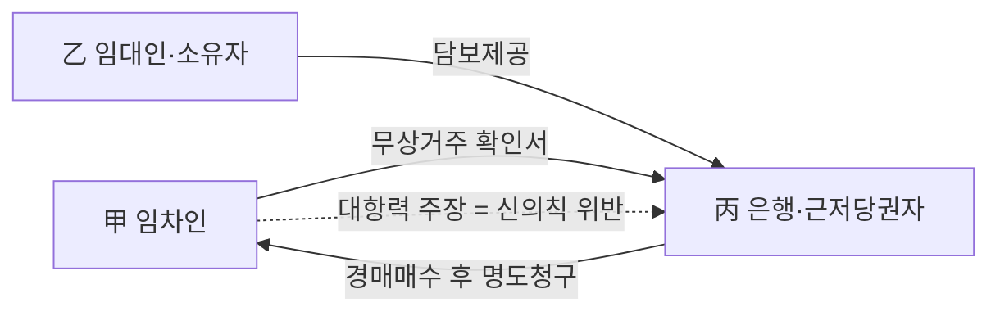
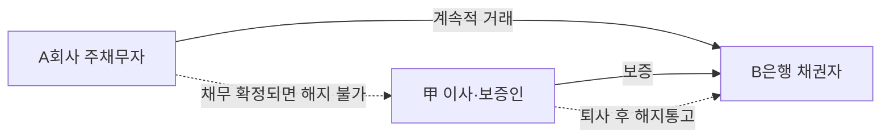
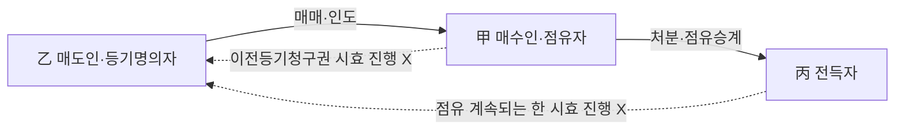
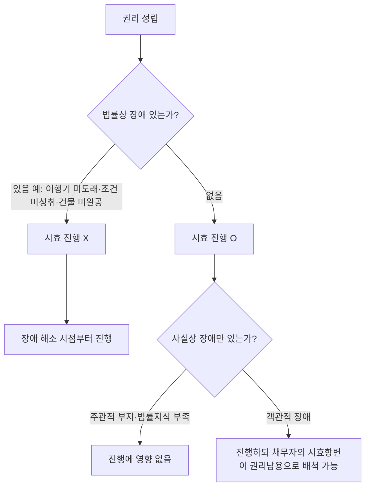
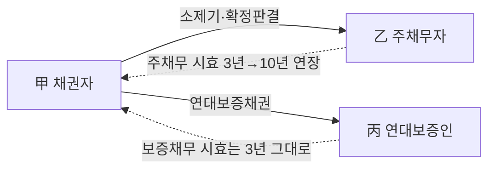
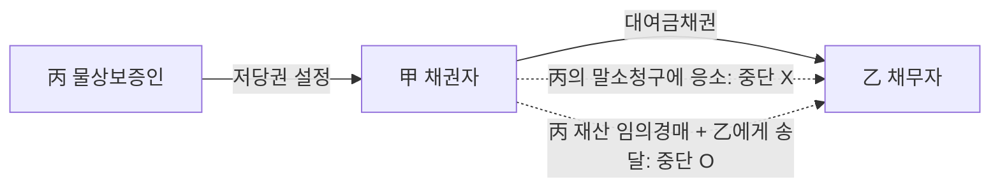
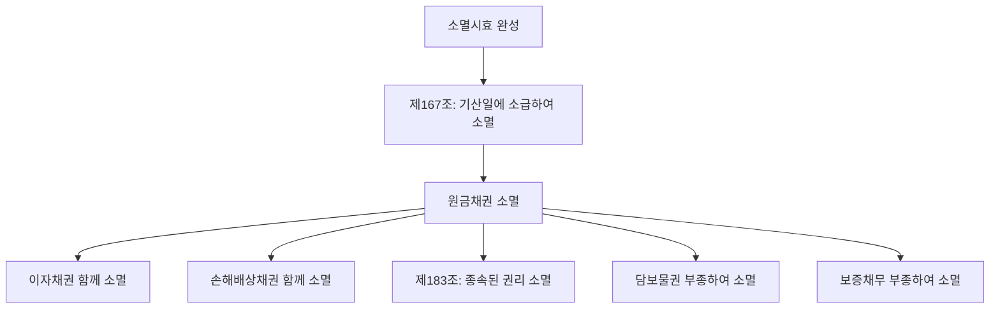
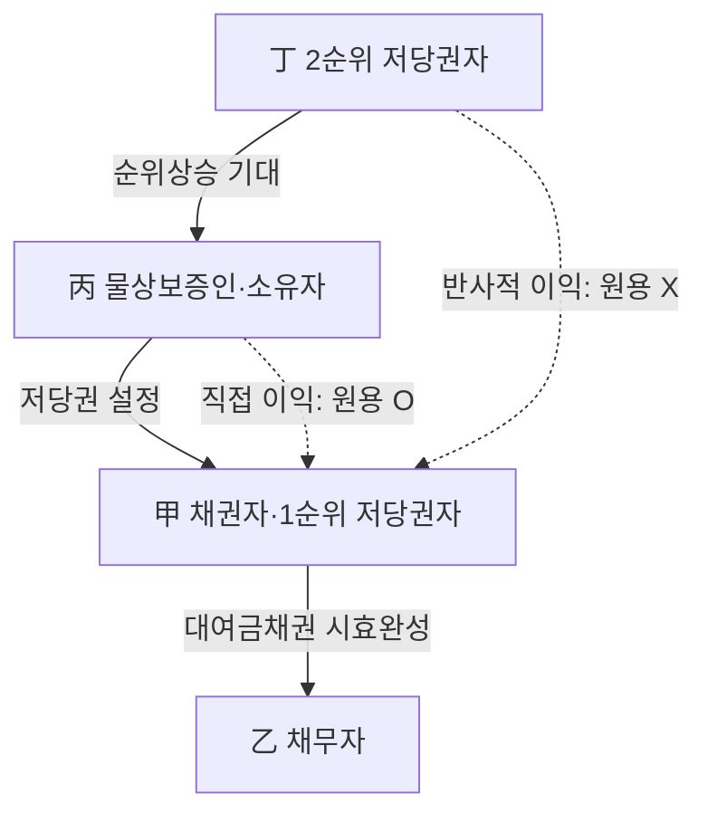
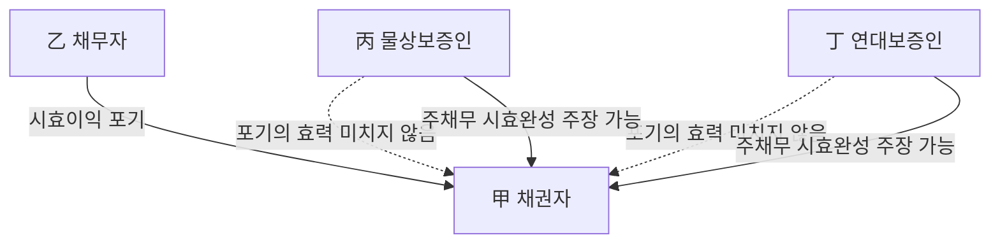
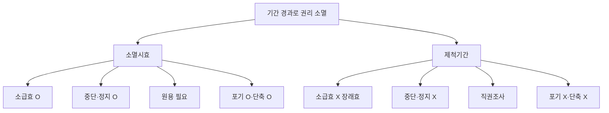

# 단원 M06 — 기간과 소멸시효

> **영역**: 민법총칙
> **수업 주제**: 기간·소멸시효·신의칙

## 🗺️ 본문 목차

- [📘 위패스 마이 정리 (L1 - 메인 단권화)](#정리)
- [📖 핵심요약서 (L2 - 빠른 복습)](#핵심요약서)
- [📚 기본서 (L3 - 본격 학습)](#기본서)

---

## 📘 위패스 마이 정리 — L1 (메인·단권화)

> 김묘엽 교수 「위패스 마이 민법총칙/물권법」 교재 정리본 (키워드 자동 분류).

### [민법총칙] 제14장 소멸시효

## 제14장 소멸시효

### 제1절 소멸시효 일반론

#### I. 의의

소멸시효란 권리자가 권리를 행사할 수 있었음에도 불구하고 일정기간 행사하지 않

은 경우에 권리를 소멸시키는 것을 말한다. 제척기간이란 법률이 미리 정한 기간의 경과만으로 곧바로 권리가 소멸하는 효과가 발생한다.

#### II. 제척기간과 비교

1. 대상 권리
청구권과 항변권은 원칙적으로 소멸시효의 대상이 되지만,

예외적으로 법률관계를

조속히 확정해야 할 때에는 제척기간의 대상이 되는 것도 있다. 그러나 형성권은 권 리를 신속하게 행사하도록 함으로써 법률관계를 조속하게 확정하기 위해서 제척기간

의 대상이 될 뿐이다(대판 2003.01 10.

2000다26425).

2. 효력발생 시점
소멸시효는 그 기산일에 소급하여 효력이 생긴다(제167조). 반면 제척기간은 기간이

경과한 때부터 장래에 향하여 권리가 소멸한다

3. 입증책임
소멸시효의 완성은 변론주의 원칙상 당사자가 주장하여야 하지만, 제척기간의 경과

는 법원의 직권조사사항이다.

4. 중단과 정지
소멸시효는 민법의 규정을 두어 중단과 정지제도를 인정하고 있지만, 제척기간은 민 법의 규정을 두지 않아서 중단과 정지제도를 인정하지 않고 있다(대판 2003.01.10.
00 다26425).

5. 포기
소멸시효는 시효완성 후에는 시효이익을 포기할 수 있지만, 제척기간에는 포기 자체 가 인정되지 않는다.

6. 기간의 단축 • 경감

> **제184조 (시효의 이익의 포기 기타)** ② 소멸시효는 법률행위에 의하여 이를 단축 또 는 경감할 수 있다.

소멸시효는 법률행위에 의하여 이를 단축 또는 경감할 수 있지만(제184조 제2항 후문),
제척기간은 소멸시효와 달리 단축 또는 경감할 수는 없다.

[ l丄 채무의 이행을 청구할 수 있는 기간을 제한 - 소멸사효 단축 약정으로 유효 특정한 채무의 이행을 청구할 수 있는 기간을 제한하고 그 기간을 도과할 경우 채무

가 소멸하도록 하는 약정은 민법 또는 상법에 의한 소멸시효기간을 단축하는 약정으

로서 특별한 사정이 없는 한 민법 제184조 제2항에 의하여 유효하다(대판 2006.4.14. 2004다70253).

7.

기간의 연장 - 배제 - 가중

> **제184조 (시효의 이익의 포기 기타)** ② 소멸시효는 법률행위에 의하여 이를 배제, 연 장 또는 가중할 수 없다.
소멸시효는 법률행위에 의하여 이를 배제,

연장 또는 가중할 수 없고(제184조 제2항

전문), 제척기간도 소멸시효와 동일하게 연장할 수는 없다.

|l. 매매예약완결권 - 형성권, W년의 제척기간 일방의 매매예약완결권을 행사할 수 있는 시기를 특별히 약정한 경우에도, 그 제척기 간은 당초 권리의 발생일로부터 10년간의 기간이 경과되면 만료되는 것이지, 그 기간

을 넘어서 그 약정에 따라 권리를 행사할 수 있는 때로부터 10년이 되는 날까지로 연

장된다고 볼 수 없다(대판 1995.11.10. 94다22682).

8. 기산점
소멸시효는 권리를 행사할 수 있는 때로부터 진행하지만(제166조 제1항), 제척기간은 원칙적으로 권리가 발생한 때부터 진행한다.

9. 기간
소멸시효의 기간은 1년, 3년, 10년, 20년이 있다. 제척기간은 별도의 규정이 있으면 그에 의하고, 그렇지 않으면 10년이다.

| 형성권 三 10년의 제척기간

형성권의 행사기간은 제척기간이고, 법률에 행사의 기간이 정함이 없으면 10년의 제 척기 간으로 한다(대판 2003.1.10. 2000다26425).

10. 소멸시효와 제척기간의 관계 매도인에 대한 하자담보에 기한 손해배상청구권에 대하여는 민법 제582조의 제척기 간이 적용된다. 그런데 하자담보에 기한 매수인의 손해배상청구권은 권리의 내용 성 질 및 취지에 비추어 채권 소멸시효의 규정이 적용되고, 담보책임의 제척기간 규정

으로 인하여 소멸시효 규정의 적용이 배제된다고 볼 수 없으며, 매수인이 매매 목적 물을 인도받은 때부터 소멸시효가 진행한다고 해석함이 타당하다(대판 2011.10.13. 2011다10266).

### 제2절 소멸시효의 요건

#### I. 소멸시효 대상

1. 비재산권
신분권 • 인격권과 같은 비재산적 권리는 원칙적으로 소멸시효에 걸리지 않는다. 즉

소멸시효의 대상이 되지 않는다.

2. 채권과 채권적 청구권
가. 채권
채권은 원칙적으로 소멸시효에 걸린다(제162조 제1항).

나. 채권적 청구권

(1) 원칙

(가) 소유권이전등기청구권

소유권이전등기 청구권은 채권적 청구권으로서 소멸시효가 진

행한다.
(나)

근저당권설정등기청구권

근저당권 등기가 되기 전인 근저당권설정등기청구권은 채

권적 청구권으로서 소멸시효에 걸린다(대판 2004.2.13. 2002다7213).

(2) 예외
1. 매매계약에서 소유권이전등기청구권 + 인도받아 점유 - 소멸시효 진행하지 않고,

소멸시효에 걸리지 않는다.

부동산을 매수한 자가 목적 부동산을 인도받아 계속 점유하는 경우에는 그 소유권이 전등기청구권은 소멸시효가 진행하지 않고(대판 1999.3.18. 98다32175 전합), 소멸시효

에 걸리지 않는다(대판 1976.11.6. 76다148 전합).

2. 3자간 등기명의신탁의 매매계약에서 소유권이전등기청구권 + 인도받아 점유 - 소

멸시효 진행하지 않고, 소멸시효에 걸리지 않는다：
3자간

등기명의신탁에서 목적 부동산을 인도받아 점유하고 있는 명의신탁자의 매도

인에 대한 소유권이전등기청구권 역시 소멸시효가 진행되지 않는다(대판 2013.12.12. 2
013다26647).

자세한 내용은 물권편의 등기청구권에서 후술한다.

3. 물권과 물권적 청구권
가. 물권

(1) 원칙

소유권 •점유권 등 물권은 원칙적으로 소멸시효에 걸리지 않는다. 즉 소멸시효의 대

상이 되지 않는다.

(2) 예외

물권 중에서 지상권, 지역권은 예외적으로 소멸시효에 걸린다

나. 물권적 청구권

(1) 소유권에 기한 물권적 청구권

(가) 소유권에 기한 물권적 청구권

소유권이 소멸시효에 걸리지 않으므로, 소유권에 기

한 물권적 청구권도 소멸시효에 걸리지 않는다.
공유물분할청구권과 같이 공유관계라는 소유권에 수반하는 권리

(나) 공유물분할청구권

는 공유관계가 존속하는 한 소유권과 독립하여 그 분할청구권만이 시효로 소멸될

수 없다(대판 1981.03.24.
(다)

원상회복청구권

80다1888).

매매계약이 합의해제된 경우에도 매수인에게 이전되었던 소유권은

당연히 매도인에게 복귀하는 것이므로 합의해제에 따른 매도인의 원상회복청구권은 소유권에 기한 물권적 청구권이라고 할 것이고 이는 소멸시효의 대상이 되지 아니

한다(대판 1982.7.27. 80다2968).

(2) 제한물권에 기한 물권적 청구권

제한물권의 물권적 청구권이 소멸시효에 걸리는지에 대해서는 견해가 대립한다.

4. 담보물권의 특수관계 가 . 피담보채권과 별개의 근저당권설정등기청구권 근저당권설정 약정에 의한 근저당권설정등기청구권이 그 피담보채권이 될 채권과 별
개의 청구권으로서 시효기간 또한 독자적으로 진행된다(대판 2004.2.13. 2002다7213).
民法® m

나. 채권은 소멸시효에 걸리고, 담보물권 자체는 소멸시효에 걸리지 않음
담보물권(=유치권•질권•저당권)은 피담보채권이

존속하는 한 독립하여

소멸시효에

걸리지 않는다.

다. 채권이 시효로 소멸하면 담보물권도 소멸 피담보채권이 시효로 소멸하면 당연히 담보물권이 소멸한다.

라. 물권의 행사가 채권의 소멸시효 진행에 영향을 미치지 않음

> **제326조 (피담보채권의 소멸시효)** 유치권의 행사는 채권의 소멸시효의 진행에 영향을 미치지 아니한다.
담보물권(=유치권• 질권 • 저당권)의

행사는 피담보채권의

소멸시효의

미치지 아니한다(제326조, 제326조 유추적용). 즉 담보물권이

진행에

영향을

있다고 하더라도 채권의

소멸시효는 진행한다.

#### II. 소멸시효의 기산점

1. 권리행사에 장애가 없을 것

> **제166조 (소멸시효의 기산점)** ① 소멸시효는 권리를 행사할 수 있는 때로부터 진행 한다.

가. 의의
‘권리를 행사할 수 있는 때’란 권리를 행사함에 있어서 법률상의 장애가 없는 경우 를 말하며, 권리자의 개인적 사정이나 법률지식의 부족, 권리존재의 부지 또는 채무 자의 부재등 사실상 장애로 권리를 행사하지 못한 경우를 말하지 않는다(대판 1982 0
1.19.

80다2626).

나. 법률상의 장애
(가) 의의

소멸시효는 객관적으로 권리가 발생하여 그 권리를 행사할 수 있는 때로부터

진행하고 그 권리를 행사할 수 없는 동안은 진행하지 않으나, ‘권리를 행사할 수 없

는’ 경우란 권리행사에 법률상의 장애사유가 있는 경우를 의미한다(대판 2023.12.14. 023다24890).

(나)

조건 미성취

정지조건부권리의 경우에는 조건 미성취의 동안은 권리를 행사할 수

없는 것이어서 소멸시효가 진행되지 않는다(대판 1992.12.22. 92다28822).

(다) 이행기 미도래 82.01.19.

이행기가 도래하지 않은 채권은 소멸시효가 진행하지 않는다(대판 19

80다2626).

(라) 건물이 완공되지 않음

건물에 관한 소유권이전등기청구권에

있어서 그 목적물인

건물이 완공되지 않았다는 사실은 권리행사의 법률상의 장애사유에 해당하고 건물 완공시부터 소멸시효가 진행한다(대판 2007.8.23. 2007다28024).

다. 사실상의 장애

(1) 주관적인 사실상의 장애사유

사실상 권리의 존재나 권리행사 가능성을 알지 못하였고 알지 못함에 과실이 없다

고 하여도 법률상의 장애사유에 해당하지 않는다(대판 2023.12 21

2018다303653).

따라

서 권리자의 개인적 사정이나 법률지식의 부족, 권리존재의 부지 또는 채무자의 부

재등 사실상 장애로 권리를 행사하지 못하였다 하여 소멸시효 진행에 영향을 미치 지 않는다(대판 2001 11.09.

2001다52568).

(2) 객관적인 사실상의 장애사유

채권자에게 권리의 행사를 기대할 수 없는 ‘객관적인 사실상의 장애사유’가 있었던 경우에도 대법원이 이에 관하여 채권자의 권리행사가 가능하다는 법률적 판단을 내 렸다면 특별한 사정이 없는 한 그 시점 이후에는 그러한 장애사유가 해소되었다고

볼 수 있다(대판 2023.12.21

2018다303653).

1. 강제동원 피해자의 위자료 청구권이 ■대한민국과 일본국간의 협정’ 에 포함된다고

대법원의 판례가 나오기까지는 객관적인 사실상의 장애사유가 있었다._________

강제동원 피해자의 일본 기업에 대한 위자료청구권은 ‘대한민국과 일본국 간의 재산

및 청구권에 관한 문제의 해결과 경제협력에 관한 협정’의 적용 대상에 포함되지 않 는다는 법적 견해를 최종적으로 명확하게 밝힌 대법원 2018.
10.

30.

선고 2013다6

전원합의체 판결이 선고될 때까지는 강제동원 피해자 또는 그 상속인들에게는

미쓰비시중공업 주식회사를 상대로 객관적으로 권리를 사실상 행사할 수 없는 장애 사유가 있었다(대판 2023.12.21. 2018다303653).
2.

채권자가 권리를 행사할 수 없는 객관적 (사실상의) 장애사유가 있었던 경우, 채 무자가 소멸시효 완성을 주장하는 것 - 신의성실의 원칙에 반하는 권리남용O
채무자의 소멸시효를 이유로 한 항변권의 행사도 민법의 대원칙인 신의성실의 원칙

과 권리남용금지의 원칙의 지배를 받는 것이어서 객관적으로 채권자가 권리를 행사 할 수 없는 장애사유가 있었다면 채무자가 소멸시효 완성을 주장하는 것은 신의성실

의 원칙에 반하는 권리남용으로서 허용될 수 없다(대판 2023.12.21. 2018다303653).

2. 기산점
가. 변론주의
소멸시효의 기산점은 변론주의의 적용대상이다. 본래의 소멸시효 기산일과 당사자가 주장하는 기산일이 서로 다른 경우에는 변론주의의 원칙상 법원은 당사자가 주장하

는 기산일을 기준으로 소멸시효를 계산하여야 한다(대판 1995.8.25. 94다35886).

나. 확정기한부 채권 확정기한부 채권은 확정기한이 도래한 때부터 소멸시효가 진행된다.
b. 기한을 유예 - 유예한 이행기일부터 다시 소멸시효 진행

11헌:IflSUB

이행기가 도래한 후 채권자가 채무자에 대하여 기한을 유예한 경우 유예한 이행기일

로부터 채권의 소멸시효가 다시 진행된다(대판 1992.12.22. 92다40211)._____________________

| 入 기한을 유예 ： 변경된 이행기 도래시부터 다시 소멸시효 진행 이행기가 도래한 후 채권자와 채무자가 기한을 유예하기로 합의한 경우에는 유예된

때로 이행기가 변경되어 소멸시효는 변경된 이행기가 도래한 때부터 다시 진행한다

(대판 2017 04 13.

2016다274904).

다. 불확정기한부 채권 불확정기한부 채권은 기한이 객관적으로 도래한 때부터 소멸시효가 진행된다.

라. 기한의 정함이 없는 채권 기한의 정함이 없는 채권은 채권이 발생 •성립한 때부터 소멸시효가 진행된다.

|l 丄부당이득바환청구 - 성립한 때부터 소멸시효 진행 부당이득반환청구권은 그 성립과 동시에 권리를 행사할 수 있으므로 청구권이 성립 한 때부터 소멸시효가 진행한다(대판 2008.12.11. 2017다9039,

9046).

마. 기한이익상실 특약 (가 정지조건부 기한이익상실특약

정지조건부 기한이익상실특약의 경우에는 기한이 익상

실의 사유발생시가 소멸시효의 기산점이다(대판 1989.09.29.
(나)

형성권적 기한이익상실 특약

88다카14663).

형성 권적 기한이익상실특약의 경우에는 기한이익상실의

사유가 발생하더라도, 채권자가 아무런 청구를 하지 않으면 각 할부금에 대해 그 각 변제기의 도래시마다 그 때부터 순차로 소멸시효가 진행하고, 채권자가 특히 잔존 채무 전액의 변제를 구하는 취지의 의사를 표시한 경우에 한하여 전액에 대하여 그 때부터 소멸시효가 진행한다(대판 1997.8.29. 97다12990).

바. 정지조건부 권리 정지조건부 권리는 조건이 성취된 때로부터 소멸시효가 진행된다(대판 1992 12.22.

다28822).

人h 선택채권

선택채권은 그 선택권을 행사할 수 있을 때부터 소멸시효가 진행한다(대판 1981.03.2
4.

80다1888).

아. 부작위채권
I 제166조 (소멸시효의 기산점) ② 부작위를 목적으로 하는 채권의 소멸시효는 위반행 위를 한 때로부터 진행한다.

____________________________________ _ _________________________________________________

자. 동시이행 항변권이 붙어 있는 채권 동시이행관계에 있는 채권은 이행기로부터 소멸시효가 진행한다.

|1. 동시이행관계에 있는 채권 - 지급기일부터 소멸시효 진행 부동산에 대한 매매대금 채권이 소유권이전등기청구권과 동시이행의 관계에 있다고

할지라도 매도인은 매매대금의 지급기일 이후 언제라도 그 대금의 지급을 청구할 수

있는 것이므로 매매대금 청구권은 그 지급기일 이후 시효의 진행에 걸린다(대판 1991.3.22. 9049797).
차. 계속적 물품공급계약에 의한 외상대금채권 계속적 물품공급계약에 기하여 발생한 외상대금채권은 특별한 사정이 없는 한 개별

거래로 인한 각 외상대금채권이 발생한 때로부터 개별적으로 소멸시효가 진행하는 것이지 거래종료일부터 외상대금채권 총액에 대하여 한꺼번에 소멸시효가 기산한다

고 할 수 없다(대판 2007.01.25

2006다68940).

카. 임치계약 해지에 따른 임치물 반환청구 임치계약 해지에 따른 임치물 반환청구는 임치계약 성립 시부터 당연히 예정된 것
이고,

임치계약에서 임치인은 언제든지 계약을 해지하고 임치물의 반환을 구할 수

있는 것이므로, 특별한 사정이 없는 한 임치물 반환청구권의 소멸시효는 임치계약이

성립하여 임치물이 수치인에게 인도된 때부터 진행하는 것이지, 임치인이 임치계약 을 해지한 때부터 진행한다고 볼 수 없다(대판 2022 08.19.

2020다220140).

타. 위임인의 이전청구권 민법 제684조 제2항은 “수임인이 위임인을 위하여 자기의 명의로 취득한 권리는 위 임인에게 이전하여야 한다.”라고 규정하고 있는데, 이때 그 이전 시기는 당사자 간
에 특약이 있거나 위임의 본뜻에 반하는 경우 등과 같은 특별한 사정이 없는 한 위 임계약이 종료된 때이다 따라서 위임사무로 수임인 명의로 취득한 권리에 관한 위

임인의 이전청구권의 소멸시효는 위임계약이 종료된 때부터 진행하게 된다(대판 202
2.09.07.

2022다217117).

파. 손해배상청구권
(D 채무불이행에 기한 손해배상청구권 | 채무불이행으로 인한 손해배상청구권 - 채무불이행이 된 때로부터 소멸시효 진행 채무불이행으로 인한 손해배상청구권의 소멸시효는 채무불이행시로부터 진행한다 ( 대

판 2005.01 14.

2002다57119).

2. 채무불이행으로 인한 손해배상청구권 - 현실적으로 손해가 발생한 때부터 소멸시

효진행

소멸시효는 권리를 행사할 수 있는 때부터 진행한다(민법 제166조 제1항). 채무불이행으 로 인한 손해배상청구권은 현실적으로 손해가 발생한 때에 성립한다(대판 2021.11.25. 2020다294516).

13. 이행불능으로 인한 손해배상청구권 - 이행불능이 된 때로부터 소멸시효 진행 부동산 소유권이전 채무의 이행불능으로 인한 손해배상청구권의 소멸시효는 이전채

무가 이행불능이 된 때로부터 진행한다(대판 2005.9.15. 2005다29474).

(2) 불법행위에 기한 손해배상청구권

불법행위로 인한 손해배상의 청구권은 피해자나 그 법정대리인이 그 손해 및 가해 자를 안 날로부터(제766조 제1항) 또는 불법행위를 한 날로부터(저］766조 제2항) 소멸시효 가 진행한다. 미성년자가 성폭력, 성추행, 성희롱, 그 밖의 성적 침해를 당한 경우

에 이로 인한 손해배상청구권의 소멸시효는 그가 성년이 될 때까지는 진행되지 아 니한다(제766조 제3항).
1.

가해행위와 손해발생 사이에 시간적 간격 - 불법행위시〉〈, 손해의 발생이 현실적

인크으로 되었다고 할 수 있는 때O
가해행위와 이로 인한 손해의 발생 사이에 시간적 간격이 있는 불법행위에 기한 손해

배상청구권의 경우, 위와 같은 장기소멸시효의 기산점이 되는 ‘불법행위를 한 날’은 객관적 •구체적으로 손해가 발생한 때, 즉 손해의 발생이 현실적인 것으로 되었다고
할 수 있을 때를 의미하고, 그 발생시기에 대한 증명책임은 소멸시효의 이익을 주장 하는 자에게 있다(대판 2021.8.19. 2019다297137).

#### III. 소멸시효의 기간

1. 법원이 직권
어떤 권리의 소멸시효기간이 얼마나 되는지에 관한 주장은 단순한 법률상의 주장에

불과하므로 변론주의의 적용대상이 되지 않고 법원이 직권으로 판단할 수 있다 할 것이다(대판 2013.02.15.
|l.

2012다68217).

당사자 민법의 소멸시효기간 적용 주장 - 법원은 상법의 소멸시효기간 적용

당사자가 민법에 따른 소멸시효기간을 주장한 경우에도 법원은 직권으로 상법에 따 른 소멸시효기간을 적용할 수 있다(대판 2017.03.22

2016다258124).
2.

1년의 단기소멸시효기간에 걸리는 채권

> **제164조 (1년의 단기소멸시효)** 다음 각 호의 채권은 1년간 행사하지 아니하면 소멸 시효가 완성한다.
1. 여관, 음식점, 대석, 오락장의 숙박료, 음식료, 대석료, 입장료, 소비물의 대가 및 체 당금의 채권

2. 의복, 침구, 장구 기타 동산의 사용료의 채권
3. 노역인, 연예인의 임금 및 그에 공급한 물건의 대금채권

4. 학생 및 수업자의 교육, 의식 및 유숙에 관한 교주, 숙주, 교사의 채권 |l. 1년의 단기소멸시효가 걸리는 채권의 상대방의 반대채권 - 10년의 소멸시효O

일정한 채권의 소멸시효기간에 관하여 이를 특별히

1년의

단기로 정하는 민법 제164조는 상대방에 대하여 부담•하는 반대채무에 대하여는 적용되지 아니한다. 따라서 그

채권의 상대방이 그 계약에 기하여 가지는 반대채권은 원칙으로 돌아가, 다른 특별한 사정이 없는 한 10년의 일반소멸시효기간의 적용을 받는다(대판 2013.11.14. 2013다651
78).

3.

3년의 단기소멸시효기간에 걸리는 채권

> **제163조 (3년의 단기소멸시효)** 다음 각 호의 채권은 3년간 행사하지 아니하면 소멸 시효가 완성한다.
1. 이자, 부양료, 급료, 사용료 기타 1년 이내의 기간으로 정한 금전 또는 물건의 지급을 목적으로 한 채권
2. 의사', 조산사, 간호사 및 약사의 치료, 근로 및 조제에 관한 채권
3. 도급받은 자, 기사 기타 공사의 설계 또는 감독에 종사하는 자의 공사에 관한 채권

4. 변호사, 변리사, 공증인, 공인회계사 및 법무사에 대한 직무상 보관한 서류의 반환을

청구하는 채권

5. 변호사, 변리사', 공증인, 공인회계사 및 법무사의 직무에 관한 채권
6. 생산자 및 상인이 판매한 생산물 및 상품의 대가
7. 수공업자 및 제조자의 업무에 관한 채권

1. 이자 등 1년 이내의 기간으로 정한 채권 -1년 이내의 기간 내에서 ‘정기적’ 으

로 지급하기로 정한 채권

2. 2년마다 이자 지급 - 3년의 소멸시효X

3. 정수기 월 대여료 - 3년의 소멸시효O
4 1개월마다 지급하는 관리비 채권 - 3년의 소멸시효O
6)제163조

제1호의 ‘이자 등 1년 이내의 기간으로 정한 채권’이란 변제기를 1년 이내로

정한 채권을 의미하는 것이 아니라,

(대판 1996.9.20. 1년

이내의 ‘정기’에 지급되는 채권을 의미한다

96다25302).

이자채권이라고 하더라도 1년 이내의 정기에 지급하기로 한 것이 아닌 이상 3년의 단 Cy

기소멸시효에 걸리는 것이 아니다(대판 1996.9.20. 96다25302). 원칙으로 돌아가, 다른

특별한 사정이 없는 한 10년의 일반소멸시효기간의 적용을 받는다.
© 정수기 대여계약에 기한 월 대여료 채권의 소멸시효 기간은 3년이다(대판 2013.7.12. 2013다20571).
1개월

단위로 지급되는 집합건물의 관리비채권은 3년에 단기소멸시효에 걸리는 것이

다(대판 2007.2.22. 2005다65821).

5. 공인회계사 직무에 관한 채권 - 3년의 소멸시효,

권에 유추적용X

다른 자격사의 직무에 관한 채

6. 세무사 직무에 관한 채권 - 10년의 소며사흔____________________________________

민법 제163조 제5호에서 정하고 있는 ‘변호사, 변리사, 공증인, 공인회계사 및 법무사 의 직무에 관한 채권’에만 3년의 단기 소멸시효가 적용되고, 세무사와 같이 그들의 직

무와 유사한 직무를 수행하는 다른 자격사의 직무에 관한 채권에 대하여는 민법 제16
3조

제5호가 유추적용된다고 볼 수 없다. 세무사의 직무에 관한 채권에 대하여는 민

법 제162조 제1항에 따라 10년의 소멸시효가 적용된다(대판 2022.8.25. 2021다311111).
4. 10년의 소멸시효기간에 걸리는 채권
가. 채권 일반

> **제162조 (채권, 재산권의 소멸시효)** ① 채권은 10년간 행사하지 아니하면 소멸시효가 완성한다.

11三 소유권이전등기청구권三 10년의 소멸시효______

___________

소유권이전등기청구권은 10년의 소멸시효에 걸린다(대판 1976.11.6. 76다148

전합).

나. 판결 등의 의하여 확정

> **제165조 (판결 등에 의하여 확정된 채권의 소멸시효)** ① 판결에 의하여 확정된 채권은

단기의 소멸시효에 해당한 것이라도 그 소멸시효는 10년으로 한다.
② 파산절차에 의하여 확정된 채권 및 재판상의 화해, 조정 기타 판결과 동일한 효 력이 있는 것에 의하여 확정된 채권은 단기의 소멸시효에 해당한 것이라도 그 소멸

시효는 10년으로 한다.

③ 전2항의 규정은 판결확정당시에 변제기가 도래하지 아니한 채권에 적용하지 아 니 한다.

1. 단기의 소멸시효기간 - 확정판결 후 10년 연장O

2. 20년의 소멸시효기간 - 확정판결 후 10년 단축X
3. 소멸시효 대상이 아느권리 - 확정판결 후 W년의 소멸시효X

단기의 소멸시효에 걸리는 것이라도 확정판결을 받은 권리의 소멸시효는

10년으로

한다는 뜻일 뿐 10년보다 장기의 소멸시효를 10년으로 단축한다는 의미도 아니고 본 래 소멸시효의 대상이 아닌 권리가 확정판결을 받음으로써 다는 뜻도 아니다(대판 1981 03.24.

10년의

소멸시효에 걸린

80다1888).

| 4. 단기의 소멸시효기간 - 확정판결 후 10년 연장O, 종전의 단기소멸시효기간 원용X

유치권의 피담보채권의 소멸시효기간이 확정판결 등에 의하여

10년으로

연장된 경우

매수인은 그 채권의 소멸시효기간이 연장된 효과를 부정하고 종전의 단기소멸시효기 간을 원용할 수는 없다(대판 2009.09.24

2009다39530).

| 5. 단기의 소멸시효기간 - 지급명령에서 확정 후 1아켠 연장O______________________

지급명령에서 확정된 채권은 단기의 소멸시효에 해당하는 것이라도 그 소멸시효기간 이

10년으로

연장된다(대판 2009.9.24. 2009다39530).

5.

20년의 소멸시효기간에 걸리는 물권

> **제162조 (채권, 재산권의 소멸시효)** ② 채권 및 소유권 이외의 재산권은 20년간 행사 하지 아니하면 소멸시효가 완성한다.
채권 및 소유권 이외의 재산권인 지상권• 지역권은 20년의 소멸시효에 걸린다.

6. 손해배상청구권
가. 채무불이행에 기한 손해배상청구권 지연이자는 금전채무의 이행을 지체함으로 인한 손해배상금이지 이자가 아니며, 1년 이내의 기간으로 정한 채권이 아니고 그 소멸시효기간은 원본채권과 같다(대판 1989.
02 28.

88다카214).

나. 불법행위에 기한 손해배상청구권

> **제766조 (손해배상청구권의 소멸시효)** ① 불법행위로 인한 손해배상의 청구권은 피해 자나 그 법정대리인이 그 손해 및 가해자를 안 날로부터 3년간 이를 행사하지 아니 하면 시효로 인하여 소멸한다.
② 불법행위를 한 날로부터 10년을 경과한 때에도 시효로 인하여 소멸한다.
③ 미성년자가 성폭력, 성추행, 성희롱, 그 밖의 성적 침해를 당한 경우에 이로 인

한 손해배상청구권의 소멸시효는 그가 성년이 될 때까지는 진행되지 아니한다.

### 제3절 소멸시효의 중단과 정지

#### I. 서설

1. 의의
가. 소멸시효 중단
소멸시효의 중단이란 권리불행사의 상태를 중단시키는 권리자 또는 의무자의 일정한 행위가 있는 경우에 그때까지 진행된 시효기간은 산입되지 아니하고 중단사유가 종 료한 때부터 새로 시효가 진행되는 제도를 말한다.

나. 소멸시효 정지
소멸시효의 정지란 권리자가 시효를 중단시키는 것이 곤란하거나 불가능한 경우에 단지 일정기간 동안만 시효의 진행을 멈추게 하여 시효가 완성되지 않게 하는 제도

를 말한다.

2. 사유
가. 소멸시효 중단 사유

> **제168조 (소멸시효의 중단사유)** 소멸시효는 다음 각 호의 사유로 인하여 중단된다.
1. 청구( = 재판상 청구, 파산절차 참가, 지급명령, 화해를 위한 소환 내지 임의출석, 최고)

2. 압류 또는 가압류, 가처분
3. 승인

나. 소멸시효 정지 사유
(1) 제한능력자의

시효정지

> **제179조 (제한능력자의 시효정지)** 소멸시효의 기간만료 전 6개월 내에 제한능력자에 게 법정대리인이 없는 경우에는 그가 능력자가 되거나 법정대리인이 취임한 때부터 6개월 내에는 시효가 완성되지 아니한다.

(2) 재산관리자에 대한 제한능력자의 권리와 시효정지

> **제180조 (재산관리자에 대한 제한능력자의 권리)** ① 재산을 관리하는 아버지, 어머니 또는 후견인에 대한 제한능력자의 권리는 그가 능력자가 되거나 후임 법정대리인이 취임한 때부터 6개월 내에는 소멸시효가 완성되지 아니한다.

(3) 부부 사이의 권리와 시효정지

> **제180조 (부부 사이의 권리와 시효정지)** ② 부부 중 한쪽이 다른 쪽에 대하여 가지는 권리는 혼인관계가 종료된 때부터 6개월 내에는 소멸시효가 완성되지 아니한다.

(4) 상속재산에 관한 권리와 시효정지

> **제181조 (상속재산에 관한 권리와 시효정지)** 상속재산에 속한 권리나 상속재산에 대한 권리는 상속인의 확정, 관리인의 선임 또는 파산선고가 있는 때로부터 6월내에는 소멸시효가 완성하지 아니한다.

(5)

천재 기타 사변과 시효정지

> **제182조 (천재 기타 사변과 시효정지)** 천재 기타 사변으로 인하여 소멸시효를 중단할 수 없을 때에는 그 사유가 종료한 때로부터 1월내에는 시효가 완성하지 아니한다.

3. 효과
가. 소멸시효 중단의 효과

> **제178조 (승인과 시효중단)** ① 시효가 중단된 때에는 중단까지에 경과한 시효기간은 이를 산입하지 아니하고 중단사유가 종료한 때로부터 새로이 진행한다.

나. 소멸시효 정지의 효과 소멸시효가 정지되면 그때까지 경과한 시효기간은 법적으로 유효하여 정지기간 동안

만 진행이 멈추었다가 정지사유가 종료된 때로부터 남은 시효기간이 진행하게 되고 남은 시효기간이 경과하면 소멸시효는 완성된다.

#### II. 청구

1. 최고 (재판 외 청구)

> **제174조 (최고와 시효중단)** 최고는 6월내에 재판상의 청구, 파산절차참가, 화해를 위한 소환, 임의출석, 압류 또는 가압류, 가처분을 하지 아니하면 시효중단의 효력

이 없다.

가. 의의
최고란 권리자가 의무자에 대하여 의무의 이행을 청구하는 것을 말한다. 최고는 재 판 외의 방식으로 청구하는 독촉을 말한다.

나. 내용
(가) 원칙적 시효중단 효력 없음
(나)

최고는 소멸시효중단의 효력이 없다.

예외적 시효중단 효력 발생

최고 후

6월내에

재판상의 청구, 파산절차참가, 화해

임의출석, 압류 또는 가압류, 가처분을 하면 최고시부터 소멸시효중

를 위한 소환,

단의 효력이 있다.
1. 최고를 여러 번 거듭한 후에 재판상 청구 - 재판상 청구를 한 시점을 기준으로

소급하여 6개월 이내에 한 최고시 소멸시효중단의 효과O
최고를 여러 번 거듭한 후에 재판상 청구 등을 한 경우, 항상 최초의 최고시에 소멸 시효중단의 효과가 발생하는 것이 아니라, 재판상 청구 등을 한 시점을 기준으로 이 로부터 소급하여
83.07.12.

6개월

이내에 한 최고시에 소멸시효중단의 효과가 발생한다(대판 19

83다카437).

2. 재판상 청구
가. 의의
시효중단의 사유의 하나로 규정하고 있는 재판상 청구라 함은, 통상적으로는 권리자 가 원고로서 시효를 주장하는 자를 피고로 하여 소송물인 권리를 소의 형식으로 주

장하는 경우를 말한다(대판 1993.12.21.
기한다고 하여 이를 제소라고 한다.

92다47861).

권리자가 의무자를 상대로 소를 제

나. 소송의 유형

(1) 민사소송

재판상 청구는 이행의 소• 형성의 소•확인의 소를 불문하고, 본소•반소•재심26’의 소 (대판 1996.9.24. 96다11334)이든

관계없이 심지어 소송계속 중의 청구의 변경이나 확

장, 보조참가 등도 소멸시효 중단의 재판상 청구에 포함된다.

(2) 형사소송

형사소송이라면 사적인 권리행사가 아니므로 원칙적으로 소멸시효 중단 사유가 아니

지만 배상명령신청은 소멸시효중단의 효력이 인정된다(대판 1999.3.12. 98다18124).

(3) 행정소송

행정소송이라면 사적인 권리행사가 아니므로 원칙적으로 소멸시효 중단 사유가 아니
다. 단 과세처분의 취소소송 또는 무효확인소송을 제기하는 것은 과오납한 조세의

부당이득반환청구권의 소멸시효중단의 효력이 인정된다(대판 1992.03.31

91다32053).

다. 민사소송

(1) 소송의 각하, 취하, 기각

> **제170조 (재판상의 청구와 시효중단)** ① 재판상의 청구는 소송의 각하,
또는 취하의 경우에는 시효중단의 효력이 없다.

기각(패소)

② 전항의 경우에 6월내에 재판상의 청구, 파산절차참가, 압류 또는 가압류, 가처 분을 한 때에는 시효는 최초의 재판상 청구로 인하여 중단된 것으로 본다.

(2) 소송의 인용(승소)

재판상의 청구는 소송의 인용(승소)시에 소멸시효중단의 효력이 있다(제170조 제1항 반

대해석).

재심이란 확정된 판결에 대하여 사실인정에 중대한 오류가 있는 경우에 당사자 및 기타 청구권자의 청구에 의하여 그 판결의 당부를 다시 심리하는 재판을 말한다
26)
11. 다！항요건을 갖추지 못한 채권양도의 양수인이 재판상청구 三소멸시효 중단O

채무자를 상대로 재판상의 청구를 한 채권의 양수인을 ‘권리 위에 잠자는 자’라고 할 수 없는 점 등에 비추어 보면, 비록 대항요건을 갖추지 못하여 채무자에게 대항하지

못한다고 하더라도 채권의 양수인이 채무자를 상대로 재판상의 청구를 하였다면 이 는 소멸시효 중단사유인 재판상의 청구에 해당한다고 보아야 한다(대판 2005.11.10. 20
05 다41818).

2. 양도인의 재판상의 청구가 기각 됨 + 채권양도의 양수인이 6월내에 재판상의 청

구 - 양도인의 최초의 재판상의 청구시 소멸시효 중들£

양도인이 제기한 소송 중에 채무자가 채권양도의 효력을 인정하는 등의 사정으로 인

하여 양도인의 청구가 기각됨으로써 민법 제170조 제1항에 의하여 시효중단의 효과 가 소멸된다고 하더라도, 양도인의 청구가 당초부터 무권리자에 의한 청구로 되는 것
은 아니므로, 양수인이 그로부터 6월내에 채무자를 상대로 재판상의 청구 등을 하였

다면, 민법 제169조 및 제170조 제2항에 의하여 양도인의 최초의 재판상 청구로 인 하여 시효가 중단된다(대판 2009.2.12. 2008두20109).

라. 응소
(1) 문제제기

권리자가 원고로서 의무자를 피고로 하여 소를 제기하는 제소는 소멸시효중단사유인

재판상 청구에 해당하는데, 이와 달리 상대방의 제소에 응소를 하는 것도 소멸시효 중단사유인 재판상 청구에 해당하는지가 문제된다.

(2) 적극적으로 권리를 주장하고 받아들여짐

시효를 주장하는 자가 원고가 되어 소를 제기한 데 대하여 권리자가 피고로서 응소 하여 그 소송에서 적극적으로 권리를 주장하고 그것이 받아들여진 경우, 시효중단

사유인 재판상의 청구에 해당하고 응소 시에 소급하여 시효중단의 효력이 인정된다

(대판 2019.3.14. 2018두56435).

응소행위가 있었다는 사정만으로 당연히 시효중단의

효력이 발생하지는 않는다(대판 1995.2.28. 94다18577).

(3) 소가 각하 - 취하 되는 경우

권리자인 피고가 응소하여 권리를 주장하였으나 그 소가 각하되거나 취하되는 등의

사유로 본안에서 그 권리주장에 관한 판단 없이 소송이 종료된 경우에도 민법 제17
0조 제2항을 유추적용하여 그때부터 6월 이내에 재판상의 청구 등 다른 시효중단조 치를 취하면 응소시에 소급하여 시효중단의 효력이 있다(대판 2010.8.26. 2008다42416,

42423).

마. 소멸시효 새로이 진행

> **제178조 (승인과 시효중단)** ② 재판상의 청구로 인하여 중단한 시효는 재판이 확정된 때로부터 새로이 진행한다.

바. 인적 범위
(1)

일반

> **제169조 (시효중단의 효력)** 시효의 중단은 당사자 및 그 승계인간에만 효력이 있다.

(2) 재판상 청구
1. 채권자가 채무자에게 근저당권설정등기청구의 소제기 - 피담보채권 소멸시효 중

단O
근저당권설정약정에 의한 근저당권설정등기청구의 소에는 그 피담보채권의 존재에 관한 주장이 당연히 포함되어 있고, 근저당권설정등기청구의 소의 제기는 그 피담보

채권의 재판상 청구에 준하는 것으로 볼 수 있으므로, 위 소 제기에 의하여 피담보채 권도 소멸시효가 중단된다(대판 2004.2.13. 2002다7213).

2. 물상보증인의 채권자에 대한 저당권설정등기말소청구의 소에서 저당권자의 응소행

위 - 피담보채권 소멸시효 중단斗

__

_________________________

물상보증인이 그 피담보채권의 부존재 또는 소멸을 이유로 제기한 저당권설정등기

말소등기절차 이행청구소송에서 채권자 겸 저당권자가 청구기각의 판결을 구하고(=
응소행위를 하고) 피담보채권의 존재를 주장하였다고 하더라도 이로써 직접 채무자 에 대하여 재판상 청구를 한 것으로 볼 수는 없는 것이므로 피담보채권의 소멸시효는

중단되지 아니한다(대판 2004.1.16. 2003다30890).

사. 물적 범위
三복수의 채귀중 하나를 청구 - 다른 채궉은소멸시효 중다乂____________________

채권자가 동일한 목적을 달성하기 위하여 복수의 채권을 갖고 있는 경우, 그 중 어느

하나의 청구를 한 것만으로는 다른 채권에 대한 소멸시효 중단의 효력은 없다(대판 2
011.02.10.

2010다81285).
民 法 總 «|]

2. 채무불이행에 기한 손해배상청구의 소제기 - 불법행위로 인한 손해배상청구에 대

한 소멸시효 중단X
채무불이행에 기한 손해배상청구의 소를 제기한 것이 일반 불법행위로 인한 손해배 상청구권에 대한 소멸시효 중단의 효력은 없다(대판 2002 06.14.

2002디-11441).

| 3. 파면처분무효확인의 소제기 - 임금채권에 대한 소멸시효 중단O

파면처분무효확인의 소는 보수금채권을 실현하는 수단이라는 성질을 가지고 있으므 로 보수금채권 자체에 관한 이행소송을 제기하지 않았다 하더라도 위 소의 제기에 의

하여 임금채권에 대한 시효는 중단된다(대판 1978.4.11. 77다2509).

3. 파산절차 참가

제1기조 (파산절차참가와 시효중단) 파산절차참가는 채권자가 이를 취소하거나 그 청 구가 각하된 때에는 시효중단의 효력이 없다.

4. 지급명령

> **제172조 (지급명령과 시효중단)** 지급명령은 채권자가 법정기간 내에 가집행신청을 하 지 아니함으로 인하여 그 효력을 잃은 때에는 시효중단의 효력이 없다.

지급명령에 의한 시효중단의 효과는 소송으로 이행된 때가 아니라 지급명령을 신청 한 때에 발생한다(대판 2015.2.12. 2014다228440).

5. 화해를 위한 소환과 임의출석

> **제173조 (화해를 위한 소환, 임의출석과 시효중단)** 화해를 위한 소환은 상대방이 출석 하지 아니 하거나 화해가 성립되지 아니한 때에는 1월내에 소를 제기하지 아니하면

시효중단의 효력이 없다. 임의출석의 경우에 화해가 성립되지 아니한 때에도 1월내 에 소를 제기하지 아니하면 시효중단의 효력이 없다.

#### III. 압류, 가압류, 가처분

1. 의의

가압류나 가처분은 집행권원27,없이 행하는 강제집행보전처분이다. 압류란 금전채권의 만족을 위하여 확정판결 기타의 집행권원에 기하여 행하는 강제집행의 첫 단계로서,

채무자가 강제집행의 대상이 되는 재산을 처분하는 것을 금지하는 내용을 가진다.

2. 압류• 가압류■ 가처분
가. 압류, 가압류, 가처분의 취소

> **제175조 (압류 • 가압류 • 가처분과 시효중단)** 압류, 가압류 및 가처분은 권리자의 청

구에 의하여 또는 법률의 규정에 따르지 아니함으로 인하여 취소된 때에는 시효중 단의 효력이 없다.

나. 압류, 가압류, 가처분의 승인 가압류나 가처분의 경우에 가압류채권자의 권리행사는 보전처분을 신청할 때 시작되

므로 가압류• 가처분 신청을 한 때에 시효중단의 효력이 발생한다(대판 2017.4.7. 16다35451).

압류의 경우에는 강제집행 신청시에 시효중단의 효력이 발생한다. 채무

자에게 고지가 이루어진 때가 아니다.

3. 소멸시효 새로이 진행
가. 집행보전의 효력이 존속하는 동안 소멸시효 중단 가압류에 의한 소멸시효중단의 효력은 가압류의 집행보전의 효력이 존속하는 동안은 계속된다(대판 2006.7.27. 2006다32781).

|l. 가압류의 피보전채권에 관한 승소판결 - 가압류 시효중단 효력이 소멸X
가압류와 재판상의 청구를 별도의 시효중단사유로 규정하고 있는데 비추어 보면, 가 압류의 피보전채권에 관하여 본안의 승소판결이 확정되었다고 하더라도 가압류에 의

한 시효중단의 효력이 이에 흡수되어 소멸된다고 할 수 없다(대판 2000.4.25. 2000다1
1102).

27)

집행권원이란 국가의 강제력에 의해 실현될 청구권의 존재와 범위를 표시하고, 집행력이 부여된 공

정증서를 말한다. 권리자는 집행권원이 발•생함으로써 의무자인 타인 재산에 대하여 강제집행을 할 수 있 게 된다.
나. 등기가 말소된 때부터 새로 소멸시효 진행 가압류등기가 말소된 때 채권자가 가압류집행에 의하여 권리행사를 계속하고 있다고
볼 수 있는 가압류등기가 말소된 때 그 중단사유가 종료되어, 그때부터 새로 소멸시 효가 진행한다(대판 2013.11.14. 2013다18622).

4. 인적 범위
가. 일반

> **제169조 (시효중단의 효력)** 시효의 중단은 당사자 및 그 승계인간에만 효력이 있다.

나. 압류 - 가압류 - 가처분

> **제176조 (압류 • 가압류 • 가처분과 시효중단)** 압류, 가압류 및 가처분은 시효의 이익

을 받은 자에 대하여 하지 아니한 때에는 이를 그에게 통지한 후가 아니면 시효중단

의 효력이 없다.

1. 채권자가 물상보증인의 재산을 임의경매 + 경매결정이 송달되거나 경매기일이 통

지 - 피담보채권 소멸시효 중단으___________________________________________

채권자가 물상보증인에 대하여 그 피담보채권의 실행으로서 임의경매를 신청하여 경

매법원이 경매개시결정을 하고 경매절차의 이해관계인으로서의 채무자에게 그 결정 이 송달되거나 또는 경매기일이 통지된 경우에는 시효의 이익을 받는 채무자는 민법

제176조에 의하여 당해 피담보채권의 소멸시효 중단의 효과를 받는다(대판 1997.08.2
9. 97다12990).

|z 사망한 사람에 대한 가압류 결정 - 소멸시효 중단X

사망한 사람을 피신청인으로 한 가압류신청은 부적법하고 그 신청에 따른 가압류결

정이 내려졌다고 하여도 그 결정은 당연 무효로서 그 효력이 상속인에게 미치지 않으 며, 이러한 당연 무효의 가압류는 민법 제168조 제1호에 정한 소멸시효의 중단사유 에 해당하지 않는다(대판 2006.8.24. 2004다26287,26294).

5. 물적 범위
[l. 가분채권의 일부분의 가압류 - 나머지 채권은 소멸시효 중다%__________________
채권자가 가분채권의 일부분을 피보전채권으로 주장하여 채무자 소유의 재산에 대하

여 가압류를 한 경우에 있어서는 그 피보전채권 부분만에 한하여 시효중단의 효력이 있다 할 것이고 가압류에 의한 보전채권에 포함되지 아니한 나머지 채권에 대하여는

시효중단의 효력이 발생할 수 없다 할 것이다(대판 1976.2.24. 75다1240).

|z 가압류의 피보전채권에 관한 소제기의 승소판결 - 가압류 소멸시효중단 유지 민법 제168조에서 가압류와 재판상의 청구를 별도의 시효중단사유로 규정하고 있는 데 비추어 보면, 가압류의 피보전채권에 관하여 본안의 승소판결이 확정되었다고 하 더라도 가압류에 의한 시효중단의 효력이 이에 흡수되어 소멸된다고 할 수 없다(대판
2000.04 25.

2000다11102).

#### IV. 승인

1. 의의
채무의 승인이란 소멸시효의 이익을 받을 자가 소멸시효완성에 의하여 권리를 잃게

될 자에 대하여 상대방의 권리 또는 자신의 채무가 있음을 알고 있다는 뜻을 표시

하는 것을 말한다(대판 2012.10.25. 2012다45566).

2. 승인의 당사자
가. 승인권자

> **제177조 (승인과 시효중단)** 시효중단의 효력 있는 승인에는 상대방의 권리에 관한 처 분의 능력이나 권한 있음을 요하지 아니한다.

나. 승인의 상대방
소멸시효 중단사유로서 승인은 소멸시효의 완성으로 권리를 상실하게 될 자(=일반적

채권자) 또는 그 대리인에 대하여 행사하여야 한다(대판 1999.3.12. 98다18124).
|i. 채무자가 채권자가 아닌 검사에게 채무승인 - 소멸시효중단의 승인X

三'제

피의자의 진술은 어디까지나 검사를 상대로 이루어지는 것이므로, 그 기재부분만으로 곧바로 소멸시효중단 사유로서의 승인의 의사표시가 있는 것으로 볼 수는 없다(대판 1999.03.12

98다18124).

|入 채무승인이 있었다 - 채권자 측에서 입증O

즈기》2試

채무승인이 있었다는 사실은 이를 주장하는 채권자 측에서 입증하여야 하는 것이다
(대판 2005.2.17. 2004다59959).

3. 승인의 표시
가. 의사표시
의사를 외부로 표시하는 방법에는 제한이 없는 것이 원칙이다. 소멸시효중단에서 승

인의 의사표시도 명시적 • 묵시적 방법을 묻지 않는다(대판 2012.10.25.

|l. 승인의 의사표시 - 시효이익을 받을 자 또는 그 대리인

2012다45566).

치쳷고|호|讓t째買

시효중단 승인의 의사표시는 시효이익을 받을 자나 그 대리인이 하여야 한다(대판 201
6.10.27.

2015다239744).

|z 소멸시효중단사유의 승인 - 소멸시효진행 전X, 소멸시효진행 후O
소멸시효의 중단사유로서의 승인은 소멸시효의 진행이 개시된 이후에만 가능하고 그 이전에 승인을 하더라도 시효가 중단되지는 않는 예외가 인정된다(대판 2001.11.9. 20

이다52568).

나. 묵시적 승인 판례

|i. 매도인과 매수인이 법무사 사무실을 방문 - 소멸시효중단의 묵시적 승인o
비법인사단의 대표자가 총유물의 매수인에게 소유권이전등기를 해주기 위하여 매수 인과 함께 법무사 사무실을 방문한 행위가 소유권이전등기청구권의 소멸시효 중단의

효력이 있는 승인에 해당한다(대판 2009.11.26. 302 - 위퍠스 - 마이 민법총칙

2009다64383).

2. 명의수탁자가 명의신탁자로부터 돈을 받아 세금을 납부 - 소멸시효중단의 묵시적

승인 O
부동산실명법에 따라 무효인 등기의 명의수탁자 江이 명의신탁자 甲에게 호토지에 대한 종합토지세와 의료보험료에 대하여 정산을 지속적으로 요구하여 甲으로부터 납

부액 상당을 지급받아 왔다면 甲 에 대하여 소유권등기를 이전• 회복하여 줄 의무를 부담함을 알고 있다는 뜻이 묵시적으로 포함되어 표현되었다고 봄이 타당하므로 부 동산에 관한 소유권이전등기의무를 승인하였다고 보아야 한다(대판 2012.10.25. 2012다45566).

다. 알고 승인
소멸시효중단의 승인이 되기 위해서는 채무자가 상대방의 권리나 자신의 채무가 있

음을 알고 있어 야 한다(대판 2012 10. 25.

2012다45566).

4. 소멸시효 새로이 진행
가. 승인의 통지가 도달한 때 시효중단 효력발생 승인으로 인한 시효중단의 효력은 그 승인의 통지가 상대방에게 도달하는 때에 발

생한다(대판 1995.9.29. 95다30178).

나. 승인의 통지가 도달한 때 새로이 소멸시효 진행 채무자가 채권자에 대하여 채무를 승인한 통지가 도달한 때부터 새로이 소멸시효가

진행한다.
|l. 면책적 채무인수 - 채무인수일로부터 새로이 소멸시효 진행

면책적 채무인수는 소멸시효중단 사유인 채무의 승인에 해당하며, 인수된 채무의 소 멸시효는 채무인수일로부터 새로이 진행한다(대판 1999.7.9. 99다12376).
5. 인적 범위
1.

채무자가 채권양수인에게 주장하기 위해서 채권자로부터 채권을 양도한 사실이

없다는 진술서를 받음 - 채무를 승인Q
채권양수인이라고 주장하는 자가 채무자를 상대로 제기한 양수금 청구소송에서 채무 자가 채권자로부터 채권을 양도한 사실이 없다는 취지의 진술서를 작성 • 교부받아 이

를 증거로 제출하여 승소판결을 받은 경우, 채무자는 채권자로부터 위 진술서를 교부 받음으로써 채무를 승인하였으므로 그 무렵 소멸시효가 중단되었다(대판 2000.4.25. 98 다€3193).

6. 물적 범위
|l. 일부변제 - 전액에 관해 소멸시효 중단O

시효완성 전에 채무의 일부를 변제한 경우에는, 그 수액에 관하여 다툼이 없는 한 채

무승인으로서의 효력이 있어 전액에 관해 시효중단의 효과가 발생한다(대판 1996.01.2
3.

95다39854).

| 2. 수개의 금전채무 중 일부변제 - 수개의 채무 전부에 관해 소멸시효 중단O

동일 당사자간의 계속적인 금전거래로 인하여 수개의 금전채무가 있는 경우에 채무 자가 전 채무액을 변제하기에 부족한 금액을 채무의 일부로 변제한 때에는 특별한 사

정이 없는 한 기존의 수개의 채무전부에 대하여 승인을 하고 변제한 것으로 보는 것 이 상당하다(대판 1980.5.13. 78다1790).

|3. 변제기한의 유예 요청 - 소멸시효 중단O

V’#斗

채무자의 변제기한의 유예요청은 채무의 승인에 해당하여 소멸시효의 묵시적 중단이

인정되고 그 유예기간이 도래한 때부터 다시 소멸시효가 진행된다(대판 2006.9.22. 2
006다22852,22869).

### 제4절 소멸시효의 효과

#### I. 소멸시효 완성의 효과

1. 문제점과 학설
민법은 소멸시효완성의 효과에 대하여 ‘소멸시효가 완성한다’고만 규정하고 있다. 소 멸시효의 완성의 의미에 대해 권리가 당연히 소멸할 뿐이라는 절대적 소멸설과 권

리가 소멸하는 것은 아니고, 시효이익을 받을 자에게 이를 원용할 권리가 생긴다는 상대적 소멸설의 견해가 대립한다

2. 판례
판례는 소멸시효가 완성되면 당사자의 원용이

당연히 소멸하는 것이다(대판 1966.01.31.

없어도 시효완성의 사실로서 채무는

65다2445)라고

하여 절대적 소멸설의 견해를

따른다. 절대적 소멸설의 입장에서도 변론주의의 원칙상 소멸시효의 이익을 받을 자 가 그 사실을 주장하여야 비로소 법원이 소멸시효를 고려할 수 있다고 한다.

3. 원용권자
가. 의의
소멸시효를 원용할 수 있는 사람은 채무자를 포함하여 권리의 소멸에 의하여 직접 이익을 받는 사람에 한정된다(대판 1995.7.11. 95다12446).

나. 원용권을 인정한 판례
(가) 물상보증인

타인의 채무를 담보하기 위하여 자기의 물건에 담보권을 설정한 물상

보증인은 채권자에 대하여 물적 유한책임을 지고 있어 그 피담보채권의 소멸에 의 하여 직접 이익을 받는 관계에 있으므로 소멸시효의 완성을 주장할 수 있다(대판 200
4.01.16 2003다30890).

(•-) 가등기담보가 있는 부동산의 양수인

가등기담보가 경료된 부동산을 양수하여 소유

권이전등기를 마친 제3자는 당해 가등기담보권의 피담보채권의 소멸에 의하여 직접 이익을 받는 자이므로, 그 가등기담보권에 의하여 담보된 채권의 채무자가 아니더라

도 그 피담보채권에 관한 소멸시효를 원용할 수 있다(대판 1995.07.11
) 유치권이 성립된 부동산의 매수인

95다12446).

유치권이 성립된 부동산의 매수인은 피담보채권 는 자에 해당하므로 소멸시효의 완성을 원용할 수 있는 지위에 있다(대판 2009.9.24. 2009다39530).

(라) 채권자취소권의 수익자

사해행위취소소송의 상대방이 된 사해행위의 수익자는 사

해행위취소권을 행사하는 채권자의 채권이 소멸하면 취소에 따른 이익의 상실을 면

하는 지위에 있으므로 소멸시효를 원용할 수 있다(대판 2007.11.29. 2007다54849).

다. 원용권을 부정한 판례
(가) 일반채권자

채무자에 대한 일반채권자는 자기의 채권을 보전하기

위하여

필요한

한도 내에서 채무자를 대위하여 소멸시효 주장을 할 수 있을 뿐 채권자의 지위에서

독자적으로 소멸시효의 주장을 할 수 없다(대판 1997.12.26.
(나)

후순위 담보권자

97다22676).

후순위 담보권자는 선순위 담보권의 피담보채권이 소멸하면 담보

권의 순위가 상승하고 이에 따라 피담보채권에 대한 배당액이 증가할 수 있지만, 이 러한 배당액 증가에 대한 기대는 담보권의 순위 상승에 따른 반사적 이익에 지나지 않는다 후순위 담보권자는 선순위 담보권의 피담보채권 소멸로 직접 이익을 받는 자에 해당하지 않아 선순위 담보권의 피담보채권에 관한 소멸시효가 완성되었다고

주장할 수 없다고 보아야 한다(대판 2021.2.25. 2016다232597).

라. 원용의 범위
1.

복수의 채권 중 하나의 채권만을 행사 - 채무자의 소멸시효완성의 항변은 채권자 가 행사하는 당해 채권에 대한 항변

채권자가 동일한 목적을 달성하기 위하여 복수의 채권을 가지고 있더라도 선택에 따 라 어느 하나의 채권만을 행사하는 것이 명백한 경우라면 채무자의 소멸시효 완성의

항변은 채권자가 행사하는 당해 채권에 대한 항변으로 봄이 타당하다(대판 2013.2.15. 2012다68217).

4. 효과
가. 소급효

> **제167조(소멸시효의 소급효)** 소멸시효는 그 기산일에 소급하여 효력이 생긴다.
소급효가 인정되므로 원금채권이 소멸시효 완성으로 인해 소멸하면 처음부터 원금채

권이 없었던 것이 되므로 이에 발생한 이자채권도 함께 소멸하여 지급할 필요가 없

게 된다. 또한 본래의 채권이 시효로 소멸한 때에는 손해배상채권도 함께 소멸한다
(대판 2018.2.28. 2016다45779).

나. 종속된 권리

> **제183조 (종속된 권리에 대한 소멸시효의 효력)** 주된 권리의 소멸시효가 완성한 때에 는 종속된 권리에 그 효력이 미친다( = 소멸한다).

#### II. 소멸시효이익의 포기

1. 의의
소멸시효이익의 포기, 즉 시효이익의 포기란 소멸시효의 이익을 받은 자가 소멸시효

완성에 의하여 권리를 잃은 자에 대하여 상대방의 권리 또는 자신의 채무를 인정한 다는 뜻을 표시하는 것을 말한다.

2. 포기의 당사자
가. 포기권자
시효이익의 포기는 처분행위이므로, 통설의 견해에 따르면 포기권자는 처분능력이나 처분권한이 있음을 요한다.

|l. 소멸시효 중단의 승인 - 곧바로 시효이익의 포기라는 의사표시로 단정〉〈
시효이익의 포기가 인정되려면 시효이익을 받는 채무자가 시효의 완성으로 인한 법

적인 이익을 받지 않겠다는 효과의사가 필요하기 때문에 시효완성 후 소멸시효 중단

사유에 해당하는 채무의 승인이 있었다 하더라도 그것만으로는 곧바로 소멸시효 이

익의 포기라는 의사표시가 있었다고 단정할 수 없다(대판 2001.6.12. 20이다3580).

나. 포기의 상대방
소멸시효 완성에 따른 이익의 포기는 소멸시효의 완성으로 권리를 상실하게 될 자 (=일반적 채권자) 또는 그 대리인에 대하여 행사하여야 한다.
3. 포기의 표시

> **제184조(시효의 이익의 포기 기타)** ① 소멸시효의 이익은 미리 포기하지 못한다.

가. 의사표시
의사를 외부로 표시하는 방법에는 제한이 없는 것이 원칙이다. 시효이익의 포기에서

포기의 의사표시도 명시적 • 묵시적 방법을 묻지 않는다(대판 2001.6.12. 20이다3580).

|l. 포기의 의사표시 - 시효이익을 받을 자 또는 그 대리인

丁-

시효완성의 이익 포기의 의사표시를 할 수 있는 자는 시효완성의 이익을 받을 당사자 또는 대리인에 한정된다(대판 1998.2.27. 97다53366).

|z 시효이익의 포기三 소멸시효완성 전소멸시효완성 후o_

소멸시효의 이익은 미리 포기하지 못한다(제184조 저n항). 소멸시효 완성 전에는 시효 이익을 포기하지 못하지만 소멸시효 완성 후에는 시효이익을 포기할 수 있다.

나. 묵시적 포기 판례 1.

시효완성 된 피담보채무의 근저당권이 실행되었지만 채무자가 이의를 제기하지 않음 - 시효이익의 묵시적 포기O
소멸시효가 완성된 채무를 피담보채무로 하는 근저당권이 실행되어 채무자 소유의

부동산이 경락되고 대금이 배당되어 채무의 일부 변제에 충당될 때까지 채무자가 아

무런 이의를 제기하지 아니하였다면, 채무자는 시효완성의 사실을 알고 채무를 묵시 적으로 승인하여 시효의 이익을 포기한 것으로 볼 수 있다(대판 2017.7.11. 2014다324
58).

|z 시효완성 후 등기의무자가 등기를 해주기로 약정 - 시효이익의 묵시적 포기O

소유권이전등기 청구권의 소멸시효 기간이 지난 후에 등기의무자가 소유권이전등기를 해 주기로 약정(합의)한 바 있다면 다른 특단의 사정이 없는 한 이는 시효이익을 포

기한 것으로 보아야 할 것이다(대판 1993.5.11. 93다12824).

다. 알고 포기
시효이익의 포기가 인정되려면 채무자가 소멸시효완성으로 인한 법적인 이익이 있음

을 알고 있어야 한다(대판 2017 07.11.

2014다32458).

11. 시효이익의 포기 - 알고 포기한 것으로 추정o, 악의로 추정o

‘‘ '규 ,<

채무자가 소멸시효완성 후 채무를 일부변제한 때에는 시효완성의 사실을 알고 그 이 익을 포기한 것으로 추정된다(대판 2001 06.12.

2001다3580).

4. 소멸시효 새로이 진행
가. 권리의 부활
절대적 소멸설인 판례에 따르면 시효이익을 포기하면 시효완성으로 소멸했던 권리가

다시 부활한다.

나. 포기의 통지가 도달한 때 시효이익포기 효력발생 시효이익의 포기는 그 의사표시로 인하여 권리에 직접적인 영향을 받는 상대방에게 도달하는 때에 효력이 발생한다(대판 2011.7.14. 2011다23200).

다. 포기의 통지가 도달한 때 새로이 소멸시효 진행 채무자가 소멸시효 완성 후에 채권자에 대하여 채무를 승인함으로써 그 시효의 이

익을 포기한 경우에는 그때부터 새로이 소멸시효가 진행한다(대판 2009.7.9. 2009다1

4340).

5. 인적 범위
|i.

채무자의 시효이익 포기 - 채권자에게만 효력Q, 물상보증인에게 효력X

껴I

소멸시효 이익의 포기는 상대적 효과가 있을 뿐이어서 채무자가 시효이익을 포기하

더라도 채권자에게만 효력이 있을 뿐 물상보증인에게는 효력이 없다(대판 2018.11 09.
2018다38782).
|z

시효이익을포기한자로부터이해각계를 형성한 자-|효아익 포기의 효력o

_

소멸시효 이익의 포기 당시에는 권리의 소멸에 의하여 직접 이익을 받을 수 있는 이 해관계를 맺은 적이 없다가 나중에 시효이익을 이미 포기한 자와의 법률관계를 통하

여 비로소 시효이익을 원용할 이해관계를 형성한 자는 이미 이루어진 시효이익 포기

의 효력을 부정할 수 없다(대판 2015.6.11. 2015다200227).
6. 물적 범위
둃;

|i. 일부변제 - 전액에 관해 시효이익 포기o

채무자가 소멸시효완성 후 채무를 일부변제한 때에는 그 액수에 관하여 다툼이 없는 한 채무 전체를 묵시적으로 승인한 것으로 보아 전액에 관해 시효이익의 포기의 효과 가 발생한다(대판 2001.6.12. 2001다3580).

|入 가분채무 중 일부포기 - 시효이익 포기 O
소멸시효 이익의 포기는 가분채무 일부에 대하여도 가능하다(대판 2012.5.10. 2011다1

09500).

|3. 변제기한의 유예 요청 - 시효이익 포기O

채권의 소멸시효가 완성된 후에 채무자가 그 기한의 유예를 요청하였다면 그때에 소

멸시효의 이익을 포기한 것으로 보아야 한다(대판 1965.12.28. 65다2133).

-MH

### 제5절 주채무 - 보증채무와 소멸시효 보증채무와 소멸시효 중단

#### I. 1. 주중보중

> **제440조 (시효중단의 보증인에 대한 효력)** 주채무자에 대한 시효의 중단은 보증인에 대하여 그 효력이 있다( = 보증채무도 중단된다).

1. 주연보안 - 주채무의 단기소멸시효기간이 확정판결 후 10년 연장O, 보증채무의

소멸시효기간은 10년 연장X
채권자와 주채무자 사이의 확정판결에 의하여 주채무가 확정되어 그 소멸시효기간이 10년으로

되어

연장되었다 할지라도 그 보증채무까지 당연히 단기소멸시효의 적용이 배제

10년의

소멸시효기간이 적용되는 것은 아니고, 채권자와 연대보증인 사이에 있

어서 연대보증채무의 소멸시효기간은 여전히 종전의 소멸시효기간에 따른다(대판 200
6.08.24.

2004다26287).

2. 보증주안
보증채무에 대한 소멸시효가 중단되었다고 하더라도 이로써 주채무에 대한 소멸시효 가 중단되는 것은 아니다(대판 2002.05.14.

#### II. 2000다62476).

보증채무와 소멸시효완성 및 시효이익의 포기

1. 주소보소
(가) 주채무의 소멸시효 완성

주채무가 소멸시효 완성으로 소멸된 경우에는 보증채무도

당연히 소멸된다(대판 2002.05.14.
(나)

2000다62476).

보증채무 소멸시효 중단 이후 주채무의 소멸시효 완성

보증채무에 대한 소멸시효

가 중단되었다 하더라도 주채무에 대한 소멸시효가 완성된 경우에는 시효완성 사실 로써 주채무가 당연히 소멸되므로 보증채무의 부종성에 따라 보증채무 역시 당연히

소멸된다. 보증인은 여전히 주채무의 시효소멸을 이유로 보증채무의 소멸을 주장할

수 있다(대판 2012.7.12. 2010다51192).
<311

«----------------------

2. 주포보안
주채무자가 시효의 이익을 포기하더라도 보증인에게는 그 효력이 없다(=주채무는 소

멸시효완성 되었고 보증채무도 소멸했다)(대판 1991.1.29. 89다카1114).

따라서 주채무자가

시효의 이익을 포기했더라도 보증인은 주채무의 시효완성을 주장할 수 있다.

---

### [민법총칙] 제15장 신의성실의 원칙

## 제15장 신의성실의 원칙

### 제1절 신의성실의 원칙

#### I. 일반

1. 의의

> **제2조 (신의성실)** ① 권리의 행사와 의무의 이행은 신의에 좇아 성실히 하여야 한다.
> ② 권리는 남용하지 못한다.
신의성실의 원칙이란 법률관계의 당사자가 상대방의 이익을 배려하여 형평에 어긋나

거나, 신의를 저버리는 내용 또는 방법으로 권리를 행사하거나 의무를 이행하여서는

아니 된다는 규범을 말한다(대판 2011.2.10. 2009다68941).

2. 기능
가. 강행규정
신의성실의 원칙이나 권리남용 금지에 관한 규정은 강행규정으로 당사자의 약정에 의하여 이를 제한하거나 부인할 수 없다.

나. 법원의 직권판단 신의성실의 원칙에 반하는 것 또는 권리남용은 강행규정에 위배되는 것이므로 당사 자의 주장이 없더라도 법원은 직권으로 판단할 수 있다(대판 1989.9.29. 88다카17181).

다. 추상적 규범
신의성실의 원칙은, 법률관계의 당사자는 상대방의 이익을 배려하여 형평에 어긋나 거나 신뢰를 저버리는 내용 또는 방법으로 권리를 행사하거나 의무를 이행하여서는

아니 된다는 추상적 규범을 말하는 것으로(대판 2018 07 11.

2016다9261,

9278)

일반조항

이라고도 한다. 신의성실의 원칙의 내용은 실제 재판을 통해 구체적으로 형성된다.
.313

#### II. 적용범위

1. 사법관계 전반
신의성실의 원칙이나 권리남용 금지의 원칙은 법 전반에 적용되는 대원칙이다. 따라

서 채권관계, 물권관계나 가족관계라는 사법관계 전반에 적용됨과 동시에 법률행위 해석의 기준이 된다.

|l. 소멸시효에 기한 항변권 - 신의성실의 원칙과 권리남용금지의 원칙 적용 채무자의 소멸시효에 기한 항변권의 행사도 우리 민법의 대원칙인 신의성실의 원칙 과 권리남용금지의 원칙의 지배를 받는다(대판 2010.6.10. 2.

2010다8266).

계약에 따른 급부이행의 청구 - 신의칙에 의하여 급부의 일부를 감축하는 것은 원칙적으로 허용X
유효하게 성립한 계약상의 책임을 공평의 이념 또는 신의칙과 같은 일반원칙에 의하

여 제한하는 것은 사적 자치의 원칙이나 법적 안정성에 대한 중대한 위협이 될 수 있

으므로, 채권자가 유효하게 성립한 계약에 따른 급부의 이행을 청구하는 때에 법원이 급부의 일부를 감축하는 것은 원칙적으로 허용되지 않는다(대판 2016.12.1. 2016다240
543).

2. 소송관계에도 적용 신의성실의 원칙이나 권리남용금지의 원칙은 소송관계에도 적용된다. 따라서 항소권 과 같은 소송법상의 권리에 대해서도 실효의 원칙이 적용될 수 있다(대판 1996.7.30. 94 다51840).

|l. 확정판결에 따른흐제집행 - 특별한 사정이 있을 때만 권리남용 인정

확정판결에 따른 강제집행이 권리남용에 해당한다고 쉽게 인정하여서는 안 되고, 이 를 인정하기 위해서는 확정판결의 내용이 실체적 권리관계에 배치되는 경우로서 그

에 기한 집행이 현저히 부당하고 상대방으로 하여금 집행을 수인하도록 하는 것이 정 의에 반함이 명백하여 사회생활상 용인할 수 없다고 인정되는 것과 같은 특별한 사정 이 있어야 한다(대판 2017.9.21. 2017다232105).

■■Ml

3. 공법관계에도 적용 |l. 공익적 요구를 선행시켜야 할 경우 - 합법성의 원칙이 신의성실의 원칙보다 우월

사적자치의 영역을 넘어 공공질서를 위하여 공익적 요구를 선행시켜야 할 사안에서 는 원칙적으로 합법성의 원칙은 신의성실의 원칙보다 우월한 것이므로 신의성실의 원칙은 합법성의 원칙을 희생하여서라도 구체적 신뢰보호의 필요성이 인정되는 경우

에 비로소 적용된다고 봄이 상당하다(대판 2021.6.10. 2021다207489,

207496).

|z 일반 행정법률관계에서 관청의 행위 - 특별한 사정이 있을 때만 신의칙 적용

일반 행정법률관계에서 관청의 행위에 대하여 신의칙이 적용되기 위해서는 합법성의 원칙을 희생하여서라도 처분의 상대방의 신뢰를 보호함이 정의의 관념에 부합하는

것으로 인정되는 특별한 사정이 있을 경우에 한하여 예외적으로 적용된다(대판 2004.7.22. 2002두11233).

#### III. 판례 1- 권리행사

1. 권리행사가 정의 관념에 비추어 용인 될 수 없는 상태 - 신의칙에 위배됨을 이유

로 권리행사 부정

신의성실의 원칙에 위배된다는 이유로 그 권리의 행사를 부정하기 위하여는 상대방

의 신의에 반하여 권리를 행사하는 것이 정의 관념에 비추어 용인될 수 없는 정도의

상태에 이르러야 한다(대판 2004.7.22. 2002두11233).

2. 채권확보를 위해 채무자에게 부동산을 명의신탁 하도록 한 사람이 부동산에 대한

강제집행:신의칙에 반한다.

채권자가 채권을 확보하기 위하여 제3자의 부동산을 채무자에게 명의신탁 하도록 한

다음 동 부동산에 대하여 강제집행을 하는 따위의 행위는 신의칙에 비추어 허용할 수

없다(대판 1981.7.7. 80다2064).

2. 보호의무
|i. 근로계약의 보호의무 - 피용자의 안전에 대한 필요조치 강구할 의무Q___________

사용자는 근로계약에 수반되는 신의칙상의 부수적 의무로서 피용자가 노무를 제공하 는 과정에서 생명, 신체, 건강을 해치는 일이 없도록 물적 환경을 정비하는 등 필요

한 조치를 강구하여야 할 보호의무를 부담한다(대판 1999.2.23. 97다12082).
民法® 則

2.

통상 임대차의 보호의무 - 임대인은 임차인의 안전배려의무X • 임차인의 물건에

대한 도난방지의무X
통상의 임대차관계에 있어서 임대인의 임차인에 대한 의무는 특별한 사정이 없는 한

단순히 임차인에게 임대목적물을 제공하여 임차인으로 하여금 이를 사용•수익하게 함에 그치는 것이고, 더 나아가 임차인의 안전을 배려하여 주거나 도난을 방지하는 등의 보호의무까지 부담한다고 볼 수 없다(대판 1999.7.9. 99다10004).

|3. 병원의 보호의무 - 입원환자의 휴대품 등의 도난을 방지의무

병원은 병실에의 출입자를 통제 • 감독하든가 그것이 불가능하다면 최소한 입원환자에

게 휴대품을 안전하게 보관할 수 있는 시정장치가 있는 사물함을 제공하는 등으로 입

원환자의 휴대품 등의 도난을 방지함에 필요한 적절한 조치를 강구하여 줄 신의칙상 의 보호의무가 있다(대판 2003.4.11. 2002다63275).

|4. 숙박업자의 보호의무 - 투숙객의 안전배려의무O

숙박업자는 통상의 임대차와 같이 단순히 여관의 객실 및 관련시설을 제공하여 고객

으로 하여금 이를 사용수익하게 할 의무를 부담하는 것에서 한 걸음 더 나아가 고객

에게 위험이 없는 안전하고 편안한 객실 및 관련시설을 제공함으로써 고객의 안전을 배려하여야 할 보호의무를 부담한다(대판 1994.1.28. 93다43590).
|5. 기획여행업자의 보호의무 - 여행자의 안전배려의무O

‘：；채:

기획여행업자는 여행자의 생명 •신체 •재산 등의 안전을 확보하기 위하여 여행목적

지 . 여행일정 •여행행정 • 여행서비스기관의 선택 등에 관하여 미리 충분히 조사•검토

하여 여행계약 내용의 실시 도중에 여행자가 부딪칠지 모르는 위험을 미리 제거할 수 단을 강구하거나, 여행자에게 그 뜻을 고지함으로써 여행자 스스로 위험을 수용할지

에 관하여 선택할 기회를 주는 등 합리적 조치를 취할 신의칙상 안전배려의무를 부담 한다(대판 2014.9.25. 2014다213387).

### 제2절 신의성실의 파생원칙

#### I. 의의

사정변경의 원칙, 모순행위금지의 원칙(=금반언의 원칙), 실효의 원칙, 권리남용금지 의 원칙을 신의칙의 파생원칙으로 보고 있다.

#### II. 사정변경의 원칙

1. 서설
가. 의의
사정변경의 원칙이란 법률행위 당시에 기초가 된 사정이 그 후 당사자가 예견하지 못하였거나 예견할 수 없었던 중대한 변경이 생겨서 당초의 법률행위의 효과를 그

대로 유지하거나 강제한다면 심히 부당한 결과가 생기는 경우, 당사자는 그 법률행 위의 효과를 신의칙에 맞도록 변경할 것을 상대방에 청구하거나 또는 계약을 해저卜
해지할 수 있다는 원칙을 말한다.

나. 규정
(가) 특별법

주택임대차보호법상의 차임증감청구권은 사정변경의 원칙을 특별법으로 규

정화 한 것이다.

(나) 민법

전세금증감청구권, 차임증감청구권, 지료증감청구권은 사정변경의 원칙을 민

법으로 규정화 한 것이다.

2. 요건
가. 의의
계약 성립의 기초가 된 사정이 현저히 변경되고 당사자가 계약의 성립 딩시 이를 예견할 수 없었으며, (그러한 사정의 변경이 당사자에게 책임 없는 사유로 생긴 것으로

서) 그로 인하여 계약을 그대로 유지하는 것이 당사자의 이해에 중대한 불균형을 초

래하거나 계약을 체결한 목적을 달성할 수 없는 경우에는 계약준수 원칙의 예외로 서 사정변경을 이유로 계약을 해제하거나 해지할 수 있다(대판 2021.6.30. 38,

대판 2007.3.29. 2019다2763

2004다31302).
나. 계약의 성립에 기초가 된 사정 |i. 계약의 성립에 기초가 되지 아니한 사정의 변경 - 계약 해제X__________________

계약의 성립에 기초가 되지 아니한 사정이 그 후 변경되어 일방당사자가 계약 당시

의도한 계약목적을 달성할 수 없게 됨으로써 손해를 입게 되었다 하더라도 특별한 사

정이 없는 한 그 계약내용의 효력을 그대로 유지하는 것이 신의칙에 반한다고 볼 수 도 없어서 계약을 해제할 수 없다(대판 2007.3.29. 2004다31302).

다. 객관적인 사정
|i. 사정변경의 사정 - 객관적인 사정O, 주관적 • 개인적인 사정X__________________

사정변경의 원칙상의 사정이라 함은 계약의 기초가 되었던 객관적인 사정으로서, 일

방당사자의 주관적 또는 개인적인 사정을 의미하는 것은 아니라 할 것이다(대판 2007.3.29. 2004다31302).

라. 사정변경의 예견가능성 | 사정변경을 예견할 수 있었다 - 사정변경을 이유로 해제 • 해지 X

_________

경제상황 등의 변동으로 당사자에게 손해가 생기더라도 합리적인 사람의 입장에서

사정변경을 예견할 수 있었다면 사정변경을 이유로 계약을 해제하거나 해지할 수 없

다(대판 2021.6.30. 2019다276338).

마. 계약준수 예외의 사정변경
1. 차임증액을 하지 않기로 특약 + 특약을 유지하는 것이 신의칙에 반할 정도의 사

정변경 - 차임증액청구 인정o
임대차계약에 있어서 차임불증액의 특약이 있더라도 그 약정 후 그 특약을 그대로 유

지시키는 것이 신의칙에 반한다고 인정될 정도의 사정변경이 있다고 보여지는 경우 에는 형평의 원칙상 임대인에게 차임증액청구를 인정하여야 한다(대판 1996.11.12. 96

다34061).

3. 판례
가. 사정변경에 따른 해제 |j丄 매매계약 체결 후 시가의 변동 - 매매계약 J제x____________________________
매매계약체결 후 9년이 지났고 시가가 올랐다는 사정만으로 계약을 해제할 만한 사

정변경이 있다고 볼 수 없고, 매수인의 소유권 이전등기 절차이행 청구가 신의칙에 위배된다고도 할 수 없다(대판 1991.2.26. 90다19664).

나. 사정변경에 따른 해지 |l. 계속적 거래로 인한 채무 + 보증인인 이사의 퇴사 - 보증계약 해지O
회사의 이사나 임직원의 지위에서 부득이 회사와 제3자 사이의 계속적 거래로 인한

회사의 채무에 대하여 보증인이 된 자가 그 후 퇴사하여 이사의 지위를 떠난 때에는,
보증계약 성립 당시의 사정에 현저한 변경이 생긴 경우에 해당하므로, 사정변경을 이 유로 보증계약을 해지할 수 있다(대판 1992.11.24. 92다10890).

|z 특정채무 • 확정채무 + 보증인인 이사가 퇴사 - 보증계약 해지 X

회사의 이사로 재직하면서 보증 당시 이미 그 채무가 특정되어 있는 확정채무에 대하 여는 보증을 한 후 이사직을 사임하였다 하더라도 사정변경을 이유로 보증계약을 해 지할 수 있다거나 그 책임이 제한되는 것은 아니다(대판 1999.1.15. 98다46082).

13. 계속적 거래로 인한 채무 + 보증인인 이사의 퇴사 + 보증계약이 해지되기 전 확 느 정채무 - 보증계약 해지 x_________________________________________________
회사의 이사의 지위에서 부득이 회사와 제3자 사이의 계속적 거래로 인한 회사의 채

무에 대하여 보증인이 된 자가 그 후 퇴사하여 이사의 지위를 떠난 때에도 보증계약 이 해지되기 전에 계속적 거래가 종료되거나 그 밖의 사유로 주채무 내지 구상금채무

가 확정된 경우라면 보증인으로서는 더 이상 사정변경을 이유로 보증계약을 해지할 수 없다(대판 2002.5.31. 2002다1673).

|4. 채권자의 권리행사가 신의칙에 비추어 용납할 수 없는 때 - 보증인의 책임 제한O
채권자와 채무자 사이에 계속적인 거래관계에서 발생하는 불확정한 채무를 보증하는

이른바 계속적 보증의 경우뿐만 아니라 특정채무를 보증하는 일반보증의 경우에 있 어서도, 채권자의 권리행사가 신의칙에 비추어 용납할 수 없는 성질의 것인 때에는 보증인의 책임을 제한하는 것이 예외적으로 허용될 수 있을 것이다(대판 2007.1.25. 2006다25257).
.319

#### III. 모순행위금지의 원칙 (금반언의 원칙)

1.

의의
모순행위금지의 원칙, 즉 금반언의 원칙이란 자신의 선행행위와 모순되는 행위는 허 용되지 않는다는 원칙을 말한다.

2.
가. 모순행위금지의 원칙에 위반되는 판례 |l. 임차권 부정한 자가 경매절차에서 임차권 주장 - 신의칙에 반한다.
근저당권자가 담보로 제공된 건물에 대한 담보가치를 조사할 당시 대항력을 갖춘 임

차인이 그 임대차 사실을 부인하고 임차보증금에 대한 권리 주장을 하지 않겠다는 확 인서를 작성하여 준 경우, 그 후 건물에 대한 경매절차에서 이를 번복하는 것은 금반 언 내지 신의칙에 반한다(대판 1997.6.27. 97다12211).

|z 무권대리인이 본인 상속 후 무효주장 - 신의칙에 반한다.

三 . -， / 山

A?

무권대리인으로서 본인의 부동산을 매도하여 소유권이전등기를 이행할 의무 있는 자

가 본인의 사망으로 그 부동산을 상속한 후 자신이 소유자라 하여 자신의 매매행위가 무권대리로서 무효임을 주장(추인거절)하여 그 등기의 말소를 청구하거나 부동산의

점유로 인한 부당이득금의 반환을 구하는 것은 금반언의 원칙이나 신의성실의 원칙 에 반하여 허용될 수 없다(대판 1994.9.27. 94다20617).

| 3. 취득시효완성 후 이를 주장 않기로 한 자가 시효주장 - 신의칙에 반한다.
취득시효완성 후에 그 사실을 모르고 당해 토지에 대하여 어떠한 권리도 주장하지 않

기로 하였다 하더라도, 이에 반하여 시효주장을 하는 것은 신의칙상 허용되지 않는다
(대판 1998.5.22. 96다24101).

나. 모순행위금지의 원칙에 위반되지 않는 판례 |l. 강행법규 위반한 미성년자의 취소권 행사 - 신의칙에 반하지 않는다.
미성년자의 법률행위에 법정대리인의 동의를 요하도록 하는 것은 강행규정인데, 법정 대리인의 동의 없이 신용구매계약을 체결한 미성년자가 사후에 법정대리인의 동의

없음을 사유로 들어 이를 취소하는 것이 신의칙에 위배된 것이라고 할 수 없다(대판 2007.11 16.

2005다71659).

—MM

I 2. 강행법규 위반한 자 스스로 강행법규 위반을 이유로 무효 주장 - 신의칙에 반同

|

지 않는다

강행법규를 위반한 자가 스스로 그 약정이 강행규정에 반하여 무효라고 주장하는 것 이 신의칙에 위반되는 권리행사라는 이유로 그 주장을 배척한다면, 이는 오히려 강행 법규에 의해 배제하려는 결과를 실현시키는 셈이 되어 입법취지를 완전히 몰각하게

되므로, 특별한 사정이 없는 한 그러한 주장은 신의칙에 반한다고 할 수 없다(대판 20
07.11 29.

2005다€4552).

>3. 토지거래허가 신청을 하지 아니한 자가 허가 없음을 이유로 무효 주장 - 신의칙

에 반하지 않는다.

|

국토이용관리법상 토지거래허가 신청을 하지 아니하여 유동적 무효인 상태에 있던 거래계약이 확정적으로 무효가 된 경우에는 거래계약이 확정적으로 무효로 됨에 있

어서 귀책사유가 있는 자라고 하더라도 그 계약의 무효를 주장하는 것이 신의칙에 반 한다고 할 수는 없다(대판 1995.2.28. 4.

94다51789).

강행법규에 위반한 수익보장약정을 투자신탁회사가 무효 주장 - 신의칙에 반하지 않는다.

강행법규에 위반하여 무효인 수익보장약정이 투자신탁회사가 먼저 고객에게 제의를 함으로써 체결된 것이라고 하더라도, 이러한 경우에 강행법규를 위반한 투자신탁회사

스스로가 그 약정의 무효를 주장함이 신의성실의 원칙에 반하는 것이라고 할 수 없다

(대판 1999.3.23. 99다4405).

>5. 피상속인 생존시 상속포기 약정, 피상속인의 사망후 상속권 주장 - 신의칙에 반

|

하지 않는다.

상속인 중의

1인이

피상속인의 생존시에 피상속인에 대하여 상속을 포기하기로 약정

하였다28’ 하더라도, 상속 개시 후에 자신의 상속권을 주장하는 것은 정당한 권리행사 로서 권리남용에 해당하거나 신의칙에 반하는 권리행사라고 할 수 없다(대판 1998.7.24. 98다의021).

28) 상속의 포기는 상속이 개시된 후 일정한 기간 내에만 가능하고 가정법원에 신고하는 등 일정한 절 차와 방식을 따라야만 그 효력이 있으므로(=강행규정), 상속개시 전에 한 상속포기약정은 그와 같은 절 차와 방식에 따르지 아니한 것으로 효력이 없다(대판 1998.7.24. 98다9021).
<321

#### IV. 실효의 원칙

1. 서설
가. 의의
실효의 원칙이란 권리자가 자기 권리를 상당기간 행사하지 않았고 그 때문에 상대 방이 권리자가 더 이상 권리를 행사하지 않으리라고 신뢰한 경우, 권리를 행사하는 것은 신의칙에 반하여 허용되지 않는다는 원칙을 말한다.

나. 적용범위
소유권과 같이 소멸시효에 걸리지 않는 권리가 실효의 원칙에 의하여 실효되면, 더

이상 권리를 주장할 수 없게 된다는 점에서 실익이 있다.

2.

요건
1.

장기간에 걸쳐 권리 불행人이객관적 요건) + 권리를 행사하지 아니할 것으로 믿을 정당한 사유(주관적 요건)
객관적으로 권리자가 장기간에 걸쳐 그 권리를 행사하지 아니하여 새삼스럽게 그 권

리를 행사하는 것이 신의성실의 원칙에 위반되어 허용되지 아니한다고 하려면, 주관 적으로 의무자인 상대방이 더 이상 권리자가 그 권리를 행사하지 아니할 것으로 믿을 만한 정당한 사유가 있어야 한다(대판 2002.1.8. 2001다60019)._____________________________

|z 객관적 요건만 - 실효의 원칙 X

토지소유자가 그 점유자에 대하여 부당이득반환청구권을 장기간 적극적으로 행사하 지 아니하였다는 사정만으로는 부당이득환청구권이 이른바 실효의 원칙에 따라 소멸 하였다고 볼 수 없다(대판 2002.1.8. 2001다60019).

| 3. 새로운 권리자에게 실효의 원칙 적용 - 종전 토지 소유자의 권리 불행사는 고려X

종전 토지 소유자가 자신의 권리를 행사하지 않았다는 사정은 그 토지의 소유권을 적 법하게 취득한 새로운 권리자에게 실효의 원칙을 적용함에 있어서 고려하여야 할 것

은 o]•니다(대판 1995 08.25.

94다27069).

3. 판례
가. 실효의 원칙을 긍정한 판례
>1. 오랫동안 해제권 불행사 + 해제권을 행사하지 않을 것이라는 신뢰 - 해제권 행

I 사는 신의칙에 반함

매도인에게 해제권이 발생했음에도 불구하고 오랫동안 행사하지 않고 있어서 매수인

으로서는 더 이상 매도인이 해제권을 행사하지 않을 것이라는 신뢰를 갖게 된 경우 매도인의 해제권 행사는 신의성실의 원칙에 반하여 허용되지 아니한다(대판 1994.11.2
5.

94다12234).

[2三8개월 경과 〒 퇴작금을 조거 없이 수락 - 해고무효확인청구는 신의칙에 반할

회사가 해고한 근로자에게 지급할 퇴직금 등을 청산하여 변제공탁하고 근로자가 그 공탁을 조건없이 수락하고 출급청구를 하여 수령하였고, 그 후 8개월 가까이 지나 제 기한 해고무효확인청구는 금반언의 원칙에 위배되어 위법하다(대판 1989.9.29. 88다카 19804).

>3.

|

2년 10개월 경과 + 이의 없이 퇴직금을 수령 - 해고무효확인청구는 신의칙에 반함

징계면직처분에 불복하던 근로자가 이의 없이 퇴직금을 수령하고 다른 생업에 종사 하다 징계면직일로부터 2년 10개월 후에 제기한 해고무효확인청구는 신의칙 및 실효

의 원칙에 위배되어 허용될 수 없다(대판 1996.11.26. 95다49004).

나. 실효의 원칙을 부정한 판례 |l. 인지청구권 (포기할 수 없는 권리) - 실효의 법리 적용X

인지청구권은 본인의 일신전속적인 신분관계상의 권리로서 포기할 수도 없으며 포기 하였더라도 그 효력이 발생할 수 없는 것이고, 이와 같이 인지청구권의 포기가 허용되

지 않는 이상 거기에 실효의 법리가 적용될 여지도 없다(대판 2001.11.27. 2001므1353).

#### V. 권리남용금지의 원칙

1. 서설
가. 의의
권리남용금지의 원칙이란 권리를 행사하지만 실제로는 신의칙에 반하거나 어긋나는

것으로 허용하지 않는다는 원칙을 말한다.

나. 적용범위
권리남용금지에서 권리란 본래 의미의 권리를 남용한 경우뿐만 아니라 대리권 남용,
법인격 남용, 소멸시효의 남용 등의 법적 지위도 포함한다.

2. 요건
1. 권리남용 - 권리행사가 사회질서에 위반 즉 권리의 행사로 권리행사자가 얻는 이

익보다 상대방이 잃을 염려가 현저히 큼(객관적 요건) + 권리를 행사하는 사람

에게 아무런 이익이 없는 경우(주관적 요건)
2. 권리의 행사로 권리행사자가 얻는 이익보다 상대방이 잃을 염려가 현저히 큼(객

관적 요건) - 이러한 사정만으로 권리남용X
권리행사가 권리의 남용에 해당한다고 할 수 있으려면, 주관적으로 그 권리행사의 목 적이 오직 상대방에게 고통을 주고 손해를 입히려는 데 있을 뿐 권리를 행사하는 사 람에게 아무런 이익이 없는 경우이어야 하고, 객관적으로는 그 권리행사가 사회질서

에 위반된다고 볼 수 있어야 하는 것이며, 이와 같은 경우에 해당되지 않는 한 비록 권리의 행사에 의하여 권리행사자가 얻는 이익보다 상대방이 잃을 손해가 현저히 크

다 하여도 그러한 사정만으로는 이를 권리남용이라고 할 수 없다(대판 2002.9.4. 20
02다22083,22090).

|3. 주관적 요건 - 객관적 사정에 의한 추인할 수 있다.

서 ;

‘

；,

권리의 행사가 상대방에게 고통이나 손해를 주기 위한 것이라는 주관적 요건은 권리

자의 정당한 이익을 결여한 권리행사로 보여지는 객관적인 사정에 의하여 추인할 수 있다(대판 2005.3.24. 2004다71522,71539).

상계권 해사 三 객고적 요건만으로 권리남용O
상계권 행사를 제한하는 위와 같은 근거에 비추어 볼 때 일반적인 권리남용의 경우에 요구되는 주관적 요건을 필요로 하는 것은 아니다(대판 2003.04 11

2002다59481).

3. 판례
가. 권리남용으로 인정된 판례 1.

채무자가 채권자의 시효중단을 현저히 곤란하게 하거나 시효를 원용하지 아니할 것 같은 태도를 보임 + 채권자의 권리행사 - 채무자가 소멸시효 완성을 주장하 는것은귀리남용 o
채무자가 시효완성 전에 채권자의 권리행사나 시효중단을 불가능 또는 현저히 곤란

하게 하였거나, 그러한 조치가 불필요하다고 믿게 하는 행동을 하였거나, 객관적으로 채권자가 권리를 행사할 수 없는 장애사유가 있었거나, 또는 일단 시효완성 후에 채 무자가 시효를 원용하지 아니할 것 같은 태도를 보여 채권자로 하여금 그와 같이 신

뢰하게 하였고, 채권자가 그러한 장애가 해소된 때부터 권리행사를 기대할 수 있는 상당한 기간 내에 자신의 권리를 행사하였다면, 이러한 경우에도 채무자가 소멸시효

완성을 주장하는 것은 신의성실의 원칙에 반하는 권리남용으로 허용될 수 없다(대판 2013.12.26. 2011다90194,

90200).

|2. 동시이행의 항변권의 행사가 주로 자기 채무의 이행만을 회피할 목적 - 권리남용O

일반적으로 동시이행의 관계가 인정되는 경우에는 그 의무의 이행으로 인하여 항변

권자가 얻는 이득은 별달리 크지 아니하여 동시이행의 항변권의 행사가 주로 자기 채 무의 이행만을 회피하기 위한 수단이라고 보여지는 경우에는 그 항변권의 행사는 권

리남용으로서 배척되어야 한다(대판 1992.04 28.

3. 공로 부지의 소유자가 도로의 철거,

91다29972).

점유 이전, 통행금지, 지하 부분에 매설된

시설에 대한 철거 청구 - 권리남용O
어떤 토지가 개설경위를 불문하고 일반 공중의 통행에 공용되는 도로, 즉 공로가 되 면 그 부지의 소유권 행사는 제약을 받게 되며, 이는 소유자가 수인하여야만 하는 재

산권의 사회적 제약에 해당한다. 따라서 공로 부지의 소유자가 이를 점유•관리하는 지방자치단체를 상대로 공로로 제공된 도로의 철거, 점유 이전 또는 통행금지를 청구 하는 것은 법질서상 원칙적으로 허용될 수 없는 ‘권리남용’이라고 보아야 한다. 그 경 우 특별한 사정이 없는 한 도로 지하 부분에 매설된 시설에 대한 철거 등 청구도 ‘권

리남용’이라고 봄이 상당하다(대판 2023.9.14. 2023다214108).

나. 권리남용으로 인정되지 않은 판례 |l. 국가가 국민에게 소멸시효 주장 - 권리남용X

국가에게 국민을 보호할 의무가 있다는 사유만으로 국가가 국민에 대하여 부담하는 손해배상채무에 대하여 국가가 소멸시효의 완성을 주장하는 것 자체가 신의성실의

원칙에 반하여 권리남용에 해당한다고 할 수는 없다(대판 2011.10.27. 2011다54709).
4. 효과
가. 권리부분
권리남용이 인정되면 권리행사의 효과는 생기지 않을 뿐 권리자체를 박탈당하지는 않는다. 다만 친권남용의 경우처럼 권리가 박탈되는 경우도 있다.

나. 부당이득 - 손해배상 토지소유자의 건물철거청구가 권리남용에 해당하여 철거청구 자체는 인용되지 않더

라도, 소유자는 침해자에 대하여 부당이득반환청구를 할 수 있고, 권리남용으로 인

하여 상대방에게 손해가 발생하였다면 불법행위가 성립할 수 있다.29,

29)

지원림 제19판 민법강의. 홍문사.

51페이지

위패 스

위패스 마이 민법총칙 (제5판)
발 행일
저 자
발 행인
편 집자
연 구원

2024년 05월 10일

ISBN 979-11-6267-426-0

김묘엽
윤혜영
구낙회
김준엽

정 가 26. 000원

본서는 저자와의 협의 하에 인지는 생략합나단 파표은 폐해 드랍나다

도서줄판 로앤오더

개업일 2014년 02월 10일

등록번호 제 222—23-01234호

■ 교재문의 및 주문 전 화

꾀 스
주 소
카 페

02-6223-1103
02-6223-1104
서울시 성동구 왕십리로 8길 21-1, 2()1호

http •//cafe.naver.c om/lawnorder21

이 책의 무단 전재 또는 복제행위는 저작권법 제136조 제1항에 의해 5년 이하의 징역 또는 5,000만원 이하의 벌금에 처하 거나 이를 병과할 수 있습니다.

---

---

## 📖 핵심요약서 — L2 (빠른 복습)

> 스터디파이터 민법 핵심요약서.

### 핵심요약서 (p.95~108)

<!--p.95-->
95
CHAPTER 06  |   기간과 소멸시효
제2절 소멸시효    
(1) 점유권
(2) 소유권 및 소유권에 의존하는 권리
① 상린권(제215조 이하)
② 공유물분할청구권  
③ 대리권
(3) 담보물권
피담보채권이 소멸시효로 인해 소멸하면 담보물권은 따라서 소멸하며, 담보물권이 독립하여 소멸시효에 
걸리지는 않는다.  
만료점
① 기간을 일·주·월·년으로 정한 때에는 기간 말일의 종료로 기간이 만료한다(제159조).
② 주 월 년의 처음으로부터 기산하지 않는 때에는 최후의 주 월 년에서 기산일에 
    해당한 날의 전일로 기간이 만료한다(제160조 제2항).
      2월 13일에 앞으로 1개월이라고 한 때에는, 기산일은 2월 14일이며 
     그로부터 1개월 후인 3월 14일의 전일, 즉 3월 13일로 기간이 만료한다. 
③ 월·년으로 정한 경우에 최종의 월에 해당일이 없는 때에는 그 월의 말일로 기간이 만료한다
    (제160조 제3항).  
     1월 31일 오전10시부터 1개월이라면 2월 31일 24시가 만료점이지만, 
      2월은 28일(윤년의 경우에는 29일)까지 뿐이므로 2월 28일 24시로 기간이 만료한다.
④ 기간의 말일이 토요일 또는 공휴일에 해당하는 때에는 기간은 그 익일로 만료한다.  
⑤  일정한 기산일로부터 거꾸로 소급하여 계산하는 기간의 역산의 경우에도 
    민법의 기간계산의 방법이 준용된다(다수설·판례).   
      사단법인의 사원총회 소집일시가 2023년 9월 16일 오전 10시라고 한다면, 초일불산입
의 원칙에 의해 16일을 뺀 15일부터 역으로 기산하여 1주일 전날인 9월 8일 자정까지는 
발신을 완료하여야 한다(사단법인의 사원총회 소집의 통지는 발신주의).
① 일정한 사실상태가 일정한 기간 동안 계속됨으로써 권리의 취득 또는 소멸을 일어나게 하는 
    법률요건으로서 취득시효(물권편에서 규정)와 소멸시효(민법총칙에서 규정)가 있다.
② 재산권에 대한 제도로서 강행규정성을 띠고 있다. 
1. 시효의 의의
2. 소멸시효에 걸리지 않는 재산권

<!--p.96-->
민법 핵심정리
96
(4) 소유권
(5) 신분권
(6) 물권적 청구권
소유권에 기한 물권적 청구권은 소멸시효에 걸리지 않으나, 제한물권에 기한 물권적 청구권은 소멸시효에 
걸린다는 것이 판례이다.
(7) 형성권
형성권은 소멸시효가 아니라 제척기간에 걸린다는 것이 판례이다.
(8) 인격권
(1) 보통의 채권 ：10년(제162조 제1항), 단, 채권 및 소유권 이외의 재산권은 20년
(2) 상행위로 인한 채권 ：5년
(3) 근로기준법상의 임금채권 ：3년
(4) 3년의 단기소멸시효에 걸리는 권리(제163조)
① 이자, 부양료, 급료, 사용료 기타 1년 이내의 기간으로 정한 금전 또는 물건의 지급을 목적으로 한 
    채권(1년 이내의 정기로 지급되는 채권, 1개월 단위로 지급되는 집합건물의 관리비채권 등)
② 의사, 조산사, 간호사 및 약사의 치료, 근로 및 조제에 관한 채권
③ 도급받은 자, 기사 기타 공사의 설계 또는 감독에 종사하는 자의 공사에 관한 채권
④ 변호사, 변리사, 공증인, 공인회계사 및 법무사에 대한 직무상 보관한 서류의 반환을 청구하는 채권
⑤ 변호사, 변리사, 공증인, 공인회계사 및 법무사의 직무에 관한 채권
⑥ 생산자 및 상인이 판매한 생산물 및 상품의 대가
⑦ 수공업자 및 제조업자의 업무에 관한 채권
(5) 1년의 단기소멸시효에 걸리는 권리(제164조)
① 여관, 음식점, 대석(貸席), 오락장의 숙박료, 음식료, 대석료, 입장료, 소비물의 대가 및 
    체당금(替當金)의 채권
② 의복, 침구, 장구(葬具) 기타 동산의 사용료의 채권
③ 노역인·연예인의 임금 및 그에 공급한 물건의 대금채권
④ 학생 및 수업자의 교육, 의식, 유숙에 관한 교주(校主), 숙주(塾主), 교사의 채권
3. 소멸시효기간

<!--p.97-->
97
CHAPTER 06  |   기간과 소멸시효
(1) 의 의
소멸시효는 권리를 행사할 수 있는 때로부터 진행한다(제166조 제1항). 
(2) 각종 권리의 소멸시효의 기산점
(6) 판결 등으로 확정된 채권
① 판결에 의해서 확정된 채권은 단기의 소멸시효에 해당하는 것이라도 그 소멸시효는 10년이다
    (제165조 제1항).
② 파산절차에 의하여 확정된 채권 및 재판상의 화해 또는 조정 기타 판결과 동일한 효력이 있는 것에 
    의하여 확정된 채권도 10년이다(제165조 제2항). 
4. 소멸시효의 기산점
확정기한부 채권 기한이 도래한 때, 기한이 연기된 경우에는 그 연기된 기한이 
새로운 기산점이 된다.
불확정기한부 채권 ① 객관적으로 그 기한이 도래한 때부터 소멸시효가 진행한다. 
② 채권자의 기한도래사실에 대한 知不知는 불문한다.
기한의 정함이 없는 채권 채권이 성립한 때로부터 소멸시효가 진행한다.
청구 또는 해지통고 후 
상당기간이나 일정기간이 
지나야 청구할 수 있는 권리
그 기간(유예기간)이 경과한 때로부터 소멸시효가 진행한다.
동시이행의 항변권이 붙은 채권 이행기의 도래시부터 진행한다.
정지조건부 권리 조건성취시부터 소멸시효가 진행한다.
부작위채권 위반행위시부터 소멸시효가 진행한다.
채무불이행으로 인한 
손해배상청구권
학설은 대립이 있으며, 판례는 채무불이행시로부터 소멸시효가 진행한다
고 한다. 다만, 시효기간은 본래 채권의 시효기간과 같다(통설·판례).
구  상  권 보증인의 구상권은 그 권리가 발생되어 행사할 수 있는 때로부터 
소멸시효가 진행한다.  

<!--p.98-->
민법 핵심정리
98
(1) 청 구
① 재판상의 청구(제170조)
㉠ 訴의 제기를 의미한다. 상대방이 제기한 訴에 대하여 응소하는 경우를 포함한다. 
㉡ 청구는 민사재판이어야 하고 행정소송·행정심판·형사재판의 경우에는 중단사유가 되지 않는다. 
    시효중단의 효력이 발생하는 시기는 訴 제기시로 본다.
㉢ 訴의 기각·각하·취하의 경우에는 중단의 효력이 없으나 6월 내에 다시 재판상의 청구, 
    파산절차참가, 압류, 가압류, 가처분을 행한 때에는 최초의 訴 제기시에 중단된 것으로 본다.  
② 파산절차참가(제171조)
③ 지급명령신청(제172조)
④ 화해를 위한 소환(제173조)
⑤ 임의출석(제173조)
⑥ 최고(제174조)
    최고 후 6월 내에 재판상의 청구 등 보다 강력한 방법을 취하지 않으면 시효중단의 효력이 없다.
(2) 압류·가압류·가처분(제168조 제2호)
(3) 승인(제168조 제3호) 
① 시효의 이익을 받을 당사자가 시효로 인해 권리를 잃을 자에 대하여 상대방의 권리를 인정한다는 
    일방적인 관념의 통지에 해당한다. 승인을 할 수 있는 자는 시효이익을 받을 자와 그 대리인이다.
② 일정한 방식을 요하지 않으며 채권자의 대리인에 대해서도 행할 수 있다.
③ 승인을 함에 있어서는 상대방의 권리에 관하여 처분의 능력이나 권한이 있음을 요하지 아니한다
    (제177조).  
④ 승인은 시효의 완성 전에만 있을 수 있다.
* 시효의 중단은 당사자 및 승계인 사이에서만 그 효력이 발생한다(제169조). 
5. 소멸시효의 중단
6. 소멸시효의 정지
(1) 제한능력자의 권리의 경우
소멸시효의 기간만료 전 6개월 내에 제한능력자의 법정대리인이 없는 때에는 그가 능력자로 되거나 
또는 법정대리인이 취임한 때로부터 6개월 내에는 시효가 완성되지 않는다(제179조).
(2) 재산관리자에 대한 제한능력자의 권리의 경우
재산을 관리하는 부모 또는 후견인에 대한 제한능력자의 권리는 그가 능력자로 되거나 또는 
후임의 법정대리인이 취임한 때로부터 6개월 내에는 소멸시효가 완성하지 않는다(제180조 제1항).
(3) 부부간의 권리의 경우
부부의 한쪽이 다른 쪽에 대하여 가지는 권리는 혼인관계가 종료한 때로부터 
6개월 내에는 소멸시효가 완성하지 않는다(제180조 제2항).

<!--p.99-->
99
CHAPTER 06  |   기간과 소멸시효
(4) 상속재산에 관한 권리의 경우
상속재산에 속한 권리나 상속재산에 대한 권리는 상속인의 확정, 관리인의 선임 또는 
파산선고가 있은 때로부터 6개월 내에는 소멸시효가 완성하지 않는다(제181조).
(5) 천재·사변의 경우
천재 기타 사변으로 인하여 소멸시효를 중단할 수 없을 때에는 그 사유가 종료한 때로부터 
1개월 내에는 시효가 완성하지 않는다(제182조).
① 소멸시효의 완성으로 권리는 소급적으로 소멸한다(제167조). 
    소멸시효로 채무를 면하게 되는 자는 기산일 이후의 이자지급을 요하지 아니한다.  
② 주된 권리의 소멸시효가 완성한 때에는 종속된 권리에도 그 효력이 미친다(제183조).
③ 소멸시효가 완성된 채권이 그 완성 전에 상계적상에 있는 때에는 채권자는 이를 자동채권으로 하여 
    상계할 수 있다(제495조).  
④ 소멸시효의 이익은 미리 포기할 수 없다(제184조 제1항). 그러나 소멸시효완성 후에는 포기할 수 있다.  
⑤ 당사자 사이에 시효요건을 가중, 배제 그리고 기간을 연장하는 특약은 무효이나, 
    단축 또는 경감하는 특약은 유효하다(제184조).
⑥ 시효이익의 포기는 일종의 의사표시이며, 상대방 있는 단독행위에 해당한다.
⑦ 시효이익의 포기는 명시적일 것을 요하지 않으며, 반드시 재판상으로 행사하여야 할 것을 
    요하지 아니한다. 그러나 시효이익의 포기를 위해서는 처분능력이나 처분권한을 필요로 한다.
⑧ 시효이익의 포기의 효과는 상대적이다. 따라서 시효이익을 받을 자가 수인 있는 경우에 
    그 중 1인의 포기는 다른 자에게 그 효과가 미치지 아니한다.
7. 소멸시효완성의 효과

<!--p.100-->
민법 핵심정리
100
8. 소멸시효와 제척기간
소멸시효와 제척기간의 비교
구  분 소  멸  시  효 제  척  기  간
소급효 소멸시효로 인한 권리소멸은 소급한다. 권리소멸의 효과는 소급하지 않고 장래에 
향하여 발생한다.
중단제도 인 정 불인정
정지제도 인 정 불인정
법원의
직권고려 여부
재판의 기초로 하기 위하여는 당사자의 
원용이 있어야 한다.
법원은 당사자의 원용이 없어도 이를 
직권으로 고려하여야 한다.
이익의 포기 시효 완성 후 시효이익의 포기가 가능하다. 포기가 인정되지 않는다.
기간의 단축 법률행위에 의하여 이를 단축 또는 
경감할 수 있다. 단축 또는 경감할 수 없다.
01.  기간계산에 관한 민법의 규정은 임의규정으로서 당사자의 특약이나 관습, 그리고 영업시간의 규칙이나 타 
법률의 규정이 있을 때에는 그에 따르며, 널리 공·사법을 불문하고 적용되는 보충적인 규정이다.
02.  4월 3일부터 10일간이란 기간을 4월 1일에 공고하였다면 4월 12일에 기간이 종료한다. 초일산입의 결과
이다.
03.  민법 제161조가 정하는 기간의 말일이 공휴일에 해당할 때에는 기간은 그 익일로 만료한다는 규정의 취지
는 명문이 정하는 바와 같이 기간의 말일이 공휴일인 경우를 정하는 것이고, 이는 기간의 만료일이 공휴일
에 해당함으로써 발생할 불이익을 막자는 것이므로 기간 기산의 초일은 이의 적용이 되지 않는다.
04.  정년이 60세라 함은 만 60세에 도달하는 날을 말하는 것이지 만 60세가 만료되는 날을 의미하지 않는다. 
05.  소유권이전등기청구권은 채권적 청구권이므로 10년의 소멸시효에 걸리지만 매수인이 매매목적물인 부동
산을 인도받아 점유하고 있는 이상 매매대금의 지급 여부와는 관계없이 그 소멸시효가 진행되지 아니한다. 
  핵심 판례 정리

<!--p.101-->
101
CHAPTER 06  |   기간과 소멸시효
06.  부동산의 매수인이 그 부동산을 인도받은 이상 이를 사용·수익하다가 그 부동산에 대한 보다 적극적인 
권리 행사의 일환으로 다른 사람에게 그 부동산을 처분하고 그 점유를 승계하여 준 경우에도 그 이전등
기청구권의 행사 여부에 관하여 그가 그 부동산을 스스로 계속 사용·수익만 하고 있는 경우와 다를 바 
없으므로 이전등기청구권의 소멸시효는 진행되지 않는다.
07.  권리의 존재나 권리행사 가능성을 알지 못하였거나 알지 못함에 있어서의 과실유무 등은 시효진행에 영
향을 미치지 아니한다. 
08.   [1]  기한이익 상실의 특약은 그 내용에 의하여 일정한 사유가 발생하면 채권자의 청구 등을 요함이 없
이 당연히 기한의 이익이 상실되어 이행기가 도래하는 것으로 하는 정지조건부 기한이익 상실의 특
약과 일정한 사유가 발생한 후 채권자의 통지나 청구 등에 의해 이행기가 도래하는 것으로 하는 형
성권적 기한이익 상실의 특약의 두 가지로 대별할 수 있고, 기한이익 상실의 특약이 채권자를 위하
여 둔 것인 점에 비추어 형성권적 기한이익 상실의 특약으로 추정한다.
       [2]  형성권적 기한이익 상실의 특약이 있는 경우에는 그 특약은 채권자의 이익을 위한 것으로서 기한이
익의 상실 사유가 발생하였다고 하더라도 채권자가 나머지 전액을 일시에 청구할 것인가 또는 종래
대로 할부변제를 청구할 것인가를 자유로이 선택할 수 있으므로, 이와 같은 기한이익 상실의 특약
이 있는 할부채무에 있어서는 1회의 불이행이 있더라도 각 할부금에 대해 그 각 변제기의 도래시마
다 그 때부터 순차로 소멸시효가 진행하고 채권자가 특히 잔존 채무 전액의 변제를 구하는 취지의 
의사를 표시한 경우에 한하여 전액에 대하여 그 때부터 소멸시효가 진행한다.
09.  매매로 인한 부동산소유권 이전채무가 이행불능이 됨으로써 매수인이 매도인에 대하여 갖게 되는 손해
배상청구권은 그 부동산소유권의 이전채무가 이행불능이 된 때에 발생하는 것이고, 그 계약체결일에 
생기는 것은 아니므로 위 손해배상채권의 소멸시효는 계약체결일이 아닌 소유권이전채무가 이행불능된 
때로부터 진행한다. 
10.  불법행위에 기한 손해배상채권에 있어서 민법 제766조 제2항에 의한 소멸시효의 기산점이 되는 ‘불법
행위를 한 날’이란 가해행위가 있었던 날이 아니라 가해행위로 인한 손해가 현실적인 것으로 되었다고 
볼 수 있는 때로부터 진행한다.
11.  교통사고의 피해자들에게 손해배상을 한 공동불법행위자인 1인의 다른 공동불법행위자에 대한 구상금
채권은 일반채권과 같이 구상권자가 현실로 피해자들에게 손해금을 지급한 때로부터 10년간 이를 행
사하지 아니하면 시효로 소멸한다. 

<!--p.102-->
민법 핵심정리
102
12.  민법 제163조 제1호 규정의 1년 이내의 기간으로 정한 채권이라 함은 1년 이내의 정기에 지급되는 채
권을 의미하는 것이고, 변제기가 1년 내의 채권이라는 의미가 아니다.
13.  집합건물의 관리비채권은 민법 제163조 제1호에서 3년의 단기소멸시효에 걸리는 것으로 규정한 ‘1년 
이내의 기간으로 정한 채권’에 해당한다. 
14.     공유물분할청구권은 공유관계에서 수반되는 형성권이므로 공유관계가 존속하는 한 그 분할청구권만
이 독립하여 시효로 소멸될 수 없다.
15.  민법 제165조의 규정은 단기의 소멸시효에 걸리는 것이라도 확정판결을 받은 권리의 소멸시효는 10년
으로 한다는 뜻일 뿐 10년보다 장기의 소멸시효를 10년으로 단축한다는 의미도 아니고 본래 소멸시효
의 대상이 아닌 권리가 확정판결을 받음으로써 10년의 소멸시효에 걸린다는 뜻도 아니다. 
16.  민법 제163조 제2호 소정의 ‘의사의 치료에 관한 채권’에 있어서는, 특약이 없는 한 그 개개의 진료가 
종료될 때마다 각각의 당해 진료에 필요한 비용의 이행기가 도래하여 그에 대한 소멸시효가 진행된다고 
해석함이 상당하고, 장기간 입원치료를 받는 경우라 하더라도 다른 특약이 없는 한 입원치료 중에 환자
에 대하여 치료비를 청구함에 아무런 장애가 없으므로 퇴원시부터 소멸시효가 진행된다고 볼 수는 없
다. 
17.  민법 제168조에서 가압류를 시효중단사유로 정하고 있는 것은 가압류에 의하여 채권자가 권리를 행사
하였다고 할 수 있기 때문인데 가압류에 의한 집행보전의 효력이 존속하는 동안은 가압류채권자에 의한 
권리행사가 계속되고 있다고 보아야 할 것이므로 가압류에 의한 시효중단의 효력은 가압류의 집행보전
의 효력이 존속하는 동안은 계속된다.
18.  1개의 채권 중 일부에 대하여 가압류·압류를 하였는데, 채권의 일부에 대하여만 소멸시효가 중단되고 
나머지 부분은 이미 시효로 소멸한 경우, 가압류·압류의 효력은 시효로 소멸하지 않고 잔존하는 채권 부
분에 계속 미친다.
19.  재판상 청구라 함은 시효취득의 대상인 목적물의 인도 내지는 소유권존부확인이나 소유권에 관한 등기
청구소송은 말할 것도 없고 소유권침해의 경우에 그 소유권을 기초로 하여 방해배제 및 손해배상 또는 
부당이득금반환청구소송도 이에 포함된다. 
20.  채권 시효중단사유로서의 승인은 시효이익을 받을 당사자인 채무자가 그 시효의 완성으로 권리를 상실
하게 될 자 또는 그 대리인에 대하여 그 권리가 존재함을 인식하고 있다는 뜻을 표시함으로써 성립한다
고 할 것이며, 이 때 그 표시의 방법은 아무런 형식을 요구하지 아니하고, 또한 명시적이건 묵시적이건 
불문한다.

<!--p.103-->
103
CHAPTER 06  |   기간과 소멸시효
21.   시효완성 전에 채무의 일부를 변제한 경우에는, 그 수액에 관하여 다툼이 없는 한 채무승인으로서의 효
력이 있어 시효중단의 효과가 발생한다.
      [판례해설]  시효중단사유로서의 승인은 반드시 명시적일 것을 요하지 않는다. 원금의 일부변제, 이자의 
지급, 증서의 재작성 등도 묵시적 승인으로 볼 수 있다.
22.  소멸시효의 중단사유로서 채무자에 의한 채무승인이 있었다는 사실은 이를 주장하는 채권자 측에서 증
명하여야 한다. 
23.   시효중단의 효력은 당사자 및 그 승계인에게만 미치는 바, 승계인이라 함은 포괄승계인은 물론 특정승
계인도 이에 포함된다.
24.  소멸시효 중단사유인 채무의 승인은 시효이익을 받을 당사자나 대리인만 할 수 있으므로 이행인수인이 
채권자에 대하여 채무자의 채무를 승인하더라도 다른 특별한 사정이 없는 한 시효중단 사유가 되는 채
무승인의 효력은 발생하지 않는다.
25.  일반적으로 위법한 행정처분의 취소, 변경을 구하는 행정소송은 시효중단사유가 되지 못하는 것이나, 
다만 오납한 조세에 대한 부당이득반환청구권을 실현하기 위한 수단이 되는 과세처분의 취소 또는 무효
확인을 구하는 소는 비록 행정소송이라고 할지라도 조세환급을 구하는 부당이득반환청구권의 소멸시
효중단사유인 재판상 청구에 해당한다.
26  시효의 이익을 받는 자가 원고가 되어 소를 제기한 데 대하여 피고로서 응소하여 그 소송에서 적극적으
로 권리를 주장하고 그것이 받아들여진 경우도 시효의 중단사유가 되는 재판상의 청구에 해당한다.
27.  한 개의 채권 중 일부에 관하여만 판결을 구한다는 취지를 명백히 하여 소송을 제기한 경우에는 소 제
기에 의한 소멸시효중단의 효력이 그 일부에 관하여만 발생하고, 나머지 부분에는 발생하지 아니하지만 
비록 그 중 일부만을 청구한 경우에도 그 취지로 보아 채권 전부에 관하여 판결을 구하는 것으로 해석된
다면 그 전부에 관하여 시효중단의 효력이 발생한다.
28.  최고를 여러번 거듭하다가 재판상 청구 등을 한 경우에 있어서의 시효중단의 효력은 항상 최초의 최고
시에 발생하는 것이 아니라 재판상 청구 등을 한 시점을 기준으로 하여 이로부터 소급하여 6월 이내에 
한 최고시에 발생한다. 
29.  소송이 취하된 경우에는 그로부터 6월내에 다시 재판상의 청구를 하지 않는 한 시효중단의 효력이 없고 
다만 재판외의 최고의 효력만 있다.

<!--p.104-->
민법 핵심정리
104
30.  어음할인의 원인채권에 관하여 소를 제기한 것만으로는 그 할인된 어음상의 채권 그 자체를 행사한 것
으로 볼 수 없어 이는 어음채권에 관한 소멸시효 중단사유인 재판상 청구에 해당하지 않는다. 
      [판례해설]  원인채권의 소멸시효의 중단은 어음채권의 소멸시효를 중단시키지 못하나, 어음채권의 소멸
시효의 중단은 원인채권의 소멸시효를 중단시킨다.
31.  소멸시효가 완성된 후에 이르러 기한의 유예를 요청하는 것은 소멸시효의 이익을 포기한 취지로 보아야 
한다. 
32.   채무자가 시효완성 후에 채무의 승인을 한 때에는 시효완성의 사실을 알고 그 이익을 포기한 것이라고 
본다.
33.  시효완성의 이익포기의 의사표시를 할 수 있는 자는 시효완성의 이익을 받을 당사자 또는 대리인에 한
정된다고 할 것이고, 그 밖의 제3자가 시효완성의 이익포기의 의사표시를 하였다 하더라도 이는 시효완
성의 이익을 받을 자에 대한 관계에서 아무 효력이 없다. 
34.  소멸시효 이익의 포기는 상대적 효과가 있을 뿐이어서 다른 사람에게는 영향을 미치지 아니함이 원칙
이나, 소멸시효 이익의 포기 당시에는 권리의 소멸에 의하여 직접 이익을 받을 수 있는 이해관계를 맺은 
적이 없다가 나중에 시효이익을 이미 포기한 자와의 법률관계를 통하여 비로소 시효이익을 원용할 이해
관계를 형성한 자는 이미 이루어진 시효이익 포기의 효력을 부정할 수 없다.
35.  민법 제146조의 취소권의 단기소멸의 기간은 소멸시효기간이 아니라 제척기간으로서, 제척기간이 도
과하였는지 여부는 당사자의 주장에 관계없이 법원이 당연히 조사하여 고려하여야 한다.
36.  채권자가 동일한 목적을 달성하기 위하여 복수의 채권을 갖고 있는 경우, 채권자로서는 그 선택에 따라 
권리를 행사할 수 있되, 그 중 어느 하나의 청구권을 행사하는 것만으로는 다른 채권에 대한 소멸시효 
중단의 효력이 없다.
37.  본래의 소멸시효 기산일과 당사자가 주장하는 기산일이 서로 다른 경우에는 변론주의의 원칙상 법원은 
당사자가 주장하는 기산일을 기준으로 소멸시효를 계산하여야 한다.
38.  채무자가 소멸시효 완성 후 채무를 일부 변제한 때에는 그 액수에 관하여 다툼이 없는 한 그 채무 전체
를 묵시적으로 승인한 것으로 보아야 한다.
39.  시효가 중단된 때에는 중단까지에 경과한 시효기간은 이를 산입하지 아니하고 중단사유가 종료한 때로
부터 새로이 진행하는데(민법 제178조 제1항), 소멸시효의 중단사유 중 ‘압류’에 의한 시효중단의 효력
은 압류가 해제되거나 집행절차가 종료될 때 중단사유가 종료한 것으로 볼 수 있다.

<!--p.105-->
105
CHAPTER 06  |   기간과 소멸시효
40.  보험계약자가 다수의 계약을 통하여 보험금을 부정 취득할 목적으로 체결한 보험계약이 민법 제103조
에 따라 무효인 경우, 보험회사의 보험금에 대한 부당이득반환청구권은 상법 제64조를 유추적용하여 5
년의 상사 소멸시효기간이 적용된다.
01.  기간을 일, 주, 월 또는 연으로 정한 때에는 기간의 초일은 산입하지 아니한
다. 그러나 그 기간이 오전 영시로부터 시작하는 때에는 그러하지 아니하다. 
      (     )
  중요 지문 정리
대법원 2006.8.24 2004다26287  ( ❌ )
당사자의 원용이 없어도 시효완성의 
사실로서 채무는 당연히 소멸한다. 
( ❌ )
재판상 청구가 각하, 기각, 취하된 경
우에도 최고로서 효력은 인정된다. 
( ❌ )
최고를 여러번 거듭하다가 재판상 청
구 등을 한 경우에 시효중단의 효력
은 항상 최초의 최고시에 발생하는 
것이 아니라 재판상청구 등을 한 시
점을 기준으로 하여 이로부터 소급
하여 6월 이내에 한 최고시에 발생한
다. ( ❌ )
타당한 기술이다. ( ○ )
대법원 1976.11.6 76다148 ( ○ )
대법원 2000.10.13. 99다18725 ( ○ )
제195조 ( ○ )
청구부분이 특정될 수 있는 경우에 
있어서의 일부청구는 나머지 부분에 
대한 시효중단의 효력이 없고 나머지 
부분에 관하여는 소를 제기하거나 그 
청구를 확장하는 서면을 법원에 제
출한 때에 비로소 시효중단의 효력이 
생긴다(대법원 1975.2.25. 74다1557).  
( ❌ )
02.  매수인이 목적물을 인도받아 이를 사용·수익하고 있는 경우에는 그 등기청
구권은 소멸시효에 걸리지 않는다. (     ) 
03.  청구부분이 특정될 수 있는 경우에 있어서의 일부청구는 나머지 부분에 대
한 시효중단의 효력이 있다. (     )
04.  소멸시효가 완성되어도 당사자의 원용이 있어야 채무소멸의 효과가 발생한다. 
(     )
05.  재판상의 청구를 하였다가 소를 취하한 경우에는 최고의 효력도 없다. (     )
06.  최고를 여러 번 거듭하다가 재판상 청구 등을 한 경우에는 시효중단의 효력은 
항상 최초의 최고시에 소급하여 발생한다. (     )
07  제척기간이 도과하였는지 여부는 직권조사사항으로서 이에 대한 당사자의 주
장이 없더라도 법원이 당연히 직권으로 조사하여 재판에 고려하여야 한다. 
     (     )
08.  주채무자에 대하여 이행청구소송을 제기하더라도 보증인에 대하여는 시효중
단의 효력이 없다. (     )
09.  주채무에 관한 판결이 확정되어 소멸시효기간이 10년으로 연장된 경우에도 보
증채무의 시효기간은 여전히 종전의 소멸시효기간에 따른다. (     )

<!--p.106-->
민법 핵심정리
106
대법원  2017.4.7. 2016다35451 ( ○ )
대법원 2008.3.14. 2006다2940  ( ❌ )
소멸시효가 완성된 채권이 그 완성 
전에 상계할 수 있었던 것이면 그 채
권자는 상계할 수 있다(제495조) . ( ❌ )
시효완성의 이익 포기의 의사표시
를 할 수 있는 자는 시효완성의 이익
을 받을 당사자 또는 그 대리인에 한
정되고, 그 밖의 제3자가 시효완성의 
이익 포기의 의사표시를 하였다 하
더라도 이는 시효완성의 이익을 받을 
자에 대한 관계에서 아무 효력이 없
다(대법원 2014.1.23. 2013다64793) . ( ❌ )
대법원 2009.7.9. 2009다14340 ( ○ )
제184조 ( ❌ )
10.  소멸시효는 그 기산일에 소급하여 효력이 생기는데, 소멸시효가 완성된 채
권이 그 완성 전에 상계할 수 있었던 경우라도 그 채권자는 상계할 수 없다.
      (     )
11.  시효중단 사유 중 하나인 가압류가 이루어진 경우, 소멸시효 중단의 효력은 
가압류신청을 한 때로 소급한다. (     )
12.  채무자가 소멸시효 완성 후에 채권자에 대하여 채무를 승인함으로써 그 시
효의 이익을 포기한 경우에는 그때부터 새로이 소멸시효가 진행한다. (     )
13.  소멸시효 완성의 이익 포기의 의사표시는 채무자에게 불리한 행위로서 시
효이익을 받을 당사자인 채무자에 의하여 행하여져야 하고, 그 대리인에 의
하여 행하여질 수 없다. (     )
14.  소멸시효는 법률행위에 의하여 이를 배제, 연장 또는 가중할 수 없고, 이를 
단축 또는 경감할 수도 없다. (     )
15.  하나의 금전채권의 원금 중 일부가 변제된 후 나머지 원금에 대하여 소멸
시효가 완성된 경우, 소멸시효 완성의 효력은 소멸시효가 완성된 원금 부분
으로부터 그 완성 전에 발생한 이자 또는 지연손해금 뿐만 아니라 변제로 
소멸한 원금 부분으로부터 그 변제 전에 발생한 이자 또는 지연손해금에도 
미친다.  (     ) 

<!--p.107-->
감정평가사 민법 핵심정리

<!--p.108-->
감정평가사 민법 핵심정리

---

## 📚 기본서 — L3 (본격 학습)

> 감정평가사 민법 기본서 (407p) 해당 장.

### 제1관 신의칙 서설

> 📖 민법 제2조 제1항의 신의성실의 원칙(信義誠實의 原則)이 무엇이며, 어디까지 적용되고,
> 어떤 기능을 하는지를 다루는 관이다. M01 서론에서는 "사적자치를 수정하는 일반조항"으로
> 위치만 잡았고, 요건·파생원칙·권리남용은 이 장(제6단원)으로 넘겼다. 여기서 본격적으로 다룬다.
> 뒤의 제2관(파생원칙)·제3관(권리남용금지)의 총론에 해당한다.

> ⭐ **이 관에서 반드시 챙길 3가지**
> ① 신의칙은 ==강행규정==이므로 당사자의 주장이 없어도 ==법원이 직권으로 판단==한다.
> ② 신의칙 위반으로 권리행사를 부정하려면 "==정의 관념에 비추어 용인될 수 없는 정도=="에 이르러야 한다 — 문턱이 높다.
> ③ 신의칙은 사법·소송법·공법 전반에 적용되지만, 공익적 요구가 앞서는 영역에서는 ==합법성의 원칙이 신의칙보다 우월==하다.

#### 1. 의의

신의성실의 원칙이란 ==법률관계의 당사자가 상대방의 이익을 배려하여 형평에 어긋나거나 신의를 저버리는 내용 또는 방법으로 권리를 행사하거나 의무를 이행하여서는 아니 된다==는 규범을 말한다(대판 2011.2.10. 2009다68941).

구체적 내용이 미리 정해져 있지 않은 **일반조항(一般條項)·추상적 규범**이며, 그 내용은 실제 재판을 통해 구체적으로 형성된다(대판 2018.7.11. 2016다9261, 9278).

권리의 행사가 신의칙에 반하면 **권리남용**이 되고, 의무의 이행이 신의칙에 반하면 **채무불이행**이 된다.

#### 2. 요건

| 요건 | 내용 | 비고 |
|---|---|---|
| ① 신뢰의 공여 | 상대방에게 신의를 공여하였거나, 객관적으로 보아 상대방이 신의를 가짐이 정당한 상태에 이를 것 | 대판 1991.12.10. 91다3802 |
| ② 신뢰에 반하는 권리행사 | 그 신의에 반하여 권리를 행사할 것 | — |
| ③ 정의 관념상 용인 불가 | 그 권리행사가 ==정의 관념에 비추어 용인될 수 없는 정도의 상태==에 이를 것 | 대판 2004.7.22. 2002두11233 |

> ⚠️ ③이 핵심이다. 단순히 "좀 야박하다"는 정도로는 부족하고, **용인 불가능한 수준**이어야 한다.
> 유효하게 성립한 계약상 책임을 신의칙으로 깎는 것은 사적 자치·법적 안정성에 대한 위협이므로 원칙적으로 허용되지 않는다.

#### 3. 효과

| 구분 | 효과 |
|---|---|
| 권리행사가 신의칙 위반 | 그 권리행사가 ==부정==된다(권리남용). 권리 자체가 박탈되지는 않는 것이 원칙 |
| 의무이행이 신의칙 위반 | ==채무불이행==이 성립 |
| 부수의무(보호의무) 위반 | 계약상 채무불이행책임 — 손해배상 |
| 소송상 처리 | ==강행규정 위배==이므로 당사자 주장이 없어도 **법원 직권판단** |
| 약정에 의한 배제 | ==불가==(강행규정) — 신의칙·권리남용금지의 적용을 배제하는 특약은 무효 |

#### 4. 관련 조문

> 📌 **민법 제2조(신의성실)** — "① 권리의 행사와 의무의 이행은 신의에 좇아 성실히 하여야 한다. ② 권리는 남용하지 못한다."

제2조 제1항이 신의칙, 제2항이 권리남용금지다. 두 항은 별개 조항이지만 판례는 실무상 함께 원용하는 일이 많다.

**신의칙(제1항) vs 권리남용금지(제2항) — 비교**

| 구분 | 신의성실의 원칙(제1항) | 권리남용금지(제2항) |
|---|---|---|
| 규율 대상 | ==권리의 행사와 의무의 이행== 전반 | ==권리의 행사==에 초점 |
| 적용 국면 | ==당사자 사이의 법적 특별관계(계약관계)==에서 주로 적용 | ==법적 특별관계가 없어도== 적용 |
| 요건 | 신뢰 공여 + 신뢰에 반하는 행사 + 정의관념상 용인 불가 | 주관적 요건(가해목적) + 객관적 요건(사회질서 위반) |
| 위반의 효과 | 권리행사 부정 / 의무이행이면 채무불이행 | 권리행사의 효과 부정(권리 자체는 존속) |
| 공통점 | ==강행규정 · 법원의 직권판단 · 특약으로 배제 불가== | 좌동 |

#### 5. 핵심 판례 법리

- **[신의칙의 정의]** 신의성실의 원칙은 법률관계의 당사자가 상대방의 이익을 배려하여 형평에 어긋나거나 신의를 저버리는 내용 또는 방법으로 권리를 행사하거나 의무를 이행하여서는 아니 된다는 규범을 말한다(대판 2011.2.10. 2009다68941).
- **[일반조항성]** 신의칙은 그 내용이 정해져 있지 않은 추상적 규범으로서, 그 내용은 실제 재판을 통해 구체적으로 형성된다(대판 2018.7.11. 2016다9261, 9278).
- **[직권판단]** 신의성실의 원칙에 반하는 것 또는 권리남용은 ==강행규정에 위배==되는 것이므로 당사자의 주장이 없더라도 법원은 직권으로 판단할 수 있다(대판 1989.9.29. 88다카17181; 대판 1995.12.22. 94다42129).
- **[권리행사 부정의 문턱]** 신의성실의 원칙에 위배된다는 이유로 그 권리의 행사를 부정하기 위하여는 상대방의 신의에 반하여 권리를 행사하는 것이 ==정의 관념에 비추어 용인될 수 없는 정도의 상태==에 이르러야 한다(대판 2004.7.22. 2002두11233).
- **[계약책임의 신의칙적 감축은 원칙적 불가]** 유효하게 성립한 계약상의 책임을 공평의 이념 또는 신의칙과 같은 일반원칙에 의하여 제한하는 것은 사적 자치의 원칙이나 법적 안정성에 대한 중대한 위협이 될 수 있으므로, 채권자가 유효하게 성립한 계약에 따른 급부의 이행을 청구하는 때에 법원이 급부의 일부를 감축하는 것은 ==원칙적으로 허용되지 않는다==(대판 2016.12.1. 2016다240543).
- **[소멸시효 항변에도 적용]** 채무자의 소멸시효에 기한 항변권의 행사도 우리 민법의 대원칙인 신의성실의 원칙과 권리남용금지의 원칙의 ==지배를 받는다==(대판 2010.6.10. 2010다8266).
- **[소송법상 권리에도 적용]** 신의칙·권리남용금지는 소송관계에도 적용되므로 ==항소권과 같은 소송법상의 권리==에 대해서도 실효의 원칙이 적용될 수 있다(대판 1996.7.30. 94다51840).
- **[확정판결의 집행과 권리남용]** 확정판결에 따른 강제집행이 권리남용에 해당한다고 쉽게 인정하여서는 안 되고, 확정판결의 내용이 실체적 권리관계에 배치되고 그에 기한 집행이 현저히 부당하여 정의에 반함이 명백한 ==특별한 사정==이 있어야 한다(대판 2017.9.21. 2017다232105).
- **[공법관계 — 합법성 우월]** 사적자치의 영역을 넘어 공공질서를 위하여 공익적 요구를 선행시켜야 할 사안에서는 원칙적으로 ==합법성의 원칙이 신의성실의 원칙보다 우월==하므로, 신의칙은 합법성을 희생하여서라도 구체적 신뢰보호의 필요성이 인정되는 경우에 비로소 적용된다(대판 2021.6.10. 2021다207489, 207496).
- **[행정법률관계]** 일반 행정법률관계에서 관청의 행위에 대하여 신의칙이 적용되기 위해서는 합법성의 원칙을 희생하여서라도 처분 상대방의 신뢰를 보호함이 정의의 관념에 부합한다고 인정되는 ==특별한 사정==이 있는 경우에 한하여 예외적으로 적용된다(대판 2004.7.22. 2002두11233).
- **[명의신탁 후 강제집행]** 채권자가 채권을 확보하기 위하여 제3자의 부동산을 채무자에게 명의신탁 하도록 한 다음 그 부동산에 대하여 강제집행을 하는 행위는 ==신의칙상 허용되지 않는다==(대판 1981.7.7. 80다2064).
- **[고지의무]** 아파트 분양자는 아파트 단지 인근에 쓰레기 매립장이 건설될 예정인 사실을 분양계약자에게 고지할 ==신의칙상 의무==를 부담한다(대판 2006.10.12. 2004다48515).

**신의칙상 보호의무 — 계약유형별 비교** (반복 출제 포인트)

| 계약유형 | 안전배려·보호의무 | 판례 |
|---|---|---|
| 근로계약(사용자) | ==인정== — 생명·신체·건강을 해치지 않도록 물적 환경 정비 등 필요조치 강구의무 | 대판 1999.2.23. 97다12082 |
| 통상의 임대차(임대인) | ==부정== — 임차인의 안전배려의무·도난방지의무까지는 부담하지 않음 | 대판 1999.7.9. 99다10004 |
| 숙박계약(숙박업자) | ==인정== — 위험 없는 안전하고 편안한 객실·시설 제공 | 대판 1994.1.28. 93다43590 |
| 입원계약(병원) | ==인정== — 입원환자 휴대품 도난방지에 필요한 적절한 조치 강구의무 | 대판 2003.4.11. 2002다63275 |
| 기획여행계약(여행업자) | ==인정== — 여행지·일정·서비스기관 선택에 관한 사전조사·위험제거·고지의무 | 대판 2014.9.25. 2014다213387 |

> 💡 **암기 축**: ==숙박·병원·여행·근로는 O, 통상 임대차만 X==. 임대차는 "목적물 제공"에서 끝난다.

#### ⭐ 기출 출제포인트

1. **직권판단 여부** — "신의칙 위반은 당사자의 주장이 있어야만 판단할 수 있다"는 선지는 항상 X.
2. **소멸시효 항변권과의 접점** — "채무자의 소멸시효 항변에도 신의칙이 적용될 수 있다" O.
3. **보호의무 유무 비교** — 통상 임대차(X)와 숙박업(O)의 대비.
4. **공법·소송법 적용 여부** — "신의칙은 사인 간 법률관계에만 적용된다"는 선지는 X.
5. **신의칙 위반 인정의 문턱** — "정의 관념에 비추어 용인될 수 없는 정도"라는 문구의 정확한 인용.

#### 📊 기출 분석

| 연도 | 출제 형태 | 핵심 논점 |
|---|---|---|
| 2019년(제30회) | 5지선다(권리남용) | 국가의 소멸시효 완성 주장 — 그 자체로 권리남용 아님 |
| 2021년(제32회) 02 | 박스형(ㄱㄴㄷ) | 확정채무 보증인의 해지 / 시효중단 방해와 신의칙 / 강행법규 위반자의 무효주장 |
| 스터디파이터 문제집 04·06·09·16 | 5지선다 | 직권판단, 실효의 원칙, 고지의무, 소멸시효 항변과 신의칙 |

**출제 빈도** — 신의칙은 민법총칙 서론(M01)과 이 단원(M06)에 걸쳐 **거의 매년 1문항**이 출제되는 최빈출 논점이다. 특히 감정평가사 시험에서는 **박스형(옳은 것 모두 고르기)**으로 자주 나온다.

**반복되는 함정 선지** — ① "당사자의 주장이 있어야만 법원이 판단할 수 있다"(X) ② "신의칙은 사인 간 법률관계에만 적용된다"(X) ③ "강행법규 위반자의 무효 주장은 신의칙에 반한다"(X).

**최근 경향** — 신의칙을 **소멸시효 항변의 제한**과 연결하는 문제가 늘고 있다(2021년 32회 02 ㄴ지문). 신의칙 단독보다 **소멸시효·보증·시효이익 포기와 결합**하여 출제된다.

#### 🔍 기출 선지로 배우는 법리

> 실제 출제된 선지를 그대로 놓고 O/X와 근거를 확인한다.

**①** "신의칙에 위반하는지 여부는 당사자의 주장이 없는 한 법원이 직권으로 판단할 수 없다." (문제집 04-①) — **X**
어디가 틀렸나: 신의칙 위반·권리남용은 **강행규정 위배**이므로 당사자 주장이 없어도 직권 판단이 가능하다(대판 1995.12.22. 94다42129). / 옳게 고치면: "당사자의 주장이 없더라도 법원이 직권으로 판단할 수 있다."

**②** "채무자의 소멸시효에 기한 항변권의 행사에 대해서도 신의칙이 적용될 수 있다." (문제집 04-⑤) — **O**
근거: 채무자의 소멸시효에 기한 항변권의 행사도 신의성실의 원칙과 권리남용금지의 원칙의 지배를 받는다(대판 2010.6.10. 2010다8266).

**③** "신의칙은 사인간의 법률관계에만 적용되므로, 일반 행정 법률관계에서의 관청의 행위에 대하여는 적용될 여지가 없다." (문제집 04-④) — **X**
어디가 틀렸나: 신의칙은 사법 전 영역은 물론 **소송법·공법에도 적용**된다. 다만 행정법률관계에서는 합법성의 원칙을 희생할 만한 **특별한 사정**이 있을 때 예외적으로 적용된다(대판 2004.7.22. 2002두11233).

**④** "민법상 신의성실의 원칙은 … 형평에 어긋나거나 신뢰를 저버리는 내용 또는 방법으로 권리를 행사하거나 의무를 이행하여서는 아니 된다는 추상적 규범이다." (문제집 06-①) — **O**
근거: 대판 2018.7.11. 2016다9261, 9278.

**⑤** "분양회사는 아파트단지 인근에 쓰레기 매립장이 건설될 예정이라는 사실을 알았더라도 이를 수분양자에게 고지할 신의칙상 의무를 부담하지 않는다." (문제집 09-②) — **X**
어디가 틀렸나: 아파트 분양자는 인근 쓰레기 매립장 건설예정 사실을 **고지할 신의칙상 의무를 부담**한다(대판 2006.10.12. 2004다48515).

**⑥** "채권자가 채권을 확보하기 위하여 제3자의 부동산을 채무자에게 명의신탁하도록 한 다음 그 부동산에 대해 강제집행을 하는 것은 신의칙에 반한다." (문제집 22-②) — **O**
근거: 대판 1981.7.7. 80다2064.

**⑦** "권리남용금지의 원칙은 당사자 사이의 법적 특별관계가 있는 경우에 한하여 성립한다." (문제집 08-④) — **X**
어디가 틀렸나: 신의칙은 계약관계 등 **법적 특별관계**에서 주로 적용되지만, 권리남용금지는 그러한 제한이 없다.

#### ✏️ 사례형 적용

> **[사례 1]** 甲은 乙 소유 건물에 임차하여 대항력을 갖추었다. 乙이 그 건물을 담보로 은행 丙에게서 융자를 받을 때, 丙의 담보가치 조사에 응한 甲은 "임료 없이 무상으로 거주하고 있다"는 허위 확인서를 작성해 주었다. 이후 경매에서 丙이 건물을 매수하고 甲에게 인도를 청구하자, 甲은 대항력 있는 임차권을 주장하며 명도를 거부하였다.

**검토** — ① 甲은 丙에게 "임차권이 없다"는 **신뢰를 공여**했다. ② 그 신뢰에 반하여 대항력을 주장한다. ③ 담보가치를 낮게 평가시켜 놓고 경매 후 태도를 뒤집는 것은 **정의 관념상 용인될 수 없는 정도**에 이른다. → 甲의 명도 거부는 ==금반언·신의칙에 반하여 허용되지 않는다==(대판 1987.12.8. 87다카1733; 대판 1997.6.27. 97다12211). 이는 제2관의 **모순행위금지의 원칙**의 전형적 적용례이기도 하다.

> **[사례 2]** 여관 투숙객 丁이 객실 내 시설 결함으로 상해를 입었다. 숙박업자 戊는 "임대차와 마찬가지로 객실을 제공했을 뿐이므로 안전배려의무는 없다"고 항변한다.

**검토** — 통상의 임대차라면 임대인은 목적물 제공에 그치고 임차인의 안전배려의무·도난방지의무를 부담하지 않는다(대판 1999.7.9. 99다10004). 그러나 **숙박계약**은 한 걸음 더 나아가 "고객에게 위험이 없는 안전하고 편안한 객실 및 관련시설을 제공"할 ==신의칙상 보호의무==를 부담한다(대판 1994.1.28. 93다43590). → 戊의 항변은 배척되고, 보호의무 위반으로 **채무불이행책임**을 진다.

> **[사례 3]** 甲은 乙에 대해 대여금 채권을 가지고 있었으나, 乙이 "소멸시효를 원용할 생각이 없으니 소송까지 갈 필요 없다"고 반복적으로 말해 甲은 아무 조치도 취하지 않았다. 시효기간이 지나자 乙은 소멸시효 완성을 항변했다.

**검토** — 채무자가 시효완성 전에 채권자의 권리행사나 시효중단을 불가능 또는 현저히 곤란하게 하였거나, 그러한 조치가 불필요하다고 믿게 하는 행동을 한 경우, 채무자가 소멸시효 완성을 주장하는 것은 ==신의성실의 원칙에 반하는 권리남용==으로 허용될 수 없다(대판 2016.9.30. 2016다218713; 대판 1999.12.7. 98다42929). → 乙의 시효항변은 배척된다.

#### ⚠️ 이 관의 함정 총정리

1. "신의칙 위반은 당사자가 주장해야만 법원이 판단한다"고 하면 틀림 → ==강행규정이므로 직권판단==.
2. "신의칙은 채권관계에만 적용된다"고 하면 틀림 → ==물권관계·가족관계·소송관계·공법관계에도 적용==.
3. "권리남용금지 원칙의 적용을 배제하는 특약도 사적자치상 유효하다"고 하면 틀림 → ==제2조는 강행규정이므로 특약으로 배제 불가==.
4. "신의칙에 따라 법원은 유효한 계약상 급부를 감축할 수 있다"고 하면 틀림 → ==원칙적으로 허용되지 않음==(대판 2016.12.1. 2016다240543).
5. "임대인은 임차인의 도난을 방지할 신의칙상 보호의무를 진다"고 하면 틀림 → ==통상의 임대차에서는 부정==(숙박·병원은 O).

#### ✅ OX 확인문제

> 다음 진술의 참·거짓을 판단하시오.

**1.** 신의성실의 원칙은 민법 제2조 제1항에 규정되어 있고, 권리남용금지는 같은 조 제2항에 규정되어 있다.
→ **O**. 제2조 제1항 "권리의 행사와 의무의 이행은 신의에 좇아 성실히 하여야 한다", 제2항 "권리는 남용하지 못한다".

**2.** 신의칙 위반 여부는 당사자의 주장이 없더라도 법원이 직권으로 판단할 수 있다.
→ **O**. 강행규정 위배이기 때문이다(대판 1995.12.22. 94다42129).

**3.** 신의칙은 사법관계에만 적용되고 소송법상의 권리에는 적용되지 않는다.
→ **X**. 항소권과 같은 소송법상의 권리에도 실효의 원칙이 적용될 수 있다(대판 1996.7.30. 94다51840).

**4.** 채무자가 소멸시효에 기한 항변권을 행사하는 경우에는 권리남용금지 원칙의 지배를 받지 않는다.
→ **X**. 소멸시효 항변권 행사도 신의칙·권리남용금지의 지배를 받는다(대판 2010.6.10. 2010다8266).

**5.** 공익적 요구를 선행시켜야 할 사안에서는 원칙적으로 합법성의 원칙이 신의성실의 원칙보다 우월하다.
→ **O**. 대판 2021.6.10. 2021다207489, 207496.

**6.** 통상의 임대차에서 임대인은 임차인의 안전을 배려하고 도난을 방지할 신의칙상 보호의무를 부담한다.
→ **X**. 통상의 임대차에서는 그러한 보호의무까지 부담하지 않는다(대판 1999.7.9. 99다10004).

**7.** 숙박업자는 고객에게 위험 없는 안전한 객실 및 관련시설을 제공할 신의칙상 보호의무를 부담한다.
→ **O**. 대판 1994.1.28. 93다43590.

**8.** 신의칙 위반을 이유로 권리행사를 부정하려면 그 권리행사가 정의 관념에 비추어 용인될 수 없는 정도의 상태에 이르러야 한다.
→ **O**. 대판 2004.7.22. 2002두11233.

**9.** 확정판결에 따른 강제집행은 실체적 권리관계에 배치되기만 하면 곧바로 권리남용이 된다.
→ **X**. 집행이 현저히 부당하고 정의에 반함이 명백한 **특별한 사정**까지 요구된다(대판 2017.9.21. 2017다232105).

**10.** 당사자의 합의로 권리남용금지 원칙의 적용을 배제하는 특약은 유효하다.
→ **X**. 민법 제2조 제2항은 강행규정으로서 특약으로 배제할 수 없다.

#### 🧠 암기법

> 🔑 **신의칙 3요건 — "신·반·용"**
> **신**뢰 공여 → 그 신뢰에 **반**하는 권리행사 → 정의관념상 **용**인 불가.
> 세 번째가 문턱이다. "야박한 정도"로는 부족하고 "용인 불가"여야 한다.

> 🔑 **보호의무 O/X — "숙·병·여·근은 O, 임대는 X"**
> **숙**박업자 · **병**원 · **여**행업자 · **근**로계약 사용자 = 보호의무 O.
> 통상의 **임대**차 = 보호의무 X(목적물 제공에서 끝).

> 🔑 **직권판단 3형제 — "신·권·제"**
> **신**의칙 위반 · **권**리남용 · **제**척기간 도과 = 모두 ==법원 직권판단==.
> (반대로 소멸시효 완성은 당사자가 원용해야 한다 — 변론주의.)

---

#### ⚖️ 법조문 원문

> 📖 이 관이 근거로 삼은 조문의 **전문**이다. 본문 인용은 발췌지만 여기서는 조 전체를 싣는다. 출처는 법제처 정본이다.

**― 민법 ―**

> 📌 **민법 제2조(신의성실)** — "①권리의 행사와 의무의 이행은 신의에 좇아 성실히 하여야 한다. ②권리는 남용하지 못한다."

### 제2관 신의칙의 파생원칙

> 📖 제1관에서 본 신의칙이라는 일반조항이 구체화된 세 가지 하위 원칙 — **사정변경의 원칙**,
> **모순행위금지의 원칙(금반언)**, **실효의 원칙** — 을 다룬다. 넷째 파생원칙인 권리남용금지는
> 조문(제2조 제2항)이 따로 있고 분량이 커서 제3관에서 별도로 본다.

> ⭐ **이 관에서 반드시 챙길 3가지**
> ① 사정변경의 "사정"은 ==계약의 기초가 된 객관적 사정==이지 당사자의 주관적·개인적 사정이 아니다.
> ② 계속적 보증(이사 퇴사)은 해지 O, ==확정채무 보증은 해지 X== — 가장 많이 나오는 함정.
> ③ 실효의 원칙은 ==객관적 요건(장기간 불행사)만으로는 부족==하고 주관적 요건(정당한 신뢰)이 있어야 한다.

#### 1. 의의

신의칙의 파생원칙으로는 **사정변경의 원칙, 모순행위금지의 원칙(=금반언의 원칙), 실효의 원칙, 권리남용금지의 원칙**이 인정된다.

| 파생원칙 | 한 줄 정의 | 전형 사례 |
|---|---|---|
| 사정변경의 원칙 | 계약 기초가 된 사정이 예견 불가능하게 현저히 변경되면 계약의 해제·해지·변경을 허용 | 계속적 보증인인 이사의 퇴사 |
| 모순행위금지(금반언) | ==자신의 선행행위와 모순되는 행위==는 허용되지 않음 | 임차권을 부정한 자가 경매절차에서 임차권 주장 |
| 실효의 원칙 | 장기간 권리를 행사하지 않아 상대방이 불행사를 신뢰하게 되면 이제 와 행사할 수 없음 | 퇴직금 수령 후 오랜 뒤의 해고무효확인청구 |
| 권리남용금지 | 외형은 권리행사이나 실질은 사회성·공공성에 반하는 행사 | 제3관에서 상술 |

> 💡 민법에는 사정변경의 원칙을 정면으로 규정한 **일반규정은 없다**. 다만 지료증감청구(제286조),
> 전세금증감청구(제312조의2), 차임증감청구(제628조), 임차물 일부멸실과 차임감액청구(제627조),
> 재산상태 악화에 의한 증여계약 해제(제557조) 등 **개별규정**과 주택임대차보호법상 차임증감청구권이 있을 뿐이다.

#### 2. 요건

**(1) 사정변경의 원칙**

| 요건 | 내용 | 비고 |
|---|---|---|
| ① 사정의 변경 | 계약 성립의 ==기초가 된 사정==이 현저히 변경될 것 | 기초가 되지 않은 사정의 변경은 X |
| ② 객관적 사정 | 계약의 기초가 된 ==객관적 사정==일 것 — 주관적·개인적 사정 X | 대판 2007.3.29. 2004다31302 |
| ③ 예견 불가능 | 당사자가 계약 성립 당시 이를 ==예견할 수 없었을 것== | 예견 가능했으면 해제·해지 X |
| ④ 무귀책 | 그 사정변경이 ==해제권을 취득하는 당사자에게 책임 없는 사유==로 생겼을 것 | 자기 귀책이면 X |
| ⑤ 중대한 불균형 | 계약을 그대로 유지하는 것이 ==당사자 이해에 중대한 불균형==을 초래하거나 계약목적을 달성할 수 없을 것 | 대판 2021.6.30. 2019다276338 |

**(2) 실효의 원칙**

| 요건 | 내용 | 비고 |
|---|---|---|
| ① 객관적 요건 | 권리자가 ==장기간에 걸쳐 권리를 행사하지 아니할 것== | 이것만으로는 부족 |
| ② 주관적 요건 | 의무자인 상대방이 ==더 이상 권리를 행사하지 아니할 것으로 믿을 만한 정당한 사유==가 있을 것 | 대판 2002.1.8. 2001다60019 |

> ⚠️ **①만으로는 실효되지 않는다.** 토지소유자가 부당이득반환청구권을 장기간 적극적으로
> 행사하지 않았다는 사정만으로는 실효되지 않는다(대판 2002.1.8. 2001다60019).

**(3) 모순행위금지의 원칙** — 선행행위가 있고, 그에 모순되는 후행행위가 있으며, 상대방이 선행행위를 신뢰하였을 것.

#### 3. 효과

| 파생원칙 | 효과 |
|---|---|
| 사정변경 | 계약의 ==해제·해지==(또는 신의칙에 맞는 내용으로의 변경 청구) |
| 모순행위금지 | 후행의 모순되는 주장·권리행사가 ==배척==됨 |
| 실효 | 권리 자체는 남되 ==그 행사가 허용되지 않음== — 소멸시효에 걸리지 않는 소유권에도 적용될 수 있어 실익 |

#### 4. 관련 조문

> 📌 **민법 제2조(신의성실)** — "① 권리의 행사와 의무의 이행은 신의에 좇아 성실히 하여야 한다."

파생원칙의 근거조문은 모두 제2조 제1항이다. 사정변경 원칙을 구체화한 개별규정으로는 다음이 있다.

> 📌 **민법 제286조(지료증감청구권)** · **제312조의2(전세금 증감청구권)** · **제627조(임차물의 일부멸실 등과 감액청구권)** · **제628조(차임증감청구권)** · **제557조(증여자의 재산상태변경과 증여의 해제)**

#### 5. 핵심 판례 법리

**가. 사정변경의 원칙**

- **[요건 판시]** 계약 성립의 기초가 된 사정이 현저히 변경되고 당사자가 계약 성립 당시 이를 예견할 수 없었으며, 그로 인하여 계약을 그대로 유지하는 것이 당사자의 이해에 중대한 불균형을 초래하거나 계약목적을 달성할 수 없는 경우에는 계약준수 원칙의 예외로서 사정변경을 이유로 계약을 해제·해지할 수 있다(대판 2021.6.30. 2019다276338; 대판 2007.3.29. 2004다31302).
- **[객관적 사정]** 사정변경의 원칙상의 "사정"이라 함은 계약의 기초가 되었던 ==객관적인 사정==으로서, 일방 당사자의 주관적 또는 개인적인 사정을 의미하는 것은 아니다(대판 2007.3.29. 2004다31302).
- **[기초가 되지 않은 사정]** 계약의 성립에 기초가 되지 아니한 사정이 그 후 변경되어 일방 당사자가 의도한 계약목적을 달성할 수 없게 되어 손해를 입었다 하더라도, 특별한 사정이 없는 한 계약을 해제할 수 없다(대판 2007.3.29. 2004다31302). — 지방자치단체로부터 매수한 토지가 공공공지에 편입되어 매수인이 의도한 건축이 불가능하게 된 사안.
- **[예견가능성]** 경제상황 등의 변동으로 당사자에게 손해가 생기더라도 합리적인 사람의 입장에서 사정변경을 ==예견할 수 있었다면== 사정변경을 이유로 계약을 해제·해지할 수 없다(대판 2021.6.30. 2019다276338).
- **[시가 변동]** 매매계약 체결 후 ==9년이 지났고 시가가 올랐다는 사정만으로는== 계약을 해제할 만한 사정변경이 있다고 볼 수 없고, 매수인의 소유권이전등기절차 이행청구가 신의칙에 위배된다고도 할 수 없다(대판 1991.2.26. 90다19664).
- **[계속적 보증 — 해지 O]** 회사의 이사·임직원의 지위에서 부득이 회사와 제3자 사이의 ==계속적 거래로 인한 회사의 채무==에 대하여 보증인이 된 자가 그 후 퇴사하여 이사의 지위를 떠난 때에는, 보증계약 성립 당시의 사정에 현저한 변경이 생긴 경우에 해당하므로 사정변경을 이유로 보증계약을 해지할 수 있다(대판 1992.11.24. 92다10890; 대판 1990.2.27. 89다카1381).
- **[확정채무 보증 — 해지 X]** 회사의 이사로 재직하면서 보증 당시 이미 ==채무액과 변제기가 특정되어 있는 확정채무==에 대하여 보증을 한 후 이사직을 사임하였다 하더라도, 사정변경을 이유로 보증계약을 해지할 수 있다거나 그 책임이 제한되는 것은 아니다(대판 1999.1.15. 98다46082; 대판 1996.2.9. 95다27431; 대판 2006.7.27. 2004다30675).
- **[해지 전 채무확정 — 해지 X]** 계속적 거래로 인한 채무의 보증인이라도 ==보증계약이 해지되기 전에== 계속적 거래가 종료되거나 그 밖의 사유로 주채무 내지 구상금채무가 확정된 경우라면, 더 이상 사정변경을 이유로 보증계약을 해지할 수 없다(대판 2002.5.31. 2002다1673).
- **[보증인 책임의 제한]** 계속적 보증뿐만 아니라 ==특정채무를 보증하는 일반보증==의 경우에도 채권자의 권리행사가 신의칙에 비추어 용납할 수 없는 성질의 것인 때에는 보증인의 책임을 제한하는 것이 예외적으로 허용될 수 있다(대판 2007.1.25. 2006다25257).
- **[차임불증액 특약]** 임대차계약에 차임불증액의 특약이 있더라도 그 약정 후 그 특약을 그대로 유지시키는 것이 신의칙에 반한다고 인정될 정도의 사정변경이 있는 경우에는 ==형평의 원칙상 임대인에게 차임증액청구를 인정==하여야 한다(대판 1996.11.12. 96다34061).

**나. 모순행위금지의 원칙(금반언)**

| 구분 | 사안 | 결론 | 판례 |
|---|---|---|---|
| 위반 O | 근저당권자의 담보가치 조사 시 임대차를 부인하는 확인서를 써 준 대항력 있는 임차인이 경매절차에서 이를 번복 | 신의칙 위반 | 대판 1997.6.27. 97다12211 |
| 위반 O | 무상거주 확인서를 써 준 임차인이 경락인에게 명도 거부 | 신의칙 위반 | 대판 1987.12.8. 87다카1733 |
| 위반 O | 무권대리인이 본인을 상속한 후 자신의 매매행위가 무권대리로 무효라고 주장(추인거절) | 신의칙 위반 | 대판 1994.9.27. 94다20617 |
| 위반 O | 취득시효 완성 후 그 사실을 모르고 권리를 주장하지 않기로 하였다가 시효주장 | 신의칙 위반 | 대판 1998.5.22. 96다24101 |
| 위반 X | 법정대리인 동의 없이 신용구매계약을 한 미성년자의 사후 취소 | 신의칙 위반 아님 | 대판 2007.11.16. 2005다71659 |
| 위반 X | ==강행법규를 위반한 자 스스로== 그 약정이 강행규정에 반하여 무효라고 주장 | 신의칙 위반 아님 | 판례; 대판 1999.3.23. 99다4405; 대판 2003.8.22. 2003다19961 |
| 위반 X | 토지거래허가 신청을 하지 않아 확정적 무효가 된 데 귀책사유 있는 자의 무효 주장 | 신의칙 위반 아님 | 대판 1995.2.28. 94다51789 |
| 위반 X | 강행법규 위반의 수익보장약정을 먼저 제의한 투자신탁회사 스스로의 무효 주장 | 신의칙 위반 아님 | 대판 1999.3.23. 99다4405 |
| 위반 X | 피상속인 생존 시 상속포기 약정 후 상속개시 후 상속권 주장 | 신의칙 위반 아님 | 대판 1998.7.24. 98다9021 |

> ⚠️ **강행법규 위반자의 무효 주장이 신의칙에 반하지 않는 이유** — 이를 신의칙 위반으로 배척하면
> "==강행법규에 의해 배제하려는 결과를 오히려 실현시키는 셈=="이 되어 입법취지를 몰각하기 때문이다(판례).
> 상속포기 약정도 마찬가지다. 상속개시 전의 상속포기 약정은 절차·방식을 갖추지 못해 **효력이 없으므로**
> 그에 반하여 상속권을 주장해도 모순행위가 아니다(대판 1998.7.24. 98다9021).

**다. 실효의 원칙**

- **[요건]** 객관적으로 권리자가 장기간에 걸쳐 권리를 행사하지 아니하여 새삼스럽게 그 권리를 행사하는 것이 신의성실의 원칙에 위반되어 허용되지 아니한다고 하려면, 주관적으로 의무자인 상대방이 ==더 이상 권리자가 그 권리를 행사하지 아니할 것으로 믿을 만한 정당한 사유==가 있어야 한다(대판 2002.1.8. 2001다60019).
- **[객관적 요건만으로는 부족]** 토지소유자가 그 점유자에 대하여 부당이득반환청구권을 장기간 적극적으로 행사하지 아니하였다는 사정만으로는 실효의 원칙에 따라 소멸하였다고 볼 수 없다(대판 2002.1.8. 2001다60019).
- **[새로운 권리자]** ==종전 토지 소유자==가 자신의 권리를 행사하지 않았다는 사정은, 그 토지의 소유권을 적법하게 취득한 새로운 권리자에게 실효의 원칙을 적용함에 있어서 고려할 것이 아니다(대판 1995.8.25. 94다27069).
- **[해제권의 실효]** 매도인에게 해제권이 발생했음에도 오랫동안 행사하지 않아 매수인이 더 이상 해제권을 행사하지 않을 것이라는 신뢰를 갖게 된 경우, 매도인의 해제권 행사는 신의성실의 원칙에 반하여 허용되지 아니한다(대판 1994.11.25. 94다12234).
- **[해고무효확인 — 8개월]** 회사가 해고한 근로자에게 퇴직금 등을 변제공탁하고 근로자가 이를 조건 없이 수락·수령하였고, 그 후 ==8개월== 가까이 지나 제기한 해고무효확인청구는 금반언의 원칙에 위배되어 위법하다(대판 1989.9.29. 88다카19804; 대판 1991.5.28. 91다9275).
- **[해고무효확인 — 2년 10개월]** 징계면직처분에 불복하던 근로자가 이의 없이 퇴직금을 수령하고 다른 생업에 종사하다 징계면직일로부터 ==2년 10개월== 후에 제기한 해고무효확인청구는 신의칙 및 실효의 원칙에 위배되어 허용될 수 없다(대판 1996.11.26. 95다49004).
- **[노동분쟁에서의 적극 적용]** 고용관계의 존부를 둘러싼 노동분쟁에서는 실효의 원칙이 다른 법률관계에서보다 더욱 적극적으로 적용될 필요가 있다(대판 1992.1.21. 91다30118).
- **[인지청구권 — 실효 X]** 인지청구권은 본인의 일신전속적인 신분관계상의 권리로서 ==포기할 수도 없으며==, 인지청구권의 포기가 허용되지 않는 이상 거기에 ==실효의 법리가 적용될 여지도 없다==(대판 2001.11.27. 2001므1353).
- **[소송법상 권리]** 항소권과 같은 소송법상의 권리에 대해서도 실효의 원칙이 적용될 수 있다(대판 1996.7.30. 94다51840).

#### ⭐ 기출 출제포인트

1. **확정채무 vs 계속적 보증** — 이사 퇴사 시 해지 가능 여부. **최빈출 함정**.
2. **사정변경의 "사정"** — 객관적 사정에 한정(주관적 사정 X).
3. **강행법규 위반자의 무효 주장** — 신의칙 위반이 아니라는 결론.
4. **실효의 원칙 요건** — 객관적 요건만으로는 부족.
5. **인지청구권에는 실효 법리 적용 X**.

#### 📊 기출 분석

| 연도 | 출제 형태 | 핵심 논점 |
|---|---|---|
| 2021년(제32회) 02 | 박스형 | ㄱ 확정채무 보증인의 해지 불가 / ㄴ 시효중단 방해와 신의칙 / ㄷ 강행법규 위반자의 무효주장 |
| 문제집 10 | 박스형(㉠~㉤) | 무상거주 확인서, 사정변경 해제, 권리남용과 부당이득, 확정채무 보증, 상속포기 약정 |
| 문제집 14·17·22 | 5지선다 | 시가 상승과 사정변경, 사정변경의 객관적 사정, 실효의 원칙 |

**출제 빈도** — 파생원칙은 신의칙 문항의 **선지 대부분**을 채운다. 특히 **보증계약 해지** 논점은 2021년 감정평가사 기출과 문제집 다수에 반복 등장한다.

**반복되는 함정 선지** — ① "확정채무 보증인도 이사직 사임으로 해지할 수 있다"(X) ② "사정변경의 사정에는 주관적·개인적 사정도 포함된다"(X) ③ "강행법규 위반자의 무효 주장은 신의칙에 반한다"(X) ④ "장기간 권리를 행사하지 않은 사실만으로 실효된다"(X).

**최근 경향** — 사정변경 요건을 **"무귀책"까지 포함하여 5요소로 정확히** 묻는 문제가 늘고 있다(문제집 10 ㉡, 17 ②).

#### 🔍 기출 선지로 배우는 법리

> 실제 출제된 선지를 그대로 놓고 O/X와 근거를 확인한다.

**①** "회사의 이사가 회사의 확정채무를 보증한 경우에는 그 직을 사임하더라도 사정변경을 이유로 그 보증계약을 해지할 수 없다." (2021년 32회 02-ㄱ) — **O**
근거: 이사로 재직 중 채무액과 변제기가 특정되어 있는 확정채무에 대하여 보증을 한 후 이사직을 사임한 자는 사정변경을 이유로 해지할 수 없다(대판 1996.2.9. 95다27431).

**②** "강행법규를 위반한 자가 스스로 강행법규 위반을 이유로 약정의 무효를 주장하는 것은 특별한 사정이 없는 한 신의칙에 반한다." (2021년 32회 02-ㄷ) — **X**
어디가 틀렸나: 이를 신의칙 위반으로 배척하면 강행법규의 입법취지를 몰각하게 되므로 **신의칙에 반한다고 할 수 없다**(대판 1999.3.23. 99다4405). / 옳게 고치면: "신의칙에 반한다고 할 수 없다."

**③** "회사의 이사로 재직하면서 회사의 확정채무를 보증한 자는 이사직을 사임한 후에 사정변경을 이유로 그 보증계약을 해지할 수 있다." (문제집 22-③) — **X**
어디가 틀렸나: 사정변경에 의한 해지는 **포괄근보증처럼 채무액이 불확정적인 계속적 보증**에 한한다(대판 2006.7.27. 2004다30675).

**④** "매매계약이 체결된 후에 9년이 지나고 그 시가가 올랐다면 그것만으로 그 매매계약을 해제할 만한 사정변경이 있었다고 볼 수 있다." (문제집 14-⑤) — **X**
어디가 틀렸나: 시가 상승만으로는 해제할 만한 사정변경이 아니다(대판 1991.2.26. 90다19664).

**⑤** "사정변경으로 인한 계약해제에 있어서 사정이라 함은 계약의 기초가 되었던 객관적인 사정 및 당사자의 주관적 또는 개인적인 사정을 포함하는 것이다." (문제집 17-③) — **X**
어디가 틀렸나: **객관적인 사정만**을 말하고 주관적·개인적 사정은 포함하지 않는다(대판 2007.3.29. 2004다31302).

**⑥** "토지소유자가 그 점유자에 대하여 부당이득반환청구권을 장기간 적극적으로 행사하지 아니하였다는 사정만으로는 부당이득반환청구권이 실효의 원칙에 따라 소멸하였다고 볼 수 없다." (문제집 06-⑤) — **O**
근거: 대판 2002.1.8. 2001다60019. 실효에는 주관적 요건이 필요하다.

**⑦** "인지(認知)청구권을 장기간 행사하지 않아 상대방에게 정당한 기대가 형성되었다면, 인지청구권은 실효된다." (문제집 04-③) — **X**
어디가 틀렸나: 인지청구권은 포기할 수 없는 일신전속적 권리이므로 **실효의 법리가 적용될 여지가 없다**(대판 2001.11.27. 2001므1353).

**⑧** "상속인 중의 1인이 피상속인 생존 시에 상속을 포기하기로 약정하였더라도, 상속개시 후 자신의 상속권을 주장하는 것은 정당한 권리행사이다." (문제집 10-㉤) — **O**
근거: 상속개시 전 상속포기 약정은 법정 절차·방식을 갖추지 못해 효력이 없으므로, 그에 반하는 상속권 주장은 권리남용·신의칙 위반이 아니다(대판 1998.7.24. 98다9021).

#### ✏️ 사례형 적용

> **[사례 1]** 甲은 A회사의 이사로 재직하며, A회사가 B은행과 맺은 **계속적 거래**로 발생할 불확정 채무를 포괄근보증하였다. 2년 뒤 甲은 이사직에서 퇴사하고 보증계약 해지를 통고했다. ㉠ 통고 시점에 이미 거래가 종료되어 채무액이 확정되어 있었다면? ㉡ 甲이 보증한 것이 애초에 "채무액 10억, 변제기 2027년"으로 특정된 확정채무였다면?

**검토** — 원칙: 계속적 거래로 인한 채무의 보증인인 이사가 퇴사하면 보증계약 성립 당시 사정에 현저한 변경이 생긴 것이므로 ==사정변경을 이유로 해지할 수 있다==(대판 1992.11.24. 92다10890).
㉠ 그러나 ==보증계약이 해지되기 전에 주채무가 확정==된 경우라면 더 이상 해지할 수 없다(대판 2002.5.31. 2002다1673). → 해지 불가.
㉡ 애초에 확정채무를 보증한 경우에는 이사직 사임이라는 사정변경으로 ==해지할 수 없고 책임이 제한되지도 않는다==(대판 1999.1.15. 98다46082). → 해지 불가.

> **[사례 2]** 근로자 乙은 무단결근을 이유로 해고되었다. 회사가 공탁한 퇴직금을 乙은 아무런 이의 없이 수령하고 동종업체에 재취업하였다. 그로부터 8개월이 지난 뒤 乙은 해고무효확인의 소를 제기하였다.

**검토** — ① **객관적 요건**: 8개월간 권리를 행사하지 않았다. ② **주관적 요건**: 퇴직금을 조건 없이 수령하고 재취업까지 한 것은 회사로 하여금 "해고를 유효한 것으로 인정했다"고 믿게 하기에 충분한 ==정당한 사유==다. → 乙의 청구는 금반언·실효의 원칙에 반하여 허용되지 않는다(대판 1989.9.29. 88다카19804; 대판 1991.5.28. 91다9275). 노동분쟁에서는 실효의 원칙이 더욱 적극적으로 적용된다(대판 1992.1.21. 91다30118).

> **[사례 3]** 임대인 丙과 임차인 丁은 "임대차 존속 중 차임을 증액하지 않는다"고 특약하였다. 이후 극심한 물가 변동으로 인근 시세가 3배가 되었다.

**검토** — 차임불증액 특약이 있더라도 그 특약을 그대로 유지시키는 것이 ==신의칙에 반한다고 인정될 정도의 사정변경==이 있다고 보이는 경우에는, 형평의 원칙상 임대인에게 ==차임증액청구를 인정==하여야 한다(대판 1996.11.12. 96다34061). → 丙은 차임증액을 청구할 수 있다. 이는 사정변경 원칙이 **개별규정(제628조)과 특약의 충돌**을 조정한 예다.

#### ⚠️ 이 관의 함정 총정리

1. "확정채무를 보증한 이사도 사임하면 사정변경으로 해지할 수 있다"고 하면 틀림 → ==계속적·포괄근보증만 해지 가능==.
2. "사정변경의 사정에는 당사자의 주관적 사정도 포함된다"고 하면 틀림 → ==객관적 사정에 한정==.
3. "장기간 권리를 행사하지 않았다는 사정만으로 실효된다"고 하면 틀림 → ==주관적 요건(정당한 신뢰)이 필요==.
4. "강행법규 위반자 스스로의 무효 주장은 신의칙에 반한다"고 하면 틀림 → ==반하지 않음==(입법취지 몰각 방지).
5. "인지청구권도 장기 불행사로 실효될 수 있다"고 하면 틀림 → ==포기 불가 권리이므로 실효 법리 적용 여지 없음==.

#### ✅ OX 확인문제

> 다음 진술의 참·거짓을 판단하시오.

**1.** 민법에는 사정변경의 원칙에 관한 일반규정이 없고 개별규정만 있다.
→ **O**. 지료증감청구(제286조), 전세금증감청구(제312조의2), 차임증감청구(제628조) 등 개별규정만 있다.

**2.** 사정변경의 원칙에서 말하는 사정에는 계약의 기초가 된 객관적 사정뿐 아니라 당사자의 개인적 사정도 포함된다.
→ **X**. 객관적 사정만을 의미한다(대판 2007.3.29. 2004다31302).

**3.** 현저하게 변경된 사정을 계약 성립 당시 당사자가 예견할 수 있었다면 그 당사자는 사정변경을 이유로 계약을 해제할 수 없다.
→ **O**. 대판 2021.6.30. 2019다276338.

**4.** 계약당사자 일방의 책임 있는 사유로 현저한 사정변경이 초래된 경우에도 그 당사자는 사정변경을 이유로 계약을 해제할 수 있다.
→ **X**. 사정변경이 **해제권을 취득하는 당사자에게 책임 없는 사유**로 생겨야 한다.

**5.** 계속적 거래로 인한 회사채무를 보증한 이사가 퇴사한 경우, 보증계약이 해지되기 전에 이미 주채무가 확정되었다면 사정변경을 이유로 해지할 수 없다.
→ **O**. 대판 2002.5.31. 2002다1673.

**6.** 차임불증액 특약이 있으면 어떠한 사정변경이 있어도 임대인은 차임증액을 청구할 수 없다.
→ **X**. 특약 유지가 신의칙에 반할 정도의 사정변경이 있으면 형평의 원칙상 차임증액청구가 인정된다(대판 1996.11.12. 96다34061).

**7.** 무권대리인이 본인을 상속한 후 자신의 매매행위가 무권대리로서 무효임을 주장하는 것은 신의칙에 반하여 허용되지 않는다.
→ **O**. 대판 1994.9.27. 94다20617.

**8.** 법정대리인의 동의 없이 신용구매계약을 체결한 미성년자가 사후에 동의 없음을 이유로 취소하는 것은 신의칙에 위배된다.
→ **X**. 미성년자 보호규정은 강행규정이므로 그 취소는 신의칙에 반하지 않는다(대판 2007.11.16. 2005다71659).

**9.** 종전 토지 소유자가 권리를 행사하지 않았다는 사정은, 새로 소유권을 취득한 자에게 실효의 원칙을 적용할 때 고려하여야 한다.
→ **X**. 고려할 것이 아니다(대판 1995.8.25. 94다27069).

**10.** 항소권과 같은 소송법상의 권리에 대해서도 실효의 원칙이 적용될 수 있다.
→ **O**. 대판 1996.7.30. 94다51840.

#### 🧠 암기법

> 🔑 **사정변경 5요건 — "기·객·예·무·중"**
> 계약의 **기**초가 된 사정 / **객**관적 사정 / **예**견 불가능 / 당사자 **무**귀책 / **중**대한 불균형.
> 하나라도 빠지면 해제·해지 불가.

> 🔑 **보증 해지 O/X — "계속은 풀리고 확정은 묶인다"**
> **계속**적 거래·포괄근보증 = 퇴사하면 해지 O.
> **확정**채무(금액·변제기 특정) = 퇴사해도 해지 X.
> 단, 계속적 보증이라도 **해지 전에 채무가 확정**되면 그때부터는 묶인다.

> 🔑 **실효 2요건 — "오래 안 썼다(객) + 안 쓸 줄 알았다(주)"**
> "오래 안 썼다"만으로는 실효되지 않는다. 상대방의 **정당한 신뢰**가 붙어야 한다.

> 🔑 **금반언 X 4형제 — "강·토·미·상"**
> **강**행법규 위반자의 무효 주장 / **토**지거래허가 미신청자의 무효 주장 /
> **미**성년자의 취소권 행사 / **상**속개시 전 상속포기 약정 후의 상속권 주장.
> 넷 다 ==신의칙에 반하지 않는다==. 이유는 하나 — **강행규정의 입법취지를 살려야 하기 때문**.

---

#### ⚖️ 법조문 원문

> 📖 이 관이 근거로 삼은 조문의 **전문**이다. 본문 인용은 발췌지만 여기서는 조 전체를 싣는다. 출처는 법제처 정본이다.

**― 민법 ―**

> 📌 **민법 제2조(신의성실)** — "①권리의 행사와 의무의 이행은 신의에 좇아 성실히 하여야 한다. ②권리는 남용하지 못한다."

> 📌 **민법 제286조(지료증감청구권)** — "지료가 토지에 관한 조세 기타 부담의 증감이나 지가의 변동으로 인하여 상당하지 아니하게 된 때에는 당사자는 그 증감을 청구할 수 있다."

### 제3관 권리남용금지의 원칙

> 📖 민법 제2조 제2항 "권리는 남용하지 못한다"를 다룬다. 제1관의 신의칙이 **의무 이행 쪽**에
> 무게가 있다면, 권리남용금지는 **권리 행사 쪽**을 규율한다. 요건(주관적·객관적)과 효과(권리행사 부정,
> 권리 자체는 존속)를 정확히 구별하는 것이 이 관의 전부다.

> ⭐ **이 관에서 반드시 챙길 3가지**
> ① 요건은 ==주관적 요건(가해목적) + 객관적 요건(사회질서 위반)==. 다만 주관적 요건은 객관적 사정으로 ==추인== 가능하다.
> ② "상대방이 잃을 손해가 현저히 크다"는 ==사정만으로는 권리남용이 아니다==.
> ③ 효과는 ==권리행사의 부정==일 뿐 권리 자체를 박탈하지 않는다. 예외는 친권상실(제924조) 같은 명문규정이 있는 경우.

#### 1. 의의

권리남용(權利濫用)이란 **외형상으로는 권리의 행사와 같이 보이지만, 구체적·실질적으로 볼 때 권리의 사회성·공공성에 반하여 권리의 행사로 시인될 수 없는 행위**를 말한다.

여기서 "권리"란 본래 의미의 권리에 한정되지 않고 ==대리권 남용, 법인격 남용, 소멸시효의 남용, 유치권의 남용== 등 **법적 지위**도 포함한다.

> 💡 **시카네(Schikane)** — 오직 타인을 해할 목적만으로 하는 권리행사. 독일법의 시카네 금지에서
> 권리남용 법리가 출발했으며, 그래서 초기에는 **주관적 가해의사**를 필수요건으로 보았다.
> 현재 우리 판례는 주관적 요건을 요구하되 ==객관적 사정에 의한 추인==을 허용하여 완화하고 있다.

#### 2. 요건

| 요건 | 내용 | 비고 |
|---|---|---|
| ① 권리의 행사가 있을 것 | 외형상 권리행사로 보이는 행위가 존재 | — |
| ② 주관적 요건 | 권리행사의 목적이 오직 ==상대방에게 고통을 주고 손해를 입히려는 데 있을 뿐 권리자에게는 아무런 이익이 없을 것== | 대판 2002.9.4. 2002다22083, 22090 |
| ③ 객관적 요건 | 그 권리행사가 ==사회질서에 위반==된다고 볼 수 있을 것 | 동 판례 |

**요건 판단의 두 가지 완화 법리**

| 법리 | 내용 | 판례 |
|---|---|---|
| 주관적 요건의 **추인** | 가해목적이라는 주관적 요건은 ==권리자의 정당한 이익을 결여한 권리행사로 보이는 객관적 사정==에 의하여 추인할 수 있다 | 대판 2005.3.24. 2004다71522, 71539 |
| 상계권의 **특칙** | 상계권 행사의 남용에는 일반적인 권리남용에 요구되는 ==주관적 요건이 필요하지 않다== | 대판 2003.4.11. 2002다59481 |

> ⚠️ **가장 잘 나오는 함정** — 권리행사로 권리자가 얻는 이익보다 상대방이 잃을 손해가 현저히 크다는
> ==그러한 사정만으로는 권리남용이라고 할 수 없다==(대판 2002.9.4. 2002다22083, 22090).
> 주관적 요건과 객관적 요건이 모두 갖추어져야 한다.

#### 3. 효과

| 구분 | 효과 |
|---|---|
| 청구권의 남용 | 법이 조력하지 않음 — ==청구 기각==(주장 배척) |
| 형성권의 남용 | ==형성의 효과 발생이 부정==됨 |
| 친권의 남용 | 명문규정에 따라 ==친권상실 선고==(제924조) — 권리 자체 박탈의 예외 |
| 권리 자체 | 원칙적으로 ==박탈되지 않음== — 권리행사만 제한 |
| 부당이득·손해배상 | 철거청구가 권리남용으로 기각되어도 소유자는 ==부당이득반환청구·불법행위 손해배상청구 가능== |
| 소송상 처리 | ==법원의 직권조사사항== |

> 💡 **철거청구 기각 ≠ 무상사용권 취득**. 토지소유자의 지상물철거·대지인도청구가 권리남용으로 기각되어도
> ㉠ 토지소유권이 상실되는 것도 아니고 ㉡ 지상물소유자에게 무상사용 권원이 생기는 것도 아니다.
> 따라서 토지소유자는 ==임료 상당의 부당이득반환청구(제741조)나 불법점유로 인한 손해배상청구(제750조)를 할 수 있다==.

#### 4. 관련 조문

> 📌 **민법 제2조(신의성실) 제2항** — "권리는 남용하지 못한다."

> 📌 **민법 제741조(부당이득의 내용)** — "법률상 원인 없이 타인의 재산 또는 노무로 인하여 이익을 얻고 이로 인하여 타인에게 손해를 가한 자는 그 이익을 반환하여야 한다."

> 📌 **민법 제750조(불법행위의 내용)** — "고의 또는 과실로 인한 위법행위로 타인에게 손해를 가한 자는 그 손해를 배상할 책임이 있다."

> 📌 **민법 제924조(친권상실의 선고)** — 친권 남용의 경우 권리 자체가 박탈될 수 있는 근거조문.

#### 5. 핵심 판례 법리

- **[요건 판시]** 권리행사가 권리의 남용에 해당한다고 할 수 있으려면, ==주관적으로 그 권리행사의 목적이 오직 상대방에게 고통을 주고 손해를 입히려는 데 있을 뿐 권리를 행사하는 사람에게 아무런 이익이 없는 경우==이어야 하고, ==객관적으로는 그 권리행사가 사회질서에 위반==된다고 볼 수 있어야 하며, 이에 해당하지 않는 한 비록 권리행사로 권리행사자가 얻는 이익보다 상대방이 잃을 손해가 현저히 크다 하여도 그러한 사정만으로는 권리남용이라고 할 수 없다(대판 2002.9.4. 2002다22083, 22090).
- **[주관적 요건의 추인]** 권리의 행사가 상대방에게 고통이나 손해를 주기 위한 것이라는 주관적 요건은 ==권리자의 정당한 이익을 결여한 권리행사로 보이는 객관적인 사정에 의하여 추인==할 수 있다(대판 2005.3.24. 2004다71522, 71539).
- **[상계권 남용의 특칙]** 상계권 행사를 제한하는 근거에 비추어 볼 때, ==일반적인 권리남용의 경우에 요구되는 주관적 요건을 필요로 하는 것은 아니다==(대판 2003.4.11. 2002다59481).
- **[소멸시효 남용 — 권리남용 O]** 채무자가 시효완성 전에 채권자의 권리행사나 시효중단을 불가능 또는 현저히 곤란하게 하였거나, 그러한 조치가 불필요하다고 믿게 하는 행동을 하였거나, 객관적으로 채권자가 권리를 행사할 수 없는 장애사유가 있었거나, 또는 일단 시효완성 후에 채무자가 시효를 원용하지 아니할 것 같은 태도를 보여 채권자로 하여금 그와 같이 신뢰하게 하였고, 채권자가 그러한 장애가 해소된 때부터 ==권리행사를 기대할 수 있는 상당한 기간 내에== 자신의 권리를 행사하였다면, 채무자가 소멸시효 완성을 주장하는 것은 신의성실의 원칙에 반하는 권리남용으로 허용될 수 없다(대판 2013.12.26. 2011다90194, 90200; 대판 2016.9.30. 2016다218713; 대판 1999.12.7. 98다42929).
- **[국가의 시효 주장 — 권리남용 X]** ==국가에게 국민을 보호할 의무가 있다는 사유만으로==는 국가가 국민에 대하여 부담하는 손해배상채무에 대하여 소멸시효 완성을 주장하는 것 자체가 신의성실의 원칙에 반하여 권리남용에 해당한다고 할 수 없다(대판 2011.10.27. 2011다54709).
- **[동시이행 항변권의 남용]** 동시이행의 관계가 인정되는 경우 그 의무의 이행으로 항변권자가 얻는 이득이 별달리 크지 아니하여 동시이행의 항변권의 행사가 ==주로 자기 채무의 이행만을 회피하기 위한 수단==이라고 보이는 경우에는 그 항변권의 행사는 권리남용으로서 배척되어야 한다(대판 1992.4.28. 91다29972).
- **[공로(公路) 부지 — 권리남용 O]** 어떤 토지가 개설경위를 불문하고 일반 공중의 통행에 공용되는 도로, 즉 공로가 되면 그 부지의 소유권 행사는 제약을 받으며 이는 소유자가 수인하여야 하는 ==재산권의 사회적 제약==에 해당한다. 따라서 공로 부지의 소유자가 이를 점유·관리하는 지방자치단체를 상대로 도로의 철거, 점유 이전 또는 통행금지를 청구하는 것은 원칙적으로 허용될 수 없는 ==권리남용==이고, 도로 지하에 매설된 시설의 철거 등 청구도 마찬가지다(대판 2023.9.14. 2023다214108).
- **[유치권의 남용]** 채무자 소유의 목적물에 이미 저당권 기타 담보물권이 설정되어 있는데 채권자가 자기 채권의 우선적 만족을 위하여 채무자와 ==의도적으로 유치권의 성립요건을 충족하는 내용의 거래==를 하고 목적물을 점유함으로써 유치권이 성립한 경우, 그 유치권을 저당권자 등에게 주장하는 것은 허용될 수 없다(대판 2011.12.22. 2011다84298).
- **[강행법규 위반과 권리남용 X]** 법령에 위반되어 무효임을 알고서도 그 법률행위를 한 자가 강행법규 위반을 이유로 무효를 주장한다 하여 신의칙 또는 금반언의 원칙에 반하거나 ==권리남용에 해당한다고 볼 수 없다==(대판 2003.8.22. 2003다19961).
- **[직권판단]** 권리남용은 강행규정에 위배되는 것이므로 당사자의 주장이 없더라도 법원이 ==직권으로 판단==할 수 있다(대판 1995.12.22. 94다42129).
- **[친권 남용]** 친권자인 모가 미성년 자녀의 법정대리인으로서 자녀의 유일한 재산을 아무런 대가 없이 증여하였고 상대방이 그 사실을 알고 있었던 경우, 그 증여행위는 ==친권의 남용==에 의한 것이므로 그 효과는 자녀에게 미치지 않는다(대판 1997.1.24. 96다43928).
- **[구상권 행사와 신의칙]** 자신이 연대보증하여야 할 것을 타인에게 부탁하여 그 타인이 대신 연대보증인이 된 경우, 자신이 그 연대보증채무를 변제하고서 그 타인에 대하여 구상권을 행사하는 것은 신의칙에 반한다(대판 2000.5.12. 99다38293).
- **[친딸 건물]** 자기 소유 대지 위에 친딸에게 건물을 신축하도록 승낙한 자가, 그 건물이 친딸의 채권자에 의한 경매신청으로 경락되자 경락인에 대하여 그 철거를 구하는 것은 신의성실의 원칙에 어긋난다(대판 1991.6.11. 91다9299).

**권리남용 인정 여부 — 판례 정리표**

| 사안 | 권리남용 | 판례 |
|---|---|---|
| 시효중단을 방해해 놓고 소멸시효 완성 주장 | ==O== | 대판 2013.12.26. 2011다90194, 90200 |
| 자기 채무 이행 회피 목적의 동시이행 항변권 행사 | ==O== | 대판 1992.4.28. 91다29972 |
| 공로 부지 소유자의 도로 철거·통행금지 청구 | ==O== | 대판 2023.9.14. 2023다214108 |
| 의도적으로 작출한 유치권의 저당권자에 대한 주장 | ==O== | 대판 2011.12.22. 2011다84298 |
| 친권자의 대가 없는 자녀 재산 증여 | ==O==(친권남용) | 대판 1997.1.24. 96다43928 |
| 국가가 국민에게 소멸시효 완성 주장(보호의무만을 이유로) | ==X== | 대판 2011.10.27. 2011다54709 |
| 강행법규 위반자의 무효 주장 | ==X== | 대판 2003.8.22. 2003다19961 |
| 상속개시 전 상속포기 약정 후의 상속권 주장 | ==X== | 대판 1998.7.24. 98다9021 |
| 확정판결에 따른 강제집행(특별한 사정 없는 경우) | ==X== | 대판 2017.9.21. 2017다232105 |

#### ⭐ 기출 출제포인트

1. **요건의 이원구조** — 주관적·객관적 요건 모두 필요, 다만 주관적 요건은 객관적 사정으로 추인 가능.
2. **"손해가 현저히 크다"만으로는 권리남용 X** — 반복 출제되는 핵심 함정.
3. **효과** — 권리 자체는 박탈되지 않으나 친권상실은 예외.
4. **철거청구 기각 후에도 부당이득반환청구 가능**.
5. **소멸시효 항변의 남용** — 감정평가사·변리사에 반복 출제.

#### 📊 기출 분석

| 연도 | 출제 형태 | 핵심 논점 |
|---|---|---|
| 2019년(제30회) 03 | 5지선다 | 국가의 소멸시효 완성 주장 — 그 자체로는 권리남용 아님 |
| 2021년(제32회) 02-ㄴ | 박스형 | 시효중단 방해 후 시효완성 주장 = 신의칙상 불허 |
| 문제집 08·23·24 | 5지선다·박스형 | 시카네, 주관·객관 요건, 직권조사, 특약 배제 불가, 유치권 남용 |
| 문제집 10-㉢ | 박스형 | 철거청구가 권리남용이어도 부당이득반환청구는 가능 |

**출제 빈도** — 권리남용은 신의칙과 묶여 **거의 매년** 출제된다. 감정평가사 시험에서는 소멸시효 논점과 결합한 형태가 압도적으로 많다.

**반복되는 함정 선지** — ① "권리자가 얻는 이익보다 상대방의 손해가 크면 권리남용이다"(X) ② "권리남용은 당사자가 주장해야 판단한다"(X) ③ "권리남용이면 권리 자체가 박탈된다"(X) ④ "권리남용금지의 적용을 배제하는 특약은 유효하다"(X).

**최근 경향** — 2023년 공로 부지 판례(2023다214108)처럼 **재산권의 사회적 제약**과 권리남용을 연결하는 최신 판례가 등장하고 있다.

#### 🔍 기출 선지로 배우는 법리

> 실제 출제된 선지를 그대로 놓고 O/X와 근거를 확인한다.

**①** "권리자의 권리행사에 대하여 상대방이 권리남용을 주장하지 않는다면 법원은 이를 직권으로 판단할 수 없다." (문제집 23-②) — **X**
어디가 틀렸나: 권리남용 여부는 **법원의 직권조사사항**이다(대판 1995.12.22. 94다42129).

**②** "당사자간의 합의로 권리남용금지 원칙의 적용을 배제하기로 하는 특약은 허용하지 않는다." (문제집 23-③) — **O**
근거: 민법 제2조 제2항은 **강행규정**으로서 당사자의 특약으로 배제할 수 없다.

**③** "채무자가 소멸시효에 기한 항변권을 행사하는 경우에는 권리남용금지 원칙의 지배를 받지 않는다." (문제집 23-④) — **X**
어디가 틀렸나: 소멸시효 항변권 행사도 신의칙·권리남용금지의 지배를 받는 경우가 있다(대판 2010.6.10. 2010다8266).

**④** "권리남용을 이유로 권리 그 자체가 박탈되는 경우는 없다." (문제집 23-⑤) — **X**
어디가 틀렸나: 원칙은 권리행사의 제한이지만, **친권의 상실·제한(제924조)**과 같이 명문규정이 있으면 권리가 박탈될 수 있다.

**⑤** "권리남용으로 인정되는 경우, 남용의 구체적 효과는 권리의 종류와 남용의 결과에 관계없이 권리의 박탈이라는 점에서는 동일하다." (문제집 24-㉣) — **X**
어디가 틀렸나: 청구권 남용은 **청구 배척**, 형성권 남용은 **효과 발생 부정**, 친권 남용은 **친권상실 선고**로 효과가 각각 다르다.

**⑥** "거래당사자가 유치권을 자신의 이익을 위하여 고의적으로 작출하여 유치권의 우선순위담보권으로서의 지위를 부당하게 이용하는 경우에는 유치권의 남용이 된다." (문제집 24-㉢) — **O**
근거: 대판 2011.12.22. 2011다84298.

**⑦** "甲이 자신의 토지에 불법으로 건물을 소유하고 있는 乙을 상대로 건물철거를 청구하는 것이 권리남용에 해당하더라도, 甲은 특별한 사정이 없는 한 乙에 대하여 임료 상당의 부당이득반환을 청구할 수 있다." (문제집 10-㉢) — **O**
근거: 철거청구가 권리남용으로 기각되어도 토지소유권이 상실되거나 무상사용 권원이 생기는 것은 아니므로, 부당이득반환청구(제741조)·손해배상청구(제750조)가 가능하다.

**⑧** "국가에게 국민을 보호할 의무가 있다는 사유만으로 국가가 소멸시효의 완성을 주장하는 것 자체가 신의성실의 원칙에 반하여 권리남용에 해당한다." (2019년 30회 03) — **X**
어디가 틀렸나: 그러한 사유만으로는 권리남용이라 할 수 없다(대판 2011.10.27. 2011다54709).

#### ✏️ 사례형 적용

> **[사례 1]** 甲 소유 토지 위에 乙이 권원 없이 창고를 지어 사용하고 있다. 甲은 창고 철거와 대지 인도를 청구했으나, 창고 철거비용이 토지 가액을 훨씬 넘고 甲은 그 토지를 사용할 계획이 전혀 없으며 오로지 乙을 압박하려는 의도임이 드러났다.

**검토** — ① **주관적 요건**: 甲에게 아무런 이익이 없고 오직 乙에게 손해를 주려는 목적. 이는 "정당한 이익을 결여한 권리행사"라는 ==객관적 사정에 의하여 추인==된다(대판 2005.3.24. 2004다71522, 71539). ② **객관적 요건**: 사회질서 위반. → 甲의 철거청구는 ==권리남용으로 기각==된다.
**단**, ㉠ 甲의 토지소유권은 그대로 존속하고 ㉡ 乙에게 무상사용 권원이 생기지 않으므로, 甲은 乙에게 ==임료 상당의 부당이득반환청구==를 할 수 있다.

> **[사례 2]** 채무자 丙은 채권자 丁이 소를 제기하려 하자 "곧 갚을 테니 소송은 하지 말라, 소멸시효는 절대 원용하지 않겠다"고 반복해서 확약했다. 丁은 이를 믿고 3년을 더 기다렸고 그 사이 시효가 완성되었다. 丁이 확약 파기 사실을 안 직후 곧바로 소를 제기하자 丙은 소멸시효를 항변한다.

**검토** — 채무자가 ㉠ 시효중단을 불가능·현저히 곤란하게 하였거나 ㉡ 그러한 조치가 불필요하다고 믿게 하는 행동을 하였고, ㉢ 채권자가 장애 해소 후 ==권리행사를 기대할 수 있는 상당한 기간 내==에 권리를 행사한 경우, 채무자의 시효완성 주장은 ==신의칙에 반하는 권리남용==으로 허용되지 않는다(대판 2013.12.26. 2011다90194, 90200). → 丙의 시효항변은 배척된다.

> **[사례 3]** 甲 소유의 사유지가 오래전부터 마을 주민 전체의 통행로로 사용되어 왔고, 지방자치단체 A가 이를 포장·관리하며 지하에 상수도관을 매설하였다. 甲은 A를 상대로 도로 철거, 점유 이전, 통행금지 및 지하 상수도관 철거를 청구하였다.

**검토** — 어떤 토지가 개설경위를 불문하고 일반 공중의 통행에 공용되는 **공로**가 되면 그 부지의 소유권 행사는 제약을 받으며, 이는 소유자가 수인해야 할 ==재산권의 사회적 제약==이다. 따라서 甲의 철거·점유이전·통행금지 청구는 물론, ==지하 매설시설의 철거 청구도 권리남용==이다(대판 2023.9.14. 2023다214108). 다만 사례 1과 같은 논리로 甲의 **부당이득반환청구**는 별도로 검토될 수 있다.

#### ⚠️ 이 관의 함정 총정리

1. "권리자가 얻는 이익보다 상대방이 잃을 손해가 현저히 크면 권리남용이다"라고 하면 틀림 → ==그러한 사정만으로는 권리남용 아님==.
2. "권리남용에는 주관적 요건이 항상 필요하다"고 단정하면 틀림 → ==상계권 남용에는 주관적 요건 불요==(대판 2003.4.11. 2002다59481).
3. "권리남용이 인정되면 권리 자체가 박탈된다"고 하면 틀림 → ==권리행사만 제한==, 친권상실은 명문규정에 의한 예외.
4. "철거청구가 권리남용으로 기각되면 점유자는 무상으로 사용할 수 있다"고 하면 틀림 → ==부당이득반환청구·손해배상청구 가능==.
5. "권리남용 여부는 상대방이 주장해야만 판단한다"고 하면 틀림 → ==법원의 직권조사사항==.

#### ✅ OX 확인문제

> 다음 진술의 참·거짓을 판단하시오.

**1.** 민법 제2조 제2항은 "권리는 남용하지 못한다"고 규정한다.
→ **O**. 신의칙(제1항)과 함께 권리의 사회성·공공성을 선언한 조항이다.

**2.** 권리행사로 권리자가 얻는 이익보다 상대방이 잃을 손해가 현저히 크면 그 사정만으로 권리남용이 된다.
→ **X**. 주관적·객관적 요건이 갖추어져야 하며, 그러한 사정만으로는 권리남용이 아니다(대판 2002.9.4. 2002다22083, 22090).

**3.** 권리남용의 주관적 요건은 권리자의 정당한 이익을 결여한 권리행사로 보이는 객관적 사정에 의하여 추인할 수 있다.
→ **O**. 대판 2005.3.24. 2004다71522, 71539.

**4.** 상계권 행사의 남용에도 일반적인 권리남용에 요구되는 주관적 요건이 필요하다.
→ **X**. 상계권 남용에는 주관적 요건이 필요하지 않다(대판 2003.4.11. 2002다59481).

**5.** 권리남용에서의 "권리"에는 소멸시효의 원용, 대리권, 법인격 등 법적 지위도 포함된다.
→ **O**. 본래 의미의 권리에 한정되지 않는다.

**6.** 국가가 국민에게 부담하는 손해배상채무에 대하여 소멸시효 완성을 주장하는 것은 국민보호의무가 있다는 이유만으로 곧 권리남용이 된다.
→ **X**. 그러한 사유만으로는 권리남용이 아니다(대판 2011.10.27. 2011다54709).

**7.** 동시이행의 항변권 행사가 주로 자기 채무의 이행만을 회피하기 위한 수단인 경우 그 항변권 행사는 권리남용으로 배척될 수 있다.
→ **O**. 대판 1992.4.28. 91다29972.

**8.** 공로 부지의 소유자가 이를 점유·관리하는 지방자치단체를 상대로 도로의 철거를 청구하는 것은 원칙적으로 권리남용이다.
→ **O**. 대판 2023.9.14. 2023다214108. 지하 매설시설 철거 청구도 마찬가지다.

**9.** 권리남용이 인정되면 언제나 권리 자체가 박탈된다.
→ **X**. 권리행사의 효과만 부정되는 것이 원칙이고, 친권상실(제924조)처럼 명문규정이 있어야 박탈된다.

**10.** 토지소유자의 건물철거청구가 권리남용으로 기각되면, 소유자는 점유자에게 부당이득반환을 청구할 수 없다.
→ **X**. 청구할 수 있다. 토지소유권이 상실되거나 무상사용 권원이 생기는 것이 아니기 때문이다.

#### 🧠 암기법

> 🔑 **권리남용 요건 — "주(가해목적) + 객(사회질서)"**
> **주**관적 = 오직 남 괴롭힐 목적, 나에겐 이익 없음.
> **객**관적 = 사회질서 위반.
> 예외 하나: ==상계권은 객관적 요건만==.

> 🔑 **"손해가 크다"는 함정 — "커도 안 된다"**
> 상대방의 손해가 아무리 커도 **그 사정만으로는** 권리남용이 아니다.
> 판례가 반복해 못 박은 문장이니 통째로 외운다.

> 🔑 **효과 3단 — "청기·형부·친상"**
> **청**구권 남용 → **기**각 / **형**성권 남용 → 효과 **부**정 / **친**권 남용 → 친권 **상**실.
> 그리고 철거청구가 기각되어도 ==부당이득은 받는다==.

---

#### ⚖️ 법조문 원문

> 📖 이 관이 근거로 삼은 조문의 **전문**이다. 본문 인용은 발췌지만 여기서는 조 전체를 싣는다. 출처는 법제처 정본이다.

**― 민법 ―**

> 📌 **민법 제2조(신의성실)** — "①권리의 행사와 의무의 이행은 신의에 좇아 성실히 하여야 한다. ②권리는 남용하지 못한다."

> 📌 **민법 제741조(부당이득의 내용)** — "법률상 원인없이 타인의 재산 또는 노무로 인하여 이익을 얻고 이로 인하여 타인에게 손해를 가한 자는 그 이익을 반환하여야 한다."

> 📌 **민법 제750조(불법행위의 내용)** — "고의 또는 과실로 인한 위법행위로 타인에게 손해를 가한 자는 그 손해를 배상할 책임이 있다."

> 📌 **민법 제924조(친권의 상실 또는 일시 정지의 선고)** — "① 가정법원은 부 또는 모가 친권을 남용하여 자녀의 복리를 현저히 해치거나 해칠 우려가 있는 경우에는 자녀, 자녀의 친족, 검사 또는 지방자치단체의 장의 청구에 의하여 그 친권의 상실 또는 일시 정지를 선고할 수 있다. ② 가정법원은 친권의 일시 정지를 선고할 때에는 자녀의 상태, 양육상황, 그 밖의 사정을 고려하여 그 기간을 정하여야 한다. 이 경우 그 기간은 2년을 넘을 수 없다. ③ 가정법원은 자녀의 복리를 위하여 친권의 일시 정지 기간의 연장이 필요하다고 인정하는 경우에는 자녀, 자녀의 친족, 검사, 지방자치단체의 장, 미성년후견인 또는 미성년후견감독인의 청구에 의하여 2년의 범위에서 그 기간을 한 차례만 연장할 수 있다."

### 제1절 기간의 의의

> 📖 소멸시효로 들어가기 전, 시효기간·제척기간을 계산하는 도구인 "기간(期間)"을 정리한다.
> 이 관은 기간의 개념·법적 성질·민법 기간규정의 적용범위를 다루고,
> 실제 계산 방법은 다음 제2절에서 본다.

> ⭐ **이 관에서 반드시 챙길 3가지**
> ① 기간은 법률사실 중 ==사건==에 속한다(사람의 정신작용과 무관).
> ② 민법의 기간규정은 ==공·사법을 불문하고 적용되는 보충적 규정==이다(제155조).
> ③ 기간규정은 ==임의규정==이다 — 법령·관습·법률행위로 달리 정할 수 있다. "강행규정"이라고 하면 틀린다.

#### 1. 의의

기간(期間)이란 **일정한 시점에서 일정한 시점까지의 계속된 시간의 흐름**을 말한다.

- **기일(期日)**과의 구별 — 기일은 시간의 흐름 중 특정 시점(점), 기간은 그 사이의 폭(선)이다.
- **법적 성질** — 기간은 사람의 정신작용과 무관하게 법률효과를 발생시키므로 법률사실 중 ==사건==에 속한다.

기간이 문제되는 국면은 매우 넓다. 소멸시효기간·제척기간·취득시효기간·최고기간·통지기간·연령·이행기 등이 모두 기간 계산의 대상이다.

#### 2. 요건

| 항목 | 내용 | 근거 |
|---|---|---|
| 적용범위 | ==공법관계·사법관계를 불문==하고 적용되는 **보충적 규정** | 제155조; 대판 1993.11.23. 93도662 |
| 규정의 성질 | ==임의규정==(보충규정) — 법령·관습·법률행위로 달리 정하면 그에 따름 | 제155조 |
| 적용 순위 | ① 법령의 특별규정 → ② 재판상의 처분 → ③ 법률행위(특약) → ④ 민법 규정 | 제155조 문언 |
| 상사 특칙 | 상행위로 인한 채무의 이행과 관련해서는 기간의 말일이 ==영업시간의 종료==로 만료 | 상법 제63조 |

> ⚠️ **최다 함정** — "기간에 관한 민법의 규정은 강행규정이므로 당사자가 법률행위로 달리 정할 수 없다"는
> 선지는 ==항상 X==다(문제집 제6장 실전 01-②, 02-②). 기간규정은 **보충적 임의규정**이다.

#### 3. 효과

| 구분 | 효과 |
|---|---|
| 기간의 만료 | 그 기간에 결부된 법률효과 발생(권리의 취득·소멸, 이행기 도래, 실권 등) |
| 특약이 있는 경우 | ==민법 규정에 우선==하여 특약이 적용됨 |
| 공법관계 | 세법·행정법 등에서도 별도 규정이 없으면 민법 기간규정 준용 |

#### 4. 관련 조문

> 📌 **민법 제155조(본장의 적용범위)** — "기간의 계산은 법령, 재판상의 처분 또는 법률행위에 다른 정한 바가 없으면 본장의 규정에 의한다."

이 조문이 ① 보충성(다른 정함이 있으면 그에 따름)과 ② 일반성(공·사법 불문 적용)을 함께 선언한다.

**기일(期日)과 기간(期間)의 구별**

| 구분 | 기일 | 기간 |
|---|---|---|
| 개념 | 시간의 흐름 중 ==특정 시점==(점) | 일정 시점에서 일정 시점까지의 ==계속된 시간의 흐름==(선) |
| 예 | 변론기일, 이행기일 | 소멸시효기간, 제척기간, 최고기간 |
| 규율 | 개별 규정 | ==제155조~제161조==의 기간 규정 |

**기간이 문제되는 주요 국면**

| 국면 | 예 |
|---|---|
| 권리의 소멸 | ==소멸시효기간==(1·3·5·10·20년), ==제척기간==(취소권 3년·10년 등) |
| 권리의 취득 | ==취득시효기간==(점유취득시효 20년, 등기부취득시효 10년) |
| 절차·통지 | ==최고 후 6월==(제174조), 사단법인 총회소집 ==1주간 전==(제71조) |
| 능력·신분 | ==연령==(성년 도달), 정년 |
| 이행 | ==이행기==, 기한의 유예기간 |

#### 5. 핵심 판례 법리

- **[공법관계 적용]** 기간계산에 관한 민법 규정은 사법관계뿐만 아니라 ==공법관계에도 적용==된다(대판 1993.11.23. 93도662).
- **[초일이 공휴일인 경우]** 기간의 초일이 공휴일이라 하더라도 기간은 ==초일부터 기산==한다(대판 1982.2.23. 81누204). 제161조는 **말일**이 공휴일인 경우를 정한 것이므로 초일에는 적용되지 않는다.
- **[공휴일과 변제기 연장]** 조건부 매매계약에서 정한 변제기일이 공휴일이라면, 특약이 없는 이상 ==민법 제161조를 준용하여 변제기는 그 익일까지 연장==된다(대판 1987.10.13. 87누53).
- **[임시공휴일]** 정부가 임시공휴일을 지정한 경우 그 임시공휴일도 제161조의 ==공휴일에 해당==한다(대판 1964.5.26. 63다958).
- **[초일산입 특약의 예]** "4월 3일부터 10일간"이라는 기간을 4월 1일에 공고하였다면 ==4월 12일==에 기간이 종료한다(대판 1970.11.30. 70다1967). 공고일이 아니라 정해진 기산일(4월 3일)이 오전 0시부터 시작하므로 초일이 산입된 결과다.
- **[정년의 의미]** 정년이 60세라 함은 ==만 60세에 도달하는 날==을 말하는 것이지 만 60세가 만료되는 날을 의미하지 않는다.
- **[역산에도 준용]** 일정한 기산일로부터 거꾸로 소급하여 계산하는 ==기간의 역산==의 경우에도 민법의 기간계산 방법이 준용된다(다수설·판례).
- **[제척기간 계산에도 적용]** 취소권의 제척기간(추인할 수 있는 날로부터 3년)을 계산할 때에도 민법의 기간규정이 그대로 적용된다 — 미성년자가 직접 취소하는 경우 "추인할 수 있는 날"은 ==성년이 된 때==이며, 성년 도달 시점은 연령계산 규정(제158조, 초일산입)에 따라 결정된다(문제집 제6장 실전 03).

#### ⭐ 기출 출제포인트

1. **임의규정 vs 강행규정** — "기간규정은 강행규정"이라는 선지의 X 판정.
2. **공법관계 적용 여부** — "사법관계에만 적용된다"는 선지의 X 판정.
3. **초일이 공휴일인 경우** — 제161조는 말일에만 적용.
4. **정년 60세의 의미** — 도달하는 날.
5. **기간의 역산에도 초일불산입 적용**.

#### 📊 기출 분석

| 연도 | 출제 형태 | 핵심 논점 |
|---|---|---|
| 2018년(제29회) 18 | 5지선다 | 기간계산 전반(시분초 즉시기산, 초일불산입, 만료점, 연령계산, 역법 계산) |
| 문제집 제6장 기본 02·03 | 5지선다 | 임의규정성, 공법관계 적용, 정년의 의미, 자연적·역법적 계산법 |
| 문제집 제6장 실전 01·02 | 5지선다 | 임의규정성, 상법 제63조, 임시공휴일, 초일 공휴일 |

**출제 빈도** — 기간 단독 문항은 **2~3년에 한 번** 출제되나, 나올 때는 계산 문제로 확실히 배점을 가른다.
개념 부분(제1절)은 대개 **계산 문제의 선지 1~2개**로 섞여 나온다.

**반복되는 함정 선지** — ① "기간규정은 강행규정"(X) ② "기간규정은 사법관계에만 적용"(X) ③ "초일이 공휴일이면 그 다음날부터 기산"(X).

**최근 경향** — 순수 개념보다 **날짜를 직접 계산하게 하는 문제**로 이동했다(문제집 실전 01·03·05 참조).

#### 🔍 기출 선지로 배우는 법리

> 실제 출제된 선지를 그대로 놓고 O/X와 근거를 확인한다.

**①** "기간계산에 관한 민법 규정은 강행규정이므로 당사자가 법률행위로 달리 정할 수 없다." (문제집 실전 01-②) — **X**
어디가 틀렸나: 기간계산에 관한 민법 규정은 **임의규정**이므로 당사자가 법률행위로 달리 정할 수 있다(제155조).

**②** "기간계산에 관한 민법 규정은 사법관계 뿐만 아니라 공법관계에도 적용된다." (문제집 실전 02-①) — **O**
근거: 대판 1993.11.23. 93도662. 제155조가 보충적 일반규정임을 선언한다.

**③** "기간의 초일이 공휴일이라도 기간의 기산점이 되는 데는 상관없다." (문제집 실전 02-⑤) — **O**
근거: 제161조는 **말일**이 공휴일인 경우를 정한 것이므로 초일에는 적용되지 않는다(대판 1982.2.23. 81누204).

**④** "기간의 말일이 토요일 또는 공휴일에 해당하는 때에는 기간은 그 다음날로 만료하며, 이때의 공휴일에는 임시공휴일도 포함된다." (문제집 실전 02-④) — **O**
근거: 제161조; 대판 1964.5.26. 63다958.

**⑤** "정년이 60세라 함은 만 60세가 되는 날을 의미하는 것이지 60세가 만료되는 날을 의미하는 것이 아니다." (문제집 실전 04-①) — **O**
근거: 판례. 정년은 **도달하는 날**이다.

**⑥** "기간의 계산에 대해서는 법률행위로 달리 정할 수 없다." (문제집 기본 03-①) — **X**
어디가 틀렸나: 특약이나 관습, 영업시간의 규칙, 다른 법률의 규정이 있으면 그에 따른다(제155조).

**⑦** "상행위에 의한 채무의 이행과 관련해서는 기간의 말일이 영업시간의 종료로써 만료한다." (문제집 실전 02-③) — **O**
근거: 상법 제63조. 민법 기간규정의 **보충성**을 보여주는 대표적 특칙이다.

#### ✏️ 사례형 적용

> **[사례 1]** 어느 법률이 2023년 1월 30일에 공포되고, 부칙에서 "공포 후 6월이 경과한 날부터 시행한다"고 정하였다. 언제부터 시행되는가?

**검토** — 초일불산입(제157조)에 따라 기산일은 ==1월 31일==. 월로 정한 기간이므로 최후의 월(7월)에서 기산일에 해당한 날(7월 31일)의 ==전일==인 7월 30일 24시로 6개월이 만료한다(제160조 제2항). 부칙은 "경과한 날부터"이므로 ==2023년 7월 31일 0시==부터 시행된다(문제집 실전 01-① 정답).

> **[사례 2]** 甲(2001년 3월 14일 17시 출생)이 법정대리인 동의 없이 2019년 2월 19일 오전 10시경 부동산을 매도하였다. 甲이 **직접** 취소권을 행사하려면 언제까지 가능한가?

**검토** — ① 취소권은 추인할 수 있는 날로부터 3년, 법률행위를 한 날로부터 10년 내에 행사해야 한다(제146조, **제척기간**). ② 미성년자가 직접 취소하는 경우 "추인할 수 있는 날"은 ==성년이 된 때==. ③ 연령계산은 초일을 산입하므로(제158조) 甲은 ==2020년 3월 13일 24시==에 성년이 된다. ④ 그로부터 3년은 ==2023년 3월 13일 24시==(문제집 실전 03 정답 ①).
→ 이 사례는 **기간규정이 제척기간 계산의 도구**임을 보여준다.

> **[사례 3]** 사단법인의 사원총회를 2023년 12월 15일 오후 2시에 개최하려 한다. 정관에 정함이 없다면 소집통지를 언제까지 해야 하는가?

**검토** — ① 총회 소집은 ==1주간 전==에 통지를 **발**하여야 한다(제71조, **발신주의**). ② 기간의 **역산**에도 초일불산입이 적용되므로 15일을 빼고 ==14일부터 역산==한다. ③ 1주간 전은 ==12월 7일 24시==. → 12월 7일 24시까지 **통지 발송**(도달이 아님)(문제집 기본 01 정답 ②).

#### ⚠️ 이 관의 함정 총정리

1. "민법의 기간규정은 강행규정"이라고 하면 틀림 → ==임의·보충규정==(제155조).
2. "기간규정은 사법관계에만 적용된다"고 하면 틀림 → ==공법관계에도 적용==.
3. "초일이 공휴일이면 그 익일부터 기산한다"고 하면 틀림 → ==초일부터 기산==. 제161조는 말일 전용.
4. "정년 60세는 만 60세가 만료되는 날"이라고 하면 틀림 → ==만 60세에 도달하는 날==.
5. "기간의 역산에는 초일불산입이 적용되지 않는다"고 하면 틀림 → ==역산에도 준용==.

#### ✅ OX 확인문제

> 다음 진술의 참·거짓을 판단하시오.

**1.** 기간은 법률사실 중 사건에 속한다.
→ **O**. 사람의 정신작용과 무관하게 법률효과를 발생시키기 때문이다.

**2.** 기간의 계산은 법령, 재판상의 처분 또는 법률행위에 다른 정한 바가 없으면 민법의 규정에 의한다.
→ **O**. 제155조. 민법 기간규정의 **보충성**을 선언한다.

**3.** 기간에 관한 민법의 규정은 강행규정으로서 당사자의 특약으로 달리 정할 수 없다.
→ **X**. 임의(보충)규정이다.

**4.** 기간계산에 관한 민법 규정은 공법관계에는 적용되지 않는다.
→ **X**. 공·사법을 불문하고 적용된다(대판 1993.11.23. 93도662).

**5.** 기간의 말일이 토요일 또는 공휴일이면 기간은 그 익일로 만료하며, 임시공휴일도 이에 포함된다.
→ **O**. 제161조; 대판 1964.5.26. 63다958.

**6.** 기간의 초일이 공휴일인 경우에도 기간은 초일부터 기산한다.
→ **O**. 대판 1982.2.23. 81누204.

**7.** 정년이 60세라 함은 만 60세가 만료되는 날을 의미한다.
→ **X**. 만 60세에 **도달하는 날**을 의미한다.

**8.** 상행위로 인한 채무의 이행에 관하여는 기간의 말일이 영업시간의 종료로 만료한다.
→ **O**. 상법 제63조. 민법 기간규정에 우선하는 특별규정이다.

**9.** 일정한 기산일로부터 거꾸로 소급하여 계산하는 기간의 역산에는 민법의 기간계산 방법이 준용되지 않는다.
→ **X**. 준용된다(다수설·판례).

**10.** 조건부 매매계약에서 정한 변제기일이 공휴일이면 특약이 없는 한 변제기는 그 익일까지 연장된다.
→ **O**. 제161조를 준용한다(대판 1987.10.13. 87누53).

#### 🧠 암기법

> 🔑 **제155조 한 줄 — "법·재·법 없으면 민법"**
> **법**령 → **재**판상의 처분 → **법**률행위. 이 셋에 다른 정함이 없을 때 비로소 민법 기간규정이 나선다.
> 그래서 기간규정은 ==임의·보충규정==이다.

> 🔑 **공휴일은 말일만 — "끝은 봐주고 시작은 안 봐준다"**
> 말일이 공휴일 → 익일로 연장(제161조). 초일이 공휴일 → ==그대로 기산==.

---

#### ⚖️ 법조문 원문

> 📖 이 관이 근거로 삼은 조문의 **전문**이다. 본문 인용은 발췌지만 여기서는 조 전체를 싣는다. 출처는 법제처 정본이다.

**― 민법 ―**

> 📌 **민법 제155조(본장의 적용범위)** — "기간의 계산은 법령, 재판상의 처분 또는 법률행위에 다른 정한 바가 없으면 본장의 규정에 의한다."

### 제2절 기간의 계산방법

> 📖 실제로 날짜를 계산하는 관이다. 자연적 계산법(시·분·초)과 역법적 계산법(일·주·월·년)을
> 나누어, 각각의 **기산점**과 **만료점**을 확정한다. 감정평가사 시험에서 계산 문제로 직결되므로
> 사례를 손으로 풀어보는 것이 유일한 대비다.

> ⭐ **이 관에서 반드시 챙길 3가지**
> ① 시·분·초 → ==즉시 기산==(제156조). 일·주·월·년 → ==초일불산입==(제157조).
> ② 초일산입 예외는 딱 둘 — ==오전 0시로부터 시작하는 경우==와 ==연령계산==(제157조 단서, 제158조).
> ③ 월·년의 만료점은 ==기산일에 해당한 날의 전일==(제160조 제2항). 해당일이 없으면 ==그 월의 말일==(제160조 제3항).

#### 1. 의의

기간의 계산방법에는 두 가지가 있다.

| 계산법 | 단위 | 장단점 | 기산점 | 만료점 |
|---|---|---|---|---|
| **자연적 계산법** | ==시·분·초== | 정확하나 불편 — 주로 **단기간** | ==즉시==부터 기산(제156조) | 정해진 시·분·초가 만료한 때 |
| **역법적 계산법** | ==일·주·월·년== | 부정확하나 편리 — 주로 **장기간** | ==초일불산입==(제157조) | 기간 말일의 ==종료==(제159조) |

> ❙ **자연적 계산법 예** — 오전 10시 15분부터 10시간이라면 ==오후 8시 15분==이 만료점이다.

> ⚠️ **함정** — "민법은 단기간에 관하여 역법적 계산방법을 채용하고 있다"는 선지는 X.
> ==단기간은 자연적, 장기간은 역법적==이다(문제집 기본 02-⑤).

#### 2. 요건 — 기산점의 확정

| 구분 | 기산점 | 근거 |
|---|---|---|
| 시·분·초로 정한 때 | ==즉시==로부터 기산 | 제156조 |
| 일·주·월·년으로 정한 때 | ==초일불산입== — 익일 0시부터 기산 | 제157조 본문 |
| **예외 ①** 기간이 오전 0시로부터 시작하는 때 | ==초일 산입== | 제157조 단서 |
| **예외 ②** 연령계산 | ==출생일 산입== | 제158조 |
| 기간의 역산 | 역산에도 ==초일불산입== 준용 | 다수설·판례 |

> ❙ **초일불산입 예** — 2023년 3월 5일 오후 2시로부터 10일간이라면 기산점은 ==3월 6일 오전 0시==,
> 만료점은 ==3월 15일 24시==.

> ❙ **초일산입 예 ①** — 앞으로 도래할 9월 5일로부터 일주일이라면 9월 5일 오전 0시부터 기산하므로
> ==9월 11일 24시==에 만료한다.

> ❙ **초일산입 예 ②** — 2004년 7월 14일 오전 11시에 출생한 자는 ==2023년 7월 14일 오전 0시==에 성년이 된다.
> (연령계산 초일산입의 결과 — 실무적으로는 "생일 전날 24시에 성년이 된다"고 이해해도 같다.)

#### 3. 효과 — 만료점의 확정

| 규칙 | 내용 | 근거 |
|---|---|---|
| ① 일·주·월·년 | 기간 ==말일의 종료==로 만료 | 제159조 |
| ② 주·월·년의 처음부터 기산하지 않는 때 | 최후의 주·월·년에서 ==기산일에 해당한 날의 전일==로 만료 | 제160조 제2항 |
| ③ 최종의 월에 해당일이 없는 때 | ==그 월의 말일==로 만료 | 제160조 제3항 |
| ④ 말일이 토요일 또는 공휴일 | ==그 익일==로 만료 | 제161조 |
| ⑤ 역산 | 위 방법을 그대로 준용 | 다수설·판례 |

> ❙ **② 예** — 2월 13일에 "앞으로 1개월"이라 한 때: 기산일은 ==2월 14일==, 그로부터 1개월 후인
> 3월 14일의 ==전일, 즉 3월 13일==로 만료한다.

> ❙ **③ 예** — 1월 31일 오전 10시부터 1개월이라면 형식상 "2월 31일 24시"가 만료점이지만
> 2월은 28일(윤년 29일)까지뿐이므로 ==2월 28일 24시==로 만료한다.

> ⚠️ **③의 함정** — "최종의 월에 해당일이 없는 때에는 그 ==익월의 초일==로 기간이 만료한다"는 선지는 X.
> 정답은 ==그 월의 말일==이다(문제집 실전 04-①).

**계산 훈련용 표 — 대표 사례 모음**

| 문제 | 기산점 | 만료점 | 근거 |
|---|---|---|---|
| 2023.6.16. 오후 3시부터 10일간 | 6월 17일 0시 | ==6월 26일 24시== | 제157조·제159조 |
| 2023.5.1. 오전 10시부터 6개월간 | 5월 2일 0시 | ==11월 1일 24시== | 제160조 제2항 |
| 2023.8.1. 오전 0시부터 3개월간 | 8월 1일 0시(초일산입) | ==10월 31일 24시== | 제157조 단서 |
| 2005.6.28. 오전 10시 출생자의 성년 | 6월 28일 0시(초일산입) | ==2024.6.27. 24시== | 제158조 |
| 2023.5.22. 오후 1시 대여, 3월 내 반환 | 5월 23일 0시 | ==8월 22일 24시== | 제160조 제2항 |
| 2023.11.29. 총회 → 1주 전 통지 발송 | 11월 28일부터 역산 | ==11월 21일 24시== | 역산 + 제71조 |

#### 4. 관련 조문

> 📌 **민법 제156조(기간의 기산점)** — "기간을 시, 분, 초로 정한 때에는 즉시로부터 기산한다."

> 📌 **민법 제157조(기간의 기산점)** — "기간을 일, 주, 월 또는 연으로 정한 때에는 기간의 초일은 산입하지 아니한다. 그러나 그 기간이 오전 영시로부터 시작하는 때에는 그러하지 아니하다."

> 📌 **민법 제158조(연령의 기산점)** — "연령계산에는 출생일을 산입한다."

> 📌 **민법 제159조(기간의 만료점)** — "기간을 일, 주, 월 또는 연으로 정한 때에는 기간말일의 종료로 기간이 만료한다."

> 📌 **민법 제160조(역에 의한 계산)** — "① 기간을 주, 월 또는 연으로 정한 때에는 역에 의하여 계산한다. ② 주, 월 또는 연의 처음으로부터 기간을 기산하지 아니하는 때에는 최후의 주, 월 또는 연에서 그 기산일에 해당한 날의 전일로 기간이 만료한다. ③ 월 또는 연으로 정한 경우에 최종의 월에 해당일이 없는 때에는 그 월의 말일로 기간이 만료한다."

> 📌 **민법 제161조(공휴일 등과 기간의 만료점)** — "기간의 말일이 토요일 또는 공휴일에 해당한 때에는 기간은 그 익일로 만료한다."

> 📌 **민법 제71조(총회의 소집)** — 사단법인 총회 소집은 1주간 전에 통지를 **발**하여야 한다(**발신주의**).

#### 5. 핵심 판례 법리

- **[초일산입 사례]** "4월 3일부터 10일간"이라는 기간을 4월 1일에 공고하였다면 ==4월 12일==에 기간이 종료한다(대판 1970.11.30. 70다1967). 기간이 4월 3일 오전 0시부터 시작하므로 초일이 산입된다.
- **[초일 공휴일]** 기간의 초일이 공휴일이라 하더라도 기간은 ==초일부터 기산==한다(대판 1982.2.23. 81누204). 제161조의 취지는 **만료일**이 공휴일이어서 생길 불이익을 막자는 데 있다.
- **[변제기 연장]** 조건부 매매계약에서 정한 변제기일(1977.10.30.)이 공휴일이라면 특약이 없는 이상 제161조를 준용하여 ==변제기는 그 익일까지 연장==된다(대판 1987.10.13. 87누53).
- **[임시공휴일]** 정부가 지정한 임시공휴일도 제161조의 ==공휴일에 해당==한다(대판 1964.5.26. 63다958).
- **[공법관계 준용]** 기간계산에 관한 민법 규정은 ==공법관계에도 적용==된다(대판 1993.11.23. 93도662).
- **[정년의 계산]** 정년이 60세라 함은 ==만 60세에 도달하는 날==을 말하는 것이지 만 60세가 만료되는 날을 의미하지 않는다.
- **[역산의 준용]** 일정한 기산일로부터 거꾸로 소급하여 계산하는 기간의 역산에도 민법의 기간계산 방법이 준용된다(다수설·판례). 사단법인 사원총회 소집일시가 2023년 9월 16일 오전 10시라면, 초일불산입에 의해 16일을 뺀 15일부터 역으로 기산하여 1주일 전날인 ==9월 8일 자정까지 발신==을 완료하여야 한다.
- **[제척기간 계산에의 적용]** 미성년자가 직접 취소권을 행사하는 경우 제척기간의 기산점인 "추인할 수 있는 날"은 성년이 된 때이고, 성년 도달 시점은 연령계산 규정(제158조)에 의해 정해진다(문제집 제6장 실전 03).

#### ⭐ 기출 출제포인트

1. **초일불산입 원칙과 두 예외**(오전 0시 시작, 연령계산)의 정확한 구별.
2. **제160조 제2항** — "기산일에 해당한 날의 **전일**"인가 "해당한 **날**"인가. 2018년 기출 정답 지점.
3. **제160조 제3항** — 해당일 없으면 **그 월의 말일**(익월 초일 아님).
4. **역산 문제** — 사원총회 소집통지 발신 기한.
5. **성년 도달 시점 계산** — 초일산입의 효과.

#### 📊 기출 분석

| 연도 | 출제 형태 | 핵심 논점 |
|---|---|---|
| 2018년(제29회) 18 | 5지선다(옳지 않은 것) | ⑤ "최후의 주·월·연에서 그 기산일에 해당한 날로 만료" → **전일**이 맞음 |
| 문제집 기본 01·02·04 | 계산형·5지선다 | 총회 소집통지 역산, 자연적·역법적 계산법, 오전 0시 기산 |
| 문제집 실전 01·03·04·05 | 계산형 | 법률 시행일, 취소권 제척기간, 만료점 규칙, 성년 도달일 |

**출제 빈도** — 기간 계산은 **4~5년에 한 번** 단독 출제되나, 출제되면 **완전한 계산 문제**로 나온다.
2018년 제29회 18번이 대표적이며, 정답 지점은 제160조 제2항의 "==전일=="이었다.

**반복되는 함정 선지** — ① "최후의 월에서 기산일에 해당한 날로 만료"(X, 전일) ② "최종 월에 해당일 없으면 익월 초일"(X, 그 월의 말일) ③ "오전 0시부터 시작해도 초일 불산입"(X, 산입) ④ "민법은 단기간에 역법적 계산법 채용"(X).

**최근 경향** — 단순 조문 암기에서 **구체적 날짜 계산**으로 옮겨가고 있다. 특히 **연령계산 + 제척기간**의 결합 문제가 늘었다.

#### 🔍 기출 선지로 배우는 법리

> 실제 출제된 선지를 그대로 놓고 O/X와 근거를 확인한다.

**①** "기간은 시, 분, 초로 정한 때에는 즉시로부터 기산한다." (2018년 29회 18-①) — **O**
근거: 제156조. 자연적 계산법의 기산점이다.

**②** "채무의 이행기를 일, 주, 월, 또는 연으로 정한 때에는 기간이 오전 0시로부터 시작하는 경우가 아닌 한, 기간의 초일을 산입하지 않는다." (2018년 29회 18-②) — **O**
근거: 제157조 본문 및 단서.

**③** "연령을 계산하는 경우에는 출생일을 산입한다." (2018년 29회 18-④) — **O**
근거: 제158조. 초일산입의 두 번째 예외다.

**④** "주, 월 또는 연의 처음부터 기간을 기산하지 아니한 때에는 최후의 주, 월 또는 연에서 그 기산일에 해당한 날로 기간이 만료한다." (2018년 29회 18-⑤) — **X**
어디가 틀렸나: "해당한 날"이 아니라 ==해당한 날의 **전일**==로 만료한다(제160조 제2항). / **2018년 기출 정답 지점.**

**⑤** "기간을 연으로 정한 경우 최종의 월에 해당일이 없는 때에는 그 익월의 초일로 기간이 만료한다." (문제집 실전 04-①) — **X**
어디가 틀렸나: ==그 월의 말일==로 만료한다(제160조 제3항).

**⑥** "기간을 월로 정한 경우 그 기간이 오전 영시로부터 시작하는 때에는 기간의 초일을 산입한다." (문제집 실전 04-④) — **O**
근거: 제157조 단서.

**⑦** "2004년 8월 5일 오전 8시에 태어난 자는 2023년 8월 6일 0시부터 성년자이다." (문제집 실전 01-③) — **X**
어디가 틀렸나: 연령계산은 초일을 산입하므로 ==2023년 8월 5일 오전 0시(= 8월 4일 24시)==부터 성년자다.

**⑧** "민법은 단기간에 관하여는 역법적 계산방법을 채용하고 있다." (문제집 기본 02-⑤) — **X**
어디가 틀렸나: ==단기간은 자연적 계산법(시·분·초), 장기간은 역법적 계산법(일·주·월·년)==이다.

#### ✏️ 사례형 적용

> **[사례 1]** 2023년 5월 22일 오후 1시에 오토바이를 빌리면서 "3월 내에 반환"하기로 하였다. 반환기한의 만료점은?

**검토** — ① 월로 정한 기간이므로 역법적 계산, 오전 0시가 아니므로 ==초일불산입== → 기산일 **5월 23일**. ② 월의 처음부터 기산하지 않았으므로 최후의 월(8월)에서 기산일에 해당한 날(8월 23일)의 ==전일== → **8월 22일 24시**가 만료점(제160조 제2항). (8월 21일이라 하면 틀린다 — 문제집 실전 01-④.)

> **[사례 2]** 정관에 달리 정함이 없는 사단법인이 2023년 11월 29일에 사원총회를 개최하려 한다. 소집통지는 언제까지 발송해야 하는가?

**검토** — ① 제71조: 총회 소집은 ==1주간 전==에 통지를 **발**해야 한다(발신주의 — 도달 아님). ② 역산에도 초일불산입이 적용되므로 총회일(11월 29일)을 빼고 ==11월 28일부터 역산==. ③ 1주간 = 7일 → 11월 22일이 역산 말일이고, 그 **말일의 종료 = 11월 22일 0시**가 아니라 그 전날인 ==11월 21일(화) 24시==까지 발송해야 한다(문제집 실전 05-⑤ 정답).

> **[사례 3]** 甲은 2001년 3월 14일 17시에 태어났다. 甲이 2019년 2월 19일 미성년자로서 한 매매계약을 **직접** 취소하려면 언제까지 가능한가?

**검토** — ① 제146조: 추인할 수 있는 날로부터 ==3년==, 법률행위를 한 날로부터 10년(제척기간). ② 미성년자 본인이 취소하려면 "취소의 원인이 종료한 후", 즉 ==성년이 된 후==여야 하므로 기산점은 성년 도달 시점. ③ 연령계산 초일산입(제158조) → 甲은 **2020년 3월 13일 24시**에 성년. ④ 그로부터 3년 → ==2023년 3월 13일 24시==까지 취소 가능(문제집 실전 03 정답 ①).

#### ⚠️ 이 관의 함정 총정리

1. "최후의 주·월·년에서 기산일에 해당한 날로 만료한다"고 하면 틀림 → ==해당한 날의 전일==(제160조 제2항).
2. "최종의 월에 해당일이 없으면 익월 초일로 만료한다"고 하면 틀림 → ==그 월의 말일==(제160조 제3항).
3. "오전 0시부터 시작하는 기간도 초일은 산입하지 않는다"고 하면 틀림 → ==산입==(제157조 단서).
4. "민법은 단기간에 역법적 계산법을 쓴다"고 하면 틀림 → ==단기=자연적, 장기=역법적==.
5. "역산에는 초일불산입이 적용되지 않는다"고 하면 틀림 → ==역산에도 준용==.

#### ✅ OX 확인문제

> 다음 진술의 참·거짓을 판단하시오.

**1.** 기간을 시, 분, 초로 정한 때에는 즉시로부터 기산한다.
→ **O**. 제156조. 자연적 계산법이다.

**2.** 기간을 일, 주, 월 또는 연으로 정한 때에는 언제나 기간의 초일을 산입하지 아니한다.
→ **X**. 기간이 **오전 0시로부터 시작하는 때**에는 초일을 산입한다(제157조 단서).

**3.** 연령계산에는 출생일을 산입한다.
→ **O**. 제158조. 초일산입의 두 번째 예외다.

**4.** 주·월·년의 처음으로부터 기산하지 아니하는 때에는 최후의 주·월·년에서 기산일에 해당한 날의 전일로 기간이 만료한다.
→ **O**. 제160조 제2항. 2018년 제29회 기출 정답 지점이다.

**5.** 월 또는 연으로 정한 경우에 최종의 월에 해당일이 없는 때에는 그 익월의 초일로 기간이 만료한다.
→ **X**. **그 월의 말일**로 만료한다(제160조 제3항).

**6.** 1월 31일 오전 10시부터 1개월이라면 2월 28일(윤년은 29일) 24시에 기간이 만료한다.
→ **O**. 제160조 제3항의 적용례다.

**7.** 2023년 8월 1일 오전 0시부터 3개월간이라고 하면 2023년 10월 31일 24시에 기간이 만료한다.
→ **O**. 오전 0시 시작이므로 초일산입, 10월 31일이 말일이다.

**8.** 2월 13일에 "앞으로 1개월"이라 한 때 기산일은 2월 14일이고 만료점은 3월 13일이다.
→ **O**. 제160조 제2항의 적용례다.

**9.** 사단법인 총회소집 통지는 총회일 1주간 전에 **도달**하여야 한다.
→ **X**. 제71조는 **발신주의**이므로 1주간 전에 **발**하면 된다.

**10.** 자연적 계산법은 정확하지만 불편하여 주로 장기간에 적용되고, 역법적 계산법은 편리하여 단기간에 적용된다.
→ **X**. 반대다. **자연적 = 단기간, 역법적 = 장기간**.

#### 🧠 암기법

> 🔑 **초일산입 예외 둘 — "영시와 나이"**
> 오전 **0시**부터 시작 / **연령**계산. 이 둘만 초일을 넣는다.
> 나머지는 전부 초일불산입.

> 🔑 **만료점 3규칙 — "말·전·말"**
> 일·주·월·년 → 기간 **말**일 종료 / 주·월·년 도중 기산 → 해당일의 **전**일 /
> 해당일 없으면 그 월의 **말**일. (익월 초일 아니다!)

> 🔑 **계산 3단 루틴 — "① 초일 넣나? ② 며칠 뒤? ③ 공휴일?"**
> ① 오전 0시 시작이거나 연령이면 초일 산입, 아니면 익일 0시부터.
> ② 일·주·월·년 규칙으로 말일 확정(월·년은 "해당일의 전일").
> ③ 말일이 토요일·공휴일(임시공휴일 포함)이면 익일로 밀린다.

---

#### ⚖️ 법조문 원문

> 📖 이 관이 근거로 삼은 조문의 **전문**이다. 본문 인용은 발췌지만 여기서는 조 전체를 싣는다. 출처는 법제처 정본이다.

**― 민법 ―**

> 📌 **민법 제71조(총회의 소집)** — "총회의 소집은 1주간전에 그 회의의 목적사항을 기재한 통지를 발하고 기타 정관에 정한 방법에 의하여야 한다."

> 📌 **민법 제156조(기간의 기산점)** — "기간을 시, 분, 초로 정한 때에는 즉시로부터 기산한다."

> 📌 **민법 제157조(기간의 기산점)** — "기간을 일, 주, 월 또는 연으로 정한 때에는 기간의 초일은 산입하지 아니한다. 그러나 그 기간이 오전 영시로부터 시작하는 때에는 그러하지 아니하다."

> 📌 **민법 제158조(나이의 계산과 표시)** — "나이는 출생일을 산입하여 만(滿) 나이로 계산하고, 연수(年數)로 표시한다. 다만, 1세에 이르지 아니한 경우에는 월수(月數)로 표시할 수 있다."

> 📌 **민법 제159조(기간의 만료점)** — "기간을 일, 주, 월 또는 연으로 정한 때에는 기간말일의 종료로 기간이 만료한다."

> 📌 **민법 제160조(역에 의한 계산)** — "①기간을 주, 월 또는 연으로 정한 때에는 역에 의하여 계산한다. ②주, 월 또는 연의 처음으로부터 기간을 기산하지 아니하는 때에는 최후의 주, 월 또는 연에서 그 기산일에 해당한 날의 전일로 기간이 만료한다. ③월 또는 연으로 정한 경우에 최종의 월에 해당일이 없는 때에는 그 월의 말일로 기간이 만료한다."

> 📌 **민법 제161조(공휴일 등과 기간의 만료점)** — "기간의 말일이 토요일 또는 공휴일에 해당한 때에는 기간은 그 익일로 만료한다."

### 제1관 소멸시효 총설

> 📖 소멸시효 파트의 문을 여는 관이다. 시효(時效)라는 제도가 무엇이고, 취득시효와 어떻게
> 나뉘며, 소멸시효의 요건이 무엇인지를 개관한다. 대상권리(제2관)·기산점(제3관)·기간(제4관)은
> 이 관에서 제시하는 **3요건 골격**의 세부 항목이다.

> ⭐ **이 관에서 반드시 챙길 3가지**
> ① 소멸시효는 ==재산권에 대한 제도로서 강행규정성==을 띤다 — 배제·연장·가중은 불가, ==단축·경감은 가능==(제184조 제2항).
> ② 소멸시효의 3요건 = ==① 소멸시효에 걸리는 권리일 것 ② 권리를 행사할 수 있을 것 ③ 그 상태가 일정기간 계속될 것==.
> ③ 소멸시효기간이 얼마인지는 ==법률상의 주장==에 불과하여 법원이 직권으로 판단하지만, 기산점은 ==변론주의==의 적용대상이다.

#### 1. 의의

**시효(時效)**란 일정한 사실상태가 일정한 기간 동안 계속됨으로써 권리의 취득 또는 소멸을 일어나게 하는 **법률요건**이다. 시효에는 두 가지가 있다.

| 종류 | 규정 위치 | 효과 |
|---|---|---|
| **취득시효** | 물권편 | 사실상태의 계속으로 권리를 ==취득== |
| **소멸시효** | 민법총칙 | 사실상태의 계속으로 권리가 ==소멸== |

**소멸시효**란 권리자가 권리를 행사할 수 있었음에도 불구하고 일정기간 이를 행사하지 않은 경우에 그 권리를 소멸시키는 제도를 말한다.

> 💡 **존재이유** — ① 오래된 사실상태를 존중하여 **법률생활의 안정과 평화**를 유지하고,
> ② 시간의 경과로 **증거보전이 곤란**해진 것을 구제하며, ③ "==권리 위에 잠자는 자는 보호하지 않는다=="는
> 요청에 부응한다. 소멸시효와 제척기간의 취지 비교는 제5절 제2관에서 다룬다.

#### 2. 요건

소멸시효가 완성되려면 다음 세 요건이 모두 갖추어져야 한다.

| 요건 | 내용 | 해당 관 |
|---|---|---|
| ① 대상 적격 | 그 권리가 ==소멸시효에 걸리는 권리==일 것 | 제2관(대상 권리) |
| ② 권리 불행사의 시작 | 권리를 ==행사할 수 있는 때==가 도래하였을 것(기산점) | 제3관(기산점) |
| ③ 기간의 경과 | 그 불행사 상태가 ==법정기간 계속==될 것 | 제4관(기간) |
| (소극요건) | 그 사이 ==중단·정지 사유가 없을 것== | 제3절(시효의 장애) |

**소멸시효의 강행규정성 — 배제·연장·가중 vs 단축·경감**

| 구분 | 소멸시효 | 제척기간 |
|---|---|---|
| 배제·연장·가중 특약 | ==불가==(무효) — 제184조 제2항 전문 | 불가 |
| 단축·경감 특약 | ==가능==(유효) — 제184조 제2항 후문 | ==불가== |
| 사전 포기 | ==불가==(제184조 제1항) | 포기 제도 자체 없음 |

> ⚠️ **가장 잘 나오는 함정** — "소멸시효는 법률행위에 의하여 이를 배제, 연장 또는 가중할 수 없고,
> **이를 단축 또는 경감할 수도 없다**"는 선지는 ==X==다. ==단축·경감은 유효==하다(제184조 제2항).

#### 3. 효과

| 구분 | 내용 |
|---|---|
| 권리의 소멸 | 판례(**절대적 소멸설**)에 의하면 원용 없이도 권리가 당연히 소멸 |
| 소급효 | ==기산일에 소급==하여 효력 발생(제167조) |
| 종속된 권리 | 주된 권리의 시효완성은 ==종속된 권리에도 효력이 미침==(제183조) |
| 상계 | 시효완성 전 상계적상에 있었으면 그 채권자는 ==자동채권으로 상계 가능==(제495조) |
| 소송상 처리 | **기간**은 법원 직권판단 / **기산점**은 변론주의 / **완성 사실**은 당사자 원용 필요 |

#### 4. 관련 조문

> 📌 **민법 제162조(채권, 재산권의 소멸시효)** — "① 채권은 10년간 행사하지 아니하면 소멸시효가 완성한다. ② 채권 및 소유권 이외의 재산권은 20년간 행사하지 아니하면 소멸시효가 완성한다."

> 📌 **민법 제166조(소멸시효의 기산점) 제1항** — "소멸시효는 권리를 행사할 수 있는 때로부터 진행한다."

> 📌 **민법 제167조(소멸시효의 소급효)** — "소멸시효는 그 기산일에 소급하여 효력이 생긴다."

> 📌 **민법 제184조(시효의 이익의 포기 기타)** — "① 소멸시효의 이익은 미리 포기하지 못한다. ② 소멸시효는 법률행위에 의하여 이를 배제, 연장 또는 가중할 수 없으나 이를 단축 또는 경감할 수 있다."

> 📌 **민법 제495조(소멸시효완성된 채권에 의한 상계)** — 소멸시효가 완성된 채권이 그 완성 전에 상계할 수 있었던 것이면 그 채권자는 상계할 수 있다.

#### 5. 핵심 판례 법리

- **[시효기간은 직권판단]** 어떤 권리의 소멸시효기간이 얼마나 되는지에 관한 주장은 ==단순한 법률상의 주장==에 불과하므로 변론주의의 적용대상이 되지 않고 법원이 직권으로 판단할 수 있다(대판 2013.2.15. 2012다68217).
- **[민법 주장 → 상법 적용]** 당사자가 민법에 따른 소멸시효기간을 주장한 경우에도 법원은 ==직권으로 상법에 따른 소멸시효기간을 적용==할 수 있다(대판 2017.3.22. 2016다258124).
- **[기산점은 변론주의]** 본래의 소멸시효 기산일과 당사자가 주장하는 기산일이 서로 다른 경우에는 ==변론주의의 원칙상 법원은 당사자가 주장하는 기산일을 기준==으로 소멸시효를 계산하여야 하며, 이는 당사자가 본래의 기산일보다 뒤의 날짜를 주장하는 경우는 물론 그 반대의 경우에도 마찬가지다(대판 1995.8.25. 94다35886; 대판 2009.12.24. 2009다60244).
- **[절대적 소멸설]** 소멸시효가 완성되면 ==당사자의 원용이 없어도 시효완성의 사실로서 채무는 당연히 소멸==한다(대판 1966.1.31. 65다2445). 다만 절대적 소멸설에 서더라도 **변론주의**의 원칙상 시효이익을 받을 자가 그 사실을 주장하여야 비로소 법원이 이를 고려할 수 있다.
- **[단축 약정의 유효]** 특정한 채무의 이행을 청구할 수 있는 기간을 제한하고 그 기간을 도과할 경우 채무가 소멸하도록 하는 약정은 민법 또는 상법에 의한 소멸시효기간을 ==단축하는 약정으로서 유효==하다(대판 2006.4.14. 2004다70253).
- **[제척기간은 연장 불가]** 매매예약완결권을 행사할 수 있는 시기를 특별히 약정한 경우에도 그 제척기간은 ==당초 권리의 발생일로부터 10년==이 경과하면 만료되는 것이지, 그 약정에 따라 권리를 행사할 수 있는 때로부터 10년이 되는 날까지로 연장된다고 볼 수 없다(대판 1995.11.10. 94다22682).
- **[형성권과 제척기간]** 형성권의 행사기간은 제척기간이고, 법률에 행사기간의 정함이 없으면 ==10년의 제척기간==으로 한다(대판 2003.1.10. 2000다26425).
- **[담보책임과 소멸시효의 병존]** 매도인에 대한 하자담보에 기한 손해배상청구권에는 제582조의 제척기간이 적용되지만, 그 청구권은 권리의 내용·성질 및 취지에 비추어 ==채권 소멸시효의 규정(제162조 제1항)도 함께 적용==되며, 제척기간 규정으로 인하여 소멸시효 규정의 적용이 배제된다고 볼 수 없다. 이때 ==매수인이 매매 목적물을 인도받은 때==부터 소멸시효가 진행한다(대판 2011.10.13. 2011다10266).
- **[상사시효의 유추적용]** 보험계약자가 다수의 계약을 통하여 보험금을 부정 취득할 목적으로 체결한 보험계약이 제103조에 따라 무효인 경우, 보험회사의 보험금에 대한 부당이득반환청구권은 ==상법 제64조를 유추적용하여 5년의 상사 소멸시효기간==이 적용된다(대판 2021.7.22. 2019다277812 전원합의체).
- **[국가채권 납입고지]** 법령의 규정에 의하여 국가가 행하는 납입의 고지는 시효중단의 효력이 있고, 그 채권의 발생원인이 ==공법상의 것이건 사법상의 것이건== 시효중단의 효력이 생긴다(대판 2001.12.14. 2001다45539).

#### ⭐ 기출 출제포인트

1. **단축·경감은 유효** — 배제·연장·가중만 무효. 매년 반복되는 함정.
2. **기간 = 직권판단 / 기산점 = 변론주의** — 두 축의 구별.
3. **절대적 소멸설**의 결론("원용 없이도 당연 소멸").
4. **하자담보 손해배상청구권** — 제척기간과 소멸시효의 **병존**.
5. **취득시효와의 구별** — 압류·가압류는 소멸시효 중단사유이지 취득시효 중단사유가 아니다.

#### 📊 기출 분석

| 연도 | 출제 형태 | 핵심 논점 |
|---|---|---|
| 2020년(제31회) 19 | 5지선다 | 소멸시효와 등기 없는 취득시효의 비교 — 압류·가압류는 취득시효 중단사유 아님 |
| 2023년(제34회) 19-① | 5지선다 | 법률이 제척기간을 규정해도 그 청구권은 소멸시효에 걸린다 |
| 2025년(제36회) 18 | 5지선다 | 소멸시효 전반(물권적 청구권, 정지조건, 단기시효, 기한유예, 지급명령) |
| 문제집 기본 08·18, 실전 09 | 5지선다 | 단축·경감 가능, 사전포기 불가, 종속권리 |

**출제 빈도** — 총설 부분은 **단독 출제보다는 종합 문항의 선지**로 흩어져 나온다.
특히 제184조(배제·연장·가중 vs 단축·경감)는 **거의 매년** 한 선지를 차지한다.

**반복되는 함정 선지** — ① "소멸시효는 단축·경감할 수도 없다"(X) ② "소멸시효는 강행규정이므로 배제·연장·가중·단축·감경 모두 불가"(X) ③ "시효이익은 미리 포기할 수 있다"(X) ④ "법률이 제척기간을 규정하면 소멸시효는 적용되지 않는다"(X).

**최근 경향** — 2011다10266(하자담보), 2019다277812(보험금 부당이득 5년)처럼 **제척기간과 소멸시효의 관계**·**상사시효 유추적용**을 묻는 문항이 늘고 있다.

#### 🔍 기출 선지로 배우는 법리

> 실제 출제된 선지를 그대로 놓고 O/X와 근거를 확인한다.

**①** "소멸시효는 법률행위에 의하여 이를 배제, 연장 또는 가중할 수 없고, 이를 단축 또는 경감할 수도 없다." (L2 중요지문 14) — **X**
어디가 틀렸나: ==단축 또는 경감은 할 수 있다==(제184조 제2항). / 옳게 고치면: "배제·연장·가중은 할 수 없으나 단축 또는 경감은 할 수 있다."

**②** "소멸시효는 강행규정이므로 이를 배제·연장·가중·단축·감경할 수 없다." (문제집 기본 18-①) — **X**
어디가 틀렸나: 강행규정성이 있어도 ==단축·경감은 허용==된다. "강행규정 = 전부 불가"라는 도식이 함정이다.

**③** "손해배상청구권에 대해 법률이 제척기간을 규정하고 있더라도 그 청구권은 소멸시효에 걸린다." (2023년 34회 19-①) — **O**
근거: 하자담보에 기한 손해배상청구권에는 제582조의 제척기간과 제162조 제1항의 소멸시효가 **병존**한다(대판 2011.10.13. 2011다10266).

**④** "소멸시효가 완성되어도 당사자의 원용이 있어야 채무소멸의 효과가 발생한다." (L2 중요지문 04) — **X**
어디가 틀렸나: 판례는 ==절대적 소멸설==에 서서 "원용이 없어도 시효완성 사실로써 채무는 당연히 소멸한다"고 본다(대판 1966.1.31. 65다2445). 다만 변론주의상 주장은 필요하다.

**⑤** "압류 또는 가압류는 소멸시효와 취득시효의 중단사유이다." (2020년 31회 19-④) — **X**
어디가 틀렸나: 압류·가압류는 ==소멸시효의 중단사유==일 뿐, 취득시효의 중단사유가 아니다. 취득시효의 중단사유는 종래의 **점유상태의 계속을 파괴**하는 것이어야 한다.

**⑥** "본래의 소멸시효 기산일과 당사자가 주장하는 기산일이 서로 다른 경우에는 법원은 본래의 소멸시효 기산일을 기준으로 소멸시효를 계산하여야 한다." (2019년 30회 20-⑤) — **X**
어디가 틀렸나: ==변론주의상 당사자가 주장하는 기산일==을 기준으로 계산해야 한다(대판 2009.12.24. 2009다60244). / **2019년 기출 정답 지점.**

**⑦** "소멸시효의 이익은 미리 포기가 가능하나, 제척기간에는 포기가 인정되지 않는다." (2019년 30회 19-②) — **X**
어디가 틀렸나: ==소멸시효의 이익도 미리 포기하지 못한다==(제184조 제1항). 완성 후에는 포기할 수 있다. / **2019년 기출 정답 지점.**

#### ✏️ 사례형 적용

> **[사례 1]** 甲과 乙은 물품공급계약을 체결하면서 "대금채권은 인도일로부터 1년 내에 청구하지 않으면 소멸한다"고 약정하였다. 이 약정의 효력은?

**검토** — 생산자·상인이 판매한 상품의 대가는 원래 ==3년의 단기소멸시효==(제163조 제6호)에 걸린다. 이를 1년으로 줄이는 것은 소멸시효기간을 ==단축하는 약정==이다. 제184조 제2항 후문은 단축·경감을 허용하므로, 특별한 사정이 없는 한 이 약정은 ==유효==하다(대판 2006.4.14. 2004다70253).
→ 반대로 "3년을 10년으로 늘린다"는 약정은 **연장**이므로 무효다.

> **[사례 2]** 매수인 丙은 2020년 1월 매매 목적물인 건물을 인도받았고, 2023년 6월 중대한 하자를 발견하여 하자담보에 기한 손해배상을 청구하려 한다. 매도인 丁은 "제582조의 제척기간이 적용되므로 소멸시효는 문제되지 않는다"고 주장한다.

**검토** — 하자담보에 기한 손해배상청구권에는 제582조의 제척기간이 적용되지만, 그 청구권은 권리의 내용·성질·취지에 비추어 ==제162조 제1항의 채권 소멸시효 규정도 함께 적용==되고, 제척기간 규정으로 인해 소멸시효 규정의 적용이 배제되지 않는다. 소멸시효는 ==매수인이 매매 목적물을 인도받은 때==부터 진행한다(대판 2011.10.13. 2011다10266).
→ 丁의 주장은 부당하다. 다만 丙은 **제척기간과 소멸시효의 이중 제약**을 모두 통과해야 한다.

> **[사례 3]** 甲은 乙에 대한 채권의 소멸시효기간을 "민법상 10년"이라고 주장하였다. 그러나 그 채권은 상행위로 인한 것이어서 상법 제64조에 따르면 5년이다. 법원은 어떻게 판단해야 하는가?

**검토** — 어떤 권리의 소멸시효기간이 얼마인지는 ==단순한 법률상의 주장==에 불과하여 변론주의가 적용되지 않고 ==법원이 직권으로 판단==한다(대판 2013.2.15. 2012다68217). 따라서 당사자가 민법상 시효기간을 주장했더라도 법원은 ==직권으로 상법상 5년의 시효기간을 적용==할 수 있다(대판 2017.3.22. 2016다258124).
→ 다만 **기산점**은 변론주의의 적용대상이므로, 법원이 임의로 다른 날을 기산점으로 삼을 수는 없다.

#### ⚠️ 이 관의 함정 총정리

1. "소멸시효는 단축·경감도 할 수 없다"고 하면 틀림 → ==배제·연장·가중만 불가, 단축·경감은 유효==.
2. "시효이익은 미리 포기할 수 있다"고 하면 틀림 → ==사전포기 불가==(제184조 제1항), 완성 후에만 가능.
3. "소멸시효기간에 관한 주장은 변론주의의 대상"이라고 하면 틀림 → ==법원 직권판단==. 반면 **기산점**은 변론주의.
4. "법률이 제척기간을 규정하면 그 청구권은 소멸시효에 걸리지 않는다"고 하면 틀림 → ==병존 가능==.
5. "압류·가압류는 소멸시효와 취득시효의 공통 중단사유"라고 하면 틀림 → ==소멸시효 전용==.

#### ✅ OX 확인문제

> 다음 진술의 참·거짓을 판단하시오.

**1.** 시효에는 취득시효와 소멸시효가 있으며, 취득시효는 물권편에, 소멸시효는 민법총칙에 규정되어 있다.
→ **O**. 규정 위치를 묻는 기본 지문이다.

**2.** 소멸시효는 법률행위에 의하여 이를 배제·연장 또는 가중할 수 없으나 단축 또는 경감할 수 있다.
→ **O**. 제184조 제2항.

**3.** 소멸시효의 이익은 미리 포기할 수 있다.
→ **X**. 미리 포기하지 못한다(제184조 제1항). 완성 후에는 포기할 수 있다.

**4.** 어떤 권리의 소멸시효기간이 얼마인지에 관한 주장은 변론주의의 적용대상이므로 법원이 직권으로 판단할 수 없다.
→ **X**. 단순한 법률상의 주장이므로 법원이 **직권으로 판단**할 수 있다(대판 2013.2.15. 2012다68217).

**5.** 본래의 소멸시효 기산일과 당사자가 주장하는 기산일이 다르면 법원은 당사자가 주장하는 기산일을 기준으로 계산하여야 한다.
→ **O**. 변론주의의 원칙(대판 2009.12.24. 2009다60244).

**6.** 판례는 소멸시효가 완성되면 당사자의 원용이 없어도 채무가 당연히 소멸한다고 본다.
→ **O**. 절대적 소멸설(대판 1966.1.31. 65다2445).

**7.** 소멸시효는 그 기산일에 소급하여 효력이 생긴다.
→ **O**. 제167조.

**8.** 주된 권리의 소멸시효가 완성하더라도 종속된 권리의 소멸시효는 그와 별개로 독립적으로 진행한다.
→ **X**. 주된 권리의 시효완성은 **종속된 권리에도 효력이 미친다**(제183조).

**9.** 소멸시효가 완성된 채권이 그 완성 전에 상계할 수 있었던 것이면 그 채권자는 이를 자동채권으로 하여 상계할 수 있다.
→ **O**. 제495조.

**10.** 매도인의 하자담보책임에 기한 손해배상청구권에는 제척기간만 적용되고 소멸시효는 적용되지 않는다.
→ **X**. 제척기간과 소멸시효가 **병존**하며, 소멸시효는 목적물을 인도받은 때부터 진행한다(대판 2011.10.13. 2011다10266).

#### 🧠 암기법

> 🔑 **제184조 제2항 — "배연가는 안 되고, 단경은 된다"**
> **배**제·**연**장·**가**중 = ==무효==.
> **단**축·**경**감 = ==유효==.
> "시효를 늘려 채권자를 유리하게 하는 건 안 되고, 줄이는 건 된다"고 이해하면 방향이 헷갈리지 않는다.

> 🔑 **소송상 3분법 — "기간은 판사, 기산점은 당사자, 완성은 원용"**
> 시효**기간** → 법원 직권판단.
> **기산점** → 변론주의(당사자 주장 기준).
> **완성 사실** → 당사자가 원용(주장)해야 고려.

> 🔑 **소멸시효 3요건 — "대·행·기"**
> **대**상이 될 것 → 권리를 **행**사할 수 있을 것 → 일정 **기**간 계속될 것.
> 여기에 소극요건 "중단·정지 없을 것"이 붙는다.

---

#### ⚖️ 법조문 원문

> 📖 이 관이 근거로 삼은 조문의 **전문**이다. 본문 인용은 발췌지만 여기서는 조 전체를 싣는다. 출처는 법제처 정본이다.

**― 민법 ―**

> 📌 **민법 제162조(채권, 재산권의 소멸시효)** — "①채권은 10년간 행사하지 아니하면 소멸시효가 완성한다. ②채권 및 소유권 이외의 재산권은 20년간 행사하지 아니하면 소멸시효가 완성한다."

> 📌 **민법 제166조(소멸시효의 기산점)** — "①소멸시효는 권리를 행사할 수 있는 때로부터 진행한다. ②부작위를 목적으로 하는 채권의 소멸시효는 위반행위를 한 때로부터 진행한다."

> 📌 **민법 제167조(소멸시효의 소급효)** — "소멸시효는 그 기산일에 소급하여 효력이 생긴다."

> 📌 **민법 제184조(시효의 이익의 포기 기타)** — "①소멸시효의 이익은 미리 포기하지 못한다. ②소멸시효는 법률행위에 의하여 이를 배제, 연장 또는 가중할 수 없으나 이를 단축 또는 경감할 수 있다."

> 📌 **민법 제495조(소멸시효완성된 채권에 의한 상계)** — "소멸시효가 완성된 채권이 그 완성전에 상계할 수 있었던 것이면 그 채권자는 상계할 수 있다."

### 제2관 소멸시효의 대상 권리

> 📖 소멸시효 3요건 중 첫째, "어떤 권리가 소멸시효에 걸리는가"를 다룬다.
> 채권은 원칙적으로 걸리고, 소유권·점유권·신분권·인격권은 걸리지 않으며, 형성권은
> 소멸시효가 아니라 **제척기간**의 대상이다. 시험에서 가장 많이 나오는 것은 **소유권이전등기청구권**이다.

> ⭐ **이 관에서 반드시 챙길 3가지**
> ① 소유권이전등기청구권은 ==채권적 청구권이라 10년의 소멸시효에 걸리지만==, 매수인이 목적물을 ==인도받아 점유하는 동안에는 진행하지 않는다==.
> ② ==소유권에 기한 물권적 청구권은 X==, ==제한물권에 기한 물권적 청구권은 O==(판례).
> ③ 담보물권은 피담보채권이 존속하는 한 ==독립하여 소멸시효에 걸리지 않는다==. 반대로 유치권의 행사는 채권의 소멸시효 진행에 영향이 없다(제326조).

#### 1. 의의

소멸시효의 대상은 **재산권**이다. 다만 재산권이라도 성질상 시효에 친하지 않은 것이 있고, 비재산권은 원칙적으로 대상이 아니다.

**소멸시효에 걸리는 권리 / 걸리지 않는 권리 총정리**

| 권리 | 소멸시효 | 근거·비고 |
|---|---|---|
| 채권 | ==O== (10년) | 제162조 제1항 |
| 채권 및 소유권 이외의 재산권(지상권·지역권 등 용익물권) | ==O== (20년) | 제162조 제2항 |
| 소유권 | ==X== | 항구성 — 존속기간의 제한이 없음 |
| 점유권 | ==X== | 점유라는 사실상태가 있으면 존재, 없으면 소멸 |
| 담보물권(유치권·질권·저당권) | ==X== | 피담보채권이 존속하는 한 독립하여 시효에 걸리지 않음(부종성) |
| 상린권 | ==X== | 소유권에 의존 |
| 공유물분할청구권 | ==X== | 공유관계가 존속하는 한 독립하여 시효소멸 불가 |
| 대리권 | ==X== | 기초 법률관계에 의존 |
| 신분권(가족권) | ==X== | 비재산권 |
| 인격권 | ==X== | 비재산권 |
| 소유권에 기한 물권적 청구권 | ==X== | 소유권이 시효에 걸리지 않으므로 |
| 제한물권에 기한 물권적 청구권 | ==O==(판례) | 학설 대립 있음 |
| 형성권 | ==X==(소멸시효) | ==제척기간==의 대상 |

#### 2. 요건 — 유형별 검토

**(1) 채권과 채권적 청구권**

| 권리 | 결론 | 판례 |
|---|---|---|
| 소유권이전등기청구권(일반) | 채권적 청구권 → ==10년의 소멸시효== | 대판 1976.11.6. 76다148 전합 |
| 매수인이 목적물을 인도받아 점유 중 | ==소멸시효 진행하지 않음== | 대판 1999.3.18. 98다32175 전합 |
| 인도받은 매수인이 제3자에게 처분하고 점유를 승계해 준 경우 | ==여전히 진행하지 않음== | 대판 1999.3.18. 98다32175 전합 |
| 3자간 등기명의신탁에서 인도받아 점유 중인 명의신탁자의 매도인에 대한 이전등기청구권 | ==진행하지 않음== | 대판 2013.12.12. 2013다26647 |
| 명의신탁 해지를 원인으로 한 이전등기청구권 | ==소멸시효의 대상 아님== | 대판 2010.2.11. 2008다16899 |
| 근저당권설정등기청구권 | 채권적 청구권 → ==소멸시효에 걸림==, 피담보채권과 ==별개로 독자 진행== | 대판 2004.2.13. 2002다7213 |
| 취득시효 완성을 원인으로 한 이전등기청구권 | 점유를 계속하는 동안 ==진행하지 않음== | 문제집 실전 34-② |

> 💡 **왜 "인도받아 점유 중이면 진행하지 않는가"** — 부동산을 인도받아 사용·수익하는 것 자체가
> ==권리 위에 잠자는 것이 아닌== 적극적 권리행사이기 때문이다. 그래서 제3자에게 처분하고
> 점유를 넘겨준 경우도 "더 적극적인 권리행사"로 보아 마찬가지로 진행하지 않는다.

**(2) 물권과 물권적 청구권**

| 권리 | 소멸시효 | 판례 |
|---|---|---|
| 소유권에 기한 물권적 청구권 | ==X== | — |
| 공유물분할청구권 | ==X== — 공유관계가 존속하는 한 독립하여 시효소멸 불가 | 대판 1981.3.24. 80다1888 |
| 합의해제에 따른 매도인의 원상회복청구권 | ==X== — 소유권에 기한 물권적 청구권이므로 | 대판 1982.7.27. 80다2968 |
| 제한물권에 기한 물권적 청구권 | ==O==(판례) — 학설 대립 | — |
| 지상권·지역권 | ==O== (20년) | 제162조 제2항 |

**(3) 담보물권의 특수관계**

| 명제 | 결론 | 근거 |
|---|---|---|
| 담보물권 자체가 독립하여 시효소멸? | ==X== — 피담보채권이 존속하는 한 걸리지 않음 | 부종성 |
| 피담보채권이 시효소멸하면 담보물권은? | ==당연히 소멸== | 부종성 |
| 담보물권의 행사가 피담보채권의 시효진행에 영향? | ==영향 없음== — 채권의 시효는 계속 진행 | 제326조 및 유추 |
| 근저당권설정등기청구권과 피담보채권의 시효는? | ==별개로 독자 진행== | 대판 2004.2.13. 2002다7213 |

#### 3. 효과

| 구분 | 효과 |
|---|---|
| 소멸시효 대상인 권리 | 기간 경과로 ==소급하여 소멸==(제167조) |
| 소멸시효 대상이 아닌 권리 | 아무리 오래 행사하지 않아도 시효로는 소멸하지 않음. 다만 ==실효의 원칙==에 의한 제한은 가능 |
| 형성권 | 제척기간 경과로 ==장래를 향해 소멸==, 중단·정지 없음 |
| 담보물권 | 피담보채권 소멸 시 ==부종하여 소멸== |

> 💡 소유권처럼 소멸시효에 걸리지 않는 권리에 **실효의 원칙**이 적용되면, 권리는 존속하되 행사가 봉쇄된다.
> 제2관(신의칙의 파생원칙)에서 본 실효 원칙의 실익이 바로 여기에 있다.

#### 4. 관련 조문

> 📌 **민법 제162조(채권, 재산권의 소멸시효)** — "① 채권은 10년간 행사하지 아니하면 소멸시효가 완성한다. ② 채권 및 소유권 이외의 재산권은 20년간 행사하지 아니하면 소멸시효가 완성한다."

> 📌 **민법 제326조(피담보채권의 소멸시효)** — "유치권의 행사는 채권의 소멸시효의 진행에 영향을 미치지 아니한다."

> 📌 **민법 제268조(공유물의 분할청구)** — 공유물분할청구권의 근거조문. 공유관계가 존속하는 한 이 권리만 독립하여 시효로 소멸하지 않는다.

#### 5. 핵심 판례 법리

- **[이전등기청구권의 성질과 기간]** 소유권이전등기청구권은 채권적 청구권이므로 ==10년의 소멸시효==에 걸린다(대판 1976.11.6. 76다148 전원합의체).
- **[점유 중이면 진행하지 않음]** 소유권이전등기청구권은 채권적 청구권이므로 10년의 소멸시효에 걸리지만, 매수인이 매매목적물인 부동산을 ==인도받아 점유하고 있는 이상 매매대금의 지급 여부와 관계없이== 그 소멸시효가 진행되지 아니한다(대판 1991.3.22. 90다9797).
- **[점유 승계]** 부동산의 매수인이 그 부동산을 인도받은 이상 이를 사용·수익하다가 ==보다 적극적인 권리행사의 일환으로 다른 사람에게 처분하고 그 점유를 승계하여 준 경우==에도, 스스로 계속 사용·수익하는 경우와 특별히 다를 바 없으므로 이전등기청구권의 소멸시효는 진행되지 않는다(대판 1999.3.18. 98다32175 전원합의체).
- **[3자간 등기명의신탁]** 3자간 등기명의신탁에서 목적 부동산을 인도받아 점유하고 있는 명의신탁자의 ==매도인에 대한 소유권이전등기청구권==도 소멸시효가 진행되지 않는다(대판 2013.12.12. 2013다26647).
- **[명의신탁 해지]** 부동산실명법 시행 이전에 부동산을 신탁한 명의신탁자는 언제든지 신탁계약을 해지하고 소유권이전등기절차의 이행을 청구할 수 있으므로, 이러한 등기청구권은 ==소멸시효의 대상이 되지 않는다==(대판 2010.2.11. 2008다16899).
- **[근저당권설정등기청구권]** 근저당권설정 약정에 의한 근저당권설정등기청구권은 그 피담보채권이 될 채권과 ==별개의 청구권으로서 시효기간 또한 독자적으로 진행==된다(대판 2004.2.13. 2002다7213).
- **[공유물분할청구권]** 공유물분할청구권은 공유관계에서 수반되는 형성권이므로 ==공유관계가 존속하는 한 그 분할청구권만이 독립하여 시효로 소멸될 수 없다==(대판 1981.3.24. 80다1888, 1889).
- **[합의해제와 원상회복청구권]** 매매계약이 합의해제된 경우 매수인에게 이전되었던 소유권은 당연히 매도인에게 복귀하므로, 합의해제에 따른 매도인의 원상회복청구권은 ==소유권에 기한 물권적 청구권==으로서 소멸시효의 대상이 되지 아니한다(대판 1982.7.27. 80다2968).
- **[담보물권의 부종성]** 담보물권(유치권·질권·저당권)은 피담보채권이 존속하는 한 ==독립하여 소멸시효에 걸리지 않으며==, 피담보채권이 시효로 소멸하면 담보물권도 당연히 소멸한다.
- **[유치권의 행사와 채권시효]** 담보물권의 행사는 피담보채권의 소멸시효의 진행에 ==영향을 미치지 아니한다==(제326조 및 그 유추적용). 즉 담보물권을 행사하고 있더라도 채권의 소멸시효는 진행한다.
- **[취득시효 완성 후 점유]** 점유자가 점유를 계속하는 동안에는 취득시효 완성을 원인으로 한 소유권이전등기청구권의 소멸시효가 ==진행하지 않는다==. 또한 점유를 상실하였더라도 그것이 시효이익의 포기로 인정되지 않는 한 이미 취득한 이전등기청구권은 소멸하지 않는다(대판 1992.11.13. 92다14083).
- **[형성권과 제척기간]** 형성권은 소멸시효가 아니라 ==제척기간==에 걸린다는 것이 다수설·판례의 입장이다(대판 2003.1.10. 2000다26425).

#### ⭐ 기출 출제포인트

1. **소유권이전등기청구권** — "채권적 청구권 10년" + "점유 중이면 진행 X"의 결합.
2. **물권적 청구권의 이분** — 소유권 기한 것 X / 제한물권 기한 것 O.
3. **공유물분할청구권·상린권** — 기초 법률관계 존속 시 독립하여 시효소멸 불가.
4. **담보물권** — 독립하여 시효에 걸리지 않음 + 유치권 행사는 채권시효에 영향 없음.
5. **할부금채권 vs 유치권·상린권·저당권·인격권** — "소멸시효의 대상이 될 수 있는 권리"를 고르는 형태.

#### 📊 기출 분석

| 연도 | 출제 형태 | 핵심 논점 |
|---|---|---|
| 2025년(제36회) 18-① | 5지선다 | 소유권에 기한 물권적 청구권은 소멸시효 대상 아님 |
| 문제집 기본 06 | 5지선다(대상이 될 수 있는 권리) | 할부금채권 O / 유치권·상린권·저당권·인격권 X |
| 문제집 기본 10 | 5지선다 | 소유권이전등기청구권만 시효소멸 대상 |
| 문제집 실전 08·22·34 | 5지선다 | 명의신탁 해지, 공유물분할청구권, 취득시효 이전등기청구권 |

**출제 빈도** — 대상권리는 **매년** 어떤 형태로든 출제된다. 특히 **소유권이전등기청구권**은 감정평가사 시험의 단골 소재로, "점유하고 있으면 진행하지 않는다"는 결론은 L2 핵심판례 05·06번에도 명시되어 있다.

**반복되는 함정 선지** — ① "소유권에 기한 물권적 청구권도 소멸시효에 걸린다"(X) ② "매수인이 점유하고 있어도 대금을 지급하지 않았다면 시효가 진행한다"(X) ③ "담보물권도 독립하여 소멸시효에 걸린다"(X) ④ "형성권은 소멸시효에 걸린다"(X).

**최근 경향** — 3자간 등기명의신탁(2013다26647) 등 **명의신탁과 결합된 등기청구권** 논점이 새롭게 등장했다.

#### 🔍 기출 선지로 배우는 법리

> 실제 출제된 선지를 그대로 놓고 O/X와 근거를 확인한다.

**①** "소유권에 기한 물권적 청구권은 소멸시효의 대상이 되지 않는다." (2025년 36회 18-①) — **O**
근거: 소유권 자체가 시효에 걸리지 않으므로 그에 기한 물권적 청구권도 걸리지 않는다.

**②** "매수인이 목적물을 인도받아 이를 사용·수익하고 있는 경우에는 그 등기청구권은 소멸시효에 걸리지 않는다." (L2 중요지문 02) — **O**
근거: 대판 1976.11.6. 76다148 전합; 대판 1991.3.22. 90다9797.

**③** "부동산매수인이 소유권이전등기 없이 부동산을 인도받아 사용·수익하다가 제3자에게 그 부동산을 처분하고 점유를 승계하여 준 경우, 소유권이전등기청구권의 소멸시효가 진행되지 않는다." (문제집 기본 11-④) — **O**
근거: 대판 1999.3.18. 98다32175 전합.

**④** "명의신탁 해지를 원인으로 하는 소유권에 기한 이전등기청구권은 소멸시효의 대상이 되지 않는다." (문제집 실전 34-①) — **O**
근거: 대판 2010.2.11. 2008다16899.

**⑤** "근저당설정약정에 의한 근저당권설정등기청구권은 피담보채권과 별도로 소멸시효가 진행한다." (문제집 실전 08-⑤) — **O**
근거: 대판 2004.2.13. 2002다7213.

**⑥** "공유물분할청구권은 공유관계가 존속하는 한 별도로 소멸시효가 진행되지 않는다." (문제집 기본 11-②) — **O**
근거: 대판 1981.3.24. 80다1888.

**⑦** "소멸시효의 대상이 될 수 있는 권리는? ① 할부금채권 ② 유치권 ③ 상린권 ④ 저당권 ⑤ 인격권" (문제집 기본 06) — 정답 **①**
근거: ②④ 담보물권은 피담보채권 존속 중 독립하여 시효소멸 X, ③ 상린권·공유물분할청구권은 기초 법률관계 존속 중 X, ⑤ 인격권·가족권 등 비재산권은 대상 아님.

**⑧** "제한물권에 기한 물권적 청구권은 소멸시효에 걸리지 않는다는 것이 판례이다." — **X**
어디가 틀렸나: ==판례는 걸린다==고 본다(다수설은 반대). 소유권에 기한 것과 반드시 구별해야 한다.

#### ✏️ 사례형 적용

> **[사례 1]** 甲은 2010년 乙로부터 X토지를 매수하고 인도받아 계속 경작해 왔으나, 대금 일부를 지급하지 못하여 소유권이전등기는 하지 않았다. 2023년 乙은 "이전등기청구권은 10년의 소멸시효가 완성되었다"고 항변한다.

**검토** — ① 소유권이전등기청구권은 **채권적 청구권**으로 10년의 소멸시효 대상이다(대판 1976.11.6. 76다148 전합). ② 그러나 매수인이 목적물을 ==인도받아 점유하고 있는 이상, 매매대금의 지급 여부와 관계없이== 소멸시효가 진행하지 않는다(대판 1991.3.22. 90다9797). → 乙의 항변은 배척된다.
※ **만약 甲이 2015년 丙에게 X토지를 처분하고 점유를 승계해 주었다면?** — 그것은 "보다 적극적인 권리행사"이므로 ==역시 시효는 진행하지 않는다==(대판 1999.3.18. 98다32175 전합).

> **[사례 2]** 丁은 戊에 대한 공사대금채권을 담보하기 위해 戊 소유 건물에 저당권을 설정받고 그 건물을 유치하고 있다. 丁은 "담보물권을 행사하고 있으니 피담보채권의 소멸시효도 진행하지 않는다"고 믿고 10년을 보냈다.

**검토** — ① 담보물권 자체는 피담보채권이 존속하는 한 ==독립하여 소멸시효에 걸리지 않는다==(부종성). ② 그러나 ==담보물권의 행사는 피담보채권의 소멸시효 진행에 영향을 미치지 않는다==(제326조 및 유추). ③ 공사대금채권은 3년의 단기소멸시효(제163조 제3호)에 걸린다. → 피담보채권이 시효로 소멸하면 ==저당권·유치권도 부종하여 소멸==한다. 丁의 믿음은 치명적 오해다.

> **[사례 3]** 甲과 乙은 X토지를 공유하고 있다. 甲은 20년 넘게 공유물분할을 청구하지 않았다. 乙은 "甲의 분할청구권은 시효로 소멸했다"고 주장한다.

**검토** — 공유물분할청구권은 공유관계에서 수반되는 **형성권**이므로 ==공유관계가 존속하는 한 그 분할청구권만이 독립하여 시효로 소멸될 수 없다==(대판 1981.3.24. 80다1888). → 乙의 주장은 부당하다.
※ 상린권도 같은 논리다(기초 법률관계에 의존하는 권리).

#### ⚠️ 이 관의 함정 총정리

1. "매수인이 점유하고 있어도 매매대금을 지급하지 않았다면 이전등기청구권의 시효가 진행한다"고 하면 틀림 → ==대금 지급 여부와 무관하게 진행 X==.
2. "소유권에 기한 물권적 청구권도 10년의 소멸시효에 걸린다"고 하면 틀림 → ==걸리지 않음==.
3. "담보물권도 독립하여 소멸시효에 걸린다"고 하면 틀림 → ==피담보채권 존속 중에는 X==.
4. "형성권도 소멸시효의 대상"이라고 하면 틀림 → ==제척기간==의 대상.
5. "제한물권에 기한 물권적 청구권도 소멸시효에 걸리지 않는다"고 하면 틀림 → ==판례는 걸린다고 본다==.

#### ✅ OX 확인문제

> 다음 진술의 참·거짓을 판단하시오.

**1.** 소유권이전등기청구권은 채권적 청구권으로서 10년의 소멸시효에 걸린다.
→ **O**. 대판 1976.11.6. 76다148 전합.

**2.** 매수인이 매매목적물인 부동산을 인도받아 점유하고 있어도 매매대금을 지급하지 않았다면 이전등기청구권의 소멸시효가 진행한다.
→ **X**. 매매대금 지급 여부와 관계없이 소멸시효가 진행하지 않는다(대판 1991.3.22. 90다9797).

**3.** 인도받은 매수인이 제3자에게 부동산을 처분하고 점유를 승계해 준 경우에는 이전등기청구권의 소멸시효가 진행한다.
→ **X**. 이 경우에도 진행하지 않는다(대판 1999.3.18. 98다32175 전합).

**4.** 소유권에 기한 물권적 청구권은 소멸시효에 걸리지 않으나, 판례는 제한물권에 기한 물권적 청구권은 소멸시효에 걸린다고 본다.
→ **O**. 소유권 기한 것과 제한물권 기한 것을 구별해야 한다.

**5.** 공유물분할청구권은 공유관계가 존속하는 한 독립하여 시효로 소멸될 수 없다.
→ **O**. 대판 1981.3.24. 80다1888.

**6.** 담보물권은 피담보채권이 존속하는 한 독립하여 소멸시효에 걸리지 않는다.
→ **O**. 부종성에서 나오는 결론이다.

**7.** 유치권의 행사는 피담보채권의 소멸시효 진행을 중단시킨다.
→ **X**. 유치권의 행사는 채권의 소멸시효 진행에 **영향을 미치지 아니한다**(제326조).

**8.** 근저당권설정등기청구권은 피담보채권이 될 채권과 별개의 청구권으로서 시효기간도 독자적으로 진행한다.
→ **O**. 대판 2004.2.13. 2002다7213.

**9.** 매매계약이 합의해제된 경우 매도인의 원상회복청구권은 채권적 청구권이므로 10년의 소멸시효에 걸린다.
→ **X**. 소유권이 당연히 복귀하므로 **소유권에 기한 물권적 청구권**이고 소멸시효의 대상이 아니다(대판 1982.7.27. 80다2968).

**10.** 지상권과 지역권은 20년간 행사하지 아니하면 소멸시효가 완성한다.
→ **O**. 채권 및 소유권 이외의 재산권이므로 제162조 제2항이 적용된다.

#### 🧠 암기법

> 🔑 **시효에 안 걸리는 것 — "점·소·담·상·공·대·신·인"**
> **점**유권 · **소**유권 · **담**보물권 · **상**린권 · **공**유물분할청구권 · **대**리권 · **신**분권 · **인**격권.
> 여기에 형성권(=제척기간)을 더하면 완성.

> 🔑 **등기청구권 3단 — "10년이지만, 점유하면 안 흐른다"**
> ① 성질: 채권적 청구권 → ② 기간: 10년 → ③ 예외: ==점유 중이면 진행 X==(대금 미지급도 무관, 처분·점유승계도 무관).

> 🔑 **물권적 청구권 — "소는 안 걸리고 제는 걸린다"(판례)**
> **소**유권에 기한 것 = X / **제**한물권에 기한 것 = O(판례).

> 🔑 **담보물권 3문장**
> ① 담보물권 홀로는 시효에 안 걸린다.
> ② 피담보채권이 죽으면 담보물권도 따라 죽는다(부종성).
> ③ 담보물권을 행사해도 ==채권의 시효는 계속 흐른다==(제326조).

---

#### ⚖️ 법조문 원문

> 📖 이 관이 근거로 삼은 조문의 **전문**이다. 본문 인용은 발췌지만 여기서는 조 전체를 싣는다. 출처는 법제처 정본이다.

**― 민법 ―**

> 📌 **민법 제162조(채권, 재산권의 소멸시효)** — "①채권은 10년간 행사하지 아니하면 소멸시효가 완성한다. ②채권 및 소유권 이외의 재산권은 20년간 행사하지 아니하면 소멸시효가 완성한다."

> 📌 **민법 제268조(공유물의 분할청구)** — "①공유자는 공유물의 분할을 청구할 수 있다. 그러나 5년내의 기간으로 분할하지 아니할 것을 약정할 수 있다. ②전항의 계약을 갱신한 때에는 그 기간은 갱신한 날로부터 5년을 넘지 못한다. ③전2항의 규정은 제215조, 제239조의 공유물에는 적용하지 아니한다."

> 📌 **민법 제326조(피담보채권의 소멸시효)** — "유치권의 행사는 채권의 소멸시효의 진행에 영향을 미치지 아니한다."

### 제3관 소멸시효의 기산점

> 📖 소멸시효 3요건 중 둘째. "언제부터 시효가 흐르기 시작하는가"를 정한다.
> 제166조 제1항의 "권리를 행사할 수 있는 때"가 무엇인지, 그리고 권리유형별로 그 시점을
> 어떻게 잡는지가 전부다. 감정평가사 시험에서 **가장 자주 단독 출제되는 관**이다.

> ⭐ **이 관에서 반드시 챙길 3가지**
> ① "권리를 행사할 수 있는 때"는 ==법률상의 장애가 없는 때==다. ==사실상의 장애==(권리존재의 부지, 법률지식 부족, 채무자의 부재)는 시효진행에 영향이 없다.
> ② 기산점은 ==변론주의==의 적용대상 — 법원은 당사자가 주장하는 기산일을 기준으로 계산한다.
> ③ 유형별 기산점 표를 통째로 외운다. 특히 ==동시이행 항변권이 붙은 채권 = 이행기 도래시==(항변권 소멸시 아님).

#### 1. 의의

> 📌 **민법 제166조(소멸시효의 기산점) 제1항** — "소멸시효는 권리를 행사할 수 있는 때로부터 진행한다."

"권리를 행사할 수 있는 때"란 권리를 행사함에 있어서 ==법률상의 장애가 없는 경우==를 말한다. 권리자의 개인적 사정이나 법률지식의 부족, 권리존재의 부지(不知), 채무자의 부재 등 ==사실상 장애==로 권리를 행사하지 못한 경우는 여기에 해당하지 않는다(대판 1982.1.19. 80다2626).

| 구분 | 예 | 시효진행 |
|---|---|---|
| **법률상 장애** | 이행기 미도래, 정지조건 미성취, 건물 미완공 | ==진행 X== |
| **주관적 사실상 장애** | 권리 존재의 부지, 법률지식 부족, 채무자의 부재 | ==진행 O==(영향 없음) |
| **객관적 사실상 장애** | 대법원의 법적 견해가 확립되기 전까지 권리행사가 사실상 불가능했던 경우 | 진행하되, 채무자의 ==시효항변이 권리남용==으로 배척될 수 있음 |

#### 2. 요건 — 유형별 기산점

**(1) 기본 표 (기본서 p.193 표 기준)**

| 권리의 유형 | 기산점 |
|---|---|
| 확정기한부 채권 | ==기한이 도래한 때==. 기한이 연기되면 그 ==연기된 기한==이 새 기산점 |
| 불확정기한부 채권 | ==객관적으로 기한이 도래한 때==. 채권자의 知·不知 불문 |
| 기한의 정함이 없는 채권 | ==채권이 성립한 때== |
| 청구·해지통고 후 상당기간·일정기간이 지나야 청구할 수 있는 권리 | 그 ==유예기간이 경과한 때== |
| 정지조건부 권리 | ==조건이 성취된 때== |
| 부작위채권 | ==위반행위를 한 때==(제166조 제2항) |
| 동시이행의 항변권이 붙은 채권 | ==이행기가 도래한 때== |
| 채무불이행으로 인한 손해배상청구권 | ==채무불이행시==(판례). 시효기간은 본래 채권과 동일 |
| 이행불능으로 인한 손해배상청구권 | ==이행불능이 된 때== |
| 구상권(보증인) | 그 권리가 발생하여 ==행사할 수 있는 때== |
| 공동불법행위자 사이의 구상금채권 | ==현실로 피해자에게 손해금을 지급한 때== |
| 선택채권 | ==선택권을 행사할 수 있을 때== |
| 부당이득반환청구권 | ==청구권이 성립한 때== |
| 계속적 물품공급계약상 외상대금채권 | ==각 외상대금채권이 발생한 때==(개별 진행) |
| 임치물 반환청구권 | ==임치물이 수치인에게 인도된 때==(해지한 때가 아님) |
| 위임사무로 취득한 권리의 이전청구권 | ==위임계약이 종료된 때== |
| 의사의 치료비채권 | ==개개의 진료가 종료될 때마다== 개별 진행(퇴원시 아님) |
| 하자담보에 기한 손해배상청구권 | ==매수인이 목적물을 인도받은 때== |
| 불법행위 손해배상청구권 | 손해 및 가해자를 안 날(3년) / ==불법행위를 한 날==(10년) |

**(2) 기한이익 상실 특약 — 두 유형의 구별 (최빈출)**

| 유형 | 내용 | 기산점 |
|---|---|---|
| **정지조건부** 기한이익상실특약 | 일정 사유 발생 시 채권자의 청구 없이 ==당연히== 기한이익 상실 | ==기한이익 상실 사유 발생시== |
| **형성권적** 기한이익상실특약 | 일정 사유 발생 후 채권자의 ==통지·청구==에 의해 이행기 도래 | 채권자가 청구하지 않으면 ==각 할부금 변제기 도래시마다 순차로==. 채권자가 잔존 채무 전액의 변제를 구하는 의사를 표시한 경우에 한하여 그때부터 전액에 대해 진행 |

> ⚠️ 기한이익 상실의 특약은 채권자를 위하여 둔 것이므로 ==형성권적 기한이익 상실의 특약으로 추정==한다(L2 핵심판례 08).

#### 3. 효과

| 구분 | 효과 |
|---|---|
| 기산점 확정 | 그 시점부터 법정 시효기간이 진행 |
| 소송상 처리 | ==변론주의== — 법원은 당사자가 주장하는 기산일을 기준으로 계산 |
| 소급효 | 시효완성 시 그 ==기산일에 소급==하여 권리 소멸(제167조) |
| 객관적 장애의 존재 | 시효는 진행하되, 채무자의 시효항변이 ==신의칙 위반·권리남용==으로 배척될 수 있음 |

#### 4. 관련 조문

> 📌 **민법 제166조(소멸시효의 기산점)** — "① 소멸시효는 권리를 행사할 수 있는 때로부터 진행한다. ② 부작위를 목적으로 하는 채권의 소멸시효는 위반행위를 한 때로부터 진행한다."

> 📌 **민법 제387조(이행기와 이행지체) 제2항** — 채무이행의 기한이 없는 경우에는 채무자는 이행청구를 받은 때로부터 지체책임이 있다.
> — **소멸시효 기산점(채권 성립시)과 이행지체 기산점(이행청구시)이 다르다**는 점이 핵심 함정이다.

> 📌 **민법 제766조(손해배상청구권의 소멸시효)** — "① 불법행위로 인한 손해배상의 청구권은 피해자나 그 법정대리인이 그 손해 및 가해자를 안 날로부터 3년간 이를 행사하지 아니하면 시효로 인하여 소멸한다. ② 불법행위를 한 날로부터 10년을 경과한 때에도 시효로 인하여 소멸한다. ③ 미성년자가 성폭력, 성추행, 성희롱, 그 밖의 성적 침해를 당한 경우에 이로 인한 손해배상청구권의 소멸시효는 그가 성년이 될 때까지는 진행되지 아니한다."

> 📌 **민법 제684조 제2항** — "수임인이 위임인을 위하여 자기의 명의로 취득한 권리는 위임인에게 이전하여야 한다."

#### 5. 핵심 판례 법리

- **[법률상 장애의 의미]** 소멸시효는 객관적으로 권리가 발생하고 그 권리를 행사할 수 있는 때로부터 진행하며, "권리를 행사할 수 없는 때"란 그 권리행사에 ==법률상의 장애사유(기간의 미도래나 조건 불성취 등)==가 있는 경우를 말하는 것이지, 사실상 그 권리의 존재나 권리행사 가능성을 알지 못하였거나 알지 못함에 있어서의 과실 유무 등은 ==시효진행에 영향을 미치지 아니한다==(대판 1993.12.14. 93다27314; 대판 1982.1.19. 80다2626).
- **[정지조건 미성취]** 정지조건부 권리의 경우 조건 미성취의 동안은 권리를 행사할 수 없는 것이어서 ==소멸시효가 진행되지 않는다==(대판 1992.12.22. 92다28822).
- **[건물 미완공]** 건물에 관한 소유권이전등기청구권에서 그 목적물인 건물이 완공되지 않았다는 사실은 권리행사의 ==법률상 장애사유==에 해당하고, ==건물 완공시부터== 소멸시효가 진행한다(대판 2007.8.23. 2007다28024).
- **[객관적 사실상 장애]** 채권자에게 권리행사를 기대할 수 없는 ==객관적인 사실상의 장애사유==가 있었던 경우에도, 대법원이 채권자의 권리행사가 가능하다는 법률적 판단을 내렸다면 특별한 사정이 없는 한 그 시점 이후에는 장애사유가 해소되었다고 볼 수 있다. 다만 그러한 장애사유가 있었던 기간에 대해 채무자가 소멸시효 완성을 주장하는 것은 ==신의성실의 원칙에 반하는 권리남용==으로 허용될 수 없다(대판 2023.12.21. 2018다303653).
- **[변론주의]** 본래의 소멸시효 기산일과 당사자가 주장하는 기산일이 서로 다른 경우에는 ==변론주의의 원칙상 법원은 당사자가 주장하는 기산일==을 기준으로 소멸시효를 계산하여야 한다(대판 1995.8.25. 94다35886; 대판 2009.12.24. 2009다60244).
- **[기한의 유예]** 이행기가 도래한 후 채권자가 채무자에 대하여 기한을 유예한 경우에는 유예시까지 진행된 시효는 포기한 것으로서 ==유예한 이행기일부터 다시 시효가 진행==된다(대판 1992.12.22. 92다40211). 당사자가 기한을 유예하기로 합의한 경우에는 유예된 때로 이행기가 변경되어 ==변경된 이행기가 도래한 때부터 다시 진행==한다(대판 2017.4.13. 2016다274904).
- **[정지조건부 기한이익상실특약]** 정지조건부 기한이익상실특약의 경우에는 ==기한이익 상실의 사유 발생시==가 소멸시효의 기산점이다(대판 1989.9.29. 88다카14663).
- **[형성권적 기한이익상실특약]** 형성권적 기한이익상실특약의 경우 기한이익 상실 사유가 발생하더라도 채권자가 아무런 청구를 하지 않으면 ==각 할부금에 대해 그 각 변제기의 도래시마다 순차로== 소멸시효가 진행하고, 채권자가 특히 ==잔존 채무 전액의 변제를 구하는 취지의 의사를 표시한 경우에 한하여== 전액에 대하여 그때부터 진행한다(대판 1997.8.29. 97다12990).
- **[동시이행 항변권]** 부동산에 대한 매매대금채권이 소유권이전등기청구권과 동시이행의 관계에 있다고 할지라도, 매도인은 매매대금의 지급기일 이후 언제라도 그 대금의 지급을 청구할 수 있으므로 매매대금청구권은 ==그 지급기일 이후 시효의 진행==에 걸린다(대판 1991.3.22. 90다9797).
- **[계속적 물품공급]** 계속적 물품공급계약에 기하여 발생한 외상대금채권은 특별한 사정이 없는 한 ==개별 거래로 인한 각 외상대금채권이 발생한 때로부터 개별적으로== 소멸시효가 진행하는 것이지, 거래종료일부터 총액에 대하여 한꺼번에 기산한다고 할 수 없다(대판 2007.1.25. 2006다68940; 대판 1978.3.29. 77다2463).
- **[의사의 치료비채권]** 제163조 제2호의 "의사의 치료에 관한 채권"은 특약이 없는 한 ==개개의 진료가 종료될 때마다== 각각 이행기가 도래하여 그에 대한 소멸시효가 진행하고, 장기간 입원치료를 받더라도 ==퇴원시부터 진행한다고 볼 수 없다==(대판 2001.11.9. 2001다52568).
- **[임치물 반환청구권]** 임치계약 해지에 따른 임치물 반환청구는 임치계약 성립 시부터 당연히 예정된 것이고 임치인은 언제든지 해지할 수 있으므로, 임치물 반환청구권의 소멸시효는 ==임치계약이 성립하여 임치물이 수치인에게 인도된 때==부터 진행하는 것이지, 임치인이 해지한 때부터 진행한다고 볼 수 없다(대판 2022.8.19. 2020다220140).
- **[위임인의 이전청구권]** 수임인이 위임인을 위하여 자기 명의로 취득한 권리의 이전 시기는 특별한 사정이 없는 한 ==위임계약이 종료된 때==이므로, 위임인의 이전청구권의 소멸시효도 ==위임계약이 종료된 때==부터 진행한다(대판 2022.9.7. 2022다217117).
- **[채무불이행 손해배상]** 채무불이행으로 인한 손해배상청구권의 소멸시효는 ==채무불이행시==로부터 진행한다(대판 2005.1.14. 2002다57119). 다만 채무불이행으로 인한 손해배상청구권은 ==현실적으로 손해가 발생한 때==에 성립한다(대판 2021.11.25. 2020다294516).
- **[이행불능 손해배상]** 매매로 인한 부동산소유권 이전채무가 이행불능이 됨으로써 매수인이 갖게 되는 손해배상청구권은 그 이전채무가 이행불능이 된 때에 발생하므로, 그 소멸시효는 ==계약체결일이 아닌 이행불능이 된 때==부터 진행한다(대판 1990.11.9. 90다카22513; 대판 2005.9.15. 2005다29474).
- **[불법행위 장기시효의 기산점]** 제766조 제2항의 "불법행위를 한 날"이란 가해행위가 있었던 날이 아니라 ==현실적으로 손해의 결과가 발생한 날==을 의미한다(대판 2005.5.13. 2004다71881). 가해행위와 손해 발생 사이에 시간적 간격이 있는 경우, 그 발생시기에 대한 ==증명책임은 소멸시효의 이익을 주장하는 자==에게 있다(대판 2021.8.19. 2019다297137).
- **[구상금채권]** 교통사고의 피해자들에게 손해배상을 한 공동불법행위자 1인의 다른 공동불법행위자에 대한 구상금채권은 일반채권과 같이 ==구상권자가 현실로 피해자들에게 손해금을 지급한 때==로부터 10년간 행사하지 않으면 시효로 소멸한다(대판 1979.5.15. 78다528; 대판 1996.3.26. 96다3791).
- **[선택채권]** 무권대리인에 대한 상대방의 계약이행청구권·손해배상청구권처럼 선택채권인 경우 그 ==선택권을 행사할 수 있을 때==부터 소멸시효가 진행한다(대판 1965.8.24. 64다1156).

#### ⭐ 기출 출제포인트

1. **동시이행 항변권 붙은 채권 = 이행기 도래시** — "항변권이 소멸한 때"라는 오답이 반복 출제.
2. **기한의 정함이 없는 채권 = 채권 성립시** — "이행최고가 있은 날"이라는 오답 반복.
3. **이행불능 손해배상 = 이행불능시** — "계약체결일"이라는 오답 반복.
4. **불확정기한부 = 객관적 기한 도래시** — "채무자가 안 때"라는 오답 반복.
5. **기산점은 변론주의** — "본래의 기산일 기준"이라는 오답.

#### 📊 기출 분석

| 연도 | 출제 형태 | 핵심 논점 |
|---|---|---|
| 2019년(제30회) 20 | 5지선다(옳지 않은 것) | ⑤ 기산점은 당사자 주장 기준(변론주의) — **정답 지점** |
| 2021년(제32회) 19 | 5지선다(옳지 않은 것) | ② 기한 없는 채권은 성립시 기산 — **정답 지점** |
| 2022년(제33회) 19 | 연결형 | ④ 이익금 분배청구권 = 정지조건부 권리, 분배약정시 아님 — **정답 지점** |
| 2023년(제34회) 19-② | 5지선다 | 동시이행 항변권 붙은 채권 = 이행기 도래시 — **정답 지점** |
| 문제집 실전 12·14·15·16·17·18 | 5지선다 | 유형별 기산점 총정리 |

**출제 빈도** — 기산점은 감정평가사 시험에서 **거의 매년 1문항**이 단독 출제되는 최빈출 관이다.
2019·2021·2022·2023년 연속 출제되었다.

**반복되는 함정 선지** — ① "동시이행 항변권이 소멸한 때부터"(X, 이행기 도래시) ② "이행최고가 있은 날부터"(X, 채권 성립시) ③ "계약체결일부터"(X, 이행불능시) ④ "채무자가 기한 도래를 안 때부터"(X, 객관적 도래시) ⑤ "사실상 장애가 없는 때부터"(X, 법률상 장애가 없는 때).

**최근 경향** — 최근 판례(2022다217117 위임, 2020다220140 임치, 2018다303653 객관적 장애)가 축적되면서 **새로운 유형의 기산점**을 묻는 문항이 늘 것으로 보인다.

#### 🔍 기출 선지로 배우는 법리

> 실제 출제된 선지를 그대로 놓고 O/X와 근거를 확인한다.

**①** "본래의 소멸시효 기산일과 당사자가 주장하는 기산일이 서로 다른 경우에는 법원은 본래의 소멸시효 기산일을 기준으로 소멸시효를 계산하여야 한다." (2019년 30회 20-⑤) — **X**
어디가 틀렸나: 변론주의의 원칙상 ==당사자가 주장하는 기산일==을 기준으로 계산한다(대판 2009.12.24. 2009다60244). / **정답 지점.**

**②** "이행기한을 정하지 않은 채권은 채권자의 이행최고가 있는 날로부터 소멸시효가 진행한다." (2021년 32회 19-②) — **X**
어디가 틀렸나: ==채권이 성립한 때==부터 진행한다. 이행최고는 **이행지체**의 기산점(제387조 제2항)이지 소멸시효의 기산점이 아니다. / **정답 지점.**

**③** "동시이행의 항변권이 붙어 있는 채권은 그 항변권이 소멸한 때로부터 소멸시효가 기산한다." (2023년 34회 19-②) — **X**
어디가 틀렸나: ==이행기가 도래한 때==부터 기산한다(대판 1991.3.22. 90다9797). / **정답 지점.**

**④** "甲이 자기 소유의 건물 매도시 그 이익을 乙과 분배하기로 약정한 경우 乙의 이익금 분배청구권 — 분배약정시" (2022년 33회 19-④) — **X**
어디가 틀렸나: 이익금 분배청구권은 ==정지조건부 권리==이고 분배약정 단계는 조건 미성취 상태이므로, ==조건이 성취된 때(건물 매도시)==부터 진행한다(대판 1992.12.22. 92다28822). / **정답 지점.**

**⑤** "부작위를 목적으로 하는 채권의 소멸시효는 위반행위를 한 때로부터 진행한다." (2020년 31회 20-②; 2022년 33회 19-①) — **O**
근거: 제166조 제2항.

**⑥** "소유권이전등기의무의 이행불능으로 인한 전보배상청구권의 소멸시효는 이전등기의무가 이행불능이 된 때부터 진행된다." (2019년 30회 20-④) — **O**
근거: 대판 1990.11.9. 90다카22513.

**⑦** "불확정기한부 채권은 채무자가 그 기한의 도래를 안 때부터 소멸시효가 진행한다." (문제집 실전 17-③) — **X**
어디가 틀렸나: ==객관적으로 기한이 도래한 때==부터 진행하며, 知·不知는 불문한다.

**⑧** "소멸시효는 특별한 사정이 없는 한 권리를 행사하는 데 사실상의 장애사유가 없는 때로부터 진행한다." (문제집 실전 12-⑤) — **X**
어디가 틀렸나: ==법률상의 장애==가 없는 때부터 진행한다. 사실상 장애는 시효진행에 영향이 없다.

#### ✏️ 사례형 적용

> **[사례 1]** 甲은 乙에게 1억 원을 대여하면서 "매월 100만 원씩 100회 분할상환하되, 1회라도 연체하면 채권자의 통지에 의해 잔액 전부의 기한이익을 상실한다"고 약정했다. 乙이 10회차부터 연체했으나 甲은 아무런 청구를 하지 않은 채 6년이 지났다.

**검토** — ① 이 특약은 채권자의 **통지·청구**를 요건으로 하므로 ==형성권적 기한이익상실특약==이다(기한이익 상실 특약은 채권자를 위한 것이므로 형성권적으로 **추정**된다). ② 채권자가 청구하지 않은 이상 ==각 할부금의 변제기가 도래할 때마다 순차로== 소멸시효가 진행한다(대판 1997.8.29. 97다12990). ③ 따라서 이미 시효(10년)가 완성된 할부금은 없으나, 만약 이것이 상사채권(5년)이었다면 초기 회차부터 순차로 소멸했을 것이다.
※ 만약 특약이 "1회 연체시 **당연히** 기한이익을 상실한다"였다면 ==정지조건부==이므로 10회차 연체시 잔액 전부에 대해 시효가 진행한다(대판 1989.9.29. 88다카14663).

> **[사례 2]** 丙은 丁에게 X부동산을 매도했으나 이전등기를 하기 전에 X부동산을 戊에게 이중매도하고 등기를 넘겨주어 丙의 이전채무가 이행불능이 되었다. 계약체결일은 2010년, 이행불능일은 2015년, 丁이 이를 안 날은 2020년이다. 丁의 손해배상청구권 소멸시효 기산점은?

**검토** — ① 매매로 인한 소유권이전채무의 이행불능으로 매수인이 갖는 손해배상청구권은 ==이행불능이 된 때에 발생==한다. ② 따라서 소멸시효는 ==계약체결일(2010년)이 아니라 이행불능이 된 때(2015년)==부터 진행한다(대판 1990.11.9. 90다카22513). ③ 丁이 안 날(2020년)은 **불법행위** 손해배상의 단기시효 기산점(제766조 제1항)이지, 채무불이행 손해배상의 기산점이 아니다. → 2015년부터 10년.

> **[사례 3]** 강제동원 피해자 甲이 일본 기업 A를 상대로 위자료를 청구하려 했으나, "청구권협정으로 소멸했다"는 견해가 지배적이어서 사실상 소를 제기할 수 없었다. 2018년 대법원 전원합의체 판결로 청구권이 협정 대상에 포함되지 않음이 확정되자 甲은 곧바로 제소했다. A는 소멸시효를 항변한다.

**검토** — ① 권리의 존재나 행사 가능성을 알지 못한 것은 ==주관적 사실상 장애==로서 시효진행에 영향이 없다. ② 그러나 이 사안은 ==객관적인 사실상의 장애사유==에 해당하고, 대법원이 권리행사 가능성에 관한 법적 견해를 명확히 밝힌 시점 이후에야 장애가 해소되었다고 볼 수 있다. ③ 채무자의 소멸시효 항변권 행사도 신의칙과 권리남용금지의 지배를 받으므로, 객관적으로 채권자가 권리를 행사할 수 없는 장애사유가 있었다면 채무자가 소멸시효 완성을 주장하는 것은 ==신의칙에 반하는 권리남용==으로 허용될 수 없다(대판 2023.12.21. 2018다303653). → A의 시효항변은 배척된다.

#### ⚠️ 이 관의 함정 총정리

1. "동시이행 항변권이 붙은 채권은 항변권이 소멸한 때부터 기산한다"고 하면 틀림 → ==이행기 도래시==.
2. "기한의 정함이 없는 채권은 이행최고를 한 때부터 기산한다"고 하면 틀림 → ==채권 성립시==(이행지체와 혼동 금지).
3. "이행불능 손해배상은 계약체결일부터 기산한다"고 하면 틀림 → ==이행불능시==.
4. "권리의 존재를 몰랐고 모른 데 과실이 없으면 시효가 진행하지 않는다"고 하면 틀림 → ==사실상 장애는 영향 없음==.
5. "장기 입원환자의 치료비채권은 퇴원시부터 기산한다"고 하면 틀림 → ==개개의 진료 종료시마다 개별 진행==.

#### ✅ OX 확인문제

> 다음 진술의 참·거짓을 판단하시오.

**1.** 소멸시효는 권리를 행사할 수 있는 때로부터 진행하며, 여기서 "행사할 수 있다"는 것은 법률상 장애가 없음을 의미한다.
→ **O**. 제166조 제1항; 대판 1993.12.14. 93다27314.

**2.** 권리의 존재나 권리행사 가능성을 알지 못하였고 모른 데 과실이 없어도 시효는 진행한다.
→ **O**. 사실상 장애는 시효진행에 영향을 미치지 않는다.

**3.** 정지조건부 권리는 조건이 성취되지 않은 동안에는 소멸시효가 진행되지 않는다.
→ **O**. 대판 1992.12.22. 92다28822.

**4.** 부작위를 목적으로 하는 채권의 소멸시효는 위반행위를 채권자가 안 때로부터 진행한다.
→ **X**. **위반행위를 한 때**로부터 진행한다(제166조 제2항).

**5.** 동시이행의 항변권이 붙어 있는 채권은 이행기가 도래한 때부터 소멸시효가 진행한다.
→ **O**. 대판 1991.3.22. 90다9797.

**6.** 기한을 정하고 있지 않은 채권은 소멸시효 기산점과 이행지체 기산점이 모두 채권 성립시이다.
→ **X**. 소멸시효는 채권 성립시, **이행지체는 이행청구를 받은 때**(제387조 제2항)로 서로 다르다.

**7.** 채무의 이행기가 도래한 후 채권자가 기한을 유예한 경우, 유예한 이행기일부터 다시 소멸시효가 진행한다.
→ **O**. 대판 1992.12.22. 92다40211; 대판 2017.4.13. 2016다274904.

**8.** 병원에 장기간 입원하여 치료받은 환자의 치료비채권은 퇴원한 때로부터 소멸시효가 진행한다.
→ **X**. 개개의 진료가 종료될 때마다 개별적으로 진행한다(대판 2001.11.9. 2001다52568).

**9.** 공동불법행위자 중 1인의 다른 공동불법행위자에 대한 구상금채권은 불법행위시부터 소멸시효가 진행한다.
→ **X**. **현실로 피해자에게 손해금을 지급한 때**부터 진행한다(대판 1979.5.15. 78다528).

**10.** 임치계약 해지에 따른 임치물 반환청구권의 소멸시효는 임치인이 임치계약을 해지한 때부터 진행한다.
→ **X**. **임치물이 수치인에게 인도된 때**부터 진행한다(대판 2022.8.19. 2020다220140).

#### 🧠 암기법

> 🔑 **기산점 원칙 — "법률상 장애만 막는다"**
> **법**률상 장애(이행기·조건·완공) = 시효 못 흐름.
> **사**실상 장애(몰랐다·부재·무지) = 그래도 흐른다.

> 🔑 **손해배상 3형제 — "채무불이행시 · 이행불능시 · 현실손해발생시"**
> 채무불이행 → **채무불이행시**.
> 이행불능 → **이행불능시**(계약체결일 아님).
> 불법행위 장기(10년) → **현실적으로 손해가 발생한 때**.

> 🔑 **기한이익 상실 — "정지는 즉시, 형성은 순차"**
> **정지**조건부 → 사유 발생 즉시 전액 진행.
> **형성**권적 → 청구 없으면 각 변제기마다 **순차**, 전액 청구하면 그때부터 전액.
> 그리고 특약은 ==형성권적으로 추정==된다.

> 🔑 **"~한 때" 3종 세트 — "인도·종료·지급"**
> 임치물 반환청구권 → 임치물을 **인도**한 때.
> 위임인의 이전청구권 → 위임계약이 **종료**된 때.
> 구상금채권 → 현실로 손해금을 **지급**한 때.

---

#### ⚖️ 법조문 원문

> 📖 이 관이 근거로 삼은 조문의 **전문**이다. 본문 인용은 발췌지만 여기서는 조 전체를 싣는다. 출처는 법제처 정본이다.

**― 민법 ―**

> 📌 **민법 제166조(소멸시효의 기산점)** — "①소멸시효는 권리를 행사할 수 있는 때로부터 진행한다. ②부작위를 목적으로 하는 채권의 소멸시효는 위반행위를 한 때로부터 진행한다."

> 📌 **민법 제387조(이행기와 이행지체)** — "①채무이행의 확정한 기한이 있는 경우에는 채무자는 기한이 도래한 때로부터 지체책임이 있다. 채무이행의 불확정한 기한이 있는 경우에는 채무자는 기한이 도래함을 안 때로부터 지체책임이 있다. ②채무이행의 기한이 없는 경우에는 채무자는 이행청구를 받은 때로부터 지체책임이 있다."

> 📌 **민법 제684조(수임인의 취득물 등의 인도, 이전의무)** — "①수임인은 위임사무의 처리로 인하여 받은 금전 기타의 물건 및 그 수취한 과실을 위임인에게 인도하여야 한다. ②수임인이 위임인을 위하여 자기의 명의로 취득한 권리는 위임인에게 이전하여야 한다."

> 📌 **민법 제766조(손해배상청구권의 소멸시효)** — "①불법행위로 인한 손해배상의 청구권은 피해자나 그 법정대리인이 그 손해 및 가해자를 안 날로부터 3년간 이를 행사하지 아니하면 시효로 인하여 소멸한다. ②불법행위를 한 날로부터 10년을 경과한 때에도 전항과 같다. ③ 미성년자가 성폭력, 성추행, 성희롱, 그 밖의 성적(性的) 침해를 당한 경우에 이로 인한 손해배상청구권의 소멸시효는 그가 성년이 될 때까지는 진행되지 아니한다."

### 제4관 소멸시효의 기간

> 📖 소멸시효 3요건 중 셋째. "얼마나 지나야 완성되는가"를 정한다.
> 일반 10년(제162조 제1항) → 20년(제162조 제2항) → 3년(제163조) → 1년(제164조)의
> 계층구조와, 판결 등으로 확정된 채권의 10년 연장(제165조)이 핵심이다.

> ⭐ **이 관에서 반드시 챙길 3가지**
> ① 제163조 제1호의 "1년 이내의 기간으로 정한 채권"은 ==변제기가 1년 이내==인 채권이 아니라 ==1년 이내의 정기(定期)에 지급되는 채권==이다.
> ② 제165조는 단기시효를 10년으로 ==늘려줄 뿐==, 20년을 10년으로 **줄이지 않고**, 시효 대상이 아닌 권리를 시효 대상으로 **만들지도 않는다**.
> ③ 주채무의 시효가 확정판결로 10년이 되어도 ==보증채무는 종전 시효기간 그대로==다.

#### 1. 의의

소멸시효기간은 권리의 종류에 따라 법정되어 있다.

| 기간 | 대상 권리 | 근거 |
|---|---|---|
| **20년** | 채권 및 소유권 이외의 재산권(용익물권 — 지상권·지역권) | 제162조 제2항 |
| **10년** | 보통의 민사채권 / 판결 등으로 확정된 단기소멸시효 채권 | 제162조 제1항, 제165조 |
| **5년** | 상행위로 인한 채권 / 공법상의 채권 | 상법 제64조 |
| **3년** | 제163조 각 호 / 근로기준법상 임금채권 | 제163조 |
| **1년** | 제164조 각 호 | 제164조 |

#### 2. 요건 — 단기소멸시효의 목록

**(1) 3년의 단기소멸시효(제163조)**

| 호 | 채권 | 암기 키워드 |
|---|---|---|
| 1 | 이자, 부양료, 급료, 사용료 기타 ==1년 이내의 기간으로 정한== 금전 또는 물건의 지급을 목적으로 한 채권 | 정기금 |
| 2 | ==의사, 조산사, 간호사 및 약사==의 치료, 근로 및 조제에 관한 채권 | 의료 |
| 3 | ==도급받은 자, 기사== 기타 공사의 설계 또는 감독에 종사하는 자의 공사에 관한 채권 | 공사 |
| 4 | 변호사, 변리사, 공증인, 공인회계사 및 법무사에 대한 ==직무상 보관한 서류의 반환==을 청구하는 채권 | 서류반환 |
| 5 | ==변호사, 변리사, 공증인, 공인회계사 및 법무사==의 직무에 관한 채권 | 5사(士) |
| 6 | ==생산자 및 상인이 판매한== 생산물 및 상품의 대가 | 상품대금 |
| 7 | ==수공업자 및 제조자==의 업무에 관한 채권 | 제조 |

**(2) 1년의 단기소멸시효(제164조)**

| 호 | 채권 | 암기 키워드 |
|---|---|---|
| 1 | ==여관, 음식점, 대석(貸席), 오락장==의 숙박료, 음식료, 대석료, 입장료, 소비물의 대가 및 체당금(替當金)의 채권 | 숙박·음식 |
| 2 | ==의복, 침구, 장구(葬具) 기타 동산의 사용료==의 채권 | 동산 사용료 |
| 3 | ==노역인·연예인==의 임금 및 그에 공급한 물건의 대금채권 | 노역·연예 |
| 4 | ==학생 및 수업자==의 교육, 의식, 유숙에 관한 교주(校主), 숙주(塾主), 교사의 채권 | 교육 |

**(3) 판결 등으로 확정된 채권(제165조)**

| 항 | 내용 |
|---|---|
| 제1항 | 판결에 의하여 확정된 채권은 단기소멸시효에 해당한 것이라도 그 소멸시효는 ==10년== |
| 제2항 | 파산절차에 의하여 확정된 채권 및 재판상의 화해, 조정 기타 판결과 동일한 효력이 있는 것에 의하여 확정된 채권도 ==10년== |
| 제3항 | 전2항의 규정은 ==판결확정 당시에 변제기가 도래하지 아니한 채권==에는 적용하지 아니함 |

> ⚠️ **제165조의 3중 함정**
> ① 단기시효 → 10년으로 ==연장 O==.
> ② 20년 시효 → 10년으로 ==단축 X==.
> ③ 본래 시효 대상이 아닌 권리 → 확정판결을 받았다고 ==시효 대상이 되지 않음==.
> (대판 1981.3.24. 80다1888)

#### 3. 효과

| 구분 | 효과 |
|---|---|
| 기간 경과 | 소멸시효 완성 → ==기산일에 소급==하여 권리 소멸 |
| 확정판결에 의한 연장 | 단기시효 채권도 10년. 이 경우 ==종전의 단기소멸시효기간을 원용할 수 없다== |
| 보증채무 | 주채무가 10년으로 연장되어도 ==보증채무는 종전 기간 그대로== |
| 종속된 권리 | 지연손해금 등은 ==원본채권과 동일한 시효기간== |

#### 4. 관련 조문

> 📌 **민법 제162조(채권, 재산권의 소멸시효)** — "① 채권은 10년간 행사하지 아니하면 소멸시효가 완성한다. ② 채권 및 소유권 이외의 재산권은 20년간 행사하지 아니하면 소멸시효가 완성한다."

> 📌 **민법 제163조(3년의 단기소멸시효)** — "다음 각 호의 채권은 3년간 행사하지 아니하면 소멸시효가 완성한다." (제1호~제7호는 위 표 참조)

> 📌 **민법 제164조(1년의 단기소멸시효)** — "다음 각 호의 채권은 1년간 행사하지 아니하면 소멸시효가 완성한다." (제1호~제4호는 위 표 참조)

> 📌 **민법 제165조(판결 등에 의하여 확정된 채권의 소멸시효)** — "① 판결에 의하여 확정된 채권은 단기의 소멸시효에 해당한 것이라도 그 소멸시효는 10년으로 한다. ② 파산절차에 의하여 확정된 채권 및 재판상의 화해, 조정 기타 판결과 동일한 효력이 있는 것에 의하여 확정된 채권은 단기의 소멸시효에 해당한 것이라도 그 소멸시효는 10년으로 한다. ③ 전2항의 규정은 판결확정당시에 변제기가 도래하지 아니한 채권에 적용하지 아니한다."

> 📌 **상법 제64조** — 상행위로 인한 채권은 5년간 행사하지 아니하면 소멸시효가 완성한다.

#### 5. 핵심 판례 법리

- **[1년 이내의 기간으로 정한 채권의 의미]** 제163조 제1호의 "1년 이내의 기간으로 정한 채권"이란 ==변제기를 1년 이내로 정한 채권이 아니라 1년 이내의 '정기'에 지급되는 채권==을 의미한다(대판 1996.9.20. 96다25302; 대판 1980.2.12. 79라2169).
- **[정기가 아닌 이자채권]** 이자채권이라도 1년 이내의 정기에 지급하기로 한 것이 아닌 이상 3년의 단기소멸시효에 걸리지 않고, ==원칙으로 돌아가 10년==의 일반소멸시효가 적용된다(대판 1996.9.20. 96다25302).
- **[집합건물 관리비]** 1개월 단위로 지급되는 집합건물의 관리비채권은 제163조 제1호의 "1년 이내의 기간으로 정한 채권"에 해당하여 ==3년의 단기소멸시효==에 걸린다(대판 2007.2.22. 2005다65821).
- **[정수기 대여료]** 정수기 대여계약에 기한 ==월 대여료 채권의 소멸시효기간은 3년==이다(대판 2013.7.12. 2013다20571).
- **[세무사 — 10년]** 제163조 제5호는 "변호사, 변리사, 공증인, 공인회계사 및 법무사의 직무에 관한 채권"에만 3년의 단기시효를 적용하고, ==세무사와 같이 유사한 직무를 수행하는 다른 자격사의 직무에 관한 채권에는 유추적용되지 않는다==. 세무사의 직무에 관한 채권에는 제162조 제1항의 ==10년==이 적용된다(대판 2022.8.25. 2021다311111).
- **[반대채권은 10년]** 제163조·제164조는 ==상대방에 대하여 부담하는 반대채무에는 적용되지 아니한다==. 따라서 1년의 단기시효에 걸리는 채권의 상대방이 그 계약에 기하여 가지는 반대채권은 원칙으로 돌아가 ==10년==의 일반소멸시효가 적용된다(대판 2013.11.14. 2013다65178).
- **[제165조의 3중 함정]** 단기의 소멸시효에 걸리는 것이라도 확정판결을 받은 권리의 소멸시효는 10년으로 한다는 뜻일 뿐, ==10년보다 장기의 소멸시효를 10년으로 단축한다는 의미도 아니고, 본래 소멸시효의 대상이 아닌 권리가 확정판결을 받음으로써 10년의 소멸시효에 걸린다는 뜻도 아니다==(대판 1981.3.24. 80다1888).
- **[지급명령과 10년 연장]** ==지급명령에서 확정된 채권==도 단기의 소멸시효에 해당하는 것이라도 그 소멸시효기간이 10년으로 연장된다(대판 2009.9.24. 2009다39530).
- **[연장 효과의 부정 불가]** 유치권의 피담보채권의 소멸시효기간이 확정판결 등에 의하여 10년으로 연장된 경우, 매수인은 그 채권의 시효기간이 연장된 효과를 부정하고 ==종전의 단기소멸시효기간을 원용할 수 없다==(대판 2009.9.24. 2009다39530).
- **[보증채무는 연장되지 않음]** 채권자와 주채무자 사이의 확정판결에 의하여 주채무의 소멸시효기간이 10년으로 연장되었다 하더라도 ==보증채무까지 당연히 단기소멸시효의 적용이 배제되어 10년이 되는 것은 아니고==, 채권자와 연대보증인 사이에서 연대보증채무의 소멸시효기간은 ==여전히 종전의 소멸시효기간==에 따른다(대판 2006.8.24. 2004다26287; 대판 1986.11.25. 86다카1569).
- **[지연손해금의 시효기간]** 지연이자는 금전채무의 이행을 지체함으로 인한 손해배상금이지 이자가 아니며, 1년 이내의 기간으로 정한 채권이 아니고 ==그 소멸시효기간은 원본채권과 같다==(대판 1989.2.28. 88다카214).
- **[상사시효 유추적용]** 보험계약자가 다수의 계약을 통하여 보험금을 부정 취득할 목적으로 체결한 보험계약이 제103조에 따라 무효인 경우, 보험회사의 보험금에 대한 부당이득반환청구권은 ==상법 제64조를 유추적용하여 5년==의 상사 소멸시효기간이 적용된다(대판 2021.7.22. 2019다277812 전원합의체).
- **[이전등기청구권 10년]** 소유권이전등기청구권은 ==10년==의 소멸시효에 걸린다(대판 1976.11.6. 76다148 전원합의체).
- **[구상권과 시효기간]** 상인이 아닌 물상보증인이 상인인 채무자에게 구상권을 행사하는 경우, 그 구상권은 일반 민사채권으로서 ==10년==의 소멸시효에 걸린다(문제집 기본 13-㉢).

**혼동하기 쉬운 시효기간 비교표**

| 채권 | 기간 | 근거 |
|---|---|---|
| 매도인의 매수인에 대한 부동산 매매대금채권 | ==10년== | 일반채권 |
| 생산자·상인이 판매한 상품의 대가 | ==3년== | 제163조 제6호 |
| 노역인·연예인의 임금 | ==1년== | 제164조 제3호 |
| 도급받은 공사의 공사대금채권 | ==3년== | 제163조 제3호 |
| 매매대금 상당액의 부당이득반환채권 | ==10년== | 일반채권 |
| 1개월 단위 집합건물 관리비 | ==3년== | 제163조 제1호 |
| 2년마다 지급하는 이자 | ==10년== | 1년 이내 정기 아님 |
| 세무사의 직무에 관한 채권 | ==10년== | 제163조 제5호 유추 X |
| 공인회계사의 직무에 관한 채권 | ==3년== | 제163조 제5호 |
| 매매대금채무의 지연손해금채권 | ==10년== | 원본채권과 동일 |

#### ⭐ 기출 출제포인트

1. **제163조 제1호의 해석** — "1년 이내의 정기에 지급"이지 "변제기가 1년 이내"가 아님.
2. **제165조의 3중 함정** — 연장 O / 단축 X / 대상 창설 X.
3. **주채무 10년 연장 ≠ 보증채무 연장**.
4. **3년/1년 목록 구별** — 상품대금(3년) vs 노역인·연예인 임금(1년).
5. **지급명령 확정도 10년 연장**.

#### 📊 기출 분석

| 연도 | 출제 형태 | 핵심 논점 |
|---|---|---|
| 2025년(제36회) 18-③⑤ | 5지선다 | "1년 이내의 정기" 해석 / 지급명령 확정 채권 10년 연장 |
| 문제집 기본 05·13·14 | 5지선다·박스형 | 제165조, 보증채무, 지상권 20년, 정기금 해석 |
| 문제집 실전 06·07·08·09·35 | 박스형·5지선다 | 3년/1년 목록 구별, 확정판결 연장, 관리비 3년 |

**출제 빈도** — 시효기간은 **2~3년에 한 번** 단독 출제되고, 다른 소멸시효 문항의 선지로도 자주 등장한다.
2025년 제36회 18번은 ③과 ⑤ 두 선지가 이 관의 논점이었다.

**반복되는 함정 선지** — ① "1년 이내의 기간으로 정한 채권 = 변제기가 1년 이내인 채권"(X) ② "20년 시효도 확정판결 받으면 10년으로 단축"(X) ③ "주채무가 10년으로 연장되면 보증채무도 10년"(X) ④ "집합건물 관리비는 10년"(X, 3년).

**최근 경향** — 2021다311111(세무사 10년), 2019다277812 전합(보험금 부당이득 5년) 등 **직역·유추적용 판단**을 묻는 최신 판례가 출제 소재로 부상하고 있다.

#### 🔍 기출 선지로 배우는 법리

> 실제 출제된 선지를 그대로 놓고 O/X와 근거를 확인한다.

**①** "3년의 단기소멸시효가 적용되는 '1년 이내의 기간으로 정한 채권'이란 1년 이내의 정기로 지급되는 채권을 말한다." (2025년 36회 18-③) — **O**
근거: 대판 1996.9.20. 96다25302; 대판 2007.2.22. 2005다65821.

**②** "변제기가 도래하여 지급명령에서 확정된 채권은 단기의 소멸시효에 해당하는 것이라도 그 소멸시효기간이 10년으로 연장된다." (2025년 36회 18-⑤) — **O**
근거: 대판 2009.9.24. 2009다39530.

**③** "민법 제163조 제1항에서 '1년 이내의 기간으로 정한 채권'이라 함은 1년 이내의 정기로 지급되는 채권이라는 뜻이 아니라, 변제기가 1년 이내의 채권이라는 뜻이다." (문제집 기본 14-⑤) — **X**
어디가 틀렸나: 정확히 반대다. ==1년 이내의 정기에 지급되는 채권==을 말한다.

**④** "주채무에 관한 판결이 확정되어 소멸시효기간이 10년으로 연장된 경우에도 보증채무의 시효기간은 여전히 종전의 소멸시효기간에 따른다." (L2 중요지문 09) — **O**
근거: 대판 2006.8.24. 2004다26287; 대판 1986.11.25. 86다카1569.

**⑤** "20년의 시효에 걸리는 권리에 확정판결이 있으면, 그 시효기간은 10년으로 단축된다." (문제집 실전 09-④) — **X**
어디가 틀렸나: 제165조는 ==단기시효를 10년으로 늘리는 규정==일 뿐, 장기시효를 단축하지 않는다(대판 1981.3.24. 80다1888).

**⑥** "매달 지급해야 하는 집합건물의 관리비채권의 소멸시효기간은 10년이다." (문제집 실전 08-②) — **X**
어디가 틀렸나: ==3년==이다(대판 2007.2.22. 2005다65821).

**⑦** "변제기가 도래한 단기소멸시효채권이 판결에 의해 확정된 경우 그 소멸시효는 5년으로 한다." (문제집 실전 35-①) — **X**
어디가 틀렸나: ==10년==이다(제165조 제1항).

**⑧** "1년의 단기소멸시효에 걸리는 채권의 상대방이 그 채권의 발생원인이 된 계약에 기하여 가지는 반대채권은 특별한 사정이 없는 한 10년의 소멸시효에 걸린다." (문제집 실전 35-④) — **O**
근거: 대판 2013.11.14. 2013다65178.

#### ✏️ 사례형 적용

> **[사례 1]** 甲은 乙에게 정수기를 대여하고 매월 3만 원의 대여료를 받기로 했다. 또 丙에게는 2년마다 이자를 지급받기로 하고 금전을 대여했다. 각 채권의 소멸시효기간은?

**검토** — ① **정수기 월 대여료** — 1년 이내의 정기(매월)에 지급되는 채권이므로 제163조 제1호에 해당하여 ==3년==(대판 2013.7.12. 2013다20571). ② **2년마다 지급하는 이자** — 이자채권이라도 ==1년 이내의 정기에 지급하기로 한 것이 아니므로== 제163조 제1호에 해당하지 않고, 원칙으로 돌아가 ==10년==(대판 1996.9.20. 96다25302).
→ 판단 기준은 "이자냐 대여료냐"가 아니라 ==지급 주기가 1년 이내의 정기인가==다.

> **[사례 2]** 채권자 甲이 주채무자 乙과 연대보증인 丙에 대해 상품대금채권(3년)을 가지고 있다. 甲은 乙만을 상대로 소를 제기하여 승소 확정판결을 받았다. 그로부터 6년 뒤 甲이 丙에게 청구하자 丙은 소멸시효를 항변한다.

**검토** — ① 乙에 대한 주채무는 확정판결로 ==10년==으로 연장되었다(제165조 제1항). ② 그러나 확정판결은 채권자와 **연대보증인 사이**의 시효기간에는 아무 영향이 없으므로, 연대보증채무의 시효기간은 ==여전히 종전의 3년== 그대로다(대판 2006.8.24. 2004다26287). ③ 6년이 지났으므로 丙의 보증채무는 시효로 소멸했다.
→ 다만 주채무자에 대한 **시효중단**은 보증인에게도 효력이 있다(제440조). ==중단은 미치지만 기간 연장은 미치지 않는다==는 구별이 핵심이다.

> **[사례 3]** 甲은 세무사 A에게 세무대리를 의뢰하고 보수 500만 원을 지급하지 않았다. A는 "공인회계사와 유사한 직무이므로 3년"인지, 아니면 10년인지 궁금하다.

**검토** — 제163조 제5호는 ==변호사·변리사·공증인·공인회계사·법무사==의 직무에 관한 채권에만 3년의 단기시효를 적용하며, ==세무사와 같이 유사한 직무를 수행하는 다른 자격사에는 유추적용되지 않는다==. 따라서 세무사의 직무에 관한 채권에는 제162조 제1항이 적용되어 ==10년==이다(대판 2022.8.25. 2021다311111).
→ 단기소멸시효 규정은 **열거적**으로 해석하며 함부로 유추하지 않는다는 원칙을 보여준다.

#### ⚠️ 이 관의 함정 총정리

1. "1년 이내의 기간으로 정한 채권 = 변제기가 1년 이내인 채권"이라고 하면 틀림 → ==1년 이내의 정기에 지급되는 채권==.
2. "20년 시효도 확정판결을 받으면 10년으로 단축된다"고 하면 틀림 → ==단축되지 않음==.
3. "주채무가 10년으로 연장되면 보증채무도 10년"이라고 하면 틀림 → ==보증채무는 종전 기간 그대로==.
4. "세무사의 직무에 관한 채권도 3년"이라고 하면 틀림 → ==10년==(유추적용 부정).
5. "지연손해금은 이자이므로 3년"이라고 하면 틀림 → ==손해배상금이며 원본채권과 같은 기간==.

#### ✅ OX 확인문제

> 다음 진술의 참·거짓을 판단하시오.

**1.** 채권은 10년, 채권 및 소유권 이외의 재산권은 20년의 소멸시효에 걸린다.
→ **O**. 제162조 제1항·제2항.

**2.** 지상권은 20년간 행사하지 않으면 소멸시효가 완성한다.
→ **O**. 채권 및 소유권 이외의 재산권이다(제162조 제2항).

**3.** 1개월 단위로 지급되는 집합건물의 관리비채권은 10년의 소멸시효에 걸린다.
→ **X**. **3년**의 단기소멸시효에 걸린다(대판 2007.2.22. 2005다65821).

**4.** 노역인·연예인의 임금 및 그에 공급한 물건의 대금채권은 3년의 단기소멸시효에 걸린다.
→ **X**. **1년**이다(제164조 제3호).

**5.** 생산자 및 상인이 판매한 생산물 및 상품의 대가는 3년의 단기소멸시효에 걸린다.
→ **O**. 제163조 제6호.

**6.** 판결에 의하여 확정된 채권은 본래 소멸시효의 대상이 아닌 권리라도 10년의 소멸시효에 걸리게 된다.
→ **X**. 제165조는 그런 의미가 아니다(대판 1981.3.24. 80다1888).

**7.** 판결확정 당시에 아직 변제기가 도래하지 않은 채권에는 제165조 제1항·제2항이 적용되지 않는다.
→ **O**. 제165조 제3항.

**8.** 유치권의 피담보채권 시효기간이 확정판결로 10년으로 연장된 경우, 매수인은 종전의 단기소멸시효기간을 원용할 수 있다.
→ **X**. 연장 효과를 부정하고 종전 기간을 원용할 수 없다(대판 2009.9.24. 2009다39530).

**9.** 세무사의 직무에 관한 채권에는 민법 제163조 제5호가 유추적용되어 3년의 소멸시효가 적용된다.
→ **X**. 유추적용되지 않고 **10년**이다(대판 2022.8.25. 2021다311111).

**10.** 매매대금채무의 이행지체로 인한 지연손해금채권의 소멸시효기간은 10년이다.
→ **O**. 지연이자는 손해배상금으로서 원본채권과 같은 기간이다(대판 1989.2.28. 88다카214).

#### 🧠 암기법

> 🔑 **3년 목록 — "이·의·도·서·5사·상·수"**
> **이**자 등 정기금 / **의**사·조산사·간호사·약사 / **도**급·기사의 공사 /
> 5사에 대한 **서**류반환 / **5사**(변호사·변리사·공증인·공인회계사·법무사)의 직무 /
> **상**인·생산자의 상품대금 / **수**공업자·제조자.

> 🔑 **1년 목록 — "여·의·노·학"**
> **여**관·음식점·대석·오락장 / **의**복·침구·장구 등 동산 사용료 /
> **노**역인·연예인 임금 / **학**생·수업자의 교육·의식·유숙(교주·숙주·교사의 채권).

> 🔑 **제165조 3중 함정 — "늘리기만 한다"**
> 단기 → 10년으로 ==늘림 O==.
> 장기(20년) → 10년으로 ==줄임 X==.
> 시효 대상 아닌 권리 → 시효 대상으로 ==만듦 X==.

> 🔑 **보증채무 — "중단은 따라오고 연장은 안 따라온다"**
> 주채무 **시효중단** → 보증채무도 중단(제440조). ==O==
> 주채무 **기간연장**(확정판결) → 보증채무는 종전 그대로. ==X==

---

#### ⚖️ 법조문 원문

> 📖 이 관이 근거로 삼은 조문의 **전문**이다. 본문 인용은 발췌지만 여기서는 조 전체를 싣는다. 출처는 법제처 정본이다.

**― 민법 ―**

> 📌 **민법 제162조(채권, 재산권의 소멸시효)** — "①채권은 10년간 행사하지 아니하면 소멸시효가 완성한다. ②채권 및 소유권 이외의 재산권은 20년간 행사하지 아니하면 소멸시효가 완성한다."

> 📌 **민법 제163조(3년의 단기소멸시효)** — "다음 각호의 채권은 3년간 행사하지 아니하면 소멸시효가 완성한다. 1. 이자, 부양료, 급료, 사용료 기타 1년 이내의 기간으로 정한 금전 또는 물건의 지급을 목적으로 한 채권 2. 의사, 조산사, 간호사 및 약사의 치료, 근로 및 조제에 관한 채권 3. 도급받은 자, 기사 기타 공사의 설계 또는 감독에 종사하는 자의 공사에 관한 채권 4. 변호사, 변리사, 공증인, 공인회계사 및 법무사에 대한 직무상 보관한 서류의 반환을 청구하는 채권 5. 변호사, 변리사, 공증인, 공인회계사 및 법무사의 직무에 관한 채권 6. 생산자 및 상인이 판매한 생산물 및 상품의 대가 7. 수공업자 및 제조자의 업무에 관한 채권"

> 📌 **민법 제164조(1년의 단기소멸시효)** — "다음 각호의 채권은 1년간 행사하지 아니하면 소멸시효가 완성한다. 1. 여관, 음식점, 대석, 오락장의 숙박료, 음식료, 대석료, 입장료, 소비물의 대가 및 체당금의 채권 2. 의복, 침구, 장구 기타 동산의 사용료의 채권 3. 노역인, 연예인의 임금 및 그에 공급한 물건의 대금채권 4. 학생 및 수업자의 교육, 의식 및 유숙에 관한 교주, 숙주, 교사의 채권"

> 📌 **민법 제165조(판결 등에 의하여 확정된 채권의 소멸시효)** — "①판결에 의하여 확정된 채권은 단기의 소멸시효에 해당한 것이라도 그 소멸시효는 10년으로 한다. ②파산절차에 의하여 확정된 채권 및 재판상의 화해, 조정 기타 판결과 동일한 효력이 있는 것에 의하여 확정된 채권도 전항과 같다. ③전2항의 규정은 판결확정당시에 변제기가 도래하지 아니한 채권에 적용하지 아니한다."

### 제1관 소멸시효의 중단

> 📖 시효가 흐르던 중 권리자·의무자의 일정한 행위가 있으면 그때까지 진행한 기간이 **0으로 리셋**된다.
> 이것이 중단(中斷)이다. 중단사유는 ==청구·압류(가압류·가처분)·승인== 셋뿐이며(제168조),
> 각 사유별 세부 요건과 효력범위가 이 관의 내용이다. **소멸시효 파트의 최대 분량·최다 출제** 구간이다.

> ⭐ **이 관에서 반드시 챙길 3가지**
> ① 중단되면 경과한 기간을 ==산입하지 않고 중단사유 종료시부터 새로이== 진행한다(제178조 제1항). 정지와의 결정적 차이.
> ② 최고를 여러 번 거듭한 후 재판상 청구를 하면, ==재판상 청구 시점에서 소급하여 6개월 이내에 한 최고시==에 중단효가 발생한다(최초 최고시가 아님).
> ③ 시효중단은 원칙적으로 ==당사자 및 그 승계인 사이==에서만 효력이 있다(제169조). 예외: 보증(제440조)·연대채무(제416조)·지역권(제296조).

#### 1. 의의

소멸시효의 중단이란 권리불행사의 상태를 중단시키는 권리자 또는 의무자의 일정한 행위가 있는 경우에, **그때까지 진행된 시효기간을 산입하지 아니하고 중단사유가 종료한 때부터 새로 시효가 진행**되는 제도를 말한다.

**중단 vs 정지 — 핵심 비교표**

| 구분 | 중단 | 정지 |
|---|---|---|
| 경과한 기간 | ==무(無)로 돌아감== — 산입하지 않음 | ==그대로 유효== |
| 재개 후 | ==0에서 새로 시작== | ==남은 기간==만 진행 |
| 사유 | 청구·압류(가압류·가처분)·승인 | 제한능력자, 재산관리자, 부부, 상속재산, 천재·사변 |
| 취지 | 권리행사가 있었음을 평가 | 중단행위가 곤란한 사정의 구제 |

#### 2. 요건 — 중단사유(제168조)

> 📌 **민법 제168조(소멸시효의 중단사유)** — "소멸시효는 다음 각 호의 사유로 인하여 중단된다. 1. 청구 2. 압류 또는 가압류, 가처분 3. 승인"

**(1) 청구 — 6가지**

| 사유 | 조문 | 중단효 발생시기 | 효력 상실 사유 |
|---|---|---|---|
| ① 재판상의 청구 | 제170조 | ==訴 제기시== | ==각하·기각·취하== 시 효력 없음. 단 6월 내 재청구 등 하면 최초 소제기시로 소급 |
| ② 파산절차참가 | 제171조 | 채권 ==신고시== | 채권자가 취소하거나 청구가 각하된 때 |
| ③ 지급명령신청 | 제172조 | ==신청시==(소송 이행시 아님) | 법정기간 내 가집행신청을 하지 않아 효력을 잃은 때 |
| ④ 화해를 위한 소환 | 제173조 | 화해 신청시 | 상대방 불출석·화해 불성립 시 ==1월 내== 소제기 하지 않으면 효력 없음 |
| ⑤ 임의출석 | 제173조 | 출석·구두변론시 | 화해 불성립 시 ==1월 내== 소제기 하지 않으면 효력 없음 |
| ⑥ 최고(재판 외 청구) | 제174조 | 최고시(잠정적) | ==6월 내== 재판상 청구·파산절차참가·화해소환·임의출석·압류·가압류·가처분 하지 않으면 효력 없음 |

**재판상 청구의 범위**

| 소송의 종류 | 시효중단 | 근거 |
|---|---|---|
| 민사소송 — 이행·확인·형성의 소, 본소·반소·재심의 소, 청구의 변경·확장, 보조참가 | ==O== | 대판 1993.12.21. 92다47861 전합; 대판 1996.9.24. 96다11334 |
| 형사소송(고소·형사재판 개시) | ==X== — 국가형벌권 행사이지 사권 행사가 아님 | 대판 1999.3.12. 98다18124 |
| 형사절차 내 **배상명령신청** | ==O== | 대판 1999.3.12. 98다18124 |
| 행정소송·행정심판(일반) | ==X== | 대판 1992.3.31. 91다32053 전합 |
| 과세처분 취소·무효확인소송(부당이득반환청구권 실현 수단) | ==O== | 대판 1992.3.31. 91다32053 전합 |

**(2) 압류·가압류·가처분**

| 항목 | 내용 | 근거 |
|---|---|---|
| 중단효 발생시기 | 가압류·가처분은 ==신청한 때==, 압류는 ==강제집행 신청시==(채무자 고지시 아님) | 대판 2017.4.7. 2016다35451 |
| 효력 상실 | 권리자의 청구 또는 법률의 규정에 따르지 아니함으로 인하여 ==취소된 때== | 제175조 |
| 시효이익을 받을 자 아닌 자에 대한 집행 | 그에게 ==통지한 후==가 아니면 시효중단의 효력 없음 | 제176조 |
| 중단효의 계속 | 가압류에 의한 시효중단은 ==집행보전의 효력이 존속하는 동안 계속== | 대판 2006.7.27. 2006다32781; 대판 2011.5.13. 2011다10044 |
| 중단사유 종료 | 가압류등기가 ==말소된 때== / 압류는 ==해제되거나 집행절차가 종료될 때== | 대판 2013.11.14. 2013다18622; 대판 2017.4.28. 2016다239840 |

**(3) 승인**

| 항목 | 내용 | 근거 |
|---|---|---|
| 법적 성질 | 상대방의 권리 또는 자신의 채무가 있음을 ==알고 있다는 뜻을 표시==하는 **관념의 통지** — 효과의사 불요 | 대판 2012.10.25. 2012다45566 |
| 승인권자 | 시효이익을 받을 당사자(채무자)와 ==그 대리인== | 대판 2016.10.27. 2015다239744 |
| 승인의 상대방 | 시효완성으로 권리를 상실하게 될 자(채권자) 또는 그 대리인 | 대판 1999.3.12. 98다18124 |
| 처분권한 | ==요하지 아니함==(제177조) | 제177조 |
| 방식 | 제한 없음 — ==명시적·묵시적 불문== | 대판 2010.4.29. 2009다99105 |
| 시기 | ==소멸시효의 진행이 개시된 이후==에만 가능. 진행 전 승인은 중단 효과 없음 | 대판 2001.11.9. 2001다52568 |
| 증명책임 | 채무승인이 있었다는 사실은 ==이를 주장하는 채권자== 측에서 증명 | 대판 2005.2.17. 2004다59959 |
| 효력 발생 | 승인의 통지가 ==상대방에게 도달하는 때== | 대판 1995.9.29. 95다30178 |

#### 3. 효과

> 📌 **민법 제178조(중단후에 시효진행)** — "① 시효가 중단된 때에는 중단까지에 경과한 시효기간은 이를 산입하지 아니하고 중단사유가 종료한 때로부터 새로이 진행한다. ② 재판상의 청구로 인하여 중단한 시효는 전항의 규정에 의하여 재판이 확정된 때로부터 새로이 진행한다."

| 중단사유 | 새로 진행하는 시점 |
|---|---|
| 재판상 청구 | ==판결이 확정된 때==(제178조 제2항) |
| 압류·가압류·가처분 | 그 ==절차가 종료한 때==(가압류등기 말소시, 압류 해제·집행절차 종료시) |
| 승인 | ==승인의 통지가 도달한 때== |

**중단효가 미치는 인적 범위**

| 구분 | 내용 | 근거 |
|---|---|---|
| 원칙 | ==당사자 및 그 승계인 사이==에서만 효력 발생 | 제169조 |
| "당사자"의 의미 | ==시효중단행위에 관여한 당사자==를 가리키고, 시효 대상 권리의 당사자가 아님 | 대판 1997.4.25. 96다46484 |
| "승계인"의 의미 | 중단효 발생 **이후** 그 권리를 승계한 자 — ==포괄승계인·특정승계인 모두 포함== | 대판 1997.4.25. 96다46484 |
| **확장 예외 ①** | 주채무자에 대한 시효중단은 ==보증인에게 효력 O==(제440조) | 제440조 |
| **확장 예외 ②** | 연대채무자 1인에 대한 이행청구는 ==다른 연대채무자에게 효력 O==(제416조) | 제416조 |
| **확장 예외 ③** | 요역지가 수인의 공유인 경우 1인에 의한 지역권소멸시효의 중단은 ==다른 공유자를 위하여 효력 O==(제296조) | 제296조 |
| 역방향은 X | ==보증채무의 시효중단은 주채무에 효력 X== | 대판 2002.5.14. 2000다62476 |

#### 4. 관련 조문

> 📌 **민법 제169조(시효중단의 효력)** — "시효의 중단은 당사자 및 그 승계인간에만 효력이 있다."

> 📌 **민법 제170조(재판상의 청구와 시효중단)** — "① 재판상의 청구는 소송의 각하, 기각 또는 취하의 경우에는 시효중단의 효력이 없다. ② 전항의 경우에 6월내에 재판상의 청구, 파산절차참가, 압류 또는 가압류, 가처분을 한 때에는 시효는 최초의 재판상 청구로 인하여 중단된 것으로 본다."

> 📌 **민법 제171조(파산절차참가와 시효중단)** — "파산절차참가는 채권자가 이를 취소하거나 그 청구가 각하된 때에는 시효중단의 효력이 없다."

> 📌 **민법 제172조(지급명령과 시효중단)** — "지급명령은 채권자가 법정기간내에 가집행신청을 하지 아니함으로 인하여 그 효력을 잃은 때에는 시효중단의 효력이 없다."

> 📌 **민법 제173조(화해를 위한 소환, 임의출석과 시효중단)** — "화해를 위한 소환은 상대방이 출석하지 아니하거나 화해가 성립되지 아니한 때에는 1월내에 소를 제기하지 아니하면 시효중단의 효력이 없다. 임의출석의 경우에 화해가 성립되지 아니한 때에도 그러하다."

> 📌 **민법 제174조(최고와 시효중단)** — "최고는 6월내에 재판상의 청구, 파산절차참가, 화해를 위한 소환, 임의출석, 압류 또는 가압류, 가처분을 하지 아니하면 시효중단의 효력이 없다."

> 📌 **민법 제175조(압류, 가압류, 가처분과 시효중단)** — "압류, 가압류 및 가처분은 권리자의 청구에 의하여 또는 법률의 규정에 따르지 아니함으로 인하여 취소된 때에는 시효중단의 효력이 없다."

> 📌 **민법 제176조(압류, 가압류, 가처분과 시효중단)** — "압류, 가압류 및 가처분은 시효의 이익을 받은 자에 대하여 하지 아니한 때에는 이를 그에게 통지한 후가 아니면 시효중단의 효력이 없다."

> 📌 **민법 제177조(승인과 시효중단)** — "시효중단의 효력 있는 승인에는 상대방의 권리에 관한 처분의 능력이나 권한 있음을 요하지 아니한다."

> 📌 **민법 제440조(시효중단의 보증인에 대한 효력)** — "주채무자에 대한 시효의 중단은 보증인에 대하여 그 효력이 있다."

#### 5. 핵심 판례 법리

**가. 최고와 재판상 청구**

- **[최고를 거듭한 경우]** 최고를 여러 번 거듭한 후에 재판상 청구 등을 한 경우, ==항상 최초의 최고시에 시효중단의 효과가 발생하는 것이 아니라, 재판상 청구 등을 한 시점을 기준으로 소급하여 6개월 이내에 한 최고시==에 시효중단의 효과가 발생한다(대판 1987.12.22. 87다카2337; 대판 1983.7.12. 83다카437).
- **[소 취하와 최고의 효력]** 재판상의 청구는 그 소송이 취하된 경우에는 그로부터 6월 내에 다시 재판상의 청구를 하지 않는 한 시효중단의 효력이 없고, 다만 ==재판 외의 최고의 효력만== 있다(대판 1987.12.22. 87다카2337).
- **[재판상 청구의 범위]** 재판상 청구에는 이행의 소·형성의 소·확인의 소를 불문하고 본소·반소·재심의 소, 소송계속 중의 청구의 변경이나 확장, 보조참가 등도 포함된다(대판 1993.12.21. 92다47861 전합; 대판 1996.9.24. 96다11334).
- **[형사소송]** 형사소송은 피고인에 대한 국가형벌권의 행사를 목적으로 하므로, 피해자가 가해자를 고소하거나 그에 기하여 형사재판이 개시되어도 ==소멸시효 중단사유인 재판상의 청구로 볼 수 없다==(대판 1999.3.12. 98다18124). 다만 ==배상명령신청==에는 중단효가 인정된다.
- **[행정소송]** 위법한 행정처분의 취소·변경을 구하는 행정소송은 사권 행사로 볼 수 없어 시효중단사유가 되지 못하나, ==오납한 조세에 대한 부당이득반환청구권을 실현하기 위한 수단이 되는 과세처분의 취소 또는 무효확인을 구하는 소==는 비록 행정소송이라도 부당이득반환청구권의 ==시효중단사유인 재판상 청구==에 해당한다(대판 1992.3.31. 91다32053 전원합의체).
- **[대항요건 없는 양수인]** 채무자를 상대로 재판상 청구를 한 채권 양수인을 "권리 위에 잠자는 자"라고 할 수 없으므로, 비록 ==대항요건을 갖추지 못하여 채무자에게 대항하지 못한다 하더라도== 양수인이 채무자를 상대로 재판상 청구를 하였다면 이는 시효중단사유인 재판상의 청구에 해당한다(대판 2005.11.10. 2005다41818).
- **[양도인 청구 기각 + 양수인 6월 내 제소]** 양도인이 제기한 소송 중 채무자가 채권양도의 효력을 인정하는 등의 사정으로 양도인의 청구가 기각되어 제170조 제1항에 의해 중단효가 소멸하더라도, 양수인이 그로부터 6월 내에 채무자를 상대로 재판상 청구를 하였다면 제169조·제170조 제2항에 의하여 ==양도인의 최초의 재판상 청구로 인하여 시효가 중단==된다(대판 2009.2.12. 2008두20109).

**나. 응소**

- **[응소의 중단효]** 시효를 주장하는 자가 원고가 되어 소를 제기한 데 대하여 권리자가 피고로서 응소하여 그 소송에서 ==적극적으로 권리를 주장하고 그것이 받아들여진 경우==, 시효중단사유인 재판상의 청구에 해당하고 ==응소 시에 소급하여== 시효중단의 효력이 인정된다(대판 2005.12.23. 2005다59383, 59390; 대판 1997.11.11. 96다28196; 대판 2019.3.14. 2018두56435).
- **[응소만으로는 부족]** ==응소행위가 있었다는 사정만으로 당연히 시효중단의 효력이 발생하지는 않는다==(대판 1995.2.28. 94다18577). 적극적 권리주장과 그것이 받아들여질 것이 필요하다.
- **[응소 후 소 각하·취하]** 권리자인 피고가 응소하여 권리를 주장하였으나 그 소가 각하·취하되는 등의 사유로 본안 판단 없이 소송이 종료된 경우에도, ==제170조 제2항을 유추적용==하여 그때부터 6월 이내에 다른 시효중단조치를 취하면 응소시에 소급하여 시효중단의 효력이 있다(대판 2010.8.26. 2008다42416, 42423).

**다. 중단효의 물적·인적 범위**

- **[근저당권설정등기청구의 소]** 근저당권설정약정에 의한 근저당권설정등기청구의 소에는 그 ==피담보채권의 존재에 관한 주장이 당연히 포함==되어 있고, 그 소의 제기는 피담보채권의 재판상 청구에 준하는 것으로 볼 수 있으므로 위 소 제기에 의하여 ==피담보채권도 소멸시효가 중단==된다(대판 2004.2.13. 2002다7213).
- **[물상보증인의 말소청구와 응소]** 물상보증인이 피담보채권의 부존재·소멸을 이유로 제기한 저당권설정등기 말소등기절차 이행청구소송에서 채권자 겸 저당권자가 응소하여 피담보채권의 존재를 주장하였다 하더라도, 이로써 ==직접 채무자에 대하여 재판상 청구를 한 것으로 볼 수 없으므로 피담보채권의 소멸시효는 중단되지 아니한다==(대판 2004.1.16. 2003다30890).
- **[복수 채권 중 하나의 청구]** 채권자가 동일한 목적을 달성하기 위하여 복수의 채권을 갖고 있는 경우, 그중 ==어느 하나의 청구를 한 것만으로는 다른 채권에 대한 소멸시효 중단의 효력이 없다==(대판 2011.2.10. 2010다81285; 대판 2002.5.10. 2000다39735).
- **[채무불이행 vs 불법행위]** 채무불이행에 기한 손해배상청구의 소를 제기한 것은 ==일반 불법행위로 인한 손해배상청구권에 대한 소멸시효 중단의 효력이 없다==(대판 2002.6.14. 2002다11441).
- **[어음채권과 원인채권]** 원인채권의 지급을 확보하기 위한 방법으로 어음이 수수된 경우, 원인채권에 기하여 청구한 것만으로는 ==어음채권의 소멸시효를 중단시키지 못한다==. 그러나 반대로 ==어음채권의 행사는 원인채권의 소멸시효를 중단시키는 효력==이 있다(대판 1999.6.11. 99다16378).
- **[파면처분무효확인의 소]** 파면처분무효확인의 소는 보수금채권을 실현하는 수단이라는 성질을 가지므로, 보수금채권 자체에 관한 이행소송을 제기하지 않았다 하더라도 위 소의 제기에 의하여 ==임금채권에 대한 시효는 중단==된다(대판 1978.4.11. 77다2509).
- **[일부청구]** 한 개의 채권 중 ==일부에 관하여만 판결을 구한다는 취지를 명백히 하여== 소송을 제기한 경우에는 시효중단의 효력이 그 일부에만 발생하고 나머지 부분에는 발생하지 않지만, 일부만을 청구한 경우에도 ==그 취지로 보아 채권 전부에 관하여 판결을 구하는 것으로 해석된다면== 채권의 동일성 범위 내에서 전부에 관하여 시효중단의 효력이 발생한다(대판 1992.4.10. 91다43695).
- **[공동상속인]** 손해배상청구권을 공동상속한 자 중 1인이 자기의 상속분을 행사하여 승소판결을 얻었더라도 ==다른 공동상속인의 상속분에는 시효중단의 효력이 미치지 않는다==(문제집 실전 21-①).
- **[공유자의 보존행위]** 공유자의 한 사람이 공유물의 보존행위로서 공유물의 일부 지분에 관하여서만 재판상 청구를 하였으면 그 시효중단의 효력은 ==그 공유자와 그 청구한 소송물에 한하여== 발생한다(대판 1999.8.20. 99다15146).

**라. 압류·가압류·가처분**

- **[신청시 중단]** 가압류·가처분은 채권자의 권리행사가 보전처분을 신청할 때 시작되므로 ==신청을 한 때== 시효중단의 효력이 발생한다(대판 2017.4.7. 2016다35451). 압류의 경우에도 강제집행 신청시에 발생하며, 채무자에게 고지가 이루어진 때가 아니다.
- **[집행보전 존속 중 중단 계속]** 가압류에 의한 시효중단의 효력은 ==가압류 집행보전의 효력이 존속하는 동안은 계속==된다(대판 2006.7.27. 2006다32781; 대판 2011.5.13. 2011다10044).
- **[본안 승소판결과의 관계]** 가압류와 재판상의 청구는 별도의 시효중단사유이므로, 가압류의 피보전채권에 관하여 ==본안의 승소판결이 확정되었다고 하더라도 가압류에 의한 시효중단의 효력이 이에 흡수되어 소멸된다고 할 수 없다==(대판 2000.4.25. 2000다11102).
- **[중단사유의 종료]** 채권자가 가압류집행에 의하여 권리행사를 계속하고 있다고 볼 수 있는 ==가압류등기가 말소된 때== 그 중단사유가 종료되어 그때부터 새로 소멸시효가 진행한다(대판 2013.11.14. 2013다18622). "압류"에 의한 시효중단의 효력은 ==압류가 해제되거나 집행절차가 종료될 때== 중단사유가 종료한 것으로 볼 수 있다(대판 2017.4.28. 2016다239840).
- **[사망자에 대한 가압류]** 사망한 사람을 피신청인으로 한 가압류신청은 부적법하고 그에 따른 가압류결정은 ==당연 무효==로서 그 효력이 상속인에게 미치지 않으며, 이러한 당연 무효의 가압류는 제168조 제1호의 ==소멸시효 중단사유에 해당하지 않는다==(대판 2006.8.24. 2004다26287).
- **[물상보증인 재산에 대한 임의경매]** 채권자가 물상보증인에 대하여 피담보채권의 실행으로서 임의경매를 신청하여 경매법원이 경매개시결정을 하고 ==경매절차의 이해관계인인 채무자에게 그 결정이 송달되거나 경매기일이 통지된 경우==에는, 시효의 이익을 받는 채무자는 제176조에 의하여 피담보채권의 ==소멸시효 중단의 효과를 받는다==(대판 1997.8.29. 97다12990).
- **[연대보증인 겸 물상보증인]** 채권자가 연대보증인 겸 물상보증인 소유의 담보부동산에 대하여 임의경매를 신청하여 압류의 효력이 생겼다면 압류 사실을 통지하지 않더라도 그에 대하여 시효중단을 주장할 수 있으나, ==주채무자에 대한 시효중단 사유가 없는 이상 주채무까지 시효중단되었다고 할 수는 없다==(대판 1994.1.11. 93다21477).
- **[가분채권의 일부 가압류]** 채권자가 가분채권의 일부분을 피보전채권으로 주장하여 가압류를 한 경우에는 ==그 피보전채권 부분에 한하여 시효중단의 효력==이 있고, 나머지 채권에 대하여는 시효중단의 효력이 발생하지 않는다(대판 1976.2.24. 75다1240).

**마. 승인**

- **[승인의 의의]** 채무의 승인이란 소멸시효의 이익을 받을 자가 소멸시효 완성에 의하여 권리를 잃게 될 자에 대하여 ==상대방의 권리 또는 자신의 채무가 있음을 알고 있다는 뜻을 표시==하는 것을 말한다(대판 2012.10.25. 2012다45566).
- **[관념의 통지 — 효과의사 불요]** 시효중단사유로서의 승인은 ==일방적인 관념의 통지==이므로 의사표시에서 요구되는 **효과의사를 요하지 않는다**(문제집 실전 13-③, 2021년 감정평가사 기출 해설).
- **[방식 자유]** 시효중단사유로서의 승인은 ==아무런 형식을 요구하지 않고 명시적이건 묵시적이건 불문==한다(대판 2010.4.29. 2009다99105). 원금의 일부변제, 이자의 지급, 증서의 재작성 등도 묵시적 승인으로 볼 수 있다.
- **[검사에 대한 진술]** 피의자의 진술은 어디까지나 검사를 상대로 이루어지는 것이므로, 그 기재부분만으로 곧바로 ==소멸시효중단 사유로서의 승인의 의사표시가 있는 것으로 볼 수 없다==(대판 1999.3.12. 98다18124).
- **[승인의 시기]** 소멸시효의 중단사유로서의 승인은 ==소멸시효의 진행이 개시된 이후에만 가능==하고 그 이전에 승인을 하더라도 시효가 중단되지 않으며, 현존하지 않는 ==장래의 채권을 미리 승인하는 것도 허용되지 않는다==(대판 2001.11.9. 2001다52568).
- **[증명책임]** 채무승인이 있었다는 사실은 ==이를 주장하는 채권자 측에서 증명==하여야 한다(대판 2005.2.17. 2004다59959).
- **[묵시적 승인 — 법무사 사무실 방문]** 비법인사단의 대표자가 총유물의 매수인에게 소유권이전등기를 해주기 위하여 ==매수인과 함께 법무사 사무실을 방문한 행위==는 소유권이전등기청구권의 소멸시효 중단의 효력이 있는 승인에 해당한다. 또한 소멸시효 중단사유로서의 승인은 총유물 그 자체의 관리·처분이 따르는 행위가 아니므로 ==사원총회의 결의를 요하지 않는다==(대판 2009.11.26. 2009다64383).
- **[묵시적 승인 — 세금 정산]** 부동산실명법에 따라 무효인 등기의 명의수탁자가 명의신탁자에게 토지의 종합토지세·의료보험료 정산을 지속적으로 요구하여 납부액 상당을 지급받아 왔다면, 소유권등기를 이전·회복하여 줄 의무를 부담함을 알고 있다는 뜻이 묵시적으로 표현된 것이므로 ==소유권이전등기의무를 승인==하였다고 보아야 한다(대판 2012.10.25. 2012다45566).
- **[면책적 채무인수]** 면책적 채무인수는 시효중단 사유인 채무의 승인에 해당하며, 인수된 채무의 소멸시효는 ==채무인수일로부터 새로이 진행==한다(대판 1999.7.9. 99다12376).
- **[일부변제]** 시효완성 전에 채무의 일부를 변제한 경우에는 그 수액에 관하여 다툼이 없는 한 채무승인으로서의 효력이 있어 ==전액에 관해 시효중단의 효과==가 발생한다(대판 1996.1.23. 95다39854).
- **[수개 채무 중 일부변제]** 동일 당사자 간의 계속적인 금전거래로 수개의 금전채무가 있는 경우, 채무자가 전 채무액을 변제하기에 부족한 금액을 채무의 일부로 변제한 때에는 특별한 사정이 없는 한 ==기존의 수개의 채무 전부에 대하여 승인==을 하고 변제한 것으로 본다(대판 1980.5.13. 78다1790).
- **[변제기한 유예 요청]** 채무자의 변제기한 유예요청은 채무의 승인에 해당하여 소멸시효의 묵시적 중단이 인정되고, ==그 유예기간이 도래한 때부터 다시 소멸시효가 진행==된다(대판 2006.9.22. 2006다22852, 22869).
- **[진술서 교부]** 채권양수인이라 주장하는 자가 제기한 양수금 청구소송에서 채무자가 채권자로부터 "채권을 양도한 사실이 없다"는 진술서를 작성·교부받아 증거로 제출하여 승소한 경우, 채무자는 그 진술서를 교부받음으로써 ==채무를 승인==하였으므로 그 무렵 소멸시효가 중단되었다(판례).

#### ⭐ 기출 출제포인트

1. **최고를 거듭한 경우의 중단 시점** — "항상 최초의 최고시"라는 오답이 무한 반복.
2. **응소의 중단효** — 적극적 권리주장 + 받아들여질 것 + 응소시 소급.
3. **가압류 신청시 중단효 발생** + **본안 승소판결에 흡수되지 않음**.
4. **승인은 관념의 통지 — 효과의사 불요, 처분권한 불요, 시효진행 개시 후에만 가능**.
5. **인적 범위** — 원칙(당사자·승계인) + 3가지 확장 예외(보증·연대채무·지역권).

#### 📊 기출 분석

| 연도 | 출제 형태 | 핵심 논점 |
|---|---|---|
| 2021년(제32회) 20-③ | 5지선다 | 채무승인은 관념의 통지 — 효과의사 불요(**정답 지점**) |
| 2022년(제33회) 20-③ | 5지선다 | 부재자재산관리인의 승인 — 처분권한 불요(제177조)(**정답 지점**) |
| 2023년(제34회) 19-③④ | 5지선다 | 대항요건 없는 양수인의 제소 / 비법인사단의 승인 |
| 2024년(제35회) 19 | 5지선다 | ① 응소의 중단효 발생시기(**정답 지점**) / ②④⑤ 물상보증인 응소·가압류 소급·양수인 제소 |
| 2025년(제36회) 16 | 5지선다 | ③ 가압류 중단효가 재판상 청구에 흡수되지 않음(**정답 지점**) |

**출제 빈도** — 중단은 **감정평가사 시험 소멸시효 파트의 최다 출제 관**이다.
2021·2022·2023·2024·2025년 **5년 연속** 출제되었다.

**반복되는 함정 선지** — ① "최고를 거듭한 후 재판상 청구하면 최초의 최고시에 중단"(X) ② "응소행위가 있었다는 사실만으로 중단"(X) ③ "가압류 중단효가 본안 승소판결에 흡수되어 소멸"(X) ④ "승인에는 효과의사가 필요"(X) ⑤ "승인에는 처분능력·권한이 필요"(X) ⑥ "행정소송·형사소송도 중단사유"(X, 예외 있음).

**최근 경향** — 2024·2025년처럼 **응소·가압류의 중단효 발생시기와 소멸 여부**를 정밀하게 묻는 문제가 계속되고 있다. 조문(제169조~제178조)의 **문언 그대로** 물어보는 선지도 늘었다.

#### 🔍 기출 선지로 배우는 법리

> 실제 출제된 선지를 그대로 놓고 O/X와 근거를 확인한다.

**①** "응소행위로 인한 시효중단의 효력은 원고가 소를 제기한 때에 발생한다." (2024년 35회 19-①) — **X**
어디가 틀렸나: ==권리자가 응소한 때==에 소급하여 발생한다(대판 2005.12.23. 2005다59383, 59390). / **정답 지점.**

**②** "물상보증인이 제기한 저당권설정등기 말소등기청구의 소에 응소한 채권자 겸 저당권자의 행위는 시효중단사유가 아니다." (2024년 35회 19-②) — **O**
근거: 직접 채무자에 대하여 재판상 청구를 한 것으로 볼 수 없다(대판 2004.1.16. 2003다30890).

**③** "가압류의 피보전채권에 관하여 본안의 승소판결이 확정되었다면 가압류에 의한 시효중단의 효력은 재판상 청구에 흡수되어 소멸된다." (2025년 36회 16-③) — **X**
어디가 틀렸나: 가압류와 재판상 청구는 ==별도의 시효중단사유==이므로 흡수되어 소멸하지 않는다(대판 2000.4.25. 2000다11102). / **정답 지점.**

**④** "소멸시효 중단사유로서의 채무승인은 채무가 있음을 알고 있다는 뜻의 의사표시이므로 효과의사가 필요하다." (2021년 32회 20-③) — **X**
어디가 틀렸나: 승인은 ==관념의 통지==이므로 효과의사를 요하지 않는다. / **정답 지점.**

**⑤** "부재자재산관리인은 법원의 허가 없이 부재자를 대리하여 상대방의 채권의 소멸시효를 중단시키는 채무의 승인을 할 수 없다." (2022년 33회 20-③) — **X**
어디가 틀렸나: 승인에는 상대방의 권리에 관한 ==처분의 능력이나 권한이 필요하지 않다==(제177조). / **정답 지점.**

**⑥** "채권양도 후 대항요건을 갖추지 못한 상태에서 양수인이 채무자를 상대로 소를 제기하면 양도된 채권의 소멸시효는 중단된다." (2023년 34회 19-③) — **O**
근거: 대판 2005.11.10. 2005다41818.

**⑦** "비법인사단이 채무를 승인하여 소멸시효를 중단시키는 것은 사원총회의 결의를 요하는 총유물의 관리·처분행위가 아니다." (2023년 34회 19-④) — **O**
근거: 대판 2009.11.26. 2009다64383.

**⑧** "요역지가 수인의 공유인 경우에 그 1인에 의한 지역권소멸시효의 중단은 다른 공유자를 위하여 효력이 있다." (2025년 36회 16-④) — **O**
근거: 제296조. 제169조 원칙의 **확장 예외** 중 하나다.

**⑨** "원인채권의 지급을 확보하기 위한 방법으로 어음이 수수된 경우, 원인채권에 기하여 청구한 것만으로는 어음채권의 소멸시효를 중단시키지 못한다." (2025년 36회 16-②) — **O**
근거: 대판 1999.6.11. 99다16378. 반대로 **어음채권 행사는 원인채권의 시효를 중단**시킨다.

#### ✏️ 사례형 적용

> **[사례 1]** 甲은 乙에 대한 채권의 시효만료가 임박하자 2023년 1월, 3월, 5월 세 차례 내용증명으로 최고했다. 그리고 2023년 9월에 소를 제기했다. 시효중단의 효력은 언제 발생하는가?

**검토** — ① 최고는 6월 내에 재판상 청구 등을 하지 않으면 중단효가 없다(제174조). ② 최고를 여러 번 거듭한 후 재판상 청구를 한 경우, ==재판상 청구 시점(2023년 9월)에서 소급하여 6개월 이내에 한 최고시==에 중단효가 발생한다(대판 1987.12.22. 87다카2337). ③ 9월에서 6개월 소급하면 3월이므로, ==5월의 최고시==(가장 앞서면서 6개월 이내인 것은 3월과 5월 — 그중 3월 최고가 6개월 경계에 있어 실무상 3월 이후의 최고가 기준이 된다)에 중단효가 발생한다. **1월의 최고는 6개월을 넘어 중단효가 없다.**
→ 핵심은 "최초의 최고시가 아니다"라는 것이다.

> **[사례 2]** 甲은 乙에 대한 채권을 담보하기 위해 丙(물상보증인) 소유 부동산에 저당권을 설정받았다. ㉠ 丙이 "피담보채권이 소멸했다"며 저당권설정등기 말소청구의 소를 제기했고 甲이 응소하여 피담보채권의 존재를 주장했다면, 피담보채권의 시효는 중단되는가? ㉡ 甲이 丙의 부동산에 임의경매를 신청하고 경매개시결정이 채무자 乙에게 송달되었다면?

**검토** —
㉠ 물상보증인이 제기한 말소등기청구소송에서 채권자 겸 저당권자가 응소했더라도 ==직접 채무자에 대하여 재판상 청구를 한 것으로 볼 수 없으므로 피담보채권의 소멸시효는 중단되지 않는다==(대판 2004.1.16. 2003다30890). → **중단 X**.
㉡ 압류는 시효의 이익을 받을 자(채무자 乙)에 대하여 하지 않은 것이지만, ==경매개시결정이 채무자에게 송달되거나 경매기일이 통지되면 제176조에 의하여 채무자도 시효중단의 효과를 받는다==(대판 1997.8.29. 97다12990). → **중단 O**.

> **[사례 3]** 채무자 甲은 채권자 乙에게 여러 건의 금전채무를 지고 있었는데, 전액에 미치지 못하는 금액을 "일부 변제"로 지급했다. ㉠ 시효완성 **전**이라면? ㉡ 시효완성 **후**라면?

**검토** —
㉠ **시효완성 전** — 채무의 일부변제는 그 수액에 다툼이 없는 한 ==채무승인==으로서 효력이 있어 ==전액에 관해 시효중단==의 효과가 발생한다(대판 1996.1.23. 95다39854). 또한 수개의 채무가 있는 경우 부족한 금액을 일부 변제하면 특별한 사정이 없는 한 ==수개 채무 전부에 대한 승인==으로 본다(대판 1980.5.13. 78다1790).
㉡ **시효완성 후** — 이는 중단이 아니라 ==시효이익의 포기== 문제가 되며, 그 액수에 다툼이 없는 한 채무 전체를 묵시적으로 승인한 것으로서 ==시효완성 사실을 알고 이익을 포기한 것으로 추정==된다(대판 2001.6.12. 2001다3580). → 자세한 내용은 제4절 제2관 참조.

#### ⚠️ 이 관의 함정 총정리

1. "최고를 거듭한 후 재판상 청구를 하면 최초의 최고시에 중단된다"고 하면 틀림 → ==재판상 청구시로부터 소급 6개월 이내의 최고시==.
2. "응소행위가 있었다는 사실만으로 시효가 중단된다"고 하면 틀림 → ==적극적 권리주장 + 받아들여질 것==.
3. "가압류의 중단효는 본안 승소판결 확정으로 흡수되어 소멸한다"고 하면 틀림 → ==흡수되지 않고 별도로 존속==.
4. "승인에는 처분의 능력·권한이 있어야 한다"고 하면 틀림 → ==요하지 아니함==(제177조).
5. "장래의 채권을 미리 승인하면 시효가 중단된다"고 하면 틀림 → ==시효진행 개시 후에만 가능==.

#### ✅ OX 확인문제

> 다음 진술의 참·거짓을 판단하시오.

**1.** 시효가 중단되면 중단까지 경과한 시효기간은 산입되지 않고 중단사유가 종료한 때로부터 새로이 진행한다.
→ **O**. 제178조 제1항. 정지와 구별되는 결정적 차이다.

**2.** 재판상의 청구로 인하여 중단된 시효는 재판이 시작된 때부터 새로 진행한다.
→ **X**. **재판이 확정된 때**부터 새로이 진행한다(제178조 제2항).

**3.** 재판상 청구가 각하·기각·취하된 경우에는 6월 내에 다시 재판상 청구 등을 하면 최초의 소제기시에 중단된 것으로 본다.
→ **O**. 제170조 제2항.

**4.** 최고를 여러 번 거듭하다가 재판상 청구를 한 경우 시효중단의 효력은 항상 최초의 최고시에 발생한다.
→ **X**. 재판상 청구 시점에서 소급하여 **6월 이내에 한 최고시**에 발생한다(대판 1987.12.22. 87다카2337).

**5.** 형사소송에서의 배상명령신청은 소멸시효 중단의 효력이 인정된다.
→ **O**. 대판 1999.3.12. 98다18124. 고소·형사재판 개시 자체는 중단사유가 아니다.

**6.** 과세처분의 취소 또는 무효확인을 구하는 행정소송은 조세환급을 구하는 부당이득반환청구권의 시효중단사유인 재판상 청구에 해당한다.
→ **O**. 대판 1992.3.31. 91다32053 전합.

**7.** 가압류에 의한 시효중단의 효력은 가압류신청을 한 때에 발생한다.
→ **O**. 대판 2017.4.7. 2016다35451.

**8.** 사망한 사람을 피신청인으로 한 가압류결정도 소멸시효의 중단사유에 해당한다.
→ **X**. 당연 무효이므로 중단사유가 아니다(대판 2006.8.24. 2004다26287).

**9.** 시효중단의 효력 있는 승인에는 상대방의 권리에 관한 처분의 능력이나 권한 있음을 요한다.
→ **X**. **요하지 아니한다**(제177조).

**10.** 시효완성 전에 채무의 일부를 변제한 경우 그 수액에 다툼이 없는 한 전액에 관해 시효중단의 효과가 발생한다.
→ **O**. 대판 1996.1.23. 95다39854.

#### 🧠 암기법

> 🔑 **중단사유 — "청·압·승"**
> **청**구(6종: 재판상청구·파산절차참가·지급명령·화해소환·임의출석·최고) /
> **압**류·가압류·가처분 / **승**인. 이 셋 밖에 없다.

> 🔑 **최고의 6개월 — "뒤에서 앞으로 6개월"**
> 최고 여러 번 → 재판상 청구.
> 기준점은 ==재판상 청구 시점==. 거기서 **거꾸로 6개월** 안에 있는 최고만 살아남는다.
> "최초의 최고"는 죽는다.

> 🔑 **인적 범위 확장 3형제 — "보·연·지"**
> **보**증(제440조) · **연**대채무(제416조) · **지**역권(제296조).
> 이 셋만 제169조 원칙의 예외로 중단효가 확장된다.
> 단, 방향은 ==주채무 → 보증채무== 한 방향뿐. 역방향은 X.

> 🔑 **승인 4무(無) — "형식無·효과의사無·처분권한無·시효진행 전 승인 無효"**
> 형식 자유(명시·묵시 불문) / 효과의사 불요(관념의 통지) /
> 처분능력·권한 불요(제177조) / 단 ==시효진행 개시 전 승인은 무효==.

---

#### ⚖️ 법조문 원문

> 📖 이 관이 근거로 삼은 조문의 **전문**이다. 본문 인용은 발췌지만 여기서는 조 전체를 싣는다. 출처는 법제처 정본이다.

**― 민법 ―**

> 📌 **민법 제168조(소멸시효의 중단사유)** — "소멸시효는 다음 각호의 사유로 인하여 중단된다. 1. 청구 2. 압류 또는 가압류, 가처분 3. 승인"

> 📌 **민법 제169조(시효중단의 효력)** — "시효의 중단은 당사자 및 그 승계인간에만 효력이 있다."

> 📌 **민법 제170조(재판상의 청구와 시효중단)** — "①재판상의 청구는 소송의 각하, 기각 또는 취하의 경우에는 시효중단의 효력이 없다. ②전항의 경우에 6월내에 재판상의 청구, 파산절차참가, 압류 또는 가압류, 가처분을 한 때에는 시효는 최초의 재판상 청구로 인하여 중단된 것으로 본다."

> 📌 **민법 제171조(파산절차참가와 시효중단)** — "파산절차참가는 채권자가 이를 취소하거나 그 청구가 각하된 때에는 시효중단의 효력이 없다."

> 📌 **민법 제172조(지급명령과 시효중단)** — "지급명령은 채권자가 법정기간내에 가집행신청을 하지 아니함으로 인하여 그 효력을 잃은 때에는 시효중단의 효력이 없다."

> 📌 **민법 제173조(화해를 위한 소환, 임의출석과 시효중단)** — "화해를 위한 소환은 상대방이 출석하지 아니 하거나 화해가 성립되지 아니한 때에는 1월내에 소를 제기하지 아니하면 시효중단의 효력이 없다. 임의출석의 경우에 화해가 성립되지 아니한 때에도 그러하다."

> 📌 **민법 제174조(최고와 시효중단)** — "최고는 6월내에 재판상의 청구, 파산절차참가, 화해를 위한 소환, 임의출석, 압류 또는 가압류, 가처분을 하지 아니하면 시효중단의 효력이 없다."

> 📌 **민법 제175조(압류, 가압류, 가처분과 시효중단)** — "압류, 가압류 및 가처분은 권리자의 청구에 의하여 또는 법률의 규정에 따르지 아니함으로 인하여 취소된 때에는 시효중단의 효력이 없다."

> 📌 **민법 제176조(압류, 가압류, 가처분과 시효중단)** — "압류, 가압류 및 가처분은 시효의 이익을 받은 자에 대하여 하지 아니한 때에는 이를 그에게 통지한 후가 아니면 시효중단의 효력이 없다."

> 📌 **민법 제177조(승인과 시효중단)** — "시효중단의 효력있는 승인에는 상대방의 권리에 관한 처분의 능력이나 권한있음을 요하지 아니한다."

> 📌 **민법 제178조(중단후에 시효진행)** — "①시효가 중단된 때에는 중단까지에 경과한 시효기간은 이를 산입하지 아니하고 중단사유가 종료한 때로부터 새로이 진행한다. ②재판상의 청구로 인하여 중단한 시효는 전항의 규정에 의하여 재판이 확정된 때로부터 새로이 진행한다."

> 📌 **민법 제440조(시효중단의 보증인에 대한 효력)** — "주채무자에 대한 시효의 중단은 보증인에 대하여 그 효력이 있다."

### 제2관 소멸시효의 정지

> 📖 중단이 "리셋"이라면 정지(停止)는 "일시 멈춤"이다. 시효기간이 거의 완성될 무렵
> 권리자가 중단행위를 하기 곤란하거나 불가능한 사정이 있을 때, 일정기간 시효완성을 유예한다.
> 사유는 제179조~제182조에 **다섯 가지**가 열거되어 있고, 이를 정확히 외우는 것이 전부다.

> ⭐ **이 관에서 반드시 챙길 3가지**
> ① 정지는 ==경과한 기간이 그대로 유효==하고 정지사유 종료 후 ==남은 기간==만 진행한다. 중단과의 결정적 차이.
> ② 유예기간은 넷은 ==6개월==, 천재·사변만 ==1개월==이다. **최다 함정 지점.**
> ③ 제척기간에는 ==정지 제도가 인정되지 않는다==(다수설).

#### 1. 의의

소멸시효의 정지란 권리자가 시효를 중단시키는 것이 곤란하거나 불가능한 경우에, 단지 **일정기간 동안만 시효의 진행을 멈추게 하여 시효가 완성되지 않게 하는 제도**를 말한다.

#### 2. 요건 — 정지사유 5가지

| 사유 | 정지 내용 | 유예기간 | 조문 |
|---|---|---|---|
| ① 제한능력자의 권리 | 시효기간 만료 전 6개월 내에 제한능력자에게 법정대리인이 없는 경우 → 능력자가 되거나 법정대리인이 취임한 때부터 | ==6개월== | 제179조 |
| ② 재산관리자에 대한 제한능력자의 권리 | 재산을 관리하는 아버지·어머니 또는 후견인에 대한 제한능력자의 권리 → 능력자가 되거나 후임 법정대리인이 취임한 때부터 | ==6개월== | 제180조 제1항 |
| ③ 부부 사이의 권리 | 부부 중 한쪽이 다른 쪽에 대하여 가지는 권리 → ==혼인관계가 종료된 때==부터 | ==6개월== | 제180조 제2항 |
| ④ 상속재산에 관한 권리 | 상속재산에 속한 권리나 상속재산에 대한 권리 → ==상속인의 확정, 관리인의 선임 또는 파산선고==가 있는 때부터 | ==6개월== | 제181조 |
| ⑤ 천재 기타 사변 | 천재 기타 사변으로 소멸시효를 중단할 수 없을 때 → 그 ==사유가 종료한 때==부터 | ==1개월== | 제182조 |

> ⚠️ **최다 함정** — "천재 기타 사변으로 인하여 소멸시효를 중단할 수 없을 때에는 그 사유가 종료한 때로부터
> **6월** 안에는 시효가 완성하지 않는다"는 선지는 ==X==. 정답은 ==1월==이다(문제집 기본 17-①).
> **"넷은 6개월, 천재만 1개월"**로 외운다.

#### 3. 효과

소멸시효가 정지되면 **그때까지 경과한 시효기간은 법적으로 유효**하고, 정지기간 동안만 진행이 멈추었다가 정지사유가 종료된 때로부터 **남은 시효기간이 진행**하며, 남은 기간이 경과하면 소멸시효가 완성된다.

**중단·정지 효과 비교**

| 항목 | 중단 | 정지 |
|---|---|---|
| 경과기간의 운명 | ==산입하지 않음==(무로 돌아감) | ==그대로 유효== |
| 재개 후 진행 | ==0에서 새로 시작== | ==잔여기간==만 진행 |
| 사유 | 청구·압류(가압류·가처분)·승인 | 위 5가지 |
| 제척기간에 인정되는가 | ==X== | ==X==(다수설) |

> 💡 정지의 실질적 효과는 "==시효완성을 최대 6개월(천재는 1개월) 늦춰준다=="는 것이다.
> 이미 흐른 시간을 되돌려주지 않으므로 중단보다 권리자에게 훨씬 약한 보호다.

#### 4. 관련 조문

> 📌 **민법 제179조(제한능력자의 시효정지)** — "소멸시효의 기간만료 전 6개월 내에 제한능력자에게 법정대리인이 없는 경우에는 그가 능력자가 되거나 법정대리인이 취임한 때부터 6개월 내에는 시효가 완성되지 아니한다."

> 📌 **민법 제180조(재산관리자에 대한 제한능력자의 권리, 부부 사이의 권리와 시효정지)** — "① 재산을 관리하는 아버지, 어머니 또는 후견인에 대한 제한능력자의 권리는 그가 능력자가 되거나 후임 법정대리인이 취임한 때부터 6개월 내에는 소멸시효가 완성되지 아니한다. ② 부부 중 한쪽이 다른 쪽에 대하여 가지는 권리는 혼인관계가 종료된 때부터 6개월 내에는 소멸시효가 완성되지 아니한다."

> 📌 **민법 제181조(상속재산에 관한 권리와 시효정지)** — "상속재산에 속한 권리나 상속재산에 대한 권리는 상속인의 확정, 관리인의 선임 또는 파산선고가 있는 때로부터 6월내에는 소멸시효가 완성하지 아니한다."

> 📌 **민법 제182조(천재 기타 사변과 시효정지)** — "천재 기타 사변으로 인하여 소멸시효를 중단할 수 없을 때에는 그 사유가 종료한 때로부터 1월내에는 시효가 완성하지 아니한다."

**정지사유의 기산점 — 헷갈리는 지점만 모아보기**

| 사유 | 유예기간의 ==기산점== |
|---|---|
| 제한능력자(제179조) | ==능력자가 된 때== 또는 ==법정대리인이 취임한 때== |
| 재산관리자에 대한 권리(제180조 ①) | ==능력자가 된 때== 또는 ==후임 법정대리인이 취임한 때== |
| 부부 사이의 권리(제180조 ②) | ==혼인관계가 종료된 때== |
| 상속재산에 관한 권리(제181조) | ==상속인의 확정 · 관리인의 선임 · 파산선고==가 있는 때 (**상속개시 시가 아님**) |
| 천재 기타 사변(제182조) | ==그 사유가 종료한 때== |

**정지제도가 커버하지 못하는 영역 — 신의칙의 보충**

| 상황 | 처리 |
|---|---|
| 제179조~제182조의 정지사유에 해당 | ==정지 규정==에 따라 완성 유예(6개월 또는 1개월) |
| 정지사유는 아니나 ==객관적으로 권리행사가 불가능==했던 경우 | 시효는 진행하되 채무자의 시효항변이 ==신의칙 위반·권리남용==으로 배척될 수 있음 |
| 단순한 ==주관적 사실상 장애==(부지·법률지식 부족) | ==구제 없음== — 시효 그대로 진행

#### 5. 핵심 판례 법리

정지는 조문에 사유와 기간이 명확히 열거되어 있어 **판례가 다투어지는 영역이 좁다**. 따라서 이 관에서는 조문 문언 자체가 곧 법리이며, 관련 판례 법리는 다음과 같이 정리된다.

- **[중단과의 구별]** 소멸시효의 정지는 시효의 진행이 일시적으로 정지하는 것에 불과하고 ==그때까지 경과한 시효기간은 그대로 효력이 유지==된다는 점에서 중단과 구별된다(기본서 p.195 서술).
- **[제도의 취지]** 시효기간이 거의 완성할 무렵에 권리자가 중단행위를 하는 것이 불가능하거나 곤란한 사정이 있는 경우에 ==일정기간 시효완성을 유예==하는 제도다(기본서 p.202 서술).
- **[제척기간과의 관계]** 제척기간에는 소멸시효와 달리 ==중단제도가 인정되지 않고, 정지제도도 다수설상 인정되지 않는다==. 다만 제182조의 정지제도를 제척기간에 준용할 것인가에 관하여는 학설의 대립이 있다(문제집 기본 20-⑤).
- **[소멸시효 항변과 신의칙]** 정지사유에 해당하지 않더라도, 객관적으로 채권자가 권리를 행사할 수 없는 장애사유가 있었던 경우에는 채무자의 소멸시효 완성 주장이 ==신의칙에 반하는 권리남용==으로 배척될 수 있다(대판 2023.12.21. 2018다303653; 대판 2013.12.26. 2011다90194, 90200). **정지제도가 커버하지 못하는 영역을 신의칙이 보충**하는 구조다.
- **[부부 사이의 권리]** 부부의 한쪽이 다른 쪽에 대하여 가지는 권리는 ==혼인관계가 종료한 때==(이혼·사망 등)로부터 6개월 내에는 소멸시효가 완성하지 않는다(제180조 제2항). 혼인 중에는 권리행사를 기대하기 어렵다는 취지다.
- **[상속재산]** 상속재산에 속한 권리나 상속재산에 대한 권리는 ==상속인의 확정, 관리인의 선임 또는 파산선고==가 있는 때로부터 6개월 내에는 소멸시효가 완성하지 않는다(제181조). 상속인이 미확정인 동안 권리주체·상대방이 불분명하기 때문이다.
- **[제한능력자 보호의 이중구조]** ① 제179조는 ==제한능력자가 권리자==인 경우(법정대리인이 없어 권리행사가 곤란), ② 제180조 제1항은 ==재산관리자(부모·후견인)가 상대방==인 경우(자기 재산을 관리해 주는 사람에게 권리를 행사하기 어려움)를 각각 규율한다. **두 조문의 국면이 다르다**는 점이 정확한 이해의 핵심이다.
- **[국가채권의 납입고지]** 참고로, 법령의 규정에 의하여 국가가 행하는 납입의 고지는 ==시효중단의 효력==이 있고 이는 민법의 시효중단 효력에 대한 예외에 해당한다(대판 2001.12.14. 2001다45539). 정지가 아니라 **중단**임에 유의.

#### ⭐ 기출 출제포인트

1. **천재·사변은 1개월** — 나머지 넷은 6개월. 최빈출 함정.
2. **정지사유 5가지의 정확한 열거** — 사유를 바꿔치기한 선지.
3. **중단과의 효과 차이** — 경과기간의 유효 여부.
4. **부부 사이의 권리 — 혼인관계 종료시부터 6개월**.
5. **제척기간에는 정지 제도 없음**(다수설).

#### 📊 기출 분석

| 연도 | 출제 형태 | 핵심 논점 |
|---|---|---|
| 2019년(제30회) 19-⑤ | 5지선다 | 소멸시효의 정지는 민법에 명문규정 있으나 제척기간의 정지에 관하여는 명문규정 없음 |
| 2022년(제33회) 20-④⑤ | 5지선다 | 천재·사변 1월 / 부부 사이의 권리 6개월 |
| 문제집 기본 17 | 5지선다(틀린 것) | ① 천재·사변은 6월이 아니라 **1월**(**정답 지점**) |
| 문제집 실전 25·31 | 5지선다 | 정지사유와 중단사유의 혼합 출제 |

**출제 빈도** — 정지는 **단독 문항으로는 드물고**, 중단 문항의 선지 1~2개로 반드시 섞여 나온다.
2022년 제33회 20번은 정지사유 두 개(④천재 1월, ⑤부부 6개월)가 그대로 선지가 되었다.

**반복되는 함정 선지** — ① "천재·사변은 6월"(X, 1월) ② "상속재산에 관한 권리는 상속개시시부터 6월"(X, 상속인 확정·관리인 선임·파산선고시부터) ③ "정지되면 경과한 기간이 무로 돌아간다"(X, 그대로 유효) ④ "제척기간에도 정지가 인정된다"(X).

**최근 경향** — 조문 문언을 **그대로** 옮긴 선지가 대부분이다. 조문 5개를 통째로 외우면 100% 방어된다.

#### 🔍 기출 선지로 배우는 법리

> 실제 출제된 선지를 그대로 놓고 O/X와 근거를 확인한다.

**①** "천재 기타 사변으로 인하여 소멸시효를 중단할 수 없을 때에는 그 사유가 종료한 때로부터 1월내에는 시효가 완성하지 아니한다." (2022년 33회 20-④) — **O**
근거: 제182조. **1월**임에 유의.

**②** "부부 중 한쪽이 다른 쪽에 대하여 가지는 권리는 혼인관계가 종료된 때부터 6개월 내에는 소멸시효가 완성되지 아니한다." (2022년 33회 20-⑤) — **O**
근거: 제180조 제2항.

**③** "천재 그 밖의 사변으로 말미암아 소멸시효를 중단할 수 없는 때에는 그 사유가 종료한 때로부터 6월 안에는 시효가 완성하지 않는다." (문제집 기본 17-①) — **X**
어디가 틀렸나: ==1월== 안에는 시효가 완성하지 않는다(제182조). / **정답 지점.**

**④** "상속재산에 대한 권리는 상속인의 확정, 관리인의 선임 또는 파산선고가 있은 때로부터 6월 안에는 소멸시효가 완성하지 않는다." (문제집 기본 17-②) — **O**
근거: 제181조. 기산점이 "상속개시시"가 아님에 유의.

**⑤** "소멸시효의 기간만료 전 6월 안에 제한능력자의 법정대리인이 없게 된 때에는 후임의 법정대리인이 취임한 때로부터 6월 안에는 시효가 완성하지 않는다." (문제집 기본 17-⑤) — **O**
근거: 제179조. 능력자가 된 때부터도 마찬가지다.

**⑥** "소멸시효의 정지에 관해서는 민법에 명문의 규정이 있으나, 제척기간의 정지에 관해서는 민법에 명문의 규정이 없다." (2019년 30회 19-⑤) — **O**
근거: 제179조~제182조 vs 제척기간 규정 부재.

**⑦** "재산을 관리하는 부모 또는 후견인에 대한 제한능력자의 권리는 그가 능력자가 되거나 후임의 법정대리인이 취임한 때로부터 6월 안에는 소멸시효가 완성하지 않는다." (문제집 기본 17-④) — **O**
근거: 제180조 제1항.

#### ✏️ 사례형 적용

> **[사례 1]** 甲(미성년자)은 乙에 대해 손해배상채권을 가지고 있다. 시효기간 만료를 4개월 앞둔 시점에 甲의 유일한 법정대리인이 사망하여 법정대리인이 없는 상태가 되었다. 그 뒤 시효기간 만료일이 지났고, 만료일로부터 2개월 뒤에 후임 법정대리인이 취임했다.

**검토** — ① 소멸시효 기간만료 전 ==6개월 내==에 제한능력자에게 법정대리인이 없는 경우이므로 제179조가 적용된다. ② 甲이 ==능력자가 되거나 법정대리인이 취임한 때부터 6개월 내==에는 시효가 완성되지 않는다. ③ 후임 법정대리인 취임일로부터 6개월 이내에 甲(또는 법정대리인)이 권리를 행사하면 된다.
→ 주의: 정지는 시효를 **되돌리지 않는다**. 이미 흐른 기간은 유효하고, 단지 완성 시점만 미뤄진다.

> **[사례 2]** 丙과 丁은 부부였고, 丙은 丁에 대해 대여금채권(10년)을 가지고 있었다. 채권 성립 후 9년 6개월째에 두 사람은 이혼했다. 丙의 채권은 언제까지 행사할 수 있는가?

**검토** — ① 부부 중 한쪽이 다른 쪽에 대하여 가지는 권리는 ==혼인관계가 종료된 때부터 6개월 내==에는 소멸시효가 완성되지 않는다(제180조 제2항). ② 이혼 시점(9년 6개월째)에서 6개월이 지나면 10년이 되지만, 정지 규정에 의해 ==이혼일로부터 6개월==까지는 시효가 완성되지 않는다. ③ 결과적으로 본래의 만료일과 정지 종료일이 겹치므로, 丙은 **이혼일로부터 6개월 내**에 권리를 행사해야 한다.
→ 만약 이혼이 9년 11개월째였다면? 이혼일로부터 6개월(즉 10년 5개월째)까지 완성되지 않는다.

> **[사례 3]** 대규모 재난으로 법원 기능이 마비되어 3개월간 어떠한 소제기도 불가능했다. 그 사이 甲의 채권 시효기간이 만료되었다. 재난 종료 후 甲은 언제까지 소를 제기해야 하는가?

**검토** — ① 천재 기타 사변으로 인하여 소멸시효를 중단할 수 없을 때에는 ==그 사유가 종료한 때로부터 1월 내==에는 시효가 완성하지 아니한다(제182조). ② 유예기간이 ==1개월==임에 유의 — 다른 정지사유(6개월)와 다르다. ③ 甲은 재난 종료일로부터 1개월 내에 소를 제기해야 한다.
→ 만약 1개월을 놓쳤다면, 별도로 **채무자의 시효항변이 신의칙 위반·권리남용**에 해당하는지를 다투는 수밖에 없다(대판 2013.12.26. 2011다90194, 90200).

#### ⚠️ 이 관의 함정 총정리

1. "천재·사변으로 인한 시효정지 기간은 6월"이라고 하면 틀림 → ==1월==(제182조).
2. "정지되면 그때까지 경과한 기간은 산입하지 않는다"고 하면 틀림 → ==그대로 유효==하고 잔여기간만 진행.
3. "상속재산에 관한 권리는 상속개시시부터 6월"이라고 하면 틀림 → ==상속인 확정·관리인 선임·파산선고시==부터.
4. "부부 사이의 권리는 혼인 중에는 소멸시효가 아예 진행하지 않는다"고 하면 틀림 → 진행하되 ==혼인관계 종료시부터 6개월간 완성이 유예==될 뿐.
5. "제척기간에도 중단·정지가 인정된다"고 하면 틀림 → ==둘 다 인정되지 않는다==(정지는 다수설).

#### ✅ OX 확인문제

> 다음 진술의 참·거짓을 판단하시오.

**1.** 소멸시효가 정지되면 그때까지 경과한 시효기간은 그대로 유효하고, 정지사유 종료 후 잔여기간이 진행한다.
→ **O**. 중단(0에서 새로 시작)과의 결정적 차이다.

**2.** 소멸시효의 기간만료 전 6개월 내에 제한능력자에게 법정대리인이 없는 경우에는 그가 능력자가 되거나 법정대리인이 취임한 때부터 6개월 내에는 시효가 완성되지 아니한다.
→ **O**. 제179조.

**3.** 재산을 관리하는 부모 또는 후견인에 대한 제한능력자의 권리는 그가 능력자가 되거나 후임 법정대리인이 취임한 때부터 6개월 내에는 소멸시효가 완성하지 않는다.
→ **O**. 제180조 제1항.

**4.** 부부 중 한쪽이 다른 쪽에 대하여 가지는 권리는 혼인관계가 종료된 때부터 1개월 내에는 소멸시효가 완성되지 아니한다.
→ **X**. **6개월**이다(제180조 제2항).

**5.** 상속재산에 속한 권리는 상속이 개시된 때로부터 6월 내에는 소멸시효가 완성하지 아니한다.
→ **X**. **상속인의 확정, 관리인의 선임 또는 파산선고가 있는 때**로부터 6월이다(제181조).

**6.** 천재 기타 사변으로 인하여 소멸시효를 중단할 수 없을 때에는 그 사유가 종료한 때로부터 1월내에는 시효가 완성하지 아니한다.
→ **O**. 제182조. 유일하게 1개월이다.

**7.** 정지사유는 민법에 다섯 가지가 열거되어 있다.
→ **O**. 제179조·제180조 제1항·제180조 제2항·제181조·제182조.

**8.** 제척기간에도 소멸시효와 마찬가지로 정지에 관한 명문 규정이 있다.
→ **X**. 제척기간의 정지에 관하여는 민법에 명문의 규정이 없다.

**9.** 정지사유에 해당하지 않더라도 객관적으로 권리행사가 불가능했던 경우에는 채무자의 시효항변이 권리남용으로 배척될 수 있다.
→ **O**. 대판 2013.12.26. 2011다90194, 90200. 신의칙이 정지제도의 공백을 보충한다.

**10.** 소멸시효의 정지는 시효의 진행이 일시적으로 멈추는 것에 불과하다는 점에서 중단과 구별된다.
→ **O**. 중단은 그때까지의 기간을 무로 돌린다.

#### 🧠 암기법

> 🔑 **정지사유 5개 — "제·재·부·상·천"**
> **제**한능력자(법정대리인 없음) / **재**산관리자에 대한 제한능력자의 권리 /
> **부**부 사이의 권리 / **상**속재산에 관한 권리 / **천**재 기타 사변.

> 🔑 **유예기간 — "넷은 여섯, 천재만 하나"**
> 제·재·부·상 = ==6개월==.
> **천**재 기타 사변 = ==1개월==.
> 시험에서 "천재 6월"로 바꿔 놓는 것이 단골 함정이다.

> 🔑 **중단 vs 정지 — "리셋 vs 일시정지"**
> 중단 = 게임 **리셋**(0부터 다시).
> 정지 = **일시정지** 버튼(누른 곳부터 이어서).

> 🔑 **기산점 주의 — "상속은 개시가 아니라 확정"**
> 상속재산에 관한 권리의 정지는 ==상속개시시==가 아니라
> ==상속인 확정 · 관리인 선임 · 파산선고== 시부터 6개월이다.

---

#### ⚖️ 법조문 원문

> 📖 이 관이 근거로 삼은 조문의 **전문**이다. 본문 인용은 발췌지만 여기서는 조 전체를 싣는다. 출처는 법제처 정본이다.

**― 민법 ―**

> 📌 **민법 제179조(제한능력자의 시효정지)** — "소멸시효의 기간만료 전 6개월 내에 제한능력자에게 법정대리인이 없는 경우에는 그가 능력자가 되거나 법정대리인이 취임한 때부터 6개월 내에는 시효가 완성되지 아니한다."

> 📌 **민법 제180조(재산관리자에 대한 제한능력자의 권리, 부부 사이의 권리와 시효정지)** — "① 재산을 관리하는 아버지, 어머니 또는 후견인에 대한 제한능력자의 권리는 그가 능력자가 되거나 후임 법정대리인이 취임한 때부터 6개월 내에는 소멸시효가 완성되지 아니한다. ② 부부 중 한쪽이 다른 쪽에 대하여 가지는 권리는 혼인관계가 종료된 때부터 6개월 내에는 소멸시효가 완성되지 아니한다."

> 📌 **민법 제181조(상속재산에 관한 권리와 시효정지)** — "상속재산에 속한 권리나 상속재산에 대한 권리는 상속인의 확정, 관리인의 선임 또는 파산선고가 있는 때로부터 6월내에는 소멸시효가 완성하지 아니한다."

> 📌 **민법 제182조(천재 기타 사변과 시효정지)** — "천재 기타 사변으로 인하여 소멸시효를 중단할 수 없을 때에는 그 사유가 종료한 때로부터 1월내에는 시효가 완성하지 아니한다."

### 제1관 시효완성의 효과

> 📖 소멸시효가 완성되면 무슨 일이 벌어지는가. 학설(절대적 소멸설 vs 상대적 소멸설)의 대립과
> 판례의 태도, 소급효, 종속된 권리에의 효력, 그리고 **누가 소멸시효를 원용할 수 있는가**(원용권자)를 다룬다.
> 원용권자 문제는 감정평가사 시험에 **박스형으로 반복 출제**된다.

> ⭐ **이 관에서 반드시 챙길 3가지**
> ① 판례는 ==절대적 소멸설== — "원용이 없어도 시효완성 사실로써 채무는 당연히 소멸". 다만 ==변론주의==상 주장은 필요하다.
> ② 원용권자는 ==권리의 소멸에 의하여 직접 이익을 받는 자==에 한정된다. **후순위 담보권자·일반채권자는 X**.
> ③ 소멸시효는 ==기산일에 소급==하여 효력이 생기므로(제167조), 원본채권이 소멸하면 그에 붙은 ==이자·손해배상채권도 함께 소멸==한다.

#### 1. 의의

민법은 소멸시효 완성의 효과에 대하여 "소멸시효가 완성한다"고만 규정하고 있어, 그 의미를 두고 학설이 대립한다.

| 학설 | 내용 | 지지 |
|---|---|---|
| **절대적 소멸설** | 시효완성으로 ==권리가 당연히 소멸==한다 | ==다수설·판례== |
| **상대적 소멸설** | 권리가 소멸하는 것은 아니고, 시효이익을 받을 자에게 ==이를 원용할 권리(원용권)가 생길 뿐== | 소수설 |

판례는 "소멸시효가 완성되면 당사자의 원용이 없어도 시효완성의 사실로서 ==채무는 당연히 소멸==한다"고 하여 **절대적 소멸설**의 견해를 따른다(대판 1966.1.31. 65다2445).

> 💡 **절대적 소멸설에서도 주장은 필요하다** — 절대적 소멸설의 입장에서도 ==변론주의의 원칙상==
> 소멸시효의 이익을 받을 자가 그 사실을 주장하여야 비로소 법원이 소멸시효를 고려할 수 있다.
> 따라서 "원용이 없어도 소멸한다"와 "주장해야 재판에 반영된다"는 서로 모순되지 않는다.

#### 2. 요건 — 원용권자

소멸시효를 원용할 수 있는 사람은 채무자를 포함하여 **권리의 소멸에 의하여 직접 이익을 받는 사람**에 한정된다(대판 1995.7.11. 95다12446).

| 원용권 | 자 | 이유 | 판례 |
|---|---|---|---|
| ==O== | 시효가 완성된 채권의 **채무자** | 당사자 본인 | — |
| ==O== | **물상보증인** | 물적 유한책임을 지므로 피담보채권 소멸에 직접 이익 | 대판 2004.1.16. 2003다30890 |
| ==O== | **담보가등기가 된 부동산의 양수인** | 가등기담보권의 피담보채권 소멸에 직접 이익 | 대판 1995.7.11. 95다12446 |
| ==O== | **유치권이 성립된 부동산의 매수인** | 피담보채권 소멸에 직접 이익 | 대판 2009.9.24. 2009다39530 |
| ==O== | **사해행위취소소송의 수익자** | 채권자의 채권이 소멸하면 이익 상실을 면함 | 대판 2007.11.29. 2007다54849 |
| ==X== | 채무자에 대한 **일반채권자** | 채무자를 **대위**하여 주장할 수 있을 뿐, 독자적 주장 불가 | 대판 1997.12.26. 97다22676 |
| ==X== | **후순위 담보권자** | 순위 상승에 따른 배당액 증가는 ==반사적 이익==에 불과 | 대판 2021.2.25. 2016다232597 |
| ==X== | **채권자대위소송의 제3채무자** | 직접 이익을 받는 자가 아님 | 기본서 p.204 |

> ⚠️ **후순위 담보권자가 왜 안 되는가** — 선순위 담보권의 피담보채권이 소멸하면 순위가 올라 배당액이
> 늘 수 있지만, 이러한 기대는 ==담보권의 순위 상승에 따른 반사적 이익에 지나지 않으므로==
> "직접 이익을 받는 자"가 아니다(대판 2021.2.25. 2016다232597). **2023년 제34회 20번 정답 지점.**

#### 3. 효과

| 효과 | 내용 | 근거 |
|---|---|---|
| **소급효** | 소멸시효는 ==그 기산일에 소급==하여 효력이 생긴다 | 제167조 |
| 이자의 소멸 | 원금채권이 시효로 소멸하면 처음부터 없었던 것이 되므로 ==이에 발생한 이자채권도 함께 소멸== | 제167조 |
| 손해배상채권 | 본래의 채권이 시효로 소멸한 때에는 ==손해배상채권도 함께 소멸== | 대판 2018.2.28. 2016다45779 |
| **종속된 권리** | 주된 권리의 소멸시효가 완성한 때에는 ==종속된 권리에 그 효력이 미친다==(=소멸한다) | 제183조 |
| 상계 | 시효완성 전 상계적상에 있었던 채권은 ==자동채권으로 상계 가능== | 제495조 |
| 담보물권 | 피담보채권이 시효로 소멸하면 ==담보물권도 부종하여 소멸== | 부종성 |
| 보증채무 | 주채무가 시효완성으로 소멸하면 ==보증채무도 당연히 소멸== | 대판 2002.5.14. 2000다62476 |
| 이자지급 불요 | 소멸시효로 채무를 면하게 되는 자는 ==기산일 이후의 이자지급을 요하지 아니함== | 제167조 |

**원용의 범위 — 복수 채권이 있는 경우**

채권자가 동일한 목적을 달성하기 위하여 복수의 채권을 가지고 있더라도 선택에 따라 어느 하나의 채권만을 행사하는 것이 명백한 경우라면, 채무자의 소멸시효 완성의 항변은 ==채권자가 행사하는 당해 채권에 대한 항변==으로 봄이 타당하다(대판 2013.2.15. 2012다68217).

#### 4. 관련 조문

> 📌 **민법 제167조(소멸시효의 소급효)** — "소멸시효는 그 기산일에 소급하여 효력이 생긴다."

> 📌 **민법 제183조(종속된 권리에 대한 소멸시효의 효력)** — "주된 권리의 소멸시효가 완성한 때에는 종속된 권리에 그 효력이 미친다."

> 📌 **민법 제495조(소멸시효완성된 채권에 의한 상계)** — "소멸시효가 완성된 채권이 그 완성 전에 상계할 수 있었던 것이면 그 채권자는 상계할 수 있다."

> 📌 **민법 제440조(시효중단의 보증인에 대한 효력)** — 주채무자에 대한 시효의 중단은 보증인에 대하여 그 효력이 있다. (⇒ **중단은 확장되지만, 시효이익 포기는 확장되지 않는다.**)

**절대적 소멸설 vs 상대적 소멸설 — 실익 비교**

| 쟁점 | 절대적 소멸설(판례) | 상대적 소멸설 |
|---|---|---|
| 시효완성의 효과 | 권리가 ==당연히 소멸== | ==원용권==이 발생할 뿐 |
| 원용의 성질 | 소송상 ==변론주의==에 따른 주장 | ==실체법상 형성권==의 행사 |
| 시효완성 후 변제 | ==비채변제==이나 도의관념에 적합한 변제로 반환청구 불가 | 원용 전이므로 ==유효한 변제== |
| 원용권자의 범위 | 판례가 ==직접 이익을 받는 자==로 한정 | 좌동 |
| 시효이익의 포기 | 소멸했던 권리가 ==부활== | 원용권의 포기 |

#### 5. 핵심 판례 법리

- **[절대적 소멸설]** 소멸시효가 완성되면 ==당사자의 원용이 없어도 시효완성의 사실로서 채무는 당연히 소멸==한다(대판 1966.1.31. 65다2445).
- **[원용권자의 범위]** 소멸시효를 원용할 수 있는 사람은 ==권리의 소멸에 의하여 직접 이익을 받는 자==에 한정된다(대판 1995.7.11. 95다12446).
- **[물상보증인]** 타인의 채무를 담보하기 위하여 자기의 물건에 담보권을 설정한 물상보증인은 채권자에 대하여 ==물적 유한책임==을 지고 있어 그 피담보채권의 소멸에 의하여 직접 이익을 받는 관계에 있으므로 ==소멸시효의 완성을 주장할 수 있다==(대판 2004.1.16. 2003다30890).
- **[가등기담보 부동산의 양수인]** 가등기담보가 경료된 부동산을 양수하여 소유권이전등기를 마친 제3자는 당해 가등기담보권의 피담보채권의 소멸에 의하여 직접 이익을 받는 자이므로, 그 채무자가 아니더라도 ==피담보채권에 관한 소멸시효를 원용할 수 있다==(대판 1995.7.11. 95다12446).
- **[유치권이 성립된 부동산의 매수인]** 유치권이 성립된 부동산의 매수인은 피담보채권의 소멸에 의하여 직접 이익을 받는 자에 해당하므로 ==소멸시효의 완성을 원용할 수 있는 지위==에 있다(대판 2009.9.24. 2009다39530).
- **[사해행위의 수익자]** 사해행위취소소송의 상대방이 된 사해행위의 수익자는, 사해행위가 취소되면 이익을 상실하고 사해행위취소권을 행사하는 채권자의 채권이 소멸하면 그와 같은 이익의 상실을 면하는 지위에 있으므로, 그 채권의 소멸에 의하여 ==직접 이익을 받는 자==에 해당하여 소멸시효를 원용할 수 있다(대판 2007.11.29. 2007다54849).
- **[일반채권자 — 부정]** 채무자에 대한 일반채권자는 자기의 채권을 보전하기 위하여 필요한 한도 내에서 ==채무자를 대위하여== 소멸시효 주장을 할 수 있을 뿐, 채권자의 지위에서 ==독자적으로 소멸시효를 주장할 수 없다==(대판 1997.12.26. 97다22676).
- **[후순위 담보권자 — 부정]** 후순위 담보권자는 선순위 담보권의 피담보채권이 소멸하면 담보권의 순위가 상승하고 배당액이 증가할 수 있지만, 이러한 기대는 ==담보권의 순위 상승에 따른 반사적 이익에 지나지 않으므로== 선순위 담보권의 피담보채권 소멸로 직접 이익을 받는 자에 해당하지 않아 ==소멸시효가 완성되었다고 주장할 수 없다==(대판 2021.2.25. 2016다232597).
- **[원용의 물적 범위]** 채권자가 동일한 목적을 달성하기 위하여 복수의 채권을 가지고 있더라도 선택에 따라 ==어느 하나의 채권만을 행사하는 것이 명백한 경우==라면, 채무자의 소멸시효 완성의 항변은 채권자가 행사하는 당해 채권에 대한 항변으로 봄이 타당하다(대판 2013.2.15. 2012다68217).
- **[소급효와 부수채권]** 소급효가 인정되므로 원금채권이 시효완성으로 소멸하면 처음부터 원금채권이 없었던 것이 되어 ==이에 발생한 이자채권도 함께 소멸==하며, 본래의 채권이 시효로 소멸한 때에는 ==손해배상채권도 함께 소멸==한다(대판 2018.2.28. 2016다45779).
- **[주채무와 보증채무]** 주채무가 소멸시효 완성으로 소멸된 경우에는 ==보증채무도 당연히 소멸==된다(대판 2002.5.14. 2000다62476).
- **[보증채무 중단 후 주채무 시효완성]** 보증채무에 대한 소멸시효가 중단되었다 하더라도 ==주채무에 대한 소멸시효가 완성된 경우==에는 시효완성 사실로써 주채무가 당연히 소멸하므로, 보증채무의 ==부종성==에 따라 보증채무 역시 당연히 소멸된다. 보증인은 여전히 주채무의 시효소멸을 이유로 보증채무의 소멸을 주장할 수 있다(대판 2012.7.12. 2010다51192).
- **[보증 → 주채무 방향은 X]** 보증채무에 대한 소멸시효가 중단되었다고 하더라도 ==이로써 주채무에 대한 소멸시효가 중단되는 것은 아니다==(대판 2002.5.14. 2000다62476).
- **[일부 소멸시 지연손해금의 범위]** 하나의 금전채권의 원금 중 일부가 변제된 후 나머지 원금에 대하여 소멸시효가 완성된 경우, 소멸시효 완성의 효력은 소멸시효가 완성된 원금 부분으로부터 그 완성 전에 발생한 이자·지연손해금뿐만 아니라 ==변제로 소멸한 원금 부분으로부터 그 변제 전에 발생한 이자·지연손해금에도 미친다==(L2 중요지문 15).

#### ⭐ 기출 출제포인트

1. **원용권자 O/X 목록** — 박스형으로 반복 출제(2023년 제34회 20번).
2. **후순위 담보권자·일반채권자·제3채무자는 X**.
3. **절대적 소멸설의 결론** — "원용 없어도 당연 소멸".
4. **주채무 시효완성 → 보증채무 당연 소멸** / 보증채무 중단 → 주채무 중단 X.
5. **소급효와 이자·손해배상채권의 동반 소멸**.

#### 📊 기출 분석

| 연도 | 출제 형태 | 핵심 논점 |
|---|---|---|
| 2020년(제31회) 19-③ | 5지선다 | "채무자의 다른 채권자는 직접 그 완성을 원용할 수 있다" → **X** |
| 2023년(제34회) 20 | 박스형(ㄱ~ㄹ) | 원용권자: 수익자 O·일반채권자 X·유치권 부동산 매수인 O·후순위 저당권자 X (**정답 ②**) |
| L2 중요지문 04 | OX | "원용이 있어야 채무소멸 효과 발생" → **X** |
| 문제집 실전 28-③⑤ | 5지선다 | 종속된 권리, 채권자대위소송의 제3채무자 |

**출제 빈도** — 원용권자 논점은 감정평가사 시험에 **박스형 단독 문항**으로 출제된 이력이 있어(2023년 제34회 20번),
목록을 통째로 외워야 한다.

**반복되는 함정 선지** — ① "채무자의 다른(일반) 채권자도 직접 원용할 수 있다"(X) ② "후순위 저당권자도 원용할 수 있다"(X) ③ "원용이 있어야 채무가 소멸한다"(X) ④ "주된 권리가 시효소멸해도 종된 권리는 독립적으로 진행한다"(X).

**최근 경향** — 2021년 후순위 담보권자 판례(2016다232597)가 나온 직후 2023년 기출에 바로 반영되었다.
**최신 판례가 2년 내 출제**되는 패턴에 유의해야 한다.

#### 🔍 기출 선지로 배우는 법리

> 실제 출제된 선지를 그대로 놓고 O/X와 근거를 확인한다.

**①** "채권의 소멸시효가 완성하면 그 채무자의 다른 채권자는 직접 그 완성을 원용할 수 있다." (2020년 31회 19-③) — **X**
어디가 틀렸나: 채무자의 다른 채권자는 ==채무자를 대위하여== 주장할 수 있을 뿐 독자적으로 원용할 수 없다(대판 1997.12.26. 97다22676).

**②** "甲이 乙에 대한 채권을 보전하기 위하여 행사한 채권자취소권의 상대방이 된 수익자" (2023년 34회 20-ㄱ) — **원용 O**
근거: 대판 2007.11.29. 2007다54849.

**③** "乙의 일반채권자" (2023년 34회 20-ㄴ) — **원용 X**
근거: 대판 1997.12.26. 97다22676. 대위행사만 가능하다.

**④** "甲의 乙에 대한 채권을 담보하기 위한 유치권이 성립된 부동산의 매수인" (2023년 34회 20-ㄷ) — **원용 O**
근거: 대판 2009.9.24. 2009다39530.

**⑤** "甲의 乙에 대한 채권을 담보하기 위해 저당권이 설정된 경우, 그 후순위 저당권자" (2023년 34회 20-ㄹ) — **원용 X**
근거: 순위 상승에 따른 배당액 증가 기대는 ==반사적 이익==에 불과하다(대판 2021.2.25. 2016다232597).

**⑥** "소멸시효가 완성되어도 당사자의 원용이 있어야 채무소멸의 효과가 발생한다." (L2 중요지문 04) — **X**
어디가 틀렸나: 판례는 절대적 소멸설로서 ==원용이 없어도 당연히 소멸==한다고 본다(대판 1966.1.31. 65다2445).

**⑦** "주된 권리의 소멸시효가 완성되더라도 종된 권리의 소멸시효는 그와 별개로 독립적으로 진행한다." (문제집 실전 28-③) — **X**
어디가 틀렸나: 주된 권리의 소멸시효가 완성한 때에는 ==종속된 권리에 그 효력이 미친다==(제183조).

**⑧** "소멸시효는 그 기산일에 소급하여 효력이 생기는데, 소멸시효가 완성된 채권이 그 완성 전에 상계할 수 있었던 경우라도 그 채권자는 상계할 수 없다." (L2 중요지문 10) — **X**
어디가 틀렸나: ==상계할 수 있다==(제495조).

#### ✏️ 사례형 적용

> **[사례 1]** 甲의 乙에 대한 대여금채권을 담보하기 위해 丙 소유 부동산에 1순위 저당권이 설정되어 있고, 丁이 같은 부동산에 2순위 저당권을 가지고 있다. 甲의 채권이 시효로 소멸하였다. ㉠ 丙은 소멸시효를 원용할 수 있는가? ㉡ 丁은?

**검토** —
㉠ **丙(물상보증인)** — 채권자에 대하여 ==물적 유한책임==을 지고 있어 피담보채권의 소멸에 의하여 ==직접 이익을 받는 관계==에 있으므로 ==원용 O==(대판 2004.1.16. 2003다30890).
㉡ **丁(후순위 저당권자)** — 선순위 담보권의 피담보채권이 소멸하면 순위가 상승하고 배당액이 증가할 수 있지만, 이는 ==반사적 이익에 지나지 않으므로 원용 X==(대판 2021.2.25. 2016다232597).

> **[사례 2]** 甲의 乙에 대한 채권을 丙이 연대보증했다. 甲은 丙에 대해서만 소를 제기하여 보증채무의 시효를 중단시켰고, 그 사이 주채무의 시효가 완성되었다. 丙은 어떤 주장을 할 수 있는가?

**검토** — ① ==보증채무에 대한 소멸시효 중단은 주채무의 시효를 중단시키지 않는다==(대판 2002.5.14. 2000다62476). ② 주채무가 시효완성으로 당연히 소멸하면 ==보증채무의 부종성==에 따라 보증채무 역시 당연히 소멸한다. ③ 따라서 丙은 자신의 보증채무가 중단되었더라도 ==여전히 주채무의 시효소멸을 이유로 보증채무의 소멸을 주장할 수 있다==(대판 2012.7.12. 2010다51192).
→ 반대로 **주채무자에 대한 시효중단은 보증인에게 효력이 있다**(제440조). ==방향에 따라 결론이 정반대==다.

> **[사례 3]** 甲의 乙에 대한 원금 1억 원 채권과 그에 대한 약정이자채권이 있다. 원금채권의 소멸시효가 완성되었다. 이자채권은 어떻게 되는가?

**검토** — ① 소멸시효는 ==기산일에 소급==하여 효력이 생기므로(제167조), 원금채권은 **처음부터 없었던 것**이 된다. ② 따라서 그로부터 발생한 ==이자채권도 함께 소멸==하며, 소멸시효로 채무를 면하게 되는 자는 ==기산일 이후의 이자지급을 요하지 아니한다==. ③ 또한 제183조에 의해 종속된 권리에 그 효력이 미치므로 같은 결론이다. ④ 본래의 채권이 시효로 소멸한 때에는 ==손해배상채권도 함께 소멸==한다(대판 2018.2.28. 2016다45779).

#### ⚠️ 이 관의 함정 총정리

1. "채무자의 일반채권자도 독자적으로 소멸시효를 원용할 수 있다"고 하면 틀림 → ==대위행사만 가능==.
2. "후순위 담보권자도 선순위 피담보채권의 소멸시효를 원용할 수 있다"고 하면 틀림 → ==반사적 이익에 불과==.
3. "소멸시효 완성의 효과는 원용이 있어야 발생한다"고 하면 틀림 → ==절대적 소멸설==(원용 없이도 소멸).
4. "주된 권리가 시효로 소멸해도 종된 권리는 독립적으로 존속한다"고 하면 틀림 → ==제183조에 의해 함께 소멸==.
5. "보증채무의 시효중단은 주채무의 시효도 중단시킨다"고 하면 틀림 → ==주채무 → 보증 방향만 확장==(제440조).

#### ✅ OX 확인문제

> 다음 진술의 참·거짓을 판단하시오.

**1.** 판례는 소멸시효 완성의 효과에 관하여 절대적 소멸설을 취한다.
→ **O**. 대판 1966.1.31. 65다2445.

**2.** 소멸시효를 원용할 수 있는 자는 권리의 소멸에 의하여 직접 이익을 받는 자에 한정된다.
→ **O**. 대판 1995.7.11. 95다12446.

**3.** 물상보증인은 피담보채권의 소멸시효 완성을 주장할 수 있다.
→ **O**. 물적 유한책임을 지므로 직접 이익을 받는 자다(대판 2004.1.16. 2003다30890).

**4.** 사해행위취소소송의 수익자는 채권자의 채권에 관한 소멸시효를 원용할 수 있다.
→ **O**. 대판 2007.11.29. 2007다54849.

**5.** 후순위 담보권자는 선순위 담보권의 피담보채권에 관한 소멸시효 완성을 주장할 수 있다.
→ **X**. 순위 상승 기대는 반사적 이익에 불과하다(대판 2021.2.25. 2016다232597).

**6.** 채무자에 대한 일반채권자는 채무자를 대위하여 소멸시효를 주장할 수 있을 뿐 독자적으로 주장할 수 없다.
→ **O**. 대판 1997.12.26. 97다22676.

**7.** 소멸시효는 그 기산일에 소급하여 효력이 생긴다.
→ **O**. 제167조.

**8.** 원금채권이 소멸시효 완성으로 소멸하여도 그에 발생한 이자채권은 별도로 존속한다.
→ **X**. 소급효와 제183조에 의해 **함께 소멸**한다.

**9.** 보증채무의 시효가 중단되었더라도 주채무의 시효가 완성되면 보증인은 주채무의 시효소멸을 이유로 보증채무의 소멸을 주장할 수 있다.
→ **O**. 대판 2012.7.12. 2010다51192.

**10.** 소멸시효로 채무를 면하게 되는 자는 기산일 이후의 이자지급을 요하지 아니한다.
→ **O**. 제167조의 소급효에서 나오는 결론이다.

#### 🧠 암기법

> 🔑 **원용권자 O 5인 — "채·물·가·유·수"**
> **채**무자 본인 / **물**상보증인 / **가**등기담보 부동산의 양수인 /
> **유**치권이 성립된 부동산의 매수인 / 사해행위의 **수**익자.

> 🔑 **원용권자 X 3인 — "일·후·제"**
> **일**반채권자(대위만 가능) / **후**순위 담보권자(반사적 이익) / 채권자대위소송의 **제**3채무자.

> 🔑 **절대적 소멸설 한 줄 — "소멸은 자동, 재판은 주장"**
> 실체법상으로는 원용 없이 자동 소멸.
> 소송법상으로는 변론주의상 주장해야 반영.

> 🔑 **방향 구별 — "중단은 위→아래, 포기는 아무 데도"**
> 시효**중단**: 주채무 → 보증채무 ==확장 O==(제440조). 역방향 X.
> 시효이익 **포기**: 채무자가 포기해도 ==보증인·물상보증인에게 효력 X==(다음 관 참조).

---

#### ⚖️ 법조문 원문

> 📖 이 관이 근거로 삼은 조문의 **전문**이다. 본문 인용은 발췌지만 여기서는 조 전체를 싣는다. 출처는 법제처 정본이다.

**― 민법 ―**

> 📌 **민법 제167조(소멸시효의 소급효)** — "소멸시효는 그 기산일에 소급하여 효력이 생긴다."

> 📌 **민법 제183조(종속된 권리에 대한 소멸시효의 효력)** — "주된 권리의 소멸시효가 완성한 때에는 종속된 권리에 그 효력이 미친다."

> 📌 **민법 제440조(시효중단의 보증인에 대한 효력)** — "주채무자에 대한 시효의 중단은 보증인에 대하여 그 효력이 있다."

> 📌 **민법 제495조(소멸시효완성된 채권에 의한 상계)** — "소멸시효가 완성된 채권이 그 완성전에 상계할 수 있었던 것이면 그 채권자는 상계할 수 있다."

### 제2관 시효이익의 포기

> 📖 소멸시효 완성 후, 시효로 이익을 받게 된 자가 "그 이익을 받지 않겠다"고 하는 것이 시효이익의 포기다.
> ==사전 포기는 불가, 사후 포기는 가능==(제184조 제1항)이 대전제이고, 나머지는 포기의 방식·추정·효력범위다.
> 소멸시효 파트의 **마지막 관문**이자 감정평가사 시험 단골 소재다.

> ⭐ **이 관에서 반드시 챙길 3가지**
> ① 시효이익의 포기는 ==상대적 효과==만 있다 — 채무자가 포기해도 ==보증인·물상보증인에게는 효력이 없다==.
> ② 다만 포기 **후에** 그 자와의 법률관계를 통해 이해관계를 형성한 자는 ==이미 이루어진 포기의 효력을 부정할 수 없다==.
> ③ 시효완성 후의 **채무 승인**은 시효완성 사실을 알고 이익을 포기한 것으로 ==추정==된다. 그러나 시효완성 후 **중단사유로서의 승인**이 있었다는 것만으로 곧바로 포기로 단정할 수는 없다.

#### 1. 의의

소멸시효이익의 포기란 소멸시효의 이익을 받을 자가 소멸시효 완성에 의하여 권리를 잃은 자에 대하여 **상대방의 권리 또는 자신의 채무를 인정한다는 뜻을 표시**하는 것을 말한다.

| 항목 | 내용 |
|---|---|
| 법적 성질 | 일종의 **의사표시**이며 ==상대방 있는 단독행위== |
| 승인과의 차이 | 승인(중단사유)은 **관념의 통지**로 효과의사 불요 / 포기는 ==시효이익을 받지 않겠다는 효과의사 필요== |
| 시기 | ==시효완성 전 포기 불가==(제184조 제1항), 완성 후에만 가능 |
| 방식 | 제한 없음 — ==명시적·묵시적 불문==, 재판상 행사 불요 |

#### 2. 요건

| 요건 | 내용 | 근거 |
|---|---|---|
| ① 시효완성 후일 것 | 소멸시효의 이익은 ==미리 포기하지 못한다== | 제184조 제1항 |
| ② 포기권자 | 시효완성의 이익을 받을 ==당사자 또는 그 대리인==에 한정. 그 밖의 제3자가 한 포기는 무효 | 대판 1998.2.27. 97다53366; 대판 2014.1.23. 2013다64793 |
| ③ 처분능력·권한 | 포기는 **처분행위**이므로 ==처분능력·처분권한이 필요==(통설) | (승인과 정반대) |
| ④ 상대방 | 소멸시효 완성으로 ==권리를 상실하게 될 자(채권자) 또는 그 대리인== | — |
| ⑤ 효과의사 | 시효완성으로 인한 ==법적 이익을 받지 않겠다는 효과의사==가 필요 | 대판 2001.6.12. 2001다3580 |
| ⑥ 알고 포기 | 채무자가 ==소멸시효 완성으로 인한 법적 이익이 있음을 알고 있어야== 함 | 대판 2017.7.11. 2014다32458 |

> ⚠️ **승인과 포기의 처분권한 비교 — 정반대다**
> 시효중단사유인 **승인**: 처분능력·권한 ==불요==(제177조).
> 시효이익의 **포기**: 처분능력·권한 ==필요==(통설, 처분행위이므로).

#### 3. 효과

| 효과 | 내용 | 근거 |
|---|---|---|
| 권리의 부활 | 절대적 소멸설(판례)에 따르면 시효완성으로 소멸했던 권리가 ==다시 부활== | — |
| 효력 발생시기 | 포기의 의사표시가 ==상대방에게 도달하는 때== | 대판 2011.7.14. 2011다23200 |
| 시효의 재진행 | 포기의 통지가 도달한 때부터 ==새로이 소멸시효가 진행== | 대판 2009.7.9. 2009다14340 |
| 철회 | ==철회하지 못함== | 2020년 제31회 20-④ |
| **인적 범위** | ==상대적 효과==만 있음 — 채무자가 포기해도 ==물상보증인·보증인에게는 효력 X== | 대판 2018.11.9. 2018다38782; 대판 1991.1.29. 89다카1114 |
| **후발적 이해관계인** | 포기 **후에** 그 자와의 법률관계를 통해 이해관계를 형성한 자는 ==포기의 효력을 부정할 수 없음== | 대판 2015.6.11. 2015다200227 |
| **물적 범위** | 일부변제 → ==전액에 관해 포기==. 다만 ==가분채무의 일부에 대한 포기도 가능== | 대판 2001.6.12. 2001다3580; 대판 2012.5.10. 2011다109500 |

> 💡 **"상대적 효과"와 "후발적 이해관계인"의 관계** — 포기 당시 이미 이해관계를 맺고 있던 자
> (물상보증인·보증인)에게는 포기의 효력이 미치지 않는다. 반면 포기 당시에는 아무 관계가 없다가
> **나중에** 시효이익을 포기한 자와의 법률관계를 통해 비로소 이해관계를 갖게 된 자
> (예: 포기 후 저당부동산을 취득한 제3자)는 ==이미 이루어진 포기의 효력을 부정할 수 없다==.
> **"포기 시점을 기준으로 앞이냐 뒤냐"**가 갈림길이다.

#### 4. 관련 조문

> 📌 **민법 제184조(시효의 이익의 포기 기타)** — "① 소멸시효의 이익은 미리 포기하지 못한다. ② 소멸시효는 법률행위에 의하여 이를 배제, 연장 또는 가중할 수 없으나 이를 단축 또는 경감할 수 있다."

> 📌 **민법 제177조(승인과 시효중단)** — "시효중단의 효력 있는 승인에는 상대방의 권리에 관한 처분의 능력이나 권한 있음을 요하지 아니한다."
> — **승인과 대비**하여 포기에는 처분능력·권한이 필요하다는 점을 확인하는 조문이다.

**시효이익 포기 인정 / 부정 — 판례 사례표**

| 사안 | 포기 | 판례 |
|---|---|---|
| 시효완성 후 채무의 ==일부변제== | ==O==(전액에 관해, 알고 포기한 것으로 추정) | 대판 2001.6.12. 2001다3580 |
| 시효완성 후 ==기한의 유예 요청== | ==O== | 대판 1965.12.28. 65다2133 |
| 시효완성 후 ==이전등기를 해주기로 약정== | ==O== | 대판 1993.5.11. 93다12824 |
| 시효완성된 채무의 근저당권 실행 시 ==이의 없이 방치== | ==O==(묵시적 포기) | 대판 2017.7.11. 2014다32458 |
| 시효완성 후 ==담보를 위해 저당권 설정== | ==O== | 2023년 제34회 19-⑤ |
| 시효완성 후 ==과세처분에 따라 세액 납부== | ==X== | 대판 1988.1.19. 87다카70 |
| 시효완성 후 ==중단사유로서의 승인==만 있는 경우 | ==곧바로 포기로 단정 X== | 대판 2001.6.12. 2001다3580 |

#### 5. 핵심 판례 법리

- **[승인 ≠ 곧바로 포기]** 시효이익의 포기가 인정되려면 시효이익을 받는 채무자가 시효완성으로 인한 법적 이익을 받지 않겠다는 ==효과의사==가 필요하므로, 시효완성 후 소멸시효 중단사유에 해당하는 채무의 승인이 있었다 하더라도 ==그것만으로는 곧바로 소멸시효 이익의 포기라는 의사표시가 있었다고 단정할 수 없다==(대판 2001.6.12. 2001다3580).
- **[포기의 추정]** 채무자가 소멸시효 완성 후 채무를 일부변제한 때에는 ==시효완성의 사실을 알고 그 이익을 포기한 것으로 추정==된다(대판 2001.6.12. 2001다3580; 대판 1992.5.22. 92다4796).
- **[포기권자 한정]** 시효완성의 이익 포기의 의사표시를 할 수 있는 자는 ==시효완성의 이익을 받을 당사자 또는 그 대리인에 한정==되고, 그 밖의 제3자가 포기의 의사표시를 하였더라도 이는 시효완성의 이익을 받을 자에 대한 관계에서 ==아무 효력이 없다==(대판 1998.2.27. 97다53366; 대판 2014.1.23. 2013다64793).
- **[묵시적 포기 — 근저당권 실행]** 소멸시효가 완성된 채무를 피담보채무로 하는 근저당권이 실행되어 채무자 소유의 부동산이 경락되고 대금이 배당되어 채무의 일부 변제에 충당될 때까지 ==채무자가 아무런 이의를 제기하지 아니하였다면==, 채무자는 시효완성의 사실을 알고 채무를 묵시적으로 승인하여 ==시효의 이익을 포기한 것==으로 볼 수 있다(대판 2017.7.11. 2014다32458; 대판 2001.6.12. 2001다3580).
- **[묵시적 포기 — 등기 약정]** 소유권이전등기 청구권의 소멸시효 기간이 지난 후에 등기의무자가 ==소유권이전등기를 해 주기로 약정==한 바 있다면 다른 특단의 사정이 없는 한 이는 ==시효이익을 포기한 것==으로 보아야 한다(대판 1993.5.11. 93다12824).
- **[기한 유예 요청]** 채권의 소멸시효가 완성된 후에 채무자가 그 ==기한의 유예를 요청==하였다면 그때에 ==소멸시효의 이익을 포기==한 것으로 보아야 한다(대판 1965.12.28. 65다2133).
- **[포기가 아닌 경우 — 과세처분 세액 납부]** 소멸시효 완성 이후에 있은 과세처분에 기하여 ==세액을 납부하였다 하더라도== 이를 들어 바로 소멸시효의 이익을 포기한 것으로 볼 수 없다(대판 1988.1.19. 87다카70).
- **[도달시 효력 발생]** 시효이익의 포기는 그 의사표시로 인하여 권리에 직접적인 영향을 받는 ==상대방에게 도달하는 때에 효력이 발생==한다(대판 2011.7.14. 2011다23200).
- **[포기 후 재진행]** 채무자가 소멸시효 완성 후에 채권자에 대하여 채무를 승인함으로써 그 시효의 이익을 포기한 경우에는 ==그때부터 새로이 소멸시효가 진행==한다(대판 2009.7.9. 2009다14340).
- **[상대적 효과 — 물상보증인]** 소멸시효 이익의 포기는 ==상대적 효과가 있을 뿐==이어서 채무자가 시효이익을 포기하더라도 ==채권자에게만 효력이 있을 뿐 물상보증인에게는 효력이 없다==(대판 2018.11.9. 2018다38782).
- **[상대적 효과 — 보증인]** 주채무자가 시효의 이익을 포기하더라도 ==보증인에게는 그 효력이 없으므로==, 주채무자가 시효의 이익을 포기했더라도 보증인은 ==주채무의 시효완성을 주장할 수 있다==(대판 1991.1.29. 89다카1114).
- **[후발적 이해관계인]** 소멸시효 이익의 포기 당시에는 권리의 소멸에 의하여 직접 이익을 받을 수 있는 이해관계를 맺은 적이 없다가 ==나중에 시효이익을 이미 포기한 자와의 법률관계를 통하여 비로소 시효이익을 원용할 이해관계를 형성한 자==는 이미 이루어진 시효이익 포기의 효력을 ==부정할 수 없다==(대판 2015.6.11. 2015다200227).
- **[물적 범위 — 일부변제]** 채무자가 소멸시효 완성 후 채무를 일부변제한 때에는 그 액수에 관하여 다툼이 없는 한 ==채무 전체를 묵시적으로 승인==한 것으로 보아 ==전액에 관해 시효이익 포기의 효과==가 발생한다(대판 2001.6.12. 2001다3580).
- **[물적 범위 — 일부 포기]** 소멸시효 이익의 포기는 ==가분채무의 일부에 대하여도 가능==하다(대판 2012.5.10. 2011다109500).

#### ⭐ 기출 출제포인트

1. **사전포기 불가 / 사후포기 가능** — 제184조 제1항.
2. **상대적 효과** — 물상보증인·보증인에게 미치지 않음.
3. **후발적 이해관계인** — 포기 후 저당부동산 취득자에게는 효력이 미침.
4. **가분채무의 일부 포기도 가능** — "채무 전부에 대하여 하여야 한다"는 오답.
5. **포기 시점부터 새로이 시효 진행 / 철회 불가**.

#### 📊 기출 분석

| 연도 | 출제 형태 | 핵심 논점 |
|---|---|---|
| 2019년(제30회) 19-② | 5지선다 | 소멸시효 이익도 미리 포기 못함(**정답 지점**) |
| 2020년(제31회) 20 | 5지선다(옳지 않은 것) | ② 금전채무 시효이익 포기는 채무 전부에 대해 해야 한다 → **X**(가분채무 일부 포기 가능) |
| 2021년(제32회) 20-④⑤ | 5지선다 | 사전포기 금지 / 묵시적 승인에 의한 포기 |
| 2023년(제34회) 19-⑤ | 5지선다 | 포기 후 저당부동산 취득 제3자에게 효력 미침 |
| 문제집 실전 26·29·30 | 5지선다 | 포기권자 한정, 보증인·물상보증인에 효력 X, 기한유예 요청, 과세 세액 납부 |

**출제 빈도** — 시효이익의 포기는 **2019·2020·2021·2023년** 등 감정평가사 시험에 반복 출제되었으며,
2020년 제31회 20번은 **포기만을 소재로 한 단독 문항**이었다.

**반복되는 함정 선지** — ① "시효이익은 미리 포기할 수 있다"(X) ② "금전채무의 시효이익 포기는 채무 전부에 대해서만 가능"(X) ③ "시효이익 포기의 효력은 물상보증인에게도 미친다"(X) ④ "포기 후 이해관계를 형성한 자는 소멸시효를 주장할 수 있다"(X) ⑤ "시효완성 후 과세처분에 따라 세액을 납부하면 포기"(X).

**최근 경향** — 2015다200227(후발적 이해관계인)·2018다38782(물상보증인)처럼 **포기의 인적 효력범위**를
정밀하게 나누는 문항이 늘고 있다. "포기 시점 전/후"라는 축을 잡아야 한다.

#### 🔍 기출 선지로 배우는 법리

> 실제 출제된 선지를 그대로 놓고 O/X와 근거를 확인한다.

**①** "시효이익은 미리 포기하지 못한다." (2020년 31회 20-①) — **O**
근거: 제184조 제1항. 완성 후에는 포기할 수 있다.

**②** "금전채무에 대한 시효이익의 포기는 채무 전부에 대하여 하여야 한다." (2020년 31회 20-②) — **X**
어디가 틀렸나: 소멸시효 이익의 포기는 ==가분채무의 일부에 대하여도 가능==하다(대판 2012.5.10. 2011다109500). / **정답 지점.**

**③** "시효이익을 포기한 때부터 새로이 소멸시효가 진행한다." (2020년 31회 20-③) — **O**
근거: 대판 2009.7.9. 2009다14340.

**④** "시효이익의 포기는 철회하지 못한다." (2020년 31회 20-④) — **O**
근거: 상대방 있는 단독행위로서 도달과 동시에 확정적 효력이 생긴다.

**⑤** "채권의 시효이익을 포기한 경우, 이는 채권자와 채무자의 관계에서만 효력이 생긴다." (2020년 31회 20-⑤) — **O**
근거: 시효이익 포기는 ==상대적 효과==만 있다(대판 2018.11.9. 2018다38782).

**⑥** "채권의 소멸시효 완성 후 채무자가 채권자에게 그 담보를 위해 저당권을 설정해 줌으로써 소멸시효의 이익을 포기했다면 그 효력은 그 후 저당부동산을 취득한 제3자에게도 미친다." (2023년 34회 19-⑤) — **O**
근거: 포기 **후에** 비로소 이해관계를 형성한 자는 이미 이루어진 포기의 효력을 부정할 수 없다(대판 2015.6.11. 2015다200227).

**⑦** "소멸시효 완성 이후에 있은 과세부과처분에 대하여 세액을 납부하였다면 소멸시효의 이익을 포기한 것으로 보아야 한다." (문제집 실전 26-③) — **X**
어디가 틀렸나: 세액을 납부하였다는 사정만으로 바로 시효이익을 포기한 것으로 볼 수 없다(대판 1988.1.19. 87다카70).

**⑧** "소멸시효 완성의 이익 포기의 의사표시는 시효이익을 받을 당사자인 채무자에 의하여 행하여져야 하고, 그 대리인에 의하여 행하여질 수 없다." (L2 중요지문 13) — **X**
어디가 틀렸나: ==당사자 또는 그 대리인==이 할 수 있다(대판 1998.2.27. 97다53366).

**⑨** "시효이익을 이미 포기한 사람과의 법률관계를 통해 시효이익을 원용할 이해관계를 형성한 사람은 소멸시효를 주장할 수 있다." (문제집 실전 29-④) — **X**
어디가 틀렸나: 이미 이루어진 시효이익 포기의 효력을 ==부정할 수 없다==(대판 2015.6.11. 2015다200227).

#### ✏️ 사례형 적용

> **[사례 1]** 甲의 乙에 대한 채권이 시효로 소멸했다. 그 채권을 담보하기 위해 丙(물상보증인)이 자기 부동산에 저당권을 설정해 두었고, 丁은 연대보증인이다. 乙이 甲에게 "시효완성을 주장하지 않겠다"고 하며 채무를 승인했다.

**검토** — ① 乙의 행위는 시효완성 후의 채무 승인으로서 ==시효이익의 포기==에 해당할 수 있다(효과의사 존재). ② 그러나 시효이익의 포기는 ==상대적 효과==만 있으므로 ==채권자 甲에게만 효력==이 있다. ③ 따라서 ==丙(물상보증인)에게는 효력이 없고==(대판 2018.11.9. 2018다38782), ==丁(보증인)에게도 효력이 없다==(대판 1991.1.29. 89다카1114). ④ 丙·丁은 여전히 ==주채무의 시효완성을 주장==할 수 있다.

> **[사례 2]** 甲의 乙에 대한 채권이 시효로 완성된 후, 乙은 甲에게 자기 소유 X부동산에 저당권을 설정해 주었다(= 시효이익 포기). 그 후 丙이 X부동산을 취득했다. 丙은 "피담보채권이 이미 시효로 소멸했다"고 주장할 수 있는가?

**검토** — ① 시효이익 포기는 상대적 효과만 있으나, 이는 ==포기 당시 이미 이해관계를 맺고 있던 자==를 보호하는 법리다. ② 丙은 ==포기 당시에는 아무 이해관계가 없다가, 나중에 시효이익을 이미 포기한 乙과의 법률관계(부동산 취득)를 통해 비로소 이해관계를 형성한 자==다. ③ 이러한 자는 ==이미 이루어진 시효이익 포기의 효력을 부정할 수 없다==(대판 2015.6.11. 2015다200227). → 丙은 소멸시효를 주장할 수 없다. **2023년 제34회 19-⑤의 결론.**
→ **비교**: 사례 1의 丙(포기 **전부터** 물상보증인)은 주장할 수 있다. ==포기 시점 전/후가 갈림길==이다.

> **[사례 3]** 甲의 乙에 대한 1억 원 채권이 시효로 소멸했다. 그 후 ㉠ 乙이 3,000만 원을 변제했다면? ㉡ 乙이 "5,000만 원 부분에 대해서만 시효이익을 포기하겠다"고 했다면? ㉢ 시효완성된 채무를 피담보채무로 하는 근저당권이 실행되어 경락대금이 배당될 때까지 乙이 아무런 이의를 제기하지 않았다면?

**검토** —
㉠ 소멸시효 완성 후 채무를 ==일부변제==한 때에는 액수에 다툼이 없는 한 채무 전체를 묵시적으로 승인한 것으로 보아 ==전액에 관해 시효이익 포기==의 효과가 발생하고, 시효완성 사실을 알고 포기한 것으로 ==추정==된다(대판 2001.6.12. 2001다3580).
㉡ 시효이익의 포기는 ==가분채무 일부에 대하여도 가능==하다(대판 2012.5.10. 2011다109500). → 5,000만 원 부분만 포기 가능.
㉢ 채무자가 아무런 이의를 제기하지 않았다면 시효완성 사실을 알고 채무를 묵시적으로 승인하여 ==시효이익을 포기한 것==으로 볼 수 있다(대판 2017.7.11. 2014다32458).

#### ⚠️ 이 관의 함정 총정리

1. "시효이익은 미리 포기할 수 있다"고 하면 틀림 → ==사전포기 불가==(제184조 제1항).
2. "금전채무의 시효이익 포기는 채무 전부에 대해서만 가능하다"고 하면 틀림 → ==가분채무 일부 포기 가능==.
3. "채무자의 시효이익 포기는 물상보증인·보증인에게도 효력이 있다"고 하면 틀림 → ==상대적 효과==.
4. "포기 후에 저당부동산을 취득한 제3자는 소멸시효를 주장할 수 있다"고 하면 틀림 → ==포기의 효력을 부정할 수 없음==.
5. "시효완성 후 과세처분에 따라 세액을 납부하면 시효이익 포기"라고 하면 틀림 → ==포기로 볼 수 없음==.

#### ✅ OX 확인문제

> 다음 진술의 참·거짓을 판단하시오.

**1.** 소멸시효의 이익은 미리 포기하지 못하나, 소멸시효 완성 후에는 포기할 수 있다.
→ **O**. 제184조 제1항.

**2.** 시효이익의 포기는 상대방 있는 단독행위이며, 처분능력이나 처분권한을 필요로 한다.
→ **O**. 처분행위이기 때문이다. 반면 시효중단사유인 승인에는 처분권한이 불요다(제177조).

**3.** 시효완성 후 소멸시효 중단사유에 해당하는 채무의 승인이 있었다면 곧바로 시효이익 포기의 의사표시가 있었다고 단정할 수 있다.
→ **X**. 효과의사가 필요하므로 곧바로 단정할 수 없다(대판 2001.6.12. 2001다3580).

**4.** 채무자가 소멸시효 완성 후 채무를 일부 변제한 때에는 시효완성 사실을 알고 그 이익을 포기한 것으로 추정된다.
→ **O**. 대판 2001.6.12. 2001다3580; 대판 1992.5.22. 92다4796.

**5.** 시효이익 포기의 의사표시를 할 수 있는 자는 시효완성의 이익을 받을 당사자에 한정되고 그 대리인은 할 수 없다.
→ **X**. **당사자 또는 그 대리인**이 할 수 있다(대판 1998.2.27. 97다53366).

**6.** 채무자가 소멸시효 완성 후 채무를 승인하여 시효이익을 포기한 경우에는 그때부터 새로이 소멸시효가 진행한다.
→ **O**. 대판 2009.7.9. 2009다14340.

**7.** 주채무자가 시효이익을 포기하면 보증인도 더 이상 주채무의 시효완성을 주장할 수 없다.
→ **X**. 포기는 상대적 효과만 있으므로 보증인은 여전히 주장할 수 있다(대판 1991.1.29. 89다카1114).

**8.** 소멸시효 이익의 포기는 가분채무의 일부에 대하여도 가능하다.
→ **O**. 대판 2012.5.10. 2011다109500.

**9.** 시효이익을 이미 포기한 자와의 법률관계를 통해 나중에 이해관계를 형성한 자는 이미 이루어진 포기의 효력을 부정할 수 없다.
→ **O**. 대판 2015.6.11. 2015다200227.

**10.** 채권의 소멸시효가 완성된 후에 채무자가 그 기한의 유예를 요청하였다면 그때에 소멸시효의 이익을 포기한 것으로 본다.
→ **O**. 대판 1965.12.28. 65다2133.

#### 🧠 암기법

> 🔑 **포기 대전제 — "미리는 안 되고, 나중은 된다"**
> 시효완성 **전** 포기 = ==무효==(제184조 제1항).
> 시효완성 **후** 포기 = ==유효==.

> 🔑 **승인 vs 포기 — "승인은 맨몸, 포기는 무장"**
> 시효중단 **승인** = 관념의 통지 / 효과의사 ==불요== / 처분권한 ==불요== / 시효진행 후~완성 전.
> 시효이익 **포기** = 의사표시(단독행위) / 효과의사 ==필요== / 처분권한 ==필요== / 시효완성 **후**.

> 🔑 **포기의 효력 — "포기 시점이 칼선"**
> 포기 **전부터** 이해관계인(물상보증인·보증인) → 포기 효력 ==미치지 않음==(여전히 시효 주장 O).
> 포기 **후에** 이해관계 형성(포기 후 부동산 취득자) → 포기 효력 ==부정 못함==(시효 주장 X).

> 🔑 **묵시적 포기 3장면 — "일부변제 · 등기약정 · 유예요청"**
> 시효완성 후 ① 채무 **일부변제** ② 이전등기를 해주기로 **약정** ③ 기한의 **유예요청**
> → 모두 시효이익 포기.
> 반면 ==과세처분에 따른 세액 납부==는 포기가 아니다.

---

#### ⚖️ 법조문 원문

> 📖 이 관이 근거로 삼은 조문의 **전문**이다. 본문 인용은 발췌지만 여기서는 조 전체를 싣는다. 출처는 법제처 정본이다.

**― 민법 ―**

> 📌 **민법 제177조(승인과 시효중단)** — "시효중단의 효력있는 승인에는 상대방의 권리에 관한 처분의 능력이나 권한있음을 요하지 아니한다."

> 📌 **민법 제184조(시효의 이익의 포기 기타)** — "①소멸시효의 이익은 미리 포기하지 못한다. ②소멸시효는 법률행위에 의하여 이를 배제, 연장 또는 가중할 수 없으나 이를 단축 또는 경감할 수 있다."

### 제1관 제척기간의 의의

> 📖 소멸시효와 나란히 놓이는 또 하나의 기간제도가 제척기간(除斥期間)이다.
> 이 관에서는 제척기간이 무엇이고 어떤 권리에 붙으며 어떤 효과를 갖는지를 본다.
> 소멸시효와의 세부 비교는 다음 제2관에서 표로 정리한다.

> ⭐ **이 관에서 반드시 챙길 3가지**
> ① 제척기간은 ==법률이 미리 정한 기간의 경과만으로 곧바로 권리가 소멸==하며, 그 효과는 ==장래를 향해== 발생한다(소급효 X).
> ② 제척기간 도과 여부는 ==법원의 직권조사사항==이다 — 당사자의 주장이 없어도 조사해야 한다.
> ③ 제척기간을 정하지 않은 ==형성권==의 제척기간은 ==10년==이다. 다만 형성권 행사의 결과 발생한 채권은 ==그때부터 따로 소멸시효==가 진행한다.

#### 1. 의의

제척기간이란 **법률이 미리 정한 기간의 경과만으로 곧바로 권리가 소멸하는 효과가 발생하는 기간**을 말한다.

| 항목 | 내용 |
|---|---|
| 취지 | 일정한 권리를 중심으로 하는 법률관계의 ==조속한 확정== |
| 대상 | 주로 ==형성권==(취소권·해제권·매매예약완결권 등). 청구권도 법률이 정하면 제척기간의 대상이 될 수 있음 |
| 효과 발생 | 기간 경과만으로 ==당연히 권리 소멸== — 원용 불요 |
| 소급효 | ==없음== — 장래를 향하여 소멸 |
| 소송상 처리 | ==법원의 직권조사사항== |

> 💡 **소멸시효와 취지가 다르다** — 소멸시효는 "==일정한 사실상태의 존중을 통한 법률생활의 안정·평화유지 및
> 증거보전의 곤란구제=="가 취지인 반면, 제척기간은 "==일정한 권리를 중심으로 하는 법률관계의 조속한 확정==" 이 취지다.
> 이 취지 차이에서 중단·정지·포기·단축의 인정 여부가 갈린다.

#### 2. 요건

| 요건 | 내용 | 비고 |
|---|---|---|
| ① 제척기간의 대상 | 그 권리가 제척기간에 걸리는 권리일 것 | 형성권이 전형 |
| ② 기간의 기산 | 원칙적으로 ==권리가 발생한 때==부터 진행 | 소멸시효(권리 행사할 수 있는 때)와 다름 |
| ③ 기간의 길이 | 별도 규정이 있으면 그에 의하고, 없으면 ==10년== | 대판 2003.1.10. 2000다26425 |
| ④ 행사방법 | 원칙적으로 재판 외 행사로 족함. 다만 법이 ==출소기간==으로 정한 것은 그 기간 내에 소를 제기해야 함 | 대판 2002.4.26. 2001다8097 |

**주요 제척기간 목록**

| 권리 | 기간 | 조문·판례 |
|---|---|---|
| 취소권 | 추인할 수 있는 날로부터 ==3년==, 법률행위를 한 날로부터 ==10년== | 제146조 |
| 매매예약완결권 | 당초 권리 발생일로부터 ==10년== — 약정으로 연장 불가 | 대판 1995.11.10. 94다22682 |
| 매도인의 하자담보책임에 기한 손해배상청구권 | 제582조의 제척기간 + ==소멸시효 병존== | 대판 2011.10.13. 2011다10266 |
| 점유보호청구권(제204조 제3항·제205조 제2항) | 그 기간 내에 ==반드시 소를 제기==해야 하는 **출소기간** | 대판 2002.4.26. 2001다8097 |
| 행사기간을 정하지 않은 형성권 | ==10년== | 대판 2003.1.10. 2000다26425; 대판 1992.7.28. 91다44766, 44773 |

> ⚠️ **불법행위 손해배상의 10년(제766조 제2항)은 제척기간이 아니라 ==소멸시효==다.**
> 문제집 실전 19-③이 이를 함정으로 출제했다.

#### 3. 효과

| 구분 | 효과 |
|---|---|
| 권리의 소멸 | 기간 경과만으로 ==당연히 소멸== — 원용 불요 |
| 소급효 | ==없음== — 장래를 향하여 발생 |
| 중단·정지 | ==모두 인정되지 않음==(정지는 다수설) |
| 포기 | 포기 제도 ==자체가 없음== |
| 기간의 단축·경감 | ==불가==(소멸시효와의 결정적 차이) |
| 기간의 연장 | ==불가== |
| 법원의 처리 | ==직권조사사항== — 당사자 주장 불요 |
| 형성권 행사 후 발생한 채권 | 형성권을 행사한 때로부터 ==따로 소멸시효가 진행==(제척기간 내에 행사할 필요 없음) |

> ⚠️ **가장 정교한 함정** — "제척기간을 정한 형성권의 경우, 그 행사로 인하여 발생하는 채권도
> 형성권의 제척기간 내에 행사하여야 한다"는 선지는 ==X==다.
> 취소권 행사는 제척기간의 제약을 받지만, 그 취소로 발생하는 ==부당이득반환청구권은 별도의 소멸시효==에 걸린다
> (대판 1991.2.22. 90다13420; 문제집 실전 34-④).

#### 4. 관련 조문

> 📌 **민법 제146조(취소권의 소멸)** — 취소권은 추인할 수 있는 날로부터 3년 내에, 법률행위를 한 날로부터 10년 내에 행사하여야 한다. (판례: 이 기간은 소멸시효기간이 아니라 ==제척기간==)

> 📌 **민법 제582조(전2조의 권리행사기간)** — 매도인의 하자담보책임에 기한 매수인의 권리행사기간을 정한 제척기간 규정.

> 📌 **민법 제204조 제3항** · **제205조 제2항** — 점유물반환청구권·점유물방해제거청구권의 행사기간. 판례는 이를 ==출소기간==으로 해석한다.

> 📌 **민법 제766조(손해배상청구권의 소멸시효)** — 불법행위 손해배상청구권의 3년·10년은 ==소멸시효==이지 제척기간이 아니다.

#### 5. 핵심 판례 법리

- **[제146조는 제척기간]** 제146조가 규정하는 취소권의 단기소멸 기간은 ==소멸시효기간이 아니라 제척기간==으로서, 제척기간이 도과하였는지 여부는 ==당사자의 주장에 관계없이 법원이 당연히 조사하여 고려==하여야 한다(대판 1996.9.20. 96다25371; 대판 2000.10.13. 99다18725).
- **[형성권은 제척기간]** 형성권은 소멸시효가 아니라 제척기간에 걸린다는 것이 ==다수설과 판례==의 입장이다(대판 2003.1.10. 2000다26425).
- **[형성권의 기간이 정해지지 않은 경우]** 형성권의 행사기간은 제척기간이고, 법률에 행사기간의 정함이 없으면 ==10년의 제척기간==으로 한다(대판 2003.1.10. 2000다26425; 대판 1992.7.28. 91다44766, 44773).
- **[매매예약완결권 — 연장 불가]** 일방의 매매예약완결권을 행사할 수 있는 시기를 특별히 약정한 경우에도, 그 제척기간은 ==당초 권리의 발생일로부터 10년간의 기간이 경과되면 만료==되는 것이지, 그 기간을 넘어서 약정에 따라 권리를 행사할 수 있는 때로부터 10년이 되는 날까지로 ==연장된다고 볼 수 없다==(대판 1995.11.10. 94다22682).
- **[형성권 행사 후 발생한 채권]** 판례는 형성권 행사의 결과 발생하는 채권적 권리는 ==형성권을 행사한 때로부터 따로 소멸시효가 진행==한다고 본다(대판 1991.2.22. 90다13420). 취소권의 행사에는 제척기간이 적용되나, 그 행사로 발생하는 ==부당이득반환청구권에는 소멸시효==가 적용된다.
- **[출소기간]** 제204조 제3항·제205조 제2항의 점유보호청구권은 그 기간 내에 ==재판상 행사==하여야 하며, 반드시 그 기간 내에 소를 제기하여야 하는 ==출소기간==으로 해석된다(대판 2002.4.26. 2001다8097).
- **[제척기간과 소멸시효의 병존]** 매도인에 대한 하자담보에 기한 손해배상청구권에는 제582조의 제척기간이 적용되고 이는 법률관계의 조속한 안정을 도모하려는 취지다. 그런데 그 손해배상청구권은 권리의 내용·성질·취지에 비추어 ==제162조 제1항의 채권 소멸시효 규정도 적용==되며, 제582조의 제척기간 규정으로 인하여 ==소멸시효 규정의 적용이 배제된다고 볼 수 없다==. 이때 ==매수인이 매매 목적물을 인도받은 때==부터 소멸시효가 진행한다(대판 2011.10.13. 2011다10266).
- **[중단·정지 불인정]** 소멸시효는 민법에 규정을 두어 중단과 정지제도를 인정하고 있지만, 제척기간은 민법에 규정을 두지 않아 ==중단과 정지제도를 인정하지 않는다==(대판 2003.1.10. 2000다26425).
- **[불법행위 10년의 성질]** 불법행위를 한 날로부터 10년이 경과하면 손해배상청구를 할 수 없도록 한 민법의 규정은 ==제척기간이 아니라 소멸시효==에 관한 규정이다(문제집 기본 19-③).
- **[취득시효로의 준용]** 소멸시효의 ==중단에 관한 규정은 취득시효==에 의한 소유권취득기간에 준용된다(문제집 실전 33·34 해설). 다만 취득시효의 중단사유는 종래의 ==점유상태의 계속을 파괴==하는 것으로 인정될 수 있는 것이어야 하므로, 압류·가압류는 취득시효의 중단사유가 아니다(2020년 제31회 19번).

#### ⭐ 기출 출제포인트

1. **제척기간은 직권조사사항** — 소멸시효(당사자 원용)와의 대비.
2. **형성권 = 제척기간** — "형성권의 행사기간은 소멸시효기간"이라는 오답.
3. **행사기간 정함 없는 형성권 = 10년**.
4. **형성권 행사로 발생한 채권 = 별도의 소멸시효**.
5. **불법행위 10년은 소멸시효**(제척기간 아님).

#### 📊 기출 분석

| 연도 | 출제 형태 | 핵심 논점 |
|---|---|---|
| 2019년(제30회) 19 | 5지선다 | 소멸시효와 제척기간 종합 비교 |
| 2023년(제34회) 19-① | 5지선다 | 법률이 제척기간을 규정해도 소멸시효가 병존 |
| 문제집 기본 19·20 | 5지선다 | 제척기간의 장래효, 직권조사, 형성권, 중단 불인정 |
| 문제집 실전 27·33·34 | 5지선다 | 형성권 행사 후 발생 채권의 소멸시효, 출소기간, 미정 형성권 10년 |

**출제 빈도** — 제척기간 단독 문항은 드물고, **소멸시효와의 비교 문항**(다음 관)의 절반으로 출제된다.
다만 "형성권 = 제척기간", "직권조사사항"은 **거의 매년** 어느 선지에 등장한다.

**반복되는 함정 선지** — ① "형성권의 행사기간은 소멸시효기간이다"(X) ② "제척기간은 당사자가 주장해야 고려된다"(X) ③ "형성권 행사로 발생한 채권도 형성권의 제척기간 내에 행사해야 한다"(X) ④ "불법행위 10년은 제척기간"(X).

**최근 경향** — 제척기간과 소멸시효의 **병존**을 묻는 2011다10266 판례가 2023년 기출에 그대로 반영되었다.
단순 이분법이 아니라 **중첩 적용**이 있음을 이해해야 한다.

#### 🔍 기출 선지로 배우는 법리

> 실제 출제된 선지를 그대로 놓고 O/X와 근거를 확인한다.

**①** "제척기간이 도과하였는지 여부는 직권조사사항으로서 이에 대한 당사자의 주장이 없더라도 법원이 당연히 직권으로 조사하여 재판에 고려하여야 한다." (L2 중요지문 07) — **O**
근거: 대판 1996.9.20. 96다25371; 대판 2000.10.13. 99다18725.

**②** "형성권의 행사기간은 소멸시효기간에 해당한다." (문제집 기본 19-④) — **X**
어디가 틀렸나: 형성권의 행사기간은 ==제척기간==이다(대판 2003.1.10. 2000다26425). / **정답 지점.**

**③** "불법행위를 한 날로부터 10년이 경과하면 손해배상청구를 할 수 없도록 한 민법의 규정은 제척기간이 아니라 소멸시효에 관한 규정이다." (문제집 기본 19-③) — **O**
근거: 제766조 제2항은 소멸시효 규정이다.

**④** "형성권을 행사한 결과 발생하는 채권도 그 형성권의 제척기간까지 존속한다." (문제집 실전 27-③) — **X**
어디가 틀렸나: 형성권 행사의 결과 발생하는 채권적 권리는 ==형성권을 행사한 때로부터 따로 소멸시효가 진행==한다(대판 1991.2.22. 90다13420). / **정답 지점.**

**⑤** "제척기간을 정한 형성권의 경우, 그 행사로 인하여 발생하는 채권도 형성권의 제척기간 내에 행사하여야 한다." (문제집 실전 34-④) — **X**
어디가 틀렸나: 취소권의 행사에는 제척기간이 적용되나 그 행사로 발생하는 ==부당이득반환청구권에는 소멸시효==가 적용된다. / **정답 지점.**

**⑥** "제척기간을 정하지 않은 형성권의 제척기간은 10년이다." (문제집 실전 27-⑤) — **O**
근거: 대판 1992.7.28. 91다44766, 44773.

**⑦** "제204조 제3항과 제205조 제2항 소정의 점유보호청구권은 반드시 그 기간 내에 소를 제기하여야 하는 출소기간으로 해석한다." (문제집 실전 27-④) — **O**
근거: 대판 2002.4.26. 2001다8097.

**⑧** "당사자 사이의 약정에 의하여 제척기간은 연장할 수 없다." (문제집 실전 27-①) — **O**
근거: 대판 1995.11.10. 94다22682(매매예약완결권 사안).

#### ✏️ 사례형 적용

> **[사례 1]** 甲은 2015년 3월 乙에게서 X토지에 대한 매매예약완결권을 취득했다. 예약서에는 "완결권은 2028년 이후에 행사할 수 있다"고 약정되어 있다. 甲은 2028년에 완결권을 행사할 수 있는가?

**검토** — ① 매매예약완결권은 ==형성권==으로서 제척기간의 대상이다. ② 행사 시기를 특별히 약정한 경우에도, 그 제척기간은 ==당초 권리의 발생일(2015년 3월)로부터 10년==이 경과하면 만료되는 것이지, 약정에 따라 권리를 행사할 수 있는 때(2028년)로부터 10년이 되는 날까지로 ==연장되지 않는다==(대판 1995.11.10. 94다22682). ③ 따라서 완결권은 ==2025년 3월에 이미 소멸==했다. → 甲은 행사할 수 없다.
→ **제척기간은 약정으로 연장할 수 없다**는 원칙의 극단적 적용례다.

> **[사례 2]** 미성년자 丙은 2019년 2월 법정대리인의 동의 없이 부동산을 매도하고 대금을 받았다. 丙은 성년이 된 후 2022년 계약을 취소하고, 2035년에 이르러 지급받은 대금 반환과 관련된 부당이득 관계를 정산하려 한다.

**검토** — ① **취소권** — 추인할 수 있는 날(성년이 된 때)로부터 3년, 법률행위를 한 날로부터 10년의 ==제척기간==(제146조). 2022년 취소는 유효하다. ② **취소로 발생한 부당이득반환청구권** — 형성권 행사의 결과 발생한 채권이므로 ==형성권의 제척기간이 아니라, 형성권을 행사한 때(2022년)부터 따로 소멸시효(10년)==가 진행한다(대판 1991.2.22. 90다13420). ③ 2035년은 2022년으로부터 13년이 지났으므로 ==부당이득반환청구권은 시효로 소멸==했다.
→ "취소는 제척기간, 취소 후의 채권은 소멸시효"라는 **2단 구조**를 반드시 기억해야 한다.

> **[사례 3]** 丁은 戊에게서 건물을 매수하여 2020년 1월 인도받았다. 2024년 중대한 하자를 발견하고 하자담보에 기한 손해배상을 청구하려 한다. 戊는 "제582조의 제척기간이 적용될 뿐이므로 다른 제한은 없다"고 주장한다.

**검토** — 하자담보에 기한 손해배상청구권에는 ① ==제582조의 제척기간==이 적용되고, 동시에 ② ==제162조 제1항의 채권 소멸시효(10년)==도 적용되며, 제척기간 규정으로 인해 소멸시효 규정의 적용이 배제되지 않는다. 이때 소멸시효는 ==매수인이 목적물을 인도받은 때(2020년 1월)==부터 진행한다(대판 2011.10.13. 2011다10266).
→ 丁은 **두 제한을 모두** 통과해야 한다. 제척기간과 소멸시효는 배타적 관계가 아니다.

#### ⚠️ 이 관의 함정 총정리

1. "형성권의 행사기간은 소멸시효기간"이라고 하면 틀림 → ==제척기간==.
2. "제척기간의 도과는 당사자가 주장해야 고려된다"고 하면 틀림 → ==직권조사사항==.
3. "형성권 행사로 발생한 채권도 형성권의 제척기간 내에 행사해야 한다"고 하면 틀림 → ==그때부터 별도의 소멸시효==.
4. "불법행위 손해배상의 10년은 제척기간"이라고 하면 틀림 → ==소멸시효==(제766조 제2항).
5. "제척기간은 약정으로 연장할 수 있다"고 하면 틀림 → ==연장 불가==.

#### ✅ OX 확인문제

> 다음 진술의 참·거짓을 판단하시오.

**1.** 제척기간은 법률이 미리 정한 기간의 경과만으로 곧바로 권리가 소멸하는 효과가 발생하는 기간이다.
→ **O**. 소멸시효와 달리 원용을 요하지 않는다.

**2.** 제척기간에 의한 권리소멸의 효과는 그 기간이 경과한 때로부터 장래에 향하여 생긴다.
→ **O**. 소급효가 없다.

**3.** 민법 제146조의 취소권의 단기소멸 기간은 소멸시효기간이다.
→ **X**. **제척기간**이다(대판 1996.9.20. 96다25371).

**4.** 제척기간의 도과 여부는 당사자의 주장에 관계없이 법원이 당연히 조사하여 고려하여야 한다.
→ **O**. 직권조사사항이다.

**5.** 형성권의 행사기간에 법률의 정함이 없으면 10년의 제척기간으로 한다.
→ **O**. 대판 2003.1.10. 2000다26425.

**6.** 매매예약완결권의 행사시기를 특별히 약정하면 제척기간은 그 약정 시점으로부터 10년으로 연장된다.
→ **X**. 당초 권리 발생일로부터 10년이며 연장되지 않는다(대판 1995.11.10. 94다22682).

**7.** 형성권을 행사한 결과 발생하는 채권도 그 형성권의 제척기간 내에 행사하여야 한다.
→ **X**. 형성권을 행사한 때로부터 **따로 소멸시효**가 진행한다(대판 1991.2.22. 90다13420).

**8.** 점유보호청구권의 행사기간은 반드시 그 기간 내에 소를 제기하여야 하는 출소기간이다.
→ **O**. 대판 2002.4.26. 2001다8097.

**9.** 불법행위를 한 날로부터 10년이 경과하면 손해배상청구를 할 수 없도록 한 민법 규정은 제척기간이다.
→ **X**. **소멸시효**에 관한 규정이다(제766조 제2항).

**10.** 매도인의 하자담보책임에 기한 손해배상청구권에는 제척기간과 소멸시효가 병존하여 적용된다.
→ **O**. 대판 2011.10.13. 2011다10266.

#### 🧠 암기법

> 🔑 **제척기간 4무(無) — "중단無·정지無·포기無·단축無"**
> 소멸시효에는 다 있는데 제척기간에는 하나도 없다.
> 여기에 "소급효도 無"를 더하면 5무.

> 🔑 **형성권 2단 구조 — "행사는 제척, 결과는 시효"**
> 취소권·해제권 등 **형성권의 행사** → ==제척기간==.
> 그 행사로 생긴 **부당이득·원상회복채권** → ==그때부터 소멸시효==.

> 🔑 **10년 3종 — "형·매·취"**
> 정함 없는 **형**성권 = 10년 제척기간.
> **매**매예약완결권 = 권리 발생일로부터 10년(연장 X).
> **취**소권 = 법률행위를 한 날로부터 10년(추인 가능일로부터 3년).

---

#### ⚖️ 법조문 원문

> 📖 이 관이 근거로 삼은 조문의 **전문**이다. 본문 인용은 발췌지만 여기서는 조 전체를 싣는다. 출처는 법제처 정본이다.

**― 민법 ―**

> 📌 **민법 제146조(취소권의 소멸)** — "취소권은 추인할 수 있는 날로부터 3년내에 법률행위를 한 날로부터 10년내에 행사하여야 한다."

> 📌 **민법 제204조(점유의 회수)** — "①점유자가 점유의 침탈을 당한 때에는 그 물건의 반환 및 손해의 배상을 청구할 수 있다. ②전항의 청구권은 침탈자의 특별승계인에 대하여는 행사하지 못한다. 그러나 승계인이 악의인 때에는 그러하지 아니하다. ③제1항의 청구권은 침탈을 당한 날로부터 1년내에 행사하여야 한다."

> 📌 **민법 제582조(전2조의 권리행사기간)** — "전2조에 의한 권리는 매수인이 그 사실을 안 날로부터 6월내에 행사하여야 한다."

> 📌 **민법 제766조(손해배상청구권의 소멸시효)** — "①불법행위로 인한 손해배상의 청구권은 피해자나 그 법정대리인이 그 손해 및 가해자를 안 날로부터 3년간 이를 행사하지 아니하면 시효로 인하여 소멸한다. ②불법행위를 한 날로부터 10년을 경과한 때에도 전항과 같다. ③ 미성년자가 성폭력, 성추행, 성희롱, 그 밖의 성적(性的) 침해를 당한 경우에 이로 인한 손해배상청구권의 소멸시효는 그가 성년이 될 때까지는 진행되지 아니한다."

### 제2관 소멸시효와 제척기간의 구별

> 📖 M06의 마지막 관이자, 시험에서 **가장 압축적으로 출제되는 관**이다.
> 두 제도의 차이를 항목별로 표로 정리하고, 실제로 어떤 권리가 어느 쪽에 걸리는지를 판별한다.
> 앞의 모든 관이 여기서 하나의 비교표로 수렴한다.

> ⭐ **이 관에서 반드시 챙길 3가지**
> ① ==소급효 O / X==, ==중단·정지 O / X==, ==직권고려 X / O==, ==포기 O / X==, ==단축 O / X== — 이 다섯 축이 전부다.
> ② 둘은 **배타적이지 않다** — 하자담보 손해배상청구권처럼 ==병존==하는 경우가 있다.
> ③ 대상: ==청구권·항변권은 원칙적으로 소멸시효==, ==형성권은 제척기간==. 다만 법률관계를 조속히 확정할 필요가 있으면 청구권도 제척기간의 대상이 될 수 있다.

#### 1. 의의

소멸시효와 제척기간은 모두 "일정 기간의 경과로 권리가 소멸한다"는 점에서 같지만, **제도의 취지가 달라** 세부 효과가 정반대로 갈린다.

| 제도 | 취지 |
|---|---|
| **소멸시효** | 일정한 사실상태의 존중을 통한 ==법률생활의 안정과 평화유지 · 증거보전의 곤란구제== |
| **제척기간** | 일정한 권리를 중심으로 하는 ==법률관계의 조속한 확정== |

#### 2. 요건 — 대상 권리의 판별

| 권리 유형 | 원칙 | 예외 |
|---|---|---|
| **청구권** | ==소멸시효== | 법률관계를 조속히 확정해야 할 때는 제척기간(예: 하자담보, 점유보호청구권) |
| **항변권** | ==소멸시효== | — |
| **형성권** | ==제척기간== — 권리를 신속하게 행사하도록 하여 법률관계를 조속히 확정 | (소멸시효 대상이 되는 경우 없음) |

> 📌 근거 판례: "청구권과 항변권은 원칙적으로 소멸시효의 대상이 되지만, 예외적으로 법률관계를
> 조속히 확정해야 할 때에는 제척기간의 대상이 되는 것도 있다. 그러나 ==형성권은 권리를 신속하게
> 행사하도록 함으로써 법률관계를 조속하게 확정하기 위해서 제척기간의 대상이 될 뿐이다=="
> (대판 2003.1.10. 2000다26425)

#### 3. 효과 — 항목별 비교 (핵심 표)

| 구분 | 소멸시효 | 제척기간 |
|---|---|---|
| **제도의 취지** | 사실상태 존중 → 법률생활 안정·증거보전 곤란 구제 | 법률관계의 ==조속한 확정== |
| **대상 권리** | 청구권·항변권(원칙) | ==형성권==(원칙) |
| **소급효** | ==소급함==(제167조) | ==소급하지 않음== — 장래를 향하여 발생 |
| **기산점** | ==권리를 행사할 수 있는 때==(제166조 제1항) | 원칙적으로 ==권리가 발생한 때== |
| **기간** | 1년·3년·5년·10년·20년 | 별도 규정이 있으면 그에 의하고, 없으면 ==10년== |
| **중단제도** | ==인정== | ==불인정== |
| **정지제도** | ==인정==(제179조~제182조) | ==불인정==(다수설) |
| **법원의 직권고려** | 당사자의 ==원용(주장)이 있어야== 재판의 기초로 삼음 | 원용이 없어도 ==직권으로 고려== |
| **이익의 포기** | 완성 후 ==포기 가능==(제184조 제1항 반대해석) | ==포기 제도 자체가 없음== |
| **기간의 단축·경감** | ==가능==(제184조 제2항 후문) | ==불가== |
| **기간의 배제·연장·가중** | ==불가==(제184조 제2항 전문) | ==불가== |
| **입증(주장)책임** | 변론주의 — 당사자가 주장 | 법원의 ==직권조사사항== |

> ⚠️ **표에서 방향이 헷갈리는 두 칸**
> ① **직권고려** — 소멸시효는 ==원용 필요==, 제척기간은 ==직권 고려==. (신의칙·권리남용도 직권판단이므로 함께 묶어 외운다.)
> ② **단축·경감** — 소멸시효만 ==가능==. 연장·가중은 둘 다 불가.

#### 4. 관련 조문

> 📌 **민법 제167조(소멸시효의 소급효)** — "소멸시효는 그 기산일에 소급하여 효력이 생긴다." (제척기간에는 이러한 규정이 없다.)

> 📌 **민법 제184조(시효의 이익의 포기 기타)** — "① 소멸시효의 이익은 미리 포기하지 못한다. ② 소멸시효는 법률행위에 의하여 이를 배제, 연장 또는 가중할 수 없으나 이를 단축 또는 경감할 수 있다."

> 📌 **민법 제146조(취소권의 소멸)** — 취소권의 제척기간을 정한 조문.

> 📌 **민법 제582조** — 하자담보책임에 기한 권리행사기간(제척기간)을 정한 조문. 이 권리에는 소멸시효도 병존한다.

**권리별 적용 판별표 — 소멸시효인가 제척기간인가**

| 권리 | 적용 |
|---|---|
| 일반 채권(대여금·매매대금 등) | ==소멸시효==(10년) |
| 상행위로 인한 채권 | ==소멸시효==(5년, 상법 제64조) |
| 소유권이전등기청구권 | ==소멸시효==(10년) |
| 취소권(제146조) | ==제척기간==(3년·10년) |
| 해제권·매매예약완결권 등 형성권 | ==제척기간==(정함 없으면 10년) |
| 하자담보에 기한 손해배상청구권 | ==제척기간(제582조) + 소멸시효 병존== |
| 점유보호청구권(제204조 ③·제205조 ②) | ==제척기간(출소기간)== |
| 불법행위 손해배상청구권(제766조) | ==소멸시효==(3년·10년) |
| 형성권 행사로 발생한 부당이득반환청구권 | ==소멸시효==(행사 시부터 10년) |

#### 5. 핵심 판례 법리

- **[대상 권리의 판별]** 청구권과 항변권은 원칙적으로 소멸시효의 대상이 되지만 예외적으로 법률관계를 조속히 확정해야 할 때에는 제척기간의 대상이 되는 것도 있다. 그러나 ==형성권은 제척기간의 대상이 될 뿐==이다(대판 2003.1.10. 2000다26425).
- **[효력발생 시점]** 소멸시효는 그 ==기산일에 소급==하여 효력이 생긴다(제167조). 반면 제척기간은 기간이 경과한 때부터 ==장래에 향하여== 권리가 소멸한다.
- **[입증책임·직권조사]** 소멸시효의 완성은 ==변론주의 원칙상 당사자가 주장==하여야 하지만, 제척기간의 경과는 ==법원의 직권조사사항==이다(대판 1996.9.20. 96다25371; 대판 2000.10.13. 99다18725).
- **[중단과 정지]** 소멸시효는 민법에 규정을 두어 중단과 정지제도를 인정하고 있지만, 제척기간은 민법에 규정을 두지 않아 ==중단과 정지제도를 인정하지 않는다==(대판 2003.1.10. 2000다26425).
- **[포기]** 소멸시효는 시효완성 후에는 시효이익을 포기할 수 있지만, 제척기간에는 ==포기 자체가 인정되지 않는다==.
- **[단축·경감]** 소멸시효는 법률행위에 의하여 ==단축 또는 경감할 수 있지만==(제184조 제2항 후문), 제척기간은 ==단축·경감할 수 없다==. 특정한 채무의 이행을 청구할 수 있는 기간을 제한하고 그 기간 도과 시 채무가 소멸하도록 하는 약정은 소멸시효기간을 단축하는 약정으로서 ==유효==하다(대판 2006.4.14. 2004다70253).
- **[연장·배제·가중]** 소멸시효는 법률행위에 의하여 ==배제·연장 또는 가중할 수 없고==(제184조 제2항 전문), 제척기간도 소멸시효와 동일하게 ==연장할 수 없다==(대판 1995.11.10. 94다22682).
- **[기산점]** 소멸시효는 ==권리를 행사할 수 있는 때==로부터 진행하지만(제166조 제1항), 제척기간은 원칙적으로 ==권리가 발생한 때==부터 진행한다.
- **[기간]** 소멸시효의 기간은 1년·3년·10년·20년이 있다(상사 5년 포함). 제척기간은 별도의 규정이 있으면 그에 의하고, 그렇지 않으면 ==10년==이다(대판 2003.1.10. 2000다26425).
- **[병존 가능]** 매도인에 대한 하자담보에 기한 손해배상청구권에는 제582조의 제척기간이 적용되지만, 그 청구권은 권리의 내용·성질·취지에 비추어 ==채권 소멸시효 규정도 적용==되고 제척기간 규정으로 인해 소멸시효 규정의 적용이 배제된다고 볼 수 없으며, ==매수인이 매매 목적물을 인도받은 때==부터 소멸시효가 진행한다(대판 2011.10.13. 2011다10266).
- **[취득시효로의 준용]** 소멸시효의 ==중단에 관한 규정은 취득시효==에 준용된다. 다만 취득시효의 중단사유는 ==종래의 점유상태의 계속을 파괴==하는 것으로 인정될 수 있는 것이어야 하므로, 소멸시효의 중단사유인 ==압류·가압류는 취득시효의 중단사유가 아니다==(2020년 제31회 19번).

#### ⭐ 기출 출제포인트

1. **5축 비교표** — 소급효·중단·정지·직권고려·포기·단축.
2. **소멸시효 이익의 사전포기 불가** — "제척기간에는 포기가 없다"와 짝지어 출제.
3. **형성권 = 제척기간 / 청구권·항변권 = 소멸시효(원칙)**.
4. **제척기간과 소멸시효의 병존**.
5. **소멸시효 중단 규정은 취득시효에 준용** / 단, 압류·가압류는 취득시효 중단사유 아님.

#### 📊 기출 분석

| 연도 | 출제 형태 | 핵심 논점 |
|---|---|---|
| 2019년(제30회) 19 | 5지선다(옳지 않은 것) | ② "소멸시효 이익은 미리 포기 가능" → **X**(**정답 지점**). ①③④⑤는 모두 옳은 비교 |
| 2020년(제31회) 19 | 5지선다 | 소멸시효와 등기 없는 취득시효의 비교 — 압류·가압류 |
| 2023년(제34회) 19-① | 5지선다 | 제척기간 규정이 있어도 소멸시효 적용 |
| 문제집 기본 20, 실전 33·34 | 5지선다 | 소급효·중단·정지·직권고려·포기 5축 비교 |

**출제 빈도** — 소멸시효·제척기간 비교는 **감정평가사 시험 단골 소재**이며,
2019년 제30회 19번은 이 관만으로 구성된 **단독 문항**이었다.

**반복되는 함정 선지** — ① "소멸시효 이익은 미리 포기 가능"(X) ② "소멸시효와 제척기간에 의한 권리소멸은 모두 소급"(X) ③ "제척기간은 소송상 당사자가 주장한 경우에만 고려"(X) ④ "소멸시효도 법률행위로 단축할 수 없다"(X) ⑤ "제척기간에도 중단·정지가 인정된다"(X).

**최근 경향** — 단순 비교표 암기에서 **"두 제도가 병존할 수 있는가"**를 묻는 방향으로 진화하고 있다(2023년 34회 19-①).

#### 🔍 기출 선지로 배우는 법리

> 실제 출제된 선지를 그대로 놓고 O/X와 근거를 확인한다.

**①** "소멸시효에 의한 권리소멸은 기산일에 소급하여 효력이 있으나, 제척기간에 의한 권리소멸은 장래에 향하여 효력이 있다." (2019년 30회 19-①) — **O**
근거: 제167조 vs 제척기간의 장래효.

**②** "소멸시효의 이익은 미리 포기가 가능하나, 제척기간에는 포기가 인정되지 않는다." (2019년 30회 19-②) — **X**
어디가 틀렸나: ==소멸시효의 이익도 미리 포기할 수 없다==(제184조 제1항). 완성 후에는 포기할 수 있다. / **정답 지점.**

**③** "제척기간의 경과는 법원의 직권조사사항이지만, 소멸시효의 완성은 직권조사사항이 아니다." (2019년 30회 19-③) — **O**
근거: 소멸시효는 변론주의상 당사자의 원용을 요한다.

**④** "소멸시효에는 중단이 인정되고 있으나, 제척기간에는 중단이 인정되지 않는다." (2019년 30회 19-④) — **O**
근거: 제168조 이하 vs 제척기간 규정 부재.

**⑤** "소멸시효의 정지에 관해서는 민법에 명문의 규정이 있으나, 제척기간의 정지에 관해서는 민법에 명문의 규정이 없다." (2019년 30회 19-⑤) — **O**
근거: 제179조~제182조 vs 제척기간 규정 부재.

**⑥** "소멸시효와 제척기간에 의한 권리의 소멸은 모두 소급하여 효력이 생긴다." (문제집 기본 20-①) — **X**
어디가 틀렸나: 소멸시효만 소급효가 있고, ==제척기간은 소급효가 없다==. / **정답 지점.**

**⑦** "소멸시효는 법률행위로 단축할 수 없다." (문제집 실전 33-③) — **X**
어디가 틀렸나: 소멸시효는 ==단축·경감할 수 있다==(제184조 제2항 후문).

**⑧** "소멸시효의 중단에 관한 규정은 취득시효에 준용한다." (문제집 실전 33-②) — **O**
근거: 다만 취득시효의 중단사유는 **점유상태의 계속을 파괴**하는 것이어야 하므로, 압류·가압류는 해당하지 않는다.

**⑨** "제척기간은 소송상 당사자가 제척기간의 도과를 주장한 경우에 한하여 고려된다." (문제집 실전 33-⑤) — **X**
어디가 틀렸나: 원용이 없어도 ==법원이 직권으로 고려==하여야 한다.

#### ✏️ 사례형 적용

> **[사례 1]** 甲은 乙에게 사기를 당해 계약을 체결했다. ㉠ 甲의 취소권은 언제까지 행사해야 하고, 그 기간의 성질은? ㉡ 甲이 취소한 후 이미 지급한 대금의 반환을 구하는 권리는? ㉢ 소송에서 乙이 아무 주장을 하지 않았는데 甲의 취소권 행사기간이 지났다면 법원은 어떻게 해야 하는가?

**검토** —
㉠ 취소권은 추인할 수 있는 날로부터 3년, 법률행위를 한 날로부터 10년 내에 행사해야 하며, 이 기간은 ==제척기간==이다(제146조; 대판 1996.9.20. 96다25371).
㉡ 취소로 발생하는 ==부당이득반환청구권==은 형성권 행사의 결과 발생한 채권이므로, 취소권을 행사한 때부터 ==따로 소멸시효(10년)==가 진행한다(대판 1991.2.22. 90다13420).
㉢ 제척기간의 도과는 ==법원의 직권조사사항==이므로 당사자의 주장이 없더라도 법원이 당연히 조사하여 고려해야 한다. → 甲의 청구는 기각된다.
→ **한 사안 안에 제척기간과 소멸시효가 순차로 등장**한다.

> **[사례 2]** 甲과 乙이 "이 계약상 대금채권은 인도일로부터 1년 내에 청구하지 않으면 소멸한다"고 약정했다. ㉠ 이 약정이 유효한가? ㉡ 만약 "취소권을 법률행위를 한 날로부터 20년까지 행사할 수 있다"고 약정했다면?

**검토** —
㉠ 대금채권은 ==소멸시효==의 대상이며, 1년으로 줄이는 것은 ==단축 약정==이다. 제184조 제2항 후문에 따라 ==유효==하다(대판 2006.4.14. 2004다70253).
㉡ 취소권의 행사기간은 ==제척기간==이며, 제척기간은 ==단축·경감도 연장도 불가==하다. 소멸시효도 연장은 불가하다(제184조 제2항 전문). → ==무효==.
→ 결론: ==소멸시효만이, 그리고 단축 방향으로만== 당사자의 합의를 허용한다.

> **[사례 3]** 丙은 丁에게서 토지를 매수하여 20년간 점유했다. 丙은 취득시효를 주장하고, 丁은 "그 사이 내가 丙 재산에 가압류를 했으니 취득시효가 중단되었다"고 항변한다.

**검토** — ① 소멸시효의 ==중단에 관한 규정은 취득시효에 준용==된다. ② 그러나 취득시효의 중단사유는 ==종래의 점유상태의 계속을 파괴==하는 것으로 인정될 수 있는 것이어야 한다. ③ 압류·가압류는 ==소멸시효의 중단사유일 뿐 취득시효의 중단사유가 아니다==(2020년 제31회 19번). → 丁의 항변은 부당하다.
→ "준용된다"는 명제와 "그러나 사유는 성질에 맞아야 한다"는 명제를 **함께** 알아야 풀린다.

#### ⚠️ 이 관의 함정 총정리

1. "소멸시효와 제척기간에 의한 권리소멸은 모두 소급한다"고 하면 틀림 → ==소멸시효만 소급==.
2. "소멸시효 이익은 미리 포기할 수 있다"고 하면 틀림 → ==사전포기 불가==(완성 후만 가능).
3. "제척기간은 당사자가 주장한 경우에만 고려된다"고 하면 틀림 → ==직권조사사항==.
4. "소멸시효도 법률행위로 단축할 수 없다"고 하면 틀림 → ==단축·경감은 가능==.
5. "법률이 제척기간을 규정한 청구권에는 소멸시효가 적용되지 않는다"고 하면 틀림 → ==병존 가능==(대판 2011.10.13. 2011다10266).

#### ✅ OX 확인문제

> 다음 진술의 참·거짓을 판단하시오.

**1.** 소멸시효로 인한 권리소멸은 소급하지만, 제척기간에 의한 권리소멸의 효과는 장래에 향하여 발생한다.
→ **O**. 제167조 vs 제척기간의 장래효.

**2.** 소멸시효에는 중단과 정지가 인정되나, 제척기간에는 중단이 인정되지 않고 정지도 다수설상 인정되지 않는다.
→ **O**. 민법에 제척기간의 중단·정지 규정이 없다.

**3.** 소멸시효의 완성은 당사자의 원용이 있어야 재판의 기초로 삼을 수 있으나, 제척기간의 도과는 법원이 직권으로 고려한다.
→ **O**. 소송상 처리의 결정적 차이다.

**4.** 소멸시효의 이익은 완성 후 포기할 수 있으나, 제척기간에는 포기 제도가 인정되지 않는다.
→ **O**. 제184조 제1항 반대해석.

**5.** 소멸시효와 제척기간 모두 법률행위에 의하여 단축 또는 경감할 수 있다.
→ **X**. **소멸시효만** 단축·경감이 가능하다(제184조 제2항).

**6.** 소멸시효는 권리를 행사할 수 있는 때로부터, 제척기간은 원칙적으로 권리가 발생한 때부터 진행한다.
→ **O**. 기산점의 차이다.

**7.** 형성권은 소멸시효가 아니라 제척기간의 대상이 된다.
→ **O**. 대판 2003.1.10. 2000다26425.

**8.** 청구권은 언제나 소멸시효의 대상일 뿐 제척기간의 대상이 될 수 없다.
→ **X**. 법률관계를 조속히 확정해야 할 때에는 청구권도 제척기간의 대상이 될 수 있다.

**9.** 하자담보에 기한 손해배상청구권에는 제척기간과 소멸시효가 병존하여 적용된다.
→ **O**. 대판 2011.10.13. 2011다10266.

**10.** 압류·가압류는 소멸시효와 취득시효의 공통된 중단사유이다.
→ **X**. **소멸시효의 중단사유**일 뿐이며, 취득시효의 중단사유는 점유상태의 계속을 파괴하는 것이어야 한다.

#### 🧠 암기법

> 🔑 **5축 비교 — "소·중·직·포·단"**
> **소**급효: 시효 O / 제척 X
> **중**단·정지: 시효 O / 제척 X
> **직**권고려: 시효 X(원용 필요) / 제척 O
> **포**기: 시효 O(완성 후) / 제척 X
> **단**축·경감: 시효 O / 제척 X
> → ==네 칸은 "시효 O, 제척 X", 딱 한 칸(직권고려)만 반대==. 이 비대칭만 기억하면 표 전체가 복원된다.

> 🔑 **대상 판별 — "형성권은 제척, 나머지는 시효"**
> **형**성권(취소권·해제권·예약완결권) → 제척기간.
> **청**구권·**항**변권 → 소멸시효(원칙). 단, 조속한 확정이 필요하면 제척기간도 O.

> 🔑 **취지 한 줄 — "시효는 사실상태 존중, 제척은 조속한 확정"**
> 이 한 줄에서 모든 차이가 나온다.
> 사실상태를 존중하니까 → 중단·정지·포기·단축이 가능(당사자 사정 반영).
> 조속히 확정해야 하니까 → 중단·정지·포기·단축 전부 불가, 게다가 직권으로 챙긴다.

---

#### ⚖️ 법조문 원문

> 📖 이 관이 근거로 삼은 조문의 **전문**이다. 본문 인용은 발췌지만 여기서는 조 전체를 싣는다. 출처는 법제처 정본이다.

**― 민법 ―**

> 📌 **민법 제146조(취소권의 소멸)** — "취소권은 추인할 수 있는 날로부터 3년내에 법률행위를 한 날로부터 10년내에 행사하여야 한다."

> 📌 **민법 제167조(소멸시효의 소급효)** — "소멸시효는 그 기산일에 소급하여 효력이 생긴다."

> 📌 **민법 제184조(시효의 이익의 포기 기타)** — "①소멸시효의 이익은 미리 포기하지 못한다. ②소멸시효는 법률행위에 의하여 이를 배제, 연장 또는 가중할 수 없으나 이를 단축 또는 경감할 수 있다."

> 📌 **민법 제582조(전2조의 권리행사기간)** — "전2조에 의한 권리는 매수인이 그 사실을 안 날로부터 6월내에 행사하여야 한다."

### 📄 기본서 원문 (참조)

> 📌 감정평가사 민법 기본서 407p의 해당 장 원문이다. 위 관별 정리의 근거이며,
> 조문·판례 번호를 원문 그대로 확인할 때 참조한다.

#### 기본서 (p.187~208)

<!--p.187-->
제6장 기간과 소멸시효  187
제1절 기간
1. 서론
(1) 일정한 시점에서 일정한 시점까지의 계속된 시간의 흐름을 말한다.
(2) 민법의 기간계산방법은 공 ․ 사법을 불문하고 적용되는 보충적인 규정이다(제155조).
2. 계산방법
(1) 자연적 계산법
① 정확하나 불편한 단점이 있으며 주로 단기간에 적용한다.
②시 ․ 분 ․ 초를 단위로 하는 계산법으로서 즉시로부터 기산하여 정해진 시․ 분 ․ 초가 
만료한 때를 만료점으로 한다(제156조).
❙ 오전 10시 15분부터 10시간이라고 한다면 오후 8시 15분이 만료점이다.
(2) 역법적 계산법
① 부정확하나 편리하다는 장점이 있으며 주로 장기간에 적용한다.
②일 ․ 주 ․ 월 ․ 년을 단위로 하는 계산법이다.
기산점
① 초일불산입의 원칙이 적용된다(제157조).
② 초일산입의 경우
㉠ 기간이 오전 0시로부터 시작하는 경우(제 157조)
㉡ 연령계산의 경우(제158조)
❙ ① 2023년 3월 5일 오후 2 시로부터 10일간이라면 3월 15일 24시에 기간이 
만료한다(기산점은 3월 6일 오전 0시).
② 앞으로 도래할 9월 5일로부터 일주일이라면 9월 11일 24시에 기간이 만료한다
(9월 5일 오전 0시로부터 기산하므로 초일을 산입한 결과).
③ 2004년 7월 14일 오전 11시에 출생한 자의 성년이 되는 시기는 2023년 
7월 14일 오전 0시에 성년이 된다(연령계산은 초일을 산입한 결과).
6장 기간과 소멸시효

<!--p.188-->
188  제1편 민법 총칙
중요판례
대법원 1970.11.30. 70다1967
4월 3일부터 10일간이란 기간을 4월 1일에 공고하였다면 4월 12일에 기간이 종료한다.
대법원 1982. 02.23. 81누204
기간의 초일이 공휴일이라 하더라도 기간은 초일부터 기산한다.
대법원 1987.10.13. 87누53
원고가 1977년 10월 30일까지 피고에 대한 채무를 변제하지 못한다면 그 불변제를 조건으
로 본건 토지대금을 450만 원으로 하여 그에서 원리금을 공제한 나머지 금액을 피고가 원
고에게 지급하기로 하는 조건부 매매계약을 체결한 경우에 위 1977년 10월 30일이 공휴일
이라면 특약이 없는 이상 민법 제 161조를 준용하여 변제기는 그 익일까지 연장된다.
만료점
① 기간을 일․ 주․ 월․ 년으로 정한 때에는 기간 말일의 종료로 기간이 만료한다(제159조).
②주 ․ 월 ․ 년의 처음으로부터 기산하지 않는 때에는 최후의 주․ 월 ․ 년에서 기산일에 
해당한 날의 전일로 기간이 만료한다(제 160조 제2항).
   ❙ 2월 13일에 앞으로 1개월이라고 한 때에는, 기산일은 2월 14일이며 그로부터 
1개월 후인 3월 14일의 전일, 즉 3월 13일로 기간이 만료한다. 
③월 ․ 년으로 정한 경우에 최종의 월에 해당일이 없는 때에는 그 월의 말일로 기간이 
만료한다(제160조 제3항).
   ❙ 1월 31일 오전10시부터 1개월이라면 2월 31일 24시가 만료점이지만, 2월은 
28일(윤년의 경우에는 29일)까지 뿐이므로 2월 28일 24시로 기간이 만료한다.
④ 기간의 말일이 토요일 또는 공휴일에 해당하는 때에는 기간은 그 익일로 만료한다. 
⑤ 일정한 기산일로부터 거꾸로 소급하여 계산하는 기간의 역산의 경우에도 민법의 
기간계산의 방법이 준용된다(다수설․ 판례).
   ❙ 사단법인의 사원총회 소집일시가 2023년 9월 16일 오전 10 시라고 한다면, 
초일불산입의 원칙에 의해 16일을 뺀 15일부터 역으로 기산하여 1주일 전날인 
9월 8일 자정까지는 발신을 완료하여야 한다(사단법인의 사원총회 소집의 통지는 
발신주의).

<!--p.189-->
제6장 기간과 소멸시효  189
제2절 소멸시효
1. 시효의 의의
(1) 일정한 사실상태가 일정한 기간 동안 계속됨으로써 권리의 취득 또는 소멸을 일어나게 
하는 법률요건으로서 취득시효(물권편에서 규정)와 소멸시효(민법총칙에서 규정)가 
있다.
(2) 재산권에 대한 제도로서 강행규정성을 띠고 있다. 따라서 ‘소멸시효는 법률행위에 
의하여 그 요건을 배제
․ 연장 ․ 가중할 수 없으나, 단축 또는 경감할 수 있다.’
2. 소멸시효에 걸리지 않는 재산권
(1) 점유권
(2) 소유권 및 소유권에 의존하는 권리
① 상린권(제215조 이하)
② 공유물분할청구권  
③ 대리권
(3) 담보물권
피담보채권이 소멸시효로 인해 소멸하면 담보물권은 따라서 소멸하며(附從性),
담보물권이 독립하여 소멸시효에 걸리지는 않는다.
(4) 소유권
(5) 신분권
(6) 물권적 청구권
학설상의 대립은 있으나, 소유권에 기한 물권적 청구권은 소멸시효에 걸리지 않으나, 
제한물권에 기한 물권적 청구권은 소멸시효에 걸린다는 것이 판례이다.
(7) 형성권
형성권은 소멸시효가 아니라 제척기간에 걸린다는 것이 다수설과 판례의 입장이다.

<!--p.190-->
190  제1편 민법 총칙
(8) 인격권
중요판례
대법원 1991.03.22. 90다9797
[1] 부동산에 대한 매매대금채권이 소유권이전등기청구권과 동시이행의 관계에 있다고 할지
라도 매도인은 매매대금의 지급기일 이후 언제라도 그 대금의 지급을 청구할 수 있는 
것이며, 다만 매수인은 매도인으로부터 그 이전등기에 관한 이행의 제공을 받기까지 그 
지급을 거절할 수 있는데 지나지 아니하므로 매매대금청구권은 그 지급기일 이후 시효의 
진행에 걸린다.
[2] 소유권이전등기청구권은 채권적 청구권이므로 10년의 소멸시효에 걸리지만 매수인이 
매매목적물인 부동산을 인도받아 점유하고 있는 이상 매매대금의 지급 여부와는 관계없이 
그 소멸시효가 진행되지 아니한다.
대법원 2010.01.28. 
부동산매수인의 등기청구권도 형식주의를 취하고 있는 현행 민법 하에서는 채권적 청구권
이라고 해석되나 매수인이 매매목적물을 인도받아 점유하고 있는 경우에는 다른 채권과는 
달리 소멸시효에 걸리지 않는다.
대법원 1999.03.18. 98다32175 전원합의체
부동산의 매수인이 그 부동산을 인도받은 이상 이를 사용․ 수익하다가 그 부동산에 대한 보다 
적극적인 권리 행사의 일환으로 다른 사람에게 그 부동산을 처분하고 그 점유를 승계하여 
준 경우에도 그 이전등기청구권의 행사 여부에 관하여 그가 그 부동산을 스스로 계속 사용
․ 수익만 하고 있는 경우와 특별히 다를 바 없으므로 위 두 어느 경우에나 이전등기청구권의 
소멸시효는 진행되지 않는다.
대법원 1981.03.24. 80다1888, 1889
공유물분할청구권은 공유관계에서 수반되는 형성권이므로 공유관계가 존속하는 한 그 분할
청구권만이 독립하여 시효로 소멸될 수 없다 .
대법원 2010.02.11. 2008다16899 
부동산실명법의 시행 이전에 부동산을 신탁한 명의신탁자는 언제든지 명의수탁자에 대하여 
신탁계약을 해지하고 소유권이전등기 절차의 이행을 청구할 수 있으므로 이러한 등기청구
권은 소멸시효의 대상이 되지 않는다.

<!--p.191-->
제6장 기간과 소멸시효  191
3. 소멸시효기간
(1) 보통의 채권：10년(제162조 제1항), 단, 채권 및 소유권 이외의 재산권은 20년
(2) 상행위로 인한 채권：5년
(3) 근로기준법상의 임금채권：3년
(4) 3년의 단기소멸시효에 걸리는 권리(제163조)
① 이자, 부양료, 급료, 사용료 기타 1년 이내의 기간으로 정한 금전 또는 물건의 
지급을 목적으로 한 채권(1년 이내의 정기로 지급되는 채권, 1개월 단위로 지급되는 
집합건물의 관리비채권 등)
② 의사, 조산사, 간호사 및 약사의 치료, 근로 및 조제에 관한 채권
③ 도급받은 자, 기사 기타 공사의 설계 또는 감독에 종사하는 자의 공사에 관한 채권
④ 변호사, 변리사, 공증인, 공인회계사 및 법무사에 대한 직무상 보관한 서류의 반환을 
청구하는 채권
⑤ 변호사, 변리사, 공증인, 공인회계사 및 법무사의 직무에 관한 채권
⑥ 생산자 및 상인이 판매한 생산물 및 상품의 대가
⑦ 수공업자 및 제조업자의 업무에 관한 채권
(5) 1년의 단기소멸시효에 걸리는 권리(제164조)
① 여관, 음식점, 대석(貸席), 오락장의 숙박료, 음식료, 대석료, 입장료, 소비물의 대가 
및 체당금(替當金)의 채권
② 의복, 침구, 장구(葬具) 기타 동산의 사용료의 채권
③ 노역인
․ 연예인의 임금 및 그에 공급한 물건의 대금채권
④ 학생 및 수업자의 교육, 의식, 유숙에 관한 교주(校主), 숙주(塾主), 교사의 채권
(6) 판결 등으로 확정된 채권
① 판결에 의해서 확정된 채권은 단기의 소멸시효에 해당하는 것이라도 그 소멸시효는 
10년이다(제165조 제1항).

<!--p.192-->
192  제1편 민법 총칙
② 파산절차에 의하여 확정된 채권 및 재판상의 화해 또는 조정 기타 판결과 동일한 
효력이 있는 것에 의하여 확정된 채권도 10년이다(제165조 제2항). 그러나 판결
확정 당시에 아직 변제기가 도래하지 않은 채권에 대해서는 예외이다(제165조 
제3항).
중요판례
대법원 1981.03.24. 80다1888
단기의 소멸시효에 걸리는 것이라도 확정판결을 받은 권리의 소멸시효는 10년으로 한다는 
뜻일 뿐, 10년보다 장기의 소멸시효를 10년으로 단축한다는 의미도 아니고 본래 소멸시효의 
대상이 아닌 권리가 확정판결을 받음으로써 10년의 소멸시효에 걸린다는 뜻도 아니다 . 
대법원 2007.02.22. 2005다65821
민법 제163조 제1호에서 3년의 단기소멸시효에 걸리는 것으로 규정한 ‘1년 이내의 기간으로 
정한 채권’이란 1년 이내의 정기로 지급되는 채권을 말하는 것으로서 1개월 단위로 지급되는 
집합건물의 관리비채권은 이에 해당한다.
대법원 2021.7.22. 2019다277812 전원합의체
보험계약자가 다수의 계약을 통하여 보험금을 부정 취득할 목적으로 체결한 보험계약이 
민법 제103조에 따라 무효인 경우, 보험회사의 보험금에 대한 부당이득반환청구권은 상법 
제64조를 유추적용하여 5년의 상사 소멸시효기간이 적용된다.
대법원 1980.02.12. 79라2169
민법 제163조 제1호 규정의 1년 이내의 기간으로 정한 채권이라 함은 1년 이내의 정기에 
지급되는 채권을 의미하는 것이고, 변제기가 1년 내의 채권이라는 의미가 아니다. 
4. 소멸시효의 기산점
(1) 의의
소멸시효는 권리를 행사할 수 있는 때로부터 진행한다(제166조 제1항).

<!--p.193-->
제6장 기간과 소멸시효  193
(2) 각종 권리의 소멸시효의 기산점
확정기한부 채권
기한이 도래한 때, 기한이 연기된 경우에는 그 연기된 기한이 
새로운 기산점이 된다.
불확정기한부 채권
① 객관적으로 그 기한이 도래한 때부터 소멸시효가 진행한다. 
② 채권자의 기한도래사실에 대한 知 ․ 不知는 불문한다.
기한의 정함이 없는 채권 채권이 성립한 때로부터 소멸시효가 진행한다.
청구 또는 해지통고 후 
상당기간이나 일정기간이 
지나야 청구할 수 있는 권리
그 기간(유예기간)이 경과한 때로부터 소멸시효가 진행한다.
기한이익의 상실특약이 있는 
채권
할부급채무에서 채무자가 1회라도 변제를 지체하면 채권자가 
전채무의 이행을 청구할 수 있는 특약을 한 경우에는 그 1회의 
불이행시부터 잔액 전부에 대한 소멸시효가 진행한다는 것이 
통설이나, 판례는 견해를 달리한다(판례참조).
정지조건부 권리 조건성취시부터 소멸시효가 진행한다.
부작위채권 위반행위시부터 소멸시효가 진행한다.
채무불이행으로 인한 
손해배상청구권
학설은 대립이 있으며, 판례는 채무불이행시로부터 소멸시효가 
진행한다고 한다. 다만, 시효기간은 본래 채권의 시효기간과 
같다(통설
․ 판례).
구상권
보증인의 구상권은 그 권리가 발생되어 행사할 수 있는 때로부터 
소멸시효가 진행한다.
중요판례
대법원 1993.12.14. 93다27314
소멸시효는 객관적으로 권리가 발생하고 그 권리를 행사할 수 있는 때로부터 진행하고 권리
를 행사할 수 없는 동안에는 진행하지 아니하며, ‘권리를 행사할 수 없는 때’라 함은 그 권리
행사에 법률상의 장애사유, 예컨대 기간의 미도래나 조건 불성취 등이 있는 경우를 말하는 
것이지 사실상 그 권리의 존재나 권리행사 가능성을 알지 못하였거나 알지 못함에 있어서의 
과실유무 등은 시효진행에 영향을 미치지 아니한다 .
대법원 2009.12.24. 2009다60244
본래의 소멸시효 기산일과 당사자가 주장하는 기산일이 서로 다른 경우에는  변론주의의 
원칙상 법원은 당사자가 주장하는 기산일을 기준으로 소멸시효를 계산하여야 하는데, 이는 
당사자가 본래의 기산일보다 뒤의 날짜를 기산일로 하여 주장하는 경우는 물론이고, 특별한 
사정이 없는 한 그 반대의 경우에 있어서도 마찬가지다.

<!--p.194-->
194  제1편 민법 총칙
대법원 2001.11.09. 2001다52568
민법 제163조 제2호 소정의 ‘의사의 치료에 관한 채권’에 있어서는, 특약이 없는 한 그 개개의 
진료가 종료될 때마다 각각의 당해 진료에 필요한 비용의 이행기가 도래하여 그에 대한  
소멸시효가 진행된다고 해석함이 상당하고, 장기간 입원치료를 받는 경우라 하더라도 다른 
특약이 없는 한 입원치료 중에 환자에 대하여 치료비를 청구함에 아무런 장애가 없으므로 
퇴원시부터 소멸시효가 진행된다고 볼 수는 없다
. 
대법원 1979.05.15. 78다528
교통사고의 피해자들에게 손해배상을 한 공동불법행위자인 1인의 다른 공동불법행위자에 
대한 구상금채권은 일반채권과 같이 구상권자가 현실로 피해자들에게 손해금을 지급한 때
로부터 10년간 이를 행사하지 아니하면 시효로 소멸한다 . 
대법원 1990.11. 09. 90다카22513
매매로 인한 부동산소유권 이전채무가 이행불능됨으로써 매수인이 매도인에 대하여 갖게 
되는 손해배상청구권은 그 부동산소유권의 이전채무가 이행불능된 때에 발생하는 것이고, 
그 계약체결일에 생기는 것은 아니므로 위 손해배상채권의 소멸시효는 계약체결일이 아닌 
소유권이전채무가 이행불능된 때부터 진행한다. 
☞ 채무불이행으로 인한 손해배상청구권의 소멸시효는 채무불이행시로부터 진행한다(대법원 
2005.01.14. 2002다57119). 
대법원 1992.12.22. 92다28822
소멸시효는 권리를 행사할 수 있는 때로부터 진행하며 여기서 권리를 행사할 수 있는 때라 
함은 권리행사에 법률상의 장애가 없는 때를 말하므로 정지조건부 권리의 경우에는 조건 
미성취의 동안은 권리를 행사할 수 없는 것이어서 소멸시효가 진행되지 않는다.
대법원 2005.05.13. 2004다71881 
불법행위에 기한 손해배상채권에 있어서 민법 제766조 제2항에 의한 소멸시효의 기산점이 
되는 '불법행위를 한 날'이란 가해행위가 있었던 날이 아니라 현실적으로 손해의 결과가  
발생한 날을 의미한다.
☞ 불법행위로 인한 손해배상의 청구권은 피해자나 그 법정대리인이 그 손해 및 가해자를 
안 날로부터 3년 또는 불법행위를 한 날로부터 10년간 이를 행사하지 아니하면 시효로 
인하여 소멸한다(제766조)

<!--p.195-->
제6장 기간과 소멸시효  195
5. 소멸시효의 중단
(1) 의의
① 소멸시효의 진행이 중단되면 그때까지 진행한 시효기간은 효력을 잃고 중단사유가 
종료한 때로부터 새로이 소멸시효가 진행한다(제178조 제1항). 
② 소멸시효의 정지는 시효의 진행이 일시적으로 정지하는 것에 불과하고 그때까지 
경과한 시효기간은 그대로 효력이 유지된다는 점에서 중단과 구별된다.
(2) 중단사유
제168조 【소멸시효의 중단사유】
소멸시효는 다음 각호의 사유로 인하여 중단된다.
1. 청구
2. 압류 또는 가압류, 가처분
3. 승인
1) 청구
① 재판상의 청구(제170조)
제170조 【재판상의 청구와 시효중단】
① 재판상의 청구는 소송의 각하, 기각 또는 취하의 경우에는 시효중단의 효력이 없다.
② 전항의 경우에 6월내에 재판상의 청구, 파산절차참가, 압류 또는 가압류, 가처분을 
한 때에는 시효는 최초의 재판상청구로 인하여 중단된 것으로 본다.
㉠ 訴의 제기를 의미한다. 상대방이 제기한 訴에 대하여 응소하는 경우를 포함한다. 
㉡ 청구는 민사재판이어야 하고 행정소송 ․ 행정심판․ 형사재판의 경우에는 중단
사유가 되지 않는다는 것이 다수설과 판례의 태도이다.
㉢ 시효중단의 효력이 발생하는 시기는 訴 제기시로 본다.
㉣訴 의  기 각
․ 각하 ․ 취하의 경우에는 중단의 효력이 없으나 6월 내에 다시 재판
상의 청구, 파산절차참가, 압류, 가압류, 가처분을 행한 때에는 최초의 訴 제기
시에 중단된 것으로 본다.   
㉤ 訴의 종류는 이행의 訴, 확인의 訴, 형성의 訴, 反訴 등이 모두 해당한다.

<!--p.196-->
196  제1편 민법 총칙
② 파산절차참가(제171조)
채권자가 파산재단의 배당에 가입하기 위하여 자기 채권을 신고하는 것을 말한다. 
신고한 때에 시효중단의 효력이 있다.
③ 지급명령신청(제172조)
지급명령신청을 관할 법원에 제출하였을 때 시효중단의 효력이 있다. 
④ 화해를 위한 소환(제173조)
화해를 신청하면 시효는 중단한 것으로 본다. 
⑤ 임의출석(제173조)
임의출석이란 당사자 쌍방이 임의로 법원에 출석하여 소송에 관하여 구두변론함
으로써 訴를 제기하는 방법을 말한다.
⑥ 최고(제174조)
㉠ 채무자에 대해 이행을 청구하는 의사의 통지이다.
㉡ 최고 후 6월 내에 재판상의 청구 등 보다 강력한 방법을 취하지 않으면 시효
중단의 효력이 없다.
제171조 【파산절차참가와 시효중단】
파산절차참가는 채권자가 이를 취소하거나 그 청구가 각하된 때에는 시효중단의 효력이 없다.
제172조 【지급명령과 시효중단】
지급명령은 채권자가 법정기간내에 가집행신청을 하지 아니함으로 인하여 그 효력을 잃은 때
에는 시효중단의 효력이 없다.
제173조 【화해를 위한 소환, 임의출석과 시효중단】
화해를 위한 소환은 상대방이 출석하지 아니 하거나 화해가 성립되지 아니한 때에는 1월내에 
소를 제기하지 아니하면 시효중단의 효력이 없다. 임의출석의 경우에 화해가 성립되지 아니
한 때에도 그러하다.
제174조 【최고와 시효중단】
최고는 6월내에 재판상의 청구, 파산절차참가, 화해를 위한 소환, 임의출석, 압류 또는 가압류, 
가처분을 하지 아니하면 시효중단의 효력이 없다.
2) 압류 ․ 가압류․ 가처분(제168조 제2호)
압류는 확정판결 기타 집행권원에 의해 행하는 강제집행행위이며, 가압류․ 가처분은 
강제집행이 불가능할 때 그것을 보전하기 위하여 취하는 수단이다.

<!--p.197-->
제6장 기간과 소멸시효  197
제175조 【압류, 가압류, 가처분과 시효중단】
압류, 가압류 및 가처분은 권리자의 청구에 의하여 또는 법률의 규정에 따르지 아니함으로 
인하여 취소된 때에는 시효중단의 효력이 없다.
제176조 【압류, 가압류, 가처분과 시효중단】
압류, 가압류 및 가처분은 시효의 이익을 받은 자에 대하여 하지 아니한 때에는 이를 그에게 
통지한 후가 아니면 시효중단의 효력이 없다.
3) 승인(제168조 제3호) 
① 시효의 이익을 받을 당사자가 시효로 인해 권리를 잃을 자에 대하여 상대방의 
권리를 인정한다는 일방적인 관념의 통지에 해당한다. 승인을 할 수 있는 자는 
시효이익을 받을 자와 그 대리인이다(통설).
② 일정한 방식을 요하지 않으며 채권자의 대리인에 대해서도 행할 수 있다.
③ 승인을 함에 있어서는 상대방의 권리에 관하여 처분의 능력이나 권한이 있음을 
요하지 아니한다(제177조).
④ 승인은 시효의 완성 전에만 있을 수 있다.
(3) 시효중단의 효과
시효중단사유가 발생하면 시효의 완성이 저지되고, 그 때까지 경과한 시효기간은 
무(無)로 된다. 
제178조 【중단후에 시효진행】
① 시효가 중단된 때에는 중단까지에 경과한 시효기간은 이를 산입하지 아니하고 중단사유
가 종료한 때로 부터 새로이 진행한다.
② 재판상의 청구로 인하여 중단한 시효는 전항의 규정에 의하여 재판이 확정된 때로부터 
새로이 진행한다.
① 원칙
시효가 중단한 후에도, 시효의 기초가 되는 사실상태가 존재하는 이상, 새로이 
시효가 진행된다(제178조 제1항).
② 시효의 기산점

<!--p.198-->
198  제1편 민법 총칙
㉠ 청구의 경우에는 판결이 확정된 때로부터 새로이 시효가 진행된다(제178조 제
2항).
㉡ 압류․가압류․가처분의 경우에는 그 절차가 종료한 때 새로이 시효가 진행한다.
㉢ 승인의 경우에는 승인한 때로부터 새로이 시효는 진행한다.
③ 중단 후에 진행을 개시하는 시효는 새로운 시효이며, 시효기간은 영(0)에서 출발한다.
(4) 시효중단의 효과가 미치는 범위
① 원칙
시효의 중단은 당사자 및 승계인 사이에서만 그 효력이 발생한다(제169조).
여기서 당사자란 시효중단행위에 관여한 자를 가리키고, 승계인에는 포괄승계인과 
특정승계인을 포함한다.
② 원칙에 대한 예외
㉠ 중단의 효력이 확장되는 경우로서는 연대채무(제416조
․제421조)․보증채무(제
440조)가 있다.
㉡ 중단의 효력이 축소되는 경우로는 지역권(제295조․제296조)이 이에 해당한다.
시효중단의 효력이 미치는 인적 범위
중요판례
대법원 2006.04.14. 2004다70253
특정한 채무의 이행을 청구할 수 있는 기간을 제한하고 그 기간을 도과할 경우 채무가 소멸
하도록 하는 약정은 소멸시효기간을 단축하는 약정으로서 특별한 사정이 없는 한 민법 제
184조 제2항에 의하여 유효하다. 

<!--p.199-->
제6장 기간과 소멸시효  199
대법원 2006.08.24. 2004다26287
사망한 사람을 피신청인으로 한 가압류신청은  부적법하고 그 신청에 따른 가압류결정이 
내려졌다고 하여도 그 결정은 당연 무효로서 그 효력이 상속인에게 미치지 않으며, 이러한 
당연 무효의 가압류는 민법 제168조 제1호에 정한 소멸시효의 중단사유에 해당하지 않는다. 
대법원 2011.05.13. 2011다10044 
가압류를 시효중단사유로 정하고 있는 것은 가압류에 의하여 채권자가 권리를 행사하였다고 
할 수 있기 때문인데 가압류에 의한 집행보전의 효력이 존속하는 동안은  가압류채권자에 
의한 권리행사가 계속되고 있다고 보아야 할 것이므로 가압류에 의한 시효중단의 효력은 
가압류 집행보전의 효력이 존속하는 동안은 계속된다.
대법원 1994.1.11. 93다21477 
채권자가 연대보증인 겸 물상보증인 소유의 담보부동산에 대하여 임의경매의 신청을 하여 
경매개시결정에 따른 압류의 효력이 생겼다면 채권자는 그 압류의 사실을 통지하지 아니하
더라도 연대보증인 겸 물상보증인에 대하여 시효의 중단을 주장할 수 있다.  
그러나 시효의 중단은 시효중단행위에 관여한 당사자 및 그 승계인 사이에 효력이 있는 것
이므로 주채무자에 대한 시효중단의 사유가 없는 이상 연대보증인 겸 물상보증인에 대한 
시효중단의 사유가 있다 하여 주채무까지 시효중단되었다고 할 수는 없다.  
대법원 2009.11.26. 2009다64383
[1] 비법인사단의 사원총회가 그 총유물에 관한 매매계약의 체결을 승인하는 결의를 하였다면, 
통상 그러한 결의에는 그 매매계약의 체결에 따라 발생하는 채무의 부담과 이행을 승인
하는 결의까지 포함되었다고 봄이 상당하므로, 비법인사단의 대표자가 그 채무에 대하여 
소멸시효 중단의 효력이 있는 승인을 하거나 그 채무를 이행할 경우에는 특별한 사정이 
없는 한 별도로 그에 대한 사원총회의 결의를 거칠 필요는 없다고 보아야 한다 .
[2] 비법인사단이 총유물에 관한 매매계약을 체결하는 행위는 총유물 그 자체의 처분이 
따르는 채무부담행위로서 총유물의 처분행위에 해당하나, 그 매매계약에 의하여 부담하고 
있는 채무의 존재를 인식하고 있다는 뜻을 표시하는 데 불과한 소멸시효 중단사유로서의 
승인은 총유물 그 자체의 관리
․ 처분이 따르는 행위가 아니어서 총유물의 관리 ․ 처분
행위라고 볼 수 없다.
[3] 비법인사단의 대표자가 총유물의 매수인에게 소유권이전등기를 해주기 위하여 매수인과 
함께 법무사 사무실을 방문한 행위는 소유권이전등기청구권의 소멸시효 중단의 효력이 
있는 승인에 해당한다. 

<!--p.200-->
200  제1편 민법 총칙
대법원 2010.04.29. 2009다99105 
시효중단사유로서의 승인은 시효이익을 받을 당사자인 채무자가 그 시효의 완성으로 권리를 
상실하게 될 자 또는 대리인에 대하여 그 권리가 존재함을 인식하고 있다는 뜻을 표시함
으로써 성립한다고 할 것이며, 이 때 그 표시의 방법은 아무런 형식을 요구하지 아니하고, 
또한 명시적이건 묵시적이건 불문한다.
대법원 1996.01.23. 95다39854
시효완성 전에 채무의 일부를 변제한 경우에는, 그 액수에 관하여 다툼이 없는 한 채무승인
으로서의 효력이 있어 시효중단의 효과가 발생한다.
☞ 시효중단사유로서의 승인은 반드시 명시적일 것을 요하지 않는다. 원금의 일부변제, 이
자의 지급, 증서의 재작성 등도 묵시적 승인으로 볼 수 있다.
대법원 2001.11.09. 2001다52568
소멸시효의 중단사유로서의 승인은 시효이익을 받을 당사자인 채무자가 그 권리의 존재를 
인식하고 있다는 뜻을 표시함으로써 성립하는 것이므로 이는 소멸시효의 진행이 개시된  
이후에만 가능하고 그 이전에 승인을 하더라도 시효가 중단되지는 않는다.
대법원 1997.04.25. 96다46484
시효중단의 효력은 당사자 및 그 승계인에게만 미치는 바, 여기서 당사자라 함은 중단행위에 
관여한 당사자를 가리키고 시효의 대상인 권리 또는 청구권의 당사자는 아니며, 승계인이라 
함은 “시효중단에 관여한 당사자로부터 중단의 효과를 받는 권리를 그 중단효과발생 이후에 
승계한 자”를 뜻하고, 포괄승계인은 물론 특정승계인도 이에 포함된다.
대법원 1992.03.31. 91다32053 전원합의체
일반적으로 위법한 행정처분의 취소, 변경을 구하는 행정소송은 사권을 행사하는 것으로 볼 수 
없으므로 사권에 대한 시효중단사유가 되지 못하는 것이나, 다만 오납한 조세에 대한 부당
이득반환청구권을 실현하기 위한 수단이 되는 과세처분의 취소 또는 무효확인을 구하는 
소는 그 소송물이 객관적인 조세채무의 존부확인으로서 실질적으로 민사소송인 채무부존재
확인의 소와 유사할 뿐 아니라, 과세처분의 유효 여부는 그 과세처분으로 납부한 조세에 
대한 환급청구권의 존부와 표리관계에 있어 실질적으로 동일 당사자인 조세부과권자와 
납세의무자 사이의 양면적 법률관계라고 볼 수 있으므로, 위와 같은 경우에는 과세처분의 
취소 또는 무효확인청구의 소가 비록 행정소송이라고 할지라도 조세환급을 구하는 부당이
득반환청구권의 소멸시효중단사유인 재판상 청구에 해당한다고 볼 수 있다.

<!--p.201-->
제6장 기간과 소멸시효  201
대법원 2005.12.23. 2005다59383,59390
시효중단사유의 하나로 규정하고 있는 재판상의 청구라 함은, 통상적으로는 권리자가 원고
로서 시효를 주장하는 자를 피고로 하여 주장하는 경우를 가리키지만, 시효의 이익을 받는 
자가 원고가 되어 소를 제기한 데 대하여 피고로서 응소하여 그 소송에서 적극적으로 권리를 
주장하고 그것이 받아들여진 경우도 마찬가지로 이에 포함된다.
☞ 채무자가 제기한 채무부존재확인소송에서 채권자가 피고로서 응소하여 적극적으로 권리를 
주장하고, 그것이 법원에 의하여 받아들여진 경우에도 시효중단사유인 재판상의 청구에 
해당한다.
대법원 1999.03.12. 98다18124
형사소송은 피고인에 대한 국가형벌권의 행사를 그 목적으로 하는 것이므로, 피해자가 가해
자를 상대로 고소하거나 그 고소에 기하여 형사재판이 개시되어도 소멸시효의 중단사유인 
재판상의 청구로 볼 수는 없다.
대법원 1992.04.10. 91다43695
한 개의 채권 중 일부에 관하여만 판결을 구한다는 취지를 명백히 하여 소송을 제기한 경우
에는 소멸시효중단의 효력이 그 일부에 관하여만 발생하고, 나머지 부분에는 발생하지 아니
하지만 비록 그 중 일부만을 청구한 경우에도 그 취지로 보아 채권 전부에 관하여 판결을 
구하는 것으로 해석된다면, 그 채권의 동일성의 범위 내에서 그 전부에 관하여 시효중단의 
효력이 발생한다.
대법원 2002.05.10, 2000다39735
채권자가 동일한 목적을 달성하기 위하여 복수의 채권을 갖고 있는 경우, 채권자로서는 그 
선택에 따라 권리를 행사할 수 있되, 그 중 어느 하나의 청구권을 행사하는 것만으로는 다른 
채권에 대한 소멸시효 중단의 효력이 없다 .
대법원 1987.12.22. 87다카2337
[1] 최고를 여러번 거듭하다가 재판상 청구 등을 한 경우에 시효중단의 효력은 항상 최초의 
최고시에 발생하는 것이 아니라 재판상 청구 등을 한 시점을 기준으로 하여 이로부터 
소급하여 6월 이내에 한 최고시에 발생한다 .
[2] 재판상의 청구는 그 소송이 취하된 경우에는 그로부터 6월내에 다시 재판상의 청구를 
하지 않는 한 시효중단의 효력이 없고 다만 재판외의 최고의 효력만 있다.
대법원 2017.4.28. 2016다239840
시효가 중단된 때에는 중단까지에 경과한 시효기간은 이를 산입하지 아니하고 중단사유가 

<!--p.202-->
202  제1편 민법 총칙
6. 소멸시효의 정지
(1) 의의
시효기간이 거의 완성할 무렵에 권리자가 중단행위를 하는 것이 불가능하거나 곤란한 
사정이 있는 경우에 일정기간 시효완성을 유예하는 것을 말한다. 따라서 시효기간의 
진행을 일시적으로 정지케 하고 정지할 사정이 없어졌을 때 다시 나머지 기간을 진행
시키는 제도이다.
(2) 시효정지의 사유
1) 제한능력자의 권리의 경우
소멸시효의 기간만료 전 6개월 내에 제한능력자의 법정대리인이 없는 때에는 그가 
능력자로 되거나 또는 법정대리인이 취임한 때로부터 6개월 내에는 시효가 완성되지 
않는다(제179조).
2) 재산관리자에 대한 제한능력자의 권리의 경우
재산을 관리하는 부모 또는 후견인에 대한 제한능력자의 권리는 그가 능력자로 되거나 
또는 후임의 법정대리인이 취임한 때로부터 6개월 내에는 소멸시효가 완성하지 않는다
(제180조 제1항).
3 ) 부 부 간 의  권 리 의  경 우
부부의 한쪽이 다른 쪽에 대하여 가지는 권리는 혼인관계가 종료한 때로부터 6개월 
내에는 소멸시효가 완성하지 않는다(제180조 제2항).
4) 상속재산에 관한 권리의 경우
상속재산에 속한 권리나 상속재산에 대한 권리는 상속인의 확정, 관리인의 선임 또는 
파산선고가 있은 때로부터 6개월 내에는 소멸시효가 완성하지 않는다(제181조).
종료한 때로부터 새로이 진행하는데(민법 제178조 제1항), 소멸시효의 중단사유 중 ‘압류’에 
의한 시효중단의 효력은 압류가 해제되거나 집행절차가 종료될 때 중단사유가 종료한 것으로 
볼 수 있다 .

<!--p.203-->
제6장 기간과 소멸시효  203
5) 천재 ․ 사변의 경우
천재 기타 사변으로 인하여 소멸시효를 중단할 수 없을 때에는 그 사유가 종료한 때
로부터 1개월 내에는 시효가 완성하지 않는다(제182조).
7. 소멸시효완성의 효과
(1) 효과
제167조 【소멸시효의 소급효】
소멸시효는 그 기산일에 소급하여 효력이 생긴다.
제183조 【종속된 권리에 대한 소멸시효의 효력】
주된 권리의 소멸시효가 완성한 때에는 종속된 권리에 그 효력이 미친다.
제184조 【시효의 이익의 포기 기타】
① 소멸시효의 이익은 미리 포기하지 못한다.
② 소멸시효는 법률행위에 의하여 이를 배제, 연장 또는 가중할 수 없으나 이를 단축 또는 
경감할 수 있다.
① 소멸시효의 완성으로 권리는 소급적으로 소멸한다(제167조). 소멸시효로 채무를 
면하게 되는 자는 기산일 이후의 이자지급을 요하지 아니한다.
② 주된 권리의 소멸시효가 완성한 때에는 종속된 권리에도 그 효력이 미친다(제183조).
③ 소멸시효가 완성된 채권이 그 완성 전에 상계적상에 있는 때에는 채권자는 이를 
자동채권으로 하여 상계할 수 있다(제495조).
④ 소멸시효의 이익은 미리 포기할 수 없다(제184조 제1항). 그러나 소멸시효완성 후
에는 포기할 수 있다.
⑤ 당사자 사이에 시효요건을 가중, 배제 그리고 기간을 연장하는 특약은 무효이나, 
단축 또는 경감하는 특약은 유효하다(제184조).
⑥ 시효이익의 포기는 일종의 의사표시이며, 상대방 있는 단독행위에 해당한다.
⑦ 시효이익의 포기는 명시적일 것을 요하지 않으며, 반드시 재판상으로 행사하여야 
할 것을 요하지 아니한다. 그러나 시효이익의 포기를 위해서는 처분능력이나 처분
권한을 필요로 한다.

<!--p.204-->
204  제1편 민법 총칙
⑧ 시효이익의 포기의 효과는 상대적이다. 따라서 시효이익을 받을 자가 수인 있는 
경우에 그 중 1인의 포기는 다른 자에게 그 효과가 미치지 아니한다.
(2) 절대적 소멸설(다수설 ․ 판례)과 상대적 소멸설(소수설)의 대립
절대적 소멸설은 소멸시효의 완성으로 권리가 당연히 소멸한다는 견해이며, 상대적 
소멸설은 소멸시효의 완성으로 권리가 당연히 소멸하는 것이 아니라 당사자(시효이익을 
받을 자)에게 그 권리소멸을 주장할 수 있는 원용권이 발생할 뿐이라는 견해이다.
중요판례
대법원 2007.11.29. 2007다54849
소멸시효를 원용할 수 있는 사람은 권리의 소멸에 의하여 직접 이익을 받는 자에 한정되는
바, 사해행위취소소송의 상대방이 된 사해행위의 수익자는, 사해행위가 취소되면 사해행위
에 의하여 얻은 이익을 상실하고 사해행위취소권을 행사하는 채권자의 채권이 소멸하면 그
와 같은 이익의 상실을 면하는 지위에 있으므로, 그 채권의 소멸에 의하여 직접 이익을 받는 
자에 해당하는 것으로 보아야 한다.
☞ 독자적으로 소멸시효를 원용할 수 있는 자
① 시효가 완성된 채권의 채무자
② 담보가등기가 된 부동산의 양수인
③ 채권자취소소송(사해행위취소소송)에서의 수익자
④ 유치권이 성립된 부동산의 매수인
⑤ 물상보증인
⑥ 가등기가 경료된 부동산의 양수인
   ※ 채무자에 대한 일반채권자, 채권자대위소송의 제3채무자, 피담보채권을 담보하기 위해 
저당권이 설정된 경우, 그 후순위 저당권자 등은 소멸시효를 원용할 수 있는 자에 
해당하지 않는다.
대법원 1992.05.22. 92다4796
시효완성 후 채무를 승인한 채무자는 시효완성의 사실을 알고 그 이익을 포기한 것이라 
추정할 수 있다.
대법원 1988.02.27. 97다53366
시효완성의 이익포기의 의사표시를 할 수 있는 자는 시효완성의 이익을 받을 당사자 또는 
대리인에 한정된다고 할 것이고, 그 밖의 제3자가 시효완성의 이익포기의 의사표시를 하였다 
하더라도 이는 시효완성의 이익을 받을 자에 대한 관계에서 아무 효력이 없다.

<!--p.205-->
제6장 기간과 소멸시효  205
8. 소멸시효와 제척기간
구분 소멸시효 제척기간
제도의
취지
일정한 사실상태의 존중을 통한 법률생활
의 안정과 평화유지․ 증거보전의 곤란구제
일정한 권리를 중심으로 하는 법률관계의 
조속한 확정
소급효 소멸시효로 인한 권리소멸은 소급한다.
권리소멸의 효과는 소급하지 않고 장래에 
향하여 발생한다.
중단제도 인정 불인정  
정지제도 인정 불인정(다수설)
법원의
직권고려
여부
재판의 기초로 하기 위하여는 당사자의 
원용이 있어야 한다.
원용이 없어도 당연히 권리가 소멸한다. 
따라서 법원은 당사자의 원용이 없어도 
이를 직권으로 고려하여야 한다. 
이익의
포기
시효기간 완성 후의 소멸시효이익의 포기
제도가 있다.
이익의 포기가 인정되지 않는다.
기간의
단축
법률행위에 의하여 이를 단축 또는 경감
할 수 있다.
단축 또는 경감할 수 없다.
<소멸시효와 제척기간의 비교>
대법원 2001.12.14. 2001다45539
법령의 규정에 의하여 국가가 행하는 납입의 고지는 시효중단의 효력이 있다고 규정하여 
민법의 시효중단의 효력에 대한 예외를 두고 있는바, 금전의 급부를 목적으로 하는 국가의 
채권에 대하여 납입의 고지가 이루어진 경우에는 그 채권의 발생원인이 공법상의 것이건 
사법상의 것이건 간에 시효중단의 효력이 생긴다. 
중요판례
대법원 1996. 09.20. 96다25371
민법 제146조가 규정하는 기간은 소멸시효기간이 아니라 제척기간으로서, 제척기간이 도과
하였는지 여부는 당사자의 주장에 관계없이 법원이 당연히 조사하여 고려하여야 한다 .
대법원 2001.06.12. 2001다3580
채무자가 소멸시효 완성 후 채무를 일부 변제한 때에는 그 액수에 관하여 다툼이 없는 한 

<!--p.206-->
206  제1편 민법 총칙
숔 불공정한 법률행위(제104조)
乙甲
폭리자증명
주관적 요건
객관적 요건
[증명책임]
① 불공정한 법률행위가 성립하기 위한 주관적 
요건과 객관적 요건은 그 법률행위의 무효를 
주장하는 자가 이를 증명하여야 한다.
② 급부와 반대급부가 현저히 불공정하다고 하여 
궁박
․ 경솔 ․ 무경험이 추정되는 것은 아니기 
때문이다(통설 ․ 판례).
숕 진의 아닌 의사표시(제107조)
乙甲
표의자 증명 상대방
(악의 or 과실)
[증명책임]
상대방의 악의 또는 과실유무에 대한 증명책임은 
무효를 주장하는 자에게 있다(통설
․ 판례).
숖 착오로 인한 의사표시(제109조)
乙甲
상대방
증명
착오자
(중과실)
[증명책임]
표의자에게 중대한 과실이 있다는 점에 대한
증명책임은 표의자의 상대방이 부담한다.
<민법총칙에서의 증명책임의 도해정리>
그 채무 전체를 묵시적으로 승인한 것으로 보아야 하고, 이 경우 시효완성의 사실을 알고 
그 이익을 포기한 것으로 추정되므로, 소멸시효가 완성된 채무를 피담보채무로 하는 근저당
권이 실행되어 채무자 소유의 부동산이 경락되고 그 대금이 배당되어 채무의 일부변제에 
충당될 때까지 채무자가 아무런 이의를 제기하지 아니하였다면, 경매절차의 진행을 채무자가 
알지 못하였다는 등 다른 특별한 사정이 없는 한, 채무자는 시효완성의 사실을 알고 그 채무를 
묵시적으로 승인하여 시효의 이익을 포기한 것으로 보아야 한다.
대법원 2011.10.13. 2011다10266
매도인에 대한 하자담보에 기한 손해배상청구권에 대하여는 민법 제582조의 제척기간이 적
용되고, 이는 법률관계의 조속한 안정을 도모하고자 하는 데에 취지가 있다. 그런데 하자담
보에 기한 매수인의 손해배상청구권은 권리의 내용 ․ 성질 및 취지에 비추어 민법 제 162조 
제1항의 채권 소멸시효의 규정이 적용 되고, 민법 제582조의 제척기간 규정으로 인하여 
소멸시효 규정의 적용이 배제된다고 볼 수 없으며, 이때 다른 특별한 사정이 없는 한 무엇
보다도 매수인이 매매 목적물을 인도받은 때부터 소멸시효가 진행한다고 해석함이 타당하다.

<!--p.207-->
제6장 기간과 소멸시효  207
숗 제3자에 의한 사기 ․ 강박(제110조)
乙甲
제3자
증명 상대방
(악의 or 과실)
丙
사기
강박
[증명책임]
상대방의 악의․ 과실에 대한 증명책임은 표의자가 
부담한다.
수 제3자에 대한 증명책임(제107－110조)
乙甲
제3자
(악의)
증명
丙
비 ․ 통 ․ 착 ․ 사 ․ 강
[증명책임]
① 비진의 ․ 통정 ․ 착오 ․ 사기 ․ 강박에 의한 의사
표시의 무효나 취소를 가지고 선의의 제3자에
게는 대항하지 못한다. 
② 제3자는 선의로 추정되므로 제3자가 악의라는 
증명책임은 무효나 취소를 주장하는 자에게 
있다.
숙 제125조․ 129조의 표현대리
丙甲
상대방
(악의 or 과실)
본인
乙
증명
무권대리인
[증명책임]
제3자(무권대리인의 상대방)는 대리권의 부존재에 
대하여 선의
․ 무과실일 것. 이때 상대방의 악의 또는 
과실에 대한 증명책임은 본인에게 있다.
숚 제126조의 표현대리
丙甲
상대방
(선의 ․
무과실)
본인
乙
증명
무권대리인
[증명책임]
표현대리의 유효를 주장하는 상대방이 믿음에 
정당한 사유가 있었음을 증명하여야 한다는 것이 
판례의 태도이다. 

<!--p.208-->
208  제1편 민법 총칙