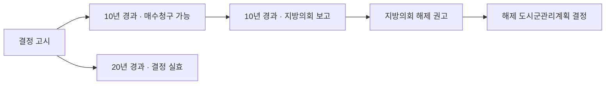
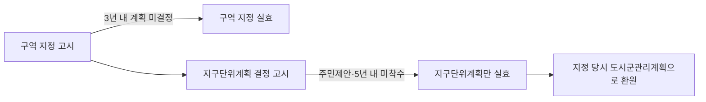

# 단원 PART01 — 국토계획법

> **법령 전체명**: 국토의 계획 및 이용에 관한 법률
> **출처 자료**: 감관법1 (스터디파이터)
> **수업 주제**: 용도지역·지구단위계획·도시군관리계획·기반시설·개발행위허가

## 🗺️ 본문 목차

- [📗 관별 정리 (조문 기반)](#관별정리)
- [📖 핵심요약서 (L1 - 메인 단권화)](#핵심요약서)
- [📚 기본서 (L2 - 본격 학습)](#기본서)
- [✏️ 워크북 (논점별 문제)](#워크북)

---

## 📗 관별 정리 — 조문 기반 (관별 상세)

> 📌 법제처 정본 조문을 대조해 관(關)별로 저술한 상세 교재다. 아래 핵심요약서·기본서·워크북은 학원 교재 원문이다.

### [국토계획법] Chapter 01 총칙

> 📖 국토계획법 제1장(제1조~제9조)이다. 이 법 전체에서 쓰는 **용어의 뜻**과 **국토의 용도 구분**, 그리고 국가계획-광역도시계획-도시·군계획 사이의 **위계**를 정한다.
> 감정평가사 시험에서 총칙은 「정의규정」과 「기반시설 7분류」로 거의 매년 1문항씩 출제된다. 조문을 외우는 것이 곧 점수다.

> ⭐ **이 관에서 반드시 챙길 3가지**
> ① **기반시설 7종 분류**(영 제2조 제1항) — 어느 시설이 어느 군에 속하는지. 출제 1순위다.
> ② **계획의 위계** — 국가계획 > 광역도시계획 > 도시·군기본계획 > 도시·군관리계획. 내용이 다르면 ==상위계획이 우선==.
> ③ **도시·군관리계획의 범위**(제2조 제4호 가~자목) — 성장관리계획은 도시·군관리계획이 ==아니다==.

#### 1. 개념·정의

법이 정의규정을 둔 용어다. 시험은 정의 문언 중 **한 단어만 바꿔** 오답을 만든다.

| 용어 | 정의 (법 제2조) |
|---|---|
| 광역도시계획 | 제10조에 따라 지정된 **광역계획권의 ==장기발전방향==을 제시하는 계획** (제1호) |
| 도시ㆍ군계획 | 특별시·광역시·특별자치시·특별자치도·시 또는 군의 관할 구역에 대하여 수립하는 공간구조와 발전방향에 대한 계획으로서 **도시·군기본계획과 도시·군관리계획으로 구분** (제2호) |
| 도시ㆍ군기본계획 | 관할 구역 **및 생활권**에 대하여 기본적인 공간구조와 장기발전방향을 제시하는 **종합계획**으로서 ==도시·군관리계획 수립의 지침==이 되는 계획 (제3호) |
| 도시ㆍ군관리계획 | 개발·정비 및 보전을 위하여 수립하는 토지 이용, 교통, 환경, 경관, 안전, 산업 등에 관한 가목~자목의 계획 (제4호) |
| 지구단위계획 | 도시·군계획 수립 대상지역의 **일부**에 대하여 토지 이용을 합리화하고 … 체계적·계획적으로 관리하기 위하여 수립하는 ==도시·군관리계획== (제5호) |
| 성장관리계획 | 성장관리계획구역에서의 난개발을 방지하고 계획적인 개발을 유도하기 위하여 수립하는 계획 (제5호의3) — ==도시·군관리계획이 아니다== |
| 공간재구조화계획 | 용도·건폐율·용적률·높이 등을 **완화하는 용도구역**의 효율적·계획적 관리를 위하여 수립하는 계획 (제5호의4) |
| 도시혁신계획 | 도시혁신구역에서의 제한을 따로 정하기 위하여 **공간재구조화계획으로 결정하는 도시·군관리계획** (제5호의5) |
| 복합용도계획 | 복합용도구역에서의 용도별 구성비율 및 건폐율·용적률·높이 제한을 따로 정하기 위하여 **공간재구조화계획으로 결정하는 도시·군관리계획** (제5호의6) |
| 도시ㆍ군계획시설 | **기반시설 중 ==도시·군관리계획으로 결정==된 시설** (제7호) |
| 공동구 | 전기·가스·수도 등의 공급설비, 통신시설, 하수도시설 등 지하매설물을 공동 수용함으로써 미관 개선·도로구조 보전·교통 소통을 위하여 **==지하==에 설치하는 시설물** (제9호) |
| 개발밀도관리구역 | 개발로 기반시설이 부족할 것으로 예상되나 **기반시설을 설치하기 곤란한 지역**을 대상으로 건폐율·용적률을 ==강화==하여 적용하기 위하여 지정하는 구역 (제18호) |
| 기반시설부담구역 | **개발밀도관리구역 ==외==의 지역**으로서 기반시설의 설치가 필요한 지역을 대상으로 지정·고시하는 구역 (제19호) |

> 📌 **국토계획법 제2조 제4호** — "'도시ㆍ군관리계획'이란 특별시ㆍ광역시ㆍ특별자치시ㆍ특별자치도ㆍ시 또는 군의 개발ㆍ정비 및 보전을 위하여 수립하는 토지 이용, 교통, 환경, 경관, 안전, 산업, 정보통신, 보건, 복지, 안보, 문화 등에 관한 다음 각 목의 계획을 말한다. 가. 용도지역ㆍ용도지구의 지정 또는 변경에 관한 계획 / 나. 개발제한구역, 도시자연공원구역, 시가화조정구역, 수산자원보호구역의 지정 또는 변경에 관한 계획 / 다. 기반시설의 설치ㆍ정비 또는 개량에 관한 계획 / 라. 도시개발사업이나 정비사업에 관한 계획 / 마. 지구단위계획구역의 지정 또는 변경에 관한 계획과 지구단위계획 / 사. 도시혁신구역의 지정 또는 변경에 관한 계획과 도시혁신계획 / 아. 복합용도구역의 지정 또는 변경에 관한 계획과 복합용도계획 / 자. 도시ㆍ군계획시설입체복합구역의 지정 또는 변경에 관한 계획"

가목~자목 **7가지**(바목 삭제)가 도시·군관리계획의 전부다. 여기 없는 것 — **성장관리계획**, **공간재구조화계획 그 자체** — 은 도시·군관리계획이 아니다. 다만 도시혁신계획·복합용도계획은 "공간재구조화계획으로 결정하는 도시·군관리계획"이므로 도시·군관리계획**이다**.

#### 2. 기반시설 7분류 — 최빈출 표

> 📌 **국토계획법 시행령 제2조 제1항** — "법 제2조제6호 각 목 외의 부분에서 '대통령령으로 정하는 시설'이란 다음 각 호의 시설(당해 시설 그 자체의 기능발휘와 이용을 위하여 필요한 부대시설 및 편익시설을 포함한다)을 말한다."

| 분류 | 해당 시설 (영 제2조 제1항) |
|---|---|
| ① 교통시설 | 도로·철도·항만·공항·**주차장**·**자동차정류장**·궤도·차량 검사 및 면허시설 |
| ② 공간시설 | **광장·공원·==녹지==·유원지·공공공지** (다섯 개뿐) |
| ③ 유통ㆍ공급시설 | 유통업무설비, 수도·전기·가스·**열공급설비**, 방송·통신시설, **==공동구==**·**시장**, **유류저장 및 송유설비** |
| ④ 공공ㆍ문화체육시설 | **학교**·공공청사·문화시설·공공필요성이 인정되는 체육시설·**==연구시설==**·**사회복지시설**·**공공직업훈련시설**·**청소년수련시설** |
| ⑤ 방재시설 | 하천·**유수지**·저수지·방화설비·방풍설비·**방수설비**·사방설비·**방조설비** |
| ⑥ 보건위생시설 | 장사시설·**==도축장==**·종합의료시설 (셋뿐) |
| ⑦ 환경기초시설 | 하수도·폐기물처리 및 **재활용시설**·빗물저장 및 이용시설·**수질오염방지시설**·**폐차장** |

**함정 3대장** — ==연구시설은 공공·문화체육시설==(공간시설 아님), ==도축장은 보건위생시설==(환경기초시설 아님), ==유류저장 및 송유설비는 유통·공급시설==(환경기초시설 아님).

도로·자동차정류장·광장의 세분(영 제2조 제2항):

| 시설 | 세분 |
|---|---|
| 도로 | 일반도로 / 자동차전용도로 / 보행자전용도로 / **보행자우선도로** / 자전거전용도로 / 고가도로 / 지하도로 |
| 자동차정류장 | 여객자동차터미널 / 물류터미널 / 공영차고지 / 공동차고지 / 화물자동차 휴게소 / 복합환승센터 / 환승센터 |
| 광장 | 교통광장 / 일반광장 / 경관광장 / 지하광장 / **건축물부설광장** |

#### 3. 광역시설·공공시설·기반시설부담구역 기반시설

> 📌 **국토계획법 시행령 제3조** — "1. 2 이상의 … 시 또는 군의 관할구역에 걸치는 시설: 도로ㆍ철도ㆍ광장ㆍ녹지, 수도ㆍ전기ㆍ가스ㆍ열공급설비, 방송ㆍ통신시설, 공동구, 유류저장 및 송유설비, 하천ㆍ하수도(하수종말처리시설을 제외한다) / 2. 2 이상의 … 시 또는 군이 공동으로 이용하는 시설: 항만ㆍ공항ㆍ자동차정류장ㆍ공원ㆍ유원지ㆍ유통업무설비ㆍ문화시설ㆍ공공필요성이 인정되는 체육시설ㆍ사회복지시설ㆍ공공직업훈련시설ㆍ청소년수련시설ㆍ유수지ㆍ장사시설ㆍ도축장ㆍ하수도(하수종말처리시설에 한한다)ㆍ폐기물처리 및 재활용시설ㆍ수질오염방지시설ㆍ폐차장"

| 구분 | 핵심 |
|---|---|
| 걸치는 시설 (제1호) | **선(線)적 시설** — 도로·철도·광장·녹지, 각종 공급설비, 방송통신, 공동구, 유류저장·송유설비, 하천·하수도(하수종말처리시설 제외) |
| 공동 이용 시설 (제2호) | **점(點)적 시설** — 항만·공항·자동차정류장·공원·유원지·유통업무설비·문화시설·체육시설·사회복지·직업훈련·청소년수련·유수지·장사시설·도축장·하수종말처리시설·폐기물처리 및 재활용시설·수질오염방지시설·폐차장 |
| 광역시설이 될 수 **없는** 것 | ==방조설비·방화설비·방풍설비·수도(공급설비 외)== 등 위 두 목록에 없는 시설. 특히 **==방조설비==**는 광역시설이 아니다 |

**공공시설**(영 제4조) — 항만·공항·광장·녹지·공공공지·공동구·하천·유수지·방화설비·방풍설비·방수설비·사방설비·방조설비·하수도·구거, 그리고 **==행정청이 설치하는== 주차장·저수지** 등.

**기반시설부담구역에 설치가 필요한 기반시설**(영 제4조의2) — 도로(진입도로 포함), 공원, 녹지, **학교(==「고등교육법」에 따른 학교는 제외==)**, 수도(연결 수도 포함), 하수도(연결 하수도 포함), 폐기물처리 및 재활용시설.

#### 4. 계획 간 위계와 국토의 용도 구분

> 📌 **국토계획법 제4조 제2항·제3항** — "② 광역도시계획 및 도시ㆍ군계획은 국가계획에 부합되어야 하며, 광역도시계획 또는 도시ㆍ군계획의 내용이 국가계획의 내용과 다를 때에는 국가계획의 내용이 우선한다. … ③ 광역도시계획이 수립되어 있는 지역에 대하여 수립하는 도시ㆍ군기본계획은 그 광역도시계획에 부합되어야 하며, 도시ㆍ군기본계획의 내용이 광역도시계획의 내용과 다를 때에는 광역도시계획의 내용이 우선한다."

> 📌 **국토계획법 제6조** — "국토는 토지의 이용실태 및 특성, 장래의 토지 이용 방향, 지역 간 균형발전 등을 고려하여 다음과 같은 용도지역으로 구분한다. 1. 도시지역 … 2. 관리지역 … 3. 농림지역 … 4. 자연환경보전지역 …"

| 용도지역 | 정의 (제6조) |
|---|---|
| 도시지역 | 인구와 산업이 밀집되어 있거나 밀집이 예상되어 체계적인 개발·정비·관리·보전 등이 필요한 지역 |
| 관리지역 | 도시지역의 인구와 산업을 수용하기 위하여 도시지역에 준하여 체계적으로 관리하거나, 농림업의 진흥·자연환경 또는 산림의 보전을 위하여 농림지역 또는 자연환경보전지역에 준하여 관리할 필요가 있는 지역 |
| 농림지역 | **도시지역에 속하지 아니하는** 「농지법」에 따른 농업진흥지역 또는 「산지관리법」에 따른 보전산지 등 |
| 자연환경보전지역 | 자연환경·수자원·해안·생태계·상수원 및 국가유산의 보전과 수산자원의 보호·육성 등을 위하여 필요한 지역 |

#### 5. ⏱ 기간·수치 총정리

| 항목 | 기간·수치 | 근거 조문 |
|---|---|---|
| 다른 법률 구역등 지정 시 **국토부장관 협의·승인** 대상 면적 | ==1제곱킬로미터== 이상 (「도시개발법」상 도시개발구역은 ==5제곱킬로미터==) | 영 제5조 제1항 |
| 시·도지사가 국토부장관 승인 없이 지정할 수 있는 면적 | ==5제곱킬로미터== 미만 (시·도도시계획위원회 심의를 거치는 경우로 한정) | 법 제8조 제3항, 영 제5조 제3항 |
| 협의·승인을 받은 구역등의 **경미한 면적 변경** | 면적의 ==10퍼센트== 범위 안 증감 | 영 제5조 제5항 제1호 |
| 중앙행정기관의 장 — 중앙도시계획위원회 심의 대상 | ==30만제곱미터== 이상 용도지역·지구·구역 변경 의제 계획 | 영 제6조 제1항 제1호 가목 |
| 지방자치단체의 장 — 중앙도시계획위원회 심의 대상 | ==5제곱킬로미터== 이상 | 영 제6조 제1항 제1호 나목 |
| 지방자치단체의 장 — 지방도시계획위원회 심의 대상 | 30만제곱미터 이상 ==5제곱킬로미터 미만== | 영 제6조 제1항 제2호 |
| 도시·군관리계획 결정 의제 계획의 **심의 면제** | 계획면적의 ==5퍼센트 미만== 변경 | 영 제6조 제1항 단서 |

#### 6. 👤 권한 주체 구분

| 행위 | 주체 | 근거 |
|---|---|---|
| 도시의 지속가능성 및 생활인프라 수준 **평가** | ==국토교통부장관== (자체평가는 시·도지사·시장·군수, **최종평가는 국토교통부장관**) | 법 제3조의2 제1항, 영 제4조의4 제2항 |
| 평가 결과를 도시·군계획 수립·집행에 **반영** | 국가와 지방자치단체 — ==하여야 한다== (의무) | 법 제3조의2 제3항 |
| 다른 법률상 구역등 지정 시 **협의** | 중앙행정기관의 장 → 국토교통부장관과 협의 | 법 제8조 제2항 |
| 다른 법률상 구역등 지정 시 **승인** | 지방자치단체의 장 → 국토교통부장관의 승인 / 시장·군수·구청장 → ==시·도지사==의 승인 | 법 제8조 제2항·제3항 |
| 다른 법률상 구역등의 **변경·해제** 시 의견 청취 | 제24조에 따른 **도시·군관리계획 입안권자**의 의견 | 법 제8조 제6항 |

#### ⭐ 기출 출제포인트

1. **기반시설 7분류 짝짓기** — "공간시설 - 연구시설"처럼 **한 줄만 틀리게** 연결해 놓고 고르게 한다. 매년 나온다.
2. **특정 군에 해당하지 않는 것** — "환경기초시설에 해당하지 않는 것은?"(유류저장설비), "공공·문화체육시설에 해당하지 않는 것은?"(방송·통신시설).
3. **광역시설이 될 수 없는 것** — 영 제3조 두 목록에 없는 시설(방조설비 등)을 고르게 한다.
4. **도시·군관리계획에 해당하지 않는 것** — 성장관리계획을 끼워 넣는다.
5. **계획 위계** — "도시·군기본계획의 내용이 광역도시계획과 다르면 도시·군기본계획이 우선한다"는 **정반대 함정**.
6. **지속가능성·생활인프라 수준 평가의 최종평가 주체** — 시·도지사로 바꿔 놓는다.

#### 📊 기출 분석

| 연도 | 출제 형태 | 핵심 논점 |
|---|---|---|
| 2018 3번 | 해당하지 않는 것 | 환경기초시설 — 유류저장설비는 유통·공급시설 |
| 2019 3번 | 해당하는 것 | 공간시설 — 녹지 |
| 2020 11번 | 해당하는 것 | 유통·공급시설 — 공동구 |
| 2021 1번 | 연결 옳지 않은 것 | 공간시설 - 연구시설(→ 공공·문화체육시설) |
| 2022 13번 | 해당하지 않는 것 | 공공·문화체육시설 — 방송·통신시설 |
| 2023 1번 | 옳지 않은 것 | 지속가능성·생활인프라 수준 평가, 최종평가 주체 |
| 2024 1번 | 연결 옳지 않은 것 | 환경기초시설 - 도축장(→ 보건위생시설) |
| 2025 2번 | 해당하지 않는 것 | 도시·군관리계획 — 성장관리계획 |
| 2026 9번 | 될 수 없는 것 | 광역시설 — 방조설비 |

**출제 빈도** — 총칙만으로 **매년 1~2문항**. 특히 기반시설 분류는 2018·2019·2020·2021·2022·2024·2026 등 거의 매년.
**반복되는 함정** — 연구시설/도축장/유류저장 및 송유설비/공동구의 소속 군을 바꾸는 것. 그리고 상위계획 우선 원칙의 역전.
**최근 경향** — 2024년 개정으로 신설된 **도시혁신계획·복합용도계획·공간재구조화계획**의 정의가 새 출제 포인트로 들어왔다(2025 2번·2026 2번).

#### 🔍 기출 선지로 배우는 조문

> 실제 출제된 선지를 놓고 O/X와 근거 조문을 확인한다.

**①** (2021 1번 ①) "공간시설 - 연구시설" — **X** / 어디가 틀렸나: 연구시설은 공간시설이 아니다 / 옳게 고치면: 연구시설은 **공공·문화체육시설**이다(영 제2조 제1항 제4호). 공간시설은 광장·공원·녹지·유원지·공공공지 다섯뿐이다.

**②** (2024 1번 ④) "환경기초시설 - 도축장" — **X** / 어디가 틀렸나: 도축장은 환경기초시설이 아니다 / 옳게 고치면: 도축장은 **보건위생시설**(영 제2조 제1항 제6호). 환경기초시설은 하수도·폐기물처리 및 재활용시설·빗물저장 및 이용시설·수질오염방지시설·폐차장.

**③** (2018 3번 ③) "유류저장설비가 환경기초시설에 해당한다" — **X** / 어디가 틀렸나: **유류저장 및 송유설비는 유통·공급시설**이다(영 제2조 제1항 제3호).

**④** (2020 11번 ③) "공동구는 유통·공급시설이다" — **O** / 근거: 영 제2조 제1항 제3호. 공동구는 유통·공급시설이면서 동시에 **공공시설**(영 제4조 제1호)이기도 하다.

**⑤** (2022 13번 ④) "방송·통신시설은 공공·문화체육시설이다" — **X** / 어디가 틀렸나: 방송·통신시설은 **유통·공급시설**이다(영 제2조 제1항 제3호).

**⑥** (2025 6번 ①) "도시·군기본계획의 내용이 광역도시계획의 내용과 다를 때에는 도시·군기본계획의 내용이 우선한다" — **X** / 어디가 틀렸나: 순서가 뒤집혔다 / 옳게 고치면: **광역도시계획의 내용이 우선한다**(법 제4조 제3항).

**⑦** (2025 2번 ②) "성장관리계획은 도시·군관리계획에 해당한다" — **X** / 어디가 틀렸나: 법 제2조 제4호 가목~자목 어디에도 없다 / 옳게 고치면: 성장관리계획은 제2조 제5호의3의 **별도 계획**이다.

**⑧** (2026 9번 ②) "방조설비는 광역시설이 될 수 있다" — **X** / 어디가 틀렸나: 영 제3조 제1호·제2호 어느 목록에도 방조설비는 없다. 방조설비는 방재시설이자 공공시설일 뿐이다.

#### ⚠️ 이 관의 함정 총정리

1. **"연구시설은 공간시설"** 이라고 하면 틀림 → ==공공·문화체육시설==
2. **"도축장은 환경기초시설"** 이라고 하면 틀림 → ==보건위생시설==
3. **"도시·군기본계획이 광역도시계획에 우선"** 이라고 하면 틀림 → ==광역도시계획이 우선==(법 제4조 제3항)
4. **"성장관리계획도 도시·군관리계획"** 이라고 하면 틀림 → ==도시·군관리계획이 아니다==. 다만 도시혁신계획·복합용도계획은 도시·군관리계획이다
5. **"지속가능성 평가의 최종평가는 시·도지사"** 라고 하면 틀림 → 자체평가만 지방자치단체, ==최종평가는 국토교통부장관==(영 제4조의4 제2항)
6. **"기반시설부담구역 기반시설에 「고등교육법」상 학교가 포함된다"** 고 하면 틀림 → ==대학교는 제외==(영 제4조의2 제4호)

#### ✅ OX 확인문제

> 다음 진술의 참·거짓을 판단하시오.

**1.** 도시·군계획시설이란 기반시설 중 도시·군관리계획으로 결정된 시설을 말한다.
→ **O**. 법 제2조 제7호. 기반시설이라고 모두 도시·군계획시설인 것은 아니고, 도시·군관리계획으로 결정되어야 한다.

**2.** 공간시설에는 광장·공원·녹지·유원지·공공공지가 속한다.
→ **O**. 영 제2조 제1항 제2호. 다섯 가지가 전부다.

**3.** 폐차장은 보건위생시설에 해당한다.
→ **X**. 폐차장은 **환경기초시설**이다(영 제2조 제1항 제7호). 보건위생시설은 장사시설·도축장·종합의료시설 셋뿐이다.

**4.** 광역도시계획은 광역계획권의 장기발전방향을 제시하는 계획을 말한다.
→ **O**. 법 제2조 제1호.

**5.** 도시·군관리계획으로 결정하여야 할 사항은 국가계획에 포함될 수 없다.
→ **X**. 법 제2조 제14호는 "도시·군관리계획으로 결정하여야 할 사항이 포함된 계획"을 국가계획의 정의에 명시하고 있다.

**6.** 시장 또는 군수가 관할 구역에 대하여 다른 법률에 따른 환경에 관한 부문별 계획을 수립할 때에는 도시·군관리계획의 내용에 부합되게 하여야 한다.
→ **X**. **도시·군기본계획**의 내용에 부합되게 하여야 한다(법 제4조 제4항).

**7.** 공동구는 지하에 설치하는 시설물이다.
→ **O**. 법 제2조 제9호. 지상·지하 어디든 가능한 것이 아니라 **지하**로 한정된다.

**8.** 기반시설부담구역은 개발밀도관리구역 안의 지역 중에서 지정한다.
→ **X**. 기반시설부담구역은 **개발밀도관리구역 외의 지역**을 대상으로 한다(법 제2조 제19호). 두 구역은 서로 배타적이다.

**9.** 중앙행정기관의 장이 다른 법률에 따라 1제곱킬로미터 이상의 구역등을 지정하려면 국토교통부장관과 협의하여야 한다.
→ **O**. 법 제8조 제2항, 영 제5조 제1항. 다만 도시개발구역은 5제곱킬로미터가 기준이다.

**10.** 국토는 도시지역·관리지역·농림지역·자연환경보전지역의 네 가지 용도지역으로 구분한다.
→ **O**. 법 제6조. 이 넷은 서로 중복되지 않는다(법 제2조 제15호).

#### 🧠 암기법

> 🔑 **기반시설 7군 두문자 — "교공유공방보환"**
> **교**통 · **공**간 · **유**통공급 · **공**공문화체육 · **방**재 · **보**건위생 · **환**경기초. 순서까지 영 제2조 제1항 호 번호와 같다.

> 🔑 **공간시설 다섯 — "광공녹유공"**
> **광**장 · **공**원 · **녹**지 · **유**원지 · **공**공공지. 이 다섯 외에는 전부 공간시설이 아니다.

> 🔑 **보건위생시설 셋 — "장도종"**
> **장**사시설 · **도**축장 · **종**합의료시설. 셋뿐이라는 점이 함정 방어의 핵심이다.

> 🔑 **위계 — "국 → 광 → 기 → 관"**
> **국**가계획 → **광**역도시계획 → 도시·군**기**본계획 → 도시·군**관**리계획. 충돌하면 **언제나 왼쪽이 이긴다**.

---

### [국토계획법] Chapter 02 광역도시계획

> 📖 국토계획법 제2장(제10조~제17조의2)이다. 둘 이상의 지자체에 걸친 공간구조·기능을 연계하기 위해 **광역계획권**을 지정하고, 그 권역의 **장기발전방향**을 제시하는 광역도시계획을 수립하는 절차를 정한다.
> 이 관은 **누가 지정하고 누가 수립하며 누구의 승인을 받는가**가 전부다. 주체가 갈리는 지점이 곧 출제 지점이다.

> ⭐ **이 관에서 반드시 챙길 3가지**
> ① **광역계획권 지정권자** — 둘 이상 시·도에 걸치면 ==국토교통부장관==, 도의 관할에 속하면 ==도지사==.
> ② **수립권자 4유형**(제11조 제1항)과 **==3년==** 이라는 숫자.
> ③ **조정 신청** — "공동으로 신청하여야 한다"가 아니라 ==공동이나 단독으로 신청할 수 있다==.

#### 1. 광역계획권의 지정

> 📌 **국토계획법 제10조 제1항** — "국토교통부장관 또는 도지사는 둘 이상의 특별시ㆍ광역시ㆍ특별자치시ㆍ특별자치도ㆍ시 또는 군의 공간구조 및 기능을 상호 연계시키고 환경을 보전하며 광역시설을 체계적으로 정비하기 위하여 필요한 경우에는 다음 각 호의 구분에 따라 인접한 둘 이상의 … 관할 구역 전부 또는 일부를 대통령령으로 정하는 바에 따라 광역계획권으로 지정할 수 있다. 1. 광역계획권이 둘 이상의 특별시ㆍ광역시ㆍ특별자치시ㆍ도 또는 특별자치도의 관할 구역에 걸쳐 있는 경우: 국토교통부장관이 지정 / 2. 광역계획권이 도의 관할 구역에 속하여 있는 경우: 도지사가 지정"

| 구분 | 지정권자 | 사전 절차 | 근거 |
|---|---|---|---|
| 둘 이상 시·도에 걸침 | ==국토교통부장관== | 관계 시·도지사, 시장 또는 군수의 **의견 청취** → **==중앙==도시계획위원회 심의** | 제10조 제1항 제1호·제3항 |
| 도의 관할 구역에 속함 | ==도지사== | 관계 중앙행정기관의 장, 관계 시·도지사, 시장 또는 군수의 **의견 청취** → **==지방==도시계획위원회 심의** | 제10조 제1항 제2호·제4항 |
| 지정·변경 **요청** | 중앙행정기관의 장, 시·도지사, 시장 또는 군수 → 국토교통부장관이나 도지사에게 **요청할 수 있다** | — | 제10조 제2항 |
| 지정·변경 **통보** | 국토교통부장관 또는 도지사 → ==관계 시·도지사, 시장 또는 군수==에게 지체 없이 통보 | — | 제10조 제5항 |

> ⚠️ **주의** — 도지사가 지정할 때 필요한 것은 **지방도시계획위원회 심의**이지 **지방의회의 동의**가 아니고, **관계 중앙행정기관의 장의 승인**도 아니다. 통보 상대방도 "관계 중앙행정기관의 장"이 아니라 **관계 시·도지사, 시장 또는 군수**다.

#### 2. 수립권자 — 4유형

> 📌 **국토계획법 제11조 제1항** — "1. 광역계획권이 같은 도의 관할 구역에 속하여 있는 경우: 관할 시장 또는 군수가 공동으로 수립 / 2. 광역계획권이 둘 이상의 시ㆍ도의 관할 구역에 걸쳐 있는 경우: 관할 시ㆍ도지사가 공동으로 수립 / 3. 광역계획권을 지정한 날부터 3년이 지날 때까지 관할 시장 또는 군수로부터 제16조제1항에 따른 광역도시계획의 승인 신청이 없는 경우: 관할 도지사가 수립 / 4. 국가계획과 관련된 광역도시계획의 수립이 필요한 경우나 광역계획권을 지정한 날부터 3년이 지날 때까지 관할 시ㆍ도지사로부터 제16조제1항에 따른 광역도시계획의 승인 신청이 없는 경우: 국토교통부장관이 수립"

| 상황 | 수립권자 |
|---|---|
| 같은 도 안 | 관할 **시장·군수가 공동** |
| 둘 이상 시·도에 걸침 | 관할 **시·도지사가 공동** |
| 지정일부터 ==3년== 경과, 시장·군수의 승인 신청 없음 | **관할 도지사** |
| ==국가계획 관련== 또는 지정일부터 ==3년== 경과, 시·도지사의 승인 신청 없음 | **국토교통부장관** |
| 시·도지사가 **요청**하는 경우 등 | 국토교통부장관이 관할 시·도지사와 **공동 수립할 수 있다** (제11조 제2항) |
| 시장·군수가 **요청**하는 경우 등 | 도지사가 관할 시장·군수와 **공동 수립할 수 있고**, 시장·군수가 ==협의를 거쳐 요청==하면 **단독 수립할 수 있다** (제11조 제3항) |

#### 3. 내용·절차

> 📌 **국토계획법 제12조 제1항** — "광역도시계획에는 다음 각 호의 사항 중 그 광역계획권의 지정목적을 이루는 데 필요한 사항에 대한 정책 방향이 포함되어야 한다. 1. 광역계획권의 공간 구조와 기능 분담에 관한 사항 / 2. 광역계획권의 녹지관리체계와 환경 보전에 관한 사항 / 3. 광역시설의 배치ㆍ규모ㆍ설치에 관한 사항 / 4. 경관계획에 관한 사항 / 5. 그 밖에 … 기능 연계에 관한 사항으로서 대통령령으로 정하는 사항"

> 📌 **국토계획법 제14조 제1항** — "국토교통부장관, 시ㆍ도지사, 시장 또는 군수는 광역도시계획을 수립하거나 변경하려면 미리 공청회를 열어 주민과 관계 전문가 등으로부터 의견을 들어야 하며, 공청회에서 제시된 의견이 타당하다고 인정하면 광역도시계획에 반영하여야 한다."

공청회는 **재량이 아니라 의무**이고, 타당한 의견의 **반영도 의무**다.

| 절차 | 내용 | 근거 |
|---|---|---|
| 기초조사 | 인구·경제·사회·문화·토지이용·환경·교통·주택 등 조사·측량. **전문기관 의뢰 가능** | 제13조 제1항·제3항 |
| 기초조사정보체계 | 구축·운영 **하여야 한다**. 구축한 경우 등록 정보 현황을 ==5년마다== 확인·반영 | 제13조 제4항·제5항 |
| 공청회 | 개최예정일 ==14일 전==까지 ==1회 이상== 공고(일간신문·관보·공보·인터넷 홈페이지 또는 방송) | 제14조, 영 제12조 제1항 |
| 지방자치단체 의견 청취 | 시·도지사·시장·군수는 관계 시·도, 시 또는 군의 **의회**와 관계 시장·군수의 의견 청취. 의견 제시 기한 ==30일== | 제15조 |
| 승인 | 시·도지사 → **국토교통부장관**의 승인 / 시장·군수 → **도지사**의 승인 | 제16조 제1항·제5항 |
| 협의·심의 | 국토교통부장관: 관계 중앙행정기관과 협의 후 **중앙도시계획위원회** 심의. 협의 의견 제시 기한 ==30일== | 제16조 제2항·제3항 |
| 공고·열람 | 시·도 공보와 인터넷 홈페이지 게재, 열람기간 ==30일 이상== | 영 제13조 제3항 |

#### 4. 조정과 협의회

> 📌 **국토계획법 제17조 제1항** — "제11조제1항제2호에 따라 광역도시계획을 공동으로 수립하는 시ㆍ도지사는 그 내용에 관하여 서로 협의가 되지 아니하면 공동이나 단독으로 국토교통부장관에게 조정(調停)을 신청할 수 있다."

- 단독 신청을 받으면 국토교통부장관은 **기한을 정해 재협의를 권고할 수 있고**, 기한까지 협의가 안 되면 **직접 조정할 수 있다**(제17조 제2항).
- 조정은 **중앙도시계획위원회 심의**를 거친다. 이해관계 지자체의 장은 회의에 출석해 의견을 진술할 수 있다(제17조 제3항).
- 조정 결과는 광역도시계획에 **반영하여야 한다**(제17조 제4항).
- 시장·군수 간 협의 불성립 시에는 **도지사**에게 신청한다(제17조 제5항).
- 광역도시계획협의회에서 협의·조정한 내용은 **광역도시계획에 반영하여야 하고**, 해당 시·도지사·시장·군수는 **이에 따라야 한다**(제17조의2 제2항).

#### 5. ⏱ 기간·수치 총정리

| 항목 | 기간·수치 | 근거 조문 |
|---|---|---|
| 도지사·국토교통부장관이 대신 수립하게 되는 기간 | 광역계획권 지정일부터 ==3년== 경과 시까지 승인 신청 없음 | 법 제11조 제1항 제3호·제4호 |
| 공청회 사전 공고 | 개최예정일 ==14일 전==까지 ==1회 이상== | 영 제12조 제1항 |
| 지방의회·관계 시장·군수 의견 제시 기한 | ==30일== 이내 | 법 제15조 제3항 |
| 관계 중앙행정기관의 장 협의 의견 제시 기한 | 요청받은 날부터 ==30일== 이내 | 법 제16조 제3항 |
| 광역도시계획 공고 후 관계 서류 열람기간 | ==30일 이상== | 영 제13조 제3항 |
| 기초조사정보체계 등록 정보 현황 확인 주기 | ==5년마다== | 법 제13조 제5항 |

#### 6. 👤 권한 주체 구분

| 행위 | 주체 | 근거 |
|---|---|---|
| 광역계획권 지정 — 둘 이상 시·도 | ==국토교통부장관== (중앙도시계획위원회 심의) | 제10조 제1항 제1호·제3항 |
| 광역계획권 지정 — 도 관할 | ==도지사== (지방도시계획위원회 심의) | 제10조 제1항 제2호·제4항 |
| 광역도시계획 승인 — 시·도지사가 수립 | ==국토교통부장관== | 제16조 제1항 |
| 광역도시계획 승인 — 시장·군수가 수립 | ==도지사== | 제16조 제5항 |
| 도지사가 제11조 제3항에 따라 **단독 수립**한 광역도시계획 | 국토교통부장관의 승인 ==불요== | 제16조 제1항 단서 |
| 시·도지사 간 조정 신청의 상대방 | 국토교통부장관 | 제17조 제1항 |
| 시장·군수 간 조정 신청의 상대방 | 도지사 | 제17조 제5항 |

#### ⭐ 기출 출제포인트

1. **지정권자 vs 수립권자 혼동** — "광역계획권이 둘 이상 시·도에 걸쳐 있으면 국토교통부장관이 수립권자"는 **X**(지정권자일 뿐, 수립은 관할 시·도지사가 공동).
2. **3년이라는 숫자** — 2년으로 바꿔 놓는다(2023 2번 ②, 2024 2번 ④).
3. **조정 신청의 임의성** — "공동으로 조정을 신청하여야 한다"는 X. **공동이나 단독으로 신청할 수 있다**.
4. **도지사 지정 시 심의기관** — 중앙도시계획위원회로 바꾸거나 지방의회 동의를 끼워 넣는다.
5. **승인권자** — 시장·군수 수립분을 "국토교통부장관 승인"으로 바꾼다(2025 1번 ⑤).
6. **공청회 공고** — "7일 전까지 2회 이상"으로 바꾼다(2018 1번 ①). 정답은 **14일 전까지 1회 이상**.

#### 📊 기출 분석

| 연도 | 출제 형태 | 핵심 논점 |
|---|---|---|
| 2019 2번 | 옳지 않은 것 | 조정 신청 — 공동이나 단독으로 신청**할 수 있다** |
| 2020 9번 | 옳은 것 | 광역도시계획의 내용, 광역계획권 지정 절차 |
| 2021 2번 | 단독 수립 사유 | 국가계획 관련 또는 3년 경과 |
| 2022 11번 | 옳지 않은 것 | 시·도지사 수립 시 심의기관 — 중앙도시계획위원회는 국토부장관 승인 단계 |
| 2023 2번 | 옳은 것 | 3년(2년 아님), 요청 가능, 도지사 단독 수립 시 승인 불요 |
| 2024 2번 | 옳은 것 | 지정 요청 가능, 도지사 지정 시 지방도시계획위원회 심의, 3년 |
| 2025 1번 | 옳지 않은 것 | 시장·군수 수립 → **도지사** 승인 |

**출제 빈도** — **매년 1문항**이 고정으로 나온다. 2019~2026 모두 출제.
**반복되는 함정** — ① 3년을 2년으로 ② 지정권자를 수립권자로 ③ 승인권자를 국토교통부장관으로 통일 ④ "할 수 있다"를 "하여야 한다"로.
**최근 경향** — 기초조사정보체계(제13조 제4항·제5항, 2018년 신설)의 **5년마다 확인**이 2023·2024년 연속 선지로 등장했다.

#### 🔍 기출 선지로 배우는 조문

> 실제 출제된 선지를 놓고 O/X와 근거 조문을 확인한다.

**①** (2019 2번 ④) "광역도시계획을 공동으로 수립하는 시·도지사는 협의가 되지 아니하면 공동으로 조정을 신청하여야 한다" — **X** / 어디가 틀렸나: 의무이자 공동 신청만 가능한 것처럼 썼다 / 옳게 고치면: **공동이나 단독으로 국토교통부장관에게 조정을 신청할 수 있다**(제17조 제1항).

**②** (2019 2번 ①) "광역계획권이 둘 이상의 인접한 시·도의 관할구역에 걸쳐 있는 경우 국토교통부장관이 광역계획권을 지정한다" — **O** / 근거: 제10조 제1항 제1호.

**③** (2023 2번 ②) "광역계획권을 지정한 날부터 2년이 지날 때까지 관할 시·도지사로부터 광역도시계획의 승인 신청이 없는 경우에는 국토교통부장관이 광역도시계획을 수립한다" — **X** / 어디가 틀렸나: 2년이 아니다 / 옳게 고치면: **3년**(제11조 제1항 제4호).

**④** (2024 2번 ②) "도지사가 광역계획권을 변경하려면 중앙도시계획위원회의 심의를 거쳐 관계 중앙행정기관의 장의 승인을 받아야 한다" — **X** / 어디가 틀렸나: 심의기관과 승인 요건이 모두 틀렸다 / 옳게 고치면: 관계 중앙행정기관의 장, 관계 시·도지사, 시장·군수의 **의견을 들은 후 지방도시계획위원회의 심의**를 거친다. 승인 절차는 없다(제10조 제4항).

**⑤** (2025 1번 ⑤) "시장 또는 군수는 광역도시계획을 수립하려면 국토교통부장관의 승인을 받아야 한다" — **X** / 어디가 틀렸나: 승인권자가 다르다 / 옳게 고치면: **도지사의 승인**을 받아야 한다(제16조 제5항).

**⑥** (2025 1번 ④) "도지사는 시장 또는 군수가 협의를 거쳐 요청하는 경우에는 단독으로 광역도시계획을 수립할 수 있다" — **O** / 근거: 제11조 제3항 후단.

**⑦** (2022 11번 ④) "시·도지사가 광역도시계획을 수립하는 경우 미리 관계 중앙행정기관과 협의한 후 중앙도시계획위원회의 심의를 거쳐야 한다" — **X** / 어디가 틀렸나: 협의·중앙도시계획위원회 심의는 **국토교통부장관이 승인하거나 직접 수립·변경할 때** 거치는 절차다(제16조 제2항). 시·도지사는 승인 신청을 할 뿐이다.

**⑧** (2018 1번 ①) "공청회 개최예정일 7일 전까지 2회 이상 공고하여야 한다" — **X** / 옳게 고치면: **14일 전까지 1회 이상**(영 제12조 제1항).

#### ⚠️ 이 관의 함정 총정리

1. **"3년"을 "2년"** 으로 바꾸면 틀림 → ==3년==(제11조 제1항 제3호·제4호)
2. **"조정을 공동으로 신청하여야 한다"** 고 하면 틀림 → ==공동이나 단독으로 신청할 수 있다==
3. **"시장·군수 수립분은 국토교통부장관 승인"** 이라고 하면 틀림 → ==도지사 승인==
4. **"도지사의 광역계획권 지정에 지방의회 동의가 필요하다"** 고 하면 틀림 → ==지방도시계획위원회 심의==만 필요
5. **"공청회에서 제시된 의견이 타당해도 반영하지 않을 수 있다"** 고 하면 틀림 → ==반영하여야 한다==(제14조 제1항)
6. **"도지사가 단독 수립한 광역도시계획도 국토교통부장관 승인 대상"** 이라고 하면 틀림 → ==승인 대상이 아니다==(제16조 제1항 단서)

#### ✅ OX 확인문제

> 다음 진술의 참·거짓을 판단하시오.

**1.** 광역계획권이 도의 관할 구역에 속하여 있는 경우 도지사가 광역계획권을 지정한다.
→ **O**. 제10조 제1항 제2호.

**2.** 중앙행정기관의 장은 국토교통부장관에게 광역계획권의 지정을 요청할 수 없다.
→ **X**. 중앙행정기관의 장, 시·도지사, 시장 또는 군수 모두 **요청할 수 있다**(제10조 제2항).

**3.** 광역계획권이 둘 이상의 시·도에 걸쳐 있으면 관할 시·도지사가 공동으로 광역도시계획을 수립한다.
→ **O**. 제11조 제1항 제2호. 국토교통부장관은 지정권자이지 원칙적 수립권자가 아니다.

**4.** 광역도시계획에는 경관계획에 관한 사항이 포함되어야 한다.
→ **O**. 제12조 제1항 제4호. 단, "광역계획권의 지정목적을 이루는 데 필요한 사항"에 한한다.

**5.** 국토교통부장관은 광역도시계획을 수립하거나 변경하려면 미리 공청회를 열어야 한다.
→ **O**. 제14조 제1항.

**6.** 지방의회는 특별한 사유가 없으면 60일 이내에 의견을 제시하여야 한다.
→ **X**. **30일** 이내다(제15조 제3항).

**7.** 도지사가 시장·군수의 요청에 따라 단독으로 수립한 광역도시계획은 국토교통부장관의 승인을 받아야 한다.
→ **X**. 제16조 제1항 단서에 따라 **승인 대상에서 제외**된다.

**8.** 국토교통부장관은 단독으로 조정신청을 받은 경우 기한을 정하여 당사자 간에 다시 협의하도록 권고할 수 있다.
→ **O**. 제17조 제2항.

**9.** 광역도시계획협의회에서 조정한 내용은 광역도시계획에 반영하여야 한다.
→ **O**. 제17조의2 제2항. 해당 시·도지사, 시장 또는 군수는 이에 따라야 한다.

**10.** 기초조사정보체계를 구축한 경우 등록된 정보의 현황을 3년마다 확인하여야 한다.
→ **X**. **5년마다**다(제13조 제5항).

#### 🧠 암기법

> 🔑 **수립권자 — "도(道) 안이면 시군, 도 넘으면 시도, 3년 지나면 윗사람"**
> 같은 도 안 → 시장·군수 공동 / 둘 이상 시·도 → 시·도지사 공동 / **3년** 무소식 → 도지사 또는 국토교통부장관.

> 🔑 **심의기관 — "국토부는 중앙, 도지사는 지방"**
> 국토교통부장관의 지정·승인은 **중앙**도시계획위원회, 도지사의 지정·승인은 **지방**도시계획위원회.

> 🔑 **숫자 — "14·1 / 30 / 3 / 5"**
> 공청회 **14**일 전 **1**회 이상 · 의견제시 **30**일 · 수립 대체 **3**년 · 정보체계 확인 **5**년.

---

### [국토계획법] Chapter 03 도시

> 📖 국토계획법 제3장 **도시·군기본계획**(제18조~제23조)이다. 관할 구역 및 생활권에 대하여 기본적인 공간구조와 장기발전방향을 제시하는 **종합계획**이며, 도시·군관리계획 수립의 **지침**이 된다.
> 행정계획일 뿐 **주민에 대한 직접적 구속력이 없다**는 점, 그리고 **수립 → 의견청취 → 협의 → 심의 → 확정 또는 승인**의 절차 흐름이 핵심이다.

> ⭐ **이 관에서 반드시 챙길 3가지**
> ① **정비 주기 ==5년==**(제23조 제1항) — 3년·10년으로 바꾸는 함정이 매년 나온다.
> ② **특별시·광역시·특별자치시·특별자치도는 ==확정==, 시·군은 ==도지사 승인==**(제22조 vs 제22조의2).
> ③ 지방의회는 **==의견==**을 들을 뿐, **승인·동의 절차는 없다**(제21조).

#### 1. 수립권자와 수립 예외

> 📌 **국토계획법 제18조 제1항** — "특별시장ㆍ광역시장ㆍ특별자치시장ㆍ특별자치도지사ㆍ시장 또는 군수는 관할 구역에 대하여 도시ㆍ군기본계획을 수립하여야 한다. 다만, 시 또는 군의 위치, 인구의 규모, 인구감소율 등을 고려하여 대통령령으로 정하는 시 또는 군은 도시ㆍ군기본계획을 수립하지 아니할 수 있다."

수립권자에 **==도지사는 들어가지 않는다==**. 도(道)는 도시·군기본계획을 수립하지 않는다.

> 📌 **국토계획법 시행령 제14조** — "1. 「수도권정비계획법」 제2조제1호의 규정에 의한 수도권에 속하지 아니하고 광역시와 경계를 같이하지 아니한 시 또는 군으로서 인구 10만명 이하인 시 또는 군 / 2. 관할구역 전부에 대하여 광역도시계획이 수립되어 있는 시 또는 군으로서 당해 광역도시계획에 법 제19조제1항 각호의 사항이 모두 포함되어 있는 시 또는 군"

| 요건 | 내용 |
|---|---|
| 제1호 — 세 요건 **모두** 충족 | ① 수도권에 속하지 않을 것 ② 광역시와 **경계를 같이하지 않을 것** ③ 인구 ==10만명 이하== |
| 제2호 | 관할구역 **전부**에 광역도시계획이 수립되어 있고, 그 광역도시계획에 제19조 제1항 각 호의 사항이 **모두** 포함되어 있을 것 |

인접 지역을 포함해 수립하려면 **미리 그 지자체장과 협의**하여야 한다(제18조 제2항·제3항).

#### 2. 내용과 생활권계획의 특례

> 📌 **국토계획법 제19조 제1항** — "도시ㆍ군기본계획에는 다음 각 호의 사항에 대한 정책 방향이 포함되어야 한다. 1. 지역적 특성 및 계획의 방향ㆍ목표에 관한 사항 / 2. 공간구조 및 인구의 배분에 관한 사항 / 2의2. 생활권의 설정과 생활권역별 개발ㆍ정비 및 보전 등에 관한 사항 / 3. 토지의 이용 및 개발에 관한 사항 / 4. 토지의 용도별 수요 및 공급에 관한 사항 / 5. 환경의 보전 및 관리에 관한 사항 / 6. 기반시설에 관한 사항 / 7. 공원ㆍ녹지에 관한 사항 / 8. 경관에 관한 사항 / 8의2. 기후변화 대응 및 에너지절약에 관한 사항 / 8의3. 방재ㆍ방범 등 안전에 관한 사항 / 9. … 단계별 추진에 관한 사항 / 10. 그 밖에 대통령령으로 정하는 사항"

**수립기준**은 대통령령으로 정하는 바에 따라 ==국토교통부장관==이 정한다(제19조 제3항). "시장·군수가 정한다"는 함정이 2018년에 출제됐다.

**생활권계획 수립의 특례**(제19조의2, 2024년 신설):

| 항목 | 내용 |
|---|---|
| 수립 주체 | 특별시장·광역시장·특별자치시장·특별자치도지사·시장 또는 군수 |
| 준용 절차 | 제20조~제22조 및 제22조의2를 준용 |
| 효과 | 생활권계획이 수립·승인되면 **그 생활권에 대해서는 도시·군기본계획이 ==수립 또는 변경된 것으로 본다==** |

#### 3. 절차 — 기초조사부터 확정·승인까지

| 절차 | 내용 | 근거 |
|---|---|---|
| 기초조사·공청회 | 제13조·제14조를 **준용**. 공청회 ==14일 전 1회 이상== 공고 | 제20조 제1항, 영 제12조 |
| 토지적성평가·재해취약성분석 | 기초조사 내용에 **포함하여야 한다** | 제20조 제2항 |
| 면제 | 도시·군기본계획 **입안일부터 ==5년 이내==**에 토지적성평가를 실시한 경우 등 | 제20조 제3항, 영 제16조의3 |
| 지방의회 의견 청취 | **의견**을 들어야 한다. 의회는 ==30일== 이내 의견 제시 | 제21조 |
| 특별시·광역시·특별자치시·특별자치도 | 관계 행정기관의 장(국토교통부장관 포함)과 **협의** 후 **지방도시계획위원회 심의** → ==스스로 확정== | 제22조 제1항 |
| 시·군 | ==도지사의 승인==. 도지사는 관계 행정기관의 장과 협의 후 지방도시계획위원회 심의 | 제22조의2 |
| 협의 회신 기한 | 요청받은 날부터 ==30일== 이내 | 제22조 제2항 |
| 공고·열람 | 공보와 인터넷 홈페이지 게재, 열람기간 ==30일 이상== | 영 제16조의4 |
| 정비 | ==5년마다== 타당성을 전반적으로 재검토하여 정비 | 제23조 제1항 |

#### 4. ⏱ 기간·수치 총정리

| 항목 | 기간·수치 | 근거 조문 |
|---|---|---|
| 도시·군기본계획 **정비 주기** | ==5년마다== | 법 제23조 제1항 |
| 도시·군기본계획을 수립하지 아니할 수 있는 시·군의 인구 | ==10만명 이하== | 영 제14조 제1호 |
| 토지적성평가 면제 — 실시 시점 | 입안일부터 ==5년 이내== 실시한 경우 | 법 제20조 제3항 |
| 지방의회 의견 제시 기한 | ==30일== 이내 | 법 제21조 제2항 |
| 관계 행정기관의 장 협의 회신 기한 | 요청받은 날부터 ==30일== 이내 | 법 제22조 제2항 |
| 공청회 사전 공고 | ==14일 전==까지 ==1회 이상== | 영 제12조 제1항(준용) |
| 공고 후 관계 서류 열람기간 | ==30일 이상== | 영 제16조의4 |

#### 5. 👤 권한 주체 구분

| 행위 | 주체 | 근거 |
|---|---|---|
| 도시·군기본계획 **수립** | 특별시장·광역시장·특별자치시장·특별자치도지사·시장 또는 군수 — ==도지사 제외== | 제18조 제1항 |
| **수립기준** 결정 | ==국토교통부장관== (대통령령으로 정하는 바에 따라) | 제19조 제3항 |
| 특별시·광역시·특별자치시·특별자치도 계획의 **확정** | 해당 시장·도지사가 **스스로 확정** (승인 절차 없음) | 제22조 제1항 |
| 시·군 계획의 **승인** | ==도지사== | 제22조의2 제1항 |
| 지방의회 | **의견 제시**만. ==승인·동의권 없음== | 제21조 |
| 심의기관 | ==지방도시계획위원회== (중앙 아님) | 제22조 제1항, 제22조의2 제2항 |

#### ⭐ 기출 출제포인트

1. **정비 주기 5년** — 3년(2018 1번)·10년(2020 2번)으로 바꿔 매년 출제.
2. **지방의회의 지위** — "승인을 받아야 한다"로 바꾼다. 정답은 **의견 청취**.
3. **시·군 계획의 승인권자** — 도지사. "국토교통부장관"이나 "지방의회"로 바꾼다.
4. **수립기준 결정 주체** — 국토교통부장관. "시장·군수가 대통령령으로 정하는 바에 따라 정한다"는 X.
5. **수립 제외 요건** — 인구 10만명 이하 + 수도권 아님 + 광역시와 경계 안 맞닿음, **세 요건 동시 충족**.
6. **광역도시계획과의 우열** — 도시·군기본계획이 우선한다고 하면 X(제4조 제3항).
7. **공청회 의견 반영** — "타당해도 반영하지 않을 수 있다"는 X(제14조 제1항 준용).

#### 📊 기출 분석

| 연도 | 출제 형태 | 핵심 논점 |
|---|---|---|
| 2018 1번 | 옳은 것 | 정비 5년, 공청회 14일 전 1회, 도지사 승인, 수립기준은 국토교통부장관 |
| 2020 2번 | 옳지 않은 것 | 정비 주기를 10년으로 바꾼 함정 |
| 2021 3번 | 옳은 것 | 수립권자에서 도지사 제외, 지방의회는 의견, 공청회 의견 반영 의무, 토지적성평가 5년 |
| 2025 6번 | 옳지 않은 것 | 광역도시계획 우선, 생활권계획 특례, 토지적성평가 5년, 인구 10만명 |

**출제 빈도** — 2018·2020·2021·2025년 출제. **2~3년에 두 번꼴**로 나오는 안정적 출제 단원이다.
**반복되는 함정** — ① 정비 주기 숫자 ② 지방의회 "승인" ③ 수립기준 결정 주체 ④ 상위계획 우선 원칙.
**최근 경향** — 2024년 신설된 **생활권계획 수립의 특례**(제19조의2)가 2025년 곧바로 선지로 출제됐다. 신설 조문은 바로 다음 해 출제된다는 패턴을 보여준다.

#### 🔍 기출 선지로 배우는 조문

> 실제 출제된 선지를 놓고 O/X와 근거 조문을 확인한다.

**①** (2018 1번 ③) "시장 또는 군수는 3년마다 관할 구역의 도시·군기본계획에 대하여 그 타당성 여부를 전반적으로 재검토하여 정비하여야 한다" — **X** / 어디가 틀렸나: 주기가 틀렸다 / 옳게 고치면: **5년마다**(제23조 제1항). ※ 이 문항에서는 출제 당시 이 선지가 정답 처리되었으나 현행법 기준으로는 5년이다.

**②** (2018 1번 ④) "시장 또는 군수가 도시·군기본계획을 변경하려면 지방의회의 승인을 받아야 한다" — **X** / 어디가 틀렸나: 승인 주체가 틀렸다 / 옳게 고치면: **도지사의 승인**을 받아야 한다(제22조의2 제1항). 지방의회는 의견을 들을 뿐이다(제21조).

**③** (2018 1번 ⑤) "시장 또는 군수는 대통령령이 정하는 바에 따라 도시·군기본계획의 수립기준을 정한다" — **X** / 옳게 고치면: **국토교통부장관**이 정한다(제19조 제3항).

**④** (2018 1번 ②) "도시·군기본계획에는 기후변화 대응 및 에너지절약에 관한 사항에 대한 정책 방향이 포함되어야 한다" — **O** / 근거: 제19조 제1항 제8호의2.

**⑤** (2020 2번 ④) "시장 또는 군수는 10년마다 관할 구역의 도시·군기본계획에 대하여 그 타당성 여부를 전반적으로 재검토하여 정비하여야 한다" — **X** / 옳게 고치면: **5년마다**(제23조 제1항).

**⑥** (2021 3번 ①) "특별시장·광역시장·특별자치시장·도지사·특별자치도지사는 관할 구역에 대하여 도시·군기본계획을 수립하여야 한다" — **X** / 어디가 틀렸나: **도지사가 들어가 있다** / 옳게 고치면: 특별시장·광역시장·특별자치시장·특별자치도지사·**시장·군수**다(제18조 제1항).

**⑦** (2021 3번 ④) "도시·군기본계획 입안일부터 5년 이내에 토지적성평가를 실시한 경우에는 토지적성평가를 하지 아니할 수 있다" — **O** / 근거: 제20조 제3항, 영 제16조의3.

**⑧** (2025 6번 ③) "도시·군기본계획에서 정하는 생활권 간의 경계를 변경하는 생활권계획이 수립된 때에는 해당 계획이 수립된 생활권에 대해서는 도시·군기본계획이 수립된 것으로 본다" — **O** / 근거: 제19조의2 제3항.

#### ⚠️ 이 관의 함정 총정리

1. **"3년마다·10년마다 정비"** 라고 하면 틀림 → ==5년마다==(제23조 제1항)
2. **"지방의회의 승인·동의"** 라고 하면 틀림 → ==의견 청취==만(제21조). 승인은 도지사가 한다
3. **"수립권자에 도지사 포함"** 이라고 하면 틀림 → ==도지사는 수립권자가 아니다==(제18조 제1항)
4. **"수립기준은 시장·군수가 정한다"** 고 하면 틀림 → ==국토교통부장관==이 정한다(제19조 제3항)
5. **"특별시·광역시 계획도 국토교통부장관 승인 대상"** 이라고 하면 틀림 → ==협의·심의 후 스스로 확정==(제22조)
6. **"인구 20만명 이하면 수립하지 않을 수 있다"** 고 하면 틀림 → ==10만명 이하==, 그것도 수도권 아님·광역시와 경계 안 맞닿음을 **모두** 충족해야 한다(영 제14조 제1호)

#### ✅ OX 확인문제

> 다음 진술의 참·거짓을 판단하시오.

**1.** 도시·군기본계획은 도시·군관리계획 수립의 지침이 되는 계획이다.
→ **O**. 법 제2조 제3호.

**2.** 도지사는 관할 구역에 대하여 도시·군기본계획을 수립하여야 한다.
→ **X**. 수립권자는 특별시장·광역시장·특별자치시장·특별자치도지사·시장·군수다(제18조 제1항). **도지사는 시·군 계획의 승인권자**일 뿐이다.

**3.** 수도권에 속하지 아니하고 광역시와 경계를 같이하지 아니한 인구 10만명 이하의 시 또는 군은 도시·군기본계획을 수립하지 아니할 수 있다.
→ **O**. 영 제14조 제1호.

**4.** 도시·군기본계획의 수립기준 등은 대통령령으로 정하는 바에 따라 국토교통부장관이 정한다.
→ **O**. 제19조 제3항.

**5.** 도시·군기본계획을 변경하기 위하여 공청회를 개최한 경우, 공청회에서 제시된 의견이 타당하다고 인정되더라도 반영하지 않을 수 있다.
→ **X**. 타당하다고 인정하면 **반영하여야 한다**(제14조 제1항, 제20조 제1항 준용).

**6.** 특별시장·광역시장·특별자치시장 또는 특별자치도지사는 관계 행정기관의 장과 협의한 후 지방도시계획위원회의 심의를 거쳐야 한다.
→ **O**. 제22조 제1항. 이 협의 상대에는 **국토교통부장관이 포함**된다.

**7.** 시장 또는 군수가 도시·군기본계획을 변경하려면 도지사의 승인을 받아야 한다.
→ **O**. 제22조의2 제1항.

**8.** 도시·군기본계획 입안일부터 3년 이내에 토지적성평가를 실시한 경우에는 토지적성평가를 하지 아니할 수 있다.
→ **X**. **5년 이내**다(제20조 제3항).

**9.** 다른 법률에 따른 지역·지구 등의 지정으로 도시·군기본계획의 변경이 필요한 경우에도 토지적성평가는 반드시 실시하여야 한다.
→ **X**. 영 제16조의3의 면제사유에 해당하면 하지 아니할 수 있다.

**10.** 특별시장·광역시장·특별자치시장·특별자치도지사·시장 또는 군수는 5년마다 관할 구역의 도시·군기본계획에 대하여 타당성을 전반적으로 재검토하여 정비하여야 한다.
→ **O**. 제23조 제1항.

#### 🧠 암기법

> 🔑 **"기본은 5년, 관리는 5년" — 정비 주기는 둘 다 5년**
> 도시·군기본계획(제23조)도, 도시·군관리계획(제34조)도 **5년마다 정비**. 헷갈릴 일이 없다.

> 🔑 **확정 vs 승인 — "특(特)은 확정, 시군은 승인"**
> **특**별시·광역시·**특**별자치시·**특**별자치도 → 스스로 **확정** / 시·군 → **도지사 승인**.

> 🔑 **수립 제외 3요건 — "수(首)·광(廣)·십(十)"**
> **수**도권 아님 · **광**역시와 경계 안 맞닿음 · 인구 **십**만명 이하. 셋 다여야 한다.

> 🔑 **지방의회는 언제나 "의견"**
> 광역도시계획도, 도시·군기본계획도 지방의회는 **의견**을 낼 뿐 승인·동의권이 없다.

---

### [국토계획법] 제1절 도시

> 📖 국토계획법 제4장 제1절 **도시·군관리계획의 수립 절차**(제24조~제35조)와 제1절의2 **공간재구조화계획**(제35조의2~제35조의7, 2024년 신설)이다.
> 도시·군관리계획은 **주민의 권리·의무에 직접 영향을 미치는 구속적 행정계획**이다. 그래서 입안 → 의견청취 → 협의 → 심의 → 결정 → 고시 → **지형도면 고시**까지 절차가 촘촘하고, 시험은 이 절차의 **단계 하나하나**를 묻는다.

> ⭐ **이 관에서 반드시 챙길 3가지**
> ① **결정의 효력은 ==지형도면을 고시한 날==부터** 발생한다(제31조 제1항). "결정이 있는 때" "고시한 날의 다음 날"은 모두 틀린 함정이며, 이 한 지문만 2018·2019·2020·2025년 네 번 출제됐다.
> ② **입안권자 vs 결정권자는 다르다.** 원칙적 결정권자는 ==시·도지사 또는 대도시 시장==이며, 지구단위계획은 시장·군수가 직접 결정한다.
> ③ **입안 제안 시 토지소유자 동의 비율** — 기반시설·입체복합구역 ==5분의 4==, 지구단위계획·용도지구 ==3분의 2==.

#### 1. 입안권자

> 📌 **국토계획법 제24조 제1항** — "특별시장ㆍ광역시장ㆍ특별자치시장ㆍ특별자치도지사ㆍ시장 또는 군수는 관할 구역에 대하여 도시ㆍ군관리계획을 입안하여야 한다."

| 구분 | 입안권자 | 요건 |
|---|---|---|
| 원칙 | 특별시장·광역시장·특별자치시장·특별자치도지사·시장·군수 | 관할 구역에 대하여 — ==입안하여야 한다==(의무) |
| 인접 구역 포함 | 위 각 주체 | ① 미리 협의한 경우 ② 인접 구역을 포함해 도시·군기본계획을 수립한 경우 |
| 협의 불성립 시 지정 | 같은 도 안이면 ==도지사==, 둘 이상 시·도에 걸치면 ==국토교통부장관==이 입안할 자를 지정·고시 | 제24조 제4항 |
| 국토교통부장관 직접 입안 | ① **국가계획과 관련**된 경우 ② 둘 이상 **시·도**에 걸친 용도지역·지구·구역 등 ③ 제138조 기한까지 조정 요구에 따른 정비를 하지 않는 경우 | 관할 시·도지사 및 시장·군수의 **의견 청취** 필요 (제24조 제5항) |
| 도지사 직접 입안 | ① 둘 이상 **시·군**에 걸친 용도지역·지구·구역 등 ② 도지사가 직접 수립하는 사업계획에 도시·군관리계획 결정사항이 포함된 경우 | 관계 시장·군수의 **의견 청취** 필요 (제24조 제6항) |

> ⚠️ 둘 이상의 **시·군**에 걸치는 경우는 ==도지사==가 입안한다. 여기에 "국토교통부장관"을 넣는 것이 2024년 11번 ②의 함정이었다.

#### 2. 입안의 제안 — 동의 비율이 핵심

> 📌 **국토계획법 제26조 제1항** — "주민(이해관계자를 포함한다)은 다음 각 호의 사항에 대하여 제24조에 따라 도시ㆍ군관리계획을 입안할 수 있는 자에게 도시ㆍ군관리계획의 입안을 제안할 수 있다. 1. 기반시설의 설치ㆍ정비 또는 개량에 관한 사항 / 2. 지구단위계획구역의 지정 및 변경과 지구단위계획의 수립 및 변경에 관한 사항 / 3. 다음 각 목의 어느 하나에 해당하는 용도지구의 지정 및 변경에 관한 사항 … / 5. 도시ㆍ군계획시설입체복합구역의 지정 및 변경과 … 건축제한ㆍ건폐율ㆍ용적률ㆍ높이 등에 관한 사항"

| 제안 대상 | 토지소유자 동의 비율 (영 제19조의2 제2항) |
|---|---|
| ① 기반시설의 설치·정비 또는 개량 (제1호) | 대상 토지 면적의 ==5분의 4 이상== |
| ⑤ 도시·군계획시설입체복합구역 (제5호) | 대상 토지 면적의 ==5분의 4 이상== |
| ② 지구단위계획구역·지구단위계획 (제2호) | 대상 토지 면적의 ==3분의 2 이상== |
| ③ 산업·유통개발진흥지구 등 용도지구 (제3호) | 대상 토지 면적의 ==3분의 2 이상== |

**동의 대상 토지 면적에서 ==국·공유지는 제외==한다.** 이 한 문장이 자주 정오 판단의 기준이 된다.

- 제안을 받은 자는 그 **처리 결과를 제안자에게 알려야 한다**(제26조 제2항, 의무).
- 제안자와 **협의하여** 입안·결정에 필요한 **비용의 전부 또는 일부**를 제안자에게 **부담시킬 수 있다**(제26조 제3항). "전부를 부담시킬 수는 없다"는 함정이 2024년 3번 ④로 출제됐다.
- 반영 여부는 제안일부터 ==45일 이내== 통보. 부득이한 사정이 있으면 ==1회에 한하여 30일== 연장(영 제20조 제1항).

**산업·유통개발진흥지구 제안 요건**(영 제19조의2 제3항) — 면적 ==1만㎡ 이상 3만㎡ 미만==, 대상 지역이 ==자연녹지지역·계획관리지역 또는 생산관리지역==, 계획관리지역 면적 비율 ==100분의 50 이상==.

#### 3. 기초조사·의견 청취

> 📌 **국토계획법 제28조 제1항** — "국토교통부장관, 시ㆍ도지사, 시장 또는 군수는 제25조에 따라 도시ㆍ군관리계획을 입안할 때에는 주민의 의견을 들어야 하며, 그 의견이 타당하다고 인정되면 도시ㆍ군관리계획안에 반영하여야 한다. 다만, 국방상 또는 국가안전보장상 기밀을 지켜야 할 필요가 있는 사항(관계 중앙행정기관의 장이 요청하는 것만 해당한다)이거나 대통령령으로 정하는 경미한 사항인 경우에는 그러하지 아니하다."

| 절차 | 내용 | 근거 |
|---|---|---|
| 기초조사 | 제13조 준용. 내용에 **환경성 검토**, **토지적성평가**, **재해취약성분석**을 포함하여야 한다 | 제27조 제1항~제3항 |
| 면제 | 도심지 위치, 나대지면적이 구역면적의 ==2퍼센트== 미달 등 | 제27조 제4항, 영 제21조 제2항 |
| 주민 의견 청취 | 공보나 둘 이상의 일반일간신문 + 인터넷 홈페이지 + **국토이용정보체계**에 각각 공고, ==14일 이상== 열람 | 영 제22조 제2항 |
| 의견 반영 통보 | 열람기간 종료일부터 ==60일 이내== 통보 | 영 제22조 제5항 |
| **재공고·재열람** | 주민 의견을 반영하려는 경우, 협의·심의에서 제시된 의견을 반영해 결정하려는 경우로서 **조례로 정하는 중요한 사항**이면 다시 공고·열람 | 제28조 제4항 |
| 주민 의견 청취 세부사항 | 대통령령으로 정하는 기준에 따라 해당 지방자치단체의 ==조례==로 정한다 | 제28조 제5항 |
| 지방의회 의견 청취 | 용도지역·지구·구역 지정·변경, 광역시설, 주간선도로·도시철도·시외버스터미널·공원·유통업무설비 등 | 제28조 제6항, 영 제22조 제7항 |

#### 4. 결정권자와 결정 절차

> 📌 **국토계획법 제29조 제1항** — "도시ㆍ군관리계획은 시ㆍ도지사가 직접 또는 시장ㆍ군수의 신청에 따라 결정한다. 다만, 「지방자치법」 제198조제1항에 따른 인구 50만 이상의 대도시의 경우에는 해당 시장이 직접 결정하고, 다음 각 호의 도시ㆍ군관리계획은 시장 또는 군수가 직접 결정한다. 1. 시장 또는 군수가 입안한 지구단위계획구역의 지정ㆍ변경과 지구단위계획의 수립ㆍ변경에 관한 도시ㆍ군관리계획 …"

| 대상 | 결정권자 | 근거 |
|---|---|---|
| 원칙 | ==시·도지사==가 직접 또는 시장·군수의 신청에 따라 결정 | 제29조 제1항 |
| 인구 ==50만 이상== 대도시 | 해당 **대도시 시장**이 직접 결정 | 제29조 제1항 단서 |
| 시장·군수가 입안한 **지구단위계획** | ==해당 시장 또는 군수가 직접 결정== | 제29조 제1항 제1호 |
| 국토교통부장관이 입안한 도시·군관리계획 | ==국토교통부장관== | 제29조 제2항 제1호 |
| **개발제한구역**의 지정·변경 | ==국토교통부장관== | 제29조 제2항 제2호 |
| **시가화조정구역**(제39조 제1항 단서, 국가계획 관련) | ==국토교통부장관== | 제29조 제2항 제3호 |
| **수산자원보호구역** | ==해양수산부장관 또는 시·도지사== (1제곱킬로미터 이상 공유수면은 해양수산부장관, 인접 토지 또는 1제곱킬로미터 미만 공유수면은 시·도지사) | 제29조 제2항 제4호 |

| 절차 | 내용 | 근거 |
|---|---|---|
| 협의 | 시·도지사는 **관계 행정기관의 장**과, 국토교통부장관은 **관계 중앙행정기관의 장**과 미리 협의. 회신 기한 ==30일== | 제30조 제1항 |
| 국토교통부장관과의 협의 | 시·도지사가 **국토교통부장관이 입안·결정한 계획을 변경**하거나 중요 사항을 결정할 때는 미리 국토교통부장관과 협의 | 제30조 제2항 |
| 심의 | 국토교통부장관 → **중앙도시계획위원회** / 시·도지사 → **시·도도시계획위원회** / **지구단위계획** → ==건축위원회와 도시계획위원회의 공동 심의== | 제30조 제3항 |
| 공동위원회 구성 | 위원 ==30명 이내==, 그중 **건축위원회 위원이 ==3분의 1 이상==** | 영 제25조 제2항 |
| 절차 생략 | 국방상·국가안전보장상 기밀(관계 중앙행정기관의 장 요청 시에만) | 제30조 제4항 |
| 경미한 변경 | 단위 도시·군계획시설부지 면적의 ==5퍼센트 미만== 변경 등은 협의·심의 없이 변경 가능 | 영 제25조 제3항 |

#### 5. 결정의 효력·지형도면·정비

> 📌 **국토계획법 제31조 제1항** — "도시ㆍ군관리계획 결정의 효력은 제32조제4항에 따라 지형도면을 고시한 날부터 발생한다."

**"고시한 날"**이지 **"고시한 날의 다음 날"**이 아니다. 시험의 단골 함정이다.

> 📌 **국토계획법 제31조 제2항** — "도시ㆍ군관리계획 결정 당시 이미 사업이나 공사에 착수한 자는 그 도시ㆍ군관리계획 결정과 관계없이 그 사업이나 공사를 계속할 수 있다. 다만, 시가화조정구역이나 수산자원보호구역의 지정에 관한 도시ㆍ군관리계획 결정이 있는 경우에는 대통령령으로 정하는 바에 따라 특별시장ㆍ광역시장ㆍ특별자치시장ㆍ특별자치도지사ㆍ시장 또는 군수에게 신고하고 그 사업이나 공사를 계속할 수 있다."

기득권 보호가 원칙이되, **시가화조정구역·수산자원보호구역**만 **신고 의무**가 붙는다. 신고는 고시일부터 ==3개월 이내==(영 제26조 제1항).

| 항목 | 내용 | 근거 |
|---|---|---|
| 지형도면 작성 | 특별시장·광역시장·특별자치시장·특별자치도지사·시장·군수가 작성 | 제32조 제1항 |
| 도지사 승인 | ==시장(대도시 시장 제외)·군수==가 작성하면 도지사의 승인. 다만 **지구단위계획 관련은 제외**. 승인 기간 ==30일 이내== | 제32조 제2항, 영 제27조 |
| 직접 작성 | 국토교통부장관·도지사가 **직접 입안**한 경우 관계 시장·군수 등의 의견을 들어 **직접 작성할 수 있다** | 제32조 제3항 |
| 고시 | 직접 작성하거나 승인한 경우 ==고시하여야 한다== | 제32조 제4항 |
| 정비 | ==5년마다== 타당성을 전반적으로 재검토하여 정비 | 제34조 제1항 |
| 입안의 특례 | 조속히 입안할 필요가 있으면 **광역도시계획이나 도시·군기본계획을 수립할 때 함께 입안할 수 있다** | 제35조 제1항 |

#### 6. 공간재구조화계획 (2024년 신설)

> 📌 **국토계획법 제35조의2 제1항** — "특별시장ㆍ광역시장ㆍ특별자치시장ㆍ특별자치도지사ㆍ시장 또는 군수는 다음 각 호의 용도구역을 지정하고 해당 용도구역에 대한 계획을 수립하기 위하여 공간재구조화계획을 입안하여야 한다. 1. 제40조의3에 따른 도시혁신구역 및 도시혁신계획 / 2. 제40조의4에 따른 복합용도구역 및 복합용도계획 / 3. 제40조의5에 따른 도시ㆍ군계획시설입체복합구역(제1호 또는 제2호와 함께 구역을 지정하거나 계획을 입안하는 경우로 한정한다)"

**공간재구조화계획으로 지정하는 용도구역은 이 셋뿐이다.** 개발제한구역·시가화조정구역은 여기 들어가지 않는다(2026년 2번 함정).

| 항목 | 내용 | 근거 |
|---|---|---|
| 입안권자 | 특별시장·광역시장·특별자치시장·특별자치도지사·시장·군수. 국토교통부장관은 **관할 시장·군수 등의 ==요청==에 따라** 입안 가능 | 제35조의2 제1항·제3항 |
| 제안 동의 — 도시혁신구역·복합용도구역 | 대상 토지면적의 ==3분의 2 이상== (**국유지·공유지 제외**) | 영 제29조의2 제1항 제1호 |
| 제안 동의 — 입체복합구역 | 대상 토지면적의 ==5분의 4 이상== | 영 제29조의2 제1항 제2호 |
| 제3자 제안 공고 | 국유·공유재산 면적 합이 용도구역 면적의 ==100분의 50 초과==인 경우, ==90일 이상== 공고 | 제35조의3 제2항, 영 제29조의2 제4항·제5항 |
| 제안 반영 통보 | 제안일부터 ==45일 이내==, 1회 ==30일== 연장 가능 | 영 제29조의2 제2항 |
| 기초조사 생략 | 입안일부터 ==5년 이내== 기초조사를 실시한 경우 등 | 제35조의5 제2항 |
| 결정권자 | ==시·도지사==가 직접 또는 시장·군수의 신청에 따라 결정. 국토교통부장관이 입안한 것은 국토교통부장관이 결정 | 제35조의6 제1항 |
| 심의 | 국토교통부장관 결정분, 그리고 **시·도지사 결정분 중 용도구역 지정 및 입지 타당성** → ==중앙도시계획위원회== / 그 외 → 지방도시계획위원회 | 제35조의6 제2항 |
| 협의 회신 기한 | ==30일== (도시혁신구역 지정을 위한 결정은 **근무일 기준 ==10일==**) | 제35조의6 제2항 |
| 효력 발생 | 지형도면을 고시한 날. 다만 **지형도면이 필요 없는 경우에는 결정을 고시한 날** | 제35조의7 제1항 |
| 의제 효과 | 고시하면 도시·군기본계획의 수립·변경과 **도시·군관리계획의 결정 고시**를 한 것으로 본다 | 제35조의7 제2항 |

#### 7. ⏱ 기간·수치 총정리

| 항목 | 기간·수치 | 근거 조문 |
|---|---|---|
| 입안 제안 동의 — 기반시설·입체복합구역 | 대상 토지 면적의 ==5분의 4 이상== | 영 제19조의2 제2항 제1호 |
| 입안 제안 동의 — 지구단위계획·용도지구 | 대상 토지 면적의 ==3분의 2 이상== | 영 제19조의2 제2항 제2호 |
| 제안 반영 여부 통보 | ==45일 이내==, 1회 ==30일== 연장 | 영 제20조 제1항 |
| 산업·유통개발진흥지구 제안 면적 | ==1만㎡ 이상 3만㎡ 미만==, 계획관리지역 비율 ==50퍼센트 이상== | 영 제19조의2 제3항 |
| 기초조사 면제 — 나대지 비율 | 구역면적의 ==2퍼센트== 미달 | 영 제21조 제2항 제1호 나목 |
| 주민 의견 열람기간 | ==14일 이상== | 영 제22조 제2항 제2호 |
| 의견 반영 여부 통보 | 열람기간 종료일부터 ==60일 이내== | 영 제22조 제5항 |
| 협의 회신 기한 | ==30일== 이내 | 법 제30조 제1항 |
| 공동위원회 규모·비율 | ==30명 이내==, 건축위원회 위원 ==3분의 1 이상== | 영 제25조 제2항 |
| 경미한 변경 — 시설부지 면적 | ==5퍼센트 미만== 변경 | 영 제25조 제3항 제1호 가목 |
| 지형도면 승인 기간 | ==30일 이내== | 영 제27조 |
| 시가화조정구역 등 공사 계속 신고 | 고시일부터 ==3개월 이내== | 영 제26조 제1항 |
| 도시·군관리계획 정비 주기 | ==5년마다== | 법 제34조 제1항 |
| 대도시 시장 기준 인구 | ==50만 이상== | 법 제29조 제1항 |
| 수산자원보호구역 결정권 분기 공유수면 면적 | ==1제곱킬로미터== | 법 제29조 제2항 제4호 |
| 공간재구조화계획 제3자 제안 공고 | ==90일 이상== / 국공유재산 면적 ==50퍼센트 초과== 시 | 영 제29조의2 제4항·제5항 |
| 도시혁신구역 결정 협의 회신 | 근무일 기준 ==10일== | 법 제35조의6 제2항 |

#### 8. 👤 권한 주체 구분

| 행위 | 주체 | 근거 |
|---|---|---|
| 원칙적 입안 | 특별시장·광역시장·특별자치시장·특별자치도지사·시장·군수 | 제24조 제1항 |
| 둘 이상 **시·군**에 걸친 용도지역 등 입안 | ==도지사== | 제24조 제6항 제1호 |
| 둘 이상 **시·도**에 걸친 용도지역 등 입안 | ==국토교통부장관== | 제24조 제5항 제2호 |
| 원칙적 결정 | ==시·도지사== (인구 50만 이상 대도시는 대도시 시장) | 제29조 제1항 |
| 지구단위계획 결정 | 시장·군수가 입안한 것은 ==해당 시장·군수가 직접== | 제29조 제1항 제1호 |
| 개발제한구역 지정·변경 결정 | ==국토교통부장관== | 제29조 제2항 제2호 |
| 수산자원보호구역 결정 | ==해양수산부장관 또는 시·도지사== | 제29조 제2항 제4호 |
| 도시·군관리계획 **수립기준·작성기준** | ==국토교통부장관== (조례 아님) | 제25조 제4항 |
| 주민 의견 청취에 필요한 사항 | 대통령령 기준에 따라 ==해당 지방자치단체의 조례== | 제28조 제5항 |
| 지형도면 승인 | ==도지사== (시장·군수 작성분, 대도시 시장·지구단위계획 제외) | 제32조 제2항 |

#### ⭐ 기출 출제포인트

1. **결정 효력 발생 시점** — "결정이 있는 때부터" "지형도면 고시일의 다음 날부터"를 넣는다. 정답은 **지형도면을 고시한 날**.
2. **입안 제안 대상과 동의 비율** — 기반시설 5분의 4 vs 지구단위계획 3분의 2를 바꾼다.
3. **비용 부담** — "전부를 부담시킬 수는 없다"는 X. **전부 또는 일부**를 부담시킬 수 있다.
4. **작성기준의 소관** — "조례로 정한다"는 X. **국토교통부장관**이 정한다.
5. **결정권자** — 시·도지사가 개발제한구역을 직접 결정한다는 함정(2025 3번 ③), 지구단위계획을 시·도지사가 결정한다는 함정(2025 3번 ⑤).
6. **공간재구조화계획으로 지정하는 용도구역 3종** — 시가화조정구역·개발제한구역을 끼워 넣는다.
7. **공간재구조화계획 제안 동의** — "국유지 포함 3분의 2"는 X. **국유지·공유지 제외**다.

#### 📊 기출 분석

| 연도 | 출제 형태 | 핵심 논점 |
|---|---|---|
| 2018 2번 | 옳지 않은 것 | 결정 효력 — 지형도면 고시일의 "다음날"이라는 함정 |
| 2019 1번 | 옳지 않은 것 | 결정 효력 — "결정이 있는 때부터"라는 함정 |
| 2020 1번 | 옳은 것 | 제안 처리 결과 통보 의무, 작성기준은 국토교통부장관 |
| 2024 3번 | 옳지 않은 것 | 비용의 전부 또는 일부 부담 가능 |
| 2024 11번 | 옳은 것 | 용도지역 세분은 도시·군관리계획으로, 둘 이상 시·군은 도지사 입안 |
| 2025 3번 | 옳은 것 | 생활권계획 포함, 산업·유통개발진흥지구 제안, 개발제한구역은 국토교통부장관 결정, 지구단위계획은 시장·군수 직접 결정 |
| 2025 4번 | 옳지 않은 것 | 공간재구조화계획 — 국공유지 제외, 중앙도시계획위원회 심의, 효력 발생 |
| 2026 2번 | 모두 고른 것 | 공간재구조화계획으로 지정하는 용도구역 — 도시혁신구역·복합용도구역 |
| 2026 4번 | 심의 없이 변경 가능한 경우 | 영 제25조 제3항 경미한 변경 |

**출제 빈도** — **매년 1~2문항**. 절차 조문 중 가장 출제량이 많다.
**반복되는 함정** — ① 효력 발생 시점 ② 결정권자 뒤바꾸기 ③ "하여야 한다"와 "할 수 있다"의 교환 ④ 동의 비율의 분수 바꾸기.
**최근 경향** — 2024년 신설된 **공간재구조화계획**이 2025년 4번, 2026년 2번으로 **2년 연속 출제**됐다. 도시혁신구역·복합용도구역·입체복합구역 3종 세트와 동의 비율(3분의 2 / 5분의 4)이 최우선 대비 대상이다.

#### 🔍 기출 선지로 배우는 조문

> 실제 출제된 선지를 놓고 O/X와 근거 조문을 확인한다.

**①** (2018 2번 ①, 2020 1번 ①, 2025 3번 ④) "도시·군관리계획 결정의 효력은 지형도면을 고시한 날의 다음날부터 발생한다" — **X** / 어디가 틀렸나: "다음날"이 붙었다 / 옳게 고치면: **지형도면을 고시한 날부터** 발생한다(제31조 제1항).

**②** (2019 1번 ①) "도시·군관리계획 결정의 효력은 그 결정이 있는 때부터 발생한다" — **X** / 옳게 고치면: **지형도면을 고시한 날부터**(제31조 제1항). 결정 고시만으로는 효력이 없다.

**③** (2020 1번 ③) "도시·군관리계획을 입안할 수 있는 자가 입안을 제안받은 경우 그 처리 결과를 제안자에게 알려야 한다" — **O** / 근거: 제26조 제2항. "알릴 수 있다"가 아니라 **의무**다.

**④** (2020 1번 ④) "도시·군관리계획도서 및 계획설명서의 작성기준·작성방법 등은 조례로 정한다" — **X** / 옳게 고치면: 대통령령으로 정하는 바에 따라 **국토교통부장관**이 정한다(제25조 제4항).

**⑤** (2024 3번 ④) "입안을 제안받은 자는 제안된 도시·군관리계획의 입안 및 결정에 필요한 비용의 전부를 제안자에게 부담시킬 수는 없다" — **X** / 옳게 고치면: 제안자와 협의하여 **전부 또는 일부**를 부담시킬 수 있다(제26조 제3항).

**⑥** (2025 3번 ③) "시·도지사는 개발제한구역의 지정 및 변경에 관한 도시·군관리계획을 직접 결정하여야 한다" — **X** / 어디가 틀렸나: 결정권자가 다르다 / 옳게 고치면: **국토교통부장관**이 결정한다(제29조 제2항 제2호).

**⑦** (2025 3번 ⑤) "시장 또는 군수가 입안한 지구단위계획의 수립·변경에 관한 도시·군관리계획은 시·도지사가 결정한다" — **X** / 옳게 고치면: **해당 시장 또는 군수가 직접 결정**한다(제29조 제1항 제1호).

**⑧** (2025 4번 ②) "주민이 복합용도구역의 지정을 위하여 공간재구조화계획의 입안을 제안하려면 대상 토지면적(국유지 포함)의 3분의 2 이상의 토지소유자의 동의를 받아야 한다" — **X** / 어디가 틀렸나: **국유지·공유지는 제외**된다(영 제29조의2 제1항). 비율 3분의 2는 맞다.

**⑨** (2025 4번 ⑤) "지형도면이 필요 없는 경우에 공간재구조화계획 결정의 효력은 그 계획 결정을 고시한 날부터 발생한다" — **O** / 근거: 제35조의7 제1항 단서.

**⑩** (2024 11번 ②) "하나의 시·도 안에서 둘 이상의 시·군에 걸쳐 지정되는 용도지역에 대해서는 국토교통부장관이 직접 도시·군관리계획을 입안할 수 있다" — **X** / 옳게 고치면: **도지사**가 직접 또는 시장·군수의 요청에 의하여 입안할 수 있다(제24조 제6항 제1호).

#### ⚠️ 이 관의 함정 총정리

1. **"지형도면 고시일의 ==다음 날==부터 효력 발생"** 이라고 하면 틀림 → ==고시한 날==부터(제31조 제1항)
2. **"결정 고시만으로 효력 발생"** 이라고 하면 틀림 → ==지형도면 고시==까지 가야 한다
3. **"비용 전부를 부담시킬 수 없다"** 고 하면 틀림 → ==전부 또는 일부==를 부담시킬 수 있다(제26조 제3항)
4. **"작성기준을 조례로 정한다"** 고 하면 틀림 → ==국토교통부장관==이 정한다(제25조 제4항). 반대로 **주민 의견 청취에 필요한 사항**은 ==조례==다(제28조 제5항). 이 둘을 바꾼다
5. **"개발제한구역·시가화조정구역도 공간재구조화계획으로 지정"** 이라고 하면 틀림 → ==도시혁신구역·복합용도구역·입체복합구역== 셋뿐(제35조의2 제1항)
6. **"공간재구조화계획 제안 동의 면적에 국유지를 포함"** 한다고 하면 틀림 → ==국유지·공유지 제외==(영 제29조의2 제1항)
7. **"둘 이상 시·군에 걸치면 국토교통부장관 입안"** 이라고 하면 틀림 → ==도지사==(제24조 제6항 제1호)

#### ✅ OX 확인문제

> 다음 진술의 참·거짓을 판단하시오.

**1.** 도시·군관리계획은 광역도시계획과 도시·군기본계획(생활권계획을 포함한다)에 부합되어야 한다.
→ **O**. 제25조 제1항. 2024년 개정으로 생활권계획이 명문 포함됐다.

**2.** 주민은 기반시설의 설치·정비 또는 개량에 관한 사항에 대하여 도시·군관리계획의 입안을 제안할 수 있다.
→ **O**. 제26조 제1항 제1호. 이때 동의 비율은 대상 토지 면적의 5분의 4 이상이다.

**3.** 도시·군관리계획 입안의 제안에 대한 동의 비율을 산정할 때 국·공유지도 대상 토지 면적에 포함된다.
→ **X**. **국·공유지는 제외**한다(영 제19조의2 제2항 후단).

**4.** 국가계획과 관련되어 국토교통부장관이 입안한 도시·군관리계획은 국토교통부장관이 결정한다.
→ **O**. 제29조 제2항 제1호.

**5.** 인구 50만 이상의 대도시 시장은 도시·군관리계획을 직접 결정한다.
→ **O**. 제29조 제1항 단서.

**6.** 시·도지사가 지구단위계획을 결정하려면 시·도도시계획위원회의 심의만 거치면 된다.
→ **X**. 「건축법」에 따라 시·도에 두는 **건축위원회와 도시계획위원회가 공동으로 하는 심의**를 거쳐야 한다(제30조 제3항 단서).

**7.** 도시·군관리계획 결정 당시 이미 공사에 착수한 자는 시가화조정구역 지정의 경우에도 아무런 신고 없이 공사를 계속할 수 있다.
→ **X**. 시가화조정구역·수산자원보호구역의 경우에는 **신고하고** 계속할 수 있다(제31조 제2항 단서). 신고는 고시일부터 3개월 이내다.

**8.** 국토교통부장관이나 도지사는 도시·군관리계획을 직접 입안한 경우 관계 시장·군수 등의 의견을 들어 직접 지형도면을 작성할 수 있다.
→ **O**. 제32조 제3항.

**9.** 특별시장·광역시장·특별자치시장·특별자치도지사·시장 또는 군수는 10년마다 도시·군관리계획의 타당성을 재검토하여 정비하여야 한다.
→ **X**. **5년마다**다(제34조 제1항).

**10.** 공간재구조화계획 결정의 효력은 지형도면을 고시한 날부터 발생하나, 지형도면이 필요 없는 경우에는 결정을 고시한 날부터 발생한다.
→ **O**. 제35조의7 제1항.

#### 🧠 암기법

> 🔑 **효력 발생 — "지·고·당(當)"**
> **지**형도면 **고**시한 날 **당**일. "다음 날"이라는 말이 보이면 반사적으로 X를 찍는다.

> 🔑 **동의 비율 — "시설은 4/5, 계획은 2/3"**
> 기반**시설**·입체복합구역 = **5분의 4** / 지구단위계**획**·용도지구 = **3분의 2**. 공간재구조화계획도 같은 논리 — 구역 지정은 3분의 2, 입체복합구역은 5분의 4.

> 🔑 **결정권자 — "원칙 시도, 대도시 직접, 지구단위 시군, 개그수는 위로"**
> 원칙 **시·도**지사 / 인구 50만 **대도시**는 직접 / **지구단위**계획은 시장·군수 / **개**발제한구역·시**가**화조정구역은 국토교통부장관, **수**산자원보호구역은 해양수산부장관 또는 시·도지사.

> 🔑 **국토교통부장관이 정하는 것 vs 조례로 정하는 것**
> **작성기준·수립기준** = 국토교통부장관 / **주민 의견 청취에 필요한 사항** = 조례. 정확히 반대로 내는 문제가 나온다.

---

### [국토계획법] 제2절 용도지역

> 📖 국토계획법 제4장 제2절 **용도지역·용도지구·용도구역**(제36조~제42조)과, 그 행위제한을 정한 제6장(제76조~제84조)을 함께 다룬다.
> 용도지역은 **중복 지정 불가**, 용도지구는 용도지역의 제한을 **강화·완화**, 용도구역은 용도지역·지구의 제한을 **따로 정함** — 이 3단 구조가 출발점이다.
> 감정평가사 시험에서 이 관은 **매년 2~3문항**이 나오는 최대 출제 구역이며, 특히 **건폐율·용적률 수치**는 거의 매년 1문항이 고정 배정된다.

> ⭐ **이 관에서 반드시 챙길 3가지**
> ① **21개 세분 용도지역의 건폐율·용적률 수치**. 중심상업 ==90퍼센트==, 준공업 ==70퍼센트==, 계획관리 ==40퍼센트==가 출제 3대장이다.
> ② **미지정 지역 → ==자연환경보전지역==, 미세분 지역 → 도시지역은 ==녹지지역==·관리지역은 ==보전관리지역==**(제79조).
> ③ **시가화 유보기간 ==5년 이상 20년 이내==**, 실효는 유보기간이 끝난 날의 ==다음 날==(제39조 제2항).

#### 1. 용도지역 — 21개 세분

> 📌 **국토계획법 제36조 제1항** — "국토교통부장관, 시ㆍ도지사 또는 대도시 시장은 다음 각 호의 어느 하나에 해당하는 용도지역의 지정 또는 변경을 도시ㆍ군관리계획으로 결정한다. 1. 도시지역: 가. 주거지역 … 나. 상업지역 … 다. 공업지역 … 라. 녹지지역 … / 2. 관리지역: 가. 보전관리지역 … 나. 생산관리지역 … 다. 계획관리지역 … / 3. 농림지역 / 4. 자연환경보전지역"

용도지역의 세분은 **도시·군관리계획으로** 한다. **도시·군기본계획으로는 할 수 없다**(2024 11번 ① 함정).

| 세분 용도지역 | 정의 (영 제30조 제1항) |
|---|---|
| 제1종전용주거지역 | **==단독주택== 중심**의 양호한 주거환경을 보호하기 위하여 필요한 지역 |
| 제2종전용주거지역 | **==공동주택== 중심**의 양호한 주거환경을 보호하기 위하여 필요한 지역 |
| 제1종일반주거지역 | **==저층주택==**을 중심으로 편리한 주거환경을 조성하기 위하여 필요한 지역 |
| 제2종일반주거지역 | **==중층주택==**을 중심으로 편리한 주거환경을 조성하기 위하여 필요한 지역 |
| 제3종일반주거지역 | **==중고층주택==**을 중심으로 편리한 주거환경을 조성하기 위하여 필요한 지역 |
| 준주거지역 | 주거기능을 위주로 이를 지원하는 일부 상업기능 및 업무기능을 보완하기 위하여 필요한 지역 |
| 중심상업지역 | **==도심·부도심==**의 상업기능 및 업무기능의 확충을 위하여 필요한 지역 |
| 일반상업지역 | **일반적인** 상업기능 및 업무기능을 담당하게 하기 위하여 필요한 지역 |
| 근린상업지역 | **근린지역에서의 일용품 및 서비스**의 공급을 위하여 필요한 지역 |
| 유통상업지역 | 도시내 및 지역간 **유통기능**의 증진을 위하여 필요한 지역 |
| 전용공업지역 | 주로 **==중화학공업, 공해성 공업==** 등을 수용하기 위하여 필요한 지역 |
| 일반공업지역 | **==환경을 저해하지 아니하는 공업==**의 배치를 위하여 필요한 지역 |
| 준공업지역 | **==경공업== 그 밖의 공업**을 수용하되, 주거기능·상업기능 및 업무기능의 보완이 필요한 지역 |
| 보전녹지지역 | 도시의 자연환경·경관·산림 및 녹지공간을 **보전**할 필요가 있는 지역 |
| 생산녹지지역 | 주로 **==농업적 생산==**을 위하여 개발을 유보할 필요가 있는 지역 |
| 자연녹지지역 | 도시의 녹지공간 확보, 도시확산 방지, 장래 도시용지 공급 등을 위하여 보전할 필요가 있는 지역으로서 **불가피한 경우에 한하여 ==제한적인 개발이 허용==**되는 지역 |

**"제2종일반주거 = 중층 / 제3종일반주거 = 중고층"** — 2019년 9번과 2024년 4번에서 정확히 이 지점을 바꿔 출제했다.

#### 2. 용도지구 9종 + 세분

> 📌 **국토계획법 제37조 제1항** — "1. 경관지구 … / 2. 고도지구: 쾌적한 환경 조성 및 토지의 효율적 이용을 위하여 건축물 높이의 최고한도를 규제할 필요가 있는 지구 / 3. 방화지구 / 4. 방재지구 / 5. 보호지구 / 6. 취락지구 / 7. 개발진흥지구 / 8. 특정용도제한지구: 주거 및 교육 환경 보호나 청소년 보호 등의 목적으로 오염물질 배출시설, 청소년 유해시설 등 특정시설의 입지를 제한할 필요가 있는 지구 / 9. 복합용도지구 …"

| 용도지구 | 세분 (영 제31조 제2항) |
|---|---|
| 경관지구 | 자연경관지구 / 시가지경관지구 / 특화경관지구 |
| 방재지구 | **시가지방재지구**(건축물·인구 밀집 지역, 시설 개선으로 재해 예방) / **자연방재지구**(해안변·하천변·급경사지 주변, 건축 제한으로 재해 예방) |
| 보호지구 | 역사문화환경보호지구 / **==중요시설물==보호지구** / 생태계보호지구 |
| 취락지구 | **자연취락지구**(녹지·관리·농림·자연환경보전지역 안 취락) / 보호취락지구 / **집단취락지구**(==개발제한구역 안== 취락) |
| 개발진흥지구 | 주거 / **산업·유통** / 관광·휴양 / 복합 / 특정 개발진흥지구 |
| 고도지구 | 세분 없음. **==최고한도==만 규제**(최저한도 규제는 삭제됐다) |

> ⚠️ **개정 반영** — 종전의 **시설보호지구**(학교시설·공용시설·항만시설·공항시설)는 폐지됐다. 학교시설보호지구는 **특정용도제한지구**로, 공용·항만·공항시설보호지구는 **보호지구(중요시설물보호지구)**로 흡수됐다. 학원 교재 중 시설보호지구를 살려둔 판본이 있으나 **정본 기준으로 현행법에는 없다**(2018년 4번이 이 논점을 물었다).

**중요시설물**의 범위(영 제31조 제1항) — ==항만, 공항, 공용시설(공공업무시설 등), 교정시설·군사시설==.

**복합용도지구**(제37조 제5항, 영 제31조 제6항) — 시·도지사 또는 대도시 시장이 ==일반주거지역·일반공업지역·계획관리지역==에 지정할 수 있다. 해당 용도지역 전체 면적의 ==3분의 1 이하== 범위에서 지정한다.

**방재지구 의무 지정**(제37조 제4항) — 연안침식관리구역, 또는 동일한 재해가 **최근 ==10년 이내 2회 이상==** 발생하여 인명 피해를 입은 지역은 ==지정하여야 한다==(재량 아님). 이때 도시·군관리계획에 **재해저감대책을 포함**하여야 한다.

**조례로 신설하는 용도지구**(제37조 제3항, 영 제31조 제4항) — 시·도지사 또는 대도시 시장이 조례로 정할 수 있으나, ① 부득이한 사유가 있을 것 ② 행위제한은 최소한도에 그칠 것 ③ **==행위제한을 완화하는 용도지구는 신설할 수 없다==**.

#### 3. 용도구역

| 용도구역 | 지정권자 | 목적·핵심 | 근거 |
|---|---|---|---|
| 개발제한구역 | ==국토교통부장관== | 도시의 무질서한 확산 방지, 도시주변 자연환경 보전. **국방부장관의 요청**이 있어 보안상 필요한 경우 포함. 세부는 **따로 법률**로 | 제38조 |
| 도시자연공원구역 | ==시·도지사 또는 대도시 시장== | **도시지역 안**에서 식생이 양호한 **산지**의 개발 제한. 세부는 따로 법률로 | 제38조의2 |
| 시가화조정구역 | ==시·도지사== (국가계획과 연계 시 국토교통부장관) | ==5년 이상 20년 이내== 시가화 유보 | 제39조, 영 제32조 제1항 |
| 수산자원보호구역 | ==해양수산부장관 또는 시·도지사== | 공유수면이나 그에 인접한 토지. 시·도지사가 결정하면 **해양수산부장관과 미리 협의** | 제40조 |
| 도시혁신구역 | 공간재구조화계획 결정권자 | 도심·부도심·생활권 중심지역 등. 도시혁신계획으로 제한을 **따로 정함** | 제40조의3 |
| 복합용도구역 | 공간재구조화계획 결정권자 | 산업구조·경제활동 변화로 복합적 토지이용이 필요한 지역 등 | 제40조의4 |
| 도시·군계획시설입체복합구역 | ==도시·군관리계획 결정권자== | 도시·군계획시설 **준공 후 ==10년== 경과**로 개량·정비가 필요한 경우 등 | 제40조의5 |

> 📌 **국토계획법 제39조 제2항** — "시가화조정구역의 지정에 관한 도시ㆍ군관리계획의 결정은 제1항에 따른 시가화 유보기간이 끝난 날의 다음날부터 그 효력을 잃는다."

**"끝난 날"이 아니라 "끝난 날의 ==다음 날=="**이다(2021 5번 ⑤).

**입체복합구역의 완화 한도**(제40조의5 제3항) — 건폐율·용적률은 해당 용도지역별 최대한도의 ==200퍼센트 이하==. 도시혁신구역·복합용도구역·입체복합구역에서 행위제한 완화로 **토지가치 상승분의 범위에서** 공공시설등의 부지 제공 또는 설치 의무가 부과된다(제40조의6).

#### 4. 용도지역 지정의 특례·의제

> 📌 **국토계획법 제41조 제1항** — "공유수면(바다만 해당한다)의 매립 목적이 그 매립구역과 이웃하고 있는 용도지역의 내용과 같으면 제25조와 제30조에도 불구하고 도시ㆍ군관리계획의 입안 및 결정 절차 없이 그 매립준공구역은 그 매립의 준공인가일부터 이와 이웃하고 있는 용도지역으로 지정된 것으로 본다."

절차 생략의 특례는 **==바다(공유수면)==만** 해당한다. 하천 매립에는 적용되지 않는다(2024 11번 ③ 함정). 매립 목적이 **다르거나** 매립구역이 **둘 이상 용도지역에 걸치거나 이웃**하면 **도시·군관리계획결정으로 지정하여야 한다**(제41조 제2항).

> 📌 **국토계획법 제42조 제1항** — "다음 각 호의 어느 하나의 구역 등으로 지정ㆍ고시된 지역은 이 법에 따른 도시지역으로 결정ㆍ고시된 것으로 본다. 1. 「항만법」 제2조제4호에 따른 항만구역으로서 도시지역에 연접한 공유수면 / 2. 「어촌ㆍ어항법」 제17조제1항에 따른 어항구역으로서 도시지역에 연접한 공유수면 / 3. 「산업입지 및 개발에 관한 법률」 … 국가산업단지, 일반산업단지 및 도시첨단산업단지 / 4. 「택지개발촉진법」 제3조에 따른 택지개발지구 / 5. 「전원개발촉진법」 … 전원개발사업구역 및 예정구역"

| 의제 유형 | 내용 | 근거 |
|---|---|---|
| **도시지역** 의제 | 항만구역·어항구역(도시지역에 **연접한 공유수면**), 국가·일반·도시첨단산업단지, 택지개발지구, 전원개발사업구역·예정구역 | 제42조 제1항 |
| **농림지역** 의제 | ==관리지역에서== 「농지법」상 농업진흥지역으로 지정·고시된 지역 | 제42조 제2항 |
| **농림지역 또는 자연환경보전지역** 의제 | ==관리지역의 산림 중== 「산지관리법」상 보전산지로 지정·고시된 지역(고시에서 구분하는 바에 따름) | 제42조 제2항 |
| **환원** | 구역등이 해제되면 지정 이전의 용도지역으로 환원된 것으로 본다. **==개발사업의 완료로 해제되는 경우는 제외==** | 제42조 제4항 |

**농업진흥지역·보전산지는 도시지역이 아니라 농림지역**으로 의제된다. 2019년 11번은 이 둘을 도시지역 의제 목록에 섞어 놓았다. **일반산업단지는 도시지역**이지만 **농공단지는 목록에 없다**.

#### 5. 건폐율·용적률 — 시험 최고 빈출표

> 📌 **국토계획법 제77조 제1항** — "제36조에 따라 지정된 용도지역에서 건폐율의 최대한도는 … 다음 각 호의 범위에서 대통령령으로 정하는 기준에 따라 특별시ㆍ광역시ㆍ특별자치시ㆍ특별자치도ㆍ시 또는 군의 조례로 정한다. 1. 도시지역: 가. 주거지역: 70퍼센트 이하 / 나. 상업지역: 90퍼센트 이하 / 다. 공업지역: 70퍼센트 이하 / 라. 녹지지역: 20퍼센트 이하 / 2. 관리지역: 가. 보전관리지역: 20퍼센트 이하 / 나. 생산관리지역: 20퍼센트 이하 / 다. 계획관리지역: 40퍼센트 이하 / 3. 농림지역: 20퍼센트 이하 / 4. 자연환경보전지역: 20퍼센트 이하"

**세분 용도지역별 건폐율·용적률**(영 제84조 제1항, 제85조 제1항) — 이 표 하나가 매년 1문항이다.

| 세분 용도지역 | 건폐율 | 용적률 |
|---|---|---|
| 제1종전용주거지역 | ==50퍼센트== 이하 | 50퍼센트 이상 ==100퍼센트== 이하 |
| 제2종전용주거지역 | ==50퍼센트== 이하 | 50퍼센트 이상 ==150퍼센트== 이하 |
| 제1종일반주거지역 | ==60퍼센트== 이하 | 100퍼센트 이상 ==200퍼센트== 이하 |
| 제2종일반주거지역 | ==60퍼센트== 이하 | 100퍼센트 이상 ==250퍼센트== 이하 |
| 제3종일반주거지역 | ==50퍼센트== 이하 | 100퍼센트 이상 ==300퍼센트== 이하 |
| 준주거지역 | ==70퍼센트== 이하 | 200퍼센트 이상 ==500퍼센트== 이하 |
| 중심상업지역 | ==90퍼센트== 이하 | 200퍼센트 이상 ==1천500퍼센트== 이하 |
| 일반상업지역 | ==80퍼센트== 이하 | 200퍼센트 이상 ==1천300퍼센트== 이하 |
| 근린상업지역 | ==70퍼센트== 이하 | 200퍼센트 이상 ==900퍼센트== 이하 |
| 유통상업지역 | ==80퍼센트== 이하 | 200퍼센트 이상 ==1천100퍼센트== 이하 |
| 전용공업지역 | 70퍼센트 이하 | 150퍼센트 이상 ==300퍼센트== 이하 |
| 일반공업지역 | 70퍼센트 이하 | 150퍼센트 이상 ==350퍼센트== 이하 |
| 준공업지역 | ==70퍼센트== 이하 | 150퍼센트 이상 ==400퍼센트== 이하 |
| 보전녹지지역 | 20퍼센트 이하 | 50퍼센트 이상 ==80퍼센트== 이하 |
| 생산녹지지역 | 20퍼센트 이하 | 50퍼센트 이상 ==100퍼센트== 이하 |
| 자연녹지지역 | 20퍼센트 이하 | 50퍼센트 이상 ==100퍼센트== 이하 |
| 보전관리지역 | 20퍼센트 이하 | 50퍼센트 이상 ==80퍼센트== 이하 |
| 생산관리지역 | 20퍼센트 이하 | 50퍼센트 이상 ==80퍼센트== 이하 |
| 계획관리지역 | ==40퍼센트== 이하 | 50퍼센트 이상 ==100퍼센트== 이하 |
| 농림지역 | 20퍼센트 이하 | 50퍼센트 이상 ==80퍼센트== 이하 |
| 자연환경보전지역 | 20퍼센트 이하 | 50퍼센트 이상 ==80퍼센트== 이하 |

**건폐율 크기 순** — 중심상업(90) > 일반상업·유통상업(80) > 준주거·근린상업·전용공업·일반공업·준공업(70) > 제1·2종일반주거·전용주거·제3종일반주거(60·50) > 계획관리(40) > 나머지(20).

**특례 건폐율**(제77조 제3항, 영 제84조 제4항) — 취락지구·개발진흥지구·수산자원보호구역·자연공원·농공단지·공업지역 내 산업단지는 ==80퍼센트 이하== 범위에서 조례로 따로 정한다. 그중 **취락지구는 ==60퍼센트 이하==**.
**특례 용적률**(제78조 제3항) — 위 지역 중 개발진흥지구~농공단지는 ==200퍼센트 이하== 범위에서 조례로 따로 정한다.

**용적률 완화**(제78조 제4항) — 건축물의 주위에 **공원·광장·도로·하천 등의 공지**가 있거나 이를 설치하는 경우 조례로 따로 정할 수 있다.
**용적률 중첩 적용**(제78조 제7항) — 지구단위계획구역 외의 지역은 용도지역별 최대한도의 ==120퍼센트 이하==까지 중첩 적용 가능.

> 📌 **국토계획법 제79조** — "① 도시지역, 관리지역, 농림지역 또는 자연환경보전지역으로 용도가 지정되지 아니한 지역에 대하여는 제76조부터 제78조까지의 규정을 적용할 때에 자연환경보전지역에 관한 규정을 적용한다. ② 제36조에 따른 도시지역 또는 관리지역이 … 세부 용도지역으로 지정되지 아니한 경우에는 … 해당 용도지역이 도시지역인 경우에는 녹지지역 중 대통령령으로 정하는 지역에 관한 규정을 적용하고, 관리지역인 경우에는 보전관리지역에 관한 규정을 적용한다."

| 상황 | 적용 규정 | 결과 |
|---|---|---|
| **미지정** 지역 | ==자연환경보전지역== | 건폐율 20퍼센트 이하 / 용적률 50~==80퍼센트== |
| 도시지역 **미세분** | ==녹지지역== 중 대통령령으로 정하는 지역 | 규제가 가장 강한 쪽 |
| 관리지역 **미세분** | ==보전관리지역== | 건폐율 20퍼센트 / 용적률 50~80퍼센트 |

원리는 하나다 — **==규제가 가장 강한 지역의 규정을 적용==**한다.

#### 6. 둘 이상 용도지역에 걸치는 대지

> 📌 **국토계획법 제84조 제1항** — "하나의 대지가 둘 이상의 용도지역ㆍ용도지구 또는 용도구역에 걸치는 경우로서 각 용도지역등에 걸치는 부분 중 가장 작은 부분의 규모가 대통령령으로 정하는 규모 이하인 경우에는 전체 대지의 건폐율 및 용적률은 각 부분이 전체 대지 면적에서 차지하는 비율을 고려하여 … 가중평균한 값을 적용하고, 그 밖의 건축 제한 등에 관한 사항은 그 대지 중 가장 넓은 면적이 속하는 용도지역등에 관한 규정을 적용한다. 다만, 건축물이 고도지구에 걸쳐 있는 경우에는 그 건축물 및 대지의 전부에 대하여 고도지구의 건축물 및 대지에 관한 규정을 적용한다."

| 걸치는 대상 | 처리 |
|---|---|
| 일반 용도지역·지구·구역 | 건폐율·용적률은 **가중평균**, 그 밖의 건축제한은 **가장 넓은 면적**이 속하는 용도지역등의 규정 |
| **고도지구** | 건축물 및 대지의 **==전부==**에 대하여 고도지구 규정 적용 |
| **방화지구** | 건축물 **==전부==**에 대하여 방화지구 규정 적용. 다만 방화벽으로 구획되면 그 밖의 부분은 제외 |
| **녹지지역** | 각각의 용도지역등의 규정을 **따로 적용**(가중평균 안 함). 단 녹지지역이 가장 작고 대통령령 규모 이하이면 제외 |

**도시지역에서 다른 법률의 적용 배제**(제83조) — 「도로법」상 **접도구역**, 「농지법」상 **농지취득자격증명**(녹지지역의 농지로서 도시·군계획시설사업에 필요하지 않은 농지는 제외).

#### 7. 시가화조정구역·취락지구에서의 행위

**시가화조정구역**(제81조) — 도시·군계획사업은 **대통령령으로 정하는 사업만** 시행 가능. 그 외에는 다음 행위에 한정해 **==특별시장·광역시장·특별자치시장·특별자치도지사·시장·군수의 허가==**를 받아 할 수 있다.
① 농업·임업·어업용 건축물 중 대통령령으로 정하는 종류·규모 ② 마을공동시설·공익시설·공공시설·광공업 등 주민 생활에 필요한 행위 ③ **입목의 벌채, 조림, 육림, 토석의 채취**, 그 밖의 경미한 행위.

> ⚠️ 입목의 조림·육림도 **==신고가 아니라 허가==** 대상이다(2024 12번 ④ 함정).

**자연취락지구 지원 사업**(영 제107조 제1호) — ① 도로·수도공급설비·하수도 등의 정비 ② **어린이놀이터·공원·녹지·주차장·학교·마을회관** 등의 설치·정비 ③ 쓰레기처리장·하수처리시설 등의 설치·개량 ④ **하천정비 등 재해방지 시설**의 설치·개량 ⑤ **주택의 신축·개량**.
**==「산지관리법」상 임도의 신설·개량은 목록에 없다==**(2025 11번 ⑤).

#### 8. ⏱ 기간·수치 총정리

| 항목 | 기간·수치 | 근거 조문 |
|---|---|---|
| 시가화 유보기간 | ==5년 이상 20년 이내== | 영 제32조 제1항 |
| 시가화조정구역 결정의 실효 | 유보기간이 끝난 날의 ==다음 날== | 법 제39조 제2항 |
| 입체복합구역 지정 요건 | 도시·군계획시설 준공 후 ==10년== 경과 | 법 제40조의5 제1항 제1호 |
| 입체복합구역 건폐율·용적률 완화 | 용도지역별 최대한도의 ==200퍼센트 이하== | 법 제40조의5 제3항 |
| 방재지구 의무 지정 — 재해 이력 | 최근 ==10년 이내 2회 이상== 발생 + 인명 피해 | 영 제31조 제5항 제2호 |
| 복합용도지구 지정 규모 | 해당 용도지역 전체 면적의 ==3분의 1 이하== | 영 제31조 제7항 제3호 |
| 건폐율 최대 — 상업지역 | ==90퍼센트 이하== (중심상업) | 법 제77조 제1항, 영 제84조 제1항 |
| 용적률 최대 — 상업지역 | ==1천500퍼센트 이하== (중심상업) | 법 제78조 제1항, 영 제85조 제1항 |
| 취락지구 건폐율 특례 | ==60퍼센트 이하== (특례 근거는 80퍼센트 이하 범위) | 법 제77조 제3항, 영 제84조 제4항 제1호 |
| 개발진흥지구 등 용적률 특례 | ==200퍼센트 이하== 범위 | 법 제78조 제3항 |
| 용적률 중첩 적용 한도 | 지구단위계획구역 외 지역은 최대한도의 ==120퍼센트 이하== | 법 제78조 제7항 제2호 |
| 공공임대주택 등 건설 시 용적률 완화 | 최대한도의 ==120퍼센트 이내== | 영 제85조 제3항 제1호 |
| 수산자원보호구역 결정권 분기 | 공유수면 ==1제곱킬로미터== | 법 제29조 제2항 제4호 |

#### 9. 👤 권한 주체 구분

| 행위 | 주체 | 근거 |
|---|---|---|
| 용도지역·용도지구의 지정·변경 결정 | ==국토교통부장관, 시·도지사 또는 대도시 시장== | 제36조 제1항, 제37조 제1항 |
| 조례로 용도지구 신설 | ==시·도지사 또는 대도시 시장== (국토교통부장관 제외) | 제37조 제3항 |
| 방재지구 의무 지정 | ==시·도지사 또는 대도시 시장== | 제37조 제4항 |
| 복합용도지구 지정 | ==시·도지사 또는 대도시 시장== | 제37조 제5항 |
| 개발제한구역 지정 | ==국토교통부장관== | 제38조 제1항 |
| 도시자연공원구역 지정 | ==시·도지사 또는 대도시 시장== | 제38조의2 제1항 |
| 시가화조정구역 지정 | ==시·도지사== (국가계획 연계 시 국토교통부장관) | 제39조 제1항 |
| 수산자원보호구역 지정 | ==해양수산부장관 또는 시·도지사== | 제40조 |
| 시가화조정구역 내 행위 허가 | ==특별시장·광역시장·특별자치시장·특별자치도지사·시장·군수== | 제81조 제2항 |
| 건폐율·용적률의 구체적 비율 | 특별시·광역시·특별자치시·특별자치도·시·군의 ==조례== (대통령령 범위 내) | 제77조 제1항, 제78조 제1항 |

#### ⭐ 기출 출제포인트

1. **건폐율·용적률 수치** — 옳은 것 고르기, 큰 순서 나열, 빈칸 채우기 세 유형으로 매년 나온다.
2. **용도지역 정의의 단어 교체** — "제2종일반주거지역: 중고층주택 중심"(→ 중층). "일반공업지역 vs 준공업지역"의 정의 교체.
3. **용도지구 정의** — 특정용도제한지구의 정의를 보호지구에 붙인다(2020 4번 ②).
4. **미지정·미세분 지역 적용 규정** — 자연환경보전지역 / 녹지지역 / 보전관리지역.
5. **시가화조정구역** — 유보기간 5~20년, 실효는 끝난 날의 **다음 날**, 조림·육림도 **허가**.
6. **용도지역 의제** — 농업진흥지역·보전산지를 도시지역 의제 목록에 섞는다.
7. **공유수면 매립 특례** — "하천의 매립"으로 바꾼다. 특례는 **바다만**.
8. **복합용도지구 지정 가능 용도지역** — 일반주거·일반공업·계획관리 세 가지.

#### 📊 기출 분석

| 연도 | 출제 형태 | 핵심 논점 |
|---|---|---|
| 2018 4번 | 해당하지 않는 것 | 시설보호지구 폐지 — 학교시설은 특정용도제한지구로 |
| 2018 5번 | 빈칸 | 일반공업지역 정의 / 관리지역 미세분 → 보전관리지역 |
| 2018 11번 | 모두 고른 것 | 건폐율 — 중심상업 90, 준공업 70, 계획관리 40 |
| 2019 5번 | 크기 순 나열 | 건폐율 순서 |
| 2019 7번 | 최대한도 | 용도 미지정 지역 → 자연환경보전지역 80퍼센트 |
| 2019 8번 | 무엇에 관한 설명 | 특정용도제한지구 |
| 2019 9번 | 빈칸 | 제3종일반주거(중고층) / 일반공업 / 자연녹지 |
| 2019 11번 | 모두 고른 것 | 도시지역 의제 — 택지개발지구·국가산업단지·어항구역 |
| 2020 4번 | 옳지 않은 것 | 보호지구 정의에 특정용도제한지구 설명을 붙임 |
| 2020 12번 | 옳지 않은 것 | 용적률 — 준공업 150~400 |
| 2021 5번 | 옳지 않은 것 | 시가화조정구역 실효 — 끝난 날의 다음 날 |
| 2021 9번 | 가장 큰 것 | 건폐율 — 일반상업 80 |
| 2022 6번 | 빈칸 | 일반주거지역 용적률 100/200/250/300 |
| 2022 7번 | 빈칸 | 미지정 지역 → 자연환경보전지역 |
| 2024 4번 | 옳지 않은 것 | 제2종일반주거 = 중층 |
| 2024 11번 | 옳은 것 | 세분은 도시·군관리계획, 둘 이상 시·군은 도지사, 매립 특례는 바다만 |
| 2024 12번 | 옳지 않은 것 | 시가화조정구역 — 조림·육림은 허가 |
| 2025 7번 | 모두 고른 것 | 복합용도지구 — 일반주거·일반공업·계획관리 |
| 2025 11번 | 해당하지 않는 것 | 자연취락지구 지원 사업 — 임도 신설·개량 제외 |
| 2026 4번 | 특례 적용 용도지역 | 용적률 특례(제78조 제4항) |
| 2026 5번 | 옳지 않은 것 | 도시지역의 접도구역·농지취득자격증명 적용 배제 |

**출제 빈도** — **매년 2~4문항**. 국토계획법 13문항 중 이 관이 차지하는 비중이 가장 크다.
**반복되는 함정** — ① 건폐율·용적률 수치 한두 개만 바꾸기 ② 정의 문언의 형용사 교체(저층/중층/중고층) ③ "다음 날" 누락 ④ 지정권자 교체.
**최근 경향** — 2024년 신설된 **도시혁신구역·복합용도구역·입체복합구역**과 그 특례(제83조의3, 제40조의5)가 2026년 2번·5번으로 진입했다.

#### 🔍 기출 선지로 배우는 조문

> 실제 출제된 선지를 놓고 O/X와 근거 조문을 확인한다.

**①** (2018 11번 ㄷ) "중심상업지역의 건폐율 최대한도는 80퍼센트 이하이다" — **X** / 옳게 고치면: **90퍼센트 이하**(영 제84조 제1항 제7호). 80퍼센트는 일반상업·유통상업지역이다.

**②** (2018 11번 ㅁ) "계획관리지역의 건폐율 최대한도는 20퍼센트 이하이다" — **X** / 옳게 고치면: **40퍼센트 이하**(법 제77조 제1항 제2호 다목). 관리지역 중 계획관리지역만 40퍼센트다.

**③** (2020 12번 ④) "준공업지역의 용적률은 150퍼센트 이상 500퍼센트 이하이다" — **X** / 옳게 고치면: **150퍼센트 이상 400퍼센트 이하**(영 제85조 제1항 제13호). 500퍼센트는 준주거지역이다.

**④** (2019 7번) "도시지역, 관리지역, 농림지역 또는 자연환경보전지역으로 용도가 지정되지 아니한 지역의 용적률 최대한도는 80퍼센트다" — **O** / 근거: 제79조 제1항 → 자연환경보전지역 규정(50퍼센트 이상 80퍼센트 이하) 적용.

**⑤** (2024 4번 ①) "제2종일반주거지역: 중고층주택을 중심으로 편리한 주거환경을 조성하기 위하여 필요한 지역" — **X** / 옳게 고치면: 제2종일반주거지역은 **중층주택** 중심이고, **중고층**은 제3종일반주거지역이다(영 제30조 제1항 제1호 나목).

**⑥** (2020 4번 ②) "용도지구 중 보호지구는 주거 및 교육 환경 보호나 청소년 보호 등의 목적으로 청소년 유해시설 등 특정시설의 입지를 제한할 필요가 있는 지구이다" — **X** / 어디가 틀렸나: 이 설명은 **특정용도제한지구**의 정의다(제37조 제1항 제8호). 보호지구는 국가유산·중요 시설물·보존가치가 큰 지역의 보호·보존을 위한 지구다.

**⑦** (2021 5번 ⑤) "시가화조정구역의 지정에 관한 도시·군관리계획의 결정은 시가화 유보기간이 끝난 날부터 그 효력을 잃는다" — **X** / 옳게 고치면: 유보기간이 끝난 날의 **다음 날**부터(제39조 제2항).

**⑧** (2024 12번 ④) "시가화조정구역에서 입목의 조림 또는 육림은 관할 관청에 신고하고 그 행위를 할 수 있다" — **X** / 옳게 고치면: **허가**를 받아야 한다(제81조 제2항 제3호).

**⑨** (2024 11번 ③) "하천의 매립목적이 그 매립구역과 이웃하고 있는 용도지역의 내용과 같으면 절차 없이 이웃하고 있는 용도지역으로 지정된 것으로 본다" — **X** / 어디가 틀렸나: **하천**이 아니다 / 옳게 고치면: 제41조 제1항의 특례는 **공유수면(바다만 해당)**에만 적용된다.

**⑩** (2025 7번) "복합용도지구는 일반주거지역·일반공업지역·계획관리지역에 지정할 수 있다" — **O** / 근거: 제37조 제5항, 영 제31조 제6항.

**⑪** (2026 5번 ①) "도시지역에 대하여는 「도로법」 제40조에 따른 접도구역 규정을 적용한다" — **X** / 옳게 고치면: 도시지역에 대하여는 접도구역 규정을 **적용하지 아니한다**(제83조 제1호).

#### ⚠️ 이 관의 함정 총정리

1. **"중심상업지역 건폐율 80퍼센트"** 라고 하면 틀림 → ==90퍼센트 이하==. 80퍼센트는 일반상업·유통상업
2. **"준공업지역 용적률 500퍼센트"** 라고 하면 틀림 → ==400퍼센트 이하==. 500퍼센트는 준주거지역
3. **"제2종일반주거 = 중고층"** 이라고 하면 틀림 → ==중층==. 중고층은 제3종일반주거
4. **"시가화조정구역 결정은 유보기간이 끝난 날부터 실효"** 라고 하면 틀림 → ==끝난 날의 다음 날==
5. **"용도지역 세분을 도시·군기본계획으로 할 수 있다"** 고 하면 틀림 → ==도시·군관리계획==으로만
6. **"미지정 지역에 관리지역 규정을 적용"** 한다고 하면 틀림 → ==자연환경보전지역== 규정(제79조 제1항)
7. **"농업진흥지역은 도시지역으로 의제"** 된다고 하면 틀림 → ==농림지역==으로 의제(제42조 제2항)
8. **"개발사업 완료로 해제되어도 종전 용도지역으로 환원"** 된다고 하면 틀림 → ==개발사업 완료로 해제되는 경우는 환원되지 않는다==(제42조 제4항)

#### ✅ OX 확인문제

> 다음 진술의 참·거짓을 판단하시오.

**1.** 녹지지역과 공업지역은 도시지역에 속한다.
→ **O**. 제36조 제1항 제1호. 도시지역은 주거·상업·공업·녹지 네 가지로 구분된다.

**2.** 일반공업지역은 환경을 저해하지 아니하는 공업의 배치를 위하여 필요한 지역이다.
→ **O**. 영 제30조 제1항 제3호 나목.

**3.** 경관지구는 자연경관지구, 시가지경관지구, 특화경관지구로 세분할 수 있다.
→ **O**. 영 제31조 제2항 제1호.

**4.** 집단취락지구는 녹지지역 안의 취락을 정비하기 위하여 필요한 지구이다.
→ **X**. **개발제한구역 안**의 취락을 정비하기 위한 지구다(영 제31조 제2항 제7호 다목). 녹지지역 등의 취락은 자연취락지구다.

**5.** 국토교통부장관은 국방부장관의 요청이 있어 보안상 도시의 개발을 제한할 필요가 있다고 인정되면 개발제한구역의 지정을 도시·군관리계획으로 결정할 수 있다.
→ **O**. 제38조 제1항.

**6.** 해양수산부장관은 수산자원을 보호·육성하기 위하여 필요한 공유수면이나 그에 인접한 토지에 대한 수산자원보호구역의 지정을 도시·군관리계획으로 결정할 수 있다.
→ **O**. 제40조. 시·도지사도 결정할 수 있으나 이때는 해양수산부장관과 미리 협의하여야 한다.

**7.** 관리지역에서 「농지법」에 따른 농업진흥지역으로 지정·고시된 지역은 도시지역으로 결정·고시된 것으로 본다.
→ **X**. **농림지역**으로 결정·고시된 것으로 본다(제42조 제2항).

**8.** 시가화를 유보할 수 있는 기간은 5년 이상 20년 이내이다.
→ **O**. 영 제32조 제1항.

**9.** 하나의 대지가 둘 이상의 용도지역에 걸치는 경우, 건축물이 고도지구에 걸쳐 있으면 그 건축물 및 대지의 전부에 대하여 고도지구의 규정을 적용한다.
→ **O**. 제84조 제1항 단서.

**10.** 개발밀도관리구역에서는 해당 용도지역에 적용되는 용적률 최대한도의 30퍼센트 범위에서 용적률을 강화하여 적용한다.
→ **X**. **50퍼센트** 범위다. 이는 다음 관(개발행위의 허가 등)의 논점이지만 용적률 관련 함정으로 함께 출제된다.

#### 🧠 암기법

> 🔑 **건폐율 — "구팔칠육오사이(9·8·7·6·5·4·2)"**
> **중심상업 90** → **일반·유통상업 80** → **준주거·근린상업·공업 3종 70** → **1·2종일반주거 60** → **전용주거·3종일반주거 50** → **계획관리 40** → **나머지 20**.

> 🔑 **주거지역 용적률 — "일이삼에 이·이오·삼"**
> 제**1**종일반주거 **200** · 제**2**종일반주거 **2**50 · 제**3**종일반주거 **300**. 하한은 모두 100퍼센트다.

> 🔑 **미지정·미세분 — "가장 센 놈으로"**
> 미지정 → **자연환경보전**지역 / 도시지역 미세분 → **녹지**지역 / 관리지역 미세분 → **보전관리**지역. 언제나 **규제가 가장 강한 쪽**이다.

> 🔑 **용도지구 9종 — "경고방방보취개특복"**
> **경**관·**고**도·**방**화·**방**재·**보**호·**취**락·**개**발진흥·**특**정용도제한·**복**합용도. 이 아홉이 법정 용도지구의 전부다.

> 🔑 **복합용도지구 3지역 — "일일계"**
> **일**반주거 · **일**반공업 · **계**획관리. 이 셋 외에는 지정할 수 없다.

---

### [국토계획법] 제3절 기반시설과 도시

> 📖 국토계획법 제4장 제3절 **도시·군계획시설**(제43조~제48조의2)과 제7장 **도시·군계획시설사업의 시행**(제85조~제100조)을 함께 다룬다.
> 기반시설을 **도시·군관리계획으로 결정하면 도시·군계획시설**이 되고, 그 시설을 설치·정비·개량하는 사업이 **도시·군계획시설사업**이다. 결정만 해 놓고 오래 집행하지 않으면 토지 소유자의 재산권이 침해되므로, **매수청구(10년)**와 **실효(20년)**라는 두 개의 구제장치가 붙는다.

> ⭐ **이 관에서 반드시 챙길 3가지**
> ① **공동구 의무 설치 규모 ==200만제곱미터 초과==**(영 제35조의2 제1항). 100만으로 바꾸는 함정이 2018·2019·2024년 세 번 나왔다.
> ② **매수청구 ==10년==, 실효 ==20년==** — 매수 여부 결정 ==6개월==, 매수 ==2년==, 채권 상환기간 ==10년 이내==.
> ③ **단계별 집행계획** — 고시일부터 ==3개월 이내== 수립, **==3년 이내==**는 제1단계, 3년 후는 제2단계.

#### 1. 도시·군계획시설의 설치·관리

> 📌 **국토계획법 제43조 제1항** — "지상ㆍ수상ㆍ공중ㆍ수중 또는 지하에 기반시설을 설치하려면 그 시설의 종류ㆍ명칭ㆍ위치ㆍ규모 등을 미리 도시ㆍ군관리계획으로 결정하여야 한다. 다만, 용도지역ㆍ기반시설의 특성 등을 고려하여 대통령령으로 정하는 경우에는 그러하지 아니하다."

| 항목 | 내용 | 근거 |
|---|---|---|
| 원칙 | 기반시설 설치 전 **도시·군관리계획으로 결정하여야 한다** | 제43조 제1항 |
| 예외 — 도시지역 또는 **지구단위계획구역** | **주차장, 차량 검사 및 면허시설, 공공공지, 열공급설비, 방송·통신시설, 시장·공공청사·문화시설·체육시설·연구시설·사회복지시설·공공직업훈련시설·청소년수련시설·저수지·방화설비·방풍설비·방수설비·사방설비·방조설비·장사시설·종합의료시설·빗물저장 및 이용시설·폐차장** 등은 **결정 없이 설치 가능** | 영 제35조 제1항 제1호 |
| 예외 — 도시지역·지구단위계획구역 **밖** | 위 시설 + **궤도 및 전기공급설비** | 영 제35조 제1항 제2호 |
| 입체·중복 결정 | 둘 이상의 도시·군계획시설을 같은 토지에 함께 결정하거나 공간의 일부를 구획하여 결정할 수 있다 | 제43조 제2항 (2024년 신설) |
| 결정·구조·설치 기준 | ==국토교통부령==. 세부사항은 그 범위에서 **시·도의 조례** | 제43조 제3항 |
| 관리 | 국가 관리 시 ==대통령령==(중앙관서의 장이 관리), 지방자치단체 관리 시 ==그 지방자치단체의 조례== | 제43조 제4항, 영 제35조 제2항 |

#### 2. 공동구

> 📌 **국토계획법 제44조 제1항** — "다음 각 호에 해당하는 지역ㆍ지구ㆍ구역 등이 대통령령으로 정하는 규모를 초과하는 경우에는 해당 지역등에서 개발사업을 시행하는 자는 공동구를 설치하여야 한다. 1. 「도시개발법」 제2조제1항에 따른 도시개발구역 / 2. 「택지개발촉진법」 제2조제3호에 따른 택지개발지구 / 3. 「경제자유구역의 지정 및 운영에 관한 특별법」 제2조제1호에 따른 경제자유구역 / 4. 「도시 및 주거환경정비법」 제2조제1호에 따른 정비구역 / 5. 그 밖에 대통령령으로 정하는 지역"

**의무 설치 지역 6곳** — 도시개발구역 · 택지개발지구 · 경제자유구역 · 정비구역 · **공공주택지구** · **도청이전신도시**(영 제35조의2 제2항). ==「지역 개발 및 지원에 관한 법률」상 지역개발사업구역은 포함되지 않는다==(2021 7번 ①).
**규모** — ==200만제곱미터 초과==.

> 📌 **국토계획법 시행령 제35조의3** — "공동구가 설치된 경우에는 법 제44조제3항에 따라 제1호부터 제6호까지의 시설을 공동구에 수용하여야 하며, 제7호 및 제8호의 시설은 공동구협의회의 심의를 거쳐 수용할 수 있다. 1. 전선로 / 2. 통신선로 / 3. 수도관 / 4. 열수송관 / 5. 중수도관 / 6. 쓰레기수송관 / 7. 가스관 / 8. 하수도관, 그 밖의 시설"

| 구분 | 시설 |
|---|---|
| **반드시 수용**(1~6호) | ==전선로 · 통신선로 · 수도관 · 열수송관 · 중수도관 · 쓰레기수송관== |
| **공동구협의회 심의를 거쳐** 수용(7~8호) | ==가스관 · 하수도관, 그 밖의 시설== |

**"수도관"은 반드시 수용, "==하수도관=="은 심의 대상**이다. 선지에서 수도관·상수도관·중수도관을 섞어 놓지만 **정답은 언제나 하수도관(과 가스관)**이다.

| 항목 | 내용 | 근거 |
|---|---|---|
| 설치비용 부담 | ==공동구 점용예정자와 사업시행자==가 부담. 국가·지자체는 일부를 보조 또는 융자할 수 있다 | 제44조 제5항·제6항 |
| 관리자 | ==특별시장·광역시장·특별자치시장·특별자치도지사·시장·군수==. 필요하면 위탁 가능 | 제44조의2 제1항 |
| 안전 및 유지관리계획 | ==5년마다== 수립·시행 | 제44조의2 제2항 |
| 안전점검 | ==1년에 1회 이상== | 제44조의2 제3항 |
| 관리비용 | 공동구를 **점용하는 자가 함께 부담**, 부담비율은 **점용면적을 고려하여 ==공동구관리자==가 정한다** | 제44조의3 제1항 |
| 점용·사용 허가 | 설치비용을 부담하지 않은 자(완납하지 않은 자 포함)는 ==공동구관리자의 허가== 필요 | 제44조의3 제2항 |
| 점용료·사용료 | ==조례==로 정하는 바에 따라 납부 | 제44조의3 제3항 |

#### 3. 광역시설

| 항목 | 내용 | 근거 |
|---|---|---|
| 설치·관리 | 제43조에 따른다(도시·군관리계획 결정 원칙) | 제45조 제1항 |
| 협약·협의회 | 관계 시장·군수 등이 협약 체결 또는 협의회 구성으로 설치·관리 가능. 성립되지 않고 **같은 도**에 속하면 ==관할 도지사==가 설치·관리할 수 있다 | 제45조 제2항 |
| 국가계획 광역시설 | 그 설치·관리를 사업목적으로 다른 법률에 따라 설립된 **법인**이 설치·관리할 수 있다 | 제45조 제3항 |
| 환경오염 광역시설 | 다른 지자체 관할에 설치할 때는 환경오염 방지 사업이나 주민 편익 증진 사업을 **함께 시행하거나 자금을 지원==하여야 한다==** | 제45조 제4항 |

**공중·지하 설치기준과 보상**은 이 법이 아니라 ==따로 법률로 정한다==(제46조). "조례로 정할 수 있다"는 함정이 2021년 10번 ①로 출제됐다.

#### 4. 매수 청구 — 10년

> 📌 **국토계획법 제47조 제1항** — "도시ㆍ군계획시설에 대한 도시ㆍ군관리계획의 결정의 고시일부터 10년 이내에 그 도시ㆍ군계획시설의 설치에 관한 도시ㆍ군계획시설사업이 시행되지 아니하는 경우(제88조에 따른 실시계획의 인가나 그에 상당하는 절차가 진행된 경우는 제외한다) 그 도시ㆍ군계획시설의 부지로 되어 있는 토지 중 지목(地目)이 대(垈)인 토지(그 토지에 있는 건축물 및 정착물을 포함한다)의 소유자는 … 그 토지의 매수를 청구할 수 있다."

| 요건·효과 | 내용 | 근거 |
|---|---|---|
| 기간 요건 | 결정 고시일부터 ==10년 이내== 사업이 시행되지 않을 것 | 제47조 제1항 |
| 대상 토지 | 지목이 ==대(垈)==인 토지(그 위의 건축물·정착물 포함) | 제47조 제1항 |
| 매수의무자 | 원칙은 특별시장·광역시장·특별자치시장·특별자치도지사·시장·군수. 시행자가 정해졌으면 **그 시행자**, 설치·관리 의무자가 있으면 **그 의무자**(설치의무자 우선) | 제47조 제1항 각 호 |
| 지급 방법 | 원칙 ==현금==. 예외적으로 **매수의무자가 지방자치단체**인 경우 ==도시·군계획시설채권== 발행 가능 — ① 토지 소유자가 원하는 경우 ② 부재부동산 소유자의 토지·비업무용 토지로서 매수대금이 ==3천만원==을 초과하는 초과분 | 제47조 제2항, 영 제41조 제4항 |
| 채권 상환기간 | ==10년 이내==. 이율은 1년 만기 정기예금금리 평균 이상, 구체적 사항은 ==조례== | 제47조 제3항 |
| 매수 여부 결정 | 청구를 받은 날부터 ==6개월 이내== | 제47조 제6항 |
| 매수 시한 | 매수하기로 결정한 토지는 결정을 알린 날부터 ==2년 이내== | 제47조 제6항 |
| 매수 거부·지연 시 건축 | 매수하지 아니하기로 결정하거나 결정을 알린 날부터 ==2년==이 지날 때까지 매수하지 않으면 **개발행위허가를 받아** 건축 가능. 이때 제54조·제58조·제64조는 적용하지 않는다 | 제47조 제7항 |

**허용되는 건축물·공작물**(영 제41조 제5항) — ① **단독주택**으로서 ==3층 이하== ② **제1종근린생활시설**로서 ==3층 이하== ③ **제2종 근린생활시설**(단란주점·안마시술소·노래연습장·다중생활시설 제외)로서 ==3층 이하== ④ **공작물**.
5층은 안 되고, 3층 이하라도 **동물병원(제2종 근린생활시설)은 되지만 노래연습장은 안 된다**.

#### 5. 실효 — 20년, 그리고 해제 절차

> 📌 **국토계획법 제48조 제1항** — "도시ㆍ군계획시설결정이 고시된 도시ㆍ군계획시설에 대하여 그 고시일부터 20년이 지날 때까지 그 시설의 설치에 관한 도시ㆍ군계획시설사업이 시행되지 아니하는 경우 그 도시ㆍ군계획시설결정은 그 고시일부터 20년이 되는 날의 다음날에 그 효력을 잃는다."

**"20년이 되는 날"이 아니라 "20년이 되는 날의 ==다음 날=="**이다(2022 10번).

| 절차 | 기간 | 근거 |
|---|---|---|
| 지방의회 보고 | 설치 필요성이 없어지거나 고시일부터 ==10년== 경과 시 현황과 단계별 집행계획을 **매년** 정례회·임시회 기간 중 보고 | 제48조 제3항, 영 제42조 제2항 |
| 재보고 | 최초 보고 때부터 ==2년마다== | 영 제42조 제3항 |
| 지방의회 해제 권고 | 보고 접수일부터 ==90일 이내== 서면으로 | 영 제42조 제4항 |
| 해제 결정 | 권고받은 날부터 ==1년 이내==. 해제할 수 없는 특별한 사유는 ==6개월 이내== 소명 | 영 제42조 제5항 |
| 토지 소유자의 해제 **입안** 신청 | 고시일부터 10년 이내 미시행 + 실효 시까지 집행계획 없음 → 입안권자에게 신청. 입안권자는 ==3개월 이내== 회신 | 제48조의2 제1항·제2항 |
| 해제 **결정** 신청 | 입안되지 않는 등의 경우 결정권자에게 신청. 결정권자는 ==2개월 이내== 회신 | 제48조의2 제3항·제4항 |
| 해제 **심사** 신청 | 해제되지 않는 경우 ==국토교통부장관==에게 심사 신청 → 국토교통부장관은 결정권자에게 **해제 권고** | 제48조의2 제5항·제6항 |

#### 6. 단계별 집행계획과 사업 시행

> 📌 **국토계획법 제85조 제1항·제3항** — "① 특별시장ㆍ광역시장ㆍ특별자치시장ㆍ특별자치도지사ㆍ시장 또는 군수는 도시ㆍ군계획시설에 대하여 도시ㆍ군계획시설결정의 고시일부터 3개월 이내에 … 재원조달계획, 보상계획 등을 포함하는 단계별 집행계획을 수립하여야 한다. 다만, 대통령령으로 정하는 법률에 따라 도시ㆍ군관리계획의 결정이 의제되는 경우에는 해당 도시ㆍ군계획시설결정의 고시일부터 2년 이내에 단계별 집행계획을 수립할 수 있다. … ③ 단계별 집행계획은 제1단계 집행계획과 제2단계 집행계획으로 구분하여 수립하되, 3년 이내에 시행하는 도시ㆍ군계획시설사업은 제1단계 집행계획에, 3년 후에 시행하는 도시ㆍ군계획시설사업은 제2단계 집행계획에 포함되도록 하여야 한다."

**제3단계는 없다**(2023 11번 ③). 수립 주체에 **국토교통부장관·도지사도 들어간다** — 직접 입안한 경우 수립하여 시장·군수 등에게 **송부할 수 있다**(제85조 제2항).

**시행자**(제86조):

| 구분 | 시행자 | 근거 |
|---|---|---|
| 원칙 | 특별시장·광역시장·특별자치시장·특별자치도지사·시장·군수 | 제86조 제1항 |
| 둘 이상 관할에 걸침 | 관계 시장·군수 등이 **협의하여 정함** | 제86조 제2항 |
| 협의 불성립 | 같은 도 안 → ==도지사==가 지정 / 둘 이상 시·도 → ==국토교통부장관==이 지정 | 제86조 제3항 |
| 국토교통부장관 직접 시행 | **국가계획과 관련**되거나 특히 필요한 경우, 관계 시장·군수 등의 **의견을 들어** | 제86조 제4항 |
| 도지사 직접 시행 | **광역도시계획과 관련**되거나 특히 필요한 경우, 관계 시장·군수의 **의견을 들어** | 제86조 제4항 |
| 지정 시행자 | 그 외의 자는 국토교통부장관·시·도지사·시장·군수로부터 **지정**을 받아 시행 | 제86조 제5항 |

> 📌 **국토계획법 시행령 제96조 제2항** — "법 제86조제7항 각 호 외의 부분 중 '대통령령으로 정하는 요건'이란 도시ㆍ군계획시설사업의 대상인 토지(국ㆍ공유지를 제외한다)면적의 3분의 2 이상에 해당하는 토지를 소유하고, 토지소유자 총수의 2분의 1 이상에 해당하는 자의 동의를 얻는 것을 말한다."

**토지 ==3분의 2 이상 소유== + 토지소유자 총수 ==2분의 1 이상 동의==**. 다만 **국가·지방자치단체·대통령령으로 정하는 공공기관·지방공사 및 지방공단** 등은 이 요건이 **면제**된다.
공공기관 목록(영 제96조 제3항) — 한국농수산식품유통공사, **대한석탄공사**, **한국토지주택공사**, **한국관광공사**, 한국농어촌공사, 한국도로공사, 한국석유공사, 한국수자원공사, **한국전력공사**, 한국철도공사.

**실시계획**(제88조~제91조):

| 항목 | 내용 | 근거 |
|---|---|---|
| 작성 | 시행자가 작성 | 제88조 제1항 |
| 인가 | 시행자가 **국토교통부장관·시·도지사·대도시 시장이 아닌 경우** 이들의 인가를 받아야 한다 | 제88조 제2항 |
| 조건부 인가 | 기반시설 설치, 용지 확보, 위해 방지, 환경오염 방지, 경관 조성, 조경 등을 조건으로 인가 가능 | 제88조 제3항 |
| 열람 | 인가 전 공고하고 관계 서류 사본을 ==14일 이상== 열람 | 제90조 제1항 |
| 장기미집행 실시계획의 실효 | 고시일부터 ==5년 이내== 재결신청을 하지 않으면 5년이 지난 다음 날 실효. 토지 ==3분의 2 이상== 권원 확보 시에는 ==7년== | 제88조 제7항 |
| 분할 시행 | 대상지역 또는 대상시설을 **둘 이상으로 분할하여 시행할 수 있다** | 제87조 |
| 이행보증금 | 시행자에게 예치하게 **할 수 있다**. ==국가·지방자치단체·공공기관 등은 제외== | 제89조 제1항 |
| 원상회복·대집행 | 인가 없이 또는 인가 내용과 다르게 사업을 한 자에게 원상회복 명령, 불이행 시 **행정대집행**. 비용은 이행보증금으로 충당 가능 | 제89조 제3항·제4항 |

#### 7. ⏱ 기간·수치 총정리

| 항목 | 기간·수치 | 근거 조문 |
|---|---|---|
| 공동구 의무 설치 규모 | ==200만제곱미터 초과== | 영 제35조의2 제1항 |
| 공동구 안전 및 유지관리계획 | ==5년마다== | 법 제44조의2 제2항 |
| 공동구 안전점검 | ==1년에 1회 이상== | 법 제44조의2 제3항 |
| 매수 청구 가능 시점 | 결정 고시일부터 ==10년== 경과 | 법 제47조 제1항 |
| 매수 여부 결정 기한 | 청구받은 날부터 ==6개월 이내== | 법 제47조 제6항 |
| 매수 이행 기한 | 결정을 알린 날부터 ==2년 이내== | 법 제47조 제6항 |
| 도시·군계획시설채권 상환기간 | ==10년 이내== | 법 제47조 제3항 |
| 채권 발행 기준 금액 | 매수대금 ==3천만원== 초과분 | 영 제41조 제4항 |
| 매수 거부 시 건축 가능 규모 | ==3층 이하== 단독주택·제1종근생·제2종근생 | 영 제41조 제5항 |
| 도시·군계획시설결정 실효 | 고시일부터 ==20년이 되는 날의 다음 날== | 법 제48조 제1항 |
| 지방의회 보고 기준 | 고시일부터 ==10년== 경과, ==매년== 보고, 이후 ==2년마다== | 법 제48조 제3항, 영 제42조 |
| 지방의회 해제 권고 기한 | 보고 접수일부터 ==90일 이내== | 영 제42조 제4항 |
| 해제 결정 기한 | 권고받은 날부터 ==1년 이내==(소명은 ==6개월 이내==) | 영 제42조 제5항 |
| 해제 입안 여부 회신 | ==3개월 이내== | 법 제48조의2 제2항 |
| 해제 결정 여부 회신 | ==2개월 이내== | 법 제48조의2 제4항 |
| 단계별 집행계획 수립 | 고시일부터 ==3개월 이내==(의제되는 경우 ==2년 이내==) | 법 제85조 제1항 |
| 제1단계 집행계획 | ==3년 이내== 시행분 | 법 제85조 제3항 |
| 시행자 지정 요건 | 토지면적 ==3분의 2 이상== 소유 + 토지소유자 총수 ==2분의 1 이상== 동의 | 영 제96조 제2항 |
| 실시계획 인가 전 열람 | ==14일 이상== | 법 제90조 제1항 |
| 장기미집행 실시계획 실효 | 고시일부터 ==5년==(권원 3분의 2 이상 확보 시 ==7년==) | 법 제88조 제7항 |

#### 8. 👤 권한 주체 구분

| 행위 | 주체 | 근거 |
|---|---|---|
| 공동구 설치 의무 | ==개발사업을 시행하는 자==(사업시행자) | 제44조 제1항 |
| 공동구 관리 | ==특별시장·광역시장·특별자치시장·특별자치도지사·시장·군수== | 제44조의2 제1항 |
| 공동구 관리비용 부담비율 결정 | ==공동구관리자== | 제44조의3 제1항 |
| 협약 불성립 시 광역시설 설치·관리 | ==관할 도지사== (같은 도에 속하는 경우) | 제45조 제2항 단서 |
| 매수 의무 | 원칙 시장·군수 등, 시행자가 정해졌으면 그 시행자, 설치·관리 의무자가 있으면 **설치의무자** | 제47조 제1항 |
| 도시·군계획시설채권 발행 | ==지방자치단체==인 매수의무자만 | 제47조 제2항 |
| 실효 사실 고시 | ==시·도지사 또는 대도시 시장== | 제48조 제2항 |
| 해제 심사 신청의 상대방 | ==국토교통부장관== | 제48조의2 제5항 |
| 시행자 지정 | ==국토교통부장관, 시·도지사, 시장 또는 군수== | 제86조 제5항 |
| 실시계획 인가 | ==국토교통부장관, 시·도지사 또는 대도시 시장== | 제88조 제2항 |
| 준공검사 | ==시·도지사나 대도시 시장== (국토교통부장관·시·도지사·대도시 시장이 시행자인 경우 제외) | 제98조 |

#### ⭐ 기출 출제포인트

1. **공동구 200만제곱미터** — 100만으로 바꾼다. 2018·2019·2024년 반복.
2. **공동구 수용 시설의 구분** — 심의 대상은 **가스관·하수도관**. 통신선로·수도관을 심의 대상으로 바꾼다.
3. **공동구 관리 주기** — 유지관리계획 5년, 안전점검 1년 1회 이상. 3년·2회로 바꾼다.
4. **매수청구 10년 / 실효 20년** — 두 숫자를 서로 바꾸거나, "20년이 되는 날"로 다음 날을 뺀다.
5. **매수 거부 시 건축 가능 건축물** — 3층 이하, 노래연습장·다중생활시설 제외.
6. **단계별 집행계획** — 3단계로 늘리거나, 3년 이내를 제2단계로 보낸다.
7. **시행자 지정 요건** — 3분의 2 소유 + 2분의 1 동의. 공공기관은 요건 면제.
8. **광역시설 보상** — "조례로 정한다"는 X. **따로 법률**로 정한다.

#### 📊 기출 분석

| 연도 | 출제 형태 | 핵심 논점 |
|---|---|---|
| 2018 6번 | 옳은 것 | 공동구 — 200만제곱미터, 비용 분담, 유지관리계획 5년 |
| 2018 7번 | 건축 가능한 것 | 매수 거부 시 3층 이하 동물병원 |
| 2018 13번 | 옳지 않은 것 | 시행자 — 한국토지주택공사, 도지사 직접 시행, 단계별 집행계획 3년 |
| 2019 5번 | 빈칸 | 매수청구 10년, 지목이 대 |
| 2019 10번 | 옳지 않은 것 | 공동구 — 200만제곱미터 초과 |
| 2021 7번 | 해당하지 않는 것 | 공동구 의무 설치 지역 — 지역개발사업구역 제외 |
| 2021 10번 | 해당하지 않는 것 | 공중·지하 설치 보상은 따로 법률로 |
| 2022 3번 | 심의를 거쳐야 하는 시설 | 가스관·하수도관 |
| 2022 10번 | 빈칸 | 실효 20년, 20년이 되는 날의 다음 날 |
| 2023 7번 | 옳지 않은 것 | 매수청구 — 3층 이하, 6개월, 2년, 채권 10년 |
| 2023 11번 | 옳은 것 | 단계별 집행계획 — 국토교통부장관 수립 가능, 2단계 구분 |
| 2023 12번 | 옳은 것 | 시행자 — 한국전력공사, 분할 시행 가능 |
| 2024 5번 | 옳은 것 | 공동구 — 설치비용은 점용예정자와 사업시행자 |
| 2025 5번 | 모두 고른 것 | 지구단위계획구역에서 결정 없이 설치 가능한 기반시설 |
| 2026 9번 | 될 수 없는 것 | 광역시설 |
| 2026 10번 | 옳지 않은 것 | 실시계획 실효, 분할 시행, 공시송달, 단계별 집행계획 |
| 2026 12번 | 옳지 않은 것 | 시행자 — 공공기관은 토지 소유 요건 면제 |

**출제 빈도** — **매년 2~3문항**. 공동구와 매수청구·실효가 양대 축이다.
**반복되는 함정** — ① 200만을 100만으로 ② 10년·20년 교차 ③ "되는 날"과 "되는 날의 다음 날" ④ 공공기관에도 소유·동의 요건을 요구.
**최근 경향** — 2026년 12번은 **대한석탄공사가 시행자 지정 시 토지 3분의 2 이상을 소유해야 한다**는 선지를 냈다. 공공기관은 요건이 **면제**되므로 X다. 영 제96조 제3항의 공공기관 목록을 눈에 익혀 두어야 한다.

#### 🔍 기출 선지로 배우는 조문

> 실제 출제된 선지를 놓고 O/X와 근거 조문을 확인한다.

**①** (2018 6번 ①, 2019 10번 ①, 2024 5번 ①) "「도시개발법」에 따른 도시개발구역이 100만㎡를 초과하는 경우 사업시행자는 공동구를 설치하여야 한다" — **X** / 옳게 고치면: ==200만제곱미터==를 초과하는 경우다(영 제35조의2 제1항).

**②** (2018 6번 ④) "공동구의 관리에 소요되는 비용은 그 공동구를 점용하는 자가 함께 부담하되, 부담비율은 점용면적을 고려하여 공동구관리자가 정한다" — **O** / 근거: 제44조의3 제1항.

**③** (2018 6번 ③, 2024 5번 ③) "공동구 설치비용은 사업시행자가 단독으로 부담한다" — **X** / 옳게 고치면: **공동구 점용예정자와 사업시행자**가 부담한다(제44조 제5항).

**④** (2022 3번) "통신선로는 공동구협의회의 심의를 거쳐야 공동구에 수용할 수 있다" — **X** / 옳게 고치면: 통신선로는 **반드시 수용**해야 하는 시설(영 제35조의3 제2호)이고, 심의 대상은 **가스관·하수도관, 그 밖의 시설**이다.

**⑤** (2019 5번) "도시·군계획시설결정의 고시일부터 10년 이내에 사업이 시행되지 아니하는 경우, 지목이 대인 토지의 소유자가 매수를 청구할 수 있다" — **O** / 근거: 제47조 제1항.

**⑥** (2023 7번 ①) "매수하지 아니하기로 결정한 경우 개발행위허가를 받아 5층 이하의 제1종근린생활시설을 설치할 수 있다" — **X** / 옳게 고치면: ==3층 이하==다(영 제41조 제5항 제2호).

**⑦** (2022 10번) "도시·군계획시설결정은 고시일부터 20년이 되는 날에 효력을 잃는다" — **X** / 옳게 고치면: **20년이 되는 날의 다음 날**이다(제48조 제1항).

**⑧** (2023 11번 ③) "단계별 집행계획은 제1단계·제2단계 및 제3단계 집행계획으로 구분하여 수립한다" — **X** / 옳게 고치면: **제1단계와 제2단계 두 단계**뿐이다(제85조 제3항).

**⑨** (2018 13번 ④) "3년 이내에 시행하는 도시·군계획시설사업은 제1단계 집행계획에 포함되도록 하여야 한다" — **O** / 근거: 제85조 제3항.

**⑩** (2026 12번 ③) "「대한석탄공사법」에 따른 대한석탄공사가 시행자로 지정을 받으려면 대상 토지면적의 3분의 2 이상에 해당하는 토지를 소유하여야 한다" — **X** / 어디가 틀렸나: 대한석탄공사는 영 제96조 제3항의 **공공기관**이므로 소유·동의 요건이 **적용되지 않는다**(제86조 제7항).

**⑪** (2021 10번 ①) "도시·군계획시설의 설치로 토지 소유권 행사에 제한을 받는 자에 대한 보상에 관한 사항은 조례로 따로 정할 수 있다" — **X** / 옳게 고치면: **따로 법률로 정한다**(제46조).

#### ⚠️ 이 관의 함정 총정리

1. **"공동구 의무 설치 규모 100만㎡"** 라고 하면 틀림 → ==200만제곱미터 초과==
2. **"통신선로·수도관은 심의를 거쳐 수용"** 이라고 하면 틀림 → 심의 대상은 ==가스관·하수도관==뿐
3. **"공동구 안전점검 1년에 2회 이상"** 이라고 하면 틀림 → ==1년에 1회 이상==. 유지관리계획은 5년마다
4. **"실효는 20년이 되는 날"** 이라고 하면 틀림 → ==20년이 되는 날의 다음 날==
5. **"매수 거부 시 5층 이하 건축 가능"** 이라고 하면 틀림 → ==3층 이하==
6. **"단계별 집행계획은 3단계"** 라고 하면 틀림 → ==2단계==
7. **"공공기관도 토지 3분의 2 소유 요건을 갖춰야 한다"** 고 하면 틀림 → ==국가·지자체·공공기관 등은 면제==(제86조 제7항)
8. **"공중·지하 설치 보상은 조례로"** 라고 하면 틀림 → ==따로 법률==로(제46조)

#### ✅ OX 확인문제

> 다음 진술의 참·거짓을 판단하시오.

**1.** 지상·수상·공중·수중 또는 지하에 기반시설을 설치하려면 원칙적으로 그 시설의 종류·명칭·위치·규모 등을 미리 도시·군관리계획으로 결정하여야 한다.
→ **O**. 제43조 제1항.

**2.** 도시지역 또는 지구단위계획구역에서 주차장을 설치하려는 경우에도 반드시 도시·군관리계획으로 결정하여야 한다.
→ **X**. 주차장은 영 제35조 제1항 제1호 가목의 예외 시설로서 **결정 없이 설치할 수 있다**.

**3.** 공동구관리자는 5년마다 해당 공동구의 안전 및 유지관리계획을 수립·시행하여야 한다.
→ **O**. 제44조의2 제2항.

**4.** 공동구 설치비용 부담액을 완납하지 않은 자가 공동구를 점용하려면 공동구관리자의 허가를 받아야 한다.
→ **O**. 제44조의3 제2항.

**5.** 도시·군계획시설채권의 상환기간은 20년 이내로 한다.
→ **X**. **10년 이내**다(제47조 제3항).

**6.** 매수의무자는 매수청구를 받은 날부터 6개월 이내에 매수 여부를 결정하여야 한다.
→ **O**. 제47조 제6항. 매수하기로 한 토지는 결정을 알린 날부터 2년 이내에 매수해야 한다.

**7.** 지방자치단체인 매수의무자는 토지소유자가 원하는 경우 채권을 발행하여 매수대금을 지급할 수 있다.
→ **O**. 제47조 제2항 제1호. 채권 발행은 **매수의무자가 지방자치단체인 경우**로 한정된다.

**8.** 도시·군계획시설사업의 시행자는 사업시행대상지역 또는 대상시설을 둘 이상으로 분할하여 시행할 수 있다.
→ **O**. 제87조.

**9.** 국토교통부장관은 단계별 집행계획의 수립주체가 될 수 있다.
→ **O**. 제85조 제2항. 직접 입안한 도시·군관리계획인 경우 수립하여 시장·군수 등에게 송부할 수 있다.

**10.** 「한국전력공사법」에 따른 한국전력공사는 도시·군계획시설사업의 시행자가 될 수 있다.
→ **O**. 제86조 제5항, 영 제96조 제3항 제9호.

#### 🧠 암기법

> 🔑 **공동구 필수 수용 6종 — "전통수열중쓰"**
> **전**선로 · **통**신선로 · **수**도관 · **열**수송관 · **중**수도관 · **쓰**레기수송관. 나머지 **가스관·하수도관**만 협의회 심의를 거친다.

> 🔑 **공동구 숫자 — "이백만·오년·일회"**
> **200만**제곱미터 초과 시 설치 의무 · 유지관리계획 **5년**마다 · 안전점검 연 **1회** 이상.

> 🔑 **매수·실효 — "십(十)이면 사고, 이십(二十)이면 죽는다"**
> **10년**이면 매수청구 · **20년**이면 결정 실효. 실효는 언제나 **되는 날의 다음 날**.

> 🔑 **매수 절차 숫자 — "육·이·십(6·2·10)"**
> 매수 여부 결정 **6**개월 · 매수 이행 **2**년 · 채권 상환 **10**년.

> 🔑 **시행자 지정 요건 — "삼분의이 소유, 이분의일 동의"**
> 토지 **2/3 소유** + 소유자 총수 **1/2 동의**. 단, 국가·지자체·공공기관·지방공사는 **면제**.

---

### [국토계획법] 제4절 지구단위계획구역과 지구단위계획

> 📖 국토계획법 제4장 제4절(제49조~제54조)이다. 지구단위계획은 도시·군계획 수립 대상지역의 **일부**에 대하여 토지 이용을 합리화하고 그 지역을 체계적·계획적으로 관리하기 위하여 수립하는 **==도시·군관리계획==**이다.
> 도시·군관리계획의 한 종류이면서 **건폐율·용적률·높이·주차장 설치기준을 완화**하는 특수한 지위를 가진다. 시험은 ① **지정 대상지역** ② **완화 비율** ③ **실효(3년·5년)** 세 곳만 반복해 묻는다.

> ⭐ **이 관에서 반드시 챙길 3가지**
> ① **구역 지정 실효 ==3년==, 주민 제안 지구단위계획 실효 ==5년==** — 둘 다 "==되는 날의 다음 날=="에 실효.
> ② **완화 상한** — 도시지역 외 지구단위계획구역은 건폐율의 ==150퍼센트==, 용적률의 ==200퍼센트== 이내. 도시지역 내 완화도 같은 상한이 걸린다.
> ③ **지구단위계획구역과 지구단위계획은 ==도시·군관리계획==으로 결정**한다(제50조). 도시·군기본계획이 아니다.

#### 1. 수립 시 고려사항과 결정

> 📌 **국토계획법 제49조 제1항** — "지구단위계획은 다음 각 호의 사항을 고려하여 수립한다. 1. 도시의 정비ㆍ관리ㆍ보전ㆍ개발 등 지구단위계획구역의 지정 목적 / 2. 주거ㆍ산업ㆍ유통ㆍ관광휴양ㆍ복합 등 지구단위계획구역의 중심기능 / 3. 해당 용도지역의 특성 / 4. 그 밖에 대통령령으로 정하는 사항"

대통령령이 정하는 사항(영 제42조의3 계열) — **지역 공동체의 활성화**, **안전하고 지속가능한 생활권의 조성**, **해당 지역 및 인근 지역의 토지 이용을 고려한 토지이용계획과 건축계획의 조화**.
==「도시의 자연환경 및 경관보호와 도시민에게 건전한 여가·휴식공간의 제공」은 지구단위계획 수립 고려사항이 아니다==(도시자연공원구역의 지정목적이다. 2018 8번 ④).

> 📌 **국토계획법 제50조** — "지구단위계획구역 및 지구단위계획은 도시ㆍ군관리계획으로 결정한다."

**수립기준**은 대통령령으로 정하는 바에 따라 ==국토교통부장관==이 정한다(제49조 제2항).

#### 2. 지구단위계획구역의 지정 — 재량과 의무

> 📌 **국토계획법 제51조 제1항** — "국토교통부장관, 시ㆍ도지사, 시장 또는 군수는 다음 각 호의 어느 하나에 해당하는 지역의 전부 또는 일부에 대하여 지구단위계획구역을 지정할 수 있다. 1. 제37조에 따라 지정된 용도지구 / 2. 「도시개발법」 제3조에 따라 지정된 도시개발구역 / 3. 「도시 및 주거환경정비법」 제8조에 따라 지정된 정비구역 / 4. 「택지개발촉진법」 제3조에 따라 지정된 택지개발지구 / 5. 「주택법」 제15조에 따른 대지조성사업지구 / 6. 「산업입지 및 개발에 관한 법률」 … 산업단지와 준산업단지 / 7. 「관광진흥법」 … 관광단지와 관광특구 / 8. 개발제한구역ㆍ도시자연공원구역ㆍ시가화조정구역 또는 공원에서 해제되는 구역, 녹지지역에서 주거ㆍ상업ㆍ공업지역으로 변경되는 구역과 새로 도시지역으로 편입되는 구역 중 계획적인 개발 또는 관리가 필요한 지역 …"

| 구분 | 대상 | 근거 |
|---|---|---|
| **재량 지정**(할 수 있다) | 용도지구, 도시개발구역, 정비구역, 택지개발지구, **대지조성사업지구**, 산업단지·준산업단지, 관광단지·관광특구, **개발제한구역·도시자연공원구역·시가화조정구역·공원에서 해제되는 구역**, 녹지지역에서 주거·상업·공업지역으로 변경되는 구역, 새로 도시지역으로 편입되는 구역, 복합적 토지이용 증진 지역(제8호의2), 유휴토지·시설 이전 재배치 지역(제8호의3), 도시지역의 체계적 관리·개발이 필요한 지역 | 제51조 제1항 |
| **의무 지정**(지정하여야 한다) | ① **정비구역·택지개발지구**에서 시행되는 사업이 끝난 후 ==10년==이 지난 지역 ② 그 밖에 대통령령으로 정하는 지역. 다만 **관계 법률에 따라 토지 이용과 건축에 관한 계획이 수립되어 있으면 제외** | 제51조 제2항 |

> ⚠️ 의무 지정 기준은 ==10년==이다. "5년이 지난 지역은 지정하여야 한다"는 2026년 8번 ②의 함정이다.

**도시지역 ==밖==의 지구단위계획구역 지정**(제51조 제3항):

| 유형 | 요건 |
|---|---|
| 계획관리지역형 | 지정하려는 구역 면적의 ==100분의 50 이상==이 계획관리지역일 것. 계획관리지역 외에 포함하는 지역은 ==생산관리지역 또는 보전관리지역==이어야 한다 |
| 개발진흥지구형 | 개발진흥지구로서 대통령령 요건에 해당. 주거·복합(주거 포함)·특정개발진흥지구는 ==계획관리지역==에, 산업·유통개발진흥지구 및 복합(주거 미포함)은 ==계획관리·생산관리 또는 농림지역==에, 관광·휴양개발진흥지구는 ==도시지역 외의 지역==에 위치할 것 |
| 용도지구 대체형 | 용도지구를 폐지하고 그 행위 제한을 지구단위계획으로 대체하려는 지역 |

**공통 면적 요건**(영 제44조 제1항 제2호) — 아파트·연립주택 건설계획이 포함되면 ==30만제곱미터 이상==(자연보전권역이거나 초등학교 확보 시 ==10만제곱미터 이상==), 그 외에는 ==3만제곱미터 이상==.
**공통 기타 요건** — 도로·수도공급설비·하수도 등 기반시설을 공급할 수 있을 것, **자연환경·경관·미관 등을 해치지 아니하고 국가유산의 훼손우려가 없을 것**.

#### 3. 지구단위계획의 내용

> 📌 **국토계획법 제52조 제1항** — "지구단위계획구역의 지정목적을 이루기 위하여 지구단위계획에는 다음 각 호의 사항 중 제2호와 제4호의 사항을 포함한 둘 이상의 사항이 포함되어야 한다. … 1. 용도지역이나 용도지구를 대통령령으로 정하는 범위에서 세분하거나 변경하는 사항 / 1의2. 기존의 용도지구를 폐지하고 그 용도지구에서의 … 제한을 대체하는 사항 / 2. 대통령령으로 정하는 기반시설의 배치와 규모 / 3. … 일단의 토지의 규모와 조성계획 / 4. 건축물의 용도제한, 건축물의 건폐율 또는 용적률, 건축물 높이의 최고한도 또는 최저한도 / 5. 건축물의 배치ㆍ형태ㆍ색채 또는 건축선에 관한 계획 / 6. 환경관리계획 또는 경관계획 / 7. 보행안전 등을 고려한 교통처리계획 / 8. 그 밖에 …"

**==제2호(기반시설의 배치와 규모)와 제4호(용도제한·건폐율·용적률·높이)는 반드시 포함==**되어야 하고, 여기에 다른 항목을 더해 **둘 이상**이어야 한다. 단, 제1호의2(용도지구 대체)만을 내용으로 하는 경우는 예외다.

**건축선에 관한 계획**은 제5호로 명시되어 있으므로 지구단위계획에 **포함될 수 있다**(2019 6번 ②).

#### 4. 완화 적용 — 비율이 전부다

> 📌 **국토계획법 제52조 제3항** — "지구단위계획구역에서는 제76조부터 제78조까지의 규정과 「건축법」 제42조ㆍ제43조ㆍ제44조ㆍ제60조 및 제61조, 「주차장법」 제19조 및 제19조의2를 대통령령으로 정하는 범위에서 지구단위계획으로 정하는 바에 따라 완화하여 적용할 수 있다."

| 완화 대상 | 한도 | 근거 |
|---|---|---|
| **주차장 설치기준** — 한옥마을 보존, 차 없는 거리 조성, 차량진입 금지구간 지정 | ==100퍼센트까지 완화== (강화가 아니다) | 영 제46조 제6항 |
| 도시지역에 **개발진흥지구**를 지정하고 지구단위계획구역으로 지정한 경우 — **용적률** | 해당 용도지역 용적률의 ==120퍼센트 이내== | 영 제46조 제7항 제1호 |
| 같은 경우 — 「건축법」 제60조에 따른 **건축물높이** | 제한된 높이의 ==120퍼센트 이내== | 영 제46조 제8항 |
| 도시지역 **내** 완화의 총 상한 | 건폐율의 ==150퍼센트== 및 용적률의 ==200퍼센트==를 초과할 수 없다 | 영 제46조 제10항 |
| 도시지역 **외** 지구단위계획구역 | 해당 용도지역 또는 개발진흥지구에 적용되는 **건폐율의 ==150퍼센트== 및 용적률의 ==200퍼센트== 이내** | 영 제47조 제1항 |
| 복합적 토지이용 증진 지구단위계획구역 내 **준주거지역** — 공공시설등 제공 시 | 용적률의 ==140퍼센트 이내== | 영 제46조 제11항 |
| 같은 준주거지역 — 채광 등 확보를 위한 **높이 제한** | ==200퍼센트 이내== | 영 제46조 제13항 |
| 도시지역 외 개발진흥지구 지구단위계획구역의 건축물 | 계획관리지역 지정 개발진흥지구를 제외하고 **==아파트 및 연립주택은 허용되지 않는다==** | 영 제47조 제2항 단서 |

**공공시설등 설치비용**(제52조의2) — 제51조 제1항 제8호의2·제8호의3 지역을 지구단위계획구역으로 지정해 용도지역 변경으로 용적률이 높아지거나 건축제한이 완화되면, 건축하려는 자는 **==토지가치 상승분의 범위에서== 공공시설·기반시설·공공임대주택 등의 부지를 제공하거나 설치하여 제공하여야 한다**. 구역 안 공공시설등이 충분하면 **구역 밖 사업 비용 납부로 갈음**할 수 있고, 납부액의 ==100분의 10 이상==은 장기미집행 도시·군계획시설 설치에 우선 사용하여야 한다(제52조의2 제5항).

#### 5. 실효와 건축 제한

> 📌 **국토계획법 제53조 제1항** — "지구단위계획구역의 지정에 관한 도시ㆍ군관리계획결정의 고시일부터 3년 이내에 그 지구단위계획구역에 관한 지구단위계획이 결정ㆍ고시되지 아니하면 그 3년이 되는 날의 다음날에 그 지구단위계획구역의 지정에 관한 도시ㆍ군관리계획결정은 효력을 잃는다."

> 📌 **국토계획법 제53조 제2항** — "지구단위계획(제26조제1항에 따라 주민이 입안을 제안한 것에 한정한다)에 관한 도시ㆍ군관리계획결정의 고시일부터 5년 이내에 이 법 또는 다른 법률에 따라 허가ㆍ인가ㆍ승인 등을 받아 사업이나 공사에 착수하지 아니하면 그 5년이 된 날의 다음날에 그 지구단위계획에 관한 도시ㆍ군관리계획결정은 효력을 잃는다. 이 경우 지구단위계획과 관련한 도시ㆍ군관리계획결정에 관한 사항은 해당 지구단위계획구역 지정 당시의 도시ㆍ군관리계획으로 환원된 것으로 본다."

| 실효 유형 | 기산점 | 기간 | 실효일 | 효과 |
|---|---|---|---|---|
| **구역 지정**의 실효 | 구역 지정 도시·군관리계획결정 고시일 | ==3년== 이내 지구단위계획 미결정·미고시 | ==3년이 되는 날의 다음 날== | **구역 지정**이 실효 |
| **지구단위계획**의 실효 (주민 제안분만) | 지구단위계획 도시·군관리계획결정 고시일 | ==5년== 이내 사업·공사 미착수 | ==5년이 된 날의 다음 날== | **지구단위계획만** 실효. 구역 지정은 유지되고, 구역 지정 당시의 도시·군관리계획으로 **환원** |

> ⚠️ 지구단위계획이 실효되어도 **==지구단위계획구역 지정은 효력을 잃지 않는다==**(2025 8번 ④ 함정). 실효되면 국토교통부장관·시·도지사·시장·군수는 **지체 없이 고시하여야 한다**(제53조 제3항).

> 📌 **국토계획법 제54조** — "지구단위계획구역에서 건축물(일정 기간 내 철거가 예상되는 경우 등 대통령령으로 정하는 가설건축물은 제외한다)을 건축 또는 용도변경하거나 공작물을 설치하려면 그 지구단위계획에 맞게 하여야 한다. 다만, 지구단위계획이 수립되어 있지 아니한 경우에는 그러하지 아니하다."

#### 6. ⏱ 기간·수치 총정리

| 항목 | 기간·수치 | 근거 조문 |
|---|---|---|
| 구역 지정의 실효 | 고시일부터 ==3년==, 3년이 되는 날의 ==다음 날== | 법 제53조 제1항 |
| 주민 제안 지구단위계획의 실효 | 고시일부터 ==5년==, 5년이 된 날의 ==다음 날== | 법 제53조 제2항 |
| 의무 지정 기준 | 정비구역·택지개발지구 사업 종료 후 ==10년== 경과 | 법 제51조 제2항 제1호 |
| 도시지역 외 지정 — 계획관리지역 비율 | 구역 면적의 ==100분의 50 이상== | 법 제51조 제3항 제1호 |
| 도시지역 외 지정 — 면적(아파트·연립 포함) | ==30만제곱미터 이상== (자연보전권역·초등학교 확보 시 ==10만제곱미터 이상==) | 영 제44조 제1항 제2호 |
| 도시지역 외 지정 — 면적(그 외) | ==3만제곱미터 이상== | 영 제44조 제1항 제2호 다목 |
| 보전관리지역 포함 한도 | 구역 10만㎡ 이하는 ==20퍼센트 이내==, 10만~20만㎡는 ==2만제곱미터==, 20만㎡ 초과는 ==10퍼센트 이내== | 영 제44조 제1항 제1호의2 |
| 주차장 설치기준 완화 | ==100퍼센트까지== | 영 제46조 제6항 |
| 개발진흥지구 지구단위계획구역 용적률·높이 완화 | ==120퍼센트 이내== | 영 제46조 제7항·제8항 |
| 완화 총 상한 | 건폐율 ==150퍼센트==, 용적률 ==200퍼센트== | 영 제46조 제10항, 제47조 제1항 |
| 준주거지역 공공시설등 제공 시 용적률 | ==140퍼센트 이내== | 영 제46조 제11항 |
| 공공시설등 설치비용 우선 사용 비율 | 납부액의 ==100분의 10 이상== | 법 제52조의2 제5항 |

#### 7. 👤 권한 주체 구분

| 행위 | 주체 | 근거 |
|---|---|---|
| 지구단위계획구역 지정 | ==국토교통부장관, 시·도지사, 시장 또는 군수== (대도시 시장 별도 열거 없음) | 제51조 제1항 |
| 지구단위계획구역·지구단위계획의 **결정** | 도시·군관리계획으로 결정. 시장·군수가 입안한 것은 ==해당 시장·군수가 직접 결정== | 제50조, 제29조 제1항 제1호 |
| 결정 시 심의 | ==건축위원회와 도시계획위원회의 공동 심의== | 제30조 제3항 단서 |
| 수립기준 | ==국토교통부장관== | 제49조 제2항 |
| 실효 사실 고시 | ==국토교통부장관, 시·도지사, 시장 또는 군수== | 제53조 제3항 |
| 공공시설등 설치비용 기금 설치 | 특별시장·광역시장·특별자치시장·특별자치도지사·시장·군수 또는 ==구청장== | 제52조의2 제4항 |

#### ⭐ 기출 출제포인트

1. **3년 / 5년 실효** — 두 숫자를 서로 바꾸거나, "되는 날"로 다음 날을 뺀다. 2019·2021·2023·2025년 반복.
2. **실효의 범위** — "지구단위계획이 실효되면 구역 지정도 실효된다"는 X.
3. **완화 비율** — 100퍼센트(주차장), 120퍼센트(개발진흥지구), 150·200퍼센트(총 상한)를 서로 섞는다.
4. **주차장 기준은 완화이지 강화가 아니다** — "150퍼센트까지 강화하여 적용한다"는 X(2025 8번 ②).
5. **의무 지정 10년** — 5년으로 바꾼다.
6. **결정의 형식** — "도시·군기본계획으로 결정한다"는 X(2025 8번 ⑤).
7. **도시지역 외 지정 요건** — 계획관리지역 50퍼센트, 함께 포함 가능한 것은 생산관리·보전관리지역.
8. **수립 시 고려사항** — 도시자연공원구역의 목적을 끼워 넣는다.

#### 📊 기출 분석

| 연도 | 출제 형태 | 핵심 논점 |
|---|---|---|
| 2018 8번 | 명시하지 않은 것 | 수립 시 고려사항 — 여가·휴식공간 제공은 아님 |
| 2019 6번 | 옳지 않은 것 | 구역 지정 실효 3년(5년 아님), 건축선 계획 포함 가능 |
| 2021 8번 | 빈칸 | 주민 제안 지구단위계획 — 도시·군관리계획, 5년 |
| 2021 11번 | 옳지 않은 것 | 지구단위계획 수립기준 고려사항 |
| 2023 8번 | 옳지 않은 것 | 주차장 100퍼센트 완화, 실효 5년, 도시지역 외 150·200퍼센트, 개발진흥지구 120퍼센트 |
| 2025 8번 | 옳은 것 | 해제 구역도 지정 가능, 주차장은 완화, 높이 120퍼센트, 계획만 실효, 도시·군관리계획으로 결정 |
| 2026 8번 | 옳은 것 | 대지조성사업지구 지정 가능, 의무 지정 10년, 계획관리지역 50퍼센트, 국가유산 훼손우려 없을 것 |

**출제 빈도** — **매년 1문항**이 안정적으로 나온다. 2018~2026년 중 8개 연도에서 출제됐다.
**반복되는 함정** — ① 3년·5년 교차 ② 완화 비율 섞기 ③ "완화"를 "강화"로 ④ 실효 범위 확대.
**최근 경향** — 2026년 8번은 **도시지역 외 지정 요건**(영 제44조)을 정면으로 물었다. 계획관리지역 50퍼센트, 함께 포함 가능한 지역(생산관리·보전관리), 면적 요건, 국가유산 훼손우려 등 **시행령 세부 요건**으로 난도가 올라가는 추세다.

#### 🔍 기출 선지로 배우는 조문

> 실제 출제된 선지를 놓고 O/X와 근거 조문을 확인한다.

**①** (2019 6번 ①) "지구단위계획구역의 지정에 관한 고시일부터 5년 이내에 지구단위계획이 결정·고시되지 아니하면 그 5년이 되는 날에 구역 지정 결정은 효력을 잃는다" — **X** / 어디가 틀렸나: 기간과 실효일이 모두 틀렸다 / 옳게 고치면: ==3년== 이내에 결정·고시되지 않으면 **3년이 되는 날의 ==다음 날==**에 효력을 잃는다(제53조 제1항).

**②** (2019 6번 ②) "지구단위계획에는 건축물의 건축선에 관한 계획이 포함될 수 있다" — **O** / 근거: 제52조 제1항 제5호.

**③** (2021 8번) "주민의 입안제안에 따른 지구단위계획에 관한 도시·군관리계획결정의 고시일부터 5년 이내에 사업이나 공사에 착수하지 아니하면 그 5년이 된 날의 다음날에 효력을 잃는다" — **O** / 근거: 제53조 제2항.

**④** (2023 8번 ②) "주민이 입안을 제안한 경우, 고시일부터 3년 이내에 착수하지 아니하면 그 3년이 된 날에 지구단위계획구역의 지정에 관한 도시·군관리계획결정은 효력을 잃는다" — **X** / 어디가 틀렸나: 기간(3년→5년), 실효일(된 날→된 날의 다음 날), 실효 대상(구역 지정→지구단위계획) **세 가지가 모두 틀렸다**(제53조 제2항).

**⑤** (2023 8번 ①) "한옥마을을 보존하고자 하는 경우에는 지구단위계획으로 「주차장법」에 따른 주차장 설치기준을 100퍼센트까지 완화하여 적용할 수 있다" — **O** / 근거: 영 제46조 제6항 제1호.

**⑥** (2025 8번 ②) "지구단위계획구역의 지정목적이 한옥마을 보존인 경우 주차장 설치기준을 150퍼센트까지 강화하여 적용한다" — **X** / 어디가 틀렸나: 비율도, 방향도 틀렸다 / 옳게 고치면: ==100퍼센트까지 완화==한다(영 제46조 제6항).

**⑦** (2023 8번 ③) "도시지역 외에서 지정되는 지구단위계획구역에서는 해당 용도지역 또는 개발진흥지구에 적용되는 건폐율의 150퍼센트 및 용적률의 200퍼센트 이내에서 완화할 수 있다" — **O** / 근거: 영 제47조 제1항.

**⑧** (2025 8번 ④) "주민이 입안을 제안한 지구단위계획에 관한 도시·군관리계획결정이 효력을 잃은 경우 해당 지구단위계획구역 지정 당시의 도시·군관리계획도 효력을 잃은 것으로 본다" — **X** / 옳게 고치면: **지구단위계획에 관한 결정만 효력을 잃고**, 구역 지정 당시의 도시·군관리계획으로 **환원된 것으로 본다**(제53조 제2항 후단).

**⑨** (2025 8번 ⑤) "지구단위계획구역과 지구단위계획은 도시·군기본계획으로 결정한다" — **X** / 옳게 고치면: ==도시·군관리계획==으로 결정한다(제50조).

**⑩** (2026 8번 ②) "택지개발지구에서 시행되는 사업이 끝난 후 5년이 지난 지역은 지구단위계획구역으로 지정하여야 한다" — **X** / 옳게 고치면: ==10년==이 지난 지역이다(제51조 제2항 제1호).

**⑪** (2026 8번 ④) "계획관리지역을 지구단위계획구역으로 지정하려면 계획관리지역 외에 보전녹지지역 또는 보전관리지역이 포함되어야 한다" — **X** / 어디가 틀렸나: 보전녹지지역이 아니고, 포함이 의무도 아니다 / 옳게 고치면: 계획관리지역 외에 포함할 수 있는 지역은 ==생산관리지역 또는 보전관리지역==이다(영 제44조 제1항 제1호).

#### ⚠️ 이 관의 함정 총정리

1. **"구역 지정 실효 5년"** 이라고 하면 틀림 → ==3년==. 주민 제안 지구단위계획이 5년이다
2. **"3년이 되는 날에 실효"** 라고 하면 틀림 → ==되는 날의 다음 날==
3. **"지구단위계획이 실효되면 구역 지정도 실효"** 라고 하면 틀림 → ==구역 지정은 유지==되고 종전 도시·군관리계획으로 환원
4. **"주차장 설치기준을 강화"** 한다고 하면 틀림 → ==100퍼센트까지 완화==
5. **"도시·군기본계획으로 결정"** 한다고 하면 틀림 → ==도시·군관리계획==(제50조)
6. **"사업 종료 후 5년이면 의무 지정"** 이라고 하면 틀림 → ==10년==
7. **"개발제한구역에서 해제되는 구역은 지구단위계획구역으로 지정할 수 없다"** 고 하면 틀림 → ==지정할 수 있다==(제51조 제1항 제8호)
8. **"개발진흥지구 지구단위계획구역에서 용적률을 150퍼센트까지 완화"** 한다고 하면 틀림 → ==120퍼센트 이내==(영 제46조 제7항)

#### ✅ OX 확인문제

> 다음 진술의 참·거짓을 판단하시오.

**1.** 지구단위계획구역 및 지구단위계획은 도시·군관리계획으로 결정한다.
→ **O**. 제50조.

**2.** 국토교통부장관은 「도시개발법」에 따라 지정된 도시개발구역의 전부 또는 일부에 대하여 지구단위계획구역을 지정할 수 있다.
→ **O**. 제51조 제1항 제2호.

**3.** 「주택법」에 따른 대지조성사업지구에 대하여는 지구단위계획구역을 지정할 수 없다.
→ **X**. 제51조 제1항 제5호에 명시되어 있어 **지정할 수 있다**.

**4.** 개발제한구역에서 해제되는 구역 중 계획적인 관리가 필요한 지역은 지구단위계획구역으로 지정할 수 없다.
→ **X**. 제51조 제1항 제8호에 따라 **지정할 수 있다**.

**5.** 지구단위계획에는 기반시설의 배치와 규모, 그리고 건축물의 용도제한·건폐율·용적률·높이에 관한 사항이 반드시 포함되어야 한다.
→ **O**. 제52조 제1항. 제2호와 제4호를 포함한 둘 이상의 사항이 포함되어야 한다.

**6.** 지구단위계획구역의 지정에 관한 도시·군관리계획결정의 고시일부터 3년 이내에 지구단위계획이 결정·고시되지 아니하면 그 3년이 되는 날의 다음 날에 구역 지정 결정은 효력을 잃는다.
→ **O**. 제53조 제1항.

**7.** 도시지역에 개발진흥지구를 지정하고 지구단위계획구역으로 지정한 경우, 지구단위계획으로 해당 용도지역 용적률의 120퍼센트 이내에서 용적률을 완화할 수 있다.
→ **O**. 영 제46조 제7항 제1호. 건축물 높이 제한도 120퍼센트 이내에서 완화할 수 있다.

**8.** 도시지역 외의 지구단위계획구역에서는 건폐율의 200퍼센트 및 용적률의 150퍼센트 이내에서 완화할 수 있다.
→ **X**. 숫자가 뒤바뀌었다. **건폐율의 150퍼센트 및 용적률의 200퍼센트** 이내다(영 제47조 제1항).

**9.** 지구단위계획구역에서 건축물을 건축하려면 그 지구단위계획에 맞게 하여야 하나, 지구단위계획이 수립되어 있지 아니한 경우에는 그러하지 아니하다.
→ **O**. 제54조.

**10.** 지구단위계획구역 지정이 효력을 잃으면 국토교통부장관, 시·도지사, 시장 또는 군수는 지체 없이 그 사실을 고시하여야 한다.
→ **O**. 제53조 제3항.

#### 🧠 암기법

> 🔑 **실효 — "구역은 삼(3), 계획은 오(5), 언제나 다음 날"**
> **구**역 지정 → **3**년 / 주민 제안 **계**획 → **5**년. 둘 다 **되는 날의 다음 날**에 실효.

> 🔑 **완화 비율 — "백·백이십·백오십이백"**
> 주차장 **100** / 개발진흥지구 용적률·높이 **120** / 총 상한 건폐율 **150**·용적률 **200**.

> 🔑 **도시지역 외 지정 — "오십·삼만"**
> 계획관리지역 **50**퍼센트 이상 + 면적 **3만**제곱미터 이상(아파트·연립이면 30만).

> 🔑 **필수 내용 — "이(二)와 사(四)"**
> 제**2**호 기반시설 배치·규모 + 제**4**호 용도제한·건폐율·용적률·높이. 이 둘은 빠질 수 없다.

---

### [국토계획법] Chapter 05 개발행위의 허가 등

> 📖 국토계획법 제5장(제56조~제75조의4)이다. 제1절 **개발행위의 허가**, 제2절 **개발행위에 따른 기반시설의 설치**(개발밀도관리구역·기반시설부담구역), 제3절 **성장관리계획**으로 구성된다.
> 계획(제1장~제4장)이 "무엇을 어디에"였다면, 이 장은 **"실제로 땅을 건드릴 때 무엇을 지켜야 하는가"**를 정한다. 개발밀도관리구역은 **==강화==**, 성장관리계획구역은 **==완화==**라는 정반대 방향을 기억하면 절반은 끝난다.

> ⭐ **이 관에서 반드시 챙길 3가지**
> ① **개발밀도관리구역은 용적률을 ==50퍼센트== 범위에서 강화**, **성장관리계획구역은 건폐율을 계획관리 ==50퍼센트==·생산관리등 ==30퍼센트==까지, 용적률을 ==125퍼센트==까지 완화**.
> ② **개발행위허가 제한 — 한 차례만 ==3년== 이내. 제3호~제5호는 심의 없이 한 차례만 ==2년== 연장**.
> ③ **공공시설 귀속** — 행정청이면 새 시설은 관리청에 **무상 귀속**, 종래 시설은 허가받은 자에게 **무상 귀속**. 행정청이 아니면 종래 시설은 설치비용 상당 범위에서 **무상 ==양도==**(귀속이 아니다).

#### 1. 개발행위허가의 대상과 예외

> 📌 **국토계획법 제56조 제1항** — "다음 각 호의 어느 하나에 해당하는 행위로서 대통령령으로 정하는 행위를 하려는 자는 특별시장ㆍ광역시장ㆍ특별자치시장ㆍ특별자치도지사ㆍ시장 또는 군수의 허가를 받아야 한다. 다만, 도시ㆍ군계획사업에 의한 행위는 그러하지 아니하다. 1. 건축물의 건축 또는 공작물의 설치 / 2. 토지의 형질 변경(경작을 위한 경우로서 대통령령으로 정하는 토지의 형질 변경은 제외한다) / 3. 토석의 채취 / 4. 토지 분할(건축물이 있는 대지의 분할은 제외한다) / 5. 녹지지역ㆍ관리지역 또는 자연환경보전지역에 물건을 1개월 이상 쌓아놓는 행위"

| 대상 | 제외 |
|---|---|
| 건축물의 건축·공작물의 설치 | — |
| 토지의 형질 변경 | ==경작을 위한== 형질 변경 |
| 토석의 채취 | — |
| 토지 분할 | ==건축물이 있는 대지==의 분할 |
| 물건 쌓아놓기 | 녹지·관리·자연환경보전지역에 ==1개월 이상==인 경우만 대상 |

**허가 없이 할 수 있는 행위**(제56조 제4항) — ① **재해복구나 재난수습을 위한 응급조치**(다만 ==1개월 이내== 신고) ② 「건축법」에 따라 신고하고 설치할 수 있는 건축물의 개축·증축·재축과 이에 필요한 범위의 형질 변경 ③ 그 밖에 대통령령으로 정하는 경미한 행위.

**경미한 변경**(영 제52조 제1항) — 사업기간 **단축**, 부지면적 또는 건축물 연면적을 ==5퍼센트 범위에서 축소== 등. **==확대는 경미한 변경이 아니다==**. 경미한 변경을 한 때에는 지체 없이 **통지**하여야 한다.

#### 2. 허가 절차와 기준

| 절차 | 내용 | 근거 |
|---|---|---|
| 신청 | 기반시설 설치·용지 확보, 위해 방지, 환경오염 방지, 경관, 조경 계획서 첨부. **==개발밀도관리구역 안==에서는 기반시설 설치·용지 확보 계획서 제출 불요** | 제57조 제1항 |
| 처분 기간 | ==15일== 이내 허가 또는 불허가 처분(심의·협의 기간 제외) | 제57조 제2항, 영 제54조 제1항 |
| 통지 | 지체 없이 서면 또는 **국토이용정보체계**를 통해 통지 | 제57조 제3항 |
| 조건부 허가 | 조건을 붙이려면 **미리 신청인의 의견을 들어야 한다** | 제57조 제4항, 영 제54조 제2항 |

> 📌 **국토계획법 제58조 제1항** — "1. 용도지역별 특성을 고려하여 대통령령으로 정하는 개발행위의 규모에 적합할 것 … / 2. 도시ㆍ군관리계획 및 성장관리계획의 내용에 어긋나지 아니할 것 / 3. 도시ㆍ군계획사업의 시행에 지장이 없을 것 / 4. 주변지역의 토지이용실태 또는 토지이용계획 … 주변환경이나 경관과 조화를 이룰 것 / 5. 해당 개발행위에 따른 기반시설의 설치나 그에 필요한 용지의 확보계획이 적절할 것"

**개발행위 규모 제한 — 토지 형질변경 면적**(영 제55조 제1항):

| 용도지역 | 규모 |
|---|---|
| 주거지역·상업지역·**자연녹지지역·생산녹지지역** | ==1만제곱미터 미만== |
| 공업지역 | ==3만제곱미터 미만== |
| **보전녹지지역** | ==5천제곱미터 미만== |
| 관리지역 | ==3만제곱미터 미만== |
| 농림지역 | ==3만제곱미터 미만== |
| 자연환경보전지역 | ==5천제곱미터 미만== |

**허가기준의 3분류**(제58조 제3항) — **시가화 용도**(주거·상업·공업지역, 용도지역 제한대로) / **유보 용도**(계획관리·생산관리·일부 녹지지역, 심의로 ==강화 또는 완화==) / **보전 용도**(보전관리·농림·자연환경보전지역 및 일부 녹지지역, 심의로 ==강화만==).

#### 3. 도시계획위원회 심의

> 📌 **국토계획법 제59조 제2항** — "다음 각 호의 어느 하나에 해당하는 개발행위는 중앙도시계획위원회와 지방도시계획위원회의 심의를 거치지 아니한다. 1. 제8조, 제9조 또는 다른 법률에 따라 도시계획위원회의 심의를 받는 구역에서 하는 개발행위 / 2. 지구단위계획 또는 성장관리계획을 수립한 지역에서 하는 개발행위 / 3. 주거지역ㆍ상업지역ㆍ공업지역에서 시행하는 개발행위 중 … 조례로 정하는 규모ㆍ위치 등에 해당하지 아니하는 개발행위 / 4. 「환경영향평가법」에 따라 환경영향평가를 받은 개발행위 / 5. 「도시교통정비 촉진법」에 따라 교통영향평가에 대한 검토를 받은 개발행위 / 6. 「농어촌정비법」 … 농어촌정비사업 … / 7. 「산림자원의 조성 및 관리에 관한 법률」에 따른 산림사업 및 「사방사업법」에 따른 사방사업을 위한 개발행위"

**심의 기관별 규모**(영 제57조 제4항):

| 심의 기관 | 토지 형질변경 면적 | 토석채취 부피 |
|---|---|---|
| **중앙**도시계획위원회 | ==1제곱킬로미터 이상== | ==1백만세제곱미터 이상== |
| **시·도**도시계획위원회 또는 대도시 도시계획위원회 | ==30만제곱미터 이상 1제곱킬로미터 미만== | ==50만세제곱미터 이상 1백만세제곱미터 미만== |
| **시·군·구**도시계획위원회 | ==30만제곱미터 미만== | ==5만세제곱미터 이상 50만세제곱미터 미만== |

#### 4. 이행보증금·제한·공공시설 귀속

| 항목 | 내용 | 근거 |
|---|---|---|
| 이행보증금 예치 | 필요하다고 인정되는 경우 예치하게 **할 수 있다**. **==국가·지방자치단체·공공기관·조례로 정하는 공공단체는 제외==** | 제60조 제1항 |
| 예치금액 | ==총공사비의 20퍼센트 이내==. 산지 개발행위는 「산지관리법」상 **복구비를 포함**하여 총공사비의 20퍼센트 이내 | 영 제59조 제2항 |
| 반환 | 준공검사를 받은 때 ==즉시== 반환 | 영 제59조 제4항 |
| 대집행 | 원상회복 명령 불이행 시 행정대집행. **이행보증금을 대집행 비용으로 사용할 수 있다** | 제60조 제4항 |
| 준공검사 | 건축·공작물 설치, 형질변경, 토석채취에 대해 준공검사. 다만 「건축법」상 **사용승인을 받은 경우 제외** | 제62조 제1항 |

> 📌 **국토계획법 제63조 제1항** — "국토교통부장관, 시ㆍ도지사, 시장 또는 군수는 다음 각 호의 어느 하나에 해당되는 지역으로서 도시ㆍ군관리계획상 특히 필요하다고 인정되는 지역에 대해서는 … 중앙도시계획위원회나 지방도시계획위원회의 심의를 거쳐 한 차례만 3년 이내의 기간 동안 개발행위허가를 제한할 수 있다. 다만, 제3호부터 제5호까지에 해당하는 지역에 대해서는 중앙도시계획위원회나 지방도시계획위원회의 심의를 거치지 아니하고 한 차례만 2년 이내의 기간 동안 개발행위허가의 제한을 연장할 수 있다."

| 제한 사유 | 기간 | 연장 |
|---|---|---|
| 1호 — 녹지·계획관리지역의 수목 집단 서식지·우량 농지 등 | ==3년== 이내, 심의 필요 | 연장 불가 |
| 2호 — 환경·경관·미관·국가유산 오염·손상 우려 지역 | ==3년== 이내, 심의 필요 | 연장 불가 |
| **3호** — 도시·군기본계획·관리계획 수립 중으로 용도지역 변경이 예상되는 지역 | 3년 이내 | ==심의 없이 한 차례 2년== |
| **4호** — ==지구단위계획구역==으로 지정된 지역 | 3년 이내 | ==심의 없이 한 차례 2년== |
| **5호** — ==기반시설부담구역==으로 지정된 지역 | 3년 이내 | ==심의 없이 한 차례 2년== |

> 📌 **국토계획법 제65조 제1항·제2항** — "① 개발행위허가를 받은 자가 행정청인 경우 … 새로 설치된 공공시설은 그 시설을 관리할 관리청에 무상으로 귀속되고, 종래의 공공시설은 개발행위허가를 받은 자에게 무상으로 귀속된다. ② 개발행위허가를 받은 자가 행정청이 아닌 경우 개발행위허가를 받은 자가 새로 설치한 공공시설은 그 시설을 관리할 관리청에 무상으로 귀속되고, 개발행위로 용도가 폐지되는 공공시설은 … 새로 설치한 공공시설의 설치비용에 상당하는 범위에서 개발행위허가를 받은 자에게 무상으로 양도할 수 있다."

| 구분 | 새로 설치한 공공시설 | 종래·용도폐지 공공시설 |
|---|---|---|
| 허가받은 자가 **행정청** | 관리청에 ==무상 귀속== | 허가받은 자에게 ==무상 귀속== |
| 허가받은 자가 **행정청이 아님** | 관리청에 ==무상 귀속== | 설치비용에 상당하는 범위에서 허가받은 자에게 ==무상 양도할 수 있다== |

**귀속 시점** — 행정청은 **관리청에 통지한 날**, 행정청이 아닌 자는 **준공검사를 받음으로써** 귀속·양도된 것으로 본다(제65조 제5항·제6항).
**관리청 의견 청취** — 공공시설 귀속에 관한 사항이 포함된 개발행위허가를 하려면 **미리 관리청의 의견**을 들어야 한다. 관리청이 불분명하면 도로 등은 **국토교통부장관**, 하천은 기후에너지환경부장관, 그 외는 재정경제부장관을 관리청으로 본다(제65조 제3항).

#### 5. 개발밀도관리구역 vs 기반시설부담구역

> 📌 **국토계획법 제66조 제1항** — "특별시장ㆍ광역시장ㆍ특별자치시장ㆍ특별자치도지사ㆍ시장 또는 군수는 주거ㆍ상업 또는 공업지역에서의 개발행위로 기반시설의 처리ㆍ공급 또는 수용능력이 부족할 것으로 예상되는 지역 중 기반시설의 설치가 곤란한 지역을 개발밀도관리구역으로 지정할 수 있다."

| 비교 항목 | 개발밀도관리구역 | 기반시설부담구역 |
|---|---|---|
| 대상 지역 | ==주거·상업 또는 공업지역== 중 기반시설 설치가 곤란한 지역 | 개발밀도관리구역 **외**의 지역으로서 행위제한이 완화·해제되는 지역 등 |
| 지정 성격 | ==할 수 있다==(재량) | ==하여야 한다==(의무). 다만 개발행위가 집중되면 재량 지정도 가능 |
| 효과 | 건폐율·용적률 ==강화== — 용적률 최대한도의 ==50퍼센트== 범위 | 기반시설설치비용 ==부과== |
| 주민 의견 청취 | ==불요== | ==필요== |
| 심의 | 지방도시계획위원회 심의 | 지방도시계획위원회 심의 |
| 고시 | 지방자치단체 공보에 게재 + 인터넷 홈페이지 | 공보와 인터넷 홈페이지 |
| 후속 계획 | — | **기반시설설치계획** 수립 → 도시·군관리계획에 반영. ==지정고시일부터 1년==까지 미수립 시 **1년이 되는 날의 다음 날에 지정 해제 간주** |

**기반시설설치비용**(제68조~제70조):

| 항목 | 내용 | 근거 |
|---|---|---|
| 부과대상 건축행위 | ==200제곱미터==(기존 연면적 포함)를 **초과**하는 건축물의 신축·증축 | 제68조 제1항 |
| 산정식 요소 | (기반시설 표준시설비용 + 용지비용) × 부과대상 건축연면적 × 부담률 | 제68조 제2항 |
| 표준시설비용 고시 | ==국토교통부장관==이 **매년 1월 1일 기준**으로 **매년 ==6월 10일==까지** 고시 | 제68조 제3항, 영 제68조 |
| 용지환산계수 | ==0.4 범위==에서 지방자치단체의 조례로 | 제68조 제4항 제1호 |
| 민간 부담률 | ==100분의 20==. ==100분의 25== 범위에서 가감 가능 | 제68조 제5항 |
| 부과 시기 | 건축허가를 받은 날부터 ==2개월 이내== 부과, 납부는 **사용승인 신청 시까지** | 제69조 제2항 |
| 납부의무자 | 건축행위를 하는 자. **위탁자·지위 승계자 포함** | 제69조 제1항, 영 제70조의2 |
| 특별회계 | 기반시설부담구역별로 ==설치하여야 한다==. 필요 사항은 ==조례== | 제70조 제1항 |

#### 6. 성장관리계획

> 📌 **국토계획법 제75조의2 제1항** — "특별시장ㆍ광역시장ㆍ특별자치시장ㆍ특별자치도지사ㆍ시장 또는 군수는 녹지지역, 관리지역, 농림지역 및 자연환경보전지역 중 다음 각 호의 어느 하나에 해당하는 지역의 전부 또는 일부에 대하여 성장관리계획구역을 지정할 수 있다. 1. 개발수요가 많아 무질서한 개발이 진행되고 있거나 진행될 것으로 예상되는 지역 / 2. 주변의 토지이용이나 교통여건 변화 등으로 향후 시가화가 예상되는 지역 / 3. 주변지역과 연계하여 체계적인 관리가 필요한 지역 / 4. 「토지이용규제 기본법」 제2조제1호에 따른 지역ㆍ지구등의 변경으로 토지이용에 대한 행위제한이 완화되는 지역 / 5. 그 밖에 …"

대상은 **==녹지지역·관리지역·농림지역·자연환경보전지역==**뿐이다. ==주거·상업·공업지역은 대상이 아니다==(2025 9번 ① 함정).

> 📌 **국토계획법 제75조의3 제2항·제3항** — "② 성장관리계획구역에서는 제77조제1항에도 불구하고 다음 각 호의 구분에 따른 범위에서 … 조례로 정하는 비율까지 건폐율을 완화하여 적용할 수 있다. 1. 계획관리지역: 50퍼센트 이하 / 2. 생산관리지역ㆍ농림지역 및 대통령령으로 정하는 녹지지역: 30퍼센트 이하 ③ 성장관리계획구역 내 계획관리지역에서는 제78조제1항에도 불구하고 125퍼센트 이하의 범위에서 … 용적률을 완화하여 적용할 수 있다."

| 완화 | 원래 | 완화 후 |
|---|---|---|
| 계획관리지역 **건폐율** | 40퍼센트 | ==50퍼센트 이하== (1.25배) |
| 생산관리지역·농림지역·자연녹지·생산녹지 **건폐율** | 20퍼센트 | ==30퍼센트 이하== (1.5배) |
| 계획관리지역 **용적률** | 100퍼센트 | ==125퍼센트 이하== |

**성장관리계획의 내용**(제75조의3 제1항) — ① 도로·공원 등 **기반시설의 배치와 규모** ② **건축물의 용도제한, 건폐율 또는 용적률** ③ **건축물의 배치, 형태, 색채 및 높이** ④ **환경관리 및 경관계획** ⑤ 그 밖에 대통령령이 정하는 사항.
==「성장관리계획구역 내 토지개발·이용, 기반시설, 생활환경 등의 현황 및 문제점」은 명시되어 있지 않다==(2023 10번 ④).

| 절차 | 내용 | 근거 |
|---|---|---|
| 의견 청취 | 미리 **주민과 해당 지방의회**의 의견 청취 | 제75조의2 제2항 |
| 지방의회 회신 | ==60일 이내==. 미제시 시 **의견이 없는 것으로 본다** | 제75조의2 제3항 |
| 관계 행정기관 협의 | ==30일 이내== 의견 제시 | 제75조의2 제4항 |
| 심의 | ==지방도시계획위원회== | 제75조의2 제2항 |
| 경미한 변경 | 면적을 ==10퍼센트 이내==에서 변경하는 경우 등은 절차 생략 | 영 제70조의13 |
| 열람 | 공고 후 성장관리계획구역안을 ==14일 이상== 열람 | 영 제70조의13 제6항 |
| 정비 | ==5년마다== 타당성 재검토·정비 | 제75조의3 제5항 |
| 준수 의무 | 성장관리계획구역에서 개발행위 또는 **건축물의 용도변경**을 하려면 그 성장관리계획에 맞게 하여야 한다 | 제75조의4 |

#### 7. ⏱ 기간·수치 총정리

| 항목 | 기간·수치 | 근거 조문 |
|---|---|---|
| 응급조치 후 신고 | ==1개월 이내== | 법 제56조 제4항 단서 |
| 물건 쌓아놓기 허가 대상 | ==1개월 이상== | 법 제56조 제1항 제5호 |
| 경미한 변경 — 면적·연면적 | ==5퍼센트 범위에서 축소== | 영 제52조 제1항 제2호 가목 |
| 허가·불허가 처분 기간 | ==15일== | 영 제54조 제1항 |
| 개발행위 규모 — 주거·상업·자연녹지·생산녹지 | ==1만제곱미터 미만== | 영 제55조 제1항 제1호 가목 |
| 개발행위 규모 — 공업지역, 관리지역, 농림지역 | ==3만제곱미터 미만== | 영 제55조 제1항 |
| 개발행위 규모 — 보전녹지, 자연환경보전지역 | ==5천제곱미터 미만== | 영 제55조 제1항 |
| 중앙도시계획위원회 심의 | 형질변경 ==1제곱킬로미터 이상==, 토석채취 ==1백만세제곱미터 이상== | 영 제57조 제4항 제1호 |
| 시·도도시계획위원회 심의 | 형질변경 ==30만㎡ 이상 1㎢ 미만==, 토석채취 ==50만~1백만세제곱미터== | 영 제57조 제4항 제2호 |
| 시·군·구도시계획위원회 심의 | 형질변경 ==30만㎡ 미만==, 토석채취 ==5만~50만세제곱미터== | 영 제57조 제4항 제3호 |
| 이행보증금 | 총공사비의 ==20퍼센트 이내== | 영 제59조 제2항 |
| 개발행위허가 제한 | 한 차례만 ==3년== 이내, 제3~5호는 심의 없이 한 차례 ==2년== 연장 | 법 제63조 제1항 |
| 도시·군계획시설 부지에서의 개발행위 허가 | 결정 고시일부터 ==2년== 경과 + 제1단계 집행계획 미포함 | 법 제64조 제2항 |
| 가설건축물 원상회복 명령 | 시행예정일 ==3개월 전==까지 | 법 제64조 제3항 |
| 개발밀도관리구역 강화 범위 | 용적률 최대한도의 ==50퍼센트== | 영 제62조 제1항 |
| 기반시설부담구역 지정 요건 | 개발행위허가 건수 또는 인구증가율이 ==20퍼센트 이상== | 영 제64조 제1항 |
| 기반시설부담구역 해제 간주 | 지정고시일부터 ==1년==까지 설치계획 미수립 → 1년이 되는 날의 ==다음 날== | 영 제65조 제4항 |
| 기반시설설치비용 부과대상 | ==200제곱미터 초과== 신축·증축 | 법 제68조 제1항 |
| 용지환산계수 | ==0.4 범위== | 법 제68조 제4항 제1호 |
| 민간 부담률 | ==100분의 20==, ==100분의 25== 범위에서 가감 | 법 제68조 제5항 |
| 표준시설비용 고시 | 매년 1월 1일 기준, 매년 ==6월 10일==까지 | 영 제68조 |
| 기반시설설치비용 부과 | 건축허가일부터 ==2개월 이내== | 법 제69조 제2항 |
| 납부 독촉 | 납부기한 경과 후 ==10일 이내== 독촉장 | 영 제70조의9 |
| 성장관리계획 건폐율 완화 | 계획관리 ==50퍼센트==, 생산관리·농림·녹지 ==30퍼센트== | 법 제75조의3 제2항 |
| 성장관리계획 용적률 완화 | 계획관리지역 ==125퍼센트 이하== | 법 제75조의3 제3항 |
| 성장관리계획구역 지방의회 회신 | ==60일 이내== | 법 제75조의2 제3항 |
| 성장관리계획구역안 열람 | ==14일 이상== | 영 제70조의13 제6항 |
| 성장관리계획 정비 | ==5년마다== | 법 제75조의3 제5항 |

#### 8. 👤 권한 주체 구분

| 행위 | 주체 | 근거 |
|---|---|---|
| 개발행위허가 | ==특별시장·광역시장·특별자치시장·특별자치도지사·시장 또는 군수== (시·도지사·국토교통부장관 아님) | 제56조 제1항 |
| 개발행위허가 **제한** | ==국토교통부장관, 시·도지사, 시장 또는 군수== (허가권자보다 넓다) | 제63조 제1항 |
| 원상회복 명령·대집행 | 특별시장·광역시장·특별자치시장·특별자치도지사·시장·군수 | 제60조 제3항·제4항 |
| 개발밀도관리구역 지정 | ==특별시장·광역시장·특별자치시장·특별자치도지사·시장 또는 군수== | 제66조 제1항 |
| 개발밀도관리구역 지정기준·관리방법 | ==국토교통부장관== | 제66조 제5항 |
| 기반시설부담구역 지정 | 특별시장·광역시장·특별자치시장·특별자치도지사·시장·군수 | 제67조 제1항 |
| 기반시설 표준시설비용 고시 | ==국토교통부장관== | 제68조 제3항 |
| 성장관리계획구역 지정 | 특별시장·광역시장·특별자치시장·특별자치도지사·시장·군수 | 제75조의2 제1항 |

#### ⭐ 기출 출제포인트

1. **개발밀도관리구역 50퍼센트 강화** — 30퍼센트로 바꾼다(2024 9번 ②).
2. **개발밀도관리구역은 "설치가 곤란한 지역"** — "설치가 용이한 지역"으로 바꾼다(2020 7번 ②).
3. **성장관리계획구역 완화 비율** — 50·30·125퍼센트를 서로 섞는다.
4. **성장관리계획구역 대상지역** — 공업지역·주거지역을 끼워 넣는다.
5. **경미한 변경 5퍼센트 축소** — "5퍼센트 확대"로 바꾼다(2023 5번 ⑤).
6. **이행보증금 20퍼센트 이내** — 30퍼센트 이상으로 바꾼다. 국가·지자체·공공기관은 예치 대상이 아니다.
7. **공공시설 귀속·양도** — 행정청이 아닌 자의 종래 시설은 **양도**(귀속 아님).
8. **개발행위 규모 제한** — 상업지역 1만, 보전녹지 5천, 관리지역 3만.
9. **기반시설설치비용 부과대상 200제곱미터 초과**.

#### 📊 기출 분석

| 연도 | 출제 형태 | 핵심 논점 |
|---|---|---|
| 2018 10번 | 옳지 않은 것 | 경미한 변경 — 5퍼센트 축소이지 확대가 아님 |
| 2019 13번 | 옳은 것 | 공공시설 귀속 — 행정청이 아닌 자는 무상 양도 |
| 2020 3번 | 옳은 것 | 조건부 허가 시 신청인 의견 청취 |
| 2020 7번 | 옳지 않은 것 | 개발밀도관리구역 — 설치가 곤란한 지역, 50퍼센트 |
| 2020 10번 | 옳게 연결한 것 | 개발행위 규모 — 상업 1만, 보전녹지 5천, 관리 3만 |
| 2021 4번 | 빈칸 | 심의 규모 — 30만제곱미터 미만, 5만세제곱미터 |
| 2022 2번 | 옳지 않은 것 | 공공시설 귀속 — 무상 양도 |
| 2022 4번 | 모두 고른 것 | 심의 제외 — 지구단위계획·성장관리계획, 환경영향평가, 교통영향평가 |
| 2022 5번 | 지정할 수 없는 지역 | 성장관리계획구역 vs 개발밀도관리구역 |
| 2022 9번 | 옳은 것 | 이행보증금 20퍼센트, 준공검사 시 즉시 반환, 대집행 사용 가능 |
| 2023 5번 | 옳지 않은 것 | 5퍼센트 확장은 변경허가 대상 |
| 2023 6번 | 빈칸 | 기반시설설치비용 부과대상 200제곱미터 |
| 2023 10번 | 명시되지 않은 것 | 성장관리계획의 내용 |
| 2024 6번 | 옳은 것 | 개발행위 규모 — 자연환경보전지역 5천제곱미터 미만 |
| 2024 9번 | 옳지 않은 것 | 개발밀도관리구역 — 50퍼센트(30퍼센트 아님) |
| 2024 10번 | 빈칸 | 성장관리계획 건폐율 — 계획관리 50, 생산관리등 30 |
| 2025 9번 | 옳은 것 | 성장관리계획 — 공업지역 제외, 준수 의무, 10퍼센트 경미변경, 14일 열람 |
| 2025 10번 | 옳지 않은 것 | 기반시설부담구역 — 1년 해제, 특별회계, 200제곱미터 |
| 2026 6번 | 옳지 않은 것 | 개발밀도관리구역은 강화, 표준시설비용 6월 10일 |
| 2026 7번 | 해당하지 않는 것 | 기반시설부담구역 기반시설 — 「고등교육법」상 학교 제외 |

**출제 빈도** — **매년 2~3문항**. 국토계획법에서 용도지역 다음으로 큰 출제 구역이다.
**반복되는 함정** — ① 강화/완화 방향 뒤집기 ② 퍼센트 숫자 바꾸기 ③ 5퍼센트 축소를 확대로 ④ 개발밀도관리구역과 기반시설부담구역의 요건 교차.
**최근 경향** — 2026년 6번은 **"개발밀도관리구역에서는 건폐율 또는 용적률을 완화하여 적용한다"**를 오답으로 냈다. 강화/완화 방향이 최근 핵심 함정이다.

#### 🔍 기출 선지로 배우는 조문

> 실제 출제된 선지를 놓고 O/X와 근거 조문을 확인한다.

**①** (2018 10번 ②) "개발행위허가를 받은 부지면적을 3퍼센트 확대하는 경우에는 별도의 변경허가를 받지 않아도 된다" — **X** / 어디가 틀렸나: 경미한 변경은 **축소**만이다 / 옳게 고치면: 부지면적 또는 건축물 연면적을 **5퍼센트 범위에서 ==축소==**하는 경우가 경미한 변경이다(영 제52조 제1항 제2호 가목).

**②** (2020 7번 ②) "개발밀도관리구역은 기반시설의 설치가 용이한 지역을 대상으로 건폐율·용적률을 강화하여 적용하기 위해 지정한다" — **X** / 옳게 고치면: 기반시설의 설치가 ==곤란한== 지역을 대상으로 한다(제66조 제1항).

**③** (2024 9번 ②) "개발밀도관리구역에서는 해당 용도지역에 적용되는 용적률 최대한도의 30퍼센트 범위에서 용적률을 강화하여 적용한다" — **X** / 옳게 고치면: ==50퍼센트== 범위다(영 제62조 제1항).

**④** (2026 6번 ②) "개발밀도관리구역에서는 용도지역에 따른 건폐율 또는 용적률을 완화하여 적용한다" — **X** / 옳게 고치면: ==강화==하여 적용한다(제66조 제2항). 완화는 성장관리계획구역이다.

**⑤** (2022 9번 ①) "이행보증금은 총공사비의 30퍼센트 이상이 되도록 해야 한다" — **X** / 옳게 고치면: 총공사비의 ==20퍼센트 이내==다(영 제59조 제2항).

**⑥** (2022 9번 ⑤) "국가가 개발행위를 하는 경우에도 민간건설업자와 동일한 이행보증이 필요하다" — **X** / 옳게 고치면: 국가·지방자치단체·공공기관 등이 시행하는 개발행위는 ==이행보증금을 예치하지 않는다==(제60조 제1항 단서).

**⑦** (2022 2번 ④) "개발행위허가를 받은 자가 행정청이 아닌 경우 개발행위로 용도가 폐지되는 공공시설은 개발행위허가를 받은 자에게 무상으로 귀속된다" — **X** / 어디가 틀렸나: 귀속이 아니다 / 옳게 고치면: 새로 설치한 공공시설의 **설치비용에 상당하는 범위에서 무상으로 ==양도할 수 있다==**(제65조 제2항).

**⑧** (2024 6번 ①) "자연환경보전지역에서 개발행위 규모의 제한을 받는 토지형질변경면적은 5천제곱미터 미만이다" — **O** / 근거: 영 제55조 제1항 제4호.

**⑨** (2025 9번 ①) "공업지역 중 주변지역과 연계하여 체계적인 관리가 필요한 지역은 성장관리계획구역으로 지정할 수 있다" — **X** / 어디가 틀렸나: 대상 용도지역이 아니다 / 옳게 고치면: 성장관리계획구역은 ==녹지지역·관리지역·농림지역 및 자연환경보전지역== 중에서만 지정한다(제75조의2 제1항).

**⑩** (2025 9번 ③) "성장관리계획구역에서 개발행위 또는 건축물의 용도변경을 하려면 그 성장관리계획에 맞게 하여야 한다" — **O** / 근거: 제75조의4.

**⑪** (2025 10번 ②) "기반시설부담구역의 지정고시일부터 1년이 되는 날까지 기반시설설치계획을 수립하지 아니하면 그 1년이 되는 날의 다음날에 기반시설부담구역의 지정은 해제된 것으로 본다" — **O** / 근거: 영 제65조 제4항.

#### ⚠️ 이 관의 함정 총정리

1. **"개발밀도관리구역에서 건폐율·용적률을 완화"** 한다고 하면 틀림 → ==강화==(제66조 제2항). 완화는 성장관리계획구역
2. **"용적률 최대한도의 30퍼센트 범위에서 강화"** 라고 하면 틀림 → ==50퍼센트==(영 제62조 제1항)
3. **"5퍼센트 확대는 경미한 변경"** 이라고 하면 틀림 → ==5퍼센트 축소==만 경미한 변경(영 제52조)
4. **"이행보증금은 총공사비의 30퍼센트 이상"** 이라고 하면 틀림 → ==20퍼센트 이내==
5. **"국가·지자체도 이행보증금을 예치"** 한다고 하면 틀림 → ==예치하지 않는다==(제60조 제1항 단서)
6. **"행정청이 아닌 자에게 용도폐지 공공시설이 무상 귀속"** 된다고 하면 틀림 → ==무상 양도할 수 있다==(제65조 제2항)
7. **"성장관리계획구역을 공업지역에 지정"** 한다고 하면 틀림 → ==녹지·관리·농림·자연환경보전지역==만
8. **"개발행위허가 제한을 두 차례 할 수 있다"** 고 하면 틀림 → ==한 차례만 3년==, 제3~5호만 ==한 차례 2년 연장==

#### ✅ OX 확인문제

> 다음 진술의 참·거짓을 판단하시오.

**1.** 재난수습을 위한 응급조치인 경우에도 개발행위허가를 받고 하여야 한다.
→ **X**. 허가 없이 할 수 있고, 다만 **1개월 이내에 신고**하여야 한다(제56조 제4항 제1호).

**2.** 시장 또는 군수는 개발행위허가에 조건을 붙이려는 때에는 미리 개발행위허가를 신청한 자의 의견을 들어야 한다.
→ **O**. 제57조 제4항, 영 제54조 제2항.

**3.** 지구단위계획 또는 성장관리계획을 수립한 지역에서 하는 개발행위는 중앙도시계획위원회와 지방도시계획위원회의 심의를 거치지 아니한다.
→ **O**. 제59조 제2항 제2호.

**4.** 「사도법」에 의한 사도개설허가를 받은 토지의 분할은 개발행위허가를 받지 아니하고 할 수 있다.
→ **O**. 영 제53조의 경미한 행위에 해당한다.

**5.** 개발행위허가를 제한하려는 자가 시·도지사인 경우에는 해당 시·도에 설치된 지방도시계획위원회의 심의를 거쳐야 한다.
→ **O**. 제63조 제1항.

**6.** 기반시설부담구역으로 지정된 지역은 중앙도시계획위원회의 심의를 거쳐 10년 이내의 기간 동안 개발행위허가를 제한할 수 있다.
→ **X**. 한 차례만 **3년 이내**이고, 기반시설부담구역은 **심의 없이 한 차례 2년 연장**이 가능한 유형이다(제63조 제1항).

**7.** 개발밀도관리구역을 지정하려면 주민의 의견을 들은 후 지방도시계획위원회의 심의를 거쳐야 한다.
→ **X**. 개발밀도관리구역은 **주민 의견 청취 절차가 없다**. 지방도시계획위원회 심의만 거친다(제66조 제3항). 주민 의견 청취는 **기반시설부담구역**의 절차다(제67조 제2항).

**8.** 기반시설부담구역에서 기반시설설치비용의 부과대상인 건축행위는 200제곱미터를 초과하는 건축물의 신축·증축 행위로 한다.
→ **O**. 제68조 제1항. 기존 건축물의 연면적을 포함해 산정한다.

**9.** 시장은 기반시설설치비용의 관리 및 운용을 위하여 기반시설부담구역별로 특별회계를 설치하여야 한다.
→ **O**. 제70조 제1항.

**10.** 성장관리계획구역 내 계획관리지역에서는 150퍼센트 이하의 범위에서 용적률을 완화하여 적용할 수 있다.
→ **X**. **125퍼센트 이하**다(제75조의3 제3항).

#### 🧠 암기법

> 🔑 **방향 — "밀도는 조이고, 성장은 푼다"**
> 개발**밀도**관리구역 = **강화**(용적률 50퍼센트 범위) / **성장**관리계획구역 = **완화**(건폐율 50·30, 용적률 125).

> 🔑 **개발행위 규모 — "일(1)만·삼(3)만·오(5)천"**
> 주거·상업·자연녹지·생산녹지 **1만** / 공업·관리·농림 **3만** / 보전녹지·자연환경보전 **5천**. (단위는 제곱미터 미만)

> 🔑 **심의 규모 — "삼십만·일제곱킬로"**
> 형질변경: **30만㎡ 미만**=시·군·구 / **30만~1㎢**=시·도 / **1㎢ 이상**=중앙.
> 토석채취: **5만~50만**=시·군·구 / **50만~100만**=시·도 / **100만 이상**=중앙.

> 🔑 **제한 — "삼(3)년 제한, 이(2)년 연장, 삼사오(3·4·5)호만"**
> 한 차례만 **3년**. 연장은 **2년**, 그것도 제**3**호(계획 수립 중)·제**4**호(지구단위계획구역)·제**5**호(기반시설부담구역)만, 심의 없이.

> 🔑 **귀속 vs 양도 — "새것은 항상 관리청, 헌것은 행정청이면 귀속·아니면 양도"**
> 새로 설치한 공공시설은 누구든 **관리청에 무상 귀속**. 종래 시설은 행정청이면 **무상 귀속**, 행정청이 아니면 **무상 양도할 수 있다**.

---

### [국토계획법] Chapter 06 보칙 및 벌칙

> 📖 국토계획법 제8장 **비용**(제101조~제105조의2), 제9장 **도시계획위원회**(제106조~제116조), 제11장 **보칙**(제127조~제139조), 제12장 **벌칙**(제140조~제144조)을 묶었다.
> 이 관은 **위원회의 구성 숫자**와 **시범도시의 절차·지원 비율**이 사실상 전부다. 조문 자체는 짧지만 **수치가 촘촘해** 매년 1~2문항이 안정적으로 나온다.

> ⭐ **이 관에서 반드시 챙길 3가지**
> ① **중앙도시계획위원회 ==25명 이상 30명 이하==, 공무원이 아닌 위원 ==10명 이상==, 임기 ==2년==, 회의록 공개는 심의 종결 후 ==6개월==**.
> ② **시범도시 지원** — 계획 수립비 ==80퍼센트 이하==, 사업 시행비(**==보상비 제외==**) ==50퍼센트 이하==.
> ③ **청문 대상 3가지** — ==개발행위허가의 취소·시행자 지정의 취소·실시계획인가의 취소==. 이 셋뿐이다.

#### 1. 비용

> 📌 **국토계획법 제101조** — "광역도시계획 및 도시ㆍ군계획의 수립과 도시ㆍ군계획시설사업에 관한 비용은 이 법 또는 다른 법률에 특별한 규정이 있는 경우 외에는 국가가 하는 경우에는 국가예산에서, 지방자치단체가 하는 경우에는 해당 지방자치단체가, 행정청이 아닌 자가 하는 경우에는 그 자가 부담함을 원칙으로 한다."

| 항목 | 내용 | 근거 |
|---|---|---|
| 원칙 | **==누가 하면 그가 부담==** | 제101조 |
| 수익자 부담 | 국토교통부장관·시·도지사가 시행한 사업으로 **현저히 이익을 받는** 시·도, 시·군에 비용의 **일부**를 부담시킬 수 있다. 국토교통부장관은 미리 ==행정안전부장관과 협의== | 제102조 제1항 |
| 협의 불성립 | 시·도지사가 그 시·도에 속하지 않는 지자체에 부담시킬 때 협의 불성립 → ==행정안전부장관==이 결정. 시장·군수 간 협의 불성립 시 같은 도면 ==도지사==, 다른 시·도면 ==행정안전부장관== | 제102조 제2항·제4항 |
| 보조·융자 | 기초조사·지형도면 작성 비용은 **국가예산에서 전부 또는 일부 보조 가능**. 행정청 시행 사업은 **보조 또는 융자**, 행정청이 아닌 자 시행 사업은 **비용의 일부** 보조·융자 | 제104조 |
| 우선 지원 지역 | 기반시설 부족 지역, 광역시설 설치 지역, 개발제한구역(==집단취락만==)에서 해제된 지역, 결정 고시일부터 ==10년== 미시행 시설 지역 | 제104조 제2항 |
| 취락지구 지원 | 국가나 지방자치단체가 사업을 시행하거나 지원 **할 수 있다** | 제105조 |
| 방재지구 지원 | 방재사업 시행·지원 시 방재지구에 **우선적으로 지원할 수 있다** | 제105조의2 |

#### 2. 도시계획위원회 — 숫자 표

> 📌 **국토계획법 제107조** — "① 중앙도시계획위원회는 위원장ㆍ부위원장 각 1명을 포함한 25명 이상 30명 이하의 위원으로 구성한다. ② 중앙도시계획위원회의 위원장과 부위원장은 위원 중에서 국토교통부장관이 임명하거나 위촉한다. … ④ 공무원이 아닌 위원의 수는 10명 이상으로 하고, 그 임기는 2년으로 한다. ⑤ 보궐위원의 임기는 전임자 임기의 남은 기간으로 한다."

| 위원회 | 구성 인원 | 위원장 | 비고 |
|---|---|---|---|
| **중앙**도시계획위원회 | 위원장·부위원장 각 1명 포함 ==25명 이상 30명 이하== | 위원 중에서 ==국토교통부장관==이 임명·위촉 | 공무원이 아닌 위원 ==10명 이상==, 임기 ==2년==, **보궐위원 임기는 ==전임자의 잔여기간==** |
| **시·도**도시계획위원회 | ==25명 이상 30명 이하== | 위원 중에서 ==시·도지사==가 임명·위촉, **부위원장은 ==호선==** | 학식·경험 있는 위원이 ==전체의 3분의 2 이상==, 임기 2년(연임 가능) |
| **시·군·구**도시계획위원회 | ==15명 이상 25명 이하== (둘 이상 공동 설치 시 ==30명==까지) | 시장·군수·구청장이 임명·위촉, 부위원장은 호선 | 학식·경험 있는 위원이 ==총수의 50퍼센트 이상== |
| 대도시에 두는 도시계획위원회 | ==20명 이상 25명 이하== | — | 학식·경험 위원 ==3분의 2 이상== |

| 항목 | 내용 | 근거 |
|---|---|---|
| 중앙도시계획위원회의 업무 | ① 국토교통부장관 권한 사항의 심의 ② 다른 법률이 심의를 거치도록 한 사항 ③ **==도시·군계획에 관한 조사·연구==** | 제106조 |
| 소집 | ==국토교통부장관이나 위원장==이 필요하다고 인정하는 경우 소집 | 제109조 제1항 |
| 의결 정족수 | ==재적위원 과반수 출석==, ==출석위원 과반수 찬성== | 제109조 제2항 |
| 직무대행 | 위원장·부위원장 모두 직무 수행 불가 시 ==위원장이 미리 지명한 위원==이 대행 | 제108조 제3항 |
| 분과위원회 | 심의는 **중앙도시계획위원회의 심의로 본다**. 다만 위임 사항은 위원회가 그렇게 보도록 한 경우만 | 제110조 제2항 |
| 전문위원 | ==국토교통부장관==이 임명. 요구가 있을 때 회의에 출석해 발언 가능 | 제111조 |
| 회의록 공개 | ==1년의 범위에서 대통령령으로 정하는 기간== 경과 후 공개 요청이 있으면 공개. 중앙은 심의 종결 후 ==6개월==, 지방은 ==6개월 이하 범위에서 조례== | 제113조의2, 영 제113조의3 |
| 제척·회피 | 배우자·친족·대리인 관여 등의 경우 ==제척==. 위원 스스로 ==회피할 수 있다== | 제113조의3 |
| 공무원 의제 | 공무원이 아닌 위원·전문위원은 「형법」 제129조~제132조 적용 시 ==공무원으로 본다== | 제113조의4 |
| 도시·군계획상임기획단 | ==지방도시계획위원회==에 조례로 정하는 바에 따라 **둔다**(재량 아님) | 제116조 |

**지방도시계획위원회 분과위원회의 심의사항**(영 제113조) — ① 법 제9조의 **용도지역 등의 변경계획** ② 법 제50조의 **지구단위계획구역 및 지구단위계획의 결정·변경결정** ③ 법 제59조의 **개발행위에 대한 심의** ④ 지방도시계획위원회에서 **위임하는 사항**.
==법 제8조 제2항의 토지이용에 관한 구역등의 지정은 「중앙」도시계획위원회 분과위원회의 사항이지 지방의 것이 아니다==(2025 13번 ①).

#### 3. 시범도시

> 📌 **국토계획법 제127조 제1항** — "국토교통부장관은 도시의 경제ㆍ사회ㆍ문화적인 특성을 살려 개성 있고 지속가능한 발전을 촉진하기 위하여 필요하면 직접 또는 관계 중앙행정기관의 장이나 시ㆍ도지사의 요청에 의하여 경관, 생태, 정보통신, 과학, 문화, 관광, 그 밖에 대통령령으로 정하는 분야별로 시범도시(시범지구나 시범단지를 포함한다)를 지정할 수 있다."

**지정권자는 ==국토교통부장관==뿐이다.** 시·도지사는 지정권자가 아니라 **요청권자**다(2018 12번 ① 함정).

| 항목 | 내용 | 근거 |
|---|---|---|
| 지정 분야 | 경관·생태·정보통신·과학·문화·관광 + **교육·안전·교통·경제활력·도시재생·기후변화** | 제127조 제1항, 영 제126조 제1항 |
| 요청 전 절차 | 요청하려는 중앙행정기관의 장 또는 시·도지사는 미리 **설문조사·열람 등으로 ==주민 의견== 청취 → ==관계 지방자치단체의 장==의 의견 청취** | 영 제126조 제4항 |
| 시·도지사의 추가 절차 | 미리 해당 ==시·도도시계획위원회의 자문== | 영 제126조 제5항 |
| 지정 심의 | ==중앙도시계획위원회 심의== | 영 제126조 제7항 |
| 공모 응모자격 | ==특별시장·광역시장·특별자치시장·특별자치도지사·시장·군수 또는 구청장== (주민자치회 아님) | 영 제127조 제2항 |
| 사업계획 수립 주체 | 시·군·구에 한정되면 ==시장·군수·구청장==, 그 밖에는 ==특별시장·광역시장·특별자치시장·특별자치도지사== | 영 제128조 제1항 |
| 사업계획 포함 사항 | ① 목표·전략·특화발전계획 및 추진체제 ② 도시·군계획 등 **관련계획의 조정·정비** ③ 도시·군계획사업 ④ 재원조달 ⑤ **주민참여 등 지역사회와의 협력체계** | 영 제128조 제2항 |
| 지원 비율 | 계획 수립비 ==80퍼센트 이하==, 사업 시행비(**==보상비 제외==**) ==50퍼센트 이하== | 영 제129조 제1항 |
| 조례 위임 | ==시장·군수 또는 구청장==이 ① 예산집행에 관한 사항 ② 주민 참여에 관한 사항을 도시·군계획조례로 정할 수 있다 | 영 제129조 제4항 |
| 추진실적 제출 | 매년 말까지 국토교통부장관 등에게 제출 | 영 제130조 제1항 |

> ⚠️ 사업계획 포함 사항은 **"관련계획의 조정·정비"**이지 **"국토종합계획 및 광역도시계획의 수정·정비"**가 아니다(2025 12번 ②).

#### 4. 토지에의 출입·처분·청문

> 📌 **국토계획법 제130조 제2항** — "제1항에 따라 타인의 토지에 출입하려는 자는 특별시장ㆍ광역시장ㆍ특별자치시장ㆍ특별자치도지사ㆍ시장 또는 군수의 허가를 받아야 하며, 출입하려는 날의 7일 전까지 그 토지의 소유자ㆍ점유자 또는 관리인에게 그 일시와 장소를 알려야 한다. 다만, 행정청인 도시ㆍ군계획시설사업의 시행자는 허가를 받지 아니하고 타인의 토지에 출입할 수 있다."

| 행위 | 요건 | 근거 |
|---|---|---|
| 타인 토지 **출입** | 허가 + ==7일 전== 통지. **행정청인 시행자는 허가 불요** | 제130조 제2항 |
| 재료 적치장·임시통로 **일시 사용**, 장애물 변경·제거 | 소유자·점유자·관리인의 **동의**. 동의를 받을 수 없으면 행정청인 시행자는 **통지**, 행정청이 아닌 시행자는 **허가** | 제130조 제3항·제4항 |
| 사전 통지 | 사용·변경·제거하려는 날의 ==3일 전==까지 | 제130조 제5항 |
| 야간 제한 | 일출 전·일몰 후에는 **점유자의 승낙 없이** 택지·담장·울타리로 둘러싸인 토지에 출입 불가 | 제130조 제6항 |
| 손실보상 | 행위자가 속한 **행정청이나 시행자**가 보상. 협의 불성립 시 ==관할 토지수용위원회에 재결 신청== | 제131조 |

> 📌 **국토계획법 제136조** — "국토교통부장관, 시ㆍ도지사, 시장ㆍ군수 또는 구청장은 제133조제1항에 따라 다음 각 호의 어느 하나에 해당하는 처분을 하려면 청문을 하여야 한다. 1. 개발행위허가의 취소 / 2. 제86조제5항에 따른 도시ㆍ군계획시설사업의 시행자 지정의 취소 / 3. 실시계획인가의 취소"

**청문 대상은 세 가지뿐이다.** "개발행위의 변경허가", "토지거래계약 허가의 취소"는 청문 대상이 **아니다**(2020 7번 후단 문항).

| 항목 | 내용 | 근거 |
|---|---|---|
| 권리·의무 승계 | 도시·군관리계획에 관한 권리·의무는 **소유권 등 권리 변동과 동시에 승계인에게 이전** | 제135조 |
| 행정심판 | 시행자의 처분에 대해 「행정심판법」에 따라 제기. **행정청이 아닌 시행자의 처분은 ==그 시행자를 지정한 자==에게 제기** | 제134조 |
| 감독·조정 요구 | 국토교통부장관은 시·도지사·시장·군수에게, 시·도지사는 시장·군수에게 감독. **기한을 정하여 조정 요구 가능**, 요구받으면 **재검토하여 정비하여야 한다** | 제138조 |
| 권한의 위임 | 국토교통부장관 권한 → 대통령령으로 시·도지사에게 위임, 시·도지사는 **국토교통부장관의 승인**을 받아 시장·군수·구청장에게 **재위임** | 제139조 제1항 |
| 시·도지사 권한 위임 | ==시·도의 조례==로 시장·군수·구청장에게 위임. 위임 사실을 국토교통부장관에게 **보고** | 제139조 제2항 |

#### 5. 벌칙·과태료

| 형량 | 대상 | 근거 |
|---|---|---|
| **==3년== 이하 징역 또는 ==3천만원== 이하 벌금** | ① 개발행위허가·변경허가를 받지 않거나 속임수로 받아 개발행위를 한 자 ② **시가화조정구역에서 허가 없이 행위를 한 자** | 제140조 |
| 3년 이하 징역 또는 면탈·경감액의 ==3배 이하== 벌금 | 기반시설설치비용을 면탈·경감할 목적으로 **거짓 계약 체결·거짓 자료 제출** | 제140조의2 |
| **==2년== 이하 징역 또는 ==2천만원== 이하 벌금** | ① 도시·군관리계획 결정 없이 기반시설을 설치한 자 ② **공동구에 수용하여야 하는 시설을 수용하지 않은 자** ③ **지구단위계획에 맞지 않게 건축·용도변경한 자** ④ 용도지역·용도지구의 건축제한을 위반한 자 | 제141조 |
| **==1년== 이하 징역 또는 ==1천만원== 이하 벌금** | 제133조 제1항에 따른 처분·조치명령 위반 | 제142조 |
| **==1천만원== 이하 과태료** | ① 허가 없이 공동구를 점용·사용한 자 ② **정당한 사유 없이 토지 출입 등 행위를 방해·거부한 자** ③ 허가·동의 없이 출입 등 행위를 한 자 ④ 검사를 거부·방해·기피한 자 | 제144조 제1항 |
| **==500만원== 이하 과태료** | ① 응급조치 후 **신고를 하지 아니한 자** ② 보고·자료 제출을 하지 않거나 거짓으로 한 자 | 제144조 제2항 |

**양벌규정**(제143조) — 법인·개인의 대표자·대리인·사용인·종업원의 위반행위에 대해 법인·개인에게도 **벌금형**을 과한다. 다만 상당한 주의와 감독을 게을리하지 않았으면 면책된다.

#### 6. ⏱ 기간·수치 총정리

| 항목 | 기간·수치 | 근거 조문 |
|---|---|---|
| 중앙도시계획위원회 구성 | ==25명 이상 30명 이하== | 법 제107조 제1항 |
| 공무원이 아닌 위원 | ==10명 이상==, 임기 ==2년== | 법 제107조 제4항 |
| 보궐위원 임기 | ==전임자 임기의 남은 기간== | 법 제107조 제5항 |
| 의결 정족수 | 재적 과반수 출석, 출석 과반수 찬성 | 법 제109조 제2항 |
| 시·도도시계획위원회 | ==25명 이상 30명 이하==, 학식·경험 위원 ==3분의 2 이상== | 영 제111조 |
| 시·군·구도시계획위원회 | ==15명 이상 25명 이하==(공동 설치 시 ==30명==까지), 학식·경험 위원 ==50퍼센트 이상== | 영 제112조 |
| 대도시 도시계획위원회 | ==20명 이상 25명 이하==, 학식·경험 위원 ==3분의 2 이상== | 영 제112조 제5항 |
| 회의록 공개 | 심의 종결 후 ==6개월==(지방은 6개월 이하 범위에서 조례) | 영 제113조의3 제1항 |
| 시범도시 계획 수립비 보조 | ==80퍼센트 이하== | 영 제129조 제1항 제1호 |
| 시범도시 사업 시행비 보조 | 보상비 제외 ==50퍼센트 이하== | 영 제129조 제1항 제2호 |
| 토지 출입 사전 통지 | ==7일 전==까지 | 법 제130조 제2항 |
| 일시 사용·장애물 제거 통지 | ==3일 전==까지 | 법 제130조 제5항 |
| 벌칙 상한 | 3년/3천만원, 2년/2천만원, 1년/1천만원 | 법 제140조~제142조 |
| 과태료 | ==1천만원== 이하 / ==500만원== 이하 | 법 제144조 |

#### 7. 👤 권한 주체 구분

| 행위 | 주체 | 근거 |
|---|---|---|
| 시범도시 **지정** | ==국토교통부장관==만 (시·도지사는 요청권자) | 제127조 제1항 |
| 시범도시 공모 응모 | 특별시장·광역시장·특별자치시장·특별자치도지사·**시장·군수 또는 구청장** | 영 제127조 제2항 |
| 시범도시사업계획 수립 | 시·군·구 한정 시 ==시장·군수·구청장==, 그 밖에는 ==특별시장·광역시장 등== | 영 제128조 제1항 |
| 지방자치단체 비용 부담 협의 불성립 결정 | ==행정안전부장관== (같은 도 내 시·군 간은 도지사) | 제102조 제2항·제4항 |
| 법률 위반자에 대한 처분 | ==국토교통부장관, 시·도지사, 시장·군수 또는 구청장== | 제133조 제1항 |
| 청문 | 국토교통부장관, 시·도지사, 시장·군수 또는 구청장 | 제136조 |
| 도시·군계획 조정 요구 | 국토교통부장관 → 시·도지사·시장·군수 / ==도지사== → 시장·군수 | 제138조 |
| 권한 재위임 승인 | ==국토교통부장관== | 제139조 제1항 |
| 과태료 부과·징수 | 방해·거부·검사 관련은 국토교통부장관·시·도지사·시장·군수, 공동구·출입 관련은 특별시장·광역시장 등 | 제144조 제3항 |

#### ⭐ 기출 출제포인트

1. **중앙도시계획위원회 인원·임기** — 15~20명, 임기 1년으로 바꾼다(2026 13번).
2. **회의록 공개 기간** — 3개월로 바꾼다(2018 9번 ⑤). 정답은 **6개월**.
3. **보궐위원 임기** — "1년"으로 바꾼다. 정답은 **전임자 임기의 남은 기간**.
4. **시범도시 지정권자** — 시·도지사를 넣는다. 지정권자는 **국토교통부장관**뿐.
5. **시범도시 지원 비율** — 80퍼센트·50퍼센트를 바꾸거나 "전부"라고 한다. 보상비는 **제외**.
6. **공모 응모자격** — "주민자치회"를 끼워 넣는다.
7. **청문 대상** — 개발행위의 변경허가·토지거래계약 허가의 취소를 끼워 넣는다.
8. **과태료 vs 벌금** — 「지가 동향 및 토지거래 상황 조사 방해」는 **1천만원 이하 과태료**이지 벌칙이 아니다(2021 11번).

#### 📊 기출 분석

| 연도 | 출제 형태 | 핵심 논점 |
|---|---|---|
| 2018 9번 | 옳지 않은 것 | 중앙도시계획위원회 — 회의록 공개 6개월, 의결 정족수, 직무대행 |
| 2018 12번 | 옳은 것 | 시범도시 — 지정권자, 공모 응모자격, 지원 비율, 조례 위임 |
| 2020 7번 | 모두 고른 것 | 청문 대상 — 개발행위허가 취소·시행자 지정 취소·실시계획인가 취소 |
| 2021 10번 | 해당하지 않는 것 | 조례로 정할 수 있는 것 — 공중·지하 설치 보상은 따로 법률 |
| 2021 11번 | 과태료 대상 | 지가 동향·토지거래 상황 조사 방해 → 1천만원 이하 과태료 |
| 2023 1번 | 옳지 않은 것 | 지속가능성 평가 결과의 활용 |
| 2025 12번 | 명시된 것이 아닌 것 | 시범도시사업계획 — 국토종합계획·광역도시계획 수정·정비는 아님 |
| 2025 13번 | 명시된 사항이 아닌 것 | 지방도시계획위원회 분과위원회 심의사항 |
| 2026 11번 | 옳지 않은 것 | 시범도시 — 보상비 제외, 시·도도시계획위원회 자문, 중앙도시계획위원회 심의 |
| 2026 13번 | 옳은 것 | 중앙도시계획위원회 — 25~30명, 임기 2년, 보궐위원 잔여임기, 직무대행 |

**출제 빈도** — **매년 1~2문항**. 특히 **시범도시**와 **중앙도시계획위원회**가 번갈아 나온다.
**반복되는 함정** — ① 위원 수·임기 바꾸기 ② 회의록 공개 기간 ③ 시범도시 지정권자 확대 ④ 보조 비율에서 보상비 포함 여부.
**최근 경향** — 2025년 12번·13번, 2026년 11번·13번처럼 **시행령의 목록형 조문**(사업계획 포함 사항, 분과위원회 심의사항)을 "명시된 것이 아닌 것"으로 묻는 형태가 늘었다. 목록을 통째로 눈에 익혀 두는 것이 유일한 대비다.

#### 🔍 기출 선지로 배우는 조문

> 실제 출제된 선지를 놓고 O/X와 근거 조문을 확인한다.

**①** (2018 9번 ⑤) "중앙도시계획위원회의 회의록은 심의 종결 후 3개월이 지난 후에는 공개요청이 있는 경우 이를 공개하여야 한다" — **X** / 옳게 고치면: ==6개월==이다(영 제113조의3 제1항).

**②** (2018 9번 ③) "중앙도시계획위원회의 회의는 재적위원 과반수의 출석으로 개의하고, 출석 위원 과반수의 찬성으로 의결한다" — **O** / 근거: 제109조 제2항.

**③** (2018 9번 ④, 2026 13번 ①) "위원장과 부위원장이 모두 부득이한 사유로 그 직무를 수행하지 못할 때에는 위원장이 미리 지명한 위원이 그 직무를 대행한다" — **O** / 근거: 제108조 제3항.

**④** (2026 13번 ②) "위원회는 위원장·부위원장 각 1명을 포함한 15명 이상 20명 이하의 위원으로 구성한다" — **X** / 옳게 고치면: ==25명 이상 30명 이하==다(제107조 제1항).

**⑤** (2026 13번 ④·⑤) "공무원이 아닌 위원의 수는 5명 이상으로 하고, 그 임기는 1년으로 한다" / "보궐위원의 임기는 1년으로 한다" — 모두 **X** / 옳게 고치면: 공무원이 아닌 위원은 ==10명 이상==, 임기 ==2년==, 보궐위원 임기는 ==전임자 임기의 남은 기간==이다(제107조 제4항·제5항).

**⑥** (2018 12번 ①) "국토교통부장관과 시·도지사는 시장·군수·구청장의 신청을 받아 시범도시를 지정할 수 있다" — **X** / 어디가 틀렸나: 지정권자는 국토교통부장관뿐이고, 시·도지사는 **요청**을 할 뿐이다(제127조 제1항).

**⑦** (2018 12번 ③) "시범도시를 공모할 경우 응모할 수 있는 자는 특별시장·광역시장·특별자치시장·특별자치도지사·시장·군수·구청장 또는 주민자치회이다" — **X** / 어디가 틀렸나: **주민자치회**가 들어가 있다(영 제127조 제2항).

**⑧** (2026 11번 ②) "국토교통부장관은 시범도시에 대하여 시범도시사업의 시행에 소요되는 비용(보상비 포함)의 50퍼센트 이하의 범위에서 보조 또는 융자를 할 수 있다" — **X** / 옳게 고치면: **보상비를 ==제외==한** 비용의 50퍼센트 이하다(영 제129조 제1항 제2호).

**⑨** (2026 11번 ①·⑤) "시·도지사는 국토교통부장관에게 시범도시의 지정을 요청하려면 미리 해당 시·도도시계획위원회의 자문을 거쳐야 한다" / "국토교통부장관은 시범도시를 지정하려면 중앙도시계획위원회의 심의를 거쳐야 한다" — 모두 **O** / 근거: 영 제126조 제5항·제7항.

**⑩** (2025 12번 ②) "시범도시사업계획에는 시범도시사업의 시행에 필요한 국토종합계획 및 광역도시계획의 수정·정비에 관한 사항이 포함되어야 한다" — **X** / 옳게 고치면: **도시·군계획 등 ==관련계획의 조정·정비==**에 관한 사항이다(영 제128조 제2항 제2호).

**⑪** (2021 11번 ③) "정당한 사유 없이 지가의 동향 및 토지거래의 상황에 관한 조사를 방해한 자는 과태료 부과 대상이다" — **O** / 근거: 제144조 제1항 제2호. **1천만원 이하 과태료**다(벌금이 아니다).

#### ⚠️ 이 관의 함정 총정리

1. **"회의록 공개는 심의 종결 후 3개월"** 이라고 하면 틀림 → ==6개월==(영 제113조의3)
2. **"중앙도시계획위원회는 15~20명"** 이라고 하면 틀림 → ==25명 이상 30명 이하==
3. **"보궐위원 임기 1년(또는 2년)"** 이라고 하면 틀림 → ==전임자 임기의 남은 기간==
4. **"시·도지사도 시범도시를 지정할 수 있다"** 고 하면 틀림 → 지정은 ==국토교통부장관==, 시·도지사는 ==요청==
5. **"시범도시 시행비 보조에 보상비 포함"** 이라고 하면 틀림 → ==보상비 제외==
6. **"토지거래계약 허가의 취소도 청문 대상"** 이라고 하면 틀림 → 청문은 ==개발행위허가 취소·시행자 지정 취소·실시계획인가 취소== 셋뿐
7. **"공동구를 허가 없이 점용하면 벌금"** 이라고 하면 틀림 → ==1천만원 이하 과태료==(제144조 제1항 제1호)
8. **"토지 출입은 3일 전 통지"** 라고 하면 틀림 → 출입은 ==7일 전==, 일시 사용·장애물 제거가 ==3일 전==

#### ✅ OX 확인문제

> 다음 진술의 참·거짓을 판단하시오.

**1.** 국토교통부장관은 중앙도시계획위원회의 회의를 소집할 수 있다.
→ **O**. 제109조 제1항. 위원장도 소집할 수 있다.

**2.** 중앙도시계획위원회는 도시·군계획에 관한 조사·연구 업무를 수행할 수 있다.
→ **O**. 제106조 제3호.

**3.** 중앙도시계획위원회 위원 중 공무원이 아닌 위원의 임기는 3년이다.
→ **X**. **2년**이다(제107조 제4항).

**4.** 시·군·구도시계획위원회는 위원장·부위원장 각 1인을 포함한 15인 이상 25인 이하로 구성한다.
→ **O**. 영 제112조 제1항. 둘 이상이 공동 설치하면 30인까지 가능하다.

**5.** 국토교통부장관은 시범도시를 지정하려면 중앙도시계획위원회의 심의를 거쳐야 한다.
→ **O**. 영 제126조 제7항.

**6.** 시장·군수 또는 구청장은 시범도시사업의 시행을 위하여 필요한 경우 예산집행에 관한 사항을 도시·군계획조례로 정할 수 있다.
→ **O**. 영 제129조 제4항.

**7.** 타인의 토지에 출입하려는 자는 출입하려는 날의 3일 전까지 그 토지의 소유자·점유자 또는 관리인에게 알려야 한다.
→ **X**. **7일 전**까지다(제130조 제2항). 3일 전은 일시 사용·장애물 변경·제거의 경우다.

**8.** 행정청인 도시·군계획시설사업의 시행자는 허가를 받지 아니하고 타인의 토지에 출입할 수 있다.
→ **O**. 제130조 제2항 단서.

**9.** 실시계획인가의 취소는 청문 대상이다.
→ **O**. 제136조 제3호.

**10.** 개발행위허가를 받지 아니하고 개발행위를 한 자는 2년 이하의 징역 또는 2천만원 이하의 벌금에 처한다.
→ **X**. **3년 이하의 징역 또는 3천만원 이하의 벌금**이다(제140조 제1호).

#### 🧠 암기법

> 🔑 **중앙도시계획위원회 — "이오삼공(25·30), 십(10), 이(2)"**
> **25**명 이상 **30**명 이하 / 공무원 아닌 위원 **10**명 이상 / 임기 **2**년. 보궐위원만 **잔여임기**.

> 🔑 **위원회 규모 — "중앙·시도는 25~30, 시군구는 15~25, 대도시는 20~25"**
> 아래로 갈수록 작아진다. 학식·경험 위원 비율은 시·도와 대도시가 **3분의 2 이상**, 시·군·구가 **50퍼센트 이상**.

> 🔑 **시범도시 지원 — "팔(80)은 계획, 오(50)는 사업, 보상비는 빼고"**
> 계획 수립비 **80퍼센트** / 사업 시행비 **50퍼센트**, 단 **보상비 제외**.

> 🔑 **청문 3형제 — "허·지·인(許·指·認)"**
> 개발행위**허**가의 취소 · 시행자 **지**정의 취소 · 실시계획**인**가의 취소. 이 셋뿐이다.

> 🔑 **벌칙 사다리 — "삼·이·일"**
> **3**년(개발행위 무허가·시가화조정구역 무허가) → **2**년(계획 없이 기반시설, 공동구 미수용, 지구단위계획 위반, 건축제한 위반) → **1**년(처분·조치명령 위반). 벌금은 각각 3천·2천·1천만원.

---

### [건축법] Chapter 01 총칙

> 📖 건축법 제1장(제1조~제9조)이다. 건축법은 「건축물의 대지·구조·설비 기준 및 용도」를 정해 건축물의 **안전·기능·환경·미관**을 향상시키는 법이다(제1조).
> 감정평가사 시험에서 건축법은 **매년 4문항**(24번~27번)이 배정되며, 그중 **1~2문항이 이 총칙의 정의규정**에서 나온다. 정의는 숫자가 전부다.

> ⭐ **이 관에서 반드시 챙길 3가지**
> ① **지하층 = 평균높이가 해당 층 높이의 ==2분의 1 이상==**, **고층건축물 = ==30층 이상 또는 120미터 이상==**, **초고층 = ==50층 이상 또는 200미터 이상==**.
> ② **건축 5종(신축·증축·개축·재축·이전)의 구별** — 특히 **이전은 ==주요구조부를 해체하지 않고== 같은 대지의 다른 위치로** 옮기는 것.
> ③ **다중이용 건축물 = 6개 용도 ==5천제곱미터 이상== 또는 ==16층 이상==**. 특수구조 건축물의 기둥 간격은 ==20미터 이상==.

#### 1. 개념·정의 — 법 제2조 제1항

> 📌 **건축법 제2조 제1항 제5호** — "'지하층'이란 건축물의 바닥이 지표면 아래에 있는 층으로서 바닥에서 지표면까지 평균높이가 해당 층 높이의 2분의 1 이상인 것을 말한다."

| 용어 | 정의 |
|---|---|
| 대지 | 「공간정보의 구축 및 관리 등에 관한 법률」에 따라 **각 필지로 나눈 토지** |
| 건축물 | 토지에 정착하는 공작물 중 **==지붕과 기둥 또는 벽==이 있는 것**과 이에 딸린 시설물, 지하나 고가의 공작물에 설치하는 사무소·공연장·점포·차고·창고 등 |
| 지하층 | 바닥이 지표면 아래에 있는 층으로서 바닥에서 지표면까지 **평균높이가 해당 층 높이의 ==2분의 1 이상==**인 것 |
| 거실 | 건축물 안에서 **거주, 집무, 작업, 집회, 오락**, 그 밖에 이와 유사한 목적을 위하여 사용되는 **방** |
| 주요구조부 | **==내력벽·기둥·바닥·보·지붕틀·주계단==**. 다만 사이 기둥, ==최하층 바닥==, 작은 보, 차양, ==옥외 계단== 등 구조상 중요하지 않은 부분은 **제외** |
| 건축 | 건축물을 **신축·증축·개축·재축**하거나 건축물을 **이전**하는 것 |
| 결합건축 | 용적률을 개별 대지마다 적용하지 않고 **==2개 이상==의 대지를 대상으로 통합적용**하여 건축하는 것 |
| 리모델링 | 노후화 억제·기능 향상 등을 위하여 **대수선하거나 일부를 증축 또는 개축**하는 행위 |
| 도로 | 보행과 자동차 통행이 가능한 **너비 ==4미터 이상==**의 도로로서 관계 법령에 따라 고시된 도로 또는 허가·신고 시 위치를 지정·공고한 도로 |
| 고층건축물 | 층수가 **==30층 이상==**이거나 높이가 **==120미터 이상==**인 건축물 |
| 특별건축구역 | 일부 규정을 적용하지 않거나 완화·통합 적용할 수 있도록 특별히 지정하는 구역 |

**건축 5종의 구별**(영 제2조):

| 용어 | 정의 (영 제2조) |
|---|---|
| 신축 | 건축물이 **없는 대지**(해체·멸실된 대지 포함)에 새로 축조. 개축·재축은 제외 |
| 증축 | 기존 건축물이 있는 대지에서 **건축면적·연면적·층수 또는 높이를 늘리는 것** |
| 개축 | 기존 건축물의 전부 또는 일부(**내력벽·기둥·보·지붕틀 중 ==셋 이상==**이 포함되는 경우)를 해체하고 그 대지에 **==종전과 같은 규모의 범위에서== 다시 축조** |
| 재축 | **==천재지변이나 그 밖의 재해로 멸실==**된 경우 그 대지에 다시 축조. **연면적 합계는 ==종전 규모 이하==**, 동수·층수·높이는 종전 이하이거나 법령등에 적합할 것 |
| 이전 | **==주요구조부를 해체하지 아니하고== 같은 대지의 다른 위치로 옮기는 것** |

> ⚠️ **개축 vs 재축의 결정적 차이** — 개축은 **소유자가 스스로 해체**, 재축은 **재해로 멸실**. 2024년 24번 ①은 "기존 건축물의 전부를 해체하고 종전과 같은 규모로 다시 축조하는 것은 개축"이라 했고 이는 **O**다.

#### 2. 규모별 건축물 분류 — 시행령 제2조

| 분류 | 요건 (영 제2조) |
|---|---|
| **고층건축물** | ==30층 이상 또는 120미터 이상== (법 제2조 제1항 제19호) |
| **초고층 건축물** | ==50층 이상 또는 200미터 이상== (제15호) |
| **준초고층 건축물** | 고층건축물 중 초고층 건축물이 아닌 것 (제15호의2) |
| **다중이용 건축물** | ① 다음 용도로 쓰는 바닥면적 합계 ==5천제곱미터 이상== — **문화 및 집회시설(==동물원·식물원 제외==), 종교시설, 판매시설, 운수시설 중 여객용 시설, 의료시설 중 ==종합병원==, 숙박시설 중 ==관광숙박시설==** ② **==16층 이상==**인 건축물 (제17호) |
| **준다중이용 건축물** | 다중이용 건축물 외의 건축물로서 문화 및 집회시설·종교시설·판매시설·운수시설(여객용)·종합병원·교육연구시설·노유자시설·운동시설·관광숙박시설·위락시설·관광 휴게시설·장례시설의 바닥면적 합계 ==1천제곱미터 이상== (제17호의2) |
| **특수구조 건축물** | ① 보·차양 등이 외벽 중심선으로부터 ==3미터 이상 돌출== ② **기둥과 기둥 사이의 거리가 ==20미터 이상==** ③ 무량판 구조로서 기둥 단면적 비율이 ==4분의 1 이상== ④ 국토교통부장관 고시 구조 (제18호) |

> ⚠️ **함정 3종** — ① 다중이용 건축물의 문화 및 집회시설에서 **동물원·식물원은 제외**된다(2025 24번 ①). ② **16층 이상이면 용도와 관계없이** 다중이용 건축물이다(2024 24번 ④는 이 지문을 **X**로 냈으나, 영 제2조 제17호 나목상 16층 이상은 용도 무관하게 다중이용 건축물이다. 출제 당시 오답 처리된 이유는 다른 선지와의 상대적 판단이었다). ③ 특수구조 건축물의 기둥 간격은 ==20미터==이지 15미터가 아니다(2024 24번 ⑤).

#### 3. 대수선·용도 29종

> 📌 **건축법 시행령 제3조의2** — "1. 내력벽을 증설 또는 해체하거나 그 벽면적을 30제곱미터 이상 수선 또는 변경하는 것 / 2. 기둥을 증설 또는 해체하거나 세 개 이상 수선 또는 변경하는 것 / 3. 보를 증설 또는 해체하거나 세 개 이상 수선 또는 변경하는 것 / 4. 지붕틀을 증설 또는 해체하거나 세 개 이상 수선 또는 변경하는 것 / 5. 방화벽 또는 방화구획을 위한 바닥 또는 벽을 증설 또는 해체하거나 수선 또는 변경하는 것 / 6. 주계단ㆍ피난계단 또는 특별피난계단을 증설 또는 해체하거나 수선 또는 변경하는 것 / … 9. 건축물의 외벽에 사용하는 마감재료를 증설 또는 해체하거나 벽면적 30제곱미터 이상 수선 또는 변경하는 것"

| 부재 | 대수선 기준 |
|---|---|
| **내력벽** | 증설·해체 또는 **벽면적 ==30제곱미터 이상==** 수선·변경 |
| **기둥·보·지붕틀** | 증설·해체 또는 **==세 개 이상==** 수선·변경 |
| **방화벽·방화구획 바닥·벽** | 증설·해체 또는 **수선·변경**(수량 요건 없음) |
| **주계단·피난계단·특별피난계단** | 증설·해체 또는 **수선·변경**(수량 요건 없음) |
| **다가구 가구 간·다세대 세대 간 경계벽** | 증설·해체 또는 수선·변경 |
| **외벽 마감재료** | 증설·해체 또는 **벽면적 ==30제곱미터 이상==** 수선·변경 |

**건축물의 용도는 ==29종==**으로 구분한다(제2조 제2항) — 단독주택·공동주택·제1종 근린생활시설·제2종 근린생활시설·문화 및 집회시설·종교시설·판매시설·운수시설·의료시설·교육연구시설·노유자시설·수련시설·운동시설·업무시설·숙박시설·위락시설·공장·창고시설·위험물 저장 및 처리 시설·자동차 관련 시설·동물 및 식물 관련 시설·자원순환 관련 시설·교정시설·국방·군사시설·방송통신시설·발전시설·묘지 관련 시설·관광 휴게시설·그 밖에 대통령령으로 정하는 시설. 세부 용도는 **영 별표 1**에 있다.

#### 4. 적용 제외와 특례

> 📌 **건축법 제3조 제1항** — "다음 각 호의 어느 하나에 해당하는 건축물에는 이 법을 적용하지 아니한다. 1. … 지정문화유산이나 임시지정문화유산 또는 … 천연기념물등 … / 2. 철도나 궤도의 선로 부지에 있는 다음 각 목의 시설 — 가. 운전보안시설 / 나. 철도 선로의 위나 아래를 가로지르는 보행시설 / 다. 플랫폼 / 라. 해당 철도 또는 궤도사업용 급수ㆍ급탄 및 급유 시설 / 3. 고속도로 통행료 징수시설 / 4. 컨테이너를 이용한 간이창고 … / 5. 「하천법」에 따른 하천구역 내의 수문조작실"

| 적용 배제 범위 | 내용 | 근거 |
|---|---|---|
| 전부 배제 | 위 제1호~제5호 건축물 | 제3조 제1항 |
| **일부 배제** | 도시지역 및 지구단위계획구역 **밖**의 지역으로서 **동이나 읍(섬은 인구 ==500명 이상==만)이 아닌 지역**에는 제44조~제47조(대지와 도로), 제51조(방화지구), **제57조(대지의 분할 제한)**를 적용하지 않는다 | 제3조 제2항 |
| 도로 예정지 특례 | 도시·군계획시설로 결정된 도로 예정지에 건축하는 경우 제45조~제47조 적용 배제 | 제3조 제3항 |

| 특례 | 내용 | 근거 |
|---|---|---|
| 적용의 완화 | 대지·건축물의 특수성 등으로 기준 적용이 곤란한 경우 완화 적용 요청 → 건축위원회 심의 | 제5조 |
| 기존 건축물 특례 | 법령 제정·개정 등으로 부적합하게 된 경우 **조례**로 정하는 바에 따라 건축 허용 | 제6조 |
| 특수구조 건축물 특례 | 제4조~제9조, 제11조, 제14조 등의 적용에 특례 | 제6조의2 |
| 리모델링 대비 특례 | 리모델링이 쉬운 구조의 공동주택은 제56조(용적률)·제60조(높이)·제61조(일조)의 기준을 **==100분의 120== 범위에서** 완화 | 제8조 |

**건축위원회**(제4조) — 국토교통부·시·도·시·군·구에 각각 둔다. **건축민원전문위원회**(제4조의4)는 질의민원을 심의하며, 시·도지사가 두는 것은 **광역지방건축민원전문위원회**, 시장·군수·구청장이 두는 것은 **기초지방건축민원전문위원회**다.

#### 5. ⏱ 기간·수치 총정리

| 항목 | 기간·수치 | 근거 조문 |
|---|---|---|
| 지하층 | 평균높이가 해당 층 높이의 ==2분의 1 이상== | 법 제2조 제1항 제5호 |
| 도로 너비 | ==4미터 이상== | 법 제2조 제1항 제11호 |
| 고층건축물 | ==30층 이상 또는 120미터 이상== | 법 제2조 제1항 제19호 |
| 초고층 건축물 | ==50층 이상 또는 200미터 이상== | 영 제2조 제15호 |
| 다중이용 건축물 | 6개 용도 ==5천제곱미터 이상== 또는 ==16층 이상== | 영 제2조 제17호 |
| 준다중이용 건축물 | 12개 용도 ==1천제곱미터 이상== | 영 제2조 제17호의2 |
| 특수구조 건축물 | 돌출 ==3미터 이상==, 기둥 간격 ==20미터 이상==, 무량판 기둥 단면적 ==4분의 1 이상== | 영 제2조 제18호 |
| 대수선 — 내력벽·외벽 마감재료 | 벽면적 ==30제곱미터 이상== | 영 제3조의2 제1호·제9호 |
| 대수선 — 기둥·보·지붕틀 | ==세 개 이상== | 영 제3조의2 제2호~제4호 |
| 개축 — 해체 부재 | 내력벽·기둥·보·지붕틀 중 ==셋 이상== | 영 제2조 제3호 |
| 지형적 조건에 따른 도로 | 너비 ==3미터 이상==(길이 10미터 미만 막다른 도로는 ==2미터 이상==) | 영 제3조의3 제1호 |
| 막다른 도로 너비 | 길이 10미터 미만 ==2미터==, 10~35미터 ==3미터==, 35미터 이상 ==6미터==(도시지역 외 읍·면은 4미터) | 영 제3조의3 제2호 |
| 건축법 일부 배제 — 섬 인구 | ==500명 이상== | 법 제3조 제2항 |
| 리모델링 대비 특례 완화 | ==100분의 120== 범위 | 법 제8조 |
| 건축물 용도 구분 | ==29종== | 법 제2조 제2항 |

#### 6. 👤 권한 주체 구분

| 행위 | 주체 | 근거 |
|---|---|---|
| 도로의 위치 지정·공고 | ==시·도지사 또는 시장·군수·구청장== (건축허가·신고 시) | 법 제2조 제1항 제11호 나목 |
| 지형적 조건에 따른 도로 위치 지정·공고 | ==특별자치시장·특별자치도지사 또는 시장·군수·구청장== | 영 제3조의3 제1호 |
| 건축위원회 설치 | 국토교통부(중앙건축위원회) / 시·도, 시·군·구(지방건축위원회) | 법 제4조 |
| 건축민원전문위원회 | 시·도지사 → **광역**, 시장·군수·구청장 → **기초** | 법 제4조의4 |
| 도 조례로 통일성 유지 | ==도(道)== 단위 조례 | 법 제7조 |

#### ⭐ 기출 출제포인트

1. **지하층 2분의 1** — 3분의 1로 바꾼다(2021 24번 ①).
2. **고층·초고층 숫자** — 30층/120미터, 50층/200미터를 20층/100미터 등으로 바꾼다.
3. **이전의 정의** — "주요구조부를 해체하고"로 바꾼다. 정답은 **해체하지 아니하고**.
4. **재축의 요건** — 연면적 합계는 **종전 규모 이하**.
5. **다중이용 건축물** — 동물원·식물원 포함 여부, 5천제곱미터, 16층.
6. **특수구조 건축물 기둥 간격** — 15미터로 바꾼다. 정답은 **20미터**.
7. **대수선 기준** — 30제곱미터, 세 개 이상.

#### 📊 기출 분석

| 연도 | 출제 형태 | 핵심 논점 |
|---|---|---|
| 2021 24번 | 옳지 않은 것 | 지하층 2분의 1, 고층 30층·120미터, 초고층 50층·200미터, 이전의 정의 |
| 2022 24번 | 빈칸 | 지하층 2분의 1, 고층건축물 30층·120미터 |
| 2024 24번 | 옳지 않은 것 | 개축·재축·이전의 정의, 다중이용 건축물, 특수구조 건축물 20미터 |
| 2025 24번 | 해당하는 것 | 다중이용 건축물 — 동물원 제외, 종합병원, 관광숙박시설 |
| 2026 26번 | 빈칸 | 면적 산정 — 바닥면적, 1미터 |

**출제 빈도** — **거의 매년 1문항**. 2021·2022·2024·2025년 연속 출제.
**반복되는 함정** — ① 분수(2분의 1 ↔ 3분의 1) ② 층수·높이 숫자 ③ 정의 문언의 부정어 삭제("해체하지 아니하고" → "해체하고").
**최근 경향** — 2025년은 **다중이용 건축물 해당 여부를 사례로** 물었다(1만5천㎡ 동물원, 1만㎡ 요양병원, 8천㎡ 종교시설 등). 용도별 예외(동물원·식물원 제외, **종합**병원만, **관광**숙박시설만)를 정확히 알아야 풀린다.

#### 🔍 기출 선지로 배우는 조문

> 실제 출제된 선지를 놓고 O/X와 근거 조문을 확인한다.

**①** (2021 24번 ①) "'지하층'이란 건축물의 바닥이 지표면 아래에 있는 층으로서 바닥에서 지표면까지 평균높이가 해당 층 높이의 3분의 1 이상인 것을 말한다" — **X** / 옳게 고치면: ==2분의 1 이상==이다(제2조 제1항 제5호).

**②** (2021 24번 ③, 2022 24번) "'고층건축물'이란 층수가 30층 이상이거나 높이가 120미터 이상인 건축물을 말한다" — **O** / 근거: 제2조 제1항 제19호.

**③** (2021 24번 ④) "'초고층 건축물'이란 층수가 50층 이상이거나 높이가 200미터 이상인 건축물을 말한다" — **O** / 근거: 영 제2조 제15호.

**④** (2021 24번 ⑤, 2024 24번 ③) "'이전'이란 건축물의 주요구조부를 해체하지 아니하고 같은 대지의 다른 위치로 옮기는 것을 말한다" — **O** / 근거: 영 제2조 제5호. **다른 대지로 옮기면 이전이 아니다.**

**⑤** (2024 24번 ②) "'재축'에 해당하려면 연면적 합계는 종전 규모 이하로 하여야 한다" — **O** / 근거: 영 제2조 제4호 가목.

**⑥** (2024 24번 ⑤) "기둥과 기둥 사이의 거리가 15미터 이상인 건축물은 '특수구조 건축물'이다" — **X** / 옳게 고치면: ==20미터 이상==이다(영 제2조 제18호 나목).

**⑦** (2025 24번 ①) "바닥면적의 합계가 1만5천제곱미터인 동물원은 다중이용 건축물이다" — **X** / 어디가 틀렸나: 문화 및 집회시설 중 **==동물원 및 식물원은 제외==**된다(영 제2조 제17호 가목 1).

**⑧** (2025 24번 ③) "바닥면적의 합계가 1만제곱미터인 요양병원은 다중이용 건축물이다" — **X** / 어디가 틀렸나: 의료시설 중 **==종합병원==**만 해당한다(영 제2조 제17호 가목 5).

**⑨** (2025 24번 ④) "바닥면적의 합계가 8천제곱미터인 종교시설은 다중이용 건축물이다" — **O** / 근거: 영 제2조 제17호 가목 2. 5천제곱미터 이상이면 해당한다.

**⑩** (2026 26번) "'바닥면적'은 건축물의 각 층 또는 그 일부로서 벽, 기둥, 그 밖에 이와 비슷한 구획의 중심선으로 둘러싸인 부분의 수평투영면적으로 하고, 벽·기둥의 구획이 없는 건축물은 그 지붕 끝부분으로부터 수평거리 1미터를 후퇴한 선으로 둘러싸인 수평투영면적으로 한다" — **O** / 근거: 영 제119조 제1항 제3호. **건축면적**은 외벽 중심선으로 둘러싸인 수평투영면적이다(같은 항 제2호).

#### ⚠️ 이 관의 함정 총정리

1. **"지하층은 3분의 1 이상"** 이라고 하면 틀림 → ==2분의 1 이상==
2. **"이전은 주요구조부를 해체하고 옮기는 것"** 이라고 하면 틀림 → ==해체하지 아니하고==, 그것도 ==같은 대지== 안에서
3. **"고층건축물은 20층 이상 또는 100미터 이상"** 이라고 하면 틀림 → ==30층 또는 120미터==
4. **"동물원도 다중이용 건축물"** 이라고 하면 틀림 → ==동물원·식물원은 제외==
5. **"요양병원도 다중이용 건축물"** 이라고 하면 틀림 → 의료시설 중 ==종합병원==만
6. **"특수구조 건축물의 기둥 간격은 15미터"** 라고 하면 틀림 → ==20미터 이상==
7. **"주요구조부에 최하층 바닥·옥외 계단이 포함"** 된다고 하면 틀림 → ==제외==(제2조 제1항 제7호 단서)

#### ✅ OX 확인문제

> 다음 진술의 참·거짓을 판단하시오.

**1.** "거실"이란 건축물 안에서 거주, 집무, 작업, 집회, 오락, 그 밖에 이와 유사한 목적을 위하여 사용되는 방을 말한다.
→ **O**. 제2조 제1항 제6호.

**2.** 주요구조부에는 최하층 바닥과 옥외 계단이 포함된다.
→ **X**. 사이 기둥, **최하층 바닥**, 작은 보, 차양, **옥외 계단** 등은 **제외**된다(제2조 제1항 제7호 단서).

**3.** "건축"이란 건축물을 신축·증축·개축·재축하거나 건축물을 이전하는 것을 말한다.
→ **O**. 제2조 제1항 제8호. 대수선은 건축이 아니다.

**4.** "결합건축"이란 용적률을 개별 대지마다 적용하지 아니하고 2개 이상의 대지를 대상으로 통합적용하여 건축물을 건축하는 것을 말한다.
→ **O**. 제2조 제1항 제8호의2.

**5.** "도로"란 보행과 자동차 통행이 가능한 너비 6미터 이상의 도로를 말한다.
→ **X**. **4미터 이상**이다(제2조 제1항 제11호).

**6.** 내력벽의 벽면적을 20제곱미터 수선하는 것은 대수선에 해당한다.
→ **X**. **30제곱미터 이상**이어야 대수선이다(영 제3조의2 제1호).

**7.** 기둥을 두 개 수선하는 것은 대수선에 해당한다.
→ **X**. **세 개 이상**이어야 한다(영 제3조의2 제2호).

**8.** 방화벽 또는 방화구획을 위한 바닥 또는 벽을 수선하는 것은 수량과 관계없이 대수선이다.
→ **O**. 영 제3조의2 제5호. 수량·면적 요건이 없다.

**9.** 고속도로 통행료 징수시설에는 건축법을 적용하지 아니한다.
→ **O**. 제3조 제1항 제3호.

**10.** 16층 이상인 건축물은 그 용도와 관계없이 다중이용 건축물이다.
→ **O**. 영 제2조 제17호 나목. 바닥면적 요건 없이 층수만으로 해당한다.

#### 🧠 암기법

> 🔑 **층수·높이 — "삼십·백이십 / 오십·이백"**
> **고층** = 30층 또는 120m / **초고층** = 50층 또는 200m. 초고층은 고층의 약 1.7배로 외운다.

> 🔑 **대수선 — "내(內)·마(磨)는 삼십, 기·보·지는 셋"**
> **내**력벽·외벽 **마**감재료는 **30제곱미터** / **기**둥·**보**·**지**붕틀은 **세 개 이상**. 방화벽·계단은 **수량 무관**.

> 🔑 **건축 5종 — "신증개재이"**
> **신**축(빈 땅) · **증**축(늘림) · **개**축(스스로 헐고 같은 규모) · **재**축(재해로 멸실 후) · **이**전(주요구조부 그대로, 같은 대지 안).

> 🔑 **다중이용 — "문종판운의숙, 오천 또는 십육"**
> **문**화집회(동물원·식물원 제외)·**종**교·**판**매·**운**수(여객)·**의**료(종합병원)·**숙**박(관광숙박) 6개 용도 **5천㎡** 이상, 또는 **16층** 이상.

---

### [건축법] Chapter 02 건축물의 건축 등

> 📖 건축법 제2장(제10조~제32조)과 제3장(제35조~제38조)이다. **사전결정 → 건축허가 → 착공신고 → 공사감리 → 사용승인**으로 이어지는 건축의 전 과정과, 그 사이의 **건축신고·용도변경·가설건축물**을 정한다.
> 이 관은 **누가 허가하는가**와 **며칠 안에 무엇을 하는가**가 전부다. 특히 **도지사의 사전승인** 대상은 매년 나온다.

> ⭐ **이 관에서 반드시 챙길 3가지**
> ① **사전결정 통지 후 ==2년 이내 건축허가를 「신청」==**해야 한다. "허가를 받아야 한다"가 아니다(2018 24번 ⑤).
> ② **도지사 사전승인 대상 5용도** — ==공동주택·제2종 근린생활시설(일반음식점만)·업무시설(일반업무시설만)·숙박시설·위락시설==.
> ③ **용도변경** — 시설군 번호가 **작아지는 쪽(상위군)으로 가면 ==허가==**, **커지는 쪽(하위군)으로 가면 ==신고==**, 같은 시설군 안이면 **건축물대장 기재내용 변경 신청**.

#### 1. 사전결정

> 📌 **건축법 제10조 제9항** — "사전결정신청자는 제4항에 따른 사전결정을 통지받은 날부터 2년 이내에 제11조에 따른 건축허가를 신청하여야 하며, 이 기간에 건축허가를 신청하지 아니하면 사전결정의 효력이 상실된다."

| 항목 | 내용 | 근거 |
|---|---|---|
| 신청자 | 건축허가 대상 건축물을 건축하려는 자 → **허가권자**에게 신청 **할 수 있다** | 제10조 제1항 |
| 동시 신청 | 건축위원회 심의와 「도시교통정비 촉진법」상 **교통영향평가서 검토**를 동시에 신청 가능 | 제10조 제2항 |
| 환경영향평가 협의 | 소규모 환경영향평가 대상이면 **환경부장관이나 지방환경관서의 장**과 협의 | 제10조 제3항 |
| **의제** | ① 「국토계획법」 **개발행위허가** ② 「산지관리법」 **산지전용허가·신고, 산지일시사용허가·신고**(보전산지는 도시지역만) ③ 「농지법」 **농지전용허가·신고 및 협의** ④ 「하천법」 **하천점용허가** | 제10조 제6항 |
| 협의 회신 | 관계 행정기관의 장은 ==15일 이내== 의견 제출. 미제출 시 **협의된 것으로 본다** | 제10조 제7항·제8항 |
| 효력 상실 | 통지받은 날부터 ==2년 이내== 건축허가를 **신청**하지 않으면 상실 | 제10조 제9항 |

> ⚠️ 의제 목록에 **==「도로법」상 도로점용허가는 없다==**(2020 24번 ⑤). 도로점용허가는 **건축허가**의 의제 대상이다(제11조 제5항 제9호).

#### 2. 건축허가

> 📌 **건축법 제11조 제1항** — "건축물을 건축하거나 대수선하려는 자는 특별자치시장ㆍ특별자치도지사 또는 시장ㆍ군수ㆍ구청장의 허가를 받아야 한다. 다만, 21층 이상의 건축물 등 대통령령으로 정하는 용도 및 규모의 건축물을 특별시나 광역시에 건축하려면 특별시장이나 광역시장의 허가를 받아야 한다."

| 구분 | 허가권자 | 근거 |
|---|---|---|
| 원칙 | ==특별자치시장·특별자치도지사 또는 시장·군수·구청장== | 제11조 제1항 |
| 예외 — 특별시·광역시에 **==21층 이상 또는 연면적 합계 10만제곱미터 이상==** | ==특별시장 또는 광역시장== (연면적의 10분의 3 이상 증축으로 그 규모가 되는 경우 포함) | 제11조 제1항 단서, 영 제8조 제1항 |
| 위 예외에서 다시 제외 | **공장·창고·지방건축위원회 심의를 거친 건축물**(==초고층 건축물은 제외==) | 영 제8조 제1항 각 호 |

> 📌 **건축법 제11조 제2항** — "시장ㆍ군수는 … 다음 각 호의 어느 하나에 해당하는 건축물의 건축을 허가하려면 미리 건축계획서와 … 기본설계도서를 첨부하여 도지사의 승인을 받아야 한다. 1. 제1항 단서에 해당하는 건축물 … / 2. 자연환경이나 수질을 보호하기 위하여 도지사가 지정ㆍ공고한 구역에 건축하는 3층 이상 또는 연면적의 합계가 1천제곱미터 이상인 건축물로서 위락시설과 숙박시설 등 대통령령으로 정하는 용도에 해당하는 건축물 / 3. 주거환경이나 교육환경 등 주변 환경을 보호하기 위하여 필요하다고 인정하여 도지사가 지정ㆍ공고한 구역에 건축하는 위락시설 및 숙박시설에 해당하는 건축물"

**도지사 사전승인 대상 용도**(영 제8조 제3항) — ==① 공동주택 ② 제2종 근린생활시설(일반음식점만 해당) ③ 업무시설(일반업무시설만 해당) ④ 숙박시설 ⑤ 위락시설==.
"업무시설(**일반업무시설은 제외**)"이라고 하면 틀린다(2022 26번 ③). **공공업무시설은 대상이 아니다**(2025 25번 ③).

| 항목 | 내용 | 근거 |
|---|---|---|
| 허가 의제 | 가설건축물 축조신고, 공작물 축조신고, **개발행위허가**, 도시·군계획시설사업 시행자 지정·실시계획 인가, 산지전용허가, **사도개설허가**, 농지전용허가, 도로공사 시행·연결 허가, **도로점용허가**, 하천점용허가, 배수설비 설치신고 등 | 제11조 제5항 |
| 협의 회신 | ==15일 이내==. 미제출 시 협의된 것으로 본다 | 제11조 제6항 |
| **허가 취소(필요적)** | ① 허가일부터 ==2년==(공장 승인분은 ==3년==) 이내 착수하지 않은 경우 ② 그 기간 내 착수했으나 완료가 불가능한 경우 ③ 착공신고 전 경매·공매로 소유권 상실 후 ==6개월== 경과 후 착수 불가 판단. 다만 제1호는 정당한 사유가 있으면 ==1년== 범위에서 연장 | 제11조 제7항 |
| 건축위원회 심의 효력 | 심의 결과 통지일부터 ==2년== 이내 건축허가를 신청하지 않으면 효력 상실 | 제11조 제10항 |
| 대지 소유권 | 원칙적으로 **확보하여야 한다**. 예외로 사용권원 확보(분양 목적 공동주택 제외), 공유자 수와 지분의 ==100분의 80 이상== 동의 등 | 제11조 제11항 |
| 허가 거부 | 위락·숙박시설이 주변 환경에 부적합하거나 방재지구·자연재해위험개선지구에 거실 설치가 부적합하면 **건축위원회 심의를 거쳐 허가하지 아니할 수 있다** | 제11조 제4항 |

#### 3. 안전영향평가·건축신고·허가 제한

> 📌 **건축법 시행령 제10조의3 제1항** — "법 제13조의2제1항에서 '초고층 건축물 등 대통령령으로 정하는 주요 건축물'이란 다음 각 호의 어느 하나에 해당하는 건축물을 말한다. 1. 초고층 건축물 / 2. 다음 각 목의 요건을 모두 충족하는 건축물 — 가. 연면적이 10만 제곱미터 이상일 것 / 나. 16층 이상일 것"

**안전영향평가 대상은 ① 초고층 건축물 ② 연면적 ==10만제곱미터 이상== + ==16층 이상==**. **21층이 아니다**(2019 25번 ④). 결과는 **건축위원회 심의를 거쳐 확정**하며(제13조의2 제3항), 다른 법률로 평가받은 경우 **==해당 항목만==** 평가받은 것으로 본다(제13조의2 제7항). "모든 항목"이 아니다(2022 25번 ⑤).

> 📌 **건축법 제14조 제1항** — "1. 바닥면적의 합계가 85제곱미터 이내의 증축ㆍ개축 또는 재축. 다만, 3층 이상 건축물인 경우에는 … 바닥면적의 합계가 건축물 연면적의 10분의 1 이내인 경우로 한정한다. / 2. 관리지역, 농림지역 또는 자연환경보전지역에서 연면적이 200제곱미터 미만이고 3층 미만인 건축물의 건축. 다만, 가. 지구단위계획구역 / 나. 방재지구 등 재해취약지역 … 은 제외한다. / 3. 연면적이 200제곱미터 미만이고 3층 미만인 건축물의 대수선 / 4. 주요구조부의 해체가 없는 등 대통령령으로 정하는 대수선 / 5. 그 밖에 소규모 건축물로서 대통령령으로 정하는 건축물의 건축"

| 신고 대상 | 요건 |
|---|---|
| 증축·개축·재축 | 바닥면적 합계 ==85제곱미터 이내==(3층 이상이면 연면적의 ==10분의 1 이내==) |
| 관리·농림·자연환경보전지역의 건축 | 연면적 ==200제곱미터 미만== + ==3층 미만==. **==지구단위계획구역·방재지구 등은 제외==** |
| 대수선 | 연면적 ==200제곱미터 미만== + ==3층 미만== |
| 소규모 건축물 | 연면적 합계 ==100제곱미터 이하== 건축물 등(영 제11조 제3항) |

**처리 기간** — 신고를 받은 날부터 ==5일 이내== 수리 여부 통지. 심의·동의·협의·확인이 필요하면 ==20일 이내==(제14조 제3항).
**효력 상실** — 신고일부터 ==1년 이내== 착수하지 않으면 효력 상실. ==1년== 범위에서 연장 가능(제14조 제5항).

> 📌 **건축법 제18조 제4항** — "제1항이나 제2항에 따라 건축허가나 건축물의 착공을 제한하는 경우 제한기간은 2년 이내로 한다. 다만, 1회에 한하여 1년 이내의 범위에서 제한기간을 연장할 수 있다."

| 제한 주체 | 사유 | 근거 |
|---|---|---|
| ==국토교통부장관== | 국토관리상 특히 필요하거나, 주무부장관이 **국방·국가유산 보존·환경보전·국민경제**를 위하여 요청 | 제18조 제1항 |
| ==특별시장·광역시장·도지사== | **지역계획이나 도시·군계획**에 특히 필요 | 제18조 제2항 |
| 공통 절차 | 「토지이용규제 기본법」에 따라 **주민의견 청취 → 건축위원회 심의** | 제18조 제3항 |
| 기간 | ==2년 이내==, ==1회에 한하여 1년== 연장 | 제18조 제4항 |
| 사후 | 시·도지사가 제한하면 **즉시 국토교통부장관에게 보고**, 국토교통부장관은 지나치면 **해제를 명할 수 있다** | 제18조 제6항 |

#### 4. 용도변경 — 9개 시설군

> 📌 **건축법 제19조 제2항** — "1. 허가 대상: … 시설군에 속하는 건축물의 용도를 상위군(제4항 각 호의 번호가 용도변경하려는 건축물이 속하는 시설군보다 작은 시설군을 말한다)에 해당하는 용도로 변경하는 경우 / 2. 신고 대상: … 하위군(… 번호가 … 큰 시설군을 말한다)에 해당하는 용도로 변경하는 경우"

| 번호 | 시설군 | 속하는 용도 (영 제14조 제5항) |
|---|---|---|
| 1 | **자동차 관련 시설군** | 자동차 관련 시설 |
| 2 | **산업 등 시설군** | 운수시설, 창고시설, 공장, 위험물저장 및 처리시설, **자원순환 관련 시설**, 묘지 관련 시설, **장례시설** |
| 3 | **전기통신시설군** | 방송통신시설, **발전시설** |
| 4 | **문화집회시설군** | 문화 및 집회시설, 종교시설, **위락시설**, **관광휴게시설** |
| 5 | **영업시설군** | 판매시설, **운동시설**, **숙박시설**, 제2종 근린생활시설 중 다중생활시설 |
| 6 | **교육 및 복지시설군** | **의료시설**, 교육연구시설, 노유자시설, 수련시설, **야영장 시설** |
| 7 | **근린생활시설군** | 제1종 근린생활시설, 제2종 근린생활시설(다중생활시설 제외) |
| 8 | **주거업무시설군** | 단독주택, 공동주택, 업무시설, **교정시설**, **국방·군사시설** |
| 9 | **그 밖의 시설군** | 동물 및 식물 관련 시설 |

| 방향 | 절차 | 근거 |
|---|---|---|
| **번호가 작아지는 쪽**(상위군) | ==허가== | 제19조 제2항 제1호 |
| **번호가 커지는 쪽**(하위군) | ==신고== | 제19조 제2항 제2호 |
| **같은 시설군 안** | 건축물대장 ==기재내용 변경 신청== (별표 1의 같은 호 안, 제1종·제2종 근린생활시설 상호 간 등은 신청도 불요) | 제19조 제3항, 영 제14조 제4항 |
| 사용승인 준용 | 용도변경 부분 바닥면적 합계 ==100제곱미터 이상==. 다만 ==500제곱미터 미만==이고 대수선을 수반하지 않으면 제외 | 제19조 제5항 |
| 설계 준용 | 허가 대상으로서 바닥면적 합계 ==500제곱미터 이상== | 제19조 제6항 |

> ⚠️ **최근 3회 연속 출제된 자리** — ① **묘지 관련 시설은 산업 등 시설군**(교육 및 복지시설군 아님, 2018 27번 ①) ② **관광휴게시설은 문화집회시설군**(2018 27번 ③은 이를 O로 출제) ③ **교정 및 군사시설은 주거업무시설군**(2025 26번 ①) ④ **야영장 시설은 교육 및 복지시설군**(영업시설군 아님, 2026 24번 ①) ⑤ **자원순환 관련 시설은 산업 등 시설군**(전기통신시설군 아님, 2026 24번 ②) ⑥ **장례시설은 산업 등 시설군**(문화집회·교육복지 아님, 2023 25번 ③·2026 24번 ④).

#### 5. 가설건축물·착공·감리·사용승인

| 항목 | 내용 | 근거 |
|---|---|---|
| **가설건축물 허가** | 도시·군계획시설 및 예정지에서 건축하려면 ==특별자치시장·특별자치도지사 또는 시장·군수·구청장==의 허가. **==특별시장·광역시장·도지사는 허가권자가 아니다==** | 제20조 제1항 |
| 허가 거부 사유 | 「국토계획법」 제64조 위배, ==4층 이상==인 경우, 조례 기준 미준수 | 제20조 제2항 |
| 착공신고 | 허가·신고를 받은 건축주는 공사 착수 전 허가권자에게 신고 | 제21조 |
| **사용승인** | 공사 완료 후 감리완료보고서·공사완료도서를 첨부해 허가권자에게 신청 → 검사 후 사용승인서 교부. **사용승인 없이 사용 불가**(임시사용승인 등 예외) | 제22조 |
| 사용승인 의제 | 배수설비 준공검사, 지적공부 변동사항 등록신청, **승강기 설치검사**, 보일러 설치검사, 전기설비 사용전검사, 정보통신공사 사용전검사, 기계설비 사용 전 검사 등 | 제22조 제4항 |
| 공사감리 | 건축주는 공사감리자를 지정. 감리자는 위반 사항 발견 시 **시정·재시공 요청**, 불응 시 **공사 중지 요청**, 그래도 계속하면 **허가권자에게 보고** | 제25조 |
| 허용 오차 | 대지 측량이나 건축 과정에서 부득이하게 발생하는 오차는 ==국토교통부령==으로 정하는 범위에서 허용 | 제26조 |
| 등기 촉탁 | 건축물대장 기재내용이 변경되면 ==특별자치시장·특별자치도지사 또는 시장·군수·구청장==이 관할 등기소에 등기 촉탁. **==지번 변경, 행정구역 명칭 변경은 촉탁 사유가 아니다==** | 제39조 |

#### 6. ⏱ 기간·수치 총정리

| 항목 | 기간·수치 | 근거 조문 |
|---|---|---|
| 사전결정 후 건축허가 신청 | ==2년 이내== (신청, 허가받는 것이 아님) | 법 제10조 제9항 |
| 사전결정 협의 회신 | ==15일 이내== | 법 제10조 제7항 |
| 특별시장·광역시장 허가 대상 | ==21층 이상 또는 연면적 10만제곱미터 이상== (증축은 ==10분의 3 이상==) | 영 제8조 제1항 |
| 도지사 사전승인 대상 규모 | ==3층 이상 또는 연면적 합계 1천제곱미터 이상== | 법 제11조 제2항 제2호 |
| 건축허가 협의 회신 | ==15일 이내== | 법 제11조 제6항 |
| 건축허가 취소 — 미착수 | ==2년==(공장 승인분 ==3년==), ==1년== 연장 가능 | 법 제11조 제7항 |
| 소유권 상실 후 착수 불가 | ==6개월== 경과 | 법 제11조 제7항 제3호 |
| 건축위원회 심의 효력 | ==2년== | 법 제11조 제10항 |
| 대지 공유자 동의 | 공유자 수와 지분 각 ==100분의 80 이상== | 법 제11조 제11항 제2호 |
| 안전영향평가 대상 | 초고층 또는 연면적 ==10만제곱미터 이상== + ==16층 이상== | 영 제10조의3 제1항 |
| 건축신고 — 증축·개축·재축 | 바닥면적 합계 ==85제곱미터 이내==(3층 이상은 연면적의 ==10분의 1 이내==) | 법 제14조 제1항 제1호 |
| 건축신고 — 관리·농림·자연환경보전지역 | 연면적 ==200제곱미터 미만== + ==3층 미만== | 법 제14조 제1항 제2호 |
| 건축신고 처리 기간 | ==5일==(심의·협의 필요 시 ==20일==) | 법 제14조 제3항 |
| 건축신고 효력 상실 | ==1년==, ==1년== 연장 가능 | 법 제14조 제5항 |
| 건축허가·착공 제한 | ==2년 이내==, ==1회 1년== 연장 | 법 제18조 제4항 |
| 용도변경 사용승인 준용 | 바닥면적 합계 ==100제곱미터 이상==(단, ==500제곱미터 미만==이고 대수선 미수반이면 제외) | 법 제19조 제5항 |
| 용도변경 설계 준용 | 바닥면적 합계 ==500제곱미터 이상== | 법 제19조 제6항 |
| 가설건축물 허가 거부 | ==4층 이상== | 법 제20조 제2항 제2호 |

#### 7. 👤 권한 주체 구분

| 행위 | 주체 | 근거 |
|---|---|---|
| 원칙적 건축허가 | ==특별자치시장·특별자치도지사 또는 시장·군수·구청장== | 제11조 제1항 |
| 21층 이상 등의 건축허가(특별시·광역시) | ==특별시장 또는 광역시장== | 제11조 제1항 단서 |
| 사전승인 | ==도지사== (시장·군수가 허가할 때) | 제11조 제2항 |
| 건축허가·착공 **제한** | ==국토교통부장관== 또는 ==특별시장·광역시장·도지사== | 제18조 제1항·제2항 |
| 용도변경 허가·신고 | ==특별자치시장·특별자치도지사 또는 시장·군수·구청장== | 제19조 제2항 |
| 가설건축물 허가 | ==특별자치시장·특별자치도지사 또는 시장·군수·구청장== | 제20조 제1항 |
| 안전영향평가 의뢰 | 허가권자가 **안전영향평가기관**에 의뢰. 기관은 ==국토교통부장관==이 지정·고시 | 제13조의2 제1항·제2항 |
| 등기 촉탁 | ==특별자치시장·특별자치도지사 또는 시장·군수·구청장== | 제39조 |

#### ⭐ 기출 출제포인트

1. **사전결정 2년 — "신청"인가 "받아야"인가**. 정답은 **신청**.
2. **사전결정 의제 목록** — 도로점용허가를 끼워 넣는다.
3. **도지사 사전승인 대상 5용도** — 일반업무시설을 "제외"로 뒤집거나 공공업무시설을 넣는다.
4. **안전영향평가 16층** — 21층·15층으로 바꾼다.
5. **가설건축물 허가권자** — 광역시장·도지사를 넣는다.
6. **용도변경 시설군 짝짓기** — 매년 나온다. 장례시설·야영장·자원순환·국방군사시설이 단골.
7. **건축신고 대상** — 85제곱미터, 200제곱미터·3층 미만.

#### 📊 기출 분석

| 연도 | 출제 형태 | 핵심 논점 |
|---|---|---|
| 2018 24번 | 옳지 않은 것 | 사전결정 — 2년 이내 "신청" |
| 2018 26번 | 해당하지 않는 것 | 안전영향평가 대상 — 10만제곱미터 + 16층 |
| 2018 27번 | 연결 옳지 않은 것 | 시설군 — 묘지 관련 시설은 산업 등 시설군 |
| 2019 25번 | 옳지 않은 것 | 안전영향평가 21층이 아니라 16층, 도지사 승인, 건축신고 85제곱미터 |
| 2020 24번 | 의제되지 않는 것 | 사전결정 — 도로점용허가 제외 |
| 2020 26번 | 조경 예외 | 대지의 조경(제42조) |
| 2021 27번 | 허가권자로 옳지 않은 것 | 가설건축물 — 광역시장은 허가권자 아님 |
| 2022 25번 | 옳지 않은 것 | 안전영향평가 — 해당 항목만 평가받은 것으로 봄 |
| 2022 26번 | 해당하지 않는 것 | 도지사 승인 — 업무시설은 일반업무시설만 |
| 2023 25번 | 연결 옳지 않은 것 | 시설군 — 장례시설은 산업 등 시설군 |
| 2023 27번 | 빈칸 | 안전영향평가 — 10만, 16층 |
| 2025 25번 | 해당하지 않는 것 | 도지사 승인 — 공공업무시설 제외 |
| 2025 26번 | 해당하는 시설 | 주거업무시설군 — 국방·군사시설 |
| 2026 24번 | 연결 옳은 것 | 시설군 — 주거업무시설군과 국방·군사시설 |
| 2026 25번 | 모두 고른 것 | 건축신고 대상 |
| 2026 27번 | 해당하지 않는 것 | 등기 촉탁 사유 |

**출제 빈도** — **매년 1~2문항**. 건축법 4문항 중 절반 가까이가 이 관에서 나온다.
**반복되는 함정** — ① 시설군 소속 바꾸기 ② 안전영향평가 층수 ③ 도지사 승인 대상 용도 ④ 허가권자에 상급 지자체장 끼워 넣기.
**최근 경향** — 2025·2026년 연속으로 **시설군 짝짓기**가 나왔다. 9개 시설군의 세부 용도(영 제14조 제5항)를 **표 그대로** 외우는 것이 유일한 대비다.

#### 🔍 기출 선지로 배우는 조문

> 실제 출제된 선지를 놓고 O/X와 근거 조문을 확인한다.

**①** (2018 24번 ⑤) "사전결정신청자는 사전결정을 통지받은 날부터 2년 이내에 건축허가를 받아야 하며, 이 기간에 건축허가를 받지 아니하면 사전결정의 효력이 상실된다" — **X** / 어디가 틀렸나: "받아야"가 아니다 / 옳게 고치면: **건축허가를 ==신청==하여야 한다**(제10조 제9항).

**②** (2020 24번 ⑤) "사전결정 통지를 받으면 「도로법」에 따른 도로점용허가를 받은 것으로 본다" — **X** / 어디가 틀렸나: 제10조 제6항의 의제 목록에 없다 / 옳게 고치면: 도로점용허가는 **건축허가**의 의제 대상이다(제11조 제5항 제9호).

**③** (2019 25번 ④) "건축허가시 실시하는 건축물 안전영향평가는 건축물이 연면적 10만 제곱미터 이상이고 21층 이상일 것을 요건으로 한다" — **X** / 옳게 고치면: ==16층 이상==이다(영 제10조의3 제1항 제2호 나목).

**④** (2022 25번 ⑤) "안전영향평가를 실시하여야 하는 건축물이 다른 법률에 따라 평가받은 경우에는 안전영향평가의 모든 항목을 평가 받은 것으로 본다" — **X** / 옳게 고치면: **==해당 항목==을 평가 받은 것으로 본다**(제13조의2 제7항).

**⑤** (2022 26번 ③, 2025 25번 ③) "도지사 사전승인 대상에 업무시설(일반업무시설은 제외한다)이 포함된다" — **X** / 옳게 고치면: **업무시설 중 ==일반업무시설만== 해당**한다(영 제8조 제3항 제3호). 따라서 **공공업무시설은 대상이 아니다**.

**⑥** (2021 27번 ②) "도시·군계획시설에서 가설건축물을 건축하는 경우 광역시장이 허가권자다" — **X** / 옳게 고치면: ==특별자치시장·특별자치도지사 또는 시장·군수·구청장==이다(제20조 제1항).

**⑦** (2018 27번 ①) "묘지 관련 시설 - 교육 및 복지시설군" — **X** / 옳게 고치면: 묘지 관련 시설은 **==산업 등 시설군==**이다(영 제14조 제5항 제2호 바목).

**⑧** (2023 25번 ③) "문화집회시설군 - 장례시설" — **X** / 옳게 고치면: 장례시설은 **==산업 등 시설군==**이다(영 제14조 제5항 제2호 사목).

**⑨** (2026 24번 ⑤, 2025 26번 ①) "주거업무시설군 - 국방·군사시설" — **O** / 근거: 영 제14조 제5항 제8호 마목.

**⑩** (2026 24번 ①) "영업시설군 - 야영장 시설" — **X** / 옳게 고치면: 야영장 시설은 **==교육 및 복지시설군==**이다(영 제14조 제5항 제6호 마목).

**⑪** (2019 25번 ⑤) "2층 건축물이 건축허가 대상이라도 증축하려는 부분의 바닥면적의 합계가 80제곱미터인 경우에는 증축에 대한 건축신고를 하면 건축허가를 받은 것으로 본다" — **O** / 근거: 제14조 제1항 제1호. **85제곱미터 이내**이고 3층 미만이므로 신고 대상이다.

#### ⚠️ 이 관의 함정 총정리

1. **"사전결정 후 2년 내 허가를 받아야 한다"** 고 하면 틀림 → ==신청==하여야 한다
2. **"사전결정으로 도로점용허가가 의제"** 된다고 하면 틀림 → 사전결정 의제는 ==개발행위허가·산지전용·농지전용·하천점용== 넷
3. **"안전영향평가는 21층 이상"** 이라고 하면 틀림 → ==16층 이상== + 연면적 10만제곱미터 이상
4. **"다른 법률로 평가받으면 모든 항목이 의제"** 된다고 하면 틀림 → ==해당 항목==만
5. **"업무시설(일반업무시설 제외)이 도지사 승인 대상"** 이라고 하면 틀림 → ==일반업무시설만== 해당
6. **"가설건축물은 광역시장·도지사가 허가"** 한다고 하면 틀림 → ==특별자치시장·특별자치도지사·시장·군수·구청장==
7. **"장례시설은 문화집회시설군"** 이라고 하면 틀림 → ==산업 등 시설군==
8. **"건축허가 제한기간은 3년"** 이라고 하면 틀림 → ==2년 이내==, 1회 1년 연장

#### ✅ OX 확인문제

> 다음 진술의 참·거짓을 판단하시오.

**1.** 건축허가 대상 건축물을 건축하려는 자는 건축허가를 신청하기 전에 허가권자에게 해당 대지에 건축 가능한 건축물의 규모에 대한 사전결정을 신청할 수 있다.
→ **O**. 제10조 제1항 제2호.

**2.** 사전결정신청자는 건축위원회 심의와 교통영향평가서의 검토를 동시에 신청할 수 있다.
→ **O**. 제10조 제2항.

**3.** 50층의 공동주택을 광역시에 건축하려면 광역시장의 허가를 받아야 한다.
→ **O**. 제11조 제1항 단서, 영 제8조 제1항. 21층 이상이므로 광역시장이 허가권자다.

**4.** 자연환경을 보호하기 위하여 도지사가 지정·공고한 구역에 건축하는 3층의 숙박시설에 대하여 시장·군수가 건축허가를 하려면 도지사의 승인을 받아야 한다.
→ **O**. 제11조 제2항 제2호, 영 제8조 제3항 제4호.

**5.** 건축허가를 받으면 「자연공원법」에 따른 행위허가를 받은 것으로 본다.
→ **X**. 제11조 제5항의 의제 목록에 「자연공원법」상 행위허가는 없다.

**6.** 허가권자는 초고층 건축물에 대하여 건축허가를 하기 전에 안전영향평가를 안전영향평가기관에 의뢰하여 실시하여야 한다.
→ **O**. 제13조의2 제1항.

**7.** 건축신고를 한 자가 신고일부터 2년 이내에 공사에 착수하지 아니하면 그 신고의 효력은 없어진다.
→ **X**. **1년**이다(제14조 제5항). 1년 범위에서 연장할 수 있다.

**8.** 건축허가나 착공을 제한하는 경우 제한기간은 2년 이내로 하되, 1회에 한하여 1년 이내의 범위에서 연장할 수 있다.
→ **O**. 제18조 제4항.

**9.** 시설군에 속하는 건축물의 용도를 하위군에 해당하는 용도로 변경하는 경우에는 허가를 받아야 한다.
→ **X**. **하위군**으로 변경하면 **신고**, **상위군**으로 변경하면 **허가**다(제19조 제2항).

**10.** 도시·군계획시설예정지에서 가설건축물을 건축하려는 자는 특별자치시장·특별자치도지사 또는 시장·군수·구청장의 허가를 받아야 한다.
→ **O**. 제20조 제1항.

#### 🧠 암기법

> 🔑 **시설군 9개 두문자 — "자산전문영교근주그"**
> **자**동차 → **산**업등 → **전**기통신 → **문**화집회 → **영**업 → **교**육복지 → **근**린생활 → **주**거업무 → **그** 밖의 시설군.
> **번호가 작아지면(위로 가면) 허가, 커지면(아래로 가면) 신고.**

> 🔑 **도지사 승인 5용도 — "공(共)·일음·일업·숙·위"**
> **공**동주택 · 제2종 근생 중 **일**반**음**식점 · **일**반**업**무시설 · **숙**박시설 · **위**락시설.

> 🔑 **안전영향평가 — "초(超) 또는 십만·십육"**
> **초**고층 건축물, 또는 연면적 **10만**제곱미터 이상 + **16**층 이상. 21층 아님.

> 🔑 **기간 — "이(2)년이 세 곳"**
> 사전결정 후 허가 신청 **2년** / 허가 후 착수 **2년** / 건축위원회 심의 효력 **2년** / 허가 제한도 **2년**. 건축신고만 **1년**이다.

---

### [건축법] Chapter 03 건축물의 대지와 도로

> 📖 건축법 제4장(제40조~제47조)이다. **대지의 안전 → 조경 → 공개공지 → 대지와 도로의 관계 → 도로의 지정 → 건축선**으로 이어진다.
> 이 관은 **면적·너비·거리 숫자**만 붙잡으면 된다. 200제곱미터(조경), 5천제곱미터(공개공지), 2미터(접도), 4미터(도로 너비), 4.5미터(건축선 위 구조물)가 핵심이다.

> ⭐ **이 관에서 반드시 챙길 3가지**
> ① **조경 의무 — 면적 ==200제곱미터 이상==인 대지**. 조례로 정하는 기준에 따른다.
> ② **공개공지등 — ==일반주거·준주거·상업·준공업지역== + 6개 용도 ==5천제곱미터 이상==**. 면적은 대지면적의 ==100분의 10 이하==.
> ③ **접도 의무 — 대지는 ==2미터 이상==이 도로에 접해야 한다.** 연면적 합계 ==2천제곱미터==(공장 3천) 이상이면 **너비 ==6미터== 이상 도로에 ==4미터== 이상** 접해야 한다.

#### 1. 대지의 안전과 조경

> 📌 **건축법 제40조 제1항** — "대지는 인접한 도로면보다 낮아서는 아니 된다. 다만, 대지의 배수에 지장이 없거나 건축물의 용도상 방습의 필요가 없는 경우에는 인접한 도로면보다 낮아도 된다."

| 항목 | 내용 | 근거 |
|---|---|---|
| 대지의 높이 | 인접 도로면보다 **낮아서는 아니 된다**(배수 지장 없거나 방습 불요 시 예외) | 제40조 제1항 |
| 성토·지반 개량 | 습한 토지, 물이 나올 우려가 많은 토지, 쓰레기 등으로 매립된 토지 | 제40조 제2항 |
| 배수시설 | 빗물과 오수를 배출·처리하기 위한 하수관·하수구·저수탱크 등 | 제40조 제3항 |
| 옹벽 | **손궤의 우려가 있는 토지**에 대지를 조성하려면 ==국토교통부령==으로 정하는 바에 따라 옹벽 설치 | 제40조 제4항 |
| 굴착 부분 조치 | 공사시공자가 조치 후 **공사현장에 그 사실을 게시**. 허가권자는 위반자에게 조치 명령 가능 | 제41조 |

> 📌 **건축법 제42조 제1항** — "면적이 200제곱미터 이상인 대지에 건축을 하는 건축주는 용도지역 및 건축물의 규모에 따라 해당 지방자치단체의 조례로 정하는 기준에 따라 대지에 조경이나 그 밖에 필요한 조치를 하여야 한다. 다만, 조경이 필요하지 아니한 건축물로서 대통령령으로 정하는 건축물에 대하여는 조경 등의 조치를 하지 아니할 수 있으며 …"

**조경 의무 면제 건축물**(영 제27조 제1항):

| 번호 | 대상 |
|---|---|
| 1 | **==녹지지역==**에 건축하는 건축물 |
| 2 | 면적 ==5천제곱미터 미만==인 대지에 건축하는 **공장** |
| 3 | 연면적 합계 ==1천500제곱미터 미만==인 **공장** |
| 4 | 산업단지의 공장 |
| 6 | **==축사==** |
| 7 | **==가설건축물==** |
| 8 | 연면적 합계 ==1천500제곱미터 미만==인 **물류시설**(**==주거지역·상업지역에 건축하는 것은 제외==**) |
| 9 | **자연환경보전지역·농림지역 또는 관리지역**(지구단위계획구역은 제외)의 건축물 |
| 10 | 관광지·관광단지 관광시설, 전문·종합휴양업 시설, 관광·휴양형 지구단위계획구역 관광시설, **골프장** 중 건축조례로 정하는 것 |

> ⚠️ **2020년 26번**이 정확히 이 표를 물었다. ==축사·가설건축물·녹지지역 건축물·물류시설(주거·상업지역 제외)==은 면제되지만, **면적 4천제곱미터 대지에 건축하는 공장**은 5천제곱미터 미만이므로 면제되고, **상업지역에 건축하는 연면적 1천500제곱미터 물류시설**은 **제외 대상에서 다시 제외**되어 조경 의무가 있다.

#### 2. 공개공지등

> 📌 **건축법 제43조 제1항** — "다음 각 호의 어느 하나에 해당하는 지역의 환경을 쾌적하게 조성하기 위하여 대통령령으로 정하는 용도와 규모의 건축물은 일반이 사용할 수 있도록 대통령령으로 정하는 기준에 따라 소규모 휴식시설 등의 공개 공지 또는 공개 공간을 설치하여야 한다. 1. 일반주거지역, 준주거지역 / 2. 상업지역 / 3. 준공업지역 / 4. 특별자치시장ㆍ특별자치도지사 또는 시장ㆍ군수ㆍ구청장이 도시화의 가능성이 크거나 노후 산업단지의 정비가 필요하다고 인정하여 지정ㆍ공고하는 지역"

| 항목 | 내용 | 근거 |
|---|---|---|
| **대상 지역** | ==일반주거지역·준주거지역·상업지역·준공업지역== + 허가권자가 지정·공고하는 지역. **==일반공업지역·전용주거지역은 아니다==** | 제43조 제1항 |
| **대상 건축물** | **문화 및 집회시설, 종교시설, 판매시설(==농수산물유통시설 제외==), 운수시설(여객용만), 업무시설 및 숙박시설**로서 해당 용도 바닥면적 합계 ==5천제곱미터 이상== | 영 제27조의2 제1항 제1호 |
| 면적 | 대지면적의 ==100분의 10 이하== 범위에서 건축조례로. **조경면적·매장유산 현지보존 면적을 포함 가능** | 영 제27조의2 제2항 |
| 구조 | 공개 공지는 **==필로티의 구조로 설치할 수 있다==** | 영 제27조의2 제1항 후단 |
| **완화** | 용적률은 해당 지역 용적률의 ==1.2배 이하==, 높이 제한은 ==1.2배 이하== | 영 제27조의2 제4항 |
| 문화행사·판촉 | 연간 ==60일 이내== 기간 동안 건축조례로 정하는 바에 따라 가능 | 영 제27조의2 제6항 |
| 금지행위 | 물건을 쌓아놓거나 출입을 차단하는 시설 설치 등 **활용 저해 행위 금지** | 제43조 제4항 |

#### 3. 대지와 도로의 관계

> 📌 **건축법 제44조 제1항** — "건축물의 대지는 2미터 이상이 도로(자동차만의 통행에 사용되는 도로는 제외한다)에 접하여야 한다. 다만, 다음 각 호의 어느 하나에 해당하면 그러하지 아니하다. 1. 해당 건축물의 출입에 지장이 없다고 인정되는 경우 / 2. 건축물의 주변에 대통령령으로 정하는 공지가 있는 경우 / 3. 「농지법」 제2조제1호나목에 따른 농막을 건축하는 경우"

| 구분 | 요건 | 근거 |
|---|---|---|
| 원칙 | 대지는 ==2미터 이상==이 도로에 접할 것(**==자동차 전용도로는 제외==**) | 제44조 제1항 |
| 예외 | ① 출입에 지장이 없다고 인정 ② 주변에 **광장·공원·유원지** 등 공지가 있는 경우 ③ **농막** | 제44조 제1항, 영 제28조 제1항 |
| **대규모 건축물** | 연면적 합계 ==2천제곱미터==(공장은 ==3천제곱미터==) 이상이면 **너비 ==6미터 이상==의 도로에 ==4미터 이상== 접할 것** | 영 제28조 제2항 |

**도로의 지정·폐지·변경**(제45조):

| 행위 | 요건 | 근거 |
|---|---|---|
| 도로 **지정** | 이해관계인의 **동의**. 다만 ① 이해관계인이 해외 거주 등으로 동의를 받기 곤란하다고 인정 ② **주민이 오랫동안 통행로로 이용한 사실상의 통로로서 조례로 정하는 것**이면 **동의 없이 ==건축위원회 심의==**를 거쳐 지정 | 제45조 제1항 |
| 도로 **폐지·변경** | ==이해관계인의 동의== (예외 없음) | 제45조 제2항 |
| 관리 | ==도로관리대장==에 적어서 관리 | 제45조 제3항 |

#### 4. 건축선

> 📌 **건축법 제46조 제1항** — "도로와 접한 부분에 건축물을 건축할 수 있는 선은 대지와 도로의 경계선으로 한다. 다만, 제2조제1항제11호에 따른 소요 너비에 못 미치는 너비의 도로인 경우에는 그 중심선으로부터 그 소요 너비의 2분의 1의 수평거리만큼 물러난 선을 건축선으로 하되, 그 도로의 반대쪽에 경사지, 하천, 철도, 선로부지, 그 밖에 이와 유사한 것이 있는 경우에는 그 경사지 등이 있는 쪽의 도로경계선에서 소요 너비에 해당하는 수평거리의 선을 건축선으로 하며, 도로의 모퉁이에서는 대통령령으로 정하는 선을 건축선으로 한다."

| 상황 | 건축선 |
|---|---|
| 원칙 | 대지와 도로의 **경계선** |
| 소요 너비(4미터) 미달 도로 | 도로 **중심선**으로부터 소요 너비의 ==2분의 1== 수평거리만큼 물러난 선 |
| 반대쪽에 경사지·하천·철도·선로부지 등이 있는 경우 | **경사지 등이 있는 쪽의 도로경계선**에서 **소요 너비에 해당하는 수평거리**의 선 |
| 도로 모퉁이 | 너비 ==8미터 미만==인 도로의 모퉁이에서 교차각·도로 너비에 따라 ==2~4미터== 후퇴한 두 점을 연결한 선 (영 제31조 제1항) |
| 시가지 정비를 위한 별도 지정 | ==특별자치시장·특별자치도지사 또는 시장·군수·구청장==이 대통령령 범위에서 지정, **지체 없이 고시** |

> 📌 **건축법 제47조** — "① 건축물과 담장은 건축선의 수직면을 넘어서는 아니 된다. 다만, 지표 아래 부분은 그러하지 아니하다. ② 도로면으로부터 높이 4.5미터 이하에 있는 출입구, 창문, 그 밖에 이와 유사한 구조물은 열고 닫을 때 건축선의 수직면을 넘지 아니하는 구조로 하여야 한다."

**지표 아래 부분은 건축선을 넘어도 된다**. 그리고 문제되는 높이는 ==4.5미터 이하==다.

#### 5. ⏱ 기간·수치 총정리

| 항목 | 기간·수치 | 근거 조문 |
|---|---|---|
| 조경 의무 대지 면적 | ==200제곱미터 이상== | 법 제42조 제1항 |
| 조경 면제 — 공장 대지 | ==5천제곱미터 미만== | 영 제27조 제1항 제2호 |
| 조경 면제 — 공장·물류시설 연면적 | ==1천500제곱미터 미만== | 영 제27조 제1항 제3호·제8호 |
| 공개공지 대상 건축물 규모 | 해당 용도 바닥면적 합계 ==5천제곱미터 이상== | 영 제27조의2 제1항 제1호 |
| 공개공지 면적 | 대지면적의 ==100분의 10 이하== | 영 제27조의2 제2항 |
| 공개공지 설치 시 완화 | 용적률·높이 각 ==1.2배 이하== | 영 제27조의2 제4항 |
| 공개공지 문화행사·판촉 | 연간 ==60일 이내== | 영 제27조의2 제6항 |
| 접도 의무 | ==2미터 이상== | 법 제44조 제1항 |
| 대규모 건축물 접도 | 연면적 합계 ==2천제곱미터==(공장 ==3천제곱미터==) 이상 → 너비 ==6미터== 도로에 ==4미터== 이상 | 영 제28조 제2항 |
| 도로의 소요 너비 | ==4미터== | 법 제2조 제1항 제11호 |
| 도로 모퉁이 건축선 | 너비 ==8미터 미만== 도로, ==2~4미터== 후퇴 | 영 제31조 제1항 |
| 건축선 위 구조물 제한 높이 | 도로면으로부터 ==4.5미터 이하== | 법 제47조 제2항 |

#### 6. 👤 권한 주체 구분

| 행위 | 주체 | 근거 |
|---|---|---|
| 조경에 필요한 사항 고시 | ==국토교통부장관== (식재 기준, 조경 시설물 종류·설치방법, 옥상 조경 방법) | 제42조 제2항 |
| 조경 기준 | 해당 지방자치단체의 ==조례== | 제42조 제1항 |
| 공개공지 대상 지역 추가 지정·공고 | ==특별자치시장·특별자치도지사 또는 시장·군수·구청장== | 제43조 제1항 제4호 |
| 공개공지 유지·관리 사항 | ==시·도지사 또는 시장·군수·구청장==이 조례로 | 제43조 제3항 |
| 도로 지정·폐지·변경 | ==허가권자== | 제45조 |
| 건축선의 별도 지정 | ==특별자치시장·특별자치도지사 또는 시장·군수·구청장== | 제46조 제2항 |

#### ⭐ 기출 출제포인트

1. **공개공지 대상 지역** — 일반공업지역을 끼워 넣는다(2025 27번 ④). 정답은 **준공업지역**.
2. **공개공지 대상 건축물** — 농수산물유통시설 제외 여부.
3. **조경 면제 대상** — 축사·가설건축물·녹지지역·물류시설(주거·상업지역 제외).
4. **접도 2미터** — 3미터·4미터로 바꾼다.
5. **건축선** — 소요 너비의 2분의 1, 반대쪽 경사지 특례.
6. **건축선 위 구조물** — 4.5미터를 3미터로 바꾼다.
7. **도로 폐지·변경 시 동의** — "건축위원회 심의로 갈음할 수 있다"는 X. **동의가 반드시 필요**하다.

#### 📊 기출 분석

| 연도 | 출제 형태 | 핵심 논점 |
|---|---|---|
| 2019 26번 | 해당하지 않는 것 | 가로구역별 높이 지정 시 고려사항(제60조 관련) |
| 2020 26번 | 모두 고른 것 | 조경 면제 — 축사·가설건축물·녹지지역·물류시설 |
| 2022 27번 | 옳지 않은 것 | 공개공지 — 필로티 구조 가능, 5천제곱미터, 농수산물유통시설 제외 |
| 2025 27번 | 해당하지 않는 것 | 공개공지 대상 지역 — 일반공업지역 제외 |

**출제 빈도** — **2~3년에 1문항**. 국토계획법에 비하면 빈도는 낮지만 숫자가 명확해 **확보 문항**으로 삼기 좋다.
**반복되는 함정** — ① 대상 지역에 일반공업지역·전용주거지역 끼워 넣기 ② 조경·공개공지의 면적 기준 바꾸기 ③ 예외 대상을 원칙으로 뒤집기.
**최근 경향** — 2022·2025년 모두 **공개공지**에서 나왔다. 대상 지역 4곳과 대상 용도 6가지, 그리고 **1.2배 완화**를 정확히 외워 두면 된다.

#### 🔍 기출 선지로 배우는 조문

> 실제 출제된 선지를 놓고 O/X와 근거 조문을 확인한다.

**①** (2025 27번 ④) "일반공업지역은 공개 공지 또는 공개 공간을 확보해야 하는 대상지역이다" — **X** / 어디가 틀렸나: 공업지역 중에서는 **==준공업지역==**만 대상이다(제43조 제1항 제3호).

**②** (2022 27번 ③) "공개 공지는 필로티의 구조로 설치할 수 있다" — **O** / 근거: 영 제27조의2 제1항 후단.

**③** (2022 27번 ④) "숙박시설로서 해당 용도로 쓰는 바닥면적의 합계가 3천 제곱미터인 건축물의 대지에는 공개 공지 또는 공개 공간을 설치하여야 한다" — **X** / 옳게 고치면: ==5천제곱미터 이상==이어야 한다(영 제27조의2 제1항 제1호).

**④** (2022 27번 ⑤) "판매시설 중 농수산물유통시설에는 공개공지등을 설치하지 않아도 된다" — **O** / 근거: 영 제27조의2 제1항 제1호 괄호. 판매시설에서 **농수산물유통시설은 제외**된다.

**⑤** (2020 26번 ㉠·㉢) "축사와 가설건축물은 조경 등의 조치를 하지 아니할 수 있다" — **O** / 근거: 영 제27조 제1항 제6호·제7호.

**⑥** (2020 26번 ㉤) "상업지역에 건축하는 연면적 합계가 1천500제곱미터인 물류시설은 조경 등의 조치를 하지 아니할 수 있다" — 이 선지의 판단은 **면적과 지역 두 요건을 함께** 봐야 한다. 영 제27조 제1항 제8호는 **연면적 합계 ==1천500제곱미터 미만==**인 물류시설로서 **==주거지역 또는 상업지역에 건축하는 것은 제외==**한다. 따라서 상업지역의 1천500제곱미터 물류시설은 **면제되지 않는다**.

**⑦** (일반) "건축물의 대지는 2미터 이상이 도로에 접하여야 하며, 이때 자동차만의 통행에 사용되는 도로는 제외한다" — **O** / 근거: 제44조 제1항.

**⑧** (일반) "연면적의 합계가 2천제곱미터 이상인 건축물의 대지는 너비 6미터 이상의 도로에 4미터 이상 접하여야 한다" — **O** / 근거: 영 제28조 제2항. 공장은 3천제곱미터 기준이다.

**⑨** (일반) "건축물과 담장은 지표 아래 부분을 포함하여 건축선의 수직면을 넘어서는 아니 된다" — **X** / 옳게 고치면: **==지표 아래 부분은 넘을 수 있다==**(제47조 제1항 단서).

**⑩** (일반) "허가권자가 지정한 도로를 폐지하려면 건축위원회의 심의를 거치면 되고 이해관계인의 동의는 필요 없다" — **X** / 옳게 고치면: **폐지·변경에는 ==이해관계인의 동의==가 반드시 필요**하다(제45조 제2항). 동의 없이 심의로 갈음할 수 있는 것은 **지정**의 경우뿐이다.

#### ⚠️ 이 관의 함정 총정리

1. **"일반공업지역도 공개공지 대상"** 이라고 하면 틀림 → ==준공업지역==만
2. **"공개공지 대상은 3천제곱미터 이상"** 이라고 하면 틀림 → ==5천제곱미터 이상==
3. **"공개공지 면적은 대지면적의 100분의 20 이하"** 라고 하면 틀림 → ==100분의 10 이하==
4. **"조경 의무는 300제곱미터 이상 대지"** 라고 하면 틀림 → ==200제곱미터 이상==
5. **"대지는 4미터 이상 도로에 접해야 한다"** 고 하면 틀림 → ==2미터 이상==(도로의 너비가 4미터)
6. **"지표 아래 부분도 건축선을 넘을 수 없다"** 고 하면 틀림 → ==넘을 수 있다==
7. **"도로 폐지도 심의로 갈음 가능"** 하다고 하면 틀림 → 폐지·변경은 ==동의 필수==

#### ✅ OX 확인문제

> 다음 진술의 참·거짓을 판단하시오.

**1.** 대지는 인접한 도로면보다 낮아서는 아니 되나, 배수에 지장이 없거나 방습의 필요가 없는 경우에는 낮아도 된다.
→ **O**. 제40조 제1항.

**2.** 손궤의 우려가 있는 토지에 대지를 조성하려면 조례로 정하는 바에 따라 옹벽을 설치하여야 한다.
→ **X**. **국토교통부령**으로 정하는 바에 따른다(제40조 제4항).

**3.** 면적이 200제곱미터 이상인 대지에 건축을 하는 건축주는 조례로 정하는 기준에 따라 조경 조치를 하여야 한다.
→ **O**. 제42조 제1항.

**4.** 녹지지역에 건축하는 건축물은 조경 등의 조치를 하지 아니할 수 있다.
→ **O**. 영 제27조 제1항 제1호.

**5.** 공개공지등은 상업지역에도 설치할 수 있다.
→ **O**. 제43조 제1항 제2호.

**6.** 공개공지등을 설치하면 용적률과 높이 제한을 각각 1.5배 이하까지 완화하여 적용한다.
→ **X**. **1.2배 이하**다(영 제27조의2 제4항).

**7.** 공개공지등에는 연간 60일 이내의 기간 동안 주민들을 위한 문화행사를 열거나 판촉활동을 할 수 있다.
→ **O**. 영 제27조의2 제6항.

**8.** 「농지법」에 따른 농막을 건축하는 경우에는 대지가 2미터 이상 도로에 접하지 않아도 된다.
→ **O**. 제44조 제1항 제3호.

**9.** 소요 너비에 못 미치는 도로인 경우 건축선은 그 도로의 중심선으로부터 소요 너비의 2분의 1의 수평거리만큼 물러난 선으로 한다.
→ **O**. 제46조 제1항 단서.

**10.** 도로면으로부터 높이 4.5미터 이하에 있는 출입구·창문은 열고 닫을 때 건축선의 수직면을 넘지 아니하는 구조로 하여야 한다.
→ **O**. 제47조 제2항.

#### 🧠 암기법

> 🔑 **면적 3형제 — "이백(조경)·오천(공개공지)·이천(접도)"**
> 조경 **200**㎡ 이상 대지 / 공개공지 **5,000**㎡ 이상 건축물 / 대규모 접도 **2,000**㎡(공장 3,000㎡).

> 🔑 **공개공지 4지역 — "일준상준"**
> **일**반주거 · **준**주거 · **상**업 · **준**공업. 일반공업·전용주거는 아니다.

> 🔑 **거리 — "이(2)·사(4)·사점오(4.5)·육(6)"**
> 접도 **2**m / 도로 너비 **4**m / 건축선 위 구조물 **4.5**m / 대규모 건축물 도로 너비 **6**m.

> 🔑 **도로 지정 vs 폐지 — "지정은 심의로 되고, 폐지는 안 된다"**
> **지정**은 예외적으로 동의 없이 건축위원회 심의로 가능. **폐지·변경**은 언제나 **이해관계인 동의**.

---

### [건축법] Chapter 04 건축물의 구조 및 재료

> 📖 건축법 제5장(제48조~제53조의2)과 제7장 **건축설비**(제62조~제68조)다. 건축물이 **무너지지 않고, 타지 않고, 대피할 수 있고, 조용하도록** 하는 기술 규정이다.
> 조문의 대부분이 「국토교통부령으로 정한다」로 위임되어 있어, 시험은 **법률·시행령에 남은 숫자와 주체**만 묻는다.

> ⭐ **이 관에서 반드시 챙길 3가지**
> ① **내진능력 공개 — ==2층==(목구조는 ==3층==) 이상 또는 연면적 ==200제곱미터==(목구조는 ==500제곱미터==) 이상**, 공개 시점은 **==사용승인을 받는 즉시==**.
> ② **내진등급 설정은 ==국토교통부장관==, 내진성능 확보 여부 확인은 ==지방자치단체의 장==**.
> ③ **층간바닥 소음방지 대상 5종** — 다가구주택 · 공동주택(사업계획승인 대상 제외) · **오피스텔** · 제2종 근생 중 다중생활시설 · 숙박시설 중 다중생활시설.

#### 1. 구조내력과 내진

> 📌 **건축법 제48조** — "① 건축물은 고정하중, 적재하중, 적설하중, 풍압, 지진, 그 밖의 진동 및 충격 등에 대하여 안전한 구조를 가져야 한다. ② 제11조제1항에 따른 건축물을 건축하거나 대수선하는 경우에는 대통령령으로 정하는 바에 따라 구조의 안전을 확인하여야 한다. ③ 지방자치단체의 장은 제2항에 따른 구조 안전 확인 대상 건축물에 대하여 허가 등을 하는 경우 내진성능 확보 여부를 확인하여야 한다."

| 항목 | 주체·내용 | 근거 |
|---|---|---|
| 구조내력 | 고정하중·적재하중·적설하중·풍압·지진·진동·충격에 안전한 구조 | 제48조 제1항 |
| 구조 안전 확인 | 건축허가 대상 건축물의 건축·대수선 시 | 제48조 제2항 |
| **내진성능 확보 여부 확인** | ==지방자치단체의 장== (허가 등을 할 때) | 제48조 제3항 |
| **내진등급 설정** | ==국토교통부장관==. 용도·규모·설계구조의 중요도에 따라 **설정하여야 한다** | 제48조의2 제1항 |
| 구조내력 기준·구조 계산 방법 | ==국토교통부령== | 제48조 제4항 |

> 📌 **건축법 제48조의3 제1항** — "다음 각 호의 어느 하나에 해당하는 건축물을 건축하고자 하는 자는 제22조에 따른 사용승인을 받는 즉시 건축물이 지진 발생 시에 견딜 수 있는 능력을 공개하여야 한다. … 1. 층수가 2층[목구조 건축물의 경우에는 3층] 이상인 건축물 / 2. 연면적이 200제곱미터(목구조 건축물의 경우에는 500제곱미터) 이상인 건축물 / 3. 그 밖에 …"

| 구분 | 일반 건축물 | 목구조 건축물 |
|---|---|---|
| 층수 | ==2층 이상== | ==3층 이상== |
| 연면적 | ==200제곱미터 이상== | ==500제곱미터 이상== |

**공개 시점은 ==사용승인을 받는 즉시==**다. "건축허가를 받는 즉시"가 아니다. 다만 **구조안전 확인 대상이 아니거나 산정이 곤란한 건축물**은 공개하지 않는다.

#### 2. 피난시설·경계벽·층간바닥

| 항목 | 내용 | 근거 |
|---|---|---|
| 피난시설 | 복도·계단·출입구·피난시설·저수조·대지 안의 피난 및 소화 통로 — ==국토교통부령== | 제49조 제1항 |
| 방화구획·반자 높이·채광·환기 등 | ==국토교통부령== | 제49조 제2항 |
| 소방관 진입창 | 대통령령으로 정하는 건축물에 설치하고 **외부에서 주야간에 식별할 수 있는 표시** | 제49조 제3항 |
| **경계벽·층간바닥** | 가구·세대 등 간 **소음 방지**를 위하여 설치 | 제49조 제4항 |
| 침수위험지구 | 국가·지자체·공공기관이 건축하는 건축물은 **1층 전체를 ==필로티== 구조**로 하고 침수 방지시설 설치 | 제49조 제5항 |
| 기술지원 | 국가 또는 지방자치단체는 소유자·관리자에게 피난시설 등의 유지·관리에 대한 **기술지원을 ==할 수 있다==** | 제49조의2 |

**경계벽 설치 대상**(영 제53조 제1항) — ① 다가구주택의 각 가구 간 또는 **공동주택(기숙사 제외)**의 각 세대 간 ② **기숙사의 침실, 의료시설의 병실, 학교의 교실, 숙박시설의 객실** 간 ③ 제1종 근생 중 **산후조리원**의 임산부실·신생아실 간 ④ 제2종 근생 중 **다중생활시설**의 호실 간 ⑤ **노인복지주택**의 각 세대 간 ⑥ **노인요양시설**의 호실 간.

> 📌 **건축법 시행령 제53조 제2항** — "다음 각 호의 어느 하나에 해당하는 건축물의 층간바닥(화장실의 바닥은 제외한다)은 국토교통부령으로 정하는 기준에 따라 설치해야 한다. 1. 단독주택 중 다가구주택 / 2. 공동주택(「주택법」 제15조에 따른 주택건설사업계획승인 대상은 제외한다) / 3. 업무시설 중 오피스텔 / 4. 제2종 근린생활시설 중 다중생활시설 / 5. 숙박시설 중 다중생활시설"

**층간바닥 대상 5종에 ==교육연구시설 중 도서관은 없다==**(2024 27번 ③).

#### 3. 내화구조·방화지구·마감재료

| 항목 | 내용 | 근거 |
|---|---|---|
| 내화구조 | 문화 및 집회시설, 의료시설, 공동주택 등은 **주요구조부와 ==지붕==**을 내화구조로. 막구조 등은 **주요구조부에만** | 제50조 제1항 |
| 방화벽 구획 | 대통령령으로 정하는 용도·규모 | 제50조 제2항 |
| **고층건축물 피난** | ==피난안전구역==을 설치하거나 **대피공간을 확보한 계단** 설치. 피난 용도임을 **표시**. 제48조~제50조 기준을 **강화하여 적용 가능** | 제50조의2 |
| **방화지구** | 주요구조부와 **==지붕·외벽==**을 내화구조로. 지붕 위 공작물이나 **높이 ==3미터 이상==의 공작물**은 주요부를 ==불연재료==로 | 제51조 |
| 내부 마감재료 | 방화에 지장이 없는 재료. **실내공기질 유지·권고기준 고려** | 제52조 제1항 |
| 외벽 마감재료 | 방화에 지장이 없는 재료 | 제52조 제2항 |
| 바닥 마감재료 | 욕실·화장실·목욕장 등은 **미끄럼 방지** | 제52조 제3항 |
| **실내건축** | ==특별자치시장·특별자치도지사 또는 시장·군수·구청장==이 적정 설치·시공 여부를 **검사하여야 한다**. 대상 건축물과 **주기는 ==건축조례==** | 제52조의2 제3항 |

**재료 4단계** — ==불연재료==(불에 타지 아니하는) > ==준불연재료==(불연재료에 준하는) > ==난연재료==(불에 잘 타지 아니하는). 기준은 모두 ==국토교통부령==(영 제2조 제9호~제11호).
==내화구조==는 "화재에 견딜 수 있는 성능", ==방화구조==는 "화염의 확산을 막을 수 있는 성능"이다(영 제2조 제7호·제8호). 둘을 바꾸는 함정이 자주 나온다.

#### 4. 건축설비

| 항목 | 내용 | 근거 |
|---|---|---|
| 건축설비 기준 | 건축설비의 설치·구조에 관한 기준과 설계·공사감리는 ==국토교통부령== | 제62조 |
| 승강기 | **층수가 ==6층 이상==으로서 연면적 ==2천제곱미터 이상==**인 건축물에 승용 승강기 설치(다만 층수가 6층인 건축물로서 각 층 거실면적 300제곱미터 이내마다 1개소 이상의 직통계단을 설치한 경우 제외) | 제64조 제1항 |
| 비상용 승강기 | **높이 ==31미터==를 초과**하는 건축물 | 제64조 제2항 |
| 피난용 승강기 | **고층건축물**에는 승용 승강기 중 1대 이상을 피난용 승강기로 설치 | 제64조 제3항 |
| 지능형건축물 인증 | ==국토교통부장관==이 인증제도 실시. 인증기관 지정, 건폐율·용적률·높이를 ==100분의 115== 이하 범위에서 완화 | 제65조의2 |
| 관계전문기술자 협력 | 설계자·공사감리자는 대통령령으로 정하는 건축물의 설비 설계·감리 시 관계전문기술자의 협력을 받아야 한다 | 제67조 |

#### 5. ⏱ 기간·수치 총정리

| 항목 | 기간·수치 | 근거 조문 |
|---|---|---|
| 내진능력 공개 — 층수 | ==2층 이상==(목구조 ==3층 이상==) | 법 제48조의3 제1항 제1호 |
| 내진능력 공개 — 연면적 | ==200제곱미터 이상==(목구조 ==500제곱미터 이상==) | 법 제48조의3 제1항 제2호 |
| 내진능력 공개 시점 | ==사용승인을 받는 즉시== | 법 제48조의3 제1항 |
| 방화지구 공작물 불연재료 | 높이 ==3미터 이상== 또는 지붕 위 공작물 | 법 제51조 제2항 |
| 승용 승강기 설치 | ==6층 이상== + 연면적 ==2천제곱미터 이상== | 법 제64조 제1항 |
| 비상용 승강기 | 높이 ==31미터== 초과 | 법 제64조 제2항 |
| 지능형건축물 완화 | ==100분의 115== 이하 | 법 제65조의2 제5항 |
| 층간바닥 대상 | 5종(다가구·공동주택·오피스텔·제2종 근생 다중생활시설·숙박 다중생활시설) | 영 제53조 제2항 |

#### 6. 👤 권한 주체 구분

| 행위 | 주체 | 근거 |
|---|---|---|
| **내진등급 설정** | ==국토교통부장관== | 제48조의2 제1항 |
| **내진성능 확보 여부 확인** | ==지방자치단체의 장== | 제48조 제3항 |
| 내진능력 **공개** | ==건축하고자 하는 자==(건축주) | 제48조의3 제1항 |
| 피난시설 유지·관리 기술지원 | ==국가 또는 지방자치단체== — **할 수 있다**(재량) | 제49조의2 |
| 실내건축 검사 | ==특별자치시장·특별자치도지사 또는 시장·군수·구청장== — **하여야 한다** | 제52조의2 제3항 |
| 지능형건축물 인증제도 | ==국토교통부장관== | 제65조의2 |
| 구조내력 기준·마감재료 기준 | ==국토교통부령== | 제48조 제4항, 제52조 |

#### ⭐ 기출 출제포인트

1. **내진능력 공개 시점** — "사용승인을 받는 즉시"를 "건축허가를 받는 즉시"로 바꾼다.
2. **내진등급 설정 주체** — 지방자치단체의 장으로 바꾼다. 정답은 **국토교통부장관**.
3. **목구조 특례 숫자** — 3층/500제곱미터.
4. **층간바닥 대상** — 도서관·학교를 끼워 넣는다(2024 27번).
5. **내화구조 vs 방화구조** — 정의를 서로 바꾼다.
6. **방화지구 공작물 3미터**.
7. **비상용 승강기 31미터**.

#### 📊 기출 분석

| 연도 | 출제 형태 | 핵심 논점 |
|---|---|---|
| 2020 27번 | 옳지 않은 것 | 구조내력, 내진성능 확인 주체, 내진등급 설정 주체, 내진능력 공개, 기술지원 |
| 2024 27번 | 해당하지 않는 것 | 층간바닥 소음방지 대상 — 교육연구시설 중 도서관 제외 |

**출제 빈도** — **3~4년에 1문항**. 건축법 4문항 중 가장 출제가 드문 구역이다.
**반복되는 함정** — ① 주체 교환(국토교통부장관 ↔ 지방자치단체의 장) ② 대상 목록에 없는 용도 끼워 넣기 ③ 공개·확인 시점 바꾸기.
**최근 경향** — 2024년 27번처럼 **시행령의 목록형 조문**을 "해당하지 않는 것"으로 묻는 방식이다. 층간바닥 5종·경계벽 6종을 표로 외워 두면 대비된다.

#### 🔍 기출 선지로 배우는 조문

> 실제 출제된 선지를 놓고 O/X와 근거 조문을 확인한다.

**①** (2020 27번 ①) "건축물은 고정하중, 적재하중, 적설하중, 풍압, 지진, 그 밖의 진동 및 충격 등에 대하여 안전한 구조를 가져야 한다" — **O** / 근거: 제48조 제1항.

**②** (2020 27번 ②) "지방자치단체의 장은 구조 안전 확인 대상 건축물에 대하여 건축허가를 하는 경우 내진성능 확보 여부를 확인하여야 한다" — **O** / 근거: 제48조 제3항.

**③** (2020 27번 ③) "국토교통부장관은 지진으로부터 건축물의 구조 안전을 확보하기 위하여 건축물의 용도, 규모 및 설계구조의 중요도에 따라 내진등급을 설정하여야 한다" — **O** / 근거: 제48조의2 제1항.

**④** (2020 27번 ④) "연면적이 200제곱미터인 목구조 건축물을 건축하고자 하는 자는 사용승인을 받는 즉시 내진능력을 공개하여야 한다" — **X** / 어디가 틀렸나: 목구조 건축물의 연면적 기준은 ==500제곱미터 이상==이다(제48조의3 제1항 제2호). 200제곱미터는 일반 건축물 기준이다.

**⑤** (2020 27번 ⑤) "국가 또는 지방자치단체는 건축물의 소유자나 관리자에게 피난시설 등의 설치, 개량·보수 등 유지·관리에 대한 기술지원을 할 수 있다" — **O** / 근거: 제49조의2.

**⑥** (2024 27번 ③) "교육연구시설 중 도서관은 소음 방지를 위한 층간바닥을 설치해야 하는 건축물이다" — **X** / 어디가 틀렸나: 영 제53조 제2항의 5종에 없다. 대상은 **==다가구주택·공동주택·오피스텔·제2종 근생 다중생활시설·숙박시설 다중생활시설==**이다.

**⑦** (2024 27번 ①·②·④·⑤) "업무시설 중 오피스텔 / 단독주택 중 다가구주택 / 숙박시설 중 다중생활시설 / 제2종 근린생활시설 중 다중생활시설은 층간바닥 설치 대상이다" — 모두 **O** / 근거: 영 제53조 제2항 제1호·제2호·제3호·제4호·제5호.

**⑧** (일반) "방화지구 안의 공작물로서 높이 3미터 이상의 공작물은 주요부를 불연재료로 하여야 한다" — **O** / 근거: 제51조 제2항.

**⑨** (일반) "'내화구조'란 화염의 확산을 막을 수 있는 성능을 가진 구조를 말한다" — **X** / 어디가 틀렸나: 이는 **방화구조**의 정의다 / 옳게 고치면: 내화구조는 **화재에 견딜 수 있는 성능**을 가진 구조다(영 제2조 제7호·제8호).

#### ⚠️ 이 관의 함정 총정리

1. **"내진등급 설정은 지방자치단체의 장"** 이라고 하면 틀림 → ==국토교통부장관==(제48조의2)
2. **"내진능력은 건축허가를 받는 즉시 공개"** 라고 하면 틀림 → ==사용승인을 받는 즉시==
3. **"목구조 건축물도 연면적 200제곱미터 이상이면 공개"** 라고 하면 틀림 → 목구조는 ==500제곱미터 이상==
4. **"도서관·학교도 층간바닥 대상"** 이라고 하면 틀림 → ==5종==에만 해당
5. **"내화구조는 화염의 확산을 막는 구조"** 라고 하면 틀림 → 그것은 ==방화구조==
6. **"방화지구에서는 주요구조부만 내화구조"** 라고 하면 틀림 → **주요구조부와 ==지붕·외벽==**(제51조 제1항)
7. **"비상용 승강기는 높이 21미터 초과"** 라고 하면 틀림 → ==31미터 초과==

#### ✅ OX 확인문제

> 다음 진술의 참·거짓을 판단하시오.

**1.** 건축물은 지진과 그 밖의 진동 및 충격 등에 대하여 안전한 구조를 가져야 한다.
→ **O**. 제48조 제1항.

**2.** 국토교통부장관은 구조 안전 확인 대상 건축물에 대하여 허가를 하는 경우 내진성능 확보 여부를 확인하여야 한다.
→ **X**. **지방자치단체의 장**이다(제48조 제3항).

**3.** 층수가 2층 이상인 건축물을 건축하고자 하는 자는 사용승인을 받는 즉시 내진능력을 공개하여야 한다.
→ **O**. 제48조의3 제1항 제1호. 목구조 건축물은 3층 이상이다.

**4.** 고층건축물에는 피난안전구역을 설치하거나 대피공간을 확보한 계단을 설치하여야 한다.
→ **O**. 제50조의2 제1항.

**5.** 방화지구 안에서는 건축물의 주요구조부와 지붕·외벽을 내화구조로 하여야 한다.
→ **O**. 제51조 제1항.

**6.** 공동주택 중 기숙사의 침실 간 경계벽은 소음 방지 기준에 따라 설치하여야 한다.
→ **O**. 영 제53조 제1항 제2호.

**7.** 업무시설 중 오피스텔은 소음 방지를 위한 층간바닥 설치 대상이다.
→ **O**. 영 제53조 제2항 제3호.

**8.** 실내건축이 적정하게 설치·시공되었는지의 검사 주기는 국토교통부령으로 정한다.
→ **X**. 대상 건축물과 주기는 **건축조례**로 정한다(제52조의2 제3항).

**9.** 자연재해위험개선지구 중 침수위험지구에 국가가 건축하는 건축물은 1층 전체를 필로티 구조로 하여야 한다.
→ **O**. 제49조 제5항 제1호.

**10.** 높이 31미터를 초과하는 건축물에는 비상용 승강기를 설치하여야 한다.
→ **O**. 제64조 제2항.

#### 🧠 암기법

> 🔑 **내진능력 공개 — "이·이백 / 목은 삼·오백"**
> 일반 **2**층·**200**㎡ / 목구조 **3**층·**500**㎡. 공개는 **사용승인 즉시**.

> 🔑 **주체 — "설정은 장관, 확인은 지자체장"**
> 내진등급 **설정** = 국토교통부장관 / 내진성능 **확인** = 지방자치단체의 장.

> 🔑 **재료 3단계 — "불 > 준불 > 난연"**
> **불**연(타지 않음) → **준불**연(불연에 준함) → **난**연(잘 타지 않음). 아래로 갈수록 약하다.

> 🔑 **구조 2종 — "내화는 견디고, 방화는 막는다"**
> **내화**구조 = 화재에 **견딜** 수 있는 성능 / **방화**구조 = 화염의 확산을 **막을** 수 있는 성능.

> 🔑 **승강기 — "육·이천 / 삼십일"**
> 승용 승강기 **6**층·**2,000**㎡ / 비상용 승강기 높이 **31**m 초과.

---

### [건축법] Chapter 05 지역 및 지구 안의 건축물

> 📖 건축법 제6장(제54조~제61조)이다. **건폐율·용적률·대지의 분할 제한·대지 안의 공지·맞벽 건축·높이 제한·일조권**을 정한다.
> 건폐율·용적률의 **최대한도 자체는 「국토계획법」**이 정하고(제55조·제56조), 건축법은 **그 밖의 형태 규제**를 맡는다. 두 법의 분업 구조를 아는 것이 출발점이다.

> ⭐ **이 관에서 반드시 챙길 3가지**
> ① **대지가 지역·지구·구역에 걸치면 ==과반이 속하는== 쪽의 규정을 적용**. 다만 **==녹지지역은 각각==, ==방화지구는 전부==** 적용.
> ② **대지 안의 공지 — 건축선 및 인접 대지경계선으로부터 ==6미터 이내== 범위에서 조례로**.
> ③ **일조 높이 제한 — ==전용주거지역과 일반주거지역==에서 ==정북방향== 인접 대지경계선 기준**. 예외적으로 정남방향 적용이 가능한 8가지 경우가 있다.

#### 1. 대지가 둘 이상의 지역·지구·구역에 걸치는 경우

> 📌 **건축법 제54조** — "① 대지가 이 법이나 다른 법률에 따른 지역ㆍ지구(녹지지역과 방화지구는 제외한다) 또는 구역에 걸치는 경우에는 대통령령으로 정하는 바에 따라 그 건축물과 대지의 전부에 대하여 대지의 과반이 속하는 지역ㆍ지구 또는 구역 안의 건축물 및 대지 등에 관한 이 법의 규정을 적용한다. ② 하나의 건축물이 방화지구와 그 밖의 구역에 걸치는 경우에는 그 전부에 대하여 방화지구 안의 건축물에 관한 이 법의 규정을 적용한다. 다만, … 방화벽으로 구획되는 경우 그 밖의 구역에 있는 부분에 대하여는 그러하지 아니하다. ③ 대지가 녹지지역과 그 밖의 지역ㆍ지구 또는 구역에 걸치는 경우에는 각 지역ㆍ지구 또는 구역 안의 건축물과 대지에 관한 이 법의 규정을 적용한다."

| 걸치는 대상 | 적용 방법 |
|---|---|
| 일반 지역·지구·구역 | 대지의 **==과반이 속하는==** 지역·지구·구역의 규정을 **건축물과 대지 전부**에 적용 |
| **방화지구** | 건축물 **==전부==**에 방화지구 규정 적용. 다만 **방화벽으로 구획**되면 그 밖의 부분은 제외 |
| **녹지지역** | **==각 지역·지구·구역별로 따로==** 적용. 다만 녹지지역 안의 건축물이 방화지구에 걸치면 **방화지구 규정** |
| 조례 특례 | 대지 규모·용도지역의 성격 등 주변여건상 필요하면 **조례로 적용방법을 따로 정할 수 있다** |

> 💡 「국토계획법」 제84조는 **건폐율·용적률을 가중평균**하고 그 밖의 제한은 가장 넓은 면적 기준으로 하는데, 건축법 제54조는 **과반 기준으로 전부 적용**한다. 두 조문의 논리 구조가 유사하되 **가중평균 여부**에서 갈린다.

#### 2. 건폐율·용적률·대지의 분할 제한

> 📌 **건축법 제55조** — "대지면적에 대한 건축면적(대지에 건축물이 둘 이상 있는 경우에는 이들 건축면적의 합계로 한다)의 비율의 최대한도는 「국토의 계획 및 이용에 관한 법률」 제77조에 따른 건폐율의 기준에 따른다. 다만, 이 법에서 기준을 완화하거나 강화하여 적용하도록 규정한 경우에는 그에 따른다."

| 개념 | 산식 요소 | 근거 |
|---|---|---|
| **건폐율** | 대지면적에 대한 **==건축면적==**의 비율 | 제55조 |
| **용적률** | 대지면적에 대한 **==연면적==**의 비율 | 제56조 |
| 최대한도 | ==「국토계획법」 제77조·제78조==의 기준에 따름 | 제55조·제56조 |

**대지의 분할 제한**(제57조) — ① 건축물이 있는 대지는 대통령령 범위에서 **조례로 정하는 면적**에 못 미치게 분할할 수 없다 ② **제44조(접도), 제55조(건폐율), 제56조(용적률), 제58조(대지 안의 공지), 제60조(높이), 제61조(일조)** 기준에 못 미치게 분할할 수 없다 ③ 다만 **==건축협정이 인가된 경우== 그 대상 대지는 분할할 수 있다**.

**대지 안의 공지**(제58조) — 용도지역·용도지구, 건축물의 용도 및 규모 등에 따라 **건축선 및 인접 대지경계선으로부터 ==6미터 이내==의 범위**에서 조례로 정하는 거리 이상을 띄워야 한다.

**맞벽 건축과 연결복도**(제59조) — 대통령령으로 정하는 지역에서 **==대지경계선으로부터 50센티미터 이내==**로 벽을 맞대어 건축하거나, 인근 건축물과 연결복도·연결통로를 설치하는 경우에는 **제58조(대지 안의 공지)·제61조(일조)·「민법」 제242조(경계선부터의 거리)를 적용하지 아니한다**.

#### 3. 높이 제한 — 가로구역과 일조

> 📌 **건축법 제60조 제1항** — "허가권자는 가로구역[도로로 둘러싸인 일단의 지역을 말한다]을 단위로 하여 대통령령으로 정하는 기준과 절차에 따라 건축물의 높이를 지정ㆍ공고할 수 있다. 다만, 특별자치시장ㆍ특별자치도지사 또는 시장ㆍ군수ㆍ구청장은 가로구역의 높이를 완화하여 적용할 필요가 있다고 판단되는 대지에 대하여는 … 건축위원회의 심의를 거쳐 높이를 완화하여 적용할 수 있다."

**가로구역별 높이 지정 시 고려사항**(영 제82조 제1항) — ① **도시·군관리계획 등의 토지이용계획** ② **해당 가로구역이 접하는 도로의 너비** ③ **해당 가로구역의 상·하수도 등 간선시설의 수용능력** ④ **도시미관 및 경관계획** ⑤ **해당 도시의 장래 발전계획**.
==「에너지이용 관리계획」은 고려사항이 아니다==(2019 26번 ⑤).

**특별시장·광역시장은 도시 관리를 위해 필요하면 가로구역별 높이를 ==조례==로 정할 수 있다**(제60조 제2항).

> 📌 **건축법 제61조 제1항·제3항** — "① 전용주거지역과 일반주거지역 안에서 건축하는 건축물의 높이는 일조 등의 확보를 위하여 정북방향의 인접 대지경계선으로부터의 거리에 따라 대통령령으로 정하는 높이 이하로 하여야 한다. ③ 다음 각 호의 어느 하나에 해당하면 제1항에도 불구하고 건축물의 높이를 정남방향의 인접 대지경계선으로부터의 거리에 따라 대통령령으로 정하는 높이 이하로 할 수 있다."

| 구분 | 적용 대상 | 기준 |
|---|---|---|
| **일조 높이 제한** | **==전용주거지역과 일반주거지역==** | ==정북방향== 인접 대지경계선으로부터의 거리 |
| **정남방향 특례** | ① 택지개발지구 ② 대지조성사업지구 ③ 지역개발사업구역 ④ 국가·일반·도시첨단산업단지 및 **농공단지** ⑤ 도시개발구역 ⑥ 정비구역 ⑦ **정북방향으로 도로·공원·하천 등 건축이 금지된 공지에 접하는 대지** ⑧ 정북방향 대지 소유자와 **합의**한 경우 등 | ==정남방향== 기준 |
| **채광 높이 제한** | **공동주택**(==일반상업지역과 중심상업지역에 건축하는 것은 제외==) — 채광 창문을 두는 경우, 하나의 대지에 두 동 이상 건축하는 경우 | 대통령령으로 정하는 높이 이하 |
| **적용 배제** | **==2층 이하로서 높이 8미터 이하==**인 건축물은 조례로 정하는 바에 따라 적용하지 아니할 수 있다 | 제61조 제4항 |

#### 4. ⏱ 기간·수치 총정리

| 항목 | 기간·수치 | 근거 조문 |
|---|---|---|
| 지역·지구에 걸치는 대지의 적용 기준 | 대지의 ==과반== | 법 제54조 제1항 |
| 대지 안의 공지 | 건축선 및 인접 대지경계선으로부터 ==6미터 이내== 범위 | 법 제58조 |
| 맞벽의 정의 | 대지경계선으로부터 ==50센티미터 이내== | 법 제59조 제1항 제1호 |
| 일조 제한 적용 배제 | ==2층 이하==이고 높이 ==8미터 이하== | 법 제61조 제4항 |
| 일조 제한 적용 지역 | ==전용주거지역·일반주거지역== | 법 제61조 제1항 |
| 채광 제한 제외 지역 | ==일반상업지역·중심상업지역==의 공동주택 | 법 제61조 제2항 |
| 가로구역 높이 고려사항 | ==5가지== (토지이용계획·도로 너비·간선시설 수용능력·도시미관 및 경관계획·장래 발전계획) | 영 제82조 제1항 |

#### 5. 👤 권한 주체 구분

| 행위 | 주체 | 근거 |
|---|---|---|
| 가로구역별 높이 **지정·공고** | ==허가권자== | 제60조 제1항 |
| 가로구역 높이 **완화** | ==특별자치시장·특별자치도지사 또는 시장·군수·구청장==(건축위원회 심의) | 제60조 제1항 단서 |
| 가로구역별 높이를 **조례로** 정함 | ==특별시장이나 광역시장== | 제60조 제2항 |
| 대지 분할 제한 면적 | 대통령령 범위에서 ==조례== | 제57조 제1항 |
| 대지 안의 공지 거리 | 대통령령으로 정하는 바에 따라 ==조례== | 제58조 |
| 일조 제한 배제 | ==조례== | 제61조 제4항 |

#### ⭐ 기출 출제포인트

1. **가로구역 높이 고려사항 5가지** — 에너지이용 관리계획을 끼워 넣는다.
2. **걸치는 대지의 처리** — 녹지지역(각각)과 방화지구(전부)를 서로 바꾼다.
3. **일조 제한 적용 지역** — 준주거지역을 끼워 넣는다. 정답은 **전용주거·일반주거**.
4. **채광 제한 제외** — 일반상업·중심상업지역의 공동주택.
5. **대지 안의 공지 6미터**.
6. **건축협정 인가 시 대지 분할 가능** — "분할할 수 없다"로 뒤집는다.

#### 📊 기출 분석

| 연도 | 출제 형태 | 핵심 논점 |
|---|---|---|
| 2019 26번 | 해당하지 않는 것 | 가로구역별 높이 지정 시 고려사항 — 에너지이용 관리계획 제외 |

> 📌 이 관은 최근 기출에서 **단독 출제가 확인된 것이 2019년 26번 한 문항**이다. 다만 건폐율·용적률의 정의(건축면적 vs 연면적)와 「국토계획법」과의 연결, 그리고 지구단위계획의 완화 대상(제42조·제43조·제44조·제60조·제61조)의 전제로 반복 요구된다.
> **출제 빈도** — 낮다. 그러나 **국토계획법 지구단위계획·용도지역 문항의 배경 지식**으로 매년 간접 출제된다.
> **반복되는 함정** — ① 녹지지역과 방화지구의 처리 방식 교환 ② 일조 제한 적용 지역 확대.
> **최근 경향** — 「국토계획법」 제40조의5(입체복합구역)와 제52조(지구단위계획)가 **건축법 제60조·제61조를 완화 대상으로 명시**하면서, 두 법을 잇는 문항이 늘고 있다(2026년 2번 ③의 "채광 등의 확보를 위한 건축물의 높이 제한의 250퍼센트").

#### 🔍 기출 선지로 배우는 조문

> 실제 출제된 선지를 놓고 O/X와 근거 조문을 확인한다.

**①** (2019 26번 ⑤) "허가권자가 가로구역별로 건축물의 높이를 지정·공고할 때 에너지이용 관리계획을 고려하여야 한다" — **X** / 어디가 틀렸나: 영 제82조 제1항의 5가지에 없다 / 옳게 고치면: 고려사항은 ==토지이용계획·도로의 너비·간선시설의 수용능력·도시미관 및 경관계획·해당 도시의 장래 발전계획==이다.

**②** (2019 26번 ①~④) "도시·군관리계획 등의 토지이용계획 / 해당 가로구역이 접하는 도로의 너비 / 해당 가로구역의 상·하수도 등 간선시설의 수용능력 / 도시미관 및 경관계획" — 모두 **O** / 근거: 영 제82조 제1항 제1호~제4호.

**③** (일반) "대지가 녹지지역과 그 밖의 지역에 걸치는 경우에는 대지의 과반이 속하는 지역의 규정을 전부에 적용한다" — **X** / 옳게 고치면: 녹지지역에 걸치는 경우에는 **==각 지역·지구·구역별로 따로== 적용**한다(제54조 제3항).

**④** (일반) "하나의 건축물이 방화지구와 그 밖의 구역에 걸치는 경우에는 그 전부에 대하여 방화지구 안의 건축물에 관한 규정을 적용한다" — **O** / 근거: 제54조 제2항. 다만 방화벽으로 구획되면 그 밖의 부분은 제외된다.

**⑤** (일반) "건폐율이란 대지면적에 대한 연면적의 비율을 말한다" — **X** / 어디가 틀렸나: 건폐율은 **==건축면적==**의 비율이고, 연면적의 비율은 **용적률**이다(제55조·제56조).

**⑥** (일반) "건축협정이 인가된 경우에도 그 건축협정의 대상이 되는 대지는 분할할 수 없다" — **X** / 옳게 고치면: **분할할 수 있다**(제57조 제3항).

**⑦** (일반) "일조 등의 확보를 위한 높이 제한은 전용주거지역·일반주거지역·준주거지역에 적용된다" — **X** / 옳게 고치면: **==전용주거지역과 일반주거지역==**만이다(제61조 제1항).

**⑧** (일반) "2층 이하로서 높이가 8미터 이하인 건축물에는 조례로 정하는 바에 따라 일조 등의 확보를 위한 높이 제한을 적용하지 아니할 수 있다" — **O** / 근거: 제61조 제4항.

#### ⚠️ 이 관의 함정 총정리

1. **"녹지지역에 걸치면 과반 기준으로 전부 적용"** 이라고 하면 틀림 → ==각각 적용==(제54조 제3항)
2. **"방화지구에 걸치면 과반 기준"** 이라고 하면 틀림 → ==전부에 방화지구 규정==(제54조 제2항)
3. **"건폐율은 대지면적에 대한 연면적의 비율"** 이라고 하면 틀림 → ==건축면적==의 비율
4. **"일조 제한은 준주거지역에도 적용"** 된다고 하면 틀림 → ==전용주거·일반주거==만
5. **"채광 제한은 모든 공동주택에 적용"** 된다고 하면 틀림 → ==일반상업·중심상업지역의 공동주택은 제외==
6. **"대지 안의 공지는 3미터 이내"** 라고 하면 틀림 → ==6미터 이내== 범위
7. **"건축협정이 인가되어도 대지는 분할 불가"** 라고 하면 틀림 → ==분할할 수 있다==

#### ✅ OX 확인문제

> 다음 진술의 참·거짓을 판단하시오.

**1.** 대지가 지역·지구 또는 구역에 걸치는 경우에는 원칙적으로 대지의 과반이 속하는 지역·지구 또는 구역의 규정을 그 건축물과 대지 전부에 적용한다.
→ **O**. 제54조 제1항. 녹지지역과 방화지구는 제외된다.

**2.** 대지가 녹지지역과 그 밖의 지역에 걸치는 경우에는 각 지역의 규정을 각각 적용한다.
→ **O**. 제54조 제3항.

**3.** 용적률이란 대지면적에 대한 연면적의 비율을 말한다.
→ **O**. 제56조.

**4.** 건폐율·용적률의 최대한도는 건축법이 직접 정한다.
→ **X**. 「국토계획법」 제77조·제78조의 기준에 따른다(제55조·제56조). 건축법에서 완화·강화하도록 규정한 경우에만 그에 따른다.

**5.** 건축물이 있는 대지는 접도·건폐율·용적률·대지 안의 공지·높이·일조 기준에 못 미치게 분할할 수 없다.
→ **O**. 제57조 제2항.

**6.** 대지 안의 공지는 건축선 및 인접 대지경계선으로부터 6미터 이내의 범위에서 조례로 정하는 거리 이상을 띄워야 한다.
→ **O**. 제58조.

**7.** 맞벽이란 대지경계선으로부터 1미터 이내인 경우를 말한다.
→ **X**. **50센티미터 이내**다(제59조 제1항 제1호).

**8.** 특별시장이나 광역시장은 도시의 관리를 위하여 필요하면 가로구역별 건축물의 높이를 조례로 정할 수 있다.
→ **O**. 제60조 제2항.

**9.** 정북방향으로 도로, 공원, 하천 등 건축이 금지된 공지에 접하는 대지는 정남방향 기준을 적용할 수 있다.
→ **O**. 제61조 제3항 제7호.

**10.** 일반상업지역에 건축하는 공동주택에도 채광 등의 확보를 위한 높이 제한이 적용된다.
→ **X**. **일반상업지역과 중심상업지역에 건축하는 것은 제외**된다(제61조 제2항).

#### 🧠 암기법

> 🔑 **걸치는 대지 — "과반이 원칙, 녹지는 각각, 방화는 전부"**
> 원칙 **과반** / **녹**지지역 = **각**각 / **방**화지구 = **전**부. "녹각방전"으로 외운다.

> 🔑 **건폐 vs 용적 — "건폐는 건축면적, 용적은 연면적"**
> 글자가 같은 것끼리 짝짓는다. **건**폐율-**건**축면적 / 용적률-연**면적**.

> 🔑 **일조 — "전용·일반, 정북, 팔(8)미터 이하 면제"**
> **전**용주거·**일**반주거에서 **정북**방향 기준. **2층 이하 8m 이하**면 조례로 면제.

> 🔑 **거리 — "오십센티(맞벽)·육미터(공지)·팔미터(일조 면제)"**

---

### [건축법] Chapter 06 특별건축구역, 건축협정, 결합건축, 벌칙

> 📖 건축법 제8장 **특별건축구역**(제69조~제77조의3), 제8장의2 **건축협정**(제77조의4~제77조의14), 제8장의3 **결합건축**(제77조의15~제77조의17), 제9장 **보칙**(제78조~제87조의3), 제10장 **벌칙**(제106조~제113조)이다.
> 앞의 셋은 모두 **경직된 건축기준을 풀어 주는 제도**다. 특별건축구역은 **구역 단위**, 건축협정은 **소유자 합의 단위**, 결합건축은 **2개 이상 대지의 용적률 통합** — 이 성격 차이가 출제의 축이다.

> ⭐ **이 관에서 반드시 챙길 3가지**
> ① **특별건축구역으로 지정할 수 ==없는== 4곳** — 개발제한구역 · 자연공원 · 접도구역 · 보전산지.
> ② **건축협정은 소유자등 ==전원의 합의==**로 체결하며, 인가권자는 ==시·도지사 및 시장·군수·구청장==.
> ③ **이행강제금 — 시정명령 불이행 시 부과. 시정하면 ==새로운 부과만 중지==하고 ==이미 부과된 것은 징수==**. 최초 시정명령일 기준 **1년에 ==2회 이내==** 반복 부과.

#### 1. 특별건축구역

> 📌 **건축법 제69조 제1항** — "국토교통부장관 또는 시ㆍ도지사는 다음 각 호의 구분에 따라 도시나 지역의 일부가 특별건축구역으로 특례 적용이 필요하다고 인정하는 경우에는 특별건축구역을 지정할 수 있다. 1. 국토교통부장관이 지정하는 경우 — 가. 국가가 국제행사 등을 개최하는 도시 또는 지역의 사업구역 / 나. 관계법령에 따른 국가정책사업으로서 대통령령으로 정하는 사업구역 / 2. 시ㆍ도지사가 지정하는 경우 — 가. 지방자치단체가 국제행사 등을 개최하는 도시 또는 지역의 사업구역 / 나. 관계법령에 따른 도시개발ㆍ도시재정비 및 건축문화 진흥사업으로서 … 대통령령으로 정하는 사업구역 / 다. 그 밖에 대통령령으로 정하는 도시 또는 지역의 사업구역"

| 지정권자 | 대상 |
|---|---|
| ==국토교통부장관== | **국가**가 국제행사 등을 개최하는 도시·지역의 사업구역 / **국가정책사업** 구역 |
| ==시·도지사== | **지방자치단체**가 국제행사 등을 개최하는 도시·지역의 사업구역 / **도시개발·도시재정비 및 건축문화 진흥사업** 구역 등 |

> 📌 **건축법 제69조 제2항** — "다음 각 호의 어느 하나에 해당하는 지역ㆍ구역 등에 대하여는 제1항에도 불구하고 특별건축구역으로 지정할 수 없다. 1. 「개발제한구역의 지정 및 관리에 관한 특별조치법」에 따른 개발제한구역 / 2. 「자연공원법」에 따른 자연공원 / 3. 「도로법」에 따른 접도구역 / 4. 「산지관리법」에 따른 보전산지"

**지정 불가 4곳 — ==개발제한구역·자연공원·접도구역·보전산지==**. **군사기지 및 군사시설 보호구역은 지정 불가 목록에 없고**, 다만 ==국방부장관과 사전 협의==하면 지정할 수 있다(제69조 제3항).

| 절차 | 내용 | 근거 |
|---|---|---|
| 지정 **신청** | 중앙행정기관의 장, 시·도지사, 시장·군수·구청장(지정신청기관)이 신청. **==시장·군수·구청장은 특별시장·광역시장·도지사에게==** 신청 | 제71조 제1항 |
| 지정 **제안** | 지정신청기관 외의 자는 **시·도지사**에게 제안 가능 | 제71조 제2항 |
| 심의 | 지정신청을 받은 날부터 ==30일 이내==에 **중앙건축위원회** 또는 시·도 건축위원회 심의 | 제71조 제4항 |
| **변경지정** | 지정 이후 도시·군관리계획 등에 관한 사항이 변경되면 **==변경지정을 받아야 한다==** | 제71조 제9항 |

**특례 적용 대상 건축물**(제70조) — 국가·지방자치단체가 건축하는 건축물, **한국토지주택공사·한국수자원공사·한국도로공사·한국철도공사·국가철도공단·한국관광공사·한국농어촌공사** 등 공공기관이 건축하는 건축물, 그 밖에 대통령령으로 정하는 건축물. **==「주택도시기금법」에 따른 주택도시보증공사는 목록에 없다==**(2019 24번 ④).

#### 2. 건축협정

> 📌 **건축법 제77조의4 제1항** — "토지 또는 건축물의 소유자, 지상권자 등 대통령령으로 정하는 자는 전원의 합의로 다음 각 호의 어느 하나에 해당하는 지역 또는 구역에서 건축물의 건축ㆍ대수선 또는 리모델링에 관한 협정을 체결할 수 있다. 1. 「국토의 계획 및 이용에 관한 법률」 제51조에 따라 지정된 지구단위계획구역 / 2. … 주거환경개선사업을 시행하기 위하여 … 지정ㆍ고시된 정비구역 / 3. 「도시재정비 촉진을 위한 특별법」 … 존치지역 / 4. 「도시재생 활성화 및 지원에 관한 특별법」 … 도시재생활성화지역 / 5. 그 밖에 시ㆍ도지사 및 시장ㆍ군수ㆍ구청장이 … 조례로 정하는 구역"

| 항목 | 내용 | 근거 |
|---|---|---|
| 체결 요건 | 소유자등 **==전원의 합의==** | 제77조의4 제1항 |
| 대상 지역 | 지구단위계획구역, 주거환경개선사업 정비구역, **존치지역**, **도시재생활성화지역**, 조례로 정하는 구역 | 제77조의4 제1항 |
| 1인 소유 특례 | 둘 이상의 토지를 소유한 자가 **1인**이어도 협정을 정할 수 있고, **그 1인을 체결자로 본다** | 제77조의4 제2항 |
| **인가권자** | ==시·도지사 및 시장·군수·구청장==(건축협정인가권자) | 제77조의4 제1항 제5호 |
| 효력 | 인가된 건축협정 대상 대지는 **==분할할 수 있다==**(제57조 적용 배제) | 제57조 제3항 |
| 통합 적용 | 대지의 조경, 대지와 도로의 관계, 지하층 설치, 건폐율, 주차장 설치 등을 **개별 대지마다가 아니라 ==전체 대지를 하나로 보아== 적용 가능** | 제77조의13 |

#### 3. 결합건축

> 📌 **건축법 제77조의15 제1항** — "다음 각 호의 어느 하나에 해당하는 지역에서 대지간의 최단거리가 100미터 이내의 범위에서 대통령령으로 정하는 범위에 있는 2개의 대지의 건축주가 서로 합의한 경우 2개의 대지를 대상으로 결합건축을 할 수 있다. 1. 「국토의 계획 및 이용에 관한 법률」 제36조에 따라 지정된 상업지역 / 2. 「역세권의 개발 및 이용에 관한 법률」 제4조에 따라 지정된 역세권개발구역 / 3. 「도시 및 주거환경정비법」 제2조에 따른 정비구역 중 주거환경개선사업의 시행을 위한 구역 / 4. 그 밖에 …"

| 항목 | 내용 | 근거 |
|---|---|---|
| 개념 | **용적률을 개별 대지마다 적용하지 않고 ==2개 이상의 대지를 통합적용==**하여 건축 | 제2조 제1항 제8호의2 |
| 대상 지역 | ==상업지역·역세권개발구역·주거환경개선사업 구역== 등 | 제77조의15 제1항 |
| 거리 요건 | 대지 간 **최단거리 ==100미터 이내==** 범위 | 제77조의15 제1항 |
| 3개 이상 대지 | ① 국가·지자체·공공기관 소유·관리 건축물과 결합 ② **빈집·빈 건축물을 철거해 공원·광장 등을 설치**하는 경우 등 | 제77조의15 제2항 |
| 제한 | 도시경관 형성, 기반시설 부족 등의 사유로 **조례로 정하는 지역**에서는 결합건축 불가 | 제77조의15 제3항 |
| 절차 | 건축허가 신청 시 **==결합건축협정서==** 첨부 | 제77조의16 제1항 |

#### 4. 위반 건축물 조치와 이행강제금

> 📌 **건축법 제80조 제1항** — "허가권자는 제79조제1항에 따라 시정명령을 받은 후 시정기간 내에 시정명령을 이행하지 아니한 건축주등에 대하여는 그 시정명령의 이행에 필요한 상당한 이행기한을 정하여 그 기한까지 시정명령을 이행하지 아니하면 다음 각 호의 이행강제금을 부과한다. 다만, 연면적(공동주택의 경우에는 세대 면적을 기준으로 한다)이 60제곱미터 이하인 주거용 건축물과 … 대통령령으로 정하는 경우에는 … 금액의 2분의 1의 범위에서 해당 지방자치단체의 조례로 정하는 금액을 부과한다."

| 항목 | 내용 | 근거 |
|---|---|---|
| 부과 요건 | 시정명령 → 시정기간 내 미이행 → **상당한 이행기한** 지정 → 그 기한까지 미이행 | 제80조 제1항 |
| **건폐율·용적률 초과, 무허가·무신고 건축** | 1제곱미터 시가표준액의 ==100분의 50==에 해당하는 금액 × 위반면적 이하 범위에서 대통령령 비율 | 제80조 제1항 제1호 |
| 그 밖의 위반 | 시가표준액의 ==100분의 10== 범위에서 대통령령으로 정하는 금액 | 제80조 제1항 제2호 |
| 소규모 주거용 감액 | 연면적 ==60제곱미터 이하==인 주거용 건축물은 ==2분의 1== 범위에서 조례로 | 제80조 제1항 단서 |
| **가중** | 영리목적 위반·상습 위반 등은 ==100분의 100== 범위에서 조례로 **가중하여야 한다** | 제80조 제2항 |
| **계고** | 부과 전에 부과·징수한다는 뜻을 **미리 ==문서==로써 계고하여야 한다** | 제80조 제3항 |
| **반복 부과** | 최초 시정명령이 있었던 날을 기준으로 **1년에 ==2회 이내==**의 범위에서 조례로 정하는 횟수만큼 반복 부과·징수 | 제80조 제5항 |
| **시정 시 처리** | 시정하면 **==새로운 이행강제금의 부과를 즉시 중지==**하되, **==이미 부과된 이행강제금은 징수==**한다 | 제80조 제6항 |
| 징수 | 「지방행정제재·부과금의 징수 등에 관한 법률」에 따라 징수 | 제80조 제7항 |
| 감경 | 축사 등 농업용·어업용 시설로서 ==500제곱미터==(수도권 외 ==1천제곱미터==) 이하이면 ==5분의 1== 감경 | 제80조의2 제1항 제1호 |

> ⚠️ **2020년 25번의 함정 4개** — ① "건축신고 대상 건축물에는 부과할 수 없다"(**X**, 무신고 건축도 대상) ② "징수절차는 「지방세법」을 준용한다"(**X**, ==지방행정제재·부과금의 징수 등에 관한 법률==) ③ "이행하면 이미 부과된 이행강제금의 징수를 즉시 중지하여야 한다"(**X**, ==이미 부과된 것은 징수==) ④ "1년에 5회 이내"(**X**, ==2회 이내==). 정답은 ③번 선지였던 **계고 의무**다.

#### 5. 등기 촉탁과 벌칙

> 📌 **건축법 제39조 제1항** — "특별자치시장ㆍ특별자치도지사 또는 시장ㆍ군수ㆍ구청장은 다음 각 호의 어느 하나에 해당하는 사유로 건축물대장의 기재 내용이 변경되는 경우 관할 등기소에 그 등기를 촉탁하여야 한다. 다만, 제2호의 경우는 소유자의 신청이 없으면 촉탁하지 아니한다."

**촉탁 사유** — ① **지번이나 행정구역의 명칭이 변경된 경우** ② 사용승인을 받은 건축물로서 **사용승인 내용 중 건축물의 면적·구조·용도 및 층수가 변경된 경우** ③ 「건축물관리법」 제30조에 따라 **건축물을 해체한 경우** ④ 「건축물관리법」 제34조에 따른 **건축물의 멸실 후 멸실신고를 한 경우**.

| 벌칙 | 대상 | 근거 |
|---|---|---|
| ==3년 이하 징역 또는 5억원 이하 벌금== | 도시지역에서 허가 없이 건축하거나 용도변경하여 **건축물의 안전·기능·미관에 지장을 초래**한 자 등 | 제108조 |
| ==2년 이하 징역 또는 1억원 이하 벌금== | 설계자·공사감리자·공사시공자 등의 의무 위반으로 **건축물이 붕괴되어 사람을 죽거나 다치게 한 경우**는 가중 | 제106조·제107조 |
| ==5천만원 이하 벌금== 등 | 사용승인 없이 사용, 공사감리자 미지정 등 | 제110조 |
| ==200만원 이하 과태료== | 건축조례 위반 등 대통령령으로 정하는 경우 | 제113조 |

#### 6. ⏱ 기간·수치 총정리

| 항목 | 기간·수치 | 근거 조문 |
|---|---|---|
| 특별건축구역 지정 심의 | 지정신청을 받은 날부터 ==30일 이내== | 법 제71조 제4항 |
| 특별건축구역 지정 불가 지역 | ==4곳== (개발제한구역·자연공원·접도구역·보전산지) | 법 제69조 제2항 |
| 결합건축 대지 간 거리 | 최단거리 ==100미터 이내== | 법 제77조의15 제1항 |
| 이행강제금 — 건폐율·용적률 초과 등 | 1제곱미터 시가표준액의 ==100분의 50== × 위반면적 이하 | 법 제80조 제1항 제1호 |
| 이행강제금 — 그 밖의 위반 | 시가표준액의 ==100분의 10== 범위 | 법 제80조 제1항 제2호 |
| 소규모 주거용 감액 | 연면적 ==60제곱미터 이하==, ==2분의 1== 범위 | 법 제80조 제1항 단서 |
| 이행강제금 가중 | ==100분의 100== 범위 | 법 제80조 제2항 |
| 이행강제금 반복 부과 | 1년에 ==2회 이내== | 법 제80조 제5항 |
| 농업용·어업용 시설 감경 | ==500제곱미터==(수도권 외 ==1천제곱미터==) 이하, ==5분의 1== 감경 | 법 제80조의2 제1항 제1호 |
| 벌칙 상한 | ==3년 이하 징역 또는 5억원 이하 벌금== 등 | 법 제108조 |
| 과태료 | ==200만원 이하== | 법 제113조 |

#### 7. 👤 권한 주체 구분

| 행위 | 주체 | 근거 |
|---|---|---|
| 특별건축구역 **지정** | ==국토교통부장관 또는 시·도지사== | 제69조 제1항 |
| 특별건축구역 지정 **신청** | 중앙행정기관의 장·시·도지사 → **국토교통부장관** / 시장·군수·구청장 → **특별시장·광역시장·도지사** | 제71조 제1항 |
| 군사기지 보호구역 사전 협의 | ==국방부장관== | 제69조 제3항 |
| **건축협정 인가** | ==시·도지사 및 시장·군수·구청장== | 제77조의4 제1항 제5호 |
| 결합건축 합의 | ==2개 이상 대지의 건축주== | 제77조의15 제1항 |
| 시정명령·이행강제금 부과 | ==허가권자== | 제79조·제80조 |
| 등기 촉탁 | ==특별자치시장·특별자치도지사 또는 시장·군수·구청장== | 제39조 제1항 |

#### ⭐ 기출 출제포인트

1. **특별건축구역 지정 불가 4곳** — 국제행사 사업구역을 섞어 오답으로 만든다(2018 25번).
2. **국토교통부장관 vs 시·도지사** — "국가가" 개최하면 장관, "지방자치단체가" 개최하면 시·도지사.
3. **군사기지 보호구역** — "지정될 수 없다"는 X. **국방부장관과 사전 협의**하면 가능.
4. **특례 적용 건축물 목록** — 주택도시보증공사를 끼워 넣는다.
5. **변경지정** — "받지 않아도 된다"는 X.
6. **이행강제금 4대 함정** — 신고 대상 제외 / 지방세법 준용 / 이미 부과분 징수 중지 / 1년 5회.
7. **등기 촉탁 사유** — 지번·행정구역 명칭 변경은 **촉탁 사유가 맞다**. 2026년 27번은 이 점을 물었다.

#### 📊 기출 분석

| 연도 | 출제 형태 | 핵심 논점 |
|---|---|---|
| 2018 25번 | 지정할 수 있는 것 | 특별건축구역 — 국가 국제행사 사업구역, 지정 불가 4곳 |
| 2019 24번 | 옳은 것 | 특별건축구역 — 지정 신청, 군사보호구역 협의, 도시개발구역, 특례 건축물, 변경지정 |
| 2020 25번 | 옳은 것 | 이행강제금 — 계고 의무, 징수 근거법, 이미 부과분 징수, 1년 2회 |
| 2023 24번 | 모두 고른 것 | 이행강제금 |
| 2026 27번 | 해당하지 않는 것 | 등기 촉탁 사유 |

**출제 빈도** — **거의 매년 1문항**. 특별건축구역과 이행강제금이 양대 축이다.
**반복되는 함정** — ① 지정 불가 지역에 국제행사 구역 섞기 ② 이행강제금의 시정 후 처리 ③ 징수 근거법을 「지방세법」으로.
**최근 경향** — 2023년 24번, 2026년 27번처럼 **보칙 조문**(이행강제금·등기 촉탁)의 세부를 묻는 방향으로 이동했다. 제39조(등기 촉탁 4사유)와 제80조(이행강제금 7항)는 조문 그대로 외워 두어야 한다.

#### 🔍 기출 선지로 배우는 조문

> 실제 출제된 선지를 놓고 O/X와 근거 조문을 확인한다.

**①** (2018 25번 ①) "국가가 국제행사를 개최하는 도시의 사업구역은 국토교통부장관이 특별건축구역으로 지정할 수 있다" — **O** / 근거: 제69조 제1항 제1호 가목.

**②** (2018 25번 ②~⑤) "「자연공원법」에 따른 자연공원 / 개발제한구역 / 보전산지 / 접도구역은 특별건축구역으로 지정할 수 있다" — 모두 **X** / 근거: 제69조 제2항. **이 네 곳은 지정할 수 없다.**

**③** (2019 24번 ①) "시장·군수·구청장은 특별건축구역의 지정을 신청할 수 없다" — **X** / 옳게 고치면: **특별시장·광역시장·도지사에게 신청할 수 있다**(제71조 제1항).

**④** (2019 24번 ②) "군사기지 및 군사시설 보호구역은 특례 적용이 필요하다고 인정하는 경우에도 특별건축구역으로 지정될 수 없다" — **X** / 옳게 고치면: 지정 불가 목록에 없다. **==국방부장관과 사전에 협의==**하면 지정할 수 있다(제69조 제3항).

**⑤** (2019 24번 ③) "시·도지사는 「도시개발법」에 따른 도시개발구역에 대하여 특별건축구역을 지정할 수 있다" — **O** / 근거: 제69조 제1항 제2호 나목(도시개발사업 구역).

**⑥** (2019 24번 ⑤) "지정신청기관은 특별건축구역 지정 이후 도시·군관리계획에 관한 사항이 변경되는 경우에는 변경지정을 받지 않아도 된다" — **X** / 옳게 고치면: **변경지정을 받아야 한다**(제71조 제9항).

**⑦** (2020 25번 ③) "허가권자는 이행강제금을 부과하기 전에 이행강제금을 부과·징수한다는 뜻을 미리 문서로써 계고하여야 한다" — **O** / 근거: 제80조 제3항.

**⑧** (2020 25번 ④) "허가권자는 시정명령을 받은 자가 이를 이행하면 이미 부과된 이행강제금의 징수를 즉시 중지하여야 한다" — **X** / 옳게 고치면: **==새로운 이행강제금의 부과==를 즉시 중지하되, ==이미 부과된 이행강제금은 징수==한다**(제80조 제6항).

**⑨** (2020 25번 ⑤) "허가권자는 최초의 시정명령이 있었던 날을 기준으로 1년에 5회 이내의 범위에서 반복하여 이행강제금을 부과·징수할 수 있다" — **X** / 옳게 고치면: ==1년에 2회 이내==다(제80조 제5항).

**⑩** (2020 25번 ②) "이행강제금의 징수절차는 「지방세법」을 준용한다" — **X** / 옳게 고치면: **==「지방행정제재·부과금의 징수 등에 관한 법률」==**에 따라 징수한다(제80조 제7항).

**⑪** (2026 27번 ②·③) "지번이 변경된 경우 / 행정구역의 명칭이 변경된 경우에는 관할 등기소에 등기를 촉탁하여야 한다" — 모두 **O** / 근거: 제39조 제1항 제1호.

#### ⚠️ 이 관의 함정 총정리

1. **"자연공원·개발제한구역·접도구역·보전산지도 특별건축구역으로 지정 가능"** 하다고 하면 틀림 → ==지정할 수 없다==(제69조 제2항)
2. **"군사기지 보호구역은 절대 지정 불가"** 라고 하면 틀림 → ==국방부장관과 사전 협의==하면 가능
3. **"변경지정을 받지 않아도 된다"** 고 하면 틀림 → ==변경지정을 받아야 한다==
4. **"시정하면 이미 부과된 이행강제금도 징수 중지"** 라고 하면 틀림 → ==이미 부과된 것은 징수==
5. **"이행강제금은 1년에 5회 이내"** 라고 하면 틀림 → ==2회 이내==
6. **"이행강제금 징수는 「지방세법」 준용"** 이라고 하면 틀림 → ==지방행정제재·부과금의 징수 등에 관한 법률==
7. **"건축신고 대상 건축물에는 이행강제금을 부과할 수 없다"** 고 하면 틀림 → ==신고 없이 건축한 경우도 대상==
8. **"건축협정은 소유자 과반수 동의로 체결"** 한다고 하면 틀림 → ==전원의 합의==

#### ✅ OX 확인문제

> 다음 진술의 참·거짓을 판단하시오.

**1.** 「도로법」에 따른 접도구역은 특별건축구역으로 지정할 수 없다.
→ **O**. 제69조 제2항 제3호.

**2.** 국토교통부장관은 지방자치단체가 국제행사를 개최하는 도시의 사업구역을 특별건축구역으로 지정한다.
→ **X**. 지방자치단체가 개최하는 경우는 **시·도지사**가 지정한다(제69조 제1항 제2호 가목).

**3.** 특별건축구역으로 지정하고자 하는 지역이 군사기지 및 군사시설 보호구역에 해당하는 경우에는 국방부장관과 사전에 협의하여야 한다.
→ **O**. 제69조 제3항.

**4.** 건축협정은 토지 또는 건축물의 소유자, 지상권자 등이 전원의 합의로 체결한다.
→ **O**. 제77조의4 제1항.

**5.** 건축협정이 인가된 경우에도 그 대상 대지는 제57조에 따른 분할 제한을 받는다.
→ **X**. **분할할 수 있다**(제57조 제3항).

**6.** 결합건축은 대지 간의 최단거리가 100미터 이내의 범위에 있는 2개의 대지를 대상으로 할 수 있다.
→ **O**. 제77조의15 제1항.

**7.** 결합건축은 상업지역, 역세권개발구역, 주거환경개선사업 시행 구역 등에서 할 수 있다.
→ **O**. 제77조의15 제1항 제1호~제3호.

**8.** 허가권자는 이행강제금을 부과하기 전에 미리 구두로 계고하면 족하다.
→ **X**. **문서로써** 계고하여야 한다(제80조 제3항).

**9.** 연면적이 60제곱미터 이하인 주거용 건축물에 대하여는 이행강제금 금액의 2분의 1의 범위에서 조례로 정하는 금액을 부과한다.
→ **O**. 제80조 제1항 단서.

**10.** 「건축물관리법」에 따라 건축물을 해체한 경우 특별자치시장·특별자치도지사 또는 시장·군수·구청장은 관할 등기소에 그 등기를 촉탁하여야 한다.
→ **O**. 제39조 제1항.

#### 🧠 암기법

> 🔑 **특별건축구역 지정 불가 4곳 — "개·자·접·보"**
> **개**발제한구역 · **자**연공원 · **접**도구역 · **보**전산지. 군사보호구역은 **협의하면 가능**하므로 여기 없다.

> 🔑 **지정권자 — "국가는 장관, 지자체는 시도지사"**
> **국**가가 개최하는 국제행사 = 국토교통부**장관** / **지방자치단체**가 개최 = **시·도지사**.

> 🔑 **이행강제금 — "오십·십 / 이회 / 문서계고 / 부과는 중지, 징수는 계속"**
> 건폐·용적 위반 **50퍼센트**, 그 밖의 위반 **10퍼센트** / 1년 **2회** 이내 / **문서** 계고 / 시정하면 **새 부과만 중지**, 이미 부과분은 **징수**.

> 🔑 **세 제도의 성격 — "구역·합의·용적률"**
> 특별건축**구역**(구역 단위 특례) / 건축협정(소유자 **합의** 단위) / 결합건축(**용적률** 통합적용).

---

## 📖 핵심요약서 — L1 (메인·단권화)

> 스터디파이터 핵심요약서. 시험 직전 단권화 자료.

### 핵심요약서 (p.9~74)

<!--p.9-->
PART 01
국토의 계획 및 이용에 관한 법률
제1장 총칙
제2장 광역계획권 및 광역도시계획
제3장 도시·군기본계획
제4장 도시·군관리계획
제5장 용도지역 등
제6장 기반시설과 도시·군계획시설
제7장 지구단위계획구역과 지구단위계획
제8장 개발행위의 허가
제9장 성장관리계획구역 및 성장관리계획
제10장 개발밀도관리구역과 기반시설부담구역
제11장 보칙 및 벌칙

<!--p.10-->
01
1차 완성 + 2차 선행은 스터디파이터
행정체계도
국토교통부장관
특별시
지자체특별시장
구
지자체구청장
(자치)구
지자체구청장
군
지자체군수
광역시
지자체광역시장
특별자치시
지자체특별자치시장
시
지자체시장
군
지자체군수
도
지자체도지사
대도시
지자체시장
(비자치)구
일반시
지자체시장
특별자치도
지자체특별자치도지사
도시ㆍ군
시ㆍ도
시ㆍ군ㆍ구

<!--p.11-->
02
스터디파이터 
감정평가관계법규 핵심요약서
총칙제1장
Part 01   ·   국토의 계획 및 이용에 관한 법률
제1절 용어의 정의
국가계획
중앙행정기관이 법률에 따라 수립하거나 국가의 정책적인 목적을 이루기 위하여 
수립하는 계획 중 도시ㆍ군기본계획의 내용이나 도시ㆍ군관리계획으로 결정하여야 
할 사항이 포함된 계획을 말한다. 
광역도시계획 광역계획권의 장기발전방향을 제시하는 계획을 말한다. 
도시ㆍ군
계획
특별시ㆍ광역시ㆍ특별자치시ㆍ특별자치도ㆍ시 또는 군(광역시의 군은 제외)의 
관할 구역에 대하여 수립하는 공간구조와 발전방향에 대한 계획으로서 
도시ㆍ군기본계획과 도시ㆍ군관리계획으로 구분한다. 
도시ㆍ군
기본계획
특별시ㆍ광역시ㆍ특별자치시ㆍ특별자치도ㆍ시 또는 군의 관할 구역 및 생활권에 
대하여 기본적인 공간구조와 장기발전방향을 제시하는 종합계획으로서 
도시ㆍ군관리계획 수립의 지침이 되는 계획을 말한다. 
도시ㆍ군
관리계획
특별시ㆍ광역시ㆍ특별자치시ㆍ특별자치도ㆍ시 또는 군의 개발ㆍ정비 및 보전을 
위하여 수립하는 토지이용ㆍ교통ㆍ환경ㆍ경관ㆍ안전ㆍ산업ㆍ정보통신ㆍ보건ㆍ
복지ㆍ안보ㆍ문화 등에 관한 다음의 계획을 말한다. 

<!--p.12-->
03
1차 완성 + 2차 선행은 스터디파이터
01  국가계획, 광역도시계획 및 도시ㆍ군계획의 지위
하위 계획은 상위 계획에 부합되어야 하며, 양자의 내용이 다를 때에는 상위 계획이 우선한다.
제2절 도시ㆍ군계획의 법적 지위
특광특특시군이 관할 구역에 대하여 부문별 계획을 수립하는 때에는 도시ㆍ군기본계획의 내용에 부합되게 
하여야 한다.
국장은 도시의 지속가능성 및 생활인프라 수준을 평가할 수 있다.
02  부문별 계획의 기준
03  도시의 지속가능성 평가
국가계획
광역도시계획
도시ㆍ군계획
도시ㆍ군기본계획
도시ㆍ군관리계획

<!--p.13-->
04
스터디파이터 
감정평가관계법규 핵심요약서
Part 01   ·   국토의 계획 및 이용에 관한 법률
제2장 광역계획권 및 광역도시계획
제1절 광역계획권의 지정
01  지정권자
1) 원칙
특광특특시군 단위
2) 예외
관할구역의 일부를 광역계획권에 포함시키고자 하는 때에는 구ㆍ군ㆍ읍ㆍ면 단위
중앙행정기관의 장, 시ㆍ도지사, 시장 또는 군수 → 지정 또는 변경을 요청가능
02  지정대상지역
03   지정 또는 변경요청
04  지정절차
국장 광역계획권이 둘 이상의 시ㆍ도의 관할 구역에 걸쳐 있는 경우
도지사 광역계획권이 도의 관할 구역에 걸쳐 있는 경우
의견청취 심의 지정 · 변경 통보
[국장]
시ㆍ도지사, 시장ㆍ군수
시ㆍ도지사, 시장ㆍ군수
중앙ㆍ도계위
지방ㆍ도계위
[도지사]
시ㆍ도지사, 시장ㆍ군수 
+ 중앙행정장
➡ ➡ ➡
시 도
국장
시 군
도지사

<!--p.14-->
05
1차 완성 + 2차 선행은 스터디파이터
01  수립권자
2) 예외적 수립권자 (할 수 있다)
1) 원칙적 수립권자 (하여야 한다)
제2절 광역도시계획
시장ㆍ군수 공동 광역계획권이 같은 도에 속하는 경우
시ㆍ도지사 공동 광역계획권이 둘 이상의 시ㆍ도의 관할 구역에 걸치는 경우
도지사 광역계획권을 지정 3년이 지날 때까지 시장ㆍ군수로부터 승인신청이 없는 경우
국장
- 국가계획과 관련
- 광역계획권을 지정 3년이 지날 때까지 관할 시ㆍ도지사로부터 승인신청 없는 경우
국장과 시ㆍ도지사 공동 시ㆍ도지사가 요청하는 경우, 필요한 경우
도지사와 시장ㆍ군수 공동 시장ㆍ군수가 요청(국장의 승인X), 필요한 경우
도지사 단독 시장ㆍ군수가 협의하여 요청(국장의 승인X)
경관계획에 관한 사항
03  광역도시계획의 내용
국장이 정한다.
02  광역도시계획의 수립기준

<!--p.15-->
06
조정신청
협의권고
심의
조정결과
반영의무
Part 01   ·   국토의 계획 및 이용에 관한 법률
04  광역도시계획의 조정➡➡➡
① 시ㆍ도지사 공동수립시 → 협의 안되면 → 공동 or 단독 → 국장에게 조정신청 가능
② 시장ㆍ군수 공동수립시 → 협의 안되면 → 공동 or 단독 → 도지사에게 조정신청 가능
① 국장 : 중앙ㆍ도계위의 심의를 거쳐 조정
② 도지사 : 지방ㆍ도계위의 심의를 거쳐 조정
조정결과를 광역도시계획에 반영하여야 한다.
국장 or 도지사는 
단독으로 조정신청을 받은 경우 → 다시 협의권고 → (안되면) 직접 조정가능
기초조사
공청회
의견청취
광역도시계획의 수립절차
➡➡
① 미리 인구, 경제, 사회, 문화, 토지 이용, 환경, 교통, 주택 등 광역도시계획의 
    수립 또는 변경에 필요한 사항을 조사하거나 측량하여야 한다(필수절차) 
② 기초조사정보체계 : 기초조사 실시한 경우 구축ㆍ운영, 5년 마다 확인, 변동사항 반영
① 시ㆍ도지사, 시장ㆍ군수 수립시 : 시ㆍ도, 시 또는 군의 의회와 관계 시장ㆍ군수
② 국장수립시 : 시ㆍ도지사에게 계획송부 → 시도의회ㆍ시장군수 의견청취 → 국장에게 제출
공청회 개최 예정일 14일 전까지 1회 이상 공고 → 제시된 의견이 타당하면 계획에 반영
05  광역도시계획의 수립 및 승인절차

<!--p.16-->
07
1차 완성 + 2차 선행은 스터디파이터
광역도시계획의 승인절차
협의
심의
승인
공고 · 열람
➡➡➡
① 국장 : 관계 중앙행정기관의 장과 협의
② 도지사 : 관계 행정기관의 장과 협의
① 국장 승인 : 시ㆍ도지사
② 도지사 승인 : 시장ㆍ군수
① 국장 : 중앙행정장, 시ㆍ도지사에게 송부 → 시ㆍ도지사는 공고, 30일 이상 열람
② 도지사 : 관계행정장, 시장ㆍ군수에게 송부 → 시장ㆍ군수는 공고, 30일 이상 열람
① 국장 : 중앙ㆍ도계위의 심의
② 도지사 : 지방ㆍ도계위의 심의

<!--p.17-->
08
스터디파이터 
감정평가관계법규 핵심요약서
제3장 도시ㆍ군기본계획
제1절 도시ㆍ군기본계획의 수립 및 확정(승인)
01  도시ㆍ군기본계획의 수립
1) 수립권자와 대상지역
① 원칙 : 특광특특시군이 관할구역에 대하여
② 예외(수립하지 않는 경우)
2) 도시ㆍ군기본계획의 연계수립
필요하다고 인정되면 인접한 특광특특시군의 관할 구역 전부 또는 일부를 포함하여 계획수립 가능
(미리 협의 필요) 
3) 수립내용
도시ㆍ군기본계획에는 다음의 사항에 대한 정책방향이 포함되어야 한다.
1. ① 수도권에 속하지 아니하고
    ② 광역시와 경계를 같이하지 아니하고
    ③ 인구 10만명 이하인 시ㆍ군
2. 광역도시계획에 도시ㆍ군기본계획의 내용이 모두 포함되어 있는 시ㆍ군
① 생활권의 설정과 생활권역별 개발ㆍ정비 및 보전 등에 관한 사항
② 기반시설에 관한 사항
③ 경관에 관한 사항
④ 기후변화 대응 및 에너지절약에 관한 사항
⑤ 방재ㆍ방범 등 안전에 관한 사항
4) 수립기준
국장이 정한다.
5) 생활권계획 수립의 특례
① 특광특특시군은 생활권계획을 따로 수립 가능
② 도시ㆍ군기본계획의 수립절차를 준용
③ 생활권계획이 수립 또는 승인된 때에는 해당 계획이 수립된 생활권에 대해서는 도시ㆍ군기본계획이 
    수립 또는 변경된 것으로 본다. 
수도권
광역시
시군2
시군3
(13만)
시군4
(7만)
① ② ③
① ②
① ② ③
시군1
①
Part 01   ·   국토의 계획 및 이용에 관한 법률
도시
≒  도시군기본계획
≒  도시군기본계획
계획
계획
생활권역1 생활권역2
생활권역3 생활권역4

<!--p.18-->
09
1차 완성 + 2차 선행은 스터디파이터
02  도시ㆍ군기본계획의 수립ㆍ확정(승인)절차
2) 지방의회의 의견청취
① 미리 그 특광특특시군 의회의 의견을 들어야 한다.
② 특광특특시군의 의회는 특별한 사유가 없으면 30일 이내에 의견을 제시하여야 한다. 
3) 도시ㆍ군기본계획의 확정과 승인
(1) 특광특특의 도시ㆍ군기본계획의 확정
① 협의 및 심의
관계 행정기관의 장(국장을 포함한다)과 협의 → 지방ㆍ도계위의 심의
② 의견제시기한
협의 요청을 받은 관계 행정기관의 장은 30일 이내에 의견제시
토·취 생략할 수 있는 사유
① 도시ㆍ군기본계획 입안일부터 5년 이내에 실시한 경우
② 다른 법률에 따라 도시ㆍ군기본계획의 변경이 필요한 경우
1) 기초조사 및 공청회 (필수)
① 광역도시계획 준용(기초조사 실시, 기초조사정보체계 5년마다 변동사항 반영)
② 기초조사의 내용에 토지적성평가와 재해취약성분석을 포함하여야 한다. 
토·취
← 5년 이내 →
토·취 입안입안
4년전4년전
7년전
정보의 유통기한
조사중복X
기초조사
공청회
의견청취
도시·군기본계획의 수립절차
➡➡
① 기초조사 실시, 기초조사정보체계 5년마다 변동사항 반영
② 토지적성평가와 재해취약성분석 포함(토·취, 5년 이내 실시 생략가능)
특광특특시군 의회의 의견청취(30일 이내 의견제시)
공청회 개최 예정일 14일 전까지 1회 이상 공고 → 제시된 의견이 타당하면 계획에 반영

<!--p.19-->
10
③ 확정
특광특특이 확정
④ 송부ㆍ공고 및 열람
관계 행정기관의 장에게 관계 서류를 송부, 특광특특에서 공고하고 30일 이상 일반인 열람
(2) 시ㆍ군의 도시ㆍ군기본계획의 승인
① 협의 및 심의
도지사는 도시ㆍ군기본계획을 승인하려면 관계 행정기관의 장(국장 포함)과 협의 
→ 지방ㆍ도계위의 심의
② 의견제시기한
협의 요청을 받은 관계 행정기관의 장은 30일 이내에 의견제시
③ 도지사의 승인
도지사가 도시ㆍ군기본계획을 승인
④ 송부ㆍ공고 및 열람
도지사가 승인하면 → 관계 행정기관의 장과 시장ㆍ군수에게 관계 서류를 송부 
→ 시장ㆍ군수는 그 계획을 공고하고 30일 이상 일반인 열람
도시·군기본계획의 확정·승인 절차
협의
심의
확정 · 승인
공고 · 열람
➡➡➡
① 특광특특 : 관계 행정기관의 장(국장 포함)과 협의(30일 이내 의견제시)
② 도지사 : 관계 행정기관의 장(국장 포함)과 협의(30일 이내 의견제시)
① 특광특특 : 확정
② 도지사 : 승인
① 특광특특 : 관계행정장에게 송부 → 공고 및 열람(30일 이상)
② 도지사 : 관계행정장, 시장ㆍ군수에게 송부 → 공고 및 열람(30일 이상)
지방ㆍ도계위의 심의
Part 01   ·   국토의 계획 및 이용에 관한 법률

<!--p.20-->
11
1차 완성 + 2차 선행은 스터디파이터
01  타당성검토
5년마다 도시ㆍ군기본계획의 타당성 재검토
제2절 도시ㆍ군기본계획의 정비
광역도시계획의 내용 및 국가계획의 내용을 도시ㆍ군기본계획에 반영하여야 한다.
02  상위계획과의 관계

<!--p.21-->
12
스터디파이터 
감정평가관계법규 핵심요약서
1) 원칙
특광특특시군
(1) 단독입안
특광특특시군이 관할 구역에 대하여 입안
(2) 연계입안
① 다음의 경우에는 인접한 특광특특시군의 구역 전부 또는 일부를 포함하여 입안 가능
02  도시ㆍ군관리계획의 입안권자
장 : B
협의X
도시 2
도시 1
장 : A
협의O ① A·B 공동
② 정한다(A or B)
① 특광특특 : 국장
② 시군 : 도지사
제1절 도시ㆍ군관리계획의 입안
01  도시ㆍ군관리계획의 의의 [용·개시수도·기·지·개정] [혁·복·입]
② 연계입안시에는 협의하여 공동으로 입안하거나, 입안할 자를 정한다.
③ 협의불성립시 같은 도 내에서는 관할 도지사가, 둘 이상의 시ㆍ도에서는 국장이 지정하고 
    그 사실을 고시
① 지역여건상 필요하다고 인정하여 미리 협의한 경우
② 인접한 특광특특시군을 포함하여 도시ㆍ군기본계획을 수립한 경우
① 용도지역ㆍ용도지구의 지정 또는 변경에 관한 계획
② 개발제한구역ㆍ시가화조정구역ㆍ수산자원보호구역ㆍ도시자연공원구역의 지정 또는 변경에 관한 계획
③ 기반시설의 설치ㆍ정비 또는 개량에 관한 계획
④ 지구단위계획구역의 지정 또는 변경에 관한 계획과 지구단위계획
⑤ 도시개발사업이나 정비사업에 관한 계획
⑥ 도시혁신구역의 지정 또는 변경에 관한 계획과 도시혁신계획
⑦ 복합용도구역의 지정 또는 변경에 관한 계획과 복합용도계획
⑧ 도시ㆍ군계획시설입체복합구역의 지정 또는 변경에 관한 계획
공간재구조화계획
따로 짠다
Part 01   ·   국토의 계획 및 이용에 관한 법률
제4장 도시·군관리계획

<!--p.22-->
13
1차 완성 + 2차 선행은 스터디파이터
2) 예외
(1) 국장
다음의 경우에는 직접 또는 관계 중앙행정장의 요청에 의하여 입안가능
(2) 도지사
직접 또는 시장이나 군수의 요청에 의하여 입안가능
① 국가계획과 관련된 경우
② 둘 이상의 시ㆍ도에 걸쳐 지정되는 용도지구역과 사업의 계획 중 도시ㆍ군관리계획으로 
    결정하여야 할 사항이 있는 경우
③ 특광특특시군이 조정기한까지 국장의 조정요구에 따라 도시ㆍ군관리계획을 정비하지 아니한 경우
① 둘 이상의 시ㆍ군에 걸쳐 지정되는 용도지구역과 사업의 계획 중 도시ㆍ군관리계획으로 
    결정하여야 할 사항이 있는 경우
② 도지사가 직접 수립하는 사업의 계획
1) 상위계획과의 관계
상위 계획에 부합되어야 한다.
2) 수립기준
국장(수산자원보호구역의 경우 해장)이 정한다.
03  도시ㆍ군관리계획 입안의 기준
1) 제안대상 [기지산대입]
① 주민(이해관계자를 포함)은 다음에 대하여 입안권자에게 입안 제안 가능
② 제안서에는 도시ㆍ군관리계획도서와 계획설명서를 첨부하여야 한다.
04  주민의 입안제안
① 기반시설 (토지면적 4/5이상)
② 지구단위계획 (토지면적 2/3이상)
③ 산업ㆍ유통개발진흥지구 (토지면적 2/3이상)
④ 용도지구를 지구단위계획으로 대체하는 사항 (토지면적 2/3이상)
⑤ 도시ㆍ군계획시설입체복합구역 (토지면적 4/5이상)
시 도
국장
시 군
도지사

<!--p.23-->
14
2) 입안제안시 토지소유자의 동의요건
토지면적에서 국ㆍ공유지는 제외
3) 산업ㆍ유통개발진흥지구의 지정 제안요건 [계5생자]
① 1만㎡ 이상 ~ 3만㎡ 미만일 것
② 자녹ㆍ계관ㆍ생관지역일 것
③ 계관 면적비율이 100분의 50 이상일 것
4) 결과통보
제안일부터 45일 이내에 반영여부 통보, 1회에 한하여 30일 연장 가능
5) 비용부담
제안자와 협의하여 입안 및 결정에 필요한 비용(설치비용X)의 전부 또는 일부를 제안자에게 부담가능
1) 기초조사
(1) 기초조사의 의무
광역도시계획의 수립을 위한 기초조사를 준용, 일정한 경우 생략 가능
(2) 토지적성평가와 재해취약성분석
토취를 포함하여야 한다.
(3) 환경성검토
환경성검토를 포함하여야 한다.
(4) 기초조사 등의 생략
해당 지역이 도심지에 위치하거나 개발이 끝나 나대지가 없는 경우 등에는 기초조사 등을 생략할 수 
있다.
05  도시ㆍ군관리계획의 입안절차
Part 01   ·   국토의 계획 및 이용에 관한 법률
기초
광역
+토·취
기본
+환
관리

<!--p.24-->
15
1차 완성 + 2차 선행은 스터디파이터
2) 주민 및 지방의회의 의견청취
(1) 주민의 의견청취
① 입안권자는 입안시 주민 의견청취, 타당하다고 인정하면 반영
② 예외 : 국방상 또는 국가안전보장상 기밀(관계 행정장의 요청), 
             경미한 사항(도시지역의 축소에 따른 용도지구역 또는 지구단위계획구역의 변경인 경우)
③ 의견청취에 필요한 사항은 조례로 정한다.
공고ㆍ열람(공람) 도시ㆍ군관리계획안의 주요내용을 공고, 14일 이상 일반이 열람하게
의견서제출 계획안에 의견이 있는 자는 열람기간 내에 의견서를 제출가능
반영 결과 통보 반영여부를 열람기간이 종료된 날부터 60일 이내에 제출자에게 통보
개발이 이미 
완료된 상태
경미한 경우
지구단위
계획구역
or
지구단위
계획
정보의 유통기한
이미 개발 완료
개발하기로
결정도X → 도O
1. 기초조사를 실시하지 아니할 수 있는 요건
① 지구가 도심지(상업지역과 상업지역에 연접한 지역을 말한다)에 위치하는 경우
② 지구 안의 나대지면적이 구역면적의 2%에 미달하는 경우
③ 다른 법률에 따라 지역ㆍ지구 등으로 지정되거나 개발계획이 수립된 경우
④ 지구의 내용에 너비 12m 이상 도로의 설치계획이 없는 경우
⑤ 기존 용도지구를 폐지하고 지구로 대체하려는 경우
⑥ 해당 도시ㆍ군계획시설의 결정을 해제하려는 경우
2. 환경성 검토를 실시하지 아니할 수 있는 요건
① 위 ①~⑥ 사유
② 환경영향평가법에 따른 전략환경영향평가 대상인 도시ㆍ군관리계획을 입안하는 경우
3. 토지적성평가를 실시하지 아니할 수 있는 요건
① 위 ①~⑥ 사유
② 5년 이내에 토지적성평가를 실시
③ 주거ㆍ상업ㆍ공업지역에 입안하는 경우
④ 다른 법령에 따라 조성된 지역에 도시ㆍ군관리계획을 입안하는 경우
⑤ 개발제한구역에서 조정 또는 해제된 지역에 대하여 도시ㆍ군관리계획을 입안하는 경우
⑥ 도시개발사업의 경우
⑦ 지구 또는 도시ㆍ군계획시설부지에서 도시ㆍ군관리계획을 입안하는 경우
4. 재해취약성분석을 실시하지 아니할 수 있는 요건
① 위 ①~⑥ 사유 
② 5년 이내에 재해취약성분석을 실시한 경우
[보충자료] 기초조사 등의 생략 가능 사유
조사중복X
조사중복X
정보의 유통기한

<!--p.25-->
16
Part 01   ·   국토의 계획 및 이용에 관한 법률
(2) 지방의회의 의견청취
① 입안권자는 해당 지방의회의 의견을 들어야 한다. 
② 다만, 경미한 사항(도시지역의 축소에 따른 용도지구역 또는 지구단위계획구역의 변경인 경우)은 
    생략가능
도시ㆍ군관리계획을 조속히 입안하여야 할 필요가 있다고 인정되면 광역도시계획이나 도시ㆍ군기본계획과 
함께 입안 가능
06  입안의 특례(동시입안)

<!--p.26-->
17
1차 완성 + 2차 선행은 스터디파이터
01  도시ㆍ군관리계획의 결정
1) 도시ㆍ군관리계획의 결정권자
(1) 결정권자 정리
① 시ㆍ도지사 : 직접 또는 시장ㆍ군수의 신청에 따라 결정
② 대도시시장 : 직접 결정
③ 시장 또는 군수 : 직접 입안한 지구단위계획에 관한 도시ㆍ군관리계획 결정
④ 국장
⑤ 해장 : 수산자원보호구역의 지정 및 변경
2) 결정절차
(1) 협의
① 시ㆍ도지사 : 관계 행정기관의 장과 미리 협의(30일 이내 의견제시)
② 국장(수산자원보호구역의 경우 해장) : 관계 중앙행정기관의 장과 미리 협의(30일 이내 의견제시)
③ 시ㆍ도지사는 미리 국장과 협의 : 국가계획과 관련되어 국장이 입안하여 결정한 도시ㆍ군관리계획을 
    변경하려면
(2) 심의
① 국장은 중앙ㆍ도계위 심의, 시ㆍ도지사는 시ㆍ도도계위 심의
② 시ㆍ도지사가 지구단위계획 관련 결정을 하려면 건축위원회와 도시계획위원회가 공동으로 하는 
    심의를 거쳐야 한다.
(3) 협의와 심의절차의 생략
국장이나 시ㆍ도지사는 국방상 또는 국가안전보장상 기밀을 지켜야 할 필요가 있다고 인정되면
(관계 중앙행정장이 요청시) 협의와 심의절차를 생략가능
(4) 고시 및 열람
국장이나 시ㆍ도지사는 그 결정을 고시하고, 국장이나 도지사는 관계 서류를 특광특특시군에게 
송부하여 일반이 열람할 수 있도록 하여야 하며, 특광특특은 관계 서류를 일반이 열람할 수 있도록 
하여야 한다. 
제2절 도시ㆍ군관리계획의 결정
① 국장이 입안한 도시ㆍ군관리계획
② 개발제한구역의 지정 및 변경
③ 국가계획과 연계할 필요가 있는 시가화조정구역의 지정 및 변경

<!--p.27-->
18
Part 01   ·   국토의 계획 및 이용에 관한 법률
1) 효력발생시기
지형도면을 고시한 날부터 효력발생
2) 기득권 보호 [시수3신]
① 시가화조정구역 또는 수산자원보호구역의 지정고시일부터 3월 이내에
② 관할 특광특특시군에게 신고하고 
③ 그 사업이나 공사를 계속할 수 있다.
3) 지형도면의 작성 및 고시
(1) 지형도면의 작성(입안권자)
02  도시ㆍ군관리계획결정의 효력
① 특광특특시군는 도시ㆍ군관리계획 결정이 고시되면 지적이 표시된 지형도에 도면을 작성하여야 
    한다.
② 시장(대장은 제외)이나 군수는 지형도를 작성하면 도지사의 승인을 받아야 한다.
    (지구에 관한 계획은 승인X, 도지사는 30일 이내에 승인)
③ 국장(수산자원보호구역의 경우 해장)이나 도지사는 도시ㆍ군관리계획을 직접 입안한 경우에는 
    관계 특광특특시군의 의견을 들어 직접 지형도면을 작성할 수 있다.
(2) 지형도면의 고시
국시도시군은 직접 지형도면을 작성하거나 승인한 경우 고시
4) 타당성검토
특광특특시군는 5년마다 도시ㆍ군관리계획의 타당성 재검토

<!--p.28-->
19
1차 완성 + 2차 선행은 스터디파이터
② 공간재구조화계획의 입안과 관련하여 도시ㆍ군관리계획의 규정을 준용한다. 
③ 국장은 도시의 경쟁력 향상, 특화발전 및 지역 균형발전 등을 위하여 필요한 때에는 
    관할 특광특특시군의 요청에 따라 공간재구조화계획을 입안할 수 있다.
④ 입안권자는 공간재구조화계획도서 및 계획설명서를 작성하여야 한다.
⑤ 공간재구조화계획의 작성기준 등은 국장이 정한다.
1) 제안대상
① 주민(이해관계자를 포함)은 제안가능
② 공간재구조화계획도서와 계획설명서를 첨부하여야 한다. 
02  공간재구조화계획의 입안제안
2) 제안내용의 공고
국공유재산이 공간재구조화계획으로 지정된 용도구역 면적의 100분의 50을 초과하는 경우에는 
제안자 외의 제3자에 의한 제안이 가능하도록 제안내용의 개요를 공고하여야 한다.
3) 입안에의 반영 및 통보
(1) 반영
토지이용계획의 적절성 등을 검토ㆍ평가한 후 제안내용의 전부 또는 일부를 반영 가능
(2) 통보
제안내용을 채택 여부 등을 결정한 경우에는 그 결과를 제안자와 제3자에게 알려야 한다.
01  공간재구조화계획의 입안권자
1) 특광특특시군
① 특광특특시군는 다음의 용도구역을 지정하고 계획을 수립하기 위하여 공간재구조화계획을 
    입안하여야 한다.
제3절 공간재구조화계획
① 도시혁신구역 및 도시혁신계획 (2/3이상)
② 복합용도구역 및 복합용도계획 (2/3이상)
③ 도시ㆍ군계획시설입체복합구역(도복과 함께 입안하는 경우로 한정) (4/5이상)
개발
입
관리
공간
혁
복
(규제완화)(규제완화)
① 도시혁신구역 : 3분의 2 이상 동의
② 복합용도구역 : 3분의 2 이상 동의
③ 도시군계획시설입체복합구역 : 5분의 4 이상 동의
세트
세트

<!--p.29-->
20
Part 01   ·   국토의 계획 및 이용에 관한 법률
4) 비용부담
입안 및 결정에 필요한 비용의 전부 또는 일부를 제안자 또는 제3자에게 부담시킬 수 있다.
03  공간재구조화계획의 내용
① 각 호의 용도구역 지정 위치 및 계획
② 인근 지역의 주거ㆍ교통ㆍ기반시설 등에 미치는 영향
04  공간재구조화계획의 결정 
다음 경우 중앙도시계획위원회의 심의를 거친다.
① 국장이 결정하는 공간재구조화계획
② 시ㆍ도지사가 결정하는 도ㆍ복ㆍ입 지정 및 입지타당성 등에 관한 사항
(2) 고시 및 열람
그 결정을 고시하고, 국장이나 도지사는 관계 서류를 관계 특광특특시군에게 송부하여 일반이 열람
할 수 있도록 한다.
1) 결정권자
① 시ㆍ도지사 : 직접 또는 시장ㆍ군수의 신청에 따라 결정한다. 
② 국장 :  국장이 입안한 경우
2) 결정절차
(1) 협의 및 심의
미리 관계 행정기관의 장(국장을 포함한다)과 협의(30일 이내 의견제시)하고 중앙(지방)도시계획
위원회의 심의를 거쳐야 한다. 
대도시시장X, 지구단위계획X

<!--p.30-->
21
1차 완성 + 2차 선행은 스터디파이터
1) 효력발생시기
① 원칙 : 지형도면을 고시한 날부터 효력 발생
② 예외 : 지형도면이 필요 없는 경우에는 그 결정을 고시한 날부터 효력 발생
2) 기득권 보호
이미 사업이나 공사에 착수한 자는 공간재구조화계획 결정과 관계없이 그 사업이나 공사를 계속할 수 
있다.
3) 관리 및 준용규정
도시ㆍ군관리계획의 규정을 준용
4) 의제
공간재구조화계획을 결정하여 고시한 경우, 그 내용에 따라 도시ㆍ군기본계획ㆍ도시ㆍ군관리계획을 
고시한 것으로 본다.
05  공간재구조화계획결정의 효력

<!--p.31-->
22
스터디파이터 
감정평가관계법규 핵심요약서
제5장 용도지역
제1절 용도지역의 종류와 지정절차
01  용도지역의 종류
1) 용도지역의 종류
(1) 도시지역 [주상공녹]
인구와 산업이 밀집되어 있거나 밀집이 예상되어 그 지역에 대하여 체계적인 개발ㆍ정비ㆍ관리ㆍ보전 
등이 필요한 지역
주거지역 거주의 안녕과 건전한 생활환경의 보호를 위하여 필요한 지역
상업지역 상업 그 밖의 업무의 편익증진을 위하여 필요한 지역
공업지역 공업의 편익증진을 위하여 필요한 지역
녹지지역
자연환경ㆍ농지 및 산림의 보호, 보건위생, 보안과 도시의 무질서한 확산을 방지
하기 위하여 녹지의 보전이 필요한 지역
(2) 관리지역 [보생계]
(3) 농림지역
도시지역에 속하지 아니하는 농지법에 따른 농업진흥지역 또는 산지관리법에 따른 보전산지 등으로서 
농림업을 진흥시키고 산림을 보전하기 위하여 필요한 지역
(4) 자연환경보전지역
자연환경ㆍ수자원ㆍ해안ㆍ생태계ㆍ상수원 및 국가유산기본법에 따른 국가유산의 보전과 수산자원의 
보호ㆍ육성 등을 위하여 필요한 지역
보전
관리지역
자연환경 보호, 산림 보호, 수질오염 방지, 녹지공간 확보 및 생태계 보전 등을 위하여 
보전이 필요하나, 주변 용도지역과의 관계 등을 고려할 때 자연환경보전지역으로 
지정하여 관리하기가 곤란한 지역
생산
관리지역
농업ㆍ임업ㆍ어업 생산 등을 위하여 관리가 필요하나, 주변 용도지역과의 관계 
등을 고려할 때 농림지역으로 지정하여 관리하기가 곤란한 지역
계획
관리지역
도시지역으로의 편입이 예상되는 지역이나 자연환경을 고려하여 제한적인 
이용ㆍ개발을 하려는 지역으로서 계획적ㆍ체계적인 관리가 필요한 지역
Part 01   ·   국토의 계획 및 이용에 관한 법률

<!--p.32-->
23
1차 완성 + 2차 선행은 스터디파이터
법률 대통령령 구체적내용
주거
지역
전용
주거
지역
제1종
전용주거지역
단독주택 중심의 양호한 주거환경을 보호하기 위하여 필요한 지역
제2종
전용주거지역
공동주택 중심의 양호한 주거환경을 보호하기 위하여 필요한 지역
일반
주거
지역
제1종
일반주거지역
저층주택을 중심으로 편리한 주거환경을 조성하기 위하여 필요한 지역
제2종
일반주거지역
중층주택을 중심으로 편리한 주거환경을 조성하기 위하여 필요한 지역
제3종
일반주거지역
중고층주택을 중심으로 편리한 주거환경을 조성하기 위하여 필요한 지역
준주거지역
주거기능을 위주로 이를 지원하는 일부 상업기능 및 업무기능을 보완하기 위하여 
필요한 지역
상업
지역
근린상업지역  근린지역에서의 일용품 및 서비스의 공급을 위하여 필요한 지역
유통상업지역  도시 내 및 지역간 유통기능의 증진을 위하여 필요한 지역
일반상업지역 일반적인 상업기능 및 업무기능을 담당하게 하기 위하여 필요한 지역
중심상업지역 도심ㆍ부도심의 상업기능 및 업무기능의 확충을 위하여 필요한 지역
공업
지역
전용공업지역 주로 중화학공업, 공해성 공업 등을 수용하기 위하여 필요한 지역
일반공업지역 환경을 저해하지 아니하는 공업의 배치를 위하여 필요한 지역
준공업지역 
경공업 그 밖의 공업을 수용하되, 주거기능ㆍ상업기능 및 업무기능의 보완이 
필요한 지역
녹지
지역
보전녹지지역 도시의 자연환경ㆍ경관ㆍ산림 및 녹지공간을 보전할 필요가 있는 지역
생산녹지지역 주로 농업적 생산을 위하여 개발을 유보할 필요가 있는 지역
자연녹지지역
도시의 녹지공간의 확보, 도시확산의 방지, 장래 도시용지의 공급 등을 
위하여 보전할 필요가 있는 지역으로서 불가피한 경우에 한하여 제한적인 
개발이 허용되는 지역
2) (도시지역) 용도지역의 세분

<!--p.33-->
24
02  용도지역 지정특례
1) 원칙
국토교통부장관, 시ㆍ도지사 또는 대도시 시장은 용도지역의 지정 또는 변경을 도시ㆍ군관리계획으로 
결정한다.
2) 예외 (용도지역의 지정절차상의 특례)
(1) 공유수면매립지에 관한 용도지역의 지정
① 공유수면(바다만 해당한다)의 매립 목적이 이웃하고 있는 용도지역과 같으면, 이와 이웃하고 
    있는 용도지역으로 지정된 것으로 본다. (별도 고시 필요)
② 그러나, 목적 다르거나 둘 이상의 용도지역에 걸치는 경우 → 용도지역을 도시ㆍ군관리계획결정
    으로 지정하여야 한다.
(2) 다른 법률에 따라 지정된 지역의 용도지역 지정 등의 의제
① 도시지역으로 결정ㆍ고시의제 
②  관리지역에서의 결정ㆍ고시 의제 
③ 용도지역의 환원
위 구역ㆍ단지ㆍ지구 등이 해제되는 경우(개발사업의 완료로 해제되는 경우는 제외한다) 이를 지정하기 
이전의 용도지역으로 환원된 것으로 본다. 
① 어항구역으로서 도시지역에 연접한 공유수면
② 항만구역으로서 도시지역에 연접한 공유수면
③ 택지개발지구
④ 국가산업단지, 일반산업단지 및 도시첨단산업단지 (농공단지는 제외)
⑤ 전원개발사업구역 및 예정구역 (수력발전소 또는 송ㆍ변전설비 제외)
① 관리지역에서 농지법에 따른 농업진흥지역 → 농림지역
② 관리지역의 산림 중 산지관리법에 따라 보전산지 → 농림지역 또는 자연환경보전지역
Part 01   ·   국토의 계획 및 이용에 관한 법률

<!--p.34-->
25
1차 완성 + 2차 선행은 스터디파이터
01  용도지역에서의 행위제한
제2절 용도지역 지정의 효과
용도지역 허용 여부
제1종 
일반주거지역
(허용)
단독주택, 공동주택(아파트는 제외), 제1종 근린생활시설, 교육연구시설 중 
유치원ㆍ초등학교ㆍ중학교 및 고등학교, 노유자시설을 건축할 수 있다.
제2종ㆍ제3종
일반주거지역
(허용)
제1종 일반주거지역에서 허용되는 건축물 + 공동주택(아파트를 포함), 종교시설을 
건축할 수 있다.
02  건폐율 제한 (대지면적에 대한 건축면적의 비율)
용도지역 세분된 용도지역 건폐율
도시지역
주거지역
(70% 이하)
제1종 전용주거지역 50% 이하
제2종 전용주거지역 50% 이하
제1종 일반주거지역 60% 이하
제2종 일반주거지역 60% 이하
제3종 일반주거지역 50% 이하
준주거지역 70% 이하
상업지역
(90% 이하)
근린상업지역 70% 이하
유통상업지역 80% 이하
일반상업지역 80% 이하
중심상업지역 90% 이하
공업지역
(70% 이하)
전용공업지역 70% 이하
일반공업지역 70% 이하
준공업지역 70% 이하
녹지지역
(20% 이하)
보전녹지지역 20% 이하
생산녹지지역 20% 이하
자연녹지지역 20% 이하
관리지역
보전관리지역 - 20% 이하
생산관리지역 - 20% 이하
계획관리지역 - 40% 이하
농림지역 - - 20% 이하
자연환경보전지역 - - 20% 이하

<!--p.35-->
26
03  용적률 제한 (대지면적에 대한 연면적의 비율)
용도지역 세분된 용도지역 용적률
도시지역
주거지역
(500% 이하)
제1종 전용주거지역 50%이상 100%이하
제2종 전용주거지역 50%이상 150%이하
제1종 일반주거지역 100%이상 200%이하
제2종 일반주거지역 100%이상 250%이하
제3종 일반주거지역 100%이상 300%이하
준주거지역 200%이상 500%이하
상업지역
(1,500% 이하)
근린상업지역 200%이상 900%이하
유통상업지역 200%이상 1,100%이하
일반상업지역 200%이상 1,300%이하
중심상업지역 200%이상 1,500%이하
공업지역
(400% 이하)
전용공업지역 150%이상 300%이하
일반공업지역 150%이상 350%이하
준공업지역 150%이상 400%이하
녹지지역
(100% 이하)
보전녹지지역 50%이상 80%이하
생산녹지지역 50%이상 100%이하
자연녹지지역 50%이상 100%이하
관리지역
보전관리지역 - 50%이상 80%이하
생산관리지역 - 50%이상 80%이하
계획관리지역 - 50%이상 100%이하
농림지역 - - 50%이상 80%이하
자연환경보전지역 - - 50%이상 80%이하
04  용도지역 미지정 또는 미세분 지역에서의 행위제한 등
1) 용도지역이 미지정된 지역 [자보]
도관농자 중 용도가 지정되지 아니한 지역 → 자연환경보전지역 적용
2) 용도지역이 미세분 지역
(1) 도시지역 미세분 [보녹]
도시지역 중 용도가 지정되지 아니한 지역 → 보전녹지지역 적용
(2) 관리지역 미세분 [보관]
관리지역 중 용도가 지정되지 아니한 지역 → 보전관리지역 적용
Part 01   ·   국토의 계획 및 이용에 관한 법률

<!--p.36-->
27
1차 완성 + 2차 선행은 스터디파이터
제3절 용도지구
01  용도지구의 지정
1) 용도지구의 종류
경관지구 경관의 보전ㆍ관리 및 형성을 위하여 필요한 지구
보호지구
국가유산, 중요 시설물(항만, 공항, 공공업무시설, 교정시설ㆍ군사시설을 말한다) 및 
문화적ㆍ생태적으로 보존가치가 큰 지역의 보호와 보존을 위하여 필요한 지구
복합용도
지구
①  지역의 토지이용 상황, 개발 수요 및 주변 여건 등을 고려하여 효율적이고 복합적인 
토지이용을 도모하기 위하여 특정시설의 입지를 완화할 필요가 있는 지구
② 시ㆍ도지사 또는 대도시 시장은 대통령령으로 정하는 일반주거지역ㆍ일반공업지역ㆍ
    계획관리지역에 복합용도지구를 지정할 수 있다.
③ 용도지역의 지정목적이 크게 저해하지 아니하도록 해당 용도지역 전체 면적의 3분의 1 
    이하의 범위에서 지정하여야 한다.
개발진흥
지구
주거기능ㆍ상업기능ㆍ공업기능ㆍ유통물류기능ㆍ관광기능ㆍ휴양기능 등을 집중적으로 
개발ㆍ정비할 필요가 있는 지구
고도지구
쾌적한 환경 조성 및 토지의 효율적 이용을 위하여 건축물 높이의 최고한도를 규제할 
필요가 있는 지구
취락지구
녹지지역ㆍ관리지역ㆍ농림지역ㆍ자연환경보전지역ㆍ개발제한구역 또는 도시자연공
원구역의 취락을 정비하기 위한 지구
방재지구 풍수해, 산사태, 지반의 붕괴, 그 밖의 재해를 예방하기 위하여 필요한 지구
방화지구 화재의 위험을 예방하기 위하여 필요한 지구
특정용도
제한지구
주거 및 교육 환경 보호나 청소년 보호 등의 목적으로 오염물질 배출시설, 청소년 유해
시설 등 특정시설의 입지를 제한할 필요가 있는 지구

<!--p.37-->
28
2) 용도지구의 세분 (대통령령에 의한 세분)
(1) 경관지구 [자시특]
(2) 보호지구 [역중생]
자연
경관지구 
산지ㆍ구릉지 등 자연경관을 보호하거나 유지하기 위하여 필요한 지구
시가지
경관지구 
지역 내 주거지, 중심지 등 시가지의 경관을 보호 또는 유지하거나 형성하기 
위하여 필요한 지구
특화
경관지구 
지역 내 주요 수계의 수변 또는 문화적 보존가치가 큰 건축물 주변의 경관 등 
특별한 경관을 보호 또는 유지하거나 형성하기 위하여 필요한 지구
역사문화환경
보호지구 
국가유산기본법에 따른 국가유산ㆍ전통사찰 등 역사ㆍ문화적으로 보존가치가 
큰 시설 및 지역의 보호와 보존을 위하여 필요한 지구
중요시설물
보호지구 
중요시설물의 보호와 기능의 유지 및 증진 등을 위하여 필요한 지구
생태계
보호지구 
야생동식물서식처 등 생태적으로 보존가치가 큰 지역의 보호와 보존을 위하여 
필요한 지구
(3) 개발진흥지구 [주산관복특]
주거개발
진흥지구
주거기능을 중심으로 개발ㆍ정비할 필요가 있는 지구
산업ㆍ유통
개발진흥지구
공업기능 및 유통ㆍ물류기능을 중심으로 개발ㆍ정비할 필요가 있는 지구
관광ㆍ휴양
개발진흥지구
관광ㆍ휴양기능을 중심으로 개발ㆍ정비할 필요가 있는 지구
복합개발
진흥지구 
주거기능, 공업기능, 유통ㆍ물류기능 및 관광ㆍ휴양기능 중 2 이상의 기능을 
중심으로 개발ㆍ정비할 필요가 있는 지구
특정개발
진흥지구 
주거기능, 공업기능, 유통ㆍ물류기능 및 관광ㆍ휴양기능 외의 기능을 중심으로 
특정한 목적을 위하여 개발ㆍ정비할 필요가 있는 지구
Part 01   ·   국토의 계획 및 이용에 관한 법률

<!--p.38-->
29
1차 완성 + 2차 선행은 스터디파이터
(4) 취락지구 [자보집]
(5) 방재지구 [시자]
3) 방재지구의 지정의무
① 대통령령으로 정하는 지역은 방재지구로 지정해야 한다.
② 이 경우 재해저감대책을 포함하여야 한다.
4) 용도지구의 신설
시ㆍ도지사 또는 대도시 시장은 지역여건상 필요하면 조례로 용도지구를 신설할 수 있다.
5) 용도지구의 세분 (조례에 의한 세분)
조례로 경관지구를 추가적으로 세분(특화경관지구의 세분을 포함한다)하거나 중요시설물보호지구 및 
특정용도제한지구를 세분하여 지정할 수 있다.
* 방재지구안에서는 1층 전부를 필로티 구조로 하는 경우 필로티 부분을 층수에서 제외한다
자연취락지구
녹지지역ㆍ관리지역ㆍ농림지역 또는 자연환경보전지역안의 취락을 정비하기 
위하여 필요한 지구
보호취락지구
녹지지역ㆍ관리지역ㆍ농림지역 또는 자연환경보전지역 안의 취락을  
농촌의 주거환경 보호와 주거기능 강화를 목적으로 정비하기 위한 지구
집단취락지구 개발제한구역안의 취락을 정비하기 위하여 필요한 지구
시가지
방재지구 
건축물ㆍ인구가 밀집되어 있는 지역으로서 시설 개선 등을 통하여 재해 예방이 
필요한 지구
자연
방재지구 
토지의 이용도가 낮은 해안변, 하천변, 급경사지 주변 등의 지역으로서  
건축제한 등을 통하여 재해 예방이 필요한 지구
① 연안침식으로 인하여 심각한 피해가 발생하거나 발생할 우려
② 풍수해, 산사태 등의 동일한 재해가 최근 10년 이내 2회 이상 발생
[보충자료] 대통령령으로 정하는 지역 (재해발생우려 있는 지역)

<!--p.39-->
30
① 일반주거지역 :  안마시술소, 관람장, 공장, 위험물저장 및 처리시설, 동물 및 식물 관련 시설, 
                            장례시설을 건축할 수 없다.
② 일반공업지역 :  아파트, 단란주점 및 안마시술소, 노유자시설을 건축할 수 없다.
③ 계획관리지역 :  일반음식점·휴게음식점, 판매시설, 숙박시설, 위락시설 중 테마파크업의 시설을 
                            건축할 수 있다.
① 지구단위계획 또는 개발계획을 수립하는 경우  ➡  지구단위계획 또는 개발계획
② 지구단위계획 또는 개발계획이 수립되기 전  ➡  조례
③ 지구단위계획 또는 개발계획이 수립되지 아니한 경우  ➡  해당 용도지역에 허용되는 건축물
5) 자연(보호)취락지구
4층 이하의 건축물로서 다음에 해당하는 건축물은 건축할 수 있다.
① 단독주택, 제1종 근린생활시설, 제2종 근린생활시설
    (휴게음식점, 제과점, 일반음식점, 단란주점, 안마시술소는 제외)
② 운동시설, 창고(농업ㆍ임업ㆍ축산업ㆍ수산업용만 해당), 동물 및 식물 관련 시설 
③ 교정시설, 국방ㆍ군사시설, 방송통신시설, 발전시설
6) 집단취락지구
개발제한구역의 지정 및 관리에 관한 특별조치법령이 정하는 바에 의한다.
7) 특례
① 도시ㆍ군계획시설에 대하여는 용도지역ㆍ용도지구 안의 건축제한에 관한 규정을 적용하지 아니한다.
② 경관지구 또는 고도지구 안에서 리모델링이 필요한 건축물에 대해서는 건축물의 높이ㆍ규모 등의 
    제한을 완화하여 제한할 수 있다.
1) 원칙
국계법 또는 다른 법률에 특별한 규정이 있는 경우 외에는 조례로 정할 수 있다.
2) 복합용도지구의 건축제한
3) 고도지구
도시ㆍ군관리계획으로 정하는 높이를 초과하는 건축물을 건축할 수 없다. 
4) 개발진흥지구
02  용도지구에서의 건축제한
Part 01   ·   국토의 계획 및 이용에 관한 법률

<!--p.40-->
31
1차 완성 + 2차 선행은 스터디파이터
제4절 용도구역
01  개발제한구역
1) 개발제한구역의 지정
① 도시의 무질서한 확산을 방지 or 국방부장관의 요청 
② 국장은 도시ㆍ군관리계획으로 결정할 수 있다.
2) 행위제한 등
개특법으로 정한다.
1) 도시자연공원구역의 지정
① 도시의 자연환경 및 경관을 보호, 도시민에게 건전한 여가ㆍ휴식공간을 제공하기 위하여 
② 도시지역 안에서 식생이 양호한 산지의 개발을 제한할 필요가 있다고 인정하면 
③ 시ㆍ도지사 또는 대도시 시장은 도시ㆍ군관리계획으로 결정할 수 있다.
2) 행위제한 등
도시공원 및 녹지 등에 관한 법률(도시공원법)로 정한다.
1) 지정권자
① 시ㆍ도지사는 직접 또는 관계 행정기관의 장의 요청을 받아 
② 도시지역과 그 주변지역의 무질서한 시가화를 방지하고 계획적ㆍ단계적인 개발을 도모하기 위하여 
    구역 결정가능
③ 다만, 국가계획과 연계 → 국장이 직접 결정할 수 있다.
2) 시가화 유보기간
① 5년 이상 20년 이내의 범위
② 도시ㆍ군관리계획의 결정은 시가화 유보기간이 끝난 날의 다음 날부터 그 효력을 잃는다.
    (별도 고시 필요)
02  도시자연공원구역
03  시가화조정구역

<!--p.41-->
32
Part 01   ·   국토의 계획 및 이용에 관한 법률
② 주민의 생활을 영위하는데 필요한 행위
③ 입목의 벌채, 조림, 육림, 토석의 채취 등으로 할 수 있는 행위
① 축사, 퇴비사, 잠실, 창고, 생산시설, 양어장
② 관리용 건축물(기존 면적을 포함하여 33㎡ 이하인 경우로 한정)
① 주택의 증축 (기존주택의 면적을 포함하여 100㎡ 이하)
② 부속건축물의 건축 (주택 또는 이에 준하는 건축물에 부속되는 것에 한하되, 기존건축물의 
    면적을 포함하여 33㎡ 이하)
③ 마을공동시설 
3) 지정의 효과 (행위제한)
(1) 도시ㆍ군계획사업의 시행  ➡  허가(X)
① 국방상 또는 공익상 사업시행이 불가피한 것으로서 
② 관계 중앙행정기관의 장의 요청에 의하여 
③ 국장이 시가화조정구역의 지정 목적 달성에 지장이 없다고 인정하는 
④ 도시ㆍ군계획사업만 시행할수 있다.
(2) 허가사항(도시ㆍ군계획사업 외의 개발행위)  ➡  허가(O)
① 농업ㆍ임업 또는 어업용
04  수산자원보호구역
1) 수산자원보호구역의 지정
① 해양수산부장관은 직접 또는 관계 행정기관의 장의 요청을 받아 
② 수산자원을 보호ㆍ육성하기 위하여 구역 결정가능
2) 행위제한
수산자원관리법이 정하는 바에 따른다.

<!--p.42-->
33
1차 완성 + 2차 선행은 스터디파이터
1) 도시혁신구역의 지정
05  도시혁신구역
① 도심ㆍ부도심 또는 생활권의 중심지역
② 지역의 거점
③ 유휴토지 또는 대규모 시설의 이전부지
2) 도시혁신계획
(1) 내용 (생략)
(2) 고려사항 (생략)
(3) 지정제한
이 법에 따르지 아니하고 도시혁신구역의 지정과 도시혁신계획을 결정할 수 없다.
(4) 협의기간
10일(근무일 기준) 이내에 회신
(5) 수립기준
① 세부적인 기준은 국장이 정하여 고시한다.
② 실효나 건축 등에 관하여 지구단위계획구역 및 지구단위계획에 관한 규정을 준용
3) 도시혁신구역에서의 다른 법률의 적용 특례
(1) 개별적용
도시혁신계획으로 따로 정할 수 있다.
(2) 지정의제
특별건축구역으로 지정된 것으로 본다.
(3) 특례적용
특별건축구역에서 적용배제 사항(건폐율 등의 제한)을 적용하여 건축할 수 있는 건축물에 포함시킬 
수 있다.
(4) 도시개발구역 지정의제
도시개발법에 따른 개발계획의 내용에 부합하는 경우 도시개발구역의 지정 및 개발계획 수립의 고시로 
본다. (시행자 지정도 의제)
지구단위계획
구역 지정
지구단위계획
결정·고시
사업·공사
착수
IF 3년 이내X
→ 구역지정 실효
IF 5년 이내X
→ 계획결정 실효
➡ ➡

<!--p.43-->
34
Part 01   ·   국토의 계획 및 이용에 관한 법률
06  복합용도구역
1) 복합용도구역의 지정
① 산업구조 또는 경제활동의 변화로 복합적 토지이용이 필요한 지역
② 노후 건축물 등이 밀집하여 단계적 정비가 필요한 지역
③ 복합용도구역으로 지정하려는 지역이 둘 이상의 용도지역에 걸치는 경우로서 토지를 효율적으로 
    이용하기 위해 건축물의 용도, 종류 및 규모 등을 통합적으로 관리할 필요가 있는 지역
2) 복합용도계획
(1) 내용
도시혁신구역과 동일(특별건축구역, 특례적용)
(2) 고려사항 (생략)
(3) 수립기준
① 세부적인 사항은 국장이 정하여 고시
② 실효나 건축 등에 관하여 지구단위계획구역 및 지구단위계획에 관한 규정을 준용 (도시혁신구역과 동일)
1) 도시ㆍ군계획시설입체복합구역의 지정
다음에 해당하는 경우에 도시ㆍ군계획시설이 결정된 토지의 전부 또는 일부를 지정 가능
07  도시ㆍ군계획시설입체복합구역
① 도시ㆍ군계획시설 준공 후 10년이 경과한 경우
② 기반시설의 복합적 이용이 필요한 경우
③ 첨단기술을 적용한 새로운 형태의 기반시설 구축 등이 필요한 경우
④ 그 밖에 효율적이고 복합적인 도시ㆍ군계획시설의 조성을 위하여 필요한 경우
2) 완화적용
① 입체복합구역에서의 도시ㆍ군계획시설과 도시ㆍ군계획시설이 아닌 시설에 대한 건축제한 등은 
    따로 정할 수 있다. 
② 다만, 완화시 미리 관계 기관의 장과 협의하여야 한다.
3) 완화비율
건폐율과 용적률은 용도지역별 최대한도의 200% 이하로 한다.

<!--p.44-->
35
1차 완성 + 2차 선행은 스터디파이터
제5절 둘 이상의 용도지역 등에 걸치는 경우의 행위제한
01  하나의 대지가 둘 이상의 용도지역에 걸치는 경우
1) 가장 작은 부분의 규모가 330㎡(노선상업지역은 660㎡) 이하인 경우
① 건폐율·용적률 : 면적비율에 따라 가중평균한 값
② 건축제한 : 가장 면적이 넓은 용도지역 적용
2) 가장 작은 부분의 규모가 330㎡(노선상업지역은 660㎡) 초과인 경우
각각 용도지역별 적용
① 건축물이 고도지구에 걸쳐 있는 경우
② 그 건축물 및 대지의 전부에 대하여 고도지구의 제한적용
① 건축물이 방화지구에 걸쳐 있는 경우
② 그 전부(건축물)에 대하여 방화지구의 건축물에 관한 제한 적용
③ 다만, 그 경계가 방화벽으로 구획되는 경우는 제외
1) 규모가 가장 작은 부분이 녹지지역으로서 330㎡ 이하인 경우
① 건폐율·용적률 : 면적비율에 따라 가중평균한 값
② 건축제한 : 가장 면적이 넓은 용도지역 적용
2) 그 외의 경우
각각 용도지역별 적용
02  건축물이 고도지구에 걸치는 경우
03  건축물이 방화지구에 걸치는 경우
04  대지가 녹지지역에 걸치는 경우

<!--p.45-->
36
스터디파이터 
감정평가관계법규 핵심요약서
제6장 기반시설과 도시·군계획시설
제1절 기반시설과 도시ㆍ군계획시설
01  기반시설의 설치ㆍ관리
2) 도시ㆍ군계획시설
기반시설 중 도시ㆍ군관리계획으로 결정된 시설을 말한다.
3) 기반시설의 설치
(1) 원칙
기반시설을 설치하려면 미리 도시ㆍ군관리계획으로 결정하여야 한다. 
(2) 예외
주차장, 차량검사 및 면허 시설, 시장, 공공청사, 폐차장 등은 그러하지 아니하다.
1) 기반시설의 종류
기반시설이란 다음의 시설을 말한다.(총 46종)
교통시설(8) 도로ㆍ철도ㆍ항만ㆍ공항ㆍ주차장ㆍ자동차정류장ㆍ궤도ㆍ차량 검사 및 면허시설
공간시설(5) 광장ㆍ공원ㆍ녹지ㆍ유원지ㆍ공공공지
유통ㆍ공급
시설(9)
유통업무설비, 수도ㆍ전기ㆍ가스ㆍ열공급설비, 방송ㆍ통신시설, 공동구ㆍ시장, 
유류저장 및 송유설비
공공ㆍ문화
체육시설(8)
학교ㆍ공공청사ㆍ문화시설ㆍ공공필요성이 인정되는 체육시설ㆍ연구시설ㆍ
사회복지시설ㆍ공공직업훈련시설ㆍ청소년수련시설
방재시설(8) 하천ㆍ유수지ㆍ저수지ㆍ방화설비ㆍ방풍설비ㆍ방수설비ㆍ사방설비ㆍ방조설비
보건위생시설(3) 장사시설ㆍ도축장ㆍ종합의료시설
환경기초시설(5)
하수도, 폐기물처리 및 재활용시설, 빗물저장 및 이용시설, 수질오염 방지시설, 
폐차장
Part 01   ·   국토의 계획 및 이용에 관한 법률

<!--p.46-->
37
1차 완성 + 2차 선행은 스터디파이터
1) 공동구의 의의
공동구란 전기ㆍ가스ㆍ수도 등의 공급설비, 통신시설, 하수도시설 등 지하매설물을 공동 수용함으로써 
미관의 개선, 도로구조의 보전 및 교통의 원활한 소통을 위하여 지하에 설치하는 시설물을 말한다.
2) 공동구의 설치
(1) 공동구 설치의무자
다음에 해당하는 지역 등이 200만㎡를 초과하는 경우에, 사업시행자는 공동구를 설치하여야 한다.
(2) 수용의무
① 공동구가 설치된 경우에는 대통령령으로 정하는 바에 따라 공동구에 수용하여야 할 시설이 모두 
    수용되도록 하여야 한다.
② 사업시행자는 공동구의 설치공사를 완료한 때에는 지체 없이 공동구점용예정자에게 개별적으로 
    통지해야 한다.
③ 용도가 폐지된 종래의 시설은 철거, 도로는 원상으로 회복하여야 한다. 
(3) 설치비용의 부담
공동구 점용예정자와 사업시행자가 부담한다.
(4) 부담시기
공동구 점용예정자는 공사착수 전에 부담액의 3분의 1 이상을 납부, 나머지 금액은 공사기간 만료일 
전까지 납부하여야 한다.
02  공동구의 설치ㆍ관리
① 도시개발구역
② 택지개발지구
③ 경제자유구역
④ 정비구역
⑤ 공공주택지구
⑥ 도청이전신도시
① 공동구에 수용해야 하는 시설 : 전선로, 통신선로, 수도관, 열수송관, 중수도관, 쓰레기수송관
② 공동구협의회의 심의를 거쳐 수용할 수 있는 시설 : 가스관, 하수도관, 그 밖의 시설

<!--p.47-->
38
3) 공동구의 관리ㆍ운영 등
(1) 관리의무
① 공동구는 특광특특시군(이하 “공동구관리자”라 한다)가 관리한다. 
② 다만, 관리ㆍ운영을 위탁가능
(2) 안전 및 유지관리계획
5년마다 수립ㆍ시행
(3) 안전점검
1년에 1회 이상
4) 공동구의 관리비용 등
(1) 관리비용의 부담
부담비율은 점용면적을 고려하여 공동구관리자가 정한다.
(2) 점용허가와 점용료
① 공동구 설치비용을 부담하지 아니한 자(완납X 포함)가 공동구를 점용하거나 사용하려면 
     → 공동구관리자의 허가필요
② 조례로 정하는 점용료 또는 사용료를 납부해야 한다.
1) 원칙
도시ㆍ군계획시설의 설치ㆍ관리에 따른다.
2) 예외
(1) 협약 체결 또는 협의회 구성
① 관계 특광특특시군은 협약을 체결하거나 협의회 등을 구성하여 광역시설을 설치ㆍ관리할 수 있다. 
② 다만, 미구성시 그 시 또는 군이 같은 도에 속할 때에는 관할 도지사가 광역시설을 설치ㆍ관리할 수 
    있다.
(2) 법인의 설치ㆍ관리
국가계획으로 설치하는 광역시설은 법인이 설치ㆍ관리 가능
03  광역시설의 설치 및 관리
Part 01   ·   국토의 계획 및 이용에 관한 법률

<!--p.48-->
39
1차 완성 + 2차 선행은 스터디파이터
1) 단계별 집행계획의 수립
(1) 수립권자 (입안권자)
① 원칙
특광특특시군은 도시ㆍ군계획시설결정의 고시일부터 3개월 이내에 단계별 집행계획을 수립하여야 
한다. (단, 다른 법률에 의한 의제시 2년 이내)
② 예외
국장이나 도지사가 직접 입안한 경우, 국장이나 도지사가 수립가능
(2) 단계별 집행계획의 구분
04  도시ㆍ군계획시설사업의 시행
도시군계획시설
결정·고시
단계별
집행계획
시행자
지정
실시계획
인가·고시➡ ➡ ➡
사업시행(공사) 준공검사
공사완료
공고➡ ➡ ➡
(3) 수립절차
① 협의 및 지방의회 의견청취(심의X)
미리 관계 행정기관의 장과 협의하여야 하며, 해당 지방의회의 의견을 들어야 한다. 
② 공고
단계별 집행계획을 수립하거나 받은 때에는 공고
2) 도시ㆍ군계획시설사업의 시행자
(1) 행정청인 시행자
① 원칙 : 특광특특시군
제1단계 집행계획에 포함 3년 이내에 시행
제2단계 집행계획에 포함 3년 이후에 시행
① 특광특특시군은 관할 구역의 도시ㆍ군계획시설사업을 시행한다.
② 둘 이상의 관할 구역에 걸치는 경우 : 서로 협의하여 시행자를 정한다.
③ 협의가 성립되지 아니하는 경우 : 같은 도이면 도지사, 둘 이상의 시ㆍ도에 걸치면 국장이 
                                                    시행자를 지정한다.

<!--p.49-->
40
② 예외 : 국토교통부장관 또는 도지사
① 국장은 국가계획과 관련되거나 그 밖에 특히 필요하다고 인정되는 경우에
② 도지사는 광역도시계획과 관련되거나 특히 필요하다고 인정되는 경우에
① 지정시행자
국장, 시ㆍ도지사, 시장 또는 군수로부터 시행자로 지정을 받아 도시ㆍ군계획시설사업을 시행할 수 
있다.
② 민간시행자의 지정요건
- 면적 : 토지(국공유지는 제외한다)의 면적의 3분의 2 이상 소유
- 동의비율 : 토지소유자 총수의 2분의 1 이상
(2) 비행정청인 시행자
(3) 행정심판
① 시행자의 처분에 대하여는 행정심판을 제기할 수 있다. 
② 행정청이 아닌 시행자의 처분 : 그 시행자를 지정한 자에게 행정심판을 제기
3) 실시계획의 인가
(1) 실시계획의 작성
도시ㆍ군계획시설사업을 분할시행하는 때에는 분할된 지역별로 실시계획을 작성할 수 있다.
(2) 실시계획의 인가
① 인가권자
㉠ 국장이 지정한 시행자 → 국장의 인가
㉡ 그 밖의 시행자 → 시ㆍ도지사 또는 대도시 시장의 인가
② 조건부 인가
㉠ 기반시설의 설치, 위해방지, 환경오염 방지, 경관 조성, 조경 등의 조치를 할 것을 조건으로 
    실시계획을 인가할 수 있다.
㉡ 이행보증금을 예치하게 할 수 있다.(단, 행정청인 시행자는 제외)
③ 경미한 변경
경미한 변경은 인가 불요
(3) 실시계획의 인가절차
실시계획을 인가하려면 미리 공고, 14일 이상 일반에 열람
Part 01   ·   국토의 계획 및 이용에 관한 법률

<!--p.50-->
41
1차 완성 + 2차 선행은 스터디파이터
계획실효
결정실효
(20년 다음날)
  계획실효
= 결정실효
(계획실효일)
실시계획인가O
실시계획인가X → 장기미집행
20년내 사업이 시행되지 않으면 → 결정실효
5년내 재결신청X
→ 계획실효
결정
5년
20년10년
(4) 실시계획의 고시
국장, 시ㆍ도지사 또는 대도시 시장은 실시계획을 작성, 인가, 폐지, 실효시에 그 내용을 고시하여야 
한다.
(5) 실시계획의 실효
① <장기미집행 사업의 시행자>가 실시계획 고시일부터 5년 이내에 재결신청을 하지 아니한 경우 
    → 5년이 지난 다음 날에 그 실시계획은 실효
② 다만, 5년이 지나기 전에 필요한 토지 면적의 3분의 2 이상을 소유(또는 사용권원 확보)한 경우 
    → 7년
(6) 도시ㆍ군계획시설결정의 실효 (실시계획 실효 → 결정도 실효)
(7) 도시군계획시설의 이행담보
① 이행보증금의 예치(전술)
② 특광특특시군은 인가를 받지 않고 또는 인가내용과 다르게 시행하는 자에게 그 토지의 원상회복을 
    명할 수 있다. 
③ 원상회복을 하지 아니하는 경우에는 행정대집행에 따라 원상회복을 할 수 있다. 
    (비용은 이행보증금으로 충당가능)
① 도시ㆍ군계획시설결정의 고시일부터 20년이 되기 전에 실시계획이 폐지ㆍ실효된 경우  
  : 도시ㆍ군계획시설결정의 고시일부터 20년이 되는 날의 다음 날
② 20년이 되는 날의 다음 날 이후 실시계획이 폐지ㆍ실효된 경우 
  : 실시계획이 폐지되거나 효력을 잃은 날

<!--p.51-->
42
4) 사업시행을 위한 조치
(1) 분할시행
사업시행대상지역 또는 대상시설을 둘 이상으로 분할하여 시행 가능
(2) 무료 열람
(3) 공시송달
(4) 토지 등의 수용 및 사용
(5) 공익사업을 위한 토지 등의 취득 및 보상에 관한 법률의 특례
① 사업인정ㆍ고시의 의제 : 실시계획을 고시
② 재결신청기간 : 사업의 시행기간(1년X)
(6) 국ㆍ공유지의 처분제한
도시ㆍ군관리계획으로 정하여진 목적 외의 목적으로 매각하거나 양도할 수 없다. (위반 시 무효)
5) 공사완료에 따른 조치
① 시행자는 공사를 마친 때에는 공사완료보고서를 작성하여 시ㆍ도지사나 대도시 시장의 준공검사를 
    받아야 한다.
③ 준공검사증명서를 발급 → 공사완료 공고
6) 비용의 부담
(1) 원칙 : 시행자 비용부담
(2) 예외 : 수익자 비용부담
① 행정청인 시행자는 비용의 일부(50%를 넘지 않는 범위, 조사ㆍ측량비, 설계비 및 관리비를 
    포함하지 아니한다)를 그 이익을 받는 시ㆍ도, 시 또는 군에 부담시킬 수 있다.
② 시ㆍ도지사는 비용을 부담시키려면 해당 지방자치단체의 장과 협의, 협의불성립시 행정안전부
    장관이 결정
③ 시장이나 군수는 협의 → 협의불성립시 관할 도지사(같은 도) or 행정안전부장관(다른 시ㆍ도)이 
    결정
(3) 보조 또는 융자
① 시행자가 행정청인 경우
비용(조사ㆍ측량비, 설계비 및 관리비를 제외한 공사비와 감정비를 포함한 보상비를 말한다)의 
50% 이하의 범위
② 시행자가 비행정청인 경우
3분의 1 이하의 범위
Part 01   ·   국토의 계획 및 이용에 관한 법률

<!--p.52-->
43
1차 완성 + 2차 선행은 스터디파이터
01  장기미집행 도시군계획시설부지의 매수청구
1) 매수청구권자 및 매수의무자
(1) 매수청구권자
① 장기미집행(10년) 도시ㆍ군계획시설의 부지
② 지목이 대(垈)인 토지(건축물 등 포함)의 소유자.
(2) 매수의무자
2) 매수절차
(1) 매수 여부의 결정
① 매수청구를 받은 날부터 6개월 이내에 매수 여부를 결정하여, 특광특특시군에게 알려야 하며
② 매수하기로 결정한 토지는 매수결정을 알린 날부터 2년 이내에 매수하여야 한다.
(2) 토지의 매수가격
토지보상법 준용
3) 매수방법
(1) 원칙
현금지급
(2) 예외
매수의무자가 지방자치단체인 경우에는 채권발행 가능
제2절 매수청구 및 실효 등
① 특광특특시군
② 시행자
③ 도시ㆍ군계획시설을 설치하거나 관리하여야 할 의무가 있는 자 
     → 양자가 다른 경우 설치하여야 할 의무가 있는 자
① 토지 소유자가 원하는 경우
② 부재부동산 소유자의 토지 또는 비업무용 토지로서 매수대금이 3천만원을 초과하는 금액
(3) 상환기간ㆍ이율
조례로 정함 (상환기간은 10년 이내, 1년 만기 정기예금금리의 평균 이상)
(4) 준용 법률
지방재정법

<!--p.53-->
44
4) 매수거부 또는 지연 시 조치
매수거부 또는 매수지연(2년)시 개발행위허가를 받아 아래 건축 가능(3층 이하)
① 단독주택(다중주택ㆍ다가구ㆍ주택공관은 제외)으로서 3층 이하인 것
② 제1종 근린생활시설로서 3층 이하인 것
③ 제2종 근린생활시설(단란주점, 안마시술소, 노래연습장 및 다중생활시설은 제외)로서 3층 이하인 것
④ 공작물
1) 실효사유
사업이 시행되지 아니하는 경우, 그 결정 고시일부터 20년이 되는 날의 다음날에 그 효력을 잃는다.
2) 지방의회의 해제권고
(1) 미집행 도시ㆍ군계획시설의 보고
① 특광특특시군은 도시ㆍ군계획시설을 설치할 필요성이 없어진 경우 또는 장기미집행(결정고시일로
    부터 10년간 미집행) 사업의 현황을 지방의회에 보고하여야 한다.
② 최초 보고 이후 2년마다 지방의회에 보고하여야 한다.
(2) 지방의회의 해제권고
지방의회는 해제를 권고할 수 있다.
(3) 해제를 위한 도시ㆍ군관리계획의 결정
① 지방자치단체의 장은 (특별사유 없으면) 해제권고를 받은 날부터 1년 이내에 해제를 위한 
    도시ㆍ군관리계획을 결정하여야 한다.
② 시장 또는 군수는 도지사가 결정한 도시ㆍ군관리계획의 해제가 필요한 경우에는 도지사에게 
    그 결정을 신청하여야 한다.(도지사는 1년 이내에 해제결정)
02  도시ㆍ군계획시설결정의 실효 등
② 2년내 매수X
→ 개발행위허가
① 매수거부시
→ 개발행위허가
실시계획인가X → 장기미집행
매수결정시 → 
2년이내 매수
매수
여부
결정
결정
10년
6월 이내 2년 이내
Part 01   ·   국토의 계획 및 이용에 관한 법률

<!--p.54-->
45
1차 완성 + 2차 선행은 스터디파이터
1) 해제입안의 신청
① 장기미집행 사업으로서 해당 도시ㆍ군계획시설의 실효 시까지 집행계획이 없는 경우에는, 
    토지소유자는 도시ㆍ군관리계획 입안권자에게 해제의 입안을 신청할 수 있다.
② 입안권자는 신청을 받은 날부터 3개월 이내에 입안 여부를 결정, (특별사유 없으면) 해제를 위한 
    도시ㆍ군관리계획을 입안하여야 한다.
2) 해제결정의 신청
① 해제를 위한 도시ㆍ군관리계획이 입안되지 아니한 경우 
    → 도시ㆍ군관리계획 결정권자에게 해제 신청 가능
② 결정권자는 신청을 받은 날부터 2개월 이내에 결정, (특별사유 없으면) 해제하여야 한다.
3) 해제심사의 신청
① 해제되지 아니한 경우 → 국장에게 해제 심사 신청 가능
② 국장은 결정권자에게 해제를 권고할 수 있다.
③ 해제를 권고받은 결정권자는 (특별사유 없으면) 해제하여야 한다.
03  도시ㆍ군계획시설결정의 해제신청
신청상대방 신청사항 결과통지 조치사항
국장 해제 심사 신청 - 결정권자에게 결정해제 권고
결정권자 결정의 해제 신청 2개월 이내 결정해제
입안권자 해제계획 입안신청 3개월 이내 해제계획 입안

<!--p.55-->
46
스터디파이터 
감정평가관계법규 핵심요약서
제7장 지구단위계획구역과 지구단위계획
제1절 지구단위계획구역
01  도시지역 내 지정
1) 재량적 지정대상지역
2) 의무적 지정대상지역
① 정비구역과 택지개발지구에서 시행되는 사업이 끝난 후 10년이 지난 지역
② 다음 중 그 면적이 30만㎡ 이상인 지역
㉠ 시가화 또는 공원에서 해제되는 지역
㉡ 녹지 → 주ㆍ상ㆍ공으로 변경되는 지역
Part 01   ·   국토의 계획 및 이용에 관한 법률
① 용도지구
② 도시개발구역
③ 정비구역
④ 택지개발지구
⑤ 대지조성사업지구
⑥ 산업단지와 준산업단지
⑦ 관광단지와 관광특구
⑧ 개ㆍ도ㆍ시ㆍ공에서 해제되는 구역, 녹지 → 주ㆍ상ㆍ공으로 변경되는 구역, 
    새로 도시지역에 편입되는 구역 중 계획적인 개발 또는 관리가 필요한 지역
⑨ 도시지역 내 복합적인 토지 이용을 증진시킬 필요가 있는 일반주거지역, 준주거지역, 준공업지역, 
    상업지역으로서
⑩ 도시지역 내 유휴토지를 효율적으로 개발, 시설을 이전 또는 재배치하여 토지 이용을 합리화하고, 
    그 기능을 증진시키기 위하여 집중적으로 정비가 필요한 지역
⑪ 도시지역의 체계적ㆍ계획적인 관리 또는 개발이 필요한 지역
⑫ 그 밖에 양호한 환경의 확보나 기능 및 미관의 증진 등을 위하여 필요한 지역
㉠ 대중교통 이용이 용이한 지역
㉡ 역세권의 체계적ㆍ계획적 개발이 필요한 지역
㉢ 세 개 이상의 노선, 결절지, 1킬로미터 이내에 위치

<!--p.56-->
47
1차 완성 + 2차 선행은 스터디파이터
1) 계획관리지역
(1) 용도지역 요건
계획관리지역(50% 이상) + 생산관리 or 보전관리
(2) 면적 요건
(3) 기타 요건
02  도시지역 외 지역 중 지정대상지역
① 아파트 건설계획 : 30만㎡ 이상 
② 아파트 건설계획 + 자연보전권역 or 초등학교 용지를 확보 : 10만㎡ 이상 
③ 그 외 : 3만㎡ 이상일 것 
① 해당 지역에 기반시설을 공급할 수 있을 것 
② 자연환경ㆍ경관ㆍ미관 등을 해치지 아니할 것
2) 개발진흥지구
① 위 계획관리지역에서의 (2), (3)의 요건에 해당할 것
② 해당 개발진흥지구가 다음의 지역에 위치할 것
3) 용도지구를 폐지하는 지역
행위제한 등을 지구단위계획으로 대체하려는 지역
① 주ㆍ복ㆍ특(주거기능 포함) : 계획관리지역 
② 산ㆍ복(주거기능이 포함X) : 계획관리지역, 생산관리지역, 농림지역 
③ 관광ㆍ휴양개발진흥지구 : 도시지역 외의 지역

<!--p.57-->
48
제2절 지구단위계획
01  지구단위계획의 개요
1) 의의
도시ㆍ군계획 수립 대상지역의 일부에 대하여 토지 이용을 합리화하고 그 기능을 증진시키며 
미관을 개선하고 양호한 환경을 확보하며, 그 지역을 체계적ㆍ계획적으로 관리하기 위하여 
수립하는 도시ㆍ군관리계획을 말한다.
2) 수립기준
국장
3) 계획수립 시 고려사항
① 지구단위계획구역의 지정 목적
② 지구단위계획구역의 중심기능
③ 해당 용도지역의 특성
④ 지역 공동체의 활성화
⑤ 안전하고 지속가능한 생활권의 조성
⑥ 토지이용계획과 건축계획의 조화
② 기존의 용도지구를 폐지하고 그 용도지구에서의 건축물이나 그 밖의 시설의 용도ㆍ종류 및 규모 등의 
    제한을 대체하는 사항
③ 대통령령으로 정하는 기반시설의 배치와 규모
⑤ 건축물의 용도제한, 건축물의 건폐율 또는 용적률, 건축물 높이의 최고한도 또는 최저한도
1) 내용
③와 ⑤의 사항을 포함한 둘 이상의 사항이 포함되어야 한다. 
다만, ②를 내용으로 하는 지구단위계획의 경우에는 그러하지 아니하다.
2) 개발밀도와의 조화
02  지구단위계획의 내용
Part 01   ·   국토의 계획 및 이용에 관한 법률

<!--p.58-->
49
1차 완성 + 2차 선행은 스터디파이터
1) 도시지역 내
(1) 공공시설 등의 부지를 제공하는 경우
(2) 주차장 설치기준의 완화
100퍼센트까지 완화 가능
(3) 개발진흥지구내 완화
① 용적률 완화 : 용적률의 120퍼센트 이내에서 완화 가능
② 건축물 높이제한의 완화 : 120퍼센트 이내에서 높이제한을 완화하여 적용할 수 있다.
(4) 준주거지역내 완화
① 그 대지의 일부를 공공시설등의 부지로 제공하는 경우 : 용적률의 140퍼센트 이내 완화
② 도심 공공주택 복합사업 또는 소규모재개발사업을 시행하는 경우 : 용적률의 140퍼센트 이내 완화
③ 채광(採光) 등의 확보를 위한 건축물의 높이 제한 : 200퍼센트 이내의 범위에서 완화
(5) 완화 상한
건폐율의 150퍼센트 및 용적률의 200퍼센트를 각각 초과할 수 없다.
2) 도시지역 외
① 지구단위계획으로 해당 용도지역 또는 개발진흥지구에 적용되는 건폐율의 150퍼센트 및 용적률의 
    200퍼센트 이내에서 건폐율 및 용적률을 완화하여 적용할 수 있다. 
② 다만, 계획관리지역에 지정된 산업ㆍ유통개발진흥지구 : 건폐율의 120퍼센트 이내의 범위에서 완화
③ 지구단위계획으로 건축물의 용도ㆍ종류 및 규모 등을 완화하여 적용할 수 있다. 
03  법률규정의 완화 적용
① 한옥마을을 보존하고자 하는 경우
② 차 없는 거리를 조성하고자 하는 경우
③ 차량진입 금지구간을 지정한 경우
계획관리지역 내 개발진흥지구 공동주택 중 아파트 및 연립주택 허용O
계획관리지역 외 개발진흥지구 공동주택 중 아파트 및 연립주택 허용X

<!--p.59-->
50
허용되는 가설건축물
04  지구단위계획구역에서의 건축 등
① 존치기간이 3년의 범위인 가설건축물
② 재해복구기간 중 이용하는 재해복구용 가설건축물
③ 공사기간 중 이용하는 공사용 가설건축물
1) 지구단위계획구역의 실효
도시ㆍ군관리계획결정의 고시일부터 3년 이내에 지구단위계획이 결정ㆍ고시되지 아니하면  
→ 그 3년이 되는 날의 다음 날 계획결정 실효
2) 지구단위계획의 실효
(주민이 입안제안한) 도시ㆍ군관리계획결정의 고시일부터 5년 이내에 사업이나 공사에 착수하지 아니하면
→ 그 5년이 된 날의 다음날에 결정 실효
05  지구단위계획구역의 지정 및 지구단위계획의 실효
Part 01   ·   국토의 계획 및 이용에 관한 법률

<!--p.60-->
51
1차 완성 + 2차 선행은 스터디파이터
스터디파이터 
감정평가관계법규 핵심요약서
제8장 개발행위의 허가
제1절 허가대상 개발행위
01  허가대상 개발행위
1) 허가대상
도시ㆍ군계획사업(도시ㆍ군계획시설사업+도시개발사업+정비사업)는 제외
(1) 건축물의 건축 또는 공작물의 설치
(2) 토지의 형질변경
① 절토ㆍ성토ㆍ정지ㆍ포장, 공유수면의 매립
② 단, 전ㆍ답 사이에 지목변경을 수반하는 경작을 위한 토지의 형질변경은 허가X
(3) 토석채취
(4) 토지분할
① 녹관농자에서 토지의 분할
② 건축법에 따른 분할제한면적 미만으로의 토지의 분할
③ 너비 5m 이하로의 토지의 분할
(5) 물건을 쌓아놓는 행위
녹관자, 1개월 이상, 농림지역X
2) 경미한 사항의 변경
① 사업기간을 단축 (단, 연장은 허가 필요)
② 면적 5% 범위에서 축소

<!--p.61-->
52
Part 01   ·   국토의 계획 및 이용에 관한 법률
1) 재해복구나 재난수습을 위한 응급조치
1개월 이내에 특광특특시군에게 신고하여야 한다.
2) 대통령령으로 정하는 다음의 경미한 행위
(1) 건축물의 건축
녹관농 안에서 농림어업용 비닐하우스(양식장은 제외)의 설치
(2) 토지분할
02  허가를 요하지 아니하는 개발행위
① 사도개설
② 토지의 일부를 국유지, 공유지, 공공시설로 사용
③ 행정재산중 용도폐지, 일반재산을 매각ㆍ교환
④ 도시ㆍ군계획시설로 지형도면고시가 된 당해 토지의 분할
⑤ 너비 5m 이하로 이미 분할된 토지의 분할제한면적 이상으로의 분할
1) 개발행위허가의 신청
(1) 원칙
신청서를 개발행위허가권자에게 제출
(2) 예외
개발밀도관리구역 안에서는 기반시설의 설치에 관한 계획서를 제출X
2) 의견청취
(1) 시행자의 의견청취
특광특특시군은 개발행위허가를 하려면 도시ㆍ군계획사업의 시행자의 의견을 들어야 한다.
(2) 관리청의 의견청취
특광특특시군은 공공시설의 귀속에 관한 사항이 포함된 개발행위허가를 하려면 미리 해당 공공시설이 
속한 관리청의 의견을 들어야 한다.
3) 도시계획위원회의 심의
(1) 원칙
부피 5만㎥ 이상의 토석채취, 중앙(지방)도시계획위원회의 심의를 거쳐야 한다.
03  개발행위허가의 절차

<!--p.62-->
53
1차 완성 + 2차 선행은 스터디파이터
① 지구단위계획, 성장관리계획을 수립한 지역
② 환경영향평가를 받은 개발행위 
③ 교통영향평가에 대한 검토를 받은 개발행위 
④ 사방사업을 위한 개발행위 
⑤ 다른 법률에 따라 도시계획위원회의 심의를 받은 구역
⑥ 산림사업을 위한 개발행위
4) 허가 또는 불허가처분
① 특광특특시군은 15일(심의 또는 협의기간은 제외) 이내에 허가 또는 불허가의 처분
② 허가 또는 불허가의 처분을 할 때에는 서면통보
5) 조건부 허가
① 조건부 허가 가능
② 개발행위허가에 조건을 붙이려는 때에는 미리 개발행위허가를 신청한 자의 의견을 들어야 한다. 
6) 이행보증금 예치
(1) 예치대상 및 사유
① 조건부 허가시 이행보증금을 예치하게 할 수 있다. 
② 다만, 국가, 지자체, 공공기관이 시행하는 경우에는 그러하지 아니하다.
(2) 예치금액
총 공사비의 20% 이내(산지관리법에 따른 복구비를 포함)
(3) 예치방법
현금, 이행보증서로 갈음가능
(4) 반환시기
준공검사를 받은 때에는 즉시 이를 반환
(2) 예외

<!--p.63-->
54
Part 01   ·   국토의 계획 및 이용에 관한 법률
제2절 개발행위허가기준
01  개발행위허가의 기준
1) 일반적 기준
(1) 용도지역별 특성을 고려하여 다음에서 정하는 개발행위의 규모에 적합할 것
(2) 도시ㆍ군관리계획 및 성장관리계획의 내용에 어긋나지 아니할 것
(3) 도시ㆍ군계획사업의 시행에 지장이 없을 것
(4) 주변환경이나 경관과 조화를 이룰 것
(5) 해당 개발행위에 따른 기반시설의 설치나 그에 필요한 용지의 확보계획이 적절할 것
2) 2 이상의 용도지역에 걸치는 경우
각각의 용도지역의 개발행위의 규모에 관한 규정을 적용
3) 용도지역별 기준
개발행위허가 기준에 따라 허가할 수 있는 경우 그 허가기준은 지역의 특성, 지역의 개발상황, 기반시설의 
현황 등을 고려하여 다음의 구분에 따라 대통령령으로 정한다.
① 도시지역
㉠ 주거지역ㆍ상업지역ㆍ자연녹지지역ㆍ생산녹지지역  :  1만㎡ 미만
㉡ 공업지역  :  3만㎡ 미만
㉢ 보전녹지지역  :  5천㎡ 미만
② 관리지역  :  3만㎡ 미만
③ 농림지역  :  3만㎡ 미만
④ 자연환경보전지역  :  5천㎡ 미만
유보 용도 : 도시계획위원회의 심의를 통하여 개발행위허가의 기준을 강화 또는 완화하여 적용할 수 있는 
계획관리지역ㆍ생산관리지역 및 자연녹지지역 [계생자]

<!--p.64-->
55
1차 완성 + 2차 선행은 스터디파이터
① 도시계획위원회의 심의를 거쳐 3년 이내의 기간 동안 개발행위허가를 제한할 수 있다.
② 다만, ③부터 ⑤는 심의없이 2년 이내의 기간 동안 연장가능
02  개발행위허가의 제한
① 녹지지역, 계획관리지역으로서 보전할 필요가 있는 지역
② 개발행위로 인하여 주변의 환경ㆍ국가유산 등이 크게 오염되거나 손상될 우려가 있는 지역
③ 용도지역 등의 변경이 예상되고 그에 따라 개발행위허가의 기준이 크게 달라질 것으로 예상되는 
    지역 (3+2)
④ 지구단위계획구역 (3+2)
⑤ 기반시설부담구역 (3+2)
① 건축물의 건축 또는 공작물의 설치(건축법에 따른 건축물의 사용승인을 받은 경우에는 예외)
② 토지의 형질변경
③ 토석의 채취
※ 토지분할과 물건을 1개월 이상 쌓아놓는 행위는 준공검사대상이 아니다.
03  준공검사
1) 원상회복명령
특광특특시군은 원상회복을 명할 수 있다.
2) 행정대집행
행정대집행 가능, 이행보증금을 사용가능
3) 행정형벌
3년, 3,000만원 이하
04  위반자에 대한 조치

<!--p.65-->
56
Part 01   ·   국토의 계획 및 이용에 관한 법률
1) 허가 전 의견청취
① 특광특특시군은 공공시설의 귀속에 관한 사항이 포함된 개발행위허가를 하려면 미리 해당 공공시설이 
    속한 관리청의 의견을 들어야 한다.
② 관리청이 불분명한 경우에는 
05  공공시설의 귀속
도로 등 국토교통부장관
하천 기후에너지환경부장관
그 외 재산 재정경제부장관
2) 공공시설의 귀속
(1) 새로운 공공시설
그 시설을 관리할 관리청에 무상으로 귀속된다.
(2) 종래의 공공시설
① 개발행위자가 행정청인 경우
개발행위허가를 받은 자에게 무상으로 귀속
② 개발행위자가 비행정청인 경우
용도폐지되는 공공시설은 새로 설치한 공공시설의 설치비용에 상당하는 범위 안에서 개발행위
허가를 받은 자에게 무상양도 가능
3) 공공시설의 귀속시기
(1) 개발행위자가 행정청인 경우
개발행위가 끝나 준공검사를 마친 때에는 해당 시설의 관리청에 공공시설의 종류와 토지의 세목
(細目)을 통지하여야 한다.(통지한 날)
(2) 개발행위자가 비행정청인 경우
① 개발행위가 끝나기 전에 그 시설의 관리청에 그 종류와 토지의 세목을 통지
② 준공검사를 한 특광특특시군은 그 내용을 해당 시설의 관리청에 통보하여야 한다. 
   (준공검사를 받은 때)
4) 수익금 사용제한
개발행위허가를 받은 자가 행정청인 경우 수익금을 도시ㆍ군계획사업 외의 목적에 사용X

<!--p.66-->
57
1차 완성 + 2차 선행은 스터디파이터
스터디파이터 
감정평가관계법규 핵심요약서
제9장 성장관리계획구역 및 성장관리계획
제1절 성장관리계획구역
01  지정대상지역
녹지지역, 관리지역, 농림지역 및 자연환경보전지역 중 전부 또는 일부에 지정가능
① 개발수요가 많아 무질서한 개발이 진행되고 있거나 진행될 것으로 예상되는 지역
② 주변의 토지이용이나 교통여건 변화 등으로 향후 시가화가 예상되는 지역
③ 주변지역과 연계하여 체계적인 관리가 필요한 지역
④ 토지이용규제 기본법에 따른 지역ㆍ지구등의 변경으로 토지이용에 대한 행위제한이 완화되는 지역
⑤ 인구 감소 또는 경제성장 정체 등으로 압축적이고 효율적인 도시성장관리가 필요한 지역
⑥ 공장 등과 입지 분리 등을 통해 쾌적한 주거환경 조성이 필요한 지역
1) 의견청취 + 협의 + 심의
① 주민(14일 이상 열람)과 지방의회 의견청취
② 관계 행정기관과의 협의
③ 지방도시계획위원회의 심의
2) 지방의회 의견제시
60일 이내에 의견 제시
3) 협의기간
30일 이내에 의견 제시
4) 지정ㆍ고시
성장관리계획구역을 지정하거나 이를 변경한 경우 → 고시, 일반인 열람
02  지정절차

<!--p.67-->
58
Part 01   ·   국토의 계획 및 이용에 관한 법률
01  내용
성장관리계획구역을 지정할 때에는 성장관리계획을 수립하여야 한다.(도시군관리계획X) 
제2절 성장관리계획
① 도로, 공원 등 기반시설의 배치와 규모에 관한 사항
② 건축물의 용도제한, 건축물의 건폐율 또는 용적률
③ 건축물의 배치, 형태, 색채 및 높이
④ 환경관리 및 경관계획
⑤ 성장관리계획구역 내 토지개발ㆍ이용, 기반시설, 생활환경 등의 현황 및 문제점
① 계획관리지역 :  50% 이하(원래 40%, 1.25배)
② 생산관리지역ㆍ농림지역 및 자연녹지지역ㆍ생산녹지지역 :  30% 이하(원래 20%, 1.5배)
① 지형사정으로 인한 기반시설의 근소한 위치변경 
② 건축물의 배치ㆍ형태ㆍ색채 또는 높이의 변경 
③ 성장관리계획구역 면적을 10% 이내에서 변경하는 경우
[보충자료] 경미한 변경
02  건폐율 완화규정
계획관리지역에서는 125% 이하의 범위 (원래 100%, 1.25배)
5년마다
03  용적률 완화규정
04  타당성검토
05  성장관리계획구역에서의 개발행위 등
성장관리계획에 맞게 하여야 한다.

<!--p.68-->
59
1차 완성 + 2차 선행은 스터디파이터
스터디파이터 
감정평가관계법규 핵심요약서
01  지정권자 및 지정대상지역
① 주거ㆍ상업 또는 공업지역에서
② 개발행위로 기반시설(도시ㆍ군계획시설을 포함)이 부족할 것으로 예상되는 지역 중
③ 기반시설의 설치가 곤란한 지역을 개발밀도관리구역으로 지정할 수 있다.
① 지정기준
② 경계선이 분명하게 구분되도록 할 것
③ 용적률의 최대한도의 50%의 범위에서 강화
④ 기반시설의 변화를 주기적으로 검토하여 용적률을 강화 또는 완화
02  지정기준 및 관리방법
① 도로서비스 수준이 매우 낮아 차량통행이 현저하게 지체되는 지역
② 용도지역별 도로율에 20% 이상 미달하는 지역
③ 향후 2년 이내에 수도시설의 시설용량을 초과할 것으로 예상되는 지역
④ 향후 2년 이내에 하수시설의 시설용량을 초과할 것으로 예상되는 지역
⑤ 향후 2년 이내에 학생수가 학교수용능력을 20% 이상 초과할 것으로 예상되는 지역
제10장 개발밀도관리구역과 기반시설부담구역
제1절 개발밀도관리구역
1) 도시계획위원회의 심의
지방도시계획위원회의 심의 (주민의견청취X)
2) 지정(변경)의 고시
03  지정절차
① 건폐율 또는 용적률을 강화하여 적용
② 용적률의 최대한도의 50% 범위에서 강화
04  지정의 효과

<!--p.69-->
60
Part 01   ·   국토의 계획 및 이용에 관한 법률
제2절 기반시설부담구역
01  의의
① 개발밀도관리구역 외의 지역(기반시설부담구역과 중복 지정X)
② 개발로 인하여 기반시설(대학교는 제외)의 설치가 필요한 지역
③ 기반시설설치비용을 부과하는 구역
(2) 재량적 지정대상지역
해당 지역의 계획적 관리를 위하여 필요하다고 인정하면 지정가능
2) 지정절차
① 주민의견청취
② 지방도시계획위원회의 심의
3) 기반시설설치계획
기반시설부담구역이 지정되면 → 기반시설설치 계획을 수립 → 이를 도시ㆍ군관리계획에 반영
4) 기반시설설치계획의 의제
지구단위계획을 수립한 경우 의제
5) 기반시설부담구역의 해제
기반시설부담구역의 지정고시일부터 1년이 되는 날까지 기반시설설치계획을 수립하지 아니하면 
그 1년이 되는 날의 다음날에 지정해제
① 법령의 제정ㆍ개정으로 인하여 행위 제한이 완화되거나 해제되는 지역
② 용도지역 등이 변경되거나 해제되어 행위 제한이 완화되는 지역
③ 전년도 개발행위허가 건수가 전전년도 보다 20% 이상 증가한 지역
④ 전년도 인구증가율이 그 지역이 속하는 특광특특시군보다 20% 이상 높은 지역
1) 지정대상지역
(1) 의무적 지정대상지역
02  기반시설부담구역

<!--p.70-->
61
1차 완성 + 2차 선행은 스터디파이터
6) 기반시설부담구역의 지정기준
① 최소 10만㎡ 이상
② 소규모 개발행위가 연접, 하나의 단위구역으로 묶어서
③ 경계선이 분명하게 구분되도록 할 것
1) 부과대상 및 산정기준
(1) 부과대상
① 200㎡(기존 건축물의 연면적을 포함한다)를 초과하는 건축물의 신축ㆍ증축 행위로 한다. 
② 다만, 기존 건축물을 철거하고 신축하는 경우에는 기존 건축물의 건축연면적을 초과하는 
    건축행위만 부과대상으로 한다.
(2) 민간사업자의 부담률
100분의 20으로 하며, 건물의 규모, 지역 특성 등을 고려하여 100분의 25의 범위에서 부담률을 
가감할 수 있다.
03  기반시설설치비용
기반시설설치비용 = 
(기반시설 표준시설비용 + 용지비용) × 건축연면적 × (총비용 중 국가·지방자치단체의 부담분을 
제외한 민간개발사업자가 부담하는 부담률)
(3) 기반시설유발계수
① 위락시설(2.1) → 관광휴게시설(1.9) → 제2종근린생활시설(1.6) 
② 의료시설은 혼자 0.9
③ 창고가 0.5로 가장 낮다.
2) 납부 및 체납처분
(1) 납부의무자
건축행위를 하는 자(개발행위허가를 받은 자)
(2) 부과 및 납부
① 부과 및 납부시기
a. 납부의무자가 건축허가를 받은 날부터 2개월 이내에 부과
b. 납부의무자는 사용승인 신청 시까지 납부

<!--p.71-->
62
Part 01   ·   국토의 계획 및 이용에 관한 법률
② 납부방법
a. 현금원칙, 비슷한 토지로 물납 가능(연기 및 분할납부 가능)
b. 물납 토지의 가액은 기반시설설치비용의 부과액을 초과할 수 없다. 
c. 미납시 지방행정제재ㆍ부과금의 징수 등에 관한 법률에 따라 징수할 수 있다.
(3) 특별회계
특별회계를 설치, 조례로 정한다

<!--p.72-->
63
1차 완성 + 2차 선행은 스터디파이터
스터디파이터 
감정평가관계법규 핵심요약서
제1절 타인토지에의 출입 등
01  출입 등의 주체 및 목적
다음 경우에 타인토지 출입, 일시 사용, 장애물 제거 가능
① 도시ㆍ군계획ㆍ광역도시ㆍ군계획에 관한 기초조사
② 개발밀도관리구역, 기반시설부담구역 및 기반시설설치계획에 관한 기초조사
③ 지가의 동향 및 토지거래의 상황에 관한 조사
④ 도시ㆍ군계획시설사업에 관한 조사ㆍ측량 또는 시행
1) 출입의 사전통지
① 비행정청 : 특광특특시군의 허가, 출입하려는 날의 7일 전까지 통지
② 행정청 : 허가X, 출입하려는 날의 7일 전까지 통지
2) 일시사용 등의 동의
① 일시사용 또는 장애물 제거시 토지의 소유자ㆍ점유자 또는 관리인의 동의 필요
② 동의를 받을 수 없는 경우에는 행정청은 특광특특시군에게 통지, 비행정청은 허가 필요
3) 일시사용 등의 사전통지
3일 전까지 통지
02  출입 등의 절차
제11장 보칙 및 벌칙
일출 전이나 일몰 후에는 승낙없이 출입 불가
03  출입의 제한
토지의 점유자는 정당한 사유 없이 행위를 방해하거나 거부하지 못한다. (1,000만원 이하의 과태료)
04  수인의 의무

<!--p.73-->
64
Part 01   ·   국토의 계획 및 이용에 관한 법률
01  청문을 실시하는 경우
① 손실발생시 시행자가 그 손실을 보상하여야 한다.
② 협의 → 협의불성립시 → 재결신청
06  손실보상
05  증표제시
① 개발행위허가의 취소
② 도시ㆍ군계획시설사업의 시행자 지정의 취소
③ 실시계획인가의 취소
제2절 청문
제3절 벌칙 (생략)

<!--p.74-->

---

## 📚 기본서 — L2 (본격 학습)

### 기본서 (p.9~104)

<!--p.9-->
PART 01
국토의 계획 및 이용에 관한 법률
제1장 총칙
제2장 광역계획권 및 광역도시계획
제3장 도시·군기본계획
제4장 도시·군관리계획
제5장 용도지역 등
제6장 기반시설과 도시·군계획시설
제7장 지구단위계획구역과 지구단위계획
제8장 개발행위의 허가
제9장 성장관리계획구역 및 성장관리계획
제10장 개발밀도관리구역과 기반시설부담구역
제11장 보칙 및 벌칙

<!--p.10-->
01
1차 완성 + 2차 선행은 스터디파이터
스터디파이터 
감정평가관계법규 기본서 
총칙제1장
제1절 용어의 정의
국가계획
중앙행정기관이 법률에 따라 수립하거나 국가의 정책적인 목적을 이루기 위하여 
수립하는 계획 중 도시ㆍ군기본계획의 내용이나 도시ㆍ군관리계획으로 결정하여야 
할 사항이 포함된 계획을 말한다. 
광역도시계획 광역계획권의 장기발전방향을 제시하는 계획을 말한다. 
도시ㆍ군
계획
특별시ㆍ광역시ㆍ특별자치시ㆍ특별자치도ㆍ시 또는 군(광역시의 군은 제외)의 
관할 구역에 대하여 수립하는 공간구조와 발전방향에 대한 계획으로서 
도시ㆍ군기본계획과 도시ㆍ군관리계획으로 구분한다. 
도시ㆍ군
기본계획
특별시ㆍ광역시ㆍ특별자치시ㆍ특별자치도ㆍ시 또는 군의 관할 구역 및 생활권에 
대하여 기본적인 공간구조와 장기발전방향을 제시하는 종합계획으로서 
도시ㆍ군관리계획 수립의 지침이 되는 계획을 말한다. 
도시ㆍ군
관리계획
특별시ㆍ광역시ㆍ특별자치시ㆍ특별자치도ㆍ시 또는 군의 개발ㆍ정비 및 보전을 
위하여 수립하는 토지이용ㆍ교통ㆍ환경ㆍ경관ㆍ안전ㆍ산업ㆍ정보통신ㆍ보건ㆍ
복지ㆍ안보ㆍ문화 등에 관한 다음의 계획을 말한다. 
지구단위계획
도시ㆍ군계획 수립 대상지역의 일부에 대하여 토지 이용을 합리화하고 그 기능을 
증진시키며 미관을 개선하고 양호한 환경을 확보하며, 그 지역을 체계적ㆍ계획적으로 
관리하기 위하여 수립하는 도시ㆍ군관리계획을 말한다.
① 용도지역ㆍ용도지구의 지정 또는 변경에 관한 계획
② 개발제한구역ㆍ시가화조정구역ㆍ수산자원보호구역ㆍ도시자연공원구역의 지정 
    또는 변경에 관한 계획
③ 기반시설의 설치ㆍ정비 또는 개량에 관한 계획
④ 지구단위계획구역의 지정 또는 변경에 관한 계획과 지구단위계획
⑤ 도시개발사업이나 정비사업에 관한 계획
⑥ 도시혁신구역의 지정 또는 변경에 관한 계획과 도시혁신계획
⑦ 복합용도구역의 지정 또는 변경에 관한 계획과 복합용도계획
⑧ 도시ㆍ군계획시설입체복합구역의 지정 또는 변경에 관한 계획

<!--p.11-->
02
Part 01   ·   국토의 계획 및 이용에 관한 법률
공간재구조화
계획
토지의 이용 및 건축물이나 그 밖의 시설의 용도ㆍ건폐율ㆍ용적률ㆍ높이 등을 완화하는
용도구역의 효율적이고 계획적인 관리를 위하여 수립하는 계획을 말한다.
도시혁신계획
창의적이고 혁신적인 도시공간의 개발을 목적으로 도시혁신구역에서의 토지의 이용 
및 건축물의 용도ㆍ건폐율ㆍ용적률ㆍ높이 등의 제한에 관한 사항을 따로 정하기 위하여
공간재구조화계획으로 결정하는 도시ㆍ군관리계획을 말한다.
 복합용도계획
주거ㆍ상업ㆍ산업ㆍ교육ㆍ문화ㆍ의료 등 다양한 도시기능이 융복합된 공간의 조성을 
목적으로 복합용도구역에서의 건축물의 용도별 구성비율 및 건폐율ㆍ용적률ㆍ높이 등의 
제한에 관한 사항을 따로 정하기 위하여 공간재구조화계획으로 결정하는 도시ㆍ군관리
계획을 말한다.
기반시설
다음의 시설로서 대통령령으로 정하는 시설을 말한다.
도시·    군계획시설기반시설 중 도시ㆍ군관리계획으로 결정된 시설을 말한다.
광역시설
기반시설 중 광역적인 정비체계가 필요한 다음의 시설을 말한다.
공동구
전기ㆍ가스ㆍ수도 등의 공급설비, 통신시설, 하수도시설 등 지하매설물을 공동 수용함
으로써 미관의 개선, 도로구조의 보전 및 교통의 원활한 소통을 위하여 지하에 설치하는 
시설물을 말한다.
① 도로ㆍ철도ㆍ항만ㆍ공항ㆍ주차장 등 교통시설
② 광장ㆍ공원ㆍ녹지 등 공간시설
③ 유통업무설비, 수도ㆍ전기ㆍ가스공급설비, 방송ㆍ통신시설, 공동구 등 
    유통ㆍ공급시설
④ 학교ㆍ공공청사ㆍ문화시설 및 공공필요성이 인정되는 체육시설 등 
    공공ㆍ문화체육시설
⑤ 하천ㆍ유수지(遊水池)ㆍ방화설비 등 방재시설
⑥ 장사시설 등 보건위생시설
⑦ 하수도, 폐기물처리 및 재활용시설, 빗물저장 및 이용시설 등 환경기초시설
① 둘 이상의 특별시ㆍ광역시ㆍ특별자치시ㆍ특별자치도ㆍ시 또는 군의 관할 구역에 
    걸치는 시설 : 도로ㆍ철도ㆍ광장ㆍ수도ㆍ전기ㆍ가스ㆍ공동구 등
② 둘 이상의 특별시ㆍ광역시ㆍ특별자치시ㆍ특별자치도ㆍ시 또는 군이 공동으로 
    이용하는 시설 : 항만ㆍ공항ㆍ자동차ㆍ정류장ㆍ공원ㆍ유원지 등

<!--p.12-->
03
1차 완성 + 2차 선행은 스터디파이터
도시ㆍ군계획
시설사업
도시ㆍ군계획시설을 설치ㆍ정비 또는 개량하는 사업을 말한다.
도시ㆍ 군계획
사업
도시ㆍ군관리계획을 시행하기 위한 사업으로서 도시ㆍ군계획시설사업, 도시개발법에 
따른 도시개발사업, 도시 및 주거환경정비법에 따른 정비사업을 말한다.
용도지역
토지의 이용 및 건축물의 용도ㆍ건폐율ㆍ용적률ㆍ높이 등을 제한함으로써 토지를 
경제적ㆍ효율적으로 이용하고 공공복리의 증진을 도모하기 위하여 서로 중복되지 
아니하게 도시ㆍ군관리계획으로 결정하는 지역을 말한다.
용도지구
토지의 이용 및 건축물의 용도ㆍ건폐율ㆍ용적률ㆍ높이 등에 대한 용도지역의 제한을 
강화하거나 완화하여 적용함으로써 용도지역의 기능을 증진시키고 경관ㆍ안전 등을 
도모하기 위하여 도시ㆍ군관리계획으로 결정하는 지역을 말한다.
용도구역
토지의 이용 및 건축물의 용도ㆍ건폐율ㆍ용적률ㆍ높이 등에 대한 용도지역 및 용도지구의 
제한을 강화하거나 완화하여 따로 정함으로써 시가지의 무질서한 확산방지, 계획적이고 
단계적인 토지이용의 도모, 혁신적이고 복합적인 토지활용의 촉진, 토지이용의 종합적 
조정ㆍ관리 등을 위하여 도시ㆍ군관리계획으로 결정하는 지역을 말한다.
개발밀도
관리구역
개발로 인하여 기반시설이 부족할 것으로 예상되나 기반시설을 설치하기 곤란한 지역을 
대상으로 건폐율이나 용적률을 강화하여 적용하기 위하여 지정하는 구역을 말한다.
기반시설
부담구역
개발밀도관리구역 외의 지역으로서 개발로 인하여 도로, 공원, 녹지 등 대통령령으로 
정하는 기반시설의 설치가 필요한 지역을 대상으로 기반시설을 설치하거나 그에 필요한 
용지를 확보하게 하기 위하여 지정ㆍ고시하는 구역을 말한다.
기반시설
설치비용
단독주택 및 숙박시설 등 대통령령으로 정하는 시설의 신ㆍ증축 행위로 인하여 유발되는
기반시설을 설치하거나 그에 필요한 용지를 확보하기 위하여 제69조에 따라 부과ㆍ
징수하는 금액을 말한다.

<!--p.13-->
04
Part 01   ·   국토의 계획 및 이용에 관한 법률
01  국가계획, 광역도시계획 및 도시ㆍ군계획의 지위
①  도시ㆍ군계획은 특별시ㆍ광역시ㆍ특별자치시ㆍ특별자치도ㆍ시 또는 군의 관할 구역에서 수립되는 
    다른 법률에 따른 토지의 이용ㆍ개발 및 보전에 관한 계획의 기본이 된다.
② 광역도시계획 및 도시ㆍ군계획은 국가계획에 부합되어야 하며, 광역도시계획이나 도시ㆍ군계획의 
    내용이 국가계획의 내용과 다를 때에는 국가계획의 내용이 우선한다. 이 경우 국가계획을 수립하려는 
    중앙행정기관의 장은 미리 지방자치단체의 장의 의견을 듣고 충분히 협의하여야 한다.
③ 광역도시계획이 수립되어 있는 지역에 대하여 수립하는 도시ㆍ군기본계획은 그 광역도시계획에 부합되어야 
    하며, 도시ㆍ군기본계획의 내용이 광역도시계획의 내용과 다를 때에는 광역도시계획의 내용이 우선한다.
제2절 도시ㆍ군계획의 법적 지위
특별시장ㆍ광역시장ㆍ특별자치시장ㆍ특별자치도지사ㆍ시장 또는 군수가 관할 구역에 대하여 다른 법률에 
따른 환경ㆍ교통ㆍ수도ㆍ하수도ㆍ주택 등에 관한 부문별 계획을 수립하는 때에는 도시ㆍ군기본계획의 
내용에 부합되게 하여야 한다. 
국토교통부장관은 도시의 지속가능하고 균형 있는 발전과 주민의 편리하고 쾌적한 삶을 위하여 도시의 
지속가능성 및 생활인프라(교육시설, 문화ㆍ체육시설, 교통시설 등의 시설로서 국토교통부장관이 정하는 
것을 말한다) 수준을 평가할 수 있다.
02  부문별 계획의 기준
03  도시의 지속가능성 평가

<!--p.14-->
05
1차 완성 + 2차 선행은 스터디파이터
스터디파이터 
감정평가관계법규 기본서 
제2장 광역계획권 및 광역도시계획
제1절 광역계획권의 지정
01  지정권자
국토교통부장관 또는 도지사는 둘 이상의 특별시ㆍ광역시ㆍ특별자치시ㆍ특별자치도ㆍ시 또는 군의 
공간구조 및 기능을 상호 연계시키고 환경을 보전하며 광역시설을 체계적으로 정비하기 위하여 필요한 
경우에는 다음의 구분에 따라 인접한 둘 이상의 특별시ㆍ광역시ㆍ특별자치시ㆍ특별자치도ㆍ시 또는 군의
관할 구역 전부 또는 일부를 광역계획권으로 지정할 수 있다. 
① 국토교통부장관 :  광역계획권이 둘 이상의 시ㆍ도의 관할 구역에 걸쳐 있는 경우
② 도지사 :  광역계획권이 도의 관할 구역에 걸쳐 있는 경우
1) 원칙
광역계획권은 인접한 2 이상의 특별시ㆍ광역시ㆍ특별자치시ㆍ특별자치도ㆍ시 또는 군의 관할구역 
단위로 지정한다.
2) 예외
국토교통부장관 또는 도지사는 제1항에도 불구하고 인접한 둘 이상의 특별시ㆍ광역시ㆍ특별자치시ㆍ
특별자치도ㆍ시 또는 군의 관할구역의 일부를 광역계획권에 포함시키고자 하는 때에는 구ㆍ군(광역시의 
관할구역안에 있는 군을 말한다)ㆍ읍 또는 면의 관할구역 단위로 하여야 한다.
중앙행정기관의 장, 시ㆍ도지사, 시장 또는 군수는 국토교통부장관이나 도지사에게 광역계획권의 지정 또는 
변경을 요청할 수 있다.
1) 의견청취 및 심의
(1) 국토교통부장관의 지정·변경시
국토교통부장관은 광역계획권을 지정하거나 변경하려면 관계 시ㆍ도지사, 시장 또는 군수의 의견을 
들은 후 중앙도시계획위원회의 심의를 거쳐야 한다.
02  지정대상지역
03  지정 또는 변경요청
04  지정절차

<!--p.15-->
06
Part 01   ·   국토의 계획 및 이용에 관한 법률
① 광역계획권이 같은 도의 관할 구역에 속하여 있는 경우 
    : 관할 시장 또는 군수가 공동으로 수립하여야 한다.
② 광역계획권이 둘 이상의 시ㆍ도의 관할 구역에 걸쳐 있는 경우 
    : 관할 시ㆍ도지사가 공동으로 수립하여야 한다.
③ 광역계획권을 지정한 날부터 3년이 지날 때까지 관할 시장 또는 군수로부터 광역도시계획의 승인 신청이
    없는 경우 : 도지사가 수립하여야 한다.
④ 국가계획과 관련된 광역도시계획의 수립이 필요한 경우나 광역계획권을 지정한 날부터 3년이 지날 
    때까지 관할 시ㆍ도지사로부터 광역도시계획의 승인 신청이 없는 경우 
    :  국토교통부장관이 수립하여야 한다.
① 시ㆍ도지사가 요청하는 경우와 그 밖에 필요하다고 인정되는 경우 
    : 국토교통부장관과 관할 시ㆍ도지사와 공동으로 수립할 수 있다.
② 시장 또는 군수가 요청하는 경우와 그 밖에 필요하다고 인정하는 경우 
    : 도지사와  관할 시장 또는 군수와 공동으로 광역도시계획을 수립할 수 있다.
③ 시장ㆍ군수가 협의를 거쳐 요청하는 경우 : 도지사가 단독으로 광역도시계획을 수립할 수 있다.
(2) 도지사가 지정·변경시
도지사가 광역계획권을 지정하거나 변경하려면 관계 중앙행정기관의 장, 관계 시ㆍ도지사, 시장 
또는 군수의 의견을 들은 후 지방도시계획위원회의 심의를 거쳐야 한다.
2) 통보
국토교통부장관 또는 도지사는 광역계획권을 지정하거나 변경하면 지체 없이 관계 시ㆍ도지사, 시장 
또는 군수에게 그 사실을 통보하여야 한다. 
01  수립권자
1) 원칙적 수립권자 (하여야 한다)
국토교통부장관, 시ㆍ도지사, 시장 또는 군수는 다음의 구분에 따라 광역도시계획을 수립하여야 한다. 
2) 예외적 수립권자 (할 수 있다)
① 다음의 경우에는 공동으로 수립하거나 단독으로 수립할 수 있다.
② 국토교통부장관, 시ㆍ도지사, 시장 또는 군수는 광역도시계획을 공동으로 수립할 때에는 광역도시계획의
    수립에 관한 협의 및 조정이나 자문 등을 위하여 광역도시계획협의회를 구성하여 운영할 수 있다.
제2절 광역도시계획

<!--p.16-->
07
1차 완성 + 2차 선행은 스터디파이터
04  광역도시계획의 조정
1) 조정신청
① 광역도시계획을 공동으로 수립하는 시ㆍ도지사는 그 내용에 관하여 서로 협의가 되지 아니하면 
    공동이나 단독으로 국토교통부장관에게 조정을 신청할 수 있다.
② 광역도시계획을 공동으로 수립하는 시장 또는 군수는 그 내용에 관하여 서로 협의가 되지 아니하면 
    공동이나 단독으로 도지사에게 조정을 신청할 수 있다.
2) 협의 권고
국토교통부장관 또는 도지사는 단독으로 조정신청을 받은 경우에는 기한을 정하여 당사자 간에 다시 
협의를 하도록 권고할 수 있으며, 기한까지 협의가 이루어지지 아니하는 경우에는 직접 조정할 수 있다.
3) 심의
국토교통부장관(도지사)은 조정의 신청을 받거나 직접 조정하려는 경우에는 중앙(지방)도시계획위원회의 
심의를 거쳐 광역도시계획의 내용을 조정하여야 한다.
4) 조정결과의 반영의무
광역도시계획을 수립하는 자는 조정결과를 광역도시계획에 반영하여야 한다.
① 광역계획권의 공간 구조와 기능 분담에 관한 사항
② 광역계획권의 녹지관리체계와 환경 보전에 관한 사항
③ 광역시설의 배치ㆍ규모ㆍ설치에 관한 사항
④ 경관계획에 관한 사항
⑤ 광역계획권의 교통 및 물류유통체계에 관한 사항
⑥ 광역계획권의 문화ㆍ여가공간 및 방재에 관한 사항
광역도시계획에는 다음의 사항 중 그 광역계획권의 지정목적을 이루는 데 필요한 사항에 대한 정책방향이 
포함되어야 한다.
① 광역도시계획의 수립기준 등은 대통령령으로 정하는 바에 따라 국토교통부장관이 정한다.
② 수립기준은 광역계획권의 미래상과 이를 실현할 수 있는 체계화된 전략을 제시하고 국토종합계획 등과 
    서로 연계되도록 할 것
03  광역도시계획의 내용
02  광역도시계획의 수립기준

<!--p.17-->
08
Part 01   ·   국토의 계획 및 이용에 관한 법률
1) 기초조사
(1) 의무사항
① 국토교통부장관, 시ㆍ도지사, 시장 또는 군수는 광역도시계획을 수립하거나 변경하려면 미리 
    인구, 경제, 사회, 문화, 토지 이용, 환경, 교통, 주택, 그 밖에 대통령령으로 정하는 사항 중 
    그 광역도시계획의 수립 또는 변경에 필요한 사항을 조사하거나 측량하여야 한다. 
② 국토교통부장관, 시ㆍ도지사, 시장 또는 군수는 관계 행정기관의 장에게 기초조사에 필요한 
    자료를 제출하도록 요청할 수 있다. 
(2) 기초조사정보체계
① 국토교통부장관, 시ㆍ도지사, 시장 또는 군수가 기초조사를 실시한 경우에는 해당 정보를 
    체계적으로 관리하고 효율적으로 활용하기 위하여 기초조사정보체계를 구축ㆍ운영하여야 한다.
② 국토교통부장관, 시ㆍ도지사, 시장 또는 군수는 기초조사정보체계를 구축한 경우에는 
    등록된 정보의 현황을 5년마다 확인하고 변동사항을 반영하여야 한다.
2) 공청회의 개최
(1) 공청회 (생략불가)
국토교통부장관, 시ㆍ도지사, 시장 또는 군수는 광역도시계획을 수립하거나 변경하려면 미리 공청회를
열어 주민과 관계 전문가 등으로부터 의견을 들어야 하며, 공청회에서 제시된 의견이 타당하다고 
인정하면 광역도시계획에 반영하여야 한다. 이 경우 일간신문, 관보, 공보, 인터넷 홈페이지 또는 
방송 등의 방법으로 공청회 개최 예정일 14일 전까지 1회 이상 공고하여야 한다.
(2) 구분개최
공청회는 광역계획권 단위로 개최하되, 필요한 경우에는 광역계획권을 여러 개의 지역으로 구분하여 
개최할 수 있다.
3) 지방자치단체의 의견청취
(1) 시ㆍ도지사, 시장 또는 군수 수립 시
시ㆍ도지사, 시장 또는 군수는 광역도시계획을 수립하거나 변경하려면 미리 관계 시ㆍ도, 
시 또는 군의 의회와 관계 시장 또는 군수의 의견을 들어야 한다.
(2) 국토교통부장관 수립시
국토교통부장관은 광역도시계획을 수립하거나 변경하려면 관계 시ㆍ도지사에게 광역도시계획안을 
송부하여야 하며, 관계 시ㆍ도지사는 그 광역도시계획안에 대하여 그 시ㆍ도의 의회와 관계 시장 
또는 군수의 의견을 들은 후 그 결과를 국토교통부장관에게 제출하여야 한다.
(3) 의견제시기한
시ㆍ도, 시 또는 군의 의회와 관계 시장 또는 군수는 특별한 사유가 없으면 30일 이내에 
시ㆍ도지사, 시장 또는 군수에게 의견을 제시하여야 한다.
05  광역도시계획의 수립 및 승인절차

<!--p.18-->
09
1차 완성 + 2차 선행은 스터디파이터
4) 승인
(1) 승인
시ㆍ도지사(시장 또는 군수)는 광역도시계획을 수립하거나 변경하려면 국토교통부장관(도지사)의 
승인을 받아야 한다. 다만, 시장 또는 군수가 요청하는 경우에 도지사가 관할 시장 또는 군수와 공동
으로 광역도시계획을 수립하는 경우와 시장 또는 군수가 협의를 거쳐 요청하여 도지사가 단독으로 
수립하는 경우에는 국토교통부장관의 승인을 받지 아니한다.
(2) 협의 후 심의
국토교통부장관(도지사)은 광역도시계획을 승인하거나 직접 광역도시계획을 수립 또는 변경하려면 
관계 중앙행정기관의 장(관계 행정기관의 장)과 협의한 후(의견제시기한은 30일 이내) 중앙(지방)
도시계획위원회의 심의를 거쳐야 한다.
5) 공고 및 열람
국토교통부장관(도지사)은 직접 광역도시계획을 수립 또는 변경하거나 승인하였을 때에는 관계 중앙행정
기관의 장(관계 행정기관의 장)과 시ㆍ도지사(시장 또는 군수)에게 관계 서류를 송부하여야 하며, 관계 
서류를 받은 시ㆍ도지사(시장 또는 군수)는 지체 없이 이를 해당 시ㆍ도(시·군)의 공보와 인터넷 홈페이지에 
게재하는 방법으로 그 내용을 공고하고, 일반인이 관계 서류를 30일 이상 열람할 수 있도록 하여야 한다.

<!--p.19-->
10
Part 01   ·   국토의 계획 및 이용에 관한 법률

<!--p.20-->
11
1차 완성 + 2차 선행은 스터디파이터
스터디파이터 
감정평가관계법규 기본서 
제3장 도시·군기본계획
제1절 도시ㆍ군기본계획의 수립 및 확정(승인)
01  도시ㆍ군기본계획의 수립
1) 수립권자와 대상지역
특별시장ㆍ광역시장ㆍ특별자치시장ㆍ특별자치도지사ㆍ시장 또는 군수는 관할 구역에 대하여 
도시ㆍ군기본계획을 수립하여야 한다. 다만, 시 또는 군의 위치, 인구의 규모, 인구감소율 등을 
고려하여 대통령령으로 정하는 다음의 시 또는 군은 도시ㆍ군기본계획을 수립하지 아니할 수 있다. 
2) 도시ㆍ군기본계획의 연계수립
특별시장ㆍ광역시장ㆍ특별자치시장ㆍ특별자치도지사ㆍ시장 또는 군수는 지역여건상 필요하다고 인정되면
인접한 특별시ㆍ광역시ㆍ특별자치시ㆍ특별자치도ㆍ시 또는 군의 관할 구역 전부 또는 일부를 포함하여 
도시ㆍ군기본계획을 수립할 수 있다.(미리 협의 필요)
3) 수립내용
도시ㆍ군기본계획에는 다음의 사항에 대한 정책방향이 포함되어야 한다.
① 수도권정비계획법의 규정에 의한 수도권에 속하지 아니하고 광역시와 경계를 같이하지 아니한 시 또는 
     군으로서 인구 10만명 이하인 시 또는 군
②  관할구역 전부에 대하여 광역도시계획이 수립되어 있는 시 또는 군으로서 당해 광역도시계획에 
     도시ㆍ군기본계획의 내용이 모두 포함되어 있는 시 또는 군
① 지역적 특성 및 계획의 방향ㆍ목표에 관한 사항
② 공간구조 및 인구의 배분에 관한 사항
③ 생활권의 설정과 생활권역별 개발ㆍ정비 및 보전 등에 관한 사항
④ 토지의 이용 및 개발에 관한 사항
⑤ 토지의 용도별 수요 및 공급에 관한 사항
⑥ 환경의 보전 및 관리에 관한 사항
⑦ 기반시설에 관한 사항
⑧ 공원ㆍ녹지에 관한 사항
⑨ 경관에 관한 사항
⑩ 기후변화 대응 및 에너지절약에 관한 사항
⑪ 방재ㆍ방범 등 안전에 관한 사항
⑫ 제2호부터 제8호까지, 제8호의2 및 제8호의3에 규정된 사항의 단계별 추진에 관한 사항

<!--p.21-->
12
Part 01   ·   국토의 계획 및 이용에 관한 법률
4) 수립기준
도시ㆍ군기본계획의 수립기준 등은 대통령령으로 정하는 바에 따라 다음의 사항을 종합적으로 고려하여 
국토교통부장관이 정한다.
5) 생활권계획 수립의 특례
① 특별시장ㆍ광역시장ㆍ특별자치시장ㆍ특별자치도지사ㆍ시장 또는 군수는 생활권역별 개발ㆍ정비 
    및 보전 등에 필요한 경우 대통령령으로 정하는 바에 따라 생활권계획을 따로 수립할 수 있다.
② 생활권계획을 수립할 때에는 도시ㆍ군기본계획의 수립절차를 준용한다.
③ 생활권계획이 수립 또는 승인된 때에는 해당 계획이 수립된 생활권에 대해서는 도시ㆍ군기본계획이 
    수립 또는 변경된 것으로 본다. 
1. 토지적성평가를 생략할 수 있는 사유
① 도시ㆍ군기본계획 입안일부터 5년 이내에 토지적성평가를 실시한 경우
② 다른 법률에 따른 지역ㆍ지구 등의 지정이나 개발계획 수립 등으로 인하여 도시ㆍ군기본계획의 
    변경이 필요한 경우
2. 재해취약성분석을 생략할 수 있는 사유
① 도시ㆍ군기본계획 입안일부터 5년 이내에 재해취약성분석을 실시한 경우
② 다른 법률에 따른 지역ㆍ지구 등의 지정이나 개발계획 수립 등으로 인하여 도시ㆍ군기본계획의 
    변경이 필요한 경우
02  도시ㆍ군기본계획의 수립ㆍ확정(승인)절차
1) 기초조사 및 공청회
① 도시ㆍ군기본계획을 수립하거나 변경하는 경우에는 광역도시계획의 수립을 위한 기초조사 규정을 
    준용한다.
② 시ㆍ도지사, 시장 또는 군수는 기초조사의 내용에 국토교통부장관이 정하는 바에 따라 실시하는  
   토지의 토양,입지, 활용가능성 등 토지의 적성에 대한 평가(이하 “토지적성평가”라 한다)와 재해 
   취약성에 관한 분석(이하 “재해취약성분석”이라 한다)을 포함하여야 한다. 
③ 도시ㆍ군기본계획 입안일부터 5년 이내에 토지적성평가를 실시한 경우 등 대통령령으로 정하는 
    경우에는 토지적성평가 또는 재해취약성분석을 하지 아니할 수 있다.
특별시장ㆍ광역시장ㆍ특별자치시장ㆍ특별자치도지사ㆍ시장 또는 군수는 도시ㆍ군기본계획을 수립하거나 
변경하는 경우에는 공청회를 생략할 수 없다.
[보충자료] 공청회 개최의무

<!--p.22-->
13
1차 완성 + 2차 선행은 스터디파이터
2) 지방의회의 의견청취
① 특별시장ㆍ광역시장ㆍ특별자치시장ㆍ특별자치도지사ㆍ시장 또는 군수는 도시ㆍ군기본계획을 수립
    하거나 변경하려면 미리 그 특별시ㆍ광역시ㆍ특별자치시ㆍ특별자치도ㆍ시 또는 군 의회의 의견을 
    들어야 한다.
② 특별시ㆍ광역시ㆍ특별자치시ㆍ특별자치도ㆍ시 또는 군의 의회는 특별한 사유가 없으면 30일 이내에
    특별시장ㆍ광역시장ㆍ특별자치시장 또는 특별자치도지사에게 의견을 제시하여야 한다.
3) 도시ㆍ군기본계획의 확정과 승인
(1) 특별시ㆍ광역시ㆍ특별자치시ㆍ특별자치도의 도시ㆍ군기본계획의 확정
① 협의 및 심의
특별시장ㆍ광역시장ㆍ특별자치시장 또는 특별자치도지사는 도시ㆍ군기본계획을 수립하거나 
변경하려면 관계 행정기관의 장(국토교통부장관을 포함한다)과 협의한 후 지방도시계획위원회의
심의를 거쳐야 한다.
② 의견제시기한
협의 요청을 받은 관계 행정기관의 장은 특별한 사유가 없으면 30일 이내에 특별시장ㆍ광역시장ㆍ
특별자치시장 또는 특별자치도지사에게 의견을 제시하여야 한다.
③ 확정
위 절차를 거쳐 특별시장ㆍ광역시장ㆍ특별자치시장 또는 특별자치도지사는 도시ㆍ군기본계획을 
확정한다.
④ 송부ㆍ공고 및 열람
특별시장ㆍ광역시장ㆍ특별자치시장 또는 특별자치도지사는 도시ㆍ군기본계획을 수립하거나 
변경한 경우에는 관계 행정기관의 장에게 관계 서류를 송부하여야 하며, 그 내용을 해당 
특별시ㆍ광역시ㆍ특별자치시 또는 특별자치도의 공보와 인터넷 홈페이지에 게재하는 방법에 
의하여 공고하고 일반인이 관계 서류를 30일 이상 열람할 수 있도록 하여야 한다.
(2) 시ㆍ군의 도시ㆍ군기본계획의 승인
① 협의 및 심의
시장 또는 군수는 도시ㆍ군기본계획을 수립하거나 변경하려면 대통령령으로 정하는 바에 따라 
도지사의 승인을 받아야 한다.
도지사는 도시ㆍ군기본계획을 승인하려면 관계 행정기관의 장(국토교통부장관을 포함한다)과 협의
한 후 지방도시계획위원회의 심의를 거쳐야 한다.

<!--p.23-->
14
Part 01   ·   국토의 계획 및 이용에 관한 법률
② 의견제시기한
협의 요청을 받은 관계 행정기관의 장은 특별한 사유가 없으면 그 요청을 받은 날부터 30일 이내에
도지사에게 의견을 제시하여야 한다.
③ 도지사의 승인
위 절차를 거쳐 도지사는 도시ㆍ군기본계획을 승인한다.
④ 송부ㆍ공고 및 열람
도지사는 도시ㆍ군기본계획을 승인하면 관계 행정기관의 장과 시장 또는 군수에게 관계 서류를 
송부하여야 하며, 관계 서류를 받은 시장 또는 군수는 그 계획을 공고하고 일반인이 30일 이상 열람
할 수 있도록 하여야 한다.
01  타당성검토
특별시장ㆍ광역시장ㆍ특별자치시장ㆍ특별자치도지사ㆍ시장 또는 군수는 5년마다 관할 구역의 도시ㆍ군
기본계획에 대하여 타당성을 전반적으로 재검토하여 정비하여야 한다. 
제2절 도시ㆍ군기본계획의 정비
특별시장ㆍ광역시장ㆍ특별자치시장ㆍ특별자치도지사ㆍ시장 또는 군수는 도시ㆍ군기본계획의 내용에 
우선하는 광역도시계획의 내용 및 도시ㆍ군기본계획에 우선하는 국가계획의 내용을 도시ㆍ군기본계획에 
반영하여야 한다.
02  상위계획과의 관계

<!--p.24-->
15
1차 완성 + 2차 선행은 스터디파이터
스터디파이터 
감정평가관계법규 기본서 
제4장 도시·군관리계획
제1절 도시ㆍ군관리계획의 입안
01  도시ㆍ군관리계획의 의의 [용·개시수도·기·지·개정] [혁·복·입]
02  도시ㆍ군관리계획의 입안권자
특별시ㆍ광역시ㆍ특별자치시ㆍ특별자치도ㆍ시 또는 군의 개발ㆍ정비 및 보전을 위하여 수립하는 토지이용
ㆍ교통ㆍ환경ㆍ경관ㆍ안전ㆍ산업ㆍ정보통신ㆍ보건ㆍ복지ㆍ안보ㆍ문화 등에 관한 다음의 계획을 말한다. 
1) 원칙
특별시장ㆍ광역시장ㆍ특별자치시장ㆍ특별자치도지사ㆍ시장 또는 군수
(1) 단독입안
특별시장ㆍ광역시장ㆍ특별자치시장ㆍ특별자치도지사ㆍ시장 또는 군수는 관할 구역에 대하여 
도시ㆍ군관리계획을 입안하여야 한다.
(2) 연계입안
① 특별시장ㆍ광역시장ㆍ특별자치시장ㆍ특별자치도지사ㆍ시장 또는 군수는 다음에 해당하는 경우
    에는 인접한 특별시ㆍ광역시ㆍ특별자치시ㆍ특별자치도ㆍ시 또는 군의 관할 구역 전부 또는 
    일부를 포함하여 도시ㆍ군관리계획을 입안할 수 있다.
① 지역여건상 필요하다고 인정하여 미리 인접한 특별시장ㆍ광역시장ㆍ특별자치시장ㆍ
    특별자치도지사ㆍ시장 또는 군수와 협의한 경우
② 인접한 특별시ㆍ광역시ㆍ특별자치시ㆍ특별자치도ㆍ시 또는 군의 관할 구역을 포함하여 
    도시ㆍ군기본계획을 수립한 경우
① 용도지역ㆍ용도지구의 지정 또는 변경에 관한 계획
② 개발제한구역ㆍ시가화조정구역ㆍ수산자원보호구역ㆍ도시자연공원구역의 지정 또는 변경에 관한 계획
③ 기반시설의 설치ㆍ정비 또는 개량에 관한 계획
④ 지구단위계획구역의 지정 또는 변경에 관한 계획과 지구단위계획
⑤ 도시개발사업이나 정비사업에 관한 계획
⑥ 도시혁신구역의 지정 또는 변경에 관한 계획과 도시혁신계획
⑦ 복합용도구역의 지정 또는 변경에 관한 계획과 복합용도계획
⑧ 도시ㆍ군계획시설입체복합구역의 지정 또는 변경에 관한 계획

<!--p.25-->
16
Part 01   ·   국토의 계획 및 이용에 관한 법률
② 인접한 특별시ㆍ광역시ㆍ특별자치시ㆍ특별자치도ㆍ시 또는 군의 관할 구역에 대한 
    도시ㆍ군관리계획은 관계 특별시장ㆍ광역시장ㆍ특별자치시장ㆍ특별자치도지사ㆍ시장 또는 
    군수가 협의하여 공동으로 입안하거나 입안할 자를 정한다.
③ 협의가 성립되지 아니하는 경우 도시ㆍ군관리계획을 입안하려는 구역이 같은 도의 관할 구역에 
    속할 때에는 관할 도지사가, 둘 이상의 시ㆍ도의 관할 구역에 걸쳐 있을 때에는 국토교통부장관
    (제40조에 따른 수산자원보호구역의 경우 해양수산부장관을 말한다. 이하 이 조에서 같다)이 
    입안할 자를 지정하고 그 사실을 고시하여야 한다.
2) 예외
(1) 국토교통부장관
국토교통부장관(수산자원보호구역의 경우 해양수산부장관)은 다음의 경우에는 직접 또는 관계 중앙행
정기관의 장의 요청에 의하여 도시ㆍ군관리계획을 입안할 수 있다. 
(2) 도지사
도지사는 다음의 경우에는 직접 또는 시장이나 군수의 요청에 의하여 도시ㆍ군관리계획을 입안할 수 
있다. 
① 국가계획과 관련된 경우
② 둘 이상의 시ㆍ도에 걸쳐 지정되는 용도지역ㆍ용도지구 또는 용도구역과 둘 이상의 시ㆍ도에 걸쳐 
    이루어지는 사업의 계획 중 도시ㆍ군관리계획으로 결정하여야 할 사항이 있는 경우
③ 특별시장ㆍ광역시장ㆍ특별자치시장ㆍ특별자치도지사ㆍ시장 또는 군수가 조정기한까지 
    국토교통부장관의 도시ㆍ군관리계획 조정 요구에 따라 도시ㆍ군관리계획을 정비하지 아니하는 경우
① 둘 이상의 시ㆍ군에 걸쳐 지정되는 용도지역ㆍ용도지구 또는 용도구역과 둘 이상의 시ㆍ군에 걸쳐
    이루어지는 사업의 계획 중 도시ㆍ군관리계획으로 결정하여야 할 사항이 포함되어 있는 경우
② 도지사가 직접 수립하는 사업의 계획으로서 도시ㆍ군관리계획으로 결정하여야 할 사항이 포함되어
    있는 경우
1) 상위계획과의 관계
도시ㆍ군관리계획은 광역도시계획 및 도시ㆍ군기본계획(생활권계획을 포함)에 부합되어야 한다.
2) 수립기준
도시ㆍ군관리계획의 수립기준, 도시ㆍ군관리계획도서 및 계획설명서의 작성기준ㆍ작성방법 등은 
대통령령으로 정하는 바에 따라 국토교통부장관(수산자원보호구역의 경우 해양수산부장관)이 정한다.
03  도시ㆍ군관리계획 입안의 기준

<!--p.26-->
17
1차 완성 + 2차 선행은 스터디파이터
① 대상지역의 면적은 1만㎡ 이상 3만㎡ 미만일 것
② 대상지역이 자연녹지지역ㆍ계획관리지역 또는 생산관리지역일 것
③ 대상의 전체 면적에서 계획관리지역의 면적이 차지하는 비율이 100분의 50 이상일 것
3) 산업ㆍ유통개발진흥지구의 지정 제안요건 [계5생자]
산업ㆍ유통개발진흥지구의 지정을 제안할 수 있는 대상지역은 다음의 요건을 모두 갖춘 지역으로 한다. 
① 기반시설의 설치ㆍ정비 또는 개량에 관한 사항 
    : 대상 토지 면적의 5분의 4 이상
② 지구단위계획구역의 지정 및 변경과 지구단위계획의 수립 및 변경에 관한 사항 
    : 대상 토지 면적의 3분의 2 이상
③ 산업ㆍ유통개발진흥지구의 지정 및 변경에 관한 사항 
    : 대상 토지 면적의 3분의 2 이상
④ 용도지구 중 해당 용도지구에 따른 건축물이나 그 밖의 시설의 용도ㆍ종류 및 규모 등의 제한을 
    지구단위계획으로 대체하기 위한 용도지구의 지정 및 변경에 관한 사항 
    :  대상 토지 면적의 3분의 2 이상
⑤ 도시ㆍ군계획시설입체복합구역의 지정 및 변경과 도시ㆍ군계획시설입체복합구역의 건축제한ㆍ
    건폐율ㆍ용적률ㆍ높이 등에 관한 사항 
    :  대상 토지 면적의 5분의 4 이상
2) 입안제안시 토지소유자의 동의요건
도시ㆍ군관리계획의 입안을 제안하려는 자는 다음의 구분에 따라 토지소유자의 동의를 받아야 한다. 
이 경우 동의대상 토지면적에서 국ㆍ공유지는 제외한다.
① 기반시설의 설치ㆍ정비 또는 개량에 관한 사항
② 지구단위계획구역의 지정 및 변경과 지구단위계획의 수립 및 변경에 관한 사항
③ 산업ㆍ유통개발진흥지구의 지정 및 변경에 관한 사항
④ 용도지구 중 해당 용도지구에 따른 건축물이나 그 밖의 시설의 용도ㆍ종류 및 규모 등의 제한을 
    지구단위계획으로 대체하기 위한 용도지구의 지정 및 변경에 관한 사항
⑤ 도시ㆍ군계획시설입체복합구역의 지정 및 변경과 도시ㆍ군계획시설입체복합구역의 건축제한ㆍ건폐율ㆍ
    용적률ㆍ높이 등에 관한 사항
1) 제안대상 [기지산대입]
주민(이해관계자를 포함)은 다음에 대하여 도시ㆍ군관리계획을 입안할 수 있는 자에게 도시ㆍ군관리계획의 
입안을 제안할 수 있다. 이 경우 제안서에는 도시ㆍ군관리계획도서와 계획설명서를 첨부하여야 한다.
04  주민의 입안제안

<!--p.27-->
18
Part 01   ·   국토의 계획 및 이용에 관한 법률
4) 결과통보
도시ㆍ군관리계획입안의 제안을 받은 국토교통부장관, 시ㆍ도지사, 시장 또는 군수는 제안일부터 
45일 이내에 도시ㆍ군관리계획입안에의 반영여부를 제안자에게 통보하여야 한다. 
다만, 부득이한 사정이 있는 경우에는 1회에 한하여 30일을 연장할 수 있다. 
5) 비용부담
도시ㆍ군관리계획의 입안을 제안받은 자는 제안자와 협의하여 제안된 도시ㆍ군관리계획의 입안 및 
결정에 필요한 비용의 전부 또는 일부를 제안자에게 부담시킬 수 있다.
1) 기초조사
(1) 기초조사의 의무
도시ㆍ군관리계획을 입안하는 경우에는 광역도시계획의 수립을 위한 기초조사를 준용한다. 
다만, 대통령령으로 정하는 경미한 사항을 입안하는 경우에는 그러하지 아니하다.
(2) 토지적성평가와 재해취약성분석
국토교통부장관, 시ㆍ도지사, 시장 또는 군수는 기초조사의 내용에 토지적성평가와 재해취약성분석을
포함하여야 한다.
(3) 환경성검토
국토교통부장관, 시ㆍ도지사, 시장 또는 군수는 기초조사의 내용에 도시ㆍ군관리계획이 환경에 
미치는 영향 등에 대한 환경성 검토를 포함하여야 한다.
(4) 기초조사 등의 생략
도시ㆍ군관리계획으로 입안하려는 지역이 도심지에 위치하거나 개발이 끝나 나대지가 없는 등 
대통령령으로 정하는 요건에 해당하면 기초조사, 환경성 검토와 토지적성평가 또는 재해취약성분석을 
하지 아니할 수 있다. 
05  도시ㆍ군관리계획의 입안절차
1. 기초조사를 실시하지 아니할 수 있는 요건
① 해당 지구단위계획구역이 도심지(상업지역과 상업지역에 연접한 지역을 말한다)에 위치하는 경우
② 해당 지구단위계획구역 안의 나대지면적이 구역면적의 2%에 미달하는 경우
③  해당 지구단위계획구역 또는 도시ㆍ군계획시설부지가 다른 법률에 따라 지역ㆍ지구 등으로 지정되
거나 개발계획이 수립된 경우
④  해당 지구단위계획구역의 지정목적이 해당 구역을 정비 또는 관리하고자 하는 경우로서 지구단위계획의 
내용에 너비 12m 이상 도로의 설치계획이 없는 경우
[보충자료] 기초조사 등의 생략 가능 사유

<!--p.28-->
19
1차 완성 + 2차 선행은 스터디파이터
2) 주민 및 지방의회의 의견청취
(1) 주민의 의견청취
① 국토교통부장관, 시ㆍ도지사, 시장 또는 군수는 제25조에 따라 도시ㆍ군관리계획을 입안할 때에는
    주민의 의견을 들어야 하며, 그 의견이 타당하다고 인정되면 도시ㆍ군관리계획안에 반영하여야 
    한다. 
② 다만, 국방상 또는 국가안전보장상 기밀을 지켜야 할 필요가 있는 사항(관계 중앙행정기관의 장이
    요청하는 것만 해당한다)이거나 대통령령으로 정하는 경미한 사항(도시지역의 축소에 따른 용도지역 ·
    용도지구ㆍ용도구역 또는 지구단위계획구역의 변경인 경우)인 경우에는 주민의 의견청취를 
    생략할 수 있다.
③ 주민의 의견청취에 필요한 사항은 대통령령으로 정하는 기준에 따라 해당 지방자치단체의 조례로 
    정한다.
⑤  기존의 용도지구를 폐지하고 지구단위계획을 수립 또는 변경하여 그 용도지구에 따른 건축물이나 그 밖의 
시설의 용도ㆍ종류 및 규모 등의 제한을 그대로 대체하려는 경우
⑥ 해당 도시ㆍ군계획시설의 결정을 해제하려는 경우
2. 환경성 검토를 실시하지 아니할 수 있는 요건
① 위 1.의 ①부터 ⑥까지의 어느 하나에 해당하는 경우
② 환경영향평가법에 따른 전략환경영향평가 대상인 도시ㆍ군관리계획을 입안하는 경우
3. 토지적성평가를 실시하지 아니할 수 있는 요건
① 위 1.의 ①부터 ⑥까지의 어느 하나에 해당하는 경우
② 도시ㆍ군관리계획 입안일부터 5년 이내에 토지적성평가를 실시한 경우
③ 주거지역ㆍ상업지역 또는 공업지역에 도시ㆍ군관리계획을 입안하는 경우
④ 법 또는 다른 법령에 따라 조성된 지역에 도시ㆍ군관리계획을 입안하는 경우
⑤  개발제한구역의 지정 및 관리에 관한 특별조치법 시행령상 개발제한구역에서 조정 또는 해제된 지역에 
대하여 도시ㆍ군관리계획을 입안하는 경우
⑥ 도시개발법에 따른 도시개발사업의 경우
⑦ 지구단위계획구역 또는 도시ㆍ군계획시설부지에서 도시ㆍ군관리계획을 입안하는 경우
4. 재해취약성분석을 실시하지 아니할 수 있는 요건
① 위 1.의 ①부터 ⑥까지의 어느 하나에 해당하는 경우
② 도시ㆍ군관리계획 입안일부터 5년 이내에 재해취약성분석을 실시한 경우

<!--p.29-->
20
Part 01   ·   국토의 계획 및 이용에 관한 법률
공고ㆍ열람
(공람)
특별시장ㆍ광역시장ㆍ특별자치시장ㆍ특별자치도지사ㆍ시장 또는 군수는 
도시ㆍ군관리계획의 입안에 관하여 주민의 의견을 청취하고자 하는 때에는 
도시ㆍ군관리계획안의 주요내용을 전국 또는 해당 특별시ㆍ광역시ㆍ특별자치시ㆍ
특별자치도ㆍ시 또는 군의 지역을 주된 보급지역으로 하는 2 이상의 일간신문과 
해당 특별시ㆍ광역시ㆍ특별자치시ㆍ특별자치도ㆍ시 또는 군의 인터넷 홈페이지 
등의 매체와 국토교통부 장관이 구축ㆍ운영하는 국토이용정보체계에 공고하고 
도시ㆍ군관리계획 안을 14일 이상 일반이 열람할 수 있도록 하여야 한다.
의견서제출
공고된 도시ㆍ군관리계획안의 내용에 대하여 의견이 있는 자는 열람기간 내에 
특별시장ㆍ광역시장ㆍ특별자치시장ㆍ특별자치도지사ㆍ시장 또는 군수에게 
의견서를 제출할 수 있다.
반영 결과 
통보
국토교통부장관, 시ㆍ도지사, 시장 또는 군수는 제출된 의견을 도시ㆍ군관리계획
안에 반영할 것인지 여부를 검토하여 그 결과를 열람기간이 종료된 날부터 60일 
이내에 해당 의견을 제출한 자에게 통보해야 한다.
(2) 지방의회의 의견청취
① 국토교통부장관, 시ㆍ도지사, 시장 또는 군수는 도시ㆍ군관리계획을 입안하려면 용도지역ㆍ
    용도지구 또는 용도구역의 지정 또는 변경지정 등에 대하여 해당 지방의회의 의견을 들어야 한다.
② 다만, 도시지역의 축소에 따른 용도지역ㆍ용도지구ㆍ용도구역 또는 지구단위계획구역의 변경은 
    지방의회의 의견청취절차를 생략할 수 있다.
국토교통부장관, 시ㆍ도지사, 시장 또는 군수는 도시ㆍ군관리계획을 조속히 입안하여야 할 필요가 있다고 
인정되면 광역도시계획이나 도시ㆍ군기본계획을 수립할 때에 도시ㆍ군관리계획을 함께 입안할 수 있다.
06  입안의 특례(동시입안)

<!--p.30-->
21
1차 완성 + 2차 선행은 스터디파이터
01  도시ㆍ군관리계획의 결정
1) 도시ㆍ군관리계획의 결정권자
(1) 시ㆍ도지사, 대도시 시장이 결정하는 경우
① 도시ㆍ군관리계획은 시ㆍ도지사가 직접 또는 시장ㆍ군수의 신청에 따라 결정한다. 
② 다만, 지방자치법에 따른 서울특별시와 광역시 및 특별자치시를 제외한 인구 50만 이상의 대도시
    (이하 “대도시”라 한다)의 경우에는 해당 시장(이하 “대도시 시장”이라 한다)이 직접 결정한다.
(2) 시장 또는 군수가 결정하는 경우
시장 또는 군수가 입안한 지구단위계획구역의 지정ㆍ변경과 지구단위계획의 수립ㆍ변경에 관한 
도시ㆍ군관리계획은 해당 시장 또는 군수가 직접 결정한다.
(3) 국토교통부장관이 결정하는 경우
(4) 해양수산부장관이 결정
수산자원보호구역의 지정 및 변경에 관한 도시ㆍ군관리계획
2) 결정절차
(1) 협의
① 시ㆍ도지사는 도시ㆍ군관리계획을 결정하려면 관계 행정기관의 장과 미리 협의하여야 하며, 
    국토교통부장관(수산자원보호구역의 경우 해양수산부장관)이 도시ㆍ군관리계획을 결정하려면 
    관계 중앙행정기관의 장과 미리 협의하여야 한다. 
② 이 경우 협의 요청을 받은 기관의 장은 특별한 사유가 없으면 그 요청을 받은 날부터 30일 이내에 
    의견을 제시하여야 한다.
③ 시ㆍ도지사는 국가계획과 관련되어 국토교통부장관이 입안하여 결정한 도시ㆍ군관리계획을 변경
    하려면 미리 국토교통부장관과 협의하여야 한다.
제2절 도시ㆍ군관리계획의 결정
① 국토교통부장관이 입안한 도시ㆍ군관리계획
② 개발제한구역의 지정 및 변경에 관한 도시ㆍ군관리계획
③ 국가계획과 연계하여 지정할 필요가 있는 경우에 따른 시가화조정구역의 지정 및 변경에 관한 
    도시ㆍ군관리계획

<!--p.31-->
22
Part 01   ·   국토의 계획 및 이용에 관한 법률
(2) 심의
① 국토교통부장관은 도시ㆍ군관리계획을 결정하려면 중앙도시계획위원회의 심의를 거쳐야 하며, 
    시ㆍ도지사가 도시ㆍ군관리계획을 결정하려면 시ㆍ도도시계획위원회의 심의를 거쳐야 한다.
    (시장 또는 군수는 시ㆍ군ㆍ구도시계획위원회 심의)
② 시ㆍ도지사가 지구단위계획(지구단위계획과 지구단위계획구역을 동시에 결정할 때에는 
    지구단위계획구역의 지정 또는 변경에 관한 사항을 포함할 수 있다)이나 지구단위계획으로 대체하는 
    용도지구 폐지에 관한 사항을 결정하려면 대통령령으로 정하는 바에 따라 건축법에 따라 
    시ㆍ도에 두는 건축위원회와 도시계획위원회가 공동으로 하는 심의를 거쳐야 한다. 
(3) 협의와 심의절차의 생략
국토교통부장관이나 시ㆍ도지사는 국방상 또는 국가안전보장상 기밀을 지켜야 할 필요가 있다고 
인정되면(관계 중앙행정기관의 장이 요청할 때만 해당) 그 도시ㆍ군관리계획의 전부 또는 일부에 
대하여 협의와 심의절차를 생략할 수 있다.
(4) 고시 및 열람
국토교통부장관이나 시ㆍ도지사는 그 결정을 고시하고, 국토교통부장관이나 도지사는 관계 서류를 
관계 특별시장ㆍ광역시장ㆍ특별자치시장ㆍ특별자치도지사ㆍ시장 또는 군수 에게 송부하여 일반이 
열람할 수 있도록 하여야 하며, 특별시장ㆍ광역시장ㆍ특별자치시장ㆍ특별자치도지사는 관계 서류를 
일반이 열람할 수 있도록 하여야 한다. 
1) 효력발생시기
도시ㆍ군관리계획 결정의 효력은 지형도면을 고시한 날부터 발생한다.
2) 기득권 보호 [시수3신]
시가화조정구역 또는 수산자원보호구역의 지정에 관한 도시ㆍ군관리계획의 결정이 있는 경우에는 
도시ㆍ군관리계획결정의 고시일부터 3월 이내에 그 사업 또는 공사의 내용을 관할 특별시장ㆍ광역시장ㆍ
특별자치시장ㆍ특별자치도지사ㆍ시장 또는 군수에게 신고하고 그 사업이나 공사를 계속할 수 있다. 
3) 지형도면의 작성 및 고시
(1) 지형도면의 작성(입안권자)
02  도시ㆍ군관리계획결정의 효력
① 특별시장ㆍ광역시장ㆍ특별자치시장ㆍ특별자치도지사ㆍ시장 또는 군수는 도시ㆍ군관리계획 
    결정이 고시되면 지적이 표시된 지형도에 도시ㆍ군관리계획에 관한 사항을 자세히 밝힌 도면을 
    작성하여야 한다.

<!--p.32-->
23
1차 완성 + 2차 선행은 스터디파이터
(2) 지형도면의 고시
국토교통부장관, 시ㆍ도지사, 시장 또는 군수는 직접 지형도면을 작성하거나 지형도면을 승인한 
경우에는 이를 고시하여야 한다. 
4) 타당성검토
특별시장ㆍ광역시장ㆍ특별자치시장ㆍ특별자치도지사ㆍ시장 또는 군수는 5년마다 관할 구역의 도시ㆍ군
관리계획에 대하여 그 타당성을 전반적으로 재검토하여 정비하여야 한다.
② 시장(대도시 시장은 제외)이나 군수는 지형도에 도시ㆍ군관리계획(지구단위계획구역의 지정ㆍ
    변경과 지구단위계획의 수립ㆍ변경에 관한 도시ㆍ군관리계획은 제외한다)에 관한 사항을 자세히 
    밝힌 도면(이하 ‘지형도면’이라 한다)을 작성하면 도지사의 승인을 받아야 한다. 
    이 경우 지형도면의 승인 신청을 받은 도지사는 그 지형도면과 결정ㆍ고시된 도시ㆍ군관리계획을 
    대조하여 착오가 없다고 인정되면 30일 이내에 그 지형도면을 승인하여야 한다.
③ 국토교통부장관(수산자원보호구역의 경우 해양수산부장관)이나 도지사는 도시ㆍ군관리계획을 
    직접 입안한 경우에는 관계 특별시장ㆍ광역시장ㆍ특별자치시장ㆍ특별자치도지사ㆍ시장 또는 
    군수의 의견을 들어 직접 지형도면을 작성할 수 있다.

<!--p.33-->
24
Part 01   ·   국토의 계획 및 이용에 관한 법률
01  공간재구조화계획의 입안권자
1) 특별시장ㆍ광역시장ㆍ특별자치시장ㆍ특별자치도지사ㆍ시장 또는 군수
①  특별시장ㆍ광역시장ㆍ특별자치시장ㆍ특별자치도지사ㆍ시장 또는 군수는 다음의 용도구역을 
    지정하고 해당 용도구역에 대한 계획을 수립하기 위하여 공간재구조화계획을 입안하여야 한다.
② 공간재구조화계획의 입안과 관련하여 도시ㆍ군관리계획의 규정을 준용한다. 
    이 경우 “도시ㆍ군관리계획”은 “공간재구조화계획”으로 본다.
③ 국토교통부장관은 도시의 경쟁력 향상, 특화발전 및 지역 균형발전 등을 위하여 필요한 때에는 
    관할 특별시장ㆍ광역시장ㆍ특별자치시장ㆍ특별자치도지사ㆍ시장 또는 군수의 요청에 따라 
    공간재구조화계획을 입안할 수 있다.
④  공간재구조화계획을 입안하려는 국토교통부장관, 시ㆍ도지사, 시장 또는 군수는 공간재구조화계획
도서(계획도와 계획조서를 말한다) 및 이를 보조하는 계획설명서(기초조사결과ㆍ재원조달방안 및 
경관계획을 포함한다)를 작성하여야 한다.
⑤  공간재구조화계획의 입안범위와 기준, 공간재구조화계획도서 및 계획설명서의 작성기준ㆍ작성방법 
등은 국토교통부장관이 정한다.
제3절 공간재구조화계획
① 도시혁신구역 및 도시혁신계획
② 복합용도구역 및 복합용도계획
③ 도시ㆍ군계획시설입체복합구역 
    (제1호 또는 제2호와 함께 구역을 지정하거나 계획을 입안하는 경우로 한정한다)
1) 제안대상
주민(이해관계자를 포함)은 다음의 용도구역 지정을 위하여 공간재구조화계획 입안권자에게 공간재구
조화계획의 입안을 제안할 수 있다. 이 경우 제안서에는 공간재구조화계획도서와 계획설명서를 첨부하여야 
한다. 
02  공간재구조화계획의 입안제안
① 도시혁신구역 : 토지면적(국유지 및 공유지는 제외)의 3분의 2 이상 동의
② 복합용도구역 : 토지면적(국유지 및 공유지는 제외)의 3분의 2 이상 동의
③ 도시군계획시설입체복합구역(제1호 또는 제2호와 함께 구역을 지정하거나 계획을 입안하는 경우로 
    한정) : 토지면적(국유지 및 공유지는 제외)의 5분의 4 이상 동의

<!--p.34-->
25
1차 완성 + 2차 선행은 스터디파이터
공간재구조화계획에는 다음의 사항을 포함하여야 한다.
03  공간재구조화계획의 내용
① 도시혁신구역 지정 위치 및 도시혁신계획 등에 관한 사항
② 복합용도구역 지정 위치 및 복합용도계획 등에 관한 사항
③ 도시ㆍ군계획시설입체복합구역(제1호 또는 제2호와 함께 구역을 지정하거나 계획을 입안하는 경우로 
    한정한다)의 지정 위치
④  용도구역을 지정함에 따라 인근 지역의 주거ㆍ교통ㆍ기반시설 등에 미치는 영향 등 대통령령으로 정하는 
사항
2) 제안내용의 공고
공간재구조화계획의 입안을 제안받은 공간재구조화계획 입안권자는 국유재산법ㆍ공유재산 및 물품 
관리법에 따른 국유재산ㆍ공유재산이 공간재구조화계획으로 지정된 용도구역 내에 포함된 경우 등
(그 면적이 100분의 50을 초과하는 경우)에는 제안자 외의 제3자에 의한 제안이 가능하도록 제안내용의 
개요를 공고하여야 한다.
3) 입안에의 반영 및 통보
(1) 반영
공간재구조화계획 입안권자는 최초 제안자의 제안서 및 제3자 제안서에 대하여 토지이용계획의 
적절성 등 대통령령으로 정하는 바에 따라 검토ㆍ평가한 후 제출한 제안서 내용의 전부 또는 일부를 
공간재구조화계획의 입안에 반영할 수 있다.
(2) 통보
공간재구조화계획 입안권자가 제안서 내용의 채택 여부 등을 결정한 경우에는 그 결과를 제안자와 
제3자에게 알려야 한다.
4) 비용부담
공간재구조화계획 입안권자는 제안자 또는 제3자와 협의하여 제안된 공간재구조화계획의 입안 및 결정에 
필요한 비용의 전부 또는 일부를 제안자 또는 제3자에게 부담시킬 수 있다.

<!--p.35-->
26
Part 01   ·   국토의 계획 및 이용에 관한 법률
1) 결정권자
공간재구조화계획은 시ㆍ도지사가 직접 또는 시장ㆍ군수의 신청에 따라 결정한다. 
다만, 국토교통부장관이 입안한 공간재구조화계획은 국토교통부장관이 결정한다.
2) 결정절차
(1) 협의 및 심의
국토교통부장관 또는 시ㆍ도지사가 공간재구조화계획을 결정하려면 미리 관계 행정기관의 장(국토교
통부장관을 포함한다)과 협의하고 다음에 따라 중앙도시계획위원회 또는 지방도시계획위원회의 심의를 
거쳐야 한다. 이 경우 협의 요청을 받은 기관의 장은 특별한 사유가 없으면 그 요청을 받은 날부터 30일
(도시혁신구역 지정을 위한 공간재구조화계획 결정의 경우에는 근무일 기준으로 10일) 이내에 의견을 
제시하여야 한다.
(2) 고시 및 열람
국토교통부장관 또는 시ㆍ도지사는 공간재구조화계획을 결정하면 대통령령으로 정하는 바에 따라 
그 결정을 고시하고, 국토교통부장관이나 도지사는 관계 서류를 관계 특별시장ㆍ광역시장ㆍ특별자치시장ㆍ
특별자치도지사ㆍ시장 또는 군수에게 송부하여 일반이 열람할 수 있도록 하여야 하며, 특별시장ㆍ
광역시장ㆍ특별자치시장ㆍ특별자치도지사는 관계 서류를 일반이 열람할 수 있도록 하여야 한다.
04  공간재구조화계획의 결정 
다음 각 목의 어느 하나에 해당하는 사항은 중앙도시계획위원회의 심의를 거친다.
① 국토교통부장관이 결정하는 공간재구조화계획
②  시ㆍ도지사가 결정하는 공간재구조화계획 중 도시혁신구역, 복합용도구역, 도시ㆍ군계획시설입체
복합구역(도시혁신구역 또는 복합용도구역과 함께 구역을 지정하거나 계획을 입안하는 경우로 
한정한다) 지정 및 입지 타당성 등에 관한 사항

<!--p.36-->
27
1차 완성 + 2차 선행은 스터디파이터
1) 효력발생시기
공간재구조화계획 결정의 효력은 지형도면을 고시한 날부터 발생한다. 다만, 지형도면이 필요 없는 
경우에는 공간재구조화계획의 결정을 고시한 날부터 효력이 발생한다.
2) 기득권 보호
공간재구조화계획결정을 고시를 할 당시에 이미 사업이나 공사에 착수한 자(이 법 또는 다른 법률에 따라
허가ㆍ인가ㆍ승인 등을 받아야 하는 경우에는 그 허가ㆍ인가ㆍ승인 등을 받아 사업이나 공사에 착수한 
자를 말한다)는 그 공간재구조화계획 결정과 관계없이 그 사업이나 공사를 계속할 수 있다.
3) 관리 및 준용규정
① 위 1)에 따라 고시된 공간재구조화계획의 내용은 도시ㆍ군계획으로 관리하여야 한다.
② 지형도면 고시 등에 관하여는 도시ㆍ군관리계획의 규정을 준용한다. 
4) 의제
위 1)에 따라 고시를 한 경우에 해당 구역 지정 및 계획 수립에 필요한 내용에 대해서는 고시한 내용에 
따라 도시ㆍ군기본계획의 수립ㆍ변경(인구의 배분 등은 전체 인구 규모의 5% 미만의 범위에서 변경하는 
경우로 한정)과 도시ㆍ군관리계획의 결정(변경결정을 포함한다) 고시를 한 것으로 본다.
05  공간재구조화계획결정의 효력

<!--p.37-->
28
Part 01   ·   국토의 계획 및 이용에 관한 법률

<!--p.38-->
29
1차 완성 + 2차 선행은 스터디파이터
스터디파이터 
감정평가관계법규 기본서 
제5장 용도지역 등
제1절 용도지역의 종류와 지정절차
01  용도지역의 종류
1) 용도지역의 종류
(1) 도시지역 [주상공녹]
인구와 산업이 밀집되어 있거나 밀집이 예상되어 그 지역에 대하여 체계적인 개발ㆍ정비ㆍ관리ㆍ보전 
등이 필요한 지역(시ㆍ도지사 또는 대도시 시장은 조례로 용도지역의 추가세분 가능)
주거지역 거주의 안녕과 건전한 생활환경의 보호를 위하여 필요한 지역
상업지역 상업 그 밖의 업무의 편익증진을 위하여 필요한 지역
공업지역 공업의 편익증진을 위하여 필요한 지역
녹지지역
자연환경ㆍ농지 및 산림의 보호, 보건위생, 보안과 도시의 무질서한 확산을 방지
하기 위하여 녹지의 보전이 필요한 지역
① 국토교통부장관, 시ㆍ도지사 또는 대도시의 시장(이하 “대도시 시장”이라 한다)은 도시ㆍ군관리계획
    결정으로 주거지역ㆍ상업지역ㆍ공업지역 및 녹지지역을 다음 각 호와 같이 세분하여 지정할 수 있다.
② 시ㆍ도지사 또는 대도시 시장은 해당 시ㆍ도 또는 대도시의 도시ㆍ군계획조례로 정하는 바에 따라 
    도시ㆍ군관리계획결정으로 세분된 주거지역ㆍ상업지역ㆍ공업지역ㆍ녹지지역을 추가적으로 세분하여 
    지정할 수 있다.
[보충자료] 조례에 의한 추가세분

<!--p.39-->
30
Part 01   ·   국토의 계획 및 이용에 관한 법률
(2) 관리지역 [보생계]
도시지역의 인구와 산업을 수용하기 위하여 도시지역에 준하여 체계적으로 관리하거나 농림업의 진흥,
자연환경 또는 산림의 보전을 위하여 농림지역 또는 자연환경보전지역에 준하여 관리가 필요한 
지역으로서 다음으로 구분하여 지정한다.
(3) 농림지역
도시지역에 속하지 아니하는 농지법에 따른 농업진흥지역 또는 산지관리법에 따른 보전산지 등으로서 
농림업을 진흥시키고 산림을 보전하기 위하여 필요한 지역
(4) 자연환경보전지역
자연환경ㆍ수자원ㆍ해안ㆍ생태계ㆍ상수원 및 국가유산기본법에 따른 국가유산의 보전과 수산자원의 
보호ㆍ육성 등을 위하여 필요한 지역
보전
관리지역
자연환경 보호, 산림 보호, 수질오염 방지, 녹지공간 확보 및 생태계 보전 등을 위하여 
보전이 필요하나, 주변 용도지역과의 관계 등을 고려할 때 자연환경보전지역으로 
지정하여 관리하기가 곤란한 지역
생산
관리지역
농업ㆍ임업ㆍ어업 생산 등을 위하여 관리가 필요하나, 주변 용도지역과의 관계 
등을 고려할 때 농림지역으로 지정하여 관리하기가 곤란한 지역
계획
관리지역
도시지역으로의 편입이 예상되는 지역이나 자연환경을 고려하여 제한적인 
이용ㆍ개발을 하려는 지역으로서 계획적ㆍ체계적인 관리가 필요한 지역

<!--p.40-->
31
1차 완성 + 2차 선행은 스터디파이터
법률 대통령령 구체적내용
주거
지역
전용
주거
지역
제1종
전용주거지역
단독주택 중심의 양호한 주거환경을 보호하기 위하여 필요한 지역
제2종
전용주거지역
공동주택 중심의 양호한 주거환경을 보호하기 위하여 필요한 지역
일반
주거
지역
제1종
일반주거지역
저층주택을 중심으로 편리한 주거환경을 조성하기 위하여 필요한 지역
제2종
일반주거지역
중층주택을 중심으로 편리한 주거환경을 조성하기 위하여 필요한 지역
제3종
일반주거지역
중고층주택을 중심으로 편리한 주거환경을 조성하기 위하여 필요한 지역
준주거지역
주거기능을 위주로 이를 지원하는 일부 상업기능 및 업무기능을 보완하기 위하여 
필요한 지역
상업
지역
근린상업지역  근린지역에서의 일용품 및 서비스의 공급을 위하여 필요한 지역
유통상업지역  도시 내 및 지역간 유통기능의 증진을 위하여 필요한 지역
일반상업지역 일반적인 상업기능 및 업무기능을 담당하게 하기 위하여 필요한 지역
중심상업지역 도심ㆍ부도심의 상업기능 및 업무기능의 확충을 위하여 필요한 지역
공업
지역
전용공업지역 주로 중화학공업, 공해성 공업 등을 수용하기 위하여 필요한 지역
일반공업지역 환경을 저해하지 아니하는 공업의 배치를 위하여 필요한 지역
준공업지역 
경공업 그 밖의 공업을 수용하되, 주거기능ㆍ상업기능 및 업무기능의 보완이 
필요한 지역
녹지
지역
보전녹지지역 도시의 자연환경ㆍ경관ㆍ산림 및 녹지공간을 보전할 필요가 있는 지역
생산녹지지역 주로 농업적 생산을 위하여 개발을 유보할 필요가 있는 지역
자연녹지지역
도시의 녹지공간의 확보, 도시확산의 방지, 장래 도시용지의 공급 등을 
위하여 보전할 필요가 있는 지역으로서 불가피한 경우에 한하여 제한적인 
개발이 허용되는 지역
2) (도시지역) 용도지역의 세분

<!--p.41-->
32
Part 01   ·   국토의 계획 및 이용에 관한 법률
02  용도지역 지정특례
1) 원칙
국토교통부장관, 시ㆍ도지사 또는 대도시 시장은 용도지역의 지정 또는 변경을 도시ㆍ군관리계획으로 
결정한다.
2) 예외 (용도지역의 지정절차상의 특례)
(1) 공유수면매립지에 관한 용도지역의 지정
① 공유수면(바다만 해당한다)의 매립 목적이 그 매립구역과 이웃하고 있는 용도지역의 내용과 
    같으면 도시ㆍ군관리계획의 입안 및 결정 절차 없이 그 매립준공구역은 그 매립의 준공인가일부터 
     이와 이웃하고 있는 용도지역으로 지정된 것으로 본다. 이 경우 관계 특별시장ㆍ광역시장ㆍ특별자치시
장ㆍ특별자치도지사ㆍ시장 또는 군수는 그 사실을 지체 없이 고시하여야 한다.
② 공유수면의 매립 목적이 그 매립구역과 이웃하고 있는 용도지역의 내용과 다른 경우 및 그 
     매립구역이 둘 이상의 용도지역에 걸쳐 있거나 이웃하고 있는 경우 그 매립구역이 속할 
    용도지역은 도시ㆍ군관리계획결정으로 지정하여야 한다. 
(2) 다른 법률에 따라 지정된 지역의 용도지역 지정 등의 의제
① 도시지역으로 결정ㆍ고시의제 
다음의 어느 하나의 구역 등으로 지정ㆍ고시된 지역은 이 법에 따른 도시지역으로 결정ㆍ고시된 
것으로 본다. 
②  관리지역에서의 결정ㆍ고시 의제 
관리지역에서 농지법에 따른 농업진흥지역으로 지정ㆍ고시된 지역은 이 법에 따른 농림지역으로, 
관리지역의 산림 중 산지관리법에 따라 보전산지로 지정ㆍ고시된 지역은 그 고시에서 구분하는 바에 
따라 이 법에 따른 농림지역 또는 자연환경보전지역으로 결정ㆍ고시된 것으로 본다.
③ 용도지역의 환원
위 구역ㆍ단지ㆍ지구 등이 해제되는 경우(개발사업의 완료로 해제되는 경우는 제외한다) 이 법 또는 
다른 법률에서 그 구역등이 어떤 용도지역에 해당되는지를 따로 정하고 있지 아니한 경우에는 이를 
지정하기 이전의 용도지역으로 환원된 것으로 본다. 
① 어촌ㆍ어항법에 따른 어항구역으로서 도시지역에 연접한 공유수면
② 항만법에 따른 항만구역으로서 도시지역에 연접한 공유수면
③ 택지개발촉진법에 따른 택지개발지구
④ 산업입지 및 개발에 관한 법률에 따른 국가산업단지, 일반산업단지 및 도시첨단산업단지
⑤ 전원개발촉진법에 따른 전원개발사업구역 및 예정구역
    (수력발전소 또는 송ㆍ변전설비만을 설치하기 위한 전원개발사업구역 및 예정구역은 제외)

<!--p.42-->
33
1차 완성 + 2차 선행은 스터디파이터
01  용도지역에서의 행위제한
1) 건축물의 건축제한
용도지역에서의 건축물이나 그 밖의 시설의 용도ㆍ종류 및 규모 등의 제한에 관한 사항은 대통령령으로 
정한다.
제2절 용도지역 지정의 효과
용도지역 허용 여부
제1종 
일반주거지역
(허용)
단독주택, 공동주택(아파트는 제외), 제1종 근린생활시설, 교육연구시설 중 
유치원ㆍ초등학교ㆍ중학교 및 고등학교, 노유자시설을 건축할 수 있다.
제2종ㆍ제3종
일반주거지역
(허용)
제1종 일반주거지역에서 허용되는 건축물 + 공동주택(아파트를 포함), 종교시설을 
건축할 수 있다.
농공단지 산업입지 및 개발에 관한 법률에서 정하는 바에 따른다.
농림지역 중
농업진흥지역인 경우에는 농지법에서 정하는 바에 따른다.
보전산지인 경우에는 산지관리법에서 정하는 바에 따른다.
초지인 경우에는 초지법에서 정하는 바에 따른다.
자연환경
보전지역
중
자연공원법에 따른 공원구역인 경우에는 자연공원법에서 정하는 바에 따른다.
수도법에 따른 상수원보호구역인 경우에는 수도법에서 정하는 바에 따른다.
문화유산의 보존 및 활용에 관한 법률에 따라 지정된 지정문화유산과 그 보호구역인 
경우에는 문화유산의 보존 및 활용에 관한 법률에서 정하는 바에 따른다.
자연유산의 보존 및 활용에 관한 법률에 따라 지정된 천연기념물 등과 그 보호구역인 
경우에는 자연유산의 보존 및 활용에 관한 법률에서 정하는 바에 따른다.
해양생태계의 보전 및 관리에 관한 법률에 따른 해양보호구역인 경우에는 
해양생태계의 보전 및 관리에 관한 법률에서 정하는 바에 따른다.
수산자원보호구역인 경우에는 수산자원관리법에서 정하는 바에 따른다.
2) 건축제한에 관한 특별규정
다음에 해당하는 경우의 건축물이나 그 밖의 시설의 용도ㆍ종류 및 규모 등의 제한에도 불구하고 
다음에서 정하는 바에 따른다.

<!--p.43-->
34
Part 01   ·   국토의 계획 및 이용에 관한 법률
1) 용도지역에서의 건폐율
02  건폐율 제한 (대지면적에 대한 건축면적의 비율)
용도지역 세분된 용도지역 건폐율
도시지역
주거지역
(70% 이하)
제1종 전용주거지역 50% 이하
제2종 전용주거지역 50% 이하
제1종 일반주거지역 60% 이하
제2종 일반주거지역 60% 이하
제3종 일반주거지역 50% 이하
준주거지역 70% 이하
상업지역
(90% 이하)
근린상업지역 70% 이하
유통상업지역 80% 이하
일반상업지역 80% 이하
중심상업지역 90% 이하
공업지역
(70% 이하)
전용공업지역 70% 이하
일반공업지역 70% 이하
준공업지역 70% 이하
녹지지역
(20% 이하)
보전녹지지역 20% 이하
생산녹지지역 20% 이하
자연녹지지역 20% 이하
관리지역
보전관리지역 - 20% 이하
생산관리지역 - 20% 이하
계획관리지역 - 40% 이하
농림지역 - - 20% 이하
자연환경보전지역 - - 20% 이하

<!--p.44-->
35
1차 완성 + 2차 선행은 스터디파이터
2) 건폐율에 관한 특별규정
다음에 해당하는 지역에서의 건폐율은 다음에서 정한 범위에서 특별시ㆍ광역시ㆍ특별자치시ㆍ특별자치도ㆍ
시 또는 군의 조례로 따로 정하는 비율 이하로 한다.
① 자연취락지구 : 60% 이하
② 도시지역 외의 지역에 지정된 개발진흥지구 : 40% 이하. 
    다만,계획관리지역에 지정된 산업ㆍ유통개발진흥지구의 경우에는 60% 이하로 한다.
③ 자연녹지지역에 지정된 개발진흥지구 : 30% 이하
④ 수산자원보호구역 : 40% 이하
⑤ 자연공원법에 따른 자연공원 : 60% 이하
⑥ 산업입지 및 개발에 관한 법률에 따른 농공단지 : 70% 이하
⑦  공업지역에 있는 산업입지 및 개발에 관한 법률에 따른 국가산업단지, 일반산업단지, 도시첨단산업
단지 및 준산업단지 : 80% 이하

<!--p.45-->
36
Part 01   ·   국토의 계획 및 이용에 관한 법률
1) 용도지역 안에서의 용적률
03  용적률 제한 (대지면적에 대한 연면적의 비율)
용도지역 세분된 용도지역 용적률
도시지역
주거지역
(500% 이하)
제1종 전용주거지역 50%이상 100%이하
제2종 전용주거지역 50%이상 150%이하
제1종 일반주거지역 100%이상 200%이하
제2종 일반주거지역 100%이상 250%이하
제3종 일반주거지역 100%이상 300%이하
준주거지역 200%이상 500%이하
상업지역
(1,500% 이하)
근린상업지역 200%이상 900%이하
유통상업지역 200%이상 1,100%이하
일반상업지역 200%이상 1,300%이하
중심상업지역 200%이상 1,500%이하
공업지역
(400% 이하)
전용공업지역 150%이상 300%이하
일반공업지역 150%이상 350%이하
준공업지역 150%이상 400%이하
녹지지역
(100% 이하)
보전녹지지역 50%이상 80%이하
생산녹지지역 50%이상 100%이하
자연녹지지역 50%이상 100%이하
관리지역
보전관리지역 - 50%이상 80%이하
생산관리지역 - 50%이상 80%이하
계획관리지역 - 50%이상 100%이하
농림지역 - - 50%이상 80%이하
자연환경보전지역 - - 50%이상 80%이하

<!--p.46-->
37
1차 완성 + 2차 선행은 스터디파이터
2) 용적률에 관한 특별규정
다음의 지역 안에서의 용적률은 다음에서 정한 범위 안에서 도시ㆍ군계획조례가 정하는 비율 이하로 한다.
① 도시지역 외의 지역에 지정된 개발진흥지구 : 100% 이하
② 수산자원보호구역 : 80% 이하
③ 자연공원법에 따른 자연공원 : 100% 이하
④ 농공단지 : 150% 이하(도시지역 외)
04  용도지역 미지정 또는 미세분 지역에서의 행위제한 등
1) 용도지역이 미지정된 지역 [자보]
도시지역ㆍ관리지역ㆍ농림지역 또는 자연환경보전지역으로 용도가 지정되지 아니한 지역에 대하여는 
용도지역별 건축제한, 건폐율, 용적률의 규정을 적용함에 있어서 자연환경보전지역에 관한 규정을 
적용한다.
2) 용도지역이 미세분 지역
(1) 도시지역 미세분 [보녹]
도시지역이 세부용도지역으로 지정되지 아니한 경우에는 용도지역의 건축물의 건축 제한 등, 건폐율,
용적률의 규정을 적용함에 있어서 녹지지역 중 보전녹지지역에 관한 규정을 적용한다.
(2) 관리지역 미세분 [보관]
관리지역이 세부용도지역으로 지정되지 아니한 경우에는 용도지역의 건축물의 건축 제한 등, 건폐율,
용적률의 규정을 적용함에 있어서 보전관리지역에 관한 규정을 적용한다.

<!--p.47-->
38
Part 01   ·   국토의 계획 및 이용에 관한 법률
제3절 용도지구
01  용도지구의 지정
1) 용도지구의 종류
경관지구 경관의 보전ㆍ관리 및 형성을 위하여 필요한 지구
보호지구
국가유산, 중요 시설물(항만, 공항, 공공업무시설, 교정시설ㆍ군사시설을 말한다) 및 
문화적ㆍ생태적으로 보존가치가 큰 지역의 보호와 보존을 위하여 필요한 지구
복합용도
지구
①  지역의 토지이용 상황, 개발 수요 및 주변 여건 등을 고려하여 효율적이고 복합적인 
토지이용을 도모하기 위하여 특정시설의 입지를 완화할 필요가 있는 지구
② 시ㆍ도지사 또는 대도시 시장은 대통령령으로 정하는 일반주거지역ㆍ일반공업지역ㆍ
    계획관리지역에 복합용도지구를 지정할 수 있다.
③ 용도지역의 지정목적이 크게 저해하지 아니하도록 해당 용도지역 전체 면적의 3분의 1 
    이하의 범위에서 지정하여야 한다.
개발진흥
지구
주거기능ㆍ상업기능ㆍ공업기능ㆍ유통물류기능ㆍ관광기능ㆍ휴양기능 등을 집중적으로 
개발ㆍ정비할 필요가 있는 지구
고도지구
쾌적한 환경 조성 및 토지의 효율적 이용을 위하여 건축물 높이의 최고한도를 규제할 
필요가 있는 지구
취락지구
녹지지역ㆍ관리지역ㆍ농림지역ㆍ자연환경보전지역ㆍ개발제한구역 또는 도시자연공
원구역의 취락을 정비하기 위한 지구
방재지구 풍수해, 산사태, 지반의 붕괴, 그 밖의 재해를 예방하기 위하여 필요한 지구
방화지구 화재의 위험을 예방하기 위하여 필요한 지구
특정용도
제한지구
주거 및 교육 환경 보호나 청소년 보호 등의 목적으로 오염물질 배출시설, 청소년 유해
시설 등 특정시설의 입지를 제한할 필요가 있는 지구

<!--p.48-->
39
1차 완성 + 2차 선행은 스터디파이터
2) 용도지구의 세분 (대통령령에 의한 세분)
(1) 경관지구 [자시특]
(2) 보호지구 [역중생]
자연
경관지구 
산지ㆍ구릉지 등 자연경관을 보호하거나 유지하기 위하여 필요한 지구
시가지
경관지구 
지역 내 주거지, 중심지 등 시가지의 경관을 보호 또는 유지하거나 형성하기 
위하여 필요한 지구
특화
경관지구 
지역 내 주요 수계의 수변 또는 문화적 보존가치가 큰 건축물 주변의 경관 등 
특별한 경관을 보호 또는 유지하거나 형성하기 위하여 필요한 지구
역사문화환경
보호지구 
국가유산기본법에 따른 국가유산ㆍ전통사찰 등 역사ㆍ문화적으로 보존가치가 
큰 시설 및 지역의 보호와 보존을 위하여 필요한 지구
중요시설물
보호지구 
중요시설물의 보호와 기능의 유지 및 증진 등을 위하여 필요한 지구
생태계
보호지구 
야생동식물서식처 등 생태적으로 보존가치가 큰 지역의 보호와 보존을 위하여 
필요한 지구
(3) 개발진흥지구 [주산관복특]
주거개발
진흥지구
주거기능을 중심으로 개발ㆍ정비할 필요가 있는 지구
산업ㆍ유통
개발진흥지구
공업기능 및 유통ㆍ물류기능을 중심으로 개발ㆍ정비할 필요가 있는 지구
관광ㆍ휴양
개발진흥지구
관광ㆍ휴양기능을 중심으로 개발ㆍ정비할 필요가 있는 지구
복합개발
진흥지구 
주거기능, 공업기능, 유통ㆍ물류기능 및 관광ㆍ휴양기능 중 2 이상의 기능을 
중심으로 개발ㆍ정비할 필요가 있는 지구
특정개발
진흥지구 
주거기능, 공업기능, 유통ㆍ물류기능 및 관광ㆍ휴양기능 외의 기능을 중심으로 
특정한 목적을 위하여 개발ㆍ정비할 필요가 있는 지구
* 경관지구안에서의 건축물의 건폐율ㆍ용적률ㆍ높이ㆍ최대너비ㆍ색채 및 대지안의 조경 등에 관하여는 그 지구의 경관의 
  보전ㆍ관리ㆍ형성에 필요한 범위안에서 도시ㆍ군계획조례로 정한다

<!--p.49-->
40
Part 01   ·   국토의 계획 및 이용에 관한 법률
(4) 취락지구 [자보집]
(5) 방재지구 [시자]
3) 방재지구의 지정의무
① 시ㆍ도지사 또는 대도시 시장은 연안침식이 진행 중이거나 우려되는 지역 등 대통령령으로 정하는 
    지역에 대해서는 방재지구의 지정 또는 변경을 도시ㆍ군관리계획으로 결정하여야 한다. 
② 이 경우 도시ㆍ군관리계획의 내용에는 해당 방재지구의 재해저감대책을 포함하여야 한다.
4) 용도지구의 신설
시ㆍ도지사 또는 대도시 시장은 지역여건상 필요하면 대통령령으로 정하는 기준에 따라 그 시ㆍ도 또는 
대도시의 조례로 용도지구의 명칭 및 지정목적, 건축이나 그 밖의 행위의 금지 및 제한에 관한 사항 등을 
정하여 법령에서 정한 용도지구 외의 용도지구의 지정 또는 변경을 도시ㆍ군관리계획으로 결정할 수 있다. 
5) 용도지구의 세분 (조례에 의한 세분)
시ㆍ도지사 또는 대도시 시장은 지역여건상 필요한 때에는 해당 시ㆍ도 또는 대도시의 도시ㆍ군계획조례로 
정하는 바에 따라 경관지구를 추가적으로 세분(특화경관지구의 세분을 포함한다)하거나 중요시설물보호지구 
및 특정용도제한지구를 세분하여 지정할 수 있다.
* 방재지구안에서는 용도지역안에서의 건축제한 중 층수 제한에 있어서는 1층 전부를 필로티 구조로 하는 경우 
  필로티 부분을 층수에서 제외한다.
자연취락지구
녹지지역ㆍ관리지역ㆍ농림지역 또는 자연환경보전지역안의 취락을 정비하기 
위하여 필요한 지구
보호취락지구
녹지지역ㆍ관리지역ㆍ농림지역 또는 자연환경보전지역 안의 취락을 농촌의 
주거환경 보호와 주거기능 강화를 목적으로 정비하기 위한 지구
집단취락지구 개발제한구역안의 취락을 정비하기 위하여 필요한 지구
시가지
방재지구 
건축물ㆍ인구가 밀집되어 있는 지역으로서 시설 개선 등을 통하여 재해 예방이 
필요한 지구
자연
방재지구 
토지의 이용도가 낮은 해안변, 하천변, 급경사지 주변 등의 지역으로서 건축 
제한 등을 통하여 재해 예방이 필요한 지구
① 연안침식으로 인하여 심각한 피해가 발생하거나 발생할 우려가 있어 이를 특별히 관리할 필요가 있는 지역
② 풍수해, 산사태 등의 동일한 재해가 최근 10년 이내 2회 이상 발생하여 인명 피해를 입은 지역으로서 
    향후 동일한 재해 발생 시 상당한 피해가 우려되는 지역
[보충자료] 대통령령으로 정하는 지역 (재해발생우려 있는 지역)

<!--p.50-->
41
1차 완성 + 2차 선행은 스터디파이터
① 일반주거지역 :  안마시술소, 관람장, 공장, 위험물저장 및 처리시설, 동물 및 식물 관련 시설, 
                            장례시설을 건축할 수 없다.
② 일반공업지역 :  아파트, 단란주점 및 안마시술소, 노유자시설을 건축할 수 없다.
③ 계획관리지역 :  일반음식점·휴게음식점, 판매시설, 숙박시설, 위락시설 중 테마파크업의 시설을 
                            건축할 수 있다.
① 지구단위계획 또는 개발계획을 수립하는 경우  ➡  지구단위계획 또는 개발계획
② 지구단위계획 또는 개발계획이 수립되기 전  ➡  조례
③ 지구단위계획 또는 개발계획이 수립되지 아니한 경우  ➡  해당 용도지역에 허용되는 건축물
5) 자연(보호)취락지구
4층 이하의 건축물로서 다음에 해당하는 건축물은 건축할 수 있다.
① 단독주택, 제1종 근린생활시설, 제2종 근린생활시설
    (휴게음식점, 제과점, 일반음식점, 단란주점, 안마시술소는 제외)
② 운동시설, 창고(농업ㆍ임업ㆍ축산업ㆍ수산업용만 해당), 동물 및 식물 관련 시설 
③ 교정시설, 국방ㆍ군사시설, 방송통신시설, 발전시설
6) 집단취락지구
개발제한구역의 지정 및 관리에 관한 특별조치법령이 정하는 바에 의한다.
7) 특례
① 용도지역ㆍ용도지구 안에서의 도시ㆍ군계획시설에 대하여는 용도지역ㆍ용도지구 안의 건축제한에 
    관한 규정을 적용하지 아니한다.
② 경관지구 또는 고도지구 안에서의 건축법 시행령에 따른 리모델링이 필요한 건축물에 대해서는 경관지구ㆍ
    고도지구의 건축제한에도 불구하고 건축물의 높이ㆍ규모 등의 제한을 완화하여 제한할 수 있다.
1) 원칙
용도지구에서의 건축물이나 그 밖의 시설의 용도ㆍ종류 및 규모 등의 제한에 관한 사항은 국토의 계획 및 
이용에 관한 법률 또는 다른 법률에 특별한 규정이 있는 경우 외에는 대통령령으로 정하는 기준에 따라 
특별시ㆍ광역시ㆍ특별자치시ㆍ특별자치도ㆍ시 또는 군의 조례로 정할 수 있다.
2) 복합용도지구의 건축제한
3) 고도지구
도시ㆍ군관리계획으로 정하는 높이를 초과하는 건축물을 건축할 수 없다. 
4) 개발진흥지구
02  용도지구에서의 건축제한

<!--p.51-->
42
Part 01   ·   국토의 계획 및 이용에 관한 법률
제4절 용도구역
01  개발제한구역
1) 개발제한구역의 지정
국토교통부장관은 도시의 무질서한 확산을 방지하고 도시주변의 자연환경을 보전하여 도시민의 건전한 
생활환경을 확보하기 위하여 도시의 개발을 제한할 필요가 있거나 국방부장관의 요청이 있어 보안상 도시의 
개발을 제한할 필요가 있다고 인정되면 개발제한구역의 지정 또는 변경을 도시ㆍ군관리계획으로 결정할 
수 있다.
2) 행위제한 등
개발제한구역에서의 행위 제한이나 그 밖에 개발제한구역의 관리에 필요한 사항은 따로 법률(개발제한구
역의 지정 및 관리에 관한 특별조치법)로 정한다.
1) 도시자연공원구역의 지정
시ㆍ도지사 또는 대도시 시장은 도시의 자연환경 및 경관을 보호하고 도시민에게 건전한 여가ㆍ휴식공
간을 제공하기 위하여 도시지역 안에서 식생이 양호한 산지의 개발을 제한할 필요가 있다고 인정하면 
도시자연공원구역의 지정 또는 변경을 도시ㆍ군관리계획으로 결정할 수 있다.
2) 행위제한 등
도시자연공원구역에서의 행위 제한이나 그 밖에 도시자연공원구역의 관리에 필요한 사항은 따로 법률
(도시공원 및 녹지 등에 관한 법률)로 정한다.
1) 지정권자
① 시ㆍ도지사는 직접 또는 관계 행정기관의 장의 요청을 받아 도시지역과 그 주변지역의 무질서한 
    시가화를 방지하고 계획적ㆍ단계적인 개발을 도모하기 위하여 대통령령으로 정하는 기간 동안 
    시가화를 유보할 필요가 있다고 인정되면 시가화조정구역의 지정 또는 변경을 도시ㆍ군관리계획으로 
    결정할 수 있다. 
② 다만, 국가계획과 연계하여 시가화조정구역의 지정 또는 변경이 필요한 경우에는 국토교통부장관이 
    직접 시가화조정구역의 지정 또는 변경을 도시ㆍ군관리계획으로 결정할 수 있다.
02  도시자연공원구역
03  시가화조정구역

<!--p.52-->
43
1차 완성 + 2차 선행은 스터디파이터
② 주민의 생활을 영위하는데 필요한 행위
③ 입목의 벌채, 조림, 육림, 토석의 채취 등으로 할 수 있는 행위
① 축사, 퇴비사, 잠실, 창고, 생산시설, 양어장
② 관리용 건축물(기존 면적을 포함하여 33㎡ 이하인 경우로 한정)
① 주택의 증축(기존주택의 면적을 포함하여 100㎡ 이하)
② 부속건축물의 건축(주택 또는 이에 준하는 건축물에 부속되는 것에 한하되, 
    기존건축물의 면적을 포함하여 33㎡ 이하)
③ 마을공동시설 
④ 국가유산의 복원과 국가유산관리용 건축물의 설치
⑤ 보건소ㆍ경찰파출소ㆍ119안전센터ㆍ우체국 및 읍ㆍ면ㆍ동사무소의 설치
⑥ 사회복지시설의 설치
⑦ 야외음악당 및 야외극장의 설치
2) 시가화 유보기간
① 시가화조정구역을 지정 또는 변경하고자 하는 때에는 해당 도시지역과 그 주변지역의 인구의 동태, 
    토지의 이용상황, 산업발전상황 등을 고려하여 5년 이상 20년 이내의 범위 안에서 도시ㆍ군관리계획으로 
    시가화 유보기간을 정하여야 한다
② 시가화조정구역의 지정에 관한 도시ㆍ군관리계획의 결정은 시가화 유보기간이 끝난 날의 다음 날부터 
    그 효력을 잃는다. 이 경우 국토교통부장관 또는 시ㆍ도지사는 대통령령으로 정하는 바에 따라 그 사실을 
    고시하여야 한다.
3) 지정의 효과 (행위제한)
(1) 도시ㆍ군계획사업의 시행  ➡  허가(X)
시가화조정구역에서의 도시ㆍ군계획사업은 국방상 또는 공익상 시가화조정구역 안에서의 사업시행이 
불가피한 것으로서 관계 중앙행정기관의 장의 요청에 의하여 국토교통부장관이 시가화조정구역의 
지정 목적 달성에 지장이 없다고 인정하는 도시ㆍ군계획사업만 시행할수 있다.
(2) 허가사항(도시ㆍ군계획사업 외의 개발행위)  ➡  허가(O)
시가화조정구역에서는 도시ㆍ군계획사업의 경우 외에는 다음의 어느 하나에 해당하는 행위에 한정
하여 특별시장ㆍ광역시장ㆍ특별자치시장ㆍ특별자치도지사ㆍ시장 또는 군수의 허가를 받아 그 행위를 
할 수 있다.
① 농업ㆍ임업 또는 어업용

<!--p.53-->
44
Part 01   ·   국토의 계획 및 이용에 관한 법률
04  수산자원보호구역
1) 수산자원보호구역의 지정
해양수산부장관은 직접 또는 관계 행정기관의 장의 요청을 받아 수산자원을 보호ㆍ육성하기 위하여 
필요한 공유수면이나 그에 인접한 토지에 대한 수산자원보호구역의 지정 또는 변경을 도시ㆍ군관리계획
으로 결정할 수 있다.
2) 행위제한
수산자원보호구역 안에서의 건축제한에 관하여는 수산자원관리법이 정하는 바에 따른다.
1) 도시혁신구역의 지정
공간재구조화계획 결정권자는 다음의 어느 하나에 해당하는 지역을 도시혁신구역으로 지정할 수 있다.
05  도시혁신구역
① 도시ㆍ군기본계획에 따른 도심ㆍ부도심 또는 생활권의 중심지역
② 주요 기반시설과 연계하여 지역의 거점 역할을 수행할 수 있는 지역
③ 유휴토지 또는 대규모 시설의 이전부지
2) 도시혁신계획
(1) 내용
도시혁신계획에는 도시혁신구역의 지정 목적을 이루기 위하여 다음에 관한 사항이 포함되어야 한다.
① 용도지역ㆍ용도지구, 도시ㆍ군계획시설 및 지구단위계획의 결정에 관한 사항
② 주요 기반시설의 확보에 관한 사항
③ 건축물의 건폐율ㆍ용적률ㆍ높이에 관한 사항
④ 건축물의 용도ㆍ종류 및 규모 등에 관한 사항
⑤ 다른 법률 규정 적용의 완화 또는 배제에 관한 사항
⑥ 도시혁신구역 내 개발사업 및 개발사업의 시행자 등에 관한 사항
⑦ 그 밖에 도시혁신구역의 체계적 개발과 관리에 필요한 사항

<!--p.54-->
45
1차 완성 + 2차 선행은 스터디파이터
(3) 지정제한
다른 법률에서 공간재구조화계획의 결정을 의제하고 있는 경우에도 이 법에 따르지 아니하고 
도시혁신구역의 지정과 도시혁신계획을 결정할 수 없다.
(4) 협의기간
공간재구조화계획 결정권자가 공간재구조화계획을 결정하기 위하여 관계 행정기관의 장과 
협의하는 경우 협의 요청을 받은 기관의 장은 그 요청을 받은 날부터 10일(근무일 기준) 이내에 
의견을 회신하여야 한다.
(5) 수립기준
① 도시혁신구역의 지정 및 변경과 도시혁신계획의 수립 및 변경에 관한 세부적인 사항은 
    국토교통부장관이 정하여 고시한다.
② 도시혁신구역 및 도시혁신계획에 관한 도시ㆍ군관리계획 결정의 실효, 도시혁신구역에서의 건축
    등에 관하여 다른 특별한 규정이 없으면 지구단위계획구역 및 지구단위계획에 관한 규정을 준용한다.
3) 도시혁신구역에서의 다른 법률의 적용 특례
(1) 개별적용
도시혁신구역에 대하여는 다음의 법률 규정에도 불구하고 도시혁신계획으로 따로 정할 수 있다.
① 「주택법」에 따른 주택의 배치, 부대시설ㆍ복리시설의 설치기준 및 대지조성기준
② 「주차장법」에 따른 부설주차장의 설치
③ 「문화예술진흥법」에 따른 건축물에 대한 미술작품의 설치
④ 「건축법」에 따른 공개 공지 등의 확보
⑤ 「도시공원 및 녹지 등에 관한 법률」에 따른 도시공원 또는 녹지 확보기준
⑥ 「학교용지 확보 등에 관한 특례법」에 따른 학교용지의 조성ㆍ개발 기준
(2) 고려사항
도시혁신구역의 지정 및 변경과 도시혁신계획은 다음의 사항을 종합적으로 고려하여 공간재구조화
계획으로 결정한다.
① 도시혁신구역의 지정 목적
② 해당 지역의 용도지역ㆍ기반시설 등 토지이용 현황
③ 도시ㆍ군기본계획 등 상위계획과의 부합성
④ 주변 지역의 기반시설, 경관, 환경 등에 미치는 영향 및 도시환경 개선ㆍ정비 효과
⑤ 도시의 개발 수요 및 지역에 미치는 사회적ㆍ경제적 파급효과

<!--p.55-->
46
Part 01   ·   국토의 계획 및 이용에 관한 법률
(2) 지정의제
도시혁신구역으로 지정된 지역은 「건축법」에 따른 특별건축구역으로 지정된 것으로 본다
(3) 특례적용
시ㆍ도지사 또는 시장ㆍ군수ㆍ구청장은 도시혁신구역에서 건축하는 건축물을 특별건축구역에서 
적용배제 사항(조경, 건폐율, 용적률, 높이 등의 제한)을 적용하여 건축할 수 있는 건축물에 포함시킬 
수 있다.
(4) 도시개발구역 지정의제
도시혁신구역의 지정ㆍ변경 및 도시혁신계획 결정의 고시는 도시개발법에 따른 개발계획의 내용에 
부합하는 경우 도시개발구역의 지정 및 개발계획 수립의 고시로 본다. 이 경우 도시혁신계획에서 
정한 시행자는 사업시행자 지정요건 및 도시개발구역 지정 제안 요건 등을 갖춘 경우에 한정하여 
같은 법에 따른 도시개발사업의 시행자로 지정된 것으로 본다.
06  복합용도구역
1) 복합용도구역의 지정
① 공간재구조화계획 결정권자는 다음에 해당하는 지역을 복합용도구역으로 지정할 수 있다.
② 복합용도구역에서의 건폐율과 용적률은 용도지역별 건폐율과 용적률의 최대한도의 범위에서 
    복합용도계획으로 정한다.
① 산업구조 또는 경제활동의 변화로 복합적 토지이용이 필요한 지역
② 노후 건축물 등이 밀집하여 단계적 정비가 필요한 지역
③ 복합용도구역으로 지정하려는 지역이 둘 이상의 용도지역에 걸치는 경우로서 토지를 효율적으로 
    이용하기 위해 건축물의 용도, 종류 및 규모 등을 통합적으로 관리할 필요가 있는 지역
2) 복합용도계획
(1) 내용
① 복합용도계획에는 복합용도구역의 지정 목적을 이루기 위하여 다음에 관한 사항이 포함되어야 
    한다.
① 용도지역ㆍ용도지구, 도시ㆍ군계획시설 및 지구단위계획의 결정에 관한 사항
② 주요 기반시설의 확보에 관한 사항
③ 건축물의 용도별 복합적인 배치비율 및 규모 등에 관한 사항
④ 건축물의 건폐율ㆍ용적률ㆍ높이에 관한 사항
⑤ 특별건축구역계획에 관한 사항
⑥ 그 밖에 복합용도구역의 체계적 개발과 관리에 필요한 사항

<!--p.56-->
47
1차 완성 + 2차 선행은 스터디파이터
② 복합용도구역으로 지정된 지역은 건축법에 따른 특별건축구역으로 지정된 것으로 본다.
③ 특례적용 : 시ㆍ도지사 또는 시장ㆍ군수ㆍ구청장은 복합용도구 역에서 건축하는 건축물을 
                   특별 건축구역에서 적용배제 사항을 적용하여 건축할 수 있는 건축물에 포함시킬 수 
                   있다.
(2) 고려사항
복합용도구역의 지정 및 변경과 복합용도계획은 다음의 사항을 종합적으로 고려하여 
공간재구조화계획으로 결정한다.
(3) 수립기준
① 복합용도구역의 지정 및 변경과 복합용도계획의 수립 및 변경에 관한 세부적인 사항은 국토교통부장관이 
    정하여 고시한다.
② 복합용도구역 및 복합용도계획에 관한 도시ㆍ군관리계획 결정의 실효, 복합용도구역에서의 건축 등에 
    관하여 다른 특별한 규정이 없으면 지구단위계획구역 및 지구단위계획에 관한 규정을 준용한다.
① 복합용도구역의 지정 목적
② 해당 지역의 용도지역ㆍ기반시설 등 토지이용 현황
③ 도시ㆍ군기본계획 등 상위계획과의 부합성
④ 주변 지역의 기반시설, 경관, 환경 등에 미치는 영향 및 도시환경 개선ㆍ정비 효과
1) 도시ㆍ군계획시설입체복합구역의 지정
도시ㆍ군관리계획의 결정권자는 도시ㆍ군계획시설의 입체복합적 활용을 위하여 다음에 해당하는 경우에 
도시ㆍ군계획시설이 결정된 토지의 전부 또는 일부를 도시ㆍ군계획시설입체복합구역(이하 “입체복합
구역”이라 한다)으로 지정할 수 있다.
07  도시ㆍ군계획시설입체복합구역
① 도시ㆍ군계획시설 준공 후 10년이 경과한 경우로서 해당 시설의 개량 또는 정비가 필요한 경우
② 주변지역 정비 또는 지역경제 활성화를 위하여 기반시설의 복합적 이용이 필요한 경우
③ 첨단기술을 적용한 새로운 형태의 기반시설 구축 등이 필요한 경우
④ 그 밖에 효율적이고 복합적인 도시ㆍ군계획시설의 조성을 위하여 필요한 경우로서 대통령령으로 
    정하는 경우

<!--p.57-->
48
Part 01   ·   국토의 계획 및 이용에 관한 법률
2) 완화적용
이 법 또는 다른 법률의 규정에도 불구하고 입체복합구역에서의 도시ㆍ군계획시설과 도시ㆍ군계획시설이 
아닌 시설에 대한 건축물이나 그 밖의 시설의 용도ㆍ종류 및 규모 등의 제한, 건폐율, 용적률, 높이 등은 
대통령령으로 정하는 범위에서 따로 정할 수 있다. 다만, 다른 법률에 따라 정하여진 건축제한, 건폐율, 
용적률, 높이 등을 완화하는 경우에는 미리 관계 기관의 장과 협의하여야 한다.
3) 완화비율
건폐율과 용적률은 용도지역별 최대한도의 200% 이하로 한다.

<!--p.58-->
49
1차 완성 + 2차 선행은 스터디파이터
제5절 둘 이상의 용도지역 등에 걸치는 경우의 행위제한
01  하나의 대지가 둘 이상의 용도지역에 걸치는 경우
하나의 대지가 둘 이상의 용도지역ㆍ용도지구 또는 용도구역에 걸치는 경우로서 각 용도지역등에 걸치는 부분 
중 가장 작은 부분의 규모가 330㎡이하(도로변에 띠 모양으로 지정된 상업지역에 걸쳐 있는 토지의 경우에는 
660㎡)인 경우에는 전체 대지의 건폐율 및 용적률은 각 부분이 전체 대지 면적에서 차지하는 비율을 고려
하여 다음의 구분에 따라 각 용도지역별 건폐율 및 용적률을 가중평균한 값을 적용하고, 그 밖의 건축제한 
등에 관한 사항은 그대지 중 가장 넓은 면적이 속하는 용도지역 등에 관한 규정을 적용한다(제84조).
① 가중평균한 건폐율 
     = (A 용도지역의 대지면적 × 건폐율 + B 용도지역의 대지면적 × 건폐율) ÷ 전체 대지 면적 
② 가중평균한 용적률 
     = (A 용도지역의 대지면적 × 용적률 + B 용도지역의 대지면적 × 용적률) ÷ 전체 대지 면적
건축물이 고도지구에 걸쳐 있는 경우에는 그 건축물 및 대지의 전부에 대하여 고도지구의 건축물 및 대지에 
관한 규정을 적용한다.
① 하나의 건축물이 방화지구와 그 밖의 용도지역ㆍ용도지구 또는 용도구역에 걸쳐 있는 경우에는 
    그 전부(건축물)에 대하여 방화지구의 건축물에 관한 규정을 적용한다. 
② 다만, 그 경계가 방화벽으로 구획되는 경우 그 밖의 용도지역ㆍ용도지구 또는 용도구역에 있는 부분에 
    대하여는 그러하지 아니하다.
① 하나의 대지가 녹지지역과 그 밖의 용도지역ㆍ용도지구 또는 용도구역에 걸쳐 있는 경우[규모가 가장 
    작은 부분이 녹지지역으로서 해당 녹지지역이 330㎡ 이하(도로변에 띠 모양으로 지정된 상업지역에 
    걸쳐 있는 필지의 경우에는 660㎡)경우는 제외]에는 각각의 용도지역ㆍ용도지구 또는 용도구역의 
    건축물 및 토지에 관한 규정을 적용한다. 
② 다만, 녹지지역의 건축물이 고도지구에 걸쳐 있는 경우에는 2.의 규정에 관한 규정을 적용하고, 방화지구에
    걸쳐있는 경우에는 3.에 따른다.
02  건축물이 고도지구에 걸치는 경우
03  건축물이 방화지구에 걸치는 경우
04  대지가 녹지지역에 걸치는 경우

<!--p.59-->
50
Part 01   ·   국토의 계획 및 이용에 관한 법률

<!--p.60-->
51
1차 완성 + 2차 선행은 스터디파이터
스터디파이터 
감정평가관계법규 기본서 
제6장 기반시설과 도시·군계획시설
제1절 기반시설과 도시ㆍ군계획시설
01  기반시설의 설치ㆍ관리
1) 기반시설의 종류
기반시설이란 다음의 시설을 말한다.(총 46종)
2) 도시ㆍ군계획시설
기반시설 중 도시ㆍ군관리계획으로 결정된 시설을 말한다.
3) 기반시설의 설치
(1) 원칙
지상ㆍ수상ㆍ공중ㆍ수중 또는 지하에 기반시설을 설치하려면 그 시설의 종류ㆍ명칭ㆍ위치ㆍ규모 
등을 미리 도시ㆍ군관리계획으로 결정하여야 한다.
(2) 예외
용도지역ㆍ기반시설의 특성 등을 고려하여 주차장, 차량검사 및 면허 시설, 시장, 공공청사, 
사회복지시설, 장사시설, 종합의료시설, 빗물저장 및 이용시설, 폐차장은 그러하지 아니하다.
교통시설(8) 도로ㆍ철도ㆍ항만ㆍ공항ㆍ주차장ㆍ자동차정류장ㆍ궤도ㆍ차량 검사 및 면허시설
공간시설(5) 광장ㆍ공원ㆍ녹지ㆍ유원지ㆍ공공공지
유통ㆍ공급
시설(9)
유통업무설비, 수도ㆍ전기ㆍ가스ㆍ열공급설비, 방송ㆍ통신시설, 공동구ㆍ시장, 
유류저장 및 송유설비
공공ㆍ문화
체육시설(8)
학교ㆍ공공청사ㆍ문화시설ㆍ공공필요성이 인정되는 체육시설ㆍ연구시설ㆍ
사회복지시설ㆍ공공직업훈련시설ㆍ청소년수련시설
방재시설(8) 하천ㆍ유수지ㆍ저수지ㆍ방화설비ㆍ방풍설비ㆍ방수설비ㆍ사방설비ㆍ방조설비
보건위생시설(3) 장사시설ㆍ도축장ㆍ종합의료시설
환경기초시설(5)
하수도, 폐기물처리 및 재활용시설, 빗물저장 및 이용시설, 수질오염 방지시설, 
폐차장

<!--p.61-->
52
Part 01   ·   국토의 계획 및 이용에 관한 법률
1) 공동구의 의의
공동구란 전기ㆍ가스ㆍ수도 등의 공급설비, 통신시설, 하수도시설 등 지하매설물을 공동 수용함으로써 
미관의 개선, 도로구조의 보전 및 교통의 원활한 소통을 위하여 지하에 설치하는 시설물을 말한다.
2) 공동구의 설치
(1) 공동구 설치의무자
다음에 해당하는 지역ㆍ지구ㆍ구역 등(이하 ‘지역 등’이라 한다)이 200만㎡를 초과하는 경우에는 
해당 지역 등에서 개발사업을 시행하는 자(이하 ‘사업시행자’라 한다)는 공동구를 설치하여야 한다.
(2) 수용의무
① 공동구가 설치된 경우에는 대통령령으로 정하는 바에 따라 공동구에 수용하여야 할 시설이 모두 
    수용되도록 하여야 한다.
② 사업시행자는 공동구의 설치공사를 완료한 때에는 지체 없이 다음 각 호의 사항을 공동구점용
    예정자에게 개별적으로 통지해야 한다.
③ 공동구 점용예정자는 공동구에 수용될 시설을 공동구에 수용함으로써 용도가 폐지된 종래의 
    시설은 사업시행자가 지정하는 기간 내에 철거하여야 하고, 도로는 원상으로 회복하여야 한다. 
02  공동구의 설치ㆍ관리
① 「도시개발법」에 따른 도시개발구역
② 「택지개발촉진법」에 따른 택지개발지구
③ 「경제자유구역의 지정 및 운영에 관한 특별법」에 따른 경제자유구역
④ 「도시 및 주거환경정비법」에 따른 정비구역
⑤ 「공공주택 특별법」에 따른 공공주택지구
⑥ 「도청이전을 위한 도시건설 및 지원에 관한 특별법」에 따른 도청이전신도시
① 공동구에 수용해야 하는 시설 : 전선로, 통신선로, 수도관, 열수송관, 중수도관, 쓰레기수송관
② 공동구협의회의 심의를 거쳐 수용할 수 있는 시설 : 가스관, 하수도관, 그 밖의 시설
① 공동구에 수용될 시설의 점용공사 기간
② 공동구 설치위치 및 설계도면
③ 공동구에 수용할 수 있는 시설의 종류
④ 공동구 점용공사 시 고려할 사항

<!--p.62-->
53
1차 완성 + 2차 선행은 스터디파이터
(3) 설치비용의 부담
공동구의 설치(개량하는 경우를 포함)에 필요한 비용은 국토의 계획 및 이용에 관한 법률 또는 
다른 법률에 특별한 규정이 있는 경우를 제외하고는 공동구 점용예정자와 사업시행자가 부담한다.
(4) 부담시기
공동구 점용예정자는 공동구설치공사가 착수되기 전에 부담액의 3분의 1 이상을 납부하여야 하며, 
그 나머지 금액은 공사기간 만료일 전까지 납부하여야 한다.
3) 공동구의 관리ㆍ운영 등
(1) 관리의무
공동구는 특별시장ㆍ광역시장ㆍ특별자치시장ㆍ특별자치도지사ㆍ시장 또는 군수(이하 “공동구관리자”라 
한다)가 관리한다. 다만, 공동구의 효율적인 관리ㆍ운영을 위하여 필요하다고 인정하는 경우에는 대통
령령으로 정하는 기관에 그 관리ㆍ운영을 위탁할 수 있다.
(2) 안전 및 유지관리계획
① 공동구관리자는 5년마다 해당 공동구의 안전 및 유지관리계획을 대통령령으로 정하는 바에 따라 
    수립ㆍ시행하여야 한다.
② 공동구관리자가 공동구의 안전 및 유지관리계획을 수립하거나 변경하려면 미리 관계 행정기관의 
    장과 협의한 후 공동구협의회의 심의를 거쳐야 한다.
(3) 안전점검
공동구관리자는 대통령령으로 정하는 바에 따라 1년에 1회 이상 공동구의 안전점검을 실시하여야 
하며, 안전점검결과 이상이 있다고 인정되는 때에는 지체 없이 정밀안전진단ㆍ보수ㆍ보강 등 필요한 
조치를 하여야 한다.
4) 공동구의 관리비용 등
(1) 관리비용의 부담
공동구 관리에 소요되는 비용은 그 공동구를 점용하는 자가 함께 부담하되, 부담비율은 점용면적을 
고려하여 공동구관리자가 정한다.
(2) 점용허가와 점용료
① 공동구 설치비용을 부담하지 아니한 자(부담액을 완납하지 아니한 자를 포함한다)가 공동구를 점용하거나 
    사용하려면 그 공동구를 관리하는 공동구관리자의 허가를 받아야 한다.
② 공동구를 점용하거나 사용하는 자는 그 공동구를 관리하는 특별시ㆍ광역시ㆍ특별자치시ㆍ특별자치도ㆍ
    시 또는 군의 조례로 정하는 바에 따라 점용료 또는 사용료를 납부하여야 한다. 

<!--p.63-->
54
Part 01   ·   국토의 계획 및 이용에 관한 법률
1) 원칙
광역시설의 설치 및 관리는 도시ㆍ군계획시설의 설치ㆍ관리에 따른다.
2) 예외
(1) 협약 체결 또는 협의회 구성
관계 특별시장ㆍ광역시장ㆍ특별자치시장ㆍ특별자치도지사ㆍ시장 또는 군수는 협약을 체결하거나 
협의회 등을 구성하여 광역시설을 설치ㆍ관리할 수 있다. 다만, 협약의 체결이나 협의회 등의 구성이 
이루어지지 아니하는 경우 그 시 또는 군이 같은 도에 속할 때에는 관할 도지사가 광역시설을 
설치ㆍ관리할 수 있다.
(2) 법인의 설치ㆍ관리
국가계획으로 설치하는 광역시설은 그 광역시설의 설치ㆍ관리를 사업목적 또는 사업종목으로 하여 
다른 법률에 따라 설립된 법인이 설치ㆍ관리할 수 있다.
03  광역시설의 설치 및 관리
1) 단계별 집행계획의 수립
(1) 수립권자 (입안권자)
① 원칙
㉠ 특별시장ㆍ광역시장ㆍ특별자치시장ㆍ특별자치도지사ㆍ시장 또는 군수는 도시ㆍ군계획시설에 
    대하여 도시ㆍ군계획시설결정의 고시일부터 3개월 이내에 대통령령으로 정하는 바에 따라 
    재원조달계획, 보상계획 등을 포함하는 단계별 집행계획을 수립하여야 한다. 
㉡ 다만, 도시ㆍ군관리계획의 결정이 의제되는 경우에는 해당 도시ㆍ군계획시설결정의 고시일부터 
    2년 이내에 단계별 집행계획을 수립할 수 있다.
② 예외
국토교통부장관이나 도지사가 직접 입안한 도시ㆍ군관리계획인 경우 국토교통부장관이나 도지사는
단계별 집행계획을 수립할 수 있다
04  도시ㆍ군계획시설사업의 시행
도시군계획시설
결정·고시
단계별
집행계획
시행자
지정
실시계획
인가·고시➡ ➡ ➡
사업시행(공사) 준공검사
공사완료
공고➡ ➡ ➡

<!--p.64-->
55
1차 완성 + 2차 선행은 스터디파이터
(3) 수립절차
① 협의 및 지방의회 의견청취(심의X)
특별시장ㆍ광역시장ㆍ특별자치시장ㆍ특별자치도지사ㆍ시장 또는 군수는 단계별집행계획을 
수립하고자 하는 때에는 미리 관계 행정기관의 장과 협의하여야 하며, 해당 지방의회의 의견을 
들어야 한다.
② 공고
특별시장ㆍ광역시장ㆍ특별자치시장ㆍ특별자치도지사ㆍ시장 또는 군수는 단계별 집행계획을 
수립하거나 받은 때에는 해당 지방자치단체의 공보와 인터넷 홈페이지에 게재하는 방법에 의하며, 
필요한 경우 전국 또는 해당 지방자치단체를 주된 보급지역으로 하는 일간신문에 게재하는 방법
이나 방송 등의 방법을 병행할 수 있다.
2) 도시ㆍ군계획시설사업의 시행자
(1) 행정청인 시행자
① 원칙 : 특별시장ㆍ광역시장ㆍ특별자치시장ㆍ특별자치도지사ㆍ시장 또는 군수
①  특별시장ㆍ광역시장ㆍ특별자치시장ㆍ특별자치도지사ㆍ시장 또는 군수는 국토의 계획 및 이용에 
    관한 법률 또는 다른 법률에 특별한 규정이 있는 경우 외에는 관할 구역의 도시ㆍ군계획시설
    사업을 시행한다.
②  도시ㆍ군계획시설사업이 둘 이상의 특별시ㆍ광역시ㆍ특별자치시ㆍ특별자치도ㆍ시 또는 군의 
    관할 구역에 걸쳐 시행되게 되는 경우에는 관계 특별시장ㆍ광역시장ㆍ특별자치시장ㆍ특별자치
    도지사ㆍ시장 또는 군수가 서로 협의하여 시행자를 정한다.
③  협의가 성립되지 아니하는 경우 도시ㆍ군계획시설사업을 시행하려는 구역이 같은 도의 관할 
    구역에 속하는 경우에는 관할 도지사가 시행자를 지정하고, 둘 이상의 시ㆍ도의 관할 구역에 
    걸치는 경우에는 국토교통부장관이 시행자를 지정한다.
② 예외 : 국토교통부장관 또는 도지사
①  국토교통부장관은 국가계획과 관련되거나 그 밖에 특히 필요하다고 인정되는 경우에는 관계 
    특별시장ㆍ광역시장ㆍ특별자치시장ㆍ특별자치도지사ㆍ시장 또는 군수의 의견을 들어 직접 
    도시ㆍ군계획시설사업을 시행할 수 있다.
②  도지사는 광역도시계획과 관련되거나 특히 필요하다고 인정되는 경우에는 관계 시장 또는 
    군수의 의견을 들어 직접 도시ㆍ군계획시설사업을 시행할 수 있다.
(2) 단계별 집행계획의 구분
제1단계 집행계획에 포함 3년 이내에 시행하는 도시ㆍ군계획시설사업
제2단계 집행계획에 포함 3년 이후에 시행하는 도시ㆍ군계획시설사업

<!--p.65-->
56
Part 01   ·   국토의 계획 및 이용에 관한 법률
① 지정시행자
국토교통부장관, 시ㆍ도지사, 시장 또는 군수 외의 자는 국토교통부장관, 시ㆍ도지사, 시장 또는 
군수로부터 시행자로 지정을 받아 도시ㆍ군계획시설사업을 시행할 수 있다.
② 민간시행자의 지정요건
(각종 공사ㆍ공단에 해당하지 않는 자가) 도시ㆍ군계획시설사업의 시행자로 지정을 받으려면 
도시ㆍ군계획시설사업의 대상인 토지(국공유지는 제외한다) 면적의 3분의 2 이상에 해당하는
토지를 소유하고, 토지소유자 총수의 2분의 1 이상에 해당하는 자의 동의를 얻어야 한다.
(2) 비행정청인 시행자
(3) 행정심판
① 도시ㆍ군계획시설사업 시행자의 처분에 대하여는 행정심판법에 따라 행정심판을 제기할 수 있다.
② 이 경우 행정청이 아닌 시행자의 처분에 대하여는 그 시행자를 지정한 자에게 행정심판을 제기하여야 
    한다.
3) 실시계획의 인가
(1) 실시계획의 작성
① 도시ㆍ군계획시설사업의 시행자는 도시ㆍ군계획시설사업에 관한 실시계획을 작성하여야 한다.
②  실시계획에는 사업시행에 필요한 설계도서, 자금계획, 시행기간, 그 밖에 대통령령으로 정하는 
    사항을 자세히 밝히거나 첨부하여야 한다.
③ 도시ㆍ군계획시설사업을 분할시행하는 때에는 분할된 지역별로 실시계획을 작성할 수 있다.
도시·군계획시설사업 시행자로 지정받고자 하는 자가 제출하여야 하는 서류는 다음과 같다.
① 사업의 종류 및 명칭
② 사업시행자의 명칭 및 주소 
③ 토지 또는 건축물의 소재지, 소유권과 소유권 외의 권리명세 등
④ 착수예정일 및 준공예정일
⑤ 자금조달계획
[보충자료] 제출서류

<!--p.66-->
57
1차 완성 + 2차 선행은 스터디파이터
(2) 실시계획의 인가
① 인가권자
도시ㆍ군계획시설사업의 시행자(국토교통부장관, 시ㆍ도지사와 대도시 시장은 제외)는 실시계획을 
작성하면 국토교통부장관이 지정한 시행자는 국토교통부장관의 인가를 받아야 하며, 그 밖의 시행자는 
시ㆍ도지사 또는 대도시 시장의 인가를 받아야 한다.
② 조건부 인가
㉠ 국토교통부장관, 시ㆍ도지사 또는 대도시 시장은 도시ㆍ군계획시설사업시행자가 작성한 
    실시계획이 도시ㆍ군계획시설의 결정ㆍ구조 및 설치의 기준 등에 맞다고 인정하는 경우에는 
    실시계획을 인가하여야 한다. 
㉡ 이 경우 국토교통부장관, 시ㆍ도지사 또는 대도시 시장은 기반시설의 설치나 그에 필요한 용지의 
    확보, 위해 방지, 환경오염 방지, 경관 조성, 조경 등의 조치를 할 것을 조건으로 실시계획을 
    인가할 수 있다.
㉢ 대통령령으로 정하는 경우에는 그 이행을 담보하기 위하여 도시ㆍ군계획시설사업의 시행자에게 
    이행보증금을 예치하게 할 수 있다.(단, 국가, 지자체, 공공기관 등이 시행자인 경우는 제외)
③ 경미한 변경
인가받은 실시계획을 변경하거나 폐지하는 경우에는 인가를 받아야 한다. 다만, 구역경계의 변경이 
없는 범위 안에서 행하는 건축물의 연면적 10% 미만의 변경과 학교시설사업촉진법에 의한 학교
시설의 변경인 경우에는 인가를 받지 않아도 된다.
(3) 실시계획의 인가절차
국토교통부장관, 시ㆍ도지사 또는 대도시 시장은 실시계획을 인가하려면 미리 그 사실을 공고하고, 
관계 서류의 사본을 14일 이상 일반이 열람할 수 있도록 하여야 한다.
(4) 실시계획의 고시
국토교통부장관, 시ㆍ도지사 또는 대도시 시장은 실시계획을 작성(변경작성을 포함한다), 인가(변경
인가를 포함한다), 폐지하거나 실시계획이 효력을 잃은 경우에는 대통령령으로 정하는 바에 따라 
그 내용을 고시하여야 한다.
(5) 실시계획의 실효
① 도시ㆍ군계획시설결정의 고시일부터 10년 이후에 실시계획을 작성하거나 인가받은 도시ㆍ군
    계획시설사업의 시행자가 실시계획 고시일부터 5년 이내에 공익사업을 위한 토지 등의 취득 
    및 보상에 관한 법률에 따른 재결신청을 하지 아니한 경우에는 실시계획 고시일부터 5년이 지난 
    다음 날에 그 실시계획은 효력을 잃는다. 

<!--p.67-->
58
Part 01   ·   국토의 계획 및 이용에 관한 법률
② 다만, 장기미집행 도시ㆍ군계획시설사업의 시행자가 재결신청을 하지 아니하고 실시계획 고시일
    부터 5년이 지나기 전에 해당 도시ㆍ군계획시설사업에 필요한 토지 면적의 3분의 2 이상을 소유
    하거나 사용할 수 있는 권원을 확보하고 실시계획 고시일부터 7년 이내에 재결신청을 하지 아니한 
    경우 실시계획 고시일부터 7년이 지난 다음 날에 그 실시계획은 효력을 잃는다.
(6) 도시ㆍ군계획시설결정의 실효
실시계획이 폐지되거나 효력을 잃은 경우 해당 도시ㆍ군계획시설결정은 제48조 제1항(도시ㆍ군
계획시설결정의 실효 등)에도 불구하고 다음 각 호에서 정한 날 효력을 잃는다. 이 경우 시ㆍ도지사 
또는 대도시 시장은 대통령령으로 정하는 바에 따라 지체 없이 그 사실을 고시하여야 한다. 
(7) 도시군계획시설의 이행담보
① 이행보증금의 예치(전술)
② 특별시장ㆍ광역시장ㆍ특별자치시장ㆍ특별자치도지사ㆍ시장 또는 군수는 실시계획의 인가 또는 
    변경인가를 받지 아니하고 도시ㆍ군계획시설사업을 하거나 그 인가 내용과 다르게 도시ㆍ군계획
    시설사업을 하는 자에게 그 토지의 원상회복을 명할 수 있다.
③ 특별시장ㆍ광역시장ㆍ특별자치시장ㆍ특별자치도지사ㆍ시장 또는 군수는 원상회복의 명령을 받은 
    자가 원상회복을 하지 아니하는 경우에는 「행정대집행법」에 따른 행정대집행에 따라 원상회복을 
    할 수 있다. 이 경우 행정대집행에 필요한 비용은 도시ㆍ군계획시설사업의 시행자가 예치한 이행
    보증금으로 충당할 수 있다.
① 제48조제1항에 따른 도시ㆍ군계획시설결정의 고시일부터 20년이 되기 전에 실시계획이 폐지
    되거나 효력을 잃고 다른 도시ㆍ군계획시설사업이 시행되지 아니하는 경우: 도시ㆍ군계획시설
    결정의 고시일부터 20년이 되는 날의 다음 날
② 제48조제1항에 따른 도시ㆍ군계획시설결정의 고시일부터 20년이 되는 날의 다음 날 이후 
    실시계획이 폐지되거나 효력을 잃은 경우: 실시계획이 폐지되거나 효력을 잃은 날

<!--p.68-->
59
1차 완성 + 2차 선행은 스터디파이터
4) 사업시행을 위한 조치
(1) 분할시행
도시ㆍ군관리계획결정의 시행자는 도시ㆍ군계획시설사업을 효율적으로 추진하기 위하여 필요하다고 
인정되면 사업시행대상지역 또는 대상시설을 둘 이상으로 분할하여 도시ㆍ군계획시설사업을 시행할 
수 있다.
(2) 무료 열람
도시ㆍ군계획시설사업의 시행자는 도시ㆍ군계획시설사업을 시행하기 위하여 필요하면 등기소나 
그 밖의 관계 행정기관의 장에게 필요한 서류의 열람 또는 복사나 그 등본 또는 초본의 발급을 무료로 
청구할 수 있다.
(3) 공시송달
도시ㆍ군계획시설사업의 시행자는 서류를 송달할 필요가 있으나 이해관계인의 주소 또는 거소가 불분명
하거나 그 밖의 사유로 서류를 송달할 수 없는 경우에는 그 서류의 송달을 갈음하여 그 내용을 공시할 수 
있다.
(4) 토지 등의 수용 및 사용
① 수용 및 사용
도시ㆍ군계획시설사업의 시행자는 도시ㆍ군계획시설사업에 필요한 다음 각 호의 물건 또는 권리를 
수용하거나 사용할 수 있다.
② 일시사용
도시ㆍ군계획시설사업의 시행자는 사업시행을 위하여 특히 필요하다고 인정되면 도시ㆍ군계획시설에 
인접한 다음 각 호의 물건 또는 권리를 일시 사용할 수 있다.
(5) 공익사업을 위한 토지 등의 취득 및 보상에 관한 법률의 특례
①  사업인정ㆍ고시의 의제 : 실시계획을 고시한 경우에는 공익사업을 위한 토지 등의 취득 및 보상에 
관한 법률에 따른 사업인정 및 그 고시가 있었던 것으로 본다.
②  재결신청기간 : 재결 신청은 실시계획에서 정한 도시ㆍ군계획시설사업의 시행기간에 하여야 한다.
(6) 국ㆍ공유지의 처분제한
도시ㆍ군관리계획결정을 고시한 경우에는 국ㆍ공유지로서 도시ㆍ군계획시설사업에 필요한 토지는 
그 도시ㆍ군관리계획으로 정하여진 목적 외의 목적으로 매각하거나 양도할 수 없다. (위반 시 무효)

<!--p.69-->
60
Part 01   ·   국토의 계획 및 이용에 관한 법률
5) 공사완료에 따른 조치
① 도시ㆍ군계획시설사업의 시행자(국토교통부장관, 시ㆍ도지사와 대도시 시장은 제외한다)는 
    도시ㆍ군계획시설사업의 공사를 마친 때에는 국토교통부령으로 정하는 바에 따라 공사완료보고서를 
    작성하여 시ㆍ도지사나 대도시 시장의 준공검사를 받아야 한다.
③ 시ㆍ도지사나 대도시 시장은 준공검사를 한 결과 실시계획대로 완료되었다고 인정되는 경우에는 
    도시ㆍ군계획시설사업의 시행자에게 준공검사증명서를 발급하고 공사완료 공고를 하여야 한다.
6) 비용의 부담
(1) 원칙 : 시행자 비용부담
광역도시계획 및 도시ㆍ군계획의 수립과 도시ㆍ군계획시설사업에 관한 비용은 국가가 하는 경우에는 
국가예산에서, 지방자치단체가 하는 경우에는 해당 지방자치단체가, 행정청이 아닌 자가 하는 경우
에는 그 자가 부담함을 원칙으로 한다. 
(2) 예외 : 수익자 비용부담
① 국토교통부장관이나 시ㆍ도지사는 그가 시행한 도시ㆍ군계획시설사업으로 현저히 이익을 받는 
    시ㆍ도, 시 또는 군이 있으면 그 사업에 든 비용의 일부(50%를 넘지 않는 범위, 조사ㆍ측량비, 
    설계비 및 관리비를 포함하지 아니한다)를 그 이익을 받는 시ㆍ도, 시 또는 군에 부담시킬 수 있다.
② 시ㆍ도지사는 그 시ㆍ도에 속하지 아니하는 특별시ㆍ광역시ㆍ특별자치시ㆍ특별자치도ㆍ시 또는 
    군에 비용을 부담시키려면 해당 지방자치단체의 장과 협의하되, 협의가 성립되지 아니하는 경우
    에는 행정안전부장관이 결정하는 바에 따른다. 
③ 시장이나 군수는 그가 시행한 도시ㆍ군계획시설사업으로 현저히 이익을 받는 다른 지방자치단체가 
    있으면 대통령령으로 정하는 바에 따라 그 도시ㆍ군계획시설사업에 든 비용의 일부를 그 이익을 
    받는 다른 지방자치단체와 협의하여 그 지방자치단체에 부담시킬 수 있다. 
④ 제3항에 따른 협의가 성립되지 아니하는 경우 다른 지방자치단체가 같은 도에 속할 때에는 관할 
    도지사가 결정하는 바에 따르며, 다른 시ㆍ도에 속할 때에는 행정안전부장관이 결정하는 바에 
    따른다.
(3) 보조 또는 융자
① 시행자가 행정청인 경우
행정청이 시행하는 도시ㆍ군계획시설사업에 드는 비용(조사ㆍ측량비, 설계비 및 관리비를 제외한 
공사비와 감정비를 포함한 보상비를 말한다)은 50% 이하의 범위에서 그 비용의 전부 또는 일부를 
국가예산에서 보조하거나 융자할 수 있다.
② 시행자가 비행정청인 경우
행정청이 아닌 자가 시행하는 도시ㆍ군계획시설사업에 드는 비용(조사ㆍ측량비, 설계비 및 관리비를 
제외한 공사비와 감정비를 포함한 보상비를 말한다)의 3분의 1 이하의 범위에서 국가 또는 지방
자치단체가 보조하거나 융자할 수 있다.

<!--p.70-->
61
1차 완성 + 2차 선행은 스터디파이터
01  장기미집행 도시군계획시설부지의 매수청구
1) 매수청구권자 및 매수의무자
(1) 매수청구권자
도시ㆍ군계획시설에 대한 도시ㆍ군관리계획의 결정의 고시일부터 10년 이내에 그 도시ㆍ군계획시설의 
설치에 관한 도시ㆍ군계획시설사업이 시행되지 아니하는 경우(실시계획의 인가나 그에 상당하는 절차가 
진행된 경우는 제외) 그 도시ㆍ군계획시설의 부지로 되어 있는 토지 중 지목이 대인 토지(그 토지에 
있는 건축물 및 정착물을 포함)의 소유자.
(2) 매수의무자
2) 매수절차
(1) 매수 여부의 결정
매수의무자는 매수청구를 받은 날부터 6개월 이내에 매수 여부를 결정하여 토지소유자와 특별시장ㆍ
광역시장ㆍ특별자치시장ㆍ특별자치도지사ㆍ시장 또는 군수에게 알려야 하며, 매수하기로 결정한 
토지는 매수결정을 알린 날부터 2년 이내에 매수하여야 한다.
(2) 토지의 매수가격
매수청구된 토지의 매수가격ㆍ매수절차 등에 관하여 국토의 계획 및 이용에 관한 법률에 특별한 
규정이 있는 경우 외에는 공익 사업을 위한 토지 등의 취득 및 보상에 관한 법률을 준용한다.
3) 매수방법
(1) 원칙
매수의무자는 매수청구를 받은 토지를 매수할 때에는 현금으로 그 대금을 지급한다.
(2) 예외
다음에 해당하는 경우로서 매수의무자가 지방자치단체인 경우에는 채권(이하 ‘도시ㆍ군계획시설채권‘
이라 한다)을 발행하여 지급할 수 있다.
제2절 매수청구 및 실효 등
① 특별시장ㆍ광역시장ㆍ특별자치시장ㆍ특별자치도지사ㆍ시장 또는 군수
② 도시ㆍ군계획시설사업의 시행자가 정하여진 경우에는 그 시행자
③  국토의 계획 및 이용에 관한 법률 또는 다른 법률에 따라 도시ㆍ군계획시설을 설치하거나 관리하
여야 할 의무가 있는 자가 있으면 그 의무가 있는 자. 이 경우 도시ㆍ군계획시설을 설치하거나 관리
하여야 할 의무가 있는 자가 서로 다른 경우에는 설치하여야 할 의무가 있는 자

<!--p.71-->
62
Part 01   ·   국토의 계획 및 이용에 관한 법률
① 토지 소유자가 원하는 경우
②  부재부동산 소유자의 토지 또는 비업무용 토지로서 매수대금이 3천만원을 초과하는 경우 그 초과
하는 금액을 지급하는 경우
(3) 상환기간ㆍ이율
도시ㆍ군계획시설채권의 상환기간은 10년 이내로 하며, 그 이율은 채권 발행 당시 은행이 적용하는 
1년 만기 정기예금금리의 평균 이상이어야 하며, 구체적인 상환기간과 이율은 조례로 정한다
(4) 준용 법률
도시ㆍ군계획시설채권의 발행절차에 관하여 국토의 계획 및 이용에 관한 법률에 특별한 규정이 있는 
경우 외에는 지방재정법에서 정하는 바에 따른다.
4) 매수거부 또는 지연 시 조치
매수청구를 한 토지의 소유자는 매수의무자가 매수하지 아니하기로 결정한 경우 또는 매수결정을 알린 
날부터 2년이 지날 때까지 해당 토지를 매수하지 아니하는 경우 개발행위허가를 받아 다음의 건축물 
또는 공작물을 설치할 수 있다. 이 경우 개발행위허가의 기준을 적용하지 아니한다.
① 단독주택(다중주택ㆍ다가구ㆍ주택공관은 제외)으로서 3층 이하인 것
② 제1종 근린생활시설로서 3층 이하인 것
③ 제2종 근린생활시설(단란주점, 안마시술소, 노래연습장 및 다중생활시설은 제외)로서 3층 이하인 것
④ 공작물

<!--p.72-->
63
1차 완성 + 2차 선행은 스터디파이터
1) 실효사유
도시ㆍ군계획시설결정이 고시된 도시ㆍ군계획시설에 대하여 그 고시일부터 20년이 지날 때까지 그 시설의 
설치에 관한 도시ㆍ군계획시설사업이 시행되지 아니하는 경우 그 도시ㆍ군계획시설결정은 그 고시일부터 
20년이 되는 날의 다음날에 그 효력을 잃는다.
2) 지방의회의 해제권고
(1) 미집행 도시ㆍ군계획시설의 보고
①  특별시장ㆍ광역시장ㆍ특별자치시장ㆍ특별자치도지사ㆍ시장 또는 군수는 도시ㆍ군계획시설결정이 
고시된 도시ㆍ군계획시설(국토교통부장관이 결정ㆍ고시한 도시ㆍ군계획시설 중 관계 중앙행정
기관의 장이 직접 설치 하기로 한 시설은 제외)을 설치할 필요성이 없어진 경우 또는 그 고시일 
부터 10년이 지날 때까지 해당 시설의 설치에 관한 도시ㆍ군계획시설사업이 시행되지 아니하는 경우
에는 그 현황과 단계별 집행계획을 해당 지방의회의 정례회 또는 임시회의 기간 중에 보고하여야 
한다.
②  지방자치단체의 장은 지방의회에 보고한 장기미집행 도시ㆍ군계획시설 등 중 도시ㆍ군계획시설
결정이 해제되지 아니한 장기미집행 도시ㆍ군계획시설등에 대하여 최초로 지방의회에 보고한 때
부터 2년마다 지방의회에 보고하여야 한다.
(2) 지방의회의 해제권고
보고를 받은 지방의회는 해당 특별시장ㆍ광역시장ㆍ특별자치시장ㆍ특별자치도지사ㆍ시장 또는 
군수에게 도시ㆍ군계획시설결정의 해제를 권고할 수 있다.
(3) 해제를 위한 도시ㆍ군관리계획의 결정
①  지방자치단체의 장은 특별한 사유가 있는 경우를 제외하고는 해당 장기 미집행 도시ㆍ군계획시설 
등의 해제권고를 받은 날부터 1년 이내에 해제를 위한 도시ㆍ군관리계획을 결정하여야 한다.
②  시장 또는 군수는 도지사가 결정한 도시ㆍ군관리계획의 해제가 필요한 경우에는 도지사에게 
    그 결정을 신청하여야 한다.
③  도시ㆍ군계획시설결정의 해제를 신청받은 도지사는 특별한 사유가 없으면 신청을 받은 날부터 
    1년 이내에 해당 도시ㆍ군계획시설의 해제를 위한 도시ㆍ군관리계획결정을 하여야 한다.
02  도시ㆍ군계획시설결정의 실효 등

<!--p.73-->
64
Part 01   ·   국토의 계획 및 이용에 관한 법률
1) 입안권자에게 신청
① 도시ㆍ군계획시설결정의 고시일부터 10년 이내에 그 도시ㆍ군계획시설의 설치에 관한 도시ㆍ군
    계획시설사업이 시행되지 아니한 경우로서 단계별 집행계획상 해당 도시ㆍ군계획시설의 실효 시까지 
    집행계획이 없는 경우에는 그 도시ㆍ군계획시설 부지로 되어 있는 토지의 소유자는 대통령령으로 
    정하는 바에 따라 해당 도시ㆍ군계획시설에 대한 도시ㆍ군관리계획 입안권자에게 그 토지의 도시ㆍ군
    계획시설결정 해제를 위한 도시ㆍ군관리계획 입안을 신청할 수 있다.
② 도시ㆍ군관리계획 입안권자는 신청을 받은 날부터 3개월 이내에 입안 여부를 결정하여 토지 소유자에게 
    알려야 하며, 해당 도시ㆍ군계획시설결정의 실효 시까지 설치하기로 집행계획을 수립하는 등 대통령령
    으로 정하는 특별한 사유가 없으면 그 도시ㆍ군계획시설결정의 해제를 위한 도시ㆍ군관리계획을 입안
    하여야 한다.
2) 결정권자에게 해제결정의 신청
① 1)에 따라 신청을 한 토지 소유자는 해당 도시ㆍ군계획시설결정의 해제를 위한 도시ㆍ군관리계획이 
    입안되지 아니하는 등 대통령령으로 정하는 사항에 해당하는 경우에는 해당 도시ㆍ군계획시설에 대한 
    도시ㆍ군관리계획 결정권자에게 그 도시ㆍ군계획시설결정의 해제를 신청할 수 있다.
② 도시ㆍ군관리계획 결정권자는 신청을 받은 날부터 2개월 이내에 결정 여부를 정하여 토지 소유자에게 
    알려야 하며, 특별한 사유가 없으면 그 도시ㆍ군계획시설결정을 해제하여야 한다.
3) 국토교통부장관에게 해제심사의 신청
① 2)에 따라 해제 신청을 한 토지 소유자는 해당 도시ㆍ군계획시설결정이 해제되지 아니하는 등 대통령령
    으로 정하는 사항에 해당하는 경우에는 국토교통부장관에게 그 도시ㆍ군계획시설결정의 해제 심사를 
    신청할 수 있다.
② 해제 신청을 받은 국토교통부장관은 대통령령으로 정하는 바에 따라 해당 도시ㆍ군계획시설에 대한 
    도시ㆍ군관리계획 결정권자에게 도시ㆍ군계획시설결정의 해제를 권고할 수 있다.
③ 해제를 권고받은 도시ㆍ군관리계획 결정권자는 특별한 사유가 없으면 그 도시ㆍ군계획시설결정을 
    해제하여야 한다.
03  도시ㆍ군계획시설결정의 해제신청

<!--p.74-->
65
1차 완성 + 2차 선행은 스터디파이터
스터디파이터 
감정평가관계법규 기본서 
제7장 지구단위계획구역과 지구단위계획
제1절 지구단위계획구역
01  도시지역 내 지정
1) 재량적 지정대상지역
국토교통부장관, 시ㆍ도지사, 시장 또는 군수는 다음의 지역의 전부 또는 일부에 대하여 지구단위계획
구역을 지정할 수 있다.
① 용도지구
② 도시개발법에 따라 지정된 도시개발구역
③ 도시 및 주거환경정비법에 따라 지정된 정비구역
④ 택지개발촉진법에 따라 지정된 택지개발지구
⑤ 주택법에 따른 대지조성사업지구
⑥ 산업입지 및 개발에 관한 법률의 산업단지와 준산업단지
⑦ 관광진흥법에 따라 지정된 관광단지와 관광특구
⑧ 개발제한구역ㆍ도시자연공원구역ㆍ시가화조정구역 또는 공원에서 해제되는 구역, 녹지지역에서 
    주거ㆍ상업ㆍ공업지역으로 변경되는 구역과 새로 도시지역으로 편입되는 구역 중 계획적인 개발 
    또는 관리가 필요한 지역
⑨ 도시지역 내 주거ㆍ상업ㆍ업무 등의 기능을 결합하는 등 복합적인 토지 이용을 증진시킬 필요가 있는 
    일반주거지역, 준주거지역, 준공업지역, 상업지역에서 대통령령으로 정하는 요건에 해당하는 지역
⑩ 도시지역 내 유휴토지를 효율적으로 개발하거나 교정시설, 군사시설, 그 밖에 대통령령으로 정하는 
    시설을 이전 또는 재배치하여 토지 이용을 합리화하고, 그 기능을 증진시키기 위하여 집중적으로 
    정비가 필요한 지역으로서 대통령령으로 정하는 요건에 해당하는 지역
⑪ 도시지역의 체계적ㆍ계획적인 관리 또는 개발이 필요한 지역
⑫ 그 밖에 양호한 환경의 확보나 기능 및 미관의 증진 등을 위하여 필요한 지역으로서 대통령령으로 
    정하는 지역
㉠ 양호한 기반시설을 갖추고 있어 대중교통 이용이 용이한 지역
㉡ 역세권의 체계적ㆍ계획적 개발이 필요한 지역
㉢ 세 개 이상의 노선이 교차하는 대중교통 결절지(結節地)로부터 1킬로미터 이내에 위치한 지역

<!--p.75-->
66
Part 01   ·   국토의 계획 및 이용에 관한 법률
2) 의무적 지정대상지역
국토교통부장관, 시ㆍ도지사, 시장 또는 군수는 다음에 해당하는 지역은 지구단위계획구역으로 지정하여야 
한다. 다만, 관계 법률에 따라 그 지역에 토지 이용과 건축에 관한 계획이 수립되어 있는 경우에는 그러하지 
아니하다.
① 정비구역과 택지개발지구에서 시행되는 사업이 끝난 후 10년이 지난 지역
② 다음에 해당하는 지역으로서 체계적ㆍ계획적인 개발 또는 관리가 필요한 지역으로서 그 면적이 30만㎡
    이상인 지역
㉠ 시가화조정구역 또는 공원에서 해제되는 지역. (다만, 녹지지역으로 지정 또는 존치되거나 법 또는
    다른 법령에 의하여 도시ㆍ군계획사업 등 개발계획이 수립되지 아니하는 경우를 제외한다.)
㉡ 녹지지역에서 주거지역ㆍ상업지역 또는 공업지역으로 변경되는 지역 [녹 → 주상공]
1) 계획관리지역
(1) 용도지역 요건
계획관리지역 외에 지구단위계획구역으로 포함할 수 있는 나머지 용도지역은 생산관리지역 또는 
보전관리지역일 것(계획관리지역이 구역 면적의 50% 이상일 것)
(2) 면적 요건
(3) 기타 요건
02  도시지역 외 지역 중 지정대상지역
① 아파트 또는 연립주택 건설계획이 포함된 경우 : 30만㎡ 이상 
② 아파트 또는 연립주택 건설계획이 포함된 경우로서 자연보전권역이거나 초등학교 용지를 
    확보하여 관할 교육청의 동의를 얻은 경우 등 : 10만㎡ 이상 
③ 그 외 : 3만㎡ 이상일 것 
① 해당 지역에 도로ㆍ수도공급설비ㆍ하수도 등 기반시설을 공급할 수 있을 것 
② 자연환경ㆍ경관ㆍ미관 등을 해치지 아니하고 국가유산의 훼손 우려가 없을 것

<!--p.76-->
67
1차 완성 + 2차 선행은 스터디파이터
2) 개발진흥지구
① 위 계획관리지역에서의 (2), (3)요건에 해당할 것
② 해당 개발진흥지구가 다음의 지역에 위치할 것
3) 용도지구를 폐지하는 지역
용도지구를 폐지하고 그 용도지구에서의 행위제한 등을 지구단위계획으로 대체하려는 지역
① 주거, 특정, 복합개발진흥지구(주거기능 포함) : 계획관리지역 
② 산업ㆍ유통, 복합개발진흥지구(주거기능이 포함되지 않는 경우) : 계획관리지역, 생산관리지역, 농림지역 
③ 관광ㆍ휴양개발진흥지구 : 도시지역 외의 지역 [관농자]

<!--p.77-->
68
Part 01   ·   국토의 계획 및 이용에 관한 법률
제2절 지구단위계획
01  지구단위계획의 개요
1) 의의
도시ㆍ군계획 수립 대상지역의 일부에 대하여 토지 이용을 합리화하고 그 기능을 증진시키며 
미관을 개선하고 양호한 환경을 확보하며, 그 지역을 체계적ㆍ계획적으로 관리하기 위하여 
수립하는 도시ㆍ군관리계획을 말한다.
2) 수립기준
지구단위계획의 수립기준 등은 대통령령으로 정하는 바에 따라 국토교통부장관이 정한다.
3) 계획수립 시 고려사항
① 도시의 정비ㆍ관리ㆍ보전ㆍ개발 등 지구단위계획구역의 지정 목적
② 주거ㆍ산업ㆍ유통ㆍ관광휴양ㆍ복합 등 지구단위계획구역의 중심기능
③ 해당 용도지역의 특성
④ 지역 공동체의 활성화
⑤ 안전하고 지속가능한 생활권의 조성
⑥ 해당 지역 및 인근 지역의 토지 이용을 고려한 토지이용계획과 건축계획의 조화
① 용도지역이나 용도지구를 대통령령으로 정하는 범위에서 세분하거나 변경하는 사항
② 기존의 용도지구를 폐지하고 그 용도지구에서의 건축물이나 그 밖의 시설의 용도ㆍ종류 및 규모 등의 
    제한을 대체하는 사항
③ 대통령령으로 정하는 기반시설의 배치와 규모
④ 도로로 둘러싸인 일단의 지역 또는 계획적인 개발ㆍ정비를 위하여 구획된 일단의 토지의 규모와 
    조성계획
⑤ 건축물의 용도제한, 건축물의 건폐율 또는 용적률, 건축물 높이의 최고한도 또는 최저한도
⑥ 건축물의 배치ㆍ형태ㆍ색채 또는 건축선에 관한 계획
⑦ 환경관리계획 또는 경관계획
⑧ 보행안전 등을 고려한 교통처리계획
⑨ 그 밖에 토지 이용의 합리화, 도시나 농ㆍ산ㆍ어촌의 기능 증진 등에 필요한 사항으로서 대통령령으로 
    정하는 사항
1) 내용
지구단위계획구역의 지정목적을 이루기 위하여 지구단위계획에는 다음의 사항 중 ③와 ⑤의 사항을 
포함한 둘 이상의 사항이 포함되어야 한다. 다만, ②를 내용으로 하는 지구단위계획의 경우에는 그러하지 
아니하다.
02  지구단위계획의 내용

<!--p.78-->
69
1차 완성 + 2차 선행은 스터디파이터
2) 개발밀도와의 조화
지구단위계획은 도로, 상하수도 등 대통령령으로 정하는 도시ㆍ군계획시설의 처리ㆍ공급 및 수용능력이 
지구단위계획구역에 있는 건축물의 연면적, 수용인구 등 개발밀도와 적절한 조화를 이룰 수 있도록 
하여야 한다.
1) 도시지역 내
(1) 공공시설 등의 부지를 제공하는 경우
공공시설등의 부지를 제공하는 경우에는 다음 각 목의 비율까지 건폐율ㆍ용적률 및 높이제한을 
완화하여 적용할 수 있다. 
(예  대지면적 1,000㎡, 공공시설제공면적 400㎡, 건폐율 50%, 용적률 200% 가정)
(2) 주차장 설치기준의 완화
지구단위계획구역의 지정목적이 다음과 같은 경우 지구단위계획으로 「주차장법」에 의한 주차장 
설치기준을 100퍼센트까지 완화하여 적용할 수 있다.
(3) 개발진흥지구내 완화
① 용적률 완화 
도시지역에 개발진흥지구를 지정하고 당해 지구를 지구단위계획구역으로 지정한 경우 당해 
용도지역에 적용되는 용적률의 120퍼센트 이내에서 용적률을 완화하여 적용할 수 있다.
② 건축물 높이제한의 완화 
도시지역에 개발진흥지구를 지정하고 당해 지구를 지구단위계획구역으로 지정한 경우에는 
지구단위계획으로 「건축법」에 따라 제한된 건축물 높이의 120퍼센트 이내에서 높이제한을 
완화하여 적용할 수 있다.
03  법률규정의 완화 적용
① 완화할 수 있는 건폐율 = 해당 용도지역에 적용되는 건폐율 
                                         × [1 ＋ 공공시설등의 부지로 제공하는 면적 ÷ 원래의 대지면적] 이내
② 완화할 수 있는 용적률 = 해당 용도지역에 적용되는 용적률 
                                         ＋ [1.5 × (공공시설등의 부지로 제공하는 면적 × 공공시설등 제공 
                                              부지의 용적률) ÷ 공공시설등의 부지 제공 후의 대지면적] 이내
③ 완화할 수 있는 높이 = 「건축법」 제60조에 따라 제한된 높이 
                                      × (1 ＋ 공공시설등의 부지로 제공하는 면적 ÷ 원래의 대지면적) 이내
① 한옥마을을 보존하고자 하는 경우
② 차 없는 거리를 조성하고자 하는 경우
③ 차량진입 금지구간을 지정한 경우

<!--p.79-->
70
Part 01   ·   국토의 계획 및 이용에 관한 법률
지구단위계획구역에서 건축물(일정 기간 내 철거가 예상되는 경우 등 대통령령으로 정하는 가설건축물은 
제외한다)을 건축 또는 용도변경하거나 공작물을 설치하려면 그 지구단위계획에 맞게 하여야 한다. 
다만, 지구단위계획이 수립되어 있지 아니한 경우에는 그러하지 아니하다.
(4) 준주거지역내 완화
① 지구단위계획구역 내 준주거지역에서 건축물을 건축하려는 자가 그 대지의 일부를 공공시설등의 
    부지로 제공하거나 공공시설등을 설치하여 제공하는 경우에는 지구단위계획으로 용적률의 140
    퍼센트 이내의 범위에서 용적률을 완화하여 적용할 수 있다.
② 지구단위계획구역 내 준주거지역에서 「공공주택 특별법」에 따른 도심 공공주택 복합사업 또는 
    「빈집 및 소규모주택 정비에 관한 특례법」에 따른 소규모재개발사업을 시행하는 경우에는 
    지구단위계획으로 용적률의 140퍼센트 이내의 범위에서 용적률을 완화하여 적용할 수 있다.
③ 지구단위계획구역 내 준주거지역에서는 지구단위계획으로 「건축법」에 따른 채광(採光) 등의 
    확보를 위한 건축물의 높이 제한을 200퍼센트 이내의 범위에서 완화하여 적용할 수 있다.
(5) 완화 상한
완화하여 적용되는 건폐율 및 용적률은 당해 용도지역 또는 용도지구에 적용되는 건폐율의 150
퍼센트 및 용적률의 200퍼센트를 각각 초과할 수 없다.
2) 도시지역 외
① 지구단위계획으로 해당 용도지역 또는 개발진흥지구에 적용되는 건폐율의 150퍼센트 및 용적률의 
    200퍼센트 이내에서 건폐율 및 용적률을 완화하여 적용할 수 있다.
② 다만, 계획관리지역에 지정된 산업ㆍ유통개발진흥지구의 전부 또는 일부에 대해 지구단위계획구역이 
    지정된 경우에는 건폐율의 120퍼센트 이내의 범위에서 건폐율을 완화하여 적용할 수 있다.
③ 지구단위계획구역에서는 지구단위계획으로 건축물의 용도ㆍ종류 및 규모 등을 완화하여 적용할 수 
    있다.
④ 다만, 개발진흥지구(계획관리지역에 지정된 개발진흥지구를 제외한다)에 지정된 지구단위계획구역에 
    대하여는 공동주택 중 아파트 및 연립주택은 허용되지 아니한다.
04  지구단위계획구역에서의 건축 등
① 존치기간(연장된 존치기간을 포함한 총 존치기간을 말한다)이 3년의 범위에서 해당 특별시ㆍ광역시ㆍ
    특별자치시ㆍ특별자치도ㆍ시 또는 군의 도시ㆍ군계획조례로 정한 존치기간 이내인 가설건축물
② 재해복구기간 중 이용하는 재해복구용 가설건축물
③ 공사기간 중 이용하는 공사용 가설건축물

<!--p.80-->
71
1차 완성 + 2차 선행은 스터디파이터
1) 지구단위계획구역의 실효
지구단위계획구역의 지정에 관한 도시ㆍ군관리계획결정의 고시일부터 3년 이내에 그 지구단위계획구역에 
관한 지구단위계획이 결정ㆍ고시되지 아니하면 그 3년이 되는 날의 다음 날에 그 지구단위계획구역의 
지정에 관한 도시ㆍ군관리계획결정은 효력을 잃는다.
2) 지구단위계획의 실효
① 지구단위계획(주민이 입안을 제안한 것에 한정한다)에 관한 도시ㆍ군관리계획결정의 고시일부터 
    5년 이내에 이 법 또는 다른 법률에 따라 허가ㆍ인가ㆍ승인 등을 받아 사업이나 공사에 착수하지 
    아니하면 그 5년이 된 날의 다음날에 그 지구단위계획에 관한 도시ㆍ군관리계획결정은 효력을 잃는다.
② 이 경우 지구단위계획과 관련한 도시ㆍ군관리계획결정에 관한 사항은 해당 지구단위계획구역 지정 
    당시의 도시ㆍ군관리계획으로 환원된 것으로 본다.
③ 국토교통부장관, 시ㆍ도지사, 시장 또는 군수는 지구단위계획구역 지정 및 지구단위계획결정이 
    효력을 잃으면 대통령령으로 정하는 바에 따라 지체 없이 그 사실을 고시하여야 한다. 
05  지구단위계획구역의 지정 및 지구단위계획의 실효

<!--p.81-->
72
Part 01   ·   국토의 계획 및 이용에 관한 법률

<!--p.82-->
73
1차 완성 + 2차 선행은 스터디파이터
스터디파이터 
감정평가관계법규 기본서 
제8장 개발행위의 허가
제1절 허가대상 개발행위
01  허가대상 개발행위
1) 허가대상
① 다음에 해당하는 개발행위를 하려는 자는 특별시장ㆍ광역시장ㆍ특별자치시장ㆍ특별자치도지사ㆍ
    시장 또는 군수의 허가를 받아야 한다. 
② 다만, 도시ㆍ군계획사업(도시ㆍ군계획시설사업 + 도시개발사업 + 정비사업)에 의한 행위는 그러하지 
    아니하다.
(1) 건축물의 건축 또는 공작물의 설치
(2) 토지의 형질변경
절토(땅깎기)ㆍ성토(흙쌓기)ㆍ정지(땅고르기)ㆍ포장 등의 방법으로 토지의 형상을 변경하는 행위와 
공유수면의 매립(단, 전ㆍ답 사이에 지목변경을 수반하는 경작을 위한 토지의 형질변경은 허가를 받지
않는다.)
(3) 토석채취
흙ㆍ모래ㆍ자갈ㆍ바위 등의 토석을 채취하는 행위. 다만, 토지의 형질변경을 목적으로 하는 것을 
제외한다.
(4) 토지분할
다음 각 목의 어느 하나에 해당하는 토지의 분할(건축물이 있는 대지의 분할은 제외)
① 건축물의 건축 :  건축법에 따른 건축물의 건축
② 공작물의 설치 :  인공을 가하여 제작한 시설물(건축법에 따른 건축물을 제외)의 설치
①  녹지지역ㆍ관리지역ㆍ농림지역 및 자연환경보전지역 안에서 관계 법령에 따른 허가ㆍ인가 등을 
받지 아니하고 행하는 토지의 분할 [녹관농자]
② 건축법에 따른 분할제한면적 미만으로의 토지의 분할
③ 관계 법령에 의한 허가ㆍ인가 등을 받지 아니하고 행하는 너비 5m 이하로의 토지의 분할

<!--p.83-->
74
Part 01   ·   국토의 계획 및 이용에 관한 법률
(5) 물건을 쌓아놓는 행위
녹지지역ㆍ관리지역 또는 자연환경보전지역안에서 건축법에 따라 사용승인을 받은 건축물의 울타리안
(적법한 절차에 의하여 조성된 대지에 한정)에 위치하지 아니한 토지에 물건을 1개월 이상 쌓아놓는
행위 [녹관자, 1개월 이상, 농림지역X]
2) 경미한 사항의 변경
① 개발행위허가를 받은 사항을 변경하는 경우에는 개발행위허가에 관한 규정을 준용한다. 
② 다만, 개발행위허가를 받은 자는 다음에 해당하는 경우(다른 사항에 저촉되지 않는 경우로 한정)에는
    지체 없이 그 사실을 특별시장ㆍ광역시장ㆍ특별자치시장ㆍ특별자치도지사ㆍ시장 또는 군수에게 통지
    하여야 한다.
① 사업기간을 단축하는 경우 (단, 연장의 경우에는 허가를 받아야 한다.)
②  부지면적 또는 건축물 연면적을 5% 범위에서 축소(공작물의 무게, 부피 또는 수평투영면적을 5% 
범위에서 축소하는 경우를 포함)하는 경우
다음에 해당하는 행위는 개발행위허가를 받지 아니하고 할 수 있다.
1) 재해복구나 재난수습을 위한 응급조치
응급조치를 한 경우에는 1개월 이내에 특별시장ㆍ광역시장ㆍ특별자치시장ㆍ특별자치도지사ㆍ시장 또는 
군수에게 신고하여야 한다.
2) 대통령령으로 정하는 다음의 경미한 행위
(1) 건축물의 건축
녹지지역ㆍ관리지역 또는 농림지역 안에서의 농림어업용 비닐하우스(양식업을 하기 위하여 비닐하
우스 안에 설치하는 양식장은 제외)의 설치
(2) 토지분할
02  허가를 요하지 아니하는 개발행위
① 사도법에 의한 사도개설허가를 받은 토지의 분할
② 토지의 일부를 국유지 또는 공유지로 하거나 공공시설로 사용하기 위한 토지의 분할
③ 행정재산중 용도폐지되는 부분의 분할 또는 일반재산을 매각ㆍ교환 또는 양여하기 위한 분할
④ 토지의 일부가 도시ㆍ군계획시설로 지형도면고시가 된 당해 토지의 분할
⑤ 너비 5m 이하로 이미 분할된 토지의 건축법 제57조 제1항에 따른 분할제한면적 이상으로의 분할

<!--p.84-->
75
1차 완성 + 2차 선행은 스터디파이터
1) 개발행위허가의 신청
(1) 원칙
개발행위를 하려는 자는 그 개발행위에 따른 기반시설의 설치나 그에 필요한 용지의 확보, 위해 방지, 
환경오염 방지, 경관, 조경 등에 관한 계획서를 첨부한 신청서를 개발행위허가권자에게 제출하여야 한다.
(2) 예외
개발밀도관리구역 안에서는 기반시설의 설치나 그에 필요한 용지의 확보에 관한 계획서를 제출하지 
아니한다.
2) 의견청취
(1) 시행자의 의견청취
특별시장ㆍ광역시장ㆍ특별자치시장ㆍ특별자치도지사ㆍ시장 또는 군수는 개발행위허가 또는 변경허
가를 하려면 그 개발행위가 도시ㆍ군계획사업의 시행에 지장을 주는지에 관하여 해당 지역에서 시행
되는 도시ㆍ군계획사업의 시행자의 의견을 들어야 한다.
(2) 관리청의 의견청취
특별시장ㆍ광역시장ㆍ특별자치시장ㆍ특별자치도지사ㆍ시장 또는 군수는 공공시설의 귀속에 관한 
사항이 포함된 개발행위허가를 하려면 미리 해당 공공시설이 속한 관리청의 의견을 들어야 한다.(후술)
3) 도시계획위원회의 심의
(1) 원칙
관계 행정기관의 장은 건축물의 건축, 공작물의 설치, 토지의 형질변경, 토석의 채취에 해당하는 행위
로서 부피 5만㎥ 이상의 토석채취를 국토의 계획 및 이용에 관한 법률에 따라 허가 또는 변경허가를 하려면 
대통령령으로 정하는 바에 따라 중앙도시계획위원회나 지방도시계획위원회의 심의를 거쳐야 한다.
(2) 예외
다음의 어느 하나에 해당하는 개발행위는 중앙도시계획위원회와 지방도시계획위원회의 심의를 거치지 
아니한다.
03  개발행위허가의 절차
① 지구단위계획 또는 성장관리계획을 수립한 지역에서 하는 개발행위 
② 환경영향평가법에 따라 환경영향평가를 받은 개발행위 
③ 도시교통정비 촉진법에 따라 교통영향평가에 대한 검토를 받은 개발행위 
④ 사방사업법에 따른 사방사업을 위한 개발행위 
⑤ 다른 법률에 따라 도시계획위원회의 심의를 받은 구역에서 하는 개발행위 
⑥ 산림자원의 조성 및 관리에 관한 법률에 따른 산림사업을 위한 개발행위

<!--p.85-->
76
Part 01   ·   국토의 계획 및 이용에 관한 법률
4) 허가 또는 불허가처분
①  특별시장ㆍ광역시장ㆍ특별자치시장ㆍ특별자치도지사ㆍ시장 또는 군수는 개발행위허가의 신청에 
    대하여 특별한 사유가 없으면 15일(도시계획위원회의 심의를 거쳐야 하거나 관계 행정기관의 장과 
    협의를 하여야 하는 경우에는 심의 또는 협의기간은 제외) 이내에 허가 또는 불허가의 처분을 하여야 
    한다.
② 특별시장ㆍ광역시장ㆍ특별자치시장ㆍ특별자치도지사ㆍ시장 또는 군수는 허가 또는 불허가의 처분을 
    할 때에는 지체 없이 그 신청인에게 허가내용이나 불허가처분의 사유를 서면 또는 국토이용정보체계를 
    통하여 알려야 한다.
5) 조건부 허가
① 특별시장ㆍ광역시장ㆍ특별자치시장ㆍ특별자치도지사ㆍ시장 또는 군수는 개발행위허가를 하는 
    경우에는 대통령령으로 정하는 바에 따라 그 개발행위에 따른 기반시설의 설치 또는 그에 필요한 
    용지의 확보, 위해 방지, 환경오염 방지, 경관, 조경 등에 관한 조치를 할 것을 조건으로 개발행위허가를 
    할 수 있다.
②  특별시장ㆍ광역시장ㆍ특별자치시장ㆍ특별자치도지사ㆍ시장 또는 군수는 개발행위허가에 조건을 
붙이려는 때에는 미리 개발행위허가를 신청한 자의 의견을 들어야 한다.
6) 이행보증금 예치
(1) 예치대상 및 사유
특별시장ㆍ광역시장ㆍ특별자치시장ㆍ특별자치도지사ㆍ시장 또는 군수는 기반시설의 설치나 그에 
필요한 용지의 확보, 위해 방지, 환경오염 방지, 경관, 조경 등을 위하여 필요하다고 인정되는 경우로서 
다음의 경우에는 이행을 담보하기 위하여 개발행위허가를 받는 자로 하여금 이행보증금을 예치하게 
할 수 있다. 다만, 다음의 경우에는 그러하지 아니하다.
(2) 예치금액
총 공사비의 20% 이내가 되도록 한다.(산지에서의 개발행위에 대한 이행보증금 예치금액은 산지관리
법에 따른 복구비를 포함한다.)
(3) 예치방법
현금으로 납입하되, 이행보증서로 갈음할 수 있다.
(4) 반환시기
이행보증금은 개발행위허가를 받은 자가 준공검사를 받은 때에는 즉시 이를 반환하여야 한다.
① 국가나 지방자치단체가 시행하는 개발행위
② 공공기관의 운영에 관한 법률에 따른 공공기관 중 대통령령으로 정하는 기관이 시행하는 개발행위

<!--p.86-->
77
1차 완성 + 2차 선행은 스터디파이터
제2절 개발행위허가기준
01  개발행위허가의 기준
1) 일반적 기준
(1) 용도지역별 특성을 고려하여 다음에서 정하는 개발행위의 규모에 적합할 것
(2) 도시ㆍ군관리계획 및 성장관리계획의 내용에 어긋나지 아니할 것
(3) 도시ㆍ군계획사업의 시행에 지장이 없을 것
(4) 주변지역의 토지이용실태 또는 토지이용계획, 건축물의 높이, 토지의 경사도, 수목의 상태, 물의 배수,
     하천ㆍ호소ㆍ습지의 배수 등 주변환경이나 경관과 조화를 이룰 것
(5) 해당 개발행위에 따른 기반시설의 설치나 그에 필요한 용지의 확보계획이 적절할 것
2) 2 이상의 용도지역에 걸치는 경우
개발행위허가의 대상인 토지가 2 이상의 용도지역에 걸치는 경우에는 각각의 용도지역에 위치하는 
토지부분에 대하여 각각의 용도지역의 개발행위의 규모에 관한 규정을 적용한다. 
① 도시지역
㉠ 주거지역ㆍ상업지역ㆍ자연녹지지역ㆍ생산녹지지역  :  1만㎡ 미만
㉡ 공업지역  :  3만㎡ 미만
㉢ 보전녹지지역  :  5천㎡ 미만
② 관리지역  :  3만㎡ 미만
③ 농림지역  :  3만㎡ 미만
④ 자연환경보전지역  :  5천㎡ 미만
① 지구단위계획으로 정한 가구 및 획지의 범위안에서 이루어지는 토지의 형질변경으로서 당해 형질변경과 
    관련된 기반시설이 이미 설치되었거나 형질변경과 기반시설의 설치가 동시에 이루어지는 경우
② 해당 개발행위가 「농어촌정비법」 제2조 제4호에 따른 농어촌정비사업으로 이루어지는 경우
③ 해당 개발행위가 「국방ㆍ군사시설 사업에 관한 법률」 제2조 제2호에 따른 국방ㆍ군사시설사업으로 
    이루어지는 경우
④ 초지조성, 농지조성, 영림 또는 토석채취를 위한 경우
⑤ 건축물의 건축, 공작물의 설치 또는 지목의 변경을 수반하지 아니하고 시행하는 토지복원사업
[보충자료] 개발행위 규모의 제한을 받지 않는 경우

<!--p.87-->
78
Part 01   ·   국토의 계획 및 이용에 관한 법률
3) 용도지역별 기준
개발행위허가 기준에 따라 허가할 수 있는 경우 그 허가기준은 지역의 특성, 지역의 개발상황, 기반시설의 
현황 등을 고려하여 다음의 구분에 따라 대통령령으로 정한다.
① 시가화 용도 :  토지의 이용 및 건축물의 용도ㆍ건폐율ㆍ용적률ㆍ높이 등에 대한 용도지역의 제한에 
따라 개발행위허가의 기준을 적용하는 주거지역ㆍ상업지역 및 공업지역
② 유보 용도 :  도시계획위원회의 심의를 통하여 개발행위허가의 기준을 강화 또는 완화하여 적용할 수 
있는 계획관리지역ㆍ생산관리지역 및 자연녹지지역 [계생자]
③ 보전 용도 :  도시계획위원회의 심의를 통하여 개발행위허가의 기준을 강화하여 적용할 수 있는 보전관리
지역ㆍ농림지역ㆍ자연환경보전지역 및 녹지지역 중 생산녹지지역 및 보전녹지지역
국토교통부장관, 시ㆍ도지사, 시장 또는 군수는 다음의 어느 하나에 해당되는 지역으로서 도시ㆍ군관리계획상 
특히 필요하다고 인정되는 지역에 대해서는 중앙도시계획위원회나 지방도시계획위원회의 심의를 거쳐 
한 차례만 3년 이내의 기간 동안 개발행위허가를 제한할 수 있다.
다만, ③부터 ⑤까지에 해당하는 지역에 대해서는 중앙도시계획위원회나 지방도시계획위원회의 심의를 거치지 
아니하고 한 차례만 2년 이내의 기간 동안 개발행위허가의 제한을 연장할 수 있다.
02  개발행위허가의 제한
①  녹지지역이나 계획관리지역으로서 수목이 집단적으로 자라고 있거나 조수류 등이 집단적으로 서식하고 
있는 지역 또는 우량 농지 등으로 보전할 필요가 있는 지역
②  개발행위로 인하여 주변의 환경ㆍ경관ㆍ미관 및 국가유산기본법에 따른 국가유산 등이 크게 오염되거나 
손상될 우려가 있는 지역
③  도시ㆍ군기본계획이나 도시ㆍ군관리계획을 수립하고 있는 지역으로서 그 도시ㆍ군기본계획이나 도시ㆍ군
관리계획이 결정될 경우 용도지역ㆍ용도지구 또는 용도구역의 변경이 예상되고 그에 따라 개발행위허가의 
기준이 크게 달라질 것으로 예상되는 지역 (3+2)
④ 지구단위계획구역으로 지정된 지역 (3+2)
⑤ 기반시설부담구역으로 지정된 지역 (3+2)

<!--p.88-->
79
1차 완성 + 2차 선행은 스터디파이터
① 건축물의 건축 또는 공작물의 설치(건축법에 따른 건축물의 사용승인을 받은 경우에는 예외)
② 토지의 형질변경
③ 토석의 채취
다음의 개발행위허가를 받은 자는 그 개발행위를 마치면 특별시장ㆍ광역시장ㆍ특별자치시장ㆍ특별자치
도지사ㆍ시장 또는 군수의 준공검사를 받아야 한다.
1) 원상회복명령
특별시장ㆍ광역시장ㆍ특별자치시장ㆍ특별자치도지사ㆍ시장 또는 군수는 개발행위허가를 받지 아니하고 
개발행위를 하거나 허가내용과 다르게 개발행위를 하는 자에게는 그 토지의 원상회복을 명할 수 있다.
2) 행정대집행
특별시장ㆍ광역시장ㆍ특별자치시장ㆍ특별자치도지사ㆍ시장 또는 군수는 원상회복의 명령을 받은 자가 
원상회복을 하지 아니하면 행정대집행법에 따른 행정대집행에 따라 원상회복을 할 수 있다. 
이 경우 행정대집행에 필요한 비용으로 예치한 이행보증금을 사용할 수 있다.
3) 행정형벌
개발행위허가 또는 변경허가를 받지 아니하거나, 속임수나 그 밖의 부정한 방법으로 허가 또는 변경허가를 
받아 개발행위를 한 자에게는 3년 이하의 징역 또는 3,000만원 이하의 벌금에 처한다(제140조).
※ 토지분할과 물건을 1개월 이상 쌓아놓는 행위는 준공검사대상이 아니다.
03  준공검사
04  위반자에 대한 조치
1) 허가 전 의견청취
① 특별시장ㆍ광역시장ㆍ특별자치시장ㆍ특별자치도지사ㆍ시장 또는 군수는 공공시설의 귀속에 관한 
    사항이 포함된 개발행위허가를 하려면 미리 해당 공공시설이 속한 관리청의 의견을 들어야 한다.
② 다만, 관리청이 지정되지 아니한 경우에는 관리청이 지정된 후 준공되기 전에 관리청의 의견을 들어야 
    하며,
③ 관리청이 불분명한 경우에는 도로 등에 대하여는 국토교통부장관을, 하천에 대하여는 기후에너지환경부
    장관을 관리청으로 보고, 그 외의 재산에 대하여는 재정경제부장관을 관리청으로 본다.
05  공공시설의 귀속

<!--p.89-->
80
Part 01   ·   국토의 계획 및 이용에 관한 법률
① 개발행위자가 행정청인 경우 : 공공시설의 종류와 토지의 세목을 통지한 날
② 개발행위자가 비행정청인 경우 : 준공검사를 받은 때
4) 수익금 사용제한
개발행위허가를 받은 자가 행정청인 경우 개발행위허가를 받은 자는 그에게 귀속된 공공시설의 처분으로
인한 수익금을 도시ㆍ군계획사업 외의 목적에 사용하여서는 아니 된다.
2) 공공시설의 귀속
(1) 새로운 공공시설
그 시설을 관리할 관리청에 무상으로 귀속된다.
(2) 종래의 공공시설
① 개발행위자가 행정청인 경우
개발행위허가를 받은 자에게 무상으로 귀속
② 개발행위자가 비행정청인 경우
용도폐지되는 공공시설은 새로 설치한 공공시설의 설치비용에 상당하는 범위 안에서 개발행위
허가를 받은 자에게 무상양도 가능
3) 공공시설의 귀속시기
(1) 개발행위자가 행정청인 경우
개발행위허가를 받은 자가 행정청인 경우 개발행위허가를 받은 자는 개발행위가 끝나 준공검사를 
마친 때에는 해당 시설의 관리청에 공공시설의 종류와 토지의 세목(細目)을 통지하여야 한다. 
이 경우 공공시설은 그 통지한 날에 해당 시설을 관리할 관리청과 개발행위허가를 받은 자에게 
각각 귀속된 것으로 본다.
(2) 개발행위자가 비행정청인 경우
개발행위허가를 받은 자가 행정청이 아닌 경우 개발행위허가를 받은 자는 관리청에 귀속되거나 
그에게 양도될 공공시설에 관하여 개발행위가 끝나기 전에 그 시설의 관리청에 그 종류와 토지의 세목을 
통지하여야 하고, 준공검사를 한 특별시장ㆍ광역시장ㆍ특별자치시장ㆍ특별자치도지사ㆍ시장 또는 
군수는 그 내용을 해당 시설의 관리청에 통보하여야 한다. 이 경우 공공시설은 준공검사를 받음으로써 
그 시설을 관리할 관리청과 개발행위허가를 받은 자에게 각각 귀속되거나 양도된 것으로 본다.

<!--p.90-->
81
1차 완성 + 2차 선행은 스터디파이터
스터디파이터 
감정평가관계법규 기본서 
제9장 성장관리계획구역 및 성장관리계획
제1절 성장관리계획구역
01  지정대상지역
특별시장ㆍ광역시장ㆍ특별자치시장ㆍ특별자치도지사ㆍ시장 또는 군수는 녹지지역, 관리지역, 농림지역 및 
자연환경보전지역 중 다음의 어느 하나에 해당하는 지역의 전부 또는 일부에 대하여 성장관리계획구역을 
지정할 수 있다.
① 개발수요가 많아 무질서한 개발이 진행되고 있거나 진행될 것으로 예상되는 지역
② 주변의 토지이용이나 교통여건 변화 등으로 향후 시가화가 예상되는 지역
③ 주변지역과 연계하여 체계적인 관리가 필요한 지역
④ 토지이용규제 기본법에 따른 지역ㆍ지구등의 변경으로 토지이용에 대한 행위제한이 완화되는 지역
⑤ 인구 감소 또는 경제성장 정체 등으로 압축적이고 효율적인 도시성장관리가 필요한 지역
⑥ 공장 등과 입지 분리 등을 통해 쾌적한 주거환경 조성이 필요한 지역
1) 의견청취 + 협의 + 심의
특별시장ㆍ광역시장ㆍ특별자치시장ㆍ특별자치도지사ㆍ시장 또는 군수는 성장관리계획구역을 지정하
거나 이를 변경하려면 미리 주민(14일 이상 열람)과 해당 지방의회의 의견을 들어야 하며, 관계 행정기
관과의 협의 및 지방도시계획위원회의 심의를 거쳐야 한다. 다만, 대통령령으로 정하는 경미한 사항을 변경
하는 경우에는 그러하지 아니하다.
2) 지방의회 의견제시
특별시ㆍ광역시ㆍ특별자치시ㆍ특별자치도ㆍ시 또는 군의 의회는 특별한 사유가 없으면 60일 이내에 
특별시장ㆍ광역시장ㆍ특별자치시장ㆍ특별자치도지사ㆍ시장 또는 군수에게 의견을 제시하여야 하며, 
그 기한까지 의견을 제시하지 아니하면 의견이 없는 것으로 본다.
3) 협의기간
협의 요청을 받은 관계 행정기관의 장은 특별한 사유가 없으면 요청을 받은 날부터 30일 이내에 특별시장ㆍ
광역시장ㆍ특별자치시장ㆍ특별자치도지사ㆍ시장 또는 군수에게 의견을 제시하여야 한다.
02  지정절차

<!--p.91-->
82
Part 01   ·   국토의 계획 및 이용에 관한 법률
4) 지정ㆍ고시
특별시장ㆍ광역시장ㆍ특별자치시장ㆍ특별자치도지사ㆍ시장 또는 군수가 성장관리계획구역을 지정하
거나 이를 변경한 경우에는 관계 행정기관의 장에게 관계 서류를 송부하여야 하며, 대통령령으로 정하는 
바에 따라 이를 고시하고 일반인이 열람할 수 있도록 하여야 한다.
01  내용
특별시장ㆍ광역시장ㆍ특별자치시장ㆍ특별자치도지사ㆍ시장 또는 군수는 성장관리계획구역을 지정할 때
에는 다음의 사항 중 그 성장관리계획구역의 지정목적을 이루는 데 필요한 사항을 포함하여 성장관리계획을 
수립하여야 한다.(도시군관리계획X) 
제2절 성장관리계획
① 도로, 공원 등 기반시설의 배치와 규모에 관한 사항
② 건축물의 용도제한, 건축물의 건폐율 또는 용적률
③ 건축물의 배치, 형태, 색채 및 높이
④ 환경관리 및 경관계획
⑤ 성장관리계획구역 내 토지개발ㆍ이용, 기반시설, 생활환경 등의 현황 및 문제점
① 계획관리지역 :  50% 이하(원래 40%, 1.25배)
② 생산관리지역ㆍ농림지역 및 자연녹지지역ㆍ생산녹지지역 :  30% 이하(원래 20%, 1.5배)
① 지형사정으로 인한 기반시설의 근소한 위치변경 
② 건축물의 배치ㆍ형태ㆍ색채 또는 높이의 변경 
③ 성장관리계획구역 면적을 10% 이내에서 변경하는 경우
[보충자료] 경미한 변경
성장관리계획구역에서는 다음의 구분에 따른 범위에서 성장관리계획으로 정하는 바에 따라 특별시ㆍ광역시ㆍ
특별자치시ㆍ특별자치도ㆍ시 또는 군의 조례로 정하는 비율까지 건폐율을 완화하여 적용할 수 있다.
02  건폐율 완화규정

<!--p.92-->
83
1차 완성 + 2차 선행은 스터디파이터
성장관리계획구역 내 계획관리지역에서는 125% 이하의 범위(원래 100%, 1.25배)에서 성장관리계획으로 
정하는 바에 따라 특별시ㆍ광역시ㆍ특별자치시ㆍ특별자치도ㆍ시 또는 군의 조례로 정하는 비율까지 용적률을 
완화하여 적용할 수 있다.
특별시장ㆍ광역시장ㆍ특별자치시장ㆍ특별자치도지사ㆍ시장 또는 군수는 5년마다 관할 구역 내 수립된 성장관
리계획에 대하여 대통령령으로 정하는 바에 따라 그 타당성 여부를 전반적으로 재검토하여 정비하여야 한다.
03  용적률 완화규정
04  타당성검토
05  성장관리계획구역에서의 개발행위 등
성장관리계획구역에서 개발행위 또는 건축물의 용도변경을 하려면 그 성장관리계획에 맞게 하여야 한다.

<!--p.93-->
84
Part 01   ·   국토의 계획 및 이용에 관한 법률

<!--p.94-->
85
1차 완성 + 2차 선행은 스터디파이터
스터디파이터 
감정평가관계법규 기본서 
01  지정권자 및 지정대상지역
특별시장ㆍ광역시장ㆍ특별자치시장ㆍ특별자치도지사ㆍ시장 또는 군수는 주거ㆍ상업 또는 공업지역에서의 
개발행위로 기반시설(도시ㆍ군계획시설을 포함한다)의 처리ㆍ공급 또는 수용능력이 부족할 것으로 예상되는 
지역 중 기반시설의 설치가 곤란한 지역을 개발밀도관리구역으로 지정할 수 있다.
개발밀도관리구역의 지정기준, 개발밀도관리구역의 관리 등에 관하여 필요한 사항은 다음의 사항을 종합
적으로 고려하여 국토교통부장관이 정한다.
①  개발밀도관리구역은 도로ㆍ수도공급설비ㆍ하수도ㆍ학교 등 기반시설의 용량이 부족할 것으로 예상되는 
지역 중 기반시설의 설치가 곤란한 지역으로서 다음에 해당하는 지역에 대하여 지정할 수 있도록 할 것
②  개발밀도관리구역의 경계는 도로ㆍ하천 그 밖에 특색 있는 지형지물을 이용하거나 용도지역의 경계선을 
따라 설정하는 등 경계선이 분명하게 구분되도록 할 것
③  용적률의 강화범위는 해당 용도지역에 적용되는 용적률의 최대한도의 50%의 범위에서 기반시설의 부족 
정도를 고려하여 결정할 것
④  개발밀도관리구역안의 기반시설의 변화를 주기적으로 검토하여 용적률을 강화 또는 완화하거나 개발
밀도관리구역을 해제하는 등 필요한 조치를 취하도록 할 것
02  지정기준 및 관리방법
① 당해 지역의 도로서비스 수준이 매우 낮아 차량통행이 현저하게 지체되는 지역
② 당해 지역의 도로율이 국토교통부령이 정하는 용도지역별 도로율에 20% 이상 미달하는 지역
③  향후 2년 이내에 당해 지역의 수도에 대한 수요량이 수도시설의 시설용량을 초과할 것으로 예상되는 
지역
④ 향후 2년 이내에 당해 지역의 하수발생량이 하수시설의 시설용량을 초과할 것으로 예상되는 지역
⑤ 향후 2년 이내에 당해 지역의 학생수가 학교수용능력을 20% 이상 초과할 것으로 예상되는 지역
제10장 개발밀도관리구역과 기반시설부담구역
제1절 개발밀도관리구역

<!--p.95-->
86
Part 01   ·   국토의 계획 및 이용에 관한 법률
1) 도시계획위원회의 심의
특별시장ㆍ광역시장ㆍ특별자치시장ㆍ특별자치도지사ㆍ시장 또는 군수는 개발밀도관리구역을 지정
하거나 변경하려면 지방도시계획위원회의 심의를 거쳐야 한다.(주민의견청취X)
2) 지정(변경)의 고시
특별시장ㆍ광역시장ㆍ특별자치시장ㆍ특별자치도지사ㆍ시장 또는 군수는 개발밀도관리구역을 지정
하거나 변경한 경우에는 그 사실을 지방자치단체의 공보에 게재하는 방법으로 고시하여야 한다.
03  지정절차
① 특별시장ㆍ광역시장ㆍ특별자치시장ㆍ특별자치도지사ㆍ시장 또는 군수는 개발밀도관리구역에서는 
    대통령령으로 정하는 범위에서 건폐율 또는 용적률을 강화하여 적용한다.
② 개말밀도관리구역에서는 해당 용도지역에 적용되는 용적률의 최대한도의 50% 범위에서 강화하여 
    적용한다.
04  지정의 효과
제2절 기반시설부담구역
01  의의
① 개발밀도관리구역 외의 지역으로서 개발로 인하여 도로, 공원, 녹지 등 대통령령으로 정하는 기반시설
    (해당 시설의 이용을 위하여 필요한 부대시설 및 편의시설을 포함한다, 단 학교 중 대학은 제외)의 설치가 
    필요한 지역을 대상으로 기반시설을 설치하거나 그에 필요한 용지를 확보하게 하기 위하여 지정·고시
    하는 구역을 말한다.
② 기반시설부담구역과 개발밀도관리구역은 중복하여 지정할 수 없다.
① 도로(인근의 간선도로로부터 기반시설부담구역까지의 진입도로를 포함한다)
② 공원
③ 녹지
④ 학교 (대학교는 제외한다)
⑤ 수도 (인근의 수도로부터 기반시설부담구역까지 연결하는 수도를 포함한다)
⑥ 하수도 (인근의 하수도로부터 기반시설부담구역까지 연결하는 하수도를 포함한다)
⑦ 폐기물처리 및 재활용시설
⑧ 그 밖에 기반시설부담계획에서 정하는 시설

<!--p.96-->
87
1차 완성 + 2차 선행은 스터디파이터
(2) 재량적 지정대상지역
개발행위가 집중되어 특별시장ㆍ광역시장ㆍ특별자치시장ㆍ특별자치도지사ㆍ시장 또는 군수가 해당 지역의 
계획적 관리를 위하여 필요하다고 인정하면 위 (1)에 해당하지 아니하는 경우라도 기반시설부담구역
으로 지정할 수 있다.
2) 지정절차
특별시장ㆍ광역시장ㆍ특별자치시장ㆍ특별자치도지사ㆍ시장 또는 군수는 기반시설부담구역을 지정 또는 
변경하려면 주민의 의견을 들어야 하며, 해당 지방자치단체에 설치된 지방도시계획위원회의 심의를 거쳐 
해당 지방자치단체의 공보와 인터넷 홈페이지에 고시하여야 한다.(주민의견청취 필요)
3) 기반시설설치계획
특별시장ㆍ광역시장ㆍ특별자치시장ㆍ특별자치도지사ㆍ시장 또는 군수는 기반시설부담구역이 지정되면
대통령령으로 정하는 바에 따라 기반시설설치 계획을 수립하여야 하며, 이를 도시ㆍ군관리계획에 반영하
여야 한다.
4) 기반시설설치계획의 의제
지구단위계획을 수립한 경우에는 기반시설설치계획을 수립한 것으로 본다.
5) 기반시설부담구역의 해제
기반시설부담구역의 지정고시일부터 1년이 되는 날까지 기반시설설치계획을 수립하지 아니하면 그 1년이 
되는 날의 다음날에 기반시설부담구역의 지정은 해제된 것으로 본다.
①  국토의 계획 및 이용에 관한 법률 또는 다른 법령의 제정ㆍ개정으로 인하여 행위 제한이 완화
    되거나 해제되는 지역
②  국토의 계획 및 이용에 관한 법률 또는 다른 법령에 따라 지정된 용도지역 등이 변경되거나 
    해제되어 행위 제한이 완화되는 지역
③ 해당 지역의 전년도 개발행위허가 건수가 전전년도 개발행위허가 건수보다 20% 이상 증가한 지역
④  해당 지역의 전년도 인구증가율이 그 지역이 속하는 특별시ㆍ광역시ㆍ특별자치시ㆍ특별자치도ㆍ
    시 또는 군(광역시의 관할 구역에 있는 군은 제외)의 전년도 인구증가율보다 20% 이상 높은 지역
1) 지정대상지역
(1) 의무적 지정대상지역
특별시장ㆍ광역시장ㆍ특별자치시장ㆍ특별자치도지사ㆍ시장 또는 군수는 다음의 어느 하나에 해당하는 
지역에 대하여는 기반시설부담구역으로 지정하여야 한다.
02  기반시설부담구역

<!--p.97-->
88
Part 01   ·   국토의 계획 및 이용에 관한 법률
6) 기반시설부담구역의 지정기준
기반시설부담구역의 지정기준 등에 관하여 필요한 사항은 대통령령으로 정하는 바에 따라 국토교통부장
관이 정한다.
①  기반시설부담구역은 기반시설이 적절하게 배치될 수 있는 규모로서 최소 10만㎡ 이상의 규모가 되도록 
지정할 것
②  소규모 개발행위가 연접하여 시행될 것으로 예상되는 지역의 경우에는 하나의 단위구역으로 묶어서 
기반시설부담구역을 지정할 것
③  기반시설부담구역의 경계는 도로, 하천, 그 밖의 특색 있는 지형지물을 이용하는 등 경계선이 분명
하게 구분되도록 할 것
1) 부과대상 및 산정기준
(1) 부과대상
기반시설부담구역에서 기반시설설치비용의 부과대상인 건축행위는 단독주택 및 숙박시설 등 
대통령령으로 정하는 시설로서 200㎡(기존 건축물의 연면적을 포함한다)를 초과하는 건축물의 
신축ㆍ증축 행위로 한다. 다만, 기존 건축물을 철거하고 신축하는 경우에는 기존 건축물의 건축연면적을 
초과하는 건축행위만 부과대상으로 한다.
(2) 민간사업자의 부담률
민간 개발사업자가 부담하는 부담률은 100분의 20으로 하며, 특별시장ㆍ광역시장ㆍ특별자치시장ㆍ
특별자치도지사ㆍ시장 또는 군수가 건물의 규모, 지역 특성 등을 고려하여 100분의 25의 범위에서 부담
률을 가감할 수 있다.
03  기반시설설치비용
기반시설설치비용 = 
(기반시설 표준시설비용 + 용지비용) × 건축연면적 × (총비용 중 국가·지방자치단체의 부담분을 
제외한 민간개발사업자가 부담하는 부담률)

<!--p.98-->
89
1차 완성 + 2차 선행은 스터디파이터
2) 납부 및 체납처분
(1) 납부의무자
기반시설부담구역에서 기반시설설치비용의 부과대상인 건축행위를 하는 자는 기반시설설치비용을 
내야 한다.
(2) 부과 및 납부
① 부과 및 납부시기
특별시장ㆍ광역시장ㆍ특별자치시장ㆍ특별자치도지사ㆍ시장 또는 군수는 납부의무자가 국가 또
는 지방자치단체로부터 건축허가를 받은 날부터 2개월 이내에 기반시설설치비용을 부과하여야 
하고, 납부의무자는 사용승인 신청 시까지 이를 내야 한다.
② 납부방법
a. 기반시설설치비용은 현금, 신용카드 또는 직불카드로 납부하도록 하되, 부과대상 토지 및 이와 
    비슷한 토지로 하는 납부(이하 “물납”이라 한다)를 인정할 수 있다.(연기 및 분할납부 가능)
b. 물납을 신청할 수 있는 토지의 가액은 해당 기반시설설치비용의 부과액을 초과할 수 없다. 
* 위락시설(2.1)  >  관광휴게시설(1.9)  >  제2종근린생활시설(1.6), 의료시설은 혼자 0.9, 창고가 0.5로 가장 낮다.
(3) 기반시설유발계수
0.5 창고시설 1.4
문화 및 집회시설, 종교시설, 
운수시설, 자원순환관련시설
0.7
단독 및 공동주택, 교육연구 시설, 
노유자시설, 수련시설, 운동시설, 
업무시설, 위험물저장처리시설, 
자동차관련시설, 동·식물 관련시설, 
교정시설, 국방군사시설, 발전시설, 
묘지관련시설, 장례시설, 야영장 시설
1.6 제2종 근린생활시설
0.8 방송통신시설 1.9 관광휴게시설
0.9 의료시설 2.1 위락시설
1.0 숙박시설 0.3 
~ 
2.1
공장 (비금속 광물제품제조공장 -1.3)
1.3 제1종 근린생활시설, 판매시설

<!--p.99-->
90
Part 01   ·   국토의 계획 및 이용에 관한 법률
c.  특별시장ㆍ광역시장ㆍ특별자치시장ㆍ특별자치도지사ㆍ시장 또는 군수는 납부의무자가 기반
시설설치비용을 내지 아니하는 경우에는 지방행정제재ㆍ부과금의 징수 등에 관한 법률에 따라 
징수할 수 있다.
(3) 특별회계
특별시장ㆍ광역시장ㆍ특별자치시장ㆍ특별자치도지사ㆍ시장 또는 군수는 기반시설설치비용의 
관리 및 운용을 위하여 기반시설부담구역별로 특별회계를 설치하여야 하며, 그에 필요한 사항은 
지방자치단체의 조례로 정한다.

<!--p.100-->
91
1차 완성 + 2차 선행은 스터디파이터
스터디파이터 
감정평가관계법규 기본서 
제1절 타인토지에의 출입 등
01  출입 등의 주체 및 목적
국토교통부장관, 시ㆍ도지사, 시장 또는 군수나 도시ㆍ군계획시설사업의 시행자는 다음의 행위를 하기 위
하여 필요하면 타인의 토지에 출입하거나 타인의 토지를 재료 적치장 또는 임시통로로 일시 사용할 수 있으며, 
특히 필요한 경우에는 나무, 흙, 돌, 그 밖의 장애물을 변경하거나 제거할 수 있다.
① 도시ㆍ군계획ㆍ광역도시ㆍ군계획에 관한 기초조사
② 개발밀도관리구역, 기반시설부담구역 및 기반시설설치계획에 관한 기초조사
③ 지가의 동향 및 토지거래의 상황에 관한 조사
④ 도시ㆍ군계획시설사업에 관한 조사ㆍ측량 또는 시행
1) 출입의 사전통지
타인의 토지에 출입하려는 자는 특별시장ㆍ광역시장ㆍ특별자치시장ㆍ특별자치도지사ㆍ시장 또는 군수의 
허가를 받아야 하며, 출입하려는 날의 7일 전까지 그 토지의 소유자ㆍ점유자 또는 관리인에게 그 일시와 
장소를 알려야 한다. 다만, 행정청인 도시ㆍ군계획시설사업의 시행자는 허가를 받지 아니하고 타인의 
토지에 출입할 수 있다.
2) 일시사용 등의 동의
① 타인의 토지를 재료 적치장 또는 임시통로로 일시사용하거나 나무, 흙, 돌, 그 밖의 장애물을 변경 또는 
     제거하려는 자는 토지의 소유자ㆍ점유자 또는 관리인의 동의를 받아야 한다.
② 토지나 장애물의 소유자ㆍ점유자 또는 관리인이 현장에 없거나 주소 또는 거소가 불분명하여 그 동의를 
     받을 수 없는 경우에는 행정청인 도시ㆍ군계획시설사업의 시행자는 관할 특별시장ㆍ광역시장ㆍ
     특별자치시장ㆍ특별자치도지사ㆍ시장 또는 군수에게 그 사실을 통지하여야 하며, 행정청이 아닌 
     도시ㆍ군계획시설사업의 시행자는 미리 관할 특별시장ㆍ광역시장ㆍ특별자치시장ㆍ특별자치도지사ㆍ
     시장 또는 군수의 허가를 받아야 한다.
3) 일시사용 등의 사전통지
토지를 일시사용하거나 장애물을 변경 또는 제거하려는 자는 토지를 사용하려는 날이나 장애물을 변경 
또는 제거하려는 날의 3일 전까지 그 토지나 장애물의 소유자ㆍ점유자 또는 관리인에게 알려야 한다.
02  출입 등의 절차
제11장 보칙 및 벌칙

<!--p.101-->
92
Part 01   ·   국토의 계획 및 이용에 관한 법률
일출 전이나 일몰 후에는 그 토지 점유자의 승낙 없이 택지나 담장 또는 울타리로 둘러싸인 타인의 토지에 
출입할 수 없다.
03  출입의 제한
토지의 점유자는 정당한 사유 없이 행위를 방해하거나 거부하지 못한다.
① 타인 토지의 출입과 일시사용 및 장애물 변경ㆍ제거로 인하여 손실을 입은 자가 있으면 그 행위자가 속한 
    행정청이나 도시ㆍ군계획시설사업의 시행자가 그 손실을 보상하여야 한다.
② 토지에의 출입에 따라 손실을 입은 자는 손실 보상에 관하여 그 손실을 보상할 자와 협의하여야 하고 
    협의가 성립되지 아니하거나 협의를 할 수 없는 경우에는 관할 토지수용위원회에 재결을 신청할 수 있다.
위 행위를 하려는 자는 그 권한을 표시하는 증표와 허가증을 지니고 이를 관계인에게 내보여야 한다.
04  수인의 의무
06  손실보상
05  증표제시
정당한 사유 없이 타인토지에의 출입이나 일시 사용 및 장애물의 변경ㆍ제거 행위를 방해하거나 거부한 
자는 1,000만원 이하의 과태료 부과대상이다.
[보충자료] 위반 시 조치

<!--p.102-->
93
1차 완성 + 2차 선행은 스터디파이터
국토교통부장관, 시ㆍ도지사, 시장ㆍ군수 또는 구청장은 다음에 해당하는 처분을 하려면 청문을 하여야 
한다.
① 개발행위허가의 취소
② 도시ㆍ군계획시설사업의 시행자 지정의 취소
③ 실시계획인가의 취소
제2절 청문
제3절 벌칙
01  행정형벌
1) 3년 이하의 징역 또는 3,000만원 이하의 벌금 
① 개발행위허가 또는 변경허가를 받지 아니하거나 속임수나 그 밖의 부정한 방법으로 허가 또는 
    변경허가를 받아 개발행위를 한 자
② 시가화조정구역에서 허가를 받지 아니하고 허가대상 개발행위에 해당하는 행위를 한 자
2) 3년 이하의 징역 또는 기반시설설치비용의 3배 이하에 상당하는 벌금
기반시설설치비용을 면탈ㆍ경감할 목적 또는 면탈ㆍ경감하게 할 목적으로 거짓 계약을 체결하거나 
거짓 자료를 제출한 자는 3년 이하의 징역 또는 면탈ㆍ경감하였거나 면탈ㆍ경감하고자 한 기반시설설치
비용의 3배 이하에 상당하는 벌금에 처한다.
3) 2년 이하의 징역 또는 2,000만원 이하의 벌금 
① 도시ㆍ군계획시설의 설치ㆍ관리에 관한 규정에 위반하여 도시ㆍ군관리계획의 결정이 없이 기반시설을 
    설치한 자
② 공동구에 수용하여야 하는 시설을 공동구에 수용하지 아니한 자
③ 지구단위계획에 맞지 아니하게 건축물을 건축하거나 용도를 변경한 자
④ 용도지역 또는 용도지구 안에서의 건축물 그 밖의 시설의 용도ㆍ종류 및 규모 등의 제한을 위반하여 
    건축물이나 그 밖의 시설을 건축 또는 설치하거나 그 용도를 변경한 자
4) 1년 이하의 징역 또는 1,000만원 이하의 벌금
법률 등의 위반자에 대한 허가ㆍ인가 등의 취소, 공사의 중지, 공작물 등의 개축 또는 이전 등의 처분 
또는 조치명령을 위반한 자

<!--p.103-->
94
Part 01   ·   국토의 계획 및 이용에 관한 법률
02  행정질서벌 (과태료)
1) 1,000만원 이하의 과태료 
① 공동구설치비용을 부담하지 아니한 자가 허가를 받지 아니하고 공동구를 점용하거나 사용한 자 
② 정당한 사유 없이 타인토지에의 출입이나 일시 사용 및 장애물의 변경ㆍ제거 행위를 방해하거나 
    거부한 자 
③ 타인토지에의 출입 등을 위한 허가 또는 동의를 받지 아니하고 그 행위를 한 자
④ 소속공무원으로 하여금 개발행위나 도시ㆍ군계획시설사업에 관한 업무의 상황을 검사할 수 있는 
    규정에 의한 검사를 거부ㆍ방해하거나 기피한 자 
2) 500만원 이하의 과태료 
① 개발행위 중 재해복구나 재난수습을 위한 응급조치를 한 후 1개월 이내에 신고를 하지 아니한 자
② 개발행위허가를 받은 자나 도시ㆍ군계획시설사업의 시행자에 대하여 감독상 필요한 보고를 하게 
    하거나 자료를 제출하도록 명할 수 있는 규정에 의한 보고 또는 자료제출을 하지 아니하거나, 
    거짓된 보고 또는 자료제출을 한 자
① 벌금은 행정형벌, 과태료는 행정질서벌에 해당한다.
② 벌금은 법원의 판결로 부과하지만, 과태료는 행정청이 부과한다.
③ 벌금의 부과에 대하여는 이의신청규정이 없지만 과태료 부과에 대하여는 이의신청을 제기할 수 있다.
[보충자료] 벌금과 과태료의 차이점 

<!--p.104-->

---

## ✏️ 워크북 — 논점별 문제

### 워크북 [원문] (p.9~82)

<!--p.9-->
PART 01
국토의 계획 및 이용에 관한 법률
제1장 총칙
제2장 광역계획권 및 광역도시계획
제3장 도시·군기본계획
제4장 도시·군관리계획
제5장 용도지역 등
제6장 기반시설과 도시·군계획시설
제7장 지구단위계획구역과 지구단위계획
제8장 개발행위의 허가
제9장 성장관리계획구역 및 성장관리계획
제10장 개발밀도관리구역과 기반시설부담구역
제11장 보칙 및 벌칙

<!--p.10-->
01
1차 완성 + 2차 선행은 스터디파이터
스터디파이터 
감정평가관계법규 워크북 
총칙제1장
제1절 용어의 정의
제2절 도시ㆍ군계획의 법적 지위
1. 도시ㆍ군기본계획은 시ㆍ군ㆍ구의 관할구역에 대하여 기본적인 공간구조를 제시하는 계획이다.(        )
2. 광역도시계획은 광역계획권의 장기발전방향을 제시하는 계획을 말한다.(        )
1. 도시ㆍ군기본계획의 내용이 광역도시계획의 내용과 다를 때에는 국토교통부장관이 결정하는 바에 
    따른다.(        )
2. 동일 지역에 대하여 수립된 광역도시계획의 내용과 도시ㆍ군기본계획의 내용이 다를 때에는 
    광역도시계획의 내용이 우선한다.(        )
3. 광역도시계획이 수립되어 있는 지역에 대하여 수립하는 도시ㆍ군기본계획은 그 광역도시계획에 
    부합되어야 한다.(        )
4. 도시ㆍ군관리계획은 광역도시계획과 도시ㆍ군기본계획에 부합되어야 한다.(        )
5. 광역도시계획이 수립되어 있는 지역에 대하여 수립하는 도시ㆍ군기본계획의 내용이 광역도시계획의 
    내용과 다를 때에는 도시ㆍ군기본계획의 내용이 우선한다.(        )
01  각 계획간의 관계

<!--p.11-->
02
스터디파이터 
감정평가관계법규 워크북 
Part 01   ·   국토의 계획 및 이용에 관한 법률
제1절 광역계획권의 지정
01  광역계획권의 지정권자
1. 광역계획권은 광역시장이 지정할 수 있다.(        )
2. 국토교통부장관은 인접한 둘 이상의 특별시ㆍ광역시ㆍ특별자치시의 관할 구역 전부 또는 일부를 
    광역계획권으로 지정할 수 있다.(        )
3. 광역계획권이 둘 이상의 시ㆍ도의 관할 구역에 걸쳐 있는 경우에는 관할 시ㆍ도지사가 공동으로 
    광역계획권을 지정하여야 한다.(        )
4. 광역계획권이 둘 이상의 도의 관할 구역에 걸쳐 있는 경우, 해당 도지사들은 공동으로 광역계획권을 
    지정하여야 한다.(        )
5. 광역계획권이 하나의 도의 관할 구역에 속하여 있는 경우 도지사는 국토교통부장관과 공동으로 
    광역계획권을 지정 또는 변경하여야 한다.(        )
6. 광역계획권이 둘 이상의 인접한 시ㆍ도의 관할구역에 걸쳐 있는 경우 국토교통부장관이 광역계획권을 
    지정한다.(        )
광역계획권 및 광역도시계획제2장
1. 광역계획권은 인접한 둘 이상의 특별시ㆍ광역시ㆍ시 또는 군의 관할구역 단위로 지정하여야 하며 
    그 관할구역의 일부만을 광역계획권에 포함시킬 수는 없다.(        )
2. 중앙행정기관의 장은 국토교통부장관에게 광역계획권의 변경을 요청할 수 없다.(        )
3. 둘 이상의 특별시ㆍ광역시ㆍ특별자치시ㆍ특별자치도ㆍ시 또는 군의 공간구조 및 기능을 상호 연계시키고
    환경을 보전하며 광역시설을 체계적으로 정비하기 위하여 필요한 경우에는 광역계획권을 지정할 수 있다.
    (        )
02  광역계획권의 지정대상지역

<!--p.12-->
03
1차 완성 + 2차 선행은 스터디파이터
1. 국토교통부장관이 광역계획권을 지정하려면 관계 지방도시계획위원회의 심의를 거쳐야 한다.(        )
2. 국토교통부장관이 광역계획권을 변경하려면 관계 시ㆍ도지사, 시장 또는 군수의 의견을 들은 후 
    지방도시계획위원회의 심의를 거쳐야 한다.(        )
3. 국토교통부장관은 광역계획권을 변경하면 지체없이 관계 중앙행정기관의 장에게 그 사실을 통보하여야 
    한다.(        )
4. 국토교통부장관은 광역계획권을 지정하려면 관계 시ㆍ도지사, 시장 또는 군수의 의견을 들은 후 
    중앙도시계획위원회의 심의를 거쳐야 한다.(        )
1. 도지사가 광역계획권을 지정하려면 관계 중앙행정기관장의 의견을 들은 후 중앙도시계획위원회의 
    심의를 거쳐야 한다.(        )
2. 도지사가 광역계획권을 지정하려면 관계 중앙행정기관의 장의 의견을 들은 후 지방의회의 동의를 얻어야 
    한다.(        )
3. 중앙행정기관의 장, 시ㆍ도지사, 시장 또는 군수는 국토교통부장관이나 도지사에게 광역계획권의 지정 
    또는 변경을 요청할 수 없다.(        )
4. 군수는 도지사에게 광역계획권의 지정을 요청할 수 없다.(        )
5. 도지사가 광역계획권을 변경하려면 중앙도시계획위원회의 심의를 거쳐 관계 중앙행정기관의 장의 
    승인을 받아야 한다.(        )
03  국토교통부장관이 지정·변경시 절차
04  도지사가 지정·변경시 절차

<!--p.13-->
04
Part 01   ·   국토의 계획 및 이용에 관한 법률
1. 국가계획과 관련된 광역도시계획의 수립이 필요한 경우 광역도시계획의 수립권자는 
    국토교통부장관이다.(        )
2. 광역계획권이 같은 도의 관할 구역에 속하여 있는 경우 관할 도지사가 광역도시계획을 수립하여야 
    한다.(        )
3. 광역계획권이 둘 이상의 시ㆍ도의 관할 구역에 걸쳐 있는 경우에는 국토교통부장관이 당해 
    광역도시계획의 수립권자가 된다.(        )
4. 광역계획권이 같은 도의 관할 구역에 속하여 있는 경우에는 국토교통부장관이 단독으로 
    광역도시계획을 수립한다.(        )
5. 광역계획권을 지정한 날부터 2년이 지날 때까지 관할 시ㆍ도지사로부터 광역도시계획의 승인 신청이 
    없는 경우에는 국토교통부장관이 광역도시계획을 수립한다.(        )
6. 광역계획권이 둘 이상의 시ㆍ도의 관할구역에 걸쳐 있는 경우에는 관할 시ㆍ도지사가 공동으로 
    광역도시계획을 수립한다.(        )
7. 광역계획권을 지정한 날부터 2년이 지날 때까지 시장ㆍ군수의 광역도시계획 승인 신청이 없는 
    경우에는 관할 도지사가 광역도시계획을 수립한다.(        )
01  광역도시계획의 원칙적 수립권자
제2절 광역도시계획
1. 도지사가 시장 또는 군수의 요청으로 관할 시장 또는 군수와 공동으로 광역도시계획을 수립하는 
    경우에는 국토교통부장관의 승인을 받지 않고 광역도시계획을 수립할 수 있다.(        )
2. 국토교통부장관은 시ㆍ도지사가 요청하는 경우에도 시ㆍ도지사와 공동으로 광역도시계획을 
    수립할 수 없다.(        )
3. 시ㆍ도지사가 협의를 거쳐 요청하는 경우에는 국토교통부장관이 단독으로 광역도시계획을 수립한다.
    (        )
02  광역도시계획의 예외적 수립권자

<!--p.14-->
05
1차 완성 + 2차 선행은 스터디파이터
4. 중앙행정기관의 장이 요청하는 경우에는 국토교통부장관이 단독으로 광역도시계획을 수립한다.(        )
5. 도지사가 시장 또는 군수의 요청에 의하여 관할 시장 또는 군수와 공동으로 광역도시계획을 수립하는 
    경우에는 국토교통부장관의 승인을 받아야 한다.(        )
6. 국토교통부장관은 시ㆍ도지사가 요청하는 경우에는 관할 시ㆍ도지사와 공동으로 광역도시계획을 
    수립할 수 있다.(        )
7. 도지사는 시장 또는 군수가 협의를 거쳐 요청하는 경우에는 단독으로 광역도시계획을 수립할 수 있다.
    (        )
1. 광역도시계획의 수립기준은 국토교통부장관이 정한다.(        )
2. 광역도시계획에는 광역계획권의 지정목적을 이루는 데 필요한 경관계획에 관한 사항이 포함되어야 한다.
    (        )
3. 광역도시계획에는 경관계획에 관한 사항 중 광역계획권의 지정목적을 이루는 데 필요한 사항에 대한 
    정책 방향이 포함되어야 한다.(        )
4. 광역계획권의 미래상과 이를 실현할 수 있는 체계화된 전략을 제시하고 국토종합계획등과 서로 
    연계되도록 할 것은 도시ㆍ군관리계획의 수립 기준을 정할 때 고려사항이다.(        )
1. 국토교통부장관이 조정신청을 받아 광역도시계획의 내용을 조정하는 경우 중앙도시계획위원회의 
    심의를 거쳐야 한다.(        )
2. 광역도시계획을 공동으로 수립하는 시ㆍ도지사는 그 내용에 관하여 서로 협의가 되지 아니 하면 
    공동이나 단독으로 국토교통부장관에게 조정을 신청할 수 있다.(        )
3. 광역도시계획을 공동으로 수립하는 시ㆍ도지사는 그 내용에 관하여 서로 협의가 되지 아니하면 
    공동으로 조정을 신청하여야 한다.(        )
03  광역도시계획의 내용
04  광역도시계획의 조정

<!--p.15-->
06
Part 01   ·   국토의 계획 및 이용에 관한 법률
1. 광역도시계획을 수립하려면 광역도시계획의 수립권자는 미리 공청회를 열어야 한다.(        )
2. 시장 또는 군수는 광역도시계획을 변경하려면 미리 공청회를 열어야 한다.(        )
3. 시ㆍ도지사, 시장 또는 군수는 광역도시계획을 변경하려면 미리 국토교통부장관의 의견을 들어야 한다.
    (        )
4. 국토교통부장관, 시ㆍ도지사, 시장 또는 군수는 광역도시계획을 수립하려면 미리 공청회를 열어 
    주민과 관계전문가 등으로부터의 의견을 들어야 한다.(        )
5. 시장 또는 군수는 광역도시계획을 수립하려는 경우 주민의 의견을 들어야 한다.(        )
6. 광역도시계획의 수립을 위한 공청회는 광역계획권 단위로만 개최할 수 있다.(        )
7. 시장 또는 군수가 기초조사정보체계를 구축한 경우에는 등록된 정보의 현황을 3년마다 확인하고 
    변동사항을 반영하여야 한다.(        )
8. 시ㆍ도지사, 시장 또는 군수는 광역도시계획을 수립하거나 변경하려면 미리 관계 시ㆍ도, 시 또는 
   군의 의회와 관계 시장 또는 군수의 의견을 들어야 한다.(        )
9. 국토교통부장관은 광역도시계획을 수립하거나 변경하려면 미리 공청회를 열어야 한다.(        )
10. 국토교통부장관은 관계 행정기관의 장에게 광역도시계획의 수립을 위한 기초조사에 필요한 자료를 
      제출하도록 요청할 수 있다.(        )
11. 국토교통부장관, 시ㆍ도지사, 시장 또는 군수가 기초조사정보체계를 구축한 경우에는 등록된 정보의 
      현황을 3년마다 확인하고 변동사항을 반영하여야 한다.(        )
4. 광역도시계획 협의회에서 광역도시계획의 수립에 관하여 조정을 한 경우에는 그 조정내용을 
    광역도시계획에 반영하여야 한다.(        )
5. 광역도시계획을 공동으로 수립하는 시ㆍ도지사는 그 내용에 관하여 서로 협의가 되지 아니하는 경우 
    공동으로 국토교통부장관에게 조정을 신청하여야 한다.(        )
05  광역도시계획의 수립절차

<!--p.16-->
07
1차 완성 + 2차 선행은 스터디파이터
1. 시ㆍ도지사가 광역도시계획의 승인을 받으려는 때에는 광역도시계획안에 기초조사 결과를 포함한 
    서류를 첨부하여 국토교통부장관에게 제출해야 한다.(        )
2. 시ㆍ도지사가 광역도시계획을 수립하는 경우 미리 관계 중앙행정기관과 협의한 후 중앙도시계획위원회의 
    심의를 거쳐야 한다.(        )
3. 시장 또는 군수는 광역도시계획을 수립하려면 국토교통부장관의 승인을 받아야 한다.(        )
06  광역도시계획의 승인절차

<!--p.17-->
08
스터디파이터 
감정평가관계법규 워크북 
Part 01   ·   국토의 계획 및 이용에 관한 법률
도시·군기본계획제3장
제1절 도시ㆍ군기본계획의 수립 및 확정(승인)
01  도시ㆍ군기본계획의 수립
1. 수도권에 속하지 아니하고 광역시와 경계를 같이 하지 아니한 인구 7만명의 군은 도시ㆍ군 기본계획을 
    수립하지 아니할 수 있다.(        )
2. 시장ㆍ군수는 관할구역에 대해서만 도시ㆍ군기본계획을 수립할 수 있으며 인접한 시 또는 군의 
    관할구역을 포함하여 계획을 수립할 수 없다.(        )
3. 수도권에 속하고 광역시와 경계를 같이 하지 아니한 시로서 인구 20만명 이하인 시는 도시 ㆍ군기본계획을 
    수립하지 아니할 수 있다.(        )
4. 도시ㆍ군기본계획의 수립권자가 생활권계획을 따로 수립한 때에는 해당 계획이 수립된 생활권에 
    대해서는 도시ㆍ군관리계획이 수립된 것으로 본다.(        )
5. 시장 또는 군수는 대통령령이 정하는 바에 따라 도시ㆍ군기본계획의 수립기준을 정한다.(        )
6. 수도권정비계획법에 의한 수도권에 속하지 아니하고 광역시와 경계를 같이하지 아니한 시로서 
    인구 10만명 이하인 시의 시장은 도시기본계획을 수립하지 아니할 수 있다.(        )
7. 특별시장ㆍ광역시장ㆍ특별자치시장ㆍ도지사ㆍ특별자치도지사는 관할 구역에 대하여 도시ㆍ군기본계획을 
    수립하여야 한다.(        )
8. 수도권에 속하지 아니하고 광역시와 경계를 같이하지 아니한 시 또는 군으로서 인구 10만명 이하인 
    시 또는 군은 도시ㆍ군기본계획을 수립하지 아니할 수 있다.(        )
9. 도시ㆍ군기본계획에는 기후변화 대응 및 에너지절약에 관한 사항에 대한 정책 방향이 포함되어야 한다.
    (        )
10. 도시ㆍ군기본계획에서 정하는 생활권 간의 경계를 변경하는 생활권계획이 수립된 때에는 해당 계획이 
       수립된 생활권에 대해서는 도시ㆍ군기본계획이 수립된 것으로 본다.(        )

<!--p.18-->
09
1차 완성 + 2차 선행은 스터디파이터
1. 특별시장ㆍ광역시장ㆍ특별자치시장ㆍ특별자치도지사ㆍ시장 또는 군수는 도시ㆍ군기본계획을 
    수립할 때 주민의 의견청취를 위한 공청회를 생략할 수 있다.(        )
2. 도시ㆍ군기본계획을 변경하는 경우에는 공청회를 개최하여야 한다.(        )
3. 시장 또는 군수는 도시ㆍ군기본계획을 수립하려면 미리 그 시 또는 군 의회의 의견을 들어야 한다.
    (        )
4. 시장 또는 군수는 도시ㆍ군기본계획의 수립을 위한 공청회 개최와 관련한 사항을 일간신문에 
    공청회 개최예정일 7일 전까지 2회 이상 공고하여야 한다.(        )
5. 다른 법률에 따른 지역ㆍ지구 등의 지정으로 인하여 도시ㆍ군기본계획의 변경이 필요한 경우에는 
    토지적성평가를 하지 아니할 수 있다.(        )
6. 도시ㆍ군기본계획을 변경하기 위하여 공청회를 개최한 경우, 공청회에서 제시된 의견이 타당하다고 
    인정하더라도 도시ㆍ군기본계획에 반영하지 않을 수 있다.(        )
7. 도시ㆍ군기본계획 입안일부터 5년 이내에 토지적성평가를 실시한 경우에는 토지적성평가를 하지 
    아니할 수 있다.(        )
02  도시ㆍ군기본계획의 수립절차
1. 광역시장이 도시ㆍ군기본계획을 수립하려면 국토교통부장관의 승인을 받아야 한다.(        )
2. 특별시장ㆍ광역시장ㆍ특별자치시장 또는 특별자치도지사는 도시ㆍ군기본계획을 변경하려면 관계 
    행정기관의 장[국토교통부장관을 포함]과 협의한 후 지방도시계획위원회의 심의를 거쳐야 한다.(        )
3. 광역시장은 도시ㆍ군기본계획을 변경하려면 관계 행정기관의 장과 협의한 후 지방도시계획위원회의 
    심의를 거쳐야 한다.(        )
03  도시ㆍ군기본계획의 확정절차

<!--p.19-->
10
Part 01   ·   국토의 계획 및 이용에 관한 법률
1. 특별시장ㆍ광역시장이 수립한 도시ㆍ군기본계획의 승인은 국토교통부장관이 하고 시장ㆍ군수가 
    수립한 도시ㆍ군기본계획의 승인은 도지사가 한다.(        )
2. 시장 또는 군수는 도시ㆍ군기본계획을 변경하려면 도지사와 협의한 후 지방도시계획위원회의 심의를 
    거쳐야 한다.(        )
3. 시장 또는 군수는 도시ㆍ군기본계획의 승인을 받으려면 도시ㆍ군기본계획안에 기초조사 결과를 
    첨부하여 도지사에게 제출하여야 한다.(        )
4. 시장ㆍ군수가 미리 지방의회의 의견을 들어 수립한 도시ㆍ군기본계획의 경우 도지사는 
    지방도시계획위원회의 심의를 거치지 않고 해당 계획을 승인할 수 있다.(        )
5. 시장 또는 군수가 도시ㆍ군기본계획을 변경하려면 지방의회의 승인을 받아야 한다.(        )
04  도시ㆍ군기본계획의 승인절차
1. 특별시장ㆍ광역시장ㆍ특별자치시장 또는 특별자치도지사ㆍ시장 또는 군수는 10년마다 관할 구역의 
    도시ㆍ군기본계획에 대하여 그 타당성 여부를 전반적으로 재검토하여 정비하여야 한다.(        )
2. 시장 또는 군수는 10년마다 관할 구역의 도시ㆍ군기본계획에 대하여 그 타당성 여부를 전반적으로 
    재검토하여 정비하여야 한다.(        )
05  도시ㆍ군기본계획의 정비

<!--p.20-->
11
1차 완성 + 2차 선행은 스터디파이터
스터디파이터 
감정평가관계법규 워크북 
도시·군관리계획제4장
제1절 도시ㆍ군관리계획의 입안
01  도시ㆍ군관리계획의 개념
1. 시범도시사업의 재원조달에 관한 계획은 도시ㆍ군관리계획에 해당한다.(        )
2. 수산자원보호구역의 지정에 관한 계획은 도시ㆍ군관리계획에 해당한다.(        )
3. 정비사업에 관한 계획은 도시ㆍ군관리계획에 해당한다.(        )
4. 도시ㆍ군계획시설입체복합구역의 지정 또는 변경에 관한 계획은 도시ㆍ군관리계획에 해당한다.(        )
5. 도시혁신계획은 도시ㆍ군관리계획에 해당한다.(        )
6. 복합용도계획은 도시ㆍ군관리계획에 해당한다.(        )
7. 성장관리계획은 도시ㆍ군관리계획에 해당한다.(        )
8. 도시개발사업이나 정비사업에 관한 계획은 도시ㆍ군관리계획에 해당한다.(        )
02  도시ㆍ군관리계획의 입안권자
1. 인접한 특별시ㆍ광역시ㆍ특별자치시ㆍ특별자치도ㆍ시 또는 군의 관할 구역에 대한 도시ㆍ 군관리계획은
    관계 특별시장ㆍ광역시장ㆍ특별자치시장ㆍ특별자치도지사ㆍ시장 또는 군수가 협의하여 공동으로 
    입안하거나 입안할 자를 정한다.(        )
2. 국토교통부장관은 국가계획과 관련된 경우 직접 도시ㆍ군관리계획을 입안할 수 있다.(        )

<!--p.21-->
12
Part 01   ·   국토의 계획 및 이용에 관한 법률
1. 도시ㆍ군관리계획은 광역도시계획과 도시ㆍ군기본계획에 부합되어야 한다.(        )
2. 도시ㆍ군관리계획도서 및 계획설명서의 작성기준ㆍ작성방법 등은 조례로 정한다.(        )
3. 도시ㆍ군관리계획은 광역도시계획과 도시ㆍ군기본계획[생활권계획 제외]에 부합되어야 한다.(        )
03  도시ㆍ군관리계획 입안의 기준
1. 주민은 개발제한구역의 변경에 대하여 입안권자에게 도시ㆍ군관리계획의 입안을 제안할 수 있다.
    (        )
2. 이해관계자를 포함한 주민은 지구단위계획구역의 지정 및 변경에 관한 사항에 대하여 도시 ㆍ군기본계획의
    입안을 제안할 수 있다.(        )
3. 주민은 도시ㆍ군관리계획의 입안권자에게 지구단위계획의 변경에 관한 도시ㆍ군관리계획의 입안을 
    제안할 수 있다.(        )
4. 주민은 기반시설의 설치ㆍ정비 또는 개량에 관한 사항에 대하여 입안권자에게 도시ㆍ군관리계획의 
    입안을 제안할 수 있다.(        )
5. 주민은 시장 또는 군수에게 지구단위계획구역의 지정에 관한 사항에 대하여 도시ㆍ군관리계획의 입안을
    제안할 수 있다.(        )
6. 산업ㆍ유통개발진흥지구의 지정 및 변경에 관한 사항은 주민이 입안을 제안하는 대상에 해당하지 
    않는다.(        )
7. 주민이 입안을 제안하는 경우 제안서에는 도시ㆍ군관리계획도서 뿐만 아니라 계획설명서도 첨부하여야 
    한다.(        )
8. 지구단위계획구역의 지정 및 변경과 지구단위계획의 수립 및 변경에 관한 사항은 주민이 
    도시ㆍ군관리계획의 입안권자에게 그 입안을 제안할 수 있는 사항에 해당하지 않는다.(        )
9. 기반시설의 설치ㆍ정비 또는 개량에 관한 사항은 주민이 도시ㆍ군관리계획의 입안권자에게 그 입안을 
    제안할 수 있는 사항에 해당하지 않는다.(        )
04  주민의 입안제안

<!--p.22-->
13
1차 완성 + 2차 선행은 스터디파이터
10. 도시ㆍ군계획시설입체복합구역의 건축제한ㆍ건폐율ㆍ용적률ㆍ높이 등에 관한 사항은 주민이 
      도시ㆍ군관리계획의 입안권자에게 그 입안을 제안할 수 있는 사항에 해당한다.(        )
11. 시가화조정구역의 지정 및 변경에 관한 사항은 주민이 도시ㆍ군관리계획의 입안권자에게 그 입안을 
      제안할 수 있는 사항에 해당한다.(        )
12. 주민은 공공청사의 설치에 관한 사항에 대하여 도시ㆍ군관리계획의 입안권자에게 그 입안을 제안할 
      수 있다.(        )
13. 주민은 상업지역에 산업ㆍ유통개발진흥지구를 지정하여 줄 것을 내용으로 하는 도시ㆍ군관리계획의 
      입안을 제안할 수 있다.(        )
14. 주민은 산업ㆍ유통개발진흥지구의 지정 및 변경에 관한 사항에 대하여 도시ㆍ군관리계획의 입안을 
      제안할 수 있다.(        )
1. 도시ㆍ군관리계획의 입안을 제안받은 입안권자는 부득이한 사정이 있는 경우를 제외하고는 
    제안일부터 30일 이내에 그 제안의 반영여부를 제안자에게 통보하여야 한다.(        )
2. 주민으로부터 도시ㆍ군관리계획의 입안을 제안받은 자는 도시ㆍ군관리계획의 입안 및 결정에 필요한 
    비용의 전부를 제안자에게 부담시켜야 한다.(        )
3. 주민이 도시ㆍ군관리계획의 입안을 제안하려는 경우 기반시설의 정비에 관한 토지소유자의 동의요건은
    대상 토지 면적의 3분의 2 이상이다.(        )
4. 도시ㆍ군관리계획의 입안을 제안하려는 자가 토지소유자의 동의를 받아야 하는 경우 국공유지는 
    동의대상 토지면적에서 제외된다.(        )
5. 도시ㆍ군관리계획을 입안할 수 있는 자가 입안을 제안받은 경우 그 처리 결과를 제안자에게 알려야 한다.
    (        )
6. 이해관계자가 도시ㆍ군관리계획의 입안을 제안한 경우, 그 입안 및 결정에 필요한 비용의 전부를 
    이해관계자가 부담하여야 한다.(        )
05  입안제안 기타

<!--p.23-->
14
Part 01   ·   국토의 계획 및 이용에 관한 법률
1. 개발제한구역 안에 기반시설을 설치하는 경우는 환경성 검토를 실시하지 아니할 수 있는 경우에 
    해당한다.(        )
2. 도시ㆍ군계획시설부지에서 도시ㆍ군관리계획을 입안하는 경우에는 그 계획의 입안을 위한 토지적성평가를 
    실시하지 아니할 수 있다.(        )
3. 해당 지구단위계획구역 안에 나대지 면적이 구역면적의 2%에 미달하는 경우는 환경성 검토를 실시하지 
    않아도 된다.(        )
4. 당해 지구단위계획구역의 지정목적이 당해 구역을 정비하고자 하는 경우로서 지구단위계획의 내용에 
    너비 12m 이상 도로의 설치계획이 없는 경우는 환경성 검토를 하지 않아도 된다.(        )
5. 개발제한구역 안에 기반시설을 설치하는 경우는 환경성 검토를 하여야 한다.(        )
6. 도시개발법에 따른 도시개발사업의 경우는 환경성 검토를 실시하지 아니할 수 있다.(        )
7. 도시ㆍ군관리계획으로 입안하려는 지구단위계획이 상업지역에 위치하는 경우에는 재해취약성분석을 
    하지 아니할 수 있다.(        )
8. 주거지역에 도시ㆍ군관리계획을 입안하는 경우 토지적성평가를 실시하지 아니할 수 있다.(        )
9. 주거지역에 공간재구조화계획을 입안하는 경우에 토지적성평가를 생략할 수 있다.(        )
7. 도시ㆍ군관리계획의 입안을 제안받은 자는 제안된 도시ㆍ군관리계획의 입안 및 결정에 필요한 비용의 
    전부를 제안자에게 부담시킬 수는 없다.(        )
06  기초조사

<!--p.24-->
15
1차 완성 + 2차 선행은 스터디파이터
1. 입안권자가 용도지역ㆍ용도지구 또는 용도구역의 지정에 관한 도시ㆍ군관리계획을 입안하려면 해당 
    지방의회의 의견을 들어야 한다.(        )
2. 도시지역의 축소에 따른 용도지역의 변경을 내용으로 하는 도시ㆍ군관리계획을 입안하는 경우는 
    주민의 의견청취를 생략할 수 있는 경우에 해당하지 않는다.(        )
3. 도시지역의 축소에 따른 용도지역의 변경을 도시ㆍ군관리계획을 입안하는 경우에는 주민 및 지방의회의 
    의견청취 절차를 생략할 수 있다.(        )
4. 도시ㆍ군관리계획의 입안 시 주민의 의견을 청취하여야 하는 경우 그에 필요한 사항은 대통령령이 
    정하는 기준에 따라 해당 지방자치단체의 조례로 정한다.(        )
07  의견청취
1. 도시ㆍ군관리계획을 조속히 입안하여야 할 필요가 있다고 인정되면 도시ㆍ군기본계획을 수립할 때 
    도시ㆍ군관리계획을 함께 입안할 수 있다.(        )
2. 광역도시계획이나 도시ㆍ군기본계획을 수립할 때 도시ㆍ군관리계획을 함께 입안할 수 없다.(        )
3. 도시ㆍ군관리계획을 조속히 입안하여야 할 필요가 있다고 인정되면 광역도시계획이나 도시ㆍ군기본계획을 
    수립할 때에 도시ㆍ군관리계획을 함께 입안할 수 있다.(        )
08  입안의 특례 (동시입안)

<!--p.25-->
16
Part 01   ·   국토의 계획 및 이용에 관한 법률
1. 시ㆍ도지사가 지구단위계획을 결정하려면 건축위원회와 도시계획위원회가 공동으로 하는 심의를 거쳐야 
    한다.(        )
2. 국토교통부장관은 관계 행정기관의 장의 요청이 없어도 국가안전보장상 기밀을 지켜야 할 필요가 있다고
    인정되면 중앙도시계획위원회의 심의를 거치지 않고 도시ㆍ군관리계획을 결정할 수 있다.(        )
3. 시ㆍ도지사는 국가계획과 관련되어 국토교통부장관이 입안하여 결정한 도시ㆍ군관리계획을 변경하려면 
    미리 국토교통부장관과 협의하여야 한다.(        )
4. 시ㆍ도지사는 국토교통부장관이 입안하여 결정한 도시ㆍ군관리계획을 변경하려면 미리 환경부장관과 
    협의하여야 한다.(        )
02  결정절차
01  도시ㆍ군관리계획의 결정권자
1. 시장 또는 군수가 입안한 지구단위계획구역의 지정ㆍ변경에 관한 도시ㆍ군관리계획은 시장 또는 군수가 
    직접 결정한다.(        )
2. 시장ㆍ군수가 입안한 지구단위계획의 수립에 관한 도시ㆍ군관리계획은 시장ㆍ군수의 신청에 따라 
    도지사가 결정한다.(        )
3. 국가계획과 관련되어 국토교통부장관이 입안한 도시ㆍ군관리계획은 국토교통부장관이 결정한다.(        )
4. 수산자원보호구역의 지정에 관한 도시ㆍ군관리계획은 해양수산부장관이 결정할 수 있다.(        )
5. 도시ㆍ군관리계획으로 결정하여야 할 사항은 국가계획에 포함될 수 없다.(        ) 
6. 시장 또는 군수가 입안한 지구단위계획의 수립ㆍ변경에 관한 도시ㆍ군관리계획은 시ㆍ도지사가 
    결정한다.(        )
7. 시ㆍ도지사는 개발제한구역의 지정 및 변경에 관한 도시ㆍ군관리계획을 직접 결정하여야 한다.(        )
제2절 도시ㆍ군관리계획의 결정

<!--p.26-->
17
1차 완성 + 2차 선행은 스터디파이터
1. 시가화조정구역의 지정에 관한 도시ㆍ군관리계획 결정이 있는 경우에는 결정 당시 이미 허가를 받아 
    사업을 하고 있는 자라도 허가를 다시 받아야 한다.(        )
2. 시가화조정구역의 지정에 관한 도시ㆍ군관리계획 결정 당시 승인받은 사업이나 공사에 이미 착수한 자는 
    신고 후 그 사업이나 공사를 계속할 수 있다.(        )
3. 시가화조정구역의 지정에 관한 도시ㆍ군관리계획 결정 당시 이미 사업에 착수한 자는 그 결정에도 
    불구하고 신고 없이 그 사업이나 공사를 계속할 수 있다.(        )
4. 도시ㆍ군관리계획 결정의 효력은 지형도면을 고시한 다음 날부터 발생한다.(        )
5. 도시ㆍ군관리계획 결정의 효력은 지형도면을 고시한 날의 다음날부터 발생한다.(        )
03  도시ㆍ군관리계획결정의 효력
1. 국토교통부장관이 도시ㆍ군관리계획을 직접 입안한 경우에는 시ㆍ도지사가 지형도면을 작성하여야 한다.
    (        )
2. 국토교통부장관이 직접 지형도면을 작성한 경우에는 이를 고시하여야 한다.(        )
3. 도지사가 도시ㆍ군관리계획을 직접 입안하는 경우 지형도면을 작성할 수 없다.(        )
1. 시장 또는 군수는 10년마다 관할 구역의 도시ㆍ군관리계획에 대하여 그 타당성 여부를 전반적으로 
    재검토하여 정비하여야 한다.(        )
04  지형도면의 작성 및 고시
05  타당성검토

<!--p.27-->
18
Part 01   ·   국토의 계획 및 이용에 관한 법률
01  공간재구조화계획
1. 국토교통부장관은 특화발전 및 지역균형발전을 위하여 필요한 때에는 관할 시장 또는 군수의 요청에 
    따라 공간재구조화계획을 입안할 수 있다.(        )
2. 주민이 복합용도구역의 지정을 위하여 공간재구조화계획의 입안을 제안하려면 대상 토지면적[국유지 
    포함]의 3분의 2 이상의 토지소유자의 동의를 받아야 한다.(        )
3. 시ㆍ도지사가 결정하는 공간재구조화계획 중 복합용도구역 지정 및 입지 타당성 등에 관한 사항은 
    중앙도시계획위원회의 심의를 거친다.(        )
4. 지형도면이 필요 없는 경우에 공간재구조화계획 결정의 효력은 그 계획 결정을 고시한 날부터 발생한다.
    (        )
제3절 공간재구조화계획

<!--p.28-->
19
1차 완성 + 2차 선행은 스터디파이터
스터디파이터 
감정평가관계법규 워크북 
01  용도지역의 종류
1. 환경을 저해하지 아니하는 공업의 배치를 위하여 필요한 지역은 일반공업지역으로 지정할 수 있다.
    (        )
2. 도시의 녹지공간의 확보, 도시확산의 방지, 장래 도시용지의 공급 등을 위하여 보전할 필요가 있는 지역
    으로서 불가피한 경우에 한하여 제한적인 개발이 허용되는 지역은 자연녹지지역이다.(        )
3. 환경을 저해하지 아니하는 공업의 배치를 위하여 필요한 지역은 일반공업지역이다.(        )
4. 중고층주택을 중심으로 편리한 주거환경을 조성하기 위하여 필요한 지역은 제3종 일반주거지역이다.
    (        )
5. 녹지지역과 공업지역은 도시지역에 속한다.(        )
6. 제2종일반주거지역은 중층주택을 중심으로 편리한 주거환경을 조성하기 위하여 필요한 지역을 말한다.
    (        )
7. 제2종 일반주거지역은 중고층주택을 중심으로 편리한 주거환경을 조성하기 위하여 필요한 지역이다.
    (        )
8. 생산녹지지역은 주로 농업적 생산을 위하여 개발을 유보할 필요가 있는 지역이다.(        )
9. 일반상업지역은 일반적인 상업기능 및 업무기능을 담당하게 하기 위하여 필요한 지역이다.(        )
10. 용도지역을 세분하는 지정은 도시ㆍ군기본계획으로도 할 수 있다.(        )
용도지역 등제5장
제1절 용도지역의 종류와 지정절차

<!--p.29-->
20
Part 01   ·   국토의 계획 및 이용에 관한 법률
02  용도지역 지정특례
1) 공유수면매립지에 관한 용도지역의 지정
1. 공유수면의 매립 목적이 그 매립구역과 이웃하고 있는 용도지역과 다른 경우 그 매립준공구역은 
    이와 이웃하고 있는 용도지역으로 지정된 것으로 본다.(        )
2. 바다인 공유수면의 매립구역이 둘 이상의 용도지역과 이웃하고 있는 경우 그 매립구역은 이웃하고 
    있는 가장 큰 용도지역으로 지정된 것으로 본다.(        )
3. 공유수면매립구역이 둘 이상의 용도지역에 걸쳐 있거나 이웃하고 있는 경우 그 매립 구역이 속할 
    용도지역은 도시·군관리계획결정으로 지정하여야 한다.(        )
4. 하천의 매립목적이 그 매립구역과 이웃하고 있는 용도지역의 내용과 같으면 도시ㆍ군 관리계획의 입안
    및 결정 절차 없이 그 매립준공구역은 이웃하고 있는 용도지역으로 지정된 것으로 본다.(        )
2) 다른 법률에 따라 지정된 지역의 용도지역 지정 등의 의제
1. 관리지역에서 농림지역으로 지정ㆍ고시된 지역은 농업진흥지역으로 결정ㆍ고시된 것으로 본다.(        )
2. 택지개발촉진법에 따른 택지개발지구로 지정ㆍ고시된 지역은 국토계획법에 따른 도시지역으로 
    결정ㆍ고시된 것으로 본다.(        )
3. 「어촌ㆍ어항법」에 따른 어항구역으로서 도시지역에 연접한 공유수면은 도시지역으로 결정ㆍ고시된 
    것으로 본다.(        )
4. 산업입지 및 개발에 관한 법률에 따라 국가산업단지로 지정된 지역은 국토의 계획 및 이용에 관한 법률에
    따른 도시지역으로 결정ㆍ고시된 것으로 본다.(        )
5. 택지개발촉진법에 따른 택지개발지구가 개발사업의 완료로 해제되는 경우 그 지역은 택지개발지구를
    지정하기 이전의 용도지역으로 환원된 것으로 본다.(        )

<!--p.30-->
21
1차 완성 + 2차 선행은 스터디파이터
[ 건폐율 연습 ]
제2절 용도지역 지정의 효과
용도지역 세분된 용도지역 건폐율
도시지역
주거지역
(70% 이하)
제1종 전용주거지역 (        )% 이하
제2종 전용주거지역 (        )% 이하
제1종 일반주거지역 (        )% 이하
제2종 일반주거지역 (        )% 이하
제3종 일반주거지역 (        )% 이하
준주거지역 (        )% 이하
상업지역
(90% 이하)
근린상업지역 (        )% 이하
유통상업지역 (        )% 이하
일반상업지역 (        )% 이하
중심상업지역 (        )% 이하
공업지역
(70% 이하)
전용공업지역 (        )% 이하
일반공업지역 (        )% 이하
준공업지역 (        )% 이하
녹지지역
(20% 이하)
보전녹지지역 (        )% 이하
생산녹지지역 (        )% 이하
자연녹지지역 (        )% 이하
관리지역
보전관리지역 - (        )% 이하
생산관리지역 - (        )% 이하
계획관리지역 - (        )% 이하
농림지역 - - (        )% 이하
자연환경보전지역 - - (        )% 이하

<!--p.31-->
22
Part 01   ·   국토의 계획 및 이용에 관한 법률
[ 용적률 연습 ]
용도지역 세분된 용도지역 용적률
도시지역
주거지역
(500% 이하)
제1종 전용주거지역 (        )%이상 (        )%이하
제2종 전용주거지역 (        )%이상 (        )%이하
제1종 일반주거지역 (        )%이상 (        )%이하
제2종 일반주거지역 (        )%이상 (        )%이하
제3종 일반주거지역 (        )%이상 (        )%이하
준주거지역 (        )%이상 (        )%이하
상업지역
(1,500% 이하)
근린상업지역 (        )%이상 (        )%이하
유통상업지역 (        )%이상 (        )%이하
일반상업지역 (        )%이상 (        )%이하
중심상업지역 (        )%이상 (        )%이하
공업지역
(400% 이하)
전용공업지역 (        )%이상 (        )%이하
일반공업지역 (        )%이상 (        )%이하
준공업지역 (        )%이상 (        )%이하
녹지지역
(100% 이하)
보전녹지지역 (        )%이상 (        )%이하
생산녹지지역 (        )%이상 (        )%이하
자연녹지지역 (        )%이상 (        )%이하
관리지역
보전관리지역 - (        )%이상 (        )%이하
생산관리지역 - (        )%이상 (        )%이하
계획관리지역 - (        )%이상 (        )%이하
농림지역 - - (        )%이상 (        )%이하
자연환경보전지역 - - (        )%이상 (        )%이하

<!--p.32-->
23
1차 완성 + 2차 선행은 스터디파이터
01  용도지역에서의 행위제한
1. 제1종일반주거지역 안에서 노유자시설을 건축할 수 있다.(        )
2. 제1종일반주거지역 안에서 제1종 근린생활시설을 건축할 수 있다.(        )
3. 제1종일반주거지역 안에서 아파트를 건축할 수 있다.(        )
4. 제1종일반주거지역 안에서 다세대주택을 건축할 수 있다.(        )
5. 제1종일반주거지역 안에서 다가구주택을 건축할 수 있다.(        )
02  건폐율 제한
1. 제1종일반주거지역의 건폐율 최대한도는 (        )%이다.
2. 준공업지역의 건폐율 최대한도는 (        )%이다.
3. 제2종전용주거지역의 건폐율 최대한도는 (        )%이다.
4. 전용공업지역의 건폐율 최대한도는 (        )%이다.
5. 중심상업지역의 건폐율 최대한도는 (        )%이다.
6. 제1종전용주거지역의 건폐율 최대한도는 (        )%이다.
7. 보전녹지지역의 건폐율 최대한도는 (        )%이다.
8. 준공업지역의 건폐율 최대한도는 (        )%이다.
9. 자연녹지지역의 건폐율 최대한도는 (        )%이다.
10. 일반상업지역의 건폐율 최대한도는 (        )%이다.
11. 준주거지역의 건폐율 최대한도는 (        )%이다.

<!--p.33-->
24
Part 01   ·   국토의 계획 및 이용에 관한 법률
12. 제2종일반주거지역의 건폐율 최대한도는 (        )%이다.
13. 생산녹지지역의 건폐율 최대한도는 (        )%이다.
14. 근린상업지역의 건폐율 최대한도는 (        )%이다.
15. 계획관리지역의 건폐율 최대한도는 (        )%이다.
16. 준공업지역의 건폐율 최대한도는 (        )%이다.
17. 중심상업지역의 건폐율 최대한도는 (        )%이다.
18. 준주거지역의 건폐율 최대한도는 (        )%이다.
03  용적률 제한
1. 제1종일반주거지역의 용적률 최대한도는 (        )%이다.
2. 제3종일반주거지역의 용적률 최대한도는 (        )%이다.
3. 일반공업지역의 용적률 최대한도는 (        )%이다.
4. 근린상업지역의 용적률 최대한도는 (        )%이다.
5. 준주거지역의 용적률 최대한도는 (        )%이다.
6. 준공업지역의 용적률 최대한도는 (        )%이다.
7. 보전녹지지역의 용적률 최대한도는 (        )%이다.
8. 계획관리지역의 용적률 최대한도는 (        )%이다.
9. 농림지역의 용적률 범위는 (        )% 이상 (        )% 이하이다.

<!--p.34-->
25
1차 완성 + 2차 선행은 스터디파이터
10. 준공업지역의 용적률 범위는 (        )% 이상 (        )% 이하이다.
11. 생산녹지지역의 용적률 범위는 (        )% 이상 (        )% 이하이다.
12. 유통상업지역의 용적률 범위는 (        )% 이상 (        )% 이하이다.
13. 제2종 일반주거지역의 용적률 범위는 (        )% 이상 (        )% 이하이다.
14. 제3종 일반주거지역의 용적률 범위는 (        )% 이상 (        )% 이하이다.
15. 제2종 일반주거지역의 용적률 범위는 (        )% 이상 (        )% 이하이다.
16. 제1종 일반주거지역의 용적률 범위는 (        )% 이상 (        )% 이하이다.
17. 제2종 일반주거지역의 용적률 최대한도는 (        )%이다.
18. 자연환경보전지역의 용적률 최대한도는 (        )%이다.
19. 근린상업지역의 용적률 최대한도는 (        )%이다.
20. 계획관리지역의 용적률 최대한도는 (        )%이다.
21. 준공업지역의 용적률 최대한도는 (        )%이다.

<!--p.35-->
26
Part 01   ·   국토의 계획 및 이용에 관한 법률
04  용도지역 미지정 또는 미세분 지역에서의 행위제한 등
1) 용도지역이 미지정된 지역
1. 도시지역, 관리지역, 농림지역 또는 자연환경보전지역으로 용도가 지정되지 아니한 지역에 대하여는 
    도시지역에 관한 규정을 적용한다.(        )
2. 국토의 계획 및 이용에 관한 법령상 용도지역 미지정 지역의 용적률의 최대한도는 80%이다.(        )
3. 국토의 계획 및 이용에 관한 법령상 도시지역, 관리지역, 농림지역 또는 자연환경 보전지역으로 
    용도가 지정되지 아니한 지역에 대하여 건폐율의 최대한도를 정할 때에는 자연환경보전지역에 관한 
    규정을 적용한다.(        )
2) 용도지역이 미세분 지역
1. 도시지역이 세부 용도지역으로 지정되지 아니한 경우에는 용도지역의 용적률 규정을 적용할 때에 
    보전녹지지역에 관한 규정을 적용한다.(        )
2. 관리지역이 세부 용도지역으로 지정되지 아니한 경우에는 용도지역에서의 용적률 규정을 적용할 때 
    보전관리지역에 관한 규정을 적용한다.(        )

<!--p.36-->
27
1차 완성 + 2차 선행은 스터디파이터
01  용도지구의 지정
1) 용도지구의 종류
1. 대도시 시장은 유통상업지역에 복합용도지구를 지정할 수 있다.(        )
2. 준주거지역은 시ㆍ도지사가 복합용도지구를 지정할 수 있는 용도지역에 해당한다.(        )
3. 근린상업지역은 시ㆍ도지사가 복합용도지구를 지정할 수 있는 용도지역에 해당한다.(        )
4. 주거 및 교육환경 보호나 청소년 보호 등의 목적으로 오염물질 배출시설, 청소년 유해시설 등 
    특정시설의 입지를 제한할 필요가 있는 지구는 특정용도제한지구이다.(        )
5. 용도지구 중 보호지구는 주거 및 교육 환경 보호나 청소년 보호 등의 목적으로 청소년 유해시설 등 
    특정시설의 입지를 제한할 필요가 있는 지구이다.(        )
6. 시ㆍ도지사는 대통령령으로 정하는 주거지역ㆍ공업지역ㆍ관리지역에 복합용도지구를 지정할 수 있다.
    (        )
7. 제3종일반주거지역은 복합용도지구로 지정할 수 있는 용도지역이다.(        )
8. 일반공업지역은 복합용도지구로 지정할 수 있는 용도지역이다.(        )
9. 생산관리지역은 복합용도지구로 지정할 수 있는 용도지역이다.(        )
10. 계획관리지역은 복합용도지구로 지정할 수 있는 용도지역이다.(        )
2) 용도지구의 세분 (대통령령에 의한 세분)
(1) 경관지구
1. 경관지구에는 자연경관지구, 주거경관지구, 시가지경관지구가 있다.(        )
2. 경관지구는 (        )경관지구, (        )경관지구, (        )경관지구로 세분할 수 있다.
제3절 용도지구 등

<!--p.37-->
28
Part 01   ·   국토의 계획 및 이용에 관한 법률
(2) 보호지구
1. 역사문화환경보호지구는 국가유산과 문화적으로 보존가치가 큰 건축물 등의 미관을 유지ㆍ관리하기
    위하여 필요한 지구이다.(        )
(3) 개발진흥지구
1. 공업기능 및 유통ㆍ물류기능을 중심으로 개발ㆍ정비할 필요가 있는 용도지구는 산업ㆍ유통 
    개발진흥지구이다.(        )
2. 복합개발진흥지구는 주거기능, 상업기능, 유통ㆍ물류기능 및 관광ㆍ휴양기능 중 둘 이상의 
    기능을 중심으로 개발ㆍ정비할 필요가 있는 용도지구이다.(        )
(4) 취락지구
1. 자연취락지구란 개발제한구역 안의 취락을 정비하기 위하여 필요한 지구를 말한다.(        )
2. 취락지구에는 자연취락지구, 농어촌취락지구, 집단취락지구가 있다.(        )
3. 집단취락지구는 개발제한구역안의 취락을 정비하기 위하여 필요한 지구이다.(        )
(5) 방재지구
1. 방재지구의 지정을 도시ㆍ군관리계획으로 결정하는 경우 도시ㆍ군관리계획의 내용에는 해당 
    방재지구의 재해저감대책을 포함하여야 한다.(        )
2. 방재지구 안에서는 용도지역 안에서의 층수 제한에 있어 1층 전부를 필로티 구조로 하는 경우 
    필로티 부분은 층수에서 제외한다.(        )
3. 방재지구에는 자연방재지구, 시가지방재지구, 특정개발방재지구가 있다.(        )
4. 대도시 시장은 재해의 반복 발생이 우려되는 지역에 대해서는 특정용도제한지구를 지정하여야 한다.
    (        )
5. 시가지방재지구는 건축물ㆍ인구가 밀집되어 있는 지역으로서 시설 개선 등을 통하여 재해 예방이 
    필요한 지구이다.(        )

<!--p.38-->
29
1차 완성 + 2차 선행은 스터디파이터
3) 용도지구의 신설
1. 시ㆍ도지사는 법률에서 정하고 있는 용도지구 외에 새로운 용도지구를 신설할 수 있다.(        )
2. 대도시 시장이 지역여건상 필요하여 정하는 용도지구의 명칭 및 지정목적에 관한 사항은 조례로 
    따로 정할 수 있다.(        )
02  용도지구에서의 행위제한
1. 자연취락지구 안에서는 5층 이하의 범위에서 관광휴게시설을 건축할 수 있다.(        )
2. 집단취락지구 안에서의 건축제한에 관하여는 개발제한구역의 지정 및 관리에 관한 특별조치법령이 
    정하는 바에 의한다.(        )
3. 경관지구 안에서의 건축물의 건폐율ㆍ용적률ㆍ높이ㆍ최대 너비ㆍ색채 및 대지 안의 조경 등에 관하여는 
    도시계획위원회가 정한다.(        )
4. 용도지역 안에서의 건축물의 용도ㆍ종류 및 규모의 제한에 대한 규정은 도시ㆍ군계획시설에 대해서도 
    적용된다.(        )
5. 고도지구에서는 도시ㆍ군관리계획으로 정하는 높이를 초과하는 건축물을 지을 수 없다.(        )
6. 일반주거지역에 지정된 복합용도지구 안에서는 장례시설을 건축할 수 없다.(        )
7. 자연취락지구 안에서는 4층 이하의 방송통신시설을 건축할 수 있다.(        )

<!--p.39-->
30
Part 01   ·   국토의 계획 및 이용에 관한 법률
01  개발제한구역
1. 국토교통부장관은 개발제한구역의 지정을 도시ㆍ군관리계획으로 결정할 수 있다.(        )
2. 개발제한구역의 지정에 관한 도시ㆍ군관리계획은 시ㆍ도지사가 결정한다.(        )
3. 국토교통부장관은 국방부장관의 요청이 있어 보안상 도시의 개발을 제한할 필요가 있다고 인정되면 
    개발제한구역의 지정을 도시ㆍ군관리계획으로 결정할 수 있다.(        )
제4절 용도구역
02  도시자연공원구역
03  시가화조정구역
1. 시ㆍ도지사는 도시자연공원구역의 지정을 광역도시계획으로 결정할 수 있다.(        )
2. 도시자연공원구역의 지정에 관한 도시ㆍ군관리계획은 국토교통부장관이 결정한다.(        )
1) 지정권자
1. 국토교통부장관은 시가화조정구역의 변경을 광역도시계획으로 결정할 수 있다.(        )
2. 국가계획과 연계하여 시가화조정구역의 지정이 필요한 경우 국토교통부장관이 직접 그 지정을 
    도시ㆍ군관리계획으로 결정할 수 있다.(        )
3. 국가계획과 연계하여 시가화조정구역의 지정이 필요한 경우 시가화조정구역의 지정에 관한 
    도시ㆍ군관리계획은 국토교통부장관이 결정한다.(        )
4. 시가화조정구역은 도시지역과 그 주변지역의 무질서한 시가화를 방지하고 계획적ㆍ단계적인 개발을
    도모하기 위하여 시ㆍ도지사가 도시ㆍ군기본계획으로 결정하여 지정하는 용도구역이다.(        )

<!--p.40-->
31
1차 완성 + 2차 선행은 스터디파이터
2) 시가화 유보기간
1. 시가화유보기간이 끝나면 국토교통부장관 또는 시ㆍ도지사는 이를 고시하여야 하고 
    시가화조정구역 지정 결정은 그 고시일 다음 날부터 그 효력을 잃는다.(        )
2. 시가화조정구역의 지정에 관한 도시ㆍ군관리계획의 결정은 시가화 유보기간이 끝난 날부터 
    그 효력을 잃는다.(        )
3. 시가화를 유보할 수 있는 기간은 (        )년 이상 (        )년 이내이다.
3) 지정의 효과 (행위제한)
(1) 도시ㆍ군계획사업의 시행
1. 시가화조정구역에서의 도시ㆍ군계획사업은 도시개발법에 의한 민간 제안 도시개발사업만 
    시행할 수 있다.(        )
2. 공익상 그 구역 안에서의 사업시행이 불가피한 것으로서 주민의 요청에 의하여 시ㆍ도지사가 
    시가화조정구역의 지정목적달성에 지장이 없다고 인정한 도시ㆍ군계획사업은 시가화조정구역에서 
    시행할 수 있다.(        )
(2) 허가사항 (도시ㆍ군계획사업 외의 개발행위)
1. 시가화조정구역에서 입목의 벌채, 조림, 육림 행위는 허가없이 할 수 있다.(        )
2. 시가화조정구역 안에서 농업ㆍ임업 또는 어업을 영위하는 자가 관리용 건축물로서 기존 관리용 
    건축물의 면적을 제외하고 33㎡를 초과하는 것을 건축하는 행위는 허가를 받아 할 수 있는 행위이다.
    (        )
3. 시가화조정구역에서 입목의 조림 또는 육림은 관할 관청에 신고하고 그 행위를 할 수 있다.(        )

<!--p.41-->
32
Part 01   ·   국토의 계획 및 이용에 관한 법률
04  수산자원보호구역
1. 시ㆍ도지사는 수산자원보호구역의 변경을 도시ㆍ군기본계획으로 결정할 수 있다.(        )
2. 수산자원보호구역의 지정에 관한 도시ㆍ군관리계획은 국토교통부장관이 결정한다.(        )
3. 수산자원보호구역의 지정 및 변경에 관한 도시ㆍ군관리계획은 해양수산부장관이 결정한다.(        )
4. 해양수산부장관은 수산자원을 보호ㆍ육성하기 위하여 필요한 공유수면이나 그에 인접한 토지에 대한 
    수산자원보호구역의 지정을 도시ㆍ군관리계획으로 결정할 수 있다.(        )
05  도시혁신구역
06  복합용도구역 (기출지문 없음)
07  도시ㆍ군계획시설입체복합구역 (기출지문 없음)
1. 다른 법률에서 공간재구조화계획의 결정을 의제하고 있는 경우에는 국토계획법에 따르지 아니하고 
    도시혁신구역을 지정할 수 있다.(        )
2. 도시혁신구역에 대하여는 주차장법에 따른 부설주차장의 설치에 관한 규정을 적용하지 아니할 수 있다.
    (        )

<!--p.42-->
33
1차 완성 + 2차 선행은 스터디파이터
스터디파이터 
감정평가관계법규 워크북 
01  기반시설의 종류
국계법상 법령상 기반시설의 종류와 그 해당 시설을 올바르게 연결하시오.(번호를 기재하시오)
1) 교통시설   -   [        ,        ,        ,        ,        ,        ,        ,        ]
2) 공간시설   -   [        ,        ,        ,        ,        ]
3) 유통·공급시설   -   [        ,        ,        ,        ,        ,        ,        ,        ,        ]
4) 공공·문화체육시설   -   [        ,        ,        ,        ,        ,        ,        ,        ]
5) 방재시설   -   [        ,        ,        ,        ,        ,        ,        ,        ]
6) 보건위생시설   -   [        ,        ,        ]
7) 환경기초시설   -   [        ,        ,        ,        ,        ]
기반시설과 도시·군계획시설제6장
제1절 기반시설과 도시ㆍ군계획시설
1 녹지 2 수도공급설비 3 광장 4 주차장
5 공공청사 6 사회복지시설 7 방풍설비 8 공공직업훈련시설
9 저수지 10 궤도 11 시장 12 가스공급설비
13 도축장 14 유통업무설비 15 유수지 16 유원지
17 하수도 18 방수설비 19 사방설비 20 빗물저장 및 이용시설
21 철도 22 항만 23 전기공급설비 24 문화시설
25 방송·통신시설 26 자동차정류장 27 연구시설 28 장사시설
29 수질오염방지시설 30 공동구 31 청소년수련시설 32 열공급설비
33 공공공지 34 종합의료시설 35 학교 36 폐차장
37 공공필요성이
인정되는 체육시설 38 차량검사 및 면허시설 39 유류저장 및 송유설비 40 폐기물처리 및
재활용시설
41 공원 42 공항 43 방조설비 44 방화설비
45 도로 46 하천

<!--p.43-->
34
Part 01   ·   국토의 계획 및 이용에 관한 법률
02  기반시설의 설치ㆍ관리
1. 도시지역에서 장사시설ㆍ종합의료시설ㆍ폐차장 등의 기반시설을 설치하고자 하는 경우에는 미리 
    도시ㆍ군관리계획으로 결정하여야 한다.(        )
2. 도시지역에서 사회복지시설을 설치하려면 미리 도시ㆍ군관리계획으로 결정하여야 한다.(        )
03  공동구의 설치ㆍ관리
1) 공동구 설치의무자
1. 공공주택지구, 정비지역, 도청이전신도시는 공동구를 설치하여야 하는 지역이다.(        )
2. 산업입지 및 개발에 관한 법률에 따른 일반산업단지는 공동구를 설치하여야 하는 지역이다.(        )
3. 택지개발촉진법에 따른 택지개발지구가 200만㎡인 경우에는 공동구를 설치하여야 한다.(        )
4. 「도시개발법」에 따른 도시개발구역이 100만㎡를 초과하는 경우에는 해당 구역에서 개발사업을 
    시행하는 자는 공동구를 설치하여야 한다.(        )
5. 「도청이전을 위한 도시건설 및 지원에 관한 특별법」에 따른 도청이전신도시는 공동구를 설치하여야 
    하는 지역이다.(        )
6. 「경제자유구역의 지정 및 운영에 관한 특별법」에 따른 경제자유구역은 공동구를 설치하여야 하는 
    지역이다.(        )
7. 「도시 및 주거환경정비법」에 따른 정비구역은 공동구를 설치하여야 하는 지역이다.(        )
8. 「지역 개발 및 지원에 관한 법률」에 따른 지역개발사업구역은 공동구를 설치하여야 하는 지역이다.
    (        )
9. 도시개발법에 따른 100만제곱미터 규모의 도시개발구역에서 개발사업을 시행하는 자는 공동구를 
    설치하여야 한다.(        )

<!--p.44-->
35
1차 완성 + 2차 선행은 스터디파이터
2) 수용의무
1. 사업시행자는 공동구의 설치공사를 완료한 때에는 지체없이 공동구에 수용할 수 있는 시설의 종류와 
    공동구 설치 위치를 일간신문에 공시하여야 한다.(        )
2. 공동구 점용예정자는 공동구에 수용될 시설을 공동구에 수용함으로써 용도가 폐지된 종래의 시설은 
    사업시행자가 지정하는 기간 내에 철거하여야 하고 도로는 원상으로 회복하여야 한다.(        )
3. 공동구가 설치된 경우 쓰레기수송관은 공동구협의회의 심의를 거쳐야 공동구에 수용할 수 있다.
    (        )
4. 공동구가 설치된 경우에 전선로, 통신선로 및 수도관은 공동구에 수용하지 아니할 수 있다.(        )
5. 국토의 계획 및 이용에 관한 법령상 공동구협의회의 심의를 거쳐야 공동구에 수용할 수 있는 시설은 
    열수송관이다.(        )
6. 통신선로는 공동구협의회의 심의를 거쳐야 수용할 수 있다.(        )
3) 비용 부담
1. 공동구 설치에 필요한 비용은 「국토의 계획 및 이용에 관한 법률」이나 다른 법률에 특별한 규정이 
    있는 경우를 제외하고는 사업시행자가 단독으로 부담한다.(        )
4) 부담시기
1. 부담금의 납부통지를 받은 공동구 점용예정자는 공동구설치공사가 착수되기 전에 부담액의 3분의 2 
    이상을 납부하여야 한다.(        )
5) 공동구의 관리ㆍ운영 등
1. 공동구 관리자가 공동구의 안전 및 유지관리계획을 변경하려면 미리 관계 행정기관의 장과 협의한 후 
    공동구 협의회의 심의를 거쳐야 한다.(        )
2. 공동구관리자는 (        )마다 해당 공동구의 안전 및 유지관리계획을 수립ㆍ시행하여야 한다.
3. 공동구관리자는 1년에 (        )이상 공동구의 안전점검을 실시하여야 한다.

<!--p.45-->
36
Part 01   ·   국토의 계획 및 이용에 관한 법률
6) 공동구의 관리비용
1. 공동구의 관리에 소요되는 비용은 그 공동구를 점용하는 자가 함께 부담하되, 부담비율은 점용면적을 
    고려하여 공동구관리자가 정한다.(        )
2. 공동구 설치비용 부담액을 완납하지 않은 자가 공동구를 점용하려면 그 공동구를 관리하는 공동구
    관리자의 허가를 받아야 한다.(        )
3. 공동구의 점용료 또는 사용료 납부에 관한 사항은 조례로 따로 정할 수 있다.(        )
04  광역시설의 설치 및 관리
05  도시ㆍ군계획시설사업의 시행
1. 관계 특별시장ㆍ광역시장ㆍ특별자치시장ㆍ특별자치도지사는 협약을 체결하거나 협의회 등을 구성하여 
    광역시설을 설치ㆍ관리할 수 있다.(        )
2. 국가계획으로 설치하는 광역시설은 그 광역시설의 설치ㆍ관리를 사업목적 또는 사업종목으로 하여 
    다른 법률에 따라 설립된 법인이 설치ㆍ관리할 수 있다.(        )
1) 단계별 집행계획의 수립
1. 광역시장이 단계별 집행계획을 수립하고자 하는 때에는 미리 관계 행정기관의 장과 협의하여야 하며 
    해당 지방의회의 의견을 들어야 한다.(        )
2. 도시 및 주거환경정비법에 따라 도시ㆍ군관리계획의 결정이 의제되는 경우에는 해당 도시 ㆍ군계획
    시설결정의 고시일부터 3개월 이내에 도시ㆍ군계획시설에 대하여 단계별 집행계획을 수립하여야 한다.
    (        )
3. (        )년 이내에 시행하는 도시ㆍ군계획시설사업은 단계별 집행계획 중 1단계 집행계획에 포함되어야
    한다.
4. 도시ㆍ군계획시설에 대한 단계별 집행계획은 제1단계 집행계획과 제2단계 집행계획으로 구분하여 
    수립하되, 3년 이내에 시행하는 도시ㆍ군계획시설 사업은 제1단계 집행계획에 포함되도록 하여야 
    한다.(        )

<!--p.46-->
37
1차 완성 + 2차 선행은 스터디파이터
5. 「도시 및 주거환경정비법」에 따라 도시ㆍ군관리계획의 결정이 의제되는 경우에는 해당 도시ㆍ군계획
    시설결정의 고시일부터 3년 이내에 단계별 집행계획을 수립할 수 있다.(        )
6. 국토교통부장관은 단계별 집행계획의 수립주체가 될 수 있다.(        )
7. 3년 이내에 시행하는 도시ㆍ군계획시설사업은 제2단계 집행계획에 포함되도록 하여야 한다.(        )
8. 단계별 집행계획은 제1단계 집행계획과 제2단계 집행계획 및 제3단계 집행계획으로 구분하여 수립
    한다.(        )
9. 단계별 집행계획이 수립되어 공고되면 변경할 수 없다.(        )
2) 도시ㆍ군계획시설사업의 시행자
(1) 행정청인 시행자
1. 같은 도의 관할 구역에 속하는 둘 이상의 시ㆍ군에 걸쳐 시행되는 도시ㆍ군계획시설사업의 
    시행자를 정함에 있어 관계 시장ㆍ군수 간 협의가 성립되지 않는 경우에는 관할 도지사가 
    시행자를 지정한다.(        )
2. 둘 이상의 시 또는 군의 관할 구역에 걸쳐 시행되는 도시ㆍ군계획시설사업이 광역도시계획과 
    관련된 경우 도지사는 관계 시장 또는 군수의 의견을 들어 직접 시행할 수 있다.(        )
3. 도시ㆍ군계획시설사업이 같은 도의 관할 구역에 속하는 둘 이상의 시 또는 군에 걸쳐 시행되는 
    경우에는 국토교통부장관이 시행자를 정한다.(        )
4. 국토교통부장관은 국가계획과 관련되거나 그 밖에 특히 필요하다고 인정되는 경우에는 관계 
    특별시장ㆍ광역시장ㆍ특별자치시장ㆍ특별자치도지사ㆍ시장 또는 군수의 의견을 들어 직접 
    도시ㆍ군계획시설사업을 시행할 수 있다.(        )
5. 도지사는 광역도시계획과 관련되거나 특히 필요하다고 인정되는 경우에는 관계 시장 또는 
    군수의 의견을 들어 직접 도시ㆍ군계획시설사업을 시행할 수 있다.(        )
6. 도시ㆍ군계획시설사업이 둘 이상의 시 또는 군의 관할 구역에 걸쳐 시행되게 되는 경우에는 
    국토교통부장관이 시행자를 정한다.(        )

<!--p.47-->
38
Part 01   ·   국토의 계획 및 이용에 관한 법률
(2) 비행정청인 시행자
1. 지방공기업법에 의한 지방공사 및 지방공단을 도시ㆍ군계획시설사업의 시행자로 지정하는 것은 
    허용된다.(        )
2. 한국토지주택공사는 도시ㆍ군계획시설사업 대상 토지 소유자 동의 요건을 갖추지 않아도 
    도시ㆍ군계획시설사업의 시행자로 지정을 받을 수 있다.(        )
3. 한국토지주택공사가 도시ㆍ군계획시설사업의 시행자로 지정을 받으려면 토지 소유자 총수의 
    3분의 2 이상에 해당하는 자의 동의를 얻어야 한다.(        )
4. 「한국전력공사법」에 따른 한국전력공사는 도시ㆍ군계획시설사업의 시행자가 될 수 있다.(        )
5. 「한국토지주택공사법」에 따른 한국토지주택공사가 도시ㆍ군계획시설사업의 시행자로 지정받기 
    위해서 제출해야 하는 신청서에 자금조달계획은 포함되지 않는다.(        )
(3) 행정심판
1. 도시ㆍ군계획시설사업에서는 행정청이 아닌 사업시행자의 처분에 대하여 그 사업시행자를 
    피청구인으로 하여 행정심판을 제기하는 것을 허용하지 않는다.(        )
2. 도시ㆍ군계획시설사업의 시행자가 행정청인 경우 시행자의 처분에 대해서는 행정심판을 제기할 
    수 없다.(        )
3. 행정청인 도시ㆍ군계획시설사업 시행자의 처분에 대하여는 행정심판법에 따라 행정심판을 
    제기할 수 있다.(        )
3) 실시계획
1. 기반시설의 설치를 조건으로 도시ㆍ군계획시설사업에 관한 실시계획을 인가하는 것은 허용 된다.
    (        )
2. 시장 또는 군수는 도시ㆍ군계획시설결정이 효력을 잃으면 지체없이 그 사실을 고시하여야 한다.
    (        )
3. 도시ㆍ군계획시설사업 실시계획에는 사업의 착수예정일 및 준공예정일도 포함되어야 한다.(        )
4. 대도시 시장이 작성한 도시ㆍ군계획시설사업에 관한 실시계획은 국토교통부장관의 인가를 받아야 
    한다.(        )

<!--p.48-->
39
1차 완성 + 2차 선행은 스터디파이터
5. 도시ㆍ군계획시설사업의 시행자로 지정받은 「지방공기업법」에 의한 지방공사는 기반시설의 설치가 
    필요한 경우에 그 이행을 담보하기 위한 이행보증금을 예치하지 않아도 된다.(        )
4) 사업시행을 위한 조치
1. 도시ㆍ군계획시설사업을 분할시행하면서 분할된 지역별로 실시계획을 작성하는 것은 허용된다.
    (        )
2. 도시ㆍ군관리계획결정을 고시한 경우 도시ㆍ군계획시설사업에 필요한 국공유지는 그 도시ㆍ군관리
    계획으로 정해진 목적 외의 목적으로 양도할 수 없다.(        )
3. 도시ㆍ군계획시설사업의 시행자는 도시ㆍ군계획시설사업에 필요한 토지나 건축물을 수용할 수 있다.
    (        )
4. 도시ㆍ군계획시설사업의 시행자는 대상 시설을 둘 이상으로 분할하여 도시ㆍ군계획시설사업을 
    시행하여서는 아니된다.(        )
5. 도시ㆍ군계획시설사업의 시행자는 도시ㆍ군계획시설사업을 효율적으로 추진하기 위하여 필요하다고 
    인정되면 사업시행 대상지역을 둘 이상으로 분할하여 시행할 수 있다.(        )
6. 도시ㆍ군계획시설의 설치로 인하여 토지 소유권 행사에 제한을 받는 자에 대한 보상에 관한 사항은 
    조례로 따로 정할 수 있다.(        )
7. 도시ㆍ군계획시설사업의 대상시설을 둘 이상으로 분할하여 도시ㆍ군계획시설사업을 시행할 수 없다.
    (        )
5) 비용부담
1. 비행정청 시행자는 그가 시행한 도시ㆍ군계획시설사업에 의하여 현저한 이익을 받은 지방자치단체에 
    비용을 부담하게 하는 경우 당해 사업의 설계비도 소요비용에 포함된다.(        )
2. 국가 또는 지방자치단체는 비행정청 시행자의 도시ㆍ군계획시설사업에 소요되는 조사ㆍ측량비를 
    보조할 수 있다.(        )
3. 비행정청이 도시ㆍ군계획시설사업을 시행하는 경우 국가 또는 지방자치단체에서는 법령으로 정한 
    소요비용의 3분의 1 이하의 범위 안에서 사업비용을 보조 또는 융자할 수 있다.(        )

<!--p.49-->
40
Part 01   ·   국토의 계획 및 이용에 관한 법률
4. 비행정청 시행자가 시행하는 도시ㆍ군계획시설사업에 드는 비용의 전부를 국가 또는 지방 자치단체가 
    보조하거나 융자할 수 있다.(        )
5. 도지사가 시행한 도시ㆍ군계획시설사업으로 그 도에 속하지 않는 군이 현저히 이익을 받는 경우 
    해당 도지사와 군수 간의 비용부담에 관한 협의가 성립되지 아니하는 때에는 국토교통부장관이 
    결정하는 바에 따른다.(        )

<!--p.50-->
41
1차 완성 + 2차 선행은 스터디파이터
01  장기미집행 도시군계획시설부지의 매수청구
1) 매수청구권자 및 매수의무자
(1) 매수청구권자
1. 도시ㆍ군계획시설결정의 고시일부터 10년 이내에 도시ㆍ군계획시설사업에 관한 실시계획의 
    인가가 있는 경우에는 사업이 시행되지 아니하더라도 그 시설부지의 매수청구권이 인정되지 
    않는다.(        )
2. 도시ㆍ군계획시설 부지에 대한 매수청구의 대상은 지목이 대인 토지에 한정되며 그 토지에 있는 
    건축물은 포함되지 않는다.(        )
3. 매수청구를 할 수 있는 대상은 토지이며 그 토지에 있는 건축물은 포함되지 않는다.(        )
    
4. 도시ㆍ군계획시설결정의 고시일부터 5년 이내에 도시ㆍ군계획시설사업이 시행되지 아니하는 
    경우 그 도시ㆍ군계획시설의 부지 중 지목인 대인 토지의 소유자는 그 토지의 매수를 청구할 수 
    있다.(        )
5. 도시ㆍ군계획시설결정의 고시일부터 10년 이내에 실시계획의 인가만 있고 시설사업이 시행되지 
    아니하는 경우 그 부지의 소유자는 그 토지의 매수를 청구할 수 있다.(        )
6. 도시ㆍ군계획시설의 부지로 되어 있는 토지 중 지목이 대인 토지[그 토지에 있는 건축물 및 
    정착물을 포함한다]의 소유자가 도시ㆍ군계획시설 부지의 매수청구를 할 수 있다.(        )
    
7. 도시ㆍ군계획시설경정의 고시일부터 10년 이내에 그 도시ㆍ군계획시설사업이 시행되지 아니하는 
    경우[실시계획의 인가나 그에 상당하는 절차가 진행된 경우는 제외한다]에 도시ㆍ군계획시설 
    부지의 매수청구를 할 수 있다.(        )
제2절 매수청구 및 실효 등

<!--p.51-->
42
Part 01   ·   국토의 계획 및 이용에 관한 법률
(2) 매수의무자
1. 해당 도시ㆍ군계획시설사업의 시행자가 정하여진 경우에는 그 시행자에게 토지의 매수를 청구할 
    수 있다.(        )
2. 부산광역시 해운대구 내의 도시ㆍ군계획시설부지의 매수의무자는 해운대구 구청장이다.(        )
    
3. 도시ㆍ군계획시설 부지의 매수 청구에 관하여 시장 또는 군수가 해당 도시ㆍ군계획시설사업의 
    시행자로 정하여진 경우에는 시장 또는 군수가 매수의무자이다.(        )
2) 매수절차
(1) 매수 여부의 결정
1. 매수의무자는 매수청구를 받은 날로부터 2년 이내에 매수여부를 결정하여 토지소유자에게 알려야 
    한다.(        )
2. 매수의무자가 매수하기로 결정한 토지는 매수 결정을 알린 날부터 3년 이내에 매수하여야 한다.
    (        )
3. A광역시 B구의 도시ㆍ군계획시설부지의 매수의무자는 매수청구를 받은 날부터 6개월 이내에 
    매수여부를 결정하여 토지소유자와 A광역시장에게 알려야 한다.(        )
4. 도시ㆍ군계획시설 부지의 매수 청구에 관하여 매수의무자는 매수하기로 결정한 토지를 매수 결정을 
    알린 날부터 3년 이내에 매수하여야 한다.(        )
5. 매수의무자는 매수하기로 결정한 토지에 대하여 매수 결정을 알린 날부터 2년 이내에 매수하여야 
    한다.(        )
(2) 토지의 매수가격
1. 매수청구된 토지의 매수가격은 공시지가로 한다.(        )
2. 매수청구된 토지의 매수가격ㆍ매수절차에 대해서는 이 법에 특별한 규정이 있는 경우 외에는 
    지방재정법에서 정하는 바에 따른다.(        )

<!--p.52-->
43
1차 완성 + 2차 선행은 스터디파이터
3) 매수방법
(1) 원칙과 예외
1. 토지소유자가 원하는 경우 지자체인 매수의무자는 도시ㆍ군계획시설채권을 발행하여 그 대금을 
    지급할 수 있다.(        )
2. 매수청구를 받은 토지가 비업무용 토지인 경우 그 대금의 전부에 대하여 도시ㆍ군계획시설채권을 
    발행하여 지급할 수 있다.(        )
3. 지자체가 도시ㆍ군계획시설 부지 중 지목이 대인 토지를 매수할 때 토지소유자가 원하면 도시ㆍ군
    계획시설채권을 발행하여 매수대금을 지급할 수 있다.(        )
4. 비업무용 토지로서 매수대금이 2천만원을 초과하는 경우 지자체인 매수의무자는 그 초과하는 
    금액에 대해서 도시ㆍ군계획시설채권을 발행하여 지급할 수 있다.(        )
5. 지자체가 매수의무자인 경우에는 토지소유자가 원하는 경우에 채권을 발행하여 매수대금을 지급
    할 수 있다.(        )
6. 토지소유자가 원하는 경우 한국토지주택공사인 매수의무자는 도시ㆍ군계획시설채권을 발행하여 
    그 대금을 지급할 수 있다.(        )
7. 도시ㆍ군계획시설 부지의 매수의무자인 지방공사는 도시ㆍ군계획시설채권을 발행하여 그 대금을 
    지급할 수 있다.(        )
8. 지방자치단체인 매수의무자는 토지소유자가 원하는 경우 채권을 발행하여 매수대금을 지급할 수 
    있다.(        )
(2) 상환기간ㆍ이율
1. 도시ㆍ군계획시설채권의 상환기간은 10년 이상 20년 이내로 한다.(        )
2. 도시ㆍ군계획시설 부지의 매수 청구에 관하여 도시ㆍ군계획시설채권의 상환기간은 10년 이내로 
    한다.(        )
3. 도시ㆍ군계획시설채권의 상환기간은 10년 이내로 한다.(        )

<!--p.53-->
44
Part 01   ·   국토의 계획 및 이용에 관한 법률
4) 매수거부 또는 지연 시 조치
1. 매수청구를 한 토지의 소유자는 매수의무자가 매수하지 아니하기로 결정한 경우에는 개발행위허가를 
    받아서 공작물을 설치할 수 있다.(        )
2. 매수청구에 대해 매수의무자가 매수하지 아니하기로 결정한 경우 토지소유자는 자신의 토지에 2층의 
    다세대주택을 건설할 수 있다.(        )
3. 도시ㆍ군계획시설 부지의 매수 청구시 매수의무자가 매수하지 아니하기로 결정한 날부터 1년이 경과
    하면 토지소유자는 해당 용도지역에서 허용되는 건축물을 건축할 수 있다.(        )
4. 도시ㆍ군계획시설 부지의 매수 청구에 관하여 매수 청구를 한 토지의 소유자는 매수의무자가 매수하지 
    아니하기로 결정한 경우 개발행위허가를 받아 대통령령으로 정하는 건축물을 설치할 수 있다.(        )
    
5. 매수청구를 한 토지의 소유자는 매수의무자가 그 토지를 매수하지 아니하기로 결정한 경우 개발행위
    허가를 받아 5층 이하의 제1종 근린생활시설을 설치할 수 있다.(        )

<!--p.54-->
45
1차 완성 + 2차 선행은 스터디파이터
1) 실효사유
1. 도시ㆍ군계획시설결정은 고시일부터 10년 이내에 도시ㆍ군계획시설사업이 시행되지 아니하는 경우
    그 고시일부터 10년이 되는 날의 다음 날에 그 효력을 잃는다.(        )
2. 도시ㆍ군계획시설결정의 고시일부터 20년이 지날 때까지 시설사업이 시행되지 아니하는 경우 
    그 시설결정은 20년이 되는 날에 그 효력을 잃는다.(        )
3. 도시ㆍ군계획시설결정이 고시된 도시ㆍ군계획시설에 대하여 그 고시일부터 20년이 지날 때까지 
    그 시설의 설치에 관한 도시ㆍ군계획시설사업이 시행되지 아니하는 경우 그 도시ㆍ군계획시설결정은 
    그 고시일부터 20년이 되는 날의 다음 날에 그 효력을 잃는다.(        )
2) 지방의회의 해제권고
(1) 미집행 도시ㆍ군계획시설의 보고
1. 지방의회는 도시ㆍ군계획시설결정 고시일부터 10년이 지날 때까지 해당 시설의 설치에 관한 사업이 
    시행되지 아니하는 경우에는 그 현황과 단계별 집행계획을 수립하여야 한다.(        )
(2) 해제를 위한 도시ㆍ군관리계획의 결정
1. 장기미집행 도시ㆍ군계획시설결정의 해제를 신청받은 도지사는 특별한 사유가 없으면 신청을 받은 
    날부터 1년 이내에 해당 도시ㆍ군계획시설의 해제를 위한 도시ㆍ군관리계획 결정을 하여야 한다.
    (        )
2. 지방의회로부터 장기미집행시설의 해제권고를 받은 시장 또는 군수는 도지사가 결정한 도시ㆍ군
    관리계획의 해제를 도시ㆍ군관리계획으로 결정할 수 있다.(        )
3. 도시ㆍ군계획시설 부지로 되어 있는 토지의 소유자는 도시ㆍ군계획시설결정의 실효시까지 
    그 토지의 도시ㆍ군계획시설결정 해제를 위한 도시ㆍ군관리계획 입안을 신청할 수 없다.(        )
    
4. 도시ㆍ군계획시설결정의 고시일부터 10년 이내에 도시ㆍ군계획시설사업이 시행되지 아니하는 
    경우 그 부지 내에 건물만을 소유한 자도 도시ㆍ군계획시설결정 해제를 위한 도시ㆍ군 관리계획 
    입안을 신청할 수 있다.(        )
02  도시ㆍ군계획시설결정의 실효 등

<!--p.55-->
46
스터디파이터 
감정평가관계법규 워크북 
Part 01   ·   국토의 계획 및 이용에 관한 법률
01  도시지역 내 지정
1) 재량적 지정대상지역
1. 시ㆍ도지사는 도시자연공원구역에서 해제되는 구역 중 계획적인 개발이 필요한 지역의 전부 또는 
    일부에 대하여 지구단위계획구역을 도시ㆍ군관리계획으로 지정할 수 있다.(        )
2. 주택법에 따라 대지조성사업지구로 지정된 지역의 전부에 대하여 지구단위계획구역을 지정할 수 있다.
    (        )
3. 시ㆍ도지사는 도시개발법에 따라 지정된 도시개발구역의 전부 또는 일부에 대하여 지구단위계획구역을 
    지정할 수 있다.(        )
4. 두 개의 노선이 교차하는 대중교통 결절지로부터 2키로미터 이내에 위치한 지역은 지구단위계획구역
    으로 지정하여야 한다.(        )
5. 관광진흥법에 따라 지정된 관광특구에 대하여 지구단위계획구역을 지정하여야 한다.(        )
6. 관광진흥법에 따라 지정된 관광단지의 전부 또는 일부에 대하여 지구단위계획구역을 지정할 수 있다.
    (        )
7. 산업입지 및 개발에 관한 법률에 따른 준산업단지에 대하여는 지구단위계획구역을 지정할 수 없다.
    (        )
8. 도시지역 내 복합적인 토지 이용을 증진시킬 필요가 있는 지역으로서 지구단위계획구역을 지정할 수 
    있는 지역에 일반공업지역은 해당하지 않는다.(        )
9. 국토교통부장관은 용도지구의 전부 또는 일부에 대하여 지구단위계획구역을 지정할 수 있다.
    (        )
지구단위계획구역과 지구단위계획제7장
제1절 지구단위계획구역

<!--p.56-->
47
1차 완성 + 2차 선행은 스터디파이터
10. 국토교통부장관은 「도시개발법」에 따라 지정된 도시개발구역의 전부 또는 일부에 대하여 
      지구단위계획구역을 지정할 수 있다.(        )
11. 시가화조정구역에서 해제되는 구역 중 계획적인 개발 또는 관리가 필요한 지역에 대하여는 
      지구단위계획구역을 지정할 수 있다.(        )
12. 개발제한구역에서 해제되는 구역 중 계획적인 개발 또는 관리가 필요한 지역은 지구단위계획구역으로
      지정될 수 있다.(        )
13. 개발제한구역에서 해제되는 구역 중 계획적인 관리가 필요한 지역은 지구단위계획구역으로 지정할 수
      없다.(        )
2) 의무적 지정대상지역
1. 도시개발법에 따라 지정된 20만제곱미터의 도시개발구역에서 개발사업이 끝난 후 10년이 지난 
    지역은 지구단위계획구역으로 지정하여야 한다. (        )
2. 택지개발지구에서 시행되는 사업이 끝난 후 10년이 지난 지역으로서 토지 이용과 건축에 관한 계획이 
    수립되어 있지 않은 지역은 지구단위계획구역으로 지정할 수 있다.(        )
3. 택지개발지구에서 시행되는 사업이 끝난 후 5년이 지나면 해당 지역은 지구단위계획구역으로 지정
    하여야 한다.(        )
1) 계획관리지역
1. 지구단위계획구역은 도시지역에만 지정될 수 있다.(        )
2. 도시지역 외의 지역도 지구단위계획구역으로 지정될 수 있다.(        )
3. 도시지역 외의 지역을 지구단위계획구역으로 지정하려면 지정하려는 구역 면적의 3분의 2 이상이 
    계획관리지역이어야 한다.(        )
02  도시지역 외 지역 중 지정대상지역

<!--p.57-->
48
Part 01   ·   국토의 계획 및 이용에 관한 법률
2) 개발진흥지구
1. 농림지역에 위치한 산업ㆍ유통개발진흥지구는 지구단위계획구역으로 지정할 수 있는 대상지역에 
    포함되지 않는다.(        )
3) 용도지구를 폐지하는 지역
1. 도시지역 외의 지역으로서 용도지구를 폐지하고 그 용도지구에서의 행위 제한 등을 지구단위계획으로 
    대체하려는 지역은 지구단위계획구역으로 지정될 수 있다.(        )

<!--p.58-->
49
1차 완성 + 2차 선행은 스터디파이터
제2절 지구단위계획
01  지구단위계획의 의의 및 수립기준
1. 지구단위계획의 수립기준은 시ㆍ도지사가 결정한다.(        )
2. 지구단위계획은 해당 용도지역의 특성을 고려하여 수립한다.(        )
3. 해당 용도지역의 특성은 지구단위계획의 수립 시 고려사항이다.(        )
4. 지역공동체의 활성화는 지구단위계획의 수립 시 고려사항이다.(        )
5. 도시의 자연환경 및 경관보호와 도시민에게 건전한 여가ㆍ휴식공간의 제공은 지구단위계획의 수립 시 
    고려사항이다.(        )
6. 해당 지역 및 인근 지역의 토지 이용을 고려한 토지이용계획과 건축계획의 조화는 지구단위계획의 수립 시 
    고려사항이다.(        )
7. 안전하고 지속가능한 생활권의 조성은 지구단위계획의 수립 시 고려사항이다.(        )
8. 지구단위계획구역과 지구단위계획은 도시ㆍ군기본계획으로 결정한다.(        )
1. 지구단위계획의 내용에는 건축물의 건폐율 또는 용적율, 건축물 높이의 최고한도 또는 최저한도, 
    건축물의 용도제한, 대통령령으로 정하는 기반시설의 배치와 규모에 관한 사항이 반드시 포함되어야 
    한다.(        )
2. 건축선에 관한 계획은 지구단위계획의 내용에 반드시 포함되어야 하는 사항이다.(        )
3. 건축물의 형태ㆍ색채에 관한 계획도 지구단위계획의 내용으로 포함될 수 있다.(        )
4. 지구단위계획에는 건축물의 건축선에 관한 계획이 포함될 수 있다.(        )
02  지구단위계획의 내용

<!--p.59-->
50
Part 01   ·   국토의 계획 및 이용에 관한 법률
1) 도시지역 내
1. 도시지역 내에 지정하는 지구단위계획구역에 대해서는 당해 지역에 적용되는 건폐율의 200% 이내에서 
    건폐율을 완화하여 적용할 수 있다.(        )
2. 지구단위계획구역의 지정이 한옥마을 보전을 목적으로 하는 경우 지구단위계획으로 주차장 법에 의한 
    주차장 설치기준을 100%까지 완화하여 적용할 수 있다.(        )
3. 지구단위계획으로 차량진입 금지구간을 지정한 경우 주차장법에 따른 주차장 설치기준을 최대 80%까지 
    완화하여 적용할 수 있다.(        )
4. 도시지역 외 지구단위계획구역에서 당해 용도지역에 적용되는 건축물 높이의 120% 이내에서 높이 
    제한을 완화하여 적용할 수 있다.(        )
5. 도시지역에 개발진흥지구를 지정하고 당해 지구를 지구단위계획구역으로 지정한 경우에는 지구단위
    계획으로 당해 용도지역에 적용되는 용적률의 120퍼센트 이내에서 용적률을 완화하여 적용할 수 있다.
    (        )
6. 도시지역 내 지구단위계획구역의 지정목적이 한옥마을을 보존하고자 하는 경우에는 지구단위계획
    으로 「주차장법」 제19조제3항의 규정에 의한 주차장 설치기준을 100퍼센트까지 완화하여 적용할 수 
    있다.(        )
7. 도시지역에 개발진흥지구를 지정하고 당해 지구를 지구단위계획구역으로 지정한 경우에는 지구단위
    계획으로 「건축법」 제60조에 따라 제한된 건축물높이의 120퍼센트 이내에서 높이제한을 완화하여 
    적용할 수 있다.(        )
8. 지구단위계획구역의 지정목적이 한옥마을을 보존하고자 하는 경우에는 지구단위계획으로 「주차장법」에 
    따른 주차장 설치기준을 150퍼센트까지 강화하여 적용한다.(        )
03  법률규정의 완화 적용

<!--p.60-->
51
1차 완성 + 2차 선행은 스터디파이터
2) 도시지역 외
1. 도시지역 외 지구단위계획구역에서 당해 용도지역 또는 개발진흥지구에 적용되는 건폐율의 200% 
    이내에서 건폐율을 완화하여 적용할 수 있다.(        )
2. 도시지역 외 지구단위계획구역에서 당해 용도지역 또는 개발진흥지구에 적용되는 용적률의 150% 
    이내에서 용적률을 완화하여 적용할 수 있다.(        )
3. 계획관리지역에 지정된 개발진흥지구 내의 지구단위계획구역에서는 건축물의 용도ㆍ종류 및 규모 
    등을 완화하여 적용할 수 있다.(        )
4. 계획관리지역 내의 지역에 지정된 개발진흥지구 내의 지구단위계획구역에서는 건축물의 용도ㆍ
    종류 및 규모 등을 완화하여 적용할 경우 아파트 및 연립주택은 허용되지 아니한다.(        )
5. 도시지역 외에서 지정되는 지구단위계획구역에서는 지구단위계획으로 당해 용도지역 또는 개발진흥
    지구에 적용되는 건폐율의 150퍼센트 및 용적률의 200퍼센트 이내에서 건폐율 및 용적률을 완화하여 
    적용할 수 있다.(        )
1. 지구단위계획이 수립되어 있는 지구단위계획구역에서 공사기간 중 이용하는 공사용 가설건축물을 
    건축하려면 그 지구단위계획에 맞게 하여야 한다.(        )
04  지구단위계획구역에서의 건축 등

<!--p.61-->
52
Part 01   ·   국토의 계획 및 이용에 관한 법률
1) 지구단위계획구역의 실효
1. 지구단위계획구역의 지정에 관한 고시일부터 5년 이내에 지구단위계획이 결정ㆍ고시되지 아니하면 
    그 5년이 되는 날에 지구단위계획구역의 지정에 관한 도시ㆍ군관리계획결정은 효력을 잃는다.(        )
    
2) 지구단위계획의 실효
1. 국토교통부장관, 시ㆍ도지사, 시장 또는 군수는 지구단위계획구역 지정이 효력을 잃으면 지체없이 
    그 사실을 고시하여야 한다.(        )
2. 주민이 입안을 제안한 경우, 지구단위계획에 관한 도시ㆍ군관리계획결정의 고시일부터 3년 이내에 
    허가를 받아 사업이나 공사에 착수하지 아니하면 그 3년이 된 날에 지구단위계획구역의 지정에 관한 
    도시ㆍ군관리계획결정은 효력을 잃는다.(        )
3. 주민이 입안을 제안한 지구단위계획에 관한 도시ㆍ군관리계획결정이 효력을 잃은 경우 해당 지구단위
    계획구역 지정 당시의 도시ㆍ군관리계획도 효력을 잃은 것으로 본다.(        )
05  지구단위계획구역의 지정 및 지구단위계획의 실효

<!--p.62-->
53
1차 완성 + 2차 선행은 스터디파이터
스터디파이터 
감정평가관계법규 워크북 
01  허가대상 개발행위
1) 허가대상
1. 도시개발사업에 의해 건축물을 건축하는 경우에는 허가를 받아야 한다.(        )
2. 경작을 위한 경우라도 전ㆍ답 사이의 지목변경을 수반하는 토지의 형질변경은 허가를 받아야 한다.
    (        )
3. 허가받은 개발행위의 사업기간을 연장하려는 경우에는 변경에 대한 허가를 받지 않아도 된다.(        )
4. 전ㆍ답 사이의 지목변경을 수반하는 경작을 위한 토지의 형질변경은 개발행위허가의 대상이 아니다.
    (        )
5. 농림지역에 물건을 1개월 이상 쌓아놓는 행위는 개발행위허가의 대상이다.(        )
6. 도시ㆍ군계획사업에 의하여 10층 이상의 건축물을 건축하려는 경우에는 개발행위허가를 받아야 한다.
    (        )
2) 경미한 사항의 변경
1. 개발행위허가를 받은 부지면적을 5% 범위 안에서 축소하거나 확장하는 경우에는 별도의 변경허가를 
    받을 필요가 없다.(        )
2. 개발행위허가를 받은 부지면적을 5% 범위 안에서 확대 또는 축소하는 경우에는 변경허가를 받지 
    않아도 된다.(        )
3. 건축물의 건축에 대해 개발행위허가를 받은 후 건축물 연면적을 5% 범위 안에서 확대하려면 변경
    허가를 받아야 한다.(        )
개발행위의 허가제8장
제1절 허가대상 개발행위

<!--p.63-->
54
Part 01   ·   국토의 계획 및 이용에 관한 법률
4. 개발행위허가를 받은 건축물의 연면적을 5% 범위에서 축소하려는 경우 허가권자에게 미리 신고
    하여야 한다.(        )
5. 개발행위허가를 받은 부지면적을 5퍼센트 확장하는 경우에는 별도의 변경허가를 받지 않아도 된다.
    (        )
1. 토지의 일부를 공공용지로 하기 위해 토지를 분할하는 경우에는 개발행위허가를 받지 않아도 된다.
    (        )
2. 재해복구를 위한 응급조치로서의 공작물의 설치는 허가없이 가능하다.(        )
3. 토지의 일부가 도시ㆍ군계획시설로 지형도면고시가 된 당해 토지의 분할은 개발행위허가를 받아야 한다.
    (        )
4. 재난수습을 위한 응급조치인 경우에도 개발행위허가를 받고 하여야 한다.(        )
5. 「사도법」에 의한 사도개설허가를 받은 토지의 분할은 개발행위허가를 받지 아니하고 할 수 있다.
    (        )
1) 도시계획위원회의 심의
1. 사방사업법에 따른 사방사업을 위한 개발행위의 허가는 지방도시계획위원회의 심의를 거쳐야 한다.
    (        )
2. 사방사업법에 따른 사방사업을 위한 개발행위에 대하여 허가를 하는 경우 중앙도시계획위원회와 
    지방도시계획위원회의 심의를 거치지 아니한다.(        )
3. 성장관리방안을 수립한 지역에서 하는 개발행위는 중앙도시계획위원회와 지방도시계획위원회의 
    심의를 거쳐야 한다.(        )
02  허가를 요하지 아니하는 개발행위
03  개발행위허가의 절차

<!--p.64-->
55
1차 완성 + 2차 선행은 스터디파이터
4. 개발행위에 대해 부피 3만세제곱미터 이상 50만세제곱미터 미만의 토석채취는 도시계획위원회의 
    심의를 거쳐야 한다.(        )
5. 「사방사업법」에 따른 사방사업을 위한 개발행위는 중앙도시계획위원회와 지방도시계획위원회의 
    심의를 거치지 아니한다.(        )
2) 허가 또는 불허가처분
1. 개발행위허가 신청이 있는 경우 특별한 사유가 없으면 도시계획위원회의 심의 또는 기타 협의기간을 
    포함하여 15일 이내에 허가 또는 불허가의 처분을 하여야 한다.(        )
3) 조건부 허가
1. 허가권자는 개발행위에 조건을 붙이려는 때에는 미리 지방의회의 의견을 들어야 한다.(        )
2. 허가관청이 조건을 붙여 개발행위를 허가하는 것은 허용된다.(        )
3. 개발행위를 허가하는 경우에는 조건을 붙일 수 없다.(        )
4. 시장 또는 군수가 개발행위허가에 경관에 관한 조치를 할 것을 조건으로 붙이는 경우 미리 개발행위
    허가를 신청한 자의 의견을 들어야 한다.(        )
5. 시장 또는 군수는 개발행위허가에 조건을 붙이려는 때에는 미리 개발행위허가를 신청한 자의 의견을 
    들어야 한다.(        )
4) 이행보증금 예치
1. 환경오염 방지, 위해방지 등을 위하여 필요한 경우 지방자치단체가 시행하는 개발행위에 대해서 
    이행보증금을 예치하게 할 수 있다.(        )
2. 지방자치단체가 직접 시행하는 경우에는 이행보증금을 예치하여야 한다.(        )
3. 국가나 지방자치단체가 시행하는 개발행위에는 이행보증금을 예치하지 않는다.(        )
4. 지방자치단체는 자신이 시행하는 개발행위의 이행을 보증하기 위하여 이행보증금을 예치하여야 한다.
    (        )

<!--p.65-->
56
Part 01   ·   국토의 계획 및 이용에 관한 법률
5. 민간건설업자가 아닌 국가인 경우라도 민간건설업자의 경우와 동일한 이행보증이 필요하다.
    (        )
6. 민간건설업자가 산지에서 개발행위를 하는 경우 이행보증금의 예치금액의 기준이 되는 총공사비에는 
    「산지관리법」에 따른 복구비는 포함되지 않는다.(        )
7. 민간건설업자가 예치하는 이행보증금은 총공사비의 30% 이상이 되도록 해야 한다.(        )
8. 민간건설업자가 준공검사를 받은 때에는 허가권자는 즉시 이행보증금을 반환하여야 한다.(        )

<!--p.66-->
57
1차 완성 + 2차 선행은 스터디파이터
제2절 개발행위허가기준
01  개발행위허가의 기준
1. 개발행위허가의 대상인 토지가 둘 이상의 용도지역에 걸치는 경우 개발행위허가의 규모를 적용할 때는 
    가장 큰 규모의 용도지역에 대한 규정을 적용한다.(        )
2. 개발행위허가의 신청 내용이 성장관리계획의 내용에 어긋나는 경우에는 개발행위허가를 하여서는 
    아니된다.(        )
3. 자연녹지지역에서는 도시계획위원회의 심의를 통하여 개발행위허가의 기준을 강화 또는 완화하여 
    적용할 수 있다.(        )
4. 자금조달계획과 목적사업의 실현과의 적합성은 개발행위허가 기준에 해당한다.(        )
5. 지구단위계획으로 정한 가구 및 획지의 범위 안에서 이루어지는 토지의 형질변경으로서 당해 형질변경과 
    그와 관련된 기반시설의 설치가 동시에 이루어지는 경우는 개발행위허가시 개발행위 규모의 제한을 받지 
    않는 경우에 해당한다.(        )
6. 해당 개발행위가 농어촌정비법에 따른 농어촌정비사업으로 이루어지는 경우는 개발행위허가시 개발행위 
    규모의 제한을 받지 않는 경우에 해당한다.(        )
7. 해당 개발행위가 건축물의 건축, 공작물의 설치 또는 지목의 변경을 수반하지 아니하고 시행하는 
    토지복원사업인 경우는 개발행위허가시 개발행위 규모의 제한을 받지 않는 경우에 해당한다.(        )
8. 환경친화적 자동차의 개발 및 보급 촉진에 관한 법률에 따른 수소연료공급시설의 설치를 수반하는 
    경우는 개발행위허가시 개발행위 규모의 제한을 받지 않는 경우에 해당한다.(        )
9. 해당 개발행위가 국방ㆍ군사시설 사업에 관한 법률에 따른 국방ㆍ군사시설 사업으로 이루어지는 경우는 
    개발행위허가시 개발행위 규모의 제한을 받지 않는 경우에 해당한다.(        )

<!--p.67-->
58
Part 01   ·   국토의 계획 및 이용에 관한 법률
1. 지구단위계획구역으로 지정된 지역으로서 도시ㆍ군관리계획상 특히 필요하다고 인정하는 지역에 
    대해서는 최장 3년의 기간동안 개발행위허가를 제한할 수 있다.(        )
2. 개발행위로 인하여 주변의 국가유산 등이 크게 손상될 우려가 있는 지역에 대해서는 1회에 한하여 
    최대 3년 이내의 기간동안 개발행위허가를 제한할 수 있다.(        )
3. 기반시설부담구역으로 지정된 지역에 대해 개발행위허가를 제한하였다가 이를 연장하기 위해서는 
    중앙도시계획위원회 심의를 거쳐야 한다.(        )
4. 시ㆍ도지사는 기반시설부담구역으로 지정된 지역에 대해서는 10년간 개발행위허가를 제한할 수 있다.
    (        )
5. 국토교통부장관은 개발행위로 인하여 주변의 환경이 크게 오염될 우려가 있는 지역에서 개발행위를 
    제한하고자 하는 경우 중앙도시계획위원회의 심의를 거쳐야 한다.(        )
6. 개발행위허가의 제한을 연장하는 경우 그 연장 기간은 2년을 넘을 수 없다.(        )
7. 일정기간동안 개발행위허가를 제한할 수 있는 대상지역에 지구단위계획구역은 포함되지 않는다.(        )
8. 기반시설부담구역으로 지정된 지역에 대해서는 중앙도시계획위원회나 지방도시계획위원회의 심의를 
    거치지 아니하고 개발행위허가의 제한을 연장할 수 있다.(        )
9. 국토교통부장관이 지구단위계획구역으로 지정된 지역에 대하여 허가의 제한을 연장하려면 중앙도시계획
    위원회의 심의를 거치지 않아도 된다.(        )
10. 기반시설부담구역으로 지정된 지역에 대해서는 개발행위의 제한을 연장할 수 없다.(        )
11. 기반시설부담구역으로 지정된 지역은 중앙도시계획위원회의 심의를 거쳐 10년 이내의 기간 동안 
      개발행위허가를 제한할 수 있다.(        )
12. 개발행위허가를 제한하고자 하는 자가 시ㆍ도지사인 경우에는 당해 시ㆍ도에 설치된 지방도시계획
      위원회의 심의를 거쳐야 한다.(        )
02  개발행위허가의 제한

<!--p.68-->
59
1차 완성 + 2차 선행은 스터디파이터
1. 토석의 채취에 대하여 개발행위허가를 받은 자가 개발행위를 마치면 준공검사를 받아야 한다.(        )
2. 건축물 건축에 대해 개발행위허가를 받은 자가 건축을 완료하고 그 건축물에 대해 건축법상 사용승인을 
    받은 경우라도 따로 준공검사를 받아야 한다.(        )
3. 토지 분할에 대해 개발행위허가를 받은 자가 그 개발행위를 마치면 관할 행정청의 준공검사를 받아야 
    한다.(        )
4. 토지분할을 위한 개발행위허가를 받은 자는 그 개발행위를 마치면 시ㆍ도지사의 준공검사를 받아야 한다.
    (        )
5. 건축물의 건축에 대해 허가를 받은 자가 그 건축을 완료하고 건축법에 따른 사용승인을 받은 경우 
    허가권자의 준공검사를 받지 않아도 된다.(        )
03  준공검사
1. 허가권자는 허가내용과 다르게 형질변경을 한 자에게 그 토지의 원상회복을 명할 수 없다.(        )
2. 이행보증금을 행정대집행의 비용으로 사용할 수 없다.(        )
1) 허가 전 의견청취
1. 공공시설의 관리청이 불분명한 경우 하천에 대하여는 국토교통부장관을 관리청으로 본다.(        )
2. 군수는 공공시설인 도로의 귀속에 관한 사항이 포함된 개발행위허가를 하려면 미리 기획재정부장관의 
    의견을 들어야 한다.(        )
3. 특별시장ㆍ광역시장ㆍ특별자치시장ㆍ특별자치도지사ㆍ시장 또는 군수는 공공시설의 귀속에 관한 
    사항이 포함된 개발행위허가를 하려면 미리 관리청의 의견을 들어야 한다.(        )
04  위반자에 대한 조치
05  공공시설의 귀속

<!--p.69-->
60
Part 01   ·   국토의 계획 및 이용에 관한 법률
2) 공공시설의 귀속
(1) 새로운 공공시설
1. 개발행위허가를 받은 행정청이 기존의 공공시설에 대체되는 공공시설을 설치한 경우에는 
    새로 설치된 공공시설은 그 시설을 관리할 관리청에 무상으로 귀속된다.(        )
2. 개발행위허가를 받은 자가 행정청이 아닌 경우 개발행위허가를 받은 자가 새로 설치한 공공시설은 
    그 시설을 관리할 관리청에 무상으로 귀속된다.(        )
3. 개발행위허가를 받은 자가 행정청인 경우 개발행위허가를 받은 자가 새로 설치한 공공시설은 
    개발행위허가를 받은 행정청에 귀속된다.(        )
4. 개발행위허가를 받은 자가 행정청이 아닌 경우 개발행위허가를 받은 자가 새로 설치한 공공시설은 
    그 시설을 관리할 관리청에 유상으로 귀속된다.(        )
5. 개발행위허가를 받은 자가 행정청이 아닌 경우 개발행위허가를 받은 자가 새로 설치한 공공시설은 
    그 시설을 관리할 관리청에 무상으로 귀속된다.(        )
6. 개발행위허가를 받은 자가 행정청인 경우 개발행위허가를 받은 자가 새로 설치한 공공시설은 
    그 시설을 관리할 관리청에 무상으로 귀속된다.(        )
(2) 종래의 공공시설
1. 개발행위를 받은 자가 행정청인 경우 그가 기존의 공공시설에 대체되는 공공시설을 설치하면 
    기존의 공공시설은 개발행위허가를 받은 자에게 무상으로 양도될 수 있다.(        )
2. 개발행위허가를 받은 행정청이 기존의 공공시설에 대체되는 공공시설을 설치한 경우에는 
    종래의 공공시설은 그 행정청에게 무상으로 귀속된다.(        )
3. 개발행위허가를 받은 자가 행정청이 아닌 경우 개발행위로 용도가 폐지되는 공공시설은 
    개발행위허가를 받은 자에게 대체되는 공공시설에 상당하는 범위 안에서 무상으로 귀속된다.
    (        )
4. 행정청이 개발행위허가를 받은 경우 개발행위로 용도가 폐지되는 공공시설은 개발행위허가를 받은 
    자에게 무상으로 양도될 수 있다.(        )

<!--p.70-->
61
1차 완성 + 2차 선행은 스터디파이터
5. 개발행위허가를 받은 자가 행정청이 아닌 경우 개발행위로 용도가 폐지되는 공공시설은 
    개발행위허가를 받은 자에게 무상으로 귀속된다.(        )
3) 공공시설의 귀속시기
1. 개발행위허가를 받은 행정청은 개발행위가 끝나 준공검사를 마친 때에는 해당 시설의 관리청에 
    공공시설의 종류와 토지의 세목을 통지하여야 한다.(        )
2. 개발행위허가를 받은 자가 행정청인 경우 관리청에 귀속되거나 개발행위허가를 받은 자에게 양도될 
    공공시설은 준공검사를 받음으로써 관리청과 개발행위허가를 받은 자에게 각각 귀속되거나 양도된 
    것으로 본다.(        )
3. 개발행위허가를 받은 자가 행정청인 경우 개발행위허가를 받은 자가 준공검사를 마쳤다면 해당 
    시설의 관리청에 공공시설의 종류를 통지할 필요가 없다.(        )
4. 개발행위허가를 받은 자가 행정청인 경우 개발행위허가를 받은 자는 개발행위가 끝나 준공검사를 
    마친 때에는 해당 시설의 관리청에 공공시설의 종류와 토지의 세목을 통지하여야 한다.(        )
5. 개발행위허가를 받은 자가 행정청인 경우 새로 설치된 공공시설의 귀속시점은 준공검사를 받은 
    날이다.(        )
4) 수익금 사용제한
1. 개발행위허가를 받은 자가 행정청인 경우 개발행위허가를 받은 자는 국토교통부장관의 허가를 받아 
    그에게 귀속된 공공시설의 처분으로 인한 수익금을 도시ㆍ군계획사업 외의 목적에 사용할 수 있다.
    (        )
2. 개발행위허가를 받은 자는 그에게 귀속된 공공시설의 처분으로 인한 수익금을 도시ㆍ군계획사업 외의 
    목적에 사용하여서는 아니된다.(        )

<!--p.71-->
62
스터디파이터 
감정평가관계법규 워크북 
Part 01   ·   국토의 계획 및 이용에 관한 법률
제9장 성장관리계획구역 및 성장관리계획
제1절 성장관리계획구역
01  지정대상지역
1. 주변지역과 연계하여 체계적인 관리가 필요한 주거지역은 성장관리계획구역으로 지정할 수 있다.
    (        )
2. 개발수요가 많아 체계적인 개발이 진행되고 있거나 진행될 것으로 예상되는 지역은 성장관리계획구역
    으로 지정할 수 있다.(        )
3. 주변의 토지이용이나 교통여건 변화 등으로 향후 시가화가 예상되는 지역은 성장관리계획구역으로 
    지정할 수 있다.(        )
4. 국토계획법상 주거지역은 성장관리계획구역을 지정할 수 있는 지역이다.(        )
5. 국토계획법상 녹지지역은 성장관리계획구역을 지정할 수 있는 지역이다.(        )
6. 국토계획법상 관리지역은 성장관리계획구역을 지정할 수 있는 지역이다.(        )
7. 국토계획법상 자연환경보전지역은 성장관리계획구역을 지정할 수 있는 지역이다.(        )
8. 국토계획법상 농림지역은 성장관리계획구역을 지정할 수 있는 지역이다.(        )
9. 시장 또는 군수는 공업지역 중 향후 시가화가 예상되는 지역의 전부 또는 일부에 대하여 성장관리계획
    구역을 지정할 수 있다.(        )
10. 주변지역과 연계하여 체계적인 관리가 필요한 지역에 성장관리계획구역을 지정할 수 있다.(        )
11. 주변의 토지이용이나 교통여건 변화 등으로 향후 시가화가 예상되는 지역에 성장관리계획구역을 
      지정할 수 있다.(        )

<!--p.72-->
63
1차 완성 + 2차 선행은 스터디파이터
12. 「토지이용규제 기본법」 제2조제1호에 따른 지역ㆍ지구등의 변경으로 토지이용에 대한 행위제한이 
      완화되는 지역에 성장관리계획구역을 지정할 수 있다.(        )
13. 개발수요가 많아 무질서한 개발이 진행되고 있거나 진행될 것으로 예상되는 지역에 성장관리계획
      구역을 지정할 수 있다.(        )
14. 공업지역 중 주변지역과 연계하여 체계적인 관리가 필요한 지역은 성장관리계획구역으로 지정할 수 
      있다.(        )
1. 시장 또는 군수는 성장관리계획구역을 지정하려는 경우 주민의 의견을 들어야 한다.(        )
2. 시장 또는 군수는 성장관리계획구역을 지정하려면 성장관리계획구역안을 7일간 일반이 열람할 수 
    있도록 해야 한다.(        )
3. 시장 또는 군수가 성장관리계획구역을 지정하려면 시ㆍ도지사의 의견을 들은 후 중앙도시계획위원회의 
    심의를 거쳐야 한다.(        )
4. 군수는 성장관리계획구역의 지정 또는 변경에 관한 공고를 한 때에는 성장관리계획구역안을 10일 이내로 
    일반이 열람할 수 있도록 해야 한다.(        )
02  지정절차

<!--p.73-->
64
Part 01   ·   국토의 계획 및 이용에 관한 법률
01  내용
1. 도로, 공원 등 기반시설의 배치와 규모에 관한 사항은 성장관리계획에 포함하여 수립하여야 한다.
    (        )
2. 성장관리계획구역 내 토지개발ㆍ이용, 기반시설, 생활환경 등의 현황 및 문제점은 성장관리계획에 
    포함하여 수립하여야 한다.(        )
3. 건축물의 디자인 및 건축선은 성장관리계획에 포함하여 수립하여야 한다.(        )
4. 환경관리 및 경관계획은 성장관리계획에 포함하여 수립하여야 한다.(        )
5. 건축물의 용도제한, 건축물의 건폐율 또는 용적률은 성장관리계획에 포함하여 수립하여야 한다.
    (        )
6. 성장관리계획구역의 면적을 5퍼센트 이내에서 변경하려면 미리 주민과 지방의회의 의견을 들어야 한다.
    (        )
제2절 성장관리계획
1. 성장관리계획구역 내 생산녹지지역에서는 40퍼센트 이하의 범위에서 성장관리계획으로 정하는 바에 
    따라 건폐율을 완화하여 적용할 수 있다.(        )
2. 생산관리지역은 성장관리계획구역에서 30퍼센트 이하의 범위에서 성장관리계획으로 정하는 바에 따라 
    건폐율을 완화시켜 적용할 수 있는 지역에 해당한다.(        )
3. 생산녹지지역은 성장관리계획구역에서 30퍼센트 이하의 범위에서 성장관리계획으로 정하는 바에 따라 
    건폐율을 완화시켜 적용할 수 있는 지역에 해당한다.(        )
4. 보전녹지지역은 성장관리계획구역에서 30퍼센트 이하의 범위에서 성장관리계획으로 정하는 바에 따라 
    건폐율을 완화시켜 적용할 수 있는 지역에 해당한다.(        )
5. 자연녹지지역은 성장관리계획구역에서 30퍼센트 이하의 범위에서 성장관리계획으로 정하는 바에 따라 
    건폐율을 완화시켜 적용할 수 있는 지역에 해당한다.(        )
02  건폐율 완화규정

<!--p.74-->
65
1차 완성 + 2차 선행은 스터디파이터
6. 성장관리계획구역 내 보전녹지지역에서는 성장관리계획으로 정하는 바에 따라 50퍼센트 이하로 
    건폐율을 완화하여 적용할 수 있다.(        )
1. 성장관리계획구역 내 보전관리지역에서는 125퍼센트 이하의 범위에서 성장관리계획으로 정하는 바에 
    따라 용적률을 완화하여 적용할 수 있다.(        )
2. 성장관리계획구역에서 개발행위 또는 건축물의 용도변경을 하려면 그 성장관리계획에 맞게 하여야 한다.
    (        )
03  기타

<!--p.75-->
66
스터디파이터 
감정평가관계법규 워크북 
Part 01   ·   국토의 계획 및 이용에 관한 법률
01  지정권자 및 지정대상지역
1. 주거ㆍ상업지역에서의 개발행위로 기반시설의 수용능력이 부족할 것으로 예상되는 지역 중 기반시설의 
    설치가 곤란한 지역은 기반시설부담구역으로 지정할 수 있다.(        )
2. 개발밀도관리구역으로 지정될 수 있는 지역에 농림지역은 포함된다.(        )
3. 개발밀도관리구역은 기반시설의 설치가 용이한 지역을 대상으로 건폐율ㆍ용적률을 강화하여 적용하기 
    위해 지정한다.(        )
4. 개발밀도관리구역의 지정권자는 특별시장ㆍ광역시장ㆍ특별자치시장ㆍ특별자치도지사ㆍ시장 또는 
    군수이다.(        )
5. 기반시설이 부족할 것으로 예상되나 기반시설을 설치하기 곤란한 지역을 대상으로 건폐율이나 용적률을 
    강화하여 적용하기 위한 지역에 성장관리계획구역을 지정할 수 있다.(        )
6. 공업지역에서의 개발행위로 기반시설의 수용능력이 부족할 것이 예상되는 지역 중 기반시설의 설치가 
    곤란한 지역을 개발밀도관리구역으로 지정할 수 있다.(        )
제10장 개발밀도관리구역과 기반시설부담구역
제1절 개발밀도관리구역
1. 주거지역에서의 개발행위로 기반시설의 용량이 부족할 것으로 예상되는 지역 중 기반시설의 설치가 
    곤란한 지역으로서 향후 2년 이내에 당해 지역의 학생 수가 학교수용능력을 30% 이상 초과할 것으로 
    예상되는 지역은 개발밀도관리구역으로 지정될 수 있다.(        )
2. 개발밀도관리구역의 지정기준, 개발밀도관리구역의 관리 등에 관하여 필요한 사항은 대통령령으로 
    정하는 바에 따라 국토교통부장관이 정한다.(        )
3. 개발밀도관리구역의 지정기준을 정할 때 고려되는 기반시설에 수도공급설비도 포함된다.(        )
02  지정기준 및 관리방법

<!--p.76-->
67
1차 완성 + 2차 선행은 스터디파이터
1) 도시계획위원회의 심의
1. 군수가 개발밀도관리구역을 지정하려면 지방도시계획위원회의 심의를 거쳐 도지사의 승인을 받아야 
    한다.(        )
2. 시장 또는 군수는 개발밀도관리구역을 지정하려는 경우 주민의 의견을 들어야 한다.(        )
3. 시장 또는 군수가 개발밀도관리구역을 변경하는 경우 관할 지방도시계획위원회의 심의를 거치지 
    않아도 된다.(        )
4. 개발밀도관리구역의 지정은 해당 지방자치단체에 설치된 지방도시계획위원회의 심의대상이다.
    (        )
5. 개발밀도관리구역을 변경하려면 해당 지방자치단체에 설치된 지방도시계획위원회의 심의를 거쳐야 
    한다.(        )
2) 지정(변경)의 고시
1. 개발밀도관리구역의 변경고시는 당해 지방자치단체의 공보에 게재하는 방법에 의한다.(        )
2. 지정권자는 개발밀도관리구역을 지정ㆍ변경한 경우에는 그 사실을 당해 지방자치단체의 공보에 
    게재하는 방법으로 고시하여야 한다.(        )
3. 지정권자는 개발밀도관리구역을 지정한 경우 그 사실을 당해 지방자치단체의 공보에 게재하는 방법
    으로 고시하여야 한다.(        )
03  지정절차
1. 개발밀도관리구역에서는 당해 용도지역에 적용되는 용적률의 최대 한도의 50% 범위에서 용적률을 
    완화하여 적용한다.(        )
2. 개발밀도관리구역에서는 당해 용도지역에 적용되는 건폐율 또는 용적률을 강화 또는 완화하여 적용할 
    수 있다.(        )
3. 개발밀도관리구역에서는 해당 용도지역에 적용되는 용적률의 최대한도의 30% 범위에서 강화하여 
    적용한다.(        )
04  지정의 효과

<!--p.77-->
68
Part 01   ·   국토의 계획 및 이용에 관한 법률
4. 개발밀도관리구역에서는 해당 용도지역에 적용되는 건폐율의 최대 한도의 50% 범위에서 강화하여 
    적용한다.(        )
5. 개발밀도관리구역에서는 해당 용도지역에 적용되는 용적률 최대한도의 50퍼센트 범위에서 용적률을 
    강화하여 적용한다.(        )
6. 개발밀도관리구역에서는 해당 용도지역에 적용되는 용적률 최대한도의 30% 범위에서 용적률을 강화
    하여 적용한다.(        )

<!--p.78-->
69
1차 완성 + 2차 선행은 스터디파이터
제2절 기반시설부담구역
01  의의
1. 공원은 기반시설부담구역에 설치가 필요한 기반시설에 해당한다.(        )
1) 지정대상지역
1. 기반시설의 설치가 필요하다고 인정하는 지역으로서, 해당 지역의 전년도 개발행위허가 건수가 
    전전년도 개발행위 건수보다 30% 이상 증가한 지역은 기반시설부담구역으로 지정하여야 한다.
    (        )
2. 법령의 개정으로 인하여 행위제한이 완화되는 지역에 대해서는 기반시설부담구역으로 지정하여야 
    한다.(        )
3. 광역시장은 국토계획법의 개정으로 인하여 행위 제한이 완화되는 지역에 대하여는 이를 기반시설
    부담구역으로 지정해야 한다.(        )
4. 기반시설의 설치가 필요하다고 인정하는 지역으로서, 해당 지역의 전년도 개발행위허가 건수가 
    전전년도 개발행위 건수보다 20% 이상 증가한 지역에 대하여는 기반시설부담구역으로 지정할 수 
    있다.(        )
2) 지정절차
1. 시장 또는 군수는 기반시설부담구역을 지정하려는 경우 주민의 의견을 들어야 한다.(        )
2. 시장은 기반시설부담구역을 지정 또는 변경하려면 주민의 의견을 들어야 한다.(        )
3) 기반시설설치계획
1. 시장은 기반시설부담구역을 지정하면 기반시설설치계획을 수립하여야 하며, 이를 도시ㆍ군기본
    계획에 반영하여야 한다.(        )
2. 기반시설부담구역이 지정되면 기반시설설치계획을 수립하여야 하며, 이를 도시ㆍ군관리계획에 
    반영하여야 한다.(        )
02  기반시설부담구역

<!--p.79-->
70
Part 01   ·   국토의 계획 및 이용에 관한 법률
4) 기반시설설치계획의 의제
1. 도시ㆍ군관리계획을 수립한 경우에는 기반시설설치계획을 수립한 것으로 본다.(        )
5) 기반시설부담구역의 해제
1. 기반시설부담구역의 지정고시일부터 2년이 되는 날까지 기반시설 설치계획을 수립하지 아니하면 
    그 2년이 되는 날에 기반시설부담구역의 지정은 해제된 것으로 본다.(        )
2. 기반시설설치계획은 기반시설부담구역 지정고시일부터 3년이 되는 날까지 수립하여야 한다.
    (        )
3. 기반시설부담구역의 지정고시일부터 1년이 되는 날까지 기반시설설치계획을 수립하지 아니하면 
    그 1년이 되는 날의 다음날에 기반시설부담구역의 지정은 해제된 것으로 본다.(        )
1) 부과대상 및 산정기준
1. 기반시설부담구역 내에서 리모델링을 하는 건축물은 기반시설 설치비용의 부과대상에 해당한다.
    (        )
2. 기반시설설치비용의 부과대상인 건축행위는 300제곱미터를 초과하는 건축물의 신축ㆍ증축 행위로 
    한다.(        )
3. 기반시설부담구역에서 개발행위를 허가받고자 하는 자에게는 기반시설 설치비용을 부과하여야 한다.
    (        )
4. 기반시설 설치비용 산정시 기반시설을 설치하는 데 필요한 용지비용도 산입된다.(        )
5. 기반시설부담구역 내에서 신축한 건축법 시행령상의 종교집회장은 기반시설 설치비용의 부과대상
    이다.(        )
6. 기반시설부담구역에서 기존 건축물을 철거하고 신축하는 경우에는 기존 건축물의 건축연면적을 
    포함하는 건축행위를 기반시설설치비용의 부과대상으로 한다.(        )
03  기반시설설치비용

<!--p.80-->
71
1차 완성 + 2차 선행은 스터디파이터
7. 기반시설부담구역에서 기반시설설치비용의 부과대상인 건축행위는 「국토의 계획 및 이용에 관한 
    법률」 제2조제20호에 따른 시설로서 200제곱미터[기존건축물의 연면적 포함]를 초과하는 건축물의 
    신축ㆍ증축 행위로 한다.(        )
8. 기반시설부담구역에서 150제곱미터의 단독주택으로 증축하는 행위는 기반시설설치비용의 부과대상
    이다.(        )
2) 납부 및 체납처분
1. 기반시설 설치비용은 현금으로 납부하여야 하며 부과대상 토지 및 이와 비슷한 토지로 납부할 수 없다.
    (        )
2. 기반시설 설치비용은 현금납부를 원칙으로 하되 부과대상 및 이와 비슷한 토지로 하는 납부를 인정
    할 수 있다.(        )
3. 기반시설 설치비용을 부과받은 납부의무자는 납부기일의 연기 또는 분할납부가 인정되지 않는 한 
    사용승인 신청 시까지 기반시설 설치비용을 내야 한다.(        )
4. 시장 또는 군수는 기반시설설치비용 납부의무자가 지방자치단체로부터 건축허가를 받은 날부터 
    3개월 이내에 기반시설설치비용을 부과하여야 한다.(        )
5. 기반시설설치비용 납부의무자는 사용승인 신청 후 7일까지 그 비용을 내야 한다.(        )
6. 기반시설부담구역별 특별회계 설치에 필요한 사항은 조례로 따로 정할 수 있다.(        )
7. 시장은 기반시설설치비용의 관리 및 운용을 위하여 기반시설부담구역별로 특별회계를 설치하여야 
    한다.(        )

<!--p.81-->
72
스터디파이터 
감정평가관계법규 워크북 
Part 01   ·   국토의 계획 및 이용에 관한 법률
제1절 타인토지에의 출입 등
01  출입 등의 주체 및 목적
1. 국토교통부장관, 시ㆍ도지사, 시장 또는 군수나 도시ㆍ군계획시설사업의 시행자는 성장관리계획구역,
    시가화조정구역 및 기반시설설치계획에 관한 기초조사를 하기 위하여 필요하면 타인의 토지에 출입
    하거나 타인의 토지를 재료 적치장 또는 임시통로로 일시 사용할 수 있으며, 특히 필요한 경우에는 
    나무, 흙, 돌, 그 밖의 장애물을 변경하거나 제거할 수 있다.(        )
2. 도시ㆍ군계획시설사업의 시행자인 시장 또는 군수는 개발밀도관리구역에 관한 기초조사를 하기 위하여 
    필요하면 타인의 토지에 출입할 수 있다.(        )
제11장 보칙 및 벌칙
1. 타인의 토지에 출입하려는 행정청인 사업시행자는 출입하려는 날의 7일 전까지 그 토지의 소유자ㆍ
    점유자 또는 관리인에게 그 일시와 장소를 알려야 한다.(        )
2. 토지 점유자가 승낙하지 않은 경우에도 사업시행자는 시장 또는 군수의 허가를 받아 일몰 후에 울타리로
    둘러싸인 타인의 토지에 출입할 수 있다.(        )
3. 사업시행자가 행정청인 경우라도 허가를 받지 아니하면 타인의 토지에 출입할 수 없다.(        )
4. 토지의 소유자ㆍ점유자 또는 관리인의 동의 없이 타인의 토지를 재료 적치장 또는 임시통로로 일시 
    사용한 사업시행자는 사용한 날부터 14일 이내에 시장 또는 군수의 허가를 받아야 한다.(        )
5. 토지에의 출입에 따라 손실을 입은 자가 보상에 관하여 국토교통부장관에게 조정을 신청하지 아니하는
    경우에는 관할 토지수용위원회에 재결을 신청할 수 없다.(        )
02  출입 등의 절차

<!--p.82-->
73
1차 완성 + 2차 선행은 스터디파이터
1. 국토교통부장관이 이 법률의 위반자에 대한 처분으로 실시계획인가를 취소하려면 청문을 실시하여야 
    한다.(        )
2. 개발행위허가의 취소와 실시계획인가의 취소는 법령상 청문을 하여야 한다.(        )
3. 개발행위허가의 제한은 법령상 청문을 하여야 한다.(        )
4. ‘법률 등의 위반자’에 대한 도시ㆍ군계획시설사업의 시행자 지정의 취소는 청문을 실시하여야 한다.
    (        )
5. ‘법률 등의 위반자‘에 대한 토지거래계약 허가의 취소는 청문을 실시하여야 한다.(        )
6. ‘법률 등의 위반자’에 대한 개발행위의 변경허가는 청문을 실시하여야 한다.(        )
제2절 청문
제3절 벌칙
1. 기반시설설치비용을 면탈ㆍ경감하게 할 목적으로 거짓 자료를 제출한 자는 과태료 부과대상이다.
    (        )
2. 지구단위계획에 맞지 아니하게 건축물을 건축하거나 용도를 변경한 자는 과태료 부과대상이다.
    (        )
3. 정당한 사유 없이 지가의 동향 및 토지거래의 상황에 관한 조사를 방해한 자는 과태료 부과대상이다.
    (        )
4. 공동구에 수용하여야 하는 시설을 공동구에 수용하지 아니한 자는 과태료 부과대상이다.(        )
    
5. 도시ㆍ군관리계획의 결정이 없이 기반시설을 설치한 자는 과태료 부과대상이다.(        )

### 워크북 [해설] (p.9~82)

<!--p.9-->
PART 01
국토의 계획 및 이용에 관한 법률
제1장 총칙
제2장 광역계획권 및 광역도시계획
제3장 도시·군기본계획
제4장 도시·군관리계획
제5장 용도지역 등
제6장 기반시설과 도시·군계획시설
제7장 지구단위계획구역과 지구단위계획
제8장 개발행위의 허가
제9장 성장관리계획구역 및 성장관리계획
제10장 개발밀도관리구역과 기반시설부담구역
제11장 보칙 및 벌칙

<!--p.10-->
01
1차 완성 + 2차 선행은 스터디파이터
스터디파이터 
감정평가관계법규 워크북 총칙제1장
제1절 용어의 정의
1. 도시ㆍ군기본계획은 시ㆍ군ㆍ구의 관할구역에 대하여 기본적인 공간구조를 제시하는 계획이다.[공20회] (X)
2. 광역도시계획은 광역계획권의 장기발전방향을 제시하는 계획을 말한다.[감36회] (O)
특별시ㆍ광역시ㆍ특별자치시ㆍ특별자치도ㆍ시 또는 군의 관할구역에 대하여
광역도시계획
제2절 도시ㆍ군계획의 법적 지위
1. 도시ㆍ군기본계획의 내용이 광역도시계획의 내용과 다를 때에는 국토교통부장관이 결정하는 바에 
    따른다.[공24회] (X)
2. 동일 지역에 대하여 수립된 광역도시계획의 내용과 도시ㆍ군기본계획의 내용이 다를 때에는 
    광역도시계획의 내용이 우선한다.[공26회] (O)
3. 광역도시계획이 수립되어 있는 지역에 대하여 수립하는 도시ㆍ군기본계획은 그 광역도시계획에 
    부합되어야 한다.[공32회] (O)
4. 도시ㆍ군관리계획은 광역도시계획과 도시ㆍ군기본계획에 부합되어야 한다.[감35회] (O)
5. 광역도시계획이 수립되어 있는 지역에 대하여 수립하는 도시ㆍ군기본계획의 내용이 광역도시계획의 
    내용과 다를 때에는 도시ㆍ군기본계획의 내용이 우선한다.[감36회] (X)
01  각 계획간의 관계
광역도시계획의 내용이 우선한다.

<!--p.11-->
02
스터디파이터 
감정평가관계법규 워크북 
Part 01   ·   국토의 계획 및 이용에 관한 법률
광역계획권 및 광역도시계획제2장
제1절 광역계획권의 지정
01  광역계획권의 지정권자
1. 광역계획권은 광역시장이 지정할 수 있다.[공26회] (X)
2. 국토교통부장관은 인접한 둘 이상의 특별시ㆍ광역시ㆍ특별자치시의 관할 구역 전부 또는 일부를 
    광역계획권으로 지정할 수 있다.[공28회] (O)
3. 광역계획권이 둘 이상의 시ㆍ도의 관할 구역에 걸쳐 있는 경우에는 관할 시ㆍ도지사가 공동으로 
    광역계획권을 지정하여야 한다.[공29회] (X)
4. 광역계획권이 둘 이상의 도의 관할 구역에 걸쳐 있는 경우, 해당 도지사들은 공동으로 광역계획권을 
    지정하여야 한다.[공33회] (X)
5. 광역계획권이 하나의 도의 관할 구역에 속하여 있는 경우 도지사는 국토교통부장관과 공동으로 
    광역계획권을 지정 또는 변경하여야 한다.[공33회] (X)
6. 광역계획권이 둘 이상의 인접한 시ㆍ도의 관할구역에 걸쳐 있는 경우 국토교통부장관이 광역계획권을 
    지정한다.[감30회] (O)
국토교통부장관 또는 도지사가 지정한다.
국토교통부장관이 광역계획권을 지정한다.
국토교통부장관이 광역계획권을 지정한다.
도지사가 광역계획권을 지정 또는 변경하여야 한다.
1. 광역계획권은 인접한 둘 이상의 특별시ㆍ광역시ㆍ시 또는 군의 관할구역 단위로 지정하여야 하며 
    그 관할구역의 일부만을 광역계획권에 포함시킬 수는 없다.[공27회] (X)
2. 중앙행정기관의 장은 국토교통부장관에게 광역계획권의 변경을 요청할 수 없다.[공27회] (X)
3. 둘 이상의 특별시ㆍ광역시ㆍ특별자치시ㆍ특별자치도ㆍ시 또는 군의 공간구조 및 기능을 상호 연계시키고
    환경을 보전하며 광역시설을 체계적으로 정비하기 위하여 필요한 경우에는 광역계획권을 지정할 수 있다.
    [공29회] (O)
02  광역계획권의 지정대상지역
있다.
그 관할구역 전부 또는 일부를 광역계획권으로 지정할 수 있다.

<!--p.12-->
03
1차 완성 + 2차 선행은 스터디파이터
1. 국토교통부장관이 광역계획권을 지정하려면 관계 지방도시계획위원회의 심의를 거쳐야 한다.[공27회] (X)
2. 국토교통부장관이 광역계획권을 변경하려면 관계 시ㆍ도지사, 시장 또는 군수의 의견을 들은 후 
    지방도시계획위원회의 심의를 거쳐야 한다.[공33회] (X)
3. 국토교통부장관은 광역계획권을 변경하면 지체없이 관계 중앙행정기관의 장에게 그 사실을 통보하여야 
    한다.[감35회] (X)
4. 국토교통부장관은 광역계획권을 지정하려면 관계 시ㆍ도지사, 시장 또는 군수의 의견을 들은 후 
    중앙도시계획위원회의 심의를 거쳐야 한다.[감36회] (O)
관계 시ㆍ도지사, 시장 또는 군수의 의견을 들은 후 중앙도시계획위원회의 심의를 거쳐야 한다.
중앙도시계획위원회 
관계 시ㆍ도지사, 시장 또는 군수
03  국토교통부장관이 지정·변경시 절차
1. 도지사가 광역계획권을 지정하려면 관계 중앙행정기관장의 의견을 들은 후 중앙도시계획위원회의 
    심의를 거쳐야 한다.[공33회] (X)
2. 도지사가 광역계획권을 지정하려면 관계 중앙행정기관의 장의 의견을 들은 후 지방의회의 동의를 얻어야 
    한다.[감31회] (X)
3. 중앙행정기관의 장, 시ㆍ도지사, 시장 또는 군수는 국토교통부장관이나 도지사에게 광역계획권의 지정 
    또는 변경을 요청할 수 없다.[감34회] (X)
4. 군수는 도지사에게 광역계획권의 지정을 요청할 수 없다.[감35회] (X)
5. 도지사가 광역계획권을 변경하려면 중앙도시계획위원회의 심의를 거쳐 관계 중앙행정기관의 장의 
    승인을 받아야 한다.[감35회] (X) 관계 중앙행정기관의 장, 관계 시ㆍ도지사, 시장 또는 군수의 의견을 
들은 후 지방도시계획위원회의 심의를 거쳐야 한다.
04  도지사가 지정·변경시 절차
지방도시계획위원회
지방도시계획위원회의 심의를 거쳐야 한다.
있다
있다

<!--p.13-->
04
Part 01   ·   국토의 계획 및 이용에 관한 법률
제2절 광역도시계획
1. 국가계획과 관련된 광역도시계획의 수립이 필요한 경우 광역도시계획의 수립권자는 
    국토교통부장관이다.[공29회] (O)
2. 광역계획권이 같은 도의 관할 구역에 속하여 있는 경우 관할 도지사가 광역도시계획을 수립하여야 
    한다.[공32회] (X)
3. 광역계획권이 둘 이상의 시ㆍ도의 관할 구역에 걸쳐 있는 경우에는 국토교통부장관이 당해 
    광역도시계획의 수립권자가 된다.[감31회] (X)
4. 광역계획권이 같은 도의 관할 구역에 속하여 있는 경우에는 국토교통부장관이 단독으로 
    광역도시계획을 수립한다.[감32회] (X)
5. 광역계획권을 지정한 날부터 2년이 지날 때까지 관할 시ㆍ도지사로부터 광역도시계획의 승인 신청이 
    없는 경우에는 국토교통부장관이 광역도시계획을 수립한다.[감34회] (X)
6. 광역계획권이 둘 이상의 시ㆍ도의 관할구역에 걸쳐 있는 경우에는 관할 시ㆍ도지사가 공동으로 
    광역도시계획을 수립한다.[감34회] (O)
7. 광역계획권을 지정한 날부터 2년이 지날 때까지 시장ㆍ군수의 광역도시계획 승인 신청이 없는 
    경우에는 관할 도지사가 광역도시계획을 수립한다.[감35회] (X)
01  광역도시계획의 원칙적 수립권자
시ㆍ도지사가 공동으로 
시장 또는 군수가 공동으로
관할 시장 또는 군수가 공동으로
3년
3년
1. 도지사가 시장 또는 군수의 요청으로 관할 시장 또는 군수와 공동으로 광역도시계획을 수립하는 
    경우에는 국토교통부장관의 승인을 받지 않고 광역도시계획을 수립할 수 있다.[공27회] (O)
2. 국토교통부장관은 시ㆍ도지사가 요청하는 경우에도 시ㆍ도지사와 공동으로 광역도시계획을 
    수립할 수 없다.[공28회] (X)
3. 시ㆍ도지사가 협의를 거쳐 요청하는 경우에는 국토교통부장관이 단독으로 광역도시계획을 수립한다.
    [감32회] (X)
02  광역도시계획의 예외적 수립권자
있다
국토교통부장관과 공동으로 수립할 수 있다.

<!--p.14-->
05
1차 완성 + 2차 선행은 스터디파이터
4. 중앙행정기관의 장이 요청하는 경우에는 국토교통부장관이 단독으로 광역도시계획을 수립한다.[감32회] (X)
5. 도지사가 시장 또는 군수의 요청에 의하여 관할 시장 또는 군수와 공동으로 광역도시계획을 수립하는 
    경우에는 국토교통부장관의 승인을 받아야 한다.[감34회] (X)
6. 국토교통부장관은 시ㆍ도지사가 요청하는 경우에는 관할 시ㆍ도지사와 공동으로 광역도시계획을 
    수립할 수 있다.[감35회] (O)
7. 도지사는 시장 또는 군수가 협의를 거쳐 요청하는 경우에는 단독으로 광역도시계획을 수립할 수 있다.
    [감36회] (O)
받지 않는다.
해당규정없음
1. 광역도시계획의 수립기준은 국토교통부장관이 정한다.[공32회] (O)
2. 광역도시계획에는 광역계획권의 지정목적을 이루는 데 필요한 경관계획에 관한 사항이 포함되어야 한다.
    [감30회] (O)
3. 광역도시계획에는 경관계획에 관한 사항 중 광역계획권의 지정목적을 이루는 데 필요한 사항에 대한 
    정책 방향이 포함되어야 한다.[감31회] (O)
4. 광역계획권의 미래상과 이를 실현할 수 있는 체계화된 전략을 제시하고 국토종합계획등과 서로 
    연계되도록 할 것은 도시ㆍ군관리계획의 수립 기준을 정할 때 고려사항이다.[감33회] (X)
03  광역도시계획의 내용
광역도시계획
04  광역도시계획의 조정
1. 국토교통부장관이 조정신청을 받아 광역도시계획의 내용을 조정하는 경우 중앙도시계획위원회의 
    심의를 거쳐야 한다.[공26회] (O)
2. 광역도시계획을 공동으로 수립하는 시ㆍ도지사는 그 내용에 관하여 서로 협의가 되지 아니 하면 
    공동이나 단독으로 국토교통부장관에게 조정을 신청할 수 있다.[공31회]] (O)
3. 광역도시계획을 공동으로 수립하는 시ㆍ도지사는 그 내용에 관하여 서로 협의가 되지 아니하면 
    공동으로 조정을 신청하여야 한다.[감30회] (X)
공동이나 단독으로 조정을 신청할 수 있다.

<!--p.15-->
06
Part 01   ·   국토의 계획 및 이용에 관한 법률
05  광역도시계획의 수립절차
1. 광역도시계획을 수립하려면 광역도시계획의 수립권자는 미리 공청회를 열어야 한다.[공26회] (O)
2. 시장 또는 군수는 광역도시계획을 변경하려면 미리 공청회를 열어야 한다.[공28회] (O)
3. 시ㆍ도지사, 시장 또는 군수는 광역도시계획을 변경하려면 미리 국토교통부장관의 의견을 들어야 한다.
    [공28회] (X)
4. 국토교통부장관, 시ㆍ도지사, 시장 또는 군수는 광역도시계획을 수립하려면 미리 공청회를 열어 
    주민과 관계전문가 등으로부터의 의견을 들어야 한다.[공29회] (O)
5. 시장 또는 군수는 광역도시계획을 수립하려는 경우 주민의 의견을 들어야 한다.[공30회] (O)
6. 광역도시계획의 수립을 위한 공청회는 광역계획권 단위로만 개최할 수 있다.[공31회] (X)
7. 시장 또는 군수가 기초조사정보체계를 구축한 경우에는 등록된 정보의 현황을 3년마다 확인하고 
    변동사항을 반영하여야 한다.[공32회] (X)
8. 시ㆍ도지사, 시장 또는 군수는 광역도시계획을 수립하거나 변경하려면 미리 관계 시ㆍ도, 시 또는 
   군의 의회와 관계 시장 또는 군수의 의견을 들어야 한다.[공32회] (O)
9. 국토교통부장관은 광역도시계획을 수립하거나 변경하려면 미리 공청회를 열어야 한다.[감30회] (O)
10. 국토교통부장관은 관계 행정기관의 장에게 광역도시계획의 수립을 위한 기초조사에 필요한 자료를 
      제출하도록 요청할 수 있다.[감33회] (O)
11. 국토교통부장관, 시ㆍ도지사, 시장 또는 군수가 기초조사정보체계를 구축한 경우에는 등록된 정보의 
      현황을 3년마다 확인하고 변동사항을 반영하여야 한다.[감34회] (X)
5년
5년
광역계획권 단위로 개최하되 필요한 경우에는 광역계획권을 수 개의 지역으로 구분하여 개최할 수 있다.
관계 시ㆍ도, 시 또는 군의 의회와 관계 시장 또는 군수의 의견을
4. 광역도시계획 협의회에서 광역도시계획의 수립에 관하여 조정을 한 경우에는 그 조정내용을 
    광역도시계획에 반영하여야 한다.[감30회]] (O)
5. 광역도시계획을 공동으로 수립하는 시ㆍ도지사는 그 내용에 관하여 서로 협의가 되지 아니하는 경우 
    공동으로 국토교통부장관에게 조정을 신청하여야 한다.[감31회] (X)
공동이나 단독으로 조정을 신청할 수 있다.

<!--p.16-->
07
1차 완성 + 2차 선행은 스터디파이터
06  광역도시계획의 승인절차
1. 시ㆍ도지사가 광역도시계획의 승인을 받으려는 때에는 광역도시계획안에 기초조사 결과를 포함한 
    서류를 첨부하여 국토교통부장관에게 제출해야 한다.[감33회] (O)
2. 시ㆍ도지사가 광역도시계획을 수립하는 경우 미리 관계 중앙행정기관과 협의한 후 중앙도시계획위원회의 
    심의를 거쳐야 한다.[감33회] (X)
3. 시장 또는 군수는 광역도시계획을 수립하려면 국토교통부장관의 승인을 받아야 한다.[감36회] (X)
도지사
국토교통부장관이

<!--p.17-->
08
스터디파이터 
감정평가관계법규 워크북 
Part 01   ·   국토의 계획 및 이용에 관한 법률
도시·군기본계획제3장
제1절 도시ㆍ군기본계획의 수립 및 확정(승인)
01  도시ㆍ군기본계획의 수립
1. 수도권에 속하지 아니하고 광역시와 경계를 같이 하지 아니한 인구 7만명의 군은 도시ㆍ군 기본계획을 
    수립하지 아니할 수 있다.[공24회] (O)
2. 시장ㆍ군수는 관할구역에 대해서만 도시ㆍ군기본계획을 수립할 수 있으며 인접한 시 또는 군의 
    관할구역을 포함하여 계획을 수립할 수 없다.[공24회] (X)
3. 수도권에 속하고 광역시와 경계를 같이 하지 아니한 시로서 인구 20만명 이하인 시는 도시 ㆍ군기본계획을 
    수립하지 아니할 수 있다.[공32회] (X)
4. 도시ㆍ군기본계획의 수립권자가 생활권계획을 따로 수립한 때에는 해당 계획이 수립된 생활권에 
    대해서는 도시ㆍ군관리계획이 수립된 것으로 본다.[공35회] (X)
5. 시장 또는 군수는 대통령령이 정하는 바에 따라 도시ㆍ군기본계획의 수립기준을 정한다.[감29회] (X)
6. 수도권정비계획법에 의한 수도권에 속하지 아니하고 광역시와 경계를 같이하지 아니한 시로서 
    인구 10만명 이하인 시의 시장은 도시기본계획을 수립하지 아니할 수 있다.[감31회] (O)
7. 특별시장ㆍ광역시장ㆍ특별자치시장ㆍ도지사ㆍ특별자치도지사는 관할 구역에 대하여 도시ㆍ군기본계획을 
    수립하여야 한다.[감32회] (X)
8. 수도권에 속하지 아니하고 광역시와 경계를 같이하지 아니한 시 또는 군으로서 인구 10만명 이하인 
    시 또는 군은 도시ㆍ군기본계획을 수립하지 아니할 수 있다.[감36회] (O)
9. 도시ㆍ군기본계획에는 기후변화 대응 및 에너지절약에 관한 사항에 대한 정책 방향이 포함되어야 한다.
    [감36회] (O)
10. 도시ㆍ군기본계획에서 정하는 생활권 간의 경계를 변경하는 생활권계획이 수립된 때에는 해당 계획이 
       수립된 생활권에 대해서는 도시ㆍ군기본계획이 수립된 것으로 본다.[감36회] (O)
수도권에 속하지 아니하고 광역시와 경계를 같이 하지 아니한 시로서 인구 10만명 이하인 시 또는 군은 
국토교통부장관이
도시ㆍ군기본계획
있다.
도지사는 제외(특광특특시군이 수립)
(옳은 지문) 10만명 이하이면 수립하지 아니할 수 있다.

<!--p.18-->
09
1차 완성 + 2차 선행은 스터디파이터
1. 특별시장ㆍ광역시장ㆍ특별자치시장ㆍ특별자치도지사ㆍ시장 또는 군수는 도시ㆍ군기본계획을 
    수립할 때 주민의 의견청취를 위한 공청회를 생략할 수 있다.[공22회] (X)
2. 도시ㆍ군기본계획을 변경하는 경우에는 공청회를 개최하여야 한다.[공24회] (O)
3. 시장 또는 군수는 도시ㆍ군기본계획을 수립하려면 미리 그 시 또는 군 의회의 의견을 들어야 한다.
    [공31회] (O)
4. 시장 또는 군수는 도시ㆍ군기본계획의 수립을 위한 공청회 개최와 관련한 사항을 일간신문에 
    공청회 개최예정일 7일 전까지 2회 이상 공고하여야 한다.[감29회] (X)
5. 다른 법률에 따른 지역ㆍ지구 등의 지정으로 인하여 도시ㆍ군기본계획의 변경이 필요한 경우에는 
    토지적성평가를 하지 아니할 수 있다.[감31회] (O)
6. 도시ㆍ군기본계획을 변경하기 위하여 공청회를 개최한 경우, 공청회에서 제시된 의견이 타당하다고 
    인정하더라도 도시ㆍ군기본계획에 반영하지 않을 수 있다.[감32회] (X)
7. 도시ㆍ군기본계획 입안일부터 5년 이내에 토지적성평가를 실시한 경우에는 토지적성평가를 하지 
    아니할 수 있다.[감36회] (O)
02  도시ㆍ군기본계획의 수립절차
개최하여야 한다.
14일 전까지 1회
반영하여야 한다.
1. 광역시장이 도시ㆍ군기본계획을 수립하려면 국토교통부장관의 승인을 받아야 한다.[공24회] (X)
2. 특별시장ㆍ광역시장ㆍ특별자치시장 또는 특별자치도지사는 도시ㆍ군기본계획을 변경하려면 관계 
    행정기관의 장[국토교통부장관을 포함]과 협의한 후 지방도시계획위원회의 심의를 거쳐야 한다.[공32회] (O)
3. 광역시장은 도시ㆍ군기본계획을 변경하려면 관계 행정기관의 장과 협의한 후 지방도시계획위원회의 
    심의를 거쳐야 한다.[감31회] (O)
03  도시ㆍ군기본계획의 확정절차
받지 않는다.

<!--p.19-->
10
Part 01   ·   국토의 계획 및 이용에 관한 법률
1. 특별시장ㆍ광역시장ㆍ특별자치시장 또는 특별자치도지사ㆍ시장 또는 군수는 10년마다 관할 구역의 
    도시ㆍ군기본계획에 대하여 그 타당성 여부를 전반적으로 재검토하여 정비하여야 한다.[공22회] (X)
2. 시장 또는 군수는 10년마다 관할 구역의 도시ㆍ군기본계획에 대하여 그 타당성 여부를 전반적으로 
    재검토하여 정비하여야 한다.[감31회] (X)
05  도시ㆍ군기본계획의 정비
1. 특별시장ㆍ광역시장이 수립한 도시ㆍ군기본계획의 승인은 국토교통부장관이 하고 시장ㆍ군수가 
    수립한 도시ㆍ군기본계획의 승인은 도지사가 한다.[공22회] (X)
2. 시장 또는 군수는 도시ㆍ군기본계획을 변경하려면 도지사와 협의한 후 지방도시계획위원회의 심의를 
    거쳐야 한다.[공31회] (X)
3. 시장 또는 군수는 도시ㆍ군기본계획의 승인을 받으려면 도시ㆍ군기본계획안에 기초조사 결과를 
    첨부하여 도지사에게 제출하여야 한다.[공33회] (O)
4. 시장ㆍ군수가 미리 지방의회의 의견을 들어 수립한 도시ㆍ군기본계획의 경우 도지사는 
    지방도시계획위원회의 심의를 거치지 않고 해당 계획을 승인할 수 있다.[공35회] (X)
5. 시장 또는 군수가 도시ㆍ군기본계획을 변경하려면 지방의회의 승인을 받아야 한다.[감29회] (X)
04  도시ㆍ군기본계획의 승인절차
특별시장ㆍ광역시장ㆍ특별자치시장 또는 특별자치도지사는 국장의 승인을 받지 않는다.
도지사의 승인을 받아야 하고, 
도지사는 승인하려면 관계 행정기관의 장과 협의한 후 지방도계위의 심의를 거쳐야 한다.
해당규정없음
도지사
5년
5년

<!--p.20-->
11
1차 완성 + 2차 선행은 스터디파이터
스터디파이터 
감정평가관계법규 워크북 
도시·군관리계획제4장
제1절 도시ㆍ군관리계획의 입안
01  도시ㆍ군관리계획의 개념
1. 시범도시사업의 재원조달에 관한 계획은 도시ㆍ군관리계획에 해당한다.[감32회] (X)
2. 수산자원보호구역의 지정에 관한 계획은 도시ㆍ군관리계획에 해당한다.[감32회] (O)
3. 정비사업에 관한 계획은 도시ㆍ군관리계획에 해당한다.[감32회] (O)
4. 도시ㆍ군계획시설입체복합구역의 지정 또는 변경에 관한 계획은 도시ㆍ군관리계획에 해당한다.[감36회] (O)
5. 도시혁신계획은 도시ㆍ군관리계획에 해당한다.[감36회] (O)
6. 복합용도계획은 도시ㆍ군관리계획에 해당한다.[감36회] (O)
7. 성장관리계획은 도시ㆍ군관리계획에 해당한다.[감36회] (X)
8. 도시개발사업이나 정비사업에 관한 계획은 도시ㆍ군관리계획에 해당한다.[감36회] (O)
해당하지 않는다.
해당하지 않는다.
02  도시ㆍ군관리계획의 입안권자
1. 인접한 특별시ㆍ광역시ㆍ특별자치시ㆍ특별자치도ㆍ시 또는 군의 관할 구역에 대한 도시ㆍ 군관리계획은
    관계 특별시장ㆍ광역시장ㆍ특별자치시장ㆍ특별자치도지사ㆍ시장 또는 군수가 협의하여 공동으로 
    입안하거나 입안할 자를 정한다.[공32회] (O)
2. 국토교통부장관은 국가계획과 관련된 경우 직접 도시ㆍ군관리계획을 입안할 수 있다.[공32회] (O)

<!--p.21-->
12
Part 01   ·   국토의 계획 및 이용에 관한 법률
스터디파이터 
감정평가관계법규 워크북 
1. 도시ㆍ군관리계획은 광역도시계획과 도시ㆍ군기본계획에 부합되어야 한다.[감30회] (O)
2. 도시ㆍ군관리계획도서 및 계획설명서의 작성기준ㆍ작성방법 등은 조례로 정한다.[감31회] (X)
3. 도시ㆍ군관리계획은 광역도시계획과 도시ㆍ군기본계획[생활권계획 제외]에 부합되어야 한다.[감36회] (X)
03  도시ㆍ군관리계획 입안의 기준
포함
국토교통부장관이 정한다.
1. 주민은 개발제한구역의 변경에 대하여 입안권자에게 도시ㆍ군관리계획의 입안을 제안할 수 있다.
    [공21회] (X)
2. 이해관계자를 포함한 주민은 지구단위계획구역의 지정 및 변경에 관한 사항에 대하여 도시ㆍ군기본계획의
    입안을 제안할 수 있다.[공22회] (X)
3. 주민은 도시ㆍ군관리계획의 입안권자에게 지구단위계획의 변경에 관한 도시ㆍ군관리계획의 입안을 
    제안할 수 있다.[공25회] (O)
4. 주민은 기반시설의 설치ㆍ정비 또는 개량에 관한 사항에 대하여 입안권자에게 도시ㆍ군관리계획의 
    입안을 제안할 수 있다.[공26회] (O)
5. 주민은 시장 또는 군수에게 지구단위계획구역의 지정에 관한 사항에 대하여 도시ㆍ군관리계획의 입안을
    제안할 수 있다.[공28회] (O)
6. 산업ㆍ유통개발진흥지구의 지정 및 변경에 관한 사항은 주민이 입안을 제안하는 대상에 해당하지 
    않는다.[공25회] (X)
7. 주민이 입안을 제안하는 경우 제안서에는 도시ㆍ군관리계획도서 뿐만 아니라 계획설명서도 첨부하여야 
    한다.[공30회] (O)
8. 지구단위계획구역의 지정 및 변경과 지구단위계획의 수립 및 변경에 관한 사항은 주민이 
    도시ㆍ군관리계획의 입안권자에게 그 입안을 제안할 수 있는 사항에 해당하지 않는다.[공34회] (X)
9. 기반시설의 설치ㆍ정비 또는 개량에 관한 사항은 주민이 도시ㆍ군관리계획의 입안권자에게 그 입안을 
    제안할 수 있는 사항에 해당하지 않는다.[공34회] (X)
04  주민의 입안제안
도시ㆍ군관리계획
해당한다.
해당한다.
해당한다.
없다

<!--p.22-->
13
1차 완성 + 2차 선행은 스터디파이터
10. 도시ㆍ군계획시설입체복합구역의 건축제한ㆍ건폐율ㆍ용적률ㆍ높이 등에 관한 사항은 주민이 
      도시ㆍ군관리계획의 입안권자에게 그 입안을 제안할 수 있는 사항에 해당한다.[공34회] (O)
11. 시가화조정구역의 지정 및 변경에 관한 사항은 주민이 도시ㆍ군관리계획의 입안권자에게 그 입안을 
      제안할 수 있는 사항에 해당한다.[공34회] (X)
12. 주민은 공공청사의 설치에 관한 사항에 대하여 도시ㆍ군관리계획의 입안권자에게 그 입안을 제안할 
      수 있다.[공35회] (O)
13. 주민은 상업지역에 산업ㆍ유통개발진흥지구를 지정하여 줄 것을 내용으로 하는 도시ㆍ군관리계획의 
      입안을 제안할 수 있다.[공35회] (X)
14. 주민은 산업ㆍ유통개발진흥지구의 지정 및 변경에 관한 사항에 대하여 도시ㆍ군관리계획의 입안을 
      제안할 수 있다.[감36회] (O)
해당하지 않는다
자연녹지지역ㆍ계획관리지역 또는 생산관리지역에[상업지역은 해당되지 않는다]
1. 도시ㆍ군관리계획의 입안을 제안받은 입안권자는 부득이한 사정이 있는 경우를 제외하고는 
    제안일부터 30일 이내에 그 제안의 반영여부를 제안자에게 통보하여야 한다.[공21회] (X)
2. 주민으로부터 도시ㆍ군관리계획의 입안을 제안받은 자는 도시ㆍ군관리계획의 입안 및 결정에 필요한 
    비용의 전부를 제안자에게 부담시켜야 한다.[공23회] (X)
3. 주민이 도시ㆍ군관리계획의 입안을 제안하려는 경우 기반시설의 정비에 관한 토지소유자의 동의요건은
    대상 토지 면적의 3분의 2 이상이다.[공29회] (X)
4. 도시ㆍ군관리계획의 입안을 제안하려는 자가 토지소유자의 동의를 받아야 하는 경우 국공유지는 
    동의대상 토지면적에서 제외된다.[공30회] (O)
5. 도시ㆍ군관리계획을 입안할 수 있는 자가 입안을 제안받은 경우 그 처리 결과를 제안자에게 알려야 한다.
    [감31회] (O)
6. 이해관계자가 도시ㆍ군관리계획의 입안을 제안한 경우, 그 입안 및 결정에 필요한 비용의 전부를 
    이해관계자가 부담하여야 한다.[감31회] (X)
05  입안제안 기타
5분의 4
45일
전부 또는 일부를 제안자에게 부담시킬 수 있다.
전부 또는 일부를 이해관계자에게 부담시킬 수 있다.

<!--p.23-->
14
Part 01   ·   국토의 계획 및 이용에 관한 법률
1. 개발제한구역 안에 기반시설을 설치하는 경우는 환경성 검토를 실시하지 아니할 수 있는 경우에 해당한다.
    [공22회] (X) [개발제한구역 안에 기반시설을 설치하는 경우는 토지적성평가를 실시하지 아니할 수 있는
    경우이고 환경성 검토는 하여야 한다]
2. 도시ㆍ군계획시설부지에서 도시ㆍ군관리계획을 입안하는 경우에는 그 계획의 입안을 위한 토지적성평가를 
    실시하지 아니할 수 있다.[공26회] (O)
3. 해당 지구단위계획구역 안에 나대지 면적이 구역면적의 2%에 미달하는 경우는 환경성 검토를 실시하지 
    않아도 된다.[공27회] (O)
4. 당해 지구단위계획구역의 지정목적이 당해 구역을 정비하고자 하는 경우로서 지구단위계획의 내용에 
    너비 12m 이상 도로의 설치계획이 없는 경우는 환경성 검토를 하지 않아도 된다.[공27회] (O)
5. 개발제한구역 안에 기반시설을 설치하는 경우는 환경성 검토를 하여야 한다.[공27회] (O)
6. 도시개발법에 따른 도시개발사업의 경우는 환경성 검토를 실시하지 아니할 수 있다.[공27회] (X)
7. 도시ㆍ군관리계획으로 입안하려는 지구단위계획이 상업지역에 위치하는 경우에는 재해취약성분석을 
    하지 아니할 수 있다.[공32회] (O)
8. 주거지역에 도시ㆍ군관리계획을 입안하는 경우 토지적성평가를 실시하지 아니할 수 있다.[감35회] (O)
9. 주거지역에 공간재구조화계획을 입안하는 경우에 토지적성평가를 생략할 수 있다.[감35회] (O)
06  기초조사
실시하여야 한다.
해당하지 않는다.
7. 도시ㆍ군관리계획의 입안을 제안받은 자는 제안된 도시ㆍ군관리계획의 입안 및 결정에 필요한 비용의 
    전부를 제안자에게 부담시킬 수는 없다.[감35회] (X)
전부 또는 일부를 제안자에게 부담시킬 수 있다.

<!--p.24-->
15
1차 완성 + 2차 선행은 스터디파이터
1. 입안권자가 용도지역ㆍ용도지구 또는 용도구역의 지정에 관한 도시ㆍ군관리계획을 입안하려면 해당 
    지방의회의 의견을 들어야 한다.[공23회] (O)
2. 도시지역의 축소에 따른 용도지역의 변경을 내용으로 하는 도시ㆍ군관리계획을 입안하는 경우는 
    주민의 의견청취를 생략할 수 있는 경우에 해당하지 않는다.[공24회] (X)
3. 도시지역의 축소에 따른 용도지역의 변경을 도시ㆍ군관리계획을 입안하는 경우에는 주민 및 지방의회의 
    의견청취 절차를 생략할 수 있다.[공26회] (O)
4. 도시ㆍ군관리계획의 입안 시 주민의 의견을 청취하여야 하는 경우 그에 필요한 사항은 대통령령이 
    정하는 기준에 따라 해당 지방자치단체의 조례로 정한다.[감29회] (O)
07  의견청취
해당한다
1. 도시ㆍ군관리계획을 조속히 입안하여야 할 필요가 있다고 인정되면 도시ㆍ군기본계획을 수립할 때 
    도시ㆍ군관리계획을 함께 입안할 수 있다.[공26회] (O)
2. 광역도시계획이나 도시ㆍ군기본계획을 수립할 때 도시ㆍ군관리계획을 함께 입안할 수 없다.[공35회] (X)
3. 도시ㆍ군관리계획을 조속히 입안하여야 할 필요가 있다고 인정되면 광역도시계획이나 도시ㆍ군기본계획을 
    수립할 때에 도시ㆍ군관리계획을 함께 입안할 수 있다.[감29회] (O)
08  입안의 특례(동시입안)
있다

<!--p.25-->
16
Part 01   ·   국토의 계획 및 이용에 관한 법률
제2절 도시ㆍ군관리계획의 결정
01  도시ㆍ군관리계획의 결정권자
1. 시장 또는 군수가 입안한 지구단위계획구역의 지정ㆍ변경에 관한 도시ㆍ군관리계획은 시장 또는 군수가 
    직접 결정한다.[공32회] (O)
2. 시장ㆍ군수가 입안한 지구단위계획의 수립에 관한 도시ㆍ군관리계획은 시장ㆍ군수의 신청에 따라 
    도지사가 결정한다.[공35회] (X)
3. 국가계획과 관련되어 국토교통부장관이 입안한 도시ㆍ군관리계획은 국토교통부장관이 결정한다.[감29회] (O)
4. 수산자원보호구역의 지정에 관한 도시ㆍ군관리계획은 해양수산부장관이 결정할 수 있다.[감30회] (O)
5. 도시ㆍ군관리계획으로 결정하여야 할 사항은 국가계획에 포함될 수 없다.[감31회] (X)
6. 시장 또는 군수가 입안한 지구단위계획의 수립ㆍ변경에 관한 도시ㆍ군관리계획은 시ㆍ도지사가 
    결정한다.[감36회] (X)
7. 시ㆍ도지사는 개발제한구역의 지정 및 변경에 관한 도시ㆍ군관리계획을 직접 결정하여야 한다.[감36회] (X)
시장 또는 군수가 직접 결정한다.
시장 또는 군수가 직접 결정한다.
국토교통부장관은
있다
1. 시ㆍ도지사가 지구단위계획을 결정하려면 건축위원회와 도시계획위원회가 공동으로 하는 심의를 거쳐야 
    한다.[공31회] (O)
2. 국토교통부장관은 관계 행정기관의 장의 요청이 없어도 국가안전보장상 기밀을 지켜야 할 필요가 있다고
    인정되면 중앙도시계획위원회의 심의를 거치지 않고 도시ㆍ군관리계획을 결정할 수 있다.[감31회] (X)
3. 시ㆍ도지사는 국가계획과 관련되어 국토교통부장관이 입안하여 결정한 도시ㆍ군관리계획을 변경하려면 
    미리 국토교통부장관과 협의하여야 한다.[공35회] (O)
4. 시ㆍ도지사는 국토교통부장관이 입안하여 결정한 도시ㆍ군관리계획을 변경하려면 미리 환경부장관과 
    협의하여야 한다.[공31회] (X)
02  결정절차
국토교통부장관
관계 행정기관의 장의 요청이 있는 경우에 한해

<!--p.26-->
17
1차 완성 + 2차 선행은 스터디파이터
1. 시가화조정구역의 지정에 관한 도시ㆍ군관리계획 결정이 있는 경우에는 결정 당시 이미 허가를 받아 
    사업을 하고 있는 자라도 허가를 다시 받아야 한다.[공24회] (X)
2. 시가화조정구역의 지정에 관한 도시ㆍ군관리계획 결정 당시 승인받은 사업이나 공사에 이미 착수한 자는 
    신고 후 그 사업이나 공사를 계속할 수 있다.[공28회] (O)
3. 시가화조정구역의 지정에 관한 도시ㆍ군관리계획 결정 당시 이미 사업에 착수한 자는 그 결정에도 
    불구하고 신고 없이 그 사업이나 공사를 계속할 수 있다.[공35회] (X)
4. 도시ㆍ군관리계획 결정의 효력은 지형도면을 고시한 다음 날부터 발생한다.[공35회] (X)
5. 도시ㆍ군관리계획 결정의 효력은 지형도면을 고시한 날의 다음날부터 발생한다.[공36회] (X)
03  도시ㆍ군관리계획결정의 효력
고시한 날
고시한 날
지정고시일부터 3월 이내에, 관할 특광특특시군에게 신고하고 그 사업이나 공사를 계속할 수 있다.
신고 후
1. 국토교통부장관이 도시ㆍ군관리계획을 직접 입안한 경우에는 시ㆍ도지사가 지형도면을 작성하여야 한다.
    [공35회] (X)
2. 국토교통부장관이 직접 지형도면을 작성한 경우에는 이를 고시하여야 한다.[감30회] (O)
3. 도지사가 도시ㆍ군관리계획을 직접 입안하는 경우 지형도면을 작성할 수 없다.[감31회] (X)
04  지형도면의 작성 및 고시
관계 특광특특시군의 의견을 들어 직접 지형도면을 작성할 수 있다.
도지사가 시장ㆍ군수의 의견을 들어 직접 지형도면을 작성할 수 있다.
5년
1. 시장 또는 군수는 10년마다 관할 구역의 도시ㆍ군관리계획에 대하여 그 타당성 여부를 전반적으로 
    재검토하여 정비하여야 한다.[공23회] (X)
05  타당성검토

<!--p.27-->
18
Part 01   ·   국토의 계획 및 이용에 관한 법률
01  공간재구조화계획
1. 국토교통부장관은 특화발전 및 지역균형발전을 위하여 필요한 때에는 관할 시장 또는 군수의 요청에 
    따라 공간재구조화계획을 입안할 수 있다.[감36회] (O)
2. 주민이 복합용도구역의 지정을 위하여 공간재구조화계획의 입안을 제안하려면 대상 토지면적[국유지 
    포함]의 3분의 2 이상의 토지소유자의 동의를 받아야 한다.[감36회] (X)
3. 시ㆍ도지사가 결정하는 공간재구조화계획 중 복합용도구역 지정 및 입지 타당성 등에 관한 사항은 
    중앙도시계획위원회의 심의를 거친다.[감36회] (O)
4. 지형도면이 필요 없는 경우에 공간재구조화계획 결정의 효력은 그 계획 결정을 고시한 날부터 발생한다.
    [감36회] (O)
제3절 공간재구조화계획
제외

<!--p.28-->
19
1차 완성 + 2차 선행은 스터디파이터
스터디파이터 
감정평가관계법규 워크북 
01  용도지역의 종류
용도지역 등제5장
제1절 용도지역의 종류와 지정절차
1. 환경을 저해하지 아니하는 공업의 배치를 위하여 필요한 지역은 일반공업지역으로 지정할 수 있다.
    [감29회] (O)
2. 도시의 녹지공간의 확보, 도시확산의 방지, 장래 도시용지의 공급 등을 위하여 보전할 필요가 있는 지역
    으로서 불가피한 경우에 한하여 제한적인 개발이 허용되는 지역은 자연녹지지역이다.[감30회] (O)
3. 환경을 저해하지 아니하는 공업의 배치를 위하여 필요한 지역은 일반공업지역이다.[감30회] (O)
4. 중고층주택을 중심으로 편리한 주거환경을 조성하기 위하여 필요한 지역은 제3종 일반주거지역이다.
    [감30회] (O)
5. 녹지지역과 공업지역은 도시지역에 속한다.[감31회] (O)
6. 제2종일반주거지역은 중층주택을 중심으로 편리한 주거환경을 조성하기 위하여 필요한 지역을 말한다.
    [감32회] (O)
7. 제2종 일반주거지역은 중고층주택을 중심으로 편리한 주거환경을 조성하기 위하여 필요한 지역이다.
    [감35회] (X)
8. 생산녹지지역은 주로 농업적 생산을 위하여 개발을 유보할 필요가 있는 지역이다.[감35회] (O)
9. 일반상업지역은 일반적인 상업기능 및 업무기능을 담당하게 하기 위하여 필요한 지역이다.[감35회] (O)
10. 용도지역을 세분하는 지정은 도시ㆍ군기본계획으로도 할 수 있다.[감35회] (X)
제3종 일반주거지역
도시ㆍ군관리계획

<!--p.29-->
20
Part 01   ·   국토의 계획 및 이용에 관한 법률
스터디파이터 
감정평가관계법규 워크북 
02  용도지역 지정특례
1) 공유수면매립지에 관한 용도지역의 지정
1. 공유수면의 매립 목적이 그 매립구역과 이웃하고 있는 용도지역과 다른 경우 그 매립준공구역은 
    이와 이웃하고 있는 용도지역으로 지정된 것으로 본다.[공33회] (X)
2. 바다인 공유수면의 매립구역이 둘 이상의 용도지역과 이웃하고 있는 경우 그 매립구역은 이웃하고 
    있는 가장 큰 용도지역으로 지정된 것으로 본다.[공35회] (X)
3. 공유수면매립구역이 둘 이상의 용도지역에 걸쳐 있거나 이웃하고 있는 경우 그 매립 구역이 속할 
    용도지역은 도시·군관리계획결정으로 지정하여야 한다.[공31회] (O)
4. 하천의 매립목적이 그 매립구역과 이웃하고 있는 용도지역의 내용과 같으면 도시ㆍ군 관리계획의 입안
    및 결정 절차 없이 그 매립준공구역은 이웃하고 있는 용도지역으로 지정된 것으로 본다.[감35회] (X)
2) 다른 법률에 따라 지정된 지역의 용도지역 지정 등의 의제
1. 관리지역에서 농림지역으로 지정ㆍ고시된 지역은 농업진흥지역으로 결정ㆍ고시된 것으로 본다.[공26회] (X)
2. 택지개발촉진법에 따른 택지개발지구로 지정ㆍ고시된 지역은 국토계획법에 따른 도시지역으로 
    결정ㆍ고시된 것으로 본다.[공33회] (O)
3. 「어촌ㆍ어항법」에 따른 어항구역으로서 도시지역에 연접한 공유수면은 도시지역으로 결정ㆍ고시된 
    것으로 본다.[감30회] (O)
4. 산업입지 및 개발에 관한 법률에 따라 국가산업단지로 지정된 지역은 국토의 계획 및 이용에 관한 법률에
    따른 도시지역으로 결정ㆍ고시된 것으로 본다.[감35회] (O)
5. 택지개발촉진법에 따른 택지개발지구가 개발사업의 완료로 해제되는 경우 그 지역은 택지개발지구를
    지정하기 이전의 용도지역으로 환원된 것으로 본다.[감35회] (X)
같은 경우
그 매립구역이 속할 용도지역은 도시ㆍ군관리계획결정으로 지정하여야 한다. 
바다
농업진흥지역으로 지정ㆍ고시된 지역은 농림지역으로 결정ㆍ고시된 것으로 본다.[반대로 서술되었다]
보지 않는다.

<!--p.30-->
21
1차 완성 + 2차 선행은 스터디파이터
[ 건폐율 연습 ]
제2절 용도지역 지정의 효과
용도지역 세분된 용도지역 건폐율
도시지역
주거지역
(70% 이하)
제1종 전용주거지역 (  50  )% 이하
제2종 전용주거지역 (  50  )% 이하
제1종 일반주거지역 (  60  )% 이하
제2종 일반주거지역 (  60  )% 이하
제3종 일반주거지역 (  50  )% 이하
준주거지역 (  70  )% 이하
상업지역
(90% 이하)
근린상업지역 (  70  )% 이하
유통상업지역 (  80  )% 이하
일반상업지역 (  80  )% 이하
중심상업지역 (  90  )% 이하
공업지역
(70% 이하)
전용공업지역 (  70  )% 이하
일반공업지역 (  70  )% 이하
준공업지역 (  70  )% 이하
녹지지역
(20% 이하)
보전녹지지역 (  20  )% 이하
생산녹지지역 (  20  )% 이하
자연녹지지역 (  20  )% 이하
관리지역
보전관리지역 - (  20  )% 이하
생산관리지역 - (  20  )% 이하
계획관리지역 - (  40  )% 이하
농림지역 - - (  20  )% 이하
자연환경보전지역 - - (  20  )% 이하

<!--p.31-->
22
Part 01   ·   국토의 계획 및 이용에 관한 법률
[ 용적률 연습 ]
용도지역 세분된 용도지역 용적률
도시지역
주거지역
(500% 이하)
제1종 전용주거지역 (  50  )%이상 ( 100 )%이하
제2종 전용주거지역 (  50  )%이상 ( 150 )%이하
제1종 일반주거지역 ( 100 )%이상 ( 200 )%이하
제2종 일반주거지역 ( 100 )%이상 ( 250 )%이하
제3종 일반주거지역 ( 100 )%이상 ( 300 )%이하
준주거지역 ( 200 )%이상 ( 500 )%이하
상업지역
(1,500% 이하)
근린상업지역 ( 200 )%이상 ( 900 )%이하
유통상업지역 ( 200 )%이상 (1,100)%이하
일반상업지역 ( 200 )%이상 (1,300)%이하
중심상업지역 ( 200 )%이상 (1,500)%이하
공업지역
(400% 이하)
전용공업지역 ( 150 )%이상 ( 300 )%이하
일반공업지역 ( 150 )%이상 ( 350 )%이하
준공업지역 ( 150 )%이상 ( 400 )%이하
녹지지역
(100% 이하)
보전녹지지역 (  50  )%이상 (  80  )%이하
생산녹지지역 (  50  )%이상 ( 100 )%이하
자연녹지지역 (  50  )%이상 ( 100 )%이하
관리지역
보전관리지역 - (  50  )%이상 (  80  )%이하
생산관리지역 - (  50  )%이상 (  80  )%이하
계획관리지역 - (  50  )%이상 ( 100 )%이하
농림지역 - - (  50  )%이상 (  80  )%이하
자연환경보전지역 - - (  50  )%이상 (  80  )%이하

<!--p.32-->
23
1차 완성 + 2차 선행은 스터디파이터
02  건폐율 제한
1. 제1종일반주거지역의 건폐율 최대한도는 (  60  )%이다.[공25회]
2. 준공업지역의 건폐율 최대한도는 (  70  )%이다.[공25회]
3. 제2종전용주거지역의 건폐율 최대한도는 (  50  )%이다.[공25회]
4. 전용공업지역의 건폐율 최대한도는 (  70  )%이다.[공27회]
5. 중심상업지역의 건폐율 최대한도는 (  90  )%이다.[공27회]
6. 제1종전용주거지역의 건폐율 최대한도는 (  50  )%이다.[공27회]
7. 보전녹지지역의 건폐율 최대한도는 (  20  )%이다.[공27회]
8. 준공업지역의 건폐율 최대한도는 (  70  )%이다.[공27회]
9. 자연녹지지역의 건폐율 최대한도는 (  20  )%이다.[공27회]
10. 일반상업지역의 건폐율 최대한도는 (  80  )%이다.[공27회]
11. 준주거지역의 건폐율 최대한도는 (  70  )%이다.[공27회]
01  용도지역에서의 행위제한
1. 제1종일반주거지역 안에서 노유자시설을 건축할 수 있다.[감30회] (O)
2. 제1종일반주거지역 안에서 제1종 근린생활시설을 건축할 수 있다.[감30회] (O)
3. 제1종일반주거지역 안에서 아파트를 건축할 수 있다.[감30회] (X)
4. 제1종일반주거지역 안에서 다세대주택을 건축할 수 있다.[감30회] (O)
5. 제1종일반주거지역 안에서 다가구주택을 건축할 수 있다.[감30회] (O)
없다.

<!--p.33-->
24
Part 01   ·   국토의 계획 및 이용에 관한 법률
12. 제2종일반주거지역의 건폐율 최대한도는 (  60  )%이다.[공27회]
13. 생산녹지지역의 건폐율 최대한도는 (  20  )%이다.[공27회]
14. 근린상업지역의 건폐율 최대한도는 (  70  )%이다.[공27회]
15. 계획관리지역의 건폐율 최대한도는 (  40  )%이다.[감29회]
16. 준공업지역의 건폐율 최대한도는 (  70  )%이다.[감29회]
17. 중심상업지역의 건폐율 최대한도는 (  90  )%이다.[감29회]
18. 준주거지역의 건폐율 최대한도는 (  70  )%이다.[감29회]
03  용적률 제한
1. 제1종일반주거지역의 용적률 최대한도는 ( 200 )%이다.[공30회]
2. 제3종일반주거지역의 용적률 최대한도는 ( 300 )%이다.[공30회]
3. 일반공업지역의 용적률 최대한도는 ( 350 )%이다.[공30회]
4. 근린상업지역의 용적률 최대한도는 ( 900 )%이다.[공32회]
5. 준주거지역의 용적률 최대한도는 ( 500 )%이다.[공32회]
6. 준공업지역의 용적률 최대한도는 ( 400 )%이다.[공32회]
7. 보전녹지지역의 용적률 최대한도는 (  80  )%이다.[공32회]
8. 계획관리지역의 용적률 최대한도는 ( 100 )%이다.[공32회]
9. 농림지역의 용적률 범위는 (  50  )% 이상 (  80  )% 이하이다.[감31회]

<!--p.34-->
25
1차 완성 + 2차 선행은 스터디파이터
10. 준공업지역의 용적률 범위는 ( 150 )% 이상 ( 400 )% 이하이다.[감31회]
11. 생산녹지지역의 용적률 범위는 (  50  )% 이상 ( 100 )% 이하이다.[감31회]
12. 유통상업지역의 용적률 범위는 ( 200 )% 이상 (1,100)% 이하이다.[감31회]
13. 제2종 일반주거지역의 용적률 범위는 ( 100 )% 이상 ( 250 )% 이하이다.[감31회]
14. 제3종 일반주거지역의 용적률 범위는 ( 100 )% 이상 ( 300 )% 이하이다.[감33회]
15. 제2종 일반주거지역의 용적률 범위는 ( 100 )% 이상 ( 250 )% 이하이다.[감33회]
16. 제1종 일반주거지역의 용적률 범위는 ( 100 )% 이상 ( 200 )% 이하이다.[감33회]
17. 제2종 일반주거지역의 용적률 최대한도는 ( 250 )%이다.[감34회]
18. 자연환경보전지역의 용적률 최대한도는 (  80  )%이다.[감34회]
19. 근린상업지역의 용적률 최대한도는 ( 900 )%이다.[감34회]
20. 계획관리지역의 용적률 최대한도는 ( 100 )%이다.[감34회]
21. 준공업지역의 용적률 최대한도는 ( 400 )%이다.[감34회]

<!--p.35-->
26
Part 01   ·   국토의 계획 및 이용에 관한 법률
04  용도지역 미지정 또는 미세분 지역에서의 행위제한 등
1) 용도지역이 미지정된 지역
1. 도시지역, 관리지역, 농림지역 또는 자연환경보전지역으로 용도가 지정되지 아니한 지역에 대하여는 
    도시지역에 관한 규정을 적용한다.[공22회] (X)
2. 국토의 계획 및 이용에 관한 법령상 용도지역 미지정 지역의 용적률의 최대한도는 80%이다.
    [감30회] (O)
3. 국토의 계획 및 이용에 관한 법령상 도시지역, 관리지역, 농림지역 또는 자연환경 보전지역으로 
    용도가 지정되지 아니한 지역에 대하여 건폐율의 최대한도를 정할 때에는 자연환경보전지역에 관한 
    규정을 적용한다.[감33회] (O)
2) 용도지역이 미세분 지역
1. 도시지역이 세부 용도지역으로 지정되지 아니한 경우에는 용도지역의 용적률 규정을 적용할 때에 
    보전녹지지역에 관한 규정을 적용한다.[공26회] (O)
2. 관리지역이 세부 용도지역으로 지정되지 아니한 경우에는 용도지역에서의 용적률 규정을 적용할 때 
    보전관리지역에 관한 규정을 적용한다.[감29회] (O)
자연환경보전지역

<!--p.36-->
27
1차 완성 + 2차 선행은 스터디파이터
제3절 용도지구 등
01  용도지구의 지정
1) 용도지구의 종류
1. 대도시 시장은 유통상업지역에 복합용도지구를 지정할 수 있다.[공33회] (X)
2. 준주거지역은 시ㆍ도지사가 복합용도지구를 지정할 수 있는 용도지역에 해당한다.[공34회] (X)
3. 근린상업지역은 시ㆍ도지사가 복합용도지구를 지정할 수 있는 용도지역에 해당한다.[공34회] (X)
4. 주거 및 교육환경 보호나 청소년 보호 등의 목적으로 오염물질 배출시설, 청소년 유해시설 등 
    특정시설의 입지를 제한할 필요가 있는 지구는 특정용도제한지구이다.[감30회] (O)
5. 용도지구 중 보호지구는 주거 및 교육 환경 보호나 청소년 보호 등의 목적으로 청소년 유해시설 등 
    특정시설의 입지를 제한할 필요가 있는 지구이다.[감31회] (X)
6. 시ㆍ도지사는 대통령령으로 정하는 주거지역ㆍ공업지역ㆍ관리지역에 복합용도지구를 지정할 수 있다.
    [감32회] (O)
7. 제3종일반주거지역은 복합용도지구로 지정할 수 있는 용도지역이다.[감36회] (O)
8. 일반공업지역은 복합용도지구로 지정할 수 있는 용도지역이다.[감36회] (O)
9. 생산관리지역은 복합용도지구로 지정할 수 있는 용도지역이다.[감36회] (X)
10. 계획관리지역은 복합용도지구로 지정할 수 있는 용도지역이다.[감36회] (O)
2) 용도지구의 세분 (대통령령에 의한 세분)
(1) 경관지구 [자시특]
1. 경관지구에는 자연경관지구, 주거경관지구, 시가지경관지구가 있다.[공30회] (X)
2. 경관지구는 (  자연  )경관지구, ( 시가지 )경관지구, (  특화  )경관지구로 세분할 수 있다.[감32회]
없다.
해당하지 않는다.
해당하지 않는다.
용도지역이 아니다.
특정용도제한지구
특화경관지구

<!--p.37-->
28
Part 01   ·   국토의 계획 및 이용에 관한 법률
(2) 보호지구 [역중생]
1. 역사문화환경보호지구는 국가유산과 문화적으로 보존가치가 큰 건축물 등의 미관을 유지ㆍ관리하기
    위하여 필요한 지구이다.[공25회] (X)
(3) 개발진흥지구 [주산관복특]
1. 공업기능 및 유통ㆍ물류기능을 중심으로 개발ㆍ정비할 필요가 있는 용도지구는 산업ㆍ유통 
    개발진흥지구이다.[공31회] (O)
2. 복합개발진흥지구는 주거기능, 상업기능, 유통ㆍ물류기능 및 관광ㆍ휴양기능 중 둘 이상의 
    기능을 중심으로 개발ㆍ정비할 필요가 있는 용도지구이다.[공34회] (X)
(4) 취락지구 [자보집]
1. 자연취락지구란 개발제한구역 안의 취락을 정비하기 위하여 필요한 지구를 말한다.[공28회] (X)
2. 취락지구에는 자연취락지구, 농어촌취락지구, 집단취락지구가 있다.[공30회] (X)
3. 집단취락지구는 개발제한구역안의 취락을 정비하기 위하여 필요한 지구이다.[감35회] (O)
(5) 방재지구 [시가지, 자연]
1. 방재지구의 지정을 도시ㆍ군관리계획으로 결정하는 경우 도시ㆍ군관리계획의 내용에는 해당 
    방재지구의 재해저감대책을 포함하여야 한다.[공28회] (O)
2. 방재지구 안에서는 용도지역 안에서의 층수 제한에 있어 1층 전부를 필로티 구조로 하는 경우 
    필로티 부분은 층수에서 제외한다.[공29회] (O)
3. 방재지구에는 자연방재지구, 시가지방재지구, 특정개발방재지구가 있다.[공30회] (X)
4. 대도시 시장은 재해의 반복 발생이 우려되는 지역에 대해서는 특정용도제한지구를 지정하여야 한다.
    [공33회] (X)
5. 시가지방재지구는 건축물ㆍ인구가 밀집되어 있는 지역으로서 시설 개선 등을 통하여 재해 예방이 
    필요한 지구이다.[감35회] (O)
보존가치가 큰 시설 및 지역의 보호와 보존을 위하여 필요한 지구
공업기능
집단취락지구
보호취락지구
특정개발방재지구는 없다.
방재지구

<!--p.38-->
29
1차 완성 + 2차 선행은 스터디파이터
3) 용도지구의 신설
1. 시ㆍ도지사는 법률에서 정하고 있는 용도지구 외에 새로운 용도지구를 신설할 수 있다.[공28회] (O)
2. 대도시 시장이 지역여건상 필요하여 정하는 용도지구의 명칭 및 지정목적에 관한 사항은 조례로 
    따로 정할 수 있다.[감32회] (O)
02  용도지구에서의 행위제한
1. 자연취락지구 안에서는 5층 이하의 범위에서 관광휴게시설을 건축할 수 있다.[공23회] (X)
2. 집단취락지구 안에서의 건축제한에 관하여는 개발제한구역의 지정 및 관리에 관한 특별조치법령이 
    정하는 바에 의한다.[공23회] (O)
3. 경관지구 안에서의 건축물의 건폐율ㆍ용적률ㆍ높이ㆍ최대 너비ㆍ색채 및 대지 안의 조경 등에 관하여는 
    도시계획위원회가 정한다.[공23회] (X)
4. 용도지역 안에서의 건축물의 용도ㆍ종류 및 규모의 제한에 대한 규정은 도시ㆍ군계획시설에 대해서도 
    적용된다.[공26회] (X)
5. 고도지구에서는 도시ㆍ군관리계획으로 정하는 높이를 초과하는 건축물을 지을 수 없다.[공29회] (O)
6. 일반주거지역에 지정된 복합용도지구 안에서는 장례시설을 건축할 수 없다.[공29회] (O)
7. 자연취락지구 안에서는 4층 이하의 방송통신시설을 건축할 수 있다.[공29회] (O)
은 건축할 수 없다.
도시ㆍ군계획조례로
대해서는
적용되지 아니한다.
4층

<!--p.39-->
30
Part 01   ·   국토의 계획 및 이용에 관한 법률
01  개발제한구역
1. 국토교통부장관은 개발제한구역의 지정을 도시ㆍ군관리계획으로 결정할 수 있다.[공24회] (O)
2. 개발제한구역의 지정에 관한 도시ㆍ군관리계획은 시ㆍ도지사가 결정한다.[공29회] (X)
3. 국토교통부장관은 국방부장관의 요청이 있어 보안상 도시의 개발을 제한할 필요가 있다고 인정되면 
    개발제한구역의 지정을 도시ㆍ군관리계획으로 결정할 수 있다.[감31회] (O)
제4절 용도구역
02  도시자연공원구역
03  시가화조정구역
1. 시ㆍ도지사는 도시자연공원구역의 지정을 광역도시계획으로 결정할 수 있다.[공24회] (X)
2. 도시자연공원구역의 지정에 관한 도시ㆍ군관리계획은 국토교통부장관이 결정한다.[공29회] (X)
1) 지정권자
1. 국토교통부장관은 시가화조정구역의 변경을 광역도시계획으로 결정할 수 있다.[공24회] (X)
2. 국가계획과 연계하여 시가화조정구역의 지정이 필요한 경우 국토교통부장관이 직접 그 지정을 
    도시ㆍ군관리계획으로 결정할 수 있다.[공28회] (O)
3. 국가계획과 연계하여 시가화조정구역의 지정이 필요한 경우 시가화조정구역의 지정에 관한 
    도시ㆍ군관리계획은 국토교통부장관이 결정한다.[공29회] (O)
4. 시가화조정구역은 도시지역과 그 주변지역의 무질서한 시가화를 방지하고 계획적ㆍ단계적인 개발을
    도모하기 위하여 시ㆍ도지사가 도시ㆍ군기본계획으로 결정하여 지정하는 용도구역이다.[공32회] (X)
국토교통부장관이
도시ㆍ군 관리계획
시ㆍ 도지사, 대도시 시장
도시ㆍ 군관리계획
도시ㆍ군관리계획

<!--p.40-->
31
1차 완성 + 2차 선행은 스터디파이터
2) 시가화 유보기간
1. 시가화유보기간이 끝나면 국토교통부장관 또는 시ㆍ도지사는 이를 고시하여야 하고 
    시가화조정구역 지정 결정은 그 고시일 다음 날부터 그 효력을 잃는다.[공32회] (X)
2. 시가화조정구역의 지정에 관한 도시ㆍ군관리계획의 결정은 시가화 유보기간이 끝난 날부터 
    그 효력을 잃는다.[감32회] (X)
3. 시가화를 유보할 수 있는 기간은 (   5   )년 이상 (  20  )년 이내이다.[감35회]
3) 지정의 효과 (행위제한)
(1) 도시ㆍ군계획사업의 시행
1. 시가화조정구역에서의 도시ㆍ군계획사업은 도시개발법에 의한 민간 제안 도시개발사업만 
    시행할 수 있다.[공22회] (X)
2. 공익상 그 구역 안에서의 사업시행이 불가피한 것으로서 주민의 요청에 의하여 시ㆍ도지사가 
    시가화조정구역의 지정목적달성에 지장이 없다고 인정한 도시ㆍ군계획사업은 시가화조정구역에서 
    시행할 수 있다.[공32회] (X)
(2) 허가사항 (도시ㆍ군계획사업 외의 개발행위)
1. 시가화조정구역에서 입목의 벌채, 조림, 육림 행위는 허가없이 할 수 있다.[공32회] (X)
2. 시가화조정구역 안에서 농업ㆍ임업 또는 어업을 영위하는 자가 관리용 건축물로서 기존 관리용 
    건축물의 면적을 제외하고 33㎡를 초과하는 것을 건축하는 행위는 허가를 받아 할 수 있는 행위이다.
    [공33회] (X)
3. 시가화조정구역에서 입목의 조림 또는 육림은 관할 관청에 신고하고 그 행위를 할 수 있다.
    [감35회] (X)
시가화 유보기간이 끝난 날의 다음 날
시가화 유보기간이 끝난 날의 다음날
관계 중앙행정기관장의 요청에 의하여 국토교통부장관이 
시가화조정구역의 지정목적달성에 지장이 없다고 인정하는 도시ㆍ군계획사업만 시행할 수 있다.
관계 중앙행정기관장 국토교통부장관이
허가를 받아야 한다.
면적을 포함하여 33㎡ 이하인 것
허가를 받아

<!--p.41-->
32
Part 01   ·   국토의 계획 및 이용에 관한 법률
04  수산자원보호구역
1. 시ㆍ도지사는 수산자원보호구역의 변경을 도시ㆍ군기본계획으로 결정할 수 있다.[공24회] (X)
2. 수산자원보호구역의 지정에 관한 도시ㆍ군관리계획은 국토교통부장관이 결정한다.[공28회] (X)
3. 수산자원보호구역의 지정 및 변경에 관한 도시ㆍ군관리계획은 해양수산부장관이 결정한다.[공29회] (O)
4. 해양수산부장관은 수산자원을 보호ㆍ육성하기 위하여 필요한 공유수면이나 그에 인접한 토지에 대한 
    수산자원보호구역의 지정을 도시ㆍ군관리계획으로 결정할 수 있다.[감31회] (O)
05  도시혁신구역
06  복합용도구역 (기출지문 없음)
07  도시ㆍ군계획시설입체복합구역 (기출지문 없음)
1. 다른 법률에서 공간재구조화계획의 결정을 의제하고 있는 경우에는 국토계획법에 따르지 아니하고 
    도시혁신구역을 지정할 수 있다.[공31회] (X)
2. 도시혁신구역에 대하여는 주차장법에 따른 부설주차장의 설치에 관한 규정을 적용하지 아니할 수 있다.
    [공31회] (O)
해양수산부장관 도시ㆍ군관리계획
해양수산부장관
경우에도
도시혁신구역의 지정과  도시혁신계획을 결정할 수 없다.

<!--p.42-->
33
1차 완성 + 2차 선행은 스터디파이터
스터디파이터 
감정평가관계법규 워크북 
기반시설과 도시·군계획시설제6장
제1절 기반시설과 도시ㆍ군계획시설
01  기반시설의 종류
국계법상 법령상 기반시설의 종류와 그 해당 시설을 올바르게 연결하시오.(번호를 기재하시오)
1) 교통시설   -   [   4   ,  10  ,  21  ,  22  ,  26  ,  38  ,  42  ,  45  ]
2) 공간시설   -   [   1   ,   3   ,  16  ,  33  ,  41  ]
3) 유통·공급시설   -   [   2   ,  11  ,  12  ,  14  ,  23  ,  25  ,  30  ,  32  ,  39  ]
4) 공공·문화체육시설   -   [   5   ,   6   ,   8   ,  24  ,  27  ,  31  ,  35  ,  37  ]
5) 방재시설   -   [   7   ,   9   ,  15  ,  18  ,  19  ,  43  ,  44  ,  46  ]
6) 보건위생시설   -   [  13  ,  28  ,  34  ]
7) 환경기초시설   -   [  17  ,  20  ,  29  ,  36  ,  40  ]
1 녹지 2 수도공급설비 3 광장 4 주차장
5 공공청사 6 사회복지시설 7 방풍설비 8 공공직업훈련시설
9 저수지 10 궤도 11 시장 12 가스공급설비
13 도축장 14 유통업무설비 15 유수지 16 유원지
17 하수도 18 방수설비 19 사방설비 20 빗물저장 및 이용시설
21 철도 22 항만 23 전기공급설비 24 문화시설
25 방송·통신시설 26 자동차정류장 27 연구시설 28 장사시설
29 수질오염방지시설 30 공동구 31 청소년수련시설 32 열공급설비
33 공공공지 34 종합의료시설 35 학교 36 폐차장
37 공공필요성이
인정되는 체육시설 38 차량검사 및 면허시설 39 유류저장 및 송유설비 40 폐기물처리 및
재활용시설
41 공원 42 공항 43 방조설비 44 방화설비
45 도로 46 하천

<!--p.43-->
34
Part 01   ·   국토의 계획 및 이용에 관한 법률
스터디파이터 
감정평가관계법규 워크북 
02  기반시설의 설치ㆍ관리
1. 도시지역에서 장사시설ㆍ종합의료시설ㆍ폐차장 등의 기반시설을 설치하고자 하는 경우에는 미리 
    도시ㆍ군관리계획으로 결정하여야 한다.[공24회] (X)
2. 도시지역에서 사회복지시설을 설치하려면 미리 도시ㆍ군관리계획으로 결정하여야 한다.[공26회] (X)
03  공동구의 설치ㆍ관리
1) 공동구 설치의무자
1. 공공주택지구, 정비지역, 도청이전신도시는 공동구를 설치하여야 하는 지역이다.[공31회] (O)
2. 산업입지 및 개발에 관한 법률에 따른 일반산업단지는 공동구를 설치하여야 하는 지역이다.[공31회] (X)
3. 택지개발촉진법에 따른 택지개발지구가 200만㎡인 경우에는 공동구를 설치하여야 한다.[공35회] (X)
4. 「도시개발법」에 따른 도시개발구역이 100만㎡를 초과하는 경우에는 해당 구역에서 개발사업을 
    시행하는 자는 공동구를 설치하여야 한다.[감29회] (X)
5. 「도청이전을 위한 도시건설 및 지원에 관한 특별법」에 따른 도청이전신도시는 공동구를 설치하여야 
    하는 지역이다.[감32회] (O)
6. 「경제자유구역의 지정 및 운영에 관한 특별법」에 따른 경제자유구역은 공동구를 설치하여야 하는 
    지역이다.[감32회] (O)
7. 「도시 및 주거환경정비법」에 따른 정비구역은 공동구를 설치하여야 하는 지역이다.[감32회] (O)
8. 「지역 개발 및 지원에 관한 법률」에 따른 지역개발사업구역은 공동구를 설치하여야 하는 지역이다.
    [감32회] (X)
9. 도시개발법에 따른 100만제곱미터 규모의 도시개발구역에서 개발사업을 시행하는 자는 공동구를 
    설치하여야 한다.[감35회] (X)
한다는 규정의 예외 경우이다.
한다는 규정의 예외 경우이다.
200만㎡
200만㎡를 초과하는 경우
지역에 해당하지 않는다.
지역에 해당하지 않는다.
200만㎡ 초과

<!--p.44-->
35
1차 완성 + 2차 선행은 스터디파이터
2) 수용의무
1. 사업시행자는 공동구의 설치공사를 완료한 때에는 지체없이 공동구에 수용할 수 있는 시설의 종류와 
    공동구 설치 위치를 일간신문에 공시하여야 한다.[공25회] (X)
2. 공동구 점용예정자는 공동구에 수용될 시설을 공동구에 수용함으로써 용도가 폐지된 종래의 시설은 
    사업시행자가 지정하는 기간 내에 철거하여야 하고 도로는 원상으로 회복하여야 한다.[공25회] (O)
3. 공동구가 설치된 경우 쓰레기수송관은 공동구협의회의 심의를 거쳐야 공동구에 수용할 수 있다.
    [공35회] (X)
4. 공동구가 설치된 경우에 전선로, 통신선로 및 수도관은 공동구에 수용하지 아니할 수 있다.[감29회] (X)
5. 국토의 계획 및 이용에 관한 법령상 공동구협의회의 심의를 거쳐야 공동구에 수용할 수 있는 시설은 
    열수송관이다.[감33회] (X)
6. 통신선로는 공동구협의회의 심의를 거쳐야 수용할 수 있다.[감35회] (X)
3) 비용 부담
1. 공동구 설치에 필요한 비용은 「국토의 계획 및 이용에 관한 법률」이나 다른 법률에 특별한 규정이 
    있는 경우를 제외하고는 사업시행자가 단독으로 부담한다.[감29회] (X)
4) 부담시기
1. 부담금의 납부통지를 받은 공동구 점용예정자는 공동구설치공사가 착수되기 전에 부담액의 3분의 2 
    이상을 납부하여야 한다.[감35회] (X)
5) 공동구의 관리ㆍ운영 등
1. 공동구 관리자가 공동구의 안전 및 유지관리계획을 변경하려면 미리 관계 행정기관의 장과 협의한 후 
    공동구 협의회의 심의를 거쳐야 한다.[공25회] (O)
2. 공동구관리자는 (  5년  )마다 해당 공동구의 안전 및 유지관리계획을 수립ㆍ시행하여야 한다.
    [공30회]
3. 공동구관리자는 1년에 (  1회  )이상 공동구의 안전점검을 실시하여야 한다.[감35회]
수용하여야 한다.
가스관, 하수도관
가스관, 하수도관은
가스관, 하수도관
공동구 점용예정자에게 개별적으로 통지하여야 한다.
공동구 점용예정자와 사업시행자가
3분의 1

<!--p.45-->
36
Part 01   ·   국토의 계획 및 이용에 관한 법률
6) 공동구의 관리비용
1. 공동구의 관리에 소요되는 비용은 그 공동구를 점용하는 자가 함께 부담하되, 부담비율은 점용면적을 
    고려하여 공동구관리자가 정한다.[감30회] (O)
2. 공동구 설치비용 부담액을 완납하지 않은 자가 공동구를 점용하려면 그 공동구를 관리하는 공동구
    관리자의 허가를 받아야 한다.[감30회] (O)
3. 공동구의 점용료 또는 사용료 납부에 관한 사항은 조례로 따로 정할 수 있다.[감32회] (O)
04  광역시설의 설치 및 관리
05  도시ㆍ군계획시설사업의 시행
1. 관계 특별시장ㆍ광역시장ㆍ특별자치시장ㆍ특별자치도지사는 협약을 체결하거나 협의회 등을 구성하여 
    광역시설을 설치ㆍ관리할 수 있다.[공28회] (O)
2. 국가계획으로 설치하는 광역시설은 그 광역시설의 설치ㆍ관리를 사업목적 또는 사업종목으로 하여 
    다른 법률에 따라 설립된 법인이 설치ㆍ관리할 수 있다.[공32회] (O)
1) 단계별 집행계획의 수립
1. 광역시장이 단계별 집행계획을 수립하고자 하는 때에는 미리 관계 행정기관의 장과 협의하여야 하며 
    해당 지방의회의 의견을 들어야 한다.[공28회] (O)
2. 도시 및 주거환경정비법에 따라 도시ㆍ군관리계획의 결정이 의제되는 경우에는 해당 도시 ㆍ군계획
    시설결정의 고시일부터 3개월 이내에 도시ㆍ군계획시설에 대하여 단계별 집행계획을 수립하여야 한다.
    [공34회] (X)
3. (   3   )년 이내에 시행하는 도시ㆍ군계획시설사업은 단계별 집행계획 중 1단계 집행계획에 포함되어야
    한다.[공34회]
4. 도시ㆍ군계획시설에 대한 단계별 집행계획은 제1단계 집행계획과 제2단계 집행계획으로 구분하여 
    수립하되, 3년 이내에 시행하는 도시ㆍ군계획시설 사업은 제1단계 집행계획에 포함되도록 하여야 
    한다.[감29회] (O)
2년 수립할 수 있다.

<!--p.46-->
37
1차 완성 + 2차 선행은 스터디파이터
2년
5. 「도시 및 주거환경정비법」에 따라 도시ㆍ군관리계획의 결정이 의제되는 경우에는 해당 도시ㆍ군계획
    시설결정의 고시일부터 3년 이내에 단계별 집행계획을 수립할 수 있다.[감34회] (X)
6. 국토교통부장관은 단계별 집행계획의 수립주체가 될 수 있다.[감34회] (O)
7. 3년 이내에 시행하는 도시ㆍ군계획시설사업은 제2단계 집행계획에 포함되도록 하여야 한다.[감34회] (X)
8. 단계별 집행계획은 제1단계 집행계획과 제2단계 집행계획 및 제3단계 집행계획으로 구분하여 수립
    한다.[감34회] (X)
9. 단계별 집행계획이 수립되어 공고되면 변경할 수 없다.[감34회] (X)
2) 도시ㆍ군계획시설사업의 시행자
(1) 행정청인 시행자
1. 같은 도의 관할 구역에 속하는 둘 이상의 시ㆍ군에 걸쳐 시행되는 도시ㆍ군계획시설사업의 
    시행자를 정함에 있어 관계 시장ㆍ군수 간 협의가 성립되지 않는 경우에는 관할 도지사가 
    시행자를 지정한다.[공23회] (O)
2. 둘 이상의 시 또는 군의 관할 구역에 걸쳐 시행되는 도시ㆍ군계획시설사업이 광역도시계획과 
    관련된 경우 도지사는 관계 시장 또는 군수의 의견을 들어 직접 시행할 수 있다.[공28회] (O)
3. 도시ㆍ군계획시설사업이 같은 도의 관할 구역에 속하는 둘 이상의 시 또는 군에 걸쳐 시행되는 
    경우에는 국토교통부장관이 시행자를 정한다.[공32회] (X)
4. 국토교통부장관은 국가계획과 관련되거나 그 밖에 특히 필요하다고 인정되는 경우에는 관계 
    특별시장ㆍ광역시장ㆍ특별자치시장ㆍ특별자치도지사ㆍ시장 또는 군수의 의견을 들어 직접 
    도시ㆍ군계획시설사업을 시행할 수 있다.[공34회] (O)
5. 도지사는 광역도시계획과 관련되거나 특히 필요하다고 인정되는 경우에는 관계 시장 또는 
    군수의 의견을 들어 직접 도시ㆍ군계획시설사업을 시행할 수 있다.[감29회] (O)
6. 도시ㆍ군계획시설사업이 둘 이상의 시 또는 군의 관할 구역에 걸쳐 시행되게 되는 경우에는 
    국토교통부장관이 시행자를 정한다.[감34회] (X)
제1단계 집행계획
3단계 집행계획은 없다.
있다.
관계 시장 또는 군수가 협의하여
협의하여 시행자를 정하나, 협의불성립시 도지사가 시행자를 지정한다.

<!--p.47-->
38
Part 01   ·   국토의 계획 및 이용에 관한 법률
(2) 비행정청인 시행자
1. 지방공기업법에 의한 지방공사 및 지방공단을 도시ㆍ군계획시설사업의 시행자로 지정하는 것은 
    허용된다.[공22회] (O)
2. 한국토지주택공사는 도시ㆍ군계획시설사업 대상 토지 소유자 동의 요건을 갖추지 않아도 
    도시ㆍ군계획시설사업의 시행자로 지정을 받을 수 있다.[공32회] (O)
3. 한국토지주택공사가 도시ㆍ군계획시설사업의 시행자로 지정을 받으려면 토지 소유자 총수의 
    3분의 2 이상에 해당하는 자의 동의를 얻어야 한다.[공34회] (X)
4. 「한국전력공사법」에 따른 한국전력공사는 도시ㆍ군계획시설사업의 시행자가 될 수 있다.[감34회] (O)
5. 「한국토지주택공사법」에 따른 한국토지주택공사가 도시ㆍ군계획시설사업의 시행자로 지정받기 
    위해서 제출해야 하는 신청서에 자금조달계획은 포함되지 않는다.[감34회] (X)
(3) 행정심판
1. 도시ㆍ군계획시설사업에서는 행정청이 아닌 사업시행자의 처분에 대하여 그 사업시행자를 
    피청구인으로 하여 행정심판을 제기하는 것을 허용하지 않는다.[공22회] (O)
2. 도시ㆍ군계획시설사업의 시행자가 행정청인 경우 시행자의 처분에 대해서는 행정심판을 제기할 
    수 없다.[공26회] (X)
3. 행정청인 도시ㆍ군계획시설사업 시행자의 처분에 대하여는 행정심판법에 따라 행정심판을 
    제기할 수 있다.[공28회] (O)
3) 실시계획
1. 기반시설의 설치를 조건으로 도시ㆍ군계획시설사업에 관한 실시계획을 인가하는 것은 허용 된다.
    [공22회] (O)
2. 시장 또는 군수는 도시ㆍ군계획시설결정이 효력을 잃으면 지체없이 그 사실을 고시하여야 한다.
    [공23회] (X)
3. 도시ㆍ군계획시설사업 실시계획에는 사업의 착수예정일 및 준공예정일도 포함되어야 한다.[공32회] (O)
4. 대도시 시장이 작성한 도시ㆍ군계획시설사업에 관한 실시계획은 국토교통부장관의 인가를 받아야 
    한다.[감34회] (X)
토지 소유자의 동의를 얻지 않아도 된다.
포함되어야 한다.
(옳은 지문) 그 시행자를 지정한 자에게 제기하여야 한다.
국토교통부장관이 지정한 시행자가
있다.
시ㆍ도지사 또는 대도시 시장은

<!--p.48-->
39
1차 완성 + 2차 선행은 스터디파이터
5. 도시ㆍ군계획시설사업의 시행자로 지정받은 「지방공기업법」에 의한 지방공사는 기반시설의 설치가 
    필요한 경우에 그 이행을 담보하기 위한 이행보증금을 예치하지 않아도 된다.[감29회] (O)
4) 사업시행을 위한 조치
1. 도시ㆍ군계획시설사업을 분할시행하면서 분할된 지역별로 실시계획을 작성하는 것은 허용된다.
    [공22회] (O)
2. 도시ㆍ군관리계획결정을 고시한 경우 도시ㆍ군계획시설사업에 필요한 국공유지는 그 도시ㆍ군관리
    계획으로 정해진 목적 외의 목적으로 양도할 수 없다.[공23회] (O)
3. 도시ㆍ군계획시설사업의 시행자는 도시ㆍ군계획시설사업에 필요한 토지나 건축물을 수용할 수 있다.
    [공27회] (O)
4. 도시ㆍ군계획시설사업의 시행자는 대상 시설을 둘 이상으로 분할하여 도시ㆍ군계획시설사업을 
    시행하여서는 아니된다.[공32회] (X)
5. 도시ㆍ군계획시설사업의 시행자는 도시ㆍ군계획시설사업을 효율적으로 추진하기 위하여 필요하다고 
    인정되면 사업시행 대상지역을 둘 이상으로 분할하여 시행할 수 있다.[공34회] (O)
6. 도시ㆍ군계획시설의 설치로 인하여 토지 소유권 행사에 제한을 받는 자에 대한 보상에 관한 사항은 
    조례로 따로 정할 수 있다.[감32회] (X)
7. 도시ㆍ군계획시설사업의 대상시설을 둘 이상으로 분할하여 도시ㆍ군계획시설사업을 시행할 수 없다.
    [감34회] (X)
5) 비용부담
1. 비행정청 시행자는 그가 시행한 도시ㆍ군계획시설사업에 의하여 현저한 이익을 받은 지방자치단체에 
    비용을 부담하게 하는 경우 당해 사업의 설계비도 소요비용에 포함된다.[공22회] (X)
2. 국가 또는 지방자치단체는 비행정청 시행자의 도시ㆍ군계획시설사업에 소요되는 조사ㆍ측량비를 
    보조할 수 있다.[공22회] (X)
3. 비행정청이 도시ㆍ군계획시설사업을 시행하는 경우 국가 또는 지방자치단체에서는 법령으로 정한 
    소요비용의 3분의 1 이하의 범위 안에서 사업비용을 보조 또는 융자할 수 있다.[공22회] (O)
있다.
할 수 있다.
따로 법률로 정한다.(보상에 관해서는 법률로 정해야 한다.)
행정청인 시행자
조사ㆍ측량비, 설계비 및 관리비를 포함하지 아니한다. 
없다.(조사·측량비, 설계비, 관리비는 제외된다.)

<!--p.49-->
40
Part 01   ·   국토의 계획 및 이용에 관한 법률
4. 비행정청 시행자가 시행하는 도시ㆍ군계획시설사업에 드는 비용의 전부를 국가 또는 지방 자치단체가 
    보조하거나 융자할 수 있다.[공22회] (X)
5. 도지사가 시행한 도시ㆍ군계획시설사업으로 그 도에 속하지 않는 군이 현저히 이익을 받는 경우 
    해당 도지사와 군수 간의 비용부담에 관한 협의가 성립되지 아니하는 때에는 국토교통부장관이 
    결정하는 바에 따른다.[공24회] (X) 행정안전부장관
일부

<!--p.50-->
41
1차 완성 + 2차 선행은 스터디파이터
01  장기미집행 도시군계획시설부지의 매수청구
1) 매수청구권자 및 매수의무자
(1) 매수청구권자
1. 도시ㆍ군계획시설결정의 고시일부터 10년 이내에 도시ㆍ군계획시설사업에 관한 실시계획의 
    인가가 있는 경우에는 사업이 시행되지 아니하더라도 그 시설부지의 매수청구권이 인정되지 
    않는다.[공24회] (O)
2. 도시ㆍ군계획시설 부지에 대한 매수청구의 대상은 지목이 대인 토지에 한정되며 그 토지에 있는 
    건축물은 포함되지 않는다.[공26회] (X)
3. 매수청구를 할 수 있는 대상은 토지이며 그 토지에 있는 건축물은 포함되지 않는다.[공27회] (X)
4. 도시ㆍ군계획시설결정의 고시일부터 5년 이내에 도시ㆍ군계획시설사업이 시행되지 아니하는 
    경우 그 도시ㆍ군계획시설의 부지 중 지목인 대인 토지의 소유자는 그 토지의 매수를 청구할 수 
    있다.[공28회] (X)
5. 도시ㆍ군계획시설결정의 고시일부터 10년 이내에 실시계획의 인가만 있고 시설사업이 시행되지 
    아니하는 경우 그 부지의 소유자는 그 토지의 매수를 청구할 수 있다.[공35회] (X)
6. 도시ㆍ군계획시설의 부지로 되어 있는 토지 중 지목이 대인 토지[그 토지에 있는 건축물 및 
    정착물을 포함한다]의 소유자가 도시ㆍ군계획시설 부지의 매수청구를 할 수 있다.[감30회]  (O)
7. 도시ㆍ군계획시설경정의 고시일부터 10년 이내에 그 도시ㆍ군계획시설사업이 시행되지 아니하는 
    경우[실시계획의 인가나 그에 상당하는 절차가 진행된 경우는 제외한다]에 도시ㆍ군계획시설 
    부지의 매수청구를 할 수 있다.[감30회] (O)
제2절 매수청구 및 실효 등
(옳은 지문) 실시계획의 인가나 그에 상당한 절차가 진행된 경우는 매수청구할 수 없다.
지목이 대인 토지와 그 토지에 있는 건축물 및 정착물을 포함한다.
건축물 및 정착물도 포함된다.10년
없다.

<!--p.51-->
42
Part 01   ·   국토의 계획 및 이용에 관한 법률
(2) 매수의무자
1. 해당 도시ㆍ군계획시설사업의 시행자가 정하여진 경우에는 그 시행자에게 토지의 매수를 청구할 
    수 있다.[공26회] (O)
2. 부산광역시 해운대구 내의 도시ㆍ군계획시설부지의 매수의무자는 해운대구 구청장이다.[공27회] (X)
3. 도시ㆍ군계획시설 부지의 매수 청구에 관하여 시장 또는 군수가 해당 도시ㆍ군계획시설사업의 
    시행자로 정하여진 경우에는 시장 또는 군수가 매수의무자이다.[감32회] (O)
2) 매수절차
(1) 매수 여부의 결정
1. 매수의무자는 매수청구를 받은 날로부터 2년 이내에 매수여부를 결정하여 토지소유자에게 알려야 
    한다.[공22회] (X)
2. 매수의무자가 매수하기로 결정한 토지는 매수 결정을 알린 날부터 3년 이내에 매수하여야 한다.
    [공26회] (X)
3. A광역시 B구의 도시ㆍ군계획시설부지의 매수의무자는 매수청구를 받은 날부터 6개월 이내에 
    매수여부를 결정하여 토지소유자와 A광역시장에게 알려야 한다.[공27회] (O)
4. 도시ㆍ군계획시설 부지의 매수 청구에 관하여 매수의무자는 매수하기로 결정한 토지를 매수 결정을 
    알린 날부터 3년 이내에 매수하여야 한다.[감32회] (X)
5. 매수의무자는 매수하기로 결정한 토지에 대하여 매수 결정을 알린 날부터 2년 이내에 매수하여야 
    한다.[감34회] (O)
(2) 토지의 매수가격
1. 매수청구된 토지의 매수가격은 공시지가로 한다.[공22회] (X)
2. 매수청구된 토지의 매수가격ㆍ매수절차에 대해서는 이 법에 특별한 규정이 있는 경우 외에는 
    지방재정법에서 정하는 바에 따른다.[공25회] (X)
부산광역시장(특광특특시군이 매수의무자)
(옳은 지문) 시행자가 정하여진 경우에는 그 시행자가 매수의무자
(옳은 지문) 매수의무자는 매수결정을 토지소유자와 특광특특시군에게 알려야 한다.
6개월
2년
2년
특별한 규정이 있는 경우 외에는 공익 사업을 위한 토지 등의 취득 및 보상에 관한 법률을 준용한다.
토지 등의 취득 및 보상에 관한 법률을 준용한다.

<!--p.52-->
43
1차 완성 + 2차 선행은 스터디파이터
3) 매수방법
(1) 원칙과 예외
1. 토지소유자가 원하는 경우 지자체인 매수의무자는 도시ㆍ군계획시설채권을 발행하여 그 대금을 
    지급할 수 있다.[공22회] (O)
2. 매수청구를 받은 토지가 비업무용 토지인 경우 그 대금의 전부에 대하여 도시ㆍ군계획시설채권을 
    발행하여 지급할 수 있다.[공22회] (X)
3. 지자체가 도시ㆍ군계획시설 부지 중 지목이 대인 토지를 매수할 때 토지소유자가 원하면 도시ㆍ군
    계획시설채권을 발행하여 매수대금을 지급할 수 있다.[공25회] (O)
4. 비업무용 토지로서 매수대금이 2천만원을 초과하는 경우 지자체인 매수의무자는 그 초과하는 
    금액에 대해서 도시ㆍ군계획시설채권을 발행하여 지급할 수 있다.[공25회] (X)
5. 지자체가 매수의무자인 경우에는 토지소유자가 원하는 경우에 채권을 발행하여 매수대금을 지급
    할 수 있다.[공26회] (O)
6. 토지소유자가 원하는 경우 한국토지주택공사인 매수의무자는 도시ㆍ군계획시설채권을 발행하여 
    그 대금을 지급할 수 있다.[공27회] (X)
7. 도시ㆍ군계획시설 부지의 매수의무자인 지방공사는 도시ㆍ군계획시설채권을 발행하여 그 대금을 
    지급할 수 있다.[공32회] (X)
8. 지방자치단체인 매수의무자는 토지소유자가 원하는 경우 채권을 발행하여 매수대금을 지급할 수 
    있다.[감34회] (O)
(2) 상환기간ㆍ이율
1. 도시ㆍ군계획시설채권의 상환기간은 10년 이상 20년 이내로 한다.[공22회] (X)
2. 도시ㆍ군계획시설 부지의 매수 청구에 관하여 도시ㆍ군계획시설채권의 상환기간은 10년 이내로 
    한다.[감32회] (O)
3. 도시ㆍ군계획시설채권의 상환기간은 10년 이내로 한다.[감34회] (O)
3천만원을 초과하는 금액에 대하여
3천만원
지방자치단체
지방자치단체
10년 이내

<!--p.53-->
44
Part 01   ·   국토의 계획 및 이용에 관한 법률
4) 매수거부 또는 지연 시 조치
1. 매수청구를 한 토지의 소유자는 매수의무자가 매수하지 아니하기로 결정한 경우에는 개발행위허가를 
    받아서 공작물을 설치할 수 있다.[공26회] (O)
2. 매수청구에 대해 매수의무자가 매수하지 아니하기로 결정한 경우 토지소유자는 자신의 토지에 2층의 
    다세대주택을 건설할 수 있다.[공27회] (X)
3. 도시ㆍ군계획시설 부지의 매수 청구시 매수의무자가 매수하지 아니하기로 결정한 날부터 1년이 경과
    하면 토지소유자는 해당 용도지역에서 허용되는 건축물을 건축할 수 있다.[공29회] (X)
4. 도시ㆍ군계획시설 부지의 매수 청구에 관하여 매수 청구를 한 토지의 소유자는 매수의무자가 매수하지 
    아니하기로 결정한 경우 개발행위허가를 받아 대통령령으로 정하는 건축물을 설치할 수 있다.[감32회] (O)
5. 매수청구를 한 토지의 소유자는 매수의무자가 그 토지를 매수하지 아니하기로 결정한 경우 개발행위
    허가를 받아 5층 이하의 제1종 근린생활시설을 설치할 수 있다.[감34회] (X)
없다.(주택은 3층 이하의 협의의 단독주택만 가능) 
매수하지 아니하는 것으로 결정하면 곧바로
3층

<!--p.54-->
45
1차 완성 + 2차 선행은 스터디파이터
1) 실효사유
1. 도시ㆍ군계획시설결정은 고시일부터 10년 이내에 도시ㆍ군계획시설사업이 시행되지 아니하는 경우
    그 고시일부터 10년이 되는 날의 다음 날에 그 효력을 잃는다.[공28회] (X)
2. 도시ㆍ군계획시설결정의 고시일부터 20년이 지날 때까지 시설사업이 시행되지 아니하는 경우 
    그 시설결정은 20년이 되는 날에 그 효력을 잃는다.[공35회] (X)
3. 도시ㆍ군계획시설결정이 고시된 도시ㆍ군계획시설에 대하여 그 고시일부터 20년이 지날 때까지 
    그 시설의 설치에 관한 도시ㆍ군계획시설사업이 시행되지 아니하는 경우 그 도시ㆍ군계획시설결정은 
    그 고시일부터 20년이 되는 날의 다음 날에 그 효력을 잃는다.[감33회] (O)
2) 지방의회의 해제권고
(1) 미집행 도시ㆍ군계획시설의 보고
1. 지방의회는 도시ㆍ군계획시설결정 고시일부터 10년이 지날 때까지 해당 시설의 설치에 관한 사업이 
    시행되지 아니하는 경우에는 그 현황과 단계별 집행계획을 수립하여야 한다.[공23회] (X)
(2) 해제를 위한 도시ㆍ군관리계획의 결정
1. 장기미집행 도시ㆍ군계획시설결정의 해제를 신청받은 도지사는 특별한 사유가 없으면 신청을 받은 
    날부터 1년 이내에 해당 도시ㆍ군계획시설의 해제를 위한 도시ㆍ군관리계획 결정을 하여야 한다.
    [공23회] (O)
2. 지방의회로부터 장기미집행시설의 해제권고를 받은 시장 또는 군수는 도지사가 결정한 도시ㆍ군
    관리계획의 해제를 도시ㆍ군관리계획으로 결정할 수 있다.[공24회] (X)
3. 도시ㆍ군계획시설 부지로 되어 있는 토지의 소유자는 도시ㆍ군계획시설결정의 실효시까지 그
    토지의 도시ㆍ군계획시설결정 해제를 위한 도시ㆍ군관리계획 입안을 신청할 수 없다.[공29회] (X)
4. 도시ㆍ군계획시설결정의 고시일부터 10년 이내에 도시ㆍ군계획시설사업이 시행되지 아니하는 
    경우 그 부지 내에 건물만을 소유한 자도 도시ㆍ군계획시설결정 해제를 위한 도시ㆍ군 관리계획 
    입안을 신청할 수 있다.[공35회] (X)
02  도시ㆍ군계획시설결정의 실효 등
20년
20년
되는 날의 다음 날에
해당 지방의회에 보고하여야 한다.
없으며 도지사에게 결정을 신청하여야 한다.
있다.
그 부지로 되어 있는 토지의 소유자는
특광특특시군은

<!--p.55-->
46
스터디파이터 
감정평가관계법규 워크북 
Part 01   ·   국토의 계획 및 이용에 관한 법률
01  도시지역 내 지정
지구단위계획구역과 지구단위계획제7장
제1절 지구단위계획구역
1) 재량적 지정대상지역
1. 시ㆍ도지사는 도시자연공원구역에서 해제되는 구역 중 계획적인 개발이 필요한 지역의 전부 또는 
    일부에 대하여 지구단위계획구역을 도시ㆍ군관리계획으로 지정할 수 있다.[공24회] (O)
2. 주택법에 따라 대지조성사업지구로 지정된 지역의 전부에 대하여 지구단위계획구역을 지정할 수 있다.
    [공24회] (O)
3. 시ㆍ도지사는 도시개발법에 따라 지정된 도시개발구역의 전부 또는 일부에 대하여 지구단위계획구역을 
    지정할 수 있다.[공27회] (O)
4. 두 개의 노선이 교차하는 대중교통 결절지로부터 2키로미터 이내에 위치한 지역은 지구단위계획구역
    으로 지정하여야 한다.[공27회] (X)
5. 관광진흥법에 따라 지정된 관광특구에 대하여 지구단위계획구역을 지정하여야 한다.[공28회] (X)
    
6. 관광진흥법에 따라 지정된 관광단지의 전부 또는 일부에 대하여 지구단위계획구역을 지정할 수 있다.
    [공32회] (O)
7. 산업입지 및 개발에 관한 법률에 따른 준산업단지에 대하여는 지구단위계획구역을 지정할 수 없다.
    [공34회] (X)
8. 도시지역 내 복합적인 토지 이용을 증진시킬 필요가 있는 지역으로서 지구단위계획구역을 지정할 수 
    있는 지역에 일반공업지역은 해당하지 않는다.[공34회] (O)
9. 국토교통부장관은 용도지구의 전부 또는 일부에 대하여 지구단위계획구역을 지정할 수 있다.
    [감30회] (O)
세 개
지정할 수 있다.
1키로미터
지정할 수 있다.
있다.
(옳은 지문) 일반주거지역, 준주거지역, 준공업지역, 상업지역만 해당

<!--p.56-->
47
1차 완성 + 2차 선행은 스터디파이터
1) 계획관리지역
1. 지구단위계획구역은 도시지역에만 지정될 수 있다.[공24회] (X)
2. 도시지역 외의 지역도 지구단위계획구역으로 지정될 수 있다.[공28회] (O)
3. 도시지역 외의 지역을 지구단위계획구역으로 지정하려면 지정하려는 구역 면적의 3분의 2 이상이 
    계획관리지역이어야 한다.[공34회] (X)
02  도시지역 외 지역 중 지정대상지역
도시지역이 아니더라도 지정될 수 있다.
100분의 50
10. 국토교통부장관은 「도시개발법」에 따라 지정된 도시개발구역의 전부 또는 일부에 대하여 
      지구단위계획구역을 지정할 수 있다.[감34회] (O)
11. 시가화조정구역에서 해제되는 구역 중 계획적인 개발 또는 관리가 필요한 지역에 대하여는 
      지구단위계획구역을 지정할 수 있다.[감35회] (O)
12. 개발제한구역에서 해제되는 구역 중 계획적인 개발 또는 관리가 필요한 지역은 지구단위계획구역으로
      지정될 수 있다.[공25회] (O)
13. 개발제한구역에서 해제되는 구역 중 계획적인 관리가 필요한 지역은 지구단위계획구역으로 지정할 수
      없다.[감36회] (X)
2) 의무적 지정대상지역
1. 도시개발법에 따라 지정된 20만제곱미터의 도시개발구역에서 개발사업이 끝난 후 10년이 지난 
    지역은 지구단위계획구역으로 지정하여야 한다.[공24회] (X)
2. 택지개발지구에서 시행되는 사업이 끝난 후 10년이 지난 지역으로서 토지 이용과 건축에 관한 계획이 
    수립되어 있지 않은 지역은 지구단위계획구역으로 지정할 수 있다.[공27회] (X)
3. 택지개발지구에서 시행되는 사업이 끝난 후 5년이 지나면 해당 지역은 지구단위계획구역으로 지정
    하여야 한다.[공34회] (X)
정비구역과 택지개발지구
지정하여야 한다.
10년
있다.

<!--p.57-->
48
Part 01   ·   국토의 계획 및 이용에 관한 법률
2) 개발진흥지구
1. 농림지역에 위치한 산업ㆍ유통개발진흥지구는 지구단위계획구역으로 지정할 수 있는 대상지역에 
    포함되지 않는다.[공34회] (X)
3) 용도지구를 폐지하는 지역
1. 도시지역 외의 지역으로서 용도지구를 폐지하고 그 용도지구에서의 행위 제한 등을 지구단위계획으로 
    대체하려는 지역은 지구단위계획구역으로 지정될 수 있다.[공25회] (O)
포함된다.

<!--p.58-->
49
1차 완성 + 2차 선행은 스터디파이터
제2절 지구단위계획
01  지구단위계획의 의의 및 수립기준
1. 지구단위계획의 수립기준은 시ㆍ도지사가 결정한다.[공25회] (X)
2. 지구단위계획은 해당 용도지역의 특성을 고려하여 수립한다.[공32회] (O)
3. 해당 용도지역의 특성은 지구단위계획의 수립 시 고려사항이다.[감29회] (O)
4. 지역공동체의 활성화는 지구단위계획의 수립 시 고려사항이다.[감29회] (O)
5. 도시의 자연환경 및 경관보호와 도시민에게 건전한 여가ㆍ휴식공간의 제공은 지구단위계획의 수립 시 
    고려사항이다.[감29회] (X)
6. 해당 지역 및 인근 지역의 토지 이용을 고려한 토지이용계획과 건축계획의 조화는 지구단위계획의 수립 시 
    고려사항이다.[감29회] (O)
7. 안전하고 지속가능한 생활권의 조성은 지구단위계획의 수립 시 고려사항이다.[감29회] (O)
8. 지구단위계획구역과 지구단위계획은 도시ㆍ군기본계획으로 결정한다.[감36회] (X)
1. 지구단위계획의 내용에는 건축물의 건폐율 또는 용적율, 건축물 높이의 최고한도 또는 최저한도, 
    건축물의 용도제한, 대통령령으로 정하는 기반시설의 배치와 규모에 관한 사항이 반드시 포함되어야 
    한다.[공21회] (O)
2. 건축선에 관한 계획은 지구단위계획의 내용에 반드시 포함되어야 하는 사항이다.[공21회] (X)
3. 건축물의 형태ㆍ색채에 관한 계획도 지구단위계획의 내용으로 포함될 수 있다.[공28회] (O)
4. 지구단위계획에는 건축물의 건축선에 관한 계획이 포함될 수 있다.[감30회] (O)
02  지구단위계획의 내용
국토교통부장관이
고려사항이 아니다.
도시ㆍ군관리계획
사항에 해당하지 않는다.

<!--p.59-->
50
Part 01   ·   국토의 계획 및 이용에 관한 법률
1) 도시지역 내
1. 도시지역 내에 지정하는 지구단위계획구역에 대해서는 당해 지역에 적용되는 건폐율의 200% 이내에서 
    건폐율을 완화하여 적용할 수 있다.[공24회] (X)
2. 지구단위계획구역의 지정이 한옥마을 보전을 목적으로 하는 경우 지구단위계획으로 주차장 법에 의한 
    주차장 설치기준을 100%까지 완화하여 적용할 수 있다.[공26회] (O)
3. 지구단위계획으로 차량진입 금지구간을 지정한 경우 주차장법에 따른 주차장 설치기준을 최대 80%까지 
    완화하여 적용할 수 있다.[공28회] (X)
4. 도시지역 외 지구단위계획구역에서 당해 용도지역에 적용되는 건축물 높이의 120% 이내에서 높이 
    제한을 완화하여 적용할 수 있다.[공29회] (X)
5. 도시지역에 개발진흥지구를 지정하고 당해 지구를 지구단위계획구역으로 지정한 경우에는 지구단위
    계획으로 당해 용도지역에 적용되는 용적률의 120퍼센트 이내에서 용적률을 완화하여 적용할 수 있다.
    [감34회] (O)
6. 도시지역 내 지구단위계획구역의 지정목적이 한옥마을을 보존하고자 하는 경우에는 지구단위계획
    으로 「주차장법」 제19조제3항의 규정에 의한 주차장 설치기준을 100퍼센트까지 완화하여 적용할 수 
    있다.[감34회] (O)
7. 도시지역에 개발진흥지구를 지정하고 당해 지구를 지구단위계획구역으로 지정한 경우에는 지구단위
    계획으로 「건축법」 제60조에 따라 제한된 건축물높이의 120퍼센트 이내에서 높이제한을 완화하여 
    적용할 수 있다.[감36회] (O)
8. 지구단위계획구역의 지정목적이 한옥마을을 보존하고자 하는 경우에는 지구단위계획으로 「주차장법」에 
    따른 주차장 설치기준을 150퍼센트까지 강화하여 적용한다.[감36회] (X)
03  법률규정의 완화 적용
150%
100%
100퍼센트 완화
도시지역에 개발진흥지구를 지정한 경우

<!--p.60-->
51
1차 완성 + 2차 선행은 스터디파이터
2) 도시지역 외
1. 도시지역 외 지구단위계획구역에서 당해 용도지역 또는 개발진흥지구에 적용되는 건폐율의 200% 
    이내에서 건폐율을 완화하여 적용할 수 있다.[공29회] (X)
2. 도시지역 외 지구단위계획구역에서 당해 용도지역 또는 개발진흥지구에 적용되는 용적률의 150% 
    이내에서 용적률을 완화하여 적용할 수 있다.[공29회] (X)
3. 계획관리지역에 지정된 개발진흥지구 내의 지구단위계획구역에서는 건축물의 용도ㆍ종류 및 규모 
    등을 완화하여 적용할 수 있다.[공29회] (O)
4. 계획관리지역 내의 지역에 지정된 개발진흥지구 내의 지구단위계획구역에서는 건축물의 용도ㆍ
    종류 및 규모 등을 완화하여 적용할 경우 아파트 및 연립주택은 허용되지 아니한다.[공29회] (X)
5. 도시지역 외에서 지정되는 지구단위계획구역에서는 지구단위계획으로 당해 용도지역 또는 개발진흥
    지구에 적용되는 건폐율의 150퍼센트 및 용적률의 200퍼센트 이내에서 건폐율 및 용적률을 완화하여 
    적용할 수 있다.[감34회] (O)
1. 지구단위계획이 수립되어 있는 지구단위계획구역에서 공사기간 중 이용하는 공사용 가설건축물을 
    건축하려면 그 지구단위계획에 맞게 하여야 한다.[공32회] (X)
04  지구단위계획구역에서의 건축 등
150%
200%
계획관리지역 외의 지역
가설건축물은 제외된다.

<!--p.61-->
52
Part 01   ·   국토의 계획 및 이용에 관한 법률
1) 지구단위계획구역의 실효
1. 지구단위계획구역의 지정에 관한 고시일부터 5년 이내에 지구단위계획이 결정ㆍ고시되지 아니하면 
    그 5년이 되는 날에 지구단위계획구역의 지정에 관한 도시ㆍ군관리계획결정은 효력을 잃는다.[감30회] (X)
2) 지구단위계획의 실효
1. 국토교통부장관, 시ㆍ도지사, 시장 또는 군수는 지구단위계획구역 지정이 효력을 잃으면 지체없이 
    그 사실을 고시하여야 한다.[감30회] (O)
2. 주민이 입안을 제안한 경우, 지구단위계획에 관한 도시ㆍ군관리계획결정의 고시일부터 3년 이내에 
    허가를 받아 사업이나 공사에 착수하지 아니하면 그 3년이 된 날에 지구단위계획구역의 지정에 관한 
    도시ㆍ군관리계획결정은 효력을 잃는다.[감34회] (X)
3. 주민이 입안을 제안한 지구단위계획에 관한 도시ㆍ군관리계획결정이 효력을 잃은 경우 해당 지구단위
    계획구역 지정 당시의 도시ㆍ군관리계획도 효력을 잃은 것으로 본다.[감36회] (X)
05  지구단위계획구역의 지정 및 지구단위계획의 실효
3년
5년
3년이 되는 날의 다음날
5년이 된 날의 다음날
으로 환원된 것으로 본다.

<!--p.62-->
53
1차 완성 + 2차 선행은 스터디파이터
스터디파이터 
감정평가관계법규 워크북 
01  허가대상 개발행위
개발행위의 허가제8장
제1절 허가대상 개발행위
1) 허가대상
1. 도시개발사업에 의해 건축물을 건축하는 경우에는 허가를 받아야 한다.[공22회] (X)
2. 경작을 위한 경우라도 전ㆍ답 사이의 지목변경을 수반하는 토지의 형질변경은 허가를 받아야 한다.
    [공23회] (X)
3. 허가받은 개발행위의 사업기간을 연장하려는 경우에는 변경에 대한 허가를 받지 않아도 된다.[공23회] (X)
4. 전ㆍ답 사이의 지목변경을 수반하는 경작을 위한 토지의 형질변경은 개발행위허가의 대상이 아니다.
    [공24회] (O)
5. 농림지역에 물건을 1개월 이상 쌓아놓는 행위는 개발행위허가의 대상이다.[공34회] (X)
6. 도시ㆍ군계획사업에 의하여 10층 이상의 건축물을 건축하려는 경우에는 개발행위허가를 받아야 한다.
    [공35회] (X)
2) 경미한 사항의 변경
1. 개발행위허가를 받은 부지면적을 5% 범위 안에서 축소하거나 확장하는 경우에는 별도의 변경허가를 
    받을 필요가 없다.[공24회] (X)
2. 개발행위허가를 받은 부지면적을 5% 범위 안에서 확대 또는 축소하는 경우에는 변경허가를 받지 
    않아도 된다.[공25회] (X)
3. 건축물의 건축에 대해 개발행위허가를 받은 후 건축물 연면적을 5% 범위 안에서 확대하려면 변경
    허가를 받아야 한다.[공26회] (O)
허가를 필요로 하지 않는다.
경작을 위한 토지의 형질변경은 허가대상에서 제외
받아야 한다.
대상이 아니다. 녹관자만 대상
축소하는
축소하는
받지 않아도 된다. 

<!--p.63-->
54
Part 01   ·   국토의 계획 및 이용에 관한 법률
스터디파이터 
감정평가관계법규 워크북 
4. 개발행위허가를 받은 건축물의 연면적을 5% 범위에서 축소하려는 경우 허가권자에게 미리 신고
    하여야 한다.[공35회] (X)            경우는 변경허가를 받지 않아도 되는 경미한 사항에 해당한다.
5. 개발행위허가를 받은 부지면적을 5퍼센트 확장하는 경우에는 별도의 변경허가를 받지 않아도 된다.
    [감34회] (X)
1. 토지의 일부를 공공용지로 하기 위해 토지를 분할하는 경우에는 개발행위허가를 받지 않아도 된다.
    [공26회] (O)
2. 재해복구를 위한 응급조치로서의 공작물의 설치는 허가없이 가능하다.[공30회] (O)
3. 토지의 일부가 도시ㆍ군계획시설로 지형도면고시가 된 당해 토지의 분할은 개발행위허가를 받아야 한다.
    [공33회] (X)
4. 재난수습을 위한 응급조치인 경우에도 개발행위허가를 받고 하여야 한다.[감31회] (X)
5. 「사도법」에 의한 사도개설허가를 받은 토지의 분할은 개발행위허가를 받지 아니하고 할 수 있다.
    [감34회] (O)
02  허가를 요하지 아니하는 개발행위
03  개발행위허가의 절차
축소
1) 도시계획위원회의 심의
1. 사방사업법에 따른 사방사업을 위한 개발행위의 허가는 지방도시계획위원회의 심의를 거쳐야 한다.
    [공33회] (X)
2. 사방사업법에 따른 사방사업을 위한 개발행위에 대하여 허가를 하는 경우 중앙도시계획위원회와 
    지방도시계획위원회의 심의를 거치지 아니한다.[공34회] (O)
3. 성장관리방안을 수립한 지역에서 하는 개발행위는 중앙도시계획위원회와 지방도시계획위원회의 
    심의를 거쳐야 한다.[감31회] (X)
받지 아니한다.
받지 아니한다.
거치지 아니한다.
거치지 아니한다.

<!--p.64-->
55
1차 완성 + 2차 선행은 스터디파이터
4. 개발행위에 대해 부피 3만세제곱미터 이상 50만세제곱미터 미만의 토석채취는 도시계획위원회의 
    심의를 거쳐야 한다.[감32회] (X)
5. 「사방사업법」에 따른 사방사업을 위한 개발행위는 중앙도시계획위원회와 지방도시계획위원회의 
    심의를 거치지 아니한다.[감34회] (O)
2) 허가 또는 불허가처분
1. 개발행위허가 신청이 있는 경우 특별한 사유가 없으면 도시계획위원회의 심의 또는 기타 협의기간을 
    포함하여 15일 이내에 허가 또는 불허가의 처분을 하여야 한다.[공35회] (X)
3) 조건부 허가
1. 허가권자는 개발행위에 조건을 붙이려는 때에는 미리 지방의회의 의견을 들어야 한다.[공22회] (X)
2. 허가관청이 조건을 붙여 개발행위를 허가하는 것은 허용된다.[공23회] (O)
3. 개발행위를 허가하는 경우에는 조건을 붙일 수 없다.[공24회] (X)
4. 시장 또는 군수가 개발행위허가에 경관에 관한 조치를 할 것을 조건으로 붙이는 경우 미리 개발행위
    허가를 신청한 자의 의견을 들어야 한다.[감31회] (O)
5. 시장 또는 군수는 개발행위허가에 조건을 붙이려는 때에는 미리 개발행위허가를 신청한 자의 의견을 
    들어야 한다.[감34회] (O)
4) 이행보증금 예치
1. 환경오염 방지, 위해방지 등을 위하여 필요한 경우 지방자치단체가 시행하는 개발행위에 대해서 
    이행보증금을 예치하게 할 수 있다.[공22회] (X)
2. 지방자치단체가 직접 시행하는 경우에는 이행보증금을 예치하여야 한다.[공28회] (X)
3. 국가나 지방자치단체가 시행하는 개발행위에는 이행보증금을 예치하지 않는다.[공30회] (O)
4. 지방자치단체는 자신이 시행하는 개발행위의 이행을 보증하기 위하여 이행보증금을 예치하여야 한다.
    [감31회] (X)
5만(개정된 내용)
제외하고
개발행위허가를 신청한 자
있다.
없다.(국가, 지자체, 공공기관은 제외)
예치하게 할 수 없다.
예치하게 할 수 없다.

<!--p.65-->
56
Part 01   ·   국토의 계획 및 이용에 관한 법률
5. 민간건설업자가 아닌 국가인 경우라도 민간건설업자의 경우와 동일한 이행보증이 필요하다.
    [감33회] (X)
6. 민간건설업자가 산지에서 개발행위를 하는 경우 이행보증금의 예치금액의 기준이 되는 총공사비에는 
    「산지관리법」에 따른 복구비는 포함되지 않는다.[감33회] (X)
7. 민간건설업자가 예치하는 이행보증금은 총공사비의 30% 이상이 되도록 해야 한다.[감33회] (X)
8. 민간건설업자가 준공검사를 받은 때에는 허가권자는 즉시 이행보증금을 반환하여야 한다.[감33회] (O)
국가에게는 이행보증금을 예치하게 할 수 없다.
포함된다.
20% 이내가

<!--p.66-->
57
1차 완성 + 2차 선행은 스터디파이터
제2절 개발행위허가기준
01  개발행위허가의 기준
1. 개발행위허가의 대상인 토지가 둘 이상의 용도지역에 걸치는 경우 개발행위허가의 규모를 적용할 때는 
    가장 큰 규모의 용도지역에 대한 규정을 적용한다.[공23회] (X)
2. 개발행위허가의 신청 내용이 성장관리계획의 내용에 어긋나는 경우에는 개발행위허가를 하여서는 
    아니된다.[공25회] (O)
3. 자연녹지지역에서는 도시계획위원회의 심의를 통하여 개발행위허가의 기준을 강화 또는 완화하여 
    적용할 수 있다.[공25회] (O)
4. 자금조달계획과 목적사업의 실현과의 적합성은 개발행위허가 기준에 해당한다.[공31회] (X)
5. 지구단위계획으로 정한 가구 및 획지의 범위 안에서 이루어지는 토지의 형질변경으로서 당해 형질변경과 
    그와 관련된 기반시설의 설치가 동시에 이루어지는 경우는 개발행위허가시 개발행위 규모의 제한을 받지 
    않는 경우에 해당한다.[공34회] (O)
6. 해당 개발행위가 농어촌정비법에 따른 농어촌정비사업으로 이루어지는 경우는 개발행위허가시 개발행위 
    규모의 제한을 받지 않는 경우에 해당한다.[공34회] (O)
7. 해당 개발행위가 건축물의 건축, 공작물의 설치 또는 지목의 변경을 수반하지 아니하고 시행하는 
    토지복원사업인 경우는 개발행위허가시 개발행위 규모의 제한을 받지 않는 경우에 해당한다.[공34회] (O)
8. 환경친화적 자동차의 개발 및 보급 촉진에 관한 법률에 따른 수소연료공급시설의 설치를 수반하는 
    경우는 개발행위허가시 개발행위 규모의 제한을 받지 않는 경우에 해당한다.[공34회] (X)
9. 해당 개발행위가 국방ㆍ군사시설 사업에 관한 법률에 따른 국방ㆍ군사시설 사업으로 이루어지는 경우는 
    개발행위허가시 개발행위 규모의 제한을 받지 않는 경우에 해당한다.[공34회] (O)
각각의 용도지역의 개발행위의 규모에 관한 규정을 적용한다.
해당하지 않는다.
해당하지 않는다.

<!--p.67-->
58
Part 01   ·   국토의 계획 및 이용에 관한 법률
1. 지구단위계획구역으로 지정된 지역으로서 도시ㆍ군관리계획상 특히 필요하다고 인정하는 지역에 
    대해서는 최장 3년의 기간동안 개발행위허가를 제한할 수 있다.[공22회] (X)
2. 개발행위로 인하여 주변의 국가유산 등이 크게 손상될 우려가 있는 지역에 대해서는 1회에 한하여 
    최대 3년 이내의 기간동안 개발행위허가를 제한할 수 있다.[공24회] (O)
3. 기반시설부담구역으로 지정된 지역에 대해 개발행위허가를 제한하였다가 이를 연장하기 위해서는 
    중앙도시계획위원회 심의를 거쳐야 한다.[공25회] (X)
4. 시ㆍ도지사는 기반시설부담구역으로 지정된 지역에 대해서는 10년간 개발행위허가를 제한할 수 있다.
    [공33회] (X)
5. 국토교통부장관은 개발행위로 인하여 주변의 환경이 크게 오염될 우려가 있는 지역에서 개발행위를 
    제한하고자 하는 경우 중앙도시계획위원회의 심의를 거쳐야 한다.[공33회] (O)
6. 개발행위허가의 제한을 연장하는 경우 그 연장 기간은 2년을 넘을 수 없다.[공34회] (O)
7. 일정기간동안 개발행위허가를 제한할 수 있는 대상지역에 지구단위계획구역은 포함되지 않는다.[공34회] (X)
8. 기반시설부담구역으로 지정된 지역에 대해서는 중앙도시계획위원회나 지방도시계획위원회의 심의를 
    거치지 아니하고 개발행위허가의 제한을 연장할 수 있다.[공34회] (O)
9. 국토교통부장관이 지구단위계획구역으로 지정된 지역에 대하여 허가의 제한을 연장하려면 중앙도시계획
    위원회의 심의를 거치지 않아도 된다.[공35회] (O)
10. 기반시설부담구역으로 지정된 지역에 대해서는 개발행위의 제한을 연장할 수 없다.[공35회] (X)
11. 기반시설부담구역으로 지정된 지역은 중앙도시계획위원회의 심의를 거쳐 10년 이내의 기간 동안 
      개발행위허가를 제한할 수 있다.[감31회] (X)
12. 개발행위허가를 제한하고자 하는 자가 시ㆍ도지사인 경우에는 당해 시ㆍ도에 설치된 지방도시계획
      위원회의 심의를 거쳐야 한다.[감34회] (O)
02  개발행위허가의 제한
5년(3+2)
거치지 않아도 된다.
최대 5년
포함된다.
(옳은 지문) 연장은 심의를 요하지 않는다.
있다.
중앙도시계획위원회나 지방도시계획위원의 
심의를 거쳐 3년, 심의 없이 2년 연장, 최대 5년

<!--p.68-->
59
1차 완성 + 2차 선행은 스터디파이터
1. 토석의 채취에 대하여 개발행위허가를 받은 자가 개발행위를 마치면 준공검사를 받아야 한다.[공22회] (O)
2. 건축물 건축에 대해 개발행위허가를 받은 자가 건축을 완료하고 그 건축물에 대해 건축법상 사용승인을 
    받은 경우라도 따로 준공검사를 받아야 한다.[공25회] (X)
3. 토지 분할에 대해 개발행위허가를 받은 자가 그 개발행위를 마치면 관할 행정청의 준공검사를 받아야 
    한다.[공26회] (X)
4. 토지분할을 위한 개발행위허가를 받은 자는 그 개발행위를 마치면 시ㆍ도지사의 준공검사를 받아야 한다.
    [공33회] (X)
5. 건축물의 건축에 대해 허가를 받은 자가 그 건축을 완료하고 건축법에 따른 사용승인을 받은 경우 
    허가권자의 준공검사를 받지 않아도 된다.[공35회] (O)
03  준공검사
1. 허가권자는 허가내용과 다르게 형질변경을 한 자에게 그 토지의 원상회복을 명할 수 없다.[공20회]  (X)
2. 이행보증금을 행정대집행의 비용으로 사용할 수 없다.[감33회] (X)
04  위반자에 대한 조치
받은 경우에는 따로 준공검사를 받지 않아도 된다.
준공검사대상이 아니다.
받지 않아도 된다.
있다.
있다.
1) 허가 전 의견청취
1. 공공시설의 관리청이 불분명한 경우 하천에 대하여는 국토교통부장관을 관리청으로 본다.[공33회] (X)
2. 군수는 공공시설인 도로의 귀속에 관한 사항이 포함된 개발행위허가를 하려면 미리 기획재정부장관의 
    의견을 들어야 한다.[감30회] (X)
3. 특별시장ㆍ광역시장ㆍ특별자치시장ㆍ특별자치도지사ㆍ시장 또는 군수는 공공시설의 귀속에 관한 
    사항이 포함된 개발행위허가를 하려면 미리 관리청의 의견을 들어야 한다.[감33회] (O)
05  공공시설의 귀속
기후에너지환경부장관
해당 공공시설이 속한 관리청의 의견을 들어야 한다. 
관리청이 불분명한 경우에 도로는 국장을 관리청으로 본다.

<!--p.69-->
60
Part 01   ·   국토의 계획 및 이용에 관한 법률
2) 공공시설의 귀속
(1) 새로운 공공시설
1. 개발행위허가를 받은 행정청이 기존의 공공시설에 대체되는 공공시설을 설치한 경우에는 
    새로 설치된 공공시설은 그 시설을 관리할 관리청에 무상으로 귀속된다.[공32회] (O)
2. 개발행위허가를 받은 자가 행정청이 아닌 경우 개발행위허가를 받은 자가 새로 설치한 공공시설은 
    그 시설을 관리할 관리청에 무상으로 귀속된다.[공32회] (O)
3. 개발행위허가를 받은 자가 행정청인 경우 개발행위허가를 받은 자가 새로 설치한 공공시설은 
    개발행위허가를 받은 행정청에 귀속된다.[감30회] (X)
4. 개발행위허가를 받은 자가 행정청이 아닌 경우 개발행위허가를 받은 자가 새로 설치한 공공시설은 
    그 시설을 관리할 관리청에 유상으로 귀속된다.[감30회] (X)
5. 개발행위허가를 받은 자가 행정청이 아닌 경우 개발행위허가를 받은 자가 새로 설치한 공공시설은 
    그 시설을 관리할 관리청에 무상으로 귀속된다.[감33회] (O)
6. 개발행위허가를 받은 자가 행정청인 경우 개발행위허가를 받은 자가 새로 설치한 공공시설은 
    그 시설을 관리할 관리청에 무상으로 귀속된다.[감35회] (O)
(2) 종래의 공공시설
1. 개발행위를 받은 자가 행정청인 경우 그가 기존의 공공시설에 대체되는 공공시설을 설치하면 
    기존의 공공시설은 개발행위허가를 받은 자에게 무상으로 양도될 수 있다.[공30회] (X)
2. 개발행위허가를 받은 행정청이 기존의 공공시설에 대체되는 공공시설을 설치한 경우에는 
    종래의 공공시설은 그 행정청에게 무상으로 귀속된다.[공32회] (O)
3. 개발행위허가를 받은 자가 행정청이 아닌 경우 개발행위로 용도가 폐지되는 공공시설은 
    개발행위허가를 받은 자에게 대체되는 공공시설에 상당하는 범위 안에서 무상으로 귀속된다.
    [공32회] (X)
4. 행정청이 개발행위허가를 받은 경우 개발행위로 용도가 폐지되는 공공시설은 개발행위허가를 받은 
    자에게 무상으로 양도될 수 있다.[공33회] (X)
관리청에 무상으로 귀속된다.
무상으로
귀속된다.
양도될 수 있다.
귀속된다.

<!--p.70-->
61
1차 완성 + 2차 선행은 스터디파이터
5. 개발행위허가를 받은 자가 행정청이 아닌 경우 개발행위로 용도가 폐지되는 공공시설은 
    개발행위허가를 받은 자에게 무상으로 귀속된다.[감33회] (X)
3) 공공시설의 귀속시기
1. 개발행위허가를 받은 행정청은 개발행위가 끝나 준공검사를 마친 때에는 해당 시설의 관리청에 
    공공시설의 종류와 토지의 세목을 통지하여야 한다.[공32회] (O)
2. 개발행위허가를 받은 자가 행정청인 경우 관리청에 귀속되거나 개발행위허가를 받은 자에게 양도될 
    공공시설은 준공검사를 받음으로써 관리청과 개발행위허가를 받은 자에게 각각 귀속되거나 양도된 
    것으로 본다.[공33회] (X)
3. 개발행위허가를 받은 자가 행정청인 경우 개발행위허가를 받은 자가 준공검사를 마쳤다면 해당 
    시설의 관리청에 공공시설의 종류를 통지할 필요가 없다.[감30회] (X)
4. 개발행위허가를 받은 자가 행정청인 경우 개발행위허가를 받은 자는 개발행위가 끝나 준공검사를 
    마친 때에는 해당 시설의 관리청에 공공시설의 종류와 토지의 세목을 통지하여야 한다.[감35회] (O)
5. 개발행위허가를 받은 자가 행정청인 경우 새로 설치된 공공시설의 귀속시점은 준공검사를 받은 
    날이다.[감35회] (X)
4) 수익금 사용제한
1. 개발행위허가를 받은 자가 행정청인 경우 개발행위허가를 받은 자는 국토교통부장관의 허가를 받아 
    그에게 귀속된 공공시설의 처분으로 인한 수익금을 도시ㆍ군계획사업 외의 목적에 사용할 수 있다.[공33회] (X)
2. 개발행위허가를 받은 자는 그에게 귀속된 공공시설의 처분으로 인한 수익금을 도시ㆍ군계획사업 외의 
    목적에 사용하여서는 아니된다.[감35회] (O)
새로 설치한 공공시설의 설치비용에 상당하는 범위에서 개발행위허가를 받은 자에게 무상으로 양도할 수 있다.
관리청에 공공시설의 종류와 토지의 세목을 통지한 날
통지하여야 한다.
그에게 귀속된 공공시설의 처분으로 인한 수익금을 도시ㆍ군계획사업 외의 목적에 사용하여서는 아니 된다.
공공시설의 종류와 토지의 세목을 통지한 날

<!--p.71-->
62
스터디파이터 
감정평가관계법규 워크북 
Part 01   ·   국토의 계획 및 이용에 관한 법률
제9장 성장관리계획구역 및 성장관리계획
제1절 성장관리계획구역
01  지정대상지역
1. 주변지역과 연계하여 체계적인 관리가 필요한 주거지역은 성장관리계획구역으로 지정할 수 있다.
    [공29회] (X)
2. 개발수요가 많아 체계적인 개발이 진행되고 있거나 진행될 것으로 예상되는 지역은 성장관리계획구역
    으로 지정할 수 있다.[공31회] (X)
3. 주변의 토지이용이나 교통여건 변화 등으로 향후 시가화가 예상되는 지역은 성장관리계획구역으로 
    지정할 수 있다.[공31회] (O)
4. 국토계획법상 주거지역은 성장관리계획구역을 지정할 수 있는 지역이다.[공32회] (X)
5. 국토계획법상 녹지지역은 성장관리계획구역을 지정할 수 있는 지역이다.[공32회] (O)
6. 국토계획법상 관리지역은 성장관리계획구역을 지정할 수 있는 지역이다.[공32회] (O)
7. 국토계획법상 자연환경보전지역은 성장관리계획구역을 지정할 수 있는 지역이다.[공32회] (O)
8. 국토계획법상 농림지역은 성장관리계획구역을 지정할 수 있는 지역이다.[공32회] (O)
9. 시장 또는 군수는 공업지역 중 향후 시가화가 예상되는 지역의 전부 또는 일부에 대하여 성장관리계획
    구역을 지정할 수 있다.[공33회] (X)
10. 주변지역과 연계하여 체계적인 관리가 필요한 지역에 성장관리계획구역을 지정할 수 있다.[감33회] (O)
11. 주변의 토지이용이나 교통여건 변화 등으로 향후 시가화가 예상되는 지역에 성장관리계획구역을 
      지정할 수 있다.[감33회] (O)
없다.
무질서한 개발
없는
없다.

<!--p.72-->
63
1차 완성 + 2차 선행은 스터디파이터
12. 「토지이용규제 기본법」 제2조제1호에 따른 지역ㆍ지구등의 변경으로 토지이용에 대한 행위제한이 
      완화되는 지역에 성장관리계획구역을 지정할 수 있다.[감33회] (O)
13. 개발수요가 많아 무질서한 개발이 진행되고 있거나 진행될 것으로 예상되는 지역에 성장관리계획
      구역을 지정할 수 있다.[감33회] (O)
14. 공업지역 중 주변지역과 연계하여 체계적인 관리가 필요한 지역은 성장관리계획구역으로 지정할 수 
      있다.[감36회] (X)
1. 시장 또는 군수는 성장관리계획구역을 지정하려는 경우 주민의 의견을 들어야 한다.[공30회] (O)
2. 시장 또는 군수는 성장관리계획구역을 지정하려면 성장관리계획구역안을 7일간 일반이 열람할 수 
    있도록 해야 한다.[공33회] (X)
3. 시장 또는 군수가 성장관리계획구역을 지정하려면 시ㆍ도지사의 의견을 들은 후 중앙도시계획위원회의 
    심의를 거쳐야 한다.[공33회] (X)
4. 군수는 성장관리계획구역의 지정 또는 변경에 관한 공고를 한 때에는 성장관리계획구역안을 10일 이내로 
    일반이 열람할 수 있도록 해야 한다.[감36회] (X)
02  지정절차
녹지지역ㆍ관리지역ㆍ농림지역ㆍ자연환경보전지역
14일
주민과 해당 지방의회의 의견을 들어야 하며, 
관계 행정기관과의 협의 및 지방도시계획위원회
14일

<!--p.73-->
64
Part 01   ·   국토의 계획 및 이용에 관한 법률
01  내용
1. 도로, 공원 등 기반시설의 배치와 규모에 관한 사항은 성장관리계획에 포함하여 수립하여야 한다.
    [감34회] (O)
2. 성장관리계획구역 내 토지개발ㆍ이용, 기반시설, 생활환경 등의 현황 및 문제점은 성장관리계획에 
    포함하여 수립하여야 한다.[감34회] (O)
3. 건축물의 디자인 및 건축선은 성장관리계획에 포함하여 수립하여야 한다.[감34회] (X)
4. 환경관리 및 경관계획은 성장관리계획에 포함하여 수립하여야 한다.[감34회] (O)
5. 건축물의 용도제한, 건축물의 건폐율 또는 용적률은 성장관리계획에 포함하여 수립하여야 한다.
    [감34회] (O)
6. 성장관리계획구역의 면적을 5퍼센트 이내에서 변경하려면 미리 주민과 지방의회의 의견을 들어야 한다.
    [감36회] (X)
제2절 성장관리계획
1. 성장관리계획구역 내 생산녹지지역에서는 40퍼센트 이하의 범위에서 성장관리계획으로 정하는 바에 
    따라 건폐율을 완화하여 적용할 수 있다.[공33회] (X)
2. 생산관리지역은 성장관리계획구역에서 30퍼센트 이하의 범위에서 성장관리계획으로 정하는 바에 따라 
    건폐율을 완화시켜 적용할 수 있는 지역에 해당한다.[공35회] (O)
3. 생산녹지지역은 성장관리계획구역에서 30퍼센트 이하의 범위에서 성장관리계획으로 정하는 바에 따라 
    건폐율을 완화시켜 적용할 수 있는 지역에 해당한다.[공35회] (O)
4. 보전녹지지역은 성장관리계획구역에서 30퍼센트 이하의 범위에서 성장관리계획으로 정하는 바에 따라 
    건폐율을 완화시켜 적용할 수 있는 지역에 해당한다.[공35회] (X)
5. 자연녹지지역은 성장관리계획구역에서 30퍼센트 이하의 범위에서 성장관리계획으로 정하는 바에 따라 
    건폐율을 완화시켜 적용할 수 있는 지역에 해당한다.[공35회] (O)
02  건폐율 완화규정
규정없음
10퍼센트 의견청취를 거치지 아니한다.
30퍼센트
해당하지 않는다.

<!--p.74-->
65
1차 완성 + 2차 선행은 스터디파이터
6. 성장관리계획구역 내 보전녹지지역에서는 성장관리계획으로 정하는 바에 따라 50퍼센트 이하로 
    건폐율을 완화하여 적용할 수 있다.[감36회] (X)
1. 성장관리계획구역 내 보전관리지역에서는 125퍼센트 이하의 범위에서 성장관리계획으로 정하는 바에 
    따라 용적률을 완화하여 적용할 수 있다.[공33회] (X)
2. 성장관리계획구역에서 개발행위 또는 건축물의 용도변경을 하려면 그 성장관리계획에 맞게 하여야 한다.
    [감36회] (O)
03  기타
계획관리지역
계획관리지역

<!--p.75-->
66
스터디파이터 
감정평가관계법규 워크북 
Part 01   ·   국토의 계획 및 이용에 관한 법률
제10장 개발밀도관리구역과 기반시설부담구역
01  지정권자 및 지정대상지역
1. 주거ㆍ상업지역에서의 개발행위로 기반시설의 수용능력이 부족할 것으로 예상되는 지역 중 기반시설의 
    설치가 곤란한 지역은 기반시설부담구역으로 지정할 수 있다.[공29회] (X)
2. 개발밀도관리구역으로 지정될 수 있는 지역에 농림지역은 포함된다.[공35회] (X)
3. 개발밀도관리구역은 기반시설의 설치가 용이한 지역을 대상으로 건폐율ㆍ용적률을 강화하여 적용하기 
    위해 지정한다.[감31회] (X)                 곤란한 지역을 대상으로 지정할 수 있다.
4. 개발밀도관리구역의 지정권자는 특별시장ㆍ광역시장ㆍ특별자치시장ㆍ특별자치도지사ㆍ시장 또는 
    군수이다.[감31회] (O)
5. 기반시설이 부족할 것으로 예상되나 기반시설을 설치하기 곤란한 지역을 대상으로 건폐율이나 용적률을 
    강화하여 적용하기 위한 지역에 성장관리계획구역을 지정할 수 있다.[감33회] (X)
6. 공업지역에서의 개발행위로 기반시설의 수용능력이 부족할 것이 예상되는 지역 중 기반시설의 설치가 
    곤란한 지역을 개발밀도관리구역으로 지정할 수 있다.[감35회] (O)
제1절 개발밀도관리구역
1. 주거지역에서의 개발행위로 기반시설의 용량이 부족할 것으로 예상되는 지역 중 기반시설의 설치가 
    곤란한 지역으로서 향후 2년 이내에 당해 지역의 학생 수가 학교수용능력을 30% 이상 초과할 것으로 
    예상되는 지역은 개발밀도관리구역으로 지정될 수 있다.[공24회] (X)
2. 개발밀도관리구역의 지정기준, 개발밀도관리구역의 관리 등에 관하여 필요한 사항은 대통령령으로 
    정하는 바에 따라 국토교통부장관이 정한다.[공34회] (O)
3. 개발밀도관리구역의 지정기준을 정할 때 고려되는 기반시설에 수도공급설비도 포함된다.[감35회] (O)
02  지정기준 및 관리방법
개발밀도관리구역
개발밀도관리구역
포함되지 않는다.
20%

<!--p.76-->
67
1차 완성 + 2차 선행은 스터디파이터
1) 도시계획위원회의 심의
1. 군수가 개발밀도관리구역을 지정하려면 지방도시계획위원회의 심의를 거쳐 도지사의 승인을 받아야 
    한다.[공29회] (X)
2. 시장 또는 군수는 개발밀도관리구역을 지정하려는 경우 주민의 의견을 들어야 한다.[공30회] (X)
3. 시장 또는 군수가 개발밀도관리구역을 변경하는 경우 관할 지방도시계획위원회의 심의를 거치지 
    않아도 된다.[공32회] (X)
4. 개발밀도관리구역의 지정은 해당 지방자치단체에 설치된 지방도시계획위원회의 심의대상이다.
    [공35회] (O)
5. 개발밀도관리구역을 변경하려면 해당 지방자치단체에 설치된 지방도시계획위원회의 심의를 거쳐야 
    한다.[감35회] (O)
2) 지정(변경)의 고시
1. 개발밀도관리구역의 변경고시는 당해 지방자치단체의 공보에 게재하는 방법에 의한다.[공35회] (O)
2. 지정권자는 개발밀도관리구역을 지정ㆍ변경한 경우에는 그 사실을 당해 지방자치단체의 공보에 
    게재하는 방법으로 고시하여야 한다.[감31회] (O)
3. 지정권자는 개발밀도관리구역을 지정한 경우 그 사실을 당해 지방자치단체의 공보에 게재하는 방법
    으로 고시하여야 한다.[감35회] (O)
03  지정절차
1. 개발밀도관리구역에서는 당해 용도지역에 적용되는 용적률의 최대 한도의 50% 범위에서 용적률을 
    완화하여 적용한다.[공24회] (X)
2. 개발밀도관리구역에서는 당해 용도지역에 적용되는 건폐율 또는 용적률을 강화 또는 완화하여 적용할 
    수 있다.[공29회] (X)
3. 개발밀도관리구역에서는 해당 용도지역에 적용되는 용적률의 최대한도의 30% 범위에서 강화하여 
    적용한다.[공33회] (X)
04  지정의 효과
승인은 불필요
주민의견청취는 불필요하다.
거쳐야 한다.
강화하여
강화하여
50%

<!--p.77-->
68
Part 01   ·   국토의 계획 및 이용에 관한 법률
4. 개발밀도관리구역에서는 해당 용도지역에 적용되는 건폐율의 최대 한도의 50% 범위에서 강화하여 
    적용한다.[공35회] (X)
5. 개발밀도관리구역에서는 해당 용도지역에 적용되는 용적률 최대한도의 50퍼센트 범위에서 용적률을 
    강화하여 적용한다.[감31회] (O)
6. 개발밀도관리구역에서는 해당 용도지역에 적용되는 용적률 최대한도의 30% 범위에서 용적률을 강화
    하여 적용한다.[감35회] (X)
용적률
50%

<!--p.78-->
69
1차 완성 + 2차 선행은 스터디파이터
제2절 기반시설부담구역
01  의의
1. 공원은 기반시설부담구역에 설치가 필요한 기반시설에 해당한다.[감36회] (O)
1) 지정대상지역
1. 기반시설의 설치가 필요하다고 인정하는 지역으로서, 해당 지역의 전년도 개발행위허가 건수가 
    전전년도 개발행위 건수보다 30% 이상 증가한 지역은 기반시설부담구역으로 지정하여야 한다.
    [공24회] (X)
2. 법령의 개정으로 인하여 행위제한이 완화되는 지역에 대해서는 기반시설부담구역으로 지정하여야 
    한다.[공27회] (O)
3. 광역시장은 국토계획법의 개정으로 인하여 행위 제한이 완화되는 지역에 대하여는 이를 기반시설
    부담구역으로 지정해야 한다.[공30회] (O)
4. 기반시설의 설치가 필요하다고 인정하는 지역으로서, 해당 지역의 전년도 개발행위허가 건수가 
    전전년도 개발행위 건수보다 20% 이상 증가한 지역에 대하여는 기반시설부담구역으로 지정할 수 
    있다.[공33회] (X)
2) 지정절차
1. 시장 또는 군수는 기반시설부담구역을 지정하려는 경우 주민의 의견을 들어야 한다.[공30회] (O)
2. 시장은 기반시설부담구역을 지정 또는 변경하려면 주민의 의견을 들어야 한다.[감36회] (O)
3) 기반시설설치계획
1. 시장은 기반시설부담구역을 지정하면 기반시설설치계획을 수립하여야 하며, 이를 도시ㆍ군기본
    계획에 반영하여야 한다.[공29회] (X)
2. 기반시설부담구역이 지정되면 기반시설설치계획을 수립하여야 하며, 이를 도시ㆍ군관리계획에 
    반영하여야 한다.[공33회] (O)
02  기반시설부담구역
20%
지정하여야 한다.
도시ㆍ군관리계획

<!--p.79-->
70
Part 01   ·   국토의 계획 및 이용에 관한 법률
4) 기반시설설치계획의 의제
1. 도시ㆍ군관리계획을 수립한 경우에는 기반시설설치계획을 수립한 것으로 본다.[공30회] (X)
5) 기반시설부담구역의 해제
1. 기반시설부담구역의 지정고시일부터 2년이 되는 날까지 기반시설 설치계획을 수립하지 아니하면 
    그 2년이 되는 날에 기반시설부담구역의 지정은 해제된 것으로 본다.[공32회] (X)
2. 기반시설설치계획은 기반시설부담구역 지정고시일부터 3년이 되는 날까지 수립하여야 한다.
    [공33회] (X)
3. 기반시설부담구역의 지정고시일부터 1년이 되는 날까지 기반시설설치계획을 수립하지 아니하면 
    그 1년이 되는 날의 다음날에 기반시설부담구역의 지정은 해제된 것으로 본다.[감36회] (O)
1) 부과대상 및 산정기준
1. 기반시설부담구역 내에서 리모델링을 하는 건축물은 기반시설 설치비용의 부과대상에 해당한다.
    [공27회] (X)
2. 기반시설설치비용의 부과대상인 건축행위는 300제곱미터를 초과하는 건축물의 신축ㆍ증축 행위로 
    한다.[공28회] (X)
3. 기반시설부담구역에서 개발행위를 허가받고자 하는 자에게는 기반시설 설치비용을 부과하여야 한다.
    [공29회] (X)
4. 기반시설 설치비용 산정시 기반시설을 설치하는 데 필요한 용지비용도 산입된다.[공31회] (O)
5. 기반시설부담구역 내에서 신축한 건축법 시행령상의 종교집회장은 기반시설 설치비용의 부과대상
    이다.[공35회] (X)
6. 기반시설부담구역에서 기존 건축물을 철거하고 신축하는 경우에는 기존 건축물의 건축연면적을 
    포함하는 건축행위를 기반시설설치비용의 부과대상으로 한다.[공35회] (X)
    초과
03  기반시설설치비용
지구단위계획
1년이 되는 날의 다음날
1년
1년
해당하지 않는다.
200제곱미터
허가받은 자
부과대상에서 제외되는 건축물이다.

<!--p.80-->
71
1차 완성 + 2차 선행은 스터디파이터
7. 기반시설부담구역에서 기반시설설치비용의 부과대상인 건축행위는 「국토의 계획 및 이용에 관한 
    법률」 제2조제20호에 따른 시설로서 200제곱미터[기존건축물의 연면적 포함]를 초과하는 건축물의 
    신축ㆍ증축 행위로 한다.[감34회] (O)
8. 기반시설부담구역에서 150제곱미터의 단독주택으로 증축하는 행위는 기반시설설치비용의 부과대상
    이다.[감36회] (X)
2) 납부 및 체납처분
1. 기반시설 설치비용은 현금으로 납부하여야 하며 부과대상 토지 및 이와 비슷한 토지로 납부할 수 없다.
    [공24회] (X)
2. 기반시설 설치비용은 현금납부를 원칙으로 하되 부과대상 및 이와 비슷한 토지로 하는 납부를 인정
    할 수 있다.[공25회] (O)
3. 기반시설 설치비용을 부과받은 납부의무자는 납부기일의 연기 또는 분할납부가 인정되지 않는 한 
    사용승인 신청 시까지 기반시설 설치비용을 내야 한다.[공28회] (O)
4. 시장 또는 군수는 기반시설설치비용 납부의무자가 지방자치단체로부터 건축허가를 받은 날부터 
    3개월 이내에 기반시설설치비용을 부과하여야 한다.[공32회] (X)
5. 기반시설설치비용 납부의무자는 사용승인 신청 후 7일까지 그 비용을 내야 한다.[공32회] (X)
6. 기반시설부담구역별 특별회계 설치에 필요한 사항은 조례로 따로 정할 수 있다.[감32회] (O)
7. 시장은 기반시설설치비용의 관리 및 운용을 위하여 기반시설부담구역별로 특별회계를 설치하여야 
    한다.[감36회] (O)
200제곱미터를 초과하는
있다.
2개월
사용승인 신청 시까지

<!--p.81-->
72
스터디파이터 
감정평가관계법규 워크북 
Part 01   ·   국토의 계획 및 이용에 관한 법률
제11장 보칙 및 벌칙
제1절 타인토지에의 출입 등
01  출입 등의 주체 및 목적
1. 국토교통부장관, 시ㆍ도지사, 시장 또는 군수나 도시ㆍ군계획시설사업의 시행자는 성장관리계획구역,
    시가화조정구역 및 기반시설설치계획에 관한 기초조사를 하기 위하여 필요하면 타인의 토지에 출입
    하거나 타인의 토지를 재료 적치장 또는 임시통로로 일시 사용할 수 있으며, 특히 필요한 경우에는 
    나무, 흙, 돌, 그 밖의 장애물을 변경하거나 제거할 수 있다.[공33회] (X)
2. 도시ㆍ군계획시설사업의 시행자인 시장 또는 군수는 개발밀도관리구역에 관한 기초조사를 하기 위하여 
    필요하면 타인의 토지에 출입할 수 있다.[공34회] (O)
1. 타인의 토지에 출입하려는 행정청인 사업시행자는 출입하려는 날의 7일 전까지 그 토지의 소유자ㆍ
    점유자 또는 관리인에게 그 일시와 장소를 알려야 한다.[공34회] (O)
2. 토지 점유자가 승낙하지 않은 경우에도 사업시행자는 시장 또는 군수의 허가를 받아 일몰 후에 울타리로 
    둘러싸인 타인의 토지에 출입할 수 있다.[공34회] (X)
3. 사업시행자가 행정청인 경우라도 허가를 받지 아니하면 타인의 토지에 출입할 수 없다.[공34회] (X)
4. 토지의 소유자ㆍ점유자 또는 관리인의 동의 없이 타인의 토지를 재료 적치장 또는 임시통로로 일시 
    사용한 사업시행자는 사용한 날부터 14일 이내에 시장 또는 군수의 허가를 받아야 한다.[공34회] (X)
5. 토지에의 출입에 따라 손실을 입은 자가 보상에 관하여 국토교통부장관에게 조정을 신청하지 아니하는 
    경우에는 관할 토지수용위원회에 재결을 신청할 수 없다.[공34회] (X)
02  출입 등의 절차
개발밀도관리구역, 기반시설부담구역
승낙이 있어야
경우 허가를 받지 않고 타인의 토지에 출입할 수 있다.
행정청인 사업시행자는 관할 특별시장ㆍ광역시장ㆍ특별자치시장ㆍ특별자치도지사ㆍ시장 또는 군수에게 
그 사실을 통지하여야 하며, 행정청이 아닌 사업시행자는 미리 관할 특별시장ㆍ광역시장ㆍ특별자치시장ㆍ
특별자치도지사ㆍ시장 또는 군수의 허가를 받아야 한다.
토지에의 출입에 따라 손실을 입은 자는 손실 보상에 관하여 그 손실을 보상할 자와 협의하여야 하고 
협의가 성립되지 아니하거나 협의를 할 수 없는 경우에는 관할 토지수용위원회에 재결을 신청할 수 있다.

<!--p.82-->
73
1차 완성 + 2차 선행은 스터디파이터
1. 국토교통부장관이 이 법률의 위반자에 대한 처분으로 실시계획인가의 취소하려면 청문을 실시하여야 
    한다.[공28회] (O)
2. 개발행위허가의 취소와 실시계획인가의 취소는 법령상 청문을 하여야 한다.[공31회] (O)
3. 개발행위허가의 제한은 법령상 청문을 하여야 한다.[공31회] (X)
4. ‘법률 등의 위반자’에 대한 도시ㆍ군계획시설사업의 시행자 지정의 취소는 청문을 실시하여야 한다.
    [감31회] (O)
5. ‘법률 등의 위반자‘에 대한 토지거래계약 허가의 취소는 청문을 실시하여야 한다.[감31회] (X)
6. ‘법률 등의 위반자’에 대한 개발행위의 변경허가는 청문을 실시하여야 한다.[감31회] (X)
제2절 청문
제3절 벌칙
청문 사유가 아니다.
청문 사유가 아니다.
청문 사유가 아니다.
1. 기반시설설치비용을 면탈ㆍ경감하게 할 목적으로 거짓 자료를 제출한 자는 과태료 부과대상이다.
    [감32회] (X)
2. 지구단위계획에 맞지 아니하게 건축물을 건축하거나 용도를 변경한 자는 과태료 부과대상이다.
    [감32회] (X)
3. 정당한 사유 없이 지가의 동향 및 토지거래의 상황에 관한 조사를 방해한 자는 과태료 부과대상이다.
    [감32회] (O)
4. 공동구에 수용하여야 하는 시설을 공동구에 수용하지 아니한 자는 과태료 부과대상이다.[감32회] (X)
5. 도시ㆍ군관리계획의 결정이 없이 기반시설을 설치한 자는 과태료 부과대상이다.[감32회] (X)
징역이나 벌금
징역이나 벌금
징역이나 벌금
징역이나 벌금