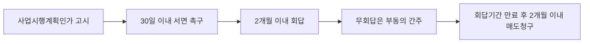
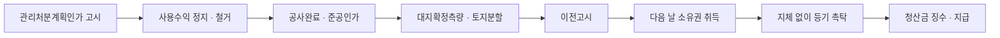

# 단원 PART02 — 도정법

> **법령 전체명**: 도시 및 주거환경정비법
> **출처 자료**: 감관법1 (스터디파이터)
> **수업 주제**: 정비계획·정비구역·정비사업·조합·관리처분

## 🗺️ 본문 목차

- [📗 관별 정리 (조문 기반)](#관별정리)
- [📖 핵심요약서 (L1 - 메인 단권화)](#핵심요약서)
- [📚 기본서 (L2 - 본격 학습)](#기본서)
- [✏️ 워크북 (논점별 문제)](#워크북)

---

## 📗 관별 정리 — 조문 기반 (관별 상세)

> 📌 법제처 정본 조문을 대조해 관(關)별로 저술한 상세 교재다. 아래 핵심요약서·기본서·워크북은 학원 교재 원문이다.

### [도정법] Chapter 01 총칙

> 📖 도정법은 「국토계획법」이 그려 놓은 도시계획의 틀 안에서, 이미 낡아버린 시가지를 **다시 짓는 절차**를 정한 법이다. 제1장 총칙(법 제1조~제3조, 영 제1조의2~제4조)은 이 법 전체가 쓰는 열쇠말 — 정비구역·정비사업 3종·노후불량건축물·정비기반시설·공동이용시설·토지등소유자 — 을 정의규정으로 못 박는다.
> 시험은 이 정의규정을 **문언 그대로** 묻거나, 시설 하나를 다른 범주로 옮겨 오답을 만든다. 총칙은 뒤에 나올 모든 관의 전제이므로 여기서 흔들리면 전 범위가 흔들린다.

> ⭐ **이 관에서 반드시 챙길 3가지**
> ① 정비사업 3종의 **정의 문언 구별** — 주거환경개선="정비기반시설이 ==극히 열악==", 재개발="정비기반시설이 ==열악==", 재건축="정비기반시설은 ==양호==하나 노후·불량 ==공동주택== 밀집"
> ② **정비기반시설 vs 공동이용시설** 목록 — 광장·녹지·하천·공공공지·공동구는 정비기반시설, 놀이터·마을회관·경로당은 공동이용시설. 거의 매년 출제된다
> ③ **토지등소유자**의 정의가 사업별로 다르다 — 주거환경개선·재개발은 "토지 **또는** 건축물의 소유자 또는 그 ==지상권자==", 재건축은 "건축물 **및 그 부속토지**의 소유자"(지상권자 제외)

#### 1. 개념·정의

> 📌 **도정법 제1조(목적)** — "이 법은 도시기능의 회복이 필요하거나 주거환경이 불량한 지역을 계획적으로 정비하고 노후ㆍ불량건축물을 효율적으로 개량하기 위하여 필요한 사항을 규정함으로써 도시환경을 개선하고 주거생활의 질을 높이는 데 이바지함을 목적으로 한다."

| 용어 | 정의(법 제2조) | 함정 포인트 |
|---|---|---|
| 정비구역 | 정비사업을 계획적으로 시행하기 위하여 **제16조에 따라 지정ㆍ고시된 구역** | 정비'예정'구역은 기본계획 단계의 개략 범위일 뿐 정비구역이 아니다 |
| 정비사업 | 이 법에서 정한 절차에 따라 **도시기능을 회복**하기 위하여 **정비구역에서** 정비기반시설을 정비하거나 주택 등 건축물을 개량 또는 건설하는 사업 | 주거환경개선·재개발·재건축 **3종뿐**. 가로주택정비·소규모재건축은 「빈집 및 소규모주택 정비에 관한 특례법」 소관 |
| 대지 | **정비사업으로 조성된 토지** | 「건축법」상 대지와 다르다 |
| 사업시행자 | 정비사업을 시행하는 자 | — |
| 토지주택공사등 | 「한국토지주택공사법」에 따른 한국토지주택공사 또는 「지방공기업법」에 따라 **주택사업을 수행하기 위하여 설립된 지방공사** | 지방공사 전부가 아니라 주택사업 수행 목적 지방공사 |
| 정관등 | ① 조합의 정관 ② 사업시행자인 토지등소유자가 자치적으로 정한 **규약** ③ 시장ㆍ군수등·토지주택공사등·신탁업자가 제53조에 따라 작성한 **시행규정** | 3종 세트로 묶어 외운다 |

> 📌 **도정법 제2조(정의) 제2호** — "가. 주거환경개선사업: 도시저소득 주민이 집단거주하는 지역으로서 정비기반시설이 극히 열악하고 노후ㆍ불량건축물이 과도하게 밀집한 지역의 주거환경을 개선하거나 단독주택 및 다세대주택이 밀집한 지역에서 정비기반시설과 공동이용시설 확충을 통하여 주거환경을 보전ㆍ정비ㆍ개량하기 위한 사업 / 나. 재개발사업: 정비기반시설이 열악하고 노후ㆍ불량건축물이 밀집한 지역에서 주거환경을 개선하거나 상업지역ㆍ공업지역 등에서 도시기능의 회복 및 상권활성화 등을 위하여 도시환경을 개선하기 위한 사업 / 다. 재건축사업: 정비기반시설은 양호하나 노후ㆍ불량건축물에 해당하는 공동주택이 밀집한 지역에서 주거환경을 개선하기 위한 사업"

**정비사업 3종 정의 대조표 — 이 표 하나가 매년 한 문항**

| 구분 | 지역 요건 | 대상 건축물 | 목적 |
|---|---|---|---|
| 주거환경개선사업 | 도시저소득 주민 집단거주 + 정비기반시설이 ==극히 열악== / 또는 ==단독주택·다세대주택== 밀집지역 | 노후ㆍ불량건축물이 과도하게 밀집 | 주거환경 개선 / 보전ㆍ정비ㆍ개량 |
| 재개발사업 | 정비기반시설이 ==열악== / 또는 ==상업지역ㆍ공업지역== 등 | 노후ㆍ불량건축물이 밀집 | 주거환경 개선 / ==도시기능 회복·상권활성화== |
| 재건축사업 | 정비기반시설은 ==양호== | 노후ㆍ불량건축물에 해당하는 ==공동주택==이 밀집 | 주거환경 개선 |

#### 2. 노후ㆍ불량건축물의 범위

> 📌 **도정법 제2조 제3호** — "가. 건축물이 훼손되거나 일부가 멸실되어 붕괴, 그 밖의 안전사고의 우려가 있는 건축물 / 나. 내진성능이 확보되지 아니한 건축물 중 중대한 기능적 결함 또는 부실 설계ㆍ시공으로 구조적 결함 등이 있는 건축물로서 대통령령으로 정하는 건축물 / 다. 다음의 요건을 모두 충족하는 건축물로서 대통령령으로 정하는 바에 따라 시ㆍ도조례로 정하는 건축물 …"

| 유형 | 세부기준 | 근거 |
|---|---|---|
| 안전사고 우려 | 훼손·일부 멸실로 붕괴 등 우려 | 법 제2조 제3호 가목 |
| 구조적 결함 | 설비·마감 노후화로 기능 유지 곤란 / 재건축진단 결과 내구성·내하력이 고시기준 미달 | 법 제2조 제3호 나목, 영 제2조 제1항 |
| 효용 대비 과다비용 | 준공일 기준 ==40년==까지 사용하기 위한 보수·보강 비용이 철거 후 신축 비용보다 클 것으로 예상 | 영 제2조 제2항 제3호 |
| 도시미관 저해·노후화 | 준공 후 ==20년 이상 30년 이하==의 범위에서 시ㆍ도조례로 정하는 기간이 지난 건축물 | 영 제2조 제3항 제1호 |

> 💡 "노후·불량건축물 = 30년 경과 건축물"이라고 단정하면 틀린다. **20년 이상 30년 이하의 범위에서 시ㆍ도조례**가 정한다.

#### 3. 정비기반시설 vs 공동이용시설 — 최다 출제 논점

> 📌 **도정법 제2조 제4호** — "정비기반시설이란 도로ㆍ상하수도ㆍ구거(溝渠: 도랑)ㆍ공원ㆍ공용주차장ㆍ공동구, 그 밖에 주민의 생활에 필요한 열ㆍ가스 등의 공급시설로서 대통령령으로 정하는 시설을 말한다."

> 📌 **도정법 제2조 제5호** — "공동이용시설이란 주민이 공동으로 사용하는 놀이터ㆍ마을회관ㆍ공동작업장, 그 밖에 대통령령으로 정하는 시설을 말한다."

| 구분 | 법률이 직접 열거 | 시행령 추가 |
|---|---|---|
| **정비기반시설** | 도로 · 상하수도 · ==구거(도랑)== · 공원 · 공용주차장 · 공동구 · 열ㆍ가스 등 공급시설 | ==녹지 · 하천 · 공공공지 · 광장== · 소방용수시설 · 비상대피시설 · 가스공급시설 · 지역난방시설 / 주거환경개선사업 정비구역에 설치하는 공동이용시설로서 **사업시행계획서에 시장ㆍ군수등이 관리하는 것으로 포함된 시설**(영 제3조) |
| **공동이용시설** | ==놀이터 · 마을회관 · 공동작업장== | 공동으로 사용하는 구판장ㆍ세탁장ㆍ화장실 및 수도 / ==탁아소ㆍ어린이집ㆍ경로당 등 노유자시설==(영 제4조) |

> ⚠️ 영 제3조 제9호가 결정적이다. **주거환경개선사업 정비구역**에서는 공동이용시설이라도 사업시행계획서에 시장ㆍ군수등 관리시설로 포함되면 **정비기반시설로 본다.** 그래서 기출 지문에 "단, 주거환경개선사업을 위하여 지정ㆍ고시된 정비구역이 아님"이라는 단서가 붙는다.
> 경찰서·소방서·주민센터 등은 정비기반시설도 공동이용시설도 **아니다**(공공시설).

#### 4. 주택단지 · 토지등소유자

> 📌 **도정법 제2조 제9호** — "토지등소유자란 다음 각 목의 어느 하나에 해당하는 자를 말한다. … 가. 주거환경개선사업 및 재개발사업의 경우에는 정비구역에 위치한 토지 또는 건축물의 소유자 또는 그 지상권자 / 나. 재건축사업의 경우에는 정비구역에 위치한 건축물 및 그 부속토지의 소유자"

| 사업 | 토지등소유자 | 지상권자 |
|---|---|---|
| 주거환경개선·재개발 | 토지 **또는** 건축물의 소유자 | ==포함== |
| 재건축 | 건축물 **및 그 부속토지**의 소유자 | ==제외== |

> 💡 **신탁 특례** — 제27조 제1항에 따라 신탁업자가 사업시행자로 지정된 경우, 토지등소유자가 정비사업을 목적으로 신탁한 토지·건축물에 대하여는 ==위탁자==를 토지등소유자로 본다(법 제2조 제9호 단서).

**주택단지(법 제2조 제7호)** — ① 「주택법」 제15조 사업계획승인을 받아 주택 및 부대·복리시설을 건설한 일단의 토지 ② 그중 도시ㆍ군계획시설인 도로 등으로 분리되어 따로 관리되는 각각의 토지 ③ 일단의 토지 둘 이상이 공동 관리되는 경우 그 전체 토지 ④ 제67조에 따라 분할된 토지 또는 분할되어 나가는 토지 ⑤ 「건축법」 제11조 건축허가를 받아 ==아파트 또는 연립주택==을 건설한 일단의 토지.

#### 5. 공공재개발사업 · 공공재건축사업

| 구분 | 시행자 요건 | 공급 요건 |
|---|---|---|
| 공공재개발사업 | 시장ㆍ군수등 또는 토지주택공사등이 주거환경개선사업 시행자, 재개발사업 시행자(제25조①·제26조①) 또는 재개발사업 대행자(제28조)일 것 | 토지등소유자 분양분을 제외한 나머지 주택 세대수·연면적의 ==100분의 20 이상 100분의 50 이하== 범위에서 시ㆍ도조례로 정하는 비율 이상을 지분형주택·공공임대주택·공공지원민간임대주택으로 건설ㆍ공급(법 제2조 제2호 나목2)) |
| 공공재건축사업 | 시장ㆍ군수등 또는 토지주택공사등이 제25조②·제26조① 재건축사업 시행자 또는 제28조① 대행자일 것 | 종전 세대수의 ==100분의 160== 이상 건설ㆍ공급(영 제1조의3 제1항) |

> 💡 공공재개발 공공임대주택 건설비율은 과밀억제권역 ==100분의 30 이상 40 이하==, 그 외 지역 ==100분의 20 이상 30 이하==(영 제1조의2 제1항).

#### 6. 도시ㆍ주거환경정비 기본방침

> 📌 **도정법 제3조(도시ㆍ주거환경정비 기본방침)** — "국토교통부장관은 도시 및 주거환경을 개선하기 위하여 10년마다 다음 각 호의 사항을 포함한 기본방침을 정하고, 5년마다 타당성을 검토하여 그 결과를 기본방침에 반영하여야 한다."

내용: ① 도시 및 주거환경 정비를 위한 국가 정책 방향 ② 기본계획의 수립 방향 ③ 노후ㆍ불량 주거지 조사 및 개선계획의 수립 ④ 도시 및 주거환경 개선에 필요한 ==재정지원계획== ⑤ 그 밖에 대통령령으로 정하는 사항.

#### 7. ⏱ 기간·수치 총정리

| 항목 | 기간·수치 | 근거 조문 |
|---|---|---|
| 기본방침 수립 주기 | ==10년==마다 | 법 제3조 |
| 기본방침 타당성 검토 | ==5년==마다 | 법 제3조 |
| 노후·불량건축물(도시미관 저해) | 준공 후 ==20년 이상 30년 이하==의 범위에서 시ㆍ도조례 | 영 제2조 제3항 제1호 |
| 노후·불량건축물(비용 비교) | 준공일 기준 ==40년==까지 사용 위한 보수·보강 비용 > 신축비용 | 영 제2조 제2항 제3호 |
| 공공재개발 임대 등 건설비율 | 100분의 20 이상 ==100분의 50 이하== 범위에서 시ㆍ도조례 | 법 제2조 제2호 나목2) |
| 공공재개발 공공임대주택 비율(과밀억제권역) | 100분의 30 이상 100분의 40 이하 | 영 제1조의2 제1항 제1호 |
| 공공재개발 공공임대주택 비율(그 외) | 100분의 20 이상 100분의 30 이하 | 영 제1조의2 제1항 제2호 |
| 공공재건축 세대수 | 종전 세대수의 ==100분의 160== | 영 제1조의3 제1항 |
| 공공재건축 세대수 완화 심의대상 | 전체 세대수 200세대 미만 등 | 영 제1조의2 제3항 제1호 |
| 주거환경개선사업 시행자 설립 법인 | 국가·지자체·토지주택공사등·공공기관이 총지분의 ==100분의 50 초과== 출자 | 법 제24조 제2항 제1호 나목 |

#### 8. 👤 권한 주체 구분

| 행위 | 주체 | 근거 |
|---|---|---|
| 도시ㆍ주거환경정비 **기본방침** 수립 | ==국토교통부장관== | 법 제3조 |
| "시장ㆍ군수등"의 범위 | 특별자치시장, 특별자치도지사, 시장, 군수, ==자치구의 구청장== | 법 제2조 제2호 나목1) |
| "시ㆍ도조례"의 범위 | 특별시ㆍ통합특별시ㆍ광역시ㆍ특별자치시ㆍ도ㆍ특별자치도 또는 인구 ==50만 이상 대도시==의 조례 | 법 제2조 제2호 나목2) |
| 정비구역 지정·고시 | 정비구역의 지정권자(제16조) | 법 제2조 제1호 |

#### ⭐ 기출 출제포인트

1. **정비기반시설이 아닌 것 / 공동이용시설인 것을 고르시오** — 광장·구거·녹지·공동구(정비기반시설) vs 놀이터·마을회관·경로당(공동이용시설)을 뒤섞어 묻는다. 2021년 40번 그대로.
2. **정비사업의 정의 문장을 주고 어느 사업인지 고르시오** — "도시저소득 주민이 집단거주 … 정비기반시설이 극히 열악" → 주거환경개선사업(2021년 39번).
3. **재개발사업의 정의라며 재건축사업의 정의를 제시** — "정비기반시설은 양호하나 노후ㆍ불량건축물에 해당하는 공동주택이 밀집한 지역" (2023년 37번 ①).
4. **토지등소유자에 해당하지 않는 자** — 재건축사업 정비구역에 위치한 건축물 부속토지의 지상권자.
5. **노후ㆍ불량건축물의 기간 기준** — "30년"으로 단정하는 지문 / "40년"을 보수·보강 비용 비교 기준이 아닌 경과연수로 바꾼 지문.

#### 📊 기출 분석

| 연도 | 출제 형태 | 핵심 논점 |
|---|---|---|
| 2021년 39번 | 정의 → 사업 매칭 | 주거환경개선사업의 정의 문언 |
| 2021년 40번 | 박스형 "정비기반시설이 아닌 것" | 광장·구거·녹지·공동구 vs 놀이터·마을회관 |
| 2023년 37번 ① | 옳은 것 고르기 | 재개발 정의와 재건축 정의 뒤바꾸기 |
| 2020년 37번 | 정비기반시설 아닌 것 | 경찰서는 공공시설이지 정비기반시설이 아님 |

**출제 빈도** — 총칙 단독으로 매년 1문항 안팎, 특히 **정비기반시설 목록**은 감평사·공인중개사 양쪽에서 반복된다.
**반복되는 함정** — ① 놀이터·마을회관·경로당을 정비기반시설로 제시 ② 재개발 정의에 "정비기반시설은 양호하나"를 끼워 넣기 ③ 재건축 토지등소유자에 지상권자 포함.
**최근 경향** — 정의규정 단독 출제가 줄고, 시행자·시행방법 문제의 **선지 하나**로 섞여 나온다. 정의를 안 외우면 다른 관 문제도 못 푼다.

#### 🔍 기출 선지로 배우는 조문

> 실제 출제된 선지를 놓고 O/X와 근거 조문을 확인한다.

**①** (2021년 40번) 광장·구거·녹지·공동구는 정비기반시설이다 — **O** / 근거: 법 제2조 제4호, 영 제3조 제1호·제3호·제4호. 광장·녹지·공공공지·하천은 시행령이 추가한 정비기반시설이다.

**②** (2021년 40번) 놀이터와 마을회관은 정비기반시설이다 — **X** / 어디가 틀렸나: 둘 다 **공동이용시설**이다 / 옳게 고치면: 놀이터·마을회관·공동작업장은 법 제2조 제5호의 공동이용시설이다.

**③** (2021년 39번) "도시저소득 주민이 집단거주하는 지역으로서 정비기반시설이 극히 열악하고 노후ㆍ불량건축물이 과도하게 밀집한 지역의 주거환경을 개선 … 하기 위한 사업"은 주거환경개선사업이다 — **O** / 근거: 법 제2조 제2호 가목.

**④** (2023년 37번 ①) 재개발사업이란 정비기반시설은 양호하나 노후ㆍ불량건축물에 해당하는 공동주택이 밀집한 지역에서 주거환경을 개선하기 위한 사업을 말한다 — **X** / 어디가 틀렸나: 이것은 **재건축사업**의 정의다 / 옳게 고치면: 재개발사업은 "정비기반시설이 열악하고 노후ㆍ불량건축물이 밀집한 지역에서 주거환경을 개선하거나 상업지역ㆍ공업지역 등에서 도시기능의 회복 및 상권활성화 등을 위하여 도시환경을 개선하기 위한 사업"이다.

**⑤** (2024년 공인중개사, 동일 논점 반복) 재건축사업 정비구역에 위치한 건축물 부속토지의 지상권자는 토지등소유자다 — **X** / 어디가 틀렸나: 재건축사업의 토지등소유자는 "건축물 및 그 부속토지의 **소유자**"뿐이다 / 옳게 고치면: 지상권자가 토지등소유자가 되는 것은 주거환경개선사업·재개발사업의 경우다(법 제2조 제9호).

**⑥** (2020년 37번) 경찰서는 정비기반시설이다 — **X** / 어디가 틀렸나: 경찰서·소방서·주민센터는 공공시설로서 법 제2조 제4호·영 제3조의 열거에 없다 / 옳게 고치면: **소방용수시설**은 정비기반시설이지만 소방서는 아니다.

**⑦** (2023년 공인중개사) 공동으로 사용하는 구판장은 정비기반시설이다 — **X** / 어디가 틀렸나: 구판장·세탁장·화장실·수도는 영 제4조 제1호의 **공동이용시설**이다.

#### ⚠️ 이 관의 함정 총정리

1. "정비사업이란 도시기능을 회복하기 위하여 **정비예정구역에서** 시행하는 사업"이라고 하면 틀림 → ==정비구역에서== 시행한다(법 제2조 제2호).
2. "노후·불량건축물은 준공 후 30년이 지난 건축물을 말한다"고 하면 틀림 → ==20년 이상 30년 이하의 범위에서 시ㆍ도조례==로 정하는 기간이 지난 건축물이다.
3. "탁아소·어린이집·경로당은 정비기반시설"이라고 하면 틀림 → ==공동이용시설==이다(영 제4조 제2호).
4. "재건축사업의 토지등소유자에는 지상권자가 포함된다"고 하면 틀림 → ==건축물 및 그 부속토지의 소유자==만이다.
5. "기본방침은 국토교통부장관이 5년마다 정하고 10년마다 타당성을 검토한다"고 하면 틀림 → ==10년마다 수립, 5년마다 타당성 검토==로 방향이 반대다(법 제3조).

#### ✅ OX 확인문제

> 다음 진술의 참·거짓을 판단하시오.

**1.** 국토교통부장관은 도시 및 주거환경을 개선하기 위하여 10년마다 기본방침을 정하고, 5년마다 타당성을 검토하여 그 결과를 기본방침에 반영하여야 한다.
→ **O**. 법 제3조. 수립 주기 10년, 타당성 검토 주기 5년이다.

**2.** 재건축사업은 정비기반시설이 열악하고 노후ㆍ불량건축물이 밀집한 지역에서 주거환경을 개선하기 위한 사업이다.
→ **X**. 그것은 재개발사업이다. 재건축사업은 "정비기반시설은 **양호**하나 노후ㆍ불량건축물에 해당하는 **공동주택**이 밀집한 지역"이 요건이다(법 제2조 제2호 다목).

**3.** 구거(도랑)는 법률이 직접 열거한 정비기반시설이다.
→ **O**. 법 제2조 제4호가 "도로ㆍ상하수도ㆍ구거(溝渠: 도랑)ㆍ공원ㆍ공용주차장ㆍ공동구"를 직접 열거한다.

**4.** 광장과 녹지는 시행령이 정한 정비기반시설이다.
→ **O**. 영 제3조 제1호(녹지)·제4호(광장). 하천·공공공지도 같다.

**5.** 주거환경개선사업을 위하여 지정ㆍ고시된 정비구역에 설치하는 공동이용시설은 어떤 경우에도 정비기반시설이 될 수 없다.
→ **X**. 사업시행계획서에 **시장ㆍ군수등이 관리하는 것으로 포함된 시설**이면 정비기반시설로 본다(영 제3조 제9호).

**6.** 재개발사업의 토지등소유자에는 정비구역에 위치한 토지의 지상권자가 포함된다.
→ **O**. 법 제2조 제9호 가목. 주거환경개선사업·재개발사업은 "토지 또는 건축물의 소유자 또는 그 지상권자"다.

**7.** "대지"란 정비구역에 위치한 모든 토지를 말한다.
→ **X**. 대지란 **정비사업으로 조성된 토지**를 말한다(법 제2조 제6호).

**8.** 신탁업자가 사업시행자로 지정된 경우 신탁된 토지에 대하여는 수탁자인 신탁업자를 토지등소유자로 본다.
→ **X**. **위탁자**를 토지등소유자로 본다(법 제2조 제9호 단서).

**9.** 「건축법」에 따른 건축허가를 받아 아파트 또는 연립주택을 건설한 일단의 토지는 주택단지에 해당한다.
→ **O**. 법 제2조 제7호 마목.

**10.** 공공재건축사업은 종전 세대수의 100분의 120 이상을 건설ㆍ공급하여야 한다.
→ **X**. **100분의 160**이다(영 제1조의3 제1항). 다만 도시ㆍ군기본계획 부합 곤란 등 불가피한 사유가 인정되면 예외가 있다.

#### 🧠 암기법

> 🔑 **정비기반시설 두문자 — "도상구공용공, 녹하공광 소비가지"**
> 법률: **도**로·**상**하수도·**구**거·**공**원·**용**(공용주차장)·**공**동구 / 시행령: **녹**지·**하**천·**공**공공지·**광**장·**소**방용수시설·**비**상대피시설·**가**스공급시설·**지**역난방시설

> 🔑 **공동이용시설 두문자 — "놀마작 + 구세화수 + 노유자"**
> **놀**이터·**마**을회관·공동**작**업장(법률) + **구**판장·**세**탁장·**화**장실·**수**도 + 탁아소·어린이집·경로당 등 **노유자**시설(시행령)

> 🔑 **3종 사업 열악도 사다리 — "극열 → 열 → 양"**
> 주거환경개선(**극**히 열악) → 재개발(**열**악) → 재건축(**양**호). 뒤로 갈수록 기반시설이 좋아진다.

> 🔑 **기본방침 "10 세우고 5 점검"**
> 국토교통부장관이 **10년마다 수립**, **5년마다 타당성 검토**. 기본'계획'도 10년 단위 수립·5년 타당성 검토로 같다.

### [도정법] Chapter 02 기본계획의 수립 및 정비구역의 지정

> 📖 정비사업은 곧바로 시작되지 않는다. ① 시·도 단위의 **도시ㆍ주거환경정비기본계획**이 큰 그림을 그리고 → ② 그 범위 안에서 **정비계획**을 입안해 → ③ **정비구역**을 지정·고시해야 비로소 사업의 무대가 열린다.
> 제2장(법 제4조~제22조, 영 제5조~제17조)은 이 세 단계의 **주체·기간·심의·공람**을 정하고, 사업이 지지부진하면 구역을 **해제**하는 일몰제까지 규정한다. 시험은 기간 숫자와 권한 주체를 바꿔 오답을 만든다.

> ⭐ **이 관에서 반드시 챙길 3가지**
> ① 기본계획 공람 ==14일==, 정비계획 공람 ==30일==, 해제 시 공람 ==30일== — 셋을 절대 섞지 마라
> ② **일몰제 숫자 세트** — 예정일부터 3년 / 지정·고시일부터 2년(추진위)·3년(추진위 미구성 조합설립) / 추진위 승인일부터 2년 / 조합설립인가일부터 3년 / 토지등소유자 재개발은 5년
> ③ **의무적 해제(하여야 한다)** vs **직권해제(할 수 있다)** — 조문 어미가 답을 가른다

#### 1. 도시ㆍ주거환경정비기본계획

> 📌 **도정법 제4조(도시ㆍ주거환경정비기본계획의 수립) 제1항** — "특별시장ㆍ광역시장ㆍ특별자치시장ㆍ특별자치도지사 또는 시장은 관할 구역에 대하여 도시ㆍ주거환경정비기본계획(이하 "기본계획"이라 한다)을 10년 단위로 수립하여야 한다. 다만, 도지사가 대도시가 아닌 시로서 기본계획을 수립할 필요가 없다고 인정하는 시에 대하여는 기본계획을 수립하지 아니할 수 있다."

| 구분 | 내용 | 근거 |
|---|---|---|
| 수립권자 | 특별시장ㆍ광역시장ㆍ특별자치시장ㆍ특별자치도지사 또는 ==시장==(군수는 수립권자가 아니다) | 법 제4조 제1항 |
| 수립 단위 | ==10년 단위== | 법 제4조 제1항 |
| 타당성 검토 | ==5년==마다 검토하여 결과를 반영 | 법 제4조 제2항 |
| 수립 생략 | ==도지사==가 대도시가 아닌 시로서 수립할 필요 없다고 인정하는 시 | 법 제4조 제1항 단서 |
| 주민공람 | ==14일 이상== | 법 제6조 제1항 |
| 지방의회 의견 | 통지한 날부터 ==60일 이내== 제시, 무응답 시 이의 없음으로 간주 | 법 제6조 제2항 |
| 협의·심의 | 관계 행정기관의 장과 협의 후 ==지방도시계획위원회== 심의 | 법 제7조 제1항 |
| 도지사 승인 | ==대도시의 시장이 아닌 시장==은 도지사의 승인을 받아야 함 | 법 제7조 제2항 |
| 고시·보고 | 지체 없이 지방자치단체 공보에 고시·열람, 국토교통부장관에게 보고 | 법 제7조 제3항·제4항 |

**기본계획의 내용(법 제5조 제1항) 13호**
① 정비사업의 기본방향 ② 정비사업의 계획기간 ③ 인구ㆍ건축물ㆍ토지이용ㆍ정비기반시설ㆍ지형 및 환경 등의 현황 ④ 주거지 관리계획 ⑤ 토지이용계획ㆍ정비기반시설계획ㆍ공동이용시설설치계획 및 교통계획 ⑥ 녹지ㆍ조경ㆍ에너지공급ㆍ폐기물처리 등에 관한 환경계획 ⑦ 사회복지시설 및 주민문화시설 등의 설치계획 ⑧ ==도시의 광역적 재정비를 위한 기본방향== ⑨ 정비예정구역의 개략적 범위 ⑩ 단계별 정비사업 추진계획 ⑪ 건폐율ㆍ용적률 등에 관한 건축물의 밀도계획 ⑫ ==세입자에 대한 주거안정대책== ⑬ 그 밖에 대통령령으로 정하는 사항.

> 💡 **생략 특례** — 기본계획에 ① 생활권의 설정, 생활권별 기반시설 설치계획 및 주택수급계획 ② 생활권별 주거지의 정비ㆍ보전ㆍ관리의 방향을 포함하면, **제9호(정비예정구역 개략범위)와 제10호(단계별 추진계획)를 생략**할 수 있다(법 제5조 제2항).

**경미한 변경(영 제6조 제4항) — 주민공람·지방의회 의견청취를 거치지 아니할 수 있는 경우**
① 정비기반시설의 규모 확대 또는 면적을 ==10퍼센트 미만==의 범위에서 축소 ② ==정비사업의 계획기간을 단축==하는 경우 ③ 공동이용시설 설치계획 변경 ④ 사회복지시설·주민문화시설 설치계획 변경 ⑤ 정비예정구역 면적을 ==20퍼센트 미만== 범위에서 변경 ⑥ 단계별 정비사업 추진계획 변경 ⑦ 건폐율·용적률을 각 ==20퍼센트 미만== 범위에서 변경 ⑧ 재원조달 사항 변경 ⑨ 도시ㆍ군기본계획 변경에 따른 변경.

> ⚠️ **계획기간을 "단축"**하면 경미한 변경이지만, **연장**은 경미한 변경이 아니다. 2019년 38번 ②가 정확히 이 지점을 물었다.

#### 2. 정비계획의 입안과 정비구역의 지정

> 📌 **도정법 제8조(정비구역의 지정) 제1항** — "특별시장ㆍ광역시장ㆍ특별자치시장ㆍ특별자치도지사ㆍ시장 또는 군수(광역시의 군수는 제외하며, 이하 "정비구역의 지정권자"라 한다)는 기본계획에 적합한 범위에서 노후ㆍ불량건축물이 밀집하는 등 대통령령으로 정하는 요건에 해당하는 구역에 대하여 제16조에 따라 정비계획을 결정하여 정비구역을 지정(변경지정을 포함한다)할 수 있다."

> 📌 **도정법 제8조 제5항** — "자치구의 구청장 또는 광역시의 군수(이하 제9조, 제11조 및 제20조에서 "구청장등"이라 한다)는 제9조에 따른 정비계획을 입안하여 특별시장ㆍ광역시장에게 정비구역 지정을 신청하여야 한다. 이 경우 제15조제2항에 따른 지방의회의 의견을 첨부하여야 한다."

| 구분 | 지정권자 | 입안권자 |
|---|---|---|
| 특별시·광역시 관할 자치구 | ==특별시장ㆍ광역시장== | 자치구의 구청장(신청) |
| 광역시 관할 군 | ==특별시장ㆍ광역시장==(광역시의 군수는 지정권자에서 **제외**) | 광역시의 군수(신청) |
| 특별자치시·특별자치도 | 특별자치시장·특별자치도지사 | 본인이 직접 입안 가능 |
| 시·군(광역시의 군 제외) | 시장·군수 | 본인이 직접 입안 가능 |

**정비계획의 내용(법 제9조 제1항)**
① 정비사업의 명칭 ② 정비구역 및 그 면적 ②의2 ==토지등소유자 유형별 분담금 추산액 및 산출근거== ③ ==도시ㆍ군계획시설의 설치에 관한 계획== ④ 공동이용시설 설치계획 ⑤ ==건축물의 주용도ㆍ건폐율ㆍ용적률ㆍ높이에 관한 계획== ⑥ 환경보전 및 재난방지에 관한 계획 ⑦ 정비구역 주변의 교육환경 보호에 관한 계획 ⑧ ==세입자 주거대책== ⑨ 정비사업시행 예정시기 ⑩ 공공지원민간임대주택·임대관리 위탁주택 관련 사항 ⑪ 「국토계획법」 제52조 제1항 각 호 사항에 관한 계획 ⑫ 그 밖에 대통령령으로 정하는 사항.

> ⚠️ **기본계획 vs 정비계획 구별** — "==도시의 광역적 재정비를 위한 기본방향=="과 "세입자에 대한 주거**안정대책**"은 **기본계획**의 내용이고, "==세입자 주거대책=="은 **정비계획**의 내용이다. 2025년 40번이 정확히 이 함정으로 출제되었다.

**입안 절차**

| 단계 | 내용 | 근거 |
|---|---|---|
| 주민 서면통보 + 주민설명회 + 공람 | ==30일 이상== 주민공람 | 법 제15조 제1항 |
| 지방의회 의견청취 | 통지일부터 ==60일 이내== 의견 제시, 무응답 시 이의 없음 | 법 제15조 제2항 |
| 관리청 의견청취 | 정비기반시설·국공유재산 귀속·처분 포함 시 미리 관리청 의견 | 법 제15조 제4항 |
| 심의 | ==지방도시계획위원회==의 심의(경미한 사항 변경은 생략 가능) | 법 제16조 제1항 |
| 고시 | 정비계획을 포함한 정비구역 지정 내용을 지방자치단체 공보에 고시 | 법 제16조 제2항 |
| 보고·열람 | 국토교통부장관에게 보고, 관계 서류 일반인 열람 | 법 제16조 제3항 |

**입안 요청과 입안 제안 — 구별이 핵심**

| 구분 | 주체 | 상대방 | 처리기한 |
|---|---|---|---|
| 정비계획 입안 **요청**(법 제13조의2) | 토지등소유자 또는 추진위원회 | 정비계획의 입안권자 | 요청일부터 ==4개월 이내== 입안 여부 결정·통지, ==2개월== 범위에서 ==한 차례만== 연장 |
| 정비계획 입안 **제안**(법 제14조) | 토지등소유자 또는 추진위원회(제5호는 사업시행자가 되려는 자) | 정비계획의 입안권자 | 제안서의 처리 등은 대통령령 |

> 💡 입안 **제안** 사유 중 자주 나오는 것 — ⑥ 토지등소유자(조합 설립 시 조합원)가 ==3분의 2 이상==의 동의로 정비계획 변경을 요청하는 경우, ⑦ 토지등소유자가 ==공공재개발사업 또는 공공재건축사업==을 추진하려는 경우(2024년 39번 ④).

#### 3. 정비구역 지정·고시의 효력과 행위제한

> 📌 **도정법 제17조(정비구역 지정ㆍ고시의 효력 등) 제1항** — "제16조제2항 전단에 따라 정비구역의 지정ㆍ고시가 있는 경우 해당 정비구역 및 정비계획 중 「국토의 계획 및 이용에 관한 법률」 제52조제1항 각 호의 어느 하나에 해당하는 사항은 같은 법 제50조에 따라 지구단위계획구역 및 지구단위계획으로 결정ㆍ고시된 것으로 본다."

> 📌 **도정법 제19조(행위제한 등) 제1항** — "정비구역에서 다음 각 호의 어느 하나에 해당하는 행위를 하려는 자는 시장ㆍ군수등의 허가를 받아야 한다. 허가받은 사항을 변경하려는 때에도 또한 같다. 1. 건축물의 건축 2. 공작물의 설치 3. 토지의 형질변경 4. 토석의 채취 5. 토지분할 6. 물건을 쌓아 놓는 행위 7. 그 밖에 대통령령으로 정하는 행위"

| 허가대상 행위 | 시행령의 구체화(영 제15조 제1항) |
|---|---|
| 건축물의 건축 등 | 건축물(가설건축물 포함)의 건축, ==용도변경==(대수선은 포함되지 않음) |
| 공작물의 설치 | 인공을 가하여 제작한 시설물의 설치 |
| 토지의 형질변경 | 절토·성토·정지·포장 등, 토지의 굴착 또는 공유수면의 매립 |
| 토석의 채취 | 흙·모래·자갈·바위 등의 채취 |
| 토지분할 | — |
| 물건을 쌓아놓는 행위 | 이동이 쉽지 아니한 물건을 ==1개월 이상== 쌓아놓는 행위 |
| 죽목의 벌채 및 식재 | 영 제15조 제1항 제7호 |

> 💡 **허가 없이 할 수 있는 행위**(법 제19조 제2항) — ① 재해복구·재난수습 응급조치 ② 기존 건축물 붕괴 등 안전사고 우려 시 안전조치 ③ 경작을 위한 토지의 형질변경, 관상용 죽목의 임시식재 등(영 제15조 제3항).
> **기득권 보호** — 정비구역 지정·고시 당시 이미 착수한 자는 지정·고시일부터 ==30일 이내== 시장ㆍ군수등에게 신고 후 계속 시행(법 제19조 제3항, 영 제15조 제4항).

**투기 방지를 위한 행위제한(법 제19조 제7항)** — 국토교통부장관, 시ㆍ도지사, 시장, 군수 또는 구청장은 기본계획을 공람 중인 정비예정구역 또는 정비계획을 수립 중인 지역에 대하여 ==3년 이내==의 기간(==1년==의 범위에서 ==한 차례만== 연장)을 정하여 ① 건축물의 건축 ② 토지의 분할 ③ 일반건축물대장을 집합건축물대장으로 전환 ④ 집합건축물대장 전유부분 분할을 제한할 수 있다.
또한 정비구역등에서는 「주택법」상 ==지역주택조합의 조합원을 모집해서는 아니 된다==(법 제19조 제8항).

#### 4. 정비구역등의 해제 — 일몰제

> 📌 **도정법 제20조(정비구역등의 해제) 제1항** — "정비구역의 지정권자는 다음 각 호의 어느 하나에 해당하는 경우에는 정비구역등을 해제하여야 한다. 1. 정비예정구역에 대하여 기본계획에서 정한 정비구역 지정 예정일부터 3년이 되는 날까지 … 정비구역을 지정하지 아니하거나 구청장등이 정비구역의 지정을 신청하지 아니하는 경우 …"

**의무적 해제(하여야 한다) — 법 제20조 제1항**

| 사유 | 기산점 | 기간 |
|---|---|---|
| 정비구역 미지정·미신청 | 기본계획이 정한 정비구역 ==지정 예정일== | ==3년== |
| 추진위원회 승인 미신청(추진위 구성하는 경우) | 정비구역 ==지정ㆍ고시일== | ==2년== |
| 조합설립인가 미신청(추진위 구성하지 않는 경우) | 정비구역 ==지정ㆍ고시일== | ==3년== |
| 추진위원회가 조합설립인가 미신청 | ==추진위원회 승인일== | ==2년== |
| 조합이 사업시행계획인가 미신청 | ==조합설립인가일== | ==3년== |
| 토지등소유자가 시행하는 재개발사업의 사업시행계획인가 미신청 | 정비구역 ==지정ㆍ고시일== | ==5년== |

**직권해제(할 수 있다) — 법 제21조 제1항**
① 정비사업의 시행으로 토지등소유자에게 **과도한 부담**이 발생할 것으로 예상되는 경우 ② 정비구역등의 추진 상황으로 보아 **지정 목적을 달성할 수 없다**고 인정되는 경우 ③ 토지등소유자의 ==100분의 30 이상==이 정비구역등(추진위원회가 구성되지 아니한 구역으로 한정)의 해제를 요청하는 경우 ④ 스스로개량방법으로 시행 중인 주거환경개선사업의 정비구역이 지정ㆍ고시된 날부터 ==10년 이상== 지나고 지정 목적을 달성할 수 없다고 인정되는 경우로서 토지등소유자의 ==과반수==가 해제에 동의하는 경우 ⑤ 추진위원회 구성 또는 조합 설립에 동의한 토지등소유자의 ==2분의 1 이상 3분의 2 이하==의 범위에서 시ㆍ도조례로 정하는 비율 이상의 동의로 해제를 요청하는 경우(사업시행계획인가 미신청에 한정) ⑥ 추진위원회가 구성되거나 조합이 설립된 정비구역에서 토지등소유자 ==과반수==의 동의로 해제를 요청하는 경우(사업시행계획인가 미신청에 한정).

> ⚠️ **의무적 해제도 심의를 거친다.** 법 제20조 제5항은 "정비구역의 지정권자는 … 정비구역등을 해제하려면 **지방도시계획위원회의 심의를 거쳐야 한다**"고 정한다. 직권해제(제21조 제1항)도 "지방도시계획위원회의 심의를 거쳐" 해제할 수 있다. **심의를 생략하는 해제는 없다.** 2019년 39번 ③이 "심의를 거치지 아니하고 해제할 수 있다"로 낚았다.

**해제 절차와 연장**

| 항목 | 내용 | 근거 |
|---|---|---|
| 주민공람 | ==30일 이상== | 법 제20조 제3항 |
| 지방의회 의견 | 통지일부터 ==60일 이내==, 무응답 시 이의 없음 | 법 제20조 제4항 |
| 심의 | 지방도시계획위원회(재정비촉진지구는 ==도시재정비위원회==) | 법 제20조 제5항 |
| 기간 연장 | 토지등소유자(조합 설립 시 조합원) ==100분의 30 이상==의 동의로 기간 도래 전 요청 시, 또는 존치 필요 인정 시 ==2년의 범위==에서 연장 | 법 제20조 제6항 |
| 고시·통보 | 지방자치단체 공보에 고시 + ==국토교통부장관에게 통보== + 관계 서류 열람 | 법 제20조 제7항 |

> 📌 **도정법 제22조(정비구역등 해제의 효력) 제1항** — "제20조 및 제21조에 따라 정비구역등이 해제된 경우에는 정비계획으로 변경된 용도지역, 정비기반시설 등은 정비구역 지정 이전의 상태로 환원된 것으로 본다."

> 💡 해제·고시되면 **추진위원회 구성승인 또는 조합설립인가는 취소된 것으로 보며**, 시장ㆍ군수등은 그 내용을 공보에 고시하여야 한다(법 제22조 제3항). 직권해제로 승인·인가가 취소되면 지정권자는 추진위원회·조합이 사용한 비용의 일부를 시ㆍ도조례로 정하는 바에 따라 **보조할 수 있다**(법 제21조 제3항).

#### 5. 정비구역의 분할·통합·결합, 재건축진단

> 📌 **도정법 제18조(정비구역의 분할, 통합 및 결합) 제1항** — "정비구역의 지정권자는 정비사업의 효율적인 추진 또는 도시의 경관보호를 위하여 필요하다고 인정하는 경우에는 다음 각 호의 방법에 따라 정비구역을 지정할 수 있다. 1. 하나의 정비구역을 둘 이상의 정비구역으로 분할 2. 서로 연접한 정비구역을 하나의 정비구역으로 통합 3. 서로 연접하지 아니한 둘 이상의 구역 또는 정비구역을 하나의 정비구역으로 결합"

> ⚠️ 재건축사업이라고 해서 분할이 금지되지 않는다. 2023년 37번 ②가 "재건축사업의 경우 분할하여 지정할 수 없다"로 출제되어 오답이었다.

**재건축진단(법 제12조·제13조)**

| 항목 | 내용 |
|---|---|
| 실시 주체 | ==시장ㆍ군수등== |
| 실시 시기 | 정비예정구역별 정비계획의 수립시기가 도래한 때부터 ==사업시행계획인가 전==까지 |
| 요청에 따른 실시 | 입안 요청·제안하려는 자 등이 건축물 및 그 부속토지 소유자 ==10분의 1 이상==의 동의를 받아 요청하는 경우 / 추진위원회 또는 사업시행자가 요청하는 경우 |
| 비용 | 요청자에게 부담하게 **할 수 있다** |
| 대상 | 주택단지(연접한 단지 포함)의 건축물. 대통령령으로 정하는 주택단지 건축물은 제외 가능 |
| 결과의 처리 | 시장ㆍ군수등이 결과와 도시계획·지역여건을 종합 검토하여 ==사업시행계획인가 여부==를 결정 |
| 적정성 검토 | 시ㆍ도지사가 ==국토안전관리원== 또는 ==한국건설기술연구원==에 의뢰 가능. 국토교통부장관은 시ㆍ도지사에게 결과보고서 제출·검토를 요청 가능 |

> ⚠️ **개정 반영** — 종전의 "안전진단"은 2024.12.3. 개정으로 ==재건축진단==으로 명칭·체계가 바뀌었다(법 제12조·제13조). 옛 교재의 "안전진단"·"안전진단 결과보고서" 표현은 현행법상 "재건축진단"으로 읽어야 한다.

#### 6. ⏱ 기간·수치 총정리

| 항목 | 기간·수치 | 근거 조문 |
|---|---|---|
| 기본계획 수립 단위 | ==10년== 단위 | 법 제4조 제1항 |
| 기본계획 타당성 검토 | ==5년==마다 | 법 제4조 제2항 |
| 기본계획 주민공람 | ==14일 이상== | 법 제6조 제1항 |
| 정비계획 주민공람 | ==30일 이상== | 법 제15조 제1항 |
| 정비구역등 해제 시 주민공람 | ==30일 이상== | 법 제20조 제3항 |
| 지방의회 의견 제시(공통) | ==60일 이내== | 법 제6조②·제15조②·제20조④ |
| 입안 요청 처리 | ==4개월 이내==(2개월 범위 1회 연장) | 법 제13조의2 제2항 |
| 입안 제안 동의(정비계획 변경) | 토지등소유자 ==3분의 2 이상== | 법 제14조 제1항 제6호 |
| 정비구역 지정 예정일 → 지정 | ==3년== | 법 제20조 제1항 제1호 |
| 지정·고시일 → 추진위 승인 신청 | ==2년== | 법 제20조 제1항 제2호 가목 |
| 지정·고시일 → 조합설립인가 신청(추진위 미구성) | ==3년== | 법 제20조 제1항 제2호 나목 |
| 추진위 승인일 → 조합설립인가 신청 | ==2년== | 법 제20조 제1항 제2호 다목 |
| 조합설립인가일 → 사업시행계획인가 신청 | ==3년== | 법 제20조 제1항 제2호 라목 |
| 지정·고시일 → 사업시행계획인가 신청(토지등소유자 재개발) | ==5년== | 법 제20조 제1항 제3호 |
| 해제기간 연장 | ==2년의 범위==, 토지등소유자 ==100분의 30 이상== 동의 | 법 제20조 제6항 |
| 직권해제(주거환경개선·스스로개량) | 지정ㆍ고시일부터 ==10년 이상== + 토지등소유자 ==과반수== 동의 | 법 제21조 제1항 제4호 |
| 직권해제 요청 동의율 | 토지등소유자 ==100분의 30 이상==(추진위 미구성 구역) | 법 제21조 제1항 제3호 |
| 투기방지 행위제한 | ==3년 이내==(==1년== 범위 1회 연장) | 법 제19조 제7항 |
| 기득권 신고 | 지정ㆍ고시일부터 ==30일 이내== | 영 제15조 제4항 |
| 물건 적치 허가대상 | ==1개월 이상== 쌓아놓는 행위 | 영 제15조 제1항 제6호 |
| 정비구역 면적 경미변경 | ==10퍼센트 미만== | 영 제13조 제4항 제1호 |
| 정비사업시행 예정시기 조정(경미) | ==3년의 범위== | 영 제13조 제4항 제5호 |
| 기본계획 정비예정구역 면적 경미변경 | ==20퍼센트 미만== | 영 제6조 제4항 제5호 |
| 재건축진단 요청 동의 | 건축물 및 그 부속토지 소유자 ==10분의 1 이상== | 법 제12조 제2항 |

#### 7. 👤 권한 주체 구분

| 행위 | 주체 | 근거 |
|---|---|---|
| 기본계획 수립 | 특별시장ㆍ광역시장ㆍ특별자치시장ㆍ특별자치도지사 또는 ==시장== | 법 제4조 제1항 |
| 기본계획 수립 생략 인정 | ==도지사== | 법 제4조 제1항 단서 |
| 기본계획 승인(대도시 시장이 아닌 시장) | ==도지사== | 법 제7조 제2항 |
| 정비구역 지정 | 특별시장ㆍ광역시장ㆍ특별자치시장ㆍ특별자치도지사ㆍ시장 또는 군수(==광역시의 군수 제외==) | 법 제8조 제1항 |
| 정비구역 지정 **신청** | 자치구의 구청장 또는 ==광역시의 군수==(구청장등) | 법 제8조 제5항 |
| 정비계획 입안 | 특별자치시장·특별자치도지사·시장·군수·구청장등 | 법 제9조 제3항 |
| 정비구역 내 개발행위 허가 | ==시장ㆍ군수등== | 법 제19조 제1항 |
| 투기방지 행위제한 | 국토교통부장관, 시ㆍ도지사, 시장, 군수 또는 구청장 | 법 제19조 제7항 |
| 정비구역등 해제 | ==정비구역의 지정권자== | 법 제20조 제1항, 제21조 제1항 |
| 해제 요청 | ==구청장등==이 특별시장ㆍ광역시장에게 | 법 제20조 제2항 |
| 재건축진단 실시 | ==시장ㆍ군수등== | 법 제12조 제1항 |
| 재건축진단 결과 적정성 검토 의뢰 | ==시ㆍ도지사== | 법 제13조 제2항 |
| 도시재생선도지역 지정 요청 | 정비구역의 지정권자 → ==국토교통부장관== | 법 제21조의2 |

#### ⭐ 기출 출제포인트

1. **기본계획 공람 14일 / 정비계획 공람 30일** 숫자 바꾸기 — 2019년 38번 ⑤가 "14일 이상"으로 정확히 출제되었다.
2. **경미한 변경 = 계획기간 "단축"** — "단축하는 경우에도 주민공람과 지방의회 의견청취를 거쳐야 한다"는 지문은 오답(2019년 38번 ②).
3. **일몰제 기간 세트 통암기** — 2년·3년·5년을 서로 바꿔 놓는다. 2024년 39번 ③은 "지정개발자가 사업시행자 지정일부터 3년"이라는 존재하지 않는 사유를 만들어냈다.
4. **해제와 지방도시계획위원회 심의** — "심의를 거치지 아니하고 해제할 수 있다"는 언제나 틀린다(2019년 39번 ③).
5. **기본계획 내용 vs 정비계획 내용 구별** — "도시의 광역적 재정비를 위한 기본방향"은 기본계획, "세입자 주거대책"은 정비계획(2025년 40번, 2022년 40번).
6. **광역시의 군수는 지정권자가 아니라 신청권자** — 2024년 39번 ①.

#### 📊 기출 분석

| 연도 | 출제 형태 | 핵심 논점 |
|---|---|---|
| 2019년 38번 | 옳지 않은 것 | 기본계획 공람 14일, 계획기간 단축의 경미변경, 도지사 승인 |
| 2019년 39번 | 옳지 않은 것 | 정비구역 분할·통합, 직권해제와 심의, 해제의 효력(환원) |
| 2022년 40번 | 박스형 모두 고르기 | 기본계획에 포함되어야 할 사항 |
| 2024년 39번 | 옳은 것 | 지정권자·행위허가 대상(용도변경)·일몰제·입안 제안·해제 효력 |
| 2025년 40번 | 박스형 모두 고르기 | 정비계획에 포함되어야 하는 사항 |

**출제 빈도** — PART02에서 **가장 안정적인 출제 구간**이다. 최근 8년 중 5개년에서 기본계획·정비구역이 단독 출제되었다.
**반복되는 함정** — ① 14일 ↔ 30일 ② 2년 ↔ 3년 ↔ 5년 ③ 기본계획 내용 ↔ 정비계획 내용 ④ "심의를 거치지 아니하고" ⑤ 광역시의 군수를 지정권자로 격상.
**최근 경향** — 2022·2025년처럼 **박스형(ㄱㄴㄷㄹ)으로 계획 내용 목록**을 묻는 형태가 굳어졌다. 목록 자체를 통으로 외워야 한다.

#### 🔍 기출 선지로 배우는 조문

> 실제 출제된 선지를 놓고 O/X와 근거 조문을 확인한다.

**①** (2019년 38번 ①) 도지사가 대도시가 아닌 시로서 기본계획을 수립할 필요가 없다고 인정하는 시에 대하여는 기본계획을 수립하지 아니할 수 있다 — **O** / 근거: 법 제4조 제1항 단서.

**②** (2019년 38번 ②) 정비사업의 계획기간을 단축하는 경우 기본계획의 수립권자는 주민공람과 지방의회의 의견청취 절차를 거쳐야 한다 — **X** / 어디가 틀렸나: 계획기간 **단축**은 경미한 변경이다 / 옳게 고치면: 주민공람과 지방의회 의견청취 절차를 **거치지 아니할 수 있다**(법 제6조 제3항, 영 제6조 제4항 제2호).

**③** (2019년 38번 ④) 대도시의 시장이 아닌 시장은 기본계획을 수립하려면 도지사의 승인을 받아야 한다 — **O** / 근거: 법 제7조 제2항. 다만 경미한 사항 변경은 승인을 받지 아니할 수 있다.

**④** (2019년 39번 ③) 정비사업의 시행으로 토지등소유자에게 과도한 부담이 발생할 것으로 예상되는 경우 지정권자는 지방도시계획위원회의 심의를 거치지 아니하고 정비구역등을 해제할 수 있다 — **X** / 어디가 틀렸나: 직권해제도 **지방도시계획위원회의 심의를 거쳐야** 한다 / 옳게 고치면: "지방도시계획위원회의 심의를 거쳐 정비구역등을 해제할 수 있다"(법 제21조 제1항).

**⑤** (2019년 39번 ②) 지정권자는 정비사업의 효율적인 추진을 위하여 필요하다고 인정하는 경우 하나의 정비구역을 둘 이상의 정비구역으로 분할하는 방법으로 정비구역을 지정할 수 있다 — **O** / 근거: 법 제18조 제1항 제1호.

**⑥** (2024년 39번 ①) 광역시의 군수가 정비계획을 입안한 경우에는 직접 정비구역을 지정할 수 있다 — **X** / 어디가 틀렸나: 광역시의 군수는 지정권자에서 **제외**된다 / 옳게 고치면: 자치구의 구청장 또는 광역시의 군수는 정비계획을 입안하여 **특별시장ㆍ광역시장에게 정비구역 지정을 신청**하여야 한다(법 제8조 제5항).

**⑦** (2024년 39번 ②) 정비구역에서 건축물의 용도만을 변경하는 경우에는 따로 시장ㆍ군수등의 허가를 받지 않아도 된다 — **X** / 어디가 틀렸나: **용도변경도 허가대상**이다 / 옳게 고치면: 영 제15조 제1항 제1호는 "건축물의 건축, **용도변경**"을 허가대상으로 명시한다.

**⑧** (2024년 39번 ③) 재개발사업을 시행하는 지정개발자가 사업시행자 지정일부터 3년이 되는 날까지 사업시행계획인가를 신청하지 않은 경우 해당 정비구역을 해제하여야 한다 — **X** / 어디가 틀렸나: 그런 의무적 해제 사유는 없다 / 옳게 고치면: **조합이 조합설립인가를 받은 날부터 3년**이 되는 날까지 사업시행계획인가를 신청하지 아니한 경우다(법 제20조 제1항 제2호 라목).

**⑨** (2024년 39번 ⑤) 정비구역이 해제된 경우에도 정비계획으로 변경된 용도지역, 정비기반시설 등은 정비구역 지정 이후의 상태로 존속한다 — **X** / 어디가 틀렸나: 지정 **이전**의 상태로 환원된다 / 옳게 고치면: 법 제22조 제1항.

**⑩** (2025년 40번 ㄴ) "도시의 광역적 재정비를 위한 기본방향"은 정비계획에 포함되어야 하는 사항이다 — **X** / 어디가 틀렸나: 그것은 **기본계획**의 내용이다(법 제5조 제1항 제8호) / 옳게 고치면: 정비계획에는 도시ㆍ군계획시설 설치계획, 건축물의 주용도ㆍ건폐율ㆍ용적률ㆍ높이 계획, 세입자 주거대책 등이 포함된다(법 제9조 제1항).

#### ⚠️ 이 관의 함정 총정리

1. "기본계획은 30일 이상 주민에게 공람"이라고 하면 틀림 → ==14일 이상==(정비계획·해제가 30일 이상).
2. "정비구역 지정·고시일부터 2년 내 조합설립인가를 신청하지 않으면 해제"라고 하면 틀림 → 추진위를 구성하지 않는 경우 ==3년==이다(2년은 **추진위원회 승인 신청** 기한 및 **추진위 승인일 → 조합설립인가 신청** 기한).
3. "정비구역등의 해제를 요청하려면 토지등소유자 100분의 20 이상의 동의"라고 하면 틀림 → 추진위 미구성 구역은 ==100분의 30 이상==, 추진위·조합이 있는 구역은 ==과반수==.
4. "재건축사업은 하나의 정비구역을 둘 이상으로 분할할 수 없다"고 하면 틀림 → ==사업 종류를 불문하고 분할·통합·결합이 가능==하다(법 제18조).
5. "정비구역에서 건축물의 대수선을 하려면 허가를 받아야 한다"고 하면 틀림 → 영 제15조 제1항 제1호는 ==건축과 용도변경==만 든다. 대수선은 열거되어 있지 않다.

#### ✅ OX 확인문제

> 다음 진술의 참·거짓을 판단하시오.

**1.** 기본계획의 수립권자는 기본계획을 수립하거나 변경하려는 경우 14일 이상 주민에게 공람하여 의견을 들어야 한다.
→ **O**. 법 제6조 제1항. 정비계획 입안 시의 30일 이상과 구별해야 한다.

**2.** 정비계획의 입안권자는 정비계획을 입안하려면 주민에게 서면으로 통보한 후 주민설명회 및 30일 이상 주민공람을 거쳐야 한다.
→ **O**. 법 제15조 제1항.

**3.** 지방의회는 기본계획을 통지받은 날부터 30일 이내에 의견을 제시하여야 한다.
→ **X**. **60일 이내**다. 60일이 지나면 이의가 없는 것으로 본다(법 제6조 제2항).

**4.** 광역시의 군수는 정비계획을 입안하여 스스로 정비구역을 지정한다.
→ **X**. 광역시의 군수는 지정권자에서 제외되며, 정비계획을 입안하여 **특별시장ㆍ광역시장에게 지정을 신청**하여야 한다(법 제8조 제1항·제5항).

**5.** 토지등소유자 또는 추진위원회의 정비계획 입안 요청이 있으면 입안권자는 요청일부터 4개월 이내에 입안 여부를 결정하여야 하며, 2개월의 범위에서 한 차례만 연장할 수 있다.
→ **O**. 법 제13조의2 제2항.

**6.** 정비구역에서 이동이 쉽지 아니한 물건을 15일간 쌓아놓는 행위는 시장ㆍ군수등의 허가를 받아야 한다.
→ **X**. 허가대상은 **1개월 이상** 쌓아놓는 행위다(영 제15조 제1항 제6호).

**7.** 조합이 조합설립인가를 받은 날부터 3년이 되는 날까지 사업시행계획인가를 신청하지 아니하면 정비구역의 지정권자는 정비구역등을 해제하여야 한다.
→ **O**. 법 제20조 제1항 제2호 라목. 의무적 해제 사유다.

**8.** 정비구역의 지정권자는 정비구역등의 토지등소유자가 100분의 30 이상의 동의로 기간 도래 전까지 연장을 요청하는 경우 해당 기간을 2년의 범위에서 연장하여 해제하지 아니할 수 있다.
→ **O**. 법 제20조 제6항 제1호.

**9.** 정비구역등이 해제·고시된 경우 추진위원회 구성승인 또는 조합설립인가는 그대로 유지된다.
→ **X**. **취소된 것으로 보고**, 시장ㆍ군수등이 그 내용을 공보에 고시하여야 한다(법 제22조 제3항).

**10.** 정비구역의 지정ㆍ고시가 있으면 정비계획 중 「국토계획법」 제52조 제1항 각 호에 해당하는 사항은 지구단위계획으로 결정ㆍ고시된 것으로 본다.
→ **O**. 법 제17조 제1항. 반대로 제9조 제1항 각 호를 모두 포함한 지구단위계획을 결정ㆍ고시하면 그 구역은 정비구역으로 지정ㆍ고시된 것으로 본다(같은 조 제2항).

#### 🧠 암기법

> 🔑 **공람일수 "기(基)14 · 정(整)30 · 해(解)30"**
> **기**본계획 14일, **정**비계획 30일, **해**제 30일. 지방의회는 언제나 **60일**.

> 🔑 **일몰제 사다리 "3 - 2 - 3 - 2 - 3 - 5"**
> 예정일→지정 **3**년 / 고시→추진위 **2**년 / 고시→조합(추진위 없이) **3**년 / 추진위승인→조합 **2**년 / 조합인가→사업시행 **3**년 / 고시→사업시행(토지등소유자 재개발) **5**년.
> 규칙: **추진위가 끼는 구간은 2년, 그 외는 3년, 토지등소유자 단독 재개발만 5년.**

> 🔑 **해제 동의율 "30 - 과반 - 절반에서 3분의 2"**
> 추진위 **없는** 구역 요청 = 100분의 **30** 이상 / 추진위·조합 **있는** 구역 요청 = **과반**수 / 동의자 기준 요청 = 2분의 1 이상 **3분의 2** 이하 범위 시ㆍ도조례.

> 🔑 **기본계획 vs 정비계획 갈림길 "광역은 기본, 세입자'주거대책'은 정비"**
> "도시의 **광역**적 재정비를 위한 기본방향" = 기본계획. "세입자에 대한 주거**안정대책**" = 기본계획, "세입자 **주거대책**" = 정비계획.

### [도정법] 제1절 시행자 및 사업시행계획

> 📖 정비구역이 지정되면 "**누가**(시행자) **어떤 방법으로**(시행방법) 사업을 하는가"가 정해지고, 그 조직(추진위원회 → 조합)이 만들어진 뒤 **사업시행계획인가**로 사업의 청사진이 확정된다.
> 이 관은 법 제3장 제1절~제4절(제23조~제71조)과 영 제18조~제58조를 아우른다. 도정법에서 **분량이 가장 크고 출제도 가장 잦은 구간**이다. 조합 임원·총회 논점만 최근 8년간 6회 출제되었다.

> ⭐ **이 관에서 반드시 챙길 3가지**
> ① **3종 사업의 시행자·시행방법 매트릭스** — 재건축은 오직 ==관리처분방법==, 수용도 환지도 없다
> ② **조합설립 동의요건** — 재개발 ==토지등소유자 4분의 3 + 토지면적 2분의 1==, 재건축 ==각 동 과반수 + 전체 구분소유자 100분의 70 + 토지면적 100분의 70==
> ③ **총회 직접출석 비율 3단** — 원칙 ==100분의 10==, 시공자 선정 ==과반수==, 창립·시공자선정취소·사업시행계획·관리처분·정비사업비 ==100분의 20==

#### 1. 정비사업의 시행방법 — 3종 매트릭스

> 📌 **도정법 제23조(정비사업의 시행방법) 제1항** — "주거환경개선사업은 다음 각 호의 어느 하나에 해당하는 방법 또는 이를 혼용하는 방법으로 한다. 1. 사업시행자가 정비구역에서 정비기반시설 및 공동이용시설을 새로 설치하거나 확대하고 토지등소유자가 스스로 주택을 보전ㆍ정비하거나 개량하는 방법 2. 사업시행자가 제63조에 따라 정비구역의 전부 또는 일부를 수용하여 주택을 건설한 후 토지등소유자에게 우선 공급하거나 대지를 … 공급하는 방법 3. 사업시행자가 제69조제2항에 따라 환지로 공급하는 방법 4. 사업시행자가 정비구역에서 제74조에 따라 인가받은 관리처분계획에 따라 주택 및 부대시설ㆍ복리시설을 건설하여 공급하는 방법"

> 📌 **도정법 제23조 제2항·제3항** — "② 재개발사업은 정비구역에서 제74조에 따라 인가받은 관리처분계획에 따라 건축물을 건설하여 공급하거나 제69조제2항에 따라 환지로 공급하는 방법으로 한다. ③ 재건축사업은 정비구역에서 제74조에 따라 인가받은 관리처분계획에 따라 건축물을 건설하여 공급하는 방법으로 한다. …"

| 시행방법 | 주거환경개선 | 재개발 | 재건축 |
|---|---|---|---|
| ==스스로개량== | ○ (제1호) | × | × |
| ==수용== | ○ (제2호) | × | × |
| ==환지== | ○ (제3호) | ○ | × |
| ==관리처분== | ○ (제4호) | ○ | ○ |

> ⚠️ **재건축은 관리처분방법이 유일**하다. "재건축사업은 관리처분계획에 따라 건축물을 공급하거나 **환지로 공급**하는 방법으로 한다"는 지문은 언제나 오답이다(2023년 37번 ③).
> 주거환경개선사업만 **혼용**이 가능하다.

> 💡 재건축으로 건설하는 건축물 중 주택·부대시설·복리시설을 제외한 건축물은 ==준주거지역 및 상업지역==에서만 건설할 수 있고, 그 연면적은 전체 건축물 연면적의 ==100분의 30 이하==여야 한다(법 제23조 제4항).

#### 2. 사업시행자

**(1) 주거환경개선사업(법 제24조)**

| 시행방법 | 시행자 | 동의요건 |
|---|---|---|
| 제1호(스스로개량) | ==시장ㆍ군수등이 직접 시행==. 토지주택공사등을 지정하려면 동의 필요 | 공람공고일 현재 토지등소유자의 ==과반수== |
| 제2호~제4호(수용·환지·관리처분) | 시장ㆍ군수등이 직접 시행하거나 ① 토지주택공사등, ② 국가·지자체·토지주택공사등·공공기관이 총지분의 ==100분의 50 초과== 출자로 설립한 법인을 지정. ①과 건설업자·등록사업자를 **공동시행자**로 지정 가능 | 공람공고일 현재 토지·건축물 소유자 또는 지상권자의 ==3분의 2 이상== 동의 **및** 세입자 세대수 ==과반수== 동의 |
| 천재지변 등 긴급 | 시장ㆍ군수등 직접 또는 토지주택공사등 지정 | ==동의 불요==. 다만 지체 없이 토지등소유자에게 사유·방법·시기 통보 |

> 💡 세입자 = 공람공고일 ==3개월 전==부터 해당 정비예정구역에 ==3개월 이상== 거주하고 있는 자. 세입자 세대수가 토지등소유자의 ==2분의 1 이하==인 경우 등에는 세입자 동의절차를 거치지 아니할 수 있다(법 제24조 제3항 단서).

**(2) 재개발·재건축사업(법 제25조)**

> 📌 **도정법 제25조 제1항** — "재개발사업은 다음 각 호의 어느 하나에 해당하는 방법으로 시행할 수 있다. 1. 조합이 시행하거나 조합이 조합원의 과반수의 동의를 받아 시장ㆍ군수등, 토지주택공사등, 건설업자, 등록사업자 또는 대통령령으로 정하는 요건을 갖춘 자와 공동으로 시행하는 방법 2. 토지등소유자가 20인 미만인 경우에는 토지등소유자가 시행하거나 토지등소유자가 토지등소유자의 과반수의 동의를 받아 … 공동으로 시행하는 방법"

| 구분 | 단독시행 | 공동시행 |
|---|---|---|
| 재개발 | 조합 / 토지등소유자가 ==20인 미만==인 경우 토지등소유자 | 조합 + 조합원 ==과반수== 동의 / 토지등소유자 + 토지등소유자 ==과반수== 동의 |
| 재건축 | 조합 | 조합 + 조합원 ==과반수== 동의로 시장ㆍ군수등·토지주택공사등·건설업자·등록사업자와 공동 |

> ⚠️ **재건축에는 "토지등소유자 20인 미만" 특례가 없다.** 재건축은 반드시 조합이 시행한다(공공시행자·지정개발자 지정은 별론).
> 반대로 "토지등소유자가 20인 미만인 경우에는 토지등소유자가 직접 재개발사업을 시행할 수 **없다**"는 지문은 오답이다(2019년 40번 ②, 2023년 37번 ⑤).

**(3) 공공시행자(법 제26조) — 시장ㆍ군수등 직접 시행 또는 토지주택공사등 지정**

① 천재지변, 「재난안전법」 제27조 또는 「시설물안전법」 제23조에 따른 사용제한ㆍ사용금지, 그 밖의 불가피한 사유로 긴급하게 시행할 필요
② 고시된 정비계획에서 정한 **정비사업시행 예정일부터 ==2년 이내==** 사업시행계획인가를 신청하지 아니하거나 신청 내용이 위법·부당한 때(==재건축사업은 제외==)
③ 추진위원회가 구성승인을 받은 날부터 ==3년 이내== 조합설립인가를 신청하지 아니하거나, 조합이 조합설립인가를 받은 날부터 ==3년 이내== 사업시행계획인가를 신청하지 아니한 때
④ 지방자치단체의 장이 시행하는 도시ㆍ군계획사업과 **병행**할 필요
⑤ 순환정비방식으로 시행할 필요
⑥ 제113조에 따라 **사업시행계획인가가 취소**된 때
⑦ 국ㆍ공유지 면적 또는 국ㆍ공유지와 토지주택공사등 소유 토지를 합한 면적이 전체 토지면적의 ==2분의 1 이상==으로서 토지등소유자 ==과반수==가 동의하는 때
⑧ 토지면적 ==2분의 1 이상==의 토지소유자와 토지등소유자의 ==3분의 2 이상==이 지정을 요청하는 때

> ⚠️ ②의 괄호가 함정이다. **"재건축사업의 경우는 제외"** — "재건축조합이 사업시행 예정일부터 2년 이내에 사업시행계획인가를 신청하지 아니할 때"는 공공시행자 지정 사유가 **아니다**(2021년 38번 ②).
> 공공시행자 지정·고시가 있으면 그 **고시일 다음 날**에 추진위원회 구성승인 또는 조합설립인가가 취소된 것으로 본다(법 제26조 제3항).

**(4) 지정개발자(법 제27조)**

| 항목 | 내용 |
|---|---|
| 지정개발자의 범위 | ==토지등소유자==, 「민간투자법」상 ==민관합동법인==, ==신탁업자==로서 대통령령 요건을 갖춘 자 |
| 지정 사유 | ① 천재지변 등 긴급 ② 정비사업시행 예정일부터 ==2년 이내== 미신청·위법부당(==재건축 제외==) ③ 제35조 **조합설립 동의요건 이상**에 해당하는 자가 신탁업자 지정에 동의하는 때 |
| 신탁업자의 사전 정보제공 | 동의 받기 **전에** 토지등소유자별 분담금 추산액 및 산출근거 등을 제공 |
| 동의서 필수기재 | 설계 개요 / 정비사업비 / 정비사업비의 분담기준(신탁보수 부담 포함) / 사업 완료 후 소유권의 귀속 / 시행규정 / ==신탁계약의 내용== |
| 효과 | 지정ㆍ고시일 **다음 날** 추진위 승인·조합설립인가 취소 간주 |
| 예치금 | 재개발사업에서 지정개발자가 **토지등소유자**인 때 정비사업비의 ==100분의 20== 범위에서 시ㆍ도조례로 정하는 금액 예치. ==청산금 지급 완료 시== 반환(법 제60조) |

**(5) 사업대행자(법 제28조)** — 시장ㆍ군수등은 ① 장기간 지연·분쟁 등으로 계속 추진이 어렵다고 인정하는 경우 ② 토지등소유자(조합 설립 시 조합원) ==과반수== 동의로 요청하는 경우, 직접 시행하거나 토지주택공사등·지정개발자에게 대행하게 할 수 있다. 사업대행자는 보수·비용상환 청구권으로 사업시행자에게 귀속될 **대지 또는 건축물을 압류**할 수 있다.

#### 3. 계약의 방법 및 시공자 선정

> 📌 **도정법 제29조(계약의 방법 및 시공자 선정 등) 제1항** — "추진위원장 또는 사업시행자(청산인을 포함한다)는 이 법 또는 다른 법령에 특별한 규정이 있는 경우를 제외하고는 계약(공사, 용역, 물품구매 및 제조 등을 포함한다)을 체결하려면 일반경쟁에 부쳐야 한다. 다만, 계약규모, 재난의 발생 등 대통령령으로 정하는 경우에는 입찰 참가자를 지명하여 경쟁에 부치거나 수의계약으로 할 수 있다."

| 시행자 | 시공자 선정 시기 | 방법 |
|---|---|---|
| 조합 | ==조합설립인가를 받은 후== 조합총회 | 경쟁입찰 또는 수의계약(==2회 이상 경쟁입찰이 유찰==된 경우로 한정) |
| 토지등소유자(재개발, 20인 미만) | ==사업시행계획인가를 받은 후== | 규약에 따라 선정 |
| 공공시행자·지정개발자 | ==사업시행자 지정ㆍ고시 후== | 경쟁입찰 또는 수의계약. 주민대표회의 또는 토지등소유자 전체회의가 **추천**하면 사업시행자는 추천받은 자를 시공자로 **선정하여야 한다** |

> 💡 조합은 시공자 선정 입찰 참가 건설업자·등록사업자가 정보를 제공할 수 있도록 **합동설명회를 ==2회 이상== 개최하여야 한다**(법 제29조 제8항). 시공자와 공사계약을 체결할 때에는 **기존 건축물의 철거 공사**(석면 조사·해체·제거 포함)에 관한 사항을 포함시켜야 한다(같은 조 제11항).

**공사비 검증 요청(법 제29조의2)** — 재개발·재건축 사업시행자(시장ㆍ군수등·토지주택공사등 단독·공동 시행은 제외)는 다음 경우 정비사업 지원기구에 공사비 검증을 **요청하여야 한다**.

| 사유 | 기준 |
|---|---|
| 조합원 등의 요청 | 토지등소유자 또는 조합원 ==5분의 1 이상== |
| 사업시행계획인가 **이전** 시공자 선정 | 증액 비율 ==100분의 10 이상== |
| 사업시행계획인가 **이후** 시공자 선정 | 증액 비율 ==100분의 5 이상== |
| 검증 완료 이후 재증액 | ==100분의 3 이상== |

#### 4. 조합설립추진위원회

> 📌 **도정법 제31조(조합설립추진위원회의 구성ㆍ승인) 제1항** — "조합을 설립하려는 경우에는 다음 각 호의 사항에 대하여 토지등소유자 과반수의 동의를 받아 조합설립을 위한 추진위원회를 구성하여 국토교통부령으로 정하는 방법과 절차에 따라 시장ㆍ군수등의 승인을 받아야 한다. … 1. 추진위원회 위원장(이하 "추진위원장"이라 한다)을 포함한 5명 이상의 추진위원회 위원 2. 제34조제1항에 따른 운영규정"

| 항목 | 내용 | 근거 |
|---|---|---|
| 구성 동의 | 토지등소유자 ==과반수== | 법 제31조 제1항 |
| 구성 인원 | 추진위원장을 포함한 ==5명 이상==의 추진위원 | 법 제31조 제1항 제1호 |
| 조직 | 추진위원회를 대표하는 ==추진위원장 1명과 감사==(부위원장·이사가 아니다) | 법 제33조 제1항 |
| 승인권자 | ==시장ㆍ군수등== | 법 제31조 제1항 |
| 동의 의제 | 추진위 구성에 동의한 자는 ==조합설립에 동의한 것으로 본다==(조합설립인가 신청 전 반대 의사표시 시 제외) | 법 제31조 제3항 |
| 공공지원 | 공공지원을 하려는 경우 추진위원회를 ==구성하지 아니할 수 있다== | 법 제31조 제7항 |
| 업무 인계 | 사용경비 회계장부·관계 서류를 ==조합설립인가일부터 30일 이내== 조합에 인계 | 법 제34조 제4항 |
| 권리·의무 승계 | 추진위원회 업무 관련 권리ㆍ의무는 ==조합이 포괄승계== | 법 제34조 제3항 |

> 📌 **도정법 제32조(추진위원회의 기능) 제1항** — "추진위원회는 다음 각 호의 업무를 수행할 수 있다. 1. 정비사업전문관리업자의 선정 및 변경 2. 설계자의 선정 및 변경 3. 개략적인 정비사업 시행계획서의 작성 4. 조합설립인가를 받기 위한 준비업무 5. 그 밖에 조합설립을 추진하기 위하여 대통령령으로 정하는 업무"

**영 제26조의 추가 업무** — ① 추진위원회 ==운영규정의 작성== ② 토지등소유자 ==동의서의 접수== ③ 조합설립을 위한 ==창립총회의 개최== ④ 조합 ==정관의 초안 작성== ⑤ 그 밖에 운영규정으로 정하는 업무.

> ⚠️ 추진위원회는 **정관의 "초안 작성"**만 할 수 있다. "==조합 정관의 변경=="은 조합 총회의 권한이므로 추진위원회 업무가 아니다(2018년 40번 ②). 정비사업전문관리업자 선정은 **추진위원회 승인을 받은 후** 경쟁입찰 또는 수의계약으로 해야 한다(법 제32조 제2항).

**창립총회(영 제27조)** — 추진위원회는 조합설립 동의를 받은 후 조합설립인가 신청 **전에** 창립총회를 개최하여야 하며, 창립총회 ==14일 전==까지 회의목적·안건·일시·장소 등을 인터넷 홈페이지에 공개하고 토지등소유자에게 ==등기우편==으로 발송·통지한다. 소집은 추진위원장의 직권 또는 토지등소유자 ==5분의 1 이상==의 요구. 의사결정은 토지등소유자 ==과반수 출석과 출석 과반수 찬성==. 처리사항은 ① 정관의 확정 ② 조합임원의 선임 ③ 대의원의 선임 ④ 사전 통지한 사항.

#### 5. 조합의 설립 — 동의요건이 핵심

> 📌 **도정법 제35조(조합설립인가 등) 제2항** — "재개발사업의 추진위원회 … 가 조합을 설립하려면 토지등소유자의 4분의 3 이상 및 토지면적의 2분의 1 이상의 토지소유자의 동의를 받아 다음 각 호의 사항을 첨부하여 제16조에 따른 정비구역 지정ㆍ고시 후 시장ㆍ군수등의 인가를 받아야 한다."

> 📌 **도정법 제35조 제3항** — "재건축사업의 추진위원회 … 가 조합을 설립하려는 때에는 주택단지의 공동주택의 각 동(복리시설의 경우에는 주택단지의 복리시설 전체를 하나의 동으로 본다)별 구분소유자의 과반수(복리시설로서 대통령령으로 정하는 경우에는 3분의 1 이상으로 한다) 동의(공동주택의 각 동별 구분소유자가 5 이하인 경우는 제외한다)와 주택단지의 전체 구분소유자의 100분의 70 이상 및 토지면적의 100분의 70 이상의 토지소유자의 동의를 받아 … 시장ㆍ군수등의 인가를 받아야 한다."

| 사업 | 동의요건 |
|---|---|
| **재개발** | 토지등소유자 ==4분의 3 이상== + 토지면적 ==2분의 1 이상==의 토지소유자 |
| **재건축**(주택단지) | 각 동별 구분소유자 ==과반수==(복리시설은 ==3분의 1 이상==, 각 동별 구분소유자 5 이하인 동은 제외) + 전체 구분소유자 ==100분의 70 이상== + 토지면적 ==100분의 70 이상== |
| **재건축**(주택단지가 아닌 지역이 포함된 때) | 그 지역 토지·건축물 소유자 ==4분의 3 이상== + 토지면적 ==3분의 2 이상== |
| **변경인가** | 총회에서 조합원 ==3분의 2 이상== 찬성 의결 후 인가. 경미한 사항은 총회 의결 없이 ==신고==(시장ㆍ군수등은 ==20일 이내== 수리 여부 통지) |

> ⚠️ **개정 반영** — 재건축 조합설립 동의요건은 종전 "전체 구분소유자 4분의 3 이상 및 토지면적 4분의 3 이상"이었으나, 2025.1.31. 개정으로 ==100분의 70 이상 / 100분의 70 이상==으로 완화되었다(법 제35조 제3항). 개정 전 기준으로 서술된 자료는 현행법과 다르다.

> 💡 **조합의 법인격(법 제38조)** — 조합은 법인으로 하고, ==조합설립인가를 받은 날부터 30일 이내== 주된 사무소 소재지에서 등기함으로써 **성립**한다. 명칭에 ==정비사업조합==이라는 문자를 사용하여야 한다.

**동의방법(법 제36조)** — 동의는 ==서면동의서 또는 전자서명동의서==를 제출하는 방법으로 하며, 서면동의서는 **성명을 적고 지장을 날인**하고 신분증명서 사본을 첨부한다. 추진위 구성 동의와 조합설립 동의(제35조 제2항~제4항)는 시장ㆍ군수등의 ==검인 또는 확인==을 받은 동의서를 사용해야 하며, 검인 없는 동의서는 **효력이 발생하지 아니한다**.

**동의 철회(영 제33조 제2항)** — 원칙적으로 해당 인·허가 신청 **전까지** 철회할 수 있으나, ① 직권해제 동의(법 제21조 제1항 제4호) ② 조합설립 동의는 최초 동의일부터 ==30일==까지만 철회할 수 있고, 조합설립 동의는 30일이 지나지 않았더라도 ==창립총회 후에는 철회할 수 없다==.

#### 6. 조합원·정관·임원

**조합원(법 제39조)** — 조합원은 토지등소유자(==재건축은 재건축사업에 동의한 자만==)로 하되, ① 토지·건축물 소유권과 지상권이 여럿의 공유 ② 여러 명의 토지등소유자가 1세대 ③ 조합설립인가 후 1명으로부터 양수하여 여러 명이 소유하게 된 때에는 **그 여럿을 대표하는 1명**을 조합원으로 본다.

> 💡 **투기과열지구 양수인의 조합원 자격 제한(법 제39조 제2항)** — ==재건축은 조합설립인가 후==, ==재개발은 관리처분계획인가 후== 양수한 자는 조합원이 될 수 없다(상속·이혼 제외). 다만 근무·생업·질병치료·취학·결혼으로 세대원 전원 이전, 상속, 해외이주 또는 2년 이상 해외체류, 1세대 1주택자로서 소유·거주기간 요건 충족 등은 예외.

**정관(법 제40조)** — 18개 법정 기재사항. 변경은 **총회를 개최하여 조합원 ==과반수== 찬성 + 시장ㆍ군수등 인가**. 다만 제2호(조합원의 자격)·제3호(제명ㆍ탈퇴 및 교체)·제4호(정비구역의 위치 및 면적)·제8호(비용부담 및 회계)·제13호(정비사업비의 부담 시기 및 절차)·제16호(시공자ㆍ설계자의 선정 및 계약서 내용)는 ==조합원 3분의 2 이상== 찬성. 경미한 사항은 ==신고==(20일 이내 수리 여부 통지).

> 💡 영 제39조의 **경미한 변경**에는 "조합임원의 수 및 업무의 범위에 관한 사항"이 포함된다. 2023년 36번 ①이 "조합임원의 수를 변경하려는 때에는 인가를 받아야 한다"고 물었는데, 이는 **신고** 사항이다.

> 📌 **도정법 제41조(조합의 임원) 제1항** — "조합은 조합원으로서 정비구역에 위치한 건축물 또는 토지 … 를 소유한 자[하나의 건축물 또는 토지의 소유권을 다른 사람과 공유한 경우에는 가장 많은 지분을 소유 … 한 경우로 한정한다] 중 다음 각 호의 어느 하나의 요건을 갖춘 조합장 1명과 이사, 감사를 임원으로 둔다. 이 경우 조합장은 선임일부터 제74조제1항에 따른 관리처분계획인가를 받을 때까지는 해당 정비구역에서 거주 … 하여야 한다. 1. 정비구역에 위치한 건축물 또는 토지를 5년 이상 소유할 것 2. 정비구역에서 거주하고 있는 자로서 선임일 직전 3년 동안 정비구역에서 1년 이상 거주할 것"

| 항목 | 내용 | 근거 |
|---|---|---|
| 구성 | 조합장 ==1명==, 이사, 감사 | 법 제41조 제1항 |
| 자격 | 정비구역 내 건축물·토지를 ==5년 이상 소유== 또는 ==선임일 직전 3년 동안 1년 이상 거주== | 법 제41조 제1항 |
| 공유의 경우 | ==가장 많은 지분을 소유==한 자만 임원이 될 수 있다 | 법 제41조 제1항 |
| 조합장 거주의무 | 선임일부터 ==관리처분계획인가를 받을 때까지== 정비구역 거주 | 법 제41조 제1항 후단 |
| 이사·감사의 수 | 이사 ==3명 이상==(토지등소유자 ==100인 초과== 시 ==5명 이상==), 감사 ==1명 이상 3명 이하== | 영 제40조 |
| 임기 | ==3년 이하==의 범위에서 정관으로 정하되, ==연임할 수 있다== | 법 제41조 제4항 |
| 전문조합관리인 | 임원이 ==6개월 이상== 선임되지 아니한 경우 등에 시장ㆍ군수등이 선정. 임기 ==3년== | 법 제41조 제5항, 영 제41조 제4항 |

> 📌 **도정법 제42조(조합임원의 직무 등)** — "① 조합장은 조합을 대표하고, 그 사무를 총괄하며, 총회 또는 제46조에 따른 대의원회의 의장이 된다. ② 제1항에 따라 조합장이 대의원회의 의장이 되는 경우에는 대의원으로 본다. ③ 조합장 또는 이사가 자기를 위하여 조합과 계약이나 소송을 할 때에는 감사가 조합을 대표한다. ④ 조합임원은 같은 목적의 정비사업을 하는 다른 조합의 임원 또는 직원을 겸할 수 없다."

> ⚠️ 자기거래·자기소송 시 조합을 대표하는 자는 ==감사==다. "이사가 대표"(2020년 39번 ③), "대의원회의 의장이 대표"(2019년 37번 ③), "주민대표회의 위원장이 대표"(2025년 37번 ②) 모두 오답이다.

**결격사유와 해임(법 제43조)** — ① 미성년자ㆍ피성년후견인ㆍ피한정후견인 ② 파산선고를 받고 복권되지 아니한 자 ③ 금고 이상 실형을 선고받고 집행 종료·면제된 날부터 ==2년==이 지나지 아니한 자 ④ 금고 이상 형의 집행유예를 받고 그 ==유예기간 중==에 있는 자 ⑤ 이 법을 위반하여 벌금 ==100만원 이상==의 형을 선고받고 ==10년==이 지나지 아니한 자 ⑥ 조합설립 인가권자에 해당하는 지방자치단체의 장, 지방의회의원 또는 그 배우자ㆍ직계존속ㆍ직계비속.

| 구분 | 효과 |
|---|---|
| 결격사유 발생 또는 선임 당시 해당 사실 판명 | ==당연 퇴임==(총회 의결 불요) |
| 퇴임된 임원이 퇴임 전에 관여한 행위 | ==효력을 잃지 아니한다== |
| 해임 | 조합원 ==10분의 1 이상==의 요구로 소집된 총회에서 ==조합원 과반수 출석과 출석 조합원 과반수 동의== |

#### 7. 총회·대의원회·주민대표회의

**총회의 소집(법 제44조)** — 조합장 직권 / 조합원 ==5분의 1 이상==(정관 중 조합임원의 권리ㆍ의무ㆍ보수ㆍ선임방법ㆍ변경 및 해임 사항을 변경하기 위한 총회는 ==10분의 1 이상==) / 대의원 ==3분의 2 이상==의 요구. 소집은 개최 ==7일 전==까지 통지. 조합임원이 ==6개월 이상== 선임되지 아니한 경우 ==시장ㆍ군수등==이 임원 선출을 위한 총회를 소집할 수 있다.

> 📌 **도정법 제45조(총회의 의결) 제10항** — "총회의 의결은 조합원의 100분의 10 이상이 직접 출석 … 하여야 한다. 다만, 시공자의 선정을 의결하는 총회의 경우에는 조합원의 과반수가 직접 출석하여야 하고, 창립총회, 시공자 선정 취소를 위한 총회, 사업시행계획서의 작성 및 변경, 관리처분계획의 수립 및 변경을 의결하는 총회 등 대통령령으로 정하는 총회의 경우에는 조합원의 100분의 20 이상이 직접 출석하여야 한다."

| 총회 종류 | 직접출석 비율 |
|---|---|
| 원칙 | 조합원 ==100분의 10 이상== |
| ==시공자의 선정==을 의결하는 총회 | 조합원 ==과반수== |
| 창립총회 / 시공자 ==선정 취소== 총회 / 사업시행계획서 작성·변경 / 관리처분계획 수립·변경 / 정비사업비 사용·변경 | 조합원 ==100분의 20 이상==(영 제42조 제3항) |

| 의결정족수 | 대상 |
|---|---|
| 조합원 과반수 출석 + 출석 조합원 과반수 찬성 | 원칙(법 제45조 제3항) |
| 조합원 ==과반수 찬성== | 사업시행계획서의 작성·변경, 관리처분계획의 수립·변경(법 제45조 제4항 본문) |
| 조합원 ==3분의 2 이상 찬성== | 정비사업비가 ==100분의 10 이상== 늘어나는 경우(생산자물가상승률분·제73조 손실보상 금액 제외) |

> 💡 서면 의결권 행사와 대리인(권한 행사 불가 시 배우자·직계존비속·형제자매 중 성년자, 해외 거주 조합원, 법인인 토지등소유자)의 의결권 행사는 **정족수 산정 시 출석한 것으로 본다**. 온라인총회는 총회와 **병행** 개최가 원칙이며, 재난 발생 등으로 시장ㆍ군수등이 직접 출석이 어렵다고 인정하는 경우에만 **단독 개최**할 수 있다(법 제44조의2).

**대의원회(법 제46조, 영 제43조·제44조)**

| 항목 | 내용 |
|---|---|
| 설치 의무 | 조합원의 수가 ==100명 이상==인 조합 |
| 구성 | 조합원의 ==10분의 1 이상==. 10분의 1이 100명을 넘으면 10분의 1의 범위에서 100명 이상으로 구성 가능 |
| 자격 | ==조합장이 아닌 조합임원은 대의원이 될 수 없다==(조합장은 대의원으로 본다) |
| 권한 | 총회 의결사항 중 **대통령령으로 정하는 사항 외에는** 총회의 권한을 대행 |
| 대행 불가 사항 | 정관 변경, 자금 차입, 조합원 부담 계약, 시공자ㆍ설계자ㆍ감정평가법인등의 선정·변경, 정비사업전문관리업자 선정·변경, 조합임원·대의원의 선임 및 해임(궐위 보궐선임 제외, ==조합장은 보궐선임도 불가==), 사업시행계획서 작성·변경, 관리처분계획 수립·변경, 조합의 합병·해산(사업완료 해산 제외), 설계 개요의 변경, 정비사업비의 변경 |
| 소집 | 조합장이 필요 시. 소집청구·대의원 ==3분의 1 이상== 청구 시 조합장은 해당일부터 ==14일 이내== 소집. 집회 ==7일 전==까지 서면 통지 |
| 의결 | 재적대의원 ==과반수 출석==과 출석대의원 ==과반수 찬성== |

**주민대표회의(법 제47조, 영 제45조)** — 토지등소유자가 시장ㆍ군수등 또는 토지주택공사등의 사업시행을 원하는 경우 ==정비구역 지정ㆍ고시 후== 구성하여야 한다. ==위원장을 포함하여 5명 이상 25명 이하==로 구성하고, 토지등소유자 ==과반수== 동의를 받아 시장ㆍ군수등의 ==승인==을 받는다. 위원장·부위원장 각 1명과 ==감사 1명 이상 3명 이하==를 둔다. 주민대표회의 또는 세입자는 시행규정을 정할 때 ① 건축물의 철거 ② 주민의 이주 ③ 토지·건축물의 보상 ④ 정비사업비의 부담 ⑤ 세입자에 대한 임대주택 공급 및 입주자격 등에 관하여 의견을 제시할 수 있다.

**토지등소유자 전체회의(법 제48조)** — 신탁업자가 사업시행자로 지정된 경우 토지등소유자 **전원**으로 구성. 사업시행자 직권 또는 토지등소유자 ==5분의 1 이상==의 요구로 소집.

#### 8. 사업시행계획인가

> 📌 **도정법 제50조(사업시행계획인가) 제1항** — "사업시행자(공동시행의 경우를 포함하되, 사업시행자가 시장ㆍ군수등인 경우는 제외한다)는 정비사업을 시행하려는 경우에는 제52조에 따른 사업시행계획서에 정관등과 그 밖에 국토교통부령으로 정하는 서류를 첨부하여 시장ㆍ군수등에게 제출하고 사업시행계획인가를 받아야 하고, 인가받은 사항을 변경하거나 정비사업을 중지 또는 폐지하려는 경우에도 또한 같다. 다만, 대통령령으로 정하는 경미한 사항을 변경하려는 때에는 시장ㆍ군수등에게 신고하여야 한다."

| 항목 | 내용 | 근거 |
|---|---|---|
| 인가권자 | ==시장ㆍ군수등== | 법 제50조 제1항 |
| 처리기한 | 제출이 있은 날부터 ==60일 이내== 인가 여부 결정·통보 | 법 제50조 제4항 |
| 경미한 변경 | ==신고==. 시장ㆍ군수등은 ==20일 이내== 수리 여부 통지, 미통지 시 그 기간 끝난 날 다음 날 ==수리 간주== | 법 제50조 제2항·제3항 |
| 총회 의결 | 사업시행자(시장ㆍ군수등·토지주택공사등 제외)는 신청 **전에** 미리 총회 의결. 경미한 변경은 불요 | 법 제50조 제5항 |
| 토지등소유자 재개발 | 신청 전 토지등소유자 ==4분의 3 이상== + 토지면적 ==2분의 1 이상== 동의. 변경은 규약에 따라 ==과반수== 동의 | 법 제50조 제6항 |
| 지정개발자 | 신청 전 토지등소유자 ==과반수== 동의 + 토지면적 ==2분의 1 이상== 토지소유자 동의 | 법 제50조 제7항 |
| 천재지변 공공시행자·지정개발자 | 동의 ==불요== | 법 제50조 제8항 |
| 공람 | 시장ㆍ군수등이 관계 서류 사본을 ==14일 이상== 일반인 공람 | 법 제56조 제1항 |
| 고시 | 인가·변경·중지·폐지 시 지방자치단체 공보에 고시(경미한 변경 제외) | 법 제50조 제9항 |

**사업시행계획인가의 경미한 변경(영 제46조)** — ① 정비사업비를 ==10퍼센트의 범위==에서 변경하거나 관리처분계획 인가에 따라 변경 ② 건축물이 아닌 부대시설ㆍ복리시설의 **설치규모를 확대**하는 때(==위치가 변경되는 경우는 제외==) ③ 대지면적을 ==10퍼센트의 범위==에서 변경 ④ 세대수·세대당 주거전용면적 불변으로 세대 내부구조 위치·면적을 10퍼센트 범위에서 변경 ⑤ ==내장재료 또는 외장재료==의 변경 ⑥ 인가 조건 이행에 따른 변경 ⑦ 건축물의 설계와 용도별 위치를 변경하지 아니하는 범위에서 배치 및 주택단지 안 도로선형 변경 ⑧ 「건축법 시행령」 제12조 제3항 각 호 사항 변경 ⑨ ==사업시행자의 명칭 또는 사무소 소재지== 변경 ⑩ 정비구역 또는 정비계획의 변경에 따른 변경 ⑪ 조합설립변경 인가에 따른 변경 ⑪의2 명백한 오류 정정 ⑪의3 사업시행기간의 단축·연장 ⑫ 시ㆍ도조례로 정하는 사항.

> ⚠️ 2024년 37번 정답 지점 — "건축물이 아닌 부대시설ㆍ복리시설의 **위치를 변경**하는 때"는 경미한 변경이 **아니다**. 경미한 것은 "설치규모를 **확대**하는 때(위치 변경 제외)"다.

**통합심의(법 제50조의2)** — 정비구역의 지정권자는 사업시행계획인가와 관련해 건축·경관·교육환경평가·도시ㆍ군관리계획·교통영향평가·성능위주설계·재해영향평가·환경영향평가 중 ==둘 이상==의 심의가 필요한 경우 **통합하여 검토·심의하여야 한다**. 시장ㆍ군수등은 특별한 사유가 없으면 통합심의 결과를 반영하여 인가하여야 하고, 통합심의를 거치면 해당 사항의 검토·심의·조사·협의·조정·재정을 거친 것으로 본다.

#### 9. 사업시행계획서의 작성

> 📌 **도정법 제52조(사업시행계획서의 작성) 제1항** — "사업시행자는 정비계획에 따라 다음 각 호의 사항을 포함하는 사업시행계획서를 작성하여야 한다. 1. 토지이용계획(건축물배치계획을 포함한다) 2. 정비기반시설 및 공동이용시설의 설치계획 3. 임시거주시설을 포함한 주민이주대책 4. 세입자의 주거 및 이주 대책 5. 사업시행기간 동안 정비구역 내 가로등 설치, 폐쇄회로 텔레비전 설치 등 범죄예방대책 6. 제10조에 따른 임대주택의 건설계획(재건축사업의 경우는 제외한다) 7. … 국민주택규모 주택의 건설계획(주거환경개선사업의 경우는 제외한다) …"

이어 ⑧ 공공지원민간임대주택 또는 임대관리 위탁주택의 건설계획 ⑨ 건축물의 높이 및 용적률 등에 관한 건축계획 ⑩ ==정비사업의 시행과정에서 발생하는 폐기물의 처리계획== ⑪ ==교육시설의 교육환경 보호에 관한 계획(정비구역부터 200미터 이내에 교육시설이 설치되어 있는 경우로 한정)== ⑫ 정비사업비 ⑬ 그 밖에 시ㆍ도조례로 정하는 사항.

> ⚠️ **괄호 조건이 함정이다.** 임대주택 건설계획은 ==재건축사업 제외==, 국민주택규모 주택 건설계획은 ==주거환경개선사업 제외==. 재개발사업의 사업시행계획서에는 **임시거주시설을 포함한 주민이주대책이 포함되어야 한다**(2023년 37번 ④, 옳은 지문).

**시행규정(법 제53조)** — 시장ㆍ군수등, 토지주택공사등 또는 신탁업자가 ==단독==으로 시행하는 경우 작성. 12개 항목 중 "관리처분계획 및 청산"은 ==수용의 방법으로 시행하는 경우 제외==된다.

#### 10. 인ㆍ허가등의 의제(법 제57조)

사업시행계획인가를 받은 때에는 「주택법」 사업계획승인, 「건축법」 건축허가·가설건축물 허가·건축협의, 「도로법」 도로공사 시행허가 및 도로 점용허가, 「사방사업법」 사방지 지정해제, 「농지법」 농지전용 허가·협의·신고, 「산지관리법」 산지전용허가, 「하천법」 하천공사 시행허가·==하천의 점용허가==·하천수 사용허가, 「수도법」 일반수도사업 인가, 「하수도법」 공공하수도 사업허가, 「유통산업발전법」 ==대규모점포등의 등록==, 「국유재산법」 사용허가(==재개발사업 한정==), 「국토계획법」 도시ㆍ군계획시설사업 시행자 지정 및 실시계획 인가, 「전기안전관리법」 ==자가용전기설비 공사계획의 인가 및 신고==, 「소방시설법」 건축허가등의 동의, 「도시공원 및 녹지 등에 관한 법률」 ==공원조성계획의 결정==, 「장애인등편의법」 편의시설 설치기준 적합성 확인 등이 있은 것으로 본다.

| 협의·확인 절차 | 기간 |
|---|---|
| 관계 행정기관의 장과 협의 → 의견 제출 | ==30일 이내==(미제출 시 협의 간주) |
| 정비구역부터 ==200미터 이내== 교육시설이 있는 경우 | 교육감 또는 교육장과 협의(변경 시에도 동일) |
| 의제 효과 | 관계 법률·시ㆍ도조례상 수수료와 국ㆍ공유지 사용료·점용료 ==면제== |

> ⚠️ 2026년 36번은 「토양환경보전법」 제12조 특정토양오염관리대상시설의 **신고**를 의제 목록에 끼워 넣었다. 법 제57조 제1항 각 호에 토양환경보전법은 **없다**.

#### 11. 정비사업 시행을 위한 조치

| 조치 | 내용 | 근거 |
|---|---|---|
| 임시거주시설 | ==주거환경개선사업 및 재개발사업==의 시행으로 철거되는 주택의 소유자·세입자에게 임시거주 조치. 국가·지자체·공공단체·개인의 시설이나 토지 일시 사용 가능, 국가·지자체는 정당한 사유 없이 거절 못 하며 ==사용료·대부료 면제== | 법 제61조 |
| 임시거주시설 철거 | 공사를 완료한 날부터 ==30일 이내== 철거하고 원상회복 | 법 제61조 제4항 |
| 임시상가 | ==재개발사업==의 사업시행자는 상가세입자용 임시상가를 설치할 수 있다 | 법 제61조 제5항 |
| 손실보상 | 공공단체(지자체 제외) 또는 개인의 시설·토지 일시 사용에 따른 손실 보상, 협의 불성립 시 ==토지수용위원회== 재결 신청 | 법 제62조 |
| 수용·사용 | 사업시행자는 정비사업을 위하여 토지·물건·권리를 수용 또는 사용할 수 있다. ==재건축은 제26조①1호·제27조①1호(천재지변 등 긴급) 사업으로 한정== | 법 제63조 |
| 사업인정 의제 | ==사업시행계획인가 고시==가 있은 때 「토지보상법」상 사업인정 및 그 고시가 있은 것으로 본다. 재결 신청은 ==사업시행기간 이내== | 법 제65조 |
| 지상권 등 계약 해지 | 설정 목적을 달성할 수 없으면 해지 가능, 전세금·보증금 반환청구권을 ==사업시행자==에게 행사, 사업시행자는 토지등소유자에게 구상·압류 | 법 제70조 |
| 소유자 확인 곤란 | 전국 배포 ==둘 이상의 일간신문에 2회 이상== 공고하고 공고한 날부터 ==30일 이상== 지난 때 감정평가액을 ==법원에 공탁==하고 시행 | 법 제71조 |

**재건축사업에서의 매도청구(법 제64조)**

| 단계 | 기간 | 비고 |
|---|---|---|
| 촉구 | 사업시행계획인가 고시일부터 ==30일 이내== | 조합설립 미동의자, 사업시행자 지정 미동의자에게 **서면**으로 |
| 회답 | 촉구받은 날부터 ==2개월 이내== | 무회답 시 ==동의하지 아니하겠다는 뜻==으로 간주 |
| 매도청구 | 회답기간 만료 후 ==2개월 이내== | 부동의자 + ==건축물 또는 토지만 소유한 자==에게 |

#### 12. ⏱ 기간·수치 총정리

| 항목 | 기간·수치 | 근거 조문 |
|---|---|---|
| 주거환경개선(스스로개량) 토지주택공사등 지정 동의 | 토지등소유자 ==과반수== | 법 제24조 제1항 |
| 주거환경개선(2~4호 방법) 동의 | 소유자·지상권자 ==3분의 2 이상== + 세입자 세대수 ==과반수== | 법 제24조 제3항 |
| 세입자 요건 | 공람공고일 ==3개월 전==부터 ==3개월 이상== 거주 | 법 제24조 제3항 |
| 세입자 동의 생략 | 세입자 세대수가 토지등소유자의 ==2분의 1 이하== 등 | 법 제24조 제3항 단서 |
| 토지등소유자 재개발 시행 요건 | 토지등소유자 ==20인 미만== | 법 제25조 제1항 제2호 |
| 공동시행 동의 | 조합원 또는 토지등소유자 ==과반수== | 법 제25조 |
| 공공시행자 지정(예정일 경과) | ==2년 이내== 미신청(재건축 제외) | 법 제26조 제1항 제2호 |
| 공공시행자 지정(추진위·조합 지연) | 각 ==3년 이내== 미신청 | 법 제26조 제1항 제3호 |
| 공공시행자 지정(국공유지 비율) | 전체 토지면적의 ==2분의 1 이상== + 토지등소유자 ==과반수== 동의 | 법 제26조 제1항 제7호 |
| 공공시행자 지정 요청 | 토지면적 ==2분의 1 이상== + 토지등소유자 ==3분의 2 이상== | 법 제26조 제1항 제8호 |
| 지정개발자 예치금 | 정비사업비의 ==100분의 20== 범위 시ㆍ도조례 | 법 제60조 제1항 |
| 공사비 검증 요청 | 조합원 ==5분의 1 이상== / 인가 전 선정 ==10%== / 인가 후 선정 ==5%== / 재검증 ==3%== | 법 제29조의2 |
| 합동설명회 | ==2회 이상== | 법 제29조 제8항 |
| 추진위 구성 동의 | 토지등소유자 ==과반수== | 법 제31조 제1항 |
| 추진위원 수 | 위원장 포함 ==5명 이상== | 법 제31조 제1항 제1호 |
| 추진위 서류 인계 | 조합설립인가일부터 ==30일 이내== | 법 제34조 제4항 |
| 창립총회 통지 | ==14일 전==까지 공개·등기우편 | 영 제27조 제2항 |
| 창립총회 소집요구 | 토지등소유자 ==5분의 1 이상== | 영 제27조 제3항 |
| 재개발 조합설립 동의 | 토지등소유자 ==4분의 3 이상== + 토지면적 ==2분의 1 이상== | 법 제35조 제2항 |
| 재건축 조합설립 동의 | 각 동 ==과반수==(복리시설 ==3분의 1 이상==) + 전체 구분소유자 ==100분의 70 이상== + 토지면적 ==100분의 70 이상== | 법 제35조 제3항 |
| 재건축(주택단지 아닌 지역) | ==4분의 3 이상== + 토지면적 ==3분의 2 이상== | 법 제35조 제4항 |
| 조합설립 변경인가 | 조합원 ==3분의 2 이상== 찬성 | 법 제35조 제5항 |
| 신고 수리 여부 통지 | ==20일 이내==(조합설립·정관·사업시행계획·관리처분 공통) | 법 제35조⑥·제40조⑤·제50조②·제74조② |
| 조합 성립 등기 | 조합설립인가일부터 ==30일 이내== | 법 제38조 제2항 |
| 조합설립 동의 철회 | 최초 동의일부터 ==30일==까지, ==창립총회 후 불가== | 영 제33조 제2항 |
| 정관 변경 | 조합원 ==과반수==(제2·3·4·8·13·16호는 ==3분의 2 이상==) | 법 제40조 제3항 |
| 임원 자격 | ==5년 이상 소유== 또는 직전 ==3년 동안 1년 이상 거주== | 법 제41조 제1항 |
| 이사 수 | ==3명 이상==(토지등소유자 ==100인 초과== 시 ==5명 이상==) | 영 제40조 |
| 감사 수 | ==1명 이상 3명 이하== | 영 제40조 |
| 조합임원 임기 | ==3년 이하==, 연임 가능 | 법 제41조 제4항 |
| 전문조합관리인 | 임원 ==6개월 이상== 미선임 시, 임기 ==3년== | 법 제41조 제5항, 영 제41조④ |
| 결격 — 실형 | 집행 종료·면제일부터 ==2년== | 법 제43조 제1항 제3호 |
| 결격 — 벌금 | ==100만원 이상==, ==10년== | 법 제43조 제1항 제5호 |
| 임원 해임 | 조합원 ==10분의 1 이상== 요구 + ==과반수 출석·출석 과반수 동의== | 법 제43조 제4항 |
| 총회 소집 요구 | 조합원 ==5분의 1 이상==(임원 관련 정관변경은 ==10분의 1 이상==), 대의원 ==3분의 2 이상== | 법 제44조 제2항 |
| 총회 통지 | 개최 ==7일 전==까지 | 법 제44조 제4항 |
| 시장ㆍ군수등의 총회 소집 | 임원 ==6개월 이상== 미선임 | 법 제44조 제3항 |
| 직접출석 | 원칙 ==100분의 10==, 시공자 선정 ==과반수==, 창립·시공자선정취소·사업시행계획·관리처분·정비사업비 ==100분의 20== | 법 제45조 제10항, 영 제42조③ |
| 정비사업비 증액 의결 | ==100분의 10 이상== 증가 시 조합원 ==3분의 2 이상== 찬성 | 법 제45조 제4항 단서 |
| 대의원회 설치 | 조합원 ==100명 이상== | 법 제46조 제1항 |
| 대의원회 구성 | 조합원 ==10분의 1 이상== | 법 제46조 제2항 |
| 대의원회 소집 | 청구일부터 ==14일 이내==, 집회 ==7일 전== 통지, 대의원 ==3분의 1 이상== 청구 | 영 제44조 |
| 주민대표회의 | ==5명 이상 25명 이하==, 토지등소유자 ==과반수== 동의, 감사 ==1~3명== | 법 제47조, 영 제45조 |
| 토지등소유자 전체회의 소집 | 토지등소유자 ==5분의 1 이상== | 법 제48조 제2항 |
| 사업시행계획인가 처리 | ==60일 이내== | 법 제50조 제4항 |
| 사업시행계획서 공람 | ==14일 이상== | 법 제56조 제1항 |
| 인ㆍ허가 의제 협의 | ==30일 이내== 의견 제출 | 법 제57조 제4항 |
| 교육환경 협의 대상 | 정비구역부터 ==200미터 이내== | 법 제57조 제5항 |
| 존치·리모델링 동의 | 구분소유자 ==3분의 2 이상== + 연면적 ==3분의 2 이상== | 법 제58조 제3항 |
| 임시거주시설 철거 | 공사 완료일부터 ==30일 이내== | 법 제61조 제4항 |
| 매도청구 촉구 | 인가 고시일부터 ==30일 이내== | 법 제64조 제1항 |
| 매도청구 회답 | ==2개월 이내== | 법 제64조 제2항 |
| 매도청구 행사 | 회답기간 만료 후 ==2개월 이내== | 법 제64조 제4항 |
| 소유자 확인 곤란 공고 | 일간신문 ==2회 이상==, ==30일 이상== 경과 후 공탁 | 법 제71조 제1항 |
| 재건축 용적률 특례 | 정비구역 용적률의 ==100분의 125 이하== 완화(세입자 손실보상 확대 시) | 법 제66조 제1항 |
| 토지분할 청구 심의 요건 | 관련 토지등소유자 수가 전체의 ==10분의 1 이하== | 법 제67조 제4항 |

#### 13. 👤 권한 주체 구분

| 행위 | 주체 | 근거 |
|---|---|---|
| 주거환경개선사업 시행자 지정 | ==시장ㆍ군수등== | 법 제24조 |
| 공공시행자·지정개발자 지정 | ==시장ㆍ군수등== | 법 제26조·제27조 |
| 사업대행자 지정 | ==시장ㆍ군수등== | 법 제28조 |
| 추진위원회 구성 승인 | ==시장ㆍ군수등== | 법 제31조 제1항 |
| 조합설립인가·변경인가 | ==시장ㆍ군수등== | 법 제35조 |
| 동의서 검인 | ==시장ㆍ군수등== | 법 제36조 제3항 |
| 전문조합관리인 선정 | ==시장ㆍ군수등== | 법 제41조 제5항 |
| 임원 미선임 시 총회 소집 | ==시장ㆍ군수등== | 법 제44조 제3항 |
| 사업시행계획인가 | ==시장ㆍ군수등== | 법 제50조 제1항 |
| 사업시행계획 통합심의 | ==정비구역의 지정권자== | 법 제50조의2 제1항 |
| 추진위원회 운영규정 고시 | ==국토교통부장관== | 법 제34조 제1항 |
| 표준정관 작성·보급 | ==시ㆍ도지사== | 법 제40조 제2항 |
| 신탁업자 표준계약서·표준시행규정 마련 | ==국토교통부장관== | 법 제27조 제6항 |
| 기부채납 운영기준 고시 | ==국토교통부장관== | 법 제51조 제2항 |
| 계약 방법·절차 고시 | ==국토교통부장관== | 법 제29조 제3항 |
| 자기거래·자기소송 시 조합 대표 | ==감사== | 법 제42조 제3항 |

#### ⭐ 기출 출제포인트

1. **재건축은 관리처분방법이 유일** — "환지로 공급하는 방법"을 끼워 넣는다(2023년 37번 ③).
2. **토지등소유자 20인 미만 재개발 직접시행** — "할 수 없다"는 지문이 두 해 연속 출제(2019년 40번 ②, 2023년 37번 ⑤).
3. **자기거래 시 조합 대표자 = 감사** — 이사·대의원회 의장·주민대표회의 위원장으로 바꿔 3회 이상 출제.
4. **조합임원 임기 3년 이하, 연임 가능** — "5년 이하·연임 불가"(2023년 36번 ④), "연임할 수 없다"(2019년 37번 ④).
5. **직접출석 비율 3단** — 시공자 선정 과반수 / 시공자 선정 취소는 100분의 20(2025년 39번 ④).
6. **추진위원회 업무 — 정관 "초안" 작성까지** — 정관 변경은 조합 총회 사항(2018년 40번 ②).
7. **사업시행계획인가 경미한 변경 목록** — "부대시설·복리시설의 위치 변경"은 경미하지 않다(2024년 37번).
8. **공공시행자 지정 사유에서 재건축 제외 괄호**(2021년 38번 ②).

#### 📊 기출 분석

| 연도 | 출제 형태 | 핵심 논점 |
|---|---|---|
| 2018년 40번 | 해당하지 않는 것 | 추진위원회의 업무 범위 |
| 2019년 37번 | 옳은 것 | 조합임원 결격·해임·대표·임기 |
| 2019년 40번 | 옳지 않은 것 | 시행방법·시행자·추진위·인가 처리기한 60일 |
| 2020년 39번 | 옳지 않은 것 | 추진위 조직, 자기거래 시 감사 대표, 대의원 자격 |
| 2021년 38번 | 해당하지 않는 것 | 공공시행자 지정 사유 8가지 |
| 2023년 36번 | 옳은 것 | 정관 경미변경, 총회 의결사항, 이사 수, 임기, 대의원회 |
| 2023년 37번 | 옳은 것 | 정비사업 정의·분할·시행방법·사업시행계획서·시행자 |
| 2024년 37번 | 해당하지 않는 것 | 사업시행계획인가의 경미한 변경 |
| 2025년 37번 | 옳지 않은 것 | 조합임원 임기·대표·총회 소집·거주의무 |
| 2025년 38번 | 박스형 모두 고르기 | 사업시행계획서 포함사항 |
| 2025년 39번 | 옳은 것 | 임원 자격(공유), 대의원, 겸직금지, 직접출석, 당연퇴임 |
| 2026년 36번 | 해당하지 않는 것 | 사업시행계획인가의 인ㆍ허가 의제 |
| 2026년 39번 | 조문 빈칸 | 추진위원회 구성·승인(과반수 / 5명) |

**출제 빈도** — PART02 문항의 ==절반 이상==이 이 관에서 나온다. 특히 **조합(임원·총회·대의원회)** 은 2018·2019·2020·2023·2025년에 반복 출제되었다.
**반복되는 함정** — ① 감사 → 이사/대의원회 의장/주민대표회의 위원장 ② 3년 → 5년(임기) ③ 재건축에 환지·수용 붙이기 ④ 20인 미만 재개발 부정 ⑤ 100분의 20 ↔ 과반수(직접출석).
**최근 경향** — 2025·2026년에는 **조문 문언 빈칸형**과 **박스형 목록 나열**이 늘었다. 목록(사업시행계획서·의제 인허가·추진위 업무)을 통으로 외우는 것이 유일한 대비책이다.

#### 🔍 기출 선지로 배우는 조문

> 실제 출제된 선지를 놓고 O/X와 근거 조문을 확인한다.

**①** (2018년 40번 ②) 조합설립추진위원회는 조합정관의 변경 업무를 수행할 수 있다 — **X** / 어디가 틀렸나: 추진위원회는 정관의 **초안 작성**까지만 가능하다 / 옳게 고치면: 정관 변경은 총회를 개최하여 조합원 과반수 찬성으로 시장ㆍ군수등의 인가를 받아야 한다(법 제40조 제3항, 영 제26조 제4호).

**②** (2019년 37번 ②) 조합임원은 조합원 10분의 1 이상의 요구로 소집된 총회에서 조합원 과반수의 출석과 출석 조합원 과반수의 동의를 받아 해임할 수 있다 — **O** / 근거: 법 제43조 제4항.

**③** (2019년 37번 ③ / 2020년 39번 ③ / 2025년 37번 ②) 조합장 또는 이사가 자기를 위하여 조합과 계약이나 소송을 할 때에는 대의원회의 의장(또는 이사, 주민대표회의 위원장)이 조합을 대표한다 — **X** / 어디가 틀렸나: 대표자는 ==감사==다 / 옳게 고치면: 법 제42조 제3항.

**④** (2019년 40번 ②, 2023년 37번 ⑤) 토지등소유자가 20인 미만인 경우에는 토지등소유자가 직접 재개발사업을 시행할 수 없다 — **X** / 어디가 틀렸나: 20인 미만이면 **토지등소유자가 시행할 수 있다** / 옳게 고치면: 법 제25조 제1항 제2호.

**⑤** (2019년 40번 ⑤) 조합이 사업시행자인 경우 시장ㆍ군수등은 특별한 사유가 없으면 사업시행계획서의 제출이 있은 날부터 60일 이내에 인가 여부를 결정하여 사업시행자에게 통보하여야 한다 — **O** / 근거: 법 제50조 제4항.

**⑥** (2021년 38번 ②) 재건축조합이 사업시행 예정일부터 2년 이내에 사업시행계획인가를 신청하지 아니할 때에는 시장ㆍ군수등이 직접 시행하거나 토지주택공사등을 사업시행자로 지정할 수 있다 — **X** / 어디가 틀렸나: 법 제26조 제1항 제2호는 ==재건축사업의 경우는 제외==한다 / 옳게 고치면: 재개발사업에만 적용되는 사유다.

**⑦** (2023년 36번 ③) 토지등소유자의 수가 100인을 초과하는 경우 조합에 두는 이사의 수는 7명 이상으로 한다 — **X** / 어디가 틀렸나: ==5명 이상==이다 / 옳게 고치면: 영 제40조. 기본은 이사 3명 이상, 감사 1명 이상 3명 이하.

**⑧** (2023년 36번 ④ / 2025년 37번 ①) 조합임원의 임기는 5년 이하의 범위에서 정관으로 정하되, 연임할 수 없다 — **X** / 어디가 틀렸나: ==3년 이하==의 범위에서 정하되 ==연임할 수 있다== / 옳게 고치면: 법 제41조 제4항.

**⑨** (2023년 37번 ③) 재건축사업은 관리처분계획에 따라 건축물을 공급하거나 환지로 공급하는 방법으로 한다 — **X** / 어디가 틀렸나: 재건축의 시행방법은 ==관리처분방법이 유일==하다 / 옳게 고치면: 환지 공급은 주거환경개선사업·재개발사업의 방법이다(법 제23조).

**⑩** (2024년 37번 ①) 건축물이 아닌 부대시설ㆍ복리시설의 위치를 변경하는 때는 사업시행계획인가의 경미한 변경이다 — **X** / 어디가 틀렸나: 경미한 것은 "설치규모를 **확대**하는 때"이고 ==위치가 변경되는 경우는 제외==된다 / 옳게 고치면: 영 제46조 제2호.

**⑪** (2025년 39번 ①) 조합원이 하나의 건축물 또는 토지를 다른 사람과 공유한 경우에도 조합의 임원이 되는 데 제한이 없다 — **X** / 어디가 틀렸나: ==가장 많은 지분을 소유한 자==만 임원이 될 수 있다 / 옳게 고치면: 법 제41조 제1항.

**⑫** (2025년 39번 ④) 시공자의 선정을 의결하는 총회 및 시공자 선정 취소를 위한 총회의 경우 조합원의 과반수가 직접 출석하여야 한다 — **X** / 어디가 틀렸나: 시공자 **선정**은 과반수지만, 시공자 선정 **취소**는 ==100분의 20 이상==이다 / 옳게 고치면: 법 제45조 제10항, 영 제42조 제3항 제1호의2.

**⑬** (2025년 39번 ⑤) 조합장이 선임 당시 결격사유에 해당하는 자임이 밝혀진 경우 당연퇴임하고, 퇴임된 임원이 퇴임 전에 관여한 행위는 그 효력을 잃는다 — **X** / 어디가 틀렸나: 퇴임 전 관여 행위는 ==효력을 잃지 아니한다== / 옳게 고치면: 법 제43조 제3항.

**⑭** (2026년 36번 ①) 「토양환경보전법」 제12조에 따른 특정토양오염관리대상시설의 신고는 사업시행계획인가로 의제된다 — **X** / 어디가 틀렸나: 법 제57조 제1항 각 호에 토양환경보전법은 ==없다== / 옳게 고치면: 하천 점용허가, 대규모점포등의 등록, 공원조성계획의 결정, 자가용전기설비 공사계획의 인가·신고는 모두 의제 대상이다.

**⑮** (2026년 39번) 조합을 설립하려면 토지등소유자 **과반수**의 동의를 받아 추진위원장을 포함한 **5명 이상**의 추진위원과 운영규정에 대하여 시장ㆍ군수등의 승인을 받아야 한다 — **O** / 근거: 법 제31조 제1항. 3분의 2 이상·7명·10명은 모두 오답 배치다.

#### ⚠️ 이 관의 함정 총정리

1. "재건축사업은 관리처분계획에 따라 공급하거나 **환지로 공급**하는 방법으로 한다"고 하면 틀림 → ==관리처분방법만== 가능하다(법 제23조 제3항).
2. "조합장이 자기를 위하여 조합과 소송을 할 때에는 **이사**가 조합을 대표한다"고 하면 틀림 → ==감사==가 대표한다(법 제42조 제3항).
3. "조합임원의 임기는 정관으로 정하되 **연임할 수 없다**"고 하면 틀림 → ==3년 이하의 범위에서 정하고 연임할 수 있다==.
4. "재건축 조합설립에는 전체 구분소유자의 **4분의 3 이상** 동의가 필요하다"고 하면 틀림 → 2025.1.31. 개정으로 ==100분의 70 이상==이다.
5. "시공자 선정 **취소**를 위한 총회는 조합원 **과반수**가 직접 출석해야 한다"고 하면 틀림 → ==100분의 20 이상==이다. 과반수는 시공자 **선정** 총회만.
6. "조합장이 아닌 조합임원도 대의원이 될 수 있다"고 하면 틀림 → ==될 수 없다==(법 제46조 제3항). 반대로 조합장은 대의원으로 본다(법 제42조 제2항).

#### ✅ OX 확인문제

> 다음 진술의 참·거짓을 판단하시오.

**1.** 주거환경개선사업은 스스로개량·수용·환지·관리처분 방법 또는 이를 혼용하는 방법으로 시행할 수 있다.
→ **O**. 법 제23조 제1항. 혼용이 가능한 것은 주거환경개선사업뿐이다.

**2.** 재건축사업은 조합이 조합원의 과반수의 동의를 받아 시장ㆍ군수등과 공동으로 시행할 수 있다.
→ **O**. 법 제25조 제2항.

**3.** 추진위원회는 추진위원회를 대표하는 추진위원장 1명과 감사를 두어야 한다.
→ **O**. 법 제33조 제1항. 이사는 두지 않는다.

**4.** 추진위원회는 사용경비를 기재한 회계장부 및 관계 서류를 조합설립인가일부터 60일 이내에 조합에 인계하여야 한다.
→ **X**. **30일 이내**다(법 제34조 제4항).

**5.** 조합은 조합설립인가를 받은 날부터 30일 이내에 주된 사무소의 소재지에서 등기하는 때에 성립한다.
→ **O**. 법 제38조 제2항.

**6.** 조합원의 수가 100명 이상인 조합은 대의원회를 두어야 하며, 대의원회는 조합원의 10분의 1 이상으로 구성한다.
→ **O**. 법 제46조 제1항·제2항.

**7.** 대의원회는 조합임원의 선임 및 해임에 관한 사항을 포함하여 총회의 모든 권한을 대행할 수 있다.
→ **X**. 영 제43조가 대행 불가 사항을 열거한다. 조합임원·대의원의 선임 및 해임은 대행할 수 없으며, 궐위된 자의 보궐선임만 예외인데 **조합장은 그 예외에서도 제외**된다.

**8.** 주민대표회의는 위원장을 포함하여 5명 이상 25명 이하로 구성하며, 토지등소유자의 과반수의 동의를 받아 시장ㆍ군수등의 승인을 받아야 한다.
→ **O**. 법 제47조 제2항·제3항.

**9.** 사업시행계획인가를 신청하려는 지정개발자는 토지등소유자의 4분의 3 이상 및 토지면적의 2분의 1 이상의 토지소유자의 동의를 받아야 한다.
→ **X**. 지정개발자는 토지등소유자의 **과반수** 동의와 토지면적 2분의 1 이상 토지소유자의 동의다(법 제50조 제7항). 4분의 3은 **토지등소유자가 시행하는 재개발사업**의 경우다(같은 조 제6항).

**10.** 재건축사업의 사업시행자는 사업시행계획인가의 고시가 있은 날부터 30일 이내에 조합설립에 동의하지 아니한 자에게 회답을 서면으로 촉구하여야 하고, 촉구를 받은 자는 2개월 이내에 회답하여야 한다.
→ **O**. 법 제64조 제1항·제2항. 회답하지 않으면 부동의로 보고, 사업시행자는 회답기간 만료 후 2개월 이내에 매도청구할 수 있다.

#### 🧠 암기법

> 🔑 **시행방법 매트릭스 "개(改)는 다 되고, 개발은 환·관, 건축은 관뿐"**
> 주거환경**개**선 = 스스로·수용·환지·관리처분 **전부** / 재**개**발 = **환**지·**관**리처분 / 재**건**축 = **관**리처분뿐.

> 🔑 **조합설립 동의 "재개발 3/4-1/2, 재건축 동과반-70-70"**
> 재개발: 사람 **4분의 3**, 땅 **2분의 1** / 재건축: 각 **동 과반**수 + 전체 **70** + 토지면적 **70**. 주택단지 아닌 지역만 3/4·2/3.

> 🔑 **직접출석 "십(十)이 기본, 시공선정은 반, 나머지 큰 건 이십(二十)"**
> 원칙 **10%** → 시공자 **선정**은 **과반수** → 창립·시공자선정**취소**·사업시행계획·관리처분·정비사업비는 **20%**.

> 🔑 **매도청구 시계 "30 - 2 - 2"**
> 인가 고시 후 **30일** 내 촉구 → **2개월** 내 회답 → 회답기간 만료 후 **2개월** 내 매도청구.

> 🔑 **임원 결격 "미파 실2 유중 벌100-10 지방장의"**
> **미**성년·피성년/피한정후견인, **파**산 미복권, 실형 종료·면제 후 **2**년, 집행**유**예 기간 **중**, 이 법 위반 **벌금 100**만원 이상 **10**년, 인가권자 **지방**자치단체의 **장**·지방의회의원·배우자·직계존비속.

### [도정법] 제2절 관리처분계획 및 소유권이전

> 📖 사업시행계획인가로 "무엇을 짓는가"가 정해지면, **관리처분계획**은 "누가 어느 것을 받고 얼마를 더 내는가"를 정한다. 종전 재산과 종후 재산을 **환지처럼 바꿔치기**하는 이 계획이 인가·고시되면 종전 부동산은 사용·수익이 정지되고, 공사가 끝나면 **준공인가 → 이전고시 → 등기 → 청산금**으로 권리관계가 최종 확정된다.
> 법 제3장 제5절·제6절(제72조~제91조)과 영 제59조~제76조가 대상이며, 여기에 비용부담(법 제92조~제101조)을 덧붙인다. **감정평가사 시험에서 도정법 최대 빈출 구간**이다. 관리처분계획의 내용·기간·감정평가 주체가 매년 나온다.

> ⭐ **이 관에서 반드시 챙길 3가지**
> ① **기간 3종** — 분양통지·공고 ==90일 이내==, 분양신청기간 ==30일 이상 60일 이내==, 관리처분 공람 ==30일 이상==·인가 ==30일 이내==(타당성 검증 시 ==60일 이내==)
> ② **감정평가 주체** — 주거환경개선·재개발은 ==시장ㆍ군수등이 선정·계약한 2인 이상==, 재건축은 ==시장ㆍ군수등 1인 이상 + 조합총회 의결로 선정한 1인 이상==
> ③ **소유권 취득 시점** — ==이전고시가 있은 날의 다음 날==. 청산금 시효도 ==이전고시일의 다음 날부터 5년==

#### 1. 분양공고 및 분양신청

> 📌 **도정법 제72조(분양공고 및 분양신청) 제1항** — "사업시행자는 제50조제9항에 따른 사업시행계획인가의 고시가 있은 날(사업시행계획인가 이후 시공자를 선정한 경우에는 시공자와 계약을 체결한 날)부터 90일(대통령령으로 정하는 경우에는 1회에 한정하여 30일의 범위에서 연장할 수 있다) 이내에 다음 각 호의 사항을 토지등소유자에게 통지하고, 분양의 대상이 되는 대지 또는 건축물의 내역 등 대통령령으로 정하는 사항을 해당 지역에서 발간되는 일간신문에 공고하여야 한다. 다만, 토지등소유자 1인이 시행하는 재개발사업의 경우에는 그러하지 아니하다."

> 📌 **도정법 제72조 제2항** — "제1항제3호에 따른 분양신청기간은 통지한 날부터 30일 이상 60일 이내로 하여야 한다. 다만, 사업시행자는 제74조제1항에 따른 관리처분계획의 수립에 지장이 없다고 판단하는 경우에는 분양신청기간을 20일의 범위에서 한 차례만 연장할 수 있다."

| 항목 | 기간·내용 | 근거 |
|---|---|---|
| 통지·공고 기산점 | 사업시행계획인가 고시일. 인가 **이후** 시공자를 선정한 경우 ==시공자와 계약을 체결한 날== | 법 제72조 제1항 |
| 통지·공고 기한 | ==90일 이내==(재개발사업 중 시ㆍ도조례로 정하는 면적 이상인 사업은 ==1회에 한정, 30일== 범위 연장) | 법 제72조 제1항, 영 제59조 제1항 |
| 통지사항 | ① 분양대상자별 종전 토지·건축물의 명세 및 **사업시행계획인가 고시일 기준 가격** ② 분양대상자별 ==분담금의 추산액== ③ ==분양신청기간== ④ 대통령령으로 정하는 사항 | 법 제72조 제1항 |
| 분양신청기간 | 통지한 날부터 ==30일 이상 60일 이내==, ==20일==의 범위에서 ==한 차례만== 연장 | 법 제72조 제2항 |
| 예외 | ==토지등소유자 1인이 시행하는 재개발사업==은 통지·공고 불요 | 법 제72조 제1항 단서 |
| 재공고 | 분양신청기간 종료 후 사업시행계획 변경으로 세대수·주택규모가 달라지면 절차를 다시 거칠 수 **있다** | 법 제72조 제4항 |
| 투기과열지구 제한 | 분양대상자 및 그 세대에 속한 자는 분양대상자 선정일(조합원 분양분은 ==최초 관리처분계획 인가일==)부터 ==5년 이내== 투기과열지구에서 분양신청 불가(상속·결혼·이혼 제외) | 법 제72조 제6항 |

> 💡 재개발사업에서 토지등소유자가 종전 재산 외에 **비용 일부를 부담하고 주택 외 대지·건축물을 분양받으려는** 때에는 분양신청 시 의사를 분명히 하고 법 제72조 제1항 제1호 가격의 ==10퍼센트==에 상당하는 금액을 납입하여야 한다(영 제59조 제5항).

#### 2. 분양신청을 하지 아니한 자 등에 대한 조치

> 📌 **도정법 제73조(분양신청을 하지 아니한 자 등에 대한 조치)** — "① 사업시행자는 관리처분계획이 인가ㆍ고시된 다음 날부터 90일 이내에 다음 각 호에서 정하는 자와 토지, 건축물 또는 그 밖의 권리의 손실보상에 관한 협의를 하여야 한다. 다만, 사업시행자는 분양신청기간 종료일의 다음 날부터 협의를 시작할 수 있다. ② 사업시행자는 제1항에 따른 협의가 성립되지 아니하면 그 기간의 만료일 다음 날부터 60일 이내에 수용재결을 신청하거나 매도청구소송을 제기하여야 한다."

| 단계 | 기간 | 비고 |
|---|---|---|
| 손실보상 협의 | 관리처분계획이 인가ㆍ고시된 ==다음 날부터 90일 이내== | ==분양신청기간 종료일의 다음 날==부터 협의를 시작할 수 있다 |
| 수용재결 신청 또는 매도청구소송 | 협의기간 ==만료일 다음 날부터 60일 이내== | 초과 시 ==지연일수에 따른 이자== 지급 |
| 지연이자 | ==100분의 15 이하==의 범위에서 대통령령 | 6개월 이내 ==5%== / 6개월 초과 12개월 이내 ==10%== / 12개월 초과 ==15%==(영 제60조 제2항) |

**대상자** — ① 분양신청을 하지 아니한 자 ② 분양신청기간 종료 이전에 ==분양신청을 철회==한 자 ③ 투기과열지구 5년 제한으로 분양신청을 할 수 없는 자 ④ 인가된 관리처분계획에 따라 ==분양대상에서 제외==된 자.

> ⚠️ "관리처분계획이 인가ㆍ고시된 **날부터** 90일"이 아니라 ==다음 날부터 90일==이다. 2024년 40번 ③이 이 한 글자를 물었다.

#### 3. 관리처분계획의 인가 — 내용과 감정평가

> 📌 **도정법 제74조(관리처분계획의 인가 등) 제1항** — "사업시행자는 제72조에 따른 분양신청기간이 종료된 때에는 분양신청의 현황을 기초로 다음 각 호의 사항이 포함된 관리처분계획을 수립하여 시장ㆍ군수등의 인가를 받아야 하며, 관리처분계획을 변경ㆍ중지 또는 폐지하려는 경우에도 또한 같다. 다만, 대통령령으로 정하는 경미한 사항을 변경하려는 경우에는 시장ㆍ군수등에게 신고하여야 한다. 1. 분양설계 2. 분양대상자의 주소 및 성명 3. 분양대상자별 분양예정인 대지 또는 건축물의 추산액(임대관리 위탁주택에 관한 내용을 포함한다) …"

**관리처분계획의 내용(법 제74조 제1항)**

| 호 | 내용 |
|---|---|
| 1 | ==분양설계== |
| 2 | ==분양대상자의 주소 및 성명== |
| 3 | 분양대상자별 분양예정인 대지 또는 건축물의 ==추산액==(임대관리 위탁주택 내용 포함) |
| 4 | 보류지 등(일반 분양분 / 공공지원민간임대주택 / 임대주택 / 그 밖의 부대시설ㆍ복리시설 등)의 명세와 추산액 및 처분방법 |
| 5 | 분양대상자별 종전의 토지·건축물 명세 및 ==사업시행계획인가 고시가 있은 날을 기준으로 한 가격== |
| 6 | ==정비사업비의 추산액==(재건축은 「재건축초과이익 환수에 관한 법률」에 따른 재건축부담금에 관한 사항 **포함**) 및 조합원 분담규모·분담시기 |
| 7 | 분양대상자의 종전 토지·건축물에 관한 ==소유권 외의 권리명세== |
| 8 | ==세입자별 손실보상을 위한 권리명세 및 그 평가액== |
| 9 | 그 밖에 대통령령으로 정하는 사항 |

**영 제62조가 추가하는 사항** — ① 현금청산 대상 토지등소유자별 기존 토지·건축물 등의 명세와 청산방법 ② 보류지 등의 명세·추산가액·처분방법 ③ 비용부담 비율에 따른 분양계획과 그 한도·방법·시기 ④ 새로 설치되는 정비기반시설의 명세와 ==용도가 폐지되는 정비기반시설의 명세== ⑤ ==기존 건축물의 철거 예정시기== ⑥ 시ㆍ도조례로 정하는 사항.

> ⚠️ 2018년 37번은 "관리처분계획에 포함되어야 하는 사항으로 **명시되지 않은 것**"을 물었고, "**분양대상자의 주소 및 성명**"은 법 제74조 제1항 제2호에 ==명시되어 있다==. 반대로 "기존 건축물의 철거 예정시기"는 법률이 아니라 ==영 제62조 제5호==에 있다. 「…법령상」이라 물으면 시행령까지 포함해서 판단해야 한다.
> 2022년 39번은 정비사업비 추산액 지문에서 "재건축부담금에 관한 사항을 **포함하지 아니한다**"로 바꿔 오답을 만들었다. 법 제74조 제1항 제6호는 ==포함한다==이다.

> 📌 **도정법 제74조 제4항 제1호** — "「감정평가 및 감정평가사에 관한 법률」에 따른 감정평가법인등 중 다음 각 목의 구분에 따른 감정평가법인등이 평가한 금액을 산술평균하여 산정한다. … 가. 주거환경개선사업 또는 재개발사업: 시장ㆍ군수등이 선정ㆍ계약한 2인 이상의 감정평가법인등 / 나. 재건축사업: 시장ㆍ군수등이 선정ㆍ계약한 1인 이상의 감정평가법인등과 조합총회의 의결로 선정ㆍ계약한 1인 이상의 감정평가법인등"

| 사업 | 감정평가법인등 선정 | 산정 |
|---|---|---|
| 주거환경개선·재개발 | ==시장ㆍ군수등이 선정ㆍ계약한 2인 이상== | ==산술평균== |
| 재건축 | ==시장ㆍ군수등 선정·계약 1인 이상== + ==조합총회 의결로 선정·계약 1인 이상== | ==산술평균== |

> 💡 평가 대상은 제1항 **제3호(분양예정 대지·건축물 추산액)·제5호(종전 토지·건축물 가격)·제8호(세입자 손실보상 평가액)**다. 관리처분계획을 변경·중지·폐지하려는 경우 분양예정 추산액과 종전 가격은 ==사업시행자 및 토지등소유자 전원의 합의==로 산정할 수 있다(제74조 제4항 제1호 단서).
> 사업시행자는 시장ㆍ군수등에게 선정·계약을 요청하고 **비용을 미리 예치**하며, 시장ㆍ군수등이 예치금에서 직접 지급한 후 정산한다(같은 항 제3호).
> 조합은 관리처분계획 의결 총회 개최일부터 ==1개월 전==에 제1항 제3호~제6호 사항을 각 조합원에게 ==문서로 통지==하여야 한다(법 제74조 제5항).

> ⚠️ 감정평가법인등의 **선정 및 변경**은 총회 의결사항이지만, ==시장ㆍ군수등이 선정·계약하는 감정평가법인등은 제외==된다(법 제45조 제1항 제5호). 2024년 40번 ①이 이 예외를 물어 정답이 되었다.

**경미한 변경(영 제61조) — 신고사항**
① 계산착오·오기·누락 등에 따른 조서의 ==단순정정==(불이익을 받는 자가 없는 경우에만) ② 정관 및 사업시행계획인가의 변경에 따른 변경 ③ ==매도청구에 대한 판결==에 따른 변경 ④ 사업시행자 변동에 따른 권리·의무 변동으로서 ==분양설계의 변경을 수반하지 아니하는== 경우 ⑤ 주택분양 권리를 포기하는 토지등소유자에 대한 임대주택 공급에 따른 변경 ⑥ 임대사업자의 주소 변경.
시장ㆍ군수등은 신고를 받은 날부터 ==20일 이내== 수리 여부를 통지하여야 한다(법 제74조 제2항).

#### 4. 공람·인가절차와 타당성 검증

> 📌 **도정법 제78조(관리처분계획의 공람 및 인가절차 등) 제1항·제2항** — "① 사업시행자는 제74조에 따른 관리처분계획인가를 신청하기 전에 관계 서류의 사본을 30일 이상 토지등소유자에게 공람하게 하고 의견을 들어야 한다. … ② 시장ㆍ군수등은 사업시행자의 관리처분계획인가의 신청이 있은 날부터 30일 이내에 인가 여부를 결정하여 사업시행자에게 통보하여야 한다. 다만, 시장ㆍ군수등은 제3항에 따라 관리처분계획의 타당성 검증을 요청하는 경우에는 관리처분계획인가의 신청을 받은 날부터 60일 이내에 인가 여부를 결정하여 사업시행자에게 통지하여야 한다."

| 절차 | 기간·내용 |
|---|---|
| 공람 | 인가 신청 **전에** 관계 서류 사본을 ==30일 이상== 토지등소유자에게 공람·의견청취(경미한 변경은 생략 가능) |
| 인가 결정 | 신청일부터 ==30일 이내==. ==타당성 검증을 요청하는 경우 60일 이내== |
| 고시 | 인가 시 지방자치단체 공보에 고시 |
| 통지 | 공람 시 토지등소유자에게 ==공람계획==, 고시 후 ==분양신청을 한 자==에게 인가 내용 등 통지 |
| 준용 | 제1항·제4항·제5항은 ==시장ㆍ군수등이 직접 관리처분계획을 수립하는 경우에도 준용== |

> ⚠️ "시장ㆍ군수등이 직접 관리처분계획을 수립하는 경우에는 토지등소유자의 공람 및 의견청취 절차를 생략할 수 있다"는 지문은 **오답**이다. 법 제78조 제6항이 준용을 명시한다(2024년 40번 ⑤).

**타당성 검증(법 제78조 제3항, 영 제64조)** — 시장ㆍ군수등은 다음 경우 ==토지주택공사등 또는 한국부동산원==에 검증을 **요청하여야 한다**(비용은 사업시행자 부담 가능).

| 사유 | 기준 |
|---|---|
| 정비사업비 증가 | 사업시행계획서상 정비사업비 기준 ==100분의 10 이상== |
| 조합원 분담규모 증가 | 분양대상자별 분담금 추산액 총액 기준 ==100분의 20 이상== |
| 조합원 요청 | 조합원 ==5분의 1 이상==이 관리처분계획인가 신청이 있은 날부터 ==15일 이내== 요청 |
| 그 밖에 | 시장ㆍ군수등이 필요하다고 인정하는 경우 |

> 💡 사업시행자도 정비사업비·분담규모 증가에 해당하면 **인가 신청 이전**(총회 의결이 있은 경우에 한정)에 스스로 타당성 검증을 요청할 수 있고, 이 경우 제3항의 검증이 요청된 것으로 본다(법 제78조 제7항, 2025.1.31. 신설).

#### 5. 관리처분계획의 수립기준

> 📌 **도정법 제76조(관리처분계획의 수립기준) 제1항 제5호·제6호** — "5. 분양설계에 관한 계획은 제72조에 따른 분양신청기간이 만료하는 날을 기준으로 하여 수립한다. 6. 1세대 또는 1명이 하나 이상의 주택 또는 토지를 소유한 경우 1주택을 공급하고, 같은 세대에 속하지 아니하는 2명 이상이 1주택 또는 1토지를 공유한 경우에는 1주택만 공급한다."

| 기준 | 내용 |
|---|---|
| 균형 배분 | 종전 토지·건축물의 면적·이용상황·환경 등을 종합 고려해 균형 있게 배분 |
| 과대·과소 조정 | 지나치게 좁거나 넓은 토지·건축물은 넓히거나 좁혀 적정 규모로 |
| 현금청산 | ==너무 좁은 토지·건축물 취득자==나 ==정비구역 지정 후 분할된 토지·구분소유권 취득자==는 현금청산 가능 |
| 기준일 | 분양설계 계획은 ==분양신청기간이 만료하는 날== 기준 |
| 1주택 원칙 | 1세대·1명이 하나 이상 소유 시 ==1주택==, 세대가 다른 2명 이상 공유 시 ==1주택만== |
| 소유 주택 수만큼 공급 | ==과밀억제권역에 위치하지 아니한 재건축==의 토지등소유자(투기과열지구·조정대상지역에서 최초 사업시행계획인가를 신청하는 재건축은 제외) / 근로자·기숙사 용도 소유자 / ==국가·지방자치단체 및 토지주택공사등== 등 |
| 2주택 공급 | 종전 가격 또는 주거전용면적 범위에서 ==2주택==까지, 그중 1주택은 주거전용면적 ==60제곱미터 이하==. 이 60제곱미터 이하 1주택은 ==이전고시일 다음 날부터 3년==이 지나기 전에는 전매·전매 알선 금지 |
| 3주택 공급 | ==과밀억제권역에 위치한 재건축==은 소유 주택 수 범위에서 ==3주택==까지(투기과열지구·조정대상지역에서 최초 사업시행계획인가를 신청하는 재건축은 제외) |

> 📌 **도정법 제77조(주택 등 건축물을 분양받을 권리의 산정 기준일) 제1항** — "정비사업을 통하여 분양받을 건축물이 다음 각 호의 어느 하나에 해당하는 경우에는 제16조제2항 전단에 따른 고시가 있은 날 또는 시ㆍ도지사가 투기를 억제하기 위하여 제6조제1항에 따른 기본계획 수립을 위한 주민공람의 공고일 후 정비구역 지정ㆍ고시 전에 따로 정하는 날(이하 이 조에서 "기준일"이라 한다)의 다음 날을 기준으로 건축물을 분양받을 권리를 산정한다."

대상 행위 — ① 1필지의 토지가 여러 필지로 ==분할== ② 집합건물이 아닌 건축물이 ==집합건물로 전환== ③ 하나의 대지 범위에 속하는 동일인 소유 토지와 건축물을 ==각각 분리하여 소유== ④ 나대지에 신축하거나 기존 건축물을 철거하고 다세대주택 등을 건축하여 ==토지등소유자 수가 증가== ⑤ ==전유부분의 분할==로 토지등소유자 수가 증가.

#### 6. 처분·공급, 사용수익 정지와 철거

> 📌 **도정법 제79조(관리처분계획에 따른 처분 등) 제4항** — "사업시행자는 제72조에 따른 분양신청을 받은 후 잔여분이 있는 경우에는 정관등 또는 사업시행계획으로 정하는 목적을 위하여 그 잔여분을 보류지(건축물을 포함한다)로 정하거나 조합원 또는 토지등소유자 이외의 자에게 분양할 수 있다."

| 항목 | 내용 | 근거 |
|---|---|---|
| 처분 원칙 | 조성된 대지·건축물은 ==관리처분계획에 따라== 처분 또는 관리 | 법 제79조 제1항 |
| 공급 의무 | 건설된 건축물을 인가받은 관리처분계획에 따라 ==토지등소유자에게 공급하여야 한다== | 법 제79조 제2항 |
| 보류지 | 분양신청 후 ==잔여분==을 보류지로 정하거나 조합원 외의 자에게 분양 **가능** | 법 제79조 제4항 |
| 재개발임대주택 인수 | 국토교통부장관·시ㆍ도지사·시장·군수·구청장 또는 토지주택공사등은 조합이 요청하면 ==인수하여야 한다== | 법 제79조 제5항 |
| 지분형주택 | 사업시행자가 ==토지주택공사등==인 경우 분양대상자와 공동 소유 방식으로 공급 가능. 규모 ==60제곱미터 이하==, 공동 소유기간 ==10년의 범위== | 법 제80조, 영 제70조 |
| 토지임대부 분양주택 전환 | 세입자와 ==90제곱미터 미만 토지 소유자(건축물 미소유)== 또는 ==바닥면적 40제곱미터 미만 주거용 건축물 소유자(토지 미소유)== 의 요청이 있으면 인수한 임대주택 일부를 전환 공급 | 법 제80조 제2항, 영 제71조 |

> 📌 **도정법 제81조(건축물 등의 사용ㆍ수익의 중지 및 철거 등) 제1항** — "종전의 토지 또는 건축물의 소유자ㆍ지상권자ㆍ전세권자ㆍ임차권자 등 권리자는 제78조제4항에 따른 관리처분계획인가의 고시가 있은 때에는 제86조에 따른 이전고시가 있는 날까지 종전의 토지 또는 건축물을 사용하거나 수익할 수 없다. 다만, 다음 각 호의 어느 하나에 해당하는 경우에는 그러하지 아니하다. 1. 사업시행자의 동의를 받은 경우 2. 「공익사업을 위한 토지 등의 취득 및 보상에 관한 법률」에 따른 손실보상이 완료되지 아니한 경우"

| 항목 | 내용 |
|---|---|
| 사용·수익 정지 | 관리처분계획인가 ==고시==가 있은 때부터 ==이전고시가 있는 날==까지 |
| 예외 | ① ==사업시행자의 동의==를 받은 경우 ② ==손실보상이 완료되지 아니한== 경우 |
| 철거 | 사업시행자는 ==관리처분계획인가를 받은 후== 기존 건축물을 철거하여야 한다 |
| 조기 철거 | ① 붕괴 등 안전사고 우려 ② ==폐공가의 밀집으로 범죄발생 우려== 시 ==기존 건축물 소유자의 동의 및 시장ㆍ군수등의 허가==를 받아 철거 가능(권리·의무에 영향 없음) |
| 철거 제한 | ==일출 전과 일몰 후==, 기상특보 발표 시, 재난 발생 시 등 시장ㆍ군수등이 제한 가능 |
| 시공보증 | 조합이 시장ㆍ군수등·토지주택공사등이 아닌 자를 시공자로 선정한 경우 시공보증서를 조합에 제출. 보증금액은 총 공사금액의 ==100분의 30==(법률은 100분의 50 이하 범위 위임, 영 제73조) |

> ⚠️ 2024년 38번 ⑤ — "종전 건축물의 전세권자는 사업시행자의 동의를 받지 않더라도 관리처분계획인가의 고시가 있은 때에는 이전고시가 있는 날까지 계속 사용하거나 수익할 수 있다"는 **오답**이다. 원칙은 ==사용·수익 불가==이고, 사업시행자의 동의가 있어야 예외가 된다.

#### 7. 준공인가 · 이전고시 · 청산금

**준공인가(법 제83조, 영 제74조·제75조)**

| 항목 | 내용 |
|---|---|
| 신청 | ==시장ㆍ군수등이 아닌== 사업시행자가 공사를 완료한 때 시장ㆍ군수등의 준공인가 |
| 준공검사 | 신청을 받은 시장ㆍ군수등은 ==지체 없이== 실시. 관계 기관·전문기관에 의뢰 가능 |
| 고시 | 인가받은 사업시행계획대로 완료되었으면 준공인가 후 공사완료를 ==지방자치단체 공보에 고시== |
| 시장ㆍ군수등 직접 시행 | 공사 완료 시 그 완료를 공보에 고시 |
| 준공인가 전 사용허가 | 전기·수도·난방·상하수도 등이 갖추어져 사용에 지장이 없고, ==관리처분계획에 적합==하며, 입주자 안전이 확보되면 허가 가능. ==동별·세대별·구획별== 허가 가능 |

**준공인가에 따른 정비구역 해제(법 제84조)** — 정비구역의 지정은 준공인가 고시가 있은 날(==관리처분계획을 수립하는 경우에는 이전고시가 있은 때==)의 ==다음 날==에 해제된 것으로 본다. 이 해제는 ==조합의 존속에 영향을 주지 아니한다==.

> 📌 **도정법 제86조(이전고시 등)** — "① 사업시행자는 제83조제3항 및 제4항에 따른 고시가 있은 때에는 지체 없이 대지확정측량을 하고 토지의 분할절차를 거쳐 관리처분계획에서 정한 사항을 분양받을 자에게 통지하고 대지 또는 건축물의 소유권을 이전하여야 한다. … ② 사업시행자는 제1항에 따라 대지 및 건축물의 소유권을 이전하려는 때에는 그 내용을 해당 지방자치단체의 공보에 고시한 후 시장ㆍ군수등에게 보고하여야 한다. 이 경우 대지 또는 건축물을 분양받을 자는 고시가 있은 날의 다음 날에 그 대지 또는 건축물의 소유권을 취득한다."

| 항목 | 내용 | 근거 |
|---|---|---|
| 소유권 취득 시점 | 이전고시가 있은 날의 ==다음 날== | 법 제86조 제2항 |
| 부분 이전고시 | 효율적 추진을 위해 필요하면 ==공사가 전부 완료되기 전이라도== 완공된 부분은 준공인가를 받아 이전 가능 | 법 제86조 제1항 단서 |
| 권리의 확정 | 종전 부동산에 설정된 ==지상권ㆍ전세권ㆍ저당권ㆍ임차권ㆍ가등기담보권ㆍ가압류 등 등기된 권리 및 대항력 있는 임차권==은 새 대지·건축물에 설정된 것으로 본다 | 법 제87조 제1항 |
| 환지 의제 | 토지등소유자에게 분양하는 대지·건축물은 「도시개발법」 제40조의 ==환지==로 본다 | 법 제87조 제2항 |
| 보류지·체비지 의제 | 보류지와 일반분양 대지·건축물은 「도시개발법」 제34조의 ==보류지 또는 체비지==로 본다 | 법 제87조 제3항 |
| 등기 | 이전고시 후 ==지체 없이== 지방법원지원 또는 등기소에 촉탁·신청 | 법 제88조 제1항 |
| 등기 전 제한 | 이전고시일부터 등기가 있을 때까지 ==저당권 등 다른 등기를 하지 못한다== | 법 제88조 제3항 |
| 조합 해산 | 조합장은 이전고시일부터 ==1년 이내== 해산 총회 소집. 미소집 시 조합원 ==5분의 1 이상== 요구로 소집된 총회에서 ==과반수 출석·출석 과반수 동의==로 해산 의결 | 법 제86조의2 |
| 인가 취소 | 정당한 사유 없이 해산을 의결하지 아니하면 시장ㆍ군수등은 ==조합설립인가를 취소할 수 있다== | 법 제86조의2 제3항 |
| 청산인 선임 | 청산인이 될 자가 없으면 시장ㆍ군수등은 ==법원에 청산인 선임을 청구==할 수 있다 | 법 제86조의2 제4항 |

> 📌 **도정법 제89조(청산금 등) 제1항** — "대지 또는 건축물을 분양받은 자가 종전에 소유하고 있던 토지 또는 건축물의 가격과 분양받은 대지 또는 건축물의 가격 사이에 차이가 있는 경우 사업시행자는 제86조제2항에 따른 이전고시가 있은 후에 그 차액에 상당하는 금액(이하 "청산금"이라 한다)을 분양받은 자로부터 징수하거나 분양받은 자에게 지급하여야 한다."

| 항목 | 내용 | 근거 |
|---|---|---|
| 원칙 | ==이전고시가 있은 후== 징수·지급 | 법 제89조 제1항 |
| 분할징수·분할지급 | 정관등에서 정하거나 총회 의결이 있으면 ==관리처분계획인가 후부터 이전고시가 있은 날까지== 일정 기간별로 가능 | 법 제89조 제2항 |
| 평가 참작사항 | 규모·위치·용도·이용 상황·==정비사업비== 등 참작 | 법 제89조 제3항 |
| 가산·공제(영 제76조 제3항) | 조사·측량·설계·감리 비용, 공사비, 관리 경비, 융자금 이자, 정비기반시설·공동이용시설 설치비용 등 ==가산==. 법 제95조에 따른 ==보조금은 공제== | 영 제76조 |
| 강제징수 | ==시장ㆍ군수등인== 사업시행자는 ==지방세 체납처분의 예==에 따라 징수. 그 밖의 사업시행자는 시장ㆍ군수등에게 ==징수를 위탁==(징수액의 ==100분의 4== 교부) | 법 제90조 제1항 |
| 공탁 | 지급받을 자가 받을 수 없거나 거부하면 ==공탁== 가능 | 법 제90조 제2항 |
| 소멸시효 | ==이전고시일의 다음 날부터 5년== | 법 제90조 제3항 |
| 저당권 물상대위 | 저당권자는 사업시행자가 ==청산금을 지급하기 전==에 ==압류절차를 거쳐== 저당권 행사 | 법 제91조 |

#### 8. 비용의 부담 — 청산금과 함께 묶어 출제된다

> 📌 **도정법 제92조(비용부담의 원칙)** — "① 정비사업비는 이 법 또는 다른 법령에 특별한 규정이 있는 경우를 제외하고는 사업시행자가 부담한다. ② 시장ㆍ군수등은 시장ㆍ군수등이 아닌 사업시행자가 시행하는 정비사업의 정비계획에 따라 설치되는 다음 각 호의 시설에 대하여는 그 건설에 드는 비용의 전부 또는 일부를 부담할 수 있다. 1. 도시ㆍ군계획시설 중 대통령령으로 정하는 주요 정비기반시설 및 공동이용시설 2. 임시거주시설"

| 항목 | 내용 | 근거 |
|---|---|---|
| 원칙 | 정비사업비는 ==사업시행자==가 부담 | 법 제92조 제1항 |
| 시장ㆍ군수등의 부담 | 주요 정비기반시설(도로·상하수도·공원·공용주차장·공동구·녹지·하천·공공공지·광장) 및 ==임시거주시설== 건설비용의 전부 또는 일부 부담 **가능** | 법 제92조 제2항, 영 제77조 |
| 부과금 | 사업시행자는 비용과 수입의 차액을 ==부과금==으로 부과·징수 **가능**. 납부 지연 시 ==연체료== 부과 가능 | 법 제93조 제1항·제2항 |
| 위탁징수 | ==시장ㆍ군수등이 아닌== 사업시행자는 체납 시 시장ㆍ군수등에게 부과·징수 위탁 가능 → ==지방세 체납처분의 예==, 징수액의 ==100분의 4== 교부 | 법 제93조 제4항·제5항 |
| 정비기반시설 관리자 부담 | 현저한 이익을 받는 관리자와 **협의**하여 정비사업비 일부 부담. 총액은 정비사업 소요비용의 ==3분의 1 초과 금지==(다른 정비기반시설 정비가 주된 내용이면 ==2분의 1==까지) | 법 제94조 제1항, 영 제78조 |
| 공동구 설치비용 | 공동구에 수용될 시설 설치 의무자에게 부담시킬 수 있으며, ==비용부담 비율 및 부담방법은 국토교통부령==으로 정한다 | 법 제94조 제2항·제3항 |
| 보조·융자 | 국가 또는 지방자치단체는 ==시장ㆍ군수등이 아닌 사업시행자==가 시행하는 정비사업 비용의 일부를 ==보조 또는 융자하거나 융자를 알선할 수 있다== | 법 제95조 제3항 |
| 토지주택공사등 주거환경개선 | 시장ㆍ군수등은 정비기반시설·공동이용시설·임시거주시설 건설비용의 전부 또는 일부를 토지주택공사등에게 ==보조하여야 한다== | 법 제95조 제2항 |

> ⚠️ 2018년 39번 ④ — "국가는 시장ㆍ군수가 아닌 사업시행자가 시행하는 정비사업에 소요되는 비용의 일부에 대해 융자를 **알선할 수 없다**"는 **오답**이다. 법 제95조 제3항은 "보조 또는 융자하거나 ==융자를 알선할 수 있다=="로 정한다.

**정비기반시설 및 국ㆍ공유재산(법 제97조~제101조)**

| 상황 | 종래 정비기반시설 | 새로 설치한 정비기반시설 |
|---|---|---|
| 시장ㆍ군수등 또는 토지주택공사등이 시행 | ==사업시행자에게 무상 귀속== | 관리할 국가·지방자치단체에 ==무상 귀속== |
| 그 밖의 사업시행자가 시행 | 용도폐지되는 국가·지자체 소유 정비기반시설은 새로 설치한 시설의 ==설치비용에 상당하는 범위에서 무상 양도== | 관리할 국가·지방자치단체에 ==무상 귀속== |

> 💡 국ㆍ공유재산 협의를 받은 관리청은 ==20일 이내== 의견을 제시하여야 한다. 정비구역의 국ㆍ공유재산은 ==정비사업 외의 목적으로 매각되거나 양도될 수 없으며==, 사업시행자·점유자·사용자에게 ==수의계약==으로 우선 매각·임대될 수 있다. 우선 매각하는 국ㆍ공유지는 ==사업시행계획인가 고시일==을 기준으로 평가하고, ==주거환경개선사업의 매각가격은 평가금액의 100분의 80==으로 한다. 고시일부터 ==3년 이내== 매매계약을 체결하지 않으면 「국유재산법」 등에 따른다(법 제98조).

#### 9. ⏱ 기간·수치 총정리

| 항목 | 기간·수치 | 근거 조문 |
|---|---|---|
| 분양통지·공고 | 인가 고시일(또는 시공자 계약체결일)부터 ==90일 이내== | 법 제72조 제1항 |
| 분양통지·공고 연장 | ==1회 한정, 30일== 범위 | 법 제72조 제1항, 영 제59조① |
| 분양신청기간 | 통지일부터 ==30일 이상 60일 이내== | 법 제72조 제2항 |
| 분양신청기간 연장 | ==한 차례만, 20일== 범위 | 법 제72조 제2항 단서 |
| 투기과열지구 재분양신청 제한 | ==5년 이내== | 법 제72조 제6항 |
| 재개발 추가분양 납입금 | 종전 가격의 ==10퍼센트== | 영 제59조 제5항 |
| 손실보상 협의 | 관리처분계획 인가ㆍ고시된 ==다음 날부터 90일 이내== | 법 제73조 제1항 |
| 수용재결·매도청구소송 | 협의기간 만료일 ==다음 날부터 60일 이내== | 법 제73조 제2항 |
| 지연이자 | 6개월 이내 ==5%== / 6~12개월 ==10%== / 12개월 초과 ==15%==(상한 100분의 15) | 법 제73조③, 영 제60조② |
| 관리처분계획 총회 사전 통지 | 총회 개최일부터 ==1개월 전== | 법 제74조 제5항 |
| 관리처분 경미변경 신고 수리 | ==20일 이내== | 법 제74조 제2항 |
| 관리처분계획 공람 | ==30일 이상== | 법 제78조 제1항 |
| 관리처분계획 인가 결정 | ==30일 이내==(타당성 검증 시 ==60일 이내==) | 법 제78조 제2항 |
| 타당성 검증 — 정비사업비 | ==100분의 10 이상== 증가 | 법 제78조③1, 영 제64조② |
| 타당성 검증 — 분담규모 | ==100분의 20 이상== 증가 | 법 제78조③2, 영 제64조③ |
| 타당성 검증 — 조합원 요청 | 조합원 ==5분의 1 이상==이 신청일부터 ==15일 이내== | 법 제78조 제3항 제3호 |
| 인가·관리처분 시기 조정 | 인가 신청일부터 ==1년==을 넘을 수 없음 | 법 제75조 |
| 2주택 공급 시 소형주택 | 주거전용면적 ==60제곱미터 이하== | 법 제76조①7라 |
| 소형주택 전매제한 | 이전고시일 ==다음 날부터 3년== | 법 제76조①7라 단서 |
| 과밀억제권역 재건축 | ==3주택==까지 공급 | 법 제76조①7마 |
| 지분형주택 규모 | 주거전용면적 ==60제곱미터 이하== | 영 제70조①1 |
| 지분형주택 공동소유기간 | ==10년의 범위== | 영 제70조①2 |
| 지분형주택 거주요건 | 공람 공고일 당시 ==2년 이상== 실제 거주 세대주 | 영 제70조①3나 |
| 토지임대부 전환 대상 | 토지 ==90제곱미터 미만== / 건축물 바닥면적 ==40제곱미터 미만== | 영 제71조 |
| 시공보증 금액 | 총 공사금액의 ==100분의 30==(법률 위임 한도 100분의 50 이하) | 법 제82조①, 영 제73조 |
| 정비구역 해제 | 준공인가 고시일(관리처분 시 이전고시일)의 ==다음 날== | 법 제84조 제1항 |
| 준공검사·인가 의제 협의 | 관계 행정기관 ==10일 이내== 의견 제출 | 법 제85조 제4항 |
| 소유권 취득 | 이전고시가 있은 날의 ==다음 날== | 법 제86조 제2항 |
| 조합 해산 총회 소집 | 이전고시일부터 ==1년 이내== | 법 제86조의2 제1항 |
| 해산 총회 소집 요구 | 조합원 ==5분의 1 이상== | 법 제86조의2 제2항 |
| 청산금 소멸시효 | 이전고시일 ==다음 날부터 5년== | 법 제90조 제3항 |
| 청산금·부과금 위탁 교부금 | 징수액의 ==100분의 4== | 법 제90조①·제93조⑤ |
| 정비기반시설 관리자 부담 한도 | 소요비용의 ==3분의 1==(주된 내용이면 ==2분의 1==) | 영 제78조 제1항 |
| 국ㆍ공유재산 협의 의견 제시 | ==20일 이내== | 법 제98조 제2항 |
| 주거환경개선 국ㆍ공유지 매각가격 | 평가금액의 ==100분의 80== | 법 제98조 제6항 |
| 국ㆍ공유지 매매계약 체결기한 | 인가 고시일부터 ==3년 이내== | 법 제98조 제6항 단서 |

#### 10. 👤 권한 주체 구분

| 행위 | 주체 | 근거 |
|---|---|---|
| 분양공고·분양신청 통지 | ==사업시행자== | 법 제72조 제1항 |
| 관리처분계획 수립 | ==사업시행자==(시장ㆍ군수등이 직접 수립하는 경우 준용) | 법 제74조①·제78조⑥ |
| 관리처분계획 인가 | ==시장ㆍ군수등== | 법 제74조 제1항 |
| 감정평가법인등 선정·계약 | ==시장ㆍ군수등==(재건축은 시장ㆍ군수등 1인 이상 + ==조합총회== 1인 이상) | 법 제74조 제4항 |
| 타당성 검증 요청 | ==시장ㆍ군수등== → 토지주택공사등·한국부동산원 | 법 제78조③, 영 제64조① |
| 인가 시기 조정 요청 | ==특별시장ㆍ광역시장 또는 도지사== → 시장·군수·구청장 | 법 제75조 제1항 |
| 인가 시기 직접 조정 | ==특별자치시장 및 특별자치도지사== | 법 제75조 제2항 |
| 권리산정 기준일 별도 지정·고시 | ==시ㆍ도지사== | 법 제77조 |
| 재개발임대주택 인수 | 국토교통부장관·시ㆍ도지사·시장·군수·구청장 또는 토지주택공사등 | 법 제79조 제5항 |
| 준공인가 | ==시장ㆍ군수등== | 법 제83조 제1항 |
| 준공인가 전 사용허가 | ==시장ㆍ군수등== | 법 제83조 제5항 |
| 이전고시 | ==사업시행자==(고시 후 시장ㆍ군수등에게 보고) | 법 제86조 제2항 |
| 등기 촉탁·신청 | ==사업시행자== | 법 제88조 제1항 |
| 청산금 강제징수 | ==시장ㆍ군수등==(그 밖의 사업시행자는 위탁) | 법 제90조 제1항 |
| 청산인 선임 청구 | 시장ㆍ군수등 → ==법원== | 법 제86조의2 제4항 |
| 조합설립인가 취소(해산 불이행) | ==시장ㆍ군수등== | 법 제86조의2 제3항 |

#### ⭐ 기출 출제포인트

1. **관리처분계획의 내용 목록** — "명시되지 않은 것"으로 2018년·2022년 두 차례. 법 제74조 제1항 9호와 영 제62조 6호를 합쳐 외운다.
2. **감정평가 주체** — 재건축을 "시장ㆍ군수등이 선정한 2인 이상"으로 바꾸는 함정(2024년 40번 ④).
3. **90일의 기산점** — "인가·고시된 날부터"가 아니라 ==다음 날부터==(2024년 40번 ③).
4. **인가 처리기한 30일 vs 60일** — 타당성 검증을 요청하면 60일(2024년 38번 ③, 옳은 지문).
5. **사용·수익 정지의 예외 2가지** — 사업시행자 동의, 손실보상 미완료(2024년 38번 ⑤).
6. **경미한 변경 목록** — 매도청구 판결에 따른 변경은 ==신고==이지 변경인가가 아니다(2024년 40번 ②).
7. **시장ㆍ군수등이 직접 수립해도 공람·의견청취는 준용**(2024년 40번 ⑤).
8. **비용부담** — 융자 알선 가능, 국ㆍ공유재산은 정비사업 외 목적 매각 금지(2018년 39번).

#### 📊 기출 분석

| 연도 | 출제 형태 | 핵심 논점 |
|---|---|---|
| 2018년 37번 | 명시되지 않은 것 | 관리처분계획의 포함사항 |
| 2018년 39번 | 옳지 않은 것 | 비용부담 원칙·부과금·위탁징수·보조 및 융자·국공유재산 |
| 2022년 39번 | 해당하지 않는 것 | 관리처분계획 포함사항(재건축부담금 포함 여부) |
| 2023년 39번 | 옳지 않은 것 | 부과금 위탁징수·공동구 설치비용·임시거주시설 비용 |
| 2024년 38번 | 옳지 않은 것 | 보류지·공급의무·인가 60일·수용재결 60일·사용수익 정지 |
| 2024년 40번 | 옳은 것 | 총회 의결 예외·경미한 변경·협의 90일·감정평가 주체·공람 준용 |

**출제 빈도** — 최근 8년 중 ==6개년==에서 출제. 특히 2024년은 38번·40번 **두 문항**이 모두 관리처분에서 나왔다.
**반복되는 함정** — ① 90일의 기산점("다음 날") ② 재건축 감정평가 주체 ③ 30일 ↔ 60일 ④ "생략할 수 있다"류의 절차 배제 ⑤ 경미한 변경을 변경인가로 격상.
**최근 경향** — 단순 목록 암기에서 **절차의 시간축**(고시 → 협의 → 재결 → 준공 → 이전고시 → 청산) 전체를 묻는 통합형으로 이동했다. 흐름도를 머릿속에 그려 두어야 한다.

#### 🔍 기출 선지로 배우는 조문

> 실제 출제된 선지를 놓고 O/X와 근거 조문을 확인한다.

**①** (2018년 37번 ②) "분양대상자의 주소 및 성명"은 관리처분계획에 포함되어야 하는 사항으로 명시되어 있지 않다 — **X** / 어디가 틀렸나: 법 제74조 제1항 ==제2호==에 명시되어 있다 / 옳게 고치면: 분양설계·분양대상자의 주소 및 성명·추산액·보류지 명세 등이 모두 법정 기재사항이다.

**②** (2018년 37번 ④) "기존 건축물의 철거 예정시기"는 관리처분계획에 포함된다 — **O** / 근거: 법 제74조 제1항 제9호의 위임을 받은 ==영 제62조 제5호==. 「…법령상」이라 물으면 시행령까지 본다.

**③** (2018년 39번 ④) 국가는 시장ㆍ군수가 아닌 사업시행자가 시행하는 정비사업에 소요되는 비용의 일부에 대해 융자를 알선할 수 없다 — **X** / 어디가 틀렸나: ==알선할 수 있다== / 옳게 고치면: 법 제95조 제3항.

**④** (2018년 39번 ⑤) 정비구역안의 국ㆍ공유재산은 정비사업 외의 목적으로 매각하거나 양도할 수 없다 — **O** / 근거: 법 제98조 제3항.

**⑤** (2022년 39번 ②) 정비사업비의 추산액에는 재건축사업의 경우 재건축부담금에 관한 사항을 포함하지 아니한다 — **X** / 어디가 틀렸나: ==포함한다== / 옳게 고치면: 법 제74조 제1항 제6호는 "재건축사업의 경우에는 「재건축초과이익 환수에 관한 법률」에 따른 재건축부담금에 관한 사항을 **포함한다**"고 규정한다.

**⑥** (2023년 39번 ②) 체납된 부과금 또는 연체료의 부과ㆍ징수를 위탁받은 시장ㆍ군수등은 지방세 체납처분의 예에 따라 부과ㆍ징수할 수 있다 — **O** / 근거: 법 제93조 제5항. 이 경우 사업시행자는 징수액의 ==100분의 4==를 시장ㆍ군수등에게 교부하여야 한다.

**⑦** (2024년 38번 ①) 사업시행자는 분양신청을 받은 후 잔여분이 있는 경우 정관으로 정한 목적을 위하여 그 잔여분을 보류지로 정할 수 있다 — **O** / 근거: 법 제79조 제4항.

**⑧** (2024년 38번 ③) 시장이 관리처분계획의 타당성 검증을 요청하는 경우에는 관리처분계획인가의 신청을 받은 날부터 60일 이내에 인가 여부를 결정하여 통지하여야 한다 — **O** / 근거: 법 제78조 제2항 단서. 원칙은 30일 이내다.

**⑨** (2024년 38번 ④) 사업시행자는 분양신청을 하지 아니한 자와 손실보상 협의가 성립되지 아니하면 협의기간의 만료일 다음 날부터 60일 이내에 수용재결을 신청하거나 매도청구소송을 제기하여야 한다 — **O** / 근거: 법 제73조 제2항.

**⑩** (2024년 38번 ⑤) 종전 건축물의 전세권자는 사업시행자의 동의를 받지 않더라도 관리처분계획인가의 고시가 있은 때에는 이전고시가 있는 날까지 계속 사용하거나 수익할 수 있다 — **X** / 어디가 틀렸나: 원칙은 ==사용·수익 불가==이며 ==사업시행자의 동의==나 ==손실보상 미완료==가 있어야 예외다 / 옳게 고치면: 법 제81조 제1항.

**⑪** (2024년 40번 ①) 분양예정 건축물 추산액을 평가하기 위하여 **시장ㆍ군수등이 선정ㆍ계약한** 감정평가법인등을 변경하는 경우에는 조합총회의 의결을 거치지 않아도 된다 — **O** / 근거: 법 제45조 제1항 제5호 괄호. 총회 의결 대상인 감정평가법인등에서 시장ㆍ군수등이 선정·계약하는 자는 제외된다.

**⑫** (2024년 40번 ②) 매도청구에 대한 판결에 따라 관리처분계획을 변경하는 경우에는 시장ㆍ군수등의 변경인가를 받아야 한다 — **X** / 어디가 틀렸나: ==경미한 변경==으로서 ==신고== 사항이다 / 옳게 고치면: 영 제61조 제3호. 시장ㆍ군수등은 신고를 받은 날부터 20일 이내에 수리 여부를 통지한다.

**⑬** (2024년 40번 ③) 사업시행자는 관리처분계획이 인가ㆍ고시된 날부터 90일 이내에 분양신청을 하지 않은 자와 손실보상 협의를 하여야 한다 — **X** / 어디가 틀렸나: 인가ㆍ고시된 ==다음 날==부터 90일 이내다 / 옳게 고치면: 법 제73조 제1항.

**⑭** (2024년 40번 ④) 세입자별 손실보상을 위한 권리명세 및 그 평가액은 시장ㆍ군수등이 선정한 2인 이상의 감정평가법인등이 평가한 금액을 산술평균하여 산정한다(재건축사업의 경우) — **X** / 어디가 틀렸나: 재건축사업은 ==시장ㆍ군수등이 선정·계약한 1인 이상==과 ==조합총회 의결로 선정·계약한 1인 이상==이 평가한 금액을 산술평균한다 / 옳게 고치면: 법 제74조 제4항 제1호 나목. 2인 이상 방식은 주거환경개선·재개발사업이다.

**⑮** (2024년 40번 ⑤) 시장ㆍ군수등이 직접 관리처분계획을 수립하는 경우에는 토지등소유자의 공람 및 의견청취 절차를 생략할 수 있다 — **X** / 어디가 틀렸나: ==준용된다== / 옳게 고치면: 법 제78조 제6항이 제1항(공람)·제4항(고시)·제5항(통지)을 준용한다.

#### ⚠️ 이 관의 함정 총정리

1. "관리처분계획이 인가·고시된 **날부터** 90일 이내에 협의"라고 하면 틀림 → ==다음 날부터 90일 이내==(법 제73조 제1항).
2. "재건축사업의 종전자산은 시장ㆍ군수등이 선정한 **2인 이상**의 감정평가법인등이 평가"라고 하면 틀림 → ==시장ㆍ군수등 1인 이상 + 조합총회 의결 1인 이상==.
3. "분양신청기간은 통지한 날부터 **60일 이상 90일 이내**"라고 하면 틀림 → ==30일 이상 60일 이내==, 연장은 ==20일== 범위 한 차례.
4. "청산금을 지급받을 권리는 **준공인가일**의 다음 날부터 5년"이라고 하면 틀림 → ==이전고시일의 다음 날부터 5년==(법 제90조 제3항).
5. "소유권은 이전고시가 있은 **날**에 취득한다"고 하면 틀림 → ==고시가 있은 날의 다음 날==(법 제86조 제2항).
6. "관리처분계획의 경미한 변경도 시장ㆍ군수등의 **인가**를 받아야 한다"고 하면 틀림 → ==신고==이며, 20일 이내 수리 여부를 통지한다.

#### ✅ OX 확인문제

> 다음 진술의 참·거짓을 판단하시오.

**1.** 사업시행자는 사업시행계획인가의 고시가 있은 날부터 90일 이내에 분양대상자별 분담금의 추산액과 분양신청기간 등을 토지등소유자에게 통지하여야 한다.
→ **O**. 법 제72조 제1항. 다만 사업시행계획인가 **이후** 시공자를 선정한 경우에는 시공자와 **계약을 체결한 날**이 기산점이다.

**2.** 분양신청기간은 통지한 날부터 30일 이상 60일 이내로 하되, 관리처분계획 수립에 지장이 없으면 20일의 범위에서 한 차례만 연장할 수 있다.
→ **O**. 법 제72조 제2항.

**3.** 관리처분계획의 인가 여부는 신청이 있은 날부터 언제나 30일 이내에 결정하여야 한다.
→ **X**. 타당성 검증을 요청하는 경우에는 **60일 이내**다(법 제78조 제2항 단서).

**4.** 사업시행자는 관리처분계획인가를 신청하기 전에 관계 서류의 사본을 30일 이상 토지등소유자에게 공람하게 하고 의견을 들어야 한다.
→ **O**. 법 제78조 제1항. 사업시행계획서 공람(14일 이상)과 혼동하지 말 것.

**5.** 조합은 관리처분계획의 수립을 의결하는 총회의 개최일부터 1개월 전에 분양예정 추산액, 종전 가격, 정비사업비 추산액 등을 각 조합원에게 문서로 통지하여야 한다.
→ **O**. 법 제74조 제5항.

**6.** 재개발사업의 종전 토지 가격은 조합총회의 의결로 선정한 2인 이상의 감정평가법인등이 평가한 금액을 산술평균하여 산정한다.
→ **X**. 재개발사업은 **시장ㆍ군수등이 선정ㆍ계약한** 2인 이상이다(법 제74조 제4항 제1호 가목). 조합총회가 관여하는 것은 재건축사업의 1인 이상뿐이다.

**7.** 사업시행자는 관리처분계획인가를 받은 후 기존 건축물을 철거하여야 하나, 폐공가의 밀집으로 범죄발생의 우려가 있는 경우에는 기존 건축물 소유자의 동의 및 시장ㆍ군수등의 허가를 받아 미리 철거할 수 있다.
→ **O**. 법 제81조 제2항·제3항.

**8.** 정비구역의 지정은 준공인가의 고시가 있은 날의 다음 날에 해제된 것으로 보며, 이 해제로 조합도 함께 소멸한다.
→ **X**. 관리처분계획을 수립하는 경우 기준일은 **이전고시가 있은 때**이며, 정비구역 해제는 **조합의 존속에 영향을 주지 아니한다**(법 제84조).

**9.** 청산금을 지급받을 권리 또는 이를 징수할 권리는 이전고시일의 다음 날부터 5년간 행사하지 아니하면 소멸한다.
→ **O**. 법 제90조 제3항.

**10.** 시장ㆍ군수등이 아닌 사업시행자는 청산금을 납부하지 않는 자에 대하여 직접 지방세 체납처분의 예에 따라 징수할 수 있다.
→ **X**. 직접 강제징수는 **시장ㆍ군수등인** 사업시행자만 가능하고, 그 밖의 사업시행자는 시장ㆍ군수등에게 **징수를 위탁**할 수 있다(법 제90조 제1항).

#### 🧠 암기법

> 🔑 **분양 시계 "90 - 30~60 - 20"**
> 인가 고시 후 **90일** 내 통지·공고 → 분양신청기간 **30~60일** → 연장은 **20일** 한 차례.

> 🔑 **관리처분 시계 "공30 - 인30 - 검60"**
> **공**람 **30일** 이상 → **인**가 **30일** 이내 → 타당성 **검**증 시 **60일** 이내.

> 🔑 **협의·재결 시계 "다음 날 90, 다음 날 60"**
> 인가·고시 **다음 날부터 90일** 협의 → 만료일 **다음 날부터 60일** 수용재결·매도청구소송. **둘 다 '다음 날'이 기산점**이다.

> 🔑 **감정평가 주체 "개발은 관(官)둘, 건축은 관하나 조합하나"**
> 주거환경개선·재**개발** = 시장ㆍ군수등 **2인 이상** / 재**건축** = 시장ㆍ군수등 **1인 이상 + 조합총회 1인 이상**. 둘 다 **산술평균**.

> 🔑 **이전고시 "다음 날 소유권, 다음 날부터 5년 청산"**
> 이전고시가 있은 **날의 다음 날** 소유권 취득 → 청산금 시효도 이전고시일 **다음 날부터 5년**. 조합 해산 총회는 이전고시일부터 **1년 이내**.

> 🔑 **위탁 수수료 "4%"**
> 청산금·부과금 모두 시장ㆍ군수등에게 위탁 징수하면 징수액의 **100분의 4**를 교부한다.

## 📖 핵심요약서 — L1 (메인·단권화)

> 스터디파이터 핵심요약서. 시험 직전 단권화 자료.

### 핵심요약서 (p.75~126)

<!--p.75-->
PART 02
도시 및 주거환경정비법
제1장 총칙
제2장 기본계획의 수립 및 정비구역의 지정
제3장 정비사업의 시행

<!--p.76-->
67
1차 완성 + 2차 선행은 스터디파이터
스터디파이터 
감정평가관계법규 핵심요약서
제1장 총칙
01  목적
1) 정비구역
정비사업을 계획적으로 시행하기 위하여 지정ㆍ고시된 구역
2) 정비사업
3) 노후ㆍ불량건축물 
① 안전사고 우려, 중대한 기능적 결함, 구조적 결함, 건물을 신축하는 경우 현저한 효용증가 예상
② 준공일 기준으로 40년까지 사용하기 위하여 보수·보강하는 데 드는 비용이 > 신축비용
③ 준공된 후 20년 이상 30년 이하의 범위에서 조례로 정하는 기간이 지난 건축물 
02  용어의 정의
사업종류 정비기반시설 노후·불량건축물 공공사업의 요건
주거환경
개선사업
극히 열악 과도하게 밀집 -
재개발
사업
열악 밀집
<공공재개발>
1. 시장·군수등, 토지주택공사 등
2. 분양분을 제외한 나머지 주택의 
    20 ~ 50% 범위에서 임대주택으로 건설
재건축
사업
양호 공동주택이 밀집
<공공재건축>
1. 시장·군수등, 토지주택공사 등
2. 일정한 세대수(종전 세대수의 160%) 
    이상을 건설

<!--p.77-->
68
Part 02   ·   도시 및 주거환경정비법
4) 정비기반시설
도로ㆍ상하수도ㆍ구거ㆍ공원ㆍ공용주차장ㆍ공동구, 그 밖에 주민의 생활에 필요한 열ㆍ가스 등의 
공급시설로서 대통령령으로 정하는 시설을 말한다.
5) 공동이용시설
주민이 공동으로 사용하는 놀이터ㆍ마을회관ㆍ공동작업장, 그 밖에 대통령령으로 정하는 시설을 말한다.
6) 대지
정비사업으로 조성된 토지
7) 주택단지
주택 및 부대시설ㆍ복리시설을 건설하거나 대지로 조성되는 일단의 토지 
8) 사업시행자 
정비사업을 시행하는 자
9) 토지등소유자 
① 주거환경개선사업 및 재개발사업의 경우 : 토지 또는 건축물의 소유자 또는 그 지상권자
② 재건축사업의 경우 : 건축물 및 그 부속토지의 소유자(토지와 건물 모두 소유해야)
10) 토지주택공사등 
한국토지주택공사 또는 지방공사
11) 정관 등
① 녹지, 하천, 공공공지, 광장
② 소방용수시설, 비상대피시설, 가스공급시설, 지역난방시설 
① 공동으로 사용하는 구판장ㆍ세탁장ㆍ화장실 및 수도
② 탁아소ㆍ어린이집ㆍ경로당 등 노유자시설(유치원X)

<!--p.78-->
69
1차 완성 + 2차 선행은 스터디파이터
03  정비사업의 절차
정비기본계획
정비계획
조합설립 추진위원회
구성(구역지정 전 가능)
조합설립인가
시공자 선정
사업시행계획인가
분양공고 및 분양신청
관리처분계획인가
정비구역지정
철거 및 공사
준공인가 및 공사완료고시
(소유권) 이전고시
청산금 지급·납부

<!--p.79-->
70
스터디파이터 
감정평가관계법규 핵심요약서
Part 02   ·   도시 및 주거환경정비법
제2장 기본계획의 수립 및 정비구역의 지정
제1절 도시ㆍ주거환경정비기본계획 등
02  도시ㆍ주거환경정비기본계획
01  도시ㆍ주거환경정비 기본방침
1) 기본계획의 수립
(1) 수립권자
① 특별시장ㆍ광역시장ㆍ특별자치시장ㆍ특별자치도지사 또는 시장(군수X), 10년 단위로 수립
② 다만, 도지사가 대도시가 아닌 시로서 기본계획을 수립할 필요가 없다고 인정하는 시에 대하여는 
    기본계획을 수립하지 아니할 수 있다.
(2) 타당성 검토
5년마다
2) 기본계획의 내용
(1) 내용
(2) 일부생략
기본계획에 생활권에 대한 사항을 포함하는 경우에는 정비예정구역의 개략적인 범위 및 단계별 
정비사업 추진계획을 생략할 수 있다.
국토교통부장관, 10년마다 기본방침을 정하고, 5년마다 타당성 검토
④ 주거지 관리계획
⑤ 토지이용계획ㆍ정비기반시설계획ㆍ공동이용시설설치계획 및 교통계획
⑥ 녹지ㆍ조경ㆍ에너지공급ㆍ폐기물처리 등에 관한 환경계획
⑦ 사회복지시설 및 주민문화시설 등의 설치계획
⑧ 도시의 광역적 재정비를 위한 기본방향
⑨ 정비구역으로 지정할 예정인 구역(이하 ‘정비예정구역’이라 한다)의 개략적 범위
⑩ 단계별 정비사업 추진계획(정비예정구역별 정비계획의 수립시기를 포함)
⑪ 건폐율ㆍ용적률 등에 관한 건축물의 밀도계획
⑫ 세입자에 대한 주거안정대책

<!--p.80-->
71
1차 완성 + 2차 선행은 스터디파이터
(3) 작성기준
국장이 정하여 고시
3) 수립절차
(1) 주민 및 지방의회 의견청취
① 공람
14일 이상 주민에게 공람 (정비계획, 관리처분계획만 30일)
② 지방의회 의견청취
지방의회는 60일 이내에 의견을 제시
(성장관리계획 구역지정, 정비기본계획, 정비계획만 60일, 그 외는 30일)
③ 경미한 변경
주민 공람과 지방의회의 의견청취 절차 생략가능
① 정비기반시설의 규모를 확대하거나 그 면적을 10퍼센트 미만의 범위에서 축소하는 경우
② 정비사업의 계획기간을 단축하는 경우
③ 공동이용시설에 대한 설치계획을 변경하는 경우
④ 사회복지시설 및 주민문화시설 등에 대한 설치계획을 변경하는 경우
⑤ 구체적으로 면적이 명시된 정비예정구역의 면적을 20퍼센트 미만의 범위에서 변경하는 경우
⑥ 단계별 정비사업 추진계획을 변경하는 경우
⑦ 건폐율 및 용적률을 각 20퍼센트 미만의 범위에서 변경하는 경우
⑧ 정비사업의 시행을 위하여 필요한 재원조달에 관한 사항을 변경하는 경우
⑨ 「국토의 계획 및 이용에 관한 법률」에 따른 도시ㆍ군기본계획의 변경에 따라 기본계획을 
    변경하는 경우
(2) 기본계획의 확정(승인) 및 고시
① 기본계획의 확정
기본계획의 수립권자는 기본계획을 수립·변경하려면 관계 행정기관의 장과 협의한 후 
지방도시계획위원회의 심의를 거쳐야 한다. (경미한 사항은 예외)
② 기본계획의 승인
대도시의 시장이 아닌 시장은 기본계획을 수립·변경하려면 도지사의 승인을 받아야 하며, 
도지사가 이를 승인하려면 협의·심의를 거쳐야 한다. (경미한 사항은 승인X)
③ 기본계획의 고시
지체 없이 공보에 고시, 일반인이 열람
④ 기본계획의 보고
국장에게 보고

<!--p.81-->
72
Part 02   ·   도시 및 주거환경정비법
제2절 정비계획의 입안 및 정비구역의 지정
01  정비계획의 입안
1) 정비계획의 입안대상 지역
특광특특 + 시군구 (정비계획의 입안권자)
2) 정비계획의 기본방향 제시
정비구역의 지정권자는 정비계획의 기본방향을 작성하여 정비계획의 입안권자에게 제시하여야 한다.
3) 정비구역의 지정을 위한 정비계획의 입안요청
(1) 입안요청
토지등소유자 또는 추진위원회는 정비계획의 입안권자에게 정비구역의 지정을 위한 정비계획의 
입안을 요청할 수 있다.
(2) 입안여부의 결정·통지
요청일부터 4개월 이내에 정비계획의 입안여부를 결정 (2개월 범위에서 한 차례만 연장)
4) 정비계획의 입안제안
① 토지등소유자 또는 추진위원회는 정비계획의 입안권자에게 정비계획의 입안을 제안할 수 있다.
② 정비계획의 입안권자는 제안일부터 60일 이내에 정비계획에의 반영여부를 제안자에게 통보
    (30일 연장 가능)
① 정비사업의 명칭
② 정비구역 및 그 면적
③ 토지등소유자 유형별 분담금 추산액 및 산출근거
④ 도시ㆍ군계획시설의 설치에 관한 계획
⑤ 공동이용시설 설치계획
⑥ 건축물의 주용도ㆍ건폐율ㆍ용적률ㆍ높이에 관한 계획
⑦ 환경보전 및 재난방지에 관한 계획
⑧ 정비구역 주변의 교육환경 보호에 관한 계획
⑨ 세입자 주거대책
⑩ 정비사업시행 예정시기
02  정비계획의 내용
1) 내용

<!--p.82-->
73
1차 완성 + 2차 선행은 스터디파이터
2) 임대주택 및 주택규모별 건설비율
정비계획의 입안권자는 주택수급의 안정과 저소득 주민의 입주기회 확대를 위하여 임대주택 및 
주택규모별 건설비율 등을 정비계획에 반영하여야 한다.
① 국민주택규모 : 전체 세대수의 100분의 90 이하에서
② 임대주택(민간임대주택) : 전체 세대수 또는 전체 연면적의 100분의 30 이하에서 
1) 주민의견청취
주민설명회 및 30일 이상 주민에게 공람하여 의견청취
2) 지방의회 의견청취
지방의회는 60일 이내에 의견을 제시
3) 경미한 사항 변경
의견청취 절차 생략가능
4) 정비기반시설 및 국유ㆍ공유재산의 관리청의 의견청취
국공유재산의 귀속 및 처분에 관한 사항이 포함된 정비계획을 입안하려면 → 관리청 의견청취 필요
03  정비계획 입안을 위한 주민의견청취 등
04  정비구역의 지정
1) 지정권자
특광특특시군(지정권자)은 정비계획을 결정하여 정비구역을 지정(변경지정을 포함한다)할 수 있다.
2) 직접입안
정비구역의 지정권자는 정비구역 지정을 위하여 직접 정비계획을 입안할 수 있다.
3) 정비구역 지정신청
구청장등은 정비계획을 입안하여 특별시장ㆍ광역시장에게 정비구역 지정을 신청가능
(지방의회 의견 첨부)
4) 진입로 설치
진입로 지역과 그 인접지역을 포함하여 정비구역을 지정할 수 있다.

<!--p.83-->
74
Part 02   ·   도시 및 주거환경정비법
5) 천재지변 등
긴급하게 정비사업을 시행할 필요가 있다고 인정하는 때에는 기본계획을 수립하거나 변경하지 아니하고 
정비구역을 지정할 수 있다.
1) 도시계획위원회의 심의
경미한 사항은 생략가능
2) 지정고시
정비구역을 지정하거나 정비계획을 결정한 때
3) 보고 및 열람
국장에게 보고, 일반인에 열람
05  정비구역 지정절차
① 정비구역 지정 → 지구단위계획구역 결정 의제
② 지구단위계획구역 결정 → 정비구역 지정 의제
06  정비구역 지정·고시의 효력
07  정비구역의 분할ㆍ통합 및 결합
① 하나의 정비구역을 둘 이상의 정비구역으로 분할 
② 서로 연접한 정비구역을 하나의 정비구역으로 통합 
③ 서로 연접하지 아니한 둘 이상의 구역 또는 정비구역을 하나의 정비구역으로 결합
08  정비구역 등의 해제
정비구역
지정예정일
정비구역
지정(신청)
추진위원회
승인(신청)
조합설립
인가(신청)
사업시행계획
인가(신청)➡ ➡ ➡ ➡
3년X 3년X2년X 2년X
➡
➡
3년X (추진위원회X)
5년X (토지등소유자, 재개발)

<!--p.84-->
75
1차 완성 + 2차 선행은 스터디파이터
1) 재건축진단의 실시
① 시장ㆍ군수 등은 정비예정구역별 정비계획의 수립시기가 도래한 때부터 사업시행계획인가 전까지 
    재건축진단을 실시하여야 한다.
② 실시를 요청하는 자에게 비용을 부담하게 할 수 있다.
09  재건축진단
① 정비계획의 입안을 요청하려는 자가 입안을 요청하기 전에 : 
② 정비계획의 입안을 제안하려는 자가 입안을 제안하기 전에 : 
③ 정비예정구역을 지정하지 아니한 지역에서 재건축사업을 하려는 자가 : 
④ 정비계획을 입안하여 주민에게 공람한 지역 또는 정비구역으로 지정된 지역에서 재건축사업을 
    시행하려는 자가 : 소유자 10분의 1 이상의 동의를 받아 재건축진단의 실시를 요청하는 경우
⑤ 시장ㆍ군수 등의 승인을 받은 추진위원회 또는 사업시행자가 재건축진단의 실시를 요청하는 경우
2) 재건축진단의 대상
재건축사업의 재건축진단은 주택단지(연접한 단지를 포함한다)의 건축물을 대상으로 한다. 
다만, 다음에 해당하는 주택단지 내 건축물의 경우에는 재건축진단 대상에서 제외할 수 있다.
① 천재지변 등으로 주택이 붕괴되어 신속히 재건축을 추진할 필요
② 주택의 구조안전상 사용금지가 필요
③ 노후ㆍ불량건축물 수에 관한 기준을 충족한 경우 잔여 건축물 
④ 진입도로 등 기반시설 설치를 위하여 불가피하게 정비구역에 포함
⑤ 안전등급이 D(미흡) 또는 E(불량)인 건축물
3) 재건축진단기관
4) 사업시행계획인가 여부 결정 
시장ㆍ군수 등은 재건축진단의 결과 고려하여 사업시행계획인가 여부를 결정하여야 한다.
① 한국건설기술연구원 
② 안전진단전문기관 
③ 국토안전관리원

<!--p.85-->
76
Part 02   ·   도시 및 주거환경정비법
5) 결과보고서와 적정성 검토
(1) 결과보고서 제출
시장ㆍ군수등(특별자치시장 및 특별자치도지사는 제외한다. 이하 같다)은 특별시장ㆍ광역시장ㆍ
도지사에게 재건축진단 결과보고서를 제출하여야 한다.
(2) 적정성 여부에 대한 검토
시ㆍ도지사는 필요한 경우 국토안전관리원 또는 한국건설기술연구원에 재건축진단 결과의 적정성 
여부에 대한 검토를 의뢰할 수 있다.

<!--p.86-->
77
1차 완성 + 2차 선행은 스터디파이터
① 건축물의 건축 등 : 
   「건축법」에 따른 건축물(가설건축물을 포함)의 건축 또는 용도변경(대수선은 허가 없이 가능)
② 공작물의 설치
③ 토지의 형질변경
④ 토석의 채취
⑤ 토지분할
⑥ 물건을 쌓아놓는 행위 : 이동이 쉽지 아니한 물건을 1개월 이상 쌓아놓는 행위
⑦ 죽목의 벌채 및 식재
제3절 정비구역에서의 행위제한
01  허가대상 개발행위
1) 허가대상
시장ㆍ군수등의 허가를 받아야 한다. 
2) 사업시행자의 의견청취
시장ㆍ군수등은 개발행위에 대한 허가를 하고자 하는 경우로서 사업시행자가 있는 경우에는 미리 
그 사업시행자의 의견을 들어야 한다.
3) 허용사항
① 재해복구 또는 재난수습에 필요한 응급조치를 위한 행위
② 기존 건축물의 붕괴 등 안전사고의 우려
③ 다음의 어느 하나에 해당하는 행위로서 개발행위허가의 대상이 아닌 것을 말한다.
㉠ 농림수산물의 생산에 직접 이용되는 것으로서 국토교통부령이 정하는 간이 공작물의 설치
   (비닐하우스, 버섯재배사, 종묘배양장, 퇴비장 등)
㉡ 경작을 위한 토지의 형질변경
㉢ 정비구역의 개발에 지장을 주지 아니하고 자연경관을 손상하지 아니하는 범위에서의 토석의 채취 
㉣ 정비구역에 존치하기로 결정된 대지 안에서 물건을 쌓아놓는 행위 
㉤ 관상용 죽목의 임시식재 (경작지에서의 임시식재는 제외)

<!--p.87-->
78
Part 02   ·   도시 및 주거환경정비법
1) 기득권 보호
공사 또는 사업에 착수한 자는 정비구역이 지정ㆍ고시된 날부터 30일 이내에 시장ㆍ군수등에게 신고한 
후 이를 계속 시행할 수 있다.
2) 위반자에 대한 조치
대집행 가능
1) 규정의 준용
국계법의 허가의 절차 기준 등을 준용
2) 허가의 의제
정비구역에서 개발행위허가를 받은 것은 국계법의 허가를 받은 것으로 본다.
02  기득권 보호 및 조치
03  국토의 계획 및 이용에 관한 법률과의 관계
1) 개발행위의 제한
기본계획을 공람 중인 정비예정구역 또는 정비계획을 수립 중인 지역에 대하여 3년 이내의 기간(1년의 
범위에서 한 차례만 연장할 수 있다)을 정하여 다음의 행위를 제한할 수 있다.
2) 조합원 모집제한
정비구역등에서는 지역주택조합의 조합원을 모집해서는 아니 된다.
04  개발행위의 제한 등
① 건축물의 건축
② 토지의 분할
③ 「건축법」에 따른 건축물대장 중 일반건축물대장을 집합건축물대장으로 전환
④ 「건축법」에 따른 건축물대장 중 집합건축물대장의 전유부분 분할

<!--p.88-->
79
1차 완성 + 2차 선행은 스터디파이터
스터디파이터 
감정평가관계법규 핵심요약서
제3장 정비사업의 시행
제1절 정비사업의 시행방법
사업 사업시행방식 시행자 시행자지정 또는 공동시행
주거환경
개선사업
스스로개량방법 시장·군수 등 토지등소유자의 과반수 동의 받아 토지주택공사등 지정 가능
수용
환지
관리처분
시장·군수 등 
정비계획 입안을 위한 공람공고일 현재 토지등소유자의 
2/3이상, 세입자(공람공고일 3개월 전부터 3개월 이상 거주) 
과반수의 동의 필요
(단, 세입자가 소유자의 1/2이하인 경우 세입자 동의 불요)
(단, 천재지변시 등 소유자·세입자 동의 불요)
① 토지주택공사등 또는 법인 지정 가능
② ①과 건설업자·등록사업자와 공동시행자로 지정 가능
재개발
사업
환지
관리처분
조합 과반수 동의 받아 공동시행 가능
① 시장·군수 등
② 토지주택공사등
③ 건설업자·등록사업자·신탁업자·한국부동산원(건등신한)
토지등소유자
(20인 미만인 경우)
재건축
사업
(환지X)
관리처분
(준주거·상업지역에서
공동주택 외 건축물 
30%이하 공급가능)
조합
조합원의 과반수 동의 받아 공동시행 가능
① 시장·군수 등
② 토지주택공사등
③ 건설업자·등록사업자(신한X)

<!--p.89-->
80
Part 02   ·   도시 및 주거환경정비법
제2절 정비사업의 시행자
① 천재지변, 「재난 및 안전관리 기본법」 또는「시설물의 안전 및 유지관리에 관한 특별법」에 따른 
    사용제한ㆍ사용금지, 그 밖의 불가피한 사유로 긴급하게 정비사업을 시행할 필요가 있다고 인정하는 때
② 정비계획에서 정한 정비사업시행 예정일부터 2년 이내에 사업시행계획인가를 신청하지 아니하거나 
    사업시행계획인가를 신청한 내용이 위법 또는 부당하다고 인정하는 때(재건축사업의 경우는 제외)
③ 추진위원회가 시장ㆍ군수등의 구성승인을 받은 날부터 3년 이내에 조합설립 인가를 신청하지 아니하거나 
    조합이 조합설립인가를 받은 날부터 3년 이내에 사업시행계획인가를 신청하지 아니한 때
④ 지방자치단체의 장이 시행하는 「국토의 계획 및 이용에 관한 법률」에 따른 도시ㆍ군계획사업과 병행하여 
    정비사업을 시행할 필요가 있다고 인정하는 때
⑤ 순환정비방식으로 정비사업을 시행할 필요가 있다고 인정하는 때
⑥ 사업시행계획인가가 취소된 때
⑦ 해당 정비구역의 국ㆍ공유지 면적 또는 국ㆍ공유지와 토지주택공사등이 소유한 토지를 합한 면적이 전체 
    토지면적의 2분의 1 이상으로서 토지등소유자의 과반수가 시장ㆍ군수등 또는 토지주택공사등을 
    사업시행자로 지정하는 것에 동의하는 때
⑧ 해당 정비구역의 토지면적 2분의 1 이상의 토지소유자와 토지등소유자의 3분의 2 이상에 해당하는 자가 
    시장ㆍ군수등 또는 토지주택공사등을 사업시행자로 지정할 것을 요청하는 때
시장ㆍ군수등은 재개발사업 및 재건축사업이 다음의 어느 하나에 해당하는 때에는 직접 정비사업을 시행
하거나 토지주택공사등(토지주택공사등이 건설업자 또는 등록사업자와 공동으로 시행하는 경우를 포함)을 
사업시행자로 지정하여 정비사업을 시행하게 할 수 있다.
04  재개발사업ㆍ재건축사업의 공공시행자
05  재개발사업ㆍ재건축사업의 지정개발자
1) 지정개발자
시장ㆍ군수등은 재개발사업 및 재건축사업이 다음 각 호의 어느 하나에 해당하는 때에는 토지등소유자,
민관합동법인 또는 신탁업자를 사업시행자로 지정하여 정비사업을 시행하게 할 수 있다.
① 천재지변, 「재난 및 안전관리 기본법」 제27조 또는 「시설물의 안전 및 유지관리에 관한 특별법」 
    제23조에 따른 사용제한ㆍ사용금지, 그 밖의 불가피한 사유로 긴급하게 정비사업을 시행할 필요가 
    있다고 인정하는 때
② 고시된 정비계획에서 정한 정비사업시행 예정일부터 2년 이내에 사업시행계획인가를 신청하지 
    아니하거나 사업시행계획인가를 신청한 내용이 위법 또는 부당하다고 인정하는 때(재건축사업의 
    경우는 제외한다)
③ 재개발사업 및 재건축사업의 조합설립을 위한 동의요건 이상에 해당하는 자가 신탁업자를 사업시행자로 
    지정하는 것에 동의하는 때

<!--p.90-->
81
1차 완성 + 2차 선행은 스터디파이터
2) 지정의 효과 (취소의제)
시장ㆍ군수등이 지정개발자를 사업시행자로 지정ㆍ고시한 때에는 그 고시일 다음 날에 추진위원회의 
구성승인 또는 조합설립인가가 취소된 것으로 본다. 이 경우 시장ㆍ군수등은 해당 지방자치단체의 
공보에 해당 내용을 고시하여야 한다.
1) 대행사유
시장ㆍ군수등은 다음 각 호의 어느 하나에 해당하는 경우에는 해당 조합 또는 토지등소유자를 대신하여
직접 정비사업을 시행하거나 토지주택공사등 또는 지정개발자에게 해당 조합 또는 토지등소유자를 
대신하여 정비사업을 시행하게 할 수 있다.
2) 업무집행
시장ㆍ군수등이 아닌 사업대행자는 사업시행자에게 재산상 부담을 주는 행위를 하려는 때에는 미리 
시장ㆍ군수등의 승인을 받아야 한다.
3) 사업대행의 효과
사업시행자가 행하거나 사업시행자에 대하여 행하여진 처분ㆍ절차 그 밖의 행위는 사업대행자가 
행하거나 사업대행자에 대하여 행하여진 것으로 본다.
06  재개발·재건축사업의 사업대행자
① 장기간 정비사업이 지연되거나 권리관계에 관한 분쟁 등으로 해당 조합 또는 토지등소유자가 
    시행하는 정비사업을 계속 추진하기 어렵다고 인정하는 경우
② 토지등소유자(조합을 설립한 경우에는 조합원을 말한다)의 과반수 동의로 요청하는 경우

<!--p.91-->
82
Part 02   ·   도시 및 주거환경정비법
제3절 조합설립추진위원회 및 정비사업조합
01  조합설립추진위원회
1) 추진위원회의 구성
① 조합을 설립하려는 경우에는 다음의 사항에 대하여 토지등소유자 과반수의 동의를 받아 조합설립을 
    위한 추진위원회를 구성하여 시장ㆍ군수등의 승인을 받아야 한다.
② 추진위원회는 다음의 어느 하나에 해당하는 지역을 대상으로 구성한다. (생략)
③ 정비사업에 대하여 공공지원을 하려는 경우에는 추진위원회를 구성하지 아니할 수 있다.
2) 조합설립 동의 의제 
추진위원회 동의자는 조합의 설립에 동의한 것으로 본다. 다만, 조합설립인가를 신청하기 전에 반대의 
의사표시를 한 경우에는 그러하지 아니하다.
① 추진위원회 위원장(이하 ‘추진위원장’이라 한다)을 포함한 5명 이상의 추진위원회 위원
   (이하 ‘추진위원’이라 한다)
② 운영규정
1) 추진위원회의 업무
02  추진위원회의 기능
① 정비사업전문관리업자의 선정 및 변경
② 설계자의 선정 및 변경
③ 개략적인 정비사업 시행계획서의 작성
④ 조합설립인가를 받기 위한 준비업무
⑤ 그 밖에 조합설립을 추진하기 위하여 대통령령으로 정하는 업무
㉠ 추진위원회 운영규정의 작성
㉡ 토지등소유자의 동의서의 접수
㉢ 조합설립을 위한 창립총회의 개최
㉣ 조합정관의 초안 작성
㉤ 그 밖에 추진위원회 운영규정으로 정하는 업무

<!--p.92-->
83
1차 완성 + 2차 선행은 스터디파이터
2) 창립총회 개최의무
(1) 창립총회의 개최
조합설립인가를 신청하기 전에 조합설립을 위한 창립총회를 개최하여야 한다.
(2) 창립총회의 통지
추진위원회는 창립총회 14일 전까지 토지등소유자에게 등기우편으로 발송ㆍ통지하여야 한다.
(3) 창립총회의 소집
창립총회는 추진위원회 위원장의 직권 또는 토지등소유자 5분의 1 이상의 요구로 추진위원회 
위원장이 소집한다.
(4) 창립총회의 업무
창립총회에서는 다음의 업무를 처리한다.
(5) 창립총회의 의사결정
창립총회의 의사결정은 토지등소유자의 과반수 출석과 출석한 토지등소유자 과반수 찬성으로 
결의한다.
① 조합정관의 확정 
② 조합임원의 선임 
③ 대의원의 선임
03  추진위원회의 조직 및 운영
1) 조직
추진위원장 1명과 감사를 두어야 한다.
2) 운영규정
국토교통부장관은 추진위원회의 공정한 운영을 위하여 다음의 사항을 포함한 추진위원회의 운영규정을 
정하여 고시하여야 한다.(생략)
3) 경비의 납부
토지등소유자는 운영에 필요한 경비를 운영규정에 따라 납부하여야 한다.
4) 포괄승계
추진위원회는 수행한 업무를 총회에 보고하여야 하며, 그 업무와 관련된 권리ㆍ의무는 조합이 
포괄승계한다.

<!--p.93-->
84
Part 02   ·   도시 및 주거환경정비법
5) 관련 서류의 인계 
조합설립인가일부터 30일 이내에 조합에 인계하여야 한다.
6) 공개 및 통지
제8호 및 제9호의 사항은 조합설립인가 신청일 60일 전까지 추진위원회 구성에 동의한 토지등소유자
에게 등기우편으로 통지하여야 한다.
① 재건축진단의 결과
② 정비사업전문관리업자의 선정에 관한 사항
③ 토지등소유자의 부담액 범위를 포함한 개략적인 사업시행계획서
④ 추진위원회 위원의 선정에 관한 사항
⑤ 토지등소유자의 비용부담을 수반하거나 권리ㆍ의무에 변동을 일으킬 수 있는 사항
⑥ 추진위원회의 업무에 관한 사항
⑦ 창립총회 개최의 방법 및 절차
⑧ 조합설립에 대한 동의철회 및 방법
⑨ 조합설립 동의서에 포함되는 사항
㉠ 건설되는 건축물의 설계의 개요
㉡ 공사비 등 정비사업비용에 드는 비용 (이하 “정비사업비”라 한다)
㉢ 정비사업비의 분담기준
㉣ 사업 완료 후 소유권의 귀속에 관한 사항
㉤ 조합 정관
04  조합의 설립인가
1) 조합설립의무
토지등소유자로 구성된 조합을 설립하여야 한다. 다만, 토지등소유자가 재개발사업을 시행하려는 
경우에는 그러하지 아니하다.
2) 재개발사업의 조합설립인가
재개발사업의 추진위원회(추진위원회를 구성하지 아니하는 경우에는 토지등소유자를 말한다)가 조합을 
설립하려면 토지등소유자의 4분의 3 이상 및 토지 면적의 2분의 1 이상의 토지소유자의 동의를 받아 
정비구역 지정ㆍ고시 후 시장ㆍ군수등의 인가를 받아야 한다.

<!--p.94-->
85
1차 완성 + 2차 선행은 스터디파이터
3) 재건축사업의 조합설립인가
① 주택단지의 공동주택의 각 동별 구분소유자의 과반수(복리시설은 3분의 1 이상) 동의(공동주택의 
    각 동별 구분소유자가 5 이하인 경우는 제외)와 주택단지의 전체 구분소유자의 70% 이상 및 
    토지면적의 70% 이상의 토지소유자의 동의를 받아 시장ㆍ군수등의 인가를 받아야 한다.
② 주택단지가 아닌 지역이 정비구역에 포함된 때에는 주택단지가 아닌 지역의 토지 또는 건축물 
    소유자의 4분의 3 이상 및 토지면적의 3분의 2 이상의 토지소유자의 동의를 받아야 한다.
4) 변경인가
총회에서 조합원의 3분의 2 이상의 찬성으로 의결하고, 정관 등을 첨부하여 시장ㆍ군수등의 인가를 
받아야 한다. 다만, 경미한 사항 신고로 가능
① 착오ㆍ오기 또는 누락임이 명백한 사항
② 조합의 명칭 및 주된 사무소의 소재지와 조합장의 성명 및 주소(조합장의 변경이 없는 경우로 한정한다)
③ 토지 또는 건축물의 매매 등으로 인하여 조합원의 권리가 이전된 경우의 조합원의 교체 또는 신규가입
④ 건설되는 건축물의 설계 개요의 변경
⑤ 정비사업비의 변경
⑥ 현금청산으로 인하여 정관에서 정하는 바에 따라 조합원이 변경되는 경우
⑦ 정비구역 또는 정비계획의 변경에 따라 변경되어야 하는 사항. 다만, 정비구역 면적이 10% 이상의 
    범위에서 변경되는 경우는 제외한다.
5) 정보제공
① 조합설립인가 전
추진위원회는 조합설립에 필요한 동의를 받기 전에 추정분담금 등 대통령령으로 정하는 정보를 
토지등소유자에게 제공하여야 한다.
② 조합설립인가 후
조합은 조합설립인가를 받은 때에는 정관으로 정하는 바에 따라 토지등소유자에게 그 내용을 통지하고, 
이해관계인이 열람할 수 있도록 하여야 한다.

<!--p.95-->
86
Part 02   ·   도시 및 주거환경정비법
① 정비구역등 해제의 연장을 요청하는 경우 
② 정비구역의 해제에 동의하는 경우 
③ 주거환경개선사업의 시행자를 토지주택공사등으로 지정하는 경우 
④ 토지등소유자가 재개발사업을 시행하려는 경우 등
① 1필지의 토지 또는 하나의 건축물을 여럿이서 공유하는 경우에는 이를 대표하는 1인을
    토지등소유자로 산정할 것 
② 토지에 지상권이 설정되어 있는 경우 토지의 소유자와 해당 토지의 지상권자를 대표하는 1인을
    토지등소유자로 산정할 것
③ 1인이 다수 필지의 토지 또는 다수의 건축물을 소유하고 있는 경우에는 필지나 건축물의 수에 
    관계없이 토지등소유자를 1인으로 산정할 것 
④ 둘 이상의 토지 또는 건축물을 소유한 공유자가 동일한 경우에는 그 공유자 여럿을 대표하는 
    1인을 토지등소유자로 산정할 것
05  토지등소유자의 동의방법
1) 동의방법
① 다음에 대한 동의(동의한 사항의 철회 또는 반대의 의사표시를 포함)는 서면 동의서(전자서명동의서 포함)에
    토지등소유자가 성명을 적고 지장을 날인하는 방법으로 하며, 주민등록증, 여권 등 신원을 확인할 수 있는 
    신분증명서의 사본을 첨부하여야 한다.
② 토지등소유자가 해외에 장기체류하거나 법인인 경우 등 불가피한 사유가 있다고 시장ㆍ군수등이 
    인정하는 경우에는 토지등소유자의 인감도장을 찍은 서면동의서에 해당 인감증명서를 첨부하는 
    방법으로 할 수 있다.
2) 동의자수 산정방법
① 주거환경개선사업, 재개발사업의 경우에는 다음의 기준에 의할 것
① 소유권 또는 구분소유권을 여럿이서 공유하는 경우에는 그 여럿을 대표하는 1인을 
    토지등소유자로 산정할 것
② 1인이 둘 이상의 소유권 또는 구분소유권을 소유하고 있는 경우에는 소유권 또는 
    구분소유권의 수에 관계없이 토지등소유자를 1인으로 산정할 것
③ 둘 이상의 소유권 또는 구분소유권을 소유한 공유자가 동일한 경우에는 그 공유자 여럿을 
    대표하는 1인을 토지등소유자로 할 것
② 재건축사업의 경우에는 다음의 기준에 따를 것

<!--p.96-->
87
1차 완성 + 2차 선행은 스터디파이터
③ 추진위원회의 구성 또는 조합의 설립에 동의한 자로부터 토지 또는 건축물을 취득한 자는 
    추진위원회의 구성 또는 조합의 설립에 동의한 것으로 볼 것
④ 국ㆍ공유지에 대해서는 그 재산관리청 각각을 토지등소유자로 산정할 것
06  조합의 법인격 등
1) 법적 성격 
조합은 법인으로 한다.
2) 성립시기 
조합은 조합설립인가를 받은 날부터 30일 이내에 주된 사무소의 소재지에서 등기하는 때에 성립한다.
3) 조합의 명칭
조합은 명칭에 ‘정비사업조합’이라는 문자를 사용하여야 한다.
4) 민법의 준용
조합에 관하여는 이 법에 규정된 사항을 제외하고는 「민법」중 사단법인에 관한 규정을 준용한다.
① 토지 또는 건축물의 소유권과 지상권이 여러 명의 공유에 속하는 때
② 조합설립인가(조합설립인가 전에 신탁업자를 사업시행자로 지정한 경우에는 사업시행자의 지정을 
    말한다) 후 1명의 토지등소유자로부터 토지 또는 건축물의 소유권이나 지상권을 양수하여 여러 명이
    소유하게 된 때
07  조합원의 자격 등
1) 조합원의 자격
정비사업의 조합원(사업시행자가 신탁업자인 경우에는 위탁자를 말한다)은 토지등소유자(재건축사업의 
경우에는 재건축사업에 동의한 자만 해당)로 하되, 다음에 해당하는 때에는 그 여러 명을 대표하는 1명을 
조합원으로 본다.
2) 조합원의 지위 양도
① 「주택법」에 따른 투기과열지구로 지정된 지역에서 재건축사업을 시행하는 경우 조합설립인가 후, 
    재개발사업을 시행하는 경우에는 관리처분계획의 인가 후 해당 정비사업의 건축물 또는 토지를 
    양수(매매ㆍ증여, 그 밖의 권리의 변동을 수반하는 모든 행위를 포함하되, 상속ㆍ이혼으로 인한 
    양도ㆍ양수의 경우는 제외)한 자는 조합원이 될 수 없다.

<!--p.97-->
88
Part 02   ·   도시 및 주거환경정비법
② 다만, 양도인이 다음의 어느 하나에 해당하는 경우 그 양도인으로부터 그 건축물 또는 토지를 양수한 
    자는 그러하지 아니하다.
① 세대원(세대주가 포함된 세대의 구성원을 말한다)의 근무상 또는 생업상의 사정이나 질병치료ㆍ
    취학ㆍ결혼으로 세대원이 모두 해당 사업구역에 위치하지 아니한 특별시ㆍ광역시ㆍ특별자치시ㆍ
    특별자치도ㆍ시 또는 군으로 이전하는 경우
② 상속으로 취득한 주택으로 세대원 모두 이전하는 경우
③ 세대원 모두 해외로 이주하거나 세대원 모두 2년 이상 해외에 체류하려는 경우
④ 1세대 1주택자로서 양도하는 주택에 대한 소유기간이 10년 이상 및 거주기간 5년 이상인 경우
⑤ 지분형주택을 공급받기 위하여 건축물 또는 토지를 토지주택공사등과 공유하려는 경우
⑥ 공공임대주택, 「공공주택 특별법」에 따른 공공분양주택의 공급 및 대통령령으로 정하는 사업을 
    목적으로 건축물 또는 토지를 양수하려는 공공재개발사업 시행자에게 양도하려는 경우
3) 손실보상
사업시행자는 조합원의 자격을 취득할 수 없는 경우 정비사업의 토지, 건축물 또는 그 밖의 권리를 
취득한 자에게 손실보상을 하여야 한다.
1) 정관의 기재사항
08  정관의 작성 및 변경
① 조합의 명칭 및 사무소의 소재지
② 조합원의 자격
③ 조합원의 제명ㆍ탈퇴 및 교체
④ 정비구역의 위치 및 면적
⑤ 조합임원의 수 및 업무의 범위
⑥ 조합임원의 권리ㆍ의무ㆍ보수ㆍ선임방법ㆍ변경 및 해임
⑦ 대의원의 수, 선임방법, 선임절차 및 대의원회의 의결방법
⑧ 조합의 비용부담 및 조합의 회계
⑨ 정비사업의 시행연도 및 시행방법
⑩ 총회의 소집 절차ㆍ시기 및 의결방법
⑪ 총회의 개최 및 조합원의 총회소집 요구
⑫ 법 제73조 제3항(분양신청을 하지 아니한 자)에 따른 이자 지급
⑬ 정비사업비의 부담 시기 및 절차
⑭ 정비사업이 종결된 때의 청산절차
⑮ 청산금의 징수ㆍ지급의 방법 및 절차
⑯ 시공자ㆍ설계자의 선정 및 계약서에 포함될 내용
⑰ 정관의 변경절차

<!--p.98-->
89
1차 완성 + 2차 선행은 스터디파이터
2) 표준정관
시ㆍ도지사는 표준정관을 작성하여 보급할 수 있다.
3) 정관의 변경
조합이 정관을 변경하려는 경우에는 총회를 개최하여 조합원 과반수의 찬성으로 시장ㆍ군수등의 인가를 
받아야 한다. 다만, 조합원의 자격, 조합원의 제명ㆍ탈퇴 및 교체, 정비구역의 위치 및 면적, 조합의 비용
부담 및 조합의 회계, 정비사업비의 부담 시기 및 절차 또는 시공자ㆍ설계자의 선정 및 계약서에 포함될 
내용의 경우에는 조합원 3분의 2 이상의 찬성으로 한다.
4) 시행규정의 작성
시장ㆍ군수등, 토지주택공사등 또는 신탁업자가 단독으로 정비사업을 시행하는 경우 다음 각 호의 
사항을 포함하는 시행규정을 작성하여야 한다.
① 정비사업의 종류 및 명칭
② 정비사업의 시행연도 및 시행방법
③ 비용부담 및 회계
④ 토지등소유자의 권리ㆍ의무
⑤ 정비기반시설 및 공동이용시설의 부담
⑥ 공고ㆍ공람 및 통지의 방법
⑦ 토지 및 건축물에 관한 권리의 평가방법
⑧ 관리처분계획 및 청산(분할징수 또는 납입에 관한 사항을 포함한다).
    다만, 수용의 방법으로 시행하는 경우는 제외한다.
⑨ 시행규정의 변경
⑩ 사업시행계획서의 변경
⑪ 토지등소유자 전체회의(신탁업자가 사업시행자인 경우로 한정한다)
⑫ 그 밖에 시ㆍ도조례로 정하는 사항
1) 조합의 임원
조합은 다음의 어느 하나의 요건을 갖춘 조합장 1명과 이사, 감사를 임원으로 둔다. 이 경우 조합장은 
선임일부터 관리처분계획인가를 받을 때까지는 해당 정비구역에서 거주(영업을 하는 자의 경우 영업을 
말한다)하여야 한다.
09  조합의 임원
① 정비구역에서 거주하고 있는 자로서 선임일 직전 3년 동안 정비구역 내 거주기간이 1년 이상일 것
② 정비구역에 위치한 건축물 또는 토지(재건축사업의 경우에는 건축물과 그 부속토지를 말한다)를 
    5년 이상 소유하고 있을 것

<!--p.99-->
90
Part 02   ·   도시 및 주거환경정비법
2) 조합임원의 수
조합에 두는 이사의 수는 3명 이상으로 하고, 감사의 수는 1명 이상 3명 이하로 한다. 
다만, 토지등소유자의 수가 100명을 초과하는 경우에는 이사의 수를 5명 이상으로 한다.
3) 임원선출의 위탁
조합은 총회 의결을 거쳐 조합임원의 선출에 관한 선거관리를 「선거관리위원회법」에 따라 
선거관리위원회에 위탁할 수 있다.
4) 조합임원의 임기
조합임원의 임기는 3년 이하의 범위에서 정관으로 정하되, 연임할 수 있다.
5) 조합임원의 선출방법
조합임원의 선출방법 등은 정관으로 정한다. 다만, 시장ㆍ군수등은 다음의 어느 하나의 해당하는 경우 
시ㆍ도조례로 정하는 바에 따라 변호사ㆍ회계사ㆍ기술사 등으로서 대통령령으로 정하는 요건을 갖춘 자를
전문조합관리인으로 선정하여 조합임원의 업무를 대행하게 할 수 있다.
① 조합임원이 사임, 해임, 임기만료, 그 밖에 불가피한 사유 등으로 직무를 수행할 수 없는 때부터 
    6개월 이상 선임되지 아니한 경우
② 총회에서 조합원 과반수의 출석과 출석 조합원 과반수의 동의로 전문조합관리인의 선정을 요청하는 
    경우
①  시장ㆍ군수등은 전문조합관리인의 선정이 필요하다고 인정하거나 조합원 3분의 1 이상이  
    전문조합관리인의 선정을 요청하면 공개모집을 통하여 전문조합관리인을 선정할 수 있다. 
    이 경우 조합 또는 추진위원회의 의견을 들어야 한다.
② 전문조합관리인의 임기는 3년으로 한다.
[보충자료] 전문조합관리인
6) 조합임원의 직무 등
① 조합장은 조합을 대표하고, 그 사무를 총괄하며, 총회 또는 대의원회의 의장이 된다.
② 조합장이 대의원회의 의장이 되는 경우에는 대의원으로 본다.
③ 조합장 또는 이사가 자기를 위하여 조합과 계약이나 소송을 할 때에는 감사가 조합을 대표한다.
④ 조합임원은 같은 목적의 정비사업을 하는 다른 조합의 임원 또는 직원을 겸할 수 없다.

<!--p.100-->
91
1차 완성 + 2차 선행은 스터디파이터
10  조합임원 또는 전문조합관리인의 결격사유 및 해임 
1) 결격사유
① 미성년자ㆍ피성년후견인 또는 피한정후견인
② 파산선고를 받고 복권되지 아니한 자
③ 금고 이상의 실형을 선고받고 그 집행이 종료(종료된 것으로 보는 경우를 포함)되거나 
    집행이 면제된 날부터 2년이 지나지 아니한 자
④ 금고 이상의 형의 집행유예를 받고 그 유예기간 중에 있는 자
⑤ 이 법을 위반하여 벌금 100만원 이상의 형을 선고받고 10년이 지나지 아니한 자
⑥ 조합설립 인가권자에 해당하는 지방자치단체의 장, 지방의회의원 또는 그 배우자ㆍ직계존속ㆍ직계비속
2) 임원의 퇴임
조합임원이 다음의 어느 하나에 해당하는 경우에는 당연 퇴임한다.
① 결격사유에 해당하게 되거나 선임 당시 그에 해당하는 자이었음이 밝혀진 경우
② 조합임원이 법 제41조 제1항에 따른 자격요건(소유 및 거주기간)을 갖추지 못한 경우
3) 퇴임 전 행위의 효력
퇴임된 임원이 퇴임 전에 관여한 행위는 그 효력을 잃지 아니한다.
4) 조합임원의 해임
조합임원은 조합원 10분의 1 이상의 요구로 소집된 총회에서 조합원 과반수의 출석과 출석 조합원 
과반수의 동의를 받아 해임할 수 있다.
5) 전문조합관리인의 선정
시장ㆍ군수등이 전문조합관리인을 선정한 경우 전문조합관리인이 업무를 대행할 임원은 당연 퇴임한다.

<!--p.101-->
92
Part 02   ·   도시 및 주거환경정비법
1) 총회
조합에는 조합원으로 구성되는 총회를 둔다.
2) 총회의 소집
① 총회는 조합장이 직권으로 소집하거나 조합원 5분의 1(정관의 기재사항 중 조합임원의 권리ㆍ의무ㆍ
    보수ㆍ선임방법ㆍ변경 및 해임에 관한 사항을 변경하기 위한 총회의 경우는 10분의 1) 이상 또는 
    대의원 3분의 2 이상의 요구로 조합장이 소집한다.
② 조합임원의 사임, 해임 또는 임기만료 후 6개월 이상 조합임원이 선임되지 아니한 경우에는 시장ㆍ
    군수등이 조합임원 선출을 위한 총회를 소집할 수있다.
③ 총회를 소집하려는 자는 총회 개최 7일 전까지 회의목적ㆍ안건ㆍ일시 및 장소와 의결권의 행사기간 
    및 장소 등 의결권 행사에 필요한 사항을 정하여 조합원에게 통지하여야 한다.
3) 총회의 의결사항
다음의 사항은 총회의 의결을 거쳐야 한다.
11  총회개최 및 의결사항 
① 정관의 변경 (경미한 사항의 변경은 이 법 또는 정관에서 총회 의결사항으로 정한 경우로 한정)
② 자금의 차입과 그 방법ㆍ이자율 및 상환방법
③ 정비사업비의 세부 항목별 사용계획이 포함된 예산안 및 예산의 사용내역
④ 예산으로 정한 사항 외에 조합원에게 부담이 되는 계약
⑤ 시공자ㆍ설계자 및 감정평가법인등(시장ㆍ군수등이 선정ㆍ계약하는 감정평가법인등은 제외)의 
    선정 및 변경. 다만, 감정평가법인등 선정 및 변경은 총회의 의결을 거쳐 시장ㆍ군수등에게 
    위탁할 수 있다.
⑥ 정비사업전문관리업자의 선정 및 변경
⑦ 조합임원의 선임 및 해임
⑧ 정비사업비의 조합원별 분담내역
⑨ 사업시행계획서의 작성 및 변경
    (정비사업의 중지 또는 폐지에 관한 사항을 포함하며, 같은 항 단서에 따른 경미한 변경은 제외)
⑩ 관리처분계획의 수립 및 변경 (경미한 변경은 제외)
⑪ 조합의 해산과 조합 해산 시의 회계보고
⑫ 청산금의 징수ㆍ지급 (분할징수ㆍ분할지급을 포함)
⑬ 시행자가 부과하는 부과금에 따른 비용의 금액 및 징수방법

<!--p.102-->
93
1차 완성 + 2차 선행은 스터디파이터
4) 총회의 의결정족수
① 총회의 의결은 이 법 또는 정관에 다른 규정이 없으면 조합원 과반수의 출석과 출석 조합원의 과반수
    찬성으로 한다.
② 사업시행계획서의 작성 및 변경(경미한 변경은 제외) 및 관리처분계획의 수립 및 변경(경미한 변경은
    제외)의 경우에는 조합원 과반수의 찬성으로 의결한다. 
③ 다만, 정비사업비가 100분의 10(생산자물가상승률분, 분양신청을 하지 아니한 자에 대한 손실보상 
    금액은 제외) 이상 늘어나는 경우에는 조합원 3분의 2 이상의 찬성으로 의결하여야 한다.
④ 조합은 조합원의 참여를 확대하기 위하여 조합원이 전자적 방법을 우선적으로 이용하도록 노력하여야
    한다.
5) 총회의 출석요건
① 총회의 의결은 조합원의 100분의 10 이상이 직접 출석하여야 한다. 
② 시공자의 선정을 의결하는 총회의 경우에는 조합원의 과반수가 직접 출석하여야 한다.
③ 다음 사항을 의결하는 총회의 경우에는 조합원의 100분의 20 이상이 직접 출석하여야 한다.
1) 대의원회 설치 (필수기관) 
조합원의 수가 100명 이상인 조합은 대의원회를 두어야 한다.
2) 대의원의 수
대의원회는 조합원의 10분의 1 이상으로 구성한다. 다만, 조합원의 10분의 1이 100명을 넘는 경우에는 
조합원의 10분의 1의 범위에서 100명 이상으로 구성할 수 있다.
3) 대의원의 자격 및 권한
① 조합장이 아닌 조합임원은 대의원이 될 수 없다.
② 대의원회는 총회의 의결사항 중 대통령령으로 정하는 다음의 사항 외에는 총회의 권한을 대행할 수 
    있다.
12  대의원회
① 창립총회
② 시공자 선정 취소를 위한 총회
③ 사업시행계획서의 작성 및 변경
④ 관리처분계획의 수립 및 변경
⑤ 정비사업비의 사용 및 변경

<!--p.103-->
94
Part 02   ·   도시 및 주거환경정비법
① 정관의 변경에 관한 사항 
② 자금의 차입과 그 방법ㆍ이자율 및 상환방법에 관한 사항 
③ 예산으로 정한 사항 외에 조합원의 부담이 될 계약에 관한 사항
④ 시공자ㆍ설계자 또는 감정평가법인등의 선정 및 변경에 관한 사항
    (시장ㆍ군수등이 선정ㆍ계약하는 감정평가법인등은 제외) 
⑤ 정비사업전문관리업자의 선정 및 변경에 관한 사항 
⑥ 조합임원과 대의원의 선임 및 해임에 관한 사항. 다만, 정관이 정하는 바에 따라 임기 중 궐위된 자
    (조합장은 제외)를 보궐선임하는 경우는 제외한다.
⑦ 사업시행계획서의 작성 및 변경에 관한 사항 (경미한 변경은 제외) 
⑧ 관리처분계획의 수립 및 변경에 관한 사항 (경미한 변경은 제외) 
⑨ 총회에 상정하여야 하는 사항 
⑩ 조합의 합병 또는 해산에 관한 사항. 다만, 사업완료로 인한 해산인 경우는 제외한다.
⑪ 건축물의 설계개요의 변경에 관한 사항 
⑫ 정비사업비의 변경에 관한 사항
다음의 어느 하나에 해당하는 때에는 조합장은 해당일부터 14일 이내에 대의원회를 소집하여야 한다.
① 정관으로 정하는 바에 따라 소집청구가 있는 때 
② 대의원의 3분의 1 이상이 회의의 목적사항을 제시하여 청구하는 때
[보충자료] 대의원회 소집
4) 대의원회 소집 및 의결
① 대의원은 조합원 중에서 선출한다.
② 대의원회의 소집은 집회 7일 전까지 그 회의의 목적ㆍ안건ㆍ일시 및 장소를 기재한 서면을 
    대의원에게 통지하는 방법에 의한다. 이 경우 정관이 정하는 바에 따라 대의원회의 소집내용을 
    공고하여야 한다.
③ 대의원회는 재적대의원 과반수의 출석과 출석대의원 과반수의 찬성으로 의결한다. 
    다만, 그 이상의 범위에서 정관이 달리 정하는 경우에는 그에 따른다.
④ 특정한 대의원의 이해와 관련된 사항에 대해서는 그 대의원은 의결권을 행사할 수 없다.

<!--p.104-->
95
1차 완성 + 2차 선행은 스터디파이터
주민대표회의의 구성에 동의한 자는 사업시행자의 지정에 동의한 것으로 본다. 다만, 사업시행자의 지정
요청 전에 시장ㆍ군수등 및 주민대표회의에 사업시행자의 지정에 대한 반대의 의사표시를 한 토지등소유자의
경우에는 그러하지 아니하다.
[보충자료] 동의의 승계
1) 구성의무
토지등소유자가 시장ㆍ군수등 또는 토지주택공사등의 사업시행을 원하는 경우에는 정비구역 지정ㆍ고시
후 주민대표기구(이하 ‘주민대표회의’라 한다)를 구성하여야 한다. 다만, 협약 등이 체결된 경우에는
정비구역 지정ㆍ고시 이전에 주민대표회의를 구성할 수 있다.
2) 구성원 및 동의
① 주민대표회의는 위원장을 포함하여 5명 이상 25명 이하로 구성한다.
② 주민대표회의에는 위원장과 부위원장 각 1명과, 1명 이상 3명 이하의 감사를 둔다.
③ 주민대표회의는 토지등소유자의 과반수의 동의를 받아 구성하며, 국토교통부령으로 정하는 방법 및 
    절차에 따라 시장ㆍ군수등의 승인을 받아야 한다.
13  주민대표회의
3) 의견제시
주민대표회의 또는 세입자(상가세입자를 포함)는 사업시행자가 다음의 사항에 관하여 시행규정을 정하는
때에 의견을 제시할 수 있다.
4) 경비의 지원
시장ㆍ군수등 또는 토지주택공사등은 주민대표회의의 운영에 필요한 경비의 일부를 해당 정비사업비
에서 지원할 수 있다.
① 건축물의 철거
② 주민의 이주 (세입자의 퇴거에 관한 사항을 포함)
③ 토지 및 건축물의 보상 (세입자에 대한 주거이전비 등 보상에 관한 사항을 포함)
④ 정비사업비의 부담
⑤ 세입자에 대한 임대주택의 공급 및 입주자격

<!--p.105-->
96
Part 02   ·   도시 및 주거환경정비법
① 사업시행자로 지정된 신탁업자는 다음 각 호의 사항(생략)에 관하여 해당 정비사업의 토지등소유자
    (재건축사업의 경우에는 신탁업자를 사업시행자로 지정하는 것에 동의한 토지등소유자를 말한다. 
    이하 이 조에서 같다) 전원으로 구성되는 회의(이하 “토지등소유자 전체회의”라 한다)의 의결을 거쳐야 
    한다.
② 토지등소유자 전체회의는 사업시행자가 직권으로 소집하거나 토지등소유자 5분의 1 이상의 요구로 
    사업시행자가 소집한다.
14  토지등소유자 전체회의

<!--p.106-->
97
1차 완성 + 2차 선행은 스터디파이터
01  시공자의 선정
1) 조합이 시행자인 경우
① 조합설립인가를 받은 후 조합총회에서 경쟁입찰 또는 수의계약(2회 이상 경쟁입찰이 유찰된 경우로 
    한정)의 방법
② 다만, 조합원이 100인 이하 → 정관에 따라 선정
2) 토지등소유자가 시행자인 경우
재개발사업에서 사업시행계획인가를 받은 후
3) 시장·군수 등이 시행자인 경우
(1) 원칙 (경쟁입찰 또는 수의계약)
사업시행자 지정ㆍ고시 후 경쟁입찰 또는 수의계약의 방법으로 선정
(2) 시공자 추천
① (1)에 따라 또는 관리처분방법으로 시행하는 주거환경개선사업에서 시공자를 선정하는 경우, 
    주민대표회의 또는 토지등소유자 전체회의는 시공자를 추천할 수 있다.
② 사업시행자는 추천받은 자를 시공자로 선정하여야 한다. 
③ 이 경우 「지방자치단체를 당사자로 하는 계약에 관한 법률」 또는 「공공기관의 운영에 관한 법률」을 
    적용하지 아니한다.
공사계약 체결시 기존 건축물의 철거공사(석면 조사·해체·제거를 포함한다)에 관한 사항을 포함시켜야 한다.
제4절 시공자 선정 등
02  철거공사 포함
사업시행자 선정시기 선정방법
조합 조합설립인가 후
경쟁입찰 또는 수의계약
(2회 이상 경쟁입찰이 유찰된 경우에 수의계약)
토지등소유자 사업시행인가 후 규약에 따라
시장·군수, 주공 등 사업시행자 지정·고시 후 경쟁입찰 또는 수의계약

<!--p.107-->
98
Part 02   ·   도시 및 주거환경정비법
① 시ㆍ도지사는 시공자나 용역업체가 금품을 제공하는 경우 사업시행자에게 시공자 선정을 취소할 것을 
    명하거나,
② 계약서상 공사비의 100분의 20 이하에 해당하는 금액의 범위에서 과징금을 부과할 수 있다. 
③ 취소명령시 사업시행자는 시공자 선정을 취소하여야 한다.
04  시공자 선정 취소명령 또는 과징금
① 토지등소유자 또는 조합원 5분의 1 이상이 사업시행자에게 검증 의뢰를 요청하는 경우
② 공사비의 증액 비율(당초 계약금액 대비 누적 증액 규모의 비율로서 생산자물가상승률은 제외한다)이 
    다음 각 목의 어느 하나에 해당하는 경우
    ㉠ 사업시행계획인가 이전에 시공자를 선정한 경우 : 100분의 10 이상
    ㉡ 사업시행계획인가 이후에 시공자를 선정한 경우 : 100분의 5 이상
③ 제1호 또는 제2호에 따른 공사비 검증이 완료된 이후 공사비의 증액 비율(검증 당시 계약금액 대비 
    누적 증액 규모의 비율로서 생산자물가상승률은 제외한다)이 100분의 3 이상인 경우
다음 어느 하나에 해당하는 때에는 정비사업 지원기구에 공사비 검증을 요청하여야 한다.
03  공사비 검증요청

<!--p.108-->
99
1차 완성 + 2차 선행은 스터디파이터
01  사업시행계획서의 작성
① 사업시행자는 정비계획에 따라 다음의 사항을 포함하는 사업시행계획서를 작성하여야 한다.
제5절 사업시행계획 등
① 토지이용계획 (건축물배치계획을 포함)
② 정비기반시설 및 공동이용시설의 설치계획
③ 임시거주시설을 포함한 주민이주대책
④ 세입자의 주거 및 이주 대책
⑤ 사업시행기간 동안의 정비구역 내 가로등 설치, 폐쇄회로 텔레비전 설치 등 범죄예방대책
⑥ 임대주택의 건설계획 (재건축사업의 경우는 제외)
⑦ 국민주택규모 주택의 건설계획 (주거환경개선사업의 경우는 제외)
⑧ 공공지원민간임대주택 또는 임대관리 위탁주택의 건설계획 (필요한 경우로 한정)
⑨ 건축물의 높이 및 용적률 등에 관한 건축계획
⑩ 정비사업의 시행과정에서 발생하는 폐기물의 처리계획
⑪ 교육시설의 교육환경 보호에 관한 계획
   (정비구역부터 200m 이내에 교육시설이 설치되어 있는 경우로 한정)
⑫ 정비사업비
1) 토지등소유자인 시행자
① 토지등소유자의 4분의 3 이상 및 토지면적의 2분의 1 이상의 토지소유자의 동의
② 인가받은 사항 변경시 토지등소유자의 과반수의 동의(경미한 사항은 동의불요)
2) 지정개발자인 시행자
토지등소유자의 과반수의 동의 및 토지면적의 2분의 1 이상의 토지소유자의 동의
02  사업시행계획의 동의

<!--p.109-->
100
Part 02   ·   도시 및 주거환경정비법
① 건축물이 아닌 부대시설ㆍ복리시설의 설치규모를 확대하는 때 (위치가 변경되는 경우는 제외)
② 대지면적을 10%의 범위에서 변경하는 때 
③ 내장재료 또는 외장재료를 변경하는 때 
④ 사업시행계획인가의 조건으로 부과된 사항의 이행에 따라 변경하는 때 
⑤ 건축물의 설계와 용도별 위치를 변경하지 아니하는 범위에서 건축물의 배치 및 주택단지 안의 
    도로선형을 변경하는 때
⑥ 사업시행자의 명칭 또는 사무소 소재지를 변경하는 때 
⑦ 정비구역 또는 정비계획의 변경에 따라 사업시행계획서를 변경하는 때 
⑧ 조합설립변경 인가에 따라 사업시행계획서를 변경하는 때
3) 사업시행계획의 인가
(1) 인가신청
경미한 사항을 변경하려는 때에는 시장ㆍ군수등에게 신고하여야 한다.
(2) 통보
사업시행계획서의 제출이 있은 날부터 60일 이내에 인가 여부를 결정하여 통보
(3) 정비사업비의 예치
① 지정개발자의 예치
사업시행자가 지정개발자(지정개발자가 토지등소유자인 경우로 한정)인 때에는 정비사업비의 
100분의 20의 범위에서 예치하게 할 수 있다.
② 예치금 반환
예치금은 청산금의 지급이 완료된 때에 이를 반환한다.
시장ㆍ군수등은 사업시행계획인가(시장ㆍ군수등이 사업시행계획서를 작성한 경우를 포함)를 하려는 경우
정비구역부터 200m 이내에 교육시설이 설치되어 있는 때에는 해당 지방자치단체의 교육감 또는 교육장과
협의하여야 하며, 인가받은 사항을 변경하는 경우에도 또한 같다.
[보충자료] 교육감과의 협의 

<!--p.110-->
101
1차 완성 + 2차 선행은 스터디파이터
(4) 공람과 의견청취
① 공람
14일 이상 일반인이 공람
② 의견제출
공람기간 이내에 시장ㆍ군수등에게 서면으로 의견을 제출할 수 있다.
(5) 고시
① 기본계획의 공람 : 14일 이상 
② 정비계획의 공람 : 30일 이상 
③ 사업시행계획의 공람 : 14일 이상 
④ 관리처분계획의 공람 : 30일 이상
[보충자료] 「도시 및 주거환경정비법」상 공람기간
① 시장ㆍ군수등은 특별한 사유가 없으면 통합심의 결과를 반영하여 사업시행계획을 인가하여야 한다.
② 통합심의를 거친 경우에는 해당 사항에 대한 검토ㆍ심의ㆍ조사ㆍ협의ㆍ조정 또는 재정을 거친 것으로 
    본다.
03  사업시행계획의 통합심의
① 「건축법」에 따른 건축물의 건축 및 특별건축구역의 지정 등에 관한 사항
② 「경관법」에 따른 경관 심의에 관한 사항
③ 「교육환경 보호에 관한 법률」에 따른 교육환경평가
④ 「국토의 계획 및 이용에 관한 법률」에 따른 도시ㆍ군관리계획에 관한 사항
⑤ 「도시교통정비 촉진법」에 따른 교통영향평가에 관한 사항
⑥ 「소방시설 설치 및 관리에 관한 법률」에 따른 성능위주설계의 평가에 관한 사항
⑦ 「자연재해대책법」에 따른 재해영향평가에 관한 사항
⑧ 「환경영향평가법」에 따른 환경영향평가 등에 관한 사항
⑨ 그 밖에 국토교통부장관, 시ㆍ도지사 또는 시장ㆍ군수등이 필요하다고 인정하여 통합심의에 부치는 사항

<!--p.111-->
102
Part 02   ·   도시 및 주거환경정비법
01  임시거주시설 설치
1) 임시거주시설 설치의무
사업시행자는 임대주택 등의 시설에 임시로 거주하게 하거나 주택자금의 융자를 알선하는 등 임시거주에 
상응하는 조치를 하여야 한다.
2) 토지의 일시 사용
사업시행자는 임시거주시설의 설치 등을 위하여 타인의 토지를 일시 사용할 수 있다.
3) 국ㆍ공유지의 무상사용
사용료 또는 대부료는 면제
4) 원상회복 
사업시행자는 정비사업의 공사를 완료한 때에는 완료한 날부터 30일 이내에 임시거주시설을 철거하고, 
사용한 건축물이나 토지를 원상회복하여야 한다.
5) 손실보상
(1) 협의
손실발생시 손실보상 협의
(2) 재결신청
협의불성립시 재결신청
(3) 「공익사업을 위한 토지 등의 취득 및 보상에 관한 법률」 준용
토지보상법 준용
6) 비용의 부담
① 사업시행자가 부담한다.
② 시장ㆍ군수등은 다음 시설의 비용의 전부 또는 일부를 부담할 수 있다.
제6절 정비사업시행을 위한 조치
① 제3자와 이미 매매계약을 체결한 경우
② 사용신청 이전에 사용계획이 확정된 경우
③ 제3자에게 이미 사용허가를 한 경우
① 도시ㆍ군계획시설 중 대통령령으로 정하는 주요 정비기반시설 및 공동이용시설
② 임시거주시설

<!--p.112-->
103
1차 완성 + 2차 선행은 스터디파이터
재개발사업의 사업시행자는 상가세입자가 사용할 수 있도록 정비구역 또는 정비구역 인근에 임시상가를 
설치할 수 있다.
1) 국민주택채권 매입의 면제
2) 건축법 적용의 특례
02  임시상가의 설치
03  주거환경개선사업의 특례

<!--p.113-->
104
Part 02   ·   도시 및 주거환경정비법
01  분양신청
1) 분양통지 및 공고
① 사업시행자는 사업시행계획인가의 고시가 있은 날(사업시행계획인가 이후 시공자를 선정한 경우에는 
    시공자와 계약을 체결한 날)부터 90일(1회에 한하여 30일의 범위에서 연장가능)이내에 다음의 사항을 
    토지등소유자에게 통지하여야 한다.
② 분양신청기간은 통지한 날부터 30일 이상 60일 이내로 하여야 한다.
    (20일의 범위에서 한 차례만 연장가능)
제7절 관리처분계획 등
① 분양대상자별 종전의 토지 또는 건축물의 명세 및 사업시행계획인가의 고시가 있은 날을 기준으로 한 
    가격 (사업시행계획인가 전에 철거된 건축물은 시장ㆍ군수등에게 허가를 받은 날을 기준으로 한 가격) 
② 분양대상자별 분담금의 추산액
③ 분양신청기간 
④ 그 밖에 대통령령으로 정하는 사항
[보충자료] 분양신청 통지사항
㉠ 분양공고 ① ~ ⑦의 사항
㉡ 분양신청서
㉢ 그 밖에 시ㆍ도조례로 정하는 사항
① 사업시행인가의 내용 
② 정비사업의 종류ㆍ명칭 및 정비구역의 위치ㆍ면적
③ 분양신청기간 및 장소 
④ 분양대상 대지 또는 건축물의 내역 
⑤ 분양신청자격 
⑥ 분양신청방법 
⑦ 분양을 신청하지 아니한 자에 대한 조치
⑧ 토지등소유자외의 권리자의 권리신고방법 (분양공고에만 있는 내용)
[보충자료] 분양공고에 포함되어야 하는 사항 

<!--p.114-->
105
1차 완성 + 2차 선행은 스터디파이터
2) 손실보상에 관한 협의
① 사업시행자는 관리처분계획이 인가ㆍ고시된 다음 날부터 90일 이내에 손실보상에 관한 협의를 
    하여야 한다. 다만, 사업시행자는 분양신청기간 종료일의 다음 날부터 협의를 시작할 수 있다.
② 사업시행자는 위 ①에 따른 협의가 성립되지 아니하면 그 기간의 만료일 다음 날부터 60일 이내에 
    수용재결을 신청하거나 매도청구소송을 제기하여야 한다.
① 분양신청을 하지 아니한 자
② 분양신청기간 종료 이전에 분양신청을 철회한 자
③ 분양신청을 할 수 없는 자
④ 인가된 관리처분계획에 따라 분양대상에서 제외된 자
① 분양설계
② 분양대상자의 주소 및 성명
③ 분양대상자별 분양예정인 대지 또는 건축물의 추산액 (임대관리 위탁주택에 관한 내용을 포함)
④ 다음에 해당하는 보류지 등의 명세와 추산액 및 처분방법. 다만, 아래 ㉢의 경우에는 임대사업자의 
    성명 및 주소(법인인 경우에는 법인의 명칭 및 소재지와 대표자의 성명 및 주소)를 포함한다.
⑤ 분양대상자별 종전의 토지 또는 건축물 명세 및 사업시행계획인가 고시가 있은 날을 기준으로 한 
    가격(사업시행계획인가 전에 철거된 건축물은 시장ㆍ군수등에게 허가를 받은 날을 기준으로 한 
    가격)
⑥ 정비사업비의 추산액(재건축사업의 경우에는 재건축초과이익 환수에 관한 법률에 따른 재건축
    부담금에 관한 사항을 포함) 및 그에 따른 조합원 분담규모 및 분담시기
⑦ 분양대상자의 종전 토지 또는 건축물에 관한 소유권 외의 권리명세
⑧ 세입자별 손실보상을 위한 권리명세 및 그 평가액
1) 관리처분계획의 내용
① 사업시행자는 분양신청기간이 종료된 때에는 분양신청의 현황을 기초로 다음의 사항이 포함된 
    관리처분계획을 수립하여 시장ㆍ군수등의 인가를 받아야 한다.
02  관리처분계획의 인가

<!--p.115-->
106
Part 02   ·   도시 및 주거환경정비법
⑨ 그 밖에 정비사업과 관련한 권리 등에 관하여 대통령령으로 정하는 사항
㉠ 현금으로 청산하여야 하는 토지등소유자별 기존의 토지ㆍ건축물 또는 그 밖의 권리의 
    명세와 이에 대한 청산방법
㉡ 보류지 등의 명세와 추산가액 및 처분방법
㉢ 비용의 부담비율에 따른 대지 및 건축물의 분양계획과 그 비용부담의 한도ㆍ방법 및 시기.
    이 경우 비용부담으로 분양받을 수 있는 한도는 정관등에서 따로 정하는 경우를 제외하고는 
    기존의 토지 또는 건축물의 가격의 비율에 따라 부담할 수 있는 비용의 50퍼센트를 기준
    으로 정한다.
㉣ 정비사업의 시행으로 인하여 새롭게 설치되는 정비기반시설의 명세와 용도가 폐지되는 
    정비기반시설의 명세
㉤ 기존 건축물의 철거 예정시기
㉥ 그 밖에 시ㆍ도조례로 정하는 사항
② 경미한 사항의 변경
2) 관리처분계획 작성시 재산평가방법
① 계산착오ㆍ오기ㆍ누락 등에 따른 조서의 단순정정인 때 (불이익을 받는 자가 없는 경우에 한한다)
② 정관 및 사업시행계획인가의 변경에 따라 관리처분계획을 변경하는 때 
③ 매도청구에 대한 판결에 따라 관리처분계획을 변경하는 때 
④ 사업시행자의 변동에 따른 권리ㆍ의무의 변동이 있는 경우로서 분양설계의 변경을 수반하지 
    아니하는 경우 
⑤ 주택분양에 관한 권리를 포기하는 토지등소유자에 대한 임대주택의 공급에 따라 관리 처분계획을 
    변경하는 때 
⑥ 「민간임대주택에 관한 특별법」에 따른 임대사업자의 주소(법인인 경우에는 법인의 소재지와 
    대표자의 성명 및 주소)를 변경하는 경우
① 주거환경개선사업 또는 재개발사업 : 시장ㆍ군수등이 선정ㆍ계약한 2인이상의 감정평가법인등 
② 재건축사업 : 시장ㆍ군수등이 선정ㆍ계약한 1인 이상의 감정평가법인등과 조합총회의 의결로 
    선정ㆍ계약한 1인 이상의 감정평가법인등

<!--p.116-->
107
1차 완성 + 2차 선행은 스터디파이터
3) 관리처분계획의 수립기준
(1) 작성기준
(2) 증ㆍ감환지
지나치게 좁거나 넓은 토지 또는 건축물은 넓히거나 좁혀 대지 또는 건축물이 적정 규모가 되도록 
한다.
(3) 환지부지정
너무 좁은 토지 또는 건축물을 취득한 자나, 정비구역 지정 후 분할된 토지 또는 집합건물의 구분소유
권을 취득한 자에게는 현금으로 청산할 수 있다.
(4) 위해방지를 위한 조치
재해 또는 위생상의 위해를 방지하기 위하여 토지의 규모를 조정할 특별한 필요가 있는 때에는 너무 
좁은 토지를 넓혀 토지를 갈음하여 보상을 하거나 건축물의 일부와 그 건축물이 있는 대지의 공유지분을
교부할 수 있다.
(5) 분양설계 작성기준
분양설계에 관한 계획은 분양신청기간이 만료하는 날을 기준으로 하여 수립한다.
(6) 1주택 공급원칙
1세대 또는 1명이 하나 이상의 주택 또는 토지를 소유한 경우 1주택을 공급하고, 같은 세대에 속하지
아니하는 2명 이상이 1주택 또는 1토지를 공유한 경우에는 1주택만 공급한다. 
① 소유한 주택 수만큼 공급
㉠ 과밀억제권역에 위치하지 아니한 재건축사업의 토지등소유자. 
    (다만, 투기과열지구 또는 조정대상지역내 재건축사업은 제외)
㉡ 근로자(공무원인 근로자를 포함) 숙소, 기숙사 용도로 주택을 소유하고 있는 토지등소유자 
㉢ 국가, 지방자치단체 및 토지주택공사등
② 2주택 공급
㉠ 종전자산의 가격의 범위 또는 종전 주택의 주거전용면적의 범위에서 2주택을 공급할 수 있고, 
    이 중 1주택은 주거전용면적을 60㎡ 이하로 한다. 
㉡ 다만, 60㎡ 이하로 공급받은 1주택은 소유권 이전 고시일 다음 날부터 3년이 지나기 전에는 
    주택을 전매하거나 전매를 알선할 수 없다.
③ 3주택 공급
과밀억제권역에 위치한 재건축사업의 경우에는 토지등소유자가 소유한 주택 수의 범위에서 
3주택까지 공급할 수 있다. (다만, 투기과열지구 또는 조정대상지역내 재건축사업은 제외)

<!--p.117-->
108
Part 02   ·   도시 및 주거환경정비법
1) 주거환경개선사업과 재개발사업
지상권자는 분양대상자에서 제외된다. 
2) 재건축사업
관리처분은 조합이 조합원 전원의 동의를 받아 그 기준을 따로 정하는 경우에는 그에 따른다.
(상세내용 생략)
03  관리처분의 방법
1) 공람 및 의견청취
① 사업시행자는 관리처분계획인가를 신청하기 전에 관계 서류의 사본을 30일 이상 공람
② 시장ㆍ군수등이 직접 관리처분계획을 수립하는 경우에도 준용된다.
    (공람, 의견청취, 통보, 고시 등 준용)
2) 인가 여부의 통보 및 고시
(1) 통보
① 관리처분계획인가의 신청이 있은 날부터 30일 이내에 인가 여부를 결정하여 사업시행자에게 
    통보하여야 한다. 
② 다만, 타당성 검증시에는 60일 이내
① 정비구역의 지정·고시가 있은 날 또는 기본계획 수립을 위한 주민공람의 공고일 후 정비구역 지정ㆍ고시 
    전에 따로 정하는 날(이하 “기준일”이라 한다)의 다음 날을 기준으로 건축물을 분양받을 권리를 산정한다.
05  관리처분계획의 공람 및 인가
04  주택 등 건축물을 분양받을 권리의 산정기준일
① 1필지의 토지가 여러 개의 필지로 분할되는 경우
② 「집합건물의 소유 및 관리에 관한 법률」에 따른 집합건물이 아닌 건축물이 같은 법에 따른 집합건물로 
    전환되는 경우
③ 하나의 대지 범위에 속하는 동일인 소유의 토지와 주택 등 건축물을 토지와 주택 등 건축물로 각각 
    분리하여 소유하는 경우
④ 나대지에 건축물을 새로 건축하거나 기존 건축물을 철거하고 다세대주택, 그 밖의 공동주택을 건축
    하여 토지등소유자의 수가 증가하는 경우
⑤ 「집합건물의 소유 및 관리에 관한 법률」에 따른 전유부분의 분할로 토지등소유자의 수가 증가하는 
    경우

<!--p.118-->
109
1차 완성 + 2차 선행은 스터디파이터
(2) 타당성 검증 요청
이 경우 시장ㆍ군수등은 타당성 검증 비용을 사업시행자에게 부담하게 할 수 있다.
(3) 고시
① 관리처분계획수립에 따른 정비사업비가 사업시행계획수립에 따른 정비사업비 기준으로 
    100분의 10 이상 늘어나는 경우
② 관리처분계획수립에 따른 조합원 분담규모가 분양대상자별 분담금의 추산액 총액 기준으로 
    100분의 20 이상 늘어나는 경우 
③ 조합원 5분의 1 이상이 관리처분계획인가 신청이 있은 날부터 15일 이내에 시장ㆍ군수등에게 
    타당성 검증을 요청한 경우
1) 조성된 대지 등의 처분
① 정비사업의 시행으로 조성된 대지 및 건축물은 관리처분계획에 따라 처분 또는 관리하여야 한다.
② 사업시행자는 정비사업의 시행으로 건설된 건축물을 인가받은 관리처분계획에 따라 토지등소유자
    에게 공급하여야 한다.
2) 입주자 모집조건 등
사업시행자는 정비구역에 주택을 건설하는 경우에는 주택의 공급 방법에 관하여 「주택법」에도 불구하고 
시장ㆍ군수등의 승인을 받아 따로 정할 수 있다.
3) 잔여분에 대한 처리
잔여분을 보류지(건축물을 포함)로 정하거나 조합원 또는 토지등소유자 이외의 자에게 분양할 수 있다.
4) 임대주택 인수의무
① 국토교통부장관, 시ㆍ도지사, 시장, 군수, 구청장 또는 토지주택공사등은 조합이 요청하는 경우 
    재개발사업의 시행으로 건설된 임대주택을 인수하여야 한다.
② 시ㆍ도지사 또는 시장, 군수, 구청장이 우선하여 인수하여야 하며, 인수하기 어려운 경우에는 
    국토교통부장관에게 토지주택공사등을 인수자로 지정할 것을 요청할 수 있다.
06  관리처분계획에 따른 처분 등

<!--p.119-->
110
Part 02   ·   도시 및 주거환경정비법
① 지분형주택의 규모는 주거전용면적 60㎡ 이하인 주택으로 한정한다.
② 지분형주택의 공동소유기간은 소유권을 취득한 날부터 10년의 범위에서 사업시행자가 정하는 
    기간으로 한다.
5) 지분형주택의 공급 등
(1) 지분형주택의 공급
사업시행자가 토지주택공사 등인 경우에는 지분형주택 공급가능
(2) 토지임대부 분양주택의 전환
세입자와 대통령령으로 정하는 면적 이하의 토지 또는 주택을 소유한 자의 요청이 있는 경우에는, 
인수한 임대주택의 일부를 토지임대부 분양주택으로 전환하여 공급하여야한다.
6) 국민주택규모 주택의 공급 및 인수
(1) 국민주택규모 주택의 공급 및 공급가격
① 사업시행자는 초과용적률에 일정 비율에 따라 건설한 국민주택규모 주택을 국토교통부장관, 
    시ㆍ도지사, 시장, 군수, 구청장 또는 토지주택공사등(이하 “인수자”라 한다)에 공급하여야 한다.
② 국민주택규모 주택의 공급가격은 공공건설임대주택의 표준건축비로 하며, 부속 토지는 인수자에게 
    기부채납한 것으로 본다.
(2) 공급방법
① 공개추첨의 방법으로 선정해야 하며, 그 선정결과를 지체 없이 인수자에게 통보해야 한다.
② 시ㆍ도지사, 시장ㆍ군수ㆍ구청장 순으로 우선하여 인수할 수 있다. 
③ 다만, 인수할 수 없는 경우에는 시ㆍ도지사는 국토교통부장관에게 인수자 지정을 요청해야 한다.
<대통령령으로 정하는 면적 이하의 토지 또는 주택을 소유한 자>
① 면적이 90제곱미터 미만의 토지를 소유한 자로서 건축물을 소유하지 아니한 자
② 바닥면적이 40제곱미터 미만의 사실상 주거를 위하여 사용하는 건축물을 소유한 자로서 토지를 
    소유하지 아니한 자

<!--p.120-->
111
1차 완성 + 2차 선행은 스터디파이터
1) 사용ㆍ수익의 정지
관리처분계획인가의 고시가 있은 때에는 소유권 이전고시가 있는 날까지 종전의 토지 또는 건축물을 
사용하거나 수익할 수 없다.(아래는 예외사유)
2) 건축물의 철거
(1) 원칙
사업시행자는 관리처분계획의 인가를 받은 후 기존의 건축물을 철거하여야 한다.
(2) 예외
시장ㆍ군수등의 허가를 받아 해당 건축물을 철거할 수 있다. 
07  관리처분계획 고시의 효과
① 사업시행자의 동의를 받은 경우
② 「공익사업을 위한 토지 등의 취득 및 보상에 관한 법률」에 따른 손실보상이 완료되지 아니한 경우
① 기존 건축물의 붕괴 등 안전사고의 우려가 있는 경우
② 폐공가의 밀집으로 범죄발생의 우려가 있는 경우
(3) 철거시기의 제한
3) 용익권자를 위한 조치
(1) 계약해지
(2) 금전반환청구권
사업시행자에게 금전의 반환청구권을 행사할 수 있다.
(3) 구상권의 행사
(4) 건축물 등의 압류
(5) 계약기간에 대한 특례
최단존속기간에 대한 규정 적용배제

<!--p.121-->
112
Part 02   ·   도시 및 주거환경정비법
01  정비사업의 준공인가
1) 시장ㆍ군수등의 준공인가
① 정비사업 공사를 완료한 때에는 시장ㆍ군수등의 준공인가를 받아야 한다. 
② 다만, 사업시행자가 토지주택공사인 경우로서 준공인가 처리결과를 시장ㆍ군수등에게 통보한 경우
    에는 그러하지 아니하다.
2) 준공검사 실시 및 의뢰
시장ㆍ군수등은 효율적인 준공검사를 위하여 필요한 때에는 관계 행정기관ㆍ공공기관ㆍ연구기관, 
그 밖의 전문기관 또는 단체에게 준공검사의 실시를 의뢰할 수 있다.
3) 준공인가 및 공사완료고시
시장ㆍ군수등은 준공인가를 하고 공사의 완료를 해당 지방자치단체의 공보에 고시하여야 한다.
4) 준공인가 전 사용허가
① 시장ㆍ군수등은 준공인가를 하기 전이라도 완공된 건축물이 사용에 지장이 없는 경우에는 
    입주예정자가 완공된 건축물을 사용할 수 있도록 사업시행자에게 허가할 수 있다. 
② 다만, 시장ㆍ군수등이 사업시행자인 경우에는 허가를 받지 아니하고 입주예정자가 완공된 건축물을 
    사용하게 할 수 있다.
③ 시장ㆍ군수등은 사용허가를 하는 때에는 동별ㆍ세대별 또는 구획별로 사용허가를 할 수 있다.
5) 준공인가에 따른 정비구역의 해제
① 정비구역의 지정은 준공인가의 고시가 있은 날(관리처분계획을 수립하는 경우에는 이전고시가 있은 
    때를 말한다)의 다음 날에 해제된 것으로 본다.
② 위 ①에 따른 정비구역의 해제는 조합의 존속에 영향을 주지 아니한다.
제8절 공사완료에 따른 조치 등

<!--p.122-->
113
1차 완성 + 2차 선행은 스터디파이터
02  소유권이전고시 등
1) 소유권 이전의 절차
① 사업시행자는 공사완료고시가 있은 때에는 토지의 분할절차를 거쳐 관리처분계획에서 정한 사항을 
    분양받을 자에게 통지하고 소유권을 이전하여야 한다.
② 다만, 공사가 전부 완료되기 전이라도 완공된 부분은 준공인가를 받아 대지 또는 건축물별로 분양받을 
    자에게 소유권을 이전할 수 있다.
2) 이전고시와 소유권 취득
소유권이전고시가 있은 날의 다음 날에 그 대지 또는 건축물의 소유권을 취득한다.
3) 이전등기 및 다른 등기의 제한
(1) 이전의 등기 
① 사업시행자는 소유권이전고시가 있은 때에는 등기소에 촉탁 또는 신청하여야 한다.
② 토지등소유자의 신청이 아니라 사업시행자의 촉탁이나 신청에 의한 일괄 등기방식을 취하고 있다.
(2) 다른 등기의 제한
정비사업에 관하여 소유권이전고시가 있은 날부터 소유권이전등기가 있을 때까지는 저당권 등의 
다른 등기를 하지 못한다.
① 조합장은 소유권 이전고시가 있은 날부터 1년 이내에 조합해산을 위한 총회를 소집하여야 한다.
② 조합장이 1년 이내에 총회를 소집하지 아니한 경우 조합원 5분의 1 이상의 요구로 소집된 총회에서 
    조합원 과반수의 출석과 출석 조합원 과반수의 동의를 받아 해산을 의결할 수 있다. 이 경우 요구자 
    대표로 선출된 자가 조합해산을 위한 총회의 소집 및 진행을 할 때에는 조합장의 권한을 대행한다.
③ 시장ㆍ군수등은 조합이 정당한 사유 없이 위 ① 또는 ②에 따라 해산을 의결하지 아니하는 경우에는 
    조합설립인가를 취소할 수 있다.
④ 해산하는 조합에 청산인이 될 자가 없는 경우에는 「민법」 제83조에도 불구하고 시장ㆍ군수등은 
    법원에 청산인의 선임을 청구할 수 있다.
03  조합의 해산

<!--p.123-->
114
Part 02   ·   도시 및 주거환경정비법
1) 의의
청산금을 분양받은 자로부터 징수하거나 분양받은 자에게 지급하여야 한다.
2) 분할징수 및 지급
관리처분계획인가 후부터 소유권이전고시가 있은 날까지 일정 기간별로 분할징수하거나 분할지급할 수 
있다.
3) 청산금 산정기준
4) 청산금의 징수방법
(1) 강제징수 및 징수위탁
시장ㆍ군수등인 사업시행자는 청산금을 납부할 자가 이를 납부하지 아니하는 경우 지방세 체납처분의 
예에 따라 징수(분할징수를 포함)할 수 있으며, 시장ㆍ군수등이 아닌 사업시행자는 시장ㆍ군수등에게 
청산금의 징수를 위탁할 수 있다. 이 경우 사업시행자는 징수한 금액의 100분의 4에 해당하는 금액을 
해당 시장ㆍ군수등에게 교부하여야 한다.
(2) 청산금의 공탁
(3) 청산금의 소멸시효
5년
5) 저당권자의 물상대위
청산금을 지급하기 전에 압류절차를 거쳐 저당권을 행사할 수 있다.
04  청산금

<!--p.124-->
115
1차 완성 + 2차 선행은 스터디파이터
스터디파이터 
감정평가관계법규 핵심요약서
제1절 비용의 부담
01  사업시행자 부담원칙
① 사업시행자가 부담한다.
② 시장ㆍ군수등은 다음 시설에 대하여는 그 건설에 드는 비용의 전부 또는 일부를 부담할 수 있다.
기타제4장
① 도시ㆍ군계획시설 중대통령령으로 정하는 주요 정비기반시설 및 공동이용시설
② 임시거주시설
① 공동구의 설치에 드는 비용은 다음 각 호와 같다. 
    다만, 보조금이 있는 경우에는 설치에 드는 비용에서 해당 보조금의 금액을 빼야 한다.
     ㉠ 설치공사의 비용
     ㉡ 내부공사의 비용
     ㉢ 설치를 위한 측량ㆍ설계비용
     ㉣ 공동구의 설치로 인한 보상의 필요가 있는 경우에는 그 보상비용
     ㉤ 공동구 부대시설의 설치비용
     ㉥ 융자금이 있는 경우에는 그 이자에 해당하는 금액
① 사업시행자는 토지등소유자로부터 정비사업비용과 정비사업의 시행과정에서 발생한 수입의 차액을 
    부과금으로 부과ㆍ징수할 수 있다.(연체료 부과ㆍ징수도 가능)
② 시장ㆍ군수등이 아닌 사업시행자는 부과금 또는 연체료를 체납하는 자가 있는 때에는 시장ㆍ군수등에게 
    그 부과ㆍ징수를 위탁할 수 있다.
① 시장ㆍ군수등은 자신이 시행하는 정비사업으로 현저한 이익을 받는 정비기반시설의 관리자가 있는 경우
    에는 해당 정비사업비의 일부를 그 정비기반시설의 관리자와 협의하여 그 관리자에게 부담시킬 수 있다.
② 사업시행자는 공동구를 설치하는 경우에는 그 공동구에 수용될 시설을 설치할 의무가 있는 자에게 
    공동구의 설치에 드는 비용을 부담시킬 수 있다.
02  비용의 조달
03  정비기반시설 관리자의 비용부담

<!--p.125-->
116
Part 02   ·   도시 및 주거환경정비법
② 공동구에 수용될 전기ㆍ가스ㆍ수도의 공급시설과 전기통신시설 등의 관리자(이하 “공동구점용예정자”
    라 한다)가 부담할 공동구의 설치에 드는 비용의 부담비율은 공동구의 점용예정면적비율에 따른다.
③ 사업시행자는 사업시행계획인가의 고시가 있은 후 지체 없이 공동구점용예정자에게 부담금의 납부를 
    통지하여야 한다.
④ 부담금의 납부통지를 받은 공동구점용예정자는 공동구의 설치공사가 착수되기 전에 부담금액의 
    3분의 1 이상을 납부하여야 하며, 그 잔액은 공사완료 고시일전까지 납부하여야 한다.
① 국가 또는 시ㆍ도는 시장, 군수, 구청장 또는 토지주택공사등이 시행하는 정비사업에 정비기반시설, 
    임시거주시설 및 주거환경개선사업에 따른 공동이용시설의 건설에 드는 비용의 일부를 보조하거나
    융자할 수 있다. 
② 시장ㆍ군수등은 사업시행자가 토지주택공사등인 주거환경개선사업에서 정비기반시설 등을 건설하는 
    경우 그 비용의 전부 또는 일부를 토지주택공사등에게 보조하여야 한다.
③ 국가 또는 지방자치단체는 시장ㆍ군수등이 아닌 사업시행자가 시행하는 정비사업에 드는 비용의 일부를 
    보조 또는 융자하거나 융자를 알선할 수 있다.
④ 국가 또는 지방자치단체는 토지임대부 분양주택을 공급받는 자에게 해당 공급비용의 전부 또는 일부를 
    보조 또는 융자할 수 있다.
04  보조 및 융자

<!--p.126-->
117
1차 완성 + 2차 선행은 스터디파이터
제2절 정비기반시설과 국공유재산
01  정비기반시설
1) 정비기반시설의 설치
사업시행자는 관할 지방자치단체의 장과의 협의를 거쳐 정비구역에 정비기반시설(주거환경개선사업의 
경우에는 공동이용시설을 포함한다)을 설치하여야 한다.
2) 정비기반시설 및 토지 등의 귀속
(1) 시장ㆍ군수등 또는 토지주택공사등이 시행자인 경우
종래의 정비기반시설은 사업시행자에게 무상으로 귀속되고, 새로 설치된 정비기반시설은 그 시설을 
관리할 국가 또는 지방자치단체에 무상으로 귀속된다.
(2) 시장ㆍ군수등 또는 토지주택공사등이 시행자가 아닌 경우
새로 설치한 정비기반시설은 그 시설을 관리할 국가 또는 지방자치단체에 무상으로 귀속되고, 
용도가 폐지되는 정비기반시설은 사업시행자가 새로 설치한 정비기반시설의 설치비용에 상당하는
범위에서 그에게 무상으로 양도된다.
3) 관리청에 통지의무와 귀속시기
정비사업이 준공인가되어 관리청에 준공인가통지를 한 때에 국가 또는 지방자치단체에 귀속되거나 
사업시행자에게 귀속 또는 양도된 것으로 본다.
1) 관리청과 협의 필요
시장ㆍ군수등은 인가하려는 사업시행계획 또는 직접 작성하는 사업시행계획서에 국유ㆍ공유재산의 
처분에 관한 내용이 포함되어 있는 때에는 미리 관리청과 협의하여야 한다. 
2) 목적외 매각 금지
정비구역의 국유ㆍ공유재산은 정비사업 외의 목적으로 매각되거나 양도될 수 없다.
3) 우선매각
사업시행자 또는 점유자 및 사용자에게 다른 사람에 우선하여 수의계약으로 매각 또는 임대될 수 있다.
4) 용도폐지 의제
사업시행계획인가의 고시가 있은 날부터 종전의 용도가 폐지된 것으로 본다.
02  국·공유재산의 처분

---

## 📚 기본서 — L2 (본격 학습)

### 기본서 (p.105~174)

<!--p.105-->
PART 02
도시 및 주거환경정비법
제1장 총칙
제2장 기본계획의 수립 및 정비구역의 지정
제3장 정비사업의 시행

<!--p.106-->
97
1차 완성 + 2차 선행은 스터디파이터
스터디파이터 
감정평가관계법규 기본서 
제1장 총칙
01  목적
이 법은 도시기능의 회복이 필요하거나 주거환경이 불량한 지역을 계획적으로 정비하고 노후ㆍ불량건축물을 
효율적으로 개량하기 위하여 필요한 사항을 규정함으로써 도시환경을 개선하고 주거생활의 질을 높이는 데 
이바지함을 목적으로 한다.
1) 정비구역
정비사업을 계획적으로 시행하기 위하여 지정ㆍ고시된 구역을 말한다.
2) 정비사업
이 법에서 정한 절차에 따라 도시기능을 회복하기 위하여 정비구역에서 정비기반시설을 정비하거나 
주택 등 건축물을 개량 또는 건설하는 다음의 사업을 말한다.
(1) 주거환경개선사업
도시저소득 주민이 집단거주하는 지역으로서 정비기반시설이 극히 열악하고 노후ㆍ불량건축물이 
과도하게 밀집한 지역의 주거환경을 개선하거나 단독주택 및 다세대주택이 밀집한 지역에서 
정비기반시설과 공동이용시설 확충을 통하여 주거환경을 보전ㆍ정비ㆍ개량하기 위한 사업
(2) 재개발사업
정비기반시설이 열악하고 노후ㆍ불량건축물이 밀집한 지역에서 주거환경을 개선하거나 상업지역ㆍ
공업지역 등에서 도시기능의 회복 및 상권활성화 등을 위하여 도시환경을 개선하기 위한 사업. 
이 경우 다음 요건을 모두 갖추어 시행하는 재개발사업을 “공공재개발사업”이라 한다.
02  용어의 정의
① 특별자치시장, 특별자치도지사, 시장, 군수, 자치구의 구청장(이하 “시장ㆍ군수등”이라 한다) 
    또는 제10호에 따른 토지주택공사등(조합과 공동으로 시행하는 경우를 포함한다)이 제24조에 
    따른 주거환경개선사업의 시행자, 제25조 제1항 또는 제26조 제1항에 따른 재개발사업의 
    시행자나 제28조에 따른 재개발사업의 대행자(이하 “공공재개발사업 시행자”라 한다)일 것

<!--p.107-->
98
Part 02   ·   도시 및 주거환경정비법
(3) 재건축사업
정비기반시설은 양호하나 노후ㆍ불량건축물에 해당하는 공동주택이 밀집한 지역에서 주거환경을 
개선하기 위한 사업. 이 경우 다음 요건을 모두 갖추어 시행하는 재건축사업을 “공공재건축사업”이라 
한다.
3) 노후ㆍ불량건축물 
① 건축물이 훼손되거나 일부가 멸실되어 붕괴, 그 밖의 안전사고의 우려가 있는 건축물
② 내진성능이 확보되지 아니한 건축물 중 중대한 기능적 결함 또는 부실 설계ㆍ시공으로 구조적 결함 
    등이 있는 건축물로서 대통령령으로 정하는 건축물
③ 다음의 요건을 모두 충족하는 건축물로서 대통령령으로 정하는 바에 따라 시ㆍ도조례로 정하는 건축물
② 건설ㆍ공급되는 주택의 전체 세대수 또는 전체 연면적 중 토지등소유자 대상 분양분(제80조에
    따른 지분형주택은 제외한다)을 제외한 나머지 주택의 세대수 또는 연면적의 100분의 20 이상
    100분의 50 이하의 범위에서 대통령령으로 정하는 기준에 따라 특별시ㆍ광역시ㆍ특별자치시ㆍ도ㆍ
    특별자치도 또는 「지방자치법」 제198조에 따른 서울특별시ㆍ광역시 및 특별자치시를 제외한 
    인구 50만 이상 대도시(이하 “대도시”라 한다)의 조례(이하 “시ㆍ도조례”라 한다)로 정하는 비율 
    이상을 제80조에 따른 지분형주택, 「공공주택 특별법」에 따른 공공임대주택(이하 “공공임대주택”
    이라 한다) 또는 「민간임대주택에 관한 특별법」 제2조 제4호에 따른 공공지원민간임대주택(이하 
    “공공지원민간임대주택”이라 한다)으로 건설ㆍ공급할 것. 이 경우 주택 수 산정방법 및 주택 
    유형별 건설비율은 대통령령으로 정한다.
① 시장ㆍ군수등 또는 토지주택공사등(조합과 공동으로 시행하는 경우를 포함한다)이 제25조 제2항 
    또는 제26조 제1항에 따른 재건축사업의 시행자나 제28조 제1항에 따른 재건축사업의 대행자
    (이하 “공공재건축사업 시행자”라 한다)일 것
② 종전의 용적률, 토지면적, 기반시설 현황 등을 고려하여 대통령령으로 정하는 세대수 이상을 
    건설ㆍ공급할 것. 다만, 제8조 제1항에 따른 정비구역의 지정권자가 「국토의 계획 및 이용에 관한 
    법률」 제18조에 따른 도시ㆍ군기본계획, 토지이용현황 등 대통령령으로 정하는 불가피한 사유로 
    해당하는 세대수를 충족할 수 없다고 인정하는 경우에는 그러하지 아니하다.
① 주변 토지의 이용 상황 등에 비추어 주거환경이 불량한 곳에 위치할 것
② 건축물을 철거하고 새로운 건축물을 건설하는 경우 건설에 드는 비용과 비교하여 효용의 현저한 
    증가가 예상될 것

<!--p.108-->
99
1차 완성 + 2차 선행은 스터디파이터
① 「건축법」 제57조 제1항에 따라 해당 지방자치단체의 조례로 정하는 면적에 미치지 못하거나 
    「국토의 계획 및 이용에 관한 법률」 제2조 제7호에 따른 도시ㆍ군계획시설(이하 “도시ㆍ군계획시설”
    이라 한다) 등의 설치로 인하여 효용을 다할 수 없게 된 대지에 있는 건축물
② 공장의 매연ㆍ소음 등으로 인하여 위해를 초래할 우려가 있는 지역에 있는 건축물
③ 해당 건축물을 준공일 기준으로 40년까지 사용하기 위하여 보수ㆍ보강하는 데 드는 비용이 철거 후 
    새로운 건축물을 건설하는 데 드는 비용보다 클 것으로 예상되는 건축물
대통령령으로 정하는 바에 따라 시ㆍ도조례로 정하는 건축물
④ 도시미관을 저해하거나 노후화된 건축물로서 대통령령으로 정하는 바에 따라 시ㆍ도조례로 정하는 
    건축물
4) 정비기반시설
도로ㆍ상하수도ㆍ구거ㆍ공원ㆍ공용주차장ㆍ공동구(국토의 계획 및 이용에 관한 법률에 따른 공동구를 
말한다. 이하 같다), 그 밖에 주민의 생활에 필요한 열ㆍ가스 등의 공급시설로서 대통령령으로 정하는 
시설을 말한다.
5) 공동이용시설
주민이 공동으로 사용하는 놀이터ㆍ마을회관ㆍ공동작업장, 그 밖에 대통령령으로 정하는 시설을 말한다.
6) 대지
정비사업으로 조성된 토지를 말한다.
① 준공된 후 20년 이상 30년 이하의 범위에서 조례로 정하는 기간이 지난 건축물 
② 「국토의 계획 및 이용에 관한 법률」 규정에 따른 도시ㆍ군기본계획의 경관에 관한 사항에 어긋나는 
    건축물
① 녹지, 하천, 공공공지, 광장
② 소방용수시설, 비상대피시설, 가스공급시설, 지역난방시설 
③ 주거환경개선사업을 위하여 지정ㆍ고시된 정비구역에 설치하는 공동이용시설로서 법 제52조에 따른 
    사업시행계획서(이하 “사업시행계획서”라 한다)에 해당 특별자치시장ㆍ특별자치도지사ㆍ시장ㆍ군수
    또는 자치구의 구청장(이하 “시장ㆍ군수등”이라 한다)이 관리하는 것으로 포함된 시설
① 공동으로 사용하는 구판장ㆍ세탁장ㆍ화장실 및 수도
② 탁아소ㆍ어린이집ㆍ경로당 등 노유자시설(유치원X)
③ 그 밖에 제1호 및 제2호의 시설과 유사한 용도의 시설로서 시ㆍ도조례로 정하는 시설

<!--p.109-->
100
Part 02   ·   도시 및 주거환경정비법
7) 주택단지
주택 및 부대시설ㆍ복리시설을 건설하거나 대지로 조성되는 일단의 토지로서 다음의 어느 하나에 
해당하는 일단의 토지를 말한다.
8) 사업시행자 
정비사업을 시행하는 자를 말한다.
9) 토지등소유자 
다음의 어느 하나에 해당하는 자를 말한다. 다만, 「자본시장과 금융투자업에 관한 법률」에 따른 
신탁업자(이하 ‘신탁업자’라 한다)가 사업시행자로 지정된 경우 토지등소유자가 정비사업을 목적으로 
신탁업자에게 신탁한 토지 또는 건축물에 대하여는 위탁자를 토지등소유자로 본다.
10) 토지주택공사등 
「한국토지주택공사법」에 따라 설립된 한국토지주택공사 또는 「지방공기업법」에 따라 주택사업을 
수행하기 위하여 설립된 지방공사를 말한다.
11) 정관 등
① 「주택법」에 따른 사업계획승인을 받아 주택 및 부대시설ㆍ복리시설을 건설한 일단의 토지
② 위 ①에 따른 일단의 토지 중 도시ㆍ군계획시설인 도로나 그 밖에 이와 유사한 시설로 분리되어 
    따로 관리되고 있는 각각의 토지
③ 위 ①에 따른 일단의 토지 둘 이상이 공동으로 관리되고 있는 경우 그 전체 토지
④ 재건축사업의 범위에 따라 분할된 토지 또는 분할되어 나가는 토지
⑤ 「건축법」에 따라 건축허가를 받아 아파트 또는 연립주택을 건설한 일단의 토지
① 주거환경개선사업 및 재개발사업의 경우에는 정비구역에 위치한 토지 또는 건축물의 소유자 또는 
    그 지상권자
② 재건축사업의 경우에는 정비구역에 위치한 건축물 및 그 부속토지의 소유자
① 조합의 정관
② 사업시행자인 토지등소유자가 자치적으로 정한 규약
③ 시장ㆍ군수등, 토지주택공사등 또는 신탁업자가 작성한 시행규정

<!--p.110-->
101
1차 완성 + 2차 선행은 스터디파이터
정비기본계획
정비계획
조합설립 추진위원회
구성(구역지정 전 가능)
조합설립인가
시공자 선정
사업시행계획인가
분양공고 및 분양신청
관리처분계획인가
정비구역지정
철거 및 공사
준공인가 및 공사완료고시
(소유권) 이전고시
청산금 지급·납부
03  정비사업의 절차

<!--p.111-->
102
Part 02   ·   도시 및 주거환경정비법

<!--p.112-->
103
1차 완성 + 2차 선행은 스터디파이터
스터디파이터 
감정평가관계법규 기본서 
제2장 기본계획의 수립 및 정비구역의 지정
제1절 도시ㆍ주거환경정비기본계획 등
02  도시ㆍ주거환경정비기본계획
01  도시ㆍ주거환경정비 기본방침
1) 기본계획의 수립
(1) 수립권자
① 특별시장ㆍ광역시장ㆍ특별자치시장ㆍ특별자치도지사 또는 시장(군수X)은 관할 구역에 대하여 
    도시ㆍ주거환경정비기본계획(이하 ‘기본계획’이라 한다)을 10년 단위로 수립하여야 한다. 
② 다만, 도지사가 대도시가 아닌 시로서 기본계획을 수립할 필요가 없다고 인정하는 시에 대하여는 
    기본계획을 수립하지 아니할 수 있다.
(2) 타당성 검토
특별시장ㆍ광역시장ㆍ특별자치시장ㆍ특별자치도지사 또는 시장(이하 ‘기본계획의 수립권자’라 
한다)은 기본계획에 대하여 5년마다 타당성을 검토하여 그 결과를 기본계획에 반영하여야 한다.
2) 기본계획의 내용
(1) 내용
국토교통부장관은 도시 및 주거환경을 개선하기 위하여 10년마다 다음의 사항을 포함한 기본방침을 정하고,
5년마다 타당성을 검토하여 그 결과를 기본방침에 반영하여야 한다.
① 도시 및 주거환경 정비를 위한 국가 정책 방향
② 도시ㆍ주거환경정비기본계획의 수립 방향
③ 노후ㆍ불량 주거지 조사 및 개선계획의 수립
④ 도시 및 주거환경 개선에 필요한 재정지원계획
⑤ 그 밖에 도시 및 주거환경 개선을 위하여 필요한 사항으로서 대통령령으로 정하는 사항
① 정비사업의 기본방향
② 정비사업의 계획기간
③ 인구ㆍ건축물ㆍ토지 이용ㆍ정비기반시설ㆍ지형 및 환경 등의 현황
④ 주거지 관리계획

<!--p.113-->
104
Part 02   ·   도시 및 주거환경정비법
(2) 일부생략
기본계획의 수립권자는 기본계획에 다음의 사항을 포함하는 경우에는 정비예정구역의 개략적인 범위
및 단계별 정비사업 추진계획을 생략할 수 있다.
(3) 작성기준
기본계획의 작성기준 및 작성방법은 국토교통부장관이 정하여 고시한다.
3) 수립절차
(1) 주민 및 지방의회 의견청취
① 공람
기본계획의 수립권자는 기본계획을 수립하거나 변경하려는 경우에는 14일 이상 주민에게 공람하여 
의견을 들어야 하며, 제시된 의견이 타당하다고 인정되면 이를 기본계획에 반영하여야 한다.
② 지방의회 의견청취
기본계획의 수립권자는 공람과 함께 지방의회의 의견을 들어야 한다. 이 경우 지방의회는 기본계획의 
수립권자가 기본계획을 통지한 날부터 60일 이내에 의견을 제시하여야 하며, 의견제시 없이 60일이 
지난 경우 이의가 없는 것으로 본다.
① 생활권의 설정, 생활권별 기반시설 설치계획 및 주택수급계획
② 생활권별 주거지의 정비ㆍ보전ㆍ관리의 방향
⑤ 토지이용계획ㆍ정비기반시설계획ㆍ공동이용시설설치계획 및 교통계획
⑥ 녹지ㆍ조경ㆍ에너지공급ㆍ폐기물처리 등에 관한 환경계획
⑦ 사회복지시설 및 주민문화시설 등의 설치계획
⑧ 도시의 광역적 재정비를 위한 기본방향
⑨ 정비구역으로 지정할 예정인 구역(이하 ‘정비예정구역’이라 한다)의 개략적 범위
⑩ 단계별 정비사업 추진계획(정비예정구역별 정비계획의 수립시기를 포함)
⑪ 건폐율ㆍ용적률 등에 관한 건축물의 밀도계획
⑫ 세입자에 대한 주거안정대책
⑬ 그 밖에 주거환경 등을 개선하기 위하여 필요한 사항으로서 대통령령으로 정하는 사항

<!--p.114-->
105
1차 완성 + 2차 선행은 스터디파이터
① 정비기반시설의 규모를 확대하거나 그 면적을 10퍼센트 미만의 범위에서 축소하는 경우
② 정비사업의 계획기간을 단축하는 경우
③ 공동이용시설에 대한 설치계획을 변경하는 경우
④ 사회복지시설 및 주민문화시설 등에 대한 설치계획을 변경하는 경우
⑤ 구체적으로 면적이 명시된 정비예정구역의 면적을 20퍼센트 미만의 범위에서 변경하는 경우
⑥ 단계별 정비사업 추진계획을 변경하는 경우
⑦ 건폐율 및 용적률을 각 20퍼센트 미만의 범위에서 변경하는 경우
⑧ 정비사업의 시행을 위하여 필요한 재원조달에 관한 사항을 변경하는 경우
⑨ 「국토의 계획 및 이용에 관한 법률」에 따른 도시ㆍ군기본계획의 변경에 따라 기본계획을 
    변경하는 경우
③ 경미한 변경
대통령령으로 정하는 경미한 사항을 변경하는 경우에는 주민 공람과 지방의회의 의견청취 절차를 
거치지 아니할 수 있다.
(2) 기본계획의 확정(승인) 및 고시
① 기본계획의 확정
기본계획의 수립권자(대도시의 시장이 아닌 시장은 제외)는 기본계획을 수립하거나 변경하려면 
관계 행정기관의 장과 협의한 후 「국토의 계획 및 이용에 관한 법률」에 따른 지방도시계획위원회의 
심의를 거쳐야 한다. 다만, 대통령령으로 정하는 경미한 사항을 변경하는 경우에는 관계 행정기관의 
장과의 협의 및 지방도시계획위원회의 심의를 거치지 아니한다.
② 기본계획의 승인
대도시의 시장이 아닌 시장은 기본계획을 수립하거나 변경하려면 도지사의 승인을 받아야 하며, 
도지사가 이를 승인하려면 관계 행정기관의 장과 협의한 후 지방도시계획위원회의 심의를 거쳐야 
한다. 다만, 경미한 변경의 경우에는 도지사의 승인을 받지 아니할 수 있다.
③ 기본계획의 고시
기본계획의 수립권자는 기본계획을 수립하거나 변경한 때에는 지체 없이 이를 해당 지방자치단체의 
공보에 고시하고 일반인이 열람할 수 있도록 하여야 한다.
④ 기본계획의 보고
기본계획의 수립권자는 기본계획을 고시한 때에는 국토교통부령으로 정하는 방법 및 절차에 따라 
국토교통부장관에게 보고하여야 한다.

<!--p.115-->
106
Part 02   ·   도시 및 주거환경정비법
1. 주거환경개선사업을 위한 정비계획은 다음의 어느 하나에 해당하는 지역에 입안한다.
    ① 철거민이 50세대 이상 규모로 정착한 지역(생략)
    ② 해제된 정비구역(생략)
2. 재개발사업을 위한 정비계획은 노후·불량건축물(무허가건축물을 포함)의 수가 전체 건축물의 수의 
    60% 이상인 지역으로서(생략)
3. 재건축사업을 위한 정비계획은 1과 2에 해당하지 않는 지역으로서 다음 어느 하나에 해당하는 지역에 
    대하여 입안한다.
① 노후·불량건축물로서 기존 세대수가 200세대 이상이거나 그 부지면적이 1만㎡이상인 지역(생략)
① 정비계획의 입안권자가 토지등소유자에게 정비계획을 입안하기로 통지한 경우
② 단계별 정비사업 추진계획에 따라 정비계획의 입안권자가 요청하는 경우
③ 정비계획의 입안권자가 정비계획을 입안하기로 결정한 경우로서 대통령령으로 정하는 경우
④ 정비계획을 변경하는 경우로서 대통령령으로 정하는 경우
① 기본계획을 수립하지 않는 대도시가 아닌 시로서 정비계획의 입안대상지역의 요건에 해당하는 경우
② 단계별 정비사업 추진계획상 정비예정구역별 정비계획의 입안시기가 지났음에도 불구하고 
    정비계획이 입안되지 아니한 경우
③ 기본계획에 정비예정구역의 개략적 범위, 단계별 정비사업 추진계획에 따른 사항을 생략한 경우
④ 천재지변 등 대통령령으로 정하는 불가피한 사유로 긴급하게 정비사업을 시행할 필요가 있다고 
    판단되는 경우
제2절 정비계획의 입안 및 정비구역의 지정
01  정비계획의 입안
1) 정비계획의 입안대상 지역
특별자치시장, 특별자치도지사, 시장, 군수 또는 구청장등(이하 정비계획의 입안권자)은 다음의 요건에 해당
하는 지역에 대하여 정비계획을 입안할 수 있다.
2) 정비계획의 기본방향 제시
정비구역의 지정권자는 다음 각 호의 어느 하나에 해당하는 경우에는 토지이용, 주택건설 및 기반시설의 
설치 등에 관한 기본방향(이하 “정비계획의 기본방향”이라 한다)을 작성하여 정비계획의 입안권자에게 
제시하여야 한다.
3) 정비구역의 지정을 위한 정비계획의 입안요청
(1) 입안요청
토지등소유자 또는 추진위원회는 다음 각 호의 어느 하나에 해당하는 경우에는 정비계획의 입안권자
에게 정비구역의 지정을 위한 정비계획의 입안을 요청할 수 있다.

<!--p.116-->
107
1차 완성 + 2차 선행은 스터디파이터
(2) 입안여부의 결정·통지
정비계획의 입안권자는 제1항의 요청이 있는 경우에는 요청일부터 4개월 이내에 정비계획의 
입안여부를 결정하여 토지등소유자 및 정비구역의 지정권자에게 알려야 한다. 다만, 정비계획의 
입안권자는 정비계획의 입안여부의 결정 기한을 2개월의 범위에서 한 차례만 연장할 수 있다.
4) 정비계획의 입안제안
① 토지등소유자 또는 추진위원회는 다음 각 호의 어느 하나에 해당하는 경우에는 정비계획의 입안권자
    에게 정비계획의 입안을 제안할 수 있다.
② 정비계획의 입안권자는 제1항의 제안이 있는 경우에는 제안일부터 60일 이내에 정비계획에의 
    반영여부를 제안자에게 통보하여야 한다. 다만, 부득이한 사정이 있는 경우에는 한 차례만 30일을 
    연장할 수 있다.
③ 정비계획의 입안권자는 제1항에 따른 제안을 정비계획에 반영하는 경우에는 제안서에 첨부된 
    정비계획도서와 계획설명서를 정비계획의 입안에 활용할 수 있다.
① 단계별 정비사업 추진계획상 정비예정구역별 정비계획의 입안시기가 지났음에도 불구하고 
    정비계획이 입안되지 아니하거나 같은 호에 따른 정비예정구역별 정비계획의 수립시기를 정하고 
    있지 아니한 경우
② 토지등소유자가 토지주택공사등을 사업시행자로 지정 요청하려는 경우
③ 대도시가 아닌 시 또는 군으로서 시ㆍ도조례로 정하는 경우
④ 정비사업을 통하여 공공지원민간임대주택을 공급하거나 임대할 목적으로 주택을 주택임대관리
    업자에게 위탁하려는 경우로서 정비계획의 입안을 요청하려는 경우
⑤ 천재지변 등 긴급하게 정비사업을 시행하려는 경우
⑥ 토지등소유자(조합이 설립된 경우에는 조합원을 말한다. 이하 이 호에서 같다)가 3분의 2 이상의 
    동의로 정비계획의 변경을 요청하는 경우. 다만, 경미한 사항을 변경하는 경우에는 토지등소유자의 
    동의절차를 거치지 아니한다.
⑦ 토지등소유자가 공공재개발사업 또는 공공재건축사업을 추진하려는 경우

<!--p.117-->
108
Part 02   ·   도시 및 주거환경정비법
① 정비사업의 명칭
② 정비구역 및 그 면적
③ 토지등소유자 유형별 분담금 추산액 및 산출근거
④ 도시ㆍ군계획시설의 설치에 관한 계획
⑤ 공동이용시설 설치계획
⑥ 건축물의 주용도ㆍ건폐율ㆍ용적률ㆍ높이에 관한 계획
⑦ 환경보전 및 재난방지에 관한 계획
⑧ 정비구역 주변의 교육환경 보호에 관한 계획
⑨ 세입자 주거대책
⑩ 정비사업시행 예정시기
⑪ 정비사업을 통하여 공공지원민간임대주택을 공급하거나 같은 조 제11호에 따른 주택임대관리업자
    (이하 “주택임대관리업자”라 한다)에게 임대할 목적으로 주택을 위탁하려는 경우에는 다음 각 목의 사항.
    다만, 나목과 다목의 사항은 건설하는 주택 전체 세대수에서 공공지원민간임대주택 또는 임대할 목적
    으로 주택임대관리업자에게 위탁하려는 주택(이하 “임대관리 위탁주택”이라 한다)이 차지하는 비율이 
    100분의 20 이상, 임대기간이 8년 이상의 범위 등에서 대통령령으로 정하는 요건에 해당하는 경우로 
    한정한다.
⑫ 「국토의 계획 및 이용에 관한 법률」 제52조 제1항 각 호의 사항에 관한 계획(필요한 경우로 한정한다)
⑬ 그 밖에 정비사업의 시행을 위하여 필요한 사항으로서 대통령령으로 정하는 사항
02  정비계획의 내용
1) 내용
2) 임대주택 및 주택규모별 건설비율
① 정비계획의 입안권자는 주택수급의 안정과 저소득 주민의 입주기회 확대를 위하여 정비사업으로 
    건설하는 주택에 대하여 다음 각 호의 구분에 따른 범위에서 국토교통부장관이 정하여 고시하는 
    임대주택 및 주택규모별 건설비율 등을 정비계획에 반영하여야 한다.
② 사업시행자는 고시된 내용에 따라 주택을 건설하여야 한다.
① 「주택법」에 따른 국민주택규모의 주택(이하 “국민주택규모 주택”이라 한다)이 전체 세대수의 
    100분의 90 이하에서 대통령령으로 정하는 범위
② 임대주택(공공임대주택 및 「민간임대주택에 관한 특별법」에 따른 민간임대주택을 말한다. 
    이하 같다)이 전체 세대수 또는 전체 연면적의 100분의 30 이하에서 대통령령으로 정하는 범위

<!--p.118-->
109
1차 완성 + 2차 선행은 스터디파이터
1) 주민의견청취
정비계획의 입안권자는 정비계획을 입안하거나 변경하려면 주민에게 서면으로 통보한 후 주민설명회 
및 30일 이상 주민에게 공람하여 의견을 들어야 하며, 제시된 의견이 타당하다고 인정되면 이를 
정비계획에 반영하여야 한다.
2) 지방의회 의견청취
① 정비계획의 입안권자는 제1항에 따른 주민공람과 함께 지방의회의 의견을 들어야 한다. 
② 이 경우 지방의회는 정비계획의 입안권자가 정비계획을 통지한 날부터 60일 이내에 의견을 
    제시하여야 하며, 의견제시 없이 60일이 지난 경우 이의가 없는 것으로 본다.
3) 경미한 사항 변경
대통령령으로 정하는 경미한 사항을 변경하는 경우에는 주민에 대한 서면통보, 주민설명회, 주민공람 
및 지방의회의 의견청취 절차를 거치지 아니할 수 있다.
4) 정비기반시설 및 국유ㆍ공유재산의 관리청의 의견청취
정비계획의 입안권자는 정비기반시설 및 국유ㆍ공유재산의 귀속 및 처분에 관한 사항이 포함된 
정비계획을 입안하려면 미리 해당 정비기반시설 및 국유ㆍ공유재산의 관리청의 의견을 들어야 한다.
03  정비계획 입안을 위한 주민의견청취 등
① 정비구역의 면적을 10% 미만의 범위에서 변경하는 경우
    (정비구역을 분할, 통합 또는 결합하는 경우를 제외한다.)
② 토지등소유자 유형별 분담금 추산액 및 산출근거를 변경하는 경우
③ 정비기반시설의 위치를 변경하는 경우와 정비기반시설 규모를 10% 미만의 범위에서 변경하는 경우
④ 공동이용시설 설치계획을 변경하는 경우
⑤ 재난방지에 관한 계획을 변경하는 경우
⑥ 정비사업시행 예정시기를 3년의 범위에서 조정하는 경우
⑦ [건축법 시행령] 별표1의 용도범위에서의 건축물의 주용도를 변경하는 경우
⑧ 건축물의 건폐율 또는 용적률을 축소하거나 10% 미만의 범위에서 확대하는 경우
⑨ 건축물의 최고높이를 변경하는 경우 (이하 생략)

<!--p.119-->
110
Part 02   ·   도시 및 주거환경정비법
04  정비구역의 지정
1) 지정권자
특별시장ㆍ광역시장ㆍ특별자치시장ㆍ특별자치도지사ㆍ시장 또는 군수(광역시의 군수는 제외하며, 
이하 “정비구역의 지정권자”라 한다)는 기본계획에 적합한 범위에서 노후ㆍ불량건축물이 밀집하는 등 
대통령령으로 정하는 요건에 해당하는 구역에 대하여 제16조에 따라 정비계획을 결정하여 정비구역을 
지정(변경지정을 포함한다)할 수 있다.
2) 직접입안
정비구역의 지정권자는 정비구역 지정을 위하여 직접 제9조에 따른 정비계획을 입안할 수 있다
3) 정비구역 지정신청
자치구의 구청장 또는 광역시의 군수(이하 “구청장등”이라 한다)는 정비계획을 입안하여 특별시장ㆍ
광역시장에게 정비구역 지정을 신청하여야 한다. 이 경우 지방의회의 의견을 첨부하여야 한다.
4) 진입로 설치
정비구역의 지정권자는 정비구역의 진입로 설치를 위하여 필요한 경우에는 진입로 지역과 그 인접지역을 
포함하여 정비구역을 지정할 수 있다.
5) 천재지변 등
천재지변, 「재난 및 안전관리 기본법」 제27조 또는 「시설물의 안전 및 유지관리에 관한 특별법」 제23조에 
따른 사용제한ㆍ사용금지, 그 밖의 불가피한 사유로 긴급하게 정비사업을 시행할 필요가 있다고 
인정하는 때에는 기본계획을 수립하거나 변경하지 아니하고 정비구역을 지정할 수 있다.
1) 도시계획위원회의 심의
정비구역의 지정권자는 정비구역을 지정하거나 변경지정하려면 지방도시계획위원회의 심의를 거쳐야 
한다. 다만, 경미한 사항을 변경하는 경우에는 지방도시계획위원회의 심의를 거치지 아니할 수 있다.
2) 지정고시
정비구역의 지정권자는 정비구역을 지정(변경지정을 포함한다. 이하 같다)하거나 정비계획을 결정
(변경결정을 포함한다. 이하 같다)한 때에는 정비계획을 포함한 정비구역 지정의 내용을 해당 지방자치
단체의 공보에 고시하여야 한다.
05  정비구역 지정절차

<!--p.120-->
111
1차 완성 + 2차 선행은 스터디파이터
3) 보고 및 열람
정비구역의 지정권자는 정비계획을 포함한 정비구역을 지정ㆍ고시한 때에는 국토교통부령으로 정하는 
방법 및 절차에 따라 국토교통부장관에게 그 지정의 내용을 보고하여야 하며, 관계 서류를 일반인이 
열람할 수 있도록 하여야 한다.
① 정비구역의 지정ㆍ고시가 있는 경우 해당 정비구역 및 정비계획 중 「국토의 계획 및 이용에 관한 법률」 
    중 지구단위계획의 내용에 해당하는 사항은 지구단위계획구역 및 지구단위계획으로 결정ㆍ고시된 것
    으로 본다.
② 「국토의 계획 및 이용에 관한 법률」에 따른 지구단위계획구역에 대하여 정비계획내용을 모두 포함한 
    지구단위계획을 결정ㆍ고시(변경 결정ㆍ고시하는 경우를 포함한다)하는 경우 해당 지구단위계획구역은 
    정비구역으로 지정ㆍ고시된 것으로 본다.
① 정비구역의 지정권자는 정비사업의 효율적인 추진 또는 도시의 경관보호를 위하여 필요하다고 인정하는 
    경우에는 다음의 방법에 따라 정비구역을 지정할 수 있다.
② 정비구역을 분할ㆍ통합하거나 서로 떨어진 구역을 하나의 정비구역으로 결합하여 지정하려는 경우 
    시행방법과 절차에 관한 세부사항은 시ㆍ도조례로 정한다.
06  정비구역 지정·고시의 효력
07  정비구역의 분할ㆍ통합 및 결합
① 하나의 정비구역을 둘 이상의 정비구역으로 분할 
② 서로 연접한 정비구역을 하나의 정비구역으로 통합 
③ 서로 연접하지 아니한 둘 이상의 구역(제8조 제1항에 따라 대통령령으로 정하는 요건에 해당하는 
    구역으로 한정) 또는 정비구역을 하나의 정비구역으로 결합
1) 의무적 해제
① 정비예정구역에 대하여 기본계획에서 정한 정비구역 지정 예정일부터 3년이 되는 날까지 
    특별자치시장, 특별자치도지사, 시장 또는 군수가 정비구역을 지정하지 아니하거나 구청장등이 
    정비구역의 지정을 신청하지 아니하는 경우
② 재개발사업ㆍ재건축사업(조합이 시행하는 경우로 한정)이 다음의 어느 하나에 해당하는 경우
08  정비구역 등의 해제

<!--p.121-->
112
Part 02   ·   도시 및 주거환경정비법
③ 토지등소유자가 시행하는 재개발사업으로서 토지등소유자가 정비구역으로 지정ㆍ고시된 날부터 
    5년이 되는 날까지 사업시행계획인가를 신청하지 아니하는 경우
④ 정비구역의 지정권자는 정비구역 등의 해제를 요청받거나 정비구역 등을 해제하려면 주민의견청취
    (30일 이상), 지방의회 의견청취, 지방도시계획위원회(60일 이내 의견제시)의 심의를 거쳐야 한다.
⑤ 다만, 위의 사유에 해당하여도 토지등소유자(조합원)가 100분의 30 이상의 동의로 위 규정에 따른 
    해당 기간이 도래하기 전까지 연장을 요청하거나, 정비사업의 추진상황으로 보아 정비구역 등의 
    존치가 필요하다고 인정하는 경우에는 해제기간을 연장(2년내) 할 수 있다.
2) 임의적 해제 (직권해제)
① 정비구역의 지정권자는 다음 각 호의 어느 하나에 해당하는 경우 지방도시계획위원회의 심의를 거쳐
    정비구역등을 해제할 수 있다. 
① 토지등소유자가 정비구역으로 지정ㆍ고시된 날부터 2년이 되는 날까지 추진위원회의 승인을 
    신청하지 아니하는 경우(정비구역 지정ㆍ고시 후에 추진위원회를 구성하는 경우로 한정한다)
② 토지등소유자가 정비구역으로 지정ㆍ고시된 날부터 3년이 되는 날까지 조합설립인가를 신청하지 
    아니하는 경우(추진위원회를 구성하지 아니하는 경우로 한정한다) 
③ 추진위원회가 추진위원회 승인일(정비구역 지정ㆍ고시 전에 추진위원회를 구성하는 경우에는 
    정비구역지정ㆍ고시일로 본다)부터 2년이 되는 날까지 조합설립인가를 신청하지 아니하는 경우
④ 조합이 조합설립인가를 받은 날부터 3년이 되는 날까지 사업시행계획인가를 신청하지 아니하는 
    경우
① 정비사업의 시행으로 토지등소유자에게 과도한 부담이 발생할 것으로 예상되는 경우
② 정비구역등의 추진 상황으로 보아 지정 목적을 달성할 수 없다고 인정되는 경우
③ 토지등소유자의 100분의 30 이상이 정비구역등(추진위원회가 구성되지 아니한 구역으로 
    한정한다)의 해제를 요청하는 경우
④ 스스로개량방법으로 시행 중인 주거환경개선사업의 정비구역이 지정ㆍ고시된 날부터 
    10년 이상 지나고, 추진 상황으로 보아 지정 목적을 달성할 수 없다고 인정되는 경우로서 
    토지등소유자의 과반수가 정비구역의 해제에 동의하는 경우
정비구역
지정예정일
정비구역
지정(신청)
추진위원회
승인(신청)
조합설립
인가(신청)
사업시행계획
인가(신청)➡ ➡ ➡ ➡
3년X 3년X2년X 2년X
➡
➡
3년X (추진위원회X)
5년X (토지등소유자, 재개발)

<!--p.122-->
113
1차 완성 + 2차 선행은 스터디파이터
1) 재건축진단의 실시
① 시장ㆍ군수 등은 정비예정구역별 정비계획의 수립시기가 도래한 때부터 사업시행계획인가 전까지 
    재건축진단을 실시하여야 한다.
② 시장ㆍ군수 등은 위 ①에도 불구하고 다음의 어느 하나에 해당하는 경우에는 재건축진단을 실시하여야 
    한다. 이 경우 시장ㆍ군수 등은 재건축진단에 드는 비용을 해당 재건축진단의 실시를 요청하는 자에게 
    부담하게 할 수 있다.
09  재건축진단
① 정비계획의 입안을 요청하려는 자가 입안을 요청하기 전에 해당 정비예정구역 또는 사업예정구역에 
    위치한 건축물 및 그 부속토지의 소유자 10분의 1 이상의 동의를 받아 재건축진단의 실시를 요청
    하는 경우
② 정비계획의 입안을 제안하려는 자가 입안을 제안하기 전에 해당 정비예정구역에 위치한 건축물 
    및 그 부속토지의 소유자 10분의 1 이상의 동의를 받아 재건축진단의 실시를 요청하는 경우 
③ 정비예정구역을 지정하지 아니한 지역에서 재건축사업을 하려는 자가 사업예정구역에 있는 건축물 
    및 그 부속토지의 소유자 10분의 1 이상의 동의를 받아 재건축진단의 실시를 요청하는 경우 
④ 정비계획을 입안하여 주민에게 공람한 지역 또는 정비구역으로 지정된 지역에서 재건축사업을 
    시행하려는 자가 해당 구역에 있는 건축물 및 그 부속토지의 소유자 10분의 1 이상의 동의를 받아 
    재건축진단의 실시를 요청하는 경우 
⑤ 시장ㆍ군수 등의 승인을 받은 추진위원회 또는 사업시행자가 재건축진단의 실시를 요청하는 경우
3) 해제의 효력
① 정비구역등이 해제된 경우에는 정비계획으로 변경된 용도지역, 정비기반시설 등은 정비구역 
    지정 이전의 상태로 환원된 것으로 본다.
② 정비구역등(재개발사업 및 재건축사업을 시행하려는 경우로 한정한다.)이 해제된 경우 정비구역의 
    지정권자는 해제된 정비구역등을 제23조 제1항 제1호의 방법으로 시행하는 주거환경개선구역
    (주거환경개선사업을 시행하는 정비구역을 말한다. 이하 같다)으로 지정할 수 있다. 
    이 경우 주거환경개선구역으로 지정된 구역은 제7조에 따른 기본계획에 반영된 것으로 본다.
⑤ 추진위원회 구성 또는 조합 설립에 동의한 토지등소유자의 2분의 1 이상 3분의 2 이하의 범위에서 
    시ㆍ도조례로 정하는 비율 이상의 동의로 정비구역의 해제를 요청하는 경우(사업시행계획인가를 
    신청하지 아니한 경우로 한정한다)
⑥ 추진위원회가 구성되거나 조합이 설립된 정비구역에서 토지등소유자 과반수의 동의로 정비구역의 
    해제를 요청하는 경우(사업시행계획인가를 신청하지 아니한 경우로 한정한다)

<!--p.123-->
114
Part 02   ·   도시 및 주거환경정비법
2) 재건축진단의 대상
① 재건축사업의 재건축진단은 주택단지(연접한 단지를 포함한다)의 건축물을 대상으로 한다. 
    다만, 다음에 해당하는 주택단지 내 건축물의 경우에는 재건축진단 대상에서 제외할 수 있다.
① 천재지변 등으로 주택이 붕괴되어 신속히 재건축을 추진할 필요가 있다고 시장ㆍ군수 등이 
    인정하는 것 
② 주택의 구조안전상 사용금지가 필요하다고 시장ㆍ군수 등이 인정하는 것 
③ 노후ㆍ불량건축물 수에 관한 기준을 충족한 경우 잔여 건축물 
④ 진입도로 등 기반시설 설치를 위하여 불가피하게 정비구역에 포함된 것으로 시장ㆍ군수 등이 
    인정하는 건축물 
⑤ 「시설물의 안전 및 유지관리에 관한 특별법」의 시설물로서 같은 법 제16조에 따라 지정받은 
    안전등급이 D(미흡) 또는 E(불량)인 건축물
3) 재건축진단기관
시장ㆍ군수 등은 다음에 해당하는 재건축진단기관에 의뢰하여 주거환경 적합성, 해당 건축물의 
구조안전성, 건축마감, 설비노후도 등에 관한 재건축진단을 실시하여야 한다.
4) 사업시행계획인가 여부 결정 
시장ㆍ군수 등은 재건축진단의 결과와 도시계획 및 지역여건 등을 종합적으로 검토하여 사업시행계획인가
여부를 결정하여야 한다.
5) 결과보고서와 적정성 검토
(1) 결과보고서 제출
시장ㆍ군수등(특별자치시장 및 특별자치도지사는 제외한다. 이하 같다)은 재건축진단 결과보고서를 
제출받은 경우에는 지체 없이 특별시장ㆍ광역시장ㆍ도지사에게 결정내용과 해당 재건축진단 결과
보고서를 제출하여야 한다.
(2) 적정성 여부에 대한 검토
시ㆍ도지사는 필요한 경우 「국토안전관리원법」에 따른 국토안전관리원 또는 「과학기술분야 정부출연
연구기관 등의 설립ㆍ운영 및 육성에 관한 법률」에 따른 한국건설기술연구원에 재건축진단 결과의 
적정성 여부에 대한 검토를 의뢰할 수 있다.
① 「과학기술분야 정부출연연구기관 등의 설립ㆍ운영 및 육성에 관한 법률」에 따른 
    한국건설기술연구원 
② 「시설물의 안전 및 유지관리에 관한 특별법」에 따른 안전진단전문기관 
③ 「국토안전관리원법」에 따른 국토안전관리원

<!--p.124-->
115
1차 완성 + 2차 선행은 스터디파이터
① 건축물의 건축 등 
     : 「건축법」에 따른 건축물(가설건축물을 포함)의 건축 또는 용도변경(대수선 X)
② 공작물의 설치 
     : 인공을 가하여 제작한 시설물(건축법에 따른 건축물은 제외)의 설치
③ 토지의 형질변경 
     : 절토(땅깎기)ㆍ성토(흙쌓기)ㆍ정지(땅고르기)ㆍ포장 등의 방법으로 토지의 형상을 변경하는 행위, 
       토지의 굴착 또는 공유수면의 매립
④ 토석의 채취 
     : 흙ㆍ모래ㆍ자갈ㆍ바위 등의 토석을 채취하는 행위
      (다만, 토지의 형질변경을 목적으로 하는 것은 위 ③에 따름)
⑤ 토지분할
⑥ 물건을 쌓아놓는 행위 
     : 이동이 쉽지 아니한 물건을 1개월 이상 쌓아놓는 행위
⑦ 죽목의 벌채 및 식재
제3절 정비구역에서의 행위제한
01  허가대상 개발행위
1) 허가대상
정비구역에서 다음의 어느 하나에 해당하는 행위를 하려는 자는 시장ㆍ군수등의 허가를 받아야 한다. 
허가받은 사항을 변경하려는 때에도 또한 같다.
2) 사업시행자의 의견청취
시장ㆍ군수등은 개발행위에 대한 허가를 하고자 하는 경우로서 사업시행자가 있는 경우에는 미리 
그 사업시행자의 의견을 들어야 한다.
3) 허용사항
다음의 어느 하나에 해당하는 행위는 허가를 받지 아니하고 할 수 있다.
① 재해복구 또는 재난수습에 필요한 응급조치를 위한 행위
② 기존 건축물의 붕괴 등 안전사고의 우려가 있는 경우 해당 건축물에 대한 안전조치를 위한 행위
③ 대통령령으로 정하는 다음의 어느 하나에 해당하는 행위로서 「국토의 계획 및 이용에 관한 법률」에 
    따른 개발행위허가의 대상이 아닌 것을 말한다.

<!--p.125-->
116
Part 02   ·   도시 및 주거환경정비법
㉠ 농림수산물의 생산에 직접 이용되는 것으로서 국토교통부령이 정하는 간이 공작물의 설치
    (비닐하우스, 버섯재배사, 종묘배양장, 퇴비장 등)
㉡ 경작을 위한 토지의 형질변경
㉢ 정비구역의 개발에 지장을 주지 아니하고 자연경관을 손상하지 아니하는 범위에서의 토석의 채취
㉣ 정비구역에 존치하기로 결정된 대지 안에서 물건을 쌓아놓는 행위 
㉤ 관상용 죽목의 임시식재 (경작지에서의 임시식재는 제외)
1) 기득권 보호
허가를 받아야 하는 행위로서 정비구역의 지정 및 고시 당시 이미 관계 법령에 따라 행위허가를 받았거나 
허가를 받을 필요가 없는 행위에 관하여 그 공사 또는 사업에 착수한 자는 정비구역이 지정ㆍ고시된 날
부터 30일 이내에 그 공사 또는 사업의 진행상황과 시행계획을 첨부하여 시장ㆍ군수등에게 신고한 후 
이를 계속 시행할 수 있다.
2) 위반자에 대한 조치
시장ㆍ군수등은 위반한 자에게 원상회복을 명할 수 있다. 이 경우 명령을 받은 자가 그 의무를 이행하지 
아니하는 때에는 시장ㆍ군수등은 「행정대집행법」에 따라 대집행할 수 있다.
1) 규정의 준용
허가에 관하여 이 법에 규정된 사항을 제외하고는 「국토의 계획 및 이용에 관한 법률」 개발행위허가의 
절차, 개발행위허가의 기준 등, 개발행위에 대한 도시계획위원회의 심의, 개발행위허가의 이행보증 등 
및 준공검사의 규정을 준용한다.
2) 허가의 의제
정비구역에서 개발행위허가를 받은 경우에는 「국토의 계획 및 이용에 관한 법률」에 따라 개발행위허가를 
받은 것으로 본다.
02  기득권 보호 및 조치
03  국토의 계획 및 이용에 관한 법률과의 관계

<!--p.126-->
117
1차 완성 + 2차 선행은 스터디파이터
1) 개발행위의 제한
국토교통부장관, 시ㆍ도지사, 시장, 군수 또는 구청장(자치구의 구청장을 말한다. 이하 같다)은 
비경제적인 건축행위 및 투기 수요의 유입을 막기 위하여 기본계획을 공람 중인 정비예정구역 또는 
정비계획을 수립 중인 지역에 대하여 3년 이내의 기간(1년의 범위에서 한 차례만 연장할 수 있다)을 
정하여 대통령령으로 정하는 방법과 절차에 따라 다음의 행위를 제한할 수 있다.
2) 조합원 모집제한
정비예정구역 또는 정비구역(이하 ‘정비구역등’이라 한다)에서는 「주택법」에 따른 지역주택조합의 
조합원을 모집해서는 아니 된다.
04  개발행위의 제한 등
① 건축물의 건축
② 토지의 분할
③ 「건축법」에 따른 건축물대장 중 일반건축물대장을 집합건축물대장으로 전환
④ 「건축법」에 따른 건축물대장 중 집합건축물대장의 전유부분 분할

<!--p.127-->
118
Part 02   ·   도시 및 주거환경정비법

<!--p.128-->
119
1차 완성 + 2차 선행은 스터디파이터
스터디파이터 
감정평가관계법규 기본서 
제3장 정비사업의 시행
제1절 정비사업의 시행방법
재건축사업에 따라 주택, 부대시설 및 복리시설을 제외한 건축물(이하 공동주택 외 건축물)을 건설하여 
공급하는 경우에는 「국토의 계획 및 이용에 관한 법률」에 따른 준주거지역 및 상업지역에서만 건설할 수 있다. 
이 경우 공동주택 외 건축물의 연면적은 전체 건축물 연면적의 100분의 30 이하이어야 한다.
[보충자료] 재건축사업에서 공동주택 외 건축물 공급 
01  주거환경개선사업
주거환경개선사업은 다음에 해당하는 방법 또는 이를 혼용하는 방법으로 한다.
① 사업시행자가 정비구역에서 정비기반시설 및 공동이용시설을 새로 설치하거나 확대하고 토지등소유자가 
    스스로 주택을 보전ㆍ정비하거나 개량하는 방법 (스스로개량방법)
② 사업시행자가 정비구역의 전부 또는 일부를 수용하여 주택을 건설한후 토지등소유자에게 우선 공급
    하거나 대지를 토지등소유자 또는 토지등소유자 외의 자에게 공급하는 방법 (수용방법)
③ 사업시행자가 환지로 공급하는 방법 (환지방법)
④ 사업시행자가 정비구역에서 인가받은 관리처분계획에 따라 주택 및 부대시설ㆍ복리시설을 건설하여 
    공급하는 방법 (관리처분방법)
재개발사업은 정비구역에서 인가받은 관리처분계획에 따라 건축물을 건설하여 공급하거나 환지로 공급하는 
방법으로 한다.
재건축사업은 정비구역에서 인가받은 관리처분계획에 따라 건축물을 건설하여 공급하는 방법으로 한다.
02  재개발사업
03  재건축사업

<!--p.129-->
120
Part 02   ·   도시 및 주거환경정비법
01  주거환경개선사업의 시행자
1) 원칙
① 스스로개량방법으로 시행하는 주거환경개선사업은 시장ㆍ군수등이 직접 시행하되, 토지주택공사등을 
    사업시행자로 지정하여 시행하게 하려는 경우에는 공람공고일 현재 토지등소유자의 과반수의 동의를 
    받아야 한다.
② 수용방법, 환지방법, 관리처분방법으로 시행하는 주거환경개선사업은 시장ㆍ군수등이 직접 시행하거나 
    다음 각 호에서 정한 자에게 시행하게 할 수 있다.
③ ②에 따라 시행하려는 경우에는 정비계획 입안을 위한 공람공고일 현재 해당 정비예정구역의 토지 
    또는 건축물의 소유자 또는 지상권자의 3분의 2 이상의 동의와 세입자(공람공고일 3개월 전부터 해당 
    정비예정구역에 3개월 이상 거주하고 있는 자를 말한다) 세대수의 과반수의 동의를 각각 받아야 한다. 
④ 다만, 세입자의 세대수가 토지등소유자의 2분의 1 이하인 경우 등 대통령령으로 정하는 사유가 있는 
    경우에는 세입자의 동의절차를 거치지 아니할 수 있다.
⑤ 시장ㆍ군수 등은 천재지변, 그 밖의 불가피한 사유로 건축물이 붕괴할 우려가 있어 긴급히 정비사업을 
    시행할 필요가 있다고 인정하는 경우에는 토지등소유자 및 세입자의 동의 없이 자신이 직접 시행하거나 
    토지주택공사등을 사업시행자로 지정하여 시행하게 할 수 있다.
제2절 정비사업의 시행자
① 시장ㆍ군수등이 다음 각 목의 어느 하나에 해당하는 자를 사업시행자로 지정하는 경우
㉠ 토지주택공사등
㉡ 주거환경개선사업을 시행하기 위하여 국가, 지방자치단체, 토지주택공사등 또는 「공공기관의 
    운영에 관한 법률」 제4조에 따른 공공기관이 총지분의 100분의 50을 초과하는 출자로 설립한 법인
② 시장ㆍ군수등이 제1호에 해당하는 자와 다음 각 목의 어느 하나에 해당하는 자를 공동시행자로 
    지정하는 경우
㉠ 「건설산업기본법」 제9조에 따른 건설업자
㉡ 「주택법」 제7조 제1항에 따라 건설업자로 보는 등록사업자
02  재개발사업의 시행자
재개발사업은 다음의 어느 하나에 해당하는 방법으로 시행할 수 있다.
① 조합이 시행하거나 조합이 조합원의 과반수의 동의를 받아 시장ㆍ군수등, 토지주택공사등, 건설업자, 
    등록사업자 또는 대통령령으로 정하는 요건을 갖춘 자(신탁업자와 한국부동산원)와 공동으로 시행하는 
    방법
② 토지등소유자가 20인 미만인 경우에는 토지등소유자가 시행하거나 토지등소유자가 토지등소유자의 
    과반수의 동의를 받아 시장ㆍ군수등, 토지주택공사등, 건설업자, 등록사업자 또는 신탁업자와 한국부동산
    원과 공동으로 시행하는 방법

<!--p.130-->
121
1차 완성 + 2차 선행은 스터디파이터
05  재개발사업ㆍ재건축사업의 지정개발자
1) 지정개발자
시장ㆍ군수등은 재개발사업 및 재건축사업이 다음 각 호의 어느 하나에 해당하는 때에는 토지등소유자,
「사회기반시설에 대한 민간투자법」 제2조 제12호에 따른 민관합동법인 또는 신탁업자로서 대통령령
으로 정하는 요건을 갖춘 자(이하 “지정개발자”라 한다)를 사업시행자로 지정하여 정비사업을 시행하게
할 수 있다.
① 천재지변, 「재난 및 안전관리 기본법」 또는 「시설물의 안전 및 유지관리에 관한 특별법」에 따른 
    사용제한ㆍ사용금지, 그 밖의 불가피한 사유로 긴급하게 정비사업을 시행할 필요가 있다고 인정하는 때
② 정비계획에서 정한 정비사업시행 예정일부터 2년 이내에 사업시행계획인가를 신청하지 아니하거나 
    사업시행계획인가를 신청한 내용이 위법 또는 부당하다고 인정하는 때(재건축사업의 경우는 제외)
③ 추진위원회가 시장ㆍ군수등의 구성승인을 받은 날부터 3년 이내에 조합설립인가를 신청하지 아니하거나 
    조합이 조합설립인가를 받은 날부터 3년 이내에 사업시행계획인가를 신청하지 아니한 때
④ 지방자치단체의 장이 시행하는 「국토의 계획 및 이용에 관한 법률」에 따른 도시ㆍ군계획사업과 병행하여 
    정비사업을 시행할 필요가 있다고 인정하는 때
⑤ 순환정비방식으로 정비사업을 시행할 필요가 있다고 인정하는 때
⑥ 사업시행계획인가가 취소된 때
⑦ 해당 정비구역의 국ㆍ공유지 면적 또는 국ㆍ공유지와 토지주택공사등이 소유한 토지를 합한 면적이 전체 
    토지면적의 2분의 1 이상으로서 토지등소유자의 과반수가 시장ㆍ군수등 또는 토지주택공사등을 
    사업시행자로 지정하는 것에 동의하는 때
⑧ 해당 정비구역의 토지면적 2분의 1 이상의 토지소유자와 토지등소유자의 3분의 2 이상에 해당하는 자가 
    시장ㆍ군수등 또는 토지주택공사등을 사업시행자로 지정할 것을 요청하는 때
재건축사업은 조합이 시행하거나 조합이 조합원의 과반수의 동의를 받아 시장ㆍ군수등, 토지주택공사등, 
건설업자 또는 등록사업자와 공동으로 시행할 수 있다.(신한X)
시장ㆍ군수등은 재개발사업 및 재건축사업이 다음의 어느 하나에 해당하는 때에는 직접 정비사업을 시행
하거나 토지주택공사등(토지주택공사등이 건설업자 또는 등록사업자와 공동으로 시행하는 경우를 포함)을 
사업시행자로 지정하여 정비사업을 시행하게 할 수 있다.(이 경우 조합대신 주민대표회의 구성)
03  재건축사업의 시행자
04  재개발사업ㆍ재건축사업의 공공시행자

<!--p.131-->
122
Part 02   ·   도시 및 주거환경정비법
1) 대행사유
시장ㆍ군수등은 다음 각 호의 어느 하나에 해당하는 경우에는 해당 조합 또는 토지등소유자를 대신하여 
직접 정비사업을 시행하거나 토지주택공사등 또는 지정개발자에게 해당 조합 또는 토지등소유자를 
대신하여 정비사업을 시행하게 할 수 있다.
2) 지정의 효과 (취소의제)
시장ㆍ군수등이 지정개발자를 사업시행자로 지정ㆍ고시한 때에는 그 고시일 다음 날에 추진위원회의 
구성승인 또는 조합설립인가가 취소된 것으로 본다. 이 경우 시장ㆍ군수등은 해당 지방자치단체의 
공보에 해당 내용을 고시하여야 한다.
2) 업무집행
① 사업대행자는 정비사업을 대행하는 경우 사업대행개시결정의 고시를 한 날의 다음 날부터 
    사업대행완료를 고시하는 날까지 자기의 이름 및 사업시행자의 계산으로 사업시행자의 업무를 
    집행하고 재산을 관리한다.
② 시장ㆍ군수등이 아닌 사업대행자는 재산의 처분, 자금의 차입 그 밖에 사업시행자에게 재산상 
    부담을 주는 행위를 하려는 때에는 미리 시장ㆍ군수등의 승인을 받아야 한다. 
3) 사업대행의 효과
이 경우 법 또는 법에 따른 명령이나 정관등으로 정하는 바에 따라 사업시행자가 행하거나 사업시행자에 
대하여 행하여진 처분ㆍ절차 그 밖의 행위는 사업대행자가 행하거나 사업대행자에 대하여 행하여진 
것으로 본다.
06  재개발·재건축사업의 사업대행자
① 천재지변, 「재난 및 안전관리 기본법」 제27조 또는 「시설물의 안전 및 유지관리에 관한 특별법」 
    제23조에 따른 사용제한ㆍ사용금지, 그 밖의 불가피한 사유로 긴급하게 정비사업을 시행할 필요가 
    있다고 인정하는 때
② 고시된 정비계획에서 정한 정비사업시행 예정일부터 2년 이내에 사업시행계획인가를 신청하지 
    아니하거나 사업시행계획인가를 신청한 내용이 위법 또는 부당하다고 인정하는 때(재건축사업의 
    경우는 제외한다)
③ 재개발사업 및 재건축사업의 조합설립을 위한 동의요건 이상에 해당하는 자가 신탁업자를 사업시행
    자로 지정하는 것에 동의하는 때
① 장기간 정비사업이 지연되거나 권리관계에 관한 분쟁 등으로 해당 조합 또는 토지등소유자가 
    시행하는 정비사업을 계속 추진하기 어렵다고 인정하는 경우
② 토지등소유자(조합을 설립한 경우에는 조합원을 말한다)의 과반수 동의로 요청하는 경우

<!--p.132-->
123
1차 완성 + 2차 선행은 스터디파이터
제3절 조합설립추진위원회 및 정비사업조합
01  조합설립추진위원회
1) 추진위원회의 구성
① 조합을 설립하려는 경우에는 다음의 사항에 대하여 토지등소유자 과반수의 동의를 받아 조합설립을 
    위한 추진위원회를 구성하여 시장ㆍ군수등의 승인을 받아야 한다.
② 추진위원회는 다음의 어느 하나에 해당하는 지역을 대상으로 구성한다. 
③ 정비사업에 대하여 공공지원을 하려는 경우에는 추진위원회를 구성하지 아니할 수 있다.
2) 조합설립 동의 의제 
추진위원회의 구성에 동의한 토지등소유자(이하 ‘추진위원회 동의자’라 한다)는 조합의 설립에 동의한 것
으로 본다. 다만, 조합설립인가를 신청하기 전에 시장ㆍ군수등 및 추진위원회에 조합설립에 대한 반대의 
의사표시를 한 추진위원회 동의자의 경우에는 그러하지 아니하다.
① 추진위원회 위원장(이하 ‘추진위원장’이라 한다)을 포함한 5명 이상의 추진위원회 위원
    (이하 ‘추진위원’이라 한다)
② 운영규정
① 정비구역으로 지정ㆍ고시된 지역 
② 정비구역으로 지정ㆍ고시되지 아니한 지역으로서 다음의 하나에 해당하는 지역 
㉠ 기본계획을 수립하지 아니한 지역
㉡ 정비예정구역이 설정된 지역 
㉢ 정비계획의 입안을 결정한 지역 
㉣ 정비계획의 입안을 위하여 주민에게 공람한 지역

<!--p.133-->
124
Part 02   ·   도시 및 주거환경정비법
1) 추진위원회의 업무
2) 창립총회 개최의무
(1) 창립총회의 개최
추진위원회는 조합설립인가를 신청하기 전에 대통령령으로 정하는 방법 및 절차에 따라 조합설립을 
위한 창립총회를 개최하여야 한다.
(2) 창립총회의 통지
추진위원회는 창립총회 14일 전까지 회의목적ㆍ안건ㆍ일시ㆍ장소ㆍ참석자격 및 구비사항 등을 
인터넷 홈페이지를 통해 공개하고, 토지등소유자에게 등기우편으로 발송ㆍ통지하여야 한다.
(3) 창립총회의 소집
창립총회는 추진위원회 위원장의 직권 또는 토지등소유자 5분의 1 이상의 요구로 추진위원회 
위원장이 소집한다.
02  추진위원회의 기능
① 정비사업전문관리업자의 선정 및 변경
② 설계자의 선정 및 변경
③ 개략적인 정비사업 시행계획서의 작성
④ 조합설립인가를 받기 위한 준비업무
⑤ 그 밖에 조합설립을 추진하기 위하여 대통령령으로 정하는 업무
㉠ 추진위원회 운영규정의 작성
㉡ 토지등소유자의 동의서의 접수
㉢ 조합설립을 위한 창립총회의 개최
㉣ 조합정관의 초안 작성
㉤ 그 밖에 추진위원회 운영규정으로 정하는 업무
추진위원회가 정비사업전문관리업자를 선정하려는 경우에는 추진위원회 승인을 받은 후 경쟁입찰 또는 
수의계약(2회 이상 경쟁입찰이 유찰된 경우로 한정)의 방법으로 선정하여야 한다.
[보충자료] 정비사업전문관리업자의 선정

<!--p.134-->
125
1차 완성 + 2차 선행은 스터디파이터
(5) 창립총회의 의사결정
창립총회의 의사결정은 토지등소유자의 과반수 출석과 출석한 토지등소유자 과반수 찬성으로 결의
한다. 다만, 조합임원 및 대의원의 선임은 확정된 정관에서 정하는 바에 따라 선출한다.
(4) 창립총회의 업무
창립총회에서는 다음의 업무를 처리한다.
① 조합정관의 확정
② 조합임원의 선임 
③ 대의원의 선임
03  추진위원회의 조직 및 운영
1) 조직
추진위원회는 추진위원회를 대표하는 추진위원장 1명과 감사를 두어야 한다.
2) 운영규정
국토교통부장관은 추진위원회의 공정한 운영을 위하여 다음의 사항을 포함한 추진위원회의 운영규정을 
정하여 고시하여야 한다.
① 추진위원의 선임방법 및 변경
② 추진위원의 권리ㆍ의무
③ 추진위원회의 업무범위
④ 추진위원회의 운영방법
⑤ 토지등소유자의 운영경비 납부
⑥ 추진위원회 운영자금의 차입
3) 경비의 납부
추진위원회는 운영규정에 따라 운영하여야 하며, 토지등소유자는 운영에 필요한 경비를 운영규정에 
따라 납부하여야 한다.
4) 포괄승계
추진위원회는 수행한 업무를 총회에 보고하여야 하며, 그 업무와 관련된 권리ㆍ의무는 조합이 
포괄승계한다.

<!--p.135-->
126
Part 02   ·   도시 및 주거환경정비법
5) 관련 서류의 인계 
추진위원회는 사용경비를 기재한 회계장부 및 관계 서류를 조합설립인가일부터 30일 이내에 조합에 
인계하여야 한다.
6) 공개 및 통지
① 추진위원회는 다음 각 호의 사항을 토지등소유자가 쉽게 접할 수 있는 일정한 장소에 게시하거나 
    인터넷 등을 통하여 공개하고, 필요한 경우에는 토지등소유자에게 서면통지를 하는 등 토지등소유자가 
    그 내용을 충분히 알 수 있도록 하여야 한다.
② 다만, 제8호 및 제9호의 사항은 조합설립인가 신청일 60일 전까지 추진위원회 구성에 동의한 
    토지등소유자에게 등기우편으로 통지하여야 한다.
① 재건축진단의 결과
② 정비사업전문관리업자의 선정에 관한 사항
③ 토지등소유자의 부담액 범위를 포함한 개략적인 사업시행계획서
④ 추진위원회 위원의 선정에 관한 사항
⑤ 토지등소유자의 비용부담을 수반하거나 권리ㆍ의무에 변동을 일으킬 수 있는 사항
⑥ 추진위원회의 업무에 관한 사항
⑦ 창립총회 개최의 방법 및 절차
⑧ 조합설립에 대한 동의철회 및 방법
⑨ 조합설립 동의서에 포함되는 사항
㉠ 건설되는 건축물의 설계의 개요
㉡ 공사비 등 정비사업비용에 드는 비용 (이하 “정비사업비”라 한다)
㉢ 정비사업비의 분담기준
㉣ 사업 완료 후 소유권의 귀속에 관한 사항
㉤ 조합 정관

<!--p.136-->
127
1차 완성 + 2차 선행은 스터디파이터
① 착오ㆍ오기 또는 누락임이 명백한 사항
② 조합의 명칭 및 주된 사무소의 소재지와 조합장의 성명 및 주소(조합장의 변경이 없는 경우로 한정한다)
③ 토지 또는 건축물의 매매 등으로 인하여 조합원의 권리가 이전된 경우의 조합원의 교체 또는 신규가입
④ 건설되는 건축물의 설계 개요의 변경
⑤ 정비사업비의 변경
⑥ 현금청산으로 인하여 정관에서 정하는 바에 따라 조합원이 변경되는 경우
⑦ 정비구역 또는 정비계획의 변경에 따라 변경되어야 하는 사항. 다만, 정비구역 면적이 10% 이상의 
    범위에서 변경되는 경우는 제외한다.
04  조합의 설립인가
1) 조합설립의무
시장ㆍ군수등, 토지주택공사등 또는 지정개발자가 아닌 자가 정비사업을 시행하려는 경우에는 
토지등소유자로 구성된 조합을 설립하여야 한다. 다만, 토지등소유자가 재개발사업을 시행하려는 
경우에는 그러하지 아니하다.
2) 재개발사업의 조합설립인가
재개발사업의 추진위원회(추진위원회를 구성하지 아니하는 경우에는 토지등소유자를 말한다)가 조합을 
설립하려면 토지등소유자의 4분의 3 이상 및 토지 면적의 2분의 1 이상의 토지소유자의 동의를 받아 
정비구역 지정ㆍ고시 후 시장ㆍ군수등의 인가를 받아야 한다.
3) 재건축사업의 조합설립인가
① 재건축사업의 추진위원회(추진위원회를 구성하지 아니하는 경우에는 토지등소유자를 말한다)가 
    조합을 설립하려는 때에는 주택단지의 공동주택의 각 동(복리시설의 경우에는 주택단지의 복리시설 
    전체를 하나의 동으로 본다)별 구분소유자의 과반수(복리시설로서 대통령령으로 정하는 경우에는 
    3분의 1 이상으로 한다) 동의(공동주택의 각 동별 구분소유자가 5 이하인 경우는 제외)와 주택단지의 
    전체 구분소유자의 100분의 70 이상 및 토지면적의 100분의 70 이상의 토지소유자의 동의를 받아 
    정관 등을 첨부하여 정비구역 지정ㆍ고시후 시장ㆍ군수등의 인가를 받아야 한다.
② 주택단지가 아닌 지역이 정비구역에 포함된 때에는 주택단지가 아닌 지역의 토지 또는 건축물 
    소유자의 4분의 3 이상 및 토지면적의 3분의 2 이상의 토지소유자의 동의를 받아야 한다.
4) 변경인가
재개발사업과 주택단지에서 시행하는 재건축사업에 따라 설립된 조합이 인가받은 사항을 변경하고자 
하는 때에는 총회에서 조합원의 3분의 2 이상의 찬성으로 의결하고, 정관 등을 첨부하여 시장ㆍ군수등의 
인가를 받아야 한다. 다만, 대통령령으로 정하는 다음의 경미한 사항을 변경하려는 때에는 총회의 의결 
없이 시장ㆍ군수등에게 신고하고 변경할 수 있다.

<!--p.137-->
128
Part 02   ·   도시 및 주거환경정비법
① 정비구역등 해제의 연장을 요청하는 경우 
② 정비구역의 해제에 동의하는 경우 
③ 주거환경개선사업의 시행자를 토지주택공사등으로 지정하는 경우 
④ 토지등소유자가 재개발사업을 시행하려는 경우 등
① 1필지의 토지 또는 하나의 건축물을 여럿이서 공유하는 경우에는 이를 대표하는 1인을
    토지등소유자로 산정할 것 
② 토지에 지상권이 설정되어 있는 경우 토지의 소유자와 해당 토지의 지상권자를 대표하는 1인을
    토지등소유자로 산정할 것
③ 1인이 다수 필지의 토지 또는 다수의 건축물을 소유하고 있는 경우에는 필지나 건축물의 수에 
    관계없이 토지등소유자를 1인으로 산정할 것 
④ 둘 이상의 토지 또는 건축물을 소유한 공유자가 동일한 경우에는 그 공유자 여럿을 대표하는 
    1인을 토지등소유자로 산정할 것
5) 정보제공
① 조합설립인가 전
추진위원회는 조합설립에 필요한 동의를 받기 전에 추정분담금 등 대통령령으로 정하는 정보를 
토지등소유자에게 제공하여야 한다.
② 조합설립인가 후
조합은 조합설립인가를 받은 때에는 정관으로 정하는 바에 따라 토지등소유자에게 그 내용을 통지하고, 
이해관계인이 열람할 수 있도록 하여야 한다.
05  토지등소유자의 동의방법
1) 동의방법
① 다음에 대한 동의(동의한 사항의 철회 또는 반대의 의사표시를 포함)는 서면 동의서 또는 
    전자서명동의서를 제출하는 방법으로 한다. 
② 이 경우 서면동의서는 토지등소유자가 성명을 적고 지장을 날인하는 방법으로 하며, 주민등록증, 
    여권 등 신원을 확인할 수 있는 신분증명서의 사본을 첨부하여야 한다.
③ 토지등소유자가 해외에 장기체류하거나 법인인 경우 등 불가피한 사유가 있다고 시장ㆍ군수등이 
    인정하는 경우에는 토지등소유자의 인감도장을 찍은 서면동의서에 해당 인감증명서를 첨부하는 
    방법으로 할 수 있다.
2) 동의자수 산정방법
① 주거환경개선사업, 재개발사업의 경우에는 다음의 기준에 의할 것

<!--p.138-->
129
1차 완성 + 2차 선행은 스터디파이터
① 소유권 또는 구분소유권을 여럿이서 공유하는 경우에는 그 여럿을 대표하는 1인을 
    토지등소유자로 산정할 것
② 1인이 둘 이상의 소유권 또는 구분소유권을 소유하고 있는 경우에는 소유권 또는 
    구분소유권의 수에 관계없이 토지등소유자를 1인으로 산정할 것
③ 둘 이상의 소유권 또는 구분소유권을 소유한 공유자가 동일한 경우에는 그 공유자 여럿을 
    대표하는 1인을 토지등소유자로 할 것
② 재건축사업의 경우에는 다음의 기준에 따를 것
③ 추진위원회의 구성 또는 조합의 설립에 동의한 자로부터 토지 또는 건축물을 취득한 자는 
    추진위원회의 구성 또는 조합의 설립에 동의한 것으로 볼 것
④ 국ㆍ공유지에 대해서는 그 재산관리청 각각을 토지등소유자로 산정할 것
06  조합의 법인격 등
1) 법적 성격 
조합은 법인으로 한다.
2) 성립시기 
조합은 조합설립인가를 받은 날부터 30일 이내에 주된 사무소의 소재지에서 등기하는 때에 성립한다.
3) 조합의 명칭
조합은 명칭에 ‘정비사업조합’이라는 문자를 사용하여야 한다.
4) 민법의 준용
조합에 관하여는 이 법에 규정된 사항을 제외하고는 「민법」중 사단법인에 관한 규정을 준용한다.

<!--p.139-->
130
Part 02   ·   도시 및 주거환경정비법
① 토지 또는 건축물의 소유권과 지상권이 여러 명의 공유에 속하는 때
② 조합설립인가(조합설립인가 전에 신탁업자를 사업시행자로 지정한 경우에는 사업시행자의 지정을 
    말한다) 후 1명의 토지등소유자로부터 토지 또는 건축물의 소유권이나 지상권을 양수하여 여러 명이
    소유하게 된 때
① 세대원(세대주가 포함된 세대의 구성원을 말한다)의 근무상 또는 생업상의 사정이나 질병치료ㆍ
    취학ㆍ결혼으로 세대원이 모두 해당 사업구역에 위치하지 아니한 특별시ㆍ광역시ㆍ특별자치시ㆍ
    특별자치도ㆍ시 또는 군으로 이전하는 경우
② 상속으로 취득한 주택으로 세대원 모두 이전하는 경우
③ 세대원 모두 해외로 이주하거나 세대원 모두 2년 이상 해외에 체류하려는 경우
④ 1세대 1주택자로서 양도하는 주택에 대한 소유기간이 10년 이상 및 거주기간 5년 이상인 경우
⑤ 지분형주택을 공급받기 위하여 건축물 또는 토지를 토지주택공사등과 공유하려는 경우
⑥ 공공임대주택, 「공공주택 특별법」에 따른 공공분양주택의 공급 및 대통령령으로 정하는 사업을 
    목적으로 건축물 또는 토지를 양수하려는 공공재개발사업 시행자에게 양도하려는 경우
07  조합원의 자격 등
1) 조합원의 자격
정비사업의 조합원(사업시행자가 신탁업자인 경우에는 위탁자를 말한다)은 토지등소유자(재건축사업의 
경우에는 재건축사업에 동의한 자만 해당)로 하되, 다음에 해당하는 때에는 그 여러 명을 대표하는 1명을 
조합원으로 본다.
2) 조합원의 지위 양도
① 「주택법」에 따른 투기과열지구로 지정된 지역에서 재건축사업을 시행하는 경우 조합설립인가 후, 
    재개발사업을 시행하는 경우에는 관리처분계획의 인가 후 해당 정비사업의 건축물 또는 토지를 
    양수(매매ㆍ증여, 그 밖의 권리의 변동을 수반하는 모든 행위를 포함하되, 상속ㆍ이혼으로 인한 
    양도ㆍ양수의 경우는 제외)한 자는 조합원이 될 수 없다.
② 다만, 양도인이 다음의 어느 하나에 해당하는 경우 그 양도인으로부터 그 건축물 또는 토지를 양수한 
    자는 그러하지 아니하다.
3) 손실보상
사업시행자는 조합원의 자격을 취득할 수 없는 경우 정비사업의 토지, 건축물 또는 그 밖의 권리를 
취득한 자에게 손실보상을 하여야 한다.

<!--p.140-->
131
1차 완성 + 2차 선행은 스터디파이터
1) 정관의 기재사항
08  정관의 작성 및 변경
① 조합의 명칭 및 사무소의 소재지
② 조합원의 자격
③ 조합원의 제명ㆍ탈퇴 및 교체
④ 정비구역의 위치 및 면적
⑤ 조합임원의 수 및 업무의 범위
⑥ 조합임원의 권리ㆍ의무ㆍ보수ㆍ선임방법ㆍ변경 및 해임
⑦ 대의원의 수, 선임방법, 선임절차 및 대의원회의 의결방법
⑧ 조합의 비용부담 및 조합의 회계
⑨ 정비사업의 시행연도 및 시행방법
⑩ 총회의 소집 절차ㆍ시기 및 의결방법
⑪ 총회의 개최 및 조합원의 총회소집 요구
⑫ 법 제73조 제3항(분양신청을 하지 아니한 자)에 따른 이자 지급
⑬ 정비사업비의 부담 시기 및 절차
⑭ 정비사업이 종결된 때의 청산절차
⑮ 청산금의 징수ㆍ지급의 방법 및 절차
⑯ 시공자ㆍ설계자의 선정 및 계약서에 포함될 내용
⑰ 정관의 변경절차
⑱ 그 밖에 정비사업의 추진 및 조합의 운영을 위하여 필요한 사항으로서 대통령령으로 정하는 사항
2) 표준정관
시ㆍ도지사는 표준정관을 작성하여 보급할 수 있다.
3) 정관의 변경
조합이 정관을 변경하려는 경우에는 총회를 개최하여 조합원 과반수의 찬성으로 시장ㆍ군수등의 인가를 
받아야 한다. 다만, 조합원의 자격, 조합원의 제명ㆍ탈퇴 및 교체, 정비구역의 위치 및 면적, 조합의 비용
부담 및 조합의 회계, 정비사업비의 부담 시기 및 절차 또는 시공자ㆍ설계자의 선정 및 계약서에 포함될 
내용의 경우에는 조합원 3분의 2 이상의 찬성으로 한다.
4) 시행규정의 작성
시장ㆍ군수등, 토지주택공사등 또는 신탁업자가 단독으로 정비사업을 시행하는 경우 다음 각 호의 
사항을 포함하는 시행규정을 작성하여야 한다.

<!--p.141-->
132
Part 02   ·   도시 및 주거환경정비법
① 정비사업의 종류 및 명칭
② 정비사업의 시행연도 및 시행방법
③ 비용부담 및 회계
④ 토지등소유자의 권리ㆍ의무
⑤ 정비기반시설 및 공동이용시설의 부담
⑥ 공고ㆍ공람 및 통지의 방법
⑦ 토지 및 건축물에 관한 권리의 평가방법
⑧ 관리처분계획 및 청산 (분할징수 또는 납입에 관한 사항을 포함한다). 
    다만, 수용의 방법으로 시행하는 경우는 제외한다.
⑨ 시행규정의 변경
⑩ 사업시행계획서의 변경
⑪ 토지등소유자 전체회의(신탁업자가 사업시행자인 경우로 한정한다)
⑫ 그 밖에 시ㆍ도조례로 정하는 사항
1) 조합의 임원
① 조합은 조합원으로서 정비구역에 위치한 건축물 또는 토지(재건축사업의 경우에는 건축물과 그 
    부속토지를 말한다.)를 소유한 자[하나의 건축물 또는 토지의 소유권을 다른 사람과 공유한 경우
    에는 가장 많은 지분을 소유(2인 이상의 공유자가 가장 많은 지분을 소유한 경우를 포함한다)한 경우로 
    한정한다] 중 다음 각 호의 어느 하나의 요건을 갖춘 조합장 1명과 이사, 감사를 임원으로 둔다.
② 이 경우 조합장은 선임일부터 관리처분계획인가를 받을 때까지는 해당 정비구역에서 거주(영업을 
    하는 자의 경우 영업을 말한다)하여야 한다.
2) 조합임원의 수
조합에 두는 이사의 수는 3명 이상으로 하고, 감사의 수는 1명 이상 3명 이하로 한다. 
다만, 토지등소유자의 수가 100명을 초과하는 경우에는 이사의 수를 5명 이상으로 한다.
3) 임원선출의 위탁
조합은 총회 의결을 거쳐 조합임원의 선출에 관한 선거관리를 「선거관리위원회법」에 따라 
선거관리위원회에 위탁할 수 있다.
4) 조합임원의 임기
조합임원의 임기는 3년 이하의 범위에서 정관으로 정하되, 연임할 수 있다.
09  조합의 임원
① 정비구역에서 거주하고 있는 자로서 선임일 직전 3년 동안 정비구역 내 거주기간이 1년 이상일 것
② 정비구역에 위치한 건축물 또는 토지(재건축사업의 경우에는 건축물과 그 부속토지를 말한다)를 
    5년 이상 소유하고 있을 것

<!--p.142-->
133
1차 완성 + 2차 선행은 스터디파이터
10  조합임원 또는 전문조합관리인의 결격사유 및 해임 
1) 결격사유
① 미성년자ㆍ피성년후견인 또는 피한정후견인
② 파산선고를 받고 복권되지 아니한 자
③ 금고 이상의 실형을 선고받고 그 집행이 종료(종료된 것으로 보는 경우를 포함)되거나 
    집행이 면제된 날부터 2년이 지나지 아니한 자
④ 금고 이상의 형의 집행유예를 받고 그 유예기간 중에 있는 자
⑤ 이 법을 위반하여 벌금 100만원 이상의 형을 선고받고 10년이 지나지 아니한 자
⑥ 조합설립 인가권자에 해당하는 지방자치단체의 장, 지방의회의원 또는 그 배우자ㆍ직계존속ㆍ
    직계비속
5) 조합임원의 선출방법
조합임원의 선출방법 등은 정관으로 정한다. 다만, 시장ㆍ군수등은 다음의 어느 하나의 해당하는 경우 
시ㆍ도조례로 정하는 바에 따라 변호사ㆍ회계사ㆍ기술사 등으로서 대통령령으로 정하는 요건을 갖춘 
자를 전문조합관리인으로 선정하여 조합임원의 업무를 대행하게 할 수 있다.
6) 조합임원의 직무 등
① 조합장은 조합을 대표하고, 그 사무를 총괄하며, 총회 또는 대의원회의 의장이 된다.
② 조합장이 대의원회의 의장이 되는 경우에는 대의원으로 본다.
③ 조합장 또는 이사가 자기를 위하여 조합과 계약이나 소송을 할 때에는 감사가 조합을 대표한다.
④ 조합임원은 같은 목적의 정비사업을 하는 다른 조합의 임원 또는 직원을 겸할 수 없다.
① 조합임원이 사임, 해임, 임기만료, 그 밖에 불가피한 사유 등으로 직무를 수행할 수 없는 때부터 
    6개월 이상 선임되지 아니한 경우
② 총회에서 조합원 과반수의 출석과 출석 조합원 과반수의 동의로 전문조합관리인의 선정을 요청하는 
    경우
①  시장ㆍ군수등은 전문조합관리인의 선정이 필요하다고 인정하거나 조합원 3분의 1 이상이  
    전문조합관리인의 선정을 요청하면 공개모집을 통하여 전문조합관리인을 선정할 수 있다. 
    이 경우 조합 또는 추진위원회의 의견을 들어야 한다.
② 전문조합관리인의 임기는 3년으로 한다.
[보충자료] 전문조합관리인

<!--p.143-->
134
Part 02   ·   도시 및 주거환경정비법
2) 임원의 퇴임
조합임원이 다음의 어느 하나에 해당하는 경우에는 당연 퇴임한다.
1) 총회
조합에는 조합원으로 구성되는 총회를 둔다.
2) 총회의 소집
① 총회는 조합장이 직권으로 소집하거나 조합원 5분의 1(정관의 기재사항 중 조합임원의 권리ㆍ의무ㆍ
    보수ㆍ선임방법ㆍ변경 및 해임에 관한 사항을 변경하기 위한 총회의 경우는 10분의 1) 이상 또는 
    대의원 3분의 2 이상의 요구로 조합장이 소집한다.
② 조합임원의 사임, 해임 또는 임기만료 후 6개월 이상 조합임원이 선임되지 아니한 경우에는 시장ㆍ
    군수등이 조합임원 선출을 위한 총회를 소집할 수있다.
③ 총회를 소집하려는 자는 총회 개최 7일 전까지 회의목적ㆍ안건ㆍ일시 및 장소와 의결권의 행사기간 
    및 장소 등 의결권 행사에 필요한 사항을 정하여 조합원에게 통지하여야 한다.
11  총회개최 및 의결사항 
① 결격사유에 해당하게 되거나 선임 당시 그에 해당하는 자이었음이 밝혀진 경우
② 조합임원이 법 제41조 제1항에 따른 자격요건(소유 및 거주기간)을 갖추지 못한 경우
3) 퇴임 전 행위의 효력
퇴임된 임원이 퇴임 전에 관여한 행위는 그 효력을 잃지 아니한다.
4) 조합임원의 해임
조합임원은 조합원 10분의 1 이상의 요구로 소집된 총회에서 조합원 과반수의 출석과 출석 조합원 
과반수의 동의를 받아 해임할 수 있다.
5) 전문조합관리인의 선정
시장ㆍ군수등이 전문조합관리인을 선정한 경우 전문조합관리인이 업무를 대행할 임원은 당연 퇴임한다.

<!--p.144-->
135
1차 완성 + 2차 선행은 스터디파이터
3) 총회의 의결사항
다음의 사항은 총회의 의결을 거쳐야 한다.
① 정관의 변경 (경미한 사항의 변경은 이 법 또는 정관에서 총회 의결사항으로 정한 경우로 한정)
② 자금의 차입과 그 방법ㆍ이자율 및 상환방법
③ 정비사업비의 세부 항목별 사용계획이 포함된 예산안 및 예산의 사용내역
④ 예산으로 정한 사항 외에 조합원에게 부담이 되는 계약
⑤ 시공자ㆍ설계자 및 감정평가법인등(시장ㆍ군수등이 선정ㆍ계약하는 감정평가법인등은 제외)의 
    선정 및 변경. 다만, 감정평가법인등 선정 및 변경은 총회의 의결을 거쳐 시장ㆍ군수등에게 
    위탁할 수 있다.
⑥ 정비사업전문관리업자의 선정 및 변경
⑦ 조합임원의 선임 및 해임
⑧ 정비사업비의 조합원별 분담내역
⑨ 사업시행계획서의 작성 및 변경
    (정비사업의 중지 또는 폐지에 관한 사항을 포함하며, 같은 항 단서에 따른 경미한 변경은 제외)
⑩ 관리처분계획의 수립 및 변경 (경미한 변경은 제외)
⑪ 조합의 해산과 조합 해산 시의 회계보고
⑫ 청산금의 징수ㆍ지급 (분할징수ㆍ분할지급을 포함)
⑬ 시행자가 부과하는 부과금에 따른 비용의 금액 및 징수방법
4) 총회의 의결정족수
① 총회의 의결은 이 법 또는 정관에 다른 규정이 없으면 조합원 과반수의 출석과 출석 조합원의 과반수
    찬성으로 한다.
② 사업시행계획서의 작성 및 변경(경미한 변경은 제외) 및 관리처분계획의 수립 및 변경(경미한 변경은
    제외)의 경우에는 조합원 과반수의 찬성으로 의결한다. 
③ 다만, 정비사업비가 100분의 10(생산자물가상승률분, 분양신청을 하지 아니한 자에 대한 손실보상 
    금액은 제외) 이상 늘어나는 경우에는 조합원 3분의 2 이상의 찬성으로 의결하여야 한다.
④ 조합은 조합원의 참여를 확대하기 위하여 조합원이 전자적 방법을 우선적으로 이용하도록 노력하여야
    한다.
5) 총회의 출석요건
① 총회의 의결은 조합원의 100분의 10 이상이 직접 출석하여야 한다. 
② 시공자의 선정을 의결하는 총회의 경우에는 조합원의 과반수가 직접 출석하여야 한다.
③ 다음 사항을 의결하는 총회의 경우에는 조합원의 100분의 20 이상이 직접 출석하여야 한다.

<!--p.145-->
136
Part 02   ·   도시 및 주거환경정비법
1) 대의원회 설치 (필수기관) 
조합원의 수가 100명 이상인 조합은 대의원회를 두어야 한다.
2) 대의원의 수
대의원회는 조합원의 10분의 1 이상으로 구성한다. 다만, 조합원의 10분의 1이 100명을 넘는 경우에는 
조합원의 10분의 1의 범위에서 100명 이상으로 구성할 수 있다.
3) 대의원의 자격 및 권한
① 조합장이 아닌 조합임원은 대의원이 될 수 없다.
② 대의원회는 총회의 의결사항 중 대통령령으로 정하는 다음의 사항 외에는 총회의 권한을 대행할 수 
    있다.
12  대의원회
① 정관의 변경에 관한 사항 
② 자금의 차입과 그 방법ㆍ이자율 및 상환방법에 관한 사항 
③ 예산으로 정한 사항 외에 조합원의 부담이 될 계약에 관한 사항
④ 시공자ㆍ설계자 또는 감정평가법인등의 선정 및 변경에 관한 사항
    (시장ㆍ군수등이 선정ㆍ계약하는 감정평가법인등은 제외) 
⑤ 정비사업전문관리업자의 선정 및 변경에 관한 사항 
⑥ 조합임원과 대의원의 선임 및 해임에 관한 사항. 다만, 정관이 정하는 바에 따라 임기 중 궐위된 자
    (조합장은 제외)를 보궐선임하는 경우는 제외한다 
⑦ 사업시행계획서의 작성 및 변경에 관한 사항 (경미한 변경은 제외) 
⑧ 관리처분계획의 수립 및 변경에 관한 사항 (경미한 변경은 제외) 
⑨ 총회에 상정하여야 하는 사항 
⑩ 조합의 합병 또는 해산에 관한 사항. 다만, 사업완료로 인한 해산인 경우는 제외한다.
⑪ 건축물의 설계개요의 변경에 관한 사항 
⑫ 정비사업비의 변경에 관한 사항
① 창립총회
② 시공자 선정 취소를 위한 총회
③ 사업시행계획서의 작성 및 변경
④ 관리처분계획의 수립 및 변경
⑤ 정비사업비의 사용 및 변경

<!--p.146-->
137
1차 완성 + 2차 선행은 스터디파이터
다음의 어느 하나에 해당하는 때에는 조합장은 해당일부터 14일 이내에 대의원회를 소집하여야 한다.
① 정관으로 정하는 바에 따라 소집청구가 있는 때 
② 대의원의 3분의 1 이상이 회의의 목적사항을 제시하여 청구하는 때
[보충자료] 대의원회 소집
주민대표회의의 구성에 동의한 자는 사업시행자의 지정에 동의한 것으로 본다. 다만, 사업시행자의 지정 
요청 전에 시장ㆍ군수등 및 주민대표회의에 사업시행자의 지정에 대한 반대의 의사표시를 한 토지등소유자의 
경우에는 그러하지 아니하다.
[보충자료] 동의의 승계
4) 대의원회 소집 및 의결
① 대의원은 조합원 중에서 선출한다.
② 대의원회의 소집은 집회 7일 전까지 그 회의의 목적ㆍ안건ㆍ일시 및 장소를 기재한 서면을 
    대의원에게 통지하는 방법에 의한다. 이 경우 정관이 정하는 바에 따라 대의원회의 소집내용을 
    공고하여야 한다.
③ 대의원회는 재적대의원 과반수의 출석과 출석대의원 과반수의 찬성으로 의결 한다. 
    다만, 그 이상의 범위에서 정관이 달리 정하는 경우에는 그에 따른다.
④ 특정한 대의원의 이해와 관련된 사항에 대해서는 그 대의원은 의결권을 행사할 수 없다.
1) 구성의무
토지등소유자가 시장ㆍ군수등 또는 토지주택공사등의 사업시행을 원하는 경우에는 정비구역 지정ㆍ고시 
후 주민대표기구(이하 ‘주민대표회의’라 한다)를 구성하여야 한다. 다만, 협약 등이 체결된 경우에는 
정비구역 지정ㆍ고시 이전에 주민대표회의를 구성할 수 있다.
2) 구성원 및 동의
① 주민대표회의는 위원장을 포함하여 5명 이상 25명 이하로 구성한다.
② 주민대표회의에는 위원장과 부위원장 각 1명과, 1명 이상 3명 이하의 감사를 둔다.
③ 주민대표회의는 토지등소유자의 과반수의 동의를 받아 구성하며, 국토교통부령으로 정하는 방법 및 
    절차에 따라 시장ㆍ군수등의 승인을 받아야 한다.
13  주민대표회의

<!--p.147-->
138
Part 02   ·   도시 및 주거환경정비법
① 사업시행자로 지정된 신탁업자는 다음 각 호의 사항(생략)에 관하여 해당 정비사업의 토지등소유자
    (재건축사업의 경우에는 신탁업자를 사업시행자로 지정하는 것에 동의한 토지등소유자를 말한다. 
    이하 이 조에서 같다) 전원으로 구성되는 회의(이하 “토지등소유자 전체회의”라 한다)의 의결을 거쳐야 
    한다.
② 토지등소유자 전체회의는 사업시행자가 직권으로 소집하거나 토지등소유자 5분의 1 이상의 요구로 
    사업시행자가 소집한다.
14  토지등소유자 전체회의
3) 의견제시
주민대표회의 또는 세입자(상가세입자를 포함)는 사업시행자가 다음의 사항에 관하여 시행규정을 정하는 
때에 의견을 제시할 수 있다.
4) 경비의 지원
시장ㆍ군수등 또는 토지주택공사등은 주민대표회의의 운영에 필요한 경비의 일부를 해당 정비사업비
에서 지원할 수 있다.
① 건축물의 철거
② 주민의 이주 (세입자의 퇴거에 관한 사항을 포함)
③ 토지 및 건축물의 보상 (세입자에 대한 주거이전비 등 보상에 관한 사항을 포함)
④ 정비사업비의 부담
⑤ 세입자에 대한 임대주택의 공급 및 입주자격

<!--p.148-->
139
1차 완성 + 2차 선행은 스터디파이터
01  시공자의 선정
1) 조합이 시행자인 경우
조합은 조합설립인가를 받은 후 조합총회에서 경쟁입찰 또는 수의계약(2회 이상 경쟁입찰이 유찰된 
경우로 한정)의 방법으로 건설업자 또는 등록사업자를 시공자로 선정하여야 한다. 다만, 조합원이 
100인 이하인 정비사업은 조합총회에서 정관으로 정하는 바에 따라 선정할 수 있다.
2) 토지등소유자가 시행자인 경우
토지등소유자가 재개발사업을 시행하는 경우에는 사업시행계획인가를 받은 후 규약에 따라 
건설업자 또는 등록사업자를 시공자로 선정하여야 한다.
3) 시장·군수 등이 시행자인 경우
(1) 원칙 (경쟁입찰 또는 수의계약)
시장ㆍ군수등이 천재지변 등 불가피한 사유로 긴급하게 정비사업을 시행할 필요가 있다고 인정하는 
때에는 직접 정비사업을 시행하거나, 토지주택공사등 또는 지정 개발자를 사업시행자로 지정한 경우,
사업시행자는 사업시행자 지정ㆍ고시 후 경쟁입찰 또는 수의계약의 방법으로 건설업자 또는 등록
사업자를 시공자로 선정하여야 한다.
(2) 시공자 추천
① (1)에 따라 시공자를 선정하거나 관리처분방법으로 시행하는 주거환경개선사업의 사업시행자가 
    시공자를 선정하는 경우 주민대표회의 또는 토지등소유자 전체회의는 대통령령으로 정하는 
    요건을 모두 갖춘 경쟁입찰 또는 수의계약(2회 이상 경쟁입찰이 유찰된 경우로 한정한다)의 
    방법으로 시공자를 추천할 수 있다.
② 주민대표회의 또는 토지등소유자 전체회의가 시공자를 추천한 경우 사업시행자는 추천받은 자를 
    시공자로 선정하여야 한다.
③ 이 경우 시공자와의 계약에 관해서는 「지방자치단체를 당사자로 하는 계약에 관한 법률」 또는 
    「공공기관의 운영에 관한 법률」을 적용하지 아니한다.
사업시행자(사업대행자를 포함한다)는 선정된 시공자와 공사에 관한 계약을 체결할 때에는 기존 건축물의 
철거공사(석면 조사·해체·제거를 포함한다)에 관한 사항을 포함시켜야 한다.
제4절 시공자 선정 등
02  철거공사 포함

<!--p.149-->
140
Part 02   ·   도시 및 주거환경정비법
① 시ㆍ도지사(해당 정비사업을 관할하는 시ㆍ도지사를 말한다. 이하 이 조 및 제113조의3에서 같다)는 
    건설업자 또는 등록사업자가 다음 각 호의 어느 하나에 해당하는 경우 사업시행자에게 건설업자 또는 
    등록사업자의 해당 정비사업에 대한 시공자 선정을 취소할 것을 명하거나,
② 그 건설업자 또는 등록사업자에게 사업시행자와 시공자 사이의 계약서상 공사비의 100분의 20 이하에 
    해당하는 금액의 범위에서 과징금을 부과할 수 있다.
③ 이 경우 시공자 선정 취소의 명을 받은 사업시행자는 시공자 선정을 취소하여야 한다.
04  시공자 선정 취소명령 또는 과징금
① 토지등소유자 또는 조합원 5분의 1 이상이 사업시행자에게 검증 의뢰를 요청하는 경우
② 공사비의 증액 비율(당초 계약금액 대비 누적 증액 규모의 비율로서 생산자물가상승률은 제외한다)이 
    다음 각 목의 어느 하나에 해당하는 경우
    ㉠ 사업시행계획인가 이전에 시공자를 선정한 경우 : 100분의 10 이상
    ㉡ 사업시행계획인가 이후에 시공자를 선정한 경우 : 100분의 5 이상
③ 제1호 또는 제2호에 따른 공사비 검증이 완료된 이후 공사비의 증액 비율(검증 당시 계약금액 대비 
    누적 증액 규모의 비율로서 생산자물가상승률은 제외한다)이 100분의 3 이상인 경우
① 건설업자 또는 등록사업자가 제132조 제1항(금품제공) 또는 제2항(재산상 이익제공)을 위반한 경우
② 건설업자 또는 등록사업자가 제132조의2(용역업체가 금품제공)를 위반하여 관리ㆍ감독 등 필요한 
    조치를 하지 아니한 경우로서 용역업체의 임직원(건설업자 또는 등록사업자가 고용한 개인을 포함
    한다. 이하 같다)이 제132조 제1항을 위반한 경우
재개발사업ㆍ재건축사업의 사업시행자(시장ㆍ군수등 또는 토지주택공사등이 단독 또는 공동으로 
정비사업을 시행하는 경우는 제외한다)는 시공자와 계약 체결 후 다음 각 호의 어느 하나에 해당하는 
때에는 제114조에 따른 정비사업 지원기구에 공사비 검증을 요청하여야 한다.
03  공사비 검증요청

<!--p.150-->
141
1차 완성 + 2차 선행은 스터디파이터
01  사업시행계획서의 작성
① 사업시행자는 정비계획에 따라 다음의 사항을 포함하는 사업시행계획서를 작성하여야 한다.
② 사업시행자는 일부 건축물의 존치 또는 리모델링에 관한 내용이 포함된 사업시행계획서를 작성하여 
    사업시행계획인가를 신청할 수 있다.
제5절 사업시행계획 등
① 토지이용계획 (건축물배치계획을 포함)
② 정비기반시설 및 공동이용시설의 설치계획
③ 임시거주시설을 포함한 주민이주대책
④ 세입자의 주거 및 이주 대책
⑤ 사업시행기간 동안의 정비구역 내 가로등 설치, 폐쇄회로 텔레비전 설치 등 범죄예방대책
⑥ 임대주택의 건설계획 (재건축사업의 경우는 제외)
⑦ 국민주택규모 주택의 건설계획 (주거환경개선사업의 경우는 제외)
⑧ 공공지원민간임대주택 또는 임대관리 위탁주택의 건설계획 (필요한 경우로 한정)
⑨ 건축물의 높이 및 용적률 등에 관한 건축계획
⑩ 정비사업의 시행과정에서 발생하는 폐기물의 처리계획
⑪ 교육시설의 교육환경 보호에 관한 계획
   (정비구역부터 200m 이내에 교육시설이 설치되어 있는 경우로 한정)
⑫ 정비사업비
1) 토지등소유자인 시행자
토지등소유자가 재개발사업을 시행하려는 경우에는 사업시행계획인가를 신청하기 전에 사업시행계획서에 
대하여 토지등소유자의 4분의 3 이상 및 토지면적의 2분의 1 이상의 토지소유자의 동의를 받아야 한다. 
다만, 인가받은 사항을 변경하려는 경우에는 규약으로 정하는 바에 따라 토지등소유자의 과반수의 동의를 
받아야 하며, 경미한 사항의 변경인 경우에는 토지등소유자의 동의를 필요로 하지 아니한다.
2) 지정개발자인 시행자
지정개발자가 정비사업을 시행하려는 경우에는 사업시행계획인가를 신청하기 전에 토지등소유자의 
과반수의 동의 및 토지면적의 2분의 1 이상의 토지소유자의 동의를 받아야 한다. 다만, 경미한 사항의 
변경인 경우에는 토지등소유자의 동의를 필요로 하지 아니한다.
02  사업시행계획의 동의

<!--p.151-->
142
Part 02   ·   도시 및 주거환경정비법
① 건축물이 아닌 부대시설ㆍ복리시설의 설치규모를 확대하는 때 (위치가 변경되는 경우는 제외)
② 대지면적을 10%의 범위에서 변경하는 때 
③ 내장재료 또는 외장재료를 변경하는 때 
④ 사업시행계획인가의 조건으로 부과된 사항의 이행에 따라 변경하는 때 
⑤ 건축물의 설계와 용도별 위치를 변경하지 아니하는 범위에서 건축물의 배치 및 주택단지 안의 
    도로선형을 변경하는 때
⑥ 사업시행자의 명칭 또는 사무소 소재지를 변경하는 때 
⑦ 정비구역 또는 정비계획의 변경에 따라 사업시행계획서를 변경하는 때 
⑧ 조합설립변경 인가에 따라 사업시행계획서를 변경하는 때
3) 사업시행계획의 인가
(1) 인가신청
사업시행자(공동시행의 경우를 포함하되, 사업시행자가 시장ㆍ군수등인 경우는 제외)는 정비사업을 
시행하려는 경우에는 사업시행계획서에 정관 등과 그 밖에 국토교통부령으로 정하는 서류를 첨부하여 
시장ㆍ군수등에게 제출하고 사업시행계획인가를 받아야 하고, 인가받은 사항을 변경하거나 정비사업을 
중지 또는 폐지하려는 경우에도 또한 같다. 다만, 대통령령으로 정하는 다음의 경미한 사항을 변경
하려는 때에는 시장ㆍ군수등에게 신고하여야 한다.
(2) 통보
시장ㆍ군수등은 특별한 사유가 없으면 사업시행계획서의 제출이 있은 날부터 60일 이내에 인가 여
부를 결정하여 사업시행자에게 통보하여야 한다.
(3) 정비사업비의 예치
① 지정개발자의 예치
시장ㆍ군수등은 재개발사업의 사업시행계획인가를 하는 경우 해당 정비사업의 사업시행자가 
지정개발자(지정개발자가 토지등소유자인 경우로 한정)인 때에는 정비사업비의 100분의 20의 
범위에서 시ㆍ도조례로 정하는 금액을 예치하게 할 수 있다.
② 예치금 반환
예치금은 청산금의 지급이 완료된 때에 이를 반환한다.
시장ㆍ군수등은 사업시행계획인가(시장ㆍ군수등이 사업시행계획서를 작성한 경우를 포함)를 하려는 경우
정비구역부터 200m 이내에 교육시설이 설치되어 있는 때에는 해당 지방자치단체의 교육감 또는 교육장과
협의하여야 하며, 인가받은 사항을 변경하는 경우에도 또한 같다.
[보충자료] 교육감과의 협의 

<!--p.152-->
143
1차 완성 + 2차 선행은 스터디파이터
(4) 공람과 의견청취
① 공람
시장ㆍ군수등은 사업시행계획인가를 하거나 사업시행계획서를 작성하려는 경우에는 대통령령으로 
정하는 방법 및 절차에 따라 관계 서류의 사본을 14일 이상 일반인이 공람할 수 있게 하여야 한다. 
다만, 경미한 사항을 변경하려는 경우에는 그러하지 아니하다.
② 의견제출
토지등소유자 또는 조합원, 그 밖에 정비사업과 관련하여 이해관계를 가지는 자는 공람기간 이내에 
시장ㆍ군수등에게 서면으로 의견을 제출할 수 있다.
(5) 고시
시장ㆍ군수등은 사업시행계획인가(시장ㆍ군수등이 사업시행계획서를 작성한 경우를 포함)를 하거나 
정비사업을 변경ㆍ중지 또는 폐지하는 경우에는 그 내용을 해당 지방자치단체의 공보에 고시하여야 
한다.
① 기본계획의 공람 : 14일 이상 
② 정비계획의 공람 : 30일 이상 
③ 사업시행계획의 공람 : 14일 이상 
④ 관리처분계획의 공람 : 30일 이상
[보충자료] 「도시 및 주거환경정비법」상 공람기간
① 정비구역의 지정권자는 사업시행계획인가와 관련된 다음 각 호 중 둘 이상의 심의가 필요한 경우에는 
    이를 통합하여 검토 및 심의(이하 “통합심의”라 한다)하여야 한다.
03  사업시행계획의 통합심의
① 「건축법」에 따른 건축물의 건축 및 특별건축구역의 지정 등에 관한 사항
② 「경관법」에 따른 경관 심의에 관한 사항
③ 「교육환경 보호에 관한 법률」에 따른 교육환경평가
④ 「국토의 계획 및 이용에 관한 법률」에 따른 도시ㆍ군관리계획에 관한 사항
⑤ 「도시교통정비 촉진법」에 따른 교통영향평가에 관한 사항
⑥ 「소방시설 설치 및 관리에 관한 법률」에 따른 성능위주설계의 평가에 관한 사항
⑦ 「자연재해대책법」에 따른 재해영향평가에 관한 사항
⑧ 「환경영향평가법」에 따른 환경영향평가 등에 관한 사항
⑨ 그 밖에 국토교통부장관, 시ㆍ도지사 또는 시장ㆍ군수등이 필요하다고 인정하여 통합심의에 부치는 사항

<!--p.153-->
144
Part 02   ·   도시 및 주거환경정비법
② 사업시행자가 통합심의를 신청하는 경우에는 관련된 서류를 첨부하여야 한다. 
③ 시장ㆍ군수등은 특별한 사유가 없으면 통합심의 결과를 반영하여 사업시행계획을 인가하여야 한다.
④ 통합심의를 거친 경우에는 해당 사항에 대한 검토ㆍ심의ㆍ조사ㆍ협의ㆍ조정 또는 재정을 거친 것으로 
    본다.

<!--p.154-->
145
1차 완성 + 2차 선행은 스터디파이터
01  임시거주시설 설치
1) 임시거주시설 설치의무
사업시행자는 주거환경개선사업 및 재개발사업의 시행으로 철거되는 주택의 소유자 또는 세입자에게 
해당 정비구역 안과 밖에 위치한 임대주택 등의 시설에 임시로 거주하게 하거나 주택자금의 융자를 
알선하는 등 임시거주에 상응하는 조치를 하여야 한다.
2) 토지의 일시 사용
사업시행자는 임시거주시설의 설치 등을 위하여 필요한 때에는 국가ㆍ지방자치단체, 그 밖의 공공단체 
또는 개인의 시설이나 토지를 일시 사용할 수 있다.
3) 국ㆍ공유지의 무상사용
국가 또는 지방자치단체는 사업시행자로부터 임시 거주시설에 필요한 건축물이나 토지의 사용신청을 
받은 때에는 다음의 사유가 없으면 이를 거절하지 못한다. 이 경우 사용료 또는 대부료는 면제한다.
4) 원상회복 
사업시행자는 정비사업의 공사를 완료한 때에는 완료한 날부터 30일 이내에 임시거주시설을 철거하고, 
사용한 건축물이나 토지를 원상회복하여야 한다.
5) 손실보상
(1) 협의
사업시행자는 공공단체(지방자치단체는 제외) 또는 개인의 시설이나 토지를 일시 사용함으로써 
손실을 입은 자가 있는 경우에는 손실을 보상하여야 하며, 손실을 보상하는 경우에는 손실을 입은 
자와 협의하여야 한다.
(2) 재결신청
사업시행자 또는 손실을 입은 자는 손실보상에 관한 협의가 성립되지 아니하거나 협의할 수 없는 경우
에는 「공익사업을 위한 토지 등의 취득 및 보상에 관한 법률」에 따라 설치되는 관할 토지수용위원회에 
재결을 신청할 수 있다.
제6절 정비사업시행을 위한 조치
① 제3자와 이미 매매계약을 체결한 경우
② 사용신청 이전에 사용계획이 확정된 경우
③ 제3자에게 이미 사용허가를 한 경우

<!--p.155-->
146
Part 02   ·   도시 및 주거환경정비법
(3) 「공익사업을 위한 토지 등의 취득 및 보상에 관한 법률」 준용
손실보상은 이 법에 규정된 사항을 제외하고는 「공익사업을 위한 토지 등의 취득 및 보상에 관한 
법률」을 준용한다.
6) 비용의 부담
① 정비사업비는 이 법 또는 다른 법령에 특별한 규정이 있는 경우를 제외하고는 사업시행자가 부담한다.
② 시장ㆍ군수등은 시장ㆍ군수등이 아닌 사업시행자가 시행하는 정비사업의 정비계획에 따라 
    설치되는 다음 각 호의 시설에 대하여는 그 건설에 드는 비용의 전부 또는 일부를 부담할 수 있다.
① 「건축법」에 따른 대지와 도로의 관계 (소방활동에 지장이 없는 경우로 한정)
② 「건축법」에 따른 건축물의 높이 제한 (사업시행자가 공동주택을 건설ㆍ공급하는 경우로 한정)
① 도시ㆍ군계획시설 중 대통령령으로 정하는 주요 정비기반시설 및 공동이용시설
② 임시거주시설
재개발사업의 사업시행자는 사업시행으로 이주하는 상가세입자가 사용할 수 있도록 정비구역 또는 
정비구역 인근에 임시상가를 설치할 수 있다.
1) 국민주택채권 매입의 면제
주거환경개선사업에 따른 건축허가를 받은 때와 부동산등기(소유권 보존등기 또는 이전등기로 한정)를 
하는 때에는 「주택도시기금법」의 국민주택채권의 매입에 관한 규정을 적용하지 아니한다.
2) 건축법 적용의 특례
사업시행자는 주거환경개선구역에서 다음의 어느 하나에 해당하는 사항은 시ㆍ도조례로 정하는 바에 
따라 기준을 따로 정할 수 있다.
02  임시상가의 설치
03  주거환경개선사업의 특례

<!--p.156-->
147
1차 완성 + 2차 선행은 스터디파이터
01  분양신청
1) 분양통지 및 공고
① 사업시행자는 사업시행계획인가의 고시가 있은 날(사업시행계획인가 이후 시공자를 선정한 경우에는 
    시공자와 계약을 체결한 날)부터 90일(1회에 한하여 30일의 범위에서 연장가능)이내에 다음의 사항을 
    토지등소유자에게 통지하고, 분양의 대상이 되는 대지 또는 건축물의 내역 등 대통령령으로 정하는 
    사항을 해당 지역에서 발간되는 일간신문에 공고하여야 한다.
② 분양신청기간은 통지한 날부터 30일 이상 60일 이내로 하여야 한다. 다만, 사업시행자는 관리처분계획의 
    수립에 지장이 없다고 판단하는 경우에는 분양신청기간을 20일의 범위에서 한 차례만 연장할 수 있다.
③ 대지 또는 건축물에 대한 분양을 받으려는 토지등소유자는 분양신청기간에 대통령령으로 정하는 방법 
    및 절차에 따라 사업시행자에게 대지 또는 건축물에 대한 분양신청을 하여야 한다.
제7절 관리처분계획 등
① 분양대상자별 종전의 토지 또는 건축물의 명세 및 사업시행계획인가의 고시가 있은 날을 기준으로 한 
    가격 (사업시행계획인가 전에 철거된 건축물은 시장ㆍ군수등에게 허가를 받은 날을 기준으로 한 가격) 
② 분양대상자별 분담금의 추산액
③ 분양신청기간 
④ 그 밖에 대통령령으로 정하는 사항
[보충자료] 분양신청 통지사항
㉠ 분양공고 ① ~ ⑦의 사항
㉡ 분양신청서
㉢ 그 밖에 시ㆍ도조례로 정하는 사항
① 사업시행인가의 내용 
② 정비사업의 종류ㆍ명칭 및 정비구역의 위치ㆍ면적
③ 분양신청기간 및 장소 
④ 분양대상 대지 또는 건축물의 내역 
⑤ 분양신청자격 
⑥ 분양신청방법 
⑦ 분양을 신청하지 아니한 자에 대한 조치
⑧ 토지등소유자외의 권리자의 권리신고방법 (분양공고에만 있는 내용)
[보충자료] 분양공고에 포함되어야 하는 사항 

<!--p.157-->
148
Part 02   ·   도시 및 주거환경정비법
2) 손실보상에 관한 협의
① 사업시행자는 관리처분계획이 인가ㆍ고시된 다음 날부터 90일 이내에 다음에서 정하는 자와 토지,
    건축물 또는 그 밖의 권리의 손실보상에 관한 협의를 하여야 한다. 다만, 사업시행자는 분양신청기간
    종료일의 다음 날부터 협의를 시작할 수 있다.
② 사업시행자는 위 ①에 따른 협의가 성립되지 아니하면 그 기간의 만료일 다음 날부터 60일 이내에 
    수용재결을 신청하거나 매도청구소송을 제기하여야 한다.
① 분양신청을 하지 아니한 자
② 분양신청기간 종료 이전에 분양신청을 철회한 자
③ 분양신청을 할 수 없는 자
④ 인가된 관리처분계획에 따라 분양대상에서 제외된 자
① 분양설계
② 분양대상자의 주소 및 성명
③ 분양대상자별 분양예정인 대지 또는 건축물의 추산액 (임대관리 위탁주택에 관한 내용을 포함)
④ 다음에 해당하는 보류지 등의 명세와 추산액 및 처분방법. 다만, 아래 ㉢의 경우에는 임대사업자의 
    성명 및 주소(법인인 경우에는 법인의 명칭 및 소재지와 대표자의 성명 및 주소)를 포함한다.
⑤ 분양대상자별 종전의 토지 또는 건축물 명세 및 사업시행계획인가 고시가 있은 날을 기준으로 한 
    가격 (사업시행계획인가 전에 철거된 건축물은 시장ㆍ군수등에게 허가를 받은 날을 기준으로 한 
    가격)
⑥ 정비사업비의 추산액(재건축사업의 경우에는 재건축초과이익 환수에 관한 법률에 따른 재건축
    부담금에 관한 사항을 포함) 및 그에 따른 조합원 분담규모 및 분담시기
⑦ 분양대상자의 종전 토지 또는 건축물에 관한 소유권 외의 권리명세
⑧ 세입자별 손실보상을 위한 권리명세 및 그 평가액
1) 관리처분계획의 내용
① 사업시행자는 분양신청기간이 종료된 때에는 분양신청의 현황을 기초로 다음의 사항이 포함된 
    관리처분계획을 수립하여 시장ㆍ군수등의 인가를 받아야 하며, 관리처분계획을 변경ㆍ중지 또는 
    폐지하려는 경우에도 또한 같다. 
02  관리처분계획의 인가

<!--p.158-->
149
1차 완성 + 2차 선행은 스터디파이터
⑨ 그 밖에 정비사업과 관련한 권리 등에 관하여 대통령령으로 정하는 사항
㉠ 현금으로 청산하여야 하는 토지등소유자별 기존의 토지ㆍ건축물 또는 그 밖의 권리의 
        명세와 이에 대한 청산방법
㉡ 보류지 등의 명세와 추산가액 및 처분방법
㉢ 비용의 부담비율에 따른 대지 및 건축물의 분양계획과 그 비용부담의 한도ㆍ방법 및 시기.
    이 경우 비용부담으로 분양받을 수 있는 한도는 정관등에서 따로 정하는 경우를 제외하고는 
    기존의 토지 또는 건축물의 가격의 비율에 따라 부담할 수 있는 비용의 50퍼센트를 기준
    으로 정한다.
㉣ 정비사업의 시행으로 인하여 새롭게 설치되는 정비기반시설의 명세와 용도가 폐지되는 
    정비기반시설의 명세
㉤ 기존 건축물의 철거 예정시기
㉥ 그 밖에 시ㆍ도조례로 정하는 사항
② 경미한 사항의 변경
    대통령령으로 정하는 경미한 사항을 변경하려는 경우에는 시장ㆍ군수등에게 신고하여야 한다. 
    이 경우 시장ㆍ군수등은 신고를 받은 날부터 20일 이내에 신고수리 여부를 신고인에게 통지하여야 
    한다.
2) 관리처분계획 작성시 재산평가방법
① 정비사업에서 분양대상자별 분양예정인 대지 또는 건축물의 추산액, 분양대상자별 종전의 토지 
    또는 건축물의 명세 및 사업시행계획인가의 고시가 있은 날을 기준으로 한 가격, 세입자별 손실보상을 
    위한 권리명세 및 그 평가액 등 재산 또는 권리를 평가할 때에는 다음의 방법에 의한다.
① 계산착오ㆍ오기ㆍ누락 등에 따른 조서의 단순정정인 때 (불이익을 받는 자가 없는 경우에 한한다)
② 정관 및 사업시행계획인가의 변경에 따라 관리처분계획을 변경하는 때 
③ 매도청구에 대한 판결에 따라 관리처분계획을 변경하는 때 
④ 사업시행자의 변동에 따른 권리ㆍ의무의 변동이 있는 경우로서 분양설계의 변경을 수반하지 
    아니하는 경우 
⑤ 주택분양에 관한 권리를 포기하는 토지등소유자에 대한 임대주택의 공급에 따라 관리 처분계획을 
    변경하는 때 
⑥ 「민간임대주택에 관한 특별법」에 따른 임대사업자의 주소(법인인 경우에는 법인의 소재지와 
    대표자의 성명 및 주소)를 변경하는 경우

<!--p.159-->
150
Part 02   ·   도시 및 주거환경정비법
② 「감정평가 및 감정평가사에 관한 법률」에 따른 감정평가법인등 중 다음의 구분에 따른 감정평가법인
    등이 평가한 금액을 산술평균하여 산정한다. 다만, 관리처분계획을 변경ㆍ중지 또는 폐지하려는 경우 
    분양예정 대상인 대지 또는 건축물의 추산액과 종전의 토지 또는 건축물의 가격은 사업시행자 및 토지등
    소유자 전원이 합의하여 산정할 수 있다.
③ 사업시행자는 감정평가를 하려는 경우 시장ㆍ군수등에게 감정평가법인등의 선정ㆍ계약을 요청하고 
    감정평가에 필요한 비용을 미리 예치하여야 한다. 시장ㆍ군수등은 감정평가가 끝난 경우 예치된 금액
    에서 감정평가 비용을 직접 지급한 후 나머지 비용을 사업시행자와 정산하여야 한다.
3) 관리처분계획의 수립기준
(1) 작성기준
종전의 토지 또는 건축물의 면적ㆍ이용 상황ㆍ환경, 그 밖의 사항을 종합적으로 고려하여 대지 
또는 건축물이 균형 있게 분양신청자에게 배분되고 합리적으로 이용되도록 한다.
(2) 증ㆍ감환지
지나치게 좁거나 넓은 토지 또는 건축물은 넓히거나 좁혀 대지 또는 건축물이 적정 규모가 되도록 
한다.
(3) 환지부지정
너무 좁은 토지 또는 건축물을 취득한 자나, 정비구역 지정 후 분할된 토지 또는 집합건물의 구분소유
권을 취득한 자에게는 현금으로 청산할 수 있다.
(4) 위해방지를 위한 조치
재해 또는 위생상의 위해를 방지하기 위하여 토지의 규모를 조정할 특별한 필요가 있는 때에는 너무 
좁은 토지를 넓혀 토지를 갈음하여 보상을 하거나 건축물의 일부와 그 건축물이 있는 대지의 공유지분을
교부할 수 있다.
(5) 분양설계 작성기준
분양설계에 관한 계획은 분양신청기간이 만료하는 날을 기준으로 하여 수립한다.
(6) 1주택 공급원칙
1세대 또는 1명이 하나 이상의 주택 또는 토지를 소유한 경우 1주택을 공급하고, 같은 세대에 속하지 
아니하는 2명 이상이 1주택 또는 1토지를 공유한 경우에는 1주택만 공급한다. 다만, 다음의 경우에는 
각 방법에 따라 주택을 공급할 수 있다.
① 주거환경개선사업 또는 재개발사업 : 시장ㆍ군수등이 선정ㆍ계약한 2인이상의 감정평가법인등 
② 재건축사업 : 시장ㆍ군수등이 선정ㆍ계약한 1인 이상의 감정평가법인등과 조합총회의 의결로 
    선정ㆍ계약한 1인 이상의 감정평가법인등

<!--p.160-->
151
1차 완성 + 2차 선행은 스터디파이터
① 소유한 주택 수만큼 공급
다음의 어느 하나에 해당하는 토지등소유자에게는 소유한 주택의 수만큼 공급할 수 있다.
㉠ 과밀억제권역에 위치하지 아니한 재건축사업의 토지등소유자. 다만, 투기과열지구 또는 
    「주택법」에 따라 지정된 조정대상지역에서 사업시행계획인가를 신청하는 재건축사업의 
    토지 등소유자는 제외한다.
㉡ 근로자(공무원인 근로자를 포함) 숙소, 기숙사 용도로 주택을 소유하고 있는 토지등소유자 
㉢ 국가, 지방자치단체 및 토지주택공사등
② 2주택 공급
㉠ 분양대상자별 종전의 토지 또는 건축물 명세 및 사업시행계획인가 고시가 있은 날을 기준으로 
    한 가격의 범위 또는 종전 주택의 주거전용면적의 범위에서 2주택을 공급할 수 있고, 이 중 
    1주택은 주거전용면적을 60㎡ 이하로 한다. 
㉡ 다만, 60㎡ 이하로 공급받은 1주택은 소유권 이전 고시일 다음 날부터 3년이 지나기 전에는 
    주택을 전매(매매ㆍ증여나 그 밖에 권리의 변동을 수반하는 모든 행위를 포함하되 상속의 경우는 
    제외)하거나 전매를 알선할 수 없다.
③ 3주택 공급
과밀억제권역에 위치한 재건축사업의 경우에는 토지등소유자가 소유한 주택 수의 범위에서 
3주택까지 공급할 수 있다. 다만 투기과열지구 또는 조정대상지역에서 사업시행계획인가를 
신청하는 재건축사업의 경우에는 그러하지 아니하다.
1) 주거환경개선사업과 재개발사업
2) 재건축사업
관리처분은 조합이 조합원 전원의 동의를 받아 그 기준을 따로 정하는 경우에는 그에 따른다.
(상세내용 생략)
03  관리처분의 방법
① 시ㆍ도 조례로 분양주택의 규모를 제한하는 경우에는 그 규모 이하로 주택을 공급할 것
② 1개의 건축물의 대지는 1필지의 토지가 되도록 정할 것. 다만, 주택단지의 경우에는 그러하지 아니하다.
③ 정비구역의 토지등소유자(지상권자는 제외한다. 이하 이 항에서 같다)에게 분양할 것. 다만, 공동주택을 
    분양하는 경우 시ㆍ도조례로 정하는 금액ㆍ규모ㆍ취득 시기 또는 유형에 대한 기준에 부합하지 
    아니하는 토지등소유자는 시ㆍ도조례로 정하는 바에 따라 분양대상에서 제외할 수 있다.(이하 생략)

<!--p.161-->
152
Part 02   ·   도시 및 주거환경정비법
1) 공람 및 의견청취
① 사업시행자는 관리처분계획인가를 신청하기 전에 관계 서류의 사본을 30일 이상 토지등소유자에게 
    공람하게 하고 의견을 들어야 한다. 다만, 대통령령으로 정하는 경미한 사항을 변경하려는 경우에는 
    토지등소유자의 공람 및 의견청취절차를 거치지 아니할 수 있다.
② 시장ㆍ군수등이 직접 관리처분계획을 수립하는 경우에도 준용된다. (공람, 의견청취, 통보, 고시 등 
    준용)
2) 인가 여부의 통보 및 고시
(1) 통보
① 시장ㆍ군수등은 사업시행자의 관리처분계획인가의 신청이 있은 날부터 30일 이내에 인가 여부를 
    결정하여 사업시행자에게 통보하여야 한다. 
② 다만, 시장ㆍ군수등은 관리처분계획의 타당성 검증을 요청하는 경우에는 관리처분계획인가의 
    신청을 받은 날부터 60일 이내에 인가 여부를 결정하여 사업시행자에게 통지하여야 한다.
① 정비사업을 통하여 분양받을 건축물이 다음 각 호의 어느 하나에 해당하는 경우에는 정비구역의 지정·
    고시가 있은 날 또는 시ㆍ도지사가 투기를 억제하기 위하여 기본계획 수립을 위한 주민공람의 공고일 
    후 정비구역 지정ㆍ고시 전에 따로 정하는 날(이하 “기준일”이라 한다)의 다음 날을 기준으로 건축물을 
    분양받을 권리를 산정한다.
② 시ㆍ도지사는 제1항에 따라 기준일을 따로 정하는 경우에는 기준일ㆍ지정사유ㆍ건축물을 분양받을 
    권리의 산정기준 등을 해당 지방자치단체의 공보에 고시하여야 한다.
05  관리처분계획의 공람 및 인가
04  주택 등 건축물을 분양받을 권리의 산정기준일
① 1필지의 토지가 여러 개의 필지로 분할되는 경우
② 「집합건물의 소유 및 관리에 관한 법률」에 따른 집합건물이 아닌 건축물이 같은 법에 따른 집합건물로 
    전환되는 경우
③ 하나의 대지 범위에 속하는 동일인 소유의 토지와 주택 등 건축물을 토지와 주택 등 건축물로 각각 
    분리하여 소유하는 경우
④ 나대지에 건축물을 새로 건축하거나 기존 건축물을 철거하고 다세대주택, 그 밖의 공동주택을 건축
    하여 토지등소유자의 수가 증가하는 경우
⑤ 「집합건물의 소유 및 관리에 관한 법률」에 따른 전유부분의 분할로 토지등소유자의 수가 증가하는 
    경우

<!--p.162-->
153
1차 완성 + 2차 선행은 스터디파이터
(2) 타당성 검증 요청
시장ㆍ군수등은 다음의 어느 하나에 해당하는 경우에는 대통령령으로 정하는 공공기관에 관리처분
계획의 타당성 검증을 요청하여야 한다. 이 경우 시장ㆍ군수등은 타당성 검증 비용을 사업시행자에게 
부담하게 할 수 있다.
(3) 고시
시장ㆍ군수등이 관리처분계획을 인가하는 때에는 그 내용을 해당 지방자치단체의 공보에 고시하여야 
한다.
① 관리처분계획수립에 따른 정비사업비가 사업시행계획수립에 따른 정비사업비 기준으로 
    100분의 10 이상으로서 대통령령으로 정하는 비율 이상 늘어나는 경우
② 관리처분계획수립에 따른 조합원 분담규모가 분양대상자별 분담금의 추산액 총액 기준으로 
    100분의 20 이상으로서 대통령령으로 정하는 비율 이상 늘어나는 경우 
③ 조합원 5분의 1 이상이 관리처분계획인가 신청이 있은 날부터 15일 이내에 시장ㆍ군수등에게 
    타당성 검증을 요청한 경우
1) 조성된 대지 등의 처분
① 정비사업의 시행으로 조성된 대지 및 건축물은 관리처분계획에 따라 처분 또는 관리하여야 한다.
② 사업시행자는 정비사업의 시행으로 건설된 건축물을 인가받은 관리처분계획에 따라 토지등소유자
    에게 공급하여야 한다.
2) 입주자 모집조건 등
사업시행자는 정비구역에 주택을 건설하는 경우에는 입주자 모집조건ㆍ방법ㆍ절차, 입주금(계약금ㆍ
중도금 및 잔금을 말한다)의 납부 방법ㆍ시기ㆍ절차, 주택공급 방법ㆍ절차 등에 관하여 「주택법」 제54조
에도 불구하고 시장ㆍ군수등의 승인을 받아 따로 정할 수 있다.
3) 잔여분에 대한 처리
사업시행자는 분양신청을 받은 후 잔여분이 있는 경우에는 정관등 또는 사업시행계획으로 정하는 목적을 
위하여 그 잔여분을 보류지(건축물을 포함)로 정하거나 조합원 또는 토지등소유자 이외의 자에게 분양
할 수 있다.
06  관리처분계획에 따른 처분 등

<!--p.163-->
154
Part 02   ·   도시 및 주거환경정비법
① 지분형주택의 규모는 주거전용면적 60㎡ 이하인 주택으로 한정한다.
② 지분형주택의 공동소유기간은 소유권을 취득한 날부터 10년의 범위에서 사업시행자가 정하는 
    기간으로 한다.
4) 임대주택 인수의무
① 국토교통부장관, 시ㆍ도지사, 시장, 군수, 구청장 또는 토지주택공사등은 조합이 요청하는 경우 
    재개발사업의 시행으로 건설된 임대주택을 인수하여야 한다.
② 조합이 재개발사업의 시행으로 건설된 임대주택(이하 “재개발임대주택”이라 한다)의 인수를 요청하는 
    경우 시ㆍ도지사 또는 시장, 군수, 구청장이 우선하여 인수하여야 하며, 시ㆍ도지사 또는 시장, 군수, 
    구청장이 예산ㆍ관리인력의 부족 등 부득이한 사정으로 인수하기 어려운 경우에는 국토교통부장관
    에게 토지주택공사등을 인수자로 지정할 것을 요청할 수 있다.
5) 지분형주택의 공급 등
(1) 지분형주택의 공급
사업시행자가 토지주택공사 등인 경우에는 분양대상자와 사업시행자가 공동소유하는 방식으로 주택
(이하 ‘지분형주택’이라 한다)을 공급할 수 있다.
(2) 토지임대부 분양주택의 전환
국토교통부장관, 시ㆍ도지사, 시장, 군수, 구청장 또는 토지주택공사등은 정비구역에 세입자와
대통령령으로 정하는 면적 이하의 토지 또는 주택을 소유한 자의 요청이 있는 경우에는, 
인수한 임대주택의 일부를 「주택법」에 따른 토지임대부 분양주택으로 전환하여 공급하여야한다.
6) 국민주택규모 주택의 공급 및 인수
(1) 국민주택규모 주택의 공급 및 공급가격
① 사업시행자는 초과용적률에 일정 비율에 따라 건설한 국민주택규모 주택을 국토교통부장관, 
    시ㆍ도지사, 시장, 군수, 구청장 또는 토지주택공사등(이하 “인수자”라 한다)에 공급하여야 한다.
② 국민주택규모 주택의 공급가격은 「공공주택 특별법」에 따라 국토교통부장관이 고시하는 공공건설
    임대주택의 표준건축비로 하며, 부속 토지는 인수자에게 기부채납한 것으로 본다.
<대통령령으로 정하는 면적 이하의 토지 또는 주택을 소유한 자>
① 면적이 90제곱미터 미만의 토지를 소유한 자로서 건축물을 소유하지 아니한 자
② 바닥면적이 40제곱미터 미만의 사실상 주거를 위하여 사용하는 건축물을 소유한 자로서 토지를 
    소유하지 아니한 자

<!--p.164-->
155
1차 완성 + 2차 선행은 스터디파이터
(2) 공급방법
① 사업시행자는 건설한 국민주택규모 주택 중 국토교통부장관, 시ㆍ도지사, 시장ㆍ군수ㆍ구청장 
    또는 토지주택공사등(이하 “인수자”라 한다)에 공급해야 하는 국민주택규모 주택을 공개추첨의 
    방법으로 선정해야 하며, 그 선정결과를 지체 없이 인수자에게 통보해야 한다.
② 사업시행자가 ①에 따라 선정된 국민주택규모 주택을 공급하는 경우에는 시ㆍ도지사, 시장ㆍ
    군수ㆍ구청장 순으로 우선하여 인수할 수 있다. 
③ 다만, 시ㆍ도지사 및 시장ㆍ군수ㆍ구청장이 국민주택규모 주택을 인수할 수 없는 경우에는 
    시ㆍ도지사는 국토교통부장관에게 인수자 지정을 요청해야 한다.
1) 사용ㆍ수익의 정지
종전의 토지 또는 건축물의 소유자ㆍ지상권자ㆍ전세권자ㆍ임차권자 등 권리자는 관리처분계획인가의 
고시가 있은 때에는 소유권 이전고시가 있는 날까지 종전의 토지 또는 건축물을 사용하거나 수익할 수 
없다. 다만, 다음의 어느 하나에 해당하는 경우에는 그러하지 아니하다.
2) 건축물의 철거
(1) 원칙
사업시행자는 관리처분계획의 인가를 받은 후 기존의 건축물을 철거하여야 한다.
(2) 예외
사업시행자는 다음의 어느 하나에 해당하는 경우에는 기존 건축물 소유자의 동의 및 시장ㆍ군수
등의 허가를 받아 해당 건축물을 철거할 수 있다. 이 경우 건축물의 철거는 토지등소유자로서의 권리ㆍ
의무에 영향을 주지 아니한다.
07  관리처분계획 고시의 효과
① 사업시행자의 동의를 받은 경우
② 「공익사업을 위한 토지 등의 취득 및 보상에 관한 법률」에 따른 손실보상이 완료되지 아니한 경우
① 「재난 및 안전관리 기본법」, 「주택법」, 「건축법」등 관계 법령에서 정하는 기존 건축물의 붕괴 등 
    안전사고의 우려가 있는 경우
② 폐공가의 밀집으로 범죄발생의 우려가 있는 경우

<!--p.165-->
156
Part 02   ·   도시 및 주거환경정비법
① 일출 전과 일몰 후
② 호우, 대설, 폭풍해일, 지진해일, 태풍, 강풍, 풍랑, 한파 등으로 해당 지역에 중대한 재해발생이 
    예상되어 기상청장이「기상법」에 따라 특보를 발표한 때 
③ 「재난 및 안전관리 기본법」에 따른 재난이 발생한 때
(3) 철거시기의 제한
시장ㆍ군수등은 사업시행자가 기존의 건축물을 철거하거나 철거를 위하여 점유자를 퇴거시키려는 
경우 다음의 어느 하나에 해당하는 시기에는 건축물을 철거하거나 점유자를 퇴거시키는 것을 제한
할 수 있다.
3) 용익권자를 위한 조치
(1) 계약해지
정비사업의 시행으로 지상권ㆍ전세권 또는 임차권의 설정 목적을 달성할 수 없는 때에는 그 권리자는 
계약을 해지할 수 있다.
(2) 금전반환청구권
계약을 해지할 수 있는 자가 가지는 전세금ㆍ보증금, 그 밖의 계약상의 금전의 반환청구권은 사업시행자
에게 행사할 수 있다.
(3) 구상권의 행사
금전의 반환청구권의 행사로 해당 금전을 지급한 사업시행자는 해당 토지등소유자에게 구상할 수 
있다.
(4) 건축물 등의 압류
사업시행자는 구상이 되지 아니하는 때에는 해당 토지등소유자에게 귀속될 대지 또는 건축물을 
압류할 수 있다. 이 경우 압류한 권리는 저당권과 동일한 효력을 가진다.
(5) 계약기간에 대한 특례
관리처분계획의 인가를 받은 경우 지상권ㆍ전세권 설정계약 또는 임대차계약의 계약기간은 「민법」 
제280조ㆍ제281조 및 제312조 제2항, 「주택임대차보호법」제4조 제1항, 「상가건물 임대차보호법」
제9조제1항을 적용하지 아니한다.(최단존속기간)

<!--p.166-->
157
1차 완성 + 2차 선행은 스터디파이터
01  정비사업의 준공인가
1) 시장ㆍ군수등의 준공인가
① 시장ㆍ군수등이 아닌 사업시행자가 정비사업 공사를 완료한 때에는 대통령령으로 정하는 방법 및 
    절차에 따라 시장ㆍ군수등의 준공인가를 받아야 한다.
② 다만, 사업시행자가 토지주택공사인 경우로서 「한국토지주택공사법」에 따라 준공인가 처리결과를 
    시장ㆍ군수등에게 통보한 경우에는 그러하지 아니하다.
2) 준공검사 실시 및 의뢰
① 준공인가신청을 받은 시장ㆍ군수등은 지체 없이 준공검사를 실시하여야 한다. 이 경우 시장ㆍ군수
    등은 효율적인 준공검사를 위하여 필요한 때에는 관계 행정기관ㆍ공공기관ㆍ연구기관, 그 밖의 
    전문기관 또는 단체에게 준공검사의 실시를 의뢰할 수 있다.
② 사업시행자는 자체적으로 처리한 준공인가결과를 시장ㆍ군수 등에게 통보한 때에는 그 사실을 
    분양대상자에게 지체 없이 통지하여야 한다. 
3) 준공인가 및 공사완료고시
① 시장ㆍ군수등은 준공검사를 실시한 결과 정비사업이 인가받은 사업시행계획대로 완료되었다고 
    인정되는 때에는 준공인가를 하고 공사의 완료를 해당 지방자치단체의 공보에 고시하여야 한다.
② 시장ㆍ군수등은 직접 시행하는 정비사업에 관한 공사가 완료된 때에는 그 완료를 해당 지방자치단체의 
    공보에 고시하여야 한다.
4) 준공인가 전 사용허가
① 시장ㆍ군수등은 준공인가를 하기 전이라도 완공된 건축물이 사용에 지장이 없는 등 대통령령으로 
    정하는 기준에 적합한 경우에는 입주예정자가 완공된 건축물을 사용할 수 있도록 사업시행자에게 
    허가할 수 있다.
② 다만, 시장ㆍ군수등이 사업시행자인 경우에는 허가를 받지 아니하고 입주예정자가 완공된 건축물을 
    사용하게 할 수 있다.
③ 시장ㆍ군수등은 사용허가를 하는 때에는 동별ㆍ세대별 또는 구획별로 사용허가를 할 수 있다.
5) 준공인가에 따른 정비구역의 해제
① 정비구역의 지정은 준공인가의 고시가 있은 날(관리처분계획을 수립하는 경우에는 이전고시가 있은 
    때를 말한다)의 다음 날에 해제된 것으로 본다.
② 위 ①에 따른 정비구역의 해제는 조합의 존속에 영향을 주지 아니한다.
제8절 공사완료에 따른 조치 등

<!--p.167-->
158
Part 02   ·   도시 및 주거환경정비법
02  소유권이전고시 등
1) 소유권 이전의 절차
① 사업시행자는 공사완료고시가 있은 때에는 지체 없이 대지확정측량을 하고 토지의 분할절차를 거쳐 
    관리처분계획에서 정한 사항을 분양받을 자에게 통지하고 대지 또는 건축물의 소유권을 이전하여야 
    한다.
② 다만, 정비사업의 효율적인 추진을 위하여 필요한 경우에는 해당 정비사업에 관한 공사가 전부 완료
    되기 전이라도 완공된 부분은 준공인가를 받아 대지 또는 건축물별로 분양받을 자에게 소유권을 이전
    할 수 있다.
2) 이전고시와 소유권 취득
① 사업시행자는 대지 및 건축물의 소유권을 이전하려는 때에는 그 내용을 해당 지방자치단체의 공보에 
    고시한 후 시장ㆍ군수등에게 보고하여야 한다.
② 이 경우 대지 또는 건축물을 분양받을 자는 소유권이전고시가 있은 날의 다음 날에 그 대지 또는 
    건축물의 소유권을 취득한다.
3) 이전등기 및 다른 등기의 제한
(1) 이전의 등기 
① 사업시행자는 소유권이전고시가 있은 때에는 지체 없이 대지 및 건축물에 관한 등기를 지방법원지원 
    또는 등기소에 촉탁 또는 신청하여야 한다.
② 소유권이전등기는 소유권을 이전받은 토지등소유자의 신청이 아니라 사업시행자의 촉탁이나 
    신청에 의한 일괄 등기방식을 취하고 있다.
(2) 다른 등기의 제한
정비사업에 관하여 소유권이전고시가 있은 날부터 소유권이전등기가 있을 때까지는 저당권 등의 
다른 등기를 하지 못한다.

<!--p.168-->
159
1차 완성 + 2차 선행은 스터디파이터
① 조합장은 소유권 이전고시가 있은 날부터 1년 이내에 조합해산을 위한 총회를 소집하여야 한다.
② 조합장이 1년 이내에 총회를 소집하지 아니한 경우 조합원 5분의 1 이상의 요구로 소집된 총회에서 
    조합원 과반수의 출석과 출석 조합원 과반수의 동의를 받아 해산을 의결할 수 있다. 이 경우 요구자 
    대표로 선출된 자가 조합해산을 위한 총회의 소집 및 진행을 할 때에는 조합장의 권한을 대행한다.
③ 시장ㆍ군수등은 조합이 정당한 사유 없이 위 ① 또는 ②에 따라 해산을 의결하지 아니하는 경우에는 
    조합설립인가를 취소할 수 있다.
④ 해산하는 조합에 청산인이 될 자가 없는 경우에는 「민법」 제83조에도 불구하고 시장ㆍ군수등은 
    법원에 청산인의 선임을 청구할 수 있다.
03  조합의 해산
1) 의의
대지 또는 건축물을 분양받은 자가 종전에 소유하고 있던 토지 또는 건축물의 가격과 분양받은 대지 
또는 건축물의 가격 사이에 차이가 있는 경우 사업시행자는 소유권이전고시가 있은 후에 그 차액에 
상당하는 금액(이하 ‘청산금’이라 한다)을 분양받은 자로부터 징수하거나 분양받은 자에게 지급하여야 
한다.
2) 분할징수 및 지급
사업시행자는 정관등에서 분할징수 및 분할지급을 정하고 있거나 총회의 의결을 거쳐 따로 정한 경우
에는 관리처분계획인가 후부터 소유권이전고시가 있은 날까지 일정 기간별로 분할징수하거나 분할지급
할 수 있다.
3) 청산금 산정기준
사업시행자는 종전에 소유하고 있던 토지 또는 건축물의 가격과 분양받은 대지 또는 건축물의 가격을 
평가하는 경우 그 토지 또는 건축물의 규모ㆍ위치ㆍ용도ㆍ이용 상황ㆍ정비사업비 등을 참작하여 평가
하여야 한다.
4) 청산금의 징수방법
(1) 강제징수 및 징수위탁
시장ㆍ군수등인 사업시행자는 청산금을 납부할 자가 이를 납부하지 아니하는 경우 지방세 체납처분의 
예에 따라 징수(분할징수를 포함)할 수 있으며, 시장ㆍ군수등이 아닌 사업시행자는 시장ㆍ군수등에게 
청산금의 징수를 위탁할 수 있다. 이 경우 사업시행자는 징수한 금액의 100분의 4에 해당하는 금액을 
해당 시장ㆍ군수등에게 교부하여야 한다.
04  청산금

<!--p.169-->
160
Part 02   ·   도시 및 주거환경정비법
(2) 청산금의 공탁
청산금을 지급받을 자가 받을 수 없거나 받기를 거부한 때에는 사업시행자는 그 청산금을 공탁할 수 
있다.
(3) 청산금의 소멸시효
청산금을 지급(분할지급을 포함)받을 권리 또는 이를 징수(분할징수를 포함)할 권리는 소유권이전
고시일의 다음 날부터 5년간 행사하지 아니하면 소멸한다.
5) 저당권자의 물상대위
정비구역에 있는 토지 또는 건축물에 저당권을 설정한 권리자는 사업시행자가 저당권이 설정된 토지 
또는 건축물의 소유자에게 청산금을 지급하기 전에 압류절차를 거쳐 저당권을 행사할 수 있다.

<!--p.170-->
161
1차 완성 + 2차 선행은 스터디파이터
스터디파이터 
감정평가관계법규 기본서 
제1절 비용의 부담
01  사업시행자 부담원칙
① 정비사업비는 이 법 또는 다른 법령에 특별한 규정이 있는 경우를 제외하고는 사업시행자가 부담한다.
② 시장ㆍ군수등은 시장ㆍ군수등이 아닌 사업시행자가 시행하는 정비사업의 정비계획에 따라 설치되는 
    다음 각 호의 시설에 대하여는 그 건설에 드는 비용의 전부 또는 일부를 부담할 수 있다.
기타제4장
① 도시ㆍ군계획시설 중대통령령으로 정하는 주요 정비기반시설 및 공동이용시설
② 임시거주시설
① 사업시행자는 토지등소유자로부터 정비사업비용과 정비사업의 시행과정에서 발생한 수입의 차액을 
    부과금으로 부과ㆍ징수할 수 있다.
② 사업시행자는 토지등소유자가 부과금의 납부를 게을리한 때에는 연체료를 부과ㆍ징수할 수 있다.
③ 부과금 및 연체료의 부과ㆍ징수에 필요한 사항은 정관등으로 정한다.
④ 시장ㆍ군수등이 아닌 사업시행자는 부과금 또는 연체료를 체납하는 자가 있는 때에는 시장ㆍ군수등에게 
    그 부과ㆍ징수를 위탁할 수 있다.
⑤ 시장ㆍ군수등은 부과금의 부과ㆍ징수를 위탁받은 경우에는 지방세 체납처분의 예에 따라 부과ㆍ징수
    할 수 있다. 이 경우 사업시행자는 징수한 금액의 100분의 4에 해당하는 금액을 해당 시장ㆍ군수등에게 
    교부하여야 한다.
① 시장ㆍ군수등은 자신이 시행하는 정비사업으로 현저한 이익을 받는 정비기반시설의 관리자가 있는 경우
    에는 대통령령으로 정하는 방법 및 절차에 따라 해당 정비사업비의 일부를 그 정비기반시설의 관리자와 
    협의하여 그 관리자에게 부담시킬 수 있다.
② 사업시행자는 정비사업을 시행하는 지역에 전기ㆍ가스 등의 공급시설을 설치하기 위하여 공동구를 설치
    하는 경우에는 다른 법령에 따라 그 공동구에 수용될 시설을 설치할 의무가 있는 자에게 공동구의 설치에 
    드는 비용을 부담시킬 수 있다.
02  비용의 조달
03  정비기반시설 관리자의 비용부담

<!--p.171-->
162
Part 02   ·   도시 및 주거환경정비법
① 공동구의 설치에 드는 비용은 다음 각 호와 같다. 
    다만, 보조금이 있는 경우에는 설치에 드는 비용에서 해당 보조금의 금액을 빼야 한다.
     ㉠ 설치공사의 비용
     ㉡ 내부공사의 비용
     ㉢ 설치를 위한 측량ㆍ설계비용
     ㉣ 공동구의 설치로 인한 보상의 필요가 있는 경우에는 그 보상비용
     ㉤ 공동구 부대시설의 설치비용
     ㉥ 융자금이 있는 경우에는 그 이자에 해당하는 금액
② 공동구에 수용될 전기ㆍ가스ㆍ수도의 공급시설과 전기통신시설 등의 관리자(이하 “공동구점용예정자”
    라 한다)가 부담할 공동구의 설치에 드는 비용의 부담비율은 공동구의 점용예정면적비율에 따른다.
③ 사업시행자는 사업시행계획인가의 고시가 있은 후 지체 없이 공동구점용예정자에게 부담금의 납부를 
    통지하여야 한다.
④ 부담금의 납부통지를 받은 공동구점용예정자는 공동구의 설치공사가 착수되기 전에 부담금액의 
    3분의 1 이상을 납부하여야 하며, 그 잔액은 공사완료 고시일전까지 납부하여야 한다.
① 국가 또는 시ㆍ도는 시장, 군수, 구청장 또는 토지주택공사등이 시행하는 정비사업에 관한 기초조사 및 
    정비사업의 시행에 필요한 시설로서 대통령령으로 정하는 정비기반시설, 임시거주시설 및 주거환경개선
    사업에 따른 공동이용시설의 건설에 드는 비용의 일부를 보조하거나 융자할 수 있다.
② 시장ㆍ군수등은 사업시행자가 토지주택공사등인 주거환경개선사업과 관련하여 제1항에 따른 정비기반
    시설 및 공동이용시설, 임시거주시설을 건설하는 경우 건설에 드는 비용의 전부 또는 일부를 토지주택
    공사등에게 보조하여야 한다.
③ 국가 또는 지방자치단체는 시장ㆍ군수등이 아닌 사업시행자가 시행하는 정비사업에 드는 비용의 일부를 
    보조 또는 융자하거나 융자를 알선할 수 있다.
④ 국가 또는 지방자치단체는 토지임대부 분양주택을 공급받는 자에게 해당 공급비용의 전부 또는 일부를 
    보조 또는 융자할 수 있다.
③ 비용부담의 비율 및 부담방법과 공동구의 관리에 필요한 사항은 국토교통부령으로 정한다.
04  보조 및 융자

<!--p.172-->
163
1차 완성 + 2차 선행은 스터디파이터
제2절 정비기반시설과 국공유재산
01  정비기반시설
1) 정비기반시설의 설치
사업시행자는 관할 지방자치단체의 장과의 협의를 거쳐 정비구역에 정비기반시설(주거환경개선사업의 
경우에는 공동이용시설을 포함한다)을 설치하여야 한다.
2) 정비기반시설 및 토지 등의 귀속
(1) 시장ㆍ군수등 또는 토지주택공사등이 시행자인 경우
정비사업의 시행으로 새로 정비기반시설을 설치하거나 기존의 정비기반시설을 대체하는 정비기반
시설을 설치한 경우에는 「국유재산법」 및 「공유재산 및 물품 관리법」에도 불구하고 종래의 정비기반
시설은 사업시행자에게 무상으로 귀속되고, 새로 설치된 정비기반시설은 그 시설을 관리할 국가 또는 
지방자치단체에 무상으로 귀속된다.
(2) 시장ㆍ군수등 또는 토지주택공사등이 시행자가 아닌 경우
정비사업의 시행으로 새로 설치한 정비기반시설은 그 시설을 관리할 국가 또는 지방자치단체에 무상
으로 귀속되고, 정비사업의 시행으로 용도가 폐지되는 국가 또는 지방자치단체 소유의 정비기반시설은 
사업시행자가 새로 설치한 정비기반시설의 설치비용에 상당하는 범위에서 그에게 무상으로 양도된다.
3) 관리청에 통지의무와 귀속시기
① 사업시행자는 관리청에 귀속될 정비기반시설과 사업시행자에게 귀속 또는 양도될 재산의 종류와 
    세목을 정비사업의 준공 전에 관리청에 통지하여야 하며,
② 해당 정비기반시설은 그 정비사업이 준공인가되어 관리청에 준공인가통지를 한 때에 국가 또는 
    지방자치단체에 귀속되거나 사업시행자에게 귀속 또는 양도된 것으로 본다.
1) 관리청과 협의 필요
① 시장ㆍ군수등은 인가하려는 사업시행계획 또는 직접 작성하는 사업시행계획서에 국유ㆍ공유재산의 
    처분에 관한 내용이 포함되어 있는 때에는 미리 관리청과 협의하여야 한다.
② 이 경우 관리청이 불분명한 재산 중 도로ㆍ구거(도랑) 등은 국토교통부장관을, 하천은 기후에너지
    환경부장관을, 그 외의 재산은 재정경제부장관을 관리청으로 본다.
③ 협의를 받은 관리청은 20일 이내에 의견을 제시하여야 한다.
02  국·공유재산의 처분

<!--p.173-->
164
Part 02   ·   도시 및 주거환경정비법
2) 목적외 매각 금지
정비구역의 국유ㆍ공유재산은 정비사업 외의 목적으로 매각되거나 양도될 수 없다.
3) 우선매각
정비구역의 국유ㆍ공유재산은 다른 관련 법률에도 불구하고 사업시행자 또는 점유자 및 사용자에게 
다른 사람에 우선하여 수의계약으로 매각 또는 임대될 수 있다.
4) 용도폐지 의제
다른 사람에 우선하여 매각 또는 임대될 수 있는 국유ㆍ공유재산은 관계 법령에도 불구하고 사업시행
계획인가의 고시가 있은 날부터 종전의 용도가 폐지된 것으로 본다.

<!--p.174-->

---

## ✏️ 워크북 — 논점별 문제

### 워크북 [원문] (p.83~130)

<!--p.83-->
PART 02
도시 및 주거환경정비법
제1장 총칙
제2장 기본계획의 수립 및 정비구역의 지정
제3장 정비사업의 시행

<!--p.84-->
75
1차 완성 + 2차 선행은 스터디파이터
스터디파이터 
감정평가관계법규 워크북 
제1장 총칙
01  정비사업
1. 주거환경개선사업이라 함은 정비기반시설은 양호하나 노후ㆍ불량건축물에 해당하는 공동주택이 
    밀집한 지역에서 주거환경을 개선하기 위해 시행하는 사업을 말한다.(        )
2. 도시 저소득 주민이 집단으로 거주하는 지역으로서 정비기반시설이 극히 열악하고 노후ㆍ 불량건축물이
    과도하게 밀집한 지역에서 주거환경을 개선하기 위하여 시행하는 사업은 재개발사업이다.(        )
3. 도시저소득 주민이 집단거주하는 지역으로서 정비기반시설이 극히 열악하고 노후ㆍ불량건축물이 
    과도하게 밀집한 지역의 주거환경을 개선하거나 단독주택 및 다세대주택이 밀집한 지역에서 
    정비기반시설과 공동이용시설 확충을 통하여 주거환경을 보전ㆍ정비ㆍ개량하기 위한 사업은 
    주거환경개선사업이다.(        )
4. 도시 저소득 주민이 집단거주하는 지역으로서 정비기반시설이 극히 열악하고 노후ㆍ불량건축물이 
    과도하게 밀집한 지역의 주거환경을 개선하거나 단독주택 및 다세대주택이 밀집한 지역에서 
    정비기간시설과 공동이용시설 확충을 통하여 주거환경을 보전ㆍ정비ㆍ개량하기 위한 사업은 
    주거환경개선사업이다.(        )
5. 재개발사업이란 정비기반시설은 양호하나 노후ㆍ불량건축물에 해당하는 공동주택이 밀집한 지역에서 
    주거환경을 개선하기 위한 사업을 말한다.(        )
제1절 용어의 정의
02  정비기반시설
1. 도로, 상하수도, 공원, 공용주차장은 정비기반시설에 해당한다.(        )
2. 광장은 공동이용시설이다.(        )
3. 녹지는 공동이용시설이다.(        )
4. 공공공지는 정비기반시설이다.(        )

<!--p.85-->
76
Part 02   ·   도시 및 주거환경정비법
03  공동이용시설 
5. 공용주차장는 공동이용시설이다.(        )
6. 소방용수시설은 공동이용시설이다.(        )
7. 경찰서는 도시 및 주거환경정비법령상 정비기반시설에 해당한다.(        )
8. 공용주차장은 도시 및 주거환경정비법령상 정비기반시설에 해당한다.(        )
9. 상수도는 도시 및 주거환경정비법령상 정비기반시설에 해당한다.(        )
10. 하천은 도시 및 주거환경정비법령상 정비기반시설에 해당한다.(        )
11. 지역난방시설은 도시 및 주거환경정비법령상 정비기반시설에 해당한다.(        )
12. 광장은 도시 및 주거환경정비법령상 정비기반시설에 해당한다.(        )
13. 구거는 도시 및 주거환경정비법령상 정비기반시설에 해당한다.(        )
14. 녹지는 도시 및 주거환경정비법령상 정비기반시설에 해당한다.(        )
15. 공동구는 도시 및 주거환경정비법령상 정비기반시설에 해당한다.(        )
1. 놀이터는 공동이용시설이다.(        )
2. 탁아소는 공동이용시설이다.(        )
3. 마을회관은 공동이용시설이다.(        )
4. 공동으로 사용하는 구판장은 공동이용시설이다.(        )
5. 공동작업장은 정비기반시설이다.(        )
6. 유치원은 공동이용시설이다.(        )

<!--p.86-->
77
1차 완성 + 2차 선행은 스터디파이터
04  주택단지
05  토지등소유자 
1. 건축법에 따라 건축허가를 받아 아파트 또는 연립주택을 건설한 일단의 토지는 주택단지에 해당한다.
    (        )
7. 놀이터는 도시 및 주거환경정비법령상 정비기반시설에 해당한다.(        )
8. 마을회관은 도시 및 주거환경정비법령상 정비기반시설에 해당한다.(        )
1. 재개발사업의 정비구역 안에 소재한 토지의 지상권자는 토지등소유자에 해당하지 않는다.
    (        )
2. 재건축사업의 경우 정비구역에 위치한 건축물의 부속토지의 지상권자는 토지등소유자에 해당하지 
    않는다.(        )
3. 재건축사업에 있어 ‘토지등소유자’는 정비구역 안에 소재한 토지 또는 건축물의 소유자와 지상권자를
    말한다.(        )
4. 주거환경개선사업 정비구역에 위치한 건축물의 소유자는 ‘토지등소유자’에 해당한다.(        )
5. 재개발사업 정비구역에 위치한 토지의 지상권자는 ‘토지등소유자’에 해당한다.(        )
6. 재개발사업 정비구역에 위치한 건축물의 소유자는 ‘토지등소유자’에 해당한다.(        )
7. 재건축사업 정비구역에 위치한 건축물 부속토지의 지상권자는 ‘토지등소유자’에 해당한다.(        )
8. 재건축사업 정비구역에 위치한 건축물 및 그 부속토지의 소유자는 ‘토지등소유자’에 해당한다.
    (        )

<!--p.87-->
78
스터디파이터 
감정평가관계법규 워크북 
Part 02   ·   도시 및 주거환경정비법
01  도시ㆍ주거환경정비기본계획
1) 기본계획의 수립
1. 정비기본계획은 5년 단위로 수립하여야 한다.(        )
2. 정비기본계획에 대하여는 3년마다 그 타당성 여부를 검토하여 그 결과를 정비기본계획에 
    반영하여야 한다.(        )
3. 대도시가 아닌 시의 경우 도지사가 정비기본계획의 수립이 필요하다고 인정하는 시를 제외하고는 
    정비기본계획을 수립하지 아니할 수 있다.(        )
4. 도지사가 정비기본계획을 수립할 필요가 없다고 인정하는 대도시는 정비기본계획을 수립하지 
    아니할 수 있다.(        )
5. 도지사가 대도시가 아닌 시로서 정비기본계획을 수립할 필요가 없다고 인정하는 시에 대하여는 
    정비기본계획을 수립하지 아니할 수 있다.(        )
6. 국토교통부장관은 정비기본계획에 대하여 5년마다 타당성 여부를 검토하여 그 결과를 
    정비기본계획에 반영하여야 한다.(        )
7. 도지사가 대도시가 아닌 시로서 기본계획을 수립할 필요가 없다고 인정하는 시에 대하여는 
    기본계획을 수립하지 아니할 수 있다.(        )
기본계획의 수립 및 정비구역의 지정
제1절 도시ㆍ주거환경정비기본계획 등
제2장

<!--p.88-->
79
1차 완성 + 2차 선행은 스터디파이터
2) 기본계획의 내용
1. 건폐율ㆍ용적률 등에 관한 건축물의 밀도계획은 정비기본계획에 포함된다.(        )
2. 정비기본계획의 작성기준 및 작성방법은 특별시장ㆍ광역시장ㆍ특별자치시장ㆍ특별자치도지사 
    또는 시장이 정한다.(        )
3. 정비기본계획에 생활권별 기반시설 설치계획이 포함된 경우에는 정비기본계획에 포함되어야 할 
    사항 중 주거지 관리계획이 생략될 수 있다.(        )
4. 정비기본계획에는 사회복지시설 및 주민문화시설 등의 설치계획이 포함되어야 한다.(        )
5. 기본계획에는 세입자에 대한 주거안정대책도 포함되어야 한다.(        )
6. 사회복지시설 및 주민문화시설 등의 설치계획은 도시ㆍ주거환경정비기본계획에 포함되어야 한다.
    (        )
7. 건폐율ㆍ용적률 등에 관한 건축물의 밀도계획은 도시ㆍ주거환경정비기본계획에 포함되어야 한다.
    (        )
8. 주거지 관리계획은 도시ㆍ주거환경정비기본계획에 포함되어야 한다.(        )
9. 녹지ㆍ조경ㆍ에너지공급ㆍ폐기물처리 등에 관한 환경계획은 도시ㆍ주거환경정비기본계획에 포함
    되어야 한다.(        )
10. 도시의 광역적 재정비를 위한 기본방향은 정비계획에 포함되어야 하는 사항이다.(        )

<!--p.89-->
80
Part 02   ·   도시 및 주거환경정비법
3) 수립절차
(1) 주민 및 지방의회 의견청취
1. 정비기본계획을 수립하고자 하는 때에는 30일 이상 주민에게 공람하고 지방의회의 의견을 
    들어야 한다.(        )
2. 정비기본계획의 수립권자는 정비기본계획을 수립하려는 경우에는 14일 이상 주민에게 
    공람하여 의견을 들어야 한다.(        )
3. 기본계획의 수립권자는 기본계획을 수립하는 경우에 14일 이상 주민에게 공람하여 의견을 
    들어야 한다.(        )
(2) 경미한 변경
1. 정비기본계획의 내용 중 공동이용시설에 대한 설치계획을 변경하는 경우에는 지방도시계획위원회의 
    심의를 거쳐야 한다.(        )
2. 정비기본계을 변경할 때 구체적으로 명시된 정비예정구역 면적의 25%를 변경하는 경우는 
    지방의회의 의견청취를 생략할 수 있다.(        )
3. 정비기본계획을 변경할 때 공동이용시설에 대한 설치계획을 변경하는 경우에는 지방의회의 
    의견청취를 생략할 수 있다.(        )
4. 정비기본계획을 변경할 때 정비사업의 계획기간을 단축하는 경우에는 지방의회의 의견청취를 
    생략할 수 없다.(        )
5. 정비기본계획을 변경할 때 사회복지시설 및 주민문화시설 등에 대한 설치계획을 변경하는 
    경우에는 지방의회의 의견청취를 생략할 수 없다.(        )
6. 정비기본계획을 변경할 때 정비사업의 시행을 위하여 필요한 재원조달에 관한 사항을 변경하는 
    경우에는 지방의회의 의견청취를 생략할 수 있다.(        )
7. 정비사업의 계획기간을 단축하는 경우 기본계획의 수립권자는 주민공람과 지방의회의 의견청취 
    절차를 거쳐야 한다.(        )

<!--p.90-->
81
1차 완성 + 2차 선행은 스터디파이터
(3) 기본계획의 확정(승인) 및 고시
1. 대도시의 시장이 아닌 시장이 정비기본계획을 수립한 때에는 국토교통부장관의 승인을 얻어야 
    한다.(        )
2. 정비기본계획을 수립한 때에는 7일 이내에 당해 지방자치단체의 공보에 고시하여야 한다.
    (        )
3. 대도시의 시장은 지방도시계획위원회의 심의를 거치기 전에 관계 행정기관의 장과 협의하여야 
    한다.(        )
4. 대도시의 시장이 아닌 시장은 정비기본계획의 내용 중 단계별 정비사업추진계획을 변경하는 
    때에는 도지사의 승인을 받아야 한다.(        )
5. 대도시의 시장이 아닌 시장은 정비기본계획의 내용 중 정비사업의 계획기간을 단축하는 경우 
    도지사의 승인을 받지 아니할 수 있다.(        )
6. 정비기본계획의 수립권자는 정비기본계획을 수립한 때에는 지체없이 이를 해당 지방자치단체의 
    공보에 고시하고 일반인이 열람할 수 있도록 하여야 한다.(        )
7. 대도시의 시장이 아닌 시장은 기본계획을 수립하려면 도지사의 승인을 받아야 한다.(        )

<!--p.91-->
82
Part 02   ·   도시 및 주거환경정비법
01  정비계획의 입안
1. 토지등소유자는 공공재개발사업을 추진하려는 경우 정비계획의 입안권자에게 정비계획의 입안을 
    제안할 수 있다.(        )
제2절 정비계획의 입안 및 정비구역의 지정
03  정비계획 입안을 위한 주민의견청취 등
02  정비계획의 내용
1. 시장ㆍ군수가 직접 정비계획을 입안하는 경우 관계 중앙행정기관장의 의견은 조사ㆍ확인하여야 하는 
    사항이다.(        )
1) 내용
1. 도시ㆍ군계획시설의 설치에 관한 계획은 정비계획에 포함되어야 하는 사항이다.(        )
2. 건축물의 주용도ㆍ건폐율ㆍ용적률ㆍ높이에 관한 계획은 정비계획에 포함되어야 하는 사항이다.
      (        )
3. 세입자 주거대책은 정비계획에 포함되어야 하는 사항이다.(        )
2) 임대주택 및 주택규모별 건설비율
1. 정비계획의 입안권자는 주택수급의 안정과 저소득 주민의 입주기회 확대를 위하여 정비사업으로 
    건설하는 국민주택규모의 주택에 대하여 건설하는 주택 전체 세대수의 100분의 90 이하에서 
    국토교통부장관이 정하여 고시하는 임대주택 및 주택규모별 건설비율 등을 정비계획에 반영하여야 
    한다.(        )
2. 정비계획의 입안권자는 주택수급의 안정과 저소득 주민의 입주기회 확대를 위하여 정비사업으로 
    건설하는 임대주택에 대하여 건설하는 주택 전체 세대수의 100분의 50 이하에서 국토교통부장관이 
    정하여 고시하는 임대주택 및 주택규모별 건설비율 등을 정비계획에 반영하여야 한다.(        )

<!--p.92-->
83
1차 완성 + 2차 선행은 스터디파이터
05  정비구역의 지정절차
1. 정비구역의 지정권자는 정비구역에서의 건축물의 최고 높이를 변경하는 경우에는 지방도시계획위원회의 
    심의를 거치지 아니할 수 있다.(        )
04  정비구역의 지정
1. 정비구역의 지정권자는 정비사업의 효율적인 추진을 위하여 필요하다고 인정하는 경우에는 하나의 
    정비구역을 둘 이상의 정비구역으로 분할하는 방법으로 정비구역을 지정할 수 있다.(        )
2. 광역시의 군수가 정비계획을 입안한 경우에는 직접 정비구역을 지정할 수 있다.(        )
3. 재건축사업의 경우 정비구역의 지정권자는 하나의 정비구역을 둘 이상의 정비구역으로 분할하여 
    지정할 수 없다.(        )
06  지정권자의 해제
1) 정비구역 등의 해제
1. 추진위원회가 추진위원회 승인일부터 3년이 되는 날까지 조합설립인가를 신청하지 아니하는 경우 
    구청장등은 특별시장, 광역시장에게 정비구역등의 해제를 요청하여야 한다.(        )
2. 조합이 조합설립인가를 받은 날부터 3년이 되는 날까지 사업시행계획인가를 신청하지 아니한 경우 
    구청장등은 국토교통부장관에게 정비구역등의 해제를 요청하여야 한다.(        )
3. 조합에 의한 재개발사업에서 토지등소유자가 정비구역으로 지정ㆍ고시된 날부터 2년이 되는 날까지 
    추진위원회의 승인을 신청하지 아니하는 경우 구청장등은 특별시장ㆍ광역시장에게 정비구역등의 
    해제를 요청하여야 한다.(        )
4. 정비예정구역에 대하여 기본계획에서 정한 정비구역지정 예정일부터 3년이 되는 날까지 구청장등이 
    정비구역지정을 신청하지 아니한 경우 구청장등은 특별시장ㆍ광역시장에게 정비 구역등의 해제를 
    요청하여야 한다.(        )
5. 재개발사업을 토지등소유자가 시행하는 경우로서 토지등소유자가 정비구역으로 지정ㆍ고시된 날부터 
    4년이 되는 날까지 사업시행계획인가를 신청하지 아니하는 경우 구청장등은 특별시장ㆍ광역시장에게 
    정비구역등의 해제를 요청하여야 한다.(        )

<!--p.93-->
84
Part 02   ·   도시 및 주거환경정비법
6. 조합의 재건축사업의 경우, 토지등소유자가 정비구역으로 지정·고시된 날부터 1년이 되는 날까지 
    조합설립추진위원회의 승인을 신청하지 않은 경우는 정비구역의 해제 사유에 해당한다.
    (        )
7. 조합의 재건축사업의 경우, 토지등소유자가 정비구역으로 지정·고시된 날부터 2년이 되는 날까지 
    조합설립인가를 신청하지 않은 경우는 정비구역의 해제 사유에 해당한다.(        )
8. 조합의 재건축사업의 경우, 조합설립추진위원회가 추진위원회 승인일부터 1년이 되는날까지 
    조합설립인가를 신청하지 않은 경우는 정비구역의 해제 사유에 해당한다.(        )
9. 토지등소유자가 재개발사업을 시행하는 경우로서 토지등소유자가 정비구역으로 지정 ㆍ고시된 
    날부터 5년이 되는 날까지 사업시행계획인가를 신청하지 않은 경우는 정비구역의 해제 사유에 
    해당한다.(        )
10. 조합이 시행하는 재건축사업에서 추진위원회가 추진위원회 승인일부터 1년이 되는 날까지 
    조합설립인가를 신청하지 아니하는 경우에는 정비구역의 지정권자는 정비구역 등을 해제하여야 
    한다.(        )
11. 재개발사업을 시행하는 지정개발자가 사업시행자 지정일부터 3년이 되는 날까지 
    사업시행계획인가를 신청하지 않은 경우 해당 정비구역을 해제하여야 한다.(        )
2) 정비구역 등의 직권해제
1. 정비사업의 시행으로 토지등소유자에게 과도한 부담이 발생할 것으로 예상되는 경우 
    정비구역의 지정권자는 지방도시계획위원회의 심의를 거치지 아니하고 정비구역등을 
    해제할 수 있다.(        )
2. 조합설립추진위원회가 구성된 구역에서 토지등소유자의 100분의 20이 정비구역의 해제를 
    요청한 경우는 정비구역의 해제 사유에 해당한다.(        )
3) 해제의 효력
1. 정비구역등의 추진 상황으로 보아 지정 목적을 달성할 수 없다고 인정되어 정비구역등이 
    해제된 경우 정비계획으로 변경된 용도지역은 정비구역 지정 이전의 상태로 환원된 것으로 본다.
    (        )
2. 정비구역이 해제된 경우에도 정비계획으로 변경된 용도지역, 정비기반시설 등은 정비구역 지정 
    이후의 상태로 존속한다.(        )

<!--p.94-->
85
1차 완성 + 2차 선행은 스터디파이터
07  재건축사업의 재건축진단
1) 재건축진단의 실시
1. 재건축진단의 실시를 요청하려면 정비예정구역 안에 소재한 건축물 및 그 부속토지의 소유자 3분의 1
    이상의 동의를 얻어야 한다.(        )
2) 재건축진단의 대상
1. 주택의 구조안전상 사용금지가 필요하다고 시장ㆍ군수가 인정할 때에는 재건축진단을 실시하여야
    한다.(        )
2. 천재지변 등으로 주택이 붕괴되어 신속히 재건축을 추진할 필요가 있다고 시장ㆍ군수가 인정할 
    때에는 재건축진단을 실시하여야 한다.(        )
3. 진입도로 등 기반시설 설치를 위하여 불가피하게 정비구역에 포함된 것으로 시장ㆍ군수가 인정하는
    주택단지 내의 건축물은 재건축진단 대상에서 제외할 수 있다.(        )
3) 재건축진단기관
1. 국토안전관리원법에 따른 국토안전관리원은 재건축사업의 재건축진단을 할 수 있다.(        )
2. 시ㆍ도지사는 필요한 경우 국토안전관리원에 재건축진단결과의 적정성 여부에 대한 검토를 
    의뢰할 수 있다.(        )

<!--p.95-->
86
Part 02   ·   도시 및 주거환경정비법
01  허가대상 개발행위
1. 정비구역 안의 경작지에서 관상용 죽목의 임시식재는 시장ㆍ군수 등의 허가를 받지 않아도 된다.
    (        )
2. 정비구역 안에서 가설건축물을 건축하는 행위는 시장ㆍ군수등의 허가를 받지 않아도 된다.(        )
3. 정비구역 안에서 죽목을 벌채하는 행위는 시장ㆍ군수등의 허가를 받지 않아도 된다.(        )
4. 정비구역 안에서 공유수면을 매립하는 행위는 시장ㆍ군수등의 허가를 받아야 한다.(        )
5. 정비구역 안에서 이동이 용이하지 아니한 물건을 1월 이상 쌓아놓는 행위는 시장ㆍ군수등의 허가를 
    받아야 한다.(        )
6. 정비구역에서 이동이 쉽지 아니한 물건을 14일 동안 쌓아두기 위해서는 시장ㆍ군수등의 허가를 
    받아야 한다.(        )
7. 건축물의 건축 등 : 「건축법」 제2조제1항제2호에 따른 건축물(가설건축물을 포함한다)의 건축, 
    용도변경은 정비구역에서 허가를 받아야 하는 행위에 해당한다.(        )
8. 공작물의 설치 : 농림수산물의 생산에 직접 이용되는 것으로서 국토교통부령으로 정하는 간이공작물의 
    설치는 정비구역에서 허가를 받아야 하는 행위에 해당한다.(        )
9. 토석의 채취 : 정비구역의 개발에 지장을 주지 아니하고 자연경관을 손상하지 아니하는 범위에서의 
    토석의 채취는 정비구역에서 허가를 받아야 하는 행위에 해당한다.(        )
10. 물건을 쌓아놓는 행위 : 정비구역에 존치하기로 결정된 대지에 물건을 쌓아놓는 행위는 정비구역에서 
      허가를 받아야 하는 행위에 해당한다.(        )
11. 죽목의 벌채 및 식재 : 관상용 죽목의 임시식재(경작지에서의 임시식재는 제외한다)는 정비구역에서 
      허가를 받아야 하는 행위에 해당한다.(        )
12. 정비구역에서 건축물의 용도만을 변경하는 경우에는 따로 시장ㆍ군수등의 허가를 받지 않아도 된다.
      (        )
제3절 정비구역에서의 행위제한

<!--p.96-->
87
1차 완성 + 2차 선행은 스터디파이터
스터디파이터 
감정평가관계법규 워크북 
01  주거환경개선사업
1. 주거환경개선사업의 시행자는 ‘정비구역 안에서 정비기반시설을 새로이 설치하거나 확대하고
    토지등소유자가 스스로 주택을 개량하는 방법’ 및 ‘환지로 공급하는 방법’을 혼용할 수 있다.
    (        )
2. 주거환경개선사업은 사업시행자가 환지로 공급하는 방법으로 할 수 없다.(        )
3. 주거환경개선사업은 환지로 공급하는 방법으로 할 수 있다.(        )
4. 주거환경개선사업은 인가받은 관리처분계획에 따라 주택 및 부대시설ㆍ복리시설을 건설하여 공급하는 
    방법으로 할 수 없다.(        )
5. 주거환경개선사업은 사업시행자가 정비구역에서 정비기반시설 및 공동이용시설을 새로 설치하거나 
    확대하고 토지등소유자가 스스로 주택을 보전ㆍ정비하거나 개량하는 방법으로 할 수 있다.(        )
정비사업의 시행
제1절 정비사업의 시행방법
제3장
02  재개발사업
1. 재개발사업에는 정비구역에서 인가받은 관리처분계획에 따라 건축물을 건설하여 공급하는 방법이 있다.
    (        )
2. 재개발사업은 인가받은 관리처분계획에 따라 건축물을 건설하여 공급하는 방법으로 할 수 없다.
    (        )
3. 재개발사업은 환지로 공급하는 방법으로 할 수 있다.(        )

<!--p.97-->
88
Part 02   ·   도시 및 주거환경정비법
03  재건축사업
1. 재건축사업은 주택단지에 있지 아니하는 건축물의 경우에도 시행될 수 있다.(        )
2. 주거환경개선사업에는 사업시행자가 정비구역에서 인가받은 관리처분계획에 따라 공동주택외 건축물을 
    건설하여 공급하는 방법이 있다.(        )
3. 재건축사업을 하는 정비구역에서 공동주택외 건축물을 건설하여 공급하는 경우에는 준주거지역 및 
    상업지역 이외의 지역에서 오피스텔을 건설할 수 있다.(        )
4. 재건축사업은 일반주거지역인 정비구역에서 인가받은 관리처분계획에 따라 공동주택외 건축물을 
    건설하여 공급하는 방법으로 할 수 있다.(        )

<!--p.98-->
89
1차 완성 + 2차 선행은 스터디파이터
01  주거환경개선사업의 시행자
1. 자가개량방식 외의 방법으로 주거환경개선사업을 시행하려는 경우 시장ㆍ군수등은 세입자의 세대수가 
    토지등소유자의 2분의 1인 경우 세입자의 동의절차 없이 주택공사등을 사업시행자로 지정할 수 있다.
    (        )
2. 세입자의 세대수가 토지등소유자의 3분의 1에 해당하는 경우 시장ㆍ군수 등은 토지주택공사등을 
    주거환경개선사업 시행자로 지정하기 위해서는 세입자의 동의를 받아야 한다.(        )
제2절 정비사업의 시행자
02  재개발사업의 시행자
03  재건축사업의 시행자
1. 재건축사업은 조합을 설립하지 않고 토지등소유자가 직접 시행할 수 있다.(        )
2. 토지등소유자가 재개발사업을 시행하려는 경우에는 토지등소유자로 구성된 조합을 설립해야만 한다.
    (        )
3. 토지등소유자가 30인 미만인 경우 토지등소유자는 조합을 설립하지 아니하고 재개발사업을 시행할 수 
    있다.(        )
4. 토지등소유자가 20인 미만인 경우에는 토지등소유자가 직접 재개발사업을 시행할 수 없다.(        )
1. 재건축사업은 조합이 조합원의 과반수의 동의를 받아 시장ㆍ군수등과 공동으로 시행할 수 있다.(        )
2. 재건축사업은 조합이 조합원의 과반수의 동의를 받아 시장ㆍ군수등과 공동으로 시행할 수 있다.(        )

<!--p.99-->
90
Part 02   ·   도시 및 주거환경정비법
04  재개발사업ㆍ재건축사업의 공공시행자
1. 해당 정비구역의 국ㆍ공유지 면적이 전체 토지 면적의 3분의 1 이상으로서 토지등소유자의 과반수가 
    군수의 직접시행에 동의하는 때에는 군수가 직접 재개발사업을 시행할 수 있다.(        )
2. 재건축사업 조합설립추진위원회가 구성승인을 받은 날부터 2년이 되었음에도 조합설립인가를 신청하지 
    아니한 경우 시장ㆍ군수등이 직접 시행할 수 있다.(        )
3. 재개발조합이 조합설립인가를 받은 날부터 3년 이내에 사업시행계획인가를 신청하지 아니한 때는 
    시장ㆍ군수등은 직접 정비사업을 시행할 수 있다.(        )
4. 재건축조합이 사업시행 예정일부터 2년 이내에 사업시행계획인가를 신청하지 아니할 때는 시장ㆍ군수
    등이 직접 정비사업을 시행하거나 토지주택공사등을 사업시행자로 지정하여 정비사업을 시행하게 할 수 
    있다.(        )
5. 조합설립추진위원회가 시장ㆍ군수등의 구성승인을 받은 날부터 3년 이내에 조합설립인가를 신청하지 
    아니할 때는 시장ㆍ군수등이 직접 정비사업을 시행하거나 토지주택공사등을 사업시행자로 지정하여 
    정비사업을 시행하게 할 수 있다.(        )
6. 지방자치단체의 장이 시행하는 「국토의 계획 및 이용에 관한 법률」에 따른 도시ㆍ군계획사업과 병행하여 
    정비사업을 시행할 필요가 있다고 인정하는 때는 시장ㆍ군수등이 직접 정비사업을 시행하거나 토지주택
    공사등을 사업시행자로 지정하여 정비사업을 시행하게 할 수 있다.(        )
7. 해당 정비구역의 국ㆍ공유지 면적 또는 국ㆍ공유지와 토지주택공사등이 소유한 토지를 합한 면적이 전체 
    토지면적의 2분의 1 이상으로서 토지등소유자의 과반수가 시장ㆍ군수등 또는 토지주택공사등을 사업
    시행자로 지정하는 것에 동의하는 때는 시장ㆍ군수등이 직접 정비사업을 시행하거나 토지주택공사등을 
    사업시행자로 지정하여 정비사업을 시행하게 할 수 있다.(        )

<!--p.100-->
91
1차 완성 + 2차 선행은 스터디파이터
05  재개발사업ㆍ재건축사업의 지정개발자
1. 시장ㆍ군수등은 재건축사업의 조합설립을 위한 동의요건 이상에 해당하는 자가 신탁업자로 지정하는 
    것에 동의하는 때에는 일정 요건을 갖춘 신탁업자를 사업시행자로 지정할 수 있다.(        )
2. 시장ㆍ군수등은 불가피한 사유로 긴급하게 재건축사업을 시행할 필요가 있다고 인정하는 때에는 
    토지등소유자를 사업시행자로 지정할 수 있다.(        )
3. 시장ㆍ군수등은 천재지변으로 인하여 긴급하게 재건축사업을 시행할 필요가 있다고 인정하는 때에는 
    민관합동법인을 사업시행자로 지정할 수 있다.(        )
4. 시장ㆍ군수등은 재건축사업의 사업시행계획인가를 신청한 내용이 부당하다고 인정하는 때에는 
    민관합동법인을 사업시행자로 지정할 수 있다.(        )
5. 조합설립인가 후 시장ㆍ군수등이 토지주택공사를 사업시행자로 지정ㆍ고시한 때에는 그 고시일에 
    조합설립 인가가 취소된 것으로 본다.(        )
06  재개발·재건축사업의 사업대행자
1. 시장ㆍ군수등이 아닌 사업대행자는 사업시행자에게 재산상의 부담을 가하는 행위를 하고자 할 때에는 
    미리 시장ㆍ군수등의 승인을 얻어야 한다.(        )

<!--p.101-->
92
Part 02   ·   도시 및 주거환경정비법
01  조합설립추진위원회
1. 정비사업에 대하여 공공지원을 하려는 경우에는 추진위원회를 구성하지 아니할 수 있다.(        )
제3절 조합설립추진위원회 및 정비사업조합
02  추진위원회의 기능
1. 조합설립추진위원회는 정비사업비의 조합원별 분담내역의 결정업무를 수행할 수 있다.(        )
2. 추진위원회는 조합설립인가 후 지체없이 추정분담금에 관한 정보를 토지등소유자에게 제공하여야 
    한다.(        )
3. 정비사업전문관리업자의 선정은 조합설립추진위원회가 수행할 수 있는 업무에 해당한다.(        )
4. 조합정관의 변경은 조합설립추진위원회가 수행할 수 있는 업무에 해당한다.(        )
5. 설계자의 변경은 조합설립추진위원회가 수행할 수 있는 업무에 해당한다.(        )
6. 개략적인 정비사업 시행계획서의 작성은 조합설립추진위원회가 수행할 수 있는 업무에 해당한다.
    (        )
7. 토지등소유자의 동의서 접수는 조합설립추진위원회가 수행할 수 있는 업무에 해당한다.
    (        )
8. 조합설립추진위원회도 개략적인 정비사업 시행계획서를 작성할 수 있다.(        )
9. 조합설립추진위원회는 설계자의 선정 및 변경의 업무를 수행할 수 있다.(        )

<!--p.102-->
93
1차 완성 + 2차 선행은 스터디파이터
04  조합의 설립인가
03  추진위원회의 조직 및 운영
1) 재개발사업의 조합설립인가
1. 재개발사업 추진위원회가 조합을 설립하려면 시ㆍ도지사의 인가를 받아야 한다.(        )
2. 재개발사업의 추진위원회가 조합을 설립하려면 토지등소유자의 4분의 3 이상 및 토지면적의 
    3분의 2 이상의 토지등소유자의 동의를 받아 시장ㆍ군수등의 인가를 받아야 한다.(        )
3. 재개발사업의 추진위원회가 조합을 설립하려면 토지등소유자의 4분의 3 이상 및 토지면적의 
    2분의 1 이상의 토지소유자의 동의를 받아야 한다.(        )
4. 재개발사업의 추진위원회가 조합을 설립하려면 토지등소유자의 3분의 2 이상 및 토지면적의 
    2분의 1 이상의 토지소유자의 동의를 받아야 한다.(        )
1) 조직
1. 조합설립추진위원회는 추진위원회를 대표하는 추진위원장 1명과 감사를 두어야 한다.(        )
2) 운영규정
1. 국토교통부장관은 추진위원회의 공정한 운영을 위하여 추진위원회의 운영규정을 정하여 고시하여야 
    한다.(        )
3) 경비의 납부
1. 추진위원회는 운영규정에 따라 운영하여야 하며, 토지등소유자는 운영에 필요한 경비를 운영규정에 
    따라 납부하여야 한다.(        )
4) 관련 서류의 인계
1. 추진위원회는 사용경비를 기재한 회계장부 및 관계 서류를 조합설립인가일부터 30일 이내에 조합에 
    인계하여야 한다.(        )

<!--p.103-->
94
Part 02   ·   도시 및 주거환경정비법
2) 재건축사업의 조합설립인가
1. 재건축사업의 추진위원회가 조합을 설립하고자 하는 경우 주택단지가 아닌 지역이 정비구역에 
    포함된 때에는 주택단지가 아닌 지역 안의 토지 또는 건축물 소유자의 4분의 3 이상 및 토지면적의 
    3분의 2 이상의 토지소유자의 동의를 얻어 시장ㆍ군수등의 조합설립인가를 받아야 한다.(        )
2. 재건축사업의 추진위원회가 조합을 설립하고자 하는 때에는 법령상 요구되는 토지등소유자의 
    동의를 얻어 시장ㆍ군수등에게 신고하여야 한다.(        )
3. 재건축사업의 추진위원회가 주택단지가 아닌 지역이 포함된 정비구역에서 조합을 설립하고자 하는 
    때에는 주택단지가 아닌 지역의 토지면적의 4분의 3 이상의 토지소유자의 동의를 얻어야 한다.
    (        )
4. 재건축사업의 추진위원회가 조합을 설립하려는 경우 주택단지가 아닌 지역이 정비구역에 포함된 
    때에는 주택단지가 아닌 지역의 토지 또는 건축물 소유자의 4분의 3 이상의 동의 및 토지면적의 
    3분의 2 이상의 토지소유자의 동의를 받아야 한다.(        )
3) 변경인가
1. 건축물의 매매로 인하여 조합원의 권리가 이전되어 조합원을 신규가입시키는 경우 조합원의 
    동의없이 시장ㆍ군수등에게 신고하고 변경할 수 있다.(        )
2. 조합의 명칭은 주택재개발조합이 조합설립인가를 받은 사항 중 시장ㆍ군수등에게 신고하고 변경할 
    수 있는 사항에 해당한다.(        )
3. 착오임이 명백한 사항은 주택재개발조합이 조합설립인가를 받은 사항 중 시장ㆍ군수등에게 
    신고하고 변경할 수 있는 사항에 해당한다.(        )
4. 토지의 매매로 조합원의 권리가 이전된 경우의 조합원의 교체는 주택재개발조합이 조합설립인가를 
    받은 사항 중 시장ㆍ군수등에게 신고하고 변경할 수 있는 사항에 해당한다.(        )
5. 정비구역의 면적이 15퍼센트 변경됨에 따라 변경되어야 하는 사항은 주택재개발조합이 조합설립인가를 
    받은 사항 중 시장ㆍ군수등에게 신고하고 변경할 수 있는 사항에 해당한다.(        )

<!--p.104-->
95
1차 완성 + 2차 선행은 스터디파이터
4) 정보제공
1. 조합은 조합설립의 인가를 받은 때에는 정관이 정하는 바에 따라 토지등소유자에게 그 내용을 
    통지하고 이해관계인이 열람할 수 있도록 하여야 한다.(        )
2. 추진위원회는 조합설립에 필요한 동의를 받기 전에 추정분담금 등 대통령령으로 정하는 정보를 
    토지등소유자에게 제공하여야 한다.(        )
3. 재개발조합설립인가를 받은 때에도 토지등소유자에게 그 내용을 통지하지 아니한다.(        )
5) 공개 및 통지
1. 조합설립 동의서에 포함되는 사항으로서 정비사업비의 분담기준은 조합설립추진위원회가 
    추진위원회 구성에 동의한 토지등소유자에게 등기우편으로 통지하여야 하는 사항에 해당한다.
    (        )
05  토지등소유자의 동의방법
1) 동의방법
1. 조합설립추진위원회의 조합 설립을 위한 토지등소유자의 동의는 구두로도 할 수 있다.(        )
2) 동의자수 산정방법
1. A, B, C 3인이 공유한 1필지 토지에 D가 하나의 주택을 단독소유하고 있는 경우 재개발사업 
    조합설립을 위한 동의자 수 산정 시 토지등소유자의 수는 2명이다.(        )
2. A는 1필지의 나대지를 단독 소유하고 있고 B는 그 나대지에 대한 지상권자인 경우 재개발사업 
    조합설립을 위한 동의자 수 산정 시 토지등소유자의 수는 2명이다.(        )
06  조합의 법인격 등
07  조합원의 자격 등
1. 조합설립인가를 받은 경우에는 따로 등기를 하지 않아도 조합이 성립된다.(        )
1. 토지의 소유권이 수인의 공유에 속하는 때에는 그 수인을 대표하는 1인을 조합원으로 본다.(        )

<!--p.105-->
96
Part 02   ·   도시 및 주거환경정비법
08  정관의 작성 및 변경
1) 정관의 기재사항
1. 조합의 정관에는 정비구역의 위치 및 면적이 포함되어야 한다.(        )
2. 조합의 정관에는 조합임원 업무의 분담 및 대행 등에 관한 사항은 포함되지 아니한다.(        )
2) 정관의 변경
1. 조합원의 자격에 관한 사항에 대하여 정관을 변경하고자 하는 경우 총회에서 조합원 3분의 2 이상의 
    동의를 얻어야 한다.(        )
2. 조합원의 자격에 관한 사항은 조합의 정관을 변경하기 위하여 조합원 3분의 2 이상의 동의가 필요한 
    사항에 해당하지 않는다.(        )
3. 대의원의 수 및 선임절차의 변경은 조합원 3분의 2 이상의 동의가 필요하다.(        )
4. 정비사업 예정구역의 위치 및 면적은 조합의 정관을 변경하기 위하여 조합원 3분의 2 이상의 동의가 
    필요한 사항에 해당하지 않는다.(        )
5. 조합의 비용부담 및 조합의 회계는 조합의 정관을 변경하기 위하여 조합원 3분의 2 이상의 동의가 
    필요한 사항에 해당하지 않는다.(        )
6. 시공자ㆍ설계자의 선정 및 계약서에 포함될 내용은 조합의 정관을 변경하기 위하여 조합원 3분의 2 
    이상의 동의가 필요한 사항에 해당하지 않는다.(        )
7. 조합이 정관의 기재사항 중 조합원의 자격에 관한 사항을 변경하려는 경우에는 총회를 개최하여 
    조합원 3분의 2 이상의 찬성으로 시장ㆍ군수등의 인가를 받아야 한다.(        )
8. 정비구역의 위치 및 면적은 조합의 정관을 변경하기 위하여 총회에서 조합원 3분의 2 이상의 찬성을 
    요하는 사항에 해당하지 않는다.(        )
9. 정비사업비의 부담 시기 및 절차는 조합의 정관을 변경하기 위하여 총회에서 조합원 3분의 2 이상의 
    찬성을 요하는 사항에 해당한다.(        )

<!--p.106-->
97
1차 완성 + 2차 선행은 스터디파이터
10. 청산금의 징수ㆍ지급의 방법 및 절차는 조합의 정관을 변경하기 위하여 총회에서 조합원 3분의 2 
      이상의 찬성을 요하는 사항에 해당한다.(        )
11. 조합이 정관의 기재사항인 조합임원의 수를 변경하려는 때에는 시장ㆍ군수등의 인가를 받아야 한다.
      (        )
3) 시행규정의 작성
1. 토지등소유자 전체회의는 한국토지주택공사가 단독으로 정비사업을 시행하는 경우에 작성하는 
    시행규정에 포함하여야 하는 사항이다.(        )
2. 토지등소유자의 권리ㆍ의무는 한국토지주택공사가 단독으로 정비사업을 시행하는 경우에 작성하는 
    시행규정에 포함하여야 하는 사항이다.(        )
3. 토지 및 건축물에 관한 권리의 평가방법은 한국토지주택공사가 단독으로 정비사업을 시행하는 경우에 
    작성하는 시행규정에 포함하여야 하는 사항이 아니다.(        )
4. 정비사업의 시행연도 및 시행방법은 한국토지주택공사가 단독으로 정비사업을 시행하는 경우에 
    작성하는 시행규정에 포함하여야 하는 사항이 아니다.(        )
5. 공고ㆍ공람 및 통지의 방법은 한국토지주택공사가 단독으로 정비사업을 시행하는 경우에 작성하는 
    시행규정에 포함하여야 하는 사항이다.(        )
09  조합의 임원
1) 조합의 임원
1. 조합원이 정비구역에 위치한 하나의 건축물 또는 토지를 다른 사람과 공유한 경우에도 
    조합의 임원이 되는데 제한이 없다.(        )
2) 조합임원의 수
1. 토지등소유자가 100명 이하인 조합에는 2명 이하의 이사를 둔다.(        )
2. 조합설립추진위원회는 토지등소유자의 수가 200인인 경우 5명 이상의 이사를 두어야 한다.(        )
3. 토지등소유자의 수가 100인을 초과하는 경우 조합에 두는 이사의 수는 5명 이상으로 한다.(        )

<!--p.107-->
98
Part 02   ·   도시 및 주거환경정비법
4. 토지등소유자의 수가 100인을 초과하는 경우 조합에 두는 이사의 수는 7명 이상으로 한다.
    (        )
3) 조합임원의 임기
1. 조합임원의 임기는 정관으로 정하되, 연임할 수 없다.(        )
2. 조합임원의 임기는 3년 이하의 범위에서 정관으로 정하되, 연임할 수 없다.(        )
3. 조합임원의 임기는 5년 이하의 범위에서 정관으로 정하되, 연임할 수 없다.(        )
4) 조합임원의 직무 등
1. 이사의 자기를 위한 조합과의 계약에 관하여는 감사가 조합을 대표한다.(        )
2. 조합장이 자기를 위하여 조합과 소송을 할 때에는 이사가 조합을 대표한다.(        )
3. 조합임원은 같은 목적의 정비사업을 하는 다른 조합의 임원 또는 직원을 겸할 수 없다.(        )
4. 조합장 또는 이사가 자기를 위하여 조합과 계약이나 소송을 할 때에는 대의원회의 의장이 조합을 
    대표한다.(        )
5. 조합장이 자기를 위하여 조합과 계약이나 소송을 할 때에는 이사가 조합을 대표한다.(        )
6. 조합장을 제외한 조합임원은 같은 목적의 정비사업을 하는 다른 조합의 임직원을 겸할 수 있다.
    (        )

<!--p.108-->
99
1차 완성 + 2차 선행은 스터디파이터
10  조합임원 또는 전문조합관리인의 결격사유 및 해임 
1) 임원의 퇴임
1. 조합임원이 금고 이상의 형의 집행유예를 받고 그 유예기간 중에 있는 경우에는 총회의 의결을 거쳐 
    해임된다.(        )
2) 퇴임 전 행위의 효력
1. 당연 퇴임된 조합임원이 퇴임 전에 관여한 행위는 그 효력을 잃는다.(        )
2. 조합의 임원이 선임 당시 결격사유가 있었음이 선임 이후에 판명되면 당연 퇴임하고 퇴임전에 
    관여한 행위는 효력을 유지한다.(        )
3. 조합임원이 결격사유에 해당하게 되어 당연 퇴임한 경우 그가 퇴임 전에 관여한 행위는 그 효력을 
    잃는다.(        )
4. 조합장이 선임 당시 결격사유에 해당하는 자임이 밝혀진 경우 당연퇴임하고, 퇴임된 임원이 
    퇴임 전에 관여한 행위는 그 효력을 잃는다.(        )
3) 조합임원의 해임
1. 조합의 이사는 대의원회에서 해임될 수 있다.(        )
2. 조합임원은 조합원 10분의 1 이상의 요구로 소집된 총회에서 조합원 과반수의 출석과 출석 조합원 
    과반수의 동의를 받아 해임할 수 있다.(        )
3. 조합 임원의 선임 및 해임은 조합총회의 의결을 거쳐야 한다.(        )
4) 전문조합관리원의 선정
1. 시장ㆍ군수등이 전문조합관리인을 선정한 경우 전문조합관리인이 업무를 대행할 임원은 총회에서 
    퇴임 여부를 결정한다.(        )
2. 총회에서 요청하여 시장ㆍ군수등이 전문조합관리인을 선정한 경우 전문조합관리인이 업무를 대행할 
    임원은 당연 퇴임한다.(        )

<!--p.109-->
100
Part 02   ·   도시 및 주거환경정비법
11  총회개최 및 의결사항 
1) 총회의 소집
1. 정관의 기재사항 중 조합임원의 권리ㆍ의무ㆍ보수ㆍ선임방법ㆍ변경 및 해임에 관한 사항을 
    변경하기 위한 총회의 경우는 조합원 5분의 1 이상의 요구로 조합장이 소집한다.(        )
2. 총회를 소집하려는 자는 총회가 개최되기 5일 전까지 회의 목적ㆍ안건ㆍ일시 및 장소를 정하여 
    조합원에게 통지하여야 한다.(        )
3. 조합임원의 임기만료 후 6개월 이상 조합임원이 선임되지 아니한 경우에는 시장ㆍ군수등이 
    조합임원 선출을 위한 총회를 소집할 수 있다.(        )
2) 총회의 의결사항
1. 정비사업전문관리업자의 선정 및 변경의 사항은 조합 총회의 의결을 거쳐야 한다.(        )
2. 관리처분계획에 포함될 분양대상자별 분양예정인 건축물의 추산액을 평가하기 위하여 
    시장ㆍ군수등이 선정ㆍ계약한 감정평가법인등을 변경하는 경우에는 조합총회의 의결을 
    거치지 않아도 된다.(        )
3) 총회의 의결정족수
1. 분양신청을 하지 아니한 자에 대한 손실보상 금액을 포함한 정비사업비가 100분의 10 이상 
    늘어나는 경우에는 조합원 3분의 2 이상의 동의를 받아야 한다.(        )
4) 총회의 출석요건
1. 관리처분계획의 수립 및 변경을 의결하는 총회의 경우에는 조합원의 100분의 10 이상이 직접 
    출석하여야 한다.(        )
2. 관리처분계획의 수립 및 변경을 의결하는 총회의 경우에는 100분의 20 이상이 직접 출석하여야 
    한다.(        )
3. 시공자의 선정을 의결하는 총회 및 시공자 선정 취소를 위한 총회의 경우 조합원의 과반수가 
    직접 출석하여야 한다.(        )

<!--p.110-->
101
1차 완성 + 2차 선행은 스터디파이터
12  대의원회
1) 대의원회 설치 (필수기관) 
1. 조합원의 수가 50인 이상인 조합은 대의원회를 두어야 한다.(        )
2) 대의원의 자격 및 권한
1. 조합의 이사는 당해 조합의 대의원이 될 수 없다.(        )
2. 조합의 이사는 조합의 대의원을 겸할 수 없다.(        )
3. 대의원회는 임기 중 궐위된 조합장을 보궐선임 할 수 있다.(        )
4. 조합총회의 의결사항 중 조합임원의 해임은 대의원회가 대행할 수 없는 사항이다.(        )
5. 조합총회의 의결사항 중 정비사업비의 변경은 대의원회가 대행할 수 있는 사항이다.(        )
6. 조합총회의 의결사항 중 정비사업전문관리업자의 선정 및 변경은 대의원회가 대행할 수 없는 
    사항이다.(        )
7. 조합총회의 의결사항 중 사업완료로 인한 조합의 해산은 대의원회가 대행할 수 없는 사항이다.
    (        )
8. 조합장이 아닌 조합임원은 대의원이 될 수 있다.(        )
9. 대의원회는 임기중 궐위된 조합장을 보궐선임 할 수 없다.(        )
10. 조합의 대의원회는 조합원의 10분의 1 이상으로 구성하며, 조합장이 아닌 조합임원도 대의원이 
      될 수 있다.(        )
11. 조합장을 제외한 조합임원은 대의원이 될 수 없다.(        )
3) 대의원회 소집 및 의결
1. 대의원회 법정 의결정족수의 완화는 조합의 정관으로 정할 수 없다.(        )

<!--p.111-->
102
Part 02   ·   도시 및 주거환경정비법
13  주민대표회의
1) 구성의무
1. 토지등소유자가 시장ㆍ군수등 또는 토지주택공사등의 사업시행을 원하는 경우에는 정비구역 
    지정ㆍ고시 후 주민대표회의를 구성하여야 한다.(        )
2) 구성
1. 주민대표회의는 위원장을 포함하여 5명 이상 25명 이하로 구성한다.(        )
2. 주민대표회의에는 위원장과 부위원장 각 1명과 1명 이상 3명 이하의 감사를 둔다.(        )
3. 주민대표회의는 토지등소유자의 과반수의 동의를 받아 구성한다.(        )
4. 주민대표회의는 토지등소유자의 과반수의 동의를 받아 구성하며 위원장과 부위원장 각 1명과 
    1명 이상 3명 이하의 감사를 둔다.(        )
3) 의견제시
1. 상가세입자는 사업시행자가 건축물의 철거의 사항에 관하여 시행규정을 정하는 때에 의견을 
    제시할 수 없다.(        )

<!--p.112-->
103
1차 완성 + 2차 선행은 스터디파이터
1. 조합원 100명 이하인 정비사업의 경우 조합총회에서 정관으로 정하는 바에 따라 시공자를 선정할 수 
    있다.(        )
2. 토지등소유자가 재개발사업을 시행하는 경우에는 경쟁입찰의 방법으로 시공자를 선정해야 한다.
    (        )
3. 군수가 직접 정비사업을 시행하는 경우 군수는 주민대표회의가 경쟁입찰의 방법에 따라 추천한 자를 
    시공자로 선정하여야 한다.(        )
4. 주민대표회의가 시공자를 추천하기 위한 입찰방식에는 일반경쟁입찰ㆍ제한경쟁입찰 또는 지명경쟁
    입찰이 있다.(        )
5. 사업시행자는 선정된 시공자와 공사에 관한 계약을 체결할 때에는 기존 건축물의 철거공사에 관한 
    사항을 포함하여야 한다.(        )
제4절 시공자 선정 등

<!--p.113-->
104
Part 02   ·   도시 및 주거환경정비법
제5절 사업시행계획 등
01  사업시행계획서의 작성
1. 조합원이 아닌 일반분양대상자에 대한 입주대책은 정비계획에 따른 사업시행계획서에 포함되어야 하는
    사항이다.(        )
2. 재개발사업 사업시행계획서에는 일부 건축물의 존치 또는 리모델링에 관한 내용이 포함될 수 있다.
    (        )
3. 사업시행계획서에는 사업시행기간 동안의 정비구역 내 가로등 설치, 폐쇄회로 텔레비전 설치 등 
    범죄예방대책이 포함되어야 한다.(        )
4. 재건축사업의 사업시행자가 작성하여야 하는 사업시행계획서에 토지이용계획이 포함되어야 한다.
    (        )
5. 재건축사업의 사업시행자가 작성하여야 하는 사업시행계획서에 정비기반시설 및 공동이용 시설의 
    설치계획은 포함되어야 하는 사항이 아니다.(        )
6. 재건축사업의 사업시행자가 작성하여야 하는 사업시행계획서에 세입자의 주거 및 이주대책이 
    포함되어야 한다.(        )
7. 재건축사업의 사업시행자가 작성하여야 하는 사업시행계획서에 도시 및 주거환경정비법에 따른 
    임대주택의 건설계획이 포함되어야 한다.(        )
8. 재개발사업의 시행자가 작성하는 사업시행계획서에는 임시거주시설을 포함한 주민이주대책이 
    포함되어야 한다.(        )
02  사업시행계획의 인가
1) 인가신청
1. 조합이 재개발사업을 시행하고자 하는 경우 시장ㆍ군수등에게 사업시행계획인가를 받아야 한다.
    (        )
2. 시장ㆍ군수등은 사업시행인가를 하고자 하는 경우 정비구역으로부터 300미터 이내에 교육 시설이
    설치되어 있는 때에는 해당 지방자치단체의 교육감 또는 교육장과 협의하여야 한다.(        )

<!--p.114-->
105
1차 완성 + 2차 선행은 스터디파이터
2) 경미한 변경
1. 사업시행자가 사업시행인가를 받은 후 대지면적을 10%의 범위 안에서 변경하는 경우 시장ㆍ군수
    에게 신고하여야 한다.(        )
2. 인가받은 사업시행계획 중 건축물이 아닌 부대ㆍ복리시설의 위치를 변경하고자 하는 경우에는 
    시장ㆍ군수등에게 신고하여야 한다.(        )
3. 대지면적을 10퍼센트의 범위에서 변경하는 때는 사업시행계획의 변경 시 신고 대상인 경미한 
    사항의 변경에 해당한다.(        )
4. 사업시행자의 명칭을 변경하는 때는 사업시행계획의 변경 시 신고 대상인 경미한 사항의 변경에 
    해당한다.(        )
5. 건축물이 아닌 부대시설의 설치규모를 확대하는 때(위치가 변경되는 경우 포함)는 사업시행계획의 
    변경 시 신고 대상인 경미한 사항의 변경에 해당한다.(        )
6. 내장재료를 변경하는 때는 사업시행계획의 변경 시 신고 대상인 경미한 사항의 변경에 해당한다.
    (        )
7. 건축물이 아닌 부대시설ㆍ복리시설의 위치를 변경하는 때는 사업시행계획인가의 경미한 변경에 
    해당한다.(        )
8. 외장재료를 변경하는 때는 사업시행계획인가의 경미한 변경에 해당한다.(        )
9. 건축물의 설계와 용도별 위치를 변경하지 아니하는 범위에서 건축물의 배치 및 주택 단지 안의 
    도로선형을 변경하는 때는 사업시행계획인가의 경미한 변경에 해당한다.(        )
10. 사업시행자의 명칭을 변경하는 때는 사업시행계획인가의 경미한 변경에 해당한다.(        )
11. 정비계획의 변경에 따라 사업시행계획서를 변경하는 때는 사업시행계획인가의 경미한 변경에 
      해당한다.(        )

<!--p.115-->
106
Part 02   ·   도시 및 주거환경정비법
3) 통보
1. 시장ㆍ군수등은 특별한 사유가 없으면 사업시행계획서의 제출이 있은 날부터 30일 이내에 
    인가 여부를 결정하여 사업시행자에게 통보하여야 한다.(        )
2. 조합이 사업시행자인 경우 시장ㆍ군수등은 특별한 사유가 없으면 사업시행계획서의 제출이 있은 날
    부터 60일 이내에 인가 여부를 결정하여 사업시행자에게 통보하여야 한다.(        )
4) 정비사업비의 예치
1. 재개발사업에서 지정개발자의 정비사업비 예치금은 청산금의 지급이 완료된 때에 반환된다.
    (        )
2. 시장ㆍ군수등은 재개발사업의 시행자가 지정개발자인 경우 시행자로 하여금 정비사업비의 100분의 
    30의 금액을 예치하게 할 수 있다.(        )
03  통합심의
1. 경관법에 따른 경관 심의는 사업시행계획의 통합심의 대상이 아니다.(        )
2. 시장ㆍ군수등은 특별한 사유가 없으면 사업시행계획의 통합심의 결과를 반영하여 사업시행계획을 
    인가하여야 한다.(        )
3. 사업시행계획의 통합심의를 거친 경우 해당 사항에 대한 조정 또는 재정을 거친 것으로 보지 아니한다.
    (        )
4. 사업시행계획의 통합심의위원회 위원장은 위원 중에서 호선한다.(        )
5. 사업시행자는 사업시행계획의 통합심의를 신청할 수 있다.(        )

<!--p.116-->
107
1차 완성 + 2차 선행은 스터디파이터
01  임시거주시설 설치
1. 주거환경개선사업의 사업시행자가 임시수용을 위하여 지방자치단체의 건축물을 일시사용하고자 
    신청한 경우 그 지방자치단체는 제3자와 이미 매매계약을 체결하였더라도 이를 거절할 수 없다.
    (        )
2. 사업시행으로 철거되는 주택의 소유자 또는 세입자를 위하여 사업시행자가 지방자치단체의 건축물을
    임시수용시설로 사용하는 경우 사용료 또는 대부료는 100분의 50 범위에서 조례로 정한다.
    (        )
3. 사업시행자는 사업의 시행으로 철거되는 주택의 소유자 또는 세입자에 대하여 당해 정비구역 내외에 
    소재한 임대주택 등의 시설에 임시로 거주하게 하거나 주택자금의 융자알선 등 임시수용에 상응하는 
    조치를 하여야 한다.(        )
4. 시장ㆍ군수등은 시장ㆍ군수등이 아닌 사업시행자가 시행하는 정비사업의 정비계획에 따라 설치되는 
    임시거주시설에 대해서는 그 건설비용의 전부를 부담하여야 한다.(        )
제6절 정비사업시행을 위한 조치

<!--p.117-->
108
Part 02   ·   도시 및 주거환경정비법
01  분양신청
1) 분양통지 및 공고
1. 분양대상자별 분담금의 추산액은 분양공고에 포함되어야 하는 사항이다.(        )
2. 분양신청기간의 연장은 30일의 범위에서 한 차례만 할 수 있다.(        )
3. 분양을 신청하지 아니한 자에 대한 조치는 토지등소유자에 대한 분양신청의 통지 및 분양 공고 
    양자에 공통으로 포함되어야 하는 사항에 해당한다.(        )
4. 토지등소유자 외의 권리자의 권리신고방법은 토지등소유자에 대한 분양신청의 통지 및 분양공고 
    양자에 공통으로 포함되어야 하는 사항에 해당한다.(        )
5. 분양신청서는 토지등소유자에 대한 분양신청의 통지 및 분양공고 양자에 공통으로 포함되어야 하는 
    사항에 해당한다.(        )
6. 분양대상자별 분담금의 추산액은 토지등소유자에 대한 분양신청의 통지 및 분양공고 양자에 
    공통으로 포함되어야 하는 사항에 해당한다.(        )
2) 손실보상에 관한 협의
1. 분양신청을 하지 아니한 토지등소유자가 있는 경우 사업시행자는 관리처분계획이 인가ㆍ고시된 
    다음 날부터 60일 이내에 그 자와 토지, 건축물 또는 그 밖의 권리의 손실보상에 관한 협의를 하여야 
    한다.(        )
2. 분양신청을 하지 아니한 토지등소유자와 사업시행자와의 협의가 성립되지 아니하면 사업시행자는 
    그 기간의 만료일부터 30일 이내에 수용재결을 신청하거나 매도청구소송을 제기하여야 한다.
    (        )
3. 분양신청기간 내에 분양신청을 하지 아니한 자는 사업시행자가 관리처분계획이 인가ㆍ고시된 
    다음 날부터 90일 이내에 손실보상 협의를 하여야 하는 토지등소유자에 해당한다.(        )
4. 인가된 관리처분계획에 따라 분양대상에서 제외된 자는 사업시행자가 관리처분계획이 인가ㆍ고시된 
    다음 날부터 90일 이내에 손실보상 협의를 하여야 하는 토지등소유자에 해당한다.(        )
제7절 관리처분계획 등

<!--p.118-->
109
1차 완성 + 2차 선행은 스터디파이터
5. 분양신청기간 종료 후에 분양신청을 철회한 자는 사업시행자가 관리처분계획이 인가ㆍ고시된 다음 
    날부터 90일 이내에 손실보상 협의를 하여야 하는 토지등소유자에 해당한다.(        )
6. 사업시행자는 관리처분계획이 인가ㆍ고시된 날부터 90일 이내에 분양신청을 하지 않은 자와 손실보상에 
    관한 협의를 하여야 한다.(        )
7. 사업시행자는 분양신청을 하지 아니한 자와 손실보상에 관한 협의가 성립되지 아니하면 협의기간의 
    만료일 다음 날부터 60일 이내에 수용재결을 신청하거나 매도청구소송을 제기하여야 한다.
    (        )
02  관리처분계획의 인가
1) 관리처분계획의 내용
1. 기존 건축물의 철거예정시기는 관리처분계획의 인가 내용을 고시하는 경우 고시에 포함되어야 할 
    사항이다.(        )
2. 신설 또는 폐지하는 정비기반시설의 명세는 관리처분계획의 인가 내용을 고시하는 경우 고시에 
    포함되어야 할 사항이다.(        )
3. 분양설계는 도시정비법상 관리처분계획에 포함되어야 한다.(        )
4. 분양대상자의 주소 및 성명은 도시정비법상 관리처분계획에 포함되어야 한다.(        )
5. 세입자의 주거 및 이주대책은 도시정비법상 관리처분계획에 포함되어야 한다.(        )
6. 기존 건축물의 철거 예정시기는 도시정비법상 관리처분계획에 포함되어야 한다.(        )
7. 세입자별 손실보상을 위한 권리명세 및 그 평가액은 도시정비법상 관리처분계획에 포함되어야 한다.
    (        )
8. 분양대상자의 종전 토지 또는 건축물에 관한 소유권 외의 권리명세는 도시정비법상 관리처분계획에 
    포함되어야 한다.(        )
9. 세입자별 손실보상을 위한 권리명세 및 그 평가액은 도시정비법상 관리처분계획에 포함되어야 한다.
    (        )

<!--p.119-->
110
Part 02   ·   도시 및 주거환경정비법
10. 정비사업의 시행으로 인하여 새롭게 설치되는 정비기반시설의 명세와 용도가 폐지되는 정비기반
      시설의 명세는 도시정비법상 관리처분계획에 포함되어야 한다.(        )
11. 분양대상자별 분양예정인 대지 또는 건축물의 추산액(임대관리 위탁주택에 관한 내용을 포함한다)은 
    도시정비법상 관리처분계획에 포함되어야 한다.(        )
12. 정비사업비의 추산액(재건축사업의 경우에는 「재건축초과이익 환수에 관한 법률」에 따른 재건축
      부담금에 관한 사항을 포함하지 아니한다) 및 그에 따른 조합원 분담규모 및 분담시기는 도시정비법상
      관리처분계획에 포함되어야 한다.(        )
2) 경미한 사항
1. 관리처분계획을 변경하고자 할 때 사업시행자의 변동에 따른 권리ㆍ의무의 변동이 있는 경우로서 
    분양설계의 변경을 수반하는 경우는 시장ㆍ군수등에게 신고할 수 있다.(        )
2. 관리처분계획을 변경하고자 할 때 재건축사업에서의 매도청구에 대한 판결에 따라 관리처분계획을 
    변경하는 경우는 시장ㆍ군수등에게 신고할 수 있다.(        )
3. 관리처분계획을 변경하고자 할 때 주택분양에 관한 권리를 포기하는 토지등소유자에 대한 임대주택의 
    공급에 따라 관리처분계획을 변경하는 경우는 시장ㆍ군수등에게 신고할 수 있다.(        )
4. 관리처분계획을 변경하고자 할 때 계산착오ㆍ오기ㆍ누락 등의 조서의 단순정정인 경우로서 불이익을 
    받는 자가 있는 경우에도 시장ㆍ군수등에게 신고할 수 있다.(        )
5. 관리처분계획을 변경하고자 할 때 정관 및 사업시행계획인가의 변경에 따라 관리처분계획을 변경하는 
    경우는 시장ㆍ군수등에게 신고할 수 있다.(        )
6. 토지등소유자에 대한 사업시행자의 매도청구에 대한 판결에 따라 관리처분계획을 변경하는 경우에는 
    시장ㆍ군수등의 변경인가를 받아야 한다.(        )
3) 관리처분계획 작성시 재산평가방법
1. 재건축사업의 관리처분계획에 포함되는 세입자별 손실보상을 위한 권리명세 및 그 평가액은 
    시장ㆍ 군수등이 선정한 2인 이상의 감정평가법인등이 평가한 금액을 산술평균하여 산정한다.
    (        )

<!--p.120-->
111
1차 완성 + 2차 선행은 스터디파이터
4) 관리처분계획의 수립기준
1. 재해 또는 위생상의 위해를 방지하기 위하여 토지의 규모를 조정할 특별한 필요가 있는 때에는 
    관리처분계획으로 건축물의 일부와 그 건축물이 있는 대지의 공유지분을 교부할 수 있다.
    (        )
2. 너무 좁은 토지 또는 건축물이나 정비구역 지정 후 분할된 토지를 취득한 자에 대하여는 
    현금으로 청산할 수 있다.(        )
3. 지나치게 넓은 토지 또는 건축물에 대하여 필요한 경우에는 이를 감소시켜 대지 또는 건축물이 
    적정규모가 되도록 한다.(        )
4. 분양설계에 관한 계획은 분양신청기간이 만료되는 날을 기준으로 하여 수립한다.(        )
5. 같은 세대에 속하지 아니하는 2인 이상이 1주택을 공유한 경우에는 소유자 수만큼 주택을 공급하여야 
    한다.(        )
6. 근로자 숙소, 기숙사 용도로 주택을 소유하고 있는 토지등소유자에게는 소유한 주택 수만큼 주택을 
    공급할 수 있다.(        )
7. 관리처분계획상 분양대상자별 종전의 토지 또는 건축물의 명세에서 종전 주택의 주거전용 면적이 
    60제곱미터를 넘지 않는 경우 2주택을 공급할 수 없다.(        )
8. 같은 세대에 속하지 아니하는 3명이 1토지를 공유한 경우에는 3주택을 공급하여야 한다.
    (        )
03  관리처분의 방법
1. 재건축사업의 경우 법령상 관리처분의 기준은 조합이 따로 정할 수 없다.(        )
2. 재개발사업의 관리처분은 정비구역 안의 지상권자에 대한 분양을 포함하여야 한다.(        )
3. 재건축사업의 관리처분의 기준은 조합원 과반수의 동의를 받아 법령상 정하여진 관리처분의 기준과 
    달리 정할 수 있다.(        )

<!--p.121-->
112
Part 02   ·   도시 및 주거환경정비법
04  주택 등 건축물을 분양받을 권리의 산정기준일
1. 정비사업으로 인하여 주택등 건축물을 공급할 때, 집합건물이 아닌 건축물이 같은 법에 따른 집합건물로 
    전환되는 경우에는 기준일의 다음 날을 기준으로 해당 토지 또는 주택등 건축물의 분양받을 권리를 
    산정한다.(        )
2. 정비사업으로 인하여 주택등 건축물을 공급할 때, 여러 개의 토지가 1개의 필지로 합병되어 
    토지등소유자가 증가하는 경우에는 기준일의 다음 날을 기준으로 해당 토지 또는 주택등 건축물의 
    분양받을 권리를 산정한다.(        )
3. 정비사업으로 인하여 주택등 건축물을 공급할 때, 하나의 대지 범위에 속하는 동일인 소유의 토지와 
    주택등 건축물을 토지와 주택 등 건축물로 각각 분리하여 소유하는 경우에는 기준일의 다음 날을 
    기준으로 해당 토지 또는 주택 등 건축물의 분양받을 권리를 산정한다.(        )
4. 정비사업으로 인하여 주택등 건축물을 공급할 때, 나대지에 건축물을 새로 건축하거나 기존 건축물을 
    철거하고 다세대주택, 그 밖의 공동주택을 건축하여 토지등소유자의 수가 증가하는 경우에는 기준일의 
    다음 날을 기준으로 해당 토지 또는 주택 등 건축물의 분양받을 권리를 산정한다.(        )
05  관리처분계획의 공람 및 인가
1) 공람 및 의견청취
1. 재건축사업의 시행자는 관리처분계획을 수립하여 시장ㆍ군수등에게 신고해야 한다.(        )
2. 시장ㆍ군수등은 사업시행자의 관리처분계획인가의 신청이 있은 날부터 60일 이내에 인가 여부를 
    결정하여 사업시행자에게 통보해야 한다.(        )
3. 시장ㆍ군수등이 직접 관리처분계획을 수립하는 경우에는 토지등소유자의 공람 및 의견청취절차를 
    생략할 수 있다.(        )
2) 타당성 검증 요청
1. 조합원 10분의 1 이상이 관리처분계획인가 신청이 있은 날부터 30일 이내에 관리처분계획의 
    타당성 검증을 요청한 경우 시장ㆍ군수는 이에 따라야 한다.(        )
2. 시장은 관리처분계획의 타당성 검증을 요청하는 경우에는 관리처분계획인가의 신청을 받은 날부터 
    60일 이내에 인가 여부를 결정하여 사업시행자에게 통지하여야 한다.(        )

<!--p.122-->
113
1차 완성 + 2차 선행은 스터디파이터
06  관리처분계획에 따른 처분 등
1) 조성된 대지 등의 처분
1. 주거환경개선사업의 사업시행자는 정비사업의 시행으로 건설된 건축물을 인가된 사업시행계획에 
    따라 토지등소유자에게 공급하여야 한다.(        )
2. 사업시행자는 정비사업의 시행으로 건설된 건축물을 인가받은 관리처분계획에 따라 토지등소유자에게 
    공급하여야 한다.(        )
2) 입주자 모집조건 등
1. 주거환경개선사업의 사업시행자가 정비구역에 주택을 건설하는 경우 주택의 공급 방법에 관하여 
    주택법에 따라야 하고 따로 결정할 수 없다.(        )
3) 잔여분에 대한 처리
1. 사업시행자는 정비사업의 시행으로 임대주택을 건설하는 경우 공급대상자에게 주택을 공급하고 
    남은 주택에 대하여 공급대상자 외의 자에게 공급할 수 있다.(        )
2. 사업시행자는 분양신청을 받은 후 잔여분이 있는 경우에는 사업시행계획으로 정하는 목적을 위하여 
    그 잔여분을 조합원 또는 토지등소유자 이외의 자에게 분양할 수 있다.(        )
3. 사업시행자는 분양신청을 받은 후 잔여분이 있는 경우에는 정관으로 정한 목적을 위하여 그 잔여분을 
    보류지로 정할 수 있다.(        )
4) 임대주택 인수의무
1. 조합이 시ㆍ도지사 또는 주택공사등에게 재개발사업의 시행으로 건설된 임대주택의 인수를 요청하는 
    경우 시ㆍ도지사 또는 시장ㆍ군수ㆍ구청장이 우선하여 인수하여야 한다.(        )
2. 국토교통부장관은 조합이 요청하는 경우 재건축사업의 시행으로 건설된 임대주택을 인수하여야 한다.
    (        )
3. 조합이 재개발임대주택의 인수를 요청하는 경우 국토교통부장관이 우선하여 인수하여야 한다.
    (        )

<!--p.123-->
114
Part 02   ·   도시 및 주거환경정비법
5) 지분형주택의 공급
1. 시ㆍ도지사의 요청이 있는 경우 국토교통부장관은 인수한 임대주택의 일부를 주택법에 따른 
    토지임대부 분양주택으로 전환하여 공급하여야 한다.(        )
2. 지분형주택의 규모는 주거전용면적 60제곱미터 이하인 주택으로 한정한다.(        )
3. 시장ㆍ군수는 정비구역에 면적이 100제곱미터인 토지를 소유한 자로서 건축물을 소유하지 아니한 자의 
    요청이 있는 경우에는 인수한 임대주택의 일부를 주택법에 따른 토지임대부 분양주택으로 전환하여 
    공급하여야 한다.(        )
4. 국토교통부장관, 시ㆍ도지사, 시장, 군수, 구청장 또는 토지주택공사등은 정비구역에 세입자와 
    바닥면적이 60제곱미터 미만의 사실상 주거를 위하여 사용하는 건축물을 소유한 자로서 토지를 
    소유하지 아니한 자의 요청이 있는 경우에는 인수한 재개발임대주택의 일부를 주택법에 따른 
    토지임대부 분양주택으로 전환하여 공급하여야 한다.(        )
5. 국토교통부장관, 시ㆍ도지사, 시장, 군수, 구청장 또는 토지주택공사등은 정비구역에 세입자와 면적이 
    90제곱미터 미만의 토지를 소유한 자로서 건축물을 소유하지 아니한 자의 요청이 있는 경우에는 
    인수한 재개발임대주택의 일부를 주택법에 따른 토지임대부 분양주택으로 전환하여 공급하여야 한다.
    (        )
6) 국민주택규모 주택의 공급 및 인수
1. 사업시행자는 건설한 국민주택규모 주택을 국토교통부장관, 시ㆍ도지사, 시장, 군수, 구청장 또는 
    토지주택공사등에 공급하여야 한다.(        )
2. 인수자에게 공급하는 국민주택규모 주택의 부속 토지의 가격은 표준건축비로 한다.(        )
3. 사업시행자는 인수자에게 공급해야 하는 국민주택규모 주택을 입찰의 방식으로 선정해야 한다.
    (        )
4. 선정된 국민주택규모 주택을 공급하는 경우에는 시ㆍ도지사, 시장, 군수, 구청장 순으로 우선하여 
    인수할 수 있다.(        )
5. 시ㆍ도지사 및 시장, 군수, 구청장이 국민주택규모 주택을 인수할 수 없는 경우 한국토지주택공사가 
    인수하여야 한다.(        )

<!--p.124-->
115
1차 완성 + 2차 선행은 스터디파이터
07  관리처분계획 고시의 효과
1) 사용ㆍ수익의 정지
1. 관리처분계획의 인가ㆍ고시가 있는 때 종전 토지의 임차권자는 사업시행자의 동의를 받더라도 
    종전의 토지를 사용할 수 없다.(        )
2. 관리처분계획의 인가ㆍ고시가 있은 때에는 종전의 토지의 임차권자는 사업시행자의 동의를 받으면 
    소유권의 이전고시가 있는 날까지 종전의 토지를 사용할 수 있다.(        )
3. 종전의 건축물의 전세권자는 사업시행자의 동의를 받지 않더라도 관리처분계획인가의 고시가 있은 
    때에는 이전고시가 있는 날까지 계속 사용하거나 수익할 수 있다.(        )
2) 건축물의 철거
1. 사업시행자는 폐공가의 밀집으로 우범지대화의 우려가 있는 경우 기존 건축물의 소유자의 동의 및 
    시장ㆍ군수의 허가를 얻어 해당 건축물을 철거할 수 있다.(        )

<!--p.125-->
116
Part 02   ·   도시 및 주거환경정비법
01  정비사업의 준공인가
1) 시장ㆍ군수등의 준공인가
1. 사업시행자인 지방공사가 정비사업공사를 완료한 때에는 시장ㆍ군수등의 공사완료의 통지를 받아야 
    한다.(        )
2) 준공인가 전 사용허가
1. 시장ㆍ군수등은 준공인가 전 사용허가를 하는 때에는 동별ㆍ세대별 또는 구획별로 사용허가를 
    할 수 있다.(        )
3) 준공인가에 따른 정비구역의 해제
1. 관리처분계획을 수립하는 경우 정비구역의 지정은 이전고시가 있는 날의 다음 날에 해제된 것으로 
    본다.(        )
2. 준공인가에 따라 정비구역의 지정이 해제되면 조합도 해산된 것으로 본다.(        )
제8절 공사완료에 따른 조치 등
02  소유권이전고시 등
1) 소유권 이전의 절차
1. 정비사업의 공사완료에 따른 조치 등에 관한 절차의 순서는 준공인가, 토지의 분할절차, 
    관리처분계획에 정한 사항을 분양받을 자에게 통지, 대지 또는 건축물의 소유권 이전고시이다.
    (        )
2. 정비사업의 효율적 추진을 위하여 필요한 경우에는 해당 정비사업에 관한 공사가 전부 완료되기 
    전이라도 완공된 부분은 준공인가를 받아 대지 또는 건축물별로 분양받을 자에게 소유권을 이전할 
    수 있다.(        )
2) 이전등기 및 다른 등기의 제한
1. 소유권의 이전고시가 있는 날부터 대지 및 건축물에 대한 등기가 있을 때까지는 저당권 등의 
    다른 등기를 하지 못한다.(        )

<!--p.126-->
117
1차 완성 + 2차 선행은 스터디파이터
03  청산금
1. 청산금은 분할징수할 수 없다.(        )
2. 종전에 소유하고 있던 토지의 가격과 분양받은 대지의 가격은 그 토지의 규모ㆍ위치ㆍ용도ㆍ이용상황ㆍ
    정비사업비 등을 참작하여 평가하여야 한다.(        )
3. 청산금을 납부할 자가 이를 납부하지 아니하는 경우에 시장ㆍ군수등이 아닌 사업시행자는 시장ㆍ군수
    등에게 청산금의 징수를 위탁할 수 있다.(        )
4. 청산금을 징수할 권리는 소유권 이전의 고시일부터 5년간 이를 행사하지 아니하면 소멸한다.(        )
5. 정비사업의 시행지역 안에 있는 건축물에 저당권을 설정한 권리자는 그 건축물의 소유자가 지급받을 
    청산금에 대하여 청산금을 지급하기 전에 압류절차를 거쳐 저당권을 행사할 수 있다.(        )
6. 청산금을 징수할 권리는 소유권 이전고시일부터 3년간 이를 행사하지 아니하면 소멸한다.(        )
7. 청산금은 공탁할 수 없다.(        )

<!--p.127-->
118
스터디파이터 
감정평가관계법규 워크북 
Part 02   ·   도시 및 주거환경정비법
01  사업시행자 부담원칙
1. 정비사업비는 「도시 및 주거환경정비법」 또는 다른 법령에 특별한 규정이 있는 경우를 제외하고는 
    사업시행자가 부담한다.(        )
2. 시장ㆍ군수등이 아닌 사업시행자가 시행하는 정비사업의 정비계획에 따라 설치되는 공원, 공공공지, 
    공동구, 공용주차장은 그 건설에 드는 비용을 시장ㆍ군수등이 부담할 수 없다.(        )
기타
제1절 비용의 부담
제4장
02  비용의 조달
03  정비기반시설 관리자의 비용부담
1. 시장ㆍ군수등이 아닌 사업시행자는 부과금 또는 연체료를 체납하는 자가 있는 때에는 시장 ㆍ군수등에게 
    그 부과ㆍ징수를 위탁할 수 있다.(        )
2. 시장ㆍ군수등이 아닌 사업시행자는 부과금을 체납하는 자가 있는 때에는 지방세 체납처분의 예에 따라 
    부과ㆍ징수할 수 있다.(        )
3. 사업시행자는 토지등소유자로부터 정비사업비용과 정비사업의 시행과정에서 발생한 수입의 차액을 
    부과금으로 부과ㆍ징수할 수 있다.(        )
4. 체납된 부과금 또는 연체료의 부과ㆍ징수를 위탁받은 시장ㆍ군수등은 지방세 체납처분의 예에 따라 
    부과ㆍ징수할 수 있다.(        )
1. 사업시행자는 정비사업을 시행하는 지역에 전기ㆍ가스등의 공급시설을 설치하기 위하여 공동구를 
    설치하는 경우에는 다른 법령에 따라 그 공동구에 수용될 시설을 설치할 의무가 있는 자에게 공동구의 
    설치에 드는 비용을 부담시킬 수 있다.(        )

<!--p.128-->
119
1차 완성 + 2차 선행은 스터디파이터
3. 공동구점용예정자가 부담할 공동구의 설치에 드는 비용의 부담비율은 공동구의 점용예정면적비율에 
    따른다.(        )
4. 부담금의 납부통지를 받은 공동구점용예정자는 공동구의 설치공사가 착수되기 전에 부담금액의 3분의 
    1 이상을 납부하여야 한다.(        )
04  보조 및 융자
1. 지방자치단체는 시장ㆍ군수등이 아닌 사업시행자가 시행하는 정비사업에 드는 비용에 대해 융자를 
    알선할 수는 있으나 직접적으로 보조할 수는 없다.(        )
2. 국가 또는 지방자치단체는 토지임대부 분양주택을 공급받는 자에게 해당 공급비용의 전부를 융자할 
    수는 없다.(        )
3. 국가는 시장ㆍ군수가 아닌 사업시행자가 시행하는 정비사업에 소요되는 비용의 일부에 대해 융자를 
    알선할 수 없다.(        )

<!--p.129-->
120
Part 02   ·   도시 및 주거환경정비법
02  국·공유재산의 처분
1. 정비구역의 국유재산은 사업시행자에게 다른 사람에 우선하여 수의계약으로 매각될 수 없다.(        )
2. 다른 사람에 우선하여 매각될 수 있는 국유재산은 사업시행계획인가의 고시가 있는 날의 다음 날부터 
    종전의 용도가 폐지된 것으로 본다.(        )
3. 정비구역의 국유ㆍ공유재산은 사업시행자 또는 점유자 및 사용자에게 다른 사람에 우선하여 수의계약
    으로 매각될 수 있다.(        )
4. 정비구역안의 국ㆍ공유재산은 정비사업외의 목적으로 매각하거나 양도할 수 없다.(        )
01  정비기반시설
1. 조합의 정비사업 시행으로 인하여 용도폐지되는 국가 또는 지방자치단체의 소유의 정비기반시설은 
    조합이 새로 설치한 정비기반시설의 설치비용에 상당하는 범위 안에서 조합에 무상으로 양도된다.
    (        )
2. 사업시행자는 관리청에 귀속될 정비기반시설과 사업시행자에게 귀속 또는 양도될 재산의 종류와 
    세목을 정비사업의 준공 전에 관리청에 통지하여야 한다.(        )
3. 정비사업시행으로 용도가 폐지되어 조합에게 양도될 정비기반시설은 정비사업이 준공인가된 때에 
    조합에게 양도된 것으로 본다.(        )
제2절 정비기반시설과 국·공유재산

<!--p.130-->

### 워크북 [해설] (p.83~130)

<!--p.83-->
PART 02
도시 및 주거환경정비법
제1장 총칙
제2장 기본계획의 수립 및 정비구역의 지정
제3장 정비사업의 시행

<!--p.84-->
75
1차 완성 + 2차 선행은 스터디파이터
스터디파이터 
감정평가관계법규 워크북 
제1장 총칙
01  정비사업
1. 주거환경개선사업이라 함은 정비기반시설은 양호하나 노후ㆍ불량건축물에 해당하는 공동주택이 
    밀집한 지역에서 주거환경을 개선하기 위해 시행하는 사업을 말한다.[공23회] (X)
2. 도시 저소득 주민이 집단으로 거주하는 지역으로서 정비기반시설이 극히 열악하고 노후ㆍ 불량건축물이
    과도하게 밀집한 지역에서 주거환경을 개선하기 위하여 시행하는 사업은 재개발사업이다.[공27회] (X)
3. 도시저소득 주민이 집단거주하는 지역으로서 정비기반시설이 극히 열악하고 노후ㆍ불량건축물이 
    과도하게 밀집한 지역의 주거환경을 개선하거나 단독주택 및 다세대주택이 밀집한 지역에서 
    정비기반시설과 공동이용시설 확충을 통하여 주거환경을 보전ㆍ정비ㆍ개량하기 위한 사업은 
    주거환경개선사업이다.[공32회] (O)
4. 도시 저소득 주민이 집단거주하는 지역으로서 정비기반시설이 극히 열악하고 노후ㆍ불량건축물이 
    과도하게 밀집한 지역의 주거환경을 개선하거나 단독주택 및 다세대주택이 밀집한 지역에서 
    정비기간시설과 공동이용시설 확충을 통하여 주거환경을 보전ㆍ정비ㆍ개량하기 위한 사업은 
    주거환경개선사업이다.[감32회] (O)
5. 재개발사업이란 정비기반시설은 양호하나 노후ㆍ불량건축물에 해당하는 공동주택이 밀집한 지역에서 
    주거환경을 개선하기 위한 사업을 말한다.[감35회] (X)
제1절 용어의 정의
02  정비기반시설
1. 도로, 상하수도, 공원, 공용주차장은 정비기반시설에 해당한다.[공23회] (O)
2. 광장은 공동이용시설이다.[공24회] (X)
3. 녹지는 공동이용시설이다.[공34회] (X)
4. 공공공지는 정비기반시설이다.[공34회] (O)
재건축사업
주거환경개선사업
재건축사업
정비기반시설
정비기반시설

<!--p.85-->
76
Part 02   ·   도시 및 주거환경정비법
5. 공용주차장는 공동이용시설이다.[공34회] (X)
6. 소방용수시설은 공동이용시설이다.[공34회] (X)
7. 경찰서는 도시 및 주거환경정비법령상 정비기반시설에 해당한다.[감31회] (X)
8. 공용주차장은 도시 및 주거환경정비법령상 정비기반시설에 해당한다.[감31회] (O)
9. 상수도는 도시 및 주거환경정비법령상 정비기반시설에 해당한다.[감31회] (O)
10. 하천은 도시 및 주거환경정비법령상 정비기반시설에 해당한다.[감31회] (O)
11. 지역난방시설은 도시 및 주거환경정비법령상 정비기반시설에 해당한다.[감31회] (O)
12. 광장은 도시 및 주거환경정비법령상 정비기반시설에 해당한다.[감32회] (O)
13. 구거는 도시 및 주거환경정비법령상 정비기반시설에 해당한다.[감32회] (O)
14. 녹지는 도시 및 주거환경정비법령상 정비기반시설에 해당한다.[감32회] (O)
15. 공동구는 도시 및 주거환경정비법령상 정비기반시설에 해당한다.[감32회] (O)
03  공동이용시설 
1. 놀이터는 공동이용시설이다.[공24회] (O)
2. 탁아소는 공동이용시설이다.[공24회] (O)
3. 마을회관은 공동이용시설이다.[공24회] (O)
4. 공동으로 사용하는 구판장은 공동이용시설이다.[공24회] (O)
5. 공동작업장은 정비기반시설이다.[공28회] (X)
6. 유치원은 공동이용시설이다.[공29회] (X)
정비기반시설
정비기반시설
해당하지 않는다.
공동이용시설
공동이용시설에 유치원은 해당되지 않는다.

<!--p.86-->
77
1차 완성 + 2차 선행은 스터디파이터
7. 놀이터는 도시 및 주거환경정비법령상 정비기반시설에 해당한다.[감32회] (X)
8. 마을회관은 도시 및 주거환경정비법령상 정비기반시설에 해당한다.[감32회] (X)
04  주택단지
1. 건축법에 따라 건축허가를 받아 아파트 또는 연립주택을 건설한 일단의 토지는 주택단지에 해당한다.
    [공23회] (O)
05  토지등소유자 
1. 재개발사업의 정비구역 안에 소재한 토지의 지상권자는 토지등소유자에 해당하지 않는다.
    [공23회] (X)
2. 재건축사업의 경우 정비구역에 위치한 건축물의 부속토지의 지상권자는 토지등소유자에 해당하지 
    않는다.[공24회] (O)
3. 재건축사업에 있어 ‘토지등소유자’는 정비구역 안에 소재한 토지 또는 건축물의 소유자와 지상권자를
    말한다.[공25회] (X)
4. 주거환경개선사업 정비구역에 위치한 건축물의 소유자는 ‘토지등소유자’에 해당한다.[공35회] (O)
5. 재개발사업 정비구역에 위치한 토지의 지상권자는 ‘토지등소유자’에 해당한다.[공35회] (O)
6. 재개발사업 정비구역에 위치한 건축물의 소유자는 ‘토지등소유자’에 해당한다.[공35회] (O)
7. 재건축사업 정비구역에 위치한 건축물 부속토지의 지상권자는 ‘토지등소유자’에 해당한다.[공35회] (X)
8. 재건축사업 정비구역에 위치한 건축물 및 그 부속토지의 소유자는 ‘토지등소유자’에 해당한다.
    [공35회] (O)
공동이용시설
공동이용시설
해당한다.
건축물 및 그 부속토지의 소유자를 말한다.
해당하지 않는다.

<!--p.87-->
78
스터디파이터 
감정평가관계법규 워크북 
Part 02   ·   도시 및 주거환경정비법
01  도시ㆍ주거환경정비기본계획
1) 기본계획의 수립
1. 정비기본계획은 5년 단위로 수립하여야 한다.[공22회] (X)
2. 정비기본계획에 대하여는 3년마다 그 타당성 여부를 검토하여 그 결과를 정비기본계획에 
    반영하여야 한다.[공26회] (X)
3. 대도시가 아닌 시의 경우 도지사가 정비기본계획의 수립이 필요하다고 인정하는 시를 제외하고는 
    정비기본계획을 수립하지 아니할 수 있다.[공26회] (O)
4. 도지사가 정비기본계획을 수립할 필요가 없다고 인정하는 대도시는 정비기본계획을 수립하지 
    아니할 수 있다.[공27회] (X)
5. 도지사가 대도시가 아닌 시로서 정비기본계획을 수립할 필요가 없다고 인정하는 시에 대하여는 
    정비기본계획을 수립하지 아니할 수 있다.[공29회] (O)
6. 국토교통부장관은 정비기본계획에 대하여 5년마다 타당성 여부를 검토하여 그 결과를 
    정비기본계획에 반영하여야 한다.[공29회] (X)
7. 도지사가 대도시가 아닌 시로서 기본계획을 수립할 필요가 없다고 인정하는 시에 대하여는 
    기본계획을 수립하지 아니할 수 있다.[감30회] (O)
기본계획의 수립 및 정비구역의 지정
제1절 도시ㆍ주거환경정비기본계획 등
제2장
10년 5년
대도시가 아닌 시는
특별시장ㆍ광역시장ㆍ특별자치시장ㆍ특별자치도지사 또는 시장

<!--p.88-->
79
1차 완성 + 2차 선행은 스터디파이터
2) 기본계획의 내용
1. 건폐율ㆍ용적률 등에 관한 건축물의 밀도계획은 정비기본계획에 포함된다.[공22회] (O)
2. 정비기본계획의 작성기준 및 작성방법은 특별시장ㆍ광역시장ㆍ특별자치시장ㆍ특별자치도지사 
    또는 시장이 정한다.[공22회] (X)
3. 정비기본계획에 생활권별 기반시설 설치계획이 포함된 경우에는 정비기본계획에 포함되어야 할 
    사항 중 주거지 관리계획이 생략될 수 있다.[공27회] (X)
4. 정비기본계획에는 사회복지시설 및 주민문화시설 등의 설치계획이 포함되어야 한다.[공29회] (O)
5. 기본계획에는 세입자에 대한 주거안정대책도 포함되어야 한다.[감30회] (O)
6. 사회복지시설 및 주민문화시설 등의 설치계획은 도시ㆍ주거환경정비기본계획에 포함되어야 한다.
    [감33회] (O)
7. 건폐율ㆍ용적률 등에 관한 건축물의 밀도계획은 도시ㆍ주거환경정비기본계획에 포함되어야 한다.
    [감33회] (O)
8. 주거지 관리계획은 도시ㆍ주거환경정비기본계획에 포함되어야 한다.[감33회] (O)
9. 녹지ㆍ조경ㆍ에너지공급ㆍ폐기물처리 등에 관한 환경계획은 도시ㆍ주거환경정비기본계획에 포함
    되어야 한다.[감33회] (O)
10. 도시의 광역적 재정비를 위한 기본방향은 정비계획에 포함되어야 하는 사항이다.[감36회] (X)
국토교통부장관
정비예정구역의 개략적 범위와 단계별 정비사업 추진계획
정비기본계획

<!--p.89-->
80
Part 02   ·   도시 및 주거환경정비법
3) 수립절차
(1) 주민 및 지방의회 의견청취
1. 정비기본계획을 수립하고자 하는 때에는 30일 이상 주민에게 공람하고 지방의회의 의견을 
    들어야 한다.[공26회] (X)
2. 정비기본계획의 수립권자는 정비기본계획을 수립하려는 경우에는 14일 이상 주민에게 
    공람하여 의견을 들어야 한다.[공30회] (O)
3. 기본계획의 수립권자는 기본계획을 수립하는 경우에 14일 이상 주민에게 공람하여 의견을 
    들어야 한다.[감30회] (O)
(2) 경미한 변경
1. 정비기본계획의 내용 중 공동이용시설에 대한 설치계획을 변경하는 경우에는 지방도시계획위원회의 
    심의를 거쳐야 한다.[공22회] (X)
2. 정비기본계획을 변경할 때 구체적으로 명시된 정비예정구역 면적의 25%를 변경하는 경우는 
    지방의회의 의견청취를 생략할 수 있다.[공30회] (X)
3. 정비기본계획을 변경할 때 공동이용시설에 대한 설치계획을 변경하는 경우에는 지방의회의 
    의견청취를 생략할 수 있다.[공30회] (O)
4. 정비기본계획을 변경할 때 정비사업의 계획기간을 단축하는 경우에는 지방의회의 의견청취를 
    생략할 수 없다.[공30회] (X)
5. 정비기본계획을 변경할 때 사회복지시설 및 주민문화시설 등에 대한 설치계획을 변경하는 
    경우에는 지방의회의 의견청취를 생략할 수 없다.[공30회] (X)
6. 정비기본계획을 변경할 때 정비사업의 시행을 위하여 필요한 재원조달에 관한 사항을 변경하는 
    경우에는 지방의회의 의견청취를 생략할 수 있다.[공30회] (O)
7. 정비사업의 계획기간을 단축하는 경우 기본계획의 수립권자는 주민공람과 지방의회의 의견청취 
    절차를 거쳐야 한다.[감30회] (X)
14일
20% 미만의 범위에서
있다. 
있다. 
경미한 변경이므로 생략할 수 있다.
거치지 않아도 된다.

<!--p.90-->
81
1차 완성 + 2차 선행은 스터디파이터
(3) 기본계획의 확정(승인) 및 고시
1. 대도시의 시장이 아닌 시장이 정비기본계획을 수립한 때에는 국토교통부장관의 승인을 얻어야 
    한다.[공26회] (X)
2. 정비기본계획을 수립한 때에는 7일 이내에 당해 지방자치단체의 공보에 고시하여야 한다.
    [공26회] (X)
3. 대도시의 시장은 지방도시계획위원회의 심의를 거치기 전에 관계 행정기관의 장과 협의하여야 
    한다.[공27회] (O) (옳은 지문) 협의 → 심의
4. 대도시의 시장이 아닌 시장은 정비기본계획의 내용 중 단계별 정비사업추진계획을 변경하는 
    때에는 도지사의 승인을 받아야 한다.[공27회] (X)
5. 대도시의 시장이 아닌 시장은 정비기본계획의 내용 중 정비사업의 계획기간을 단축하는 경우 
    도지사의 승인을 받지 아니할 수 있다.[공29회] (O)
6. 정비기본계획의 수립권자는 정비기본계획을 수립한 때에는 지체없이 이를 해당 지방자치단체의 
    공보에 고시하고 일반인이 열람할 수 있도록 하여야 한다.[공30회] (O)
7. 대도시의 시장이 아닌 시장은 기본계획을 수립하려면 도지사의 승인을 받아야 한다.[감30회] (O)
도지사의
지체없이
받지 않아도 된다.

<!--p.91-->
82
Part 02   ·   도시 및 주거환경정비법
제2절 정비계획의 입안 및 정비구역의 지정
01  정비계획의 입안
1. 토지등소유자는 공공재개발사업을 추진하려는 경우 정비계획의 입안권자에게 정비계획의 입안을 
    제안할 수 있다.[감35회] (O)
1) 내용
1. 도시ㆍ군계획시설의 설치에 관한 계획은 정비계획에 포함되어야 하는 사항이다.[감36회] (O)
2. 건축물의 주용도ㆍ건폐율ㆍ용적률ㆍ높이에 관한 계획은 정비계획에 포함되어야 하는 사항이다.
    [감36회] (O)
3. 세입자 주거대책은 정비계획에 포함되어야 하는 사항이다.[감36회] (O)
2) 임대주택 및 주택규모별 건설비율 
1. 정비계획의 입안권자는 주택수급의 안정과 저소득 주민의 입주기회 확대를 위하여 정비사업으로 
    건설하는 국민주택규모의 주택에 대하여 건설하는 주택 전체 세대수의 100분의 90 이하에서 
    국토교통부장관이 정하여 고시하는 임대주택 및 주택규모별 건설비율 등을 정비계획에 반영하여야 
    한다.[공35회] (O)
2. 정비계획의 입안권자는 주택수급의 안정과 저소득 주민의 입주기회 확대를 위하여 정비사업으로 
    건설하는 임대주택에 대하여 건설하는 주택 전체 세대수의 100분의 50 이하에서 국토교통부장관이 
    정하여 고시하는 임대주택 및 주택규모별 건설비율 등을 정비계획에 반영하여야 한다.[공35회] (X)
02  정비계획의 내용
1. 시장ㆍ군수가 직접 정비계획을 입안하는 경우 관계 중앙행정기관장의 의견은 조사ㆍ확인하여야 하는 
    사항이다.[공31회] (X)
03  정비계획 입안을 위한 주민의견청취 등
조사·확인사항이 아니다.(영 제7조 2항 참고요망)
30

<!--p.92-->
83
1차 완성 + 2차 선행은 스터디파이터
1) 정비구역 등의 해제
1. 추진위원회가 추진위원회 승인일부터 3년이 되는 날까지 조합설립인가를 신청하지 아니하는 경우 
    구청장등은 특별시장, 광역시장에게 정비구역등의 해제를 요청하여야 한다.[공24회] (X)
2. 조합이 조합설립인가를 받은 날부터 3년이 되는 날까지 사업시행계획인가를 신청하지 아니한 경우 
    구청장등은 국토교통부장관에게 정비구역등의 해제를 요청하여야 한다.[공24회] (X)
3. 조합에 의한 재개발사업에서 토지등소유자가 정비구역으로 지정ㆍ고시된 날부터 2년이 되는 날까지 
    추진위원회의 승인을 신청하지 아니하는 경우 구청장등은 특별시장ㆍ광역시장에게 정비구역등의 
    해제를 요청하여야 한다.[공24회] (O)
4. 정비예정구역에 대하여 기본계획에서 정한 정비구역지정 예정일부터 3년이 되는 날까지 구청장등이 
    정비구역지정을 신청하지 아니한 경우 구청장등은 특별시장ㆍ광역시장에게 정비구역등의 해제를 
    요청하여야 한다.[공24회] (O)
5. 재개발사업을 토지등소유자가 시행하는 경우로서 토지등소유자가 정비구역으로 지정ㆍ고시된 날부터 
    4년이 되는 날까지 사업시행계획인가를 신청하지 아니하는 경우 구청장등은 특별시장ㆍ광역시장에게 
    정비구역등의 해제를 요청하여야 한다.  (X)
04  정비구역의 지정
05  정비구역의 지정절차
1. 정비구역의 지정권자는 정비구역에서의 건축물의 최고 높이를 변경하는 경우에는 지방도시계획위원회의 
    심의를 거치지 아니할 수 있다.[감30회] (O) (옳은 지문) (영 제13조 제4항 제8호 참조 요망)
1. 정비구역의 지정권자는 정비사업의 효율적인 추진을 위하여 필요하다고 인정하는 경우에는 하나의 
    정비구역을 둘 이상의 정비구역으로 분할하는 방법으로 정비구역을 지정할 수 있다.[감30회] (O)
2. 광역시의 군수가 정비계획을 입안한 경우에는 직접 정비구역을 지정할 수 있다.[감35회] (X)
3. 재건축사업의 경우 정비구역의 지정권자는 하나의 정비구역을 둘 이상의 정비구역으로 분할하여 
    지정할 수 없다.[감35회] (X)
06  지정권자의 해제
광역시장에게 정비구역 지정을 신청하여야 한다.
있다.
2년
특별시장ㆍ광역시장
5년

<!--p.93-->
84
Part 02   ·   도시 및 주거환경정비법
6. 조합의 재건축사업의 경우, 토지등소유자가 정비구역으로 지정·고시된 날부터 1년이 되는 날까지 
    조합설립추진위원회의 승인을 신청하지 않은 경우는 정비구역의 해제 사유에 해당한다.
    [감31회] (X)
7. 조합의 재건축사업의 경우, 토지등소유자가 정비구역으로 지정·고시된 날부터 2년이 되는 날까지 
    조합설립인가를 신청하지 않은 경우는 정비구역의 해제 사유에 해당한다.[감31회] (X)
8. 조합의 재건축사업의 경우, 조합설립추진위원회가 추진위원회 승인일부터 1년이 되는날까지 
    조합설립인가를 신청하지 않은 경우는 정비구역의 해제 사유에 해당한다.[감31회] (X)
9. 토지등소유자가 재개발사업을 시행하는 경우로서 토지등소유자가 정비구역으로 지정 ㆍ고시된 
    날부터 5년이 되는 날까지 사업시행계획인가를 신청하지 않은 경우는 정비구역의 해제 사유에 
    해당한다.[감31회] (O)
10. 조합이 시행하는 재건축사업에서 추진위원회가 추진위원회 승인일부터 1년이 되는 날까지 
      조합설립인가를 신청하지 아니하는 경우에는 정비구역의 지정권자는 정비구역 등을 해제하여야 
      한다.[감32회] (X)
11. 재개발사업을 시행하는 지정개발자가 사업시행자 지정일부터 3년이 되는 날까지 
      사업시행계획인가를 신청하지 않은 경우 해당 정비구역을 해제하여야 한다.[감35회] (X)
2) 정비구역 등의 직권해제
1. 정비사업의 시행으로 토지등소유자에게 과도한 부담이 발생할 것으로 예상되는 경우 
    정비구역의 지정권자는 지방도시계획위원회의 심의를 거치지 아니하고 정비구역등을 
    해제할 수 있다.[감30회] (X)
2. 조합설립추진위원회가 구성된 구역에서 토지등소유자의 100분의 20이 정비구역의 해제를 
    요청한 경우는 정비구역의 해제 사유에 해당한다.[감31회] (X)
3) 해제의 효력
1. 정비구역등의 추진 상황으로 보아 지정 목적을 달성할 수 없다고 인정되어 정비구역등이 
    해제된 경우 정비계획으로 변경된 용도지역은 정비구역 지정 이전의 상태로 환원된 것으로 본다.
    [감30회] (O)
2. 정비구역이 해제된 경우에도 정비계획으로 변경된 용도지역, 정비기반시설 등은 정비구역 지정 
    이후의 상태로 존속한다.[감35회] (X)
2년
3년
2년
2년
조합이 조합설립인가를 받은 날부터
거쳐
구성되지 아니한 구역으로서 토지등소유자의 100분의 30이상이
이전

<!--p.94-->
85
1차 완성 + 2차 선행은 스터디파이터
07  재건축사업의 재건축진단
1) 재건축진단의 실시
1. 재건축진단의 실시를 요청하려면 정비예정구역 안에 소재한 건축물 및 그 부속토지의 소유자 3분의 1
    이상의 동의를 얻어야 한다.[공22회] (X)
2) 재건축진단의 대상
1. 주택의 구조안전상 사용금지가 필요하다고 시장ㆍ군수가 인정할 때에는 재건축진단을 실시하여야
    한다.[공22회] (X)
2. 천재지변 등으로 주택이 붕괴되어 신속히 재건축을 추진할 필요가 있다고 시장ㆍ군수가 인정할 
    때에는 재건축진단을 실시하여야 한다.[공22회] (X)
3. 진입도로 등 기반시설 설치를 위하여 불가피하게 정비구역에 포함된 것으로 시장ㆍ군수가 인정하는 
    주택단지 내의 건축물은 재건축진단 대상에서 제외할 수 있다.[공28회] (O)
3) 재건축진단기관
1. 국토안전관리원법에 따른 국토안전관리원은 재건축사업의 재건축진단을 할 수 있다.[공22회] (O)
2. 시ㆍ도지사는 필요한 경우 국토안전관리원에 재건축진단결과의 적정성 여부에 대한 검토를 
    의뢰할 수 있다.[공28회] (O)
10분의 1
실시하지 않아도 된다.
실시하지 않아도 된다.

<!--p.95-->
86
Part 02   ·   도시 및 주거환경정비법
01  허가대상 개발행위
1. 정비구역 안의 경작지에서 관상용 죽목의 임시식재는 시장ㆍ군수 등의 허가를 받지 않아도 된다.
    [공22회] (X)
2. 정비구역 안에서 가설건축물을 건축하는 행위는 시장ㆍ군수등의 허가를 받지 않아도 된다.[공25회] (X)
3. 정비구역 안에서 죽목을 벌채하는 행위는 시장ㆍ군수등의 허가를 받지 않아도 된다.[공25회] (X)
4. 정비구역 안에서 공유수면을 매립하는 행위는 시장ㆍ군수등의 허가를 받아야 한다.[공25회] (O)
5. 정비구역 안에서 이동이 용이하지 아니한 물건을 1월 이상 쌓아놓는 행위는 시장ㆍ군수등의 허가를 
    받아야 한다.[공25회] (O)
6. 정비구역에서 이동이 쉽지 아니한 물건을 14일 동안 쌓아두기 위해서는 시장ㆍ군수등의 허가를 
    받아야 한다.[공30회] (X)
7. 건축물의 건축 등 : 「건축법」 제2조제1항제2호에 따른 건축물(가설건축물을 포함한다)의 건축, 
    용도변경은 정비구역에서 허가를 받아야 하는 행위에 해당한다.[감33회] (O)
8. 공작물의 설치 : 농림수산물의 생산에 직접 이용되는 것으로서 국토교통부령으로 정하는 간이공작물의 
    설치는 정비구역에서 허가를 받아야 하는 행위에 해당한다.[감33회] (X)
9. 토석의 채취 : 정비구역의 개발에 지장을 주지 아니하고 자연경관을 손상하지 아니하는 범위에서의 
    토석의 채취는 정비구역에서 허가를 받아야 하는 행위에 해당한다.[감33회] (X)
10. 물건을 쌓아놓는 행위 : 정비구역에 존치하기로 결정된 대지에 물건을 쌓아놓는 행위는 정비구역에서 
      허가를 받아야 하는 행위에 해당한다.[감33회] (X)
11. 죽목의 벌채 및 식재 : 관상용 죽목의 임시식재(경작지에서의 임시식재는 제외한다)는 정비구역에서 
      허가를 받아야 하는 행위에 해당한다.[감33회] (X)
12. 정비구역에서 건축물의 용도만을 변경하는 경우에는 따로 시장ㆍ군수등의 허가를 받지 않아도 된다.
      [감35회] (X)
제3절 정비구역에서의 행위제한
받아야 한다.
받아야 한다.
받아야 한다.
1개월 이상
허가받지 않고 할 수 있다.
허가받지 않고 할 수 있다.
허가받지 않고 할 수 있다.
허가받지 않고 할 수 있다.
허가를 받아야 한다.

<!--p.96-->
87
1차 완성 + 2차 선행은 스터디파이터
스터디파이터 
감정평가관계법규 워크북 
01  주거환경개선사업
1. 주거환경개선사업의 시행자는 ‘정비구역 안에서 정비기반시설을 새로이 설치하거나 확대하고
    토지등소유자가 스스로 주택을 개량하는 방법’ 및 ‘환지로 공급하는 방법’을 혼용할 수 있다.
    [공28회] (O)
2. 주거환경개선사업은 사업시행자가 환지로 공급하는 방법으로 할 수 없다.[공29회] (X)
3. 주거환경개선사업은 환지로 공급하는 방법으로 할 수 있다.[공35회] (O)
4. 주거환경개선사업은 인가받은 관리처분계획에 따라 주택 및 부대시설ㆍ복리시설을 건설하여 공급하는 
    방법으로 할 수 없다.[공35회] (X)
5. 주거환경개선사업은 사업시행자가 정비구역에서 정비기반시설 및 공동이용시설을 새로 설치하거나 
    확대하고 토지등소유자가 스스로 주택을 보전ㆍ정비하거나 개량하는 방법으로 할 수 있다.[감30회] (O)
정비사업의 시행
제1절 정비사업의 시행방법
제3장
02  재개발사업
1. 재개발사업에는 정비구역에서 인가받은 관리처분계획에 따라 건축물을 건설하여 공급하는 방법이 있다.
    [공29회] (O)
2. 재개발사업은 인가받은 관리처분계획에 따라 건축물을 건설하여 공급하는 방법으로 할 수 없다.
    [공35회] (X)
3. 재개발사업은 환지로 공급하는 방법으로 할 수 있다.[공35회] (O)
할 수 있다.
할 수 있다.
있다.

<!--p.97-->
88
Part 02   ·   도시 및 주거환경정비법
스터디파이터 
감정평가관계법규 워크북 
03  재건축사업
1. 재건축사업은 주택단지에 있지 아니하는 건축물의 경우에도 시행될 수 있다.[공25회] (O)
2. 주거환경개선사업에는 사업시행자가 정비구역에서 인가받은 관리처분계획에 따라 공동주택외 건축물을 
    건설하여 공급하는 방법이 있다.[공29회] (X)
3. 재건축사업을 하는 정비구역에서 공동주택외 건축물을 건설하여 공급하는 경우에는 준주거지역 및 
    상업지역 이외의 지역에서 오피스텔을 건설할 수 있다.[공30회] (X)
4. 재건축사업은 일반주거지역인 정비구역에서 인가받은 관리처분계획에 따라 공동주택외 건축물을 
    건설하여 공급하는 방법으로 할 수 있다.[공35회] (X)
재건축사업
준주거지역 및 상업지역
준주거지역 및 상업지역

<!--p.98-->
89
1차 완성 + 2차 선행은 스터디파이터
01  주거환경개선사업의 시행자
1. 자가개량방식 외의 방법으로 주거환경개선사업을 시행하려는 경우 시장ㆍ군수등은 세입자의 세대수가 
    토지등소유자의 2분의 1인 경우 세입자의 동의절차 없이 주택공사등을 사업시행자로 지정할 수 있다.
    [공28회] (O) 
2. 세입자의 세대수가 토지등소유자의 3분의 1에 해당하는 경우 시장ㆍ군수 등은 토지주택공사등을 
    주거환경개선사업 시행자로 지정하기 위해서는 세입자의 동의를 받아야 한다.[공32회] (X)
제2절 정비사업의 시행자
02  재개발사업의 시행자
03  재건축사업의 시행자
1. 재건축사업은 조합을 설립하지 않고 토지등소유자가 직접 시행할 수 있다.[공26회] (X)
2. 토지등소유자가 재개발사업을 시행하려는 경우에는 토지등소유자로 구성된 조합을 설립해야만 한다.
    [공27회] (X)
3. 토지등소유자가 30인 미만인 경우 토지등소유자는 조합을 설립하지 아니하고 재개발사업을 시행할 수 
    있다.[공35회] (X)
4. 토지등소유자가 20인 미만인 경우에는 토지등소유자가 직접 재개발사업을 시행할 수 없다.[감35회] (X)
1. 재건축사업은 조합이 조합원의 과반수의 동의를 받아 시장ㆍ군수등과 공동으로 시행할 수 있다.[공27회] (O)
2. 재건축사업은 조합이 조합원의 과반수의 동의를 받아 시장ㆍ군수등과 공동으로 시행할 수 있다.[감30회] (O)
(옳은 지문) 세입자의 세대수가 토지등소유자의 2분의 1 이하인 경우 등 대통령령으로
                정하는 사유가 있는 경우에는 세입자의 동의절차를 거치지 아니할 수 있다.
2분의 1을 초과하는 경우
재개발사업
조합을 반드시 설립해야 하는 것은 아니다. 
(재개발은 조합설립없이 토지등소유자가 직접 시행할 수 있다)20인 미만
있다.

<!--p.99-->
90
Part 02   ·   도시 및 주거환경정비법
04  재개발사업ㆍ재건축사업의 공공시행자
1. 해당 정비구역의 국ㆍ공유지 면적이 전체 토지 면적의 3분의 1 이상으로서 토지등소유자의 과반수가 
    군수의 직접시행에 동의하는 때에는 군수가 직접 재개발사업을 시행할 수 있다.[공26회] (X)
2. 재건축사업 조합설립추진위원회가 구성승인을 받은 날부터 2년이 되었음에도 조합설립인가를 신청하지 
    아니한 경우 시장ㆍ군수등이 직접 시행할 수 있다.[공32회] (X)
3. 재개발조합이 조합설립인가를 받은 날부터 3년 이내에 사업시행계획인가를 신청하지 아니한 때는 
    시장ㆍ군수등은 직접 정비사업을 시행할 수 있다.[공35회] (O)
4. 재건축조합이 사업시행 예정일부터 2년 이내에 사업시행계획인가를 신청하지 아니할 때는 시장ㆍ군수
    등이 직접 정비사업을 시행하거나 토지주택공사등을 사업시행자로 지정하여 정비사업을 시행하게 할 수 
    있다.[감33회] (X)
5. 조합설립추진위원회가 시장ㆍ군수등의 구성승인을 받은 날부터 3년 이내에 조합설립인가를 신청하지 
    아니할 때는 시장ㆍ군수등이 직접 정비사업을 시행하거나 토지주택공사등을 사업시행자로 지정하여 
    정비사업을 시행하게 할 수 있다.[감33회] (O)
6. 지방자치단체의 장이 시행하는 「국토의 계획 및 이용에 관한 법률」에 따른 도시ㆍ군계획사업과 병행하여 
    정비사업을 시행할 필요가 있다고 인정하는 때는 시장ㆍ군수등이 직접 정비사업을 시행하거나 토지주택
    공사등을 사업시행자로 지정하여 정비사업을 시행하게 할 수 있다.[감33회] (O)
7. 해당 정비구역의 국ㆍ공유지 면적 또는 국ㆍ공유지와 토지주택공사등이 소유한 토지를 합한 면적이 전체 
    토지면적의 2분의 1 이상으로서 토지등소유자의 과반수가 시장ㆍ군수등 또는 토지주택공사등을 사업
    시행자로 지정하는 것에 동의하는 때는 시장ㆍ군수등이 직접 정비사업을 시행하거나 토지주택공사등을 
    사업시행자로 지정하여 정비사업을 시행하게 할 수 있다.[감33회] (O)
2분의 1
3년
재개발사업(재건축 사업의 경우는 제외된다.)

<!--p.100-->
91
1차 완성 + 2차 선행은 스터디파이터
05  재개발사업ㆍ재건축사업의 지정개발자
1. 시장ㆍ군수등은 재건축사업의 조합설립을 위한 동의요건 이상에 해당하는 자가 신탁업자로 지정하는 
    것에 동의하는 때에는 일정 요건을 갖춘 신탁업자를 사업시행자로 지정할 수 있다.[공27회] (O)
2. 시장ㆍ군수등은 불가피한 사유로 긴급하게 재건축사업을 시행할 필요가 있다고 인정하는 때에는 
    토지등소유자를 사업시행자로 지정할 수 있다.[공27회] (O)
3. 시장ㆍ군수등은 천재지변으로 인하여 긴급하게 재건축사업을 시행할 필요가 있다고 인정하는 때에는 
    민관합동법인을 사업시행자로 지정할 수 있다.[공27회] (O)
4. 시장ㆍ군수등은 재건축사업의 사업시행계획인가를 신청한 내용이 부당하다고 인정하는 때에는 
    민관합동법인을 사업시행자로 지정할 수 있다.[공27회] (X)
5. 조합설립인가 후 시장ㆍ군수등이 토지주택공사를 사업시행자로 지정ㆍ고시한 때에는 그 고시일에 
    조합설립 인가가 취소된 것으로 본다.[공30회] (X)
06  재개발·재건축사업의 사업대행자
1. 시장ㆍ군수등이 아닌 사업대행자는 사업시행자에게 재산상의 부담을 가하는 행위를 하고자 할 때에는 
    미리 시장ㆍ군수등의 승인을 얻어야 한다.[공22회] (O)
재개발사업
고시일 다음 날

<!--p.101-->
92
Part 02   ·   도시 및 주거환경정비법
01  조합설립추진위원회
1. 정비사업에 대하여 공공지원을 하려는 경우에는 추진위원회를 구성하지 아니할 수 있다.[공26회] (O)
제3절 조합설립추진위원회 및 정비사업조합
02  추진위원회의 기능
1. 조합설립추진위원회는 정비사업비의 조합원별 분담내역의 결정업무를 수행할 수 있다.[공23회] (X)
2. 추진위원회는 조합설립인가 후 지체없이 추정분담금에 관한 정보를 토지등소유자에게 제공하여야 
    한다.[공35회] (X)
3. 정비사업전문관리업자의 선정은 조합설립추진위원회가 수행할 수 있는 업무에 해당한다.[감29회] (O)
4. 조합정관의 변경은 조합설립추진위원회가 수행할 수 있는 업무에 해당한다.[감29회] (X)
5. 설계자의 변경은 조합설립추진위원회가 수행할 수 있는 업무에 해당한다.[감29회] (O)
6. 개략적인 정비사업 시행계획서의 작성은 조합설립추진위원회가 수행할 수 있는 업무에 해당한다.
    [감29회] (O)
7. 토지등소유자의 동의서 접수는 조합설립추진위원회가 수행할 수 있는 업무에 해당한다.
    [감29회] (O)
8. 조합설립추진위원회도 개략적인 정비사업 시행계획서를 작성할 수 있다.[감30회] (O)
9. 조합설립추진위원회는 설계자의 선정 및 변경의 업무를 수행할 수 있다.[감31회] (O)
(정비사업비의 조합원별 분담내역의 결정은 총회의 의결사항이다)
수행할 수 없다.
조합설립에 필요한 동의를 받기 전에
(조합정관의 초안 작성은 가능)
해당하지 않는다.

<!--p.102-->
93
1차 완성 + 2차 선행은 스터디파이터
03  추진위원회의 조직 및 운영
1) 조직
1. 조합설립추진위원회는 추진위원회를 대표하는 추진위원장 1명과 감사를 두어야 한다.[감31회] (O)
2) 운영규정
1. 국토교통부장관은 추진위원회의 공정한 운영을 위하여 추진위원회의 운영규정을 정하여 고시하여야 
    한다.[감32회] (O)
3) 경비의 납부
1. 추진위원회는 운영규정에 따라 운영하여야 하며, 토지등소유자는 운영에 필요한 경비를 운영규정에 
    따라 납부하여야 한다.[감32회] (O)
4) 관련 서류의 인계
1. 추진위원회는 사용경비를 기재한 회계장부 및 관계 서류를 조합설립인가일부터 30일 이내에 조합에 
    인계하여야 한다.[감32회] (O)
04  조합의 설립인가
1) 재개발사업의 조합설립인가
1. 재개발사업 추진위원회가 조합을 설립하려면 시ㆍ도지사의 인가를 받아야 한다.[공25회] (X)
2. 재개발사업의 추진위원회가 조합을 설립하려면 토지등소유자의 4분의 3 이상 및 토지면적의 
    3분의 2 이상의 토지등소유자의 동의를 받아 시장ㆍ군수등의 인가를 받아야 한다.[공29회] (X)
3. 재개발사업의 추진위원회가 조합을 설립하려면 토지등소유자의 4분의 3 이상 및 토지면적의 
    2분의 1 이상의 토지소유자의 동의를 받아야 한다.[공31회] (O)
4. 재개발사업의 추진위원회가 조합을 설립하려면 토지등소유자의 3분의 2 이상 및 토지면적의 
    2분의 1 이상의 토지소유자의 동의를 받아야 한다.[공35회] (X)
시장ㆍ 군수등
2분의 1
4분의 3

<!--p.103-->
94
Part 02   ·   도시 및 주거환경정비법
2) 재건축사업의 조합설립인가
1. 재건축사업의 추진위원회가 조합을 설립하고자 하는 경우 주택단지가 아닌 지역이 정비구역에 
    포함된 때에는 주택단지가 아닌 지역 안의 토지 또는 건축물 소유자의 4분의 3 이상 및 토지면적의 
    3분의 2 이상의 토지소유자의 동의를 얻어 시장ㆍ군수등의 조합설립인가를 받아야 한다.[공24회] (O)
2. 재건축사업의 추진위원회가 조합을 설립하고자 하는 때에는 법령상 요구되는 토지등소유자의 
    동의를 얻어 시장ㆍ군수등에게 신고하여야 한다.[공25회] (X)
3. 재건축사업의 추진위원회가 주택단지가 아닌 지역이 포함된 정비구역에서 조합을 설립하고자 하는 
    때에는 주택단지가 아닌 지역의 토지면적의 4분의 3 이상의 토지소유자의 동의를 얻어야 한다.
    [공27회] (X)
4. 재건축사업의 추진위원회가 조합을 설립하려는 경우 주택단지가 아닌 지역이 정비구역에 포함된 
    때에는 주택단지가 아닌 지역의 토지 또는 건축물 소유자의 4분의 3 이상의 동의 및 토지면적의 
    3분의 2 이상의 토지소유자의 동의를 받아야 한다.[공31회] (O)
3) 변경인가
1. 건축물의 매매로 인하여 조합원의 권리가 이전되어 조합원을 신규가입시키는 경우 조합원의 
    동의없이 시장ㆍ군수등에게 신고하고 변경할 수 있다.[공25회] (O)
2. 조합의 명칭은 주택재개발조합이 조합설립인가를 받은 사항 중 시장ㆍ군수등에게 신고하고 변경할 
    수 있는 사항에 해당한다.[감35회] (O)
3. 착오임이 명백한 사항은 주택재개발조합이 조합설립인가를 받은 사항 중 시장ㆍ군수등에게 
    신고하고 변경할 수 있는 사항에 해당한다.[감35회] (O)
4. 토지의 매매로 조합원의 권리가 이전된 경우의 조합원의 교체는 주택재개발조합이 조합설립인가를 
    받은 사항 중 시장ㆍ군수등에게 신고하고 변경할 수 있는 사항에 해당한다.[감35회] (O)
5. 정비구역의 면적이 15퍼센트 변경됨에 따라 변경되어야 하는 사항은 주택재개발조합이 조합설립인가를 
    받은 사항 중 시장ㆍ군수등에게 신고하고 변경할 수 있는 사항에 해당한다.[감35회] (X)
인가를 받아야 한다.
토지 또는 건축물 소유자 4분의 3 이상, 토지면적의 3분의 2 이상
정비구역 면적이 10% 이상의 범위에서 변경되는 경우는
제외한다.

<!--p.104-->
95
1차 완성 + 2차 선행은 스터디파이터
05  토지등소유자의 동의방법
1) 동의방법
1. 조합설립추진위원회의 조합 설립을 위한 토지등소유자의 동의는 구두로도 할 수 있다.[공24회]  (X)
2) 동의자수 산정방법
1. A, B, C 3인이 공유한 1필지 토지에 D가 하나의 주택을 단독소유하고 있는 경우 재개발사업 
    조합설립을 위한 동의자 수 산정 시 토지등소유자의 수는 2명이다.[공25회]   (O)
    (옳은 지문) A·B·C중 대표자 1인, D 1인
2. A는 1필지의 나대지를 단독 소유하고 있고 B는 그 나대지에 대한 지상권자인 경우 재개발사업 
    조합설립을 위한 동의자 수 산정 시 토지등소유자의 수는 2명이다.[공25회]  (X)
06  조합의 법인격 등
07  조합원의 자격 등
1. 조합설립인가를 받은 경우에는 따로 등기를 하지 않아도 조합이 성립된다.[공26회]   (X)
1. 토지의 소유권이 수인의 공유에 속하는 때에는 그 수인을 대표하는 1인을 조합원으로 본다.[공23회]  (O)
구두로는 할 수 없으며 서면동의서로 한다.
1명 (토지의 소유자와 지상권자를 대표하는 
1인을 토지등소유자로 산정하므로 1명)
인가받은 날부터 30일 이내에 등기하는 때 성립한다.
4) 정보제공
1. 조합은 조합설립의 인가를 받은 때에는 정관이 정하는 바에 따라 토지등소유자에게 그 내용을 
    통지하고 이해관계인이 열람할 수 있도록 하여야 한다.[공24회] (O)
2. 추진위원회는 조합설립에 필요한 동의를 받기 전에 추정분담금 등 대통령령으로 정하는 정보를 
    토지등소유자에게 제공하여야 한다.[감32회] (O)
3. 재개발조합설립인가를 받은 때에도 토지등소유자에게 그 내용을 통지하지 아니한다.[공35회] (X)
5) 공개 및 통지
1. 조합설립 동의서에 포함되는 사항으로서 정비사업비의 분담기준은 조합설립추진위원회가 
    추진위원회 구성에 동의한 토지등소유자에게 등기우편으로 통지하여야 하는 사항에 해당한다.
    [공33회] (O)
받은 때에는 정관으로 정하는 바에 따라 토지등소유자에게 그 내용을 통지하고, 
이해관계인이 열람할 수 있도록 하여야 한다.

<!--p.105-->
96
Part 02   ·   도시 및 주거환경정비법
08  정관의 작성 및 변경
1) 정관의 기재사항
1. 조합의 정관에는 정비구역의 위치 및 면적이 포함되어야 한다.[공30회] (O)
2. 조합의 정관에는 조합임원 업무의 분담 및 대행 등에 관한 사항은 포함되지 아니한다.[감30회] (X)
2) 정관의 변경
1. 조합원의 자격에 관한 사항에 대하여 정관을 변경하고자 하는 경우 총회에서 조합원 3분의 2 이상의 
    동의를 얻어야 한다.[공25회] (O)
2. 조합원의 자격에 관한 사항은 조합의 정관을 변경하기 위하여 조합원 3분의 2 이상의 동의가 필요한 
    사항에 해당하지 않는다.[공26회] (X)
3. 대의원의 수 및 선임절차의 변경은 조합원 3분의 2 이상의 동의가 필요하다.[공26회] (X)
4. 정비사업 예정구역의 위치 및 면적은 조합의 정관을 변경하기 위하여 조합원 3분의 2 이상의 동의가 
    필요한 사항에 해당하지 않는다.[공26회] (X)
5. 조합의 비용부담 및 조합의 회계는 조합의 정관을 변경하기 위하여 조합원 3분의 2 이상의 동의가 
    필요한 사항에 해당하지 않는다.[공26회] (X)
6. 시공자ㆍ설계자의 선정 및 계약서에 포함될 내용은 조합의 정관을 변경하기 위하여 조합원 3분의 2 
    이상의 동의가 필요한 사항에 해당하지 않는다.[공26회] (X)
7. 조합이 정관의 기재사항 중 조합원의 자격에 관한 사항을 변경하려는 경우에는 총회를 개최하여 
    조합원 3분의 2 이상의 찬성으로 시장ㆍ군수등의 인가를 받아야 한다.[공29회] (O)
8. 정비구역의 위치 및 면적은 조합의 정관을 변경하기 위하여 총회에서 조합원 3분의 2 이상의 찬성을 
    요하는 사항에 해당하지 않는다.[공34회] (X)
9. 정비사업비의 부담 시기 및 절차는 조합의 정관을 변경하기 위하여 총회에서 조합원 3분의 2 이상의 
    찬성을 요하는 사항에 해당한다.[공34회] (O)
포함된다.(대통령령으로 정하는 사항에 포함)
해당한다.
해당한다.
해당한다.
해당한다.
해당한다.
필요한 경우에 해당되지 않는다.

<!--p.106-->
97
1차 완성 + 2차 선행은 스터디파이터
09  조합의 임원
1) 조합의 임원
1. 조합원이 정비구역에 위치한 하나의 건축물 또는 토지를 다른 사람과 공유한 경우에도 
    조합의 임원이 되는데 제한이 없다.[감36회] (X)
2) 조합임원의 수
1. 토지등소유자가 100명 이하인 조합에는 2명 이하의 이사를 둔다.[공32회] (X)
2. 조합설립추진위원회는 토지등소유자의 수가 200인인 경우 5명 이상의 이사를 두어야 한다.[공32회] (X)
3. 토지등소유자의 수가 100인을 초과하는 경우 조합에 두는 이사의 수는 5명 이상으로 한다.[공33회] (O)
10. 청산금의 징수ㆍ지급의 방법 및 절차는 조합의 정관을 변경하기 위하여 총회에서 조합원 3분의 2 
      이상의 찬성을 요하는 사항에 해당한다.[공34회] (X)
11. 조합이 정관의 기재사항인 조합임원의 수를 변경하려는 때에는 시장ㆍ군수등의 인가를 받아야 한다.
      [감34회] (X)
3) 시행규정의 작성
1. 토지등소유자 전체회의는 한국토지주택공사가 단독으로 정비사업을 시행하는 경우에 작성하는 
    시행규정에 포함하여야 하는 사항이다.[공33회] (X)
2. 토지등소유자의 권리ㆍ의무는 한국토지주택공사가 단독으로 정비사업을 시행하는 경우에 작성하는 
    시행규정에 포함하여야 하는 사항이다.[공33회] (O)
3. 토지 및 건축물에 관한 권리의 평가방법은 한국토지주택공사가 단독으로 정비사업을 시행하는 경우에 
    작성하는 시행규정에 포함하여야 하는 사항이 아니다.[공33회] (X)
4. 정비사업의 시행연도 및 시행방법은 한국토지주택공사가 단독으로 정비사업을 시행하는 경우에 
    작성하는 시행규정에 포함하여야 하는 사항이 아니다.[공33회] (X)
5. 공고ㆍ공람 및 통지의 방법은 한국토지주택공사가 단독으로 정비사업을 시행하는 경우에 작성하는 
    시행규정에 포함하여야 하는 사항이다.[공33회] (O)
해당하지 않는다.
신고하여야 한다.
(경미한 사항이다. 영 제39조)
사항이 아니다.
(토지등소유자 전체회의는 신탁업자가 
사업시행자인 경우에만 시행규정에 포함된다)
사항이다.
사항이다.
가장 많은 지분을 소유한 공유자에 한정하여 임원이 될 수 있다.
경우에는
3명 이상
조합은

<!--p.107-->
98
Part 02   ·   도시 및 주거환경정비법
4. 토지등소유자의 수가 100인을 초과하는 경우 조합에 두는 이사의 수는 7명 이상으로 한다.
    [감34회] (X)
3) 조합임원의 임기
1. 조합임원의 임기는 정관으로 정하되, 연임할 수 없다.[감30회] (X)
2. 조합임원의 임기는 3년 이하의 범위에서 정관으로 정하되, 연임할 수 없다.[공33회] (X)
3. 조합임원의 임기는 5년 이하의 범위에서 정관으로 정하되, 연임할 수 없다.[감34회] (X)
4) 조합임원의 직무 등
1. 이사의 자기를 위한 조합과의 계약에 관하여는 감사가 조합을 대표한다.[공23회] (O)
2. 조합장이 자기를 위하여 조합과 소송을 할 때에는 이사가 조합을 대표한다.[공30회] (X)
3. 조합임원은 같은 목적의 정비사업을 하는 다른 조합의 임원 또는 직원을 겸할 수 없다.[공33회] (O)
4. 조합장 또는 이사가 자기를 위하여 조합과 계약이나 소송을 할 때에는 대의원회의 의장이 조합을 
    대표한다.[감30회] (X)              감사가
5. 조합장이 자기를 위하여 조합과 계약이나 소송을 할 때에는 이사가 조합을 대표한다.[감31회] (X)
6. 조합장을 제외한 조합임원은 같은 목적의 정비사업을 하는 다른 조합의 임직원을 겸할 수 있다.
    [감36회] (X)
있다.
5명
있다.
3년 있다.
감사
감사
없다.

<!--p.108-->
99
1차 완성 + 2차 선행은 스터디파이터
10  조합임원 또는 전문조합관리인의 결격사유 및 해임 
1) 임원의 퇴임
1. 조합임원이 금고 이상의 형의 집행유예를 받고 그 유예기간 중에 있는 경우에는 총회의 의결을 거쳐 
    해임된다.[감30회] (X)
2) 퇴임 전 행위의 효력
1. 당연 퇴임된 조합임원이 퇴임 전에 관여한 행위는 그 효력을 잃는다.[공23회] (X)
2. 조합의 임원이 선임 당시 결격사유가 있었음이 선임 이후에 판명되면 당연 퇴임하고 퇴임전에 
    관여한 행위는 효력을 유지한다.[공24회] (O)
3. 조합임원이 결격사유에 해당하게 되어 당연 퇴임한 경우 그가 퇴임 전에 관여한 행위는 그 효력을 
    잃는다.[공34회] (X)
4. 조합장이 선임 당시 결격사유에 해당하는 자임이 밝혀진 경우 당연퇴임하고, 퇴임된 임원이 
    퇴임 전에 관여한 행위는 그 효력을 잃는다.[감36회] (X)
3) 조합임원의 해임
1. 조합의 이사는 대의원회에서 해임될 수 있다.[공25회] (X)
2. 조합임원은 조합원 10분의 1 이상의 요구로 소집된 총회에서 조합원 과반수의 출석과 출석 조합원 
    과반수의 동의를 받아 해임할 수 있다.[감30회] (O)
3. 조합 임원의 선임 및 해임은 조합총회의 의결을 거쳐야 한다.[감34회] (O)
4) 전문조합관리원의 선정
1. 시장ㆍ군수등이 전문조합관리인을 선정한 경우 전문조합관리인이 업무를 대행할 임원은 총회에서 
    퇴임 여부를 결정한다.[공33회] (X)
2. 총회에서 요청하여 시장ㆍ군수등이 전문조합관리인을 선정한 경우 전문조합관리인이 업무를 대행할 
    임원은 당연 퇴임한다.[공34회] (O)
당연 퇴임한다.
당연 퇴임한다.
잃지 않는다.
유지한다.
잃지 않는다.
총회에서

<!--p.109-->
100
Part 02   ·   도시 및 주거환경정비법
11  총회개최 및 의결사항 
1) 총회의 소집
1. 정관의 기재사항 중 조합임원의 권리ㆍ의무ㆍ보수ㆍ선임방법ㆍ변경 및 해임에 관한 사항을 
    변경하기 위한 총회의 경우는 조합원 5분의 1 이상의 요구로 조합장이 소집한다.[공30회] (X)
2. 총회를 소집하려는 자는 총회가 개최되기 5일 전까지 회의 목적ㆍ안건ㆍ일시 및 장소를 정하여 
    조합원에게 통지하여야 한다.[공30회] (X)
3. 조합임원의 임기만료 후 6개월 이상 조합임원이 선임되지 아니한 경우에는 시장ㆍ군수등이 
    조합임원 선출을 위한 총회를 소집할 수 있다.[공34회] (O)
2) 총회의 의결사항
1. 정비사업전문관리업자의 선정 및 변경의 사항은 조합 총회의 의결을 거쳐야 한다.[감31회] (O)
2. 관리처분계획에 포함될 분양대상자별 분양예정인 건축물의 추산액을 평가하기 위하여 
    시장ㆍ군수등이 선정ㆍ계약한 감정평가법인등을 변경하는 경우에는 조합총회의 의결을 
    거치지 않아도 된다.[감35회] (O)
3) 총회의 의결정족수
1. 분양신청을 하지 아니한 자에 대한 손실보상 금액을 포함한 정비사업비가 100분의 10 이상 
    늘어나는 경우에는 조합원 3분의 2 이상의 동의를 받아야 한다.[공27회] (X)
4) 총회의 출석요건
1. 관리처분계획의 수립 및 변경을 의결하는 총회의 경우에는 조합원의 100분의 10 이상이 직접 
    출석하여야 한다.[공24회] (X)
2. 관리처분계획의 수립 및 변경을 의결하는 총회의 경우에는 100분의 20 이상이 직접 출석하여야 
    한다.[공27회] (O)
3. 시공자의 선정을 의결하는 총회 및 시공자 선정 취소를 위한 총회의 경우 조합원의 과반수가 
    직접 출석하여야 한다.[감36회] (X)
10분의 1
7일
제외한
시공자의 선정을 의결하는 총회는 조합원의 과반수, 시공자 선정 취소를 위한 총회는 조합원의 20%이상
100분의 20

<!--p.110-->
101
1차 완성 + 2차 선행은 스터디파이터
12  대의원회
1) 대의원회 설치(필수기관) 
1. 조합원의 수가 50인 이상인 조합은 대의원회를 두어야 한다.[공25회] (X)
2) 대의원의 자격 및 권한
1. 조합의 이사는 당해 조합의 대의원이 될 수 없다.[공23회] (O) 
    (옳은 지문) 조합장이 아닌 조합임원은 대의원이 될 수 없다.
2. 조합의 이사는 조합의 대의원을 겸할 수 없다.[공25회] (O)
3. 대의원회는 임기 중 궐위된 조합장을 보궐선임 할 수 있다.[공27회] (X)
    (대의원회는 총회의 의결사항 중 정관으로 정하는 바에 따라 임기중 궐위된 자(조합장은 제외한다)를 
    보궐선임 할 수 있다.
4. 조합총회의 의결사항 중 조합임원의 해임은 대의원회가 대행할 수 없는 사항이다.[공32회] (O)
5. 조합총회의 의결사항 중 정비사업비의 변경은 대의원회가 대행할 수 있는 사항이다.[공32회] (X)
6. 조합총회의 의결사항 중 정비사업전문관리업자의 선정 및 변경은 대의원회가 대행할 수 없는 
    사항이다.[공32회] (O)
7. 조합총회의 의결사항 중 사업완료로 인한 조합의 해산은 대의원회가 대행할 수 없는 사항이다.
    [공32회] (X)
8. 조합장이 아닌 조합임원은 대의원이 될 수 있다.[공33회] (X)
9. 대의원회는 임기중 궐위된 조합장을 보궐선임 할 수 없다.[공34회] (O)
10. 조합의 대의원회는 조합원의 10분의 1 이상으로 구성하며, 조합장이 아닌 조합임원도 대의원이 
      될 수 있다.[감34회] (X)
11. 조합장을 제외한 조합임원은 대의원이 될 수 없다.[감36회] (O)
3) 대의원회 소집 및 의결
1. 대의원회 법정 의결정족수의 완화는 조합의 정관으로 정할 수 없다.[공28회] (O)
    (옳은 지문) 강화는 가능하나 완화는 불가하다.
100인
없다.
대행할 수 없는 사항이다.
있는(사업완료로 인한 해산은 가능)
될 수 없다.
은 대의원이
될 수 없다.

<!--p.111-->
102
Part 02   ·   도시 및 주거환경정비법
13  주민대표회의
1) 구성의무
1. 토지등소유자가 시장ㆍ군수등 또는 토지주택공사등의 사업시행을 원하는 경우에는 정비구역 
    지정ㆍ고시 후 주민대표회의를 구성하여야 한다.[공31회] (O)
2) 구성
1. 주민대표회의는 위원장을 포함하여 5명 이상 25명 이하로 구성한다.[공31회] (O)
2. 주민대표회의에는 위원장과 부위원장 각 1명과 1명 이상 3명 이하의 감사를 둔다.[공31회] (O)
3. 주민대표회의는 토지등소유자의 과반수의 동의를 받아 구성한다.[공31회] (O)
4. 주민대표회의는 토지등소유자의 과반수의 동의를 받아 구성하며 위원장과 부위원장 각 1명과 
    1명 이상 3명 이하의 감사를 둔다.[공32회] (O)
3) 의견제시
1. 상가세입자는 사업시행자가 건축물의 철거의 사항에 관하여 시행규정을 정하는 때에 의견을 
    제시할 수 없다.[공31회] (X)
있다.

<!--p.112-->
103
1차 완성 + 2차 선행은 스터디파이터
제4절 시공자 선정 등
1. 조합원 100명 이하인 정비사업의 경우 조합총회에서 정관으로 정하는 바에 따라 시공자를 선정할 수 
    있다.[공26회]  (O)
2. 토지등소유자가 재개발사업을 시행하는 경우에는 경쟁입찰의 방법으로 시공자를 선정해야 한다.
    [공26회] (X)
3. 군수가 직접 정비사업을 시행하는 경우 군수는 주민대표회의가 경쟁입찰의 방법에 따라 추천한 자를 
    시공자로 선정하여야 한다.[공26회]  (O)
4. 주민대표회의가 시공자를 추천하기 위한 입찰방식에는 일반경쟁입찰ㆍ제한경쟁입찰 또는 지명경쟁
    입찰이 있다.[공26회]  (O)
5. 사업시행자는 선정된 시공자와 공사에 관한 계약을 체결할 때에는 기존 건축물의 철거공사에 관한 
    사항을 포함하여야 한다.[공26회]  (O)
규약에 따라 시공자를 선정해야 한다.

<!--p.113-->
104
Part 02   ·   도시 및 주거환경정비법
제5절 사업시행계획 등
01  사업시행계획서의 작성
1. 조합원이 아닌 일반분양대상자에 대한 입주대책은 정비계획에 따른 사업시행계획서에 포함되어야 하는
    사항이다.[공22회]  (X)
2. 재개발사업 사업시행계획서에는 일부 건축물의 존치 또는 리모델링에 관한 내용이 포함될 수 있다.
    [공25회]  (O)
3. 사업시행계획서에는 사업시행기간 동안의 정비구역 내 가로등 설치, 폐쇄회로 텔레비전 설치 등 
    범죄예방대책이 포함되어야 한다.[공25회]  (O)
4. 재건축사업의 사업시행자가 작성하여야 하는 사업시행계획서에 토지이용계획이 포함되어야 한다.
    [공31회]  (O)
5. 재건축사업의 사업시행자가 작성하여야 하는 사업시행계획서에 정비기반시설 및 공동이용 시설의 
    설치계획은 포함되어야 하는 사항이 아니다.[공31회]  (X)
6. 재건축사업의 사업시행자가 작성하여야 하는 사업시행계획서에 세입자의 주거 및 이주대책이 
    포함되어야 한다.[공31회]  (O)
7. 재건축사업의 사업시행자가 작성하여야 하는 사업시행계획서에 도시 및 주거환경정비법에 따른 
    임대주택의 건설계획이 포함되어야 한다.[공31회]  (X)
8. 재개발사업의 시행자가 작성하는 사업시행계획서에는 임시거주시설을 포함한 주민이주대책이 
    포함되어야 한다.[감35회]  (O)
02  사업시행계획의 인가
1) 인가신청
1. 조합이 재개발사업을 시행하고자 하는 경우 시장ㆍ군수등에게 사업시행계획인가를 받아야 한다.
    [공25회]  (O)
2. 시장ㆍ군수등은 사업시행인가를 하고자 하는 경우 정비구역으로부터 300미터 이내에 교육 시설이
    설치되어 있는 때에는 해당 지방자치단체의 교육감 또는 교육장과 협의하여야 한다.[공25회]  (X)
사항이 아니다.
포함되어야 한다.
포함되지 않는다.(재건축사업은 제외이다.)
200미터

<!--p.114-->
105
1차 완성 + 2차 선행은 스터디파이터
2) 경미한 변경
1. 사업시행자가 사업시행인가를 받은 후 대지면적을 10%의 범위 안에서 변경하는 경우 시장ㆍ군수
    에게 신고하여야 한다.[공25회]  (O)
2. 인가받은 사업시행계획 중 건축물이 아닌 부대ㆍ복리시설의 위치를 변경하고자 하는 경우에는 
    시장ㆍ군수등에게 신고하여야 한다.[공25회]  (X) (위치변경은 인가받아야 한다)
3. 대지면적을 10퍼센트의 범위에서 변경하는 때는 사업시행계획의 변경 시 신고 대상인 경미한 
    사항의 변경에 해당한다.[감34회]  (O)
4. 사업시행자의 명칭을 변경하는 때는 사업시행계획의 변경 시 신고 대상인 경미한 사항의 변경에 
    해당한다.[감34회]  (O)
5. 건축물이 아닌 부대시설의 설치규모를 확대하는 때(위치가 변경되는 경우 포함)는 사업시행계획의 
    변경 시 신고 대상인 경미한 사항의 변경에 해당한다.[감34회]  (X)
6. 내장재료를 변경하는 때는 사업시행계획의 변경 시 신고 대상인 경미한 사항의 변경에 해당한다.
    [감34회]  (O)
7. 건축물이 아닌 부대시설ㆍ복리시설의 위치를 변경하는 때는 사업시행계획인가의 경미한 변경에 
    해당한다.[감36회]  (X)
8. 외장재료를 변경하는 때는 사업시행계획인가의 경미한 변경에 해당한다.[감36회]  (O)
9. 건축물의 설계와 용도별 위치를 변경하지 아니하는 범위에서 건축물의 배치 및 주택 단지 안의 
    도로선형을 변경하는 때는 사업시행계획인가의 경미한 변경에 해당한다.[감36회]  (O)
10. 사업시행자의 명칭을 변경하는 때는 사업시행계획인가의 경미한 변경에 해당한다.[감36회]  (O)
11. 정비계획의 변경에 따라 사업시행계획서를 변경하는 때는 사업시행계획인가의 경미한 변경에 
      해당한다.[감36회]  (O)
제외
해당하지 않는다.(따라서 변경인가를 받아야 한다)
변경인가를 받아야 한다.

<!--p.115-->
106
Part 02   ·   도시 및 주거환경정비법
3) 통보
1. 시장ㆍ군수등은 특별한 사유가 없으면 사업시행계획서의 제출이 있은 날부터 30일 이내에 
    인가 여부를 결정하여 사업시행자에게 통보하여야 한다.[공25회]  (X)
2. 조합이 사업시행자인 경우 시장ㆍ군수등은 특별한 사유가 없으면 사업시행계획서의 제출이 있은 날
    부터 60일 이내에 인가 여부를 결정하여 사업시행자에게 통보하여야 한다.[감30회]  (O)
4) 정비사업비의 예치
1. 재개발사업에서 지정개발자의 정비사업비 예치금은 청산금의 지급이 완료된 때에 반환된다.
    [공22회]  (O)
2. 시장ㆍ군수등은 재개발사업의 시행자가 지정개발자인 경우 시행자로 하여금 정비사업비의 100분의 
    30의 금액을 예치하게 할 수 있다.[공25회]  (X)
60일
100분의
20
03  통합심의
1. 경관법에 따른 경관 심의는 사업시행계획의 통합심의 대상이 아니다.[공35회]  (X)
2. 시장ㆍ군수등은 특별한 사유가 없으면 사업시행계획의 통합심의 결과를 반영하여 사업시행계획을 
    인가하여야 한다.[공35회]  (O)
3. 사업시행계획의 통합심의를 거친 경우 해당 사항에 대한 조정 또는 재정을 거친 것으로 보지 아니한다.
    [공35회]  (X)
4. 사업시행계획의 통합심의위원회 위원장은 위원 중에서 호선한다.[공35회]  (X)
5. 사업시행자는 사업시행계획의 통합심의를 신청할 수 있다.[공35회]  (O)
대상이다.
본다.
정비구역지정권자가 임명하거나 위촉한다.(부위원장도)

<!--p.116-->
107
1차 완성 + 2차 선행은 스터디파이터
01  임시거주시설 설치
1. 주거환경개선사업의 사업시행자가 임시수용을 위하여 지방자치단체의 건축물을 일시사용하고자 
    신청한 경우 그 지방자치단체는 제3자와 이미 매매계약을 체결하였더라도 이를 거절할 수 없다.
    [공22회]  (X)
2. 사업시행으로 철거되는 주택의 소유자 또는 세입자를 위하여 사업시행자가 지방자치단체의 건축물을
    임시수용시설로 사용하는 경우 사용료 또는 대부료는 100분의 50 범위에서 조례로 정한다.
    [공25회]  (X)
3. 사업시행자는 사업의 시행으로 철거되는 주택의 소유자 또는 세입자에 대하여 당해 정비구역 내외에 
    소재한 임대주택 등의 시설에 임시로 거주하게 하거나 주택자금의 융자알선 등 임시수용에 상응하는 
    조치를 하여야 한다.[공28회]  (O)
4. 시장ㆍ군수등은 시장ㆍ군수등이 아닌 사업시행자가 시행하는 정비사업의 정비계획에 따라 설치되는 
    임시거주시설에 대해서는 그 건설비용의 전부를 부담하여야 한다.[감34회]  (X)
제6절 정비사업시행을 위한 조치
체결하였다면 이를 거절할 수 있다.
면제된다.
전부 또는 일부를 부담할 수 있다.

<!--p.117-->
108
Part 02   ·   도시 및 주거환경정비법
01  분양신청
1) 분양통지 및 공고
1. 분양대상자별 분담금의 추산액은 분양공고에 포함되어야 하는 사항이다.[공30회]  (X)
2. 분양신청기간의 연장은 30일의 범위에서 한 차례만 할 수 있다.[공32회]  (X)
3. 분양을 신청하지 아니한 자에 대한 조치는 토지등소유자에 대한 분양신청의 통지 및 분양 공고 
    양자에 공통으로 포함되어야 하는 사항에 해당한다.[공34회]  (O)
4. 토지등소유자 외의 권리자의 권리신고방법은 토지등소유자에 대한 분양신청의 통지 및 분양공고 
    양자에 공통으로 포함되어야 하는 사항에 해당한다.[공34회]  (X)
5. 분양신청서는 토지등소유자에 대한 분양신청의 통지 및 분양공고 양자에 공통으로 포함되어야 하는 
    사항에 해당한다.[공34회]  (X)
6. 분양대상자별 분담금의 추산액은 토지등소유자에 대한 분양신청의 통지 및 분양공고 양자에 
    공통으로 포함되어야 하는 사항에 해당한다.[공34회]  (X)
2) 손실보상에 관한 협의
1. 분양신청을 하지 아니한 토지등소유자가 있는 경우 사업시행자는 관리처분계획이 인가ㆍ고시된 
    다음 날부터 60일 이내에 그 자와 토지, 건축물 또는 그 밖의 권리의 손실보상에 관한 협의를 하여야 
    한다.[공33회] (X) 90일(사업시행자는 분양신청기간 종료일의 다음 날부터 협의 시작 가능)
2. 분양신청을 하지 아니한 토지등소유자와 사업시행자와의 협의가 성립되지 아니하면 사업시행자는 
    그 기간의 만료일부터 30일 이내에 수용재결을 신청하거나 매도청구소송을 제기하여야 한다.
    [공33회]  (X) 만료일 다음 날부터 60일
3. 분양신청기간 내에 분양신청을 하지 아니한 자는 사업시행자가 관리처분계획이 인가ㆍ고시된 
    다음 날부터 90일 이내에 손실보상 협의를 하여야 하는 토지등소유자에 해당한다.[공35회]  (O)
4. 인가된 관리처분계획에 따라 분양대상에서 제외된 자는 사업시행자가 관리처분계획이 인가ㆍ고시된 
    다음 날부터 90일 이내에 손실보상 협의를 하여야 하는 토지등소유자에 해당한다.[공35회]  (O)
제7절 관리처분계획 등
분양통지
20일
분양공고에만 포함되는 사항이다.
분양신청통지에만 포함되는 사항이다.
분양신청통지에만 포함되는 사항이다.

<!--p.118-->
109
1차 완성 + 2차 선행은 스터디파이터
5. 분양신청기간 종료 후에 분양신청을 철회한 자는 사업시행자가 관리처분계획이 인가ㆍ고시된 다음 
    날부터 90일 이내에 손실보상 협의를 하여야 하는 토지등소유자에 해당한다.[공35회]  (X)
6. 사업시행자는 관리처분계획이 인가ㆍ고시된 날부터 90일 이내에 분양신청을 하지 않은 자와 손실보상에 
    관한 협의를 하여야 한다.[감35회]  (X)
7. 사업시행자는 분양신청을 하지 아니한 자와 손실보상에 관한 협의가 성립되지 아니하면 협의기간의 
    만료일 다음 날부터 60일 이내에 수용재결을 신청하거나 매도청구소송을 제기하여야 한다.
    [감36회]  (O)
02  관리처분계획의 인가
1) 관리처분계획의 내용
1. 기존 건축물의 철거예정시기는 관리처분계획의 인가 내용을 고시하는 경우 고시에 포함되어야 할 
    사항이다.[공24회]  (O)
2. 신설 또는 폐지하는 정비기반시설의 명세는 관리처분계획의 인가 내용을 고시하는 경우 고시에 
    포함되어야 할 사항이다.[공24회]  (O)
3. 분양설계는 도시정비법상 관리처분계획에 포함되어야 한다.[감29회]  (O)
4. 분양대상자의 주소 및 성명은 도시정비법상 관리처분계획에 포함되어야 한다.[감29회]  (O)
5. 세입자의 주거 및 이주대책은 도시정비법상 관리처분계획에 포함되어야 한다.[감29회]  (X)
6. 기존 건축물의 철거 예정시기는 도시정비법상 관리처분계획에 포함되어야 한다.[감29회]  (O)
7. 세입자별 손실보상을 위한 권리명세 및 그 평가액은 도시정비법상 관리처분계획에 포함되어야 한다.
    [감29회]  (O)
8. 분양대상자의 종전 토지 또는 건축물에 관한 소유권 외의 권리명세는 도시정비법상 관리처분계획에 
    포함되어야 한다.[감33회]  (O)
9. 세입자별 손실보상을 위한 권리명세 및 그 평가액은 도시정비법상 관리처분계획에 포함되어야 한다.
    [감33회]  (O)
이전에
인가ㆍ고시된 날의 다음날
사업시행계획의 내용

<!--p.119-->
110
Part 02   ·   도시 및 주거환경정비법
10. 정비사업의 시행으로 인하여 새롭게 설치되는 정비기반시설의 명세와 용도가 폐지되는 정비기반
      시설의 명세는 도시정비법상 관리처분계획에 포함되어야 한다.[감33회]  (O)
11. 분양대상자별 분양예정인 대지 또는 건축물의 추산액(임대관리 위탁주택에 관한 내용을 포함한다)은 
      도시정비법상 관리처분계획에 포함되어야 한다.[감33회]  (O)
12. 정비사업비의 추산액(재건축사업의 경우에는 「재건축초과이익 환수에 관한 법률」에 따른 재건축
      부담금에 관한 사항을 포함하지 아니한다) 및 그에 따른 조합원 분담규모 및 분담시기는 도시정비법상
      관리처분계획에 포함되어야 한다.[감33회]  (X) 포함한다.
2) 경미한 사항
1. 관리처분계획을 변경하고자 할 때 사업시행자의 변동에 따른 권리ㆍ의무의 변동이 있는 경우로서 
    분양설계의 변경을 수반하는 경우는 시장ㆍ군수등에게 신고할 수 있다.[공29회]  (X)
2. 관리처분계획을 변경하고자 할 때 재건축사업에서의 매도청구에 대한 판결에 따라 관리처분계획을 
    변경하는 경우는 시장ㆍ군수등에게 신고할 수 있다.[공29회]  (O)
3. 관리처분계획을 변경하고자 할 때 주택분양에 관한 권리를 포기하는 토지등소유자에 대한 임대주택의 
    공급에 따라 관리처분계획을 변경하는 경우는 시장ㆍ군수등에게 신고할 수 있다.[공29회]  (O)
4. 관리처분계획을 변경하고자 할 때 계산착오ㆍ오기ㆍ누락 등의 조서의 단순정정인 경우로서 불이익을 
    받는 자가 있는 경우에도 시장ㆍ군수등에게 신고할 수 있다.[공29회]  (X)
5. 관리처분계획을 변경하고자 할 때 정관 및 사업시행계획인가의 변경에 따라 관리처분계획을 변경하는 
    경우는 시장ㆍ군수등에게 신고할 수 있다.[공29회]  (O)
6. 토지등소유자에 대한 사업시행자의 매도청구에 대한 판결에 따라 관리처분계획을 변경하는 경우에는 
    시장ㆍ군수등의 변경인가를 받아야 한다.[감35회]  (X)
3) 관리처분계획 작성시 재산평가방법
1. 재건축사업의 관리처분계획에 포함되는 세입자별 손실보상을 위한 권리명세 및 그 평가액은 
    시장ㆍ 군수등이 선정한 2인 이상의 감정평가법인등이 평가한 금액을 산술평균하여 산정한다.[감35회]  (X)
수반하지 아니하는 경우에는
없는 경우에만
경미한 변경으로서 신고사항이다.
시장ㆍ군수등이 선정ㆍ계약한 1인 이상의 감정평가법인등과 
조합총회의 의결로 선정ㆍ계약한 1인 이상의 감정평가법인등

<!--p.120-->
111
1차 완성 + 2차 선행은 스터디파이터
4) 관리처분계획의 수립기준
1. 재해 또는 위생상의 위해를 방지하기 위하여 토지의 규모를 조정할 특별한 필요가 있는 때에는 
    관리처분계획으로 건축물의 일부와 그 건축물이 있는 대지의 공유지분을 교부할 수 있다.
    [공22회]  (O)
2. 너무 좁은 토지 또는 건축물이나 정비구역 지정 후 분할된 토지를 취득한 자에 대하여는 
    현금으로 청산할 수 있다.[공23회]  (O)
3. 지나치게 넓은 토지 또는 건축물에 대하여 필요한 경우에는 이를 감소시켜 대지 또는 건축물이 
    적정규모가 되도록 한다.[공23회]  (O)
4. 분양설계에 관한 계획은 분양신청기간이 만료되는 날을 기준으로 하여 수립한다.[공23회]  (O)
5. 같은 세대에 속하지 아니하는 2인 이상이 1주택을 공유한 경우에는 소유자 수만큼 주택을 공급하여야 
    한다.[공23회]  (X)
6. 근로자 숙소, 기숙사 용도로 주택을 소유하고 있는 토지등소유자에게는 소유한 주택 수만큼 주택을 
    공급할 수 있다.[공23회]  (O)
7. 관리처분계획상 분양대상자별 종전의 토지 또는 건축물의 명세에서 종전 주택의 주거전용 면적이 
    60제곱미터를 넘지 않는 경우 2주택을 공급할 수 없다.[공28회] (X) 
    주택을 공급할 수 있고, 이 중 1주택은 주거전용면적을 60㎡ 이하로 한다. 
8. 같은 세대에 속하지 아니하는 3명이 1토지를 공유한 경우에는 3주택을 공급하여야 한다.
    [공32회]  (X)
03  관리처분의 방법
1. 재건축사업의 경우 법령상 관리처분의 기준은 조합이 따로 정할 수 없다.[공22회]  (X)
2. 재개발사업의 관리처분은 정비구역 안의 지상권자에 대한 분양을 포함하여야 한다.[공27회]  (X)
3. 재건축사업의 관리처분의 기준은 조합원 과반수의 동의를 받아 법령상 정하여진 관리처분의 기준과 
    달리 정할 수 있다.[공27회]  (X)
1주택만 공급한다.
종전 주택의 주거전용 면적의 범위에서 
1주택
조합원 전원의 동의를 받아 따로 정할 수 있다.
제외하여야 한다.
전원의

<!--p.121-->
112
Part 02   ·   도시 및 주거환경정비법
04  주택 등 건축물을 분양받을 권리의 산정기준일
1. 정비사업으로 인하여 주택등 건축물을 공급할 때, 집합건물이 아닌 건축물이 같은 법에 따른 집합건물로 
    전환되는 경우에는 기준일의 다음 날을 기준으로 해당 토지 또는 주택등 건축물의 분양받을 권리를 
    산정한다.[공23회]  (O)
2. 정비사업으로 인하여 주택등 건축물을 공급할 때, 여러 개의 토지가 1개의 필지로 합병되어 
    토지등소유자가 증가하는 경우에는 기준일의 다음 날을 기준으로 해당 토지 또는 주택등 건축물의 
    분양받을 권리를 산정한다.[공23회]  (X)
3. 정비사업으로 인하여 주택등 건축물을 공급할 때, 하나의 대지 범위에 속하는 동일인 소유의 토지와 
    주택등 건축물을 토지와 주택 등 건축물로 각각 분리하여 소유하는 경우에는 기준일의 다음 날을 
    기준으로 해당 토지 또는 주택 등 건축물의 분양받을 권리를 산정한다.[공23회]  (O)
4. 정비사업으로 인하여 주택등 건축물을 공급할 때, 나대지에 건축물을 새로 건축하거나 기존 건축물을 
    철거하고 다세대주택, 그 밖의 공동주택을 건축하여 토지등소유자의 수가 증가하는 경우에는 기준일의 
    다음 날을 기준으로 해당 토지 또는 주택 등 건축물의 분양받을 권리를 산정한다.[공23회]  (O)
05  관리처분계획의 공람 및 인가
1) 공람 및 의견청취
1. 재건축사업의 시행자는 관리처분계획을 수립하여 시장ㆍ군수등에게 신고해야 한다.[공22회]  (X)
2. 시장ㆍ군수등은 사업시행자의 관리처분계획인가의 신청이 있은 날부터 60일 이내에 인가 여부를 
    결정하여 사업시행자에게 통보해야 한다.[공22회]  (X)
3. 시장ㆍ군수등이 직접 관리처분계획을 수립하는 경우에는 토지등소유자의 공람 및 의견청취절차를 
    생략할 수 있다.[감35회]  (X)
2) 타당성 검증 요청
1. 조합원 10분의 1 이상이 관리처분계획인가 신청이 있은 날부터 30일 이내에 관리처분계획의 
    타당성 검증을 요청한 경우 시장ㆍ군수는 이에 따라야 한다.[공32회]  (X)
2. 시장은 관리처분계획의 타당성 검증을 요청하는 경우에는 관리처분계획인가의 신청을 받은 날부터 
    60일 이내에 인가 여부를 결정하여 사업시행자에게 통지하여야 한다.[감36회]  (O)
1필지의 토지가 여러 개의 필지로 분할되어
시장ㆍ군수등의 인가를 받아야 한다.
30일
없다.(절차가 준용된다.)
5분의 1 15일

<!--p.122-->
113
1차 완성 + 2차 선행은 스터디파이터
06  관리처분계획에 따른 처분 등
1) 조성된 대지 등의 처분
1. 주거환경개선사업의 사업시행자는 정비사업의 시행으로 건설된 건축물을 인가된 사업시행계획에 
    따라 토지등소유자에게 공급하여야 한다.[공28회]  (X)
2. 사업시행자는 정비사업의 시행으로 건설된 건축물을 인가받은 관리처분계획에 따라 토지등소유자에게 
    공급하여야 한다.[감36회]  (O)
2) 입주자 모집조건 등
1. 주거환경개선사업의 사업시행자가 정비구역에 주택을 건설하는 경우 주택의 공급 방법에 관하여 
    주택법에 따라야 하고 따로 결정할 수 없다.[공31회]  (X)
3) 잔여분에 대한 처리
1. 사업시행자는 정비사업의 시행으로 임대주택을 건설하는 경우 공급대상자에게 주택을 공급하고 
    남은 주택에 대하여 공급대상자 외의 자에게 공급할 수 있다.[공28회]  (O)
2. 사업시행자는 분양신청을 받은 후 잔여분이 있는 경우에는 사업시행계획으로 정하는 목적을 위하여 
    그 잔여분을 조합원 또는 토지등소유자 이외의 자에게 분양할 수 있다.[공31회]  (O)
3. 사업시행자는 분양신청을 받은 후 잔여분이 있는 경우에는 정관으로 정한 목적을 위하여 그 잔여분을 
    보류지로 정할 수 있다.[감36회]  (O)
4) 임대주택 인수의무
1. 조합이 시ㆍ도지사 또는 주택공사등에게 재개발사업의 시행으로 건설된 임대주택의 인수를 요청하는 
    경우 시ㆍ도지사 또는 시장ㆍ군수ㆍ구청장이 우선하여 인수하여야 한다.[공25회]  (O)
2. 국토교통부장관은 조합이 요청하는 경우 재건축사업의 시행으로 건설된 임대주택을 인수하여야 한다.
    [공28회]  (X)
3. 조합이 재개발임대주택의 인수를 요청하는 경우 국토교통부장관이 우선하여 인수하여야 한다.
    [공31회]  (X)
관리처분계획
주택법에도 불구하고 시장ㆍ군수등의 승인을 받아 따로 결정할 수 있다.
재개발사업
시ㆍ도지사 또는 시장ㆍ군수ㆍ구청장

<!--p.123-->
114
Part 02   ·   도시 및 주거환경정비법
5) 지분형주택의 공급
1. 시ㆍ도지사의 요청이 있는 경우 국토교통부장관은 인수한 임대주택의 일부를 주택법에 따른 
    토지임대부 분양주택으로 전환하여 공급하여야 한다.[공28회]  (X)
2. 지분형주택의 규모는 주거전용면적 60제곱미터 이하인 주택으로 한정한다.[공32회]  (O)
3. 시장ㆍ군수는 정비구역에 면적이 100제곱미터인 토지를 소유한 자로서 건축물을 소유하지 아니한 자의 
    요청이 있는 경우에는 인수한 임대주택의 일부를 주택법에 따른 토지임대부 분양주택으로 전환하여 
    공급하여야 한다.[공32회]  (X)
4. 국토교통부장관, 시ㆍ도지사, 시장, 군수, 구청장 또는 토지주택공사등은 정비구역에 세입자와 
    바닥면적이 60제곱미터 미만의 사실상 주거를 위하여 사용하는 건축물을 소유한 자로서 토지를 
                    40제곱미터
    소유하지 아니한 자의 요청이 있는 경우에는 인수한 재개발임대주택의 일부를 주택법에 따른 
    토지임대부 분양주택으로 전환하여 공급하여야 한다.[공34회]  (X)
5. 국토교통부장관, 시ㆍ도지사, 시장, 군수, 구청장 또는 토지주택공사등은 정비구역에 세입자와 면적이 
    90제곱미터 미만의 토지를 소유한 자로서 건축물을 소유하지 아니한 자의 요청이 있는 경우에는 
    인수한 재개발임대주택의 일부를 주택법에 따른 토지임대부 분양주택으로 전환하여 공급하여야 한다.
    [공34회]  (O)
6) 국민주택규모 주택의 공급 및 인수
1. 사업시행자는 건설한 국민주택규모 주택을 국토교통부장관, 시ㆍ도지사, 시장, 군수, 구청장 또는 
    토지주택공사등에 공급하여야 한다.[공33회]  (O)
2. 인수자에게 공급하는 국민주택규모 주택의 부속 토지의 가격은 표준건축비로 한다.[공33회]  (X)
3. 사업시행자는 인수자에게 공급해야 하는 국민주택규모 주택을 입찰의 방식으로 선정해야 한다.
    [공33회]  (X)
4. 선정된 국민주택규모 주택을 공급하는 경우에는 시ㆍ도지사, 시장, 군수, 구청장 순으로 우선하여 
    인수할 수 있다.[공33회]  (O)
5. 시ㆍ도지사 및 시장, 군수, 구청장이 국민주택규모 주택을 인수할 수 없는 경우 한국토지주택공사가 
    인수하여야 한다.[공33회]  (X)
세입자와 대통령령으로 정하는 면적 이하의 토지 또는 주택을 소유한 자의 요청
90제곱미터 미만
부속 토지는 인수자에게 기부채납한 것으로 본다.
공개추첨의 방식
시ㆍ도지사는
국토교통부장관에게 인수자 지정을 요청해야 한다.

<!--p.124-->
115
1차 완성 + 2차 선행은 스터디파이터
07  관리처분계획 고시의 효과
1) 사용ㆍ수익의 정지
1. 관리처분계획의 인가ㆍ고시가 있는 때 종전 토지의 임차권자는 사업시행자의 동의를 받더라도 
    종전의 토지를 사용할 수 없다.[공22회]  (X)
2. 관리처분계획의 인가ㆍ고시가 있은 때에는 종전의 토지의 임차권자는 사업시행자의 동의를 받으면 
    소유권의 이전고시가 있는 날까지 종전의 토지를 사용할 수 있다.[공27회]  (O)
3. 종전의 건축물의 전세권자는 사업시행자의 동의를 받지 않더라도 관리처분계획인가의 고시가 있은 
    때에는 이전고시가 있는 날까지 계속 사용하거나 수익할 수 있다.[감36회]  (X)
2) 건축물의 철거
1. 사업시행자는 폐공가의 밀집으로 우범지대화의 우려가 있는 경우 기존 건축물의 소유자의 동의 및 
    시장ㆍ군수의 허가를 얻어 해당 건축물을 철거할 수 있다.[공27회]  (O)
종전의 토지를 사용할 수 있다.
받으면
받은 경우에

<!--p.125-->
116
Part 02   ·   도시 및 주거환경정비법
01  정비사업의 준공인가
1) 시장ㆍ군수등의 준공인가
1. 사업시행자인 지방공사가 정비사업공사를 완료한 때에는 시장ㆍ군수등의 공사완료의 통지를 받아야 
    한다.[공29회]  (X)
2) 준공인가 전 사용허가
1. 시장ㆍ군수등은 준공인가 전 사용허가를 하는 때에는 동별ㆍ세대별 또는 구획별로 사용허가를 
    할 수 있다.[공29회]  (O)
3) 준공인가에 따른 정비구역의 해제
1. 관리처분계획을 수립하는 경우 정비구역의 지정은 이전고시가 있는 날의 다음 날에 해제된 것으로 
    본다.[공29회]  (O)
2. 준공인가에 따라 정비구역의 지정이 해제되면 조합도 해산된 것으로 본다.[공31회]  (X)
제8절 공사완료에 따른 조치 등
02  소유권이전고시 등
1) 소유권 이전의 절차
1. 정비사업의 공사완료에 따른 조치 등에 관한 절차의 순서는 준공인가, 토지의 분할절차, 
    관리처분계획에 정한 사항을 분양받을 자에게 통지, 대지 또는 건축물의 소유권 이전고시이다.
    [공27회]  (O)
2. 정비사업의 효율적 추진을 위하여 필요한 경우에는 해당 정비사업에 관한 공사가 전부 완료되기 
    전이라도 완공된 부분은 준공인가를 받아 대지 또는 건축물별로 분양받을 자에게 소유권을 이전할 
    수 있다.[공31회]  (O)
2) 이전등기 및 다른 등기의 제한
1. 소유권의 이전고시가 있는 날부터 대지 및 건축물에 대한 등기가 있을 때까지는 저당권 등의 
    다른 등기를 하지 못한다.[공31회]  (O)
준공인가
조합의 존속에 영향을 주지 아니한다.

<!--p.126-->
117
1차 완성 + 2차 선행은 스터디파이터
03  청산금
1. 청산금은 분할징수할 수 없다.[공26회]  (X)
2. 종전에 소유하고 있던 토지의 가격과 분양받은 대지의 가격은 그 토지의 규모ㆍ위치ㆍ용도ㆍ이용상황ㆍ
    정비사업비 등을 참작하여 평가하여야 한다.[공26회]  (O)
3. 청산금을 납부할 자가 이를 납부하지 아니하는 경우에 시장ㆍ군수등이 아닌 사업시행자는 시장ㆍ군수
    등에게 청산금의 징수를 위탁할 수 있다.[공26회]  (O)
4. 청산금을 징수할 권리는 소유권 이전의 고시일부터 5년간 이를 행사하지 아니하면 소멸한다.[공26회]  (X)
5. 정비사업의 시행지역 안에 있는 건축물에 저당권을 설정한 권리자는 그 건축물의 소유자가 지급받을 
    청산금에 대하여 청산금을 지급하기 전에 압류절차를 거쳐 저당권을 행사할 수 있다.[공26회]  (O)
6. 청산금을 징수할 권리는 소유권 이전고시일부터 3년간 이를 행사하지 아니하면 소멸한다.[공32회]  (X)
7. 청산금은 공탁할 수 없다.[공32회]  (X)
정관등에서 분할징수 및 분할지급을 정하고 있거나 총회의 의결을 거쳐 따로 정한 경우에는 분할징수 할 수 있다.
소유권 이전 고시일의 다음 날부터
소유권 이전 고시일의 다음 날부터 5년간
청산금을 지급받을 자가 받을 수 없거나 받기를 거부한 때에는 사업시행자는 그 청산금을 공탁할 수 있다.

<!--p.127-->
118
스터디파이터 
감정평가관계법규 워크북 
Part 02   ·   도시 및 주거환경정비법
01  사업시행자 부담원칙
1. 정비사업비는 「도시 및 주거환경정비법」 또는 다른 법령에 특별한 규정이 있는 경우를 제외하고는 
    사업시행자가 부담한다.[감29회]  (O)
2. 시장ㆍ군수등이 아닌 사업시행자가 시행하는 정비사업의 정비계획에 따라 설치되는 공원, 공공공지, 
    공동구, 공용주차장은 그 건설에 드는 비용을 시장ㆍ군수등이 부담할 수 없다.[공33회]  (X)
기타
제1절 비용의 부담
제4장
02  비용의 조달
03  정비기반시설 관리자의 비용부담
1. 사업시행자는 정비사업을 시행하는 지역에 전기ㆍ가스등의 공급시설을 설치하기 위하여 공동구를 
    설치하는 경우에는 다른 법령에 따라 그 공동구에 수용될 시설을 설치할 의무가 있는 자에게 공동구의 
    설치에 드는 비용을 부담시킬 수 있다.[공30회]  (O)
1. 시장ㆍ군수등이 아닌 사업시행자는 부과금 또는 연체료를 체납하는 자가 있는 때에는 시장 ㆍ군수등에게 
    그 부과ㆍ징수를 위탁할 수 있다.[공30회]  (O)
2. 시장ㆍ군수등이 아닌 사업시행자는 부과금을 체납하는 자가 있는 때에는 지방세 체납처분의 예에 따라 
    부과ㆍ징수할 수 있다.[공32회] (X)                     시장ㆍ군수등에게 그 부과ㆍ징수를 위탁할 수 있다.
3. 사업시행자는 토지등소유자로부터 정비사업비용과 정비사업의 시행과정에서 발생한 수입의 차액을 
    부과금으로 부과ㆍ징수할 수 있다.[감34회]  (O)
4. 체납된 부과금 또는 연체료의 부과ㆍ징수를 위탁받은 시장ㆍ군수등은 지방세 체납처분의 예에 따라 
    부과ㆍ징수할 수 있다.[감34회]  (O)
부담할 수 있다.

<!--p.128-->
119
1차 완성 + 2차 선행은 스터디파이터
3. 공동구점용예정자가 부담할 공동구의 설치에 드는 비용의 부담비율은 공동구의 점용예정면적비율에 
    따른다.[감34회]  (O)
4. 부담금의 납부통지를 받은 공동구점용예정자는 공동구의 설치공사가 착수되기 전에 부담금액의 3분의 
    1 이상을 납부하여야 한다.[감34회]  (O)
04  보조 및 융자
1. 지방자치단체는 시장ㆍ군수등이 아닌 사업시행자가 시행하는 정비사업에 드는 비용에 대해 융자를 
    알선할 수는 있으나 직접적으로 보조할 수는 없다.[공30회]  (X)
2. 국가 또는 지방자치단체는 토지임대부 분양주택을 공급받는 자에게 해당 공급비용의 전부를 융자할 
    수는 없다.[공32회]  (X)
3. 국가는 시장ㆍ군수가 아닌 사업시행자가 시행하는 정비사업에 소요되는 비용의 일부에 대해 융자를 
    알선할 수 없다.[감29회]  (X)
일부를 보조 또는 융자하거나 융자를 알선할 수 있다.
해당 공급비용의 전부 또는 일부를
보조 또는 융자할 수 있다.
있다.

<!--p.129-->
120
Part 02   ·   도시 및 주거환경정비법
02  국·공유재산의 처분
1. 정비구역의 국유재산은 사업시행자에게 다른 사람에 우선하여 수의계약으로 매각될 수 없다.[공23회]  (X)
2. 다른 사람에 우선하여 매각될 수 있는 국유재산은 사업시행계획인가의 고시가 있는 날의 다음 날부터 
    종전의 용도가 폐지된 것으로 본다.[공23회]  (X)
3. 정비구역의 국유ㆍ공유재산은 사업시행자 또는 점유자 및 사용자에게 다른 사람에 우선하여 수의계약
    으로 매각될 수 있다.[공30회]  (O)
4. 정비구역안의 국ㆍ공유재산은 정비사업외의 목적으로 매각하거나 양도할 수 없다.[감29회]  (O)
01  정비기반시설
1. 조합의 정비사업 시행으로 인하여 용도폐지되는 국가 또는 지방자치단체의 소유의 정비기반시설은 
    조합이 새로 설치한 정비기반시설의 설치비용에 상당하는 범위 안에서 조합에 무상으로 양도된다.
    [공23회]  (O)
2. 사업시행자는 관리청에 귀속될 정비기반시설과 사업시행자에게 귀속 또는 양도될 재산의 종류와 
    세목을 정비사업의 준공 전에 관리청에 통지하여야 한다.[공23회]  (O)
3. 정비사업시행으로 용도가 폐지되어 조합에게 양도될 정비기반시설은 정비사업이 준공인가된 때에 
    조합에게 양도된 것으로 본다.[공23회]  (X)
제2절 정비기반시설과 국·공유재산
관리청에 준공인가통지를 한 때에
매각될 수 있다.
고시가 있은 날부터

<!--p.130-->
