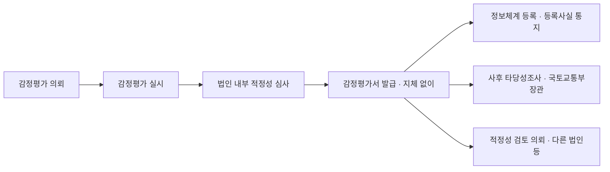
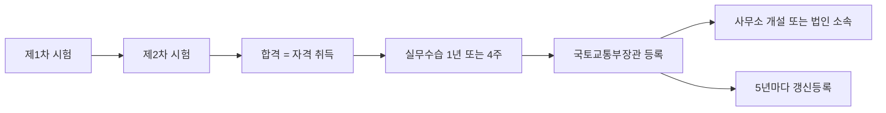
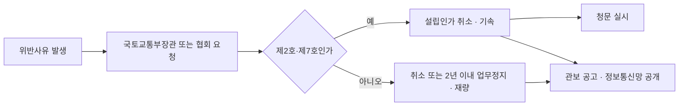
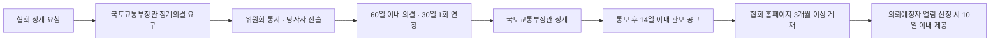
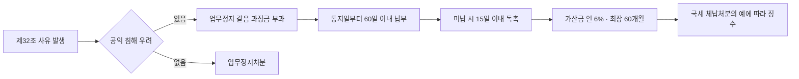
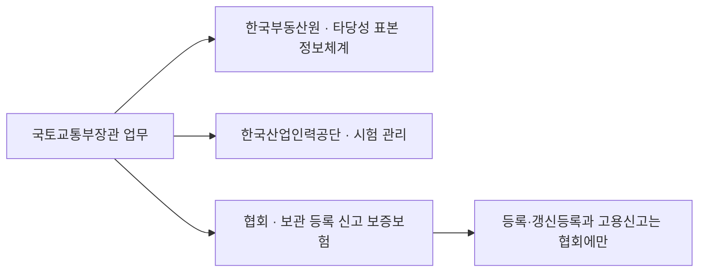
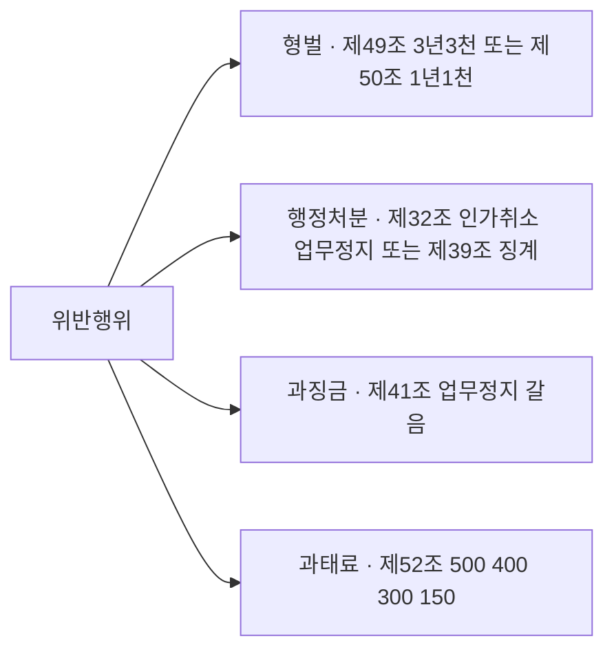

# 단원 PART04 — 감정평가법

> **법령 전체명**: 감정평가 및 감정평가사에 관한 법률
> **출처 자료**: 감관법2 (스터디파이터)
> **수업 주제**: 자격·시험·등록·업무·의무·징계·과징금·벌칙

## 🗺️ 본문 목차

- [📗 관별 정리 (조문 기반)](#관별정리)
- [📖 핵심요약서 (L1 - 메인 단권화)](#핵심요약서)
- [📚 기본서 (L2 - 본격 학습)](#기본서)
- [✏️ 워크북 (논점별 문제)](#워크북)
- [🎯 감정평가사법 암기노트 (1p 압축)](#암기노트)

---

## 📗 관별 정리 — 조문 기반 (관별 상세)

> 📌 법제처 정본 조문을 대조해 관(關)별로 저술한 상세 교재다. 아래 핵심요약서·기본서·워크북은 학원 교재 원문이다.

### [감정평가법] Chapter 01 총칙

> 📖 「감정평가 및 감정평가사에 관한 법률」(이하 "감정평가법")은 2016년 구 「부동산 가격공시 및 감정평가에 관한 법률」이 분법(分法)되면서 만들어진 법이다. 부동산공시법이 **가격공시 제도**를 맡았다면, 감정평가법은 **감정평가라는 행위와 그 행위자(감정평가사)**를 규율한다.
> 이 관은 법 제1장 총칙(제1조~제2조)과 제2장 감정평가(제3조~제9조)를 다룬다. 감정평가의 **정의·대상·기준·의뢰·감정평가서·심사·타당성조사·정보체계**가 여기에 모여 있다. 감정평가사 시험에서 이 법은 **매년 3~5문항**이 나오고, 그중 1~2문항이 이 관에서 나온다.

> ⭐ **이 관에서 반드시 챙길 3가지**
> ① **토지 감정평가의 원칙 기준은 ==표준지공시지가==**, 예외로 적정한 실거래가(재량), 그리고 **임대료·조성비용 고려가 가능한 5가지 예외**(제3조 제2항 + 영 제3조).
> ② **감정평가서 보존기간과 해산·폐업 시 제출기한** — 원본 5년 / 관련 서류 2년 / 제출 30일 이내.
> ③ **타당성조사(사후·직권)와 표본조사(제도개선용)의 구별**, 그리고 적정성 **심사**(법인 내부·의무)와 적정성 **검토**(외부 의뢰·재량)의 구별.

#### 1. 개념·정의

법이 정의규정을 둔 용어는 조문 문언 그대로 외워야 한다. 특히 **"토지등"의 범위**가 시행령에 위임되어 있다는 점이 함정이다.

> 📌 **감정평가법 제2조(정의)** — "이 법에서 사용하는 용어의 뜻은 다음과 같다.
> 1. "토지등"이란 토지 및 그 정착물, 동산, 그 밖에 대통령령으로 정하는 재산과 이들에 관한 소유권 외의 권리를 말한다.
> 2. "감정평가"란 토지등의 경제적 가치를 판정하여 그 결과를 가액(價額)으로 표시하는 것을 말한다.
> 3. "감정평가업"이란 타인의 의뢰에 따라 일정한 보수를 받고 토지등의 감정평가를 업(業)으로 행하는 것을 말한다.
> 4. "감정평가법인등"이란 제21조에 따라 사무소를 개설한 감정평가사와 제29조에 따라 인가를 받은 감정평가법인을 말한다."

- **"감정평가"는 "가액으로 표시"** 하는 것이다. 임대료 산정도 감정평가에 포함되지만, 정의규정 문언은 "가액"이다.
- **"감정평가법인등"** = ==사무소를 개설한 감정평가사== + ==인가를 받은 감정평가법인==. 소속 감정평가사는 원칙적으로 "감정평가법인등"이 아니고, 개별 조문에서 "소속 감정평가사를 포함한다"고 **따로 적어줄 때만** 포함된다(제3조 제3항, 제25조, 제26조).

> ⚠️ **개정 반영** — 학원 교재·구 기출에 보이는 "감정평가업자"는 ==2020.4.7. 개정==으로 전부 "감정평가법인등"으로 바뀌었다. 현행 조문 문언은 "감정평가법인등"이다.

**"대통령령으로 정하는 재산"(토지등의 범위)** — 시행령 제2조

> 📌 **감정평가법 시행령 제2조(기타 재산)** — "법 제2조제1호에서 "대통령령으로 정하는 재산"이란 다음 각 호의 재산을 말한다.
> 1. 저작권ㆍ산업재산권ㆍ어업권ㆍ양식업권ㆍ광업권 및 그 밖의 물권에 준하는 권리
> 2. 「공장 및 광업재단 저당법」에 따른 공장재단과 광업재단
> 3. 「입목에 관한 법률」에 따른 입목
> 4. 자동차ㆍ건설기계ㆍ선박ㆍ항공기 등 관계 법령에 따라 등기하거나 등록하는 재산
> 5. 유가증권"

- 열거주의다. **열거되지 않은 것은 감정평가 대상이 아니다.** 기출에서 ==도로점용허가권한==을 끼워 넣어 오답을 만들었다(2018년).
- "그 밖의 **물권에 준하는 권리**" — 채권이 아니라 물권에 준하는 권리다.

#### 2. 요건·절차 — 감정평가의 기준과 의뢰

| 구분 | 내용 | 근거 |
|---|---|---|
| 토지 평가의 원칙 | ==표준지공시지가==를 기준으로 하여야 한다(**의무**) | 법 제3조 제1항 본문 |
| 토지 평가의 예외 | 적정한 실거래가가 있는 경우 이를 기준으로 **할 수 있다**(재량) | 법 제3조 제1항 단서 |
| 임대료·조성비용 고려 | 재무제표 작성 필요 평가, 담보권 설정·경매 등 대통령령으로 정하는 평가 시 **할 수 있다** | 법 제3조 제2항 |
| 원칙과 기준 | ==국토교통부령==으로 정한다(= 감정평가에 관한 규칙) | 법 제3조 제3항 |
| 실무기준 제정 | 국토교통부장관이 ==기준제정기관==(민간법인·단체)을 **지정할 수 있다** | 법 제3조 제4항 |
| 실무기준 변경 요구 | 국토교통부장관이 ==감정평가관리·징계위원회의 심의==를 거쳐 요구 → 기준제정기관은 정당한 사유 없으면 따라야 함 | 법 제3조 제5항 |
| 국가등의 의뢰 | 국가·지자체·공공기관·지방공사가 관리·매입·매각·경매·재평가 목적으로 평가 시 감정평가법인등에 **의뢰하여야 한다** | 법 제5조 제1항, 영 제4조 제1항 |
| 금융기관등의 의뢰 | 금융기관·보험회사·신탁회사·신용협동조합·새마을금고가 대출·자산 매입매각관리·재무제표 작성 관련 평가 시 **의뢰하여야 한다** | 법 제5조 제2항, 영 제4조 제2항 |
| 협회 추천 | 의뢰하려는 자는 협회에 요청해 추천받은 감정평가법인등에 의뢰**할 수 있다**(재량) | 법 제5조 제3항 |

**임대료·조성비용을 고려할 수 있는 감정평가 5가지**(법 제3조 제2항 + 영 제3조) — 시험 단골이다.

| 유형 | 근거 |
|---|---|
| ① 기업의 재무제표 작성에 필요한 감정평가 | 법 제3조 제2항 |
| ② 담보권의 설정ㆍ경매 등 | 법 제3조 제2항 |
| ③ 「자산재평가법」에 따른 토지등의 감정평가 | 영 제3조 → 법 제10조 제3호 |
| ④ 법원에 계속 중인 소송 또는 경매를 위한 감정평가 (==보상과 관련된 감정평가는 제외==) | 영 제3조 → 법 제10조 제4호 |
| ⑤ 금융기관ㆍ보험회사ㆍ신탁회사 등 타인의 의뢰에 따른 감정평가 | 영 제3조 → 법 제10조 제5호 |

> 💡 ④의 괄호가 답이다. **"보상과 관련된 감정평가는 제외한다"** — 보상평가는 공시지가기준법이 강제되므로 임대료·조성비용 고려 대상에서 빠진다. 2022년 그대로 출제됐다.

#### 3. 핵심 조문

> 📌 **감정평가법 제3조(기준) 제1항** — "감정평가법인등이 토지를 감정평가하는 경우에는 그 토지와 이용가치가 비슷하다고 인정되는 「부동산 가격공시에 관한 법률」에 따른 표준지공시지가를 기준으로 하여야 한다. 다만, 적정한 실거래가가 있는 경우에는 이를 기준으로 할 수 있다."

원칙은 **표준지공시지가 기준(의무)**, 예외는 **적정한 실거래가 기준(재량)**이다. 순서를 뒤집어 "실거래가를 기준으로 하여야 한다"고 쓰면 틀린 지문이다.

> 📌 **감정평가법 제6조(감정평가서) 제3항** — "감정평가법인등은 감정평가서의 원본과 그 관련 서류를 국토교통부령으로 정하는 기간 이상 보존하여야 하며, 해산하거나 폐업하는 경우에도 대통령령으로 정하는 바에 따라 보존하여야 한다. 이 경우 감정평가법인등은 감정평가서의 원본과 그 관련 서류를 이동식 저장장치 등 전자적 기록매체에 수록하여 보존할 수 있다."

> 📌 **감정평가법 시행령 제6조(감정평가서 등의 보존) 제2항·제3항** — "② 감정평가법인등은 제1항 전단에 따른 감정평가서의 원본과 관련 서류를 해산하거나 폐업한 날부터 30일 이내에 제출해야 한다. ③ 국토교통부장관은 제1항에 따라 제출받은 감정평가서의 원본과 관련 서류를 다음 각 호의 구분에 따른 기간 동안 보관해야 한다. 1. 감정평가서 원본: 발급일부터 5년 2. 감정평가서 관련 서류: 발급일부터 2년"

- 제출 상대방은 ==국토교통부장관==이다(시·도지사가 아니다 — 2022년 함정).
- 보관기간은 ==원본 5년 / 관련 서류 2년==. **감정평가법인등 자신의 보존기간**은 법 제6조 제3항이 국토교통부령에 위임했는데, 시행규칙상 기간도 동일하게 원본 5년·관련 서류 2년으로 운용된다(2019년·2024년 기출 해설에서 확인). 즉 **본인 보존기간 = 국토교통부장관 보관기간**으로 외우면 된다.

> 📌 **감정평가법 제7조(감정평가서의 심사 등) 제1항** — "감정평가법인은 제6조에 따라 감정평가서를 의뢰인에게 발급하기 전에 감정평가를 한 소속 감정평가사가 작성한 감정평가서의 적정성을 같은 법인 소속의 다른 감정평가사에게 심사하게 하고, 그 적정성을 심사한 감정평가사로 하여금 감정평가서에 그 심사사실을 표시하고 서명과 날인을 하게 하여야 한다."

주체가 ==감정평가법인==이다(감정평가사사무소가 아니다). "발급하기 **전에**", "같은 법인 **소속의 다른** 감정평가사", **의무**("하여야 한다")가 포인트.

> 📌 **감정평가법 제8조(감정평가 타당성조사 등) 제1항** — "국토교통부장관은 제6조에 따라 감정평가서가 발급된 후 해당 감정평가가 이 법 또는 다른 법률에서 정하는 절차와 방법 등에 따라 타당하게 이루어졌는지를 직권으로 또는 관계 기관 등의 요청에 따라 조사할 수 있다."

> 📌 **감정평가법 시행령 제8조(타당성조사의 절차 등) 제2항** — "국토교통부장관은 법 제8조제1항에 따른 타당성조사의 대상이 되는 감정평가가 다음 각 호의 어느 하나에 해당하는 경우에는 타당성조사를 하지 않거나 중지할 수 있다. 1. 법원의 판결에 따라 확정된 경우 2. 재판이 계속 중이거나 수사기관에서 수사 중인 경우 3. 「공익사업을 위한 토지 등의 취득 및 보상에 관한 법률」 등 관계 법령에 감정평가와 관련하여 권리구제 절차가 규정되어 있는 경우로서 권리구제 절차가 진행 중이거나 권리구제 절차를 이행할 수 있는 경우(권리구제 절차를 이행하여 완료된 경우를 포함한다) 4. 징계처분, 제재처분, 형사처벌 등을 할 수 없어 타당성조사의 실익이 없는 경우"

> 📌 **감정평가법 제9조(감정평가 정보체계의 구축ㆍ운용 등) 제2항** — "「공익사업을 위한 토지 등의 취득 및 보상에 관한 법률」에 따른 감정평가 등 국토교통부령으로 정하는 감정평가를 의뢰받은 감정평가법인등은 감정평가 결과를 감정평가 정보체계에 등록하여야 한다. 다만, 개인정보 보호 등 국토교통부장관이 정하는 정당한 사유가 있는 경우에는 그러하지 아니하다."

- 정보체계 **구축·운영**은 국토교통부장관의 ==재량("할 수 있다")==, 결과 **등록**은 감정평가법인등의 ==의무("하여야 한다")==. 이 재량/의무의 갈림이 함정이다.
- 등록 대상 평가는 감정평가서 발급 시 **의뢰인에게 등록 사실을 알려야 한다**(제9조 제3항).

#### 4. ⏱ 기간·수치 총정리

| 항목 | 기간·수치 | 근거 조문 |
|---|---|---|
| 협회의 감정평가법인등 추천 | 요청받은 날부터 ==7일 이내== | 영 제5조 제1항 |
| 해산·폐업 시 감정평가서 원본·관련 서류 제출 | 해산·폐업한 날부터 ==30일 이내== | 영 제6조 제2항 |
| 국토교통부장관의 감정평가서 원본 보관 | 발급일부터 ==5년== | 영 제6조 제3항 제1호 |
| 국토교통부장관의 관련 서류 보관 | 발급일부터 ==2년== | 영 제6조 제3항 제2호 |
| 적정성 검토를 의뢰받을 수 있는 감정평가법인등 | 소속 감정평가사가 ==둘 이상== | 영 제7조의2 제2항 |
| 적정성 검토 수행 감정평가사 자격 | 감정평가 업무 ==5년 이상== + 감정평가실적 ==100건 이상== | 영 제7조의3 제3항 |
| 타당성조사 착수 통지 | 착수일부터 ==10일 이내== | 영 제8조 제4항 |
| 타당성조사 의견제출 | 통지받은 날부터 ==10일 이내== | 영 제8조 제5항 |
| 우선추출방식 표본조사 대상 | 최근 ==3년 이내== 타당성조사 결과 부실 발생 분야 | 영 제8조의2 제2항 제1호 |
| 기준제정기관 상시고용 인력 | ==3명 이상== (등록 감정평가사 5년 이상 실무경력 또는 관련 분야 박사로 3년 이상 종사) | 영 제3조의2 제1항 제1호 |
| 감정평가실무기준심의위원회 | ==9명 이내==의 위원 | 영 제3조의3 제2항 |

#### 5. 👤 권한 주체 구분

| 행위 | 주체 | 근거 |
|---|---|---|
| 감정평가의 원칙과 기준 제정 | ==국토교통부령== (감정평가에 관한 규칙) | 법 제3조 제3항 |
| 기준제정기관 지정 | ==국토교통부장관== (감정평가관리·징계위원회 심의를 거쳐야 함) | 법 제3조 제4항, 영 제3조의2 제3항 |
| 실무기준의 제정·개정·해석 | ==기준제정기관== | 영 제3조의3 제1항 |
| 감정평가법인등 추천 | ==한국감정평가사협회== | 법 제5조 제3항 |
| 감정평가서 적정성 **심사** | ==같은 법인 소속의 다른 감정평가사== | 법 제7조 제1항 |
| 감정평가서 적정성 **검토** | ==소속 감정평가사 2인 이상인 다른 감정평가법인등== (발급한 곳은 제외) | 법 제7조 제3항, 영 제7조의2 제2항 |
| 타당성조사·표본조사 | ==국토교통부장관== | 법 제8조 제1항·제4항 |
| 감정평가 정보체계 구축·운영 | ==국토교통부장관== (실무는 한국부동산원에 위탁) | 법 제9조 제1항, 영 제47조 제1항 제3호 |
| 감정평가 결과의 정보체계 등록 | ==감정평가법인등== | 법 제9조 제2항 |

#### ⭐ 기출 출제포인트

1. **감정평가 대상 열거**(영 제2조) — 어업권·유가증권·입목·공장재단은 O, ==도로점용허가권한==처럼 열거되지 않은 것을 끼워 오답을 만든다.
2. **임대료·조성비용 고려 가능 유형** — "법원 계속 중인 소송을 위한 평가 중 ==보상 관련 평가는 제외=="가 답으로 직결된다.
3. **감정평가서 보존·보관기간과 제출기한** — 원본 5년 / 관련 서류 2년 / 해산·폐업 후 30일 이내 / 제출처는 국토교통부장관.
4. **타당성조사 vs 표본조사** — 타당성조사는 개별 감정평가의 사후 검증, 표본조사는 ==제도개선 목적==이며 무작위추출·우선추출 두 방식.
5. **국가등·금융기관등의 의뢰 의무** — "의뢰하여야 한다"(의무)를 "의뢰하지 아니할 수 있다"로 바꾼 함정.
6. **적정성 검토 감정평가사 요건** — 5년 이상 + 실적 100건 이상.

#### 📊 기출 분석

| 연도 | 출제 형태 | 핵심 논점 |
|---|---|---|
| 2018 16번 | 해당하지 않는 것 | 감정평가의 대상(영 제2조 열거) |
| 2019 16번 | 옳은 것 | 표준지공시지가 기준, 감정평가서 보존기간, 매매업 금지, 수수료 심의 |
| 2022 14번 | 아닌 것 | 임대료·조성비용 고려 가능 감정평가(보상 관련 제외) |
| 2022 15번 | 옳지 않은 것 | 감정평가 의뢰 의무, 원본 보관 주체·기간, 타당성조사, 표본조사 방식 |
| 2024 18번 | 옳지 않은 것 | 타당성조사 실익, 적정성 심사, 국가등 의뢰 의무, 협회 추천, 원본 보존 5년 |
| 2025 18번 | 옳은 것 | 해산 시 제출기한, 적정성 검토 감정평가사 요건, 국가등 의뢰, 정보체계 등록 |

**출제 빈도** — 감정평가법에서 매년 3~5문항이 나오고, 그중 이 관은 ==거의 매년 1문항 이상== 출제된다. 특히 제3조·제6조·제7조·제8조가 반복 축이다.
**반복되는 함정** — ① 표준지공시지가 ↔ 실거래가 순서 뒤집기 ② 원본 5년 ↔ 2년 뒤집기 ③ 제출·보관 주체를 시·도지사로 바꾸기 ④ "할 수 있다"/"하여야 한다" 교체.
**최근 경향** — 2021.7.20. 신설된 **적정성 검토(제7조 제3항)·표본조사(제8조 제4항)**가 2022년 이후 반복 출제되고 있다. 시행령의 세부 수치(5년·100건·10일·30일)를 직접 묻는 방향으로 정교해지는 중이다.

#### 🔍 기출 선지로 배우는 조문

> 실제 출제된 선지를 놓고 O/X와 근거 조문을 확인한다.

**①** (2018년 16번) "「공장 및 광업재단 저당법」에 따른 공장재단은 감정평가의 대상이다." — **O** / 근거: 영 제2조 제2호. 참고로 같은 문항의 **도로점용허가권한**은 열거되지 않아 대상이 아니다.

**②** (2019년 16번 ①) "감정평가법인등이 토지를 감정평가하는 경우에는 그 토지와 이용가치가 비슷하다고 인정되는 토지의 적정한 실거래가를 기준으로 하여야 한다." — **X** / 어디가 틀렸나: 원칙 기준이 표준지공시지가인데 실거래가로 바꾸고, 재량을 의무로 만들었다 / 옳게 고치면: ==표준지공시지가를 기준으로 하여야 하고, 적정한 실거래가가 있는 경우에는 이를 기준으로 할 수 있다==(법 제3조 제1항).

**③** (2019년 16번 ②) "감정평가법인등은 감정평가서의 원본을 발급일부터 2년 동안 보존하여야 한다." — **X** / 어디가 틀렸나: 2년은 **관련 서류**의 기간이다 / 옳게 고치면: ==원본은 발급일부터 5년==, 관련 서류가 2년.

**④** (2022년 15번 ②) "감정평가법인등이 해산하거나 폐업하는 경우 시·도지사는 감정평가서의 원본을 발급일부터 5년 동안 보관해야 한다." — **X** / 어디가 틀렸나: 보관 주체는 시·도지사가 아니다 / 옳게 고치면: ==국토교통부장관==이 보관한다(영 제6조 제3항).

**⑤** (2022년 15번 ④) "최근 3년 이내에 실시한 감정평가 타당성조사 결과 감정평가의 부실이 발생한 분야에 대해서는 우선추출방식의 표본조사가 실시될 수 있다." — **O** / 근거: 영 제8조의2 제2항 제1호.

**⑥** (2024년 18번 ⑤) "감정평가법인등은 감정평가서의 원본을 발급일부터 2년 이상 보존하여야 한다." — **X** / 옳게 고치면: ==5년 이상==(원본), 관련 서류가 2년 이상.

**⑦** (2024년 18번 ③) "국가는 토지등의 관리를 위하여 토지등을 감정평가하려는 경우에는 감정평가법인등에 의뢰하여야 한다." — **O** / 근거: 법 제5조 제1항.

**⑧** (2025년 18번 ①) "감정평가법인이 해산한 경우 감정평가서 원본과 그 관련 서류를 해산한 날부터 15일 이내에 국토교통부장관에게 제출해야 한다." — **X** / 어디가 틀렸나: 기간이 다르다 / 옳게 고치면: ==30일 이내==(영 제6조 제2항).

**⑨** (2025년 18번 ②) "감정평가서의 적정성 검토업무를 수행할 감정평가사는 5년 이상 감정평가 업무를 수행한 사람으로서 감정평가실적이 100건 이상인 사람이어야 한다." — **O** / 근거: 영 제7조의3 제3항.

#### ⚠️ 이 관의 함정 총정리

1. "토지 감정평가는 **적정한 실거래가를 기준으로 하여야 한다**"고 하면 틀림 → ==표준지공시지가가 원칙이고 실거래가는 "할 수 있다"는 예외==.
2. "**법원에 계속 중인 소송을 위한 보상 관련 감정평가**도 임대료·조성비용을 고려할 수 있다"고 하면 틀림 → ==보상과 관련된 감정평가는 명시적으로 제외==(영 제3조).
3. "감정평가서 원본은 **2년**, 관련 서류는 5년" → ==원본 5년·관련 서류 2년==으로 뒤집혀 있다.
4. "해산·폐업 시 감정평가서를 **시·도지사**에게 **15일 이내** 제출" → ==국토교통부장관에게 30일 이내==.
5. "감정평가서 적정성 심사는 **감정평가사사무소**도 하여야 한다" → ==제7조 제1항의 주체는 감정평가법인==이다.
6. "감정평가 정보체계 등록은 **할 수 있다**" → 대상 감정평가라면 ==등록하여야 한다==(의무). 반대로 정보체계 **구축·운영**은 국토교통부장관의 재량이다.
7. "국토교통부장관은 **재판이 계속 중인 경우에도 반드시 타당성조사를 하여야 한다**" → ==하지 않거나 중지할 수 있다==(영 제8조 제2항).
8. "감정평가의 원칙과 기준은 **대통령령**으로 정한다" → ==국토교통부령==으로 정한다(법 제3조 제3항).

#### ✅ OX 확인문제

> 다음 진술의 참·거짓을 판단하시오.

**1.** "감정평가"란 토지등의 경제적 가치를 판정하여 그 결과를 가액으로 표시하는 것을 말한다.
→ **O**. 법 제2조 제2호의 문언 그대로다.

**2.** 유가증권은 감정평가의 대상인 "토지등"에 포함되지 않는다.
→ **X**. 영 제2조 제5호가 유가증권을 명시하고 있다. 반면 도로점용허가권한은 열거되지 않아 대상이 아니다.

**3.** 감정평가법인등이 토지를 감정평가할 때 적정한 실거래가가 있으면 이를 기준으로 할 수 있다.
→ **O**. 법 제3조 제1항 단서. 원칙은 표준지공시지가 기준이고, 실거래가는 재량이다.

**4.** 감정평가의 공정성과 합리성을 보장하기 위해 감정평가법인등이 준수해야 할 원칙과 기준은 대통령령으로 정한다.
→ **X**. 법 제3조 제3항은 **국토교통부령**에 위임하고 있다.

**5.** 국토교통부장관은 필요하다고 인정되면 감정평가관리·징계위원회의 심의를 거쳐 기준제정기관에 실무기준의 내용을 변경하도록 요구할 수 있다.
→ **O**. 법 제3조 제5항. 이 경우 기준제정기관은 정당한 사유가 없으면 따라야 한다.

**6.** 신용협동조합이 대출과 관련하여 토지등을 감정평가하려는 경우 감정평가법인등에 의뢰하여야 한다.
→ **O**. 법 제5조 제2항 + 영 제4조 제2항 제1호. 새마을금고도 같다.

**7.** 협회는 감정평가법인등의 추천을 요청받은 경우 요청을 받은 날부터 14일 이내에 추천해야 한다.
→ **X**. 영 제5조 제1항상 **7일 이내**다.

**8.** 감정평가법인은 감정평가서를 의뢰인에게 발급한 후 같은 법인 소속의 다른 감정평가사에게 적정성을 심사하게 하여야 한다.
→ **X**. 법 제7조 제1항은 **발급하기 전에** 심사하게 하도록 한다. 사후 심사가 아니다.

**9.** 국토교통부장관은 감정평가 제도를 개선하기 위하여 발급된 감정평가서에 대한 표본조사를 실시할 수 있고, 그 방식에는 무작위추출방식과 우선추출방식이 있다.
→ **O**. 법 제8조 제4항, 영 제8조의2 제1항.

**10.** 감정평가법인등은 감정평가 정보체계 등록 대상인 감정평가에 대해서는 감정평가서를 발급할 때 의뢰인에게 그 등록 사실을 알려야 한다.
→ **O**. 법 제9조 제3항(2021.7.20. 신설).

#### 🧠 암기법

> 🔑 **토지등 열거 = "저·산·어·양·광 / 공·입 / 자·건·선·항 / 유"**
> 저작권·산업재산권·어업권·양식업권·광업권 → 공장재단·입목 → 자동차·건설기계·선박·항공기 → 유가증권. 이 11개 밖은 대상이 아니다.

> 🔑 **보존기간 = "원본 오(5)래, 서류 이(2)내"**
> 원본 5년 / 관련 서류 2년. 제출은 "삼십(30)일 안에 국장에게".

> 🔑 **검토 감정평가사 = "오(5)년 백(100)건"**
> 5년 이상 업무 + 실적 100건 이상, 그리고 소속 감정평가사 2인 이상인 법인등만 검토를 맡을 수 있다.

> 🔑 **심사는 안(內), 검토는 밖(外)**
> **심사** = 발급 **전** · 같은 **법인 내부** · **의무** / **검토** = 발급 **후** · **다른 법인등** · **재량**.

---

### [감정평가법] Chapter 02 감정평가사

> 📖 이 관은 법 제3장 감정평가사 중 제1절 업무와 자격(제10조~제13조), 제2절 시험(제14조~제16조), 제3절 등록(제17조~제20조), 제4절 권리와 의무(제21조~제28조의2)를 다룬다.
> 감정평가사가 되는 길(**자격 → 실무수습/교육연수 → 등록 → 사무소 개설**)과, 그 자격을 잃는 길(**결격 → 등록거부 → 등록취소 → 자격취소**)이 한 세트다. 시험은 이 두 흐름의 **기간 숫자**와 **"거부/취소/결격"의 조문 소속**을 계속 바꿔 묻는다.

> ⭐ **이 관에서 반드시 챙길 3가지**
> ① **결격사유(제12조)·등록거부사유(제18조)·등록취소사유(제19조)·사무직원 결격(제24조)의 4중 구분** — ==미성년자·피성년후견인·피한정후견인은 결격사유가 아니라 등록거부사유==라는 것이 최대 함정이다.
> ② **기간 숫자** — 실형 집행종료 3년 / 집행유예 만료 1년 / 선고유예 기간 중 / 자격취소 3년(제13조) / 자격취소 5년(제39조 제1항 제11·12호).
> ③ **의무 조항 6종**(성실의무·비밀엄수·명의대여 금지·손해배상·유도요구 금지·수수료) — 위반 시 징계·인가취소·벌칙으로 그대로 연결된다.

#### 1. 개념·정의

> 📌 **감정평가법 제11조(자격)** — "제14조에 따른 감정평가사시험에 합격한 사람은 감정평가사의 자격이 있다."

**시험 합격 = 자격 취득.** 별도의 연수과정을 마쳐야 자격이 생기는 것이 아니다. 실무수습·교육연수는 **등록 요건**이지 자격 요건이 아니다(2018년 기출).

> 📌 **감정평가법 제4조(직무)** — "① 감정평가사는 타인의 의뢰를 받아 토지등을 감정평가하는 것을 그 직무로 한다. ② 감정평가사는 공공성을 지닌 가치평가 전문직으로서 공정하고 객관적으로 그 직무를 수행한다."

제2항은 ==2021.7.20. 신설==된 선언 규정으로, 감정평가사의 **공공성**을 법률에 명시했다.

**감정평가법인등의 업무(제10조) — 9호 전부가 업무다.**

| 호 | 업무 |
|---|---|
| 1 | 「부동산 가격공시에 관한 법률」에 따라 감정평가법인등이 수행하는 업무 |
| 2 | 「부동산 가격공시에 관한 법률」 제8조제2호에 따른 목적을 위한 토지등의 감정평가 |
| 3 | 「자산재평가법」에 따른 토지등의 감정평가 |
| 4 | 법원에 계속 중인 소송 또는 경매를 위한 토지등의 감정평가 |
| 5 | 금융기관ㆍ보험회사ㆍ신탁회사 등 타인의 의뢰에 따른 토지등의 감정평가 |
| 6 | 감정평가와 관련된 상담 및 자문 |
| 7 | 토지등의 이용 및 개발 등에 대한 조언이나 정보 등의 제공 |
| 8 | 다른 법령에 따라 감정평가법인등이 할 수 있는 토지등의 감정평가 |
| 9 | 제1호부터 제8호까지의 업무에 ==부수되는 업무== |

> 💡 기출은 "상담·자문", "조언·정보 제공", "부수되는 업무"를 빼고 오답을 만들려 했지만 **전부 업무에 해당**한다. ==모두 고른 것이 답==인 유형이다(2018년).

#### 2. 요건·절차 — 자격 상실 4중 구조

**(1) 결격사유(법 제12조) — "감정평가사가 될 수 없다"**

| 호 | 사유 | 기간 |
|---|---|---|
| 1 | 삭제 (2021.7.20.) — 구 미성년자·피성년후견인·피한정후견인 | — |
| 2 | 파산선고를 받은 사람으로서 ==복권되지 아니한== 사람 | 복권까지 |
| 3 | 금고 이상의 **실형** 선고, 집행 종료·면제된 날부터 | ==3년== |
| 4 | 금고 이상의 형의 **집행유예**, 유예기간 만료된 날부터 | ==1년== |
| 5 | 금고 이상의 형의 **선고유예**, ==선고유예기간 중== | 기간 중 |
| 6 | 제13조에 따라 자격이 취소된 후 (제7호 해당자 제외) | ==3년== |
| 7 | 제39조 제1항 제11호·제12호에 따라 자격이 취소된 후 | ==5년== |

> ⚠️ **개정 반영** — ==2021.7.20. 개정==으로 **미성년자·피성년후견인·피한정후견인이 결격사유에서 삭제**되고 **등록거부사유(제18조 제1항 제5호)로 옮겨졌다.** 즉 이들도 **자격은 취득할 수 있으나 등록은 못 한다.** 개정 전 학원 교재·구 기출을 그대로 믿으면 틀린다.

- **선고유예**는 "기간 중"만 결격이다. 유예기간이 지나면 즉시 결격을 벗어난다(집행유예처럼 +1년이 붙지 않는다).
- 국토교통부장관은 제2호~제5호 해당 여부 확인을 위해 관계 기관에 자료를 요청할 수 있고, 관계 기관은 특별한 사정이 없으면 제공하여야 한다(제12조 제2항).

**(2) 등록·갱신등록의 거부사유(법 제18조 제1항) — "거부하여야 한다"(기속)**

| 호 | 사유 |
|---|---|
| 1 | 제12조 각 호(==결격사유==)의 어느 하나에 해당하는 경우 |
| 2 | 실무수습 또는 교육연수를 받지 아니한 경우 |
| 3 | 제39조에 따라 등록이 취소된 후 ==3년==이 지나지 아니한 경우 |
| 4 | 제39조에 따라 업무가 정지된 감정평가사로서 그 업무정지 기간이 지나지 아니한 경우 |
| 5 | ==미성년자 또는 피성년후견인ㆍ피한정후견인== |

**(3) 등록의 취소사유(법 제19조 제1항) — "취소하여야 한다"(기속, 4가지뿐)**

| 호 | 사유 |
|---|---|
| 1 | 제12조 각 호(결격사유)의 어느 하나에 해당하는 경우 |
| 2 | ==사망==한 경우 |
| 3 | ==등록취소를 신청==한 경우 |
| 4 | 제39조 제2항 제2호에 해당하는 징계(==등록취소 징계==)를 받은 경우 |

> 💡 등록취소는 **딱 4가지**다. "징계로 **자격**이 취소된 후 5년이 지나지 아니한 경우"는 등록취소사유가 **아니다**(2020년 기출 정답 선지). 자격이 취소되면 결격사유(제12조 제7호)에 걸려 제19조 제1항 제1호로 취소되는 것이지, 별도 호가 있는 것이 아니다. 또 "취소**할 수 있다**"가 아니라 ==취소하여야 한다==(기속)이다.

**(4) 자격의 취소(법 제13조) — "취소하여야 한다"(2가지뿐)**

> 📌 **감정평가법 제13조(자격의 취소) 제1항** — "국토교통부장관은 감정평가사가 다음 각 호의 어느 하나에 해당하는 경우에는 그 자격을 취소하여야 한다. 1. 부정한 방법으로 감정평가사의 자격을 받은 경우 2. 제39조제2항제1호에 해당하는 징계를 받은 경우"

- 제13조 자격취소 → 결격 ==3년==(제12조 제6호), 사무직원 결격 ==1년==(제24조 제1항 제3호).
- 제39조 제1항 제11호·제12호 자격취소 → 결격 ==5년==(제12조 제7호), 사무직원 결격은 제11호가 ==5년==·제12호가 ==3년==(제24조 제1항 제4호·제5호).
- 자격취소 시 국토교통부장관은 국토교통부령으로 정하는 바에 따라 **공고**하여야 하고, 취소된 사람은 **자격증(등록한 경우 등록증 포함)을 반납**하여야 한다(제13조 제2항·제3항).

**(5) 사무직원의 결격사유(법 제24조 제1항)**

| 호 | 사유 |
|---|---|
| 1 | 미성년자 또는 피성년후견인ㆍ피한정후견인 |
| 2 가 | 이 법·형법 제129조~제132조·특가법 제2조·제3조 등 유죄판결로 **징역 이상의 형** 집행 종료·면제 확정 후 ==3년== 미경과 |
| 2 나 | **징역형의 집행유예** 유예기간 경과 후 ==1년== 미경과 |
| 2 다 | **징역형의 선고유예** 유예기간 중 |
| 3 | 제13조에 따라 자격이 취소된 후 ==1년== 미경과 (제4·5호 해당자 제외) |
| 4 | 제39조 제1항 제11호에 따라 자격이 취소된 후 ==5년== 미경과 |
| 5 | 제39조 제1항 제12호에 따라 자격이 취소된 후 ==3년== 미경과 |
| 6 | 제39조에 따라 업무가 정지된 감정평가사로서 업무정지 기간 미경과 |

> 💡 감정평가사 결격은 "**금고** 이상"인데, 사무직원 결격은 "**징역** 이상"이다. 형종(刑種)이 다르다는 점이 정교한 함정이다.
> 사무직원 결격자를 둔 자에게는 ==500만원 이하 과태료==가 부과된다(법 제52조 제1항).

#### 3. 핵심 조문

> 📌 **감정평가법 제17조(등록 및 갱신등록) 제1항·제2항** — "① 제11조에 따른 감정평가사 자격이 있는 사람이 제10조에 따른 업무를 하려는 경우에는 대통령령으로 정하는 바에 따라 실무수습 또는 교육연수를 마치고 국토교통부장관에게 등록하여야 한다. ② 제1항에 따라 등록한 감정평가사는 대통령령으로 정하는 바에 따라 등록을 갱신하여야 한다. 이 경우 갱신기간은 3년 이상으로 한다."

- 법률은 "갱신기간은 ==3년 이상=="이라는 **하한만** 정하고, 실제 주기는 시행령 제18조 제1항이 ==5년마다==로 정한다. **"3년"과 "5년"을 함께 기억**해야 한다.
- 실무수습·교육연수는 ==한국감정평가사협회==가 ==국토교통부장관의 승인==을 받아 실시·관리한다(제17조 제3항).

> 📌 **감정평가법 제21조(사무소 개설 등) 제1항·제4항** — "① 제17조에 따라 등록을 한 감정평가사가 감정평가업을 하려는 경우에는 감정평가사사무소를 개설할 수 있다. ④ 감정평가사는 감정평가업을 하기 위하여 1개의 사무소만을 설치할 수 있다."

> ⚠️ **개정 반영** — ==2021.7.20. 개정==으로 **"개설신고" 제도가 폐지되고 "개설"로 바뀌었다.** 따라서 "감정평가업을 하려면 국토교통부장관에게 **개설신고를 하여야 한다**"는 구 기출 선지(2020년 18번 ①)는 ==현행법상 틀린 지문==이다. 폐업신고 접수의 협회 위탁 규정도 삭제되었다.

> 📌 **감정평가법 제25조(성실의무 등)** — "① 감정평가법인등(감정평가법인 또는 감정평가사사무소의 소속 감정평가사를 포함한다. 이하 이 조에서 같다)은 제10조에 따른 업무를 하는 경우 품위를 유지하여야 하고, 신의와 성실로써 공정하게 하여야 하며, 고의 또는 중대한 과실로 업무를 잘못하여서는 아니 된다. ② 감정평가법인등은 자기 또는 친족 소유, 그 밖에 불공정하게 제10조에 따른 업무를 수행할 우려가 있다고 인정되는 토지등에 대해서는 그 업무를 수행하여서는 아니 된다. ③ 감정평가법인등은 토지등의 매매업을 직접 하여서는 아니 된다. ④ 감정평가법인등이나 그 사무직원은 제23조에 따른 수수료와 실비 외에는 어떠한 명목으로도 그 업무와 관련된 대가를 받아서는 아니 되며, 감정평가 수주의 대가로 금품 또는 재산상의 이익을 제공하거나 제공하기로 약속하여서는 아니 된다. ⑤ 감정평가사, 감정평가사가 아닌 사원 또는 이사 및 사무직원은 둘 이상의 감정평가법인(같은 법인의 주ㆍ분사무소를 포함한다) 또는 감정평가사사무소에 소속될 수 없으며, 소속된 감정평가법인 이외의 다른 감정평가법인의 주식을 소유할 수 없다."

- 제2항(==자기·친족 소유 토지등==)과 제3항(==매매업 직접 금지==)은 **허가·예외가 일절 없다.** "국토교통부장관의 허가를 받아 할 수 있다"는 지문은 전부 X다.
- 제5항의 **중복소속 금지**와 **타 법인 주식소유 금지**의 주체에는 ==사무직원==도 포함된다(2025년 기출).

> 📌 **감정평가법 제26조(비밀엄수)** — "감정평가법인등(감정평가법인 또는 감정평가사사무소의 소속 감정평가사를 포함한다. 이하 이 조에서 같다)이나 그 사무직원 또는 감정평가법인등이었거나 그 사무직원이었던 사람은 업무상 알게 된 비밀을 누설하여서는 아니 된다. 다만, 다른 법령에 특별한 규정이 있는 경우에는 그러하지 아니하다."

==퇴직 후에도== 적용된다("이었던 사람")는 점, ==다른 법령에 특별한 규정이 있으면 예외==라는 점이 포인트다.

> 📌 **감정평가법 제28조(손해배상책임) 제1항** — "감정평가법인등이 감정평가를 하면서 고의 또는 과실로 감정평가 당시의 적정가격과 현저한 차이가 있게 감정평가를 하거나 감정평가 서류에 거짓을 기록함으로써 감정평가 의뢰인이나 선의의 제3자에게 손해를 발생하게 하였을 때에는 감정평가법인등은 그 손해를 배상할 책임이 있다."

- 손해배상 요건은 ==고의 또는 **과실**==(경과실 포함)이다. 성실의무(제25조 제1항)의 "고의 또는 **중대한** 과실"과 **주관적 요건이 다르다** — 대표적 비교 함정이다.
- 보장조치: ==보증보험 가입 또는 협회 공제사업 가입==(제28조 제2항, 영 제23조 제1항), 보험 가입금액은 ==감정평가사 1명당 1억원 이상==, 보증보험금으로 배상한 때에는 ==10일 이내== 재계약(영 제23조 제3항·제4항).
- 확정판결로 손해배상이 결정되면 ==국토교통부장관에게 알려야 한다==(제28조 제3항, 2021.7.20. 신설). 미통지 시 ==150만원 이하 과태료==.

> 📌 **감정평가법 제27조(명의대여 등의 금지)** — "① 감정평가사 또는 감정평가법인등은 다른 사람에게 자기의 성명 또는 상호를 사용하여 제10조에 따른 업무를 수행하게 하거나 자격증ㆍ등록증 또는 인가증을 양도ㆍ대여하거나 이를 부당하게 행사하여서는 아니 된다. ② 누구든지 제1항의 행위를 알선해서는 아니 된다."

제2항 **알선 금지**는 ==2020.4.7. 신설==이며, 주체가 =="누구든지"==다(감정평가사에 한정되지 않는다).

> 📌 **감정평가법 제28조의2(감정평가 유도ㆍ요구 금지)** — "누구든지 감정평가법인등(감정평가법인 또는 감정평가사사무소의 소속 감정평가사를 포함한다)과 그 사무직원에게 토지등에 대하여 특정한 가액으로 감정평가를 유도 또는 요구하는 행위를 하여서는 아니 된다."

2021.7.20. 신설. 유도·요구한 자(제49조 제6호의2)와 그에 **따른** 감정평가법인등(제49조 제5호)이 **모두** 3년 이하 징역 또는 3천만원 이하 벌금 대상이다.

#### 4. ⏱ 기간·수치 총정리

| 항목 | 기간·수치 | 근거 조문 |
|---|---|---|
| 결격 — 금고 이상 실형 집행종료·면제 후 | ==3년== | 법 제12조 제1항 제3호 |
| 결격 — 금고 이상 집행유예 만료 후 | ==1년== | 법 제12조 제1항 제4호 |
| 결격 — 금고 이상 선고유예 | ==선고유예기간 중== | 법 제12조 제1항 제5호 |
| 결격 — 제13조 자격취소 후 | ==3년== | 법 제12조 제1항 제6호 |
| 결격 — 제39조 제1항 제11·12호 자격취소 후 | ==5년== | 법 제12조 제1항 제7호 |
| 등록거부 — 징계로 등록취소 후 | ==3년== | 법 제18조 제1항 제3호 |
| 시험 일부면제 — 관련 업무 종사 | ==5년 이상== (제1차 시험 면제) | 법 제15조 제1항 |
| 제1차 시험 합격자 면제 | ==다음 회== 시험에 한정 | 법 제15조 제2항 |
| 부정행위자 응시 제한 | 처분받은 날부터 ==5년간== | 법 제16조 제2항 |
| 실무수습 기간 — 일반 합격자 | ==1년== | 영 제15조 제1호 |
| 실무수습 기간 — 제1차 면제 합격자 | ==4주== | 영 제15조 제2호 |
| 교육연수 시간 | ==25시간 이상== | 영 제16조의2 제2항 |
| 실무수습 결과 보고 | 종료일부터 ==10일 이내== | 영 제16조 제3항 |
| 등록 갱신 주기 | ==5년마다== (법률상 하한은 3년 이상) | 법 제17조 제2항, 영 제18조 제1항 |
| 갱신등록 신청 기한 | 등록일부터 5년이 되는 날의 ==60일 전까지== | 영 제18조 제2항 |
| 갱신등록 사전통지 | 등록일부터 5년이 되는 날의 ==120일 전까지== | 영 제18조 제3항 |
| 감정평가사사무소 수 | ==1개== 사무소만 설치 가능 | 법 제21조 제4항 |
| 합동사무소 최소 인원 | ==2명 이상== | 법 제21조 제3항, 영 제21조 제2항 |
| 손해배상 보증보험 가입금액 | 감정평가사 ==1명당 1억원 이상== | 영 제23조 제3항 |
| 보증보험금 지급 후 재계약 | ==10일 이내== | 영 제23조 제4항 |
| 응시수수료 | 제1차 ==4만원==, 제2차 ==4만원== | 영 제13조 제1항 |
| 시험 합격기준 | 모든 과목 ==40점 이상==, 전 과목 평균 ==60점 이상== | 영 제10조 제1항·제3항 |
| 시험시행공고 | 시험일 ==90일 전까지== | 영 제11조 |
| 업무 종사기간 산정 기준일 | 제2차 시험 시행연도의 ==3월 1일== | 영 제14조 제2항 |
| 응시수수료 반환 — 접수취소 | 시험시행일 ==10일 전까지== 취소 | 영 제13조 제3항 제3호 |

#### 5. 👤 권한 주체 구분

| 행위 | 주체 | 근거 |
|---|---|---|
| 감정평가사시험 실시 | ==국토교통부장관== (관리는 한국산업인력공단에 위탁) | 법 제14조 제1항, 영 제47조 제3항 |
| 부정행위자 시험 정지·무효 | ==국토교통부장관== | 법 제16조 제1항 |
| 감정평가사 등록·갱신등록 | ==국토교통부장관== (신청 접수는 협회에 위탁) | 법 제17조 제1항, 영 제47조 제2항 제2호 |
| 실무수습·교육연수 실시·관리 | ==한국감정평가사협회== (국토교통부장관 승인) | 법 제17조 제3항 |
| 등록·갱신등록 거부, 등록취소, 자격취소 | ==국토교통부장관== | 법 제18·19·13조 |
| 외국감정평가사 업무 인가 | ==국토교통부장관== | 법 제20조 제1항 |
| 고용인(소속 감정평가사·사무직원) 신고 | 감정평가법인등 → ==국토교통부장관== (접수는 협회 위탁) | 법 제21조의2, 영 제47조 제2항 제3호의2 |
| 수수료 요율·실비 범위 결정 | ==국토교통부장관== (==감정평가관리·징계위원회 심의== 필수) | 법 제23조 제2항 |
| 수수료 요율·실비 공고 | ==국토교통부장관== | 영 제22조 |

#### ⭐ 기출 출제포인트

1. **결격사유 기간 계산** — 실형 3년 / 집행유예 1년 / 선고유예 기간 중 / 파산은 복권까지. 숫자 하나만 바꿔 오답을 만든다.
2. **미성년자·피성년후견인·피한정후견인의 지위** — ==결격사유 아님(자격 취득 가능), 등록거부사유임==. 2021년 개정의 직격 논점이다.
3. **등록취소 4가지**(결격·사망·신청·등록취소 징계)와 "취소하여야 한다"(기속).
4. **실무수습 1년 vs 4주** — 제1차 시험 면제자만 4주다.
5. **갱신등록 5년 / 신청 60일 전 / 사전통지 120일 전.**
6. **성실의무 6항의 절대금지** — 자기·친족 소유 평가 금지, 매매업 금지, 대가 수수 금지, 중복소속 금지. "허가받으면 가능"은 전부 오답.
7. **손해배상 = 고의 또는 과실 / 성실의무 = 고의 또는 중대한 과실** — 주관적 요건 대비.
8. **사무직원 결격의 "징역 이상"** vs 감정평가사 결격의 "금고 이상".

#### 📊 기출 분석

| 연도 | 출제 형태 | 핵심 논점 |
|---|---|---|
| 연도미상 14번 | 모두 고른 것 | 감정평가법인등의 업무 9호 전부 해당 |
| 연도미상 15번 | 옳은 것 | 성실의무·매매업 금지·명의대여 금지 |
| 2018 15번 | 옳지 않은 것 | 자격 취득 요건, 실무수습 1년, 결격, 중복소속 |
| 2020 15번 | 옳지 않은 것 | 합동사무소 2명, 고용인 신고 주체, 손해배상 |
| 2020 17번 | 옳지 않은 것 | 결격·등록거부·등록취소, 갱신 5년, 1개 사무소 |
| 2020 18번 | 옳지 않은 것 | 개설신고(현재 폐지), 명의대여, 합동사무소, 사무직원 결격 |
| 2022 16번 | 옳지 않은 것 | 사무직원 결격 1년, 매매업 금지, 대가 수수 금지 |
| 2024 19번 | 옳지 않은 것 | 1개 사무소, 교육연수 대상, 1차 면제(5년), 등록취소, 갱신 5년 |
| 2025 17번 | 옳지 않은 것 | 합동사무소 2명, 수수료 심의, 보험 재계약 10일, 개설 결격 |

**출제 빈도** — 감정평가법 6관 중 ==출제량이 가장 많은 관==이다. 매년 1~2문항이 이 관에서만 나온다.
**반복되는 함정** — ① 결격/등록거부/등록취소의 **조문 소속 바꿔치기** ② 기간 숫자 조작(3년↔1년↔5년) ③ 신고·등록의 **상대방을 한국부동산원·시·도지사로 교체** ④ 절대금지 의무에 "국토교통부장관의 허가를 받아" 삽입.
**최근 경향** — 2021.7.20. 개정(개설신고 폐지, 미성년자 등의 결격 제외, 유도·요구 금지 신설)이 2022년 이후 출제의 축이다. 개정 전 교재로 공부하면 정면으로 틀린다.

#### 🔍 기출 선지로 배우는 조문

> 실제 출제된 선지를 놓고 O/X와 근거 조문을 확인한다.

**①** (2018년 15번 ④) "감정평가사 자격이 있는 사람이 국토교통부장관에게 등록하기 위해서는 1년 이상의 실무수습을 마쳐야 한다." — **X** / 어디가 틀렸나: 제1차 시험 면제자는 4주다 / 옳게 고치면: ==일반 합격자는 1년, 제1차 면제 합격자는 4주==(영 제15조).

**②** (2018년 15번 ⑤) "감정평가사시험에 합격한 사람은 별도의 연수과정을 마치지 않더라도 감정평가사의 자격이 있다." — **O** / 근거: 법 제11조. 연수는 **등록** 요건이다.

**③** (2020년 15번 ③) "감정평가법인등은 소속 감정평가사의 고용관계가 종료된 때에는 한국부동산원에 신고하여야 한다." — **X** / 어디가 틀렸나: 신고 상대방이 다르다 / 옳게 고치면: ==국토교통부장관에게 신고==하여야 한다(법 제21조의2). 접수 업무만 협회에 위탁된다.

**④** (2020년 17번 ③) "등록한 감정평가사가 징계로 감정평가사 자격이 취소된 후 5년이 지나지 아니한 경우 국토교통부장관은 그 등록을 취소할 수 있다." — **X** / 어디가 틀렸나: 제19조 제1항의 등록취소 사유 4가지에 그런 호가 없고, 요건이 갖춰지면 ==취소하여야 한다==(기속)이다 / 옳게 고치면: 자격취소로 결격사유에 해당하므로 제19조 제1항 제1호에 따라 ==등록을 취소하여야 한다==.

**⑤** (2020년 18번 ①) "등록을 한 감정평가사가 감정평가업을 하려는 경우에는 국토교통부장관에게 감정평가사사무소의 개설신고를 하여야 한다." — **X** / 어디가 틀렸나: 2021.7.20. 개정으로 개설신고 제도가 폐지됐다 / 옳게 고치면: ==감정평가사사무소를 개설할 수 있다==(법 제21조 제1항).

**⑥** (2020년 18번 ⑤) "감정평가법인등은 그 직무의 수행을 보조하기 위하여 피성년후견인을 사무직원으로 둘 수 있다." — **X** / 근거: 법 제24조 제1항 제1호. ==미성년자·피성년후견인·피한정후견인은 사무직원이 될 수 없다==. 위반 시 500만원 이하 과태료.

**⑦** (2022년 16번 ①) "부정한 방법으로 감정평가사의 자격을 받았다는 사유로 자격이 취소된 후 1년이 경과되지 아니한 사람은 사무직원이 될 수 없다." — **O** / 근거: 법 제24조 제1항 제3호. 같은 사유로 **감정평가사** 결격은 3년(제12조 제1항 제6호)이라는 대비가 핵심이다.

**⑧** (2022년 16번 ②) "감정평가법인은 국토교통부장관의 허가를 받아 토지등의 매매업을 직접 할 수 있다." — **X** / 어디가 틀렸나: 허가 제도 자체가 없다 / 옳게 고치면: ==토지등의 매매업을 직접 하여서는 아니 된다==(법 제25조 제3항).

**⑨** (2024년 19번 ③) "국유재산을 관리하는 기관에서 5년 이상 감정평가와 관련된 업무에 종사한 사람에 대해서는 제1차 시험을 면제한다." — **O** / 근거: 법 제15조 제1항, 영 제14조 제1항 제8호.

**⑩** (2025년 17번 ④) "금고 이상의 형의 집행유예를 받고 그 유예기간이 만료된 날부터 2년이 지난 감정평가사는 감정평가사사무소 개설의 결격사유에 해당한다." — **X** / 어디가 틀렸나: 집행유예는 만료일부터 ==1년==이면 결격을 벗어난다 / 2년이 지났으므로 개설할 수 있다.

**⑪** (2025년 17번 ③) "감정평가법인등은 보증보험금으로 손해배상을 하였을 때에는 10일 이내에 보험계약을 다시 체결해야 한다." — **O** / 근거: 영 제23조 제4항.

#### ⚠️ 이 관의 함정 총정리

1. "**미성년자·피성년후견인·피한정후견인**은 감정평가사 결격사유다"라고 하면 틀림 → ==2021.7.20. 개정으로 결격에서 삭제되고 등록거부사유(제18조 제1항 제5호)로 이동==했다.
2. "금고 이상의 **집행유예**를 받고 유예기간 만료 후 **3년**이 지나야 결격을 벗어난다"고 하면 틀림 → ==1년==. 3년은 **실형** 집행종료·면제의 경우다.
3. "금고 이상의 **선고유예**를 받고 유예기간 만료 후 1년이 지나야 한다"고 하면 틀림 → ==선고유예는 유예기간 중에만 결격==, 만료되면 즉시 벗어난다.
4. "소속 감정평가사·사무직원의 고용·고용종료는 **한국부동산원**에 신고" → ==국토교통부장관==에게 신고(법 제21조의2).
5. "감정평가업을 하려면 **개설신고를 하여야 한다**" → ==개설할 수 있다==(신고제 폐지).
6. "국토교통부장관의 **허가를 받으면** 자기 소유 토지를 평가하거나 매매업을 할 수 있다" → ==허가 제도 자체가 없는 절대금지==(법 제25조 제2항·제3항).
7. "손해배상책임은 **고의 또는 중대한 과실**로 평가한 경우에만 진다" → 제28조 제1항은 ==고의 또는 과실==이다. "중대한 과실"은 성실의무(제25조 제1항)의 요건.
8. "사무직원 결격은 **금고** 이상의 형을 기준으로 한다" → ==징역 이상==(법 제24조 제1항 제2호).
9. "등록 갱신은 **3년마다** 해야 한다" → 법률은 "갱신기간 3년 이상"이라는 하한만 정하고, 시행령은 ==5년마다==로 정한다.
10. "합동사무소에는 **3명 이상**의 감정평가사를 두어야 한다" → ==2명==(영 제21조 제2항).

#### ✅ OX 확인문제

> 다음 진술의 참·거짓을 판단하시오.

**1.** 감정평가사시험에 합격한 사람은 실무수습을 마치지 않아도 감정평가사의 자격이 있다.
→ **O**. 법 제11조. 실무수습·교육연수는 등록의 요건일 뿐이다.

**2.** 파산선고를 받은 사람은 파산선고일부터 3년이 지나면 감정평가사가 될 수 있다.
→ **X**. 법 제12조 제1항 제2호는 **복권되지 아니한 사람**을 결격으로 정한다. 기간이 아니라 복권 여부가 기준이다.

**3.** 금고 이상의 형의 선고유예를 받고 그 선고유예기간 중에 있는 사람은 감정평가사가 될 수 없다.
→ **O**. 법 제12조 제1항 제5호.

**4.** 미성년자는 감정평가사 자격을 취득할 수 없다.
→ **X**. 2021.7.20. 개정으로 결격사유에서 삭제되어 **자격 취득은 가능**하다. 다만 제18조 제1항 제5호에 따라 **등록은 거부**된다.

**5.** 감정평가사의 등록취소 사유에는 사망한 경우와 등록취소를 신청한 경우가 포함된다.
→ **O**. 법 제19조 제1항 제2호·제3호.

**6.** 감정평가법인 등 대통령령으로 정하는 기관에서 3년 이상 감정평가와 관련된 업무에 종사한 사람은 제1차 시험을 면제받는다.
→ **X**. 법 제15조 제1항상 **5년 이상**이다.

**7.** 부정한 방법으로 시험에 응시하여 시험이 무효로 된 사람은 그 처분을 받은 날부터 5년간 시험에 응시할 수 없다.
→ **O**. 법 제16조 제2항.

**8.** 등록한 감정평가사는 등록일부터 5년이 되는 날의 60일 전까지 갱신등록 신청서를 국토교통부장관에게 제출하여야 한다.
→ **O**. 영 제18조 제2항. 국토교통부장관의 사전통지는 120일 전까지다.

**9.** 감정평가법인등은 업무와 관련하여 수수료와 실비 외의 대가를 받을 수 없으나, 감정평가 수주의 대가로 재산상 이익을 제공하는 것은 금지되지 않는다.
→ **X**. 법 제25조 제4항은 대가 수령과 **수주 대가의 제공·제공 약속**을 모두 금지한다.

**10.** 감정평가법인등이었던 사람도 업무상 알게 된 비밀을 누설해서는 아니 된다.
→ **O**. 법 제26조는 "감정평가법인등이었거나 그 사무직원이었던 사람"까지 규율한다.

#### 🧠 암기법

> 🔑 **결격사유 = "파 · 삼(3)실 · 일(1)유 · 선유중 · 삼(3)자취 · 오(5)쎈거"**
> **파**산 복권 전 / 실형 집행종료 **3**년 / 집행**유**예 만료 **1**년 / **선**고**유**예 기간**중** / 제13조 **자취**(자격취소) **3**년 / 제39조 제11·12호 자격취소 **5**년(직무 관련 형·상습 징계라 "쎈 것" 5년).

> 🔑 **미·성·한은 "자격은 OK, 등록은 NO"**
> 미성년자·피성년후견인·피한정후견인 → 결격 아님(자격 취득 가능) / 등록거부사유(제18조 ⑤) · 사무직원 결격(제24조 ①1).

> 🔑 **등록취소 4가지 = "결·사·신·징"**
> **결**격사유 / **사**망 / 등록취소 **신**청 / 등록취소 **징**계. 이 넷뿐이고 모두 기속(하여야 한다).

> 🔑 **실무수습 = "일반은 일(1)년, 면제는 사(4)주"**
> 그리고 교육연수는 **25시간 이상**, 대상은 등록취소·업무정지 징계를 받은 감정평가사.

> 🔑 **성실의무 금지 5종 = "친 · 매 · 대 · 중 · 유"**
> **친**족·자기 소유 평가 금지 / **매**매업 금지 / 수수료 외 **대**가 금지 / **중**복소속·타법인 주식 금지 / 특정가액 **유**도·요구에 따르는 것 금지.

---

### [감정평가법] Chapter 03 감정평가법인

> 📖 이 관은 법 제3장 제5절 감정평가법인(제29조~제32조)과, 감정평가사의 자치조직인 제4장 한국감정평가사협회(제33조~제38조)를 다룬다.
> 감정평가법인은 **국토교통부장관의 인가**로 설립되는 특수한 회사다. 「상법」 중 회사에 관한 규정이 준용되지만(제29조 제13항), **구성원 비율·최소 인원·자본금·인가취소**는 이 법이 직접 정한다. 시험은 이 **숫자들**과 **인가/신고의 구별**, 그리고 **필요적 취소사유 2가지**를 반복해 묻는다.

> ⭐ **이 관에서 반드시 챙길 3가지**
> ① **숫자 세트** — 감정평가사 비율 ==100분의 90==(법률 하한 100분의 70 초과), 법인 전체 ==5명 이상==, 주·분사무소 각 ==2명==, 자본금 ==2억원==, 인가 통지 ==20일==.
> ② **해산사유 6가지에 ==자본금 미달은 들어가지 않는다==** — 자본금 미달은 6개월 내 보전·증자 의무이고, 불이행 시 인가취소·업무정지 사유일 뿐이다.
> ③ **제32조 제1항 단서 — 반드시 취소하여야 하는 사유는 ==제2호(업무정지 기간 중 업무)와 제7호(감정평가사 수 미달 3개월 내 미보충)== 둘뿐이다.**

#### 1. 개념·정의

> 📌 **감정평가법 제29조(설립 등) 제1항~제4항** — "① 감정평가사는 제10조에 따른 업무를 조직적으로 수행하기 위하여 감정평가법인을 설립할 수 있다. ② 감정평가법인은 전체 사원 또는 이사의 100분의 70이 넘는 범위에서 대통령령으로 정하는 비율 이상을 감정평가사로 두어야 한다. 이 경우 감정평가사가 아닌 사원 또는 이사는 토지등에 대한 전문성 등 대통령령으로 정하는 자격을 갖춘 자로서 제18조제1항제1호 또는 제5호에 해당하는 사람이 아니어야 한다. ③ 감정평가법인의 대표사원 또는 대표이사는 감정평가사여야 한다. ④ 감정평가법인과 그 주사무소(主事務所) 및 분사무소(分事務所)에는 대통령령으로 정하는 수 이상의 감정평가사를 두어야 한다."

- 법률은 "==100분의 70이 넘는 범위에서== 대통령령으로 정하는 비율"이라는 **하한만** 정하고, 시행령 제24조 제1항이 ==100분의 90==으로 확정했다. **"70"과 "90"이 함께 출제된다.**
- ==대표사원·대표이사는 반드시 감정평가사==여야 한다(2021.7.20. 신설).
- **감정평가사가 아닌 사원·이사**가 될 수 있는 사람(영 제24조 제2항): 변호사·법무사·공인회계사·세무사·기술사·건축사·변리사 / 법학·회계학·세무학·건축학 등 석사 + 해당 분야 3년 이상 / 그 분야 박사 / 국토교통부장관 고시 자격·경력자.

**최소 감정평가사 수**

| 구분 | 최소 인원 | 근거 |
|---|---|---|
| 감정평가법인 전체 | ==5명== 이상 | 영 제24조 제3항 |
| 주사무소 | ==2명== | 영 제24조 제4항 제1호 |
| 분사무소 | ==2명== | 영 제24조 제4항 제2호 |
| 감정평가사합동사무소 | ==2명== 이상 | 법 제21조 제3항, 영 제21조 제2항 |

> 💡 2018년 기출은 "주사무소 및 분사무소에 주재하는 감정평가사가 각각 **3명**이면 설립 기준을 충족하지 못한다"를 오답으로 냈다. 각 2명이 최소이므로 ==3명이면 충족==한다.

#### 2. 요건·절차 — 설립·합병·해산

| 구분 | 행위 | 성질 | 근거 |
|---|---|---|---|
| 설립 | 정관을 작성하여 국토교통부장관의 **인가** | ==인가== | 법 제29조 제5항 |
| 정관 변경 | 국토교통부장관의 **인가** | ==인가== | 법 제29조 제5항 |
| 경미한 정관 변경 | **신고할 수 있다** (제5항 제3호~제5호 = 주·분사무소 소재지, 사원 인적사항, 출자·주식 발행) | ==신고== | 법 제29조 제5항 단서, 영 제28조 |
| 합병 | 사원 전원 동의 또는 주주총회 의결 + 국토교통부장관의 **인가** | ==인가== | 법 제29조 제8항 |
| 해산 | 국토교통부장관에게 **신고** | ==신고== | 법 제30조 제2항 |
| 등기사실 통보 | 설립일부터 1개월 이내 국토교통부장관에게 통보 | 통보 | 영 제26조 |

> 💡 **인가 vs 신고**가 최다 함정이다. **설립·정관변경·합병은 인가**, **해산은 신고**, **경미한 정관변경은 신고**. "해산하려는 경우 인가를 받아야 한다"는 대표적 오답(2018년).

**정관 기재사항(법 제29조 제5항)** — 목적 / 명칭 / 주사무소 및 분사무소의 소재지 / 사원(주식회사는 발기인)의 성명·주민등록번호·주소 / 사원의 출자(주식회사는 주식 발행)에 관한 사항 / 업무에 관한 사항.

**해산사유(법 제30조 제1항) — 6가지**

> 📌 **감정평가법 제30조(해산)** — "① 감정평가법인은 다음 각 호의 어느 하나에 해당하는 경우에는 해산한다. 1. 정관으로 정한 해산 사유의 발생 2. 사원총회 또는 주주총회의 결의 3. 합병 4. 설립인가의 취소 5. 파산 6. 법원의 명령 또는 판결 ② 감정평가법인이 해산한 때에는 국토교통부령으로 정하는 바에 따라 이를 국토교통부장관에게 신고하여야 한다."

> ⚠️ ==자본금 미달은 해산사유가 아니다.== 자본금이 미달하면 제31조 제2항의 **보전·증자 의무**가 생기고, 기간 내에 이행하지 않으면 제32조 제1항 제15호의 **인가취소·업무정지 사유**가 될 뿐이다. 2018년 기출이 이 함정을 그대로 냈다.

**자본금(법 제31조)**

> 📌 **감정평가법 제31조(자본금 등) 제1항·제2항** — "① 감정평가법인의 자본금은 2억원 이상이어야 한다. ② 감정평가법인은 직전 사업연도 말 재무상태표의 자산총액에서 부채총액을 차감한 금액이 2억원에 미달하면 미달한 금액을 매 사업연도가 끝난 후 6개월 이내에 사원의 증여로 보전(補塡)하거나 증자(增資)하여야 한다."

증여받은 금액은 ==특별이익으로 계상==한다(제31조 제3항).

#### 3. 핵심 조문 — 인가취소 등(제32조)

> 📌 **감정평가법 제32조(인가취소 등) 제1항 본문·단서** — "국토교통부장관은 감정평가법인등이 다음 각 호의 어느 하나에 해당하는 경우에는 그 설립인가를 취소(제29조에 따른 감정평가법인에 한정한다)하거나 2년 이내의 범위에서 기간을 정하여 업무의 정지를 명할 수 있다. 다만, 제2호 또는 제7호에 해당하는 경우에는 그 설립인가를 취소하여야 한다."

**필요적 취소사유(반드시 취소) 2가지**

| 호 | 사유 |
|---|---|
| 제2호 | 감정평가법인등이 ==업무정지처분 기간 중에 제10조에 따른 업무를 한 경우== |
| 제7호 | 감정평가법인등이 제21조제3항이나 제29조제4항에 따른 ==감정평가사의 수에 미달한 날부터 3개월 이내에 감정평가사를 보충하지 아니한 경우== |

> 💡 제3호(업무정지처분을 받은 **소속 감정평가사에게** 업무를 하게 한 경우)는 **임의적** 사유다. 제2호와 헷갈리게 배치돼 있으니 "**본인이** 업무정지 중 업무를 한 경우"만 필요적임을 새겨야 한다.

**임의적 사유(취소 또는 2년 이내 업무정지)** — 제1호(인가취소 신청), 제3호, 제4호(표준지공시지가 기준 위반), 제5호(원칙·기준 위반), 제6호(감정평가서 작성·발급 위반), 제8호(둘 이상 사무소 설치), 제9호(소속 외 사람에게 업무), 제10호(수수료 요율·실비 기준 위반), 제11호(제25조·제26조·제27조 위반), 제12호(보험·공제 미가입), 제13호(부정한 방법으로 인가), 제14호(회계처리·재무제표 위반), 제15호(자본금 보전·증자 불이행), 제16호(보고·자료제출·검사 거부 등), 제17호(인가 정관대로 운영하지 않음).

> 📌 **감정평가법 제32조 제2항~제4항** — "② 제33조에 따른 한국감정평가사협회는 감정평가법인등에 제1항 각 호의 어느 하나에 해당하는 사유가 있다고 인정하는 경우에는 그 증거서류를 첨부하여 국토교통부장관에게 그 설립인가를 취소하거나 업무정지처분을 하여 줄 것을 요청할 수 있다. ③ 국토교통부장관은 제1항에 따라 설립인가를 취소하거나 업무정지를 한 경우에는 그 사실을 관보에 공고하고, 정보통신망 등을 이용하여 일반인에게 알려야 한다. ④ 제1항에 따른 설립인가의 취소 및 업무정지처분은 위반 사유가 발생한 날부터 5년이 지나면 할 수 없다."

- 제4항은 ==5년의 제척기간==이다. 징계의결 요구의 제척기간(제39조 제7항)도 똑같이 5년이라 세트로 외운다.
- 설립인가 취소 시에는 ==청문을 실시하여야 한다==(법 제45조 제2호).

#### 3-1. 한국감정평가사협회(법 제33조~제38조)

> 📌 **감정평가법 제33조(목적 및 설립)** — "① 감정평가사의 품위 유지와 직무의 개선ㆍ발전을 도모하고, 회원의 관리 및 지도에 관한 사무를 하도록 하기 위하여 한국감정평가사협회(이하 "협회"라 한다)를 둔다. ② 협회는 법인으로 한다. ③ 협회는 국토교통부장관의 인가를 받아 주된 사무소의 소재지에서 설립등기를 함으로써 성립한다. ④ 협회는 회칙으로 정하는 바에 따라 공제사업을 운영할 수 있다."

- 협회에 관하여 이 법에 규정된 것 외에는 ==「민법」 중 사단법인에 관한 규정==을 준용한다(제33조 제6항). (감정평가법인은 「상법」 중 회사 규정 준용 — 대비.)
- **회칙**은 국토교통부장관의 ==인가==를 받아야 하고, 변경할 때에도 같다(제34조 제1항).
- **회원가입** — 감정평가법인등과 그 소속 감정평가사는 ==가입하여야 하며==(의무), 그 밖의 감정평가사는 ==가입할 수 있다==(임의)(제35조 제1항).
- **윤리규정** — 협회는 직업윤리에 관한 규정을 ==제정하여야 한다==(제36조 제1항).
- **교육·연수 대상** — ① 회원 ② 등록하려는 감정평가사 ③ 사무직원(제38조 제1항). 협회에 ==연수원==을 둘 수 있다.
- **설립 절차**(영 제30조 제1항) — 사무소를 개설한 감정평가사나 소속 감정평가사 ==30명 이상==이 발기인이 되어 창립총회를 소집하고, ==300명 이상==이 출석한 창립총회에서 ==출석 감정평가사의 과반수== 동의를 받아 회칙을 작성해 인가 신청.
- **공제사업 출자**(영 제31조) — 가입한 감정평가법인등은 그가 받은 ==수수료의 100분의 1 이상==을 출자해야 한다. 다만 협회는 공제사고율 등을 고려해 회칙으로 100분의 1 **미만**으로 정할 수 있다.

#### 4. ⏱ 기간·수치 총정리

| 항목 | 기간·수치 | 근거 조문 |
|---|---|---|
| 감정평가사인 사원·이사 비율(법률 하한) | ==100분의 70==이 넘는 범위 | 법 제29조 제2항 |
| 감정평가사인 사원·이사 비율(시행령 확정) | ==100분의 90== | 영 제24조 제1항 |
| 감정평가법인 전체 최소 감정평가사 | ==5명== | 영 제24조 제3항 |
| 주사무소 / 분사무소 주재 최소 인원 | ==각 2명== | 영 제24조 제4항 |
| 설립인가 여부 통지 | 신청받은 날부터 ==20일 이내== | 법 제29조 제6항 |
| 통지기간 연장 | ==20일==의 범위 | 법 제29조 제7항 |
| 재무제표 제출 | 매 사업연도가 끝난 후 ==3개월 이내== | 법 제29조 제11항 |
| 자본금 | ==2억원 이상== | 법 제31조 제1항 |
| 자본금 미달 시 보전·증자 | 매 사업연도가 끝난 후 ==6개월 이내== | 법 제31조 제2항 |
| 등기사실 통보 | 설립일부터 ==1개월 이내== | 영 제26조 |
| 업무정지 기간 상한 | ==2년 이내== | 법 제32조 제1항 |
| 감정평가사 수 미달 시 보충기한 | ==3개월 이내== (불이행 시 필요적 인가취소) | 법 제32조 제1항 제7호 |
| 인가취소·업무정지 제척기간 | 위반사유 발생일부터 ==5년== | 법 제32조 제4항 |
| 사무소 개설 결격 — 인가취소된 법인의 사원·이사였던 사람 | 취소 후 ==1년== 미경과 | 법 제21조 제2항 제2호 |
| 협회 설립 발기인 | ==30명 이상== | 영 제30조 제1항 |
| 협회 창립총회 출석 | ==300명 이상== · 출석 과반수 동의 | 영 제30조 제1항 |
| 공제사업 출자 비율 | 수수료의 ==100분의 1 이상== | 영 제31조 제1항 |

#### 5. 👤 권한 주체 구분

| 행위 | 주체 | 성질 | 근거 |
|---|---|---|---|
| 감정평가법인 설립인가·정관변경 인가·합병 인가 | ==국토교통부장관== | 인가 | 법 제29조 제5항·제8항 |
| 경미한 정관변경 | 감정평가법인 → 국토교통부장관 | ==신고== | 법 제29조 제5항 단서 |
| 해산 | 감정평가법인 → 국토교통부장관 | ==신고== | 법 제30조 제2항 |
| 재무제표 적정 작성 검사 | ==국토교통부장관== | 재량 | 법 제29조 제12항 |
| 설립인가 취소·업무정지 | ==국토교통부장관== | 원칙 재량, 제2·7호는 기속 | 법 제32조 제1항 |
| 인가취소·업무정지 **요청** | ==한국감정평가사협회== (증거서류 첨부) | 요청 | 법 제32조 제2항 |
| 인가취소·업무정지 공고 | ==국토교통부장관== (관보 + 정보통신망) | 의무 | 법 제32조 제3항 |
| 협회 설립인가·회칙 인가 | ==국토교통부장관== | 인가 | 법 제33조 제3항, 제34조 제1항 |
| 회원 교육·연수 실시 | ==협회== (국토교통부장관 승인) | — | 법 제38조 |

#### ⭐ 기출 출제포인트

1. **최소 인원 숫자** — 법인 5명 / 주·분사무소 각 2명 / 합동사무소 2명. "각 3명이면 미달"은 오답.
2. **인가 vs 신고** — 설립·정관변경·합병은 인가, **해산은 신고**.
3. **해산사유 6가지에 자본금 미달이 없다.**
4. **필요적 인가취소 2가지**(제2호·제7호)와 임의적 사유의 구별 — 2024년에 박스형으로 정면 출제됐다.
5. **자본금 2억원 / 6개월 이내 보전·증자 / 특별이익 계상.**
6. **제척기간 5년**(인가취소·업무정지) — 징계의결 요구 5년과 세트.
7. **협회** — 설립·회칙은 인가, 회원가입은 감정평가법인등과 소속 감정평가사에게 의무, 「민법」 사단법인 규정 준용.

#### 📊 기출 분석

| 연도 | 출제 형태 | 핵심 논점 |
|---|---|---|
| 2018 14번 | 옳은 것 | 주·분사무소 인원, 해산 신고, 합병 인가, 자본금 미달, 업무정지 중 업무 |
| 2021 19번 | 옳지 않은 것 | 법인의 업무, 매매업 금지, 합병 해산 신고, 인가취소, 자본금 2억원 |
| 2024 17번 | 모두 고른 것 | 반드시 설립인가를 취소하여야 하는 사유(제2호·제7호) |

**출제 빈도** — 감정평가법인은 ==2~3년에 1회 이상== 단독 출제되고, "감정평가법인등에 관한 설명" 유형에서도 선지로 계속 섞인다.
**반복되는 함정** — ① 해산을 인가사항으로 바꾸기 ② 자본금 미달을 해산사유로 넣기 ③ 최소 인원·비율 숫자 조작(90↔70, 5명↔3명) ④ 필요적/임의적 취소사유 뒤바꾸기.
**최근 경향** — 2024년처럼 **위반 사실을 사례로 제시하고 "반드시 취소하여야 하는가"를 판단**시키는 응용형이 등장했다. 제32조 제1항 단서를 호(號) 번호까지 외워야 한다.

#### 🔍 기출 선지로 배우는 조문

> 실제 출제된 선지를 놓고 O/X와 근거 조문을 확인한다.

**①** (2018년 14번 ①) "감정평가법인의 주사무소 및 분사무소에 주재하는 감정평가사가 각각 3명이면 설립 기준을 충족하지 못한다." — **X** / 어디가 틀렸나: 최소 기준이 각 2명이다 / 옳게 고치면: ==각 2명 이상이면 충족==하므로 3명은 기준을 넘는다(영 제24조 제4항).

**②** (2018년 14번 ②) "감정평가법인을 해산하려는 경우에는 국토교통부장관의 인가를 받아야 한다." — **X** / 어디가 틀렸나: 인가가 아니다 / 옳게 고치면: ==해산한 때에는 국토교통부장관에게 신고==하여야 한다(법 제30조 제2항).

**③** (2018년 14번 ③) "감정평가법인은 사원 전원의 동의 또는 주주총회의 의결이 있는 때에는 국토교통부장관의 인가를 받아 다른 감정평가법인과 합병할 수 있다." — **O** / 근거: 법 제29조 제8항.

**④** (2018년 14번 ④) "자본금 미달은 감정평가법인의 해산 사유에 해당한다." — **X** / 어디가 틀렸나: 제30조 제1항의 6가지에 없다 / 옳게 고치면: ==6개월 이내 보전·증자 의무==가 생기고, 불이행 시 제32조 제1항 제15호의 인가취소·업무정지 사유가 된다.

**⑤** (2021년 19번 ③) "감정평가법인이 합병으로 해산한 때에는 이를 국토교통부장관에게 신고하여야 한다." — **O** / 근거: 법 제30조 제1항 제3호·제2항. 합병 자체는 인가사항, 합병으로 인한 해산은 신고사항이라는 이중구조에 주의.

**⑥** (2021년 19번 ⑤) "감정평가법인의 자본금은 2억원 이상이어야 한다." — **O** / 근거: 법 제31조 제1항.

**⑦** (2024년 17번 ㄱ) "감정평가법인등이 업무정지처분 기간 중에 감정평가와 관련된 상담 및 자문을 한 사실이 1차례 적발된 경우" — **반드시 취소 O** / 근거: 법 제32조 제1항 제2호(단서). 상담·자문도 제10조 제6호의 업무이므로 1차례라도 필요적 취소다.

**⑧** (2024년 17번 ㄴ) "국토교통부령으로 정한 원칙과 기준을 위반하여 감정평가한 사실이 2차례 적발된 경우" — **반드시 취소 X** / 어디가 틀렸나: 제5호는 단서에 없다 / 옳게 고치면: ==취소하거나 2년 이내 업무정지를 명할 수 있다==(임의적).

**⑨** (2024년 17번 ㄷ) "감정평가법인이 소속 감정평가사 외의 사람에게 토지등의 이용·개발에 대한 조언이나 정보를 제공하게 한 사실이 3차례 적발된 경우" — **반드시 취소 X** / 근거: 제9호는 임의적 사유다. 횟수가 늘어도 필요적으로 바뀌지 않는다.

#### ⚠️ 이 관의 함정 총정리

1. "감정평가법인을 **해산하려면 인가**를 받아야 한다"고 하면 틀림 → ==해산은 신고==, 설립·정관변경·합병이 인가다.
2. "**자본금 미달**은 해산사유다"라고 하면 틀림 → ==해산사유 6가지에 없다.== 6개월 내 보전·증자 의무일 뿐이다.
3. "감정평가법인은 전체 사원·이사의 **100분의 70 이상**을 감정평가사로 두어야 한다" → 법률은 "70을 넘는 범위에서 대통령령"이고 시행령이 ==100분의 90==으로 정했다.
4. "주사무소·분사무소에 각각 **3명 이상**의 감정평가사를 두어야 한다" → ==각 2명==(법인 전체는 5명).
5. "**업무정지처분 기간 중 업무**를 한 경우 취소할 수 있다" → ==취소하여야 한다==(기속, 제32조 제1항 단서 제2호).
6. "감정평가사 수 미달 시 **6개월** 이내 보충하면 된다" → ==3개월 이내==. 자본금 보전이 6개월이라 헷갈리게 만든 함정이다.
7. "설립인가 취소는 위반사유 발생일부터 **3년**이 지나면 할 수 없다" → ==5년==(제32조 제4항).
8. "감정평가법인에는 「민법」 중 사단법인 규정을 준용한다" → 감정평가법인은 ==「상법」 중 회사 규정==, ==협회==가 「민법」 사단법인 규정 준용이다.
9. "그 밖의 감정평가사도 협회에 **가입하여야 한다**" → 감정평가법인등과 그 소속 감정평가사만 의무이고, 그 밖의 감정평가사는 ==가입할 수 있다==.

#### ✅ OX 확인문제

> 다음 진술의 참·거짓을 판단하시오.

**1.** 감정평가법인의 대표사원 또는 대표이사는 감정평가사여야 한다.
→ **O**. 법 제29조 제3항(2021.7.20. 신설).

**2.** 감정평가법인에는 5명 이상의 감정평가사를 두어야 하며, 주사무소와 분사무소에는 각각 2명이 주재해야 한다.
→ **O**. 영 제24조 제3항·제4항.

**3.** 국토교통부장관은 감정평가법인 설립인가 신청을 받은 날부터 30일 이내에 인가 여부를 통지하여야 한다.
→ **X**. 법 제29조 제6항상 **20일 이내**이며, 20일의 범위에서 연장할 수 있다.

**4.** 감정평가법인은 재무제표를 작성하여 매 사업연도가 끝난 후 3개월 이내에 국토교통부장관에게 제출하여야 한다.
→ **O**. 법 제29조 제11항.

**5.** 감정평가법인의 자산총액에서 부채총액을 뺀 금액이 2억원에 미달하면 매 사업연도가 끝난 후 6개월 이내에 보전하거나 증자하여야 한다.
→ **O**. 법 제31조 제2항. 증여받은 금액은 특별이익으로 계상한다.

**6.** 파산은 감정평가법인의 해산사유에 해당한다.
→ **O**. 법 제30조 제1항 제5호. 정관상 해산사유 발생·총회 결의·합병·설립인가 취소·파산·법원의 명령 또는 판결의 6가지다.

**7.** 감정평가법인등이 업무정지처분 기간 중에 업무를 한 경우 국토교통부장관은 그 설립인가를 취소할 수 있다.
→ **X**. 제32조 제1항 단서에 따라 **취소하여야 한다**(기속). "할 수 있다"로 쓰면 틀린다.

**8.** 설립인가의 취소 및 업무정지처분은 위반사유가 발생한 날부터 5년이 지나면 할 수 없다.
→ **O**. 법 제32조 제4항.

**9.** 한국감정평가사협회는 국토교통부장관의 인가를 받아 주된 사무소의 소재지에서 설립등기를 함으로써 성립한다.
→ **O**. 법 제33조 제3항.

**10.** 협회의 공제사업에 가입한 감정평가법인등은 회칙으로 정하는 바에 따라 그가 받은 수수료의 100분의 5 이상을 출자해야 한다.
→ **X**. 영 제31조 제1항상 **100분의 1 이상**이다(협회 회칙으로 그 미만도 가능).

#### 🧠 암기법

> 🔑 **법인 숫자 = "구(90)할이 평가사, 오(5)명 법인, 이(2)명씩 사무소, 이(2)억 자본금"**
> 90% 비율 / 법인 5명 / 주·분사무소 각 2명 / 자본금 2억원. 법률 하한 70%는 "칠(7)십을 넘는 범위"로 따로 붙인다.

> 🔑 **"설·정·합은 인가, 해는 신고"**
> **설**립·**정**관변경·**합**병 = 인가 / **해**산 = 신고 / 경미한 정관변경 = 신고.

> 🔑 **필요적 취소 = "이(2)칠(7)만 무조건"**
> 제**2**호(업무정지 중 업무) · 제**7**호(감정평가사 수 미달 3개월 내 미보충). 나머지는 전부 "취소 또는 2년 이내 업무정지".

> 🔑 **삼(3)개월 보충 / 육(6)개월 증자 / 오(5)년 제척**
> 사람이 모자라면 3개월, 돈이 모자라면 6개월, 처분은 5년 지나면 못 한다.

---

### [감정평가법] Chapter 04 징계

> 📖 이 관은 법 제5장 징계(제39조·제39조의2·제40조)와 시행령 제34조~제42조를 다룬다.
> **감정평가법인등**에 대한 제재가 제32조(인가취소·업무정지)라면, **감정평가사 개인**에 대한 제재가 제39조 징계다. 두 조문은 사유가 상당 부분 겹치지만 **주체·종류·절차가 다르다.** 시험은 이 둘을 나란히 놓고 섞어 묻는다.

> ⭐ **이 관에서 반드시 챙길 3가지**
> ① **징계의 종류는 ==자격취소·등록취소·2년 이하 업무정지·견책== 4가지뿐** — "자격정지"는 존재하지 않는다.
> ② **자격취소 징계는 아무 사유로나 못 한다** — ==제39조 제1항 제11호·제12호, 그리고 제27조 위반 중 자격증·등록증·인가증을 양도 또는 대여한 경우==에만 가능(제39조 제1항 단서).
> ③ **절차 숫자** — 징계의결 요구 제척기간 ==5년==, 위원회 의결 ==60일(+30일 1회 연장)==, 징계 공고 ==통보일부터 14일 이내==, 협회 홈페이지 게재 ==3개월 이상==.

#### 1. 개념·정의 — 징계의 종류

> 📌 **감정평가법 제39조(징계) 제2항** — "감정평가사에 대한 징계의 종류는 다음과 같다. 1. 자격의 취소 2. 등록의 취소 3. 2년 이하의 업무정지 4. 견책"

| 종류 | 내용 | 파생 효과 |
|---|---|---|
| ==자격의 취소== | 감정평가사 자격 자체 박탈 | 결격 5년(제12조 제1항 제7호), 자격증·등록증 반납, **청문 대상 아님**(청문은 제13조 제1항 제1호 자격취소와 제32조 인가취소만) |
| ==등록의 취소== | 등록만 말소, 자격은 유지 | 등록거부 3년(제18조 제1항 제3호), 등록증 반납, ==교육연수 대상== |
| ==2년 이하의 업무정지== | 기간을 정한 업무 금지 | 등록거부·개설 결격(기간 중), ==교육연수 대상== |
| ==견책== | 문서에 의한 경고 | 협회 게시 3개월, 열람 제공 1년 |

> 💡 "==6개월 이하의 자격의 정지==" 같은 선지는 **존재하지 않는 종류**다(2022년 정답 선지). 징계 종류를 묻는 문제는 이렇게 없는 것을 하나 끼워 넣는다.

**자격취소 징계의 제한 — 제39조 제1항 단서**

> 📌 **감정평가법 제39조(징계) 제1항** — "국토교통부장관은 감정평가사가 다음 각 호의 어느 하나에 해당하는 경우에는 제40조에 따른 감정평가관리ㆍ징계위원회의 의결에 따라 제2항 각 호의 어느 하나에 해당하는 징계를 할 수 있다. 다만, 제2항제1호에 따른 징계는 제11호, 제12호에 해당하는 경우 및 제27조를 위반하여 다른 사람에게 자격증ㆍ등록증 또는 인가증을 양도 또는 대여한 경우에만 할 수 있다."

| 자격취소 징계가 가능한 3가지 | 내용 |
|---|---|
| 제39조 제1항 제11호 | 감정평가사의 ==직무와 관련하여 금고 이상의 형==을 선고받아(집행유예 포함) 그 형이 확정된 경우 |
| 제39조 제1항 제12호 | ==업무정지 1년 이상의 징계처분을 2회 이상== 받은 후 다시 징계사유가 있는 사람으로서 직무 수행이 현저히 부적당한 경우 |
| 제27조 위반 | 다른 사람에게 ==자격증ㆍ등록증 또는 인가증을 양도 또는 대여==한 경우 |

> ⚠️ **개정 반영** — 제11호는 과거 "==과실범은 제외한다=="는 문구가 있었으나 **현행법에서는 삭제**되어 ==과실 여부를 묻지 않는다.== 2020년 기출의 "과실범으로 금고 이상의 형" 선지는 당시 정답(징계사유 아님)이었지만 **현행법상으로는 징계사유에 해당**한다. 학원 교재가 옛 기준이면 정본을 따라야 한다.
> 또 **집행유예를 선고받은 경우도 포함**된다는 것이 명문이다(2025년 출제).

#### 2. 요건·절차 — 징계사유 13개

| 호 | 징계사유 | 대응 조문 |
|---|---|---|
| 1 | 표준지공시지가 기준을 위반하여 감정평가 | 제3조 제1항 |
| 2 | 원칙과 기준을 위반하여 감정평가 | 제3조 제3항 |
| 3 | 감정평가서의 작성ㆍ발급 등에 관한 사항 위반 | 제6조 |
| 3의2 | ==고의 또는 중대한 과실==로 잘못 심사한 경우 | 제7조 제2항 |
| 4 | 업무정지처분 기간에 업무를 하거나, 업무정지처분을 받은 소속 감정평가사에게 업무를 하게 한 경우 | 제10조 |
| 5 | 등록·갱신등록을 하지 아니하고 업무를 수행한 경우 | 제17조 |
| 6 | 부정한 방법으로 등록·갱신등록을 한 경우 | 제17조 |
| 7 | 제21조를 위반하여 감정평가업을 한 경우 | 제21조 |
| 8 | 수수료의 요율 및 실비에 관한 기준을 지키지 아니한 경우 | 제23조 제3항 |
| 9 | 성실의무·비밀엄수·명의대여 금지 위반 | 제25·26·27조 |
| 10 | 보고·자료제출 불이행·거짓, 검사 거부·방해·기피 | 제47조 |
| 11 | 직무 관련 금고 이상의 형 확정(집행유예 포함) | — |
| 12 | 업무정지 1년 이상 징계 2회 이상 후 재차 징계사유 | — |

> 💡 제3의2호가 중요하다. 감정평가서 심사를 잘못한 것이 **언제나** 징계사유인 것이 아니라, ==고의 또는 중대한 과실==일 때만이다(2022년 출제).
> 반대로 ==손해배상 보험·공제 미가입==은 **징계사유가 아니다.** 그것은 제32조 제1항 제12호의 **인가취소·업무정지 사유**이자 제52조 제2항 제5호의 **400만원 이하 과태료** 대상이다(2025년 정답 선지).

**징계 절차**

| 단계 | 내용 | 근거 |
|---|---|---|
| ① 징계 요청 | 협회가 증거서류를 첨부해 국토교통부장관에게 ==요청할 수 있다== | 법 제39조 제3항 |
| ② 징계의결 요구 | ==국토교통부장관==이 증명서류를 갖춰 위원회에 ==요구해야 한다== | 영 제34조 제1항 |
| ③ 당사자 통지 | 위원회가 ==지체 없이== 징계요구 내용과 징계심의기일을 당사자에게 통지 | 영 제34조 제2항 |
| ④ 당사자 진술 | 출석하여 구술 또는 서면으로 유리한 사실 진술·증거 제출 가능 | 영 제41조 |
| ⑤ 의결 | 요구받은 날부터 ==60일 이내==(부득이하면 ==30일==의 범위에서 ==한 차례만== 연장) | 영 제35조 |
| ⑥ 징계 | 국토교통부장관이 위원회 ==의결에 따라== 징계 | 법 제39조 제1항 |
| ⑦ 통보·공고 | 당사자·감정평가법인등·협회에 지체 없이 통보 + 관보·인터넷 게시 | 법 제39조의2 제1항 |
| ⑧ 협회 공개 | 협회 홈페이지에 ==3개월 이상== 게재 | 법 제39조의2 제2항 |

> 💡 위원회는 **징계를 "의결"**하고, 국토교통부장관은 그 의결"에 따라" 징계한다. 다른 안건(시험·수수료·법령 제개정)은 **"심의"**다. ==징계만 의결사항==이라는 점이 함정으로 쓰인다.

#### 3. 핵심 조문

> 📌 **감정평가법 제39조(징계) 제4항·제7항** — "④ 제1항과 제2항에 따라 자격이 취소된 사람은 자격증과 등록증을 국토교통부장관에게 반납하여야 하며, 등록이 취소되거나 업무가 정지된 사람은 등록증을 국토교통부장관에게 반납하여야 한다. ⑦ 제1항에 따른 징계의결은 국토교통부장관의 요구에 따라 하며, 징계의결의 요구는 위반사유가 발생한 날부터 5년이 지나면 할 수 없다."

- **자격취소** → 자격증 **+** 등록증 반납 / **등록취소·업무정지** → 등록증만 반납. 미반납 시 ==150만원 이하 과태료==(제52조 제4항 제2호).

> 📌 **감정평가법 제39조의2(징계의 공고)** — "① 국토교통부장관은 제39조제1항 및 제2항에 따라 징계를 한 때에는 지체 없이 그 구체적인 사유를 해당 감정평가사, 감정평가법인등 및 협회에 각각 알리고, 그 내용을 대통령령으로 정하는 바에 따라 관보 또는 인터넷 홈페이지 등에 게시 또는 공고하여야 한다. ② 협회는 제1항에 따라 통보받은 내용을 협회가 운영하는 인터넷홈페이지에 3개월 이상 게재하는 방법으로 공개하여야 한다. ③ 협회는 감정평가를 의뢰하려는 자가 해당 감정평가사에 대한 징계 사실을 확인하기 위하여 징계 정보의 열람을 신청하는 경우에는 그 정보를 제공하여야 한다."

> 📌 **감정평가법 시행령 제36조(징계사실의 통보 등) 제2항·제4항** — "② 국토교통부장관은 법 제39조의2제1항에 따라 같은 항에 따른 징계사유 통보일부터 14일 이내에 다음 각 호의 사항을 관보에 공고해야 한다. … ④ 제3항 및 법 제39조의2제2항에 따른 징계내용 게시의 기간은 제2항에 따른 공고일부터 다음 각 호의 구분에 따른 기간까지로 한다. 1. 자격의 취소 및 등록의 취소의 경우: 3년 2. 업무정지의 경우: 업무정지 기간(업무정지 기간이 3개월 미만인 경우에는 3개월) 3. 견책의 경우: 3개월"

관보 공고사항 4가지 — ① 성명·생년월일·소속 감정평가법인등의 명칭 및 사무소 주소 ② 징계의 종류 ③ 징계 사유(사실관계 개요 포함) ④ 징계의 효력발생일(업무정지는 시작일·종료일). 이 내용은 ==감정평가 정보체계에도 게시==해야 한다(영 제36조 제3항).

> 📌 **감정평가법 시행령 제36조의3(징계 정보의 제공 방법 등) 제1항·제3항** — "① 협회는 제36조의2제1항에 따른 신청을 받은 경우 10일 이내에 신청인이 징계 정보를 열람할 수 있게 해야 한다. ③ 법 제39조의2제3항에 따른 제공 대상 정보는 제36조제2항에 따라 관보에 공고하는 사항으로서 신청일부터 역산하여 다음 각 호의 구분에 따른 기간까지 공고된 정보로 한다. 1. 자격의 취소 및 등록의 취소의 경우: 10년 2. 업무정지의 경우: 5년 3. 견책의 경우: 1년"

> 💡 **게시기간(3년/업무정지기간/3개월)** 과 **열람 제공기간(10년/5년/1년)** 은 **다른 숫자**다. 이 둘을 섞는 것이 고난도 함정이다.

> 📌 **감정평가법 제40조(감정평가관리ㆍ징계위원회) 제1항** — "다음 각 호의 사항을 심의 또는 의결하기 위하여 국토교통부에 감정평가관리ㆍ징계위원회(이하 "위원회"라 한다)를 둔다. 1. 감정평가 관계 법령의 제정ㆍ개정에 관한 사항 중 국토교통부장관이 회의에 부치는 사항 1의2. 제3조제5항에 따른 실무기준의 변경에 관한 사항 2. 제14조에 따른 감정평가사시험에 관한 사항 3. 제23조에 따른 수수료의 요율 및 실비의 범위에 관한 사항 4. 제39조에 따른 징계에 관한 사항 5. 그 밖에 감정평가와 관련하여 국토교통부장관이 회의에 부치는 사항"

**위원회 구성**(영 제37조) — 위원장 1명과 부위원장 1명을 포함하여 ==13명==의 위원, 성별 고려.

| 구분 | 인원 | 비고 |
|---|---|---|
| 국토교통부 ==4급 이상 공무원== 중 국토교통부장관 지명 | 3명 | 이 중에서 **부위원장** 위촉·지명 |
| 변호사 중 국토교통부장관 위촉 | 2명 | 위원장 후보군 |
| 대학의 ==조교수 이상== 재직(또는 재직했던) 사람 중 위촉 | 4명 | 위원장 후보군 |
| 협회의 장이 소속 상임임원 중 추천 → 위촉 | 1명 | |
| ==한국부동산원장==이 소속 상임이사 중 추천 → 위촉 | 1명 | |
| 자격 취득 후 ==10년 이상== 지난 감정평가사 중 위촉 | 2명 | |

- **위원장**은 변호사·교수 위원 중에서, **부위원장**은 공무원 위원 중에서 국토교통부장관이 위촉·지명한다(영 제37조 제2항).
- 공무원 위원을 제외한 위원의 임기는 ==2년==이며 ==한 차례만 연임== 가능(영 제37조 제4항).
- 회의는 ==재적위원 과반수의 출석==으로 개의하고 ==출석위원 과반수의 찬성==으로 의결(영 제42조).
- 징계의결 요구 내용 검토를 위해 ==소위원회==를 둘 수 있다(영 제40조의2).
- 제척·기피·회피(영 제38조) — 당사자와 ==같은 감정평가법인·감정평가사사무소에 소속==된 경우도 제척사유다.

**징계 후속 — 교육연수**

> 📌 **감정평가법 시행령 제16조의2(감정평가사 교육연수) 제1항·제2항** — "① 법 제17조제1항에 따른 교육연수의 대상자는 법 제39조제2항제2호 및 제3호의 징계를 받은 감정평가사로 한다. ② 제1항에 따른 교육연수의 시간은 25시간 이상으로 한다."

==등록취소(제2호)와 업무정지(제3호)== 징계를 받은 사람만 교육연수 대상이다. ==견책은 대상이 아니다==(2024년 출제).

#### 4. ⏱ 기간·수치 총정리

| 항목 | 기간·수치 | 근거 조문 |
|---|---|---|
| 업무정지 징계의 상한 | ==2년 이하== | 법 제39조 제2항 제3호 |
| 징계의결 요구 제척기간 | 위반사유 발생일부터 ==5년== | 법 제39조 제7항 |
| 자격취소 징계 가능 요건(제12호) | 업무정지 ==1년 이상== 징계 ==2회 이상== 후 재차 사유 | 법 제39조 제1항 제12호 |
| 위원회 징계의결 기한 | 요구받은 날부터 ==60일 이내== | 영 제35조 |
| 의결기한 연장 | ==30일==의 범위에서 ==한 차례만== | 영 제35조 단서 |
| 징계사실 관보 공고 | 징계사유 통보일부터 ==14일 이내== | 영 제36조 제2항 |
| 협회 홈페이지 게재 | ==3개월 이상== | 법 제39조의2 제2항 |
| 게시기간 — 자격취소·등록취소 | ==3년== | 영 제36조 제4항 제1호 |
| 게시기간 — 업무정지 | 업무정지 기간(==3개월 미만이면 3개월==) | 영 제36조 제4항 제2호 |
| 게시기간 — 견책 | ==3개월== | 영 제36조 제4항 제3호 |
| 열람 제공 대상 기간 — 자격취소·등록취소 | 신청일부터 역산 ==10년== | 영 제36조의3 제3항 제1호 |
| 열람 제공 대상 기간 — 업무정지 | ==5년== | 영 제36조의3 제3항 제2호 |
| 열람 제공 대상 기간 — 견책 | ==1년== | 영 제36조의3 제3항 제3호 |
| 협회의 열람 제공 | 신청받은 경우 ==10일 이내== | 영 제36조의3 제1항 |
| 위원회 위원 수 | ==13명== (위원장 1 + 부위원장 1 포함) | 영 제37조 제1항 |
| 위원 임기 | ==2년==, ==한 차례만== 연임 | 영 제37조 제4항 |
| 의결정족수 | 재적 ==과반수 출석==, 출석 ==과반수 찬성== | 영 제42조 |
| 교육연수 시간 | ==25시간 이상== | 영 제16조의2 제2항 |
| 등록거부 — 징계로 등록취소된 후 | ==3년== | 법 제18조 제1항 제3호 |

#### 5. 👤 권한 주체 구분

| 행위 | 주체 | 근거 |
|---|---|---|
| 징계 **요청** (증거서류 첨부) | ==한국감정평가사협회== | 법 제39조 제3항 |
| 징계의결 **요구** | ==국토교통부장관== → 위원회 | 법 제39조 제7항, 영 제34조 제1항 |
| 징계 **의결** | ==감정평가관리·징계위원회== | 법 제39조 제1항 |
| 징계 **처분** | ==국토교통부장관== (의결에 따라) | 법 제39조 제1항 |
| 징계사유 통보 | ==국토교통부장관== → 감정평가사·감정평가법인등·협회 | 법 제39조의2 제1항 |
| 관보 공고·정보체계 게시 | ==국토교통부장관== | 영 제36조 제2항·제3항 |
| 홈페이지 3개월 이상 공개 | ==협회== | 법 제39조의2 제2항 |
| 징계 정보 열람 제공 | ==협회== (10일 이내) | 법 제39조의2 제3항, 영 제36조의3 제1항 |
| 자격증·등록증 반납 접수 | ==국토교통부장관== | 법 제39조 제4항 |
| 위원회 설치 | ==국토교통부==에 둔다 | 법 제40조 제1항 |

#### ⭐ 기출 출제포인트

1. **징계 종류 4가지** — "자격정지"·"6개월 이하 자격의 정지" 같은 없는 종류를 끼워 넣는다.
2. **자격취소 징계의 제한** — 제11호·제12호 + 자격증등 양도·대여에만 가능.
3. **징계사유에 해당하지 않는 것** — ==보험·공제 미가입==(과태료·인가취소 사유), 고의·중과실 없는 심사 잘못, (개정으로 삭제된) 사무소 개설신고 미이행.
4. **제척기간 5년 / 의결 60일 + 30일.**
5. **게시기간 vs 열람 제공기간** 숫자 대비(3년·3개월 ↔ 10년·5년·1년).
6. **교육연수 대상은 등록취소·업무정지 징계자**, 견책은 제외.
7. **위원회 구성 13명**과 위원장·부위원장 출신 구분, 임기 2년·1회 연임.

#### 📊 기출 분석

| 연도 | 출제 형태 | 핵심 논점 |
|---|---|---|
| 2020 16번 | 해당하지 않는 것 | 징계사유(개설신고·수수료 기준·매매업·친족 소유·직무 관련 금고) |
| 2022 16번 ④ | 옳지 않은 것 | 고의·중과실 없는 심사 잘못은 징계사유 아님(제3의2호) |
| 2022 17번 | 아닌 것 | 징계의 종류 4가지 — "6개월 이하의 자격의 정지"는 없음 |
| 2024 19번 ② | 옳지 않은 것 | 견책은 교육연수 대상이 아님 |
| 2025 19번 | 해당하지 않는 것 | 2개 사무소·직무 관련 집행유예·보험 미가입·검사 거부·미갱신 업무 |

**출제 빈도** — ==거의 매년== 징계 관련 문항이 1개 나온다. 감정평가법 안에서 가장 안정적으로 출제되는 관 중 하나다.
**반복되는 함정** — ① 없는 징계 종류 삽입 ② 인가취소(제32조) 사유와 징계(제39조) 사유 뒤섞기 ③ 게시기간과 열람기간 숫자 교체 ④ "심의"와 "의결" 바꾸기.
**최근 경향** — 2025년처럼 **개별 행위를 제시하고 징계사유 해당 여부를 판별**시키는 유형이 정착했다. 제39조 제1항 각 호와 제32조 제1항 각 호를 **대조표로** 외워야 풀린다.

#### 🔍 기출 선지로 배우는 조문

> 실제 출제된 선지를 놓고 O/X와 근거 조문을 확인한다.

**①** (2022년 17번 ⑤) "감정평가사에 대한 징계의 종류에 6개월 이하의 자격의 정지가 있다." — **X** / 어디가 틀렸나: 그런 종류가 없다 / 옳게 고치면: ==자격취소·등록취소·2년 이하 업무정지·견책== 4가지뿐이다(법 제39조 제2항).

**②** (2022년 16번 ④) "감정평가사가 고의 또는 중대한 과실 없이 감정평가서의 적정성을 잘못 심사한 것은 징계사유가 아니다." — **O** / 근거: 법 제39조 제1항 제3호의2는 ==고의 또는 중대한 과실==로 잘못 심사한 경우만 징계사유로 한다.

**③** (2020년 16번 ⑤) "직무와 관련하여 과실범으로 금고 이상의 형을 선고받아 그 형이 확정된 경우는 징계사유가 아니다." — **X**(현행법 기준) / 어디가 틀렸나: 과거 "과실범은 제외" 문구가 삭제되었다 / 옳게 고치면: ==과실 여부를 묻지 않고 직무 관련 금고 이상의 형이 확정되면 징계사유==다(법 제39조 제1항 제11호). 출제 당시에는 정답 선지였다.

**④** (2020년 16번 ①) "등록을 한 감정평가사가 감정평가사사무소의 개설신고를 하지 아니하고 감정평가업을 한 경우" — **현행법상 징계사유 X** / 어디가 틀렸나: 2021.7.20. 개정으로 ==개설신고 제도 자체가 폐지==되었다 / 다만 제21조를 위반해 감정평가업을 한 경우는 여전히 제7호의 징계사유다.

**⑤** (2020년 16번 ③④) "토지등의 매매업을 직접 한 경우"·"친족 소유 토지등에 대해서 감정평가한 경우" — **둘 다 징계사유 O** / 근거: 법 제25조 제2항·제3항 위반 → 제39조 제1항 제9호.

**⑥** (2024년 19번 ②) "견책을 받은 감정평가사는 감정평가사 교육연수의 대상자에 포함된다." — **X** / 어디가 틀렸나: 대상은 등록취소·업무정지 징계자다 / 옳게 고치면: 영 제16조의2 제1항상 ==제39조 제2항 제2호·제3호의 징계==를 받은 감정평가사만 대상이다.

**⑦** (2025년 19번 ②) "감정평가사가 직무와 관련하여 금고 이상의 형의 집행유예를 선고받아 그 형이 확정된 경우" — **징계사유 O** / 근거: 제39조 제1항 제11호가 ==집행유예를 선고받은 경우를 포함==한다고 명시한다.

**⑧** (2025년 19번 ③) "감정평가사가 손해배상책임을 보장하기 위한 보증보험 또는 공제사업에 가입하지 않은 경우" — **징계사유 X** / 어디가 틀렸나: 제39조 제1항 각 호에 없다 / 옳게 고치면: ==제32조 제1항 제12호의 인가취소·업무정지 사유==이자 ==제52조 제2항 제5호의 400만원 이하 과태료== 대상이다.

**⑨** (2025년 19번 ④) "감정평가사무소에 출입하여 장부나 서류 등을 검사하는 국토교통부 소속 공무원의 검사를 거부한 경우" — **징계사유 O** / 근거: 제39조 제1항 제10호 나목(제47조 관련).

#### ⚠️ 이 관의 함정 총정리

1. "징계의 종류에 **자격의 정지**가 있다"고 하면 틀림 → ==자격취소·등록취소·2년 이하 업무정지·견책== 4가지뿐이다.
2. "업무정지 징계는 **3년 이하**로 할 수 있다" → ==2년 이하==(제32조의 업무정지도 2년 이내).
3. "**어떤 징계사유로도 자격취소** 징계를 할 수 있다" → ==제11호·제12호와 자격증등 양도·대여==에만 가능(제39조 제1항 단서).
4. "보증보험·공제에 가입하지 않은 것은 **징계사유**다" → ==징계사유가 아니다.== 인가취소·업무정지 사유이자 과태료 대상.
5. "위원회는 징계의결 요구를 받은 날부터 **30일** 이내에 의결해야 한다" → ==60일 이내==, 부득이하면 30일 범위에서 한 차례 연장.
6. "징계의결 요구는 위반사유 발생일부터 **3년**이 지나면 할 수 없다" → ==5년==(제39조 제7항).
7. "**견책**을 받은 감정평가사도 교육연수를 받아야 한다" → ==등록취소·업무정지 징계자만== 대상.
8. "협회는 징계 내용을 홈페이지에 **1개월 이상** 게재한다" → ==3개월 이상==(법 제39조의2 제2항).
9. "업무정지 징계 정보는 신청일부터 역산 **3년**까지 공고된 것을 제공한다" → ==5년==(영 제36조의3 제3항 제2호). 게시기간과 혼동시키는 함정.
10. "감정평가관리·징계위원회는 **국토교통부장관 소속 자문기구로 심의만** 한다" → 징계는 ==의결== 사항이고, 국토교통부장관은 그 ==의결에 따라== 징계한다.

#### ✅ OX 확인문제

> 다음 진술의 참·거짓을 판단하시오.

**1.** 감정평가사에 대한 징계의 종류는 자격의 취소, 등록의 취소, 2년 이하의 업무정지, 견책이다.
→ **O**. 법 제39조 제2항.

**2.** 국토교통부장관은 어떤 징계사유에 대해서도 자격취소 징계를 할 수 있다.
→ **X**. 제39조 제1항 단서상 제11호·제12호 및 제27조 위반 중 **자격증·등록증·인가증을 양도 또는 대여한 경우**에만 가능하다.

**3.** 협회는 감정평가사에게 징계사유가 있다고 인정하는 경우 증거서류를 첨부하여 국토교통부장관에게 징계를 요청할 수 있다.
→ **O**. 법 제39조 제3항.

**4.** 징계의결의 요구는 위반사유가 발생한 날부터 5년이 지나면 할 수 없다.
→ **O**. 법 제39조 제7항. 인가취소·업무정지의 제척기간(제32조 제4항)도 같은 5년이다.

**5.** 감정평가관리·징계위원회는 징계의결을 요구받은 날부터 60일 이내에 의결해야 하며, 부득이한 경우 30일의 범위에서 두 차례까지 연장할 수 있다.
→ **X**. 영 제35조 단서는 **한 차례만** 연장할 수 있도록 한다.

**6.** 국토교통부장관은 징계사유 통보일부터 14일 이내에 징계 내용을 관보에 공고해야 한다.
→ **O**. 영 제36조 제2항. 같은 내용을 감정평가 정보체계에도 게시해야 한다.

**7.** 견책 징계의 게시기간은 공고일부터 1년이다.
→ **X**. 영 제36조 제4항 제3호상 **3개월**이다. 열람 제공 대상 기간이 1년이다.

**8.** 자격이 취소된 사람은 자격증과 등록증을 모두 국토교통부장관에게 반납하여야 한다.
→ **O**. 법 제39조 제4항. 등록취소·업무정지는 등록증만 반납한다.

**9.** 감정평가관리·징계위원회는 위원장 1명과 부위원장 1명을 포함하여 13명의 위원으로 구성한다.
→ **O**. 영 제37조 제1항.

**10.** 감정평가사시험에 관한 사항과 수수료의 요율 및 실비의 범위에 관한 사항도 감정평가관리·징계위원회의 심의사항이다.
→ **O**. 법 제40조 제1항 제2호·제3호. 다만 징계는 심의가 아니라 **의결**사항이다.

#### 🧠 암기법

> 🔑 **징계 4종 = "자·등·업·견"**
> **자**격취소 → **등**록취소 → **업**무정지(2년 이하) → **견**책. 무거운 순서 그대로다. "자격정지"는 없다.

> 🔑 **자격취소 징계는 "십일(11)·십이(12)·양대(양도·대여)"만**
> 직무 관련 금고 이상(11호) / 업무정지 1년 이상 2회 후 재차(12호) / 자격증등 양도·대여.

> 🔑 **절차 숫자 = "오(5)년 요구 · 육십(60)일 의결 · 십사(14)일 공고 · 삼(3)개월 게재"**

> 🔑 **게시 vs 열람 = "게시는 삼(3), 열람은 십(10)"**
> 게시기간 자격·등록취소 3년 / 견책 3개월 ↔ 열람 제공 자격·등록취소 10년 / 업무정지 5년 / 견책 1년.

> 🔑 **교육연수는 "등·업"만**
> **등**록취소·**업**무정지 징계자만 25시간 이상 교육연수. 견책은 제외.

---

### [감정평가법] Chapter 05 과징금

> 📖 이 관은 법 제6장 과징금(제41조~제44조)과 시행령 제43조~제46조를 다룬다.
> 과징금은 **업무정지처분을 갈음하는(대체하는) 금전적 제재**다. 표준지공시지가 공시 등 공적 업무를 수행하는 감정평가법인등에 업무정지를 걸면 공익이 오히려 해쳐지기 때문에 만들어진 ==변형된 과징금(영업정지 대체 과징금)==이다.
> 조문 수는 4개뿐이지만 **숫자가 촘촘해서** 출제 밀도가 매우 높다. 2022년·2023년·2026년 모두 이 관에서 나왔다.

> ⭐ **이 관에서 반드시 챙길 3가지**
> ① **과징금최고액 = ==감정평가사 5천만원 / 감정평가법인 5억원==**, 그리고 부과 요건은 "업무정지처분을 **하여야 하는** 경우 + 공익을 해칠 우려".
> ② **부과기준 3단계**(업무정지 1년 이상 → 70% 이상 / 6개월 이상 1년 미만 → 50~70% / 6개월 미만 → 20~50%)와 ==1/2 범위 가중·감경==.
> ③ **절차 숫자 세트** — 이의신청 ==30일==, 결정 ==30일(+30일)==, 납부 ==60일==, 연장·분할 신청 ==10일 전==, 연장 한도 ==1년==, 분할 간격 ==6개월 이내·3회 이내==, 가산금 ==연 6%·60개월==, 독촉 ==15일 이내==, 독촉 후 납부기한 ==10일 이내==.

#### 1. 개념·정의

> 📌 **감정평가법 제41조(과징금의 부과) 제1항** — "국토교통부장관은 감정평가법인등이 제32조제1항 각 호의 어느 하나에 해당하게 되어 업무정지처분을 하여야 하는 경우로서 그 업무정지처분이 「부동산 가격공시에 관한 법률」 제3조에 따른 표준지공시지가의 공시 등의 업무를 정상적으로 수행하는 데에 지장을 초래하는 등 공익을 해칠 우려가 있는 경우에는 업무정지처분을 갈음하여 5천만원(감정평가법인인 경우는 5억원) 이하의 과징금을 부과할 수 있다."

**부과 요건 3가지가 모두 갖춰져야 한다.**

| 요건 | 내용 |
|---|---|
| ① 사유 | 제32조 제1항 각 호에 해당하여 ==업무정지처분을 하여야 하는 경우== |
| ② 공익 | 업무정지가 ==표준지공시지가의 공시 등 업무의 정상 수행에 지장을 초래하는 등 공익을 해칠 우려== |
| ③ 효과 | 업무정지처분을 ==갈음하여== 과징금을 부과==할 수 있다==(재량) |

- ==설립인가 취소를 갈음하는 것이 아니라 "업무정지처분"을 갈음==한다는 점이 함정이다.
- 대상은 ==감정평가법인등==(감정평가사사무소를 개설한 감정평가사 포함)이다. 그래서 상한이 두 갈래(5천만원 / 5억원)로 나뉜다.

**고려사항(제41조 제2항) 3가지** — ① 위반행위의 내용과 정도 ② 위반행위의 기간과 위반횟수 ③ 위반행위로 취득한 이익의 규모.

**합병 시 승계(제41조 제3항)** — 이 법을 위반한 감정평가법인이 합병하면, 그 법인이 행한 위반행위는 ==합병 후 존속하거나 합병으로 신설된 감정평가법인이 행한 행위로 보아== 과징금을 부과·징수할 수 있다.

#### 2. 요건·절차 — 부과기준과 가감

> 📌 **감정평가법 시행령 제43조(과징금의 부과기준 등) 제1항·제2항** — "① 법 제41조에 따른 과징금의 부과기준은 다음 각 호와 같다. 1. 위반행위로 인한 별표 3 제2호의 개별기준에 따른 업무정지 기간이 1년 이상인 경우: 법 제41조제1항에 따른 과징금최고액(이하 이 조에서 "과징금최고액"이라 한다)의 100분의 70 이상을 과징금으로 부과 2. 위반행위로 인한 별표 3 제2호의 개별기준에 따른 업무정지 기간이 6개월 이상 1년 미만인 경우: 과징금최고액의 100분의 50 이상 100분의 70 미만을 과징금으로 부과 3. 위반행위로 인한 별표 3 제2호의 개별기준에 따른 업무정지 기간이 6개월 미만인 경우: 과징금최고액의 100분의 20 이상 100분의 50 미만을 과징금으로 부과 ② 제1항에 따라 산정한 과징금의 금액은 법 제41조제2항 각 호의 사항을 고려하여 그 금액의 2분의 1 범위에서 늘리거나 줄일 수 있다. 다만, 늘리는 경우에도 과징금의 총액은 과징금최고액을 초과할 수 없다."

| 업무정지 기간 | 과징금 비율 | 감정평가사(최고 5천만원) | 감정평가법인(최고 5억원) |
|---|---|---|---|
| ==1년 이상== | 최고액의 ==100분의 70 이상== | 3,500만원 이상 | 3억 5천만원 이상 |
| ==6개월 이상 1년 미만== | ==100분의 50 이상 70 미만== | 2,500만원 이상 3,500만원 미만 | 2억 5천만원 이상 3억 5천만원 미만 |
| ==6개월 미만== | ==100분의 20 이상 50 미만== | 1,000만원 이상 2,500만원 미만 | 1억원 이상 2억 5천만원 미만 |

> 💡 **계산 유형** — "감정평가법인에 성실의무 위반으로 **6개월** 업무정지처분을 해야 하는데 감경사유를 최대한 고려할 때 **최저 과징금**은?"
> 5억원 × ==50%==(6개월 이상 1년 미만의 하한) = 2억 5천만원 → 여기서 ==1/2까지 감경== → **1억 2,500만원**. 실제 기출 계산 문제다.
> 반대로 최대 가중은 산정액의 1.5배지만, ==총액이 과징금최고액을 넘을 수는 없다.==

**납부·이의신청·연장·징수 절차**

| 단계 | 내용 | 근거 |
|---|---|---|
| 부과 통지 | 위반행위의 종류와 과징금 금액을 명시하여 ==서면==으로 통지 | 영 제43조 제3항 |
| 납부 | 통지가 있은 날부터 ==60일 이내== 수납기관에 납부 | 영 제43조 제4항 |
| 이의신청 | 통보받은 날부터 ==30일 이내== 사유서를 갖춰 국토교통부장관에게 | 법 제42조 제1항 |
| 이의신청 결정 | ==30일 이내== 결정, 부득이하면 ==30일==의 범위에서 연장 | 법 제42조 제2항 |
| 행정심판 | 결정에 이의가 있으면 「행정심판법」에 따라 ==청구할 수 있다== | 법 제42조 제3항 |
| 연장·분할 신청 | 납부기한 ==10일 전까지== 국토교통부장관에게 신청 | 법 제43조 제2항 |
| 연장 한도 | 납부기한의 다음 날부터 ==1년을 초과할 수 없다== | 영 제44조 제1항 |
| 분할납부 | 각 분할 납부기한 간격 ==6개월 이내==, 분할 횟수 ==3회 이내== | 영 제44조 제2항 |
| 가산금 | 체납액에 ==연 100분의 6==, 징수기간은 ==60개월 초과 불가== | 영 제45조 |
| 독촉 | 납부기한이 지난 후 ==15일 이내== 서면으로 | 영 제46조 제1항 |
| 독촉 후 납부기한 | 독촉장 발부일부터 ==10일 이내== | 영 제46조 제2항 |
| 체납처분 | ==국세 체납처분의 예==에 따라 징수 | 법 제44조 제2항 |

#### 3. 핵심 조문

> 📌 **감정평가법 제42조(이의신청)** — "① 제41조에 따른 과징금의 부과에 이의가 있는 자는 이를 통보받은 날부터 30일 이내에 사유서를 갖추어 국토교통부장관에게 이의를 신청할 수 있다. ② 국토교통부장관은 제1항에 따른 이의신청에 대하여 30일 이내에 결정을 하여야 한다. 다만, 부득이한 사정으로 그 기간에 결정을 할 수 없을 때에는 30일의 범위에서 기간을 연장할 수 있다. ③ 제2항에 따른 결정에 이의가 있는 자는 「행정심판법」에 따라 행정심판을 청구할 수 있다."

> 💡 제3항이 핵심이다. **이의신청 결정에 불복하면 행정심판을 청구할 수 있다.** "청구할 수 없다"고 쓰면 오답(2020년·2026년 반복 출제). 이의신청은 행정심판의 **전치요건이 아니라 별도 절차**다.

> 📌 **감정평가법 제43조(과징금 납부기한의 연장과 분할납부) 제1항·제2항** — "① 국토교통부장관은 과징금을 부과받은 자(이하 "과징금납부의무자"라 한다)가 다음 각 호의 어느 하나에 해당하는 사유로 과징금의 전액을 일시에 납부하기 어렵다고 인정될 때에는 그 납부기한을 연장하거나 분할납부하게 할 수 있다. 이 경우 필요하다고 인정할 때에는 담보를 제공하게 할 수 있다. 1. 재해 등으로 재산에 큰 손실을 입은 경우 2. 과징금을 일시에 납부할 경우 자금사정에 큰 어려움이 예상되는 경우 3. 그 밖에 제1호나 제2호에 준하는 사유가 있는 경우 ② 과징금납부의무자가 제1항에 따라 과징금 납부기한을 연장받거나 분할납부를 하려면 납부기한 10일 전까지 국토교통부장관에게 신청하여야 한다."

**연장·분할 결정의 취소 사유(제43조 제3항)** — ① 분할납부 결정된 과징금을 납부기한까지 미납 ② 담보 변경·보전 명령 불이행 ③ 강제집행·경매 개시·파산선고·법인 해산·국세나 지방세 체납처분 등으로 징수 불가능 ④ 그 밖에 이에 준하는 사유. 이때 ==연장·분할 결정을 취소하고 일시에 징수할 수 있다.==

> 📌 **감정평가법 제44조(과징금의 징수와 체납처분) 제1항** — "국토교통부장관은 과징금납부의무자가 납부기한까지 과징금을 납부하지 아니한 경우에는 납부기한의 다음 날부터 과징금을 납부한 날의 전날까지의 기간에 대하여 대통령령으로 정하는 가산금을 징수할 수 있다."

기산·종기가 정밀하다. ==납부기한의 다음 날부터 / 과징금을 납부한 날의 **전날**까지.== "납부한 날까지"로 바꾼 선지가 2022년 출제됐다.

> 📌 **감정평가법 시행령 제45조(가산금)** — "법 제44조제1항에서 "대통령령으로 정하는 가산금"이란 체납된 과징금액에 연 100분의 6을 곱하여 계산한 금액을 말한다. 이 경우 가산금을 징수하는 기간은 60개월을 초과할 수 없다."

> 📌 **감정평가법 시행령 제46조(독촉)** — "① 법 제44조제2항에 따른 독촉은 납부기한이 지난 후 15일 이내에 서면으로 하여야 한다. ② 제1항에 따라 독촉장을 발부하는 경우 체납된 과징금의 납부기한은 독촉장 발부일부터 10일 이내로 한다."

#### 4. ⏱ 기간·수치 총정리

| 항목 | 기간·수치 | 근거 조문 |
|---|---|---|
| 과징금최고액 — 감정평가사(사무소) | ==5천만원 이하== | 법 제41조 제1항 |
| 과징금최고액 — 감정평가법인 | ==5억원 이하== | 법 제41조 제1항 |
| 부과기준 — 업무정지 1년 이상 | 최고액의 ==100분의 70 이상== | 영 제43조 제1항 제1호 |
| 부과기준 — 6개월 이상 1년 미만 | ==100분의 50 이상 70 미만== | 영 제43조 제1항 제2호 |
| 부과기준 — 6개월 미만 | ==100분의 20 이상 50 미만== | 영 제43조 제1항 제3호 |
| 가중·감경 폭 | 산정액의 ==2분의 1 범위== (가중해도 최고액 초과 불가) | 영 제43조 제2항 |
| 과징금 납부 | 통지가 있은 날부터 ==60일 이내== | 영 제43조 제4항 |
| 이의신청 | 통보받은 날부터 ==30일 이내== | 법 제42조 제1항 |
| 이의신청 결정 | ==30일 이내== (+ ==30일== 범위 연장) | 법 제42조 제2항 |
| 납부기한 연장·분할납부 신청 | 납부기한 ==10일 전까지== | 법 제43조 제2항 |
| 납부기한 연장 한도 | 납부기한 다음 날부터 ==1년 초과 불가== | 영 제44조 제1항 |
| 분할납부 간격 | ==6개월 이내== | 영 제44조 제2항 |
| 분할납부 횟수 | ==3회 이내== | 영 제44조 제2항 |
| 가산금 요율 | 체납액 × ==연 100분의 6== | 영 제45조 |
| 가산금 징수기간 | ==60개월 초과 불가== | 영 제45조 |
| 가산금 계산기간 | 납부기한의 다음 날 ~ ==납부한 날의 전날== | 법 제44조 제1항 |
| 독촉 | 납부기한 지난 후 ==15일 이내== 서면 | 영 제46조 제1항 |
| 독촉 후 납부기한 | 독촉장 발부일부터 ==10일 이내== | 영 제46조 제2항 |

#### 5. 👤 권한 주체 구분

| 행위 | 주체 | 근거 |
|---|---|---|
| 과징금 부과 | ==국토교통부장관== | 법 제41조 제1항 |
| 부과기준 제정 | ==대통령령== (부과·징수 절차도 대통령령) | 법 제41조 제4항, 제44조 제3항 |
| 이의신청 접수·결정 | ==국토교통부장관== | 법 제42조 제1항·제2항 |
| 행정심판 청구 | 과징금납부의무자 → ==「행정심판법」==에 따라 | 법 제42조 제3항 |
| 납부기한 연장·분할납부 허용 | ==국토교통부장관== (담보 제공 요구 가능) | 법 제43조 제1항 |
| 가산금 징수·독촉 | ==국토교통부장관== | 법 제44조 제1항·제2항 |
| 체납처분 | ==국세 체납처분의 예== | 법 제44조 제2항 |

#### ⭐ 기출 출제포인트

1. **최고액 5천만원 / 5억원** — 1억·10억·3억 등으로 바꿔 출제한다.
2. **"업무정지처분을 갈음하여"** — 설립인가 취소를 갈음하는 것이 아니다.
3. **이의신청 결정 후 행정심판 청구 가능** — "청구할 수 없다"가 최다 반복 오답.
4. **연장·분할 신청 10일 전 / 연장 1년 / 분할 6개월·3회.**
5. **가산금 기산·종기** — 납부기한 다음 날부터 ==납부한 날의 전날==까지, 연 6%, 60개월 한도.
6. **독촉 15일 이내 / 독촉 후 납부기한 10일 이내.**
7. **부과기준 계산** — 최고액 × 구간비율 × (1 ± 1/2).

#### 📊 기출 분석

| 연도 | 출제 형태 | 핵심 논점 |
|---|---|---|
| 2022 18번 | 빈칸 채우기 | 법인 최고액 5억원 / 분할납부 신청 10일 전 / 가산금 종기 "납부한 날의 전날" |
| 2023 (34회) | 빈칸 채우기 | 과징금 관련 기간·금액 |
| 2026 19번 | 옳은 것 | 행정심판 가능, 신청 10일 전, 연장 1년, 분할 6개월·3회, 독촉 후 10일 |

**출제 빈도** — 조문 4개짜리 작은 관이지만 ==2~3년에 1회 이상==, 최근에는 더 자주 단독 출제된다. **숫자만 정확하면 무조건 맞히는 관**이다.
**반복되는 함정** — ① 5억을 3억·10억으로 ② 10일 전을 7일·30일 전으로 ③ "납부한 날의 전날"을 "납부한 날"로 ④ 분할 간격 6개월을 3개월로 ⑤ 행정심판 청구 불가.
**최근 경향** — 2026년 문항은 시행령의 세부 절차(연장 한도 1년, 분할 간격 6개월, 독촉장 발부일부터 10일)를 통째로 물었다. ==법률만 봐서는 못 푼다. 시행령 제44조~제46조를 반드시 외워야 한다.==

#### 🔍 기출 선지로 배우는 조문

> 실제 출제된 선지를 놓고 O/X와 근거 조문을 확인한다.

**①** (2022년 18번) "감정평가법인에 대한 과징금부과처분의 경우 과징금최고액은 ( )원이다." — 정답은 ==5억원== / 근거: 법 제41조 제1항. 감정평가사(사무소)는 5천만원.

**②** (2022년 18번) "과징금납부의무자가 과징금을 분할납부하려면 납부기한 ( )일 전까지 국토교통부장관에게 신청하여야 한다." — 정답은 ==10일== / 근거: 법 제43조 제2항.

**③** (2022년 18번) "과징금을 납부기한까지 납부하지 아니한 경우에는 납부기한의 다음 날부터 과징금을 ( )까지의 기간에 대하여 가산금을 징수할 수 있다." — 정답은 ==납부한 날의 전날== / 근거: 법 제44조 제1항. "납부한 날"로 바꾼 선지가 오답이다.

**④** (2026년 19번 ①) "과징금 부과에 대하여 이의신청이 있는 경우, 이의신청에 대한 결정에 이의가 있는 자는 「행정심판법」에 따른 행정심판을 청구할 수 없다." — **X** / 어디가 틀렸나: 제42조 제3항이 명문으로 허용한다 / 옳게 고치면: ==행정심판을 청구할 수 있다.==

**⑤** (2026년 19번 ②) "납부기한을 연장받거나 분할납부를 하려면 납부기한 7일 전까지 신청하여야 한다." — **X** / 옳게 고치면: ==10일 전까지==(법 제43조 제2항).

**⑥** (2026년 19번 ③) "과징금 납부기한의 연장은 납부기한의 다음 날부터 1년을 초과할 수 없다." — **O** / 근거: 영 제44조 제1항.

**⑦** (2026년 19번 ④) "분할납부하게 하는 경우 각 분할된 납부기한 간의 간격은 3개월 이내로 하며, 분할 횟수는 3회 이내로 한다." — **X** / 어디가 틀렸나: 간격이 다르다 / 옳게 고치면: ==간격 6개월 이내==, 횟수 3회 이내(영 제44조 제2항).

**⑧** (2026년 19번 지문) "체납된 과징금의 납부기한은 독촉장 발부일부터 15일 이내로 한다." — **X** / 옳게 고치면: ==10일 이내==(영 제46조 제2항). **독촉 자체**가 납부기한 경과 후 15일 이내이므로 두 숫자를 바꿔 놓은 함정이다.

**⑨** (기출 계산형) "감정평가법인에 성실의무 위반으로 6개월 업무정지처분을 하여야 하는 경우 감경을 고려한 최저 과징금은?" — ==1억 2,500만원== / 계산: 5억원 × 50%(6개월 이상 1년 미만 구간의 하한) × 1/2(최대 감경) (영 제43조 제1항 제2호·제2항).

#### ⚠️ 이 관의 함정 총정리

1. "과징금은 **설립인가 취소를 갈음하여** 부과한다"고 하면 틀림 → ==업무정지처분을 갈음하여== 부과한다(법 제41조 제1항).
2. "감정평가법인의 과징금최고액은 **3억원**(또는 10억원)이다" → ==5억원==, 감정평가사는 5천만원.
3. "이의신청 결정에 불복하여 **행정심판을 청구할 수 없다**" → ==청구할 수 있다==(법 제42조 제3항).
4. "이의신청은 통보받은 날부터 **60일 이내**" → ==30일 이내==. 60일은 **과징금 납부기한**이다.
5. "연장·분할납부 신청은 납부기한 **30일 전까지**" → ==10일 전까지==.
6. "분할납부 간격은 **3개월** 이내" → ==6개월 이내==(횟수는 3회 이내).
7. "가산금은 납부기한의 다음 날부터 **납부한 날까지**" → ==납부한 날의 전날까지==.
8. "가산금은 연 **100분의 3**" → ==연 100분의 6==, 징수기간 60개월 한도.
9. "독촉은 납부기한이 지난 후 **10일** 이내, 독촉 후 납부기한은 **15일** 이내" → ==독촉 15일 이내 / 독촉 후 납부기한 10일 이내==로 뒤집혀 있다.
10. "합병으로 신설된 법인에는 합병 전 위반행위에 대한 과징금을 부과할 수 없다" → ==신설·존속 법인의 행위로 보아 부과·징수할 수 있다==(법 제41조 제3항).

#### ✅ OX 확인문제

> 다음 진술의 참·거짓을 판단하시오.

**1.** 국토교통부장관은 업무정지처분이 공익을 해칠 우려가 있는 경우 업무정지처분을 갈음하여 과징금을 부과할 수 있다.
→ **O**. 법 제41조 제1항. 재량("할 수 있다")이다.

**2.** 감정평가사에 대한 과징금최고액은 5억원이다.
→ **X**. 감정평가사(사무소)는 **5천만원**, 감정평가법인이 5억원이다.

**3.** 과징금을 부과할 때는 위반행위의 내용과 정도, 기간과 위반횟수, 위반행위로 취득한 이익의 규모를 고려하여야 한다.
→ **O**. 법 제41조 제2항. "고려하여야 한다"는 의무다.

**4.** 위반행위로 인한 업무정지 기간이 6개월 미만인 경우 과징금최고액의 100분의 20 이상 100분의 50 미만을 부과한다.
→ **O**. 영 제43조 제1항 제3호.

**5.** 산정한 과징금은 2분의 1의 범위에서 늘리거나 줄일 수 있고, 늘리는 경우 총액이 과징금최고액을 초과할 수 있다.
→ **X**. 영 제43조 제2항 단서상 **과징금최고액을 초과할 수 없다**.

**6.** 과징금 부과 통지를 받은 자는 통지가 있은 날부터 30일 이내에 과징금을 납부하여야 한다.
→ **X**. 영 제43조 제4항상 **60일 이내**다. 30일은 이의신청 기간이다.

**7.** 국토교통부장관은 이의신청에 대하여 30일 이내에 결정하여야 하며, 부득이한 경우 30일의 범위에서 연장할 수 있다.
→ **O**. 법 제42조 제2항.

**8.** 과징금 납부기한의 연장은 납부기한의 다음 날부터 2년을 초과할 수 없다.
→ **X**. 영 제44조 제1항상 **1년**을 초과할 수 없다.

**9.** 체납된 과징금에 대한 가산금은 체납액에 연 100분의 6을 곱한 금액이며, 가산금 징수기간은 60개월을 초과할 수 없다.
→ **O**. 영 제45조.

**10.** 국토교통부장관은 독촉 후 지정한 기간 내에 과징금이나 가산금을 납부하지 아니하면 국세 체납처분의 예에 따라 징수할 수 있다.
→ **O**. 법 제44조 제2항.

#### 🧠 암기법

> 🔑 **최고액 = "개인 오천(5,000만), 법인 오억(5억)"**
> 둘 다 "5"로 시작한다. 단위만 만원 → 억으로 커진다.

> 🔑 **부과기준 = "일(1)년이면 칠(70), 육(6)개월이면 오(50), 그 아래면 이(20)"**
> 1년 이상 → 70% 이상 / 6개월~1년 → 50~70% / 6개월 미만 → 20~50%. 그리고 ==절반(1/2)까지 가감==.

> 🔑 **절차 숫자 = "삼십(30) 이의 · 육십(60) 납부 · 십(10)일 전 신청"**
> 이의신청 30일, 결정 30일(+30), 납부 60일, 연장·분할 신청은 납부기한 10일 전.

> 🔑 **독촉은 "십오(15)에 보내고 십(10)에 받는다"**
> 납부기한 경과 후 **15일 이내** 독촉장 발부 → 독촉장 발부일부터 **10일 이내** 납부.

> 🔑 **가산금 = "육(6)% · 육십(60)개월 · 전날까지"**

---

### [감정평가법] Chapter 06 보칙 및 벌칙

> 📖 이 관은 법 제7장 보칙(제45조~제48조)과 제8장 벌칙(제49조~제52조), 그리고 시행령 제47조·제48조·제50조를 다룬다.
> 보칙에서는 **청문 대상 2가지**와 **업무 위탁의 수탁기관 3분류**가, 벌칙에서는 **3년/3천만원 vs 1년/1천만원**의 갈림과 **과태료 4단계(500·400·300·150만원)**가 핵심이다.
> 이 관은 "무엇이 형사처벌이고 무엇이 과태료인가"를 묻는 형태로 자주 나온다. ==형벌 대상을 과태료 선지로 위장==하는 것이 전형이다.

> ⭐ **이 관에서 반드시 챙길 3가지**
> ① **청문은 딱 2개** — ==제13조 제1항 제1호(부정한 방법으로 자격 취득에 따른 자격취소)==와 ==제32조 제1항(감정평가법인의 설립인가 취소)==.
> ② **위탁 3분류** — 한국부동산원(타당성·표본조사·정보체계) / 한국산업인력공단(시험 관리) / 협회(감정평가서 보관, 등록·갱신등록, 고용신고, 보증보험 통보). ==등록과 고용신고는 협회에만== 위탁할 수 있다.
> ③ **과태료 4단계 금액과 대상** — 500(사무직원 결격) / 400(보험·공제 미가입, 검사 거부) / 300(보존 위반, 명칭 사용) / 150(정보체계 미등록, 자격증 미반납, 손해배상 미통지).

#### 1. 개념·정의 — 보칙

> 📌 **감정평가법 제45조(청문)** — "국토교통부장관은 다음 각 호의 어느 하나에 해당하는 처분을 하려는 경우에는 청문을 실시하여야 한다. 1. 제13조제1항제1호에 따른 감정평가사 자격의 취소 2. 제32조제1항에 따른 감정평가법인의 설립인가 취소"

> 💡 청문 대상은 **자격취소 중에서도 "부정한 방법으로 자격을 받은 경우"(제13조 제1항 제1호)뿐**이다. ==제39조 징계에 따른 자격취소는 청문 대상이 아니다.== 징계는 위원회 의결과 당사자 진술 절차(영 제41조)가 따로 있기 때문이다. 이 구별이 고난도 함정이다.

> 📌 **감정평가법 제46조(업무의 위탁) 제1항** — "이 법에 따른 국토교통부장관의 업무 중 다음 각 호의 업무는 「한국부동산원법」에 따른 한국부동산원, 「한국산업인력공단법」에 따른 한국산업인력공단 또는 협회에 위탁할 수 있다. 다만, 제3호 및 제4호에 따른 업무는 협회에만 위탁할 수 있다. 1. 제8조제1항에 따른 감정평가 타당성조사 및 같은 조 제4항에 따른 감정평가서에 대한 표본조사와 관련하여 대통령령으로 정하는 업무 2. 제14조에 따른 감정평가사시험의 관리 3. 제17조에 따른 감정평가사 등록 및 등록 갱신 4. 제21조의2에 따른 소속 감정평가사 또는 사무직원의 신고 5. 그 밖에 대통령령으로 정하는 업무"

**시행령 제47조 — 실제 위탁 내역**

| 수탁기관 | 위탁 업무 | 근거 |
|---|---|---|
| ==한국부동산원== | ① 타당성조사를 위한 기초자료 수집 및 감정평가 내용 분석 ② 감정평가서에 대한 표본조사 ③ 감정평가 정보체계의 구축·운영 | 영 제47조 제1항 |
| ==한국감정평가사협회== | ① 감정평가서 원본과 관련 서류의 접수 및 보관 ② 등록·갱신등록 신청 접수 및 갱신등록 사전통지 ③ 소속 감정평가사·사무직원의 고용 및 고용관계 종료 신고 접수 ④ 보증보험 가입 통보의 접수 | 영 제47조 제2항 |
| ==한국산업인력공단== | 감정평가사시험의 관리 | 영 제47조 제3항 |

> 💡 기출은 "한국부동산원에 위탁한 것이 **아닌** 것"으로 물으며 ==감정평가서의 원본과 관련 서류의 보관(협회)==을 답으로 냈다. **타당성조사·표본조사·정보체계 = 부동산원 / 서류·등록·신고 = 협회 / 시험 = 산업인력공단**으로 3분해 외운다.
> 위탁 시 ==예산의 범위에서 필요한 경비를 보조할 수 있다==(제46조 제2항).

> 📌 **감정평가법 제48조(벌칙 적용에서 공무원 의제)** — "다음 각 호의 어느 하나에 해당하는 사람은 「형법」 제129조부터 제132조까지의 규정을 적용할 때에는 공무원으로 본다. 1. 제10조제1호 및 제2호의 업무를 수행하는 감정평가사 2. 제40조에 따른 위원회의 위원 중 공무원이 아닌 위원 3. 제46조에 따른 위탁업무에 종사하는 협회의 임직원"

- 「형법」 제129조~제132조 = ==수뢰·사전수뢰, 제3자뇌물제공, 수뢰후부정처사·사후수뢰, 알선수뢰==.
- 제1호는 ==부동산공시법에 따른 업무(제10조 제1호)와 같은 법 제8조 제2호 목적의 감정평가(제2호)==를 수행하는 감정평가사만이다. **모든 감정평가사가 공무원 의제되는 것이 아니다.**
- 지도·감독(제47조) — 국토교통부장관은 감정평가법인등 **및 협회**를 감독하기 위해 보고·자료 제출·명령을 할 수 있고, 소속 공무원이 사무소에 출입해 장부·서류를 검사하게 할 수 있다. 검사 공무원은 ==증표를 지니고 관계인에게 내보여야 한다.==

#### 2. 요건·효과 — 벌칙 체계

**(1) 3년 이하의 징역 또는 3천만원 이하의 벌금(법 제49조)**

| 호 | 대상 |
|---|---|
| 1 | ==부정한 방법으로 감정평가사의 자격을 취득==한 사람 |
| 2 | ==감정평가법인등이 아닌 자로서 감정평가업을 한 자== |
| 3 | 구비서류를 거짓으로 작성하는 등 ==부정한 방법으로 등록·갱신등록==을 한 사람 |
| 4 | 등록·갱신등록이 거부되거나 자격·등록이 취소된 사람으로서 ==제10조의 업무를 한 사람== |
| 5 | 제25조 제1항을 위반하여 ==고의로 업무를 잘못==하거나, 제25조 제6항을 위반하여 ==유도·요구에 따른 자== |
| 6 | 제25조 제4항을 위반하여 ==업무 관련 대가를 받거나 수주 대가로 금품·재산상 이익을 제공·약속==한 자 |
| 6의2 | 제28조의2를 위반하여 ==특정한 가액으로 감정평가를 유도 또는 요구==한 자 |
| 7 | ==정관을 거짓으로 작성하는 등 부정한 방법으로 인가==를 받은 자 |

**(2) 1년 이하의 징역 또는 1천만원 이하의 벌금(법 제50조)**

| 호 | 대상 |
|---|---|
| 1 | 제21조 제4항을 위반하여 ==둘 이상의 사무소를 설치==한 사람 |
| 2 | 제21조 제5항·제29조 제9항을 위반하여 ==소속 감정평가사 외의 사람에게 업무를 하게 한 자== |
| 3 | 제25조 제3항(==매매업==), 제5항(==중복소속·타법인 주식 소유==) 또는 제26조(==비밀엄수==)를 위반한 자 |
| 4 | 제27조 제1항을 위반하여 ==자격증·등록증·인가증을 양도 또는 대여한 자와 양수·대여받은 자== |
| 5 | 제27조 제2항을 위반하여 ==그 행위를 알선한 자== |

- **몰수·추징(제50조의2)** — ==제49조 제6호(대가 수수·제공)와 제50조 제4호(명의대여)==의 죄를 지은 자가 받은 금품이나 이익은 몰수하고, 몰수할 수 없으면 가액을 추징한다.
- **양벌규정(제51조)** — 법인의 대표자·대리인·사용인·종업원이 업무에 관하여 제49조·제50조의 위반행위를 하면 행위자를 벌하는 외에 ==법인 또는 개인에게도 해당 조문의 벌금형==을 부과한다. 다만 ==상당한 주의와 감독을 게을리하지 아니한 경우==에는 그러하지 아니하다.

**(3) 과태료(법 제52조) — 4단계**

| 금액 | 대상 | 근거 |
|---|---|---|
| ==500만원 이하== | 제24조 제1항을 위반하여 ==사무직원(결격자)을 둔 자== | 제52조 제1항 |
| ==400만원 이하== | ① 제28조 제2항을 위반하여 ==보험 또는 협회 공제사업에 가입하지 아니한 사람== ② 제47조에 따른 ==보고·자료 제출·명령·검사를 거부·방해·기피하거나 거짓으로 보고한 자== | 제52조 제2항 |
| ==300만원 이하== | ① 제6조 제3항을 위반하여 ==감정평가서의 원본과 관련 서류를 보존하지 아니한 자== ② 제22조를 위반하여 ==명칭을 사용하지 아니하거나 유사 명칭을 사용한 자== | 제52조 제3항 |
| ==150만원 이하== | ① 제9조 제2항을 위반하여 ==감정평가 결과를 정보체계에 등록하지 아니한 자== ② 제13조 제3항·제19조 제3항·제39조 제4항을 위반하여 ==자격증 또는 등록증을 반납하지 아니한 사람== ③ 제28조 제3항을 위반하여 ==손해배상사실을 국토교통부장관에게 알리지 아니한 자== | 제52조 제4항 |

- 과태료는 ==국토교통부장관==이 부과·징수하고(제52조 제5항), 부과기준은 대통령령(영 제50조, 별표 4)으로 정한다.

> ⚠️ **개정 반영** — ==2021.7.20. 개정==으로 과태료 조항이 대폭 재편되었다. 500만원·300만원·150만원 구간이 **신설**되고 400만원 구간의 여러 호가 삭제되었다. 옛 교재의 "300만원 이하 과태료 단일 체계"는 현행법과 다르다.

> 💡 **형벌 vs 과태료 구별이 정답을 가른다.**
> 감정평가업 무자격 영업·명의대여·둘 이상 사무소·부정등록은 ==형벌==이고, ==사무직원 결격자 고용·보험 미가입·보존 위반·명칭 위반·미반납==은 과태료다. 2023년 문항은 형벌 대상 4개 사이에 ==사무직원 결격자를 둔 감정평가법인(500만원 과태료)==을 끼워 정답으로 냈다.

#### 3. 핵심 조문

> 📌 **감정평가법 제49조(벌칙) 제2호** — "감정평가법인등이 아닌 자로서 감정평가업을 한 자"는 3년 이하의 징역 또는 3천만원 이하의 벌금에 처한다.

무자격 영업이 가장 무거운 축이다. **자격만 있고 등록·개설을 하지 않은 사람이 감정평가업을 한 경우**도 여기에 해당할 수 있다.

> 📌 **감정평가법 제50조(벌칙) 제4호** — "제27조제1항을 위반하여 감정평가사의 자격증ㆍ등록증 또는 감정평가법인의 인가증을 다른 사람에게 양도 또는 대여한 자와 이를 양수 또는 대여받은 자"는 1년 이하의 징역 또는 1천만원 이하의 벌금에 처한다.

==빌려준 자와 빌린 자를 모두 처벌==하고, 제5호로 ==알선한 자==까지 처벌한다. 여기에 몰수·추징(제50조의2)이 붙는다.

> 📌 **감정평가법 제52조(과태료) 제1항** — "제24조제1항을 위반하여 사무직원을 둔 자에게는 500만원 이하의 과태료를 부과한다."

과태료 중 ==가장 높은 금액==이 사무직원 결격 위반이라는 점이 의외라서 자주 출제된다.

> 📌 **감정평가법 제47조(지도ㆍ감독)** — "① 국토교통부장관은 감정평가법인등 및 협회를 감독하기 위하여 필요할 때에는 그 업무에 관한 보고 또는 자료의 제출, 그 밖에 필요한 명령을 할 수 있으며, 소속 공무원으로 하여금 그 사무소에 출입하여 장부ㆍ서류 등을 검사하게 할 수 있다. ② 제1항에 따라 출입ㆍ검사를 하는 공무원은 그 권한을 표시하는 증표를 지니고 이를 관계인에게 내보여야 한다."

이 검사를 거부·방해·기피하면 ==감정평가사는 징계(제39조 제1항 제10호), 감정평가법인등은 인가취소·업무정지(제32조 제1항 제16호), 그리고 400만원 이하 과태료(제52조 제2항 제7호)==가 동시에 걸린다. **하나의 행위에 3중 제재**가 붙는 구조를 알아 두면 응용문제에 강해진다.

#### 4. ⏱ 기간·수치 총정리

| 항목 | 기간·수치 | 근거 조문 |
|---|---|---|
| 벌칙 — 부정 자격취득, 무자격 영업, 부정등록, 취소 후 업무, 고의 업무 잘못, 대가 수수, 유도·요구, 부정 인가 | ==3년 이하 징역 또는 3천만원 이하 벌금== | 법 제49조 |
| 벌칙 — 둘 이상 사무소, 소속 외 업무, 매매업·중복소속·비밀누설, 명의대여(양도·양수 모두), 알선 | ==1년 이하 징역 또는 1천만원 이하 벌금== | 법 제50조 |
| 몰수·추징 대상 | ==제49조 제6호·제50조 제4호== | 법 제50조의2 |
| 과태료 — 사무직원 결격자를 둔 자 | ==500만원 이하== | 법 제52조 제1항 |
| 과태료 — 보험·공제 미가입, 보고·검사 거부·방해·기피·거짓보고 | ==400만원 이하== | 법 제52조 제2항 |
| 과태료 — 감정평가서 보존 위반, 명칭 위반 | ==300만원 이하== | 법 제52조 제3항 |
| 과태료 — 정보체계 미등록, 자격증·등록증 미반납, 손해배상사실 미통지 | ==150만원 이하== | 법 제52조 제4항 |
| 청문 대상 | ==2가지== (제13조 제1항 제1호 자격취소, 제32조 제1항 설립인가 취소) | 법 제45조 |
| 공무원 의제 대상 | ==3부류== (제10조 제1·2호 업무 수행 감정평가사, 위원회 비공무원 위원, 위탁업무 종사 협회 임직원) | 법 제48조 |
| 협회에만 위탁 가능한 업무 | ==제46조 제1항 제3호(등록·갱신등록)·제4호(고용인 신고)== | 법 제46조 제1항 단서 |

#### 5. 👤 권한 주체 구분

| 행위 | 주체 | 근거 |
|---|---|---|
| 청문 실시 | ==국토교통부장관== | 법 제45조 |
| 업무 위탁 | ==국토교통부장관== → 한국부동산원·한국산업인력공단·협회 | 법 제46조 제1항 |
| 타당성조사 기초자료 수집·표본조사·정보체계 구축운영 | ==한국부동산원== | 영 제47조 제1항 |
| 시험 관리 | ==한국산업인력공단== | 영 제47조 제3항 |
| 감정평가서 보관·등록 접수·고용신고 접수·보증보험 통보 접수 | ==한국감정평가사협회== | 영 제47조 제2항 |
| 지도·감독, 보고·자료 제출 명령, 출입·검사 | ==국토교통부장관==(소속 공무원) | 법 제47조 |
| 과태료 부과·징수 | ==국토교통부장관== | 법 제52조 제5항 |
| 과태료 부과기준 | ==대통령령== (영 제50조 별표 4) | 법 제52조 제5항 |

#### ⭐ 기출 출제포인트

1. **청문 대상 2가지** — 징계에 따른 자격취소는 청문 대상이 아니라는 점.
2. **위탁기관 3분류** — "한국부동산원에 위탁한 것이 아닌 것"으로 자주 물으며 답은 대개 ==협회 업무(감정평가서 보관·등록 접수)==.
3. **형벌 vs 과태료 구별** — 과태료 대상을 고르라 하면 형벌 대상 4개 사이에 과태료 1개를 끼운다.
4. **과태료 4단계 금액 매칭** — 500(사무직원)·400(보험·검사)·300(보존·명칭)·150(등록·반납·통지).
5. **명의대여는 양도자·양수자·알선자 모두 처벌 + 몰수·추징.**
6. **공무원 의제 3부류** — 「형법」 제129조~제132조 적용 시에만.

#### 📊 기출 분석

| 연도 | 출제 형태 | 핵심 논점 |
|---|---|---|
| 2022~2023 | 아닌 것 | 한국부동산원 위탁 업무(표본조사·기초자료 수집·정보체계) vs 협회 업무(원본 보관) |
| 2023 19번 | 과태료 부과 대상은? | 사무직원 결격자를 둔 자(500만원) vs 무자격 영업·둘 이상 사무소·부정등록·알선(형벌) |
| 구 기출(제24회) | 공무원 의제 | 「형법」 제129조 적용 대상 감정평가사의 범위 |

**출제 빈도** — 벌칙·과태료는 ==2~3년에 1회==, 위탁은 ==2~3년에 1회== 나온다. 두 논점을 합치면 이 관에서도 거의 매년 무언가는 출제된다고 볼 수 있다.
**반복되는 함정** — ① 형벌 대상을 과태료로, 과태료 대상을 형벌로 뒤집기 ② 과태료 금액 단계 섞기 ③ 위탁기관 교체(부동산원 ↔ 협회) ④ 청문 대상에 징계 자격취소 끼워 넣기.
**최근 경향** — 2021.7.20. 개정으로 신설된 **유도·요구 금지(제28조의2, 제49조 제6호의2)**와 재편된 **과태료 4단계**가 새 출제 포인트다. 개정 전 자료로 공부하면 금액을 틀린다.

#### 🔍 기출 선지로 배우는 조문

> 실제 출제된 선지를 놓고 O/X와 근거 조문을 확인한다.

**①** (2023년 19번 ①) "감정평가법인등이 아닌 자로서 감정평가업을 한 자는 과태료 부과 대상이다." — **X** / 어디가 틀렸나: 형벌 대상이다 / 옳게 고치면: ==3년 이하의 징역 또는 3천만원 이하의 벌금==(법 제49조 제2호).

**②** (2023년 19번 ②) "사무직원이 될 수 없는 자를 사무직원으로 둔 감정평가법인은 과태료 부과 대상이다." — **O** / 근거: 법 제52조 제1항. ==500만원 이하 과태료==로, 과태료 중 최고액이다.

**③** (2023년 19번 ③) "둘 이상의 감정평가사사무소를 설치한 사람은 과태료 부과 대상이다." — **X** / 옳게 고치면: ==1년 이하의 징역 또는 1천만원 이하의 벌금==(법 제50조 제1호). 동시에 제32조 제1항 제8호의 인가취소·업무정지 사유이기도 하다.

**④** (2023년 19번 ④) "구비서류를 거짓으로 작성하여 감정평가사 등록을 한 사람은 과태료 부과 대상이다." — **X** / 옳게 고치면: ==3년 이하의 징역 또는 3천만원 이하의 벌금==(법 제49조 제3호).

**⑤** (2023년 19번 ⑤) "감정평가사 자격증 대여를 알선한 자는 과태료 부과 대상이다." — **X** / 옳게 고치면: ==1년 이하의 징역 또는 1천만원 이하의 벌금==(법 제50조 제5호, 제27조 제2항).

**⑥** (위탁 기출) "감정평가서의 원본과 관련 서류의 보관은 한국부동산원에 위탁한 업무이다." — **X** / 어디가 틀렸나: 수탁기관이 다르다 / 옳게 고치면: ==한국감정평가사협회==에 위탁한다(영 제47조 제2항 제1호). 부동산원은 타당성조사 기초자료 수집·감정평가 내용 분석, 표본조사, 정보체계 구축·운영이다.

**⑦** (위탁 기출) "감정평가 정보체계의 구축과 운영은 한국부동산원에 위탁한 업무이다." — **O** / 근거: 영 제47조 제1항 제3호.

**⑧** (공무원 의제 기출) "감정평가관리·징계위원회의 위원 중 공무원이 아닌 위원은 「형법」 제129조부터 제132조까지를 적용할 때 공무원으로 본다." — **O** / 근거: 법 제48조 제2호.

**⑨** (2020년·2025년 관련) "감정평가 결과를 감정평가 정보체계에 등록하지 아니한 자에게는 300만원 이하의 과태료를 부과한다." — **X** / 옳게 고치면: ==150만원 이하==(법 제52조 제4항 제1호). 300만원은 보존 위반·명칭 위반이다.

#### ⚠️ 이 관의 함정 총정리

1. "**징계로 자격이 취소되는 경우**에도 청문을 실시하여야 한다"고 하면 틀림 → 청문은 ==제13조 제1항 제1호(부정한 방법으로 자격 취득)와 제32조 제1항(설립인가 취소)== 둘뿐이다.
2. "**감정평가사 등록·갱신등록** 업무는 한국부동산원에 위탁할 수 있다" → ==협회에만== 위탁할 수 있다(제46조 제1항 단서).
3. "**감정평가서 원본과 관련 서류의 보관**은 한국부동산원의 수탁업무다" → ==협회==다.
4. "**감정평가사시험의 관리**는 협회에 위탁한다" → ==한국산업인력공단==이다.
5. "**모든 감정평가사**는 「형법」상 뇌물죄 적용에서 공무원으로 본다" → ==제10조 제1호·제2호의 업무를 수행하는 감정평가사==만이다.
6. "**자격증을 빌린 사람**은 처벌되지 않는다" → ==양도·대여한 자와 양수·대여받은 자를 모두 처벌==하고 알선자도 처벌한다(제50조 제4호·제5호).
7. "**사무직원 결격자를 둔 자**는 형사처벌 대상이다" → ==500만원 이하 과태료==다.
8. "**보증보험·공제 미가입**은 300만원 이하 과태료" → ==400만원 이하==(제52조 제2항 제5호).
9. "**자격증·등록증 미반납**은 400만원 이하 과태료" → ==150만원 이하==(제52조 제4항 제2호).
10. "과태료는 **협회**가 부과·징수한다" → ==국토교통부장관==이 부과·징수한다(제52조 제5항).

#### ✅ OX 확인문제

> 다음 진술의 참·거짓을 판단하시오.

**1.** 국토교통부장관은 부정한 방법으로 감정평가사의 자격을 받은 사람의 자격을 취소하려는 경우 청문을 실시하여야 한다.
→ **O**. 법 제45조 제1호.

**2.** 감정평가법인의 설립인가를 취소하려는 경우에도 청문을 실시하여야 한다.
→ **O**. 법 제45조 제2호. 청문 대상은 이 두 가지뿐이다.

**3.** 감정평가사 등록 및 등록 갱신 업무는 한국부동산원에도 위탁할 수 있다.
→ **X**. 법 제46조 제1항 단서상 **협회에만** 위탁할 수 있다.

**4.** 감정평가사시험의 관리는 한국산업인력공단에 위탁한다.
→ **O**. 영 제47조 제3항.

**5.** 감정평가 정보체계의 구축·운영과 감정평가서에 대한 표본조사는 한국부동산원에 위탁한다.
→ **O**. 영 제47조 제1항 제2호·제3호.

**6.** 위탁업무에 종사하는 협회의 임직원은 「형법」 제129조부터 제132조까지를 적용할 때 공무원으로 본다.
→ **O**. 법 제48조 제3호.

**7.** 감정평가법인등이 아닌 자로서 감정평가업을 한 자는 1년 이하의 징역 또는 1천만원 이하의 벌금에 처한다.
→ **X**. 법 제49조 제2호상 **3년 이하의 징역 또는 3천만원 이하의 벌금**이다.

**8.** 업무와 관련된 대가를 받은 자가 받은 금품이나 이익은 몰수하며, 몰수할 수 없을 때에는 그 가액을 추징한다.
→ **O**. 법 제50조의2(제49조 제6호·제50조 제4호의 죄).

**9.** 감정평가서의 원본과 관련 서류를 보존하지 아니한 자에게는 300만원 이하의 과태료를 부과한다.
→ **O**. 법 제52조 제3항 제1호.

**10.** 법인의 종업원이 업무에 관하여 제49조의 위반행위를 하면 행위자만 처벌되고 법인은 처벌되지 않는다.
→ **X**. 법 제51조 양벌규정에 따라 **법인에도 해당 조문의 벌금형**을 부과한다. 다만 상당한 주의와 감독을 게을리하지 아니한 경우는 제외된다.

#### 🧠 암기법

> 🔑 **청문은 "부정자격 · 인가취소" 둘뿐**
> 제13조①1호 자격취소 + 제32조① 설립인가 취소. ==징계 자격취소는 청문 대상이 아니다.==

> 🔑 **위탁 3분류 = "원(院)은 조사·체계 / 공단은 시험 / 협회는 서류"**
> 한국부동산**원** = 타당성·표본조사·정보체계 / 산업인력**공단** = 시험 관리 / **협회** = 감정평가서 보관·등록·고용신고·보증보험 통보. 등록과 고용신고는 ==협회 전속==.

> 🔑 **벌칙 = "삼삼(3년·3천) 자격·영업·등록·대가 / 일일(1년·1천) 사무소·소속·매비중·명의"**
> 3년3천은 **자격과 돈**에 관한 죄, 1년1천은 **조직과 신분**에 관한 죄로 갈린다.

> 🔑 **과태료 = "오(500) 사무직원 / 사(400) 보험·검사 / 삼(300) 보존·명칭 / 일오(150) 등록·반납·통지"**
> 금액이 클수록 사람(고용) 문제, 작을수록 서류 문제라고 기억한다.

## 📖 핵심요약서 — L1 (메인·단권화)

> 스터디파이터 핵심요약서. 시험 직전 단권화 자료.

### 핵심요약서 (p.2~20)

<!--p.2-->
2
감관법2 핵심정리
시험[1]
제14조 (감정평가사시험)
제15조 (시험의 일부면제)
제16조 (부정행위자에 대한 제재)
1. 시험의 최종 합격 발표일을 기준으로 결격사유에 해당하는 사람은 시험에 응시할 수 없다.
2. 국토교통부장관은 결격사유에 해당하는 자가 시험에 응시하여 최종 합격한 경우 
    합격결정을 취소하여야 한다. (MUST)
1. 감정평가법인 등 대통령령으로 정하는 기관에서 5년 이상 감정평가와 관련된 업무에 종사한 사람에 대해서는 
    시험 중 제1차 시험을 면제한다.
① 감정평가법인
② 감정평가사사무소
③ 협회
④ 한국부동산원
⑤ 감정평가업무를 지도하거나 감독하는 기관
⑥ 「부동산 가격공시에 관한 법률」에 따른 개별공시지가ㆍ 개별주택가격 ㆍ공동주택가격 또는 
    비주거용 부동산가격을 결정 ㆍ공시하는 업무를 수행하거나 그 업무를 지도 ㆍ 감독하는 기관
⑦ 「부동산 가격공시에 관한 법률」에 따른 토지가격비준표, 주택가격비준표 및 
    비주거용 부동산가격비준표를 작성하는 업무를 수행하는 기관
⑧ 국유재산을 관리하는 기관
⑨ 과세시가표준액을 조사 ㆍ 결정하는 업무를 수행하거나 그 업무를 지도 ㆍ 감독하는 기관
1. 국토교통부장관은 다음 각 호의 어느 하나에 해당하는 사람에 대해서는 해당 시험을 정지시키거나 무효로 한다.
① 부정한 방법으로 시험에 응시한 사람
② 시험에서 부정한 행위를 한 사람
③ 제15조제1항에 따른 시험의 일부 면제를 위한 관련 서류를 거짓 또는 부정한 방법으로 제출한 사람
2. 제1항에 따라 처분을 받은 사람은 그 처분을 받은 날부터 5년간 시험에 응시할 수 없다.
제1장 감정평가사법
스터디파이터 윤철신 강사

<!--p.3-->
3
제1장 감정평가 및 감정평가사에 관한 법률
자격[2]
제11조 (자격)
제12조 (결격사유)
제13조 (자격의 취소)
1. 제14조에 따른 감정평가사시험에 합격한 사람 은 감정평가사의 자격이 있다.
1. 다음 각 호의 어느 하나에 해당하는 사람은 감정평가사가 될 수 없다. 
① 삭제(미성년자, 피성년후견인, 피한정후견인)
② 파산선고를 받은 사람으로서 복권 되지 아니한 사람
③ 금고 이상의 실형 을 선고받고 그 집행이 종료 (집행이 종료된 것으로 보는 경우를 포함한다)되거나 
    그 집행이 면제된 날부터 3년 이 지나지 아니한 사람
④ 금고 이상의 형의 집행유예 를 받고 그 유예기간이 만료된 날부터 1년 이 지나지 아니한 사람
⑤ 금고 이상의 형의 선고유예 를 받고 그 선고유예 기간 중에 있는 사람
⑥ 제13조(부정한 방법으로 자격취득, 자격취소의 징계)에 따라 감정평가사 자격이 취소된 후 3년 이 
    지나지 아니한 사람. 다만, 제7호에 해당하는 사람은 제외한다.
⑦ 제39조제1항제11호(직무관련 금고 이상의 형) 및 제12호( 업무정지 1년 이상 2회 이상 , 현저히 부적당)에 
    따라 자격이 취소된 후 5년 이 지나지 아니한 사람
2. 감정평가사 결격사유 는 감정평가사 등록의 거부사유(MUST) 와 취소사유(MUST)가 된다. 
1. 자격취소의 사유(MUST)
① 부정한 방법 으로 감정평가사의 자격을 받은 경우
② 자격취소의 징계 를 받은 경우
    [제39조제1항제11호(직무관련 금고 이상)*제12호(업무정지 1년 이상 2회 이상), 제27조(명의대여)]
2. 자격증의 반납
자격이 취소된 사람은 자격증(제17조에 따라 등록한 경우에는 등록증을 포함한다)을 국토교통부장관에게 
반납하여야 한다.

<!--p.4-->
4
감관법2 핵심정리
등록[3]
제17조 (등록 및 갱신등록)
제18조 (등록 및 갱신등록의 거부)
제19조 (등록의 취소)
1. 감정평가사 자격이 있는 사람이 제10조에 따른 업무를 하려는 경우에는 실무수습 또는 교육연수를 마치고 
    국토교통부장관에게 등록 하여야 한다.  
2. 등록한 감정평가사는 등록을 갱신하여야 한다. 이 경우 갱신기간은 3년 이상(시행령으로 5년 )으로 한다.
1. 등록(갱신등록)의 거부사유(MUST)
① 결격사유
② 실무수습 또는 교육연수를 받지 아니한 경우
③ 제39조(징계)에 따라 등록이 취소 된 후 3년이 지나지 아니한 경우
④ 제39조(징계)에 따라 업무가 정지 된 감정평가사로서 그 업무정지 기간 이 지나지 아니한 경우
⑤ 미성년자 또는 피성년후견인 ㆍ 피한정후견인
1. 등록취소사유(MUST)
① 결격사유
② 사망
③ 등록취소 신청
④ 등록취소의 징계
2. 등록증의 반납
등록이 취소된 사람은 등록증을 국토교통부장관에게 반납 하여야 한다.
(1) 감정평가사 실무수습 기간
① 시험합격자 : 1년
② 1차 면제자 : 4주
(2) 교육연수
① 교육연수의 대상자 : 등록취소 및 2년 이하의 업무정지의 징계를 받은 감정평가사
② 교육연수의 시간 : 25시간 이상

<!--p.5-->
5
제1장 감정평가 및 감정평가사에 관한 법률
제20조 (외국감정평가사)
1. 외국의 감정평가사 자격을 가진 사람으로서 
    ① 제12조에 따른 결격사유에 해당하지 아니하는 사람 은 
    ② 그 본국에서 대한민국정부가 부여한 감정평가사 자격을 인정하는 경우에 한정하여 
    ③ 국토교통부장관의 인가 를 받아 제10조 각 호의 업무를 수행할 수 있다.
2. 국토교통부장관은 제1항에 따른 인가를 하는 경우 필요하다고 인정하는 때에는 그 업무의 일부를 제한 할 수 있다.
사무소개설[4]
제21조 (사무소 개설 등)
1. 등록을 한 감정평가사가 감정평가업을 하려는 경우에는 감정평가사사무소를 개설할 수 있다.
    (신고없이 개설, 신고제 폐지)
2. 개설 불가 사유
① 등록거부사유 에 해당하는 경우
② 제32조(인가취소 등)제1항에 따라 설립인가가 취소되거나 업무가 정지된 감정평가법인의 설립인가가 취소된 후
    1년이 지나지 아니하였거나 업무정지 기간 이 지나지 아니한 경우 그 감정평가법인의 사원 또는 이사였던 사람
3. 감정평가사는 그 업무를 효율적으로 수행하고 공신력을 높이기 위하여 합동사무소를 대통령령으로 정하는 바에 
    따라 설치할 수 있다. 이 경우 합동사무소는 대통령령으로 정하는 수( 2명) 이상의 감정평가사를 두어야 한다.  
4. 감정평가사는 감정평가업을 하기 위하여 1개의 사무소만 을 설치할 수 있다.
 
5. 감정평가사사무소에는 소속 감정평가사 를 둘 수 있다. 
    이 경우 소속 감정평가사는 제18조제1항( 등록거부 사유) 각 호의 어느 하나에 해당하는 사람이 아니어야 한다.
6. 감정평가사사무소를 개설한 감정평가사는 소속 감정평가사가 아닌  사람에게 제10조에 따른 업무를 하게 
    하여서는 아니 된다.  
③ 제32조제1항(인가취소 등)에 따라 업무가 정지된 감정평가사로서 업무정지 기간 이 지나지 아니한 사람
제1호(인가취소 신청), 제7호(감정평가사 수 미달) 및 제15호(자본금 미달)은 제외한다.
제1호(인가취소 신청), 제7호(감정평가사 수 미달)은 제외한다.

<!--p.6-->
6
감관법2 핵심정리
제21조의2 (고용인의 신고)
제22조 (사무소의 명칭 등)
제23조 (수수료 등)
제24조 (사무직원)
1. 감정평가법인등은 소속 감정평가사 또는 사무직원을 고용하거나 고용관계가 종료된 때에는 
    국토교통부령으로 정하는 바에 따라 국토교통부장관에게 신고 하여야 한다.  
1. 사무소를 개설한 감정평가법인등은 그 사무소의 명칭에 “감정평가사사무소”라는 용어를 사용하여야 하며, 
    법인은 그 명칭에 “감정평가법인”이라는 용어를 사용하여야 한다.  
1. 감정평가법인등은 의뢰인으로부터 업무수행에 따른 수수료와 그에 필요한 실비를 받을 수 있다.  
2. 제1항에 따른 수수료의 요율 및 실비의 범위는 국토교통부장관이 제40조에 따른 
    감정평가관리ㆍ징계위원회의 심의를 거쳐 결정한다.
1. 감정평가법인등은 그 직무의 수행을 보조하기 위하여 사무직원을 둘 수 있다. 
    다만, 다음 각 호의 어느 하나에 해당하는 사람은 사무직원이 될 수 없다.  
① 미성년자 또는 피성년후견인 ㆍ 피한정후견인(미성한)
② 유죄 판결을 받은 사람으로서 다음 각 목의 어느 하나에 해당하는 사람
    가. 징역 이상의 형을 선고받고 그 집행이 끝나거나 그 집행을 받지 아니하기로 확정된 후 3년이 지나지 아니한 사람
    나. 징역형의 집행유예 를 선고받고 그 유예기간이 지난 후 1년 이 지나지 아니한 사람
    다. 징역형의 선고유예 를 받고 그 유예기간  중에 있는 사람
③ 제13조에 따라 감정평가사 자격이 취소 된 후 1년이 경과되지 아니한 사람.
    (다만, 제4호 또는 제5호에 해당하는 사람은 제외)
④ 제39조제1항제11호(직무관련 금고이상 )에 따라 자격이 취소된 후 5년 이 경과되지 아니한 사람
⑤ 제39조제1항제12호( 업무정지 1년 이상 2회 이상 )에 따라 자격이 취소된 후 3년 이 경과되지 아니한 사람
⑥ 제39조에 따라 업무가 정지된 감정평가사로서 그 업무정지 기간 이 지나지 아니한 사람
2. 감정평가법인등은 사무직원을 지도 ㆍ 감독할 책임이 있다.  

<!--p.7-->
7
제1장 감정평가 및 감정평가사에 관한 법률
감정평가법인[5]
제29조 (설립 등)
제30조 (해산)
제31조 (자본금 등)
1. 감정평가법인은 전체 사원 또는 이사의 100분의 70이 넘는 범위에서 대통령령으로 정하는 비율( 100분의 90 ) 
    이상에 해당하는 감정평가사를 두어야 한다.
2. 감정평가법인에는 5명  이상의 감정평가사를 두어야 한다.
3. 감정평가법인의 대표사원 또는 대표이사는 감정평가사 여야 한다. 
4. 감정평가사가 아닌 사원 또는 이사 는 토지등에 대한 전문성 등 대통령령으로 정하는 자격을 갖춘 자로서 
    결격사유  또는 미*성*한 에 해당하는 사람이 아니어야 한다. 
5. 감정평가법인과 그 주사무소(2명) 및 분사무소(2명)에는 대통령령으로 정하는 수 이상의 감정평가사를 두어야 한다. 
6. 감정평가법인은 사원 전원의 동의 또는 주주총회의 의결 이 있는 때에는 국토교통부장관의 인가 를 받아 
    다른 감정평가법인과 합병 할 수 있다.(합병 시 14일 이내에 신고 )
7. 감정평가법인은 해당 법인의 소속 감정평가사 외의  사람에게 제10조에 따른 업무를 하게 하여서는 아니 된다. 
8. 감정평가법인에 관하여 이 법에서 정한 사항을 제외하고는 상법  중 회사에 관한 규정을 준용한다. 
1. 해산사유
① 정관으로 정한 해산 사유의 발생
② 사원총회 또는 주주총회의 결의
③ 합병
④ 설립인가의 취소
⑤ 파산
⑥ 법원의 명령 또는 판결
2. 해산신고
감정평가법인이 해산한 때에는 국토교통부령으로 정하는 바에 따라 이를 국토교통부장관에 신고 하여야 한다.
(해산일로부터 14일 이내에)
1. 감정평가법인의 자본금은 2억원 이상 이어야 한다.
2. 감정평가법인은 직전 사업연도 말 재무상태표의 자산총액에서 부채총액을 차감한 금액이 
    2억원에 미달하면 미달한 금액을 매 사업연도가 끝난 후 6개월 이내에 사원의 증여로 
    보전하거나 증자하여야 한다.

<!--p.8-->
8
감관법2 핵심정리
업무[6]
제2조 (정의)
제4조 (직무)
제10조 (감정평가법인등의 업무)
1. “토지등”이란 토지 및 그 정착물, 동산, 그 밖에 대통령령으로 정하는 재산과 이들에 관한 소유권 외의 권리를 말한다.
2. 대통령령으로 정하는 재산
① 저작권 ㆍ산업재산권(특허권*실용신안권*디자인권*상표권) ㆍ 어업권 ㆍ 양식업권 ㆍ 광업권 및 
    그 밖의 물권에 준하는 권리
② 공장재단과 광업재단
③ 입목
④ 자동차ㆍ 건설기계 ㆍ선박 ㆍ 항공기 등
⑤ 유가증권
1. 감정평가사는 타인의 의뢰를 받아 토지등을 감정평가하는 것을 그 직무로 한다.  
2. 감정평가사는 공공성을 지닌 가치평가 전문직으로서 공정하고 객관적으로 그 직무를 수행한다. 
1. 감정평가법인등은 다음 각 호의 업무를 행한다. 
① 「부동산 가격공시에 관한 법률」에 따라 감정평가법인등이 수행하는 업무(표공평가, 개공검증)
② 「부동산 가격공시에 관한 법률」 제8조제2호(보상, 국공유지 취득*처분, 그 밖에 지가의 산정)에 따른 
    목적을 위한 토지등의 감정평가
③ 「자산재평가법」에 따른 토지등의 감정평가
④ 법원에 계속 중인 소송 또는 경매를 위한 토지등의 감정평가
⑤ 금융기관 ㆍ 보험회사 ㆍ신탁회사 등 타인의 의뢰에 따른 토지등의 감정평가
⑥ 감정평가와 관련된 상담 및 자문
⑦ 토지등의 이용 및 개발 등에 대한 조언이나 정보 등의 제공
⑧ 다른 법령에 따라 감정평가법인등이 할 수 있는 토지등의 감정평가
⑨ 제1호부터 제8호까지의 업무에 부수되는 업무
제5조 (감정평가의 의뢰)
1. 국가, 지방자치단체, 「공공기관의 운영에 관한 법률」에 따른 공공기관 또는 그 밖에 대통령령으로 정하는 공공단체
    (이하 “국가등”이라 한다)가 토지등의 관리 ㆍ 매입 ㆍ 매각 ㆍ 경매 ㆍ 재평가 등을 위하여 토지등을 감정평가하려는 경우에는 
    감정평가법인등에 의뢰하여야 한다. 

<!--p.9-->
9
제1장 감정평가 및 감정평가사에 관한 법률
2. 금융기관 ㆍ 보험회사 ㆍ신탁회사 또는 그 밖에 대통령령으로 정하는 기관이 대출, 자산의 매입 ㆍ 매각 ㆍ 관리 또는 
    「주식회사 등의 외부감사에 관한 법률」에 따른 재무제표 작성을 포함한 기업의 재무제표 작성 등과 관련하여 
    토지등의 감정평가를 하려는 경우에는 감정평가법인등에 의뢰하여야 한다.  
3. 감정평가를 의뢰하려는 자는 한국감정평가사협회에 요청하여 추천받은 감정평가법인등에 감정평가를 의뢰할 수 있다. 
    협회는 감정평가업자 추천을 요청받은 경우에는 요청을 받은 날부터 7일 이내에 감정평가법인등을 추천해야 한다. 
제3조 (기준)
제6조 (감정평가서)
제7조 (감정평가서의 심사 등)
1. 표준지공시지가 기준평가 원칙
감정평가법인등이 토지를 감정평가하는 경우에는 그 토지와 이용가치가 비슷하다고 인정되는 
「부동산 가격공시에 관한 법률」에 따른 표준지공시지가를 기준으로 하여야 한다 . 
다만, 적정한 실거래가 가 있는 경우에는 이를 기준으로 할 수 있다.  
2. 해당 토지의 임대료, 조성비용 등을 고려하여 감정평가를 할 수 있는 경우
① 「주식회사 등의 외부감사에 관한 법률」에 따른 재무제표 작성 등 기업의 재무제표 작성에 필요한 감정평가
    (「자산재평가법」에 따른 토지등의 감정평가)
② 법원에 계속 중인 소송 또는 경매를 위한 토지등의 감정평가( 보상과 관련된 감정평가는 제외 )
③ 금융기관 ㆍ 보험회사 ㆍ신탁회사 등 타인의 의뢰에 따른 토지등의 감정평가
1. 감정평가법인등은 감정평가를 의뢰받은 때에는 지체 없이 감정평가를 실시한 후 국토교통부령으로 정하는 바에 
    따라 감정평가 의뢰인에게 감정평가서(전자문서로 된 감정평가서를 포함한다)를 발급하여야 한다.  
2. 감정평가 의뢰인이 감정평가서를 분실하거나 훼손하여 감정평가서 재발급 을 신청한 경우 
    감정평가법인등은 정당한 사유가 있을 때를 제외하고는 감정평가서를 재발급해야 한다. 
3. 감정평가법인등은 감정평가서의 원본과 그 관련 서류를 국토교통부령으로 정하는 기간 이상 보존하여야 하며, 
    해산하거나 폐업하는 경우에도 대통령령으로 정하는 바에 따라 보존하여야 한다. 
① 감정평가서의 원본  : 발급일부터 5년
② 감정평가서의 관련 서류 : 발급일부터 2년
4. 해산하거나 폐업 하는 경우에는 해산하거나 폐업한 날부터 30일 이내에 국토교통부장관에게 제출 해야 한다. 
1. 감정평가서의 적정성 심사
① 감정평가법인은 제6조에 따라 감정평가서를 의뢰인에게 발급하기 전 에 감정평가를 한 소속 감정평가사가 
    작성한 감정평가서의 적정성을 같은 법인 소속의 다른 감정평가사에게 심사하게 하고, 그 적정성을 심사한 
    감정평가사로 하여금 감정평가서에 그 심사사실을 표시하고 서명과 날인을 하게 하여야 한다.
② 감정평가서의 적정성을 심사하는 감정평가사는 감정평가서가 제3조에 따른 원칙과 기준을 준수하여 
    작성되었는지 여부를 신의와 성실로써 공정하게 심사하여야 한다. 

<!--p.10-->
10
감관법2 핵심정리
제8조 (감정평가 타당성조사 등)
제9조 (감정평가 정보체계의 구축*운용 등)
1. 타당성 조사
(1) 국토교통부장관은 감정평가서가 발급된 후 해당 감정평가가 이 법 또는 다른 법률에서 정하는 절차와 방법 
    등에 따라 타당하게 이루어졌는지를 직권 으로 또는 관계 기관 등의 요청 에 따라 조사할 수 있다.
① 국토교통부장관이 법 제47조에 따른 지도 ㆍ 감독을 위한 감정평가법인등의 사무소 출입 ㆍ 검사 결과나 
    그 밖의 사유에 따라 조사가 필요하다고 인정하는 경우
② 관계 기관 또는 제3항에 따른 이해관계인이 조사를 요청하는 경우
(2) 타당성조사를 할 경우에는 해당 감정평가법인등 및 대통령령으로 정하는 이해관계인에게 
     의견진술기회 를 주어야 한다. (10일 이내)
2. 표본조사
(1) 국토교통부장관은 감정평가 제도를 개선하기 위하여 발급된 감정평가서에 대한 표본조사를 실시할 수 있다.  
① 무작위추출방식의 표본조사
② 우선추출방식의 표본조사
(2) 우선추출방식의 표본조사를 실시하는 경우
① 최근 3년 이내에 실시한 타당성조사 결과 감정평가의 원칙과 기준을 준수하지 않는 등 
    감정평가의 부실 이 발생한 분야
② 표본조사를 실시한 결과 법 또는 다른 법률에서 정하는 방법이나 절차 등을 위반한 사례가 다수 발생한 분야
③ 그 밖에 감정평가의 부실을 방지하기 위하여 협회의 요청을 받아 국토교통부장관이 필요하다고 인정하는 분야
1. 국토교통부장관은 국가등이 의뢰하는 감정평가와 관련된 정보 및 자료를 효율적이고 체계적으로 
    관리하기 위하여 감정평가 정보체계를 구축 ㆍ운영할 수 있다.
2. 「공익사업을 위한 토지 등의 취득 및 보상에 관한 법률」에 따른 감정평가 등 국토교통부령으로 정하는 
    감정평가를 의뢰받은 감정평가법인등은 감정평가 결과를 감정평가 정보체계에 등록 하여야 한다. 
    다만, 개인정보 보호 등 국토교통부장관이 정하는 정당한 사유가 있는 경우에는 그러하지 아니하다.  
3. 감정평가법인등은 제2항에 따른 감정평가 정보체계 등록 대상인 감정평가에 대해서는 
    제6조제1항에 따른 감정평가서를 발급할 때 해당 의뢰인에게 그 등록에 대한 사실을 알려야 한다. 
2. 감정평가서의 적정성 검토
① 감정평가 의뢰인 및 관계 기관 등 대통령령으로 정하는 자는 발급된  감정평가서의 적정성에 대한 검토를 
    대통령령으로 정하는 기준을 충족하는 감정평가법인등(해당 감정평가서를 발급한 감정평가법인등은 제외한다)
    에게 의뢰할 수 있다. 
② 권리구제 절차가 진행 중이거나 권리구제 절차를 이행할 수 있는 자(권리구제 절차의 이행이 완료된 자를 
    포함한다)는 제외한다.

<!--p.11-->
11
제1장 감정평가 및 감정평가사에 관한 법률
의무[7]
제25조 (성실의무 등)
제26조 (비밀엄수)
제27조 (명의대여 등의 금지)
제28조 (손해배상책임)
1. 감정평가법인등은 제10조에 따른 업무를 하는 경우 품위를 유지하여야 하고, 
    신의와 성실로써 공정하게 하여야 하며, 고의 또는 중대한 과실로 업무를 잘못하여서는 아니 된다.  
2. 감정평가법인등은 자기 또는 친족 소유, 그 밖에 불공정 하게 제10조에 따른 업무를 수행할 우려가 있다고 
    인정되는 토지등에 대해서는 그 업무를 수행하여서는 아니 된다.  
3. 감정평가법인등은 토지등의 매매업 을 직접 하여서는 아니 된다.  
4. 감정평가법인등이나 그 사무직원은 제23조에 따른 수수료와 실비 외에는 어떠한 명목으로도 
    그 업무와 관련된 대가 를 받아서는 아니 되며, 감정평가 수주의 대가로 금품 또는 재산상의 이익을 
    제공하거나 제공하기로 약속하여서는 아니 된다.  
5. 감정평가사, 감정평가사가 아닌 사원 또는 이사 및 사무직원은 둘 이상의 감정평가법인
    (같은 법인의 주 ㆍ분사무소를 포함한다) 또는 감정평가사사무소에 소속될 수 없으며, 
    소속된 감정평가법인 이외의 다른 감정평가법인의 주식을 소유할 수 없다.  
6. 감정평가법인등이나 사무직원은 제28조의2에서 정하는 유도 또는 요구에 따라서는 아니 된다.
1. 누구든 업무상 알게 된 비밀을 누설하여서는 아니 된다. 다만, 다른 법령에 특별한 규정이 있는 경우에는 
    그러하지 아니하다.  
1. 감정평가사 또는 감정평가법인등은 다른 사람에게 자기의 성명 또는 상호를 사용하여 
    제10조에 따른 업무를 수행하게 하거나 자격증 ㆍ등록증 또는 인가증을 양도 ㆍ 대여하거나 
    이를 부당하게 행사하여서는 아니 된다. (알선도 금지)
1. 감정평가법인등이 감정평가를 하면서 
① 고의 또는 과실 로 감정평가 당시의 적정가격과 현저한 차이가 있게 감정평가를 하거나 
② 감정평가 서류에 거짓 을 기록함으로써 감정평가 의뢰인이나 선의의 제3자에게 
    손해를 발생하게 하였을 때에는 감정평가법인등은 그 손해를 배상할 책임이 있다.  
2. 감정평가법인등은 손해배상책임을 보장하기 위하여 대통령령으로 정하는 바에 따라 
    보험에 가입 하거나 한국감정평가사협회가 운영하는 공제사업 에 가입하는 등 필요한 조치를 하여야 한다. 

<!--p.12-->
12
감관법2 핵심정리
제28조의2 (감정평가 유도*요구 금지)
1. 누구든지 감정평가법인등과 그 사무직원에게 토지등에 대하여 특정한 가액으로 감정평가를 유도 또는 
    요구하는 행위를 하여서는 아니 된다.
3. 보증보험의 가입
① 감정평가법인등은 보증보험에 가입한 경우에는 국토교통부장관에게 통보 해야 한다.  
② 보증보험의 보험 가입 금액은 감정평가사 1명당 1억원 이상 으로 한다.  
③ 감정평가법인등은 제1항에 따른 보증보험금으로 손해배상을 하였을 때에는 
    10일 이내에 보험계약을 다시 체결해야 한다.  

<!--p.13-->
13
제1장 감정평가 및 감정평가사에 관한 법률
감정평가사에 대한 징계[8]
제39조 (징계)
1. 국토교통부장관은 감정평가사가 다음 각 호의 어느 하나에 해당하는 경우에는 
    감정평가관리 ㆍ징계위원회의 의결에 따라 징계를 할 수 있다. 
① 표준지공시지가 기준평가를 위반하여 감정평가를 한 경우
② 감칙에 위반하여 감정평가를 한 경우
③ 감정평가서의 작성 ㆍ 발급 등에 관한 사항을 위반한 경우
③의2. 제7조제2항(감정평가서의 심사)을 위반하여 고의 또는 중대한 과실로 잘못 심사 한 경우
④ 업무정지처분 기간에 제10조에 따른 업무를 하거나 업무정지처분을 받은 소속 감정평가사에게 
    업무정지처분 기간에 제10조에 따른 업무를 하게 한 경우
⑤ 등록이나 갱신등록을 하지 아니하고 제10조에 따른 업무를 수행한 경우
⑥ 구비서류를 거짓으로 작성하는 등 부정한 방법으로 제17조제1항 또는 제2항에 따른 등록이나 갱신등록을 한 경우
⑦ 제21조(사무소개설 등)를 위반하여 감정평가업을 한 경우
⑧ 수수료의 요율 및 실비에 관한 기준을 지키지 아니한 경우
⑨ 제25조(성실의무), 제26조(비밀엄수) 또는 제27조(명의대여 금지)를 위반한 경우
⑩ 제47조에 따른 지도와 감독 등에 관하여 다음 각 목의 어느 하나에 해당하는 경우
    가. 업무에 관한 사항의 보고 또는 자료의 제출을 하지 아니하거나 거짓으로 보고 또는 제출한 경우
    나. 장부나 서류 등의 검사를 거부 또는 방해하거나 기피한 경우
2. 자격취소 징계의 사유
(1) 제39조 제11호*제12호에 의한 경우
① 제39조 제11호(직무관련 금고 이상의 형) : 자격취소 후 5년간  사무직원 결격사유
② 제39조 제12호(업무정지 1년 이상 2회 이상) : 자격취소 후 3년간  사무직원 결격사유
(2) 제27조(명의대여)에 의한 경우
다른 사람에게 자격증 ㆍ등록증 또는 인가증을 양도 또는 대여한 경우
⑪ 감정평가사의 직무와 관련 하여 금고 이상의 형을 선고 받아(집행유예를 선고받은 경우를 포함 한다) 
    그 형이 확정된 경우
⑫ 이 법에 따라 업무정지 1년 이상의 징계처분을 2회 이상 받은 후 다시 제1항에 따른 징계사유가 
    있는 사람으로서 감정평가사의 직무를 수행하는 것이 현저히 부적당 하다고 인정되는 경우

<!--p.14-->
14
감관법2 핵심정리
3. 징계의 종류
① 자격의 취소
② 등록의 취소
③ 2년 이하의 업무정지
④ 견책
4. 협회는 감정평가사에게 징계사유가 있다고 인정하는 경우에는 그 증거서류를 첨부하여 
    국토교통부장관 에게 징계를 요청할 수 있다.
5. ① 자격이 취소된 사람은 자격증과 등록증을, 
    ② 등록이 취소되거나 업무가 정지된 사람은 등록증을 ⇒ 국토교통부장관에게 반납 하여야 한다.
        (미반납은 징계사유는 아니고 과태료  부과 사항임)
6. 업무가 정지된 자로서 등록증을 국토교통부장관에게 반납한 자 중 제17조에 따른 
    교육연수 대상에 해당하는 자가 등록갱신기간이 도래하기 전에 업무정지기간이 도과하여 
    등록증을 다시 교부받으려는 경우 교육연수를 이수하여야 한다.  
   
7. 징계의결은 국토교통부장관의 요구에 따라 하며, 
    징계의결의 요구는 위반사유가 발생한 날부터 5년 이 지나면 할 수 없다.  
제39조의2 (징계의 공고)
제40조 (감정평가관리*징계위원회)
1. 국토교통부장관은 징계를 한 때에는 지체 없이 그 구체적인 사유를 해당 감정평가사, 감정평가법인등 및 
    협회에 각각 알리고, 그 내용을 대통령령으로 정하는 바에 따라 관보 또는 인터넷 홈페이지 등에 게시 또는 
    공고하여야 한다.
1. 심의 또는 의결사항
① 감정평가 관계 법령의 제정 ㆍ 개정에 관한 사항 중 국토교통부장관이 회의에 부치는 사항
①의2. 실무기준의 변경에 관한 사항
② 감정평가사시험에 관한 사항
③ 수수료의 요율 및 실비의 범위에 관한 사항
④ 징계에 관한 사항
⑤ 그 밖에 감정평가와 관련하여 국토교통부장관이 회의에 부치는 사항

<!--p.15-->
15
제1장 감정평가 및 감정평가사에 관한 법률
감정평가법인등에 대한 처벌[9]
제32조 (인가취소 등)
1. 국토교통부장관은 감정평가법인등이 다음 각 호의 어느 하나에 해당하는 경우에는 
    그 설립인가를 취소 (제29조에 따른 감정평가법인에 한정한다)하거나 
    2년 이내의 범위 에서 기간을 정하여 업무의 정지 를 명할 수 있다.
① 감정평가법인이 설립인가의 취소를 신청한 경우
② 감정평가법인등이 업무정지처분 기간 중에 제10조에 따른 업무를 한 경우 (설립인가 취소 MUST)
③ 감정평가법인등이 업무정지처분을 받은 소속 감정평가사에게 업무정지처분 기간 중에 
    제10조에 따른 업무를 하게 한 경우
④ 표준지공시지가 기준평가를 위반하여 감정평가를 한 경우
⑤ 감칙에 위반하여 감정평가를 한 경우
⑥ 감정평가서의 작성 ㆍ 발급 등에 관한 사항을 위반한 경우
⑦ 감정평가법인등이 감정평가사의 수에 미달한 날부터 3개월 이내에 감정평가사를 보충하지 아니한 경우
    (설립인가 취소 MUST)
⑧ 둘 이상의 감정평가사사무소를 설치한 경우
⑨ 소속 감정평가사 외의 사람에게 제10조에 따른 업무를 하게 한 경우
⑩ 수수료의 요율 및 실비에 관한 기준을 지키지 아니한 경우
⑪ 성실의무, 비밀엄수, 명의대여 금지 등을 위반한 경우. 
    다만, 소속 감정평가사나 그 사무직원이 제25조제4항(금품수수)을 위반한 경우로서 
    그 위반행위를 방지하기 위하여 해당 업무에 관하여 상당한 주의와 감독을 게을리하지 아니한 경우는 제외한다.
⑫ 보험 또는 한국감정평가사협회가 운영하는 공제사업에 가입하지 아니한 경우
⑬ 정관을 거짓으로 작성하는 등 부정한 방법으로 제29조에 따른 인가를 받은 경우
⑭ 회계처리기준에 따라 회계처리를 하지 아니하거나 같은 조 제11항에 따른 재무제표를 작성하여 
    제출하지 아니한 경우
⑮ 기간 내에 미달한 자본금을 보전하거나 증자하지 아니한 경우
⑯ 제47조에 따른 지도와 감독 등에 관하여 다음 각 목의 어느 하나에 해당하는 경우
가. 업무에 관한 사항의 보고 또는 자료의 제출을 하지 아니하거나 거짓으로 보고 또는 제출한 경우
나. 장부나 서류 등의 검사를 거부, 방해 또는 기피한 경우
⑰ 인가받은 정관에 따라 운영하지 아니하는 경우

<!--p.16-->
16
감관법2 핵심정리
제41조 (과징금의 부과)
제42조 (이의 신청)
2. 제2호(업무정지 기간 중 업무) 또는 제7호(감정평가사 수 미달)에 해당하는 경우에는 
    그 설립인가를 취소하여야 한다.(MUST)
3. 한국감정평가사협회는 증거서류를 첨부하여 국토교통부장관에게 그 설립인가를 취소하거나 
    업무정지처분을 하여 줄 것을 요청 할 수 있다.  
1. 업무정지처분대신 과징금 부과 가능
국토교통부장관은 감정평가법인등에 대한 업무정지처분이 표준지공시지가의 공시 등의 업무를 
정상적으로 수행하는 데에 지장을 초래하는 등 공익을 해칠 우려가 있는 경우에는 
업무정지처분을 갈음하여 5천만원 (감정평가법인인 경우는 5억원 ) 이하의 과징금을 부과할 수 있다.  
2. 과징금 부과시 고려사항
① 위반행위의 내용과 정도
② 위반행위의 기간과 위반횟수
③ 위반행위로 취득한 이익의 규모
  
3. 위반 법인이 합병하는 경우
국토교통부장관은 이 법을 위반한 감정평가법인이 합병을 하는 경우 그 감정평가법인이 행한 위반행위는 
합병 후 존속 하거나 합병으로 신설된 감정평가법인이 행한 행위로 보아 과징금을 부과ㆍ징수할 수 있다.
4. 부과기준
(1) 업무정지 기간별
① 1년 이상인 경우: 과징금최고액의 100분의 70이상
② 6개월 이상 1년 미만인 경우: 50/100이상 70/100미만
③ 6개월 미만인 경우 : 20/100이상 50/100미만
(2) 과징금의 조정
① 과징금 부과시 고려사항에 따라 그 금액의 2분의 1 범위 에서 늘리거나 줄일 수 있다. 
② 다만, 늘리는 경우에도 과징금의 총액은 과징금최고액을 초과할 수 없다.
1. 과징금의 부과에 이의가 있는 자는 이를 통보받은 날부터 30일 이내 에 사유서를 갖추어 
    국토교통부장관에게 이의를 신청할 수 있다.
2. 국토교통부장관은 제1항에 따른 이의신청에 대하여 30일 이내에 결정을 하여야 한다. 
    다만, 부득이한 사정으로 그 기간에 결정을 할 수 없을 때에는 30일의 범위에서 기간을 연장할 수 있다.
3. 제2항에 따른 결정에 이의가 있는 자는 「행정심판법」에 따라 행정심판을 청구할 수 있다.

<!--p.17-->
17
제1장 감정평가 및 감정평가사에 관한 법률
제43조 (과징금 납부기한의 연장과 분할납부)
1. 국토교통부장관은 과징금납부의무자가 일시납이 어렵다고 인정되는 경우, 
    그 납부기한을 연장하거나 분할납부하게 할 수 있다. 이 경우 필요하다고 인정할 때에는 담보를 제공하게 할 수 있다. 
① 재해 등으로 재산에 큰 손실을 입은 경우
② 과징금을 일시에 납부할 경우 자금사정에 큰 어려움이 예상되는 경우
③ 그 밖에 제1호나 제2호에 준하는 사유가 있는 경우
2. 과징금납부의무자가 제1항에 따라 과징금 납부기한을 연장받거나 분할납부를 하려면 
    납부기한 10일 전까지 국토교통부장관에게 신청 하여야 한다.
3. 납부기한 연장이나 분할납부 결정 취소사유
① 분할납부가 결정된 과징금을 그 납부기한까지 납부하지 아니하였을 때
② 담보의 변경이나 담보 보전에 필요한 국토교통부장관의 명령을 이행하지 아니하였을 때
③ 강제집행, 경매의 개시, 파산선고, 법인의 해산, 국세나 지방세의 체납처분을 받는 등 
    과징금의 전부나 나머지를 징수할 수 없다고 인정될 때
④ 그 밖에 제1호부터 제3호까지에 준하는 사유가 있을 때
제44조 (과징금의 징수와 체납처분)
1. 국토교통부장관은 과징금납부의무자가 납부기한까지 과징금을 납부하지 아니한 경우에는 
    납부기한의 다음 날 부터 과징금을 납부한 날의 전날 까지의 기간에 대하여 
    대통령령으로 정하는 가산금(6/100)을 징수할 수 있다. 
2. 국토교통부장관은 과징금납부의무자가 납부기한까지 과징금을 납부하지 아니하였을 때에는 
    기간을 정하여 독촉 을 하고, 납부하지 아니하였을 때에는 국세 체납처분의 예 에 따라 징수할 수 있다.  
3. ① 독촉은 납부기한이 지난 후 15일 이내에 서면 으로 하여야 한다. 
    ② 독촉장을 발부하는 경우 체납된 과징금의 납부기한은 독촉장 발부일부터 10일 이내 로 한다.

<!--p.18-->
18
감관법2 핵심정리
벌칙[10]
제49조 (벌칙)
제50조 (벌칙)
제50조의2 (몰수*추징)
제51조 (양벌규정)
1. 3년 이하의 징역 또는 3천만원  이하의 벌금
① 부정한 방법으로 감정평가사의 자격을 취득한 사람
② 감정평가법인등이 아닌 자로서 감정평가업을 한 자
③ 구비서류를 거짓으로 작성하는 등 부정한 방법으로 제17조에 따른 등록이나 갱신등록을 한 사람
④ 등록 또는 갱신등록이 거부되거나 제13조(자격취소), 제19조(등록취소) 또는 제39조(징계)에 따라 
    자격 또는 등록이 취소된 사람으로서 제10조의 업무를 한 사람
⑤ 고의로 업무를 잘못 또는 특정한 가액으로 감정평가를 유도 또는 요구에 따른 자
⑥ 업무와 관련된 대가를 받은자
⑥의2. 특정한 가액으로 감정평가를 유도 또는 요구하는 행위를 한 자
⑦ 거짓된 정관으로 인가를 받은 자
1. 1년 이하의 징역 또는 1천만원  이하의 벌금
① 둘 이상의 사무소를 설치한 사람
② 소속 감정평가사 외의 사람에게 업무를 하게 한 자
③ 토지매매업, 중복소속 또는 비밀엄수를 위반한 자
④ 명의대여자
⑤ 명의대여를 알선한 자
1. 제49조제6호(업무관련 대가) 및 제50조제4호(명의대여)의 죄를 지은 자가 받은 금품이나 그 밖의 이익은 몰수한다. 
    이를 몰수할 수 없을 때에는 그 가액을 추징한다.
1. 법인의 대표자나 법인 또는 개인의 대리인, 사용인, 그 밖의 종업원이 그 법인 또는 개인의 업무에 관하여 
    제49조 또는 제50조의 위반행위를 하면 그 행위자를 벌하는 외에 그 법인 또는 개인에게도 
    해당 조문의 벌금형을 부과 한다. 
2. 다만, 법인 또는 개인이 그 위반행위를 방지하기 위하여 해당 업무에 상당한 주의와 감독을 게을리하지 
    아니한 경우에는 그러하지 아니하다.

<!--p.19-->
19
제1장 감정평가 및 감정평가사에 관한 법률
제52조 (과태료)
1. 500만원 이하
① 사무직원 결격사유를 위반하여 사무직원을 둔 자
2. 400만원 이하
① 보험이나 공제사업에 미가입자
② 국토교통부장관에게 거짓보고, 검사거부*방해 등
3. 300만원 이하
① 감정평가서 보존기간 위반자
② 감정평가 유사한 명칭 사용자
4. 150만원 이하
① 감정평가 정보체계 미등록자
② 자격증 또는 등록증 미반납자
③ 손해배상사실을 국토교통부장관에게 알리지 아니한 자

<!--p.20-->
20
감관법2 핵심정리
보칙[11]
제45조 (청문)
제47조 (지도*감독)
제48조 (벌칙 적용에서 공무원 의제)
제46조 (업무의 위탁)
1. 청문실시 사유(MUST)
① 부정한 자격취득에 대한 감정평가사 자격의 취소
② 감정평가법인의 설립인가 취소
(※ 등록취소는 청문사유가 아님에 유의)
1. 국토교통부장관은 감정평가법인등 및 협회를 감독하기 위하여 필요할 때에는 
    그 업무에 관한 보고 또는 자료의 제출, 그 밖에 필요한 명령을 할 수 있으며, 
    소속 공무원으로 하여금 그 사무소에 출입하여 장부 ㆍ 서류 등을 검사하게 할 수 있다.  
1. 다음 각 호의 어느 하나에 해당하는 사람은 「형법」 제129조부터 제132조까지의 규정을 적용할 때에는 
    공무원으로 본다.
① 제10조제1호(부공법상 표공 조사*평가, 개공 검증) 및 제2호(보상, 국공유지 취득*처분, 그 밖에 지가의 산정)의
    업무를 수행하는 감정평가사
② 제40조에 따른 위원회(감정평가관리*징계관리위원회)의 위원 중 공무원이 아닌 위원
③ 제46조(업무위탁)에 따른 위탁업무에 종사하는 협회의 임직원
1. 한국부동산원에 위탁
① 타당성조사를 위한 기초자료 수집 및 감정평가 내용 분석
② 감정평가서에 대한 표본조사
③ 감정평가 정보체계의 구축 ㆍ운영
2. 협회에 위탁
① 감정평가서의 원본과 관련 서류의 접수 및 보관
② 감정평가사의 등록 신청과 갱신등록 신청의 접수 및 갱신등록의 사전통지
③ 소속 감정평가사 또는 사무직원의 고용 및 고용관계 종료 신고의 접수
④ 보증보험 가입 통보의 접수
(※ 감정평가사무소의 폐업신고의 접수업무 위탁규정은 삭제됨.)
3. 한국산업인력공단에 위탁
① 감정평가사시험의 관리 업무

---

## 📚 기본서 — L2 (본격 학습)

### 기본서 (p.6~63)

<!--p.6-->
6     제1편  감정평가 및 감정평가사에 관한 법률
1  목적 (법 제1조) [약칭: 감정평가법]
이 법은 감정평가 및 감정평가사에 관한 제도를 확립하여 공정한 감정평가를 도모함으로써 국
민의 재산권을 보호하고 국가경제 발전에 기여함을 목적으로 한다.
2  정의 (법 제2조)
① “토지등”이란 토지 및 그 정착물, 동산, 그 밖에 대통령령으로 정하는 재산과 이들에 관한  
소유권 외의 권리를 말한다.
「감정평가 및 감정평가사에 관한 법률 시행령[약칭: 영]」 제2조 (기타 재산) 
법 제2조 제1호에서 “대통령령으로 정하는 재산”이란 다음 각 호의 재산을 말한다. 
1. 저작권ㆍ산업재산권ㆍ어업권ㆍ양식업권ㆍ광업권 및 그 밖의 물권에 준하는 권리
2. 「공장 및 광업재단 저당법」에 따른 공장재단과 광업재단
3. 「입목에 관한 법률」에 따른 입목
4. 자동차ㆍ건설기계ㆍ선박ㆍ항공기 등 관계 법령에 따라 등기하거나 등록하는 재산
5. 유가증권
② “감정평가”란 토지등의 경제적 가치를 판정하여 그 결과를 가액으로 표시하는 것을 말한다.
③ “감정평가업”이란 타인의 의뢰에 따라 일정한 보수를 받고 토지등의 감정평가를 업으로 행
하는 것을 말한다.
④ “감정평가법인등”이란 제21조에 따라 사무소를 개설한 감정평가사와 제29조에 따라 인가
를 받은 감정평가법인을 말한다.
제1장 총 칙

<!--p.7-->
제2장     7 
이론
1  기준 (법 제3조)
① 감정평가법인등이 토지를 감정평가하는 경우에는 그 토지와 이용가치가 비슷하다고 인정되
는 「부동산 가격공시에 관한 법률」에 따른 표준지공시지가를 기준으로 하여야 한다. 다만, 적
정한 실거래가가 있는 경우에는 이를 기준으로 할 수 있다. 
② ①에도 불구하고 감정평가법인등이 「주식회사 등의 외부감사에 관한 법률」에 따른 재무제
표 작성 등 기업의 재무제표 작성에 필요한 감정평가와 담보권의 설정ㆍ경매 등 대통령령으
로 정하는 감정평가를 할 때에는 해당 토지의 임대료, 조성비용 등을 고려하여 감정평가를 
할 수 있다. 
영 제3조 (토지의 감정평가) 
법 제3조 제2항에서 “「주식회사 등의 외부감사에 관한 법률」에 따른 재무제표 작성 등 기업의 재무제
표 작성에 필요한 감정평가와 담보권의 설정ㆍ경매 등 대통령령으로 정하는 감정평가”란 법 제10조 
제3호ㆍ제4호(법원에 계속 중인 소송을 위한 감정평가 중 보상과 관련된 감정평가는 제외한다) 및 제
5호에 따른 감정평가를 말한다. 
③ 감정평가의 공정성과 합리성을 보장하기 위하여 감정평가법인등 (소속 감정평가사를 포함한다. 이
하 이 조에서 같다)이 준수하여야 할 원칙과 기준은 국토교통부령으로 정한다. 
④ 국토교통부장관은 감정평가법인등이 감정평가를 할 때 필요한 세부적인 기준(이하 “실무기
준”이라 한다)의 제정 등에 관한 업무를 수행하기 위하여 대통령령으로 정하는 바에 따라 전
문성을 갖춘 민간법인 또는 단체(이하 “기준제정기관”이라 한다)를 지정할 수 있다. 
제2장 감정평가

<!--p.8-->
8     제1편  감정평가 및 감정평가사에 관한 법률
 영 제3조의2 (기준제정기관의 지정)
① 국토교통부장관은 법 제3조 제4항에 따라 다음 각 호의 요건을 모두 갖춘 민간법인 또는 단체를 
기준제정기관으로 지정한다.
1. 다음 각 목의 어느 하나에 해당하는 인력을 3명 이상 상시 고용하고 있을 것
가. 법 제17조 제1항에 따라 등록한 감정평가사로서 5년 이상의 실무경력이 있는 사람
나. 감정평가와 관련된 분야의 박사학위 취득자로서 해당 분야의 업무에 3년 이상 종사한 경력
(박사학위를 취득하기 전의 경력을 포함한다)이 있는 사람
2. 법 제3조 제4항에 따른 실무기준(이하 “감정평가실무기준”이라 한다)의 제정ㆍ개정 및 연구     
등의 업무를 수행하는 데 필요한 전담 조직과 관리 체계를 갖추고 있을 것
3. 투명한 회계기준이 마련되어 있을 것
4. 국토교통부장관이 정하여 고시하는 금액 이상의 자산을 보유하고 있을 것
② 기준제정기관으로 지정받으려는 민간법인 또는 단체는 국토교통부장관이 공고하는 지정신청서에 
다음 각 호의 서류를 첨부하여 국토교통부장관에게 제출해야 한다.
1. 제1항 각 호의 요건을 갖추었음을 증명할 수 있는 서류
2. 민간법인 또는 단체의 정관 또는 규약
3. 사업계획서
③ 국토교통부장관은 기준제정기관을 지정하려면 법 제40조에 따른 감정평가관리ㆍ징계위원회    
(이하 “감정평가관리ㆍ징계위원회”라 한다)의 심의를 거쳐야 한다.
④ 국토교통부장관은 기준제정기관을 지정한 경우에는 지체 없이 그 사실을 관보에 공고하거나       
국토교통부 홈페이지에 게시해야 한다.
영 제3조의3 (기준제정기관의 업무 등)
① 제3조의2제4항에 따라 지정된 기준제정기관(이하 “기준제정기관”이라 한다)이 수행하는 업무는 
다음 각 호와 같다.
1. 감정평가실무기준의 제정 및 개정
2. 감정평가실무기준에 대한 연구
3. 감정평가실무기준의 해석
4. 감정평가실무기준에 관한 질의에 대한 회신
5. 감정평가와 관련된 제도의 개선에 관한 연구

<!--p.9-->
제2장     9 
이론
  6. 그 밖에 감정평가실무기준의 운영과 관련하여 국토교통부장관이 정하는 업무
② 기준제정기관은 감정평가실무기준의 제정ㆍ개정 및 해석에 관한 중요 사항을 심의하기 위하여 기
준제정기관에 국토교통부장관이 정하는 바에 따라 9명 이내의 위원으로 구성되는 감정평가실무
기준심의위원회를 두어야 한다.
③ ②에 따른 감정평가실무기준심의위원회의 구성 및 운영에 필요한 사항은 국토교통부장관이 정한다.
⑤ 국토교통부장관은 필요하다고 인정되는 경우 제40조에 따른 감정평가관리ㆍ징계위원회의 
심의를 거쳐 기준제정기관에 실무기준의 내용을 변경하도록 요구할 수 있다. 이 경우 기준
제정기관은 정당한 사유가 없으면 이에 따라야 한다. 
⑥ 국가는 기준제정기관의 설립 및 운영에 필요한 비용의 일부 또는 전부를 지원할 수 있다. 
2  직무 (법 제4조)
① 감정평가사는 타인의 의뢰를 받아 토지등을 감정평가하는 것을 그 직무로 한다. 
② 감정평가사는 공공성을 지닌 가치평가 전문직으로서 공정하고 객관적으로 그 직무를 수행
한다. 
3  감정평가의 의뢰 (법 제5조)
① 국가, 지방자치단체, 「공공기관의 운영에 관한 법률」에 따른 공공기관 또는 그 밖에 대통령
령으로 정하는 공공단체(이하 “국가등”이라 한다)가 토지등의 관리ㆍ매입ㆍ매각ㆍ경매ㆍ재
평가 등을 위하여 토지등을 감정평가하려는 경우에는 감정평가법인등에 의뢰하여야 한다. 
영 제4조 (기타 평가의뢰기관의 범위)
① 법 제5조제1항에서 “대통령령으로 정하는 공공단체”란 「지방공기업법」 제49조에 따라 설립한   지
방공사를 말한다.
② 금융기관ㆍ보험회사ㆍ신탁회사 또는 그 밖에 대통령령으로 정하는 기관이 대출, 자산의 매
입ㆍ매각ㆍ관리 또는 「주식회사 등의 외부감사에 관한 법률」에 따른 재무제표 작성을 포함
한 기업의 재무제표 작성 등과 관련하여 토지등의 감정평가를 하려는 경우에는 감정평가법
인등에 의뢰하여야 한다. 

<!--p.10-->
10     제1편  감정평가 및 감정평가사에 관한 법률
영 제4조 (기타 평가의뢰기관의 범위)
② 법 제5조 제2항에서 “대통령령으로 정하는 기관”이란 다음 각 호의 기관을 말한다.
1. 「신용협동조합법」에 따른 신용협동조합
2. 「새마을금고법」에 따른 새마을금고
③ ① 또는 ②에 따라 감정평가를 의뢰하려는 자는 제33조에 따른 한국감정평가사협회에 요청
하여 추천받은 감정평가법인등에 감정평가를 의뢰할 수 있다. 
영 제5조 (감정평가법인등의 추천) 
① 법 제33조제1항에 따른 한국감정평가사협회(이하 “협회”라 한다)는 법 제5조제3항에 따라 감정
평가법인등의 추천을 요청받은 경우에는 요청을 받은 날부터 7일 이내에 감정평가법인등을 추천
해야 한다. 
② 협회는 법 제5조제3항에 따른 감정평가법인등의 추천을 할 때에는 다음 각 호의 기준을 고려해야 
한다. 
  1. 감정평가 대상물건에 대한 전문성 및 업무실적
  2. 감정평가 대상물건의 규모 등을 고려한 감정평가법인등의 조직규모 및 손해배상능력
  3. 법 제39조에 따른 징계 건수 및 내용
  4. 「부동산 가격공시에 관한 법률」 제3조에 따른 표준지공시지가 조사ㆍ평가 업무 수행 실적
  5. 그 밖에 협회가 추천에 필요하다고 인정하는 사항
④ ① 및 ②에 따른 의뢰의 절차와 방법 및 ③에 따른 추천의 기준 등에 필요한 사항은 대통령
령으로 정한다.
4  감정평가서 (법 제6조)
① 감정평가법인등은 감정평가를 의뢰받은 때에는 지체 없이 감정평가를 실시한 후 국토교통
부령으로 정하는 바에 따라 감정평가 의뢰인에게 감정평가서(「전자문서 및 전자거래기본
법」 제2조에 따른 전자문서로 된 감정평가서를 포함한다)를 발급하여야 한다. 
「전자문서 및 전자거래 기본법」 제2조 (정의) 
1. “전자문서”란 정보처리시스템에 의하여 전자적 형태로 작성ㆍ변환되거나 송신ㆍ수신 또는 저
장된 정보를 말한다.

<!--p.11-->
제2장     11 
이론
「감정평가 및 감정평가사에 관한 법률 시행규칙[약칭: 감정평가법 시행규칙]」 제2조 (감정평가서의 발급) 
① 「감정평가 및 감정평가사에 관한 법률」(이하 “법”이라 한다) 제6조제1항에 따른 감정평가서(「전자
문서 및 전자거래기본법」 제2조에 따른 전자문서로 된 감정평가서를 포함한다. 이하 같다)는 해당 
감정평가에 대한 수수료 등이 완납되는 즉시 감정평가 의뢰인에게 발급해야 한다. 다만, 감정평가 
의뢰인이 국가ㆍ지방자치단체 또는 「공공기관의 운영에 관한 법률」에 따른 공공기관이거나 감정평
가법인등과 감정평가 의뢰인 간에 특약이 있는 경우에는 수수료 등을 완납하기 전에 감정평가서를 
발급할 수 있다. 
② 법 제6조제1항에 따른 감정평가가 금융기관ㆍ보험회사ㆍ신탁회사 또는 「감정평가 및 감정평가사
에 관한 법률 시행령」(이하 “영”이라 한다) 제4조제2항 각 호의 기관으로부터 대출을 받기 위하여 
의뢰된 때에는 대출기관에 직접 감정평가서를 송부할 수 있다. 이 경우 감정평가 의뢰인에게는 그 
사본을 송부하여야 한다.
③ 감정평가 의뢰인이 감정평가서를 분실하거나 훼손하여 감정평가서 재발급을 신청한 경우 감정평가
법인등은 정당한 사유가 있을 때를 제외하고는 감정평가서를 재발급해야 한다. 이 경우 감정평가법
인등은 재발급에 필요한 실비를 받을 수 있다. 
② 감정평가서에는 감정평가법인등의 사무소 또는 법인의 명칭을 적고, 감정평가를 한 감정평
가사가 그 자격을 표시한 후 서명과 날인을 하여야 한다.  이 경우 감정평가법인의 경우에는 
그 대표사원 또는 대표이사도 서명이나 날인을 하여야 한다. 
③ 감정평가법인등은 감정평가서의 원본과 그 관련 서류를 국토교통부령으로 정하는 기간 이
상 보존하여야 하며, 해산하거나 폐업하는 경우에도 대통령령으로 정하는 바에 따라 보존하
여야 한다. 이 경우 감정평가법인등은 감정평가서의 원본과 그 관련 서류를 이동식 저장장
치 등 전자적 기록매체에 수록하여 보존할 수 있다. 

<!--p.12-->
12     제1편  감정평가 및 감정평가사에 관한 법률
영 제6조 (감정평가서 등의 보존) 
① 감정평가법인등은 해산하거나 폐업하는 경우 법 제6조제3항에 따른 보존을 위하여 감정평가서의 
원본과 그 관련 서류를 국토교통부장관에게 제출해야 한다. 이 경우 법 제6조제3항 후단에 따라 
감정평가서의 원본과 관련 서류를 전자적 기록매체에 수록하여 보존하고 있으면 감정평가서의 원
본과 관련 서류의 제출을 갈음하여 그 전자적 기록매체를 제출할 수 있다. 
② 감정평가법인등은 제1항 전단에 따른 감정평가서의 원본과 관련 서류(같은 항 후단에 따라 전자
적 기록매체를 제출하는 경우에는 전자적 기록매체로 한다. 이하 이 조에서 같다)를 해산하거나 
폐업한 날부터 30일 이내에 제출해야 한다. 
③ 국토교통부장관은 제1항에 따라 제출받은 감정평가서의 원본과 관련 서류를 다음 각 호의 구분에 
따른 기간 동안 보관해야 한다. 
1. 감정평가서 원본: 발급일부터 5년
2. 감정평가서 관련 서류: 발급일부터 2년
규칙 제3조(감정평가서 등의 보존) 
법 제6조제3항에서 “국토교통부령으로 정하는 기간”이란 다음 각 호의 구분에 따른 기간을     
말한다.
1. 감정평가서의 원본: 발급일부터 5년
2. 감정평가서의 관련 서류: 발급일부터 2년
5  감정평가서의 심사 등 (법 제7조)
① 감정평가법인은 제6조에 따라 감정평가서를 의뢰인에게 발급하기 전에 감정평가를 한 소속 
감정평가사가 작성한 감정평가서의 적정성을 같은 법인 소속의 다른 감정평가사에게 심사
하게 하고, 그 적정성을 심사한 감정평가사로 하여금 감정평가서에 그 심사사실을 표시하고 
서명과 날인을 하게 하여야 한다.
영 제7조(감정평가서의 심사대상 및 절차) 
① 법 제7조제1항에 따른 감정평가서의 적정성 심사는 법 제3조제3항에 따른 원칙과 기준의 준수 
여부를 그 내용으로 한다.

<!--p.13-->
제2장     13 
이론
② 법 제7조 제1항에 따라 감정평가서를 심사하는 감정평가사는 작성된 감정평가서의 수정ㆍ보완이 
필요하다고 판단하는 경우에는 해당 감정평가서를 작성한 감정평가사에게 수정ㆍ보완 의견을 제
시하고, 해당 감정평가서의 수정ㆍ보완을 확인한 후 감정평가서에 심사사실을 표시하고 서명과 
날인을 하여야 한다.
② ①에 따라 감정평가서의 적정성을 심사하는 감정평가사는 감정평가서가 제3조에 따른 원칙과 
기준을 준수하여 작성되었는지 여부를 신의와 성실로써 공정하게 심사하여야 한다. 
③ 감정평가 의뢰인 및 관계 기관 등 대통령령으로 정하는 자는 발급된 감정평가서의 적정성에 
대한 검토를 대통령령으로 정하는 기준을 충족하는 감정평가법인등(해당 감정평가서를 발
급한 감정평가법인등은 제외한다)에게 의뢰할 수 있다. 
영 제7조의2 (감정평가서 적정성 검토의뢰인 등) 
① 법 제7조제3항에서 “감정평가 의뢰인 및 관계 기관 등 대통령령으로 정하는 자”란 다음 각 호의 
자를 말한다. 다만, 「공익사업을 위한 토지 등의 취득 및 보상에 관한 법률」 등 관계 법령에 감정
평가와 관련하여 권리구제 절차가 규정되어 있는 경우로서 권리구제 절차가 진행 중이거나 권리
구제 절차를 이행할 수 있는 자(권리구제 절차의 이행이 완료된 자를 포함한다)는 제외한다.
1. 감정평가 의뢰인
2. 감정평가 의뢰인이 발급받은 감정평가서를 활용하는 거래나 계약 등의 상대방
3. 감정평가 결과를 고려하여 관계 법령에 따른 인가ㆍ허가ㆍ등록 등의 여부를 판단하거나 그   
밖의 업무를 수행하려는 행정기관
② 법 제7조제3항에서 “대통령령으로 정하는 기준을 충족하는 감정평가법인등”이란 소속된 감정평
가사(감정평가사인 감정평가법인등의 대표사원, 대표이사 또는 대표자를 포함한다)가 둘 이상인 
감정평가법인등을 말한다.
영 제7조의3 (감정평가서 적정성 검토절차 등) 
① 법 제7조제3항에 따라 감정평가서의 적정성에 대한 검토를 의뢰하려는 자는 법 제6조제1항에 따라 
발급받은 감정평가서(「전자문서 및 전자거래기본법」에 따른 전자문서로 된 감정평가서를 포함한다)
의 사본을 첨부하여 제7조의2제2항에 따른 감정평가법인등에게 검토를 의뢰해야 한다.
② 제1항에 따른 검토 의뢰를 받은 감정평가법인등은 지체 없이 검토업무를 수행할 감정평가사를 지
정해야 한다.

<!--p.14-->
14     제1편  감정평가 및 감정평가사에 관한 법률
③ 제2항에 따라 검토업무를 수행할 감정평가사는 5년 이상 감정평가 업무를 수행한 사람으로서 감
정평가실적이 100건 이상인 사람이어야 한다.
영 제7조의4 (적정성 검토결과의 통보 등) 
① 제7조의3제1항에 따른 검토 의뢰를 받은 감정평가법인등은 의뢰받은 감정평가서의 적정성 검토
가 완료된 경우에는 적정성 검토 의뢰인에게 검토결과서(「전자문서 및 전자거래기본법」에 따른 
전자문서로 된 검토결과서를 포함한다. 이하 이 조에서 같다)를 발급해야 한다.
② 제1항에 따른 검토결과서에는 감정평가법인등의 사무소 또는 법인의 명칭을 적고, 적정성 검토를 
한 감정평가사가 그 자격을 표시한 후 서명과 날인을 해야 한다. 이 경우 감정평가사가 소속된 곳
이 감정평가법인인 경우에는 그 대표사원 또는 대표이사도 서명이나 날인을 해야 한다.
④ ①에 따른 심사대상ㆍ절차ㆍ기준 및 ③에 따른 검토절차ㆍ기준 등에 관하여 필요한 사항은 
대통령령으로 정한다. 
6   감정평가 타당성조사 등 (제8조)
① 국토교통부장관은 제6조에 따라 감정평가서가 발급된 후 해당 감정평가가 이 법 또는 다른 
법률에서 정하는 절차와 방법 등에 따라 타당하게 이루어졌는지를 직권으로 또는 관계 기관 
등의 요청에 따라 조사할 수 있다.
영 제8조 (타당성조사의 절차 등) 
① 국토교통부장관은 다음 각 호의 어느 하나에 해당하는 경우 법 제8조제1항에 따른 타당성조사를 
할 수 있다. 
1. 국토교통부장관이 법 제47조에 따른 지도ㆍ감독을 위한 감정평가법인등의 사무소 출입ㆍ검사 
결과나 그 밖의 사유에 따라 조사가 필요하다고 인정하는 경우
2. 관계 기관 또는 제3항에 따른 이해관계인이 조사를 요청하는 경우
② 국토교통부장관은 법 제8조제1항에 따른 타당성조사의 대상이 되는 감정평가가 다음 각 호의 어
느 하나에 해당하는 경우에는 타당성조사를 하지 않거나 중지할 수 있다. 
1. 법원의 판결에 따라 확정된 경우
2. 재판이 계속 중이거나 수사기관에서 수사 중인 경우

<!--p.15-->
제2장     15 
이론
3. 「공익사업을 위한 토지 등의 취득 및 보상에 관한 법률」 등 관계 법령에 감정평가와 관련하여 
권리구제 절차가 규정되어 있는 경우로서 권리구제 절차가 진행 중이거나 권리구제 절차를 이
행할 수 있는 경우(권리구제 절차를 이행하여 완료된 경우를 포함한다)
4. 징계처분, 제재처분, 형사처벌 등을 할 수 없어 타당성조사의 실익이 없는 경우
② 제1항에 따른 타당성조사를 할 경우에는 해당 감정평가법인등 및 대통령령으로 정하는 이
해관계인에게 의견진술기회를 주어야 한다. 
영 제8조 (타당성조사의 절차 등) 
③ 법 제8조제2항에서 “대통령령으로 정하는 이해관계인”이란 해당 감정평가를 의뢰한 자를 말한다.
④ 국토교통부장관은 법 제8조제1항에 따른 타당성조사에 착수한 경우에는 착수일부터 10일 이내
에 해당 감정평가법인등과 제3항에 따른 이해관계인에게 다음 각 호의 사항을 알려야 한다. 
1. 타당성조사의 사유
2. 타당성조사에 대하여 의견을 제출할 수 있다는 것과 의견을 제출하지 아니하는 경우의 처리방법
3. 법 제46조제1항제1호에 따라 업무를 수탁한 기관의 명칭 및 주소
4. 그 밖에 국토교통부장관이 공정하고 효율적인 타당성조사를 위하여 필요하다고 인정하는 사항
⑤ 제4항에 따른 통지를 받은 감정평가법인등과 이해관계인은 통지를 받은 날부터 10일 이내에 국
토교통부장관에게 의견을 제출할 수 있다. 
⑥ 국토교통부장관은 법 제8조제1항에 따른 타당성조사를 완료한 경우에는 해당 감정평가법인등, 
제3항에 따른 이해관계인 및 법 제8조제1항에 따라 타당성조사를 요청한 관계 기관에 지체 없이 
그 결과를 통지해야 한다. 
③ ① 및 ②에 따른 타당성조사의 절차 등에 필요한 사항은 대통령령으로 정한다.
④ 국토교통부장관은 감정평가 제도를 개선하기 위하여 대통령령으로 정하는 바에 따라 제6조 
제1항에 따라 발급된 감정평가서에 대한 표본조사를 실시할 수 있다. 
영 제8조의2 (감정평가서에 대한 표본조사) 
① 국토교통부장관은 법 제8조제4항에 따라 다음 각 호의 표본조사를 할 수 있다.
1. 무작위추출방식의 표본조사
2. 우선추출방식의 표본조사

<!--p.16-->
16     제1편  감정평가 및 감정평가사에 관한 법률
② 제1항제2호의 표본조사는 다음 각 호의 분야에 대해 국토교통부장관이 정하는 바에 따라 실시한다.
1. 최근 3년 이내에 실시한 제8조제1항에 따른 타당성조사 결과 감정평가의 원칙과 기준을 준수
하지 않는 등 감정평가의 부실이 발생한 분야
2. 제1항제1호의 표본조사를 실시한 결과 법 또는 다른 법률에서 정하는 방법이나 절차 등을     
위반한 사례가 다수 발생한 분야
3. 그 밖에 감정평가의 부실을 방지하기 위하여 협회의 요청을 받아 국토교통부장관이 필요하다고 
인정하는 분야
③ 국토교통부장관은 제1항 및 제2항에 따른 표본조사 결과 감정평가 제도의 개선이 필요하다고 인정
되는 경우에는 기준제정기관에 감정평가의 방법과 절차 등에 관한 개선 의견을 요청할 수 있다.
④ 제1항 및 제2항에 따른 표본조사에 필요한 세부사항은 국토교통부장관이 정하여 고시한다.
7  감정평가 정보체계의 구축ㆍ운용 등 (법 제9조)
① 국토교통부장관은 국가등이 의뢰하는 감정평가와 관련된 정보 및 자료를 효율적이고 체계
적으로 관리하기 위하여 감정평가 정보체계(이하 “감정평가 정보체계”라 한다)를 구축ㆍ운
영할 수 있다.
규칙 제4조 (감정평가 정보체계의 구축ㆍ운영) 
법 제9조제1항에 따라 구축ㆍ운영하는 감정평가 정보체계(이하 “감정평가 정보체계”라 한다)에 관리
하는 정보 및 자료는 다음 각 호와 같다.
1. 제5조제1항에 따른 감정평가의 선례정보(평가기관ㆍ평가목적ㆍ기준시점ㆍ평가가액 및 대상 
토지ㆍ건물의 소재지ㆍ지번ㆍ지목ㆍ용도지역 또는 용도 등을 말한다)
2. 토지 및 건물의 가격에 관한 정보(공시지가ㆍ지가변동률ㆍ임대정보ㆍ수익률ㆍ실거래가 등을 
말한다) 및 자료
3. 그 밖에 감정평가에 필요한 정보 및 자료
규칙 제6조 (감정평가 정보체계의 이용) 
① 「한국부동산원법」에 따른 한국부동산원(이하 “한국부동산원”이라 한다)은 감정평가 정보체계에 
구축되어 있는 제4조 각 호의 정보 및 자료를 다음 각 호의 수요자에게 제공할 수 있다. 

<!--p.17-->
제2장     17 
이론
1. 감정평가법인등(소속 감정평가사 및 사무직원을 포함한다)
2. 한국부동산원 소속 직원
3. 법 제33조제1항에 따른 한국감정평가사협회(이하 “협회”라 한다)
② 감정평가 정보체계에 등록된 정보 또는 자료를 영리 목적으로 활용할 수 없다. 다만, 감정평가법
인등이 그 업무 범위 내에서 활용하는 경우는 예외로 한다. 
② 「공익사업을 위한 토지 등의 취득 및 보상에 관한 법률」에 따른 감정평가 등 국토교통부령
으로 정하는 감정평가를 의뢰받은 감정평가법인등은 감정평가 결과를 감정평가 정보체계에 
등록하여야 한다. 다만, 개인정보 보호 등 국토교통부장관이 정하는 정당한 사유가 있는 경
우에는 그러하지 아니하다. 
규칙 제5조 (감정평가 정보체계의 정보 등록) 
① 법 제9조제2항 본문에서 “「공익사업을 위한 토지 등의 취득 및 보상에 관한 법률」에 따른 감정
평가 등 국토교통부령으로 정하는 감정평가”란 국가, 지방자치단체, 「공공기관의 운영에 관한 법
률」에 따른 공공기관 또는 「지방공기업법」 제49조에 따라 설립한 지방공사가 다음 각 호의 어느 
하나에 해당하는 목적을 위하여 의뢰한 감정평가를 말한다. 
1. 「공익사업을 위한 토지 등의 취득 및 보상에 관한 법률」에 따른 토지ㆍ물건 및 권리의 취득 또
는 사용
2. 「국유재산법」, 「공유재산 및 물품 관리법」 또는 그 밖의 법령에 따른 국유ㆍ공유재산(토지와 
건물만 해당한다)의 취득ㆍ처분 또는 사용ㆍ수익
3. 「국토의 계획 및 이용에 관한 법률」에 따른 도시ㆍ군계획시설부지 및 토지의 매수, 「개발제한
구역의 지정 및 관리에 관한 특별조치법」에 따른 토지의 매수
4. 「도시개발법」, 「도시 및 주거환경정비법」, 「산업입지 및 개발에 관한 법률」 또는 그 밖의 법령
에 따른 조성토지 등의 공급 또는 분양
5. 「도시개발법」, 「산업입지 및 개발에 관한 법률」 또는 그 밖의 법령에 따른 환지 및 체비지의 처분
6. 「민사소송법」, 「형사소송법」 등에 따른 소송
7. 「국세징수법」, 「지방세기본법」에 따른 공매
8. 「도시 및 주거환경정비법」 제24조 및 제26조에 따라 시장ㆍ군수등이 직접 시행하는 정비사업
의 관리처분계획
9. 「공공주택 특별법」에 따른 토지 또는 건물의 매입 및 임대료 평가

<!--p.18-->
18     제1편  감정평가 및 감정평가사에 관한 법률
② 법 제9조제2항에 따라 감정평가법인등이 감정평가 정보체계에 등록해야 하는 감정평가 결과는 
제4조제1호의 감정평가 선례정보로 한다. 
③ 법 제9조제2항에 따라 감정평가법인등은 감정평가서 발급일부터 40일 이내에 감정평가 결과를 
감정평가 정보체계에 등록해야 한다. 
④ 국토교통부장관은 필요한 경우에는 감정평가법인등에게 감정평가 정보체계에 등록된 감정평가 
결과의 수정ㆍ보완을 요청할 수 있다. 이 경우 요청을 받은 감정평가법인등은 요청일부터 10일 
이내에 수정ㆍ보완된 감정평가 결과를 감정평가 정보체계에 등록해야 한다. 
⑤ 법 제9조제2항 단서에 따라 감정평가 결과를 감정평가 정보체계에 등록하지 않아도 되는 경우는 
「개인정보 보호법」 제3조에 따라 개인정보 보호가 필요한 경우로 한다. 이 경우 보호가 필요한 개
인정보를 제외한 감정평가 결과는 등록해야 한다. 
⑥ 감정평가 정보체계에 정보를 등록하고 확인하는 세부적인 절차 및 그 밖의 사항은 국토교통부장
관이 정한다.
③ 감정평가법인등은 제2항에 따른 감정평가 정보체계 등록 대상인 감정평가에 대해서는 제
6조 제1항에 따른 감정평가서를 발급할 때 해당 의뢰인에게 그 등록에 대한 사실을 알려야 
한다. 
④ 국토교통부장관은 감정평가 정보체계의 운용을 위하여 필요한 경우 관계 기관에 자료제공
을 요청할 수 있다. 이 경우 이를 요청받은 기관은 정당한 사유가 없으면 그 요청을 따라야 
한다. 
⑤ ① 및 ②에 따른 정보 및 자료의 종류, 감정평가 정보체계의 구축ㆍ운영방법 등에 필요한 사
항은 국토교통부령으로 정한다. 

<!--p.19-->
제3장     19 
이론
Ⅰ. 업무와 자격
1  감정평가법인등의 업무 (법 제10조)
감정평가법인등은 다음 각 호의 업무를 행한다. 
1. 「부동산 가격공시에 관한 법률」에 따라 감정평가법인등이 수행하는 업무
2. 「부동산 가격공시에 관한 법률」 제8조제2호에 따른 목적을 위한 토지등의 감정평가
3. 「자산재평가법」에 따른 토지등의 감정평가
4. 법원에 계속 중인 소송 또는 경매를 위한 토지등의 감정평가
5. 금융기관ㆍ보험회사ㆍ신탁회사 등 타인의 의뢰에 따른 토지등의 감정평가
6. 감정평가와 관련된 상담 및 자문
7. 토지등의 이용 및 개발 등에 대한 조언이나 정보 등의 제공
8. 다른 법령에 따라 감정평가법인등이 할 수 있는 토지등의 감정평가
9. 제1호부터 제8호까지의 업무에 부수되는 업무
2  자격 (법 제11조) 
제14조에 따른 감정평가사시험에 합격한 사람은 감정평가사의 자격이 있다.
3  결격사유 (법 제12조) 
① 다음 각 호의 어느 하나에 해당하는 사람은 감정평가사가 될 수 없다. 
1. 삭제 
2. 파산선고를 받은 사람으로서 복권되지 아니한 사람
3. 금고 이상의 실형을 선고받고 그 집행이 종료(집행이 종료된 것으로 보는 경우를 포함한
다)되거나 그 집행이 면제된 날부터 3년이 지나지 아니한 사람
제3장 감정평가사

<!--p.20-->
20     제1편  감정평가 및 감정평가사에 관한 법률
4. 금고 이상의 형의 집행유예를 받고 그 유예기간이 만료된 날부터 1년이 지나지 아니한 사람
5. 금고 이상의 형의 선고유예를 받고 그 선고유예기간 중에 있는 사람
6. 제13조에 따라 감정평가사 자격이 취소된 후 3년이 지나지 아니한 사람.                    
    다만, 제7호에 해당하는 사람은 제외한다.
7. 제39조제1항제11호 및 제12호에 따라 자격이 취소된 후 5년이 지나지 아니한 사람
② 국토교통부장관은 감정평가사가 제1항제2호부터 제5호까지의 어느 하나에 해당하는지 여
부를 확인하기 위하여 관계 기관에 자료를 요청할 수 있다. 이 경우 관계 기관은 특별한 사
정이 없으면 그 자료를 제공하여야 한다. 
4  자격의 취소 (법 제13조) 
① 국토교통부장관은 감정평가사가 다음 각 호의 어느 하나에 해당하는 경우에는 그 자격을 취
소하여야 한다. 
1. 부정한 방법으로 감정평가사의 자격을 받은 경우
2. 제39조제2항제1호에 해당하는 징계를 받은 경우
② 국토교통부장관은 제1항에 따라 감정평가사의 자격을 취소한 경우에는 국토교통부령으로 
정하는 바에 따라 그 사실을 공고하여야 한다.
제7조 (자격취소의 공고 등) 
① 법 제13조제2항에 따른 감정평가사 자격취소 사실의 공고는 다음 각 호의 사항을 관보에 공고하
고, 국토교통부의 인터넷 홈페이지에 게시하는 방법으로 한다.
1. 감정평가사의 성명 및 생년월일
2. 자격취소 사실
3. 자격취소 사유
③ 제1항에 따라 감정평가사의 자격이 취소된 사람은 자격증(제17조에 따라 등록한 경우에는 
등록증을 포함한다)을 국토교통부장관에게 반납하여야 한다.
제7조 (자격취소의 공고 등) 
② 법 제13조제3항에 따라 감정평가사의 자격이 취소된 사람은 자격취소 처분일부터 7일 이내에 감
정평가사 자격증을 반납하여야 한다.

<!--p.21-->
제3장     21 
이론
Ⅱ. 시험
1  감정평가사시험 (법 제14조) 
① 감정평가사시험(이하 “시험”이라 한다)은 국토교통부장관이 실시하며, 제1차 시험과 제2차 
시험으로 이루어진다.
② 시험의 최종 합격 발표일을 기준으로 제12조에 따른 결격사유에 해당하는 사람은 시험에 
응시할 수 없다.
③ 국토교통부장관은 제2항에 따라 시험에 응시할 수 없음에도 불구하고 시험에 응시하여 최
종 합격한 사람에 대해서는 합격결정을 취소하여야 한다.
④ 시험과목, 시험공고 등 시험의 절차ㆍ방법 등에 필요한 사항은 대통령령으로 정한다.
⑤ 시험에 응시하려는 사람은 실비의 범위에서 대통령령으로 정하는 수수료를 내야 한다. 이 
경우 수수료의 납부방법, 반환 등에 필요한 사항은 대통령령으로 정한다.
영 제9조 (시험과목 및 방법) 
① 법 제14조에 따른 감정평가사시험(이하 “시험”이라 한다)의 시험과목은 별표 1과 같다.
② 제1차 시험은 선택형으로 한다.
③ 제2차 시험은 논문형으로 하되, 기입형을 병행할 수 있다.
④ 제1항에 따른 제1차 시험의 과목 중 영어 과목은 제1차 시험 응시원서 접수마감일부터 역산(逆算)
하여 5년이 되는 해의 1월 1일 이후에 실시된 다른 시험기관의 시험(이하 “영어시험”이라 한다)
에서 취득한 성적(제1차 시험의 시험일 전까지 발표되는 성적으로서 제11조에 따른 공고에서 정
하는 방법에 따라 확인된 성적으로 한정한다)으로 시험을 대체한다.  
⑤ 제4항에 따른 영어시험의 종류 및 합격에 필요한 점수는 별표 2와 같다.
⑥ 시험에 응시하려는 사람은 응시원서를 제출할 때에 국토교통부장관이 별표 2에서 정한 영어시험
의 합격에 필요한 기준점수를 확인할 수 있도록 하여야 한다.
영 제10조 (합격기준) 
① 제1차 시험 과목 중 영어과목을 제외한 나머지 시험과목의 합격기준은 과목당 100점을 만점으로 
하여 모든 과목 40점 이상, 전 과목 평균 60점 이상의 득점으로 한다.
② 국토교통부장관은 감정평가사의 수급 상황 등을 고려하여 제2차 시험의 최소합격인원을 정할 수 
있다. 이 경우 감정평가관리ㆍ징계위원회의 심의를 거쳐야 한다.

<!--p.22-->
22     제1편  감정평가 및 감정평가사에 관한 법률
③ 제2차 시험과목의 합격기준은 과목당 100점을 만점으로 하여 모든 과목 40점 이상, 전 과목 평
균 60점 이상의 득점으로 한다. 다만, 모든 과목 40점 이상, 전 과목 평균 60점 이상을 득점한 사
람의 수가 제2항에 따른 최소합격인원에 미달하는 경우에는 모든 과목 40점 이상을 득점한 사람 
중에서 전 과목 평균점수가 높은 순으로 최소합격인원의 범위에서 합격자를 결정한다.
④ 제3항 단서에 따라 합격자를 결정하는 경우 동점자로 인하여 최소합격인원을 초과하는 경우에는 
그 동점자 모두를 합격자로 결정한다. 이 경우 동점자의 점수는 소수점 이하 둘째자리까지만 계산
하며, 반올림은 하지 아니한다.
영 제11조 (시험시행공고) 
국토교통부장관은 시험을 시행하려는 경우에는 시험의 일시, 장소, 방법, 과목, 응시자격, 별표 2에서 
정한 영어능력 검정시험의 합격에 필요한 기준점수의 확인방법, 제2차 시험의 최소합격인원, 응시절
차 및 그 밖에 필요한 사항을 시험일 90일 전까지 인터넷 홈페이지 등에 공고하여야 한다. 
영 제12조 (합격자의 공고 등) 
① 국토교통부장관은 시험합격자가 결정된 경우에는 모든 응시자가 알 수 있는 방법으로 합격자 결
정에 관한 사항과 실무수습신청기간 및 실무수습기간 등 실무수습에 필요한 사항을 관보 또는 인
터넷 홈페이지에 공고하고, 합격자에게는 최종 합격 확인서를 발급해야 한다.
② 국토교통부장관은 법 제11조에 해당하는 사람이 감정평가사 자격증의 발급을 신청하는 경우 법 
제12조에 따른 결격사유에 해당하는 경우를 제외하고는 감정평가사 자격증을 발급하여야 한다.
영 제13조 (응시수수료) 
① 법 제14조제5항 전단에서 “대통령령으로 정하는 수수료”란 다음 각 호의 구분에 따른 금액을 말
한다. 
1. 제1차 시험: 4만원
2. 제2차 시험: 4만원
② 제1항에 따른 수수료(이하 “응시수수료”라 한다)는 현금이나 정보통신망을 이용한 전자화폐ㆍ전
자결제 등의 방법으로 납부할 수 있다. 

<!--p.23-->
제3장     23 
이론
③ 국토교통부장관은 응시수수료를 납부한 사람이 다음 각 호의 어느 하나에 해당하는 경우에는 국
토교통부령으로 정하는 바에 따라 응시수수료의 전부 또는 일부를 반환해야 한다. 
1. 응시수수료를 과오납(過誤納)한 경우
2. 국토교통부장관의 귀책사유로 시험에 응시하지 못한 경우
3. 시험시행일 10일 전까지 응시원서 접수를 취소한 경우
4. 사고 또는 질병으로 입원(시험시행일이 입원기간에 포함되는 경우로 한정한다)하여 시험에 응
시하지 못한 경우
5. 「감염병의 예방 및 관리에 관한 법률」에 따른 치료‧입원 또는 격리(시험일이 치료‧입원 또는 
격리기간에 포함되는 경우로 한정한다) 처분을 받아 시험에 응시하지 못한 경우
6. 본인이 사망하거나 다음 각 목의 사람이 시험시행일 7일 전부터 시험시행일까지의 기간에 사
망하여 시험에 응시하지 못한 경우
가. 응시수수료를 낸 사람의 배우자
나. 응시수수료를 낸 사람 본인 및 배우자의 자녀
다. 응시수수료를 낸 사람 본인 및 배우자의 부모
라. 응시수수료를 낸 사람 본인 및 배우자의 조부모‧외조부모
마. 응시수수료를 낸 사람 본인 및 배우자의 형제자매
규칙 제8조 (응시원서 및 수수료 등) 
① 법 제14조에 따른 감정평가사시험(이하 “시험”이라 한다)에 응시하려는 사람은 별지 제1호
서식의 감정평가사시험 응시원서를 「한국산업인력공단법」에 따른 한국산업인력공단(이하 
“한국산업인력공단”이라 한다)에 제출(정보통신망에 의한 제출을 포함한다)하여야 한다.
② 한국산업인력공단은 제1항에 따른 응시원서를 받았을 때에는 별지 제2호서식의 감정평가
사시험 응시원서 접수부에 그 사실을 기재하고, 응시자에게 별지 제1호서식 중 수험표를 
분리하여 발급하여야 한다.
③ 영 제13조제2항에 따른 응시수수료의 반환 사유 및 기준은 다음 각 호와 같다.
1. 응시수수료를 과오납(過誤納)한 경우: 과오납한 금액 전부
2. 국토교통부장관의 귀책사유로 시험에 응시하지 못한 경우: 납부한 수수료 전부
3. 원서 접수기간에 응시원서 접수를 취소한 경우: 납부한 수수료 전부

<!--p.24-->
24     제1편  감정평가 및 감정평가사에 관한 법률
2  시험의 일부면제 (법 제15조) 
① 감정평가법인 등 대통령령으로 정하는 기관에서 5년 이상 감정평가와 관련된 업무에 종사
한 사람에 대해서는 시험 중 제1차 시험을 면제한다.
② 제1차 시험에 합격한 사람에 대해서는 다음 회의 시험에 한정하여 제1차 시험을 면제한다.
영 제14조 (제1차 시험의 면제) 
① 법 제15조제1항에서 “감정평가법인 등 대통령령으로 정하는 기관”이란 다음 각 호의 기관을 말한다. 
1. 감정평가법인
2. 감정평가사사무소
3. 협회
4. 「한국부동산원법」에 따른 한국부동산원(이하 “한국부동산원”이라 한다)
5. 감정평가업무를 지도하거나 감독하는 기관
6. 「부동산 가격공시에 관한 법률」에 따른 개별공시지가ㆍ개별주택가격ㆍ공동주택가격 또는 비
주거용 부동산가격을 결정ㆍ공시하는 업무를 수행하거나 그 업무를 지도ㆍ감독하는 기관
7. 「부동산 가격공시에 관한 법률」에 따른 토지가격비준표, 주택가격비준표 및 비주거용 부동산
가격비준표를 작성하는 업무를 수행하는 기관
8. 국유재산을 관리하는 기관
9. 과세시가표준액을 조사ㆍ결정하는 업무를 수행하거나 그 업무를 지도ㆍ감독하는 기관
② 법 제15조제1항에 따른 업무종사기간을 산정할 때 기준일은 제2차 시험 시행일이 속한 연도의 3
월 1일로 하며, 둘 이상의 기관에서 해당 업무에 종사한 사람에 대해서는 각 기관에서 종사한 기
간을 합산한다. 
4. 원서접수 마감일 다음 날부터 제1차 시험 시행일 20일 전까지 응시원서 접수를 취소한 
경우: 납부한 수수료의 100분의 60
5. 제1차 시험 시행일 19일 전부터 10일 전까지 응시원서 접수를 취소한 경우: 납부한 수
수료의 100분의 50

<!--p.25-->
제3장     25 
이론
3  부정행위자에 대한 제재 (제16조) 
① 국토교통부장관은 다음 각 호의 어느 하나에 해당하는 사람에 대해서는 해당 시험을 정지시
키거나 무효로 한다.
1. 부정한 방법으로 시험에 응시한 사람
2. 시험에서 부정한 행위를 한 사람
3. 제15조제1항에 따른 시험의 일부 면제를 위한 관련 서류를 거짓 또는 부정한 방법으로 
제출한 사람
② ①에 따라 처분을 받은 사람은 그 처분을 받은 날부터 5년간 시험에 응시할 수 없다.
Ⅲ. 등록
1  등록 및 갱신등록 (법 제17조) 
① 제11조에 따른 감정평가사 자격이 있는 사람이 제10조에 따른 업무를 하려는 경우에는 대
통령령으로 정하는 바에 따라 실무수습 또는 교육연수를 마치고 국토교통부장관에게 등록
하여야 한다. 
영 제15조 (감정평가사 실무수습 기간) 
법 제17조제1항에 따른 실무수습의 기간은 다음 각 호의 구분에 따른다.
1. 법 제14조에 따른 감정평가사시험에 합격한 사람으로서 제2호에 해당하지 않는 사람: 1년
2. 법 제15조제1항에 따라 제1차 시험을 면제받고 법 제14조에 따른 감정평가사시험에 합격한 
사람: 4주
영 제16조 (감정평가사 실무수습사항) 
① 법 제17조제1항에 따른 실무수습(이하 “실무수습”이라 한다)을 받는 사람은 실무수습기간 중에 
감정평가에 관한 이론ㆍ실무, 직업윤리 및 그 밖에 감정평가사의 업무수행에 필요한 사항을 습득
해야 한다. 
② 국토교통부장관은 실무수습에 필요한 지시를 협회에 할 수 있다.
③ 협회는 실무수습계획을 수립하여 국토교통부장관의 승인을 받아야 하며, 실무수습이 종료되면 실
무수습 종료일부터 10일 이내에 그 결과를 국토교통부장관에게 보고하여야 한다.
④ 실무수습의 내용ㆍ방법ㆍ절차 및 그 밖에 필요한 사항은 국토교통부령으로 정한다.

<!--p.26-->
26     제1편  감정평가 및 감정평가사에 관한 법률
규칙 제11조 (실무수습 신청 등) 
① 감정평가사 자격을 취득하고 실무수습을 받으려는 사람(이하 “실무수습자”라 한다)은 협
회에서 정하는 바에 따라 실무수습 신청을 하여야 한다.
② 협회는 실무수습자가 성실히 실무수습을 받을 수 있도록 필요한 조치를 하여야 한다.
규칙 제12조 (실무수습의 시행) 
① 실무수습은 감정평가에 관한 이론과 직업윤리를 습득하는 이론교육과정 및 감정평가에 관
한 실무를 습득하는 실무훈련과정으로 나누어 시행한다. 
② 이론교육과정은 4개월간, 실무훈련과정은 8개월간 시행하며, 실무훈련과정은 이론교육과
정의 이수 후 시행한다. 다만, 이론교육과정과 실무훈련과정의 기간을 조정할 필요가 있을 
때에는 협회에서 그 기간을 따로 정할 수 있다. 
③ 이론교육과정은 강의ㆍ논문제출 등의 방법으로 시행하며, 실무훈련과정은 현장실습근무
의 방법으로 시행한다.
④ 제3항에 따른 현장실습근무지는 협회 및 감정평가법인등의 사무소로 한다. 
⑤ 제1항부터 제4항까지의 규정에도 불구하고 법 제15조제1항에 따라 제1차 시험을 면제받
고 감정평가사 자격을 취득한 사람에 대해서는 4주간의 이론교육과정을 시행한다. 
⑥ 제1항부터 제5항까지에서 규정한 사항 외에 실무수습의 방법ㆍ절차 및 그 밖에 필요한 사
항은 협회가 국토교통부장관의 승인을 받아 정한다.
영 제16조의2 (감정평가사 교육연수) 
① 법 제17조제1항에 따른 교육연수의 대상자는 법 제39조제2항제2호 및 제3호의 징계를 받은 감
정평가사로 한다.
② 제1항에 따른 교육연수의 시간은 25시간 이상으로 한다.
③ 감정평가사의 교육연수사항 등에 관하여는 제16조제1항부터 제3항까지를 준용한다. 이 경우 “실
무수습”은 “교육연수”로 본다.
④ 제1항부터 제3항까지에서 규정한 사항 외에 교육연수의 내용ㆍ방법 및 절차와 그 밖에 필요한 사
항은 국토교통부령으로 정한다.
제12조의2 (교육연수의 시행) 
① 법 제17조제1항에 따른 교육연수를 받으려는 사람은 협회에서 정하는 바에 따라 교육연
수를 신청해야 한다.

<!--p.27-->
제3장     27 
이론
② 협회는 교육연수를 신청한 사람이 성실히 교육연수를 받을 수 있도록 필요한 조치를 해야 한다.
③ 협회는 법 제39조제2항에 따른 징계의 종류, 감정평가업무를 수행하지 않은 기간 등을 고
려하여 교육연수의 시간 및 내용을 정해야 한다.
④ 교육연수의 구체적인 시간 및 내용, 방법ㆍ절차와 그 밖에 필요한 사항은 협회가 국토교통
부장관의 승인을 받아 정한다.
영 제17조 (등록) 
① 법 제17조제1항에 따라 등록을 하려는 사람은 등록신청서(전자문서로 된 신청서를 포함한다)에 
감정평가사 자격을 증명하는 서류와 실무수습 및 교육연수의 종료를 증명하는 서류를 첨부하여 
국토교통부장관에게 제출해야 한다. 
② 국토교통부장관은 제1항에 따른 등록신청을 받았을 때에는 신청인이 법 제18조제1항 각 호의 어
느 하나에 해당하는 경우를 제외하고는 감정평가사 등록부에 등재하고, 신청인에게 등록증을 발
급하여야 한다.
영 제18조 (갱신등록) 
① 법 제17조제1항에 따라 등록한 감정평가사는 같은 조 제2항에 따라 5년마다 그 등록을 갱신하여
야 한다.
② 제1항에 따라 등록을 갱신하려는 감정평가사는 등록일부터 5년이 되는 날의 60일 전까지 갱신등
록 신청서를 국토교통부장관에게 제출하여야 한다.
③ 국토교통부장관은 감정평가사 등록을 한 사람에게 감정평가사 등록을 갱신하려면 갱신등록 신청
을 하여야 한다는 사실과 갱신등록신청절차를 등록일부터 5년이 되는 날의 120일 전까지 통지하
여야 한다.
④ 제3항에 따른 통지는 문서, 팩스, 전자우편, 휴대전화에 의한 문자메시지 등의 방법으로 할 수 있다.
⑤ 국토교통부장관은 제2항에 따른 갱신등록 신청을 받은 경우 신청인이 법 제18조제1항 각 호의 
어느 하나에 해당하는 경우를 제외하고는 감정평가사 등록부에 등재하고, 신청인에게 등록증을 
갱신하여 발급하여야 한다.
② ①에 따라 등록한 감정평가사는 대통령령으로 정하는 바에 따라 등록을 갱신하여야 한다. 
이 경우 갱신기간은 3년 이상으로 한다.

<!--p.28-->
28     제1편  감정평가 및 감정평가사에 관한 법률
③ ①에 따른 실무수습 또는 교육연수는 제33조에 따른 한국감정평가사협회가 국토교통부장
관의 승인을 받아 실시ㆍ관리한다. 
④ ①에 따른 실무수습ㆍ교육연수의 대상ㆍ방법ㆍ기간 등과 제1항에 따른 등록 및 제2항에 따
른 갱신등록을 위하여 필요한 신청절차, 구비서류 및 그 밖에 필요한 사항은 대통령령으로 
정한다. 
2  등록 및 갱신등록의 거부 (법 제18조) 
① 국토교통부장관은 제17조에 따른 등록 또는 갱신등록을 신청한 사람이 다음 각 호의 어느 
하나에 해당하는 경우에는 그 등록을 거부하여야 한다. 
1. 제12조 각 호의 어느 하나에 해당하는 경우
2. 제17조제1항에 따른 실무수습 또는 교육연수를 받지 아니한 경우
3. 제39조에 따라 등록이 취소된 후 3년이 지나지 아니한 경우
4. 제39조에 따라 업무가 정지된 감정평가사로서 그 업무정지 기간이 지나지 아니한 경우
5. 미성년자 또는 피성년후견인ㆍ피한정후견인
② 국토교통부장관은 제1항에 따라 등록 또는 갱신등록을 거부한 경우에는 그 사실을 관보에 
공고하고, 정보통신망 등을 이용하여 일반인에게 알려야 한다.
③ 제2항에 따른 공고의 방법, 내용 및 그 밖에 필요한 사항은 국토교통부령으로 정한다.
④ 국토교통부장관은 감정평가사가 제1항제1호 및 제5호에 해당하는지 여부를 확인하기 위하
여 관계 기관에 관련 자료를 요청할 수 있다. 이 경우 관계 기관은 특별한 사정이 없으면 그 
자료를 제공하여야 한다. 
규칙 제14조 (등록 및 갱신등록 거부의 공고) 
법 제18조에 따른 등록 또는 갱신등록 거부사실의 공고는 다음 각 호의 사항을 관보에 공고하고, 국
토교통부의 인터넷 홈페이지에 게시하는 방법으로 한다.
1. 감정평가사의 소속, 성명 및 생년월일
2. 등록 또는 갱신등록의 거부사유

<!--p.29-->
제3장     29 
이론
3  등록의 취소 (법 제19조) 
① 국토교통부장관은 제17조에 따라 등록한 감정평가사가 다음 각 호의 어느 하나에 해당하는 
경우에는 그 등록을 취소하여야 한다. 
1. 제12조 각 호의 어느 하나에 해당하는 경우
2. 사망한 경우
3. 등록취소를 신청한 경우
4. 제39조제2항제2호에 해당하는 징계를 받은 경우
② 국토교통부장관은 제1항에 따라 등록을 취소한 경우에는 그 사실을 관보에 공고하고, 정보
통신망 등을 이용하여 일반인에게 알려야 한다.
③ 제1항에 따라 등록이 취소된 사람은 등록증을 국토교통부장관에게 반납하여야 한다.
④ 제2항에 따른 공고의 방법, 내용 및 그 밖에 필요한 사항은 국토교통부령으로 정한다.
⑤ 국토교통부장관은 감정평가사가 제1항제1호에 해당하는지 여부를 확인하기 위하여 관계 
기관에 관련 자료를 요청할 수 있다. 이 경우 관계 기관은 특별한 사정이 없으면 그 자료를 
제공하여야 한다. 
규칙 제15조 (등록 취소의 공고) 
법 제19조에 따른 등록 취소사실의 공고는 다음 각 호의 사항을 관보에 공고하고, 국토교통부의 인터
넷 홈페이지에 게시하는 방법으로 한다.
1. 감정평가사의 소속, 성명 및 생년월일
2. 등록의 취소사유

<!--p.30-->
30     제1편  감정평가 및 감정평가사에 관한 법률
4  외국감정평가사 (법 제20조) 
① 외국의 감정평가사 자격을 가진 사람으로서 제12조에 따른 결격사유에 해당하지 아니하는 
사람은 그 본국에서 대한민국정부가 부여한 감정평가사 자격을 인정하는 경우에 한정하여 
국토교통부장관의 인가를 받아 제10조 각 호의 업무를 수행할 수 있다.
영 제19조 (외국감정평가사의 인가 등) 
① 법 제20조제1항에 따른 본국은 외국감정평가사가 그 자격을 취득한 국가로 한다.
② 외국감정평가사는 법 제20조제1항에 따라 인가를 받으려는 경우에는 인가 신청서에 그 자격을 
취득한 본국이 대한민국정부가 부여하는 감정평가사 자격을 인정함을 증명하는 서류를 첨부하여 
국토교통부장관에게 제출하여야 한다. 이 경우 협회를 거쳐야 한다.
③ 법 제20조제1항에 따라 국토교통부장관이 외국감정평가사의 업무에 대하여 인가를 하는 경우 같
은 조 제2항에 따라 제한할 수 있는 업무는 법 제10조제1호부터 제5호까지 및 제8호의 업무로 
한다.
② 국토교통부장관은 ①에 따른 인가를 하는 경우 필요하다고 인정하는 때에는 그 업무의 일부
를 제한할 수 있다.
③ ① 및 ②에 규정된 것 외에 외국감정평가사에 필요한 사항은 대통령령으로 정한다.
Ⅳ. 권리와 의무
1  사무소 개설 등 (법 제21조) 
① 제17조에 따라 등록을 한 감정평가사가 감정평가업을 하려는 경우에는 감정평가사사무소
를 개설할 수 있다. 
② 다음 각 호의 어느 하나에 해당하는 사람은 ①에 따른 개설을 할 수 없다. 
1. 제18조제1항 각 호의 어느 하나에 해당하는 사람
2. 제32조제1항(제1호, 제7호 및 제15호는 제외한다)에 따라 설립인가가 취소되거나 업무
가 정지된 감정평가법인의 설립인가가 취소된 후 1년이 지나지 아니하였거나 업무정지 
기간이 지나지 아니한 경우 그 감정평가법인의 사원 또는 이사였던 사람
3. 제32조제1항(제1호 및 제7호는 제외한다)에 따라 업무가 정지된 감정평가사로서 업무정
지 기간이 지나지 아니한 사람

<!--p.31-->
제3장     31 
이론
③ 감정평가사는 그 업무를 효율적으로 수행하고 공신력을 높이기 위하여 합동사무소를 대통
령령으로 정하는 바에 따라 설치할 수 있다. 이 경우 합동사무소는 대통령령으로 정하는 수 
이상의 감정평가사를 두어야 한다. 
영 제21조 (합동사무소의 개설) 
① 법 제21조제3항에 따라 감정평가사합동사무소를 개설한 감정평가사는 감정평가사합동사무소의 
규약을 국토교통부장관에게 제출해야 한다. 
② 법 제21조제3항 후단에서 “대통령령으로 정하는 수”란 2명을 말한다. 
③ 제1항에 따른 규약에 정하여야 할 사항과 그 밖에 감정평가사합동사무소 관리 등에 필요한 사항
은 국토교통부령으로 정한다.
영 제18조 (합동사무소의 규약) 
영 제21조제1항에 따른 감정평가사합동사무소의 규약에는 다음 각 호의 사항이 포함되어야 
한다.
1. 사무소의 명칭 및 소재지
2. 조직 및 운영에 관한 사항
3. 구성원의 가입 및 탈퇴에 관한 사항
  ④ 감정평가사는 감정평가업을 하기 위하여 1개의 사무소만을 설치할 수 있다.
  ⑤  감정평가사사무소에는 소속 감정평가사를 둘 수 있다. 이 경우 소속 감정평가사는 제18조 
제1항 각 호의 어느 하나에 해당하는 사람이 아니어야 하며, 감정평가사사무소를 개설한 
감정평가사는 소속 감정평가사가 아닌 사람에게 제10조에 따른 업무를 하게 하여서는 아
니 된다. 
2  고용인의 신고 (법 제21조의2) 
감정평가법인등은 소속 감정평가사 또는 제24조에 따른 사무직원을 고용하거나 고용관계가 
종료된 때에는 국토교통부령으로 정하는 바에 따라 국토교통부장관에게 신고하여야 한다. 
규칙 제18조의2 (감정평가법인등의 고용인 신고) 
① 법 제21조의2에 따라 소속 감정평가사 또는 사무직원의 고용 신고를 하려는 감정평가법인등은 
그 소속 감정평가사 또는 사무직원이 업무를 시작하기 전에 별지 제15호의2서식의 고용 신고서
를 국토교통부장관에게 제출해야 한다.

<!--p.32-->
32     제1편  감정평가 및 감정평가사에 관한 법률
② 국토교통부장관은 제1항에 따라 신고서를 제출받은 경우 그 사무직원이 법 제24조제1항에 따른 
결격사유에 해당하는지 여부를 확인해야 한다.
③ 법 제21조의2에 따라 소속 감정평가사 또는 사무직원의 고용관계 종료 신고를 하려는 감정평가
법인등은 별지 제15호의2서식의 고용관계 종료 신고서를 고용관계가 종료된 날부터 10일 이내
에 국토교통부장관에게 제출해야 한다. 
3  사무소의 명칭 등 (법 제22조) 
① 제21조에 따라 사무소를 개설한 감정평가법인등은 그 사무소의 명칭에 “감정평가사사무소”
라는 용어를 사용하여야 하며, 제29조에 따른 법인은 그 명칭에 “감정평가법인”이라는 용어
를 사용하여야 한다. 
② 이 법에 따른 감정평가사가 아닌 사람은 “감정평가사” 또는 이와 비슷한 명칭을 사용할 수 
없으며, 이 법에 따른 감정평가법인등이 아닌 자는 “감정평가사사무소”, “감정평가법인” 또
는 이와 비슷한 명칭을 사용할 수 없다. 
4  수수료 등 (법 제23조) 
① 감정평가법인등은 의뢰인으로부터 업무수행에 따른 수수료와 그에 필요한 실비를 받을 수 
있다. 
② 제1항에 따른 수수료의 요율 및 실비의 범위는 국토교통부장관이 제40조에 따른 감정평가
관리ㆍ징계위원회의 심의를 거쳐 결정한다.
영 제22조 (수수료 등의 공고) 
국토교통부장관은 법 제23조제2항에 따라 감정평가법인등의 업무수행에 관한 수수료의 요율 및 실
비의 범위를 결정하거나 변경했을 때에는 일간신문, 관보, 인터넷 홈페이지나 그 밖의 효과적인 방법
으로 공고해야 한다. 
③ 감정평가법인등과 의뢰인은 제2항에 따른 수수료의 요율 및 실비에 관한 기준을 준수하여
야 한다. 
5  사무직원 (법 제24조) 
① 감정평가법인등은 그 직무의 수행을 보조하기 위하여 사무직원을 둘 수 있다. 다만, 다음 각 

<!--p.33-->
제3장     33 
이론
호의 어느 하나에 해당하는 사람은 사무직원이 될 수 없다. 
1. 미성년자 또는 피성년후견인ㆍ피한정후견인
2. 이 법 또는 「형법」 제129조부터 제132조까지, 「특정범죄 가중처벌 등에 관한 법률」 제2
조 또는 제3조, 그 밖에 대통령령으로 정하는 법률에 따라 유죄 판결을 받은 사람으로서 
다음 각 목의 어느 하나에 해당하는 사람
가. 징역 이상의 형을 선고받고 그 집행이 끝나거나 그 집행을 받지 아니하기로 확정된 
후 3년이 지나지 아니한 사람
나. 징역형의 집행유예를 선고받고 그 유예기간이 지난 후 1년이 지나지 아니한 사람
다. 징역형의 선고유예를 받고 그 유예기간 중에 있는 사람
3. 제13조에 따라 감정평가사 자격이 취소된 후 1년이 경과되지 아니한 사람. 
    다만, 제4호 또는 제5호에 해당하는 사람은 제외한다.
4. 제39조제1항제11호에 따라 자격이 취소된 후 5년이 경과되지 아니한 사람
5. 제39조제1항제12호에 따라 자격이 취소된 후 3년이 경과되지 아니한 사람
6. 제39조에 따라 업무가 정지된 감정평가사로서 그 업무정지 기간이 지나지 아니한 사람
② 감정평가법인등은 사무직원을 지도ㆍ감독할 책임이 있다. 
③ 국토교통부장관은 사무직원이 제1항제1호부터 제6호까지의 어느 하나에 해당하는지 여부
를 확인하기 위하여 관계 기관에 관련 자료를 요청할 수 있다. 이 경우 관계 기관은 특별한 
사정이 없으면 그 자료를 제공하여야 한다. 
6  성실의무 등 (법 제25조) 
① 감정평가법인등(감정평가법인 또는 감정평가사사무소의 소속 감정평가사를 포함한다.    이
하 이 조에서 같다)은 제10조에 따른 업무를 하는 경우 품위를 유지하여야 하고, 신의와 성실
로써 공정하게 하여야 하며, 고의 또는 중대한 과실로 업무를 잘못하여서는 아니 된다. 
② 감정평가법인등은 자기 또는 친족 소유, 그 밖에 불공정하게 제10조에 따른 업무를 수행할 
우려가 있다고 인정되는 토지등에 대해서는 그 업무를 수행하여서는 아니 된다. 
③ 감정평가법인등은 토지등의 매매업을 직접 하여서는 아니 된다. 
④ 감정평가법인등이나 그 사무직원은 제23조에 따른 수수료와 실비 외에는 어떠한 명목으로
도 그 업무와 관련된 대가를 받아서는 아니 되며, 감정평가 수주의 대가로 금품 또는 재산상
의 이익을 제공하거나 제공하기로 약속하여서는 아니 된다. 

<!--p.34-->
34     제1편  감정평가 및 감정평가사에 관한 법률
⑤ 감정평가사, 감정평가사가 아닌 사원 또는 이사 및 사무직원은 둘 이상의 감정평가법인(같
은 법인의 주ㆍ분사무소를 포함한다) 또는 감정평가사사무소에 소속될 수 없으며, 소속된 
감정평가법인 이외의 다른 감정평가법인의 주식을 소유할 수 없다. 
⑥ 감정평가법인등이나 사무직원은 제28조의2에서 정하는 유도 또는 요구에 따라서는 아니 
된다. 
7  비밀엄수 (법 제26조) 
감정평가법인등(감정평가법인 또는 감정평가사사무소의 소속 감정평가사를 포함한다. 이하 이 
조에서 같다)이나 그 사무직원 또는 감정평가법인등이었거나 그 사무직원이었던 사람은 업무
상 알게 된 비밀을 누설하여서는 아니 된다. 다만, 다른 법령에 특별한 규정이 있는 경우에는 
그러하지 아니하다.
8  명의대여 등의 금지 (법 제27조) 
① 감정평가사 또는 감정평가법인등은 다른 사람에게 자기의 성명 또는 상호를 사용하여 제10
조에 따른 업무를 수행하게 하거나 자격증ㆍ등록증 또는 인가증을 양도ㆍ대여하거나 이를 
부당하게 행사하여서는 아니 된다. 
② 누구든지 ①의 행위를 알선해서는 아니 된다. 
9  손해배상책임 (법 제28조) 
① 감정평가법인등이 감정평가를 하면서 고의 또는 과실로 감정평가 당시의 적정가격과 현저
한 차이가 있게 감정평가를 하거나 감정평가 서류에 거짓을 기록함으로써 감정평가 의뢰인
이나 선의의 제3자에게 손해를 발생하게 하였을 때에는 감정평가법인등은 그 손해를 배상
할 책임이 있다. 
영 제19조 (보증보험 가입의 통보) 
① 감정평가법인등은 영 제23조제2항에 따라 법 제21조에 따른 감정평가사무소의 개설 또는 법 제
29조에 따른 설립 등기를 한 날부터 10일 이내에 보증보험 가입을 증명하는 서류를 협회에 제출
해야 한다. 
② 감정평가법인등은 보증기간의 만료 또는 보증보험금에 의한 손해배상 등으로 보증보험계약을 다
시 체결한 경우에는 그 사실을 증명하는 서류를 지체 없이 협회에 제출해야 한다. 

<!--p.35-->
제3장     35 
이론
② 감정평가법인등은 제1항에 따른 손해배상책임을 보장하기 위하여 대통령령으로 정하는 바
에 따라 보험에 가입하거나 제33조에 따른 한국감정평가사협회가 운영하는 공제사업에 가
입하는 등 필요한 조치를 하여야 한다. 
③ 감정평가법인등은 제1항에 따라 감정평가 의뢰인이나 선의의 제3자에게 법원의 확정판결
을 통한 손해배상이 결정된 경우에는 국토교통부령으로 정하는 바에 따라 그 사실을 국토교
통부장관에게 알려야 한다.
규칙 제19조의2 (손해배상 결정사실의 통지) 
감정평가법인등은 법 제28조제3항에 따라 법원의 확정판결을 통한 손해배상이 결정된 경우에는 지
체 없이 다음 각 호의 사항을 국토교통부장관에게 서면으로 알려야 한다.
1. 감정평가법인등의 명칭 및 주소
2. 감정평가의 목적, 대상 및 감정평가액
3. 손해배상 청구인
4. 손해배상금액 및 손해배상사유
④ 국토교통부장관은 감정평가 의뢰인이나 선의의 제3자를 보호하기 위하여 감정평가법인등
이 갖추어야 하는 손해배상능력 등에 대한 기준을 국토교통부령으로 정할 수 있다. 
규칙 제19조의3 (손해배상능력 등에 관한 기준) 
법 제28조제4항에 따른 감정평가법인등이 갖춰야 하는 손해배상능력 등에 관한 기준은 다음 각 호와 
같다. 이 경우 감정평가법인등이 각 호의 요건을 모두 갖춰야 손해배상능력 등에 관한 기준을 충족한 
것으로 본다.
1. 전문인 배상책임보험 등 법 제28조제2항에 따른 보험 가입이나 공제사업 가입으로 보장되지 
않는 손해배생책임을 보장할 수 있는 다른 손해배상책임보험에 가입할 것
2. 「주식회사의 외부감사에 관한 법률」 제18조에 따른 감사보고서(적정하다는 감사의견이 표명
된 것으로 한정한다)를 갖추거나 매 사업연도가 끝난 후 3개월 이내에 표준재무제표증명[법 
제21조에 따라 사무소(합동사무소를 포함한다)를 개설한 감정평가사로서 최근 3년간 연속하
여 결손이 발생하지 않은 경우로 한정한다]을 발급받을 것

<!--p.36-->
36     제1편  감정평가 및 감정평가사에 관한 법률
10  감정평가 유도ㆍ요구 금지 (법 제28조의2) 
누구든지 감정평가법인등(감정평가법인 또는 감정평가사사무소의 소속 감정평가사를 포함
한다)과 그 사무직원에게 토지등에 대하여 특정한 가액으로 감정평가를 유도 또는 요구하는 
행위를 하여서는 아니 된다.
Ⅴ. 감정평가법인
1  설립 등 (법 제29조) 
① 감정평가사는 제10조에 따른 업무를 조직적으로 수행하기 위하여 감정평가법인을 설립할 
수 있다.
② 감정평가법인은 전체 사원 또는 이사의 100분의 70이 넘는 범위에서 대통령령으로 정하는 
비율 이상을 감정평가사로 두어야 한다. 이 경우 감정평가사가 아닌 사원 또는 이사는 토지
등에 대한 전문성 등 대통령령으로 정하는 자격을 갖춘 자로서 제18조 제1항 제1호 또는 제
5호에 해당하는 사람이 아니어야 한다. 
영 제24조 (감정평가법인의 구성) 
① 법 제29조제2항 전단에서 “대통령령으로 정하는 비율”이란 100분의 90을 말한다. 
② 법 제29조제2항 후단에서 “토지등에 대한 전문성 등 대통령령으로 정하는 자격을 갖춘 자”란 다
음 각 호의 사람을 말한다. 
1. 변호사ㆍ법무사ㆍ공인회계사ㆍ세무사ㆍ기술사ㆍ건축사 또는 변리사 자격이 있는 사람
2. 법학ㆍ회계학ㆍ세무학ㆍ건축학, 그 밖에 국토교통부장관이 정하여 고시하는 분야의 석사학위
를 취득한 사람으로서 해당 분야에서 3년 이상 근무한 경력(석사학위를 취득하기 전의 근무 경
력을 포함한다)이 있는 사람
3. 제2호에 따른 분야의 박사학위를 취득한 사람
4. 그 밖에 토지등 분야에 관한 학식과 업무경험이 풍부한 사람으로서 국토교통부장관이 정하여 
고시하는 자격이나 경력이 있는 사람
③ 감정평가법인의 대표사원 또는 대표이사는 감정평가사여야 한다. 
④ 감정평가법인과 그 주사무소( 主事務所) 및 분사무소 (分事務所)에는 대통령령으로 정하는 
수 이상의 감정평가사를 두어야 한다. 이 경우 감정평가법인의 소속 감정평가사는 제18조 
제1항 각 호의 어느 하나 및 제21조 제2항 제2호에 해당하는 사람이 아니어야 한다. 

<!--p.37-->
제3장     37 
이론
영 제24조 (감정평가법인의 구성) 
③ 법 제29조제4항 전단에서 “대통령령으로 정하는 수”란 5명을 말한다. 
④ 법 제29조제4항에 따른 감정평가법인의 주사무소 및 분사무소에 주재하는 최소 감정평가사의 수
는 다음 각 호와 같다. 
1. 주사무소: 2명
2. 분사무소: 2명
영 제51조 (규제의 재검토) 
국토교통부장관은 제24조에 따른 감정평가법인의 사무소에 두는 최소 감정평가사의 수에 대하여 
2017년 1월 1일을 기준으로 3년마다(매 3년이 되는 해의 1월 1일 전까지를 말한다) 그 타당성을 검
토하여 개선 등의 조치를 하여야 한다.
⑤ 감정평가법인을 설립하려는 경우에는 사원이 될 사람 또는 감정평가사인 발기인이 공동으
로 다음 각 호의 사항을 포함한 정관을 작성하여 대통령령으로 정하는 바에 따라 국토교통
부장관의 인가를 받아야 하며, 정관을 변경할 때에도 또한 같다. 다만, 대통령령으로 정하는 
경미한 사항의 변경은 신고할 수 있다. 
1. 목적
2. 명칭
3. 주사무소 및 분사무소의 소재지
4. 사원(주식회사의 경우에는 발기인)의 성명, 주민등록번호 및 주소
5. 사원의 출자(주식회사의 경우에는 주식의 발행)에 관한 사항
6. 업무에 관한 사항
영 제25조 (감정평가법인의 설립인가) 
① 법 제29조제5항 각 호 외의 부분 본문에 따라 감정평가법인 설립인가를 받으려는 자는 사원( 社
員)이 될 사람 또는 감정평가사인 발기인 전원이 서명하고 날인한 인가 신청서에 다음 각 호의 서
류를 첨부하여 국토교통부장관에게 제출해야 한다. 

<!--p.38-->
38     제1편  감정평가 및 감정평가사에 관한 법률
1. 정관
2. 사원 및 소속 감정평가사의 제17조제2항 또는 제18조제5항에 따른 등록증 사본(법 제20조에 
따라 인가를 받은 외국감정평가사의 경우에는 인가서 사본을 말한다)
3. 감정평가사가 아닌 사원 또는 이사가 제24조제2항 각 호의 어느 하나에 해당함을 증명하는 서류
4. 사무실 보유를 증명하는 서류
5. 그 밖에 국토교통부령으로 정하는 서류
② 국토교통부장관은 법 제29조제5항 각 호 외의 부분 본문에 따른 감정평가법인의 설립인가를 할 
때에는 다음 각 호의 사항을 심사ㆍ확인해야 한다. 
1. 설립하려는 감정평가법인이 법 제29조제2항부터 제4항까지의 규정에 따른 요건을 갖추었
는지 여부
2. 정관의 내용이 법령에 적합한지 여부
영 제27조 (합병 등의 인가신청) 
법 제29조제5항 각 호 외의 부분 본문 또는 같은 조 제8항에 따라 정관변경 또는 합병에 대한 인가를 
받으려는 자는 사원 또는 이사 전원이 기명날인한 인가 신청서에 다음 각 호의 서류를 첨부하여 국토
교통부장관에게 제출해야 한다. 
1. 이유서
2. 정관변경 또는 합병에 관한 사원총회 또는 주주총회의 의사록 사본
3. 신ㆍ구 정관
영 제28조 (정관변경 등의 신고) 
제29조제5항 각 호 외의 부분 단서에서 “대통령령으로 정하는 경미한 사항의 변경”이란 법 제29조제
5항제3호부터 제5호까지의 사항의 변경을 말한다. 
제22조 (정관변경 등의 신고) 
법 제29조제5항 각 호 외의 부분 단서 또는 같은 법 제30조제2항에 따라 정관의 신고나 해산
의 신고를 하려는 자는 정관변경일 또는 해산일부터 14일 이내에 별지 제20호서식의 감정평
가법인 정관변경(해산) 신고서에 다음 각 호의 서류를 첨부하여 국토교통부장관에게 제출해야 
한다. 

<!--p.39-->
제3장     39 
이론
1. 이유서
2. 정관변경 또는 해산에 관한 사원총회 또는 주주총회 의사록 사본
3. 신ㆍ구 정관(정관변경의 경우만 해당한다)
⑥ 국토교통부장관은 ⑤에 따른 인가의 신청을 받은 날부터 20일 이내에 인가 여부를 신청인
에게 통지하여야 한다. 
⑦ 국토교통부장관이 ⑥에 따른 기간 내에 인가 여부를 통지할 수 없을 때에는 그 기간이 끝나
는 날의 다음 날부터 기산( 起算)하여 20일의 범위에서 기간을 연장할 수 있다. 이 경우 국
토교통부장관은 연장된 사실과 연장 사유를 신청인에게 지체 없이 문서 (전자문서를 포함한다)로 
통지하여야 한다. 
⑧ 감정평가법인은 사원 전원의 동의 또는 주주총회의 의결이 있는 때에는 국토교통부장관의 
인가를 받아 다른 감정평가법인과 합병할 수 있다. 
⑨ 감정평가법인은 해당 법인의 소속 감정평가사 외의 사람에게 제10조에 따른 업무를 하게 
하여서는 아니 된다. 
⑩ 감정평가법인은 「주식회사 등의 외부감사에 관한 법률」 제5조에 따른 회계처리 기준에 따
라 회계처리를 하여야 한다. 
⑪ 감정평가법인은 「주식회사 등의 외부감사에 관한 법률」 제2조제2호에 따른 재무제표를 작
성하여 매 사업연도가 끝난 후 3개월 이내에 국토교통부장관이 정하는 바에 따라 국토교통
부장관에게 제출하여야 한다. 
⑫ 국토교통부장관은 필요한 경우 제11항에 따른 재무제표가 적정하게 작성되었는지를 검사
할 수 있다. 
⑬ 감정평가법인에 관하여 이 법에서 정한 사항을 제외하고는 「상법」 중 회사에 관한 규정을 
준용한다. 
영 제26조 (감정평가법인의 등기사실 통보) 
법 제29조에 따라 감정평가법인 설립인가를 받은 자는 설립일부터 1개월 이내에 등기사실을 국토교
통부장관에게 통보하여야 한다. 이 경우 국토교통부장관은 「전자정부법」 제36조제1항에 따른 행정
정보의 공동이용을 통하여 해당 법인의 등기사항증명서를 확인하여야 한다.

<!--p.40-->
40     제1편  감정평가 및 감정평가사에 관한 법률
2  해산 (법 제30조) 
① 감정평가법인은 다음 각 호의 어느 하나에 해당하는 경우에는 해산한다.
1. 정관으로 정한 해산 사유의 발생
2. 사원총회 또는 주주총회의 결의
3. 합병
4. 설립인가의 취소
5. 파산
6. 법원의 명령 또는 판결
② 감정평가법인이 해산한 때에는 국토교통부령으로 정하는 바에 따라 이를 국토교통부장관에
게 신고하여야 한다.
3  자본금 등 (법 제31조) 
① 감정평가법인의 자본금은 2억원 이상이어야 한다.
② 감정평가법인은 직전 사업연도 말 재무상태표의 자산총액에서 부채총액을 차감한 금액이 
2억원에 미달하면 미달한 금액을 매 사업연도가 끝난 후 6개월 이내에 사원의 증여로 보전
(補塡)하거나 증자(增資)하여야 한다.
③ 제2항에 따라 증여받은 금액은 특별이익으로 계상( 計上)한다.
4  인가취소 등 (법 제32조) 
① 국토교통부장관은 감정평가법인등이 다음 각 호의 어느 하나에 해당하는 경우에는 그 설립
인가를 취소(제29조에 따른 감정평가법인에 한정한다)하거나 2년 이내의 범위에서 기간을 
정하여 업무의 정지를 명할 수 있다. 다만, 제2호 또는 제7호에 해당하는 경우에는 그 설립
인가를 취소하여야 한다. 
1. 감정평가법인이 설립인가의 취소를 신청한 경우
2. 감정평가법인등이 업무정지처분 기간 중에 제10조에 따른 업무를 한 경우
3. 감정평가법인등이 업무정지처분을 받은 소속 감정평가사에게 업무정지처분 기간 중에 
제10조에 따른 업무를 하게 한 경우
4. 제3조제1항을 위반하여 감정평가를 한 경우
5. 제3조제3항에 따른 원칙과 기준을 위반하여 감정평가를 한 경우
6. 제6조에 따른 감정평가서의 작성ㆍ발급 등에 관한 사항을 위반한 경우

<!--p.41-->
제3장     41 
이론
7. 감정평가법인등이 제21조제3항이나 제29조제4항에 따른 감정평가사의 수에 미달한 날
부터 3개월 이내에 감정평가사를 보충하지 아니한 경우
8. 제21조제4항을 위반하여 둘 이상의 감정평가사사무소를 설치한 경우
9. 제21조제5항이나 제29조제9항을 위반하여 해당 감정평가사 외의 사람에게 제10조에 
따른 업무를 하게 한 경우
10. 제23조제3항을 위반하여 수수료의 요율 및 실비에 관한 기준을 지키지 아니한 경우
11. 제25조, 제26조 또는 제27조를 위반한 경우. 다만, 소속 감정평가사나 그 사무직원이 
제25조제4항을 위반한 경우로서 그 위반행위를 방지하기 위하여 해당 업무에 관하여 
상당한 주의와 감독을 게을리하지 아니한 경우는 제외한다.
12. 제28조제2항을 위반하여 보험 또는 한국감정평가사협회가 운영하는 공제사업에 가입
하지 아니한 경우
13. 정관을 거짓으로 작성하는 등 부정한 방법으로 제29조에 따른 인가를 받은 경우
14. 제29조제10항에 따른 회계처리를 하지 아니하거나 같은 조 제11항에 따른 재무제표
를 작성하여 제출하지 아니한 경우
15. 제31조제2항에 따라 기간 내에 미달한 금액을 보전하거나 증자하지 아니한 경우
16. 제47조에 따른 지도와 감독 등에 관하여 다음 각 목의 어느 하나에 해당하는 경우
가. 업무에 관한 사항의 보고 또는 자료의 제출을 하지 아니하거나 거짓으로 보고 또는 
제출한 경우
나. 장부나 서류 등의 검사를 거부, 방해 또는 기피한 경우
17. 제29조제5항 각 호의 사항을 인가받은 정관에 따라 운영하지 아니하는 경우
영 제29조 (인가취소 등의 기준) 
법 제32조제1항에 따른 감정평가법인등의 설립인가 취소와 업무정지의 기준은 별표 3과 같다.
규칙 제23조 (인가취소 등의 공고) 
법 제32조제1항에 따른 설립인가 취소 또는 업무정지 사실의 공고는 다음 각 호의 사항을 관
보에 공고하고, 국토교통부의 인터넷 홈페이지에 게시하는 방법으로 한다. 
1. 감정평가법인등의 명칭
2. 처분내용
3. 처분사유

<!--p.42-->
42     제1편  감정평가 및 감정평가사에 관한 법률
② 제33조에 따른 한국감정평가사협회는 감정평가법인등에 ① 각 호의 어느 하나에 해당하는 
사유가 있다고 인정하는 경우에는 그 증거서류를 첨부하여 국토교통부장관에게 그 설립인
가를 취소하거나 업무정지처분을 하여 줄 것을 요청할 수 있다. 
③ 국토교통부장관은 ①에 따라 설립인가를 취소하거나 업무정지를 한 경우에는 그 사실을 관
보에 공고하고, 정보통신망 등을 이용하여 일반인에게 알려야 한다.
④ ①에 따른 설립인가의 취소 및 업무정지처분은 위반 사유가 발생한 날부터 5년이 지나면 할 
수 없다.
⑤ ①에 따른 설립인가의 취소와 업무정지에 관한 기준은 대통령령으로 정하고, ③에 따른 공
고의 방법, 내용 및 그 밖에 필요한 사항은 국토교통부령으로 정한다.

<!--p.43-->
제4장     43 
이론
1  목적 및 설립 (법 제33조) 
① 감정평가사의 품위 유지와 직무의 개선ㆍ발전을 도모하고, 회원의 관리 및 지도에 관한 사
무를 하도록 하기 위하여 한국감정평가사협회(이하 “협회”라 한다)를 둔다.
② 협회는 법인으로 한다.
③ 협회는 국토교통부장관의 인가를 받아 주된 사무소의 소재지에서 설립등기를 함으로써 성
립한다.
영 제30조(한국감정평가사협회의 설립인가) 
① 법 제33조제3항에 따라 협회를 설립하려는 경우에는 법 제21조제1항에 따라 사무소를 개설한 감
정평가사나 감정평가법인등의 소속 감정평가사 30명 이상이 발기인이 되어 창립총회를 소집하
고, 법 제21조제1항에 따라 사무소를 개설한 감정평가사나 감정평가법인등의 소속 감정평가사 
300명 이상이 출석한 창립총회에서 출석한 감정평가사의 과반수의 동의를 받아 회칙을 작성한 
후 인가 신청서를 국토교통부장관에게 제출해야 한다. 
② 제1항에 따른 인가 신청서에는 다음 각 호의 사항이 포함되어야 한다.
1. 명칭
2. 목적
3. 사무소의 소재지
4. 임원과 이사회에 관한 사항
5. 사무국의 설치에 관한 사항
6. 회원의 가입 및 탈퇴에 관한 사항
7. 회원의 권리 및 의무에 관한 사항
8. 회원의 교육ㆍ훈련, 평가기법 개발에 관한 사항
제4장
한국감정평가사협회

<!--p.44-->
44     제1편  감정평가 및 감정평가사에 관한 법률
9. 회원의 직무상 분쟁의 조정에 관한 사항
10. 공제사업의 운영에 관한 사항
11. 회의에 관한 사항
12. 회비에 관한 사항
13. 회계 및 재산에 관한 사항
④ 협회는 회칙으로 정하는 바에 따라 공제사업을 운영할 수 있다.
영 제32조(부설기관) 
협회는 부동산공시제도 및 감정평가에 관한 각종 연구사업을 추진하기 위하여 정관으로 정하는 바에 
따라 부설기관을 둘 수 있다.
⑤ 협회의 조직 및 그 밖에 필요한 사항은 대통령령으로 정한다.
⑥ 협회에 관하여 이 법에 규정된 것 외에는 「민법」 중 사단법인에 관한 규정을 준용한다.
2  회칙 (법 제34조) 
① 협회는 회칙을 정하여 국토교통부장관의 인가를 받아야 한다. 회칙을 변경할 때에도 또한 같다.
② 제1항에 따른 회칙에는 다음 각 호의 사항이 포함되어야 한다.
1. 명칭과 사무소 소재지
2. 회원가입 및 탈퇴에 관한 사항
3. 임원 구성에 관한 사항
4. 회원의 권리 및 의무에 관한 사항
5. 회원의 지도 및 관리에 관한 사항
6. 자산과 회계에 관한 사항
7. 그 밖에 필요한 사항
3  회원가입 의무 등 (법 제35조) 
① 감정평가법인등과 그 소속 감정평가사는 협회에 회원으로 가입하여야 하며, 그 밖의 감정평
가사는 협회의 회원으로 가입할 수 있다. 
② 협회에 회원으로 가입한 감정평가법인등과 감정평가사는 제34조에 따른 회칙을 준수하여
야 한다. 

<!--p.45-->
제4장     45 
이론
4  윤리규정 (법 제36조) 
① 협회는 회원이 직무를 수행할 때 지켜야 할 직업윤리에 관한 규정을 제정하여야 한다.
② 회원은 제1항에 따른 직업윤리에 관한 규정을 준수하여야 한다.
5  자문 등 (법 제37조) 
① 국가등은 제4조에 따른 감정평가사의 직무에 관한 사항에 대하여 협회에 업무의 자문을 요청
하거나 협회의 임원ㆍ회원 또는 직원을 전문분야에 위촉하기 위하여 추천을 요청할 수 있다. 
② 협회는 ①에 따라 자문 또는 추천을 요청받은 경우 그 회원으로 하여금 요청받은 업무를 수
행하게 할 수 있다. 
③ 협회는 국가등에 대하여 필요한 경우 감정평가의 관리ㆍ감독ㆍ의뢰 등과 관련한 업무의 개
선을 건의할 수 있다.
6  회원에 대한 교육ㆍ연수 등 (법 제38조) 
① 협회는 다음 각 호의 사람에 대하여 교육ㆍ연수를 실시하고 회원의 자체적인 교육ㆍ연수활
동을 지도ㆍ관리한다. 
1. 회원
2. 제17조에 따라 등록을 하려는 감정평가사
3. 제24조에 따른 사무직원
② ①에 따른 교육ㆍ연수를 실시하기 위하여 협회에 연수원을 둘 수 있다.
③ ①에 따른 교육ㆍ연수 및 지도ㆍ관리에 필요한 사항은 협회가 국토교통부장관의 승인을 얻
어 정한다.

<!--p.46-->
46     제1편  감정평가 및 감정평가사에 관한 법률
1  징계 (법 제39조) 
① 국토교통부장관은 감정평가사가 다음 각 호의 어느 하나에 해당하는 경우에는 제40조에 따
른 감정평가관리ㆍ징계위원회의 의결에 따라 제2항 각 호의 어느 하나에 해당하는 징계를 
할 수 있다. 다만, 제2항제1호에 따른 징계는 제11호, 제12호에 해당하는 경우 및 제27조
를 위반하여 다른 사람에게 자격증ㆍ등록증 또는 인가증을 양도 또는 대여한 경우에만 할 
수 있다. 
1. 제3조제1항을 위반하여 감정평가를 한 경우
2. 제3조제3항에 따른 원칙과 기준을 위반하여 감정평가를 한 경우
3. 제6조에 따른 감정평가서의 작성ㆍ발급 등에 관한 사항을 위반한 경우
3의2. 제7조제2항을 위반하여 고의 또는 중대한 과실로 잘못 심사한 경우
4. 업무정지처분 기간에 제10조에 따른 업무를 하거나 업무정지처분을 받은 소속 감정평가
사에게 업무정지처분 기간에 제10조에 따른 업무를 하게 한 경우
5. 제17조제1항 또는 제2항에 따른 등록이나 갱신등록을 하지 아니하고 제10조에 따른 업
무를 수행한 경우
6. 구비서류를 거짓으로 작성하는 등 부정한 방법으로 제17조제1항 또는 제2항에 따른 등
록이나 갱신등록을 한 경우
7. 제21조를 위반하여 감정평가업을 한 경우
8. 제23조제3항을 위반하여 수수료의 요율 및 실비에 관한 기준을 지키지 아니한 경우
9. 제25조, 제26조 또는 제27조를 위반한 경우
10. 제47조에 따른 지도와 감독 등에 관하여 다음 각 목의 어느 하나에 해당하는 경우
가. 업무에 관한 사항의 보고 또는 자료의 제출을 하지 아니하거나 거짓으로 보고 또는 
제출한 경우
제5장 징계

<!--p.47-->
제5장     47 
이론
나. 장부나 서류 등의 검사를 거부 또는 방해하거나 기피한 경우
11. 감정평가사의 직무와 관련하여 금고 이상의 형을 선고받아 (집행유예를 선고받은 경우를 포함
한다) 그 형이 확정된 경우
12. 이 법에 따라 업무정지 1년 이상의 징계처분을 2회 이상 받은 후 다시 제1항에 따른 징
계사유가 있는 사람으로서 감정평가사의 직무를 수행하는 것이 현저히 부적당하다고 
인정되는 경우
영 제34조 (징계의결의 요구 등) 
① 국토교통부장관은 감정평가사에게 법 제39조제1항 각 호의 어느 하나에 따른 징계사유가 있다고 인
정하는 경우에는 증명서류를 갖추어 감정평가관리ㆍ징계위원회에 징계의결을 요구해야 한다. 
② 감정평가관리ㆍ징계위원회는 제1항에 따른 징계의결의 요구를 받으면 지체 없이 징계요구 내용과 
징계심의기일을 해당 감정평가사(이하 “당사자”라 한다)에게 통지해야 한다. 
영 제35조 (징계의결기한) 
감정평가관리ㆍ징계위원회는 징계의결을 요구받은 날부터 60일 이내에 징계에 관한 의결을 해야 한
다. 다만, 부득이한 사유가 있을 때에는 감정평가관리ㆍ징계위원회의 의결로 30일의 범위에서 그 기
간을 한 차례만 연장할 수 있다. 
② 감정평가사에 대한 징계의 종류는 다음과 같다.
1. 자격의 취소
2. 등록의 취소
3. 2년 이하의 업무정지
4. 견책
③ 협회는 감정평가사에게 제1항 각 호의 어느 하나에 해당하는 징계사유가 있다고 인정하는 
경우에는 그 증거서류를 첨부하여 국토교통부장관에게 징계를 요청할 수 있다.
④ ①과 ②에 따라 자격이 취소된 사람은 자격증과 등록증을 국토교통부장관에게 반납하여야 
하며, 등록이 취소되거나 업무가 정지된 사람은 등록증을 국토교통부장관에게 반납하여야 
한다.
⑤ ① 및 ②에 따라 업무가 정지된 자로서 등록증을 국토교통부장관에게 반납한 자 중 제17조에 
따른 교육연수 대상에 해당하는 자가 등록갱신기간이 도래하기 전에 업무정지기간이 도과하
여 등록증을 다시 교부받으려는 경우 제17조제1항에 따른 교육연수를 이수하여야 한다. 

<!--p.48-->
48     제1편  감정평가 및 감정평가사에 관한 법률
⑥ 제19조제2항ㆍ제4항은 ①과 ②에 따라 자격 취소 또는 등록 취소를 하는 경우에 준용한다. 
⑦ ①에 따른 징계의결은 국토교통부장관의 요구에 따라 하며, 징계의결의 요구는 위반사유가 
발생한 날부터 5년이 지나면 할 수 없다.
2  징계의 공고 (법 제39조의2) 
① 국토교통부장관은 제39조제1항 및 제2항에 따라 징계를 한 때에는 지체 없이 그 구체적인 
사유를 해당 감정평가사, 감정평가법인등 및 협회에 각각 알리고, 그 내용을 대통령령으로 
정하는 바에 따라 관보 또는 인터넷 홈페이지 등에 게시 또는 공고하여야 한다.
영 제36조 (징계사실의 통보 등) 
① 국토교통부장관은 법 제39조의2제1항에 따라 구체적인 징계 사유를 알리는 경우에는 징계의 종
류와 사유를 명확히 기재하여 서면으로 알려야 한다.
② 국토교통부장관은 법 제39조의2제1항에 따라 같은 항에 따른 징계사유 통보일부터 14일 이내에 
다음 각 호의 사항을 관보에 공고해야 한다.
1. 징계를 받은 감정평가사의 성명, 생년월일, 소속된 감정평가법인등의 명칭 및 사무소 주소
2. 징계의 종류
3. 징계 사유(징계사유와 관련된 사실관계의 개요를 포함한다)
4. 징계의 효력발생일(징계의 종류가 업무정지인 경우에는 업무정지 시작일 및 종료일)
③ 국토교통부장관은 제2항 각 호의 사항을 법 제9조에 따른 감정평가 정보체계에도 게시해야 한다.
④ 제3항 및 법 제39조의2제2항에 따른 징계내용 게시의 기간은 제2항에 따른 공고일부터 다음 각 
호의 구분에 따른 기간까지로 한다.
1. 법 제39조제2항제1호 및 제2호의 자격의 취소 및 등록의 취소의 경우: 3년
2. 법 제39조제2항제3호의 업무정지의 경우: 업무정지 기간(업무정지 기간이 3개월 미만인 경우
에는 3개월)
3. 법 제39조제2항제4호의 견책의 경우: 3개월
② 협회는 ①에 따라 통보받은 내용을 협회가 운영하는 인터넷홈페이지에 3개월 이상 게재하
는 방법으로 공개하여야 한다.
③ 협회는 감정평가를 의뢰하려는 자가 해당 감정평가사에 대한 징계 사실을 확인하기 위하여 
징계 정보의 열람을 신청하는 경우에는 그 정보를 제공하여야 한다.

<!--p.49-->
제5장     49 
이론
영 제36조의2 (징계 정보의 열람 신청) 
① 법 제39조의2제3항에 따라 징계 정보의 열람을 신청하려는 자는 신청 취지를 적은 신청서에 다
음 각 호의 서류를 첨부하여 협회에 제출해야 한다.
1. 주민등록증 사본 또는 법인 등기사항증명서 등 신청인의 신분을 확인할 수 있는 서류
2. 열람 대상 감정평가사에게 감정평가를 의뢰(감정평가사가 소속된 감정평가법인이나 감정평가
사사무소에 의뢰하는 것을 포함한다)하려는 의사와 징계 정보가 필요한 사유를 적은 서류
3. 대리인이 신청하는 경우에는 위임장 등 대리관계를 증명할 수 있는 서류
② 제1항에 따른 열람 신청은 신청인이 신청서 및 첨부서류를 협회에 직접 제출하거나 우편, 팩스 또
는 전자우편 등 정보통신망을 이용한 방법으로 할 수 있다.
영 제36조의3 (징계 정보의 제공 방법 등) 
① 협회는 제36조의2제1항에 따른 신청을 받은 경우 10일 이내에 신청인이 징계 정보를 열람할 수 
있게 해야 한다.
② 협회는 제1항에 따라 징계 정보를 열람하게 한 경우에는 지체 없이 해당 감정평가사에게 그 사실
을 알려야 한다.
③ 법 제39조의2제3항에 따른 제공 대상 정보는 제36조제2항에 따라 관보에 공고하는 사항으로서 
신청일부터 역산하여 다음 각 호의 구분에 따른 기간까지 공고된 정보로 한다.
1. 법 제39조제2항제1호 및 제2호의 자격의 취소 및 등록의 취소의 경우: 10년
2. 법 제39조제2항제3호의 업무정지의 경우: 5년
3. 법 제39조제2항제4호의 견책의 경우: 1년
④ 협회는 제36조의2제1항에 따라 열람을 신청한 자에게 열람에 드는 비용을 부담하게 할 수 있다.
⑤ 제1항부터 제4항까지에서 규정한 사항 외에 징계 정보의 열람에 필요한 세부사항은 국토교통부
장관이 정하여 고시한다.
④ ①부터 ③까지에 따른 조치 또는 징계 정보의 공개 범위, 시행ㆍ열람의 방법 및 절차 등에 
관하여 필요한 사항은 대통령령으로 정한다.

<!--p.50-->
50     제1편  감정평가 및 감정평가사에 관한 법률
3  감정평가관리ㆍ징계위원회 (법 제40조) 
① 다음 각 호의 사항을 심의 또는 의결하기 위하여 국토교통부에 감정평가관리ㆍ징계위원회
(이하 “위원회”라 한다)를 둔다. 
1. 감정평가 관계 법령의 제정ㆍ개정에 관한 사항 중 국토교통부장관이 회의에 부치는 사항
1의2. 제3조제5항에 따른 실무기준의 변경에 관한 사항
2. 제14조에 따른 감정평가사시험에 관한 사항
3. 제23조에 따른 수수료의 요율 및 실비의 범위에 관한 사항
4. 제39조에 따른 징계에 관한 사항
5. 그 밖에 감정평가와 관련하여 국토교통부장관이 회의에 부치는 사항
② 그 밖에 위원회의 구성과 운영 등에 필요한 사항은 대통령령으로 정한다.
영 제37조 (감정평가관리ㆍ징계위원회의 구성) 
① 위원회는 위원장 1명과 부위원장 1명을 포함하여 13명의 위원으로 구성하며, 성별을 고려하여야 
한다.
② 위원회의 위원장은 제3항제2호 또는 제3호의 위원 중에서, 부위원장은 같은 항 제1호의 위원 중
에서 국토교통부장관이 위촉하거나 지명하는 사람이 된다.
③ 위원회의 위원은 다음 각 호의 사람이 된다. 
1. 국토교통부의 4급 이상 공무원 중에서 국토교통부장관이 지명하는 사람 3명
2. 변호사 중에서 국토교통부장관이 위촉하는 사람 2명
3. 「고등교육법」에 따른 대학에서 토지ㆍ주택 등에 관한 이론을 가르치는 조교수 이상으로 재직
하고 있거나 재직하였던 사람 중에서 국토교통부장관이 위촉하는 사람 4명
4. 협회의 장이 소속 상임임원 중에서 추천하여 국토교통부장관이 위촉하는 사람 1명
5. 한국부동산원장이 소속 상임이사 중에서 추천하여 국토교통부장관이 위촉하는 사람 1명
6. 감정평가사 자격을 취득한 날부터 10년 이상 지난 감정평가사 중에서 국토교통부장관이 위촉
하는 사람 2명
④ 제3항제2호부터 제6호까지의 위원의 임기는 2년으로 하며, 한 차례만 연임할 수 있다.

<!--p.51-->
제5장     51 
이론
영 제38조 (위원의 제척ㆍ기피ㆍ회피) 
① 감정평가관리ㆍ징계위원회 위원(이하 이 조에서 “위원”이라 한다)이 다음 각 호의 어느 하나에 해
당하는 경우에는 위원회의 심의ㆍ의결에서 제척(除斥)된다. 
1. 위원 또는 그 배우자나 배우자였던 사람이 해당 안건의 당사자가 되거나 그 안건의 당사자와 
공동권리자 또는 공동의무자인 경우
2. 위원이 해당 안건의 당사자와 친족이거나 친족이었던 경우
3. 위원이 해당 안건에 대하여 증언, 진술, 자문, 연구, 용역 또는 감정을 한 경우
4. 위원이나 위원이 속한 법인ㆍ단체 등이 해당 안건의 당사자의 대리인이거나 대리인이었던 경
우
5. 위원이 해당 안건의 당사자와 같은 감정평가법인 또는 감정평가사사무소에 소속된 경우
② 해당 안건의 당사자는 위원에게 공정한 심의ㆍ의결을 기대하기 어려운 사정이 있는 경우에는 감
정평가관리ㆍ징계위원회에 기피 신청을 할 수 있고, 감정평가관리ㆍ징계위원회는 의결로 기피 여
부를 결정한다. 이 경우 기피 신청의 대상인 위원은 그 의결에 참여할 수 없다. 
③ 위원이 제1항 각 호의 제척 사유에 해당하는 경우에는 스스로 해당 안건의 심의ㆍ의결에서 회피
(回避)하여야 한다.
영 제39조 (위원의 지명철회ㆍ해촉) 
국토교통부장관은 제37조 각 호의 위원이 다음 각 호의 어느 하나에 해당하는 경우에는 해당 위원에 
대한 지명을 철회하거나 해당 위원을 해촉(解囑)할 수 있다.
1. 심신장애로 인하여 직무를 수행할 수 없게 된 경우
2. 직무와 관련된 비위사실이 있는 경우
3. 직무태만, 품위손상이나 그 밖의 사유로 인하여 위원으로 적합하지 아니하다고 인정되는 경우
4. 제38조제1항 각 호의 어느 하나에 해당하는 데에도 불구하고 회피하지 아니한 경우
5. 위원 스스로 직무를 수행하는 것이 곤란하다고 의사를 밝히는 경우
영 제40조 (위원장의 직무) 
① 감정평가관리ㆍ징계위원회의 위원장(이하 이 조에서 “위원장”이라 한다)은 위원회를 대표하고, 
위원회의 업무를 총괄한다. 

<!--p.52-->
52     제1편  감정평가 및 감정평가사에 관한 법률
② 위원장은 감정평가관리ㆍ징계위원회의 회의를 소집하고 그 의장이 된다. 
③ 위원장이 부득이한 사유로 직무를 수행할 수 없을 때에는 부위원장이 그 직무를 대행하며, 위원장 
및 부위원장이 모두 부득이한 사유로 직무를 수행할 수 없는 때에는 위원장이 지명하는 위원이 그 
직무를 대행한다. 다만, 불가피한 사유로 위원장이 직무를 대행할 위원을 지명하지 못할 경우에는 
국토교통부장관이 지명하는 위원이 그 직무를 대행한다.
영 제40조의2 (소위원회) 
① 제34조제1항에 따른 징계의결 요구 내용을 검토하기 위해 감정평가관리ㆍ징계위원회에 소위원
회를 둘 수 있다. 
② 소위원회의 설치ㆍ운영에 필요한 사항은 감정평가관리ㆍ징계위원회의 의결을 거쳐 위원회의 위
원장이 정한다. 
영 제41조 (당사자의 출석) 
당사자는 감정평가관리ㆍ징계위원회에 출석하여 구술 또는 서면으로 자기에게 유리한 사실을 진술하
거나 필요한 증거를 제출할 수 있다. 
영 제42조 (감정평가관리ㆍ징계위원회의 의결) 
감정평가관리ㆍ징계위원회의 회의는 재적위원 과반수의 출석으로 개의(開議)하고, 출석위원 과반수
의 찬성으로 의결한다. 

<!--p.53-->
제6장     53 
이론
1  과징금의 부과 (법 제41조) 
① 국토교통부장관은 감정평가법인등이 제32조제1항 각 호의 어느 하나에 해당하게 되어 업
무정지처분을 하여야 하는 경우로서 그 업무정지처분이 「부동산 가격공시에 관한 법률」 제
3조에 따른 표준지공시지가의 공시 등의 업무를 정상적으로 수행하는 데에 지장을 초래하
는 등 공익을 해칠 우려가 있는 경우에는 업무정지처분을 갈음하여 5천만원(감정평가법인
인 경우는 5억원) 이하의 과징금을 부과할 수 있다. 
② 국토교통부장관은 ①에 따른 과징금을 부과하는 경우에는 다음 각 호의 사항을 고려하여야 
한다.
1. 위반행위의 내용과 정도
2. 위반행위의 기간과 위반횟수
3. 위반행위로 취득한 이익의 규모
③ 국토교통부장관은 이 법을 위반한 감정평가법인이 합병을 하는 경우 그 감정평가법인이 행
한 위반행위는 합병 후 존속하거나 합병으로 신설된 감정평가법인이 행한 행위로 보아 과징
금을 부과ㆍ징수할 수 있다.
④ ①부터 ③까지에 따른 과징금의 부과기준 등에 필요한 사항은 대통령령으로 정한다.
영 제43조 (과징금의 부과기준 등) 
① 법 제41조에 따른 과징금의 부과기준은 다음 각 호와 같다.
1. 위반행위로 인한 별표 3 제2호의 개별기준에 따른 업무정지 기간이 1년 이상인 경우: 법 제41조
제1항에 따른 과징금최고액(이하 이 조에서 “과징금최고액”이라 한다)의 100분의 70 이상을 과
징금으로 부과
제6장 과징금

<!--p.54-->
54     제1편  감정평가 및 감정평가사에 관한 법률
2. 위반행위로 인한 별표 3 제2호의 개별기준에 따른 업무정지 기간이 6개월 이상 1년 미만인 경
우: 과징금최고액의 100분의 50 이상 100분의 70 미만을 과징금으로 부과
3. 위반행위로 인한 별표 3 제2호의 개별기준에 따른 업무정지 기간이 6개월 미만인 경우: 과징
금최고액의 100분의 20 이상 100분의 50 미만을 과징금으로 부과
② 제1항에 따라 산정한 과징금의 금액은 법 제41조제2항 각 호의 사항을 고려하여 그 금액의 2분
의 1 범위에서 늘리거나 줄일 수 있다. 다만, 늘리는 경우에도 과징금의 총액은 과징금최고액을 
초과할 수 없다.
③ 국토교통부장관은 법 제41조에 따라 과징금을 부과하는 경우에는 위반행위의 종류와 과징금의 
금액을 명시하여 서면으로 통지하여야 한다.
④ 제3항에 따라 통지를 받은 자는 통지가 있은 날부터 60일 이내에 국토교통부장관이 정하는 수납
기관에 과징금을 납부하여야 한다.
2  이의신청 (법 제42조) 
① 제41조에 따른 과징금의 부과에 이의가 있는 자는 이를 통보받은 날부터 30일 이내에 사유서
를 갖추어 국토교통부장관에게 이의를 신청할 수 있다.
② 국토교통부장관은 ①에 따른 이의신청에 대하여 30일 이내에 결정을 하여야 한다. 다만, 부득
이한 사정으로 그 기간에 결정을 할 수 없을 때에는 30일의 범위에서 기간을 연장할 수 있다.
③ ②에 따른 결정에 이의가 있는 자는 「행정심판법」에 따라 행정심판을 청구할 수 있다.
3  과징금 납부기한의 연장과 분할납부 (법 제43조) 
① 국토교통부장관은 과징금을 부과받은 자(이하 “과징금납부의무자”라 한다)가 다음 각 호의 
어느 하나에 해당하는 사유로 과징금의 전액을 일시에 납부하기 어렵다고 인정될 때에는 그 
납부기한을 연장하거나 분할납부하게 할 수 있다. 이 경우 필요하다고 인정할 때에는 담보
를 제공하게 할 수 있다.
1. 재해 등으로 재산에 큰 손실을 입은 경우
2. 과징금을 일시에 납부할 경우 자금사정에 큰 어려움이 예상되는 경우
3. 그 밖에 제1호나 제2호에 준하는 사유가 있는 경우

<!--p.55-->
제6장     55 
이론
영 제44조 (납부기한 연장 등) 
① 법 제43조제1항에 따른 납부기한 연장은 납부기한의 다음 날부터 1년을 초과할 수 없다.
② 법 제43조제1항에 따라 분할납부를 하게 하는 경우 각 분할된 납부기한 간의 간격은 6개월 이내
로 하며, 분할 횟수는 3회 이내로 한다.
② 과징금납부의무자가 제1항에 따라 과징금 납부기한을 연장받거나 분할납부를 하려면 납부
기한 10일 전까지 국토교통부장관에게 신청하여야 한다.
③ 국토교통부장관은 제1항에 따라 납부기한이 연장되거나 분할납부가 허용된 과징금납부의
무자가 다음 각 호의 어느 하나에 해당할 때에는 납부기한 연장이나 분할납부 결정을 취소
하고 과징금을 일시에 징수할 수 있다. <개정 2020. 6. 9.>
1. 분할납부가 결정된 과징금을 그 납부기한까지 납부하지 아니하였을 때
2. 담보의 변경이나 담보 보전에 필요한 국토교통부장관의 명령을 이행하지 아니하였을 때
3. 강제집행, 경매의 개시, 파산선고, 법인의 해산, 국세나 지방세의 체납처분을 받는 등 과
징금의 전부나 나머지를 징수할 수 없다고 인정될 때
4. 그 밖에 제1호부터 제3호까지에 준하는 사유가 있을 때
④ ①부터 ③까지에 따른 과징금 납부기한의 연장, 분할납부, 담보의 제공 등에 필요한 사항은 
대통령령으로 정한다.
4  과징금의 징수와 체납처분 (법 제44조) 
① 국토교통부장관은 과징금납부의무자가 납부기한까지 과징금을 납부하지 아니한 경우에는 
납부기한의 다음 날부터 과징금을 납부한 날의 전날까지의 기간에 대하여 대통령령으로 정
하는 가산금을 징수할 수 있다. 
영 제45조 (가산금) 
법 제44조제1항에서 “대통령령으로 정하는 가산금”이란 체납된 과징금액에 연 100분의 6을 곱하여 
계산한 금액을 말한다. 이 경우 가산금을 징수하는 기간은 60개월을 초과할 수 없다.
② 국토교통부장관은 과징금납부의무자가 납부기한까지 과징금을 납부하지 아니하였을 때에
는 기간을 정하여 독촉을 하고, 그 지정한 기간 내에 과징금이나 제1항에 따른 가산금을 납
부하지 아니하였을 때에는 국세 체납처분의 예에 따라 징수할 수 있다. 

<!--p.56-->
56     제1편  감정평가 및 감정평가사에 관한 법률
영 제46조 (독촉) 
① 법 제44조제2항에 따른 독촉은 납부기한이 지난 후 15일 이내에 서면으로 하여야 한다.
② 제1항에 따라 독촉장을 발부하는 경우 체납된 과징금의 납부기한은 독촉장 발부일부터 10일 이내
로 한다.
③ 제1항 및 제2항에 따른 과징금의 징수와 체납처분 절차 등에 필요한 사항은 대통령령으로 
정한다.

<!--p.57-->
제7장     57 
이론
1  청문 (법 제45조) 
국토교통부장관은 다음 각 호의 어느 하나에 해당하는 처분을 하려는 경우에는 청문을 실시하
여야 한다. 
1. 제13조제1항제1호에 따른 감정평가사 자격의 취소
2. 제32조제1항에 따른 감정평가법인의 설립인가 취소
2  업무의 위탁 (법 제46조) 
① 이 법에 따른 국토교통부장관의 업무 중 다음 각 호의 업무는 「한국부동산원법」에 따른 한
국부동산원, 「한국산업인력공단법」에 따른 한국산업인력공단 또는 협회에 위탁할 수 있다. 
다만, 제3호 및 제4호에 따른 업무는 협회에만 위탁할 수 있다. 
1. 제8조제1항에 따른 감정평가 타당성조사 및 같은 조 제4항에 따른 감정평가서에 대한 표
본조사와 관련하여 대통령령으로 정하는 업무
2. 제14조에 따른 감정평가사시험의 관리
3. 제17조에 따른 감정평가사 등록 및 등록 갱신
4. 제21조의2에 따른 소속 감정평가사 또는 사무직원의 신고
5. 그 밖에 대통령령으로 정하는 업무
영 제47조 (업무의 위탁) 
① 국토교통부장관은 법 제46조제1항에 따라 다음 각 호의 업무를 한국부동산원에 위탁한다. 
1. 제8조제1항에 따른 타당성조사를 위한 기초자료 수집 및 감정평가 내용 분석
2. 제8조의2에 따른 감정평가서에 대한 표본조사
3. 법 제9조에 따른 감정평가 정보체계의 구축ㆍ운영
제7장 보칙

<!--p.58-->
58     제1편  감정평가 및 감정평가사에 관한 법률
② 국토교통부장관은 법 제46조제1항에 따라 다음 각 호의 업무를 협회에 위탁한다. 
1. 법 제6조제3항 및 이 영 제6조에 따른 감정평가서의 원본과 관련 서류의 접수 및 보관
2. 법 제17조에 따른 감정평가사의 등록 신청과 갱신등록 신청의 접수 및 이 영 제18조에 따른 
갱신등록의 사전통지
3의2. 법 제21조의2에 따른 소속 감정평가사 또는 사무직원의 고용 및 고용관계 종료 신고의 접수
4. 제23조제2항에 따른 보증보험 가입 통보의 접수
③ 국토교통부장관은 법 제46조제1항에 따라 법 제14조에 따른 감정평가사시험의 관리 업무를 「한
국산업인력공단법」에 따른 한국산업인력공단에 위탁한다.
영 제48조 (민감정보 및 고유식별정보의 처리) 
국토교통부장관(법 제46조에 따라 국토교통부장관의 업무를 위탁받은 자를 포함한다)은 다음 각 호
의 사무를 수행하기 위하여 불가피한 경우 「개인정보 보호법 시행령」 제18조제2호의 범죄경력자료
에 해당하는 정보나 같은 영 제19조제1호 또는 제4호의 주민등록번호 또는 외국인등록번호가 포함된 
자료를 처리할 수 있다. 
1. 법 제13조에 따른 감정평가사의 자격 취소에 관한 사무
2. 법 제14조에 따른 감정평가사시험에 관한 사무
3. 법 제17조에 따른 감정평가사의 실무수습, 교육연수, 등록 및 갱신등록에 관한 사무
3의2. 법 제18조에 따른 등록 및 갱신등록의 거부에 관한 사무
4. 법 제19조에 따른 감정평가사의 등록 취소에 관한 사무
5. 법 제20조에 따른 외국감정평가사의 인가에 관한 사무
5의2. 법 제21조의2에 따른 소속 감정평가사 또는 사무직원의 고용 및 고용관계 종료 신고에 관
한 사무
6. 법 제29조 및 제30조에 따른 감정평가법인의 설립, 정관인가, 합병 및 해산에 관한 사무
7. 법 제33조에 따른 협회의 설립인가에 관한 사무
8. 법 제38조에 따른 감정평가사 교육ㆍ연수에 관한 사무
9. 법 제39조에 따른 징계에 관한 사무
9의2. 법 제39조의2제1항에 따른 징계사유의 공고에 관한 사무
9의3. 법 제39조의2제3항에 따른 징계 정보의 제공에 관한 사무
10. 제12조제2항에 따른 감정평가사 자격증 발급에 관한 사무
② ①에 따라 그 업무를 위탁할 때에는 예산의 범위에서 필요한 경비를 보조할 수 있다.

<!--p.59-->
제7장     59 
이론
3  지도ㆍ감독 (법 제47조) 
① 국토교통부장관은 감정평가법인등 및 협회를 감독하기 위하여 필요할 때에는 그 업무에 관
한 보고 또는 자료의 제출, 그 밖에 필요한 명령을 할 수 있으며, 소속 공무원으로 하여금 그 
사무소에 출입하여 장부ㆍ서류 등을 검사하게 할 수 있다. 
② ①에 따라 출입ㆍ검사를 하는 공무원은 그 권한을 표시하는 증표를 지니고 이를 관계인에게 
내보여야 한다.
4  벌칙 적용에서 공무원 의제 (법 제48조) 
다음 각 호의 어느 하나에 해당하는 사람은 「형법」 제129조부터 제132조까지의 규정을 적용
할 때에는 공무원으로 본다.
1. 제10조제1호 및 제2호의 업무를 수행하는 감정평가사
2. 제40조에 따른 위원회의 위원 중 공무원이 아닌 위원
3. 제46조에 따른 위탁업무에 종사하는 협회의 임직원

<!--p.60-->
60     제1편  감정평가 및 감정평가사에 관한 법률
1  벌칙 (법 제49조) 
다음 각 호의 어느 하나에 해당하는 자는 3년 이하의 징역 또는 3천만원 이하의 벌금에 처한다. 
1. 부정한 방법으로 감정평가사의 자격을 취득한 사람
2. 감정평가법인등이 아닌 자로서 감정평가업을 한 자
3. 구비서류를 거짓으로 작성하는 등 부정한 방법으로 제17조에 따른 등록이나 갱신등록을 한 사람
4. 제18조에 따라 등록 또는 갱신등록이 거부되거나 제13조, 제19조 또는 제39조에 따라 자
격 또는 등록이 취소된 사람으로서 제10조의 업무를 한 사람
5. 제25조제1항을 위반하여 고의로 업무를 잘못하거나 같은 조 제6항을 위반하여 제28조의2
에서 정하는 유도 또는 요구에 따른 자
6. 제25조제4항을 위반하여 업무와 관련된 대가를 받거나 감정평가 수주의 대가로 금품 또는 
재산상의 이익을 제공하거나 제공하기로 약속한 자
6의2. 제28조의2를 위반하여 특정한 가액으로 감정평가를 유도 또는 요구하는 행위를 한 자
7. 정관을 거짓으로 작성하는 등 부정한 방법으로 제29조에 따른 인가를 받은 자
2  벌칙 (법 제50조) 
다음 각 호의 어느 하나에 해당하는 자는 1년 이하의 징역 또는 1천만원 이하의 벌금에 처한다.
1. 제21조제4항을 위반하여 둘 이상의 사무소를 설치한 사람
2. 제21조제5항 또는 제29조제9항을 위반하여 소속 감정평가사 외의 사람에게 제10조의 업
무를 하게 한 자
3. 제25조제3항, 제5항 또는 제26조를 위반한 자
4. 제27조제1항을 위반하여 감정평가사의 자격증ㆍ등록증 또는 감정평가법인의 인가증을 다
른 사람에게 양도 또는 대여한 자와 이를 양수 또는 대여받은 자
5. 제27조제2항을 위반하여 같은 조 제1항의 행위를 알선한 자
제8장 벌칙

<!--p.61-->
제8장     61 
이론
3  몰수ㆍ추징 (법 제50조의2) 
제49조제6호 및 제50조제4호의 죄를 지은 자가 받은 금품이나 그 밖의 이익은 몰수한다. 
이를 몰수할 수 없을 때에는 그 가액을 추징한다.
4  양벌규정 (법 제51조) 
법인의 대표자나 법인 또는 개인의 대리인, 사용인, 그 밖의 종업원이 그 법인 또는 개인의 업
무에 관하여 제49조 또는 제50조의 위반행위를 하면 그 행위자를 벌하는 외에 그 법인 또는 개
인에게도 해당 조문의 벌금형을 부과한다. 다만, 법인 또는 개인이 그 위반행위를 방지하기 위
하여 해당 업무에 상당한 주의와 감독을 게을리하지 아니한 경우에는 그러하지 아니하다.
5   과태료 (법 제52조)
① 제24조제1항을 위반하여 사무직원을 둔 자에게는 500만원 이하의 과태료를 부과한다. 
② 다음 각 호의 어느 하나에 해당하는 자에게는 400만원 이하의 과태료를 부과한다. 
5. 제28조제2항을 위반하여 보험 또는 협회가 운영하는 공제사업에의 가입 등 필요한 조치
를 하지 아니한 사람
7. 제47조에 따른 업무에 관한 보고, 자료 제출, 명령 또는 검사를 거부ㆍ방해 또는 기피하
거나 국토교통부장관에게 거짓으로 보고한 자
③ 다음 각 호의 어느 하나에 해당하는 자에게는 300만원 이하의 과태료를 부과한다. 
1. 제6조제3항을 위반하여 감정평가서의 원본과 그 관련 서류를 보존하지 아니한 자
2. 제 22 조제 1 항을 위반하여 “감정평가사사무소” 또는 “감정평가법인” 이라는 용어를 사
용하지 아니하거나 같은 조 제 2 항을 위반하여 “감정평가사” , “감정평가사사무소” , “감
정평가법인” 또는 이와 유사한 명칭을 사용한 자
④ 다음 각 호의 어느 하나에 해당하는 자에게는 150만원 이하의 과태료를 부과한다. 
1. 제9조제2항을 위반하여 감정평가 결과를 감정평가 정보체계에 등록하지 아니한 자
2. 제13조제3항, 제19조제3항 및 제39조제4항을 위반하여 자격증 또는 등록증을 반납하
지 아니한 사람

<!--p.62-->
62     제1편  감정평가 및 감정평가사에 관한 법률
3. 제28조제3항을 위반하여 같은 조 제1항에 따른 손해배상사실을 국토교통부장관에게 알
리지 아니한 자
⑤ ①부터 ④까지에 따른 과태료는 대통령령으로 정하는 바에 따라 국토교통부장관이 부
과ㆍ징수한다 . 
영 제50조 (과태료의 부과ㆍ징수) 
법 제52조제1항에 따른 과태료의 부과기준은 별표 4와 같다.
 

<!--p.63-->
동센터 공동육아나눔터 작은도서관 노인복지시설(노인복지주택은 제외한다) 및 「주택법 시행령」 
제10조 제1항 제1호에 따른 소형 주택을 포함한다]. 다만, 가목이나 나목에서 층수를 산정할 때 1
층 전부를 필로티 구조로 하여 주차장으로 사용하는 경우에는 필로티 부분을 층수에서 제외하고, 
다목에서 층수를 산정할 때 1층의 전부 또는 일부를 필로티 구조로 하여 주차장으로 사용하고 나
머지 부분을 주택(주거 목적으로 한정한다) 외의 용도로 쓰는 경우에는 해당 층을 주택의 층수에서 
제외하며, 가목부터 라목까지의 규정에서 층수를 산정할 때 지하층을 주택의 층수에서 제외한다.
가. 아파트 : 주택으로 쓰는 층수가 5개 층 이상인 주택
나. 연립주택 : 주택으로 쓰는 1개 동의 바닥면적(2개 이상의 동을 지하주차장으로 연결하는 경우
에는 각각의 동으로 본다) 합계가 660제곱미터를 초과하고, 층수가 4개 층 이하인 주택
다. 다세대주택 : 주택으로 쓰는 1개 동의 바닥면적 합계가 660제곱미터 이하이고, 층수가 4개 층 
이하인 주택(2개 이상의 동을 지하주차장으로 연결하는 경우에는 각각의 동으로 본다)
라. 기숙사 : 학교 또는 공장 등의 학생 또는 종업원 등을 위하여 쓰는 것으로서 1개 동의 공동취사
시설 이용 세대 수가 전체의 50퍼센트 이상인 것(「교육기본법」 제27조 제2항에 따른 학생복지주
택 및 「공동주택 특별법」 제2조 제1호의3에 따른 공공매입임대주택 중 독립된 주거의 형태를 갖
추지 않은 것을 포함한다.)
  3. “단독주택”이란 공동주택을 제외한 주택을 말한다.
  4. “비주거용 부동산”이란 주택을 제외한 건축물이나 건축물과 그 토지의 전부 또는 일부를 말하
며 다음과 같이 구분한다.
    가. 비주거용 집합부동산: 「집합건물의 소유 및 관리에 관한 법률」에 따라 구분소유되는 비주거
용 부동산
    나. 비주거용 일반부동산: 가목을 제외한 비주거용 부동산
  5. “적정가격”이란 토지, 주택 및 비주거용 부동산에 대하여 통상적인 시장에서 정상적인 거래가 
이루어지는 경우 성립될 가능성이 가장 높다고 인정되는 가격을 말한다.
제2장 지가의 공시
Ⅰ. 표준지공시지가
[1] 표준지공시지가의 조사ㆍ평가 및 공시 등(법 제3조) 
  ① 국토교통부장관은 토지이용상황이나 주변 환경, 그 밖의 자연적ㆍ사회적 조건이 일반적으로 
유사하다고 인정되는 일단의 토지 중에서 선정한 표준지에 대하여 매년 공시기준일 현재의 단위
면적당 적정가격(이하 “표준지공시지가”라 한다)을 조사ㆍ평가하고, 제24조에 따른 중앙부
02
부동산 가격공시에 관한 법률
CONTENT

---

## ✏️ 워크북 — 논점별 문제

### 워크북 [원문] (p.4~19)

<!--p.4-->

<!--p.5-->
PART 01
감정평가법
제  1  장 감정평가사
제2장 의무
제3장 등록
제  4  장 감정평가법인
제5장 업무
제6장 감정평가사에 대한 징계
제 7장 감정평가법인등에 대한 처벌
제8장 벌칙
제9장 보칙

<!--p.6-->
6
1차 완성 + 2차 선행은 스터디파이터
스터디파이터 
감정평가관계법규 워크북 
01  시험 
1. 국유재산을 관리하는 기관에서 5년 이상 감정평가와 관련된 업무에 종사한 사람에 대해서는 
    감정평가사시험 중 제1차 시험을 면제한다. (        )
감정평가사제1장
02  자격
03  사무소개설
1. 부정한 방법으로 감정평가사 자격을 받은 이유로 그 자격이 취소된 후 3년이 지나지 아니한 사람은 
    감정평가사가 될 수 없다. (        )
1. 감정평가사합동사무소에 두는 감정평가사의 수는 2명 이상으로 한다. (        )
2. 감정평가법인등은 소속 감정평가사의 고용관계가 종료된 때에는 한국감정원에 신고하여야 한다.
     (        )
3. 등록을 한 감정평가사가 감정평가업을 하려는 경우에는 국토교통부장관에게 감정평가사사무소의 
    개설신고를 하여야 한다. (        )
4. 감정평가사는 2명 이상의 감정평가사로 구성된 감정평가사합동사무소를 설치할 수 있다.
     (        )
5. 감정평가법인등은 그 직무의 수행을 보조하기 위하여 피성년후견인을 사무직원으로 둘 수 있다.
     (        )
6. 부정한 방법으로 감정평가사의 자격을 받았다는 사유로 감정평가사 자격이 취소된 후 1년이 경과되지 
    아니한 사람은 감정평가법인등의 사무직원이 될 수 없다. (        )
7. 감정평가사는 감정평가업을 하기 위하여 1개의 사무소만을 설치할 수 있다. (        )

<!--p.7-->
7
스터디파이터 
감정평가관계법규 워크북 Part 1   ㆍ   감정평가법   /   제2장   ㆍ   의무
1. 자신이 소유한 토지에 대하여 감정평가를 하기 위해서는 국토교통부장관의 허가를 받아야 한다.
     (        )
2. 감정평가업무와 관련하여 필요한 경우에만 국토교통부장관의 허가를 받아 토지의 매매업을 직접 할 수 
    있다. (        )
3. 감정평가업무의 경쟁력 강화를 위해 필요한 경우 감정평가 수주의 대가로 일정한 재산상의 이익을 
    제공할 수 있다. (        )
4. 신의와 성실로써 공정하게 감정평가를 하여야 하며, 고의 또는 중대한 과실로 잘못된 평가를 하여서는 
    아니된다. (        )
5. 공익을 위해 필요한 경우에는 다른 사람에게 자기의 자격증을 대여할 수 있다. (        )
6. 감정평가사는 둘 이상의 감정평가법인 또는 감정평가사사무소에 소속될 수 없다. (        )
7. 감정평가법인등은 토지의 매매업을 직접 할 수 있다. (        )
8. 감정평가법인등은 고의 또는 중대한 과실로 잘못된 평가를 하여서는 아니 된다. (        )
9. 감정평가법인등이 감정평가를 하면서 고의 또는 과실로 감정평가 당시의 적정가격과 현저한 차이가 
    있게 감정평가를 함으로써 선의의 제3자에게 손해를 발생하게 하였을 때에는 그 손해를 배상할 책임이 
    있다. (        )
10. 감정평가사는 다른 사람에게 자격증ㆍ등록증을 양도ㆍ대여하여서는 아니된다. (        )
11. 감정평가사는 둘 이상의 감정평가법인 또는 감정평가사사무소에 소속될 수 없다. (        )
12. 감정평가법인은 토지등의 매매업을 직접 하여서는 아니된다. (        )
13. 감정평가법인은 국토교통부장관의 허가를 받아 토지등의 매매업을 직접 할 수 있다. (        )
의무제2장

<!--p.8-->
8
1차 완성 + 2차 선행은 스터디파이터
14. 감정평가법인등이나 그 사무직원은 업무수행에 따라 수수료와 실비 외에는 어떠한 명목으로도 
    그 업무와 관련된 대가를 받아서는 아니 된다. (        )
15. 감정평가법인등은 토지등의 매매업을 직접 하여서는 아니 된다. (        )

<!--p.9-->
9
스터디파이터 
감정평가관계법규 워크북 Part 1   ㆍ   감정평가법   /   제3장   ㆍ   등록
등록제3장
1. 감정평가사 자격이 있는 사람이 국토교통부장관에게 등록하기 위해서는 1년 이상의 실무수습을 마쳐야 
    한다. (        )
2. 감정평가사시험에 합격한 사람은 별도의 연수과정을 마치지 않더라도 감정평가사의 자격이 있다.
     (        )
3. 감정평가사 결격사유는 감정평가사 등록 및 갱신등록의 거부사유가 된다. (        )
4. 감정평가사 결격사유는 감정평가사 등록의 거부사유와 취소사유가 된다. (        )
5. 등록한 감정평가사가 징계로 감정평가사 자격이 취소된 후 5년이 지나지 아니한 경우 국토교통부장관은 
    그 등록을 취소할 수 있다. (        )
6. 견책을 받은 감정평가사는 감정평가사 교육연수의 대상자에 포함된다. (        )
7. 국토교통부장관은 등록한 감정평가사가 파산선고를 받고 복권되지 아니한 경우에는 그 등록을 
    취소하여야 한다. (        )
8. 등록한 감정평가사는 5년마다 그 등록을 갱신하여야 한다. (        )

<!--p.10-->
10
1차 완성 + 2차 선행은 스터디파이터
스터디파이터 
감정평가관계법규 워크북 
감정평가법인제4장
1. 감정평가법인은 사원 전원의 동의 또는 주주총회의 의결이 있는 때에는 국토교통부장관의 인가를 받아 
    다른 감정평가법인과 합병할 수 있다. (        )
2. 감정평가법인을 해산하려는 경우에는 국토교통부장관의 인가를 받아야 한다. (        )
3. 자본금 미달은 감정평가법인의 해산 사유에 해당한다. (        )
4. 감정평가법인의 주사무소 및 분사무소에 주재하는 감정평가사가 각각 3명이면 설립 기준을 충족하지 
    못한다. (        )
5. 감정평가법인의 자본금은 2억원 이상이어야 한다. (        )
6. 감정평가법인의 대표사원 또는 대표이사는 감정평가사여야 한다. (        )
7. 감정평가법인은 전체 사원 또는 이사의 100분의 90 이상을 감정평가사로 두어야 한다. (        )

<!--p.11-->
11
스터디파이터 
감정평가관계법규 워크북 
업무제5장
Part 1   ㆍ   감정평가법   /   제5장   ㆍ   업무
01  평가대상
1. 어업권은 감정평가 및 감정평가사에 관한 법령상 감정평가의 대상에 해당한다. (        )
2. 유가증권은 감정평가 및 감정평가사에 관한 법령상 감정평가의 대상에 해당한다. (        )
3. 도로점용허가권한은 감정평가 및 감정평가사에 관한 법령상 감정평가의 대상에 해당한다. (        )
4. 「입목에 관한 법률」에 따른 입목은 감정평가 및 감정평가사에 관한 법령상 감정평가의 대상에 해당한다.
     (        )
5. 「공장 및 광업재단 저당법」에 따른 공장재단은 감정평가 및 감정평가사에 관한 법령상 감정평가의 
    대상에 해당한다. (        )
02  업무
1. 토지등의 이용 및 개발 등에 대한 조언이나 정보 등의 제공은 감정평가사의 업무범위에 해당한다.
     (        )
2. 감정평가와 관련된 상담 및 자문은 감정평가사의 업무범위에 해당한다. (        )
3. 법원에 계속 중인 소송 또는 경매를 위한 토지등의 감정평가에 부수되는 업무는 감정평가사의 업무범위에 
    해당한다. (        )
4. 금융기관ㆍ보험회사ㆍ신탁회사 등 타인의 의뢰에 따른 토지등의 감정평가는 감정평가사의 업무범위에 
    해당한다. (        )
5. 「자산재평가법」에 따른 토지등의 감정평가는 감정평가사의 업무범위에 해당한다. (        )
6. 감정평가법인은 토지등의 이용 및 개발 등에 대한 조언이나 정보 등의 제공을 행한다. (        )

<!--p.12-->
12
1차 완성 + 2차 선행은 스터디파이터
7. 금융기관이 대출과 관련하여 토지등의 감정평가를 하려는 경우에는 감정평가법인등에 의뢰하여야 한다.
     (        )
8. 국가는 토지등의 관리를 위하여 토지등을 감정평가하려는 경우에는 감정평가법인등에 의뢰하여야 한다.
     (        )
9. 신탁회사가 자산의 매입ㆍ매각ㆍ관리를 위하여 감정평가를 의뢰하려는 경우 한국감정 평가사협회에 
    요청하여 추천받은 감정평가법인등에 감정평가를 의뢰할 수 있다. (        )
03  감정평가의 기준
1. 감정평가법인등이 토지를 감정평가하는 경우에는 그 토지와 이용가치가 비슷하다고 인정되는 토지의 
    적정한 실거래가를 기준으로 하여야 한다. (        )
2. 감정평가법인등이 토지를 감정평가하는 경우 적정한 실거래가가 있는 경우에는 이를 기준으로 할 수 
    있다. (        )
3. 보험회사의 의뢰에 따른 감정평가는 감정평가 및 감정평가사에 관한 법령상 감정평가법인등이 토지를 
    감정평가하는 경우 해당 토지의 임대료, 조성비용 등을 고려하여 감정평가를 할 수 있는 경우이다.
     (        )
4. 신탁회사의 의뢰에 따른 감정평가는 감정평가 및 감정평가사에 관한 법령상 감정평가법인등이 토지를 
    감정평가하는 경우 해당 토지의 임대료, 조성비용 등을 고려하여 감정평가를 할 수 있는 경우이다.
     (        )
5. 「자산재평가법」에 따른 감정평가는 감정평가 및 감정평가사에 관한 법령상 감정평가법인등이 토지를 
    감정평가하는 경우 해당 토지의 임대료, 조성비용 등을 고려하여 감정평가를 할 수 있는 경우이다.
     (        )
6. 법원에 계속 중인 소송을 위한 감정평가 중 보상과 관련된 감정평가는 감정평가 및 감정평가사에 관한 
    법령상 감정평가법인등이 토지를 감정평가하는 경우 해당 토지의 임대료, 조성비용 등을 고려하여 
    감정평가를 할 수 있는 경우이다. (        )
7. 금융기관의 의뢰에 따른 감정평가는 감정평가 및 감정평가사에 관한 법령상 감정평가법인등이 토지를 
    감정평가하는 경우 해당 토지의 임대료, 조성비용 등을 고려하여 감정평가를 할 수 있는 경우이다.
     (        )

<!--p.13-->
13
05  감정평가서
04  심사 및 타당성조사
1. 감정평가법인등이 감정평가서 관련 서류를 보관하는 기간과 국토교통부장관이 감정평가법인등의 
    해산이나 폐업시 제출받은 감정평가서 관련 서류를 보관하는 기간은 동일하다. (        )
2. 감정평가법인등이 해산하거나 폐업하는 경우 시ㆍ도지사는 감정평가서의 원본을 발급일 부터 
    5년 동안 보관해야 한다. (        )
3. 감정평가법인등은 감정평가서의 원본을 발급일부터 2년 이상 보존하여야 한다. (        )
1. 국토교통부장관은 감정평가 타당성조사를 할 경우 해당 감정평가를 의뢰한 자에게 의견진술기회를 
    주어야 한다. (        )
2. 감정평가법인은 감정평가서를 의뢰인에게 발급하기 전에 같은 법인 소속의 다른 감정 평가사에게 
    감정평가서의 적정성을 심사하게 하여야 한다. (        )
3. 최근 3년 이내에 실시한 감정평가 타당성조사 결과 감정평가의 부실이 발생한 분야에 대해서는 
    우선추출방식의 표본조사가 실시될 수 있다. (        )
4. 감정평가서에 대한 표본조사는 무작위추출방식으로도 할 수 있다. (        )
5. 국토교통부장관은 감정평가서가 발급된 후 해당 감정평가가 법률에서 정하는 절차와 방법 등에 따라 
    타당하게 이루어졌는지를 직권으로 조사할 수 있다. (        )
6. 국토교통부장관은 타당성조사의 대상이 되는 감정평가를 한 감정평가사에 대하여 징계처분을 할 수 없어
    타당성조사의 실익이 없는 경우에는 조사를 하지 않을 수 있다. (        )
7. 감정평가법인은 감정평가서를 의뢰인에게 발급하기 전에 감정평가를 한 소속 감정평가사가 작성한 
    감정평가서의 적정성을 같은 법인 소속의 다른 감정평가사에게 심사하게 하여야 한다. (        )
Part 1   ㆍ   감정평가법   /   제5장   ㆍ   업무

<!--p.14-->
14
1차 완성 + 2차 선행은 스터디파이터
스터디파이터 
감정평가관계법규 워크북 
감정평가사에 대한 징계제6장
1. 감정평가법인등의 업무수행에 따른 수수료의 요율은 국토교통부장관이 감정평가관리ㆍ징계위원회의 
    심의를 거치지 아니하고 결정할 수 있다. (        )
2. 등록을 한 감정평가사가 감정평가사사무소의 개설신고를 하지 아니하고 감정평가업을 한 경우는 
    감정평가사의 징계사유에 해당한다. (        )
3. 수수료의 요율 및 실비에 관한 기준을 지키지 아니한 경우는 감정평가사의 징계사유에 해당한다.
     (        )
4. 토지등의 매매업을 직접 한 경우는 감정평가사의 징계사유에 해당한다. (        )
5. 친족 소유 토지등에 대해서 감정평가한 경우는 감정평가사의 징계사유에 해당한다. (        )
6. 직무와 관련하여 과실범으로 금고 이상의 형을 선고받아 그 형이 확정된 경우는 감정평가사의 징계사유에 
    해당한다. (        )
7. 감정평가법인이 합병으로 해산한 때에는 이를 국토교통부장관에게 신고하여야 한다. (        )
8. 감정평가법인의 자본금은 2억원 이상이어야 한다. (        )
9. 감정평가사가 고의 또는 중대한 과실 없이 감정평가서의 적정성을 잘못 심사한 것은 징계사유가 아니다.
     (        )
10. 한국감정평가사협회는 감정평가를 의뢰하려는 자가 해당 감정평가사에 대한 징계 사실을 확인하기 
      위하여 징계 정보의 열람을 신청하는 경우에는 그 정보를 제공하여야 한다. (        )
11. 견책은 감정평가사에 대한 징계의 종류에 해당한다. (        )
12. 자격의 취소는 감정평가사에 대한 징계의 종류에 해당한다. (        )

<!--p.15-->
15
13. 2년 이하의 업무정지는 감정평가사에 대한 징계의 종류에 해당한다. (        )
14. 등록의 취소는 감정평가사에 대한 징계의 종류에 해당한다. (        )
15. 6개월 이하의 자격의 정지는 감정평가사에 대한 징계의 종류에 해당한다. (        )
16. 감정평가사가 2개의 사무소를 설치하여 감정평가업을 한 경우는 감정평가사에 대한 징계사유에 
      해당한다. (        )
17. 감정평가사가 직무와 관련하여 금고 이상의 형의 집행유예를 선고받아 그 형이 확정된 경우는 
      감정평가사에 대한 징계사유에 해당한다. (        )
18. 감정평가사가 손해배상책임을 보장하기 위한 보증보험 또는 공제사업에 가입하지 않은 경우는 
      감정평가사에 대한 징계사유에 해당한다. (        )
19. 감정평가사가 감정평가사무소에 출입하여 장부나 서류 등을 검사하는 국토교통부 소속 공무원의 
      검사를 거부한 경우는 감정평가사에 대한 징계사유에 해당한다. (        )
20. 감정평가사가 등록일로부터 5년이 경과되어도 갱신등록을 하지 아니하고 감정평가와 관련된 상담 
      및 자문을 행한 경우는 감정평가사에 대한 징계사유에 해당한다. (        )
Part 1   ㆍ   감정평가법   /   제6장   ㆍ   감정평가사에 대한 징계

<!--p.16-->
16
1차 완성 + 2차 선행은 스터디파이터
스터디파이터 
감정평가관계법규 워크북 
감정평가법인등에 대한 처벌제7장
1. 국토교통부장관은 감정평가법인등이 업무정지처분 기간 중에 법원에 계속 중인 소송 또는 경매를 위한 
    토지등의 감정평가업무를 한 경우 가중하여 업무의 정지를 명할 수 있다. (        )
2. 국토교통부장관은 감정평가법인이 업무정지처분 기간 중에 감정평가업무를 한 경우에는 그 설립인가를 
    취소할 수 있다. (        )
3. 감정평가법인에 대한 과징금부과처분의 경우 과징금최고액은 5억원이다. (        )
4. 과징금납부의무자가 과징금을 분할납부하려면 납부기한 10일 전까지 국토교통부장관에게 신청하여야 
    한다. (        )
5. 과징금을 납부기한까지 납부하지 아니한 경우에는 납부기한의 다음 날부터 과징금을 납부한 날의 
    전날까지의 기간에 대하여 가산금을 징수할 수 있다. (        )
6. 국토교통부장관은 감정평가법인등이 장부 등의 검사를 거부 또는 방해한 경우에는 그 설립인가를 취소
    할 수 있다. (        )

<!--p.17-->
17
스터디파이터 
감정평가관계법규 워크북 
벌칙제8장
1. 감정평가법인등이 아닌 자로서 감정평가업을 한 자는 과태료의 부과 대상이다. (        )
2. 사무직원이 될 수 없는 자를 사무직원으로 둔 감정평가법인은 과태료의 부과 대상이다. (        )
3. 둘 이상의 감정평가사사무소를 설치한 사람은 과태료의 부과 대상이다. (        )
4. 구비서류를 거짓으로 작성하여 감정평가사 등록을 한 사람은 과태료의 부과 대상이다. (        )
5. 감정평가사 자격증 대여를 알선한 자는 과태료의 부과 대상이다. (        )
Part 1   ㆍ   감정평가법   /   제8장   ㆍ   벌칙

<!--p.18-->
18
1차 완성 + 2차 선행은 스터디파이터
스터디파이터 
감정평가관계법규 워크북 
보칙제9장
1. 감정평가사사무소의 폐업신고와 관련하여 국토교통부장관은 폐업신고의 접수업무를 한국감정평가사
    협회에 위탁한다. (        )
2. 토지 및 건물의 가격에 관한 정보 및 자료는 감정평가 정보체계의 관리대상에 해당한다. (        )
3. 감정평가서에 대한 표본조사는 국토교통부장관이 한국부동산원에 위탁한 것이다. (        )
4. 감정평가서의 원본과 관련 서류의 보관은 국토교통부장관이 한국부동산원에 위탁한 것이다. (        )
5. 감정평가 타당성조사를 위한 기초자료 수집은 국토교통부장관이 한국부동산원에 위탁한 것이다.
     (        )
6. 감정평가 정보체계의 구축은 국토교통부장관이 한국부동산원에 위탁한 것이다. (        )
7. 감정평가 정보체계의 운영은 국토교통부장관이 한국부동산원에 위탁한 것이다. (        )

<!--p.19-->
PART 02
부동산공시법
제  1  장 표준지공시지가
제2장 개별공시지가
제3장 주택가격의 공시
제4장 비주거용 부동산가격의 공시

### 워크북 [해설] (p.4~19)

<!--p.4-->

<!--p.5-->
PART 01
감정평가법
제  1  장 감정평가사
제2장 의무
제3장 등록
제  4  장 감정평가법인
제5장 업무
제6장 감정평가사에 대한 징계
제 7장 감정평가법인등에 대한 처벌
제8장 벌칙
제9장 보칙

<!--p.6-->
6
1차 완성 + 2차 선행은 스터디파이터
스터디파이터 
감정평가관계법규 워크북 
감정평가사제1장
01  시험 
1. 국유재산을 관리하는 기관에서 5년 이상 감정평가와 관련된 업무에 종사한 사람에 대해서는 
    감정평가사시험 중 제1차 시험을 면제한다.[감35회] (O)
02  자격
03  사무소개설
1. 부정한 방법으로 감정평가사 자격을 받은 이유로 그 자격이 취소된 후 3년이 지나지 아니한 사람은 
    감정평가사가 될 수 없다.[감32회]  (O)
1. 감정평가사합동사무소에 두는 감정평가사의 수는 2명 이상으로 한다.[감31회]  (O)
2. 감정평가법인등은 소속 감정평가사의 고용관계가 종료된 때에는 한국감정원에 신고하여야 한다.
    [감31회]  (X)
3. 등록을 한 감정평가사가 감정평가업을 하려는 경우에는 국토교통부장관에게 감정평가사사무소의 
    개설신고를 하여야 한다.[감32회]  (X)
4. 감정평가사는 2명 이상의 감정평가사로 구성된 감정평가사합동사무소를 설치할 수 있다.
    [감32회]  (O)
5. 감정평가법인등은 그 직무의 수행을 보조하기 위하여 피성년후견인을 사무직원으로 둘 수 있다. (X)
    [감32회] (X) (피성년후견인은 결격사유임)
6. 부정한 방법으로 감정평가사의 자격을 받았다는 사유로 감정평가사 자격이 취소된 후 1년이 경과되지 
    아니한 사람은 감정평가법인등의 사무직원이 될 수 없다.[감33회]  (O)
7. 감정평가사는 감정평가업을 하기 위하여 1개의 사무소만을 설치할 수 있다.[감35회]  (O)
국토교통부장관에게
개설할 수 있다.(신고제 폐지)
없다.

<!--p.7-->
7
스터디파이터 
감정평가관계법규 워크북 
스터디파이터 
감정평가관계법규 워크북 Part 1   ㆍ   감정평가법   /   제2장   ㆍ   의무
의무제2장
1. 자신이 소유한 토지에 대하여 감정평가를 하기 위해서는 국토교통부장관의 허가를 받아야 한다.
    [감29회]  (X)
2. 감정평가업무와 관련하여 필요한 경우에만 국토교통부장관의 허가를 받아 토지의 매매업을 직접 
    할 수 있다.[감29회]  (X)
3. 감정평가업무의 경쟁력 강화를 위해 필요한 경우 감정평가 수주의 대가로 일정한 재산상의 이익을 
    제공할 수 있다.[감29회]  (X)
4. 신의와 성실로써 공정하게 감정평가를 하여야 하며, 고의 또는 중대한 과실로 잘못된 평가를 하여서는 
    아니된다.[감29회]  (O)
5. 공익을 위해 필요한 경우에는 다른 사람에게 자기의 자격증을 대여할 수 있다.[감29회]  (X)
6. 감정평가사는 둘 이상의 감정평가법인 또는 감정평가사사무소에 소속될 수 없다.[감30회]  (O)
7. 감정평가법인등은 토지의 매매업을 직접 할 수 있다.[감30회]  (X)
8. 감정평가법인등은 고의 또는 중대한 과실로 잘못된 평가를 하여서는 아니 된다.[감31회]  (O)
9. 감정평가법인등이 감정평가를 하면서 고의 또는 과실로 감정평가 당시의 적정가격과 현저한 차이가 
    있게 감정평가를 함으로써 선의의 제3자에게 손해를 발생하게 하였을 때에는 그 손해를 배상할 책임이 
    있다.[감31회]  (O)
10. 감정평가사는 다른 사람에게 자격증ㆍ등록증을 양도ㆍ대여하여서는 아니된다.[감32회]  (O)
11. 감정평가사는 둘 이상의 감정평가법인 또는 감정평가사사무소에 소속될 수 없다.[감32회]  (O)
12. 감정평가법인은 토지등의 매매업을 직접 하여서는 아니된다.[감32회]  (O)
13. 감정평가법인은 국토교통부장관의 허가를 받아 토지등의 매매업을 직접 할 수 있다.[감33회]  (X)
금지되는 행위이다.
금지되는 행위이다.
없다.
없다.
없다.
없다.

<!--p.8-->
8
1차 완성 + 2차 선행은 스터디파이터
14. 감정평가법인등이나 그 사무직원은 업무수행에 따라 수수료와 실비 외에는 어떠한 명목으로도 
    그 업무와 관련된 대가를 받아서는 아니 된다.[감33회]  (O)
15. 감정평가법인등은 토지등의 매매업을 직접 하여서는 아니 된다.[감35회]  (O)

<!--p.9-->
9
스터디파이터 
감정평가관계법규 워크북 Part 1   ㆍ   감정평가법   /   제3장   ㆍ   등록
등록제3장
1. 감정평가사 자격이 있는 사람이 국토교통부장관에게 등록하기 위해서는 1년 이상의 실무수습을 마쳐야 
    한다.[감30회] (X)
2. 감정평가사시험에 합격한 사람은 별도의 연수과정을 마치지 않더라도 감정평가사의 자격이 있다.
    [감30회]  (O)
3. 감정평가사 결격사유는 감정평가사 등록 및 갱신등록의 거부사유가 된다.[감30회]  (O)
4. 감정평가사 결격사유는 감정평가사 등록의 거부사유와 취소사유가 된다.[감32회]  (O)
5. 등록한 감정평가사가 징계로 감정평가사 자격이 취소된 후 5년이 지나지 아니한 경우 국토교통부장관은 
    그 등록을 취소할 수 있다.[감32회] (X) 제39조 제11호, 제12호에 따라 자격이 취소된 후 5년이 
    지나지 아니한 사람은 결격사유에 해당하므로, 국토교통부장관은 그 등록을 취소하여야 한다.
6. 견책을 받은 감정평가사는 감정평가사 교육연수의 대상자에 포함된다.[감35회]  (X)
7. 국토교통부장관은 등록한 감정평가사가 파산선고를 받고 복권되지 아니한 경우에는 그 등록을 
    취소하여야 한다.[감35회] (O) (옳은 지문) 결격사유이므로 등록을 취소하여야 한다.
8. 등록한 감정평가사는 5년마다 그 등록을 갱신하여야 한다.[감35회]  (O)
감정평가사 시험에 합격한 사람은 1년, 
1차시험 면제자로서 합격한 자는 4주의 실무수습기간을 마쳐야 한다.
등록취소 및 2년 이하 업무정지의 징계를 받은 감정평가사는

<!--p.10-->
10
1차 완성 + 2차 선행은 스터디파이터
스터디파이터 
감정평가관계법규 워크북 
감정평가법인제4장
1. 감정평가법인은 사원 전원의 동의 또는 주주총회의 의결이 있는 때에는 국토교통부장관의 인가를 받아 
    다른 감정평가법인과 합병할 수 있다.[감30회]  (O)
2. 감정평가법인을 해산하려는 경우에는 국토교통부장관의 인가를 받아야 한다.[감30회]  (X)
3. 자본금 미달은 감정평가법인의 해산 사유에 해당한다.[감30회]  (X)
4. 감정평가법인의 주사무소 및 분사무소에 주재하는 감정평가사가 각각 3명이면 설립 기준을 충족하지 
    못한다.[감30회]  (X)
    
5. 감정평가법인의 자본금은 2억원 이상이어야 한다.[감35회]  (O)
6. 감정평가법인의 대표사원 또는 대표이사는 감정평가사여야 한다.[감35회]  (O)
7. 감정평가법인은 전체 사원 또는 이사의 100분의 90 이상을 감정평가사로 두어야 한다.[감35회]  (O)
에게 신고하여야 한다.
해당하지 않는다.
충족한다.

<!--p.11-->
11
스터디파이터 
감정평가관계법규 워크북 
스터디파이터 
감정평가관계법규 워크북 
업무제5장
Part 1   ㆍ   감정평가법   /   제5장   ㆍ   업무
01  평가대상
1. 어업권은 감정평가 및 감정평가사에 관한 법령상 감정평가의 대상에 해당한다.[감29회]  (O)
2. 유가증권은 감정평가 및 감정평가사에 관한 법령상 감정평가의 대상에 해당한다.[감29회]  (O)
3. 도로점용허가권한은 감정평가 및 감정평가사에 관한 법령상 감정평가의 대상에 해당한다.[감29회]  (X)
4. 「입목에 관한 법률」에 따른 입목은 감정평가 및 감정평가사에 관한 법령상 감정평가의 대상에 해당한다.
    [감29회]  (O)
5. 「공장 및 광업재단 저당법」에 따른 공장재단은 감정평가 및 감정평가사에 관한 법령상 감정평가의 
    대상에 해당한다.[감29회]  (O)
02  업무
1. 토지등의 이용 및 개발 등에 대한 조언이나 정보 등의 제공은 감정평가사의 업무범위에 해당한다.
    [감29회]  (O)
2. 감정평가와 관련된 상담 및 자문은 감정평가사의 업무범위에 해당한다.[감29회]  (O)
3. 법원에 계속 중인 소송 또는 경매를 위한 토지등의 감정평가에 부수되는 업무는 감정평가사의 업무범위에 
    해당한다.[감29회]  (O)
4. 금융기관ㆍ보험회사ㆍ신탁회사 등 타인의 의뢰에 따른 토지등의 감정평가는 감정평가사의 업무범위에 
    해당한다.[감29회]  (O)
5. 「자산재평가법」에 따른 토지등의 감정평가는 감정평가사의 업무범위에 해당한다.[감29회]  (O)
6. 감정평가법인은 토지등의 이용 및 개발 등에 대한 조언이나 정보 등의 제공을 행한다.[감32회]  (O)
해당하지 않는다.

<!--p.12-->
12
1차 완성 + 2차 선행은 스터디파이터
7. 금융기관이 대출과 관련하여 토지등의 감정평가를 하려는 경우에는 감정평가법인등에 의뢰하여야 한다.
    [감33회]  (O)
8. 국가는 토지등의 관리를 위하여 토지등을 감정평가하려는 경우에는 감정평가법인등에 의뢰하여야 한다.
    [감36회]  (O)
9. 신탁회사가 자산의 매입ㆍ매각ㆍ관리를 위하여 감정평가를 의뢰하려는 경우 한국감정 평가사협회에 
    요청하여 추천받은 감정평가법인등에 감정평가를 의뢰할 수 있다.[감36회]  (O)
03  감정평가의 기준
1. 감정평가법인등이 토지를 감정평가하는 경우에는 그 토지와 이용가치가 비슷하다고 인정되는 토지의 
    적정한 실거래가를 기준으로 하여야 한다.[감30회]  (X)
2. 감정평가법인등이 토지를 감정평가하는 경우 적정한 실거래가가 있는 경우에는 이를 기준으로 할 수 
    있다.[감31회]  (O)
3. 보험회사의 의뢰에 따른 감정평가는 감정평가 및 감정평가사에 관한 법령상 감정평가법인등이 토지를 
    감정평가하는 경우 해당 토지의 임대료, 조성비용 등을 고려하여 감정평가를 할 수 있는 경우이다.
    [감33회]  (O)
4. 신탁회사의 의뢰에 따른 감정평가는 감정평가 및 감정평가사에 관한 법령상 감정평가법인등이 토지를 
    감정평가하는 경우 해당 토지의 임대료, 조성비용 등을 고려하여 감정평가를 할 수 있는 경우이다.
    [감33회]  (O)
5. 「자산재평가법」에 따른 감정평가는 감정평가 및 감정평가사에 관한 법령상 감정평가법인등이 토지를 
    감정평가하는 경우 해당 토지의 임대료, 조성비용 등을 고려하여 감정평가를 할 수 있는 경우이다.
    [감33회]  (O)
6. 법원에 계속 중인 소송을 위한 감정평가 중 보상과 관련된 감정평가는 감정평가 및 감정평가사에 관한 
    법령상 감정평가법인등이 토지를 감정평가하는 경우 해당 토지의 임대료, 조성비용 등을 고려하여 
    감정평가를 할 수 있는 경우이다.[감33회]  (X)
7. 금융기관의 의뢰에 따른 감정평가는 감정평가 및 감정평가사에 관한 법령상 감정평가법인등이 토지를 
    감정평가하는 경우 해당 토지의 임대료, 조성비용 등을 고려하여 감정평가를 할 수 있는 경우이다.
    [감33회]  (O)
표준지 공시지가를
보상과 관련된 감정평가는 제외이다.

<!--p.13-->
13Part 1   ㆍ   감정평가법   /   제5장   ㆍ   업무
05  감정평가서
04  심사 및 타당성조사
1. 감정평가법인등이 감정평가서 관련 서류를 보관하는 기간과 국토교통부장관이 감정평가법인등의 
    해산이나 폐업시 제출받은 감정평가서 관련 서류를 보관하는 기간은 동일하다.[감30회]  (O)
2. 감정평가법인등이 해산하거나 폐업하는 경우 시ㆍ도지사는 감정평가서의 원본을 발급일 부터 
    5년 동안 보관해야 한다.[감33회] (X) 보존을 위하여 감정평가서의 원본과 그 관련 서류를 
    국토교통부장관에게 제출해야 한다. 국토교통부장관은 원본은 5년, 관련 서류는 2년 동안 보관해야 한다.
3. 감정평가법인등은 감정평가서의 원본을 발급일부터 2년 이상 보존하여야 한다.[감36회]  (X)
1. 국토교통부장관은 감정평가 타당성조사를 할 경우 해당 감정평가를 의뢰한 자에게 의견진술기회를 
    주어야 한다.[감31회]  (O)
2. 감정평가법인은 감정평가서를 의뢰인에게 발급하기 전에 같은 법인 소속의 다른 감정 평가사에게 
    감정평가서의 적정성을 심사하게 하여야 한다.[감31회]  (O)
3. 최근 3년 이내에 실시한 감정평가 타당성조사 결과 감정평가의 부실이 발생한 분야에 대해서는 
    우선추출방식의 표본조사가 실시될 수 있다.[감33회]  (O)
4. 감정평가서에 대한 표본조사는 무작위추출방식으로도 할 수 있다.[감33회]  (O)
5. 국토교통부장관은 감정평가서가 발급된 후 해당 감정평가가 법률에서 정하는 절차와 방법 등에 따라 
    타당하게 이루어졌는지를 직권으로 조사할 수 있다.[감33회]  (O)
6. 국토교통부장관은 타당성조사의 대상이 되는 감정평가를 한 감정평가사에 대하여 징계처분을 할 수 없어
    타당성조사의 실익이 없는 경우에는 조사를 하지 않을 수 있다.[감36회]  (O)
7. 감정평가법인은 감정평가서를 의뢰인에게 발급하기 전에 감정평가를 한 소속 감정평가사가 작성한 
    감정평가서의 적정성을 같은 법인 소속의 다른 감정평가사에게 심사하게 하여야 한다.[감36회]  (O)
5년

<!--p.14-->
14
1차 완성 + 2차 선행은 스터디파이터
스터디파이터 
감정평가관계법규 워크북 
감정평가사에 대한 징계제6장
1. 감정평가법인등의 업무수행에 따른 수수료의 요율은 국토교통부장관이 감정평가관리ㆍ징계위원회의 
    심의를 거치지 아니하고 결정할 수 있다.[감30회]  (X)
2. 등록을 한 감정평가사가 감정평가사사무소의 개설신고를 하지 아니하고 감정평가업을 한 경우는 
    감정평가사의 징계사유에 해당한다.[감31회]  (X)
3. 수수료의 요율 및 실비에 관한 기준을 지키지 아니한 경우는 감정평가사의 징계사유에 해당한다.
    [감31회]  (O)
4. 토지등의 매매업을 직접 한 경우는 감정평가사의 징계사유에 해당한다.[감31회] (O)
    (옳은 지문) 성실의무 위반이다.
5. 친족 소유 토지등에 대해서 감정평가한 경우는 감정평가사의 징계사유에 해당한다.[감31회] (O)
    (옳은 지문) 성실의무 위반이다.
6. 직무와 관련하여 과실범으로 금고 이상의 형을 선고받아 그 형이 확정된 경우는 감정평가사의 징계사유에 
    해당한다.[감31회]  (X)
7. 감정평가법인이 합병으로 해산한 때에는 이를 국토교통부장관에게 신고하여야 한다.[감32회]  (O)
8. 감정평가법인의 자본금은 2억원 이상이어야 한다.[감32회]  (O)
9. 감정평가사가 고의 또는 중대한 과실 없이 감정평가서의 적정성을 잘못 심사한 것은 징계사유가 아니다.
    [감33회]  (O)
10. 한국감정평가사협회는 감정평가를 의뢰하려는 자가 해당 감정평가사에 대한 징계 사실을 확인하기 
      위하여 징계 정보의 열람을 신청하는 경우에는 그 정보를 제공하여야 한다.[감33회]  (O)
11. 견책은 감정평가사에 대한 징계의 종류에 해당한다.[감35회]  (O)
12. 자격의 취소는 감정평가사에 대한 징계의 종류에 해당한다.[감35회]  (O)
거쳐야 한다.
과실을 요하지 않는다.
해당하지 않는다.(개설신고의무는 폐지되었다.)

<!--p.15-->
15
스터디파이터 
감정평가관계법규 워크북 Part 1   ㆍ   감정평가법   /   제6장   ㆍ   감정평가사에 대한 징계
13. 2년 이하의 업무정지는 감정평가사에 대한 징계의 종류에 해당한다.[감35회]  (O)
14. 등록의 취소는 감정평가사에 대한 징계의 종류에 해당한다.[감35회]  (O)
15. 6개월 이하의 자격의 정지는 감정평가사에 대한 징계의 종류에 해당한다.[감35회]  (X)
16. 감정평가사가 2개의 사무소를 설치하여 감정평가업을 한 경우는 감정평가사에 대한 징계사유에 
      해당한다.[감36회]  (O)
17. 감정평가사가 직무와 관련하여 금고 이상의 형의 집행유예를 선고받아 그 형이 확정된 경우는 
      감정평가사에 대한 징계사유에 해당한다.[감36회]  (O)
18. 감정평가사가 손해배상책임을 보장하기 위한 보증보험 또는 공제사업에 가입하지 않은 경우는 
      감정평가사에 대한 징계사유에 해당한다.[감36회]  (X)
19. 감정평가사가 감정평가사무소에 출입하여 장부나 서류 등을 검사하는 국토교통부 소속 공무원의 
      검사를 거부한 경우는 감정평가사에 대한 징계사유에 해당한다.[감36회]  (O)
20. 감정평가사가 등록일로부터 5년이 경과되어도 갱신등록을 하지 아니하고 감정평가와 관련된 상담 
      및 자문을 행한 경우는 감정평가사에 대한 징계사유에 해당한다.[감36회]  (O)
자격정지라는 징계는 존재하지 않는다.
해당하지 않는다.

<!--p.16-->
16
1차 완성 + 2차 선행은 스터디파이터
스터디파이터 
감정평가관계법규 워크북 
감정평가법인등에 대한 처벌제7장
1. 국토교통부장관은 감정평가법인등이 업무정지처분 기간 중에 법원에 계속 중인 소송 또는 경매를 위한 
    토지등의 감정평가업무를 한 경우 가중하여 업무의 정지를 명할 수 있다.[감30회]  (X)
2. 국토교통부장관은 감정평가법인이 업무정지처분 기간 중에 감정평가업무를 한 경우에는 그 설립인가를 
    취소할 수 있다.[감32회]  (X)
3. 감정평가법인에 대한 과징금부과처분의 경우 과징금최고액은 5억원이다.[감34회]  (O)
4. 과징금납부의무자가 과징금을 분할납부하려면 납부기한 10일 전까지 국토교통부장관에게 신청하여야 
    한다.[감34회]  (O)
5. 과징금을 납부기한까지 납부하지 아니한 경우에는 납부기한의 다음 날부터 과징금을 납부한 날의 
    전날까지의 기간에 대하여 가산금을 징수할 수 있다.[감34회]  (O)
6. 국토교통부장관은 감정평가법인등이 장부 등의 검사를 거부 또는 방해한 경우에는 그 설립인가를 취소
    할 수 있다.[감35회]  (X)
법인설립인가를 취소하여야 한다.
취소하여야 한다.
취소하거나 업무를 정지할 수 있다.(시행령에는 업무정지만 규정되어있음)

<!--p.17-->
17
스터디파이터 
감정평가관계법규 워크북 
스터디파이터 
감정평가관계법규 워크북 
벌칙제8장
Part 1   ㆍ   감정평가법   /   제8장   ㆍ   벌칙
1. 감정평가법인등이 아닌 자로서 감정평가업을 한 자는 과태료의 부과 대상이다.[감34회]  (X)
2. 사무직원이 될 수 없는 자를 사무직원으로 둔 감정평가법인은 과태료의 부과 대상이다.[감34회]  (O)
3. 둘 이상의 감정평가사사무소를 설치한 사람은 과태료의 부과 대상이다.[감34회]  (X)
4. 구비서류를 거짓으로 작성하여 감정평가사 등록을 한 사람은 과태료의 부과 대상이다.[감34회]  (X)
5. 감정평가사 자격증 대여를 알선한 자는 과태료의 부과 대상이다.[감34회]  (X)
3년 이하의 징역 또는 3천만원 이하의 벌금
1년 이하의 징역 또는 1천만원 이하의 벌금
1년 이하의 징역 또는 1천만원 이하의 벌금
3년 이하의 징역 또는 3천만원 이하의 벌금

<!--p.18-->
18
1차 완성 + 2차 선행은 스터디파이터
스터디파이터 
감정평가관계법규 워크북 
보칙제9장
1. 감정평가사사무소의 폐업신고와 관련하여 국토교통부장관은 폐업신고의 접수업무를 한국감정평가사
    협회에 위탁한다.[감31회]  (X)
2. 토지 및 건물의 가격에 관한 정보 및 자료는 감정평가 정보체계의 관리대상에 해당한다.[감31회]  (O)
3. 감정평가서에 대한 표본조사는 국토교통부장관이 한국부동산원에 위탁한 것이다.[감34회]  (O)
4. 감정평가서의 원본과 관련 서류의 보관은 국토교통부장관이 한국부동산원에 위탁한 것이다.[감34회]  (X)
5. 감정평가 타당성조사를 위한 기초자료 수집은 국토교통부장관이 한국부동산원에 위탁한 것이다.
    [감34회]  (O)
6. 감정평가 정보체계의 구축은 국토교통부장관이 한국부동산원에 위탁한 것이다.[감34회]  (O)
7. 감정평가 정보체계의 운영은 국토교통부장관이 한국부동산원에 위탁한 것이다.[감34회]  (O)
법령개정으로 현재 폐지됨.
감정평가사협회

<!--p.19-->
스터디파이터 
감정평가관계법규 워크북 
PART 02
부동산공시법
제  1  장 표준지공시지가
제2장 개별공시지가
제3장 주택가격의 공시
제4장 비주거용 부동산가격의 공시

---

## 🎯 감정평가사법 암기노트 (1p 압축)

<!--p.1-->
제12조 결격사유
① 삭제(미성년자, 피성년후견인, 피한정후견인)
② 파산선고를 받은 사람으로서 복권되지 아니한 사람
③ 금고 이상의 실형을 선고받고 그 집행이 종료(집행이 종료된 것으로 보는 경우를 포함한다)되거나 
    그 집행이 면제된 날부터 3년이 지나지 아니한 사람
④ 금고 이상의 형의 집행유예를 받고 그 유예기간이 만료된 날부터 1년이 지나지 아니한 사람
⑤ 금고 이상의 형의 선고유예를 받고 그 선고유예기간 중에 있는 사람
⑥ 제13조(부정한 방법으로 자격취득, 자격취소의 징계)에 따라 감정평가사 자격이 취소된 후 
    3년이 지나지 아니한 사람. 다만, 제7호에 해당하는 사람은 제외한다.
⑦ 제39조제1항제11호(감정평가사의 직무와 관련하여 금고 이상의 형을 선고 받아 그 형이 확정된 경우) 
    및 제12호(업무정지 1년 이상의 징계처분을 2회 이상 받은 후, 다시 징계사유가 있는 사람, 
    현저히 부적당)에 따라 자격이 취소된 후 5년이 지나지 아니한 사람
제49조 벌칙
① 부정한 방법으로 감정평가사의 자격을 취득한 사람
② 감정평가법인등이 아닌 자로서 감정평가업을 한 자
③ 구비서류를 거짓으로 작성하는 등 부정한 방법으로 제17조에 따른 등록이나 갱신등록을 한 사람
④ 등록 또는 갱신등록이 거부되거나 제13조(자격취소), 제19조(등록취소) 또는 
    제39조(징계)에 따라 자격 또는 등록이 취소된 사람으로서 제10조의 업무를 한 사람
⑤ 고의로 업무를 잘못 또는 특정한 가액으로 감정평가를 유도 또는 요구에 따른 자
⑥ 업무와 관련된 대가를 받은자
⑥의2. 특정한 가액으로 감정평가를 유도 또는 요구하는 행위를 한 자
⑦ 거짓된 정관으로 인가를 받은 자
제50조 벌칙
① 둘 이상의 사무소를 설치한 사람
② 소속 감정평가사 외의 사람에게 업무를 하게 한 자
③ 토지매매업, 중복소속 또는 비밀엄수를 위반한 자
④ 명의대여자
⑤ 명의대여를 알선한 자
제52조 과태료
1. 500만원 이하
    ① 사무직원 결격사유를 위반하여 사무직원을 둔 자
2. 400만원 이하
    ① 보험이나 공제사업에 미가입자
    ② 국토교통부장관에게 거짓보고, 검사거부*방해 등
  
3. 300만원 이하
    ① 감정평가서 보존기간 위반자
    ② 감정평가 유사한 명칭 사용자
 
4. 150만원 이하
    ① 감정평가 정보체계 미등록자
    ② 자격증 또는 등록증 미반납자
    ③ 손해배상사실을 국토교통부장관에게 알리지 아니한 자
제32조 인가취소 등
① 감정평가법인이 설립인가의 취소를 신청한 경우
② 감정평가법인등이 업무정지처분 기간 중에 제10조에 따른 업무를 한 경우
③ 감정평가법인등이 업무정지처분을 받은 소속 감정평가사에게 업무정지처분 기간 중에 제10조에 따른 업무를 하게 한 경우
④ 표준지공시지가 기준평가를 위반하여 감정평가를 한 경우
⑤ 감칙에 위반하여 감정평가를 한 경우
⑥ 감정평가서의 작성 ㆍ발급 등에 관한 사항을 위반한 경우
⑦ 감정평가법인등이 감정평가사의 수에 미달한 날부터 3개월 이내에 감정평가사를 보충하지 아니한 경우
⑧ 둘 이상의 감정평가사사무소를 설치한 경우
⑨ 해당 감정평가사 외의 사람에게 제10조에 따른 업무를 하게 한 경우
⑩ 수수료의 요율 및 실비에 관한 기준을 지키지 아니한 경우
⑪ 성실의무, 비밀엄수, 명의대여 금지 등을 위반한 경우. 다만, 소속 감정평가사나 그 사무직원이 제25조제4항(금품수수)을 위반한 
    경우로서 그 위반행위를 방지하기 위하여 해당 업무에 관하여 상당한 주의와 감독을 게을리하지 아니한 경우는 제외한다.
⑫ 보험 또는 한국감정평가사협회가 운영하는 공제사업에 가입하지 아니한 경우
⑬ 정관을 거짓으로 작성하는 등 부정한 방법으로 제29조에 따른 인가를 받은 경우
⑭ 회계처리기준에 따라 회계처리를 하지 아니하거나 같은 조 제11항에 따른 재무제표를 작성하여 제출하지 아니한 경우
⑮ 기간 내에 미달한 자본금을 보전하거나 증자하지 아니한 경우
⑯ 제47조에 따른 지도와 감독 등에 관하여 다음 각 목의 어느 하나에 해당하는 경우
    가. 업무에 관한 사항의 보고 또는 자료의 제출을 하지 아니하거나 거짓으로 보고 또는 제출한 경우
    나. 장부나 서류 등의 검사를 거부, 방해 또는 기피한 경우
⑰ 인가받은 정관에 따라 운영하지 아니하는 경우
제39조 징계
① 표준지공시지가 기준평가를 위반하여 감정평가를 한 경우
② 감칙에 위반하여 감정평가를 한 경우
③ 감정평가서의 작성 ㆍ발급 등에 관한 사항을 위반한 경우
③의2. 제7조제2항(감정평가서의 심사)을 위반하여 고의 또는 중대한 과실로 잘못 심사한 경우
④ 업무정지처분 기간에 제10조에 따른 업무를 하거나 업무정지처분을 받은 소속 감정평가사에게 업무정지처분 기간에 제10조에 
    따른 업무를 하게 한 경우
⑤ 등록이나 갱신등록을 하지 아니하고 제10조에 따른 업무를 수행한 경우
⑥ 구비서류를 거짓으로 작성하는 등 부정한 방법으로 제17조제1항 또는 제2항에 따른 등록이나 갱신등록을 한 경우
⑦ 제21조(사무소개설 등)를 위반하여 감정평가업을 한 경우
⑧ 수수료의 요율 및 실비에 관한 기준을 지키지 아니한 경우
⑨ 제25조(성실의무), 제26조(비밀엄수) 또는 제27조(명의대여 금지)를 위반한 경우
⑩ 제47조에 따른 지도와 감독 등에 관하여 다음 각 목의 어느 하나에 해당하는 경우
    가. 업무에 관한 사항의 보고 또는 자료의 제출을 하지 아니하거나 거짓으로 보고 또는 제출한 경우
    나. 장부나 서류 등의 검사를 거부 또는 방해하거나 기피한 경우
⑪ 감정평가사의 직무와 관련하여 금고 이상의 형을 선고받아(집행유예를 선고받은 경우를 포함한다) 그 형이 확정된 경우
⑫ 이 법에 따라 업무정지 1년 이상의 징계처분을 2회 이상 받은 후 다시 제1항에 따른 징계사유가 있는 사람으로서 
    감정평가사의 직무를 수행하는 것이 현저히 부적당하다고 인정되는 경우
제24조 사무직원의 결격사유
① 미성년자 또는 피성년후견인 ㆍ 피한정후견인(미성한)
② 유죄 판결을 받은 사람으로서 다음 각 목의 어느 하나에 해당하는 사람
    가. 징역 이상의 형을 선고받고 그 집행이 끝나거나 그 집행을 받지 아니하기로 확정된 후 3년이 지나지 아니한 사람
    나. 징역형의 집행유예를 선고받고 그 유예기간이 지난 후 1년이 지나지 아니한 사람
    다. 징역형의 선고유예를 받고 그 유예기간 중에 있는 사람
③ 제13조에 따라 감정평가사 자격이 취소된 후 1년이 경과되지 아니한 사람.
    (다만, 제4호 또는 제5호에 해당하는 사람은 제외)
④ 제39조제1항제11호(직무관련 금고이상)에 따라 자격이 취소된 후 5년이 경과되지 아니한 사람
⑤ 제39조제1항제12호(업무정지 1년 이상, 2회 이상)에 따라 자격이 취소된 후 3년이 경과되지 아니한 사람
⑥ 제39조에 따라 업무가 정지된 감정평가사로서 그 업무정지 기간이 지나지 아니한 사람
제18조 등록 및 갱신등록의 거부
① 제12조(감정평가사 결격사유) 각 호의 어느 하나에 해당하는 경우
② 실무수습 또는 교육연수를 받지 아니한 경우
③ 제39조(징계)에 따라 등록이 취소된 후 3년이 지나지 아니한 경우
④ 제39조(징계)에 따라 업무가 정지된 감정평가사로서 그 업무정지 기간이 지나지 아니한 경우
⑤ 미성년자 또는 피성년후견인 ㆍ 피한정후견인
제19조 등록취소
① 결격사유                           ② 사망                           ③ 등록취소 신청                          ④ 등록취소의 징계
제13조 자격취소
① 부정한 방법으로 감정평가사의 자격을 받은 경우
② 자격취소의 징계를 받은 경우
감정평가사 1차 감정평가사법 암기노트
STUDY FIGHTER 윤철신 강사