# 단원 PART05 — 부공법

> **법령 전체명**: 부동산 가격공시에 관한 법률
> **출처 자료**: 감관법2 (스터디파이터)
> **수업 주제**: 표준지·개별공시지가·표준주택·공동주택·비주거용 부동산

## 🗺️ 본문 목차

- [📗 관별 정리 (조문 기반)](#관별정리)
- [📖 핵심요약서 (L1 - 메인 단권화)](#핵심요약서)
- [📚 기본서 (L2 - 본격 학습)](#기본서)
- [✏️ 워크북 (논점별 문제)](#워크북)

---

## 📗 관별 정리 — 조문 기반 (관별 상세)

> 📌 법제처 정본 조문을 대조해 관(關)별로 저술한 상세 교재다. 아래 핵심요약서·기본서·워크북은 학원 교재 원문이다.

> ⚠️ **PART05는 세 개의 법률**이 한 단원에 들어 있다. `[부동산등기법]` 6관 → `[부공법]` 6관 → `[동산채권담보법]` 3관 순이다.
> 관 제목이 `Chapter 01 …`처럼 겹치므로 **대괄호 약칭**으로 구분한다.

---

### [부동산등기법] Chapter 01 총칙

> 📖 부동산등기법 제1장(총칙, 제1조~제6조)과 제2장(등기소와 등기관, 제7조~제13조)을 묶은 관이다.
> **무엇을 등기할 수 있는가(제3조)** · **등기의 순위는 어떻게 정해지는가(제4조·제5조)** · **어느 등기소에서 누가 처리하는가(제7조~제11조)** 가 전부다.
> 부동산등기법은 시행령이 없고 **대법원규칙** 체계다. 조문에 「대법원규칙으로 정한다」가 계속 나오는 이유다.

> ⭐ **이 관에서 반드시 챙길 3가지**
> ① **등기할 수 있는 권리 8가지** — 유치권·점유권·분묘기지권은 없다.
> ② **순위 규칙** — 같은 구는 순위번호, 다른 구는 접수번호, 부기등기는 주등기 순위.
> ③ **관할·주체** — 관할 위임은 ==대법원장==, 등기관 지정은 ==지방법원장==, 재정보증은 ==법원행정처장==.

#### 1. 개념·정의

법 제2조가 정의규정을 두고 있다. 네 용어 모두 **문언 그대로** 외워야 한다.

| 용어 | 정의 (제2조) |
|---|---|
| 등기부 | 전산정보처리조직에 의하여 입력·처리된 등기정보자료를 ==대법원규칙==으로 정하는 바에 따라 편성한 것 |
| 등기부부본자료 | 등기부와 동일한 내용으로 ==보조기억장치==에 기록된 자료 |
| 등기기록 | ==1필의 토지 또는 1개의 건물==에 관한 등기정보자료 |
| 등기필정보 | 등기부에 새로운 권리자가 기록되는 경우 그 권리자를 확인하기 위하여 ==등기관==이 작성한 정보 |

> 💡 「등기부」와 「등기기록」의 차이가 함정으로 나온다. **등기부 = 편성된 전체**, **등기기록 = 1필지·1건물 단위**.

#### 2. 요건·절차

| 구분 | 내용 | 근거 |
|---|---|---|
| 등기의 대상 | 부동산의 **표시** + 8가지 권리의 보존·이전·설정·변경·처분의 제한·소멸 | 법 제3조 |
| 등기할 수 있는 권리 | 소유권·지상권·지역권·전세권·저당권·권리질권·채권담보권·임차권 | 법 제3조 각 호 |
| 권리의 순위 | 법률에 다른 규정이 없으면 **등기한 순서**에 따름 | 법 제4조① |
| 같은 구(區) 상호간 | ==순위번호==에 따름 | 법 제4조② |
| 다른 구 상호간 | ==접수번호==에 따름 | 법 제4조② |
| 부기등기의 순위 | **주등기의 순위**에 따름. 다만 같은 주등기의 부기등기 상호간은 그 등기 순서 | 법 제5조 |
| 접수시기 | 대법원규칙으로 정하는 등기신청정보가 ==전산정보처리조직에 저장된 때== 접수된 것으로 봄 | 법 제6조① |
| 효력발생시기 | 등기관이 등기를 마친 경우 그 등기는 ==접수한 때==부터 효력 발생 | 법 제6조② |

#### 3. 핵심 조문

> 📌 **부동산등기법 제3조(등기할 수 있는 권리 등)** — "등기는 부동산의 표시(表示)와 다음 각 호의 어느 하나에 해당하는 권리의 보존, 이전, 설정, 변경, 처분의 제한 또는 소멸에 대하여 한다. 1. 소유권 2. 지상권 3. 지역권 4. 전세권 5. 저당권 6. 권리질권 7. 채권담보권 8. 임차권"

**요약** — 8가지 권리만 등기할 수 있다. ==유치권==은 법정담보물권이라 등기능력이 없고, ==점유권·분묘기지권·특수지역권==도 등기하지 못한다. 2019년 35번이 그대로 물었다.

> 📌 **부동산등기법 제4조(권리의 순위)** — "① 같은 부동산에 관하여 등기한 권리의 순위는 법률에 다른 규정이 없으면 등기한 순서에 따른다. ② 등기의 순서는 등기기록 중 같은 구(區)에서 한 등기 상호간에는 순위번호에 따르고, 다른 구에서 한 등기 상호간에는 접수번호에 따른다."

> 📌 **부동산등기법 제6조(등기신청의 접수시기 및 등기의 효력발생시기)** — "① 등기신청은 대법원규칙으로 정하는 등기신청정보가 전산정보처리조직에 저장된 때 접수된 것으로 본다. ② 제11조제1항에 따른 등기관이 등기를 마친 경우 그 등기는 접수한 때부터 효력을 발생한다."

**요약** — 「등기를 마친 때」가 아니라 ==접수한 때==로 **소급**한다. 「등기를 마친 날의 다음 날부터」는 명백한 오답 문구다.

> 📌 **부동산등기법 제7조(관할 등기소)** — "① 등기사무는 부동산의 소재지를 관할하는 지방법원, 그 지원(支院) 또는 등기소(이하 "등기소"라 한다)에서 담당한다. ② 부동산이 여러 등기소의 관할구역에 걸쳐 있을 때에는 대법원규칙으로 정하는 바에 따라 각 등기소를 관할하는 상급법원의 장이 관할 등기소를 지정한다."

> 📌 **부동산등기법 제8조(관할의 위임)** — "대법원장은 어느 등기소의 관할에 속하는 사무를 다른 등기소에 위임하게 할 수 있다."

**요약** — 위임 주체는 ==대법원장==이다. 2025년 32번이 「지방법원장은 …위임하게 할 수 있다」로 바꿔 오답을 만들었다.

> 📌 **부동산등기법 제11조(등기사무의 처리)** — "③ 등기관은 접수번호의 순서에 따라 등기사무를 처리하여야 한다. ④ 등기관이 등기사무를 처리한 때에는 등기사무를 처리한 등기관이 누구인지 알 수 있는 조치를 하여야 한다."

**요약** — 「누구인지 **알 수 없도록**」으로 뒤집는 함정이 2024년 34번에 나왔다.

> 📌 **부동산등기법 제12조(등기관의 업무처리의 제한) 제1항** — "등기관은 자기, 배우자 또는 4촌 이내의 친족(이하 "배우자등"이라 한다)이 등기신청인인 때에는 그 등기소에서 소유권등기를 한 성년자로서 등기관의 배우자등이 아닌 자 2명 이상의 참여가 없으면 등기를 할 수 없다. 배우자등의 관계가 끝난 후에도 같다."

#### 4. ⏱ 기간·수치 총정리

| 항목 | 기간·수치 | 근거 조문 |
|---|---|---|
| 등기할 수 있는 권리의 수 | ==8가지== | 법 제3조 |
| 등기관 업무처리 제한 — 친족 범위 | ==4촌 이내== 친족 및 배우자 | 법 제12조① |
| 업무처리 제한 시 참여인 수 | ==2명 이상== | 법 제12조① |
| 참여인의 자격 | 그 등기소에서 **소유권등기를 한 성년자**로서 등기관의 배우자등이 아닌 자 | 법 제12조① |
| 등기관 임용 관련 경과규정 | 법원사무관·법원주사·법원주사보 중 ==2001년 12월 31일 이전== 채용시험 합격·임용자 포함 | 법 제11조① |
| 등기의 효력발생 시점 | ==접수한 때== | 법 제6조② |

> 📌 이 관에는 「○일 이내」 형태의 기간 규정이 없다. 기간 함정은 Chapter 04(1개월)·Chapter 06(3일)에서 나온다.

#### 5. 👤 권한 주체 구분

| 행위 | 주체 | 근거 |
|---|---|---|
| 관할 등기소 지정(부동산이 여러 등기소 관할에 걸친 경우) | ==각 등기소를 관할하는 상급법원의 장== | 법 제7조② |
| 관할의 위임 | ==대법원장== | 법 제8조 |
| 관할 변경 시 처리권한 이관 조치 | ==종전의 관할 등기소== | 법 제9조 |
| 등기사무 정지명령·처분명령 | ==대법원장== | 법 제10조① |
| 정지명령 권한의 위임 대상 | ==법원행정처장== | 법 제10조② |
| 처분명령 권한의 위임 대상 | ==법원행정처장 또는 지방법원장== | 법 제10조② |
| 등기관의 지정 | ==지방법원장== (지원장이 관장하면 지원장) | 법 제11조① |
| 재정보증에 관한 사항 정하여 운용 | ==법원행정처장== | 법 제13조 |

> 🔑 **정지명령은 처장까지만, 처분명령은 지방법원장까지**. 위임 범위가 다르다.

#### ⭐ 기출 출제포인트

1. **등기할 수 있는 권리 8가지 중 아닌 것 고르기** — 유치권이 단골 답이다(2019 35번).
2. **관할의 위임 주체** — 대법원장 vs 지방법원장 바꿔치기(2025 32번 ①).
3. **관련 사건·상속유증 사건의 관할 특례** — 2024년 신설(제7조의2·제7조의3)이 곧바로 2025년에 출제됐다.
4. **등기사무 처리 방식** — 접수번호 순서, 처리자 식별조치(2024 34번).
5. **효력발생시기** — 「접수한 때」 vs 「등기를 마친 때」.

#### 📊 기출 분석

| 연도 | 출제 형태 | 핵심 논점 |
|---|---|---|
| 2019 | 35번 — 해당하지 않는 것 | 등기할 수 있는 권리(유치권 제외) |
| 2024 | 34번 — 옳지 않은 것 | 접수번호 순서 처리, 처리 등기관 식별조치 |
| 2025 | 32번 — 옳지 않은 것 | 관할의 위임 주체, 관할 특례, 각하사유 |

**출제 빈도** — 총칙은 매년 직접 출제되지는 않으나 다른 관 문항의 선지로 반드시 섞여 나온다.
**반복되는 함정** — ① 유치권을 등기할 수 있는 권리에 끼워 넣기 ② 대법원장 ↔ 지방법원장 ③ 「알 수 있는 조치」 ↔ 「알 수 없도록 조치」.
**최근 경향** — 2024.9.20 개정(제7조의2 관련 사건 관할 특례, 제7조의3 상속·유증 사건 관할 특례)이 2025년에 바로 출제됐다. **신설 조문은 다음 해에 나온다.**

#### 🔍 기출 선지로 배우는 조문

> 실제 출제된 선지를 놓고 O/X와 근거 조문을 확인한다.

**①** (2019 35번) 등기할 수 있는 권리에 **유치권**이 해당한다 — **X** / 어디가 틀렸나: 제3조 각 호에 유치권이 없다 / 옳게 고치면: 유치권은 법정담보물권으로 **등기능력이 없다**. 등기할 수 있는 권리는 소유권·지상권·지역권·전세권·저당권·권리질권·채권담보권·임차권 8가지.

**②** (2019 35번) 채권담보권은 등기할 수 있는 권리다 — **O** / 근거: 법 제3조 제7호. 「동산·채권 등의 담보에 관한 법률」과 연결되는 지점이다.

**③** (2025 32번 ①) **지방법원장**은 어느 등기소의 관할에 속하는 사무를 다른 등기소에 위임하게 할 수 있다 — **X** / 어디가 틀렸나: 주체가 다르다 / 옳게 고치면: ==대법원장==이 위임하게 할 수 있다(법 제8조).

**④** (2025 32번 ②) 관할 등기소가 다른 여러 개의 부동산과 관련하여 등기목적과 등기원인이 동일한 경우 그 중 하나의 관할 등기소에서 등기사무를 담당할 수 있다 — **O** / 근거: 법 제7조의2 제1항.

**⑤** (2025 32번 ③) 상속으로 인한 등기신청의 경우 부동산의 관할 등기소가 아닌 등기소도 그 신청에 따른 등기사무를 담당할 수 있다 — **O** / 근거: 법 제7조의3 제1항. 상속·유증은 관할 밖 등기소도 가능하다.

**⑥** (2025 32번 ④) 사건이 그 등기소의 관할이 아닌 경우의 등기신청은 각하사유에 해당한다 — **O** / 근거: 법 제29조 제1호.

**⑦** (2024 34번 ②) 등기관은 등기사무를 처리한 때에는 등기사무를 처리한 등기관이 누구인지 **알 수 없도록** 조치하여야 한다 — **X** / 어디가 틀렸나: 정반대다 / 옳게 고치면: 누구인지 ==알 수 있는== 조치를 하여야 한다(법 제11조 제4항).

**⑧** (2024 34번 ①) 등기관은 접수번호의 순서에 따라 등기사무를 처리하여야 한다 — **O** / 근거: 법 제11조 제3항.

#### ⚠️ 이 관의 함정 총정리

1. 「유치권·점유권도 등기할 수 있다」고 하면 틀림 → ==제3조의 8가지 권리만== 등기할 수 있다.
2. 「관할의 위임은 지방법원장이 한다」고 하면 틀림 → ==대법원장==이다(법 제8조). 등기관을 **지정**하는 자가 지방법원장이다(법 제11조①).
3. 「등기는 등기를 마친 때부터 효력이 생긴다」고 하면 틀림 → ==접수한 때==부터다(법 제6조②).
4. 「다른 구에서 한 등기 상호간의 순위는 순위번호에 따른다」고 하면 틀림 → 다른 구는 ==접수번호==, 같은 구가 순위번호다(법 제4조②).
5. 「부기등기의 순위는 부기등기를 한 순서에 따른다」고 하면 틀림 → ==주등기의 순위==에 따른다. 다만 **같은 주등기에 관한 부기등기 상호간**만 그 등기 순서에 따른다(법 제5조).
6. 「등기사무 정지명령 권한은 지방법원장에게 위임할 수 있다」고 하면 틀림 → 정지명령은 ==법원행정처장==에게만, 처분명령이 법원행정처장 **또는 지방법원장**이다(법 제10조②).

#### ✅ OX 확인문제

> 다음 진술의 참·거짓을 판단하시오.

**1.** 등기는 부동산의 표시와 소유권·지상권·지역권·전세권·저당권·권리질권·채권담보권·임차권에 대하여 한다.
→ **O**. 법 제3조 각 호가 정한 8가지다.

**2.** 유치권은 등기할 수 있는 권리에 해당한다.
→ **X**. 유치권은 법정담보물권으로 등기능력이 없다(법 제3조 반대해석).

**3.** 같은 부동산에 관하여 등기한 권리의 순위는 법률에 다른 규정이 없으면 등기한 순서에 따른다.
→ **O**. 법 제4조 제1항.

**4.** 다른 구에서 한 등기 상호간의 순위는 순위번호에 따른다.
→ **X**. 다른 구 상호간은 **접수번호**에 따른다. 같은 구 상호간이 순위번호다(법 제4조 제2항).

**5.** 부기등기의 순위는 주등기의 순위에 따른다.
→ **O**. 법 제5조 본문. 다만 같은 주등기에 관한 부기등기 상호간은 그 등기 순서에 따른다.

**6.** 등기관이 등기를 마친 경우 그 등기는 등기를 마친 때부터 효력을 발생한다.
→ **X**. **접수한 때**부터 효력을 발생한다(법 제6조 제2항).

**7.** 부동산이 여러 등기소의 관할구역에 걸쳐 있을 때에는 각 등기소를 관할하는 상급법원의 장이 관할 등기소를 지정한다.
→ **O**. 법 제7조 제2항.

**8.** 대법원장은 어느 등기소의 관할에 속하는 사무를 다른 등기소에 위임하게 할 수 있다.
→ **O**. 법 제8조.

**9.** 등기관은 자기의 배우자가 등기신청인인 때에는 성년자 1명의 참여가 있으면 등기를 할 수 있다.
→ **X**. **2명 이상**의 참여가 필요하고, 그 참여인은 그 등기소에서 소유권등기를 한 성년자여야 한다(법 제12조 제1항).

**10.** 법원행정처장은 등기관의 재정보증에 관한 사항을 정하여 운용할 수 있다.
→ **O**. 법 제13조.

#### 🧠 암기법

> 🔑 **등기할 수 있는 권리 — "소지지전 저권채임"**
> **소**유권 · **지**상권 · **지**역권 · **전**세권 / **저**당권 · **권**리질권 · **채**권담보권 · **임**차권.
> 빠진 것: 유치권·점유권·분묘기지권. **"유·점·분은 못 들어간다."**

> 🔑 **순위 규칙 — "같순 다접"**
> **같**은 구는 **순**위번호, **다**른 구는 **접**수번호.

> 🔑 **주체 삼단 — "대(법원장)위임 · 지(방법원장)지정 · 처(장)보증"**
> 관할 **위임**은 대법원장, 등기관 **지정**은 지방법원장, 재정**보증**은 법원행정처장.

---

#### ⚖️ 법조문 원문

> 📖 이 관이 근거로 삼은 조문의 **전문**이다. 본문 인용은 발췌지만 여기서는 조 전체를 싣는다. 출처는 법제처 정본이다.

**― 부동산등기법 법률 ―**

> 📌 **부동산등기법 제3조(등기할 수 있는 권리 등)** — "등기는 부동산의 표시(表示)와 다음 각 호의 어느 하나에 해당하는 권리의 보존, 이전, 설정, 변경, 처분의 제한 또는 소멸에 대하여 한다. 1. 소유권(所有權) 2. 지상권(地上權) 3. 지역권(地役權) 4. 전세권(傳貰權) 5. 저당권(抵當權) 6. 권리질권(權利質權) 7. 채권담보권(債權擔保權) 8. 임차권(賃借權)"

> 📌 **부동산등기법 제4조(권리의 순위)** — "① 같은 부동산에 관하여 등기한 권리의 순위는 법률에 다른 규정이 없으면 등기한 순서에 따른다. ② 등기의 순서는 등기기록 중 같은 구(區)에서 한 등기 상호간에는 순위번호에 따르고, 다른 구에서 한 등기 상호간에는 접수번호에 따른다."

> 📌 **부동산등기법 제6조(등기신청의 접수시기 및 등기의 효력발생시기)** — "① 등기신청은 대법원규칙으로 정하는 등기신청정보가 전산정보처리조직에 저장된 때 접수된 것으로 본다. ② 제11조제1항에 따른 등기관이 등기를 마친 경우 그 등기는 접수한 때부터 효력을 발생한다."

> 📌 **부동산등기법 제7조(관할 등기소)** — "① 등기사무는 부동산의 소재지를 관할하는 지방법원, 그 지원(支院) 또는 등기소(이하 "등기소"라 한다)에서 담당한다. ② 부동산이 여러 등기소의 관할구역에 걸쳐 있을 때에는 대법원규칙으로 정하는 바에 따라 각 등기소를 관할하는 상급법원의 장이 관할 등기소를 지정한다."

> 📌 **부동산등기법 제8조(관할의 위임)** — "대법원장은 어느 등기소의 관할에 속하는 사무를 다른 등기소에 위임하게 할 수 있다."

> 📌 **부동산등기법 제11조(등기사무의 처리)** — "① 등기사무는 등기소에 근무하는 법원서기관ㆍ등기사무관ㆍ등기주사 또는 등기주사보(법원사무관ㆍ법원주사 또는 법원주사보 중 2001년 12월 31일 이전에 시행한 채용시험에 합격하여 임용된 사람을 포함한다) 중에서 지방법원장(등기소의 사무를 지원장이 관장하는 경우에는 지원장을 말한다. 이하 같다)이 지정하는 자[이하 "등기관"(登記官)이라 한다]가 처리한다. ② 등기관은 등기사무를 전산정보처리조직을 이용하여 등기부에 등기사항을 기록하는 방식으로 처리하여야 한다. ③ 등기관은 접수번호의 순서에 따라 등기사무를 처리하여야 한다. ④ 등기관이 등기사무를 처리한 때에는 등기사무를 처리한 등기관이 누구인지 알 수 있는 조치를 하여야 한다."

> 📌 **부동산등기법 제12조(등기관의 업무처리의 제한)** — "① 등기관은 자기, 배우자 또는 4촌 이내의 친족(이하 "배우자등"이라 한다)이 등기신청인인 때에는 그 등기소에서 소유권등기를 한 성년자로서 등기관의 배우자등이 아닌 자 2명 이상의 참여가 없으면 등기를 할 수 없다. 배우자등의 관계가 끝난 후에도 같다. ② 등기관은 제1항의 경우에 조서를 작성하여 참여인과 같이 기명날인 또는 서명을 하여야 한다."

### [부동산등기법] Chapter 02 등기부 등

> 📖 부동산등기법 제3장(제14조~제21조)이다. **등기부의 종류·보존·보관·반출금지**, **물적 편성주의**, **열람·발급**, **폐쇄와 중복등기기록 정리**를 정한다.
> 2018·2019·2024년에 반복 출제된 대표적 득점 구간이며, **반출 가능 여부 표**와 **관할 아닌 등기소 열람 가능** 두 논점이 거의 전부다.

> ⭐ **이 관에서 반드시 챙길 3가지**
> ① **등기부 = 토지등기부 + 건물등기부 2종**. 「집합건물등기부」는 없다.
> ② **반출 3분류** — 등기부 / 등기부의 부속서류 / 신청서 그 밖의 부속서류는 반출 요건이 다르다.
> ③ **열람·발급은 관할 아닌 등기소에서도 가능**하고, **폐쇄한 등기기록도 마찬가지**다.

#### 1. 개념·정의

| 용어 | 내용 | 근거 |
|---|---|---|
| 등기부의 종류 | ==토지등기부==와 ==건물등기부== 2종 | 법 제14조① |
| 물적 편성주의 | ==1필의 토지 또는 1개의 건물==에 대하여 1개의 등기기록 | 법 제15조① 본문 |
| 구분건물의 예외 | 1동의 건물을 구분한 건물은 **1동 전부에 대하여 1개의 등기기록** 사용 | 법 제15조① 단서 |
| 표제부 | 부동산의 **표시**에 관한 사항 | 법 제15조② |
| 갑구(甲區) | ==소유권==에 관한 사항 | 법 제15조② |
| 을구(乙區) | ==소유권 외의 권리==에 관한 사항 | 법 제15조② |

#### 2. 요건·절차

| 구분 | 내용 | 근거 |
|---|---|---|
| 등기부의 보존 | ==영구히== 보존 | 법 제14조② |
| 등기부의 보관·관리 | 대법원규칙으로 정하는 장소에 보관·관리 | 법 제14조③ |
| 등기부부본자료 작성 | 등기관이 등기를 마쳤을 때 **작성하여야 한다**(의무) | 법 제16조 |
| 열람·발급 청구권자 | ==누구든지== 수수료를 내고 청구 가능 | 법 제19조① |
| 부속서류 열람 제한 | 등기기록의 부속서류는 ==이해관계 있는 부분==만 열람 청구 | 법 제19조① 단서 |
| 청구할 등기소 | ==관할 등기소가 아닌 등기소==에 대하여도 가능 | 법 제19조② |
| 수수료 금액·면제 범위 | ==대법원규칙==으로 정함 | 법 제19조③ |
| 등기기록의 폐쇄 | 새 등기기록에 옮겨 기록한 때 종전 등기기록 폐쇄 | 법 제20조① |
| 폐쇄 등기기록의 보존 | ==영구히== 보존, 제19조(열람·발급) 준용 | 법 제20조②③ |
| 중복등기기록 정리 | 같은 **토지**에 중복 등기기록 발견 시 어느 하나를 폐쇄하여야 함 | 법 제21조① |
| 폐쇄기록의 부활 신청 | 소유권의 등기명의인 또는 등기상 이해관계인이 소유임을 증명하여 신청 | 법 제21조② |

#### 3. 핵심 조문

> 📌 **부동산등기법 제14조(등기부의 종류 등)** — "① 등기부는 토지등기부(土地登記簿)와 건물등기부(建物登記簿)로 구분한다. ② 등기부는 영구(永久)히 보존하여야 한다. ③ 등기부는 대법원규칙으로 정하는 장소에 보관·관리하여야 하며, 전쟁·천재지변이나 그 밖에 이에 준하는 사태를 피하기 위한 경우 외에는 그 장소 밖으로 옮기지 못한다. ④ 등기부의 부속서류는 전쟁·천재지변이나 그 밖에 이에 준하는 사태를 피하기 위한 경우 외에는 등기소 밖으로 옮기지 못한다. 다만, 신청서나 그 밖의 부속서류에 대하여는 법원의 명령 또는 촉탁(囑託)이 있거나 법관이 발부한 영장에 의하여 압수하는 경우에는 그러하지 아니하다."

**요약** — 제4항 **단서**가 핵심이다. 「신청서나 그 밖의 부속서류」만 ==법원의 명령·촉탁==이나 ==영장 압수==로 반출할 수 있다. 등기부 자체와 등기부의 부속서류는 **전쟁·천재지변 등**의 경우에만 옮길 수 있다.

> 📌 **부동산등기법 제15조(물적 편성주의)** — "① 등기부를 편성할 때에는 1필의 토지 또는 1개의 건물에 대하여 1개의 등기기록을 둔다. 다만, 1동의 건물을 구분한 건물에 있어서는 1동의 건물에 속하는 전부에 대하여 1개의 등기기록을 사용한다. ② 등기기록에는 부동산의 표시에 관한 사항을 기록하는 표제부와 소유권에 관한 사항을 기록하는 갑구(甲區) 및 소유권 외의 권리에 관한 사항을 기록하는 을구(乙區)를 둔다."

> 📌 **부동산등기법 제16조(등기부부본자료의 작성)** — "등기관이 등기를 마쳤을 때에는 등기부부본자료를 작성하여야 한다."

> 📌 **부동산등기법 제19조(등기사항의 열람과 증명)** — "① 누구든지 수수료를 내고 대법원규칙으로 정하는 바에 따라 등기기록에 기록되어 있는 사항의 전부 또는 일부의 열람(閱覽)과 이를 증명하는 등기사항증명서의 발급을 청구할 수 있다. 다만, 등기기록의 부속서류에 대하여는 이해관계 있는 부분만 열람을 청구할 수 있다. ② 제1항에 따른 등기기록의 열람 및 등기사항증명서의 발급 청구는 관할 등기소가 아닌 등기소에 대하여도 할 수 있다."

**요약** — 2018 33번·2019 34번·2024 35번이 모두 제2항을 물었다. **「관할 등기소가 아닌 등기소에는 청구할 수 없다」는 항상 오답**이다.

> 📌 **부동산등기법 제20조(등기기록의 폐쇄)** — "① 등기관이 등기기록에 등기된 사항을 새로운 등기기록에 옮겨 기록한 때에는 종전 등기기록을 폐쇄(閉鎖)하여야 한다. ② 폐쇄한 등기기록은 영구히 보존하여야 한다. ③ 폐쇄한 등기기록에 관하여는 제19조를 준용한다."

> 📌 **부동산등기법 제21조(중복등기기록의 정리)** — "① 등기관이 같은 토지에 관하여 중복하여 마쳐진 등기기록을 발견한 경우에는 대법원규칙으로 정하는 바에 따라 중복등기기록 중 어느 하나의 등기기록을 폐쇄하여야 한다."

**요약** — 조문 문언은 「같은 **토지**」다. 건물에 대한 중복등기기록 정리 규정은 법에 없다.

> 📌 **부동산등기법 제17조(등기부의 손상과 복구)** — "① 등기부의 전부 또는 일부가 손상되거나 손상될 염려가 있을 때에는 대법원장은 대법원규칙으로 정하는 바에 따라 등기부의 복구·손상방지 등 필요한 처분을 명령할 수 있다. ② 대법원장은 대법원규칙으로 정하는 바에 따라 제1항의 처분명령에 관한 권한을 법원행정처장 또는 지방법원장에게 위임할 수 있다."

#### 4. ⏱ 기간·수치 총정리

| 항목 | 기간·수치 | 근거 조문 |
|---|---|---|
| 등기부의 종류 | ==2종== — 토지등기부·건물등기부 | 법 제14조① |
| 등기부의 보존기간 | ==영구== | 법 제14조② |
| 폐쇄한 등기기록의 보존기간 | ==영구== | 법 제20조② |
| 1개의 등기기록 단위 | ==1필의 토지 또는 1개의 건물== | 법 제15조① |
| 구분건물의 등기기록 | 1동의 건물에 속하는 전부에 대하여 ==1개== | 법 제15조① 단서 |
| 등기기록의 구성 | ==3부분== — 표제부·갑구·을구 | 법 제15조② |
| 중복등기기록 정리 | 중복 중 ==어느 하나==를 폐쇄 | 법 제21조① |

#### 5. 👤 권한 주체 구분

| 행위 | 주체 | 근거 |
|---|---|---|
| 등기부의 복구·손상방지 처분명령 | ==대법원장== | 법 제17조① |
| 위 처분명령 권한의 수임자 | ==법원행정처장 또는 지방법원장== | 법 제17조② |
| 부속서류 손상·멸실 방지처분 명령 | ==대법원장== | 법 제18조① |
| 등기부부본자료 작성 | ==등기관== | 법 제16조 |
| 중복등기기록의 폐쇄 | ==등기관== | 법 제21조① |
| 폐쇄된 등기기록의 부활 신청 | ==소유권의 등기명의인 또는 등기상 이해관계인== | 법 제21조② |
| 열람·발급 청구 | ==누구든지== | 법 제19조① |

#### 6. 📦 반출 가능 여부 3분류 (최빈출)

| 대상 | 전쟁·천재지변 등 사태 회피 | 법원의 명령·촉탁 | 법관의 영장에 의한 압수 | 근거 |
|---|---|---|---|---|
| 등기부 | ==반출 O== | 반출 X | 반출 X | 법 제14조③ |
| 등기부의 **부속서류** | ==반출 O== | 반출 X | 반출 X | 법 제14조④ 본문 |
| **신청서**나 그 밖의 부속서류 | ==반출 O== | ==반출 O== | ==반출 O== | 법 제14조④ 단서 |

> ⚠️ 세 줄짜리 이 표가 2018년 33번의 정답 근거다. **신청서만 3개 다 O**로 외운다.

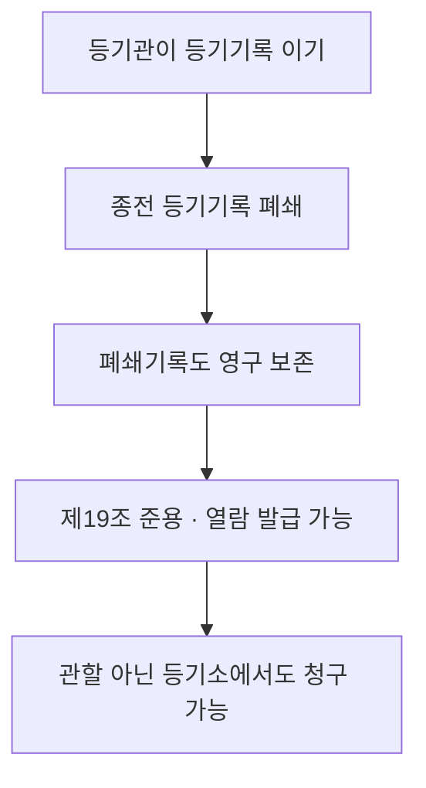

#### ⭐ 기출 출제포인트

1. **등기부의 종류** — 「토지·건물·집합건물 3종」이라는 오답이 반복된다(2019 34번 ①).
2. **반출 3분류** — 신청서만 법원 명령·영장으로 반출 가능(2018 33번, 2019 34번 ③).
3. **관할 아닌 등기소 열람·발급** — 폐쇄기록 포함 가능(2018 33번 ④, 2024 34번 ⑤).
4. **물적 편성주의의 구분건물 예외** — 1동 전부에 1개 등기기록(2019 34번 ⑤, 2024 34번 ④).
5. **영구보존 대상** — 등기부와 폐쇄한 등기기록 **모두**(2019 34번 ②, 2024 34번 ③).

#### 📊 기출 분석

| 연도 | 출제 형태 | 핵심 논점 |
|---|---|---|
| 2018 | 33번 — 옳지 않은 것 | 등기부 종류, 신청서 반출, 부본자료 작성, 폐쇄기록 열람 |
| 2019 | 34번 — 옳은 것 | 등기부 종류 3종 함정, 영구보존, 보관장소, 구분건물 편성 |
| 2024 | 34번 — 옳지 않은 것 | 접수번호 순서, 식별조치, 영구보존, 구분건물, 폐쇄기록 열람 |

**출제 빈도** — 부동산등기법 4문항 중 사실상 **매년 1문항**이 이 관에서 나온다. 가장 가성비 높은 구간이다.
**반복되는 함정** — ① 「집합건물등기부」 신설 ② 「관할 등기소가 아닌 등기소에는 청구할 수 없다」 ③ 등기부를 영장으로 압수할 수 있다는 서술.
**최근 경향** — 표현만 바꿔 같은 논점을 돌려 쓴다. 조문 문언 암기로 완전 대응 가능한 관이다.

#### 🔍 기출 선지로 배우는 조문

**①** (2018 33번 ①) 등기부는 토지등기부와 건물등기부로 구분한다 — **O** / 근거: 법 제14조 제1항.

**②** (2018 33번 ②) 법원의 명령 또는 촉탁이 있는 경우에는 신청서나 그 밖의 부속서류를 등기소 밖으로 옮길 수 있다 — **O** / 근거: 법 제14조 제4항 단서.

**③** (2018 33번 ④, 정답) 폐쇄한 등기기록의 열람 및 등기사항증명서의 발급은 관할 등기소가 아닌 등기소에 청구할 수 **없다** — **X** / 어디가 틀렸나: 청구할 수 있다 / 옳게 고치면: 열람·발급 청구는 ==관할 등기소가 아닌 등기소에 대하여도== 할 수 있고, **폐쇄한 등기기록도 같다**(법 제19조②, 제20조③).

**④** (2019 34번 ①) 등기부는 토지등기부, 건물등기부, **집합건물등기부**로 구분한다 — **X** / 어디가 틀렸나: 등기부는 2종뿐이다 / 옳게 고치면: ==토지등기부와 건물등기부== 2종이다. 구분건물은 건물등기부 안에서 1동 단위 등기기록으로 처리한다.

**⑤** (2019 34번 ②) 등기부와 폐쇄한 등기기록은 모두 영구히 보존하여야 한다 — **O** / 근거: 법 제14조 제2항, 제20조 제2항.

**⑥** (2019 34번 ③) 등기부는 법관이 발부한 영장에 의하여 압수하는 경우 외에는 등기정보중앙관리소에 보관·관리하여야 한다 — **X** / 어디가 틀렸나: 등기부 자체는 영장으로도 반출할 수 없다 / 옳게 고치면: ==전쟁·천재지변이나 이에 준하는 사태를 피하기 위한 경우== 외에는 그 장소 밖으로 옮기지 못한다(법 제14조③). 영장 압수 예외는 **신청서 등 부속서류**에만 적용된다.

**⑦** (2019 34번 ⑤ / 2024 34번 ④) 1동의 건물을 구분한 건물에 있어서는 1동의 건물에 속하는 전부에 대하여 1개의 등기기록을 사용한다 — **O** / 근거: 법 제15조 제1항 단서.

**⑧** (2018 33번 ③) 등기관이 등기를 마쳤을 때에는 등기부부본자료를 작성하여야 한다 — **O** / 근거: 법 제16조.

#### ⚠️ 이 관의 함정 총정리

1. 「등기부는 토지·건물·집합건물 3종이다」라고 하면 틀림 → ==토지등기부·건물등기부 2종==이다(법 제14조①).
2. 「관할 등기소가 아닌 등기소에는 열람·발급을 청구할 수 없다」고 하면 틀림 → ==관할 아닌 등기소에도 청구할 수 있다==(법 제19조②). 폐쇄기록도 같다.
3. 「등기부는 법관의 영장이 있으면 반출할 수 있다」고 하면 틀림 → 영장 예외는 ==신청서나 그 밖의 부속서류==에만 있다(법 제14조④ 단서).
4. 「등기기록의 부속서류는 누구든지 전부 열람할 수 있다」고 하면 틀림 → ==이해관계 있는 부분==만 열람 청구할 수 있다(법 제19조① 단서).
5. 「폐쇄한 등기기록은 5년간 보존한다」처럼 기간을 넣으면 틀림 → ==영구== 보존이다(법 제20조②).
6. 「중복등기기록 정리는 같은 건물에 관하여도 한다」고 하면 틀림 → 조문은 ==같은 토지==에 관한 중복등기기록만 규정한다(법 제21조①).

#### ✅ OX 확인문제

> 다음 진술의 참·거짓을 판단하시오.

**1.** 등기부는 토지등기부와 건물등기부로 구분한다.
→ **O**. 법 제14조 제1항. 집합건물등기부라는 종류는 없다.

**2.** 등기부는 영구히 보존하여야 하고, 폐쇄한 등기기록도 영구히 보존하여야 한다.
→ **O**. 법 제14조 제2항, 제20조 제2항.

**3.** 등기부는 법관이 발부한 영장에 의하여 압수하는 경우 보관장소 밖으로 옮길 수 있다.
→ **X**. 등기부는 **전쟁·천재지변 등 사태를 피하기 위한 경우** 외에는 옮기지 못한다(법 제14조 제3항). 영장 예외는 신청서 등 부속서류에만 있다.

**4.** 신청서나 그 밖의 부속서류는 법원의 명령 또는 촉탁이 있으면 등기소 밖으로 옮길 수 있다.
→ **O**. 법 제14조 제4항 단서.

**5.** 등기기록에는 표제부·갑구·을구를 두며, 을구에는 소유권에 관한 사항을 기록한다.
→ **X**. **갑구**가 소유권, **을구**가 소유권 외의 권리다(법 제15조 제2항).

**6.** 누구든지 수수료를 내고 등기사항증명서의 발급을 청구할 수 있으나, 등기기록의 부속서류는 이해관계 있는 부분만 열람을 청구할 수 있다.
→ **O**. 법 제19조 제1항 본문 및 단서.

**7.** 등기기록의 열람 청구는 관할 등기소가 아닌 등기소에 대하여는 할 수 없다.
→ **X**. **관할 등기소가 아닌 등기소에 대하여도** 할 수 있다(법 제19조 제2항).

**8.** 등기관이 등기기록에 등기된 사항을 새로운 등기기록에 옮겨 기록한 때에는 종전 등기기록을 폐쇄하여야 한다.
→ **O**. 법 제20조 제1항.

**9.** 등기관이 같은 토지에 관하여 중복하여 마쳐진 등기기록을 발견한 경우에는 중복등기기록 중 어느 하나를 폐쇄하여야 한다.
→ **O**. 법 제21조 제1항.

**10.** 등기부의 복구·손상방지 등 필요한 처분은 법원행정처장이 직접 명령하며 대법원장에게 위임할 수 있다.
→ **X**. **대법원장**이 명령하고, 그 권한을 법원행정처장 또는 지방법원장에게 **위임**할 수 있다(법 제17조).

#### 🧠 암기법

> 🔑 **반출 3분류 — "등기부·부속서류는 재난만, 신청서는 다 된다"**
> 등기부·등기부의 부속서류 = **재난 1개만 O**. 신청서 그 밖의 부속서류 = **재난·명령촉탁·영장 3개 다 O**.

> 🔑 **등기기록 3부 — "표(表)·갑(소유권)·을(그 외)"**
> **갑**은 갑(甲)부자 → **소유권**. **을**은 그 나머지.

> 🔑 **"영·영"**
> 등기부도 **영**구, 폐쇄기록도 **영**구.

---

#### ⚖️ 법조문 원문

> 📖 이 관이 근거로 삼은 조문의 **전문**이다. 본문 인용은 발췌지만 여기서는 조 전체를 싣는다. 출처는 법제처 정본이다.

**― 부동산등기법 법률 ―**

> 📌 **부동산등기법 제14조(등기부의 종류 등)** — "① 등기부는 토지등기부(土地登記簿)와 건물등기부(建物登記簿)로 구분한다. ② 등기부는 영구(永久)히 보존하여야 한다. ③ 등기부는 대법원규칙으로 정하는 장소에 보관ㆍ관리하여야 하며, 전쟁ㆍ천재지변이나 그 밖에 이에 준하는 사태를 피하기 위한 경우 외에는 그 장소 밖으로 옮기지 못한다. ④ 등기부의 부속서류는 전쟁ㆍ천재지변이나 그 밖에 이에 준하는 사태를 피하기 위한 경우 외에는 등기소 밖으로 옮기지 못한다. 다만, 신청서나 그 밖의 부속서류에 대하여는 법원의 명령 또는 촉탁(囑託)이 있거나 법관이 발부한 영장에 의하여 압수하는 경우에는 그러하지 아니하다."

> 📌 **부동산등기법 제15조(물적 편성주의)** — "① 등기부를 편성할 때에는 1필의 토지 또는 1개의 건물에 대하여 1개의 등기기록을 둔다. 다만, 1동의 건물을 구분한 건물에 있어서는 1동의 건물에 속하는 전부에 대하여 1개의 등기기록을 사용한다. ② 등기기록에는 부동산의 표시에 관한 사항을 기록하는 표제부와 소유권에 관한 사항을 기록하는 갑구(甲區) 및 소유권 외의 권리에 관한 사항을 기록하는 을구(乙區)를 둔다."

> 📌 **부동산등기법 제16조(등기부부본자료의 작성)** — "등기관이 등기를 마쳤을 때에는 등기부부본자료를 작성하여야 한다."

> 📌 **부동산등기법 제17조(등기부의 손상과 복구)** — "① 등기부의 전부 또는 일부가 손상되거나 손상될 염려가 있을 때에는 대법원장은 대법원규칙으로 정하는 바에 따라 등기부의 복구ㆍ손상방지 등 필요한 처분을 명령할 수 있다. ② 대법원장은 대법원규칙으로 정하는 바에 따라 제1항의 처분명령에 관한 권한을 법원행정처장 또는 지방법원장에게 위임할 수 있다."

> 📌 **부동산등기법 제19조(등기사항의 열람과 증명)** — "① 누구든지 수수료를 내고 대법원규칙으로 정하는 바에 따라 등기기록에 기록되어 있는 사항의 전부 또는 일부의 열람(閱覽)과 이를 증명하는 등기사항증명서의 발급을 청구할 수 있다. 다만, 등기기록의 부속서류에 대하여는 이해관계 있는 부분만 열람을 청구할 수 있다. ② 제1항에 따른 등기기록의 열람 및 등기사항증명서의 발급 청구는 관할 등기소가 아닌 등기소에 대하여도 할 수 있다. ③ 제1항에 따른 수수료의 금액과 면제의 범위는 대법원규칙으로 정한다."

> 📌 **부동산등기법 제20조(등기기록의 폐쇄)** — "① 등기관이 등기기록에 등기된 사항을 새로운 등기기록에 옮겨 기록한 때에는 종전 등기기록을 폐쇄(閉鎖)하여야 한다. ② 폐쇄한 등기기록은 영구히 보존하여야 한다. ③ 폐쇄한 등기기록에 관하여는 제19조를 준용한다."

> 📌 **부동산등기법 제21조(중복등기기록의 정리)** — "① 등기관이 같은 토지에 관하여 중복하여 마쳐진 등기기록을 발견한 경우에는 대법원규칙으로 정하는 바에 따라 중복등기기록 중 어느 하나의 등기기록을 폐쇄하여야 한다. ② 제1항에 따라 폐쇄된 등기기록의 소유권의 등기명의인 또는 등기상 이해관계인은 대법원규칙으로 정하는 바에 따라 그 토지가 폐쇄된 등기기록의 소유권의 등기명의인의 소유임을 증명하여 폐쇄된 등기기록의 부활을 신청할 수 있다."

### [부동산등기법] Chapter 03 등기절차

> 📖 부동산등기법 제4장 제1절 총칙(제22조~제33조)이다. **누가 신청하는가(신청주의·공동신청·단독신청)**, **어떻게 신청하는가(방문·전자)**, **언제 각하하는가(11가지)**, **잘못을 어떻게 고치는가(경정)** 를 정한다.
> 감정평가사 시험에서 부동산등기법 최다 출제 구간이다. 2018·2021·2024·2025·2026년에 모두 나왔다.

> ⭐ **이 관에서 반드시 챙길 3가지**
> ① **공동신청이 원칙**(제23조①), 단독신청은 **열거된 예외**뿐이다. 신탁등기는 ==수탁자==가 단독 신청한다.
> ② **법인 아닌 사단·재단**은 그 ==사단이나 재단==이 등기권리자·등기의무자이고, **대표자나 관리인이 신청**한다. 주체와 신청인을 바꾸는 함정이 매년 나온다.
> ③ **각하사유 11가지**(제29조)와 **보정의 시한** — 보정을 명한 날의 ==다음 날까지==.

#### 1. 개념·정의

| 용어 | 내용 | 근거 |
|---|---|---|
| 신청주의 | 등기는 ==당사자의 신청 또는 관공서의 촉탁==에 따라 한다. 법률에 다른 규정이 있으면 예외 | 법 제22조① |
| 등기권리자·등기의무자 | 공동신청의 두 당사자. 원칙적으로 **공동**으로 신청 | 법 제23조① |
| 방문신청 | 신청인 또는 대리인이 등기소에 **출석**하여 서면 제출 | 법 제24조①1 |
| 전자신청 | 전산정보처리조직을 이용하여 신청정보·첨부정보를 보내는 방법. **모바일 앱 이용 포함** | 법 제24조①2 |
| 포괄승계인에 의한 등기신청 | 등기원인 발생 **후** 상속·포괄승계가 있으면 승계인이 신청 가능 | 법 제27조 |
| 채권자대위 등기신청 | 채권자가 「민법」 제404조에 따라 채무자를 대위하여 신청 | 법 제28조① |

#### 2. 요건·절차 — 단독신청 총정리 (최빈출)

| 등기의 종류 | 신청인 | 근거 |
|---|---|---|
| 원칙 | ==등기권리자와 등기의무자가 공동== | 법 제23조① |
| 소유권보존등기 / 그 말소등기 | ==등기명의인으로 될 자 또는 등기명의인==이 단독 | 법 제23조② |
| 상속·법인의 합병, 그 밖의 포괄승계 | ==등기권리자==가 단독 | 법 제23조③ |
| 이행 또는 인수를 명하는 **판결**에 의한 등기 | ==승소한 등기권리자 또는 등기의무자==가 단독 | 법 제23조④ 전단 |
| **공유물 분할** 판결에 의한 등기 | ==등기권리자 또는 등기의무자==가 단독(승소 불문) | 법 제23조④ 후단 |
| 부동산표시의 변경·경정등기 | ==소유권의 등기명의인==이 단독 | 법 제23조⑤ |
| 등기명의인표시의 변경·경정등기 | ==해당 권리의 등기명의인==이 단독 | 법 제23조⑥ |
| 신탁재산에 속하는 부동산의 신탁등기 | ==수탁자==가 단독 | 법 제23조⑦ |

> ⚠️ **공유물 분할 판결**만 「승소한」이 붙지 않는다. 나머지 판결 등기는 **승소한** 자여야 한다.

#### 3. 핵심 조문

> 📌 **부동산등기법 제22조(신청주의) 제1항** — "등기는 당사자의 신청 또는 관공서의 촉탁에 따라 한다. 다만, 법률에 다른 규정이 있는 경우에는 그러하지 아니하다."

> 📌 **부동산등기법 제23조(등기신청인) 제1항·제7항** — "① 등기는 법률에 다른 규정이 없는 경우에는 등기권리자(登記權利者)와 등기의무자(登記義務者)가 공동으로 신청한다. … ⑦ 신탁재산에 속하는 부동산의 신탁등기는 수탁자(受託者)가 단독으로 신청한다."

**요약** — 2018년 32번이 「신탁등기는 **위탁자**가 단독으로 신청한다」로 바꿔 정답을 만들었다. ==수탁자==다.

> 📌 **부동산등기법 제26조(법인 아닌 사단 등의 등기신청)** — "① 종중(宗中), 문중(門中), 그 밖에 대표자나 관리인이 있는 법인 아닌 사단(社團)이나 재단(財團)에 속하는 부동산의 등기에 관하여는 그 사단이나 재단을 등기권리자 또는 등기의무자로 한다. ② 제1항의 등기는 그 사단이나 재단의 명의로 그 대표자나 관리인이 신청한다."

**요약** — **주체는 사단·재단**, **신청은 대표자·관리인**. 2018 34번·2024 32번·2025 33번·2026 35번이 전부 이 조문이다. 「대표자나 관리인을 등기권리자로 한다」는 언제나 틀린 문장이다.

> 📌 **부동산등기법 제28조(채권자대위권에 의한 등기신청)** — "① 채권자는 「민법」 제404조에 따라 채무자를 대위(代位)하여 등기를 신청할 수 있다. ② 등기관이 제1항 또는 다른 법령에 따른 대위신청에 의하여 등기를 할 때에는 대위자의 성명 또는 명칭, 주소 또는 사무소 소재지 및 대위원인을 기록하여야 한다."

> 📌 **부동산등기법 제29조(신청의 각하) 본문** — "등기관은 다음 각 호의 어느 하나에 해당하는 경우에만 이유를 적은 결정으로 신청을 각하(却下)하여야 한다. 다만, 신청의 잘못된 부분이 보정(補正)될 수 있는 경우로서 신청인이 등기관이 보정을 명한 날의 다음 날까지 그 잘못된 부분을 보정하였을 때에는 그러하지 아니하다."

**요약** — ① 「**~에만**」이므로 각하사유는 **한정열거**다. ② 보정 시한은 ==보정을 명한 날의 다음 날까지==다(2024.9.20 개정). ③ 제1호(관할 위반)·제2호(사건이 등기할 것이 아닌 경우)는 **등기를 마친 뒤에도 직권말소** 대상이 된다(제58조).

> 📌 **부동산등기법 제31조(행정구역의 변경)** — "행정구역 또는 그 명칭이 변경되었을 때에는 등기기록에 기록된 행정구역 또는 그 명칭에 대하여 변경등기가 있는 것으로 본다."

> 📌 **부동산등기법 제32조(등기의 경정)** — "① 등기관이 등기를 마친 후 그 등기에 착오(錯誤)나 빠진 부분이 있음을 발견하였을 때에는 지체 없이 그 사실을 등기권리자와 등기의무자에게 알려야 하고, 등기권리자와 등기의무자가 없는 경우에는 등기명의인에게 알려야 한다. 다만, 등기권리자, 등기의무자 또는 등기명의인이 각 2인 이상인 경우에는 그 중 1인에게 통지하면 된다. ② 등기관이 등기의 착오나 빠진 부분이 등기관의 잘못으로 인한 것임을 발견한 경우에는 지체 없이 그 등기를 직권으로 경정하여야 한다. 다만, 등기상 이해관계 있는 제3자가 있는 경우에는 제3자의 승낙이 있어야 한다."

**요약** — 2026년 35번이 「2인 이상이면 **모두에게** 통지하여야 한다」로 바꿔 오답을 만들었다. ==그 중 1인에게 통지하면 된다==.

> 📌 **부동산등기법 제33조(새 등기기록에의 이기)** — "등기기록에 기록된 사항이 많아 취급하기에 불편하게 되는 등 합리적 사유로 등기기록을 옮겨 기록할 필요가 있는 경우에 등기관은 현재 효력이 있는 등기만을 새로운 등기기록에 옮겨 기록할 수 있다."

#### 4. 🚫 각하사유 11가지 (법 제29조)

| 호 | 각하사유 |
|---|---|
| 1 | 사건이 그 등기소의 **관할이 아닌** 경우 |
| 2 | 사건이 **등기할 것이 아닌** 경우 |
| 3 | **신청할 권한이 없는 자**가 신청한 경우 |
| 4 | 방문신청 시 당사자나 그 대리인이 **출석하지 아니한** 경우 |
| 5 | 신청정보의 제공이 대법원규칙으로 정한 **방식에 맞지 아니한** 경우 |
| 6 | 신청정보의 부동산 또는 권리의 표시가 **등기기록과 불일치** |
| 7 | 신청정보의 **등기의무자의 표시**가 등기기록과 불일치(포괄승계인 신청 등은 제외) |
| 8 | 신청정보와 **등기원인증명정보**가 불일치 |
| 9 | 등기에 필요한 **첨부정보**를 제공하지 아니한 경우 |
| 10 | 취득세·등록면허세·수수료 **미납** 또는 다른 법률상 의무 불이행 |
| 11 | 부동산의 표시가 **토지대장·임야대장 또는 건축물대장과 불일치** |

> 💡 제1호·제2호만 **등기를 마친 후에도 직권말소**로 이어진다(제58조). 제3호(무권한자 신청)는 **각하 대상일 뿐 직권말소 대상이 아니다** — 2024년 33번의 정답 근거다.

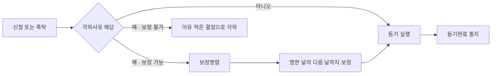

#### 5. ⏱ 기간·수치 총정리

| 항목 | 기간·수치 | 근거 조문 |
|---|---|---|
| 보정 시한 | 등기관이 보정을 명한 날의 ==다음 날까지== | 법 제29조 단서 |
| 각하사유의 수 | ==11가지== 한정열거 | 법 제29조 각 호 |
| 신청정보 제공 원칙 | ==1건당 1개==의 부동산 | 법 제25조 본문 |
| 일괄신청 예외 | 등기목적과 등기원인이 **동일**하거나 대법원규칙으로 정하는 경우 | 법 제25조 단서 |
| 착오·유루 통지 대상이 2인 이상인 경우 | 그 중 ==1인==에게 통지하면 됨 | 법 제32조① 단서 |
| 등기관의 잘못에 의한 경정 | ==지체 없이== 직권 경정 | 법 제32조② |
| 새 등기기록 이기 범위 | ==현재 효력이 있는 등기만== | 법 제33조 |

#### 6. 👤 권한 주체 구분

| 행위 | 주체 | 근거 |
|---|---|---|
| 등기의 신청 | ==당사자== / 촉탁은 ==관공서== | 법 제22조① |
| 법인 아닌 사단·재단 등기의 **당사자** | ==그 사단이나 재단== | 법 제26조① |
| 법인 아닌 사단·재단 등기의 **신청인** | ==대표자나 관리인== | 법 제26조② |
| 신탁등기 신청 | ==수탁자== 단독 | 법 제23조⑦ |
| 부동산표시 변경·경정등기 신청 | ==소유권의 등기명의인== 단독 | 법 제23조⑤ |
| 등기명의인표시 변경·경정등기 신청 | ==해당 권리의 등기명의인== 단독 | 법 제23조⑥ |
| 착오·유루 발견 시 직권 경정 | ==등기관== | 법 제32조② |
| 등기완료 사실의 통지 | ==등기관== → 신청인 등 | 법 제30조 |

#### ⭐ 기출 출제포인트

1. **단독신청 8종 나열형** — 하나를 바꿔 오답(2018 32번, 2021 32번, 2025 33번).
2. **법인 아닌 사단·재단** — 「대표자나 관리인을 등기권리자로 한다」 함정(2018 34번, 2024 32번, 2025 33번, 2026 35번).
3. **각하사유 vs 직권말소사유 구분** — 제29조 1·2호만 직권말소(2024 33번).
4. **경정등기 통지** — 2인 이상이면 1인에게(2026 35번), 제3자 승낙 필요 여부.
5. **채권자대위·포괄승계인 신청 가능 여부**(2018 34번, 2025 33번).

#### 📊 기출 분석

| 연도 | 출제 형태 | 핵심 논점 |
|---|---|---|
| 2018 | 32번 — 옳지 않은 것 | 단독신청 유형, 신탁등기 신청인 |
| 2018 | 34번 — 옳지 않은 것 | 법인 아닌 사단, 새 등기기록 이기, 채권자대위, 행정구역 변경 |
| 2021 | 32번 — 옳은 것 | 법인합병 단독신청, 공유물분할 판결, 표시변경등기 기간 |
| 2024 | 32번 — 옳은 것 | 비법인사단의 등기권리자·등록번호·전자신청 |
| 2024 | 33번 — 옳은 것 | 무권한자 신청은 각하사유이지 직권말소사유가 아님 |
| 2025 | 33번 — 옳지 않은 것 | 단독신청, 가등기 단독신청, 채권자대위, 비법인사단 |
| 2026 | 35번 — 옳지 않은 것 | 표시변경 1개월, 신탁등기 수탁자, 경정등기 통지 |

**출제 빈도** — 부동산등기법 4문항 중 **1~2문항**이 이 관에서 나오는 최다 빈출 구간이다.
**반복되는 함정** — ① 신탁등기 신청인을 위탁자·수익자로 ② 비법인사단의 등기권리자를 대표자로 ③ 「모두에게 통지」 ④ 판결 등기에서 「승소한」을 빼거나 붙이는 조작.
**최근 경향** — 2024.9.20 개정으로 보정 시한이 명문화(「보정을 명한 날의 다음 날까지」)되고 일괄신청 근거가 정비됐다. 개정 부분이 출제 후보다.

#### 🔍 기출 선지로 배우는 조문

**①** (2018 32번 ④, 정답) 신탁재산에 속하는 부동산의 신탁등기는 **위탁자**가 단독으로 신청한다 — **X** / 어디가 틀렸나: 신청인이 다르다 / 옳게 고치면: ==수탁자==가 단독으로 신청한다(법 제23조⑦).

**②** (2018 32번 ②) 상속, 법인의 합병, 그 밖에 대법원규칙으로 정하는 포괄승계에 따른 등기는 등기권리자가 단독으로 신청한다 — **O** / 근거: 법 제23조 제3항.

**③** (2018 34번 ①, 정답) 대표자나 관리인이 있는 법인 아닌 사단이나 재단에 속하는 부동산의 등기에 관하여는 **그 대표자나 관리인**을 등기권리자 또는 등기의무자로 한다 — **X** / 어디가 틀렸나: 당사자가 다르다 / 옳게 고치면: ==그 사단이나 재단==을 등기권리자 또는 등기의무자로 한다(법 제26조①). 신청만 대표자·관리인이 한다.

**④** (2021 32번 ①) 법인의 합병에 따른 등기는 등기권리자와 등기의무자가 **공동으로** 신청하여야 한다 — **X** / 어디가 틀렸나: 공동신청이 아니다 / 옳게 고치면: ==등기권리자가 단독==으로 신청한다(법 제23조③).

**⑤** (2021 32번 ②) 등기의무자는 공유물을 분할하는 판결에 의한 등기를 단독으로 신청할 수 **없다** — **X** / 어디가 틀렸나: 할 수 있다 / 옳게 고치면: 공유물 분할 판결에 의한 등기는 ==등기권리자 또는 등기의무자==가 단독으로 신청한다(법 제23조④ 후단).

**⑥** (2024 33번 ②) 등기관이 등기를 마친 후 그 등기가 **신청할 권한이 없는 자**가 신청한 것임을 발견한 때에는 등기를 직권말소한다는 뜻을 통지하여야 한다 — **X** / 어디가 틀렸나: 직권말소 대상이 아니다 / 옳게 고치면: 무권한자 신청은 ==각하사유(제29조 제3호)==일 뿐이고, 등기를 마친 후 직권말소 절차로 가는 것은 ==제29조 제1호·제2호==에 해당하는 경우뿐이다(법 제58조①).

**⑦** (2026 35번 ③, 정답) 등기관이 등기를 마친 후 그 등기에 착오가 있음을 알려야 하는 경우 등기권리자·등기의무자·등기명의인이 각 2인 이상이면 **그 모두에게** 통지하여야 한다 — **X** / 어디가 틀렸나: 통지 범위가 다르다 / 옳게 고치면: ==그 중 1인에게 통지하면 된다==(법 제32조① 단서).

**⑧** (2018 34번 ②) 등기기록에 기록된 사항이 많아 취급하기에 불편하게 되는 등 합리적 사유가 있으면 등기관은 현재 효력이 있는 등기만을 새로운 등기기록에 옮겨 기록할 수 있다 — **O** / 근거: 법 제33조.

#### ⚠️ 이 관의 함정 총정리

1. 「신탁등기는 위탁자(또는 수익자)가 단독 신청한다」고 하면 틀림 → ==수탁자==다(법 제23조⑦). 다만 수익자·위탁자는 수탁자를 **대위**하여 신청할 수 있다(법 제82조②).
2. 「비법인사단의 대표자를 등기권리자로 한다」고 하면 틀림 → 당사자는 ==사단·재단==, 신청인이 대표자·관리인이다(법 제26조).
3. 「공유물 분할 판결에 의한 등기는 승소한 등기권리자만 단독 신청한다」고 하면 틀림 → ==등기권리자 또는 등기의무자==가 단독 신청한다(법 제23조④ 후단).
4. 「무권한자가 신청한 등기가 마쳐지면 직권으로 말소한다」고 하면 틀림 → 직권말소는 제29조 ==제1호·제2호==에 한한다(법 제58조①).
5. 「보정은 각하결정 전까지 언제든 할 수 있다」고 하면 틀림 → ==보정을 명한 날의 다음 날까지==다(법 제29조 단서).
6. 「등기관의 잘못으로 인한 경정은 이해관계 있는 제3자가 있어도 승낙 없이 직권으로 한다」고 하면 틀림 → ==제3자의 승낙이 있어야 한다==(법 제32조② 단서).

#### ✅ OX 확인문제

> 다음 진술의 참·거짓을 판단하시오.

**1.** 등기는 법률에 다른 규정이 없는 경우 등기권리자와 등기의무자가 공동으로 신청한다.
→ **O**. 법 제23조 제1항. 공동신청이 원칙이다.

**2.** 소유권보존등기의 말소등기는 등기권리자와 등기의무자가 공동으로 신청하여야 한다.
→ **X**. **등기명의인이 단독**으로 신청한다(법 제23조 제2항).

**3.** 신탁재산에 속하는 부동산의 신탁등기는 수탁자가 단독으로 신청한다.
→ **O**. 법 제23조 제7항.

**4.** 종중에 속하는 부동산의 등기에 관하여는 그 종중을 등기권리자 또는 등기의무자로 하고, 등기는 그 대표자나 관리인이 신청한다.
→ **O**. 법 제26조 제1항·제2항.

**5.** 채권자는 「민법」 제404조에 따라 채무자를 대위하여 등기를 신청할 수 있다.
→ **O**. 법 제28조 제1항.

**6.** 등기관은 각하사유에 해당하더라도 재량으로 등기를 실행할 수 있다.
→ **X**. 제29조 각 호에 해당하면 **이유를 적은 결정으로 각하하여야 한다**. 「~에만」 「하여야 한다」로 되어 있어 한정열거·기속행위다.

**7.** 신청의 잘못된 부분이 보정될 수 있는 경우 신청인이 보정을 명한 날의 다음 날까지 보정하면 각하하지 아니한다.
→ **O**. 법 제29조 단서.

**8.** 행정구역의 명칭이 변경되었을 때에는 등기명의인이 1개월 이내에 변경등기를 신청하여야 한다.
→ **X**. **변경등기가 있는 것으로 본다**(법 제31조). 별도 신청이 필요 없다.

**9.** 등기관이 등기의 빠진 부분이 자신의 잘못으로 인한 것임을 발견한 경우 지체 없이 직권으로 경정하여야 하나, 등기상 이해관계 있는 제3자가 있으면 그 승낙이 있어야 한다.
→ **O**. 법 제32조 제2항 본문 및 단서.

**10.** 등기의 신청은 언제나 1건당 1개의 부동산에 관한 신청정보를 제공하는 방법으로만 하여야 한다.
→ **X**. 원칙은 그렇지만 **등기목적과 등기원인이 동일**하거나 대법원규칙으로 정하는 경우에는 여러 개 부동산을 **일괄** 제공할 수 있다(법 제25조 단서).

#### 🧠 암기법

> 🔑 **단독신청 — "보·포·판·공·부·명·신"**
> **보**존등기 / **포**괄승계 / **판**결 / **공**유물분할판결 / **부**동산표시변경 / 등기**명**의인표시변경 / **신**탁등기.
> 이 7묶음 밖은 전부 **공동신청**이다.

> 🔑 **비법인사단 — "당사자는 단체, 손은 대표"**
> 등기권리자·의무자 = **사단·재단 자체**. 신청하는 손 = **대표자·관리인**.

> 🔑 **직권말소로 가는 각하사유 — "관(할)·등(기할 것 아님) 둘뿐"**
> 제29조 1호(관할 위반)·2호(사건이 등기할 것이 아님)만 등기 후 직권말소 대상.

---

#### ⚖️ 법조문 원문

> 📖 이 관이 근거로 삼은 조문의 **전문**이다. 본문 인용은 발췌지만 여기서는 조 전체를 싣는다. 출처는 법제처 정본이다.

**― 부동산등기법 법률 ―**

> 📌 **부동산등기법 제22조(신청주의)** — "① 등기는 당사자의 신청 또는 관공서의 촉탁에 따라 한다. 다만, 법률에 다른 규정이 있는 경우에는 그러하지 아니하다. ② 촉탁에 따른 등기절차는 법률에 다른 규정이 없는 경우에는 신청에 따른 등기에 관한 규정을 준용한다. ③ 등기를 하려고 하는 자는 대법원규칙으로 정하는 바에 따라 수수료를 내야 한다."

> 📌 **부동산등기법 제23조(등기신청인)** — "① 등기는 법률에 다른 규정이 없는 경우에는 등기권리자(登記權利者)와 등기의무자(登記義務者)가 공동으로 신청한다. ② 소유권보존등기(所有權保存登記) 또는 소유권보존등기의 말소등기(抹消登記)는 등기명의인으로 될 자 또는 등기명의인이 단독으로 신청한다. ③ 상속, 법인의 합병, 그 밖에 대법원규칙으로 정하는 포괄승계에 따른 등기는 등기권리자가 단독으로 신청한다. ④ 등기절차의 이행 또는 인수를 명하는 판결에 의한 등기는 승소한 등기권리자 또는 등기의무자가 단독으로 신청하고, 공유물을 분할하는 판결에 의한 등기는 등기권리자 또는 등기의무자가 단독으로 신청한다. ⑤ 부동산표시의 변경이나 경정(更正)의 등기는 소유권의 등기명의인이 단독으로 신청한다. ⑥ 등기명의인표시의 변경이나 경정의 등기는 해당 권리의 등기명의인이 단독으로 신청한다. ⑦ 신탁재산에 속하는 부동산의 신탁등기는 수탁자(受託者)가 단독으로 신청한다. ⑧ 수탁자가 「신탁법」 제3조제5항에 따라 타인에게 신탁재산에 대하여 신탁을 설정하는 경우 해당 신탁재산에 속하는 부동산에 관한 권리이전등기에 대하여는 새로운 신탁의 수탁자를 등기권리자로 하고 원래 신탁의 수탁자를 등기의무자로 한다. 이 경우 해당 신탁재산에 속하는 부동산의 신탁등기는 제7항에 따라 새로운 신탁의 수탁자가 단독으로 신청한다."

> 📌 **부동산등기법 제26조(법인 아닌 사단 등의 등기신청)** — "① 종중(宗中), 문중(門中), 그 밖에 대표자나 관리인이 있는 법인 아닌 사단(社團)이나 재단(財團)에 속하는 부동산의 등기에 관하여는 그 사단이나 재단을 등기권리자 또는 등기의무자로 한다. ② 제1항의 등기는 그 사단이나 재단의 명의로 그 대표자나 관리인이 신청한다."

> 📌 **부동산등기법 제28조(채권자대위권에 의한 등기신청)** — "① 채권자는 「민법」 제404조에 따라 채무자를 대위(代位)하여 등기를 신청할 수 있다. ② 등기관이 제1항 또는 다른 법령에 따른 대위신청에 의하여 등기를 할 때에는 대위자의 성명 또는 명칭, 주소 또는 사무소 소재지 및 대위원인을 기록하여야 한다."

> 📌 **부동산등기법 제29조(신청의 각하)** — "등기관은 다음 각 호의 어느 하나에 해당하는 경우에만 이유를 적은 결정으로 신청을 각하(却下)하여야 한다. 다만, 신청의 잘못된 부분이 보정(補正)될 수 있는 경우로서 신청인이 등기관이 보정을 명한 날의 다음 날까지 그 잘못된 부분을 보정하였을 때에는 그러하지 아니하다. 1. 사건이 그 등기소의 관할이 아닌 경우 2. 사건이 등기할 것이 아닌 경우 3. 신청할 권한이 없는 자가 신청한 경우 4. 제24조제1항제1호에 따라 등기를 신청할 때에 당사자나 그 대리인이 출석하지 아니한 경우 5. 신청정보의 제공이 대법원규칙으로 정한 방식에 맞지 아니한 경우 6. 신청정보의 부동산 또는 등기의 목적인 권리의 표시가 등기기록과 일치하지 아니한 경우 7. 신청정보의 등기의무자의 표시가 등기기록과 일치하지 아니한 경우. 다만, 다음 각 목의 어느 하나에 해당하는 경우는 제외한다. 가. 제27조에 따라 포괄승계인이 등기신청을 하는 경우 나. 신청정보와 등기기록의 등기의무자가 동일인임을 대법원규칙으로 정하는 바에 따라 확인할 수 있는 경우 8. 신청정보와 등기원인을 증명하는 정보가 일치하지 아니한 경우 9. 등기에 필요한 첨부정보를 제공하지 아니한 경우 10. 취득세(「지방세법」 제20조의2에 따라 분할납부하는 경우에는 등기하기 이전에 분할납부하여야 할 금액을 말한다), 등록면허세(등록에 대한 등록면허세만 해당한다) 또는 수수료를 내지 아니하거나 등기신청과 관련하여 다른 법률에 따라 부과된 의무를 이행하지 아니한 경우 11. 신청정보 또는 등기기록의 부동산의 표시가 토지대장ㆍ임야대장 또는 건축물대장과 일치하지 아니한 경우"

> 📌 **부동산등기법 제31조(행정구역의 변경)** — "행정구역 또는 그 명칭이 변경되었을 때에는 등기기록에 기록된 행정구역 또는 그 명칭에 대하여 변경등기가 있는 것으로 본다."

> 📌 **부동산등기법 제32조(등기의 경정)** — "① 등기관이 등기를 마친 후 그 등기에 착오(錯誤)나 빠진 부분이 있음을 발견하였을 때에는 지체 없이 그 사실을 등기권리자와 등기의무자에게 알려야 하고, 등기권리자와 등기의무자가 없는 경우에는 등기명의인에게 알려야 한다. 다만, 등기권리자, 등기의무자 또는 등기명의인이 각 2인 이상인 경우에는 그 중 1인에게 통지하면 된다. ② 등기관이 등기의 착오나 빠진 부분이 등기관의 잘못으로 인한 것임을 발견한 경우에는 지체 없이 그 등기를 직권으로 경정하여야 한다. 다만, 등기상 이해관계 있는 제3자가 있는 경우에는 제3자의 승낙이 있어야 한다. ③ 등기관이 제2항에 따라 경정등기를 하였을 때에는 그 사실을 등기권리자, 등기의무자 또는 등기명의인에게 알려야 한다. 이 경우 제1항 단서를 준용한다. ④ 채권자대위권에 의하여 등기가 마쳐진 때에는 제1항 및 제3항의 통지를 그 채권자에게도 하여야 한다. 이 경우 제1항 단서를 준용한다."

> 📌 **부동산등기법 제33조(새 등기기록에의 이기)** — "등기기록에 기록된 사항이 많아 취급하기에 불편하게 되는 등 합리적 사유로 등기기록을 옮겨 기록할 필요가 있는 경우에 등기관은 현재 효력이 있는 등기만을 새로운 등기기록에 옮겨 기록할 수 있다."

### [부동산등기법] Chapter 04 표시에 관한 등기

> 📖 부동산등기법 제4장 제2절(제34조~제47조)이다. **토지의 표시에 관한 등기**(제1관 제34조~제39조)와 **건물의 표시에 관한 등기**(제2관 제40조~제47조)로 나뉜다.
> 표제부에 무엇을 기록하는가, 변경·멸실 시 **1개월 이내** 신청의무, **합필·합병 제한**, **구분건물·대지권**이 논점이다.

> ⭐ **이 관에서 반드시 챙길 3가지**
> ① **모든 표시변경·멸실등기 신청기간은 ==1개월 이내==**다. 「2개월」·「14일」은 전부 오답.
> ② **표제부에는 등기목적·순위번호를 기록하지 않는다.** 그건 갑구·을구(권리에 관한 등기)의 기록사항이다.
> ③ **도면의 번호**는 「같은 지번 위에 여러 개의 건물이 있는 경우」와 「구분건물인 경우」에만 기록한다.

#### 1. 개념·정의 — 표제부 기록사항

| 구분 | 기록사항 | 근거 |
|---|---|---|
| **토지** 표제부 | 표시번호 / 접수연월일 / 소재와 지번 / 지목 / 면적 / 등기원인 (==6가지==) | 법 제34조 |
| **건물** 표제부 | 표시번호 / 접수연월일 / 소재·지번·건물명칭 및 번호 / 건물의 종류·구조·면적 / 등기원인 / ==도면의 번호== (==6가지==) | 법 제40조① |
| 건물번호 생략 | 같은 지번 위에 **1개의 건물만** 있는 경우 건물번호는 기록하지 아니함 | 법 제40조①3 단서 |
| 도면의 번호 기록 요건 | 같은 지번 위에 **여러 개의 건물**이 있는 경우 + **구분건물**인 경우로 한정 | 법 제40조①6 |
| 구분건물 | 「집합건물법」 제2조 제1호의 구분소유권의 목적이 되는 건물 | 법 제40조①6 |
| 대지권 | 「집합건물법」 제2조 제6호의 대지사용권으로서 **건물과 분리하여 처분할 수 없는 것** | 법 제40조③ |

> 💡 토지 표제부에는 **도면의 번호가 없다**. 건물에만 있다. 그리고 토지·건물 어느 표제부에도 **등기목적**은 없다(2023 32번 ①의 함정).

#### 2. 요건·절차

| 구분 | 내용 | 근거 |
|---|---|---|
| 토지 변경등기 신청 | 분할·합병이 있거나 제34조 등기사항 변경 시 소유권 등기명의인이 ==1개월 이내== 신청 | 법 제35조 |
| 직권 표시변경등기 | 지적소관청 통지를 받고도 1개월 내 신청이 없으면 등기관이 ==직권== 변경등기 | 법 제36조① |
| 직권 변경 후 통지 | 등기관이 ==지체 없이== ==지적소관청과 소유권의 등기명의인==에게 통지(2인 이상이면 1인) | 법 제36조② |
| 토지 멸실등기 | 멸실 사실이 있는 때부터 ==1개월 이내== 신청 | 법 제39조 |
| 건물 변경등기 신청 | 분할·구분·합병 또는 제40조 등기사항 변경 시 ==1개월 이내== 신청 | 법 제41조① |
| 건물 멸실등기 | ==1개월 이내== 신청 | 법 제43조① |
| 대위 멸실등기 | 소유권 등기명의인이 1개월 내 신청하지 않으면 ==건물대지의 소유자==가 대위 신청 가능 | 법 제43조② |
| 건물 부존재 | 존재하지 않는 건물의 등기가 있으면 ==지체 없이== 멸실등기 신청 | 법 제44조① |
| 이해관계인 있는 건물 멸실 | 소유권 외 권리의 등기명의인에게 ==1개월 이내==의 기간을 정해 이의 진술 최고 | 법 제45조① |
| 구분건물 일부 보존등기 | 나머지 구분건물의 **표시등기를 동시에 신청**하여야 함 | 법 제46조① |

#### 3. 핵심 조문

> 📌 **부동산등기법 제34조(등기사항)** — "등기관은 토지 등기기록의 표제부에 다음 각 호의 사항을 기록하여야 한다. 1. 표시번호 2. 접수연월일 3. 소재와 지번(地番) 4. 지목(地目) 5. 면적 6. 등기원인"

> 📌 **부동산등기법 제35조(변경등기의 신청)** — "토지의 분할, 합병이 있는 경우와 제34조의 등기사항에 변경이 있는 경우에는 그 토지 소유권의 등기명의인은 그 사실이 있는 때부터 1개월 이내에 그 등기를 신청하여야 한다."

> 📌 **부동산등기법 제36조(직권에 의한 표시변경등기) 제2항** — "제1항의 등기를 하였을 때에는 등기관은 지체 없이 그 사실을 지적소관청과 소유권의 등기명의인에게 알려야 한다. 다만, 등기명의인이 2인 이상인 경우에는 그 중 1인에게 통지하면 된다."

**요약** — 2021년 32번이 「**소유권의 등기명의인은** 지체 없이 그 사실을 **지적소관청에게** 알려야 한다」로 주체를 뒤집었다. 알리는 자는 ==등기관==이고, 받는 자가 ==지적소관청과 소유권의 등기명의인==이다.

> 📌 **부동산등기법 제37조(합필 제한) 제1항** — "합필(合筆)하려는 토지에 다음 각 호의 등기 외의 권리에 관한 등기가 있는 경우에는 합필의 등기를 할 수 없다. 1. 소유권·지상권·전세권·임차권 및 승역지(承役地: 편익제공지)에 하는 지역권의 등기 2. 합필하려는 모든 토지에 있는 등기원인 및 그 연월일과 접수번호가 동일한 저당권에 관한 등기 3. 합필하려는 모든 토지에 있는 제81조제1항 각 호의 등기사항이 동일한 신탁등기"

> 📌 **부동산등기법 제42조(합병 제한) 제1항** — "합병하려는 건물에 다음 각 호의 등기 외의 권리에 관한 등기가 있는 경우에는 합병의 등기를 할 수 없다. 1. 소유권·전세권 및 임차권의 등기 2. 합병하려는 모든 건물에 있는 등기원인 및 그 연월일과 접수번호가 동일한 저당권에 관한 등기 3. 합병하려는 모든 건물에 있는 제81조제1항 각 호의 등기사항이 동일한 신탁등기"

**요약** — **토지 합필**은 소유권·지상권·전세권·임차권·승역지 지역권까지 허용되지만, **건물 합병**은 ==소유권·전세권·임차권==뿐이다. **지상권·지역권이 빠진다** — 건물에는 지상권·지역권이 성립하지 않기 때문이다.

> 📌 **부동산등기법 제40조 제4항(대지권등기의 직권 부기)** — "등기관이 제3항에 따라 대지권등기를 하였을 때에는 직권으로 대지권의 목적인 토지의 등기기록에 소유권, 지상권, 전세권 또는 임차권이 대지권이라는 뜻을 기록하여야 한다."

> 📌 **부동산등기법 제43조(멸실등기의 신청)** — "① 건물이 멸실된 경우에는 그 건물 소유권의 등기명의인은 그 사실이 있는 때부터 1개월 이내에 그 등기를 신청하여야 한다. … ② 제1항의 경우 그 소유권의 등기명의인이 1개월 이내에 멸실등기를 신청하지 아니하면 그 건물대지의 소유자가 건물 소유권의 등기명의인을 대위하여 그 등기를 신청할 수 있다. ③ 구분건물로서 그 건물이 속하는 1동 전부가 멸실된 경우에는 그 구분건물의 소유권의 등기명의인은 1동의 건물에 속하는 다른 구분건물의 소유권의 등기명의인을 대위하여 1동 전부에 대한 멸실등기를 신청할 수 있다."

> 📌 **부동산등기법 제46조(구분건물의 표시에 관한 등기) 제1항** — "1동의 건물에 속하는 구분건물 중 일부만에 관하여 소유권보존등기를 신청하는 경우에는 나머지 구분건물의 표시에 관한 등기를 동시에 신청하여야 한다."

#### 4. ⏱ 기간·수치 총정리

| 항목 | 기간·수치 | 근거 조문 |
|---|---|---|
| 토지 분할·합병·표시변경등기 신청 | ==1개월 이내== | 법 제35조 |
| 토지 멸실등기 신청 | ==1개월 이내== | 법 제39조 |
| 건물 분할·구분·합병·표시변경등기 신청 | ==1개월 이내== | 법 제41조① |
| 건물 멸실등기 신청 | ==1개월 이내== | 법 제43조① |
| 사용승인 후 미승인 기록 말소등기 신청 | ==1개월 이내== | 법 제66조③ |
| 이해관계인에 대한 이의진술 최고기간 | ==1개월 이내==의 기간을 정하여 | 법 제45조① |
| 건물 부존재 시 멸실등기 신청 | ==지체 없이== | 법 제44조① |
| 규약폐지 후 소유권보존등기 신청 | ==지체 없이== | 법 제47조② |
| 직권 표시변경등기 후 통지 | ==지체 없이== | 법 제36조② |
| 토지 표제부 기록사항 수 | ==6가지== | 법 제34조 |
| 건물 표제부 기록사항 수 | ==6가지== | 법 제40조① |

> 🔑 **표시에 관한 등기의 기간은 전부 「1개월」이다.** 예외 없다.

#### 5. 👤 권한 주체 구분

| 행위 | 주체 | 근거 |
|---|---|---|
| 토지·건물 표시변경등기 신청 | ==소유권의 등기명의인== | 법 제35조, 제41조① |
| 직권 표시변경등기 | ==등기관== | 법 제36조① |
| 직권 변경 후 통지 | ==등기관== → 지적소관청 + 소유권 등기명의인 | 법 제36조② |
| 합필 각하 시 통지 | ==등기관== → ==지적소관청== | 법 제37조② |
| 합병 각하 시 통지 | ==등기관== → ==건축물대장 소관청== | 법 제42조② |
| 건물 멸실등기 대위신청 | ==건물대지의 소유자== | 법 제43조② |
| 1동 전부 멸실 시 대위신청 | ==다른 구분건물의 소유권 등기명의인을 대위한 구분건물 소유권 등기명의인== | 법 제43조③ |
| 대지권등기 후 토지 등기기록 부기 | ==등기관 직권== | 법 제40조④ |
| 규약상 공용부분이라는 뜻의 등기 신청 | ==소유권의 등기명의인== | 법 제47조① |

> ⚠️ **합필 각하는 지적소관청**, **합병 각하는 건축물대장 소관청**. 토지/건물이 갈린다.

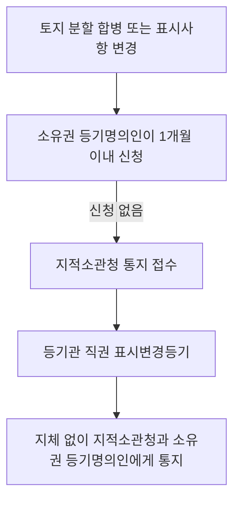

#### ⭐ 기출 출제포인트

1. **1개월 기간 바꿔치기** — 2개월(2018 35번 ②)·14일(2021 32번 ⑤)이 대표적 오답.
2. **표제부 기록사항에 없는 것** — 「등기목적」(2023 32번 ①), 「순위번호」.
3. **도면의 번호 기록 요건** — 여러 건물 + 구분건물 한정(2022 32번, 2024 35번 ①).
4. **직권 표시변경등기의 통지 주체** — 등기관이 통지한다(2021 32번 ④).
5. **구분건물 대위신청·동시신청** — 대지권 변경·소멸 시 대위, 일부 보존 시 나머지 표시등기 동시신청(2018 35번, 2023 32번, 2024 35번).

#### 📊 기출 분석

| 연도 | 출제 형태 | 핵심 논점 |
|---|---|---|
| 2018 | 35번 — 옳지 않은 것 | 건물 멸실 1개월, 대지권등기 직권부기, 건물 부존재 |
| 2021 | 32번 — 옳은 것 | 토지분할 1개월, 토지멸실 1개월, 직권 표시변경 통지주체 |
| 2022 | 32번 — 단답 | 도면의 번호(여러 건물·구분건물 한정) |
| 2023 | 32번 — 옳지 않은 것 | 토지 표제부에 등기목적 기록 여부, 대지권 변경 대위 |
| 2024 | 35번 — 옳지 않은 것 | 구분건물 도면번호, 1동 전부 멸실 대위, 대지권 등기된 구분건물 |
| 2026 | 35번 — 옳지 않은 것 | 토지 합병 1개월 |

**출제 빈도** — 매우 높다. 단독 1문항 또는 다른 관 문항의 선지로 반드시 등장한다.
**반복되는 함정** — ① 기간을 2개월·14일·3개월로 ② 표제부에 등기목적·순위번호를 넣기 ③ 통지 주체를 등기명의인으로 ④ 대지권 등기된 구분건물에 건물만의 저당권설정등기를 할 수 있다고 서술.
**최근 경향** — 2024.9.20 개정으로 건물 표제부에 「건물명칭」이 명시(건축물대장에 기재된 경우만)됐다.

#### 🔍 기출 선지로 배우는 조문

**①** (2018 35번 ②, 정답) 건물이 멸실된 경우 그 건물 소유권의 등기명의인은 그 사실이 있는 때부터 **2개월 이내**에 그 등기를 신청하여야 한다 — **X** / 어디가 틀렸나: 기간 / 옳게 고치면: ==1개월 이내==다(법 제43조①).

**②** (2021 32번 ⑤) 토지가 멸실된 경우 그 토지 소유권의 등기명의인은 그 사실이 있는 때부터 **14일 이내**에 그 등기를 신청하여야 한다 — **X** / 어디가 틀렸나: 기간 / 옳게 고치면: ==1개월 이내==다(법 제39조).

**③** (2021 32번 ④) 등기관이 직권에 의한 표시변경등기를 하였을 때에는 **소유권의 등기명의인**은 지체 없이 그 사실을 지적소관청에게 알려야 한다 — **X** / 어디가 틀렸나: 통지 주체와 상대방이 뒤집혔다 / 옳게 고치면: ==등기관==이 지체 없이 ==지적소관청과 소유권의 등기명의인==에게 알려야 한다(법 제36조②).

**④** (2023 32번 ①, 정답) 등기관은 토지 등기기록의 표제부에 **등기목적**을 기록하여야 한다 — **X** / 어디가 틀렸나: 표제부 기록사항이 아니다 / 옳게 고치면: 토지 표제부 기록사항은 ==표시번호·접수연월일·소재와 지번·지목·면적·등기원인== 6가지다(법 제34조). 등기목적·순위번호는 **권리에 관한 등기**의 기록사항(법 제48조①)이다.

**⑤** (2022 32번 ⑤, 정답) 같은 지번 위에 여러 개의 건물이 있는 경우와 구분건물의 경우에 한정하여 기록하는 것은 **도면의 번호**다 — **O** / 근거: 법 제40조 제1항 제6호.

**⑥** (2018 35번 ①) 등기관이 대지권등기를 하였을 때에는 직권으로 대지권의 목적인 토지의 등기기록에 소유권·지상권·전세권 또는 임차권이 대지권이라는 뜻을 기록하여야 한다 — **O** / 근거: 법 제40조 제4항.

**⑦** (2024 35번 ④, 정답) 대지권이 등기된 구분건물의 등기기록에는 건물만에 관한 저당권설정등기를 **할 수 있다** — **X** / 어디가 틀렸나: 할 수 없다 / 옳게 고치면: 대지권이 등기된 구분건물의 등기기록에는 ==건물만에 관한 소유권이전등기 또는 저당권설정등기, 그 밖에 이와 관련이 있는 등기를 할 수 없다==(법 제61조③).

**⑧** (2023 32번 ③ / 2018 35번 ④) 구분건물로서 그 대지권의 변경이 있는 경우 구분건물의 소유권 등기명의인은 1동의 건물에 속하는 다른 구분건물의 소유권 등기명의인을 대위하여 그 등기를 신청할 수 있다 — **O** / 근거: 법 제41조 제3항.

#### ⚠️ 이 관의 함정 총정리

1. 「토지·건물 표시변경등기는 2개월 이내에 신청한다」고 하면 틀림 → 전부 ==1개월 이내==다(법 제35조·제39조·제41조·제43조).
2. 「토지 표제부에 등기목적을 기록한다」고 하면 틀림 → 표제부에는 등기목적·순위번호가 ==없다==(법 제34조).
3. 「직권 표시변경등기 후 소유권 등기명의인이 지적소관청에 통지한다」고 하면 틀림 → ==등기관==이 통지한다(법 제36조②).
4. 「건물 합병 제한의 예외에는 지상권도 포함된다」고 하면 틀림 → 건물 합병은 ==소유권·전세권·임차권==뿐이다(법 제42조①1). 지상권·지역권이 들어가는 것은 **토지 합필**이다(법 제37조①1).
5. 「합병등기 신청을 각하하면 지적소관청에 알린다」고 하면 틀림 → 건물이므로 ==건축물대장 소관청==이다(법 제42조②). 지적소관청은 합필(토지)이다(법 제37조②).
6. 「대지권이 등기된 구분건물에도 건물만에 관한 저당권설정등기를 할 수 있다」고 하면 틀림 → ==할 수 없다==(법 제61조③).

#### ✅ OX 확인문제

> 다음 진술의 참·거짓을 판단하시오.

**1.** 토지의 분할이 있는 경우 그 토지 소유권의 등기명의인은 그 사실이 있는 때부터 1개월 이내에 그 등기를 신청하여야 한다.
→ **O**. 법 제35조.

**2.** 토지가 멸실된 경우 소유권의 등기명의인은 그 사실이 있는 때부터 14일 이내에 멸실등기를 신청하여야 한다.
→ **X**. **1개월 이내**다(법 제39조).

**3.** 등기관은 토지 등기기록의 표제부에 표시번호·접수연월일·소재와 지번·지목·면적·등기원인을 기록하여야 한다.
→ **O**. 법 제34조 각 호. 등기목적은 포함되지 않는다.

**4.** 건물 등기기록의 표제부에서 도면의 번호는 같은 지번 위에 여러 개의 건물이 있는 경우와 구분건물인 경우에 한정하여 기록한다.
→ **O**. 법 제40조 제1항 제6호.

**5.** 등기관이 직권으로 표시변경등기를 하였을 때에는 소유권의 등기명의인이 지체 없이 지적소관청에 통지하여야 한다.
→ **X**. **등기관**이 지체 없이 지적소관청과 소유권의 등기명의인에게 알려야 한다(법 제36조 제2항).

**6.** 건물을 합병하려는 경우 그 건물에 지상권등기가 있으면 합병의 등기를 할 수 없다.
→ **O**. 건물 합병이 허용되는 것은 소유권·전세권·임차권 등기뿐이다(법 제42조 제1항 제1호).

**7.** 등기관이 합필 제한을 위반한 등기신청을 각하하면 지체 없이 그 사유를 건축물대장 소관청에 알려야 한다.
→ **X**. 합필은 토지이므로 **지적소관청**에 알린다(법 제37조 제2항). 건축물대장 소관청은 건물 합병의 경우다(법 제42조 제2항).

**8.** 건물 소유권의 등기명의인이 1개월 이내에 멸실등기를 신청하지 아니하면 그 건물대지의 소유자가 대위하여 그 등기를 신청할 수 있다.
→ **O**. 법 제43조 제2항.

**9.** 존재하지 아니하는 건물에 대한 등기가 있을 때에는 그 소유권의 등기명의인은 1개월 이내에 멸실등기를 신청하여야 한다.
→ **X**. **지체 없이** 신청하여야 한다(법 제44조 제1항).

**10.** 1동의 건물에 속하는 구분건물 중 일부만에 관하여 소유권보존등기를 신청하는 경우에는 나머지 구분건물의 표시에 관한 등기를 동시에 신청하여야 한다.
→ **O**. 법 제46조 제1항.

#### 🧠 암기법

> 🔑 **"표시등기는 무조건 한 달"**
> 토지분할·합병·표시변경·멸실, 건물분할·구분·합병·표시변경·멸실 — 전부 **1개월**.
> 단, **부존재 건물**과 **규약폐지 후 보존등기**는 「**지체 없이**」.

> 🔑 **합필 vs 합병 — "토지는 지(상권)·지(역권)까지, 건물은 소·전·임"**
> 토지 합필 허용: **소유권·지상권·전세권·임차권·승역지 지역권**.
> 건물 합병 허용: **소유권·전세권·임차권**.

> 🔑 **각하 통지 상대 — "필(筆)은 지적, 병(倂)은 건축"**
> 합**필** 각하 → **지적**소관청 / 합**병** 각하 → **건축**물대장 소관청.

> 🔑 **표제부 vs 갑을구 — "표는 무엇, 구는 누구"**
> 표제부 = 부동산이 **무엇**인지(표시번호·소재·지목·면적). 갑구·을구 = **누구의 어떤 권리**인지(순위번호·등기목적·권리자).

---

#### ⚖️ 법조문 원문

> 📖 이 관이 근거로 삼은 조문의 **전문**이다. 본문 인용은 발췌지만 여기서는 조 전체를 싣는다. 출처는 법제처 정본이다.

**― 부동산등기법 법률 ―**

> 📌 **부동산등기법 제34조(등기사항)** — "등기관은 토지 등기기록의 표제부에 다음 각 호의 사항을 기록하여야 한다. 1. 표시번호 2. 접수연월일 3. 소재와 지번(地番) 4. 지목(地目) 5. 면적 6. 등기원인"

> 📌 **부동산등기법 제35조(변경등기의 신청)** — "토지의 분할, 합병이 있는 경우와 제34조의 등기사항에 변경이 있는 경우에는 그 토지 소유권의 등기명의인은 그 사실이 있는 때부터 1개월 이내에 그 등기를 신청하여야 한다."

> 📌 **부동산등기법 제36조(직권에 의한 표시변경등기)** — "① 등기관이 지적(地籍)소관청으로부터 「공간정보의 구축 및 관리 등에 관한 법률」 제88조제3항의 통지를 받은 경우에 제35조의 기간 이내에 등기명의인으로부터 등기신청이 없을 때에는 그 통지서의 기재내용에 따른 변경의 등기를 직권으로 하여야 한다. ② 제1항의 등기를 하였을 때에는 등기관은 지체 없이 그 사실을 지적소관청과 소유권의 등기명의인에게 알려야 한다. 다만, 등기명의인이 2인 이상인 경우에는 그 중 1인에게 통지하면 된다."

> 📌 **부동산등기법 제37조(합필 제한)** — "① 합필(合筆)하려는 토지에 다음 각 호의 등기 외의 권리에 관한 등기가 있는 경우에는 합필의 등기를 할 수 없다. 1. 소유권ㆍ지상권ㆍ전세권ㆍ임차권 및 승역지(承役地: 편익제공지)에 하는 지역권의 등기 2. 합필하려는 모든 토지에 있는 등기원인 및 그 연월일과 접수번호가 동일한 저당권에 관한 등기 3. 합필하려는 모든 토지에 있는 제81조제1항 각 호의 등기사항이 동일한 신탁등기 ② 등기관이 제1항을 위반한 등기의 신청을 각하하면 지체 없이 그 사유를 지적소관청에 알려야 한다."

> 📌 **부동산등기법 제40조(등기사항)** — "① 등기관은 건물 등기기록의 표제부에 다음 각 호의 사항을 기록하여야 한다. 1. 표시번호 2. 접수연월일 3. 소재, 지번, 건물명칭(건축물대장에 건물명칭이 기재되어 있는 경우만 해당한다. 이하 이 조에서 같다) 및 번호. 다만, 같은 지번 위에 1개의 건물만 있는 경우에는 건물번호는 기록하지 아니한다. 4. 건물의 종류, 구조와 면적. 부속건물이 있는 경우에는 부속건물의 종류, 구조와 면적도 함께 기록한다. 5. 등기원인 6. 도면의 번호[같은 지번 위에 여러 개의 건물이 있는 경우와 「집합건물의 소유 및 관리에 관한 법률」 제2조제1호의 구분소유권(區分所有權)의 목적이 되는 건물(이하 "구분건물"이라 한다)인 경우로 한정한다] ② 등기할 건물이 구분건물(區分建物)인 경우에 등기관은 1동 건물의 등기기록의 표제부에는 소재와 지번, 건물명칭 및 번호를 기록하고 전유부분의 등기기록의 표제부에는 건물번호를 기록하여야 한다. ③ 구분건물에 「집합건물의 소유 및 관리에 관한 법률」 제2조제6호의 대지사용권(垈地使用權)으로서 건물과 분리하여 처분할 수 없는 것[이하 "대지권"(垈地權)이라 한다]이 있는 경우에는 등기관은 제2항에 따라 기록하여야 할 사항 외에 1동 건물의 등기기록의 표제부에 대지권의 목적인 토지의 표시에 관한 사항을 기록하고 전유부분의 등기기록의 표제부에는 대지권의 표시에 관한 사항을 기록하여야 한다. ④ 등기관이 제3항에 따라 대지권등기를 하였을 때에는 직권으로 대지권의 목적인 토지의 등기기록에 소유권, 지상권, 전세권 또는 임차권이 대지권이라는 뜻을 기록하여야 한다."

> 📌 **부동산등기법 제42조(합병 제한)** — "① 합병하려는 건물에 다음 각 호의 등기 외의 권리에 관한 등기가 있는 경우에는 합병의 등기를 할 수 없다. 1. 소유권ㆍ전세권 및 임차권의 등기 2. 합병하려는 모든 건물에 있는 등기원인 및 그 연월일과 접수번호가 동일한 저당권에 관한 등기 3. 합병하려는 모든 건물에 있는 제81조제1항 각 호의 등기사항이 동일한 신탁등기 ② 등기관이 제1항을 위반한 등기의 신청을 각하하면 지체 없이 그 사유를 건축물대장 소관청에 알려야 한다."

> 📌 **부동산등기법 제43조(멸실등기의 신청)** — "① 건물이 멸실된 경우에는 그 건물 소유권의 등기명의인은 그 사실이 있는 때부터 1개월 이내에 그 등기를 신청하여야 한다. 이 경우 제41조제2항을 준용한다. ② 제1항의 경우 그 소유권의 등기명의인이 1개월 이내에 멸실등기를 신청하지 아니하면 그 건물대지의 소유자가 건물 소유권의 등기명의인을 대위하여 그 등기를 신청할 수 있다. ③ 구분건물로서 그 건물이 속하는 1동 전부가 멸실된 경우에는 그 구분건물의 소유권의 등기명의인은 1동의 건물에 속하는 다른 구분건물의 소유권의 등기명의인을 대위하여 1동 전부에 대한 멸실등기를 신청할 수 있다."

> 📌 **부동산등기법 제46조(구분건물의 표시에 관한 등기)** — "① 1동의 건물에 속하는 구분건물 중 일부만에 관하여 소유권보존등기를 신청하는 경우에는 나머지 구분건물의 표시에 관한 등기를 동시에 신청하여야 한다. ② 제1항의 경우에 구분건물의 소유자는 1동에 속하는 다른 구분건물의 소유자를 대위하여 그 건물의 표시에 관한 등기를 신청할 수 있다. ③ 구분건물이 아닌 건물로 등기된 건물에 접속하여 구분건물을 신축한 경우에 그 신축건물의 소유권보존등기를 신청할 때에는 구분건물이 아닌 건물을 구분건물로 변경하는 건물의 표시변경등기를 동시에 신청하여야 한다. 이 경우 제2항을 준용한다."

### [부동산등기법] Chapter 05 권리에 관한 등기

> 📖 부동산등기법 제4장 제3절(제48조~제99조)이다. 가장 큰 관이며 8개 관으로 다시 나뉜다 — **통칙**(제48조~제63조) · **소유권**(제64조~제68조) · **용익권**(제69조~제74조) · **담보권**(제75조~제80조) · **신탁**(제81조~제87조의3) · **가등기**(제88조~제93조) · **가처분**(제94조·제95조) · **관공서 촉탁**(제96조~제99조).
> 시험은 이 관을 **논점 단위로 쪼개서** 낸다. 「필요적 기록사항 vs 약정이 있는 경우에만 기록하는 사항」, 「부기등기로 하는 등기」, 「신탁등기 신청인」, 「가등기 단독신청」이 4대 논점이다.

> ⭐ **이 관에서 반드시 챙길 3가지**
> ① **부기등기 9가지**(제52조) — **권리의 변경·경정등기만** 제3자 승낙을 요구한다. 환매특약은 승낙 불요.
> ② **용익권·담보권 등기사항 표** — 무엇이 **필요적**이고 무엇이 **약정이 있는 경우에만**인지가 매년 나온다.
> ③ **신탁등기** — 수탁자 단독신청, 수익자·위탁자 대위, 신탁재산은 **합유**, 신수탁자 단독 이전등기.

#### 1. 개념·정의 — 권리에 관한 등기의 등기사항 (통칙)

| 구분 | 내용 | 근거 |
|---|---|---|
| 갑구·을구 공통 기록사항 | ==순위번호 · 등기목적 · 접수연월일 및 접수번호 · 등기원인 및 그 연월일 · 권리자== (5가지) | 법 제48조① |
| 권리자 기록 방법 | 성명·명칭 외에 ==주민등록번호 또는 부동산등기용등록번호==와 주소·사무소 소재지 | 법 제48조② |
| 비법인 사단·재단 명의 등기 | ==대표자나 관리인의 성명·주소·주민등록번호==를 **함께 기록** | 법 제48조③ |
| 권리자 2인 이상 | ==권리자별 지분==을 기록. 합유(合有)인 때에는 그 뜻을 기록 | 법 제48조④ |
| 등기필정보 통지 | 새로운 권리에 관한 등기를 마쳤을 때 ==등기권리자==에게 통지 | 법 제50조① |
| 등기필정보 통지 예외 | ① 권리자가 원하지 않는 경우 ② ==국가 또는 지방자치단체==가 등기권리자인 경우 ③ 대법원규칙으로 정하는 경우 | 법 제50조① 각 호 |

> 💡 제48조④는 「합유인 때에는 그 뜻을 기록」한다. ==총유==라고 바꾼 선지가 2020년 35번에 나왔다.

#### 2. 요건·절차 — 부기등기로 하는 등기 9가지 (법 제52조)

| 호 | 부기로 하는 등기 | 제3자 승낙 |
|---|---|---|
| 1 | 등기명의인표시의 변경·경정등기 | 불요 |
| 2 | 소유권 **외**의 권리의 이전등기 | 불요 |
| 3 | 소유권 외의 권리를 목적으로 하는 권리에 관한 등기 | 불요 |
| 4 | 소유권 외의 권리에 대한 **처분제한** 등기 | 불요 |
| 5 | **권리의 변경이나 경정의 등기** | ==필요== (승낙 없으면 부기 불가) |
| 6 | 제53조의 **환매특약등기** | 불요 |
| 7 | 제54조의 **권리소멸약정등기** | 불요 |
| 8 | 제67조 제1항 후단의 **공유물 분할금지 약정등기** | 불요 |
| 9 | 그 밖에 대법원규칙으로 정하는 등기 | — |

> ⚠️ **제5호만** 「등기상 이해관계 있는 제3자의 승낙이 없는 경우에는 그러하지 아니하다」는 단서가 걸린다. 2021년 33번(②)과 2024년 33번(③)이 이 지점을 서로 반대 방향으로 물었다.

#### 3. 핵심 조문

> 📌 **부동산등기법 제48조(등기사항) 제1항·제4항** — "① 등기관이 갑구 또는 을구에 권리에 관한 등기를 할 때에는 다음 각 호의 사항을 기록하여야 한다. 1. 순위번호 2. 등기목적 3. 접수연월일 및 접수번호 4. 등기원인 및 그 연월일 5. 권리자 … ④ 제1항제5호의 권리자가 2인 이상인 경우에는 권리자별 지분을 기록하여야 하고 등기할 권리가 합유(合有)인 때에는 그 뜻을 기록하여야 한다."

> 📌 **부동산등기법 제49조(등록번호의 부여절차) 제1항** — "1. 국가·지방자치단체·국제기관 및 외국정부의 등록번호는 국토교통부장관이 지정·고시한다. 2. 주민등록번호가 없는 재외국민의 등록번호는 대법원 소재지 관할 등기소의 등기관이 부여하고, 법인의 등록번호는 주된 사무소 … 소재지 관할 등기소의 등기관이 부여한다. 3. 법인 아닌 사단이나 재단 및 국내에 영업소나 사무소의 설치 등기를 하지 아니한 외국법인의 등록번호는 시장 … 군수 또는 구청장이 부여한다. 4. 외국인의 등록번호는 체류지 … 를 관할하는 지방출입국·외국인관서의 장이 부여한다."

**요약** — **등록번호 부여 주체 4분류**가 그대로 출제된다(2021 33번 ①, 2024 32번 ②). ==법인 아닌 사단·재단은 시장·군수·구청장==이지 등기관이 아니다.

> 📌 **부동산등기법 제52조(부기로 하는 등기)** — "등기관이 다음 각 호의 등기를 할 때에는 부기로 하여야 한다. 다만, 제5호의 등기는 등기상 이해관계 있는 제3자의 승낙이 없는 경우에는 그러하지 아니하다."

> 📌 **부동산등기법 제53조(환매특약의 등기)** — "등기관이 환매특약의 등기를 할 때에는 다음 각 호의 사항을 기록하여야 한다. 다만, 제3호는 등기원인에 그 사항이 정하여져 있는 경우에만 기록한다. 1. 매수인이 지급한 대금 2. 매매비용 3. 환매기간"

**요약** — **매수인이 지급한 대금·매매비용은 필요적**, ==환매기간만 임의적==이다. 2020 35번(④)·2021 33번(④)이 반복 출제했다.

> 📌 **부동산등기법 제64조(소유권보존등기의 등기사항)** — "등기관이 소유권보존등기를 할 때에는 제48조제1항제4호에도 불구하고 등기원인과 그 연월일을 기록하지 아니한다."

> 📌 **부동산등기법 제65조(소유권보존등기의 신청인)** — "미등기의 토지 또는 건물에 관한 소유권보존등기는 다음 각 호의 어느 하나에 해당하는 자가 신청할 수 있다. 1. 토지대장, 임야대장 또는 건축물대장에 최초의 소유자로 등록되어 있는 자 또는 그 상속인, 그 밖의 포괄승계인 2. 확정판결에 의하여 자기의 소유권을 증명하는 자 3. 수용(收用)으로 인하여 소유권을 취득하였음을 증명하는 자 4. 특별자치도지사, 시장, 군수 또는 구청장(자치구의 구청장을 말한다)의 확인에 의하여 자기의 소유권을 증명하는 자(건물의 경우로 한정한다)"

**요약** — **제4호는 ==건물의 경우로 한정==**된다. 2026년 33번이 「군수의 확인에 의하여 자기의 **토지** 소유권을 증명하는 자」로 정답을 만들었다. 또 「**매매계약서**에 의하여 소유권을 증명하는 자」는 어디에도 없다(2024 33번 ④).

> 📌 **부동산등기법 제78조(공동저당의 등기) 제2항** — "등기관은 제1항의 경우에 부동산이 5개 이상일 때에는 공동담보목록을 작성하여야 한다."

**요약** — ==5개 이상==이다. 2023년 35번이 「3개의 부동산」으로 바꿔 정답을 만들었다.

> 📌 **부동산등기법 제88조(가등기의 대상)** — "가등기는 제3조 각 호의 어느 하나에 해당하는 권리의 설정, 이전, 변경 또는 소멸의 청구권(請求權)을 보전(保全)하려는 때에 한다. 그 청구권이 시기부(始期附) 또는 정지조건부(停止條件附)일 경우나 그 밖에 장래에 확정될 것인 경우에도 같다."

> 📌 **부동산등기법 제93조(가등기의 말소)** — "① 가등기명의인은 제23조제1항에도 불구하고 단독으로 가등기의 말소를 신청할 수 있다. ② 가등기의무자 또는 가등기에 관하여 등기상 이해관계 있는 자는 제23조제1항에도 불구하고 가등기명의인의 승낙을 받아 단독으로 가등기의 말소를 신청할 수 있다."

**요약** — 가등기명의인은 **그냥** 단독 말소. 가등기의무자·이해관계인은 ==가등기명의인의 승낙을 받아야== 단독 말소. 2021년 35번이 「동의 없이도」로 바꿔 정답을 만들었다.

> 📌 **부동산등기법 제99조(수용으로 인한 등기)** — "① 수용으로 인한 소유권이전등기는 제23조제1항에도 불구하고 등기권리자가 단독으로 신청할 수 있다. … ④ 등기관이 제1항과 제3항에 따라 수용으로 인한 소유권이전등기를 하는 경우 그 부동산의 등기기록 중 소유권, 소유권 외의 권리, 그 밖의 처분제한에 관한 등기가 있으면 그 등기를 직권으로 말소하여야 한다. 다만, 그 부동산을 위하여 존재하는 지역권의 등기 또는 토지수용위원회의 재결(裁決)로써 존속(存續)이 인정된 권리의 등기는 그러하지 아니하다. ⑤ 부동산에 관한 소유권 외의 권리의 수용으로 인한 권리이전등기에 관하여는 제1항부터 제4항까지의 규정을 준용한다."

#### 4. 📋 용익권·담보권 등기사항 — 필요적 vs 임의적 (최빈출)

| 권리 | **필요적** 기록사항 | **약정이 있는 경우에만** 기록 | 근거 |
|---|---|---|---|
| 지상권 | 목적, 범위, 토지 일부인 경우 도면번호 | ==존속기간==, ==지료와 지급시기==, 민법 제289조의2①후단 약정 | 법 제69조 |
| 지역권 | 목적, 범위, ==요역지==, 승역지 일부인 경우 도면번호 | 민법 제292조①단서·제297조①단서·제298조의 약정 | 법 제70조 |
| 전세권 | ==전세금 또는 전전세금==, 범위, 부동산 일부인 경우 도면번호 | ==존속기간==, 위약금·배상금, 민법 제306조 단서 약정 | 법 제72조① |
| 임차권 | ==차임==, ==범위==, 부동산 일부인 경우 도면번호 | 차임지급시기, 존속기간, ==임차보증금==, 양도·전대 동의 | 법 제74조 |
| 저당권 | ==채권액==, ==채무자의 성명·주소== | 변제기, 이자 및 발생기·지급시기, 지급장소, 손해배상 약정, 민법 제358조 단서 약정, 채권의 조건 | 법 제75조① |
| 근저당권 | ==채권의 최고액==, ==채무자의 성명·주소== | 민법 제358조 단서 약정, ==존속기간== | 법 제75조② |

> ⚠️ 2022년 35번이 「A: **지역권**, B: **범위**」를 정답(연결이 틀린 것)으로 냈다. 지역권의 **범위**는 필요적이다.
> ⚠️ 2026년 32번은 임차권 등기사항 중 **필요적인 것**을 고르게 했다. 답은 ==범위==다.

#### 5. 🧾 신탁에 관한 등기 총정리

| 논점 | 내용 | 근거 |
|---|---|---|
| 신탁등기 신청인 | ==수탁자==가 단독으로 신청 | 법 제23조⑦ |
| 신청 시기 | 권리의 설정·보존·이전·변경등기 신청과 ==동시에== | 법 제82조① |
| 대위신청 | ==수익자나 위탁자==가 수탁자를 대위하여 신청 가능. 이 경우 동시신청 규정 미적용 | 법 제82조②③ |
| 신탁원부 | 등기관이 작성. ==등기기록의 일부==로 봄 | 법 제81조①③ |
| 수탁자가 여러 명 | 등기관은 신탁재산이 ==합유==인 뜻을 기록 | 법 제84조① |
| 수탁자 임무 종료 | ==신수탁자==가 단독으로 권리이전등기 신청 | 법 제83조 |
| 여러 수탁자 중 1인 임무 종료 | 다른 수탁자가 단독 신청. **다른 수탁자가 여러 명이면 전원이 공동**으로 신청 | 법 제84조② |
| 촉탁에 의한 신탁변경등기 | ==법원==(수탁자 해임·신탁관리인 선임해임·신탁변경 재판) / ==법무부장관==(직권 해임·선임해임·변경명령) | 법 제85조①② |
| 신탁등기의 말소 | ==수탁자==가 단독으로 신청 가능. 권리 이전·변경·말소등기와 ==동시에== 신청 | 법 제87조①③ |

#### 6. ⏱ 기간·수치 총정리

| 항목 | 기간·수치 | 근거 조문 |
|---|---|---|
| 권리에 관한 등기 공통 기록사항 | ==5가지== | 법 제48조① |
| 부기등기로 하는 등기 | ==9가지== (제5호만 제3자 승낙 필요) | 법 제52조 |
| 환매특약 기록사항 | ==3가지== 중 환매기간만 임의적 | 법 제53조 |
| 직권말소 전 이의진술 최고기간 | ==1개월 이내==의 기간을 정하여 | 법 제58조① |
| 공동담보목록 작성 기준 | 부동산이 ==5개 이상== | 법 제78조② |
| 소유권보존등기 신청인 | ==4가지== 유형 | 법 제65조 |
| 신탁원부 기록사항 | ==16가지== | 법 제81조① |
| 전세권 일부이전등기 신청 시기 | 존속기간 ==만료 전에는 불가==(소멸 증명 시 예외) | 법 제73조② |
| 등기관의 등기 후 통지 | ==지체 없이== (소유권변경 사실·과세자료) | 법 제62조, 제63조 |

#### 7. 👤 권한 주체 구분

| 행위 | 주체 | 근거 |
|---|---|---|
| 국가·지자체·국제기관·외국정부 등록번호 지정·고시 | ==국토교통부장관== | 법 제49조①1 |
| 재외국민·법인의 등록번호 부여 | ==관할 등기소의 등기관== | 법 제49조①2 |
| **법인 아닌 사단·재단**·미설치 외국법인 등록번호 부여 | ==시장·군수 또는 구청장== | 법 제49조①3 |
| 외국인의 등록번호 부여 | ==지방출입국·외국인관서의 장== | 법 제49조①4 |
| 이해관계 있는 제3자 명의 등기의 말소 | ==등기관 직권== | 법 제57조② |
| 소유권변경 사실의 통지 | 등기관 → 토지는 ==지적소관청==, 건물은 ==건축물대장 소관청== | 법 제62조 |
| 과세자료의 제공 | 등기관 → ==부동산 소재지 관할 세무서장== | 법 제63조 |
| 미등기부동산 처분제한 등기 시 보존등기 | ==등기관 직권== | 법 제66조① |
| 가등기를 명하는 가처분명령 | ==부동산 소재지 관할 지방법원== | 법 제90조① |
| 가등기 후 본등기 시 침해등기 말소 | ==등기관 직권== | 법 제92조① |
| 공매처분으로 인한 등기 촉탁 | ==관공서== (등기권리자의 청구를 받으면 지체 없이) | 법 제97조 |

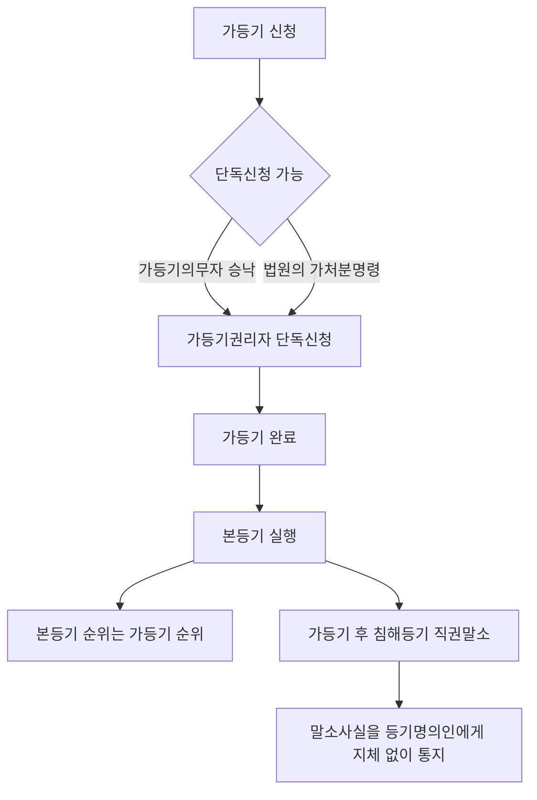

#### ⭐ 기출 출제포인트

1. **필요적 vs 임의적 기록사항 연결형** — 지상권 지료, 전세권 존속기간, 저당권 변제기, 근저당권 존속기간(2020 32번, 2022 35번, 2026 32번).
2. **부기등기와 제3자 승낙** — 권리의 변경·경정만 승낙 필요, 환매특약·처분제한은 불요(2020 35번, 2021 33번, 2024 33번).
3. **등록번호 부여 주체 4분류**(2021 33번, 2024 32번).
4. **신탁등기 신청인·합유·대위**(2021 34번, 2024 34번 해설, 2025 34번).
5. **소유권보존등기 신청인 4유형** — 건물 한정 요건, 매매계약서 불가(2023 35번, 2024 33번, 2026 33번).
6. **가등기 단독신청·말소 승낙·본등기 순위**(2021 35번, 2024 33번, 2025 33번).
7. **수용으로 인한 등기 — 단독신청·직권말소·지역권 예외**(2019 33번).

#### 📊 기출 분석

| 연도 | 출제 형태 | 핵심 논점 |
|---|---|---|
| 2019 | 33번 — 옳은 것 | 수용 단독신청, 직권말소, 지역권 예외, 준용 |
| 2020 | 32번 — 박스형 | 임차권 필요적 기록사항 |
| 2020 | 35번 — 옳은 것 | 합유/총유, 권리소멸약정등기, 부기등기, 환매특약, 보존등기 |
| 2021 | 33번 — 옳지 않은 것 | 등록번호 부여주체, 부기등기 승낙, 전세권 일부이전, 환매특약 |
| 2021 | 34번 — 박스형 | 신탁등기 |
| 2021 | 35번 — 옳지 않은 것 | 가등기 가처분명령·단독신청·본등기 순위·말소 |
| 2022 | 35번 — 연결형 | 용익권·담보권의 임의적 기록사항 |
| 2023 | 35번 — 옳지 않은 것 | 보존등기 등기원인 미기록, 공동담보목록 5개, 근저당 최고액 |
| 2024 | 32번 — 옳은 것 | 비법인사단 등록번호·대표자 기록·전자신청 |
| 2024 | 33번 — 옳은 것 | 정지조건부 가등기, 직권말소 범위, 환매특약 부기 |
| 2025 | 34번 — 옳지 않은 것 | 수탁자 여러 명 합유, 대위, 신수탁자 단독, 말소 |
| 2026 | 32번 — 아닌 것 | 임차권 등기사항 중 필요적인 것 |

**출제 빈도** — 부동산등기법 4문항 중 **1~2문항**이 여기서 나온다. Chapter 03과 함께 최다 빈출.
**반복되는 함정** — ① 합유 → 총유 ② 5개 이상 → 3개 ③ 환매특약에 제3자 승낙 요구 ④ 신탁재산 「공유 또는 합유」 ⑤ 소유권보존등기에 등기원인 기록.
**최근 경향** — 신탁등기가 2021·2024·2025년 연속 출제됐다. 2024.9.20 개정으로 제71조 제2항·제3항, 제78조 제5항이 삭제됐으므로 옛 교재의 요역지 지역권 절차 서술은 신뢰하지 말 것.

> ⚠️ **개정 반영** — 제71조(요역지지역권) 제2항·제3항 및 제78조(공동저당) 제5항은 ==2024.9.20 삭제==됐다. 현행은 승역지에 지역권 변경·말소등기를 하면 등기관이 **직권으로** 요역지 등기기록에도 변경·말소등기를 한다(법 제71조④).

#### 🔍 기출 선지로 배우는 조문

**①** (2020 35번 ①) 권리자가 2인 이상인 경우 권리자별 지분을 기록하여야 하고 등기할 권리가 **총유**인 때에는 그 뜻을 기록하여야 한다 — **X** / 어디가 틀렸나: 총유가 아니다 / 옳게 고치면: ==합유==인 때에 그 뜻을 기록한다(법 제48조④).

**②** (2020 35번 ②, 정답) 등기원인에 권리의 소멸에 관한 약정이 있을 경우 신청인은 그 약정에 관한 등기를 신청할 수 있다 — **O** / 근거: 법 제54조.

**③** (2020 35번 ⑤ / 2023 35번 ①) 등기관이 소유권보존등기를 할 때에는 등기원인과 그 연월일을 기록하지 아니한다 — **O** / 근거: 법 제64조. 「기록하여야 한다」로 뒤집는 것이 2020년 35번 ⑤의 함정이었다.

**④** (2021 33번 ①, 정답) **지방자치단체**의 부동산등기용등록번호는 국토교통부장관이 지정·고시한다 — **O** / 근거: 법 제49조①1. 다만 같은 해 문제에서 「비법인사단의 등록번호는 등기관이 부여한다」(2024 32번 ②)는 **X**이며, 비법인사단은 ==시장·군수·구청장==이 부여한다(법 제49조①3).

**⑤** (2021 33번 ②) 등기관이 권리의 변경이나 경정의 등기를 할 때에는 등기상 이해관계 있는 제3자의 승낙이 없는 경우에도 부기로 하여야 한다 — **X** / 어디가 틀렸나: 승낙이 필요하다 / 옳게 고치면: 제52조 제5호는 ==제3자의 승낙이 없으면 부기로 할 수 없다==(법 제52조 단서).

**⑥** (2024 33번 ③) 환매특약등기는 이해관계 있는 제3자의 승낙이 없는 경우 부기로 할 수 없다 — **X** / 어디가 틀렸나: 환매특약은 승낙이 요건이 아니다 / 옳게 고치면: 환매특약등기(제52조 제6호)는 ==승낙 없이도 부기등기==로 한다.

**⑦** (2023 35번 ③, 정답) 등기관이 동일한 채권에 관하여 **3개**의 부동산에 관한 권리를 목적으로 하는 저당권설정등기를 할 때에는 공동담보목록을 작성하여야 한다 — **X** / 어디가 틀렸나: 개수 기준 / 옳게 고치면: 부동산이 ==5개 이상==일 때 작성한다(법 제78조②).

**⑧** (2025 34번 ①, 정답) 수탁자가 여러 명인 경우 등기관은 신탁재산이 **공유 또는 합유**인 뜻을 기록하여야 한다 — **X** / 어디가 틀렸나: 공유가 끼어 있다 / 옳게 고치면: ==합유==인 뜻을 기록한다(법 제84조①).

**⑨** (2021 35번 ⑤, 정답) 가등기의무자는 가등기명의인의 **동의 없이도** 단독으로 가등기의 말소를 신청할 수 있다 — **X** / 어디가 틀렸나: 승낙이 필요하다 / 옳게 고치면: 가등기의무자·이해관계인은 ==가등기명의인의 승낙을 받아== 단독 신청할 수 있다(법 제93조②).

**⑩** (2026 33번 ⑤, 정답) **군수의 확인**에 의하여 자기의 **토지** 소유권을 증명하는 자는 소유권보존등기를 신청할 수 있다 — **X** / 어디가 틀렸나: 토지에는 적용되지 않는다 / 옳게 고치면: 제65조 제4호는 ==건물의 경우로 한정==된다.

#### ⚠️ 이 관의 함정 총정리

1. 「등기할 권리가 총유인 때에는 그 뜻을 기록한다」고 하면 틀림 → ==합유==다(법 제48조④).
2. 「환매특약등기는 제3자의 승낙이 없으면 부기로 할 수 없다」고 하면 틀림 → 승낙이 필요한 것은 ==권리의 변경·경정등기(제52조 제5호)==뿐이다.
3. 「공동담보목록은 부동산이 3개(또는 2개) 이상일 때 작성한다」고 하면 틀림 → ==5개 이상==이다(법 제78조②).
4. 「환매기간은 필요적 기록사항이다」 또는 「매매비용은 기록하지 아니한다」고 하면 틀림 → **매수인이 지급한 대금·매매비용이 필요적**, ==환매기간만 임의적==이다(법 제53조).
5. 「비법인사단의 등록번호는 관할 등기소의 등기관이 부여한다」고 하면 틀림 → ==시장·군수 또는 구청장==이다(법 제49조①3).
6. 「매매계약서에 의하여 소유권을 증명하는 자는 소유권보존등기를 신청할 수 있다」고 하면 틀림 → 제65조에 없다. ==확정판결·수용 증명·대장 최초 소유자·시장군수구청장 확인(건물)==뿐이다.
7. 「수용으로 인한 등기 시 그 부동산을 위하여 존재하는 지역권도 직권말소된다」고 하면 틀림 → ==지역권과 재결로 존속이 인정된 권리는 말소하지 않는다==(법 제99조④ 단서).

#### ✅ OX 확인문제

> 다음 진술의 참·거짓을 판단하시오.

**1.** 등기관이 갑구 또는 을구에 권리에 관한 등기를 할 때에는 순위번호·등기목적·접수연월일 및 접수번호·등기원인 및 그 연월일·권리자를 기록하여야 한다.
→ **O**. 법 제48조 제1항 각 호.

**2.** 등기할 권리가 합유인 때에는 그 뜻을 기록하여야 한다.
→ **O**. 법 제48조 제4항.

**3.** 법인 아닌 사단의 부동산등기용등록번호는 대법원 소재지 관할 등기소의 등기관이 부여한다.
→ **X**. **시장·군수 또는 구청장**이 부여한다(법 제49조 제1항 제3호).

**4.** 등기관이 권리의 변경등기를 할 때에는 등기상 이해관계 있는 제3자의 승낙이 없어도 부기로 하여야 한다.
→ **X**. 제52조 제5호는 **제3자의 승낙이 없으면 부기로 할 수 없다**(법 제52조 단서).

**5.** 등기관이 환매특약의 등기를 할 때 환매기간은 등기원인에 정하여져 있는 경우에만 기록한다.
→ **O**. 법 제53조 단서. 매수인이 지급한 대금과 매매비용은 필요적이다.

**6.** 등기관이 소유권보존등기를 할 때에는 등기원인과 그 연월일을 기록하여야 한다.
→ **X**. **기록하지 아니한다**(법 제64조).

**7.** 등기관이 동일한 채권에 관하여 여러 개의 부동산에 저당권설정등기를 하는 경우 부동산이 5개 이상일 때에는 공동담보목록을 작성하여야 한다.
→ **O**. 법 제78조 제2항. 공동담보목록은 등기기록의 일부로 본다.

**8.** 수익자나 위탁자는 수탁자를 대위하여 신탁등기를 신청할 수 있다.
→ **O**. 법 제82조 제2항. 이 경우 동시신청 규정(제1항)은 적용하지 않는다.

**9.** 가등기명의인은 단독으로 가등기의 말소를 신청할 수 있다.
→ **O**. 법 제93조 제1항. 다만 가등기의무자·이해관계인은 가등기명의인의 승낙을 받아야 한다.

**10.** 등기관이 수용으로 인한 소유권이전등기를 하는 경우 그 부동산을 위하여 존재하는 지역권의 등기도 직권으로 말소하여야 한다.
→ **X**. 그 부동산을 **위하여 존재하는 지역권**과 **재결로 존속이 인정된 권리**의 등기는 말소하지 않는다(법 제99조 제4항 단서).

#### 🧠 암기법

> 🔑 **부기등기 승낙 — "변·경만 승낙"**
> 부기등기 9가지 중 **권리의 변경·경정등기**만 제3자 승낙이 필요하다. 나머지는 그냥 부기.

> 🔑 **환매특약 — "대(금)·비(용)는 필수, 기(간)은 선택"**
> 매수인이 지급한 **대**금 · 매매 **비**용 = 필요적 / 환매 **기**간 = 약정 있을 때만.

> 🔑 **공동담보목록 — "오(5)면 목록"**
> 부동산 **5개 이상**이면 공동담보목록 작성.

> 🔑 **등록번호 4주체 — "국(가)은 국토, 법(인)은 등기관, 사(단)은 시군구, 외(국인)는 출입국"**

> 🔑 **소유권보존등기 신청인 — "대(장)·판(결)·수(용)·확(인, 건물만)"**

---

#### ⚖️ 법조문 원문

> 📖 이 관이 근거로 삼은 조문의 **전문**이다. 본문 인용은 발췌지만 여기서는 조 전체를 싣는다. 출처는 법제처 정본이다.

**― 부동산등기법 법률 ―**

> 📌 **부동산등기법 제48조(등기사항)** — "① 등기관이 갑구 또는 을구에 권리에 관한 등기를 할 때에는 다음 각 호의 사항을 기록하여야 한다. 1. 순위번호 2. 등기목적 3. 접수연월일 및 접수번호 4. 등기원인 및 그 연월일 5. 권리자 ② 제1항제5호의 권리자에 관한 사항을 기록할 때에는 권리자의 성명 또는 명칭 외에 주민등록번호 또는 부동산등기용등록번호와 주소 또는 사무소 소재지를 함께 기록하여야 한다. ③ 제26조에 따라 법인 아닌 사단이나 재단 명의의 등기를 할 때에는 그 대표자나 관리인의 성명, 주소 및 주민등록번호를 함께 기록하여야 한다. ④ 제1항제5호의 권리자가 2인 이상인 경우에는 권리자별 지분을 기록하여야 하고 등기할 권리가 합유(合有)인 때에는 그 뜻을 기록하여야 한다."

> 📌 **부동산등기법 제49조(등록번호의 부여절차)** — "① 제48조제2항에 따른 부동산등기용등록번호(이하 "등록번호"라 한다)는 다음 각 호의 방법에 따라 부여한다. 1. 국가ㆍ지방자치단체ㆍ국제기관 및 외국정부의 등록번호는 국토교통부장관이 지정ㆍ고시한다. 2. 주민등록번호가 없는 재외국민의 등록번호는 대법원 소재지 관할 등기소의 등기관이 부여하고, 법인의 등록번호는 주된 사무소(회사의 경우에는 본점, 외국법인의 경우에는 국내에 최초로 설치 등기를 한 영업소나 사무소를 말한다) 소재지 관할 등기소의 등기관이 부여한다. 3. 법인 아닌 사단이나 재단 및 국내에 영업소나 사무소의 설치 등기를 하지 아니한 외국법인의 등록번호는 시장(「제주특별자치도 설치 및 국제자유도시 조성을 위한 특별법」 제10조제2항에 따른 행정시의 시장을 포함하며, 「지방자치법」 제3조제3항에 따라 자치구가 아닌 구를 두는 시의 시장은 제외한다), 군수 또는 구청장(자치구가 아닌 구의 구청장을 포함한다)이 부여한다. 4. 외국인의 등록번호는 체류지(국내에 체류지가 없는 경우에는 대법원 소재지에 체류지가 있는 것으로 본다)를 관할하는 지방출입국ㆍ외국인관서의 장이 부여한다. ② 제1항제2호에 따른 등록번호의 부여절차는 대법원규칙으로 정하고, 제1항제3호와 제4호에 따른 등록번호의 부여절차는 대통령령으로 정한다."

> 📌 **부동산등기법 제52조(부기로 하는 등기)** — "등기관이 다음 각 호의 등기를 할 때에는 부기로 하여야 한다. 다만, 제5호의 등기는 등기상 이해관계 있는 제3자의 승낙이 없는 경우에는 그러하지 아니하다. 1. 등기명의인표시의 변경이나 경정의 등기 2. 소유권 외의 권리의 이전등기 3. 소유권 외의 권리를 목적으로 하는 권리에 관한 등기 4. 소유권 외의 권리에 대한 처분제한 등기 5. 권리의 변경이나 경정의 등기 6. 제53조의 환매특약등기 7. 제54조의 권리소멸약정등기 8. 제67조제1항 후단의 공유물 분할금지의 약정등기 9. 그 밖에 대법원규칙으로 정하는 등기"

> 📌 **부동산등기법 제53조(환매특약의 등기)** — "등기관이 환매특약의 등기를 할 때에는 다음 각 호의 사항을 기록하여야 한다. 다만, 제3호는 등기원인에 그 사항이 정하여져 있는 경우에만 기록한다. 1. 매수인이 지급한 대금 2. 매매비용 3. 환매기간"

> 📌 **부동산등기법 제64조(소유권보존등기의 등기사항)** — "등기관이 소유권보존등기를 할 때에는 제48조제1항제4호에도 불구하고 등기원인과 그 연월일을 기록하지 아니한다."

> 📌 **부동산등기법 제65조(소유권보존등기의 신청인)** — "미등기의 토지 또는 건물에 관한 소유권보존등기는 다음 각 호의 어느 하나에 해당하는 자가 신청할 수 있다. 1. 토지대장, 임야대장 또는 건축물대장에 최초의 소유자로 등록되어 있는 자 또는 그 상속인, 그 밖의 포괄승계인 2. 확정판결에 의하여 자기의 소유권을 증명하는 자 3. 수용(收用)으로 인하여 소유권을 취득하였음을 증명하는 자 4. 특별자치도지사, 시장, 군수 또는 구청장(자치구의 구청장을 말한다)의 확인에 의하여 자기의 소유권을 증명하는 자(건물의 경우로 한정한다)"

> 📌 **부동산등기법 제78조(공동저당의 등기)** — "① 등기관이 동일한 채권에 관하여 여러 개의 부동산에 관한 권리를 목적으로 하는 저당권설정의 등기를 할 때에는 각 부동산의 등기기록에 그 부동산에 관한 권리가 다른 부동산에 관한 권리와 함께 저당권의 목적으로 제공된 뜻을 기록하여야 한다. ② 등기관은 제1항의 경우에 부동산이 5개 이상일 때에는 공동담보목록을 작성하여야 한다. ③ 제2항의 공동담보목록은 등기기록의 일부로 본다. ④ 등기관이 1개 또는 여러 개의 부동산에 관한 권리를 목적으로 하는 저당권설정의 등기를 한 후 동일한 채권에 대하여 다른 1개 또는 여러 개의 부동산에 관한 권리를 목적으로 하는 저당권설정의 등기를 할 때에는 그 등기와 종전의 등기에 각 부동산에 관한 권리가 함께 저당권의 목적으로 제공된 뜻을 기록하여야 한다. 이 경우 제2항 및 제3항을 준용한다. ⑤ 삭제 <2024.9.20>"

> 📌 **부동산등기법 제88조(가등기의 대상)** — "가등기는 제3조 각 호의 어느 하나에 해당하는 권리의 설정, 이전, 변경 또는 소멸의 청구권(請求權)을 보전(保全)하려는 때에 한다. 그 청구권이 시기부(始期附) 또는 정지조건부(停止條件附)일 경우나 그 밖에 장래에 확정될 것인 경우에도 같다."

> 📌 **부동산등기법 제93조(가등기의 말소)** — "① 가등기명의인은 제23조제1항에도 불구하고 단독으로 가등기의 말소를 신청할 수 있다. ② 가등기의무자 또는 가등기에 관하여 등기상 이해관계 있는 자는 제23조제1항에도 불구하고 가등기명의인의 승낙을 받아 단독으로 가등기의 말소를 신청할 수 있다."

> 📌 **부동산등기법 제99조(수용으로 인한 등기)** — "① 수용으로 인한 소유권이전등기는 제23조제1항에도 불구하고 등기권리자가 단독으로 신청할 수 있다. ② 등기권리자는 제1항의 신청을 하는 경우에 등기명의인이나 상속인, 그 밖의 포괄승계인을 갈음하여 부동산의 표시 또는 등기명의인의 표시의 변경, 경정 또는 상속, 그 밖의 포괄승계로 인한 소유권이전의 등기를 신청할 수 있다. ③ 국가 또는 지방자치단체가 제1항의 등기권리자인 경우에는 국가 또는 지방자치단체는 지체 없이 제1항과 제2항의 등기를 등기소에 촉탁하여야 한다. ④ 등기관이 제1항과 제3항에 따라 수용으로 인한 소유권이전등기를 하는 경우 그 부동산의 등기기록 중 소유권, 소유권 외의 권리, 그 밖의 처분제한에 관한 등기가 있으면 그 등기를 직권으로 말소하여야 한다. 다만, 그 부동산을 위하여 존재하는 지역권의 등기 또는 토지수용위원회의 재결(裁決)로써 존속(存續)이 인정된 권리의 등기는 그러하지 아니하다. ⑤ 부동산에 관한 소유권 외의 권리의 수용으로 인한 권리이전등기에 관하여는 제1항부터 제4항까지의 규정을 준용한다."

### [부동산등기법] Chapter 06 이의신청

> 📖 부동산등기법 제5장 「이의」(제100조~제108조)다. 조문이 9개뿐이고 **숫자는 「3일」 하나**뿐이라 완전 정복이 가능한 관이다.
> 그런데도 2019·2025·2026년 3회 출제됐다. **가성비가 가장 높은 구간**이다.

> ⭐ **이 관에서 반드시 챙길 3가지**
> ① **새로운 사실·새로운 증거방법을 근거로 한 이의신청은 금지**(제102조).
> ② **집행정지의 효력이 없다**(제104조).
> ③ **결정 「전」에** 가등기·부기등기를 명령할 수 있다(제106조). 「결정한 후에」로 바꾸는 함정이 나온다.

#### 1. 개념·정의

| 용어 | 내용 | 근거 |
|---|---|---|
| 이의신청 | 등기관의 ==결정 또는 처분==에 이의가 있는 자가 관할 지방법원에 하는 불복 | 법 제100조 |
| 관할 지방법원 | 그 결정·처분을 한 ==등기관이 속한 지방법원== | 법 제100조 |
| 이의신청의 접수처 | 결정·처분을 한 ==등기관이 속한 등기소== | 법 제101조 |
| 신청 방법 | 등기소에 ==이의신청서 제출== 또는 ==전산정보처리조직을 이용한 이의신청정보 송신== | 법 제101조 |

> 💡 **신청은 등기소에, 판단은 지방법원이** 한다. 「지방법원에 이의신청서를 제출한다」는 표현은 부정확하다.

#### 2. 요건·절차

| 구분 | 내용 | 근거 |
|---|---|---|
| 이의신청 사유 제한 | ==새로운 사실이나 새로운 증거방법==을 근거로 이의신청 불가 | 법 제102조 |
| 이유 있다고 인정 | 등기관이 ==그에 해당하는 처분==을 하여야 함 | 법 제103조① |
| 이유 없다고 인정 | ==이의신청일부터 3일 이내== 의견을 붙여 관할 지방법원에 송부 | 법 제103조② |
| 등기를 마친 후 이의신청 | ==3일 이내== 송부 + ==등기상 이해관계 있는 자==에게 이의신청 사실 통지 | 법 제103조③ |
| 집행정지 | ==효력 없음== | 법 제104조 |
| 법원의 결정 | ==이유를 붙여== 결정. 이유 있으면 등기관에게 처분 명령 + ==이의신청인과 등기상 이해관계 있는 자==에게 통지 | 법 제105조① |
| 불복 | 「비송사건절차법」에 따라 ==항고== | 법 제105조② |
| 처분 전 가등기·부기등기 명령 | 관할 지방법원이 ==결정하기 전에== 명령 가능 | 법 제106조 |
| 명령에 따른 등기의 기록사항 | 명령한 지방법원, 명령의 연월일, 명령에 따라 등기한다는 뜻 | 법 제107조 |
| 준용법령 | 송달 → ==민사소송법== / 이의 비용 → ==비송사건절차법== | 법 제108조 |

#### 3. 핵심 조문

> 📌 **부동산등기법 제100조(이의신청과 그 관할)** — "등기관의 결정 또는 처분에 이의가 있는 자는 그 결정 또는 처분을 한 등기관이 속한 지방법원(이하 이 장에서 "관할 지방법원"이라 한다)에 이의신청을 할 수 있다."

> 📌 **부동산등기법 제101조(이의신청의 방법)** — "제100조에 따른 이의신청(이하 이 장에서 "이의신청"이라 한다)은 대법원규칙으로 정하는 바에 따라 결정 또는 처분을 한 등기관이 속한 등기소에 이의신청서를 제출하거나 전산정보처리조직을 이용하여 이의신청정보를 보내는 방법으로 한다."

> 📌 **부동산등기법 제102조(새로운 사실에 의한 이의 금지)** — "새로운 사실이나 새로운 증거방법을 근거로 이의신청을 할 수는 없다."

**요약** — 2025년 35번(②)과 2026년 34번(①)이 이 조문을 **「할 수 있다」로 뒤집어** 출제했다. 두 해 연속 같은 함정이다.

> 📌 **부동산등기법 제103조(등기관의 조치)** — "① 등기관은 이의가 이유 있다고 인정하면 그에 해당하는 처분을 하여야 한다. ② 등기관은 이의가 이유 없다고 인정하면 이의신청일부터 3일 이내에 의견을 붙여 이의신청서 또는 이의신청정보를 관할 지방법원에 보내야 한다. ③ 등기를 마친 후에 이의신청이 있는 경우에는 3일 이내에 의견을 붙여 이의신청서 또는 이의신청정보를 관할 지방법원에 보내고 등기상 이해관계 있는 자에게 이의신청 사실을 알려야 한다."

**요약** — 「3일」은 **이유가 없다고 인정할 때** 법원으로 보내는 기한이다. 2025년 35번(③)이 「이유 **있다**고 인정하면 3일 이내에 …보내야 한다」로 바꿔 오답을 만들었다. 이유가 있으면 **등기관이 스스로 처분**한다.

> 📌 **부동산등기법 제104조(집행 부정지)** — "이의에는 집행정지(執行停止)의 효력이 없다."

> 📌 **부동산등기법 제105조(이의에 대한 결정과 항고)** — "① 관할 지방법원은 이의에 대하여 이유를 붙여 결정을 하여야 한다. 이 경우 이의가 이유 있다고 인정하면 등기관에게 그에 해당하는 처분을 명령하고 그 뜻을 이의신청인과 등기상 이해관계 있는 자에게 알려야 한다. ② 제1항의 결정에 대하여는 「비송사건절차법」에 따라 항고할 수 있다."

> 📌 **부동산등기법 제106조(처분 전의 가등기 및 부기등기의 명령)** — "관할 지방법원은 이의신청에 대하여 결정하기 전에 등기관에게 가등기 또는 이의가 있다는 뜻의 부기등기를 명령할 수 있다."

> 📌 **부동산등기법 제108조(송달)** — "송달에 대하여는 「민사소송법」을 준용하고, 이의의 비용에 대하여는 「비송사건절차법」을 준용한다."

#### 4. ⏱ 기간·수치 총정리

| 항목 | 기간·수치 | 근거 조문 |
|---|---|---|
| 이의가 이유 없을 때 법원 송부 기한 | ==이의신청일부터 3일 이내== | 법 제103조② |
| 등기를 마친 후 이의신청 시 송부 기한 | ==3일 이내== | 법 제103조③ |
| 이의신청 기간 | ==제한 없음== (조문에 기간 규정이 없다) | 법 제100조 |
| 집행정지 효력 | ==없음== | 법 제104조 |
| 새로운 사실·증거에 의한 이의 | ==불가== | 법 제102조 |
| 가등기·부기등기 명령 시점 | ==결정하기 전== | 법 제106조 |

> 💡 이 관에서 **숫자는 「3일」 하나뿐**이다. 「30일 이내에 이의신청하여야 한다」 같은 문장은 근거가 없다 — 부동산등기법상 이의신청에는 **기간 제한이 없다**.

#### 5. 👤 권한 주체 구분

| 행위 | 주체 | 근거 |
|---|---|---|
| 이의신청의 상대 기관 | ==관할 지방법원== (등기관이 속한 지방법원) | 법 제100조 |
| 이의신청서 제출처 | ==등기관이 속한 등기소== | 법 제101조 |
| 이유 있을 때 처분 | ==등기관== | 법 제103조① |
| 이유 없을 때 3일 내 송부 | ==등기관== | 법 제103조② |
| 이의에 대한 결정 | ==관할 지방법원== | 법 제105조① |
| 이의신청인·이해관계인에 대한 통지 | ==관할 지방법원== | 법 제105조① 후단 |
| 처분 전 가등기·부기등기 명령 | ==관할 지방법원== | 법 제106조 |
| 명령에 따른 등기의 실행·기록 | ==등기관== | 법 제107조 |

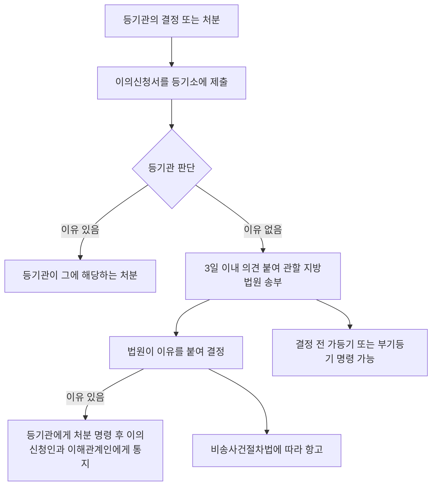

#### ⭐ 기출 출제포인트

1. **새로운 사실·증거 금지** — 「할 수 있다」로 뒤집기(2025 35번, 2026 34번).
2. **집행정지 효력 없음** — 「결정 때까지 집행이 정지된다」(2025 35번 ④, 2024 33번 ⑤).
3. **3일의 주체·요건** — 「이유 **없다**고 인정하면」 3일 이내 송부(2025 35번 ③, 2026 34번 ②).
4. **결정 「전」 가등기·부기등기 명령**(2019 32번 ③, 2025 35번 ①, 2026 34번 ④).
5. **준용법령 2개** — 송달은 민사소송법, 비용은 비송사건절차법(2019 32번 ④, 2026 34번 ⑤).

#### 📊 기출 분석

| 연도 | 출제 형태 | 핵심 논점 |
|---|---|---|
| 2019 | 32번 — 옳지 않은 것 | 부기등기 명령 가부, 신청방법, 준용법령, 항고 |
| 2024 | 33번 — 옳은 것(선지) | 직권말소 처분에 대한 이의와 집행정지 |
| 2025 | 35번 — 옳은 것 | 결정 전 명령, 새로운 사실, 3일, 집행정지, 통지 |
| 2026 | 34번 — 옳지 않은 것 | 새로운 사실, 3일, 집행정지, 부기등기 명령, 준용법령 |

**출제 빈도** — 최근 5년 중 **3회**. 조문 9개에 대한 투자 대비 회수율이 최고다.
**반복되는 함정** — ① 「새로운 증거로 이의신청할 수 있다」 ② 「집행이 정지된다」 ③ 「결정한 후에 부기등기를 명령한다」 ④ 「이유 있다고 인정하면 3일 이내 송부」.
**최근 경향** — 2024.9.20 개정으로 제100조·제103조에 「전산정보처리조직을 이용한 이의신청정보」가 추가됐다. 전자 방식이 명문화된 점을 기억할 것.

#### 🔍 기출 선지로 배우는 조문

**①** (2019 32번 ③, 정답) 관할 지방법원은 이의신청에 대하여 결정하기 전에 등기관에게 가등기 또는 이의가 있다는 뜻의 부기등기를 명령할 수 **없다** — **X** / 어디가 틀렸나: 명령할 수 있다 / 옳게 고치면: ==결정하기 전에 명령할 수 있다==(법 제106조).

**②** (2025 35번 ①) 관할 지방법원은 이의신청에 대하여 **결정한 후에** 등기관에게 가등기 또는 부기등기를 명령할 수 있다 — **X** / 어디가 틀렸나: 시점 / 옳게 고치면: ==결정하기 전에== 명령할 수 있다(법 제106조).

**③** (2025 35번 ② / 2026 34번 ①) 새로운 사실이나 새로운 증거방법을 근거로 이의신청을 할 수 있다 — **X** / 어디가 틀렸나: 정반대다 / 옳게 고치면: ==할 수 없다==(법 제102조).

**④** (2025 35번 ③) 등기관은 등기를 마치기 전에 이의가 **이유 있다고** 인정하면 3일 이내에 의견을 붙여 이의신청서를 지방법원에 보내야 한다 — **X** / 어디가 틀렸나: 이유 있으면 스스로 처분한다 / 옳게 고치면: 이유 ==있으면 그에 해당하는 처분==을 하고(제103조①), 이유 ==없다고 인정하면== 3일 이내에 송부한다(제103조②).

**⑤** (2025 35번 ④) 등기관의 결정에 이의를 한 때에는 관할 지방법원의 결정때까지 집행이 정지된다 — **X** / 어디가 틀렸나: 정지되지 않는다 / 옳게 고치면: ==이의에는 집행정지의 효력이 없다==(법 제104조).

**⑥** (2025 35번 ⑤, 정답) 관할 지방법원은 이의가 이유 있다고 인정하면 등기관에게 그에 해당하는 처분을 명령하고 그 뜻을 이의신청인과 등기상 이해관계 있는 자에게 알려야 한다 — **O** / 근거: 법 제105조 제1항 후단.

**⑦** (2026 34번 ②) 등기관은 이의가 이유 없다고 인정하면 이의신청일부터 3일 이내에 의견을 붙여 이의신청서 또는 이의신청정보를 관할 지방법원에 보내야 한다 — **O** / 근거: 법 제103조 제2항.

**⑧** (2019 32번 ④ / 2026 34번 ⑤) 이의의 비용에 대하여는 「비송사건절차법」을 준용한다 — **O** / 근거: 법 제108조. 송달은 「민사소송법」을 준용한다.

#### ⚠️ 이 관의 함정 총정리

1. 「새로운 증거방법을 근거로 이의신청할 수 있다」고 하면 틀림 → ==할 수 없다==(법 제102조).
2. 「이의신청을 하면 등기말소처분의 효력이 정지된다」고 하면 틀림 → ==집행정지의 효력이 없다==(법 제104조).
3. 「이유 있다고 인정하면 3일 이내에 법원에 보낸다」고 하면 틀림 → 이유 있으면 ==등기관이 직접 처분==하고, ==이유 없을 때== 3일 내 송부한다(법 제103조).
4. 「결정한 후에 가등기·부기등기를 명령할 수 있다」고 하면 틀림 → ==결정하기 전==이다(법 제106조).
5. 「이의신청은 등기일부터 30일 이내에 하여야 한다」고 하면 틀림 → 부동산등기법에는 ==이의신청 기간 제한이 없다==.
6. 「이의의 비용에 대하여는 민사소송법을 준용한다」고 하면 틀림 → 비용은 ==비송사건절차법==, ==송달==이 민사소송법이다(법 제108조).

#### ✅ OX 확인문제

> 다음 진술의 참·거짓을 판단하시오.

**1.** 등기관의 결정 또는 처분에 이의가 있는 자는 그 결정·처분을 한 등기관이 속한 지방법원에 이의신청을 할 수 있다.
→ **O**. 법 제100조.

**2.** 이의신청은 관할 지방법원에 이의신청서를 직접 제출하는 방법으로만 할 수 있다.
→ **X**. **등기관이 속한 등기소**에 이의신청서를 제출하거나 **전산정보처리조직을 이용**하여 이의신청정보를 보내는 방법으로 한다(법 제101조).

**3.** 새로운 사실이나 새로운 증거방법을 근거로 이의신청을 할 수는 없다.
→ **O**. 법 제102조.

**4.** 등기관은 이의가 이유 있다고 인정하면 3일 이내에 의견을 붙여 관할 지방법원에 보내야 한다.
→ **X**. 이유 있으면 **그에 해당하는 처분**을 하여야 한다(법 제103조 제1항). 3일 송부는 이유가 **없다**고 인정한 경우다.

**5.** 등기를 마친 후에 이의신청이 있는 경우에는 3일 이내에 의견을 붙여 법원에 보내고 등기상 이해관계 있는 자에게 이의신청 사실을 알려야 한다.
→ **O**. 법 제103조 제3항.

**6.** 이의에는 집행정지의 효력이 있다.
→ **X**. **집행정지의 효력이 없다**(법 제104조).

**7.** 관할 지방법원은 이의에 대하여 이유를 붙여 결정을 하여야 한다.
→ **O**. 법 제105조 제1항 전단.

**8.** 이의에 대한 관할 지방법원의 결정에 대하여는 「비송사건절차법」에 따라 항고할 수 있다.
→ **O**. 법 제105조 제2항.

**9.** 관할 지방법원은 이의신청에 대하여 결정한 후에만 등기관에게 가등기 또는 이의가 있다는 뜻의 부기등기를 명령할 수 있다.
→ **X**. **결정하기 전에** 명령할 수 있다(법 제106조).

**10.** 송달에 대하여는 「민사소송법」을, 이의의 비용에 대하여는 「비송사건절차법」을 준용한다.
→ **O**. 법 제108조.

#### 🧠 암기법

> 🔑 **이의 3금(禁) — "새(로운 증거) 없다 · 정(지) 없다 · 기(간) 없다"**
> **새**로운 사실·증거 근거 이의 **없다**(제102조) / 집행**정**지 효력 **없다**(제104조) / 이의신청 **기**간 제한 **없다**.

> 🔑 **"없으면 3일, 있으면 스스로"**
> 이유 **없**다고 인정 → **3일** 내 법원 송부. 이유 **있**다고 인정 → 등기관이 **스스로** 처분.

> 🔑 **"전(前)에 명령, 후(後)에 항고"**
> 가등기·부기등기 명령은 결정 **전**. 결정에 대한 불복(항고)은 결정 **후**.

> 🔑 **준용 2개 — "송(달)은 민소, 비(용)은 비송"**

---

#### ⚖️ 법조문 원문

> 📖 이 관이 근거로 삼은 조문의 **전문**이다. 본문 인용은 발췌지만 여기서는 조 전체를 싣는다. 출처는 법제처 정본이다.

**― 부동산등기법 법률 ―**

> 📌 **부동산등기법 제100조(이의신청과 그 관할)** — "등기관의 결정 또는 처분에 이의가 있는 자는 그 결정 또는 처분을 한 등기관이 속한 지방법원(이하 이 장에서 "관할 지방법원"이라 한다)에 이의신청을 할 수 있다."

> 📌 **부동산등기법 제101조(이의신청의 방법)** — "제100조에 따른 이의신청(이하 이 장에서 "이의신청"이라 한다)은 대법원규칙으로 정하는 바에 따라 결정 또는 처분을 한 등기관이 속한 등기소에 이의신청서를 제출하거나 전산정보처리조직을 이용하여 이의신청정보를 보내는 방법으로 한다."

> 📌 **부동산등기법 제102조(새로운 사실에 의한 이의 금지)** — "새로운 사실이나 새로운 증거방법을 근거로 이의신청을 할 수는 없다."

> 📌 **부동산등기법 제103조(등기관의 조치)** — "① 등기관은 이의가 이유 있다고 인정하면 그에 해당하는 처분을 하여야 한다. ② 등기관은 이의가 이유 없다고 인정하면 이의신청일부터 3일 이내에 의견을 붙여 이의신청서 또는 이의신청정보를 관할 지방법원에 보내야 한다. ③ 등기를 마친 후에 이의신청이 있는 경우에는 3일 이내에 의견을 붙여 이의신청서 또는 이의신청정보를 관할 지방법원에 보내고 등기상 이해관계 있는 자에게 이의신청 사실을 알려야 한다."

> 📌 **부동산등기법 제104조(집행 부정지)** — "이의에는 집행정지(執行停止)의 효력이 없다."

> 📌 **부동산등기법 제105조(이의에 대한 결정과 항고)** — "① 관할 지방법원은 이의에 대하여 이유를 붙여 결정을 하여야 한다. 이 경우 이의가 이유 있다고 인정하면 등기관에게 그에 해당하는 처분을 명령하고 그 뜻을 이의신청인과 등기상 이해관계 있는 자에게 알려야 한다. ② 제1항의 결정에 대하여는 「비송사건절차법」에 따라 항고할 수 있다."

> 📌 **부동산등기법 제106조(처분 전의 가등기 및 부기등기의 명령)** — "관할 지방법원은 이의신청에 대하여 결정하기 전에 등기관에게 가등기 또는 이의가 있다는 뜻의 부기등기를 명령할 수 있다."

> 📌 **부동산등기법 제108조(송달)** — "송달에 대하여는 「민사소송법」을 준용하고, 이의의 비용에 대하여는 「비송사건절차법」을 준용한다."

### [부공법] Chapter 01 용어의 정의

> 📖 「부동산 가격공시에 관한 법률」 제1장 총칙(제1조·제2조)이다. 조문 두 개뿐이지만 **정의규정이 뒤 5개 관 전체의 전제**가 된다.
> 특히 ==적정가격==의 정의는 감정평가실무·이론과도 직결되므로 **문언 그대로** 암기해야 한다.

> ⭐ **이 관에서 반드시 챙길 3가지**
> ① **적정가격 = 통상적인 시장에서 정상적인 거래가 이루어지는 경우 성립될 가능성이 가장 높다고 인정되는 가격.**
> ② **단독주택 = 공동주택을 제외한 주택** — 소극적 정의다.
> ③ **비주거용 부동산 = 주택을 제외한 건축물** — 집합/일반으로 2분한다.

#### 1. 개념·정의

법 제2조가 5개 용어를 정의한다. **주택 관련 3개는 「주택법」에서 끌어온다.**

| 용어 | 정의 (법 제2조) |
|---|---|
| 주택 | ==「주택법」 제2조제1호==에 따른 주택 |
| 공동주택 | ==「주택법」 제2조제3호==에 따른 공동주택 |
| 단독주택 | ==공동주택을 제외한 주택== |
| 비주거용 부동산 | ==주택을 제외한 건축물==이나 건축물과 그 토지의 전부 또는 일부 |
| ┗ 비주거용 **집합**부동산 | ==「집합건물의 소유 및 관리에 관한 법률」==에 따라 **구분소유**되는 비주거용 부동산 |
| ┗ 비주거용 **일반**부동산 | 집합부동산을 **제외한** 비주거용 부동산 |
| 적정가격 | 토지, 주택 및 비주거용 부동산에 대하여 ==통상적인 시장==에서 ==정상적인 거래==가 이루어지는 경우 ==성립될 가능성이 가장 높다==고 인정되는 가격 |

#### 2. 요건·절차 — 법의 목적 3단계

| 단계 | 내용 | 근거 |
|---|---|---|
| 규정 대상 | 부동산의 **적정가격 공시**에 관한 기본적 사항 + 부동산 시장·동향의 조사·관리에 필요한 사항 | 법 제1조 |
| 직접 목적 | ① 부동산의 ==적정한 가격형성== ② 각종 ==조세·부담금 등의 형평성== 도모 | 법 제1조 |
| 궁극 목적 | ==국민경제의 발전==에 이바지 | 법 제1조 |

#### 3. 핵심 조문

> 📌 **부동산 가격공시에 관한 법률 제1조(목적)** — "이 법은 부동산의 적정가격(適正價格) 공시에 관한 기본적인 사항과 부동산 시장·동향의 조사·관리에 필요한 사항을 규정함으로써 부동산의 적정한 가격형성과 각종 조세·부담금 등의 형평성을 도모하고 국민경제의 발전에 이바지함을 목적으로 한다."

> 📌 **부공법 제2조 제5호(적정가격)** — "\"적정가격\"이란 토지, 주택 및 비주거용 부동산에 대하여 통상적인 시장에서 정상적인 거래가 이루어지는 경우 성립될 가능성이 가장 높다고 인정되는 가격을 말한다."

**요약** — 「가장 높다고 인정되는 가격」이 핵심 어구다. 「평균적으로 성립되는 가격」·「성립될 것으로 확실시되는 가격」은 오답 문구다.

> 📌 **부공법 제2조 제3호(단독주택)** — "\"단독주택\"이란 공동주택을 제외한 주택을 말한다."

**요약** — 단독주택은 **적극 정의가 없다**. 다중주택·다가구주택도 「주택법」상 단독주택에 포함된다.

> 📌 **부공법 제2조 제4호(비주거용 부동산)** — "\"비주거용 부동산\"이란 주택을 제외한 건축물이나 건축물과 그 토지의 전부 또는 일부를 말하며 다음과 같이 구분한다. 가. 비주거용 집합부동산: 「집합건물의 소유 및 관리에 관한 법률」에 따라 구분소유되는 비주거용 부동산 나. 비주거용 일반부동산: 가목을 제외한 비주거용 부동산"

> 📌 **부공법 제2조 제1호·제2호** — "1. \"주택\"이란 「주택법」 제2조제1호에 따른 주택을 말한다. 2. \"공동주택\"이란 「주택법」 제2조제3호에 따른 공동주택을 말한다."

**요약** — 부공법은 주택 개념을 **스스로 정의하지 않고 「주택법」에 위임**한다. 「건축법」이 아니다.

> 📌 **부공법 제19조(주택가격 공시의 효력)** — "① 표준주택가격은 국가·지방자치단체 등이 그 업무와 관련하여 개별주택가격을 산정하는 경우에 그 기준이 된다. ② 개별주택가격 및 공동주택가격은 주택시장의 가격정보를 제공하고, 국가·지방자치단체 등이 과세 등의 업무와 관련하여 주택의 가격을 산정하는 경우에 그 기준으로 활용될 수 있다."

**요약** — 정의규정과 짝을 이루는 **효력 조문**이다. 표준(주택)은 「기준이 **된다**」(강행), 개별·공동주택은 「기준으로 **활용될 수 있다**」(임의). 이 어미 차이가 곧바로 함정이 된다.

#### 4. ⏱ 기간·수치 총정리

| 항목 | 기간·수치 | 근거 조문 |
|---|---|---|
| 법이 정의하는 용어 수 | ==5개== (주택·공동주택·단독주택·비주거용 부동산·적정가격) | 법 제2조 |
| 비주거용 부동산의 구분 | ==2가지== — 집합 / 일반 | 법 제2조 제4호 |
| 주택 개념의 근거 법률 | ==「주택법」 제2조 제1호== | 법 제2조 제1호 |
| 공동주택 개념의 근거 법률 | ==「주택법」 제2조 제3호== | 법 제2조 제2호 |
| 비주거용 집합부동산의 근거 법률 | ==「집합건물의 소유 및 관리에 관한 법률」== | 법 제2조 제4호 가목 |
| 공시 대상 3분류 | ==토지 · 주택 · 비주거용 부동산== | 법 제2조 제5호 |

> 📌 이 관에는 기간 규정이 없다. 기간은 Chapter 02 이후(30일·5월 31일·4월 30일 등)에서 몰려 나온다.

#### 5. 👤 권한 주체 구분

| 대상 | 조사·산정 및 공시 주체 | 근거 |
|---|---|---|
| 표준지공시지가 | ==국토교통부장관== | 법 제3조① |
| 개별공시지가 | ==시장·군수 또는 구청장== | 법 제10조① |
| 표준주택가격 | ==국토교통부장관== | 법 제16조① |
| 개별주택가격 | ==시장·군수 또는 구청장== | 법 제17조① |
| 공동주택가격 | ==국토교통부장관== | 법 제18조① |
| 비주거용 표준부동산가격 | ==국토교통부장관== | 법 제20조① |
| 비주거용 개별부동산가격 | ==시장·군수 또는 구청장== | 법 제21조① |
| 비주거용 집합부동산가격 | ==국토교통부장관== | 법 제22조① |

> 🔑 **「표준」과 「공동·집합」은 국토교통부장관, 「개별」은 시장·군수·구청장.** 이 한 줄이 부공법 전체의 뼈대다.

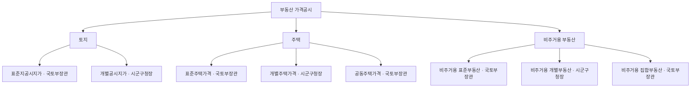

#### ⭐ 기출 출제포인트

1. **적정가격의 정의 문언** — 「가장 높다고 인정되는 가격」을 바꿔치기.
2. **단독주택 = 공동주택을 제외한 주택**이라는 소극적 정의.
3. **비주거용 집합 vs 일반의 구분 기준** — 집합건물법상 **구분소유** 여부.
4. **8개 공시가격의 주체 매칭** — 표준/개별, 장관/시장군수구청장.
5. **효력 조문의 어미** — 「기준이 된다」 vs 「기준으로 활용될 수 있다」.

#### 📊 기출 분석

| 연도 | 출제 형태 | 핵심 논점 |
|---|---|---|
| 2019 | 18번 ③ — 선지 | 표준주택가격의 효력(개별주택가격 산정 기준) |
| 2024 | 15번 ③ — 선지 | 비주거용 표준부동산가격의 효력 |
| 2025 | 16번 ④ — 선지 | 개별주택·공동주택가격이 지방세 부과의 기준으로 활용 |

> 📌 정의규정만 단독으로 출제된 사례는 확인되지 않는다. 다만 **주체와 효력**을 묻는 선지가 매년 섞여 나오므로, 이 관은 뒤 5개 관을 푸는 **전제 지식**으로 익혀야 한다.

**출제 빈도** — 단독 출제는 없고 **선지 단위**로 매년 등장한다.
**반복되는 함정** — ① 표준주택가격을 「과세 업무의 기준이 된다」고 서술 ② 「공동주택가격의 기준이 된다」고 서술.
**최근 경향** — 2025년 16번 ④가 「개별주택가격 및 공동주택가격은 지방자치단체가 지방세 부과 업무와 관련하여 …기준으로 **활용될 수 있다**」로 정확히 조문을 옮겨 O 선지로 냈다.

#### 🔍 기출 선지로 배우는 조문

**①** (2019 18번 ③) 표준주택가격은 국가·지방자치단체 등이 **과세업무**와 관련하여 주택의 가격을 산정하는 경우에 그 기준으로 활용하여야 한다 — **X** / 어디가 틀렸나: 표준주택가격의 효력 범위가 다르다 / 옳게 고치면: 표준주택가격은 ==개별주택가격을 산정하는 경우에 그 기준이 된다==(법 제19조①). 과세 업무 기준으로 활용되는 것은 ==개별주택가격 및 공동주택가격==이다(법 제19조②).

**②** (2025 16번 ④) 개별주택가격 및 공동주택가격은 지방자치단체가 지방세 부과 업무와 관련하여 주택의 가격을 산정하는 경우에 그 기준으로 활용될 수 있다 — **O** / 근거: 법 제19조 제2항.

**③** (2024 15번 ③) 비주거용 표준부동산가격은 국가 등이 그 업무와 관련하여 비주거용 개별부동산가격을 산정하는 경우에 그 기준이 된다 — **O** / 근거: 법 제23조 제1항.

**④** 「비주거용 부동산」이란 주택을 포함한 모든 건축물을 말한다 — **X** / 어디가 틀렸나: 주택이 포함될 수 없다 / 옳게 고치면: ==주택을 제외한== 건축물이나 건축물과 그 토지의 전부 또는 일부다(법 제2조 제4호).

**⑤** 「단독주택」이란 1세대가 독립하여 거주하는 주택을 말한다 — **X** / 어디가 틀렸나: 법의 정의는 이렇게 적극적으로 규정되어 있지 않다 / 옳게 고치면: ==공동주택을 제외한 주택==이다(법 제2조 제3호).

**⑥** 「비주거용 집합부동산」이란 「집합건물의 소유 및 관리에 관한 법률」에 따라 구분소유되는 비주거용 부동산을 말한다 — **O** / 근거: 법 제2조 제4호 가목.

**⑦** 「적정가격」이란 통상적인 시장에서 정상적인 거래가 이루어지는 경우 성립될 가능성이 가장 높다고 인정되는 가격을 말한다 — **O** / 근거: 법 제2조 제5호.

**⑧** 부공법상 「주택」은 「건축법」 제2조에 따른 주택을 말한다 — **X** / 어디가 틀렸나: 근거 법률이 다르다 / 옳게 고치면: ==「주택법」 제2조 제1호==에 따른 주택이다(법 제2조 제1호).

#### ⚠️ 이 관의 함정 총정리

1. 「적정가격이란 성립될 것이 확실한 가격이다」라고 하면 틀림 → ==성립될 가능성이 가장 높다고 인정되는 가격==이다(법 제2조 제5호).
2. 「부공법상 주택은 건축법에 따른 주택이다」라고 하면 틀림 → ==「주택법」==에 따른다(법 제2조 제1호·제2호).
3. 「비주거용 부동산에는 주택도 포함된다」고 하면 틀림 → ==주택을 제외한== 건축물이다(법 제2조 제4호).
4. 「표준주택가격은 과세 업무의 기준이 된다」고 하면 틀림 → 표준주택가격은 ==개별주택가격 산정의 기준==이다(법 제19조①).
5. 「개별주택가격은 주택시장의 가격정보를 제공하고 과세 업무의 기준이 **된다**」고 하면 부정확 → 조문 어미는 ==활용될 수 있다==이다(법 제19조②).
6. 「비주거용 일반부동산은 구분소유되는 부동산이다」라고 하면 틀림 → 구분소유되는 것이 ==집합==부동산이고, 일반부동산은 ==그 밖의 것==이다.

#### ✅ OX 확인문제

> 다음 진술의 참·거짓을 판단하시오.

**1.** 이 법은 부동산의 적정가격 공시에 관한 기본적인 사항과 부동산 시장·동향의 조사·관리에 필요한 사항을 규정한다.
→ **O**. 법 제1조.

**2.** 부공법상 「주택」이란 「건축법」 제2조에 따른 주택을 말한다.
→ **X**. **「주택법」 제2조 제1호**에 따른 주택이다(법 제2조 제1호).

**3.** 「단독주택」이란 공동주택을 제외한 주택을 말한다.
→ **O**. 법 제2조 제3호.

**4.** 「비주거용 부동산」이란 주택을 제외한 건축물이나 건축물과 그 토지의 전부 또는 일부를 말한다.
→ **O**. 법 제2조 제4호.

**5.** 「비주거용 일반부동산」이란 「집합건물의 소유 및 관리에 관한 법률」에 따라 구분소유되는 비주거용 부동산을 말한다.
→ **X**. 구분소유되는 것은 **비주거용 집합부동산**이고, 일반부동산은 그 밖의 것이다(법 제2조 제4호).

**6.** 「적정가격」이란 통상적인 시장에서 정상적인 거래가 이루어지는 경우 성립될 가능성이 가장 높다고 인정되는 가격을 말한다.
→ **O**. 법 제2조 제5호.

**7.** 적정가격의 정의는 토지에만 적용되고 주택·비주거용 부동산에는 적용되지 않는다.
→ **X**. **토지, 주택 및 비주거용 부동산** 모두에 적용된다(법 제2조 제5호).

**8.** 표준지공시지가·표준주택가격·공동주택가격은 모두 국토교통부장관이 공시한다.
→ **O**. 법 제3조 제1항, 제16조 제1항, 제18조 제1항.

**9.** 개별공시지가·개별주택가격·비주거용 개별부동산가격은 시장·군수 또는 구청장이 결정·공시한다.
→ **O**. 법 제10조 제1항, 제17조 제1항, 제21조 제1항.

**10.** 표준주택가격은 국가·지방자치단체 등이 개별주택가격을 산정하는 경우에 그 기준이 된다.
→ **O**. 법 제19조 제1항.

#### 🧠 암기법

> 🔑 **적정가격 — "통(상적 시장) · 정(상적 거래) · 가장 높은 가능성"**
> 세 마디를 순서대로 붙이면 조문이 그대로 나온다.

> 🔑 **주체 — "표(준)·공(동)·집(합)은 장관, 개(별)은 시군구"**
> 8개 공시가격 중 **개별** 3종만 시장·군수·구청장, 나머지 5종은 국토교통부장관.

> 🔑 **효력 어미 — "표준은 된다, 개별은 활용될 수 있다"**
> 표준지·표준주택·비주거용 표준부동산 = **기준이 된다**.
> 개별공시지가·개별주택·공동주택·비주거용 개별·집합 = **활용될 수 있다**.

---

#### ⚖️ 법조문 원문

> 📖 이 관이 근거로 삼은 조문의 **전문**이다. 본문 인용은 발췌지만 여기서는 조 전체를 싣는다. 출처는 법제처 정본이다.

**― 부공법 법률 ―**

> 📌 **부공법 제1조(목적)** — "이 법은 부동산의 적정가격(適正價格) 공시에 관한 기본적인 사항과 부동산 시장ㆍ동향의 조사ㆍ관리에 필요한 사항을 규정함으로써 부동산의 적정한 가격형성과 각종 조세ㆍ부담금 등의 형평성을 도모하고 국민경제의 발전에 이바지함을 목적으로 한다."

> 📌 **부공법 제2조(정의)** — "이 법에서 사용하는 용어의 뜻은 다음과 같다. 1. "주택"이란 「주택법」 제2조제1호에 따른 주택을 말한다. 2. "공동주택"이란 「주택법」 제2조제3호에 따른 공동주택을 말한다. 3. "단독주택"이란 공동주택을 제외한 주택을 말한다. 4. "비주거용 부동산"이란 주택을 제외한 건축물이나 건축물과 그 토지의 전부 또는 일부를 말하며 다음과 같이 구분한다. 가. 비주거용 집합부동산: 「집합건물의 소유 및 관리에 관한 법률」에 따라 구분소유되는 비주거용 부동산 나. 비주거용 일반부동산: 가목을 제외한 비주거용 부동산 5. "적정가격"이란 토지, 주택 및 비주거용 부동산에 대하여 통상적인 시장에서 정상적인 거래가 이루어지는 경우 성립될 가능성이 가장 높다고 인정되는 가격을 말한다."

> 📌 **부공법 제19조(주택가격 공시의 효력)** — "① 표준주택가격은 국가ㆍ지방자치단체 등이 그 업무와 관련하여 개별주택가격을 산정하는 경우에 그 기준이 된다. ② 개별주택가격 및 공동주택가격은 주택시장의 가격정보를 제공하고, 국가ㆍ지방자치단체 등이 과세 등의 업무와 관련하여 주택의 가격을 산정하는 경우에 그 기준으로 활용될 수 있다."

### [부공법] Chapter 02 표준지공시지가

> 📖 법 제2장 지가의 공시 중 제3조~제9조와 시행령 제2조~제13조다. **국토교통부장관**이 매년 공시기준일(1월 1일) 현재의 **단위면적당 적정가격**을 조사·평가·공시한다.
> 「누가 조사하는가(감정평가법인등 둘 이상)」·「어떻게 검증하는가(1.3배·산술평균)」·「이의신청 30일」이 3대 논점이다.

> ⭐ **이 관에서 반드시 챙길 3가지**
> ① **조사·평가는 ==둘 이상==의 감정평가법인등에게 의뢰**. 예외적으로 하나(지가 변동이 작은 지역).
> ② **표준지공시지가 = 조사·평가액의 ==산술평균치==**. 최저치·기하평균은 오답.
> ③ **이의신청 = 공시일부터 ==30일 이내==, ==국토교통부장관==에게 서면.** 처리도 ==30일 이내==.

#### 1. 개념·정의

| 용어 | 내용 | 근거 |
|---|---|---|
| 표준지 | 토지이용상황이나 주변 환경, 그 밖의 자연적·사회적 조건이 일반적으로 유사하다고 인정되는 ==일단의 토지 중에서 선정==한 토지 | 법 제3조① |
| 표준지공시지가 | 표준지에 대하여 매년 공시기준일 현재의 ==단위면적당 적정가격== | 법 제3조① |
| 단위면적 | ==1제곱미터== | 영 제10조① |
| 토지가격비준표 | 표준지와 산정대상 개별 토지의 ==가격형성요인에 관한 표준적인 비교표== | 법 제3조⑧ |
| 표준지 선정 기준 | 일단의 토지 중에서 해당 일단의 토지를 ==대표할 수 있는 필지==의 토지 | 영 제2조① |

#### 2. 요건·절차

| 구분 | 내용 | 근거 |
|---|---|---|
| 공시기준일 | ==1월 1일==. 부득이하면 일부 지역을 지정해 ==따로 정할 수 있음== | 영 제3조 |
| 심의 | ==중앙부동산가격공시위원회==의 심의를 거쳐 공시 | 법 제3조① |
| 소유자 의견청취 | 부동산공시가격시스템에 ==20일 이상== 게시 + 표준지 소유자에게 ==개별 통지== | 영 제5조①② |
| 집합건물 대지인 경우 | 관리단·관리인에게 통지하여 건물 내 게시판 등에 ==7일 이상== 게시하게 할 수 있음 | 영 제5조② 단서 |
| 조사·평가 의뢰 | ==둘 이상==의 감정평가법인등. 지가 변동이 작은 경우 등은 ==하나== | 법 제3조⑤ |
| 시·도지사, 시장군수구청장 의견 | 감정평가법인등이 보고서 작성 전 의견청취 → ==20일 이내== 의견 제시 | 영 제8조②③ |
| 결정 기준 | 제출된 보고서의 조사·평가액의 ==산술평균치== | 영 제8조④ |
| 시정 요구 사유 | 부적정 판단 시 또는 ==최고평가액이 최저평가액의 1.3배를 초과==하는 경우 | 영 제8조⑥ |
| 위법 수행 시 | 사유 통보 + ==다른 감정평가법인등 2인==에게 재의뢰, 재평가액의 ==산술평균치== 기준 | 영 제8조⑦ |
| 공시 방법 | ==관보에 공고== + ==부동산공시가격시스템==에 게시 | 영 제4조① |
| 열람 | 국토교통부장관 → ==특별시장·광역시장 또는 도지사를 거쳐== 시장·군수·구청장에게 송부 | 법 제6조 |
| 이의신청 | 공시일부터 ==30일 이내== 서면으로 ==국토교통부장관==에게 | 법 제7조① |
| 이의신청 처리 | 신청 기간 만료일부터 ==30일 이내== 심사·서면통지, 타당하면 ==조정하여 다시 공시== | 법 제7조② |

#### 3. 핵심 조문

> 📌 **부공법 제3조(표준지공시지가의 조사·평가 및 공시 등) 제1항** — "국토교통부장관은 토지이용상황이나 주변 환경, 그 밖의 자연적·사회적 조건이 일반적으로 유사하다고 인정되는 일단의 토지 중에서 선정한 표준지에 대하여 매년 공시기준일 현재의 단위면적당 적정가격(이하 "표준지공시지가"라 한다)을 조사·평가하고, 제24조에 따른 중앙부동산가격공시위원회의 심의를 거쳐 이를 공시하여야 한다."

> 📌 **부공법 제3조 제5항** — "국토교통부장관이 제1항에 따라 표준지공시지가를 조사·평가할 때에는 업무실적, 신인도(信認度) 등을 고려하여 둘 이상의 「감정평가 및 감정평가사에 관한 법률」에 따른 감정평가법인등(이하 "감정평가법인등"이라 한다)에게 이를 의뢰하여야 한다. 다만, 지가 변동이 작은 경우 등 대통령령으로 정하는 기준에 해당하는 표준지에 대해서는 하나의 감정평가법인등에 의뢰할 수 있다."

**요약** — 「지가 변동이 작은 경우」의 시행령 요건 두 가지를 모두 갖춰야 한다: ① 최근 1년간 ==읍·면·동별== 지가변동률이 전국 평균 이하인 지역 ② 개발사업 시행이나 용도지역·용도지구 변경 등의 사유가 없는 지역(영 제7조④). **2022년 19번(ㄹ)이 「시·군·구별」로 바꿔 오답을 만들었다.**

> 📌 **부공법 제5조(표준지공시지가의 공시사항)** — "제3조에 따른 공시에는 다음 각 호의 사항이 포함되어야 한다. 1. 표준지의 지번 2. 표준지의 단위면적당 가격 3. 표준지의 면적 및 형상 4. 표준지 및 주변토지의 이용상황 5. 그 밖에 대통령령으로 정하는 사항"

**요약** — 제5호의 시행령 사항은 ==지목·용도지역·도로 상황·그 밖에 필요한 사항==이다(영 제10조②). **도로 상황도 공시사항**이라는 점이 2026년 15번 ①에서 함정으로 쓰였다.

> 📌 **부공법 제7조(표준지공시지가에 대한 이의신청)** — "① 표준지공시지가에 이의가 있는 자는 그 공시일부터 30일 이내에 서면(전자문서를 포함한다. 이하 같다)으로 국토교통부장관에게 이의를 신청할 수 있다. ② 국토교통부장관은 제1항에 따른 이의신청 기간이 만료된 날부터 30일 이내에 이의신청을 심사하여 그 결과를 신청인에게 서면으로 통지하여야 한다. 이 경우 국토교통부장관은 이의신청의 내용이 타당하다고 인정될 때에는 제3조에 따라 해당 표준지공시지가를 조정하여 다시 공시하여야 한다."

> 📌 **부공법 제9조(표준지공시지가의 효력)** — "표준지공시지가는 토지시장에 지가정보를 제공하고 일반적인 토지거래의 지표가 되며, 국가·지방자치단체 등이 그 업무와 관련하여 지가를 산정하거나 감정평가법인등이 개별적으로 토지를 감정평가하는 경우에 기준이 된다."

**요약** — 효력이 **4가지**다: 지가정보 제공 · 일반적인 토지거래의 지표 · 국가등의 지가산정 기준 · 감정평가의 기준.

> 📌 **부공법 시행령 제8조 제4항·제6항** — "④ 표준지공시지가는 제1항에 따라 제출된 보고서에 따른 조사·평가액의 산술평균치를 기준으로 한다. … ⑥ 국토교통부장관은 제5항에 따른 검토 결과 부적정하다고 판단되거나 조사·평가액 중 최고평가액이 최저평가액의 1.3배를 초과하는 경우에는 해당 감정평가법인등에게 보고서를 시정하여 다시 제출하게 할 수 있다."

> 📌 **부공법 시행령 제6조 제2항(조사·평가 기준)** — "표준지에 건물 또는 그 밖의 정착물이 있거나 지상권 또는 그 밖의 토지의 사용·수익을 제한하는 권리가 설정되어 있을 때에는 그 정착물 또는 권리가 존재하지 아니하는 것으로 보고 표준지공시지가를 평가하여야 한다."

**요약** — **나지상정(裸地想定)** 평가다. 2026년 15번 ④가 「권리가 **존재하는 것으로** 보고 평가하여야 한다」로 뒤집었다.

#### 4. ⏱ 기간·수치 총정리

| 항목 | 기간·수치 | 근거 조문 |
|---|---|---|
| 공시기준일 | ==1월 1일== | 영 제3조 |
| 단위면적 | ==1제곱미터== | 영 제10조① |
| 소유자 의견청취 게시기간 | ==20일 이상== | 영 제5조① |
| 집합건물 대지 — 건물 내 게시 | ==7일 이상== | 영 제5조② 단서 |
| 조사·평가 의뢰 감정평가법인등 수 | ==둘 이상== (예외 하나) | 법 제3조⑤ |
| 시·도지사, 시장군수구청장 의견 제시 기한 | 요청받은 날부터 ==20일 이내== | 영 제8조③ |
| 결정 기준치 | ==산술평균치== | 영 제8조④ |
| 시정 요구 배수 | 최고평가액이 최저평가액의 ==1.3배 초과== | 영 제8조⑥ |
| 위법 시 재의뢰 인원 | 다른 감정평가법인등 ==2인== | 영 제8조⑦ |
| 이의신청 기간 | 공시일부터 ==30일 이내== | 법 제7조① |
| 이의신청 심사·통지 기한 | 기간 만료일부터 ==30일 이내== | 법 제7조② |
| 선정기준일 | 의뢰일부터 ==30일 이전==이 되는 날 | 영 제7조①1 |
| 선정 배제 — 업무정지 | 직전 ==2년간 3회 이상== | 영 제7조①3가 |
| 선정 배제 — 과태료 | 직전 ==1년간 3회 이상== | 영 제7조①3나 |
| 선정 배제 — 징계 비율 | 직전 1년간 징계받은 소속 감정평가사 ==10퍼센트 이상== | 영 제7조①3다 |
| 선정 배제 — 업무정지 만료 후 | ==1년==이 지나지 아니한 경우 | 영 제7조①3라 |
| 하나에 의뢰 가능한 지역 요건 | 최근 ==1년간 읍·면·동별== 지가변동률이 전국 평균 이하 | 영 제7조④1 |

#### 5. 👤 권한 주체 구분

| 행위 | 주체 | 근거 |
|---|---|---|
| 표준지 선정·조사·평가·공시 | ==국토교통부장관== | 법 제3조① |
| 표준지 선정·관리 세부기준 결정 | 중앙부동산가격공시위원회 심의를 거쳐 ==국토교통부장관== | 영 제2조② |
| 표준지 **소유자** 의견청취 | ==국토교통부장관== | 법 제3조② |
| **시·도지사 및 시장군수구청장** 의견청취 | ==감정평가법인등== (보고서 작성 시) | 영 제8조② |
| 시장·군수·구청장의 의견 제시 전 심의 | ==시·군·구부동산가격공시위원회== | 영 제8조③ 후단 |
| 조사·평가 실시 | ==감정평가법인등== (둘 이상) | 법 제3조⑤ |
| 보고서 적정성 검토·시정 요구 | ==국토교통부장관== | 영 제8조⑤⑥ |
| 토지가격비준표 작성·제공 | ==국토교통부장관== → 시장·군수·구청장 | 법 제3조⑧ |
| 열람 송부 경로 | 국토교통부장관 → ==특별시장·광역시장 또는 도지사== → 시장·군수·구청장 | 법 제6조 |
| 이의신청의 상대방 | ==국토교통부장관== | 법 제7조① |
| 타인토지 출입 허가 | ==시장·군수 또는 구청장== (부동산가격공시업무를 의뢰받은 자에 한정) | 법 제13조② |

> ⚠️ **관계 공무원은 허가가 불필요**하다. 허가를 받아야 하는 자는 ==부동산가격공시업무를 의뢰받은 자==뿐이다(법 제13조② 괄호).

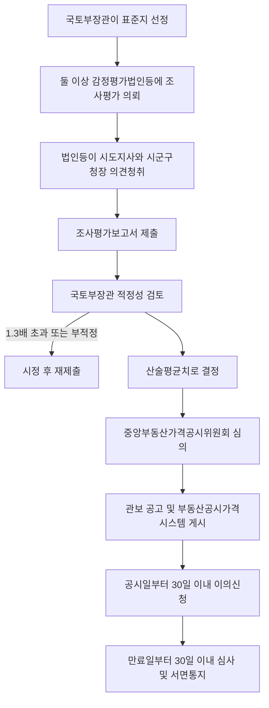

#### ⭐ 기출 출제포인트

1. **산술평균치** — 「최저치」·「기하평균치」로 바꾸는 함정(2021 15번 ⑤, 2026 15번 ③).
2. **1.3배 초과 시 시정 요구**(2021 15번 ③).
3. **이의신청 30일·국토교통부장관**(2026 15번 ②).
4. **하나에 의뢰할 수 있는 지역 요건** — 읍·면·동별 지가변동률(2022 19번 ㄹ).
5. **공시사항 5가지 + 시행령 4가지**(2018 17번, 2024 16번 ④, 2026 15번 ①).
6. **나지상정 평가**(2026 15번 ④).
7. **조사·평가보고서 포함사항**(2025 14번, 2026 15번 ⑤).

#### 📊 기출 분석

| 연도 | 출제 형태 | 핵심 논점 |
|---|---|---|
| 2018 | 17번 — 박스형 | 표준지공시지가 공시사항 |
| 2018 | 19번 — 옳지 않은 것 | 공시기준일 1월 1일·따로 정할 수 있음, 출입 3일 전 통지 |
| 2021 | 15번 — 옳지 않은 것 | 표준지 선정, 소유자 의견청취, 1.3배, 의견청취, 산술평균 |
| 2022 | 19번 — 박스형 | 공시사항, 거래지표, 환지, 읍면동별 지가변동률 |
| 2024 | 16번 — 옳은 것 | 단위면적 1제곱미터, 공시사항(지목·용도지역) |
| 2025 | 14번 — 아닌 것 | 조사·평가보고서 포함사항(용도구역은 아님) |
| 2026 | 15번 — 옳은 것 | 도로상황, 이의신청 상대방, 산술평균, 나지상정, 보고서 |

**출제 빈도** — 부공법 3~4문항 중 **매년 1문항**이 표준지공시지가에서 나온다.
**반복되는 함정** — ① 산술평균 → 최저치·기하평균 ② 30일 → 60일 ③ 국토교통부장관 → 시·도지사 ④ 읍·면·동별 → 시·군·구별 ⑤ 나지상정 뒤집기.
**최근 경향** — 2025·2026년 연속으로 **조사·평가보고서 포함사항**(국토교통부령 사항)을 물었다. 시행규칙 영역이지만 기출 해설로 확인되는 항목은 아래와 같다.

> 📌 **표준지공시지가 조사·평가보고서 포함사항** (2025년 14번 기출 해설로 확인) — ① 토지의 소재지, 면적 및 공부상 지목 ② 지리적 위치 ③ 토지 이용 상황 ④ ==용도지역==(용도**구역**·용도**지구**가 아님) ⑤ 주위 환경 ⑥ 도로 및 교통 환경 ⑦ 토지 형상 및 지세.
> 이 항목은 **국토교통부령**으로 정해지며 정본(법률·시행령)에는 없다. 기출 해설에 근거해 수록하되, 시행규칙 원문은 별도 확인이 필요하다.

#### 🔍 기출 선지로 배우는 조문

**①** (2021 15번 ⑤, 정답) 표준지공시지가는 감정평가법인등이 제출한 조사·평가보고서에 따른 조사·평가액의 **최저치**를 기준으로 한다 — **X** / 어디가 틀렸나: 기준치가 다르다 / 옳게 고치면: ==산술평균치==를 기준으로 한다(영 제8조④).

**②** (2021 15번 ③) 국토교통부장관은 조사·평가액 중 최고평가액이 최저평가액의 1.3배를 초과하는 경우에는 해당 감정평가법인등에게 보고서를 시정하여 다시 제출하게 할 수 있다 — **O** / 근거: 영 제8조 제6항.

**③** (2021 15번 ④) 감정평가법인등은 조사·평가보고서를 작성하는 경우에는 미리 해당 표준지를 관할하는 시·도지사 및 시장·군수·구청장의 의견을 들어야 한다 — **O** / 근거: 영 제8조 제2항.

**④** (2022 19번 ㄹ) 최근 1년간 **시·군·구별** 지가변동률이 전국 평균 지가변동률 이하인 지역의 표준지에 대해서는 하나의 감정평가법인등에 의뢰할 수 있다 — **X** / 어디가 틀렸나: 단위가 다르다 / 옳게 고치면: ==읍·면·동별== 지가변동률이다(영 제7조④1). 아울러 개발사업 시행·용도지역 변경 등의 사유가 없는 지역이어야 한다.

**⑤** (2022 19번 ㄷ) 도시개발사업에서 환지를 위하여 지가를 산정할 때에는 표준지공시지가를 기준으로 하지 아니한다 — **X** / 어디가 틀렸나: 기준으로 한다 / 옳게 고치면: 도시개발사업의 ==환지·체비지 매각 또는 환지신청==은 표준지공시지가 적용 대상이다(영 제13조②2가).

**⑥** (2018 19번 ④, 정답) 표준지공시지가의 공시기준일은 1월 1일이며, 일부 지역을 지정하여 해당 지역에 대한 공시기준일을 따로 정할 수는 **없다** — **X** / 어디가 틀렸나: 따로 정할 수 있다 / 옳게 고치면: 부득이하다고 인정하면 ==일부 지역을 지정하여 따로 정할 수 있다==(영 제3조 단서).

**⑦** (2026 15번 ②) 표준지공시지가에 이의가 있는 자는 그 공시일부터 30일 이내에 **시·도지사**에게 이의를 신청할 수 있다 — **X** / 어디가 틀렸나: 상대방이 다르다 / 옳게 고치면: ==국토교통부장관==에게 신청한다(법 제7조①).

**⑧** (2026 15번 ④) 표준지에 지상권이 설정되어 있을 때에는 그 권리가 **존재하는 것으로** 보고 표준지공시지가를 평가하여야 한다 — **X** / 어디가 틀렸나: 정반대다 / 옳게 고치면: ==존재하지 아니하는 것으로== 보고 평가한다(영 제6조②).

**⑨** (2024 16번 ②) 표준지공시지가의 단위면적은 **3.3제곱미터**로 한다 — **X** / 어디가 틀렸나: 수치 / 옳게 고치면: ==1제곱미터==다(영 제10조①).

#### ⚠️ 이 관의 함정 총정리

1. 「표준지공시지가는 조사·평가액의 최저치(또는 기하평균치)를 기준으로 한다」고 하면 틀림 → ==산술평균치==다(영 제8조④).
2. 「이의신청은 60일 이내에 시·도지사에게 한다」고 하면 틀림 → ==30일 이내·국토교통부장관==이다(법 제7조①).
3. 「최근 1년간 시·군·구별 지가변동률」이라고 하면 틀림 → ==읍·면·동별==이다(영 제7조④1).
4. 「표준지에 지상권이 설정되어 있으면 그 권리를 반영하여 평가한다」고 하면 틀림 → ==권리가 존재하지 아니하는 것으로 보고== 평가한다(영 제6조②).
5. 「공시기준일은 반드시 1월 1일이고 예외가 없다」고 하면 틀림 → 부득이하면 ==일부 지역을 지정해 따로 정할 수 있다==(영 제3조 단서).
6. 「단위면적은 3.3제곱미터(1평)다」라고 하면 틀림 → ==1제곱미터==다(영 제10조①).
7. 「관계 공무원도 타인 토지 출입에 시장·군수·구청장의 허가를 받아야 한다」고 하면 틀림 → 허가 대상은 ==부동산가격공시업무를 의뢰받은 자==에 한정된다(법 제13조②).

#### ✅ OX 확인문제

> 다음 진술의 참·거짓을 판단하시오.

**1.** 국토교통부장관은 표준지에 대하여 매년 공시기준일 현재의 단위면적당 적정가격을 조사·평가하고 중앙부동산가격공시위원회의 심의를 거쳐 공시하여야 한다.
→ **O**. 법 제3조 제1항.

**2.** 표준지공시지가의 공시기준일은 1월 1일이며, 부득이한 경우에도 따로 정할 수 없다.
→ **X**. 일부 지역을 지정하여 **따로 정할 수 있다**(영 제3조 단서).

**3.** 국토교통부장관은 표준지공시지가를 조사·평가할 때에는 둘 이상의 감정평가법인등에게 의뢰하여야 한다.
→ **O**. 법 제3조 제5항 본문. 지가 변동이 작은 경우 등은 하나에 의뢰할 수 있다.

**4.** 표준지공시지가는 제출된 보고서에 따른 조사·평가액의 산술평균치를 기준으로 한다.
→ **O**. 영 제8조 제4항.

**5.** 조사·평가액 중 최고평가액이 최저평가액의 2배를 초과하는 경우 시정하여 다시 제출하게 할 수 있다.
→ **X**. **1.3배** 초과다(영 제8조 제6항).

**6.** 표준지공시지가에 이의가 있는 자는 그 공시일부터 30일 이내에 서면으로 국토교통부장관에게 이의를 신청할 수 있다.
→ **O**. 법 제7조 제1항.

**7.** 국토교통부장관은 이의신청 기간이 만료된 날부터 60일 이내에 심사하여 결과를 통지하여야 한다.
→ **X**. **30일 이내**다(법 제7조 제2항).

**8.** 표준지에 건물이 있을 때에는 그 건물이 존재하지 아니하는 것으로 보고 표준지공시지가를 평가하여야 한다.
→ **O**. 영 제6조 제2항. 나지상정 평가다.

**9.** 표준지공시지가의 단위면적은 1제곱미터로 한다.
→ **O**. 영 제10조 제1항.

**10.** 국토교통부장관은 표준지 소유자의 의견을 들으려는 경우 부동산공시가격시스템에 30일 이상 게시해야 한다.
→ **X**. **20일 이상**이다(영 제5조 제1항).

#### 🧠 암기법

> 🔑 **"둘 이상 · 산술평균 · 1.3배"**
> 의뢰는 **둘 이상**, 결정은 **산술평균**, 시정은 **1.3배 초과**. 세 숫자가 표준지 절차의 뼈대다.

> 🔑 **"30-30 이의"**
> 신청 **30일**(공시일부터), 처리 **30일**(만료일부터). 개별공시지가도 똑같이 30-30이다.

> 🔑 **"20일 세 번"**
> 소유자 의견청취 게시 **20일 이상** / 시도지사·시군구청장 의견 제시 **20일 이내** / (개별공시지가) 열람 게시 **20일 이상**.

> 🔑 **선정 배제 — "2년 3정지, 1년 3과태료, 10퍼 징계, 1년 미경과"**

---

#### ⚖️ 법조문 원문

> 📖 이 관이 근거로 삼은 조문의 **전문**이다. 본문 인용은 발췌지만 여기서는 조 전체를 싣는다. 출처는 법제처 정본이다.

**― 부공법 법률 ―**

> 📌 **부공법 제3조(표준지공시지가의 조사ㆍ평가 및 공시 등)** — "① 국토교통부장관은 토지이용상황이나 주변 환경, 그 밖의 자연적ㆍ사회적 조건이 일반적으로 유사하다고 인정되는 일단의 토지 중에서 선정한 표준지에 대하여 매년 공시기준일 현재의 단위면적당 적정가격(이하 "표준지공시지가"라 한다)을 조사ㆍ평가하고, 제24조에 따른 중앙부동산가격공시위원회의의 심의를 거쳐 이를 공시하여야 한다. ② 국토교통부장관은 표준지공시지가를 공시하기 위하여 표준지의 가격을 조사ㆍ평가할 때에는 대통령령으로 정하는 바에 따라 해당 토지 소유자의 의견을 들어야 한다. ③ 제1항에 따른 표준지의 선정, 공시기준일, 공시의 시기, 조사ㆍ평가 기준 및 공시절차 등에 필요한 사항은 대통령령으로 정한다. ④ 국토교통부장관이 제1항에 따라 표준지공시지가를 조사ㆍ평가하는 경우에는 인근 유사토지의 거래가격ㆍ임대료 및 해당 토지와 유사한 이용가치를 지닌다고 인정되는 토지의 조성에 필요한 비용추정액, 인근지역 및 다른 지역과의 형평성ㆍ특수성, 표준지공시지가 변동의 예측 가능성 등 제반사항을 종합적으로 참작하여야 한다. ⑤ 국토교통부장관이 제1항에 따라 표준지공시지가를 조사ㆍ평가할 때에는 업무실적, 신인도(信認度) 등을 고려하여 둘 이상의 「감정평가 및 감정평가사에 관한 법률」에 따른 감정평가법인등(이하 "감정평가법인등"이라 한다)에게 이를 의뢰하여야 한다. 다만, 지가 변동이 작은 경우 등 대통령령으로 정하는 기준에 해당하는 표준지에 대해서는 하나의 감정평가법인등에 의뢰할 수 있다. ⑥ 국토교통부장관은 제5항에 따라 표준지공시지가 조사ㆍ평가를 의뢰받은 감정평가업자가 공정하고 객관적으로 해당 업무를 수행할 수 있도록 하여야 한다. ⑦ 제5항에 따른 감정평가법인등의 선정기준 및 업무범위는 대통령령으로 정한다. ⑧ 국토교통부장관은 제10조에 따른 개별공시지가의 산정을 위하여 필요하다고 인정하는 경우에는 표준지와 산정대상 개별 토지의 가격형성요인에 관한 표준적인 비교표(이하 "토지가격비준표"라 한다)를 작성하여 시장ㆍ군수 또는 구청장에게 제공하여야 한다."

> 📌 **부공법 제5조(표준지공시지가의 공시사항)** — "제3조에 따른 공시에는 다음 각 호의 사항이 포함되어야 한다. 1. 표준지의 지번 2. 표준지의 단위면적당 가격 3. 표준지의 면적 및 형상 4. 표준지 및 주변토지의 이용상황 5. 그 밖에 대통령령으로 정하는 사항"

> 📌 **부공법 제7조(표준지공시지가에 대한 이의신청)** — "① 표준지공시지가에 이의가 있는 자는 그 공시일부터 30일 이내에 서면(전자문서를 포함한다. 이하 같다)으로 국토교통부장관에게 이의를 신청할 수 있다. ② 국토교통부장관은 제1항에 따른 이의신청 기간이 만료된 날부터 30일 이내에 이의신청을 심사하여 그 결과를 신청인에게 서면으로 통지하여야 한다. 이 경우 국토교통부장관은 이의신청의 내용이 타당하다고 인정될 때에는 제3조에 따라 해당 표준지공시지가를 조정하여 다시 공시하여야 한다. ③ 제1항 및 제2항에서 규정한 것 외에 이의신청 및 처리절차 등에 필요한 사항은 대통령령으로 정한다."

> 📌 **부공법 제9조(표준지공시지가의 효력)** — "표준지공시지가는 토지시장에 지가정보를 제공하고 일반적인 토지거래의 지표가 되며, 국가ㆍ지방자치단체 등이 그 업무와 관련하여 지가를 산정하거나 감정평가법인등이 개별적으로 토지를 감정평가하는 경우에 기준이 된다."

**― 부공법 시행령 ―**

> 📌 **부공법 시행령 제6조(표준지공시지가 조사ㆍ평가의 기준)** — "① 법 제3조제4항에 따라 국토교통부장관이 표준지공시지가를 조사ㆍ평가하는 경우 참작하여야 하는 사항의 기준은 다음 각 호와 같다. 1. 인근 유사토지의 거래가격 또는 임대료의 경우: 해당 거래 또는 임대차가 당사자의 특수한 사정에 의하여 이루어지거나 토지거래 또는 임대차에 대한 지식의 부족으로 인하여 이루어진 경우에는 그러한 사정이 없었을 때에 이루어졌을 거래가격 또는 임대료를 기준으로 할 것 2. 해당 토지와 유사한 이용가치를 지닌다고 인정되는 토지의 조성에 필요한 비용추정액의 경우: 공시기준일 현재 해당 토지를 조성하기 위한 표준적인 조성비와 일반적인 부대비용으로 할 것 ② 표준지에 건물 또는 그 밖의 정착물이 있거나 지상권 또는 그 밖의 토지의 사용ㆍ수익을 제한하는 권리가 설정되어 있을 때에는 그 정착물 또는 권리가 존재하지 아니하는 것으로 보고 표준지공시지가를 평가하여야 한다. ③ 제1항 및 제2항에서 규정한 사항 외에 표준지공시지가의 조사ㆍ평가에 필요한 세부기준은 국토교통부장관이 정한다."

> 📌 **부공법 시행령 제8조(표준지공시지가 조사ㆍ평가의 절차)** — "① 법 제3조제5항에 따라 표준지공시지가 조사ㆍ평가를 의뢰받은 감정평가법인등은 표준지공시지가 및 그 밖에 국토교통부령으로 정하는 사항을 조사ㆍ평가한 후 국토교통부령으로 정하는 바에 따라 조사ㆍ평가보고서를 작성하여 국토교통부장관에게 제출해야 한다. ② 감정평가법인등은 제1항에 따라 조사ㆍ평가보고서를 작성하는 경우에는 미리 해당 표준지를 관할하는 특별시장ㆍ광역시장ㆍ특별자치시장ㆍ도지사 또는 특별자치도지사(이하 "시ㆍ도지사"라 한다) 및 시장ㆍ군수ㆍ구청장(자치구의 구청장을 말한다. 이하 같다)의 의견을 들어야 한다. ③ 시ㆍ도지사 및 시장ㆍ군수ㆍ구청장은 제2항에 따라 의견 제시 요청을 받은 경우에는 요청받은 날부터 20일 이내에 의견을 제시해야 한다. 이 경우 시장ㆍ군수 또는 구청장은 법 제25조에 따른 시ㆍ군ㆍ구부동산가격공시위원회(이하 "시ㆍ군ㆍ구부동산가격공시위원회"라 한다)의 심의를 거쳐 의견을 제시해야 한다. ④ 표준지공시지가는 제1항에 따라 제출된 보고서에 따른 조사ㆍ평가액의 산술평균치를 기준으로 한다. ⑤ 국토교통부장관은 제1항에 따라 제출된 보고서에 대하여 「부동산 거래신고 등에 관한 법률」 제3조에 따라 신고한 실제 매매가격(이하 "실거래신고가격"이라 한다) 및 「감정평가 및 감정평가사에 관한 법률」 제9조에 따른 감정평가 정보체계(이하 "감정평가 정보체계"라 한다) 등을 활용하여 그 적정성 여부를 검토할 수 있다. ⑥ 국토교통부장관은 제5항에 따른 검토 결과 부적정하다고 판단되거나 조사ㆍ평가액 중 최고평가액이 최저평가액의 1.3배를 초과하는 경우에는 해당 감정평가법인등에게 보고서를 시정하여 다시 제출하게 할 수 있다. ⑦ 국토교통부장관은 제1항에 따라 제출된 보고서의 조사ㆍ평가가 관계 법령을 위반하여 수행되었다고 인정되는 경우에는 해당 감정평가법인등에게 그 사유를 통보하고, 다른 감정평가법인등 2인에게 대상 표준지공시지가의 조사ㆍ평가를 다시 의뢰해야 한다. 이 경우 표준지 적정가격은 다시 조사ㆍ평가한 가액의 산술평균치를 기준으로 한다."

### [부공법] Chapter 03 개별공시지가

> 📖 법 제10조~제15조와 시행령 제14조~제25조다. **시장·군수 또는 구청장**이 매년 표준지공시지가의 공시기준일 현재 관할 구역 안 개별토지의 **단위면적당 가격**을 결정·공시한다.
> 표준지공시지가가 「조사·평가 + 공시」라면, 개별공시지가는 「**산정 + 검증 + 의견청취 + 심의 + 결정·공시**」다. 절차가 훨씬 길고 그만큼 함정이 많다.

> ⭐ **이 관에서 반드시 챙길 3가지**
> ① **결정·공시 기한 = ==매년 5월 31일까지==**. (개별주택·공동주택은 4월 30일 — 헷갈리면 실점한다.)
> ② **분할·합병 등의 공시기준일** — 1.1~6.30 발생 → ==그 해 7월 1일==(공시는 10월 31일까지) / 7.1~12.31 발생 → ==다음 해 1월 1일==(공시는 다음 해 5월 31일까지).
> ③ **검증 생략 금지 대상** — 개발사업 시행·용도지역지구 변경 토지는 ==검증을 생략할 수 없다==.

#### 1. 개념·정의

| 용어 | 내용 | 근거 |
|---|---|---|
| 개별공시지가 | 시장·군수·구청장이 결정·공시하는 관할 구역 안 개별토지의 ==단위면적당 가격== | 법 제10조① |
| 단위면적 | ==1제곱미터== | 영 제14조 |
| 비교표준지 | 개별공시지가의 ==산정기준이 되는 표준지== | 영 제17조②2 |
| 산정 방법 | 유사한 이용가치를 지닌 ==하나 또는 둘 이상의 표준지공시지가==를 기준으로 ==토지가격비준표==를 사용 | 법 제10조④ |
| 검증 | 산정한 개별토지가격의 타당성에 대한 ==감정평가법인등==의 확인 | 법 제10조⑤ |

#### 2. 요건·절차

| 구분 | 내용 | 근거 |
|---|---|---|
| 사용 목적 | 국세·지방세 등 각종 세금의 부과, 그 밖의 다른 법령에서 정하는 목적을 위한 지가산정 | 법 제10조① |
| 심의 | ==시·군·구부동산가격공시위원회==의 심의 | 법 제10조① |
| 결정·공시 기한 | 매년 ==5월 31일까지== | 영 제21조① |
| 공시하지 아니할 수 있는 토지 | ① 표준지로 선정된 토지 ② 농지보전부담금·개발부담금 등 부과대상이 아닌 토지 ③ 국세·지방세 부과대상이 아닌 토지(국공유지는 공공용 토지만) | 영 제15조① |
| 그럼에도 **공시하여야** 하는 토지 | ① 관계 법령에 따라 개별공시지가를 적용하도록 규정된 토지 ② 시장·군수·구청장이 관계 행정기관의 장과 **협의**하여 결정·공시하기로 한 토지 | 영 제15조② |
| 표준지로 선정된 토지의 처리 | 해당 토지의 ==표준지공시지가를 개별공시지가로 봄== | 법 제10조② 후단 |
| 검증 의뢰 대상 | 해당 지역 표준지공시지가를 조사·평가한 감정평가법인등 또는 ==감정평가실적 등이 우수한 감정평가법인등== | 법 제10조⑥ |
| 검증 생략 기준 | 지가변동률과 읍·면·동 연평균 지가변동률의 ==차이가 작은 순== | 영 제18조③ |
| 검증 생략 **금지** | 개발사업 시행·용도지역용도지구 변경 등의 사유가 있는 토지 | 영 제18조③ 단서 |
| 의견청취 | 개별토지가격 열람부 비치 + 게시판·홈페이지에 ==20일 이상== 게시 | 영 제19조① |
| 의견 심사·통지 | 의견제출기간 만료일부터 ==30일 이내== 심사·통지. 현지조사·검증 가능 | 영 제19조③④ |
| 이의신청 | 결정·공시일부터 ==30일 이내== 서면으로 ==시장·군수·구청장==에게 | 법 제11조① |
| 이의신청 처리 | 만료일부터 ==30일 이내== 심사·서면통지, 타당하면 조정하여 다시 결정·공시 | 법 제11조② |
| 정정 | 명백한 오류 발견 시 ==지체 없이== 정정. 시·군·구위원회 심의(틀린 계산·오기는 심의 생략 가능) | 법 제12조, 영 제23조② |
| 비용 보조 | 결정·공시에 드는 비용의 ==50퍼센트 이내==를 국고에서 보조 가능 | 영 제24조 |

#### 3. 핵심 조문

> 📌 **부공법 제10조(개별공시지가의 결정·공시 등) 제1항** — "시장·군수 또는 구청장은 국세·지방세 등 각종 세금의 부과, 그 밖의 다른 법령에서 정하는 목적을 위한 지가산정에 사용되도록 하기 위하여 제25조에 따른 시·군·구부동산가격공시위원회의 심의를 거쳐 매년 공시지가의 공시기준일 현재 관할 구역 안의 개별토지의 단위면적당 가격(이하 "개별공시지가"라 한다)을 결정·공시하고, 이를 관계 행정기관 등에 제공하여야 한다."

**요약** — 주체는 ==시장·군수 또는 구청장==, 심의기관은 ==시·군·구부동산가격공시위원회==다. 2023년 15번(①)이 「**시·도지사**는 …**중앙**부동산가격공시위원회의 심의를 거쳐」로 둘 다 바꿔 정답을 만들었다.

> 📌 **부공법 제10조 제2항** — "제1항에도 불구하고 표준지로 선정된 토지, 조세 또는 부담금 등의 부과대상이 아닌 토지, 그 밖에 대통령령으로 정하는 토지에 대하여는 개별공시지가를 결정·공시하지 아니할 수 있다. 이 경우 표준지로 선정된 토지에 대하여는 해당 토지의 표준지공시지가를 개별공시지가로 본다."

> 📌 **부공법 제10조 제5항** — "시장·군수 또는 구청장은 개별공시지가를 결정·공시하기 위하여 개별토지의 가격을 산정할 때에는 그 타당성에 대하여 감정평가법인등의 검증을 받고 토지소유자, 그 밖의 이해관계인의 의견을 들어야 한다. 다만, 시장·군수 또는 구청장은 감정평가법인등의 검증이 필요 없다고 인정되는 때에는 지가의 변동상황 등 대통령령으로 정하는 사항을 고려하여 감정평가법인등의 검증을 생략할 수 있다."

> 📌 **부공법 제11조(개별공시지가에 대한 이의신청) 제1항** — "개별공시지가에 이의가 있는 자는 그 결정·공시일부터 30일 이내에 서면으로 시장·군수 또는 구청장에게 이의를 신청할 수 있다."

> 📌 **부공법 제12조(개별공시지가의 정정)** — "시장·군수 또는 구청장은 개별공시지가에 틀린 계산, 오기, 표준지 선정의 착오, 그 밖에 대통령령으로 정하는 명백한 오류가 있음을 발견한 때에는 지체 없이 이를 정정하여야 한다."

**요약** — 「대통령령으로 정하는 명백한 오류」는 ① 공시절차를 완전하게 이행하지 아니한 경우 ② 용도지역·용도지구 등 **주요 요인의 조사를 잘못한** 경우 ③ ==토지가격비준표의 적용에 오류==가 있는 경우다(영 제23조①).

> 📌 **부공법 시행령 제21조(개별공시지가의 결정 및 공시) 제1항** — "시장·군수 또는 구청장은 매년 5월 31일까지 개별공시지가를 결정·공시하여야 한다. 다만, 제16조제2항제1호의 경우에는 그 해 10월 31일까지, 같은 항 제2호의 경우에는 다음 해 5월 31일까지 결정·공시하여야 한다."

> 📌 **부공법 시행령 제16조(개별공시지가 공시기준일을 다르게 할 수 있는 토지)** — "① … 1. 「공간정보의 구축 및 관리 등에 관한 법률」에 따라 분할 또는 합병된 토지 2. 공유수면 매립 등으로 … 신규등록이 된 토지 3. 토지의 형질변경 또는 용도변경으로 … 지목변경이 된 토지 4. 국유·공유에서 매각 등에 따라 사유(私有)로 된 토지로서 개별공시지가가 없는 토지 ② … 1. 1월 1일부터 6월 30일까지의 사이에 제1항 각 호의 사유가 발생한 토지: 그 해 7월 1일 2. 7월 1일부터 12월 31일까지의 사이에 제1항 각 호의 사유가 발생한 토지: 다음 해 1월 1일"

> 📌 **부공법 제13조(타인토지에의 출입 등) 제2항·제3항** — "② 관계공무원등이 제1항에 따라 택지 또는 담장이나 울타리로 둘러싸인 타인의 토지에 출입하고자 할 때에는 시장·군수 또는 구청장의 허가(부동산가격공시업무를 의뢰 받은 자에 한정한다)를 받아 출입할 날의 3일 전에 그 점유자에게 일시와 장소를 통지하여야 한다. 다만, 점유자를 알 수 없거나 부득이한 사유가 있는 경우에는 그러하지 아니하다. ③ 일출 전·일몰 후에는 그 토지의 점유자의 승인 없이 택지 또는 담장이나 울타리로 둘러싸인 타인의 토지에 출입할 수 없다."

#### 4. 🔎 검증 시 검토·확인 사항 7가지 (영 제18조②)

| 호 | 검토·확인 사항 |
|---|---|
| 1 | ==비교표준지 선정==의 적정성 |
| 2 | 개별토지 ==가격 산정==의 적정성 |
| 3 | 산정한 개별토지가격과 ==표준지공시지가==의 균형 유지 |
| 4 | 산정한 개별토지가격과 ==인근토지의 지가==와의 균형 유지 |
| 5 | 표준주택·개별주택·비주거용 표준부동산·비주거용 개별부동산가격 산정 시 고려된 **토지 특성과 일치**하는지 |
| 6 | 적용된 용도지역·토지이용상황 등 주요 특성이 **공부(公簿)와 일치**하는지 |
| 7 | 그 밖에 시장·군수·구청장이 검토를 의뢰한 사항 |

> ⚠️ 2020년 19번이 「산정한 개별토지가격과 인근토지의 지가 및 **전년도 지가**와의 균형 유지」, 「**토지가격비준표 작성**의 적정성」을 끼워 넣어 오답을 만들었다. **전년도 지가**와 **비준표 작성**은 검증 사항이 아니다(비준표를 **작성**하는 자는 국토교통부장관이다).

#### 5. ⏱ 기간·수치 총정리

| 항목 | 기간·수치 | 근거 조문 |
|---|---|---|
| 결정·공시 기한 (원칙) | 매년 ==5월 31일까지== | 영 제21조① |
| 1.1~6.30 사유 발생 토지 — 공시기준일 | ==그 해 7월 1일== | 영 제16조②1 |
| └ 그 공시 기한 | ==그 해 10월 31일까지== | 영 제21조① 단서 |
| 7.1~12.31 사유 발생 토지 — 공시기준일 | ==다음 해 1월 1일== | 영 제16조②2 |
| └ 그 공시 기한 | ==다음 해 5월 31일까지== | 영 제21조① 단서 |
| 단위면적 | ==1제곱미터== | 영 제14조 |
| 의견청취 게시기간 | ==20일 이상== | 영 제19조① |
| 제출 의견 심사·통지 기한 | 의견제출기간 만료일부터 ==30일 이내== | 영 제19조③ |
| 이의신청 기간 | 결정·공시일부터 ==30일 이내== | 법 제11조① |
| 이의신청 심사·통지 기한 | 만료일부터 ==30일 이내== | 법 제11조② |
| 정정 시기 | ==지체 없이== | 법 제12조 |
| 국고 보조 한도 | 결정·공시에 드는 비용의 ==50퍼센트 이내== | 영 제24조 |
| 타인토지 출입 사전통지 | 출입할 날의 ==3일 전== | 법 제13조② |
| 검증 사항 수 | ==7가지== | 영 제18조② |
| 정정사유(명백한 오류) 수 | ==3가지== | 영 제23조① |

#### 6. 👤 권한 주체 구분

| 행위 | 주체 | 근거 |
|---|---|---|
| 개별공시지가 결정·공시 | ==시장·군수 또는 구청장== | 법 제10조① |
| 심의 | ==시·군·구부동산가격공시위원회== | 법 제10조① |
| 토지가격비준표 **작성·제공** | ==국토교통부장관== | 법 제3조⑧ |
| 개별공시지가 산정기준 정하여 통보 | ==국토교통부장관== | 영 제17조① |
| 검증 실시 | ==감정평가법인등== | 법 제10조⑤⑥ |
| 검증 생략 결정 | ==시장·군수 또는 구청장== | 법 제10조⑤ 단서 |
| 지도·감독 | ==국토교통부장관== → 시장·군수·구청장 | 법 제10조⑦ |
| 이의신청의 상대방 | ==시장·군수 또는 구청장== | 법 제11조① |
| 이의신청 심사 시 검증 의뢰 | ==시장·군수 또는 구청장== → 감정평가법인등 | 영 제22조② |
| 정정 | ==시장·군수 또는 구청장== | 법 제12조 |
| 타인토지 출입 허가 | ==시장·군수 또는 구청장== (의뢰받은 자에 한정) | 법 제13조② |

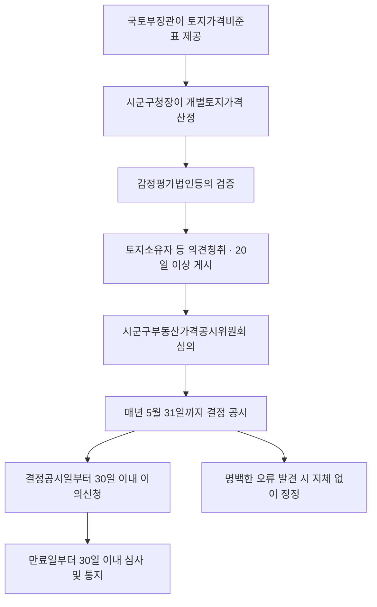

#### ⭐ 기출 출제포인트

1. **주체·심의기관 바꿔치기** — 시·도지사 / 중앙위원회(2023 15번 ①).
2. **검증 생략 금지 대상** — 개발사업·용도지역 변경 토지(2021 18번 ②, 2025 15번 ③).
3. **검증 사항 7가지 중 아닌 것** — 전년도 지가, 비준표 작성(2020 19번).
4. **공시하여야 하는 토지 vs 아니할 수 있는 토지**(2024 16번 ③, 2025 15번 ①, 2026 16번 ③).
5. **이의신청 30일·시장군수구청장**(2021 18번 ⑤, 2024 16번 ①, 2025 15번 ④).
6. **국고 보조 50퍼센트 이내**(2023 15번 ④, 2024 16번 ⑤).
7. **정정사유 — 토지가격비준표 적용 오류**(2023 15번 ⑤, 2025 15번 ⑤).

#### 📊 기출 분석

| 연도 | 출제 형태 | 핵심 논점 |
|---|---|---|
| 2018 | 17번(풀이) — 선지 | 개별공시지가 결정·공시 주체와 심의 |
| 2018 | 19번 — 옳지 않은 것 | 표준지 선정 토지 처리, 산정기준, 출입 3일 전, 비용 보조 |
| 2020 | 19번 — 아닌 것 | 검증 시 검토·확인 사항 |
| 2021 | 18번 — 옳지 않은 것 | 공시 제외, 검증 생략 금지, 선정기준 과태료 3회, 이의신청 30일 |
| 2023 | 15번 — 옳지 않은 것 | 주체·심의기관, 표준지 간주, 지목변경, 50퍼센트, 비준표 오류 |
| 2024 | 16번 — 옳은 것 | 이의신청 30일, 단위면적, 개발부담금 대상 아닌 토지, 보조 비율 |
| 2025 | 15번 — 옳지 않은 것 | 협의 토지, 지목변경, 검증 생략 금지, 이의신청, 정정 |
| 2026 | 16번 — 옳지 않은 것 | 산정기준, 검증 사항, 농지보전부담금 대상 아닌 토지, 검증 의뢰, 출입 |

**출제 빈도** — 부공법에서 **가장 많이 나오는 관**이다. 최근 8년 중 7년 출제.
**반복되는 함정** — ① 주체를 시·도지사로 ② 부과대상이 아닌 토지를 「공시하여야 한다」로 ③ 검증 생략 금지 토지를 「생략할 수 있다」로 ④ 50퍼센트를 30·75퍼센트로 ⑤ 30일을 60일로.
**최근 경향** — 2025·2026년 모두 「**부과대상이 아닌 토지**」와 「**검증**」을 물었다. 영 제15조와 영 제18조가 핵심 조문이다.

#### 🔍 기출 선지로 배우는 조문

**①** (2023 15번 ①, 정답) **시·도지사**는 개별공시지가를 산정한 때에는 **중앙**부동산가격공시위원회의 심의를 거쳐 이를 공시하여야 한다 — **X** / 어디가 틀렸나: 주체와 심의기관이 모두 다르다 / 옳게 고치면: ==시장·군수 또는 구청장==이 ==시·군·구부동산가격공시위원회==의 심의를 거쳐 결정·공시한다(법 제10조①).

**②** (2020 19번 ③) 검증 사항에 「산정한 개별토지가격과 인근토지의 지가 **및 전년도 지가**와의 균형 유지에 관한 사항」이 포함된다 — **X** / 어디가 틀렸나: 「전년도 지가」는 없다 / 옳게 고치면: ==인근토지의 지가와의 균형 유지==까지다(영 제18조②4).

**③** (2020 19번 ④) 검증 사항에 「**토지가격비준표 작성**의 적정성에 관한 사항」이 포함된다 — **X** / 어디가 틀렸나: 비준표를 작성하는 자는 검증인이 아니다 / 옳게 고치면: 토지가격비준표는 ==국토교통부장관이 작성==하며(법 제3조⑧), 검증 사항은 ==비준표의 **사용**==과 관련한 산정의 적정성이다.

**④** (2021 18번 ③) 검증을 의뢰할 감정평가법인등을 선정할 때 선정기준일부터 직전 1년간 **과태료처분을 2회** 받은 감정평가법인등은 선정에서 배제된다 — **X** / 어디가 틀렸나: 횟수 / 옳게 고치면: 직전 1년간 과태료처분을 ==3회 이상== 받은 경우가 배제 사유다(영 제7조①3나, 제20조).

**⑤** (2025 15번 ③, 정답) 시장은 개별공시지가의 결정·공시를 위하여 개별토지의 가격을 산정하는 경우 **용도지역이 변경되는 토지**를 검증 생략 대상 토지로 선정할 수 있다 — **X** / 어디가 틀렸나: 생략할 수 없다 / 옳게 고치면: 개발사업이 시행되거나 용도지역·용도지구가 변경되는 등의 사유가 있는 토지는 ==검증 생략 대상으로 선정해서는 안 된다==(영 제18조③ 단서).

**⑥** (2024 16번 ③ / 2026 16번 ③) **개발부담금(농지보전부담금)의 부과대상이 아닌 토지**에 대하여는 개별공시지가를 결정·공시하여야 한다 — **X** / 어디가 틀렸나: 원칙이 반대다 / 옳게 고치면: 부과대상이 아닌 토지는 ==결정·공시하지 아니할 수 있다==(영 제15조①2). 다만 관계 법령상 적용이 규정되어 있거나 관계 행정기관의 장과 **협의**한 토지는 공시하여야 한다(영 제15조②).

**⑦** (2024 16번 ⑤ / 2023 15번 ④) 개별공시지가의 결정·공시에 드는 비용은 **30퍼센트** 이내에서 국고에서 보조한다 — **X** / 어디가 틀렸나: 비율 / 옳게 고치면: ==50퍼센트 이내==다(영 제24조).

**⑧** (2025 15번 ⑤ / 2023 15번 ⑤) 군수는 토지가격비준표의 적용에 오류가 있음을 발견한 때에는 지체 없이 이를 정정하여야 한다 — **O** / 근거: 법 제12조, 영 제23조 제1항 제3호.

**⑨** (2026 16번 ⑤) 관계 공무원은 일출 전·일몰 후에는 토지 점유자의 승인 없이 개별공시지가의 산정을 위하여 울타리로 둘러싸인 타인의 토지에 출입할 수 없다 — **O** / 근거: 법 제13조 제3항.

#### ⚠️ 이 관의 함정 총정리

1. 「시·도지사가 중앙부동산가격공시위원회의 심의를 거쳐 개별공시지가를 공시한다」고 하면 틀림 → ==시장·군수·구청장==이 ==시·군·구위원회== 심의를 거친다(법 제10조①).
2. 「개별공시지가는 매년 4월 30일까지 결정·공시한다」고 하면 틀림 → ==5월 31일==까지다(영 제21조①). 4월 30일은 **개별주택·공동주택**이다.
3. 「국세·지방세 부과대상이 아닌 토지도 반드시 개별공시지가를 공시하여야 한다」고 하면 틀림 → ==공시하지 아니할 수 있다==(영 제15조①).
4. 「개발사업이 시행되는 토지도 검증을 생략할 수 있다」고 하면 틀림 → ==생략 대상으로 선정해서는 안 된다==(영 제18조③ 단서).
5. 「국고 보조는 30퍼센트(또는 75퍼센트) 이내」라고 하면 틀림 → ==50퍼센트 이내==다(영 제24조).
6. 「이의신청은 60일 이내」 또는 「국토교통부장관에게」라고 하면 틀림 → ==30일 이내==·==시장·군수·구청장==이다(법 제11조①).
7. 「1월 1일부터 6월 30일 사이에 분할된 토지의 공시기준일은 다음 해 1월 1일」이라고 하면 틀림 → ==그 해 7월 1일==이다(영 제16조②1).

#### ✅ OX 확인문제

> 다음 진술의 참·거짓을 판단하시오.

**1.** 시장·군수 또는 구청장은 시·군·구부동산가격공시위원회의 심의를 거쳐 매년 개별공시지가를 결정·공시한다.
→ **O**. 법 제10조 제1항.

**2.** 개별공시지가는 매년 4월 30일까지 결정·공시하여야 한다.
→ **X**. **5월 31일**까지다(영 제21조 제1항).

**3.** 표준지로 선정된 토지에 대하여 개별공시지가를 결정·공시하지 아니하는 경우 해당 토지의 표준지공시지가를 개별공시지가로 본다.
→ **O**. 법 제10조 제2항 후단.

**4.** 시장·군수 또는 구청장이 관계 행정기관의 장과 협의하여 개별공시지가를 결정·공시하기로 한 토지에 대해서는 개별공시지가를 결정·공시하여야 한다.
→ **O**. 영 제15조 제2항 제2호.

**5.** 개발사업이 시행되는 토지는 감정평가법인등의 검증 생략 대상 토지로 선정할 수 있다.
→ **X**. **선정해서는 안 된다**(영 제18조 제3항 단서).

**6.** 개별공시지가에 이의가 있는 자는 그 결정·공시일부터 30일 이내에 서면으로 시장·군수 또는 구청장에게 이의를 신청할 수 있다.
→ **O**. 법 제11조 제1항.

**7.** 토지가격비준표의 적용에 오류가 있는 경우는 개별공시지가의 정정사유에 해당한다.
→ **O**. 법 제12조, 영 제23조 제1항 제3호.

**8.** 개별공시지가의 결정·공시에 드는 비용은 그 전액을 국고에서 보조한다.
→ **X**. **50퍼센트 이내**에서 보조할 수 있다(영 제24조).

**9.** 3월에 분할된 토지의 개별공시지가 공시기준일은 그 해 7월 1일이며, 그 해 10월 31일까지 결정·공시하여야 한다.
→ **O**. 영 제16조 제2항 제1호, 영 제21조 제1항 단서.

**10.** 시장·군수 또는 구청장은 개별공시지가 이의신청을 심사하기 위하여 필요할 때에는 감정평가법인등에게 검증을 의뢰할 수 있다.
→ **O**. 영 제22조 제2항.

#### 🧠 암기법

> 🔑 **공시 기한 — "땅은 5월, 집은 4월"**
> 개별공시**지가** = **5월 31일** / 개별**주택**·**공동주택** = **4월 30일**.

> 🔑 **토지 공시기준일 — "6·7 / 12·1"**
> 1.1~**6**.30 발생 → **7**.1 (공시 10.31)
> **7**.1~**12**.31 발생 → 다음 해 **1**.1 (공시 다음 해 5.31)
> ※ 주택·비주거용은 기준이 **5.31 / 6.1**로 한 달씩 앞당겨진다.

> 🔑 **"검증 못 빼는 땅 — 개(발사업) · 용(도지역지구 변경)"**

> 🔑 **"반(50)만 준다"**
> 개별공시지가 결정·공시 비용 국고 보조는 **50퍼센트 이내**.

---

#### ⚖️ 법조문 원문

> 📖 이 관이 근거로 삼은 조문의 **전문**이다. 본문 인용은 발췌지만 여기서는 조 전체를 싣는다. 출처는 법제처 정본이다.

**― 부공법 법률 ―**

> 📌 **부공법 제10조(개별공시지가의 결정ㆍ공시 등)** — "① 시장ㆍ군수 또는 구청장은 국세ㆍ지방세 등 각종 세금의 부과, 그 밖의 다른 법령에서 정하는 목적을 위한 지가산정에 사용되도록 하기 위하여 제25조에 따른 시ㆍ군ㆍ구부동산가격공시위원회의 심의를 거쳐 매년 공시지가의 공시기준일 현재 관할 구역 안의 개별토지의 단위면적당 가격(이하 "개별공시지가"라 한다)을 결정ㆍ공시하고, 이를 관계 행정기관 등에 제공하여야 한다. ② 제1항에도 불구하고 표준지로 선정된 토지, 조세 또는 부담금 등의 부과대상이 아닌 토지, 그 밖에 대통령령으로 정하는 토지에 대하여는 개별공시지가를 결정ㆍ공시하지 아니할 수 있다. 이 경우 표준지로 선정된 토지에 대하여는 해당 토지의 표준지공시지가를 개별공시지가로 본다. ③ 시장ㆍ군수 또는 구청장은 공시기준일 이후에 분할ㆍ합병 등이 발생한 토지에 대하여는 대통령령으로 정하는 날을 기준으로 하여 개별공시지가를 결정ㆍ공시하여야 한다. ④ 시장ㆍ군수 또는 구청장이 개별공시지가를 결정ㆍ공시하는 경우에는 해당 토지와 유사한 이용가치를 지닌다고 인정되는 하나 또는 둘 이상의 표준지의 공시지가를 기준으로 토지가격비준표를 사용하여 지가를 산정하되, 해당 토지의 가격과 표준지공시지가가 균형을 유지하도록 하여야 한다. ⑤ 시장ㆍ군수 또는 구청장은 개별공시지가를 결정ㆍ공시하기 위하여 개별토지의 가격을 산정할 때에는 그 타당성에 대하여 감정평가법인등의 검증을 받고 토지소유자, 그 밖의 이해관계인의 의견을 들어야 한다. 다만, 시장ㆍ군수 또는 구청장은 감정평가법인등의 검증이 필요 없다고 인정되는 때에는 지가의 변동상황 등 대통령령으로 정하는 사항을 고려하여 감정평가법인등의 검증을 생략할 수 있다. ⑥ 시장ㆍ군수 또는 구청장이 제5항에 따른 검증을 받으려는 때에는 해당 지역의 표준지의 공시지가를 조사ㆍ평가한 감정평가법인등 또는 대통령령으로 정하는 감정평가실적 등이 우수한 감정평가법인등에 의뢰하여야 한다. ⑦ 국토교통부장관은 지가공시 행정의 합리적인 발전을 도모하고 표준지공시지가와 개별공시지가와의 균형유지 등 적정한 지가형성을 위하여 필요하다고 인정하는 경우에는 개별공시지가의 결정ㆍ공시 등에 관하여 시장ㆍ군수 또는 구청장을 지도ㆍ감독할 수 있다. ⑧ 제1항부터 제7항까지에서 규정한 것 외에 개별공시지가의 산정, 검증 및 결정, 공시기준일, 공시의 시기, 조사ㆍ산정의 기준, 이해관계인의 의견청취, 감정평가법인등의 지정 및 공시절차 등에 필요한 사항은 대통령령으로 정한다."

> 📌 **부공법 제11조(개별공시지가에 대한 이의신청)** — "① 개별공시지가에 이의가 있는 자는 그 결정ㆍ공시일부터 30일 이내에 서면으로 시장ㆍ군수 또는 구청장에게 이의를 신청할 수 있다. ② 시장ㆍ군수 또는 구청장은 제1항에 따라 이의신청 기간이 만료된 날부터 30일 이내에 이의신청을 심사하여 그 결과를 신청인에게 서면으로 통지하여야 한다. 이 경우 시장ㆍ군수 또는 구청장은 이의신청의 내용이 타당하다고 인정될 때에는 제10조에 따라 해당 개별공시지가를 조정하여 다시 결정ㆍ공시하여야 한다. ③ 제1항 및 제2항에서 규정한 것 외에 이의신청 및 처리절차 등에 필요한 사항은 대통령령으로 정한다."

> 📌 **부공법 제12조(개별공시지가의 정정)** — "시장ㆍ군수 또는 구청장은 개별공시지가에 틀린 계산, 오기, 표준지 선정의 착오, 그 밖에 대통령령으로 정하는 명백한 오류가 있음을 발견한 때에는 지체 없이 이를 정정하여야 한다."

> 📌 **부공법 제13조(타인토지에의 출입 등)** — "① 관계 공무원 또는 부동산가격공시업무를 의뢰받은 자(이하 "관계공무원등"이라 한다)는 제3조제4항에 따른 표준지가격의 조사ㆍ평가 또는 제10조제4항에 따른 토지가격의 산정을 위하여 필요한 때에는 타인의 토지에 출입할 수 있다. ② 관계공무원등이 제1항에 따라 택지 또는 담장이나 울타리로 둘러싸인 타인의 토지에 출입하고자 할 때에는 시장ㆍ군수 또는 구청장의 허가(부동산가격공시업무를 의뢰 받은 자에 한정한다)를 받아 출입할 날의 3일 전에 그 점유자에게 일시와 장소를 통지하여야 한다. 다만, 점유자를 알 수 없거나 부득이한 사유가 있는 경우에는 그러하지 아니하다. ③ 일출 전ㆍ일몰 후에는 그 토지의 점유자의 승인 없이 택지 또는 담장이나 울타리로 둘러싸인 타인의 토지에 출입할 수 없다. ④ 제2항에 따라 출입을 하고자 하는 자는 그 권한을 표시하는 증표와 허가증을 지니고 이를 관계인에게 내보여야 한다. ⑤ 제4항에 따른 증표와 허가증에 필요한 사항은 국토교통부령으로 정한다."

**― 부공법 시행령 ―**

> 📌 **부공법 시행령 제16조(개별공시지가 공시기준일을 다르게 할 수 있는 토지)** — "① 법 제10조제3항에 따라 개별공시지가 공시기준일을 다르게 할 수 있는 토지는 다음 각 호의 어느 하나에 해당하는 토지로 한다. 1. 「공간정보의 구축 및 관리 등에 관한 법률」에 따라 분할 또는 합병된 토지 2. 공유수면 매립 등으로 「공간정보의 구축 및 관리 등에 관한 법률」에 따른 신규등록이 된 토지 3. 토지의 형질변경 또는 용도변경으로 「공간정보의 구축 및 관리 등에 관한 법률」에 따른 지목변경이 된 토지 4. 국유ㆍ공유에서 매각 등에 따라 사유(私有)로 된 토지로서 개별공시지가가 없는 토지 ② 법 제10조제3항에서 "대통령령으로 정하는 날"이란 다음 각 호의 구분에 따른 날을 말한다. 1. 1월 1일부터 6월 30일까지의 사이에 제1항 각 호의 사유가 발생한 토지: 그 해 7월 1일 2. 7월 1일부터 12월 31일까지의 사이에 제1항 각 호의 사유가 발생한 토지: 다음 해 1월 1일"

> 📌 **부공법 시행령 제21조(개별공시지가의 결정 및 공시)** — "① 시장ㆍ군수 또는 구청장은 매년 5월 31일까지 개별공시지가를 결정ㆍ공시하여야 한다. 다만, 제16조제2항제1호의 경우에는 그 해 10월 31일까지, 같은 항 제2호의 경우에는 다음 해 5월 31일까지 결정ㆍ공시하여야 한다. ② 시장ㆍ군수 또는 구청장은 제1항에 따라 개별공시지가를 공시할 때에는 다음 각 호의 사항을 해당 시ㆍ군 또는 구의 게시판 또는 인터넷 홈페이지에 게시하여야 한다. 1. 조사기준일, 공시필지의 수 및 개별공시지가의 열람방법 등 개별공시지가의 결정에 관한 사항 2. 이의신청의 기간ㆍ절차 및 방법 ③ 개별공시지가 및 이의신청기간 등의 통지에 관하여는 제4조제2항 및 제3항을 준용한다."

### [부공법] Chapter 04 주택가격의 공시

> 📖 법 제3장(제16조~제19조)과 시행령 제26조~제47조다. **표준주택가격**(국토교통부장관·한국부동산원 의뢰) · **개별주택가격**(시장군수구청장·부동산원 검증) · **공동주택가격**(국토교통부장관·부동산원 의뢰) 3종을 다룬다.
> 지가 공시와 구조가 같지만 **의뢰기관이 감정평가법인등이 아니라 ==한국부동산원==**이라는 점, **기한이 4월 30일**이라는 점이 결정적으로 다르다.

> ⭐ **이 관에서 반드시 챙길 3가지**
> ① **표준주택가격·공동주택가격 조사·산정 의뢰 = ==한국부동산원==**. 「둘 이상의 감정평가법인등」은 오답.
> ② **개별주택가격·공동주택가격 공시 기한 = ==4월 30일==**. 사유 발생 시 9월 30일 / 다음 해 4월 30일.
> ③ **표준주택 → 단독주택 중에서 선정.** 「공동주택 중에서」는 오답.

#### 1. 개념·정의

| 용어 | 내용 | 근거 |
|---|---|---|
| 표준주택 | 용도지역, 건물구조 등이 일반적으로 유사하다고 인정되는 ==일단의 단독주택 중에서 선정==한 주택 | 법 제16조① |
| 표준주택가격 | 표준주택에 대하여 매년 공시기준일 현재의 ==적정가격== | 법 제16조① |
| 개별주택가격 | 시장·군수·구청장이 결정·공시하는 관할 구역 안 개별주택의 가격 | 법 제17조① |
| 공동주택가격 | 국토교통부장관이 조사·산정·공시하는 공동주택의 적정가격 | 법 제18조① |
| 주택가격비준표 | 표준주택과 산정대상 개별주택의 ==가격형성요인에 관한 표준적인 비교표== | 법 제16조⑥ |
| 비교표준주택 | 개별주택가격의 ==산정기준이 되는 표준주택== | 영 제35조②2 |

> 💡 표준주택은 「단위면적당」이 아니라 **주택 전체의 적정가격**이다. 「단위면적당」은 토지(표준지·개별공시지가)에만 붙는다.

#### 2. 요건·절차

| 구분 | 표준주택가격 | 개별주택가격 | 공동주택가격 |
|---|---|---|---|
| 주체 | ==국토교통부장관== | ==시장·군수·구청장== | ==국토교통부장관== |
| 심의 | ==중앙==부동산가격공시위원회 | ==시·군·구==부동산가격공시위원회 | ==중앙==부동산가격공시위원회 |
| 조사·산정 의뢰 | ==한국부동산원== | (직접 산정) | ==한국부동산원== |
| 검증 | — | ==부동산원==의 검증 | — |
| 공시기준일 | ==1월 1일== | 표준주택가격의 공시기준일 | ==1월 1일== |
| 공시 기한 | 영에 별도 기한 규정 없음 | ==4월 30일까지== | ==4월 30일까지== |
| 의견청취 | 소유자 의견청취(제3조② 준용) | 주택소유자 등 의견청취 | 공동주택소유자 등 의견청취 |
| 이의신청 | 제7조 준용 — ==30일/30일==·국토교통부장관 | 제11조 준용 — ==30일/30일==·시장군수구청장 | 제7조 준용 — ==30일/30일==·국토교통부장관 |
| 정정 | — | 제12조 준용 | ==지체 없이== 정정(법 제18조⑦) |

| 그 밖의 절차 | 내용 | 근거 |
|---|---|---|
| 표준주택 선정 세부기준 | ==중앙부동산가격공시위원회== 심의를 거쳐 국토교통부장관이 정함 | 영 제26조② |
| 부동산원의 시·도지사·시장군수구청장 의견청취 | 보고서 작성 시 미리 청취 → ==20일 이내== 의견 제시 | 영 제30조②③ |
| 표준주택 조사·산정 기준 | 전세권 등 사용·수익 제한 권리는 ==존재하지 아니하는 것으로 보고== 산정 | 영 제31조② |
| 국세청장의 별도 고시 | ==아파트== / 건축 연면적 ==165제곱미터 이상==의 연립주택 | 영 제41조 |
| 공동주택가격 공시사항 제공 | 공고일부터 ==10일 이내== — 행정안전부장관·국세청장·시장군수구청장 | 영 제43조④ |
| 개별주택가격 공시하지 아니할 수 있는 주택 | ① 표준주택으로 선정된 단독주택 ② 국세·지방세 부과대상이 아닌 단독주택 | 영 제32조① |
| 검증 생략 금지 | 개발사업 시행·용도지역용도지구 변경 등의 사유가 있는 주택 | 영 제36조③ 단서 |
| 개별주택가격 공시사항 | 개별주택의 지번 · 개별주택가격 · ==개별주택의 용도 및 면적== 등 | 법 제17조③, 영 제33조 |

#### 3. 핵심 조문

> 📌 **부공법 제16조(표준주택가격의 조사·산정 및 공시 등) 제1항** — "국토교통부장관은 용도지역, 건물구조 등이 일반적으로 유사하다고 인정되는 일단의 단독주택 중에서 선정한 표준주택에 대하여 매년 공시기준일 현재의 적정가격(이하 "표준주택가격"이라 한다)을 조사·산정하고, 제24조에 따른 중앙부동산가격공시위원회의 심의를 거쳐 이를 공시하여야 한다."

**요약** — 2019년 18번(①)이 「일단의 **공동주택** 중에서 …공동주택을 대표할 수 있는 주택」으로 바꿔 오답을 만들었다. 표준주택은 ==단독주택== 중에서 선정한다.

> 📌 **부공법 제16조 제2항(표준주택가격의 공시사항)** — "1. 표준주택의 지번 2. 표준주택가격 3. 표준주택의 대지면적 및 형상 4. 표준주택의 용도, 연면적, 구조 및 사용승인일(임시사용승인일을 포함한다) 5. 그 밖에 대통령령으로 정하는 사항"

**요약** — 제5호의 시행령 사항은 ==지목·용도지역·도로 상황·그 밖에 필요한 사항==(영 제29조)이다. **사용승인일에는 임시사용승인일이 포함**된다 — 2021년 16번의 핵심이다.

> 📌 **부공법 제16조 제4항** — "국토교통부장관은 제1항에 따라 표준주택가격을 조사·산정하고자 할 때에는 「한국부동산원법」에 따른 한국부동산원(이하 "부동산원"이라 한다)에 의뢰한다."

**요약** — 「한국부동산원 **또는 둘 이상의 감정평가법인등**」은 오답이다(2019 18번 ②, 2023 16번 ④). 감정평가법인등에 의뢰하는 것은 **표준지공시지가**와 **비주거용 표준부동산·집합부동산**이다.

> 📌 **부공법 제17조(개별주택가격의 결정·공시 등) 제6항** — "시장·군수 또는 구청장은 개별주택가격을 결정·공시하기 위하여 개별주택의 가격을 산정할 때에는 표준주택가격과의 균형 등 그 타당성에 대하여 대통령령으로 정하는 바에 따라 부동산원의 검증을 받고 토지소유자, 그 밖의 이해관계인의 의견을 들어야 한다. 다만, … 부동산원의 검증을 생략할 수 있다."

**요약** — 개별공시지가 검증은 ==감정평가법인등==, 개별주택가격 검증은 ==부동산원==이다. **검증 주체가 다르다.**

> 📌 **부공법 제18조(공동주택가격의 조사·산정 및 공시 등) 제1항** — "국토교통부장관은 공동주택에 대하여 매년 공시기준일 현재의 적정가격(이하 "공동주택가격"이라 한다)을 조사·산정하여 제24조에 따른 중앙부동산가격공시위원회의 심의를 거쳐 공시하고, 이를 관계 행정기관 등에 제공하여야 한다. 다만, 대통령령으로 정하는 바에 따라 국세청장이 국토교통부장관과 협의하여 공동주택가격을 별도로 결정·고시하는 경우는 제외한다."

> 📌 **부공법 시행령 제43조(공동주택가격의 산정 및 공시) 제1항·제2항** — "① 국토교통부장관은 매년 4월 30일까지 공동주택가격을 산정·공시하여야 한다. 다만, 제44조제2항제1호의 경우에는 그 해 9월 30일까지, 같은 항 제2호의 경우에는 다음 해 4월 30일까지 공시하여야 한다. ② … 1. 공동주택의 소재지·명칭·동·호수 2. 공동주택가격 3. 공동주택의 면적 4. 그 밖에 공동주택가격 공시에 필요한 사항"

> 📌 **부공법 시행령 제41조(국세청장이 별도로 공동주택가격을 고시하는 경우)** — "… 다음 각 호의 어느 하나에 해당하는 공동주택의 기준시가를 결정·고시하는 경우로 한다. 1. 아파트 2. 건축 연면적 165제곱미터 이상의 연립주택"

> 📌 **부공법 시행령 제34조 제2항(개별주택가격 공시기준일)** — "1. 1월 1일부터 5월 31일까지의 사이에 제1항 각 호의 사유가 발생한 단독주택: 그 해 6월 1일 2. 6월 1일부터 12월 31일까지의 사이에 제1항 각 호의 사유가 발생한 단독주택: 다음 해 1월 1일"

**요약** — **토지는 6.30 / 7.1 기준**, **주택은 5.31 / 6.1 기준**이다. 한 달 차이를 정확히 구분해야 한다. 2021년 17번이 「6월 10일자로 대수선이 된 단독주택」을 물었다 — 6월 1일 이후이므로 공시기준일은 ==다음 해 1월 1일==이다.

#### 4. ⏱ 기간·수치 총정리

| 항목 | 기간·수치 | 근거 조문 |
|---|---|---|
| 표준주택·공동주택 공시기준일 | ==1월 1일== | 영 제27조, 제40조 |
| 개별주택가격 결정·공시 기한 | 매년 ==4월 30일까지== | 영 제38조① |
| 공동주택가격 산정·공시 기한 | 매년 ==4월 30일까지== | 영 제43조① |
| 1.1~5.31 사유 발생 — 공시기준일 | ==그 해 6월 1일== (공시는 그 해 9월 30일까지) | 영 제34조②1, 제38조① 단서 |
| 6.1~12.31 사유 발생 — 공시기준일 | ==다음 해 1월 1일== (공시는 다음 해 4월 30일까지) | 영 제34조②2, 제38조① 단서 |
| 시·도지사·시장군수구청장 의견 제시 기한 | ==20일 이내== | 영 제30조③, 제46조③ |
| 공동주택가격 공시사항 제공 기한 | 공고일부터 ==10일 이내== | 영 제43조④ |
| 국세청장 별도 고시 대상 연립주택 | 건축 연면적 ==165제곱미터 이상== | 영 제41조2 |
| 이의신청 | ==30일 이내== 신청 / ==30일 이내== 처리 | 법 제16조⑦·제17조⑧ 준용 |
| 개별주택가격 결정·공시비용 국고 보조 | ==50퍼센트 이내== (제24조 준용) | 영 제39조 |
| 표준주택 선정·관리 세부기준 | 중앙위원회 심의를 거쳐 국토교통부장관이 정함 | 영 제26조② |

#### 5. 👤 권한 주체 구분

| 행위 | 주체 | 근거 |
|---|---|---|
| 표준주택가격 조사·산정·공시 | ==국토교통부장관== | 법 제16조① |
| 표준주택가격 조사·산정 **의뢰** | 국토교통부장관 → ==한국부동산원== | 법 제16조④ |
| 개별주택가격 결정·공시 | ==시장·군수 또는 구청장== | 법 제17조① |
| 개별주택가격 **검증** | ==부동산원== | 법 제17조⑥ |
| 공동주택가격 조사·산정·공시 | ==국토교통부장관== | 법 제18조① |
| 공동주택가격 조사·산정 **의뢰** | 국토교통부장관 → ==한국부동산원== | 법 제18조⑥ |
| 공동주택가격 별도 결정·고시 | ==국세청장== (국토교통부장관과 협의) | 법 제18조① 단서 |
| 공동주택가격 오류 정정 | ==국토교통부장관== (중앙위원회 심의, 틀린 계산·오기는 생략 가능) | 법 제18조⑦, 영 제47조② |
| 개별주택가격 이의신청 상대 | ==시장·군수 또는 구청장== | 법 제17조⑧(제11조 준용) |
| 표준주택·공동주택가격 이의신청 상대 | ==국토교통부장관== | 법 제16조⑦·제18조⑧(제7조 준용) |
| 개별주택가격 지도·감독 | ==국토교통부장관== | 법 제17조⑦ |

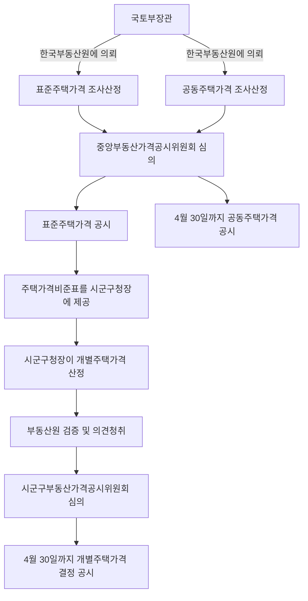

#### ⭐ 기출 출제포인트

1. **의뢰기관** — 표준주택·공동주택은 한국부동산원(2018 18번 ①, 2019 18번 ②, 2023 16번 ④).
2. **표준주택은 단독주택 중에서 선정**(2019 18번 ①).
3. **공시사항** — 임시사용승인일 포함, 대지면적 및 형상, 용도(2021 16번, 2023 16번 ②).
4. **공시기준일 5.31/6.1 vs 토지 6.30/7.1**(2021 17번, 2018 18번 ②).
5. **공동주택가격 공시사항에 면적 포함**(2018 18번 ④, 2023 16번 ⑤).
6. **국세청장 별도 고시 대상** — 아파트, 연면적 165㎡ 이상 연립주택(2018 18번 ⑤).
7. **10일 이내 제공 대상 3자** — 행정안전부장관·국세청장·시장군수구청장(2026 14번).
8. **개별주택가격 공시사항에 사용승인일 미포함**(2025 16번 ③).

#### 📊 기출 분석

| 연도 | 출제 형태 | 핵심 논점 |
|---|---|---|
| 2018 | 18번 — 옳지 않은 것 | 부동산원 의뢰, 공시기준일 6.1, 용도변경, 면적, 국세청장 |
| 2019 | 18번 — 옳은 것 | 단독주택 중 선정, 부동산원 의뢰, 효력, 공시사항, 비용 보조 |
| 2021 | 16번 — 박스형 | 표준주택가격 공시사항(지번·임시사용승인일·대지면적 형상·용도지역) |
| 2021 | 17번 — 단답 | 6월 10일 대수선 단독주택의 공시기준일 |
| 2023 | 14번 — 박스형 | 표준주택가격 조사·산정보고서 포함사항 |
| 2023 | 16번 — 옳지 않은 것 | 관보 공고사항, 용도, 중앙위 심의대상, 검증, 공동주택 면적 |
| 2025 | 16번 — 옳지 않은 것 | 시군구위 심의, 표준주택 간주, 공시사항, 효력, 세부기준 |
| 2026 | 14번 — 박스형 | 공동주택가격 공시사항 10일 내 제공 대상 |

**출제 빈도** — 부공법 3~4문항 중 **매년 1문항**. 개별공시지가와 함께 양대 축이다.
**반복되는 함정** — ① 부동산원 → 감정평가법인등 ② 단독주택 → 공동주택 ③ 4월 30일 → 5월 31일 ④ 개별주택 공시사항에 사용승인일 넣기 ⑤ 표준주택가격 효력을 과세 기준으로.
**최근 경향** — 2023·2025년 모두 **표준주택가격의 검증 여부**와 **공시사항 범위**를 물었다. 표준주택가격에는 「둘 이상 감정평가법인등의 검증」 절차가 **없다**.

#### 🔍 기출 선지로 배우는 조문

**①** (2018 18번 ①, 정답) 국토교통부장관이 공동주택가격을 조사·산정하고자 할 때에는 한국부동산원에 의뢰한다 — **O** / 근거: 법 제18조 제6항. (해당 연도 정답 표기는 ①이나 조문상 이 선지는 옳다. 출제 원본의 정답 표기가 OCR 과정에서 어긋난 것으로 보이며, **조문 기준으로는 O**다.)

**②** (2019 18번 ①) 국토교통부장관은 표준주택을 선정할 때에는 일반적으로 유사하다고 인정되는 일단의 **공동주택** 중에서 해당 일단의 공동주택을 대표할 수 있는 주택을 선정하여야 한다 — **X** / 어디가 틀렸나: 대상 주택 종류 / 옳게 고치면: 일단의 ==단독주택== 중에서 대표할 수 있는 주택을 선정한다(법 제16조①, 영 제26조①).

**③** (2019 18번 ② / 2023 16번 ④) 국토교통부장관은 표준주택가격을 조사·산정하고자 할 때에는 한국부동산원 **또는 둘 이상의 감정평가법인등**에게 의뢰한다 — **X** / 어디가 틀렸나: 의뢰기관 / 옳게 고치면: ==한국부동산원==에 의뢰한다(법 제16조④). 감정평가법인등에 의뢰하는 것은 표준지공시지가와 비주거용 표준·집합부동산가격이다.

**④** (2019 18번 ③) 표준주택가격은 국가·지방자치단체 등이 **과세업무**와 관련하여 주택의 가격을 산정하는 경우에 그 기준으로 활용하여야 한다 — **X** / 어디가 틀렸나: 효력 범위 / 옳게 고치면: 표준주택가격은 ==개별주택가격을 산정하는 경우==의 기준이 된다(법 제19조①).

**⑤** (2021 16번, 정답 ②의 근거) 표준주택가격의 공시사항에는 **표준주택의 임시사용승인일**과 **대지면적 및 형상**이 포함된다 — **O** / 근거: 법 제16조 제2항 제3호·제4호. 「사용승인일(**임시사용승인일을 포함한다**)」이므로 임시사용승인일도 공시사항이다.

**⑥** (2021 17번) 6월 10일자로 「건축법」에 따른 대수선이 된 단독주택의 개별주택가격 공시기준일은 ==다음 해 1월 1일==이다 — **O** / 근거: 영 제34조 제2항 제2호. 6월 1일 이후에 사유가 발생했으므로 다음 해 1월 1일이 기준일이고, 공시는 다음 해 4월 30일까지 한다.

**⑦** (2018 18번 ②) 국토교통부장관은 3월 31일에 대지가 합병된 공동주택의 공동주택가격을 **그 해 6월 1일까지** 산정·공시하여야 한다 — **X** / 어디가 틀렸나: 6월 1일은 **공시기준일**이지 공시 기한이 아니다 / 옳게 고치면: 공시기준일은 그 해 ==6월 1일==, 산정·공시 기한은 그 해 ==9월 30일까지==다(영 제44조②1, 제43조① 단서).

**⑧** (2025 16번 ③, 정답) 개별주택가격의 공시사항에는 개별주택의 **사용승인일**이 포함되어야 한다 — **X** / 어디가 틀렸나: 개별주택가격 공시사항이 아니다 / 옳게 고치면: 개별주택가격 공시사항은 ==개별주택의 지번·개별주택가격·개별주택의 용도 및 면적== 등이다(법 제17조③, 영 제33조). 사용승인일은 **표준주택가격**의 공시사항이다.

**⑨** (2026 14번) 국토교통부장관이 공동주택가격 공시사항을 관보공고일부터 10일 이내에 제공하여야 하는 자는 ==행정안전부장관·국세청장·시장·군수 또는 구청장==이다 — **O** / 근거: 영 제43조 제4항. **시·도지사는 포함되지 않는다.**

#### ⚠️ 이 관의 함정 총정리

1. 「표준주택은 공동주택 중에서 선정한다」고 하면 틀림 → ==단독주택== 중에서 선정한다(법 제16조①).
2. 「표준주택가격은 둘 이상의 감정평가법인등에게 의뢰한다」고 하면 틀림 → ==한국부동산원==에 의뢰한다(법 제16조④).
3. 「개별주택가격은 5월 31일까지 결정·공시한다」고 하면 틀림 → ==4월 30일==까지다(영 제38조①). 5월 31일은 개별공시지가다.
4. 「6월 10일에 대수선된 단독주택의 공시기준일은 그 해 6월 1일」이라고 하면 틀림 → 6월 1일 **이후**이므로 ==다음 해 1월 1일==이다(영 제34조②2).
5. 「개별주택가격 공시사항에 사용승인일이 포함된다」고 하면 틀림 → 사용승인일은 ==표준주택가격==의 공시사항이다(법 제16조②4).
6. 「공동주택가격 공시사항 제공 대상에 시·도지사가 포함된다」고 하면 틀림 → ==행정안전부장관·국세청장·시장군수구청장== 3자다(영 제43조④).
7. 「개별주택가격의 검증은 감정평가법인등이 한다」고 하면 틀림 → ==부동산원==이 한다(법 제17조⑥). 감정평가법인등 검증은 개별공시지가다.

#### ✅ OX 확인문제

> 다음 진술의 참·거짓을 판단하시오.

**1.** 국토교통부장관은 일단의 단독주택 중에서 선정한 표준주택에 대하여 매년 공시기준일 현재의 적정가격을 조사·산정하고 중앙부동산가격공시위원회의 심의를 거쳐 공시하여야 한다.
→ **O**. 법 제16조 제1항.

**2.** 국토교통부장관은 표준주택가격을 조사·산정하고자 할 때에는 둘 이상의 감정평가법인등에게 의뢰한다.
→ **X**. **한국부동산원**에 의뢰한다(법 제16조 제4항).

**3.** 표준주택가격의 공시사항에는 표준주택의 용도, 연면적, 구조 및 사용승인일이 포함되며, 사용승인일에는 임시사용승인일이 포함된다.
→ **O**. 법 제16조 제2항 제4호.

**4.** 시장·군수 또는 구청장은 매년 5월 31일까지 개별주택가격을 결정·공시하여야 한다.
→ **X**. **4월 30일**까지다(영 제38조 제1항).

**5.** 표준주택으로 선정된 단독주택에 대하여는 개별주택가격을 결정·공시하지 아니할 수 있고, 이 경우 해당 주택의 표준주택가격을 개별주택가격으로 본다.
→ **O**. 법 제17조 제2항.

**6.** 시장·군수 또는 구청장은 개별주택가격 산정의 타당성에 대하여 감정평가법인등의 검증을 받아야 한다.
→ **X**. **부동산원**의 검증을 받는다(법 제17조 제6항).

**7.** 국토교통부장관은 매년 4월 30일까지 공동주택가격을 산정·공시하여야 한다.
→ **O**. 영 제43조 제1항.

**8.** 국세청장은 아파트와 건축 연면적 165제곱미터 이상의 연립주택에 대하여 국토교통부장관과 협의하여 공동주택가격을 별도로 결정·고시할 수 있다.
→ **O**. 법 제18조 제1항 단서, 영 제41조.

**9.** 공동주택가격의 공시에는 공동주택의 소재지·명칭·동·호수, 공동주택가격, 공동주택의 면적이 포함되어야 한다.
→ **O**. 영 제43조 제2항.

**10.** 국토교통부장관은 공동주택가격 공시사항을 공고일부터 10일 이내에 행정안전부장관·국세청장·시·도지사에게 제공하여야 한다.
→ **X**. 제공 대상은 **행정안전부장관·국세청장·시장·군수 또는 구청장**이다(영 제43조 제4항). 시·도지사는 대상이 아니다.

#### 🧠 암기법

> 🔑 **의뢰기관 — "집은 원(院), 땅과 비주거 표준은 감(鑑)"**
> 표준**주택**·**공동주택** → **한국부동산원**.
> 표준**지**·비주거용 **표준**부동산·비주거용 **집합**부동산 → **감정평가법인등**(집합은 감정평가법인등, 표준부동산은 감정평가법인등 또는 부동산원).

> 🔑 **공시 기한 — "땅 5월, 집 4월"** / **공시기준일 — "땅 6·7, 집 5·6"**
> 토지: 1.1~**6.30** → 7.1 / 주택·비주거용: 1.1~**5.31** → 6.1.

> 🔑 **검증 주체 — "지가는 감정평가, 주택은 부동산원"**

> 🔑 **10일 내 3자 — "행(안부)·국(세청)·시군구"**
> 시·도지사는 빠진다.

---

#### ⚖️ 법조문 원문

> 📖 이 관이 근거로 삼은 조문의 **전문**이다. 본문 인용은 발췌지만 여기서는 조 전체를 싣는다. 출처는 법제처 정본이다.

**― 부공법 법률 ―**

> 📌 **부공법 제16조(표준주택가격의 조사ㆍ산정 및 공시 등)** — "① 국토교통부장관은 용도지역, 건물구조 등이 일반적으로 유사하다고 인정되는 일단의 단독주택 중에서 선정한 표준주택에 대하여 매년 공시기준일 현재의 적정가격(이하 "표준주택가격"이라 한다)을 조사ㆍ산정하고, 제24조에 따른 중앙부동산가격공시위원회의 심의를 거쳐 이를 공시하여야 한다. ② 제1항에 따른 공시에는 다음 각 호의 사항이 포함되어야 한다. 1. 표준주택의 지번 2. 표준주택가격 3. 표준주택의 대지면적 및 형상 4. 표준주택의 용도, 연면적, 구조 및 사용승인일(임시사용승인일을 포함한다) 5. 그 밖에 대통령령으로 정하는 사항 ③ 제1항에 따른 표준주택의 선정, 공시기준일, 공시의 시기, 조사ㆍ산정 기준 및 공시절차 등에 필요한 사항은 대통령령으로 정한다. ④ 국토교통부장관은 제1항에 따라 표준주택가격을 조사ㆍ산정하고자 할 때에는 「한국부동산원법」에 따른 한국부동산원(이하 "부동산원"이라 한다)에 의뢰한다. ⑤ 국토교통부장관이 제1항에 따라 표준주택가격을 조사ㆍ산정하는 경우에는 인근 유사 단독주택의 거래가격ㆍ임대료 및 해당 단독주택과 유사한 이용가치를 지닌다고 인정되는 단독주택의 건설에 필요한 비용추정액, 인근지역 및 다른 지역과의 형평성ㆍ특수성, 표준주택가격 변동의 예측 가능성 등 제반사항을 종합적으로 참작하여야 한다. ⑥ 국토교통부장관은 제17조에 따른 개별주택가격의 산정을 위하여 필요하다고 인정하는 경우에는 표준주택과 산정대상 개별주택의 가격형성요인에 관한 표준적인 비교표(이하 "주택가격비준표"라 한다)를 작성하여 시장ㆍ군수 또는 구청장에게 제공하여야 한다. ⑦ 제3조제2항ㆍ제4조ㆍ제6조ㆍ제7조 및 제13조는 제1항에 따른 표준주택가격의 공시에 준용한다. 이 경우 제7조제2항 후단 중 "제3조"는 "제16조"로 본다."

> 📌 **부공법 제17조(개별주택가격의 결정ㆍ공시 등)** — "① 시장ㆍ군수 또는 구청장은 제25조에 따른 시ㆍ군ㆍ구부동산가격공시위원회의 심의를 거쳐 매년 표준주택가격의 공시기준일 현재 관할 구역 안의 개별주택의 가격(이하 "개별주택가격"이라 한다)을 결정ㆍ공시하고, 이를 관계 행정기관 등에 제공하여야 한다. ② 제1항에도 불구하고 표준주택으로 선정된 단독주택, 그 밖에 대통령령으로 정하는 단독주택에 대하여는 개별주택가격을 결정ㆍ공시하지 아니할 수 있다. 이 경우 표준주택으로 선정된 주택에 대하여는 해당 주택의 표준주택가격을 개별주택가격으로 본다. ③ 제1항에 따른 개별주택가격의 공시에는 다음 각 호의 사항이 포함되어야 한다. 1. 개별주택의 지번 2. 개별주택가격 3. 그 밖에 대통령령으로 정하는 사항 ④ 시장ㆍ군수 또는 구청장은 공시기준일 이후에 토지의 분할ㆍ합병이나 건축물의 신축 등이 발생한 경우에는 대통령령으로 정하는 날을 기준으로 하여 개별주택가격을 결정ㆍ공시하여야 한다. ⑤ 시장ㆍ군수 또는 구청장이 개별주택가격을 결정ㆍ공시하는 경우에는 해당 주택과 유사한 이용가치를 지닌다고 인정되는 표준주택가격을 기준으로 주택가격비준표를 사용하여 가격을 산정하되, 해당 주택의 가격과 표준주택가격이 균형을 유지하도록 하여야 한다. ⑥ 시장ㆍ군수 또는 구청장은 개별주택가격을 결정ㆍ공시하기 위하여 개별주택의 가격을 산정할 때에는 표준주택가격과의 균형 등 그 타당성에 대하여 대통령령으로 정하는 바에 따라 부동산원의 검증을 받고 토지소유자, 그 밖의 이해관계인의 의견을 들어야 한다. 다만, 시장ㆍ군수 또는 구청장은 부동산원의 검증이 필요 없다고 인정되는 때에는 주택가격의 변동상황 등 대통령령으로 정하는 사항을 고려하여 부동산원의 검증을 생략할 수 있다. ⑦ 국토교통부장관은 공시행정의 합리적인 발전을 도모하고 표준주택가격과 개별주택가격과의 균형유지 등 적정한 가격형성을 위하여 필요하다고 인정하는 경우에는 개별주택가격의 결정ㆍ공시 등에 관하여 시장ㆍ군수 또는 구청장을 지도ㆍ감독할 수 있다. ⑧ 개별주택가격에 대한 이의신청 및 개별주택가격의 정정에 대하여는 제11조 및 제12조를 각각 준용한다. 이 경우 제11조제2항 후단 중 "제10조"는 "제17조"로 본다. ⑨ 제1항부터 제8항까지에서 규정한 것 외에 개별주택가격의 산정, 검증 및 결정, 공시기준일, 공시의 시기, 조사ㆍ산정의 기준, 이해관계인의 의견청취 및 공시절차 등에 필요한 사항은 대통령령으로 정한다."

> 📌 **부공법 제18조(공동주택가격의 조사ㆍ산정 및 공시 등)** — "① 국토교통부장관은 공동주택에 대하여 매년 공시기준일 현재의 적정가격(이하 "공동주택가격"이라 한다)을 조사ㆍ산정하여 제24조에 따른 중앙부동산가격공시위원회의 심의를 거쳐 공시하고, 이를 관계 행정기관 등에 제공하여야 한다. 다만, 대통령령으로 정하는 바에 따라 국세청장이 국토교통부장관과 협의하여 공동주택가격을 별도로 결정ㆍ고시하는 경우는 제외한다. ② 국토교통부장관은 공동주택가격을 공시하기 위하여 그 가격을 산정할 때에는 대통령령으로 정하는 바에 따라 공동주택소유자와 그 밖의 이해관계인의 의견을 들어야 한다. ③ 제1항에 따른 공동주택의 조사대상의 선정, 공시기준일, 공시의 시기, 공시사항, 조사ㆍ산정 기준 및 공시절차 등에 필요한 사항은 대통령령으로 정한다. ④ 국토교통부장관은 공시기준일 이후에 토지의 분할ㆍ합병이나 건축물의 신축 등이 발생한 경우에는 대통령령으로 정하는 날을 기준으로 하여 공동주택가격을 결정ㆍ공시하여야 한다. ⑤ 국토교통부장관이 제1항에 따라 공동주택가격을 조사ㆍ산정하는 경우에는 인근 유사 공동주택의 거래가격ㆍ임대료 및 해당 공동주택과 유사한 이용가치를 지닌다고 인정되는 공동주택의 건설에 필요한 비용추정액, 인근지역 및 다른 지역과의 형평성ㆍ특수성, 공동주택가격 변동의 예측 가능성 등 제반사항을 종합적으로 참작하여야 한다. ⑥ 국토교통부장관이 제1항에 따라 공동주택가격을 조사ㆍ산정하고자 할 때에는 부동산원에 의뢰한다. ⑦ 국토교통부장관은 제1항 또는 제4항에 따라 공시한 가격에 틀린 계산, 오기, 그 밖에 대통령령으로 정하는 명백한 오류가 있음을 발견한 때에는 지체 없이 이를 정정하여야 한다. ⑧ 공동주택가격의 공시에 대하여는 제4조ㆍ제6조ㆍ제7조 및 제13조를 각각 준용한다. 이 경우 제7조제2항 후단 중 "제3조"는 "제18조"로 본다."

**― 부공법 시행령 ―**

> 📌 **부공법 시행령 제34조(개별주택가격 공시기준일을 다르게 할 수 있는 단독주택)** — "① 법 제17조제4항에 따라 개별주택가격 공시기준일을 다르게 할 수 있는 단독주택은 다음 각 호의 어느 하나에 해당하는 단독주택으로 한다. 1. 「공간정보의 구축 및 관리 등에 관한 법률」에 따라 그 대지가 분할 또는 합병된 단독주택 2. 「건축법」에 따른 건축ㆍ대수선 또는 용도변경이 된 단독주택 3. 국유ㆍ공유에서 매각 등에 따라 사유로 된 단독주택으로서 개별주택가격이 없는 단독주택 ② 법 제17조제4항에서 "대통령령으로 정하는 날"이란 다음 각 호의 구분에 따른 날을 말한다. 1. 1월 1일부터 5월 31일까지의 사이에 제1항 각 호의 사유가 발생한 단독주택: 그 해 6월 1일 2. 6월 1일부터 12월 31일까지의 사이에 제1항 각 호의 사유가 발생한 단독주택: 다음 해 1월 1일"

> 📌 **부공법 시행령 제41조(국세청장이 별도로 공동주택가격을 고시하는 경우)** — "법 제18조제1항 단서에 따라 국세청장이 공동주택가격을 별도로 결정ㆍ고시하는 경우는 국세청장이 그 시기ㆍ대상 등에 대하여 국토교통부장관과의 협의를 거쳐 「소득세법」 제99조제1항제1호라목 단서 및 「상속세 및 증여세법」 제61조제1항제4호 각 목 외의 부분 단서에 따라 다음 각 호의 어느 하나에 해당하는 공동주택의 기준시가를 결정ㆍ고시하는 경우로 한다. 1. 아파트 2. 건축 연면적 165제곱미터 이상의 연립주택"

> 📌 **부공법 시행령 제43조(공동주택가격의 산정 및 공시)** — "① 국토교통부장관은 매년 4월 30일까지 공동주택가격을 산정ㆍ공시하여야 한다. 다만, 제44조제2항제1호의 경우에는 그 해 9월 30일까지, 같은 항 제2호의 경우에는 다음 해 4월 30일까지 공시하여야 한다. ② 법 제18조제1항에 따른 공동주택가격의 공시에는 다음 각 호의 사항이 포함되어야 한다. 1. 공동주택의 소재지ㆍ명칭ㆍ동ㆍ호수 2. 공동주택가격 3. 공동주택의 면적 4. 그 밖에 공동주택가격 공시에 필요한 사항 ③ 국토교통부장관은 법 제18조제1항 본문에 따라 공동주택가격을 공시할 때에는 다음 각 호의 사항을 관보에 공고하고, 공동주택가격을 부동산공시가격시스템에 게시하여야 한다. 이 경우 공동주택가격의 통지에 관하여는 제4조제2항 및 제3항을 준용한다. 1. 제2항 각 호의 사항의 개요 2. 공동주택가격의 열람방법 3. 이의신청의 기간ㆍ절차 및 방법 ④ 국토교통부장관은 법 제18조제1항 본문에 따라 공동주택가격 공시사항을 제3항에 따른 공고일부터 10일 이내에 다음 각 호의 자에게 제공하여야 한다. 1. 행정안전부장관 2. 국세청장 3. 시장ㆍ군수 또는 구청장"

### [부공법] Chapter 05 비주거용 부동산가격의 공시

> 📖 법 제4장(제20조~제23조)과 시행령 제48조~제70조다. **비주거용 표준부동산가격**·**비주거용 개별부동산가격**·**비주거용 집합부동산가격** 3종을 다룬다.
> 구조는 주택가격 공시와 판박이지만 **결정적 차이가 하나** 있다 — **전부 「==공시할 수 있다==」(재량)**이다. 지가·주택은 「공시하여야 한다」(의무)다.

> ⭐ **이 관에서 반드시 챙길 3가지**
> ① **어미가 「할 수 있다」** — 비주거용 부동산가격 공시는 ==재량==이다. 이것이 다른 관과의 최대 차이다.
> ② **의뢰기관** — 비주거용 **표준**부동산 = ==감정평가법인등 또는 부동산원== / 비주거용 **집합**부동산 = ==부동산원 또는 감정평가법인등==.
> ③ **행정안전부장관 또는 국세청장**이 국토교통부장관과 협의하여 별도 결정·고시할 수 있다(개별·집합 모두).

#### 1. 개념·정의

| 용어 | 내용 | 근거 |
|---|---|---|
| 비주거용 표준부동산 | 용도지역, 이용상황, 건물구조 등이 유사하다고 인정되는 ==일단의 비주거용 **일반**부동산 중에서 선정== | 법 제20조① |
| 비주거용 표준부동산가격 | 그 표준부동산에 대한 매년 공시기준일 현재의 ==적정가격== | 법 제20조① |
| 비주거용 개별부동산가격 | 시장·군수·구청장이 결정·공시하는 관할 구역 안 비주거용 개별부동산의 가격 | 법 제21조① |
| 비주거용 집합부동산가격 | 국토교통부장관이 조사·산정·공시하는 비주거용 집합부동산의 적정가격 | 법 제22조① |
| 비주거용 부동산가격비준표 | 비주거용 표준부동산과 산정대상 개별부동산의 ==가격형성요인 표준 비교표== | 법 제20조⑥ |
| 비주거용 비교표준부동산 | 비주거용 개별부동산가격의 ==산정기준이 되는 비주거용 표준부동산== | 영 제59조②2 |

> 💡 **표준부동산은 「일반부동산」 중에서만 선정**한다. 집합부동산은 표준을 두지 않고 전수 조사·산정한다.

#### 2. 요건·절차 — 3종 비교표

| 구분 | 비주거용 표준부동산가격 | 비주거용 개별부동산가격 | 비주거용 집합부동산가격 |
|---|---|---|---|
| 주체 | ==국토교통부장관== | ==시장·군수·구청장== | ==국토교통부장관== |
| 어미 | 공시==할 수 있다== | 결정·공시==할 수 있다== | 공시==할 수 있다== |
| 심의 | ==중앙==부동산가격공시위원회 | ==시·군·구==부동산가격공시위원회 | ==중앙==부동산가격공시위원회 |
| 조사·산정 의뢰 | ==감정평가법인등 또는 부동산원== | (직접 산정) | ==부동산원 또는 감정평가법인등== |
| 검증 | — | ==감정평가법인등 또는 부동산원== | — |
| 공시기준일 | ==1월 1일== | 표준부동산가격 공시기준일 | ==1월 1일== |
| 공시 기한 | 영에 별도 기한 규정 없음 | ==4월 30일까지== | ==4월 30일까지== |
| 별도 결정·고시 | — | ==행정안전부장관 또는 국세청장== | ==행정안전부장관 또는 국세청장== |
| 정정 | — | 제12조 준용 | ==지체 없이==(법 제22조⑧) |
| 이의신청 | 제7조 준용(국토교통부장관, 30일/30일) | 제11조 준용(시장군수구청장, 30일/30일) | 제7조 준용(국토교통부장관, 30일/30일) |

| 그 밖의 절차 | 내용 | 근거 |
|---|---|---|
| 표준부동산 선정 시 의견청취 | 미리 ==시·도지사 및 시장·군수·구청장==의 의견을 들어야 함 | 영 제48조① 후단 |
| 조사·산정기관의 의견청취 | 보고서 작성 시 시·도지사·시장군수구청장 의견 → ==20일 이내== 제시 | 영 제53조②③ |
| 조사·산정 기준 | 전세권 등 사용·수익 제한 권리는 ==존재하지 아니하는 것으로 보고== 산정 | 영 제54조②, 제68조① |
| 개별부동산가격 공시 제외 가능 | ① 표준부동산으로 선정된 것 ② 국세·지방세 부과대상이 아닌 것 ③ 국토교통부장관이 정하는 것 | 영 제56조① |
| 검증 생략 금지 | 개발사업 시행·용도지역용도지구 변경 등의 사유가 있는 부동산 | 영 제60조④ 단서 |
| 개별부동산가격 개별통지 | 시장·군수·구청장이 ==소유자에게 개별 통지== | 영 제62조② |
| 집합부동산가격 개별통지 | 관보 공고 + 시스템 게시 + ==소유자에게 개별 통지== | 영 제64조③ |
| 집합부동산가격 공시사항 제공 | 공고일부터 ==10일 이내== — 행정안전부장관·국세청장·시장군수구청장 | 영 제64조④ |

#### 3. 핵심 조문

> 📌 **부공법 제20조(비주거용 표준부동산가격의 조사·산정 및 공시 등) 제1항** — "국토교통부장관은 용도지역, 이용상황, 건물구조 등이 일반적으로 유사하다고 인정되는 일단의 비주거용 일반부동산 중에서 선정한 비주거용 표준부동산에 대하여 매년 공시기준일 현재의 적정가격(이하 "비주거용 표준부동산가격"이라 한다)을 조사·산정하고, 제24조에 따른 중앙부동산가격공시위원회의 심의를 거쳐 이를 공시할 수 있다."

**요약** — 어미가 「==공시할 수 있다==」다. 표준지공시지가(제3조①)·표준주택가격(제16조①)의 「공시하여야 한다」와 다르다.

> 📌 **부공법 제20조 제2항(공시사항)** — "1. 비주거용 표준부동산의 지번 2. 비주거용 표준부동산가격 3. 비주거용 표준부동산의 대지면적 및 형상 4. 비주거용 표준부동산의 용도, 연면적, 구조 및 사용승인일(임시사용승인일을 포함한다) 5. 그 밖에 대통령령으로 정하는 사항"

**요약** — 표준주택가격 공시사항과 **구조가 동일**하다. **임시사용승인일도 포함**된다. 2024년 15번(②)이 「임시사용승인일은 공시사항에 포함되지 않는다」로 오답을 만들었다.

> 📌 **부공법 제20조 제4항** — "국토교통부장관은 제1항에 따라 비주거용 표준부동산가격을 조사·산정하려는 경우 감정평가법인등 또는 대통령령으로 정하는 부동산 가격의 조사·산정에 관한 전문성이 있는 자에게 의뢰한다."

**요약** — 「대통령령으로 정하는 전문성이 있는 자」란 ==부동산원==이다(영 제52조).

> 📌 **부공법 제21조(비주거용 개별부동산가격의 결정·공시 등) 제1항** — "시장·군수 또는 구청장은 제25조에 따른 시·군·구부동산가격공시위원회의 심의를 거쳐 매년 비주거용 표준부동산가격의 공시기준일 현재 관할 구역 안의 비주거용 개별부동산의 가격(이하 "비주거용 개별부동산가격"이라 한다)을 결정·공시할 수 있다. 다만, 대통령령으로 정하는 바에 따라 행정안전부장관 또는 국세청장이 국토교통부장관과 협의하여 비주거용 개별부동산의 가격을 별도로 결정·고시하는 경우는 제외한다."

> 📌 **부공법 제22조(비주거용 집합부동산가격의 조사·산정 및 공시 등) 제7항** — "국토교통부장관은 제1항에 따라 비주거용 집합부동산가격을 조사·산정할 때에는 부동산원 또는 대통령령으로 정하는 부동산 가격의 조사·산정에 관한 전문성이 있는 자에게 의뢰한다."

**요약** — 여기서 「전문성이 있는 자」는 ==감정평가법인등==이다(영 제69조①). **표준부동산은 「감정평가법인등 또는 부동산원」, 집합부동산은 「부동산원 또는 감정평가법인등」** — 순서만 다르고 결국 둘 다 가능하다.

> 📌 **부공법 제23조(비주거용 부동산가격공시의 효력)** — "① 제20조에 따른 비주거용 표준부동산가격은 국가·지방자치단체 등이 그 업무와 관련하여 비주거용 개별부동산가격을 산정하는 경우에 그 기준이 된다. ② 제21조 및 제22조에 따른 비주거용 개별부동산가격 및 비주거용 집합부동산가격은 비주거용 부동산시장에 가격정보를 제공하고, 국가·지방자치단체 등이 과세 등의 업무와 관련하여 비주거용 부동산의 가격을 산정하는 경우에 그 기준으로 활용될 수 있다."

> 📌 **부공법 시행령 제58조 제2항(비주거용 개별부동산가격 공시기준일)** — "1. 1월 1일부터 5월 31일까지의 사이에 제1항 각 호의 사유가 발생한 비주거용 일반부동산: 그 해 6월 1일 2. 6월 1일부터 12월 31일까지의 사이에 제1항 각 호의 사유가 발생한 비주거용 일반부동산: 다음 해 1월 1일"

> 📌 **부공법 시행령 제70조(비주거용 집합부동산가격의 정정사유) 제2항** — "국토교통부장관은 법 제22조제8항에 따라 비주거용 집합부동산가격의 오류를 정정하려는 경우에는 중앙부동산가격공시위원회의 심의를 거쳐 정정사항을 결정·공시하여야 한다. 다만, 틀린 계산 또는 오기의 경우에는 중앙부동산가격공시위원회의 심의를 거치지 아니할 수 있다."

**요약** — 2024년 15번 지문이 이 단서를 그대로 물었다. **틀린 계산·오기는 심의를 거치지 않아도 된다.**

#### 4. ⏱ 기간·수치 총정리

| 항목 | 기간·수치 | 근거 조문 |
|---|---|---|
| 비주거용 표준부동산가격 공시기준일 | ==1월 1일== | 영 제49조 |
| 비주거용 집합부동산가격 공시기준일 | ==1월 1일== | 영 제63조 |
| 비주거용 개별부동산가격 결정·공시 기한 | 매년 ==4월 30일까지== | 영 제62조① |
| 비주거용 집합부동산가격 산정·공시 기한 | 매년 ==4월 30일까지== | 영 제64조① |
| 1.1~5.31 사유 발생 — 공시기준일 | ==그 해 6월 1일== (공시는 그 해 9월 30일까지) | 영 제58조②1·제67조②1 |
| 6.1~12.31 사유 발생 — 공시기준일 | ==다음 해 1월 1일== (공시는 다음 해 4월 30일까지) | 영 제58조②2·제67조②2 |
| 시·도지사·시장군수구청장 의견 제시 기한 | ==20일 이내== | 영 제53조③ |
| 집합부동산가격 공시사항 제공 기한 | 공고일부터 ==10일 이내== | 영 제64조④ |
| 이의신청 | ==30일 이내== 신청 / ==30일 이내== 처리 | 법 제20조⑦·제21조⑧·제22조⑨ 준용 |
| 공시사항 수 (표준부동산) | ==5가지== (+ 영 제51조 4가지) | 법 제20조② |
| 정정사유 (집합부동산) | ==2가지== | 영 제70조① |

#### 5. 👤 권한 주체 구분

| 행위 | 주체 | 근거 |
|---|---|---|
| 비주거용 표준부동산 선정·조사·산정·공시 | ==국토교통부장관== | 법 제20조① |
| 표준부동산 선정 시 의견청취 대상 | ==시·도지사 및 시장·군수·구청장== | 영 제48조① 후단 |
| 표준부동산가격 조사·산정 의뢰 | ==감정평가법인등 또는 부동산원== | 법 제20조④, 영 제52조 |
| 비주거용 부동산가격비준표 작성·제공 | ==국토교통부장관== → 시장·군수·구청장 | 법 제20조⑥ |
| 비주거용 개별부동산가격 결정·공시 | ==시장·군수 또는 구청장== | 법 제21조① |
| 개별부동산가격 검증 | ==감정평가법인등 또는 부동산원== | 영 제60조② |
| 개별부동산가격 별도 결정·고시 | ==행정안전부장관 또는 국세청장== (국토교통부장관과 협의) | 법 제21조① 단서, 영 제55조 |
| 비주거용 집합부동산가격 조사·산정·공시 | ==국토교통부장관== | 법 제22조① |
| 집합부동산가격 조사·산정 의뢰 | ==부동산원 또는 감정평가법인등== | 법 제22조⑦, 영 제69조① |
| 집합부동산가격 별도 결정·고시 | ==행정안전부장관 또는 국세청장== | 법 제22조②, 영 제65조 |
| 집합부동산가격 오류 정정 | ==국토교통부장관== (중앙위 심의, 계산·오기는 생략 가능) | 법 제22조⑧, 영 제70조② |
| 개별부동산가격 지도·감독 | ==국토교통부장관== | 법 제21조⑦ |

> ⚠️ 주택은 국세청장만 별도 고시할 수 있지만(공동주택), **비주거용은 ==행정안전부장관 또는 국세청장==** 둘 다 가능하다.

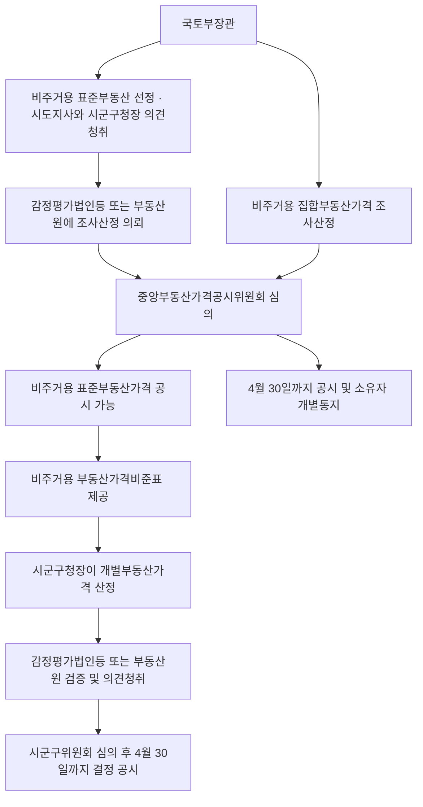

#### ⭐ 기출 출제포인트

1. **표준부동산 선정 시 의견청취 대상** — 시·도지사 **및** 시장군수구청장 **모두**(2019 17번 ①).
2. **어미가 「할 수 있다」** — 중앙위 심의를 거쳐 공시할 수 있다(2019 17번 ②).
3. **공시사항에 임시사용승인일 포함**(2024 15번 ②).
4. **비주거용 부동산가격비준표 작성·제공 의무**(2019 17번 ④).
5. **공시기준일 1월 1일**(2019 17번 ⑤).
6. **집합부동산 소유자 의견청취 의무**(2024 15번 ④).
7. **정정 시 중앙위 심의 — 계산·오기는 생략 가능**(2024 15번 지문).

#### 📊 기출 분석

| 연도 | 출제 형태 | 핵심 논점 |
|---|---|---|
| 2019 | 17번 — 옳지 않은 것 | 선정 시 의견청취, 심의·공시, 공시사항, 비준표, 공시기준일 |
| 2023 | 16번 ③ — 선지 | 비주거용 집합부동산의 조사·산정 지침은 중앙위 심의 대상 |
| 2024 | 15번 — 옳지 않은 것 | 대수선 공시기준일, 임시사용승인일, 효력, 의견청취, 정정 심의 |

**출제 빈도** — 부공법 3~4문항 중 **2~3년에 1문항**. 주택·지가보다는 빈도가 낮지만 격년 수준으로 나온다.
**반복되는 함정** — ① 「시·도지사의 의견으로 시장군수구청장 의견을 대신할 수 있다」 ② 임시사용승인일 제외 ③ 「공시하여야 한다」로 어미 변경 ④ 의뢰기관을 부동산원 단독으로 한정.
**최근 경향** — 2024년 15번이 **정정 시 중앙위 심의 생략**(영 제70조② 단서)까지 물었다. 시행령 단서까지 파고드는 추세다.

#### 🔍 기출 선지로 배우는 조문

**①** (2019 17번 ①, 정답) 국토교통부장관이 비주거용 표준부동산을 선정할 경우 미리 해당 비주거용 표준부동산이 소재하는 **시·도지사의 의견을 들어야 하나, 이를 시장·군수·구청장의 의견으로 대신할 수 있다** — **X** / 어디가 틀렸나: 택일이 아니다 / 옳게 고치면: ==시·도지사 및 시장·군수·구청장==의 의견을 **모두** 들어야 한다(영 제48조① 후단).

**②** (2019 17번 ②) 국토교통부장관은 중앙부동산가격공시위원회의 심의를 거쳐 비주거용 표준부동산가격을 공시할 수 있다 — **O** / 근거: 법 제20조 제1항. 어미가 「공시할 수 있다」인 점에 주의.

**③** (2019 17번 ③) 비주거용 표준부동산가격의 공시에는 비주거용 표준부동산의 대지면적 및 형상이 포함되어야 한다 — **O** / 근거: 법 제20조 제2항 제3호.

**④** (2019 17번 ④) 국토교통부장관은 비주거용 개별부동산가격의 산정을 위하여 필요하다고 인정하는 경우에는 비주거용 부동산가격비준표를 작성하여 시장·군수 또는 구청장에게 제공하여야 한다 — **O** / 근거: 법 제20조 제6항.

**⑤** (2019 17번 ⑤) 공시기준일이 따로 정해지지 않은 경우, 비주거용 집합부동산가격의 공시기준일은 1월 1일이다 — **O** / 근거: 영 제63조.

**⑥** (2024 15번 ②, 정답) 비주거용 표준부동산의 **임시사용승인일**은 비주거용 표준부동산가격의 공시사항에 포함되지 **않는다** — **X** / 어디가 틀렸나: 포함된다 / 옳게 고치면: 「사용승인일(==임시사용승인일을 포함한다==)」이 공시사항이다(법 제20조②4).

**⑦** (2024 15번 ①) 공시기준일 이후에 「건축법」에 따른 **대수선**이 된 비주거용 일반부동산은 해당 비주거용 개별부동산가격의 공시기준일을 다르게 할 수 있다 — **O** / 근거: 영 제58조 제1항 제2호.

**⑧** (2024 15번 ④) 국토교통부장관은 비주거용 집합부동산가격을 공시하기 위하여 그 가격을 산정할 때에는 비주거용 집합부동산의 소유자와 그 밖의 이해관계인의 의견을 들어야 한다 — **O** / 근거: 법 제22조 제3항.

**⑨** (2023 16번 ③) 비주거용 집합부동산의 조사 및 산정 지침은 중앙부동산가격공시위원회의 심의 대상이다 — **O** / 근거: 법 제24조 제1항 제14호.

#### ⚠️ 이 관의 함정 총정리

1. 「시·도지사의 의견을 시장군수구청장의 의견으로 대신할 수 있다」고 하면 틀림 → ==둘 다== 들어야 한다(영 제48조① 후단).
2. 「비주거용 부동산가격은 반드시 공시하여야 한다」고 하면 틀림 → 조문 어미가 ==공시할 수 있다==(재량)이다(법 제20조①·제21조①·제22조①).
3. 「비주거용 표준부동산가격의 공시사항에 임시사용승인일은 포함되지 않는다」고 하면 틀림 → ==포함된다==(법 제20조②4).
4. 「비주거용 표준부동산은 비주거용 집합부동산 중에서 선정한다」고 하면 틀림 → ==일반부동산== 중에서 선정한다(법 제20조①).
5. 「비주거용 개별부동산가격은 국세청장만 별도 고시할 수 있다」고 하면 틀림 → ==행정안전부장관 또는 국세청장== 둘 다 가능하다(법 제21조① 단서).
6. 「집합부동산가격의 오기를 정정할 때에도 반드시 중앙위 심의를 거쳐야 한다」고 하면 틀림 → 틀린 계산·오기는 ==심의를 거치지 아니할 수 있다==(영 제70조② 단서).
7. 「비주거용 개별부동산가격은 5월 31일까지 결정·공시한다」고 하면 틀림 → ==4월 30일==까지다(영 제62조①).

#### ✅ OX 확인문제

> 다음 진술의 참·거짓을 판단하시오.

**1.** 국토교통부장관은 일단의 비주거용 일반부동산 중에서 선정한 비주거용 표준부동산에 대하여 매년 공시기준일 현재의 적정가격을 조사·산정하고 중앙부동산가격공시위원회의 심의를 거쳐 공시할 수 있다.
→ **O**. 법 제20조 제1항. 어미가 「공시할 수 있다」다.

**2.** 국토교통부장관이 비주거용 표준부동산을 선정할 때에는 시·도지사의 의견만 들으면 되고 시장·군수·구청장의 의견은 생략할 수 있다.
→ **X**. **시·도지사 및 시장·군수·구청장**의 의견을 모두 들어야 한다(영 제48조 제1항 후단).

**3.** 비주거용 표준부동산가격의 공시사항에는 대지면적 및 형상, 용도·연면적·구조 및 사용승인일이 포함된다.
→ **O**. 법 제20조 제2항. 사용승인일에는 임시사용승인일이 포함된다.

**4.** 비주거용 표준부동산가격의 조사·산정은 감정평가법인등 또는 부동산원에 의뢰한다.
→ **O**. 법 제20조 제4항, 영 제52조.

**5.** 비주거용 개별부동산가격은 시장·군수 또는 구청장이 시·군·구부동산가격공시위원회의 심의를 거쳐 결정·공시할 수 있다.
→ **O**. 법 제21조 제1항 본문.

**6.** 행정안전부장관 또는 국세청장이 국토교통부장관과 협의하여 비주거용 개별부동산의 가격을 별도로 결정·고시하는 경우는 제외된다.
→ **O**. 법 제21조 제1항 단서.

**7.** 비주거용 개별부동산가격은 매년 5월 31일까지 결정·공시하여야 한다.
→ **X**. **4월 30일**까지다(영 제62조 제1항).

**8.** 비주거용 집합부동산가격의 조사·산정은 부동산원 또는 감정평가법인등에 의뢰한다.
→ **O**. 법 제22조 제7항, 영 제69조 제1항.

**9.** 국토교통부장관이 비주거용 집합부동산가격의 오기를 정정하려는 경우에는 반드시 중앙부동산가격공시위원회의 심의를 거쳐야 한다.
→ **X**. 틀린 계산 또는 오기의 경우에는 **심의를 거치지 아니할 수 있다**(영 제70조 제2항 단서).

**10.** 비주거용 표준부동산가격은 국가·지방자치단체 등이 비주거용 개별부동산가격을 산정하는 경우에 그 기준이 된다.
→ **O**. 법 제23조 제1항.

#### 🧠 암기법

> 🔑 **"비주거용은 다 재량 — 할 수 있다"**
> 표준·개별·집합 세 가지 모두 「공시**할 수 있다**」. 토지·주택은 「공시**하여야** 한다」.

> 🔑 **별도 고시 주체 — "주택은 국(세청)만, 비주거는 행(안부)+국(세청)"**

> 🔑 **표준부동산은 "일반" 중에서**
> 비주거용 **표준**부동산 = 비주거용 **일반**부동산 중에서 선정. 집합부동산에는 표준이 없다.

> 🔑 **의뢰·검증 — "비주거는 감(정평가)·원(부동산원) 둘 다"**
> 표준·집합 조사산정도, 개별 검증도 **감정평가법인등 또는 부동산원**.

---

#### ⚖️ 법조문 원문

> 📖 이 관이 근거로 삼은 조문의 **전문**이다. 본문 인용은 발췌지만 여기서는 조 전체를 싣는다. 출처는 법제처 정본이다.

**― 부공법 법률 ―**

> 📌 **부공법 제20조(비주거용 표준부동산가격의 조사ㆍ산정 및 공시 등)** — "① 국토교통부장관은 용도지역, 이용상황, 건물구조 등이 일반적으로 유사하다고 인정되는 일단의 비주거용 일반부동산 중에서 선정한 비주거용 표준부동산에 대하여 매년 공시기준일 현재의 적정가격(이하 "비주거용 표준부동산가격"이라 한다)을 조사ㆍ산정하고, 제24조에 따른 중앙부동산가격공시위원회의 심의를 거쳐 이를 공시할 수 있다. ② 제1항에 따른 비주거용 표준부동산가격의 공시에는 다음 각 호의 사항이 포함되어야 한다. 1. 비주거용 표준부동산의 지번 2. 비주거용 표준부동산가격 3. 비주거용 표준부동산의 대지면적 및 형상 4. 비주거용 표준부동산의 용도, 연면적, 구조 및 사용승인일(임시사용승인일을 포함한다) 5. 그 밖에 대통령령으로 정하는 사항 ③ 제1항에 따른 비주거용 표준부동산의 선정, 공시기준일, 공시의 시기, 조사ㆍ산정 기준 및 공시절차 등에 필요한 사항은 대통령령으로 정한다. ④ 국토교통부장관은 제1항에 따라 비주거용 표준부동산가격을 조사ㆍ산정하려는 경우 감정평가법인등 또는 대통령령으로 정하는 부동산 가격의 조사ㆍ산정에 관한 전문성이 있는 자에게 의뢰한다. ⑤ 국토교통부장관이 비주거용 표준부동산가격을 조사ㆍ산정하는 경우에는 인근 유사 비주거용 일반부동산의 거래가격ㆍ임대료 및 해당 비주거용 일반부동산과 유사한 이용가치를 지닌다고 인정되는 비주거용 일반부동산의 건설에 필요한 비용추정액 등을 종합적으로 참작하여야 한다. ⑥ 국토교통부장관은 제21조에 따른 비주거용 개별부동산가격의 산정을 위하여 필요하다고 인정하는 경우에는 비주거용 표준부동산과 산정대상 비주거용 개별부동산의 가격형성요인에 관한 표준적인 비교표(이하 "비주거용 부동산가격비준표"라 한다)를 작성하여 시장ㆍ군수 또는 구청장에게 제공하여야 한다. ⑦ 비주거용 표준부동산가격의 공시에 대하여는 제3조제2항ㆍ제4조ㆍ제6조ㆍ제7조 및 제13조를 각각 준용한다. 이 경우 제7조제2항 후단 중 "제3조"는 "제20조"로 본다."

> 📌 **부공법 제21조(비주거용 개별부동산가격의 결정ㆍ공시 등)** — "① 시장ㆍ군수 또는 구청장은 제25조에 따른 시ㆍ군ㆍ구부동산가격공시위원회의 심의를 거쳐 매년 비주거용 표준부동산가격의 공시기준일 현재 관할 구역 안의 비주거용 개별부동산의 가격(이하 "비주거용 개별부동산가격"이라 한다)을 결정ㆍ공시할 수 있다. 다만, 대통령령으로 정하는 바에 따라 행정안전부장관 또는 국세청장이 국토교통부장관과 협의하여 비주거용 개별부동산의 가격을 별도로 결정ㆍ고시하는 경우는 제외한다. ② 제1항에도 불구하고 비주거용 표준부동산으로 선정된 비주거용 일반부동산 등 대통령령으로 정하는 비주거용 일반부동산에 대하여는 비주거용 개별부동산가격을 결정ㆍ공시하지 아니할 수 있다. 이 경우 비주거용 표준부동산으로 선정된 비주거용 일반부동산에 대하여는 해당 비주거용 표준부동산가격을 비주거용 개별부동산가격으로 본다. ③ 제1항에 따른 비주거용 개별부동산가격의 공시에는 다음 각 호의 사항이 포함되어야 한다. 1. 비주거용 부동산의 지번 2. 비주거용 부동산가격 3. 그 밖에 대통령령으로 정하는 사항 ④ 시장ㆍ군수 또는 구청장은 공시기준일 이후에 토지의 분할ㆍ합병이나 건축물의 신축 등이 발생한 경우에는 대통령령으로 정하는 날을 기준으로 하여 비주거용 개별부동산가격을 결정ㆍ공시하여야 한다. ⑤ 시장ㆍ군수 또는 구청장이 비주거용 개별부동산가격을 결정ㆍ공시하는 경우에는 해당 비주거용 일반부동산과 유사한 이용가치를 지닌다고 인정되는 비주거용 표준부동산가격을 기준으로 비주거용 부동산가격비준표를 사용하여 가격을 산정하되, 해당 비주거용 일반부동산의 가격과 비주거용 표준부동산가격이 균형을 유지하도록 하여야 한다. ⑥ 시장ㆍ군수 또는 구청장은 비주거용 개별부동산가격을 결정ㆍ공시하기 위하여 비주거용 일반부동산의 가격을 산정할 때에는 비주거용 표준부동산가격과의 균형 등 그 타당성에 대하여 제20조에 따른 비주거용 표준부동산가격의 조사ㆍ산정을 의뢰 받은 자 등 대통령령으로 정하는 자의 검증을 받고 비주거용 일반부동산의 소유자와 그 밖의 이해관계인의 의견을 들어야 한다. 다만, 시장ㆍ군수 또는 구청장은 비주거용 개별부동산가격에 대한 검증이 필요 없다고 인정하는 때에는 비주거용 부동산가격의 변동상황 등 대통령령으로 정하는 사항을 고려하여 검증을 생략할 수 있다. ⑦ 국토교통부장관은 공시행정의 합리적인 발전을 도모하고 비주거용 표준부동산가격과 비주거용 개별부동산가격과의 균형유지 등 적정한 가격형성을 위하여 필요하다고 인정하는 경우에는 비주거용 개별부동산가격의 결정ㆍ공시 등에 관하여 시장ㆍ군수 또는 구청장을 지도ㆍ감독할 수 있다. ⑧ 비주거용 개별부동산가격에 대한 이의신청 및 정정에 대하여는 제11조 및 제12를 각각 준용한다. 이 경우 제11조제2항 후단 중 "제10조"는 "제21조"로 본다. ⑨ 제1항부터 제8항까지에서 규정한 것 외에 비주거용 개별부동산가격의 산정, 검증 및 결정, 공시기준일, 공시의 시기, 조사ㆍ산정의 기준, 이해관계인의 의견청취 및 공시절차 등에 필요한 사항은 대통령령으로 정한다."

> 📌 **부공법 제22조(비주거용 집합부동산가격의 조사ㆍ산정 및 공시 등)** — "① 국토교통부장관은 비주거용 집합부동산에 대하여 매년 공시기준일 현재의 적정가격(이하 "비주거용 집합부동산가격"이라 한다)을 조사ㆍ산정하여 제24조에 따른 중앙부동산가격공시위원회의 심의를 거쳐 공시할 수 있다. 이 경우 시장ㆍ군수 또는 구청장은 비주거용 집합부동산가격을 결정ㆍ공시한 경우에는 이를 관계 행정기관 등에 제공하여야 한다. ② 제1항에도 불구하고 대통령령으로 정하는 바에 따라 행정안전부장관 또는 국세청장이 국토교통부장관과 협의하여 비주거용 집합부동산의 가격을 별도로 결정ㆍ고시하는 경우에는 해당 비주거용 집합부동산의 비주거용 개별부동산가격을 결정ㆍ공시하지 아니한다. ③ 국토교통부장관은 비주거용 집합부동산가격을 공시하기 위하여 비주거용 집합부동산의 가격을 산정할 때에는 대통령령으로 정하는 바에 따라 비주거용 집합부동산의 소유자와 그 밖의 이해관계인의 의견을 들어야 한다. ④ 제1항에 따른 비주거용 집합부동산의 조사대상의 선정, 공시기준일, 공시의 시기, 공시사항, 조사ㆍ산정 기준 및 공시절차 등에 필요한 사항은 대통령령으로 정한다. ⑤ 국토교통부장관은 공시기준일 이후에 토지의 분할ㆍ합병이나 건축물의 신축 등이 발생한 경우에는 대통령령으로 정하는 날을 기준으로 하여 비주거용 집합부동산가격을 결정ㆍ공시하여야 한다. ⑥ 국토교통부장관이 제1항에 따라 비주거용 집합부동산가격을 조사ㆍ산정하는 경우에는 인근 유사 비주거용 집합부동산의 거래가격ㆍ임대료 및 해당 비주거용 집합부동산과 유사한 이용가치를 지닌다고 인정되는 비주거용 집합부동산의 건설에 필요한 비용추정액 등을 종합적으로 참작하여야 한다. ⑦ 국토교통부장관은 제1항에 따라 비주거용 집합부동산가격을 조사ㆍ산정할 때에는 부동산원 또는 대통령령으로 정하는 부동산 가격의 조사ㆍ산정에 관한 전문성이 있는 자에게 의뢰한다. ⑧ 국토교통부장관은 제1항 또는 제4항에 따라 공시한 가격에 틀린 계산, 오기, 그 밖에 대통령령으로 정하는 명백한 오류가 있음을 발견한 때에는 지체 없이 이를 정정하여야 한다. ⑨ 비주거용 집합부동산가격의 공시에 대해서는 제4조ㆍ제6조ㆍ제7조 및 제13조를 각각 준용한다. 이 경우 제7조제2항 후단 중 "제3조"는 "제22조"로 본다."

> 📌 **부공법 제23조(비주거용 부동산가격공시의 효력)** — "① 제20조에 따른 비주거용 표준부동산가격은 국가ㆍ지방자치단체 등이 그 업무와 관련하여 비주거용 개별부동산가격을 산정하는 경우에 그 기준이 된다. ② 제21조 및 제22조에 따른 비주거용 개별부동산가격 및 비주거용 집합부동산가격은 비주거용 부동산시장에 가격정보를 제공하고, 국가ㆍ지방자치단체 등이 과세 등의 업무와 관련하여 비주거용 부동산의 가격을 산정하는 경우에 그 기준으로 활용될 수 있다."

**― 부공법 시행령 ―**

> 📌 **부공법 시행령 제58조(비주거용 개별부동산가격 공시기준일을 다르게 할 수 있는 비주거용 일반부동산)** — "① 법 제21조제4항에 따라 비주거용 개별부동산가격 공시기준일을 다르게 할 수 있는 비주거용 일반부동산은 다음 각 호의 어느 하나에 해당하는 부동산으로 한다. 1. 「공간정보의 구축 및 관리 등에 관한 법률」에 따라 그 대지가 분할 또는 합병된 비주거용 일반부동산 2. 「건축법」에 따른 건축ㆍ대수선 또는 용도변경이 된 비주거용 일반부동산 3. 국유ㆍ공유에서 매각 등에 따라 사유로 된 비주거용 일반부동산으로서 비주거용 개별부동산가격이 없는 비주거용 일반부동산 ② 법 제21조제4항에서 "대통령령으로 정하는 날"이란 다음 각 호의 구분에 따른 날을 말한다. 1. 1월 1일부터 5월 31일까지의 사이에 제1항 각 호의 사유가 발생한 비주거용 일반부동산: 그 해 6월 1일 2. 6월 1일부터 12월 31일까지의 사이에 제1항 각 호의 사유가 발생한 비주거용 일반부동산: 다음 해 1월 1일"

> 📌 **부공법 시행령 제70조(비주거용 집합부동산가격의 정정사유)** — "① 법 제22조제8항에서 "대통령령으로 정하는 명백한 오류"란 다음 각 호의 어느 하나에 해당하는 경우를 말한다. 1. 법 제22조에 따른 공시절차를 완전하게 이행하지 아니한 경우 2. 비주거용 집합부동산가격에 영향을 미치는 동ㆍ호수 및 층의 표시 등 주요 요인의 조사를 잘못한 경우 ② 국토교통부장관은 법 제22조제8항에 따라 비주거용 집합부동산가격의 오류를 정정하려는 경우에는 중앙부동산가격공시위원회의 심의를 거쳐 정정사항을 결정ㆍ공시하여야 한다. 다만, 틀린 계산 또는 오기의 경우에는 중앙부동산가격공시위원회의 심의를 거치지 아니할 수 있다."

### [부공법] Chapter 06 부동산가격공시위원회

> 📖 법 제5장(제24조·제25조)과 시행령 제71조~제74조다. **중앙부동산가격공시위원회**(국토교통부장관 소속)와 **시·군·구부동산가격공시위원회**(시장군수구청장 소속) 두 기구를 정한다.
> **구성 인원·위원장·임기·의결정족수**가 그대로 출제되는 전형적인 「숫자 관」이다. 보칙(제26조~제30조)의 회의록 공개·업무위탁도 함께 정리한다.

> ⭐ **이 관에서 반드시 챙길 3가지**
> ① **중앙위 = 위원장 포함 ==20명 이내==, 위원장은 ==국토교통부 제1차관==, 공무원 아닌 위원 임기 ==2년·1회 연임==.**
> ② **시·군·구위 = 위원장 1명 포함 ==10명 이상 15명 이하==, 위원장은 ==부시장·부군수·부구청장==.**
> ③ **심의사항 분장** — 「표준·공동·집합」은 중앙위, 「개별」은 시·군·구위.

#### 1. 개념·정의

| 구분 | 중앙부동산가격공시위원회 | 시·군·구부동산가격공시위원회 |
|---|---|---|
| 소속 | ==국토교통부장관== 소속 | ==시장·군수 또는 구청장== 소속 |
| 구성 | 위원장을 포함한 ==20명 이내== | 위원장 1명을 포함한 ==10명 이상 15명 이하== |
| 위원장 | ==국토교통부 제1차관== | ==부시장·부군수 또는 부구청장== |
| 부위원장 | ==1명==, 위원 중 위원장이 지명 | 규정 없음 |
| 공무원 위원 | 대통령령으로 정하는 중앙행정기관의 장이 지명하는 ==6명 이내== | 시장·군수·구청장이 지명하는 ==6명 이내== |
| 위촉위원 자격 | ① 대학 조교수 이상 재직(현·전) ② 판사·검사·변호사 또는 ==감정평가사== 자격자 ③ 관련 분야 ==10년 이상== 연구·실무경험자 | ① 부동산 가격공시·감정평가에 학식과 경험이 풍부하고 해당 지역 사정에 정통한 사람 ② ==시민단체==에서 추천한 사람 |
| 임기 | 공무원이 아닌 위원 ==2년==, ==한 차례 연임== 가능 | 조례로 정함 |
| 성별 고려 | ==고려하여야 함== | ==고려하여야 함== |
| 세부사항 | 대통령령 | 해당 시·군·구의 ==조례== |

#### 2. 요건·절차 — 심의사항 분장

| 심의사항 | 중앙위 | 시·군·구위 |
|---|---|---|
| 표준지의 선정 및 관리지침 / 표준지공시지가 / 그 이의신청 | ==O== | X |
| 표준주택의 선정 및 관리지침 / 표준주택가격 / 그 이의신청 | ==O== | X |
| 공동주택의 조사 및 산정지침 / 공동주택가격 / 그 이의신청 | ==O== | X |
| 비주거용 표준부동산의 선정 및 관리지침 / 그 가격 / 그 이의신청 | ==O== | X |
| 비주거용 집합부동산의 조사 및 산정 지침 / 그 가격 / 그 이의신청 | ==O== | X |
| 적정가격 반영을 위한 **계획 수립**(제26조의2) | ==O== | X |
| **개별공시지가**의 결정 / 그 이의신청 | X | ==O== |
| **개별주택가격**의 결정 / 그 이의신청 | X | ==O== |
| **비주거용 개별부동산가격**의 결정 / 그 이의신청 | X | ==O== |
| 부동산 가격공시 관계 법령 제정·개정 중 장관이 부치는 사항 | ==O== | X |

> 🔑 **「개별」 3종만 시·군·구위원회**, 나머지는 전부 중앙위원회다. Chapter 01의 주체 분장과 정확히 일치한다.

#### 3. 핵심 조문

> 📌 **부공법 제24조(중앙부동산가격공시위원회) 제2항~제5항** — "② 위원회는 위원장을 포함한 20명 이내의 위원으로 구성한다. ③ 위원회의 위원장은 국토교통부 제1차관이 된다. ④ 위원회의 위원은 대통령령으로 정하는 중앙행정기관의 장이 지명하는 6명 이내의 공무원과 다음 각 호의 어느 하나에 해당하는 사람 중 국토교통부장관이 위촉하는 사람이 된다. 1. 「고등교육법」에 따른 대학에서 토지·주택 등에 관한 이론을 가르치는 조교수 이상으로 재직하고 있거나 재직하였던 사람 2. 판사, 검사, 변호사 또는 감정평가사의 자격이 있는 사람 3. 부동산가격공시 또는 감정평가 관련 분야에서 10년 이상 연구 또는 실무경험이 있는 사람 ⑤ 공무원이 아닌 위원의 임기는 2년으로 하되, 한차례 연임할 수 있다."

> 📌 **부공법 제25조(시·군·구부동산가격공시위원회) 제1항** — "다음 각 호의 사항을 심의하기 위하여 시장·군수 또는 구청장 소속으로 시·군·구부동산가격공시위원회를 둔다. 1. 제10조에 따른 개별공시지가의 결정에 관한 사항 2. 제11조에 따른 개별공시지가에 대한 이의신청에 관한 사항 3. 제17조에 따른 개별주택가격의 결정에 관한 사항 4. 제17조에 따른 개별주택가격에 대한 이의신청에 관한 사항 5. 제21조에 따른 비주거용 개별부동산가격의 결정에 관한 사항 6. 제21조에 따른 비주거용 개별부동산가격에 대한 이의신청에 관한 사항 7. 그 밖에 시장·군수 또는 구청장이 심의에 부치는 사항"

> 📌 **부공법 시행령 제71조 제8항·제9항** — "⑧ 위원장은 중앙부동산가격공시위원회의 회의를 소집할 때에는 개회 3일 전까지 의안을 첨부하여 위원에게 개별 통지하여야 한다. ⑨ 중앙부동산가격공시위원회의 회의는 재적위원 과반수의 출석으로 개의(開議)하고, 출석위원 과반수의 찬성으로 의결한다."

> 📌 **부공법 시행령 제74조(시·군·구부동산가격공시위원회) 제1항·제2항** — "① 시·군·구부동산가격공시위원회는 위원장 1명을 포함한 10명 이상 15명 이하의 위원으로 구성하며, 성별을 고려하여야 한다. ② 시·군·구부동산가격공시위원회 위원장은 부시장·부군수 또는 부구청장이 된다. 이 경우 부시장·부군수 또는 부구청장이 2명 이상이면 시장·군수 또는 구청장이 지명하는 부시장·부군수 또는 부구청장이 된다."

> 📌 **부공법 제27조의2(회의록의 공개)** — "제24조에 따른 중앙부동산가격공시위원회 및 제25조에 따른 시·군·구부동산가격공시위원회 심의의 일시·장소·안건·내용·결과 등이 기록된 회의록은 3개월의 범위에서 대통령령으로 정하는 기간이 지난 후에는 대통령령으로 정하는 바에 따라 인터넷 홈페이지 등에 공개하여야 한다. 다만, 공익을 현저히 해할 우려가 있거나 심의의 공정성을 침해할 우려가 있다고 인정되는 이름, 주민등록번호 등 대통령령으로 정하는 개인 식별 정보에 관한 부분의 경우에는 그러하지 아니하다."

**요약** — 「대통령령으로 정하는 기간」은 ==3개월==이다(영 제75조의2①).

> 📌 **부공법 제30조(벌칙 적용에서 공무원 의제)** — "다음 각 호의 어느 하나에 해당하는 사람은 「형법」 제129조부터 제132조까지의 규정을 적용할 때에는 공무원으로 본다. 1. 제28조제1항에 따라 업무를 위탁받은 기관의 임직원 2. 중앙부동산가격공시위원회의 위원 중 공무원이 아닌 위원"

#### 4. ⏱ 기간·수치 총정리

| 항목 | 기간·수치 | 근거 조문 |
|---|---|---|
| 중앙위 구성 인원 | 위원장 포함 ==20명 이내== | 법 제24조② |
| 중앙위 공무원 위원 | ==6명 이내== | 법 제24조④ |
| 중앙위 부위원장 | ==1명== | 영 제71조⑤ |
| 위촉위원 경력 요건 | 관련 분야 ==10년 이상== 연구·실무 | 법 제24조④3 |
| 공무원 아닌 위원의 임기 | ==2년==, ==한 차례== 연임 | 법 제24조⑤ |
| 중앙위 회의 소집 통지 | 개회 ==3일 전==까지 의안 첨부 개별 통지 | 영 제71조⑧ |
| 중앙위 의결정족수 | ==재적위원 과반수 출석 + 출석위원 과반수 찬성== | 영 제71조⑨ |
| 시·군·구위 구성 인원 | 위원장 1명 포함 ==10명 이상 15명 이하== | 영 제74조① |
| 시·군·구위 공무원 위원 | ==6명 이내== | 영 제74조③ |
| 회의록 공개 유예기간 | ==3개월== | 법 제27조의2, 영 제75조의2① |
| 공시보고서 국회 제출 | 매년 ==정기국회 개회 전==까지 | 법 제26조① |
| 중앙위 지명 중앙행정기관 | 재정경제부·행정안전부·농림축산식품부·보건복지부·국토교통부 | 영 제71조② |

#### 5. 👤 권한 주체 구분

| 행위 | 주체 | 근거 |
|---|---|---|
| 중앙위 설치 | ==국토교통부장관== 소속 | 법 제24조① |
| 중앙위 위원장 | ==국토교통부 제1차관== | 법 제24조③ |
| 중앙위 위원 지명(공무원) | ==대통령령으로 정하는 중앙행정기관의 장== | 법 제24조④ |
| 중앙위 위원 위촉 | ==국토교통부장관== | 법 제24조④ |
| 중앙위 위촉위원 해촉 | ==국토교통부장관== | 영 제73조① |
| 부위원장 지명 | ==위원장== | 영 제71조⑤ |
| 시·군·구위 설치 | ==시장·군수 또는 구청장== 소속 | 법 제25조① |
| 시·군·구위 위원장 | ==부시장·부군수 또는 부구청장== | 영 제74조② |
| 시·군·구위 위원 지명·위촉 | ==시장·군수 또는 구청장== | 영 제74조③ |
| 시·군·구위 구성·운영 세부사항 | 해당 시·군·구의 ==조례== | 영 제74조⑤ |
| 공시보고서 국회 제출 | ==정부== | 법 제26조① |
| 업무위탁 | ==국토교통부장관== → ==부동산원== 등 | 법 제28조①, 영 제76조② |
| 수수료 요율·실비 범위 고시 | ==국토교통부장관== | 법 제29조② |

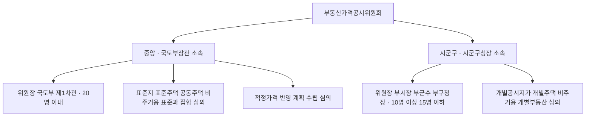

#### ⭐ 기출 출제포인트

1. **위원장·구성 인원 숫자** — 20명 이내 / 10~15명, 제1차관 / 부시장·부군수·부구청장.
2. **심의사항 분장** — 개별은 시·군·구위(2023 15번 ①, 2025 16번 ①).
3. **비주거용 집합부동산 조사·산정 지침은 중앙위 심의**(2023 16번 ③).
4. **임기 2년·1회 연임**.
5. **의결정족수** — 재적 과반수 출석, 출석 과반수 찬성.
6. **위원 자격** — 감정평가사, 10년 이상 경력.

#### 📊 기출 분석

| 연도 | 출제 형태 | 핵심 논점 |
|---|---|---|
| 2018 | 17번(풀이) — 선지 | 개별공시지가 심의는 시·군·구부동산가격공시위원회 |
| 2023 | 15번 ① — 선지 | 개별공시지가를 중앙위 심의로 서술한 오답 |
| 2023 | 16번 ③ — 선지 | 비주거용 집합부동산 조사·산정 지침은 중앙위 심의 대상 |
| 2025 | 16번 ① — 선지 | 「군부동산가격공시위원회」 표현과 개별주택가격 심의 |

> 📌 위원회 조직 자체를 단독 문항으로 물은 사례는 최근 기출에서 확인되지 않는다. 다만 **심의기관을 바꾸는 함정**이 개별공시지가·개별주택가격 문항의 ①번 선지로 거의 매년 배치된다.

**출제 빈도** — 단독 출제는 드물지만 **선지 단위로는 매년**.
**반복되는 함정** — ① 개별공시지가를 중앙위 심의로 ② 표준지공시지가를 시·군·구위 심의로 ③ 위원장을 국토교통부장관으로 ④ 임기를 3년으로.
**최근 경향** — 2025.12.30 시행령 개정으로 중앙위 위원 지명 중앙행정기관에 ==보건복지부==가 추가됐다(영 제71조②3의2).

> ⚠️ **개정 반영** — 영 제71조 제2항의 지명 중앙행정기관은 현행 기준 ==재정경제부·행정안전부·농림축산식품부·보건복지부·국토교통부==다(2025.12.30 개정). 옛 교재가 「기획재정부」로 적고 있다면 정본 표기와 다르므로 **정본을 따른다**.

#### 🔍 기출 선지로 배우는 조문

**①** (2023 15번 ①) 시·도지사는 개별공시지가를 산정한 때에는 **중앙**부동산가격공시위원회의 심의를 거쳐 이를 공시하여야 한다 — **X** / 어디가 틀렸나: 주체와 심의기관 / 옳게 고치면: 시장·군수·구청장이 ==시·군·구부동산가격공시위원회==의 심의를 거친다(법 제10조①, 제25조①1).

**②** (2023 16번 ③) 비주거용 집합부동산의 조사 및 산정 지침은 중앙부동산가격공시위원회의 심의 대상이다 — **O** / 근거: 법 제24조 제1항 제14호.

**③** (2025 16번 ①) 군수는 군부동산가격공시위원회의 심의를 거쳐 매년 표준주택가격의 공시기준일 현재 관할 구역 안의 개별주택의 가격을 결정·공시하여야 한다 — **O**(취지) / 근거: 법 제17조 제1항, 제25조 제1항 제3호. 법문상 명칭은 ==시·군·구부동산가격공시위원회==이며, 군의 경우 이를 가리킨다.

**④** 중앙부동산가격공시위원회의 위원장은 **국토교통부장관**이 된다 — **X** / 어디가 틀렸나: 직위 / 옳게 고치면: ==국토교통부 제1차관==이 된다(법 제24조③).

**⑤** 중앙부동산가격공시위원회는 위원장을 포함한 **30명 이내**의 위원으로 구성한다 — **X** / 어디가 틀렸나: 인원 / 옳게 고치면: ==20명 이내==다(법 제24조②).

**⑥** 공무원이 아닌 중앙부동산가격공시위원회 위원의 임기는 3년으로 하되 연임할 수 없다 — **X** / 어디가 틀렸나: 임기와 연임 / 옳게 고치면: 임기는 ==2년==이고 ==한 차례 연임==할 수 있다(법 제24조⑤).

**⑦** 시·군·구부동산가격공시위원회는 위원장 1명을 포함한 10명 이상 15명 이하의 위원으로 구성한다 — **O** / 근거: 영 제74조 제1항.

**⑧** 부동산가격공시위원회 심의의 회의록은 3개월의 범위에서 대통령령으로 정하는 기간이 지난 후 인터넷 홈페이지 등에 공개하여야 한다 — **O** / 근거: 법 제27조의2, 영 제75조의2 제1항.

#### ⚠️ 이 관의 함정 총정리

1. 「중앙부동산가격공시위원회의 위원장은 국토교통부장관이다」라고 하면 틀림 → ==국토교통부 제1차관==이다(법 제24조③).
2. 「중앙위는 30명 이내로 구성한다」고 하면 틀림 → ==20명 이내==다(법 제24조②).
3. 「공무원이 아닌 위원의 임기는 3년이고 연임할 수 없다」고 하면 틀림 → ==2년·한 차례 연임==이다(법 제24조⑤).
4. 「개별공시지가는 중앙부동산가격공시위원회의 심의를 거친다」고 하면 틀림 → ==시·군·구부동산가격공시위원회==다(법 제25조①1).
5. 「시·군·구위원회의 위원장은 시장·군수·구청장이다」라고 하면 틀림 → ==부시장·부군수 또는 부구청장==이다(영 제74조②).
6. 「중앙위 회의는 재적위원 3분의 2 이상의 출석으로 개의한다」고 하면 틀림 → ==재적위원 과반수 출석, 출석위원 과반수 찬성==이다(영 제71조⑨).
7. 「회의록은 공개하지 아니한다」고 하면 틀림 → ==3개월이 지난 후 공개하여야 한다==(법 제27조의2). 개인 식별 정보 부분만 예외다.

#### ✅ OX 확인문제

> 다음 진술의 참·거짓을 판단하시오.

**1.** 중앙부동산가격공시위원회는 국토교통부장관 소속으로 두며, 위원장을 포함한 20명 이내의 위원으로 구성한다.
→ **O**. 법 제24조 제1항·제2항.

**2.** 중앙부동산가격공시위원회의 위원장은 국토교통부장관이 된다.
→ **X**. **국토교통부 제1차관**이 된다(법 제24조 제3항).

**3.** 공무원이 아닌 중앙부동산가격공시위원회 위원의 임기는 2년으로 하되 한 차례 연임할 수 있다.
→ **O**. 법 제24조 제5항.

**4.** 판사·검사·변호사 또는 감정평가사의 자격이 있는 사람은 중앙부동산가격공시위원회 위원으로 위촉될 수 있다.
→ **O**. 법 제24조 제4항 제2호.

**5.** 중앙부동산가격공시위원회의 회의는 재적위원 3분의 2 이상의 출석으로 개의하고 출석위원 3분의 2 이상의 찬성으로 의결한다.
→ **X**. **재적위원 과반수 출석, 출석위원 과반수 찬성**이다(영 제71조 제9항).

**6.** 표준지의 선정 및 관리지침은 중앙부동산가격공시위원회의 심의사항이다.
→ **O**. 법 제24조 제1항 제2호.

**7.** 개별주택가격의 결정에 관한 사항은 중앙부동산가격공시위원회의 심의사항이다.
→ **X**. **시·군·구부동산가격공시위원회**의 심의사항이다(법 제25조 제1항 제3호).

**8.** 시·군·구부동산가격공시위원회의 위원장은 부시장·부군수 또는 부구청장이 된다.
→ **O**. 영 제74조 제2항.

**9.** 시·군·구부동산가격공시위원회의 구성·운영에 필요한 사항은 대통령령으로 정한다.
→ **X**. 법령에 정한 것 외에는 해당 시·군·구의 **조례**로 정한다(영 제74조 제5항).

**10.** 정부는 표준지공시지가, 표준주택가격 및 공동주택가격의 주요사항에 관한 보고서를 매년 정기국회의 개회 전까지 국회에 제출하여야 한다.
→ **O**. 법 제26조 제1항.

#### 🧠 암기법

> 🔑 **"중앙 20, 시군구 10~15"**
> 중앙위 = **20명 이내**(위원장 포함) / 시군구위 = **10명 이상 15명 이하**(위원장 1명 포함).

> 🔑 **위원장 — "차관 vs 부(副)"**
> 중앙위 = 국토교통부 **제1차관** / 시군구위 = **부**시장·**부**군수·**부**구청장.

> 🔑 **"2년 한 번"**
> 공무원 아닌 위원 임기 **2년**, 연임 **한 차례**.

> 🔑 **심의 분장 — "개(별)만 아래, 나머지는 위"**
> 개별공시지가·개별주택·비주거용 개별 = 시·군·구위. 표준·공동·집합 = 중앙위.

> 🔑 **"과·과 의결"**
> 재적 **과**반수 출석 + 출석 **과**반수 찬성.

---

#### ⚖️ 법조문 원문

> 📖 이 관이 근거로 삼은 조문의 **전문**이다. 본문 인용은 발췌지만 여기서는 조 전체를 싣는다. 출처는 법제처 정본이다.

**― 부공법 법률 ―**

> 📌 **부공법 제24조(중앙부동산가격공시위원회)** — "① 다음 각 호의 사항을 심의하기 위하여 국토교통부장관 소속으로 중앙부동산가격공시위원회(이하 이 조에서 "위원회"라 한다)를 둔다. 1. 부동산 가격공시 관계 법령의 제정ㆍ개정에 관한 사항 중 국토교통부장관이 심의에 부치는 사항 2. 제3조에 따른 표준지의 선정 및 관리지침 3. 제3조에 따라 조사ㆍ평가된 표준지공시지가 4. 제7조에 따른 표준지공시지가에 대한 이의신청에 관한 사항 5. 제16조에 따른 표준주택의 선정 및 관리지침 6. 제16조에 따라 조사ㆍ산정된 표준주택가격 7. 제16조에 따른 표준주택가격에 대한 이의신청에 관한 사항 8. 제18조에 따른 공동주택의 조사 및 산정지침 9. 제18조에 따라 조사ㆍ산정된 공동주택가격 10. 제18조에 따른 공동주택가격에 대한 이의신청에 관한 사항 11. 제20조에 따른 비주거용 표준부동산의 선정 및 관리지침 12. 제20조에 따라 조사ㆍ산정된 비주거용 표준부동산가격 13. 제20조에 따른 비주거용 표준부동산가격에 대한 이의신청에 관한 사항 14. 제22조에 따른 비주거용 집합부동산의 조사 및 산정 지침 15. 제22조에 따라 조사ㆍ산정된 비주거용 집합부동산가격 16. 제22조에 따른 비주거용 집합부동산가격에 대한 이의신청에 관한 사항 17. 제26조의2에 따른 계획 수립에 관한 사항 18. 그 밖에 부동산정책에 관한 사항 등 국토교통부장관이 심의에 부치는 사항 ② 위원회는 위원장을 포함한 20명 이내의 위원으로 구성한다. ③ 위원회의 위원장은 국토교통부 제1차관이 된다. ④ 위원회의 위원은 대통령령으로 정하는 중앙행정기관의 장이 지명하는 6명 이내의 공무원과 다음 각 호의 어느 하나에 해당하는 사람 중 국토교통부장관이 위촉하는 사람이 된다. 1. 「고등교육법」에 따른 대학에서 토지ㆍ주택 등에 관한 이론을 가르치는 조교수 이상으로 재직하고 있거나 재직하였던 사람 2. 판사, 검사, 변호사 또는 감정평가사의 자격이 있는 사람 3. 부동산가격공시 또는 감정평가 관련 분야에서 10년 이상 연구 또는 실무경험이 있는 사람 ⑤ 공무원이 아닌 위원의 임기는 2년으로 하되, 한차례 연임할 수 있다. ⑥ 국토교통부장관은 필요하다고 인정하면 위원회의 심의에 부치기 전에 미리 관계 전문가의 의견을 듣거나 조사ㆍ연구를 의뢰할 수 있다. ⑦ 제1항부터 제6항까지에서 규정한 사항 외에 위원회의 조직 및 운영에 필요한 사항은 대통령령으로 정한다."

> 📌 **부공법 제25조(시ㆍ군ㆍ구부동산가격공시위원회)** — "① 다음 각 호의 사항을 심의하기 위하여 시장ㆍ군수 또는 구청장 소속으로 시ㆍ군ㆍ구부동산가격공시위원회를 둔다. 1. 제10조에 따른 개별공시지가의 결정에 관한 사항 2. 제11조에 따른 개별공시지가에 대한 이의신청에 관한 사항 3. 제17조에 따른 개별주택가격의 결정에 관한 사항 4. 제17조에 따른 개별주택가격에 대한 이의신청에 관한 사항 5. 제21조에 따른 비주거용 개별부동산가격의 결정에 관한 사항 6. 제21조에 따른 비주거용 개별부동산가격에 대한 이의신청에 관한 사항 7. 그 밖에 시장ㆍ군수 또는 구청장이 심의에 부치는 사항 ② 제1항에 규정된 것 외에 시ㆍ군ㆍ구부동산가격공시위원회의 조직 및 운영에 필요한 사항은 대통령령으로 정한다."

> 📌 **부공법 제27조의2(회의록의 공개)** — "제24조에 따른 중앙부동산가격공시위원회 및 제25조에 따른 시ㆍ군ㆍ구부동산가격공시위원회 심의의 일시ㆍ장소ㆍ안건ㆍ내용ㆍ결과 등이 기록된 회의록은 3개월의 범위에서 대통령령으로 정하는 기간이 지난 후에는 대통령령으로 정하는 바에 따라 인터넷 홈페이지 등에 공개하여야 한다. 다만, 공익을 현저히 해할 우려가 있거나 심의의 공정성을 침해할 우려가 있다고 인정되는 이름, 주민등록번호 등 대통령령으로 정하는 개인 식별 정보에 관한 부분의 경우에는 그러하지 아니하다."

> 📌 **부공법 제30조(벌칙 적용에서 공무원 의제)** — "다음 각 호의 어느 하나에 해당하는 사람은 「형법」 제129조부터 제132조까지의 규정을 적용할 때에는 공무원으로 본다. 1. 제28조제1항에 따라 업무를 위탁받은 기관의 임직원 2. 중앙부동산가격공시위원회의 위원 중 공무원이 아닌 위원"

**― 부공법 시행령 ―**

> 📌 **부공법 시행령 제71조(중앙부동산가격공시위원회)** — "① 법 제24조제2항에 따라 중앙부동산가격공시위원회를 구성할 때에는 성별을 고려하여야 한다. ② 법 제24조제4항 각 호 외의 부분에서 "대통령령으로 정하는 중앙행정기관"이란 다음 각 호의 중앙행정기관을 말한다. 1. 재정경제부 2. 행정안전부 3. 농림축산식품부 3의2. 보건복지부 4. 국토교통부 ③ 중앙부동산가격공시위원회의 위원장(이하 "위원장"이라 한다)은 중앙부동산가격공시위원회를 대표하고, 중앙부동산가격공시위원회의 업무를 총괄한다. ④ 위원장은 중앙부동산가격공시위원회의 회의를 소집하고 그 의장이 된다. ⑤ 중앙부동산가격공시위원회에 부위원장 1명을 두며, 부위원장은 위원 중 위원장이 지명하는 사람이 된다. ⑥ 부위원장은 위원장을 보좌하고 위원장이 부득이한 사유로 직무를 수행할 수 없을 때에 그 직무를 대행한다. ⑦ 위원장 및 부위원장이 모두 부득이한 사유로 직무를 수행할 수 없을 때에는 위원장이 미리 지명한 위원이 그 직무를 대행한다. ⑧ 위원장은 중앙부동산가격공시위원회의 회의를 소집할 때에는 개회 3일 전까지 의안을 첨부하여 위원에게 개별 통지하여야 한다. ⑨ 중앙부동산가격공시위원회의 회의는 재적위원 과반수의 출석으로 개의(開議)하고, 출석위원 과반수의 찬성으로 의결한다. ⑩ 중앙부동산가격공시위원회의 위원 중 공무원이 아닌 위원에게는 예산의 범위에서 수당과 여비를 지급할 수 있다. ⑪ 제1항부터 제10항까지에서 규정한 사항 외에 중앙부동산가격공시위원회의 운영에 필요한 세부적인 사항은 중앙부동산가격공시위원회의 의결을 거쳐 위원장이 정한다."

> 📌 **부공법 시행령 제74조(시ㆍ군ㆍ구부동산가격공시위원회)** — "① 시ㆍ군ㆍ구부동산가격공시위원회는 위원장 1명을 포함한 10명 이상 15명 이하의 위원으로 구성하며, 성별을 고려하여야 한다. ② 시ㆍ군ㆍ구부동산가격공시위원회 위원장은 부시장ㆍ부군수 또는 부구청장이 된다. 이 경우 부시장ㆍ부군수 또는 부구청장이 2명 이상이면 시장ㆍ군수 또는 구청장이 지명하는 부시장ㆍ부군수 또는 부구청장이 된다. ③ 시ㆍ군ㆍ구부동산가격공시위원회 위원은 시장ㆍ군수 또는 구청장이 지명하는 6명 이내의 공무원과 다음 각 호의 어느 하나에 해당하는 사람 중에서 시장ㆍ군수 또는 구청장이 위촉하는 사람이 된다. 1. 부동산 가격공시 또는 감정평가에 관한 학식과 경험이 풍부하고 해당 지역의 사정에 정통한 사람 2. 시민단체(「비영리민간단체 지원법」 제2조에 따른 비영리민간단체를 말한다)에서 추천한 사람 ④ 시ㆍ군ㆍ구부동산가격공시위원회 위원의 제척ㆍ기피ㆍ회피 및 해촉에 관하여는 제72조 및 제73조를 준용한다. ⑤ 제1항부터 제4항까지에서 규정한 사항 외에 시ㆍ군ㆍ구부동산가격공시위원회의 구성ㆍ운영에 필요한 사항은 해당 시ㆍ군ㆍ구의 조례로 정한다."

### [동산채권담보법] Chapter 01 동산담보권

> 📖 「동산·채권 등의 담보에 관한 법률」 제1장 총칙(제1조·제2조)과 제2장 동산담보권(제3조~제33조)이다.
> 이 법은 **등기로 공시되는 동산담보권**이라는 새 물권을 만든 법이다. 민법상 질권과 달리 **점유를 이전하지 않고**(비점유 담보) 등기만으로 담보를 설정한다.
> 시험은 **목적물에서 제외되는 것**, **효력·물상대위·불가분성**, **실행 절차(경매 vs 직접 변제충당)** 를 반복해서 묻는다.

> ⭐ **이 관에서 반드시 챙길 3가지**
> ① **담보권설정자는 ==법인 또는 「부가가치세법」에 따라 사업자등록을 한 사람==**으로 한정된다. 개인은 사업자등록이 있어야 한다.
> ② **약정에 따른 동산담보권의 득실변경은 ==등기하여야 효력==이 생긴다**(성립요건). 채권담보권은 대항요건이라 다르다.
> ③ **직접 변제충당은 통지 도달일부터 ==1개월==이 지나야** 할 수 있다.

#### 1. 개념·정의

법 제2조가 11개 용어를 정의한다. 시험에 나오는 것은 다음 6개다.

| 용어 | 정의 (법 제2조) |
|---|---|
| 담보약정 | ==양도담보 등 명목을 묻지 아니하고== 이 법에 따라 동산·채권·지식재산권을 담보로 제공하기로 하는 약정 |
| 동산담보권 | 담보약정에 따라 동산(여러 개의 동산 또는 ==장래에 취득할 동산== 포함)을 목적으로 ==등기==한 담보권 |
| 채권담보권 | 담보약정에 따라 ==금전의 지급을 목적으로 하는 지명채권==(여러 개·장래 발생 채권 포함)을 목적으로 등기한 담보권 |
| 담보권설정자 | 이 법에 따라 담보권을 설정한 자. 다만 동산·채권을 담보로 제공하는 경우에는 ==법인 또는 「부가가치세법」에 따라 사업자등록을 한 사람==으로 한정 |
| 채무자 등 | ==채무자, 물상보증인, 제3취득자== |
| 이해관계인 | 채무자 등과 담보목적물에 대한 권리자로서 담보등기부에 기록되어 있거나 권리를 증명한 자, ==압류 및 가압류 채권자==, 집행력 있는 정본에 의하여 ==배당을 요구한 채권자== |

#### 2. 요건·절차 — 담보등기를 할 수 없는 동산 (최빈출)

| 구분 | 내용 | 근거 |
|---|---|---|
| 1호 | 「선박등기법」에 따라 등기된 선박, 「자동차 등 특정동산 저당법」에 따라 등록된 건설기계·자동차·항공기·소형선박, 「공장 및 광업재단 저당법」에 따라 등기된 기업재산, ==그 밖에 다른 법률에 따라 등기되거나 등록된 동산== | 법 제3조③1 |
| 2호 | ==화물상환증, 선하증권, 창고증권==이 작성된 동산 | 법 제3조③2 |
| 3호 | ==무기명채권증서== 등 대통령령으로 정하는 증권 | 법 제3조③3 |
| 3호 시행령 | ① 무기명채권증서 ② 「자산유동화에 관한 법률」에 따른 ==유동화증권== ③ 「자본시장과 금융투자업에 관한 법률」 제4조에 따른 ==증권== | 영 제2조 |

> 💡 **이미 다른 공시제도가 있는 동산**과 **증권으로 유통되는 동산**은 제외된다. 이유를 알면 외울 필요가 없다.

#### 3. 핵심 조문

> 📌 **동산채권담보법 제3조(동산담보권의 목적물) 제1항·제2항** — "① 법인 또는 「부가가치세법」에 따라 사업자등록을 한 사람(이하 "법인 등"이라 한다)이 담보약정에 따라 동산을 담보로 제공하는 경우에는 담보등기를 할 수 있다. ② 여러 개의 동산(장래에 취득할 동산을 포함한다)이더라도 목적물의 종류, 보관장소, 수량을 정하거나 그 밖에 이와 유사한 방법으로 특정할 수 있는 경우에는 이를 목적으로 담보등기를 할 수 있다."

**요약** — **장래에 취득할 동산도 특정할 수 있으면 담보등기 가능**하다. 2024년 36번(①)이 「특정할 수 있는 경우에도 담보등기를 할 수 없다」로 정답을 만들었다.

> 📌 **동산채권담보법 제4조(담보권설정자의 사업자등록 말소와 동산담보권의 효력)** — "담보권설정자의 사업자등록이 말소된 경우에도 이미 설정된 동산담보권의 효력에는 영향을 미치지 아니한다."

**요약** — 2023년 40번(②)·2025년 36번(①)이 「소멸한다」·「영향을 미친다」로 뒤집었다.

> 📌 **동산채권담보법 제5조(근담보권)** — "① 동산담보권은 그 담보할 채무의 최고액만을 정하고 채무의 확정을 장래에 보류하여 설정할 수 있다. 이 경우 그 채무가 확정될 때까지 채무의 소멸 또는 이전은 이미 설정된 동산담보권에 영향을 미치지 아니한다. ② 제1항의 경우 채무의 이자는 최고액 중에 포함된 것으로 본다."

**요약** — **이자는 최고액에 포함**된다. 2022년 36번(③)이 「포함되지 아니한다」로 오답을 만들었다.

> 📌 **동산채권담보법 제7조(담보등기의 효력)** — "① 약정에 따른 동산담보권의 득실변경(得失變更)은 담보등기부에 등기를 하여야 그 효력이 생긴다. ② 동일한 동산에 설정된 동산담보권의 순위는 등기의 순서에 따른다. ③ 동일한 동산에 관하여 담보등기부의 등기와 인도(「민법」에 규정된 간이인도, 점유개정, 목적물반환청구권의 양도를 포함한다)가 행하여진 경우에 그에 따른 권리 사이의 순위는 법률에 다른 규정이 없으면 그 선후(先後)에 따른다."

> 📌 **동산채권담보법 제10조·제11조·제13조·제14조 (효력의 범위)** — "제10조: 동산담보권의 효력은 담보목적물에 부합된 물건과 종물(從物)에 미친다. 다만, 법률에 다른 규정이 있거나 설정행위에 다른 약정이 있으면 그러하지 아니하다. 제11조: 동산담보권의 효력은 담보목적물에 대한 압류 또는 제25조제2항의 인도 청구가 있은 후에 담보권설정자가 그 담보목적물로부터 수취한 과실(果實) 또는 수취할 수 있는 과실에 미친다. 제13조: 동산담보권은 피담보채권과 분리하여 타인에게 양도할 수 없다. 제14조: 동산담보권은 담보목적물의 매각, 임대, 멸실, 훼손 또는 공용징수 등으로 인하여 담보권설정자가 받을 금전이나 그 밖의 물건에 대하여도 행사할 수 있다. 이 경우 그 지급 또는 인도 전에 압류하여야 한다."

**요약** — ① 제10조는 「설정행위에 **다른 약정이 있으면**」 부합물·종물에 미치지 **않는다**(2020 36번 ①의 함정). ② 제13조는 **부종성** — 분리 양도 불가(2020 36번 ②, 2025 36번 ④). ③ 제14조 물상대위는 **지급·인도 전 압류**가 필수다(2022 36번 ①).

> 📌 **동산채권담보법 제21조(동산담보권의 실행방법)** — "① 담보권자는 자기의 채권을 변제받기 위하여 담보목적물의 경매를 청구할 수 있다. ② 정당한 이유가 있는 경우 담보권자는 담보목적물로써 직접 변제에 충당하거나 담보목적물을 매각하여 그 대금을 변제에 충당할 수 있다. 다만, 선순위권리자(담보등기부에 등기되어 있거나 담보권자가 알고 있는 경우로 한정한다)가 있는 경우에는 그의 동의를 받아야 한다."

> 📌 **동산채권담보법 제23조(담보목적물의 직접 변제충당 등의 절차) 제1항** — "제21조제2항에 따라 담보권자가 담보목적물로써 직접 변제에 충당하거나 담보목적물을 매각하기 위하여는 그 채권의 변제기 후에 동산담보권 실행의 방법을 채무자 등과 담보권자가 알고 있는 이해관계인에게 통지하고, 그 통지가 채무자 등과 담보권자가 알고 있는 이해관계인에게 도달한 날부터 1개월이 지나야 한다. 다만, 담보목적물이 멸실 또는 훼손될 염려가 있거나 가치가 급속하게 감소될 우려가 있는 경우에는 그러하지 아니하다."

> 📌 **동산채권담보법 제20조(담보목적물의 방해제거청구권 및 방해예방청구권)** — "담보권자는 동산담보권을 방해하는 자에게 방해의 제거를 청구할 수 있고, 동산담보권을 방해할 우려가 있는 행위를 하는 자에게 방해의 예방이나 손해배상의 담보를 청구할 수 있다."

> 📌 **동산채권담보법 제27조(매각대금 등의 공탁) 제3항** — "담보권자는 공탁금의 회수를 청구할 수 없다."

#### 4. ⏱ 기간·수치 총정리

| 항목 | 기간·수치 | 근거 조문 |
|---|---|---|
| 직접 변제충당 전 대기기간 | 통지 도달일부터 ==1개월== | 법 제23조① |
| 대기기간 예외 | 멸실·훼손 염려 또는 ==가치 급속 감소 우려== 시 불요 | 법 제23조① 단서 |
| 실행 약정의 한계 | 통지 없거나 통지 후 ==1개월==이 지나지 않은 상태의 처분·충당 약정은 ==무효== | 법 제31조① 단서 |
| 담보권 존속기간 | ==5년을 초과할 수 없음==(5년 이하로 갱신 가능) | 법 제49조① |
| 소유권 취득 시점(직접충당) | ==청산금을 채무자 등에게 지급한 때== | 법 제23조④ |
| 목적물 제외 증권 | ==3가지== — 무기명채권증서·유동화증권·자본시장법상 증권 | 영 제2조 |
| 담보등기 불가 동산 | ==3호== 유형 | 법 제3조③ |
| 벌칙 | ==2년 이하의 징역 또는 1천만원 이하의 벌금== | 법 제64조 |

#### 5. 👤 권한 주체 구분

| 행위 | 주체 | 근거 |
|---|---|---|
| 담보권 설정 가능자 | ==법인 또는 사업자등록을 한 사람== | 법 제2조5 단서, 제3조① |
| 명시의무(소유 여부·다른 권리 존재 유무) | ==동산담보권을 설정하려는 자== | 법 제6조 |
| 현황조사 요구 | ==담보권자== (설정자는 정당한 사유 없이 거부 불가) | 법 제17조① |
| 원상회복·담보 제공 청구 | ==담보권자== (설정자 책임으로 가액 현저 감소 시) | 법 제17조② |
| 담보목적물 반환청구 | ==담보권자== → 점유자에게 **설정자에게 반환할 것**을 청구 | 법 제19조① |
| 경매 청구 | ==담보권자== / 후순위권리자도 일정 기간 내 가능 | 법 제21조①, 제26조② |
| 직접 변제충당 시 선순위자 동의 | ==선순위권리자==의 동의 필요 | 법 제21조② 단서 |
| 청산금 지급 | ==담보권자== → 채무자 등 | 법 제23조③ |
| 매각대금 등 공탁 | ==담보권자== → ==담보권설정자의 주소를 관할하는 법원== | 법 제27조① |
| 위법 실행에 대한 가처분 신청 | ==이해관계인== → 담보권설정자 주소 관할 법원 | 법 제30조① |
| 실행 중단 청구 | ==채무자 등== (피담보채무액 지급 + 말소 청구) | 법 제28조① |

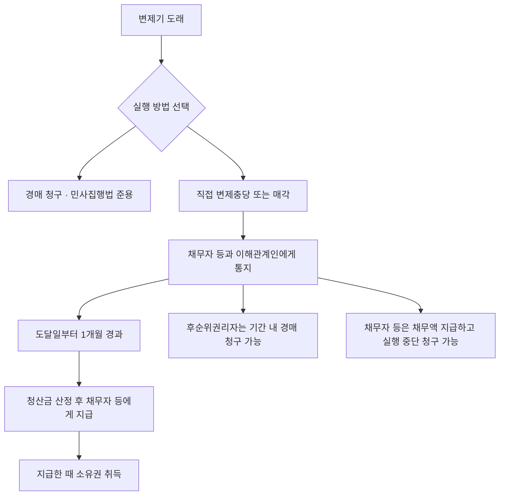

#### ⭐ 기출 출제포인트

1. **목적물 제외 대상** — 등기·등록된 동산, 증권 작성 동산, 무기명채권증서·유동화증권(2019 36번, 2023 40번 ①).
2. **사업자등록 말소와 효력** — 영향 없음(2023 40번 ②, 2025 36번 ①).
3. **부종성** — 피담보채권과 분리 양도 불가(2020 36번 ②, 2025 36번 ④).
4. **물상대위 — 지급·인도 전 압류**(2022 36번 ①).
5. **근담보권 이자는 최고액에 포함**(2022 36번 ③).
6. **과실에 대한 효력 — 압류 또는 인도청구 후**(2023 40번 ④, 2025 36번 ③).
7. **경매절차는 압류에 의하여 개시**(2020 36번 ③).
8. **방해제거 + 방해예방 모두 청구 가능**(2025 36번 ⑤).

#### 📊 기출 분석

| 연도 | 출제 형태 | 핵심 논점 |
|---|---|---|
| 2019 | 36번 — 박스형 | 목적물에 해당하지 않는 것(무기명채권증서·선박·유동화증권) |
| 2020 | 36번 — 옳은 것 | 부합물·종물, 부종성, 압류 개시, 실행중단 손해배상, 경매청구 |
| 2022 | 36번 — 옳지 않은 것 | 물상대위 압류, 유치권능, 근담보 이자, 등기 효력, 인도와 순위 |
| 2023 | 40번 — 옳은 것 | 창고증권, 사업자등록 말소, 담보목적물 보충, 과실, 등기 효력 |
| 2025 | 36번 — 옳은 것 | 사업자등록 말소, 공탁금 회수, 과실, 부종성, 방해예방 |

**출제 빈도** — 동산채권담보법은 **매년 1문항**이 고정 출제되며, 그 중 **동산담보권이 가장 많다**(5/8).
**반복되는 함정** — ① 부종성을 「양도할 수 있다」로 ② 사업자등록 말소 시 「소멸한다」로 ③ 근담보 이자를 「포함되지 아니한다」로 ④ 방해예방청구권을 부정.
**최근 경향** — 2020·2023·2025년이 모두 **「옳은 것은?」** 형태다. 조문 하나하나를 정확히 알아야 풀린다.

> ⚠️ **정답 표기 주의** — 2025년 36번은 원본 기출집 정답이 ⑤로 표기돼 있으나, 조문상 ⑤(「방해의 예방을 청구할 수는 없다」)는 **제20조에 반하는 X 선지**다. 조문 기준의 옳은 선지는 ==②(담보권자는 공탁금의 회수를 청구할 수 없다 — 법 제27조③)==다. 2022년 36번도 정답 표기가 ⑤이나, 조문상 틀린 선지는 ==③(근담보권 이자는 최고액에 포함되지 아니한다 — 법 제5조②에 반함)==이다. **정본을 기준으로 판단하라.**

#### 🔍 기출 선지로 배우는 조문

**①** (2019 36번) 「선박등기법」에 따라 등기된 선박, 무기명채권증서, 「자산유동화에 관한 법률」에 따른 유동화증권은 동산담보권의 목적물에 해당하지 않는다 — **O** / 근거: 법 제3조 제3항 제1호·제3호, 영 제2조. **화물상환증이 작성된 동산**도 제외된다(제2호).

**②** (2020 36번 ①) 동산담보권의 효력은 **설정행위에 다른 약정이 있더라도** 담보목적물에 부합된 물건과 종물에 미친다 — **X** / 어디가 틀렸나: 단서를 무시했다 / 옳게 고치면: 법률에 다른 규정이 있거나 ==설정행위에 다른 약정이 있으면 미치지 아니한다==(법 제10조 단서).

**③** (2020 36번 ② / 2025 36번 ④) 동산담보권은 피담보채권과 분리하여 타인에게 양도할 수 있다 — **X** / 어디가 틀렸나: 부종성 위반 / 옳게 고치면: ==분리하여 양도할 수 없다==(법 제13조).

**④** (2020 36번 ③, 정답) 담보권설정자가 담보목적물을 점유하는 경우에 경매절차는 압류에 의하여 개시한다 — **O** / 근거: 법 제22조 제2항.

**⑤** (2020 36번 ④) 채무자의 변제를 원인으로 동산담보권의 실행을 중지함으로써 담보권자에게 손해가 발생하더라도 채무자가 그 손해를 배상하여야 하는 것은 **아니다** — **X** / 어디가 틀렸나: 배상의무가 있다 / 옳게 고치면: ==채무자 등은 그 손해를 배상하여야 한다==(법 제28조②).

**⑥** (2022 36번 ①) 담보목적물의 훼손으로 인하여 담보권설정자가 받을 금전에 대하여 동산담보권을 행사하려면 그 지급 전에 압류하여야 한다 — **O** / 근거: 법 제14조 후단.

**⑦** (2022 36번 ③) 동산담보권을 최고액만 정하고 설정하는 경우 채무의 이자는 최고액 중에 **포함되지 아니한다** — **X** / 어디가 틀렸나: 정반대다 / 옳게 고치면: ==최고액 중에 포함된 것으로 본다==(법 제5조②).

**⑧** (2023 40번 ④, 정답) 동산담보권의 효력은 담보목적물에 대한 압류가 있은 후에 담보권설정자가 그 담보목적물로부터 수취할 수 있는 과실에 미친다 — **O** / 근거: 법 제11조. **압류 또는 제25조 제2항의 인도 청구**가 있은 후여야 한다.

**⑨** (2023 40번 ②) 담보권설정자의 사업자등록이 말소된 경우 그에 따라 이미 설정된 동산담보권도 소멸한다 — **X** / 어디가 틀렸나: 소멸하지 않는다 / 옳게 고치면: ==효력에 영향을 미치지 아니한다==(법 제4조).

**⑩** (2025 36번 ⑤) 담보권자는 방해의 제거를 청구할 수 있지만 동산담보권을 방해할 우려가 있다는 이유로 방해의 **예방을 청구할 수는 없다** — **X** / 어디가 틀렸나: 예방청구도 가능하다 / 옳게 고치면: ==방해의 예방이나 손해배상의 담보를 청구할 수 있다==(법 제20조).

#### ⚠️ 이 관의 함정 총정리

1. 「동산담보권은 피담보채권과 분리하여 양도할 수 있다」고 하면 틀림 → ==양도할 수 없다==(법 제13조).
2. 「사업자등록이 말소되면 동산담보권도 소멸한다」고 하면 틀림 → ==효력에 영향이 없다==(법 제4조).
3. 「근담보권의 이자는 최고액에 포함되지 않는다」고 하면 틀림 → ==포함된 것으로 본다==(법 제5조②).
4. 「물상대위는 지급 후에 압류하면 된다」고 하면 틀림 → ==지급 또는 인도 전==에 압류하여야 한다(법 제14조).
5. 「창고증권이 작성된 동산도 담보등기를 할 수 있다」고 하면 틀림 → ==화물상환증·선하증권·창고증권이 작성된 동산은 제외==된다(법 제3조③2).
6. 「장래에 취득할 동산은 담보등기의 목적이 될 수 없다」고 하면 틀림 → 종류·보관장소·수량 등으로 ==특정할 수 있으면 가능==하다(법 제3조②).
7. 「담보권자는 방해예방을 청구할 수 없다」고 하면 틀림 → ==예방과 손해배상의 담보를 청구할 수 있다==(법 제20조).
8. 「담보권자는 공탁금의 회수를 청구할 수 있다」고 하면 틀림 → ==청구할 수 없다==(법 제27조③).

#### ✅ OX 확인문제

> 다음 진술의 참·거짓을 판단하시오.

**1.** 법인이 아닌 개인은 사업자등록을 하였더라도 동산을 담보로 제공하여 담보등기를 할 수 없다.
→ **X**. **「부가가치세법」에 따라 사업자등록을 한 사람**은 담보등기를 할 수 있다(법 제3조 제1항).

**2.** 여러 개의 동산이더라도 목적물의 종류, 보관장소, 수량을 정하여 특정할 수 있는 경우에는 담보등기를 할 수 있다.
→ **O**. 법 제3조 제2항. 장래에 취득할 동산도 포함된다.

**3.** 창고증권이 작성된 동산을 목적으로 담보등기를 할 수 있다.
→ **X**. 화물상환증·선하증권·**창고증권**이 작성된 동산은 목적물이 될 수 없다(법 제3조 제3항 제2호).

**4.** 담보권설정자의 사업자등록이 말소된 경우에도 이미 설정된 동산담보권의 효력에는 영향을 미치지 아니한다.
→ **O**. 법 제4조.

**5.** 근담보권을 설정한 경우 채무의 이자는 최고액 중에 포함된 것으로 본다.
→ **O**. 법 제5조 제2항.

**6.** 약정에 따른 동산담보권의 득실변경은 담보등기부에 등기하지 아니하여도 효력이 생긴다.
→ **X**. **등기를 하여야 그 효력이 생긴다**(법 제7조 제1항).

**7.** 동산담보권은 피담보채권과 분리하여 타인에게 양도할 수 없다.
→ **O**. 법 제13조.

**8.** 담보목적물의 공용징수로 담보권설정자가 받을 금전에 대하여 동산담보권을 행사하려면 그 지급 후에 압류하면 된다.
→ **X**. 그 **지급 또는 인도 전에** 압류하여야 한다(법 제14조 후단).

**9.** 담보권자가 담보목적물로써 직접 변제에 충당하려면 통지가 채무자 등에게 도달한 날부터 1개월이 지나야 한다.
→ **O**. 법 제23조 제1항. 다만 멸실·훼손 염려나 가치 급속 감소 우려가 있으면 예외다.

**10.** 담보권자는 공탁금의 회수를 청구할 수 있다.
→ **X**. **청구할 수 없다**(법 제27조 제3항).

#### 🧠 암기법

> 🔑 **목적물 제외 — "등(기등록)·증(권작성)·증(권 그 자체)"**
> ① 다른 법률로 **등**기·**등**록된 동산 ② 화물상환증·선하증권·창고**증**권이 작성된 동산 ③ 무기명채권**증**서·유동화증권·자본시장법상 증권.

> 🔑 **"등기해야 생기고, 분리하면 못 준다"**
> 동산담보권 = **성립요건주의**(제7조①) + **부종성**(제13조).

> 🔑 **실행 2트랙 — "경(매) 아니면 직(접충당)"**
> 경매는 바로. 직접충당·매각은 **통지 후 1개월** + **선순위자 동의**.

> 🔑 **"이자는 최고액 안에, 압류는 지급 전에"**

---

#### ⚖️ 법조문 원문

> 📖 이 관이 근거로 삼은 조문의 **전문**이다. 본문 인용은 발췌지만 여기서는 조 전체를 싣는다. 출처는 법제처 정본이다.

**― 동산채권담보법 법률 ―**

> 📌 **동산채권담보법 제3조(동산담보권의 목적물)** — "① 법인 또는 「부가가치세법」에 따라 사업자등록을 한 사람(이하 "법인 등"이라 한다)이 담보약정에 따라 동산을 담보로 제공하는 경우에는 담보등기를 할 수 있다. ② 여러 개의 동산(장래에 취득할 동산을 포함한다)이더라도 목적물의 종류, 보관장소, 수량을 정하거나 그 밖에 이와 유사한 방법으로 특정할 수 있는 경우에는 이를 목적으로 담보등기를 할 수 있다. ③ 제1항 및 제2항에도 불구하고 다음 각 호의 어느 하나에 해당하는 경우에는 이를 목적으로 하여 담보등기를 할 수 없다. 1. 「선박등기법」에 따라 등기된 선박, 「자동차 등 특정동산 저당법」에 따라 등록된 건설기계ㆍ자동차ㆍ항공기ㆍ소형선박, 「공장 및 광업재단 저당법」에 따라 등기된 기업재산, 그 밖에 다른 법률에 따라 등기되거나 등록된 동산 2. 화물상환증, 선하증권, 창고증권이 작성된 동산 3. 무기명채권증서 등 대통령령으로 정하는 증권"

> 📌 **동산채권담보법 제4조(담보권설정자의 사업자등록 말소와 동산담보권의 효력)** — "담보권설정자의 사업자등록이 말소된 경우에도 이미 설정된 동산담보권의 효력에는 영향을 미치지 아니한다."

> 📌 **동산채권담보법 제5조(근담보권)** — "① 동산담보권은 그 담보할 채무의 최고액만을 정하고 채무의 확정을 장래에 보류하여 설정할 수 있다. 이 경우 그 채무가 확정될 때까지 채무의 소멸 또는 이전은 이미 설정된 동산담보권에 영향을 미치지 아니한다. ②제1항의 경우 채무의 이자는 최고액 중에 포함된 것으로 본다."

> 📌 **동산채권담보법 제7조(담보등기의 효력)** — "① 약정에 따른 동산담보권의 득실변경(得失變更)은 담보등기부에 등기를 하여야 그 효력이 생긴다. ② 동일한 동산에 설정된 동산담보권의 순위는 등기의 순서에 따른다. ③ 동일한 동산에 관하여 담보등기부의 등기와 인도(「민법」에 규정된 간이인도, 점유개정, 목적물반환청구권의 양도를 포함한다)가 행하여진 경우에 그에 따른 권리 사이의 순위는 법률에 다른 규정이 없으면 그 선후(先後)에 따른다."

> 📌 **동산채권담보법 제10조(동산담보권 효력의 범위)** — "동산담보권의 효력은 담보목적물에 부합된 물건과 종물(從物)에 미친다. 다만, 법률에 다른 규정이 있거나 설정행위에 다른 약정이 있으면 그러하지 아니하다."

> 📌 **동산채권담보법 제20조(담보목적물의 방해제거청구권 및 방해예방청구권)** — "담보권자는 동산담보권을 방해하는 자에게 방해의 제거를 청구할 수 있고, 동산담보권을 방해할 우려가 있는 행위를 하는 자에게 방해의 예방이나 손해배상의 담보를 청구할 수 있다."

> 📌 **동산채권담보법 제21조(동산담보권의 실행방법)** — "① 담보권자는 자기의 채권을 변제받기 위하여 담보목적물의 경매를 청구할 수 있다. ② 정당한 이유가 있는 경우 담보권자는 담보목적물로써 직접 변제에 충당하거나 담보목적물을 매각하여 그 대금을 변제에 충당할 수 있다. 다만, 선순위권리자(담보등기부에 등기되어 있거나 담보권자가 알고 있는 경우로 한정한다)가 있는 경우에는 그의 동의를 받아야 한다."

> 📌 **동산채권담보법 제23조(담보목적물의 직접 변제충당 등의 절차)** — "① 제21조제2항에 따라 담보권자가 담보목적물로써 직접 변제에 충당하거나 담보목적물을 매각하기 위하여는 그 채권의 변제기 후에 동산담보권 실행의 방법을 채무자 등과 담보권자가 알고 있는 이해관계인에게 통지하고, 그 통지가 채무자 등과 담보권자가 알고 있는 이해관계인에게 도달한 날부터 1개월이 지나야 한다. 다만, 담보목적물이 멸실 또는 훼손될 염려가 있거나 가치가 급속하게 감소될 우려가 있는 경우에는 그러하지 아니하다. ② 제1항의 통지에는 피담보채권의 금액, 담보목적물의 평가액 또는 예상매각대금, 담보목적물로써 직접 변제에 충당하거나 담보목적물을 매각하려는 이유를 명시하여야 한다. ③ 담보권자는 담보목적물의 평가액 또는 매각대금(이하 "매각대금 등"이라 한다)에서 그 채권액을 뺀 금액(이하 "청산금"이라 한다)을 채무자 등에게 지급하여야 한다. 이 경우 담보목적물에 선순위의 동산담보권 등이 있을 때에는 그 채권액을 계산할 때 선순위의 동산담보권 등에 의하여 담보된 채권액을 포함한다. ④ 담보권자가 담보목적물로써 직접 변제에 충당하는 경우 청산금을 채무자 등에게 지급한 때에 담보목적물의 소유권을 취득한다. ⑤ 다음 각 호의 구분에 따라 정한 기간 내에 담보목적물에 대하여 경매가 개시된 경우에는 담보권자는 직접 변제충당 등의 절차를 중지하여야 한다. 1. 담보목적물을 직접 변제에 충당하는 경우: 청산금을 지급하기 전 또는 청산금이 없는 경우 제1항의 기간이 지나기 전 2. 담보목적물을 매각하여 그 대금을 변제에 충당하는 경우: 담보권자가 제3자와 매매계약을 체결하기 전 ⑥ 제1항 및 제2항에 따른 통지의 내용과 방식에 관하여는 대통령령으로 정한다."

> 📌 **동산채권담보법 제27조(매각대금 등의 공탁)** — "① 담보목적물의 매각대금 등이 압류되거나 가압류된 경우 또는 담보목적물의 매각대금 등에 관하여 권리를 주장하는 자가 있는 경우에 담보권자는 그 전부 또는 일부를 담보권설정자의 주소(법인인 경우에는 본점 또는 주된 사무소 소재지를 말한다. 이하 같다)를 관할하는 법원에 공탁할 수 있다. 이 경우 담보권자는 공탁사실을 즉시 담보등기부에 등기되어 있거나 담보권자가 알고 있는 이해관계인과 담보목적물의 매각대금 등을 압류 또는 가압류하거나 그에 관하여 권리를 주장하는 자에게 통지하여야 한다. ② 담보목적물의 매각대금 등에 대한 압류 또는 가압류가 있은 후에 제1항에 따라 담보목적물의 매각대금 등을 공탁한 경우에는 채무자 등의 공탁금출급청구권이 압류되거나 가압류된 것으로 본다. ③ 담보권자는 공탁금의 회수를 청구할 수 없다."

### [동산채권담보법] Chapter 02 채권담보권

> 📖 법 제3장(제34조~제37조)이다. 조문이 **4개뿐**인 가장 작은 관이지만, **동산담보권과의 결정적 차이 하나**가 시험 포인트다.
> **동산담보권은 등기가 ==효력요건==**이고, **채권담보권은 등기가 ==제3자 대항요건==**이다. 이 한 줄을 놓치면 전부 틀린다.

> ⭐ **이 관에서 반드시 챙길 3가지**
> ① **등기 = 제3채무자 ==외==의 제3자에 대한 대항요건.** 효력요건이 아니다.
> ② **제3채무자에게 대항하려면** 등기사항증명서를 건네주는 방법으로 ==통지==하거나 제3채무자의 ==승낙==이 필요하다.
> ③ **실행** — 담보권자는 피담보채권의 한도에서 목적 채권을 ==직접 청구==할 수 있다.

#### 1. 개념·정의

| 용어 | 내용 | 근거 |
|---|---|---|
| 채권담보권 | 담보약정에 따라 ==금전의 지급을 목적으로 하는 지명채권==(여러 개·장래 발생 채권 포함)을 목적으로 등기한 담보권 | 법 제2조3 |
| 목적 채권의 요건 | ==금전의 지급을 목적==으로 하는 ==지명채권== | 법 제34조① |
| 여러 개의 채권 | 채무자가 특정되었는지 여부를 묻지 않고 ==장래에 발생할 채권 포함==. 채권의 ==종류·발생 원인·발생 연월일==을 정하는 등으로 특정 가능하면 등기 가능 | 법 제34조② |
| 제3채무자 | ==지명채권의 채무자== | 법 제35조① 괄호 |

> 💡 동산은 「종류·보관장소·수량」으로 특정하고, 채권은 「종류·발생 원인·발생 연월일」로 특정한다. **특정 요소가 다르다.**

#### 2. 요건·절차 — 대항력 3층 구조

| 상대방 | 대항 요건 | 근거 |
|---|---|---|
| **제3채무자 외의 제3자** | ==담보등기부에 등기==한 때 | 법 제35조① |
| **제3채무자** | 등기사항증명서를 건네주는 방법으로 ==통지==하거나 제3채무자의 ==승낙== | 법 제35조② |
| 등기 vs 민법상 통지·승낙이 경합할 때 | 등기와 그 통지의 ==도달 또는 승낙의 선후==에 따름 | 법 제35조③ |

| 실행 방법 | 내용 | 근거 |
|---|---|---|
| 직접 청구 | 담보권자는 ==피담보채권의 한도==에서 목적 채권을 직접 청구 | 법 제36조① |
| 공탁 청구 | 목적 채권이 피담보채권보다 ==먼저 변제기==에 이른 경우, 제3채무자에게 ==변제금액의 공탁==을 청구. 공탁 후에는 담보권이 ==공탁금에 존재== | 법 제36조② |
| 민사집행법상 실행 | 위 방법 외에 「민사집행법」에서 정한 집행방법으로도 실행 가능 | 법 제36조③ |
| 준용 | 그 성질에 반하지 않는 범위에서 ==동산담보권에 관한 제2장==과 「민법」 ==제348조·제352조== 준용 | 법 제37조 |

#### 3. 핵심 조문

> 📌 **동산채권담보법 제34조(채권담보권의 목적)** — "① 법인 등이 담보약정에 따라 금전의 지급을 목적으로 하는 지명채권을 담보로 제공하는 경우에는 담보등기를 할 수 있다. ② 여러 개의 채권(채무자가 특정되었는지 여부를 묻지 아니하고 장래에 발생할 채권을 포함한다)이더라도 채권의 종류, 발생 원인, 발생 연월일을 정하거나 그 밖에 이와 유사한 방법으로 특정할 수 있는 경우에는 이를 목적으로 하여 담보등기를 할 수 있다."

> 📌 **동산채권담보법 제35조(담보등기의 효력) 제1항·제2항** — "① 약정에 따른 채권담보권의 득실변경은 담보등기부에 등기한 때에 지명채권의 채무자(이하 "제3채무자"라 한다) 외의 제3자에게 대항할 수 있다. ② 담보권자 또는 담보권설정자(채권담보권 양도의 경우에는 그 양도인 또는 양수인을 말한다)는 제3채무자에게 제52조의 등기사항증명서를 건네주는 방법으로 그 사실을 통지하거나 제3채무자가 이를 승낙하지 아니하면 제3채무자에게 대항하지 못한다."

**요약** — **동산담보권 제7조①은 「등기를 하여야 그 효력이 생긴다」**(효력요건), **채권담보권 제35조①은 「등기한 때에 …대항할 수 있다」**(대항요건). 조문 어미가 결정적으로 다르다.

> 📌 **동산채권담보법 제35조 제3항** — "동일한 채권에 관하여 담보등기부의 등기와 「민법」 제349조 또는 제450조제2항에 따른 통지 또는 승낙이 있는 경우에 담보권자 또는 담보의 목적인 채권의 양수인은 법률에 다른 규정이 없으면 제3채무자 외의 제3자에게 등기와 그 통지의 도달 또는 승낙의 선후에 따라 그 권리를 주장할 수 있다."

> 📌 **동산채권담보법 제36조(채권담보권의 실행)** — "① 담보권자는 피담보채권의 한도에서 채권담보권의 목적이 된 채권을 직접 청구할 수 있다. ② 채권담보권의 목적이 된 채권이 피담보채권보다 먼저 변제기에 이른 경우에는 담보권자는 제3채무자에게 그 변제금액의 공탁을 청구할 수 있다. 이 경우 제3채무자가 변제금액을 공탁한 후에는 채권담보권은 그 공탁금에 존재한다. ③ 담보권자는 제1항 및 제2항에 따른 채권담보권의 실행방법 외에 「민사집행법」에서 정한 집행방법으로 채권담보권을 실행할 수 있다."

> 📌 **동산채권담보법 제37조(준용규정)** — "채권담보권에 관하여는 그 성질에 반하지 아니하는 범위에서 동산담보권에 관한 제2장과 「민법」 제348조 및 제352조를 준용한다."

> 📌 **부동산등기법 제76조 제2항 (연결 조문)** — "등기관이 「동산·채권 등의 담보에 관한 법률」 제37조에서 준용하는 「민법」 제348조에 따른 채권담보권의 등기를 할 때에는 제48조에서 정한 사항 외에 다음 각 호의 사항을 기록하여야 한다. 1. 채권액 또는 채권최고액 2. 채무자의 성명 또는 명칭과 주소 또는 사무소 소재지 3. 변제기와 이자의 약정이 있는 경우에는 그 내용"

**요약** — **부동산등기법 제3조 제7호의 「채권담보권」이 바로 이 법의 채권담보권**이다. 두 법이 만나는 지점이다.

> 📌 **동산채권담보법 제2조 제3호(채권담보권 정의)** — "\"채권담보권\"은 담보약정에 따라 금전의 지급을 목적으로 하는 지명채권(여러 개의 채권 또는 장래에 발생할 채권을 포함한다)을 목적으로 등기한 담보권을 말한다."

#### 4. ⏱ 기간·수치 총정리

| 항목 | 기간·수치 | 근거 조문 |
|---|---|---|
| 채권담보권 조문 수 | ==4개== (제34조~제37조) | 법 제3장 |
| 목적 채권의 요건 | ==금전의 지급을 목적==으로 하는 ==지명채권== | 법 제34조① |
| 채권 특정 요소 | ==3가지== — 종류·발생 원인·발생 연월일 | 법 제34조② |
| 등기의 효력 | ==제3채무자 외의 제3자==에 대한 대항력 | 법 제35조① |
| 제3채무자 대항 요건 | ==통지 또는 승낙== | 법 제35조② |
| 실행 방법 | ==3가지== — 직접 청구 / 공탁 청구 / 민사집행법상 집행 | 법 제36조 |
| 담보권 존속기간(담보등기 공통) | ==5년을 초과할 수 없음== | 법 제49조① |
| 준용 민법 조문 | ==제348조·제352조== | 법 제37조 |

#### 5. 👤 권한 주체 구분

| 행위 | 주체 | 근거 |
|---|---|---|
| 채권담보권 설정 가능자 | ==법인 등==(법인 또는 사업자등록을 한 사람) | 법 제34조① |
| 제3채무자에 대한 통지 | ==담보권자 또는 담보권설정자==(양도 시 양도인 또는 양수인) | 법 제35조② |
| 승낙 | ==제3채무자== | 법 제35조② |
| 목적 채권의 직접 청구 | ==담보권자== | 법 제36조① |
| 공탁 청구 | ==담보권자== → 제3채무자 | 법 제36조② |
| 공탁 실행 | ==제3채무자== | 법 제36조② |
| 민사집행법상 집행 신청 | ==담보권자== | 법 제36조③ |

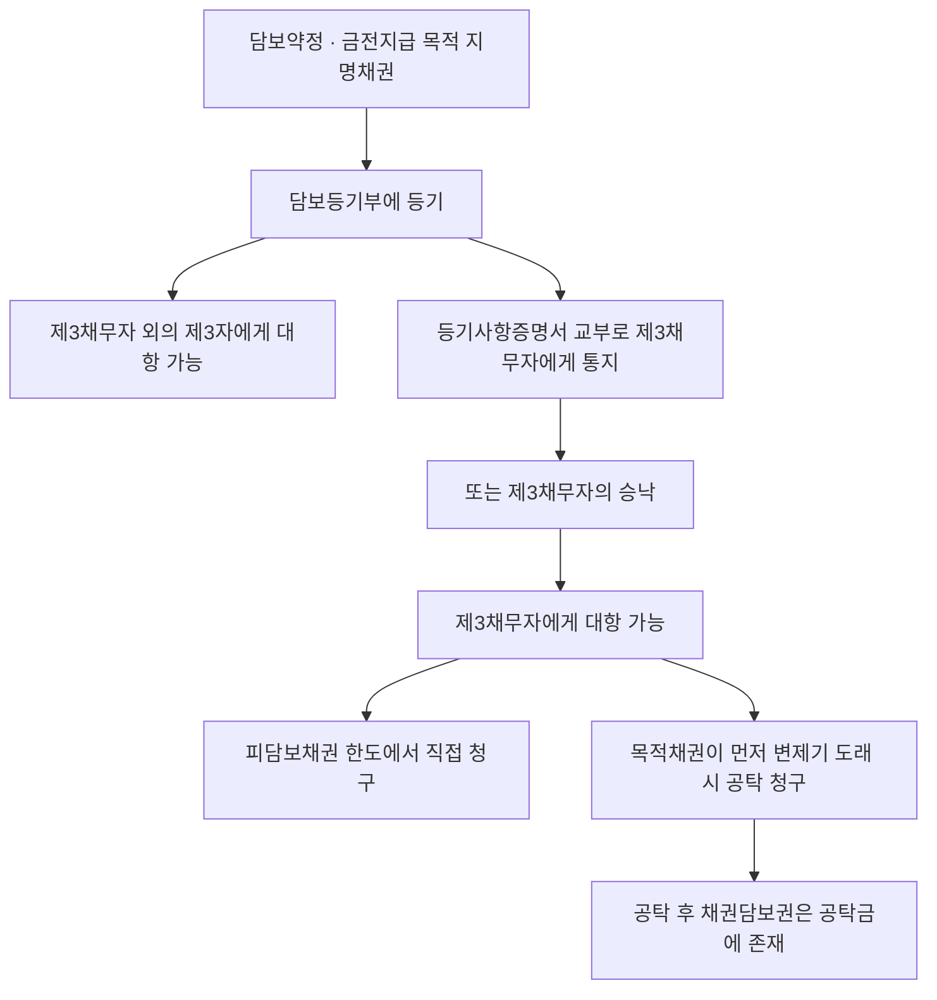

#### ⭐ 기출 출제포인트

1. **등기의 효력 — 대항요건 vs 효력요건** — 동산담보권과 대비.
2. **제3채무자에 대한 대항** — 등기만으로는 부족, 통지·승낙 필요.
3. **목적 채권의 요건** — 금전의 지급을 목적으로 하는 지명채권.
4. **장래 발생 채권도 특정 가능하면 목적물**.
5. **실행 3방법** — 직접 청구·공탁 청구·민사집행법.

#### 📊 기출 분석

> 📌 이 관은 최근 기출에서 **단독 출제가 확인되지 않는다.** 다만 다음 두 방향에서 전제로 요구된다.
> ① **부동산등기법 제3조 제7호(채권담보권)** — 「등기할 수 있는 권리」 문항의 선지로 매년 등장한다(2019년 35번).
> ② **담보등기 문항의 총론적 전제** — 「담보등기는 동산담보권이나 채권담보권의 설정·이전·변경·말소 또는 연장에 대하여 한다」(제38조)는 Chapter 03의 출발점이다.

**출제 빈도** — 단독 출제 미확인. **동산담보권·담보등기 문항의 배경 지식**으로 요구된다.
**반복되는 함정** — 「채권담보권도 등기하여야 효력이 생긴다」는 서술이 가장 위험하다. **동산은 효력요건, 채권은 대항요건**이다.
**최근 경향** — 담보등기 문항(제4장)이 매년 나오므로, 그 대상인 채권담보권의 정의와 효력은 반드시 정리해 두어야 한다.

#### 🔍 기출 선지로 배우는 조문

**①** (2019 35번 ⑤) 채권담보권은 부동산등기법상 등기할 수 있는 권리에 해당한다 — **O** / 근거: 부동산등기법 제3조 제7호. 이 법 제37조가 준용하는 「민법」 제348조에 따른 것이다.

**②** 약정에 따른 채권담보권의 득실변경은 담보등기부에 **등기를 하여야 그 효력이 생긴다** — **X** / 어디가 틀렸나: 효력요건이 아니다 / 옳게 고치면: 등기한 때에 ==제3채무자 외의 제3자에게 대항할 수 있다==(법 제35조①). 「효력이 생긴다」는 **동산담보권**(제7조①)의 문언이다.

**③** 담보권자는 담보등기부에 등기하기만 하면 제3채무자에게도 대항할 수 있다 — **X** / 어디가 틀렸나: 제3채무자에 대한 대항요건이 별도다 / 옳게 고치면: 등기사항증명서를 건네주는 방법으로 ==통지==하거나 제3채무자가 ==승낙==하여야 대항할 수 있다(법 제35조②).

**④** 채권담보권의 목적이 되는 채권은 금전의 지급을 목적으로 하는 지명채권이어야 한다 — **O** / 근거: 법 제34조 제1항, 제2조 제3호.

**⑤** 장래에 발생할 채권은 채무자가 특정되지 않았다면 채권담보권의 목적이 될 수 없다 — **X** / 어디가 틀렸나: 채무자 특정 여부를 묻지 않는다 / 옳게 고치면: ==채무자가 특정되었는지 여부를 묻지 아니하고== 장래에 발생할 채권도 포함되며, 종류·발생 원인·발생 연월일 등으로 특정할 수 있으면 된다(법 제34조②).

**⑥** 담보권자는 피담보채권의 한도에서 채권담보권의 목적이 된 채권을 직접 청구할 수 있다 — **O** / 근거: 법 제36조 제1항.

**⑦** 채권담보권의 목적이 된 채권이 피담보채권보다 먼저 변제기에 이른 경우 담보권자는 제3채무자에게 변제금액의 공탁을 청구할 수 있다 — **O** / 근거: 법 제36조 제2항.

**⑧** 담보권자는 이 법이 정한 실행방법 외에 「민사집행법」에서 정한 집행방법으로는 채권담보권을 실행할 수 없다 — **X** / 어디가 틀렸나: 가능하다 / 옳게 고치면: ==「민사집행법」에서 정한 집행방법으로 실행할 수 있다==(법 제36조③).

#### ⚠️ 이 관의 함정 총정리

1. 「채권담보권의 득실변경은 등기하여야 효력이 생긴다」고 하면 틀림 → ==제3채무자 외의 제3자에게 대항==할 수 있을 뿐이다(법 제35조①).
2. 「등기만 하면 제3채무자에게도 대항할 수 있다」고 하면 틀림 → ==통지 또는 승낙==이 필요하다(법 제35조②).
3. 「물건의 인도를 목적으로 하는 채권도 채권담보권의 목적이 된다」고 하면 틀림 → ==금전의 지급을 목적==으로 하는 지명채권만이다(법 제34조①).
4. 「채무자가 특정되지 않은 장래 채권은 목적이 될 수 없다」고 하면 틀림 → ==특정 여부를 묻지 않는다==(법 제34조②).
5. 「담보권자는 민사집행법상 집행방법을 쓸 수 없다」고 하면 틀림 → ==쓸 수 있다==(법 제36조③).
6. 「제3채무자가 공탁하면 채권담보권이 소멸한다」고 하면 틀림 → 채권담보권은 ==그 공탁금에 존재==한다(법 제36조② 후단).

#### ✅ OX 확인문제

> 다음 진술의 참·거짓을 판단하시오.

**1.** 법인 등이 금전의 지급을 목적으로 하는 지명채권을 담보로 제공하는 경우에는 담보등기를 할 수 있다.
→ **O**. 법 제34조 제1항.

**2.** 장래에 발생할 채권은 채무자가 특정되지 아니하면 채권담보권의 목적이 될 수 없다.
→ **X**. **채무자가 특정되었는지 여부를 묻지 아니하고** 포함된다(법 제34조 제2항).

**3.** 여러 개의 채권은 채권의 종류, 발생 원인, 발생 연월일을 정하여 특정할 수 있으면 담보등기의 목적이 될 수 있다.
→ **O**. 법 제34조 제2항.

**4.** 약정에 따른 채권담보권의 득실변경은 담보등기부에 등기를 하여야 그 효력이 생긴다.
→ **X**. 등기한 때에 **제3채무자 외의 제3자에게 대항**할 수 있다(법 제35조 제1항). 「효력이 생긴다」는 동산담보권의 문언이다.

**5.** 담보권자는 제3채무자에게 등기사항증명서를 건네주는 방법으로 통지하거나 제3채무자가 승낙하지 아니하면 제3채무자에게 대항하지 못한다.
→ **O**. 법 제35조 제2항.

**6.** 동일한 채권에 관하여 등기와 민법상 통지·승낙이 있는 경우 제3채무자 외의 제3자에 대해서는 등기와 통지의 도달 또는 승낙의 선후에 따라 권리를 주장한다.
→ **O**. 법 제35조 제3항.

**7.** 담보권자는 피담보채권의 한도를 넘어서도 채권담보권의 목적이 된 채권 전부를 직접 청구할 수 있다.
→ **X**. **피담보채권의 한도**에서 직접 청구할 수 있다(법 제36조 제1항).

**8.** 채권담보권의 목적이 된 채권이 피담보채권보다 먼저 변제기에 이른 경우 담보권자는 제3채무자에게 변제금액의 공탁을 청구할 수 있다.
→ **O**. 법 제36조 제2항.

**9.** 제3채무자가 변제금액을 공탁하면 채권담보권은 소멸한다.
→ **X**. 채권담보권은 **그 공탁금에 존재**한다(법 제36조 제2항 후단).

**10.** 채권담보권에 관하여는 그 성질에 반하지 아니하는 범위에서 동산담보권에 관한 제2장을 준용한다.
→ **O**. 법 제37조. 「민법」 제348조·제352조도 준용된다.

#### 🧠 암기법

> 🔑 **"동산은 효(력), 채권은 대(항)"**
> 동산담보권 등기 = **효력요건**(제7조①) / 채권담보권 등기 = **대항요건**(제35조①).

> 🔑 **대항 2단 — "제3자는 등기로, 제3채무자는 통지·승낙으로"**

> 🔑 **특정 요소 — "동산은 종·보·수, 채권은 종·원·일"**
> 동산: **종**류·**보**관장소·**수**량 / 채권: **종**류·발생 **원**인·발생 연월**일**.

> 🔑 **실행 3방법 — "직(접청구)·공(탁청구)·민(사집행)"**

---

#### ⚖️ 법조문 원문

> 📖 이 관이 근거로 삼은 조문의 **전문**이다. 본문 인용은 발췌지만 여기서는 조 전체를 싣는다. 출처는 법제처 정본이다.

**― 동산채권담보법 법률 ―**

> 📌 **동산채권담보법 제2조(정의)** — "이 법에서 사용하는 용어의 뜻은 다음과 같다. 1. "담보약정"은 양도담보 등 명목을 묻지 아니하고 이 법에 따라 동산ㆍ채권ㆍ지식재산권을 담보로 제공하기로 하는 약정을 말한다. 2. "동산담보권"은 담보약정에 따라 동산(여러 개의 동산 또는 장래에 취득할 동산을 포함한다)을 목적으로 등기한 담보권을 말한다. 3. "채권담보권"은 담보약정에 따라 금전의 지급을 목적으로 하는 지명채권(여러 개의 채권 또는 장래에 발생할 채권을 포함한다)을 목적으로 등기한 담보권을 말한다. 4. "지식재산권담보권"은 담보약정에 따라 특허권, 실용신안권, 디자인권, 상표권, 저작권, 반도체집적회로의 배치설계권 등 지식재산권[법률에 따라 질권(質權)을 설정할 수 있는 경우로 한정한다. 이하 같다]을 목적으로 그 지식재산권을 규율하는 개별 법률에 따라 등록한 담보권을 말한다. 5. "담보권설정자"는 이 법에 따라 동산ㆍ채권ㆍ지식재산권에 담보권을 설정한 자를 말한다. 다만, 동산ㆍ채권을 담보로 제공하는 경우에는 법인(상사법인, 민법법인, 특별법에 따른 법인, 외국법인을 말한다. 이하 같다) 또는 「부가가치세법」에 따라 사업자등록을 한 사람으로 한정한다. 6. "담보권자"는 이 법에 따라 동산ㆍ채권ㆍ지식재산권을 목적으로 하는 담보권을 취득한 자를 말한다. 7. "담보등기"는 이 법에 따라 동산ㆍ채권을 담보로 제공하기 위하여 이루어진 등기를 말한다. 8. "담보등기부"는 전산정보처리조직에 의하여 입력ㆍ처리된 등기사항에 관한 전산정보자료를 담보권설정자별로 저장한 보조기억장치(자기디스크, 자기테이프, 그 밖에 이와 유사한 방법으로 일정한 등기사항을 기록ㆍ보존할 수 있는 전자적 정보저장매체를 포함한다. 이하 같다)를 말하고, 동산담보등기부와 채권담보등기부로 구분한다. 9. "채무자 등"은 채무자, 담보목적물의 물상보증인(物上保證人), 담보목적물의 제3취득자를 말한다. 10. "이해관계인"은 채무자 등과 담보목적물에 대한 권리자로서 담보등기부에 기록되어 있거나 그 권리를 증명한 자, 압류 및 가압류 채권자, 집행력 있는 정본(正本)에 의하여 배당을 요구한 채권자를 말한다. 11. "등기필정보"는 담보등기부에 새로운 권리자가 기록되는 경우 그 권리자를 확인하기 위하여 지방법원, 그 지원 또는 등기소에 근무하는 법원서기관, 등기사무관, 등기주사 또는 등기주사보 중에서 지방법원장(등기소의 사무를 지원장이 관장하는 경우에는 지원장을 말한다)이 지정하는 사람(이하 "등기관"이라 한다)이 작성한 정보를 말한다."

> 📌 **동산채권담보법 제34조(채권담보권의 목적)** — "① 법인 등이 담보약정에 따라 금전의 지급을 목적으로 하는 지명채권을 담보로 제공하는 경우에는 담보등기를 할 수 있다. ② 여러 개의 채권(채무자가 특정되었는지 여부를 묻지 아니하고 장래에 발생할 채권을 포함한다)이더라도 채권의 종류, 발생 원인, 발생 연월일을 정하거나 그 밖에 이와 유사한 방법으로 특정할 수 있는 경우에는 이를 목적으로 하여 담보등기를 할 수 있다."

> 📌 **동산채권담보법 제35조(담보등기의 효력)** — "① 약정에 따른 채권담보권의 득실변경은 담보등기부에 등기한 때에 지명채권의 채무자(이하 "제3채무자"라 한다) 외의 제3자에게 대항할 수 있다. ② 담보권자 또는 담보권설정자(채권담보권 양도의 경우에는 그 양도인 또는 양수인을 말한다)는 제3채무자에게 제52조의 등기사항증명서를 건네주는 방법으로 그 사실을 통지하거나 제3채무자가 이를 승낙하지 아니하면 제3채무자에게 대항하지 못한다. ③ 동일한 채권에 관하여 담보등기부의 등기와 「민법」 제349조 또는 제450조제2항에 따른 통지 또는 승낙이 있는 경우에 담보권자 또는 담보의 목적인 채권의 양수인은 법률에 다른 규정이 없으면 제3채무자 외의 제3자에게 등기와 그 통지의 도달 또는 승낙의 선후에 따라 그 권리를 주장할 수 있다. ④ 제2항의 통지, 승낙에 관하여는 「민법」 제451조 및 제452조를 준용한다."

> 📌 **동산채권담보법 제36조(채권담보권의 실행)** — "① 담보권자는 피담보채권의 한도에서 채권담보권의 목적이 된 채권을 직접 청구할 수 있다. ② 채권담보권의 목적이 된 채권이 피담보채권보다 먼저 변제기에 이른 경우에는 담보권자는 제3채무자에게 그 변제금액의 공탁을 청구할 수 있다. 이 경우 제3채무자가 변제금액을 공탁한 후에는 채권담보권은 그 공탁금에 존재한다. ③ 담보권자는 제1항 및 제2항에 따른 채권담보권의 실행방법 외에 「민사집행법」에서 정한 집행방법으로 채권담보권을 실행할 수 있다."

> 📌 **동산채권담보법 제37조(준용규정)** — "채권담보권에 관하여는 그 성질에 반하지 아니하는 범위에서 동산담보권에 관한 제2장과 「민법」 제348조 및 제352조를 준용한다."

### [동산채권담보법] Chapter 03 담보등기

> 📖 법 제4장 담보등기(제38조~제57조)와 제5장 지식재산권 담보 특례(제58조~제61조), 제6장 보칙·제7장 벌칙을 함께 다룬다.
> **관할·신청인·각하사유·등기부 기록사항·존속기간 5년·이의신청**이 논점이며, **부동산등기법과 짝을 지어 비교**하면 완벽히 정리된다.

> ⭐ **이 관에서 반드시 챙길 3가지**
> ① **담보권의 존속기간은 ==5년을 초과할 수 없고==, 갱신하려면 ==만료 전==에 연장등기를 신청**해야 한다.
> ② **관할 = ==담보권설정자의 주소==를 관할하는 지방법원·지원·등기소** (대법원장이 지정·고시한 곳 중에서).
> ③ **이의신청은 ==집행정지의 효력이 없고==, 새로운 사실·증거로 할 수 없으며, 이유 없으면 ==3일 이내== 송부.** 부동산등기법과 동일하다.

#### 1. 개념·정의

| 용어 | 내용 | 근거 |
|---|---|---|
| 담보등기 | 이 법에 따라 동산·채권을 담보로 제공하기 위하여 이루어진 등기 | 법 제2조7 |
| 담보등기부 | 등기사항 전산정보자료를 ==담보권설정자별==로 저장한 보조기억장치. ==동산담보등기부와 채권담보등기부==로 구분 | 법 제2조8 |
| 등기할 수 있는 권리 | 동산담보권·채권담보권의 ==설정·이전·변경·말소 또는 연장== | 법 제38조 |
| 등기관 | 지방법원·지원·등기소에 근무하는 법원서기관·등기사무관·등기주사·등기주사보 중 ==지방법원장==이 지정하는 사람 | 법 제2조11 |
| 등기필정보 | 담보등기부에 새로운 권리자가 기록되는 경우 그 권리자를 확인하기 위하여 등기관이 작성한 정보 | 법 제2조11 |

> 💡 **담보등기부는 「부동산별」이 아니라 「==담보권설정자별==」로 편성**된다. 부동산등기부의 물적 편성주의와 정반대인 **인적 편성주의**다.

#### 2. 요건·절차

| 구분 | 내용 | 근거 |
|---|---|---|
| 등기사무 취급 기관 | ==대법원장이 지정·고시==하는 지방법원·지원·등기소 | 법 제39조① |
| 관할 | 그 중 ==담보권설정자의 주소==를 관할하는 곳 | 법 제39조② |
| 관할의 위임 | ==대법원장==이 다른 등기소에 위임 가능 | 법 제39조③ |
| 등기사무 처리 | 등기관이 ==접수번호의 순서==에 따라 전산정보처리조직으로 처리 | 법 제40조② |
| 등기관 식별 | 대법원규칙에 따라 ==식별부호 기록== 등 확인 조치 | 법 제40조③ |
| 신청 원칙 | ==등기권리자와 등기의무자가 공동== 신청 | 법 제41조① |
| 단독신청 — 표시 변경·경정 | ==등기명의인== 단독 | 법 제41조② |
| 단독신청 — 판결 | ==승소한 등기권리자 또는 등기의무자== 단독 | 법 제41조③ |
| 단독신청 — 포괄승계 | ==등기권리자== 단독 | 법 제41조③ |
| 신청 방법 | ==방문신청==(출석·서면) 또는 ==전자신청== | 법 제42조 |
| 접수 시기 | 등기신청정보가 전산정보처리조직에 ==전자적으로 기록된 때== | 법 제45조① |
| 효력 발생 | 등기를 마친 경우 ==접수한 때==부터 효력 발생 | 법 제45조② |
| 각하 | ==9가지== 사유. 보정 가능하면 ==당일== 보정 시 각하하지 않음 | 법 제46조 |
| 등기필정보 통지 | ==등기권리자==에게. 최초 담보권설정등기는 ==담보권설정자에게도== 통지 | 법 제48조 |
| 존속기간 | ==5년을 초과할 수 없음==. 5년 이하로 ==갱신== 가능 | 법 제49조① |
| 연장등기 | 존속기간 ==만료 전==에 신청 | 법 제49조② |
| 말소등기 | 담보약정 실효, 동산 멸실·채권 소멸, 그 밖의 담보권 소멸 시 ==담보권설정자와 담보권자==가 신청 | 법 제50조① |
| 경정등기 | 담보권설정자 또는 담보권자가 신청. 등기관의 잘못이면 ==직권 경정== | 법 제51조① |
| 상호 등 변경 | 법인등기부상 상호 등 변경 시 ==등기관 직권 변경== 가능 | 법 제51조② |
| 열람·발급 | ==누구든지== 수수료를 내고 청구 가능 | 법 제52조① |
| 이의신청 | ==관할 지방법원==에 신청, 이의신청서는 ==등기소==에 제출, ==집행정지 효력 없음== | 법 제53조 |
| 이의 사유 제한 | ==새로운 사실이나 새로운 증거방법== 근거 불가 | 법 제54조 |
| 등기관의 조치 | 이유 있으면 처분, 이유 없으면 ==3일 이내== 의견서를 붙여 관할 지방법원 송부 | 법 제55조①② |
| 준용 | 이 법에 특별한 규정이 없으면 성질에 반하지 않는 범위에서 ==「부동산등기법」== 준용 | 법 제57조 |

#### 3. 핵심 조문

> 📌 **동산채권담보법 제38조(등기할 수 있는 권리)** — "담보등기는 동산담보권이나 채권담보권의 설정, 이전, 변경, 말소 또는 연장에 대하여 한다."

> 📌 **동산채권담보법 제39조(관할 등기소) 제1항~제3항** — "① 제38조의 등기에 관한 사무(이하 "등기사무"라 한다)는 대법원장이 지정·고시하는 지방법원, 그 지원 또는 등기소에서 취급한다. ② 등기사무에 관하여는 제1항에 따라 대법원장이 지정·고시한 지방법원, 그 지원 또는 등기소 중 담보권설정자의 주소를 관할하는 지방법원, 그 지원 또는 등기소를 관할 등기소로 한다. ③ 대법원장은 어느 등기소의 관할에 속하는 사무를 다른 등기소에 위임할 수 있다."

> 📌 **동산채권담보법 제41조(등기신청인)** — "① 담보등기는 법률에 다른 규정이 없으면 등기권리자와 등기의무자가 공동으로 신청한다. ② 등기명의인 표시의 변경 또는 경정(更正)의 등기는 등기명의인 단독으로 신청할 수 있다. ③ 판결에 의한 등기는 승소한 등기권리자 또는 등기의무자 단독으로 신청할 수 있고, 상속이나 그 밖의 포괄승계로 인한 등기는 등기권리자 단독으로 신청할 수 있다."

**요약** — 2024년 36번(④)이 「포괄승계로 인한 등기는 등기권리자 **또는 등기의무자** 단독으로 신청할 수 있다」로 오답을 만들었다. 포괄승계는 ==등기권리자== 단독이다. **판결만** 등기권리자 또는 등기의무자다.

> 📌 **동산채권담보법 제45조(등기신청의 접수)** — "① 등기신청은 등기의 목적, 신청인의 성명 또는 명칭, 그 밖에 대법원규칙으로 정하는 등기신청정보가 전산정보처리조직에 전자적으로 기록된 때에 접수된 것으로 본다. ② 등기관이 등기를 마친 경우 그 등기는 접수한 때부터 효력을 발생한다."

**요약** — 2021년 36번(②)이 「등기신청을 접수한 날의 **다음 날부터** 효력을 발생한다」로 오답을 만들었다.

> 📌 **동산채권담보법 제47조(등기부의 작성 및 기록사항) 제1항** — "담보등기부는 담보목적물인 동산 또는 채권의 등기사항에 관한 전산정보자료를 전산정보처리조직에 의하여 담보권설정자별로 구분하여 작성한다."

> 📌 **동산채권담보법 제48조(등기필정보의 통지)** — "등기관이 담보권의 설정 또는 이전등기를 마쳤을 때에는 등기필정보를 등기권리자에게 통지하여야 한다. 다만, 최초 담보권설정등기의 경우에는 담보권설정자에게도 등기필정보를 통지하여야 한다."

> 📌 **동산채권담보법 제49조(담보권의 존속기간 및 연장등기) 제1항·제2항** — "① 이 법에 따른 담보권의 존속기간은 5년을 초과할 수 없다. 다만, 5년을 초과하지 않는 기간으로 이를 갱신할 수 있다. ② 담보권설정자와 담보권자는 제1항의 존속기간을 갱신하려면 그 만료 전에 연장등기를 신청하여야 한다."

**요약** — 2021년 36번(⑤)이 「7년」으로, 2024년 36번(③)이 「만료 **전후** 1개월 내에」로 오답을 만들었다. ==만료 전==이며, 「전후 1개월」 같은 규정은 없다.

> 📌 **동산채권담보법 제53조·제54조·제55조 (이의)** — "제53조 ① 등기관의 결정 또는 처분에 이의가 있는 자는 관할 지방법원에 이의신청을 할 수 있다. ② 제1항에 따른 이의신청서는 등기소에 제출한다. ③ 제1항의 이의신청은 집행정지의 효력이 없다. 제54조: 새로운 사실이나 새로운 증거방법을 근거로 제53조에 따른 이의신청을 할 수 없다. 제55조 ② 등기관은 이의가 이유 없다고 인정하면 3일 이내에 의견서를 붙여 사건을 관할 지방법원에 송부하여야 한다."

> 📌 **동산채권담보법 제57조(준용규정)** — "담보등기에 관하여는 이 법에 특별한 규정이 있는 경우를 제외하고는 그 성질에 반하지 아니하는 범위에서 「부동산등기법」을 준용한다."

#### 4. ⏱ 기간·수치 총정리

| 항목 | 기간·수치 | 근거 조문 |
|---|---|---|
| 담보권의 존속기간 | ==5년을 초과할 수 없음== | 법 제49조① |
| 갱신 기간 | ==5년을 초과하지 않는 기간== | 법 제49조① 단서 |
| 연장등기 신청 시기 | 존속기간 ==만료 전== | 법 제49조② |
| 이의가 이유 없을 때 송부 기한 | ==3일 이내== | 법 제55조② |
| 보정 시한 | ==당일== 보정 | 법 제46조 단서 |
| 각하사유 수 | ==9가지== | 법 제46조 |
| 담보등기부 기록사항 수 | ==11가지== (제3호의2 포함) | 법 제47조② |
| 연장등기 기록사항 | ==4가지== — 연장 취지·연장 후 존속기간·접수번호·접수연월일 | 법 제49조③ |
| 말소등기 기록사항 | ==4가지== | 법 제50조② |
| 담보등기부의 종류 | ==2종== — 동산담보등기부·채권담보등기부 | 법 제2조8 |
| 벌칙 | ==2년 이하의 징역 또는 1천만원 이하의 벌금== | 법 제64조 |
| 등기의 효력 발생 시점 | ==접수한 때== | 법 제45조② |

> 🔑 **부동산등기법의 보정 시한은 「보정을 명한 날의 ==다음 날까지==」**(부동산등기법 제29조 단서)이지만, **이 법은 「==당일==」**(제46조 단서)이다. **두 법이 다르다.**

#### 5. 👤 권한 주체 구분

| 행위 | 주체 | 근거 |
|---|---|---|
| 등기사무 취급 기관 지정·고시 | ==대법원장== | 법 제39조① |
| 관할의 위임 | ==대법원장== | 법 제39조③ |
| 등기관의 지정 | ==지방법원장== (지원장이 관장하면 지원장) | 법 제2조11 |
| 등기사무 처리 | ==등기관== | 법 제40조① |
| 등기신청 (원칙) | ==등기권리자와 등기의무자 공동== | 법 제41조① |
| 등기명의인 표시 변경·경정 | ==등기명의인== 단독 | 법 제41조② |
| 판결에 의한 등기 | ==승소한 등기권리자 또는 등기의무자== 단독 | 법 제41조③ |
| 포괄승계로 인한 등기 | ==등기권리자== 단독 | 법 제41조③ |
| 말소등기 신청 | ==담보권설정자와 담보권자== | 법 제50조① |
| 오기·누락 경정 | 담보권설정자 또는 담보권자 신청 / 등기관 잘못이면 ==등기관 직권== | 법 제51조① |
| 상호 등 변경의 직권 변경 | ==담보등기 담당 등기관== | 법 제51조② |
| 법인등기 담당 등기관의 통지 | ==법인등기를 담당하는 등기관== → 담보등기 담당 등기관 | 법 제51조③ |
| 열람·발급 청구 | ==누구든지== | 법 제52조① |
| 이의신청의 상대 기관 | ==관할 지방법원== (신청서는 등기소에 제출) | 법 제53조①② |
| 이의에 대한 결정 | ==관할 지방법원== | 법 제56조① |

#### 6. 📊 부동산등기법과의 비교 (핵심 대비표)

| 논점 | 부동산등기법 | 동산채권담보법 |
|---|---|---|
| 등기부 편성 | ==물적 편성주의==(1필지·1건물) | ==인적 편성주의==(담보권설정자별) |
| 등기부 종류 | 토지등기부·건물등기부 | 동산담보등기부·채권담보등기부 |
| 관할 | ==부동산의 소재지== 관할 | ==담보권설정자의 주소== 관할 |
| 보정 시한 | 보정을 명한 날의 ==다음 날까지== | ==당일== |
| 각하사유 | ==11가지== | ==9가지== |
| 존속기간 | 제한 없음 | ==5년 초과 불가== |
| 등기필정보 통지 | 등기권리자(예외 3가지) | 등기권리자 + 최초 설정등기는 ==담보권설정자에게도== |
| 이의 송부 기한 | ==3일 이내== | ==3일 이내== (동일) |
| 집행정지 | ==효력 없음== | ==효력 없음== (동일) |
| 새로운 사실·증거 | ==불가== | ==불가== (동일) |

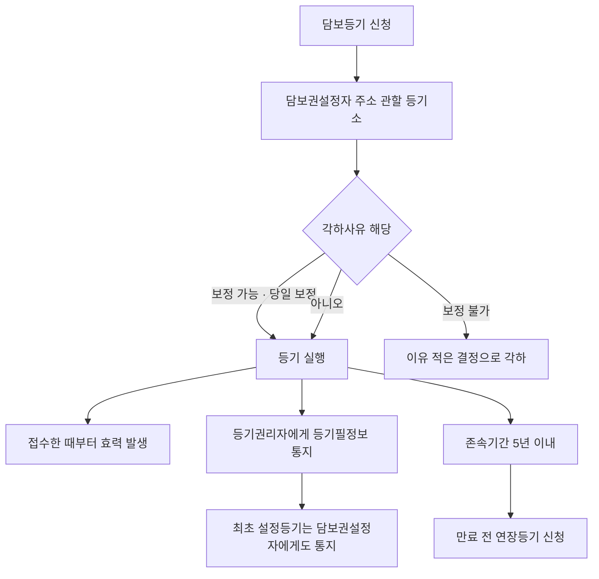

#### ⭐ 기출 출제포인트

1. **존속기간 5년·연장은 만료 전**(2018 36번 ③, 2021 36번 ⑤, 2024 36번 ③).
2. **효력은 접수한 때부터**(2018 36번 ②, 2021 36번 ②).
3. **집행정지 효력 없음 + 새로운 사실·증거 금지**(2018 36번 ④⑤, 2021 36번 ③).
4. **이유 없으면 3일 이내 송부**(2021 36번 ④).
5. **신청인 구분** — 공동 원칙, 표시변경은 등기명의인 단독, 판결은 승소한 권리자·의무자, 포괄승계는 권리자(2018 36번 ①, 2024 36번 ②④).
6. **말소등기는 담보권설정자와 담보권자가 신청**(2024 36번 ⑤).
7. **장래 취득 동산의 담보등기 가능**(2024 36번 ①).

#### 📊 기출 분석

| 연도 | 출제 형태 | 핵심 논점 |
|---|---|---|
| 2018 | 36번 — 옳지 않은 것 | 공동신청, 접수 시 효력, 존속기간 5년, 집행정지, 새로운 사실 |
| 2021 | 36번 — 옳은 것 | 판결 단독신청, 효력 발생, 집행정지, 3일 송부, 존속기간 |
| 2024 | 36번 — 옳은 것 | 장래 동산, 표시변경 단독, 연장등기 시기, 포괄승계, 말소 |

**출제 빈도** — 동산채권담보법 1문항 중 **3년에 1회 이상** 담보등기에서 출제된다.
**반복되는 함정** — ① 5년 → 7년 ② 접수한 때 → 다음 날 ③ 집행정지 효력 있음 ④ 포괄승계에 등기의무자 추가 ⑤ 「만료 전후 1개월」 같은 없는 기간 창작.
**최근 경향** — 2024년 36번이 **다섯 선지 전부를 서로 다른 조문**에서 뽑았다. 제3조·제41조·제49조·제50조를 골고루 알아야 한다.

#### 🔍 기출 선지로 배우는 조문

**①** (2018 36번 ⑤, 정답) 등기관의 결정 또는 처분에 이의가 있는 자는 **새로운 사실이나 새로운 증거방법을 근거로** 관할 지방법원에 이의신청을 할 수 있다 — **X** / 어디가 틀렸나: 사유가 제한된다 / 옳게 고치면: ==새로운 사실이나 새로운 증거방법을 근거로 이의신청을 할 수 없다==(법 제54조).

**②** (2018 36번 ③) 담보권의 존속기간은 5년을 초과할 수 없으나, 5년을 초과하지 않는 기간으로 이를 갱신할 수 있다 — **O** / 근거: 법 제49조 제1항.

**③** (2021 36번 ①) 판결에 의한 등기는 등기권리자와 등기의무자가 **공동으로** 신청하여야 한다 — **X** / 어디가 틀렸나: 단독 신청이 가능하다 / 옳게 고치면: ==승소한 등기권리자 또는 등기의무자 단독==으로 신청할 수 있다(법 제41조③).

**④** (2021 36번 ②) 등기관이 등기를 마친 경우 그 등기는 등기신청을 **접수한 날의 다음 날부터** 효력을 발생한다 — **X** / 어디가 틀렸나: 시점 / 옳게 고치면: ==접수한 때==부터 효력을 발생한다(법 제45조②).

**⑤** (2021 36번 ④, 정답) 등기관은 자신의 결정 또는 처분에 대한 이의가 이유 없다고 인정하면 3일 이내에 의견서를 붙여 사건을 관할 지방법원에 송부하여야 한다 — **O** / 근거: 법 제55조 제2항.

**⑥** (2021 36번 ⑤) 담보권의 존속기간은 **7년**을 초과하지 않는 기간으로 갱신할 수 있다 — **X** / 어디가 틀렸나: 기간 / 옳게 고치면: ==5년==을 초과하지 않는 기간이다(법 제49조①).

**⑦** (2024 36번 ①, 정답 표기) 장래에 취득할 동산은 특정할 수 있는 경우에도 이를 목적으로 담보등기를 할 수 **없다** — **X** / 어디가 틀렸나: 할 수 있다 / 옳게 고치면: 종류·보관장소·수량 등으로 ==특정할 수 있으면 담보등기를 할 수 있다==(법 제3조②).

**⑧** (2024 36번 ②) 등기명의인 표시의 변경의 등기는 등기명의인 단독으로 신청할 수 있다 — **O** / 근거: 법 제41조 제2항. **조문상 옳은 선지다.**

**⑨** (2024 36번 ③) 담보권자가 담보권의 존속기간을 갱신하려면 그 존속기간 **만료 전후 1개월 내에** 연장등기를 신청하여야 한다 — **X** / 어디가 틀렸나: 시기 / 옳게 고치면: 담보권설정자와 담보권자가 ==만료 전==에 연장등기를 신청하여야 한다(법 제49조②).

**⑩** (2024 36번 ⑤) 담보목적물인 동산이 멸실된 경우 그 말소등기의 신청은 **담보권설정자가** 하여야 한다 — **X** / 어디가 틀렸나: 신청인 / 옳게 고치면: ==담보권설정자와 담보권자==가 말소등기를 신청할 수 있다(법 제50조①2).

#### ⚠️ 이 관의 함정 총정리

1. 「담보권의 존속기간은 7년(또는 10년)을 초과할 수 없다」고 하면 틀림 → ==5년==이다(법 제49조①).
2. 「연장등기는 존속기간 만료 후에도 신청할 수 있다」고 하면 틀림 → ==만료 전==에 신청하여야 한다(법 제49조②).
3. 「등기는 접수한 날의 다음 날부터 효력이 생긴다」고 하면 틀림 → ==접수한 때==부터다(법 제45조②).
4. 「이의신청은 집행정지의 효력이 있다」고 하면 틀림 → ==없다==(법 제53조③).
5. 「포괄승계로 인한 등기는 등기권리자 또는 등기의무자 단독으로 신청할 수 있다」고 하면 틀림 → ==등기권리자== 단독이다. 「권리자 또는 의무자」는 ==판결==의 경우다(법 제41조③).
6. 「관할은 담보목적물의 소재지 관할 등기소다」라고 하면 틀림 → ==담보권설정자의 주소== 관할이다(법 제39조②).
7. 「담보등기부는 담보목적물별로 작성한다」고 하면 틀림 → ==담보권설정자별==로 구분하여 작성한다(법 제47조①).
8. 「최초 담보권설정등기에서도 등기필정보는 등기권리자에게만 통지한다」고 하면 틀림 → ==담보권설정자에게도== 통지한다(법 제48조 단서).

#### ✅ OX 확인문제

> 다음 진술의 참·거짓을 판단하시오.

**1.** 담보등기는 동산담보권이나 채권담보권의 설정, 이전, 변경, 말소 또는 연장에 대하여 한다.
→ **O**. 법 제38조.

**2.** 담보등기의 관할은 담보목적물의 소재지를 관할하는 등기소로 한다.
→ **X**. **담보권설정자의 주소**를 관할하는 지방법원·지원 또는 등기소다(법 제39조 제2항).

**3.** 담보등기는 법률에 다른 규정이 없으면 등기권리자와 등기의무자가 공동으로 신청한다.
→ **O**. 법 제41조 제1항.

**4.** 상속이나 그 밖의 포괄승계로 인한 등기는 등기권리자 또는 등기의무자 단독으로 신청할 수 있다.
→ **X**. 포괄승계는 **등기권리자** 단독이다. 「등기권리자 또는 등기의무자」는 **판결**에 의한 등기다(법 제41조 제3항).

**5.** 등기관이 등기를 마친 경우 그 등기는 접수한 때부터 효력을 발생한다.
→ **O**. 법 제45조 제2항.

**6.** 담보등기부는 담보목적물별로 구분하여 작성한다.
→ **X**. **담보권설정자별**로 구분하여 작성한다(법 제47조 제1항).

**7.** 등기관이 최초 담보권설정등기를 마쳤을 때에는 등기권리자와 담보권설정자 모두에게 등기필정보를 통지하여야 한다.
→ **O**. 법 제48조 단서.

**8.** 이 법에 따른 담보권의 존속기간은 5년을 초과할 수 없으며, 갱신하려면 만료 전에 연장등기를 신청하여야 한다.
→ **O**. 법 제49조 제1항·제2항.

**9.** 담보등기에 관한 이의신청은 집행정지의 효력이 있다.
→ **X**. **집행정지의 효력이 없다**(법 제53조 제3항).

**10.** 담보등기에 관하여는 이 법에 특별한 규정이 있는 경우를 제외하고는 성질에 반하지 아니하는 범위에서 「부동산등기법」을 준용한다.
→ **O**. 법 제57조.

#### 🧠 암기법

> 🔑 **"오(5)년, 만료 전에 연장"**
> 존속기간 **5년** 초과 불가, 갱신도 **5년 이하**, 연장등기는 **만료 전**.

> 🔑 **관할·편성 — "사람 따라간다"**
> 관할 = **담보권설정자의 주소** / 등기부 = **담보권설정자별**. 부동산등기와 정반대로 **인적**이다.

> 🔑 **이의 3원칙(부동산등기법과 동일) — "새 없다 · 정(지) 없다 · 3일"**

> 🔑 **보정 시한 차이 — "부동산은 내일, 담보는 오늘"**
> 부동산등기법 = 보정 명한 날의 **다음 날까지** / 동산채권담보법 = **당일**.

> 🔑 **등기필정보 — "최초엔 설정자도"**
> 원칙은 등기권리자에게. **최초 담보권설정등기**만 담보권설정자에게도 통지.

---

#### ⚖️ 법조문 원문

> 📖 이 관이 근거로 삼은 조문의 **전문**이다. 본문 인용은 발췌지만 여기서는 조 전체를 싣는다. 출처는 법제처 정본이다.

**― 동산채권담보법 법률 ―**

> 📌 **동산채권담보법 제38조(등기할 수 있는 권리)** — "담보등기는 동산담보권이나 채권담보권의 설정, 이전, 변경, 말소 또는 연장에 대하여 한다."

> 📌 **동산채권담보법 제39조(관할 등기소)** — "① 제38조의 등기에 관한 사무(이하 "등기사무"라 한다)는 대법원장이 지정ㆍ고시하는 지방법원, 그 지원 또는 등기소에서 취급한다. ② 등기사무에 관하여는 제1항에 따라 대법원장이 지정ㆍ고시한 지방법원, 그 지원 또는 등기소 중 담보권설정자의 주소를 관할하는 지방법원, 그 지원 또는 등기소를 관할 등기소로 한다. 1. 삭제 <2020.10.20> 2. 삭제 <2020.10.20> ③ 대법원장은 어느 등기소의 관할에 속하는 사무를 다른 등기소에 위임할 수 있다."

> 📌 **동산채권담보법 제41조(등기신청인)** — "① 담보등기는 법률에 다른 규정이 없으면 등기권리자와 등기의무자가 공동으로 신청한다. ② 등기명의인 표시의 변경 또는 경정(更正)의 등기는 등기명의인 단독으로 신청할 수 있다. ③ 판결에 의한 등기는 승소한 등기권리자 또는 등기의무자 단독으로 신청할 수 있고, 상속이나 그 밖의 포괄승계로 인한 등기는 등기권리자 단독으로 신청할 수 있다."

> 📌 **동산채권담보법 제45조(등기신청의 접수)** — "① 등기신청은 등기의 목적, 신청인의 성명 또는 명칭, 그 밖에 대법원규칙으로 정하는 등기신청정보가 전산정보처리조직에 전자적으로 기록된 때에 접수된 것으로 본다. ② 등기관이 등기를 마친 경우 그 등기는 접수한 때부터 효력을 발생한다."

> 📌 **동산채권담보법 제47조(등기부의 작성 및 기록사항)** — "① 담보등기부는 담보목적물인 동산 또는 채권의 등기사항에 관한 전산정보자료를 전산정보처리조직에 의하여 담보권설정자별로 구분하여 작성한다. ② 담보등기부에 기록할 사항은 다음 각 호와 같다. 1. 담보권설정자의 성명, 주소 및 주민등록번호(법인인 경우에는 상호 또는 명칭, 본점 또는 주된 사무소 및 법인등록번호를 말한다) 2. 채무자의 성명과 주소(법인인 경우에는 상호 또는 명칭 및 본점 또는 주된 사무소를 말한다) 3. 담보권자의 성명, 주소 및 주민등록번호(법인인 경우에는 상호 또는 명칭, 본점 또는 주된 사무소 및 법인등록번호를 말한다) 3의2. 담보권설정자나 담보권자가 주민등록번호가 없는 재외국민이거나 외국인인 경우에는 「부동산등기법」 제49조제1항제2호 또는 제4호에 따라 부여받은 부동산등기용등록번호 4. 담보권설정자나 채무자 또는 담보권자가 외국법인인 경우 국내의 영업소 또는 사무소. 다만, 국내에 영업소 또는 사무소가 없는 경우에는 대법원규칙으로 정하는 사항 5. 담보등기의 등기원인 및 그 연월일 6. 담보등기의 목적물인 동산, 채권을 특정하는 데 필요한 사항으로서 대법원규칙으로 정한 사항 7. 피담보채권액 또는 그 최고액 8. 제10조 단서 또는 제12조 단서의 약정이 있는 경우 그 약정 9. 담보권의 존속기간 10. 접수번호 11. 접수연월일"

> 📌 **동산채권담보법 제48조(등기필정보의 통지)** — "등기관이 담보권의 설정 또는 이전등기를 마쳤을 때에는 등기필정보를 등기권리자에게 통지하여야 한다. 다만, 최초 담보권설정등기의 경우에는 담보권설정자에게도 등기필정보를 통지하여야 한다."

> 📌 **동산채권담보법 제49조(담보권의 존속기간 및 연장등기)** — "① 이 법에 따른 담보권의 존속기간은 5년을 초과할 수 없다. 다만, 5년을 초과하지 않는 기간으로 이를 갱신할 수 있다. ② 담보권설정자와 담보권자는 제1항의 존속기간을 갱신하려면 그 만료 전에 연장등기를 신청하여야 한다. ③ 제2항의 연장등기를 위하여 담보등기부에 다음 사항을 기록하여야 한다. 1. 존속기간을 연장하는 취지 2. 연장 후의 존속기간 3. 접수번호 4. 접수연월일"

> 📌 **동산채권담보법 제53조(이의신청 등)** — "① 등기관의 결정 또는 처분에 이의가 있는 자는 관할 지방법원에 이의신청을 할 수 있다. ② 제1항에 따른 이의신청서는 등기소에 제출한다. ③ 제1항의 이의신청은 집행정지의 효력이 없다."

> 📌 **동산채권담보법 제57조(준용규정)** — "담보등기에 관하여는 이 법에 특별한 규정이 있는 경우를 제외하고는 그 성질에 반하지 아니하는 범위에서 「부동산등기법」을 준용한다."

## 📖 핵심요약서 — L1 (메인·단권화)

> 스터디파이터 핵심요약서. 시험 직전 단권화 자료.

### 핵심요약서 (p.21~40)

<!--p.21-->
21
제2장 부동산가격공시에 관한 법률
총칙[1]
이 법은 부동산의 적정가격 공시에 관한 기본적인 사항과 부동산 시장 ㆍ동향의 조사 ㆍ 관리에 필요한 사항을 규정함으로써 
① 부동산의 적정한 가격형성과 
② 각종 조세 ㆍ 부담금 등의 형평성을 도모하고 
③ 국민경제의 발전에 이바지함을 목적으로 한다.
(1) 주택 :  세대의 구성원이 장기간 독립된 주거생활을 할 수 있는 구조로 된 건축물의 전부 또는 일부 및 그 부속토
지를 말하며, 단독주택과 공동주택(아파트, 연립주택, 다세대주택)으로 구분한다.
(2) 비주거용 부동산 : 주택을 제외한 건축물이나 건축물과 그 토지의 전부 또는 일부를 말하며 다음과 같이 구분한다.
(3) 적정가격 :  토지, 주택 및 비주거용 부동산에 대하여 통상적인 시장에서 정상적인 거래가 이루어지는 경우 
                    성립될 가능성이 가장 높다고 인정되는 가격을 말한다.
① 비주거용 집합 부동산 : 「집합건물의 소유 및 관리에 관한 법률」에 따라 구분소유되는 비주거용 부동산
② 비주거용 일반 부동산 : 가목을 제외한 비주거용 부동산
제2장 부동산가격공시법
스터디파이터 윤철신 강사
주택구분 주택명 층수 연면적 특징
공동주택
아파트 5개층 이상 - -
연립주택 4개층 이하 660㎡ 초과 2~4층의 빌라, 맨션 동 포함
다세대주택 4개층 이하 660㎡ 이하 -
기숙사 - -
■ 건축법 : 공동주택O
■ 부공법 : 공동주택X, 주택법 제2조 4호 준주택, 가격미공시
단독주택
단독주택 - - 1인 소유 주거형태
다중주택 3개층 이하 660㎡ 이하 독립된 주거의 형태를 갖추지 않음 (취사시설 미설치)
다가구주택 3개층 이하 660㎡ 이하 1인 소유 주거형태
1. 부동산가격공시법의 목적
2. 정의

<!--p.22-->
22
감관법2 핵심정리
표준지 공시지가[2]
국토교통부장관은 토지이용상황이나 주변 환경, 그 밖의 자연적 ㆍ 사회적 조건이 일반적으로 유사하다고 
인정되는 일단의 토지 중에서 선정한 표준지에 대하여 매년 공시기준일 현재의 단위면적당 적정가격
(이하 “표준지공시지가”라 한다)을 조사 ㆍ 평가하고, 중앙부동산가격공시위원회의의 심의를 거쳐 이를 공시하여야 한다.
표준지조사·평가의뢰국토교통부장관
국토교통부장관
국토교통부장관
국토교통부장관
감정평가법인등
감정평가법인등
↓
↓
↓
↓
↓
↓
↔
↔
표준지공시지가 공시 절차도
조사·평가
의견청취
· 국장 : 토지소유자 (개별통지 MUST)
· 법인등 : 시도지사 * 시군구청장
이의신청
· 토지소유자 등
· 공시일로부터 30일 이내
시·군·구
부동산가격공시위원회 심의
중앙부동산가격공시위원회심의
일반인 열람
지가공시
(관보공고)
공시내용 송부
(시·군·구)
검수·심 사
평가보고서제출
1. 표준지공시지가의 공시
2. 표준지공시지가 공시업무 절차

<!--p.23-->
23
제2장 부동산가격공시에 관한 법률
(1) 국토교통부장관이 표준지공시지가를 조사 ㆍ 평가할 때에는 업무실적, 신인도 등을 고려하여 
     둘 이상의 감정평가법인등에게 이를 의뢰하여야 한다. 
국토교통부장관은 표준지를 선정할 때에는 일단 (一團)의 토지 중에서 해당 일단의 토지를 대표 할 수 있는 
필지의 토지를 선정하여야 한다.
(1) 인근 유사토지의 거래가격 ㆍ 임대료 및 해당 토지와 유사한 이용가치를 지닌다고 인정되는 토지의 조성에 필요한 
    비용추정액, 인근지역 및 다른 지역과의 형평성 ㆍ특수성, 표준지공시지가 변동의 예측 가능성 등 제반사항을 
    종합적으로 참작하여야 한다. 
(2) 인근 유사토지의 거래가격 또는 임대료의 경우 : 해당 거래 또는 임대차가 당사자의 특수한 사정에 의하여 
    이루어지거나 토지거래 또는 임대차에 대한 지식의 부족으로 인하여 이루어진 경우에는 
    그러한 사정이 없었을 때에 이루어졌을 거래가격 또는 임대료를 기준으로 할 것
(3) 해당 토지와 유사한 이용가치를 지닌다고 인정되는 토지의 조성에 필요한 비용추정액의 경우 : 
    공시기준일 현재 해당 토지를 조성하기 위한 표준적인 조성비와 일반적인 부대비용 으로 할 것
(4) 표준지에 ① 건물 또는 그 밖의 정착물이 있거나 ② 지상권 또는 그 밖의 토지의 사용 ㆍ 수익을 제한하는 권리가 
    설정되어 있을 때에는 그 정착물 또는 권리가 존재하지 아니하는 것으로 보고 표준지공시지가를 평가하여야 한다.
(2) 다만, 지가 변동이 작은 경우 하나의 감정평가법인등에 의뢰할 수 있다. 
1. 표준지공시지가 조사 ㆍ 평가 의뢰일부터 30일 이전이 되는 날(이하 “선정기준일”이라 한다)을 기준으로 하여 
    직전 1년간의 업무실적 이 표준지 적정가격 조사 ㆍ 평가업무를 수행하기에 적정한 수준일 것
2. 회계감사절차 또는 감정평가서의 심사체계가 적정할 것
3. 「감정평가 및 감정평가사에 관한 법률」에 따른 업무정지처분, 과태료 또는 소속 감정평가사에 대한 
    징계처분 등이 다음 각 목의 기준 어느 하나에도 해당하지 아니할 것
    가. 선정기준일부터 직전 2년간 업무정지처분을 3회 이상 받은 경우
    나. 선정기준일부터 직전 1년간 과태료처분을 3회 이상 받은 경우
    다. 선정기준일부터 직전 1년간 징계 를 받은 소속 감정평가사의 비율이 선정기준일 
         현재 소속 전체 감정평가사의 10퍼센트 이상 인 경우
    라. 선정기준일 현재 업무정지기간이 만료된 날부터 1년 이 지나지 아니한 경우
1. 최근 1년간 읍ㆍ면ㆍ동 별 지가변동률이 전국 평균 지가변동률 이하인 지역
2. 개발사업이 시행 되거나 용도지역 또는 용도지구가 변경 되는 등의 사유가 없는 지역
3. 평가의뢰
4. 표준지의 선정기준
5. 조사평가기준

<!--p.24-->
24
감관법2 핵심정리
(1) 국토교통부장관의 토지소유자 의견청취
① 국토교통부장관은 표준지공시지가를 공시하기 위하여 표준지의 가격을 조사 ㆍ 평가할 때에는 
    대통령령으로 정하는 바에 따라 해당 토지 소유자의 의견을 들어야 한다.
② 국토교통부장관은 부동산공시가격시스템 에 다음 각 호의 사항을 20일 이상 게시해야 한다.
    (게시 사실을 표준지 소유자에게 개별 통지해야 한다.)
(2) 감정평가법인등의 시*도지사 및 시*군*구청장 의견청취
① 감정평가법인등은 조사 ㆍ 평가보고서를 작성하는 경우에는 미리 해당 표준지를 관할하는 
    특별시장 ㆍ 광역시장 ㆍ특별자치시장 ㆍ 도지사 또는 특별자치도지사(이하 “시ㆍ도 지 사”라 한다) 및 
    시 장ㆍ군 수ㆍ구 청 장(자치구의 구청장을 말한다. 이하 같다)의 의견 을 들어야 한다. 
② 시 ㆍ 도지사 및 시장 ㆍ군수 ㆍ구청장은 의견 제시 요청을 받은 경우에는 요청받은 날부터 20일 이내에 
    의견을 제시해야 한다. 이 경우 시장 ㆍ군수 또는 구청장은 시 ㆍ군ㆍ구부동산가격공시위원회의 심의를 거쳐 
    의견을 제시해야 한다. 
1. 공시대상, 열람기간 및 방법
2. 의견제출기간 및 의견제출방법
3. 공시 예정가격
국토교통부장관은 표준지의 선정 또는 표준지공시지가의 조사 ㆍ 평가를 위하여 필요한 경우에는 
관계 행정기관에 해당 토지의 인 ㆍ 허가 내용, 개별법에 따른 등록사항 등 대통령령으로 정하는 관련 자료의 열람 
또는 제출을 요구할 수 있다. 이 경우 관계 행정기관은 정당한 사유가 없으면 그 요구를 따라야 한다.  
(1) 표준지공시지가 조사 ㆍ 평가를 의뢰받은 감정평가법인등은 표준지공시지가 및 그 밖에 국토교통부령으로 정하는 
    사항을 조사 ㆍ 평가한 후 국토교통부령으로 정하는 바에 따라 조사 ㆍ 평가보고서를 작성하여 국토교통부장관에게 
    제출해야 한다. 
6. 의견청취
7. 조사협조
8. 표준지 조사평가보고서

<!--p.25-->
25
제2장 부동산가격공시에 관한 법률
1. 지역분석조서
2. 표준지별로 작성한 표준지 조사사항 및 가격평가의견서
3. 의견청취결과서[시장 ㆍ군수 또는 구청장의 의견]
4. 표준지의 위치를 표시한 도면
5. 그 밖에 사실 확인에 필요한 서류
1. 공시사항
2. 표준지공시지가의 열람방법
3. 이의신청의 기간 ㆍ절차 및 방법
(2) 표준지 조사평가보고서에 첨부서류 
(3) 표준지공시지가는 제1항에 따라 제출된 보고서에 따른 조사 ㆍ 평가액의 산술평균치를 기준으로 한다.
(1) 국토교통부장관은 표준지 조사평가보고서에 대하여 실거래신고가격 및 감정평가 정보체계 등을 활용하여 
     그 적정성 여부를 검토할 수 있다. 
(1) 국토교통부장관은 표준지공시지가를 공시할 때에는 다음 각 호의 사항을 관보에 공고 하고, 
    표준지공시지가를 국토교통부가 운영하는 부동산공시가격시스템에 게시하여야 한다.
(2) 국토교통부장관은 검토 결과 
    ① 부적정하다고 판단되거나 
    ② 조사 ㆍ 평가액 중 최고평가액이 최저평가액의 1.3배를 초과하는 경우에는 
    ③ 해당  감정평가법인등에게 보고서를 시정하여 다시 제출하게 할 수 있다.
(3) 국토교통부장관은 제출된 보고서의 조사 ㆍ 평가가 관계 법령을 위반하여 수행되었다고 인정되는 경우에는 
    ① 해당 감정평가법인등에게 그 사유를 통보하고, 
    ② 다른  감정평가법인등 2인에게 대상 표준지공시지가의 조사 ㆍ 평가를 다시 의뢰해야 한다. 
    ③ 이 경우 표준지 적정가격은 다시 조사 ㆍ 평가한 가액의 산술평균치를 기준으로 한다. 
9. 표준지공시지가의 적정성 검토
10. 공시방법

<!--p.26-->
26
감관법2 핵심정리
1. 표준지의 지번
2. 표준지의 단위면적당 가격
3. 표준지의 면적 및 형상
4. 표준지 및 주변토지의 이용상황
5. 그 밖에 대통령령으로 정하는 사항(지목, 용도지역, 도로 상황, 그 밖에 표준지공시지가 공시에 필요한 사항)
(2) 공시사항
(3) 공시화면(예시)
(4) 표준지공시지가의 열람 등
국토교통부장관은 표준지공시지가를 공시한 때에는 그 내용을 특별시장 ㆍ 광역시장 또는 도지사를 거쳐 
시장 ㆍ군수 또는 구청장에게 송부하여 일반인이 열람 할 수 있게 하고, 이를 도서 ㆍ 도표 등으로 작성하여 
관계 행정기관 등에 공급하여야 한다.
(1) 국토교통부장관은 필요하다고 인정하는 경우에는 표준지공시지가와 이의신청의 기간*절차 및 방법을 
    표준지 소유자에게 개별 통지할 수 있다. 
(2) 국토교통부장관은 제2항에 따른 통지를 하지 아니하는 경우에는 제1항에 따른 공고 및 게시사실을 방송*신문 등을 
    통하여 알려 표준지 소유자가 표준지공시지가를 열람하고 필요한 경우에는 이의신청을 할 수 있도록 하여야 한다.
(3) 표준지공시지가에 이의가 있는 자는 그 공시일부터 30일 이내에 서면으로 국토교통부장관에게 이의를 신청할 수 있다.
(4) 국토교통부장관은 이의신청 기간이 만료된 날부터 30일 이내 에 이의신청을 심사하여 그 결과를 
    신청인에게 서면 으로 통지하여야 한다. 이 경우 국토교통부장관은 이의신청의 내용이 타당하다고 
    인정될 때에는 해당 표준지공시지가를 조정하여 다시 공시 하여야 한다.
11. 이의신청

<!--p.27-->
27
제2장 부동산가격공시에 관한 법률
(2) 지가 산정의 주체
(3) 지가 산정의 목적
 가. 국가 또는 지방자치단체
 나. 「공공기관의 운영에 관한 법률」에 따른 공공기관
 다. 그 밖에 대통령령으로 정하는 공공단체
 가. 공공용지의 매수 및 토지의 수용 ㆍ 사용에 대한 보상
 나. 국유지 ㆍ공유지의 취득 또는 처분
 다. 그 밖에 대통령령으로 정하는 지가의 산정
(1) (2)의 자가 (3)의 목적을 위하여 지가를 산정할 때에는 그 토지와 이용가치가 비슷하다고 인정되는 하나 또는 
    둘 이상의 표준지의 공시지가를 기준으로 토지가격비준표 를 사용하여 지가를 직접 산정 하거나 
    감정평가법인등에 감정평가를 의뢰 하여 산정할 수 있다. 
    다만, 필요하다고 인정할 때에는 산정된 지가를 (3)의 목적에 따라 가감조정하여 적용할 수 있다.  
1. 「산림조합법」에 따른 산림조합 및 산림조합중앙회
2. 「농업협동조합법」에 따른 조합 및 농업협동조합중앙회
3. 「수산업협동조합법」에 따른 수산업협동조합 및 수산업협동조합중앙회
4. 「한국농어촌공사 및 농지관리기금법」에 따른 한국농어촌공사
5. 「중소기업진흥에 관한 법률」에 따른 중소벤처기업진흥공단
6. 「산업집적활성화 및 공장설립에 관한 법률」에 따른 산업단지관리공단
1. 「국토의 계획 및 이용에 관한 법률」 또는 그 밖의 법령에 따라 조성된 용지 등의 공급 또는 분양
2. 다음 각 목의 어느 하나에 해당하는 사업을 위한 환 지ㆍ체 비 지(替費地)의 매각 또는 환지신청
    가. 「도시개발법」 제2조제1항제2호에 따른 도시개발사업
    나. 「도시 및 주거환경정비법」 제2조제2호에 따른 정비사업
    다. 「농어촌정비법」 제2조제5호에 따른 농업생산기반 정비사업
3. 토지의 관리 ㆍ 매입 ㆍ 매각 ㆍ 경매 또는 재평가
12. 적용
13. 효력
표준지공시지가는 
① 토지시장에 지가정보를 제공하고 
② 일반적인 토지거래의 지표가 되며, 
③ 국가*지방자치단체 등이 그 업무와 관련하여 지가를 산정하거나 
④ 감정평가법인등이 개별적으로 토지를 감정평가하는 경우에 
    기준이 된다.  

<!--p.28-->
28
감관법2 핵심정리
개별 공시지가[3]
(1) 시장 ㆍ군수 또는 구청장은 국세 ㆍ 지방세 등 각종 세금의 부과, 그 밖의 다른 법령에서 정하는 목적을 위한 
    지가산정에 사용되도록 하기 위하여 시 ㆍ군ㆍ구부동산가격공시위원회의 심의 를 거쳐 매년 공시지가의 공시기준일 
    현재 관할 구역 안의 개별공시지가를 결정 ㆍ공시하고, 이를 관계 행정기관 등에 제공하여야 한다.
(1) 제외 대상
(1) 시장 ㆍ군수 또는 구청장은 공시기준일 이후에 분할 ㆍ 합병 등이 발생한 토지에 대하여는 
    대통령령으로 정하는 날을 기준으로 하여 개별공시지가를 결정 ㆍ공시하여야 한다.
① 1월 1일부터 6월 30일까지의 사이에 제1항 각 호의 사유가 발생한 토지 : 그 해 7월 1일
                                                                                                       (공시일은 10월 31일까지 )
② 7월 1일부터 12월 31일까지의 사이에 제1항 각 호의 사유가 발생한 토지 : 다음 해 1월 1일
                                                                                                       (공시일은 5월 31일까지 )
(2) 해당 경우
(3) 다른 공시기준일
(2) 이 경우 표준지로 선정된 토지에 대하여는 해당 토지의 표준지공시지가를 개별공시지가로 본다.
(2) 국토교통부장관은 개별공시지가의 산정을 위하여 필요하다고 인정하는 경우에는 
    표준지와 산정대상 개별 토지의 가격형성요인에 관한 표준적인 비교표(이하 “ 토지가격비준표 ”라 한다)를 
    작성하여 시장 ㆍ군수 또는 구청장에게 제공하여야 한다.  
1. 개별공시지가의 공시
2. 개별공시지가를 공시하지 아니할 수 있는 토지
3. 공시기준일을 다르게 할 수 있는 토지
1. 표준지로 선정된 토지
2. 농지보전부담금 또는 개발부담금 등의 부과대상이 아닌 토지
3. 국세 또는 지방세 부과대상이 아닌 토지(국공유지의 경우에는 공공용 토지만 해당한다)
1. 「공간정보의 구축 및 관리 등에 관한 법률」에 따라 분할 또는 합병 된 토지
2. 공유수면 매립 등으로 「공간정보의 구축 및 관리 등에 관한 법률」에 따른 신규등록 이 된 토지
3. 토지의 형질변경 또는 용도변경으로 「공간정보의 구축 및 관리 등에 관한 법률」에 따른 지목변경 이 된 토지
4. 국유 ㆍ공유에서 매각 등에 따라 사유(私有)로 된 토지로서 개별공시지가가 없는 토지

<!--p.29-->
29
제2장 부동산가격공시에 관한 법률
(1) 국토교통부장관은 개별공시지가 조사 ㆍ산정의 기준을 정하여 시장 ㆍ군수 또는 구청장에게 통보하여야 하며, 
    시장 ㆍ군수 또는 구청장은 그 기준에 따라 개별공시지가를 조사 ㆍ산정하여야 한다.
(1) 관계 공무원 또는 부동산가격공시업무를 의뢰받은 자(이하 “관계공무원등”이라 한다)는 
    표준지가격의 조사 ㆍ 평가 또는 토지가격의 산정을 위하여 필요한 때에는 타인의 토지에 출입할 수 있다.
(1) 개요
시장 ㆍ군수 또는 구청장은 개별공시지가를 결정 ㆍ공시하기 위하여 개별토지의 가격을 산정할 때에는 
그 타당성에 대하여 감정평가법인등의 검증 을 받고 토지소유자, 그 밖의 이해관계인의 의견 을 들어야 한다. 
(2) 검증의 의뢰
① 시장 ㆍ군수 또는 구청장이 검증을 받으려는 때에는 해당 지역의 표준지의 공시지가를 조사 ㆍ 평가한 
    감정평가법인등 또는 대통령령으로 정하는 감정평가실적 등이 우수한 감정평가법인등에 의뢰하여야 한다.
(2) 관계공무원등이 택지 또는 담장이나 울타리로 둘러싸인 타인의 토지에 출입하고자 할 때에는 
    시장 ㆍ군수 또는 구청장의 허가(부동산가격공시업무를 의뢰 받은 자에 한정한다)를 받아 
    출입할 날의 3일 전 에 그 점유자에게 일시와 장소를 통지 하여야 한다. 
    다만, 점유자를 알 수 없거나 부득이한 사유가 있는 경우에는 그러하지 아니하다.
(3) 일출 전 ㆍ 일몰 후에는 그 토지의 점유자의 승인 없이 택지 또는 담장이나 울타리로 둘러싸인 
    타인의 토지에 출입할 수 없다.
(4) 타인토지에 출입을 하고자 하는 자는 그 권한을 표시하는 증표와 허가증을 지니고 이를 관계인에게 내보여야 한다.
(2) 내용
4. 조사*산정의 기준
5. 타인토지에의 출입 등
6. 검증
1. 지가형성에 영향을 미치는 토지 특성조사에 관한 사항
2. 비교표준지의 선정에 관한 사항
3. 토지가격비준표의 사용에 관한 사항
4. 그 밖에 개별공시지가의 조사 ㆍ산정에 필요한 사항

<!--p.30-->
30
감관법2 핵심정리
② 시장 ㆍ군수 또는 구청장은 개별토지가격의 타당성에 대한 검증을 의뢰하는 경우에는 
    전체 개별토지가격에 대한 지가현황도면  및 지가조사자료 를 제공하여야 한다.
① 시장 ㆍ군수 또는 구청장은 감정평가법인등의 검증이 필요 없다고 인정되는 때에는 
    지가의 변동상황 등을 고려하여 감정평가법인등의 검증을 생략할 수 있다.  
② 검증 생략시 개별토지의 지가변동률 과 해당 토지가 있는 읍 ㆍ 면 ㆍ동의 연평균 지가변동률간의 차이가 
    작은 순으로 대상 토지를 선정해야 한다. 다만, 개발사업이 시행 되거나 용도지역*용도지구가 변경되는 등의 
    사유가 있는 토지는 검증 생략 대상 토지로 선정해서는 안 된다. 
1. 지가현황도면 : 
해당 연도의 산정지가, 전년도의 개별공시지가 및 해당 연도의 표준지공시지가가 필지별로 기재된 도면을 말한다.
2. 지가조사자료 : 
개별토지가격의 산정조서 및 그 밖에 토지이용계획에 관한 자료를 말한다.
1. 비교표준지 선정의 적정성에 관한 사항
2. 개별토지 가격 산정의 적정성에 관한 사항
3. 산정한 개별토지가격과 표준지공시지가의 균형 유지에 관한 사항
4. 산정한 개별토지가격과 인근토지의 지가와의 균형 유지 에 관한 사항 (전년도 지가와의 균형 X)
5. 표준주택가격, 개별주택가격, 비주거용 표준부동산가격 및 비주거용 개별부동산가격 산정 시 
    고려된 토지 특성과 일치하는지 여부
6. 개별토지가격 산정 시 적용된 용도지역, 토지이용상황 등 주요 특성이 공부(公簿)와 일치하는지 여부
7. 그 밖에 시장 ㆍ군수 또는 구청장이 검토를 의뢰한 사항
(3) 검증의 사항
(4) 검증의 생략
국토교통부장관은 지가공시 행정의 합리적인 발전을 도모하고 표준지공시지가와 개별공시지가와의 균형유지 등 
적정한 지가형성을 위하여 필요하다고 인정하는 경우에는 개별공시지가의 결정 ㆍ공시 등에 관하여 시장 ㆍ군수 
또는 구청장을 지도 ㆍ 감독할 수 있다.
(1) 개별공시지가에 이의가 있는 자는 그 결정 ㆍ공시일부터 30일 이내에 서면으로 시장 ㆍ군수 또는 구청장에게 
    이의를 신청할 수 있다.
7. 국토교통부장관의 지도*감독
8. 이의신청

<!--p.31-->
31
제2장 부동산가격공시에 관한 법률
(2) 시장 ㆍ군수 또는 구청장은 이의신청 기간이 만료된 날부터 30일 이내에 이의신청을 심사하여 
    그 결과를 신청인에게 서면으로 통지하여야 한다. 이 경우 시장 ㆍ군수 또는 구청장은 이의신청의 내용이 
    타당하다고 인정될 때에는 제10조에 따라 해당 개별공시지가를 조정하여 다시 결정 ㆍ공시하여야 한다.
(1) 개별공시지가의 정정
① 시장 ㆍ군수 또는 구청장은 개별공시지가에 틀린 계산, 오기, 표준지 선정의 착오, 
    그 밖에 대통령령으로 정하는 명백한 오류가 있음을 발견한 때에는 지체 없이 이를 정정 하여야 한다.
(2) 확인서의 발급
본 법률에 따라 결정 ㆍ공시된 개별공시지가의 확인을 받으려는 사람은 
해당 시장 ㆍ군수 또는 구청장에게 개별공시지가의 확인을 신청할 수 있다.(조례로 정하는 수수료 징수)
(3) 개별공시지가의 결정 ㆍ공시비용의 보조
개별공시지가의 결정 ㆍ공시에 소요되는 비용은 대통령령으로 정하는 바에 따라 
그 일부를 국고에서 보조할 수 있다. ( 50% 이내)
(4) 부동산 가격정보 등의 조사
국토교통부장관은 부동산의 적정가격 조사 등 부동산 정책의 수립 및 집행을 위하여 
부동산 시장동향, 수익률 등의 가격정보 및 관련 통계 등을 조사 ㆍ 관리하고, 
이를 관계 행정기관 등에 제공할 수 있다.
② 명백한 오류
③ 시장 ㆍ군수 또는 구청장은 개별공시지가의 오류를 정정하려는 경우에는 
    시 ㆍ군ㆍ구부동산가격공시위원회의 심의를 거쳐 정정사항을 결정 ㆍ공시하여야 한다. 
    다만, 틀린 계산 또는 오기 의 경우에는 시 ㆍ군 ㆍ구부동산가격공시위원회의 심의를 거치지 아니할 수 있다.
9. 기타
1. 공시절차를 완전하게 이행하지 아니한 경우
2. 용도지역 ㆍ용도지구 등 토지가격에 영향을 미치는 주요 요인의 조사를 잘못한 경우
3. 토지가격비준표의 적용에 오류가 있는 경우

<!--p.32-->
32
감관법2 핵심정리
표준주택가격[4]
국토교통부장관 은 용도지역, 건물구조 등이 일반적으로 유사하다고 인정되는 일단의 단독주택 중에서 
선정한 표준주택에 대하여 매년 공시기준일 현재의 적정가격(이하 “표준주택가격”이라 한다)을 조사 ㆍ산정하고, 
중앙부동산가격공시위원회의 심의 를 거쳐 이를 공시하여야 한다.
국토교통부장관은 표준주택을 선정할 때에는 일반적으로 유사하다고 인정되는 일단의 단독주택 중에서 
해당 일단의 단독주택을 대표 할 수 있는 주택을 선정하여야 한다.
국교통부장관은 표준주택가격을 조사 ㆍ산정하고자 할 때에는 한국부동산원 에 의뢰한다. 
국토교통부장관이 표준주택가격을 조사 ㆍ산정하는 경우에는 
① 인근 유사 단독주택의 거래가격 ㆍ 임대료 및 
② 해당 단독주택과 유사한 이용가치를 지닌다고 인정되는 단독주택의 건설에 필요한 비용추정액, 
③ 인근지역 및 다른 지역과의 형평성 ㆍ특수성, 표준주택가격 변동의 예측 가능성 등 
    제반사항을 종합적으로 참작하여야 한다.
(1) 국토교통부장관은 표준주택가격을 공시할 때에는 다음 각 호의 사항을 관보에 공고 하고, 
    표준주택가격을 부동산공시가격시스템에 게시하여야 한다.
(2) 공시사항
1. 개요
2. 표준주택의 선정
3. 의뢰
4. 조사
5. 공시사항
1. 공시사항
2. 표준주택가격의 열람방법
3. 이의신청의 기간 ㆍ절차 및 방법
1. 표준주택의 지번
2. 표준주택가격
3. 표준주택의 대지면적 및 형상
4. 표준주택의 용도, 연면적, 구조 및 사용승인일(임시사용승인일을 포함한다)
5. 그 밖에 대통령령으로 정하는 사항(지목, 용도지역, 도로 상황, 그 밖에 표준주택가격 공시에 필요한 사항)

<!--p.33-->
33
제2장 부동산가격공시에 관한 법률
(3) 공시화면(예시)

<!--p.34-->
34
감관법2 핵심정리
개별주택가격[5]
시장 ㆍ군수 또는 구청장은 시 ㆍ군ㆍ구부동산가격공시위원회의 심의를 거쳐 
매년 표준주택가격의 공시기준일 현재 관할 구역 안의 개별주택의 가격(이하 “개별주택가격”이라 한다)을 
결정 ㆍ공시하고, 이를 관계 행정기관 등에 제공하여야 한다.
(1) 시장 ㆍ군수 또는 구청장은 공시기준일 이후에 토지의 분할 ㆍ 합병이나 건축물의 신축 등이 발생한 경우에는 
    대통령령으로 정하는 날을 기준으로 하여 개별주택가격을 결정 ㆍ공시하여야 한다.
(2) 해당 경우
(3) 다른 공시기준일
① 1월 1일부터 5월 31일까지의 사이에 제1항 각 호의 사유가 발생한 토지 : 그 해 6월 1일
                                                                                                      (공시일은 9월 30일까지 )
② 6월 1일부터 12월 31일까지의 사이에 제1항 각 호의 사유가 발생한 토지 : 다음 해 1월 1일
                                                                                                        (공시일은 4월 30일까지 )
(1) 제외대상
(2) 이 경우 표준주택으로 선정된 주택에 대하여는 해당 주택의 표준주택가격을 개별주택가격으로 본다.
1. 개요
2. 개별주택가격을 공시하지 아니할 수 있는 주택
3. 공시사항
4. 공시기준일을 다르게 할 수 있는 주택
1. 표준주택으로 선정된 단독주택
2. 국세 또는 지방세 부과대상이 아닌 단독주택
1. 개별주택의 지번
2. 개별주택가격
3. 개별주택의 용도 및 면적, 그 밖에 개별주택가격 공시에 필요한 사항
1. 「공간정보의 구축 및 관리 등에 관한 법률」에 따라 그 대지가 분할 또는 합병 된 단독주택
2. 「건축법」에 따른 건축ㆍ대수선 또는 용도변경이 된 단독주택
3. 국유 ㆍ공유에서 매각 등에 따라 사유로 된 단독주택으로서 개별주택가격이 없는 단독주택

<!--p.35-->
35
제2장 부동산가격공시에 관한 법률
(1) 국토교통부장관은 개별주택가격의 산정을 위하여 필요하다고 인정하는 경우에는 
    표준주택과 산정대상 개별주택의 가격형성요인에 관한 표준적인 비교표(이하 “ 주택가격비준표”라 한다)를 
    작성하여 시장 ㆍ군수 또는 구청장에게 제공하여야 한다.
(1) 시장 ㆍ군수 또는 구청장은 개별주택가격을 결정 ㆍ공시하기 위하여 개별주택의 가격을 산정할 때에는 
    표준주택가격과의 균형 등 그 타당성에 대하여 부동산원의 검증 을 받고 
    토지소유자, 그 밖의 이해관계인의 의견을 들어야 한다. 
국토교통부장관은 공시행정의 합리적인 발전을 도모하고 표준주택가격과 개별주택가격과의 균형유지 등 
적정한 가격형성을 위하여 필요하다고 인정하는 경우에는 개별주택가격의 결정 ㆍ공시 등에 관하여 
시장 ㆍ군수 또는 구청장을 지도 ㆍ 감독할 수 있다.
개별공시지가의 내용과 동일
(2) 시장 ㆍ군수 또는 구청장이 개별주택가격을 결정 ㆍ공시하는 경우에는 
    해당 주택과 유사한 이용가치를 지닌다고 인정되는 표준주택가격을 기준으로 주택가격비준표를 사용하여 
    가격을 산정하되, 해당 주택의 가격과 표준주택가격이 균형을 유지하도록 하여야 한다.
(2) 다만, 시장 ㆍ군수 또는 구청장은 부동산원의 검증이 필요 없다고 인정되는 때에는 
    주택가격의 변동상황 등 대통령령으로 정하는 사항을 고려하여 부동산원의 검증을 생략할 수 있다. 
    이 경우 검증의 생략에 대해서는 관계 중앙행정기관의 장과 미리 협의하여야 한다.
5. 비교표
6. 검증
7. 지도*감독
8. 이의신청 등

<!--p.36-->
36
감관법2 핵심정리
공동주택가격[6]
(1) 국토교통부장관 은 공동주택에 대하여 매년 공시기준일 현재의 적정가격(이하 “공동주택가격”이라 한다)을 
    조사 ㆍ 산정하여 중앙부동산가격공시위원회의 심의를 거쳐 공시하고, 이를 관계 행정기관 등에 제공하여야 한다. 
    다만, 대통령령으로 정하는 바에 따라 국세청장이 국토교통부장관과 협의하여 공동주택가격을 별도로 
    결정 ㆍ 고시하는 경우는 제외한다. 
국토교통부장관이 공동주택가격을 조사 ㆍ산정하고자 할 때에는 한국부동산원 에 의뢰한다. 
(1) 국토교통부장관은 공동주택가격을 공시하기 위하여 그 가격을 산정할 때에는 
    대통령령으로 정하는 바에 따라 공동주택소유자와 그 밖의 이해관계인의 의견을 들어야 한다.
(1) 국토교통부장관은 공시기준일 이후에 토지의 분할 ㆍ 합병이나 건축물의 신축 등이 발생한 경우에는 
    대통령령으로 정하는 날을 기준으로 하여 공동주택가격을 결정 ㆍ공시하여야 한다.
(2) 표준지 공시지가의 내용과 동일
(2) 해당 경우
(2) 국세청장이 별도로 고시하는 경우
(3) 국토교통부장관이 공동주택가격을 조사 ㆍ산정하는 경우에는 
    ① 인근 유사 공동주택의 거래가격 ㆍ 임대료 및 
    ② 해당 공동주택과 유사한 이용가치를 지닌다고 인정되는 공동주택의 건설에 필요한 비용추정액, 
    ③ 인근지역 및 다른 지역과의 형평성 ㆍ특수성, 공동주택가격 변동의 예측 가능성 등  
        제반사항을 종합적으로 참작하여야 한다. 
1. 개요
2. 의뢰
3. 의견청취
4. 공시기준일을 다르게 할 수 있는 공동주택
1. 아파트
2. 건축 연면적 165제곱미터 이상의 연립주택
1. 「공간정보의 구축 및 관리 등에 관한 법률」에 따라 그 대지가 분할 또는 합병된 공동주택
2. 「건축법」에 따른 건축 ㆍ 대수선 또는 용도변경이 된 공동주택
3. 국유 ㆍ공유에서 매각 등에 따라 사유로 된 공동주택으로서 공동주택가격이 없는 주택

<!--p.37-->
37
제2장 부동산가격공시에 관한 법률
① 1월 1일부터 5월 31일까지의 사이에 제1항 각 호의 사유가 발생한 공동주택 : 그 해 6월 1일
                                                                                                            (공시일은 9월 30일까지 )
② 6월 1일부터 12월 31일까지의 사이에 제1항 각 호의 사유가 발생한 공동주택 : 다음 해 1월 1일
                                                                                                               (공시일은 4월 30일까지 )
(1) 국토교통부장관은 공시한 가격에 틀린 계산, 오기, 그 밖에 대통령령으로 정하는 명백한 오류가 있음을 
     발견한 때에는 지체 없이 이를 정정하여야 한다.
(1) 표준주택가격은 국가ㆍ 지방자치단체 등이 그 업무와 관련하여 개별주택가격을 산정하는 경우에 그 기준이 된다.
(1) 공동주택가격은 검증제도가 없다.
(2) 국토교통부장관은 공동주택가격의 오류를 정정하려는 경우에는 
     중앙부동산가격공시위원회의 심의를 거쳐 정정사항을 결정 ㆍ공시하여야 한다. 
     다만, 틀린 계산 또는 오기 의 경우에는 중앙부동산가격공시위원회의 심의를 거치지 아니할 수 있다.
(2) 개별주택가격 및 공동주택가격은 주택시장의 가격정보를 제공하고, 국가ㆍ 지방자치단체 등이
     과세 등의 업무와 관련하여 주택의 가격을 산정하는 경우에 그 기준으로 활용될 수 있다.
(2) 표준지공시지가의 이의신청을 준용한다.
(3) 다른 공시기준일
5. 공시사항
6. 공동주택가격의 정정
7. 주택가격 공시의 효력
8. 기타
1. 공동주택의 소재지 ㆍ 명칭 ㆍ동 ㆍ 호수
2. 공동주택가격
3. 공동주택의 면적
4. 그 밖에 공동주택가격 공시에 필요한 사항
1. 공시절차를 완전하게 이행하지 아니한 경우
2. 공동주택가격에 영향을 미치는 동 ㆍ 호수 및 층의 표시 등 주요 요인의 조사를 잘못한 경우

<!--p.38-->
38
감관법2 핵심정리
부동산가격공시위원회[7]
(1) 다음 각 호의 사항을 심의하기 위하여 국토교통부장관 소속으로 중앙부동산가격공시위원회
    (이하 이 조에서 “위원회”라 한다)를 둔다.  
    ① 위원회는 위원장을 포함한 20명 이내 의 위원으로 구성한다.
국토교통부장관은 필요하다고 인정하면 위원회의 심의에 부치기 전에 미리 관계 전문가의 의견을 듣거나 
조사 ㆍ 연구를 의뢰할 수 있다.
    ② 위원회의 위원장은 국토교통부 제1차관 이 된다.
    ③ 위원회의 위원은 대통령령으로 정하는 중앙행정기관의 장이 지명하는 6명 이내의 공무원 과 
        다음 각 호의 어느 하나에 해당하는 사람 중 국토교통부장관이 위촉하는 사람이 된다.
    ④ 공무원이 아닌 위원의 임기는 2년으로 하되, 한차례 연임할 수 있다.
1. 중앙부동산가격공시위원회
(2) 심의사항
(3) 구성
(4) 조사*연구 의뢰
1. 부동산 가격공시 관계 법령의 제정 ㆍ 개정에 관한 사항 중 국토교통부장관이 심의에 부치는 사항
2. 표준지의 선정 및 관리지침
3. 조사 ㆍ 평가된 표준지공시지가
4. 표준지공시지가에 대한 이의신청 에 관한 사항
    (표준주택, 공동주택, 비주거용 표준부동산, 비주거용 집합부동산)
5. 적정가격 반영을 위한 계획 수립에 관한 사항
6. 그 밖에 부동산정책에 관한 사항 등 국토교통부장관이 심의에 부치는 사항 
1. 「고등교육법」에 따른 대학에서 토지 ㆍ 주택 등에 관한 이론을 가르치는 조교수 이상으로
    재직하고 있거나 재직하였던 사람
2. 판사, 검사, 변호사 또는 감정평가사의 자격이 있는 사람
3. 부동산가격공시 또는 감정평가 관련 분야에서 10년 이상 연구 또는 실무경험이 있는 사람

<!--p.39-->
39
제2장 부동산가격공시에 관한 법률
(1) 다음 각 호의 사항을 심의하기 위하여 시장 ㆍ군수 또는 구청장 소속으로 시 ㆍ군 ㆍ구부동산가격공시위원회를 둔다.
(2) 심의사항
2. 시·군·구부동산가격공시위원회
1. 개별공시지가의 결정에 관한 사항
2. 개별공시지가에 대한 이의신청에 관한 사항
    (개별주택가격, 비주거용 개별부동산가격)
3. 그 밖에 시장 ㆍ군수 또는 구청장이 심의에 부치는 사항
유  형 토       지 주        택
구  분 표준지공시지가 개별공시지가 표준주택 개별주택 공동주택
주  체 국토교통부장관 시장*군수*구청장 국토교통부장관 시장*군수*구청장 국토교통부장관
업무수행 감정평가법인등 시장*군수*구청장 한국부동산원 시장*군수*구청장 한국부동산원
검증 -
① 감정평가법인등 검증 (검증 생략 가능)
② 지가현황도면과 지가조사자료 제공
-
① 한국부동산원 검증 (검증 생략 가능)
② 가격현황도면 및 가격조사자료를 제공
-
예외적
공시기준일
-
1.1 ~ 6.30   : 7월 1일
7.1 ~ 12.31 : 1월 1일
-
1.1 ~ 5.31   : 6월 1일
6.1 ~ 12.31 : 1월 1일
좌 동
공시시한 -
원칙 : 5월 31일까지
예외 : 10월 31일까지
-
원칙 : 4월 30일까지
예외 : 9월 30일까지
좌 동
오류정정 X O X O O
의견청취
① 국장 : 소유자의 의견청취 
   (부동산공시가격시스템에 20일 이상 게시, 
    소유자에게 개별통지 MUST)
② 법인등 : 시도지사&시군구청장의 의견청취
① 의견제출방법 등을 시군구 게시판
    또는 홈페이지에 20일 이상 게시
    하여 열람할 수 있도록 하고
② 토지소유자 및 이해관계인이 의견제출
시ㆍ도지사 및 
시장ㆍ군수ㆍ
구청장의 
의견청취
개공과 동일 표공과 동일
공시방법
① 공시사항, 열람방법, 이의신청방법 등 
    관보공고
② 표공을 부동산공시가격시스템에 게시
③ 시군구청장에게 송부 일반에게 열람
시·군 또는 구의 게시판 또는 
인터넷 홈페이지에 게시
표공과 동일 개공과 동일 표공과 동일
공시 후
통지
① 소유자에게 개별통지 할 수 있다.
② 개별통지 하지 아니하는 경우, 신문·방송 등을 통해 알린다.
이의신청
국장에게
공시일로부터 30일 이내
만료된 날부터 30일 이내
시*군*구청장에게
공시일로부터 30일 이내
만료된 날부터 30일 이내
(이의신청을 심사하기 위해
법인등에 검증의뢰가능)
표공과 동일 개공과 동일 표공과 동일

<!--p.40-->
40
감관법2 핵심정리
보칙[8]
(1) 정부는 표준지공시지가, 표준주택가격 및 공동주택가격의 주요사항에 관한 보고서를 
    매년 정기국회의 개회 전까지 국회에 제출하여야 한다.
(1) 국토교통부장관은 부동산공시가격이 적정가격을 반영하고 부동산의 유형 ㆍ 지역 등에 따른 
    균형성을 확보하기 위하여 부동산의 시세 반영률의 목표치를 설정하고, 
    이를 달성하기 위하여 대통령령으로 정하는 바에 따라 계획을 수립하여야 한다.
국토교통부장관은 토지, 주택 및 비주거용 부동산의 공시가격과 관련된 정보를 
효율적이고 체계적으로 관리하기 위하여 공시가격정보체계를 구축 ㆍ운영할 수 있다.
다음 각 호의 어느 하나에 해당하는 사람은 「형법」 제129조부터 제132조까지의 규정을 적용할 때에는 
공무원으로 본다.
(2) 국토교통부장관은 표준지공시지가 등을 공시하는 때에는 부동산의 시세 반영률, 조사 ㆍ 평가 및 
    산정 근거 등의 자료를 국토교통부령으로 정하는 바에 따라 인터넷 홈페이지 등에 공개하여야 한다. 
(2) 국토교통부장관이 계획을 수립하는 때에는 관계 행정기관과의 협의를 거쳐 공청회를 실시하고, 
    중앙부동산가격공시위원회의 심의를 거쳐야 한다.
1. 공시보고서의 제출 등
2. 적정가격 반영을 위한 계획 수립 등
3. 공시가격정보체계의 구축 및 관리
4. 벌칙 적용에서 공무원 의제
1. 제28조제1항에 따라 업무를 위탁받은 기관의 임직원
2. 중앙부동산가격공시위원회의 위원 중 공무원이 아닌 위원

---

## 📚 기본서 — L2 (본격 학습)

### 기본서 (p.64~117)

<!--p.64-->
64     제2편  부동산 가격공시에 관한 법률
1  목적 (「부동산 가격공시에 관한 법률[약칭: 부동산공시법]」 제1조) 
이 법은 부동산의 적정가격( 適正價格) 공시에 관한 기본적인 사항과 부동산 시장ㆍ동향의 조
사ㆍ관리에 필요한 사항을 규정함으로써 부동산의 적정한 가격형성과 각종 조세ㆍ부담금 등의 
형평성을 도모하고 국민경제의 발전에 이바지함을 목적으로 한다.
2  용어 정의 (법 제2조) 
이 법에서 사용하는 용어의 뜻은 다음과 같다.
1. “주택”이란 「주택법」 제2조제1호에 따른 주택을 말한다.
「주택법」 제2조 (정의)
1. “주택”이란 세대( 世帶)의 구성원이 장기간 독립된 주거생활을 할 수 있는 구조로 된 건축물의 
전부 또는 일부 및 그 부속토지를 말하며, 단독주택과 공동주택으로 구분한다.
2. “공동주택”이란 「주택법」 제2조제3호에 따른 공동주택을 말한다.
「주택법」 제2조 (정의)
3. “공동주택”이란 건축물의 벽ㆍ복도ㆍ계단이나 그 밖의 설비 등의 전부 또는 일부를 공동으로 
사용하는 각 세대가 하나의 건축물 안에서 각각 독립된 주거생활을 할 수 있는 구조로 된 주택
을 말하며, 그 종류와 범위는 대통령령으로 정한다.
「주택법 시행령」 제3조 (공동주택의 종류와 범위) 
① 법 제2조제3호에 따른 공동주택의 종류와 범위는 다음 각 호와 같다.
1. 「건축법 시행령」 별표 1 제2호가목에 따른 아파트(이하 “아파트”라 한다)
제1장 총 칙

<!--p.65-->
제1장     65 
이론
2. 「건축법 시행령」 별표 1 제2호나목에 따른 연립주택(이하 “연립주택”이라 한다)
3. 「건축법 시행령」 별표 1 제2호다목에 따른 다세대주택(이하 “다세대주택”이라 한다)
② 제1항 각 호의 공동주택은 그 공급기준 및 건설기준 등을 고려하여 국토교통부령으로 종류를 세
분할 수 있다.
「건축법 시행령」 [별표 1] 용도별 건축물의 종류 (제3조의 5 관련) 
2. 공동주택[공동주택의 형태를 갖춘 가정어린이집 공동생활가정 지역아동센터 공동육아나눔터 
작은도서관 노인복지시설(노인복지주택은 제외한다) 및 「주택법 시행령」 제10조 제1항 제1호
에 따른 소형 주택을 포함한다]. 다만, 가목이나 나목에서 층수를 산정할 때 1층 전부를 필로
티 구조로 하여 주차장으로 사용하는 경우에는 필로티 부분을 층수에서 제외하고, 다목에서 층
수를 산정할 때 1층의 전부 또는 일부를 필로티 구조로 하여 주차장으로 사용하고 나머지 부분
을 주택(주거 목적으로 한정한다) 외의 용도로 쓰는 경우에는 해당 층을 주택의 층수에서 제외
하며, 가목부터 라목까지의 규정에서 층수를 산정할 때 지하층을 주택의 층수에서 제외한다.
가. 아파트 : 주택으로 쓰는 층수가 5개 층 이상인 주택
나. 연립주택 : 주택으로 쓰는 1개 동의 바닥면적(2개 이상의 동을 지하주차장으로 연결하는 
경우에는 각각의 동으로 본다) 합계가 660제곱미터를 초과하고, 층수가 4개 층 이하인 주
택
다. 다세대주택 : 주택으로 쓰는 1개 동의 바닥면적 합계가 660제곱미터 이하이고, 층수가 4
개 층 이하인 주택(2개 이상의 동을 지하주차장으로 연결하는 경우에는 각각의 동으로 본
다)
라. 기숙사 : 학교 또는 공장 등의 학생 또는 종업원 등을 위하여 쓰는 것으로서 1개 동의 공동
취사시설 이용 세대 수가 전체의 50퍼센트 이상인 것(「교육기본법」 제27조 제2항에 따른 
학생복지주택 및 「공동주택 특별법」 제2조 제1호의3에 따른 공공매입임대주택 중 독립된 
주거의 형태를 갖추지 않은 것을 포함한다.)
3. “단독주택”이란 공동주택을 제외한 주택을 말한다.
4. “비주거용 부동산”이란 주택을 제외한 건축물이나 건축물과 그 토지의 전부 또는 일부를 
말하며 다음과 같이 구분한다.

<!--p.66-->
66     제2편  부동산 가격공시에 관한 법률
가. 비주거용 집합부동산: 「집합건물의 소유 및 관리에 관한 법률」에 따라 구분소유되는 
비주거용 부동산
나. 비주거용 일반부동산: 가목을 제외한 비주거용 부동산
5. “적정가격”이란 토지, 주택 및 비주거용 부동산에 대하여 통상적인 시장에서 정상적인 거
래가 이루어지는 경우 성립될 가능성이 가장 높다고 인정되는 가격을 말한다.

<!--p.67-->
제2장     67 
이론
Ⅰ. 표준지공시지가
1  표준지공시지가의 조사ㆍ평가 및 공시 등 (법 제3조) 
① 국토교통부장관은 토지이용상황이나 주변 환경, 그 밖의 자연적ㆍ사회적 조건이 일반적으
로 유사하다고 인정되는 일단의 토지 중에서 선정한 표준지에 대하여 매년 공시기준일 현재
의 단위면적당 적정가격(이하 “표준지공시지가”라 한다)을 조사ㆍ평가하고, 제24조에 따른 
중앙부동산가격공시위원회의의 심의를 거쳐 이를 공시하여야 한다.
「부동산가격공시에 관한 법률 시행령」 (이하 제3편에서 ‘영’이라 한다) 제2조 (표준지의 선정) 
① 국토교통부장관은 「부동산 가격공시에 관한 법률」(이하 “법”이라 한다) 제3조제1항에 따라 표준
지를 선정할 때에는 일단(一團)의 토지 중에서 해당 일단의 토지를 대표할 수 있는 필지의 토지를 
선정하여야 한다.
② 법 제3조제1항에 따른 표준지 선정 및 관리에 필요한 세부기준은 법 제24조에 따른 중앙부동산
가격공시위원회(이하 “중앙부동산가격공시위원회”라 한다)의 심의를 거쳐 국토교통부장관이 정
한다.
영 제3조 (표준지공시지가의 공시기준일) 
법 제3조제1항에 따른 표준지공시지가(이하 “표준지공시지가”라 한다)의 공시기준일은 1월 1일로 한
다. 다만, 국토교통부장관은 표준지공시지가 조사ㆍ평가인력 등을 고려하여 부득이하다고 인정하는 
경우에는 일부 지역을 지정하여 해당 지역에 대한 공시기준일을 따로 정할 수 있다.
제2장 지가의 공시

<!--p.68-->
68     제2편  부동산 가격공시에 관한 법률
영 제4조 (표준지공시지가의 공시방법) 
① 국토교통부장관은 법 제3조제1항에 따라 표준지공시지가를 공시할 때에는 다음 각 호의 사항을 
관보에 공고하고, 표준지공시지가를 국토교통부가 운영하는 부동산공시가격시스템(이하 “부동산
공시가격시스템”이라 한다)에 게시하여야 한다.
1. 법 제5조 각 호의 사항의 개요
2. 표준지공시지가의 열람방법
3. 이의신청의 기간ㆍ절차 및 방법
② 국토교통부장관은 필요하다고 인정하는 경우에는 표준지공시지가와 이의신청의 기간ㆍ절차 및 
방법을 표준지 소유자(소유자가 여러 명인 경우에는 각 소유자를 말한다. 이하 같다)에게 개별 통
지할 수 있다. 
③ 국토교통부장관은 제2항에 따른 통지를 하지 아니하는 경우에는 제1항에 따른 공고 및 게시사실
을 방송ㆍ신문 등을 통하여 알려 표준지 소유자가 표준지공시지가를 열람하고 필요한 경우에는 
이의신청을 할 수 있도록 하여야 한다.
② 국토교통부장관은 표준지공시지가를 공시하기 위하여 표준지의 가격을 조사ㆍ평가할 때에
는 대통령령으로 정하는 바에 따라 해당 토지 소유자의 의견을 들어야 한다.
영 제5조 (표준지 소유자의 의견청취절차) 
① 국토교통부장관은 법 제3조제2항에 따라 표준지 소유자의 의견을 들으려는 경우에는 부동산공시
가격시스템에 다음 각 호의 사항을 20일 이상 게시해야 한다. 
1. 공시대상, 열람기간 및 방법
2. 의견제출기간 및 의견제출방법
3. 법 제3조제5항에 따라 감정평가법인등(「감정평가 및 감정평가사에 관한 법률」 제2조제4호의 
감정평가법인등을 말한다. 이하 같다)이 평가한 공시 예정가격
② 국토교통부장관은 제1항에 따른 게시사실을 표준지 소유자에게 개별 통지해야 한다. 다만, 표준
지가 「집합건물의 소유 및 관리에 관한 법률」에 따른 건물의 대지인 경우 같은 법 제23조 또는 제
24조에 따른 관리단 또는 관리인에게 통지하여 건물 내의 게시판 등 알리기 적합한 장소에 제1항
에 따른 사항을 7일 이상 게시하게 할 수 있다. 
③ 제1항에 따라 게시된 가격에 이의가 있는 표준지 소유자는 의견제출기간에 의견을 제출할 수 있다.

<!--p.69-->
제2장     69 
이론
③ ①에 따른 표준지의 선정, 공시기준일, 공시의 시기, 조사ㆍ평가 기준 및 공시절차 등에 필
요한 사항은 대통령령으로 정한다.
④ 국토교통부장관이 ①에 따라 표준지공시지가를 조사ㆍ평가하는 경우에는 인근 유사토지의 
거래가격ㆍ임대료 및 해당 토지와 유사한 이용가치를 지닌다고 인정되는 토지의 조성에 필
요한 비용추정액, 인근지역 및 다른 지역과의 형평성ㆍ특수성, 표준지공시지가 변동의 예측 
가능성 등 제반사항을 종합적으로 참작하여야 한다. 
영 제6조 (표준지공시지가 조사ㆍ평가의 기준) 
① 법 제3조제4항에 따라 국토교통부장관이 표준지공시지가를 조사ㆍ평가하는 경우 참작하여야 하
는 사항의 기준은 다음 각 호와 같다.
1. 인근 유사토지의 거래가격 또는 임대료의 경우: 해당 거래 또는 임대차가 당사자의 특수한 사정
에 의하여 이루어지거나 토지거래 또는 임대차에 대한 지식의 부족으로 인하여 이루어진 경우
에는 그러한 사정이 없었을 때에 이루어졌을 거래가격 또는 임대료를 기준으로 할 것
2. 해당 토지와 유사한 이용가치를 지닌다고 인정되는 토지의 조성에 필요한 비용추정액의 경우: 공
시기준일 현재 해당 토지를 조성하기 위한 표준적인 조성비와 일반적인 부대비용으로 할 것
② 표준지에 건물 또는 그 밖의 정착물이 있거나 지상권 또는 그 밖의 토지의 사용ㆍ수익을 제한하는 
권리가 설정되어 있을 때에는 그 정착물 또는 권리가 존재하지 아니하는 것으로 보고 표준지공시
지가를 평가하여야 한다.
③ 제1항 및 제2항에서 규정한 사항 외에 표준지공시지가의 조사ㆍ평가에 필요한 세부기준은 국토
교통부장관이 정한다.
⑤ 국토교통부장관이 제1항에 따라 표준지공시지가를 조사ㆍ평가할 때에는 업무실적, 신인도
(信認度) 등을 고려하여 둘 이상의 「감정평가 및 감정평가사에 관한 법률」에 따른 감정평가
법인등(이하 “감정평가법인등”이라 한다)에게 이를 의뢰하여야 한다. 다만, 지가 변동이 작
은 경우 등 대통령령으로 정하는 기준에 해당하는 표준지에 대해서는 하나의 감정평가법인
등에 의뢰할 수 있다. 

<!--p.70-->
70     제2편  부동산 가격공시에 관한 법률
영 제7조 (표준지공시지가 조사ㆍ평가의 의뢰) 
① 국토교통부장관은 법 제3조제5항에 따라 다음 각 호의 요건을 모두 갖춘 감정평가법인등 중에서 
표준지공시지가 조사ㆍ평가를 의뢰할 자를 선정해야 한다. 
1.  표준지공시지가 조사ㆍ평가 의뢰일부터 30일 이전이 되는 날(이하 “선정기준일”이라 한다)을 
기준으로 하여 직전 1년간의 업무실적이 표준지 적정가격 조사ㆍ평가업무를 수행하기에 적정
한 수준일 것
2. 회계감사절차 또는 감정평가서의 심사체계가 적정할 것
3.  「감정평가 및 감정평가사에 관한 법률」에 따른 업무정지처분, 과태료 또는 소속 감정평가사에 
대한 징계처분 등이 다음 각 목의 기준 어느 하나에도 해당하지 아니할 것
가. 선정기준일부터 직전 2년간 업무정지처분을 3회 이상 받은 경우
나. 선정기준일부터 직전 1년간 과태료처분을 3회 이상 받은 경우
다. 선정기준일부터 직전 1년간 징계를 받은 소속 감정평가사의 비율이 선정기준일 현재 소속 
전체 감정평가사의 10퍼센트 이상인 경우
라. 선정기준일 현재 업무정지기간이 만료된 날부터 1년이 지나지 아니한 경우
② 제1항 각 호의 요건에 관한 세부기준은 국토교통부장관이 정하여 고시한다.
③  국토교통부장관은 제1항에 따라 선정한 감정평가법인등별로 조사ㆍ평가물량을 배정할 때에는 선
정된 전체 감정평가법인등 소속 감정평가사(조사ㆍ평가에 참여할 수 있는 감정평가사를 말한다) 
중 개별 감정평가법인등 소속 감정평가사(조사ㆍ평가에 참여할 수 있는 감정평가사를 말한다)가 
차지하는 비율을 기준으로 비례적으로 배정해야 한다. 다만, 감정평가법인등의 신인도, 종전 표준
지공시지가 조사ㆍ평가에서의 성실도 및 소속 감정평가사의 징계 여부에 따라 배정물량을 조정할 
수 있다. 
④  법 제3조제5항 단서에서 “지가 변동이 작은 경우 등 대통령령으로 정하는 기준에 해당하는 표준
지”란 다음 각 호의 요건을 모두 갖춘 지역의 표준지를 말한다.
1. 최근 1년간 읍ㆍ면ㆍ동별 지가변동률이 전국 평균 지가변동률 이하인 지역
2.  개발사업이 시행되거나 「국토의 계획 및 이용에 관한 법률」 제2조제15호에 따른 용도지역(이
하 “용도지역”이라 한다) 또는 같은 조제16호에 따른 용도지구(이하 “용도지구”라 한다)가 변
경되는 등의 사유가 없는 지역
⑤  제1항부터 제4항까지에서 규정한 사항 외에 감정평가법인등 선정 및 표준지 적정가격 조사ㆍ평
가 물량 배정 등에 필요한 세부기준은 국토교통부장관이 정하여 고시한다. 

<!--p.71-->
제2장     71 
이론
영 제8조 (표준지공시지가 조사ㆍ평가의 절차) 
①  법 제3조제5항에 따라 표준지공시지가 조사ㆍ평가를 의뢰받은 감정평가법인등은 표준지공시지가 
및 그 밖에 국토교통부령으로 정하는 사항을 조사ㆍ평가한 후 국토교통부령으로 정하는 바에 따라 
조사ㆍ평가보고서를 작성하여 국토교통부장관에게 제출해야 한다. 
②  감정평가법인등은 제1항에 따라 조사ㆍ평가보고서를 작성하는 경우에는 미리 해당 표준지를 관할
하는 특별시장ㆍ광역시장ㆍ특별자치시장ㆍ도지사 또는 특별자치도지사(이하 “시ㆍ도지사”라 한
다) 및 시장ㆍ군수ㆍ구청장(자치구의 구청장을 말한다. 이하 같다)의 의견을 들어야 한다. 
③  시ㆍ도지사 및 시장ㆍ군수ㆍ구청장은 제2항에 따라 의견 제시 요청을 받은 경우에는 요청받은 날
부터 20일 이내에 의견을 제시해야 한다. 이 경우 시장ㆍ군수 또는 구청장은 법 제25조에 따른 
시ㆍ군ㆍ구부동산가격공시위원회(이하 “시ㆍ군ㆍ구부동산가격공시위원회”라 한다)의 심의를 거
쳐 의견을 제시해야 한다. 
④ 표준지공시지가는 제1항에 따라 제출된 보고서에 따른 조사ㆍ평가액의 산술평균치를 기준으로 한다.
⑤  국토교통부장관은 제1항에 따라 제출된 보고서에 대하여 「부동산 거래신고 등에 관한 법률」 제3
조에 따라 신고한 실제 매매가격(이하 “실거래신고가격”이라 한다) 및 「감정평가 및 감정평가사에 
관한 법률」 제9조에 따른 감정평가 정보체계(이하 “감정평가 정보체계”라 한다) 등을 활용하여 그 
적정성 여부를 검토할 수 있다. 
⑥  국토교통부장관은 제5항에 따른 검토 결과 부적정하다고 판단되거나 조사ㆍ평가액 중 최고평가
액이 최저평가액의 1.3배를 초과하는 경우에는 해당 감정평가법인등에게 보고서를 시정하여 다시 
제출하게 할 수 있다.
⑦  국토교통부장관은 제1항에 따라 제출된 보고서의 조사ㆍ평가가 관계 법령을 위반하여 수행되었다
고 인정되는 경우에는 해당 감정평가법인등에게 그 사유를 통보하고, 다른 감정평가법인등 2인에
게 대상 표준지공시지가의 조사ㆍ평가를 다시 의뢰해야 한다. 이 경우 표준지 적정가격은 다시 조
사ㆍ평가한 가액의 산술평균치를 기준으로 한다. 
⑥ 국토교통부장관은 ⑤에 따라 표준지공시지가 조사ㆍ평가를 의뢰받은 감정평가법인등이 공
정하고 객관적으로 해당 업무를 수행할 수 있도록 하여야 한다. 
⑦ ⑤에 따른 감정평가법인등의 선정기준 및 업무범위는 대통령령으로 정한다. 
⑧ 국토교통부장관은 제10조에 따른 개별공시지가의 산정을 위하여 필요하다고 인정하는 경
우에는 표준지와 산정대상 개별 토지의 가격형성요인에 관한 표준적인 비교표(이하 “토지가
격비준표”라 한다)를 작성하여 시장ㆍ군수 또는 구청장에게 제공하여야 한다. 

<!--p.72-->
72     제2편  부동산 가격공시에 관한 법률
2  표준지공시지가의 조사협조 (법 제4조) 
국토교통부장관은 표준지의 선정 또는 표준지공시지가의 조사ㆍ평가를 위하여 필요한 경우에
는 관계 행정기관에 해당 토지의 인ㆍ허가 내용, 개별법에 따른 등록사항 등 대통령령으로 정
하는 관련 자료의 열람 또는 제출을 요구할 수 있다. 이 경우 관계 행정기관은 정당한 사유가 
없으면 그 요구를 따라야 한다. 
영 제9조 (표준지 적정가격의 조사협조) 
법 제4조 전단에서 “개별법에 따른 등록사항 등 대통령령으로 정하는 관련 자료”란 다음 각 호의 자료
(해당 자료에 포함된 「주민등록법」 제7조의2제1항에 따른 주민등록번호 및 「출입국관리법」 제31조
제5항에 따른 외국인등록번호는 제외한다)를 말한다. 
1. 「건축법」에 따른 건축물대장(현황도면을 포함한다)
2. 「공간정보의 구축 및 관리 등에 관한 법률」에 따른 지적도, 임야도, 정사영상지도( 正射映像地
圖), 토지대장 및 임야대장
3. 「토지이용규제 기본법」에 따른 토지이용계획확인서(확인도면을 포함한다)
4. 「국토의 계획 및 이용에 관한 법률」에 따른 도시ㆍ군관리계획 지형도면(전자지도를 포함한다)
5. 「부동산등기법」 제2조제1호에 따른 등기부
6. 「부동산 거래신고 등에 관한 법률」 제3조에 따라 신고한 실제 거래가격
7. 「감정평가 및 감정평가사에 관한 법률」 제9조제2항 본문에 따라 감정평가 정보체계에 등록된 
정보 및 자료
8. 「상가건물 임대차보호법」 제4조제2항 전단에 따른 확정일자부 중 임대차계약에 관한 자료
9. 행정구역별 개발사업 인ㆍ허가 현황
10. 표준지 소유자의 성명 및 주소
11. 그 밖에 표준지의 선정 또는 표준지 적정가격의 조사ㆍ평가에 필요한 자료로서 국토교통부령
으로 정하는 자료

<!--p.73-->
제2장     73 
이론
3  표준지공시지가의 공시사항 (법 제5조) 
제3조에 따른 공시에는 다음 각 호의 사항이 포함되어야 한다.
1. 표준지의 지번
2. 표준지의 단위면적당 가격
3. 표준지의 면적 및 형상
4. 표준지 및 주변토지의 이용상황
5. 그 밖에 대통령령으로 정하는 사항
영 제10조 (표준지공시지가의 공시사항) 
① 법 제5조제2호의 단위면적은 1제곱미터로 한다.
② 법 제5조제5호에서 “대통령령으로 정하는 사항”이란 표준지에 대한 다음 각 호의 사항을 말한다.
1. 지목
2. 용도지역
3. 도로 상황
4. 그 밖에 표준지공시지가 공시에 필요한 사항
4  표준지공시지가의 열람 등 (법 제6조) 
국토교통부장관은 제3조에 따라 표준지공시지가를 공시한 때에는 그 내용을 특별시장ㆍ광역
시장 또는 도지사를 거쳐 시장ㆍ군수 또는 구청장(지방자치단체인 구의 구청장에 한정한다. 이
하 같다)에게 송부하여 일반인이 열람할 수 있게 하고, 대통령령으로 정하는 바에 따라 이를 도
서ㆍ도표 등으로 작성하여 관계 행정기관 등에 공급하여야 한다.
영 제11조 (표준지공시지가에 관한 도서 등의 작성ㆍ공급) 
① 법 제6조에 따라 국토교통부장관이 관계 행정기관 등에 공급하는 도서ㆍ도표 등에는 법 제5조 각 
호의 사항이 포함되어야 한다.
② 국토교통부장관은 제1항에 따른 도서ㆍ도표 등을 전자기록 등 특수매체기록으로 작성ㆍ공급할 
수 있다.

<!--p.74-->
74     제2편  부동산 가격공시에 관한 법률
5  표준지공시지가에 대한 이의신청 (법 제7조) 
① 표준지공시지가에 이의가 있는 자는 그 공시일부터 30일 이내에 서면(전자문서를 포함한
다. 이하 같다)으로 국토교통부장관에게 이의를 신청할 수 있다.
영 제12조 (표준지공시지가에 대한 이의신청) 
법 제7조제1항에 따라 표준지공시지가에 대한 이의신청을 하려는 자는 이의신청서에 이의신청 사유
를 증명하는 서류를 첨부하여 국토교통부장관에게 제출하여야 한다.
② 국토교통부장관은 제1항에 따른 이의신청 기간이 만료된 날부터 30일 이내에 이의신청을 
심사하여 그 결과를 신청인에게 서면으로 통지하여야 한다. 이 경우 국토교통부장관은 이
의신청의 내용이 타당하다고 인정될 때에는 제3조에 따라 해당 표준지공시지가를 조정하여 
다시 공시하여야 한다.
③ ① 및 ②에서 규정한 것 외에 이의신청 및 처리절차 등에 필요한 사항은 대통령령으로 정한다.
6  표준지공시지가의 적용 (법 제8조) 
제1호 각 목의 자가 제2호 각 목의 목적을 위하여 지가를 산정할 때에는 그 토지와 이용가치가 
비슷하다고 인정되는 하나 또는 둘 이상의 표준지의 공시지가를 기준으로 토지가격비준표를 
사용하여 지가를 직접 산정하거나 감정평가법인등에 감정평가를 의뢰하여 산정할 수 있다. 다
만, 필요하다고 인정할 때에는 산정된 지가를 제2호 각 목의 목적에 따라 가감(加減) 조정하여 
적용할 수 있다. 
1. 지가 산정의 주체
가. 국가 또는 지방자치단체
나. 「공공기관의 운영에 관한 법률」에 따른 공공기관
다. 그 밖에 대통령령으로 정하는 공공단체
2. 지가 산정의 목적
가. 공공용지의 매수 및 토지의 수용ㆍ사용에 대한 보상
나. 국유지ㆍ공유지의 취득 또는 처분
다. 그 밖에 대통령령으로 정하는 지가의 산정

<!--p.75-->
제2장     75 
이론
영 제13조 (표준지공시지가의 적용) 
① 법 제8조제1호다목에서 “대통령령으로 정하는 공공단체”란 다음 각 호의 기관 또는 단체를 말한다. 
1. 「산림조합법」에 따른 산림조합 및 산림조합중앙회
2. 「농업협동조합법」에 따른 조합 및 농업협동조합중앙회
3. 「수산업협동조합법」에 따른 수산업협동조합 및 수산업협동조합중앙회
4. 「한국농어촌공사 및 농지관리기금법」에 따른 한국농어촌공사
5. 「중소기업진흥에 관한 법률」에 따른 중소벤처기업진흥공단
6. 「산업집적활성화 및 공장설립에 관한 법률」에 따른 산업단지관리공단
② 법 제8조제2호다목에서 “대통령령으로 정하는 지가의 산정”이란 다음 각 호의 목적을 위한 지가
의 산정을 말한다.
1. 「국토의 계획 및 이용에 관한 법률」 또는 그 밖의 법령에 따라 조성된 용지 등의 공급 또는 분양
2. 다음 각 목의 어느 하나에 해당하는 사업을 위한 환지ㆍ체비지(替費地)의 매각 또는 환지신청
가. 「도시개발법」 제2조제1항제2호에 따른 도시개발사업
나. 「도시 및 주거환경정비법」 제2조제2호에 따른 정비사업
다. 「농어촌정비법」 제2조제5호에 따른 농업생산기반 정비사업
3. 토지의 관리ㆍ매입ㆍ매각ㆍ경매 또는 재평가
7  표준지공시지가의 효력 (법 제9조) 
표준지공시지가는 토지시장에 지가정보를 제공하고 일반적인 토지거래의 지표가 되며, 국
가ㆍ지방자치단체 등이 그 업무와 관련하여 지가를 산정하거나 감정평가법인등이 개별적으로 
토지를 감정평가하는 경우에 기준이 된다. 

<!--p.76-->
76     제2편  부동산 가격공시에 관한 법률
Ⅱ. 개별공시지가
1  개별공시지가의 결정ㆍ공시 등 (법 제10조) 
① 시장ㆍ군수 또는 구청장은 국세ㆍ지방세 등 각종 세금의 부과, 그 밖의 다른 법령에서 정하
는 목적을 위한 지가산정에 사용되도록 하기 위하여 제25조에 따른 시ㆍ군ㆍ구부동산가격
공시위원회의 심의를 거쳐 매년 공시지가의 공시기준일 현재 관할 구역 안의 개별토지의 단
위면적당 가격(이하 “개별공시지가”라 한다)을 결정ㆍ공시하고, 이를 관계 행정기관 등에 
제공하여야 한다.
영 제14조 (개별공시지가의 단위면적) 
법 제10조제1항에 따른 단위면적은 1제곱미터로 한다.
영 제21조 (개별공시지가의 결정 및 공시) 
① 시장ㆍ군수 또는 구청장은 매년 5월 31일까지 개별공시지가를 결정ㆍ공시하여야 한다. 다만, 제
16조제2항제1호의 경우에는 그 해 10월 31일까지, 같은 항 제2호의 경우에는 다음 해 5월 31일
까지 결정ㆍ공시하여야 한다.
② 시장ㆍ군수 또는 구청장은 제1항에 따라 개별공시지가를 공시할 때에는 다음 각 호의 사항을 해
당 시ㆍ군 또는 구의 게시판 또는 인터넷 홈페이지에 게시하여야 한다.
1. 조사기준일, 공시필지의 수 및 개별공시지가의 열람방법 등 개별공시지가의 결정에 관한 사항
2. 이의신청의 기간ㆍ절차 및 방법
③ 개별공시지가 및 이의신청기간 등의 통지에 관하여는 제4조제2항 및 제3항을 준용한다.
② ①에도 불구하고 표준지로 선정된 토지, 조세 또는 부담금 등의 부과대상이 아닌 토지, 그 
밖에 대통령령으로 정하는 토지에 대하여는 개별공시지가를 결정ㆍ공시하지 아니할 수 있
다. 이 경우 표준지로 선정된 토지에 대하여는 해당 토지의 표준지공시지가를 개별공시지가
로 본다.
영 제15조 (개별공시지가를 공시하지 아니할 수 있는 토지) 
① 시장ㆍ군수 또는 구청장은 법 제10조제2항 전단에 따라 다음 각 호의 어느 하나에 해당하는 토지
에 대해서는 법 제10조제1항에 따른 개별공시지가(이하 “개별공시지가”라 한다)를 결정ㆍ공시하
지 아니할 수 있다.

<!--p.77-->
제2장     77 
이론
1. 표준지로 선정된 토지
2. 농지보전부담금 또는 개발부담금 등의 부과대상이 아닌 토지
3. 국세 또는 지방세 부과대상이 아닌 토지(국공유지의 경우에는 공공용 토지만 해당한다)
② 제1항에도 불구하고 시장ㆍ군수 또는 구청장은 다음 각 목의 어느 하나에 해당하는 토지에 대해
서는 개별공시지가를 결정ㆍ공시하여야 한다.
1. 관계 법령에 따라 지가 산정 등에 개별공시지가를 적용하도록 규정되어 있는 토지
2. 시장ㆍ군수 또는 구청장이 관계 행정기관의 장과 협의하여 개별공시지가를 결정ㆍ공시하기로 
한 토지
③ 시장ㆍ군수 또는 구청장은 공시기준일 이후에 분할ㆍ합병 등이 발생한 토지에 대하여는 대
통령령으로 정하는 날을 기준으로 하여 개별공시지가를 결정ㆍ공시하여야 한다.
영 제16조 (개별공시지가 공시기준일을 다르게 할 수 있는 토지) 
① 법 제10조제3항에 따라 개별공시지가 공시기준일을 다르게 할 수 있는 토지는 다음 각 호의 어느 
하나에 해당하는 토지로 한다.
1. 「공간정보의 구축 및 관리 등에 관한 법률」에 따라 분할 또는 합병된 토지
2. 공유수면 매립 등으로 「공간정보의 구축 및 관리 등에 관한 법률」에 따른 신규등록이 된 토지
3. 토지의 형질변경 또는 용도변경으로 「공간정보의 구축 및 관리 등에 관한 법률」에 따른 지목변
경이 된 토지
4. 국유ㆍ공유에서 매각 등에 따라 사유(私有)로 된 토지로서 개별공시지가가 없는 토지
② 법 제10조제3항에서 “대통령령으로 정하는 날”이란 다음 각 호의 구분에 따른 날을 말한다.
1. 1월 1일부터 6월 30일까지의 사이에 제1항 각 호의 사유가 발생한 토지: 그 해 7월 1일
2. 7월 1일부터 12월 31일까지의 사이에 제1항 각 호의 사유가 발생한 토지: 다음 해 1월 1일
④ 시장ㆍ군수 또는 구청장이 개별공시지가를 결정ㆍ공시하는 경우에는 해당 토지와 유사한 
이용가치를 지닌다고 인정되는 하나 또는 둘 이상의 표준지의 공시지가를 기준으로 토지가
격비준표를 사용하여 지가를 산정하되, 해당 토지의 가격과 표준지공시지가가 균형을 유지
하도록 하여야 한다.

<!--p.78-->
78     제2편  부동산 가격공시에 관한 법률
영 제17조 (개별공시지가 조사ㆍ산정의 기준) 
① 국토교통부장관은 법 제10조제4항에 따른 개별공시지가 조사ㆍ산정의 기준을 정하여 시장ㆍ군
수 또는 구청장에게 통보하여야 하며, 시장ㆍ군수 또는 구청장은 그 기준에 따라 개별공시지가를 
조사ㆍ산정하여야 한다.
② 제1항에 따른 기준에는 다음 각 호의 사항이 포함되어야 한다. 
1. 지가형성에 영향을 미치는 토지 특성조사에 관한 사항
2. 개별공시지가의 산정기준이 되는 표준지(이하 “비교표준지”라 한다)의 선정에 관한 사항
3. 법 제3조제8항에 따른 토지가격비준표(이하 “토지가격비준표”라 한다)의 사용에 관한 사항
4. 그 밖에 개별공시지가의 조사ㆍ산정에 필요한 사항
⑤ 시장ㆍ군수 또는 구청장은 개별공시지가를 결정ㆍ공시하기 위하여 개별토지의 가격을 산정
할 때에는 그 타당성에 대하여 감정평가법인등의 검증을 받고 토지소유자, 그 밖의 이해관
계인의 의견을 들어야 한다. 다만, 시장ㆍ군수 또는 구청장은 감정평가법인등의 검증이 필
요 없다고 인정되는 때에는 지가의 변동상황 등 대통령령으로 정하는 사항을 고려하여 감정
평가법인등의 검증을 생략할 수 있다. 
영 제18조 (개별공시지가의 검증) 
① 시장ㆍ군수 또는 구청 장은 법 제10조제5항 본문에 따라 개별토지가격의 타당성에 대한 검증을 
의뢰하는 경우에는 같은 조 제4항에 따라 산정한 전체 개별토지가격에 대한 지가현황도면 및 지
가조사자료를 제공하여야 한다.
② 법 제10조제5항 본문에 따라 검증을 의뢰받은 감정평가법인등은 다음 각 호의 사항을 검토ㆍ확
인하고 의견을 제시해야 한다. 
1. 비교표준지 선정의 적정성에 관한 사항
2. 개별토지 가격 산정의 적정성에 관한 사항
3. 산정한 개별토지가격과 표준지공시지가의 균형 유지에 관한 사항
4. 산정한 개별토지가격과 인근토지의 지가와의 균형 유지에 관한 사항
5. 표준주택가격, 개별주택가격, 비주거용 표준부동산가격 및 비주거용 개별부동산가격 산정 시 
고려된 토지 특성과 일치하는지 여부
6. 개별토지가격 산정 시 적용된 용도지역, 토지이용상황 등 주요 특성이 공부(公簿)와 일치하는지 여부
7. 그 밖에 시장ㆍ군수 또는 구청장이 검토를 의뢰한 사항

<!--p.79-->
제2장     79 
이론
③ 시장ㆍ군수 또는 구청장은 법 제10조제5항 단서에 따라 감정평가법인등의 검증을 생략할 때에는 
개별토지의 지가변동률과 해당 토지가 있는 읍ㆍ면ㆍ동의 연평균 지가변동률(국토교통부장관이 
조사ㆍ공표하는 연평균 지가변동률을 말한다) 간의 차이가 작은 순으로 대상 토지를 선정해야 한
다. 다만, 개발사업이 시행되거나 용도지역ㆍ용도지구가 변경되는 등의 사유가 있는 토지는 검증 
생략 대상 토지로 선정해서는 안 된다. 
④ 제1항부터 제3항까지에서 규정한 사항 외에 개별토지 가격의 검증에 필요한 세부적인 사항은 국
토교통부장관이 정한다. 이 경우 검증의 생략에 대해서는 관계 중앙행정기관의 장과 미리 협의하
여야 한다.
영 제19조 (개별토지 소유자 등의 의견청취) 
① 시장ㆍ군수 또는 구청장은 법 제10조제5항에 따라 개별토지의 가격 산정에 관하여 토지소유자 
및 그 밖의 이해관계인(이하 “개별토지소유자등”이라 한다)의 의견을 들으려는 경우에는 개별토
지가격 열람부를 갖추어 놓고 해당 시ㆍ군 또는 구(자치구를 말한다. 이하 같다)의 게시판 또는 인
터넷 홈페이지에 다음 각 호의 사항을 20일 이상 게시하여 개별토지소유자등이 개별토지가격을 
열람할 수 있도록 하여야 한다.
1. 열람기간 및 열람장소
2. 의견제출기간 및 의견제출방법
② 제1항에 따라 열람한 개별토지가격에 의견이 있는 개별토지소유자등은 의견제출기간에 해당 시
장ㆍ군수 또는 구청장에게 의견을 제출할 수 있다.
③ 시장ㆍ군수 또는 구청장은 제2항에 따라 의견을 제출받은 경우에는 의견제출기간 만료일부터 30
일 이내에 심사하여 그 결과를 의견제출인에게 통지하여야 한다.
④ 시장ㆍ군수 또는 구청장은 제3항에 따라 심사를 할 때에는 현지조사와 검증을 할 수 있다.
⑥ 시장ㆍ군수 또는 구청장이 제5항에 따른 검증을 받으려는 때에는 해당 지역의 표준지의 공
시지가를 조사ㆍ평가한 감정평가법인등 또는 대통령령으로 정하는 감정평가실적 등이 우수
한 감정평가법인등에 의뢰하여야 한다. 
영 제20조 (검증을 실시하는 감정평가법인등) 
법 제10조 제6항에서 “대통령령으로 정하는 감정평가실적 등이 우수한 감정평가법인등”이란 제7조 
제1항 각 호의 요건을 모두 갖춘 감정평가법인등을 말한다. 

<!--p.80-->
80     제2편  부동산 가격공시에 관한 법률
⑦ 국토교통부장관은 지가공시 행정의 합리적인 발전을 도모하고 표준지공시지가와 개별공시
지가와의 균형유지 등 적정한 지가형성을 위하여 필요하다고 인정하는 경우에는 개별공시
지가의 결정ㆍ공시 등에 관하여 시장ㆍ군수 또는 구청장을 지도ㆍ감독할 수 있다.
⑧ ①부터 ⑦까지에서 규정한 것 외에 개별공시지가의 산정, 검증 및 결정, 공시기준일, 공시의 
시기, 조사ㆍ산정의 기준, 이해관계인의 의견청취, 감정평가법인등의 지정 및 공시절차 등
에 필요한 사항은 대통령령으로 정한다. 
2  개별공시지가에 대한 이의신청 (법 제11조) 
① 개별공시지가에 이의가 있는 자는 그 결정ㆍ공시일부터 30일 이내에 서면으로 시장ㆍ군수 
또는 구청장에게 이의를 신청할 수 있다.
영 제22조 (개별공시지가에 대한 이의신청) 
① 법 제11조제1항에 따라 개별공시지가에 대하여 이의신청을 하려는 자는 이의신청서에 이의신청 
사유를 증명하는 서류를 첨부하여 해당 시장ㆍ군수 또는 구청장에게 제출하여야 한다.
② 시장ㆍ군수 또는 구청장은 제1항에 따라 제출된 이의신청을 심사하기 위하여 필요할 때에는 감정
평가법인등에게 검증을 의뢰할 수 있다. 
② 시장ㆍ군수 또는 구청장은 제1항에 따라 이의신청 기간이 만료된 날부터 30일 이내에 이의
신청을 심사하여 그 결과를 신청인에게 서면으로 통지하여야 한다. 이 경우 시장ㆍ군수 또
는 구청장은 이의신청의 내용이 타당하다고 인정될 때에는 제10조에 따라 해당 개별공시지
가를 조정하여 다시 결정ㆍ공시하여야 한다.
③ ① 및 ②에서 규정한 것 외에 이의신청 및 처리절차 등에 필요한 사항은 대통령령으로 정한다.
3  개별공시지가의 정정 (법 제12조) 
시장ㆍ군수 또는 구청장은 개별공시지가에 틀린 계산, 오기, 표준지 선정의 착오, 그 밖에 대통
령령으로 정하는 명백한 오류가 있음을 발견한 때에는 지체 없이 이를 정정하여야 한다.
영 제23조 (개별공시지가의 정정사유) 
① 법 제12조에서 “대통령령으로 정하는 명백한 오류”란 다음 각 호의 어느 하나에 해당하는 경우를 
말한다.

<!--p.81-->
제2장     81 
이론
1. 법 제10조에 따른 공시절차를 완전하게 이행하지 아니한 경우
2. 용도지역ㆍ용도지구 등 토지가격에 영향을 미치는 주요 요인의 조사를 잘못한 경우
3. 토지가격비준표의 적용에 오류가 있는 경우
② 시장ㆍ군수 또는 구청장은 법 제12조에 따라 개별공시지가의 오류를 정정하려는 경우에는 
시ㆍ군ㆍ구부동산가격공시위원회의 심의를 거쳐 정정사항을 결정ㆍ공시하여야 한다. 다만, 틀린 
계산 또는 오기( 誤記)의 경우에는 시ㆍ군ㆍ구부동산가격공시위원회의 심의를 거치지 아니할 수 
있다.
4  타인토지에의 출입 등 (법 제13조) 
① 관계 공무원 또는 부동산가격공시업무를 의뢰받은 자(이하 “관계공무원등”이라 한다)는 제
3조제4항에 따른 표준지가격의 조사ㆍ평가 또는 제10조제4항에 따른 토지가격의 산정을 
위하여 필요한 때에는 타인의 토지에 출입할 수 있다.
② 관계공무원등이 ①에 따라 택지 또는 담장이나 울타리로 둘러싸인 타인의 토지에 출입하고
자 할 때에는 시장ㆍ군수 또는 구청장의 허가(부동산가격공시업무를 의뢰 받은 자에 한정한
다)를 받아 출입할 날의 3일 전에 그 점유자에게 일시와 장소를 통지하여야 한다. 다만, 점
유자를 알 수 없거나 부득이한 사유가 있는 경우에는 그러하지 아니하다.
③ 일출 전ㆍ일몰 후에는 그 토지의 점유자의 승인 없이 택지 또는 담장이나 울타리로 둘러싸
인 타인의 토지에 출입할 수 없다.
④ ②에 따라 출입을 하고자 하는 자는 그 권한을 표시하는 증표와 허가증을 지니고 이를 관계
인에게 내보여야 한다.
⑤ ④에 따른 증표와 허가증에 필요한 사항은 국토교통부령으로 정한다.
5  개별공시지가의 결정ㆍ공시비용의 보조 (법 제14조) 
제10조에 따른 개별공시지가의 결정ㆍ공시에 소요되는 비용은 대통령령으로 정하는 바에 따
라 그 일부를 국고에서 보조할 수 있다.
영 제24조 (개별공시지가 결정ㆍ공시비용의 보조) 
법 제14조에 따라 국고에서 보조할 수 있는 비용은 개별공시지가의 결정ㆍ공시에 드는 비용의 50퍼
센트 이내로 한다.

<!--p.82-->
82     제2편  부동산 가격공시에 관한 법률
6  부동산 가격정보 등의 조사(법 제15조) 
① 국토교통부장관은 부동산의 적정가격 조사 등 부동산 정책의 수립 및 집행을 위하여 부동산 
시장동향, 수익률 등의 가격정보 및 관련 통계 등을 조사ㆍ관리하고, 이를 관계 행정기관 등
에 제공할 수 있다.
영 제25조 (부동산 가격정보 등의 조사) 
국토교통부장관은 법 제15조제1항에 따라 적정 주기별로 다음 각 호의 사항을 조사할 수 있다.
1. 토지ㆍ주택의 매매ㆍ임대 등 가격동향 조사
2. 비주거용 부동산의 임대료ㆍ관리비ㆍ권리금 등 임대차 관련 정보와 공실률( 空室率)ㆍ투자수
익률 등 임대시장 동향에 대한 조사
② ①에 따른 부동산 가격정보 등의 조사의 대상, 절차 등에 필요한 사항은 대통령령으로 정한다.
③ ①에 따른 조사를 위하여 관계 행정기관에 국세, 지방세, 토지, 건물 등 관련 자료의 열람 또는 
제출을 요구하거나 타인의 토지 등에 출입하는 경우에는 제4조 및 제13조를 각각 준용한다.

<!--p.83-->
제3장     83 
이론
1  표준주택가격의 조사ㆍ산정 및 공시 등 (법 제16조) 
① 국토교통부장관은 용도지역, 건물구조 등이 일반적으로 유사하다고 인정되는 일단의 단독
주택 중에서 선정한 표준주택에 대하여 매년 공시기준일 현재의 적정가격(이하 “표준주택가
격”이라 한다)을 조사ㆍ산정하고, 제24조에 따른 중앙부동산가격공시위원회의 심의를 거쳐 
이를 공시하여야 한다.
영 제26조 (표준주택의 선정) 
① 국토교통부장관은 법 제16조제1항에 따라 표준주택을 선정할 때에는 일반적으로 유사하다고 인
정되는 일단의 단독주택 중에서 해당 일단의 단독주택을 대표할 수 있는 주택을 선정하여야 한다.
② 법 제16조제1항에 따른 표준주택 선정 및 관리에 필요한 세부기준은 중앙부동산가격공시위원회
의 심의를 거쳐 국토교통부장관이 정한다.
영 제27조 (표준주택가격의 공시기준일) 
법 제16조제1항에 따른 표준주택가격(이하 “표준주택가격”이라 한다)의 공시기준일은 1월 1일로 한
다. 다만, 국토교통부장관은 표준주택가격 조사ㆍ산정인력 및 표준주택 수 등을 고려하여 부득이하다
고 인정하는 경우에는 일부 지역을 지정하여 해당 지역에 대한 공시기준일을 따로 정할 수 있다.
영 제28조 (표준주택가격의 공시방법) 
① 국토교통부장관은 법 제16조제1항에 따라 표준주택가격을 공시할 때에는 다음 각 호의 사항을 
관보에 공고하고, 표준주택가격을 부동산공시가격시스템에 게시하여야 한다.
제3장
주택가격의 공시

<!--p.84-->
84     제2편  부동산 가격공시에 관한 법률
1. 법 제16조제2항 각 호의 사항의 개요
2. 표준주택가격의 열람방법
3. 이의신청의 기간ㆍ절차 및 방법
② 표준주택가격 및 이의신청기간 등의 통지에 관하여는 제4조제2항 및 제3항을 준용한다.
② ①에 따른 공시에는 다음 각 호의 사항이 포함되어야 한다.
1. 표준주택의 지번
2. 표준주택가격
3. 표준주택의 대지면적 및 형상
4. 표준주택의 용도, 연면적, 구조 및 사용승인일(임시사용승인일을 포함한다)
5. 그 밖에 대통령령으로 정하는 사항
영 제29조 (표준주택가격의 공시사항) 
법 제16조제2항제5호에서 “대통령령으로 정하는 사항”이란 다음 각 호의 사항을 말한다.
1. 지목
2. 용도지역
3. 도로 상황
4. 그 밖에 표준주택가격 공시에 필요한 사항
③ ①에 따른 표준주택의 선정, 공시기준일, 공시의 시기, 조사ㆍ산정 기준 및 공시절차 등에 
필요한 사항은 대통령령으로 정한다.
④ 국토교통부장관은 제1항에 따라 표준주택가격을 조사ㆍ산정하고자 할 때에는 「한국부동산
원법」에 따른 한국부동산원(이하 “부동산원”이라 한다)에 의뢰한다. 
영 제30조 (표준주택가격 조사ㆍ산정의 절차) 
① 법 제16조제4항에 따라 표준주택가격 조사ㆍ산정을 의뢰받은 「한국부동산원법」에 따른 한국부
동산원(이하 “부동산원”이라 한다)은 표준주택가격 및 그 밖에 국토교통부령으로 정하는 사항을 
조사ㆍ산정한 후 국토교통부령으로 정하는 바에 따라 표준주택가격 조사ㆍ산정보고서를 작성하
여 국토교통부장관에게 제출하여야 한다. 
② 부동산원은 제1항에 따라 조사ㆍ산정보고서를 작성하는 경우에는 미리 해당 표준주택 소재지를 
관할하는 시ㆍ도지사 및 시장ㆍ군수ㆍ구청장의 의견을 들어야 한다. 

<!--p.85-->
제3장     85 
이론
③ 시ㆍ도지사 및 시장ㆍ군수ㆍ구청장은 제2항에 따라 의견 제시 요청을 받은 경우에는 요청받은 날
부터 20일 이내에 의견을 제시해야 한다. 이 경우 시장ㆍ군수 또는 구청장은 시ㆍ군ㆍ구부동산가
격공시위원회의 심의를 거쳐 의견을 제시해야 한다. 
④ 국토교통부장관은 제1항에 따라 제출된 보고서에 대하여 실거래신고가격 및 감정평가 정보체계 
등을 활용하여 그 적정성 여부를 검토할 수 있다.
⑤ 국토교통부장관은 제4항에 따른 검토 결과 부적정하다고 판단되거나 표준주택가격의 조사ㆍ산정
이 관계 법령을 위반하여 수행되었다고 인정되는 경우에는 부동산원에 보고서를 시정하여 다시 
제출하게 할 수 있다.
⑤ 국토교통부장관이 ①에 따라 표준주택가격을 조사ㆍ산정하는 경우에는 인근 유사 단독주
택의 거래가격ㆍ임대료 및 해당 단독주택과 유사한 이용가치를 지닌다고 인정되는 단독주
택의 건설에 필요한 비용추정액, 인근지역 및 다른 지역과의 형평성ㆍ특수성, 표준주택가격 
변동의 예측 가능성 등 제반사항을 종합적으로 참작하여야 한다. 
영 제31조 (표준주택가격 조사ㆍ산정의 기준) 
① 법 제16조제5항에 따라 국토교통부장관이 표준주택가격을 조사ㆍ산정하는 경우 참작하여야 하
는 사항의 기준은 다음 각 호와 같다.
1. 인근 유사 단독주택의 거래가격 또는 임대료의 경우: 해당 거래 또는 임대차가 당사자의 특수
한 사정에 의하여 이루어지거나 단독주택거래 또는 임대차에 대한 지식의 부족으로 인하여 이
루어진 경우에는 그러한 사정이 없었을 때에 이루어졌을 거래가격 또는 임대료를 기준으로 할 
것
2. 해당 단독주택과 유사한 이용가치를 지닌다고 인정되는 단독주택의 건축에 필요한 비용추정액
의 경우: 공시기준일 현재 해당 단독주택을 건축하기 위한 표준적인 건축비와 일반적인 부대
비용으로 할 것
② 표준주택에 전세권 또는 그 밖에 단독주택의 사용ㆍ수익을 제한하는 권리가 설정되어 있을 때에
는 그 권리가 존재하지 아니하는 것으로 보고 적정가격을 산정하여야 한다.
③ 제1항 및 제2항에서 규정한 사항 외에 표준주택가격의 조사ㆍ산정에 필요한 세부기준은 국토
교통부장관이 정한다.

<!--p.86-->
86     제2편  부동산 가격공시에 관한 법률
⑥ 국토교통부장관은 제17조에 따른 개별주택가격의 산정을 위하여 필요하다고 인정하는 경
우에는 표준주택과 산정대상 개별주택의 가격형성요인에 관한 표준적인 비교표(이하 “주택
가격비준표”라 한다)를 작성하여 시장ㆍ군수 또는 구청장에게 제공하여야 한다.
⑦ 제3조제2항ㆍ제4조ㆍ제6조ㆍ제7조 및 제13조는 ①에 따른 표준주택가격의 공시에 준용
한다. 이 경우 제7조제2항 후단 중 “제3조”는 “제16조”로 본다.
2  개별주택가격의 결정ㆍ공시 등 (법 제17조) 
① 시장ㆍ군수 또는 구청장은 제25조에 따른 시ㆍ군ㆍ구부동산가격공시위원회의 심의를 거쳐 
매년 표준주택가격의 공시기준일 현재 관할 구역 안의 개별주택의 가격(이하 “개별주택가
격”이라 한다)을 결정ㆍ공시하고, 이를 관계 행정기관 등에 제공하여야 한다.
영 제38조 (개별주택가격의 결정 및 공시) 
① 시장ㆍ군수 또는 구청장은 매년 4월 30일까지 개별주택가격을 결정ㆍ공시하여야 한다. 다만, 제
34조제2항제1호의 경우에는 그 해 9월 30일까지, 같은 항 제2호의 경우에는 다음 해 4월 30일
까지 결정ㆍ공시하여야 한다.
② 시장ㆍ군수 또는 구청장은 제1항에 따라 개별주택가격을 공시할 때에는 다음 각 호의 사항을 해
당 시ㆍ군 또는 구의 게시판 또는 인터넷 홈페이지에 게시하여야 한다.
1. 조사기준일 및 개별주택가격의 열람방법 등 개별주택가격의 결정에 관한 사항
2. 이의신청의 기간ㆍ절차 및 방법
③ 개별주택가격의 공시방법 및 통지에 관하여는 제4조제2항 및 제3항을 준용한다.
영 제39조 (개별주택가격 결정ㆍ공시비용의 보조) 
개별주택가격 결정ㆍ공시비용의 보조에 관하여는 제24조를 준용한다.
② ①에도 불구하고 표준주택으로 선정된 단독주택, 그 밖에 대통령령으로 정하는 단독주택에 
대하여는 개별주택가격을 결정ㆍ공시하지 아니할 수 있다. 이 경우 표준주택으로 선정된 주
택에 대하여는 해당 주택의 표준주택가격을 개별주택가격으로 본다.
영 제32조 (개별주택가격을 공시하지 아니할 수 있는 단독주택) 
① 시장ㆍ군수 또는 구청장은 법 제17조제2항 전단에 따라 다음 각 호의 어느 하나에 해당하는 단
독주택에 대해서는 개별주택가격(같은 조 제1항에 따른 개별주택가격을 말한다. 이하 같다)을 결
정ㆍ공시하지 아니할 수 있다.

<!--p.87-->
제3장     87 
이론
1. 표준주택으로 선정된 단독주택
2. 국세 또는 지방세 부과대상이 아닌 단독주택
② 제1항에도 불구하고 시장ㆍ군수 또는 구청장은 다음 각 호의 어느 하나에 해당하는 단독주택에 
대해서는 개별주택가격을 결정ㆍ공시하여야 한다.
1. 관계 법령에 따라 단독주택의 가격 산정 등에 개별주택가격을 적용하도록 규정되어 있는 단독
주택
2. 시장ㆍ군수 또는 구청장이 관계 행정기관의 장과 협의하여 개별주택가격을 결정ㆍ공시하기로 
한 단독주택
③ ①에 따른 개별주택가격의 공시에는 다음 각 호의 사항이 포함되어야 한다.
1. 개별주택의 지번
2. 개별주택가격
3. 그 밖에 대통령령으로 정하는 사항
영 제33조 (개별주택가격의 공시사항) 
법 제17조제3항제3호에서 “대통령령으로 정하는 사항”이란 다음 각 호의 사항을 말한다.
1. 개별주택의 용도 및 면적
2. 그 밖에 개별주택가격 공시에 필요한 사항
④ 시장ㆍ군수 또는 구청장은 공시기준일 이후에 토지의 분할ㆍ합병이나 건축물의 신축 등이 
발생한 경우에는 대통령령으로 정하는 날을 기준으로 하여 개별주택가격을 결정ㆍ공시하여
야 한다.
영 제34조 (개별주택가격 공시기준일을 다르게 할 수 있는 단독주택) 
① 법 제17조제4항에 따라 개별주택가격 공시기준일을 다르게 할 수 있는 단독주택은 다음 각 호의 
어느 하나에 해당하는 단독주택으로 한다.
1. 「공간정보의 구축 및 관리 등에 관한 법률」에 따라 그 대지가 분할 또는 합병된 단독주택
2. 「건축법」에 따른 건축ㆍ대수선 또는 용도변경이 된 단독주택
3. 국유ㆍ공유에서 매각 등에 따라 사유로 된 단독주택으로서 개별주택가격이 없는 단독주택

<!--p.88-->
88     제2편  부동산 가격공시에 관한 법률
② 법 제17조제4항에서 “대통령령으로 정하는 날”이란 다음 각 호의 구분에 따른 날을 말한다.
1. 1월 1일부터 5월 31일까지의 사이에 제1항 각 호의 사유가 발생한 단독주택: 그 해 6월 1일
2. 6월 1일부터 12월 31일까지의 사이에 제1항 각 호의 사유가 발생한 단독주택: 다음 해 1월 1일
⑤ 시장ㆍ군수 또는 구청장이 개별주택가격을 결정ㆍ공시하는 경우에는 해당 주택과 유사한 
이용가치를 지닌다고 인정되는 표준주택가격을 기준으로 주택가격비준표를 사용하여 가격
을 산정하되, 해당 주택의 가격과 표준주택가격이 균형을 유지하도록 하여야 한다.
영 제35조 (개별주택가격 조사ㆍ산정의 절차) 
① 국토교통부장관은 법 제17조제5항에 따른 개별주택가격 조사ㆍ산정의 기준을 정하여 시장ㆍ군
수 또는 구청장에게 통보하여야 하며, 시장ㆍ군수 또는 구청장은 그 기준에 따라 개별주택가격을 
조사ㆍ산정하여야 한다.
② 제1항에 따른 기준에는 다음 각 호의 사항이 포함되어야 한다.
1. 주택가격형성에 영향을 미치는 주택특성 조사에 관한 사항
2. 개별주택가격의 산정기준이 되는 표준주택(이하 “비교표준주택”이라 한다)의 선정에 관한 사항
3. 법 제16조제6항에 따른 주택가격비준표(이하 “주택가격비준표”라 한다)의 사용에 관한 사항
4. 그 밖에 개별주택가격의 조사ㆍ산정에 필요한 사항
⑥ 시장ㆍ군수 또는 구청장은 개별주택가격을 결정ㆍ공시하기 위하여 개별주택의 가격을 산
정할 때에는 표준주택가격과의 균형 등 그 타당성에 대하여 대통령령으로 정하는 바에 따라 
부동산원의 검증을 받고 토지소유자, 그 밖의 이해관계인의 의견을 들어야 한다. 다만, 시
장ㆍ군수 또는 구청장은 부동산원의 검증이 필요 없다고 인정되는 때에는 주택가격의 변동
상황 등 대통령령으로 정하는 사항을 고려하여 부동산원의 검증을 생략할 수 있다. 
영 제36조 (개별주택가격의 검증) 
① 시장ㆍ군수 또는 구청장은 법 제17조제6항 본문에 따라 부동산원에 개별주택가격의 타당성에 대
한 검증을 의뢰하는 경우에는 같은 조 제1항에 따라 산정한 전체 개별주택가격에 대한 가격현황
도면 및 가격조사자료를 제공하여야 한다. 
② 법 제17조제6항 본문에 따라 검증을 의뢰받은 부동산원은 다음 각 호의 사항을 검토ㆍ확인하고 
의견을 제시해야 한다. 

<!--p.89-->
제3장     89 
이론
1. 비교표준주택 선정의 적정성에 관한 사항
2. 개별주택가격 산정의 적정성에 관한 사항
3. 산정한 개별주택가격과 표준주택가격의 균형 유지에 관한 사항
4. 산정한 개별주택가격과 인근주택의 개별주택가격과의 균형 유지에 관한 사항
5. 표준지공시지가 및 개별공시지가 산정 시 고려된 토지 특성과 일치하는지 여부
6. 개별주택가격 산정 시 적용된 용도지역, 토지이용상황 등 주요 특성이 공부와 일치하는지 여부
7. 그 밖에 시장ㆍ군수 또는 구청장이 검토를 의뢰한 사항
③ 시장ㆍ군수 또는 구청장은 법 제17조제6항 단서에 따라 부동산원의 검증을 생략할 때에는 개별
주택가격의 변동률과 해당 단독주택이 있는 시ㆍ군 또는 구의 연평균 주택가격변동률(국토교통부
장관이 조사ㆍ공표하는 연평균 주택가격변동률을 말한다) 간의 차이가 작은 순으로 대상 주택을 
선정하여야 한다. 다만, 개발사업이 시행되거나 용도지역ㆍ용도지구가 변경되는 등의 사유가 있
는 주택은 검증 생략 대상 주택으로 선정해서는 아니 된다. 
④ 제1항부터 제3항까지에서 규정한 사항 외에 개별주택가격의 검증에 필요한 세부적인 사항은 국
토교통부장관이 정한다. 이 경우 검증의 생략에 대해서는 관계 중앙행정기관의 장과 미리 협의하
여야 한다.
제37조 (개별주택 소유자 등의 의견청취) 
법 제17조제6항 본문에 따른 의견청취에 관하여는 제19조를 준용한다.
⑦ 국토교통부장관은 공시행정의 합리적인 발전을 도모하고 표준주택가격과 개별주택가격과
의 균형유지 등 적정한 가격형성을 위하여 필요하다고 인정하는 경우에는 개별주택가격의 
결정ㆍ공시 등에 관하여 시장ㆍ군수 또는 구청장을 지도ㆍ감독할 수 있다.
⑧ 개별주택가격에 대한 이의신청 및 개별주택가격의 정정에 대하여는 제11조 및 제12조를 
각각 준용한다. 이 경우 제11조제2항 후단 중 “제10조”는 “제17조”로 본다.
⑨ ①부터 ⑧까지에서 규정한 것 외에 개별주택가격의 산정, 검증 및 결정, 공시기준일, 공시의 
시기, 조사ㆍ산정의 기준, 이해관계인의 의견청취 및 공시절차 등에 필요한 사항은 대통령
령으로 정한다.

<!--p.90-->
90     제2편  부동산 가격공시에 관한 법률
3  공동주택가격의 조사ㆍ산정 및 공시 등(법 제18조) 
① 국토교통부장관은 공동주택에 대하여 매년 공시기준일 현재의 적정가격(이하 “공동주택가
격”이라 한다)을 조사ㆍ산정하여 제24조에 따른 중앙부동산가격공시위원회의 심의를 거쳐 
공시하고, 이를 관계 행정기관 등에 제공하여야 한다. 다만, 대통령령으로 정하는 바에 따라 
국세청장이 국토교통부장관과 협의하여 공동주택가격을 별도로 결정ㆍ고시하는 경우는 제
외한다. 
영 제40조 (공동주택가격의 공시기준일) 
법 제18조제1항 본문에 따른 공동주택가격(이하 “공동주택가격”이라 한다)의 공시기준일은 1월 1일로 한
다. 다만, 국토교통부장관은 공동주택가격 조사ㆍ산정인력 및 공동주택의 수 등을 고려하여 부득이하다고 
인정하는 경우에는 일부 지역을 지정하여 해당 지역에 대한 공시기준일을 따로 정할 수 있다.
영 제41조 (국세청장이 별도로 공동주택가격을 고시하는 경우) 
법 제18조제1항 단서에 따라 국세청장이 공동주택가격을 별도로 결정ㆍ고시하는 경우는 국세청장이 
그 시기ㆍ대상 등에 대하여 국토교통부장관과의 협의를 거쳐 「소득세법」 제99조제1항제1호라목 단
서 및 「상속세 및 증여세법」 제61조제1항제4호 각 목 외의 부분 단서에 따라 다음 각 호의 어느 하나
에 해당하는 공동주택의 기준시가를 결정ㆍ고시하는 경우로 한다.
1. 아파트
2. 건축 연면적 165제곱미터 이상의 연립주택
영 제43조 (공동주택가격의 산정 및 공시) 
① 국토교통부장관은 매년 4월 30일까지 공동주택가격을 산정ㆍ공시하여야 한다. 다만, 제44조제2
항제1호의 경우에는 그 해 9월 30일까지, 같은 항 제2호의 경우에는 다음 해 4월 30일까지 공시
하여야 한다.
② 법 제18조제1항에 따른 공동주택가격의 공시에는 다음 각 호의 사항이 포함되어야 한다.
1. 공동주택의 소재지ㆍ명칭ㆍ동ㆍ호수
2. 공동주택가격
3. 공동주택의 면적
4. 그 밖에 공동주택가격 공시에 필요한 사항

<!--p.91-->
제3장     91 
이론
③ 국토교통부장관은 법 제18조제1항 본문에 따라 공동주택가격을 공시할 때에는 다음 각 호의 사
항을 관보에 공고하고, 공동주택가격을 부동산공시가격시스템에 게시하여야 한다. 이 경우 공동
주택가격의 통지에 관하여는 제4조제2항 및 제3항을 준용한다.
1. 제2항 각 호의 사항의 개요
2. 공동주택가격의 열람방법
3. 이의신청의 기간ㆍ절차 및 방법
④ 국토교통부장관은 법 제18조제1항 본문에 따라 공동주택가격 공시사항을 제3항에 따른 공고일
부터 10일 이내에 다음 각 호의 자에게 제공하여야 한다. 
1. 행정안전부장관
2. 국세청장
3. 시장ㆍ군수 또는 구청장
② 국토교통부장관은 공동주택가격을 공시하기 위하여 그 가격을 산정할 때에는 대통령령으로 
정하는 바에 따라 공동주택소유자와 그 밖의 이해관계인의 의견을 들어야 한다.
영 제42조 (공동주택소유자 등의 의견청취) 
법 제18조제2항에 따른 의견청취에 관하여는 제5조제1항 및 제3항을 준용한다.
영 제5조 (표준지 소유자의 의견청취절차) 
① 국토교통부장관은 법 제3조제2항에 따라 표준지 소유자의 의견을 들으려는 경우에는 부동산공시
가격시스템에 다음 각 호의 사항을 20일 이상 게시해야 한다. 
1. 공시대상, 열람기간 및 방법
2. 의견제출기간 및 의견제출방법
3. 법 제3조제5항에 따라 감정평가법인등(「감정평가 및 감정평가사에 관한 법률」 제2조제4호의 
감정평가법인등을 말한다. 이하 같다)이 평가한 공시 예정가격
② 국토교통부장관은 제1항에 따른 게시사실을 표준지 소유자에게 개별 통지해야 한다. 다만, 표준
지가 「집합건물의 소유 및 관리에 관한 법률」에 따른 건물의 대지인 경우 같은 법 제23조 또는 제
24조에 따른 관리단 또는 관리인에게 통지하여 건물 내의 게시판 등 알리기 적합한 장소에 제1항
에 따른 사항을 7일 이상 게시하게 할 수 있다. 
③ 제1항에 따라 게시된 가격에 이의가 있는 표준지 소유자는 의견제출기간에 의견을 제출할 수 있다.

<!--p.92-->
92     제2편  부동산 가격공시에 관한 법률
③ 제1항에 따른 공동주택의 조사대상의 선정, 공시기준일, 공시의 시기, 공시사항, 조사ㆍ산정 기준 
및 공시절차 등에 필요한 사항은 대통령령으로 정한다.
④ 국토교통부장관은 공시기준일 이후에 토지의 분할ㆍ합병이나 건축물의 신축 등이 발생한 경우에
는 대통령령으로 정하는 날을 기준으로 하여 공동주택가격을 결정ㆍ공시하여야 한다.
영 제44조 (공동주택가격 공시기준일을 다르게 할 수 있는 공동주택) 
① 법 제18조제4항에 따라 공동주택가격 공시기준일을 다르게 할 수 있는 공동주택은 다음 각 호의 
어느 하나에 해당하는 공동주택으로 한다.
1. 「공간정보의 구축 및 관리 등에 관한 법률」에 따라 그 대지가 분할 또는 합병된 공동주택
2. 「건축법」에 따른 건축ㆍ대수선 또는 용도변경이 된 공동주택
3. 국유ㆍ공유에서 매각 등에 따라 사유로 된 공동주택으로서 공동주택가격이 없는 주택
② 법 제18조제4항에서 “대통령령으로 정하는 날”이란 다음 각 호의 구분에 따른 날을 말한다.
1. 1월 1일부터 5월 31일까지의 사이에 제1항 각 호의 사유가 발생한 공동주택: 그 해 6월 1일
2. 6월 1일부터 12월 31일까지의 사이에 제1항 각 호의 사유가 발생한 공동주택: 다음 해 1월 1일
⑤ 국토교통부장관이 제1항에 따라 공동주택가격을 조사ㆍ산정하는 경우에는 인근 유사 공동
주택의 거래가격ㆍ임대료 및 해당 공동주택과 유사한 이용가치를 지닌다고 인정되는 공동
주택의 건설에 필요한 비용추정액, 인근지역 및 다른 지역과의 형평성ㆍ특수성, 공동주택가
격 변동의 예측 가능성 등 제반사항을 종합적으로 참작하여야 한다. 
영 제45조 (공동주택가격 조사ㆍ산정의 기준) 
① 법 제18조제5항에 따라 국토교통부장관이 공동주택가격을 조사ㆍ산정하는 경우 참작하여야 하
는 사항의 기준은 다음 각 호와 같다.
1. 인근 유사 공동주택의 거래가격 또는 임대료의 경우: 해당 거래 또는 임대차가 당사자의 특수한 
사정에 의하여 이루어지거나 공동주택거래 또는 임대차에 대한 지식의 부족으로 인하여 이루어
진 경우에는 그러한 사정이 없었을 때에 이루어졌을 거래가격 또는 임대료를 기준으로 할 것
2. 해당 공동주택과 유사한 이용가치를 지닌다고 인정되는 공동주택의 건설에 필요한 비용추정액
의 경우: 공시기준일 현재 해당 공동주택을 건축하기 위한 표준적인 건축비와 일반적인 부대비
용으로 할 것

<!--p.93-->
제3장     93 
이론
② 공동주택에 전세권 또는 그 밖에 공동주택의 사용ㆍ수익을 제한하는 권리가 설정되어 있을 때에
는 그 권리가 존재하지 아니하는 것으로 보고 적정가격을 산정하여야 한다.
③ 제1항 및 제2항에서 규정한 사항 외에 공동주택가격의 조사ㆍ산정에 필요한 세부기준은 국토교
통부장관이 정한다.
⑥ 국토교통부장관이 제1항에 따라 공동주택가격을 조사ㆍ산정하고자 할 때에는 부동산원에 의
뢰한다. 
영 제46조 (공동주택가격 조사ㆍ산정의 절차) 
① 법 제18조제6항에 따라 공동주택가격 조사ㆍ산정을 의뢰받은 부동산원은 공동주택가격 및 그 밖
에 국토교통부령으로 정하는 사항을 조사ㆍ산정한 후 국토교통부령으로 정하는 바에 따라 공동주
택가격 조사ㆍ산정보고서를 작성하여 국토교통부장관에게 제출하여야 한다. 
② 부동산원은 제1항에 따라 조사ㆍ산정보고서를 작성하는 경우에는 미리 해당 공동주택 소재지를 
관할하는 시ㆍ도지사 및 시장ㆍ군수ㆍ구청장의 의견을 들어야 한다.
③ 시ㆍ도지사 및 시장ㆍ군수ㆍ구청장은 제2항에 따라 의견 제시 요청을 받은 경우에는 요청받은 날
부터 20일 이내에 의견을 제시해야 한다. 이 경우 시장ㆍ군수 또는 구청장은 시ㆍ군ㆍ구부동산가
격공시위원회의 심의를 거쳐 의견을 제시해야 한다.
④ 국토교통부장관은 제1항에 따라 보고서를 제출받으면 다음 각 호의 자에게 해당 보고서를 제공해
야 한다.
1. 행정안전부장관
2. 국세청장
3. 시ㆍ도지사
4. 시장ㆍ군수 또는 구청장
⑤ 제4항에 따라 보고서를 제공받은 자는 국토교통부장관에게 보고서에 대한 적정성 검토를 요청할 
수 있다.
⑥ 제1항에 따라 제출된 보고서에 대한 적정성 여부 검토 및 보고서 시정에 관하여는 제30조제4항 
및 제5항을 준용한다.
⑦ 국토교통부장관은 제1항 또는 제4항에 따라 공시한 가격에 틀린 계산, 오기, 그 밖에 대통
령령으로 정하는 명백한 오류가 있음을 발견한 때에는 지체 없이 이를 정정하여야 한다.

<!--p.94-->
94     제2편  부동산 가격공시에 관한 법률
영 제47조 (공동주택가격의 정정사유) 
① 법 제18조제7항에서 “대통령령으로 정하는 명백한 오류”란 다음 각 호의 어느 하나에 해당하는 
경우를 말한다.
1. 법 제18조에 따른 공시절차를 완전하게 이행하지 아니한 경우
2. 공동주택가격에 영향을 미치는 동ㆍ호수 및 층의 표시 등 주요 요인의 조사를 잘못한 경우
② 국토교통부장관은 법 제18조제7항에 따라 공동주택가격의 오류를 정정하려는 경우에는 중앙부
동산가격공시위원회의 심의를 거쳐 정정사항을 결정ㆍ공시하여야 한다. 다만, 틀린 계산 또는 오
기의 경우에는 중앙부동산가격공시위원회의 심의를 거치지 아니할 수 있다.
⑧ 공동주택가격의 공시에 대하여는 제4조ㆍ제6조ㆍ제7조 및 제13조를 각각 준용한다. 이 경
우 제7조제2항 후단 중 “제3조”는 “제18조”로 본다.
4  주택가격 공시의 효력 (법 제19조) 
① 표준주택가격은 국가ㆍ지방자치단체 등이 그 업무와 관련하여 개별주택가격을 산정하는 경
우에 그 기준이 된다.
② 개별주택가격 및 공동주택가격은 주택시장의 가격정보를 제공하고, 국가ㆍ지방자치단체 등이 
과세 등의 업무와 관련하여 주택의 가격을 산정하는 경우에 그 기준으로 활용될 수 있다.

<!--p.95-->
제4장     95 
이론
1  비주거용 표준부동산가격의 조사ㆍ산정 및 공시 등 (법 제20조) 
① 국토교통부장관은 용도지역, 이용상황, 건물구조 등이 일반적으로 유사하다고 인정되는 일
단의 비주거용 일반부동산 중에서 선정한 비주거용 표준부동산에 대하여 매년 공시기준일 
현재의 적정가격(이하 “비주거용 표준부동산가격”이라 한다)을 조사ㆍ산정하고, 제24조에 
따른 중앙부동산가격공시위원회의 심의를 거쳐 이를 공시할 수 있다.
영 제48조 (비주거용 표준부동산의 선정) 
① 국토교통부장관은 법 제20조제1항에 따라 비주거용 표준부동산을 선정할 때에는 일단의 비주거
용 일반부동산 중에서 해당 일단의 비주거용 일반부동산을 대표할 수 있는 부동산을 선정하여야 
한다. 이 경우 미리 해당 비주거용 표준부동산이 소재하는 시ㆍ도지사 및 시장ㆍ군수ㆍ구청장의 
의견을 들어야 한다.
② 법 제20조제1항에 따른 비주거용 표준부동산의 선정 및 관리에 필요한 세부기준은 중앙부동산가
격공시위원회의 심의를 거쳐 국토교통부장관이 정한다.
영 제49조 (비주거용 표준부동산가격의 공시기준일) 
법 제20조제1항에 따른 비주거용 표준부동산가격(이하 “비주거용 표준부동산가격”이라 한다)의 공시
기준일은 1월 1일로 한다. 다만, 국토교통부장관은 비주거용 표준부동산가격 조사ㆍ산정인력 및 비
주거용 표준부동산의 수 등을 고려하여 부득이하다고 인정하는 경우에는 일부 지역을 지정하여 해당 
지역에 대한 공시기준일을 따로 정하여 고시할 수 있다.
영 제50조 (비주거용 표준부동산가격의 공시방법) 
① 국토교통부장관은 법 제20조제1항에 따라 비주거용 표준부동산가격을 공시할 때에는 다음 각 
제4장
비주거용 부동산가격의 공시

<!--p.96-->
96     제2편  부동산 가격공시에 관한 법률
호의 사항을 관보에 공고하고, 비주거용 표준부동산가격을 부동산공시가격시스템에 게시하여야 한다.
1. 법 제20조제2항 각 호의 사항의 개요
2. 비주거용 표준부동산가격의 열람방법
3. 이의신청의 기간ㆍ절차 및 방법
② 비주거용 표준부동산가격 및 이의신청기간 등의 통지에 관하여는 제4조제2항 및 제3항을 준용한다.
② ①에 따른 비주거용 표준부동산가격의 공시에는 다음 각 호의 사항이 포함되어야 한다.
1. 비주거용 표준부동산의 지번
2. 비주거용 표준부동산가격
3. 비주거용 표준부동산의 대지면적 및 형상
4. 비주거용 표준부동산의 용도, 연면적, 구조 및 사용승인일(임시사용승인일을 포함한다)
5. 그 밖에 대통령령으로 정하는 사항
영 제51조 (비주거용 표준부동산가격의 공시사항) 
법 제20조제2항제5호에서 “대통령령으로 정하는 사항”이란 다음 각 호의 사항을 말한다.
1. 지목
2. 용도지역
3. 도로 상황
4. 그 밖에 비주거용 표준부동산가격 공시에 필요한 사항
③ ①에 따른 비주거용 표준부동산의 선정, 공시기준일, 공시의 시기, 조사ㆍ산정 기준 및 공시
절차 등에 필요한 사항은 대통령령으로 정한다.
④ 국토교통부장관은 ①에 따라 비주거용 표준부동산가격을 조사ㆍ산정하려는 경우 감정평가
법인등 또는 대통령령으로 정하는 부동산 가격의 조사ㆍ산정에 관한 전문성이 있는 자에게 
의뢰한다. 
영 제52조 (비주거용 표준부동산가격 조사ㆍ산정 의뢰기관) 
법 제20조제4항에서 “대통령령으로 정하는 부동산 가격의 조사ㆍ산정에 관한 전문성이 있는 자”란 
부동산원을 말한다. 

<!--p.97-->
제4장     97 
이론
영 제53조 (비주거용 표준부동산가격 조사ㆍ산정의 절차) 
① 법 제20조제4항에 따라 비주거용 표준부동산가격의 조사ㆍ산정을 의뢰받은 자(이하 “비주거용 
표준부동산가격 조사ㆍ산정기관”이라 한다)는 비주거용 표준부동산가격 및 그 밖에 국토교통부
령으로 정하는 사항을 조사ㆍ산정한 후 국토교통부령으로 정하는 바에 따라 비주거용 표준부동산
가격 조사ㆍ산정보고서를 작성하여 국토교통부장관에게 제출하여야 한다.
② 비주거용 표준부동산가격 조사ㆍ산정기관은 제1항에 따라 조사ㆍ산정보고서를 작성하는 경우에는 
미리 해당 부동산 소재지를 관할하는 시ㆍ도지사 및 시장ㆍ군수ㆍ구청장의 의견을 들어야 한다.
③ 시ㆍ도지사 및 시장ㆍ군수ㆍ구청장은 제2항에 따라 의견 제시 요청을 받은 경우에는 요청받은 날
부터 20일 이내에 의견을 제시하여야 한다. 이 경우 시장ㆍ군수 또는 구청장은 시ㆍ군ㆍ구부동산
가격공시위원회의 심의를 거쳐 의견을 제시하여야 한다.
④ 제1항에 따른 비주거용 표준부동산가격 조사ㆍ산정보고서의 적정성 검토 및 보고서 시정에 관하
여는 제30조제4항 및 제5항을 준용한다.
⑤ 국토교통부장관이 비주거용 표준부동산가격을 조사ㆍ산정하는 경우에는 인근 유사 비주거
용 일반부동산의 거래가격ㆍ임대료 및 해당 비주거용 일반부동산과 유사한 이용가치를 지
닌다고 인정되는 비주거용 일반부동산의 건설에 필요한 비용추정액 등을 종합적으로 참작
하여야 한다.
영 제54조 (비주거용 표준부동산가격 조사ㆍ산정의 기준) 
① 법 제20조제5항에 따라 국토교통부장관이 비주거용 표준부동산가격을 조사ㆍ산정하는 경우 참
작하여야 하는 사항의 기준은 다음 각 호와 같다.
1. 인근 유사 비주거용 일반부동산의 거래가격 또는 임대료의 경우: 해당 거래 또는 임대차가 당
사자의 특수한 사정에 의하여 이루어지거나 비주거용 일반부동산거래 또는 임대차에 대한 지
식의 부족으로 인하여 이루어진 경우에는 그러한 사정이 없었을 때에 이루어졌을 거래가격 또
는 임대료를 기준으로 할 것
2. 해당 비주거용 일반부동산과 유사한 이용가치를 지닌다고 인정되는 비주거용 일반부동산의 건
설에 필요한 비용추정액의 경우: 공시기준일 현재 해당 비주거용 일반부동산을 건설하기 위한 
표준적인 건설비와 일반적인 부대비용으로 할 것

<!--p.98-->
98     제2편  부동산 가격공시에 관한 법률
② 비주거용 일반부동산에 전세권 또는 그 밖에 비주거용 일반부동산의 사용ㆍ수익을 제한하는 권리가 설
정되어 있을 때에는 그 권리가 존재하지 아니하는 것으로 보고 적정가격을 조사ㆍ산정하여야 한다.
③ 제1항 및 제2항에서 규정한 사항 외에 비주거용 표준부동산가격의 조사ㆍ산정에 필요한 세부기
준은 국토교통부장관이 정한다.
⑥ 국토교통부장관은 제21조에 따른 비주거용 개별부동산가격의 산정을 위하여 필요하다고 
인정하는 경우에는 비주거용 표준부동산과 산정대상 비주거용 개별부동산의 가격형성요인
에 관한 표준적인 비교표(이하 “비주거용 부동산가격비준표”라 한다)를 작성하여 시장ㆍ군
수 또는 구청장에게 제공하여야 한다.
⑦ 비주거용 표준부동산가격의 공시에 대하여는 제3조제2항ㆍ제4조ㆍ제6조ㆍ제7조 및 제13
조를 각각 준용한다. 이 경우 제7조제2항 후단 중 “제3조”는 “제20조”로 본다.
2  비주거용 개별부동산가격의 결정ㆍ공시 등 (법 제21조) 
① 시장ㆍ군수 또는 구청장은 제25조에 따른 시ㆍ군ㆍ구부동산가격공시위원회의 심의를 거쳐 
매년 비주거용 표준부동산가격의 공시기준일 현재 관할 구역 안의 비주거용 개별부동산의 
가격(이하 “비주거용 개별부동산가격”이라 한다)을 결정ㆍ공시할 수 있다. 다만, 대통령령
으로 정하는 바에 따라 행정안전부장관 또는 국세청장이 국토교통부장관과 협의하여 비주
거용 개별부동산의 가격을 별도로 결정ㆍ고시하는 경우는 제외한다. 
영 제55조 (행정안전부장관 또는 국세청장이 비주거용 개별부동산가격을 결정ㆍ고시하는 경우) 
법 제21조제1항 단서에 따라 행정안전부장관 또는 국세청장이 같은 항 본문에 따른 비주거용 개별부
동산가격(이하 “비주거용 개별부동산가격”이라 한다)을 별도로 결정ㆍ고시하는 경우는 행정안전부장
관 또는 국세청장이 그 대상ㆍ시기 등에 대하여 미리 국토교통부장관과 협의한 후 비주거용 개별부동
산가격을 별도로 결정ㆍ고시하는 경우로 한다. 
영 제62조 (비주거용 개별부동산가격의 결정 및 공시) 
① 시장ㆍ군수 또는 구청장은 비주거용 개별부동산가격을 결정ㆍ공시하려는 경우에는 매년 4월 30일
까지 비주거용 개별부동산가격을 결정ㆍ공시하여야 한다. 다만, 제58조제2항제1호의 경우에는 그 
해 9월 30일까지, 같은 항 제2호의 경우에는 다음 해 4월 30일까지 결정ㆍ공시하여야 한다.

<!--p.99-->
제4장     99 
이론
② 제1항에 따라 비주거용 개별부동산가격을 공시하는 시장ㆍ군수 또는 구청장은 다음 각 호의 사항
을 비주거용 개별부동산 소유자에게 개별 통지하여야 한다.
1. 조사기준일, 비주거용 개별부동산의 수 및 비주거용 개별부동산가격의 열람방법 등 비주거용 
개별부동산가격의 결정에 관한 사항
2. 이의신청의 기간ㆍ절차 및 방법
② ①에도 불구하고 비주거용 표준부동산으로 선정된 비주거용 일반부동산 등 대통령령으로 
정하는 비주거용 일반부동산에 대하여는 비주거용 개별부동산가격을 결정ㆍ공시하지 아니
할 수 있다. 이 경우 비주거용 표준부동산으로 선정된 비주거용 일반부동산에 대하여는 해
당 비주거용 표준부동산가격을 비주거용 개별부동산가격으로 본다.
영 제56조 (비주거용 개별부동산가격을 공시하지 아니할 수 있는 비주거용 일반부동산) 
① 시장ㆍ군수 또는 구청장은 법 제21조제2항 전단에 따라 다음 각 호의 어느 하나에 해당하는 비주
거용 일반부동산에 대해서는 비주거용 개별부동산가격을 결정ㆍ공시하지 아니할 수 있다.
1. 비주거용 표준부동산으로 선정된 비주거용 일반부동산
2. 국세 또는 지방세 부과대상이 아닌 비주거용 일반부동산
3. 그 밖에 국토교통부장관이 정하는 비주거용 일반부동산
② 제1항에도 불구하고 시장ㆍ군수 또는 구청장은 다음 각 호의 어느 하나에 해당하는 비주거용 일
반부동산에 대해서는 비주거용 개별부동산가격을 공시한다.
1. 관계 법령에 따라 비주거용 일반부동산의 가격산정 등에 비주거용 개별부동산가격을 적용하도
록 규정되어 있는 비주거용 일반부동산
2. 시장ㆍ군수 또는 구청장이 관계 행정기관의 장과 협의하여 비주거용 개별부동산가격을 결
정ㆍ공시하기로 한 비주거용 일반부동산
③ ①에 따른 비주거용 개별부동산가격의 공시에는 다음 각 호의 사항이 포함되어야 한다.
1. 비주거용 부동산의 지번
2. 비주거용 부동산가격
3. 그 밖에 대통령령으로 정하는 사항

<!--p.100-->
100     제2편  부동산 가격공시에 관한 법률
영 제57조 (비주거용 개별부동산가격의 공시사항) 
법 제21조제3항제3호에서 “대통령령으로 정하는 사항”이란 다음 각 호의 사항을 말한다.
1. 비주거용 개별부동산의 용도 및 면적
2. 그 밖에 비주거용 개별부동산가격 공시에 필요한 사항
④ 시장ㆍ군수 또는 구청장은 공시기준일 이후에 토지의 분할ㆍ합병이나 건축물의 신축 등이 
발생한 경우에는 대통령령으로 정하는 날을 기준으로 하여 비주거용 개별부동산가격을 결
정ㆍ공시하여야 한다.
영 제58조 (비주거용 개별부동산가격 공시기준일을 다르게 할 수 있는 비주거용 일반부동산) 
① 법 제21조제4항에 따라 비주거용 개별부동산가격 공시기준일을 다르게 할 수 있는 비주거용 일
반부동산은 다음 각 호의 어느 하나에 해당하는 부동산으로 한다.
1. 「공간정보의 구축 및 관리 등에 관한 법률」에 따라 그 대지가 분할 또는 합병된 비주거용 일반부
동산
2. 「건축법」에 따른 건축ㆍ대수선 또는 용도변경이 된 비주거용 일반부동산
3. 국유ㆍ공유에서 매각 등에 따라 사유로 된 비주거용 일반부동산으로서 비주거용 개별부동산가
격이 없는 비주거용 일반부동산
② 법 제21조제4항에서 “대통령령으로 정하는 날”이란 다음 각 호의 구분에 따른 날을 말한다.
1. 1월 1일부터 5월 31일까지의 사이에 제1항 각 호의 사유가 발생한 비주거용 일반부동산: 
    그 해 6월 1일
2. 6월 1일부터 12월 31일까지의 사이에 제1항 각 호의 사유가 발생한 비주거용 일반부동산: 
    다음 해 1월 1일
⑤ 시장ㆍ군수 또는 구청장이 비주거용 개별부동산가격을 결정ㆍ공시하는 경우에는 해당 비주
거용 일반부동산과 유사한 이용가치를 지닌다고 인정되는 비주거용 표준부동산가격을 기준
으로 비주거용 부동산가격비준표를 사용하여 가격을 산정하되, 해당 비주거용 일반부동산
의 가격과 비주거용 표준부동산가격이 균형을 유지하도록 하여야 한다.
영 제59조 (비주거용 개별부동산가격 조사ㆍ산정의 절차) 
① 국토교통부장관은 법 제21조제5항에 따른 비주거용 개별부동산가격 조사ㆍ산정의 기준을 정하
여 시장ㆍ군수 또는 구청장에게 통보하여야 하며, 시장ㆍ군수 또는 구청장은 그 기준에 따라 비주
거용 개별부동산가격을 조사ㆍ산정하여야 한다.

<!--p.101-->
제4장     101 
이론
② 제1항에 따른 기준에는 다음 각 호의 사항이 포함되어야 한다.
1. 비주거용 일반부동산가격의 형성에 영향을 미치는 비주거용 일반부동산 특성조사에 관한 사항
2. 비주거용 개별부동산가격의 산정기준이 되는 비주거용 표준부동산(이하 “비주거용 비교표준
부동산”이라 한다)의 선정에 관한 사항
3. 법 제20조제6항에 따른 비주거용 부동산가격비준표의 사용에 관한 사항
4. 그 밖에 비주거용 개별부동산가격의 조사ㆍ산정에 필요한 사항
⑥ 시장ㆍ군수 또는 구청장은 비주거용 개별부동산가격을 결정ㆍ공시하기 위하여 비주거용 일
반부동산의 가격을 산정할 때에는 비주거용 표준부동산가격과의 균형 등 그 타당성에 대하
여 제20조에 따른 비주거용 표준부동산가격의 조사ㆍ산정을 의뢰 받은 자 등 대통령령으로 
정하는 자의 검증을 받고 비주거용 일반부동산의 소유자와 그 밖의 이해관계인의 의견을 들
어야 한다. 다만, 시장ㆍ군수 또는 구청장은 비주거용 개별부동산가격에 대한 검증이 필요 
없다고 인정하는 때에는 비주거용 부동산가격의 변동상황 등 대통령령으로 정하는 사항을 
고려하여 검증을 생략할 수 있다.
영 제60조 (비주거용 개별부동산가격의 검증) 
① 시장ㆍ군수 또는 구청장은 법 제21조제6항 본문에 따라 비주거용 개별부동산가격에 대한 검증을 
의뢰할 때에는 같은 조 제1항에 따라 산정한 전체 비주거용 개별부동산가격에 대한 가격현황도면 
및 가격조사자료를 제공하여야 한다.
② 법 제21조제6항 본문에서 “제20조에 따른 비주거용 표준부동산가격의 조사ㆍ산정을 의뢰 받은 
자 등 대통령령으로 정하는 자”란 다음 각 호의 어느 하나에 해당하는 자를 말한다. 
1. 감정평가법인등
2. 부동산원
③ 법 제21조제6항 본문에 따라 검증을 의뢰받은 자는 다음 각 호의 사항을 검토ㆍ확인하고 의견을 
제시해야 한다. 
1. 비주거용 비교표준부동산 선정의 적정성에 관한 사항
2. 비주거용 개별부동산가격 산정의 적정성에 관한 사항
3. 산정한 비주거용 개별부동산가격과 비주거용 표준부동산가격의 균형 유지에 관한 사항
4. 산정한 비주거용 개별부동산가격과 인근 비주거용 일반부동산의 비주거용 개별부동산가격과
의 균형 유지에 관한 사항

<!--p.102-->
102     제2편  부동산 가격공시에 관한 법률
5. 표준지공시지가 및 개별공시지가 산정 시 고려된 토지 특성과 일치하는지 여부
6. 비주거용 개별부동산가격 산정 시 적용된 용도지역, 토지이용상황 등 주요 특성이 공부와 일치
하는지 여부
7. 그 밖에 시장ㆍ군수 또는 구청장이 검토를 의뢰한 사항
④ 시장ㆍ군수 또는 구청장은 법 제21조제6항 단서에 따라 검증을 생략할 때에는 비주거용 개별부
동산가격의 변동률과 해당 비주거용 일반부동산이 있는 시ㆍ군 또는 구의 연평균 비주거용 개별
부동산가격변동률(국토교통부장관이 조사ㆍ공표하는 연평균 비주거용 개별부동산가격변동률을 
말한다)의 차이가 작은 순으로 대상 비주거용 일반부동산을 선정하여야 한다. 다만, 개발사업이 
시행되거나 용도지역ㆍ용도지구가 변경되는 등의 사유가 있는 비주거용 일반부동산은 검증 생략 
대상 부동산으로 선정해서는 아니 된다.
⑤ 제1항부터 제4항까지에서 규정한 사항 외에 비주거용 개별부동산가격의 검증에 필요한 세부적인 
사항은 국토교통부장관이 정한다. 이 경우 검증의 생략에 대해서는 관계 중앙행정기관의 장과 미
리 협의하여야 한다.
영 제61조 (비주거용 일반부동산 소유자 등의 의견청취) 
법 제21조제6항 본문에 따른 의견청취에 관하여는 제19조를 준용한다.
⑦ 국토교통부장관은 공시행정의 합리적인 발전을 도모하고 비주거용 표준부동산가격과 비주
거용 개별부동산가격과의 균형유지 등 적정한 가격형성을 위하여 필요하다고 인정하는 경
우에는 비주거용 개별부동산가격의 결정ㆍ공시 등에 관하여 시장ㆍ군수 또는 구청장을 지
도ㆍ감독할 수 있다.
⑧ 비주거용 개별부동산가격에 대한 이의신청 및 정정에 대하여는 제11조 및 제12를 각각 준
용한다. 이 경우 제11조제2항 후단 중 “제10조”는 “제21조”로 본다.
⑨ ①부터 ⑧까지에서 규정한 것 외에 비주거용 개별부동산가격의 산정, 검증 및 결정, 공시기
준일, 공시의 시기, 조사ㆍ산정의 기준, 이해관계인의 의견청취 및 공시절차 등에 필요한 사
항은 대통령령으로 정한다.

<!--p.103-->
제4장     103 
이론
3  비주거용 집합부동산가격의 조사ㆍ산정 및 공시 등 (법 제22조) 
① 국토교통부장관은 비주거용 집합부동산에 대하여 매년 공시기준일 현재의 적정가격(이하 
“비주거용 집합부동산가격”이라 한다)을 조사ㆍ산정하여 제24조에 따른 중앙부동산가격공
시위원회의 심의를 거쳐 공시할 수 있다. 이 경우 시장ㆍ군수 또는 구청장은 비주거용 집합
부동산가격을 결정ㆍ공시한 경우에는 이를 관계 행정기관 등에 제공하여야 한다.
영 제63조 (비주거용 집합부동산가격의 공시기준일) 
법 제22조제1항 전단에 따른 비주거용 집합부동산가격(이하 “비주거용 집합부동산가격”이라 한다)의 
공시기준일은 1월 1일로 한다. 다만, 국토교통부장관은 비주거용 집합부동산가격 조사ㆍ산정인력 및 
비주거용 집합부동산의 수 등을 고려하여 부득이하다고 인정하는 경우에는 일부 지역을 지정하여 해
당 지역에 대한 공시기준일을 따로 정할 수 있다.
영 제64조 (비주거용 집합부동산가격의 산정 및 공시) 
① 국토교통부장관은 비주거용 집합부동산가격을 산정ㆍ공시하려는 경우에는 매년 4월 30일까지 
비주거용 집합부동산가격을 산정ㆍ공시하여야 한다. 다만, 제67조제2항제1호의 경우에는 그 해 
9월 30일까지, 같은 항 제2호의 경우에는 다음 해 4월 30일까지 산정ㆍ공시하여야 한다.
② 법 제22조제1항에 따른 비주거용 집합부동산가격의 공시에는 다음 각 호의 사항이 포함되어야 
한다.
1. 비주거용 집합부동산의 소재지ㆍ명칭ㆍ동ㆍ호수
2. 비주거용 집합부동산가격
3. 비주거용 집합부동산의 면적
4. 그 밖에 비주거용 집합부동산가격 공시에 필요한 사항
③ 국토교통부장관은 법 제22조에1항 전단에 따라 비주거용 집합부동산가격을 공시할 때에는 다음 
각 호의 사항을 관보에 공고하고, 비주거용 집합부동산가격을 부동산공시가격시스템에 게시하여
야 하며, 비주거용 집합부동산 소유자에게 개별 통지하여야 한다.
1. 제2항 각 호의 사항의 개요
2. 비주거용 집합부동산가격의 열람방법
3. 이의신청의 기간ㆍ절차 및 방법

<!--p.104-->
104     제2편  부동산 가격공시에 관한 법률
④ 국토교통부장관은 법 제22조제1항 후단에 따라 비주거용 집합부동산가격 공시사항을 제3항에 
따른 공고일부터 10일 이내에 다음 각 호의 자에게 제공하여야 한다. 
1. 행정안전부장관
2. 국세청장
3. 시장ㆍ군수 또는 구청장
② ①에도 불구하고 대통령령으로 정하는 바에 따라 행정안전부장관 또는 국세청장이 국토교
통부장관과 협의하여 비주거용 집합부동산의 가격을 별도로 결정ㆍ고시하는 경우에는 해당 
비주거용 집합부동산의 비주거용 개별부동산가격을 결정ㆍ공시하지 아니한다. 
영 제65조 (행정안전부장관 또는 국세청장이 비주거용 집합부동산가격을 결정ㆍ고시하는 경우) 
법 제22조제2항에 따라 행정안전부장관 또는 국세청장이 비주거용 집합부동산가격을 별도로 결
정ㆍ고시하는 경우는 행정안전부장관 또는 국세청장이 그 대상ㆍ시기 등에 대하여 미리 국토교통부
장관과 협의한 후 비주거용 집합부동산가격을 별도로 결정ㆍ고시하는 경우로 한다. 
③ 국토교통부장관은 비주거용 집합부동산가격을 공시하기 위하여 비주거용 집합부동산의 가
격을 산정할 때에는 대통령령으로 정하는 바에 따라 비주거용 집합부동산의 소유자와 그 밖
의 이해관계인의 의견을 들어야 한다.
영 제66조 (비주거용 집합부동산 소유자 등의 의견청취) 
법 제22조제3항에 따른 의견청취에 관하여는 제5조제1항 및 제3항을 준용한다.
④ ①에 따른 비주거용 집합부동산의 조사대상의 선정, 공시기준일, 공시의 시기, 공시사항, 조
사ㆍ산정 기준 및 공시절차 등에 필요한 사항은 대통령령으로 정한다.
⑤ 국토교통부장관은 공시기준일 이후에 토지의 분할ㆍ합병이나 건축물의 신축 등이 발생한 
경우에는 대통령령으로 정하는 날을 기준으로 하여 비주거용 집합부동산가격을 결정ㆍ공시
하여야 한다.
영 제67조 (비주거용 집합부동산가격 공시기준일을 다르게 할 수 있는 비주거용 집합부동산) 
① 법 제22조제5항에 따라 비주거용 집합부동산가격 공시기준일을 다르게 할 수 있는 비주거용 집
합부동산은 다음 각 호의 어느 하나에 해당하는 부동산으로 한다.

<!--p.105-->
제4장     105 
이론
1. 「공간정보의 구축 및 관리 등에 관한 법률」에 따라 그 대지가 분할 또는 합병된 비주거용 집합
부동산
2. 「건축법」에 따른 건축ㆍ대수선 또는 용도변경이 된 비주거용 집합부동산
3. 국유ㆍ공유에서 매각 등에 따라 사유로 된 비주거용 집합부동산으로서 비주거용 집합부동산가
격이 없는 비주거용 집합부동산
② 법 제22조제5항에서 “대통령령으로 정하는 날”이란 다음 각 호의 구분에 따른 날을 말한다.
1. 1월 1일부터 5월 31일까지의 사이에 제1항 각 호의 사유가 발생한 비주거용 집합부동산: 
    그 해 6월 1일
2. 6월 1일부터 12월 31일까지의 사이에 제1항 각 호의 사유가 발생한 비주거용 집합부동산: 
    다음 해 1월 1일
⑥ 국토교통부장관이 제1항에 따라 비주거용 집합부동산가격을 조사ㆍ산정하는 경우에는 인
근 유사 비주거용 집합부동산의 거래가격ㆍ임대료 및 해당 비주거용 집합부동산과 유사한 
이용가치를 지닌다고 인정되는 비주거용 집합부동산의 건설에 필요한 비용추정액 등을 종
합적으로 참작하여야 한다.
영 제68조 (비주거용 집합부동산가격 조사ㆍ산정의 기준) 
① 국토교통부장관은 법 제22조제6항에 따라 비주거용 집합부동산가격을 조사ㆍ산정할 때 그 비주
거용 집합부동산에 전세권 또는 그 밖에 비주거용 집합부동산의 사용ㆍ수익을 제한하는 권리가 
설정되어 있는 경우에는 그 권리가 존재하지 아니하는 것으로 보고 적정가격을 산정하여야 한다.
② 법 제22조에 따른 비주거용 집합부동산가격 조사 및 산정의 세부기준은 중앙부동산가격공시위원
회의 심의를 거쳐 국토교통부장관이 정한다.
⑦ 국토교통부장관은 ①에 따라 비주거용 집합부동산가격을 조사ㆍ산정할 때에는 부동산원 또
는 대통령령으로 정하는 부동산 가격의 조사ㆍ산정에 관한 전문성이 있는 자에게 의뢰한다. 
영 제69조 (비주거용 집합부동산가격 조사ㆍ산정의 절차) 
① 법 제22조제7항에서 “대통령령으로 정하는 부동산 가격의 조사ㆍ산정에 관한 전문성이 있는 자”
란 감정평가법인등을 말한다. 

<!--p.106-->
106     제2편  부동산 가격공시에 관한 법률
② 법 제22조제7항에 따라 비주거용 집합부동산가격 조사ㆍ산정을 의뢰받은 자(이하 “비주거용 집
합부동산가격 조사ㆍ산정기관”이라 한다)는 비주거용 집합부동산가격 및 그 밖에 국토교통부령
으로 정하는 사항을 조사ㆍ산정한 후 국토교통부령으로 정하는 바에 따라 비주거용 집합부동산가
격 조사ㆍ산정보고서를 작성하여 국토교통부장관에게 제출하여야 한다.
③ 국토교통부장관은 제2항에 따라 보고서를 제출받으면 다음 각 호의 자에게 해당 보고서를 제공하
여야 한다. 
1. 행정안전부장관
2. 국세청장
3. 시ㆍ도지사
4. 시장ㆍ군수 또는 구청장
④ 제3항에 따라 보고서를 제공받은 자는 국토교통부장관에게 보고서에 대한 적정성 검토를 요청할 
수 있다.
⑤ 국토교통부장관은 제2항에 따라 제출된 보고서에 대하여 실거래신고가격 및 감정평가 정보체계 
등을 활용하여 그 적정성 여부를 검토할 수 있다.
⑥ 국토교통부장관은 제5항에 따른 적정성 여부 검토를 위하여 필요하다고 인정하는 경우에는 해당 
비주거용 집합부동산가격 조사ㆍ산정기관 외에 부동산 가격의 조사ㆍ산정에 관한 전문성이 있는 
자를 별도로 지정하여 의견을 들을 수 있다.
⑦ 국토교통부장관은 제5항에 따른 검토 결과 부적정하다고 판단되거나 비주거용 집합부동산가격 
조사ㆍ산정이 관계 법령을 위반하여 수행되었다고 인정되는 경우에는 해당 비주거용 집합부동산
가격 조사ㆍ산정기관에 보고서를 시정하여 다시 제출하게 할 수 있다.
⑧ 국토교통부장관은 제1항 또는 제4항에 따라 공시한 가격에 틀린 계산, 오기, 그 밖에 대통
령령으로 정하는 명백한 오류가 있음을 발견한 때에는 지체 없이 이를 정정하여야 한다.
영 제70조 (비주거용 집합부동산가격의 정정사유) 
① 법 제22조제8항에서 “대통령령으로 정하는 명백한 오류”란 다음 각 호의 어느 하나에 해당하는 
경우를 말한다.
1. 법 제22조에 따른 공시절차를 완전하게 이행하지 아니한 경우
2. 비주거용 집합부동산가격에 영향을 미치는 동ㆍ호수 및 층의 표시 등 주요 요인의 조사를 잘못
한 경우

<!--p.107-->
제4장     107 
이론
② 국토교통부장관은 법 제22조제8항에 따라 비주거용 집합부동산가격의 오류를 정정하려는 경우
에는 중앙부동산가격공시위원회의 심의를 거쳐 정정사항을 결정ㆍ공시하여야 한다. 다만, 틀린 
계산 또는 오기의 경우에는 중앙부동산가격공시위원회의 심의를 거치지 아니할 수 있다.
⑨ 비주거용 집합부동산가격의 공시에 대해서는 제4조ㆍ제6조ㆍ제7조 및 제13조를 각각 준
용한다. 이 경우 제7조제2항 후단 중 “제3조”는 “제22조”로 본다.
4  비주거용 부동산가격공시의 효력 (법 제23조) 
① 제20조에 따른 비주거용 표준부동산가격은 국가ㆍ지방자치단체 등이 그 업무와 관련하여 
비주거용 개별부동산가격을 산정하는 경우에 그 기준이 된다.
② 제21조 및 제22조에 따른 비주거용 개별부동산가격 및 비주거용 집합부동산가격은 비주거
용 부동산시장에 가격정보를 제공하고, 국가ㆍ지방자치단체 등이 과세 등의 업무와 관련하
여 비주거용 부동산의 가격을 산정하는 경우에 그 기준으로 활용될 수 있다.

<!--p.108-->
108     제2편  부동산 가격공시에 관한 법률
1  중앙부동산가격공시위원회 (법 제24조) 
① 다음 각 호의 사항을 심의하기 위하여 국토교통부장관 소속으로 중앙부동산가격공시위원회
(이하 이 조에서 “위원회”라 한다)를 둔다. 
1. 부동산 가격공시 관계 법령의 제정ㆍ개정에 관한 사항 중 국토교통부장관이 심의에 부치
는 사항
2. 제3조에 따른 표준지의 선정 및 관리지침
3. 제3조에 따라 조사ㆍ평가된 표준지공시지가
4. 제7조에 따른 표준지공시지가에 대한 이의신청에 관한 사항
5. 제16조에 따른 표준주택의 선정 및 관리지침
6. 제16조에 따라 조사ㆍ산정된 표준주택가격
7. 제16조에 따른 표준주택가격에 대한 이의신청에 관한 사항
8. 제18조에 따른 공동주택의 조사 및 산정지침
9. 제18조에 따라 조사ㆍ산정된 공동주택가격
10. 제18조에 따른 공동주택가격에 대한 이의신청에 관한 사항
11. 제20조에 따른 비주거용 표준부동산의 선정 및 관리지침
12. 제20조에 따라 조사ㆍ산정된 비주거용 표준부동산가격
13. 제20조에 따른 비주거용 표준부동산가격에 대한 이의신청에 관한 사항
14. 제22조에 따른 비주거용 집합부동산의 조사 및 산정 지침
15. 제22조에 따라 조사ㆍ산정된 비주거용 집합부동산가격
16. 제22조에 따른 비주거용 집합부동산가격에 대한 이의신청에 관한 사항
17. 제26조의2에 따른 계획 수립에 관한 사항
18. 그 밖에 부동산정책에 관한 사항 등 국토교통부장관이 심의에 부치는 사항
제5장
부동산가격공시위원회

<!--p.109-->
제5장     109 
이론
② 위원회는 위원장을 포함한 20명 이내의 위원으로 구성한다.
영 제71조 (중앙부동산가격공시위원회) 
① 법 제24조제2항에 따라 중앙부동산가격공시위원회를 구성할 때에는 성별을 고려하여야 한다.
③ 위원회의 위원장은 국토교통부 제1차관이 된다.
④ 위원회의 위원은 대통령령으로 정하는 중앙행정기관의 장이 지명하는 6명 이내의 공무원과 다
음 각 호의 어느 하나에 해당하는 사람 중 국토교통부장관이 위촉하는 사람이 된다.
1. 「고등교육법」에 따른 대학에서 토지ㆍ주택 등에 관한 이론을 가르치는 조교수 이상으로 
재직하고 있거나 재직하였던 사람
2. 판사, 검사, 변호사 또는 감정평가사의 자격이 있는 사람
3. 부동산가격공시 또는 감정평가 관련 분야에서 10년 이상 연구 또는 실무경험이 있는 사람
영 제71조 (중앙부동산가격공시위원회) 
② 법 제24조제4항 각 호 외의 부분에서 “대통령령으로 정하는 중앙행정기관”이란 다음 각 호의 중
앙행정기관을 말한다. 
1. 기획재정부
2. 행정안전부
3. 농림축산식품부
3의2. 보건복지부
4. 국토교통부
⑤ 공무원이 아닌 위원의 임기는 2년으로 하되, 한차례 연임할 수 있다.
⑥ 국토교통부장관은 필요하다고 인정하면 위원회의 심의에 부치기 전에 미리 관계 전문가의 
의견을 듣거나 조사ㆍ연구를 의뢰할 수 있다.
⑦ 제1항부터 제6항까지에서 규정한 사항 외에 위원회의 조직 및 운영에 필요한 사항은 대통
령령으로 정한다.
영 제71조 (중앙부동산가격공시위원회) 
③ 중앙부동산가격공시위원회의 위원장(이하 “위원장”이라 한다)은 중앙부동산가격공시위원회를 대
표하고, 중앙부동산가격공시위원회의 업무를 총괄한다.

<!--p.110-->
110     제2편  부동산 가격공시에 관한 법률
④ 위원장은 중앙부동산가격공시위원회의 회의를 소집하고 그 의장이 된다.
⑤ 중앙부동산가격공시위원회에 부위원장 1명을 두며, 부위원장은 위원 중 위원장이 지명하는 사람이 된다.
⑥ 부위원장은 위원장을 보좌하고 위원장이 부득이한 사유로 직무를 수행할 수 없을 때에 그 직무를 
대행한다.
⑦ 위원장 및 부위원장이 모두 부득이한 사유로 직무를 수행할 수 없을 때에는 위원장이 미리 지명한 위
원이 그 직무를 대행한다.
⑧ 위원장은 중앙부동산가격공시위원회의 회의를 소집할 때에는 개회 3일 전까지 의안을 첨부하여 위
원에게 개별 통지하여야 한다.
⑨ 중앙부동산가격공시위원회의 회의는 재적위원 과반수의 출석으로 개의(開議)하고, 출석위원 과반수
의 찬성으로 의결한다.
⑩ 중앙부동산가격공시위원회의 위원 중 공무원이 아닌 위원에게는 예산의 범위에서 수당과 여비를 지
급할 수 있다.
⑪ 제1항부터 제10항까지에서 규정한 사항 외에 중앙부동산가격공시위원회의 운영에 필요한 세부
적인 사항은 중앙부동산가격공시위원회의 의결을 거쳐 위원장이 정한다.
영 제72조 (위원의 제척ㆍ기피ㆍ회피) 
① 중앙부동산가격공시위원회 위원이 다음 각 호의 어느 하나에 해당하는 경우에는 중앙부동산가격
공시위원회의 심의ㆍ의결에서 제척(除斥)된다.
1. 위원 또는 그 배우자나 배우자였던 사람이 해당 안건의 당사자(당사자가 법인ㆍ단체 등인 경우
에는 그 임원을 포함한다. 이하 이 호 및 제2호에서 같다)가 되거나 그 안건의 당사자와 공동권
리자 또는 공동의무자인 경우
2. 위원이 해당 안건의 당사자와 친족이거나 친족이었던 경우
3. 위원이 해당 안건에 대하여 증언, 진술, 자문, 조사, 연구, 용역 또는 감정을 한 경우
4. 위원이나 위원이 속한 법인ㆍ단체 등이 해당 안건의 당사자의 대리인이거나 대리인이었던 경우
5. 위원이 해당 안건의 당사자와 같은 감정평가법인 또는 감정평가사무소에 소속된 경우

<!--p.111-->
제5장     111 
이론
② 당사자는 위원에게 공정한 심의ㆍ의결을 기대하기 어려운 사정이 있는 경우에는 중앙부동산가격
공시위원회에 기피 신청을 할 수 있고, 중앙부동산가격공시위원회는 의결로 이를 결정한다. 이 경
우 기피 신청의 대상인 위원은 그 의결에 참여하지 못한다.
③ 위원이 제1항 각 호에 따른 제척사유에 해당하는 경우에는 스스로 해당 안건의 심의ㆍ의결에서 
회피(回避)하여야 한다.
영 제73조 (위원의 해촉 등) 
① 국토교통부장관은 중앙부동산가격공시위원회의 위촉위원이 다음 각 호의 어느 하나에 해당하는 
경우에는 그 위촉위원을 해촉(解囑)할 수 있다.
1. 심신장애로 인하여 직무를 수행할 수 없게 된 경우
2. 직무와 관련된 비위사실이 있는 경우
3. 직무태만, 품위손상이나 그 밖의 사유로 인하여 위촉위원으로 적합하지 아니하다고 인정되는 경우
4. 위원 스스로 직무를 수행하는 것이 곤란하다고 의사를 밝히는 경우
5. 제72조제1항 각 호의 어느 하나에 해당하는 데에도 불구하고 회피하지 아니한 경우
② 법 제24조제4항에 따라 위원을 지명한 자는 해당 위원이 제1항 각 호의 어느 하나에 해당하는 경
우에는 그 지명을 철회할 수 있다.
2  시ㆍ군ㆍ구부동산가격공시위원회 (법 제25조) 
① 다음 각 호의 사항을 심의하기 위하여 시장ㆍ군수 또는 구청장 소속으로 시ㆍ군ㆍ구부동산
가격공시위원회를 둔다. 
1. 제10조에 따른 개별공시지가의 결정에 관한 사항
2. 제11조에 따른 개별공시지가에 대한 이의신청에 관한 사항
3. 제17조에 따른 개별주택가격의 결정에 관한 사항
4. 제17조에 따른 개별주택가격에 대한 이의신청에 관한 사항
5. 제21조에 따른 비주거용 개별부동산가격의 결정에 관한 사항
6. 제21조에 따른 비주거용 개별부동산가격에 대한 이의신청에 관한 사항
7. 그 밖에 시장ㆍ군수 또는 구청장이 심의에 부치는 사항
② ①에 규정된 것 외에 시ㆍ군ㆍ구부동산가격공시위원회의 조직 및 운영에 필요한 사항은 대
통령령으로 정한다.

<!--p.112-->
112     제2편  부동산 가격공시에 관한 법률
영 제74조 (시ㆍ군ㆍ구부동산가격공시위원회) 
① 시ㆍ군ㆍ구부동산가격공시위원회는 위원장 1명을 포함한 10명 이상 15명 이하의 위원으로 구성
하며, 성별을 고려하여야 한다.
② 시ㆍ군ㆍ구부동산가격공시위원회 위원장은 부시장ㆍ부군수 또는 부구청장이 된다. 이 경우 부시
장ㆍ부군수 또는 부구청장이 2명 이상이면 시장ㆍ군수 또는 구청장이 지명하는 부시장ㆍ부군수 
또는 부구청장이 된다.
③ 시ㆍ군ㆍ구부동산가격공시위원회 위원은 시장ㆍ군수 또는 구청장이 지명하는 6명 이내의 공무원과 다
음 각 호의 어느 하나에 해당하는 사람 중에서 시장ㆍ군수 또는 구청장이 위촉하는 사람이 된다. 
1. 부동산 가격공시 또는 감정평가에 관한 학식과 경험이 풍부하고 해당 지역의 사정에 정통한 사람
2. 시민단체(「비영리민간단체 지원법」 제2조에 따른 비영리민간단체를 말한다)에서 추천한 사람
④ 시ㆍ군ㆍ구부동산가격공시위원회 위원의 제척ㆍ기피ㆍ회피 및 해촉에 관하여는 제72조 및 제73
조를 준용한다.
⑤ 제1항부터 제4항까지에서 규정한 사항 외에 시ㆍ군ㆍ구부동산가격공시위원회의 구성ㆍ운영에 
필요한 사항은 해당 시ㆍ군ㆍ구의 조례로 정한다.

<!--p.113-->
제6장     113 
이론
1  공시보고서의 제출 등 (법 제26조) 
① 정부는 표준지공시지가, 표준주택가격 및 공동주택가격의 주요사항에 관한 보고서를 매년 정
기국회의 개회 전까지 국회에 제출하여야 한다. 
② 국토교통부장관은 제3조에 따른 표준지공시지가, 제16조에 따른 표준주택가격, 제18조에 
따른 공동주택가격, 제20조에 따른 비주거용 표준부동산가격 및 제22조에 따른 비주거용 
집합부동산가격을 공시하는 때에는 부동산의 시세 반영률, 조사ㆍ평가 및 산정 근거 등의 
자료를 국토교통부령으로 정하는 바에 따라 인터넷 홈페이지 등에 공개하여야 한다. 
2  적정가격 반영을 위한 계획 수립 등 (법 제26조의2) 
① 국토교통부장관은 부동산공시가격이 적정가격을 반영하고 부동산의 유형ㆍ지역 등에 따른 
균형성을 확보하기 위하여 부동산의 시세 반영률의 목표치를 설정하고, 이를 달성하기 위하
여 대통령령으로 정하는 바에 따라 계획을 수립하여야 한다.
영 제74조의2 (적정가격 반영을 위한 계획 수립) 
① 국토교통부장관은 법 제26조의2제1항에 따른 계획을 수립하는 때에는 다음 각 호의 사항을 포함
하여 수립해야 한다.
1. 부동산의 유형별 시세 반영률의 목표
2. 부동산의 유형별 시세 반영률의 목표 달성을 위하여 필요한 기간 및 연도별 달성계획
3. 부동산공시가격의 균형성 확보 방안
4. 부동산 가격의 변동 상황 및 유형ㆍ지역ㆍ가격대별 형평성과 특수성을 반영하기 위한 방안
제6장 보칙

<!--p.114-->
114     제2편  부동산 가격공시에 관한 법률
② 국토교통부장관은 법 제26조의2제1항에 따른 계획을 수립하기 위하여 필요한 경우에는 국가기
관, 지방자치단체, 부동산원, 그 밖의 기관ㆍ법인ㆍ단체에 대하여 필요한 자료의 제출 또는 열람
을 요구하거나 의견의 제출을 요구할 수 있다. 
② ①에 따른 계획을 수립하는 때에는 부동산 가격의 변동 상황, 지역 간의 형평성, 해당 부동
산의 특수성 등 제반사항을 종합적으로 고려하여야 한다.
③ 국토교통부장관이 제1항에 따른 계획을 수립하는 때에는 관계 행정기관과의 협의를 거쳐 
공청회를 실시하고, 제24조에 따른 중앙부동산가격공시위원회의 심의를 거쳐야 한다.
④ 국토교통부장관, 시장ㆍ군수 또는 구청장은 부동산공시가격을 결정ㆍ공시하는 경우 ①에 
따른 계획에 부합하도록 하여야 한다.
3  공시가격정보체계의 구축 및 관리 (법 제27조) 
① 국토교통부장관은 토지, 주택 및 비주거용 부동산의 공시가격과 관련된 정보를 효율적이고 
체계적으로 관리하기 위하여 공시가격정보체계를 구축ㆍ운영할 수 있다.
영 제75조 (공시가격정보체계의 구축ㆍ관리) 
① 법 제27조제1항에 따른 공시가격정보체계(이하 “공시가격정보체계”라 한다)에는 다음 각 호의 
정보가 포함되어야 한다.
1. 법에 따라 공시되는 가격에 관한 정보
2. 제1호에 따른 공시대상 부동산의 특성에 관한 정보
3. 그 밖에 부동산공시가격과 관련된 정보
② 국토교통부장관(법 제28조제1항제5호에 따라 공시가격정보체계의 구축 및 관리를 위탁받은 자
를 포함한다)은 제1항 각 호의 정보를 다음 각 호의 자에게 제공할 수 있다. 다만, 개인정보 보호 
등 정당한 사유가 있는 경우에는 제공하는 정보의 종류와 내용을 제한할 수 있다. 
1. 행정안전부장관
2. 국세청장
3. 시ㆍ도지사
4. 시장ㆍ군수 또는 구청장

<!--p.115-->
제6장     115 
이론
② 국토교통부장관은 제1항에 따른 공시가격정보체계를 구축하기 위하여 필요한 경우 관계 기관에 
자료를 요청할 수 있다. 이 경우 관계 기관은 정당한 사유가 없으면 그 요청을 따라야 한다. 
③ ① 및 ②에 따른 정보 및 자료의 종류, 공시가격정보체계의 구축ㆍ운영방법 등에 필요한 사
항은 대통령령으로 정한다.
4  회의록의 공개 (법 제27조의2) 
제24조에 따른 중앙부동산가격공시위원회 및 제25조에 따른 시ㆍ군ㆍ구부동산가격공시위원
회 심의의 일시ㆍ장소ㆍ안건ㆍ내용ㆍ결과 등이 기록된 회의록은 3개월의 범위에서 대통령령
으로 정하는 기간이 지난 후에는 대통령령으로 정하는 바에 따라 인터넷 홈페이지 등에 공개하
여야 한다.  다만, 공익을 현저히 해할 우려가 있거나 심의의 공정성을 침해할 우려가 있다고 
인정되는 이름, 주민등록번호 등 대통령령으로 정하는 개인 식별 정보에 관한 부분의 경우에는 
그러하지 아니하다.
영 제75조의2 (회의록의 공개) 
① 법 제27조의2 본문에서 “대통령령으로 정하는 기간”이란 3개월을 말한다.
② 국토교통부장관은 법 제27조의2에 따라 다음 각 호의 어느 하나에 해당하는 중앙부동산가격공시
위원회 심의의 회의록을 부동산공시가격시스템에 게시해야 한다.
1. 법 제3조제1항에 따른 표준지공시지가의 공시를 위한 심의
2. 법 제16조제1항에 따른 표준주택가격의 공시를 위한 심의
3. 법 제18조제1항 본문에 따른 공동주택가격의 공시를 위한 심의
4. 법 제20조제1항에 따른 비주거용 표준부동산가격의 공시를 위한 심의
5. 법 제22조제1항 전단에 따른 비주거용 집합부동산가격의 공시를 위한 심의
③ 시장ㆍ군수 또는 구청장은 법 제27조의2에 따라 다음 각 호의 어느 하나에 해당하는 시ㆍ군ㆍ구
부동산가격공시위원회 심의의 회의록을 해당 시ㆍ군 또는 구의 게시판 또는 인터넷 홈페이지에 
게시하거나 국토교통부장관에게 부동산공시가격시스템에 게시하도록 요청해야 한다.
1. 법 제10조제1항에 따른 개별공시지가의 결정ㆍ공시를 위한 심의
2. 법 제17조제1항에 따른 개별주택가격의 결정ㆍ공시를 위한 심의
3. 법 제21조제1항 본문에 따른 비주거용 개별부동산가격의 결정ㆍ공시를 위한 심의

<!--p.116-->
116     제2편  부동산 가격공시에 관한 법률
④ 법 제27조의2 단서에서 “이름ㆍ주민등록번호 등 대통령령으로 정하는 개인 식별 정보”란 이름ㆍ주민
등록번호ㆍ주소 및 직위 등 특정인임을 식별할 수 있는 정보를 말한다.
5  업무위탁 (법 제28조) 
① 국토교통부장관은 다음 각 호의 업무를 부동산원 또는 국토교통부장관이 정하는 기관에 위
탁할 수 있다. 
1. 다음 각 목의 업무 수행에 필요한 부대업무
가. 제3조에 따른 표준지공시지가의 조사ㆍ평가
나. 제16조에 따른 표준주택가격의 조사ㆍ산정
다. 제18조에 따른 공동주택가격의 조사ㆍ산정
라. 제20조에 따른 비주거용 표준부동산가격의 조사ㆍ산정
마. 제22조에 따른 비주거용 집합부동산가격의 조사ㆍ산정
2. 제6조에 따른 표준지공시지가, 제16조제7항에 따른 표준주택가격, 제18조제8항에 따른 
공동주택가격, 제20조제7항에 따른 비주거용 표준부동산가격 및 제22조제9항에 따른 
비주거용 집합부동산가격에 관한 도서ㆍ도표 등 작성ㆍ공급
3. 제3조제8항, 제16조제6항 및 제20조제6항에 따른 토지가격비준표, 주택가격비준표 및 
비주거용 부동산가격비준표의 작성ㆍ제공
4. 제15조에 따른 부동산 가격정보 등의 조사
5. 제27조에 따른 공시가격정보체계의 구축 및 관리
6. 제1호부터 제5호까지의 업무와 관련된 업무로서 대통령령으로 정하는 업무
영 제76조 (업무의 위탁) 
① 법 제28조제1항제6호에서 “대통령령으로 정하는 업무”란 같은 항 제1호부터 제5호까지의 업무
와 관련된 교육 및 연구를 말한다.
② 국토교통부장관은 법 제28조제1항 각 호의 업무를 부동산원에 위탁한다. 
② 국토교통부장관은 ①에 따라 그 업무를 위탁할 때에는 예산의 범위에서 필요한 경비를 보조
할 수 있다.

<!--p.117-->
제6장     117 
이론
6  수수료 등 (법 제29조) 
① 부동산원 및 감정평가법인등은 이 법에 따른 표준지공시지가의 조사ㆍ평가, 개별공시지가
의 검증, 부동산 가격정보ㆍ통계 등의 조사, 표준주택가격의 조사ㆍ산정, 개별주택가격의 
검증, 공동주택가격의 조사ㆍ산정, 비주거용 표준부동산가격의 조사ㆍ산정, 비주거용 개별
부동산가격의 검증 및 비주거용 집합부동산가격의 조사ㆍ산정 등의 업무수행을 위한 수수
료와 출장 또는 사실 확인 등에 소요된 실비를 받을 수 있다. 
② ①에 따른 수수료의 요율 및 실비의 범위는 국토교통부장관이 정하여 고시한다.
7  벌칙 적용에서 공무원 의제 (법 제30조) 
다음 각 호의 어느 하나에 해당하는 사람은 「형법」 제129조부터 제132조까지의 규정을 적용
할 때에는 공무원으로 본다.
1. 제28조제1항에 따라 업무를 위탁받은 기관의 임직원
2. 중앙부동산가격공시위원회의 위원 중 공무원이 아닌 위원

---

## ✏️ 워크북 — 논점별 문제

### 워크북 [원문] (p.20~33)

<!--p.20-->
20
1차 완성 + 2차 선행은 스터디파이터
스터디파이터 
감정평가관계법규 워크북 
01  표준지공시지가의 공시
1. 표준지공시지가의 공시기준일은 1월 1일이며, 일부 지역을 지정하여 해당 지역에 대한 공시기준일을 
    따로 정할 수는 없다. (        )
2. 국토교통부장관은 매년 표준지공시지가를 중앙부동산가격공시위원회의 심의를 거쳐 공시하여야 한다.
     (        )
표준지공시지가제1장
02  공시업무절차 (없음)
03  평가의뢰
04  표준지의 선정기준
05  조사평가기준
1. 최근 1년간 시ㆍ군ㆍ구별 지가변동률이 전국 평균 지가변동률 이하인 지역의 표준지에 대해서는 
    하나의 감정평가법인등에 의뢰하여 표준지공시지가를 조사ㆍ평가할 수 있다. (        )
1. 국토교통부장관은 표준지를 선정할 때에는 일단(一團)의 토지 중에서 해당 일단의 토지를 대표할 수 
    있는 필지의 토지를 선정하여야 한다. (        )
1. 표준지에 지상권이 설정되어 있을 때에는 그 지상권이 존재하지 아니하는 것으로 보고 표준지공시지가를 
    평가하여야 한다. (        )

<!--p.21-->
21
08  표준지조사평가보고서
09  표준지공시지가의 적정성 검토
07  조사협조 (없음)
06  의견청취
1. 표준지공시지가는 감정평가법인등이 제출한 조사ㆍ평가보고서에 따른 조사ㆍ평가액의 최저치를 
    기준으로 한다. (        )
2. 지리적 위치는 표준지공시지가 조사ㆍ평가보고서에 포함되는 사항이다. (        )
3. 「국토의 계획 및 이용에 관한 법률」에 따른 용도구역은 표준지공시지가 조사ㆍ평가보고서에
    포함되는 사항이다. (        )
4. 주위 환경은 표준지공시지가 조사ㆍ평가보고서에 포함되는 사항이다. (        )
5. 토지 이용 상황은 표준지공시지가 조사ㆍ평가보고서에 포함되는 사항이다. (        )
6. 토지 형상 및 지세는 표준지공시지가 조사ㆍ평가보고서에 포함되는 사항이다. (        )
1. 국토교통부장관은 표준지공시지가의 조사ㆍ평가액 중 최고평가액이 최저평가액의 1.3배를 초과하는 
    경우에는 해당 감정평가법인등에게 조사ㆍ평가보고서를 시정하여 다시 제출하게 할 수 있다. (        )
1. 국토교통부장관은 표준지공시지가를 공시하기 위하여 표준지의 가격을 조사ㆍ평가할 때에는 
    해당 토지 소유자의 의견을 들어야 한다. (        )
2. 감정평가법인등은 표준지공시지가에 대하여 조사ㆍ평가보고서를 작성하는 경우에는 미리 
    해당 표준지를 관할하는 시ㆍ도지사 및 시장ㆍ군수ㆍ구청장의 의견을 들어야 한다. (        )
Part 2   ㆍ   부동산공시법   /   제1장   ㆍ   표준지공시지가

<!--p.22-->
22
1차 완성 + 2차 선행은 스터디파이터
10  공시방법
1. 표준지공시지가를 공시할 때에는 표준지공시지가의 열람방법을 부동산공시가격시스템에 게시하여야 
    한다. (        )
2. 국토교통부장관은 표준지공시지가와 표준지공시지가의 열람방법을 표준지 소유자에게 개별 통지하여야 
    한다. (        )
3. 국토교통부장관은 표준지공시지가를 관보에 공고하고, 그 공고사실을 방송ㆍ신문 등을 통하여 알려야 
    한다. (        )
4. 부동산 가격공시에 관한 법령상 표준지의 지목은 표준지에 관한 사항으로 표준지공시지가의 공시에 
    포함되어야 한다. (        )
5. 부동산 가격공시에 관한 법령상 표준지의 지번은 표준지에 관한 사항으로 표준지공시지가의 공시에 
    포함되어야 한다. (        )
6. 부동산 가격공시에 관한 법령상 표준지의 용도지역은 표준지에 관한 사항으로 표준지공시지가의 
    공시에 포함되어야 한다. (        )
7. 부동산 가격공시에 관한 법령상 표준지의 도로상황은 표준지에 관한 사항으로 표준지공시지가의 공시에 
    포함되어야 한다. (        )
8. 부동산 가격공시에 관한 법령상 표준지의 주변 토지의 이용상황은 표준지에 관한 사항으로 
    표준지공시지가의 공시에 포함되어야 한다. (        )
9. 표준지에 대한 용도지역은 표준지공시지가의 공시사항에 포함되지 않는다. (        )
10. 표준지공시지가의 공시에는 표준지의 1제곱미터당 가격이 포함되어야 한다. (        )
11. 표준지공시지가의 공시에는 표준지에 대한 도로상황이 포함되어야 한다. (        )
12. 표준지공시지가의 단위면적은 3.3㎡로 한다. (        )
13. 표준지공시지가의 공시에는 표준지에 대한 지목 및 용도지역이 포함되어야 한다. (        )
14. 표준지공시지가의 공시에는 표준지 및 주변토지의 이용상황이 포함되어야 한다. (        )

<!--p.23-->
23
11  이의신청
1. 표준지공시지가를 공시할 때에는 표준지공시지가에 대한 이의신청의 기간ㆍ절차및 방법을 부동산공시
    가격시스템에 게시하여야 한다. (        )
2. 표준지공시지가에 대한 이의신청은 서면(전자문서 포함)으로 하여야 한다. (        )
12  적용
13  효력
1. 도시개발사업에서 환지를 위하여 지가를 산정할 때에는 표준지공시지가를 기준으로 하지 아니한다.
     (        )
2. 「산림조합법」에 따른 산림조합은 국유지 취득을 위해 표준지공시지가를 조사ㆍ평가할 수 있다. (        )
1. 개별공시지가는 토지시장에 지가정보를 제공하고 일반적인 토지거래의 지표가 되며, 
    감정평가법인등이 개별적으로 토지를 감정평가하는 경우에 기준이 된다. (        )
2. 표준지공시지가는 일반적인 토지거래의 지표가 된다. (        )
Part 2   ㆍ   부동산공시법   /   제1장   ㆍ   표준지공시지가

<!--p.24-->
24
1차 완성 + 2차 선행은 스터디파이터
스터디파이터 
감정평가관계법규 워크북 
01  개별공시지가의 공시
1. 개별공시지가의 단위면적은 3.3제곱미터로 한다. (        )
2. 국토교통부장관은 개별공시지가의 산정을 위하여 필요하다고 인정하는 경우에는 토지가격비준표를 
    작성하여 시장ㆍ군수 또는 구청장에게 제공하여야 한다. (        )
3. 시ㆍ도지사는 개별공시지가를 산정한 때에는 중앙부동산가격공시위원회의 심의를 거쳐 이를 공시하여야 
    한다. (        )
개별공시지가제2장
02  개별공시지가를 공시하지 아니할 수 있는 토지
1. 표준지로 선정되어 개별공시지가를 결정ㆍ공시하지 아니하는 토지의 경우 해당 토지의 표준지공시지가를 
    개별공시지가로 본다. (        )
2. 시장ㆍ군수 또는 구청장은 농지보전부담금 부과대상인 토지에 대해서는 개별공시지가를 결정ㆍ공시하지 
    아니할 수 있다. (        )
3. 표준지로 선정된 토지에 대한 개별공시지가가 결정ㆍ공시되지 아니한 경우 해당 토지의 표준지공시지가를 
    개별공시지가로 본다. (        )
4. 개발부담금의 부과대상이 아닌 토지에 대하여는 개별공시지가를 결정ㆍ공시하여야 한다. (        )
5. 군수가 관계 행정기관의 장과 협의하여 개별공시지가를 결정ㆍ공시하기로 한 토지에 대해서는 
    개별공시지가를 결정ㆍ공시하여야 한다. (        )

<!--p.25-->
25
03  공시기준일을 다르게 할 수 있는 토지
1. 공시기준일 이후에 토지의 형질변경으로 「공간정보의 구축 및 관리 등에 관한 법률」에 따른 
    지목변경이 된 토지는 개별공시지가 공시기준일을 다르게 할 수 있는 토지에 해당한다. (        )
2. 토지의 형질변경으로 「공간정보의 구축 및 관리 등에 관한 법률」에 따른 지목변경이 된 토지는 
    개별공시지가 공시기준일을 다르게 할 수 있다. (        )
04  조사·산정의 기준
05  타인토지에의 출입 등
1. 개별공시지가 조사ㆍ산정의 기준에는 지가형성에 영향을 미치는 토지 특성조사에 관한 사항이 
    포함되어야 한다. (        )
2. 개별공시지가 조사ㆍ산정의 기준에는 토지가격비준표의 사용에 관한 사항이 포함되어야 한다.
     (        )
1. 관계공무원등이 표준지가격의 조사ㆍ평가를 위해 택지에 출입하고자 할 때에는 점유자를 알 수 없거나 
    부득이한 사유가 있는 경우를 제외하고는 출입할 날의 3일 전에 그 점유자에게 일시와 장소를 통지하여야 
    한다. (        )
2. 관계 공무원이 표준지가격의 조사ㆍ평가를 위하여 택지에 출입하고자 할 때에는 시장ㆍ군수 또는 구청장의 
    허가를 받아 출입할 날의 3일 전에 그 점유자에게 일시와 장소를 통지하여야 한다. (        )
3. 일출 전ㆍ일몰 후에는 그 토지의 점유자의 승인 없이 택지 또는 담장이나 울타리로 둘러싸인 타인의 
    토지에 출입할 수 없다. (        )
Part 2   ㆍ   부동산공시법   /   제2장   ㆍ   개별공시지가

<!--p.26-->
26
1차 완성 + 2차 선행은 스터디파이터
06  검증
1. 비교표준지 선정의 적정성에 관한 사항은 부동산 가격공시에 관한 법령상 개별공시지가의 검증을 
    의뢰받은 감정평가법인등이 검토ㆍ확인하여야 하는 사항이다. (        )
2. 산정한 개별토지가격과 표준지공시지가의 균형 유지에 관한 사항은 부동산 가격공시에 관한 법령상 
    개별공시지가의 검증을 의뢰받은 감정평가법인등이 검토ㆍ확인하여야 하는 사항이다. (        )
3. 산정한 개별토지가격과 인근토지의 지가 및 전년도 지가와의 균형 유지에 관한 사항은 부동산 가격공시에 
    관한 법령상 개별공시지가의 검증을 의뢰받은 감정평가법인등이 검토ㆍ확인하여야 하는 사항이다. (        )
4. 토지가격비준표 작성의 적정성에 관한 사항은 부동산 가격공시에 관한 법령상 개별공시지가의 검증을 
    의뢰받은 감정평가법인등이 검토ㆍ확인하여야 하는 사항이다. (        )
5. 개별토지가격 산정의 적정성에 관한 사항은 부동산 가격공시에 관한 법령상 개별공시지가의 검증을 
    의뢰받은 감정평가법인등이 검토ㆍ확인하여야 하는 사항이다. (        )
6. 개별토지 가격 산정의 타당성에 대한 감정평가법인등의 검증을 생략하려는 경우 개발사업이 시행되는 
    토지는 검증 생략 대상 토지로 선정해서는 안 된다. (        )
7. 개별토지 가격 산정의 타당성 검증을 의뢰할 감정평가법인등을 선정할 때 선정기준일부터 직전 1년간 
    과태료처분을 2회 받은 감정평가법인등은 선정에서 배제된다. (        )
8. 시장은 개별공시지가의 결정ㆍ공시를 위하여 개별토지의 가격을 산정하는 경우 용도 지역이 변경되는 
    토지를 검증 생략 대상 토지로 선정할 수 있다. (        )
07  국토교통부장관의 지도·감독 (없음)

<!--p.27-->
27
08  이의신청
1. 개별공시지가에 이의가 있는 자는 그 결정ㆍ공시일부터 60일 이내에 서면 또는 구두로 이의를 신청할 수 
    있다. (        )
2. 개별공시지가에 이의가 있는 자는 그 결정ㆍ공시일부터 60일 이내에 서면으로 관할 관청에 이의를 
    신청할 수 있다. (        )
3. 개별공시지가에 이의가 있는 자는 그 결정ㆍ공시일부터 30일 이내에 서면으로 시장ㆍ군수 또는 
    구청장에게 이의를 신청할 수 있다. (        )
09  기타 (정정)
1. 개별공시지가의 결정ㆍ공시에 소요되는 비용은 대통령령으로 정하는 바에 따라 그 일부를 국고에서 
    보조할 수 있다. (        )
2. 시장ㆍ군수 또는 구청장은 개별공시지가에 표준지 선정의 착오가 있음을 발견한 때에는 지체없이 
    이를 정정하여야 한다. (        )
3. 개별공시지가의 결정ㆍ공시에 소요되는 비용은 그 비용의 50퍼센트 이내에서 국고에서 보조할 수 있다.
     (        )
4. 시장ㆍ군수 또는 구청장은 개별공시지가에 토지가격비준표의 적용에 오류가 있음을 발견한 때에는 
    지체 없이 이를 정정하여야 한다. (        )
5. 개별공시지가의 결정ㆍ공시에 소요되는 비용 중 국고에서 보조할 수 있는 비용은 개별공시지가의 
    결정ㆍ공시에 드는 비용의 50퍼센트 이내로 한다. (        )
6. 토지가격비준표의 적용에 오류가 있는 경우는 개별공시지가를 정정하여야 할 사유에 해당한다.
     (        )
7. 개별공시지가의 결정ㆍ공시에 드는 비용은 30% 이내에서 국고에서 보조한다. (        )
8. 군수는 토지가격비준표의 적용에 오류가 있음을 발견한 때에는 지체 없이 이를 정정하여야 한다.
     (        )
Part 2   ㆍ   부동산공시법   /   제2장   ㆍ   개별공시지가

<!--p.28-->
28
1차 완성 + 2차 선행은 스터디파이터
스터디파이터 
감정평가관계법규 워크북 
01  표준주택가격
1. 국토교통부장관은 표준주택가격을 조사ㆍ산정하고자 할 때에는 한국부동산원 또는 둘이상의 감정평가
    법인등에게 의뢰한다. (        )
2. 국토교통부장관은 표준주택을 선정할 때에는 일반적으로 유사하다고 인정되는 일단의 공동주택 중에서 
    해당 일단의 공동주택을 대표할 수 있는 주택을 선정하여야 한다. (        )
3. 표준주택가격의 공시사항에는 지목, 도로 상황이 포함되어야 한다. (        )
4. 이의신청의 기간ㆍ절차 및 방법은 표준주택가격을 공시할 때 관보에 공고해야 하는 사항이다.
     (        )
5. 국토교통부장관은 표준주택가격을 조사ㆍ산정한 때에는 둘 이상의 감정평가법인등의 검증을 받아야 
    한다. (        )
6. 표준주택가격의 공시에는 표준주택의 용도가 포함되어야 한다. (        )
7. 주택 대지의 용도지역은 부동산 가격공시에 관한 법령상 표준주택가격의 조사ㆍ산정보고서에 포함되는 
    사항이다. (        )
8. 주건물 구조 및 층수는 부동산 가격공시에 관한 법령상 표준주택가격의 조사ㆍ산정보고서에 포함되는 
    사항이다. (        )
9. 건축법에 따른 사용승인연도는 부동산 가격공시에 관한 법령상 표준주택가격의 조사ㆍ산정보고서에 
    포함되는 사항이다. (        )
10. 도로접면은 부동산 가격공시에 관한 법령상 표준주택가격의 조사ㆍ산정보고서에 포함되는 사항이다.
       (        )
11. 표준주택 선정 및 관리에 필요한 세부기준은 중앙부동산가격공시위원회의 심의를 거쳐 국토교통부장관이 
      정한다. (        )
주택가격의 공시제3장

<!--p.29-->
29
02  개별주택가격
03  공동주택가격
1. 개별주택가격 결정ㆍ공시에 소요되는 비용은 75% 이내에서 지방자치단체가 보조할 수 있다.
     (        )
2. 표준주택가격은 국가ㆍ지방자치단체 등이 과세업무와 관련하여 주택의 가격을 산정하는 경우에 
    그 기준으로 활용하여야 한다. (        )
3. 표준주택으로 선정된 단독주택에 대하여는 개별주택가격을 결정ㆍ공시하지 아니할 수 있고, 
    해당 주택의 표준주택가격을 개별주택가격으로 본다. (        )
4. 개별주택가격의 공시사항에는 개별주택의 사용승인일이 포함되어야 한다. (        )
5. 군수는 군부동산가격공시위원회의 심의를 거쳐 매년 표준주택가격의 공시기준일 현재 관할 구역 안의
    개별주택의 가격을 결정ㆍ공시하여야 한다. (        )
6. 개별주택가격 및 공동주택가격은 지방자치단체가 지방세 부과 업무와 관련하여 주택의 가격을 산정하는
    경우에 그 기준으로 활용될 수 있다. (        )
1. 공동주택가격의 공시에는 공동주택의 면적이 포함되어야 한다. (        )
Part 2   ㆍ   부동산공시법   /   제3장   ㆍ   주택가격의 공시

<!--p.30-->
30
1차 완성 + 2차 선행은 스터디파이터
스터디파이터 
감정평가관계법규 워크북 
01  비주거용 표준부동산
1. 국토교통부장관은 중앙부동산가격공시위원회의 심의를 거쳐 비주거용 표준부동산가격을 공시할 수 있다.
     (        )
2. 비주거용 표준부동산가격의 공시에는 비주거용 표준부동산의 대지면적 및 형상이 포함되어야 한다.
     (        )
3. 국토교통부장관이 비주거용 표준부동산을 선정할 경우 미리 해당 비주거용 표준부동산이 소재하는 
    시ㆍ도지사의 의견을 들어야 하나, 이를 시장ㆍ군수ㆍ구청장의 의견으로 대신할 수 있다. (        )
4. 비주거용 표준부동산의 임시사용승인일은 비주거용 표준부동산가격의 공시사항에 포함되지 않는다.
     (        )
5. 비주거용 표준부동산가격은 국가 등이 그 업무와 관련하여 비주거용 개별부동산가격을 산정하는 경우에
    그 기준이 된다. (        )
비주거용 부동산가격의 공시제4장
02  비주거용 개별부동산
1. 국토교통부장관은 비주거용 개별부동산가격의 산정을 위하여 필요하다고 인정하는 경우에는 
    비주거용 부동산가격비준표를 작성하여 시장ㆍ군수 또는 구청장에게 제공하여야 한다. (        )
2. 공시기준일 이후에 건축법에 따른 대수선이 된 비주거용 일반부동산은 해당 비주거용 개별부동산가격의
    공시기준일을 다르게 할 수 있다. (        )

<!--p.31-->
31
03  비주거용 집합부동산
1. 공시기준일이 따로 정해지지 않은 경우, 비주거용 집합부동산가격의 공시기준일은 1월 1일로 한다.
     (        )
2. 비주거용 집합부동산의 조사 및 산정 지침은 중앙부동산가격공시위원회의 심의 대상이다. (        )
3. 국토교통부장관은 비주거용 집합부동산가격을 공시하기 위하여 그 가격을 산정할 때에는 
    비주거용 집합부동산의 소유자와 그 밖의 이해관계인의 의견을 들어야 한다. (        )
4. 국토교통부장관은 공시한 비주거용 집합부동산가격의 오기를 정정하려는 경우에는 
    중앙부동산가격공시위원회의 심의를 거치지 아니할 수 있다. (        )
Part 2   ㆍ   부동산공시법   /   제4장   ㆍ   비주택가격의 공시

<!--p.32-->

<!--p.33-->
PART 03
국유재산법
제  1  장 총설
제2장 행정재산
제3장 일반재산
제  4  장 지식재산 관리 처분의 특례
제5장 기타

### 워크북 [해설] (p.20~33)

<!--p.20-->
20
1차 완성 + 2차 선행은 스터디파이터
스터디파이터 
감정평가관계법규 워크북 
표준지공시지가제1장
01  표준지공시지가의 공시
1. 표준지공시지가의 공시기준일은 1월 1일이며, 일부 지역을 지정하여 해당 지역에 대한 공시기준일을 
    따로 정할 수는 없다.[감29회]  (X)
2. 국토교통부장관은 매년 표준지공시지가를 중앙부동산가격공시위원회의 심의를 거쳐 공시하여야 한다.
    [감29회]  (O)
02  공시업무절차 (없음)
03  평가의뢰
04  표준지의 선정기준
05  조사평가기준
1. 최근 1년간 시ㆍ군ㆍ구별 지가변동률이 전국 평균 지가변동률 이하인 지역의 표준지에 대해서는 
    하나의 감정평가법인등에 의뢰하여 표준지공시지가를 조사ㆍ평가할 수 있다.[감33회]  (X)
1. 국토교통부장관은 표준지를 선정할 때에는 일단(一團)의 토지 중에서 해당 일단의 토지를 대표할 수 
    있는 필지의 토지를 선정하여야 한다.[감32회]  (O)
1. 표준지에 지상권이 설정되어 있을 때에는 그 지상권이 존재하지 아니하는 것으로 보고 표준지공시지가를 
    평가하여야 한다.[감30회]  (O)
있다.
읍ㆍ면ㆍ동별

<!--p.21-->
21
스터디파이터 
감정평가관계법규 워크북 
08  표준지조사평가보고서
09  표준지공시지가의 적정성 검토
07  조사협조 (없음)
06  의견청취
1. 표준지공시지가는 감정평가법인등이 제출한 조사ㆍ평가보고서에 따른 조사ㆍ평가액의 최저치를 
    기준으로 한다.[감32회]  (X)
2. 지리적 위치는 표준지공시지가 조사ㆍ평가보고서에 포함되는 사항이다.[감36회]  (O)
3. 「국토의 계획 및 이용에 관한 법률」에 따른 용도구역은 표준지공시지가 조사ㆍ평가보고서에
    포함되는 사항이다.[감36회]  (X)
4. 주위 환경은 표준지공시지가 조사ㆍ평가보고서에 포함되는 사항이다.[감36회]  (O)
5. 토지 이용 상황은 표준지공시지가 조사ㆍ평가보고서에 포함되는 사항이다.[감36회]  (O)
6. 토지 형상 및 지세는 표준지공시지가 조사ㆍ평가보고서에 포함되는 사항이다.[감36회]  (O)
1. 국토교통부장관은 표준지공시지가의 조사ㆍ평가액 중 최고평가액이 최저평가액의 1.3배를 초과하는 
    경우에는 해당 감정평가법인등에게 조사ㆍ평가보고서를 시정하여 다시 제출하게 할 수 있다.[감32회]  (O)
1. 국토교통부장관은 표준지공시지가를 공시하기 위하여 표준지의 가격을 조사ㆍ평가할 때에는 
    해당 토지 소유자의 의견을 들어야 한다.[감32회]  (O)
2. 감정평가법인등은 표준지공시지가에 대하여 조사ㆍ평가보고서를 작성하는 경우에는 미리 
    해당 표준지를 관할하는 시ㆍ도지사 및 시장ㆍ군수ㆍ구청장의 의견을 들어야 한다.[감32회]  (O)
산술평균치
용도지역
Part 2   ㆍ   부동산공시법   /   제1장   ㆍ   표준지공시지가

<!--p.22-->
22
1차 완성 + 2차 선행은 스터디파이터
10  공시방법
1. 표준지공시지가를 공시할 때에는 표준지공시지가의 열람방법을 부동산공시가격시스템에 게시하여야 
    한다.[감29회]  (X)
2. 국토교통부장관은 표준지공시지가와 표준지공시지가의 열람방법을 표준지 소유자에게 개별 통지하여야 
    한다.[감29회]  (X)
3. 국토교통부장관은 표준지공시지가를 관보에 공고하고, 그 공고사실을 방송ㆍ신문 등을 통하여 알려야 
    한다.[감29회] (X)
4. 부동산 가격공시에 관한 법령상 표준지의 지목은 표준지에 관한 사항으로 표준지공시지가의 공시에 
    포함되어야 한다.[감29회]  (O)
5. 부동산 가격공시에 관한 법령상 표준지의 지번은 표준지에 관한 사항으로 표준지공시지가의 공시에 
    포함되어야 한다.[감29회]  (O)
6. 부동산 가격공시에 관한 법령상 표준지의 용도지역은 표준지에 관한 사항으로 표준지공시지가의 
    공시에 포함되어야 한다.[감29회]  (O)
7. 부동산 가격공시에 관한 법령상 표준지의 도로상황은 표준지에 관한 사항으로 표준지공시지가의 공시에 
    포함되어야 한다.[감29회]  (O)
8. 부동산 가격공시에 관한 법령상 표준지의 주변 토지의 이용상황은 표준지에 관한 사항으로 
    표준지공시지가의 공시에 포함되어야 한다.[감29회]  (O)
9. 표준지에 대한 용도지역은 표준지공시지가의 공시사항에 포함되지 않는다.[감30회]  (X)
10. 표준지공시지가의 공시에는 표준지의 1제곱미터당 가격이 포함되어야 한다.[감34회]  (O)
11. 표준지공시지가의 공시에는 표준지에 대한 도로상황이 포함되어야 한다.[감34회]  (O)
12. 표준지공시지가의 단위면적은 3.3㎡로 한다.[감35회]  (X)
13. 표준지공시지가의 공시에는 표준지에 대한 지목 및 용도지역이 포함되어야 한다.[감35회]  (O)
14. 표준지공시지가의 공시에는 표준지 및 주변토지의 이용상황이 포함되어야 한다.[감33회]  (O)
관보에 공고하여야 한다.
이의신청의 기간·절차 및 방법을
개별통지를 하지 아니하는 경우에는 공고 및 게시사실을 방송,신문등을 통하여 알려 
표준지 소유자가 표준지공시지가를 열람하고 필요한 경우 이의신청을 할 수 있도록 하여야 한다.
개별 통지할 수 있다.
포함된다.
1㎡

<!--p.23-->
23
개별통지를 하지 아니하는 경우에는 공고 및 게시사실을 방송,신문등을 통하여 알려 
표준지 소유자가 표준지공시지가를 열람하고 필요한 경우 이의신청을 할 수 있도록 하여야 한다.
11  이의신청
1. 표준지공시지가를 공시할 때에는 표준지공시지가에 대한 이의신청의 기간ㆍ절차 및 방법을 부동산공시
    가격시스템에 게시하여야 한다.[감29회]  (X)
2. 표준지공시지가에 대한 이의신청은 서면(전자문서 포함)으로 하여야 한다.[감34회]  (O)
12  적용
13  효력
1. 도시개발사업에서 환지를 위하여 지가를 산정할 때에는 표준지공시지가를 기준으로 하지 아니한다.
    [감33회]  (X)
2. 「산림조합법」에 따른 산림조합은 국유지 취득을 위해 표준지공시지가를 조사ㆍ평가할 수 있다.[감34회]  (X)
1. 개별공시지가는 토지시장에 지가정보를 제공하고 일반적인 토지거래의 지표가 되며, 
    감정평가법인등이 개별적으로 토지를 감정평가하는 경우에 기준이 된다.[감30회]  (X)
2. 표준지공시지가는 일반적인 토지거래의 지표가 된다.[감33회]  (O)
관보에 공고하여야 한다.
한다.
기준으로 토지가격비준표를 사용하여 지가를 직접 산정하거나 
감정평가법인등에 감정평가를 의뢰하여 산정할 수 있다.
표준지공시지가
Part 2   ㆍ   부동산공시법   /   제1장   ㆍ   표준지공시지가

<!--p.24-->
24
1차 완성 + 2차 선행은 스터디파이터
스터디파이터 
감정평가관계법규 워크북 
개별공시지가제2장
01  개별공시지가의 공시
1. 개별공시지가의 단위면적은 3.3제곱미터로 한다.[감30회]  (X)
2. 국토교통부장관은 개별공시지가의 산정을 위하여 필요하다고 인정하는 경우에는 토지가격비준표를 
    작성하여 시장ㆍ군수 또는 구청장에게 제공하여야 한다.[감34회]  (O)
3. 시ㆍ도지사는 개별공시지가를 산정한 때에는 중앙부동산가격공시위원회의 심의를 거쳐 이를 공시하여야 
    한다.[감34회]  (X)
02  개별공시지가를 공시하지 아니할 수 있는 토지
1. 표준지로 선정되어 개별공시지가를 결정ㆍ공시하지 아니하는 토지의 경우 해당 토지의 표준지공시지가를 
    개별공시지가로 본다.[감29회]  (O)
2. 시장ㆍ군수 또는 구청장은 농지보전부담금 부과대상인 토지에 대해서는 개별공시지가를 결정ㆍ공시하지 
    아니할 수 있다.[감30회]  (X)
3. 표준지로 선정된 토지에 대한 개별공시지가가 결정ㆍ공시되지 아니한 경우 해당 토지의 표준지공시지가를 
    개별공시지가로 본다.[감34회]  (O)
4. 개발부담금의 부과대상이 아닌 토지에 대하여는 개별공시지가를 결정ㆍ공시하여야 한다.[감35회]  (X)
5. 군수가 관계 행정기관의 장과 협의하여 개별공시지가를 결정ㆍ공시하기로 한 토지에 대해서는 
    개별공시지가를 결정ㆍ공시하여야 한다.[감36회]  (O)
1제곱미터
시장·군수·구청장은
시군구 부동산가격공시위원회
결정·공시하여야 한다.
결정·공시하지 아니할 수 있다.

<!--p.25-->
25
스터디파이터 
감정평가관계법규 워크북 
03  공시기준일을 다르게 할 수 있는 토지
1. 공시기준일 이후에 토지의 형질변경으로 「공간정보의 구축 및 관리 등에 관한 법률」에 따른 
    지목변경이 된 토지는 개별공시지가 공시기준일을 다르게 할 수 있는 토지에 해당한다.[감34회]  (O)
2. 토지의 형질변경으로 「공간정보의 구축 및 관리 등에 관한 법률」에 따른 지목변경이 된 토지는 
    개별공시지가 공시기준일을 다르게 할 수 있다.[감36회]  (O)
04  조사·산정의 기준
05  타인토지에의 출입 등
1. 개별공시지가 조사ㆍ산정의 기준에는 지가형성에 영향을 미치는 토지 특성조사에 관한 사항이 
    포함되어야 한다.[감29회]  (O)
2. 개별공시지가 조사ㆍ산정의 기준에는 토지가격비준표의 사용에 관한 사항이 포함되어야 한다.
    [감33회]  (O)
1. 관계공무원등이 표준지가격의 조사ㆍ평가를 위해 택지에 출입하고자 할 때에는 점유자를 알 수 없거나 
    부득이한 사유가 있는 경우를 제외하고는 출입할 날의 3일 전에 그 점유자에게 일시와 장소를 통지하여야 
    한다.[감29회]  (O)
2. 관계 공무원이 표준지가격의 조사ㆍ평가를 위하여 택지에 출입하고자 할 때에는 시장ㆍ군수 또는 구청장의 
    허가를 받아 출입할 날의 3일 전에 그 점유자에게 일시와 장소를 통지하여야 한다.[감30회]  (X)
3. 일출 전ㆍ일몰 후에는 그 토지의 점유자의 승인 없이 택지 또는 담장이나 울타리로 둘러싸인 타인의 
    토지에 출입할 수 없다.[감30회] (O)
관계 공무원은 허가는 받지않으나, 
Part 2   ㆍ   부동산공시법   /   제2장   ㆍ   개별공시지가

<!--p.26-->
26
1차 완성 + 2차 선행은 스터디파이터
06  검증
1. 비교표준지 선정의 적정성에 관한 사항은 부동산 가격공시에 관한 법령상 개별공시지가의 검증을 
    의뢰받은 감정평가법인등이 검토ㆍ확인하여야 하는 사항이다.[감31회]  (O)
2. 산정한 개별토지가격과 표준지공시지가의 균형 유지에 관한 사항은 부동산 가격공시에 관한 법령상 
    개별공시지가의 검증을 의뢰받은 감정평가법인등이 검토ㆍ확인하여야 하는 사항이다.[감31회]  (O)
3. 산정한 개별토지가격과 인근토지의 지가 및 전년도 지가와의 균형 유지에 관한 사항은 부동산 가격공시에 
    관한 법령상 개별공시지가의 검증을 의뢰받은 감정평가법인등이 검토ㆍ확인하여야 하는 사항이다.[감31회]  (X)
4. 토지가격비준표 작성의 적정성에 관한 사항은 부동산 가격공시에 관한 법령상 개별공시지가의 검증을 
    의뢰받은 감정평가법인등이 검토ㆍ확인하여야 하는 사항이다.[감31회]  (X)
5. 개별토지가격 산정의 적정성에 관한 사항은 부동산 가격공시에 관한 법령상 개별공시지가의 검증을 
    의뢰받은 감정평가법인등이 검토ㆍ확인하여야 하는 사항이다.[감31회]  (O)
6. 개별토지 가격 산정의 타당성에 대한 감정평가법인등의 검증을 생략하려는 경우 개발사업이 시행되는 
    토지는 검증 생략 대상 토지로 선정해서는 안 된다.[감33회]  (O)
7. 개별토지 가격 산정의 타당성 검증을 의뢰할 감정평가법인등을 선정할 때 선정기준일부터 직전 1년간 
    과태료처분을 2회 받은 감정평가법인등은 선정에서 배제된다.[감33회]  (X)
8. 시장은 개별공시지가의 결정ㆍ공시를 위하여 개별토지의 가격을 산정하는 경우 용도 지역이 변경되는 
    토지를 검증 생략 대상 토지로 선정할 수 있다.[감36회]  (X)
07  국토교통부장관의 지도·감독 (없음)
전년도 지가와의 균형은 법개정으로 현재 삭제되었다.
사항이 아니다.
3회
없다.

<!--p.27-->
27
08  이의신청
1. 개별공시지가에 이의가 있는 자는 그 결정ㆍ공시일부터 60일 이내에 서면 또는 구두로 이의를 신청할 수 
    있다.[감32회]  (X)
2. 개별공시지가에 이의가 있는 자는 그 결정ㆍ공시일부터 60일 이내에 서면으로 관할 관청에 이의를 
    신청할 수 있다.[감35회]  (X)
3. 개별공시지가에 이의가 있는 자는 그 결정ㆍ공시일부터 30일 이내에 서면으로 시장ㆍ군수 또는 
    구청장에게 이의를 신청할 수 있다.[감36회]  (O)
09  기타 (정정)
1. 개별공시지가의 결정ㆍ공시에 소요되는 비용은 대통령령으로 정하는 바에 따라 그 일부를 국고에서 
    보조할 수 있다.[감29회]  (O)
2. 시장ㆍ군수 또는 구청장은 개별공시지가에 표준지 선정의 착오가 있음을 발견한 때에는 지체없이 
    이를 정정하여야 한다.[감30회]  (O)
3. 개별공시지가의 결정ㆍ공시에 소요되는 비용은 그 비용의 50퍼센트 이내에서 국고에서 보조할 수 있다.
    [감30회]  (O)
4. 시장ㆍ군수 또는 구청장은 개별공시지가에 토지가격비준표의 적용에 오류가 있음을 발견한 때에는 
    지체 없이 이를 정정하여야 한다.[감32회]  (O)
5. 개별공시지가의 결정ㆍ공시에 소요되는 비용 중 국고에서 보조할 수 있는 비용은 개별공시지가의 
    결정ㆍ공시에 드는 비용의 50퍼센트 이내로 한다.[감34회]  (O)
6. 토지가격비준표의 적용에 오류가 있는 경우는 개별공시지가를 정정하여야 할 사유에 해당한다.
    [감34회]  (O)
7. 개별공시지가의 결정ㆍ공시에 드는 비용은 30% 이내에서 국고에서 보조한다.[감35회]  (X)
              보조할 수 있다.
8. 군수는 토지가격비준표의 적용에 오류가 있음을 발견한 때에는 지체 없이 이를 정정하여야 한다.
    [감36회]  (O)
30일 이내에 서면으로
30일
50%
Part 2   ㆍ   부동산공시법   /   제2장   ㆍ   개별공시지가

<!--p.28-->
28
1차 완성 + 2차 선행은 스터디파이터
스터디파이터 
감정평가관계법규 워크북 
주택가격의 공시제3장
01  표준주택가격
1. 국토교통부장관은 표준주택가격을 조사ㆍ산정하고자 할 때에는 한국부동산원 또는 둘이상의 감정평가
    법인등에게 의뢰한다.[감31회] (X)                                        한국부동산원 
2. 국토교통부장관은 표준주택을 선정할 때에는 일반적으로 유사하다고 인정되는 일단의 공동주택 중에서 
    해당 일단의 공동주택을 대표할 수 있는 주택을 선정하여야 한다.[감31회] (X)           단독주택
                     단독주택
3. 표준주택가격의 공시사항에는 지목, 도로 상황이 포함되어야 한다.[감31회]  (O)
4. 이의신청의 기간ㆍ절차 및 방법은 표준주택가격을 공시할 때 관보에 공고해야 하는 사항이다.
    [감34회]  (O)
5. 국토교통부장관은 표준주택가격을 조사ㆍ산정한 때에는 둘 이상의 감정평가법인등의 검증을 받아야 
    한다.[감34회] (X)
    받지 아니한다.
6. 표준주택가격의 공시에는 표준주택의 용도가 포함되어야 한다.[감34회]  (O)
7. 주택 대지의 용도지역은 부동산 가격공시에 관한 법령상 표준주택가격의 조사ㆍ산정보고서에 포함되는 
    사항이다.[감35회]  (O)
8. 주건물 구조 및 층수는 부동산 가격공시에 관한 법령상 표준주택가격의 조사ㆍ산정보고서에 포함되는 
    사항이다.[감35회]  (O)
9. 건축법에 따른 사용승인연도는 부동산 가격공시에 관한 법령상 표준주택가격의 조사ㆍ산정보고서에 
    포함되는 사항이다.[감35회]  (O)
10. 도로접면은 부동산 가격공시에 관한 법령상 표준주택가격의 조사ㆍ산정보고서에 포함되는 사항이다.
      [감35회]  (O)
11. 표준주택 선정 및 관리에 필요한 세부기준은 중앙부동산가격공시위원회의 심의를 거쳐 국토교통부장관이 
      정한다.[감36회]  (O)

<!--p.29-->
29
스터디파이터 
감정평가관계법규 워크북 
02  개별주택가격
03  공동주택가격
1. 개별주택가격 결정ㆍ공시에 소요되는 비용은 75% 이내에서 지방자치단체가 보조할 수 있다.
    [감31회] (X)                                             50% 이내에서 국가가
    개별주택가격
2. 표준주택가격은 국가ㆍ지방자치단체 등이 과세업무와 관련하여 주택의 가격을 산정하는 경우에 
    그 기준으로 활용하여야 한다.[감31회]  (X)
3. 표준주택으로 선정된 단독주택에 대하여는 개별주택가격을 결정ㆍ공시하지 아니할 수 있고, 
    해당 주택의 표준주택가격을 개별주택가격으로 본다.[감36회]  (O)
                                                                                포함되지 않는다.
4. 개별주택가격의 공시사항에는 개별주택의 사용승인일이 포함되어야 한다.[감36회]  (X)
                                                            (사용승인일은 표준주택가격의 공시사항이다.)
5. 군수는 군부동산가격공시위원회의 심의를 거쳐 매년 표준주택가격의 공시기준일 현재 관할 구역 안의
    개별주택의 가격을 결정ㆍ공시하여야 한다.[감36회]  (O)
6. 개별주택가격 및 공동주택가격은 지방자치단체가 지방세 부과 업무와 관련하여 주택의 가격을 산정하는
    경우에 그 기준으로 활용될 수 있다.[감36회]  (O)
1. 공동주택가격의 공시에는 공동주택의 면적이 포함되어야 한다.[감34회]  (O)
Part 2   ㆍ   부동산공시법   /   제3장   ㆍ   주택가격의 공시

<!--p.30-->
30
1차 완성 + 2차 선행은 스터디파이터
스터디파이터 
감정평가관계법규 워크북 
비주거용 부동산가격의 공시제4장
01  비주거용 표준부동산
1. 국토교통부장관은 중앙부동산가격공시위원회의 심의를 거쳐 비주거용 표준부동산가격을 공시할 수 있다.
    [감31회]  (O)
2. 비주거용 표준부동산가격의 공시에는 비주거용 표준부동산의 대지면적 및 형상이 포함되어야 한다.
    [감31회]  (O)
                                                           조사·산정보고서를 작성하는 경우
3. 국토교통부장관이 비주거용 표준부동산을 선정할 경우 미리 해당 비주거용 표준부동산이 소재하는 
    시ㆍ도지사의 의견을 들어야 하나, 이를 시장ㆍ군수ㆍ구청장의 의견으로 대신할 수 있다.[감31회]  (X)
4. 비주거용 표준부동산의 임시사용승인일은 비주거용 표준부동산가격의 공시사항에 포함되지 않는다.
    [감35회]  (X)                                                                                              포함되어야 한다.
5. 비주거용 표준부동산가격은 국가 등이 그 업무와 관련하여 비주거용 개별부동산가격을 산정하는 경우에
    그 기준이 된다.[감35회]  (O)
02  비주거용 개별부동산
1. 국토교통부장관은 비주거용 개별부동산가격의 산정을 위하여 필요하다고 인정하는 경우에는 
    비주거용 부동산가격비준표를 작성하여 시장ㆍ군수 또는 구청장에게 제공하여야 한다.[감31회]  (O)
2. 공시기준일 이후에 건축법에 따른 대수선이 된 비주거용 일반부동산은 해당 비주거용 개별부동산가격의
    공시기준일을 다르게 할 수 있다.[감35회]  (O)
시ㆍ도지사 및 시장ㆍ군수ㆍ구청장의 의견을 들어야 한다.

<!--p.31-->
31
스터디파이터 
감정평가관계법규 워크북 
03  비주거용 집합부동산
1. 공시기준일이 따로 정해지지 않은 경우, 비주거용 집합부동산가격의 공시기준일은 1월 1일로 한다.
    [감31회]  (O)
2. 비주거용 집합부동산의 조사 및 산정 지침은 중앙부동산가격공시위원회의 심의 대상이다.[감34회]  (O)
3. 국토교통부장관은 비주거용 집합부동산가격을 공시하기 위하여 그 가격을 산정할 때에는 
    비주거용 집합부동산의 소유자와 그 밖의 이해관계인의 의견을 들어야 한다.[감35회]  (O)
4. 국토교통부장관은 공시한 비주거용 집합부동산가격의 오기를 정정하려는 경우에는 
    중앙부동산가격공시위원회의 심의를 거치지 아니할 수 있다.[감35회]  (O)
Part 2   ㆍ   부동산공시법   /   제4장   ㆍ   비주택가격의 공시

<!--p.32-->

<!--p.33-->
PART 03
국유재산법
제  1  장 총설
제2장 행정재산
제3장 일반재산
제  4  장 지식재산 관리 처분의 특례
제5장 기타