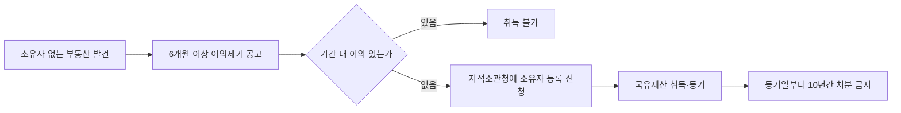
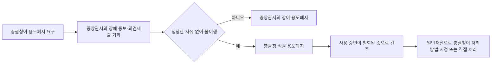
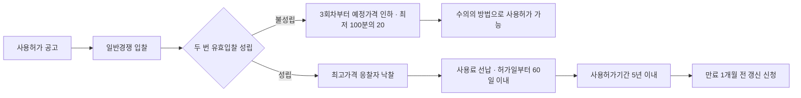
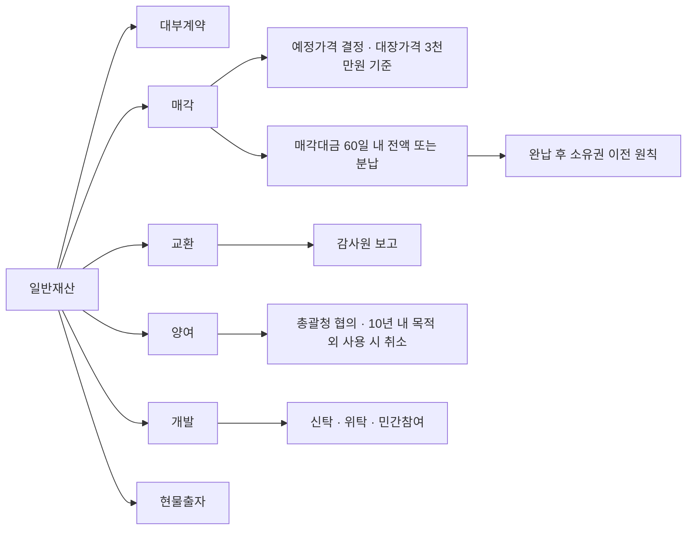
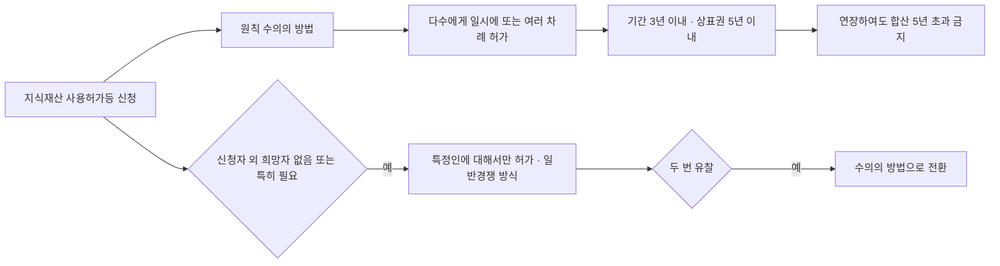
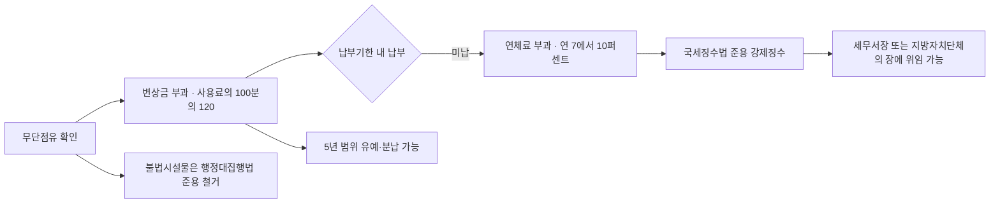

# 단원 PART06 — 국유재산법

> **법령 전체명**: 국유재산법
> **출처 자료**: 감관법2 (스터디파이터)
> **수업 주제**: 총괄청·행정재산·일반재산·대부·매각·교환·양여·개발

## 🗺️ 본문 목차

- [📗 관별 정리 (조문 기반)](#관별정리)
- [📖 핵심요약서 (L1 - 메인 단권화)](#핵심요약서)
- [📚 기본서 (L2 - 본격 학습)](#기본서)
- [✏️ 워크북 (논점별 문제)](#워크북)

---

## 📗 관별 정리 — 조문 기반 (관별 상세)

> 📌 법제처 정본 조문을 대조해 관(關)별로 저술한 상세 교재다. 아래 핵심요약서·기본서·워크북은 학원 교재 원문이다.

### [국유재산법] Chapter 01 총칙

> 📖 국유재산법 제1장(제1조~제20조)이다. **무엇이 국유재산인가**(범위), **어떻게 나누는가**(행정재산 vs 일반재산), **누가 관리하는가**(총괄청 vs 중앙관서의 장), **어떻게 취득하는가**(기부채납·소유자 없는 부동산·관리전환)를 정한다.
> 이 관은 뒤의 제3장(행정재산)·제4장(일반재산)을 읽기 위한 **정의 사전**이다. 여기서 정의된 「사용허가」·「대부계약」·「변상금」·「총괄청」이 법 전체를 관통한다.

> ⭐ **이 관에서 반드시 챙길 3가지**
> ① **행정재산 vs 일반재산** — 행정재산은 ==시효취득 대상이 아니고== 원칙적으로 처분 불가, 일반재산은 시효취득 대상이 되고 대부·처분 가능. 이 대비가 이 법 전체의 축이다.
> ② **정의규정 3개** — 「사용허가」는 ==행정재산==, 「대부계약」은 ==일반재산==, 「총괄청」은 ==재정경제부장관==. 이 셋을 바꿔치기하는 것이 최다 함정이다.
> ③ **취득 3종 세트의 숫자** — 소유자 없는 부동산 ==6개월== 공고·==10년== 처분금지, 등기 ==60일== 이내, 종합계획 ==4월 30일 / 6월 30일 / 120일 전==.

#### 1. 개념·정의

법 제2조는 11개 용어를 정의한다. 시험은 이 정의를 **그대로** 묻거나 **주체 하나를 바꿔** 묻는다.

| 용어 | 정의 (법 제2조) | 시험 포인트 |
|---|---|---|
| 국유재산 | 국가의 부담, 기부채납이나 법령 또는 조약에 따라 국가 소유로 된 제5조제1항 각 호의 재산 | 「국가의 부담」 포함 |
| 기부채납 | 국가 외의 자가 재산의 소유권을 ==무상==으로 국가에 이전하여 국가가 이를 취득하는 것 | 「무상양도」와 바꿔치기 |
| 관리 | 국유재산의 취득ㆍ운용과 유지ㆍ보존을 위한 모든 행위 | 처분과 구별 |
| 처분 | ==매각, 교환, 양여, 신탁, 현물출자== 등의 방법으로 소유권이 국가 외의 자에게 이전되는 것 | 대부는 처분이 아니다 |
| 관리전환 | 일반회계와 특별회계ㆍ기금 간 또는 서로 다른 특별회계ㆍ기금 간에 국유재산의 ==관리권==을 넘기는 것 | 소유권 이전 아님 |
| 사용허가 | ==행정재산==을 국가 외의 자가 일정 기간 유상이나 무상으로 사용ㆍ수익할 수 있도록 허용하는 것 | 일반재산 아님 |
| 대부계약 | ==일반재산==을 국가 외의 자가 일정 기간 유상이나 무상으로 사용ㆍ수익할 수 있도록 체결하는 계약 | 행정재산 아님 |
| 변상금 | 사용허가나 대부계약 없이 국유재산을 사용ㆍ수익하거나 점유한 자(=무단점유자)에게 부과하는 금액 | 「부담금」 아님 |
| 총괄청 | ==재정경제부장관== | 국토교통부장관 아님 |
| 중앙관서의 장등 | 「국가재정법」 제6조에 따른 중앙관서의 장 + 제42조제1항에 따라 일반재산의 관리ㆍ처분 사무를 위임ㆍ위탁받은 자 | 「등」의 유무를 본다 |

> ⚠️ **개정 반영** — 정본(시행 2026.8.20.)은 총괄청을 ==재정경제부장관==으로 규정한다. 학원 교재와 2024년 기출 정답은 「기획재정부장관」으로 되어 있는데, 이는 정부조직 개편 전 표기다. **현행 조문 기준으로는 재정경제부장관**이며, 시험에서 「국토교통부장관」·「중앙관서의 장」으로 바꾼 선지는 어느 시점 기준이든 틀린다.

#### 2. 요건·절차

| 구분 | 내용 | 근거 |
|---|---|---|
| 관리ㆍ처분의 기본원칙 | ① 국가전체의 이익에 부합 ② 취득과 처분이 균형 ③ 공공가치와 활용가치 고려 ③의2 ==경제적 비용 고려== ④ 투명하고 효율적인 절차 | 법 제3조 |
| 다른 법률과의 관계 | 다른 법률에 특별한 규정이 있으면 그에 따르되, **다른 법률이 제2장(총괄청)에 저촉되면 이 법에 따른다** | 법 제4조 |
| 국유재산의 범위 | ① 부동산과 그 종물 ② 선박ㆍ부표ㆍ부잔교ㆍ부선거 및 항공기와 그 종물 ③ 정부기업ㆍ정부시설의 기계와 기구 중 대통령령으로 정하는 것(==궤도차량==) ④ 지상권ㆍ지역권ㆍ전세권ㆍ광업권 등 ⑤ 증권 ⑥ 지식재산 | 법 제5조, 영 제3조 |
| 구분 | 용도에 따라 ==행정재산==과 ==일반재산==으로 구분 | 법 제6조① |
| 행정재산의 종류 | 공용재산 / 공공용재산 / 기업용재산 / 보존용재산 | 법 제6조② |
| 사용ㆍ보존 여부 결정 | ==총괄청==이 중앙관서의 장의 의견을 들어 결정 | 영 제4조⑤ |
| 사권 설정 제한 | 사권이 설정된 재산은 사권 소멸 후가 아니면 취득 못함(단 ==판결==에 따른 취득은 예외) / 국유재산에 사권 설정 금지(단 ==일반재산==에 대통령령으로 정하는 경우 예외) | 법 제11조 |
| 소유자 없는 부동산 | ==6개월 이상==의 기간을 정해 공고 → 이의 없으면 지적소관청에 소유자 등록 신청 → 등기일부터 ==10년간 처분 금지== | 법 제12조 |
| 기부채납 거부 | 관리 곤란·불필요·조건부 기부는 받아서는 아니 됨. 다만 ==무상사용허가 조건==, ==대체시설 기부 대 양여 조건==은 조건부로 보지 않음 | 법 제13조② |
| 영구시설물 축조 | 국가 외의 자는 원칙 금지. 6가지 예외(==기부 조건== 포함) | 법 제18조① |

**⭐ 행정재산 vs 일반재산 — 이 법의 축**

| 비교항목 | 행정재산 | 일반재산 | 근거 |
|---|---|---|---|
| 정의 | 공용ㆍ공공용ㆍ기업용ㆍ보존용재산 | ==행정재산 외의 모든 국유재산== | 법 제6조 |
| 처분 | ==처분하지 못한다==(교환ㆍ지방자치단체 양여만 예외) | ==대부 또는 처분할 수 있다== | 법 제27조①, 제41조① |
| 시효취득 | ==대상이 되지 아니한다== | ==대상이 된다== | 법 제7조② |
| 사권 설정 | ==불가== | 다른 법률ㆍ확정판결 등 대통령령으로 정하는 경우 ==가능== | 법 제11조② |
| 사용ㆍ수익 허용 방식 | ==사용허가==(행정처분) | ==대부계약==(계약) | 법 제2조7호·8호 |
| 대가의 명칭 | ==사용료== | ==대부료== | 법 제32조, 제47조 |
| 기간 | ==5년 이내== | 조림 20년 / 보수건물 10년 / 그 밖 토지 5년 / 그 밖 1년 | 법 제35조①, 제46조① |
| 관리ㆍ처분 주체 | 중앙관서의 장 | 중앙관서의 장등(위임ㆍ위탁 광범위) | 법 제30조, 제42조 |
| 무단 사용 벌칙 | ==2년 이하 징역 또는 2천만원 이하 벌금== | ==벌칙 없음==(변상금만) | 법 제82조 |
| 변상금 | 사용료의 100분의 120 | 대부료의 100분의 120 | 법 제72조① |

> 📌 여기서 「행정재산의 종류」 4가지는 매년 나온다. **공용재산 = 국가가 직접 사무용ㆍ사업용ㆍ주거용**, **공공용재산 = 국가가 직접 공공용**, **기업용재산 = 정부기업이 직접**, **보존용재산 = 법령이나 그 밖의 필요에 따라 국가가 보존**. 「국가가 직접 사무용으로 사용 = 공공용재산」이라 하면 틀린다.

#### 3. 핵심 조문

> 📌 **국유재산법 제6조(국유재산의 구분과 종류)** — "① 국유재산은 그 용도에 따라 행정재산과 일반재산으로 구분한다. ② 행정재산의 종류는 다음 각 호와 같다. 1. 공용재산: 국가가 직접 사무용ㆍ사업용 또는 공무원의 주거용(직무 수행을 위하여 필요한 경우로서 대통령령으로 정하는 경우로 한정한다)으로 사용하거나 대통령령으로 정하는 기한까지 사용하기로 결정한 재산 … 4. 보존용재산: 법령이나 그 밖의 필요에 따라 국가가 보존하는 재산 ③ "일반재산"이란 행정재산 외의 모든 국유재산을 말한다."

「대통령령으로 정하는 기한」은 영 제4조제1항이 ==행정재산으로 사용하기로 결정한 날부터 5년이 되는 날==로 정한다.

> 📌 **국유재산법 제7조(국유재산의 보호)** — "① 누구든지 이 법 또는 다른 법률에서 정하는 절차와 방법에 따르지 아니하고는 국유재산을 사용하거나 수익하지 못한다. ② 행정재산은 「민법」 제245조에도 불구하고 시효취득(時效取得)의 대상이 되지 아니한다."

제2항이 **행정재산**만 규정한다는 점이 결정적이다. 일반재산은 시효취득의 대상이 **된다**.

> 📌 **국유재산법 제11조(사권 설정의 제한)** — "① 사권(私權)이 설정된 재산은 그 사권이 소멸된 후가 아니면 국유재산으로 취득하지 못한다. 다만, 판결에 따라 취득하는 경우에는 그러하지 아니하다. ② 국유재산에는 사권을 설정하지 못한다. 다만, 일반재산에 대하여 대통령령으로 정하는 경우에는 그러하지 아니하다."

영 제6조는 그 「대통령령으로 정하는 경우」를 ① 다른 법률 또는 ==확정판결(재판상 화해 등 확정판결과 같은 효력을 갖는 것을 포함)==에 따라 일반재산에 사권을 설정하는 경우 ② 일반재산의 사용ㆍ이용에 지장이 없고 활용가치를 높일 수 있는 경우로서 중앙관서의 장등이 필요하다고 인정하는 경우로 정한다.

> 📌 **국유재산법 제12조(소유자 없는 부동산의 처리) 제2항ㆍ제4항** — "② 총괄청이나 중앙관서의 장은 … 소유자 없는 부동산을 국유재산으로 취득할 경우에는 대통령령으로 정하는 바에 따라 6개월 이상의 기간을 정하여 그 기간에 정당한 권리자나 그 밖의 이해관계인이 이의를 제기할 수 있다는 뜻을 공고하여야 한다. … ④ 제1항부터 제3항까지의 규정에 따라 취득한 국유재산은 그 등기일부터 10년간은 처분을 하여서는 아니 된다. 다만, 대통령령으로 정하는 특별한 사유가 있으면 그러하지 아니하다."

> 📌 **국유재산법 제17조(유상 관리전환 등)** — "국유재산을 관리전환하거나 서로 다른 회계ㆍ기금 간에 그 사용을 하도록 하는 경우에는 유상으로 하여야 한다. 다만, 다음 각 호의 어느 하나에 해당하는 경우에는 무상으로 할 수 있다. 1. 직접 도로, 하천, 항만, 공항, 철도, 공유수면, 그 밖의 공공용으로 사용하기 위하여 필요한 경우 …"

원칙 ==유상==, 공공용 사용 등은 ==무상 가능==. 「공공용으로 사용하기 위한 관리전환은 유상으로 하여야 한다」는 선지는 틀린다.

> 📌 **국유재산법 제18조(영구시설물의 축조 금지) 제1항** — "국가 외의 자는 국유재산에 건물, 교량 등 구조물과 그 밖의 영구시설물을 축조하지 못한다. 다만, 다음 각 호의 어느 하나에 해당하는 경우에는 그러하지 아니하다. 1. 기부를 조건으로 축조하는 경우 2. 다른 법률에 따라 국가에 소유권이 귀속되는 공공시설을 축조하는 경우 … 4. 제59조의2에 따라 개발하는 경우 …"

> 📌 **국유재산법 제20조(직원의 행위 제한)** — "① 국유재산에 관한 사무에 종사하는 직원은 그 처리하는 국유재산을 취득하거나 자기의 소유재산과 교환하지 못한다. 다만, 해당 총괄청이나 중앙관서의 장의 허가를 받은 경우에는 그러하지 아니하다. ② 제1항을 위반한 행위는 무효로 한다."

「허가를 받아도 취득할 수 없다」는 선지는 틀린다. 단서가 있다.

#### 4. ⏱ 기간·수치 총정리

| 항목 | 기간·수치 | 근거 조문 |
|---|---|---|
| 행정재산으로 「사용하기로 결정한 기한」 | 사용 결정일부터 ==5년==이 되는 날 | 영 제4조① |
| 종합계획 작성지침 통보(총괄청→중앙관서의 장) | 매년 ==4월 30일==까지 | 법 제9조① |
| 다음 연도 계획 제출(중앙관서의 장→총괄청) | 매년 ==6월 30일==까지 | 법 제9조② |
| 국유재산종합계획 국회 제출 | 회계연도 개시 ==120일 전==까지 | 법 제9조③ |
| 반기별 집행계획 제출 | 해당 연도 ==1월 31일==까지 | 법 제9조⑦ |
| 소유자 없는 부동산 이의제기 공고기간 | ==6개월 이상== | 법 제12조② |
| 위 공고의 지방조달청 홈페이지 게재 | ==14일 이상== | 영 제7조② |
| 소유자 없는 부동산 취득 후 처분금지 | 등기일부터 ==10년== | 법 제12조④ |
| 취득 후 등기ㆍ등록 등 권리보전 조치 | 소관에 속하게 된 날부터 ==60일 이내== | 영 제9조① |
| 행정재산 무단 사용ㆍ수익 벌칙 | ==2년 이하의 징역 또는 2천만원 이하의 벌금== | 법 제82조 |
| 영구시설물 축조 시 이행보증금 예치 시점 | ==착공 전까지== | 영 제13조③ |
| 관리전환 협의 불성립 시 | 총괄청이 소관 중앙관서의 장을 ==결정== | 법 제16조② |

#### 5. 👤 권한 주체 구분

| 행위 | 주체 | 근거 |
|---|---|---|
| 국유재산 사무의 총괄 | ==총괄청==(재정경제부장관) | 법 제8조① |
| 일반재산을 보존용재산으로 전환하여 관리 | ==총괄청== | 법 제8조② |
| 특별회계ㆍ기금에 속하는 국유재산의 관리ㆍ처분 | ==중앙관서의 장== | 법 제8조③ |
| 그 밖의 국유재산을 행정재산으로 사용하려는 경우 | 중앙관서의 장이 ==총괄청의 승인== | 법 제8조④ |
| 행정재산의 사용 승인 철회 | 총괄청(==국유재산정책심의위원회 심의== 거쳐) | 법 제8조의2① |
| 행정재산의 사용ㆍ보존 여부 결정 | ==총괄청==(중앙관서의 장 의견 청취) | 영 제4조⑤ |
| 소유자 없는 부동산의 취득 | ==총괄청이나 중앙관서의 장== | 법 제12조① |
| 기부채납의 수령 | 총괄청이나 중앙관서의 장(특별회계ㆍ기금 소속으로 받는 경우만) | 법 제13조① |
| 국유재산 관련 법령 제ㆍ개정 시 협의 상대 | ==총괄청 및 감사원== | 법 제19조 |
| 직원의 국유재산 취득 허가 | 해당 총괄청이나 중앙관서의 장 | 법 제20조① 단서 |

#### ⭐ 기출 출제포인트

1. **정의규정 빈칸형** — 「기부채납 / 변상금 / 총괄청」 세 칸을 뚫고 「무상양도·부담금·중앙관서의 장」을 오답으로 섞는다(2024년 20번 그대로).
2. **기본원칙 열거형** — 「수익과 손실이 균형」·「보존가치와 활용가치」·「지방자치단체의 이익에 부합」 같은 **비슷하지만 조문에 없는 문구**를 오답으로 낸다(2018년 23번).
3. **행정재산 4종의 분류** — 대통령 관저·국무총리 공관이 공용재산인지, 비상근무자용 구내 주거시설이 기업용재산인지를 묻는다(2018년 20번).
4. **시효취득·사권설정** — 「행정재산은 시효취득 대상이 된다」, 「판결에 따라 취득하는 경우에도 사권 소멸 전에는 취득 못한다」가 단골 오답(2020년 23번, 2022년 20번).
5. **숫자 바꿔치기** — 지침 통보 4월 30일 → 6월 30일, 처분금지 10년 → 20년(2020년 23번, 2023년 22번).

#### 📊 기출 분석

| 연도 | 출제 형태 | 핵심 논점 |
|---|---|---|
| 2018 20번 | 옳지 않은 것 | 행정재산의 종류, 보존용재산 결정 주체(총괄청) |
| 2018 23번 | 명시된 것 고르기 | 관리ㆍ처분의 기본원칙 5개 |
| 2019 20번 | 옳지 않은 것 | 사권설정 제한 단서, 국유재산의 범위, 지침 통보 4월 30일 |
| 2020 23번 | 옳은 것 | 시효취득, 판결 취득, 보존용재산 전환, 무상 관리전환, 10년 처분금지 |
| 2021 20번 | 옳지 않은 것 | 국유재산책임관, 확정판결 사권설정, 기부채납 거부사유, 영구시설물 |
| 2022 20번 | 옳은 것 | 공용재산의 정의, 보존용재산 전환, 사권설정, 시효취득 |
| 2023 21번 | 옳지 않은 것 | 궤도차량의 포괄적 용도폐지, 등기 명의(國+중앙관서 명칭) |
| 2023 22번 | 옳지 않은 것(혼합) | 사권설정, 직원의 행위 제한, 영구시설물, 지침 통보일, 증권 보관기관 |
| 2024 20번 | 정의 빈칸 | 기부채납·변상금·총괄청 |

**출제 빈도** — 매년 1문항 이상. 총칙은 **9년 중 9년 모두** 직접 또는 간접 출제됐다. 법규 과목 전체에서 가장 회수율이 높은 관 중 하나다.
**반복되는 함정** — ① 총괄청을 국토교통부장관으로 바꾸기 ② 행정재산/일반재산의 시효취득을 뒤집기 ③ 「~할 수 있다」를 「~할 수 없다」로 뒤집기(보존용재산 전환, 영구시설물 기부 조건 축조) ④ 4월 30일 ↔ 6월 30일.
**최근 경향** — 2023년 이후 **시행령 단서까지** 파고든다. 사권설정의 「확정판결·재판상 화해」, 증권 보관법인(은행·한국예탁결제원)처럼 위임된 세부까지 물어본다.

#### 🔍 기출 선지로 배우는 조문

> 실제 출제된 선지를 놓고 O/X와 근거 조문을 확인한다.

**①** (2018년 23번) "투명하고 효율적인 절차를 따를 것" — **O** / 근거: 국유재산법 제3조제4호. 반면 「수익과 손실이 균형을 이룰 것」은 조문에 없다(옳게는 ==취득과 처분==이 균형을 이룰 것).

**②** (2018년 20번) "국가가 보존할 필요가 있다고 국토교통부장관이 결정한 재산은 보존용재산이다" — **X** / 어디가 틀렸나: 결정 주체 / 옳게 고치면: 국가가 보존할 필요가 있다고 ==총괄청==이 결정한 재산이다(영 제4조④).

**③** (2019년 20번) "사권이 설정된 재산을 판결에 따라 취득하는 경우 그 사권이 소멸된 후가 아니면 국유재산으로 취득하지 못한다" — **X** / 어디가 틀렸나: 판결 취득은 단서상 **예외** / 옳게 고치면: ==판결에 따라 취득하는 경우에는 사권이 소멸되기 전에도 취득할 수 있다==(법 제11조제1항 단서).

**④** (2020년 23번) "행정재산은 「민법」에 따른 시효취득의 대상이 된다" — **X** / 어디가 틀렸나: 행정재산은 대상이 아니다 / 옳게 고치면: ==행정재산은 시효취득의 대상이 되지 아니한다==(법 제7조제2항). 일반재산은 대상이 된다.

**⑤** (2020년 23번) "중앙관서의 장이 국유재산으로 취득한 소유자 없는 부동산은 등기일부터 20년간은 처분할 수 없다" — **X** / 어디가 틀렸나: 기간 / 옳게 고치면: ==10년==(법 제12조제4항).

**⑥** (2021년 20번·2023년 22번) "국가 외의 자는 기부를 조건으로 하더라도 국유재산에 영구시설물을 축조할 수 없다" — **X** / 어디가 틀렸나: 제18조제1항 제1호가 정면 예외 / 옳게 고치면: ==기부를 조건으로 축조하는 경우에는 축조할 수 있다==.

**⑦** (2022년 20번) "국가가 직접 사무용ㆍ사업용으로 사용하는 재산은 공공용재산이다" — **X** / 어디가 틀렸나: 종류 / 옳게 고치면: ==공용재산==이다(법 제6조제2항제1호). 공공용재산은 국가가 직접 ==공공용==으로 사용하는 재산이다.

**⑧** (2023년 21번) "등기가 필요한 국유재산이 부동산인 경우 그 권리자의 명의는 국(國)으로 하되 소관 중앙관서의 명칭을 함께 적어야 한다" — **O** / 근거: 법 제14조제2항.

**⑨** (2023년 22번) "총괄청은 다음 연도의 국유재산의 관리ㆍ처분에 관한 계획의 작성을 위한 지침을 매년 6월 30일까지 중앙관서의 장에게 통보하여야 한다" — **X** / 어디가 틀렸나: 날짜 / 옳게 고치면: ==4월 30일==까지(법 제9조제1항). 6월 30일은 반대로 **중앙관서의 장이 총괄청에 계획을 제출**하는 날이다.

#### ⚠️ 이 관의 함정 총정리

1. 「총괄청이란 국토교통부장관을 말한다」라고 하면 틀림 → ==재정경제부장관==(정부조직 개편 전 표기로는 기획재정부장관).
2. 「행정재산은 시효취득의 대상이 된다」·「일반재산은 시효취득의 대상이 되지 아니한다」라고 하면 둘 다 틀림 → ==행정재산만 시효취득 대상에서 제외==된다.
3. 「국유재산에는 어떠한 경우에도 사권을 설정하지 못한다」라고 하면 틀림 → ==일반재산==에 대해 다른 법률·확정판결 등 대통령령으로 정하는 경우 설정할 수 있다.
4. 「직원은 총괄청의 허가를 받더라도 그 처리하는 국유재산을 취득할 수 없다」라고 하면 틀림 → ==허가를 받으면 취득할 수 있다==(법 제20조제1항 단서). 다만 허가 없이 한 행위는 ==무효==.
5. 「공공용으로 사용하기 위한 관리전환도 유상으로 하여야 한다」라고 하면 틀림 → 도로·하천·항만·공항·철도·공유수면 등 ==직접 공공용 사용은 무상 가능==(법 제17조 단서 제1호).
6. 「소유자 없는 부동산은 3개월 이상 공고한다」라고 하면 틀림 → ==6개월 이상==(법 제12조제2항).

#### ✅ OX 확인문제

> 다음 진술의 참·거짓을 판단하시오.

**1.** 국유재산은 그 용도에 따라 행정재산과 일반재산으로 구분하며, 일반재산이란 행정재산 외의 모든 국유재산을 말한다.
→ **O**. 법 제6조 제1항·제3항 그대로다.

**2.** 「처분」이란 매각·교환·양여·신탁·현물출자 등의 방법으로 국유재산의 소유권이 국가 외의 자에게 이전되는 것을 말하며, 대부도 이에 포함된다.
→ **X**. 대부는 소유권 이전이 아니라 사용·수익을 허용하는 계약이므로 처분이 아니다(법 제2조 제4호·제8호).

**3.** 행정재산으로 사용하기로 결정한 날부터 5년이 되는 날까지 사용하기로 결정한 재산도 공용재산에 해당할 수 있다.
→ **O**. 법 제6조 제2항 제1호의 「대통령령으로 정하는 기한」이 영 제4조 제1항의 5년이다.

**4.** 행정재산의 사용 또는 보존 여부는 중앙관서의 장이 총괄청의 의견을 들어 결정한다.
→ **X**. 주체가 뒤바뀌었다. **총괄청**이 중앙관서의 장의 의견을 들어 결정한다(영 제4조 제5항).

**5.** 사권이 설정된 재산은 그 사권이 소멸된 후가 아니면 국유재산으로 취득하지 못하나, 판결에 따라 취득하는 경우에는 그러하지 아니하다.
→ **O**. 법 제11조 제1항 본문과 단서다.

**6.** 총괄청은 일반재산을 보존용재산으로 전환하여 관리할 수 없다.
→ **X**. **할 수 있다**(법 제8조 제2항). 「없다」로 뒤집는 선지가 2018·2021·2022·2023·2025년 반복 출제됐다.

**7.** 총괄청이나 중앙관서의 장은 국유재산을 취득한 후 그 소관에 속하게 된 날부터 60일 이내에 등기·등록 등 권리보전에 필요한 조치를 하여야 한다.
→ **O**. 영 제9조 제1항.

**8.** 국유재산종합계획은 국무회의의 심의를 거쳐 대통령의 승인을 받아 확정하고, 회계연도 개시 90일 전까지 국회에 제출하여야 한다.
→ **X**. **120일 전**까지다(법 제9조 제3항).

**9.** 중앙관서의 장은 국유재산의 관리·처분에 관련된 법령을 제정·개정하거나 폐지하려면 그 내용에 관하여 총괄청 및 감사원과 협의하여야 한다.
→ **O**. 법 제19조. 협의 상대가 **감사원까지 포함**된다는 점이 함정 지점이다.

**10.** 정부기업에서 사용하는 궤도차량으로서 그 기업의 폐지와 함께 포괄적으로 용도폐지된 것은 기업이 폐지된 후에는 국유재산이 아니다.
→ **X**. 법 제5조 제2항은 **기업이나 시설이 폐지된 후에도 국유재산으로 한다**고 정한다.

#### 🧠 암기법

> 🔑 **기본원칙 「국·취·공·경·투」** — **국**가전체 이익 / **취**득과 처분의 균형 / **공**공가치와 활용가치 / **경**제적 비용 / **투**명하고 효율적인 절차.

> 🔑 **행정재산 4종 「공·공·기·보」** — **공**용(국가가 직접 사무·사업·주거) / **공**공용(국가가 직접 공공용) / **기**업용(정부기업이 직접) / **보**존용(법령·필요에 따라 보존). 앞의 두 개는 「국가가 직접」, 세 번째는 「정부기업이 직접」이 구별선이다.

> 🔑 **종합계획 달력 「4·6·120·1」** — **4**월 30일 지침 내려오고 → **6**월 30일 계획 올라가고 → 회계연도 개시 **120**일 전 국회로 가고 → 이듬해 **1**월 31일 집행계획 제출.

> 🔑 **소유자 없는 부동산 「6-14-10」** — **6**개월 이상 공고, 홈페이지 **14**일 이상 게재, 등기일부터 **10**년 처분금지.

---

### [국유재산법] Chapter 02 총괄청

> 📖 국유재산법 제2장(제21조~제26조) 및 제2장의2(제26조의2~제26조의7)이다. 총괄청이 중앙관서의 장에 대해 갖는 **감독 권한**(보고 요구·감사·용도폐지 요구·직권 용도폐지·소관 지정)과, 심의기구인 **국유재산정책심의위원회**, 재원인 **국유재산관리기금**을 정한다.
> 법 제4조 단서상 **다른 법률이 제2장에 저촉되면 이 법이 우선**하므로, 이 관의 권한은 국유재산 관리체계의 최상위 규정이다.

> ⭐ **이 관에서 반드시 챙길 3가지**
> ① **총괄청의 권한 목록** — 보고·자료제출 요구, 감사, 용도폐지 요구와 ==직권 용도폐지==, 소관 중앙관서의 장 지정, 총괄사무 위임·위탁. **국유재산책임관 임명은 중앙관서의 장의 권한**이라는 점이 반복 출제된다.
> ② **위원회의 숫자** — 위원장 포함 ==20명 이내==, 위원장은 ==재정경제부장관==, 공무원 아닌 위원이 ==과반수==, 민간위원 임기 ==2년·1회 연임==.
> ③ **국유재산관리기금의 재원** — 총괄청 소관 일반재산 관련 수입금이되 ==증권은 제외==. 이 「증권 제외」가 2026년 그대로 출제됐다.

#### 1. 개념·정의

| 용어 | 내용 | 근거 |
|---|---|---|
| 유휴 행정재산 | 법 제5조제1항제1호(부동산과 그 종물)에 해당하는 행정재산으로서 법 제6조제2항 각 호의 행정재산으로 ==사용되지 아니하거나 사용할 필요가 없게 된 재산== | 영 제14조① |
| 직권 용도폐지 | 중앙관서의 장이 정당한 사유 없이 용도폐지 요구를 이행하지 않을 때 총괄청이 스스로 하는 용도폐지. 이 경우 ==행정재산의 사용 승인이 철회된 것으로 본다== | 법 제22조③④ |
| 국유재산정책심의위원회 | 국유재산의 관리ㆍ처분에 관한 중요사항을 심의하기 위하여 ==총괄청에== 두는 위원회 | 법 제26조① |
| 국유재산관리기금 | 국유재산의 원활한 수급과 개발 등을 통한 효용 제고를 위해 설치하는 기금. ==총괄청==이 관리ㆍ운용 | 법 제26조의2, 제26조의6① |

#### 2. 요건·절차

| 구분 | 내용 | 근거 |
|---|---|---|
| 보고·자료제출 요구 | 총괄청 → 중앙관서의 장등에게 관리상황 보고·자료 제출을 하게 **할 수 있다** | 법 제21조① |
| 유휴 행정재산 보고 | 중앙관서의 장 → 총괄청, 매년 ==1월 31일==까지 **하여야 한다** | 법 제21조② |
| 감사 | 총괄청은 재산 관리상황과 유휴 행정재산 현황을 감사하거나 필요한 조치를 **할 수 있다**(==조달청의 지원==을 받아) | 법 제21조③, 영 제15조① |
| 시정요구 후속 | 조치를 요구받은 중앙관서의 장등은 이행결과를 ==총괄청과 감사원==에 통보 | 영 제15조③ |
| 용도폐지 요구 | 총괄청 → 중앙관서의 장에게 용도폐지·변경 요구, 관리전환·인계 요구 가능. 사전에 ==의견 제출 기회== 부여 | 법 제22조①② |
| 용도폐지된 재산의 처리 | 총괄청은 처리방법을 지정하거나 ==인계받아 직접 처리할 수 있다== | 법 제23조 |
| 소관 중앙관서의 장 지정 | 소관이 없거나 분명하지 않은 국유재산에 대해 총괄청이 **지정한다** | 법 제24조 |
| 총괄사무 위임·위탁 | ==조달청장 또는 지방자치단체의 장==에게 위임 / ==정부출자기업체·특별법 법인==에 위탁 | 법 제25조 |
| 위원회 구성 | 위원장 포함 ==20명 이내==, 공무원 아닌 위원이 ==전체 위원 정수의 과반수== | 법 제26조②③ |
| 분과위원회 | ==부동산분과위원회 · 증권분과위원회 · 기부 대 양여 분과위원회== 3개. 분과위 심의는 ==위원회의 심의로 본다== | 법 제26조④, 영 제18조① |
| 기금 차입 | 위원회 심의를 거쳐 차입 가능. ==일시차입금은 해당 회계연도 내에 상환== | 법 제26조의4 |
| 기금 취득재산의 소속 | 국유재산관리기금에서 취득한 재산은 ==일반회계== 소속 | 법 제26조의5② |

**⭐ 총괄청 vs 중앙관서의 장 — 권한 대비**

| 사항 | 총괄청 | 중앙관서의 장 | 근거 |
|---|---|---|---|
| 국유재산 사무 | ==총괄== 및 소관 재산 관리ㆍ처분 | 특별회계ㆍ기금 소속 재산 관리ㆍ처분 | 법 제8조①③ |
| 행정재산 사용승인 | ==승인권자== | 승인 ==신청자== | 법 제8조④ |
| 사용승인 철회 | ==철회권자==(위원회 심의) | 철회 시 ==지체 없이 인계== | 법 제8조의2 |
| 종합계획 | 지침 통보(4월 30일)ㆍ계획 확정ㆍ국회 제출 | 계획 작성ㆍ제출(6월 30일)ㆍ집행계획(1월 31일) | 법 제9조 |
| 유휴 행정재산 | ==보고 수령ㆍ감사== | ==보고 의무==(1월 31일) | 법 제21조②③ |
| 용도폐지 | ==요구ㆍ직권 용도폐지== | ==용도폐지 실행ㆍ총괄청 인계== | 법 제22조, 제40조 |
| 소관 지정 | ==지정권자== | — | 법 제24조 |
| 국유재산책임관 | — | ==임명권자== | 법 제27조의2 |
| 사용허가ㆍ취소ㆍ철회ㆍ청문 | — | ==권한자== | 법 제30조·제36조·제37조 |
| 국유재산관리기금 | ==관리ㆍ운용ㆍ차입== | — | 법 제26조의4·제26조의6 |
| 관리운용보고서 | ==총보고서 작성ㆍ감사원ㆍ국회 제출== | ==개별 보고서 작성ㆍ제출== | 법 제69조 |

#### 3. 핵심 조문

> 📌 **국유재산법 제21조(총괄청의 감사 등)** — "① 총괄청은 중앙관서의 장등에 해당 국유재산의 관리상황에 관하여 보고하게 하거나 자료를 제출하게 할 수 있다. ② 중앙관서의 장은 소관 행정재산 중 대통령령으로 정하는 유휴 행정재산 현황을 매년 1월 31일까지 총괄청에 보고하여야 한다. ③ 총괄청은 중앙관서의 장등의 재산 관리상황과 유휴 행정재산 현황을 감사(監査)하거나 그 밖에 필요한 조치를 할 수 있다."

제1항·제3항은 「==할 수 있다==」(재량), 제2항은 「==하여야 한다==」(의무)다. 의무/재량을 바꾸는 것이 이 관 최대 함정이다.

> 📌 **국유재산법 제22조(총괄청의 용도폐지 요구 등)** — "① 총괄청은 중앙관서의 장에게 그 소관에 속하는 국유재산의 용도를 폐지하거나 변경할 것을 요구할 수 있으며 그 국유재산을 관리전환하게 하거나 총괄청에 인계하게 할 수 있다. … ③ 총괄청은 중앙관서의 장이 정당한 사유 없이 제1항에 따른 용도폐지 등을 이행하지 아니하는 경우에는 직권으로 용도폐지 등을 할 수 있다. ④ 제3항에 따라 직권으로 용도폐지된 재산은 제8조의2에 따라 행정재산의 사용 승인이 철회된 것으로 본다."

> 📌 **국유재산법 제23조(용도폐지된 재산의 처리)** — "총괄청은 용도를 폐지함으로써 일반재산으로 된 국유재산에 대하여 필요하다고 인정하는 경우에는 그 처리방법을 지정하거나 이를 인계받아 직접 처리할 수 있다."

「처리방법을 지정해야 하며 직접 처리해서는 안 된다」는 선지는 틀린다. ==둘 다 가능==하다.

> 📌 **국유재산법 제25조(총괄사무의 위임 및 위탁)** — "총괄청은 대통령령으로 정하는 바에 따라 이 법에서 규정하는 총괄에 관한 사무의 일부를 조달청장 또는 지방자치단체의 장에게 위임하거나 정부출자기업체 또는 특별법에 따라 설립된 법인으로서 대통령령으로 정하는 자에게 위탁할 수 있다."

영 제16조는 조달청장에게 ==국유재산 현황 조사·관리실태 확인점검·소관 중앙관서의 장 지정·은닉재산등의 사실조사와 국가 환수·비축용 토지 취득== 등을 위임하고, ==한국자산관리공사==에 항공조사·총괄청 소관 일반재산의 도시군관리계획 협의 등을 위탁한다.

> 📌 **국유재산법 제26조(국유재산정책심의위원회) 제2항ㆍ제3항** — "② 위원회는 위원장을 포함한 20명 이내의 위원으로 구성한다. ③ 위원회의 위원장은 재정경제부장관이 되고, 위원은 관계 중앙행정기관의 소속 공무원과 국유재산 분야에 학식과 경험이 풍부한 사람 중에서 재정경제부장관이 임명 또는 위촉한다. 이 경우 공무원이 아닌 위원의 정수는 전체 위원 정수의 과반수가 되어야 한다."

> 📌 **국유재산법 제26조의3(국유재산관리기금의 조성)** — "국유재산관리기금은 다음 각 호의 재원으로 조성한다. 1. 정부의 출연금 또는 출연재산 2. 다른 회계 또는 다른 기금으로부터의 전입금 3. 제26조의4에 따른 차입금 4. 다음 각 목의 어느 하나에 해당하는 총괄청 소관 일반재산(증권은 제외한다)과 관련된 수입금 가. 대부료, 변상금 등 재산관리에 따른 수입금 나. 매각, 교환 등 처분에 따른 수입금 5. 총괄청 소관 일반재산에 대한 제57조의 개발에 따른 관리ㆍ처분 수입금 …"

**제4호의 괄호 「(증권은 제외한다)」가 2026년 23번의 정답 포인트**였다. 「일반재산(증권 포함)의 매각에 따른 수입금」은 재원이 아니다.

> 📌 **국유재산법 제26조의4(자금의 차입)** — "① 총괄청은 국유재산관리기금의 관리ㆍ운용을 위하여 필요한 경우에는 위원회의 심의를 거쳐 국유재산관리기금의 부담으로 금융회사 등이나 다른 회계 또는 다른 기금으로부터 자금을 차입할 수 있다. ② 총괄청은 국유재산관리기금의 운용을 위하여 필요할 때에는 국유재산관리기금의 부담으로 자금을 일시차입할 수 있다. ③ 제2항에 따른 일시차입금은 해당 회계연도 내에 상환하여야 한다."

#### 4. ⏱ 기간·수치 총정리

| 항목 | 기간·수치 | 근거 조문 |
|---|---|---|
| 유휴 행정재산 현황 보고 | 매년 ==1월 31일==까지 | 법 제21조② |
| 위원회 구성 인원 | 위원장 포함 ==20명 이내== | 법 제26조② |
| 공무원 아닌 위원의 정수 | 전체 위원 정수의 ==과반수== | 법 제26조③ |
| 위촉 민간위원 수 | ==11명 이내== | 영 제17조①6호 |
| 민간위원 임기 | ==2년==, ==한 차례만 연임== | 영 제17조② |
| 부동산분과위원회 민간위원 | ==6명 이내== | 영 제18조③1호 |
| 증권분과위원회·기부 대 양여 분과위원회 민간위원 | 각 ==5명 이내== | 영 제18조③2호·3호 |
| 부동산분과위 심의 대상 매각 예정가격 | 최초 매각 예정가격 ==50억원 이상== | 영 제18조②1호다목 |
| 일시차입금 상환기한 | ==해당 회계연도 내== | 법 제26조의4③ |
| 조달청장의 조사·점검계획 수립·보고 | 매년 ==2월 말일==까지 | 영 제16조④ |

#### 5. 👤 권한 주체 구분

| 행위 | 주체 | 근거 |
|---|---|---|
| 관리상황 보고·자료제출 요구 | ==총괄청== | 법 제21조① |
| 유휴 행정재산 현황 보고 | ==중앙관서의 장==(→총괄청) | 법 제21조② |
| 재산 관리상황 감사 | ==총괄청==(조달청 지원) | 법 제21조③, 영 제15조① |
| 용도폐지·변경 요구, 직권 용도폐지 | ==총괄청== | 법 제22조①③ |
| 용도폐지된 재산의 처리방법 지정·직접 처리 | ==총괄청== | 법 제23조 |
| 소관 중앙관서의 장 지정 | ==총괄청== | 법 제24조 |
| **국유재산책임관 임명** | ==중앙관서의 장== (총괄청 아님) | 법 제27조의2① |
| 위원회 위원장 | ==재정경제부장관== | 법 제26조③ |
| 분과위원회 위원장 | 재정경제부장관이 지명하는 ==재정경제부차관== | 영 제18조③ |
| 국유재산관리기금 관리ㆍ운용 | ==총괄청==(회계사무 등은 한국자산관리공사에 위탁) | 법 제26조의6 |
| 기금 차입 | ==총괄청==(위원회 심의 거쳐) | 법 제26조의4① |

#### ⭐ 기출 출제포인트

1. **「총괄청의 권한에 해당하지 않는 것」** — 보기 4개는 총괄청 권한, 하나만 중앙관서의 장 권한(==국유재산책임관 임명==)을 섞는다. 2019년 22번이 정확히 이 형태다.
2. **기금 재원 목록형** — 출연금·전입금·차입금·일반재산 수입금을 나열하고 ==「증권 포함」==으로 바꿔 오답을 만든다(2026년 23번).
3. **의무/재량 뒤집기** — 「보고하게 할 수 있다」를 「하여야 한다」로, 「직권으로 용도폐지할 수 있다」를 「없다」로 바꾼다.
4. **위원회 숫자** — 20명 이내 / 과반수 / 임기 2년을 15명·3분의 1·3년 등으로 바꾼다.
5. **용도폐지된 재산 처리** — 「처리방법 지정만 가능하고 직접 처리는 불가」로 바꾼다(2025년 21번 지문 첫머리).

#### 📊 기출 분석

| 연도 | 출제 형태 | 핵심 논점 |
|---|---|---|
| 2019 22번 | 해당하지 않는 것 | 총괄청의 권한 vs 중앙관서의 장의 권한(국유재산책임관 임명) |
| 2025 21번 | 옳은 것(지문 일부) | 용도폐지로 일반재산이 된 재산의 처리(제23조) |
| 2026 23번 | 옳지 않은 것 | 국유재산관리기금의 재원, 증권 제외, 위원회 심의 거친 차입 |

**출제 빈도** — 단독 출제는 3~4년에 1회 수준이지만, **총칙·행정재산 문제의 선지 하나로는 거의 매년** 등장한다.
**반복되는 함정** — ① 국유재산책임관 임명 주체를 총괄청으로 ② 기금 재원에서 증권을 포함시키기 ③ 감사 권한을 「감사원만 할 수 있다」로 ④ 직권 용도폐지의 효과(사용 승인 철회 간주)를 빠뜨리기.
**최근 경향** — 2026년처럼 **국유재산관리기금**을 정면으로 묻는 문항이 등장했다. 조성 재원 6호와 용도 8호를 열거로 정리해 둬야 한다.

#### 🔍 기출 선지로 배우는 조문

> 실제 출제된 선지를 놓고 O/X와 근거 조문을 확인한다.

**①** (2019년 22번) "중앙관서의 장에게 해당 국유재산의 관리상황에 관한 보고의 요구" — **O** / 근거: 법 제21조제1항. 총괄청의 권한이다.

**②** (2019년 22번) "중앙관서의 장에게 그 소관 국유재산 용도폐지의 요구" — **O** / 근거: 법 제22조제1항.

**③** (2019년 22번) "국유재산의 관리ㆍ처분에 관한 소관 중앙관서의 장이 분명하지 아니한 국유재산에 대한 그 소관 중앙관서 장의 지정" — **O** / 근거: 법 제24조.

**④** (2019년 22번) "중앙관서 소관 국유재산의 관리ㆍ처분 업무를 효율적으로 수행하기 위한 국유재산책임관의 임명" — **X** / 어디가 틀렸나: 주체 / 옳게 고치면: 국유재산책임관은 ==중앙관서의 장==이 그 관서의 고위공무원 중 기획 업무를 총괄하는 직위에 있는 자를 임명한다(법 제27조의2제1항). 총괄청의 권한이 아니다.

**⑤** (2019년 22번) "국유재산관리기금의 관리ㆍ운용을 위하여 필요한 자금의 차입" — **O** / 근거: 법 제26조의4제1항. 총괄청이 ==위원회의 심의를 거쳐== 차입한다.

**⑥** (2026년 23번) "총괄청 소관 일반재산(증권 포함)의 매각에 따른 수입금" — **X** / 어디가 틀렸나: 괄호 / 옳게 고치면: 법 제26조의3제4호는 ==「증권은 제외한다」==고 명시한다.

**⑦** (2026년 23번) "다른 회계로부터의 전입금 / 다른 기금으로부터의 전입금" — **O** / 근거: 법 제26조의3제2호. 회계·기금 어느 쪽이든 전입금은 재원이다.

**⑧** (2025년 21번 지문) "총괄청은 용도를 폐지함으로써 일반재산으로 된 국유재산에 대하여 그 처리방법을 지정해야 하며, 이를 직접 처리해서는 안 된다" — **X** / 어디가 틀렸나: 「직접 처리 금지」 / 옳게 고치면: ==처리방법을 지정하거나 인계받아 직접 처리할 수 있다==(법 제23조).

#### ⚠️ 이 관의 함정 총정리

1. 「국유재산책임관은 총괄청이 임명한다」라고 하면 틀림 → ==중앙관서의 장==이 임명한다(법 제27조의2).
2. 「총괄청은 중앙관서의 장이 용도폐지를 이행하지 않아도 직권으로 용도폐지할 수 없다」라고 하면 틀림 → ==직권 용도폐지 가능==하고, 그 재산은 사용 승인이 ==철회된 것으로 본다==(법 제22조③④).
3. 「유휴 행정재산 현황은 총괄청이 매년 조사하여 중앙관서의 장에게 통보한다」라고 하면 틀림 → 방향이 반대다. ==중앙관서의 장이 매년 1월 31일까지 총괄청에 보고==한다.
4. 「위원회의 공무원이 아닌 위원은 전체의 3분의 1 이상이어야 한다」라고 하면 틀림 → ==과반수==여야 한다(법 제26조③).
5. 「국유재산관리기금에서 취득한 재산은 특별회계 소속으로 한다」라고 하면 틀림 → ==일반회계== 소속이다(법 제26조의5②).
6. 「일시차입금은 다음 회계연도까지 상환하면 된다」라고 하면 틀림 → ==해당 회계연도 내==에 상환해야 한다(법 제26조의4③).

#### ✅ OX 확인문제

> 다음 진술의 참·거짓을 판단하시오.

**1.** 중앙관서의 장은 소관 행정재산 중 대통령령으로 정하는 유휴 행정재산 현황을 매년 1월 31일까지 총괄청에 보고하여야 한다.
→ **O**. 법 제21조 제2항. 의무규정이다.

**2.** 총괄청은 중앙관서의 장등의 재산 관리상황을 감사할 수 있으며, 이때 조달청의 지원을 받을 수 있다.
→ **O**. 법 제21조 제3항 및 영 제15조 제1항.

**3.** 총괄청이 용도폐지를 요구하려면 미리 그 내용을 중앙관서의 장에게 통보하여 의견을 제출할 기회를 주어야 한다.
→ **O**. 법 제22조 제2항.

**4.** 총괄청의 직권으로 용도폐지된 재산은 행정재산의 사용 승인이 철회된 것으로 본다.
→ **O**. 법 제22조 제4항. 제8조의2와 연결되는 간주규정이다.

**5.** 총괄청은 총괄에 관한 사무의 일부를 조달청장이나 지방자치단체의 장에게 위탁할 수 있다.
→ **X**. 조달청장·지방자치단체의 장에게는 **위임**, 정부출자기업체·특별법 법인에게는 **위탁**이다(법 제25조). 위임과 위탁의 상대방이 다르다.

**6.** 국유재산정책심의위원회는 위원장을 포함한 25명 이내의 위원으로 구성한다.
→ **X**. **20명 이내**다(법 제26조 제2항).

**7.** 위원회에 두는 분과위원회의 심의는 위원회의 심의로 본다.
→ **O**. 법 제26조 제4항 후단. 분과위원회는 부동산·증권·기부 대 양여 3개다(영 제18조 제1항).

**8.** 국유재산관리기금의 재원에는 총괄청 소관 일반재산의 대부료·변상금 등 재산관리에 따른 수입금이 포함되나, 증권과 관련된 수입금은 제외된다.
→ **O**. 법 제26조의3 제4호의 괄호가 「증권은 제외한다」이다.

**9.** 국유재산관리기금에서 취득한 재산은 특별회계 소속으로 한다.
→ **X**. **일반회계** 소속이다(법 제26조의5 제2항).

**10.** 총괄청은 국유재산관리기금의 관리·운용에 관한 사무의 일부를 한국자산관리공사에 위탁할 수 있다.
→ **O**. 법 제26조의6 제2항. 영 제18조의2가 회계사무·결산보고서 작성·개발사업·여유자금 운용 등을 구체화한다.

#### 🧠 암기법

> 🔑 **총괄청 권한 「보·감·용·지·위」** — **보**고 요구 / **감**사 / **용**도폐지 요구와 직권 용도폐지 / 소관 중앙관서의 장 **지**정 / 총괄사무 **위**임·위탁. 여기에 **국유재산책임관 임명은 들어가지 않는다**(중앙관서의 장 몫).

> 🔑 **기금 재원 「출·전·차·수·개」** — **출**연금 / **전**입금 / **차**입금 / 일반재산 관련 **수**입금(증권 제외) / **개**발 수입금.

> 🔑 **위원회 「20-과반-2년」** — 위원 **20**명 이내, 민간위원 **과반**수, 임기 **2년**·1회 연임.

---

### [국유재산법] Chapter 03 행정재산

> 📖 국유재산법 제3장(제27조~제40조의2)이다. 행정재산은 **처분하지 못한다**는 원칙에서 출발해, 그럼에도 국가 외의 자가 쓰게 하는 유일한 통로인 **사용허가**의 방법·기간·사용료·취소철회·원상회복을 정한다.
> 이 관은 국유재산법에서 **출제량이 가장 많다.** 그리고 대부분의 조문이 제47조를 통해 **일반재산의 대부계약에 준용**되므로, 여기서 정리한 숫자가 제4장에서 그대로 재활용된다.

> ⭐ **이 관에서 반드시 챙길 3가지**
> ① **사용허가기간 5년** — 원칙 ==5년 이내==, 갱신도 ==5년을 초과하지 않는 범위==, 갱신 신청은 기간 만료 ==1개월 전==, ==수의의 방법으로 할 수 있는 경우가 아니면 1회만== 갱신.
> ② **사용허가의 방법** — 원칙 ==일반경쟁==, 예외적으로 제한경쟁·지명경쟁·수의. 「경작용으로 실경작자에게」·「주거용」은 ==수의== 가능, 「인접 토지 소유자를 지명」은 ==지명경쟁==이다. 이 둘을 섞는 것이 2026년 20번의 함정이었다.
> ③ **사용료율 1천분의 50 이상** — 원칙 연간 사용료는 재산가액 × ==1천분의 50 이상==. 경작·어업·임업·사회적기업·청년 등은 ==1천분의 10 이상==, 주거용 ==1천분의 20 이상==, 행정목적·사회복지·종교 ==1천분의 25 이상==, 공무원 후생 ==1천분의 40 이상==, 소상공인 ==1천분의 30 이상==.

#### 1. 개념·정의

| 용어 | 내용 | 근거 |
|---|---|---|
| 사용허가 | ==행정재산==을 국가 외의 자가 일정 기간 유상이나 무상으로 사용ㆍ수익할 수 있도록 허용하는 것 | 법 제2조7호 |
| 관리위탁 | 중앙관서의 장이 행정재산을 효율적으로 관리하기 위하여 필요하면 ==국가기관 외의 자==에게 그 재산의 관리를 위탁하는 것 | 법 제29조① |
| 전대(轉貸) | 사용허가를 받은 자가 그 재산을 다른 사람에게 사용ㆍ수익하게 하는 것. 원칙 ==금지==, 2가지 예외만 중앙관서의 장 승인으로 허용 | 법 제30조②, 영 제26조 |
| 용도폐지 | 행정재산이 행정목적으로 사용되지 않게 된 경우 등에 그 용도를 폐지하는 것. 용도폐지되면 ==일반재산==이 된다 | 법 제40조 |
| 우선사용예약 | 용도폐지된 재산에 대해 장래 행정수요에 대비해 사용승인을 우선적으로 해 줄 것을 총괄청에 신청하는 것 | 법 제40조의2 |

#### 2. 요건·절차

| 구분 | 내용 | 근거 |
|---|---|---|
| 처분의 제한 | 행정재산은 ==처분하지 못한다==. 다만 ① 공유 또는 사유재산과 ==교환==하여 그 교환받은 재산을 행정재산으로 관리하려는 경우 ② 대통령령으로 정하는 행정재산을 직접 공용ㆍ공공용으로 사용하려는 ==지방자치단체에 양여==하는 경우는 예외 | 법 제27조① |
| 사용허가의 범위 | 공용ㆍ공공용ㆍ기업용재산: 그 ==용도나 목적에 장애가 되지 아니하는 범위== / 보존용재산: ==보존목적의 수행에 필요한 범위== | 법 제30조① |
| 전대 금지의 예외 | ① 기부받은 재산에 대해 사용허가를 받은 자가 ==기부자ㆍ상속인ㆍ포괄승계인==인 경우 ② 지방자치단체ㆍ지방공기업이 사회기반시설로 사용허가받은 후 지방공기업 등에 사용ㆍ수익하게 하는 경우 | 법 제30조② |
| 사용허가의 방법 | 원칙 ==공고 후 일반경쟁==. 필요시 제한경쟁ㆍ지명경쟁ㆍ수의 | 법 제31조① |
| 준용 법률 | 사용허가에 관하여 이 법에 정한 것 외에는 ==「국가를 당사자로 하는 계약에 관한 법률」== 준용(민법 아님) | 법 제31조③ |
| 사용료 징수 | 대통령령으로 정하는 요율과 산출방법에 따라 ==매년== 징수. 연간 사용료가 ==50만원 이하==면 사용허가기간 사용료를 ==일시 통합 징수== 가능 | 법 제32조①, 영 제30조④ |
| 사용료 납부시기 | ==선납==. 납부기한은 사용허가일부터 ==60일 이내==이면서 사용ㆍ수익 시작 전 | 영 제30조①② |
| 취소ㆍ철회 사유 | ① 부정한 방법으로 사용허가 ② 무단 전대 ③ 보존 태만ㆍ사용목적 위배 ④ 사용료 미납ㆍ보증금 미예치 ⑤ 승인 없이 원래 상태 변경 | 법 제36조① |
| 청문 | 사용허가를 ==취소하거나 철회하려는 경우== 청문을 하여야 한다 | 법 제37조 |
| 원상회복 | 허가기간 종료 또는 취소ㆍ철회 시 ==원래 상태대로 반환==. 미리 상태 변경을 승인받으면 변경된 상태로 반환 | 법 제38조 |
| 관리 소홀 제재 | 사용료 외에 ==그 사용료를 넘지 아니하는 범위==에서 가산금 징수 가능 | 법 제39조 |
| 용도폐지 의무 | ① 행정목적으로 사용되지 아니하게 된 경우 ② 행정재산으로 사용하기로 결정한 날부터 ==5년==이 지난 날까지 사용되지 아니한 경우 ③ 개발에 필요한 경우 → ==지체 없이== 용도폐지 | 법 제40조① |

**⭐ 사용허가의 방법 3분류 — 2026년 20번의 핵심**

| 방법 | 해당 사유 | 근거 |
|---|---|---|
| ==일반경쟁==(원칙) | 공고하여 일반경쟁에 부친다. ==1개 이상==의 유효한 입찰이 있으면 ==최고가격== 응찰자가 낙찰자 | 법 제31조①, 영 제27조① |
| ==제한경쟁ㆍ지명경쟁== | ① ==인접 토지의 소유자를 지명==하여 경쟁에 부칠 필요가 있는 경우 ② 수의 사용허가 신청이 ==경합==하는 경우 ③ 특정 요율 적용 대상으로 자격 제한 필요 ④ 재산의 위치ㆍ형태ㆍ용도 등으로 자격 제한ㆍ지명 필요 | 영 제27조② |
| ==수의== | ① ==주거용== ② ==경작용으로 실경작자== ③ 외교ㆍ국방상 비밀 ④ 재해 복구ㆍ구호 목적 ④의2 지방자치단체ㆍ지방공기업의 사회기반시설 ⑤ 사용료 ==면제== 대상자 ⑥ ==국가와 재산을 공유하는 자==에게 국가 지분 부분 ⑦ ==6개월 미만==의 사용허가 ⑧ ==두 번== 유효입찰 불성립 ⑨ 경쟁입찰에 부치기 곤란 | 영 제27조③ |

> ⚠️ 「인접 토지 소유자를 지명」은 **수의가 아니라 지명경쟁**이고, 「6개월 미만」을 「1년」으로 늘리면 수의 사유가 되지 않는다. 2026년 20번이 정확히 이 두 개를 오답으로 깔았다.

> 📌 **처분 제한의 정확한 사정범위** — 행정재산은 매각·양도할 수 없지만 ==교환==과 ==지방자치단체에 대한 양여==는 가능하다. 「행정재산은 사유재산과 교환할 수 없다」는 선지는 **틀린다**(2020년 20번).

#### 3. 핵심 조문

> 📌 **국유재산법 제27조(처분의 제한) 제1항** — "행정재산은 처분하지 못한다. 다만, 다음 각 호의 어느 하나에 해당하는 경우에는 교환하거나 양여할 수 있다. 1. 공유(公有) 또는 사유재산과 교환하여 그 교환받은 재산을 행정재산으로 관리하려는 경우 2. 대통령령으로 정하는 행정재산을 직접 공용이나 공공용으로 사용하려는 지방자치단체에 양여하는 경우"

> 📌 **국유재산법 제30조(사용허가)** — "① 중앙관서의 장은 다음 각 호의 범위에서만 행정재산의 사용허가를 할 수 있다. 1. 공용ㆍ공공용ㆍ기업용 재산: 그 용도나 목적에 장애가 되지 아니하는 범위 2. 보존용재산: 보존목적의 수행에 필요한 범위 ② 제1항에 따라 사용허가를 받은 자는 그 재산을 다른 사람에게 사용ㆍ수익하게 하여서는 아니 된다. 다만, 다음 각 호의 어느 하나에 해당하는 경우에는 중앙관서의 장의 승인을 받아 다른 사람에게 사용ㆍ수익하게 할 수 있다. …"

> 📌 **국유재산법 제31조(사용허가의 방법)** — "① 행정재산을 사용허가하려는 경우에는 그 뜻을 공고하여 일반경쟁에 부쳐야 한다. 다만, 사용허가의 목적ㆍ성질ㆍ규모 등을 고려하여 필요하다고 인정되면 대통령령으로 정하는 바에 따라 참가자의 자격을 제한하거나 참가자를 지명하여 경쟁에 부치거나 수의(隨意)의 방법으로 할 수 있다. … ③ 행정재산의 사용허가에 관하여는 이 법에서 정한 것을 제외하고는 「국가를 당사자로 하는 계약에 관한 법률」의 규정을 준용한다."

제3항의 준용 법률을 ==「민법」==으로 바꾸는 것이 2018년 22번의 정답이었다.

> 📌 **국유재산법 제35조(사용허가기간)** — "① 행정재산의 사용허가기간은 5년 이내로 한다. 다만, 제34조제1항제1호의 경우에는 사용료의 총액이 기부를 받은 재산의 가액에 이르는 기간 이내로 한다. ② 제1항의 허가기간이 끝난 재산에 대하여 대통령령으로 정하는 경우를 제외하고는 종전의 허가기간에 관계없이 5년을 초과하지 아니하는 범위에서 종전의 사용허가를 갱신할 수 있다. 다만, 수의의 방법으로 사용허가를 할 수 있는 경우가 아니면 1회만 갱신할 수 있다. ③ 제2항에 따라 갱신받으려는 자는 허가기간이 끝나기 1개월 전에 중앙관서의 장에게 신청하여야 한다."

「수의의 방법으로 한 사용허가는 갱신할 수 없다」는 선지는 **정반대**다. 수의로 할 수 있는 경우라면 ==횟수 제한 없이== 갱신할 수 있고, 그렇지 않은 경우에만 1회로 제한된다.

> 📌 **국유재산법 제36조(사용허가의 취소와 철회) 제3항** — "중앙관서의 장은 사용허가한 행정재산을 국가나 지방자치단체가 직접 공용이나 공공용으로 사용하기 위하여 필요하게 된 경우에는 그 허가를 철회할 수 있다. 이 경우 허가의 철회로 해당 사용허가를 받은 자에게 손실이 발생한 경우에는 그 재산을 사용할 기관은 대통령령으로 정하는 바에 따라 그 손실을 보상하여야 한다."

「지방자치단체가 직접 공용으로 사용하기 위하여 필요하게 된 경우에도 철회할 수 없다」는 선지는 틀린다(2021년 21번). ==국가와 지방자치단체 모두== 철회사유다.

> 📌 **국유재산법 제37조(청문)** — "중앙관서의 장은 제36조에 따라 행정재산의 사용허가를 취소하거나 철회하려는 경우에는 청문을 하여야 한다."

취소·철회 **둘 다** 청문 대상이다. 「의견제출로 갈음한다」는 선지는 틀린다.

> 📌 **국유재산법 제39조(관리 소홀에 대한 제재)** — "행정재산의 사용허가를 받은 자가 그 행정재산의 관리를 소홀히 하여 재산상의 손해를 발생하게 한 경우에는 사용료 외에 대통령령으로 정하는 바에 따라 그 사용료를 넘지 아니하는 범위에서 가산금을 징수할 수 있다."

> 📌 **국유재산법 제40조의2(우선사용예약)** — "① 중앙관서의 장은 제40조제1항에 따라 행정재산이 용도폐지된 경우 장래의 행정수요에 대비하기 위하여 해당 재산에 대하여 제8조제4항에 따른 사용승인을 우선적으로 해 줄 것(이하 "우선사용예약"이라 한다)을 용도폐지된 날부터 1개월 이내에 대통령령으로 정하는 바에 따라 총괄청에 신청할 수 있다. … ③ 중앙관서의 장이 제2항에 따라 우선사용예약을 승인받은 날부터 3년 이내에 총괄청으로부터 제8조제4항에 따른 사용승인을 받지 아니한 경우에는 그 우선사용예약은 효력을 잃는다."

> 📌 **국유재산법 시행령 제29조(사용료율과 사용료 산출방법) 제1항** — "법 제32조제1항에 따른 연간 사용료는 해당 재산가액에 1천분의 50 이상의 요율을 곱한 금액으로 하되, 월 단위, 일 단위 또는 시간 단위로 계산할 수 있다. 다만, 다음 각 호의 어느 하나에 해당하는 경우에는 해당 재산의 가액에 해당 요율을 곱한 금액으로 하되…"

#### 4. ⏱ 기간·수치 총정리

| 항목 | 기간·수치 | 근거 조문 |
|---|---|---|
| 사용허가기간 | ==5년 이내== | 법 제35조① |
| 기부재산에 대한 기부자 사용허가기간 | 사용료 총액이 ==기부받은 재산의 가액에 이르는 기간 이내== | 법 제35조① 단서 |
| 기부재산 사용료 면제기간 상한 | ==20년==을 넘을 수 없음(지식재산은 20년) | 영 제32조①② |
| 사용허가 갱신 | 종전 기간과 관계없이 ==5년 초과 금지==, 수의 가능 경우가 아니면 ==1회만== | 법 제35조② |
| 갱신 신청기한 | 허가기간이 끝나기 ==1개월 전== | 법 제35조③ |
| 지방자치단체에 사용료 면제 시 사용허가 기간 | ==1년을 초과할 수 없음== | 영 제32조⑥ |
| 관리위탁 기간 | ==5년 이내==, 5년 초과하지 않는 범위에서 갱신 가능 | 영 제22조① |
| 관리위탁 재산 연간 관리현황 보고 | 다음 연도 ==1월 31일==까지 | 영 제25조① |
| 연간 사용료율 (원칙) | 재산가액 × ==1천분의 50 이상== | 영 제29조①본문 |
| 경작·축산·어업·임업, 사회적기업·협동조합·자활기업·마을기업, 청년, 청년창업기업, 3자녀 양육자 | ==1천분의 10 이상== | 영 제29조①1호·1호의2·1호의3·7~10호 |
| 주거용 | ==1천분의 20 이상==(기초생활 수급자 주거용은 1천분의 10 이상) | 영 제29조①2호 |
| 행정목적 수행·지방자치단체 행정목적·사회기반시설, 사회복지사업·종교단체 고유목적 | ==1천분의 25 이상== | 영 제29조①3호·3호의2·3호의3·5호 |
| 소상공인(및 고시 시 중소기업) | ==1천분의 30 이상== | 영 제29조①6호·6호의2 |
| 공무원 후생목적 | ==1천분의 40 이상== | 영 제29조①4호 |
| 감정평가액에 따른 재산가액 적용기간 | 감정평가일부터 ==3년 이내== | 영 제29조② |
| 사용료 일시 통합징수 기준액 | 연간 사용료 ==50만원 이하== | 영 제30조④ |
| 사용료 분할납부 | ==50만원 초과==인 경우 연 ==12회 이내== | 영 제30조⑤ |
| 보증금·이행보증조치 대상 | 연간 사용료 ==1천만원 이상==, 연간 사용료의 ==100분의 50== 범위 | 영 제30조⑥ |
| 사용료 조정 기준 | 경작·어업·임업·주거용: ==5퍼센트== 이상 증가 시 5퍼센트 증가액 / 상가건물: ==5퍼센트== / 그 밖: ==9퍼센트== | 영 제31조 |
| 활용 곤란 토지 사용료 감면 | 100제곱미터 이하·재산가액 1천만원 이하 → ==100분의 30 감면== / 30제곱미터 이하·재산가액 100만원 이하 → ==100분의 30 감면== | 영 제32조⑦ |
| 3회차 이후 예정가격 인하 | 최초 사용료 예정가격의 ==100분의 20==을 최저한도로 매회 ==100분의 10==씩 인하 | 영 제27조⑤ |
| 수의 사용허가가 가능한 단기 사용 | ==6개월 미만==의 사용허가 | 영 제27조③7호 |
| 유효 입찰 불성립에 따른 수의 | ==두 번==에 걸쳐 유효한 입찰이 성립하지 아니한 경우 | 영 제27조③8호 |
| 가산금 납부기한 | 고지한 날부터 ==60일 이내== | 영 제36조④ |
| 우선사용예약 신청기한 | 용도폐지된 날부터 ==1개월 이내== | 법 제40조의2① |
| 우선사용예약 실효 | 승인받은 날부터 ==3년 이내== 사용승인 미취득 시 | 법 제40조의2③ |
| 용도폐지 의무 발생 | 행정재산으로 사용하기로 결정한 날부터 ==5년== 경과 | 법 제40조①2호 |

#### 5. 👤 권한 주체 구분

| 행위 | 주체 | 근거 |
|---|---|---|
| 행정재산의 사용허가 | ==중앙관서의 장== | 법 제30조① |
| 전대(轉貸) 승인 | ==중앙관서의 장== | 법 제30조② 단서 |
| 관리위탁 | ==중앙관서의 장== | 법 제29조① |
| 관리수탁자의 일부 사용ㆍ수익 승인 | ==중앙관서의 장==(미리 승인) | 법 제29조② |
| 사용료 조정·감면 | ==중앙관서의 장== | 법 제33조①, 제34조 |
| 사용허가의 취소ㆍ철회, 청문 | ==중앙관서의 장== | 법 제36조, 제37조 |
| 사용ㆍ수익 일시 중단 | ==중앙관서의 장== | 법 제36조④ |
| 철회·일시중단에 따른 손실보상 | ==그 재산을 사용할 기관 / 중앙관서의 장== | 법 제36조③⑤ |
| 용도폐지 | ==중앙관서의 장==(지체 없이, 의무) | 법 제40조① |
| 용도폐지 후 인계 | 중앙관서의 장 → ==총괄청== | 법 제40조② |
| 우선사용예약 신청 / 승인 | 신청은 ==중앙관서의 장==, 승인은 ==총괄청== | 법 제40조의2①② |
| 국유재산책임관 임명 | ==중앙관서의 장== | 법 제27조의2① |

#### ⭐ 기출 출제포인트

1. **사용허가 방법 박스형** — 「수의의 방법으로 결정할 수 있는 경우를 모두 고른 것」. ==지명경쟁 사유(인접 토지 소유자 지명)==와 ==6개월 미만 → 1년으로 늘린 것==을 섞어 오답을 만든다(2026년 20번).
2. **준용 법률** — 「사용허가에 관하여는 민법을 준용한다」(2018년 22번 정답). 정답은 ==국가를 당사자로 하는 계약에 관한 법률==.
3. **사용료 면제사유 열거** — 기부자·상속인, 기부채납 신축기간 부지 사용, 지방자치단체 공용·공공용·비영리 공익사업, 대통령령으로 정하는 공공단체. ==공공단체는 정부가 자본금 「전액」 출자·출연한 법인==이므로 「50퍼센트 이상 출자」는 오답이다(2020년 21번).
4. **갱신 규정** — 「수의로 한 사용허가는 갱신할 수 없다」(2021년 21번), 「1개월 전 신청」(2023년 20번).
5. **3회차 예정가격 인하율 빈칸형** — 행정재산 사용허가 ==100분의 20==, 일반재산 처분 ==100분의 50==(2023년 22번).
6. **청문** — 취소·철회 시 반드시 청문. 매년 선지로 등장한다.

#### 📊 기출 분석

| 연도 | 출제 형태 | 핵심 논점 |
|---|---|---|
| 2018 22번 | 옳지 않은 것 | 청문, 준용 법률(국가계약법), 기부자 사용료 면제, 보존 태만 철회, 5년 용도폐지 |
| 2019 22번 계열 | 선지 | 보존용재산 사용허가 범위, 주거용 수의, 기부 사용허가기간 |
| 2020 20번 | 옳지 않은 것 | 행정재산의 교환 가능, 최고가 낙찰, 두 번 유찰 시 수의, 청문 |
| 2020 21번 | 해당하지 않는 것 | 사용료 면제사유 4가지와 공공단체의 범위 |
| 2021 21번 | 옳은 것 | 철회사유(지자체 공용), 관리위탁 승인, 경작용 수의, 갱신, 사용료 조정 |
| 2023 20번 | 옳지 않은 것 | 갱신 신청 1개월 전, 청문, 대부계약 갱신 횟수, 원상회복 |
| 2023 22번 | 숫자 빈칸 | 3회차 예정가격 인하 최저한도(20 / 50) |
| 2025 20번 | 옳지 않은 것 | 행정재산 종류, 기부채납 사무 위임, 시효취득, 사용승인 철회 |
| 2026 20번 | 박스형 | 수의의 방법으로 사용허가할 수 있는 경우 |

**출제 빈도** — 국유재산법 3문항 중 **최소 1문항은 반드시 행정재산**이다. 9년 연속 출제됐다.
**반복되는 함정** — ① 사용허가기간·갱신 횟수 ② 수의 사유와 지명경쟁 사유의 혼동 ③ 「청문」을 「의견제출」로 ④ 준용 법률을 민법으로 ⑤ 사용료 면제 대상 공공단체의 출자비율(전액 ↔ 50퍼센트) ⑥ 인하 한도 20 ↔ 50.
**최근 경향** — 2026년처럼 **시행령 제27조 제3항의 수의 사유 9호를 통째로** 묻는다. 조문 호를 순서대로 외워두는 것이 유리하다.

> ⚠️ **개정 반영** — 법 제36조에 2026.2.19. 개정으로 **제2항이 신설**됐다. 부정한 방법·무단 전대·보존 태만·무단 원상변경(제1항 제1호~제3호·제5호)으로 사용허가가 취소ㆍ철회된 자에게는 그 날부터 ==2년의 범위에서 대통령령으로 정하는 기간== 동안 행정재산의 사용허가를 하여서는 아니 된다. 또한 제4항·제5항으로 **사용ㆍ수익의 일시 중단**과 그에 따른 손실보상(또는 기간 연장으로 갈음) 제도가 신설됐다. 개정 전 학원 교재에는 없는 내용이다.

#### 🔍 기출 선지로 배우는 조문

> 실제 출제된 선지를 놓고 O/X와 근거 조문을 확인한다.

**①** (2018년 22번) "행정재산의 사용허가에 관하여는 「국유재산법」에서 정한 것을 제외하고는 「민법」의 규정을 준용한다" — **X** / 어디가 틀렸나: 준용 법률 / 옳게 고치면: ==「국가를 당사자로 하는 계약에 관한 법률」==을 준용한다(법 제31조제3항).

**②** (2018년 22번·2020년 20번·2023년 20번) "중앙관서의 장이 행정재산의 사용허가를 철회하려는 경우에는 청문을 하여야 한다" — **O** / 근거: 법 제37조. 취소든 철회든 모두 청문 대상이다.

**③** (2020년 20번) "행정재산은 사유재산과 교환할 수 없다" — **X** / 어디가 틀렸나: 처분 제한의 예외를 무시 / 옳게 고치면: ==공유 또는 사유재산과 교환하여 그 교환받은 재산을 행정재산으로 관리하려는 경우에는 교환할 수 있다==(법 제27조제1항제1호).

**④** (2020년 20번) "두 번에 걸쳐 유효한 입찰이 성립되지 아니한 행정재산의 경우 수의의 방법으로 사용허가를 받을 자를 결정할 수 있다" — **O** / 근거: 영 제27조제3항제8호.

**⑤** (2020년 21번) "법령에 따라 정부가 자본금의 50퍼센트 이상을 출자하는 법인이 행정재산을 직접 비영리 공익사업용으로 사용하려는 경우" — **X** / 어디가 틀렸나: 출자비율 / 옳게 고치면: 사용료 면제 대상 공공단체는 정부가 자본금의 ==전액==을 출자하거나 기본재산의 ==전액==을 출연하는 법인이다(영 제33조).

**⑥** (2021년 21번) "중앙관서의 장은 사용허가한 행정재산을 지방자치단체가 직접 공용으로 사용하기 위하여 필요하게 된 경우에도 그 허가를 철회할 수 없다" — **X** / 어디가 틀렸나: 철회 가능 / 옳게 고치면: ==국가나 지방자치단체가 직접 공용ㆍ공공용으로 사용하기 위하여 필요하게 된 경우 철회할 수 있고, 손실이 발생하면 그 재산을 사용할 기관이 보상한다==(법 제36조제3항).

**⑦** (2021년 21번) "행정재산의 관리위탁을 받은 자가 그 재산의 일부를 사용ㆍ수익하는 경우에는 미리 해당 중앙관서의 장의 승인을 받아야 한다" — **O** / 근거: 법 제29조제2항. 승인은 ==미리== 받아야 하고, 그 사용ㆍ수익은 ==관리위탁 기간 내==에서만 가능하다(영 제22조제2항).

**⑧** (2021년 21번) "경작용으로 실경작자에게 행정재산의 사용허가를 하려는 경우에는 일반경쟁에 부쳐야 한다" — **X** / 어디가 틀렸나: 수의 사유다 / 옳게 고치면: ==수의의 방법으로 사용허가를 받을 자를 결정할 수 있다==(영 제27조제3항제2호).

**⑨** (2023년 20번) "행정재산의 사용허가기간을 갱신받으려는 자는 허가기간이 끝나기 1개월 전에 중앙관서의 장에게 신청하여야 한다" — **O** / 근거: 법 제35조제3항.

**⑩** (2026년 20번) "국유재산의 관리ㆍ처분에 지장이 없는 경우로서 사용목적이나 계절적 요인 등을 고려하여 1년의 사용허가를 하는 경우" — **X** / 어디가 틀렸나: 기간 / 옳게 고치면: ==6개월 미만==의 사용허가여야 수의 사유가 된다(영 제27조제3항제7호). 「인접 토지 소유자를 지명할 필요가 있는 경우」는 수의가 아니라 ==지명경쟁== 사유다(영 제27조제2항제1호).

#### ⚠️ 이 관의 함정 총정리

1. 「행정재산은 어떠한 경우에도 처분할 수 없다」라고 하면 틀림 → ==교환·지방자치단체 양여==는 가능하다(법 제27조①).
2. 「수의의 방법으로 한 사용허가는 갱신할 수 없다」라고 하면 틀림 → ==수의로 할 수 있는 경우가 아니어야 1회 제한==이다. 수의 가능 경우는 갱신 횟수 제한이 없다(법 제35조② 단서).
3. 「사용허가를 취소할 때는 청문, 철회할 때는 의견제출」이라고 하면 틀림 → ==취소·철회 모두 청문==(법 제37조).
4. 「사용료는 후납한다」라고 하면 틀림 → ==선납==이고, 납부기한은 사용허가일부터 ==60일 이내==이면서 사용·수익 시작 전이다(영 제30조①②).
5. 「연간 사용료가 100만원 이하이면 일시 통합 징수할 수 있다」라고 하면 틀림 → ==50만원 이하==다(영 제30조④).
6. 「3회차 입찰부터 최초 사용료 예정가격의 100분의 50을 최저한도로 한다」라고 하면 틀림 → 행정재산 사용허가는 ==100분의 20==, 100분의 50은 ==일반재산 처분==의 한도다(영 제27조⑤ vs 영 제42조③).
7. 「용도폐지는 중앙관서의 장이 할 수 있다」라고 하면 부정확 → 제40조 제1항 각 호에 해당하면 ==지체 없이 하여야 한다==(의무).

#### ✅ OX 확인문제

> 다음 진술의 참·거짓을 판단하시오.

**1.** 행정재산의 사용허가기간은 5년 이내로 하되, 기부받은 재산에 대하여 기부자에게 사용허가하는 경우에는 사용료 총액이 기부받은 재산의 가액에 이르는 기간 이내로 한다.
→ **O**. 법 제35조 제1항 본문과 단서다. 다만 그 면제기간은 영 제32조 제1항에 따라 **20년을 넘을 수 없다**.

**2.** 보존용재산은 그 용도나 목적에 장애가 되지 아니하는 범위에서 사용허가할 수 있다.
→ **X**. 보존용재산은 **보존목적의 수행에 필요한 범위**에서만 사용허가할 수 있다(법 제30조 제1항 제2호). 「용도·목적에 장애가 되지 아니하는 범위」는 공용·공공용·기업용재산의 기준이다.

**3.** 사용허가를 받은 자는 원칙적으로 그 재산을 다른 사람에게 사용·수익하게 할 수 없으나, 기부받은 재산에 대하여 사용허가를 받은 기부자의 상속인은 중앙관서의 장의 승인을 받아 전대할 수 있다.
→ **O**. 법 제30조 제2항 단서 제1호. 전대받는 자의 사용·수익기간은 **전대하는 자의 남은 허가기간을 초과할 수 없다**(영 제26조 제2항).

**4.** 행정재산을 사용허가한 때에는 대통령령으로 정하는 요율과 산출방법에 따라 매년 사용료를 징수하며, 원칙적인 연간 사용료는 재산가액에 1천분의 50 이상의 요율을 곱한 금액으로 한다.
→ **O**. 법 제32조 제1항 및 영 제29조 제1항 본문.

**5.** 주거용으로 사용허가하는 경우의 연간 사용료 요율은 1천분의 10 이상이다.
→ **X**. 주거용은 **1천분의 20 이상**이다(영 제29조 제1항 제2호). 다만 기초생활 수급자가 주거용으로 사용하는 경우는 1천분의 10 이상이다.

**6.** 중앙관서의 장은 사용허가한 행정재산의 보수가 필요한 경우 등 부득이한 경우에는 사용허가를 받은 자에게 그 재산의 사용·수익을 일시 중단하게 할 수 있다.
→ **O**. 법 제36조 제4항(신설). 이때 손실이 발생하면 보상하되, 사용허가를 받은 자의 요청으로 **중단기간만큼 허가기간을 연장**하는 것으로 갈음할 수 있다(같은 조 제5항).

**7.** 행정재산의 관리위탁 기간은 3년 이내로 한다.
→ **X**. **5년 이내**다(영 제22조 제1항). 갱신도 5년을 초과하지 않는 범위에서 한다.

**8.** 사용허가를 받은 자가 그 행정재산의 관리를 소홀히 하여 손해를 발생하게 한 경우에는 사용료의 2배를 넘지 않는 범위에서 가산금을 징수할 수 있다.
→ **X**. **그 사용료를 넘지 아니하는 범위**다(법 제39조). 가산금 납부기한은 고지한 날부터 60일 이내다(영 제36조 제4항).

**9.** 중앙관서의 장은 행정재산으로 사용하기로 결정한 날부터 5년이 지난 날까지 행정재산으로 사용되지 아니한 경우 지체 없이 그 용도를 폐지하여야 한다.
→ **O**. 법 제40조 제1항 제2호. 「할 수 있다」가 아니라 **의무**다.

**10.** 우선사용예약을 승인받은 중앙관서의 장이 승인일부터 5년 이내에 사용승인을 받지 아니하면 그 예약은 효력을 잃는다.
→ **X**. **3년 이내**다(법 제40조의2 제3항). 신청 자체는 용도폐지된 날부터 1개월 이내에 해야 한다.

#### 🧠 암기법

> 🔑 **사용허가 「5-5-1-1」** — 기간 **5**년 이내 / 갱신도 **5**년 초과 금지 / 수의 아니면 **1**회만 갱신 / 갱신 신청은 **1**개월 전.

> 🔑 **사용료율 사다리 「10-20-25-30-40-50」** — **10**(경작·어업·임업·사회적기업·청년·다자녀) → **20**(주거용) → **25**(행정목적·사회복지·종교) → **30**(소상공인) → **40**(공무원 후생) → **50**(원칙). 숫자가 작을수록 보호 대상이라고 기억한다.

> 🔑 **인하 한도 「행정 2, 일반 5」** — 행정재산 사용허가는 **2**0퍼센트, 일반재산 처분은 **5**0퍼센트가 최저한도. 매회 인하폭은 둘 다 10퍼센트.

> 🔑 **취소·철회 5사유 「부·전·보·료·변」** — **부**정한 방법 / 무단 **전**대 / **보**존 태만·목적 위배 / 사용**료** 미납·보증금 미예치 / 무단 원상 **변**경.

---

### [국유재산법] Chapter 04 일반재산

> 📖 국유재산법 제4장(제41조~제65조의6)이다. 통칙 → 대부 → 매각 → 교환 → 양여 → 개발 → 현물출자 → 정부배당의 8개 절로 짜여 있다.
> 행정재산이 「처분하지 못한다」로 시작한다면, 일반재산은 ==「대부 또는 처분할 수 있다」==로 시작한다. **이 한 문장의 대비가 국유재산법 전체의 뼈대**이며, 시험은 두 재산의 조문을 뒤바꿔 출제한다.

> ⭐ **이 관에서 반드시 챙길 3가지**
> ① **대부기간 4단** — 조림 목적 토지 ==20년==, 보수 조건 건물 ==10년==, 그 밖의 토지와 정착물 ==5년==, 그 밖의 재산 ==1년==. 영구시설물 축조 시 ==10년==, 신탁·민간참여 개발재산은 ==30년 + 20년 범위 한 차례 연장==.
> ② **매각대금 사다리** — 원칙 계약 체결일부터 ==60일== 범위 내 전액. 분납은 ==3년 / 5년 / 10년 / 20년==. 소유권 이전은 ==완납 후==가 원칙.
> ③ **처분 예정가격** — 대장가격 ==3천만원 이상==이면 두 개 감정평가법인등 평가액의 ==산술평균==, ==3천만원 미만이거나 지방자치단체·공공기관에 처분==하면 하나의 평가액. 평가액은 ==평가일부터 1년==까지만 유효.

#### 1. 개념·정의

| 용어 | 내용 | 근거 |
|---|---|---|
| 일반재산 | ==행정재산 외의 모든 국유재산==. 대부 또는 처분할 수 있다 | 법 제6조③, 제41조① |
| 대부계약 | 일반재산을 국가 외의 자가 일정 기간 유상·무상으로 사용ㆍ수익할 수 있도록 체결하는 ==계약== | 법 제2조8호 |
| 대부보증금 | 연간 대부료의 전부 또는 일부를 환산하여 받는 보증금. ==연간 대부료 중 전환대상 금액 ÷ 고시이자율== | 법 제47조②, 영 제51조의2 |
| 개발 | ① 「건축법」상 건축ㆍ대수선ㆍ리모델링 등 ② 공공주택특별법ㆍ국토계획법ㆍ도시개발법 등에 따라 토지를 조성하는 행위(②는 ==위탁 개발==의 경우로 한정) | 법 제57조②③ |
| 국유지개발목적회사 | 국유지를 개발하기 위하여 민간사업자와 공동으로 설립하는 투자회사 | 법 제59조의2② |
| 상호 점유 | 국가가 타인의 재산을 점유하는 동시에 그 재산 소유자는 일반재산을 점유하는 상태 | 법 제47조의2 |

#### 2. 요건·절차

**(1) 통칙 — 제41조~제45조**

| 구분 | 내용 | 근거 |
|---|---|---|
| 처분 등 | 일반재산은 ==대부 또는 처분할 수 있다== | 법 제41조① |
| 시설물 철거 | 국가의 활용계획이 없는 건물 등이 ① 구조상 공중의 안전에 중대한 위험 ② 재산가액 대비 유지ㆍ보수 비용 과다 ③ 위치ㆍ형태ㆍ용도ㆍ노후화 등으로 철거가 불가피 → ==철거할 수 있다== | 법 제41조② |
| 위임ㆍ위탁 | 총괄청은 소관 일반재산의 관리ㆍ처분 사무 일부를 공무원에 위임하거나 정부출자기업체ㆍ금융기관ㆍ특별법 법인 등에 위탁 가능. 또한 총괄청은 특별회계ㆍ기금 소속 일반재산의 사무를 ==위탁받을 수 있다== | 법 제42조①② |
| 계약의 방법 | 처분계약은 ==공고 후 일반경쟁==이 원칙. 제한경쟁ㆍ지명경쟁ㆍ수의계약 가능 | 법 제43조① |
| 처분가격 | 대통령령으로 정하는 바에 따라 ==시가를 고려==하여 결정 | 법 제44조 |
| 개척·매립·간척·조림 예약 | 사업 완성을 조건으로 대부ㆍ매각ㆍ양여를 예약 가능. 예약기간 ==계약일부터 10년 이내==(부득이하면 총괄청 협의로 ==5년 범위== 연장), ==계약일부터 1년 이내== 사업 착수 | 법 제45조, 영 제48조 |
| 예약 시 협의 | 매각·양여를 예약하려면 ==총괄청과 협의== | 법 제45조⑤ |

**(2) 대부 — 제46조~제47조의2**

| 대상 | 대부기간 | 근거 |
|---|---|---|
| 조림을 목적으로 하는 토지와 그 정착물 | ==20년== | 법 제46조①1호 |
| 대부받은 자의 비용으로 시설을 보수하는 건물 | ==10년== | 법 제46조①2호 |
| 그 밖의 토지와 그 정착물 | ==5년== | 법 제46조①3호 |
| 그 밖의 재산 | ==1년== | 법 제46조①4호 |
| 영구시설물을 축조하는 경우 | ==10년 이내== | 법 제46조① 단서 |
| 신탁 개발ㆍ민간참여 개발된 일반재산 | ==30년 이내==, ==20년의 범위에서 한 차례만 연장== | 법 제46조④ |

**⭐ 사용허가(행정재산) vs 대부계약(일반재산) — 조문 대조**

| 비교항목 | 사용허가 | 대부계약 | 근거 |
|---|---|---|---|
| 법적 성질 | 행정처분(허가) | ==계약== | 법 제2조7호·8호 |
| 방법 | 일반경쟁 원칙 | ==동일==(제31조①②를 준용) | 법 제31조, 제47조① |
| 기간 | ==5년 이내== | ==20 / 10 / 5 / 1년==(대상별) | 법 제35조①, 제46조① |
| 갱신 횟수 | 수의 가능 경우가 아니면 ==1회== | ==동일== | 법 제35조②, 제46조② |
| 갱신 신청 | 끝나기 ==1개월 전== | ==동일== | 법 제35조③, 제46조③ |
| 대가 | 사용료(재산가액 × 요율) | 대부료(제32조 준용, ==동일 요율표==) | 법 제32조, 제47조①, 영 제51조 |
| 보증금 | 사용료 1천만원 이상 시 보증금ㆍ이행보증 | ==연간 대부료를 대부보증금으로 환산== 가능 | 영 제30조⑥, 법 제47조② |
| 감면 | 제34조 ==제1항 전부==(기부자 포함) | 제34조 ==제1항 제2호ㆍ제3호와 제2항ㆍ제3항만== 준용 | 법 제34조, 제47조① |
| 전대 | 원칙 금지, 2가지 예외 | ==동일==(제30조② 준용) | 법 제30조②, 제47조① |
| 취소ㆍ철회 | 제36조 | ==동일==(제36조 준용, 해제ㆍ해지) | 법 제36조, 제47조① |
| 원상회복 | 제38조 | ==동일==(제38조 준용) | 법 제38조, 제47조① |
| 무단점유 시 | 사용료의 ==100분의 120== | 대부료의 ==100분의 120== | 법 제72조① |

> 📌 요컨대 **대부계약은 사용허가 규정을 거의 그대로 준용**한다. 다르게 기억할 것은 ==기간(4단 구조)==, ==대부보증금==, ==감면 범위가 좁다==는 세 가지뿐이다.

갱신은 종전 대부기간에 관계없이 위 기간을 초과하지 않는 범위에서 가능하되, ==수의계약의 방법으로 대부할 수 있는 경우가 아니면 1회만== 갱신할 수 있고, 갱신 신청은 ==대부기간이 끝나기 1개월 전==에 한다(법 제46조②③).

**(3) 매각 — 제48조~제53조**

| 구분 | 내용 | 근거 |
|---|---|---|
| 매각 제한 | ① 중앙관서의 장이 행정재산 사용 승인·관리전환을 신청한 경우 ② 국토계획법 등 ==다른 법률에 따라 처분이 제한==되는 경우 ③ 처분기준상 처분제한 대상 ④ 국가가 관리할 필요가 있다고 지정한 경우 → ==매각할 수 없다== | 법 제48조① |
| 용도 지정 매각 | 용도와 사용기간을 정하여 매각 가능. 매각일부터 ==10년 이상== 지정 용도로 활용해야 하며, 위반 시 계약 해제 ==특약등기== | 법 제49조, 영 제53조 |
| 매각대금 납부 | 계약 체결일부터 ==60일의 범위==에서 중앙관서의 장등이 정하는 기한까지 전액 | 영 제54조① |
| 소유권 이전 | ==매각대금이 완납된 후==에 이전. 다만 분납 중 공익사업 등 대통령령으로 정하는 경우는 완납 전 이전 가능(==저당권 설정 등 채권확보 조치 필수==) | 법 제51조 |
| 매각계약 해제 | ① 매각대금 체납 ② 부정한 방법으로 매수 ③ 용도 지정 매각에서 용도 미사용·용도 폐지 | 법 제52조 |
| 건물 등의 매수 | 매각계약이 해제된 경우 그 재산에 설치된 건물 등을 제44조 가격으로 매수하겠다고 알리면 소유자는 ==정당한 사유 없이 거절하지 못한다== | 법 제53조 |

**(4) 교환·양여 — 제54조~제55조**

| 구분 | 내용 | 근거 |
|---|---|---|
| 교환 사유 | ① 국가가 직접 ==행정재산==으로 사용하기 위하여 필요 ② 소규모 일반재산을 한 곳에 모아 효용성을 높이기 위해 필요 ③ 가치·이용도를 높이기 위해 필요한데 매각 등 다른 처분이 곤란 ④ ==상호 점유==로 진입ㆍ출입이 곤란한 경우 등 | 법 제54조① |
| 차액 정산 | 쌍방의 가격이 같지 아니하면 그 차액을 ==금전으로 대신 납부== | 법 제54조③ |
| 감사원 보고 | 일반재산을 교환하려면 그 내용을 ==감사원에 보고하여야 한다== | 법 제54조④ |
| 교환 제한 | 한쪽 재산 가격이 다른 쪽의 ==4분의 3 미만==(소규모 집합 목적 교환은 2분의 1 미만)이면 교환 금지 등 7가지 | 영 제57조③ |
| 양여 사유 | ① 지방자치단체가 직접 공용ㆍ공공용으로 사용 ② 지자체·공공단체가 유지·보존비용을 부담한 공공용재산이 용도폐지된 경우 그 부담 범위 ③ ==기부 대 양여==(대체시설 제공자에게 용도폐지 재산 양여) ④ 보존·활용 필요 없고 대부·매각·교환 곤란한 재산 | 법 제55조① |
| 양여 취소 | 제1호 양여재산이 ==10년 내==에 양여목적과 달리 사용되면 양여 취소 가능(==특약등기==) | 법 제55조②, 영 제59조 |
| 총괄청 협의 | 양여하려면 총괄청과 협의. 다만 ==500억원 이하==의 기부 대 양여는 협의 불요 | 법 제55조③, 영 제58조⑦ |

**(5) 개발·현물출자 — 제57조~제65조**

| 구분 | 내용 | 근거 |
|---|---|---|
| 개발 유형 | ==분양형ㆍ대부형ㆍ혼합형== | 영 제60조① |
| 신탁 개발 | 부동산신탁을 취급하는 ==신탁업자==에게 신탁하여 개발 | 법 제58조① |
| 위탁 개발 | 제42조에 따라 사무를 위탁받은 자(수탁자)가 개발. ==총괄청이나 중앙관서의 장의 승인== 필요 | 법 제59조①② |
| 민간참여 개발 대상 | ① ==5년 이상 활용되지 아니한 재산== ② 위원회 심의를 거쳐 개발이 필요하다고 인정되는 재산 | 법 제59조의2① |
| 출자 한도 | 국유지개발목적회사에 대한 국가 출자규모는 ==자본금의 100분의 30==을 초과할 수 없음 | 법 제59조의2② |
| 사업비 조달 제한 | 공공기관·특별법 공사·공단 등으로부터 ==총사업비의 100분의 30==을 초과하여 조달 금지 | 법 제59조의2③ |
| 현물출자 사유 | ① 정부출자기업체를 ==새로 설립== ② 고유목적사업 수행을 위한 ==자본 확충== ③ 운영체제·경영구조 ==개편== | 법 제60조 |
| 현물출자 절차 | 정부출자기업체 신청 → ==주무기관의 장==이 적정성 검토 후 총괄청에 요청 → 총괄청이 현물출자계획서 작성 → ==국무회의 심의 → 대통령 승인== | 법 제61조 |
| 출자가액 | 제44조에 따라 산정. 다만 ==지분증권의 산정가액이 액면가에 미달하면 액면가== | 법 제62조 |

#### 3. 핵심 조문

> 📌 **국유재산법 제41조(처분 등) 제1항** — "일반재산은 대부 또는 처분할 수 있다."

행정재산 제27조 제1항(「행정재산은 처분하지 못한다」)과 정면으로 대비되는 한 줄이다.

> 📌 **국유재산법 제46조(대부기간) 제1항ㆍ제4항** — "① 일반재산의 대부기간은 다음 각 호의 기간 이내로 한다. 다만, 제18조제1항 단서에 따라 영구시설물을 축조하는 경우에는 10년 이내로 한다. 1. 조림을 목적으로 하는 토지와 그 정착물: 20년 2. 대부 받은 자의 비용으로 시설을 보수하는 건물(대통령령으로 정하는 경우에 한정한다): 10년 3. 제1호 및 제2호 외의 토지와 그 정착물: 5년 4. 그 밖의 재산: 1년 … ④ 제1항에도 불구하고 제58조 및 제59조의2에 따라 개발된 일반재산의 대부기간은 30년 이내로 할 수 있으며, 20년의 범위에서 한 차례만 연장할 수 있다."

「영농을 목적으로 하는 토지 20년」은 틀린다. ==조림==이다.

> 📌 **국유재산법 제51조(소유권의 이전 등)** — "① 일반재산을 매각하는 경우 해당 매각재산의 소유권 이전은 매각대금이 완납된 후에 하여야 한다. ② 제1항에도 불구하고 제50조제2항에 따라 매각대금을 나누어 내게 하는 경우로서 공익사업의 원활한 시행 등을 위하여 소유권의 이전이 불가피하여 대통령령으로 정하는 경우에는 매각대금이 완납되기 전에 소유권을 이전할 수 있다. 이 경우 저당권 설정 등 채권의 확보를 위하여 필요한 조치를 취하여야 한다."

완납 전 이전은 ==「분납하는 경우」에 한정==된다. 「한꺼번에 납부하기로 한 경우에도 완납 전 이전할 수 있다」는 선지는 틀린다.

> 📌 **국유재산법 제54조(교환) 제3항ㆍ제4항** — "③ 제1항에 따라 교환할 때 쌍방의 가격이 같지 아니하면 그 차액을 금전으로 대신 납부하여야 한다. ④ 중앙관서의 장등은 일반재산을 교환하려면 그 내용을 감사원에 보고하여야 한다."

> 📌 **국유재산법 제55조(양여) 제2항** — "제1항제1호에 따라 양여한 재산이 10년 내에 양여목적과 달리 사용된 때에는 그 양여를 취소할 수 있다."

> 📌 **국유재산법 제59조의2(민간참여 개발) 제1항ㆍ제2항** — "① 총괄청은 다음 각 호의 어느 하나에 해당하는 일반재산을 대통령령으로 정하는 민간사업자와 공동으로 개발할 수 있다. 1. 5년 이상 활용되지 아니한 재산 2. 국유재산정책심의위원회의 심의를 거쳐 개발이 필요하다고 인정되는 재산 ② … 이 경우 국유지개발목적회사에 대한 국가의 출자규모는 자본금의 100분의 30을 초과할 수 없다."

「3년 이상 활용되지 아니한 재산」은 틀린다. ==5년==이다(2019년 23번·2023년 23번 반복 출제).

> 📌 **국유재산법 시행령 제42조(처분재산의 예정가격) 제1항ㆍ제2항** — "① 증권을 제외한 일반재산을 처분할 때에는 시가를 고려하여 해당 재산의 예정가격을 결정하여야 한다. 이 경우 예정가격의 결정방법은 다음 각 호와 같다. 1. 대장가격이 3천만원 이상인 경우(제2호의 경우는 제외한다): 두 개의 감정평가법인등의 평가액을 산술평균한 금액 2. 대장가격이 3천만원 미만인 경우나 지방자치단체 또는 공공기관에 처분하는 경우: 하나의 감정평가법인등의 평가액 ② 제1항에 따른 감정평가법인등의 평가액은 평가일부터 1년이 지나면 적용할 수 없다."

#### 4. ⏱ 기간·수치 총정리

| 항목 | 기간·수치 | 근거 조문 |
|---|---|---|
| 대부기간 — 조림 목적 토지·정착물 | ==20년== | 법 제46조①1호 |
| 대부기간 — 보수 조건 건물 | ==10년== | 법 제46조①2호 |
| 대부기간 — 그 밖의 토지·정착물 | ==5년== | 법 제46조①3호 |
| 대부기간 — 그 밖의 재산 | ==1년== | 법 제46조①4호 |
| 대부기간 — 영구시설물 축조 시 | ==10년 이내== | 법 제46조① 단서 |
| 대부기간 — 신탁·민간참여 개발재산 | ==30년 이내 + 20년 범위 한 차례 연장== | 법 제46조④ |
| 대부계약 갱신 신청 | 대부기간이 끝나기 ==1개월 전== | 법 제46조③ |
| 개척·매립·간척·조림 예약기간 | 계약일부터 ==10년 이내==(5년 범위 연장 가능) | 영 제48조① |
| 예약 후 사업 착수 | 계약일부터 ==1년 이내== | 영 제48조② |
| 용도 지정 매각 시 용도 유지기간 | 매각일부터 ==10년 이상== | 영 제53조① |
| 매각대금 납부기한 | 계약 체결일부터 ==60일 범위== | 영 제54조① |
| 매각대금 분납 — 500만원 초과 3천만원 이하 | ==3년 이내== | 영 제55조① |
| 매각대금 분납 — 3천만원 초과, 공공단체 비영리공익사업용 등 | ==5년 이내== | 영 제55조② |
| 매각대금 분납 — 실경작자 농지, 지방자치단체 공용, 소상공인 등 | ==10년 이내== | 영 제55조③ |
| 매각대금 분납 — 재개발 정비구역 토지, 국무회의 심의·대통령 승인 | ==20년 이내== | 영 제55조④ |
| 매각대금 분납의 법정 상한 | ==20년 이내== | 법 제50조② |
| 처분 예정가격 — 대장가격 3천만원 이상 | ==두 개== 감정평가법인등 평가액의 ==산술평균== | 영 제42조①1호 |
| 처분 예정가격 — 3천만원 미만, 지방자치단체·공공기관 처분 | ==하나==의 감정평가법인등 평가액 | 영 제42조①2호 |
| 감정평가액의 유효기간 | 평가일부터 ==1년== | 영 제42조② |
| 3회차 이후 매각 예정가격 인하 | 최초 매각 예정가격의 ==100분의 50==을 최저한도로 매회 ==100분의 10== 범위 인하 | 영 제42조③ |
| 개별공시지가를 예정가격으로 할 수 있는 국유지 | 일단의 토지 면적 ==100제곱미터 이하==(특별시·광역시 제외) 또는 대장가격 ==1천만원 이하== | 영 제42조⑩ |
| 양여 재산의 대장가격 적용 | 법 제55조①1호·4호 양여 | 영 제42조⑧ |
| 국유재산매각심의위원회 설치 기준 | 매각 예정가격 ==10억원 이상== | 영 제52조의2① |
| 부동산분과위원회 심의 대상 매각 | 최초 매각 예정가격 ==50억원 이상== | 영 제18조②1호다목 |
| 총괄청 협의 대상 일반재산 매각 | 용도폐지된 공용재산, 일단의 토지 ==3천제곱미터 초과== | 영 제52조② |
| 장기공공임대주택 협의 대상 | 용도폐지된 군부대·교도소·학교 부지, 일단의 토지 ==1만제곱미터 초과== | 영 제52조④ |
| 교환 제한 — 가격 격차 | 한쪽이 다른 쪽의 ==4분의 3 미만==(소규모 집합 교환은 2분의 1 미만) | 영 제57조③4호 |
| 양여 취소 사유 발생기간 | ==10년 내== 양여목적과 달리 사용 | 법 제55조② |
| 기부 대 양여 총괄청 협의 면제 가액 | ==500억원 이하== | 영 제58조⑦ |
| 민간참여 개발 대상 | ==5년 이상== 미활용 재산 | 법 제59조의2①1호 |
| 국유지개발목적회사 국가 출자 한도 | 자본금의 ==100분의 30== | 법 제59조의2② |
| 국유지개발목적회사 사업비 조달 제한 | 총사업비의 ==100분의 30== | 법 제59조의2③ |
| 우리사주조합원 지분증권 수의계약 한도 | 발행 총수의 ==100분의 20== | 영 제40조⑤ |

#### 5. 👤 권한 주체 구분

| 행위 | 주체 | 근거 |
|---|---|---|
| 일반재산의 대부·처분 | ==중앙관서의 장등== | 법 제41조① |
| 소관 일반재산의 관리·처분 사무 위임·위탁 | ==총괄청== | 법 제42조① |
| 특별회계·기금 소속 일반재산 사무의 수탁 | ==총괄청==(위탁받을 수 있다) | 법 제42조② |
| 매각 시 총괄청 협의 | ==중앙관서의 장==(특별회계·기금 소속 일정 재산) | 법 제48조② |
| 교환 시 감사원 보고 | ==중앙관서의 장등== | 법 제54조④ |
| 양여 시 총괄청 협의 | ==중앙관서의 장등== | 법 제55조③ |
| 위임·위탁받은 자의 매각·교환·양여·대부료 면제 | 미리 ==총괄청의 승인== | 영 제50조③, 제52조③, 제57조⑧, 제58조⑧ |
| 신탁 개발 시 협의·승인 | 중앙관서의 장은 ==총괄청과 협의==, 수임·수탁자는 ==총괄청의 승인== | 법 제58조②③ |
| 위탁 개발 승인 | ==총괄청이나 중앙관서의 장==(중앙관서의 장은 총괄청과 협의) | 법 제59조②③ |
| 민간참여 개발 | ==총괄청== | 법 제59조의2① |
| 현물출자 요청 | ==주무기관의 장== → 총괄청 | 법 제61조② |
| 현물출자계획서 승인 | ==국무회의 심의 + 대통령 승인== | 법 제61조③ |
| 정부배당 내역 국회 보고 | ==총괄청과 중앙관서의 장== | 법 제65조의6 |

#### ⭐ 기출 출제포인트

1. **대부기간 4단 숫자** — 「영농 20년」·「조림 25년」처럼 대상과 숫자를 어긋나게 붙인다(2020년 22번, 2022년 20번).
2. **개발재산 대부기간 30년+20년 한 차례** — 「20년 이내·두 차례 연장」으로 바꾼다(2023년 23번, 2024년 23번, 2025년 22번).
3. **민간참여 개발 대상 5년** — 「3년 이상 활용되지 않은 재산」으로 낮춰 낸다(2019년 23번, 2023년 23번).
4. **처분 예정가격** — 대장가격 3천만원 기준, 공공기관 처분은 하나의 평가액, 평가액 유효 1년, 양여는 대장가격, 소규모 국유지는 개별공시지가(2021년 22번이 다섯 선지 전부를 이 논점으로 채웠다).
5. **소유권 이전 시기** — 완납 전 이전은 ==분납하는 경우==에 한정(2021년 23번, 2023년 23번, 2024년 23번).
6. **수의계약 처분사유** — 정부출자기업체 주주에게 지분증권 매각, 양여·무상대부 대상자에게 매각 등(2019년 23번).

#### 📊 기출 분석

| 연도 | 출제 형태 | 핵심 논점 |
|---|---|---|
| 2018 21번 | 옳지 않은 것 | 대부·처분, 시설물 철거, 예약 시 총괄청 협의, 용도 지정 매각, 보존용재산 전환 |
| 2019 23번 | 옳지 않은 것 | 민간참여 개발 5년, 수의계약 처분, 현물출자, 교환 차액 금전 납부 |
| 2020 22번 | 옳은 것 | 총괄청의 수탁, 예정가격, 조림 대부기간, 교환 감사원 보고, 소유권 이전 |
| 2021 22번 | 옳은 것 | 처분 예정가격 전반(증권·공공기관·평가액 유효기간·양여 대장가격·개별공시지가) |
| 2021 23번 | 옳은 것 | 현물출자, 민간참여 개발, 매각 제한, 동산 교환, 소유권 이전 |
| 2022 20번 | 옳은 것 | 대부기간(영농 vs 조림) |
| 2023 20번 | 옳지 않은 것 | 대부계약 갱신 횟수(수의계약 여부) |
| 2023 23번 | 옳지 않은 것 | 처분가격, 민간참여 개발 5년, 완납 전 이전 시 채권확보, 개발재산 대부기간, 출자가액 |
| 2024 23번 | 옳지 않은 것 | 완납 전 소유권 이전, 매각계약 해제, 5년 분납, 용도 지정 매각 10년 |
| 2025 21번 | 옳은 것 | 보존용재산 전환, 시효취득, 재판상 화해 사권설정, 예약기간 |
| 2025 22번 | 옳지 않은 것 | 매각 제한, 기금 재원 개발, 용도 지정 매각, 개발재산 대부기간, 교환 사유 |

**출제 빈도** — 국유재산법 3문항 중 **평균 1.5문항**이 일반재산이다. 단일 관으로는 최다 출제.
**반복되는 함정** — ① 대부기간 대상-숫자 어긋내기 ② 30년/20년 한 차례를 20년/두 차례로 ③ 민간참여 개발 5년을 3년으로 ④ 완납 전 소유권 이전 요건 누락 ⑤ 「매각할 수 있다/없다」 뒤집기 ⑥ 교환의 감사원 보고를 총괄청 보고로.
**최근 경향** — 2023년 이후 **시행령의 분납 기간표와 예정가격 결정방법**을 정면으로 묻는다. 영 제42조와 영 제55조는 통째로 정리해야 한다.

#### 🔍 기출 선지로 배우는 조문

> 실제 출제된 선지를 놓고 O/X와 근거 조문을 확인한다.

**①** (2018년 21번·2019년 23번) "일반재산은 대부 또는 처분할 수 있다" — **O** / 근거: 법 제41조제1항.

**②** (2018년 21번) "총괄청은 일반재산을 보존용재산으로 전환하여 관리할 수 없다" — **X** / 어디가 틀렸나: 「없다」 / 옳게 고치면: ==전환하여 관리할 수 있다==(법 제8조제2항).

**③** (2019년 23번·2023년 23번) "총괄청은 3년 이상 활용되지 아니한 일반재산을 민간사업자와 공동으로 개발할 수 있다" — **X** / 어디가 틀렸나: 기간 / 옳게 고치면: ==5년 이상== 활용되지 아니한 재산이다(법 제59조의2제1항제1호).

**④** (2020년 22번) "총괄청은 일반재산의 관리ㆍ처분에 관한 사무의 일부를 위탁받을 수 없다" — **X** / 어디가 틀렸나: 「없다」 / 옳게 고치면: 총괄청은 제8조제3항의 일반재산(특별회계·기금 소속)에 관한 사무의 일부를 ==위탁받을 수 있고, 협의를 거쳐 재위탁도 할 수 있다==(법 제42조제2항).

**⑤** (2020년 22번) "증권을 제외한 일반재산을 지방자치단체에 처분할 때 예정가격은 두 개의 감정평가법인등의 평가액을 산술평균한 금액으로 결정한다" — **X** / 어디가 틀렸나: 평가기관 수 / 옳게 고치면: 지방자치단체·공공기관에 처분하는 경우는 ==하나==의 감정평가법인등의 평가액이다(영 제42조제1항제2호).

**⑥** (2020년 22번) "중앙관서의 장은 일반재산을 교환하려면 그 내용을 감사원에 보고하여야 한다" — **O** / 근거: 법 제54조제4항.

**⑦** (2021년 22번) "감정평가법인등의 평가액은 평가일부터 2년까지 적용할 수 있다" — **X** / 어디가 틀렸나: 유효기간 / 옳게 고치면: ==1년==이 지나면 적용할 수 없다(영 제42조제2항).

**⑧** (2021년 22번) "국가가 보존ㆍ활용할 필요가 없고 대부ㆍ매각이나 교환이 곤란하여 일반재산을 양여하는 경우에는 대장가격을 재산가격으로 한다" — **O** / 근거: 영 제42조제8항(법 제55조제1항제1호·제4호 양여).

**⑨** (2021년 23번·2023년 23번) "일반재산을 매각하는 경우 해당 매각재산의 소유권 이전은 매각대금의 완납 이전에도 할 수 있다" — **X** / 어디가 틀렸나: 원칙 무시 / 옳게 고치면: ==완납된 후에 하여야 한다==. 완납 전 이전은 ==분납하는 경우로서 공익사업의 원활한 시행 등 대통령령으로 정하는 경우==에 한하며, 저당권 설정 등 채권확보 조치를 해야 한다(법 제51조).

**⑩** (2022년 20번) "영농을 목적으로 하는 토지와 그 정착물의 대부기간은 20년 이내로 한다" — **X** / 어디가 틀렸나: 대상 / 옳게 고치면: 20년은 ==조림을 목적으로 하는 토지와 그 정착물==이다(법 제46조제1항제1호). 그 밖의 토지는 5년이다.

**⑪** (2023년 20번) "일반재산의 대부계약은 수의계약의 방법으로 대부할 때에는 1회만 갱신할 수 있다" — **X** / 어디가 틀렸나: 조건이 반대 / 옳게 고치면: ==수의계약의 방법으로 대부할 수 있는 경우가 아니면== 1회만 갱신할 수 있다(법 제46조제2항 단서).

**⑫** (2023년 23번·2024년 23번) "부동산신탁을 취급하는 신탁업자에게 신탁하여 개발된 일반재산의 대부기간은 30년 이내로 할 수 있으며, 20년의 범위에서 한 차례만 연장할 수 있다" — **O** / 근거: 법 제46조제4항. 이를 「20년 이내·두 차례 연장」으로 바꾼 2025년 22번 ④는 틀린 선지다.

**⑬** (2024년 23번) "일반재산의 매각대금이 3천만원을 초과하는 경우 매각대금을 5년 이내의 기간에 걸쳐 나누어 내게 할 수 있다" — **O** / 근거: 영 제55조제2항제1호.

#### ⚠️ 이 관의 함정 총정리

1. 「일반재산은 처분하지 못한다」라고 하면 틀림 → 그것은 ==행정재산==이다. 일반재산은 ==대부 또는 처분할 수 있다==.
2. 「조림 목적 토지의 대부기간은 25년」·「영농 목적 토지는 20년」이라고 하면 틀림 → ==조림 20년==, 그 밖의 토지·정착물 ==5년==.
3. 「개발된 일반재산의 대부기간은 20년 이내이고 두 차례 연장할 수 있다」라고 하면 틀림 → ==30년 이내, 20년 범위에서 한 차례만==.
4. 「매각대금을 한꺼번에 납부하기로 한 경우에도 완납 전에 소유권을 이전할 수 있다」라고 하면 틀림 → 완납 전 이전은 ==분납하는 경우==에 한정된다.
5. 「공공기관에 일반재산을 처분할 때는 두 개의 감정평가법인등 평가액을 산술평균한다」라고 하면 틀림 → ==하나==의 평가액이다.
6. 「일반재산을 교환하려면 총괄청에 보고하여야 한다」라고 하면 틀림 → ==감사원에 보고==한다. 총괄청 협의는 ==양여==의 요건이다.
7. 「용도를 지정하여 매각한 재산은 매각일부터 5년 이상 그 용도로 활용하여야 한다」라고 하면 틀림 → ==10년 이상==(영 제53조①).

#### ✅ OX 확인문제

> 다음 진술의 참·거짓을 판단하시오.

**1.** 일반재산의 대부기간은 조림을 목적으로 하는 토지와 그 정착물의 경우 20년, 그 밖의 토지와 그 정착물의 경우 5년, 그 밖의 재산의 경우 1년 이내로 한다.
→ **O**. 법 제46조 제1항. 대부받은 자의 비용으로 시설을 보수하는 건물은 10년이다.

**2.** 일반재산에 영구시설물을 축조하는 경우 그 대부기간은 20년 이내로 한다.
→ **X**. **10년 이내**다(법 제46조 제1항 단서).

**3.** 일반재산은 개척·매립·간척 또는 조림 사업을 시행하기 위하여 그 사업의 완성을 조건으로 대부·매각 또는 양여를 예약할 수 있고, 그 예약기간은 계약일부터 10년 이내로 정하여야 한다.
→ **O**. 법 제45조 제1항 및 영 제48조 제1항. 부득이한 사유가 있으면 총괄청과 협의해 5년 범위에서 연장할 수 있다.

**4.** 중앙관서의 장등이 일반재산의 매각이나 양여를 예약하려는 경우에는 감사원과 협의하여야 한다.
→ **X**. **총괄청**과 협의한다(법 제45조 제5항). 감사원 보고는 **교환**의 절차다.

**5.** 일반재산을 매각한 경우 매수자가 매각대금을 체납하거나, 부정한 방법으로 매수하거나, 용도 지정 매각에서 지정 용도에 사용하지 않으면 그 계약을 해제할 수 있다.
→ **O**. 법 제52조 각 호.

**6.** 매각계약이 해제된 경우 그 재산에 설치된 건물의 소유자는 중앙관서의 장이 결정한 가격으로 매수하겠다고 알려도 이를 거절할 수 있다.
→ **X**. 법 제53조는 **정당한 사유 없이 그 매수를 거절하지 못한다**고 정한다.

**7.** 국가가 직접 행정재산으로 사용하기 위하여 필요한 경우에는 일반재산인 동산과 사유재산인 동산을 교환할 수 있다.
→ **O**. 법 제54조 제1항 제1호는 토지·건물·정착물뿐 아니라 **동산**도 교환 대상으로 규정한다. 다만 동산과 동산의 교환은 미리 **총괄청과 협의**해야 한다(영 제57조 제7항).

**8.** 지방자치단체에 직접 공용으로 사용하도록 양여한 재산이 10년 내에 양여목적과 달리 사용된 때에는 그 양여를 취소할 수 있다.
→ **O**. 법 제55조 제2항. 이를 위해 양여 시 계약 해제 **특약등기**를 하여야 한다(영 제59조).

**9.** 국유지개발목적회사에 대한 국가의 출자규모는 자본금의 100분의 50을 초과할 수 없다.
→ **X**. **100분의 30**이다(법 제59조의2 제2항). 공공기관 등으로부터의 사업비 조달 제한도 총사업비의 100분의 30이다.

**10.** 일반재산을 현물출자할 때 지분증권의 산정가액이 액면가에 미달하는 경우에는 그 지분증권의 액면가에 따른다.
→ **O**. 법 제62조 단서.

#### 🧠 암기법

> 🔑 **대부기간 「조 20 · 보 10 · 토 5 · 그 1」** — **조**림 20년 / **보**수 건물 10년 / 그 밖의 **토**지 5년 / **그** 밖의 재산 1년. 여기에 영구시설물 **10**년, 개발재산 **30+20 한 차례**를 덧붙인다.

> 🔑 **분납 사다리 「3-5-10-20」** — 500만 초과 3천만 이하는 **3**년, 3천만 초과는 **5**년, 실경작자 농지·지자체·소상공인은 **10**년, 재개발 정비구역·대통령 승인은 **20**년.

> 🔑 **예정가격 「3천만·둘 / 그 외·하나 / 1년」** — 대장가격 **3천만원 이상은 둘**, 미만이거나 지자체·공공기관은 **하나**, 평가액은 **1년**만 유효.

> 🔑 **처분 3형제의 보고처 「교-감, 양-총, 출-대」** — **교**환은 **감**사원 보고, **양**여는 **총**괄청 협의, 현물**출**자는 국무회의 심의 후 **대**통령 승인.

---

### [국유재산법] Chapter 05 지식재산 관리

> 📖 국유재산법 제4장의2 「지식재산 관리ㆍ처분의 특례」(제65조의7~제65조의12)와 시행령 제67조의6~제67조의10이다. 2012.12.18. 신설된 장으로, 지식재산은 **무체재산**이라 부동산 규정을 그대로 적용할 수 없어 **특례**를 둔 것이다.
> 특례의 방향은 **국유 지식재산을 널리 쓰게 하자**는 것이다. 그래서 전대 허용, 수의 원칙, 다수 동시 허가, 면제 확대라는 **완화 규정**들이 줄지어 있다.

> ⭐ **이 관에서 반드시 챙길 3가지**
> ① **원칙이 뒤집혀 있다** — 부동산은 전대 금지·일반경쟁 원칙이지만, 지식재산은 ==승인만 받으면 전대 가능==하고 ==수의의 방법이 원칙==이다.
> ② **기간 3-5-5** — 법률상 상한은 ==5년 이내==, 시행령은 상표권 외 지식재산을 ==3년 이내==로 하고 연장해도 ==합산 5년 초과 금지==, ==상표권은 5년 이내==.
> ③ **사용료 조정 배제** — 동일인이 같은 지식재산을 계속 사용해도 ==제33조(사용료 조정)를 적용하지 아니한다==.

#### 1. 개념·정의

법 제5조 제1항 제6호가 「지식재산」을 정의한다.

> 📌 **국유재산법 제5조(국유재산의 범위) 제1항 제6호** — "다음 각 목의 어느 하나에 해당하는 권리(이하 "지식재산"이라 한다) 가. 「특허법」ㆍ「실용신안법」ㆍ「디자인보호법」 및 「상표법」에 따라 등록된 특허권, 실용신안권, 디자인권 및 상표권 나. 「저작권법」에 따른 저작권, 저작인접권 및 데이터베이스제작자의 권리 및 그 밖에 같은 법에서 보호되는 권리로서 같은 법 제53조 및 제112조제1항에 따라 한국저작권위원회에 등록된 권리(이하 "저작권등"이라 한다) 다. 「식물신품종 보호법」 제2조제4호에 따른 품종보호권 라. 가목부터 다목까지의 규정에 따른 지식재산 외에 「지식재산 기본법」 제3조제3호에 따른 지식재산권. 다만, 「저작권법」에 따라 등록되지 아니한 권리는 제외한다."

| 용어 | 내용 | 근거 |
|---|---|---|
| 사용허가등 | 지식재산의 ==사용허가 또는 대부==를 함께 부르는 말 | 법 제65조의7① |
| 사용료등 | 지식재산의 ==사용료 또는 대부료== | 영 제67조의8① |
| 저작권등 | 저작권, 저작인접권, 데이터베이스제작자의 권리 등으로 ==한국저작권위원회에 등록된== 권리 | 법 제5조①6호나목 |

> 📌 「저작권법에 따라 **등록되지 아니한** 권리」는 라목 단서에 따라 국유재산인 지식재산에서 **제외**된다. 「등록 여부를 불문한다」는 선지는 틀린다.

#### 2. 요건·절차

| 구분 | 부동산(원칙) | 지식재산(특례) | 근거 |
|---|---|---|---|
| 전대(다른 사람에게 사용ㆍ수익) | 원칙 ==금지==, 2가지 예외만 | ==승인을 받아 허용==(제30조②본문·제47조① 배제) | 법 제65조의7① |
| 저작물의 변형ㆍ변경ㆍ개작 | — | 중앙관서의 장등의 ==승인==으로 가능 | 법 제65조의7② |
| 허가 방법 | ==일반경쟁== 원칙 | ==수의의 방법==이 원칙, ==다수에게 일시에 또는 여러 차례== 가능 | 법 제65조의8① |
| 특정인에 대한 허가 | — | 신청자 외에 받으려는 자가 없거나 효율적 관리를 위해 특히 필요하면 ==특정인에게만== 가능. 이 경우 방법은 ==제31조제1항 본문ㆍ제2항 또는 제47조제1항==(=일반경쟁)에 따름 | 법 제65조의8④ |
| 두 번 유찰 시 | 3회차부터 예정가격 인하 | ==수의의 방법==으로 사용허가등 가능 | 영 제67조의7 |
| 사용료 산정 | 재산가액 × 요율 | ==매출액 등을 고려==하여 대통령령으로 정하는 사용료등 | 법 제65조의9① |
| 사용료 조정 | 제33조 적용 | ==제33조ㆍ제47조제1항 적용 배제== | 법 제65조의9② |
| 감면 | 제34조 | 농어업인 소득증대·중소기업 수출증진·창업기업·벤처 창업 촉진 등: ==면제== / 그 밖 공익적 활용: ==감면==(지자체 면제, 그 밖 100분의 50) | 법 제65조의10, 영 제67조의9② |
| 이용 방해 | — | 다른 사람의 이용을 방해해서는 안 되며, 위반 시 ==사용허가등 철회 가능== | 법 제65조의8②③ |
| 저작권 귀속 | — | 공동 창작 계약의 결과물은 ==공동 소유==, 별도 정함이 없으면 지분 ==균등==. 저작권 ==전부를 국가 외의 자에게 귀속시키는 계약 금지== | 법 제65조의12 |

**⭐ 지식재산의 처분 예정가격 — 부동산과 다른 산정구조**

| 순위 | 결정방법 | 근거 |
|---|---|---|
| 1순위 | 해당 지식재산 ==존속기간 중의 사용료 또는 대부료 추정 총액== | 영 제42조의2①1호 |
| 2순위 | 1순위로 결정할 수 없는 경우 ==감정평가법인등이 평가한 금액==(평가일부터 ==1년== 유효) | 영 제42조의2①2호·② |
| 3순위 | 위 방법이 곤란하면 ==유사한 지식재산의 매매실례가격== | 영 제42조의2③ |
| 4순위 | 매매실례가격도 없으면 「국가공무원 등 직무발명의 처분ㆍ관리 및 보상 등에 관한 규정」 또는 「종자산업법 시행령」 준용 | 영 제42조의2③ |

#### 3. 핵심 조문

> 📌 **국유재산법 제65조의7(지식재산의 사용허가등)** — "① 지식재산의 사용허가 또는 대부(이하 "사용허가등"이라 한다)를 받은 자는 제30조제2항 본문 및 제47조제1항에도 불구하고 해당 중앙관서의 장등의 승인을 받아 그 지식재산을 다른 사람에게 사용ㆍ수익하게 할 수 있다. ② 저작권등의 사용허가등을 받은 자는 해당 지식재산을 관리하는 중앙관서의 장등의 승인를 받아 그 저작물의 변형, 변경 또는 개작을 할 수 있다."

> 📌 **국유재산법 제65조의8(지식재산의 사용허가등의 방법) 제1항** — "중앙관서의 장등은 지식재산의 사용허가등을 하려는 경우에는 제31조제1항 본문 및 제47조제1항에도 불구하고 수의(隨意)의 방법으로 하되, 다수에게 일시에 또는 여러 차례에 걸쳐 할 수 있다."

> 📌 **국유재산법 제65조의9(지식재산의 사용료 등)** — "① 지식재산의 사용허가등을 한 때에는 제32조제1항 및 제47조제1항에도 불구하고 해당 지식재산으로부터의 매출액 등을 고려하여 대통령령으로 정하는 사용료 또는 대부료를 징수한다. ② 동일인(상속인이나 그 밖의 포괄승계인은 피승계인과 동일인으로 본다)이 같은 지식재산을 계속 사용ㆍ수익하는 경우에는 제33조 및 제47조제1항은 적용하지 아니한다."

> 📌 **국유재산법 제65조의11(지식재산의 사용허가등 기간)** — "① 제35조 또는 제46조에도 불구하고 지식재산의 사용허가기간 또는 대부기간은 5년 이내에서 대통령령으로 정한다. ② 제1항에 따른 사용허가기간 또는 대부기간이 끝난 지식재산(제35조제2항 본문 및 제46조제2항에 따라 대통령령으로 정하는 지식재산의 경우는 제외한다)에 대하여는 제1항의 사용허가기간 또는 대부기간을 초과하지 아니하는 범위에서 종전의 사용허가등을 갱신할 수 있다. 다만, 제65조의8제4항에 따른 사용허가등의 경우에는 이를 한 번만 갱신할 수 있다."

> 📌 **국유재산법 시행령 제67조의10(지식재산의 사용허가등 기간)** — "① 법 제65조의11제1항에 따라 지식재산(상표권은 제외한다)의 사용허가등의 기간은 3년 이내로 한다. ② 제1항에도 불구하고 다음 각 호의 어느 하나에 해당하는 경우에는 그 사용허가등의 기간을 다음 각 호의 구분에 따른 기간만큼 연장할 수 있다. 이 경우에도 최초의 사용허가등의 기간과 연장된 사용허가등의 기간을 합산한 기간은 5년을 초과하지 못한다. 1. 해당 지식재산을 실시하는 데에 필요한 준비기간이 1년 이상 걸리는 경우: 그 준비기간 2. 해당 지식재산의 존속기간이 계약일부터 4년 이내에 만료되는 경우: 그 존속기간 만료 시까지의 남은 기간 ③ 상표권의 사용허가등의 기간은 5년 이내로 한다."

> 📌 **국유재산법 제65조의12(저작권의 귀속 등) 제2항ㆍ제3항** — "② 중앙관서의 장등이 국가 외의 자와 공동으로 창작하기 위한 계약을 체결하는 경우 그 결과물에 대한 저작권은 제11조제1항 본문에도 불구하고 공동으로 소유하며, 별도의 정함이 없으면 그 지분은 균등한 것으로 한다. … ③ 중앙관서의 장등은 제1항 및 제2항에 따른 계약을 체결하는 경우 그 결과물에 대한 저작권의 전부를 국가 외의 자에게 귀속시키는 내용의 계약을 체결하여서는 아니 된다."

#### 4. ⏱ 기간·수치 총정리

| 항목 | 기간·수치 | 근거 조문 |
|---|---|---|
| 지식재산 사용허가등 기간의 법정 상한 | ==5년 이내==에서 대통령령으로 | 법 제65조의11① |
| 지식재산(상표권 제외) 사용허가등 기간 | ==3년 이내== | 영 제67조의10① |
| 연장 시 합산 상한 | ==5년 초과 금지== | 영 제67조의10② |
| 연장 사유 1 — 실시 준비기간 | ==1년 이상== 걸리는 경우 그 준비기간 | 영 제67조의10②1호 |
| 연장 사유 2 — 존속기간 만료 | 계약일부터 ==4년 이내== 만료 시 남은 기간 | 영 제67조의10②2호 |
| 상표권 사용허가등 기간 | ==5년 이내== | 영 제67조의10③ |
| 특정인 대상 사용허가등의 갱신 | ==한 번만== | 법 제65조의11② 단서 |
| 지식재산 사용료 면제기간 | ==20년== | 영 제32조② |
| 공익적 목적 감면 — 지방자치단체 | ==면제== | 영 제67조의9②1호 |
| 공익적 목적 감면 — 그 밖의 경우 | 사용료등의 ==100분의 50== | 영 제67조의9②2호 |
| 전대 시 사용ㆍ수익기간 | 사용허가등을 받은 자의 ==남은 기간 초과 불가== | 영 제67조의6① |
| 지식재산 처분 예정가격 감정평가액 유효기간 | 평가일부터 ==1년== | 영 제42조의2② |
| 일반경쟁 유찰 후 수의 전환 | ==두 번== 실시하여도 낙찰자가 없는 경우 | 영 제67조의7 |

#### 5. 👤 권한 주체 구분

| 행위 | 주체 | 근거 |
|---|---|---|
| 지식재산의 사용허가등 | ==중앙관서의 장등== | 법 제65조의8① |
| 전대 승인 | ==중앙관서의 장등== | 법 제65조의7① |
| 저작물 변형ㆍ변경ㆍ개작 승인 | 해당 지식재산을 ==관리하는 중앙관서의 장등== | 법 제65조의7② |
| 이용 방해자에 대한 사용허가등 철회 | ==중앙관서의 장등== | 법 제65조의8③ |
| 사용료등 감면 | ==중앙관서의 장등== | 법 제65조의10 |
| 저작권등 사용료 산정기준의 협의 상대 | 총괄청이 ==문화체육관광부장관==과 협의 | 영 제67조의8①2호 |

#### ⭐ 기출 출제포인트

1. **지식재산의 범위** — 품종보호권·저작인접권·데이터베이스제작자의 권리가 포함되는지, 등록되지 않은 저작권이 제외되는지.
2. **전대 허용** — 부동산과 달리 ==승인만 받으면 전대 가능==. 「지식재산을 대부받은 자는 전대할 수 없다」가 오답으로 나온다.
3. **기간 3-5 구분** — 「상표권의 사용허가기간은 3년 이내」로 뒤집거나, 면제기간 20년을 5년으로 줄인다(2022년 23번 ③).
4. **개작 승인** — 저작권등의 사용허가를 받은 자는 승인을 받아 변형·변경·개작 가능.
5. **연장 합산 5년** — 지문 자체로 제시되기도 하고(2022년 23번 ⑤), 「7년」으로 바꿔 오답이 되기도 한다.

#### 📊 기출 분석

| 연도 | 출제 형태 | 핵심 논점 |
|---|---|---|
| 2022 23번 | 옳지 않은 것 | 품종보호권 포함, 전대 승인, 상표권 사용료 면제기간, 개작 승인, 연장 합산 5년 |
| 2023 21번 | 선지 | 국유재산의 범위에 지식재산 포함 여부 |

**출제 빈도** — 단독 출제는 2022년 1회지만, 국유재산의 범위 선지로는 자주 등장한다. **1~2년에 한 번 나오는 저빈도 고배점 관**이다.
**반복되는 함정** — ① 상표권 5년 ↔ 그 밖 3년 뒤집기 ② 사용료 면제기간 20년을 5년으로 ③ 「일반경쟁이 원칙」이라고 서술 ④ 전대를 금지로.
**최근 경향** — 2022년 문제가 시행령 제67조의10을 통째로 물었다. **법률(5년 상한) → 시행령(3년/5년) → 연장(합산 5년)**의 3단 구조를 그대로 외워두면 된다.

> 📌 지식재산은 최근 기출에서 단독 출제 빈도가 낮다. 다만 「국유재산의 범위」·「사용허가등의 방법」 문항의 선지로 반복 요구되므로, 부동산 규정과 **다른 점**만 정확히 대비해 두면 충분하다.

#### 🔍 기출 선지로 배우는 조문

> 실제 출제된 선지를 놓고 O/X와 근거 조문을 확인한다.

**①** (2022년 23번) "「식물신품종 보호법」에 따른 품종보호권은 지식재산에 해당한다" — **O** / 근거: 법 제5조제1항제6호다목.

**②** (2022년 23번) "지식재산을 대부 받은 자는 해당 중앙관서의 장등의 승인을 받아 그 지식재산을 다른 사람에게 사용ㆍ수익하게 할 수 있다" — **O** / 근거: 법 제65조의7제1항. 부동산 대부(제47조제1항 → 제30조제2항 준용)라면 전대는 원칙 금지이지만, 지식재산은 특례로 허용된다.

**③** (2022년 23번) "상표권의 사용료를 면제하는 경우 그 면제기간은 5년 이내로 한다" — **X** / 어디가 틀렸나: 면제기간과 허가기간을 혼동 / 옳게 고치면: 지식재산의 사용료 ==면제기간은 20년==이다(영 제32조제2항). 5년은 상표권의 ==사용허가등 기간==(영 제67조의10제3항)이다.

**④** (2022년 23번) "저작권등의 사용허가를 받은 자는 해당 지식재산을 관리하는 중앙관서의 장등의 승인을 받아 그 저작물의 개작을 할 수 있다" — **O** / 근거: 법 제65조의7제2항.

**⑤** (2022년 23번) "지식재산의 사용허가등의 기간을 연장하는 경우 최초의 사용허가등의 기간과 연장된 사용허가등의 기간을 합산한 기간은 5년을 초과하지 못한다" — **O** / 근거: 영 제67조의10제2항 후단.

**⑥** (2023년 21번 계열) "「저작권법」에 따라 등록되지 아니한 권리도 「지식재산 기본법」상 지식재산권이면 국유재산에 포함된다" — **X** / 어디가 틀렸나: 라목 단서 / 옳게 고치면: ==「저작권법」에 따라 등록되지 아니한 권리는 제외==한다(법 제5조제1항제6호라목 단서).

#### ⚠️ 이 관의 함정 총정리

1. 「지식재산의 사용허가등은 일반경쟁의 방법으로 하여야 한다」라고 하면 틀림 → ==수의의 방법==이 원칙이고, 다수에게 일시에 또는 여러 차례 할 수 있다(법 제65조의8①).
2. 「상표권의 사용허가등 기간은 3년 이내」라고 하면 틀림 → ==상표권은 5년 이내==, ==상표권을 제외한 지식재산이 3년 이내==(영 제67조의10).
3. 「지식재산의 사용료 면제기간은 5년이다」라고 하면 틀림 → ==20년==이다(영 제32조②).
4. 「동일인이 같은 지식재산을 계속 사용하면 사용료를 조정한다」라고 하면 틀림 → ==제33조를 적용하지 아니한다==(법 제65조의9②).
5. 「중앙관서의 장등은 저작권 전부를 국가 외의 자에게 귀속시키는 계약을 체결할 수 있다」라고 하면 틀림 → ==체결하여서는 아니 된다==(법 제65조의12③).
6. 「전대받은 자의 사용ㆍ수익기간은 새로 5년까지 가능하다」라고 하면 틀림 → 전대하는 자의 ==남은 기간을 초과할 수 없다==(영 제67조의6①).

#### ✅ OX 확인문제

> 다음 진술의 참·거짓을 판단하시오.

**1.** 「저작권법」에 따른 저작인접권 및 데이터베이스제작자의 권리로서 한국저작권위원회에 등록된 권리는 국유재산인 지식재산에 포함된다.
→ **O**. 법 제5조 제1항 제6호 나목.

**2.** 지식재산의 사용허가등을 받은 자는 어떠한 경우에도 그 지식재산을 다른 사람에게 사용·수익하게 할 수 없다.
→ **X**. 중앙관서의 장등의 **승인**을 받으면 할 수 있다(법 제65조의7 제1항). 부동산과 반대다.

**3.** 중앙관서의 장등은 지식재산의 사용허가등을 하려는 경우 수의의 방법으로 하되, 다수에게 일시에 또는 여러 차례에 걸쳐 할 수 있다.
→ **O**. 법 제65조의8 제1항.

**4.** 지식재산의 사용허가등을 받은 자가 다른 사람의 이용을 방해한 경우 중앙관서의 장등은 그 사용허가등을 철회할 수 있다.
→ **O**. 법 제65조의8 제2항·제3항.

**5.** 지식재산의 사용료는 해당 재산가액에 1천분의 50 이상의 요율을 곱하여 산정한다.
→ **X**. 지식재산은 **매출액 등을 고려**하여 대통령령으로 정하는 사용료를 징수한다(법 제65조의9 제1항). 1천분의 50은 행정재산 사용료율이다.

**6.** 동일인이 같은 지식재산을 계속 사용·수익하는 경우에도 사용료 조정 규정이 적용된다.
→ **X**. 법 제65조의9 제2항은 **제33조 및 제47조 제1항을 적용하지 아니한다**고 명시한다.

**7.** 중소기업의 수출 증진이나 벤처기업의 창업 촉진 등 국가시책 추진을 위하여 필요하다고 인정하는 경우 지식재산의 사용료 또는 대부료를 면제할 수 있다.
→ **O**. 법 제65조의10 제1호는 「면제」로 명시한다. 그 밖의 공익적 활용은 「감면」이며, 지방자치단체는 면제·그 밖은 100분의 50이다(영 제67조의9 제2항).

**8.** 상표권을 제외한 지식재산의 사용허가등 기간은 3년 이내로 하되, 연장하더라도 최초 기간과 합산하여 5년을 초과할 수 없다.
→ **O**. 영 제67조의10 제1항·제2항.

**9.** 중앙관서의 장등이 국가 외의 자와 공동으로 창작하기 위한 계약을 체결한 경우 그 결과물의 저작권은 국가에 단독으로 귀속된다.
→ **X**. **공동으로 소유**하며 별도의 정함이 없으면 지분은 **균등**하다(법 제65조의12 제2항).

**10.** 지식재산을 처분할 때의 예정가격은 해당 지식재산 존속기간 중의 사용료 또는 대부료 추정 총액으로 결정할 수 있다.
→ **O**. 영 제42조의2 제1항 제1호. 그 방법으로 결정할 수 없는 경우에만 감정평가법인등의 평가액에 따른다.

#### 🧠 암기법

> 🔑 **지식재산 3반전 「전대OK · 수의원칙 · 조정없음」** — 부동산에서 금지·예외였던 것이 지식재산에서는 허용·원칙으로 뒤집힌다. **전**대 가능, **수**의가 원칙, 사용료 **조**정 없음.

> 🔑 **기간 「3·5·5·20」** — 상표권 외 **3**년, 상표권 **5**년, 연장 합산 **5**년, 면제기간 **20**년.

> 🔑 **면제 대상 「농·어·중·창·벤」** — **농**업인·**어**업인 소득증대, **중**소기업 수출증진, **창**업기업·재창업기업 지원, **벤**처기업 창업 촉진 → 전부 **면제**.

---

### [국유재산법] Chapter 06 대장과 보고 및 보칙

> 📖 국유재산법 제5장(대장과 보고, 제66조~제71조)과 제6장(보칙, 제72조~제81조), 제7장(벌칙, 제82조)이다.
> 앞의 장들이 「어떻게 쓰게 할 것인가」를 정했다면, 이 관은 **기록·보고**와 **위반에 대한 제재**를 정한다. 시험은 **변상금 100분의 120**과 **연체료·소멸시효**를 압도적으로 좋아한다.

> ⭐ **이 관에서 반드시 챙길 3가지**
> ① **변상금 = 사용료ㆍ대부료의 ==100분의 120==**. 150도 130도 아니다. 매년 나오는 숫자다.
> ② **보고 달력** — 국유재산관리운용보고서 ==다음 연도 2월 말일==까지 총괄청 → 총보고서 ==4월 10일==까지 감사원 → ==5월 31일==까지 국회.
> ③ **소멸시효 5년, 중단사유 4가지** — ==납부고지ㆍ독촉ㆍ교부청구ㆍ압류==. 「제척기간 도과」는 중단사유가 아니다(2025년 23번).

#### 1. 개념·정의

| 용어 | 내용 | 근거 |
|---|---|---|
| 무단점유자 | 사용허가나 대부계약 없이 국유재산을 사용ㆍ수익하거나 점유한 자(==기간이 끝난 후 다시 허가·계약 없이 계속 사용ㆍ점유한 자 포함==) | 법 제2조9호 |
| 변상금 | 무단점유자에게 부과하는 금액. ==연간 사용료 또는 연간 대부료의 100분의 120== | 법 제72조①, 영 제71조① |
| 연체료 | 사용료ㆍ가산금ㆍ대부료ㆍ매각대금ㆍ교환자금ㆍ변상금이 납부기한까지 납부되지 않은 경우 징수하는 금액 | 법 제73조① |
| 사용료등 | 사용료ㆍ가산금ㆍ대부료ㆍ매각대금ㆍ교환자금ㆍ변상금ㆍ연체료 등 관련 금전 | 법 제73조의4① |
| 은닉재산 | 등기부 등본 또는 지적공부에 ==국가 외의 자의 명의==로 등기ㆍ등록되어 있고 국가가 그 사실을 인지하지 못하는 국유재산 | 영 제75조① |

#### 2. 요건·절차

**(1) 대장과 보고**

| 구분 | 내용 | 근거 |
|---|---|---|
| 대장 비치 | 중앙관서의 장등은 구분ㆍ종류에 따라 ==대장ㆍ등기사항증명서와 도면==을 갖추어 둠(대장은 전산자료로 갈음 가능) | 법 제66조① |
| 실태조사 | 매년 실태를 조사하여 대장 정비. 선정된 대상재산은 ==1년에 한 번 이상== 조사 | 법 제66조②, 영 제68조④ |
| 총괄부 | ==총괄청==이 중앙관서별로 총괄부를 갖추어 둠 | 법 제66조④ |
| 서류 열람ㆍ교부 청구 | 등기소 등 관계 행정기관에 ==무료==로 청구 가능 | 법 제66조⑤ |
| 타인 토지 출입 | 실태조사 등을 위해 출입 가능. ==미리 이해관계인에게 알려야== 하고(알 수 없으면 예외), ==증표 제시== 필요. 이해관계인은 정당한 사유 없이 거부ㆍ방해 못함 | 법 제67조 |
| 가격평가 | ==「국가회계법」 제11조에 따른 국가회계기준==에 따름 | 법 제68조 |
| 멸실 등 보고 | 멸실ㆍ철거 시 지체 없이 ==총괄청과 감사원==에 보고 | 법 제70조 |
| 적용 제외 | ==국방부장관==이 관리하는 선박ㆍ항공기 등(제5조①2호) 등은 제68조~제70조 적용 배제 | 법 제71조 |

**(2) 보칙 — 변상금·연체료·시효**

| 구분 | 내용 | 근거 |
|---|---|---|
| 변상금 징수 | 무단점유자에게 사용료ㆍ대부료의 ==100분의 120== 징수(==「할 수 있다」가 아니라 「징수한다」==) | 법 제72조① |
| 변상금 징수 제외 | ① 공부상 명의인을 정당한 소유자로 믿고 적절한 대가를 지급하고 권리를 취득한 자의 재산이 사후에 국유로 밝혀진 경우 ② 국가ㆍ지방자치단체가 ==재해대책 등 불가피한 사유==로 점유ㆍ사용하게 한 경우 | 법 제72조① 단서 |
| 변상금 유예ㆍ분납 | ==5년의 범위==에서 징수 유예ㆍ분납 가능. 시행령상 유예는 ==1년의 범위==, 분납은 ==50만원 초과 시 3년 이내== | 법 제72조②, 영 제71조②③ |
| 변상금과 조정 | 변상금을 징수하는 경우 ==사용료ㆍ대부료의 조정을 하지 아니한다== | 법 제72조③ |
| 연체료 | 연체기간별 ==연 7ㆍ8ㆍ9ㆍ10퍼센트==. 연체료 부과대상 연체기간은 납기일부터 ==60개월 초과 불가== | 법 제73조①, 영 제72조① |
| 강제징수 | 「국세징수법」 준용. 중앙관서의 장은 직접 또는 ==관할 세무서장이나 지방자치단체의 장==에게 위임하여 징수 | 법 제73조② |
| 소멸시효 | 금전의 급부를 목적으로 하는 국가의 권리는 ==5년== | 법 제73조의3① |
| 시효 중단사유 | ==납부고지ㆍ독촉ㆍ교부청구ㆍ압류== | 법 제73조의3② |
| 납부방법 | ==신용카드ㆍ직불카드== 등으로 납부 가능. ==납부대행기관의 승인일==을 납부일로 봄 | 법 제73조의4 |
| 불법시설물 철거 | ==「행정대집행법」을 준용==하여 철거 등 조치 | 법 제74조 |
| 과오납금 반환 | 과오납된 날의 ==다음 날==부터 반환일까지 ==고시이자율== 가산 | 법 제75조, 영 제73조 |
| 은닉재산 신고 보상 | 지방자치단체 외의 자: 재산가격의 ==100분의 10 범위==(한도 ==3천만원==) / 지방자치단체: 재산가격의 ==2분의 1 범위==에서 양여 또는 보상금 | 법 제77조, 영 제76조 |
| 자진반환자 특례 | 매각대금을 이자 없이 ==12년 이하==로 분납하게 하거나, 매각 가격에서 ==8할 이하==의 금액을 뺀 잔액을 일시 납부하게 할 수 있음 | 법 제78조 |
| 변상책임 | 관리 사무를 위임받은 자가 ==고의나 중대한 과실==로 임무 위반하여 손해를 끼친 경우 | 법 제79조① |
| 벌칙 | 제7조제1항을 위반하여 ==행정재산==을 사용ㆍ수익한 자: ==2년 이하의 징역 또는 2천만원 이하의 벌금== | 법 제82조 |

#### 3. 핵심 조문

> 📌 **국유재산법 제72조(변상금의 징수) 제1항** — "중앙관서의 장등은 무단점유자에 대하여 대통령령으로 정하는 바에 따라 그 재산에 대한 사용료나 대부료의 100분의 120에 상당하는 변상금을 징수한다. 다만, 다음 각 호의 어느 하나에 해당하는 경우에는 변상금을 징수하지 아니한다. 1. 등기사항증명서나 그 밖의 공부(公簿)상의 명의인을 정당한 소유자로 믿고 적절한 대가를 지급하고 권리를 취득한 자(취득자의 상속인이나 승계인을 포함한다)의 재산이 취득 후에 국유재산으로 밝혀져 국가에 귀속된 경우 2. 국가나 지방자치단체가 재해대책 등 불가피한 사유로 일정 기간 국유재산을 점유하게 하거나 사용ㆍ수익하게 한 경우"

「징수할 수 있다」가 아니라 ==「징수한다」==이다. 재량이 아닌 **기속**이라는 점이 함정 지점이다.

> 📌 **국유재산법 제73조(연체료 등의 징수) 제1항** — "중앙관서의 장등은 국유재산의 사용료, 관리소홀에 따른 가산금, 대부료, 매각대금, 교환자금 및 변상금(징수를 미루거나 나누어 내는 경우 이자는 제외한다)이 납부기한까지 납부되지 아니한 경우 대통령령으로 정하는 바에 따라 연체료를 징수할 수 있다. 이 경우 연체료 부과대상이 되는 연체기간은 납기일부터 60개월을 초과할 수 없다."

> 📌 **국유재산법 제73조의3(소멸시효) 제1항ㆍ제2항** — "① 이 법에 따라 금전의 급부를 목적으로 하는 국가의 권리는 5년간 행사하지 아니하면 시효의 완성으로 소멸한다. ② 제73조제2항의 권리의 소멸시효는 다음 각 호의 사유로 인하여 중단된다. 1. 납부고지 2. 독촉 3. 교부청구 4. 압류"

> 📌 **국유재산법 제74조(불법시설물의 철거)** — "정당한 사유 없이 국유재산을 점유하거나 이에 시설물을 설치한 경우에는 중앙관서의 장등은 「행정대집행법」을 준용하여 철거하거나 그 밖에 필요한 조치를 할 수 있다."

> 📌 **국유재산법 제69조(국유재산관리운용보고서)** — "① 중앙관서의 장은 그 소관에 속하는 국유재산에 관하여 국유재산관리운용보고서를 작성하여 다음 연도 2월 말일까지 총괄청에 제출하여야 한다. … ③ 총괄청은 제2항의 국유재산관리운용총보고서를 다음 연도 4월 10일까지 감사원에 제출하여 검사를 받아야 한다. ④ 총괄청은 제3항에 따라 감사원의 검사를 받은 국유재산관리운용총보고서와 감사원의 검사보고서를 다음 연도 5월 31일까지 국회에 제출하여야 한다."

> 📌 **국유재산법 제82조(벌칙)** — "제7조제1항을 위반하여 행정재산을 사용하거나 수익한 자는 2년 이하의 징역 또는 2천만원 이하의 벌금에 처한다."

벌칙 대상은 ==행정재산==뿐이다. 일반재산의 무단 사용은 이 벌칙 대상이 아니다.

#### 4. ⏱ 기간·수치 총정리

| 항목 | 기간·수치 | 근거 조문 |
|---|---|---|
| 변상금 | 사용료ㆍ대부료의 ==100분의 120== | 법 제72조①, 영 제71조① |
| 변상금 징수 유예ㆍ분납의 법정 상한 | ==5년의 범위== | 법 제72조② |
| 변상금 징수 유예(시행령) | 최초 납부기한부터 ==1년의 범위== | 영 제71조② |
| 변상금 분납(시행령) | ==50만원 초과==인 경우 ==3년 이내== | 영 제71조③ |
| 변상금 유예ㆍ분납 신청기한 | 납부기한 다음 날부터 기산해 ==1년이 되는 날까지== | 영 제71조④ |
| 변상금ㆍ가산금 납부기한 | 고지한 날부터 ==60일 이내== | 영 제71조⑤, 제36조④ |
| 연체료 부과대상 연체기간 상한 | 납기일부터 ==60개월== | 법 제73조① |
| 연체료율 — 1개월 미만 | ==연 7퍼센트== | 영 제72조①1호 |
| 연체료율 — 1개월 이상 3개월 미만 | ==연 8퍼센트== | 영 제72조①2호 |
| 연체료율 — 3개월 이상 6개월 미만 | ==연 9퍼센트== | 영 제72조①3호 |
| 연체료율 — 6개월 이상 | ==연 10퍼센트== | 영 제72조①4호 |
| 연체료 납부 고지 | 납부기한 경과 후 ==15일 이내==에 ==15일 이내==의 기한을 정해 고지, 마지막 고지 납부기한은 최초 고지일부터 ==3개월 이내==, 이후 ==1년에 한 번 이상== 독촉 | 영 제72조① |
| 소멸시효 | ==5년== | 법 제73조의3① |
| 국유재산관리운용보고서 제출(중앙관서의 장→총괄청) | 다음 연도 ==2월 말일==까지 | 법 제69조① |
| 총보고서 감사원 제출 | 다음 연도 ==4월 10일==까지 | 법 제69조③ |
| 총보고서 국회 제출 | 다음 연도 ==5월 31일==까지 | 법 제69조④ |
| 실태조사 주기 | ==1년에 한 번 이상== | 영 제68조④ |
| 은닉재산 신고 보상금(지자체 외) | 재산가격의 ==100분의 10 범위==, 한도 ==3천만원== | 영 제76조①② |
| 은닉재산 신고 양여(지자체) | 법률상 ==2분의 1 범위==, 시행령상 은닉재산 ==100분의 30==·소유자 없는 부동산 ==100분의 15== 이내 | 법 제77조②, 영 제76조③ |
| 자진반환자 특례 분납 | 이자 없이 ==12년 이하== | 법 제78조 |
| 자진반환자 특례 감액 | 매각 가격에서 ==8할 이하== 금액을 뺀 잔액 | 법 제78조 |
| 청산절차 특례 대상 | 국가가 지분증권의 ==2분의 1 이상==을 보유하는 회사 | 법 제80조 |
| 벌칙 | ==2년 이하의 징역 또는 2천만원 이하의 벌금== | 법 제82조 |

#### 5. 👤 권한 주체 구분

| 행위 | 주체 | 근거 |
|---|---|---|
| 대장ㆍ등기사항증명서ㆍ도면 비치 | ==중앙관서의 장등== | 법 제66조① |
| 총괄부 비치 | ==총괄청== | 법 제66조④ |
| 국유재산관리운용보고서 작성ㆍ제출 | ==중앙관서의 장== → 총괄청 | 법 제69조① |
| 총보고서 작성ㆍ감사원 제출ㆍ국회 제출 | ==총괄청== | 법 제69조②③④ |
| 멸실ㆍ철거 보고 | 중앙관서의 장등 → ==총괄청과 감사원== | 법 제70조 |
| 변상금 징수 | ==중앙관서의 장등== | 법 제72조① |
| 연체료 징수ㆍ강제징수 위임 | 중앙관서의 장등, 위임 상대는 ==관할 세무서장이나 지방자치단체의 장== | 법 제73조②1호 |
| 불법시설물 철거 | ==중앙관서의 장등==(행정대집행법 준용) | 법 제74조 |
| 정보공개시스템 공표 | ==총괄청== | 법 제76조① |
| 은닉재산등의 신고 접수 | ==조달청장== | 영 제75조③ |
| 도시ㆍ군관리계획 협의 상대 | 총괄청 소관 일반재산은 ==총괄청==, 그 밖은 ==소관 중앙관서의 장== | 영 제72조의2① |
| 변상책임 사실의 통지 | 중앙관서의 장 → ==총괄청과 감사원== | 영 제78조 |

#### ⭐ 기출 출제포인트

1. **변상금 비율 100분의 120** — 「100분의 150」·「100분의 130」으로 바꾼다. 2019년 21번 ⑤가 정확히 100분의 150이었다.
2. **무단점유자의 범위** — 「기간이 끝난 후 다시 허가 없이 계속 사용한 자」가 포함되는지(법 제2조 제9호 괄호).
3. **연체기간 60개월** — 「36개월」·「5년」으로 바꾼다.
4. **소멸시효 중단사유 4가지** — 「제척기간 도과」를 끼워 넣는다(2025년 23번).
5. **행정대집행법 준용** — 「민사소송을 제기하여야 한다」로 바꾼다.
6. **보고 달력 2월 말·4월 10일·5월 31일** — 날짜를 서로 뒤바꾼다.

#### 📊 기출 분석

| 연도 | 출제 형태 | 핵심 논점 |
|---|---|---|
| 2019 21번 | 옳지 않은 것 | 무단점유자 범위, 행정대집행법 준용, 변상금 징수 유예사유, 연체기간 60개월, 변상금 100분의 120 |
| 2023 21번 | 선지 | 대장·등기 명의 표시 |
| 2025 23번 | 해당하지 않는 것 | 소멸시효 중단사유(납부고지·독촉·교부청구·압류) |

**출제 빈도** — 변상금·연체료·시효는 **3년에 2회 이상** 나온다. 보칙은 조문 수 대비 출제 밀도가 높다.
**반복되는 함정** — ① 100분의 120 ↔ 150 ② 60개월 ↔ 36개월 ③ 「징수한다」를 「징수할 수 있다」로 ④ 소멸시효 중단사유에 제척기간·소송제기 추가 ⑤ 행정대집행 대신 민사절차.
**최근 경향** — 2025년처럼 **소멸시효 규정(제73조의3)만 단독으로** 묻는 문항이 등장했다. 중단사유 4개와 「진행되지 아니하는 기간」(분납·징수유예기간, 압류·매각 유예기간, 사해행위 취소소송 등 진행 기간)을 구별해 둬야 한다.

#### 🔍 기출 선지로 배우는 조문

> 실제 출제된 선지를 놓고 O/X와 근거 조문을 확인한다.

**①** (2019년 21번) "행정재산에 대한 사용허가 기간이 끝난 후 다시 사용허가 없이 행정재산을 계속 사용한 자는 무단점유자에 해당한다" — **O** / 근거: 법 제2조제9호 괄호. 「기간이 끝난 후 다시 허가·계약 없이 계속 사용ㆍ수익하거나 점유한 자를 포함한다」.

**②** (2019년 21번) "정당한 사유 없이 국유재산에 시설물을 설치한 경우 중앙관서의 장등은 「행정대집행법」을 준용하여 철거할 수 있다" — **O** / 근거: 법 제74조.

**③** (2019년 21번) "무단점유자가 재해로 재산에 심한 손실을 입은 경우는 중앙관서의 장등이 변상금 징수를 미룰 수 있는 사유에 해당한다" — **O** / 근거: 영 제71조제2항제1호. 그 밖에 질병·중상해로 장기 치료가 필요한 경우, 기초생활 수급자인 경우가 있다.

**④** (2019년 21번) "변상금의 연체료 부과대상이 되는 연체기간은 납기일부터 60개월을 초과할 수 없다" — **O** / 근거: 법 제73조제1항 후단.

**⑤** (2019년 21번) "중앙관서의 장등은 행정재산의 무단점유자에 대하여 그 재산에 대한 사용료의 100분의 150에 상당하는 변상금을 징수한다" — **X** / 어디가 틀렸나: 비율 / 옳게 고치면: ==100분의 120==이다(법 제72조제1항).

**⑥** (2025년 23번) "제척기간 도과" — **X**(중단사유 아님) / 근거: 법 제73조의3제2항은 ==납부고지ㆍ독촉ㆍ교부청구ㆍ압류== 4가지만 중단사유로 열거한다.

**⑦** (2025년 23번) "납부고지 / 독촉 / 교부청구 / 압류" — **O** / 근거: 법 제73조의3제2항 제1호~제4호. 중단된 시효는 납입기간·교부청구 중의 기간·압류해제까지의 기간이 지난 때부터 새로 진행한다(같은 조 제3항).

**⑧** (조문형) "국유재산의 가격평가 등 회계처리는 「국가재정법」에 따른 기준에 따른다" — **X** / 어디가 틀렸나: 근거 법률 / 옳게 고치면: ==「국가회계법」 제11조에 따른 국가회계기준==이다(법 제68조).

#### ⚠️ 이 관의 함정 총정리

1. 「변상금은 사용료의 100분의 150에 상당하는 금액이다」라고 하면 틀림 → ==100분의 120==(법 제72조①).
2. 「중앙관서의 장등은 무단점유자에게 변상금을 징수할 수 있다」라고 하면 부정확 → 조문은 ==「징수한다」==(기속)이며, 징수하지 아니하는 경우는 단서 2가지뿐이다.
3. 「변상금을 징수하는 경우에도 사용료·대부료를 조정한다」라고 하면 틀림 → ==조정을 하지 아니한다==(법 제72조③).
4. 「연체료 부과대상 연체기간은 36개월을 초과할 수 없다」라고 하면 틀림 → ==60개월==(법 제73조①).
5. 「소멸시효 중단사유에는 제척기간 도과와 소송의 제기가 포함된다」라고 하면 틀림 → ==납부고지ㆍ독촉ㆍ교부청구ㆍ압류== 4가지뿐이다.
6. 「국유재산관리운용총보고서는 다음 연도 2월 말일까지 국회에 제출한다」라고 하면 틀림 → 2월 말일은 ==중앙관서의 장이 총괄청에== 제출하는 기한이고, 국회 제출은 ==5월 31일==이다.
7. 「일반재산을 무단으로 사용한 자는 2년 이하의 징역에 처한다」라고 하면 틀림 → 제82조의 벌칙 대상은 ==행정재산==이다.

#### ✅ OX 확인문제

> 다음 진술의 참·거짓을 판단하시오.

**1.** 중앙관서의 장등은 무단점유자에 대하여 그 재산에 대한 사용료나 대부료의 100분의 120에 상당하는 변상금을 징수한다.
→ **O**. 법 제72조 제1항 및 영 제71조 제1항. 점유기간이 1회계연도를 넘으면 회계연도별로 산출해 합산한다.

**2.** 국가나 지방자치단체가 재해대책 등 불가피한 사유로 일정 기간 국유재산을 점유하게 한 경우에도 변상금을 징수하여야 한다.
→ **X**. 법 제72조 제1항 제2호의 **징수 제외** 사유다.

**3.** 변상금은 무단점유의 경위, 무단점유지의 용도, 무단점유자의 경제적 사정 등을 고려하여 5년의 범위에서 징수를 미루거나 나누어 내게 할 수 있다.
→ **O**. 법 제72조 제2항. 시행령은 유예를 1년 범위, 분납을 50만원 초과 시 3년 이내로 구체화한다.

**4.** 연체료 부과대상이 되는 연체기간은 납기일부터 36개월을 초과할 수 없다.
→ **X**. **60개월**이다(법 제73조 제1항 후단).

**5.** 연체기간이 6개월 이상인 경우의 연체료율은 연 10퍼센트다.
→ **O**. 영 제72조 제1항 제4호. 1개월 미만 7퍼센트부터 1퍼센트씩 올라간다.

**6.** 이 법에 따라 금전의 급부를 목적으로 하는 국가의 권리는 3년간 행사하지 아니하면 시효로 소멸한다.
→ **X**. **5년**이다(법 제73조의3 제1항).

**7.** 중앙관서의 장은 그 소관에 속하는 국유재산에 관하여 국유재산관리운용보고서를 작성하여 다음 연도 2월 말일까지 총괄청에 제출하여야 한다.
→ **O**. 법 제69조 제1항.

**8.** 총괄청은 국유재산관리운용총보고서를 다음 연도 4월 10일까지 감사원에 제출하여 검사를 받아야 한다.
→ **O**. 법 제69조 제3항. 이후 감사원 검사보고서와 함께 5월 31일까지 국회에 제출한다.

**9.** 국유재산이 멸실되거나 철거된 경우 중앙관서의 장등은 지체 없이 그 사실을 총괄청에만 보고하면 된다.
→ **X**. **총괄청과 감사원** 모두에 보고하여야 한다(법 제70조).

**10.** 은닉된 국유재산을 선의로 취득한 후 자진 반환한 자에게 같은 재산을 매각하는 경우 매각대금을 이자 없이 12년 이하에 걸쳐 나누어 내게 할 수 있다.
→ **O**. 법 제78조. 또는 매각 가격에서 8할 이하의 금액을 뺀 잔액을 한꺼번에 내게 할 수도 있다.

#### 🧠 암기법

> 🔑 **변상금 「120 · 5년 · 조정없음」** — 사용료의 **120**퍼센트, **5**년 범위 유예·분납, 변상금 부과 시 사용료 **조정 없음**.

> 🔑 **연체료 계단 「7-8-9-10」** — 1개월 미만 **7**, 3개월 미만 **8**, 6개월 미만 **9**, 6개월 이상 **10**퍼센트. 상한 연체기간은 **60개월**.

> 🔑 **보고 달력 「2말-4.10-5.31」** — **2**월 말일 중앙관서의 장이 총괄청에 → **4**월 **10**일 총괄청이 감사원에 → **5**월 **31**일 총괄청이 국회에.

> 🔑 **시효 중단 「고·독·교·압」** — 납부**고**지 / **독**촉 / **교**부청구 / **압**류. 딱 4개, 그 외는 전부 오답.

## 📖 핵심요약서 — L1 (메인·단권화)

> 스터디파이터 핵심요약서. 시험 직전 단권화 자료.

### 핵심요약서 (p.41~61)

<!--p.41-->
41
제3장 국유재산법
총설제1장
I. 총칙
[1] 국유재산법의 목적
[2] 국유재산의 범위
[3] 국유재산 관리ㆍ처분의 기본원칙
[4] 국유재산의 구분과 종류
국유재산에 관한 기본적인 사항을 정함으로써 국유재산의 적정한 보호와 효율적인 관리 ㆍ 처분을 목적으로 
한다.
스터디파이터 윤철신 강사
① 국유재산 : 국가의 부담, 기부채납이나 법령 또는 조약에 따라 국가 소유로 된 재산
① 국가전체의 이익에 부합되도록 할 것
② 취득과 처분이 균형을 이룰 것
③ 공공가치와 활용가치를 고려할 것(3의2. 경제적 비용을 고려할 것)
④ 투명하고 효율적인 절차를 따를 것
(1) 국유재산의 구분
 그 용도에 따라 행정재산과 일반재산으로 구분한다.
(2) 행정재산의 종류
① 공용재산 :  국가가 직접 사무용 ㆍ 사업용 또는 공무원의 주거용으로 사용하거나 대통령령으로 정하는 기
한(5년)까지 사용하기로 결정한 재산( 관사, 공공청사 등)
② 공공용재산 :  국가가 직접 공공용으로 사용하거나 대통령령으로 정하는 기한까지 사용하기로 결정한 
                       재산(도로, 하천, 공원 등)
1. 부동산과 그 종물
2. 선박, 부표, 부잔교, 부선거 및 항공기와 그들의 종물
3. 정부기업이나 정부시설에서 사용하는 기계와 기구
(해당 기업이나 시설의 폐지와 함께 포괄적으로 용도폐지된 것은 해당 기업이나 시설이 폐지된 
 후에도 국유재산으로 한다.)
4. 지상권, 지역권, 전세권, 광업권, 그 밖에 이에 준하는 권리
5. 증권
6. 특허권, 실용신안권, 디자인권 및 상표권, 저작권등, 품종보호권, 지식재산권
제3장 국유재산법

<!--p.42-->
42
감관법2 핵심정리
③ 기업용재산 :  정부기업이 직접 사무용 ㆍ 사업용 또는 그 기업에 종사하는 직원의 주거용으로 사용하거나 
                      대통령령으로 정하는 기한까지 사용하기로 결정한 재산
④ 보존용재산 : 법령이나 그 밖의 필요에 따라 국가가 보존하는 재산
                      (국가가 보존할 필요가 있다고 총괄청이 결정한 재산)
* 행정재산의 사용 또는 보존 여부는 총괄청이 중앙관서의 장의 의견을 들어 결정한다.
(3) 일반재산 : 행정재산 외의 모든 국유재산
[5] 국유재산의 보호
[6] 국유재산 사무의 총괄과 관리 등
① 행정재산은 「민법」 제245조에도 불구하고 시효취득의 대상이 되지 아니한다.
    (일반재산은 시효취득의 대상이 된다.)
② 이 법을 위반하여 행정재산 을 사용하거나 수익한 자는 2년 이하의 징역 또는 2천만원 이하의 벌금에 
    처한다. (일반재산은 해당하지 않음)
(1) 국유재산 사무의 총괄과 관리
① 총괄청은 국유재산에 관한 사무를 총괄하고 그 국유재산을 관리 ㆍ 처분한다. 
② 총괄청은 일반재산 을 보존용재산 으로 전환하여 관리할 수 있다.
③ 중앙관서의 장은 특별회계 및 기금에 속하는 국유재산을 관리 ㆍ 처분한다. 
④ 중앙관서의 장은 국유재산을 행정재산으로 사용하려는 경우에는, 
    대통령령으로 정하는 바에 따라 총괄청의 승인 을 받아야 한다. 
(2) 사용 승인 철회 등(법 제8조의2) 
① 총괄청은 사용을 승인한 행정재산에 대하여 다음 각 호의 어느 하나에 해당하는 경우에는 
    국유재산정책심의위원회의 심의 를 거쳐 그 사용 승인을 철회 할 수 있다.
②  총괄청은 사용 승인 철회를 하려면 미리 그 내용을 중앙관서의 장에게 알려 의견을 제출할 기회 를 주어
야 한다.
③ 중앙관서의 장은 사용 승인이 철회 된 경우에는 해당 행정재산을 지체 없이 총괄청에 인계 하여야 한다.
    (인계된 재산은 용도가 폐지된 것으로 본다. )
1. 다른 국가기관의 행정목적을 달성하기 위하여 우선적으로 필요한 경우
2. 감사 결과 위법하거나 부당한 재산관리가 인정되는 경우
3. 감사원의 감사 결과 위법하거나 부당한 재산관리가 인정되는 등 사용 승인의 철회가 불가피하다고 
    인정되는 경우

<!--p.43-->
43
제3장 국유재산법
[7] 국유재산의 취득 등
(1) 사권 설정의 제한
① 사권(私權)이 설정된 재산은 그 사권이 소멸된 후가 아니면 국유재산으로 취득하지 못한다.
    (다만, 판결(재판상 화해 포함) 에 따라 취득하는 경우에는 그러하지 아니하다.)
② 국유재산에는 사권을 설정하지 못한다. 다만, 일반재산 에 대하여 대통령령으로 정하는 경우
    (다른 법률 또는 확정판결(재판상 화해 포함))에는 그러하지 아니하다. 
(2) 소유자 없는 부동산의 처리
① 총괄청이나 중앙관서의 장은 소유자 없는 부동산 을 국유재산으로 취득한다. 
②  총괄청이나 중앙관서의 장은 6개월 이상의 기간 을 정하여 그 기간에 정당한 권리자나 그 밖의 
    이해관계인이 이의를 제기할 수 있다는 뜻을 공고하여야 한다. 
     (공고는 관보와 일간신문에 게재하고 해당 부동산의 소재지를 관할하는 지방조달청의 인터넷 홈페이지
에 14일 이상 게재하여야 한다.)
③  총괄청이나 중앙관서의 장은 공고를 하였음을 입증하는 서류를 첨부하여 지적소관청에 소유자 등록을 
    신청할 수 있다. 
④  위 취득한 국유재산은 그 등기일부터 10년간은 처분 을 하여서는 아니 된다. 다만, 대통령령으로 정하는 
특별한 사유가 있으면 그러하지 아니하다.
1. 공익사업에 필요하게 된 경우
2. 해당 국유재산을 매각하여야 하는 불가피한 사유가 있는 경우
1. 해당 중앙관서의 장이 직접 사용하기 곤란한 경우
2. 재산가액 대비 유지*보수 비용이 지나치게 많은 경우
3. 그 밖에 국가에 이익이 없는 것으로 인정되는 경우
(3) 기부채납
①  총괄청이나 중앙관서의 장은 국가에 기부하려는 재산이 a) 국가가 관리하기 곤란하거나 b) 필요하지 아
니한 것인 경우 또는 c) 기부에 조건이 붙은 경우 에는 받아서는 아니 된다.
② 국가가 관리하기 곤란하거나 필요하지 않은 경우
(3) 국유재산종합계획
①  총괄청은 다음 연도의 국유재산의 관리 ㆍ 처분에 관한 계획의 작성을 위한 지침을 매년 4월 30일까지 
    중앙관서의 장에게 통보하여야 한다.
②  중앙관서의 장은 제1항의 지침에 따라 국유재산의 관리 ㆍ 처분에 관한 다음 연도의 계획을 작성하여 
    매년 6월 30일까지 총괄청에 제출하여야 한다.
③  총괄청은 제2항에 따라 제출된 계획을 종합조정하여 수립한 국유재산종합계획을 국무회의의 심의를 
    거쳐 대통령의 승인을 받아 확정하고, 회계연도 개시 120일 전까지 국회에 제출하여야 한다. 

<!--p.44-->
44
감관법2 핵심정리
1.  행정재산으로 기부하는 재산에 대하여 기부자 , 그 상속인, 그 밖의 포괄승계인에게 무상으로 
    사용허가하여 줄 것을 조건으로 그 재산을 기부하는 경우
2.  행정재산의 용도를 폐지하는 경우 그 용도에 사용될 대체시설을 제공한 자 , 그 상속인, 그 밖의 포괄
승계인이 그 부담한 비용의 범위에서 용도폐지된 재산을 양여할 것을 조건으로 그 대체시설을 기부하
는 경우
③ 기부에 조건이 붙은 것으로 보지 않는 경우
(4) 국유재산의 관리
①  등기 ㆍ등록이나 명의개서가 필요한 국유재산인 경우 그 권리자의 명의는 국(國) 으로 하되 소관 중앙관
서의 명칭을 함께 적어야 한다. 
② 다만, 대통령령으로 정하는 법인( 한국예탁결제원 )에 증권을 예탁(預託)하는 경우에는 권리자의 명의를 
    그 법인으로 할 수 있다.
(5) 국유재산의 관리전환(유상전환원칙)
① 일반회계와 특별회계 ㆍ 기금 간에 관리전환을 하려는 경우: 총괄청과 소관 중앙관서의 장 간의 협의
② 서로 다른 특별회계 ㆍ 기금 간에 관리전환을 하려는 경우: 소관 중앙관서의 장 간의 협의
(6) 영구시설물의 축조 금지
①  국가 외의 자는 국유재산에 건물, 교량 등 구조물과 그 밖의 영구시설물을 축조하지 못한다. 
    다만, 다음 각 호의 어느 하나에 해당하는 경우에는 그러하지 아니하다. 
1. 기부를 조건으로 축조하는 경우
2. 다른 법률에 따라 국가에 소유권이 귀속되는 공공시설을 축조하는 경우
2-2. 매각대금을 나누어내고 있는 일반재산으로서 대통령령으로 정하는 경우
(7) 국유재산에 관한 법령의 협의
각 중앙관서의 장은 국유재산의 관리 ㆍ 처분에 관련된 법령을 제정 ㆍ 개정하거나 폐지하려면 그 내용에 관하
여 총괄청 및 감사원과 협의 하여야 한다.
(8) 직원의 행위 제한
①  국유재산에 관한 사무에 종사하는 직원은 그 처리하는 국유재산을 취득 하거나 자기의 소유재산과 
    교환하지 못한다. (다만, 해당 총괄청이나 중앙관서의 장의 허가 를 받은 경우에는 그러하지 아니하다.)
② ①을 위반한 행위는 무효 로 한다.

<!--p.45-->
45
제3장 국유재산법
Ⅱ. 총괄청
Ⅲ. 국유재산관리기금
[1] 총괄청의 감사 등
[2] 총괄청의 용도폐지 요구 등
[3] 기타
①  총괄청은 중앙관서의 장등에 해당 국유재산의 관리상황에 관하여 보고하게 하거나 자료를 제출 하게 할 
수 있다.
②  중앙관서의 장은 소관 행정재산 중 대통령령으로 정하는 유휴 행정재산 현황을 매년 1월 31일까지 
    총괄청에 보고하여야 한다.
① 국유재산의 원활한 수급과 개발 등을 통한 국유재산의 효용을 높이기 위하여 국유재산관리기금 을 설치한다.
②  총괄청은 국유재산관리기금의 관리 ㆍ운용을 위하여 필요한 경우에는 위원회의 심의를 거쳐 
    국유재산관리기금의 부담으로 금융회사 등이나 다른 회계 또는 다른 기금으로부터 자금을 차입 할 수 있다.
③ 국유재산관리기금에서 취득한 재산은 일반회계 소속 으로 한다.
④ 국유재산관리기금은 총괄청 이 관리 ㆍ운용한다.
⑤ 총괄청은 국유재산관리기금의 관리 ㆍ운용에 관한 사무의 일부를 한국자산관리공사에 위탁 할 수 있다. 
①  총괄청은 중앙관서의 장에게 그 소관에 속하는 a) 국유재산의 용도를 폐지하거나 변경할 것을 요구할 
수 있으며 그 b) 국유재산을 관리전환하게 하거나 c) 총괄청에 인계하게 할 수 있다.
②  총괄청은 ①의 조치를 하려면 미리 그 내용을 중앙관서의 장에게 통보하여 의견을 제출할 기회 를 주어
야 한다.
③  총괄청은 중앙관서의 장이 정당한 사유 없이 제1항에 따른 용도폐지 등을 이행하지 아니하는 경우에는 
    직권으로 용도폐지 등을 할 수 있다. (직권으로 용도폐지시 행정재산의 사용 승인이 철회 된 것으로 본다.)
①  총괄청은 용도를 폐지함으로써 일반재산으로 된 국유재산에 대하여 필요하다고 인정하는 경우에는 
    그 처리방법을 지정하거나 이를 인계받아 직접 처리할 수 있다.
②  총괄청은 국유재산의 관리 ㆍ 처분에 관한 소관 중앙관서의 장이 없거나 분명하지 아니한 국유재산에 
    대하여 그 소관 중앙관서의 장을 지정한다.

<!--p.46-->
46
감관법2 핵심정리
행정재산제2장
Ⅰ. 처분의 제한
Ⅱ. 행정재산의 관리
[1] 국유재산책임관의 임명 등
[2] 관리사무의 위임
[3] 관리위탁
① 행정재산은 처분하지 못한다. 
② 다만, 다음 각 호의 어느 하나에 해당하는 경우에는 교환 하거나 양여할 수 있다. 
①  중앙관서의 장은 소관 국유재산의 관리 ㆍ 처분 업무를 효율적으로 수행하기 위하여 그 관서의 고위공무
원으로서 기획 업무를 총괄하는 직위에 있는 자를 국유재산책임관으로 임명 하여야 한다.
② 국유재산책임관의 임명은 중앙관서의 장이 소속 관서에 설치된 직위를 지정하는 것으로 갈음할 수 있다.
①  중앙관서의 장은 대통령령으로 정하는 바에 따라 소속 공무원에게 그 소관에 속하는 행정재산의 관리
에 관한 사무를 위임할 수 있다. 
②  중앙관서의 장은 대통령령으로 정하는 바에 따라 다른 중앙관서의 장의 소속 공무원에게 그 소관에 속
하는 행정재산의 관리에 관한 사무를 위임할 수 있다.
①  중앙관서의 장은 행정재산을 효율적으로 관리하기 위하여 필요하면 국가기관 외의 자 에게 그 재산의 관
리를 위탁(이하 “관리위탁”이라 한다)할 수 있다. 
②  ①에 따라 관리위탁을 받은 자는 미리 해당 중앙관서의 장의 승인 을 받아 위탁받은 재산의 일부를 
    사용 ㆍ 수익하거나 다른 사람에게 사 용ㆍ수익하게 할 수 있다.
1. 공유(公有) 또는 사유재산과 교환하여 그 교환받은 재산을 행정재산으로 관리하려는 경우
2.  대통령령으로 정하는 행정재산을 직접 공용이나 공공용으로 사용하려는 지방자치단체에 양여하는 
경우

<!--p.47-->
47
제3장 국유재산법
1. 법 제13조의 기부채납에 따른 재산의 취득에 관한 사무
2. 행정재산(공용재산 중 법 제5조 제1항 제1호에 따른 재산은 제외한다)의 매입 등에 따른 취득에 
    관한 사무
3. 「국방 ㆍ군사시설 사업에 관한 법률」 제2조 제1호에 따른 국방 ㆍ군사시설의 취득에 관한 사무
4. 행정재산의 관리(취득에 관한 사무는 제외한다)에 관한 사무
5. 용도가 폐지된 행정재산(법 제5조 제1항 제1호에 따른 재산은 제외한다)의 처분에 관한 사무
6. 그 밖에 총괄청이 행정재산의 효율적인 관리 ㆍ 처분을 위하여 필요하다고 인정하여 지정하는 사무
[4] 행정재산 관리ㆍ처분의 사무 위임
① 총괄청은법 제8조 제6항에 따라 다음 각 호의 사무를 중앙관서의 장에게 위임한다.
② 중앙관서의 장이 제1항 제1호부터 제3호까지의 규정에 따라 취득하는 행정재산의 사용에 대해서는 
    총괄청의 사용승인을 받은 것으로 본다.
Ⅲ. 사용허가 등
[1] 사용허가
① 중앙관서의 장은 다음 각 호의 범위에서만 행정재산의 사용허가를 할 수 있다.
1. 공용 ㆍ공공용 ㆍ 기업용 재산: 그 용도나 목적에 장애가 되지 아니하는 범위
2. 보존용재산: 보존목적의 수행에 필요한 범위
1. 다만 기부받은 재산이거나, 
2.  지방자치단체나 지방공기업이 사회기반시설로 사용*수익하기 위한 사용허가를 받은 후 이를 
    지방공기업 등에게 사용수익하게 하는 경우에는 중앙관서의 장의 승인을 받아 할 수 있다.
    (이때 사용허가의 남은 기간을 초과할 수 없다.)
② 사용허가를 받은 자는 그 재산을 다른 사람에게 사용*수익하게 할 수 없다. 
③ 행정재산의 사용허가를 받은 자가 그 재산에 대하여 유지 ㆍ 보수 외의 시설을 설치하려는 때에는 
    그 경비조서를 갖추어 소관 중앙관서의 장의 승인을 받아야 한다.

<!--p.48-->
48
감관법2 핵심정리
[2] 사용허가의 방법
[3] 사용료
① 일반경쟁에 부쳐야 한다. 1개 이상의 유효한 입찰이 있는 경우 최고가격에 낙찰
②  다만 필요하다고 인정되면 a) 참가자의 자격을 제한하거나 b) 참가자를 지명하여 경쟁에 부치거나 
    c) 수의의 방법 으로 할 수 있다.
③ 다음의 경우에는 수의의 방법으로 할 수 있다.
① 해당 재산가액에 1천분의 50이상의 요율 을 곱한 금액으로 한다.
② 재산가액은 허가기간 동안 연도마다 결정한다.
1. 주거용, 경작용(실경작자)
2. 외교*국방상의 이유
3. 사회기반시설로 사용
4. 사용료의 면제대상
5. 두 번에 걸쳐 유효한 입찰이 성립되지 않는 경우 등
- 토지 : 개별공시지가
- 주택 : 개별주택가격, 공동주택가격
- 개별주택가격 또는 공동주택가격이 공시되지 아니한 주택 : 시가표준액
- 그 외의 재산 : 시가표준액(시가표준액이 없으면 하나의 감정평가법인등의 평가액)
③  연간 사용료가 20만원 미만 인 경우에는 일시에 징수할 수 있고, 사용료가 50만원 이상 인 경우에는 
    연 12회 이내에서 나누어 내게 할 수 있다.
④ 보존용재산을 사용허가하는 경우에 재산의 유지 ㆍ 보존을 위하여 관리비가 특히 필요할 때에는 
    사용료에서 그 관리비 상당액을 뺀 나머지 금액을 징수할 수 있다.
[4] 사용료의 조정(법 제33조) 
①  중앙관서의 장은 동일인이 같은 행정재산을 사용허가기간 내에서 1년을 초과하여 계속 사용*수익하는 
    경우에는 사용료를 조정할 수 있다.

<!--p.49-->
49
제3장 국유재산법
[5] 사용료의 감면(법 제34조) 
[6] 사용허가기간(법 제35조) 
① 중앙관서의 장은 아래의 경우에 사용료를 면제할 수 있다. 
① 행정재산의 사용허가기간은 5년 이내 로 한다. 
② 5년을 초과하지 아니하는 범위에서 종전의 사용허가를 갱신할 수 있다. 
   (갱신받으려는 자는 허가기간이 끝나기 1개월 전에 중앙관서의 장에게 신청하여야 한다.)
③ 아래의 경우에는 사용허가를 갱신할 수 없다.
1.  행정재산으로 할 목적으로 기부를 받은 재산에 대하여 기부자나 그 상속인, 그 밖의 포괄승계인에게 
사용허가하는 경우
1의2. 건물 등을 신축하여 기부채납을 하려는 자가 신축기간에 그 부지를 사용하는 경우
2.  행정재산을 직접 공용 ㆍ공공용 또는 비영리 공익사업용으로 사용하려는 지방자치단체에 사용허가하
는 경우
3.  행정재산을 직접 비영리 공익사업용으로 사용하려는 대통령령으로 정하는 공공단체에 사용허가하는 
경우 (공공단체는 정부가 자본금의 전액을 출자하거나, 기본재산의 전액을 출연하는 법인을 말한다.)
1. 법 제30조제1항의 사용허가 범위에 포함되지 아니한 경우
2. 사용허가의 취소와 철회사유에 해당하는 경우
3. 사용허가한 재산을 국가나 지방자치단체가 직접 공용이나 공공용으로 사용하기 위하여 필요한 경우
4. 사용허가 조건을 위반한 경우
5. 중앙관서의 장이 사용허가 외의 방법으로 해당 재산을 관리 ㆍ 처분할 필요가 있다고 인정되는 경우
② 사용료 총액이 기부받은 재산의 가액이 될 때까지 면제할 수 있되, 그 기간은 20년을 넘을 수 없다.
③ 기부받은 지식재산 의 사용료 면제기간은 20년 으로 한다.
④ 사용허가를 받은 행정재산을 천재지변 으로 사용하지 못하게 되면, 사용료를 면제 할 수 있다. 
⑤  중앙관서의 장은 행정재산의 형태 ㆍ규모 ㆍ 내용연수 등을 고려하여 활용성이 낮거나 보수가 필요한 재산 
    등은 사용료를 감면 할 수 있다.
④ 수의의 방법으로 사용허가를 할 수 있는 경우가 아니면 1회만 갱신 할 수 있다.
    (수의의 방법은 횟수제한이 없음)

<!--p.50-->
50
감관법2 핵심정리
[7] 사용허가의 취소와 철회(법 제36조) 
①  중앙관서의 장은 행정재산의 사용허가를 받은 자가 다음 각 호의 어느 하나에 해당하면 그 허가를 취소
하거나 철회할 수 있다.
1. 거짓 진술을 하거나 부실한 증명서류를 제시하거나 그 밖에 부정한 방법으로 사용허가를 받은 경우
2. 사용허가 받은 재산을 제30조제2항을 위반하여 다른 사람에게 사용 ㆍ 수익하게 한 경우
3. 해당 재산의 보존을 게을리하였거나 그 사용목적을 위배한 경우
4.  납부기한까지 사용료를 납부하지 아니하거나 제32조제2항 후단에 따른 보증금 예치나 이행보증조치
를 하지 아니한 경우
5. 중앙관서의 장의 승인 없이 사용허가를 받은 재산의 원래 상태를 변경한 경우
②  중앙관서의 장은 사용허가한 행정재산을 국가나 지방자치단체가 직접 공용이나 공공용 으로 사용하기 
    위하여 필요하게 된 경우에는 그 허가를 철회할 수 있다.
③  ②의 경우에 그 철회로 인하여 해당 사용허가를 받은 자에게 손실이 발생하면 그 재산을 사용할 기관은 
대통령령으로 정하는 바에 따라 보상 한다.
[8] 청문(법 제37조) 
[9] 원상회복(법 제38조) 
[10] 관리 소홀에 대한 제재(법 제39조) 
[11] 용도폐지(법 제40조) 
①  중앙관서의 장은 제36조에 따라 행정재산의 사용허가를 취소하거나 철회하려는 경우에는 청문을 하여
야 한다. 
①  사용허가를 받은 자는 허가기간이 끝나거나 제36조에 따라 사용허가가 취소 또는 철회된 경우에는 
    그 재산을 원래 상태대로 반환하여야 한다. 
② 다만, 중앙관서의 장이 미리 상태의 변경을 승인 한 경우에는 변경된 상태로 반환할 수 있다.
①  행정재산의 사용허가를 받은 자가 그 행정재산의 관리를 소홀히 하여 재산상의 손해를 발생하게 한 경
우에는 사용료 외에 대통령령으로 정하는 바에 따라 그 사용료를 넘지 아니하는 범위에서 가산금 을 징
수할 수 있다.
①  중앙관서의 장은 행정재산이 다음 각 호의 어느 하나에 해당하는 경우에는 지체 없이 그 용도를 폐지하
여야 한다.
1. 행정목적으로 사용되지 아니하게 된 경우
2. 행정재산으로 사용하기로 결정한 날부터 5년이 지난 날까지 행정재산으로 사용되지 아니한 경우
3. 제57조에 따라 개발하기 위하여 필요한 경우

<!--p.51-->
51
제3장 국유재산법
일반재산제3장
제1절 통칙
1. 구조상 공중의 안전에 미치는 위험이 중대한 경우
2. 재산가액에 비하여 유지 ㆍ 보수 비용이 과다한 경우
3. 위치, 형태, 용도, 노후화 등의 사유로 철거가 불가피하다고 중앙관서의 장등이 인정하는 경우
[1] 처분 등(법 제41조) 
① 일반재산은 대부  또는 처분할 수 있다. 
②  중앙관서의 장등은 국가의 활용계획이 없는 건물이나 그 밖의 시설물이 다음 각 호의 어느 하나에 
    해당하는 경우에는 철거 할 수 있다.
② 중앙관서의 장은 ①에 따라 용도폐지를 한 때에는 그 재산을 지체 없이 총괄청에 인계 하여야 한다. 
다만, 다음 각 호의 어느 하나에 해당하는 재산은 그러하지 아니하다.
1. 관리전환, 교환 또는 양여의 목적으로 용도를 폐지한 재산
2. 제5조제1항제2호의 재산
3. 공항 ㆍ 항만 또는 산업단지에 있는 재산으로서 그 시설운영에 필요한 재산
4.  총괄청이 그 중앙관서의 장에게 관리 ㆍ 처분하도록 하거나 다른 중앙관서의 장에게 인계하도록 지정한 
재산
[12] 우선사용예약(법 제40조의2) 
①  중앙관서의 장은 제40조제1항에 따라 행정재산이 용도폐지된 경우 장래의 행정수요에 대비하기 위하
여 해당 재산에 대하여 제8조제4항에 따른 사용승인을 우선적으로 해 줄 것(이하 “ 우선사용예약 ”이라 
한다)을 용도폐지된 날부터 1개월 이내 에 대통령령으로 정하는 바에 따라 총괄청에 신청 할 수 있다.
②  총괄청은 ①에 따른 신청을 받은 경우 중앙관서의 장이 제출한 사업계획 및 다른 기관의 행정수요 등을 
고려하여 우선사용예약을 승인할 수 있다.
③  중앙관서의 장이 ②에 따라 우선사용예약을 승인받은 날부터 3년 이내 에 총괄청으로부터 사용승인을 
    받지 아니한 경우에는 그 우선사용예약은 효력을 잃는다.

<!--p.52-->
52
감관법2 핵심정리
1. 총괄청 소속 공무원
2. 중앙관서의 장 또는 그 소속 공무원
3. 지방자치단체의 장 또는 그 소속 공무원에게 위임하거나 
4.  정부출자기업체, 금융기관, 투자매매업자 ㆍ 투자중개업자 또는 특별법에 따라 설립된 법인으로서 대통
령령으로 정하는 자에게 위탁할 수 있다. 
[4] 처분재산의 가격결정(법 제44조) 
[3] 계약의 방법(법 제43조) 
① 증권을 제외한 일반재산을 처분할 때에는 시가를 고려하여 해당 재산의 예정가격을 결정하여야 한다.
① 일반재산을 처분 하는 계약을 체결할 경우에는 그 뜻을 공고하여 일반경쟁 에 부쳐야 한다. 
②  다만, 계약의 목적 ㆍ성질 ㆍ규모 등을 고려하여 필요하다고 인정되면 대통령령으로 정하는 바에 따라 
    a) 참가자의 자격을 제한하거나 b) 참가자를 지명하여 경쟁에 부치거나 c) 수의계약으로 할 수 있으며 , 
    d) 증권인 경우 에는 대통령령으로 정하는 방법에 따를 수 있다.
③  일반재산의 관리 ㆍ 처분에 관한 사무를 위임이나 위탁한 총괄청이나 중앙관서의 장은 위임이나 위탁을 
    받은 자가 해당 사무를 부적절하게 집행 하고 있다고 인정되거나 일반재산의 집중적 관리 등을 위하여 
    필요한 경우에는 그 위임이나 위탁을 철회 할 수 있다. 
② 총괄청은 일반재산의 관리 ㆍ 처분에 관한 사무의 일부를 위탁받을 수 있으며, 필요한 경우 위탁하는 
    중앙관서의 장과 협의를 거쳐 특별법에 따라 설립된 법인으로서 대통령령으로 정하는 자에게 
    위탁받은 사무를 재위탁할 수 있다.
1.  대장가격이 3천만원 이상인 경우(제2호의 경우는 제외한다) : 
    두 개의 감정평가법인등의 평가액을 산술평균한 금액
2. 대장가격이 3천만원 미만인 경우나 지방자치단체 또는 공공기관에 처분하는 경우 : 
    하나의 감정평가법인등의 평가액
② 제1항에 따른 감정평가법인등의 평가액은 평가일부터 1년 이 지나면 적용할 수 없다.
③  중앙관서의 장등은 일반재산에 대하여 일반경쟁입찰을 두 번 실시하여도 낙찰자가 없는 경우에는 
    세 번째 입찰부터 최초 매각 예정가격의 100분의 50 을 최저한도로 하여 매회 100분의 10 의 금액만큼 
    그 예정가격을 낮출 수 있다. 
[2] 관리ㆍ처분 사무의 위임ㆍ위탁(법 제42조) 
①  총괄청은 대통령령으로 정하는 바에 따라 소관 일반재산의 관리 ㆍ 처분에 관한 사무의 일부를 아래의 
    자에게 위탁 할 수 있다. 

<!--p.53-->
53
제3장 국유재산법
[5] 물납 증권의 처분 제한(법 제44조의2) 
①  「상속세 및 증여세법」 제73조에 따라 물납된 증권의 경우 물납한 본인 및 대통령령으로 정하는 자에게
는 수납가액보다 적은 금액으로 처분할 수 없다. 
② 다만, 증권시장에서 거래되는 증권을 그 증권시장에서 매각하는 경우에는 그러하지 아니하다.
[2] 대부료, 계약의 해제 등(법 제47조) 
[3] 대부료의 감면(법 제47조의2) 
①  대부료에 관하여는 대통령령으로 정하는 바에 따라 연간 대부료의 전부 또는 일부 를 대부보증금 으로 
    환산하여 받을 수 있다.
①  중앙관서의 장은 국가가 타인의 재산을 점유하는 동시에 해당 재산 소유자는 일반재산을 점유(이하 
    “상호점유”라 한다)하는 경우 대통령령으로 정하는 바에 따라 해당 재산 소유자에게 점유 중인 
    일반재산의 대부료를 감면할 수 있다.
[6] 개척ㆍ매립ㆍ간척ㆍ조림을 위한 예약(법 제45조) 
①  일반재산은 개척 ㆍ 매립 ㆍ 간척 또는 조림 사업을 시행하기 위하여 그 사업의 완성을 조건으로 대통령령으
로 정하는 바에 따라 대부 ㆍ 매각 또는 양여를 예약할 수 있다.
②  예약기간은 계약일부터 10년 이내로 정하여야 한다. 다만, 해당 중앙관서의 장은 천재지변이나 그 밖의 
부득이한 사유가 있는 경우에만 총괄청과 협의하여 5년의 범위 에서 예약기간을 연장할 수 있다.
제2절 대부
1. 조림을 목적으로 하는 토지와 그 정착물: 20년
2. 대부 받은 자의 비용으로 시설을 보수하는 건물(대통령령으로 정하는 경우에 한정한다): 10년
3. 제1호 및 제2호 외의 토지와 그 정착물: 5년
4. 그 밖의 재산: 1년
[1] 대부기간(법 제46조) 
①  일반재산의 대부기간은 다음 각 호의 기간 이내로 한다. 
    다만, 제18조제1항 단서에 따라 영구시설물을 축조하는 경우에는 10년 이내 로 한다. 
②  ①의 대부기간이 끝난 재산에 대하여 대통령령으로 정하는 경우를 제외하고는 그 대부기간을 초과하지 
아니하는 범위에서 종전의 대부계약을 갱신 할 수 있다. 
③ 다만, 수의계약 의 방법으로 대부할 수 있는 경우가 아니면 1회만  갱신할 수 있다.
④ 갱신을 받으려는 자는 대부기간이 끝나기 1개월 전에 중앙관서의 장등에 신청 하여야 한다. 
⑤ 신탁개발 및 일반재산을 민간사업자와 공동으로 개발한 경우에는 개발된 일반재산의 대부기간은 
    30년 이내로 할 수 있으며, 20년의 범위에서 한 차례만 연장할 수 있다.

<!--p.54-->
54
감관법2 핵심정리
제3절 매각
1.  중앙관서의 장이 행정목적으로 사용하기 위하여 그 재산에 대하여 제8조제4항에 따른 행정재산의 
사용 승인이나 관리전환을 신청한 경우
2. 「국토의 계획 및 이용에 관한 법률」 등 다른 법률에 따라 그 처분이 제한되는 경우
3.  장래 행정목적의 필요성 등을 고려하여 제9조제4항제3호의 처분기준에서 정한 처분제한 대상에 해
당하는 경우
4.  제1호부터 제3호까지의 규정에 따른 경우 외에 대통령령으로 정하는 바에 따라 국가가 관리할 필요
가 있다고 총괄청이나 중앙관서의 장이 지정하는 경우
  - 법 제57조에 따른 개발이 필요한 재산
  - 장래의 행정수요에 대비하기 위하여 비축할 필요가 있는 재산
  - 사실상 또는 소송상 분쟁이 진행 중이거나 예상되는 등의 사유로 매각을 제한할 필요가 있는 재산
[1] 매각(법 제48조) 
① 일반재산은 다음 각 호의 어느 하나에 해당하는 경우 외에는 매각할 수 있다.
②  중앙관서의 장이 소관 특별회계나 기금에 속하는 일반재산 중 대통령령으로 정하는 일반재산을 매각하
려는 경우에는 총괄청과 협의하여야 한다.
③  일반재산의 관리 ㆍ 처분에 관한 사무를 위 임ㆍ위 탁 받 은  자는 일반재산을 수의계약의 방법으로 매각하려
는 경우에는 미리 총괄청의 승인 을 받아야 한다.
④  중앙관서의 장등은 다음 각 호의 어느 하나에 해당하는 국유지를 매각하려는 경우에는 우선적으로 
    장기공공임대주택 (「공공주택 특별법」 제2조제1호의2에 따른 공공건설임대주택으로서 임대의무기간이 
    10년 이상인 임대주택을 말한다)의 용도로 필요한지에 관하여 국토교통부장관과 협의 하여야 한다.
1. 공용재산으로 사용 후 용도폐지된 토지나 건물
2. 일단의 토지 면적이 3천제곱미터를 초과하는 재산
1. 용도폐지된 군부대, 교도소 및 학교의 부지
2. 일단의 토지 면적이 1만제곱미터를 초과하는 토지
[2] 용도를 지정한 매각(법 제49조) 
①  일반재산을 매각하는 경우에는 대통령령으로 정하는 바에 따라 매수자에게 그 재산의 용도와 그 용도
에 사용하여야 할 기간을 정하여 매각할 수 있다.
② 용도를 지정하여 매각하는 경우에는 그 재산의 매각일부터 10년 이상 지정된 용도로 활용하여야 한다.
③  용도를 지정하여 매각하는 경우에는 법 제52조제3호의 사유가 발생하면 해당 매매계약을 해제 한다는 
    내용의 특약등기 를 하여야 한다.

<!--p.55-->
55
제3장 국유재산법
[4] 소유권의 이전 등(법 제51조) 
[5] 매각계약의 해제(법 제52조) 
[3] 매각대금의 납부(법 제50조) 
① 일반재산을 매각하는 경우 해당 매각재산의 소유권 이전은 매각대금이 완납된 후 에 하여야 한다.
②  매각대금을 나누어 내게 하는 경우로서 공익사업의 원활한 시행  등을 위하여 소유권의 이전이 불가피하
여 대통령령으로 정하는 경우에는 매각대금이 완납되기 전 에 소유권을 이전할 수 있다. 
    (이 경우 저당권 설정 등 채권의 확보를 위하여 필요한 조치를 취하여야 한다.)
① 매각대금은 계약 체결일부터 60일의 범위 에서 중앙관서의 장등이 정하는 기한까지 전액을 내야 한다.
② 매각대금이 500만원을 초과하고 3천만원 이하인 경우에는 그 매각대금을 3년 이내의 기간에 걸쳐 
    나누어 내게 할 수 있다.(3천만원 초과시 5년 이내)
1. 매수자가 매각대금을 체납한 경우
2. 매수자가 거짓 진술을 하거나 부실한 증명서류를 제시하거나 그 밖의 부정한 방법으로 매수한 경우
3.  제49조에 따라 용도를 지정하여 매각한 경우에 매수자가 지정된 날짜가 지나도 그 용도에 사용하지 
아니하거나 지정된 용도에 제공한 후 지정된 기간에 그 용도를 폐지한 경우
1. 국가가 직접 행정재산으로 사용하기 위하여 필요한 경우
2. 소규모 일반재산을 한 곳에 모아 관리함으로써 재산의 효용성을 높이기 위하여 필요한 경우
3.  일반재산의 가치와 이용도를 높이기 위하여 필요한 경우로서 매각 등 다른 방법으로 해당 재산의 처분
이 곤란한 경우
4.  상호 점유를 하고 있고 해당 재산 소유자가 사유토지만으로는 진입 ㆍ출입이 곤란한 경우 등 대통령령으
로 정하는 불가피한 사유로 인하여 점유 중인 일반재산과 교환을 요청한 경우
1. 공유재산(公有財産)과 교환하는 경우
2. 새로운 관사를 취득하기 위하여 노후화된 기존 관사와 교환하는 경우
제4절 교환 (법 제54조)
①  다음 각 호의 어느 하나에 해당하는 경우에는 일반재산인 토지 ㆍ 건물, 그 밖의 토지의 정착물, 동산과 공유 
    또는 사유재산인 토지 ㆍ 건물, 그 밖의 토지의 정착물, 동산을 교환할 수 있다. 
    (중앙관서의 장등은 일반재산을 교환하려면 그 내용을 감사원에 보고하여야 한다.)
② 교환하는 재산은 다음 각 호의 어느 하나에 해당하는 경우 외에는 서로 유사한 재산이어야 한다.

<!--p.56-->
56
감관법2 핵심정리
1. 토지를 토지와 교환하는 경우
2. 건물을 건물과 교환하는 경우
3.  양쪽 또는 어느 한 쪽의 재산에 건물(공작물을 포함한다)이 있는 토지인 경우에 주된 재산 (그 재산의 
    가액이 전체 재산가액의 2분의 1 이상인 재산을 말한다)이 서로 일치하는 경우
4. 동산(動産)을 동산과 교환하는 경우
1. 「국토의 계획 및 이용에 관한 법률」, 그 밖의 법률에 따라 그 처분이 제한되는 경우
2. 장래에 도로 ㆍ 항만 ㆍ공항 등 공공용 시설로 활용할 수 있는 재산으로서 보존 ㆍ 관리할 필요가 있는 경우
3. 교환으로 취득하는 재산에 대한 구체적인 사용계획 없이 교환하려는 경우
4.  한쪽 재산의 가격이 다른 쪽 재산 가격의 4분의 3(소규모 재산을 한 곳에 모으는 경우에는 2분의 1을 말
한다) 미만인 경우. 다만, 교환 대상 재산이 공유재산인 경우는 제외한다.
5. 교환한 후 남는 국유재산의 효용이 뚜렷하게 감소되는 경우
6. 교환 상대방에게 건물을 신축하게 하고 그 건물을 교환으로 취득하려는 경우
7. 그 밖에 국유재산 처분기준에서 정한 교환제한대상에 해당하는 경우
③ 서로 유사한 재산의 교환은 다음 각 호의 어느 하나에 해당하는 경우로 한다. 
④ 중앙관서의 장등은 일반재산이 다음 각 호의 어느 하나에 해당하는 경우에는 교환해서는 아니 된다.
1. 대통령령으로 정하는 일반재산을 직접 공용이나 공공용으로 사용하려는 지방자치단체에 양여하는 경우
2.  지방자치단체나 대통령령으로 정하는 공공단체가 유지 ㆍ 보존비용을 부담한 공공용재산이 용도폐지됨으
로써 일반재산이 되는 경우에 해당 재산을 그 부담한 비용의 범위에서 해당 지방자치단체나 공공단체에 
양여하는 경우
3.  대통령령으로 정하는 행정재산을 용도폐지하는 경우 그 용도에 사용될 대체시설을 제공한 자 또는 
    그 상속인, 그 밖의 포괄승계인에게 그 부담한 비용의 범위에서 용도폐지된 재산을 양여하는 경우
4.  국가가 보존 ㆍ 활용할 필요가 없고 대부 ㆍ 매각이나 교환이 곤란하여 대통령령으로 정하는 재산을 양여하
는 경우
제5절 양여 (법 제55조)
① 일반재산은 다음 각 호의 어느 하나에 해당하는 경우에는 양여 할 수 있다. 
② 제1호에 따라 양여한 재산이 10년 내에 양여목적과 달리 사용된 때에는 그 양여를 취소 할 수 있다.
③ 중앙관서의 장등은 제1항에 따라 일반재산을 양여하려면 총괄청과 협의 하여야 한다. 

<!--p.57-->
57
제3장 국유재산법
제7절 현물출자
[1] 현물출자(법 제60조) 
① 정부는 다음 각 호의 어느 하나에 해당하는 경우에는 일반재산을 현물출자할 수 있다.
1. 정부출자기업체를 새로 설립하려는 경우
2. 정부출자기업체의 고유목적사업을 원활히 수행하기 위하여 자본의 확충이 필요한 경우
3. 정부출자기업체의 운영체제와 경영구조의 개편을 위하여 필요한 경우
[3] 출자가액 산정(법 제62조) 
[5] 현물출자에 따른 지분증권의 취득가액(법 제64조) 
① 현물출자하는 경우에 일반재산의 출자가액은 일반재산의 처분가격에 따라 산정한다. 
    (다만, 지분증권의 산정가액이 액면가에 미달하는 경우에는 그 지분증권의 액면가 에 따른다.)
① 정부가 현물출자로 취득하는 지분증권의 취득가액은 재정경제부령으로 정하는 자산가치 이하 로 한다.
제6절 개발
[1] 개발(법 제57조) 
①  일반재산은 국유재산관리기금의 운용계획에 따라 국유재산관리기금의 재원으로 개발하거나 제58
조 ㆍ 제59조 및 제59조의2에 따라 개발하여 대부 ㆍ분양할 수 있다. 
[2] 신탁 개발(법 제58조) 
[3] 위탁 개발(법 제59조) 
[4] 민간참여 개발
① 일반재산은 대통령령으로 정하는 바에 따라 부동산신탁을 취급하는 신탁업자에게 신탁하여 개발할 수 있다.
①  관리 ㆍ 처분에 관한 사무를 위탁받은 자(이하 이 조에서 “수탁자”라 한다)는 위탁받은 일반재산을 개발할 
수 있다.
(1) 민간참여 개발(법 제59조의2) 
①  총괄청은 다음 각 호의 어느 하나에 해당하는 일반재산을 대통령령으로 정하는 민간사업자(외국법인 
포함)와 공동으로 개발할 수 있다. 
1. 5년 이상 활용되지 아니한 재산
2. 국유재산정책심의위원회의 심의를 거쳐 개발이 필요하다고 인정되는 재산
②  총괄청은 ①의 개발을 위하여 설립하는 국유지개발목적회사와 자산관리회사에 국유재산관리기금운용
계획에 따라 출자할 수 있다. 
③ 이 경우 국유지개발목적회사에 대한 국가의 출자규모는 자본금의 100분의 30 을 초과할 수 없다.

<!--p.58-->
58
감관법2 핵심정리
지식재산 관리 처분의 특례제4장
[1] 지식재산의 사용허가등(법 제65조의7) 
①  지식재산의 사용허가 또는 대부(이하 “사용허가등”이라 한다)를 받은 자는 제30조제2항 본문 및 제47
조제1항에도 불구하고 해당 중앙관서의 장등의 승인을 받아 그 지식재산을 다른 사람에게 사용 ㆍ 수익하
게 할 수 있다.
②  저작권등의 사용허가등을 받은 자는 해당 지식재산을 관리하는 중앙관서의 장등의 승인 를 받아 그 저
작물의 변형, 변경 또는 개작 을 할 수 있다.
[2] 지식재산의 사용허가등의 방법(법 제65조의8) 
[3] 지식재산의 사용료 등(법 제65조의9) 
①  중앙관서의 장등은 지식재산의 사용허가등을 하려는 경우에는 제31조제1항 본문 및 제47조제1항에도 
불구하고 수의(隨意)의 방법으로 하되, 다수에게 일시에 또는 여러 차례에 걸쳐 할 수 있다. 
①  지식재산의 사용허가등을 한 때에는 제32조제1항 및 제47조제1항에도 불구하고 해당 지식재산으로부
터의 매출액 등을 고려하여 대통령령으로 정하는 사용료 또는 대부료를 징수한다.
[4] 지식재산 사용료 또는 대부료의 감면(법 제65조의10) 
①  중앙관서의 장등은 제34조제1항 및 제47조제1항에서 정한 사항 외에 다음 각 호의 어느 하나에 해당
하는 경우에는 대통령령으로 정하는 바에 따라 그 사용료 또는 대부료를 감면할 수 있다. 
1.  농업인, 어업인의 소득증대, 중소기업의 수출증진, 창업기업 ㆍ 재창업기업에 대한 지원 및 벤처기업의 
창업 촉진, 그 밖에 이에 준하는 국가시책을 추진하기 위하여 중앙관서의 장등이 필요하다고 인정하는 
경우: 면제
2.  그 밖에 지식재산을 공익적 목적으로 활용하기 위하여 중앙관서의 장등이 필요하다고 인정하는 경우: 
감면
1. 지방자치단체에 사용허가등을 하는 경우: 면제
2. 그 밖의 경우: 사용료등의 100분의 50
② 사용료등의 감면비율은 다음과 같다.

<!--p.59-->
59
제3장 국유재산법
[사용허가기간에 대한 대통령령의 내용]
① 지식재산(상표권은 제외한다)의 사용허가등의 기간은 3년 이내로 한다.(상표권은 5년)
② 사용허가기간 연장시 최초의 사용허가등의 기간과 연장된 사용허가등의 기간을 합산한 기간은 
    5년을 초과하지 못한다.
[5] 지식재산의 사용허가등 기간(법 제65조의11) 
① 지식재산의 사용허가기간 또는 대부기간은 5년 이내 에서 대통령령으로 정한다.
②  사용허가기간 또는 대부기간이 끝난 지식재산에 대하여는 제1항의 사용허가기간 또는 대부기간을 초과
    하지 아니하는 범위에서 종전의 사용허가등을 갱신할 수 있다. 
    (다만, 특정인 에 대한 사용허가등의 경우에는 이를 한 번만 갱신할 수 있다.)
[6] 저작권의 귀속 등(법 제65조의12) 
①  중앙관서의 장등이 국가 외의 자와 공동으로 창작하기 위한 계약을 체결하는 경우 그 결과물에 대한 저
작권은 제11조제1항 본문에도 불구하고 공동으로 소유하며, 별도의 정함이 없으면 그 지분은 균등한 
것으로 한다. 

<!--p.60-->
60
감관법2 핵심정리
보칙 등제6장
[1] 변상금의 징수(법 제72조) 
①  중앙관서의 장등은 무단점유자에 대하여 대통령령으로 정하는 바에 따라 그 재산에 대한 사용료나 
    대부료의 100분의 120 에 상당하는 변상금을 징수한다. 
[2] 연체료 등의 징수(법 제73조) 
[3] 과오납금 반환 가산금(법 제75조) 
[4] 은닉재산
①  중앙관서의 장등은 국유재산의 사용료, 관리소홀에 따른 가산금, 대부료, 매각대금, 교환자금 및 변상
금(징수를 미루거나 나누어 내는 경우 이자는 제외한다)이 납부기한까지 납부되지 아니한 경우 대통령
령으로 정하는 바에 따라 연체료 를 징수할 수 있다. 
② 이 경우 연체료 부과대상이 되는 연체기간은 납기일부터 60개월을 초과할 수 없다. 
①  국가는 과오납된 국유재산의 사용료, 대부료, 매각대금 또는 변상금을 반환하는 경우에는 과오납된 날의 
다음 날부터 반환하는 날까지의 기간에 대하여 대통령령으로 정하는 이자를 가산하여 반환한다.
(1) 은닉재산 등의 신고(법 제77조) 
① 은닉된 국유재산이나 소유자 없는 부동산을 발견하여 정부에 신고한 자에게는 보상금을 지급할 수 있다.
②  지방자치단체가 신고한 경우에는 그 재산가격의 2분의 1의 범위에서 그 지방자치단체에 국유재산을 양
여하거나 보상금을 지급할 수 있다.
③  지방자치단체 외의 자가 발견하여 신고한 은닉재산등의 국가귀속이 확정되었을 때에는 그 신고자에게 
    해당 재산가격의 100분의 10 의 범위에서 보상금( 3천만원 한도)을 지급한다.
(2) 은닉재산의 자진반환자 등에 관한 특례(법 제78조) 
은닉된 국유재산을 선의(善意)로 취득한 후 그 재산을 국가에 반환한 자에게 같은 재산을 매각하는 경우
에는 반환의 원인별로 차등을 두어 그 매각대금을 이자 없이 12년 이하에 걸쳐 나누어 내게 하거나 매각 
가격에서 8할 이하의 금액 을 뺀 잔액을 그 매각대금으로 하여 전액을 한꺼번에 내게 할 수 있다.

<!--p.61-->
61
제3장 국유재산법
[6] 소멸시효(법 제73조의3)
[5] 불법시설물의 철거(법 제74조)
① 이 법에 따라 금전의 급부를 목적으로 하는 국가의 권리는 5년간 행사하지 아니하면 시효의 완성으로 
    소멸한다.
② 소멸시효 중단사유
정당한 사유 없이 국유재산을 점유하거나 이에 시설물을 설치한 경우에는 중앙관서의 장등은
「행정대집행법」을 준용하여 철거하거나 그 밖에 필요한 조치를 할 수 있다
① 납부고지
② 독촉
③ 교부청구
④ 압류

---

## 📚 기본서 — L2 (본격 학습)

### 기본서 (p.118~216)

<!--p.118-->

<!--p.119-->
국유재산법
03
CONTENT

<!--p.120-->
120     제3편  국유재산법
Ⅰ. 총칙
1  서설
(1) 「국유재산법」 의 목적 (법 제1조)
이 법은 국유재산에 관한 기본적인 사항을 정함으로써 국유재산의 적정한 보호와 효율적인 관
리ㆍ처분을 목적으로 한다.
(2) 정의 (제2조)
이 법에서 사용하는 용어의 뜻은 다음과 같다. 
① 국유재산 : 국가의 부담, 기부채납이나 법령 또는 조약에 따라 국가 소유로 된 제5조 제1항 
각 호의 재산을 말한다.
법 제5조 (국유재산의 범위) 
① 국유재산의 범위는 다음 각 호와 같다.
1. 부동산과 그 종물(從物)
2. 선박, 부표(浮標), 부잔교(浮棧橋), 부선거(浮船渠) 및 항공기와 그들의 종물
3. 「정부기업예산법」 제2조에 따른 정부기업(이하 “정부기업”이라 한다)이나 정부시설에서 사용
하는 기계와 기구 중 대통령령으로 정하는 것
4. 지상권, 지역권, 전세권, 광업권, 그 밖에 이에 준하는 권리
5. 「자본시장과 금융투자업에 관한 법률」 제4조에 따른 증권(이하 “증권”이라 한다)
6. 다음 각 목의 어느 하나에 해당하는 권리(이하 “지식재산”이라 한다)
가. 「특허법」ㆍ「실용신안법」ㆍ「디자인보호법」 및 「상표법」에 따라 등록된 특허권, 실용신안권, 
디자인권 및 상표권
제1장 총 설

<!--p.121-->
제1장     121 
이론
나. 「저작권법」에 따른 저작권, 저작인접권 및 데이터베이스제작자의 권리 및 그 밖에 같은 법
에서 보호되는 권리로서 같은 법 제53조 및 제112조제1항에 따라 한국저작권위원회에 등
록된 권리(이하 “저작권등”이라 한다)
다. 「식물신품종 보호법」 제2조제4호에 따른 품종보호권
라. 가목부터 다목까지의 규정에 따른 지식재산 외에 「지식재산 기본법」 제3조제3호에 따른 
지식재산권. 다만, 「저작권법」에 따라 등록되지 아니한 권리는 제외한다.
② 제1항제3호의 기계와 기구로서 해당 기업이나 시설의 폐지와 함께 포괄적으로 용도폐지된 것은 
해당 기업이나 시설이 폐지된 후에도 국유재산으로 한다.
② 기부채납 : 국가 외의 자가 제5조제1항 각 호에 해당하는 재산의 소유권을 무상으로 국가에 이
전하여 국가가 이를 취득하는 것을 말한다.
③ 관리 : 국유재산의 취득ㆍ운용과 유지ㆍ보존을 위한 모든 행위를 말한다.
④ 처분 : 매각, 교환, 양여, 신탁, 현물출자 등의 방법으로 국유재산의 소유권이 국가 외의 자에게 
이전되는 것을 말한다.
⑤ 관리전환 : 일반회계와 특별회계ㆍ기금 간 또는 서로 다른 특별회계ㆍ기금 간에 국유재산의 
관리권을 넘기는 것을 말한다.
⑥ 정부출자기업체 : 정부가 출자하였거나 출자할 기업체로서 대통령령으로 정하는 기업체를 말
한다.
⑦ 사용허가 : 행정재산을 국가 외의 자가 일정 기간 유상이나 무상으로 사용ㆍ수익할 수 있도
록 허용하는 것을 말한다.
⑧ 대부계약 : 일반재산을 국가 외의 자가 일정 기간 유상이나 무상으로 사용ㆍ수익할 수 있도
록 체결하는 계약을 말한다.
⑨ 변상금 : 사용허가나 대부계약 없이 국유재산을 사용ㆍ수익하거나 점유한 자(사용허가나 대
부계약 기간이 끝난 후 다시 사용허가나 대부계약 없이 국유재산을 계속 사용ㆍ수익하거나 
점유한 자를 포함한다. 이하 “무단점유자”라 한다)에게 부과하는 금액을 말한다.
⑩ 총괄청 : 기획재정부장관을 말한다.

<!--p.122-->
122     제3편  국유재산법
⑪ 중앙관서의 장등 : 「국가재정법」 제6조에 따른 중앙관서의 장(이하 “중앙관서의 장”이라 한
다)과 제42조제1항에 따라 일반재산의 관리ㆍ처분에 관한 사무를 위임ㆍ위탁받은 자를 말
한다.
「국가재정법」 제6조 (독립기관 및 중앙관서) 
① 이 법에서 “독립기관”이라 함은 국회ㆍ대법원ㆍ헌법재판소 및 중앙선거관리위원회를 말한다.
② 이 법에서 “중앙관서”라 함은 「헌법」 또는 「정부조직법」 그 밖의 법률에 따라 설치된 중앙행정기
관을 말한다.
③ 국회의 사무총장, 법원행정처장, 헌법재판소의 사무처장 및 중앙선거관리위원회의 사무총장은 이 
법을 적용할 때 중앙관서의 장으로 본다. 
법 제42조 (관리ㆍ처분 사무의 위임ㆍ위탁) 
① 총괄청은 대통령령으로 정하는 바에 따라 소관 일반재산의 관리ㆍ처분에 관한 사무의 일부를 총
괄청 소속 공무원, 중앙관서의 장 또는 그 소속 공무원, 지방자치단체의 장 또는 그 소속 공무원에
게 위임하거나 정부출자기업체, 금융기관, 투자매매업자ㆍ투자중개업자 또는 특별법에 따라 설립
된 법인으로서 대통령령으로 정하는 자에게 위탁할 수 있다. 
(3) 국유재산 관리ㆍ처분의 기본원칙 (법 제3조) 
국가는 국유재산을 관리ㆍ처분할 때에는 다음 각 호의 원칙을 지켜야 한다. 
1. 국가전체의 이익에 부합되도록 할 것
2. 취득과 처분이 균형을 이룰 것
3. 공공가치와 활용가치를 고려할 것
3의2. 경제적 비용을 고려할 것
4. 투명하고 효율적인 절차를 따를 것
(4) 다른 법률과의 관계 (법 제4조) 
국유재산의 관리와 처분에 관하여는 다른 법률에 특별한 규정이 있는 경우를 제외하고는 이 법
에서 정하는 바에 따른다. 다만, 다른 법률의 규정이 제2장에 저촉되는 경우에는 이 법에서 정
하는 바에 따른다.

<!--p.123-->
제1장     123 
이론
2  국유재산 일반
(1) 국유재산의 범위 등
1) 국유재산의 범위
① 국유재산의 범위는 다음 각 호와 같다. 
1. 부동산과 그 종물(從物)
2. 선박, 부표(浮標), 부잔교(浮棧橋), 부선거(浮船渠) 및 항공기와 그들의 종물
3. 「정부기업예산법」 제2조에 따른 정부기업(이하 “정부기업”이라 한다)이나 정부시설에서 사
용하는 기계와 기구 중 대통령령으로 정하는 것
4. 지상권, 지역권, 전세권, 광업권, 그 밖에 이에 준하는 권리
5. 「자본시장과 금융투자업에 관한 법률」 제4조에 따른 증권(이하 “증권”이라 한다)
6. 다음 각 목의 어느 하나에 해당하는 권리(이하 “지식재산”이라 한다)
가. 「특허법」ㆍ「실용신안법」ㆍ「디자인보호법」 및 「상표법」에 따라 등록된 특허권, 실용
신안권, 디자인권 및 상표권
나. 「저작권법」에 따른 저작권, 저작인접권 및 데이터베이스제작자의 권리 및 그 밖에 같
은 법에서 보호되는 권리로서 같은 법 제53조 및 제112조제1항에 따라 한국저작권위
원회에 등록된 권리(이하 “저작권등”이라 한다)
다. 「식물신품종 보호법」 제2조제4호에 따른 품종보호권
라. 가목부터 다목까지의 규정에 따른 지식재산 외에 「지식재산 기본법」 제3조제3호에 
따른 지식재산권. 다만, 「저작권법」에 따라 등록되지 아니한 권리는 제외한다.
② ①의 제3호의 기계와 기구로서 해당 기업이나 시설의 폐지와 함께 포괄적으로 용도폐지된 
것은 해당 기업이나 시설이 폐지된 후에도 국유재산으로 한다.
영 제3조 (국유재산의 범위) 
법 제5조제1항제3호에서 “대통령령으로 정하는 것”이란 기관차ㆍ전차ㆍ객차(客車)ㆍ화차(貨車)ㆍ기
동차(汽動車) 등 궤도차량을 말한다.

<!--p.124-->
124     제3편  국유재산법
2) 국유재산의 구분과 종류
  ① 국유재산은 그 용도에 따라 행정재산과 일반재산으로 구분한다.
  ② 행정재산의 종류는 다음 각 호와 같다. 
1. 공용재산: 국가가 직접 사무용ㆍ사업용 또는 공무원의 주거용(직무 수행을 위하여 필요
한 경우로서 대통령령으로 정하는 경우로 한정한다)으로 사용하거나 대통령령으로 정하
는 기한까지 사용하기로 결정한 재산
2. 공공용재산: 국가가 직접 공공용으로 사용하거나 대통령령으로 정하는 기한까지 사용하
기로 결정한 재산
3. 기업용재산: 정부기업이 직접 사무용ㆍ사업용 또는 그 기업에 종사하는 직원의 주거용
(직무 수행을 위하여 필요한 경우로서 대통령령으로 정하는 경우로 한정한다)으로 사용
하거나 대통령령으로 정하는 기한까지 사용하기로 결정한 재산
4. 보존용재산: 법령이나 그 밖의 필요에 따라 국가가 보존하는 재산
영 제4조 (국유재산의 구분) 
① 법 제6조제2항제1호부터 제3호까지의 규정에서 “대통령령으로 정하는 기한”이란 국가나 「정부
기업예산법」 제2조에 따른 정부기업이 행정재산으로 사용하기로 결정한 날부터 5년이 되는 날을 
말한다.
② 법 제6조제2항제1호에서 “대통령령으로 정하는 경우”란 다음 각 호의 어느 하나에 해당하는 목적
으로 사용하거나 사용하려는 경우를 말한다. 
1. 대통령 관저
2. 국무총리, 「국가재정법」 제6조제1항 및 제2항에 따른 독립기관 및 중앙관서의 장이 사용하는 공관
3. 「국방ㆍ군사시설 사업에 관한 법률」 제2조제1호에 따른 국방ㆍ군사시설 중 주거용으로 제공
되는 시설
4. 원래의 근무지와 다른 지역에서 근무하게 되는 사람 또는 인사명령에 의하여 지역을 순환하여 
근무하는 사람에게 제공되는 주거용 시설
5. 비상근무에 종사하는 사람에게 제공되는 해당 근무지의 구내 또는 이와 인접한 장소에 설치된 
주거용 시설
6. 그 밖에 해당 재산의 위치, 용도 등에 비추어 직무상 관련성이 있다고 인정되는 주거용 시설
③ 법 제6조제2항제3호에서 “대통령령으로 정하는 경우”란 제2항제4호부터 제6호까지에 해당하는 
목적으로 사용하거나 사용하려는 경우를 말한다. 

<!--p.125-->
제1장     125 
이론
④ 법 제6조제2항제4호에서 “그 밖의 필요에 따라 국가가 보존하는 재산”이란 국가가 보존할 필요가 
있다고 총괄청이 결정한 재산을 말한다. 
⑤ 법 제6조제2항 각 호에서 규정한 행정재산의 사용 또는 보존 여부는 총괄청이 「국가재정법」 제6
조에 따른 중앙관서의 장(이하 “중앙관서의 장”이라 한다)의 의견을 들어 결정한다. ⑥ 총괄청은 
법 제6조제2항제1호ㆍ제3호 및 같은 조 제3항에 따른 국유재산 중 공무원 또는 정부기업에 종사
하는 직원의 주거용으로 사용하거나 주거용으로 사용할 필요가 있다고 인정하는 국유재산의 관
리ㆍ처분 방법을 따로 정할 수 있다. 
③ “일반재산”이란 행정재산 외의 모든 국유재산을 말한다.
3) 국유재산의 보호 (법 제7조)
① 누구든지 이 법 또는 다른 법률에서 정하는 절차와 방법에 따르지 아니하고는 국유재산을 
사용하거나 수익하지 못한다.
② 행정재산은 「민법」 제245조에도 불구하고 시효취득(時效取得)의 대상이 되지 아니한다.
「민법」 제245조 (점유로 인한 부동산소유권의 취득기간)
① 20년간 소유의 의사로 평온, 공연하게 부동산을 점유하는 자는 등기함으로써 그 소유권을 취득한다.
② 부동산의 소유자로 등기한 자가 10년간 소유의 의사로 평온, 공연하게 선의이며 과실없이 그 부
동산을 점유한 때에는 소유권을 취득한다.
4) 벌칙 (법 제82조) 
제7조제1항을 위반하여 행정재산을 사용하거나 수익한 자는 2년 이하의 징역 또는 2천만원 이
하의 벌금에 처한다.

<!--p.126-->
126     제3편  국유재산법
(2) 국유재산 사무의 총괄과 관리 등
1) 국유재산 사무의 총괄과 관리 (법 제8조) 
① 총괄청은 국유재산에 관한 사무를 총괄하고 그 국유재산(제3항에 따라 중앙관서의 장이 관
리ㆍ처분하는 국유재산은 제외한다)을 관리ㆍ처분한다. 
② 총괄청은 일반재산을 보존용재산으로 전환하여 관리할 수 있다.
③ 중앙관서의 장은 「국가재정법」 제4조에 따라 설치된 특별회계 및 같은 법 제5조에 따라 설
치된 기금에 속하는 국유재산과 제40조제2항 각 호에 따른 재산을 관리ㆍ처분한다. 
④ 중앙관서의 장은 제3항 외의 국유재산을 행정재산으로 사용하려는 경우에는 대통령령으로 
정하는 바에 따라 총괄청의 승인을 받아야 한다. 
영 제4조의2 (행정재산의 사용 승인 신청) 
중앙관서의 장은 법 제8조제4항에 따라 행정재산의 사용 승인을 받으려면 다음 각 호의 내용을 적은 
신청서를 총괄청에 제출하여야 한다.
1. 재산의 표시
2. 사용 목적
3. 사용 계획
4. 그 밖에 총괄청이 필요하다고 인정하는 사항
⑤ 총괄청은 제4항에 따른 사용승인을 할 때 제40조의2에 따른 우선사용예약을 고려하여야 한다. 
⑥ 이 법에 따른 총괄청의 행정재산의 관리ㆍ처분에 관한 사무는 그 일부를 대통령령으로 정하
는 바에 따라 중앙관서의 장에게 위임할 수 있다. 
영 제4조의3 (행정재산 관리ㆍ처분의 사무 위임) 
① 총괄청은 법 제8조제6항에 따라 다음 각 호의 사무를 중앙관서의 장에게 위임한다. 
1. 법 제13조의 기부채납에 따른 재산의 취득에 관한 사무
2. 행정재산(공용재산 중 법 제5조제1항제1호에 따른 재산은 제외한다)의 매입 등에 따른 취득에 관한 사무
3. 「국방ㆍ군사시설 사업에 관한 법률」 제2조제1호에 따른 국방ㆍ군사시설의 취득에 관한 사무
4. 행정재산의 관리(취득에 관한 사무는 제외한다)에 관한 사무
5. 용도가 폐지된 행정재산(법 제5조제1항제1호에 따른 재산은 제외한다)의 처분에 관한 사무
6. 그 밖에 총괄청이 행정재산의 효율적인 관리ㆍ처분을 위하여 필요하다고 인정하여 지정하는 사무

<!--p.127-->
제1장     127 
이론
② 중앙관서의 장이 제1항제1호부터 제3호까지의 규정에 따라 취득하는 행정재산의 사용에 대해서
는 법 제8조제4항에 따른 승인을 받은 것으로 본다.
2) 사용 승인 철회 등 (법 제8조의2) 
① 총괄청은 제8조제4항에 따라 사용을 승인한 행정재산에 대하여 다음 각 호의 어느 하나에 
해당하는 경우에는 제26조에 따른 국유재산정책심의위원회의 심의를 거쳐 그 사용 승인을 
철회할 수 있다.
1. 다른 국가기관의 행정목적을 달성하기 위하여 우선적으로 필요한 경우
2. 제21조제1항에 따른 보고나 같은 조 제3항에 따른 감사 결과 위법하거나 부당한 재산관
리가 인정되는 경우
3. 제1호 및 제2호의 경우 외에 감사원의 감사 결과 위법하거나 부당한 재산관리가 인정되
는 등 사용 승인의 철회가 불가피하다고 인정되는 경우
② 총괄청은 ①에 따라 사용 승인 철회를 하려면 미리 그 내용을 중앙관서의 장에게 알려 의견
을 제출할 기회를 주어야 한다.
③ 중앙관서의 장은 ①에 따라 사용 승인이 철회된 경우에는 해당 행정재산을 지체 없이 총괄청에 
인계하여야 한다. 이 경우 인계된 재산은 제40조제1항에 따라 용도가 폐지된 것으로 본다.
3) 국유재산종합계획 (법 제9조) 
① 총괄청은 다음 연도의 국유재산의 관리ㆍ처분에 관한 계획의 작성을 위한 지침을 매년 4월 
30일까지 중앙관서의 장에게 통보하여야 한다.
② 중앙관서의 장은 제1항의 지침에 따라 국유재산의 관리ㆍ처분에 관한 다음 연도의 계획을 
작성하여 매년 6월 30일까지 총괄청에 제출하여야 한다.
③ 총괄청은 제2항에 따라 제출된 계획을 종합조정하여 수립한 국유재산종합계획을 국무회의
의 심의를 거쳐 대통령의 승인을 받아 확정하고, 회계연도 개시 120일 전까지 국회에 제출
하여야 한다. 
④ 국유재산종합계획에는 다음 각 호의 사항이 포함되어야 한다.
1. 국유재산을 효율적으로 관리ㆍ처분하기 위한 중장기적인 국유재산 정책방향
2. 대통령령으로 정하는 국유재산 관리ㆍ처분의 총괄 계획

<!--p.128-->
128     제3편  국유재산법
영 제5조 (국유재산종합계획) 
법 제9조제4항제2호에서 “대통령령으로 정하는 국유재산 관리ㆍ처분의 총괄 계획”이란 다음 각 호의 
계획을 말한다.
1. 국유재산의 취득에 관한 계획
2. 국유재산의 처분에 관한 계획
3. 법 제8조제4항에 따른 행정재산의 사용에 관한 계획
4. 법 제57조에 따른 일반재산의 개발에 관한 계획
5. 그 밖에 국유재산의 사용허가, 대부 등 관리에 관한 계획
3. 국유재산 처분의 기준에 관한 사항
4. 「국유재산특례제한법」 제8조에 따른 국유재산특례 종합계획에 관한 사항
5. 제1호부터 제4호까지의 규정에 따른 사항 외에 국유재산의 관리ㆍ처분에 관한 중요한 
사항
⑤ 국유재산종합계획을 변경하는 경우에는 ③을 준용한다.
⑥ 총괄청은 ③ 및 ⑤에 따라 국유재산종합계획을 확정하거나 변경한 경우에는 중앙관서의 장
에게 알리고, ⑤에 따라 변경한 경우에는 지체 없이 국회에 제출하여야 한다.
⑦ 중앙관서의 장은 ③에 따라 확정된 국유재산종합계획의 반기별 집행계획을 수립하여 해당 
연도 1월 31일까지 총괄청에 제출하여야 한다.
⑧ 총괄청이 ③에 따라 국유재산종합계획을 수립하는 경우에는 「국가재정법」 제6조제1항에 
따른 독립기관의 장(이하 “독립기관의 장”이라 한다)의 의견을 최대한 존중하여야 하며, 국
유재산 정책운용 등에 따라 불가피하게 조정이 필요한 때에는 해당 독립기관의 장과 미리 
협의하여야 한다.
⑨ 총괄청은 ⑧에 따른 협의에도 불구하고 제2항에 따른 독립기관의 계획을 조정하려는 때에
는 국무회의에서 해당 독립기관의 장의 의견을 들어야 하며, 총괄청이 그 계획을 조정한 때
에는 그 규모 및 이유, 조정에 대한 독립기관의 장의 의견을 국유재산종합계획과 함께 국회
에 제출하여야 한다.

<!--p.129-->
제1장     129 
이론
(3) 국유재산의 취득 등
1) 국유재산의 취득 (법 제10조) 
① 국가는 국유재산의 매각대금과 비축 필요성 등을 고려하여 국유재산의 취득을 위한 재원을 확
보하도록 노력하여야 한다.
② 중앙관서의 장이 「국가재정법」 제4조에 따라 설치된 특별회계와 같은 법 제5조에 따라 설
치된 기금의 재원으로 공용재산 용도의 토지나 건물을 매입하려는 경우에는 총괄청과 협의
하여야 한다.
2) 사권 설정의 제한 (법 제11조) 
① 사권(私權)이 설정된 재산은 그 사권이 소멸된 후가 아니면 국유재산으로 취득하지 못한다. 
다만, 판결에 따라 취득하는 경우에는 그러하지 아니하다.
② 국유재산에는 사권을 설정하지 못한다. 다만, 일반재산에 대하여 대통령령으로 정하는   경
우에는 그러하지 아니하다.
영 제6조 (사권 설정) 
법 제11조제2항 단서에서 “대통령령으로 정하는 경우”란 다음 각 호의 어느 하나에 해당하는 경우를 
말한다. 
1. 다른 법률 또는 확정판결(재판상 화해 등 확정판결과 같은 효력을 갖는 것을 포함한다)에 따라 
일반재산에 사권(私權)을 설정하는 경우
2. 일반재산의 사용 및 이용에 지장이 없고 재산의 활용가치를 높일 수 있는 경우로서 중앙관서의 
장등이 필요하다고 인정하는 경우
3) 소유자 없는 부동산의 처리 (법 제12조) 
① 총괄청이나 중앙관서의 장은 소유자 없는 부동산을 국유재산으로 취득한다. 
② 총괄청이나 중앙관서의 장은 제1항에 따라 소유자 없는 부동산을 국유재산으로 취득할 경
우에는 대통령령으로 정하는 바에 따라 6개월 이상의 기간을 정하여 그 기간에 정당한 권리
자나 그 밖의 이해관계인이 이의를 제기할 수 있다는 뜻을 공고하여야 한다.
영 제7조 (소유자 없는 부동산의 취득) 
① 법 제12조제2항에 따라 총괄청이나 중앙관서의 장이 공고할 사항은 다음 각 호와 같다. 

<!--p.130-->
130     제3편  국유재산법
1. 해당 부동산의 표시
2. 공고 후 6개월이 지날 때까지 해당 부동산에 대하여 정당한 권리를 주장하는 자가 신고하지 아
니하면 국유재산으로 취득한다는 뜻
② 제1항의 공고는 관보와 일간신문에 게재하고 해당 부동산의 소재지를 관할하는 지방조달청의 인
터넷 홈페이지에 14일 이상 게재하여야 한다. 
③ 총괄청이나 중앙관서의 장은 소유자 없는 부동산을 취득하려면 제2항에 따른 기간에 이의
가 없는 경우에만 제2항에 따른 공고를 하였음을 입증하는 서류를 첨부하여 「공간정보의 구
축 및 관리 등에 관한 법률」에 따른 지적소관청에 소유자 등록을 신청할 수 있다. 
④ 제1항부터 제3항까지의 규정에 따라 취득한 국유재산은 그 등기일부터 10년간은 처분을 
하여서는 아니 된다. 다만, 대통령령으로 정하는 특별한 사유가 있으면 그러하지 아니하다. 
영 제7조 (소유자 없는 부동산의 취득) 
③ 법 제12조제4항 단서에서 “대통령령으로 정하는 특별한 사유”란 다음 각 호의 어느 하나에 해당하
는 사유를 말한다.
1. 해당 국유재산이 「공익사업을 위한 토지 등의 취득 및 보상에 관한 법률」에 따른 공익사업에 
필요하게 된 경우
2. 해당 국유재산을 매각하여야 하는 불가피한 사유가 있는 경우로서 법 제9조제4항제3호에 따
른 기준에서 정한 경우
4) 기부채납 (법 제13조) 
① 총괄청이나 중앙관서의 장(특별회계나 기금에 속하는 국유재산으로 기부받으려는 경우만 
해당한다)은 제5조제1항 각 호의 재산을 국가에 기부하려는 자가 있으면 대통령령으로 정
하는 바에 따라 받을 수 있다. 
② 총괄청이나 중앙관서의 장은 제1항에 따라 국가에 기부하려는 재산이 국가가 관리하기 곤
란하거나 필요하지 아니한 것인 경우 또는 기부에 조건이 붙은 경우에는 받아서는 아니 된
다. 다만, 다음 각 호의 어느 하나에 해당하는 경우에는 기부에 조건이 붙은 것으로 보지 아
니한다. 
1. 행정재산으로 기부하는 재산에 대하여 기부자, 그 상속인, 그 밖의 포괄승계인에게 무상
으로 사용허가하여 줄 것을 조건으로 그 재산을 기부하는 경우

<!--p.131-->
제1장     131 
이론
2. 행정재산의 용도를 폐지하는 경우 그 용도에 사용될 대체시설을 제공한 자, 그 상속인, 
그 밖의 포괄승계인이 그 부담한 비용의 범위에서 제55조제1항제3호에 따라 용도폐지된 
재산을 양여할 것을 조건으로 그 대체시설을 기부하는 경우
영 제8조 (기부채납) 
① 총괄청이나 중앙관서의 장은 법 제13조제1항에 따라 기부를 받으려면 다음 각 호의 사항을 적
은 기부서를 받아야 한다. 이 경우 총괄청이나 중앙관서의 장은 필요한 경우 「전자정부법」 제
36조제1항에 따른 행정정보의 공동이용을 통하여 해당 재산의 등기부 등본, 건축물대장, 토지
대장, 임야대장, 지적도, 임야도를 확인하여야 한다. 
1. 기부할 재산의 표시
2. 기부자의 성명 및 주소
3. 기부의 목적
4. 기부할 재산의 가격
5. 소유권을 증명할 수 있는 서류
6. 「공간정보의 구축 및 관리 등에 관한 법률」 제2조제19호에 따른 공유지연명부, 대지권등록부, 
경계점좌표등록부
7. 그 밖에 기부할 재산의 건축물현황도 등 필요한 도면
② 대표자에 의하여 기부하는 경우에는 대표자임을 증명하는 서류와 각 기부자의 성명ㆍ주소 및 기
부재산을 적은 명세서를 제1항의 기부서에 첨부하여야 한다.
③ 법 제13조제2항 각 호 외의 부분 본문에서 “국가가 관리하기 곤란하거나 필요하지 아니한 것인 
경우”란 다음 각 호의 어느 하나에 해당하는 경우를 말한다. 
1. 법 제13조제2항제1호에 따른 무상 사용허가 기간이 지난 후에도 해당 중앙관서의 장이 직접 사
용하기 곤란한 경우
2. 재산가액 대비 유지ㆍ보수 비용이 지나치게 많은 경우
3. 그 밖에 국가에 이익이 없는 것으로 인정되는 경우
④ 기부를 조건으로 건물이나 그 밖의 영구시설물을 축조하는 경우에는 총괄청이나 중앙관서의 장은 
사용허가를 하기 전에 기부 등에 관한 계약을 체결하거나 이행각서를 받아야 한다. 

<!--p.132-->
132     제3편  국유재산법
(4) 국유재산의 관리
1) 등기ㆍ등록 등 (법 제14조) 
① 총괄청이나 중앙관서의 장은 국유재산을 취득한 경우 대통령령으로 정하는 바에 따라 지체 
없이 등기ㆍ등록, 명의개서(名義改書), 그 밖의 권리보전에 필요한 조치를 하여야 한다. 
② 등기ㆍ등록이나 명의개서가 필요한 국유재산인 경우 그 권리자의 명의는 국(國)으로 하되 
소관 중앙관서의 명칭을 함께 적어야 한다. 다만, 대통령령으로 정하는 법인에 증권을 예탁
(預託)하는 경우에는 권리자의 명의를 그 법인으로 할 수 있다.
③ 중앙관서의 장등은 국유재산이 지적공부와 일치하지 아니하는 경우 「공간정보의 구축 및 관
리 등에 관한 법률」에 따라 등록전환, 분할ㆍ합병 또는 지목변경 등 필요한 조치를 하여야 한
다. 이 경우 「공간정보의 구축 및 관리 등에 관한 법률」 제106조에 따른 수수료는 면제한다. 
2) 증권의 보관ㆍ취급 (법 제15조) 
① 총괄청이나 중앙관서의 장등은 증권을 한국은행이나 대통령령으로 정하는 법인(이하 “한국
은행등”이라 한다)으로 하여금 보관ㆍ취급하게 하여야 한다. 
② 한국은행등은 증권의 보관ㆍ취급에 관한 장부를 갖추어 두고 증권의 수급을 기록하여야 한
다. 이 경우 장부와 수급의 기록은 전산자료로 대신할 수 있다.
③ 한국은행등은 증권의 수급에 관한 보고서 및 계산서를 작성하여 총괄청과 감사원에 제출하
되, 감사원에 제출하는 수급계산서에는 증거서류를 붙여야 한다.
④ 한국은행등은 증권의 수급에 관하여 감사원의 검사를 받아야 한다.
⑤ 한국은행등은 증권의 보관ㆍ취급과 관련하여 국가에 손해를 끼친 경우에는 「민법」과 「상법」
에 따라 그 손해를 배상할 책임을 진다.
3) 국유재산의 관리전환 (법 제16조) 
① 국유재산의 관리전환은 다음 각 호의 방법에 따른다. 
1. 일반회계와 특별회계ㆍ기금 간에 관리전환을 하려는 경우: 총괄청과 해당 특별회계ㆍ기
금의 소관 중앙관서의 장 간의 협의
2. 서로 다른 특별회계ㆍ기금 간에 관리전환을 하려는 경우: 해당 특별회계ㆍ기금의 소관 
중앙관서의 장 간의 협의
② ①의 협의가 성립되지 아니하는 경우 총괄청은 다음 각 호의 사항을 고려하여 소관 중앙관

<!--p.133-->
제1장     133 
이론
서의 장을 결정한다. 
1. 해당 재산의 관리 상황 및 활용 계획
2. 국가의 정책목적 달성을 위한 우선 순위
영 제11조 (관리전환) 
법 제16조에 따라 관리전환을 하는 경우 해당 재산을 이관하는 총괄청이나 중앙관서의 장은 그 재산
을 이관받는 총괄청이나 중앙관서의 장에게 관리전환하기로 결정한 문서와 그 재산에 관한 기록을 함
께 이관하여야 한다. 
4) 유상 관리전환 등 (법 제17조) 
국유재산을 관리전환하거나 서로 다른 회계ㆍ기금 간에 그 사용을 하도록 하는 경우에는 유상
으로 하여야 한다. 다만, 다음 각 호의 어느 하나에 해당하는 경우에는 무상으로 할 수 있다. 
1. 직접 도로, 하천, 항만, 공항, 철도, 공유수면, 그 밖의 공공용으로 사용하기 위하여 필요한 경우
2. 다음 각 목의 어느 하나에 해당하는 사유로 총괄청과 중앙관서의 장 또는 중앙관서의 장 
간에 무상으로 관리전환하기로 합의하는 경우
가. 관리전환하려는 국유재산의 감정평가에 드는 비용이 해당 재산의 가액( 價額)에 비하
여 과다할 것으로 예상되는 경우
나. 상호교환의 형식으로 관리전환하는 경우로서 유상으로 관리전환하는 데에 드는 예
산을 확보하기가 곤란한 경우
다. 제8조제3항에 따른 특별회계 및 기금에 속하는 일반재산의 효율적인 활용을 위하여 필
요한 경우로서 제26조에 따른 국유재산정책심의위원회의 심의를 거친 경우

<!--p.134-->
134     제3편  국유재산법
영 제12조 (유상 관리전환 등) 
① 법 제17조 각 호 외의 부분 본문에 따라 유상 관리전환을 하는 경우 해당 재산가액은 다음 각 호
의 구분에 따른 방법으로 결정한다. 
1. 증권: 제43조 및 제44조를 준용하여 산출한 가액
2. 증권 외의 국유재산: 「감정평가 및 감정평가사에 관한 법률」에 따른 감정평가법인등(이하 “감
정평가법인등”이라 한다) 중 하나의 감정평가법인등이 평가한 가액
② 법 제17조 각 호 외의 부분 단서에 따라 무상 관리전환을 할 경우 해당 재산가액은 국유재산의 대
장에 기록된 가격(이하 “대장가격”이라 한다)으로 한다. 
③ 법 제17조에 따라 국유재산을 사용하도록 하는 경우 사용료의 결정에 관하여는 제29조 또는 제
67조의8을 준용한다. 
5) 영구시설물의 축조 금지 (법 제18조) 
① 국가 외의 자는 국유재산에 건물, 교량 등 구조물과 그 밖의 영구시설물을 축조하지 못한다. 
다만, 다음 각 호의 어느 하나에 해당하는 경우에는 그러하지 아니하다. 
1. 기부를 조건으로 축조하는 경우
2. 다른 법률에 따라 국가에 소유권이 귀속되는 공공시설을 축조하는 경우
2의2. 제50조제2항에 따라 매각대금을 나누어 내고 있는 일반재산으로서 대통령령으로 정하는 경우
영 제13조의2 (영구시설물의 축조) 
법 제18조제1항제2호의2에서 “대통령령으로 정하는 경우”란 다음 각 호의 어느 하나에 해당하는 경
우를 말한다. 
1. 제55조제2항제1호 또는 제2호에 해당하는 재산으로서 매각대금의 2분의 1 이상을 낸 경우
1의2. 제55조제2항제1호의2에 해당하는 재산으로서 매각대금의 5분의 1 이상을 낸 경우
2. 제55조제2항제3호에 해당하는 토지로서 그 토지에 있는 사유건물이 천재지변이나 그 밖의 재
해로 파손된 경우
3. 제55조제3항제3호의2에 해당하는 재산으로서 매각대금의 5분의 1 이상을 낸 경우
4. 제55조제2항제9호에 해당하는 토지로서 매각대금의 5분의 1 이상을 낸 경우

<!--p.135-->
제1장     135 
이론
3. 지방자치단체나 「지방공기업법」에 따른 지방공기업(이하 “지방공기업”이라 한다)이 「사
회기반시설에 대한 민간투자법」 제2조제1호의 사회기반시설 중 주민생활을 위한 문화시
설, 생활체육시설 등 기획재정부령으로 정하는 사회기반시설을 해당 국유재산 소관 중앙
관서의 장과 협의를 거쳐 총괄청의 승인을 받아 축조하는 경우
4. 제59조의2에 따라 개발하는 경우
5. 법률 제4347호 지방교육자치에관한법률 시행 전에 설립한 초등학교ㆍ중학교ㆍ고등학
교 및 특수학교에 총괄청 및 관련 중앙관서의 장과 협의를 거쳐 교육부장관의 승인을 받아 
「학교시설사업 촉진법」 제2조제1호에 따른 학교시설을 증축 또는 개축하는 경우
6. 그 밖에 국유재산의 사용 및 이용에 지장이 없고 국유재산의 활용가치를 높일 수 있는 경우로서 
대부계약의 사용목적을 달성하기 위하여 중앙관서의 장등이 필요하다고 인정하는 경우
② ① 단서에 따라 영구시설물의 축조를 허용하는 경우에는 대통령령으로 정하는 기준 및 절차
에 따라 그 영구시설물의 철거 등 원상회복에 필요한 비용의 상당액에 대하여 이행을 보증
하는 조치를 하게 하여야 한다.
6) 국유재산에 관한 법령의 협의 (법 제19조) 
각 중앙관서의 장은 국유재산의 관리ㆍ처분에 관련된 법령을 제정ㆍ개정하거나 폐지하려면 그 
내용에 관하여 총괄청 및 감사원과 협의하여야 한다. 
7) 직원의 행위 제한 (법 제20조) 
① 국유재산에 관한 사무에 종사하는 직원은 그 처리하는 국유재산을 취득하거나 자기의 소유
재산과 교환하지 못한다. 다만, 해당 총괄청이나 중앙관서의 장의 허가를 받은 경우에는 그
러하지 아니하다. 
② ①을 위반한 행위는 무효로 한다.

<!--p.136-->
136     제3편  국유재산법
Ⅱ. 총괄청
1  총괄청의 감사 등 (법 제21조) 
① 총괄청은 중앙관서의 장등에 해당 국유재산의 관리상황에 관하여 보고하게 하거나 자료를 
제출하게 할 수 있다. 
② 중앙관서의 장은 소관 행정재산 중 대통령령으로 정하는 유휴 행정재산 현황을 매년 1월 
31일까지 총괄청에 보고하여야 한다. 
영 제14조 (유휴 행정재산의 보고) 
① 법 제21조제2항에서 “대통령령으로 정하는 유휴 행정재산”이란 법 제5조제1항제1호에 해당하는 
행정재산으로서 법 제6조제2항 각 호의 행정재산으로 사용되지 아니하거나 사용할 필요가 없게 된 
재산을 말한다.
② 법 제21조제2항에 따라 중앙관서의 장이 총괄청에 보고하여야 할 유휴 행정재산의 현황은 다음 각 호
와 같다. 
1. 전년도말 기준의 유휴 행정재산 총괄 현황 및 세부 재산 명세
2. 유휴 행정재산의 발생 사유
3. 전년도 관리 현황 및 향후 활용계획
4. 그 밖에 총괄청이 유휴 행정재산의 현황을 파악하기 위하여 필요하다고 인정하는 사항
③ 총괄청은 중앙관서의 장등의 재산 관리상황과 유휴 행정재산 현황을 감사( 監査)하거나 
그 밖에 필요한 조치를 할 수 있다. 
영 제15조 (감사 등) 
① 총괄청은 조달청의 지원을 받아 법 제21조제3항에 따른 감사를 할 수 있다.
② 총괄청은 제1항에 따른 감사 결과 위법하거나 부당하다고 인정되는 사실이 있으면 해당 중앙관서의 
장등에 그 시정을 요구하는 등 필요한 조치를 할 수 있다. 
③ 제2항에 따라 필요한 조치를 요구받은 중앙관서의 장등은 그 이행결과를 총괄청과 감사원에 통보하여
야 한다. 

<!--p.137-->
제1장     137 
이론
2  총괄청의 용도폐지 요구 등 (법 제22조) 
① 총괄청은 중앙관서의 장에게 그 소관에 속하는 국유재산의 용도를 폐지하거나 변경할 것을 요
구할 수 있으며 그 국유재산을 관리전환하게 하거나 총괄청에 인계하게 할 수 있다. 
② 총괄청은 ①의 조치를 하려면 미리 그 내용을 중앙관서의 장에게 통보하여 의견을 제출할 기회
를 주어야 한다. 
③ 총괄청은 중앙관서의 장이 정당한 사유 없이 제1항에 따른 용도폐지 등을 이행하지 아니하는 
경우에는 직권으로 용도폐지 등을 할 수 있다. 
④ ③에 따라 직권으로 용도폐지된 재산은 제8조의2에 따라 행정재산의 사용 승인이 철회된 
것으로 본다. 
3  용도폐지된 재산의 처리 (법 제23조) 
총괄청은 용도를 폐지함으로써 일반재산으로 된 국유재산에 대하여 필요하다고 인정하는 경우
에는 그 처리방법을 지정하거나 이를 인계받아 직접 처리할 수 있다.
4  중앙관서의 장의 지정 (법 제24조) 
총괄청은 국유재산의 관리ㆍ처분에 관한 소관 중앙관서의 장이 없거나 분명하지 아니한 국유
재산에 대하여 그 소관 중앙관서의 장을 지정한다.
5  총괄사무의 위임 및 위탁 (법 제25조) 
총괄청은 대통령령으로 정하는 바에 따라 이 법에서 규정하는 총괄에 관한 사무의 일부를 조달
청장 또는 지방자치단체의 장에게 위임하거나 정부출자기업체 또는 특별법에 따라 설립된 법
인으로서 대통령령으로 정하는 자에게 위탁할 수 있다.

<!--p.138-->
138     제3편  국유재산법
6  국유재산정책심의위원회 (법 제26조) 
① 국유재산의 관리ㆍ처분에 관한 다음 각 호의 사항을 심의하기 위하여 총괄청에 국유재산정
책심의위원회(이하 “위원회”라 한다)를 둔다. 
1. 국유재산의 중요 정책방향에 관한 사항
2. 국유재산과 관련한 법령 및 제도의 개정ㆍ폐지에 관한 중요 사항
2의2. 제8조의2에 따른 행정재산의 사용 승인 철회에 관한 사항
3. 제9조에 따른 국유재산종합계획의 수립 및 변경에 관한 중요 사항
4. 제16조제2항에 따른 소관 중앙관서의 장의 지정 및 제22조제3항에 따른 직권 용도폐지
에 관한 사항
4의2. 제17조제2호다목에 따른 무상 관리전환에 관한 사항
4의3. 제26조의2에 따른 국유재산관리기금의 관리ㆍ운용에 관한 사항
5. 제57조에 따른 일반재산의 개발에 관한 사항
6. 제60조에 따른 현물출자에 관한 중요 사항
6의2. 「국유재산특례제한법」 제6조에 따른 국유재산특례의 신설등 및 같은 법 제7조에 따
른 국유재산특례의 점검ㆍ평가에 관한 사항
7. 그 밖에 국유재산의 관리ㆍ처분 업무와 관련하여 총괄청이 중요하다고 인정한 사항
② 위원회는 위원장을 포함한 20명 이내의 위원으로 구성한다. 
③ 위원회의 위원장은 기획재정부장관이 되고, 위원은 관계 중앙행정기관의 소속 공무원과 국유
재산 분야에 학식과 경험이 풍부한 사람 중에서 기획재정부장관이 임명 또는 위촉한다. 이 경
우 공무원이 아닌 위원의 정수는 전체 위원 정수의 과반수가 되어야 한다. 
④ 위원회를 효율적으로 운영하기 위하여 위원회에 분야별 분과위원회를 둘 수 있다. 이 경우 
분과위원회의 심의는 위원회의 심의로 본다. 
⑤ ①부터 ④까지에서 규정한 사항 외에 위원회 및 분과위원회의 조직과 운영 등에 필요한 사
항은 대통령령으로 정한다.

<!--p.139-->
제1장     139 
이론
Ⅲ. 국유재산관리기금
1  국유재산관리기금의 설치 (법 제26조의2) 
국유재산의 원활한 수급과 개발 등을 통한 국유재산의 효용을 높이기 위하여 국유재산관리기
금을 설치한다.
2  국유재산관리기금의 조성 (법 제26조의3) 
국유재산관리기금은 다음 각 호의 재원으로 조성한다.
1. 정부의 출연금 또는 출연재산
2. 다른 회계 또는 다른 기금으로부터의 전입금
3. 제26조의4에 따른 차입금
4. 다음 각 목의 어느 하나에 해당하는 총괄청 소관 일반재산(증권은 제외한다)과 관련된 수입금
가. 대부료, 변상금 등 재산관리에 따른 수입금
나. 매각, 교환 등 처분에 따른 수입금
5. 총괄청 소관 일반재산에 대한 제57조의 개발에 따른 관리ㆍ처분 수입금
6. 제1호부터 제5호까지의 규정에 따른 재원 외에 국유재산관리기금의 관리ㆍ운용에 
    따른 수입금
3  자금의 차입 (법 제26조의4) 
① 총괄청은 국유재산관리기금의 관리ㆍ운용을 위하여 필요한 경우에는 위원회의 심의를 거
쳐 국유재산관리기금의 부담으로 금융회사 등이나 다른 회계 또는 다른 기금으로부터 자금
을 차입할 수 있다.
② 총괄청은 국유재산관리기금의 운용을 위하여 필요할 때에는 국유재산관리기금의 부담으로 자
금을 일시차입할 수 있다. 
③ ②에 따른 일시차입금은 해당 회계연도 내에 상환하여야 한다. 

<!--p.140-->
140     제3편  국유재산법
4  국유재산관리기금의 용도 (법 제26조의5) 
① 국유재산관리기금은 다음 각 호의 어느 하나에 해당하는 용도에 사용한다.
1. 국유재산의 취득에 필요한 비용의 지출
2. 총괄청 소관 일반재산의 관리ㆍ처분에 필요한 비용의 지출
3. 제26조의4에 따른 차입금의 원리금 상환
4. 제26조의6에 따른 국유재산관리기금의 관리ㆍ운용에 필요한 위탁료 등의 지출
5. 제42조제1항에 따른 총괄청 소관 일반재산 중 부동산의 관리ㆍ처분에 관한 사무의 위
임ㆍ위탁에 필요한 귀속금 또는 위탁료 등의 지출
6. 제57조에 따른 개발에 필요한 비용의 지출
7. 「국가재정법」 제13조에 따른 다른 회계 또는 다른 기금으로의 전출금
8. 제1호부터 제7호까지의 규정에 따른 용도 외에 국유재산관리기금의 관리ㆍ운용에 필요
한 비용의 지출
② 국유재산관리기금에서 취득한 재산은 일반회계 소속으로 한다.
5  국유재산관리기금의 관리ㆍ운용 (법 제26조의6) 
① 국유재산관리기금은 총괄청이 관리ㆍ운용한다.
② 총괄청은 국유재산관리기금의 관리ㆍ운용에 관한 사무의 일부를 대통령령으로 정하는 바에 
따라 「한국자산관리공사 설립 등에 관한 법률」에 따른 한국자산관리공사(이하 “한국자산관
리공사”라 한다)에 위탁할 수 있다. 
6  국유재산관리기금의 회계기관 (법 제26조의7) 
① 총괄청은 소속 공무원 중에서 국유재산관리기금의 수입과 지출에 관한 업무를 수행할 기금
수입징수관, 기금재무관, 기금지출관 및 기금출납공무원을 임명하여야 한다.
② 총괄청이 제26조의6제2항에 따라 국유재산관리기금의 관리ㆍ운용에 관한 사무의 일부를 
한국자산관리공사에 위탁한 경우에는 국유재산관리기금의 출납업무 수행을 위하여 한국자
산관리공사의 임원 중에서 기금수입 담당임원과 기금지출원인행위 담당임원을, 한국자산관
리공사의 직원 중에서 기금지출원과 기금출납원을 각각 임명하여야 한다. 이 경우 기금수입 
담당임원은 기금수입징수관의 직무를, 기금지출원인행위 담당임원은 기금재무관의 직무를, 
기금지출원은 기금지출관의 직무를, 기금출납원은 기금출납공무원의 직무를 수행한다.

<!--p.141-->
제2장     141 
이론
Ⅰ. 처분의 제한 (법 제27조) 
① 행정재산은 처분하지 못한다. 다만, 다음 각 호의 어느 하나에 해당하는 경우에는 교환하거
나 양여할 수 있다. 
1. 공유(公有) 또는 사유재산과 교환하여 그 교환받은 재산을 행정재산으로 관리하려는 경우
2. 대통령령으로 정하는 행정재산을 직접 공용이나 공공용으로 사용하려는 지방자치단체에 양
여하는 경우
② ①제1호에 따라 교환하는 경우에는 제54조제2항부터 제4항까지를 준용하고, 제1항제2호
에 따라 양여하는 경우에는 제55조제2항ㆍ제3항을 준용한다. 이 경우 “일반재산”은 “행정
재산”으로 본다.
③ ①제1호에 따른 교환에 관한 교환목적ㆍ가격 등의 확인사항, 제1항제2호에 따라 양여하는 
경우 제55조제3항의 준용에 따라 총괄청과 협의하여야 하는 사항, 그 밖에 필요한 사항은 
대통령령으로 정한다.
영 제19조 (행정재산의 교환ㆍ양여) 
① 법 제27조제1항제1호에 따른 교환에 관하여는 제57조를 준용하고, 법 제27조제1항제2호에 따
른 양여에 관하여는 제59조를 준용한다. 
영 제57조 (교환) 
① 법 제54조제1항에 따라 교환하는 재산은 다음 각 호의 어느 하나에 해당하는 경우 외에는 
서로 유사한 재산이어야 한다. 
1. 공유재산(公有財産)과 교환하는 경우
2. 새로운 관사를 취득하기 위하여 노후화된 기존 관사와 교환하는 경우
제2장 행정재산

<!--p.142-->
142     제3편  국유재산법
② 제1항에서 서로 유사한 재산의 교환은 다음 각 호의 어느 하나에 해당하는 경우로 한다. 
1. 토지를 토지와 교환하는 경우
2. 건물을 건물과 교환하는 경우
3. 양쪽 또는 어느 한 쪽의 재산에 건물(공작물을 포함한다)이 있는 토지인 경우에 주된 
재산(그 재산의 가액이 전체 재산가액의 2분의 1 이상인 재산을 말한다)이 서로 일치
하는 경우
4. 동산(動産)을 동산과 교환하는 경우
③ 중앙관서의 장등은 일반재산이 다음 각 호의 어느 하나에 해당하는 경우에는 교환해서는 
아니 된다. 다만, 제3호 또는 제4호에 해당하는 일반재산이 제4항 각 호의 어느 하나에 해
당하는 경우에는 그러하지 아니하다. 
1. 「국토의 계획 및 이용에 관한 법률」, 그 밖의 법률에 따라 그 처분이 제한되는 경우
2. 장래에 도로ㆍ항만ㆍ공항 등 공공용 시설로 활용할 수 있는 재산으로서 보존ㆍ관리할 
필요가 있는 경우
3. 교환으로 취득하는 재산에 대한 구체적인 사용계획 없이 교환하려는 경우
4. 한쪽 재산의 가격이 다른 쪽 재산 가격의 4분의 3(법 제54조제1항제2호에 따른 교환인 
경우에는 2분의 1을 말한다) 미만인 경우. 다만, 교환 대상 재산이 공유재산인 경우는 
제외한다.
5. 교환한 후 남는 국유재산의 효용이 뚜렷하게 감소되는 경우
6. 교환 상대방에게 건물을 신축하게 하고 그 건물을 교환으로 취득하려는 경우
7. 그 밖에 법 제9조제4항제3호에 따른 처분기준에서 정한 교환제한대상에 해당하는 경우
④ 법 제54조제1항제4호에서 “해당 재산 소유자가 사유토지만으로는 진입ㆍ출입이 곤란한 
경우 등 대통령령으로 정하는 불가피한 사유”란 다음 각 호의 어느 하나에 해당하는 사유
를 말한다. 
1. 사유재산 소유자가 사유토지만으로는 진입ㆍ출입이 곤란한 경우
2. 국가의 점유로 인하여 해당 사유재산의 효용이 현저하게 감소된 경우
3. 2016년 3월 2일 전부터 사유재산 소유자가 소유한 건물로 점유ㆍ사용되고 있는 일반
재산인 토지로서 해당 토지의 향후 행정재산으로서의 활용가능성이 현저하게 낮은 경
우

<!--p.143-->
제2장     143 
이론
⑤ 중앙관서의 장등은 일반재산을 교환하려는 경우에는 기획재정부령으로 정하는 바에 따라 교
환목적, 교환대상자, 교환재산의 가격 및 교환자금의 결제방법 등을 명백히 하여야 한다. 
⑥ 공유재산과 교환하려는 경우에는 제42조제1항에도 불구하고 중앙관서의 장등과 지방자치
단체가 협의하여 개별공시지가로 산출된 금액이나 하나 이상의 감정평가법인등의 평가액을 
기준으로 하여 교환할 수 있다. 
⑦ 중앙관서의 장등은 동산과 동산을 교환하려는 경우에는 미리 총괄청과 협의하여야 한다. 
⑧ 법 제42조제1항에 따라 일반재산의 관리ㆍ처분에 관한 사무를 위임ㆍ위탁받은 자는 해당 
일반재산을 교환하려는 경우에는 미리 총괄청의 승인을 받아야 한다. 
② 법 제27조제1항제2호에서 “대통령령으로 정하는 행정재산”이란 제58조제1항 각 호의 어느 하나
에 해당하는 재산을 말한다. 
영 제58조 (양여) 
① 법 제55조제1항제1호에서 “대통령령으로 정하는 일반재산”이란 다음 각 호의 어느 하
나에 해당하는 재산을 말한다. 
1. 국가 사무에 사용하던 재산을 그 사무를 이관받은 지방자치단체가 계속하여 그 사무에 사
용하는 일반재산
2. 지방자치단체가 청사 부지로 사용하는 일반재산. 이 경우 종전 내무부 소관의 토지로서 
1961년부터 1965년까지의 기간에 그 지방자치단체로 양여할 조건을 갖추었으나 양여
하지 못한 재산을 계속하여 청사 부지로 사용하는 일반재산에 한정한다.
3. 「국토의 계획 및 이용에 관한 법률」 제86조에 따라 지방자치단체(특별시ㆍ광역시ㆍ경
기도와 그 관할구역의 지방자치단체는 제외한다)의 장이 시행하는 도로시설(1992년 
이전에 결정된 도시ㆍ군관리계획에 따른 도시ㆍ군계획시설을 말한다)사업 부지에 포
함되어 있는 총괄청 소관의 일반재산
4. 「도로법」 제14조부터 제18조까지의 규정에 따른 도로(2004년 12월 31일 이전에 그 
도로에 포함된 경우로 한정한다)에 포함되어 있는 총괄청 소관의 일반재산
5. 「5ㆍ18민주화운동 등에 관한 특별법」 제5조에 따른 기념사업을 추진하는 데에 필요한 
일반재산

<!--p.144-->
144     제3편  국유재산법
Ⅱ. 행정재산의 관리
1  국유재산책임관의 임명 등 (법 제27조의2) 
① 중앙관서의 장은 소관 국유재산의 관리ㆍ처분 업무를 효율적으로 수행하기 위하여 그 관서의 
고위공무원으로서 기획 업무를 총괄하는 직위에 있는 자를 국유재산책임관으로 임명하여야 
한다.
② 국유재산책임관의 업무는 다음 각 호와 같다.
1. 제9조제2항에 따른 소관 국유재산의 관리ㆍ처분에 관한 계획과 같은 조 제7항에 따른 집
행계획에 관한 업무
2. 제69조에 따른 국유재산관리운용보고에 관한 업무
3. 제1호 및 제2호에 따른 업무 외에 국유재산 관리ㆍ처분 업무와 관련하여 대통령령으로 정
하는 업무
③ 국유재산책임관의 임명은 중앙관서의 장이 소속 관서에 설치된 직위를 지정하는 것으로 갈
음할 수 있다.
2  관리사무의 위임 (법 제28조) 
① 중앙관서의 장은 대통령령으로 정하는 바에 따라 소속 공무원에게 그 소관에 속하는 행정재
산의 관리에 관한 사무를 위임할 수 있다. 
② 중앙관서의 장은 제1항에 따라 위임을 받은 공무원의 사무의 일부를 분장하는 공무원을 둘 
수 있다. 
③ 중앙관서의 장은 대통령령으로 정하는 바에 따라 다른 중앙관서의 장의 소속 공무원에게 그 
소관에 속하는 행정재산의 관리에 관한 사무를 위임할 수 있다. 
④ 중앙관서의 장은 그 소관에 속하는 행정재산의 관리에 관한 사무의 일부를 대통령령으로 정
하는 바에 따라 지방자치단체의 장이나 그 소속 공무원에게 위임할 수 있다. 
⑤ ①부터 ④까지의 규정에 따른 사무의 위임은 중앙관서의 장이 해당 기관에 설치된 직위를 
지정함으로써 갈음할 수 있다. 

<!--p.145-->
제2장     145 
이론
영 제20조 (관리사무의 위임) 
① 중앙관서의 장은 법 제28조제1항 및 제2항에 따라 그 소속 공무원에게 행정재산 관리에 관한 사
무를 위임하거나 분장하게 한 경우에는 그 뜻을 감사원에 통지하여야 한다. 
② 중앙관서의 장은 법 제28조제3항에 따라 다른 중앙관서의 장의 소속 공무원에게 행정재산의 관
리에 관한 사무를 위임하려는 경우에는 위임받을 공무원 및 직위와 위임할 사무의 범위에 관하여 
해당 중앙관서의 장의 의견을 들어 위임하고, 그 사실을 감사원에 통지하여야 한다. 
③ 중앙관서의 장은 법 제28조제4항에 따라 지방자치단체의 장 또는 그 소속 공무원에게 행정재산
의 관리에 관한 사무를 위임하려는 경우에는 위임받을 공무원 및 직위와 위임할 사무의 범위에 관
하여 해당 지방자치단체를 감독하는 중앙관서의 장의 의견을 들어 위임하고, 그 사실을 감사원에 
통지하여야 한다. 
3  관리위탁 (법 제29조) 
① 중앙관서의 장은 행정재산을 효율적으로 관리하기 위하여 필요하면 국가기관 외의 자에게 
그 재산의 관리를 위탁(이하 “관리위탁”이라 한다)할 수 있다. 
② ①에 따라 관리위탁을 받은 자는 미리 해당 중앙관서의 장의 승인을 받아 위탁받은 재산의 
일부를 사용ㆍ수익하거나 다른 사람에게 사용ㆍ수익하게 할 수 있다. 
③ 관리위탁을 받을 수 있는 자의 자격, 관리위탁 기간, 관리위탁을 받은 재산의 사용료, 관리
현황에 대한 보고, 그 밖에 관리위탁에 필요한 사항은 대통령령으로 정한다.
영 제21조 (관리위탁을 받을 자의 자격) 
법 제29조에 따라 행정재산의 관리를 위탁(이하 “관리위탁”이라 한다)할 때에는 해당 재산의 규모, 
용도 등을 고려하여 재산의 관리를 위하여 특별한 기술과 능력이 필요한 경우에는 그 기술과 능력을 
갖춘 자 등 해당 재산을 관리하기에 적합한 자에게 관리위탁하여야 한다.
영 제22조 (관리위탁 기간 등) 
① 관리위탁의 기간은 5년 이내로 하되, 다음 각 호의 어느 하나에 해당하는 경우를 제외하고는 5년을 초
과하지 아니하는 범위에서 종전의 관리위탁을 갱신할 수 있다.
1. 관리위탁한 재산을 국가나 지방자치단체가 직접 공용이나 공공용으로 사용하기 위하여 필요한 경우

<!--p.146-->
146     제3편  국유재산법
2. 법 제29조에 따라 관리위탁을 받은 자(이하 “관리수탁자”라 한다)가 제21조에 따른 관리위탁을 받
을 자격을 갖추지 못하게 된 경우
3. 관리수탁자가 관리위탁 조건을 위반한 경우
4. 관리위탁이 필요하지 아니하게 된 경우
② 관리수탁자가 법 제29조제2항에 따라 위탁받은 재산의 일부를 사용ㆍ수익하거나 다른 사람에게 사
용ㆍ수익하게 하려는 경우에는 관리위탁 기간 내에서 하여야 한다.
영 제23조 (관리위탁 재산의 관리) 
① 관리수탁자는 선량한 관리자로서의 주의의무를 다하여 공익목적에 맞게 위탁받은 재산을 관리하
여야 하며, 그 재산에 손해가 발생한 경우에는 지체 없이 소관 중앙관서의 장에 보고하여야 한다. 
② 관리수탁자는 위탁받은 재산의 원형이 변경되는 대규모의 수리 또는 보수를 하려면 소관 중앙관서
의 장의 승인을 받아야 한다. 다만, 긴급한 경우에는 필요한 최소한의 조치를 한 후 지체 없이 그 내
용을 중앙관서의 장에게 보고하여야 한다. 
영 제24조 (관리위탁 재산의 사용료 등) 
① 법 제29조에 따라 위탁받은 재산을 사용ㆍ수익하는 자에게서 받는 사용료는 제29조 및 제67조
의8의 사용료율과 산출방법에 따라 산출된 금액을 기준으로 하되, 예상수익을 고려하여 중앙관서
의 장이 결정한다.
② 중앙관서의 장은 1년을 단위로 관리수탁자에게 지급할 총지출이 관리수탁자로부터 받을 총수입
을 초과하는 경우에는 그 차액을 관리수탁자에게 지급하여야 하며, 총수입이 총지출을 초과하는 
경우에는 그 차액을 국고에 납입하게 하여야 한다. 이 경우 지출 및 수입의 범위는 기획재정부령
으로 정한다. 
영 제25조 (관리현황에 대한 보고 등) 
① 관리수탁자는 위탁받은 재산의 연간 관리현황을 다음 연도 1월 31일까지 해당 중앙관서의 장에게 보
고하여야 한다. 
② 중앙관서의 장은 필요한 경우 관리위탁 재산의 관리현황을 확인ㆍ조사하거나 관리수탁자가 보고하
도록 할 수 있다. 

<!--p.147-->
제2장     147 
이론
Ⅲ. 사용허가 등
1  사용허가 (법 제30조) 
① 중앙관서의 장은 다음 각 호의 범위에서만 행정재산의 사용허가를 할 수 있다. 
1. 공용ㆍ공공용ㆍ기업용 재산: 그 용도나 목적에 장애가 되지 아니하는 범위
2. 보존용재산: 보존목적의 수행에 필요한 범위
② ①에 따라 사용허가를 받은 자는 그 재산을 다른 사람에게 사용ㆍ수익하게 하여서는 아니 
된다. 다만, 다음 각 호의 어느 하나에 해당하는 경우에는 중앙관서의 장의 승인을 받아 다
른 사람에게 사용ㆍ수익하게 할 수 있다. 
1. 기부를 받은 재산에 대하여 사용허가를 받은 자가 그 재산의 기부자이거나 그 상속인, 그 
밖의 포괄승계인인 경우
2. 지방자치단체나 지방공기업이 행정재산에 대하여 제18조제1항제3호에 따른 사회기반시
설로 사용ㆍ수익하기 위한 사용허가를 받은 후 이를 지방공기업 등 대통령령으로 정하는 
기관으로 하여금 사용ㆍ수익하게 하는 경우
영 제26조 (기부채납 재산 등의 전대) 
① 법 제30조제2항 각 호의 어느 하나에 해당하여 사용허가를 받은 행정재산을 다른 사람에게 사
용ㆍ수익하게 하려면 다음 각 호의 사항을 적은 승인신청서를 중앙관서의 장에게 제출해야 한다. 
1. 전대(轉貸)하는 재산의 표시
2. 전대하는 재산의 사용목적, 수익방법 및 사용ㆍ수익기간
3. 해당 재산을 전대받으려는 자의 성명 및 주소
② 법 제30조제2항 각 호의 어느 하나에 해당하여 전대받는 자의 사용ㆍ수익기간은 전대하는 자의 
사용허가기간의 남은 기간을 초과할 수 없다. 
③ 법 제30조제2항제2호에서 “지방공기업 등 대통령령으로 정하는 기관”이란 다음 각 호의 어느 하
나에 해당하는 기관을 말한다. 
1. 「지방공기업법」에 따른 지방공기업(이하 “지방공기업”이라 한다)
2. 「공공기관 운영에 관한 법률」 제4조에 따른 공공기관(이하 “공공기관”이라 한다)
3. 「공익법인의 설립ㆍ운영에 관한 법률」 제4조제1항에 따른 공익법인
4. 「사회적기업 육성법」 제2조제1호에 따른 사회적기업(이하 “사회적기업”이라 한다)

<!--p.148-->
148     제3편  국유재산법
5. 「협동조합 기본법」 제2조제1호에 따른 협동조합(이하 “협동조합”이라 한다) 및 같은 조 제3호
에 따른 사회적협동조합(이하 “사회적협동조합”이라 한다)
6. 「국민기초생활 보장법」 제18조에 따른 자활기업(이하 “자활기업”이라 한다)
7. 「도시재생 활성화 및 지원에 관한 특별법」 제2조제1항제9호에 따른 마을기업(이하 “마을기
업”이라 한다)
8. 그 밖에 제1호부터 제7호까지의 규정에 따른 기관과 유사한 기관으로서 국유재산의 공공가치
와 활용가치를 저해하지 않은 범위에서 국유재산을 사용ㆍ수익할 수 있는 기관
③ 중앙관서의 장은 제2항 단서에 따른 사용ㆍ수익이 그 용도나 목적에 장애가 되거나 원상회
복이 어렵다고 인정되면 승인하여서는 아니 된다. 
2  사용허가의 방법 (법 제31조) 
① 행정재산을 사용허가하려는 경우에는 그 뜻을 공고하여 일반경쟁에 부쳐야 한다. 다만, 사
용허가의 목적ㆍ성질ㆍ규모 등을 고려하여 필요하다고 인정되면 대통령령으로 정하는 바에 
따라 참가자의 자격을 제한하거나 참가자를 지명하여 경쟁에 부치거나 수의( 隨意)의 방법으
로 할 수 있다.
영 제27조 (사용허가의 방법) 
① 법 제31조제1항에 따른 경쟁입찰은 1개 이상의 유효한 입찰이 있는 경우 최고가격으로 응찰한 
자를 낙찰자로 한다.
② 행정재산이 다음 각 호의 어느 하나에 해당하는 경우에는 법 제31조제1항 단서에 따라 제한경쟁
이나 지명경쟁의 방법으로 사용허가를 받을 자를 결정할 수 있다. <개정 2011. 4. 1.>
1. 토지의 용도 등을 고려할 때 해당 재산에 인접한 토지의 소유자를 지명하여 경쟁에 부칠 필요
가 있는 경우
1의2. 제3항에 따른 사용허가의 신청이 경합하는 경우
2. 그 밖에 재산의 위치ㆍ형태ㆍ용도 등이나 계약의 목적ㆍ성질 등으로 보아 사용허가 받는 자의 
자격을 제한하거나 지명할 필요가 있는 경우
③ 행정재산이 다음 각 호의 어느 하나에 해당하는 경우에는 법 제31조제1항 단서에 따라 수의의 방
법으로 사용허가를 받을 자를 결정할 수 있다. 

<!--p.149-->
제2장     149 
이론
1. 주거용으로 사용허가를 하는 경우
2. 경작용으로 실경작자에게 사용허가를 하는 경우
3. 외교상 또는 국방상의 이유로 사용ㆍ수익 행위를 비밀리에 할 필요가 있는 경우
4. 천재지변이나 그 밖의 부득이한 사유가 발생하여 재해 복구나 구호의 목적으로 사용허가를 하는 경우
4의2.  법 제18조제1항제3호에 따른 사회기반시설로 사용하려는 지방자치단체나 지방공기업에 
           사용허가를 하는 경우
5. 법 제34조제1항 또는 다른 법률에 따라 사용료 면제의 대상이 되는 자에게 사용허가를 하는 경우
6. 국가와 재산을 공유하는 자에게 국가의 지분에 해당하는 부분에 대하여 사용허가를 하는 경우
7. 국유재산의 관리ㆍ처분에 지장이 없는 경우로서 사용목적이나 계절적 요인 등을 고려하여 
    6개월 미만의 사용허가를 하는 경우
8. 두 번에 걸쳐 유효한 입찰이 성립되지 아니한 경우
9. 그 밖에 재산의 위치ㆍ형태ㆍ용도 등이나 계약의 목적ㆍ성질 등으로 보아 경쟁입찰에 부치기 
곤란하다고 인정되는 경우
④ 입찰공고에는 해당 행정재산의 사용료 예정가격 등 경쟁입찰에 부치려는 사항을 구체적으로 밝혀
야 하고, 사용허가 신청자에게 공고한 내용을 통지하여야 한다.
⑤ 중앙관서의 장은 행정재산에 대하여 일반경쟁입찰을 두 번 실시하여도 낙찰자가 없는 재산에 대하여
는 세 번째 입찰부터 최초 사용료 예정가격의 100분의 20을 최저한도로 하여 매회 100분의 10의 
금액만큼 그 예정가격을 낮추는 방법으로 조정할 수 있다. 
영 제28조 (사용허가부) 
① 중앙관서의 장은 그 소관에 속하는 행정재산에 대하여 다음 각 호의 사항을 적은 사용허가부( 使
用許可簿)를 갖추어 두어야 한다. 
1. 재산의 표시
2. 사용목적
3. 사용허가 받은 자의 성명 및 주소
4. 허가 조건
5. 사용허가기간

<!--p.150-->
150     제3편  국유재산법
6. 사용료
7. 허가일
8. 기부받은 재산에 대하여 사용허가를 받은 자가 법 제30조제2항 각 호의 어느 하나에 해당하여 
중앙관서의 장의 승인을 받아 다른 사람에게 해당 재산을 사용ㆍ수익하게 한 경우에는 그에 
관한 사항
② 제1항의 사용허가부는 전자적 처리를 할 수 없는 특별한 사유가 없으면 전자적 처리가 가능한 방
법으로 작성ㆍ관리하여야 한다.
② ①에 따라 경쟁에 부치는 경우에는 총괄청이 지정ㆍ고시하는 정보처리장치를 이용하여 입
찰공고ㆍ개찰ㆍ낙찰선언을 한다. 이 경우 중앙관서의 장은 필요하다고 인정하면 일간신문 
등에 게재하는 방법을 병행할 수 있으며, 같은 재산에 대하여 수 회의 입찰에 관한 사항을 
일괄하여 공고할 수 있다. 
③ 행정재산의 사용허가에 관하여는 이 법에서 정한 것을 제외하고는 「국가를 당사자로 하는 
계약에 관한 법률」의 규정을 준용한다.
3  사용료 (법 제32조) 
① 행정재산을 사용허가한 때에는 대통령령으로 정하는 요율(料率)과 산출방법에 따라 매년 사
용료를 징수한다. 다만, 연간 사용료가 대통령령으로 정하는 금액 이하인 경우에는 사용허
가기간의 사용료를 일시에 통합 징수할 수 있다. 
영 제29조 (사용료율과 사용료 산출방법) 
① 법 제32조제1항에 따른 연간 사용료는 해당 재산가액에 1천분의 50 이상의 요율을 곱한 금액으
로 하되, 월 단위, 일 단위 또는 시간 단위로 계산할 수 있다. 다만, 다음 각 호의 어느 하나에 해당
하는 경우에는 해당 재산의 가액에 해당 요율을 곱한 금액으로 하되, 제6호 단서의 경우에는 총괄
청이 해당 요율이 적용되는 한도를 정하여 고시할 수 있다. 
1. 경작용(「농지법 시행령」 제2조제3항제2호에 해당하는 시설로 직접 사용하는 용도를 포함한
다) 또는 목축용인 경우: 1천분의 10 이상
1의2. 「수산업법」에 따른 어업, 「내수면어업법」에 따른 내수면어업 또는 「양식산업발전법」에 따
른 양식업(이하 이 호에서 “어업등”이라 한다)에 직접 사용하는 경우(어업등의 영위에 필요한 
다음 각 목의 시설로 직접 사용하는 경우를 포함한다): 1천분의 10 이상

<!--p.151-->
제2장     151 
이론
가. 어구 등 어업등에 사용하는 장비를 보관하기 위한 시설
나. 수산종자 생산시설, 수산종자 배양장 등 수산자원 육성시설
다. 어업등으로 생산한 생산물의 건조, 간이 보관 시설 및 패류의 껍데기를 까기 위한 시설
라. 해수 취수ㆍ배수 및 여과를 위한 시설
마. 어업등으로 생산한 생산물 또는 어업등에 사용하는 장비를 선박에서 육지로 이동하기 위한 
하역시설(생산물의 보관시설은 제외한다)
바. 그 밖에 어업등을 영위하기 위하여 필요한 시설로서 기획재정부장관이 정하여 고시하는 시설
2. 주거용인 경우: 1천분의 20 이상(「국민기초생활 보장법」 제2조제2호에 따른 수급자가 주거용
으로 사용하는 경우: 1천분의 10 이상)
3. 행정목적의 수행에 사용하는 경우: 1천분의 25 이상
3의2. 지방자치단체가 해당 지방자치단체의 행정목적 수행에 사용하는 경우: 1천분의 25 이상
3의3. 지방자치단체나 지방공기업이 법 제18조제1항제3호에 따른 사회기반시설로 사용하는
          경우: 1천분의 25 이상
4. 공무원의 후생목적으로 사용하는 경우: 1천분의 40 이상
5. 「사회복지사업법」 제2조제1호에 따른 사회복지사업에 직접 사용하는 경우 및 「부동산 실권리
자명의 등기에 관한 법률 시행령」 제5조제1항제1호ㆍ제2호에 따른 종교단체가 그 고유목적
사업에 직접 사용하는 경우: 1천분의 25 이상
6. 「소상공인기본법」 제2조에 따른 소상공인(이하 “소상공인”이라 한다)이 경영하는 업종(「중소
기업창업 지원법」 제5조제1항 단서에 해당하는 업종은 제외한다)에 직접 사용하는 경우: 1천
분의 30 이상. 다만, 천재지변이나 「재난 및 안전관리 기본법」 제3조제1호의 재난, 경기침체, 
대량실업 등으로 인한 경영상의 부담을 완화하기 위해 총괄청이 기간을 정하여 고시하는 경우
에는 1천분의 10 이상의 요율을 적용한다.
6의2. 「중소기업기본법」 제2조에 따른 중소기업(소상공인은 제외하며, 이하 “중소기업”이라 한
다)이 경영하는 업종(「중소기업창업 지원법」 제5조제1항 단서에 해당하는 업종은 제외한다)
에 직접 사용하는 경우로서 천재지변이나 「재난 및 안전관리 기본법」 제3조제1호의 재난, 경
기침체, 대량실업 등으로 인한 경영상의 부담을 완화하기 위해 총괄청이 기간을 정하여 고시하
는 경우: 1천분의 30 이상

<!--p.152-->
152     제3편  국유재산법
7. 다음 각 목의 어느 하나에 해당하는 기업 또는 조합이 해당 법령에 따른 사업 목적 달성을 위해 
직접 사용하는 경우: 1천분의 25 이상
가. 사회적기업
나. 협동조합 및 사회적협동조합
다. 자활기업
라. 마을기업
② ①에 따라 사용료를 계산할 때 해당 재산가액은 다음 각 호의 방법으로 산출한다. 이 경우 
제1호, 제2호 및 제3호 본문에 따른 재산가액은 허가기간 동안 연도마다 결정하고, 제3호 
단서에 따른 재산가액은 감정평가일부터 3년 이내에만 적용할 수 있다. 
1. 토지: 사용료 산출을 위한 재산가액 결정 당시의 개별공시지가(「부동산 가격공시에 관한 
법률」 제10조에 따른 해당 토지의 개별공시지가로 하며, 해당 토지의 개별공시지가가 없
으면 같은 법 제8조에 따른 공시지가를 기준으로 하여 산출한 금액을 말한다. 이하 같다)
를 적용한다.
2. 주택: 사용료 산출을 위한 재산가액 결정 당시의 주택가격으로서 다음 각 목의 구분에 따
른 가격으로 한다.
가. 단독주택: 「부동산 가격공시에 관한 법률」 제17조에 따라 공시된 해당 주택의 개별주택가격
나. 공동주택: 「부동산 가격공시에 관한 법률」 제18조에 따라 공시된 해당 주택의 공동주택가격
다. 개별주택가격 또는 공동주택가격이 공시되지 아니한 주택: 「지방세법」 제4조 제1항 
단서에 따른 시가표준액
3. 그 외의 재산: 「지방세법」 제4조제2항에 따른 시가표준액으로 한다. 다만, 해당 시가표
준액이 없는 경우에는 하나의 감정평가법인등의 평가액을 적용한다.
③ 경작용으로 사용허가하는 경우의 사용료는 제1항제1호에 따라 산출한 사용료와 최근 공시
된 해당 시ㆍ도의 농가별 단위면적당 농업 총수입(서울특별시ㆍ인천광역시는 경기도, 대전
광역시ㆍ세종특별자치시는 충청남도, 광주광역시는 전라남도, 대구광역시는 경상북도, 부
산광역시ㆍ울산광역시는 경상남도의 통계를 각각 적용한다)의 10분의 1에 해당하는 금액 
중 적은 금액으로 할 수 있다. 
④ 국유재산인 토지의 공중 또는 지하 부분을 사용허가하는 경우의 사용료는 제1항에 따라 산
출된 사용료에 그 공간을 사용함으로 인하여 토지의 이용이 저해되는 정도에 따른 적정한 
비율을 곱하여 산정한 금액으로 한다. 

<!--p.153-->
제2장     153 
이론
⑤ 제1항에 따른 사용료는 공개하여야 하며, 그 공개한 사용료 미만으로 응찰한 입찰서는 무효로 한다. 
⑥ 경쟁입찰로 사용허가를 하는 경우 첫해의 사용료는 최고입찰가로 결정하고, 2차 연도 이후 
기간(사용허가를 갱신하지 아니한 사용허가기간 중으로 한정한다)의 사용료는 다음의 계산
식에 따라 산출한다. 다만, 제1항제6호 단서 및 같은 항 제6호의2에 따라 총괄청이 기간을 
정하여 고시하는 경우 해당 기간의 사용료는 같은 항 제6호 단서 및 같은 항 제6호의2에 따
라 각각 산출한 사용료로 한다.  
    [(입찰로 결정된 첫해의 사용료) × (제2항에 따라 산출한 해당 연도의 재산가액) ÷ (입찰 당시의 재산가액)]
⑦ 보존용재산을 사용허가하는 경우에 재산의 유지ㆍ보존을 위하여 관리비가 특히 필요할 때
에는 사용료에서 그 관리비 상당액을 뺀 나머지 금액을 징수할 수 있다. 
⑧ 제7항의 경우에 해당 보존용재산이 훼손되었을 때에는 공제된 관리비 상당액을 추징한다. 
⑨ 제7항의 관리비의 범위는 기획재정부령으로 정한다. 
영 제30조 (사용료의 납부시기 등) 
① 법 제32조제1항 및 제65조의9제1항에 따른 사용료는 선납하여야 한다. 
② 제1항에 따른 사용료의 납부기한은 사용허가를 한 날부터 60일 이내로 하되, 사용ㆍ수익을 시작
하기 전으로 한다. 다만, 중앙관서의 장은 부득이한 사유로 납부기한까지 사용료를 납부하기 곤란
하다고 인정될 때에는 납부기한을 따로 정할 수 있다. 
③ 제1항 및 제2항에도 불구하고 천재지변이나 「재난 및 안전관리 기본법」 제3조제1호의 재난, 경
기침체, 대량실업 등으로 인한 경영상의 부담을 완화하기 위해 총괄청이 대상과 기간을 정하여 고
시하는 경우에는 해당 기간에 납부기한이 도래하거나 납부고지된 법 제32조제1항에 따른 사용료
를 고시로 정하는 바에 따라 1년의 범위에서 미루어 내게 할 수 있다. 
④ 법 제32조제1항 단서에서 “대통령령으로 정하는 금액 이하”란 20만원 이하를 말한다. 
⑤ 법 제32조제2항 전단에 따라 사용료를 나누어 내게 하려는 경우에는 사용료가 50만원을 초과하
는 경우에만 연 12회 이내에서 나누어 내게 할 수 있다. 이 경우 남은 금액에 대해서는 시중은행
의 1년 만기 정기예금의 평균 수신금리를 고려하여 총괄청이 고시하는 이자율(이하 “고시이자율”
이라 한다)을 적용하여 산출한 이자를 붙여야 한다. 
⑥ 법 제32조제2항 후단에서 “대통령령으로 정하는 금액 이상”이란 1천만원 이상을 말하고, “대통령
령으로 정하는 금액의 범위”란 연간 사용료의 100분의 50에 해당하는 금액의 범위를 말한다. 

<!--p.154-->
154     제3편  국유재산법
② ①의 사용료는 대통령령으로 정하는 바에 따라 나누어 내게 할 수 있다. 이 경우 연간 사용
료가 대통령령으로 정하는 금액 이상인 경우에는 사용허가(허가를 갱신하는 경우를 포함한
다)할 때에 그 허가를 받는 자에게 대통령령으로 정하는 금액의 범위에서 보증금을 예치하
게 하거나 이행보증조치를 하도록 하여야 한다.
③ 중앙관서의 장이 제30조에 따른 사용허가에 관한 업무를 지방자치단체의 장에게 위임한 경
우에는 제42조 제6항을 준용한다.
④ ① 단서에 따라 사용료를 일시에 통합 징수하는 경우에 사용허가기간 중의 사용료가 증가 
또는 감소되더라도 사용료를 추가로 징수하거나 반환하지 아니한다. 
⑤ 법 제32조제2항 전단에 따라 사용료를 나누어 내게 하려는 경우에는 사용료가 50만원을 초
과하는 경우에만 연 12회 이내에서 나누어 내게 할 수 있다. 이 경우 남은 금액에 대해서는 
시중은행의 1년 만기 정기예금의 평균 수신금리를 고려하여 총괄청이 고시하는 이자율(이하 
“고시이자율”이라 한다)을 적용하여 산출한 이자를 붙여야 한다. (영 제30조 제5항)
4  사용료의 조정 (법 제33조) 
① 중앙관서의 장은 동일인(상속인이나 그 밖의 포괄승계인은 피승계인과 동일인으로 본다)이 
같은 행정재산을 사용허가기간 내에서 1년을 초과하여 계속 사용ㆍ수익하는 경우로서 대통
령령으로 정하는 경우에는 사용료를 조정할 수 있다. 
영 제31조 (사용료의 조정) 
법 제33조제1항에서 “대통령령으로 정하는 경우”란 해당 연도의 사용료가 전년도 사용료(제29조제1
항제6호 단서 및 같은 항 제6호의2에 따라 연간 사용료가 변경된 경우에는 변경 전 연간 사용료를 말
한다)보다 다음 각 호의 구분과 같이 증가한 경우를 말하며, 이 경우 조정되는 해당 연도 사용료의 산
출방법은 다음 각 호의 구분과 같다. 
1. 제29조제1항제1호, 제1호의2 및 제2호의 사용료가 5퍼센트 이상 증가한 경우(사용허가를 갱
신하는 경우를 포함한다): 전년도 사용료보다 5퍼센트 증가된 금액
2. 제1호 외의 경우: 다음 각 목의 구분에 따른 경우
가. 「상가건물 임대차보호법」 제2조제1항에 따른 상가건물로서 사용료가 5퍼센트 이상 증가
한 경우(사용허가를 갱신하는 최초 연도의 경우는 제외한다): 전년도 사용료보다 5퍼센트 
증가된 금액

<!--p.155-->
제2장     155 
이론
나. 가목 외의 사용료가 9퍼센트 이상 증가한 경우(사용허가를 갱신하는 최초 연도의 경우는 
제외한다): 전년도 사용료보다 9퍼센트 증가된 금액
② ①에 따라 조정되는 해당 연도 사용료의 산출방법은 대통령령으로 정한다.
③ 다른 법률에 따른 사용료나 점용료의 납부 대상인 행정재산이 이 법에 따른 사용료 납부 대
상으로 된 경우 그 사용료의 산출에 관하여는 제1항 및 제2항을 준용한다.
5  사용료의 감면 (법 제34조) 
① 중앙관서의 장은 다음 각 호의 어느 하나에 해당하면 대통령령으로 정하는 바에 따라 그 사
용료를 면제할 수 있다. 
1. 행정재산으로 할 목적으로 기부를 받은 재산에 대하여 기부자나 그 상속인, 그 밖의 포괄승
계인에게 사용허가하는 경우
1의2. 건물 등을 신축하여 기부채납을 하려는 자가 신축기간에 그 부지를 사용하는 경우
2. 행정재산을 직접 공용ㆍ공공용 또는 비영리 공익사업용으로 사용하려는 지방자치단체에 
사용허가하는 경우
3. 행정재산을 직접 비영리 공익사업용으로 사용하려는 대통령령으로 정하는 공공단체에 사
용허가하는 경우
영 제32조 (사용료의 감면) 
① 법 제34조제1항제1호에 따라 사용료를 면제할 때에는 사용료 총액이 기부받은 재산의 가액이 될 
때까지 면제할 수 있되, 그 기간은 20년을 넘을 수 없다.
② 제1항에도 불구하고 법 제5조제1항제6호의 재산(이하 “지식재산”이라 한다)의 사용료 면제기간은 
20년으로 한다. 
③ 건물이나 그 밖의 시설물을 기부받은 경우에는 제1항의 사용료 총액에 그 건물이나 시설물의 부
지사용료를 합산한다. 
④ 제1항의 기부받은 재산의 가액 및 그 사용료 계산의 기준이 되는 재산의 가액과 제3항에 따라 사용료 총
액에 합산할 부지사용료 계산의 기준이 되는 부지의 가액은 제29조제2항을 준용하여 산출하되,   최초의 
사용허가 당시를 기준으로 하여 결정한다. 
⑤ 지방자치단체는 법 제34조제1항제2호에 따라 사용료를 면제받으려면 그 재산의 취득 계획을 중
앙관서의 장에게 제출하여야 한다. 

<!--p.156-->
156     제3편  국유재산법
⑥ 제5항에 따라 취득 계획을 제출받은 중앙관서의 장이 사용료를 면제하려는 경우 그 사용허가 기
간은 1년을 초과해서는 아니 된다. 
영 제33조 (공공단체의 범위) 
법 제34조제1항제3호에서 “대통령령으로 정하는 공공단체”란 다음 각 호의 어느 하나에 해당하는 법
인을 말한다.
1. 법령에 따라 정부가 자본금의 전액을 출자하는 법인
2. 법령에 따라 정부가 기본재산의 전액을 출연하는 법인
② 사용허가를 받은 행정재산을 천재지변이나 「재난 및 안전관리 기본법」 제3조제1호의 재난
으로 사용하지 못하게 되면 그 사용하지 못한 기간에 대한 사용료를 면제할 수 있다.
③ 중앙관서의 장은 행정재산의 형태ㆍ규모ㆍ내용연수 등을 고려하여 활용성이 낮거나 보수가 
필요한 재산 등 대통령령으로 정하는 행정재산을 사용허가하는 경우에는 대통령령으로 정
하는 바에 따라 사용료를 감면할 수 있다. 
영 제32조 (사용료의 감면) 
⑦ 법 제34조제3항에서 “활용성이 낮거나 보수가 필요한 재산 등 대통령령으로 정하는 행정재산”이
란 다음 각 호의 행정재산을 말하며, 같은 항에 따라 사용료를 감면하는 기준은 다음 각 호의 구분
과 같다. 
1. 통행이 어렵거나 경사지거나 부정형(不定形) 등의 사유로 활용이 곤란한 토지로서 면적이 100
제곱미터(㎡) 이하이고 재산가액이 1천만원 이하인 경우: 사용료의 100분의 30을 감면
2. 면적이 30제곱미터 이하인 토지로서 재산가액이 100만원 이하인 경우: 사용료의 100분의 
30을 감면
3. 다음 각 목의 어느 하나에 해당하는 건물로서 사용허가를 받은 자가 시설보수 비용을 지출하는 
경우: 지출하는 보수비용에 상당하는 금액을 사용료에서 감면(최초 1회로 한정한다)
가. 준공 후 20년이 지난 건물로서 원활한 사용을 위하여 보수가 필요한 경우
나. 「시설물의 안전 및 유지관리에 관한 특별법 시행령」 제12조에 따른 시설물의 안전등급 기준이 
같은 영 별표 8에 따른 C등급 이하인 건물로서 안전관리를 위하여 보수가 필요한 경우
다. 천재지변이나 그 밖의 재해 등으로 인하여 파손된 건물로서 별도의 보수가 필요한 경우

<!--p.157-->
제2장     157 
이론
6  사용허가기간 (법 제35조) 
① 행정재산의 사용허가기간은 5년 이내로 한다. 다만, 제34조제1항제1호의 경우에는 사용료의 총
액이 기부를 받은 재산의 가액에 이르는 기간 이내로 한다.
② ①의 허가기간이 끝난 재산에 대하여 대통령령으로 정하는 경우를 제외하고는 5년을 초과하
지 아니하는 범위에서 종전의 사용허가를 갱신할 수 있다. 다만, 수의의 방법으로 사용허가를 
할 수 있는 경우가 아니면 1회만 갱신할 수 있다.
영 제34조 (사용허가의 갱신 등) 
① 법 제35조제2항 본문에서 “대통령령으로 정하는 경우”란 다음 각 호의 어느 하나에 해당하는 경
우를 말한다. 
1. 법 제30조제1항의 사용허가 범위에 포함되지 아니한 경우
2. 법 제36조제1항 각 호의 어느 하나에 해당하는 경우
3. 사용허가한 재산을 국가나 지방자치단체가 직접 공용이나 공공용으로 사용하기 위하여 필요한 
경우
4. 사용허가 조건을 위반한 경우
5. 중앙관서의 장이 사용허가 외의 방법으로 해당 재산을 관리ㆍ처분할 필요가 있다고 인정되는 
경우
② 법 제35조제2항에 따라 사용허가를 갱신하는 경우 갱신된 사용허가 기간의 연간 사용료는 다음 
각 호의 금액 중 큰 금액으로 한다. 다만, 제29조제1항제6호 단서 및 같은 항 제6호의2에 따라 
총괄청이 기간을 정하여 고시하는 경우 해당 기간의 사용료는 같은 항 제6호 단서 및 같은 항 제6
호의2에 따라 각각 산출한 사용료로 한다. 
1. 제29조에 따라 산출한 사용료
2. 다음 계산식에 따라 산출한 사용료
갱신하기 직전 연도의 연간 사용료
(제29조 제1항 제6호 단서 및 같은 항 제6호의
2에 따라 연간 사용료가 변경된 경우에는 변경 
전 연간 사용료를 말한다)
제9조 제항에 따라 산출한 해당 연도의 재산가액
갱신하기 직전 연도의 재산가액
×
③ ②에 따라 갱신받으려는 자는 허가기간이 끝나기 1개월 전에 중앙관서의 장에게 신청하여
야 한다. 

<!--p.158-->
158     제3편  국유재산법
7  사용허가의 취소와 철회 (법 제36조) 
① 중앙관서의 장은 행정재산의 사용허가를 받은 자가 다음 각 호의 어느 하나에 해당하면 그 
허가를 취소하거나 철회할 수 있다. 
1. 거짓 진술을 하거나 부실한 증명서류를 제시하거나 그 밖에 부정한 방법으로 사용허가를 받은 경우
2. 사용허가 받은 재산을 제30조제2항을 위반하여 다른 사람에게 사용ㆍ수익하게 한 경우
3. 해당 재산의 보존을 게을리하였거나 그 사용목적을 위배한 경우
4. 납부기한까지 사용료를 납부하지 아니하거나 제32조제2항 후단에 따른 보증금 예치나 이
행보증조치를 하지 아니한 경우
5. 중앙관서의 장의 승인 없이 사용허가를 받은 재산의 원래 상태를 변경한 경우
② 중앙관서의 장은 사용허가한 행정재산을 국가나 지방자치단체가 직접 공용이나 공공용으로 
사용하기 위하여 필요하게 된 경우에는 그 허 가를 철회할 수 있다. 
③ ②의 경우에 그 철회로 인하여 해당 사용허가를 받은 자에게 손실이 발생하면 그 재산을 사
용할 기관은 대통령령으로 정하는 바에 따라 보상한다.
영 제35조 (사용허가 철회로 인한 손실보상) 
법 제36조제3항에 따른 보상액은 다음 각 호와 같다. 
1. 사용허가 철회 당시를 기준으로 아직 남은 허가기간에 해당하는 시설비 또는 시설의 이전(수목
의 옮겨심기를 포함한다. 이하 이 조에서 같다)에 필요한 경비
2. 사용허가 철회에 따라 시설을 이전하거나 새로운 시설을 설치하게 되는 경우 그 기간 동안 영
업을 할 수 없게 됨으로써 발생하는 손실에 대한 평가액
④ 중앙관서의 장은 ①이나 ②에 따라 사용허가를 취소하거나 철회한 경우에 그 재산이 기부를 
받은 재산으로서 제30조제2항 단서에 따라 사용ㆍ수익하고 있는 자가 있으면 그 사용ㆍ수익
자에게 취소 또는 철회 사실을 알려야 한다. 

<!--p.159-->
제2장     159 
이론
8  청문 (법 제37조) 
중앙관서의 장은 제36조에 따라 행정재산의 사용허가를 취소하거나 철회하려는 경우에는 청
문을 하여야 한다. 
9  원상회복 (법 제38조) 
사용허가를 받은 자는 허가기간이 끝나거나 제36조에 따라 사용허가가 취소 또는 철회된 경우
에는 그 재산을 원래 상태대로 반환하여야 한다. 다만, 중앙관서의 장이 미리 상태의 변경을 승
인한 경우에는 변경된 상태로 반환할 수 있다. 
10  관리 소홀에 대한 제재 (법 제39조) 
행정재산의 사용허가를 받은 자가 그 행정재산의 관리를 소홀히 하여 재산상의 손해를 발생하
게 한 경우에는 사용료 외에 대통령령으로 정하는 바에 따라 그 사용료를 넘지 아니하는 범위
에서 가산금을 징수할 수 있다.
영 제36조 (가산금) 
① 법 제39조에 따른 가산금은 사용허가할 때에 정하여야 한다.
② 제1항의 가산금은 해당 중앙관서의 장 또는 법 제28조에 따라 위임을 받은 자가 징수한다. 
③ 제1항의 가산금을 징수할 때에는 그 금액, 납부기한, 납부장소와 가산금의 산출 근거를 명시하여 
문서로 고지하여야 한다.
④ 제3항의 납부기한은 고지한 날부터 60일 이내로 한다.
11  용도폐지 (법 제40조) 
① 중앙관서의 장은 행정재산이 다음 각 호의 어느 하나에 해당하는 경우에는 지체 없이 그 용
도를 폐지하여야 한다. 
1. 행정목적으로 사용되지 아니하게 된 경우
2. 행정재산으로 사용하기로 결정한 날부터 5년이 지난 날까지 행정재산으로 사용되지 아니한 경우
3. 제57조에 따라 개발하기 위하여 필요한 경우

<!--p.160-->
160     제3편  국유재산법
영 제37조 (용도폐지)
② 중앙관서의 장은 법 제40조제1항에 따라 용도폐지한 행정재산으로서 철거 또는 폐기할 필요가 
있는 건물, 시설물, 기계 및 기구가 있으면 이를 지체 없이 철거 또는 폐기하고 총괄청에 인계하여
야 한다. 
② 중앙관서의 장은 ①에 따라 용도폐지를 한 때에는 그 재산을 지체 없이 총괄청에 인계하여
야 한다. 다만, 다음 각 호의 어느 하나에 해당하는 재산은 그러하지 아니하다. 
1. 관리전환, 교환 또는 양여의 목적으로 용도를 폐지한 재산
2. 제5조제1항제2호의 재산
3. 공항ㆍ항만 또는 산업단지에 있는 재산으로서 그 시설운영에 필요한 재산
4. 총괄청이 그 중앙관서의 장에게 관리ㆍ처분하도록 하거나 다른 중앙관서의 장에게 인계
하도록 지정한 재산
12  우선사용예약 (법 제40조의2) 
① 중앙관서의 장은 제40조제1항에 따라 행정재산이 용도폐지된 경우 장래의 행정수요에 대
비하기 위하여 해당 재산에 대하여 제8조제4항에 따른 사용승인을 우선적으로 해 줄 것(이
하 “우선사용예약”이라 한다)을 용도폐지된 날부터 1개월 이내에 대통령령으로 정하는 바에 
따라 총괄청에 신청할 수 있다.
영 제37조의2 (우선사용예약 신청) 
중앙관서의 장은 법 제40조의2제1항에 따라 우선사용예약을 신청하려는 경우에는 다음 각 호의 내용
을 적은 신청서에 사업계획서를 첨부하여 총괄청에 제출해야 한다.
1. 재산의 표시
2. 사용 목적
3. 사용 계획
4. 그 밖에 총괄청이 필요하다고 인정하는 사항
② 총괄청은 ①에 따른 신청을 받은 경우 중앙관서의 장이 제출한 사업계획 및 다른 기관의 행
정수요 등을 고려하여 우선사용예약을 승인할 수 있다.
③ 중앙관서의 장이 ②에 따라 우선사용예약을 승인받은 날부터 3년 이내에 총괄청으로부터 
제8조제4항에 따른 사용승인을 받지 아니한 경우에는 그 우선사용예약은 효력을 잃는다.

<!--p.161-->
제3장     161 
이론
Ⅰ. 통칙 
1  처분 등 (법 제41조) 
① 일반재산은 대부 또는 처분할 수 있다. 
② 중앙관서의 장등은 국가의 활용계획이 없는 건물이나 그 밖의 시설물이 다음 각 호의 어느 하
나에 해당하는 경우에는 철거할 수 있다. 
1. 구조상 공중의 안전에 미치는 위험이 중대한 경우
2. 재산가액에 비하여 유지ㆍ보수 비용이 과다한 경우
3. 위치, 형태, 용도, 노후화 등의 사유로 철거가 불가피하다고 중앙관서의 장등이 인정하는 경우
2  관리ㆍ처분 사무의 위임ㆍ위탁 (법 제42조) 
① 총괄청은 대통령령으로 정하는 바에 따라 소관 일반재산의 관리ㆍ처분에 관한 사무의 일부
를 총괄청 소속 공무원, 중앙관서의 장 또는 그 소속 공무원, 지방자치단체의 장 또는 그 소
속 공무원에게 위임하거나 정부출자기업체, 금융기관, 투자매매업자ㆍ투자중개업자 또는 
특별법에 따라 설립된 법인으로서 대통령령으로 정하는 자에게 위탁할 수 있다. 
② 총괄청은 제8조제3항의 일반재산의 관리ㆍ처분에 관한 사무의 일부를 위탁받을 수 있으며, 
필요한 경우 위탁하는 중앙관서의 장과 협의를 거쳐 특별법에 따라 설립된 법인으로서 대통
령령으로 정하는 자에게 위탁받은 사무를 재위탁할 수 있다. 
③ 중앙관서의 장이 소관 특별회계나 기금에 속하는 일반재산을 제59조에 따라 개발하려는 경
우에는 ①을 준용하여 위탁할 수 있다. 
④ 중앙관서의 장과 제1항에 따라 위임받은 기관이 일반재산을 관리ㆍ처분하는 경우에는 제
28조 및 제29조를 준용한다. 
제3장 일반재산

<!--p.162-->
162     제3편  국유재산법
⑤ ① 및 ④에 따라 일반재산의 관리ㆍ처분에 관한 사무를 위임이나 위탁한 총괄청이나 중앙관
서의 장은 위임이나 위탁을 받은 자가 해당 사무를 부적절하게 집행하고 있다고 인정되거나 
일반재산의 집중적 관리 등을 위하여 필요한 경우에는 그 위임이나 위탁을 철회할 수 있다. 
⑥ ① 및 ④에 따라 위임이나 위탁을 받아 관리ㆍ처분한 일반재산 중 대통령령으로 정하는 재
산의 대부료, 매각대금, 개발수입 또는 변상금은 「국가재정법」 제17조와 「국고금관리법」 
제7조에도 불구하고 대통령령으로 정하는 바에 따라 위임이나 위탁을 받은 자에게 귀속시
킬 수 있다.
영 제38조 (관리ㆍ처분기관) 
① 총괄청은 증권의 처분을 중앙관서의 장이나 다음 각 호의 어느 하나에 해당하는 자에게 위탁할 수 있다.
1. 해당 증권을 발행한 법인
2. 「은행법」 제2조제1항제2호에 따른 은행(같은 법 제5조에 따라 은행으로 보는 것을 포함한다)
3. 「자본시장과 금융투자업에 관한 법률」에 따른 투자매매업자, 투자중개업자 및 집합투자업자
4. 「예금자보호법」에 따른 예금보험공사
5. 「중소기업은행법」에 따른 중소기업은행
6. 「한국산업은행법」에 따른 한국산업은행
7. 「한국수출입은행법」에 따른 한국수출입은행
8. 「한국은행법」에 따른 한국은행
② 삭제 
③ 총괄청은 법 제42조제1항에 따라 다음 각 호의 일반재산의 관리ㆍ처분에 관한 사무(관리ㆍ처분과 
관련된 소송업무를 포함한다. 이하 이 조에서 같다) 및 이미 처분된 총괄청 소관 일반재산의 처분과 
관련된 소송업무(제5항제2호에 따른 소송업무는 제외한다)를 한국자산관리공사에 위탁한다. 
1. 국세물납에 따라 취득한 일반재산
2. 법 제40조제2항 본문에 따라 용도폐지되어 총괄청에 인계된 재산
3. 삭제 
4. 법 제59조의2제2항 전단에 따른 출자로 인하여 취득한 증권
5. 제47조에 따라 대여의 방법으로 운용하기 위하여 총괄청이 지정하는 증권
6. 제79조에 따른 청산법인의 청산이 종결됨에 따라 국가에 현물증여되는 재산

<!--p.163-->
제3장     163 
이론
7. 그 밖에 일반재산의 효율적 관리ㆍ처분을 위하여 총괄청이 지정하는 재산
④ 총괄청은 법 제42조제2항에 따라 위탁받은 법 제8조제3항의 일반재산의 관리ㆍ처분에 관한 사
무를 한국자산관리공사에 위탁한다. 
⑤ 총괄청 또는 중앙관서의 장은 법 제42조제1항 또는 제3항에 따라 다음 각 호의 사무를 한국자산
관리공사 또는 「한국토지주택공사법」에 따른 한국토지주택공사에 위탁한다. 
1. 법 제59조에 따라 개발하려는 일반재산의 관리ㆍ처분에 관한 사무
2. 제1호에 따른 일반재산으로서 이미 처분된 총괄청 또는 중앙관서의 장 소관 일반재산의 처분
과 관련된 소송업무
⑥ 제1항, 제3항부터 제5항까지의 규정에 따라 위탁을 받은 경우에는 위탁의 근거 규정을 표시하고, 
위탁받은 자의 명의로 관리ㆍ처분한다. 
⑦ 제3항부터 제5항까지의 규정에 따라 일반재산의 관리ㆍ처분에 관한 사무를 위탁하는 경우에 위
탁료 등 세부적인 내용과 절차는 기획재정부령으로 정한다. 
영 제39조 (대부료 등의 귀속) 
① 법 제42조제6항에서 “대통령령으로 정하는 재산”이란 다음 각 호의 어느 하나에 해당하는 재산을 말한다.
1. 부동산과 그 종물
2. 증권
② 삭제
③ 제1항제2호의 경우에 제38조제1항 각 호의 자에게 귀속시킬 수 있는 매각대금의 범위는 매각 과
정에서 발생한 필요경비로 한다. 이 경우 총괄청은 위탁받은 자와 협의하여 필요경비의 100분의 
10의 범위에서 대행수수료를 추가로 귀속시킬 수 있다. 
3  계약의 방법 (법 제43조) 
① 일반재산을 처분하는 계약을 체결할 경우에는 그 뜻을 공고하여 일반경쟁에 부쳐야 한다. 
다만, 계약의 목적ㆍ성질ㆍ규모 등을 고려하여 필요하다고 인정되면 대통령령으로 정하는 
바에 따라 참가자의 자격을 제한하거나 참가자를 지명하여 경쟁에 부치거나 수의계약으로 
할 수 있으며, 증권인 경우에는 대통령령으로 정하는 방법에 따를 수 있다.

<!--p.164-->
164     제3편  국유재산법
영 제40조 (처분의 방법) 
① 법 제43조제1항에 따른 경쟁입찰은 1개 이상의 유효한 입찰이 있는 경우 최고가격으로 응찰한 
자를 낙찰자로 한다.
② 일반재산이 다음 각 호의 어느 하나에 해당하는 경우에는 법 제43조제1항 단서에 따라 제한경쟁
이나 지명경쟁의 방법으로 처분할 수 있다. 
1. 토지의 용도 등을 고려할 때 해당 재산에 인접한 토지의 소유자를 지명하여 경쟁에 부칠 필요
가 있는 경우
2. 농경지의 경우에 특별자치시장ㆍ특별자치도지사ㆍ시장ㆍ군수 또는 구청장(자치구의 구청장을 
말한다. 이하 같다)이 인정하는 실경작자를 지명하거나 이들을 입찰에 참가할 수 있는 자로 제
한하여 경쟁에 부칠 필요가 있는 경우
3. 법 제49조에 따라 용도를 지정하여 매각하는 경우
4. 제3항에 따른 수의계약 신청이 경합하는 경우
③ 일반재산이 다음 각 호의 어느 하나에 해당하는 경우에는 법 제43조제1항 단서에 따라 수의계약
으로 처분할 수 있다. 이 경우 처분가격은 예정가격 이상으로 한다. 
1. 외교상 또는 국방상의 이유로 비밀리에 처분할 필요가 있는 경우
2. 천재지변이나 그 밖의 부득이한 사유가 발생하여 재해 복구나 구호의 목적으로 재산을 처분하는 경우
3. 해당 재산을 양여받거나 무상으로 대부받을 수 있는 자에게 그 재산을 매각하는 경우
4. 지방자치단체가 직접 공용 또는 공공용으로 사용하는 데에 필요한 재산을 해당 지방자치단체에 
처분하는 경우
5. 공공기관이 직접 사무용 또는 사업용으로 사용하는 데에 필요한 재산을 해당 공공기관에 처
분하는 경우
6. 인구 분산을 위한 정착사업에 필요하여 재산을 처분하는 경우
7. 법 제45조제1항에 따라 개척ㆍ매립ㆍ간척 또는 조림 사업의 완성을 조건으로 매각을 예약하고, 
같은 조 제3항에 따른 기한까지 그 사업이 완성되어 그 완성된 부분을 예약 상대방에게 매각하
는 경우
8. 법 제59조의2제2항 전단에 따른 국유지개발목적회사(이하 “국유지개발목적회사”라 한다)에 
개발 대상 국유재산을 매각하는 경우
9. 법 제78조에 따라 은닉된 국유재산을 국가에 반환한 자에게 매각하는 경우
② ①에 따라 경쟁에 부치는 경우 공고와 절차에 관하여는 제31조제2항을 준용한다.

<!--p.165-->
제3장     165 
이론
4  처분재산의 가격결정 (법 제44조) 
일반재산의 처분가격은 대통령령으로 정하는 바에 따라 시가(時價)를 고려하여 결정한다.
영 제42조 (처분재산의 예정가격) 
① 증권을 제외한 일반재산을 처분할 때에는 시가를 고려하여 해당 재산의 예정가격을 결정하여야 
한다. 이 경우 예정가격의 결정방법은 다음 각 호와 같다. 
1. 대장가격이 3천만원 이상인 경우(제2호의 경우는 제외한다): 두 개의 감정평가법인등의 평가액
을 산술평균한 금액
2. 대장가격이 3천만원 미만인 경우나 지방자치단체 또는 공공기관에 처분하는 경우: 하나의 감
정평가법인등의 평가액
② 제1항에 따른 감정평가법인등의 평가액은 평가일부터 1년이 지나면 적용할 수 없다. 
③ 중앙관서의 장등은 일반재산에 대하여 일반경쟁입찰을 두 번 실시하여도 낙찰자가 없는 경우에
는 세 번째 입찰부터 최초 매각 예정가격의 100분의 50을 최저한도로 하여 매회 100분의 10의     
금액만큼 그 예정가격을 낮출 수 있다. 
④ 삭제 
⑤ 일반재산을 법 제45조에 따라 개척ㆍ매립ㆍ간척 또는 조림하거나 그 밖에 정당한 사유로 점유하
고 개량한 자에게 해당 재산을 매각하는 경우에는 매각 당시의 개량한 상태의 가격에서 개량비 상
당액을 뺀 금액을 매각대금으로 한다. 다만, 매각을 위한 평가일 현재 개량하지 아니한 상태의 가
액이 개량비 상당액을 빼고 남은 금액을 초과하는 경우에는 그 가액 이상으로 매각대금을 결정하
여야 한다. 
⑥ 법 제45조에 따라 개척ㆍ매립ㆍ간척 또는 조림하거나 그 밖에 정당한 사유로 점유하고 개량한 일
반재산을 「공익사업을 위한 토지 등의 취득 및 보상에 관한 법률」에 따른 공익사업의 사업시행자
에게 매각하는 경우로서 해당 사업시행자가 해당 점유ㆍ개량자에게 개량비 상당액을 지급한 경우
에 관하여는 법 제44조의2제1항을 준용한다. 
⑦ 제5항 및 제6항의 개량비의 범위는 기획재정부령으로 정한다. 
⑧ 법 제55조제1항제1호 및 제4호에 따라 양여하는 경우에는 제1항에도 불구하고 대장가격을 재산
가격으로 한다. 

<!--p.166-->
166     제3편  국유재산법
⑨ 「공익사업을 위한 토지 등의 취득 및 보상에 관한 법률」에 따른 공익사업에 필요한 일반재산을 해
당 사업의 사업시행자에게 처분하는 경우에는 제1항에도 불구하고 해당 법률에 따라 산출한 보상
액을 일반재산의 처분가격으로 할 수 있다. 
⑩ 다음 각 호의 어느 하나에 해당하는 국유지를 법 제43조제1항에 따른 경쟁입찰의 방법으로 처분
하는 경우에는 제1항에도 불구하고 해당 국유지의 개별공시지가를 예정가격으로 할 수 있다. 
1. 일단(一團)의 토지[경계선이 서로 맞닿은 일반재산(국가와 국가 외의 자가 공유한 토지는 제
외한다)인 일련(一連)의 토지를 말한다. 이하 같다] 면적이 100제곱미터 이하인 국유지(특별
시ㆍ광역시에 소재한 국유지는 제외한다)
2. 일단의 토지 대장가격이 1천만원 이하인 국유지
⑪ 중앙관서의 장등은 일반재산의 처분을 신청한 자가 감정평가 실시 후에 정당한 사유 없이 그 신청
을 철회한 경우에는 감정평가 및 측량에 든 비용을 그 신청자(지방자치단체가 신청자인 경우는 제
외한다)로 하여금 부담하게 할 수 있다. 
영 제42조의2 (지식재산의 처분에 관한 예정가격) 
① 제42조제1항에도 불구하고 지식재산을 처분할 때의 예정가격은 다음 각 호의 방법으로 결정한 금액으로 한다. 
1. 해당 지식재산 존속기간 중의 사용료 또는 대부료 추정 총액
2. 감정평가법인등이 평가한 금액(제1호에 따라 예정가격을 결정할 수 없는 경우로 한정한다)
② 제1항제2호에 따른 감정평가법인등이 평가한 금액은 평가일부터 1년이 지나면 적용할 수 없다. 
③ 제1항의 방법으로 예정가격을 결정하기 곤란한 경우에는 유사한 지식재산의 매매실례가격에 따라 
결정하며, 유사한 지식재산의 매매실례가격이 없는 경우에는 「국가공무원 등 직무발명의 처분ㆍ관
리 및 보상 등에 관한 규정」 제11조제3항 또는 「종자산업법 시행령」 제17조를 준용하여 예정가격
을 결정할 수 있다. 

<!--p.167-->
제3장     167 
이론
영 제43조 (상장증권의 예정가격) 
① 상장법인이 발행한 주권을 처분할 때에는 그 예정가격은 다음 각 호의 어느 하나에 해당하는 가격 이
상으로 한다.
1. 평가기준일 전 1년 이내의 최근에 거래된 30일간의 증권시장에서의 최종 시세가액을 가중산
술평균하여 산출한 가액으로 하되, 거래 실적이 있는 날이 30일 미만일 때에는 거래된 날의 증
권시장의 최종 시세가액을 가중산술평균한 가액과 제44조제1항의 방법에 따른 가액을 고려
하여 산출한 가격. 다만, 경쟁입찰의 방법으로 처분하거나 「자본시장과 금융투자업에 관한 법
률」 제9조제9항에 따른 매출의 방법으로 처분하는 경우에는 평가기준일 전 1년 이내의 최근
에 거래된 30일간(거래 실적이 있는 날이 30일 미만인 경우에는 거래된 날)의 증권시장에서의 
최종 시세가액을 가중산술평균한 가액과 제44조제1항의 방법에 따른 가액을 고려하여 산출한 
가격으로 할 수 있다.
2. 제41조제3호에 따라 공개매수에 응모하는 경우에는 그 공개매수 가격
3. 제41조제4호에 따라 주식매수청구권을 행사하는 경우에는 「자본시장과 금융투자업에 관한 법
률」 제165조의5에 따라 산출한 가격
4. 제41조제5호에 따라 매각가격을 특정할 수 있는 경우에는 그 가격
② 제1항 외의 상장증권은 평가기준일 전 1년 이내의 최근에 거래된 증권시장에서의 시세가격 및 수
익률 등을 고려하여 산출한 가격 이상으로 한다.
③ 제1항 및 제2항에도 불구하고 상장증권을 증권시장 또는 기획재정부장관이 가격 결정의 공정성이 
있다고 인정하여 고시하는 시장을 통하여 매각할 때에는 예정가격 없이 그 시장에서 형성되는 시세
가격에 따른다.

<!--p.168-->
168     제3편  국유재산법
영 제44조 (비상장증권의 예정가격) 
① 비상장법인이 발행한 지분증권을 처분할 때에는 그 예정가격은 기획재정부령으로 정하는 산출방식
에 따라 비상장법인의 자산가치, 수익가치 및 상대가치를 고려하여 산출한 가격 이상으로 한다. 다
만, 기획재정부령으로 정하는 경우에는 수익가치 또는 상대가치를 고려하지 아니할 수 있다.
② 제1항에도 불구하고 국세물납으로 취득한 지분증권의 경우에는 물납재산의 수납가액 또는 증권
시장 외의 시장에서 형성되는 시세가격을 고려하여 예정가격을 산출할 수 있다. 다만, 다음 각 호
의 요건을 모두 충족하는 지분증권의 경우에는 물납재산의 수납가액과 관리 비용 등을 고려하여 
기획재정부령으로 정하는 방법에 따라 예정가격을 산출할 수 있다. 
1. 제1항에 따라 산출한 예정가격으로 일반경쟁입찰을 실시했으나 유효한 입찰이 성립되지 않았을 것
2. 제1호에 따른 예정가격의 산출일이 속하는 해의 다음 해에 다시 제1항에 따라 예정가격을 산
출하여 일반경쟁입찰을 실시했으나 유효한 입찰이 성립되지 않았을 것
3. 제40조제3항제25호에 따라 수의계약의 방법으로 처분하는 경우일 것
4. 수의계약의 상대방이 해당 지분증권을 발행한 법인일 것
③ 비상장법인이 발행한 지분증권을 현물출자하는 경우에는 그 증권을 발행한 법인의 재산 상태 및 
수익성을 기준으로 하여 기획재정부장관이 재산가격을 결정한다.
④ 제1항 외의 비상장증권의 예정가격은 기획재정부령으로 정하는 방식에 따라 산정한 기대수익 또
는 예상수익률을 고려하여 산출한 가격 이상으로 한다.
영 제45조 (예정가격의 공개) 
제42조, 제42조의2, 제43조 및 제44조에 따른 예정가격은 공개하여야 한다. 다만, 지분증권을 처분
하는 경우에는 공개하지 아니할 수 있다. 

<!--p.169-->
제3장     169 
이론
영 제46조 (증권의 평가기관) 
총괄청이나 중앙관서의 장등은 증권의 처분가격을 산출할 때 필요하면 다음 각 호의 평가기관 등에 
의뢰하여 그 평가액을 고려할 수 있다. 
1. 감정평가법인등
2. 「자본시장과 금융투자업에 관한 법률」에 따른 신용평가회사
3. 「공인회계사법」에 따른 회계법인
영 제47조 (증권의 운용) 
증권은 「자본시장과 금융투자업에 관한 법률」에 따라 대여의 방법으로 운용할 수 있다.
5  물납 증권의 처분 제한 (법 제44조의2) 
① 「상속세 및 증여세법」 제73조에 따라 물납된 증권의 경우 물납한 본인 및 대통령령으로 정
하는 자에게는 수납가액보다 적은 금액으로 처분할 수 없다. 다만, 「자본시장과 금융투자업
에 관한 법률」 제8조의2제4항제1호에 따른 증권시장에서 거래되는 증권을 그 증권시장에
서 매각하는 경우에는 그러하지 아니하다.
영 제47조의2 (물납 증권의 처분 제한) 
법 제44조의2제1항 본문에서 “대통령령으로 정하는 자”란 다음 각 호의 어느 하나에 해당하는 자를 말한다.
1. 물납한 본인과 다음 각 목의 관계에 있는 사람
가. 배우자
나. 직계혈족
다. 형제자매
라. 배우자의 직계혈족
마. 배우자의 형제자매
바. 직계혈족의 배우자
2. 물납한 본인 및 물납한 본인과 제1호 각 목의 관계에 있는 사람이 물납 증권 처분 당시 보유한 
지분증권의 합계가 그 외 각 주주가 보유한 지분증권보다 많은 법인

<!--p.170-->
170     제3편  국유재산법
② 총괄청은 ① 본문에 따른 처분 제한 대상자의 해당 여부를 확인하기 위하여 관계 행정기관의 
장, 「공공기관의 운영에 관한 법률」에 따른 공공기관의 장에게 필요한 자료의 제출을 요청할 
수 있다. 이 경우 자료 제출을 요청받은 관계 행정기관의 장 등은 특별한 사유가 없으면 이에 
따라야 한다.
③ ②에 따른 자료 제출 요청의 범위와 절차 등 필요한 사항은 대통령령으로 정한다.
6  개척ㆍ매립ㆍ간척ㆍ조림을 위한 예약 (법 제45조) 
① 일반재산은 개척ㆍ매립ㆍ간척 또는 조림 사업을 시행하기 위하여 그 사업의 완성을 조건으
로 대통령령으로 정하는 바에 따라 대부ㆍ매각 또는 양여를 예약할 수 있다.
영 제48조 (개척ㆍ조림 등을 위한 예약) 
① 법 제45조제1항에 따른 예약기간은 계약일부터 10년 이내로 정하여야 한다. 다만, 해당 중앙관
서의 장은 천재지변이나 그 밖의 부득이한 사유가 있는 경우에만 총괄청과 협의하여 5년의 범위
에서 예약기간을 연장할 수 있다. 
② 법 제45조제1항에 따라 예약을 한 자는 계약일부터 1년 이내에 그 사업을 시작하여야 한다.
② ①의 경우에 예약 상대방은 그 사업기간 중 예약된 재산 또는 사업의 기성부분( 旣成部分)을 
무상으로 사용하거나 수익할 수 있다.
③ ①의 예약 상대방이 지정된 기한까지 사업을 시작하지 아니하거나 그 사업을 완성할 수 없
다고 인정되면 그 예약을 해제하거나 해지할 수 있다. 
④ ③에 따라 예약을 해제하거나 해지하는 경우에 사업의 일부가 이미 완성된 때에는 공익
상 지장이 없다고 인정되는 경우에만 그 기성부분의 전부 또는 일부를 예약 상대방에게 대
부ㆍ매각 또는 양여할 수 있다.
영 제49조 (예약에 따른 양여) 
① 법 제45조제4항에 따라 양여하는 일반재산의 가액은 해당 사업에 투자된 금액을 초과하지 못한다.
② 제1항의 일반재산의 가액은 해당 사업의 전부가 완성된 경우에는 해당 공사의 준공 당시의 가격을 
기준으로 하고, 일부가 완성된 경우에는 예약의 해제 또는 해지 당시의 가격을 기준으로 한다.
⑤ 중앙관서의 장등이 제1항에 따라 그 재산의 매각이나 양여를 예약하려는 경우에는 총괄청
과 협의하여야 한다. 

<!--p.171-->
제3장     171 
이론
Ⅱ. 대부
1  대부기간 (법 제46조) 
① 일반재산의 대부기간은 다음 각 호의 기간 이내로 한다. 다만, 제18조제1항 단서에 따라 영
구시설물을 축조하는 경우에는 10년 이내로 한다. 
1. 조림을 목적으로 하는 토지와 그 정착물: 20년
2. 대부 받은 자의 비용으로 시설을 보수하는 건물(대통령령으로 정하는 경우에 한정한다): 10년
3. 제1호 및 제2호 외의 토지와 그 정착물: 5년
4. 그 밖의 재산: 1년
② ①의 대부기간이 끝난 재산에 대하여 대통령령으로 정하는 경우를 제외하고는 그 대부기간
을 초과하지 아니하는 범위에서 종전의 대부계약을 갱신할 수 있다. 다만, 수의계약의 방법
으로 대부할 수 있는 경우가 아니면 1회만 갱신할 수 있다.
영 제50조 (대부) 
① 법 제46조제1항제2호에서 “대통령령으로 정하는 경우”란 다음 각 호의 어느 하나에 해당하는 경
우를 말한다. 
1. 준공 후 20년이 지난 건물로서 원활한 사용을 위하여 보수가 필요한 경우
2. 「시설물의 안전 및 유지관리에 관한 특별법 시행령」 제12조에 따른 시설물의 안전등급 기준이 
같은 영 별표 8에 따른 C등급 이하인 건물로서 안전관리를 위하여 보수가 필요한 경우
3. 천재지변이나 그 밖의 재해 등으로 인하여 파손된 건물로서 별도의 보수가 필요한 경우
② 법 제46조제2항 본문에서 “대통령령으로 정하는 경우”란 다음 각 호의 어느 하나에 해당하는 경
우를 말한다. 
1. 대부재산을 국가나 지방자치단체가 법 제6조제2항 각 호의 용도로 사용하기 위하여 필요한 경우
2. 법 제36조제1항 각 호의 어느 하나에 해당하는 경우
3. 대부계약 조건을 위반한 경우
③ 법 제42조제1항에 따라 일반재산의 관리ㆍ처분에 관한 사무를 위임ㆍ위탁받은 자가 해당 일반재
산의 대부료를 면제하려는 경우에는 미리 총괄청의 승인을 받아야 한다. 
③ ②에 따라 갱신을 받으려는 자는 대부기간이 끝나기 1개월 전에 중앙관서의 장등에 신청하
여야 한다. 

<!--p.172-->
172     제3편  국유재산법
제51조 (준용규정) 
법 제46조에 따른 대부계약의 방법 등에 관하여는 제27조, 제28조, 제29조제1항부터 제6항까지, 제
30조, 제31조, 제32조제5항부터 제7항까지, 제33조, 제34조제2항 및 제35조를 준용한다. 이 경우 
“행정재산”은 “일반재산”으로, “사용허가”는 “대부계약”으로, “사용허가부”는 “대부계약부”로, “사용
료”는 “대부료”로 본다. 
④ ①에도 불구하고 제58조 및 제59조의2에 따라 개발된 일반재산의 대부기간은 30년 이내로 
할 수 있으며, 20년의 범위에서 한 차례만 연장할 수 있다. 
2  대부료, 계약의 해제 등 (법 제47조) 
① 일반재산의 대부의 제한, 대부료, 대부료의 감면 및 대부계약의 해제나 해지 등에 관하여는 
제30조제2항, 제31조제1항ㆍ제2항, 제32조, 제33조, 제34조제1항제2호ㆍ제3호, 같은 
조 제2항ㆍ제3항, 제36조 및 제38조를 준용한다. 
② ①에도 불구하고 대부료에 관하여는 대통령령으로 정하는 바에 따라 연간 대부료의 전부 또
는 일부를 대부보증금으로 환산하여 받을 수 있다.
영 제51조의2 (대부보증금의 산출) 
법 제47조제2항에 따른 대부보증금은 다음 계산식에 따라 산출한다.
대부보증금 =
연간대부료중대부보증금전환대상금액
고시이자율
③ 중앙관서의 장등은 대부기간이 만료되거나 대부계약이 해제 또는 해지된 경우에는 ②에 따
른 대부보증금을 반환하여야 한다. 이 경우 대부받은 자가 내지 아니한 대부료, 공과금 등이 
있으면 이를 제외하고 반환하여야 한다.
3  대부료의 감면 (법 제47조의2) 
중앙관서의 장은 국가가 타인의 재산을 점유하는 동시에 해당 재산 소유자는 일반재산을 점유
(이하 “상호 점유”라 한다)하는 경우 대통령령으로 정하는 바에 따라 해당 재산 소유자에게 점
유 중인 일반재산의 대부료를 감면할 수 있다.

<!--p.173-->
제3장     173 
이론
영 제51조의3 (대부료의 감면) 
법 제47조의2에 따라 중앙관서의 장이 대부료를 감면하려는 경우에는 같은 조에 따른 상호 점유하고 
있는 사유재산을 행정재산으로 보아 그에 대하여 제29조에 따라 사용료액을 계산할 경우 산출되는 
금액을 한도로 감면할 수 있다.
Ⅲ. 매각
1  매각 (법 제48조) 
① 일반재산은 다음 각 호의 어느 하나에 해당하는 경우 외에는 매각할 수 있다.
1. 중앙관서의 장이 행정목적으로 사용하기 위하여 그 재산에 대하여 제8조제4항에 따른 행
정재산의 사용 승인이나 관리전환을 신청한 경우
2. 「국토의 계획 및 이용에 관한 법률」 등 다른 법률에 따라 그 처분이 제한되는 경우
3. 장래 행정목적의 필요성 등을 고려하여 제9조제4항제3호의 처분기준에서 정한 처분제한 
대상에 해당하는 경우
4. 제1호부터 제3호까지의 규정에 따른 경우 외에 대통령령으로 정하는 바에 따라 국가가 관
리할 필요가 있다고 총괄청이나 중앙관서의 장이 지정하는 경우
② 중앙관서의 장이 소관 특별회계나 기금에 속하는 일반재산 중 대통령령으로 정하는 일반재
산을 매각하려는 경우에는 총괄청과 협의하여야 한다.
영 제52조 (매각) 
① 법 제48조제1항제4호에 따라 국가가 관리할 필요가 있다고 총괄청이나 중앙관서의 장이 지정하
는 재산은 다음 각 호의 어느 하나에 해당하는 재산으로 한다.
1. 법 제57조에 따른 개발이 필요한 재산
2. 장래의 행정수요에 대비하기 위하여 비축할 필요가 있는 재산
3. 사실상 또는 소송상 분쟁이 진행 중이거나 예상되는 등의 사유로 매각을 제한할 필요가 있는 재산
② 법 제48조제2항에서 “대통령령으로 정하는 일반재산”이란 다음 각 호의 어느 하나에 해당하는 재
산을 말한다. 
1. 공용재산으로 사용 후 용도폐지된 토지나 건물
2. 일단의 토지 면적이 3천제곱미터를 초과하는 재산

<!--p.174-->
174     제3편  국유재산법
③ 법 제42조제1항에 따라 일반재산의 관리ㆍ처분에 관한 사무를 위임ㆍ위탁받은 자는 해당 일반재
산이 제40조제3항제3호부터 제5호까지, 제12호 및 같은 항 제18호자목에 해당하여 수의계약의 
방법으로 매각하려는 경우에는 미리 총괄청의 승인을 받아야 한다.
④ 중앙관서의 장등은 다음 각 호의 어느 하나에 해당하는 국유지를 매각하려는 경우에는 우선적으
로 장기공공임대주택(「공공주택 특별법」 제2조제1호의2에 따른 공공건설임대주택으로서 임대의
무기간이 10년 이상인 임대주택을 말한다)의 용도로 필요한지에 관하여 국토교통부장관과 협의
하여야 한다. 
1. 용도폐지된 군부대, 교도소 및 학교의 부지
2. 일단의 토지 면적이 1만제곱미터를 초과하는 토지
2  용도를 지정한 매각 (법 제49조) 
일반재산을 매각하는 경우에는 대통령령으로 정하는 바에 따라 매수자에게 그 재산의 용도와 
그 용도에 사용하여야 할 기간을 정하여 매각할 수 있다.
영 제53조 (용도를 지정한 매각) 
① 법 제49조에 따라 용도를 지정하여 매각하는 경우에는 그 재산의 매각일부터 10년 이상 지정된 
용도로 활용하여야 한다.
② 총괄청은 필요하다고 인정하는 경우에는 용도를 지정하여 매각한 재산의 관리상황에 관하여 보고
를 받거나 자료의 제출을 요구할 수 있고, 소속 공무원에게 그 관리상황을 감사하게 하거나 그 밖
에 필요한 조치를 할 수 있다.
③ 법 제49조에 따라 용도를 지정하여 매각하는 경우에는 법 제52조제3호의 사유가 발생하면 해당 
매매계약을 해제한다는 내용의 특약등기를 하여야 한다.
3  매각대금의 납부 (법 제50조) 
① 일반재산의 매각대금은 대통령령으로 정하는 바에 따라 납부하여야 한다. 다만, 대통령령으
로 정하는 경우에는 납부기간을 연장할 수 있다.
② 일반재산의 매각대금을 한꺼번에 납부하도록 하는 것이 곤란하다고 인정되어 대통령령으로 
정하는 경우에는 1년 만기 정기예금 금리수준을 고려하여 대통령령으로 정하는 이자를 붙
여 20년 이내에 걸쳐 나누어 내게 할 수 있다.

<!--p.175-->
제3장     175 
이론
영 제54조 (매각대금의 납부기간) 
① 법 제50조에 따른 매각대금은 계약 체결일부터 60일의 범위에서 중앙관서의 장등이 정하는 기한
까지 전액을 내야 한다. 다만, 제55조제1항부터 제4항까지의 규정에 해당하는 경우에는 그러하
지 아니하다. 
② 법 제50조제1항 단서에서 “대통령령으로 정하는 경우”란 다음 각 호의 어느 하나에 해당하는 경
우를 말한다.
1. 천재지변이나 「재난 및 안전관리기본법」 제3조제1호에 따른 재난으로 매수인에게 책임을 물
을 수 없는 사고가 발생한 경우
2. 국가의 필요에 따라 국가가 매각재산을 일정 기간 계속하여 점유ㆍ사용할 목적으로 재산인도
일과 매각대금의 납부기간을 계약 시에 따로 정하는 경우
영 제55조 (매각대금의 분할납부) 
① 법 제50조제2항에 따라 매각대금이 500만원을 초과하고 3천만원 이하인 경우에는 그 매각대금을 
3년 이내의 기간에 걸쳐 나누어 내게 할 수 있다.
② 법 제50조제2항에 따라 다음 각 호의 어느 하나에 해당하는 경우에는 매각대금을 5년 이내의 기간에 
걸쳐 나누어 내게 할 수 있다.
1. 매각대금이 3천만원을 초과하는 경우
1의2. 삭제
2. 제33조에 따른 공공단체가 직접 비영리공익사업용으로 사용하려는 재산을 해당 공공단체에 
매각하는 경우

<!--p.176-->
176     제3편  국유재산법
4  소유권의 이전 등 (법 제51조) 
① 일반재산을 매각하는 경우 해당 매각재산의 소유권 이전은 매각대금이 완납된 후에 하여야 한다.
② ①에도 불구하고 제50조제2항에 따라 매각대금을 나누어 내게 하는 경우로서 공익사업의 
원활한 시행 등을 위하여 소유권의 이전이 불가피하여 대통령령으로 정하는 경우에는 매각
대금이 완납되기 전에 소유권을 이전할 수 있다. 이 경우 저당권 설정 등 채권의 확보를 위
하여 필요한 조치를 취하여야 한다.
영 제56조 (소유권의 이전 등) 
법 제51조제2항 전단에서 “대통령령으로 정하는 경우”란 제55조제2항제1호ㆍ제2호 및 제4호부터 
제7호까지, 같은 조 제3항제3호ㆍ제5호, 같은 조 제4항제1호에 따라 매각대금을 나누어 내는 경우를 
말한다. 
5  매각계약의 해제 (법 제52조) 
일반재산을 매각한 경우에 다음 각 호의 어느 하나에 해당하는 사유가 있으면 그 계약을 해제
할 수 있다.
1. 매수자가 매각대금을 체납한 경우
2. 매수자가 거짓 진술을 하거나 부실한 증명서류를 제시하거나 그 밖의 부정한 방법으로 매수한 경우
3. 제49조에 따라 용도를 지정하여 매각한 경우에 매수자가 지정된 날짜가 지나도 그 용도에 사
용하지 아니하거나 지정된 용도에 제공한 후 지정된 기간에 그 용도를 폐지한 경우
6  건물 등의 매수 (법 제53조) 
일반재산의 매각계약이 해제된 경우 그 재산에 설치된 건물이나 그 밖의 물건을 중앙관서의 장
이 제44조에 따라 결정한 가격으로 매수할 것을 알린 경우 그 소유자는 정당한 사유 없이 그 
매수를 거절하지 못한다. 

<!--p.177-->
제3장     177 
이론
Ⅳ. 교환 (법 제54조)
① 다음 각 호의 어느 하나에 해당하는 경우에는 일반재산인 토지ㆍ건물, 그 밖의 토지의 정착물, 
동산과 공유 또는 사유재산인 토지ㆍ건물, 그 밖의 토지의 정착물, 동산을 교환할 수 있다. 
1. 국가가 직접 행정재산으로 사용하기 위하여 필요한 경우
2. 소규모 일반재산을 한 곳에 모아 관리함으로써 재산의 효용성을 높이기 위하여 필요한 경우
3. 일반재산의 가치와 이용도를 높이기 위하여 필요한 경우로서 매각 등 다른 방법으로 해
당 재산의 처분이 곤란한 경우
4. 상호 점유를 하고 있고 해당 재산 소유자가 사유토지만으로는 진입ㆍ출입이 곤란한 경우 등 대
통령령으로 정하는 불가피한 사유로 인하여 점유 중인 일반재산과 교환을 요청한 경우
② ①에 따라 교환하는 재산의 종류와 가격 등은 대통령령으로 정하는 바에 따라 제한할 수 있다.
③ ①에 따라 교환할 때 쌍방의 가격이 같지 아니하면 그 차액 을 금전으로 대신 납부하여야 한다.
④ 중앙관서의 장등은 일반재산을 교환하려면 그 내용을 감사원에 보고하여야 한다. 
영 제57조 (교환) 
① 법 제54조제1항에 따라 교환하는 재산은 다음 각 호의 어느 하나에 해당하는 경우 외에는 서로 
유사한 재산이어야 한다. 
1. 공유재산(公有財産)과 교환하는 경우
2. 새로운 관사를 취득하기 위하여 노후화된 기존 관사와 교환하는 경우
② 제1항에서 서로 유사한 재산의 교환은 다음 각 호의 어느 하나에 해당하는 경우로 한다. 
1. 토지를 토지와 교환하는 경우
2. 건물을 건물과 교환하는 경우
3. 양쪽 또는 어느 한 쪽의 재산에 건물(공작물을 포함한다)이 있는 토지인 경우에 주된 재산(그 
재산의 가액이 전체 재산가액의 2분의 1 이상인 재산을 말한다)이 서로 일치하는 경우
4. 동산(動産)을 동산과 교환하는 경우
③ 중앙관서의 장등은 일반재산이 다음 각 호의 어느 하나에 해당하는 경우에는 교환해서는 아니 된
다. 다만, 제3호 또는 제4호에 해당하는 일반재산이 제4항 각 호의 어느 하나에 해당하는 경우에
는 그러하지 아니하다. 

<!--p.178-->
178     제3편  국유재산법
1. 「국토의 계획 및 이용에 관한 법률」, 그 밖의 법률에 따라 그 처분이 제한되는 경우
2. 장래에 도로ㆍ항만ㆍ공항 등 공공용 시설로 활용할 수 있는 재산으로서 보존ㆍ관리할 필요가 
있는 경우
3. 교환으로 취득하는 재산에 대한 구체적인 사용계획 없이 교환하려는 경우
4. 한쪽 재산의 가격이 다른 쪽 재산 가격의 4분의 3(법 제54조제1항제2호에 따른 교환인 경우
에는 2분의 1을 말한다) 미만인 경우. 다만, 교환 대상 재산이 공유재산인 경우는 제외한다.
5. 교환한 후 남는 국유재산의 효용이 뚜렷하게 감소되는 경우
6. 교환 상대방에게 건물을 신축하게 하고 그 건물을 교환으로 취득하려는 경우
7. 그 밖에 법 제9조제4항제3호에 따른 처분기준에서 정한 교환제한대상에 해당하는 경우
④ 법 제54조제1항제4호에서 “해당 재산 소유자가 사유토지만으로는 진입ㆍ출입이 곤란한 경우 등 
대통령령으로 정하는 불가피한 사유”란 다음 각 호의 어느 하나에 해당하는 사유를 말한다. 
1. 사유재산 소유자가 사유토지만으로는 진입ㆍ출입이 곤란한 경우
2. 국가의 점유로 인하여 해당 사유재산의 효용이 현저하게 감소된 경우
3. 2016년 3월 2일 전부터 사유재산 소유자가 소유한 건물로 점유ㆍ사용되고 있는 일반재산인 
토지로서 해당 토지의 향후 행정재산으로서의 활용가능성이 현저하게 낮은 경우
⑤ 중앙관서의 장등은 일반재산을 교환하려는 경우에는 기획재정부령으로 정하는 바에 따라 교환목
적, 교환대상자, 교환재산의 가격 및 교환자금의 결제방법 등을 명백히 하여야 한다. 
⑥ 공유재산과 교환하려는 경우에는 제42조제1항에도 불구하고 중앙관서의 장등과 지방자치단체가 
협의하여 개별공시지가로 산출된 금액이나 하나 이상의 감정평가법인등의 평가액을 기준으로 하
여 교환할 수 있다. 
⑦ 중앙관서의 장등은 동산과 동산을 교환하려는 경우에는 미리 총괄청과 협의하여야 한다. 
⑧ 법 제42조제1항에 따라 일반재산의 관리ㆍ처분에 관한 사무를 위임ㆍ위탁받은 자는 해당 일반재
산을 교환하려는 경우에는 미리 총괄청의 승인을 받아야 한다. 

<!--p.179-->
제3장     179 
이론
Ⅴ. 양여 (법 제55조)
① 일반재산은 다음 각 호의 어느 하나에 해당하는 경우에는 양여할 수 있다. 
1. 대통령령으로 정하는 일반재산을 직접 공용이나 공공용으로 사용하려는 지방자치단체에 
양여하는 경우
2. 지방자치단체나 대통령령으로 정하는 공공단체가 유지ㆍ보존비용을 부담한 공공용재산
이 용도폐지됨으로써 일반재산이 되는 경우에 해당 재산을 그 부담한 비용의 범위에서 해
당 지방자치단체나 공공단체에 양여하는 경우
3. 대통령령으로 정하는 행정재산을 용도폐지하는 경우 그 용도에 사용될 대체시설을 제공
한 자 또는 그 상속인, 그 밖의 포괄승계인에게 그 부담한 비용의 범위에서 용도폐지된 
재산을 양여하는 경우
「국유재산법 시행규칙」 제42조 (양여의 조건) 
① 법 제55조제1항제3호에 따라 일반재산을 양여하는 경우에는 대체시설을 제공한 자나 그 상속인, 
또는 그 밖의 포괄승계인으로부터 그 대체시설을 기부받은 후가 아니면 양여할 수 없다.
② 제1항에도 불구하고 중앙관서의 장등은 다음 각 호의 어느 하나에 해당하는 경우에는 대체시설을 
기부받기 전에 기부채납을 결정하고 국유재산을 양여할 수 있다.
1. 공공사업의 시행으로 대체시설은 이미 설치되었으나, 사업시행자가 국유재산을 먼저 양여받지 아
니하면 사업지구의 지적을 정리할 수 없거나 사업을 준공할 수 없는 등의 사유로 소유권을 증
명할 수 있는 서류를 제출할 수 없어 기부채납이 곤란한 경우
2. 공공사업의 시행자가 정부출자기업체인 경우로서 다음 각 목의 요건을 모두 충족하는 경우
가. 대체시설을 설치하기 위하여 정부출자기업체가 이미 투자한 비용이 양여할 국유재산의 가액보
다 클 것
나. 해당 국유재산을 먼저 양여하지 아니하면 국가 또는 해당 정부출자기업체의 금융비용 등의 
추가부담이 있을 것
③ 제2항에 따라 대체시설을 기부하기 전에 국유재산을 양여받으려는 사업시행자는 다음 각 호의 구
분에 따른 서류를 해당 중앙관서의 장등에게 제출하여야 하며, 대체시설을 준공하는 즉시 소유권
을 증명할 수 있는 서류를 제출하여야 한다. 
1. 제2항제1호의 경우: 대체시설의 기부서
2. 제2항제2호의 경우: 제2항제2호 각 목의 요건을 충족하는 것을 증명하는 서류

<!--p.180-->
180     제3편  국유재산법
④ 제1항의 대체시설이 국고보조를 받아 설치한 것인 경우에는 해당 국고보조금을 그 시설의 설치비
용에서 빼야 한다. 
4. 국가가 보존ㆍ활용할 필요가 없고 대부ㆍ매각이나 교환이 곤란하여 대통령령으로 정하
는 재산을 양여하는 경우
② ①의 제1호에 따라 양여한 재산이 10년 내에 양여목적과 달리 사용된 때에는 그 양여를 취
소할 수 있다.
③ 중앙관서의 장등은 제1항에 따라 일반재산을 양여하려면 총괄청과 협의하여야 한다. 다만, 
대통령령으로 정하는 가액 이하의 일반재산을 제1항제3호에 따라 양여하는 경우에는 그러하
지 아니하다. 
영 제58조 (양여) 
① 법 제55조제1항제1호에서 “대통령령으로 정하는 일반재산”이란 다음 각 호의 어느 하나에 해당
하는 재산을 말한다. 
1. 국가 사무에 사용하던 재산을 그 사무를 이관받은 지방자치단체가 계속하여 그 사무에 사용하
는 일반재산
2. 지방자치단체가 청사 부지로 사용하는 일반재산. 이 경우 종전 내무부 소관의 토지로서 1961
년부터 1965년까지의 기간에 그 지방자치단체로 양여할 조건을 갖추었으나 양여하지 못한 재
산을 계속하여 청사 부지로 사용하는 일반재산에 한정한다.
3. 「국토의 계획 및 이용에 관한 법률」 제86조에 따라 지방자치단체(특별시ㆍ광역시ㆍ경기도와 
그 관할구역의 지방자치단체는 제외한다)의 장이 시행하는 도로시설(1992년 이전에 결정된 
도시ㆍ군관리계획에 따른 도시ㆍ군계획시설을 말한다)사업 부지에 포함되어 있는 총괄청 소
관의 일반재산
4. 「도로법」 제14조부터 제18조까지의 규정에 따른 도로(2004년 12월 31일 이전에 그 도로에 
포함된 경우로 한정한다)에 포함되어 있는 총괄청 소관의 일반재산
5. 「5ㆍ18민주화운동 등에 관한 특별법」 제5조에 따른 기념사업을 추진하는 데에 필요한 일반재산
② 법 제55조제1항제2호에서 “대통령령으로 정하는 공공단체”란 제33조에 따른 법인을 말한다.
③ 법 제55조제1항제3호에서 “대통령령으로 정하는 행정재산”이란 다음 각 호의 어느 하나에 해당
하는 재산을 말한다. 

<!--p.181-->
제3장     181 
이론
1. 「공익사업을 위한 토지 등의 취득 및 보상에 관한 법률」 제20조에 따라 사업인정을 받은 공익
사업의 사업지구에 편입되는 행정재산
2. 군사시설 이전 등 대규모 국책사업을 수행하기 위하여 용도폐지가 불가피한 행정재산
④ 법 제55조제1항제3호에 따른 용도폐지된 재산의 평가의 기준시점 등에 관하여 필요한 사항은 기
획재정부장관이 정한다. 
⑤ 법 제55조제1항제4호에서 “대통령령으로 정하는 재산”이란 다음 각 호의 어느 하나에 해당하는 
재산을 말한다. 
1. 국가 외의 자가 소유하는 토지에 있는 국가 소유의 건물(부대시설을 포함한다). 이 경우 양여받
는 상대방은 그 국가 소유의 건물이 있는 토지의 소유자로 한정한다.
2. 국가 행정 목적의 원활한 수행 등을 위하여 국무회의의 심의를 거쳐 대통령의 승인을 받아 양
여하기로 결정한 일반재산
⑥ 중앙관서의 장등이 법 제55조제3항 본문에 따라 총괄청과 협의할 때에는 양여의 목적ㆍ조건과 
그 재산의 가격 및 양여받을 자가 부담한 경비의 명세를 명백히 하여야 한다. 
⑦ 법 제55조제3항 단서에서 “대통령령으로 정하는 가액”이란 500억원을 말한다. 
⑧ 법 제42조제1항에 따라 일반재산의 관리ㆍ처분에 관한 사무를 위임ㆍ위탁받은 자가 해당 일반재
산을 양여하려는 경우에는 미리 총괄청의 승인을 받아야 한다. 
영 제59조 (양여 시의 특약등기) 
법 제55조제1항제1호에 따라 양여하는 경우에는 법 제55조제2항의 사유가 발생하면 그 양여계약을 
해제한다는 내용의 특약등기를 하여야 한다.

<!--p.182-->
182     제3편  국유재산법
Ⅵ.  개발
1  개발 (법 제57조) 
① 일반재산은 국유재산관리기금의 운용계획에 따라 국유재산관리기금의 재원으로 개발하거
나 제58조ㆍ제59조 및 제59조의2에 따라 개발하여 대부ㆍ분양할 수 있다. 
② ①의 개발이란 다음 각 호의 행위를 말한다. 
1. 「건축법」 제2조에 따른 건축, 대수선, 리모델링 등의 행위
2. 「공공주택 특별법」, 「국토의 계획 및 이용에 관한 법률」, 「도시개발법」, 「도시 및 주거환
경정비법」, 「산업입지 및 개발에 관한 법률」, 「주택법」, 「택지개발촉진법」 및 그 밖에 대
통령령으로 정하는 법률에 따라 토지를 조성하는 행위
③ ②의 제2호에 따른 개발은 제59조에 따라 위탁 개발하는 경우에 한정한다. 
④ ①에 따라 일반재산을 개발하는 경우에는 다음 각 호의 사항을 고려하여야 한다. 
1. 재정수입의 증대 등 재정관리의 건전성
2. 공공시설의 확보 등 공공의 편익성
3. 주변환경의 개선 등 지역발전의 기여도
4. 제1호부터 제3호까지의 규정에 따른 사항 외에 국가 행정목적 달성을 위한 필요성
영 제60조 (개발) 
① 법 제57조에 따른 개발은 분양형, 대부형 및 혼합형(분양형과 대부형을 혼합한 형태를 말한다)으로 할 
수 있다. 
② 법 제57조제2항제2호에서 “대통령령으로 정하는 법률”이란 다음 각 호의 어느 하나에 해당하는 
법률을 말한다. 
  1. 「혁신도시 조성 및 발전에 관한 특별법」
  2. 「도시재정비 촉진을 위한 특별법」
  3. 「민간임대주택에 관한 특별법」
  4. 「지역 개발 및 지원에 관한 법률」
  5. 「항만법」
  6. 「항만 재개발 및 주변지역 발전에 관한 법률」
  7. 「도시재생 활성화 및 지원에 관한 특별법」
  8. 「농어촌정비법」
  9. 「관광진흥법」

<!--p.183-->
제3장     183 
이론
2  신탁 개발 (법 제58조) 
① 일반재산은 대통령령으로 정하는 바에 따라 부동산신탁을 취급하는 신탁업자에게 신탁하여 
개발할 수 있다.
② 중앙관서의 장이 소관 특별회계나 기금에 속하는 일반재산을 제1항에 따라 개발하려는 경
우에는 신탁업자의 선정, 신탁기간, 신탁보수, 자금차입의 한도, 시설물의 용도 등에 대하여 
대통령령으로 정하는 바에 따라 총괄청과 협의하여야 한다. 협의된 사항 중 대통령령으로 
정하는 중요 사항을 변경하려는 경우에도 또한 같다. 
③ 제42조제1항에 따라 관리ㆍ처분에 관한 사무를 위임ㆍ위탁받은 자가 ①에 따라 개발하려
는 경우에는 신탁업자의 선정, 신탁기간, 신탁보수, 자금차입의 한도, 시설물의 용도 등에 
대하여 대통령령으로 정하는 바에 따라 총괄청의 승인을 받아야 한다. 승인받은 사항 중 대
통령령으로 정하는 중요 사항을 변경하려는 경우에도 또한 같다.
④ ①에 따른 신탁으로 발생한 수익의 국가귀속방법, 그 밖에 필요한 사항은 대통령령으로 정한다.
영 제61조 (신탁계약) 
① 중앙관서의 장등이 법 제58조에 따라 신탁 개발하려는 경우에는 기획재정부령으로 정하는 바에 
따라 신탁계약을 체결하여야 한다.
② 중앙관서의 장등은 제1항에 따른 신탁계약을 체결하기 전에 신탁계약의 내용을 명백히 하여 법 
제58조제2항이나 제3항에 따라 총괄청과 협의하거나 총괄청의 승인을 받아야 한다. 
③ 법 제58조제2항 후단에서 “대통령령으로 정하는 중요 사항” 및 같은 조 제3항 후단에서 “대통령
령으로 정하는 중요 사항”이란 다음 각 호의 어느 하나에 해당하는 사항을 말한다.
1. 신탁업자의 선정
2. 신탁기간
3. 신탁보수
4. 자금차입의 한도
5. 시설물의 용도
6. 개발의 종류

<!--p.184-->
184     제3편  국유재산법
영 제62조 (신탁개발 수익의 국가귀속 방법 등) 
① 일반재산을 신탁받은 신탁업자는 신탁기간 중 매년 말일을 기준으로 신탁사무의 계산을 하고, 발
생된 수익을 다음 연도 2월 말일까지 중앙관서의 장등에 내야 한다. 
② 신탁기간이 끝나거나 신탁계약이 해지된 경우 신탁업자는 신탁사무의 최종 계산을 하여 중앙관서
의 장등의 승인을 받고, 해당 신탁재산을 다음 각 호의 방법으로 국가에 이전하여야 한다. 
1. 토지와 그 정착물은 신탁등기를 말소하고 국가로 소유권이전등기를 한다. 다만, 등기하기 곤란
한 정착물은 현 상태대로 이전한다.
2. 그 밖에 신탁으로 발생한 재산은 금전으로 중앙관서의 장등에 낸다.
3  위탁 개발 (법 제59조) 
① 제42조제1항과 제3항에 따라 관리ㆍ처분에 관한 사무를 위탁받은 자(이하 이 조에서 “수탁
자”라 한다)는 위탁받은 일반재산을 개발할 수 있다.
② 수탁자가 ①에 따라 개발하려는 경우에는 위탁기간, 위탁보수, 자금차입의 한도, 시설물의 용도 
등에 대하여 대통령령으로 정하는 바에 따라 총괄청이나 중앙관서의 장의 승인을 받아야 한다. 
승인받은 사항 중 대통령령으로 정하는 중요 사항을 변경하려는 경우에도 또한 같다. 
③ 중앙관서의 장이 제2항에 따라 개발을 승인하려는 경우에는 대통령령으로 정하는 바에 따
라 총괄청과 협의하여야 한다. 협의된 사항 중 대통령령으로 정하는 중요 사항을 변경하려
는 경우에도 또한 같다. 
④ ①에 따른 위탁 개발로 발생한 수익의 국가귀속방법, 그 밖에 필요한 사항은 대통령령으로 정
한다.
⑤ ①에 따라 개발한 재산의 대부ㆍ분양ㆍ관리의 방법은 제43조ㆍ제44조ㆍ제46조 및 제47
조에도 불구하고 수탁자가 총괄청이나 중앙관서의 장과 협의하여 정할 수 있다. 
영 제63조 (위탁개발사업계획) 
① 법 제42조제1항과 제3항에 따라 일반재산의 관리ㆍ처분에 관한 사무를 위탁받은 자(이하 “수탁
자”라 한다)가 법 제59조제2항에 따라 승인을 받으려는 경우에는 위탁기간, 위탁보수, 자금차입의 
한도, 시설물의 용도, 토지이용계획 등을 포함하는 위탁개발사업계획을 수립하여야 한다. 
② 중앙관서의 장이 법 제59조제3항에 따라 협의하려는 경우에는 제1항의 위탁개발사업계획을 총
괄청에 제출하여야 한다. 

<!--p.185-->
제3장     185 
이론
③ 법 제59조제2항 후단에서 “대통령령으로 정하는 중요 사항” 및 같은 조 제3항 후단에서 “대통령
령으로 정하는 중요 사항”이란 다음 각 호의 어느 하나에 해당하는 사항을 말한다. 
1. 위탁기간
2. 위탁보수
3. 자금차입의 한도
4. 시설물의 용도
5. 개발의 종류
6. 토지이용계획
영 제64조 (위탁 개발 수익의 국가귀속 방법 등) 
① 수탁자가 법 제59조에 따라 개발한 재산의 소유권은 국가로 귀속된다.
② 수탁자는 위탁기간 중 매년 말일을 기준으로 위탁사무의 계산을 하고, 발생한 수익을 총괄청이나 
중앙관서의 장에 내야 한다. 
4  민간참여 개발
(2) 민간참여 개발 (법 제59조의2) 
① 총괄청은 다음 각 호의 어느 하나에 해당하는 일반재산을 대통령령으로 정하는 민간사업자
와 공동으로 개발할 수 있다. <개정 2016. 3. 2.>
1. 5년 이상 활용되지 아니한 재산
2. 국유재산정책심의위원회의 심의를 거쳐 개발이 필요하다고 인정되는 재산
영 제64조의2 (민간사업자) 
법 제59조의2제1항 각 호 외의 부분에서 “대통령령으로 정하는 민간사업자”란 다음 각 호에 해당하
는 자를 제외한 법인(외국법인을 포함한다)을 말한다.
1. 국가, 지방자치단체 및 공공기관
2. 특별법에 따라 설립된 공사 또는 공단
② 총괄청은 ①의 개발을 위하여 설립하는 국유지개발목적회사(국유지를 개발하기 위하여 민
간사업자와 공동으로 설립하는 「법인세법」 제51조의2제1항제9호에 따른 투자회사를 말한

<!--p.186-->
186     제3편  국유재산법
다. 이하 같다)와 자산관리회사(자산 관리ㆍ운용 및 처분에 관한 업무의 수행을 국유지개발
목적회사로부터 위탁받은 자산관리회사로서 대통령령으로 정하는 회사를 말한다. 이하 같
다)에 국유재산관리기금운용계획에 따라 출자할 수 있다. 이 경우 국유지개발목적회사에 대
한 국가의 출자규모는 자본금의 100분의 30을 초과할 수 없다.
영 제64조의3 (자산관리회사) 
법 제59조의2제2항 전단에서 “대통령령으로 정하는 회사”란 「법인세법 시행령」 제86조의2제5항제
2호 각 목의 어느 하나에 해당하는 법인을 말한다.
③ 국유지개발목적회사는 다음 각 호에 해당하는 자(각 호의 자와 대통령령으로 정하는 특수관
계에 있는 자를 포함한다)로부터 총사업비의 100분의 30을 초과하여 사업비를 조달하여서
는 아니 된다.
1. 「공공기관의 운영에 관한 법률」에 따른 공공기관
2. 특별법에 따라 설립된 각종 공사 또는 공단
영 제64조의4 (특수관계자) 
법 제59조의2제3항 각 호 외의 부분에서 “대통령령으로 정하는 특수관계에 있는 자”란 다음 각 호의 
어느 하나에 해당하는 자를 말한다.
1. 법 제59조의2제3항 각 호의 어느 하나에 해당하는 자가 소유한 지분이 100분의 30을 넘는 법인
2. 법 제59조의2제3항 각 호의 어느 하나에 해당하는 자가 최대 주식 소유자로서 경영에 참여하
고 있는 법인
④ 국유지개발목적회사와 자산관리회사에 관하여 이 법에서 정하는 사항 외에는 「상법」에서 
정하는 바에 따른다.
⑤ 총괄청은 ②의 국유재산관리기금운용계획에서 정한 범위 외에 국가에 부담이 되는 계약을 
체결하려는 경우에는 미리 국회의 의결을 얻어야 한다.
⑥ 총괄청은 ①에 따른 개발이 완료되고 출자목적이 달성된 경우 기획재정부장관이 정하는 바
에 따라 ②에 따라 출자한 지분을 회수하여야 한다.

<!--p.187-->
제3장     187 
이론
(2) 민간참여 개발의 절차 (법 제59조의3) 
① 총괄청이 제59조의2에 따른 개발을 하려면 다음 각 호의 사항을 포함하는 민간참여 개발사
업에 관한 기본계획(이하 “민간참여개발기본계획”이라 한다)을 수립하여야 한다.
1. 개발대상 재산 및 시설물의 용도에 관한 사항
2. 개발사업의 추정 투자금액ㆍ건설기간 및 규모에 관한 사항
3. 사전사업타당성 조사 결과에 관한 사항(「국가재정법」 제38조에 따른 예비타당성조사를 포
함한다)
4. 민간사업자 모집에 관한 사항
5. 협상대상자 선정 기준 및 방법에 관한 사항
6. 그 밖에 개발과 관련된 중요 사항
② 총괄청은 민간참여개발기본계획에 대하여 제26조제4항에 따른 분과위원회를 거쳐 위원회
의 심의를 받아야 한다.
③ 총괄청은 제2항에 따른 위원회의 전문적인 심의를 위하여 기획재정부장관이 정하는 바에 
따라 수익성 분석 및 기술 분야의 전문가로 민간참여개발자문단을 구성ㆍ운영하여야 한다. 
이 경우 민간참여개발자문단은 민간참여개발기본계획에 대한 자문의견서를 위원회에 제출
하여야 한다.
④ 총괄청은 협상대상자 선정 기준 및 방법 등 대통령령으로 정하는 민간참여개발기본계획의 
중요 사항을 변경하려는 경우 제2항을 준용한다.
영 제64조의5 (민간참여개발기본계획) 
법 제59조의3제4항에서 “협상대상자 선정 기준 및 방법 등 대통령령으로 정하는 민간참여개발기본
계획의 중요사항을 변경하려는 경우”란 다음 각 호의 어느 하나에 해당하는 경우를 말한다.
1. 공용재산 부분에 대한 시설물의 용도를 변경하려는 경우
2. 개발사업의 추정 투자금액 또는 시설물의 규모를 100분의 10 이상 변경하려는 경우
3. 협상대상자 선정 기준 및 방법에 관한 사항을 변경하려는 경우
4. 그 밖에 총괄청이 민간참여 개발사업의 원활한 추진을 위하여 위원회 및 분과위원회의 심의를 
받을 필요가 있다고 인정하는 중요사항을 변경하려는 경우
⑤ 총괄청은 ①의 민간사업자를 공개적으로 모집하고 선정하여야 한다. 이 경우 협상대상자 선
정 기준 및 방법 등 모집에 관한 사항을 공고(인터넷에 게재하는 방식에 따른 경우를 포함한
다)하여야 한다.

<!--p.188-->
188     제3편  국유재산법
⑥ 민간사업자가 ⑤에 따라 공고된 민간참여 개발사업에 참여하려는 경우에는 타당성 조사내
용, 수익배분기준 등 대통령령으로 정하는 사항을 포함하는 민간참여개발사업계획제안서
(이하 “사업제안서”라 한다)를 작성하여 총괄청에 제출하여야 한다.
영 제64조의6 (민간참여개발사업계획제안서) 
법 제59조의3제6항에서 “대통령령으로 정하는 사항”이란 다음 각 호를 말한다.
1. 사업계획에 관한 사항
2. 사업계획의 타당성 조사에 관한 사항
3. 국유지개발목적회사의 지분 구성과 사업 구조 등 세부 운영방안에 관한 사항
4. 개발 대상 국유지의 매입가격에 관한 사항
5. 총사업비의 명세 및 자금조달 계획에 관한 사항
6. 수익배분 기준에 관한 사항
7. 분양ㆍ매각 및 임대 계획에 관한 사항
8. 사업 참여자 간 역할과 책임에 관한 사항
9. 그 밖에 총괄청이 필요하다고 인정하는 사항
⑦ 총괄청은 ⑥에 따라 제출된 사업제안서에 대하여 민간전문가가 과반수로 구성된 민간참여
개발사업평가단의 평가와 위원회의 심의를 거쳐 협상대상자를 지정하여야 한다.
영 제64조의7 (민간참여개발사업평가단의 구성 및 운영) 
① 총괄청은 법 제59조의3제7항에 따른 평가 업무를 수행하기 위하여 다음 각 호의 어느 하나에 해
당하는 사람으로 민간참여개발사업평가단(이하 “평가단”이라 한다)을 구성한다. 
1. 기획재정부, 국토교통부 및 조달청의 고위공무원단에 속하는 공무원 중 소속 기관의 장이 지명
하는 사람
2. 다음 각 목의 어느 하나에 해당하는 사람 중 기획재정부장관이 위촉하는 사람
가. 개발사업 및 관련 분야의 조교수 이상의 직에 있는 사람
나. 「정부출연연구기관 등의 설립ㆍ운영 및 육성에 관한 법률」에 따라 설립된 정부출연연구기
관에 소속된 박사학위 소지자로서 개발사업에 관한 전문지식이 있는 사람
다. 5년 이상의 실무경험이 있는 건축사ㆍ공인회계사ㆍ변호사 등으로서 개발사업에 관한 전문
지식과 경험이 풍부한 사람

<!--p.189-->
제3장     189 
이론
② 평가단의 구성원은 10명 이상 30명 이내로 한다.
③ 제1항 및 제2항에서 규정한 사항 외에 평가단의 구성 및 운영에 필요한 사항은 위원회의 심의를 
거쳐 총괄청이 정한다.
⑧ 총괄청은 ⑦에 따라 지정한 협상대상자와의 협의에 따라 개발사업의 추진을 위한 사업협약
을 체결한다. 이 경우 제59조의2제3항에 따른 사업비 조달 제한 및 위반 시 책임에 관한 사
항이 포함되어야 한다.
⑨ ⑦에 따른 민간참여개발사업평가단의 구성ㆍ운영에 관한 사항은 대통령령으로 정한다.
 
(3) 민간참여 개발사업의 평가 (법 제59조의4) 
① 총괄청은 매년 민간참여 개발사업의 추진현황 및 실적을 평가하여 위원회에 보고하여야 한다.
② 총괄청은 ①에 따른 평가결과 제59조의2제3항을 위반하거나 사업부실 등으로 개발목적을 
달성할 수 없다고 판단하는 경우에는 위원회의 심의를 거쳐 출자지분의 회수 등 필요한 조
치를 하여야 한다.
(4) 손해배상책임 (법 제59조의5) 
제59조의3제7항에 따라 협상대상자로 지정받은 자가 사업제안서를 거짓으로 작성하여 국가에 
손해를 발생하게 한 때에는 국가에 손해를 배상할 책임을 진다.

<!--p.190-->
190     제3편  국유재산법
Ⅶ. 현물출자
1  현물출자 (법 제60조) 
정부는 다음 각 호의 어느 하나에 해당하는 경우에는 일반재산을 현물출자할 수 있다.
1. 정부출자기업체를 새로 설립하려는 경우
2. 정부출자기업체의 고유목적사업을 원활히 수행하기 위하여 자본의 확충이 필요한 경우
3. 정부출자기업체의 운영체제와 경영구조의 개편을 위하여 필요한 경우
2  현물출자 절차 (법 제61조) 
① 정부출자기업체는 제60조에 따라 현물출자를 받으려는 때에는 다음 각 호의 서류를 붙여 
관계 법령에 따라 해당 정부출자기업체의 업무를 관장하는 행정기관의 장(이하 “주무기관의 
장”이라 한다)에게 신청하여야 한다. 
1. 현물출자의 필요성
2. 출자재산의 규모와 명세
3. 출자재산의 가격평가서
4. 재무제표 및 경영현황
5. 사업계획서
② 주무기관의 장이 ①에 따라 출자신청을 받은 때에는 현물출자의 적정성을 검토한 후 ① 각 
호의 서류와 현물출자의견서를 붙여 총괄청에 현물출자를 요청하여야 한다. 
③ 총괄청은 ②에 따라 현물출자를 요청받은 경우에는 현물출자계획서를 작성하여 국무회의의 
심의를 거쳐 대통령의 승인을 받아야 한다.
3  출자가액 산정 (법 제62조) 
제60조에 따라 현물출자하는 경우에 일반재산의 출자가액은 제44조에 따라 산정한다. 다만, 
지분증권의 산정가액이 액면가에 미달하는 경우에는 그 지분증권의 액면가에 따른다.
영 제65조 (현물출자 평가기준일) 
법 제62조에 따라 출자가액을 산정하는 경우 재산의 평가기준일은 기획재정부장관이 정한다.

<!--p.191-->
제3장     191 
이론
4  출자재산 등의 수정 (법 제63조) 
총괄청은 평가기준일부터 출자일까지의 기간에 현물출자 대상재산이 멸실ㆍ훼손 등으로 변동
된 경우에는 출자재산이나 출자가액을 수정할 수 있다. 이 경우 해당 주무기관의 장은 현물출
자 대상재산의 변동 사실을 지체 없이 총괄청에 알려야 한다.
5  현물출자에 따른 지분증권의 취득가액 (법 제64조) 
정부가 현물출자로 취득하는 지분증권의 취득가액은 기획재정부령으로 정하는 자산가치 이하
로 한다. 다만, 지분증권의 자산가치가 액면가에 미달하는 경우로서 대통령령으로 정하는 경우
에는 액면가로 할 수 있다.
영 제66조 (현물출자에 따른 지분증권의 취득) 
법 제64조 단서에서 “대통령령으로 정하는 경우”란 다음 각 호의 어느 하나에 해당하는 경우를 말한다.
1. 정부가 자본금의 전액을 출자한 기업체에 현물출자하는 경우
2. 정부가 출자한 현물을 회수하기 위하여 현물출자한 재산과 그 대가로 취득한 지분증권을 상호
반환하는 것을 조건으로 하여 현물출자 하는 경우
3. 「금융산업의 구조개선에 관한 법률」 제12조에 따라 금융위원회로부터 자본감소의 명령을 받
은 금융기관에 대하여 금융위원회의 요청에 따라 현물출자하는 경우
영 제67조 (현물출자 재산의 반환) 
① 제66조제2호에 따라 출자한 현물을 반환받는 경우에 현물출자한 재산과 그 대가로 취득한 지분
증권은 반환시점의 시가에도 불구하고 현물출자 당시와 동일하게 상호반환하는 것을 조건으로 하
여야 한다.
② 제1항에 따른 반환의 시기와 그 밖에 필요한 사항은 총괄청과 기업체 간의 계약으로 정한다.
6  「상법」의 적용 제외 (법 제65조) 
정부출자기업체가 제60조에 따라 현물출자를 받는 경우에는 「상법」 제295조제2항, 제299조
제1항, 제299조의2와 제422조를 적용하지 아니한다.

<!--p.192-->
192     제3편  국유재산법
Ⅷ. 정부배당
1  정부배당대상기업 및 출자재산의 적용범위 (법 제65조의2) 
이 절은 국유재산으로 관리되고 있는 출자재산으로서 국가가 일반회계, 특별회계 및 기금으로 
지분을 가지고 있는 법인 중 대통령령으로 정하는 기업 (「상속세 및 증여세법」에 따라 정부가 현물
로 납입받은 지분을 가지고 있는 기업은 제외한다. 이하 이 절에서 “정부배당대상기업”이라 한다) 으로부
터 정부가 받는 배당(이하 이 절에서 “정부배당”이라 한다)에 대하여 적용한다.
영 제67조의2 (정부배당대상기업의 범위) 
법 제65조의2에서 “대통령령으로 정하는 기업”이란 별표 2에 따른 기업을 말한다.
2  정부배당결정의 원칙 (법 제65조의3) 
제8조에 따른 총괄청과 중앙관서의 장은 「상법」 또는 관계 법령에 따라 산정된 배당가능이익
이 발생한 해당 정부배당대상기업에 대하여는 다음 각 호의 사항을 고려하여 적정하게 정부배
당이 이루어지도록 하여야 한다. 
1. 배당대상이 되는 이익의 규모
2. 정부출자수입 예산 규모의 적정성 및 정부의 재정여건
3. 각 정부배당대상기업의 배당률 및 배당성향
4. 같거나 유사한 업종의 민간부문 배당률 및 배당성향
5. 해당 정부배당대상기업의 자본금 규모, 내부자금 적립 규모, 부채비율, 국제결제은행의 기
준에 따른 자기자본비율, 과거 배당실적, 투자재원 소요의 적정성 등 경영여건
6. 그 밖에 대통령령으로 정하는 배당결정 기준
영 제67조의3 (배당결정 기준) 
법 제65조의3제6호에서 “대통령령으로 정하는 배당결정 기준”이란 다음 각 호의 사항을 말한다.
1. 법 제65조의2에 따른 정부배당대상기업(이하 “정부배당대상기업”이라 한다)에 대한 정부의 
재정지원 여부 및 규모
2. 정부배당대상기업의 공공성 정도
3. 그 밖에 총괄청이 법 제65조의2에 따른 정부배당을 적정하게 하기 위하여 필요하다고 인정하는 사항

<!--p.193-->
제3장     193 
이론
3  정부배당수입의 예산안 계상 등 (법 제65조의4) 
① 정부배당대상기업은 대통령령으로 정하는 바에 따라 정부배당수입을 추정할 수 있는 자료
를 총괄청이나 중앙관서의 장에게 제출하여야 한다.
② 총괄청이나 중앙관서의 장은 ①에 따라 제출받은 자료를 기초로 다음 연도의 정부배당수입을 
추정하여 소관 예산안의 세입예산 또는 기금운용계획안의 수입계획에 계상하여야 한다.
영 제67조의4 (정부배당수입 추정자료의 제출) 
법 제65조의4제1항에 따라 정부배당대상기업은 제1호부터 제3호까지 및 제5호의 자료를 매년 5월 
31일까지, 제4호의 자료를 매년 7월 31일까지 총괄청이나 중앙관서의 장에게 제출하여야 한다.
1. 주요 사업계획 및 추정 당기순이익
2. 이익금 처리계획
3. 납입자본금 현황
4. 해당 회계연도의 상반기 당기순이익 실적 및 연간 추정 당기순이익
5. 그 밖에 총괄청이 정부배당수입을 추정하기 위하여 필요하다고 인정하는 자료
4  정부배당의 결정 (법 제65조의5) 
① 정부배당대상기업은 대통령령으로 정하는 바에 따라 정부배당결정과 관련한 자료를 총괄청
과 중앙관서의 장에게 각각 제출하여야 한다.
영 제67조의5 (정부배당결정 관련 자료의 제출) 
법 제65조의5제1항에 따라 정부배당대상기업은 다음 각 호의 자료를 매년 1월 31일까지 총괄청과 
중앙관서의 장에게 각각 제출하여야 한다.
1. 이익잉여금의 사내유보 및 배당에 관한 계획
2. 회계감사 이전에 작성한 재무상태표 및 손익계산서
3. 납입자본금 현황
4. 그 밖에 총괄청이 정부배당수입을 결정하기 위하여 필요하다고 인정하는 자료
② 정부배당대상기업은 정부배당을 결정하는 경우 이사회ㆍ주주총회 등 정부배당결정 관련 절
차를 거치기 전에 총괄청과 중앙관서의 장과 각각 미리 협의하여야 한다. 

<!--p.194-->
194     제3편  국유재산법
5  국회 보고 등 (법 제65조의6) 
총괄청과 중앙관서의 장은 정부배당대상기업의 배당이 완료된 때에는 정부배당대상기업의 배
당내역을 국회 소관 상임위원회와 예산결산특별위원회에 보고하고 공표하여야 한다.

<!--p.195-->
제4장     195 
이론
1  지식재산의 사용허가등 (법 제65조의7) 
① 지식재산의 사용허가 또는 대부(이하 “사용허가등”이라 한다)를 받은 자는 제30조제2항 본
문 및 제47조제1항에도 불구하고 해당 중앙관서의 장등의 승인을 받아 그 지식재산을 다른 
사람에게 사용ㆍ수익하게 할 수 있다.
영 제67조의6 (지식재산의 사용허가등) 
① 법 제65조의7제1항에 따라 지식재산의 사용허가 또는 대부(이하 “사용허가등”이라 한다)를 받은 
자가 다른 사람에게 사용ㆍ수익하게 하는 경우 해당 사용ㆍ수익기간은 사용허가등을 받은 자의 
사용허가등 기간의 남은 기간을 초과할 수 없다.
② 법 제65조의7제1항에 따라 지식재산의 사용허가등을 받은 자가 그 지식재산을 다른 사람에게 사
용ㆍ수익하게 하려는 경우에는 다음 각 호의 사항을 적은 승인신청서를 해당 중앙관서의 장등에
게 제출하여야 한다.
1. 해당 지식재산의 표시
2. 해당 지식재산의 사용목적, 수익방법 및 사용ㆍ수익기간
3. 사용허가등을 받은 자가 사용ㆍ수익자로부터 받을 사용대가에 관한 사항
4. 그 밖에 필요한 사항
③ 중앙관서의 장등은 제2항에 따라 제출받은 경우 같은 항 제3호에 따른 대가가 해당 지식재산의 
사용료 또는 대부료를 초과할 때에는 승인을 하지 아니할 수 있다.
④ 지식재산의 사용허가등을 받은 자가 법 제65조의7제2항에 따른 저작물의 변형, 변경 또는 개작
을 하려는 경우에는 다음 각 호의 사항을 적은 승인신청서를 해당 중앙관서의 장등에게 제출하여
야 한다.
제4장
지식재산 관리 처분의 특례

<!--p.196-->
196     제3편  국유재산법
1. 해당 지식재산의 표시
2. 저작물의 변형, 변경 또는 개작의 목적 및 내용
3. 그 밖에 필요한 사항
② 저작권등의 사용허가등을 받은 자는 해당 지식재산을 관리하는 중앙관서의 장등의 승인를 
받아 그 저작물의 변형, 변경 또는 개작을 할 수 있다.
2  지식재산의 사용허가등의 방법 (법 제65조의8) 
① 중앙관서의 장등은 지식재산의 사용허가등을 하려는 경우에는 제31조제1항 본문 및 제47
조제1항에도 불구하고 수의( 隨意)의 방법으로 하되, 다수에게 일시에 또는 여러 차례에 걸
쳐 할 수 있다. 
② ①에 따라 사용허가등을 받은 자는 다른 사람의 이용을 방해하여서는 아니 된다.
③ 중앙관서의 장등은 ②을 위반하여 다른 사람의 이용을 방해한 자에 대하여 사용허가등을 철
회할 수 있다.
④ 중앙관서의 장등은 ①에도 불구하고 제65조의11제1항에 따른 사용허가등의 기간 동안 신
청자 외에 사용허가등을 받으려는 자가 없거나 지식재산의 효율적인 관리를 위하여 특히 필
요하다고 인정하는 경우에는 특정인에 대하여만 사용허가등을 할 수 있다. 이 경우 사용허
가등의 방법은 제31조제1항 본문 및 제2항 또는 제47조제1항에 따른다.
영 제67조의7 (지식재산의 사용허가등의 방법) 
중앙관서의 장등은 법 제65조의8제4항 후단에 따라 지식재산을 일반경쟁입찰에 부치는 경우 일반경
쟁입찰을 두 번 실시하여도 낙찰자가 없는 재산에 대해서는 법 제65조의8제1항에 따라 수의( 隨意)의 
방법으로 사용허가등을 할 수 있다.

<!--p.197-->
제4장     197 
이론
3  지식재산의 사용료 등 (법 제65조의9) 
① 지식재산의 사용허가등을 한 때에는 제32조제1항 및 제47조제1항에도 불구하고 해당 지식
재산으로부터의 매출액 등을 고려하여 대통령령으로 정하는 사용료 또는 대부료를 징수한다.
영 제67조의8(지식재산 사용료등의 산정기준) 
① 법 제65조의9제1항에 따른 지식재산의 사용료 또는 대부료(이하 “사용료등”이라 한다)의 산정기
준은 다음 각 호의 구분에 따른다.
1. 법 제5조제1항제6호가목의 지식재산: 별표 2의2
2. 법 제5조제1항제6호나목의 지식재산: 총괄청이 지식재산을 이용한 제품의 매출액 또는 지식
재산의 이용횟수 등을 고려하여 문화체육관광부장관과 협의하여 정한 기준
3. 법 제5조제1항제6호다목의 지식재산: 별표 2의3
4. 법 제5조제1항제6호라목의 지식재산: 제1호부터 제3호까지의 기준 중 해당 지식재산과 가장 
유사한 지식재산에 적용되는 기준
② 제1항에도 불구하고 법 제65조의8제4 항 후단에 따라 일반경쟁입찰로 사용허가등을 하는 경우 
사용료등은 최고입찰가로 결정한다. 이 경우 제29조제6항을 적용하지 아니한다. 
② 동일인(상속인이나 그 밖의 포괄승계인은 피승계인과 동일인으로 본다)이 같은 지식재산을 
계속 사용ㆍ수익하는 경우에는 제33조 및 제47조제1항은 적용하지 아니한다.
영 제67조의8 (지식재산 사용료등의 산정기준) 
③ 법 제65조의11제2항에 따라 사용허가등을 갱신하는 경우 갱신된 사용허가등 기간의 사용료등은 
제34조제2항에도 불구하고 제1항 및 제2항에 따른다. 다만, 법 제65조의11제2항 단서에 따라 
사용허가등을 갱신하는 경우의 사용료등은 다음 계산식에 따라 산출한다.
갱신하기 직전의 사용료등 × 제1항에 따라 산정한 갱신되는 기간의 사용료등 ÷ 제1항에 
따라 산정한 갱신되기 이전 기간의 사용료등

<!--p.198-->
198     제3편  국유재산법
4  지식재산 사용료 또는 대부료의 감면 (법 제65조의10) 
중앙관서의 장등은 제34조제1항 및 제47조제1항에서 정한 사항 외에 다음 각 호의 어느 하나에 
해당하는 경우에는 대통령령으로 정하는 바에 따라 그 사용료 또는 대부료를 감면할 수 있다. 
1. 「농업ㆍ농촌 및 식품산업 기본법」 제3조제2호에 따른 농업인과 「수산업ㆍ어촌 발전 기본
법」 제3조제3호에 따른 어업인의 소득 증대, 「중소기업기본법」 제2조에 따른 중소기업의 
수출 증진, 「중소기업창업 지원법」 제2조제3호 및 제6호에 따른 창업기업ㆍ재창업기업에 
대한 지원 및 「벤처기업육성에 관한 특별조치법」 제2조제1항에 따른 벤처기업의 창업 촉
진, 그 밖에 이에 준하는 국가시책을 추진하기 위하여 중앙관서의 장등이 필요하다고 인정
하는 경우: 면제
2. 그 밖에 지식재산을 공익적 목적으로 활용하기 위하여 중앙관서의 장등이 필요하다고 인정
하는 경우: 감면
영 제67조의9 (지식재산 사용료등의 감면) 
① 중앙관서의 장등은 법 제65조의10에 따라 사용료등을 감면하려는 경우 사용허가서 또는 대부계
약서에 그 이용 방법 및 조건의 범위를 명시하여야 한다.
② 법 제65조의10제2호의 경우 그 사용료등의 감면비율은 다음과 같다.
1. 지방자치단체에 사용허가등을 하는 경우: 면제
2. 그 밖의 경우: 사용료등의 100분의 50
5  지식재산의 사용허가등 기간 (법 제65조의11) 
① 제35조 또는 제46조에도 불구하고 지식재산의 사용허가기간 또는 대부기간은 5년 이내에
서 대통령령으로 정한다.
② ①에 따른 사용허가기간 또는 대부기간이 끝난 지식재산(제35조제2항 본문 및 제46조제2
항에 따라 대통령령으로 정하는 지식재산의 경우는 제외한다)에 대하여는 제1항의 사용허
가기간 또는 대부기간을 초과하지 아니하는 범위에서 종전의 사용허가등을 갱신할 수 있다. 
다만, 제65조의8제4항에 따른 사용허가등의 경우에는 이를 한 번만 갱신할 수 있다.

<!--p.199-->
제4장     199 
이론
6  저작권의 귀속 등 (법 제65조의12) 
① 중앙관서의 장등은 국가 외의 자와 저작물 제작을 위한 계약을 체결하는 경우 그 결과물에 
대한 저작권 귀속에 관한 사항을 계약내용에 포함하여야 한다.
② 중앙관서의 장등이 국가 외의 자와 공동으로 창작하기 위한 계약을 체결하는 경우 그 결과
물에 대한 저작권은 제11조제1항 본문에도 불구하고 공동으로 소유하며, 별도의 정함이 없
으면 그 지분은 균등한 것으로 한다. 다만, 그 결과물에 대한 기여도 및 국가안전보장, 국방, 
외교관계 등 계약목적물의 특수성을 고려하여 협의를 통하여 저작권의 귀속주체 또는 지분
율 등을 달리 정할 수 있다.
③ 중앙관서의 장등은 ① 및 ②에 따른 계약을 체결하는 경우 그 결과물에 대한 저작권의 전부
를 국가 외의 자에게 귀속시키는 내용의 계약을 체결하여서는 아니 된다.

<!--p.200-->
200     제3편  국유재산법
1  대장과 실태조사 (법 제66조) 
① 중앙관서의 장등은 제6조에 따른 구분과 종류에 따라 그 소관에 속하는 국유재산의 대
장ㆍ등기사항증명서와 도면을 갖추어 두어야 한다. 이 경우 국유재산의 대장은 전산자료로 
대신할 수 있다. 
② 중앙관서의 장등은 매년 그 소관에 속하는 국유재산의 실태를 조사하여 제1항의 대장을 정
비하여야 한다.
③ ①의 대장과 ②의 실태조사에 필요한 사항은 대통령령으로 정한다.
④ 총괄청은 중앙관서별로 국유재산에 관한 총괄부( 總括簿)를 갖추어 두어 그 상황을 명백히 
하여야 한다. 이 경우 총괄부는 전산자료로 대신할 수 있다. 
⑤ 총괄청, 중앙관서의 장 또는 제28조, 제29조, 제42조제1항ㆍ제3항에 따라 관리사무를 위
임받은 공무원이나 위탁받은 자가 국유재산의 관리ㆍ처분을 위하여 필요하면 등기소, 그 밖
의 관계 행정기관의 장에게 무료로 필요한 서류의 열람과 등사 또는 그 등본, 초본 또는 등
기사항증명서의 교부를 청구할 수 있다. 
영 제68조 (대장과 실태조사) 
① 법 제66조제1항에 따른 국유재산의 대장은 국유재산의 구분과 종류에 따라 총괄청이 정하는 서
식으로 작성하여야 한다.
② 법 제28조에 따라 관리에 관한 사무가 위임되거나 법 제42조제1항 및 제2항에 따라 일반재산의 
관리ㆍ처분에 관한 사무가 위임 또는 위탁된 경우에는 위임이나 위탁받은 자가 제1항의 대장을 작
성하여 갖추어 두고, 중앙관서의 장은 이에 관한 총괄대장을 작성하여 갖추어 두어야 한다. 
③ 총괄청은 중앙관서의 장, 법 제42조제1항에 따라 일반재산의 관리ㆍ처분에 관한 사무를 위임이
나 위탁받은 자 및 총괄청의 보유재산별로 총괄부를 갖추어 두어야 한다. 
제5장 대장과 보고

<!--p.201-->
제5장     201 
이론
④ 중앙관서의 장등은 국유재산의 특성 및 이용 상태 등을 고려하여 실태조사 대상재산을 선정하고, 
해당 국유재산에 대해서는 1년에 한 번 이상 실태조사를 하여야 한다. 이 경우 실태조사할 내용은 
다음 각 호와 같다. 
1. 재산 등기 및 지적 현황
2. 주위 환경
3. 이용 현황
4. 그 밖에 재산의 보존ㆍ관리 등에 필요한 사항
영 제69조 (대장 정리) 
① 중앙관서의 장등은 국유재산의 취득, 관리전환, 처분 및 그 밖의 사유로 증감ㆍ이동이 있을 때에
는 지체 없이 그 내용을 대장에 적고, 부속도면을 정리하여야 한다. 
② 특별자치시장ㆍ특별자치도지사ㆍ시장ㆍ군수 또는 구청장은 국유인 토지 및 임야에 대한 지적 정
리를 하였을 때에는 그 사실을 지체 없이 해당 중앙관서의 장등에 통지하여야 한다. 
2  다른 사람의 토지 등의 출입 (법 제67조) 
① 중앙관서의 장등 또는 제25조에 따라 총괄사무를 위임ㆍ위탁받은 자의 직원은 그 위임ㆍ위
탁 사무의 수행이나 제66조제2항에 따른 실태조사를 위하여 필요한 경우 다른 사람의 토지 
등에 출입할 수 있다. 
② ①에 따라 다른 사람의 토지 등에 출입하려는 사람은 소유자ㆍ점유자 또는 관리인(이하 이 
조에서 “이해관계인”이라 한다)에게 미리 알려야 한다. 다만, 이해관계인을 알 수 없는 때에
는 그러하지 아니하다. 
③ 이해관계인은 정당한 사유 없이 제1항에 따른 출입을 거부하거나 방해하지 못한다.
④ ①에 따라 다른 사람의 토지 등에 출입하려는 사람은 신분을 표시하는 증표를 지니고 이를 
이해관계인에게 내보여야 한다. 
3  가격평가 등 (법 제68조) 
국유재산의 가격평가 등 회계처리는 「국가회계법」 제11조에 따른 국가회계기준에서 정하는 
바에 따른다.

<!--p.202-->
202     제3편  국유재산법
4  국유재산관리운용보고서 (법 제69조) 
① 중앙관서의 장은 그 소관에 속하는 국유재산에 관하여 국유재산관리운용보고서를 작성하여 
다음 연도 2월 말일까지 총괄청에 제출하여야 한다. 이 경우 국유재산관리운용보고서에 포
함되어야 할 사항은 대통령령으로 정한다. 
영 제70조 (국유재산관리운용보고서) 
법 제69조제1항에 따른 국유재산관리운용보고서에 포함되어야 할 사항은 다음 각 호와 같다. 
1. 국유재산종합계획에 대한 집행 실적 및 평가 결과
2. 연도 말 국유재산의 증감 및 보유 현황
2의2. 「국유재산특례제한법」 제9조에 따른 운용실적
3. 그 밖에 국유재산의 관리ㆍ처분 업무와 관련하여 중앙관서의 장이 중요하다고 인정하는 사항
② 총괄청은 ①의 국유재산관리운용보고서를 통합하여 국유재산관리운용총보고서를 작성하여
야 한다.
③ 총괄청은 ②의 국유재산관리운용총보고서를 다음 연도 4월 10일까지 감사원에 제출하여 
검사를 받아야 한다.
④ 총괄청은 ③에 따라 감사원의 검사를 받은 국유재산관리운용총보고서와 감사원의 검사보고
서를 다음 연도 5월 31일까지 국회에 제출하여야 한다.
5  멸실 등의 보고 (법 제70조) 
중앙관서의 장등은 그 소관에 속하는 국유재산이 멸실되거나 철거된 경우에는 지체 없이 그 사
실을 총괄청과 감사원에 보고하여야 한다. 
6  적용 제외 (법 제71조) 
국방부장관이 관리하는 제5조제1항제2호의 재산과 그 밖에 중앙관서의 장이 총괄청과 협의하
여 정하는 재산은 제68조부터 제70조까지의 규정을 적용하지 아니한다. 

<!--p.203-->
제6장     203 
이론
1  변상금의 징수 (법 제72조) 
① 중앙관서의 장등은 무단점유자에 대하여 대통령령으로 정하는 바에 따라 그 재산에 대한 사
용료나 대부료의 100분의 120에 상당하는 변상금을 징수한다. 다만, 다음 각 호의 어느 하
나에 해당하는 경우에는 변상금을 징수하지 아니한다. 
1. 등기사항증명서나 그 밖의 공부( 公簿)상의 명의인을 정당한 소유자로 믿고 적절한 대
가를 지급하고 권리를 취득한 자(취득자의 상속인이나 승계인을 포함한다)의 재산이 
취득 후에 국유재산으로 밝혀져 국가에 귀속된 경우
2. 국가나 지방자치단체가 재해대책 등 불가피한 사유로 일정 기간 국유재산을 점유하게 하
거나 사용ㆍ수익하게 한 경우
② ①의 변상금은 무단점유를 하게 된 경위(經緯), 무단점유지의 용도 및 해당 무단점유자의 경
제적 사정 등을 고려하여 대통령령으로 정하는 바에 따라 5년의 범위에서 징수를 미루거나 
나누어 내게 할 수 있다. 
③ ①에 따라 변상금을 징수하는 경우에는 제33조에 따른 사용료와 제47조에 따른 대부료의 
조정을 하지 아니한다.
영 제71조 (변상금) 
① 법 제72조에 따른 변상금은 제29조제1항부터 제4항까지의 규정에 따라 산출한 연간 사용료 또
는 연간 대부료(지식재산의 경우 제67조의8제1항에 따라 산출한 사용료등을 말한다)의 100분의 
120에 상당하는 금액으로 한다. 이 경우 점유한 기간이 1회계연도를 초과할 때에는 각 회계연도
별로 산출한 변상금을 합산한 금액으로 한다. 
제6장 보칙 등

<!--p.204-->
204     제3편  국유재산법
② 중앙관서의 장등은 무단점유자가 다음 각 호의 어느 하나에 해당하는 경우에는 변상금의 최초 납
부기한부터 1년의 범위에서 그 징수를 미룰 수 있다. 
1. 재해나 도난으로 재산에 심한 손실을 입은 경우
2. 무단점유자 또는 그 동거 가족의 질병이나 중상해로 장기 치료가 필요한 경우
3. 「국민기초생활 보장법」 제2조제2호에 따른 수급자인 경우
4. 그 밖에 제1호 및 제2호에 준하는 사유로 인정되는 경우
③ 중앙관서의 장등은 제1항의 변상금이 50만원을 초과하는 경우에는 법 제72조제2항에 따라 변상금 
잔액에 고시이자율을 적용하여 산출한 이자를 붙이는 조건으로 3년 이내의 기간에 걸쳐 나누어 내게 
할 수 있다. 이 경우 나누어 낼 변상금의 납부일자와 납부금액을 함께 통지하여야 한다. 
④ 법 제72조제2항에 따라 변상금을 미루어 내거나 나누어 내려는 자는 제5항에 따라 준용되는 제
36조제3항에 따른 납부기한 다음 날부터 기산해 1년이 되는 날까지 기획재정부령으로 정하는 신
청서를 중앙관서의 장등에게 제출해야 한다. 
⑤ 변상금의 징수에 관하여는 제36조제3항 및 제4항을 준용한다. 
2  연체료 등의 징수 (법 제73조) 
① 중앙관서의 장등은 국유재산의 사용료, 관리소홀에 따른 가산금, 대부료, 매각대금, 교환자
금 및 변상금(징수를 미루거나 나누어 내는 경우 이자는 제외한다)이 납부기한까지 납부되
지 아니한 경우 대통령령으로 정하는 바에 따라 연체료를 징수할 수 있다. 이 경우 연체료 
부과대상이 되는 연체기간은 납기일부터 60개월을 초과할 수 없다. 
② 중앙관서의 장등은 국유재산의 사용료, 관리소홀에 따른 가산금, 대부료, 변상금 및 제1항
에 따른 연체료가 납부기한까지 납부되지 아니한 경우에는 다음 각 호의 방법에 따라 「국세
징수법」 제10조와 같은 법의 체납처분에 관한 규정을 준용하여 징수할 수 있다. 
1. 중앙관서의 장(일반재산의 경우 제42조제1항에 따라 관리ㆍ처분에 관한 사무를 위임받
은 자를 포함한다. 이하 이 호에서 같다)은 직접 또는 관할 세무서장이나 지방자치단체의 
장(이하 “세무서장등”이라 한다)에게 위임하여 징수할 수 있다. 이 경우 관할 세무서장등
은 그 사무를 집행할 때 위임한 중앙관서의 장의 감독을 받는다.
2. 제42조제1항에 따라 관리ㆍ처분에 관한 사무를 위탁받은 자는 관할 세무서장등에게 징
수하게 할 수 있다.

<!--p.205-->
제6장     205 
이론
영 제72조 (연체료 등의 징수) 
① 중앙관서의 장등은 법 제73조에 따라 국유재산의 사용료, 관리 소홀에 따른 가산금, 대부료, 매각
대금, 교환자금 및 변상금(나누어 내는 경우에 이자는 제외한다)이 납부기한까지 내지 아니한 경
우에는 다음 각 호의 구분에 따른 비율로 계산한 연체료를 붙여 15일 이내의 기한을 정하여 납부
를 고지하여야 한다. 이 경우 고지한 기한까지 전단의 금액과 연체료를 내지 아니한 때에는 두 번 
이내의 범위에서 다시 납부를 고지하되, 마지막 고지에 의한 납부기한은 전단에 따른 납부고지일
부터 3개월 이내가 되도록 하여야 하며, 이후 1년에 한 번 이상 독촉을 하여야 한다. 
1. 연체기간이 1개월 미만인 경우: 연 7퍼센트
2. 연체기간이 1개월 이상 3개월 미만인 경우: 연 8퍼센트
3. 연체기간이 3개월 이상 6개월 미만인 경우: 연 9퍼센트
4. 연체기간이 6개월 이상인 경우: 연 10퍼센트
② 제1항 전단에 따라 고지한 납부기한까지 고지한 금액을 내는 경우에는 고지한 날부터 낸 날까지
의 연체료는 징수하지 아니한다.
③ 제1항에도 불구하고 천재지변이나 「재난 및 안전관리 안전법」 제3조제1호의 재난, 경기침체, 대량
실업 등으로 인한 경영상의 부담을 완화하기 위해 총괄청이 대상과 기간을 정하여 고시하는 경우에
는 해당 기간의 사용료 및 대부료의 연체료를 고시로 정하는 바에 따라 감경할 수 있다. 
3  도시관리계획의 협의 등 (법 제73조의2) 
① 중앙관서의 장이나 지방자치단체의 장은 국유재산에 대하여 「국토의 계획 및 이용에 관한 
법률」에 따라 도시관리계획을 결정ㆍ변경하거나 다른 법률에 따라 이용 및 보전에 관한 제
한을 하는 경우 대통령령으로 정하는 바에 따라 미리 해당 국유재산을 소관하는 총괄청이나 
중앙관서의 장과 협의하여야 한다.
② 중앙관서의 장등(다른 법령에 따라 국유재산의 관리ㆍ처분에 관한 사무를 위임 또는 위탁받
은 자를 포함한다)은 「국토의 계획 및 이용에 관한 법률」 제65조제3항 또는 그 밖의 법률에 
따라 국유재산인 공공시설의 귀속에 관한 사항이 포함된 개발행위에 관한 인ㆍ허가 등을 하
려는 자에게 의견을 제출하려는 경우에는 대통령령으로 정하는 바에 따라 총괄청과 미리 협
의하여야 한다. 

<!--p.206-->
206     제3편  국유재산법
③ 총괄청이나 중앙관서의 장등은 국유재산을 효율적으로 관리하고 그 활용도를 높이기 위하
여 필요하다고 인정하는 경우 「국토의 계획 및 이용에 관한 법률」에 따른 도시관리계획의 
입안권자에게 해당 도시관리계획의 변경을 요청할 수 있다. 
영 제72조의2 (도시ㆍ군관리계획의 협의 등) 
① 중앙관서의 장 또는 지방자치단체의 장이 법 제73조의2제1항에 따라 협의하려는 경우에는 다음 
각 호의 구분에 따른 자와 협의하여야 한다. 
1. 총괄청 소관 일반재산인 경우: 총괄청
2. 제1호 외의 국유재산인 경우: 해당 국유재산을 소관하는 중앙관서의 장
② 중앙관서의 장등이 법 제73조의2제2항에 따라 총괄청과 협의하려는 경우에는 사전검토 의견과 
함께 기획재정부령으로 정하는 서류를 첨부하여야 한다. 
4  소멸시효 (법 제73조의3) 
① 이 법에 따라 금전의 급부를 목적으로 하는 국가의 권리는 5년간 행사하지 아니하면 시효의 완
성으로 소멸한다.
② 제73조제2항의 권리의 소멸시효는 다음 각 호의 사유로 인하여 중단된다.
1. 납부고지
2. 독촉
3. 교부청구
4. 압류
③ ②에 따라 중단된 소멸시효는 다음 각 호의 어느 하나의 기간이 지난 때부터 새로 진행한다.
1. 납부고지나 독촉에 따른 납입기간
2. 교부청구 중의 기간
3. 압류해제까지의 기간
④ ①에 따른 소멸시효는 다음 각 호의 어느 하나에 해당하는 기간에는 진행되지 아니한다. 
1. 이 법에 따른 분납기간, 징수유예기간
2. 「국세징수법」에 따른 압류ㆍ매각의 유예기간
3. 「국세징수법」 제25조에 따른 사해행위 취소소송이나 「민법」 제404조에 따른 채권자대
위 소송을 제기하여 그 소송이 진행 중인 기간(소송이 각하ㆍ기각 또는 취소된 경우에는 
시효정지의 효력이 없다)

<!--p.207-->
제6장     207 
이론
⑤ 이 법에 따라 금전의 급부를 목적으로 하는 국가의 권리의 소멸시효에 관하여 이 법에 특별
한 규정이 있는 것을 제외하고는 「민법」과 「국가재정법」에 따른다.
5  불법시설물의 철거 (법 제74조) 
정당한 사유 없이 국유재산을 점유하거나 이에 시설물을 설치한 경우에는 중앙관서의 장등은 
「행정대집행법」을 준용하여 철거하거나 그 밖에 필요한 조치를 할 수 있다. 
6  과오납금 반환 가산금 (법 제75조) 
국가는 과오납된 국유재산의 사용료, 대부료, 매각대금 또는 변상금을 반환하는 경우에는 과오
납된 날의 다음 날부터 반환하는 날까지의 기간에 대하여 대통령령으로 정하는 이자를 가산하
여 반환한다.
영 제73조 (과오납금 반환가산금) 
법 제75조에서 “대통령령으로 정하는 이자”란 고시이자율을 적용하여 산출한 이자를 말한다.
7  정보공개 (법 제76조) 
① 총괄청은 국유재산의 효율적인 관리와 처분을 위하여 보유ㆍ관리하고 있는 정보를 정보통
신망을 활용한 정보공개시스템을 통하여 공표하여야 한다.
② ①에 따른 공표 대상 정보의 범위 및 공표 절차 등에 필요한 사항은 대통령령으로 정한다.
영 제74조 (정보 공개) 
법 제76조제1항에 따라 총괄청은 다음 각 호의 정보를 국민들이 알기 쉽도록 공개하여야 한다.
1. 국유재산의 취득, 처분 및 보유 규모
2. 사용허가, 대부 및 매각이 가능한 국유재산 현황
3. 그 밖에 국유재산의 중요 정책 등에 관한 현황

<!--p.208-->
208     제3편  국유재산법
8  은닉재산
(1) 은닉재산 등의 신고 (법 제77조) 
① 은닉된 국유재산이나 소유자 없는 부동산을 발견하여 정부에 신고한 자에게는 대통령령으
로 정하는 바에 따라 보상금을 지급할 수 있다.
② 지방자치단체가 은닉된 국유재산이나 소유자 없는 부동산을 발견하여 신고한 경우에는 대
통령령으로 정하는 바에 따라 그 재산가격의 2분의 1의 범위에서 그 지방자치단체에 국유재
산을 양여하거나 보상금을 지급할 수 있다.
영 제75조 (은닉재산 등의 신고) 
① 법 제77조에 따른 보상금의 지급 또는 양여의 대상이 되는 은닉된 국유재산은 등기부 등본 또는 
지적공부에 국가 외의 자의 명의로 등기 또는 등록되어 있고, 국가가 그 사실을 인지하지 못하고 
있는 국유재산으로 한다.
② 법 제77조에 따른 보상금의 지급 또는 양여의 대상이 되는 소유자 없는 부동산은 등기부 등본 또는 
지적공부에 등기 또는 등록된 사실이 없는 재산이거나 그 밖에 소유자를 확인할 수 없는 재산으로
서 국가가 그 사실을 인지하지 못하고 있는 재산으로 한다. 다만, 공공용재산은 제외한다.
③ 법 제77조에 따른 은닉재산등의 신고는 기획재정부령으로 정하는 바에 따라 조달청장에게 하여야 한다. 
④ 조달청장은 기획재정부령으로 정하는 바에 따라 은닉재산등 처리대장을 갖추어 두고 이에 필요한 사
항을 적어야 한다. 
영 제76조 (보상금의 지급) 
① 지방자치단체 외의 자가 발견하여 신고한 은닉재산등의 국가귀속이 확정되었을 때에는 법 제77
조에 따라 그 신고자에게 해당 재산가격의 100분의 10의 범위에서 보상금을 지급한다.
② 제1항의 보상금은 3천만원을 한도로 하되, 은닉재산등의 종류별 보상률과 최고 금액은 기획재정
부령으로 정한다.

<!--p.209-->
제6장     209 
이론
③ 법 제77조제2항에 따라 지방자치단체에 보상하려는 경우에는 다음 각 호의 구분에 따라 재산을 
양여할 수 있다. 
1. 은닉재산을 발견ㆍ신고한 경우: 총괄청이 지정하는 재산으로서 지방자치단체가 신고한 해당 
재산 가격의 100분의 30을 넘지 아니하는 금액에 상당하는 재산을 양여
2. 다음 각 목의 어느 하나에 해당하는 소유자 없는 부동산을 발견ㆍ신고한 경우: 총괄청이 지정
하는 재산으로서 지방자치단체가 신고한 해당 재산 가격의 100분의 15를 넘지 않는 금액에 
상당하는 재산을 양여
가. 공공용재산(폐쇄도로와 폐하천을 포함한다) 외에 처음부터 등기부 등본 또는 지적공부에 
등기 또는 등록된 사실이 없는 재산
나. 공유수면 매립 등으로 조성된 토지의 이해관계인이 없어 소유권 취득 절차를 밟지 아니한 
재산
④ 은닉재산등을 신고한 자가 둘 이상인 경우에는 먼저 신고한 자에게 보상금을 지급한다. 다만, 신
고한 면적이 서로 다른 경우에는 나중에 신고한 자에게도 잔여분에 한정하여 보상금을 지급할 수 
있다.
⑤ 제1항 및 제3항의 경우에 해당 재산가격의 결정에 관하여는 제29조제2항 각 호를 준용한다. 
(2) 은닉재산의 자진반환자 등에 관한 특례 (법 제78조) 
은닉된 국유재산을 선의(善意)로 취득한 후 그 재산을 다음 각 호의 어느 하나에 해당하는 원인
으로 국가에 반환한 자에게 같은 재산을 매각하는 경우에는 제50조에도 불구하고 대통령령으
로 정하는 바에 따라 반환의 원인별로 차등을 두어 그 매각대금을 이자 없이 12년 이하에 걸쳐 
나누어 내게 하거나 매각 가격에서 8할 이하의 금액을 뺀 잔액을 그 매각대금으로 하여 전액을 
한꺼번에 내게 할 수 있다.
1. 자진 반환
2. 재판상의 화해
3. 그 밖에 대통령령으로 정하는 원인

<!--p.210-->
210     제3편  국유재산법
영 제77조 (은닉재산의 자진반환자 등에 관한 특례) 
① 법 제78조에 따른 매각의 대상이 되는 은닉된 국유재산은 등기부 등본 또는 지적공부에 국가 외
의 자의 명의로 등기 또는 등록된 국유재산으로 한다.
② 법 제78조에 따라 은닉된 국유재산을 국가에 반환한 자에게 매각하는 경우 그 반환의 원인에 따라 
매각대금을 나누어 낼 때의 분할납부기간과 일시납부하는 때의 매각대금은 별표 3과 같다. 
③ 제2항에 따른 자진반환의 경우에 그 반환일은 반환하려는 은닉재산의 소유권 이전을 위한 등기신
청서의 접수일로 한다.
9  변상책임 (법 제79조) 
① 제28조에 따라 국유재산의 관리에 관한 사무를 위임받은 자가 고의나 중대한 과실로 그 임무
를 위반한 행위를 함으로써 그 재산에 대하여 손해를 끼친 경우에는 변상의 책임이 있다.
② ①의 변상책임에 관하여는 「회계관계직원 등의 책임에 관한 법률」 제4조제3항ㆍ제4항 및 
제6조부터 제8조까지의 규정을 준용한다.
10  벌칙 적용에서의 공무원 의제 (법 제79조의2) 
위원회, 제59조의3제3항에 따른 민간참여개발자문단 및 같은 조 제7항에 따른 민간참여개
발사업평가단의 위원 중 공무원이 아닌 위원은 「형법」 제129조부터 제132조까지의 규정을 
적용할 때에는 공무원으로 본다.
11  청산절차
(1) 청산절차의 특례 (법 제80조) 
국가가 지분증권의 2분의 1 이상을 보유하는 회사 중 대통령령으로 정하는 회사의 청산에 관
하여는 「상법」 중 주주총회나 사원총회의 권한과 소집ㆍ결의방법 등에 관한 규정에도 불구하
고 대통령령으로 정하는 바에 따른다.

<!--p.211-->
제6장     211 
이론
(2) 군사분계선 이북지역에 있는 회사의 청산절차 (법 제81조) 
① 제80조에 따른 회사 중 그 본점이나 주사무소가 군사분계선 이북지역에 있는 회사의 청산
에 관하여는 「상법」과 제80조를 준용한다. 다만, 「상법」 중 다음 각 호의 사항에 해당하는 
규정은 그러하지 아니하다.
1. 회사의 해산등기
2. 청산인의 신고 및 등기
3. 「상법」 제533조에 따른 재산목록 및 대차대조표의 제출
4. 청산종결의 등기
② ①에 따라 청산절차가 진행 중인 회사가 소유하고 있는 부동산의 소유권이 「민법」 제245조
에 따라 그 부동산을 무단점유하고 있는 자에게 이전될 우려가 있으면 청산절차의 종결 전
에도 총괄청이 그 부동산을 국가로 귀속시킬 수 있다. 이 경우 청산종결 후 남은 재산의 분
배에서 주주나 그 밖의 지분권자의 권리는 영향을 받지 아니한다.
③ ①에 따라 회사를 청산하려면 대통령령으로 정하는 바에 따라 필요한 사항을 공고하여야 한다.
④ ②이나 청산절차종결에 의하여 남은 재산의 분배에 따라 국가가 해당 회사의 부동산에 대한 
소유권이전등기를 촉탁하는 경우의 등기절차는 「부동산등기법」의 규정에도 불구하고 대통
령령으로 정하는 바에 따른다.
12  보험 가입 (영 제82조) 
① 중앙관서의 장은 국유재산 중 연면적이 1천제곱미터 이상인 건물, 선박ㆍ항공기 및 그 종물과 
법 제5조제1항제3호의 기계와 기구 중 중요한 것에 대해서는 손해보험에 가입하여야 한다. 
② ①의 건물, 선박ㆍ항공기 및 기계ㆍ기구를 사용허가하거나 대부하는 경우에는 유상ㆍ무상 여
부와 관계없이 해당 사용허가 또는 대부를 받는 자에게 미리 손해보험에 가입하게 하거나 중앙
관서의 장이 부담한 보험료를 내게 할 수 있다. 

<!--p.212-->
212     제3편  국유재산법
13  국유재산관리공무원에 대한 예산성과금 등의 지급 (영 제83조) 
① 총괄청 및 중앙관서의 장은 법 제28조 및 제42조에 따라 국유재산의 관리에 관한 사무를 
위임받거나 그 사무의 일부를 분장하고 있는 공무원이 제도의 개선 등으로 인하여 수입을 
늘리거나 지출을 절약하는 데 기여하였을 때에는 「국가재정법」 제49조에 따라 예산성과금
을 지급할 수 있다. 
② 총괄청은 국유재산 관리에 관한 사무를 성실히 수행하거나 우수한 업무성과를 낸 공무원 또
는 기관에 포상금을 지급할 수 있다. 
14  고유식별정보의 처리 (영 제84조) 
총괄청 또는 중앙관서의 장등은 다음 각 호의 사무를 수행하기 위하여 불가피한 경우 「개인정
보 보호법 시행령」 제19조제1호에 따른 주민등록번호가 포함된 자료를 처리할 수 있다.
1. 법 제12조에 따른 소유자 없는 부동산의 공고에 따른 이의신청 관련 사무
2. 법 제13조에 따른 기부채납 사무
3. 법 제18조에 따른 영구시설물 축조 관련 사무
4. 법 제30조(법 제47조제1항에서 준용하는 경우를 포함한다)에 따른 사용허가 또는 대부 관련 사무
5. 법 제48조, 제54조 및 제55조에 따른 매각, 교환 및 양여 관련 사무
6. 법 제66조 및 제67조에 따른 실태조사 및 이와 관련된 토지 등의 출입
7. 법 제72조 및 제73조에 따른 변상금 또는 연체료 등의 징수
8. 법 제74조에 따른 불법시설물의 철거
9. 법 제75조에 따른 과오납금 반환
10. 법 제77조에 따른 은닉된 국유재산 또는 소유자 없는 부동산 신고 관련 사무

<!--p.213-->

<!--p.214-->
감관법  2 문제집 목차
218
220
231
250
269
278
284
327
342
344
2024 감관법 2 문제집
··········································
···············································
······································
··························
·····························
··········································
··············································
··············································
Contents 01   감정평가 및 감정평가사에 관한 법률
제1장
제2장
제3장
제4장
제5장
제1장
제2장
제3장
제4장
제5장
총 설
감정평가법인 등
감정평가법인 등의 업무 등
행정처분 관련규정
보칙 및 벌칙
총 설
지가의 공시
주택가격의 공시
비주거용 부동산 가격의 공시
보칙 및 벌칙
························································
························································
Contents 02   부동산 가격공시에 관한 법률

<!--p.215-->
348
359
367
376
2024 감관법 2 문제집
·······················································
···················································
···················································
Contents 03   국유재산법
제1장
제2장
제3장
제4장
총 설
행정재산
일반재산
기타
························································

<!--p.216-->

---

## ✏️ 워크북 — 논점별 문제

### 워크북 [원문] (p.34~49)

<!--p.34-->
34
1차 완성 + 2차 선행은 스터디파이터
스터디파이터 
감정평가관계법규 워크북 
01  국유재산의 범위
1. 국유재산의 범위에는 선박, 지상권, 광업권, 특허권, 저작권이 포함된다. (        )
2. 정부시설에서 사용하는 궤도차량으로서 해당 시설의 폐지와 함께 포괄적으로 용도폐지된 것은 
    해당 시설이 폐지된 후에는 국유재산으로 하지 아니한다. (        )
3. 지상권, 전세권, 광업권은 국유재산의 범위에 속한다. (        )
총설
제1절 총칙
제1장
02  국유재산의 구분과 종류
1. 대통령 관저와 국무총리 공관은 공용재산이다. (        )
2. 행정재산 외의 모든 국유재산은 일반재산이다. (        )
3. 정부기업이 비상근무에 종사하는 직원에게 제공하는 해당 근무지의 구내 또는 이와 인접한 장소에 
    설치된 주거용 시설은 기업용재산이다. (        )
4. 국가가 보존할 필요가 있다고 국토교통부장관이 결정한 재산은 보존용재산이다. (        )
5. 행정재산의 사용 여부는 「국가재정법」 제6조에 따른 중앙관서의 장의 의견을 들어 기획재정부장관이 
    결정한다. (        )
6. 국가가 직접 사무용ㆍ사업용으로 사용하는 재산은 공공용재산이다. (        )
7. 행정재산의 종류에는 공용재산, 공공용재산, 기업용재산, 보존용재산이 있다. (        )

<!--p.35-->
35
04  국유재산 사무의 총괄과 관리 등
03  국유재산의 보호
1) 국유재산 사무의 총괄과 관리
1. 총괄청은 일반재산을 보존용재산으로 전환하여 관리할 수 없다. (        )
2. 총괄청은 일반재산을 보존용재산으로 전환하여 관리할 수 있다. (        )
3. 총괄청은 사용을 승인한 행정재산의 재산관리가 감사 결과 부당한 것으로 인정된 경우 
    국유재산정책심의위원회의 심의를 거쳐 그 사용 승인을 철회할 수 있다. (        )
2) 국유재산종합계획
1. 총괄청은 다음 연도의 국유재산의 관리ㆍ처분에 관한 계획의 작성을 위한 지침을 매년 4월 30일까지 
    중앙관서의 장에게 통보하여야 한다. (        )
2. 총괄청은 다음 연도의 국유재산의 관리ㆍ처분에 관한 계획의 작성을 위한 지침을 매년 6월 30일까지 
    중앙관서의 장에게 통보하여야 한다. (        )
1. 행정재산은 민법 에 따른 시효취득의 대상이 된다. (        )
2. 행정재산은 「민법」 제245조에도 불구하고 시효취득의 대상이 되지 아니한다. (        )
3. 공용재산은 시효취득의 대상이 될 수 있다. (        )
Part 3   ㆍ   국유재산법   /   제1장   ㆍ   총설

<!--p.36-->
36
1차 완성 + 2차 선행은 스터디파이터
05  국유재산의 취득 등
1) 사권설정의 제한
1. 사권이 설정된 재산을 판결에 따라 취득하는 경우 그 사권이 소멸된 후가 아니면 국유재산으로 
    취득하지 못한다. (        )
2. 판결에 따라 취득하는 경우에도 사권(私權)이 소멸되지 않은 재산은 국유재산으로 취득하지 못한다.
     (        )
3. 중앙관서의 장 등이 필요하다고 인정하는 경우에는 보존용재산에 사권을 설정할 수 있다. (        )
4. 재판상 화해에 의해 일반재산에 사권(私權)을 설정할 수 없다. (        )
2) 소유자 없는 부동산의 처리
1. 중앙관서의 장이 국유재산으로 취득한 소유자 없는 부동산은 등기일부터 20년간은 처분할 수 없다.
     (        )
2. 총괄청이나 중앙관서의 장은 소유자 없는 부동산을 국유재산으로 취득한다. (        )
3) 기부채납
1. 총괄청은 국가에 기부하려는 재산이 재산가액 대비 유지ㆍ보수 비용이 지나치게 많은 경우에는 
    기부 받아서는 아니 된다. (        )
2. 기부채납이란 국가 외의 자가 제5조제1항 각 호에 해당하는 재산의 소유권을 무상으로 국가에 
    이전하여 국가가 이를 취득하는 것을 말한다. (        )
3. 중앙관서의 장은 행정재산으로 기부하는 재산에 대하여 기부자에게 무상으로 사용허가하여 줄 것을
    조건으로 그 재산을 기부하는 경우 그 기부를 받아서는 아니 된다. (        )
4) 국유재산의 관리
1. 직접 공공용으로 사용하기 위하여 국유재산을 관리전환하는 경우에는 유상으로 하여야 한다.
     (        )
2. 한국예탁결제원은 총괄청이나 중앙관서의 장등이 증권을 보관ㆍ취급하게 할 수 있는 법인에 
    해당한다. (        )

<!--p.37-->
37
3. 등기가 필요한 국유재산이 부동산인 경우 그 권리자의 명의는 국(國)으로 하되 소관 중앙관서의 
    명칭을 함께 적어야 한다. (        )
5) 영구시설물 축조금지
1. 국가 외의 자는 기부를 조건으로 하더라도 국유재산에 영구시설물을 축조할 수 없다. (        )
2. 국가 외의 자는 기부를 조건으로 축조하는 경우에도 국유재산에 영구시설물을 축조할 수 없다.
     (        )
6) 국유재산에 관한 법령의 협의
1. 중앙관서의 장은 국유재산의 관리ㆍ처분에 관련된 법령을 개정하려면 그 내용에 관하여 
    총괄청 및 감사원과 협의하여야 한다. (        )
7) 직원의 행위제한
1. 총괄청의 허가를 받은 경우라 할지라도 국유재산에 관한 사무에 종사하는 직원은 그 처리하는 
    국유재산을 취득할 수 없다. (        )
Part 3   ㆍ   국유재산법   /   제1장   ㆍ   총설

<!--p.38-->
38
1차 완성 + 2차 선행은 스터디파이터
1. 중앙관서의 장에게 해당 국유재산의 관리상황에 관한 보고의 요구는 국유재산법령상 총괄청의 권한이다.
     (        )
2. 중앙관서의 장에게 그 소관 국유재산 용도폐지의 요구는 국유재산법령상 총괄청의 권한이다.
     (        )
3. 국유재산의 관리ㆍ처분에 관한 소관 중앙관서의 장이 분명하지 아니한 국유재산에 대한 
    그 소관 중앙관서 장의 지정은 국유재산법령상 총괄청의 권한이다. (        )
4. 국유재산관리기금의 관리ㆍ운용을 위하여 필요한 자금의 차입은 국유재산법령상 총괄청의 권한이다.
     (        )
제2절 총괄청

<!--p.39-->
39
스터디파이터 
감정평가관계법규 워크북 
1. 행정재산은 사유재산과 교환할 수 없다. (        )
1. 중앙관서 소관 국유재산의 관리ㆍ처분 업무를 효율적으로 수행하기 위한 국유재산 책임관의 임명은 
    국유재산법령상 총괄청의 권한이다. (        )
2. 국유재산책임관의 임명은 중앙관서의 장이 소속 관서에 설치된 직위를 지정하는 것으로 갈음할 수 있다.
     (        )
3. 행정재산의 관리위탁을 받은 자가 그 재산의 일부를 사용ㆍ수익하는 경우에는 미리 해당 중앙관서의 
    장의 승인을 받아야 한다. (        )
4. 총괄청은 기부채납에 따른 행정재산의 취득에 관한 사무를 중앙관서의 장에게 위임한다. (        )
행정재산
제1절 처분의 제한
제2절 행정재산의 관리
제3절 사용허가 등
제2장
01  사용허가
1. 중앙관서의 장은 보존용 행정재산의 용도나 목적에 장애가 되지 아니하는 범위에서만 그에 대한 
    사용허가를 할 수 있다. (        )
2. 사용허가를 받은 자가 그 재산에 대하여 유지ㆍ보수 외의 시설을 설치하려는 때에는 총괄청의 허가를 
    받아야 한다. (        )
3. 중앙관서의 장은 공공용 재산을 사용허가하는 경우 그의 용도나 목적에 장애가 되지 아니하는 
    범위에서만 사용허가를 할 수 있다. (        )
Part 3   ㆍ   국유재산법   /   제2장   ㆍ   행정재산

<!--p.40-->
40
1차 완성 + 2차 선행은 스터디파이터
02  사용허가의 방법
1. 두 번에 걸쳐 유효한 입찰이 성립되지 아니한 행정재산의 경우 수의의 방법으로 사용 허가를 받을 자를 
    결정할 수 있다. (        )
2. 행정재산을 경쟁입찰의 방법으로 사용허가하는 경우 1개 이상의 유효한 입찰이 있으면 최고가격으로 
    응찰한 자를 낙찰자로 한다. (        )
3. 행정재산을 주거용으로 사용허가를 하는 경우에는 일반경쟁의 방법으로 사용허가를 받을 자를 결정하여야 
    한다. (        )
4. 행정재산의 사용허가에 관하여는 「국유재산법」에서 정한 것을 제외하고는 「민법」의 규정을 준용한다.
     (        )
5. 경작용으로 실경작자에게 사용허가를 하는 경우에는 수의의 방법으로 사용허가를 받을 자를 결정할 수 
    없다. (        )
6. 사용허가에 관하여는 국유재산법 에서 정한 것을 제외하고는 민법의 규정을 준용한다. (        )
7. 경작용으로 실경작자에게 행정재산의 사용허가를 하려는 경우에는 일반경쟁에 부쳐야 한다. (        )
8. 행정재산이 토지의 용도 등을 고려할 때 해당 재산에 인접한 토지의 소유자를 지명하여 경쟁에 부칠 
    필요가 있는 경우에는 지명경쟁의 방법으로 사용허가를 받을 자를 결정할 수 있다. (        )
03  사용료
04  사용료의 조정
1. 보존용재산을 사용허가하는 경우에 재산의 유지ㆍ보존을 위하여 관리비가 특히 필요할 때에는 
    사용료에서 그 관리비 상당액을 뺀 나머지 금액을 징수할 수 있다. (        )
1. 행정재산의 사용허가를 한 날부터 3년 내에는 사용료를 조정할 수 없다. (        )

<!--p.41-->
41
05  사용료의 감면
1. 행정재산으로 할 목적으로 기부를 받은 재산에 대하여 중앙관서의 장이 기부자에게 사용허가하는 경우 
    그 사용료를 면제할 수 있다. (        )
2. 행정재산으로 할 목적으로 기부를 받은 재산에 대하여 기부자의 상속인에게 사용허가 하는 경우는 
    국유재산법령상 중앙관서의 장이 행정재산의 사용료를 면제할 수 있는 경우에 해당한다. (        )
3. 건물 등을 신축하여 기부채납을 하려는 자가 신축기간에 그 부지를 사용하는 경우는 국유재산법령상 
    중앙관서의 장이 행정재산의 사용료를 면제할 수 있는 경우에 해당한다. (        )
4. 사용허가를 받은 행정재산을 천재지변으로 사용하지 못하게 되었을 때 그 사용하지 못한 기간에 대한 
    사용료의 경우는 국유재산법령상 중앙관서의 장이 행정재산의 사용료를 면제할 수 있는 경우에 해당한다.
     (        )
5. 법령에 따라 정부가 자본금의 50퍼센트 이상을 출자하는 법인이 행정재산을 직접 비영리 공익사업용으로 
    사용하고자 하여 사용허가하는 경우는 국유재산법령상 중앙관서의 장이 행정재산의 사용료를 면제할 수
    있는 경우에 해당한다. (        )
6. 중앙관서의 장은 행정재산을 직접 공공용으로 사용하려는 지방자치단체에 사용허가하는 경우에는 
    사용료를 면제할 수 있다. (        )
7. 중앙관서의 장은 사용허가를 받은 행정재산을 천재지변으로 사용하지 못하게 되면 그 사용하지 못한 
    기간에 대한 사용료를 면제할 수 있다. (        )
8. 행정재산으로 할 목적으로 기부를 받은 재산의 상속인에게 사용허가를 하는 경우 사용허가기간은 
    5년 이내로 한다. (        )
06  사용료의 조정
1. 행정재산의 사용허가기간을 갱신받으려는 자는 허가기간이 끝나기 1개월 전에 중앙관서의 장에게 
    신청하여야 한다. (        )
2. 수의의 방법으로 한 사용허가는 허가기간이 끝난 후 갱신할 수 없다. (        )
Part 3   ㆍ   국유재산법   /   제2장   ㆍ   행정재산

<!--p.42-->
42
1차 완성 + 2차 선행은 스터디파이터
07  사용허가의 취소와 철회
1. 중앙관서의 장은 사용허가한 행정재산을 지방자치단체가 직접 공공용으로 사용하기 위하여 필요하게 된 
    경우에는 그 허가를 철회할 수 있다. (        )
2. 중앙관서의 장은 사용허가를 받은 자가 해당 재산의 보존을 게을리한 경우 그 허가를 철회할 수 있다.
     (        )
3. 중앙관서의 장은 사용허가한 행정재산을 지방자치단체가 직접 공용으로 사용하기 위하여 필요하게 된 
    경우에도 그 허가를 철회할 수 없다. (        )
4. 중앙관서의 장은 행정재산의 사용허가를 받은 자가 해당 재산의 보존을 게을리한 경우에는 그 허가를 
    취소하거나 철회할 수 있다. (        )
08  청문
09  원상회복
10  용도폐지
1. 중앙관서의 장은 행정재산의 사용허가를 철회하려는 경우에는 「행정절차법」 제27조의 의견제출을 
    거쳐야 한다. (        )
2. 중앙관서의 장은 행정재산의 사용허가를 철회하려는 경우에는 청문을 하여야 한다. (        )
1. 행정재산의 사용허가가 취소된 경우에는 재산을 원래 상태대로 반환하여야 하지만, 중앙관서의 장이 
    미리 상태의 변경을 승인한 경우에는 변경된 상태로 반환할 수 있다. (        )
2. 사용허가를 받은 자는 허가기간이 끝난 경우에는 중앙관서의 장이 미리 상태의 변경을 승인하였더라도 
    그 재산을 원래 상태대로 반환하여야 한다. (        )
1. 중앙관서의 장은 행정재산으로 사용하기로 결정한 날부터 5년이 지난 날까지 행정재산으로 사용되지 
    아니한 경우에는 지체 없이 그 용도를 폐지하여야 한다. (        )

<!--p.43-->
43
스터디파이터 
감정평가관계법규 워크북 
02  관리·처분사무의 위임·위탁
03  계약의 방법
04  처분재산의 가격결정
1. 총괄청은 일반재산의 관리ㆍ처분에 관한 사무의 일부를 위탁받을 수 없다. (        )
1. 정부출자기업체의 주주 등 출자자에게 해당 기업체의 지분증권을 매각하는 경우에는 일반재산을 
    수의계약으로 처분할 수 있다. (        )
1. 증권을 제외한 일반재산을 지방자치단체에 처분할 때 처분재산의 예정가격은 두 개의 감정평가법인등의 
    평가액을 산술평균한 금액으로 결정한다. (        )
2. 증권을 처분할 때에는 시가를 고려하여 예정가격을 결정하여야 한다. (        )
3. 공공기관에 일반재산을 처분하는 경우에는 두 개의 감정평가법인등의 평가액을 산술평균한 금액을 
    예정가격으로 하여야 한다. (        )
4. 감정평가법인등의 평가액은 평가일부터 2년까지 적용할 수 있다. (        )
01  처분 등
1. 일반재산은 대부 또는 처분할 수 있다. (        )
2. 중앙관서의 장은 국가의 활용계획이 없는 건물이 재산가액에 비하여 유지ㆍ보수 비용이 과다한 경우 
    이를 철거할 수 있다. (        )
일반재산
제1절 통칙
제3장
Part 3   ㆍ   국유재산법   /   제3장   ㆍ   일반재산

<!--p.44-->
44
1차 완성 + 2차 선행은 스터디파이터
5. 일단(一團)의 토지 대장가격이 3천만원 이하인 국유지를 경쟁입찰의 방법으로 처분하는 경우에는 
    해당 국유지의 개별공시지가를 예정가격으로 할 수 있다. (        )
6. 일반재산의 처분가격은 대통령령으로 정하는 바에 따라 시가(時價)를 고려하여 결정한다. (        )
05  개척·매립·간척·조림을 위한 예약
1. 일반재산은 매립사업을 시행하기 위하여 그 사업의 완성을 조건으로 총괄청과 협의하여 매각을 예약할 수 
    있다. (        )
1. 조림을 목적으로 하는 토지의 대부기간은 25년 이상으로 한다. (        )
2. 영농을 목적으로 하는 토지와 그 정착물의 대부기간은 20년 이내로 한다. (        )
3. 일반재산의 대부계약은 수의계약의 방법으로 대부할 때에는 1회만 갱신할 수 있다. (        )
4. 부동산신탁을 취급하는 신탁업자에게 신탁하여 개발된 일반재산의 대부기간은 30년이내로 할 수 있으며,
    20년의 범위에서 한 차례만 연장할 수 있다. (        )
5. 부동산신탁을 취급하는 신탁업자에게 신탁하여 개발된 일반재산의 대부기간은 30년 이내로 할 수 있으며,
    20년의 범위에서 한 차례만 연장할 수 있다. (        )
6. 총괄청이 일반재산을 민간사업자와 공동으로 개발한 경우 일반재산의 대부기간은 20년 이내로 할 수 
    있으며, 20년의 범위에서 두 차례 연장할 수 있다. (        )
제2절 대부

<!--p.45-->
45
제3절 매각
01  매각
1. 중앙관서의 장은 다른 법률에 따라 그 처분이 제한되는 경우에도 일반재산을 매각할 수 있다.
     (        )
2. 일반재산은 「국토의 계획 및 이용에 관한 법률」 등 다른 법률에 따라 그 처분이 제한되는 경우에 
    매각할 수 없다. (        )
02  용도를 지정한 매각
03  매각대금의 납부
04  소유권의 이전 등
1. 일반재산을 매각하는 경우에는 대통령령으로 정하는 바에 따라 매수자에게 그 재산의 용도와 
    그 용도에 사용하여야 할 기간을 정하여 매각할 수 있다. (        )
2. 용도를 지정하여 일반재산을 매각하는 경우에는 그 재산의 매각일부터 10년 이상 지정된 용도로 
    활용하여야 한다. (        )
1. 일반재산의 매각대금이 3천만원을 초과하는 경우 매각대금을 5년 이내의 기간에 걸쳐 나누어 내게 
    할 수 있다. (        )
1. 일반재산을 매각하는 경우 해당 매각재산의 소유권 이전은 매각대금의 완납 이전에도 할 수 있다.
     (        )
2. 일반재산의 매각에 있어 매각 대금이 완납되기 전에 해당 매각재산의 소유권을 이전하는 경우에는 
    저당권 설정 등 채권의 확보를 위하여 필요한 조치를 취하여야 한다. (        )
3. 국가가 매각한 일반재산을 일정기간 계속하여 점유ㆍ사용하는 경우에는 매각대금이 완납되기 전에 
    매각재산의 소유권을 이전할 수 있다. (        )
Part 3   ㆍ   국유재산법   /   제3장   ㆍ   일반재산

<!--p.46-->
46
1차 완성 + 2차 선행은 스터디파이터
05  매각계약의 해제
1. 일반재산을 매각한 경우에 매수자가 매각대금을 체납하면 그 매각계약을 해제할 수 있다. (        )
1. 일반재산인 토지와 사유재산인 토지를 교환할 때 쌍방의 가격이 같지 아니하면 그 차액을 금전으로 
    대납하여야 한다. (        )
2. 중앙관서의 장은 일반재산을 교환하려면 그 내용을 감사원에 보고하여야 한다. (        )
3. 국가가 직접 행정재산으로 사용하기 위하여 필요한 경우에도 일반재산인 동산과 사유재산인 동산을 
    교환할 수 없다. (        )
4. 소규모 일반재산을 한 곳에 모아 관리함으로써 재산의 효용성을 높이기 위하여 필요한 경우에는 
    일반재산인 토지와 사유재산인 토지를 교환할 수 있다. (        )
1. 국가가 보존ㆍ활용할 필요가 없고 대부ㆍ매각이나 교환이 곤란하여 일반재산을 양여하는 경우에는 
    대장가격을 재산가격으로 한다. (        )
1. 총괄청은 3년 이상 활용되지 아니한 일반재산을 민간사업자와 공동으로 개발할 수 있다. (        )
2. 총괄청은 5년 이상 활용되지 아니한 일반재산을 민간사업자와 공동으로 개발할 수 없다. (        )
3. 총괄청은 일반재산이 3년 이상 활용되지 않은 경우 이 일반재산을 민간사업자인 법인(외국법인 제외)과 
    공동으로 개발할 수 있다. (        )
4. 일반재산은 국유재산관리기금의 운용계획에 따라 국유재산관리기금의 재원으로 개발할 수 있다. (        )
제4절 교환
제5절 양여
제6절 개발

<!--p.47-->
47
1. 정부는 정부출자기업체의 운영체제와 경영구조의 개편을 위하여 필요한 경우에는 일반재산을 
    현물출자 할 수 있다. (        )
2. 정부는 정부출자기업체를 새로 설립하려는 경우에는 일반재산을 현물출자 할 수 있다. (        )
3. 일반재산을 현물출자함에 있어 지분증권의 산정가액이 액면가에 미달하는 경우에는 그 지분증권의 
    액면가에 따라 출자가액을 산정한다. (        )
제7절 현물출자
Part 3   ㆍ   국유재산법   /   제3장   ㆍ   일반재산

<!--p.48-->
48
1차 완성 + 2차 선행은 스터디파이터
스터디파이터 
감정평가관계법규 워크북 
01  지식재산의 사용허가등
1. 「식물신품종 보호법」에 따른 품종보호권은 지식재산에 해당한다. (        )
2. 지식재산을 대부 받은 자는 해당 중앙관서의 장등의 승인을 받아 그 지식재산을 다른 사람에게 
    사용ㆍ수익하게 할 수 있다. (        )
3. 저작권등의 사용허가를 받은 자는 해당 지식재산을 관리하는 중앙관서의 장등의 승인을 받아 
    그 저작물의 개작을 할 수 있다. (        )
지식재산 관리 처분의 특례제4장
02  지식재산 사용료 또는 대부료의 감면
03  지식재산의 사용허가등 기간
1. 상표권의 사용료를 면제하는 경우 그 면제기간은 5년 이내로 한다. (        )
1. 지식재산의 사용허가등의 기간을 연장하는 경우 최초의 사용허가등의 기간과 연장된 사용허가등의 
    기간을 합산한 기간은 5년을 초과하지 못한다. (        )

<!--p.49-->
49
스터디파이터 
감정평가관계법규 워크북 
01  변상금
1. 행정재산에 대한 사용허가 기간이 끝난 후 다시 사용허가 없이 행정재산을 계속 사용한 자는 
    무단점유자에 해당한다. (        )
2. 무단점유자가 재해로 재산에 심한 손실을 입은 경우는 중앙관서의 장등이 변상금 징수를 미룰 수 있는 
    사유에 해당한다. (        )
3. 변상금의 연체료 부과대상이 되는 연체기간은 납기일부터 60개월을 초과할 수 없다. (        )
4. 중앙관서의 장등은 행정재산의 무단점유자에 대하여 그 재산에 대한 사용료의 100분의 150에 상당하는 
    변상금을 징수한다. (        )
5. 변상금이란 사용허가나 대부계약 없이 국유재산을 사용ㆍ수익하거나 점유한 자에게 부과하는 금액을 
    말한다. (        )
보칙 등제5장
03  소멸시효
1. 제척기간 도과는 국유재산법령상 연체료 등에 대한 징수권의 소멸시효 중단 사유에 해당한다. (        )
2. 납부고지는 국유재산법령상 연체료 등에 대한 징수권의 소멸시효 중단 사유에 해당한다. (        )
3. 독촉은 국유재산법령상 연체료 등에 대한 징수권의 소멸시효 중단 사유에 해당한다. (        )
4. 교부청구는 국유재산법령상 연체료 등에 대한 징수권의 소멸시효 중단 사유에 해당한다. (        )
5. 압류는 국유재산법령상 연체료 등에 대한 징수권의 소멸시효 중단 사유에 해당한다. (        )
Part 3   ㆍ   국유재산법   /   제5장   ㆍ   보칙 등

### 워크북 [해설] (p.34~49)

<!--p.34-->
34
1차 완성 + 2차 선행은 스터디파이터
스터디파이터 
감정평가관계법규 워크북 
총설제1장
01  국유재산의 범위
1. 국유재산의 범위에는 선박, 지상권, 광업권, 특허권, 저작권이 포함된다.[감30회]  (O)
2. 정부시설에서 사용하는 궤도차량으로서 해당 시설의 폐지와 함께 포괄적으로 용도폐지된 것은 
    해당 시설이 폐지된 후에는 국유재산으로 하지 아니한다.[감35회]  (X)
3. 지상권, 전세권, 광업권은 국유재산의 범위에 속한다.[감35회]  (O)
제1절 총칙
02  국유재산의 구분과 종류
1. 대통령 관저와 국무총리 공관은 공용재산이다.[감29회]  (O)
2. 행정재산 외의 모든 국유재산은 일반재산이다.[감29회]  (O)
3. 정부기업이 비상근무에 종사하는 직원에게 제공하는 해당 근무지의 구내 또는 이와 인접한 장소에 
    설치된 주거용 시설은 기업용재산이다.[감29회]  (O)
4. 국가가 보존할 필요가 있다고 국토교통부장관이 결정한 재산은 보존용재산이다.[감29회]  (X)
5. 행정재산의 사용 여부는 「국가재정법」 제6조에 따른 중앙관서의 장의 의견을 들어 기획재정부장관이 
    결정한다.[감29회]  (O)
6. 국가가 직접 사무용ㆍ사업용으로 사용하는 재산은 공공용재산이다.[감33회]  (X)
7. 행정재산의 종류에는 공용재산, 공공용재산, 기업용재산, 보존용재산이 있다.[감36회]  (O)
후에도 국유재산으로 한다.
총괄청
공용 재산

<!--p.35-->
35Part 3   ㆍ   국유재산법   /   제1장   ㆍ   총설
04  국유재산 사무의 총괄과 관리 등
03  국유재산의 보호
1) 국유재산 사무의 총괄과 관리
1. 총괄청은 일반재산을 보존용재산으로 전환하여 관리할 수 없다.[감29회]  (X)
2. 총괄청은 일반재산을 보존용재산으로 전환하여 관리할 수 있다.[감35회]  (O)
3. 총괄청은 사용을 승인한 행정재산의 재산관리가 감사 결과 부당한 것으로 인정된 경우 
    국유재산정책심의위원회의 심의를 거쳐 그 사용 승인을 철회할 수 있다.[감36회]  (O)
2) 국유재산종합계획
1. 총괄청은 다음 연도의 국유재산의 관리ㆍ처분에 관한 계획의 작성을 위한 지침을 매년 4월 30일까지 
    중앙관서의 장에게 통보하여야 한다.[감30회]  (O)
2. 총괄청은 다음 연도의 국유재산의 관리ㆍ처분에 관한 계획의 작성을 위한 지침을 매년 6월 30일까지 
    중앙관서의 장에게 통보하여야 한다.[감34회]  (X)
1. 행정재산은 민법에 따른 시효취득의 대상이 된다.[감31회]  (X)
2. 행정재산은 「민법」 제245조에도 불구하고 시효취득의 대상이 되지 아니한다.[감32회]  (O)
3. 공용재산은 시효취득의 대상이 될 수 있다.[감33회]  (X)
되지 않는다.
없다.
있다.
4월 30일까지

<!--p.36-->
36
1차 완성 + 2차 선행은 스터디파이터
05  국유재산의 취득 등
1) 사권설정의 제한
1. 사권이 설정된 재산을 판결에 따라 취득하는 경우 그 사권이 소멸된 후가 아니면 국유재산으로 
    취득하지 못한다.[감30회] (X) 판결(재판상 화해 포함)에 따라 취득하는 경우에는 그러하지 아니하다.
2. 판결에 따라 취득하는 경우에도 사권(私權)이 소멸되지 않은 재산은 국유재산으로 취득하지 못한다.
    [감31회]  (X)
3. 중앙관서의 장 등이 필요하다고 인정하는 경우에는 보존용재산에 사권을 설정할 수 있다.[감33회]  (X)
4. 재판상 화해에 의해 일반재산에 사권(私權)을 설정할 수 없다.[감34회]  (X)
2) 소유자 없는 부동산의 처리
1. 중앙관서의 장이 국유재산으로 취득한 소유자 없는 부동산은 등기일부터 20년간은 처분할 수 없다.
    [감31회]  (X)
2. 총괄청이나 중앙관서의 장은 소유자 없는 부동산을 국유재산으로 취득한다.[감35회]  (O)
3) 기부채납
1. 총괄청은 국가에 기부하려는 재산이 재산가액 대비 유지ㆍ보수 비용이 지나치게 많은 경우에는 
    기부 받아서는 아니 된다.[감32회]  (O)
2. 기부채납이란 국가 외의 자가 제5조제1항 각 호에 해당하는 재산의 소유권을 무상으로 국가에 
    이전하여 국가가 이를 취득하는 것을 말한다.[감35회]  (O)
3. 중앙관서의 장은 행정재산으로 기부하는 재산에 대하여 기부자에게 무상으로 사용허가하여 줄 것을
    조건으로 그 재산을 기부하는 경우 그 기부를 받아서는 아니 된다.[감36회]  (X)
4) 국유재산의 관리
1. 직접 공공용으로 사용하기 위하여 국유재산을 관리전환하는 경우에는 유상으로 하여야 한다.
    [감31회]  (X)
2. 한국예탁결제원은 총괄청이나 중앙관서의 장등이 증권을 보관ㆍ취급하게 할 수 있는 법인에 
    해당한다.[감34회]  (O)
취득할 수 있다.
없다.
있다.
10년간은
받을 수 있다.
무상으로 할 수 있다.

<!--p.37-->
37Part 3   ㆍ   국유재산법   /   제1장   ㆍ   총설
3. 등기가 필요한 국유재산이 부동산인 경우 그 권리자의 명의는 국(國)으로 하되 소관 중앙관서의 
    명칭을 함께 적어야 한다.[감35회]  (O)
5) 영구시설물 축조금지
1. 국가 외의 자는 기부를 조건으로 하더라도 국유재산에 영구시설물을 축조할 수 없다.[감32회]  (X)
2. 국가 외의 자는 기부를 조건으로 축조하는 경우에도 국유재산에 영구시설물을 축조할 수 없다.
    [감34회]  (X)
6) 국유재산에 관한 법령의 협의
1. 중앙관서의 장은 국유재산의 관리ㆍ처분에 관련된 법령을 개정하려면 그 내용에 관하여 
    총괄청 및 감사원과 협의하여야 한다.[감32회]  (O)
7) 직원의 행위제한
1. 총괄청의 허가를 받은 경우라 할지라도 국유재산에 관한 사무에 종사하는 직원은 그 처리하는 
    국유재산을 취득할 수 없다.[감34회]  (X)
하는 경우에는 있다.
있다.
받은 경우에는
있다.

<!--p.38-->
38
1차 완성 + 2차 선행은 스터디파이터
1. 중앙관서의 장에게 해당 국유재산의 관리상황에 관한 보고의 요구는 국유재산법령상 총괄청의 권한이다.
    [감30회]  (O)
2. 중앙관서의 장에게 그 소관 국유재산 용도폐지의 요구는 국유재산법령상 총괄청의 권한이다.
    [감30회]  (O)
3. 국유재산의 관리ㆍ처분에 관한 소관 중앙관서의 장이 분명하지 아니한 국유재산에 대한 
    그 소관 중앙관서 장의 지정은 국유재산법령상 총괄청의 권한이다.[감30회]  (O)
4. 국유재산관리기금의 관리ㆍ운용을 위하여 필요한 자금의 차입은 국유재산법령상 총괄청의 권한이다.
    [감30회]  (O)
제2절 총괄청

<!--p.39-->
39
스터디파이터 
감정평가관계법규 워크북 
행정재산제2장
Part 3   ㆍ   국유재산법   /   제2장   ㆍ   행정재산
1. 행정재산은 사유재산과 교환할 수 없다.[감31회]  (X)
1. 중앙관서 소관 국유재산의 관리ㆍ처분 업무를 효율적으로 수행하기 위한 국유재산 책임관의 임명은 
    국유재산법령상 총괄청의 권한이다.[감30회]  (X)
2. 국유재산책임관의 임명은 중앙관서의 장이 소속 관서에 설치된 직위를 지정하는 것으로 갈음할 수 있다.
    [감32회]  (O)
3. 행정재산의 관리위탁을 받은 자가 그 재산의 일부를 사용ㆍ수익하는 경우에는 미리 해당 중앙관서의 
    장의 승인을 받아야 한다.[감35회]  (O)
4. 총괄청은 기부채납에 따른 행정재산의 취득에 관한 사무를 중앙관서의 장에게 위임한다.[감36회]  (O)
제1절 처분의 제한
제2절 행정재산의 관리
제3절 사용허가 등
01  사용허가
1. 중앙관서의 장은 보존용 행정재산의 용도나 목적에 장애가 되지 아니하는 범위에서만 그에 대한 
    사용허가를 할 수 있다.[감32회]  (X)
2. 사용허가를 받은 자가 그 재산에 대하여 유지ㆍ보수 외의 시설을 설치하려는 때에는 총괄청의 허가를 
    받아야 한다.[감35회] (X) 중앙관서의 장의 승인을 받아야 한다.
3. 중앙관서의 장은 공공용 재산을 사용허가하는 경우 그의 용도나 목적에 장애가 되지 아니하는 
    범위에서만 사용허가를 할 수 있다.[감36회]  (O)
공유 또는 사유재산과 교환하여 그 교환받은 재산을 행정재산으로 관리하려는 경우에는 교환할 수 있다.
중앙관서의 장
보존목적 수행에 필요한 범위에서

<!--p.40-->
40
1차 완성 + 2차 선행은 스터디파이터
02  사용허가의 방법
1. 두 번에 걸쳐 유효한 입찰이 성립되지 아니한 행정재산의 경우 수의의 방법으로 사용 허가를 받을 자를 
    결정할 수 있다.[감31회]  (O)
2. 행정재산을 경쟁입찰의 방법으로 사용허가하는 경우 1개 이상의 유효한 입찰이 있으면 최고가격으로 
    응찰한 자를 낙찰자로 한다.[감31회]  (O)
3. 행정재산을 주거용으로 사용허가를 하는 경우에는 일반경쟁의 방법으로 사용허가를 받을 자를 결정하여야 
    한다.[감32회]  (X)
4. 행정재산의 사용허가에 관하여는 「국유재산법」에서 정한 것을 제외하고는 「민법」의 규정을 준용한다.
    [감32회]  (X)
5. 경작용으로 실경작자에게 사용허가를 하는 경우에는 수의의 방법으로 사용허가를 받을 자를 결정할 수 
    없다.[감35회]  (X)
6. 사용허가에 관하여는 국유재산법에서 정한 것을 제외하고는 민법의 규정을 준용한다.[감35회]  (X)
7. 경작용으로 실경작자에게 행정재산의 사용허가를 하려는 경우에는 일반경쟁에 부쳐야 한다.[감35회]  (X)
8. 행정재산이 토지의 용도 등을 고려할 때 해당 재산에 인접한 토지의 소유자를 지명하여 경쟁에 부칠 
    필요가 있는 경우에는 지명경쟁의 방법으로 사용허가를 받을 자를 결정할 수 있다.[감36회]  (O)
03  사용료
04  사용료의 조정
1. 보존용재산을 사용허가하는 경우에 재산의 유지ㆍ보존을 위하여 관리비가 특히 필요할 때에는 
    사용료에서 그 관리비 상당액을 뺀 나머지 금액을 징수할 수 있다.[감36회]  (O)
1. 행정재산의 사용허가를 한 날부터 3년 내에는 사용료를 조정할 수 없다.[감35회]  (X)
수의계약의 방법으로 할 수 있다.
국가를 당사자로 하는 계약에 관한 법률을 준용한다.
국가를 당사자로 하는 계약에 관한 법률을 준용한다.
수의계약의 방법으로 할 수 있다.
있다.
있다.(1년을 초과하는 경우 사용료 조정가능)

<!--p.41-->
41Part 3   ㆍ   국유재산법   /   제2장   ㆍ   행정재산
05  사용료의 감면
1. 행정재산으로 할 목적으로 기부를 받은 재산에 대하여 중앙관서의 장이 기부자에게 사용허가하는 경우 
    그 사용료를 면제할 수 있다.[감29회]  (O)
2. 행정재산으로 할 목적으로 기부를 받은 재산에 대하여 기부자의 상속인에게 사용허가 하는 경우는 
    국유재산법령상 중앙관서의 장이 행정재산의 사용료를 면제할 수 있는 경우에 해당한다.[감31회]  (O)
3. 건물 등을 신축하여 기부채납을 하려는 자가 신축기간에 그 부지를 사용하는 경우는 국유재산법령상 
    중앙관서의 장이 행정재산의 사용료를 면제할 수 있는 경우에 해당한다.[감31회]  (O)
4. 사용허가를 받은 행정재산을 천재지변으로 사용하지 못하게 되었을 때 그 사용하지 못한 기간에 대한 
    사용료의 경우는 국유재산법령상 중앙관서의 장이 행정재산의 사용료를 면제할 수 있는 경우에 해당한다.
    [감31회]  (O)
5. 법령에 따라 정부가 자본금의 50퍼센트 이상을 출자하는 법인이 행정재산을 직접 비영리 공익사업용으로 
    사용하고자 하여 사용허가하는 경우는 국유재산법령상 중앙관서의 장이 행정재산의 사용료를 면제할 수
    있는 경우에 해당한다.[감31회]  (X)
6. 중앙관서의 장은 행정재산을 직접 공공용으로 사용하려는 지방자치단체에 사용허가하는 경우에는 
    사용료를 면제할 수 있다.[감32회]  (O)
7. 중앙관서의 장은 사용허가를 받은 행정재산을 천재지변으로 사용하지 못하게 되면 그 사용하지 못한 
    기간에 대한 사용료를 면제할 수 있다.[감32회]  (O)
8. 행정재산으로 할 목적으로 기부를 받은 재산의 상속인에게 사용허가를 하는 경우 사용허가기간은 
    5년 이내로 한다.[감36회]  (X)
06  사용료의 조정
1. 행정재산의 사용허가기간을 갱신받으려는 자는 허가기간이 끝나기 1개월 전에 중앙관서의 장에게 
    신청하여야 한다.[감34회]  (O)
2. 수의의 방법으로 한 사용허가는 허가기간이 끝난 후 갱신할 수 없다.[감35회]  (X)
전액을
사용료 총액이 기부받은 재산의 가액이 될 때까지 면제할 수 있되, 그 기간은 20년을 넘을 수 없다.
있다.(수의의 방법은 횟수제한이 없음)

<!--p.42-->
42
1차 완성 + 2차 선행은 스터디파이터
07  사용허가의 취소와 철회
1. 중앙관서의 장은 사용허가한 행정재산을 지방자치단체가 직접 공공용으로 사용하기 위하여 필요하게 된 
    경우에는 그 허가를 철회할 수 있다.[감32회]  (O)
2. 중앙관서의 장은 사용허가를 받은 자가 해당 재산의 보존을 게을리한 경우 그 허가를 철회할 수 있다.
    [감35회]  (O)
3. 중앙관서의 장은 사용허가한 행정재산을 지방자치단체가 직접 공용으로 사용하기 위하여 필요하게 된 
    경우에도 그 허가를 철회할 수 없다.[감35회]  (X)
4. 중앙관서의 장은 행정재산의 사용허가를 받은 자가 해당 재산의 보존을 게을리한 경우에는 그 허가를 
    취소하거나 철회할 수 있다.[감36회]  (O)
08  청문
09  원상회복
10  용도폐지
1. 중앙관서의 장은 행정재산의 사용허가를 철회하려는 경우에는 「행정절차법」 제27조의 의견제출을 
    거쳐야 한다.[감32회]  (X)
2. 중앙관서의 장은 행정재산의 사용허가를 철회하려는 경우에는 청문을 하여야 한다.[감34회]  (O)
1. 행정재산의 사용허가가 취소된 경우에는 재산을 원래 상태대로 반환하여야 하지만, 중앙관서의 장이 
    미리 상태의 변경을 승인한 경우에는 변경된 상태로 반환할 수 있다.[감34회]  (O)
2. 사용허가를 받은 자는 허가기간이 끝난 경우에는 중앙관서의 장이 미리 상태의 변경을 승인하였더라도 
    그 재산을 원래 상태대로 반환하여야 한다.[감35회] (X)                                          승인한 경우에는
1. 중앙관서의 장은 행정재산으로 사용하기로 결정한 날부터 5년이 지난 날까지 행정재산으로 사용되지 
    아니한 경우에는 지체 없이 그 용도를 폐지하여야 한다.[감32회]  (O)
에는 그 허가를 철회할 수 있다.
청문하여야 한다.
변경된 상태로 반환할 수 있다.

<!--p.43-->
43
스터디파이터 
감정평가관계법규 워크북 
일반재산제3장
Part 3   ㆍ   국유재산법   /   제3장   ㆍ   일반재산
02  관리·처분사무의 위임·위탁
03  계약의 방법
04  처분재산의 가격결정
1. 총괄청은 일반재산의 관리ㆍ처분에 관한 사무의 일부를 위탁받을 수 없다.[감31회]  (X)
1. 정부출자기업체의 주주 등 출자자에게 해당 기업체의 지분증권을 매각하는 경우에는 일반재산을 
    수의계약으로 처분할 수 있다.[감30회]  (O)
1. 증권을 제외한 일반재산을 지방자치단체에 처분할 때 처분재산의 예정가격은 두 개의 감정평가법인등의 
    평가액을 산술평균한 금액으로 결정한다.[감31회]  (X)
2. 증권을 처분할 때에는 시가를 고려하여 예정가격을 결정하여야 한다.[감33회]  (X)
3. 공공기관에 일반재산을 처분하는 경우에는 두 개의 감정평가법인등의 평가액을 산술평균한 금액을 
    예정가격으로 하여야 한다.[감33회]  (X)
4. 감정평가법인등의 평가액은 평가일부터 2년까지 적용할 수 있다.[감33회]  (X)
01  처분 등
1. 일반재산은 대부 또는 처분할 수 있다.[감30회]  (O)
2. 중앙관서의 장은 국가의 활용계획이 없는 건물이 재산가액에 비하여 유지ㆍ보수 비용이 과다한 경우 
    이를 철거할 수 있다.[감29회]  (O)
제1절 통칙
있다.
하나의 감정평가법인등의 평가액
하나의 감정평가법인등의 평가액을
1년
제외한 일반재산을 처분할 때에는

<!--p.44-->
44
1차 완성 + 2차 선행은 스터디파이터
5. 일단(一團)의 토지 대장가격이 3천만원 이하인 국유지를 경쟁입찰의 방법으로 처분하는 경우에는 
    해당 국유지의 개별공시지가를 예정가격으로 할 수 있다.[감33회]  (X)
6. 일반재산의 처분가격은 대통령령으로 정하는 바에 따라 시가(時價)를 고려하여 결정한다.[감34회]  (O)
05  개척·매립·간척·조림을 위한 예약
1. 일반재산은 매립사업을 시행하기 위하여 그 사업의 완성을 조건으로 총괄청과 협의하여 매각을 예약할 수 
    있다.[감29회]  (O)
제2절 대부
1천만원(면적이 100제곱미터 이하 또는 토지 대장가격이 1천만원 이하인 국유지)
1. 조림을 목적으로 하는 토지의 대부기간은 25년 이상으로 한다.[감31회]  (X)
2. 영농을 목적으로 하는 토지와 그 정착물의 대부기간은 20년 이내로 한다.[감33회]  (X)
3. 일반재산의 대부계약은 수의계약의 방법으로 대부할 때에는 1회만 갱신할 수 있다.[감34회]  (X)
4. 부동산신탁을 취급하는 신탁업자에게 신탁하여 개발된 일반재산의 대부기간은 30년이내로 할 수 있으며,
    20년의 범위에서 한 차례만 연장할 수 있다.[감34회]  (O)
5. 부동산신탁을 취급하는 신탁업자에게 신탁하여 개발된 일반재산의 대부기간은 30년 이내로 할 수 있으며,
    20년의 범위에서 한 차례만 연장할 수 있다.[감35회]  (O)
6. 총괄청이 일반재산을 민간사업자와 공동으로 개발한 경우 일반재산의 대부기간은 20년 이내로 할 수 
    있으며, 20년의 범위에서 두 차례 연장할 수 있다.[감36회]  (X)
20년 이내로
대부할 수 있는 경우가 아니면
조림
30년
한 차례만

<!--p.45-->
45Part 3   ㆍ   국유재산법   /   제3장   ㆍ   일반재산
제3절 매각
01  매각
1. 중앙관서의 장은 다른 법률에 따라 그 처분이 제한되는 경우에도 일반재산을 매각할 수 있다.
    [감32회]  (X)
2. 일반재산은 「국토의 계획 및 이용에 관한 법률」 등 다른 법률에 따라 그 처분이 제한되는 경우에 
    매각할 수 없다.[감36회]  (O)
02  용도를 지정한 매각
03  매각대금의 납부
04  소유권의 이전 등
1. 일반재산을 매각하는 경우에는 대통령령으로 정하는 바에 따라 매수자에게 그 재산의 용도와 
    그 용도에 사용하여야 할 기간을 정하여 매각할 수 있다.[감29회]  (O)
2. 용도를 지정하여 일반재산을 매각하는 경우에는 그 재산의 매각일부터 10년 이상 지정된 용도로 
    활용하여야 한다.[감36회]  (O)
1. 일반재산의 매각대금이 3천만원을 초과하는 경우 매각대금을 5년 이내의 기간에 걸쳐 나누어 내게 
    할 수 있다.[감35회]  (O)
1. 일반재산을 매각하는 경우 해당 매각재산의 소유권 이전은 매각대금의 완납 이전에도 할 수 있다.
    [감32회]  (X)
2. 일반재산의 매각에 있어 매각 대금이 완납되기 전에 해당 매각재산의 소유권을 이전하는 경우에는 
    저당권 설정 등 채권의 확보를 위하여 필요한 조치를 취하여야 한다.[감34회]  (O)
3. 국가가 매각한 일반재산을 일정기간 계속하여 점유ㆍ사용하는 경우에는 매각대금이 완납되기 전에 
    매각재산의 소유권을 이전할 수 있다.[감35회] (X)             매각대금 완납 전에 
    소유권을 이전할 수 있는 사유가 아니다.
경우에는 일반재산을 매각할 수 없다.
이후에 하여야 한다.

<!--p.46-->
46
1차 완성 + 2차 선행은 스터디파이터
05  매각계약의 해제
1. 일반재산을 매각한 경우에 매수자가 매각대금을 체납하면 그 매각계약을 해제할 수 있다.[감35회]  (O)
1. 일반재산인 토지와 사유재산인 토지를 교환할 때 쌍방의 가격이 같지 아니하면 그 차액을 금전으로 
    대납하여야 한다.[감30회]  (O)
2. 중앙관서의 장은 일반재산을 교환하려면 그 내용을 감사원에 보고하여야 한다.[감31회]  (O)
3. 국가가 직접 행정재산으로 사용하기 위하여 필요한 경우에도 일반재산인 동산과 사유재산인 동산을 
    교환할 수 없다.[감32회]  (X)
4. 소규모 일반재산을 한 곳에 모아 관리함으로써 재산의 효용성을 높이기 위하여 필요한 경우에는 
    일반재산인 토지와 사유재산인 토지를 교환할 수 있다.[감36회]  (O)
1. 국가가 보존ㆍ활용할 필요가 없고 대부ㆍ매각이나 교환이 곤란하여 일반재산을 양여하는 경우에는 
    대장가격을 재산가격으로 한다.[감33회]  (O)
1. 총괄청은 3년 이상 활용되지 아니한 일반재산을 민간사업자와 공동으로 개발할 수 있다.[감30회]  (X)
2. 총괄청은 5년 이상 활용되지 아니한 일반재산을 민간사업자와 공동으로 개발할 수 없다.[감32회]  (X)
3. 총괄청은 일반재산이 3년 이상 활용되지 않은 경우 이 일반재산을 민간사업자인 법인(외국법인 제외)과 
    공동으로 개발할 수 있다.[감34회]  (X)
4. 일반재산은 국유재산관리기금의 운용계획에 따라 국유재산관리기금의 재원으로 개발할 수 있다.[감36회]  (O)
제4절 교환
제5절 양여
제6절 개발
경우에는
있다
5년
있다.
포함
5년

<!--p.47-->
47
1. 정부는 정부출자기업체의 운영체제와 경영구조의 개편을 위하여 필요한 경우에는 일반재산을 
    현물출자 할 수 있다.[감30회]  (O)
2. 정부는 정부출자기업체를 새로 설립하려는 경우에는 일반재산을 현물출자 할 수 있다.[감32회]  (O)
3. 일반재산을 현물출자함에 있어 지분증권의 산정가액이 액면가에 미달하는 경우에는 그 지분증권의 
    액면가에 따라 출자가액을 산정한다.[감34회]  (O)
제7절 현물출자
Part 3   ㆍ   국유재산법   /   제3장   ㆍ   일반재산

<!--p.48-->
48
1차 완성 + 2차 선행은 스터디파이터
스터디파이터 
감정평가관계법규 워크북 
지식재산 관리 처분의 특례제4장
01  지식재산의 사용허가등
1. 「식물신품종 보호법」에 따른 품종보호권은 지식재산에 해당한다.[감33회]  (O)
2. 지식재산을 대부 받은 자는 해당 중앙관서의 장등의 승인을 받아 그 지식재산을 다른 사람에게 
    사용ㆍ수익하게 할 수 있다.[감33회]  (O)
3. 저작권등의 사용허가를 받은 자는 해당 지식재산을 관리하는 중앙관서의 장등의 승인을 받아 
    그 저작물의 개작을 할 수 있다.[감33회]  (O)
02  지식재산 사용료 또는 대부료의 감면
03  지식재산의 사용허가등 기간
1. 상표권의 사용료를 면제하는 경우 그 면제기간은 5년 이내로 한다.[감33회]  (X)
1. 지식재산의 사용허가등의 기간을 연장하는 경우 최초의 사용허가등의 기간과 연장된 사용허가등의 
    기간을 합산한 기간은 5년을 초과하지 못한다.[감33회]  (O)
20년으로

<!--p.49-->
49
스터디파이터 
감정평가관계법규 워크북 
스터디파이터 
감정평가관계법규 워크북 
보칙 등제5장
Part 3   ㆍ   국유재산법   /   제5장   ㆍ   보칙 등
01  변상금
1. 행정재산에 대한 사용허가 기간이 끝난 후 다시 사용허가 없이 행정재산을 계속 사용한 자는 
    무단점유자에 해당한다.[감30회]  (O)
2. 무단점유자가 재해로 재산에 심한 손실을 입은 경우는 중앙관서의 장등이 변상금 징수를 미룰 수 있는 
    사유에 해당한다.[감30회]  (O) (옳은 지문) 1년의 범위에서 그 징수를 미룰 수 있다.
3. 변상금의 연체료 부과대상이 되는 연체기간은 납기일부터 60개월을 초과할 수 없다.[감30회]  (O)
4. 중앙관서의 장등은 행정재산의 무단점유자에 대하여 그 재산에 대한 사용료의 100분의 150에 상당하는 
    변상금을 징수한다.[감30회]  (X)
5. 변상금이란 사용허가나 대부계약 없이 국유재산을 사용ㆍ수익하거나 점유한 자에게 부과하는 금액을 
    말한다.[감35회]  (O)
03  소멸시효
1. 제척기간 도과는 국유재산법령상 연체료 등에 대한 징수권의 소멸시효 중단 사유에 해당한다.[감36회]  (X)
2. 납부고지는 국유재산법령상 연체료 등에 대한 징수권의 소멸시효 중단 사유에 해당한다.[감36회]  (O)
3. 독촉은 국유재산법령상 연체료 등에 대한 징수권의 소멸시효 중단 사유에 해당한다.[감36회]  (O)
4. 교부청구는 국유재산법령상 연체료 등에 대한 징수권의 소멸시효 중단 사유에 해당한다.[감36회]  (O)
5. 압류는 국유재산법령상 연체료 등에 대한 징수권의 소멸시효 중단 사유에 해당한다.[감36회]  (O)
120
해당하지 않는다.