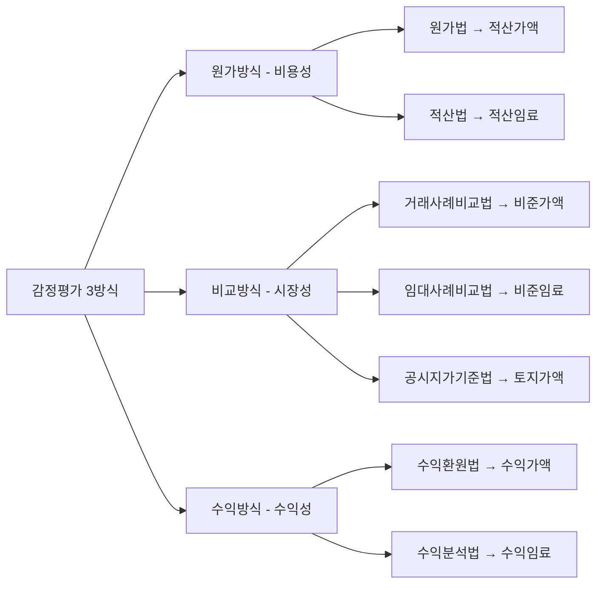
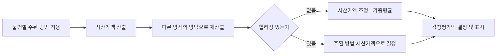

# 단원 PART09 — 감정평가론

> **포함 Chapter**: 52~60
> **수업 주제**: 평가방식·물건별 평가·임대료


## 🗺️ 본문 목차

- [📘 국승옥 강의노트 (L1 - 메인 자료, 단권화)](#강의노트)
- [📚 기본서 (L2 - 본격 학습·세부 보강)](#기본서)

---

## <a name="강의노트"></a>📘 국승옥 강의노트 — L1 (메인·단권화)

> 시험 직전 단권화용으로 압축된 자료. 표·명제(①②③) 중심.

## PART 09 — 감정평가론

### Chapter 52. 감정평가의 이해

#### 01. 감정평가의 의미

감정평가란 토지등의 경제적 가치를 판정하여 그 결과를 가액(價額)으로 표시 정의 하는 것을 말한다(감정평가 및 감정평가사에 관한 법률 제2조).

∙ 담보 평가 : 부동산 가치 × 50% = 대출금액
```
        사례       ∙ 경매 평가 : 부동산 가치 × 80% = 최저입찰가격
```

∙ 보상 평가 : 부동산 가치 × 120% = 보상금액

#### 02. 가치와 가격

(1) 가치와 가격의 구별

∙ 재화의 쓸모 있음의 정도 의미 ∙ 장래 기대되는 이익을 현재가치로 환원한 값 가치
```
      (Value)            ∙ 주관적⋅추상적 개념
                    특징   ∙ 현재의 값
                         ∙ 일정 시점에 다양하게 존재

                    의미   시장에서 재화가 실제 거래된 금액
        가격               ∙ 객관적⋅구체적 개념
       (Price)      특징   ∙ 과거의 값
```

∙ 일정 시점에 하나만 존재

① 가치는 ʻʻ부동산으로부터 장래 기대되는 유⋅무형의 편익을 현재가치로 환원한 값”이다.
② 가격은 가치가 시장을 통해 화폐단위로 구현된 것이다.

③ 가치는 사람에 따라 달라지는 주관적⋅추상적인 개념이고, 가격은 가치가 시장을 통하여 화폐 단위로 구현된 객관적⋅구체적인 개념이다.
④ 가치는 현재의 값이고, 가격은 실제 거래된 금액으로 과거의 값이다.
⑤ 가치는 일정 시점에 다양하게 존재하지만, 가격은 일정 시점에 하나만 존재한다.

(2) 다양한 가치

```
      교환가치     시장에서 교환을 목적으로 형성되는 가치

      사용가치     특정한 이용을 전제로 하는 사용자의 주관적 가치

      투자가치     부동산에 대해 투자자가 부여하는 주관적 가치

      담보가치     은행이 대출금액을 산정하기 위해 결정하는 가치

      공익가치     보존과 같은 공공목적에 제공되는 경우에 형성되는 가치
```

#### 03. 가치발생요인

```
      의미       부동산을 얻기 위해서 대가를 지불해야만 하는 이유

                 효용      인간의 필요나 욕구를 만족시켜 줄 수 있는 재화의 능력

               상대적 희소성   인간의 욕구에 비해 재화의 양이 상대적으로 부족한 현상
  가치발생요인
                유효수요     구매력 또는 지불능력을 갖춘 수요
```

일부 학자는 ‘권리의 이전 가능성’을 추가하기도 함

① 효용은 인간의 필요나 욕구를 만족시켜 줄 수 있는 재화의 능력을 의미한다.
② 부동산의 효용은 주거지는 쾌적성, 상업지는 수익성, 공업지는 생산성으로 표현된다.

③ 상대적 희소성이란 부동산 수요에 비해 공급이 상대적으로 부족한 상태이다.
④ 유효수요란 대상 부동산을 구매하고자 하는 욕구로 지불능력(구매력)을 갖춘 수요이다.

⑤ 일부 학자는 이전성 또는 권리의 이전 가능성을 가치발생요인에 포함하기도 한다.

#### 04. 가치형성요인

가치형성요인이란 대상 물건의 경제적 가치에 영향을 미치는 일반 요인, 지역 의미 요인 및 개별 요인 등을 말한다(감정평가에 관한 규칙).

```
               일반 요인     우리나라가 가지고 있는 일반적 특성

  가치형성요인       지역 요인     부동산이 속한 지역이 가지고 있는 특성

               개별 요인     개별 부동산이 가지고 있는 특성
```

### Chapter 53. 지역분석과 개별분석

#### 01. 지역분석

가치형성요인 중 지역 요인을 분석하여, 의미 지역 내 부동산의 표준적 이용과 지역의 가격수준을 판정하는 활동

∙ 표준적 이용 목적 ∙ 지역의 가격수준

```
                  특징    거시적⋅전체적⋅광역적 분석
```

∙ 적합의 원칙 활용 ∙ 경제적 감가(외부적 감가)

내용

∙ 대상이 속한 지역 인근지역 ∙ 지역 요인을 공유하는 지역

```
  대상 지역                 ∙ 대상이 속하지 않은 지역
                 유사지역
                        ∙ 인근지역과 유사한 특성을 갖는 지역

                동일수급권   동일 시장 권역
```

① 인근지역은 감정평가의 대상이 된 부동산이 속한 지역으로서 부동산의 이용이 동질적이고 가 치형성요인 중 지역 요인을 공유하는 지역이다(감칙).
② 유사지역은 대상 부동산이 속하지 아니하는 지역으로서 인근지역과 유사한 특성을 갖는 지역 이다(감칙).
③ 동일수급권은 대상 부동산과 대체⋅경쟁 관계가 성립하고 가치형성에 서로 영향을 미치는 다른 부동산이 존재하는 권역으로, 인근지역과 유사지역을 포함하는 광역적인 권역이다(감칙).

#### 02. 개별분석

가치형성요인 중 개별 요인을 분석하여, 의미 대상 부동산의 최유효이용과 개별적⋅구체적 가격을 판정하는 활동

```
              목적    최유효이용 / 개별적⋅구체적 가격

     내용       특징    미시적⋅부분적⋅국지적 분석

              활용    균형의 원칙 / 기능적 감가(내부적 감가)
```

① 지역분석은 해당 지역의 표준적 이용의 장래 동향을 명백히 하고, 개별분석은 해당 부동산의 최유효이용을 판정한다.
② 지역분석은 그 지역에 속하는 부동산의 가격수준을 판정하는 과정이고, 개별분석은 개별 부동 산의 구체적 가격을 판정하는 과정이다.

③ 지역분석은 지역적⋅거시적인 개념이고, 개별분석은 부분적⋅미시적 개념이다.
④ 지역분석은 개별분석 전에 이루어지는 것이 일반적이다.

#### 03. 인근지역의 생애주기

```
     단계                           특징
```

∙ 지역의 개발과 함께 지역 기능이 새롭게 형성되는 시기이다. 성장기 ∙ 지가상승률이 최고인 시기이다.

∙ 개발이 완료됨에 따라 지역 기능이 안정되는 시기이다. 성숙기 ∙ 지가 수준 및 지역 기능이 최고인 시기이다.

∙ 시간이 흐름에 따라 지역의 건물이 점차 노후화되는 시기이다.
```
     쇠퇴기     ∙ 건물이 노후화되어, 관리비⋅유지비가 급격히 증가하는 시기이다.
```

∙ 하향여과가 시작되는 시기이다.

∙ 유지⋅수선이 지연되어 부동산의 쇠퇴현상이 가속화되는 시기이다.
```
     천이기     ∙ 하향여과 현상이 활발하게 이루어지면 지가가 일시적으로 상승한다.
```

∙ 천이기에 재개발이 이루어지면 악화기가 도래하지 않을 수 있다.

∙ 슬럼화 직전의 단계이다. 악화기 ∙ 어울리지 않는 토지이용, 반달리즘, 부동산의 방기 등이 발생한다.

### Chapter 54. 부동산 가격 원칙

#### 01. 토대가 되는 원칙

```
               의미   부동산 가격은 끊임없이 변동한다.
 변동의 원칙
               활용   기준시점 확정의 근거 / 시점수정의 근거

 예측의 원칙

               의미   부동산 가격은 다른 부동산과의 상호작용으로 결정된다.
 대체의 원칙
               활용   감정평가 3방식의 근거 / 거래사례비교법의 근거
```

경쟁의 원칙

#### 02. 외부 원칙

```
               의미   부동산의 유용성이 최고가 되기 위해서는 외부환경과 적합하여야 한다.
 적합의 원칙
               활용   지역분석 / 경제적 감가
```

외부성의 원칙

#### 03. 내부 원칙

```
               의미   부동산의 유용성이 최고가 되기 위해서는 내부에 균형이 있어야 한다.
 균형의 원칙
               활용   개별분석 / 기능적 감가

               의미   부동산 가격은 각 구성요소의 기여도에 의해 결정된다.
 기여의 원칙             ∙ 추가 투자의 적정성 판단 여부
```

활용 ∙ 인근 토지의 매수⋅합병, 기존 건물의 증축

토지에 귀속되는 수익은 다른 생산요소에 배분되고 남은 잔여수익이
```
  수익배분의        의미
                    배분된다.
       원칙
               활용   수익방식 중 잔여법의 근거
```

(1) 변동의 원칙 / 예측의 원칙

① 감정평가에 있어서 기준시점이 중요시되는 이유는 변동의 원칙으로 설명된다.

② 예측의 원칙에 의하면 부동산의 가격은 과거와 현재의 이용에 의해 결정되는 것이 아니라 ‘장래 어떻게 이용될 것인가’에 대한 예측에 의해 결정된다.

(2) 적합의 원칙 / 균형의 원칙

① 적합의 원칙이란 부동산의 유용성이 최고로 발휘되기 위해서는 부동산은 외부환경과 적합하여 야 함을 강조한다.
② 균형의 원칙은 내부적 관계의 원칙으로 부동산의 내부 구성요소 결합에 균형이 있어야 함을 강조한다.

③ 개별분석은 균형의 원칙 및 기능적 감가와 관련이 있다.
④ 지역분석은 적합의 원칙 및 경제적 감가와 관련이 있다.

⑤ 복도의 천장 높이를 과대 개량한 전원주택이 냉⋅난방비 문제로 시장에서 선호도가 떨어진다. 이 사례는 균형의 원칙으로 설명할 수 있다.

⑥ 서민들이 거주하는 단독주택지역인 A지역에 개발업자가 고급주택을 건축하자, 고급주택의 가격 이 건축비용에도 미치지 못하였다. 이 사례는 적합의 원칙으로 설명할 수 있다.

(3) 대체의 원칙 / 경쟁의 원칙 / 기여의 원칙

① 대체성 있는 2개 이상의 재화가 존재할 때, 그 재화의 가격은 서로 관련되어 이루어진다는 원칙은 대체의 원칙으로 설명된다.
② 효용이 유사하면 가격이 낮은 재화가 선택되고, 가격이 유사하다면 효용이 높은 재화가 선택 된다는 것은 대체의 원칙으로 설명할 수 있다.
③ 대체의 원칙은 거래사례비교법의 이론적 근거를 제공한다.

④ 부동산의 초과이윤은 경쟁을 야기하고, 경쟁은 다시 초과이윤을 감소시키면서 부동산의 적정 가격은 만들어진다. 이를 경쟁의 원칙이라고 한다.

⑤ 부동산의 전체 가격은 부동산 구성 부분의 생산비에 의해 결정되는 것이 아니라 구성 부분의 기여도에 의해 결정된다. 이를 기여의 원칙이라고 한다.
⑥ 기여의 원칙은 인근 토지를 매수⋅합필하거나 기존 건물을 증축하는 경우 등 추가 투자의 적부 를 판단하는 기준으로 활용된다.

### Chapter 55. 감정평가에 관한 규칙

#### 01. 감정평가의 원칙

① 기준시점이란 대상 물건의 감정평가액을 결정하는 기준이 되는 날짜를 말한다.
② 기준시점은 대상 물건의 가격조사를 완료한 날짜로 한다. 기준시점 기준 다만, 기준시점을 미리 정하였을 때에는, 그 날짜에 가격조사가 가능한 경우에 만 기준시점으로 할 수 있다.

① 기준가치란 감정평가의 기준이 되는 가치를 말한다.
② 대상 물건에 대한 감정평가액은 시장가치를 기준으로 결정한다.
③ 시장가치란 대상 물건이 통상적인 시장에서 충분한 기간 동안 거래를 위하여 공개된 후 그 대상 물건의 내용에 정통한 당사자 사이에 신중하고 자발적인 거래가 있을 경우 성립될 가능성이 가장 높다고 인정되는 가액을 말한다.

④ 감정평가법인 등은 다음 어느 하나에 해당하는 경우에는 대상 물건의 감정평
```
시장가치 기준        가액을 시장가치 외의 가치를 기준으로 결정할 수 있다.
      (제5조)     1. 법령에 다른 규정이 있는 경우
```

2. 감정평가 의뢰인이 요청하는 경우
3. 사회통념상 필요하다고 인정되는 경우
⑤ 감정평가법인 등은 시장가치 외의 가치를 기준으로 감정평가할 때에는 다음 각 호의 사항을 검토해야 한다.
1. 해당 시장가치 외의 가치의 성격과 특징
2. 시장가치 외의 가치를 기준으로 하는 감정평가의 합리성 및 적법성

① 감정평가는 기준시점에서의 대상 물건의 이용상황(불법적이거나 일시적인 이 용은 제외한다) 및 공법상 제한을 받는 상태를 기준으로 한다.

② 감정평가법인 등은 다음 어느 하나에 해당하는 경우에는 기준시점의 가치형성 요인 등을 실제와 다르게 가정하거나 특수한 경우로 한정하는 조건을 붙여 감
```
  현황 기준        정평가할 수 있다.
      (제6조)     1. 법령에 다른 규정이 있는 경우
```

2. 의뢰인이 요청하는 경우
3. 사회통념상 필요하다고 인정되는 경우
③ 감정평가법인 등은 감정평가조건을 붙일 때에는 감정평가조건의 합리성, 적법 성 및 실현가능성을 검토해야 한다.

① 감정평가는 대상 물건마다 개별로 하여야 한다.
② 둘 이상의 대상 물건이 일체로 거래되거나 대상 물건 상호 간에 용도상 불가분 의 관계가 있는 경우에는 일괄하여 감정평가할 수 있다. 개별물건 기준
③ 하나의 대상 물건이라도 가치를 달리하는 부분은 이를 구분하여 감정평가할 (제7조) 수 있다.
④ 일체로 이용되고 있는 대상 물건의 일부분에 대하여 감정평가하여야 할 특수한 목적이나 합리적인 이유가 있는 경우에는 그 부분에 대하여 감정평가할 수 있다.

#### 02. 감정평가의 절차

① 감정평가법인 등은 다음 각 호의 순서에 따라 감정평가를 해야 한다. 다만, 합 리적이고 능률적인 감정평가를 위하여 필요할 때에는 순서를 조정할 수 있다.
1. 기본적 사항의 확정
2. 처리계획 수립 감정평가 절차
3. 대상 물건 확인 (제8조)
4. 자료수집 및 정리
5. 자료검토 및 가치형성요인의 분석
6. 감정평가방법의 선정 및 적용
7. 감정평가액의 결정 및 표시

① 감정평가법인 등은 감정평가를 의뢰받았을 때에는 의뢰인과 협의하여 다음 각 호의 사항을 확정해야 한다.
1. 의뢰인
2. 대상 물건
3. 감정평가 목적
```
기본적 사항의    4. 기준시점
확정(제9조)    5. 감정평가조건
```

6. 기준가치
7. 관련 전문가에 대한 자문 또는 용역에 관한 사항
8. 수수료 및 실비에 관한 사항

② 감정평가법인 등은 필요한 경우 관련 전문가에 대한 자문 등을 거쳐 감정평가 할 수 있다.

① 감정평가법인 등이 감정평가를 할 때에는 실지조사를 하여 대상 물건을 확인 해야 한다.
② 감정평가법인 등은 제1항에도 불구하고 다음 어느 하나에 해당하는 경우로서
```
 대상 물건의        실지조사를 하지 않고도 객관적이고 신뢰할 수 있는 자료를 충분히 확보할 수
 확인(제10조)      있는 경우에는 실지조사를 하지 않을 수 있다.
```

1. 천재지변, 전시⋅사변, 법령에 따른 제한 및 물리적인 접근 곤란 등으로 실 지조사가 불가능하거나 매우 곤란한 경우
2. 유가증권 등 대상 물건의 특성상 실지조사가 불가능하거나 불필요한 경우

(1) 감정평가의 절차(감정평가 실무기준)

① 처리계획의 수립이란 대상 물건의 확인에서 감정평가액의 결정 및 표시에 이르기까지 일련의 작업 과정에 대한 계획을 수립하는 절차를 말한다.

② 대상 물건의 확인이란 다음 각 호의 절차를 말하며, 대상 물건을 감정평가할 때에는 실지조사를 하기 전에 사전조사를 통해 필요한 사항을 조사한다.
1. 사전조사 : 실지조사 전에 감정평가 관련 구비서류의 완비 여부 등을 확인하고, 대상 물건 의 공부 등을 통해 토지 등의 물리적 조건, 권리상태, 위치, 면적 및 공법상의 제한내용과 그 제한 정도 등을 조사하는 절차
2. 실지조사 : 대상 물건이 있는 곳에서 대상 물건의 현황 등을 직접 확인하는 절차
③ 자료수집 및 정리란 대상 물건의 물적사항⋅권리관계⋅이용상황에 대한 분석 및 감정평가액 산정을 위해 필요한 확인 자료⋅요인 자료⋅사례 자료 등을 수집하고 정리하는 절차를 말한다.

① 등기부, 토지 대장 등 대상 물건을 확인할 수 있는 자료는 확인 자료이다.
② 일반요인 자료, 지역요인 자료, 개별요인 자료 등은 요인 자료이다.
③ 감정평가 3방식을 적용하기 위한 거래사례, 원가사례, 수익사례 등은 사례 자료이다.

(2) 감정평가의 분류

① 공인 평가란 국가로부터 자격을 부여받은 자가 행하는 평가이다.
② 참모 평가란 평가주체가 대중을 위해 서비스를 제공하는 것이 아니라, 그들의 고용주 또는 고용 기관을 위해 행하는 평가이다.

③ 조건부 평가란 장래 불확실한 조건을 상정하고, 그 조건의 성취를 전제로 행하는 평가이다.
④ 소급 평가란 과거 특정시점을 기준시점으로 행하는 평가이다.
⑤ 기한부 평가란 미래 특정시점을 기준시점으로 행하는 평가이다.

### Chapter 56. 감정평가 방식

#### 01. 감정평가 방식의 구분

(1) 3방식 6방법

(2) 감정평가 방식(감정평가에 관한 규칙 제11조)

① 원가방식 : 원가법 및 적산법 등 비용성의 원리에 기초한 감정평가방식

② 비교방식 : 거래사례비교법, 임대사례비교법 등 시장성의 원리에 기초한 감정평가방식 및 공시지가기준법

③ 수익방식 : 수익환원법 및 수익분석법 등 수익성의 원리에 기초한 감정평가방식

(3) 방법의 구분

```
         가액을 산정하는 방법                  임대료를 산정하는 방법

 ∙ 거래사례비교법(비준가액)                ∙ 임대사례비교법(비준임료)
 ∙ 원가법(적산가액)                    ∙ 적산법(적산임료)
 ∙ 수익환원법(수익가액)                  ∙ 수익분석법(수익임료)
```

### Chapter 57. 가액을 산정하는 방법

#### 01. 거래사례비교법

대상 물건과 가치형성요인이 같거나 비슷한 물건의 거래사례와 비교하여 대상 물
```
       정의     건의 현황에 맞게 사정보정, 시점수정, 가치형성요인 비교 등의 과정을 거쳐 대상
              물건의 가액을 산정하는 감정평가방법

       수식     거래사례 거래가격 × ( 사, 시, 지, 개 ) = 비준가액
```

(1) 거래사례의 수집 및 선택(감정평가 실무기준)

① 거래사례비교법으로 감정평가할 때에는 거래사례를 수집하여 적정성 여부를 검토한 후 다음 각 호의 요건을 모두 갖춘 하나 또는 둘 이상의 적절한 사례를 선택하여야 한다.

1. 거래 사정이 정상이라고 인정되는 사례나 정상적인 것으로 보정이 가능한 사례
2. 기준시점으로 시점수정이 가능한 사례
3. 대상 물건과 위치적 유사성이나 물적 유사성이 있어 지역요인⋅개별요인 등 가치형성요인의 비교가 가능한 사례

(2) 시점수정(감정평가 실무기준)

① 거래사례의 거래시점과 대상 물건의 기준시점이 불일치하여 가격수준의 변동이 있을 경우에는 거래사례의 가격을 기준시점의 가격수준으로 시점수정하여야 한다.

② 시점수정은 사례물건의 가격 변동률로 한다. 다만, 사례물건의 가격 변동률을 구할 수 없거나 사례물건의 가격 변동률로 시점수정하는 것이 적절하지 않은 경우에는 지가변동률⋅건축비지수⋅임대료지수⋅생산자물가지수⋅주택가격 동향지수 등을 고려하여 가격 변동률을 구할 수 있다.

#### 02. 공시지가기준법

대상 토지와 가치형성요인이 같거나 비슷하여 유사한 이용가치를 지닌다고 인정 되는 표준지공시지가를 기준으로 대상 토지의 현황에 맞게 시점수정, 지역요인 정의 및 개별요인 비교, 그 밖의 요인의 보정을 거쳐 대상토지의 가액을 산정하는 감정 평가방법

```
      수식    표준지공시지가 × ( 시, 지, 개, 그 밖의 요인 ) = 토지가액

            ∙ 거래사례 대신 표준지공시지가를 기준으로 한다.
      특징    ∙ 사정보정 절차가 없다.
```

∙ 지가변동률, 생산물가지수로 시점수정을 한다.

(1) 공시지가기준법(감정평가에 관한 규칙)

① 비교표준지 선정 : 인근지역에 있는 표준지 중에서 대상 토지와 용도지역⋅이용상황⋅주변환경 등이 같거나 비슷한 표준지를 선정할 것 다만, 인근지역에 적절한 표준지가 없는 경우에는 동일수급권 안의 유사지역에 있는 표준지를 선정할 수 있다.

② 시점수정 : 비교표준지가 있는 시⋅군⋅구의 같은 용도지역 지가변동률을 적용할 것
1. 같은 용도지역의 지가변동률을 적용하는 것이 불가능하거나 적절하지 아니하다고 판단되는 경우에는 공법상 제한이 같거나 비슷한 용도지역의 지가변동률, 이용상황별 지가변동률 또 는 해당 시⋅군⋅구의 평균지가변동률을 적용할 것
2. 지가변동률을 적용하는 것이 불가능하거나 적절하지 아니한 경우에는 한국은행이 조사⋅발표 하는 생산자물가지수에 따라 산정된 생산자물가상승률을 적용할 것

#### 03. 원가법

대상 물건의 재조달원가에 감가수정을 하여 대상 물건의 가액을 산정하는 감정 정의 평가방법

```
      수식       재조달원가  감가수정 = 적산가액
```

(1) 재조달원가(감정평가 실무기준)

① 재조달원가란 대상 물건을 기준시점에 재생산하거나 재취득하는 데 필요한 적정 원가의 총액 을 말한다.
② 재조달원가는 대상 물건을 일반적인 방법으로 생산하거나 취득하는 데 드는 비용으로 하되, 제세공과금 등과 같은 일반적인 부대비용을 포함한다.

(2) 감가수정(감정평가 실무기준)

① 감가수정이란 대상 물건에 대한 재조달원가를 감액하여야 할 요인이 있는 경우에 물리적 감가, 기능적 감가 또는 경제적 감가 등을 고려하여 그에 해당하는 금액을 재조달원가에서 공제하여 기준시점에 있어서의 대상 물건의 가액을 적정화하는 작업을 말한다.
1. 물리적 감가요인 : 대상 물건의 물리적 상태 변화에 따른 감가요인(시간, 사용, 작동)
2. 기능적 감가요인 : 대상 물건의 기능적 효용 변화에 따른 감가요인(설비의 과소⋅과대)
3. 경제적 감가요인 : 인근지역의 경제적 상태, 주위환경, 시장상황 등 대상 물건의 가치 에 영향을 미치는 경제적 요소들의 변화에 따른 감가요인 (외부요인)

② 감가수정을 할 때에는 경제적 내용연수를 기준으로 한 정액법, 정률법 또는 상환기금법 중에서 대상 물건에 가장 적합한 방법을 적용하여야 한다.
③ 제2항에 따른 감가수정이 적절하지 아니한 경우에는 물리적⋅기능적⋅경제적 감가요인을 고려 하여 관찰감가 등으로 조정하거나 다른 방법에 따라 감가수정할 수 있다.

(3) 감가수정방법

∙ 건물의 경제적 내용연수를 기준으로 감가액을 산정하는 방법 내용연수법 ∙ 유형 : 정액법, 정률법, 상환기금법 등

대상 물건의 전체 또는 구성부분을 평가주체가 직접 면밀히 관찰하여 달관적으로 관찰감가법 감가액을 산정하는 방법

대상 부동산에 대한 감가요인을 물리적⋅기능적⋅경제적 요인으로 세분하고, 다 분해법 시 치유가능⋅치유불가능으로 구분하여 감가액을 산정하는 방법

시장의 유사 매매사례로부터 대상 부동산에 적용할 수 있는 감가수정률을 도출하 시장추출법 고, 이를 적용하여 감가를 수정하는 방법

```
 임대료손실      물리적⋅기능적⋅경제적 감가요인으로부터 발생하는 임대료 손실을 자본 환원하
  환원법       여 감가를 수정하는 방법
```

(4) 정액법, 정률법, 상환기금법

```
             수식   감가대상 총액 ÷ 경제적 내용연수 = 매년 감가액
  정액법
             특징   매년 감가액이 매년 일정한 방식이다.

             수식   대상 물건의 잔존가치 × 매년 감가율 = 매년 감가액
  정률법             ∙ 매년 감가율이 일정한 방식이다.
             특징
                  ∙ 매년 감가액은 체감하는 방식이다.

             수식   감가대상 총액 × 감채기금계수 = 매년 감가액
```

상환기금법 내용연수 말 물건을 재취득하기 위해서 매년 적립해야 할 금액을 매 내용 년의 감가액으로 인식하는 방법

(5) 기타 논점

① 재조달원가는 원가추정의 가정에 따라 물리적 동일성을 가정한 복제 원가(재생산 비용)과 효용 적 동일성을 가정한 대체 원가(대체 비용)으로 구분된다.
② 대체원가를 이용하여 재조달원가를 산정할 경우, 물리적 감가수정은 필요하나 기능적 감가수정 은 필요하지 않다.

③ 감정평가의 감가수정은 실질적인 가치 추계를 목적으로 하고, 기업회계의 감가상각은 대상 물 건에 대한 기간 손익의 배분의 과정이다.
④ 감가수정은 물리적 요인, 기능적 요인, 경제적 요인(외부적 요인)을 모두 고려하나 감가상각은 경제적 요인을 고려하지 않는다.

#### 04. 수익환원법

대상 물건이 장래 산출할 것으로 기대되는 순수익이나 미래의 현금흐름을 환원하 정의 거나 할인하여 대상 물건의 가액을 산정하는 감정평가방법

```
               의미   장래 순수익을 환원율로 환원하여 가액을 산정하는 방법

 직접환원법
                                  단일기간 순수익
               수식   수익가액 =
                                      환원율

               의미   미래 현금흐름을 할인율로 할인하여 가액을 산정하는 방법
 할인현금흐름
      분석법
                                                             
                    수익가액 =                   ⋯           
  (DCF법)       수식                               
                                 : 순영업소득,  : 기간 말 복귀가치,       : 할인율
```

(1) 환원방법(감정평가 실무기준)

① 수익환원법으로 감정평가할 때에는 직접환원법이나 할인현금흐름분석법 중에서 감정평가 목적 이나 대상 물건에 적절한 방법을 선택하여 적용한다.

(2) 직접환원법(감정평가 실무기준)

① 직접환원법은 단일기간의 순수익을 적절한 환원율로 환원하여 대상 물건의 가액을 산정하는 방법을 말한다.

② 직접환원법에서 사용할 순수익은 대상 물건에 귀속하는 적절한 수익으로서 유효총수익에서 운영 경비를 공제하여 산정한다. 순수익을 구할 때 자본적 지출은 비용으로 고려하지 않는다.

③ 직접환원법에서 사용할 환원율은 시장추출법으로 구하는 것을 원칙으로 한다. 다만, 시장추출법의 적용이 적절하지 않은 때에는 요소구성법, 투자결합법, 유효총수익승수에 의한 결정방법, 시장에서 발표된 환원율 등을 검토하여 조정할 수 있다.

(3) 할인현금흐름분석법(감정평가 실무기준)

① 할인현금흐름분석법은 대상 물건의 보유기간에 발생하는 복수기간의 순수익(이하 “현금흐름”) 과 보유기간 말의 복귀가액에 적절한 할인율을 적용하여 현재가치로 할인한 후 더하여 대상 물건의 가액을 산정하는 방법을 말한다.

② 순수익 : 직접환원법의 순수익 산정과 동일

③ 할인현금흐름분석법의 적용에 따른 복귀가액은 보유기간 경과 후 초년도의 순수익을 추정하여 최종환원율로 환원한 후 매도비용을 공제하여 산정한다.
④ 복귀가액 산정을 위한 최종환원율은 환원율에 장기위험프리미엄⋅성장률⋅소비자물가상승률 등을 고려하여 결정한다.

⑤ 할인현금흐름분석법에서 사용할 할인율은 투자자조사법(지분할인율), 투자결합법(종합할인율), 시장에서 발표된 할인율 등을 고려하여 대상 물건의 위험이 적절히 반영되도록 결정하되 추정된 현금흐름에 맞는 할인율을 적용한다.

(4) 환원율(기출지문)

① 자본환원율은 대상 부동산이 장래 산출할 것으로 기대되는 표준적인 순영업소득과 부동산 가격 의 비율이다.

② 환원율은 부동산의 수익성을 나타낸다.
③ 자본환원율은 자본의 기회비용을 반영하므로, 시장금리가 상승하면 함께 상승한다.
④ 자본환원율은 프로젝트의 위험을 반영하며, 위험이 높아지면 자본환원율도 상승한다.

⑤ 상각전 순수익은 상각전 환원율로 환원하고, 상각후 순수익은 상각후 환원율로 환원한다.

⑥ 운영경비에 감가상각비를 포함시킨 경우, 상각 후 환원율을 적용한다.
⑦ 감가상각 전의 순영업소득으로 가치를 추계하는 경우, 감가상각률을 포함한 자본환원율을 사용 해야 한다. (상각전 환원율 = 상각후 환원율 + 감가상각률)

⑧ 할인현금흐름분석법에서는 별도로 자본회수율을 계산하지 않는다.

⑨ 자본환원율이 상승하면 자산 가격은 하락한다. (순수익/환원율 = 수익가액)
⑩ 자본환원율이 상승하면 부동산자산의 가격이 하락 압력을 받으므로 신규개발사업 추진이 어려 워진다.

⑪ 개별환원율이란 토지와 건물 각각의 환원율을 말한다.
⑫ 세공제전 환원율이란 세금으로 인한 수익의 변동을 환원율에 반영하여 조정하지 않은 환원율 을 말한다.

⑬ 부채감당률이 2, 대부비율이 50%, 연간 저당상수가 0.1이라면 자본환원율은 10%이다.

(5) 직접환원법의 환원율 산정방법

대상과 유사한 물건의 최근 거래사례를 분석하여 부동산 가격에 대한 순수익의 비 시장추출법 율, 즉 환원율을 직접 찾아내는 방법

```
 요소구성법        대상에 관한 위험 요소를 여러 가지로 분해하고 위험에 따른 위험할증률을 더해감
      (조성법)   으로써 환원율을 구하는 방법
```

∙ 물리적 투자결합법 : 물리적 측면에서 투자자금을 토지와 건물로 구분하고 환원 율을 산정하는 방법 종합환원율 ＝ (토지가격구성비 × 토지환원율) ＋ (건물가격구성비 × 건물환원율) 투자결합법 ∙ 금융적 투자결합법 : 금융적 측면에서 투자자금을 자기자본(지분)과 타인자본 (저당)으로 구분하고 환원율을 산정하는 방법

종합환원율 ＝ (지분배당률 × 지분비율) ＋ (저당상수 × 저당비율)

∙ 엘우드가 투자결합법을 개량한 방식이다. ∙ 엘우드법은 다음 사항을 모두 고려하고 있다.
```
  엘우드법         1. 보유기간에 예상되는 현금흐름
```

2. 기간 말에 예상되는 부동산의 가치 증감
3. 원금 상환을 통해 형성되는 지분형성분

```
               의미    부채감당률을 활용하여 환원율을 산정하는 방법
 부채감당률법
               수식    환원율(R) ＝ 부채감당률 × 대부비율 × 저당상수
```

### Chapter 58. 임대료 산정, 시산가액의 조정

#### 01. 임대사례비교법

대상 물건과 가치형성요인이 같거나 비슷한 물건의 임대사례와 비교하여 대상
```
      정의     물건의 현황에 맞게 사정보정, 시점수정, 가치형성요인 비교 등의 과정을 거쳐
             대상 물건의 임대료를 산정하는 감정평가방법

      수식     임대사례 임대료 × ( 사, 시, 지, 개 ) = 비준임료
```

#### 02. 적산법

대상 물건의 기초가액에 기대이율을 곱하여 산정된 기대수익에 대상 물건을 계속
```
      정의     하여 임대하는 데에 필요한 경비를 더하여 대상 물건의 임대료를 산정하는 감정
             평가방법

      수식     (기초가액 × 기대이율)  필요제경비 = 적산임료
```

(1) 기초가액, 기대이율, 필요제경비(감정평가 실무기준)

① 기초가액이란 적산법으로 감정평가하는 데 기초가 되는 대상 물건의 가치를 말한다.
② 기초가액은 비교방식이나 원가방식으로 감정평가한다. 이 경우 사용 조건⋅방법⋅범위 등을 고 려할 수 있다.

③ 기대이율이란 기초가액에 대하여 기대되는 임대수익의 비율을 말한다.
④ 기대이율은 시장추출법, 요소구성법, 투자결합법, CAPM을 활용한 방법, 그 밖의 대체⋅경쟁 자산의 수익률 등을 고려한 방법 등으로 산정한다.

⑤ 필요제경비란 임차인이 사용⋅수익할 수 있도록 임대인이 대상 물건을 적절하게 유지⋅관리하 는 데에 필요한 비용을 말한다.
⑥ 필요제경비에는 감가상각비, 유지관리비, 조세공과금, 손해보험료, 대손준비금, 공실손실상당액, 정상운영자금이자 등이 포함된다.

#### 03. 수익분석법

일반 기업 경영에 의하여 산출된 총수익을 분석하여 대상 물건이 일정한 기간에
```
      정의      산출할 것으로 기대되는 순수익에 대상 물건을 계속하여 임대하는 데에 필요한
```

경비를 더하여 대상 물건의 임대료를 산정하는 감정평가방법

```
      수식      순수익  필요제경비 = 수익임료
```

(1) 순수익, 필요제경비(감정평가 실무기준)

① 순수익은 대상 물건의 총수익에서 그 수익을 발생시키는 데 드는 경비(매출원가, 판매비 및 일반관리비, 정상운전자금이자, 그 밖에 생산요소귀속 수익 등을 포함한다)를 공제하여 산정한 금액을 말한다.

② 필요제경비에는 대상 물건에 귀속될 감가상각비, 유지관리비, 조세공과금, 손해보험료, 대손준비 금 등이 포함된다.

#### 04. 방법의 적용 및 시산가액의 조정

```
             원칙   물건별 주된 평가방법을 적용
      방법의
      적용          주된 방법을 적용하는 것이 곤란하거나 부적절한 경우에는 다른 감정
```

예외 평가방법을 적용할 수 있다.

∙ 시산가액이란 각각의 감정평가방법을 적용하여 산정한 가액을 말한다.
```
             의미   ∙ 시산가액의 조정이란 시산가액을 상호 조정하여 최종의 평가결론을
```

시산가액의 도출하는 과정이다. 조정 ∙ 가중평균 방식(산술평균 ×) 방법 ∙ 주방식⋅부수방식

(1) 시산가액의 조정(감정평가에 관한 규칙)

① 감정평가법인등은 대상 물건의 감정평가액을 결정하기 위하여 어느 하나의 감정평가방법을 적용하여 산정한 가액(이하 ʻʻ시산가액”)을 다른 감정평가방식에 속하는 하나 이상의 감정평가 방법으로 산출한 시산가액과 비교하여 합리성을 검토해야 한다. 이 경우 공시지가기준법과 그 밖의 비교방식에 속한 감정평가방법은 서로 다른 감정평가방식 에 속한 것으로 본다.

② 감정평가법인 등은 산출한 시산가액의 합리성이 없다고 판단되는 경우에는 주된 방법 및 다른 감정평가방법으로 산출한 시산가액을 조정하여 감정평가액을 결정할 수 있다.

### Chapter 59. 물건별 주된 평가방법

#### 01. 물건별 주된 평가방법

(1) 부동산 등

```
       토지     공시지가기준법

       건물     원가법
```

∙ 구분소유권 대상 건물과 대지사용권의 일괄 평가 : 거래사례비교법 일괄 평가 ∙ 토지와 건물의 일괄 평가 : 거래사례비교법

```
      임대료     임대사례비교법
```

(2) 기타 물건

∙ 산지와 입목을 구분하여 평가 산림 ∙ 입목 : 거래사례비교법 / 소경목림 : 원가법

∙ 자동차 : 거래사례비교법 자동차 등 ∙ 건설기계, 선박, 항공기 : 원가법

```
      과수원     거래사례비교법

       권리     영업권, 특허권, 실용신안권, 상표권, 저작권 등 : 수익환원법

      광업재단    수익환원법

      기업가치    수익환원법

              ∙ 상장채권, 상장주식 : 거래사례비교법
       증권     ∙ 비상장채권 : 수익환원법
```

∙ 비상장주식 : [유ㆍ무형의 자산가치(기업가치) - 부채] ÷ 발행주식 수

```
       동산     거래사례비교법
```

수익환원법이 주된 평가방법인 물건

영업권 등 권리 / 광업재단 / 기업가치

#### 02. 감정평가에 관한 규칙

① 토지를 감정평가하는 경우에는 그 토지와 이용가치가 비슷하다고 인정되는 표준지공시지가를 기준으로 하여야 한다. 다만, 적정한 실거래가가 있는 경우에는 이를 기준으로 할 수 있다.

② 적정한 실거래가란 ‘부동산 거래신고 등에 관한 법률’에 따라 신고된 실제 거래가격으로서 거래 시점이 도시지역은 3년 이내, 그 밖의 지역은 5년 이내인 거래가격 중에서 감정평가법인 등이 인근지역의 지가수준 등을 고려하여 감정평가의 기준으로 적용하기에 적정하다고 판단하는 거래 가격을 말한다.
③ 적정한 실거래가를 기준으로 토지를 감정평가할 때에는 거래사례비교법을 적용해야 한다.

④ 감정평가법인등은 구분소유권의 대상이 되는 건물부분과 그 대지사용권을 일괄하여 감정평가하 는 경우 등 토지와 건물을 일괄하여 감정평가할 때에는 거래사례비교법을 적용해야 한다. 이 경우 감정평가액은 합리적인 기준에 따라 토지가액과 건물가액으로 구분하여 표시할 수 있다.

⑤ 건물의 평가는 원가법에 의해 평가하는 것이 원칙이다.

⑥ 임대료를 감정평가할 때에는 임대사례비교법을 적용하여야 한다. 다만, 임대사례비교법에 의한 평가가 적정하지 아니한 경우에는 대상 물건의 종류 및 성격에 따라 적산법이나 수익분석법으로 평가할 수 있다.

⑦ 산림을 감정평가할 때에는 산지와 입목을 구분하여 평가하여야 한다. 이 경우 입목은 거래사례비교법을 적용하되 소경목림의 경우에는 원가법을 적용할 수 있다. 다만, 산지와 입목을 일괄하여 감정평가할 때에 거래사례비교법을 적용하여야 한다.

⑧ 자동차를 감정평가할 때에 거래사례비교법을 적용하여야 한다.

⑨ 건설기계를 감정평가할 때에 원가법을 적용해야 한다.
⑩ 선박을 감정평가할 때에는 선체⋅기관⋅의장별로 구분하여 감정평가하되 각각 원가법을 적용 하여야 한다.
⑪ 항공기를 감정평가할 때에 원가법을 적용해야 한다.

⑫ 공장재단을 감정평가할 때에 공장재단을 구성하는 개별물건의 감정평가액을 합산하여 평가하 여야 한다. 다만, 계속적인 수익이 예상되어 일괄하여 감정평가하는 경우에는 수익환원법을 적 용할 수 있다.
⑬ 광업재단을 감정평가할 때에 수익환원법을 적용하여야 한다.

⑭ 영업권, 특허권, 실용신안권, 디자인권, 상표권, 저작권, 전용측선이용권 그 밖의 무형자산을 감 정평가할 때에 수익환원법을 적용하여야 한다.
⑮ 기업가치를 감정평가할 때에 수익환원법을 적용해야 한다.

⑯ 동산을 감정평가할 때에는 거래사례비교법을 적용해야 한다.
⑰ 소음⋅진동⋅일조침해 또는 환경오염 등(이하 ʻʻ소음 등”)으로 대상 물건에 직접적 또는 간접적 인 피해가 발생하여 대상 물건의 가치가 하락한 경우, 그 가치하락분을 감정평가할 때에 소음 등이 발생하기 전의 대상 물건의 가액 및 원상회복비용 등을 고려하여야 한다.

#### 03. 구분소유 부동산, 복합 부동산

① 구분소유 부동산을 감정평가할 때에는 건물(전유부분과 공유부분)과 대지사용권을 일체로 한 거래사례비교법을 적용하여야 한다.

② 구분소유 부동산을 감정평가할 때에는 층별⋅위치별 효용요인을 반영하여야 한다.
③ 감정평가액은 합리적인 배분기준에 따라 토지가액과 건물가액으로 구분하여 표시할 수 있다.

④ 복합부동산은 토지와 건물을 개별로 감정평가하는 것을 원칙으로 한다. 다만, 토지와 건물이 일체로 거래되는 경우에는 일괄하여 감정평가할 수 있다.

⑤ 토지와 건물을 일괄하여 감정평가할 때에는 거래사례비교법을 적용하여야 한다.
⑥ 토지와 건물을 일괄하여 감정평가한 경우의 감정평가액은 합리적인 배분기준에 따라 토지가액 과 건물가액으로 구분하여 표시할 수 있다.

#### 04. 표준지의 조사 및 평가

(1) 고저

```
      저지    간선도로 또는 주위의 지형지세보다 현저히 낮은 지대의 토지

      평지    간선도로 또는 주위의 지형지세와 높이가 비슷하거나 경사도가 미미한 토지

  완경사지      간선도로 또는 주위의 지형지세보다 높고 경사도가 15°이하인 지대의 토지

  급경사지      간선도로 또는 주위의 지형지세보다 높고 경사도가 15°를 초과하는 지대의 토지

      고지    간선도로 또는 주위의 지형지세보다 현저히 높은 지대의 토지
```

(2) 도로접면

```
 광대로한면      폭 25m 이상의 도로에 한면이 접하고 있는 토지

  중로한면      폭 12m 이상 25m 미만 도로에 한면이 접하고 있는 토지

  소로한면      폭 8m 이상 12m 미만의 도로에 한면이 접하고 있는 토지

 세로한면(가)    자동차 통행이 가능한 폭 8m 미만의 도로에 한면이 접하고 있는 토지
```

(3) 형상

```
      정방형   정사각형 모양의 토지로서 양변의 길이 비율이 1:1.1 내외인 토지

 가로장방형      장방형의 토지로 넓은 면이 도로에 접하거나 도로를 향하고 있는 토지

 세로장방형      장방형의 토지로 좁은 면이 도로에 접하거나 도로를 향하고 있는 토지

  사다리형      사다리꼴 모양의 토지

      자루형   출입구가 자루처럼 좁게 생긴 토지
```

### Chapter 60. 감정평가론 계산 문제

#### 01. 거래사례비교법과 공시지가기준법

#### 01. 다음 자료를 활용하여 거래사례비교법으로 산정한 대상 토지의 비준가액은?

∙ 평가대상토지 : X시 Y동 210번지, 대, 110㎡, 일반상업지역 ∙ 기준시점 : 2020.9.1. ∙ 거래사례 － 소재지 : X시 Y동 250번지, 대, 120㎡, 일반상업지역 － 거래가격 : 2억 4천만원 － 거래시점 : 2020.2.1. － 거래사례는 정상적인 매매임 ∙ 지가변동률(2020.2.1. ~ 9.1.) : X시 상업지역 5% 상승 ∙ 지역요인 : 대상토지는 거래사례의 인근지역에 위치함 ∙ 개별요인 : 대상토지는 거래사례에 비해 3% 우세함 ∙ 상승식으로 계산할 것

```
      ① 226,600,000원            ② 237,930,000원   ③ 259,560,000원
```

```
      ④ 283,156,000원            ⑤ 285,516,000원
```

```
                                                                  정답   ②
```

#### 02. 다음 자료를 활용하여 공시지가기준법으로 산정한 대상토지의 가액(원/㎡)은?

∙ 대상토지 : A시 B구 C동 320번지, 일반상업지역 ∙ 기준시점 : 2021.10.30. ∙ 비교표준지 : 2021.1.1. 기준 공시지가 10,000,000원/㎡ ∙ 지가변동률(A시 B구, 2021.1.1.~2021.10.30.) : 상업지역 5% 상승 ∙ 지역요인 : 대상토지와 비교표준지의 지역요인은 동일함 ∙ 개별요인 : 대상토지는 비교표준지에 비해 가로조건 10% 우세, 환경조건 20% 열세 하고, 다른 조건은 동일함(상승식으로 계산할 것) ∙ 그 밖의 요인 보정치 : 1.50

```
      ① 9,240,000               ② 11,340,000     ③ 13,860,000
```

```
      ④ 17,010,000              ⑤ 20,790,000
```

```
                                                                  정답   ③
```

#### 03. 감정평가사 A는 B토지의 감정평가를 의뢰받고 인근지역 나지 거래사례인 C토지를 활용해 2억원으

```
     로 평가했다. A가 C토지 거래금액에 대해 판단한 사항은?                      ✫ 제33회
```

∙ B, C토지의 소재지, 용도지역 : D구, 제2종일반주거지역 ∙ 면적 : B토지 200㎡, C토지 150㎡ ∙ 거래금액 : 1.5억원(거래시점 일괄지급) ∙ D구 주거지역 지가변동률(거래시점~기준시점) : 10% 상승 ∙ 개별요인 : B토지 가로조건 10% 우세, 그 외 조건 대등

① 정상
② 10% 고가
③ 20% 고가
④ 21% 고가
⑤ 31% 고가

```
                                                            정답   ④
```

#### 04. 다음 중 사례 부동산의 사정보정치는?

2 ∙ 면적이 1,000m 인 토지를 100,000,000원에 구입하였으나, 이는 인근의 표준적인 획지 보다 고가로 매입한 것으로 확인되었다. 2 ∙ 표준적인 획지의 정상적인 거래가격은 80,000원/m 으로 조사되었다.

① 정상
② 0.9090
③ 0.8333
④ 0.8000
⑤ 0.7633

```
                                                            정답   ④
```

#### 02. 원가법

#### 01. 다음 자료를 활용하여 원가법으로 평가한 대상건물의 가액은?              ✫ 제35회

∙ 대상건물 : 철근콘크리트구조, 다가구주택, 연면적 350㎡ ∙ 기준시점 : 2024.04.05. ∙ 사용승인시점 : 2013.06.16. ∙ 사용승인시점의 적정한 신축공사비 : 1,000,000원/㎡ ∙ 건축비지수 - 기준시점 : 115 - 사용승인시점 : 100 ∙ 경제적 내용연수 : 50년 ∙ 감가수정방법 : 정액법(만년감가기준) ∙ 내용연수 만료 시 잔존가치 없음

```
       ① 313,000,000원            ② 322,000,000원
```

```
       ③ 342,000,000원            ④ 350,000,000원
```

⑤ 352,000,000원

```
                                                      정답   ②
```

#### 02. 다음 자료를 활용하여 원가법으로 평가한 대상 건물의 가액은?             ✫ 제32회

∙ 대상 건물 현황 : 연와조, 단독주택, 연면적 200㎡ ∙ 사용승인시점 : 2016.6.30. ∙ 기준시점 : 2021.4.24. ∙ 사용승인시점의 신축공사비 : 1,000,000원/㎡(신축공사비는 적정함) ∙ 건축비지수 - 사용승인시점 : 100 - 기준시점 : 110 ∙ 경제적 내용연수 : 40년 ∙ 감가수정방법 : 정액법(만년감가기준) ∙ 내용연수 만료 시 잔존가치 없음

```
       ① 175,000,000원            ② 180,000,000원
```

```
       ③ 192,500,000원            ④ 198,000,000원
```

⑤ 203,500,000원

```
                                                      정답   ④
```

#### 03. 수익환원법

#### 01. 다음의 자료를 활용하여 직접환원법으로 산정한 대상부동산의 수익가액은? (단, 연간 기준이며, 주어

진 조건에 한함)

∙ 가능총소득(PGI) : 70,000,000원 ∙ 공실상당액 및 대손충당금 : 가능총소득 5% ∙ 영업경비(OE) : 유효총소득(EGI)의 40% ∙ 환원율 : 10%

```
      ① 245,000,000원                ② 266,000,000원
```

```
      ③ 385,000,000원                ④ 399,000,000원
```

⑤ 420,000,000원

```
                                                                  정답   ④
```

#### 02. 다음과 같은 조건에서 수익환원법에 의해 평가한 대상부동산의 가액은?                       ✫ 제31회

∙ 가능총소득(PGI) : 1억원 ∙ 공실손실상당액 및 대손충당금 : 가능총소득의 5% ∙ 재산세 : 300만원 ∙ 화재보험료 : 200만원 ∙ 영업소득세 : 400만원 ∙ 건물주 개인업무비 : 500만원 ∙ 토지가액 : 건물가액 = 40% : 60% ∙ 토지환원이율 : 5% ∙ 건물환원이율 : 10%

```
      ① 1,025,000,000원              ② 1,075,000,000원
```

```
      ③ 1,125,000,000원              ④ 1,175,000,000원
```

⑤ 1,225,000,000원

```
                                                                  정답   ③
```

#### 03. 직접환원법에 의한 대상 부동산의 가액이 8억원일 때, 건물의 연간 감가율(회수율)은?   ✫ 제33회

∙ 가능총수익 : 월 6백만원 ∙ 공실 및 대손 : 연 1천2백만원 ∙ 운영경비(감가상각비 제외) : 유효총수익의 20% ∙ 토지, 건물 가격구성비 : 각각 50% ∙ 토지환원율, 건물상각후환원율 : 각각 연 5%

```
       ① 1%                    ② 2%
```

```
       ③ 3%                    ④ 4%
```

⑤ 5%

```
                                                          정답   ②
```

#### 04. 토지와 건물로 구성된 대상건물의 연간 감가율(자본회수율)은?                 ✫ 제35회

∙ 거래가격 : 20억원 ∙ 순영업소득 : 연 1억 8천만원 ∙ 가격구성비 : 토지 80%, 건물 20% ∙ 토지환원율, 건물상각후환원율 : 각 연 8%

```
       ① 4%                    ② 5%
```

```
       ③ 6%                    ④ 7%
```

⑤ 8%
```
                                                          정답   ②
```

#### 05. 할인현금흐름분석법에 의한 수익가액은? (단, 모든 현금흐름은 연말에 발생함)                ✫ 제33회

∙ 보유기간(5년)의 순영업소득 : 매년 9천만원 ∙ 6기 순영업소득 : 1억원 ∙ 매도비용 : 재매도가치의 5% ∙ 기입환원율 : 4%, 기출환원율 : 5%, 할인율 : 연 5% ∙ 연금현가계수(5%, 5년) : 4.329 ∙ 일시불현가계수(5%, 5년) : 0.783

```
     ① 1,655,410,000원             ② 1,877,310,000원
```

```
     ③ 2,249,235,000원             ④ 2,350,000,000원
```

⑤ 2,825,000,000원

```
                                                                정답   ②
```

#### 06. 다음과 같은 조건에서 대상부동산의 수익가액 산정 시 적용할 환원이율(capitalization rate)은?

✫ 제35회

∙ 가능총소득(PGI) : 연 85,000,000원 ∙ 공실상당액 : 가능총소득의 5% ∙ 재산관리수수료 : 가능총소득의 2% ∙ 유틸리티비용 : 가능총소득의 2% ∙ 관리직원인건비 : 가능총소득의 3% ∙ 부채서비스액 : 연 20,000,000원 ∙ 대부비율 : 25% ∙ 대출조건 : 이자율 연 4%로 28년간 매년 원리금균등분할상환(고정금리) ∙ 저당상수(이자율 연 4%, 기간 28년) : 0.06

```
     ① 5.61%                      ② 5.66%
```

```
     ③ 5.71%                      ④ 5.76%
```

⑤ 5.81%

```
                                                                정답   ①
```

Memo

박문각 감정평가사

1차┃ 강의노트

제6판 인쇄 2025. 7. 25. | 제6판 발행 2025. 7. 30. | 편저자 국승옥 저자와의
```
발행인 박 용 | 발행처 (주)박문각출판 | 등록 2015년 4월 29일 제2019-0000137호   협의하에
```

인지생략 주소 06654 서울시 서초구 효령로 283 서경 B/D 4층 | 팩스 (02)584-2927 전화 교재 문의 (02)6466-7202

이 책의 무단 전재 또는 복제 행위를 금합니다.

정가 18,000원 ISBN 979-11-7262-975-5

Memo


---

## <a name="기본서"></a>📚 기본서 — L2 (본격 학습)

> 박문각 1.5차 부동산학원론 기본서 본문 중 본 PART 관련 페이지 (키워드 자동 분류).

> 📌 **이 단원의 위상** — 감정평가사 1차 부동산학원론에서 **투자론과 함께 최다 출제(2018~2025 기준 65문항)** 되는 단원이고, 그중 **약 40%가 계산형**이다.
> 빈출 순위는 **감가수정 → 시산가액 → 공시지가 → 표준지 → 원가법 → 거래사례비교법 → 수익환원법** 이다.
> 이 단원은 **① 법령·제도(감정평가에 관한 규칙, 표준지 조사·평가, 부동산 가격공시제도)** 와 **② 계산(3방식 6방법)** 의 두 축으로 이루어진다.

---

### Chapter 01 부동산 가치이론

> 📖 감정평가는 "토지등의 경제적 가치를 판정하여 그 결과를 가액으로 표시"하는 작업이다(감정평가 및 감정평가사에 관한 법률 제2조).
> 그렇다면 여기서 말하는 '가치'란 무엇이고, 시장에서 실제로 주고받는 '가격'과는 어떻게 다른가.
> 또 그 가치는 왜 발생하며(가치발생요인), 무엇에 의해 크기가 결정되는가(가치형성요인). 이 관은 감정평가론 전체의 문법을 세우는 관이다.

> ⭐ **이 관에서 반드시 챙길 3가지**
> ① 가치는 ==장래 편익의 현재가치==·주관적·현재의 값·다원적이고, 가격은 ==실제 거래된 금액==·객관적·과거의 값·일원적이다.
> ② 가치발생요인은 ==효용·상대적 희소성·유효수요== 3가지이며, '이전성(권리의 이전 가능성)'은 일부 학자가 추가하는 **제4의 요인**이다.
> ③ 가치형성요인은 ==일반요인·지역요인·개별요인==이고, 이 3분법이 그대로 **지역분석(지역요인)·개별분석(개별요인)** 으로 연결된다.

#### 1. 감정평가의 의미와 목적

감정평가란 ==토지등의 경제적 가치를 판정하여 그 결과를 가액(價額)으로 표시==하는 것을 말한다.

| 평가 목적 | 실무상 활용 방식 |
|---|---|
| 담보 평가 | 부동산 가치 × 50% = 대출금액 |
| 경매 평가 | 부동산 가치 × 80% = 최저입찰가격 |
| 보상 평가 | 부동산 가치 × 120% = 보상금액 |

> 💡 **가액**은 감정평가로 '판정'한 금액이고, **가격**은 시장에서 '실제 거래된' 금액이다. 감정평가서의 결론은 언제나 가액이다.

#### 2. 가치와 가격의 구별 (표)

| 구분 | 가치(Value) | 가격(Price) |
|---|---|---|
| 의미 | 재화의 쓸모 있음의 정도 / 장래 기대되는 유·무형 편익을 현재가치로 환원한 값 | 시장에서 재화가 실제 거래된 금액 |
| 성격 | ==주관적·추상적== | ==객관적·구체적== |
| 시제 | ==현재의 값== | ==과거의 값== |
| 개수 | 일정 시점에 ==다양하게 존재== | 일정 시점에 ==하나만 존재== |
| 관계 | 가치가 시장을 통해 화폐단위로 구현된 것이 가격 | 가격 = 가치 ± 오차 |

$$P = V \pm \varepsilon$$

| 기호 | 의미 |
|---|---|
| $P$ | 가격(price) — 실제 거래된 금액 |
| $V$ | 가치(value) — 장래 편익의 현재가치 |
| $\varepsilon$ | 오차 — 정보 비대칭·특수 사정 등에서 오는 괴리 |

> ⚠️ 시험에서 가장 많이 나오는 함정 — "가치는 과거의 값, 가격은 현재의 값"이라고 하면 **거꾸로**다. ==가치가 현재, 가격이 과거==다.

#### 3. 가치의 다원성 (표)

가치는 '누가·무엇을 위해 보느냐'에 따라 여러 개가 동시에 성립한다. 그래서 감정평가에 관한 규칙은 **기준가치**(감정평가의 기준이 되는 가치)를 반드시 확정하도록 한다(감칙 제2조 제3호).

| 가치의 종류 | 내용 |
|---|---|
| 교환가치 | 시장에서 교환을 목적으로 형성되는 가치 → ==시장가치의 기초== |
| 사용가치 | 특정한 이용을 전제로 하는 사용자의 ==주관적== 가치 |
| 투자가치 | 특정 투자자가 그 부동산에 부여하는 주관적 가치 |
| 담보가치 | 은행이 대출금액 산정을 위해 결정하는 가치 |
| 공익가치 | 보존과 같은 ==공공목적==에 제공되는 경우 형성되는 가치 |
| 보험가치 | 보험금 산정·보상 기준으로 쓰이는 가치. 부동산 전체가 아니라 ==개량물의 감가수정 후 가치== |
| 과세가치 | 정부가 세금 부과 기준으로 삼는, 관련 법규에 의해 조정된 가치 |

#### 4. 가치발생요인

> ⭐ 부동산을 얻기 위해 **대가를 지불해야만 하는 이유**가 가치발생요인이다.

| 요인 | 의미 | 용도별 표현 |
|---|---|---|
| 효용(유용성) | 인간의 필요나 욕구를 만족시켜 줄 수 있는 재화의 능력 | 주거지 ==쾌적성== / 상업지 ==수익성== / 공업지 ==생산성== |
| 상대적 희소성 | 인간의 욕구(수요)에 비해 재화의 양(공급)이 ==상대적으로== 부족한 현상 | 부동성·부증성에서 비롯 |
| 유효수요 | 단순한 욕구가 아니라 ==구매력(지불능력)을 갖춘== 수요 | 소득·금융조건이 뒷받침되어야 성립 |

> 📌 일부 학자는 **이전성(권리의 이전 가능성)** 을 네 번째 요인으로 추가한다. 그러나 **전통적 3요인은 효용·상대적 희소성·유효수요**다. 선지에서 "가치발생요인 3가지는 효용·유효수요·이전성"이라고 하면 ==틀림==.

#### 5. 가치형성요인 (감칙 제2조)

가치형성요인이란 ==대상 물건의 경제적 가치에 영향을 미치는 일반요인·지역요인·개별요인 등==을 말한다.

| 요인 | 범위 | 대응하는 분석 |
|---|---|---|
| 일반요인 | 우리나라 전체가 가지고 있는 사회적·경제적·행정적 일반 특성 | (거시 환경 분석) |
| 지역요인 | 부동산이 속한 지역이 가지고 있는 특성 | ==지역분석== → 표준적 이용·가격수준 |
| 개별요인 | 개별 부동산이 가지고 있는 특성 | ==개별분석== → 최유효이용·구체적 가격 |

> 🔑 **발생 vs 형성** — 가치를 '있게 하는' 것이 발생요인(효·희·수), 가치의 '크기를 정하는' 것이 형성요인(일·지·개)이다. 두 개를 섞은 선지가 매년 나온다.

#### ⭐ 기출 출제포인트

- **시장가치의 정의 문구를 통째로 외워라.** "통상적인 시장에서 / 충분한 기간 동안 거래를 위하여 공개된 후 / 그 대상 물건의 내용에 정통한 당사자 사이에 / 신중하고 자발적인 거래가 있을 경우 / 성립될 가능성이 **가장 높다고 인정되는** 가액". 여기서 "매수인이 제시한 것 중 **가장 높은** 가격"으로 바꾸면 틀린 선지다(제30회).
- 가치발생요인에 **이전성을 3요인에 끼워 넣는** 선지.
- **효용의 용도별 표현**(주거지 쾌적성 / 상업지 수익성 / 공업지 생산성) 교차 배치.
- 가치형성요인의 3분법을 지역요인·개별요인으로 뒤바꾸는 선지.

#### 📊 기출 분석

| 연도·회차 | 출제 형태 | 핵심 논점 |
|---|---|---|
| 2019 제30회 20번 | 옳지 않은 것 | 감칙상 가치 — 시장가치 기준 원칙, 시장가치 정의(정답 ④: "매수인이 제시한 것 중 가장 높은 가격"은 오류) |
| 2020 제31회 06번 | 옳지 않은 것 | 감칙상 용어의 정의 — 기준시점·가치형성요인·동일수급권·임대사례비교법·수익분석법(정답 ⑤: 수익분석법 자리에 수익환원법 정의를 넣은 함정) |
| 2023 제34회 40번 | 옳지 않은 것 | 감칙 종합 — 시장가치 정의, 부분평가, 구분평가 |
| 2024 제35회 11번 | 옳지 않은 것 | 감칙 종합 — 시장가치 기준, 현황기준, 개별물건기준 |

#### 🔍 문항으로 배우는 논점

> 자체 연습문항의 선지를 놓고 O/X와 이유를 확인한다.

**①** "이전가능성은 부동산 가치의 발생요인 중 하나이다." — **X** / 어디가 틀렸나: 전통적 가치발생요인은 ==효용·상대적 희소성·유효수요== 3가지다. 이전성은 '일부 학자가 추가하는 요인'일 뿐 3요인 자체는 아니다. 〔출처: practice-re-p09c52s01-L2-01 ①〕

**②** "상대적 희소성이란 공급이 수요에 비해 희소한 상태를 말한다." — **O** / 근거: 절대적 부족이 아니라 **욕구 대비** 부족이라는 점이 핵심이다. 〔practice-re-p09c52s01-L2-01 ③〕

**③** "유효수요는 단순 구매 욕구가 있으면 충족되는 요건이다." — **X** / 어디가 틀렸나: 유효수요는 ==구매력(지불능력)== 이 뒷받침된 수요다. 욕구만으로는 가치가 발생하지 않는다. 〔practice-re-p09c52s01-L2-01 ②〕

**④** "가격은 주어진 시점에 실제로 지불된 금액이다." — **O** / 근거: 가격은 객관적·과거의 값이고, 일정 시점에 하나만 존재한다. 〔practice-re-p09c52s01-L2-02 ③〕

**⑤** "일반요인은 특정 부동산에만 영향을 미치는 요인이다." — **X** / 어디가 틀렸나: 특정 부동산에만 미치는 것은 ==개별요인==이다. 일반요인은 모든 부동산에 보편적으로 작용한다. 〔practice-re-p09c52s01-L3-02 ④〕

**⑥** "시장가치는 단순히 과거 생산비용에 의해 결정된다." — **X** / 어디가 틀렸나: 시장가치는 통상적 시장에서 성립 가능성이 가장 높은 가액으로, ==장래 편익==이 반영된다. 과거 투입비용은 원가방식의 자료일 뿐이다. 〔practice-re-p09c52s01-L3-05 ③〕

**⑦** "가치와 가격은 항상 일치한다." — **X** / 어디가 틀렸나: 가격은 정보 비대칭·특수 사정 때문에 가치에서 벗어날 수 있다. 이 괴리를 메우는 작업이 ==사정보정==이다. 〔practice-re-p09c52s01-L2-02 ⑤〕

#### ✏️ 대표 예제

> **[예제]** 다음 중 감정평가에 관한 규칙상 '기준가치'에 해당하는 것을 고르고, 그 이유를 서술하시오.
> ㄱ. 시장가치 ㄴ. 담보가치 ㄷ. 보험가치 ㄹ. 감정평가의 기준이 되는 가치

**풀이 —**
1. 감칙 제2조 제3호는 "기준가치란 ==감정평가의 기준이 되는 가치==를 말한다"고 정의한다 → **ㄹ**.
2. 시장가치·담보가치·보험가치는 기준가치의 **내용이 될 수 있는 개별 가치 종류**이지, 기준가치의 정의 자체가 아니다.
3. 감정평가액은 원칙적으로 **시장가치**를 기준으로 결정하므로(감칙 제5조 제1항), 실무상 기준가치는 대개 시장가치가 된다. 다만 ①법령에 다른 규정, ②의뢰인 요청, ③사회통념상 필요 인정 시에는 시장가치 외의 가치를 기준가치로 삼을 수 있다.

#### ⚠️ 이 관의 함정 총정리

1. "가치는 과거의 값, 가격은 현재의 값"이라고 하면 틀림 → ==가치가 현재, 가격이 과거==.
2. "가치는 일정 시점에 하나만 존재한다"고 하면 틀림 → ==하나만 존재하는 것은 가격==, 가치는 다원적이다.
3. "가치발생요인은 효용·유효수요·이전성이다"라고 하면 틀림 → ==효용·상대적 희소성·유효수요==.
4. "상업지의 효용은 쾌적성으로 표현된다"고 하면 틀림 → ==상업지는 수익성==, 쾌적성은 주거지.
5. "시장가치는 매수인이 제시한 가격 중 가장 높은 가격이다"라고 하면 틀림 → ==성립될 가능성이 가장 높다고 인정되는 가액==.

#### ✅ OX 확인문제

> 다음 진술의 참·거짓을 판단하시오.

**1.** 감정평가란 토지등의 경제적 가치를 판정하여 그 결과를 가액으로 표시하는 것을 말한다.
→ **O**. 감정평가 및 감정평가사에 관한 법률 제2조의 정의 그대로다.

**2.** 가치는 주관적·추상적 개념이고, 가격은 객관적·구체적 개념이다.
→ **O**. 가치는 보는 사람에 따라 달라지고, 가격은 시장에서 화폐로 구현된 하나의 숫자다.

**3.** 가치는 일정 시점에 하나만 존재하고, 가격은 다양하게 존재한다.
→ **X**. 정반대다. 가치가 다원적이고 가격이 일원적이다.

**4.** 부동산의 효용은 주거지에서는 쾌적성, 상업지에서는 수익성, 공업지에서는 생산성으로 표현된다.
→ **O**. 용도별 효용의 표현 방식이며 그대로 출제된다.

**5.** 상대적 희소성이란 부동산의 절대량이 부족한 상태를 말한다.
→ **X**. **수요(욕구)에 비해** 공급이 부족한 상대적 개념이다.

**6.** 유효수요란 구매력(지불능력)을 갖춘 수요를 말한다.
→ **O**. 단순한 구매 욕구는 유효수요가 아니다.

**7.** 일부 학자는 권리의 이전 가능성을 가치발생요인에 포함하기도 한다.
→ **O**. 다만 전통적 3요인에는 들어가지 않는다.

**8.** 가치형성요인이란 대상 물건의 경제적 가치에 영향을 미치는 일반요인·지역요인·개별요인 등을 말한다.
→ **O**. 감정평가에 관한 규칙의 정의다.

**9.** 지역요인은 개별 부동산이 가지고 있는 특성을 말한다.
→ **X**. 개별 부동산의 특성은 개별요인이다. 지역요인은 그 부동산이 속한 지역의 특성이다.

**10.** 기준가치란 감정평가의 기준이 되는 가치를 말한다.
→ **O**. 감칙 제2조 제3호의 정의다.

#### 🧠 암기법

> 🔑 **가치발생요인 = "효·희·수"** — **효**용, 상대적 **희**소성, 유효**수**요. 여기에 학자에 따라 '이전성'이 붙는다(효희수+이).

> 🔑 **가치 vs 가격 = "가치는 지금 여럿, 가격은 옛날 하나"** — 가**치**는 현재(**지**금)·다원, 가**격**은 과거(옛날)·일원.

> 🔑 **가치형성요인 = "일·지·개"** — **일**반요인 → **지**역요인 → **개**별요인. 뒤 두 개가 지역분석·개별분석으로 그대로 이어진다.

---

### Chapter 02 지역분석과 개별분석

> 📖 가치형성요인을 '지역요인'과 '개별요인'으로 나눈 이상, 분석도 두 갈래로 나뉜다.
> 지역요인을 보는 것이 **지역분석**, 개별요인을 보는 것이 **개별분석**이다.
> 그리고 이 두 분석은 각각 **가격원칙(적합/균형)** 과 **감가유형(경제적/기능적)** 에 정확히 대응한다. 이 대응표가 이 관의 전부다.

> ⭐ **이 관에서 반드시 챙길 3가지**
> ① 지역분석 = 지역요인 → ==표준적 이용·가격수준== / 개별분석 = 개별요인 → ==최유효이용·구체적 가격==.
> ② 지역분석은 ==적합의 원칙·경제적(외부적) 감가==, 개별분석은 ==균형의 원칙·기능적(내부적) 감가==와 연결된다.
> ③ 인근지역 ⊂ 동일수급권, 유사지역 ⊂ 동일수급권. **동일수급권 = 인근지역 + 유사지역**이며 가장 넓다.

#### 1. 지역분석과 개별분석 (핵심 대비표)

| 구분 | 지역분석 | 개별분석 |
|---|---|---|
| 분석 대상 | 가치형성요인 중 ==지역요인== | 가치형성요인 중 ==개별요인== |
| 판정 목적 | ==표준적 이용== / 지역의 ==가격수준== | ==최유효이용== / 개별적·구체적 ==가격== |
| 성격 | ==거시적·전체적·광역적== | ==미시적·부분적·국지적== |
| 관련 가격원칙 | ==적합의 원칙==(외부) | ==균형의 원칙==(내부) |
| 관련 감가 | ==경제적(외부적) 감가== | ==기능적(내부적) 감가== |
| 선후 관계 | ==개별분석에 선행==하는 것이 일반적 | 지역분석 결과를 전제로 수행 |

> ⚠️ **최빈출 함정** — "지역분석은 최유효이용을, 개별분석은 표준적 이용을 판정한다"고 뒤집는 선지. 또 "지역분석 시에는 균형의 원칙에, 개별분석 시에는 적합의 원칙에 유의한다"고 뒤집는 선지(제30회 19번 ⑤). 둘 다 ==틀림==.

#### 2. 대상 지역의 3분법 (감칙 제2조)

| 지역 | 감칙상 정의 | 특징 |
|---|---|---|
| 인근지역 | 감정평가의 대상이 된 부동산이 ==속한 지역==으로서 부동산의 이용이 동질적이고 가치형성요인 중 ==지역요인을 공유==하는 지역 | 대상 부동산의 가격형성에 직접 영향. 표준적 이용의 파악 단위 |
| 유사지역 | 대상 부동산이 ==속하지 아니하는 지역==으로서 인근지역과 유사한 특성을 갖는 지역 | 인근지역에 사례가 없을 때 ==사례 수집원== |
| 동일수급권 | 대상 부동산과 ==대체·경쟁 관계==가 성립하고 가치형성에 서로 영향을 미치는 다른 부동산이 존재하는 권역. ==인근지역과 유사지역을 포함== | 가장 광역. 사례 자료 수집의 최대 범위 |

```svg
<svg viewBox="0 0 320 240" xmlns="http://www.w3.org/2000/svg">
  <rect x="30" y="30" width="260" height="180" rx="10" fill="none" stroke="#334155" stroke-width="2"/>
  <text x="40" y="50" font-family="sans-serif" font-size="12" fill="#334155">동일수급권 (대체·경쟁 성립 최대 권역)</text>
  <ellipse cx="110" cy="140" rx="65" ry="50" fill="none" stroke="#9a3412" stroke-width="2"/>
  <text x="72" y="138" font-family="sans-serif" font-size="12" fill="#9a3412">인근지역</text>
  <text x="66" y="154" font-family="sans-serif" font-size="10" fill="#9a3412">(대상이 속한 지역)</text>
  <circle cx="118" cy="112" r="4" fill="#9a3412"/>
  <text x="126" y="116" font-family="sans-serif" font-size="10" fill="#9a3412">대상</text>
  <ellipse cx="228" cy="140" rx="52" ry="45" fill="none" stroke="#a8a29e" stroke-width="2" stroke-dasharray="5 3"/>
  <text x="196" y="138" font-family="sans-serif" font-size="12" fill="#57534e">유사지역</text>
  <text x="192" y="154" font-family="sans-serif" font-size="10" fill="#57534e">(사례 수집원)</text>
  <text x="40" y="225" font-family="sans-serif" font-size="10" fill="#334155">동일수급권 = 인근지역 + 유사지역 (인근에 사례가 없으면 유사지역으로 확장)</text>
</svg>
```

#### 3. 인근지역의 생애주기 (표)

| 단계 | 특징 |
|---|---|
| 성장기 | 지역 개발과 함께 지역 기능이 새롭게 형성. ==지가상승률이 최고== |
| 성숙기 | 개발 완료로 지역 기능이 안정. ==지가 수준과 지역 기능이 최고== |
| 쇠퇴기 | 건물이 점차 노후화. 관리비·유지비가 급격히 증가. ==하향여과가 시작== |
| 천이기 | 유지·수선 지연으로 쇠퇴 가속. ==하향여과가 활발해지면 지가가 일시적으로 상승==. 재개발이 이루어지면 악화기가 도래하지 않을 수 있다 |
| 악화기 | ==슬럼화 직전==. 어울리지 않는 토지이용, 반달리즘, 부동산의 방기 발생 |

> ⚠️ 지가**상승률**이 최고인 시기는 **성장기**, 지가**수준**이 최고인 시기는 **성숙기**다. '률'과 '수준'을 바꿔치기하는 함정이 자주 나온다.

#### 4. 감정평가 자료의 3분류 (제36회 출제)

| 자료 구분 | 내용 | 예시 |
|---|---|---|
| 확인 자료 | 대상 물건의 물적사항·권리관계·이용상황을 확인하는 자료 | 등기사항전부증명서, 건축물대장, 토지대장, 지적도, 토지이용계획확인서 |
| 요인 자료 | 가치형성요인에 관한 자료 | 일반요인 자료, 지역요인 자료, 개별요인 자료, 지역개황자료 |
| 사례 자료 | 3방식 적용을 위한 사례 | ==거래사례·원가사례(건설·조성사례)·수익사례(임대사례)·감정평가선례·실거래사례== |

#### ⭐ 기출 출제포인트

- **지역분석↔개별분석의 대응관계를 뒤집는 선지**가 압도적 1위다. 표준적 이용/최유효이용, 거시/미시, 적합/균형, 경제적 감가/기능적 감가 — 4쌍을 통째로 외운다.
- **인근지역 정의에서 "지역요인"을 "개별요인"으로 바꾼 함정**(제32회 34번 ③, 정답).
- **유사지역 정의에서 "속하지 아니하는"을 "속한"으로 바꾼 함정**(제29회 31번 ③, 제35회 17번 ②).
- **동일수급권 정의에서 "영향을 미치는"을 "영향을 미치지 않는"으로 바꾼 함정**(제35회 17번 ③).
- 자료의 3분류(확인/요인/사례) — 제36회 37번은 "유사한 성격의 자료끼리 묶은 것"을 물었다.

#### 📊 기출 분석

| 연도·회차 | 출제 형태 | 핵심 논점 |
|---|---|---|
| 2018 제29회 31번 | 옳지 않은 것 | 감칙 종합 — 유사지역을 "대상이 속한 지역"으로 서술한 ③이 정답 |
| 2019 제30회 19번 | 옳은 것 | 지역분석·개별분석 — ⑤ 균형/적합 뒤바꾸기, ④ 개별분석을 "표준화·일반화"로 서술한 함정 |
| 2021 제32회 34번 | 옳지 않은 것 | 지역분석·개별분석 — 인근지역 정의에서 지역요인 → 개별요인(정답 ③) |
| 2024 제35회 17번 | 옳은 것 | 지역분석 — ② 유사지역, ③ 동일수급권, ④ 지역분석의 목적, ⑤ 선후관계를 모두 뒤집은 4중 함정(정답 ①) |
| 2025 제36회 37번 | 박스형 | 감정평가 자료의 구분 — 확인자료/요인자료/사례자료(정답 ④, 사례자료 묶음) |

#### 🔍 문항으로 배우는 논점

**①** "인근지역 분석은 개별요인 분석에 해당한다." — **X** / 어디가 틀렸나: 인근지역 분석은 ==지역요인== 분석이다. 개별요인 분석은 개별분석이다. 〔practice-re-p09c52s01-L2-03 ②〕

**②** "인근지역은 대체·경쟁 관계가 성립하는 최대 범위이다." — **X** / 어디가 틀렸나: 최대 범위는 ==동일수급권==이다. 인근지역은 대상이 속한 국지적 지역이다. 〔practice-re-p09c52s01-L2-03 ③〕

**③** "유사지역은 대상 부동산이 속한 지역으로 표준적 이용이 결정된다." — **X** / 어디가 틀렸나: 대상이 '속한' 지역은 ==인근지역==이다. 유사지역은 속하지 **아니하는** 지역이다. 〔practice-re-p09c52s01-L2-09 ④〕

**④** "동일수급권은 인근지역보다 좁은 개념으로, 대상 부동산이 소재하는 소지역이다." — **X** / 어디가 틀렸나: 동일수급권은 인근지역+유사지역을 포함하는 ==더 넓은== 권역이다. 〔practice-re-p09c52s01-L3-04 ④〕

**⑤** "공시지가기준법에서 인근지역에 표준지가 없으면 동일수급권 내 유사지역 표준지를 선정한다." — **O** / 근거: 감칙 공시지가기준법의 비교표준지 선정 규정 그대로다. 원칙은 인근지역, 예외가 동일수급권 내 유사지역이다. 〔practice-re-p09c52s01-L2-09 ⑤〕

**⑥** "동일수급권 내 유사지역 표준지는 인근지역 표준지가 있더라도 우선 활용한다." — **X** / 어디가 틀렸나: ==인근지역 표준지가 원칙==이고, 유사지역은 인근지역에 적절한 표준지가 없을 때의 예외다. 〔practice-re-p09c52s01-L2-05 ⑤〕

**⑦** "거래사례는 확인 자료에 해당한다." — **X** / 어디가 틀렸나: 거래사례는 ==사례 자료==다. 확인 자료는 등기부·토지대장 등 물건 확인용 서류다. 〔practice-re-p09c55s01-L3-02 ④〕

#### ✏️ 대표 예제

> **[예제]** 감정평가사 C가 경기도 수원시 소재 아파트를 평가하면서 인근지역을 팔달구 일대, 유사지역을 영통구 일대, 동일수급권을 수원시 전체로 설정하였다. 이 설정의 논리 구조를 서술하시오.

**풀이 —**
1. **인근지역(팔달구 일대)** — 대상 아파트가 **속한** 지역이며, 이용이 동질적이고 지역요인을 공유한다. 여기서 **표준적 이용과 가격수준**을 판정한다.
2. **유사지역(영통구 일대)** — 대상이 **속하지 않는** 지역이지만 인근지역과 유사한 특성을 갖는다. 팔달구 내에 적정한 사례가 없으면 여기서 **사례를 수집**한다.
3. **동일수급권(수원시 전체)** — 두 지역을 **포함**하는, 대체·경쟁이 성립하는 최대 권역이다.
4. 따라서 포함관계는 ==인근지역 ⊂ 동일수급권==, ==유사지역 ⊂ 동일수급권==이고, 인근지역과 유사지역은 서로 배타적이다.

#### ⚠️ 이 관의 함정 총정리

1. "지역분석은 최유효이용을 판정한다"고 하면 틀림 → ==지역분석은 표준적 이용==, 최유효이용은 개별분석.
2. "지역분석 시 균형의 원칙, 개별분석 시 적합의 원칙에 유의한다"고 하면 틀림 → ==지역분석-적합, 개별분석-균형==.
3. "인근지역은 개별요인을 공유하는 지역"이라고 하면 틀림 → ==지역요인을 공유==.
4. "유사지역은 대상 부동산이 속한 지역"이라고 하면 틀림 → ==속하지 아니하는 지역==.
5. "동일수급권은 서로 영향을 미치지 않는 부동산이 존재하는 권역"이라고 하면 틀림 → ==가치형성에 서로 영향을 미치는== 관계여야 한다.

#### ✅ OX 확인문제

> 다음 진술의 참·거짓을 판단하시오.

**1.** 지역분석은 지역요인을 분석하여 표준적 이용과 지역의 가격수준을 판정하는 활동이다.
→ **O**. 지역분석의 정의 그 자체다.

**2.** 개별분석은 개별요인을 분석하여 최유효이용과 개별적·구체적 가격을 판정한다.
→ **O**. 지역분석과 정확히 대응한다.

**3.** 지역분석은 미시적·국지적 분석이고, 개별분석은 거시적·광역적 분석이다.
→ **X**. 정반대다. 지역분석이 거시적, 개별분석이 미시적이다.

**4.** 개별분석은 균형의 원칙 및 기능적 감가와 관련이 있다.
→ **O**. 내부 구성요소의 균형이 무너지면 기능적 감가가 발생한다.

**5.** 지역분석은 개별분석 이후에 이루어지는 것이 일반적이다.
→ **X**. 지역분석이 개별분석에 **선행**하는 것이 일반적이다.

**6.** 인근지역이란 대상 부동산이 속한 지역으로서 이용이 동질적이고 지역요인을 공유하는 지역이다.
→ **O**. 감칙 제2조의 정의다.

**7.** 동일수급권은 인근지역과 유사지역을 포함한다.
→ **O**. 세 지역 중 가장 광역이다.

**8.** 인근지역 생애주기에서 지가상승률이 최고인 시기는 성숙기이다.
→ **X**. 지가상승률 최고는 **성장기**, 지가수준 최고가 성숙기다.

**9.** 천이기에 재개발이 이루어지면 악화기가 도래하지 않을 수 있다.
→ **O**. 천이기는 하향여과가 활발해 지가가 일시적으로 상승하기도 한다.

**10.** 감정평가선례와 실거래사례는 확인 자료에 해당한다.
→ **X**. 둘 다 **사례 자료**다. 확인 자료는 등기사항전부증명서·건축물대장 등이다.

#### 🧠 암기법

> 🔑 **지역분석 = "지·표·거·적·경"** — **지**역요인 → **표**준적 이용 → **거**시적 → **적**합의 원칙 → **경**제적 감가.
> 🔑 **개별분석 = "개·최·미·균·기"** — **개**별요인 → **최**유효이용 → **미**시적 → **균**형의 원칙 → **기**능적 감가.

> 🔑 **지역 3분법 = "속하면 인근, 안 속하면 유사, 다 합치면 동일수급권"**

> 🔑 **생애주기 = "성-성-쇠-천-악"** — 성장기·성숙기·쇠퇴기·천이기·악화기. 상승'률'은 성장기, 수'준'은 성숙기.

---

### Chapter 03 부동산 가격원칙

> 📖 부동산 가격원칙은 감정평가 3방식이 왜 정당한지를 설명하는 **이론적 근거**다.
> 시험은 늘 두 가지를 묻는다. ① 이 사례는 어느 원칙인가, ② 이 원칙은 어느 평가방법·어느 감가와 연결되는가.
> 원칙을 **토대·외부·내부**로 묶어 두면 헷갈리지 않는다.

> ⭐ **이 관에서 반드시 챙길 3가지**
> ① 변동의 원칙 → ==기준시점 확정·시점수정의 근거==. 예측의 원칙 → ==수익환원법의 근거==.
> ② 대체의 원칙 → ==감정평가 3방식 전반, 특히 거래사례비교법의 근거==.
> ③ ==적합(외부)-지역분석-경제적 감가== / ==균형(내부)-개별분석-기능적 감가==. 이 두 줄이 최빈출이다.

#### 1. 가격원칙 체계 (표)

| 분류 | 원칙 | 의미 | 활용·연결 |
|---|---|---|---|
| 토대 | 변동의 원칙 | 부동산 가격은 끊임없이 변동한다 | ==기준시점 확정==의 근거 / ==시점수정==의 근거 |
| 토대 | 예측의 원칙 | 가격은 과거·현재의 이용이 아니라 ==장래 어떻게 이용될 것인가==에 대한 예측으로 결정된다 | ==수익환원법==의 근거 |
| 토대 | 대체의 원칙 | 가격은 대체·경쟁 관계에 있는 다른 부동산과의 상호작용으로 결정된다 | ==감정평가 3방식==의 근거 / 특히 ==거래사례비교법== |
| 토대 | 경쟁의 원칙 | 초과이윤은 경쟁을 야기하고, 경쟁은 다시 초과이윤을 감소시킨다 | 적정가격의 형성 |
| 외부 | 적합의 원칙 | 유용성이 최고가 되려면 부동산이 ==외부환경과 적합==해야 한다 | ==지역분석== / ==경제적(외부적) 감가== |
| 외부 | 외부성의 원칙 | 외부의 긍정·부정적 영향이 가격에 반영된다 | 외부경제·외부불경제 |
| 내부 | 균형의 원칙 | 유용성이 최고가 되려면 ==내부 구성요소에 균형==이 있어야 한다 | ==개별분석== / ==기능적(내부적) 감가== |
| 내부 | 기여의 원칙 | 가격은 각 구성요소의 ==생산비가 아니라 기여도==에 의해 결정된다 | ==추가 투자의 적정성 판단==(합병·증축) |
| 내부 | 수익배분의 원칙 | 토지에 귀속되는 수익은 다른 생산요소에 배분되고 ==남은 잔여수익==이다 | 수익방식 중 ==잔여법==의 근거 |

> 📌 이 모든 원칙의 **상위원칙은 최유효이용의 원칙**이다. 가격 제원칙은 최유효이용의 원칙을 정점으로 하나의 체계를 이룬다(제35회 15번 ⑤).

#### 2. 헷갈리는 짝 3세트

| 짝 | 구별의 결정타 |
|---|---|
| 적합 vs 균형 | ==외부==환경과의 조화 = 적합 / ==내부== 구성요소의 조화 = 균형 |
| 예측 vs 변동 | ==장래 이용에 대한 예상==이 가격을 만든다 = 예측 / ==시간이 지나면 값이 바뀐다==(기준시점) = 변동 |
| 기여 vs 균형 | ==추가 투자를 할까 말까== = 기여 / ==지금 구성이 조화로운가== = 균형 |

#### 3. 사례로 익히는 원칙 (기출 사례)

| 사례 | 해당 원칙 | 이유 |
|---|---|---|
| 복도의 천장 높이를 과대 개량한 전원주택이 냉·난방비 문제로 선호도가 떨어졌다 | ==균형의 원칙== | 건물 **내부** 구성요소가 과대 투자로 균형을 잃음 → 기능적 감가 |
| 서민 단독주택지역인 A지역에 고급주택을 지었더니 가격이 건축비에도 못 미쳤다 | ==적합의 원칙== | 주변 **외부**환경과 부적합 → 경제적 감가 |
| 인근 토지를 매수·합병하거나 기존 건물을 증축할지 판단한다 | ==기여의 원칙== | 추가 투자분의 **기여도**가 투자비를 넘는지가 기준 |
| 효용이 유사하면 값싼 재화가, 값이 유사하면 효용 높은 재화가 선택된다 | ==대체의 원칙== | 거래사례비교법의 이론적 근거 |
| 초과이윤이 새 사업자를 불러들여 결국 이윤이 정상 수준으로 수렴한다 | ==경쟁의 원칙== | 적정가격 형성 메커니즘 |

#### ⭐ 기출 출제포인트

- **적합/균형 뒤바꾸기**가 이 관 최다 함정이다. 제32회 35번 ③("균형의 원칙이란 외부환경과 균형을 이루어야 한다")·제35회 15번 ④("내부적인 요인에 의하여 영향을 받아 형성되는 것은 적합의 원칙")가 모두 정답 선지였다.
- **원칙-방법 연결**: 예측→수익환원법, 대체→거래사례비교법, 수익배분→잔여법, 변동→시점수정·기준시점.
- **수익배분의 원칙에서 잉여수익의 귀속 주체**를 노동·자본으로 바꾸는 함정 → ==토지에 귀속==.
- 제34회 37번은 원가방식과 관련된 원칙 나열에서 "예측의 원칙"이 포함되는지를 물었다(정답 해설: **예측의 원칙은 제외**).

#### 📊 기출 분석

| 연도·회차 | 출제 형태 | 핵심 논점 |
|---|---|---|
| 2021 제32회 35번 | 옳지 않은 것 | 가격 제원칙 — ③이 균형의 원칙을 적합의 원칙 설명으로 서술(정답 ③) |
| 2023 제34회 37번 | 옳은 것 | 원가방식과 관련 원칙 — ①에서 "예측의 원칙"은 제외된다 |
| 2024 제35회 15번 | 옳지 않은 것 | 가격 제원칙 — ④ "내부적인" → "외부적인"이 정답. ⑤ 최유효이용의 원칙이 상위원칙 |

#### 🔍 문항으로 배우는 논점

**①** "예측의 원칙은 거래사례비교법의 이론적 근거가 된다." — **X** / 어디가 틀렸나: 예측의 원칙은 ==수익환원법==의 근거다. 거래사례비교법의 근거는 대체의 원칙이다. 〔practice-re-p09c52s01-L2-04 ①〕

**②** "적합의 원칙은 주위 환경에 적합할 때 최고가가 실현된다는 외부적 원칙이다." — **O** / 근거: 적합은 외부, 균형은 내부다. 〔practice-re-p09c52s01-L2-04 ④〕

**③** "기여의 원칙은 부동산 가격이 구성 부분의 생산비에 의해 결정된다는 원칙이다." — **X** / 어디가 틀렸나: ==생산비가 아니라 기여도==다. 이 한 글자 차이가 정답을 가른다. 〔practice-re-p09c52s01-L2-08 ④〕

**④** "수익배분의 원칙에 의하면 잉여 생산성은 노동에 귀속된다." — **X** / 어디가 틀렸나: 다른 생산요소에 배분하고 ==남은 잔여수익이 토지에 귀속==된다. 이것이 잔여법의 근거다. 〔practice-re-p09c52s01-L3-03 ④〕

**⑤** "균형의 원칙은 외부 환경과의 적합성을 강조하여 최고가를 실현한다." — **X** / 어디가 틀렸나: 외부 적합성은 ==적합의 원칙==이다. 균형은 내부 구성요소의 조화다. 〔practice-re-p09c52s01-L3-01 ④〕

**⑥** "경쟁의 원칙에 따르면 초과이윤은 경쟁을 유발하고 결국 초과이윤은 감소한다." — **O** / 근거: 경쟁이 초과이윤을 소멸시키며 적정가격이 형성된다. 〔practice-re-p09c52s01-L2-08 ⑤〕

**⑦** "변동의 원칙에 의해 감정평가 시 기준시점 설정이 중요하다." — **O** / 근거: 가격이 끊임없이 변하기 때문에 '언제의 값인가'를 못 박아야 한다. 시점수정의 근거이기도 하다. 〔practice-re-p09c52s01-L2-08 ①〕

#### ✏️ 대표 예제

> **[예제]** A부동산 회사는 노후 창고에 1억 원을 투자해 리모델링하려 한다. 리모델링 후 시장가치 증가분은 8,000만 원으로 분석되었다. ① 이 판단에 적용되는 가격원칙은 무엇이며, ② 투자는 타당한가.

**풀이 —**
1. **적용 원칙**: 추가 투자의 적부를 그 부분이 전체 가치에 얼마나 **기여**하는가로 판단하므로 ==기여의 원칙==이다.
2. **판단 기준**: 추가 투자액 &lt; 가치 증가분 → 타당 / 추가 투자액 &gt; 가치 증가분 → 부당.
3. **계산**: 투자액 100,000,000원, 가치 증가분 80,000,000원 → 증가분이 투자액보다 20,000,000원 적다.
4. **결론**: ==투자는 타당하지 않다==. 기여도가 투입비용에 미치지 못하므로 과잉투자에 해당하고, 이는 **균형의 원칙** 관점에서 기능적 감가(과대개량)를 낳는다.

#### ⚠️ 이 관의 함정 총정리

1. "균형의 원칙은 외부환경과 균형을 이루어야 한다는 원칙"이라고 하면 틀림 → ==외부는 적합, 내부가 균형==.
2. "예측의 원칙이 거래사례비교법의 근거"라고 하면 틀림 → ==예측은 수익환원법, 대체가 거래사례비교법==.
3. "기여의 원칙은 구성 부분의 생산비로 가격이 결정된다"고 하면 틀림 → ==기여도==.
4. "수익배분의 원칙상 잉여수익은 자본·노동에 귀속된다"고 하면 틀림 → ==토지에 귀속==(잔여법의 근거).
5. "가격 제원칙의 상위원칙은 대체의 원칙"이라고 하면 틀림 → ==최유효이용의 원칙==.

#### ✅ OX 확인문제

> 다음 진술의 참·거짓을 판단하시오.

**1.** 감정평가에서 기준시점이 중요시되는 이유는 변동의 원칙으로 설명된다.
→ **O**. 가격이 끊임없이 변동하므로 시점을 확정해야 한다.

**2.** 예측의 원칙에 의하면 부동산 가격은 과거와 현재의 이용에 의해 결정된다.
→ **X**. **장래** 어떻게 이용될 것인가에 대한 예측으로 결정된다.

**3.** 대체의 원칙은 거래사례비교법의 이론적 근거를 제공한다.
→ **O**. 나아가 감정평가 3방식 전반의 근거이기도 하다.

**4.** 적합의 원칙은 지역분석 및 경제적 감가와 관련이 있다.
→ **O**. 외부(지역)와의 관계이므로 외부적 감가로 이어진다.

**5.** 균형의 원칙은 개별분석 및 기능적 감가와 관련이 있다.
→ **O**. 내부 구성요소의 균형이 깨지면 기능적 감가다.

**6.** 복도의 천장을 과대 개량한 전원주택이 냉·난방비 문제로 선호도가 떨어진 것은 적합의 원칙으로 설명된다.
→ **X**. 건물 **내부**의 과대개량이므로 **균형의 원칙**이다.

**7.** 서민 단독주택지역에 고급주택을 지어 건축비에도 못 미치는 가격이 형성된 것은 적합의 원칙으로 설명된다.
→ **O**. 주변 환경과 부적합한 경우로 경제적 감가에 해당한다.

**8.** 기여의 원칙은 인근 토지의 매수·합병이나 기존 건물의 증축 등 추가 투자의 적부 판단 기준이 된다.
→ **O**. 추가 투입분의 기여도를 본다.

**9.** 수익배분의 원칙은 수익방식 중 잔여법의 근거가 된다.
→ **O**. 토지에 귀속되는 잔여수익 개념에서 토지잔여법·건물잔여법이 나온다.

**10.** 부동산 가격 제원칙은 최유효이용의 원칙을 상위원칙으로 하나의 체계를 형성한다.
→ **O**. 제35회에 그대로 출제되었다.

#### 🧠 암기법

> 🔑 **"밖은 적합, 안은 균형"** — 적**합**은 바깥(지역·경제적 감가), 균**형**은 안쪽(개별·기능적 감가).

> 🔑 **원칙-방법 연결 = "예-수, 대-거, 배-잔, 변-시"** — **예**측→**수**익환원법, **대**체→**거**래사례비교법, 수익**배**분→**잔**여법, **변**동→**시**점수정.

> 🔑 **기여 = "더 넣을까?"** — 기여의 원칙은 언제나 '추가 투자'의 문제다.

### Chapter 04 감정평가제도 / 제1절 감정평가에 관한 규칙

> 📖 감정평가에 관한 규칙(이하 '감칙')은 감정평가사 1차에서 **가장 자주, 가장 정확하게** 묻는 법령이다.
> 2018~2025년 사이 거의 매년 "감정평가에 관한 규칙상 옳지 않은 것은?"이 출제되었다.
> 이 관은 **조문 번호 + 요건 + 예외 3가지**를 정확히 외우는 것이 전부다. 예외의 개수(3개)와 주체(누가 요청·판단하는가)가 함정의 자리다.

> ⭐ **이 관에서 반드시 챙길 3가지**
> ① 3대 원칙 — ==시장가치 기준(제5조)·현황 기준(제6조)·개별물건 기준(제7조)==. 각각의 예외 3가지를 통째로.
> ② 감정평가 절차 ==7단계(제8조)== 와 기본적 사항 ==8가지(제9조)==. "실지조사 여부"는 기본적 사항이 ==아니다==.
> ③ 예외 사유는 언제나 ==①법령에 다른 규정 ②의뢰인 요청 ③사회통념상 필요== 3가지. "감정평가사가 필요하다고 판단하는 경우"는 ==아니다==.

#### 1. 기준시점과 기준가치

| 개념 | 감칙상 내용 |
|---|---|
| 기준시점 | 대상 물건의 감정평가액을 결정하는 기준이 되는 ==날짜== |
| 기준시점의 원칙 | 대상 물건의 ==가격조사를 완료한 날짜==로 한다(감칙 제9조 제2항) |
| 기준시점의 예외 | 기준시점을 ==미리 정하였을 때==에는, 그 날짜에 ==가격조사가 가능한 경우에만== 기준시점으로 할 수 있다 |
| 기준가치 | 감정평가의 기준이 되는 가치(감칙 제2조 제3호) |

> ⚠️ "기준시점은 가격조사를 **개시한** 날짜로 한다"고 하면 ==틀림==(==완료==한 날짜). 이 한 단어 함정이 실제로 출제되었다.
> ⚠️ "기준시점을 미리 정하면 가격조사가 불가능해도 그 날짜를 쓸 수 있다"고 하면 ==틀림==. 가격조사가 **가능한 경우에만**이다.

#### 2. 3대 원칙과 예외 (표)

| 원칙 | 조문 | 내용 | 예외 |
|---|---|---|---|
| 시장가치 기준 | 감칙 제5조 | 대상 물건의 감정평가액은 ==시장가치==를 기준으로 결정한다 | ①법령에 다른 규정 ②의뢰인 요청 ③사회통념상 필요 인정 |
| 현황 기준 | 감칙 제6조 | 기준시점의 ==이용상황(불법적·일시적 이용은 제외)== 및 ==공법상 제한을 받는 상태==를 기준으로 한다 | 같은 3가지 사유 → ==감정평가조건==을 붙일 수 있다 |
| 개별물건 기준 | 감칙 제7조 | 감정평가는 ==대상 물건마다 개별로== 하여야 한다 | ==일괄평가·구분평가·부분평가== |

**시장가치의 정의(감칙 제5조)** — 대상 물건이 ==통상적인 시장==에서 ==충분한 기간== 동안 거래를 위하여 ==공개==된 후, 그 대상 물건의 내용에 ==정통한 당사자== 사이에 ==신중하고 자발적인 거래==가 있을 경우 ==성립될 가능성이 가장 높다고 인정되는 가액==.

**시장가치 외의 가치를 기준으로 할 때 검토사항(감칙 제5조)**
1. 해당 시장가치 외의 가치의 ==성격과 특징==
2. 시장가치 외의 가치를 기준으로 하는 감정평가의 ==합리성 및 적법성==

**감정평가조건을 붙일 때 검토사항(감칙 제6조)** — 감정평가조건의 ==합리성·적법성 및 실현가능성==.

> ⚠️ 제32회 36번 정답 ④ — "사회통념상 필요하다고 인정되어 감정평가조건을 붙이는 경우에는 합리성·적법성·실현가능성 검토를 **생략할 수 있다**"는 ==틀림==. **법령에 규정이 있는 경우**에만 검토를 생략할 수 있다.

#### 3. 개별물건 기준의 3가지 예외 (표)

| 예외 | 요건 | 효과 |
|---|---|---|
| 일괄평가 | 둘 이상의 대상 물건이 ==일체로 거래==되거나 상호 간에 ==용도상 불가분의 관계==가 있는 경우 | 일괄하여 감정평가할 수 있다 |
| 구분평가 | 하나의 대상 물건이라도 ==가치를 달리하는 부분==이 있는 경우 | 구분하여 감정평가할 수 있다 |
| 부분평가 | 일체로 이용되는 물건의 일부분에 대하여 평가할 ==특수한 목적이나 합리적인 이유==가 있는 경우 | 그 부분에 대하여 감정평가할 수 있다 |

> 💡 **부분평가 vs 구분평가** — 일체로 이용되는 물건의 **일부만** 떼어 평가하면 부분평가, 하나의 물건 안에서 **가치가 다른 부분들을 나눠** 각각 평가하면 구분평가다. 기출은 "일체로 이용하는 물건의 일부만 평가하는 것은 구분평가"라고 뒤집었다(정답 ⑤, 정답은 부분평가).

#### 4. 감정평가의 절차 7단계 (감칙 제8조)

1. ==기본적 사항의 확정==
2. ==처리계획 수립==
3. ==대상 물건 확인==
4. ==자료수집 및 정리==
5. ==자료검토 및 가치형성요인의 분석==
6. ==감정평가방법의 선정 및 적용==
7. ==감정평가액의 결정 및 표시==

> 📌 다만 ==합리적이고 능률적인 감정평가를 위하여 필요할 때에는 순서를 조정할 수 있다==. 그러나 **단계 자체를 생략**할 수는 없다.

#### 5. 기본적 사항의 확정 8가지 (감칙 제9조)

의뢰인과 **협의하여** 확정한다.

| 번호 | 항목 |
|---|---|
| 1 | 의뢰인 |
| 2 | 대상 물건 |
| 3 | 감정평가 목적 |
| 4 | 기준시점 |
| 5 | 감정평가조건 |
| 6 | 기준가치 |
| 7 | 관련 전문가에 대한 자문 또는 용역에 관한 사항 |
| 8 | 수수료 및 실비에 관한 사항 |

> ⚠️ **제29회 35번 정답 ③** — "==실지조사 여부=="는 의뢰인과 협의할 기본적 사항이 **아니다**. 실지조사는 감칙 제10조가 정하는 평가주체의 의무이지 협의사항이 아니다.

#### 6. 대상 물건의 확인과 실지조사 예외 (감칙 제10조)

원칙: 감정평가법인등이 감정평가를 할 때에는 ==실지조사를 하여 대상 물건을 확인해야 한다==.

예외(실지조사를 하지 않고도 객관적이고 신뢰할 수 있는 자료를 충분히 확보할 수 있는 경우)
1. ==천재지변, 전시·사변, 법령에 따른 제한 및 물리적인 접근 곤란== 등으로 실지조사가 불가능하거나 매우 곤란한 경우
2. ==유가증권 등== 대상 물건의 특성상 실지조사가 불가능하거나 불필요한 경우

> ⚠️ "의뢰인이 실지조사 생략을 요청한 경우"는 예외 사유가 ==아니다==.

**대상 물건의 확인 = 사전조사 + 실지조사** (감정평가 실무기준)

| 절차 | 내용 |
|---|---|
| 사전조사 | 구비서류의 완비 여부 확인, 공부 등을 통해 ==물리적 조건·권리상태·위치·면적·공법상 제한내용과 그 정도== 조사 |
| 실지조사 | 대상 물건이 있는 곳에서 ==현황 등을 직접 확인== |

> 📌 순서는 ==사전조사 → 실지조사==다. 실지조사를 하기 **전에** 사전조사를 통해 필요한 사항을 조사한다.

#### 7. 적정한 실거래가 (감칙)

토지를 감정평가할 때에는 표준지공시지가를 기준으로 하되, ==적정한 실거래가가 있는 경우에는 이를 기준으로 할 수 있다==. 이때 적용 방법은 ==거래사례비교법==이다.

| 요건 | 내용 |
|---|---|
| 근거 법률 | ==「부동산 거래신고 등에 관한 법률」==에 따라 신고된 실제 거래가격 |
| 거래시점 | ==도시지역 3년 이내==, ==그 밖의 지역 5년 이내== |
| 적정성 판단 | 감정평가법인등이 ==인근지역의 지가수준 등을 고려==하여 기준으로 적용하기에 적정하다고 판단할 것 |
| 적용 방법 | ==거래사례비교법== |

> ⚠️ **제33회 39번 정답 ②** — "도시지역은 5년, 그 밖의 지역은 3년"으로 뒤집은 함정. ==도시가 3년, 비도시가 5년==. "도시가 짧다"로 외운다.
> ⚠️ **제36회 40번 정답 ④** — ③ "계획관리지역이 도시지역에 포함된다"는 ==틀림==(계획관리지역은 도시지역 **외**의 지역). ⑤ "인근지역 지가수준과의 차이와 관계없이"도 ==틀림==.

#### 8. 감정평가의 분류

| 분류 | 의미 |
|---|---|
| 공인 평가 | 국가로부터 자격을 부여받은 자가 행하는 평가 |
| 참모 평가 | 대중이 아니라 ==고용주 또는 고용기관==을 위해 행하는 평가 |
| 조건부 평가 | ==장래 불확실한 조건==을 상정하고 그 조건의 성취를 전제로 행하는 평가 |
| 소급 평가 | ==과거== 특정시점을 기준시점으로 행하는 평가 |
| 기한부 평가 | ==미래== 특정시점을 기준시점으로 행하는 평가 |
| 법정 평가 | 법규에서 정한 대로 행하는 평가(수용 보상평가, 과세평가 등) |

#### ⭐ 기출 출제포인트

- **예외 3가지의 세 번째를 "감정평가사의 판단"으로 바꾸는 함정**이 반복된다. 정답은 언제나 ==사회통념상 필요하다고 인정되는 경우==.
- **기본적 사항 8가지에 "실지조사 여부"를 끼워 넣는 함정**.
- **적정한 실거래가의 3년/5년 뒤집기**.
- **현황기준에서 "일시적 이용상황도 반영한다"** → ==불법적·일시적 이용은 제외==.
- **감정평가 절차 7단계의 1·2·3번 순서 뒤집기** — 기본적 사항 확정이 언제나 1번.

#### 📊 기출 분석

| 연도·회차 | 출제 형태 | 핵심 논점 |
|---|---|---|
| 2018 제29회 31번 | 옳지 않은 것 | 감칙 종합 — 유사지역 정의 오류(정답 ③), 일괄평가·기준시점 |
| 2018 제29회 35번 | 아닌 것 | 기본적 사항 8가지 — "실지조사 여부"가 정답 ③ |
| 2019 제30회 20번 | 옳지 않은 것 | 시장가치 기준 — 시장가치 정의 왜곡이 정답 ④ |
| 2020 제31회 06번 | 옳지 않은 것 | 감칙 용어 정의 — 수익분석법 자리에 수익환원법 정의(정답 ⑤) |
| 2021 제32회 36번 | 옳지 않은 것 | 현황기준 원칙 — 조건 검토 생략 사유(정답 ④) |
| 2022 제33회 39번 | 옳지 않은 것 | 감칙 종합 — 적정한 실거래가 3년/5년 뒤집기(정답 ②) |
| 2023 제34회 40번 | 옳지 않은 것 | 감칙 종합 — 과수원의 주된 방법(정답 ④) |
| 2024 제35회 11번 | 옳지 않은 것 | 감칙 종합 — 토지의 주된 방법(정답 ④, 수익환원법 → 공시지가기준법) |
| 2025 제36회 40번 | 옳은 것 | 적정한 실거래가 요건(정답 ④) |

#### 🔍 문항으로 배우는 논점

**①** "감정평가에 관한 규칙상 기준시점은 원칙적으로 가격조사를 완료한 날짜로 한다." — **O** / 근거: 감칙 제9조 제2항. '개시일'이 아니라 '완료일'이다. 〔practice-re-p09c55s01-L1-01 ②〕

**②** "감정평가사가 필요하다고 판단하는 경우에도 시장가치 외의 가치를 기준으로 평가할 수 있다." — **X** / 어디가 틀렸나: 허용 사유는 ==법령·의뢰인 요청·사회통념상 필요== 3가지뿐이다. 평가사의 개인적 판단은 근거가 되지 못한다. 〔practice-re-p09c55s01-L2-01 ③〕

**③** "의뢰인이 실지조사 생략을 명시적으로 요청하면 실지조사를 생략할 수 있다." — **X** / 어디가 틀렸나: 감칙 제10조의 예외는 ==접근 곤란(천재지변·전시·법령 제한·물리적 곤란)== 과 ==유가증권 등 특성상 불가능·불필요== 뿐이다. 〔practice-re-p09c55s01-L2-05 ④〕

**④** "일시적 이용상황도 현황기준의 기준이 된다." — **X** / 어디가 틀렸나: 감칙 제6조는 ==불법적이거나 일시적인 이용은 제외==한다고 명시한다. 〔practice-re-p09c55s01-L4-03 ㄷ〕

**⑤** "감정평가 절차는 합리적이고 능률적인 경우 순서를 조정할 수 있다." — **O** / 근거: 감칙 제8조 단서. 다만 조정은 **순서**에 한하고 단계 생략은 허용되지 않는다. 〔practice-re-p09c55s01-L4-01 ②〕

**⑥** "대상 물건이 일체로 거래되거나 용도상 불가분의 관계에 있는 경우 일괄 평가할 수 있다." — **O** / 근거: 감칙 제7조 제2항. 〔practice-re-p09c55s01-L3-04 ㄱ〕

**⑦** "의뢰인이 요청하는 경우에는 항상 구분 평가해야 한다." — **X** / 어디가 틀렸나: 구분평가의 요건은 의뢰인 요청이 아니라 ==가치를 달리하는 부분이 있을 것==이고, "해야 한다"가 아니라 ==할 수 있다==(재량)이다. 〔practice-re-p09c55s01-L3-04 ㄷ〕

**⑧** "도시지역의 적정한 실거래가는 거래시점이 3년 이내여야 한다." — **O** / 근거: 감칙의 적정한 실거래가 정의. 그 밖의 지역은 5년이다. 〔practice-re-p09c58s01-L2-04 ③〕

#### ✏️ 대표 예제

> **[예제]** 감정평가사 E가 택지개발사업으로 도로에 편입된 토지를 평가한다. 현재 이용상황은 도로, 사업 시행 전 이용상황은 전(田)이었다. 감칙의 현황기준 원칙에 따라 어떻게 처리해야 하는가.

**풀이 —**
1. **원칙(감칙 제6조 제1항)** — 감정평가는 ==기준시점에서의 대상 물건의 이용상황 및 공법상 제한을 받는 상태==를 기준으로 한다. 따라서 원칙적으로는 **현재의 도로 상태**를 기준으로 평가해야 한다.
2. **예외(같은 조 제2항)** — ①법령에 다른 규정이 있는 경우, ②의뢰인이 요청하는 경우, ③사회통념상 필요하다고 인정되는 경우에는 ==기준시점의 가치형성요인 등을 실제와 다르게 가정하는 감정평가조건==을 붙일 수 있다.
3. **적용** — 보상평가 등 **법령에 다른 규정**이 있으면 "종전 이용상황(전)을 상정한다"는 감정평가조건을 붙여 평가한다.
4. **검토의무(제3항)** — 조건을 붙일 때에는 그 조건의 ==합리성·적법성·실현가능성==을 검토해야 한다. 다만 **법령에 규정이 있는 경우**에는 이 검토를 생략할 수 있다.

#### ⚠️ 이 관의 함정 총정리

1. "기준시점은 가격조사를 개시한 날짜"라고 하면 틀림 → ==완료한 날짜==.
2. "감정평가사가 필요하다고 판단하면 시장가치 외 가치·감정평가조건이 가능하다"고 하면 틀림 → ==사회통념상 필요하다고 인정되는 경우==.
3. "일시적 이용상황도 현황기준에 반영한다"고 하면 틀림 → ==불법적·일시적 이용은 제외==.
4. "실지조사 여부는 의뢰인과 협의할 기본적 사항이다"라고 하면 틀림 → ==기본적 사항 8가지에 포함되지 않음==.
5. "적정한 실거래가는 도시지역 5년, 그 밖의 지역 3년 이내"라고 하면 틀림 → ==도시 3년, 그 밖 5년==.

#### ✅ OX 확인문제

> 다음 진술의 참·거짓을 판단하시오.

**1.** 기준시점은 대상 물건의 가격조사를 완료한 날짜로 하는 것이 원칙이다.
→ **O**. 감칙 제9조 제2항 본문이다.

**2.** 기준시점을 미리 정하였을 때에는 가격조사 가능 여부와 무관하게 그 날짜를 기준시점으로 할 수 있다.
→ **X**. **그 날짜에 가격조사가 가능한 경우에만** 기준시점으로 할 수 있다.

**3.** 대상 물건에 대한 감정평가액은 시장가치를 기준으로 결정한다.
→ **O**. 감칙 제5조 제1항, 시장가치 기준 원칙이다.

**4.** 감정평가 의뢰인이 요청하는 경우에는 시장가치 외의 가치를 기준으로 감정평가할 수 있다.
→ **O**. 법령·의뢰인 요청·사회통념상 필요 3가지가 예외 사유다.

**5.** 감정평가는 기준시점에서의 이용상황 및 공법상 제한을 받는 상태를 기준으로 하되, 불법적이거나 일시적인 이용은 제외한다.
→ **O**. 현황기준 원칙(감칙 제6조 제1항)이다.

**6.** 감정평가조건을 붙일 때에는 언제나 합리성·적법성·실현가능성을 검토해야 하며 생략할 수 없다.
→ **X**. 법령에 다른 규정이 있는 경우에는 검토를 생략할 수 있다(제32회 36번 해설).

**7.** 감정평가 절차의 첫 단계는 처리계획의 수립이다.
→ **X**. 첫 단계는 **기본적 사항의 확정**이고, 처리계획 수립은 2단계다.

**8.** 의뢰인과 협의하여 확정할 기본적 사항에는 감정평가 목적, 기준시점, 기준가치, 수수료 및 실비가 포함된다.
→ **O**. 8가지 중 4가지다. '실지조사 여부'만 아니다.

**9.** 유가증권 등 대상 물건의 특성상 실지조사가 불필요한 경우에는 실지조사를 하지 않을 수 있다.
→ **O**. 감칙 제10조 제2항 제2호다.

**10.** 적정한 실거래가를 기준으로 토지를 감정평가할 때에는 공시지가기준법을 적용해야 한다.
→ **X**. **거래사례비교법**을 적용한다.

#### 🧠 암기법

> 🔑 **감칙 3대 원칙 = "5시·6현·7개"** — 제**5**조 **시**장가치 기준, 제**6**조 **현**황 기준, 제**7**조 **개**별물건 기준. 그 뒤로 제**8**조 절차, 제**9**조 기본적 사항, 제**10**조 물건 확인이 순서대로 이어진다.

> 🔑 **예외 3총사 = "법·의·사"** — **법**령에 다른 규정 / **의**뢰인 요청 / **사**회통념상 필요. 시장가치 예외도, 감정평가조건도 똑같이 이 셋이다.

> 🔑 **절차 7단계 = "기-처-확-수-검-선-결"** — **기**본적 사항 확정 → **처**리계획 → 대상물건 **확**인 → 자료 **수**집 → 자료 **검**토·요인 분석 → 방법 **선**정 → 평가액 **결**정.

> 🔑 **개별물건 예외 = "일-구-부"** — **일**괄·**구**분·**부**분.

> 🔑 **실거래가 = "도시는 삼(3), 시골은 오(5)"**

---

### Chapter 04 감정평가제도 / 제2절 표준지의 조사 및 평가

> 📖 공시지가기준법은 표준지공시지가에서 출발한다. 그 표준지공시지가가 **어떤 원칙으로 평가되었는지**를 모르면, 왜 나지를 상정하는지·왜 개발이익을 반영하는지 설명할 수 없다.
> 또 개별요인 비교를 하려면 **토지특성 조사항목**(고저·도로접면·형상)의 정의를 정확히 알아야 한다. 이 관은 그 두 가지를 다룬다.

> ⭐ **이 관에서 반드시 챙길 3가지**
> ① 표준지 평가 6원칙 — ==적정가격·실제용도·나지상정·공법상 제한상태·개발이익 반영·일단지==.
> ② ==실제용도 기준==(공부상 지목 불문, 일시적 이용상황 제외)과 ==나지상정==(정착물·사법상 권리 없는 것으로 상정)이 최빈출.
> ③ 도로접면 4단계 — ==광대로 25m 이상 / 중로 12m 이상 25m 미만 / 소로 8m 이상 12m 미만 / 세로(가) 자동차 통행 가능한 8m 미만==.

#### 1. 표준지의 선정 기준

| 기준 | 내용 |
|---|---|
| 지가의 대표성 | 표준지선정단위구역 내에서 ==지가수준을 대표==할 수 있고 가격의 층화를 반영하는 토지 |
| 토지특성의 중용성 | 이용상황·면적·지형·지세·도로조건·주위환경·공적규제 등이 유사한 토지 중 ==특성 빈도가 가장 높은== 토지 |
| 토지용도의 안정성 | 이용상황이 안정적이고 ==장래 상당기간 동일 용도==로 활용될 수 있는 토지 |
| 토지구별의 확정성 | 다른 토지와 ==구분이 용이==하고 위치 확인이 쉬운 토지 |

**표준지 선정 제외 대상**

| 제외 대상 | 예외적으로 선정 가능한 경우 |
|---|---|
| ==국·공유의 토지== | 「국유재산법」상 ==일반재산==인 경우 / 국·공유지가 여러 필지로 일단의 넓은 지역을 이루어 그 지역 지가수준을 대표할 표준지가 필요한 경우 |
| ==한 필지가 둘 이상의 용도==로 이용되는 토지 | 부수적 용도의 면적과 효용가치가 ==경미==한 경우 |

#### 2. 표준지의 평가 6원칙 (표준지 조사·평가기준)

| 조문 | 원칙 | 내용 |
|---|---|---|
| 제15조 | 적정가격 기준 평가 | 통상적인 시장에서 정상적인 거래가 이루어질 경우 성립 가능성이 가장 높다고 인정되는 가격(==적정가격==)으로 결정. 시장성이 없는 특수토지는 조성비용추정액·임료 등을 고려한 가격으로 평가 |
| 제16조 | 실제용도 기준 평가 | ==공부상의 지목에도 불구하고 공시기준일 현재의 이용상황==을 기준으로 평가하되, ==일시적인 이용상황은 고려하지 아니한다== |
| 제17조 | 나지상정 평가 | 건물·정착물이 있거나 지상권 등 ==사법상의 권리==가 설정되어 있어도 그것이 ==없는 나지 상태를 상정==하여 평가 |
| 제18조 | 공법상 제한상태 기준 평가 | 용도지역·지구·구역 등 일반적 계획제한뿐 아니라 ==도시계획시설 결정 등 개별적 계획제한==도 그 제한을 받는 상태를 기준으로 평가 |
| 제19조 | 개발이익 반영 평가 | 공익사업 관련 지가 증가분(개발이익)을 반영. 다만 공시기준일 현재 ==현실화·구체화되지 아니한== 개발이익은 반영하지 아니한다 |
| 제20조 | 일단지의 평가 | 용도상 불가분의 관계에 있는 2필지 이상의 ==일단지== 중 대표성 있는 1필지가 표준지로 선정된 때에는 ==그 일단지를 1필지로 보고 평가== |

> ⚠️ **나지상정 vs 공법상 제한** — ==사법상== 권리(지상권 등)와 정착물은 **없는 것으로 상정**하지만, ==공법상== 제한은 **받는 상태 그대로** 반영한다. 이 대비가 정답 포인트다.
> ⚠️ **개발이익은 "반영한다"가 원칙**이다. "표준지공시지가에는 개발이익이 반영되지 않는다"고 하면 ==틀림==. 다만 ==현실화·구체화되지 않은== 개발이익은 반영하지 않는다.

#### 3. 토지특성 조사항목 — 고저

| 구분 | 기준 |
|---|---|
| 저지 | 간선도로 또는 주위의 지형지세보다 ==현저히 낮은== 지대의 토지 |
| 평지 | 간선도로 또는 주위의 지형지세와 높이가 비슷하거나 ==경사도가 미미한== 토지 |
| 완경사지 | 주위보다 높고 ==경사도 15° 이하== |
| 급경사지 | 주위보다 높고 ==경사도 15° 초과== |
| 고지 | 주위의 지형지세보다 ==현저히 높은== 지대의 토지 |

#### 4. 토지특성 조사항목 — 도로접면

| 구분 | 도로 폭 기준 |
|---|---|
| 광대로한면 | 폭 ==25m 이상==의 도로에 한 면이 접함 |
| 중로한면 | 폭 ==12m 이상 25m 미만== |
| 소로한면 | 폭 ==8m 이상 12m 미만== |
| 세로한면(가) | ==자동차 통행이 가능한== 폭 8m 미만의 도로에 한 면이 접함 |

```svg
<svg viewBox="0 0 320 240" xmlns="http://www.w3.org/2000/svg">
  <text x="20" y="24" font-family="sans-serif" font-size="12" fill="#334155">도로접면 4단계 (폭 기준, m)</text>
  <line x1="40" y1="200" x2="300" y2="200" stroke="#334155" stroke-width="2"/>
  <line x1="40" y1="200" x2="40" y2="45" stroke="#334155" stroke-width="2"/>
  <rect x="55" y="170" width="42" height="30" fill="none" stroke="#a8a29e" stroke-width="2"/>
  <text x="52" y="216" font-family="sans-serif" font-size="10" fill="#57534e">세로(가)</text>
  <text x="58" y="164" font-family="sans-serif" font-size="10" fill="#57534e">&lt;8</text>
  <rect x="115" y="140" width="42" height="60" fill="none" stroke="#a8a29e" stroke-width="2"/>
  <text x="124" y="216" font-family="sans-serif" font-size="10" fill="#57534e">소로</text>
  <text x="116" y="134" font-family="sans-serif" font-size="10" fill="#57534e">8~12</text>
  <rect x="175" y="105" width="42" height="95" fill="none" stroke="#9a3412" stroke-width="2"/>
  <text x="184" y="216" font-family="sans-serif" font-size="10" fill="#9a3412">중로</text>
  <text x="174" y="99" font-family="sans-serif" font-size="10" fill="#9a3412">12~25</text>
  <rect x="235" y="60" width="42" height="140" fill="none" stroke="#9a3412" stroke-width="2"/>
  <text x="240" y="216" font-family="sans-serif" font-size="10" fill="#9a3412">광대로</text>
  <text x="238" y="54" font-family="sans-serif" font-size="10" fill="#9a3412">25 이상</text>
  <text x="60" y="235" font-family="sans-serif" font-size="10" fill="#334155">경계값 24m는 중로, 25m는 광대로 — 이상·미만에 주의</text>
</svg>
```

#### 5. 토지특성 조사항목 — 형상

| 구분 | 기준 |
|---|---|
| 정방형 | 정사각형 모양으로 ==양변의 길이 비율이 1:1.1 내외== |
| 가로장방형 | 장방형 토지로 ==넓은 면이 도로에 접하거나 도로를 향하는== 토지 |
| 세로장방형 | 장방형 토지로 ==좁은 면이 도로에 접하거나 도로를 향하는== 토지 |
| 사다리형 | 사다리꼴 모양의 토지 |
| 자루형 | ==출입구가 자루처럼 좁게== 생긴 토지 |

> 💡 일반적으로 ==가로장방형이 세로장방형보다 이용가치가 높다==. 도로에 접하는 면이 넓기 때문이다. 개별요인 비교에서 가로조건·획지조건 우열의 근거가 된다.

#### ⭐ 기출 출제포인트

- **나지상정 평가**가 제36회에 그대로 출제되었다("표준지공시지가는 나지상태를 상정한 것이다" → 옳은 선지).
- **개발이익 반영**도 같은 문항에서 "구체화된 개발이익이 반영된 것이다" → 옳은 선지.
- **일단지의 의미** — 지상 건물의 연계가 아니라 ==용도상 불가분의 관계에 있는 2필지 이상의 토지==. 제36회 36번 ④는 "지상의 단독주택이 다른 필지와도 연계되어 있음을 의미한다"는 서술의 당부를 물었다.
- **도로접면 "세로(가)"의 의미** — ==자동차(승용차) 통행이 가능==한 8m 미만 도로. 제36회 36번 ①이 이를 물었다.
- 표준지 열람표(소재지·면적·지목·이용상황·용도지역·주위환경·도로접면·형상지세)의 항목 자체가 자료로 제시된다.

#### 📊 기출 분석

| 연도·회차 | 출제 형태 | 핵심 논점 |
|---|---|---|
| 2025 제36회 36번 | 옳지 않은 것 | 표준지공시지가 열람 자료 해석 — 나지상정(②), 개발이익 반영(⑤), 일단지(④), 세로(가)의 통행 가능성(①). 정답 ③(표준지인 토지는 표준지공시지가와 개별공시지가가 일치한다) |
| (연계) 2021 제32회 38번·2023 제34회 39번 | 계산 | 표준지공시지가를 기초로 한 공시지가기준법 — 개별요인 중 가로조건·획지조건·환경조건 비교 |

> 📌 도로접면·형상·고저의 세부 수치 자체는 최근 감정평가사 기출에서 단독 출제가 확인되지 않는다. 다만 표준지 열람표 해석 문항과 공시지가기준법 개별요인 비교의 전제로 요구된다.

#### 🔍 문항으로 배우는 논점

**①** "도로접면에서 광대로의 기준은 도로 너비 25m 이상이다." — **O** / 근거: 광대로 25m 이상, 중로 12m 이상 25m 미만, 소로 8m 이상 12m 미만. 〔practice-re-p09c58s01-L1-05 ④〕

**②** "너비 24m 도로에 접한 토지는 광대로에 해당한다." — **X** / 어디가 틀렸나: 24m는 25m ==미만==이므로 ==중로==다. '이상/미만'의 경계값을 노린 함정이다. 〔practice-re-p09c58s01-L3-04 ⑤〕

**③** "세로(가)는 자동차 통행이 가능한 8m 미만의 도로에 접한 것이다." — **O** / 근거: '(가)'가 곧 ==자동차 통행 가능==을 뜻한다. 〔practice-re-p09c58s01-L3-04 ④〕

**④** "가로장방형은 좁은 면이 도로에 접한 형태이다." — **X** / 어디가 틀렸나: ==가로장방형은 넓은 면==이, 세로장방형이 좁은 면이 도로에 접한다. 〔practice-re-p09c58s01-L3-05 ㄴ〕

**⑤** "정방형은 가로·세로 비율이 1:1.1 내외인 토지이다." — **O** / 근거: 완전한 1:1이 아니라 ==1:1.1 내외==라는 수치가 그대로 출제된다. 〔practice-re-p09c58s01-L3-05 ㄱ〕

**⑥** "가로장방형이 세로장방형보다 일반적으로 이용가치가 높다." — **O** / 근거: 접도 면적이 넓어 가로조건이 우세하다. 〔practice-re-p09c58s01-L3-05 ㄹ〕

#### ✏️ 대표 예제

> **[예제]** 다음 표준지 열람 내역에 대한 설명 중 옳지 않은 것을 고르고 이유를 서술하시오.
>
> | 항목 | 일련번호 2001 | 일련번호 2003 |
> |---|---|---|
> | 지목 | 대 | 전 |
> | 이용상황 | 단독주택 | 단독주택 |
> | 도로접면 | 세로(가) | 세로(가) |
> | 형상지세 | 부정형 평지 | 사다리 완경사 |
>
> ㄱ. 두 표준지 모두 승용차의 통행이 가능하다.
> ㄴ. 두 표준지의 공시지가는 나지상태를 상정한 것이다.
> ㄷ. 2003은 지목이 '전'이므로 전(田)을 기준으로 평가된다.

**풀이 —**
1. **ㄱ — 옳다.** 도로접면이 ==세로(가)== 이므로 정의상 **자동차 통행이 가능한** 8m 미만 도로에 접한다.
2. **ㄴ — 옳다.** 표준지 조사·평가기준 제17조(나지상정 평가). 지상에 단독주택이 있어도 ==정착물이 없는 나지 상태를 상정==하여 평가한다.
3. **ㄷ — 옳지 않다.** 같은 기준 제16조(실제용도 기준 평가)는 ==공부상의 지목에도 불구하고 공시기준일 현재의 이용상황==을 기준으로 한다. 이용상황이 '단독주택'이므로 **대지로 이용되는 현황**을 기준으로 평가한다.
4. **결론** — 옳지 않은 것은 ==ㄷ==. 지목(공부) vs 이용상황(현황)의 충돌에서는 언제나 **현황이 이긴다**.

#### ⚠️ 이 관의 함정 총정리

1. "표준지는 공부상 지목을 기준으로 평가한다"고 하면 틀림 → ==공시기준일 현재의 실제 이용상황== 기준.
2. "표준지 평가 시 일시적인 이용상황도 고려한다"고 하면 틀림 → ==고려하지 아니한다==.
3. "지상권이 설정되어 있으면 그 제한을 반영해 평가한다"고 하면 틀림 → ==사법상 권리는 없는 나지 상태를 상정==(공법상 제한은 반대로 반영).
4. "표준지공시지가에는 개발이익이 전혀 반영되지 않는다"고 하면 틀림 → ==현실화·구체화된 개발이익은 반영==.
5. "폭 24m 도로에 접하면 광대로"라고 하면 틀림 → ==25m 이상이 광대로==, 24m는 중로.

#### ✅ OX 확인문제

> 다음 진술의 참·거짓을 판단하시오.

**1.** 표준지의 평가는 공부상의 지목에도 불구하고 공시기준일 현재의 이용상황을 기준으로 한다.
→ **O**. 실제용도 기준 평가(표준지 조사·평가기준 제16조)다.

**2.** 표준지 평가에서 일시적인 이용상황은 그대로 반영한다.
→ **X**. 일시적인 이용상황은 **고려하지 아니한다**.

**3.** 표준지에 건물이나 지상권이 있는 경우 그것이 없는 나지 상태를 상정하여 평가한다.
→ **O**. 나지상정 평가(제17조)다.

**4.** 용도지역·지구 등 공법상 제한은 없는 것으로 보고 평가한다.
→ **X**. 공법상 제한은 **받는 상태를 기준으로** 평가한다(제18조). 사법상 권리와 반대다.

**5.** 공시기준일 현재 현실화·구체화되지 아니한 개발이익은 표준지 평가에 반영하지 아니한다.
→ **O**. 개발이익 반영 평가(제19조) 단서다.

**6.** 용도상 불가분의 관계에 있는 2필지 이상 중 대표성 있는 1필지가 표준지로 선정되면 그 일단지를 1필지로 보고 평가한다.
→ **O**. 일단지의 평가(제20조)다.

**7.** 국·공유의 토지는 원칙적으로 표준지로 선정하지 아니한다.
→ **O**. 다만 「국유재산법」상 일반재산 등은 예외적으로 선정할 수 있다.

**8.** 광대로한면은 폭 25m 이상, 중로한면은 폭 12m 이상 25m 미만의 도로에 한 면이 접한 토지이다.
→ **O**. 소로는 8m 이상 12m 미만이다.

**9.** 완경사지는 주위의 지형지세보다 높고 경사도가 15°를 초과하는 지대의 토지이다.
→ **X**. 15° **이하**가 완경사지, 15° **초과**가 급경사지다.

**10.** 세로장방형은 장방형 토지로 넓은 면이 도로에 접한 토지를 말한다.
→ **X**. 넓은 면이 접하면 **가로장방형**, 좁은 면이 접하면 세로장방형이다.

#### 🧠 암기법

> 🔑 **표준지 평가 6원칙 = "적-실-나-공-개-일"** — **적**정가격 → **실**제용도 → **나**지상정 → **공**법상 제한 → **개**발이익 → **일**단지. (제15조부터 제20조까지 순서 그대로다.)

> 🔑 **"사법은 지우고, 공법은 남긴다"** — 지상권 같은 **사**법상 권리는 없는 것으로 상정, 용도지역 같은 **공**법상 제한은 그대로 반영.

> 🔑 **도로접면 = "광 25, 중 12, 소 8"** — 25 이상 광대로 / 12~25 중로 / 8~12 소로 / 8 미만 세로. 숫자만 내려간다.

> 🔑 **형상 = "가로는 넓게, 세로는 좁게"** — **가**로장방형은 **넓**은 면 접도(이용가치 ↑), **세**로장방형은 **좁**은 면 접도.

### Chapter 05 감정평가방식 / 제1절 감정평가방식의 분류

> 📖 부동산 가격에는 **3면성**이 있다. 얼마가 들었는가(비용성), 얼마에 거래되는가(시장성), 얼마를 벌 수 있는가(수익성).
> 이 세 방향에서 각각 **가액**과 **임대료**를 구하니 3방식 6방법이 된다.
> 이 체계도 하나만 정확히 그릴 수 있으면 이 관의 문제는 전부 풀린다.

> ⭐ **이 관에서 반드시 챙길 3가지**
> ① 원가방식(비용성) → ==원가법(적산가액)·적산법(적산임료)== / 비교방식(시장성) → ==거래사례비교법(비준가액)·임대사례비교법(비준임료)== / 수익방식(수익성) → ==수익환원법(수익가액)·수익분석법(수익임료)==.
> ② ==공시지가기준법은 비교방식==에 속한다(감칙 제11조 제2호). 그러나 시산가액 조정에서는 ==다른 비교방식과 별개의 방식==으로 본다.
> ③ 가액을 구하는 3방법과 임대료를 구하는 3방법이 **정확히 대칭**을 이룬다.

#### 1. 가격 3면성과 3방식

| 3면성 | 묻는 것 | 대응 방식 |
|---|---|---|
| 비용성 | 얼마의 비용이 ==투입==되었는가 | ==원가방식== |
| 시장성 | 얼마에 시장에서 ==거래==되는가 | ==비교방식== |
| 수익성 | 얼마의 수익을 ==얻을 수 있는가== | ==수익방식== |

#### 2. 감정평가방식의 분류 (감칙 제11조)

| 호 | 방식 | 포함 방법 | 원리 |
|---|---|---|---|
| 1 | ==원가방식== | 원가법 및 적산법 등 | ==비용성==의 원리 |
| 2 | ==비교방식== | 거래사례비교법, 임대사례비교법 등 **및 공시지가기준법** | ==시장성==의 원리 |
| 3 | ==수익방식== | 수익환원법 및 수익분석법 등 | ==수익성==의 원리 |

> ⚠️ **공시지가기준법의 소속** — 감칙 제11조 제2호 문언상 공시지가기준법은 ==비교방식==이다. "거래사례비교법은 비교방식이지만 공시지가기준법은 비교방식이 아니다"라고 하면 ==틀림==(2022 공인중개사 기출 정답 지문).
> 다만 **시산가액 조정(감칙 제12조)** 단계에서는 "공시지가기준법과 그 밖의 비교방식에 속한 감정평가방법은 **서로 다른 감정평가방식**에 속한 것으로 본다"는 특칙이 적용된다. **소속은 같고, 조정에서는 다르게 본다** — 이 이중 구조가 함정의 핵심이다.

#### 3. 3방식 6방법 체계도



#### 4. 가액 산정 vs 임대료 산정 (대칭표)

| 방식 | 가액을 산정하는 방법 | 산정 결과 | 임대료를 산정하는 방법 | 산정 결과 |
|---|---|---|---|---|
| 원가방식 | 원가법 | ==적산가액== | 적산법 | ==적산임료== |
| 비교방식 | 거래사례비교법 | ==비준가액== | 임대사례비교법 | ==비준임료== |
| 수익방식 | 수익환원법 | ==수익가액== | 수익분석법 | ==수익임료== |

> 🔑 결과 명칭의 규칙 — **원가 계열은 '적산'**, **비교 계열은 '비준'**, **수익 계열은 '수익'**. 방식 이름만 알면 결과 이름이 따라온다.

#### 5. 6방법의 정의 한 줄 요약

| 방법 | 정의 핵심 | 산식 |
|---|---|---|
| 원가법 | 재조달원가에 감가수정을 하여 가액을 산정 | 재조달원가 − 감가수정 = 적산가액 |
| 거래사례비교법 | 거래사례와 비교하여 사정보정·시점수정·가치형성요인 비교를 거쳐 가액을 산정 | 거래가격 × (사·시·지·개) = 비준가액 |
| 공시지가기준법 | 표준지공시지가를 기준으로 시점수정·지역요인·개별요인 비교·그 밖의 요인 보정을 거쳐 토지가액을 산정 | 표준지공시지가 × (시·지·개·그) = 토지가액 |
| 수익환원법 | 장래 순수익이나 미래 현금흐름을 ==환원하거나 할인==하여 가액을 산정 | 순수익 ÷ 환원율 = 수익가액 |
| 적산법 | 기초가액에 기대이율을 곱한 기대수익에 필요제경비를 더하여 임대료를 산정 | (기초가액 × 기대이율) + 필요제경비 = 적산임료 |
| 임대사례비교법 | 임대사례와 비교하여 사정보정·시점수정·가치형성요인 비교를 거쳐 임대료를 산정 | 임대사례 임대료 × (사·시·지·개) = 비준임료 |
| 수익분석법 | 기업경영으로 산출된 ==총수익을 분석==하여 순수익을 구하고 필요제경비를 더해 임대료를 산정 | 순수익 + 필요제경비 = 수익임료 |

> ⚠️ **최다 출제 함정** — "수익분석법이란 대상 물건이 장래 산출할 것으로 기대되는 순수익이나 미래의 현금흐름을 환원하거나 할인하여 **가액**을 산정하는 감정평가방법을 말한다"는 ==틀림==. 그것은 **수익환원법**의 정의이고, 수익분석법은 ==임대료==를 구한다(제31회 06번 정답 ⑤).

#### ⭐ 기출 출제포인트

- **방식-방법-결과 3단 연결을 하나만 바꾸는 선지.** 특히 "원가방식 − 거래사례비교법 − 적산가액" 같은 형태.
- **수익환원법과 수익분석법의 정의 바꿔치기**(가액 vs 임대료).
- **공시지가기준법의 방식 소속** — 비교방식이 맞지만, 시산가액 조정에서는 별개로 본다.
- **감칙 제11조의 열거 순서**(원가방식 → 비교방식 → 수익방식)와 각 호에 무엇이 들어가는지.
- 제31회 08번처럼 **"주된 방법이 거래사례비교법인 물건"을 고르라**는 형식으로 이 관과 물건별 평가가 결합된다.

#### 📊 기출 분석

| 연도·회차 | 출제 형태 | 핵심 논점 |
|---|---|---|
| 2020 제31회 06번 | 옳지 않은 것 | 감칙 용어의 정의 — 수익분석법 정의에 수익환원법 정의를 넣은 함정(정답 ⑤) |
| 2022 제33회 35번 | 옳지 않은 것 | 원가방식 — "원가법과 적산법은 원가방식에 속한다"(①, 옳음), 적산법 산식에서 기초가액을 재조달원가로 바꾼 ②가 정답 |
| 2023 제34회 35번 | 옳지 않은 것 | 임대료 감정평가 — 임대사례비교법·적산법·수익분석법의 상호 위치 |
| 2024 제35회 13번 | 박스형 | 원가방식 — "원가법과 적산법은 원가방식에 해당한다"(ㄱ, 옳음) |
| (공인중개사 2023) | 옳지 않은 것 | "공시지가기준법은 비교방식에 해당하지 않는다"가 정답 지문 → ==공시지가기준법도 비교방식== |

#### 🔍 문항으로 배우는 논점

**①** "원가방식은 비용성 원리에 근거한다." — **O** / 근거: 감칙 제11조 제1호. 3면성-3방식 대응의 출발점이다. 〔practice-re-p09c55s01-L1-03 ③〕

**②** "원가방식 − 적산가액, 비교방식 − 비준가액, 수익방식 − 수익가액" — **O** / 근거: 결과 명칭의 대칭 규칙이다. 〔practice-re-p09c55s01-L3-03 ②〕

**③** "원가방식 − 거래사례비교법 − 적산가액" — **X** / 어디가 틀렸나: 거래사례비교법은 ==비교방식==이고 결과는 ==비준가액==이다. 원가방식의 가액 산정 방법은 원가법이다. 〔practice-re-p09c55s01-L4-04 ⑤〕

**④** "비교방식 − 임대사례비교법, 원가방식 − 적산법, 수익방식 − 수익분석법" — **O** / 근거: 임대료 3방법의 방식 대응이다. 〔practice-re-p09c58s01-L3-01 ②〕

**⑤** "수익분석법으로 산정한 임료를 비준임료라 한다." — **X** / 어디가 틀렸나: 수익분석법의 결과는 ==수익임료==다. 비준임료는 임대사례비교법의 결과다. 〔practice-re-p09c58s01-L2-07 ②〕

**⑥** "수익분석법은 기초가액에 기대이율을 곱하여 임료를 산정한다." — **X** / 어디가 틀렸나: 그것은 ==적산법==이다. 수익분석법은 기업경영 총수익을 분석해 순수익을 구한다. 〔practice-re-p09c58s01-L2-07 ①〕

**⑦** "거래사례비교법을 적용하여 비준가액을 산정할 때 '표준지 선정'은 포함되지 않는다." — **O** / 근거: 표준지 선정은 ==공시지가기준법==의 절차다. 거래사례비교법은 사정보정·시점수정·지역요인·개별요인으로 구성된다. 〔practice-re-p09c55s01-L4-08 ⑤〕

#### ✏️ 대표 예제

> **[예제]** 다음 물건 중 감칙상 주된 감정평가방법이 **거래사례비교법**인 것을 모두 고르시오.
> ㄱ. 토지 ㄴ. 건물 ㄷ. 토지와 건물의 일괄 ㄹ. 임대료 ㅁ. 광업재단 ㅂ. 과수원 ㅅ. 자동차

**풀이 —**
1. ㄱ 토지 → ==공시지가기준법== (제35회 11번 ④에서 "수익환원법"으로 바꾼 함정이 정답이었다) → 제외.
2. ㄴ 건물 → ==원가법== (감칙 제15조) → 제외.
3. ㄷ 토지와 건물의 일괄 → ==거래사례비교법== → **포함**.
4. ㄹ 임대료 → ==임대사례비교법== → 제외.
5. ㅁ 광업재단 → ==수익환원법== → 제외.
6. ㅂ 과수원 → ==거래사례비교법== → **포함**.
7. ㅅ 자동차 → ==거래사례비교법== → **포함**.
8. **정답 = ㄷ, ㅂ, ㅅ** (2020 제31회 08번 정답 ⑤와 일치한다.)

#### ⚠️ 이 관의 함정 총정리

1. "수익분석법은 미래 현금흐름을 할인하여 가액을 산정한다"고 하면 틀림 → ==그것은 수익환원법==, 수익분석법은 임대료를 구한다.
2. "공시지가기준법은 비교방식에 속하지 않는다"고 하면 틀림 → ==감칙 제11조 제2호상 비교방식==.
3. "시산가액 조정에서 공시지가기준법과 거래사례비교법은 같은 방식으로 본다"고 하면 틀림 → ==서로 다른 방식으로 본다==.
4. "적산법은 재조달원가에 기대이율을 곱한다"고 하면 틀림 → ==기초가액==에 기대이율을 곱한다(제33회 35번 정답 ②).
5. "비교방식으로 임대료를 구하면 적산임료가 나온다"고 하면 틀림 → ==비준임료==.

#### ✅ OX 확인문제

> 다음 진술의 참·거짓을 판단하시오.

**1.** 원가방식은 비용성, 비교방식은 시장성, 수익방식은 수익성의 원리에 기초한다.
→ **O**. 감칙 제11조의 3분법이다.

**2.** 공시지가기준법은 감칙 제11조상 비교방식에 속한다.
→ **O**. 거래사례비교법·임대사례비교법과 함께 제2호에 규정된다.

**3.** 시산가액 조정 시 공시지가기준법과 거래사례비교법은 같은 감정평가방식으로 본다.
→ **X**. **서로 다른** 방식에 속한 것으로 본다(감칙 제12조 제2항 괄호).

**4.** 원가법으로 산정한 가액을 적산가액, 거래사례비교법으로 산정한 가액을 비준가액이라 한다.
→ **O**. 수익환원법의 결과는 수익가액이다.

**5.** 적산법으로 산정한 임대료를 비준임료라 한다.
→ **X**. **적산임료**다. 비준임료는 임대사례비교법의 결과다.

**6.** 수익분석법은 임대료를 산정하는 방법이다.
→ **O**. 가액을 구하는 수익방식 방법은 수익환원법이다.

**7.** 원가법과 적산법은 모두 원가방식에 속한다.
→ **O**. 제33회 35번 ①·제35회 13번 ㄱ으로 각각 출제되었다.

**8.** 임대사례비교법은 사정보정·시점수정·가치형성요인 비교를 거쳐 임대료를 산정한다.
→ **O**. 거래사례비교법과 구조가 같고 결과만 임대료다.

**9.** 수익환원법은 순수익을 환원하는 방법만을 말하며 할인은 포함하지 않는다.
→ **X**. **환원하거나 할인하여** 가액을 산정한다. 직접환원법과 할인현금흐름분석법을 모두 포함한다.

**10.** 부동산의 경제적 가치는 교환의 대가인 가격과 용익의 대가인 임료를 모두 포함하므로 3면성마다 가격과 임료를 각각 구한다.
→ **O**. 3방식 6방법이 나오는 이유다.

#### 🧠 암기법

> 🔑 **3방식 6방법 = "원-비-수 × 가-임"** — **원**가·**비**교·**수**익 세 방식에 각각 **가**액용·**임**대료용 방법이 하나씩. 3 × 2 = 6.

> 🔑 **결과 명칭 = "원적·비준·수수"** — **원**가는 **적**산(적산가액/적산임료), **비**교는 **비준**(비준가액/비준임료), **수**익은 **수**익(수익가액/수익임료).

> 🔑 **"공시지가기준법 — 평소엔 비교방식 식구, 조정 때만 남남"** — 소속은 비교방식, 시산가액 조정에서는 별개 방식.

---

### Chapter 05 감정평가방식 / 제2절 시산가액의 조정

> 📖 3방식을 모두 적용하면 값이 3개 나온다. 이 각각이 **시산가액**이다.
> 감칙은 하나를 골라 쓰라고 하지 않고, **주된 방법으로 구한 값을 다른 방식으로 검증하라**고 한다. 이것이 시산가액 조정이다.
> 빈출 순위 2위(68회 등장)의 논점이며, 함정은 늘 **① 산술평균이냐 가중평균이냐 ② 공시지가기준법을 어느 방식으로 보느냐** 두 곳에 있다.

> ⭐ **이 관에서 반드시 챙길 3가지**
> ① 원칙은 ==물건별 주된 방법 적용==, 곤란·부적절하면 ==다른 방법 적용 가능==(감칙 제12조 제1항).
> ② 주된 방법으로 산출한 시산가액을 ==다른 감정평가방식에 속한 하나 이상의 방법==으로 산출한 시산가액과 비교해 ==합리성을 검토==해야 한다(제2항). 이때 ==공시지가기준법과 그 밖의 비교방식은 서로 다른 방식==으로 본다.
> ③ 조정 방법은 ==가중평균(산술평균 ×)==. 주방식·부수방식의 신뢰도에 따라 가중치를 달리한다.

#### 1. 감정평가방법의 적용과 시산가액 조정 (감칙 제12조)

| 항 | 내용 |
|---|---|
| 제1항 | 감칙 제14조부터 제26조까지에서 **물건별로 정한 감정평가방법**(==주된 방법==)을 적용하여 감정평가하여야 한다. 다만 ==주된 방법을 적용하는 것이 곤란하거나 부적절한 경우==에는 다른 감정평가방법을 적용할 수 있다 |
| 제2항 | 주된 방법으로 산정한 가액(==시산가액==)을 ==다른 감정평가방식에 속하는 하나 이상의 감정평가방법==으로 산출한 시산가액과 비교하여 ==합리성을 검토==해야 한다. 이 경우 ==공시지가기준법과 그 밖의 비교방식에 속한 감정평가방법은 서로 다른 감정평가방식에 속한 것으로 본다==. 다만 대상 물건의 특성 등으로 다른 방법 적용이 ==곤란하거나 불필요한 경우==에는 그러하지 아니하다 |
| 제3항 | 검토 결과 시산가액의 ==합리성이 없다고 판단되는 경우==에는 주된 방법 및 다른 방법으로 산출한 시산가액을 ==조정하여 감정평가액을 결정==할 수 있다 |

#### 2. 시산가액 조정의 개념과 방법

| 항목 | 내용 |
|---|---|
| 시산가액 | 각각의 감정평가방법을 적용하여 ==산정한 가액== |
| 시산가액의 조정 | 시산가액을 상호 조정하여 ==최종의 평가결론을 도출==하는 과정 |
| 조정 방식 | ==가중평균 방식== (산술평균 ==아님==) |
| 가중치 부여 기준 | ==주방식·부수방식==의 구분, 자료의 신뢰도, 대상 물건의 성격, 평가 목적 |
| 조정 생략 | 다른 방법 적용이 ==곤란하거나 불필요==한 경우에는 합리성 검토를 생략할 수 있다 |

$$V = \sum_{i=1}^{n} w_i \cdot V_i \quad \left(\sum w_i = 1\right)$$

| 기호 | 의미 |
|---|---|
| $V$ | 최종 감정평가액 |
| $V_i$ | $i$번째 방법으로 구한 시산가액 |
| $w_i$ | $i$번째 시산가액의 가중치(신뢰도) |

#### 3. 시산가액 조정 시 유의사항 (제36회 38번)

| 유의사항 | 내용 |
|---|---|
| 단가와 총액의 관계 | ==시장증거(market evidence)== 를 바탕으로 분석한다 |
| 자료의 적부 검토 | 관련 자료의 활용 적부를 검토한다 |
| 요인 분석 누락 | 가치형성요인 분석에서 누락이 있었는지 검토한다 |
| 가중치 | 각각의 시산가액에 ==가중치를 두어 조정이 가능==하다 |
| 방식 구분 | 공시지가기준법과 거래사례비교법은 ==서로 다른== 감정평가방식으로 본다 |

#### 4. 조정의 흐름



> 💡 순서를 잘못 이해하면 안 된다. **조정이 먼저가 아니라 합리성 검토가 먼저**다. 합리성이 있으면 조정 없이 주된 방법의 값으로 간다. 합리성이 없을 때 비로소 조정한다.

#### ⭐ 기출 출제포인트

- **"공시지가기준법과 거래사례비교법은 같은 방식으로 본다"** → ==틀림==. 제30회 24번·제36회 38번에서 각각 정답 선지였다.
- **"산술평균으로 조정한다"** → ==틀림==. 가중평균이다.
- **"시산가액 조정은 어떤 경우에도 생략할 수 없다"** → ==틀림==. 다른 방법 적용이 곤란·불필요하면 생략 가능.
- **"합리성이 없으면 반드시 주된 방법의 값을 버려야 한다"** → ==틀림==. "조정하여 결정할 수 **있다**"(재량).
- 감칙 제12조 제1항의 **"곤란하거나 부적절한 경우"**(방법 적용)와 제2항 단서의 **"곤란하거나 불필요한 경우"**(합리성 검토) — 표현이 다르다.

#### 📊 기출 분석

| 연도·회차 | 출제 형태 | 핵심 논점 |
|---|---|---|
| 2019 제30회 24번 | 옳지 않은 것 | 감칙상 시산가액 조정 — "공시지가기준법과 거래사례비교법은 같은 방식"이 정답 ③ |
| 2022 제33회 39번 | 옳지 않은 것 | 감칙 종합 — ③ 시산가액 조정 시 서로 다른 방식으로 본다(옳은 선지) |
| 2025 제36회 38번 | 옳지 않은 것 | 시산가액 조정의 유의사항 — ⑤ "같은 감정평가방식으로 본다"가 정답 |

#### 🔍 문항으로 배우는 논점

**①** "시산가액 조정 시 산술평균 방식을 원칙으로 한다." — **X** / 어디가 틀렸나: ==가중평균==이 원칙이다. 각 방법의 신뢰성·적용가능성에 따라 가중치를 달리 부여한다. 〔practice-re-p09c58s01-L2-02 ②〕

**②** "시산가액은 각 감정평가방법을 적용하여 산정한 가액이다." — **O** / 근거: 감칙 제12조 제2항의 정의 그대로다. 〔practice-re-p09c58s01-L2-02 ①〕

**③** "공시지가기준법과 그 밖의 비교방식은 서로 다른 방식으로 간주한다." — **O** / 근거: 감칙 제12조 제2항 괄호 규정. 그래야 토지를 공시지가기준법으로 평가한 뒤 거래사례비교법으로 검증하는 것이 '다른 방식에 의한 검토'로 인정된다. 〔practice-re-p09c58s01-L2-02 ④〕

**④** "공시지가기준법과 거래사례비교법은 같은 방식(비교방식)으로 본다." — **X** / 어디가 틀렸나: 방식 **분류상**으로는 둘 다 비교방식이지만, ==시산가액 조정에서는 서로 다른 방식==으로 본다. 문제가 조정을 전제로 물으면 '다르다'가 정답이다. 〔practice-re-p09c58s01-L3-06 ㄴ〕

**⑤** "합리성 검토는 하나의 방법으로 산정한 가액을 다른 방식으로 비교하는 것이다." — **O** / 근거: 같은 방식 안에서의 비교로는 검증이 되지 않는다. 〔practice-re-p09c58s01-L2-02 ③〕

**⑥** "비교방식 8억 원, 수익방식 7억 원의 시산가액이 나왔다면 두 값을 상호 조정하여 최종 감정평가액을 결정한다." — **O** / 근거: 서로 다른 방식의 시산가액이므로 합리성 검토 대상이고, 합리성이 없다고 판단되면 가중평균으로 조정한다. 〔practice-re-p09c58s01-L5-05 ③〕

#### ✏️ 대표 예제

> **[예제]** 토지를 공시지가기준법으로 평가한 시산가액이 10억 원, 거래사례비교법으로 평가한 시산가액이 9억 원이다. 감정평가사가 공시지가기준법의 자료 신뢰도를 60%, 거래사례비교법을 40%로 평가하였다면 조정된 감정평가액은?

**풀이 —**
1. **방식 판단** — 감칙 제12조 제2항에 따라 공시지가기준법과 거래사례비교법은 ==서로 다른 방식==에 속한 것으로 보므로, 합리성 검토 요건을 충족한다.
2. **가중치 설정** — $w_1 = 0.6$(공시지가기준법), $w_2 = 0.4$(거래사례비교법).
3. **가중평균**
$$V = 0.6 \times 1{,}000{,}000{,}000 + 0.4 \times 900{,}000{,}000$$
$$V = 600{,}000{,}000 + 360{,}000{,}000 = 960{,}000{,}000$$
4. **검산** — 가중치 합 $0.6 + 0.4 = 1$ ✔ / 결과 9.6억 원은 9억~10억 사이에 위치 ✔ / 신뢰도가 높은 10억 쪽으로 치우침 ✔
5. **결론** — 조정된 감정평가액은 ==9억 6,000만 원==. 산술평균이었다면 9.5억 원이 되므로, **가중평균과 산술평균의 차이(1,000만 원)** 가 이 관의 함정이 놓인 자리다.

#### ⚠️ 이 관의 함정 총정리

1. "시산가액 조정은 산술평균으로 한다"고 하면 틀림 → ==가중평균==.
2. "시산가액 조정에서 공시지가기준법과 거래사례비교법은 같은 방식"이라고 하면 틀림 → ==서로 다른 방식으로 본다==.
3. "합리성 검토는 어떤 경우에도 생략할 수 없다"고 하면 틀림 → ==다른 방법 적용이 곤란하거나 불필요하면 생략 가능==.
4. "주된 방법을 적용하는 것이 곤란해도 반드시 주된 방법을 써야 한다"고 하면 틀림 → ==다른 방법을 적용할 수 있다==.
5. "합리성이 없으면 다른 방법으로 산출한 시산가액을 그대로 감정평가액으로 삼는다"고 하면 틀림 → ==주된 방법 및 다른 방법의 시산가액을 조정하여== 결정한다.

#### ✅ OX 확인문제

> 다음 진술의 참·거짓을 판단하시오.

**1.** 감정평가는 원칙적으로 물건별로 정한 주된 방법을 적용하여야 한다.
→ **O**. 감칙 제12조 제1항 본문이다.

**2.** 주된 방법을 적용하는 것이 곤란하거나 부적절한 경우에는 다른 감정평가방법을 적용할 수 있다.
→ **O**. 같은 항 단서다.

**3.** 시산가액이란 각각의 감정평가방법을 적용하여 산정한 가액을 말한다.
→ **O**. 최종 감정평가액이 되기 전 단계의 값이다.

**4.** 시산가액의 합리성은 같은 감정평가방식에 속한 다른 방법으로 검토해야 한다.
→ **X**. **다른 감정평가방식**에 속한 하나 이상의 방법으로 검토한다.

**5.** 시산가액 조정 시 공시지가기준법과 그 밖의 비교방식에 속한 방법은 서로 다른 감정평가방식에 속한 것으로 본다.
→ **O**. 감칙 제12조 제2항 괄호 규정이다.

**6.** 시산가액 조정은 산술평균 방식으로 한다.
→ **X**. **가중평균** 방식이다.

**7.** 대상 물건의 특성 등으로 다른 방법을 적용하기 곤란하거나 불필요한 경우에는 합리성 검토를 하지 않을 수 있다.
→ **O**. 제12조 제2항 단서다.

**8.** 합리성이 없다고 판단되면 주된 방법 및 다른 방법으로 산출한 시산가액을 조정하여 감정평가액을 결정할 수 있다.
→ **O**. 제12조 제3항이다.

**9.** 시산가액 조정 시 각각의 시산가액에 가중치를 두어 조정하는 것은 허용되지 않는다.
→ **X**. 가중치를 두어 조정하는 것이 오히려 원칙이다(제36회 38번 ④는 옳은 선지).

**10.** 시산가액 조정에서 단가와 총액의 관계는 시장증거를 바탕으로 분석한다.
→ **O**. 제36회 38번 ①로 출제된 유의사항이다.

#### 🧠 암기법

> 🔑 **시산가액 조정 3단 = "적-검-조"** — 주된 방법 **적**용 → 다른 방식으로 합리성 **검**토 → 합리성 없으면 **조**정.

> 🔑 **"산술 아니고 가중"** — 시산가액 조정은 언제나 **가중**평균. 산술평균이 보이면 오답.

> 🔑 **"공시지가는 조정 때 남남"** — 분류는 비교방식, 조정에서는 별개 방식.

### Chapter 05 감정평가방식 / 제3절 거래사례비교법, 공시지가기준법

> 📖 비교방식은 "비슷한 것이 얼마에 팔렸나"에서 출발한다. 이론적 근거는 ==대체의 원칙==이다.
> 다만 출발점이 **실제 거래사례**면 거래사례비교법, **표준지공시지가**면 공시지가기준법이다.
> 이 둘의 차이 — 특히 ==사정보정의 유무==와 ==그 밖의 요인 보정==의 유무 — 가 시험의 핵심이다.

> ⭐ **이 관에서 반드시 챙길 3가지**
> ① 거래사례비교법 = 거래가격 × ==(사·시·지·개)== = 비준가액. 공시지가기준법 = 표준지공시지가 × ==(시·지·개·그)== = 토지가액.
> ② ==공시지가기준법에는 사정보정이 없다==. 표준지공시지가는 이미 적정가격으로 평가된 값이므로 정상화할 사정이 없다.
> ③ 비교표준지는 ==인근지역에서 선정==하는 것이 원칙, 없으면 ==동일수급권 안의 유사지역==에서 선정할 수 있다.

#### 1. 두 방법의 구조 비교 (핵심표)

| 구분 | 거래사례비교법 | 공시지가기준법 |
|---|---|---|
| 기준이 되는 값 | ==거래사례의 거래가격== | ==비교표준지의 표준지공시지가== |
| 산식 | 거래가격 × 사정보정 × 시점수정 × 지역요인 × 개별요인 | 표준지공시지가 × 시점수정 × 지역요인 × 개별요인 × 그 밖의 요인 |
| 사정보정 | ==있음== | ==없음== |
| 그 밖의 요인 보정 | 개별적으로 고려 가능 | ==있음(고유 절차)== |
| 시점수정 자료 | ==사례물건의 가격변동률==이 원칙 | ==해당 시·군·구 같은 용도지역의 지가변동률== |
| 산정 결과 | ==비준가액== | 토지가액 |
| 적용 대상 | 토지·건물·복합부동산·동산 등 범용 | ==토지== |

$$P_{비준} = P_{사례} \times C_{사} \times C_{시} \times C_{지} \times C_{개}$$
$$P_{토지} = P_{표준지} \times C_{시} \times C_{지} \times C_{개} \times C_{그}$$

| 기호 | 의미 |
|---|---|
| $C_{사}$ | 사정보정치 — 특수 사정으로 왜곡된 사례가격을 정상화 |
| $C_{시}$ | 시점수정치 — 거래시점(공시기준일)의 가격을 기준시점으로 |
| $C_{지}$ | 지역요인 비교치 — 대상지역 ÷ 사례(표준지)지역 |
| $C_{개}$ | 개별요인 비교치 — 대상 ÷ 사례(표준지) |
| $C_{그}$ | 그 밖의 요인 보정치 — 공시지가와 인근 시세의 격차 반영 |

#### 2. 거래사례의 수집 및 선택 3요건 (감정평가 실무기준)

1. 거래 사정이 ==정상이라고 인정되는 사례== 또는 ==정상적인 것으로 보정이 가능한 사례==
2. 기준시점으로 ==시점수정이 가능한== 사례
3. 대상 물건과 ==위치적 유사성이나 물적 유사성==이 있어 지역요인·개별요인 등 가치형성요인의 ==비교가 가능한== 사례

> ⚠️ 사정이 비정상이라도 **보정이 가능하면** 선택할 수 있다. "사정이 비정상인 사례는 무조건 배제"라고 하면 ==틀림==. 반대로 보정조차 **불가능**하면 선택할 수 ==없다==.

#### 3. 사정보정

사정보정이란 거래에 개재된 ==특수한 사정이나 개별적 동기==를 제거하여 정상적인 가격 수준으로 되돌리는 작업이다.

$$C_{사} = \frac{100}{100 \pm \alpha}$$

| 상황 | 사정보정치 | 방향 |
|---|---|---|
| 사례가 $\alpha$% ==고가==로 매입됨 | $\dfrac{100}{100+\alpha}$ → ==1보다 작다== | 값을 ==낮춰야== 한다 |
| 사례가 $\alpha$% ==저가==로 매도됨 | $\dfrac{100}{100-\alpha}$ → ==1보다 크다== | 값을 ==올려야== 한다 |
| 사례가 정상 | $1.00$ | 보정 없음 |

> 💡 **방향 판단 요령** — "사례가 비쌌다 → 보정치는 1보다 작다"만 기억하면 부호를 절대 틀리지 않는다.

#### 4. 시점수정

| 방법 | 내용 |
|---|---|
| 거래사례비교법 | 원칙은 ==사례물건의 가격 변동률==. 구할 수 없거나 부적절하면 ==지가변동률·건축비지수·임대료지수·생산자물가지수·주택가격동향지수== 등을 고려 |
| 공시지가기준법 | ==비교표준지가 있는 시·군·구의 같은 용도지역 지가변동률==을 적용. 불가능·부적절하면 ①공법상 제한이 같거나 비슷한 용도지역의 지가변동률, ②이용상황별 지가변동률, ③해당 시·군·구 평균지가변동률. 그것도 불가능하면 ==한국은행이 조사·발표하는 생산자물가지수에 따른 생산자물가상승률== |

> ⚠️ **제34회 35번 정답 ②** — 임대사례비교법에 관해 "시점수정은 대상물건의 임대료 변동률로 함을 원칙으로 한다"는 ==틀림==(해설: 시점수정에 대해서는 별도 규정이 없다).

#### 5. 비교표준지의 선정 (감칙 공시지가기준법)

| 순위 | 선정 범위 | 요건 |
|---|---|---|
| 원칙 | ==인근지역== | 대상 토지와 ==용도지역·이용상황·주변환경 등==이 같거나 비슷한 표준지 |
| 예외 | ==동일수급권 안의 유사지역== | 인근지역에 적절한 표준지가 없는 경우 |

> 📌 유사지역의 표준지를 쓰면 지역이 달라지므로 ==지역요인 비교가 반드시 필요==하다. "유사지역 표준지를 쓰면 지역요인 비교를 생략한다"고 하면 틀림.
> 반대로 **인근지역**의 표준지·사례를 쓰면 같은 지역이므로 ==지역요인 비교치는 1.00== 이다(제34회 36번 ④ 해설: "인근지역에 소재하는 경우 지역요인 비교가 불요하다").

#### 6. 그 밖의 요인 보정

표준지공시지가는 실제 시장 시세보다 낮게 형성되는 것이 일반적이다. 이 **공시지가와 인근 거래·평가 사례 수준 간의 격차**를 메우는 것이 그 밖의 요인 보정이다.

| 오해 | 바로잡기 |
|---|---|
| "그 밖의 요인은 개별 특성 차이를 반영한다" | ==개별요인==의 설명이다 |
| "그 밖의 요인은 지역 간 가격 차이를 반영한다" | ==지역요인==의 설명이다 |
| "그 밖의 요인은 사례의 특수 사정을 정상화한다" | ==사정보정==의 설명이다 |
| **옳은 설명** | ==표준지공시지가와 인근 거래 시세 간의 격차율을 반영== |

#### ⭐ 기출 출제포인트

- **"공시지가기준법에는 사정보정이 있다"** → ==틀림==. 이 관 최다 함정.
- **개별요인의 상승식 계산** — "가로조건 5% 우세, 환경조건 10% 열세"면 ==1.05 × 0.90==이지 1.05 − 0.10이 아니다.
- **지역요인의 방향** — 언제나 ==대상 ÷ 사례==. 뒤집으면 답이 달라진다.
- **면적 환산** — 사례 총액을 단가로 바꾼 뒤 대상 면적을 곱한다. 총액끼리 비율로 처리하면 함정에 걸린다.
- **인근지역이면 지역요인 1.00**.

#### 📊 기출 분석

| 연도·회차 | 출제 형태 | 핵심 논점 |
|---|---|---|
| 2020 제31회 09번 | 계산 | 거래사례비교법 — 면적 환산 + 시점 3% + 개별 8%(정답 ③ 533,952,000원) |
| 2021 제32회 38번 | 계산 | 공시지가기준법 — 개별요인 상승식(1.05 × 0.90) + 그 밖의 요인 1.50(정답 ④ 8,675,100원/㎡) |
| 2022 제33회 38번 | 계산·역산 | 사정보정 역산 — 사례가 21% 고가(정답 ④) |
| 2023 제34회 36번 | 옳지 않은 것 | 거래사례비교법 이론 — 인근지역이면 지역요인 비교 불요(정답 ④) |
| 2023 제34회 39번 | 계산 | 공시지가기준법 — 지가변동률이 **음(−)** 인 2구간 곱셈(정답 ④ 11,261,000원/㎡) |
| 2025 제36회 39번 | 계산 | 거래사례 정상화 — 철거비·이주비·폐자재 매각수입 가감(정답 ② 46,000,000원) |

#### 🔍 문항으로 배우는 논점

**①** "공시지가기준법에는 사정보정이 포함된다." — **X** / 어디가 틀렸나: 표준지공시지가는 이미 ==적정가격==으로 평가된 값이라 정상화할 사정이 없다. ==사정보정 없음==이 두 방법의 핵심 차이다. 〔practice-re-p09c55s01-L2-02 ①〕

**②** "공시지가기준법은 표준지공시지가를 기준으로 한다." — **O** / 근거: 비교표준지를 선정해 그 공시지가에서 출발한다. 〔practice-re-p09c55s01-L2-02 ③〕

**③** "공시지가기준법에는 시점수정이 없다." — **X** / 어디가 틀렸나: 공시기준일(1월 1일)과 기준시점이 다르므로 ==시점수정은 반드시 필요==하다. 없는 것은 사정보정뿐이다. 〔practice-re-p09c55s01-L2-02 ⑤〕

**④** "동일수급권 유사지역 표준지를 선정한 경우 지역요인 비교는 불필요하다." — **X** / 어디가 틀렸나: 지역이 다르므로 ==지역요인 비교가 반드시 필요==하다. 인근지역일 때만 1.00이다. 〔practice-re-p09c55s01-L3-06 ④〕

**⑤** "거래 사정이 정상이고, 기준시점으로 시점수정이 가능하며, 위치적·물적 유사성이 있는 사례" — **O** / 근거: 거래사례 선택 3요건을 모두 충족한다. 〔practice-re-p09c55s01-L3-01 ②〕

**⑥** "사정보정이 불가능하고, 시점수정이 가능하며, 위치적 유사성이 있는 사례도 선택할 수 있다." — **X** / 어디가 틀렸나: ==정상 보정이 불가능한 사례는 배제==된다. 첫 번째 요건을 못 채운다. 〔practice-re-p09c55s01-L3-01 ④〕

**⑦** "그 밖의 요인 보정은 표준지공시지가와 인근 거래 시세 간의 격차를 반영하는 요인이다." — **O** / 근거: 개별요인·지역요인·사정보정과 구별되는 공시지가기준법 고유 절차다. 〔practice-re-p09c60s01-L1-02 ⑤〕

**⑧** "인근지역에 적절한 표준지가 없으면 동일수급권 내 유사지역의 표준지를 선정할 수 있다." — **O** / 근거: 감칙 공시지가기준법 제1호 단서다. 〔practice-re-p09c55s01-L3-06 ②〕

#### ✏️ 대표 예제

> **[예제]** 감정평가사 A가 도심 오피스빌딩을 평가하려 한다. 인근지역의 거래사례를 이용하려 하는데, 그 거래는 **매도인이 세금 문제로 급매**한 것이었다. 이 사례를 어떻게 처리해야 하는가.

**풀이 —**
1. **선택 가능성 판단** — 거래사례 선택 3요건 중 첫째는 "사정이 정상이거나 ==정상적인 것으로 보정이 가능한 사례=="다. 급매는 개별적 동기가 개입된 비정상 사정이지만, 그 정도를 계량할 수 있으면 **보정 가능**하므로 선택할 수 있다.
2. **보정 방향** — 급매는 ==저가== 매도이므로 사례가격이 정상 수준보다 낮다. 따라서 사정보정치는 ==1보다 커야== 한다. 예컨대 정상가 대비 10% 저가였다면 $C_{사} = \dfrac{100}{100-10} = 1.111$.
3. **적용 순서** — 사정보정을 **가장 먼저** 하고, 그 다음 시점수정 → 지역요인 → 개별요인 순으로 곱한다(제34회 36번 ⑤가 이 순서를 묻는 옳은 선지였다).
4. **결론** — 배제할 것이 아니라 ==사정보정을 통해 정상화한 뒤 사용==한다. 보정 자체가 불가능한 경우에만 배제한다.

#### ⚠️ 이 관의 함정 총정리

1. "공시지가기준법에도 사정보정을 한다"고 하면 틀림 → ==사정보정 없음==.
2. "그 밖의 요인 보정은 개별요인의 차이를 반영한다"고 하면 틀림 → ==공시지가와 인근 시세의 격차 반영==.
3. "개별요인이 가로 5% 우세·환경 10% 열세이면 비교치는 0.95이다"라고 하면 틀림 → ==1.05 × 0.90 = 0.945==(상승식).
4. "사례가 고가로 매입되었으면 사정보정치는 1보다 크다"고 하면 틀림 → ==1보다 작다==.
5. "인근지역 표준지를 선정한 경우에도 지역요인 비교를 해야 한다"고 하면 틀림 → ==같은 지역이므로 1.00==(비교 불요).

#### ✅ OX 확인문제

> 다음 진술의 참·거짓을 판단하시오.

**1.** 거래사례비교법으로 산정한 가액을 비준가액이라 한다.
→ **O**. 임대사례비교법의 결과는 비준임료다.

**2.** 거래사례비교법과 관련된 가격원칙은 대체의 원칙이다.
→ **O**. 제34회 36번 ②로 출제된 옳은 선지다.

**3.** 거래사례는 사정이 비정상이면 보정 가능성과 무관하게 배제해야 한다.
→ **X**. **정상적인 것으로 보정이 가능한 사례**는 선택할 수 있다.

**4.** 공시지가기준법의 산식은 표준지공시지가 × (시점수정 × 지역요인 × 개별요인 × 그 밖의 요인)이다.
→ **O**. 사정보정이 빠져 있는 것이 특징이다.

**5.** 공시지가기준법에서는 비교표준지가 있는 시·군·구의 같은 용도지역 지가변동률을 적용하여 시점수정한다.
→ **O**. 불가능·부적절하면 유사 용도지역·이용상황별·평균지가변동률, 최종적으로 생산자물가상승률을 쓴다.

**6.** 인근지역에 적절한 표준지가 없으면 동일수급권 안의 유사지역에 있는 표준지를 선정할 수 있다.
→ **O**. 원칙은 인근지역, 예외가 유사지역이다.

**7.** 사례가 정상가격보다 10% 고가로 매입되었다면 사정보정치는 110/100이다.
→ **X**. **100/110**이다. 고가 사례는 값을 낮춰야 하므로 보정치가 1보다 작다.

**8.** 그 밖의 요인 보정치가 1.50이라는 것은 표준지공시지가 수준이 인근 시세의 약 3분의 2 수준임을 뜻한다.
→ **O**. 1 ÷ 1.5 ≈ 0.67이므로 공시지가가 시세의 약 67% 수준이라는 의미다.

**9.** 개별요인 비교는 대상 토지를 분자, 비교표준지(사례)를 분모로 하여 산정한다.
→ **O**. 지역요인도 마찬가지로 대상 ÷ 사례다.

**10.** 거래사례에 사정보정요인이 있는 경우 시점수정을 먼저 하고 사정보정을 나중에 한다.
→ **X**. **사정보정을 먼저** 하고 시점수정을 한다(제34회 36번 ⑤).

#### 🧠 암기법

> 🔑 **거래사례비교법 = "사·시·지·개"** / **공시지가기준법 = "시·지·개·그"** — 앞의 '사'가 빠지고 뒤에 '그'가 붙는다. ==사정보정 out, 그 밖의 요인 in==.

> 🔑 **사정보정 방향 = "비싸면 깎고, 싸면 올린다"** — 고가 사례는 보정치 &lt; 1, 저가 사례는 보정치 &gt; 1.

> 🔑 **요인 비교 = "대분사분(대상은 분자, 사례는 분모)"** — 지역요인·개별요인 모두 대상 ÷ 사례.

---

### Chapter 05 감정평가방식 / 제4절 비교방식 계산 문제

> 📖 감정평가론 계산 40% 중에서도 비교방식은 **가장 자주 나오고 가장 실수가 잦은** 영역이다.
> 실수는 늘 같은 자리에서 난다 — ① 총액과 단가를 섞음, ② 상승식을 합산식으로 처리, ③ 사정보정 방향 뒤집기, ④ 지가변동률이 음수일 때 부호.
> 아래 절차를 **순서 그대로** 따라가면 이 네 가지를 피할 수 있다.

> ⭐ **이 관에서 반드시 챙길 3가지**
> ① 계산은 언제나 ==단가(원/㎡) 기준==으로 하고, 마지막에 대상 면적을 곱해 총액으로 바꾼다.
> ② 요인 비교는 ==모두 곱셈(상승식)==이다. "5% 우세, 10% 열세" = 1.05 × 0.90.
> ③ 지가변동률이 여러 구간으로 주어지면 ==각 구간을 (1 ± r)로 만들어 곱한다==. 더하지 않는다.

#### 1. 표준 계산 절차 (6단계)

| 단계 | 할 일 | 주의 |
|---|---|---|
| ① | 사례(표준지) 가격을 ==단가(원/㎡)== 로 환산 | 총액 ÷ 사례 면적. **대상 면적이 아니다** |
| ② | ==사정보정치== 결정 | 고가 → 100/(100+α), 저가 → 100/(100−α), 정상 → 1.00. **공시지가기준법은 이 단계 없음** |
| ③ | ==시점수정치== 결정 | 구간이 여럿이면 (1+r₁)(1+r₂)…, 지수로 주면 기준시점지수 ÷ 거래시점지수 |
| ④ | ==지역요인 비교치== 결정 | 인근지역이면 1.00, 다르면 대상지역지수 ÷ 사례지역지수 |
| ⑤ | ==개별요인 비교치== 결정 | 조건별로 (1 ± α)를 **모두 곱함** |
| ⑥ | (공시지가기준법) ==그 밖의 요인 보정치== 곱하고, 대상 면적을 곱해 총액 산출 | 단수처리(천원 미만 버림 등) 지시 확인 |

#### 2. 유형별 예제

**◈ ✏️ 대표 예제 1 — 거래사례비교법 기본형 (단가 → 총액)**

> 대상 토지 150㎡. 거래사례는 200㎡, 거래가격 3억 원(정상 거래).
> 지가변동률(거래시점~기준시점) 5% 상승. 대상은 사례의 인근지역에 위치. 개별요인은 대상이 4% 우세. 상승식으로 계산할 것.

**단계별 풀이 —**
1. **사례 단가** = $300{,}000{,}000 \div 200 = 1{,}500{,}000$ 원/㎡
2. **사정보정** = 정상 거래이므로 $1.00$
3. **시점수정** = $1 + 0.05 = 1.05$
4. **지역요인** = 인근지역이므로 $1.00$
5. **개별요인** = $1 + 0.04 = 1.04$
6. **비준 단가** = $1{,}500{,}000 \times 1.00 \times 1.05 \times 1.00 \times 1.04 = 1{,}638{,}000$ 원/㎡
7. **총액** = $1{,}638{,}000 \times 150 = 245{,}700{,}000$ 원

> ✔ **검산** — $1{,}500{,}000 \times 1.05 = 1{,}575{,}000$ / $1{,}575{,}000 \times 1.04 = 1{,}638{,}000$ / $1{,}638{,}000 \times 150 = 245{,}700{,}000$. 상승률 총 9.2%(1.05 × 1.04 = 1.092)이므로 원단가의 약 1.09배가 되어야 하고, 실제 1,638,000 ÷ 1,500,000 = 1.092 ✔

**◈ ✏️ 대표 예제 2 — 사정보정 역산형 (고가율 판정)**

> 감정평가사가 B토지(200㎡)를 인근 나지 거래사례인 C토지(150㎡)를 활용해 **2억 원**으로 평가하였다.
> C토지 거래금액은 1.5억 원, 지가변동률 10% 상승, 개별요인은 B토지가 가로조건 10% 우세하고 그 외 대등하다.
> 감정평가사가 C토지 거래금액에 대해 판단한 사항은?

**단계별 풀이 —**
1. **대상 단가(결과값)** = $200{,}000{,}000 \div 200 = 1{,}000{,}000$ 원/㎡
2. **사례 단가** = $150{,}000{,}000 \div 150 = 1{,}000{,}000$ 원/㎡
3. **식 세우기** — $1{,}000{,}000 = 1{,}000{,}000 \times C_{사} \times 1.10 \times 1.10$
4. **사정보정치** = $C_{사} = \dfrac{1}{1.10 \times 1.10} = \dfrac{1}{1.21} \approx 0.8264$
5. **해석** — 보정치가 1보다 작으므로 사례는 ==고가 거래==다. 고가율 = $\dfrac{1}{0.8264} = 1.21$
6. **결론** — ==21% 고가== (2022 제33회 38번 정답 ④)

> ✔ **검산** — 정상가격이 $1{,}000{,}000 \div 1.21 = 826{,}446$원이라면, 실제 거래가 1,000,000원은 그보다 21% 높다. $826{,}446 \times 1.21 = 1{,}000{,}000$ ✔

**◈ ✏️ 대표 예제 3 — 공시지가기준법 종합형**

> 대상 토지: 일반상업지역. 기준시점 2024.10.1.
> 비교표준지: 2024.1.1. 기준 공시지가 5,000,000원/㎡ (인근지역, 일반상업지역).
> 지가변동률(2024.1.1.~10.1.) 상업지역 4% 상승. 지역요인 동일.
> 개별요인: 대상은 가로조건 5% 우세, 환경조건 10% 열세, 다른 조건 동일(상승식).
> 그 밖의 요인 보정치 1.50.

**단계별 풀이 —**
1. **출발값** = $5{,}000{,}000$ 원/㎡ (사정보정 단계 ==없음==)
2. **시점수정** = $1.04$
3. **지역요인** = $1.00$
4. **개별요인** = $1.05 \times 0.90 = 0.945$
5. **그 밖의 요인** = $1.50$
6. **토지가액**
$$5{,}000{,}000 \times 1.04 \times 1.00 \times 0.945 \times 1.50 = 7{,}371{,}000 \text{ 원/㎡}$$

> ✔ **검산** — $5{,}000{,}000 \times 1.04 = 5{,}200{,}000$ / $\times 0.945 = 4{,}914{,}000$ / $\times 1.5 = 7{,}371{,}000$ ✔
> ⚠️ 개별요인을 $1 + 0.05 - 0.10 = 0.95$로 계산하면 7,410,000원이 나온다. **상승식과 합산식의 차이 39,000원**이 오답 선지로 반드시 배치된다.

**◈ ✏️ 대표 예제 4 — 지가변동률이 음(−)인 2구간형**

> 비교표준지 2023.1.1. 기준 공시지가 10,000,000원/㎡. 기준시점 2023.4.8.
> 지가변동률: 2023.1.1.~3.31. **−5.00%**, 2023.4.1.~4.8. **−2.00%**
> 지역요인 동일. 개별요인: 획지조건 4% 열세, 환경조건 5% 우세, 다른 조건 동일.
> 그 밖의 요인 20% 증액 보정. 상승식. 천원 미만 버림.

**단계별 풀이 —**
1. **시점수정** = $(1-0.05)\times(1-0.02) = 0.95 \times 0.98 = 0.931$
2. **지역요인** = $1.000$
3. **개별요인** = $0.96 \times 1.05 = 1.008$
4. **그 밖의 요인** = $1.20$
5. **토지가액**
$$10{,}000{,}000 \times 0.931 \times 1.000 \times 1.008 \times 1.20 = 11{,}261{,}376$$
6. **단수처리** — 천원 미만 버림 → ==11,261,000 원/㎡== (2023 제34회 39번 정답 ④)

> ✔ **검산** — $10{,}000{,}000 \times 0.931 = 9{,}310{,}000$ / $\times 1.008 = 9{,}384{,}480$ / $\times 1.2 = 11{,}261{,}376$ ✔
> ⚠️ 두 구간의 변동률을 $-5\% - 2\% = -7\%$로 더해 0.93을 쓰면 11,249,280원이 되어 오답이다. ==반드시 곱한다==.

**◈ ✏️ 대표 예제 5 — 거래사례의 정상화(부대비용 가감)**

> A씨가 건물 신축을 위해 토지를 50,000,000원에 구입하였다. 토지에는 임차인이 임의로 설치한 철재 임시창고가 있었고, 철거에 다음 비용이 들었다.
> 임차인 이주비 2,000,000원 / 철거인건비 1,500,000원 / 폐기물처리비 1,000,000원 / 폐자재 매각수입 500,000원.
> 거래사례의 정상화를 위해 사정보정한 가격은?

**단계별 풀이 —**
1. **순 철거비용** = $2{,}000{,}000 + 1{,}500{,}000 + 1{,}000{,}000 - 500{,}000 = 4{,}000{,}000$ 원
   (매각수입은 ==차감== 항목이다.)
2. **출제 전제** — 지급총액 5,000만 원에 이 철거비용이 포함되어 있다고 본다.
3. **순수 토지가격** = $50{,}000{,}000 - 4{,}000{,}000 = 46{,}000{,}000$ 원
4. **결론** — ==46,000,000원== (2025 제36회 39번 정답 ②)

> 📌 이 문항은 **철거비 부담 주체가 명시되지 않아 논란**이 있었다. 매도인 부담이면 5,000만 원이 정상가격, 매수인 부담이면 5,400만 원이 된다. 출제 의도는 "5,000만 원에 철거비가 포함되어 있다"는 전제였다.

#### ⭐ 기출 출제포인트

- **면적 환산 방향** — 사례 총액 ÷ **사례** 면적 → 단가 → × **대상** 면적. 제31회 09번은 (200/250) 형태로 이를 물었다.
- **상승식 지시문** — "상승식으로 계산할 것"이 붙으면 반드시 곱셈이다.
- **단수처리 지시** — "천원 미만은 버릴 것" 같은 지시가 정답을 가른다.
- **지가변동률 음수 구간의 곱셈**.
- **사정보정 역산에서 "몇 % 고가/저가"를 묻는 형태**.

#### 📊 기출 분석

| 연도·회차 | 출제 형태 | 핵심 논점 |
|---|---|---|
| 2019 제30회 21번 | 계산 | 임대사례비교법 비준임료 — 월임료 → 연임료 환산 후 1.10 × 1.05(정답 ⑤ 13,860,000원/㎡) |
| 2020 제31회 09번 | 계산 | 거래사례비교법 — 6억 × 1.03 × 1.08 × (200/250) = 533,952,000원(정답 ③) |
| 2021 제32회 38번 | 계산 | 공시지가기준법 — 6,000,000 × 1.02 × (1.05 × 0.90) × 1.50 = 8,675,100원/㎡(정답 ④) |
| 2022 제33회 38번 | 역산 | 사정보정치 1/1.21 → 21% 고가(정답 ④) |
| 2023 제34회 39번 | 계산 | 공시지가기준법 — 음수 지가변동률 2구간(정답 ④ 11,261,000원/㎡) |
| 2025 제36회 39번 | 계산 | 거래사례 정상화 — 부대비용 가감(정답 ② 46,000,000원) |

#### 🔍 문항으로 배우는 논점

**①** "거래사례 200㎡·2억 원, 시점 10% 상승, 개별요인 5% 열세일 때 비준가액은 1,045,000원/㎡" — **O** / 근거: $1{,}000{,}000 \times 1.10 \times 0.95 = 1{,}045{,}000$. 〔practice-re-p09c60s01-L2-01 ①〕

**②** "사례가 10% 고가 매입된 경우 사정보정치는 110/100이다." — **X** / 어디가 틀렸나: ==100/110==이다. 고가 사례는 낮춰야 한다. 〔practice-re-p09c60s01-L3-01 ⑤〕

**③** "지가지수가 거래시점 100, 기준시점 108이면 시점수정치는 100/108이다." — **X** / 어디가 틀렸나: ==108/100 = 1.08==이다. 분자가 **기준시점**이다. 〔practice-re-p09c60s01-L3-02 ⑤〕

**④** "지역요인이 대상지역 지수 95, 사례지역 지수 100이면 비교치는 100/95이다." — **X** / 어디가 틀렸나: ==95/100 = 0.95==. 언제나 대상 ÷ 사례다. 〔practice-re-p09c60s01-L3-03 ③〕

**⑤** "표준지 6,000,000원/㎡, 지가지수 100→108, 개별 5% 우세, 기타요인 1.20이면 8,164,800원/㎡" — **O** / 근거: $6{,}000{,}000 \times 1.08 \times 1.05 \times 1.20 = 8{,}164{,}800$. 〔practice-re-p09c60s01-L3-06 ③〕

**⑥** "개별요인이 가로조건 8% 우세, 획지조건 5% 열세이면 비교치는 1.03이다." — **X** / 어디가 틀렸나: ==1.08 × 0.95 = 1.026==이다. 합산식(1 + 0.08 − 0.05 = 1.03)이 아니다. 〔practice-re-p09c60s01-L4-08〕

**⑦** "산정된 토지가액 17,010,000원/㎡, 표준지 10,000,000원/㎡, 시점 5%, 개별 8% 우세일 때 그 밖의 요인 보정치는 1.50이다." — **O** / 근거: $17{,}010{,}000 \div (10{,}000{,}000 \times 1.05 \times 1.08) = 17{,}010{,}000 \div 11{,}340{,}000 = 1.50$. 〔practice-re-p09c60s01-L4-07 ②〕

#### ⚠️ 이 관의 함정 총정리

1. 사례 총액을 **대상** 면적으로 나누면 틀림 → ==사례 총액 ÷ 사례 면적==으로 단가를 만든다.
2. "5% 우세, 10% 열세 → 0.95"라고 하면 틀림 → ==1.05 × 0.90 = 0.945==.
3. "지가변동률 −5%, −2% → 0.93"이라고 하면 틀림 → ==0.95 × 0.98 = 0.931==.
4. "지가지수 거래시점 100, 기준시점 108 → 100/108"이라고 하면 틀림 → ==108/100==.
5. "10% 고가 매입 → 사정보정치 1.10"이라고 하면 틀림 → ==100/110 ≈ 0.909==.

#### ✅ OX 확인문제

> 다음 진술의 참·거짓을 판단하시오.

**1.** 비교방식 계산은 사례 총액을 사례 면적으로 나눈 단가를 기준으로 진행한다.
→ **O**. 마지막에 대상 면적을 곱해 총액으로 환원한다.

**2.** "상승식으로 계산할 것"이라는 지시는 각 요인을 더하라는 뜻이다.
→ **X**. 각 요인을 **곱하라**는 뜻이다.

**3.** 지가변동률이 두 구간으로 주어지면 각각 (1 ± r)로 만들어 곱한다.
→ **O**. 단순 합산은 오답이다.

**4.** 시점수정치를 지수로 구할 때는 거래시점 지수를 기준시점 지수로 나눈다.
→ **X**. **기준시점 지수 ÷ 거래시점 지수**다.

**5.** 개별요인 비교치는 대상 토지를 분자, 사례(표준지)를 분모로 하여 산정한다.
→ **O**. 지역요인도 같다.

**6.** 사례가 정상가격보다 5% 저가로 매도되었다면 사정보정치는 100/95이다.
→ **O**. 1보다 크므로 값을 올린다.

**7.** 공시지가기준법 계산에는 사정보정 단계가 포함된다.
→ **X**. 사정보정 단계가 **없다**.

**8.** 표준지공시지가 10,000,000원/㎡에 시점 1.05, 개별 1.05, 기타요인 1.20을 적용하면 13,230,000원/㎡이다.
→ **O**. 10,000,000 × 1.05 × 1.05 × 1.20 = 13,230,000.

**9.** 정상가격 대비 21% 고가로 거래된 사례의 사정보정치는 약 0.8264이다.
→ **O**. 100/121 ≈ 0.8264이며, 1 ÷ 0.8264 = 1.21이다.

**10.** 거래사례 정상화 시 폐자재 매각수입은 철거비용에 가산한다.
→ **X**. 수입이므로 **차감**한다.

#### 🧠 암기법

> 🔑 **계산 순서 = "단-사-시-지-개-그"** — **단**가 환산 → **사**정보정 → **시**점수정 → **지**역요인 → **개**별요인 → **그** 밖의 요인.

> 🔑 **"곱하기의 세계"** — 요인은 전부 곱셈. 더하기가 보이면 함정이다.

> 🔑 **"기분·대분"** — 시점수정은 **기**준시점이 **분**자, 요인비교는 **대**상이 **분**자.

### Chapter 05 감정평가방식 / 제5절 원가법

> 📖 **감가수정은 이 단원 최다 빈출 논점(69회)** 이다. 원가법은 산식이 단 한 줄이지만, 그 안의 '감가수정'이 물리적·기능적·경제적 3요인과 정액·정률·상환기금 3방식으로 갈라지면서 시험의 주력 소재가 된다.
> 여기에 회계학의 **감가상각**과의 구별까지 얹히면 한 문항이 완성된다.

> ⭐ **이 관에서 반드시 챙길 3가지**
> ① ==재조달원가 − 감가수정 = 적산가액==. 재조달원가는 그 물건 가격의 ==상한선==이다.
> ② 감가 3요인 = ==물리적(시간·사용·작동) / 기능적(설비의 과소·과대) / 경제적(외부요인)==. 감가상각은 경제적 요인을 ==고려하지 않는다==.
> ③ ==대체원가(대치원가)로 재조달원가를 구하면 기능적 감가는 이미 반영==되어 별도로 하지 않는다. 물리적 감가는 여전히 한다.

#### 1. 원가법의 산식과 재조달원가

$$적산가액 = 재조달원가 - 감가수정액$$

**재조달원가** — 대상 물건을 ==기준시점에 재생산하거나 재취득==하는 데 필요한 ==적정 원가의 총액==. 일반적인 방법으로 생산·취득하는 데 드는 비용으로 하되, ==제세공과금 등 일반적인 부대비용을 포함==한다.

> 📌 재조달원가는 그 대상 부동산 가격의 ==상한선==을 나타낸다(제34회 37번 ② 옳은 선지).
> 📌 재조달원가는 실제로 어떤 방법으로 건설했든 ==도급방식을 기준==으로 산정한다(제35회 13번 ㄴ 옳은 선지).

| 종류 | 영문 | 의미 | 감가수정 시 특징 |
|---|---|---|---|
| 복제원가(재생산비용) | reproduction cost | 대상과 ==똑같은 모양·구조·자재==로 복제품을 만드는 비용. ==물리적 동일성== | 물리적·기능적 감가 ==모두 필요== |
| 대체원가(대치원가) | replacement cost | 대상과 ==동일한 효용==을 가지는 건물을 현재 기준·디자인·자재로 짓는 비용. ==효용적 동일성== | ==기능적 감가는 이미 반영==되어 별도로 하지 않음. 물리적 감가는 필요 |

> ⚠️ **제34회 37번 ③** — "대치원가란 ==신축시점==의 표준적인 것을 사용한 적정원가"는 ==틀림==. ==기준시점==의 표준적인 것이다.

**재조달원가 산정 방법**

| 방법 | 내용 |
|---|---|
| 총가격적산법(총량조사법) | 자재·노무 등 모든 항목을 하나하나 적산 |
| 부분별단가적용법 | 구조 부위별 단가를 적용 |
| 변동률적용법(비용지수법) | 과거 건축비에 ==건축비지수==를 곱해 현재화 |
| 단위비교법 | ㎡·평 등 단위당 표준단가로 환산 |

> 📌 **분류의 학설 대립** — 이 4가지를 모두 **직접법**으로 보는 견해(실무기준 해설서·최근 수험가 통설)와, 총가격적산법·부분별단가적용법만 직접법으로 보고 단위비교법·변동률적용법은 간접법으로 보는 견해가 있다. 제34회 37번 ④의 해설이 이 대립을 명시했다. **소스가 상충하므로 양쪽을 알아 두어야 한다.**

#### 2. 감가수정의 정의와 3요인 (감정평가 실무기준)

감가수정이란 재조달원가를 감액하여야 할 요인이 있는 경우에 ==물리적·기능적·경제적 감가==를 고려하여 그 금액을 재조달원가에서 공제하여 ==기준시점에 있어서의 대상 물건의 가액을 적정화==하는 작업이다.

| 감가요인 | 내용 | 대응 분석·원칙 |
|---|---|---|
| 물리적 감가 | 물리적 상태 변화에 따른 감가 — ==시간·사용·작동== | — |
| 기능적 감가 | 기능적 효용 변화에 따른 감가 — ==설비의 과소·과대== | ==개별분석 / 균형의 원칙==(내부) |
| 경제적 감가 | 인근지역의 경제적 상태·주위환경·시장상황 등 ==외부요인== 변화 | ==지역분석 / 적합의 원칙==(외부) |

> 💡 **제35회 13번 ㄷ** — "대상 부동산의 물리적 특성인 지리적 위치의 고정성(부동성)에 의해 ==경제적 감가요인==이 발생한다"는 옳은 선지다. 움직일 수 없으니 주변이 나빠지면 그대로 손해를 본다.

#### 3. 감가수정 vs 감가상각 (표)

| 구분 | 감가수정(감정평가) | 감가상각(기업회계) |
|---|---|---|
| 목적 | ==실질적인 가치 추계== | 대상 물건에 대한 ==기간 손익의 배분== |
| 고려 요인 | 물리적 + 기능적 + ==경제적(외부)== | 물리적 + 기능적 (==경제적 요인 미고려==) |
| 기준 | ==경제적 내용연수== | 법정 내용연수 |
| 관찰감가 | ==인정== | 인정하지 않음 |
| 대상 | 상각자산·비상각자산 불문 | 상각자산만 |

> ⚠️ 제34회 37번 ⑤는 "감가상각에서 감가요인은 물리적요인·경제적요인이 있다"고 하여 오답이었다(해설: 감가상각에서는 물리적 요인만 인정된다는 취지). ==경제적(외부) 요인이 감가상각에서 배제된다==는 점만 확실히 잡으면 어떤 변형에도 대응할 수 있다.

#### 4. 감가수정 방법 (표)

| 방법 | 내용 |
|---|---|
| 내용연수법 | 건물의 ==경제적 내용연수==를 기준으로 감가액 산정. ==정액법·정률법·상환기금법== |
| 관찰감가법 | 평가주체가 전체 또는 구성부분을 ==직접 면밀히 관찰==하여 달관적으로 감가액 산정 |
| 분해법 | 감가요인을 물리적·기능적·경제적으로 세분하고, 다시 ==치유가능·치유불가능==으로 구분하여 산정 |
| 시장추출법 | 시장의 유사 매매사례에서 ==감가수정률을 도출==하여 적용 |
| 임대료손실환원법 | 감가요인에서 발생하는 ==임대료 손실을 자본환원==하여 감가를 수정 |

> 📌 감칙은 "==경제적 내용연수를 기준으로 한 정액법, 정률법 또는 상환기금법 중에서== 대상 물건에 가장 적합한 방법을 적용"하도록 하고, 그것이 적절하지 않으면 ==관찰감가 등으로 조정하거나 다른 방법==에 따를 수 있게 한다. **내용연수법이 유일한 방법은 아니다.**

#### 5. 내용연수법 3방식 비교 (핵심표)

| 방식 | 산식 | 매년 감가율 | 매년 감가액 | 적산가액 |
|---|---|---|---|---|
| 정액법(직선법) | 감가대상 총액 ÷ 경제적 내용연수 = 매년 감가액 | 일정 | ==일정== | 직선 하락 |
| 정률법(체감법) | 잔존가치 × 매년 감가율 = 매년 감가액 | ==일정== | ==체감== | 곡선, 초기에 급락 |
| 상환기금법(감채기금법) | 감가대상 총액 × ==감채기금계수== = 매년 감가액 | — | 적립액은 일정하나 ==이자가 붙어 감가누계는 체증== | 초기 감가가 가장 작아 ==적산가액이 가장 큼== |

$$정액법:\ D = \frac{C - S}{N},\qquad V_t = C - D \cdot t$$
$$정률법:\ V_t = C \times (1-d)^t$$
$$상환기금법:\ D = (C - S) \times \frac{i}{(1+i)^N - 1}$$

| 기호 | 의미 |
|---|---|
| $C$ | 재조달원가 |
| $S$ | 잔존가액 (잔가율 × 재조달원가) |
| $N$ | 경제적 내용연수 |
| $t$ | 경과연수 |
| $d$ | 매년 감가율(정률법) |
| $i$ | 축적이율 |
| $D$ | 매년 감가액 |
| $V_t$ | $t$년 경과 후 적산가액 |

```svg
<svg viewBox="0 0 320 240" xmlns="http://www.w3.org/2000/svg">
  <text x="20" y="20" font-family="sans-serif" font-size="12" fill="#334155">감가수정 3방식의 적산가액 추이</text>
  <line x1="40" y1="200" x2="300" y2="200" stroke="#334155" stroke-width="2"/>
  <line x1="40" y1="200" x2="40" y2="40" stroke="#334155" stroke-width="2"/>
  <text x="286" y="216" font-family="sans-serif" font-size="10" fill="#334155">경과연수</text>
  <text x="10" y="46" font-family="sans-serif" font-size="10" fill="#334155">가액</text>
  <line x1="40" y1="50" x2="270" y2="185" stroke="#334155" stroke-width="2"/>
  <text x="200" y="140" font-family="sans-serif" font-size="10" fill="#334155">정액법 (직선)</text>
  <path d="M40 50 Q 110 150 270 185" fill="none" stroke="#9a3412" stroke-width="2"/>
  <text x="96" y="170" font-family="sans-serif" font-size="10" fill="#9a3412">정률법 (초기 급락)</text>
  <path d="M40 50 Q 200 70 270 185" fill="none" stroke="#a8a29e" stroke-width="2" stroke-dasharray="5 3"/>
  <text x="150" y="72" font-family="sans-serif" font-size="10" fill="#57534e">상환기금법 (후기 급락)</text>
  <circle cx="40" cy="50" r="3" fill="#334155"/>
  <text x="46" y="46" font-family="sans-serif" font-size="10" fill="#334155">재조달원가</text>
  <text x="46" y="228" font-family="sans-serif" font-size="10" fill="#334155">같은 시점의 적산가액: 상환기금법 &gt; 정액법 &gt; 정률법</text>
</svg>
```

#### ⭐ 기출 출제포인트

- **정액법/정률법의 "일정한 것"이 무엇인가.** 정액법은 ==감가액==이 일정, 정률법은 ==감가율==이 일정하고 감가액은 체감.
- **감가수정 vs 감가상각의 경제적 요인**.
- **대체원가 사용 시 기능적 감가 불요**.
- **감가수정 방법이 내용연수법만이 아니라는 점**.
- **재조달원가가 가격의 상한선**이라는 명제, **도급방식 기준** 산정.
- 원가법이 주된 방법인 물건: ==건물·건설기계·선박(선체·기관·의장별)·항공기·소경목림==.

#### 📊 기출 분석

| 연도·회차 | 출제 형태 | 핵심 논점 |
|---|---|---|
| 2022 제33회 35번 | 옳지 않은 것 | 감칙상 원가방식 — 적산법 산식에서 기초가액을 재조달원가로 바꾼 ②가 정답. ④ 소경목림 원가법, ⑤ 선박 선체·기관·의장별 원가법(모두 옳음) |
| 2023 제34회 37번 | 옳은 것 | 원가방식 — ① 예측의 원칙은 제외, ③ 신축시점→기준시점, ④ 직접법·간접법 분류 대립, ⑤ 감가상각의 요인(정답 ②) |
| 2024 제35회 13번 | 박스형 | 원가방식 — ㄱ 원가법·적산법, ㄴ 도급방식 기준, ㄷ 부동성→경제적 감가, ㄹ 정액·정률·상환기금은 내용연수법(정답 ⑤, 모두 옳음) |

#### 🔍 문항으로 배우는 논점

**①** "정액법은 매년 감가율이 동일하다." — **X** / 어디가 틀렸나: ==매년 감가액==이 동일한 것이 정액법이다. 감가율이 동일한 것은 정률법이다. 〔practice-re-p09c55s01-L2-07 ①〕

**②** "정률법은 초기에 감가액이 가장 작다." — **X** / 어디가 틀렸나: 잔존가치에 일정 비율을 곱하므로 잔존가치가 클수록 감가액이 크다. 즉 ==초기에 가장 크고 점차 체감==한다. 〔practice-re-p09c55s01-L2-07 ④〕

**③** "감가수정은 물리적·기능적·경제적 요인을 모두 고려하나, 감가상각은 경제적 요인을 고려하지 않는다." — **O** / 근거: 감가수정은 가치 추계, 감가상각은 손익 배분이라는 목적 차이에서 나온다. 〔practice-re-p09c55s01-L2-08 ③〕

**④** "대체원가를 사용하는 경우 물리적 감가는 수행하나 기능적 감가는 불필요하다." — **O** / 근거: 대체원가는 현재 기준·설계로 산정되므로 ==기능적 진부화가 이미 제거==되어 있다. 〔practice-re-p09c55s01-L3-05 ③〕

**⑤** "내용연수법만이 유일하게 인정되는 감가수정 방법이다." — **X** / 어디가 틀렸나: ==관찰감가법·분해법·시장추출법·임대료손실환원법==도 인정된다. 감칙도 "관찰감가 등으로 조정하거나 다른 방법"을 열어 두었다. 〔practice-re-p09c55s01-L3-09 ⑤〕

**⑥** "상환기금법은 내용연수 종료 시 재취득에 필요한 자금을 매년 적립하는 방식이다." — **O** / 근거: 감채기금계수를 곱해 매년 적립액을 구하고 이를 감가액으로 본다. 〔practice-re-p09c55s01-L4-06 ㄷ〕

**⑦** "정액법에서는 내용연수가 길수록 연간 감가율이 높아진다." — **X** / 어디가 틀렸나: 연간 감가율 = (1 − 잔가율) ÷ 내용연수이므로 ==내용연수가 길수록 감가율은 낮아진다==. 〔practice-re-p09c60s01-L2-06 ⑤〕

**⑧** "기능적 감가는 인근지역의 경제적 상태 변화로 발생한다." — **X** / 어디가 틀렸나: 인근지역의 경제적 상태 변화는 ==경제적 감가==의 요인이다. 기능적 감가는 설비의 과소·과대 등 ==내부== 문제다. 〔practice-re-p09c55s01-L4-07 ㅁ〕

#### ✏️ 대표 예제

> **[예제]** 감정평가사 B가 25년 전에 건축된 특수 설비 건물을 원가법으로 평가한다. 동일한 특수 설비를 갖춘 건물을 지금 짓기는 어렵지만, 유사한 효용의 최신 설비로 대체하는 것은 가능하다. ① 어떤 재조달원가를 써야 하며, ② 감가수정은 어떻게 하는가.

**풀이 —**
1. **재조달원가의 선택** — 동일한 자재·구조로 복제하는 것이 불가능하거나 무의미하므로 ==복제원가(재생산비용)== 는 쓸 수 없다. 동일한 **효용**을 가지는 건물을 현재 기준으로 짓는 비용, 즉 ==대체원가(대치원가)== 를 적용한다.
2. **기준 시점** — 대체원가는 ==기준시점==의 표준적인 자재·설계·공법을 전제로 산정한다. 신축시점 기준이 아니다.
3. **감가수정의 범위**
   - **물리적 감가** — 25년간의 시간·사용·작동에 따른 노후화는 ==여전히 공제==해야 한다.
   - **기능적 감가** — 최신 설비를 전제로 원가를 잡았으므로 구식 설비로 인한 진부화는 ==이미 반영==되어 있다. 따라서 별도로 공제하지 ==않는다==.
   - **경제적 감가** — 인근지역 상황이 나빠졌다면 이는 재조달원가 종류와 무관하므로 ==별도 공제==한다.
4. **결론** — ==대체원가 적용 + 물리적·경제적 감가 수행 + 기능적 감가 생략==.

#### ⚠️ 이 관의 함정 총정리

1. "정률법은 매년 감가액이 일정하다"고 하면 틀림 → ==감가율이 일정, 감가액은 체감==.
2. "감가상각도 경제적(외부적) 요인을 고려한다"고 하면 틀림 → ==감가수정만 고려==.
3. "대체원가를 쓰면 물리적 감가도 불필요하다"고 하면 틀림 → ==물리적 감가는 필요==, 기능적 감가만 불요.
4. "대치원가는 신축시점의 표준적인 것을 기준으로 한다"고 하면 틀림 → ==기준시점==.
5. "감가수정 방법은 내용연수법뿐이다"라고 하면 틀림 → ==관찰감가법·분해법·시장추출법 등도 인정==.

#### ✅ OX 확인문제

> 다음 진술의 참·거짓을 판단하시오.

**1.** 원가법은 대상 물건의 재조달원가에 감가수정을 하여 가액을 산정하는 방법이다.
→ **O**. 결과값은 적산가액이다.

**2.** 재조달원가에는 제세공과금 등 일반적인 부대비용이 포함된다.
→ **O**. 감정평가 실무기준의 내용이다.

**3.** 재조달원가는 원칙적으로 대상 물건 가격의 하한선을 나타낸다.
→ **X**. **상한선**이다.

**4.** 재조달원가는 실제로 어떤 방법으로 건설되었는지에 관계없이 도급방식을 기준으로 산정한다.
→ **O**. 제35회 13번 ㄴ으로 출제된 옳은 선지다.

**5.** 대체원가를 이용해 재조달원가를 산정하면 기능적 감가수정은 별도로 하지 않는다.
→ **O**. 물리적 감가는 여전히 필요하다.

**6.** 감가수정은 경제적 내용연수를 기준으로 한 정액법·정률법·상환기금법 중에서 가장 적합한 방법을 적용한다.
→ **O**. 감칙이 정한 원칙적 방법이다.

**7.** 정액법에서는 매년 감가액이 일정하고, 정률법에서는 매년 감가율이 일정하다.
→ **O**. "액이 정해진 정액법, 율이 정해진 정률법"이다.

**8.** 상환기금법은 내용연수 말에 물건을 재취득하기 위해 매년 적립해야 할 금액을 감가액으로 인식한다.
→ **O**. 감채기금계수를 곱한다.

**9.** 같은 경과연수에서 적산가액은 정률법이 가장 크고 상환기금법이 가장 작다.
→ **X**. 반대다. **상환기금법 > 정액법 > 정률법** 순으로 적산가액이 크다.

**10.** 물리적 특성인 지리적 위치의 고정성 때문에 경제적 감가요인이 발생한다.
→ **O**. 부동성 때문에 외부환경 악화를 피할 수 없다.

#### 🧠 암기법

> 🔑 **감가 3요인 = "물·기·경"** — **물**리적(시간·사용) / **기**능적(설비 과소·과대, 내부) / **경**제적(외부·시장).
> 그리고 **기능 = 균형 = 개별분석**, **경제 = 적합 = 지역분석**.

> 🔑 **"액이 정해진 정액, 율이 정해진 정률"** — 정액법은 감가**액** 일정, 정률법은 감가**율** 일정.

> 🔑 **적산가액 크기 = "상 &gt; 정 &gt; 률"** — **상**환기금법 &gt; **정**액법 &gt; 정**률**법.

> 🔑 **"대체는 기능을 지운다"** — 대체원가를 쓰면 기능적 감가는 이미 반영, 물리적 감가는 남는다.

---

### Chapter 05 감정평가방식 / 제6절 원가법 계산 문제

> 📖 원가법 계산은 **거의 매년** 출제된다(제32회 39번, 제35회 12번, 제36회 35번 등).
> 정형화되어 있어서 절차만 지키면 반드시 맞힐 수 있다. 실수는 ① 건축비지수의 방향, ② 만년감가 처리, ③ 잔가율 반영 여부, ④ 단가와 총액의 혼동 — 이 네 곳에서만 난다.

> ⭐ **이 관에서 반드시 챙길 3가지**
> ① 재조달원가 = 사용승인시점 신축공사비 × ==(기준시점 지수 ÷ 사용승인시점 지수)==. 분자가 기준시점이다.
> ② **만년감가** — 경과연수는 ==1년 미만을 버린다==. 10년 9개월이면 10년.
> ③ 잔가율이 주어지면 감가대상 총액은 ==재조달원가 × (1 − 잔가율)== 이다. 잔가율을 빼먹으면 감가를 과대계상한다.

#### 1. 계산 절차 (5단계)

| 단계 | 할 일 | 산식 |
|---|---|---|
| ① | 재조달원가 산정 | 신축공사비 × (기준시점 건축비지수 ÷ 사용승인시점 건축비지수) |
| ② | 경과연수 확정 | 기준시점 − 사용승인시점, ==만년감가(1년 미만 절사)== |
| ③ | 감가대상 총액 | 재조달원가 × (1 − 잔가율). 잔존가치 없으면 재조달원가 그대로 |
| ④ | 감가누계액 | (감가대상 총액 ÷ 내용연수) × 경과연수 |
| ⑤ | 적산가액 | 재조달원가 − 감가누계액. 단가로 구했으면 ==× 연면적== |

> 💡 **잔가율이 0일 때의 지름길** — 적산가액 = 재조달원가 × ==(잔존연수 ÷ 내용연수)==. 시험장에서 계산량을 절반으로 줄인다.

#### 2. 유형별 예제

**◈ ✏️ 대표 예제 1 — 건축비지수 + 만년감가 + 잔존가치 0 (2024 제35회 12번)**

> 대상건물: 철근콘크리트구조, 다가구주택, 연면적 350㎡
> 기준시점 2024.04.05. / 사용승인시점 2013.06.16.
> 사용승인시점의 적정 신축공사비 1,000,000원/㎡
> 건축비지수: 기준시점 115, 사용승인시점 100
> 경제적 내용연수 50년 / 정액법(만년감가) / 내용연수 만료 시 잔존가치 없음

**단계별 풀이 —**
1. **재조달원가(단가)** = $1{,}000{,}000 \times \dfrac{115}{100} = 1{,}150{,}000$ 원/㎡
2. **경과연수** — 2013.06.16 → 2024.04.05은 10년 9개월 20일. 만년감가이므로 ==10년==
3. **잔존연수** = $50 - 10 = 40$년, 잔가율 0
4. **적산가액(단가)** = $1{,}150{,}000 \times \dfrac{40}{50} = 1{,}150{,}000 \times 0.8 = 920{,}000$ 원/㎡
5. **적산가액(총액)** = $920{,}000 \times 350 = 322{,}000{,}000$ 원

> ✔ **검산** — 감가율 = 10/50 = 20%. 재조달원가 총액 = 1,150,000 × 350 = 402,500,000원. 감가누계 = 402,500,000 × 0.2 = 80,500,000원. 402,500,000 − 80,500,000 = ==322,000,000원== ✔ (정답 ②)
> ⚠️ 경과연수를 11년으로 세면 $1{,}150{,}000 \times 39/50 \times 350 = 313{,}950{,}000$원 → 선지 ①(313,000,000원)에 가까운 오답으로 유인된다.

**◈ ✏️ 대표 예제 2 — 같은 구조, 다른 수치 (2021 제32회 39번)**

> 연와조 단독주택, 연면적 200㎡ / 사용승인 2016.6.30. / 기준시점 2021.4.24.
> 사용승인시점 신축공사비 1,000,000원/㎡ / 건축비지수 사용승인 100, 기준시점 110
> 경제적 내용연수 40년 / 정액법(만년감가) / 잔존가치 없음

**단계별 풀이 —**
1. **재조달원가(총액)** = $1{,}000{,}000 \times \dfrac{110}{100} \times 200 = 220{,}000{,}000$ 원
2. **경과연수** — 2016.6.30 → 2021.4.24은 4년 9개월 24일 → 만년감가 ==4년==
3. **잔존연수** = $40 - 4 = 36$년
4. **적산가액** = $220{,}000{,}000 \times \dfrac{36}{40} = 220{,}000{,}000 \times 0.9 = 198{,}000{,}000$ 원

> ✔ **검산** — 감가율 4/40 = 10%. 220,000,000 × 0.9 = ==198,000,000원== ✔ (정답 ④)

**◈ ✏️ 대표 예제 3 — 잔가율이 있는 정액법**

> 재조달원가 300,000,000원 / 잔가율 10% / 경제적 내용연수 50년 / 경과연수 20년

**단계별 풀이 —**
1. **감가대상 총액** = $300{,}000{,}000 \times (1 - 0.10) = 270{,}000{,}000$ 원
2. **연간 감가액** = $270{,}000{,}000 \div 50 = 5{,}400{,}000$ 원
3. **감가누계액** = $5{,}400{,}000 \times 20 = 108{,}000{,}000$ 원
4. **적산가액** = $300{,}000{,}000 - 108{,}000{,}000 = 192{,}000{,}000$ 원

> ✔ **검산** — 20년 경과 시 감가진행률 = 20/50 = 40%. 감가대상 총액 270,000,000 × 0.4 = 108,000,000원 ✔
> ⚠️ 잔가율을 빼먹으면 연간 감가액이 6,000,000원이 되어 적산가액 180,000,000원(오답 선지)이 나온다.

**◈ ✏️ 대표 예제 4 — 정률법**

> 재조달원가 100,000,000원 / 연간 감가율 10% / 경과연수 3년

**단계별 풀이 —**
1. **정률법 산식** — $V_t = C \times (1-d)^t$
2. **잔가율(3년)** = $(1 - 0.10)^3 = 0.9^3 = 0.729$
3. **적산가액** = $100{,}000{,}000 \times 0.729 = 72{,}900{,}000$ 원

> ✔ **검산 (연차별 추적)**
> | 연차 | 기초가액 | 당해 감가액 | 기말가액 |
> |---|---|---|---|
> | 1년 | 100,000,000 | 10,000,000 | 90,000,000 |
> | 2년 | 90,000,000 | 9,000,000 | 81,000,000 |
> | 3년 | 81,000,000 | 8,100,000 | ==72,900,000== |
>
> 감가액이 10,000,000 → 9,000,000 → 8,100,000으로 ==체감==하는 것이 정률법의 특징이다 ✔
> ⚠️ 정액법으로 착각해 30% 감가하면 70,000,000원(오답 선지)이 된다.

**◈ ✏️ 대표 예제 5 — 정률법 (2025 제36회 35번 재현)**

> 재조달원가 10,000,000원 / 매년 잔가율 0.8 / 경과연수 2년

**풀이 —** $10{,}000{,}000 \times 0.8^2 = 10{,}000{,}000 \times 0.64 = 6{,}400{,}000$ 원 ✔ (정답 ②)

**◈ ✏️ 대표 예제 6 — 역산형(경과연수 구하기)**

> 재조달원가 200,000,000원 / 잔가율 10% / 내용연수 40년 / 현재 적산가액 155,000,000원. 경과연수는?

**단계별 풀이 —**
1. **감가누계액** = $200{,}000{,}000 - 155{,}000{,}000 = 45{,}000{,}000$ 원
2. **연간 감가액** = $\dfrac{200{,}000{,}000 \times 0.90}{40} = \dfrac{180{,}000{,}000}{40} = 4{,}500{,}000$ 원
3. **경과연수** = $45{,}000{,}000 \div 4{,}500{,}000 = 10$년

> ✔ **검산** — 10년 경과 시 적산가액 = 200,000,000 − 4,500,000 × 10 = ==155,000,000원== ✔

**◈ ✏️ 대표 예제 7 — 상환기금법**

> 재조달원가 100,000,000원 / 잔가율 0 / 내용연수 20년 / 축적이율 연 5% / 감채기금계수(연 5%, 20년) = 0.03024

**단계별 풀이 —**
1. **매년 감가액** = $100{,}000{,}000 \times 0.03024 = 3{,}024{,}000$ 원
2. **정액법과 비교** — 정액법이라면 $100{,}000{,}000 \div 20 = 5{,}000{,}000$ 원
3. **차이의 이유** — 상환기금법은 적립금에 ==축적이율만큼 이자가 붙는다==고 보므로, 같은 목표액을 모으는 데 필요한 매년 적립액이 정액법보다 ==작다==.
4. **결론** — 매년 감가액이 작으므로 ==같은 시점의 적산가액은 상환기금법이 정액법보다 크다==.

> ✔ **검산** — 감채기금계수는 $\dfrac{i}{(1+i)^N-1} = \dfrac{0.05}{1.05^{20}-1} = \dfrac{0.05}{1.6533} \approx 0.03024$ ✔

#### ⭐ 기출 출제포인트

- **건축비지수의 분자·분모** — 기준시점이 분자다. 뒤집으면 감액되어 오답.
- **만년감가** — "만년감가기준"이라는 지시어가 붙으면 1년 미만은 버린다.
- **잔존가치 유무** — "내용연수 만료 시 잔존가치 없음"이면 잔가율 0, 지름길 공식을 쓴다.
- **연면적 곱하기를 잊지 않기** — 문제가 "가액"을 물으면 총액, "원/㎡"를 물으면 단가다.
- **정률법 지수 계산** — $(1-d)^t$. 곱셈 횟수는 경과연수와 같다.

#### 📊 기출 분석

| 연도·회차 | 출제 형태 | 핵심 논점 |
|---|---|---|
| 2021 제32회 39번 | 계산 | 원가법 정액법 — 지수 110/100, 만년감가 4년(정답 ④ 198,000,000원) |
| 2024 제35회 12번 | 계산 | 원가법 정액법 — 지수 115/100, 만년감가 10년, 연면적 350㎡(정답 ② 322,000,000원) |
| 2025 제36회 35번 | 계산 | 원가법 정률법 — 10,000,000 × 0.8²(정답 ② 6,400,000원) |

#### 🔍 문항으로 배우는 논점

**①** "재조달원가 2억, 잔가율 10%, 내용연수 40년, 경과 10년의 적산가액은 155,000,000원이다." — **O** / 근거: 연 감가액 = (200,000,000 × 0.9)/40 = 4,500,000, 누계 45,000,000, 적산가액 155,000,000. 〔practice-re-p09c60s01-L2-05 ③〕

**②** "재조달원가 3억, 잔가율 10%, 내용연수 50년, 경과 20년의 적산가액은 168,000,000원이다." — **X** / 어디가 틀렸나: 잔가율을 반영하지 않은 계산이다. 올바른 값은 ==192,000,000원==. 〔practice-re-p09c60s01-L4-10 ①〕

**③** "내용연수 40년, 잔가율 10%인 건물의 정액법 연간 감가율은 2.5%이다." — **X** / 어디가 틀렸나: $(1-0.10) \div 40 = 0.0225$ 이므로 ==2.25%==다. 잔가율을 빠뜨리면 2.5%가 된다. 〔practice-re-p09c60s01-L3-09 ③〕

**④** "정률법에서 재조달원가 1억, 감가율 10%, 경과 3년의 적산가액은 72,900,000원이다." — **O** / 근거: $1억 \times 0.9^3$. 〔practice-re-p09c60s01-L5-05 ②〕

**⑤** "적산가액 121,500,000원, 잔가율 5%, 내용연수 30년, 경과 6년이면 재조달원가는 1억 5,000만 원이다." — **O** / 근거: 감가진행률 = $(1-0.05)/30 \times 6 = 0.19$, 재조달원가 = $121{,}500{,}000 \div 0.81 = 150{,}000{,}000$. 〔practice-re-p09c60s01-L5-06 ④〕

**⑥** "재조달원가 2억, 적산가액 1억 5,500만 원, 경과 10년일 때 연간 감가액은 4,500,000원이다." — **O** / 근거: 감가누계 45,000,000 ÷ 10년. 〔practice-re-p09c60s01-L3-08 ⑤〕

#### ⚠️ 이 관의 함정 총정리

1. 건축비지수를 "사용승인시점 ÷ 기준시점"으로 쓰면 틀림 → ==기준시점 ÷ 사용승인시점==.
2. 경과연수 10년 9개월을 11년으로 세면 틀림 → 만년감가는 ==10년==.
3. 잔가율 10%를 무시하고 재조달원가 전액을 감가대상으로 삼으면 틀림 → ==재조달원가 × (1 − 잔가율)==.
4. 정률법을 "감가율 × 경과연수"로 계산하면 틀림 → ==(1 − 감가율)의 경과연수 제곱==.
5. 단가로 구한 적산가액에 연면적 곱하기를 잊으면 틀림 → 문제가 총액을 물으면 ==× 연면적==.

#### ✅ OX 확인문제

> 다음 진술의 참·거짓을 판단하시오.

**1.** 재조달원가는 사용승인시점 신축공사비에 (기준시점 지수 ÷ 사용승인시점 지수)를 곱해 구한다.
→ **O**. 변동률적용법(비용지수법)이다.

**2.** 만년감가기준에서 경과기간이 10년 9개월이면 경과연수는 11년이다.
→ **X**. 1년 미만을 버려 **10년**이다.

**3.** 잔존가치가 없는 경우 적산가액은 재조달원가 × (잔존연수 ÷ 내용연수)로 구할 수 있다.
→ **O**. 정액법의 지름길 공식이다.

**4.** 잔가율이 10%이면 감가대상 총액은 재조달원가의 90%이다.
→ **O**. 재조달원가 × (1 − 잔가율)이다.

**5.** 내용연수 40년, 잔가율 10%인 건물의 정액법 연간 감가율은 2.25%이다.
→ **O**. (1 − 0.10) ÷ 40 = 0.0225.

**6.** 정률법에서 매년 잔가율이 0.8이고 2년이 경과했다면 재조달원가의 64%가 남는다.
→ **O**. 0.8² = 0.64.

**7.** 상환기금법의 매년 감가액은 정액법보다 크다.
→ **X**. 적립금에 이자가 붙으므로 매년 감가액이 정액법보다 **작다**.

**8.** 재조달원가 2억 원, 잔가율 10%, 내용연수 40년, 경과 10년인 건물의 적산가액은 1억 5,500만 원이다.
→ **O**. 연 감가액 450만 원 × 10년 = 4,500만 원을 공제한다.

**9.** 문제가 "원/㎡"를 물으면 마지막에 연면적을 곱해야 한다.
→ **X**. 단가를 물으므로 곱하지 **않는다**. "가액(총액)"을 물을 때 곱한다.

**10.** 정률법의 감가액은 매년 체감한다.
→ **O**. 잔존가치가 줄어드니 그에 일정 비율을 곱한 감가액도 줄어든다.

#### 🧠 암기법

> 🔑 **원가법 계산 = "재-경-잔-누-적"** — **재**조달원가 → **경**과연수(만년) → **잔**가율 반영 → 감가**누**계 → **적**산가액.

> 🔑 **"기준이 위, 승인이 아래"** — 건축비지수는 기준시점이 분자.

> 🔑 **"만년감가는 버림"** — 개월은 세지 않는다.

> 🔑 **정액법 지름길 = "잔존연수 ÷ 내용연수"** (잔가율 0일 때).

### Chapter 05 감정평가방식 / 제7절 수익환원법

> 📖 수익환원법은 "이 부동산이 벌어들일 돈"에서 값을 되짚는 방법이다. 이론적 근거는 ==예측의 원칙==이다.
> 방법은 두 갈래 — 한 해치 순수익을 나누는 ==직접환원법==, 여러 해치 현금흐름을 할인해 더하는 ==할인현금흐름분석법(DCF)==.
> 시험은 산식보다 **환원율을 어떻게 구하는가**, **순수익에 무엇을 넣고 빼는가**를 집요하게 묻는다.

> ⭐ **이 관에서 반드시 챙길 3가지**
> ① 직접환원법의 순수익은 ==유효총수익 − 운영경비==. 이때 ==자본적 지출은 비용으로 고려하지 않는다==.
> ② 환원율은 ==시장추출법이 원칙==이고, 부적절하면 요소구성법·투자결합법·유효총수익승수법·시장 발표 환원율 등으로 조정한다. (할인율은 ==투자자조사법·투자결합법·시장 발표 할인율==.)
> ③ ==환원율 ↑ → 자산가격 ↓==. 그리고 ==상각전 환원율 = 상각후 환원율 + 자본회수율(감가상각률)==.

#### 1. 두 가지 환원방법

| 구분 | 직접환원법 | 할인현금흐름분석법(DCF) |
|---|---|---|
| 대상 기간 | ==단일기간==의 순수익 | ==복수기간==의 현금흐름 + 기간 말 복귀가액 |
| 조작 | ==환원(capitalize)== | ==할인(discount)== |
| 적용 이율 | ==환원율== | ==할인율==(복귀가액은 ==최종환원율==) |
| 자본회수율 | 환원율에 포함해 고려 | ==별도로 계산하지 않는다== |

$$직접환원법:\quad V = \frac{a}{R}$$

$$DCF:\quad V = \sum_{t=1}^{n} \frac{NOI_t}{(1+r)^t} + \frac{V_n}{(1+r)^n}$$

| 기호 | 의미 |
|---|---|
| $V$ | 수익가액 |
| $a$ | 단일기간 순수익(NOI) |
| $R$ | 환원율(자본환원율) |
| $NOI_t$ | $t$기의 순영업소득 |
| $V_n$ | 기간 말 복귀가액(재매도가치 − 매도비용) |
| $r$ | 할인율 |

> 📌 **복귀가액의 산정(실무기준)** — 보유기간 경과 후 ==초년도의 순수익을 추정하여 최종환원율로 환원==한 후 ==매도비용을 공제==하여 산정한다. 최종환원율은 환원율에 ==장기위험프리미엄·성장률·소비자물가상승률== 등을 고려하여 결정한다.

#### 2. 순수익(NOI)의 산정 — 무엇을 빼고 무엇을 남기는가

| 단계 | 항목 |
|---|---|
| 가능총소득(PGI) | 만실을 전제로 한 총수입 |
| − 공실 및 대손충당금 | |
| = ==유효총소득(EGI)== | |
| − 운영경비(OE) | |
| = ==순영업소득(NOI)== | ← ==직접환원법의 순수익== |
| − 부채서비스액(DS) | |
| = 세전현금흐름(BTCF) | |

**운영경비(영업경비)에 포함되는 것 vs 아닌 것**

| 포함 (○) | 불포함 (×) |
|---|---|
| 재산세 | ==영업소득세·법인세== |
| 화재보험료(손해보험료) | ==부채서비스액(저당지불액)== |
| 재산관리수수료 | ==건물주 개인업무비== |
| 유틸리티비용(전기·가스·난방) | ==자본적 지출== |
| 관리직원 인건비 | ==감가상각비==(상각전 기준일 때) |
| 유지·수선비, 광고선전비 | 소유자의 개인적 급여 |

> ⚠️ **제35회 14번 ③** — "순수익은 ==가능총수익==에서 운영경비를 공제하여 산정한다"는 ==틀림==. ==유효총소득==에서 공제한다.
> ⚠️ **제33회 37번 ④** — "할인 또는 환원할 순수익을 구할 때 ==자본적 지출은 비용으로 고려하지 않는다=="는 옳은 선지다.

#### 3. 환원율의 성격

| 명제 | 설명 |
|---|---|
| 자본환원율의 정의 | 대상 부동산이 장래 산출할 것으로 기대되는 ==표준적인 순영업소득과 부동산 가격의 비율== |
| 수익성 지표 | 환원율은 부동산의 ==수익성==을 나타낸다 |
| 시장금리와의 관계 | 자본의 ==기회비용==을 반영하므로 시장금리가 상승하면 ==함께 상승== |
| 위험과의 관계 | 프로젝트의 위험을 반영하므로 위험이 커지면 ==상승== |
| 자산가격과의 관계 | 환원율이 상승하면 자산 가격은 ==하락==(수익가액 = 순수익 ÷ 환원율) |
| 개발과의 관계 | 환원율 상승 → 자산가격 하락 압력 → ==신규 개발사업 추진이 어려워짐== |
| 개별환원율 | ==토지와 건물 각각==의 환원율 |
| 세공제전 환원율 | 세금으로 인한 수익 변동을 환원율에 ==반영하지 않은== 환원율 |

**상각전·상각후의 대응**

$$R_{상각전} = R_{상각후} + d$$

| 기호 | 의미 |
|---|---|
| $R_{상각전}$ | 상각전 환원율 |
| $R_{상각후}$ | 상각후 환원율 |
| $d$ | 감가상각률 = ==자본회수율== |

> 🔑 **짝 맞추기 원칙** — ==상각전 순수익은 상각전 환원율로==, ==상각후 순수익은 상각후 환원율로== 환원한다.
> 운영경비에 감가상각비를 **포함**시켰다면 순수익이 상각후이므로 ==상각후 환원율==을 적용한다(제33회 37번 ①이 "상각전환원율"이라 하여 정답이었다).
> 감가상각 **전**의 순영업소득으로 가치를 추계한다면 ==감가상각률을 포함한(상각전) 환원율==을 써야 한다(제30회 23번 ②가 "제외한"이라 하여 정답이었다).

#### 4. 환원율 산정방법 (표)

| 방법 | 내용 |
|---|---|
| ==시장추출법== (원칙) | 유사 물건의 최근 거래사례를 분석해 가격 대비 순수익 비율을 직접 도출 |
| 요소구성법(조성법) | 위험 요소를 분해하고 ==위험할증률을 더해== 환원율을 구성 |
| 물리적 투자결합법 | 종합환원율 = (토지가격구성비 × 토지환원율) + (건물가격구성비 × 건물환원율) |
| 금융적 투자결합법 | 종합환원율 = (지분비율 × 지분배당률) + (저당비율 × 저당상수) |
| 엘우드법 | 투자결합법을 개량. ==①보유기간 현금흐름 ②기간 말 가치 증감 ③원금상환에 따른 지분형성분== 을 모두 고려 |
| 부채감당률법 | 환원율 = ==부채감당률 × 대부비율 × 저당상수== |
| 유효총수익승수법 | 유효총수익승수를 이용해 환원율을 도출 |

$$R = DCR \times \frac{L}{V} \times MC$$

| 기호 | 의미 |
|---|---|
| $DCR$ | 부채감당률 = 순영업소득 ÷ 부채서비스액 |
| $L/V$ | 대부비율(LTV) |
| $MC$ | 저당상수 |

> 📌 **할인율의 산정** — 할인현금흐름분석법에서 사용할 할인율은 ==투자자조사법(지분할인율)·투자결합법(종합할인율)·시장에서 발표된 할인율== 등을 고려하여, 추정된 현금흐름에 맞는 것을 적용한다. 환원율의 산정방법과 **다르다**.

> ⚠️ **제35회 14번 ④** — "직접환원법에서 사용할 환원율은 ==투자결합법==으로 구하는 것을 원칙으로 한다"는 ==틀림==. ==시장추출법==이 원칙이다(제33회 37번 ②는 이를 옳은 선지로 냈다).

#### 5. 잔여법 (수익배분의 원칙)

| 방법 | 절차 |
|---|---|
| 토지잔여법 | 전체 NOI − (건물가액 × 건물환원율) = 토지귀속수익 → ÷ 토지환원율 = ==토지가액== |
| 건물잔여법 | 전체 NOI − (토지가액 × 토지환원율) = 건물귀속수익 → ÷ 건물환원율 = ==건물가액== |

> 💡 토지에 귀속되는 수익은 다른 생산요소에 배분하고 **남은 잔여수익**이라는 ==수익배분의 원칙==이 잔여법의 이론적 근거다.

#### ⭐ 기출 출제포인트

- **환원율 원칙 = 시장추출법**. 요소구성법·투자결합법으로 바꾼 선지가 정답이 된다.
- **순수익의 출발점 = 유효총소득**(가능총수익 아님).
- **자본적 지출은 비용 아님**.
- **직접환원법 = 단일기간**(복수기간 아님).
- **DCF에서는 자본회수율을 별도로 계산하지 않는다**.
- **부채감당률법 공식의 세 요소**(부채감당률·대부비율·저당상수) 중 하나를 바꾸는 함정. 제30회 23번 ④는 "부채감당률에 ==저당비율==과 저당상수를 곱한다"고 하여 옳은 선지였다(대부비율 = 저당비율).

#### 📊 기출 분석

| 연도·회차 | 출제 형태 | 핵심 논점 |
|---|---|---|
| 2019 제30회 23번 | 옳지 않은 것 | 자본환원율 — ② "감가상각 전 NOI로 추계 시 감가상각률을 제외한 환원율"이 정답(포함해야 함) |
| 2022 제33회 37번 | 옳지 않은 것 | 수익환원법 — ① 운영경비에 감가상각비 포함 시 상각전환원율 적용(정답 ①, 상각후여야 함) |
| 2023 제34회 38번 | 옳지 않은 것 | 현금흐름 산출 — EGI·OE·NOI·BTCF·종합환원율 계산(정답 ⑤, BTCF는 54,500,000원) |
| 2024 제35회 14번 | 옳은 것 | 실무기준상 수익방식 — ① 단일기간, ② 수익환원법, ③ 유효총소득, ④ 시장추출법(정답 ⑤ 복귀가액 산정) |

#### 🔍 문항으로 배우는 논점

**①** "환원율이 상승하면 자산가격은 하락한다." — **O** / 근거: 수익가액 = 순수익 ÷ 환원율이므로 분모가 커지면 값이 작아진다. 〔practice-re-p09c55s01-L2-06 ①〕

**②** "환원율이 하락하면 자산가격도 하락한다." — **X** / 어디가 틀렸나: ==역관계==이므로 환원율이 하락하면 자산가격은 ==상승==한다. 〔practice-re-p09c55s01-L2-06 ④〕

**③** "부채감당률법에서 환원율은 부채감당률 × 대부비율 × 저당상수이다." — **O** / 근거: 세 요소의 곱이며, 어느 하나가 상승하면 환원율도 상승한다. 〔practice-re-p09c55s01-L2-06 ⑤〕

**④** "대부비율이 하락하면 부채감당률법으로 산정한 환원율도 상승한다." — **X** / 어디가 틀렸나: 곱셈 구조이므로 ==대부비율 하락 → 환원율 하락==이다. 〔practice-re-p09c55s01-L4-05 ㄴ〕

**⑤** "상각전 순수익에는 상각전 환원율을, 상각후 순수익에는 상각후 환원율을 적용한다." — **O** / 근거: 분자·분모의 기준을 맞춰야 한다. 상각전 환원율이 상각후 환원율보다 ==자본회수율만큼 높다==. 〔practice-re-p09c55s01-L3-07 ㄱㄴㄷ〕

**⑥** "직접환원법은 복수기간의 순수익을 환원하는 방법이다." — **X** / 어디가 틀렸나: ==단일기간==이다. 복수기간은 할인현금흐름분석법이다. 〔practice-re-p09c55s01 관련 / 제35회 14번 ①〕

**⑦** "환원율은 투자자의 기대수익률과 관련이 없다." — **X** / 어디가 틀렸나: 환원율은 ==자본의 기회비용과 위험을 반영==하므로 투자자의 요구·기대수익률과 직결된다. 〔practice-re-p09c55s01-L4-09 ㅁ〕

**⑧** "요소구성법으로 환원율을 결정할 때 위험요소를 적극 반영하면 환원율은 커진다." — **O** / 근거: 위험할증률을 더해 가는 구조이므로 위험이 클수록 환원율이 높아진다(제33회 37번 ⑤ 옳은 선지). 〔기출〕

#### ✏️ 대표 예제

> **[예제]** 감정평가사 D가 상가건물을 수익환원법으로 평가한다. 연간 순수익 5,000만 원, 환원율 5%다. 공실률 상승으로 시장 환원율이 6%로 오르면 수익가액은 어떻게 되는가.

**풀이 —**
1. **환원율 5%일 때** — $V = \dfrac{50{,}000{,}000}{0.05} = 1{,}000{,}000{,}000$ 원
2. **환원율 6%일 때** — $V = \dfrac{50{,}000{,}000}{0.06} \approx 833{,}333{,}333$ 원
3. **변화율** — $\dfrac{833{,}333{,}333}{1{,}000{,}000{,}000} - 1 \approx -16.7\%$
4. **해석** — 환원율이 1%p(상대적으로는 20%) 오르자 가치는 약 ==16.7% 하락==했다. 환원율과 자산가격은 ==역관계==이며, 환원율의 작은 변화가 가치에 큰 영향을 준다.
5. **파생 명제** — 그래서 시장금리 상승기에는 환원율이 오르고 자산가격이 눌리며, ==신규 개발사업 추진이 어려워진다==.

> ✔ **검산** — 833,333,333 × 0.06 = 50,000,000 ✔ / 1,000,000,000 × 0.05 = 50,000,000 ✔

#### ⚠️ 이 관의 함정 총정리

1. "직접환원법의 환원율은 투자결합법으로 구하는 것이 원칙"이라고 하면 틀림 → ==시장추출법==이 원칙.
2. "순수익은 가능총수익에서 운영경비를 공제한다"고 하면 틀림 → ==유효총소득==에서 공제.
3. "운영경비에 감가상각비를 포함시킨 경우 상각전 환원율을 적용한다"고 하면 틀림 → ==상각후 환원율==.
4. "할인현금흐름분석법에서는 자본회수율을 별도로 계산한다"고 하면 틀림 → ==별도로 계산하지 않는다==.
5. "영업소득세와 부채서비스액은 운영경비에 포함된다"고 하면 틀림 → ==둘 다 제외==.

#### ✅ OX 확인문제

> 다음 진술의 참·거짓을 판단하시오.

**1.** 수익환원법은 장래 순수익이나 미래 현금흐름을 환원하거나 할인하여 가액을 산정하는 방법이다.
→ **O**. 직접환원법과 할인현금흐름분석법을 모두 포함한다.

**2.** 직접환원법은 복수기간의 순수익을 환원율로 환원하는 방법이다.
→ **X**. **단일기간**이다.

**3.** 직접환원법에서 사용할 순수익은 유효총수익에서 운영경비를 공제하여 산정한다.
→ **O**. 가능총수익이 아니다.

**4.** 순수익을 구할 때 자본적 지출은 비용으로 고려하지 않는다.
→ **O**. 감정평가 실무기준의 명문이다.

**5.** 직접환원법의 환원율은 요소구성법으로 구하는 것을 원칙으로 한다.
→ **X**. **시장추출법**이 원칙이다.

**6.** 자본환원율은 자본의 기회비용을 반영하므로 시장금리가 상승하면 함께 상승한다.
→ **O**. 위험이 커져도 상승한다.

**7.** 상각전 환원율은 상각후 환원율에 감가상각률을 더한 것이다.
→ **O**. 그래서 상각전 환원율이 더 높다.

**8.** 할인현금흐름분석법에서는 별도로 자본회수율을 계산하지 않는다.
→ **O**. 제30회 23번 ③으로 출제된 옳은 선지다.

**9.** 복귀가액은 보유기간 경과 후 초년도 순수익을 최종환원율로 환원한 뒤 매도비용을 가산하여 산정한다.
→ **X**. 매도비용을 **공제**한다.

**10.** 물리적 투자결합법의 종합환원율은 (토지가격구성비 × 토지환원율) + (건물가격구성비 × 건물환원율)이다.
→ **O**. 금융적 투자결합법은 (지분비율 × 지분배당률) + (저당비율 × 저당상수)다.

#### 🧠 암기법

> 🔑 **NOI 계단 = "가-공-유-경-순-부-세전"** — **가**능총소득 → **공**실·대손 → **유**효총소득 → 운영**경**비 → **순**영업소득 → **부**채서비스액 → **세전**현금흐름.

> 🔑 **운영경비 제외 4총사 = "영·부·개·자"** — **영**업소득세 / **부**채서비스액 / 건물주 **개**인업무비 / **자**본적 지출.

> 🔑 **환원율은 시장추출이 원칙, 할인율은 투자자조사** — 원칙이 서로 다르다.

> 🔑 **부채감당률법 = "감·부·상"** — 부채**감**당률 × 대**부**비율 × 저당**상**수.

> 🔑 **"상각전 = 상각후 + 회수율"** — 감가상각비를 경비에 안 넣으면(상각전) 환원율에 회수분을 얹어야 한다.

---

### Chapter 05 감정평가방식 / 제8절 수익환원법 계산 문제

> 📖 수익환원법 계산은 감정평가론 계산 문제의 절반 가까이를 차지한다. 유형은 사실상 다섯 가지뿐이다.
> ① NOI 구해 직접환원 ② 환원율을 투자결합법으로 구성 ③ 환원율을 부채감당률법으로 구성 ④ DCF 합산 ⑤ 자본회수율·감가율 역산.
> 실수는 언제나 **운영경비 항목 선별**과 **월/연 환산**에서 난다.

> ⭐ **이 관에서 반드시 챙길 3가지**
> ① 운영경비에서 ==영업소득세·부채서비스액·개인업무비==는 반드시 빼고 센다.
> ② 종합환원율 = ==(토지구성비 × 토지환원율) + (건물구성비 × 건물환원율)==. 건물 쪽에 자본회수율이 붙는 유형이 최근 반복 출제된다.
> ③ DCF = ==NOI × 연금현가계수 + (복귀가액 × 일시불현가계수)==. 복귀가액은 ==(차기 NOI ÷ 기출환원율) × (1 − 매도비용률)==.

#### 1. 계산 절차 (유형별)

| 유형 | 절차 |
|---|---|
| 직접환원 | PGI → (−공실·대손) → EGI → (−OE) → NOI → ÷ R = V |
| 투자결합법 환원율 | 구성비 × 각 환원율을 더함. 건물에 자본회수율이 있으면 (건물환원율 + d) |
| 부채감당률법 환원율 | NOI ÷ DS = DCR → R = DCR × LTV × MC |
| DCF | (NOI × 연금현가계수) + (복귀가액 × 일시불현가계수) |
| 역산 | 알려진 V로 R을 구한 뒤, R을 구성 요소로 분해해 미지수를 푼다 |

#### 2. 유형별 예제

**◈ ✏️ 대표 예제 1 — 직접환원법 + 물리적 투자결합법 (2020 제31회 07번)**

> 가능총소득(PGI) 1억 원 / 공실손실상당액 및 대손충당금 가능총소득의 5%
> 재산세 300만 원 / 화재보험료 200만 원 / 영업소득세 400만 원 / 건물주 개인업무비 500만 원
> 토지가액 : 건물가액 = 40% : 60% / 토지환원이율 5% / 건물환원이율 10%

**단계별 풀이 —**
1. **유효총소득(EGI)** = $100{,}000{,}000 \times (1 - 0.05) = 95{,}000{,}000$ 원
2. **운영경비(OE)** — 재산세 3,000,000 + 화재보험료 2,000,000 = ==5,000,000원==
   (영업소득세 400만·개인업무비 500만은 ==운영경비가 아니다==)
3. **순영업소득(NOI)** = $95{,}000{,}000 - 5{,}000{,}000 = 90{,}000{,}000$ 원
4. **종합환원율** = $0.4 \times 0.05 + 0.6 \times 0.10 = 0.02 + 0.06 = 0.08$
5. **수익가액** = $\dfrac{90{,}000{,}000}{0.08} = 1{,}125{,}000{,}000$ 원

> ✔ **검산** — 1,125,000,000 × 0.08 = 90,000,000 ✔ (정답 ③)
> ⚠️ 영업소득세·개인업무비까지 경비로 빼면 NOI가 81,000,000원이 되어 1,012,500,000원(오답)이 나온다.

**◈ ✏️ 대표 예제 2 — 영업경비가 비율로 주어진 직접환원**

> 가능총소득(PGI) 70,000,000원 / 공실상당액 및 대손충당금 가능총소득의 5%
> 영업경비(OE) ==유효총소득(EGI)의 40%== / 환원율 10%

**단계별 풀이 —**
1. **EGI** = $70{,}000{,}000 \times 0.95 = 66{,}500{,}000$ 원
2. **OE** = $66{,}500{,}000 \times 0.40 = 26{,}600{,}000$ 원 (==PGI의 40%가 아니다==)
3. **NOI** = $66{,}500{,}000 - 26{,}600{,}000 = 39{,}900{,}000$ 원
4. **수익가액** = $\dfrac{39{,}900{,}000}{0.10} = 399{,}000{,}000$ 원

> ✔ **검산** — NOI는 EGI의 60%이므로 66,500,000 × 0.6 = 39,900,000 ✔
> ⚠️ OE를 PGI의 40%(28,000,000원)로 잡으면 385,000,000원(오답 선지)이 나온다. ==무엇의 몇 %인지==를 반드시 확인한다.

**◈ ✏️ 대표 예제 3 — 부채감당률법 환원율 (2024 제35회)**

> 가능총소득(PGI) 연 85,000,000원 / 공실상당액 가능총소득의 5%
> 재산관리수수료 2% / 유틸리티비용 2% / 관리직원인건비 3% (모두 ==가능총소득 기준==)
> 부채서비스액 연 20,000,000원 / 대부비율 25% / 저당상수(연 4%, 28년) 0.06

**단계별 풀이 —**
1. **EGI** = $85{,}000{,}000 \times 0.95 = 80{,}750{,}000$ 원
2. **OE** = $85{,}000{,}000 \times (0.02 + 0.02 + 0.03) = 85{,}000{,}000 \times 0.07 = 5{,}950{,}000$ 원
3. **NOI** = $80{,}750{,}000 - 5{,}950{,}000 = 74{,}800{,}000$ 원
4. **부채감당률(DCR)** = $\dfrac{74{,}800{,}000}{20{,}000{,}000} = 3.74$
5. **환원율** = $3.74 \times 0.25 \times 0.06 = 0.0561$ → ==5.61%==

> ✔ **검산** — $3.74 \times 0.25 = 0.935$, $0.935 \times 0.06 = 0.0561$ ✔ (정답 ①)
> ⚠️ 부채서비스액을 운영경비에 넣으면 NOI가 54,800,000원이 되어 DCR·환원율이 모두 어긋난다.

**◈ ✏️ 대표 예제 4 — 부채감당률법 (2020 제31회 10번)**

> 유효총소득(EGI) 80,000,000원 / 재산세 200만 / 화재보험료 100만 / 재산관리수수료 100만 / 유틸리티비용 100만 / ==소득세 200만== / 관리직원인건비 200만
> 부채서비스액 연 40,000,000원 / 대부비율 30% / 저당상수(4%, 15년) 0.09

**단계별 풀이 —**
1. **OE** = 200 + 100 + 100 + 100 + 200 = ==700만 원== (소득세 200만은 ==제외==)
2. **NOI** = $80{,}000{,}000 - 7{,}000{,}000 = 73{,}000{,}000$ 원
3. **DCR** = $\dfrac{73{,}000{,}000}{40{,}000{,}000} = 1.825$
4. **환원율** = $1.825 \times 0.30 \times 0.09 = 0.049275$ → ==약 4.93%==

> ✔ **검산** — $1.825 \times 0.3 = 0.5475$, $\times 0.09 = 0.0492750$ ✔ (정답 ②)

**◈ ✏️ 대표 예제 5 — 할인현금흐름분석법 (2022 제33회 36번)**

> 보유기간(5년)의 순영업소득 매년 9,000만 원 / 6기 순영업소득 1억 원
> 매도비용 재매도가치의 5% / 기입환원율 4%, ==기출환원율 5%==, 할인율 연 5%
> 연금현가계수(5%, 5년) 4.329 / 일시불현가계수(5%, 5년) 0.783

**단계별 풀이 —**
1. **보유기간 NOI의 현재가치** = $90{,}000{,}000 \times 4.329 = 389{,}610{,}000$ 원
2. **재매도가치** = $\dfrac{100{,}000{,}000}{0.05} = 2{,}000{,}000{,}000$ 원 (==기출환원율== 사용, 기입환원율 4%가 아니다)
3. **복귀가액** = $2{,}000{,}000{,}000 \times (1 - 0.05) = 1{,}900{,}000{,}000$ 원
4. **복귀가액의 현재가치** = $1{,}900{,}000{,}000 \times 0.783 = 1{,}487{,}700{,}000$ 원
5. **수익가액** = $389{,}610{,}000 + 1{,}487{,}700{,}000 = 1{,}877{,}310{,}000$ 원

> ✔ **검산** — $90{,}000{,}000 \times 4.329$: 90 × 4.329 = 389.61(백만) ✔ / $1{,}900 \times 0.783 = 1{,}487.7$(백만) ✔ / 합 1,877.31백만 ✔ (정답 ②)
> ⚠️ 기입환원율 4%로 재매도가치를 구하면 25억이 되어 답이 완전히 달라진다. ==기간 말은 '기출'환원율==.

**◈ ✏️ 대표 예제 6 — 자본회수율 역산 (2024 제35회 18번)**

> 거래가격 20억 원 / 순영업소득 연 1억 8,000만 원 / 가격구성비 토지 80%, 건물 20% / 토지환원율·건물상각후환원율 각 연 8%. 건물의 연간 감가율(자본회수율)은?

**단계별 풀이 —**
1. **종합환원율** = $\dfrac{180{,}000{,}000}{2{,}000{,}000{,}000} = 0.09$
2. **구성식 세우기** — $0.8 \times 0.08 + 0.2 \times (0.08 + d) = 0.09$
3. **정리** — $0.064 + 0.016 + 0.2d = 0.09 \;\Rightarrow\; 0.08 + 0.2d = 0.09$
4. **해** — $0.2d = 0.01 \;\Rightarrow\; d = 0.05$ → ==5%==

> ✔ **검산** — $0.8 \times 0.08 + 0.2 \times 0.13 = 0.064 + 0.026 = 0.09$ ✔ (정답 ②)

**◈ ✏️ 대표 예제 7 — 감가율 역산 + 월/연 환산 (2022 제33회 40번)**

> 가능총수익 ==월 600만 원== / 공실 및 대손 ==연 1,200만 원== / 운영경비(감가상각비 제외) 유효총수익의 20%
> 토지·건물 가격구성비 각 50% / 토지환원율·건물상각후환원율 각 연 5% / 수익가액 8억 원. 건물의 연간 감가율은?

**단계별 풀이 —**
1. **연간 PGI** = $6{,}000{,}000 \times 12 = 72{,}000{,}000$ 원 (==월 → 연 환산==)
2. **EGI** = $72{,}000{,}000 - 12{,}000{,}000 = 60{,}000{,}000$ 원
3. **OE** = $60{,}000{,}000 \times 0.20 = 12{,}000{,}000$ 원
4. **NOI** = $60{,}000{,}000 - 12{,}000{,}000 = 48{,}000{,}000$ 원
5. **종합환원율** = $\dfrac{48{,}000{,}000}{800{,}000{,}000} = 0.06$
6. **구성식** — $0.5 \times 0.05 + 0.5 \times (0.05 + d) = 0.06$
7. **해** — $0.05 + 0.5d = 0.06 \Rightarrow d = 0.02$ → ==2%==

> ✔ **검산** — $0.5 \times 0.05 + 0.5 \times 0.07 = 0.025 + 0.035 = 0.06$ ✔ (정답 ②)
> ⚠️ 월 600만을 연으로 바꾸지 않으면 모든 값이 12분의 1이 된다. ==월/연 환산==이 이 유형의 첫 관문이다.

**◈ ✏️ 대표 예제 8 — 잔여법**

> **(가) 토지잔여법** — 전체 NOI 1억 원 / 건물가액 5억 원 / 건물환원율 12% / 토지환원율 8%

1. 건물귀속수익 = $500{,}000{,}000 \times 0.12 = 60{,}000{,}000$ 원
2. 토지귀속수익 = $100{,}000{,}000 - 60{,}000{,}000 = 40{,}000{,}000$ 원
3. **토지가액** = $\dfrac{40{,}000{,}000}{0.08} = 500{,}000{,}000$ 원 ✔

> **(나) 건물잔여법** — 전체 NOI 9,000만 원 / 토지가액 6억 원 / 토지환원율 5% / 건물환원율 10%

1. 토지귀속수익 = $600{,}000{,}000 \times 0.05 = 30{,}000{,}000$ 원
2. 건물귀속수익 = $90{,}000{,}000 - 30{,}000{,}000 = 60{,}000{,}000$ 원
3. **건물가액** = $\dfrac{60{,}000{,}000}{0.10} = 600{,}000{,}000$ 원 ✔

> ✔ **검산(가)** — 전체 부동산가액 10억, NOI 1억이므로 종합환원율 10%. 구성식 $0.5 \times 0.08 + 0.5 \times 0.12 = 0.10$ ✔

**◈ ✏️ 대표 예제 9 — 종합 현금흐름 (2023 제34회 38번)**

> PGI 연 150,000,000원 / 공실·대손 PGI의 10% / 운영경비 EGI의 30% / 대출원리금 상환액 연 40,000,000원
> 가격구성비 토지 40%, 건물 60% / 토지환원이율 3%, 건물환원이율 5%

| 항목 | 계산 | 결과 |
|---|---|---|
| EGI | 150,000,000 × 0.90 | ==135,000,000원== |
| OE | 135,000,000 × 0.30 | ==40,500,000원== |
| NOI | 135,000,000 − 40,500,000 | ==94,500,000원== |
| BTCF | 94,500,000 − 40,000,000 | ==54,500,000원== |
| 종합환원율 | 0.4 × 3% + 0.6 × 5% | ==4.2%== |

> ✔ 문제의 선지 ⑤는 BTCF를 53,500,000원이라 하여 ==정답(옳지 않은 것)== 이 되었다. 나머지 ①~④는 위 표와 일치한다.

#### ⭐ 기출 출제포인트

- **운영경비 항목 선별** — 영업소득세·소득세·부채서비스액·개인업무비를 빼는지 확인.
- **"유효총소득의 x%" vs "가능총소득의 x%"** — 기준을 반드시 확인.
- **월 임료 → 연 임료 환산**.
- **기입환원율 vs 기출환원율** — 복귀가액은 기출환원율.
- **매도비용은 재매도가치에서 공제**.
- **건물 쪽 환원율에 자본회수율(감가율)을 더하는 구성식**.

#### 📊 기출 분석

| 연도·회차 | 출제 형태 | 핵심 논점 |
|---|---|---|
| 2020 제31회 07번 | 계산 | 직접환원 + 물리적 투자결합법(정답 ③ 1,125,000,000원) |
| 2020 제31회 10번 | 계산 | 부채감당률법 환원율(정답 ② 4.93%) |
| 2022 제33회 36번 | 계산 | DCF — 연금현가·일시불현가·매도비용(정답 ② 1,877,310,000원) |
| 2022 제33회 40번 | 역산 | 건물 연간 감가율 — 월/연 환산 포함(정답 ② 2%) |
| 2023 제34회 38번 | 옳지 않은 것 | EGI·OE·NOI·BTCF·종합환원율 종합(정답 ⑤) |
| 2024 제35회 18번 | 역산 | 자본회수율(정답 ② 5%) |
| 2024 제35회 (환원이율) | 계산 | 부채감당률법 — PGI 기준 경비율(정답 ① 5.61%) |

#### 🔍 문항으로 배우는 논점

**①** "연간 NOI 1,200만 원, 환원율 6%이면 수익가액은 2억 원이다." — **O** / 근거: $12{,}000{,}000 \div 0.06 = 200{,}000{,}000$. 〔practice-re-p09c60s01-L1-03 ④〕

**②** "가능총수익 2,000만 원, 공실률 5%, 운영경비 300만 원, 환원율 7%이면 수익가액은 2억 원이다." — **X** / 어디가 틀렸나: EGI = 19,000,000, NOI = 16,000,000, $V = 16{,}000{,}000 \div 0.07 \approx 228{,}571{,}429$원이다. 2억 원은 ==공실·경비를 반영하지 않은== 값이다. 〔practice-re-p09c60s01-L2-07 ①〕

**③** "토지환원율 5%(구성비 40%), 건물환원율 10%(구성비 60%)의 종합환원율은 8%이다." — **O** / 근거: $0.4 \times 0.05 + 0.6 \times 0.10 = 0.08$. 〔기출 제31회 07번〕

**④** "재매도가치는 기입환원율로 산정한다." — **X** / 어디가 틀렸나: ==기출환원율(최종환원율)== 로 산정한다. 기입환원율은 취득 시점의 환원율이다. 〔기출 제33회 36번〕

**⑤** "부채감당률이 낮을수록 부채감당률법으로 산정한 환원율도 낮다." — **O** / 근거: $R = DCR \times LTV \times MC$의 곱셈 구조. 〔practice-re-p09c55s01-L4-09 ㄹ〕

**⑥** "토지잔여법에서는 전체 순수익에서 건물귀속수익을 뺀 값을 토지환원율로 환원한다." — **O** / 근거: 수익배분의 원칙에 따라 토지에는 잔여수익이 귀속된다. 〔practice-re-p09c60s01-L4-13〕

#### ⚠️ 이 관의 함정 총정리

1. 영업소득세·개인업무비를 운영경비에 넣으면 틀림 → ==운영경비가 아니다==.
2. 부채서비스액을 운영경비로 차감하면 틀림 → NOI 아래 단계에서 뺀다.
3. "영업경비 = 유효총소득의 40%"를 가능총소득의 40%로 계산하면 틀림 → ==기준을 확인==.
4. 월 임료를 그대로 연 환원율로 나누면 틀림 → ==× 12로 연 환산==.
5. 복귀가액을 기입환원율로 구하면 틀림 → ==기출환원율==, 그리고 ==매도비용 공제==.

#### ✅ OX 확인문제

> 다음 진술의 참·거짓을 판단하시오.

**1.** 유효총소득은 가능총소득에서 공실 및 대손충당금을 뺀 값이다.
→ **O**. 여기서 운영경비를 빼면 순영업소득이다.

**2.** 재산세와 화재보험료는 운영경비에 포함된다.
→ **O**. 반면 영업소득세와 부채서비스액은 포함되지 않는다.

**3.** 건물주 개인업무비는 운영경비에 포함된다.
→ **X**. 부동산 운영과 무관한 개인 비용이므로 제외한다.

**4.** 순영업소득에서 부채서비스액을 빼면 세전현금흐름이다.
→ **O**. 제34회 38번 ⑤가 이 계산을 물었다.

**5.** 물리적 투자결합법에서 토지 40%·5%, 건물 60%·10%이면 종합환원율은 8%이다.
→ **O**. 0.02 + 0.06 = 0.08.

**6.** 부채감당률법의 환원율은 부채감당률 ÷ (대부비율 × 저당상수)로 구한다.
→ **X**. 세 값을 **곱한다**.

**7.** 할인현금흐름분석법의 복귀가액은 재매도가치에서 매도비용을 공제하여 구한다.
→ **O**. 재매도가치는 차기 순수익 ÷ 기출환원율이다.

**8.** 토지 80%·8%, 건물 20%·(8% + d) 구성에서 종합환원율이 9%이면 d는 5%이다.
→ **O**. 0.08 + 0.2d = 0.09이므로 d = 0.05.

**9.** 가능총수익이 월 600만 원이면 연간 가능총수익은 6,000만 원이다.
→ **X**. 600만 × 12 = **7,200만 원**이다.

**10.** 환원율이 6%에서 5%로 낮아지면 같은 순수익에서 수익가액은 커진다.
→ **O**. 환원율과 가액은 역관계다.

#### 🧠 암기법

> 🔑 **수익환원 계산 = "가-공-유-경-순-율-가액"** — PGI → 공실 → EGI → OE → NOI → 환원율 → 수익가액.

> 🔑 **"세금은 소득세만 빼고, 재산세는 넣는다"** — 재산세는 보유비용이니 운영경비, 소득세는 이익에 붙으니 제외.

> 🔑 **DCF = "연금 + 일시불"** — 보유기간 NOI는 연금현가계수, 복귀가액은 일시불현가계수.

> 🔑 **"들어올 땐 기입, 나갈 땐 기출"** — 기간 말 재매도가치는 기출환원율.

### Chapter 05 감정평가방식 / 제9절 임대료 평가

> 📖 감정평가 3방식은 가액뿐 아니라 **임대료(임료)** 도 구한다. 구조는 가액 3방법과 완전한 대칭이다.
> 다만 각 방법마다 고유의 구성요소가 있다 — 적산법의 ==기초가액·기대이율·필요제경비==, 수익분석법의 ==총수익·순수익·필요제경비==.
> 임대료 평가는 개념 문제와 계산 문제가 절반씩 나온다.

> ⭐ **이 관에서 반드시 챙길 3가지**
> ① ==임대료의 주된 평가방법은 임대사례비교법==(감칙). 적정하지 않으면 적산법·수익분석법.
> ② 적산법 = ==(기초가액 × 기대이율) + 필요제경비 = 적산임료==. 재조달원가가 아니라 ==기초가액==이다.
> ③ 필요제경비에는 ==감가상각비가 포함==된다. 이것이 수익환원법의 운영경비와 결정적으로 다른 점이다.

#### 1. 임대료 3방법 (표)

| 방식 | 방법 | 정의 핵심 | 결과 |
|---|---|---|---|
| 비교방식 | 임대사례비교법 | 임대사례와 비교하여 ==사정보정·시점수정·가치형성요인 비교==를 거쳐 임대료를 산정 | ==비준임료== |
| 원가방식 | 적산법 | 기초가액에 기대이율을 곱한 기대수익에 ==계속 임대하는 데 필요한 경비==를 더하여 임대료를 산정 | ==적산임료== |
| 수익방식 | 수익분석법 | ==일반 기업 경영에 의하여 산출된 총수익을 분석==하여 순수익을 구하고 필요경비를 더하여 임대료를 산정 | ==수익임료== |

$$비준임료 = 임대사례 임대료 \times C_{사} \times C_{시} \times C_{지} \times C_{개}$$
$$적산임료 = (기초가액 \times 기대이율) + 필요제경비$$
$$수익임료 = 순수익 + 필요제경비$$

#### 2. 적산법의 3요소

| 요소 | 정의 | 산정 방법 |
|---|---|---|
| 기초가액 | 적산법으로 감정평가하는 데 ==기초가 되는 대상 물건의 가치== | ==비교방식이나 원가방식==으로 감정평가. 사용 조건·방법·범위 등을 고려할 수 있다 |
| 기대이율 | ==기초가액에 대하여 기대되는 임대수익의 비율== | ==시장추출법·요소구성법·투자결합법·CAPM을 활용한 방법·그 밖의 대체·경쟁 자산의 수익률== 등을 고려한 방법 |
| 필요제경비 | 임차인이 사용·수익할 수 있도록 임대인이 대상 물건을 ==적절하게 유지·관리하는 데 필요한 비용== | 아래 7항목 |

**필요제경비 7항목** — ==감가상각비 · 유지관리비 · 조세공과금 · 손해보험료 · 대손준비금 · 공실손실상당액 · 정상운영자금이자==

> ⚠️ **기초가액 ≠ 재조달원가.** 제33회 35번 ②는 "적산법에 의한 임대료 평가에서는 대상 물건의 ==재조달원가==에 기대이율을 곱한다"고 하여 ==정답(옳지 않은 것)== 이 되었다.
> ⚠️ **기대이율 ≠ 환원이율.** 기대이율은 임대료를 구하기 위한 것이고, 환원이율은 가액을 구하기 위한 것이다.

#### 3. 수익분석법의 구성

| 요소 | 내용 |
|---|---|
| 순수익 | 대상 물건의 총수익에서 그 수익을 발생시키는 데 드는 경비를 공제한 금액. 경비에는 ==매출원가, 판매비 및 일반관리비, 정상운전자금이자, 그 밖에 생산요소귀속 수익== 등을 포함 |
| 필요제경비 | 대상 물건에 귀속될 ==감가상각비·유지관리비·조세공과금·손해보험료·대손준비금== 등 |

> 💡 수익분석법은 **기업용 부동산**의 임대료를 구할 때 쓴다. 기업 경영 성과에서 부동산에 귀속되는 몫을 떼어내는 발상이다.

#### 4. 임대료 감정평가의 근거 규정 (감칙)

> 임대료를 감정평가할 때에는 ==임대사례비교법을 적용하여야 한다==. 다만 임대사례비교법에 의한 평가가 적정하지 아니한 경우에는 대상 물건의 ==종류 및 성격에 따라 적산법이나 수익분석법==으로 평가할 수 있다.

**임대사례비교법의 시점수정** — 제34회 35번 ②는 "시점수정은 ==대상물건의 임대료 변동률==로 함을 원칙으로 한다"고 하여 정답(옳지 않은 것)이 되었다. 해설은 ==시점수정에 대해서는 별도의 규정이 없다==는 것이다.

**사정보정** — 임대사례에 특수한 사정이나 개별적 동기가 반영되어 임대료가 적절하지 못한 경우에는 ==사정보정을 통해 정상화==하여야 한다(제34회 35번 ① 옳은 선지).

#### ✏️ 대표 예제

**◈ 예제 1 — 적산법 기본**

> 기초가액 5억 원 / 기대이율 연 5% / 필요제경비 연 500만 원. 연간 적산임료는?

1. **기대수익** = $500{,}000{,}000 \times 0.05 = 25{,}000{,}000$ 원
2. **적산임료** = $25{,}000{,}000 + 5{,}000{,}000 = 30{,}000{,}000$ 원

> ✔ **검산** — 적산임료에서 필요제경비를 빼면 25,000,000원이고, 이를 기초가액으로 나누면 0.05 = 기대이율 ✔

**◈ 예제 2 — 적산법 역산(기초가액)**

> 연간 적산임료 3,600만 원 / 기대이율 연 6% / 필요제경비 연 600만 원. 기초가액은?

1. **기대수익** = $36{,}000{,}000 - 6{,}000{,}000 = 30{,}000{,}000$ 원
2. **기초가액** = $\dfrac{30{,}000{,}000}{0.06} = 500{,}000{,}000$ 원

> ✔ **검산** — $500{,}000{,}000 \times 0.06 + 6{,}000{,}000 = 36{,}000{,}000$ ✔

**◈ 예제 3 — 임대사례비교법 비준임료 (2019 제30회 21번)**

> 유사임대사례의 임료 ==월 1,000,000원/㎡==(보증금 없음)
> 임대료 상승률: 사례 계약일부터 기준시점까지 10% 상승
> 대상 부동산이 유사임대사례보다 개별요인에서 5% 우세
> **연간** 비준임료(원/㎡)는?

1. **연 임료 환산** = $1{,}000{,}000 \times 12 = 12{,}000{,}000$ 원/㎡
2. **시점수정** = $1.10$
3. **개별요인** = $1.05$
4. **비준임료** = $12{,}000{,}000 \times 1.10 \times 1.05 = 13{,}860{,}000$ 원/㎡

> ✔ **검산** — $12{,}000{,}000 \times 1.155 = 13{,}860{,}000$ ✔ (정답 ⑤)
> ⚠️ 월 임료 그대로 계산하면 1,155,000원이 되어 선지에 없다. ==연간을 물으면 × 12==.

**◈ 예제 4 — 비준임료(요인 4개 적용)**

> 임대사례 월 임대료 2,000,000원 / 사정보정 1.00 / 시점수정 1.05 / 지역요인 1.00 / 개별요인 1.04

1. **월 비준임료** = $2{,}000{,}000 \times 1.00 \times 1.05 \times 1.00 \times 1.04 = 2{,}184{,}000$ 원
2. **연 비준임료** = $2{,}184{,}000 \times 12 = 26{,}208{,}000$ 원

> ✔ **검산** — $1.05 \times 1.04 = 1.092$, $2{,}000{,}000 \times 1.092 = 2{,}184{,}000$ ✔

**◈ 예제 5 — 월 임료로 답하는 유형**

> 기초가액 3억 원 / 기대이율 연 8% / 필요제경비 연 1,200만 원. 월 적산임료는?

1. **연 기대수익** = $300{,}000{,}000 \times 0.08 = 24{,}000{,}000$ 원
2. **연 적산임료** = $24{,}000{,}000 + 12{,}000{,}000 = 36{,}000{,}000$ 원
3. **월 적산임료** = $36{,}000{,}000 \div 12 = 3{,}000{,}000$ 원

> ✔ **검산** — 월 300만 × 12 = 연 3,600만 ✔

#### ⭐ 기출 출제포인트

- **적산법의 출발점이 기초가액인지 재조달원가인지** — 제33회 35번의 정답 자리.
- **필요제경비에 감가상각비가 들어가는가** — ==들어간다==. 수익환원법의 운영경비(상각전 기준)와 반대다.
- **임대료의 주된 방법은 임대사례비교법**, 예외가 적산법·수익분석법.
- **월/연 환산**.
- **임대사례비교법의 시점수정 원칙에 관한 별도 규정 유무**.

#### 📊 기출 분석

| 연도·회차 | 출제 형태 | 핵심 논점 |
|---|---|---|
| 2019 제30회 21번 | 계산 | 비준임료 — 월→연 환산 + 시점 1.10 + 개별 1.05(정답 ⑤ 13,860,000원/㎡) |
| 2022 제33회 35번 | 옳지 않은 것 | 감칙상 원가방식 — 적산법 산식에서 기초가액→재조달원가(정답 ②) |
| 2023 제34회 35번 | 옳지 않은 것 | 임대료 감정평가 — 시점수정 원칙의 별도 규정 여부(정답 ②) |
| 2020 제31회 05번 | 옳지 않은 것 | 실무기준상 권리금 — 유형재산 원가법, 무형재산 수익환원법, 일괄 시 수익환원법 |

#### 🔍 문항으로 배우는 논점

**①** "적산법에서 기초가액에 기대이율을 곱한 금액에 필요제경비를 더하여 적산임료를 산정한다." — **O** / 근거: 적산법의 기본 산식이다. 〔practice-re-p09c58s01-L1-01 ②〕

**②** "임대사례비교법으로 산정한 임료를 비준임료라 한다." — **O** / 근거: 적산법은 적산임료, 수익분석법은 수익임료다. 〔practice-re-p09c58s01-L1-02 ③〕

**③** "감가상각비는 적산법의 필요제경비에 포함되지 않는다." — **X** / 어디가 틀렸나: ==포함된다==. 필요제경비 7항목의 첫 번째가 감가상각비다. 〔practice-re-p09c58s01-L3-02 ④〕

**④** "공실손실상당액과 정상운영자금이자는 필요제경비에 포함된다." — **O** / 근거: 유지관리비·조세공과금·손해보험료·대손준비금과 함께 7항목을 이룬다. 〔practice-re-p09c58s01-L3-02 ①②〕

**⑤** "기대이율 산정방법에는 시장추출법·요소구성법·투자결합법·CAPM 등이 있다." — **O** / 근거: 실무기준의 열거다. ==공시지가비율법==은 기대이율 산정방법이 아니다. 〔practice-re-p09c58s01-L2-05 ⑤〕

**⑥** "수익분석법은 기업경영으로 산출된 총수익을 분석하여 순수익을 산정한다." — **O** / 근거: 여기에 필요제경비를 더해 수익임료를 도출한다. 〔practice-re-p09c58s01-L2-07 ③〕

**⑦** "기초가액 5억 원, 기대이율 5%, 필요제경비 500만 원일 때 적산임료는 3,000만 원이다." — **O** / 근거: 25,000,000 + 5,000,000. 〔practice-re-p09c58s01-L5-03 ③〕

#### ⚠️ 이 관의 함정 총정리

1. "적산법은 재조달원가에 기대이율을 곱한다"고 하면 틀림 → ==기초가액==.
2. "필요제경비에 감가상각비는 포함되지 않는다"고 하면 틀림 → ==포함된다==.
3. "임대료의 주된 평가방법은 적산법"이라고 하면 틀림 → ==임대사례비교법==.
4. "수익분석법으로 산정한 것을 비준임료라 한다"고 하면 틀림 → ==수익임료==.
5. "기초가액은 수익방식으로 감정평가한다"고 하면 틀림 → ==비교방식이나 원가방식==으로 감정평가한다.

#### ✅ OX 확인문제

> 다음 진술의 참·거짓을 판단하시오.

**1.** 임대료를 감정평가할 때에는 임대사례비교법을 적용하는 것이 원칙이다.
→ **O**. 적정하지 않으면 적산법이나 수익분석법으로 평가할 수 있다.

**2.** 적산임료는 기초가액에 기대이율을 곱한 기대수익에 필요제경비를 더하여 산정한다.
→ **O**. 원가방식의 임대료 산정 방법이다.

**3.** 기초가액은 수익방식으로 감정평가하는 것이 원칙이다.
→ **X**. **비교방식이나 원가방식**으로 감정평가한다.

**4.** 기대이율이란 기초가액에 대하여 기대되는 임대수익의 비율을 말한다.
→ **O**. 환원이율과 구별해야 한다.

**5.** 필요제경비에는 감가상각비, 유지관리비, 조세공과금, 손해보험료, 대손준비금, 공실손실상당액, 정상운영자금이자가 포함된다.
→ **O**. 7항목을 통째로 외운다.

**6.** 수익분석법은 임대사례를 수집·분석하여 임대료를 산정하는 방법이다.
→ **X**. 그것은 **임대사례비교법**이다. 수익분석법은 기업 총수익을 분석한다.

**7.** 수익분석법의 순수익 산정 시 매출원가와 판매비·일반관리비는 공제한다.
→ **O**. 정상운전자금이자와 생산요소귀속 수익도 공제한다.

**8.** 임대사례에 특수한 사정이 반영되어 임대료가 적절하지 못한 경우 사정보정으로 정상화한다.
→ **O**. 제34회 35번 ①로 출제된 옳은 선지다.

**9.** 감정평가 실무기준상 권리금의 유형재산은 원가법, 무형재산은 수익환원법을 주된 방법으로 한다.
→ **O**. 유형·무형을 일괄 평가할 때는 수익환원법을 적용한다.

**10.** 기초가액 3억 원, 기대이율 8%, 필요제경비 연 1,200만 원이면 월 적산임료는 300만 원이다.
→ **O**. 연 적산임료 3,600만 원을 12로 나눈다.

#### 🧠 암기법

> 🔑 **임대료 3방법 = "비준-적산-수익"** — 비교방식 **비준**임료 / 원가방식 **적산**임료 / 수익방식 **수익**임료. 가액 3방법과 이름이 같다.

> 🔑 **필요제경비 = "감·유·조·손·대·공·정"** — **감**가상각비 · **유**지관리비 · **조**세공과금 · **손**해보험료 · **대**손준비금 · **공**실손실상당액 · **정**상운영자금이자.

> 🔑 **"적산법은 기초가액에서 출발"** — 재조달원가가 아니다.

---

### Chapter 05 감정평가방식 / 제10절 물건별 주된 감정평가

> 📖 감칙 ==제14조부터 제26조까지== 가 물건별 주된 감정평가방법을 정한다.
> 이 표는 **거의 매년 한 문항씩 그대로** 출제된다(제29회 32번, 제32회 37번, 제34회 40번, 제35회 16번…).
> 통째로 외우되, **원리**를 함께 잡으면 잊지 않는다 — ==시장성이 있으면 거래사례비교법, 재생산이 가능하면 원가법, 수익이 본질이면 수익환원법==.

> ⭐ **이 관에서 반드시 챙길 3가지**
> ① ==과수원은 거래사례비교법==. "공시지가기준법"으로 바꾼 함정이 제29회·제34회·제35회에 반복 출제되었다.
> ② ==선박은 선체·기관·의장별로 구분하여 각각 원가법==. "거래사례비교법"으로 바꾼 함정이 제32회 정답이었다.
> ③ ==공장재단은 개별물건 합산이 원칙==, 계속적 수익이 예상되어 일괄평가할 때만 수익환원법. ==광업재단은 처음부터 수익환원법==.

#### 1. 물건별 주된 감정평가방법 (전체표)

| 물건 | 주된 감정평가방법 |
|---|---|
| 토지 | ==공시지가기준법== (적정한 실거래가가 있으면 그에 의할 수 있고, 이때는 ==거래사례비교법==) |
| 건물 | ==원가법== (감칙 제15조) |
| 구분소유권 대상 건물부분 + 대지사용권 (일괄) | ==거래사례비교법== |
| 토지와 건물의 일괄 | ==거래사례비교법== |
| 임대료 | ==임대사례비교법== (적정하지 않으면 적산법·수익분석법) |
| 산림 | ==산지와 입목을 구분==하여 평가. 입목 ==거래사례비교법==, ==소경목림은 원가법==. 산지와 입목을 ==일괄==할 때는 ==거래사례비교법== |
| 과수원 | ==거래사례비교법== |
| 자동차 | ==거래사례비교법== |
| 건설기계 | ==원가법== |
| 선박 | ==선체·기관·의장별로 구분==하여 각각 ==원가법== |
| 항공기 | ==원가법== |
| 공장재단 | 구성하는 ==개별물건의 감정평가액을 합산==. 다만 계속적인 수익이 예상되어 일괄 감정평가하는 경우 ==수익환원법== 적용 가능 |
| 광업재단 | ==수익환원법== |
| 기업가치 | ==수익환원법== |
| 영업권·특허권·실용신안권·디자인권·상표권·저작권·전용측선이용권 그 밖의 무형자산 | ==수익환원법== |
| 상장채권·상장주식 | ==거래사례비교법== |
| 비상장채권 | ==수익환원법== |
| 비상장주식 | ==[유·무형의 자산가치(기업가치) − 부채] ÷ 발행주식 수== |
| 동산 | ==거래사례비교법== |
| 소음·진동·일조침해·환경오염 등에 따른 가치하락분 | ==소음 등이 발생하기 전의 가액 및 원상회복비용 등을 고려== |

#### 2. 방법별로 묶어 외우기

| 주된 방법 | 해당 물건 |
|---|---|
| ==공시지가기준법== | 토지(단독) |
| ==원가법== | 건물 · 건설기계 · 선박 · 항공기 · ==소경목림== |
| ==거래사례비교법== | 토지+건물 일괄 · 구분소유 부동산 · 과수원 · 자동차 · 동산 · 입목 · 상장채권 · 상장주식 · 산지+입목 일괄 · 적정 실거래가 기준 토지 |
| ==수익환원법== | 광업재단 · 기업가치 · 무형자산(영업권·특허권·상표권·저작권·전용측선이용권 등) · 비상장채권 · (공장재단 일괄평가 시) |
| ==임대사례비교법== | 임대료 |
| ==별도 산식== | 비상장주식 |

> 🔑 **원가법 5총사 = "건·건·선·항·소"** — **건**물 · **건**설기계 · **선**박 · **항**공기 · **소**경목림.
> 🔑 **수익환원법 = "광·기·무·비채"** — **광**업재단 · **기**업가치 · **무**형자산 · **비**상장**채**권.

#### 3. 자주 틀리는 짝 (대비표)

| 짝 | 구별 |
|---|---|
| 공장재단 vs 광업재단 | 공장재단은 ==개별합산 원칙==(일괄 시 수익환원법), 광업재단은 ==수익환원법 원칙== |
| 입목 vs 소경목림 | 입목은 ==거래사례비교법==, 소경목림은 ==원가법==(아직 시장성이 없어서) |
| 상장채권 vs 비상장채권 | 상장채권 ==거래사례비교법==, 비상장채권 ==수익환원법== |
| 상장주식 vs 비상장주식 | 상장주식 ==거래사례비교법==, 비상장주식 ==(기업가치 − 부채) ÷ 발행주식 수== |
| 자동차 vs 건설기계 | 자동차 ==거래사례비교법==(중고차 시장이 형성), 건설기계 ==원가법== |
| 과수원 vs 산림 | 과수원 ==거래사례비교법 일괄==, 산림은 ==산지·입목 구분== |

#### 4. 구분소유 부동산과 복합 부동산

| 대상 | 평가 원칙 |
|---|---|
| 구분소유 부동산 | 건물(전유부분 + 공유부분)과 대지사용권을 ==일체로 한 거래사례비교법==. ==층별·위치별 효용요인== 반영. 감정평가액은 합리적 배분기준에 따라 토지가액과 건물가액으로 ==구분하여 표시할 수 있다== |
| 복합 부동산 | ==토지와 건물을 개별로== 감정평가하는 것이 원칙. 다만 일체로 거래되는 경우 ==일괄하여 감정평가할 수 있고==, 이때는 ==거래사례비교법== |

#### 5. 권리금 (감정평가 실무기준)

| 구분 | 주된 방법 |
|---|---|
| 원칙 | 유형·무형의 재산마다 ==개별로== 감정평가 |
| 유형재산 | ==원가법== |
| 무형재산 | ==수익환원법== |
| 유형·무형 일괄 | ==수익환원법== |

> 📌 개별평가가 곤란하거나 적절하지 않으면 일괄 감정평가할 수 있다. 이때 감정평가액의 유형·무형 구분 표시 여부는 제31회 05번 ②에서 다투어진 부분이다(소스에 정답이 명시되어 있지 않아 단정하지 않는다).

#### ⭐ 기출 출제포인트

- **과수원 = 거래사례비교법** — 3회 이상 정답 자리였다.
- **선박 = 원가법**(선체·기관·의장별 구분) — 제32회 정답.
- **토지 = 공시지가기준법** — "수익환원법"으로 바꾼 제35회 11번 정답.
- **수익환원법 대상의 개수 세기** — 제35회 16번은 광업재단·상표권·영업권·특허권·전용측선이용권·과수원 중 수익환원법인 것을 세게 했다. 과수원만 빼면 ==5개==(정답 ④).
- **거래사례비교법 대상 묶기** — 제31회 08번(정답 ⑤: 토지와 건물의 일괄, 과수원, 자동차).

#### 📊 기출 분석

| 연도·회차 | 출제 형태 | 핵심 논점 |
|---|---|---|
| 2018 제29회 32번 | 옳지 않은 것 | 물건별 주된 방법 — "과수원 − 공시지가기준법"이 정답 ⑤(거래사례비교법이 옳음) |
| 2020 제31회 08번 | 박스형 | 거래사례비교법 대상 — ㄷ 토지+건물 일괄, ㅂ 과수원, ㅅ 자동차(정답 ⑤) |
| 2021 제32회 37번 | 옳지 않은 것 | "선박 − 거래사례비교법"이 정답 ①(원가법이 옳음) |
| 2022 제33회 35번 | 옳지 않은 것 | ④ 소경목림 원가법, ⑤ 선박 선체·기관·의장별 원가법(모두 옳음) |
| 2023 제34회 40번 | 옳지 않은 것 | "과수원 − 공시지가기준법"이 정답 ④ |
| 2024 제35회 11번 | 옳지 않은 것 | "토지 − 수익환원법"이 정답 ④(공시지가기준법이 옳음) |
| 2024 제35회 16번 | 개수형 | 수익환원법 대상 개수 — 광업재단·상표권·영업권·특허권·전용측선이용권 = 5개(정답 ④) |

#### 🔍 문항으로 배우는 논점

**①** "임대료의 주된 평가방법은 임대사례비교법이다." — **O** / 근거: 토지는 공시지가기준법, 건물은 원가법, 영업권은 수익환원법, 입목은 거래사례비교법이다. 〔practice-re-p09c58s01-L1-03 ③〕

**②** "입목의 주된 평가방법은 원가법이다." — **X** / 어디가 틀렸나: 일반 입목은 ==거래사례비교법==이다. ==소경목림==만 원가법이다. 〔practice-re-p09c58s01-L1-03 ⑤〕

**③** "공장재단은 항상 수익환원법으로 평가한다." — **X** / 어디가 틀렸나: ==개별물건 감정평가액 합산이 원칙==이고, 계속적 수익이 예상되어 일괄평가할 때에만 수익환원법을 적용할 수 있다. 〔practice-re-p09c58s01-L2-03 ①〕

**④** "공장재단과 광업재단의 주된 평가방법은 동일하다." — **X** / 어디가 틀렸나: 광업재단은 ==처음부터 수익환원법==, 공장재단은 ==개별합산 원칙==이다. 〔practice-re-p09c58s01-L2-03 ④〕

**⑤** "건물·선박·건설기계는 모두 원가법이 주된 방법이다." — **O** / 근거: 항공기·소경목림도 원가법이다. 〔practice-re-p09c58s01-L2-06 ①〕

**⑥** "상장채권은 거래사례비교법, 비상장채권은 수익환원법이 주된 방법이다." — **O** / 근거: 시장성 유무로 갈린다. 상장주식도 거래사례비교법이다. 〔practice-re-p09c58s01-L2-09 ②〕

**⑦** "토지와 건물을 일괄하여 감정평가하는 경우 주된 방법은 거래사례비교법이다." — **O** / 근거: 구분소유 부동산의 일괄평가도 같다. 〔practice-re-p09c58s01-L2-08 ③〕

**⑧** "자동차는 원가법, 항공기는 거래사례비교법이 주된 방법이다." — **X** / 어디가 틀렸나: ==자동차가 거래사례비교법, 항공기가 원가법==으로 정반대다. 〔practice-re-p09c58s01-L3-07 ①〕

#### ✏️ 대표 예제

> **[예제]** 감칙상 주된 평가방법으로 수익환원법을 적용해야 하는 것은 모두 몇 개인가?
> 광업재단 / 상표권 / 영업권 / 특허권 / 전용측선이용권 / 과수원

**풀이 —**
1. **광업재단** — ==수익환원법== ○
2. **상표권** — 무형자산이므로 ==수익환원법== ○
3. **영업권** — 무형자산이므로 ==수익환원법== ○
4. **특허권** — 무형자산이므로 ==수익환원법== ○
5. **전용측선이용권** — 감칙이 무형자산에 열거한 권리이므로 ==수익환원법== ○
6. **과수원** — ==거래사례비교법== ×
7. **정답 = 5개** (2024 제35회 16번 정답 ④)

> 💡 **판별 요령** — "권(權)으로 끝나는 무형자산"과 "재단·기업가치"는 수익환원법이다. 다만 ==공장재단==만은 예외(개별합산 원칙)이고, ==과수원==은 재산 이름이 재단처럼 보이지만 거래사례비교법이다.

#### ⚠️ 이 관의 함정 총정리

1. "과수원은 공시지가기준법으로 평가한다"고 하면 틀림 → ==거래사례비교법==.
2. "선박은 거래사례비교법으로 평가한다"고 하면 틀림 → ==선체·기관·의장별로 구분해 각각 원가법==.
3. "토지는 수익환원법으로 평가한다"고 하면 틀림 → ==공시지가기준법==(적정 실거래가 시 거래사례비교법).
4. "공장재단은 수익환원법이 주된 방법"이라고 하면 틀림 → ==개별물건 합산이 원칙==.
5. "비상장주식은 수익환원법으로 평가한다"고 하면 틀림 → ==(기업가치 − 부채) ÷ 발행주식 수==.

#### ✅ OX 확인문제

> 다음 진술의 참·거짓을 판단하시오.

**1.** 토지를 감정평가할 때에는 표준지공시지가를 기준으로 하되, 적정한 실거래가가 있으면 이를 기준으로 할 수 있다.
→ **O**. 실거래가 기준일 때는 거래사례비교법을 적용한다.

**2.** 건물을 감정평가할 때에는 원가법을 적용한다.
→ **O**. 감칙 제15조다.

**3.** 구분소유권의 대상이 되는 건물부분과 대지사용권을 일괄 평가할 때에는 원가법을 적용한다.
→ **X**. **거래사례비교법**이다.

**4.** 산림을 감정평가할 때에는 산지와 입목을 구분하여 평가하며, 입목은 거래사례비교법을 적용한다.
→ **O**. 소경목림은 원가법을 적용할 수 있다.

**5.** 산지와 입목을 일괄하여 감정평가할 때에는 원가법을 적용한다.
→ **X**. **거래사례비교법**을 적용한다.

**6.** 건설기계와 항공기는 원가법을 적용한다.
→ **O**. 선박도 선체·기관·의장별로 구분하여 원가법을 적용한다.

**7.** 광업재단은 수익환원법을, 공장재단은 개별물건의 감정평가액 합산을 원칙으로 한다.
→ **O**. 공장재단은 계속적 수익이 예상되어 일괄평가할 때만 수익환원법이다.

**8.** 영업권·특허권·상표권·저작권·전용측선이용권 등 무형자산은 수익환원법을 적용한다.
→ **O**. 기업가치도 수익환원법이다.

**9.** 동산과 상장주식은 모두 거래사례비교법을 적용한다.
→ **O**. 상장채권도 거래사례비교법이다.

**10.** 소음·진동·일조침해 등으로 가치가 하락한 경우 가치하락분은 소음 등이 발생한 후의 가액을 기준으로 산정한다.
→ **X**. 소음 등이 **발생하기 전**의 가액 및 원상회복비용 등을 고려한다.

#### 🧠 암기법

> 🔑 **원가법 = "건·건·선·항·소"** — 건물 · 건설기계 · 선박 · 항공기 · 소경목림.

> 🔑 **수익환원법 = "광·기·무·비채"** — 광업재단 · 기업가치 · 무형자산 · 비상장채권.

> 🔑 **"과수원은 사고파는 것"** — 과수원·자동차·동산·입목·상장증권은 전부 거래사례비교법.

> 🔑 **"공장은 쪼개고, 광산은 벌어들인다"** — 공장재단 개별합산, 광업재단 수익환원.

---

### Chapter 06 부동산 가격공시제도

> 📖 공시지가기준법의 출발점인 표준지공시지가가 **누가·언제·어떤 절차로** 만들어지는지를 다루는 관이다.
> RE_ANALYSIS 기준 ==공시지가(55회)·표준지(49회)== 는 이 단원 3·4위 빈출 논점이다.
> 이 관은 순수한 **법령·제도 관**이므로 ==주체·기한·수치==가 전부다. 하나라도 흐리면 정답을 못 고른다.

> ⭐ **이 관에서 반드시 챙길 3가지**
> ① 표준지공시지가 — ==국토교통부장관==이 ==매년 1월 1일==을 공시기준일로, ==중앙부동산가격공시위원회== 심의를 거쳐 공시. 조사·평가는 ==둘 이상의 감정평가법인등==에 의뢰(예외적으로 하나 가능).
> ② 개별공시지가 — ==시장·군수·구청장==이 ==시·군·구 부동산가격공시위원회== 심의를 거쳐 ==매년 5월 31일까지== 결정·공시.
> ③ 이의신청은 표준지·개별 모두 ==공시일(결정·공시일)부터 30일 이내 서면==, 처리는 ==신청기간 만료일부터 30일 이내==.

#### 1. 표준지공시지가

| 항목 | 내용 |
|---|---|
| 정의 | 국토교통부장관이 ==조사·평가하여 공시한 표준지의 단위면적당 가격== |
| 공시기준일 | ==매년 1월 1일==. 부득이한 사정이 있으면 일부 지역에 대해 따로 정할 수 있다 |
| 공시 시기 | 통상 ==매년 2월 말경== |
| 공시 주체 | ==국토교통부장관== |
| 심의 기관 | ==중앙부동산가격공시위원회== |
| 소유자 의견 | 표준지 가격을 조사·평가할 때 ==해당 토지 소유자의 의견을 들어야== 한다 |
| 조사·평가 의뢰 | 업무실적·신인도를 고려하여 ==둘 이상의 감정평가법인등==에 의뢰. 다만 지가 변동이 작은 경우 등 대통령령이 정하는 기준에 해당하면 ==하나의 감정평가법인등==에 의뢰 가능 |
| 참작 사항 | 인근 유사토지의 ==거래가격·임대료==, 유사 이용가치 토지의 ==조성에 필요한 비용추정액==, 인근·다른 지역과의 ==형평성·특수성==, ==변동의 예측 가능성== 등 |
| 효력 | 토지시장에 ==지가정보 제공==, 일반적인 ==토지거래의 지표==, 국가·지방자치단체 등의 ==지가 산정 기준==, 감정평가법인등이 ==개별적으로 토지를 감정평가할 때의 기준== |

> ⚠️ **"반드시 둘 이상"이라고 하면 틀림** — 대통령령이 정하는 기준에 해당하면 ==단수 평가도 가능==하다(2022 공인중개사 38번 ①).
> ⚠️ **"한국부동산원에 의뢰"라고 하면 틀림** — 표준지공시지가는 ==감정평가법인등==에 의뢰한다(2023 공인중개사 39번 ②).
> ⚠️ **"감정평가법인등이 개별적으로 토지를 감정평가할 때 개별공시지가를 기준으로 한다"고 하면 틀림** → ==표준지공시지가==가 기준이다.

**공시사항(부공법 제5조)**
1. 표준지의 ==지번==
2. 표준지의 ==단위면적당 가격==
3. 표준지의 ==면적 및 형상==
4. 표준지 및 ==주변토지의 이용상황==
5. 그 밖에 대통령령으로 정하는 사항 — ==지목·용도지역·도로 상황== 등

#### 2. 표준지 선정과 평가 원칙 (요약)

| 항목 | 내용 |
|---|---|
| 선정 기준 | ==지가의 대표성·토지특성의 중용성·토지용도의 안정성·토지구별의 확정성== |
| 제외 대상 | ==국·공유 토지==(일반재산 등은 예외), ==한 필지가 둘 이상의 용도==로 이용되는 토지(부수 용도가 경미하면 예외) |
| 평가 원칙 | ==적정가격·실제용도(공시기준일 현재)·나지상정·공법상 제한상태·개발이익 반영·일단지== |

> 📌 **개발이익** — 공익사업의 계획·시행 공고 또는 고시로 인한 지가 증가분 등은 ==반영==한다. 다만 공시기준일 현재 ==현실화·구체화되지 아니한== 개발이익은 반영하지 아니한다.
> 📌 **표준주택** — 표준주택가격 평가 시 전세권 등 주택의 사용·수익을 제한하는 권리가 설정되어 있으면 ==그 권리가 존재하지 아니하는 것으로 보고== 적정가격을 평가한다(토지의 나지상정과 같은 논리).

#### 3. 개별공시지가

| 항목 | 내용 |
|---|---|
| 결정·공시 주체 | ==시장·군수 또는 구청장== |
| 심의 기관 | ==시·군·구 부동산가격공시위원회== |
| 결정·공시 기한 | ==매년 5월 31일까지== |
| 산정 방법 | 유사한 이용가치를 지닌다고 인정되는 ==하나 또는 둘 이상의 표준지 공시지가를 기준==으로 ==토지가격비준표==를 사용하여 산정. 해당 토지의 가격과 표준지공시지가가 ==균형을 유지==하도록 할 것 |
| 게시·통지 | 결정 및 이의신청에 관한 사항을 ==시·군·구 게시판에 게시==. 필요시 토지소유자 등에게 개별통지 가능 |
| 표준지의 경우 | 표준지로 선정된 토지에 대해서는 개별공시지가를 ==결정·공시하지 아니할 수 있고==, 이 경우 ==그 토지의 표준지공시지가를 개별공시지가로 본다== |

**분할·합병 등이 발생한 토지의 공시기준일**

| 발생 시기 | 공시기준일 | 결정·공시 기한 |
|---|---|---|
| 1월 1일 ~ 6월 30일 | ==7월 1일== | ==10월 31일까지== |
| 7월 1일 ~ 12월 31일 | ==다음 연도 1월 1일== | ==다음 연도 5월 31일까지== |

> ⚠️ 이 결정·공시 주체도 ==시장·군수 또는 구청장==이다. "국토교통부장관"으로 바꾼 함정이 문제집 OX로 출제되었다.

**개별공시지가의 활용 범위**

| 활용 (○) | 활용 아님 (×) |
|---|---|
| ==재산세== 과세표준액 결정 | ==토지가격비준표 작성의 기준== (→ 표준지공시지가) |
| ==종합부동산세== 과세표준액 결정 | |
| ==국유지의 사용료== 산정기준 | |
| ==개발부담금== 부과를 위한 개시시점지가 산정 | |

#### 4. 이의신청 (표)

| 구분 | 표준지공시지가 | 개별공시지가 |
|---|---|---|
| 신청 기간 | ==공시일부터 30일 이내== | ==결정·공시일부터 30일 이내== |
| 방식 | ==서면(전자문서 포함)== | ==서면== |
| 상대방 | ==국토교통부장관== | ==시장·군수 또는 구청장== |
| 신청 자격 | 토지소유자·토지이용자뿐 아니라 ==기타 법률상 이해관계를 가진 자== 도 가능 | 이의가 있는 자 |
| 처리 기한 | 신청기간 만료일부터 ==30일 이내== 심사하여 서면 통지 | 신청기간 만료일부터 ==30일 이내== 심사하여 서면 통지 |
| 인용 시 | 해당 표준지공시지가를 ==조정하여 다시 공시== | 해당 개별공시지가를 ==조정하여 다시 결정·공시== |

> 📌 **표준지공시지가에 대해서도 이의신청이 가능하다.** "개별공시지가만 이의신청할 수 있다"고 하면 ==틀림==.

#### 5. 토지가격비준표

| 항목 | 내용 |
|---|---|
| 개념 | 개별 필지의 가격을 도출하기 위해 ==토지특성 항목별 가격배율==을 표시한 ==간이지가산정표== |
| 작성 주체 | ==국토교통부장관== |
| 작성 근거 | 표준지와 산정대상 개별토지의 ==가격형성요인에 관한 표준적인 비교표== |
| 제공 대상 | ==시장·군수 또는 구청장== |
| 사용 방법 | ==비교표준지의 가격 × 가격배율 = 개별공시지가== |

#### 6. 주택가격 공시 (요약)

| 구분 | 내용 |
|---|---|
| 표준주택가격 | ==국토교통부장관==이 매년 공시기준일 현재 적정가격을 조사·산정하고 ==중앙부동산가격공시위원회== 심의를 거쳐 공시. 조사·산정은 ==한국부동산원==에 의뢰(==감정평가법인등은 제외==) |
| 표준주택가격의 기능 | ==개별주택가격== 산정의 기준 |
| 다가구주택 | ==단독주택가격==의 공시대상 |

> ⚠️ **"표준공동주택가격이 개별공동주택가격의 기준이 된다"고 하면 틀림** — 공동주택에는 표준·개별의 구분이 없다. ==표준주택은 단독주택에 관한 개념==이다(2022 공인중개사 38번 ⑤ 해설: 공동주택 → 단독주택).

#### ⭐ 기출 출제포인트

- **주체 바꿔치기** — 표준지·표준주택은 ==국토교통부장관==, 개별공시지가는 ==시장·군수·구청장==.
- **위원회 바꿔치기** — 표준지·표준주택은 ==중앙==부동산가격공시위원회, 개별공시지가는 ==시·군·구== 부동산가격공시위원회.
- **의뢰 대상 바꿔치기** — 표준지는 ==감정평가법인등==, 표준주택은 ==한국부동산원==.
- **"반드시 둘 이상"** — 단수 평가 예외가 있다.
- **표준지인 토지의 개별공시지가** — 결정·공시하지 않을 수 있고, 이 경우 ==표준지공시지가가 곧 개별공시지가==다. 즉 ==양자는 일치==한다.
- **토지가격비준표 작성의 기준은 표준지공시지가**(개별공시지가가 아니다).

#### 📊 기출 분석

| 연도·회차 | 출제 형태 | 핵심 논점 |
|---|---|---|
| 2018 제29회 33번 | 옳은 것 | 부동산 가격공시 — ① 다가구주택은 단독주택가격 공시대상, ② 분할·합병 시 7월 1일 공시기준일, ⑤ 국토교통부장관(정답 ④) |
| 2025 제36회 36번 | 옳지 않은 것 | 표준지공시지가 열람 자료 — ③ "표준지공시지가는 당해 필지의 개별공시지가와 다른 경우가 있다"가 정답(표준지인 토지는 양자가 일치) |
| (공인중개사 2022 38번) | 옳은 것 | ① 단수평가 가능, ③ 중앙위원회, ④ 한국부동산원, ⑤ 단독주택(정답 ② 공시사항) |
| (공인중개사 2023 39번) | 틀린 것 | ② 표준지공시지가 조사·산정 의뢰 대상은 감정평가법인등(정답 ②) |
| (공인중개사 21회 05번) | 틀린 것 | 표준지공시지가 이의신청 — 기타 법률상 이해관계인도 신청 가능(정답 ①) |
| (공인중개사 23회 07번) | 아닌 것 | 개별공시지가 활용범위 — 토지가격비준표 작성 기준은 표준지공시지가(정답 ①) |

#### 🔍 문항으로 배우는 논점

**①** "표준지공시지가는 국토교통부장관이 조사·평가하여 공시한 표준지의 단위면적당 가격이다." — **O** / 근거: 부공법상 정의. 공시기준일은 매년 1월 1일이다. 〔기본서 발췌 원문〕

**②** "개별공시지가에 대해서는 이의신청을 할 수 있지만, 표준지공시지가에 대해서는 할 수 없다." — **X** / 어디가 틀렸나: ==둘 다 이의신청이 가능==하다. 표준지는 국토교통부장관에게, 개별은 시장·군수·구청장에게 한다. 〔문제집 워크북 퀴즈 18번〕

**③** "감정평가법인등이 개별적으로 토지를 감정평가할 때에는 개별공시지가를 기준으로 한다." — **X** / 어디가 틀렸나: ==표준지공시지가==를 기준으로 한다. 개별공시지가는 과세·부담금 산정 등 행정 목적에 쓰인다. 〔문제집 워크북 퀴즈 19번〕

**④** "개별공시지가는 토지가격비준표 작성의 기준이 된다." — **X** / 어디가 틀렸나: 토지가격비준표는 ==표준지공시지가== 를 기준으로 작성되어, 오히려 개별공시지가를 **산정하는 도구**다. 인과가 거꾸로다. 〔공인중개사 23회 07번〕

**⑤** "시장·군수 또는 구청장은 표준지로 선정된 토지에 대해서는 개별공시지가를 결정·공시하지 아니할 수 있다." — **O** / 근거: 이 경우 그 토지의 ==표준지공시지가를 개별공시지가로 본다==. 즉 두 값은 일치한다. 〔공인중개사 2023 39번 ⑤〕

**⑥** "표준주택가격 평가 시 전세권 등 사용·수익을 제한하는 권리가 있으면 그 권리가 존재하는 것을 전제로 평가한다." — **X** / 어디가 틀렸나: ==존재하지 아니하는 것으로 보고== 평가한다. 토지의 나지상정과 같은 논리다. 〔문제집 워크북 퀴즈 21번〕

**⑦** "표준지의 평가는 공부상 지목에도 불구하고 현장 조사 당시의 이용상황을 기준으로 한다." — **X** / 어디가 틀렸나: ==공시기준일 현재==의 이용상황이다. '현장 조사 당시'가 아니다. 〔공인중개사 22회 06번 정답 ⑤〕

#### ✏️ 대표 예제

> **[예제]** A토지는 2024년 3월 10일에 분할되었다. 이 토지의 개별공시지가는 언제를 기준으로, 언제까지, 누가 결정·공시해야 하는가.

**풀이 —**
1. **분할 시기 확인** — 2024년 ==3월 10일==은 1월 1일~6월 30일 구간에 속한다.
2. **공시기준일** — 부공법 시행령에 따라 ==2024년 7월 1일==이 공시기준일이 된다.
3. **결정·공시 기한** — ==2024년 10월 31일까지==.
4. **주체와 절차** — ==시장·군수 또는 구청장==이 ==시·군·구 부동산가격공시위원회==의 심의를 거쳐 결정·공시한다.
5. **산정 방법** — 인근의 비교표준지 공시지가에 ==토지가격비준표==에서 추출한 가격배율을 곱해 산정하되, 표준지공시지가와 균형이 유지되도록 한다.
6. **불복** — 결정·공시일부터 ==30일 이내== 서면으로 시장·군수·구청장에게 이의신청할 수 있고, 시장 등은 ==신청기간 만료일부터 30일 이내== 심사하여 서면 통지한다.

> ⚠️ 만약 분할이 7월 5일에 있었다면 공시기준일은 ==다음 연도 1월 1일==, 기한은 ==다음 연도 5월 31일까지==가 된다.

#### ⚠️ 이 관의 함정 총정리

1. "개별공시지가는 국토교통부장관이 결정·공시한다"고 하면 틀림 → ==시장·군수 또는 구청장==.
2. "표준주택가격은 시·군·구 부동산가격공시위원회 심의를 거친다"고 하면 틀림 → ==중앙부동산가격공시위원회==.
3. "표준지공시지가 조사·평가는 한국부동산원에 의뢰한다"고 하면 틀림 → ==감정평가법인등==(표준주택이 한국부동산원).
4. "표준지공시지가 조사·평가는 반드시 둘 이상의 감정평가법인등에 의뢰해야 한다"고 하면 틀림 → ==단수 의뢰 예외 있음==.
5. "표준지로 선정된 토지도 별도의 개별공시지가가 결정되어 표준지공시지가와 다를 수 있다"고 하면 틀림 → ==표준지공시지가를 개별공시지가로 보므로 일치==.

#### ✅ OX 확인문제

> 다음 진술의 참·거짓을 판단하시오.

**1.** 표준지공시지가의 공시기준일은 매년 1월 1일이다.
→ **O**. 부득이한 경우 일부 지역에 대해 따로 정할 수 있다.

**2.** 표준지공시지가는 중앙부동산가격공시위원회의 심의를 거쳐 국토교통부장관이 공시한다.
→ **O**. 개별공시지가는 시·군·구 부동산가격공시위원회 심의를 거친다.

**3.** 표준지공시지가를 조사·평가할 때에는 예외 없이 둘 이상의 감정평가법인등에게 의뢰해야 한다.
→ **X**. 지가 변동이 작은 경우 등에는 **하나의 감정평가법인등**에 의뢰할 수 있다.

**4.** 표준지공시지가의 공시사항에는 표준지의 지번, 단위면적당 가격, 면적 및 형상, 표준지 및 주변토지의 이용상황이 포함된다.
→ **O**. 그 밖에 지목·용도지역·도로 상황 등이 대통령령으로 정해진다.

**5.** 개별공시지가는 시장·군수 또는 구청장이 매년 5월 31일까지 결정·공시한다.
→ **O**. 시·군·구 부동산가격공시위원회 심의를 거친다.

**6.** 1월 1일부터 6월 30일 사이에 분할된 토지는 7월 1일을 기준으로 10월 31일까지 개별공시지가를 결정·공시한다.
→ **O**. 하반기 발생분은 다음 연도 1월 1일 기준, 다음 연도 5월 31일까지다.

**7.** 개별공시지가에 이의가 있는 자는 결정·공시일부터 30일 이내에 서면으로 시장·군수 또는 구청장에게 이의를 신청할 수 있다.
→ **O**. 처리 기한도 신청기간 만료일부터 30일 이내다.

**8.** 토지가격비준표는 개별공시지가를 기준으로 작성된다.
→ **X**. **표준지공시지가**를 기준으로 작성되며, 개별공시지가를 산정하는 도구다.

**9.** 표준지로 선정된 토지의 표준지공시지가는 그 토지의 개별공시지가로 본다.
→ **O**. 그래서 표준지인 토지는 두 값이 일치한다.

**10.** 표준주택가격은 한국부동산원에 조사·산정을 의뢰하며, 감정평가법인등에는 의뢰하지 않는다.
→ **O**. 반대로 표준지공시지가는 감정평가법인등에 의뢰한다.

#### 🧠 암기법

> 🔑 **주체 = "표준은 장관, 개별은 시군구"** — 표준지·표준주택은 국토교통부장관 + 중앙위원회, 개별공시지가는 시장·군수·구청장 + 시·군·구 위원회.

> 🔑 **의뢰처 = "땅은 감평, 집은 부동산원"** — 표준지공시지가는 감정평가법인등, 표준주택가격은 한국부동산원.

> 🔑 **날짜 = "1-2-5-10"** — 공시기준일 **1**월 1일 / 표준지 공시 **2**월 말경 / 개별공시지가 **5**월 31일 / 상반기 분할분 **10**월 31일.

> 🔑 **이의신청 = "30-30"** — 공시일부터 30일 이내 신청, 신청기간 만료일부터 30일 이내 처리.

> 🔑 **"표준지는 자기가 곧 개별"** — 표준지로 선정된 토지는 표준지공시지가 = 개별공시지가.

---

### 📄 기본서 발췌 원문 (참조)

> 📌 박문각 1.5차 부동산학원론 기본서의 해당 PART 발췌 원문이다.

#### 기본서 발췌 (총 102p)


<!--p.32-->
| 제1편 부동산학 총론32
2.병합분할의 가능성(1)의의토지는 이용목적에 따라 그 면적을 인위적으로 분할 · 병합하여 사용할 수 있다는 특성이다. 이와 같은 물리적 분할이외에도 권리 및 기간의 분할도 가능하다. (2)내용①최유효이용과의 관계: 효과적인 토지의 병합과 분할이 행해져야 토지가 최유효이용이 된다.②물리적 분할은 토지크기의 분할을 말하고, 권리측면에서의 분할은 소유권과 소유권이외의 권리로 나뉘는 것을 말하며, 전 기간의 대가인 가격과 용익기간동안의 대가인 임료로 나뉘는 것은 기간의 분할을 뜻한다. (3)파생현상①규모의 경제 개념의 적용이 가능하다.②플로티지(Plottage)현상(합필가치)을 발생시켜 한정가격의 성립근거가 된다. ③기여의 원칙과 한정가격 개념의 제시근거가 된다. 플롯테이지(합병증가)현상주변에 인접한 토지와 합병하여 토지의 유용성을 증대시킴으로서 발생하는 가치상승분을 말한다. 이는 합병 후 토지가 면적, 형상, 도로접면조건 등에서 상태가 양호해지기 때문이다. 3.사회적 · 경제적 · 행정적 위치의 가변성(1)의의부동산의 인문적 환경으로서 사회적 · 경제적 · 행정적 위치가 시간이 흐름에 따라 변한다는 특성이다. 즉 인문적인 측면에서 토지는 결코 부동 · 불변이 아니라는 것으로 이러한 가변성이 부동산가격에 큰 영향을 미친다.(2)내용①사회적 위치의 가변성: 주거형태의 악화, 슬럼화, 공장의 전입, 공공시설의 이전 등으로 인한    사회적 환경의 악화 또는 개선 등 지역요인이 변화하는 것②경제적 위치의 가변성: 도로, 철도, 전철, 항만, 역 등의 신설, 이전, 축소, 확장 등으로 인한    시가지의 변화, 발전, 쇠퇴 등을 들 수 있다.③행정적 위치의 가변성: 부동산에 대한 정부의 정책과 행정 등의 변동으로 부동산활동이나 가격이 직접 · 간접으로 영향을 받음으로써 부동산의 위치가 변화하는 것을 말한다. 토지제도, 토지이용활

<!--p.33-->
제1편
1.5차 감정평가사 부동산학원론
제3장 부동산학의 특성 |33
동의 규제상태, 토지세제상태, 토지 및 건축물의 구조, 방화 등이 있다. (3)파생현상①장기적 배려가 요구되며, 예측과 변동의 원칙의 성립근거가 된다. ②감정평가시 기준시점의 확정과 시점수정의 필연성이 제기된다.  부동산의 특성 정리구 분부동산활동부동산가격부동산시장가격제원칙평가3방식고정성임장, 정보활동국지화위치가격잉여가치추상적 시장국지적 시장적합수익배분사례수집범위지역분석토지잔여법부증성최/사 필요성수요자경쟁가격시장의 불완전 수급조절곤란최유효이용경쟁원가방식 적용배제영속성장기적배려관리중요성가격의 정의교환/임료분리투자 · 투기대상예/변원칙최/사원칙직접환원법근거토지감가 배제개별성개별적 활동일물일가배제가격형성․감가․수익의 개별화견본거래 불가능상품의 비표준화개별적 시장최/사원칙대체원칙 제약개별분석 사정보정필요용도의다양성최/사 성립근거가격다원론장기적배려경제적 공급가능용도별시장대체․경쟁 최/사원칙컨설팅개별분석병합․분할의가능성최/사한정가격병합분할로 인한 증감가당사자만의 합리적시장형성기여원칙 수익체증체감수익배분효용의 증감가 기여도 파악사.경.행위치의 가변성정보활동장기적 배려가격의 이중성파생수요예측변동시점수정필요지역분석

<!--p.34-->
| 제1편 부동산학 총론34
03 기타의 특성1.Improvements의 효용가변성(1)의의①Improvements란 토지에 정착 또는 흡수되어 토지의 효용을 증대시키는 건축물 구조물 및 택지조성비 등을 말한다. (2)Improvements의 유형 및 토지와의 관계 ①Improvements on land(토지상에 부가물)토지와 별개의 부가물로서 구축물, 건물 등이 이에 속하며 이들은 토지와 별개로 평가의 대상이 된다.②Improvements to land(토지에의 부가물)그 가치가 토지에 화체되어 독립한 평가의 대상이 되지 않는 부가물로서 다리, 도로포장, 담장, 배수로, 상하수도 등이 이에 속한다.(3)토지가격과 관계토지는 Improvements와의 유기적 결합을 통해 최대 효용을 발휘하게 된다. 즉 어떤 Improvements가 설치되었는가에 따라 토지가치는 변동한다.(건부감가의 발생가능) (4)가격원칙과의 관계내부적 측면의 원칙(균형, 수익체증체감, 수익배분, 기여)을 통해 Improvements의 투자적절성을 판단할 수 있다.(5)평가 시 유의사항Improvements가 최유효이용에 미달하는 경우 인근지역의 표준적 이용에 적합하다면 물리적 · 기능적 감가로 족하나 적합하지 못한다면 추가로 경제적 감가를 해야 한다. 2.고가성(1)의의부동산의 경제가치가 다른 재화에 비해 고가여서 저소득층의 시장참여가 제한되는 속성을 말한다. 

<!--p.65-->
제2편
1.5차 감정평가사 부동산학원론
제2장 부동산 시장론 |65
(2)각 분면의 내용①제1사분면(임대료 결정)공간시장의 재고량과 수요곡선이 만나는 점에서 임대료가 결정된다. 단기에 공급(저량)은 거의 고정이므로 수요에 의해서 단기임대료가 정해진다. ②제2사분면(자산가치 결정)임대료와 환원율이 만나 자산가치가 결정된다. 제2사분면상 직선의 기울기는 환원율을 의미한다. 환원율은 자본시장의 투자수단과 대체경쟁관계를 이루며 결정된다. 환원율이 상승(기울기 증가)하면 자산가치가 감소한다. ③제3사분면(신규건설량 결정)자산가치와 건설비용이 일치하는 지점까지 신규건설량이 결정된다. 제3사분면상의 직선은 재조달원가곡선을 의미한다. 기본건설비의 존재로 원점에서 떨어진 상태이다. 자산가치가 상승할수록 더 많은 신규건설이 이루어짐을 알 수 있다. ④제4사분면(장기재고저량의 결정)신규건설량(유량)이 장기재고량(저량)으로 전환되는 곳이다. 제4사분면상 직선의 기울기는 감가상각률을 의미한다. <장기재고량 = 기존재고량 + 신규건설량 –감가상각>이므로 곡선의 기울기가 증가(감가상각률 증가)하면 장기재고량은 감소하게 된다.(3)부동산 임대수요의 변화①부동산 수요곡선의 이동은 소득, 가구수, 생산량 등의 변화에 의해서 초래된다. ②이는 그림에서와 같이 현재의 임대료 수준에서 부동산 소비수요를 증가시키고 →소비수요가 가용공간과 일치하는 점까지 임대료 상승 →자산가격 상승 →신규 건축증가 →부동산 재고의 증가로 이어진다. ③결국 새로운 균형점에서의 임대료, 가격, 건축량, 재고는 모두 증가하게 된다. 
부동산 임대수요의 변화(증가)에 따른 부동산시장의 변화

<!--p.97-->
제2편
1.5차 감정평가사 부동산학원론
제2장 부동산 시장론 |97
②상품에 따른 상점의 종류(구매관습에 의한 상점의 분류)㉠편의품점: 편의품점이란 근처의 가게에서 사는 상품으로 일상생활필수품이 대부분이며 주로 저차원 중심지에 입지한다. 편의품점은 고객 가까이에 위치해야 하므로 상권은 도보로는 10~20분 이내, 거리로는 1,000m를 넘지 않는 범위가 적당하다. 상품이 주로 가정용이므로 고객도 주부가 많으며, 늘 통행하는 길목에 상점이 위치하는 경우가 대부분이다. 이러한 상점은 인근지역에 많고, 2차 상업지역에도 많지만, 도심상업지역에는 많지 않다.㉡선매품점: 선매품이란 고객이 상품의 가격 · 스타일 · 품질 등을 여러 상점을 통해서 비교한 후 구매하는 것을 말하며, 선매품점은 그러한 상품을 주로 판매하는 상점을 말한다. 이 상품의 특징으로서는 편의품에 비해 가격수준이나 이윤율이 높고, 구매횟수가 적으며, 고객의 취미 등이 잘 반영되어야 하므로 표준화되기 어려운 것이다. 예컨대 가구 · 부인용의상 · 보석류 등이 있다.㉢전문품점: 고객이 특수한 매력을 찾으려는 상품으로서 구매를 위한 노력을 아끼지 않고, 가격 수준도 높으며, 광고된 유표품이 많다. 상품은 고급양복 · 고급 향수 · 고급시계 · 고급카메라 · 고급자동차 등이다. 상품의 성격상 구매결정에 신중을 기해야 하는 것들이며, 구매빈도는 낮은 편이나 이윤율은 높다. 전문품점은 고차원중심지에 입지하는 경우가 많다.6.공업지의 입지선정 (1)입지인자와 공업입지의 결정①입지인자의 개념생산과정에 소요되는 비용을 항목별로 세분하여 하나하나의 비용항목을 입지단위라 칭한다. 입지단위가 특정한 공업입지에 견인한다면 그 장소를 다른 장소와 비교할 때 발생될 수 있는 이익을 생각할 수 있다. 이와 같이 입지단위로 보아서 다른 장소 이상으로 이익을 가져오기 때문에 특정장소에 견인함으로써 얻게 되는 비용절약상의 이익을 입지인자라 한다.(입지조건의 평가항목)②입지인자의 종류
㉠경제적 인자: 경제적 이익에 관한 것㉡비경제적 인자: 경제적 인자로 환원할 수 없는 가치에 관한 것( 사회적 가치, 국방적 가치)

<!--p.103-->
제2편
1.5차 감정평가사 부동산학원론
제2장 부동산 시장론 |103
5.경제기반분석을 부동산 시장분석으로 검토하는 이유(1)가치추계에서 활용부동산의 가치는 그가 속한 지역의 성쇠에 영향 받는다. 따라서 가치추계시 경제기반분석을 통한 지역의 현황과 미래의 성장가능성을 예측하는 것인 필수적이다. 경제기반 분석을 통해 인구 · 개인소득 · 고용 등에 관한 정보를 획득하면, 이외에도 다른 이용가능한 정보를 얻을 수 있어 부동산 평가의 유용한 자료가 된다. (2)비가치추계에서 활용컨설팅에서 경제기반분석을 통해 ①인근지역 내 경제변수들의 변동을 파악하여 지역의 상대적 위치를 거시적 · 장기적 안목에서 고찰가능하여 의뢰인에게 시장에 대한 폭넓은 지식을 전달할 수 있다. ②특히 대규모 개발사업에 대한 평가시 중요한 의미를 지니고, ③평가뿐만 아니라 도시계획, 지역계획 분야에서도 활용된다.6.경제기반분석의 단계적 과정(1)공통절차①현재의 경제상황을 분석하는 단계㉠입지상법(LQ)을 통해 LQ가 1보다 큰 기반산업을 파악한다. ㉡기반고용인구(BE: Basic employment)란 지역산업 중 수출부문에 종사하는 고용인구로, LQ > 1인 기반산업 중 LQ가 1을 초과하는 고용인구를 파악하여 지역내 총 기반고용인구를 구한다. ㉢BE로 총고용인구를 나누어 경제기반승수(EBM: Economic base multiplier)를 구한다.    경제기반승수(EBM)란 특정지역의 기반고용인구가 1단위 증가할 때 지역전체의 고용이 증가하는 비율을 말한다. ㉣지역의 총인구를 총고용인구로 나누어 총인구․고용인구비(PER: Population - to - Employment Ratio)를 구한다.  ②미래의 경제상황을 예측하는 단계㉠미래의 경제상황에 대한 예측을 기초로 하여 미래 일정시점의 기반고용인구를 추정하고 ㉡기반고용인구에 앞서 구한 경제기반승수(EBM)를 곱하여 총고용인구 산정한다. ㉢이 총고용인구에 고용인구비(PER)를 곱하여 총인구를 산정한다.  

<!--p.112-->
| 제2편 부동산학 각론112
02 농경지 지대이론1.리카도의 차액지대론(1)의의①리카도는 지대를 우등지가 획득하는 잉여라고 정의하고 있다. 리카도에 따르면 농토의 전체생산량에서 생산비(자본과 노동의 사용에 대한 대가)를 제외한 나머지가 지대라는 것이다. 따라서 생산물의 전체가치와 생산비가 일치하는 한계지에는 아무런 지대가 발생하지 않는다. ②리카도의 이 같은 지대 개념은 부동산평가의 토지잔여법과 그 맥을 같이 하고 있다. 토지잔여법에서는 전체부동산의 가치에서 건물과 같은 개량물에 투입된 자본과 노동의 가치를 제외한 나머지 잔여를 토지가치로 하고 있다. (2)지대발생조건①토지가 제한되고 있고 전용이 불가능할 것 ②수확체감의 법칙이 존재할 것 ③토지의 비옥도나 위치상의 편의가 다를 것 (높은 비옥도로부터 사용되고 MR=MC가 MR<MC로 되면 다음 토지를 이용하게 된다.) (3)내용①토지는 비옥도와 위치에 있어 우등지와 열등지가 있으며, 양자 사이에는 필연적으로 생산력의 차이가 생기고, 지대는 우등지와 열등지의 생산비 차액(초과이윤)이 지주에게 지불되는 대가라는 것이다. 즉 한계지의 생산비가 곡물가격이 되고 한계지 내 토지의 생산력과 생산비의 차이는 지대가 된다는 것이다. 따라서 곡물가격의 상승은 지대의 상승으로 귀결된다. ②지대는 일종의 불로소득으로서 비용이 아니므로 생산비를 구성하지 않고, 자본축적 및 경제성장의 요인이 된다고 보았다.  (4)평가상 활용①평가원리측면(기여의 원리)토지에 대한 한계생산성을 강조한 것으로서 수익체증체감의 원칙과 맥을 같이 한다. 일단의 토지에 새로운 토지를 추가하여도 한계생산성이 체감하여 '0'에 가까울 때에는 전체의 가치는 증가하지 않는다. 이는 한계지를 더하더라도 부동산의 전체가치에 기여하지 못한다는 의미로서 기여의 원칙과 그 개념을 같이 한다. 기여의 원칙은 부동산의 구성부분의 가치는 그것이 전체에 기여하는 만큼에 해당된다는 원리이다. 

<!--p.124-->
| 제2편 부동산학 각론124
③지가고와 토지투기사회 · 경제적으로 요구되어지는 합리적인 지가수준보다 현실적 수준이 훨씬 높게 형성되어 있는 지가의 상태를 고지가라 한다. 고지가는 토지의 집약적 이용, 토지의 개발 촉진 등 유익한 면도 있으나 불평등을 야기하는 병폐를 초래해 왔으며, 토지를 중심으로 한 지가폭등과 투기가격은 다음과 같은 폐단을 일으킨다.㉠아파트의 지나친 고층화 초래㉡과도한 직주 분리㉢스프롤 현상(도시의 급격한 팽창에 따라 기존 주거 지역이 과밀화 되면서 시가지가 도시 교외 지역으로 무질서하게 확대되어 가는 현상)야기㉣토지투기를 조장하여 부익부, 빈익빈의 현상이 가속화되고, 국민간의 위화감 조성 및 근로자의 의욕을 저하시킨다.(사회적 불평등 심화)㉤주택문제 해결에 악영향을 미친다.㉥공공용지확보를 어렵게 하고, 국고부담의 가중은 국민의 조세부담의 증가로 전가된다.㉦물가 및 생산비 상승요인으로 국제경쟁력이 악화되어 수출을 곤란하게 만든다.㉧토지이용에 악영향을 미친다.(토지의 과밀이용의 원인이 된다.)④토지이용의 비효율화토지면적이 유한하므로 능률적으로 이용이 되어야 하나 합리적이고 효율적인 토지이용이 행해지고 있지는 못한 상태이다.⑤개발이익의 사유화개발이익은 공공의 노력으로 지가가 상승하여 발생하는 이득이므로 당연히 환수되어 대다수의 국민 모두에게 골고루 혜택이 돌아가도록 사용이 되어야 할 것이나 제대로 환수되지 못하고 토지소유자에게 귀속되고 있다. 최근에는 개발이익의 사유화는 토지공개념제도의 도입에 따라 어느 정도는 개선되고 있지만 아직도 상당히 미약한 실정이다.3.주택문제(1)주택의 특성①고정성으로 인해 상품으로서의 유통성이 낮은 편이다.②생산을 위해 많은 비용이 소요되므로 가격이 비싼 것이 보통이다.③주택의 생산과 유통과정에는 이익이 창출되기 때문에 생산업자의 이윤창출의 수단이 된다.④필수재 성격으로서 그 수요는 절대적이며 긴요하다.⑤주택공급의 비탄력적 주택수요의 필수적 성격 때문에 주택시장은 항상 불완전한 특성을 지니고 있다.⑥주택에 대하여는 공공서비스가 제공되며, 주택시장은 정부의 정책과 근린지역의 영향을 크게 받는다.⑦재산가치의 수단이 되기도 하며, 프라이버시의 역할을 담당하기도 한다.

<!--p.148-->
| 제2편 부동산학 각론148
2.분양가 자율화제도(1)의의정부가 사적시장이 가격규제를 풀고 자율화함으로써 시장기구에 의해 가격이 결정되도록 하는 것을 말한다.(2)분양가 자율화의 장점①가수요(투기적 수요)를 감소시키고 실수요자 중심의 시장이 형성된다.②주택건설 수입이 안정되므로 주택건설업의 생산성이 향상된다.③주택공급시장이 활성화되며 신규주택공급량이 증가한다.④신규주택공급 확대에 따라 중고주택가격이 하락한다. 신규주택시장과 중고주택시장 사이의 균형이 형성된다. (3)분양가 자율화의 문제점①분양가격이 급격히 상승하고 대형주택 위주로 주택공급이 이루어짐으로써 저소득층의 부담을 가중시킨다.②분양가격의 급격한 상승은 인근지역 주택가격의 동반 상승의 원인으로 작용하기도 한다. 
09 선분양제도와 후분양제도1.선분양제도(1)의의선분양제도란 착공과 동시에 입주자를 모집하는 방식의 부동산분양제도를 말한다.(2)선분양제도의 장단점①주택구입자의 장단점주택을 할부로 구입할 수 있으며, 입주시점까지의 주택가격 상승분은 입주자에게 귀속되나 동시에 입주자가 가격 하락 위험을 부담한다. 또한 입주자가 주택건설사업의 중단으로 인한 위험도 부담한다.②주택건설업체의 장점부족한 건설자금의 확보가 가능하며, 착공 후 완공 시점까지 기간 동안의 위험을 구입자에게 전가시킬 수 있고, 주택공급의 주도권을 갖게 된다.

<!--p.239-->
제2편
1.5차 감정평가사 부동산학원론
제6장 부동산 개발 및 관리론 |239
6.건물의 생애주기와 건물관리 (1)건물의 내용연수건물의 내용연수란 보통 건물의 수명을 말한다. 건물이 건설되어서 붕괴에 이르는 과정은 건축의 시공, 입지조건, 관리방법에 따라 다르지만, 일반적으로 그 본래의 용도․용법에 의하여 예정된 효과를 올릴 수 있는 연수, 즉 유용성 지속연수를 건물의 내용연수라 한다.①물리적 내용연수: 건물의 이용에 의해 생기는 마멸 및 파손, 시간의 경과 또는 풍우 등의 자연적 작용에 의해 생기는 노후화 또는 지진, 화재 등의 우발적인 사건에 의해 생기는 손상 등에 의해 사용이 불가능하게 될 때까지의 버팀연수를 말한다. 즉, 물리적으로 존속가능한 기간을 말한다.②기능적 내용연수: 건물이 기능적으로 유효한 기간을 말한다. 건물과 부지와의 부적응, 설계의 불량, 형식의 구식화, 설비의 부족과 불량, 건물의 외관・디자인 등이 기능적 내용연수와 관계된다.③경제적 내용연수: 경제적 수명이 다하기까지의 버팀연수를 말한다. 즉 부동산의 유용성이 지속되어 경제수익의 발생이 예상되는 사용가능한 기간을 의미한다. 인근지역의 변화, 인근환경과 건물의 부적합, 부근의 다른 건물에 비교하였을 때의 시장성 감퇴 등에 의해 경제적 수명이 다할 때까지의 버팀연수를 말한다.④행정적 내용연수: 법・제도나 행정적 조건에 의해 건물의 수명이 다하기까지의 기간을 말한다. 특히 세법의 규정에 의한 내용연수를 법정내용연수라고 한다.(2)건물(빌딩)의 생애주기(Age-life cycle)건물은 신축이 완료된 순간부터 그 유용성과 가격이 감퇴되기 시작한다. 물론 구체적인 상태나 정도에 있어서는 개별적인 차이가 없지 않지만 대부분의 경우에는 건물이 완공되어 그 내용연수가 전부 만료하여 철거되기까지 공통적인 국면과 규칙적인 현상이 있다. 이것을 빌딩의 생애주기라고 한다.①전개발단계: 전개발단계는 앞으로 건물이 건축될 용지의 상태에 있는 단계를 말한다. 때로는 처음으로 건물이 신축되는 용지도 있고, 택지이용의 전환에 따라 기존건물이 철거되고 새 건물이 건설될 용지도 있다. 전개발단계에서 취하여야 할 사항으로는 다음과 같은 것이 있다.㉠건축계획 및 건축 후의 관리계획 ㉡도시계획상의 규제 및 고층건물에 대한 공적인 규제 ㉢건축설계사・감정평가사・공인중개사・공인회계사・세무사・변호사 등의 활용 ㉣ 시장조사: 장차 건물에 대한 일반소비자들의 수요행태에 대한 예측, 주변건물의 임대상황, 수요의 추세 및 특징, 유사성 있는 건물의 신축동향, 정부의 시책 및 그 변화, 경쟁관계에 있는 건물의 설비・운영・관리 등의 분석, 적정한 투자규모의 결정

<!--p.246-->
| 제2편 부동산학 각론246
㉢주어진 자본을 투자할 대안을 찾는 투자자를 위해 수행되기도 한다.㉣타당성 분석은 새로운 개발사업뿐만 아니라 기존의 개발사업에 대해서도 행해진다.④시장분석의 구성요소: 시장분석은 ㉠지역분석 및 도시분석, ㉡근린분석, ㉢부지분석, ㉣수요분석, ㉤공급분석으로 나뉜다.분석유형개     념 분석의 주요 구성요소
시장분석
지역분석(도시분석)여기서의 지역은 개발사업이 시장에 영향을 미칠 수 있는 공간적 범위를 분석하는 것 ①국가경제가 지역에 미치는 영향 및 그 지역이 국가경제에서 차지하는 역할이나 비중②경제기반(지역기반산업)의 분석③인구분석④지역의 소득수준, 고용수준⑤교통체계의 분석⑥그 지역의 성장유형과 개발방향 및 개발의 유형근린분석(인근지역분석)개발대상이 되는 부지를 중심으로, 그를 둘러싸고 있는 인접지역의 동태적 변화를 분석하는 것 ①지방경제가 부지에 미치는 영향②교통의 흐름(교통량・유형・수단)③근린지역 내의 유사개발사업과의 경쟁④미래의 경쟁가능성(가용토지의 양, 용도전환가 능성, 재개발가능성)⑤인구의 특성(인구구조, 소득수준, 교육수준 등)부지분석대상부지 자체를 분석하는 것①지역지구제②접근성③크기와 모양④지형⑤편익시설(전기, 상하수도 등)수요분석대상개발사업에 대한 유효수요를 추계하는 것 ①경쟁력②인구분석③추세분석공급분석기존의 공급과 장래 기대되는 공급을 조사하는 것 ①공실률 및 임대료 추세②정부서비스의 유용성③건축착공량과 건축허가수④도시계획 및 지역계획⑤건축비용의 추세 및 금융의 유용성

<!--p.248-->
| 제2편 부동산학 각론248
(4)시장성분석①주어진 입지에서의 개발형태에 따른 수요자의 선호와 경쟁환경을 분석하여 개발사업의 시장흡수율과 분양실적을 극대화하는 토지의 최유효이용에 대한 연구작업이다.②개발된 부동산이 현재나 미래의 시장상황에서 매매되거나 임대될 수 있는 능력을 조사하는 것을 시장성분석이라 한다.③시장성분석에는 특정부지 자체와 그것의 입지적 특성에 대한 분석이 포함된다.(5)타당성분석①타당성분석은 대상개발사업이 성공적으로 수행될 수 있을지 여부를 분석하는 것을 말한다. 여기서 ‘성공적’이란 말은 대상개발사업을 전제로 하여 투자자의 자금을 끌어 들일 수 있는 충분한 수익성을 제공한다는 의미이다.②대상개발사업의 수익성은 세후현금수지를 기준으로 판단되어야 한다.(6)투자분석①투자분석은 부동산의 취득, 구매, 임차와 관련된 수익극대화를 위한 의사결정을 돕기 위한 분석과정이다.②투자분석이란 대상토지나 개량물의 여러 가지 대안 중에서 최고최선의 이용을 확인하는 과정이라고 할 수 있다.
기출문제1.시장분석(Market analysis)과 지역분석(Regional analysis)에 대한 다음의 물음에 답하시오.(13.감.30점)(1)시장분석의 의의 및 필요성을 설명하고, 시장분석 6단계를 단계별로 설명하시오.(20점)
(2)부동산감정평가에서 행하는 지역분석을 설명하고, 시장분석과의 관계를 설명하시오.(10점)

<!--p.278-->
| 제2편 부동산학 각론278
감칙 제9조(기본적 사항의 확정)  ②기준시점은 대상물건의 가격조사를 완료한 날짜로 한다. 다만, 기준시점을 미리 정하였을 때에는 그 날짜에 가격조사가 가능한 경우에만 기준시점으로 할 수 있다.④소급평가㉠소급평가란 과거의 일정시점을 기준시점으로 하여 대상물건의 가격을 평가하는 것을 말한다. ㉡소급평가는 기한부평가와 마찬가지로 자료수집 및 가격형성요인분석상 어려움이 있으나 <감정평가에 관한 규칙> 제9조에서는 <기준시점을 미리 정하였을 때에는 그 날짜에    가격조사가 가능한 경우에만 기준시점으로 할 수 있다>하여 소급평가를 허용하고 있다. ㉢또한 소급평가는 토지수용 등에 관련된 보상관계 감정평가 및 민형사상 재판의 유력한 증거 등으로 활용된다( 부당이득금반환청구소송 등).
기출문제1.부동산가격에 관한 다음의 물음에 답하시오(10.감.30)(3)부동산가격과 기준시점간의 관계에 대해 설명하시오(10)2. A법인은 토지 200㎡및 위 지상에 건축된 연면적 100㎡1층 업무용건물(집합건물이 아님)을 소유하고 있다. 건물은 101호 및 102호로 구획되어 있으며, 101호는 A법인이 사무실로 사용하고 있고 102호는 B에게 임대하고 있다. 다음 물음에 답하시오. (15.감.40점)(4)해당 토지의 용적률은 50 %이나 주변토지의 용적률은 100 %이다. A법인이 용적률 100 %를 조건으로 하는 감정평가를 의뢰하였다. 조건부평가에 관해 설명하고 본건의 평가 가능 여부를 검토하시오. (10점)3. 감정평가에 관한 규칙에는 현황기준 원칙과 그 예외를 규정하고 있다. 예외 규정의 내용을 설명하고, 사례를 3개 제시하시오. (20.감.10점)

<!--p.284-->
| 제2편 부동산학 각론284
(4)가치의 다원적 개념①가치의 종류㉠기준시점에서 대상부동산에 적용되는 가치의 종류는 매우 다양하다. ㉡그러므로 평가사들은 혼동을 피하기 위해서 단순하게 <가치>라고 하지 않고 구체적인 의미를 밝힌다. 예를 들면 시장가치, 투자가치, 사용가치, 보험가치, 과세가치 등이 그것이다.  ㉢감칙에서는 제2조 제3호에서 <"기준가치"란 감정평가의 기준이 되는 가치를 말한다>고 정의하고 있다. 즉 평가시에는 당해 평가에 적용되는 가치가 어떤 가치인지를 명확히 밝히도록 하고 있다. ②다양한 가치의 개념㉠보험가치(insurable value)ⓐ보험가치란 보험금 산정과 보상에 대한 기준으로 사용되는 가치의 개념이다. 이것은 보험약관의 규정에 따라 결정되는 것으로서 부동산 전체의 가치가 아니라 그것의 일부분인 <감가수정 후 가치(depreciated value)>를 의미한다. ⓑ감가수정 후 가치: 부동산의 전체 가치에서 토지가치를 뺀 개량물의 가치에서, 이미 감가수정된 부분을 제외하고 남은 나머지 부분을 의미한다. ㉡과세가치(assessed value): 과세가치란 정부에서 세금을 부과하는 데 사용되는 기준으로서, 관련 법규에 의해 조정된 부동산의 가치를 말한다( 공시지가).㉢장부가치(book value): 장부가치란 대상부동산이 당초의 취득가격에서 법적으로 허용되는 방법에 의한 감가수정분을 제외한 나머지로서 장부상의 잔존가치를 의미한다(회계적 의미).㉣사용가치(use value)ⓐ사용가치란 경제재의 생산성에 근거하고 있는 개념으로서, 대상부동산이 특정한 용도로 사용될 때 가질 수 있는 가치를 말한다. 이것은 대상부동산이 해당 기업이나 소유자에 기여하는 주관적 가치이다. ⓑ따라서 사용가치는 대상부동산이 시장에서 매도되었을 때 형성될 수 있는 교환가치와 괴리될 수 있다. ⓒ사용가치는 수용시, 기업의 합병시, 법원의 판결 등에서 평가기준으로 채택되기도 한다. 그리고 비용접근법에 있어서 대체비용(replacement cost)을 추계하는 데 사용되기도 하며, 공학적 감가수정에서 사용되기도 한다. ㉤공익가치(public-interest value)ⓐ개념: 공익가치란 어떤 부동산의 최유효이용이 사적 · 경제적 이용에 있는 것이 아니라, 보존이나 보전과 같은 공공목적의 비경제적 이용에 있을 때 대상부동산이 지니는 가치를 말한다.ⓑ공익가치를 공공가치라고도 하며, 이를 추계하는 것을 공익평가라고 한다. 또한 공익평가에는 대상부동산에 대한 유 · 무형의 자산가치가 추계된다. 

<!--p.293-->
제3편
1.5차 감정평가사 부동산학원론
제2장 부동산의 가격이론 |293
(3)한정가격①한정가격의 의의㉠한정가격이란 어떤 부동산과 취득하는 다른 부동산과의 병합 또는 부동산의 일부를 취득하는 분할의 경우에 거래당사자가 상대적으로 한정될 때, 취득부분에 대하여 당해 한정된 시장에 부응하는 적정한 경제가치를 표시하는 가격을 말한다.㉡특징: 한정가격은 당사자 간에만 합리성이 인정되는 가격이라는 특징을 가진다. 합병증가의 합리적인 배분이 중요하다. ②한정가격으로 평가하는 경우㉠인접부동산과 합병을 목적으로 하는 거래의 경우㉡경제적 합리성에 반하는 부동산의 분할을 전제로 하는 경우
기출문제1.합필가격에 관하여 간단히 설명하시오(79.공.15점)2.부동산가격에 관한 다음의 물음에 답하시오(10.감.30점)(4)특정가격과 한정가격의 개념을 설명하시오(5점)3.부동산가격에 관한 다음의 물음에 답하시오.(10.감.30점)(1)부동산가격의 본질에 대해 설명하시오.(5점)(2)부동산가격의 특징 및 가격형성원리에 대해 설명하시오.(10점)(3)부동산가격과 가격시점간의 관계에 대해 설명하시오.(10점)(4)특정가격과 한정가격의 개념을 설명하시오.(5점)4.「감정평가에 관한 규칙」에서 감정평가 시 시장가치기준을 원칙으로 하되, 예외적인 경우 ‘시장가치 외의 가치’를 인정하고 있다. 그러나 현행 「감정평가에 관한 규칙」에서는 ‘시장가치 외의 가치’에 대한 유형 등의 구체적인 설명이 없어 이를 보완할 필요성이 있다. 감정평가 시 적용할 수 있는 구체적인 ‘시장가치 외의 가치’에 대해 설명하시오. (19.감.20점)

<!--p.297-->
제3편
1.5차 감정평가사 부동산학원론
제2장 부동산의 가격이론 |297
3.유효수요(1)개념부동산에 대한 실질적인 구매능력을 의미하는 것으로 살 의사(willing to buy)와 지불능력(ability to pay)을 갖춘 수요로서 수요에 작용하는 가격발생요인이다. (2)다른 일반재화와의 비교부동산은 고가의 재화에 해당하므로 효용과 희소성이 있다고 하더라도 소비자가 지불능력이 없다면 시장에서 수요행위가 이루어지지 않기 때문에 구매력을 요구한다.  4.이전성(1)개념부동산의 이전성이란 부동산의 물리적인 이동을 말하는 것이 아니라, 부동산의 소유자에 의해 부동산 소유권에 대한 명의가 자유롭게 이전될 수 있어야 한다는 것이다. 이는 A. Ring이 주장한 것으로, 효용․유효수요․상대적 희소성이 경제적인 측면에서 가격발생요인이라면, 이전성은 <법률적인 측면>의 가격발생요인으로서 부동산이 가격을 가지기 위해서는 법률적인 측면에서 그 권리의 이전이 가능해야 한다는 것이다.(2)이전성에 대한 비판이전성에 대한 비판으로 무주 부동산이나 공공부동산은 소유권을 이전할 수 없으나 가치를 지닌다. 즉, 이전성을 비판하는 견해는 이전성을 효용의 사적 · 공적 제한이라고 본다. 국내 일반적인 견해는 이전성을 가격발생요인으로 보지 않는다.5.가치발생요인 간의 상호관련성①가치발생요인은 독립적으로 작용하는 것이 아니라, 상호 영향을 미치면서 부동산의 가치를 발생시킨다.②3가지 요인 중 어느 한 요인의 변동은 필연적으로 가치에 반영된다( 건강에 대한 관심 증가로 전원주택지에 대한 효용이 증가, 용도지역 상향으로 상대적 희소성의 완화 등).③평가사는 대상부동산의 시장가치를 추계하는데 있어서 법적 · 경제적 · 사회적 · 환경적 요인(가치형성요인)들이 이 같은 가치발생요인에 어떠한 영향을 미칠 것인지를 명확히 판단해야 한다.④가치형성요인이 가치발생요인에 영향을 미쳐 부동산의 가격이 어떻게 변화하는지를 분석하는 것을 <가격형성요인분석>이라고 한다. 우리나라에서는 이를 지역분석 · 개별분석을 통해 행한다. 

<!--p.298-->
| 제2편 부동산학 각론298
제3절가격형성요인1.의의가격발생요인에 영향을 미쳐 부동산 가격을 변화시키는 요인을 가격형성요인이라 한다. 가격형성요인은 내용에 따라 자연적 · 사회적 · 경제적 · 행정적 요인으로 구분되고, 공간수준에 따라 일반적 · 지역적 · 개별적 요인으로 구분된다. 2.가격형성요인의 특성(1)유동성가격형성요인은 고정된 것이 아니라 시대의 변화, 경제상황의 변화 등에 의해 항상 변동한다는 특징을 가지고 있는바 예측 · 변동의 원칙에 의거 이를 동태적으로 분석 · 파악할 필요가 있다. (2)상호관련성이들 각 요인들은 독립하여 개별적으로 작용하는 것이 아니라 각 요인들의 유기적인 관련 하에 가격을 변화시킨다. 3.공간수준에 따른 분류(1)일반적 요인①의의일반적 요인이란 공간적으로 볼 때 특정지역이나 개별부동산에만 영향을 미치는 것이 아니라 일반 경제사회 전반에 있어서 모든 부동산가격에 영향을 미치는 제요인을 말하는데 이는 지역적 요인 · 개별적 요인에 비해 광범위성 · 추상성의 특징을 지니고 있다. ②일반적 요인분석의 중요성감정평가작업시 일반적 요인의 취급은 추상적 · 형식적으로 경시되는 경향이 강하나, 지역분석, 개별분석, 감정평가 방법적용, 평가액 결정시 시산가액조정 등의 적부를 재검토할 때 일반적 요인은 중요한 의미를 갖는다. ③일반적 요인의 지역지향성 일반적 요인의 지역지향성이란 일반적 요인이 전국적으로 동일한 영향을 미치는 것이 아니라 용도적 지역에 따른 지역차원에서 동일지역에는 동질적인 영향을 다른 지역에는 그 지역대로 영향을 미치는 것을 말한다. 즉 지역마다 각기 다른 영향을 미치는 것을 말한다. 

<!--p.299-->
제3편
1.5차 감정평가사 부동산학원론
제2장 부동산의 가격이론 |299
④일반적 요인이 지역지향성을 갖는 이유부동산은 지역성으로 인해 그 지역의 자연적 조건과 결합하여 지역요인을 이루고 각 지역의 규모, 구성내용, 기능과 결합하여 지역적 특성을 형성하고 그에 의해 각기 다른 지역에 속하는 부동산의 가격형성에 전반적인 영향을 주기 때문이다. ⑤지역분석의 필요성지역분석이란 지역을 파악하고 지역분석을 거쳐 지역특성, 장래동향, 표준적 이용 및 가격수준을 파악하는 것을 말한다. 이때 지역분석은 일반적 요인이 지역차원으로 축소되어 형성된 지역요인을 분석하는 것을 말한다. (2)지역적 요인①의의지역적 요인이란 일정한 지역이 다른 지역과 구별되는 지역특성을 형성하는 개개의 요인으로서 지역의 가격수준 및 표준적 이용의 결정에 영향을 미치는 지역적 차원의 가격형성요인을 말한다. 즉, 일반적 요인의 지역지향성에 의하여 지역적 차원으로 축소된 일반적 제요인과 지역의 자연적 제조건의 결합으로 인해 지역요인을 형성하고 나아가 당해 지역이 다른 지역과 구별되는 지역특성을 가지게 되는데 이러한 지역특성은 지역의 표준적 이용 및 가격수준으로 표현된다. ②내용 ㉠주거지역의 지역요인- 일조 · 온도 · 풍향 등 지역의 기상상태- 가로의 폭, 구조 등의 상태- 도심과의 거리 및 교통시설 상태- 상점가의 배치상태- 상하수도, 가스 등의 공급 · 처리시설상태- 공공시설, 공익시설 등의 배치상태- 오수처리장 등의 혐오시설 등의 유무- 홍수 등의 재해발생의 위험성- 소음, 대기오염 등의 공해발생정도- 획지의 면적, 배치 및 이용상태- 주택, 울타리, 가로질서 등의 정비상태- 조망, 경관 등의 자연적 환경의 양부- 토지이용계획 및 규제상태

<!--p.305-->
제3편
1.5차 감정평가사 부동산학원론
제2장 부동산의 가격이론 |305
02 가격제원칙의 내용1.변동의 원칙(1)의의부동산현상 및 가격형성과정의 각 요인은 고정된 것이 아니라 시간의 경과에 따라 항상 변화한다. 이의 영향으로 부동산가격 또한 이러한 변동의 과정에서 형성되고 변화한다는 가격제원칙이다. 예측의 원칙과 함께 모든 가격제원칙의 시간적 토대가 되는 원칙이다. (2)성립근거부동산의 자연특성으로 영속성을, 인문특성으로 위치의 가변성이 근거가 된다. (3)내용지역 내의 일반적 요인과 자연적 조건은 끊임없이 변동하는 과정에 있다. 부동산이 속하는 지역도 확대 · 축소 · 집중 · 확산의 변화과정에 있으므로 지역요인도 부단히 변화한다. 지역요인의 변화는 지역특성을 변동시키고 이는 지역의 가격수준과 구체적 가격에 영향을 주게 된다.  (4)관련 가격원칙①예측의 원칙: 변동으로 인한 장래 상황을 예측해야 하므로 예측의 원칙과 밀접한 관련이 있다.②최유효이용의 원칙: 시간의 경과에 따른 시장상황의 변화나 각종 요인의 변화 및 표준적 이용의 변화 등은 개별부동산의 최유효이용을 변화시키므로 최유효이용 판단시 변동의 원칙에 의거하여 판단하여야 한다. (5)감정평가상 활용①기준시점 확정의 필요성: 변동의 원칙에 의거 부동산의 가격은 기준시점에서 유효한 가격이므로 감정평가시 기준시점을 확정할 필요가 있다. ②지역분석: 시간의 경과에 따라 지역요인은 부단히 변화 · 변동하므로 변동의 원칙에 입각하여 지역요인의 변화가 지역의 특성, 표준적 이용, 가격수준의 변화에 미치는 영향을 동태적으로 분석할 필요가 있다.③개별분석: 시간의 경과는 부동산의 개별요인을 변화시키므로 변동의 원칙에 입각하여 개별부동산의 최유효이용과 구체적 가격의 변화를 파악할 필요가 있다.

<!--p.306-->
| 제2편 부동산학 각론306
④감정평가 3방식에서의 활용㉠원가방식: 재조달원가를 간접법으로 비준하는 경우 시점수정은 변동의 원칙에 의하며, 감가수정시 물리적 감가는 시간의 경과에 따라 일정하게 감소하는 경향을 보이므로 변동의 원칙에 의한다.㉡비교방식: 시점수정시 변동의 원칙에 의하며, 지역요인 및 개별요인의 장래 동향은 변동의 원칙에 의하여 예측한다. ㉢수익방식: 간접법으로 유사부동산으로부터 순수익을 비준할 때 시점수정시, 환원율 산정시 금융시장의 변화 등을 변동의 원칙으로 고려한다. 2.예측의 원칙(1)의의 및 중요성재화의 가격은 그 재화가 장래 창출할 것으로 예상되는 수익에 근거하여 결정된다. 부동산의 가격도 시장참여자가 부동산이 발생시키는 장래 수익을 어떻게 예측하느냐에 달려 있으므로 예측의 원칙은 가치판정의 기초가 된다. 다만 장래 불확실한 미래에 대한 예측은 한계가 있음을 감안해야 한다. (2)성립근거부동산의 자연특성으로 영속성과 인문특성으로 사회적 · 경제적 · 행정적 위치의 가변성이 근거가 된다.(3)내용①부동산의 가격은 부동산에서 장래 발생하는 수익의 현가합이므로 수익에 대한 예측이 필요하다. ②예측을 위해서는 부동산 시장의 과거추세, 가격형성요인의 변화양상 등을 파악할 필요가 있다.(4)관련 가격원칙①변동의 원칙: 부동산의 가격형성요인은 부단히 변동하는 바, 미래에 어떻게 변동할지 예측해야 한다.②최유효이용의 원칙: 부동산의 최유효이용 역시 가격형성요인의 변화에 따라 변화하고, 장기적 배려하에 판단해야 하므로 예측의 원칙과 관련된다. (5)감정평가상 활용①지역분석과 개별분석시: 지역요인의 변화는 지역의 표준적 이용과 가격수준을, 개별요인의 변화는 개별부동산의 최유효이용과 구체적 가격을 변화시키는 바, 예측의 원칙에 입각하여 이를 분석할 필요가 있다.

<!--p.307-->
제3편
1.5차 감정평가사 부동산학원론
제2장 부동산의 가격이론 |307
②감정평가 3방식에서의 활용㉠원가방식: 감가수정시 경제적 잔존내용연수의 예측에 활용된다. ㉡비교방식: 사례와 대상의 지역요인 및 개별요인 비교시 장래 동향을 고려할 때 활용된다. ㉢수익방식: 순수익은 대상부동산이 장래 산출할 순수익을 예측해야 하고, 환원율 산정시 금융시장의 변화를 예측해야 한다. 3.균형의 원칙(1)의의부동산의 가치가 최고로 되기 위해서는 부동산의 내부구성요소들이 적절한 균형을 이루고 있어야 한다는 가격제원칙을 말한다. (2)성립근거부동산은 일반재화에 비하여 여러 가지 구성요소가 결합되어 있기 때문이다. 따라서 각 구성요소 간의 균형여부가 부동산의 가치형성에 중요하다. (3)내용①토지의 경우는 면적, 형상, 위치, 고저, 토지에 화체된 개량물 등이 균형을 이루어야 한다. ②건물의 경우는 면적, 층고, 설계, 자재, 건축양식 등이 균형을 이루어야 한다. ③복합부동산의 경우는 토지와 건물, 각 건물간 배치와 크기, 연결 등이 균형을 이루어야 한다. (4)관련 가격원칙①기여의 원칙: 각 구성요소들이 균형을 이루어야 각 구성요소의 기여도가 최고로 발휘된다.②수익체증 · 체감의 원칙: 단위 투자당 수익은 일정 수준까지 증가하지만 일정 수준을 넘어서면 감소하게 된다. 이때 단위 투자당 한계수익과 한계비용이 일치하는 수준에서 추가투자부분이 기존부분과 균형을 이루게 된다. ③수익배분의 원칙: 개별 생산요소가 균형을 이루고 있을 때 토지에 배분되는 수익도 최고가 된다. ④최유효이용의 원칙: 각 구성요소간 균형을 이루어야 최유효이용이 달성된다. (5)감정평가상 활용개별분석의 판단기준이 되며, 감가수정시 기능적 감가의 판단근거가 된다. 

<!--p.308-->
| 제2편 부동산학 각론308
4.수익체증 · 체감의 원칙(1)의의부동산에 대한 투자단위당 수익은 체증하다가 일정수준을 넘으면 체감하게 된다는 원칙이다. 즉 부동산의 가치는 투자에 따른 한계수입과 한계비용이 일치하는 수준에서 최고가 된다. (2)성립근거일반경제법칙과 동일하다. 부동산이 부증성이 있어 집약적 이용을 도모하므로 관련이 있다. (3)내용추가투자의 적절성 판단에 유용한 판단기준이 된다. 예를 들어 건물의 면적이나 층수결정에 활용될 수 있다.(4)관련 가격원칙①균형의 원칙: 한계수입과 한계비용이 일치하는 수준까지 투자했을 때 내부구성요소들 간의 균형이 달성된다. ②기여의 원칙: 한계수입과 한계비용이 같아 졌을 때가 각 구성요소의 기여도가 최대로 됐을 때이다. ③수익배분의 원칙: 최적 투자수준에서 토지에 배분되는 순수익이 최대가 된다. ④최유효이용의 원칙: 최유효이용의 원칙을 내부적으로 지원하며, 최적 투자수준에서 최유효이용이 달성된다. (5)감정평가상 활용과대개량, 유휴설비의 판단 등에서 수익체증체감의 원칙을 활용한다. 또한 입체이용률, 입체이용저해율, 지가배분율, 층별효용비율 등의 가치산정에서 판단기준이 되는 가격제원칙이다. 5.수익배분의 원칙(1)의의부동산에서 발생한 수익은 자본, 노동, 경영 등에 배분되고 남는 수익이 귀속되는바, 이러한 토지잔여수익의 크기가 토지가치의 영향을 미친다는 것이다. (2)성립근거부동산의 고정성으로 인하여 다른 생산요소에 비해 이동이 불가하여 잔여수익이 귀속된다는 고전학파적 사고방식에 근거한다. 

<!--p.309-->
제3편
1.5차 감정평가사 부동산학원론
제2장 부동산의 가격이론 |309
(3)관련 가격제원칙①기여의 원칙: 토지에 대한 잔여수익도 토지가 부동산수익 발생에 기여하는 정도에 따라 배분된다. ②균형의 원칙: 각 구성요소들이 균형을 이루어야 적정한 수익배분이 이루어진다. ③수익체증 · 체감의 원칙: 한계수입과 한계비용이 일치하는 수준에서 토지에 배분되는 수익이 최대가 된다. ④최유효이용의 원칙: 토지는 최유효이용 상태에서 토지귀속 수익이 최대가 된다.    따라서 토지에 대한 최유효이용 분석을 할 때는 토지귀속순수익을 환원하게 된다. 6.기여의 원칙(1)의의부동산의 가격은 각 구성부분이 기여하는 정도에 영향을 받아 결정된다는 원칙이다. (2)성립근거부동산은 다양한 구성부분으로 이루어져 있고, 인접토지와 합병 · 분할, 자본의 추가투자 등을 통해 각 구성부분의 기여도가 최대가 되는 방안을 찾아야 한다는 데 근거한다. (3)관련 가격원칙①균형의 원칙: 내부구성요소가 균형을 이루고 있어야 각 부분의 기여도가 최대가 된다. ②수익체증․체감의 원칙: 한계수입과 한계비용이 일치하는 수준에서 각 구성부분의 기여도가 최대가 된다. ③수익배분의 원칙: 토지의 기여도가 최대일 때 토지귀속순수익도 최대가 된다. 즉 토지의 기여도에 따라 토지귀속수익이 달라진다. ④최유효이용의 원칙: 각 구성부분의 기여도가 최대일 때 부동산의 최유효이용이 달성된다. (4)감정평가상 활용①추가투자의 적정성 판단시 활용된다. ②배분법이나 잔여법의 활용시 판단근거가 된다. ③합병 및 분할시 한정가격 평가시 그 판단근거가 된다. 합병증가의 배분은 각 토지의 기여도에 따라 배분한다. 

<!--p.310-->
| 제2편 부동산학 각론310
7.적합의 원칙(1)의의부동산은 그가 속한 지역환경에 적합하여야 그 효용이 최고로 발휘될 수 있다는 가격원칙이다. (2)성립근거 부동산의 지리적 위치의 고정성으로 인하여 부동산은 그가 속한 환경으로부터 정(+) 또는 부(-)의 외부효과를 받기 때문이다. (3)관련 가격원칙①외부성의 원칙: 양 원칙은 모두 부동산과 그 외부환경과의 관계를 설명하는 가격원칙이다. 그러나 적합의 원칙은 부동산이 지역환경에 적합하여야 한다는 능동적 · 적극적 개념인데 반하여, 외부성의 원칙은 외부환경이 부동산에 영향을 미친다는 수동적 · 소극적 개념이라는 차이점이 있다. ②예측 · 변동의 원칙: 부동산을 둘러싼 주변 환경은 끊임없이 변화하므로 부동산과 그 주변환경의 적합성 판단시 예측 · 변동의 원칙에 입각해야 한다. ③대체의 원칙, 경쟁의 원칙, 기회비용의 원칙 등: 이 가격원칙들은 적합의 원칙과 함께 최유효이용의 원칙을 외부에서 지원한다.  ④최유효이용의 원칙: 부동산은 그 주변환경에 적합할 때 최유효이용이 될 수 있다. 즉 개별부동산의 최유효이용은 인근지역의 표준적 이용에 적합해야 한다는 것이다. (4)감정평가상 활용①지역분석 · 개별분석: 지역분석을 통해 표준적 이용을 판정하고, 개별분석을 통해 최유효이용을 판정한 후 최유효이용이 표준적 이용에 적합한지 판단하는데 활용된다. ②경제적 감가: 원가방식에서 감가수정시 경제적 감가요인의 판단은 적합의 원칙에 의한다.8.외부성의 원칙(1)의의대상부동산의 외부환경이 대상부동산에 긍정적 또는 부정적 외부효과를 미친다는 원칙이다. (2)성립근거부동산은 지리적 위치의 고정성으로 그가 속한 주변의 환경의 영향을 받기 때문이다. 

<!--p.311-->
제3편
1.5차 감정평가사 부동산학원론
제2장 부동산의 가격이론 |311
(3)감정평가상 활용①경제적 감가: 경제적 감가는 외부환경에 의해 야기되는 감가이므로, 감가수정시 경제적 감가의 이론적 근거가 된다. ②간접법 적용시: 정 또는 부의 외부효과는 지역요인 또는 개별요인의 보정항목이 된다. 9.경쟁의 원칙(1)의의일반경제활동과 같이 부동산도 그 이용으로 인한 초과수익을 얻기 위해 시장참가자 간에 경쟁이 발생이 하고, 결국 초과수익이 없어진다는 원칙이다.(2)성립근거: 일반경제법칙과 같이 시장참가자의 경제적 합리성에 근거한다.(3)관련 가격원칙①대체의 원칙: 경쟁은 대체성 있는 물건 상호간에 이루어지므로 대체의 원칙은 경쟁의 원칙의 전제가 된다. 다만 대체의 원칙은 물적경쟁의 개념인데 반하여, 경쟁의 원칙은 인적경쟁의 개념이라는 점이 차이점이다. ②기회비용의 원칙: 다른 부동산이나 다른 투자대안은 대상부동산과 경쟁관계가 성립하는 것이므로, 경쟁의 원칙은 기회비용의 원칙의 전제가 된다. ③수요 · 공급의 원칙: 초과수요의 발생은 경쟁의 심화를 가져와 결국 초과이윤을 사라지게 한다. 따라서 경쟁의 원칙에 따라 수요와 공급의 균형이 달성된다. ④예측 · 변동의 원칙: 초과수익의 지속성, 장래 경쟁의 정도 등을 파악할 때 예측 · 변동의 원칙에 의한다. ⑤최유효이용의 원칙: 경합하는 다양한 용도 중 최고의 가치를 창출하는 이용이 부동산의 최유효이용이 되는바 경쟁의 원칙은 최유효이용의 판정시 유력한 기준이 된다. 또한 부동산의 최유효이용은 부동산의 초과수익이 없는 정상적인 수익을 전제로 하여 판정한다. (4)감정평가상 활용①지역분석 · 개별분석시: 부동산의 고정성으로 인하여 지역내 타부동산과의 경쟁관계에 따라 대상부동산의 가격이 영향 받는다. 이때 대상부동산의 경쟁력에 따라 상대적 위치가 정해지는바 경쟁의 원칙이 활용된다. 

<!--p.312-->
| 제2편 부동산학 각론312
②비교방식에서 활용: 사례의 수집시 대상과 대체 · 경쟁관계가 성립하는 물건을 수집하여야 하고, 지역요인 및 개별요인 비교시 사례와 대상의 대체 · 경쟁관계를 고려한다. ③원가방식: 대상의 건축비와 유사 물건의 건축비를 비교할 때 대체 · 경쟁의 원칙에 입각하여 우열을 판단한다. ④수익방식: 초과수익은 경쟁의 원칙에 의해 제외시켜야 하고, 환원율의 산정시 대체 · 경쟁의 관계가 있는 다른 부동산이나 다른 투자수단과의 비교를 통해 산출하여야 한다. 10. 대체의 원칙(1)의의부동산의 가격은 대체성이 있는 다른 부동산이나 재화와의 관계를 통해 결정된다는 원칙이다. (2)성립근거효용이 같으면 가격이 낮은 것을, 가격이 같으면 효용이 높은 것을 선택한다는 경제인의 합리성에 근거한다. 부동산은 물리적으로는 개별적이나 그 효용을 종합적으로 비교하면 대체성이 성립한다는 것에 근거한다. 예를 들어, 도심에서 소요시간 1시간 거리에 있는 150㎡의 주택지와 1시간 반의 200㎡주택지의 효용은 같은 것으로 대체관계가 성립할 수 있다.(3)관련 가격원칙①경쟁의 원칙: 대체성 있는 물건 상호간에 경쟁이 발생하므로 대체의 원칙은 경쟁의 원칙의 전제가 된다. ②기회비용의 원칙: 대체성이 있는 대안 중에서 선택하지 않는 차선의 대안의 가치가 기회비용이 되므로 대체의 원칙은 기회비용의 원칙의 전제가 된다. ③수요 · 공급의 원칙: 수요와 공급은 대체성이 있는 부동산간에 이루어지므로 대체의 원칙과 관련이 있다. ④예측 · 변동의 원칙: 가격형성요인과 부동산시장은 부단히 변화하므로 대상 부동산과 사례 부동산의 대체관계를 동태적으로 분석해야 한다. ⑤최유효이용의 원칙: 경합하는 다양한 용도간에 대체성이 성립하고 이 중 최고의 가치를 창출하는 용도가 최유효이용이 된다. 

<!--p.313-->
제3편
1.5차 감정평가사 부동산학원론
제2장 부동산의 가격이론 |313
(4)감정평가상 활용①지역분석시: 대상부동산과 대체 · 경쟁관계가 성립하는 부동산이 존재하는 권역이 동일수급권을 이루고, 대체 · 경쟁이 직접적으로 성립하는 지역이 인근지역이 된다. 또한 인근지역과 대체성을 이루는 지역이 유사지역이 된다. ②개별분석시: 최유효이용의 판정시 대상과 유사부동산의 대체관계, 또한 대상의 현재 용도와 다른 용도간의 대체관계를 고려해야 한다. ③비교방식: 합리적인 시장참가자는 유사부동산의 가격과 비교하여 대상부동산의 가격을 결정한다는 점에서 비교방식의 성립근거가 된다. ④원가방식: 합리적인 시장참가자는 유사부동산의 생산비와 대상의 가격을 비교하여 대상부동산의 가격을 결정한다는 점에서 원가방식의 성립근거가 된다.⑤수익방식: 합리적인 시장참가자는 유사부동산의 수익과 대상의 수익을 비교하여 대상부동산의 가격을 결정한다는 점에서 수익방식의 성립근거가 된다. 11. 기회비용의 원칙(1)의의어떤 대안을 선택함으로 인하여 선택되지 않은 다른 대안 중 가장 큰 비용을 기회비용이라 하는데, 부동산의 가격은 이러한 기회비용을 반영하고 있다는 원리이다. (2)성립근거일반경제법칙에 근거하며, 시장참가자는 기회비용을 고려하여 선택을 내린다는 것에 근거한다. (3)관련 가격원칙①대체의 원칙: 대체관계가 성립하는 대안간에 선택의 문제가 생기므로, 대체의 원칙은 기회비용의 원칙의 전제가 된다. ②수요공급의 원칙: 수요자와 공급자는 의사결정을 내릴 때 차선의 기회비용을 고려하므로 양자는 관련이 있다. ③예측 · 변동의 원칙: 부동산을 둘러싼 환경이나 가격형성요인은 부단히 변화하므로 부동산의 기회비용도 변화하게 된다.④최유효이용의 원칙: 최유효이용으로 선택된 용도는 선택되지 않은 다른 용도의 기회비용을 반영하고 있다.  

<!--p.315-->
제3편
1.5차 감정평가사 부동산학원론
제2장 부동산의 가격이론 |315
(5)감정평가상 활용①비교방식: 시장지역의 수급동향은 지역요인 비교시 적절히 보정한다. ②원가방식: 건축비는 시장지역내 건축수급동향에 의해 영향 받으므로 적절한 재조달원가 산정시 수요공급의 원칙에 입각하여 판단할 필요가 있다. ③수익방식: 초과수요가 있는 경우 초과수익이 발생할 수 있는데 초과수익의 지속여부를 판단하여 본건의 수익을 판단하여야 한다. 
기출문제1. 적합의 원칙에 대하여 논하시오(75.공.10점)
2. 적합의 원칙과 균형의 원칙을 상호 관련하여 설명하라(76.토.10점)
3. 수익배분의 원칙에 대하여 설명하시오(77.공.10점)
4. 기여의 원칙에 대하여 설명하시오(78.공.5점)

<!--p.316-->
| 제2편 부동산학 각론316
5. 부동산의 수요공급의 원칙과 일반재화의 그것을 비교하시오(81.공.10점)6. 어느 부동산에 추가시설을 설치할 경우 검토사항을 가격원칙적 측면에서 설명하라(연도미상.25점)7. 대체의 원칙과 기회비용의 원칙과의 관계를 약술하시오(91.감.10점)8. 예측의 원칙을 약술하시오(94.감.10점)9. 감정평가사 김씨는 K은행으로부터 대상부동산에 대한 담보감정평가를 의뢰받았다. 감정평가사 김씨는 현장조사 및 자료분석을 통하여 아래와 같은 자료를 수집하였다. 아래 대상부동산의 시장분석자료를 근거로 감정평가사 김씨가 K은행 대출 담당자에게 담보가격의 결정에 대한 이론적 근거에 대해 부동산 가격제원칙을 중심으로 기술하시오(05.감.10점)<대상부동산>서울시 00구 00동 XXX-X번지 AA빌라 3층 301호 100평형대상부동산 분양예정가: 10억<현장조사 및 자료분석내용>분양성검토: 대형평형으로 인해 인근지역내에서 분양성 악화가 우려됨.인근지역의 표준적 이용상황: 40~50평형인근지역의 담보평가가격수준: 3.6억~4.5억원거래가능가격(표준적 이용상황기준): 평형당 1,000만원10.최근 부동산시장 환경변화로 부동산감정평가에서 고려할 사항이 늘고 있다. 감정평가원리 및 방식에 대한 다음 물음에 답하시오(14.감.40점)(3)공익사업을 위해 수용될 지구에 포함되어 장기 미사용 중이던 토지가 해당 공익사업의 중단으로 지구지정이 해제되었을 때, 당해 토지 및 주변부 토지에서 초래될 수 있는 경제적 손실을 부동산평가원리에 근거하여 설명하시오(15점)

<!--p.322-->
| 제2편 부동산학 각론322
(4)최유효이용의 분석시 두 결과가 상이한 경우①동일한 부동산이라고 하더라도 이 두 가지 최고 최선의 이용분석 결과가 다르게 나타날 수 있다. 왜냐하면 개량부동산의 최유효이용 분석에는 기존 구조물에 대한 철거비용, 건설과정에서 발생하는 임대료 손실 등이 계산에 포함되기 때문이다. ②분석결과가 달라진다는 것은 현재 개량물이 토지에 대한 최유효이용이 아니라는 의미이므로, 최유효이용으로 전환을 위한 타당성분석을 행하여 현재 개량물이 대상토지에 대한 최유효이용은 아니지만 당장 그 용도로 전환하는 것 역시 타당성이 없을 경우에는 현재의 이용은 중도적 이용으로서 일정기간 존속하게 된다. ③두 가지 분석결과가 서로 다를 때는, 둘 다 평가서에 포함하여 기재해야 한다. 5.감정평가와의 관계(1)평가의 가치전제부동산의 가격은 최유효이용을 가치전제로 하여 형성되기 때문에, 대상부동산이 최유효이용이 아닌 경우에는 그 만큼 낮게 평가하게 된다. 따라서 최유효이용에 대한 판정이 가격평가에 있어 중요한 역할을 하므로 최유효이용의 원칙은 감정평가의 가치전제가 된다. (2)가격형성요인 분석과의 관계당해 지역의 일반적, 표준적 이용상태를 나타내는 지역요인은 그 지역 안에 있는 대상부동산의 최유효이용의 판정기준이 되고 있다. 따라서 대상부동산의 이용상태가 그 부동산이 속한 당해 지역의 지역특성에 적합하면 최유효이용일 가능성이 높다. (3)평가 3방식과의 관계①원가방식과의 관계재조달원가는 최유효이용 상태를 기준으로 산정한다. 재조달원가를 간접법으로 구할 때 개별요인의 비교는 최유효이용 상태를 기준으로 한다. 감가수정은 최유효이용 상태에서 미달된 만큼이 감가액이 된다. 즉 최유효이용에 미달하는 여러 요인이 결국 감가요인으로 작용한다. ②비교방식과의 관계거래사례와 대상부동산간의 개별요인의 비교는 사례와 대상부동산간의 품등비교에서 이루어지는데, 이때 최유효이용이 판단의 기준이다. 배분법 적용시 토지 · 건물 사례는 개량부동산이 최유효이용의 상태에 있는 것을 사례로 하여야 한다. 

<!--p.324-->
| 제2편 부동산학 각론324
7.최유효이용의 장애요인(1)부동산시장의 불완전성부동산은 시장에서의 <대체 · 경쟁과정>을 통해 최고가격을 지불하는 사람에게 할당되며, 최고가격에 상응하는 방안이 최유효이용에 해당된다. 그러나 부동산의 자연적 특성인 지리적 위치의 고정성으로 인한 지역적 이동의 어려움과 고가성으로 인한 시장참여자의 제한, 개별성으로 인한 정보의 불완전성 등으로 인하여 완전경쟁이 제약되는바 이는 최유효이용을 방해하는 장애요인으로 작용한다.(2)정부의 행정적 규제부동산 시장의 불완전성은 장기적으로 어느 정도 치유가 가능하다. 즉 부동산 가격공시제가 점차 발전하고 있고, 부동산 증권화를 통해 불특정 다수가 투자활동에 참여하고 있으며, 인터넷을 기반으로 하는 부동산 정보제공업의 활성화, 실거래가격 신고제나 부동산 투자지수 공표 등으로 인하여 정보의 불완전성이 어느 정도는 해소되고 있다. 그러나 정부는 토지자원의 최적할당 및 공공복리 증진을 위하여 지역지구제나 건축 인허가권한을 행사하여 사유지의 최대수익 창출을 위한 최유효이용으로 진입을 막거나 임대료통제 등의 법적규제를 통해 최유효이용으로 진입을 지연시키는 경우가 있다. 그러나 부동산 활동은 합법성을 전제로 하는 바 결국 합법적인 한도 내에서 사업자는 이윤을, 가계는 효용의 극대화를 추구하게 된다.
기출문제1.최유효사용의 원칙과 가격형성요인과의 관계를 논하시오(75.토.20점)2.최유효사용의 원칙과 수익환원법과의 관련성을 설명하시오(74.공.10점)3.최유효사용의 원칙과 적합의 원칙, 균형의 원칙, 매매사례비교법, 가격형성요인과의 관계를 논하시오(76.공.40점)

<!--p.326-->
| 제2편 부동산학 각론326
12. 부동산감정평가에서 최유효이용에 대한 다음 물음에 답하시오(13.감..40점)(1)부동산감정평가에서 최유효이용의 개념과 성립요건을 설명하시오(10점)(2)부동산가격판단시 최유효이용을 전제로 판단해야 하는 이유를 설명하시오(10점)(3)최유효이용의 원칙과 다른 원칙간의 상호관련성을 설명하시오(10점)(4)부동산시장이 침체국면일 때 최유효이용의 판단시 유의사항을 설명하시오(10점)
13. 제시된 자료를 참고하여 다음 물음에 답하시오.(17.감.40점)감정평가사 甲은 감정평가사 乙이 작성한 일반상업지역 내 업무용 부동산(대지면적 : 3,000㎡, 건물 : 30년 경과된 철근콘크리트조 6층)에 대한 감정평가서를 심사하고 있다. 동 감정평가서에 따르면, 인근지역은 일반적으로 대지면적 200㎡~ 500㎡내외 2층 규모의 상업용으로 이용되고 있으며, 최근 본건 부동산 인근에 본건과 대지면적이 유사한 토지에 20층 규모의 주거 및 상업 복합용도 부동산이 신축되어 입주(점) 중에 있는 것으로 조사되어 있다. 검토결과 원가방식(면적 400㎡상업용 나대지의 최근 매매사례 단가를 적용한 토지가치에 물리적 감가수정만을 행한 건물가치 합산)에 의한 시산가치가 수익방식(현재 본건 계약임대료 기준)에 의한 시산가치보다 높게 산출되어 있다.(1)심사 감정평가사 甲은 감정평가사 乙에게 추가적으로 최유효이용 분석을 요청하였는 바, 최유효이용 판단기준을 설명하고, 구체적인 최유효이용 분석방법을 설명하시오.(20점)(2)최유효이용에 대한 두 가지 분석 유형(방법)에 따른 결과가 다르다면, 그 이유와 그것이 의미하는 바를 설명하시오.(10점)(3)원가방식에 의한 시산가치가 수익방식에 의한 시산가치보다 높게 산출된 것이 타당한 것인지 감정평가 원리(원칙)를 기준으로 설명하고, 올바른 원가방식 적용방법에 관하여 설명하시오.(10점)

<!--p.327-->
제3편
1.5차 감정평가사 부동산학원론
제3장 지역분석 및 개별분석 |327
제1절지역분석1.지역분석의 의의지역분석이란 대상 부동산이 속하는 지역(인근지역)의 범위를 확정하고, 그 지역 내 부동산의 가격형성에 영향을 미치는 지역요인의 분석을 통해 지역특성과 장래동향을 명백히 함으로써 대상 부동산의 지역 내 전반적 위치와 표준적 이용을 파악하여 가격수준을 가늠하는 작업을 말한다. 즉 지역분석이란 지역요인을 분석하여 지역내 부동산의 표준적 이용과 가격수준을 판정하는 작업을 말한다. 2.지역분석의 필요성 · 목적(1)가격수준의 파악부동산 가격형성이나 기능발휘는 고립적으로 전개되는 것이 아니므로 지역내 부동산 집단의 가격수준을 판정하여야 개별부동산의 구체적 가격판정시 그 적정성을 인식할 수 있다. (2)최유효이용 판정방향 파악대상부동산의 최유효이용을 어떻게 판정할 것인가에 대한 판정방향을 명백히 한다. (3)사례수집범위부동산 가격판정을 위한 3방식 적용시 각종 사례자료의 정확성 등이 존재해야 결과치인 부동산 가격의 공정성, 객관성을 보장받을 수 있다. 지역분석시 자료의 수집범위를 확정함으로써 감정평가 활동의 능률성을 꾀할 수 있다. (4)상대적 위치파악인근지역 뿐만 아니라 유사지역 · 동일수급권까지 분석함으로써 인근지역의 상대적 위치를 파악할 수 있게 해준다. (5)3방식 적용에 필요한 자료수집3방식을 적용하는 경우 지역에 대한 많은 자료가 요구된다. 지역분석은 실무적으로 이러한 자료를 수집․정리한다.
지역분석 및 개별분석3Chapter

<!--p.328-->
| 제2편 부동산학 각론328
(6)컨설팅 분야에의 활용부동산 가치판정 활동이 아닌 컨설팅 · 입지선정 · 상권분석 등의 작업에서 지역분석은 부동산문제해결에 필요한 자료를 제공하고 투자자의 의사결정을 지원할 수 있다.3,방법(순서)(1)지역의 획정같은 용도적지역이라도 규모에 따라 가격형성에 미치는 영향이 다르다. 따라서 인근 지역의 범위는 자료의 수집정리와 현장답사를 통하여 명확히 해야 한다. 인근지역의 범위가 너무 좁으면 사례자료의 선정이 어렵고 너무 넓으면 가격수준의 파악이 어렵다. 그 밖에 상대적 위치를 파악하기 위해 유사지역 · 동일수급권도 획정해야 한다. (2)지역요인의 분석지역요인은 용도적지역별로 그 의미가 다르므로, 사회적 · 경제적 · 행정적 관점에서 정확한 용도적지역의 판단과 그에 따른 요인파악이 필요하다. 지역분석을 할 때는 그 지역의 시장상황, 시장참여자의 거래관행을 분석하여, 거래상황을 정확히 파악한 후 투기적인 요소의 유무를 정확히 판단해야 한다. (3)표준적 이용파악 및 가격수준의 판정①표준적 이용이란 인근지역에 속하는 개별부동산의 최유효이용의 집약적 · 평균적인 사용방법으로, 지역특성은 표준적인 사용에 의해 나타나고, 표준적 이용은 최유효이용을 판정하는 유력한 기준이 되므로 정확히 판정되어야 한다. ②가격수준이란 개개의 부동산의 가격이 아니고, 지역내 부동산의 평균가격을 의미하며 지역간의 격차를 나타내 준다. 부동산의 개별적 · 구체적 가격은 그 부동산이 속한 지역의 가격수준내에서 형성되고, 가격수준은 지역내 부동산의 일반적 · 표준적 이용의 상태와 장래동향을 파악함으로써 그 판정이 가능하다.4.감정평가에서 활용(1)개별분석에서 활용개별분석이란 대상부동산의 구체적 가격형성에 영향을 미치는 개별적 요인을 분석하여 최유효이용판정과 구체적 가격을 파악하는 것을 말한다. 지역분석을 통해 판정된 표준적 이용과 가격수준은 개별부동산의 최유효이용과 구체적 가격을 판정하는데 기준으로 활용된다.  

<!--p.329-->
제3편
1.5차 감정평가사 부동산학원론
제3장 지역분석 및 개별분석 |329
(2)감정평가 3방법에서 활용①거래사례비교법에서는 사례자료의 수집, 시점수정 및 지역요인의 비교시에 활용된다. ②원가법에서는 재조달원가의 산정시 건축동향 등의 파악에 활용되고 감가수정시 기능적 · 경제적 감가액 파악시 활용된다. ③수익환원법에서는 지역분석을 통해 인근지역의 표준적인 순수익을 판단하고, 시장추출법에 의해 환원율을 산정할 경우 등에 이용된다.  (3)시산가액조정시 활용시산가액조정이란 감정평가 각 방식의 적용에 의해 도출된 시산가액을 상호 관련시켜 재검토함으로써 평가대상 부동산의 시장가치 등의 감정평가 결론을 도출하는 작업을 말한다. ①시산가액의 재음미에서 지역분석의 적부, 각 수법에 공통되는 가격형성요인 판단의 정합성을 검토한다. 그리고 ②시산가액이 갖는 설득력의 판단에서 대상부동산의 지역분석결과와 각 수법의 적합성의 판단에서 활용된다. 5.관련 가격원칙(1)대체의 원칙지역분석에서는 인근지역, 동일수급권내 유사지역 등이 중시되는데, 이들 지역은 대상부동산과 대체관계가 성립하고 가격형성에 있어서 서로 영향을 주고받는다. 따라서 지역분석시에는 대상부동산과의 대체의 범위와 정도 등을 명백히 할 필요가 있으므로 대체의 원칙이 고려되어야 한다. (2)변동의 원칙부동산이 속하는 지역은 고정적인 것이 아니라 항상 확대, 축소, 집중, 확산, 발전, 쇠퇴의 과정에 있다. 따라서 지역요인, 지역특성도 부단히 변화하며, 이는 지역의 표준적 이용과 가격수준을 변동시키므로 지역분석에 있어서도 변동의 원칙에 의거하여 동태적으로 파악해야 한다. (3)예측의 원칙부동산의 가격은 부동산의 소유에서 발생되는 장래 이익에 대한 현재가치이다. 이는 부동산의 가격이 예측의 원칙에 의거하여 결정된다는 것을 의미한다. 또한 대상부동산에 속해 있는 지역은 부단히 변동하므로 지역분석에 있어서 예측의 원칙에 의거하여 그 지역의 표준적 이용의 현상과 장래의 동향을 분석 · 판정해야 한다. (4)적합의 원칙부동산은 지리적 위치의 고정성으로 인하여 주위환경과 적합하여야 하며 부적절한 경우에는 경제적 감가문제가 발생한다. 

<!--p.330-->
| 제2편 부동산학 각론330
6.지역분석시 유의사항(1)일반적 요인의 지역지향성일반적 요인은 부동산의 고정성으로 인해 지역의 자연적 조건과 결합하는 지역지향성을 갖는다. 따라서 지역범위로 축소된 일반적 요인이 지역분석의 대상이 된다. (2)명확한 인근지역의 경계설정같은 용도적지역이라도 규모에 따라 가격형성에 미치는 영향은 다르다. 그러므로 인근지역의 범위는 개별분석을 제약하고 1차적 가격수준을 결정하는 바, 자료의 수집정리와 현장답사를 통해 인근지역 범위를 명확히 해야 한다. 이때 지역범위가 너무 좁으면 사례선정이 어렵고, 너무 넓으면 가격의 정확도가 낮아질 수 있다. (3)동태적 분석의 필요성지역요인은 부단히 변화하고 있으므로 그 가격은 장기적 배려하에 형성된다. 따라서 예측 · 변동의 원칙하에 동태적으로 파악하여야 한다. (4)유사지역 동일수급권 분석의 동행인근지역에 자료가 풍부하다 할지라도 분석범위를 넓혀 인근지역의 상대적 위치 및 동향을 명백히 할 때 정확도 높은 가격을 구할 수 있다. 
기출문제1. 부동산감정평가에 있어 개별분석을 행하는 이유를 지역분석과 관련하여 설명하시오(81.토.20점)2. 지역분석에 있어서의 표준적 이용을 설명하라(77.토.10점)

<!--p.331-->
제3편
1.5차 감정평가사 부동산학원론
제3장 지역분석 및 개별분석 |331
제2절지역분석의 대상지역감칙 제2조(의의정리)13."인근지역"이란 감정평가의 대상이 된 부동산(이하 "대상부동산"이라 한다)이 속한 지역으로서 부동산의 이용이 동질적이고 가치형성요인 중 지역요인을 공유하는 지역을 말한다.14."유사지역"이란 대상부동산이 속하지 아니하는 지역으로서 인근지역과 유사한 특성을 갖는 지역을 말한다.15."동일수급권"이란 대상부동산과 대체 · 경쟁 관계가 성립하고 가치 형성에 서로 영향을 미치는 관계에 있는 다른 부동산이 존재하는 권역을 말하며, 인근지역과 유사지역을 포함한다. 1.인근지역(1)의의감정평가의 대상이 된 부동산(이하 "대상부동산"이라 한다)이 속한 지역으로서 부동산의 이용이 동질적이고 가치형성요인 중 지역요인을 공유하는 지역을 말한다.(2)특징 ①대상부동산이 속한 지역이다. ②대상부동산의 가격형성에 직접 영향을 준다. ③지역내 부동산은 대상부동산과 직접적인 대체 · 경쟁관계를 갖는다. ④지역내 부동산은 대상부동산과 용도적 · 기능적으로 동질성을 갖는다. (3)인근지역 분석의 필요성인근지역은 ①대상부동산의 가격형성에 직접적으로 영향을 주며 ②개별부동산의 최유효이용 판정의 방향을 제시하는 표준적 이용을 파악하기 위해서 인근지역분석이 필요하게 된다. 즉 인근지역의 지역특성이 대상 부동산의 최유효이용을 1차적으로 제약하기 때문이다.  2.동일수급권내 유사지역(1)의의대상부동산이 속하지 아니하는 지역으로서 인근지역과 유사한 특성을 갖는 지역을 말한다. 유사지역은 지리적 위치는 다르나 용도적 · 기능적 측면과 가격형성요인이 인근지역과 유사하고 상호 대체 · 경쟁의 관계에 있는 지역을 말한다. 이는 거리의 원근개념이 아니며, 가격형성 제요인이 유사성을 갖는 범위이다.(2)특성(요건)유사지역은 대상부동산이 속한 인근지역과 지리적 위치는 다르나 물리적, 경제적 및 인구상태로 보아 용도적 · 기능적으로 유사하여 지역구성요소가 동질적인 것으로 볼 수 있다.  

<!--p.332-->
| 제2편 부동산학 각론332
(3)분석의 필요성인근지역에서의 상대적 위치와 지역특성을 명백히 하고 적정한 가격수준을 파악하기 위함이다. 인근지역에서 적절한 사례자료가 없는 경우 유사지역의 분석을 통해 자료를 수집할 수 있다. 또한 인근지역 내 사례가 있는 경우에도 유사지역의 사례를 분석함으로써 인근지역의 상대적 위치를 명백히 하여 감정평가액의 정도를 높일 수 있다. 3.동일수급권(1)의의대상부동산과 대체 · 경쟁 관계가 성립하고 가치형성에 서로 영향을 미치는 관계에 있는 다른 부동산이 존재하는 권역을 말하며, 인근지역과 유사지역을 포함한다. (2)동일수급권의 성립논리부동산의 자연적 특성의 하나인 고정성과 개별성으로 원칙적으로 부동산은 대체가 불가하지만, 인문적 측면에서 효용을 종합적으로 고려하면 비로소 대체 · 경쟁의 관계가 성립한다. 동일수급권은 이러한 대체 · 경쟁의 관계가 성립하는 한계권역이다. (3)특징①부동산의 고정성의 특성으로 인하여 수요 · 공급이 일정한 지역범위로 제약됨을 의미하며, 그 한계는 종별, 규모, 성격에 따라 다르다. ②대상부동산과 물적 유사성, 위치적 유사성을 지닌 부동산이 존재하는 권역이다. ③각 지역을 구성하는 부동산 상호간에 대체 · 경쟁관계가 성립하고 가격에 영향을 미칠 수 있어야 한다. ④인근지역, 유사지역 뿐 아니라 순수하게 동질적이라고 볼 수 없는 주변 용도지역을 포함하는    광역적인 지역이다. (4)분석의 필요성①지역요인의 변동대상 부동산과 관련 있는 동일수급권은 사회적, 경제적, 행정적, 자연적 요인이 부단히 변동하므로 가격변동을 초래하는 바, 시계열적인 동일수급권 분석이 필요하다. ②대체의 원칙대체의 원칙에 의거 대상 부동산이 속한 인근지역은 동일수급권과 밀접한 관계이므로 비교분석이 필요하다. 

<!--p.333-->
제3편
1.5차 감정평가사 부동산학원론
제3장 지역분석 및 개별분석 |333
③개별분석을 위한 선행작업최유효이용의 판정방향을 제시하고 구체적 가격을 구하기 위한 범위(가격수준, 표준적 이용)를 설정해 줌으로써, 개별분석의 전 단계 절차로서 필요하다. 결국, 인근지역의 지역특성을 명백히 하여 자료의 수집 및 선택범위를 결정하기 위해 필요하다. (5)각 용도지대별 동일수급권 파악①주거지의 동일수급권일반적으로 도심으로부터 통근 가능한 지역의 범위와 일치한다. 그러나 지역적 선호, 지역의 명성 · 품격, 주민수준 등에 의해 대체관계가 성립하는 범위가 좁아지는 경향이 있다. ②상업지의 동일수급권상업배후지를 기초로 성립한 상업수익과 대체성이 미치는 지역의 범위와 일치하는 경향이 있다. 고도상업지는 광역적인 배후지를 배경으로 성립, 보통상업지는 보다 좁은 배후지를 배경으로 성립하므로 동일수급권이 보다 작아진다. ③공업지의 동입수급권공업지의 경우 제품생산 및 판매비용의 경제성, 생산활동의 능률성이 공업지의 대체성을 판정하는 지침이 된다. 대공업지의 경우 대규모 수송 · 생산에 있어 대체성이 있는 지역적 범위가, 중 · 소공업지의 경우 제품생산의 효율성, 판매비용의 경제성이 있어 대체성이 있는 지역적 범위와 일치한다.④농지의 동일수급권개인 농가에 의해 경영되는 사회에서는 농업경영주체가 경작할 수 있는 토지의 물리적 범위에는 일정한 한계가 생기는데 대체로 통작 가능거리의 2배를 반경으로 하여 동일수급권으로 이해함이 일반적이나, 농업에서 기업경영이 추진되고 있는 오늘날은 이에 대한 배려가 있어야 할 것이다. ⑤임지의 동일수급권임지의 동일수급권을 일반적으로 당해 임지를 중심으로 하는 통상의 임업생산 활동이 가능한 지역의 범위내에 입지하는 임업경쟁 주체를 중심으로 하는 각각의 임업생산활동이 가능한 지역범위와 일치하는 경향이 있다. ⑥후보지(예정지), 이행지의 동일수급권대상 토지가 이행하리라 예견되어지는 토지종별의 동일수급권과 일치되는 경향이 있다. 그러나 성숙도가 낮은 경우 이행전의 종별의 동일수급권에 따른다. 

<!--p.334-->
| 제2편 부동산학 각론334
⑦복합부동산의 동일수급권건물 및 그 부지의 동일수급권은 일반적으로 당해 부지의 용도에 따른 동일수급권과 일치하는 경향이 있으나, 당해 건물 및 그 부지 일체로서 용도, 규모, 품등 등에 따라서는 대체관계에 있는 부동산이 속하는 범위가 다르기 때문에 당해 부지의 용도에 따른 동일수급권의 범위와 일치하지 않는 경우가 있다. (6)동일수급권 분석시 유의사항①인근지역과 유사지역의 대체 · 경쟁관계를 고려하여 분석해야 한다. ②대상 부동산의 종류, 성격, 위치, 규모, 가격을 고려해야 한다. ③후보지, 이행지 파악시 성숙도를 고려해야 한다. 

<!--p.335-->
제3편
1.5차 감정평가사 부동산학원론
제3장 지역분석 및 개별분석 |335
기출문제1.동일수급권에 대해 설명하시오(74.공.5점)2.유사지역에 대하여 설명하라(77.공.10점)3.감정평가방법의 측면에서 인극지역의 Age-Cycle에 대하여 설명하라(80.공.20점)4.주거지의 동일수급권에 대하여 약술하시오(83.토.10점)5.상업지의 동일수급권을 설명하시오(86.공.5점)6.용도지역별 동일수급권의 파악에 관하여 논하시오(88.공.10점)7.부동산 감정평가를 위하여 구분하는 지역을 구체적으로 열거하고, 대체성, 경쟁성, 접근성과 관련하여 설명하시오.(04.감.10점)8.인근지역의 개념, 요건 및 경계와 범위를 설명하시오.(05.감.10점)

<!--p.336-->
| 제2편 부동산학 각론336
제3절인근지역의 Age-cycle1.개요인근지역의 생애주기란 인근지역의 연령성이라고도 하며 지역의 성쇠현상을 생태학적 측면에서 파악하여 각 국면의 여러 가지 현상의 특징을 나타낸 것으로 서구에서는 모든 단계가 약 100년을 1주기로 순환한다는 것이 일반적이다. 생애주기 형성의 전제조건으로 지역이 하나의 개발계획에 의해 동시에 개발되어야 하고 지역의 동질성이 있어야 한다.2.성장기(1)개념성장기란 지역이 계속적으로 개발되고 있는 기간을 말한다. 어떤 지역이 새로 개발되거나 과거 존재하던 건물이 새로운 건물로 교체됨으로써 지역의 특성 및 기능이 달라지는 시기이다.(2)특징①새로운 기능이 발생하며 이로 인한 새로운 문화 발생 및 유입 등 여러 현상들이 발생한다. ②다른 단계보다 지가상승률이 높다. 지가의 상승이 계속되어 지가가 개발사업 계획단계, 착수단계, 완성단계 등의 3단계에 따라 상승한다는 지가상승 3단계설이 작용한다.③성숙기에 비해 일정기간 당해지역 주민들의 유입이 많다. ④지역안의 입지경쟁이 치열하다.⑤지역주민들은 젊고 교육수준이 높은 계층이 많다.⑥투기현상이 개입되기 쉽다.(3)감정평가시 유의사항①과거의 사례가격은 새로운 거래의 하한선②건물신축시기로 재조달원가의 신뢰성 인정③투기성향에 의한 사정보정 작업 필요④지속적 수익상승 정도 예측 필요성3.성숙기(1)개념지역개발이 점차 진행됨에 따라 지역은 점차 단절되어 가고, 지역특성이 자리잡혀가는 단계가 성숙기이다. 이 단계의 기간은 보통 20년에서 25년으로 보지만, 지역의 크기, 거주자의 수준 등에 따라 다양한 기간을 보일 수 있다.

<!--p.338-->
| 제2편 부동산학 각론338
5.천이기(1)개념고소득층의 전출과 저소득층의 전입이 이루어지는 과도기적 단계로 하향여과 현상이 매우 활발해지는 단계이다.(2)특징①저소득층의 주민들이 활발하게 전입하면서 수요가 일시적으로 자극되어 부동산 가격은    가벼운 상승을 나타낸다.②이러한 순환적 행동은 지역이 악화상태에 이르기까지 소유자의 이동에 의해 계속되고,    그 후 슬럼(slum)화 된다. 재개발이나 재건축이 천이기에 일어나지 않으면 슬럼화되어    물리적 내용연수를 다하게 된다. 재개발이나 재건축은 새로운 사이클의 시작을 의미한다. (3)감정평가시 유의사항①과거의 사례가격은 새로운 거래의 상한선②경제적 내용연수가 만료되어 감가수정시 잔존가격만 있는 경우도 있음③수익의 급락에 유의6.악화기(1)개념 및 특징아무런 개선의 노력이 없으면 지역은 계속 악화되며, 이는 슬럼화 직전의 단계이다. 감정평가사는 이러한 순환적 수명의 상태를 파악 · 분석하여 대상부동산의 쾌적성의 진부화와 잔존내용연수에 의한 수익의 영향을 판단하여야 한다. (2)감정평가시 유의사항감정평가시 재건축이나 재개발 가능성을 예측하여 부동산 가격수준을 가늠함
기출문제1.인근지역 Age-Cycle의 단계별 부동산 감정평가시 유의점(01.감.10점)

<!--p.339-->
제3편
1.5차 감정평가사 부동산학원론
제3장 지역분석 및 개별분석 |339
제4절개별분석1.의의개별분석이란 지역분석에 의해 판정된 지역의 표준적 이용과 가격수준을 전제로 부동산의 개별성에 근거하여 가격형성의 개별적 요인을 분석하여 대상부동산의 최유효이용을 판정하고 대상부동산의 가격을 개별화 · 구체화시키는 작업을 말한다. 2.필요성(1)부동산의 개별성부동산은 자연적 특성으로서의 개별성 때문에 물리적으로 동일한 부동산은 없으며 각각의 개별성에 의해 가격형성요인이 다르게 작용하기 때문에 개별분석이 필요하다. (2)지역분석과의 Feed-back관계한 지역의 가격수준은 개별부동산의 최유효이용에 영향을 주는 반면, 개별부동산의 최유효이용의 집약적․평균적 고찰을 통해 파악할 수 있는 feed-back경향이 있는 바, 지역분석 결과와의 관계를 위해서도 개별분석이 필요하다. (3)가치전제로서의 최유효이용부동산가격은 토지할당, 경제주체의 합리성을 전제로 한 최유효이용을 전제로 형성된다.3.감정평가 3방식과의 관계(1)비교방식에서의 활용비교방식에서 사례선택시 위치의 유사성, 물적 유사성, 시점수정의 가능성, 사정보정의 가능성이 있어야 하는데, 이중 물적 유사성은 개별분석의 결과를 활용하여 사례부동산을 비교분석한다. 또한 비교과정에서 개별분석의 결과가 활용된다. (2)원가방식에서의 활용원가법에서 재조달원가는 최유효이용상태를 기준으로 선정하므로 개별분석의 결과가 활용되며, 감가요인 중 내부적 요인에 의한 감가인 물리적 · 기능적 감가는 개별분석의 결과를 기준으로 파악된다. (3)수익방식에서의 활용수익환원법 적용시 순수익은 최유효이용을 전제로 파악되므로, 대상부동산의 개별성에 기인한 개별분석을 통해 순수익을 산정해야 한다. 환원율을 구하는 투자시장질적비교법 등에서 개별부동산간 질적요소에 대한 평점비교에서 사용된다. 

<!--p.340-->
| 제2편 부동산학 각론340
4.개별분석시 유의사항①객관적으로 양식과 통상의 이용능력을 가진 사람에 의한 합리적, 합법적인 사용 방법이어야 한다. ②사용 · 수익이 장래 상당기간 지속될 수 있는 사용 방법일 것 ③효용을 발휘할 수 있는 시점이 예측할 수 없는 장래가 아닐 것 ④계약내용에 따라 이용방법이 제한되어 있지 않아야 한다. ⑤최유효이용의 판정은 인근지역의 가격수준을 기준으로 하므로 그 변동에 유의해야 한다. 5.지역분석과 개별분석의 비교①지역분석은 표준적 이용과 가격수준을 판정하는 것이고, 개별분석은 대상부동산의 개별요인을 분석하여 최유효이용을 판정하는 것이다. ②개별부동산의 최유효이용 판정은 인근지역, 지역적 특성의 제약하에 있으므로 인근지역의 표준적 이용과의 상관관계를 명백히 하여야 한다. ③부동산의 감정평가액을 구할 때에는 먼저 지역분석을 통하여 인근지역의 가격수준을 파악하고 그 가격수준의 제약하에서 개별부동산의 가격을 판단하여야 한다.④지역분석은 거시적 개념인데 비하여, 개별분석은 미시적 개념이다. ⑤지역분석은 적합의 원칙과 관련이 있고, 개별분석은 균형의 원칙과 관련이 있다.구   분 지역분석개별분석분석 순서개별분석보다 선행적지역분석보다 후행적분석 내용지역요인 · 지역특성의 분석개별요인 · 개별특성의 분석분석 기준표준적 이용의 판정최유효이용의 판정가격 관련가격수준의 파악구체적 가격 파악분석 범위거시적 분석미시적 분석가격 원칙적합의 원칙 적용균형의 원칙 적용근거 특성부동성, 인접성개별성

<!--p.341-->
제3편
1.5차 감정평가사 부동산학원론
제3장 지역분석 및 개별분석 |341
기출문제1.지역분석 및 개별분석의 필요성과 그 상호관계를 설명하시오(93.감.10점)
2.표준적 이용의 의미 및 특성을 최유효이용과 대비하여 설명하고, 상호관련성을 논하시오(95.감.20점)
3.감정평가에 있어 지역분석의 의의 및 필요성을 설명하고, 개별분석과의 상관관계를 기술하시오.(00.감.20점)
4.지역분석과 개별분석을 통하여 부동산가격이 부동산시장에서 구체화되는 과정을 설명하시오.(07.감.20점)

<!--p.342-->
| 제2편 부동산학 각론342
제1절감정평가 3방식의 개관01 감정평가3방식 개관1.부동산가격의 3면성과 3방식(1)가격3면성비용성, 시장성, 수익성인 가격의 3면성은 감정평가 3방식의 기본적 사고가 되며, 부동산의 경제적 가치는 교환의 대가인 가격뿐만 아니라 용익의 대가인 임료를 포함하고 있기 때문에 각각의 3면성에 근거하여 가격과 임료를 구한다. ①비용성: 얼마의 비용이 투입되었는가? →원가방식②시장성: 얼마에 시장에서 거래되는가? →비교방식③수익성: 얼마의 수익을 얻을 수 있는가? →수익방식(2)감정평가 3방식①원가방식: 비용성의 접근원리에 따라 대상물건의 가격이나 임료를 구하는 방식을 말하며, 이 방식에 의하여 가격을 구하는 방법을 <원가법>이라 하고, 임료를 구하는 방법을 <적산법>이라 한다. ②비교방식: 시장성의 접근원리에 따라 대상물건의 가격이나 임료를 구하는 방식을 말하며, 이 방식에 의하여 가격을 구하는 방법을 <거래사례비교법>이라 하고, 임료를 구하는 방법을 <임대사례비교법>이라 한다. ③수익방식: 수익성의 접근원리에 따라 대상물건의 가격이나 임료를 구하는 방식을 말하며, 이 방식에 의하여 가격을 구하는 방법을 <수익환원법>이라 하고, 임료를 구하는 방법을 <수익분석법>이라 한다.감칙 제11조(감정평가방식) 감정평가업자는 다음 각 호의 감정평가방식에 따라 감정평가를 한다.1.원가방식: 원가법 및 적산법 등 비용성의 원리에 기초한 감정평가방식2.비교방식: 거래사례비교법, 임대사례비교법 등 시장성의 원리에 기초한 감정평가방식 및 공시지가기준법3.수익방식: 수익환원법 및 수익분석법 등 수익성의 원리에 기초한 감정평가방식
감정평가의 방식4Chapter

<!--p.343-->
제3편
1.5차 감정평가사 부동산학원론
제4장 감정평가의 방식 |343
2.부동산평가의 3방식 6방법3방식특징3면성6방법시산가액과 임료원가방식공급가격비용성가격원가법적산가액임료적산법적산임료비교방식수요공급가격시장성가격거래사례비교법비준가액임료임대사례비교법비준임료수익방식수요가격수익성가격수익환원법수익가액임료수익분석법수익임료3.각 방식의 장단점과 적용대상(1)원가방식①장점㉠비용성에 따른 공급자 측면의 평가방식으로 논리적 · 설득력㉡재생산이 가능한 모든 부동산에 적용 가능㉢공공 · 공익용 부동산, 시장성이 없는 특수목적의 부동산 평가에 유용㉣신축건물의 평가에 유용㉤조성비 · 매립지 등의 토지평가에 유용②단점㉠재조달원가의 파악이 어렵다.㉡재생산이 불가능한 물건에 적용이 어렵다.(토지)㉢감가수정이 어렵고, 주관개입이 쉽다.㉣시장성 및 수익성이 반영되지 못한다. ③적용대상건물, 구축물 등 상각자산, 건설기계, 선박, 항공기, 조성지, 매립지 등

<!--p.344-->
| 제2편 부동산학 각론344
(2)비교방식①장점㉠시장성의 원리에 의한 것으로 실증적 · 객관적이다. 강한 설득력을 갖는다.㉡거래사례가 있는 모든 부동산에 적용이 가능㉢토지의 평가에 유용㉣순수익의 예측, 재조달원가, 감가수정 추계의 주관성을 배제할 수 있다.㉤산식이 간편하고, 3방식의 중추적인 역할②단점㉠거래사례가 없으면 적용이 불가능하다.㉡각 요인비교에 있어서 감정평가 주체의 주관이 개입될 수 있어 평가자의 능력에 따라 적부가 다르게 나타날 수 있다. ㉢부동산경기의 호불황이 극심할 경우 현실 거래사례의 신뢰성이 떨어진다. ㉣왜곡된 매매가격, 비정상적 사정의 보정이 어렵다.③적용대상토지, 과수원, 염전, APT, 상가, 자동차, 동산(3)수익방식①장점㉠수익성의 원리에 따른 수요자 측면의 가격으로 이론적이며, 부동산 가격의 본질에도 부합한다. ㉡수익이 발생하는 모든 부동산에 적용이 가능㉢이론적 · 과학적②단점㉠수익이 없는 부동산에 적용이 불가능하다. ㉡부동산의 신구에 따른 가격차이가 없다.(환원율 조정으로 극복가능)㉢불완전한 시장에서 순수익과 환원율의 파악이 어렵다. ㉣수익환원법에는 예측의 원칙이 매우 중요하게 작용하나 예측의 한계가 존재한다. ③적용대상수익을 목적으로 한 기업용 · 임대용 부동산, 상가, 어업권, 광산, 영업권, 무형고정자산 등

<!--p.346-->
| 제2편 부동산학 각론346
02 감정평가 3방식의 병용감칙 제12조(감정평가방법의 적용 및 시산가액 조정) ①감정평가업자는 제14조부터 제26조까지의 규정에서 대상물건별로 정한 감정평가방법(이하 "주된 방법"이라 한다)을 적용하여 감정평가하여야 한다. 다만, 주된 방법을 적용하는 것이 곤란하거나 부적절한 경우에는 다른 감정평가방법을 적용할 수 있다.②감정평가업자는 대상물건의 감정평가액을 결정하기 위하여 제1항에 따라 어느 하나의 감정평가방법을 적용하여 산정(算定)한 가액[이하 "시산가액(試算價額)"이라 한다]을 제11조 각 호의 감정평가방식 중 다른 감정평가방식에 속하는 하나 이상의 감정평가방법(이 경우 공시지가기준법과 그 밖의 비교방식에 속한 감정평가방법은 서로 다른 감정평가방식에 속한 것으로 본다)으로 산출한 시산가액과 비교하여 합리성을 검토하여야 한다. 다만, 대상물건의 특성 등으로 인하여 다른 감정평가방법을 적용하는 것이 곤란하거나 불필요한 경우에는 그러하지 아니하다.③감정평가업자는 제2항에 따른 검토 결과 제1항에 따라 산출한 시산가액의 합리성이 없다고 판단되는 경우에는 주된 방법 및 다른 감정평가방법으로 산출한 시산가액을 조정하여 감정평가액을 결정할 수 있다.1.의의3방식은 부동산의 경제적 가치를 판정하는 데 있어서 접근하는 방향이 다를 뿐 궁극적으로 구하고자 하는 것은 부동산의 시장가치에 있는 것이므로, 3방식의 활용에 의하여 구한 세 가지 시산가액은 같아야 한다. 그러나 3방식은 각기 다른 입장에서 접근하는 것이고, 각각 장단점이 있으며, 각 단계에 있어서 감정주체의 많은 판단이 작용하는 등의 현실적 제약으로 인하여 세 가지 시산가액의 등가성을 기대하기는 어렵다.2.3방식 병용의 필요성(1)3면등가의 불성립3면등가성이란 마셜의 경제이론으로 완전경쟁시장하에서는 시장성 · 비용성 · 수익성에 의한 가격이 일치한다는 것이다. 그러나 부동산시장은 그 자연 · 인문특성으로 인하여 불완전경쟁시장을 이룬다. 따라서 3방식 병용을 통해 가치3면성을 조화시킬 필요성이 있다.(2)상관조정의 원리감정평가 3방식은 각기 다른 이론적 근거와 평가기법을 가지고 있다. 따라서 각 방식의 장단점과 평가가격의 특성이 다른바 3방식 병용을 통해 각 방식의 장단점을 상호 보완할 필요가 있다. 예를 들어 지가고의 상황에서는 비준가액의 적절성을 수익가격으로 검증할 수 있을 것이다. 

<!--p.348-->
| 제2편 부동산학 각론348
2.감정평가방법의 선택에 있어서 고려해야 할 사항을 설명하라(84.공.10점)3. 부동산 감정평가 시 다양한 평가방법이 있고 정확한 가격 평가를 위해서는 경제적 상황의 변화고 고려해야할 필요가 있다. 다음의 물음에 답하시오.(11.감.30점)(1)감정평가에 사용될 수 있는 계량적(정량적) 방법인 특성가격함수모형(Hedonic Pricing Model)에 대해 설명하고, 감정평가사의 주관적 평가와 비교하여 그 장단점을 논하시오.(10점)(2)최근의 세계경제 위기가 국내 부동산시장에 미치는 영향을 기술하고, 이러한 영향 하에서 부동산 감정평가를 할 경우 비교방식, 원가방식, 수익방식별로 유의점을 논하시오.(20점)4. 감정평가이론상 토지평가 방법에는 감정평가3방식이 있으나, 감정평가 관련 법령은 토지의 경우 표준지 공시지가를 기준으로 평가하도록 규정하고 있다. 다음의 물음에 답하시오.(13.감.20점)(1)토지평가시 감정평가3방식을 적용하여 평가한 가격과 표준지 공시지가를 기준으로 평가한 가격과의 관계를 설명하시오.(10점)(2)표준지 공시지가가 시장가치를 반영하지 못하는 경우, 표준지 공시지가를 기준으로 해야 하는 감정평가에서 발생가능한 문제와 대책을 기술하시오.(10점)5.토지소유자 甲은 공익사업에 토지가 편입되어 보상액 통지를 받았다. 보상액이 낮다고 느낀 甲은 보상액 산정의 기준이 된 감정평가서 내용에 의문이 있어, 보상감정평가를 수행한 감정평가사 乙에게 다음과 같은 질의를 하였다. 이에 관하여 감정평가사 乙의 입장에서 답변을 논하시오. (20.감.30점)(1)감정평가서에는 공시지가기준법을 주방식으로 적용하여 대상토지를 감정평가하였다고 기재되어 있다. 甲은 대상토지의 개별공시지가가 비교표준지 공시지가보다 높음에도 불구하고 개별공시지가를 기준으로 감정평가하지 않은 이유에 관하여 질의하였다. (15점)(2)甲은 비교표준지 공시지가가 시장가격(거래가격)과 비교하여 낮은 수준임을 자료로 제시하면서, 거래사례비교법을 주방식으로 적용하지 않은 이유에 관하여 질의하였다. (15점)

<!--p.349-->
제3편
1.5차 감정평가사 부동산학원론
제4장 감정평가의 방식 |349
03 시산가액조정1.의의①시산가액조정이란 감정평가 각 방식의 적용에 의해 도출된 시산가액을 서로 관련시켜 재검토함으로써 대상부동산의 시장가치 등의 감정평가 결론을 도출시키는 작업이다. ②현실적으로 3면등가를 기대할 수 없으며, 3방식에는 각각 장단점이 있어 시산가액 조정의 필요성이 제기된다. 엣킨슨(Atkinson)도 감정평가에 있어 시장성 · 비용성 · 수익성은 상호연관성이 있으므로 올바른 평가가 이루어지기 위해서는 3방식 모두를 검토하여야 한다고 하여 시산가액조정의 필요성을 주장하였다. 2.시산가액 조정방법(1)가중치부여법조정은 3방식에 의해 구해진 시산가액를 단순히 산술평균하는 것이 아니라 대상물건의 특성, 용도, 성격이나 평가목적, 평가조건 등을 검토하여 그 중요도에 따라 가중치를 설정하고 이를 근거로 가중평균하여 시산가액를 조정한다. (2)주방식 · 부방식법감정평가사가 가장 정확하다고 생각되는 한 가지 방법으로 가치를 구하여 다른 시산가액로 검증하는 방법이다. 이때 대상부동산과 평가기법의 성질을 서로 비교하여, 사용된 방법 중에 어느 것이 왜 선호되는지를 반드시 밝혀야 한다. 고객은 평가사가 어떻게 해서 대상부동산의 가치결론에 도달했는지를 알아야 한다.(3)확률분석법최근 computer의 발달에 의한 확률분석기법의 발달은 특정사상이 발생할 확률을 부여하여, 수치의 기대치와 분산을 계산하는 등, 하나의 수치보다는 구간추정(internal estimation)에 의한 일정범위로 표시를 가능하게 하여 부동산 컨설팅이나 투자분석에 활용된다. 3.조정시 검토사항①평가사는 세 방법에 의한 시산가액의 차이를 조사하고, 각 방법이 의미하는 바를 다시 검토한다. 세 방법에 의한 시산가액의 차이가 심할 경우에는, 이 중의 특정방법은 대상부동산의 평가에 적용하기 곤란하다는 것을 시사하는 것으로 볼 수 있다.②평가사는 최종적인 가치결론을 도출하는 데 있어서, 각 방법의 적용가능성과 상대적 신뢰성을 반드시 고려해야만 한다. 시산가액간 서로 차이가 날 경우, 평가사는 다음과 같은 사항을 검토할 필요가 있다.

<!--p.350-->
| 제2편 부동산학 각론350
㉠각 방법에서 사용되고 있는 자료의 신뢰성㉡평가방법과 대상부동산과의 유관성㉢정의된 평가가치와 평가방법과의 유관성4.조정의 기준조정을 행함에 있어서, 어떤 시산가액에 더 많은 비중을 두어야 할 것인가를 결정하기는 쉽지 않다. 이때 비중을 정하는 근거가 되는 것이 바로 <조정의 기준>이다. 여기에는 적절성, 정확성, 그리고 증거의 양, 시장상황 등이 있다. (1)적절성(appropriateness)①평가방법의 적절성: 먼저 적절성의 기준이 평가방법에 적용되며, 평가사는 사용된 평가방법이 평가목적이나 사용처에 적절한지 여부를 판단한다. 평가방법의 적절성은 부동산의 유형과 시장의 성격 등과 직접적인 관련이 있다. ②자료의 적절성: 적절성의 기준은 또한 사용된 자료에도 적용된다. 즉, 비교부동산은 대상부동산의 가치를 시사할 수 있는 것으로 적절히 선정되었는가, 비교부동산은 위치나 물리적 측면에서 대상부동산과 유사점이 있는가, 그것은 대상부동산과 같은 시장지역에 속하는가 등을 검토해야 한다. (2)정확성①자료의 정확성: 시산가액의 정확성은 자료의 정확성에 크게 좌우된다. 평가사는 각 방법에 사용된 비용자료, 시장자료, 그리고 소득자료 중 어느 것이 가장 정확성이 있는지를 판단한다. ②수정의 정확성: 시산가액의 정확성은 무슨 방법으로 어떻게 수정했는가에 따라서도 차이가 난다. 평가사는 주관적으로 수정을 하는 것이 아니라, 객관적인 시장증거에 의해 수정을 해야 한다. 이때 수정방법이나 시장증거의 신뢰성의 정도에 따라, 시산가액의 정확성에 차이가 날 수 있다. ③계산의 정확성: 또한 시산가액의 정확성은 계산방법이나 계산과정의 정확성에 의해서도 많은 영향을 받는다. 개량물에 대한 감가수정이나 비용의 추계는 계산방법에 의해 좌우되는 경향이 많다. (3)증거의 양①적절성이나 정확성은 질적인 기준이 되는 지표들이다. 그러나 이 같은 질적인 기준은 증거자료의 양과 밀접한 관련이 있다. 즉 적절성이나 정확성과 같은 질적인 기준들이 풍부한 증거자료에 의해 지지되고 있다고 하면 그것은 신뢰성이 있는 것으로 판단할 수 있다. ②그러나 어떤 시산가액이 적절성이나 정확성의 기준을 충족하고 있는 것이라고 할지라도,    지지할 수 있는 증거의 양이 충분하지 못할 때에는 그것의 신뢰성은 의문의 여지가 발생할 수 있다.

<!--p.351-->
제3편
1.5차 감정평가사 부동산학원론
제4장 감정평가의 방식 |351
(4)시장상황시장상황도 시산가액의 가중치를 정하는 조정기준으로 사용된다. 비용접근법에 의한 시산가액은 시장이 안정적일 때 상대적으로 신뢰성이 있으며, 시장상황이 급변하게 변화할 때는 평가사는 매매사례비교법에 의한 시산가액에 상대적으로 더 많은 비중을 둔다.  
기출문제1.3방식 병용에서 각 방법에 의한 시산가액의 조정에 있어 유의사항을 설명하여라(75.공.10점)2.시산가액의 조정이유와 조정시 유의사항을 설명하시오(83.공.20점)3.시산가액조정이 우리나라 현실에 맞지 않는 논거를 약술하시오(90.감.30점)4.감정평가는 비교방식, 원가방식, 수익방식 중에서 대상물건의 성격 또는 평가조건에 따라 적정한 평가방식을 선택하여 결정하여야 한다. 이 경우 다음 사항에 관하여 논술하시오(93.감.40점)(1)각 평가방식의 이론적 근거를 설명하고, 이를 토대로 각 방식을 적용한 토지의 평가방법을 약술하시오(20점)(2)3가지 평가방식을 병용하는 경우 각 시산가액을 조정하는 방법과 시산가액조정시 유의사항을 기술하시오(20점)

<!--p.352-->
| 제2편 부동산학 각론352
5.근린형 쇼핑센터 내 구분점포(「집합건물의 소유 및 관리에 관한 법률」에 의한 상가건물의 구분소유 부분)의 시장가치를 감정평가하려한다. 인근에 경쟁적인 초대형 쇼핑센터가 입지하여, 대상점포가 소재한 근린형 쇼핑센터의 고객흡인력이 급격히 감소하고 상권이 위축되어 구분점포거래가 희소하게 된 시장동향을 고려하여 다음 물음에 답하시오(14.감.35점)(1)대상 구분점포의 감정평가에 거래사례비교법을 적용할 경우 감정평가방법의 개요, 적용상 한계 및 수집된 거래사례의 거래조건보정에 대하여 설명하고, 그 밖에 적용가능한 다른 감정평가방법의 개요 및 적용시 유의할 사항에 대하여 설명하시오(25점)(2)적용된 각 감정평가방법에 의한 시산가액 간에 괴리가 발생되었을 경우 시산가액 조정의 의미, 기준 및 재검토 할 사항에 대하여 설명하시오(10점)6.시산가액 조정에 관한 다음 물음에 답하시오.(17.감.30점)(1)시산가액 조정의 법적 근거에 관하여 설명하시오.(5점)(2)시산가액 조정의 전제와 [감정평가에 관한 규칙]상 물건별 감정평가방법의 규정방식과의 관련성을 논하시오.(15점)(3)시산가액 조정 과정에서 도출된 감정평가액을 표시하는 이론적 방법에 관하여 설명하시오.(10점)

<!--p.353-->
제3편
1.5차 감정평가사 부동산학원론
제4장 감정평가의 방식 |353
제2절비교방식01 사례의 수집1.개요거래사례비교법은 시장성의 논리와 대체성의 원칙에 근거한 방식으로 3방식 중 가장 활용도가 높은 중추적 역할을 수행하고 있다. 그런데, 이 방법은 사례가 그 정도를 좌우하는데, 사례의 신뢰성 및 평가주체의 주관개입 가능성 등의 한계가 지적되는 바, 다수사례 수집을 통하여 이러한 한계를 극복할 수 있다 하겠다. 2.사례자료(1)의의거래사례비교법 적용을 위해 필요한 현실의 거래사례에 관한 자료를 말한다. (2)사례자료의 중요성부동산 평가결과의 정도는 수집된 사례의 정도에 달려 있다. 사례의 신뢰성과 객관성이 확보될 때 신뢰할 수 있는 가격이 산출되며, 다수의 거래사례를 수집하는 이유도 적정가격의 평가와 관련되는 것이다. 즉 자료수집의 정확성이 3방식에서 구하는 가격의 정확성을 담보한다 할 수 있다. 3.사례수집기준(1)위치의 유사성(지역요인 비교가능성)①거래사례는 위치에 있어 유사성 내지 동일성이 있어야 한다. 즉 사례자료는 대상물건과    대체 · 경쟁관계에 있는 인근지역 또는 동일수급권 내 유사지역에 소재해야 한다. ②다만, 주의할 점은 지리적 위치의 접근성 보다는 용도적 · 기능적 접근성을 중시해야 한다. (2)물적 유사성(개별요인 비교가능성)①사례자료는 대상물건과 물적사항에 있어 동일성 또는 유사성이 있는 사례를 선택해야 한다. ②이때 물적사항이란 토지의 경우 지목, 면적, 형태, 이용상황, 용도지역 등을 말하고, 건물은 구조, 자재, 용도, 장래보존연수 등이 된다. 

<!--p.354-->
| 제2편 부동산학 각론354
(3)시점수정의 가능성①시점수정이란 가격산정에 있어서 거래사례자료의 거래시점과 대상물건의 기준시점이 불일치하여 가격수준에 변동이 있을 때 사례가격을 기준시점 수준으로 정상화하는 작업을 말한다. ②따라서, 사례자료는 시점수정이 가능하도록 거래시점이 분명해야 하고, 그 기간 가격변동에 관한 자료를 구할 수 있는 것이어야 한다. 이러한 가격변동률은 다소 오차를 포함하는바 되도록 거래시점이 가까울수록 용이하다. (4)사정보정의 가능성①사정보정이란 가격산정에 있어서 수집된 거래사례의 특수한 사정, 개별적 동기 또는 시장상황에 정통하지 못하여 그 가격이 적정치 아니할 때, 그러한 사정이 없었을 경우의 가격수준으로 정상화하는 작업을 말한다. ②수정을 요하는 요소로는 특수한 사정(급매), 개별적 동기(친지나 지인사이의 거래), 특별한 애착, 기호, 공기관 등과의 직 · 간접거래, 거래강요(경매, 공매), 부동산 가격 · 수급에 공적통제(거래허가제 등) 등이 있다. ③계약자유의 원칙과 경제의 대형화로 인해 거래에는 특수한 사정이나 개별적 동기가 개입되기 쉬우므로 사례자료는 그 거래사정이 정상적으로 인정되는 것 또는 정상적으로 보정 가능한 사례이어야 한다.4.다수사례 수집의 필요성(1)개설①거래사례비교법은 유사부동산의 매매사례로부터 대상 부동산의 가치를 평가하는 방식으로, 합리적인 시장참여자는 시장가격을 기준으로 매매의사를 결정한다는 시장성의 사고를 논리적 근거로 하고 있어 설득력이 있다. 특히, 토지의 평가에서 중추적 기능을 담당한다. ②다만, 시장과 매매사례가 왜곡되지 않았을 것을 전제하며, 정상화 과정에서의 평가주체의 주관개입 문제, 시장자료의 부족시 적용상 한계를 지닌다. ③거래사례비교법이 우리나라의 현실에 있어 적용가능성이 높은 평가방법이라면, 그 한계 극복을 위한 방안이 강구되어야 하는 바, 다수매매사례의 수집은 평가기법의 과학화와 함께 그러한 방안의 하나로 제시되고 있다. (2)거래사례의 한계 및 거래사례비교법의 한계①거래사례가 가질 수 있는 한계거래사례비교법은 대체경쟁관계에 있는 동일 유사한 부동산과 비교해야 함에도 불구하고 실제로 이러한 거래사례가 없는 경우 거래사례의 선정에 있어 한계가 존재한다. 

<!--p.355-->
제3편
1.5차 감정평가사 부동산학원론
제4장 감정평가의 방식 |355
②거래사례비교법의 한계거래사례비교법의 많은 유용성에도 불구하고, 평가를 과학으로 인식할 때에는 각 적용과정 즉 사정보정, 시점수정, 요인비교의 과정에서 주관이 개입 될 수 있다는 한계가 있다. (3)다수의 사례자료를 수집하는 이유①개요: 거래사례비교법의 실무적용상의 한계를 극복하여 객관적 시장가치를 산정하기 위함이며, 매매사례의 비교가능성을 향상시킴으로써 ①사례자료의 신뢰성 확보와 ②각 평가단계에서 평가주체의 판단에 객관성을 부여한다. ②사례선택의 규범성 제고: 비교가능성이 낮아 생길 수 있는 부적절성은 다수의 매매사례의 수집을 통해서 상쇄 가능하다. 이를 위해 부동산 정보체계의 구축이 진행 중이며 GIS 역시 하나의 예가 된다. ③사정보정의 한계 극복 및 시점수정의 타당성 여부: 다수매매사례의 수집은 정보의 집합이론 등을 활용 가능하게 하여 비정상적 사정을 수정하고, 다수매매사례의 수집 · 분석을 통해, 용도지역별 · 유형별 · 이용상황별 · 시계열적 · 동태적 분석이 가능하여 시점수정의 주관성과 자의성을 줄인다. ④요인비교의 객관성 확보: 다수 매매사례 수집은 복잡 다양한 가격형성요인과 지가와의 상관분석 · 요인분석의 전제가 되어 가치판단의 객관성을 확보한다. (4)소결거래사례비교법은 감정평가 3방식 중 중추적 역할을 수행함에도 불구하고 그 본질적인 한계, 즉 평가주체의 주관개입 등 비과학성의 문제가 제기되는 바, 이상과 같이 다수의 사례의 수집을 통하여 비준가액을 구한다면 이러한 한계극복에 많은 도움이 될 것이다. 다만 거래사례비교법의 정도는 수집한 사례에 따라 좌우되는 바, 애초부터 비교성 없는 사례는 제거해야 하며, 무조건 많은 사례를 수집하는 것은 곤란하고 인근지역 등의 분류를 명확히 하는 등 사례수집범위를 명확히 해야 한다. 더불어 사례수집 후 체계적인 정리(data base화)가 요청되며, GIS 등의 활용 및 체계적인 정보인프라를 구축해야 할 것이다. 

<!--p.356-->
| 제2편 부동산학 각론356
기출문제1.매매사례비교법에서 사례선택시 유의사항을 설명하시오(81.공.15점)2.매매사례비교법에서 사례자료의 수집방법과 선택시 유의할 사항(84.공.5점)3.거래사례비교법을 적용함에 있어 적정한 사례가 되려면 어떤 요건을 구비하여야 하는가를 설명하라(77.토.10점)
02 사례의 정상화1.사정보정의 의의사정보정이란 수집된 거래사례에 있어서 거래관계자의 특수한 사정, 개별적 동기가 개재되어 있거나 시장사정에 정통하지 못하여 그 가격이 적정하지 아니한 경우 그러한 비정상적인 요인을 제거하여 그러한 사정이 없었을 경우의 가격수준으로 정상화하는 작업을 말한다. 2.보정의 유형(1)보정시 감액해야 할 특수한 사정①영업상 장소적 한정 등 특수한 이용방법을 전제로 거래된 때② 극단적인 공급부족, 장래에 대한 과도한 낙관적 견해 등 특이한 시장조건하에서 거래된 때③업자 또는 계열회사 간의 중간이익 취득을 목적으로 거래된 때④매수인의 부동산에 대한 명확한 지식과 정보가 부족한 상태에서 과다한 가격으로 거래한 때 ⑤거래가격에 매매대금이 할부지불된 경우 그 금리상당액, 퇴거료 등 토지대가 이외의 것이 포함되어 거래된 때

<!--p.357-->
제3편
1.5차 감정평가사 부동산학원론
제4장 감정평가의 방식 |357
(2)보정시 증액해야 할 특수한 사정①매도인이 부동산에 관해 명확한 지식과 정보가 부족한 상태에서 과소한 금액으로 거래 한때②상속, 전근 등으로 급매에 의해 거래된 때(3)보정시 감액 또는 증액해야 할 특수한 사정①금융압박, 도산시 법인 간의 은혜적 거래 또는 지인, 친족 간 등 인간관계에 의한 은혜적 거래②부당한 조성비, 수선비 등을 고려하여 거래된 때③조정, 청산, 경매, 공매 등으로 가격이 성립된 때3.보정의 방법일정한 법칙이나 기준이 없어 각 사안에 따라 개별적으로 평가자의 전문적인 지식이나 경험에 의해 보정하게 되는 바, 이 과정에서 평가주체의 주관개입 소지 가능성이 있다는 한계가 지적된다. 4.유의사항사례선정시 대표성 및 규준력 없는 사례를 일차적으로 배제시키고, 다수사례 수집을 통해서 비교 · 검토함으로써 거래당사자간의 특별한 사정을 체크한다. 
기출문제1.거래사례비교법에서 시점수정과 사정보정을 설명하라(78.공.20점)
2.토지시장에서 발생하는 불합리한 거래사례는 감정평가시 이를 적정하게 보정하여야 한다. 현실적으로 보정을 요하는 요인은 어떠한 것이 있으며 이에 대한 의의와 그 보정의 타당성 여부를 논하시오(01.감.20점)

<!--p.358-->
| 제2편 부동산학 각론358
03 비교분석의 방법 및 수정방법1.시점수정(1)의의시점수정이란, 감정평가에 있어 사례자료의 거래시점과 대상 부동산의 기준시점이 시간적으로 불일치하여 가격수준의 변동이 있을 경우 거래시점의 사례가격을 기준시점의 사례가격으로 정상화하는 작업이다. 즉, 부동산상황은 인플레 · 디플레, 시장의 수요와 공급변화에 의해 변동하므로 이를 기준시점에 맞게 보정할 필요가 있는 것이다. (2)수정의 방법①지수법: 한국은행에서 발표하는 생산자물가지수를 보상평가에서 사용하는 것이 그 사례이다. [사 례  물 건 의  가 격  × 기 준 시 점 의  지 수  / 거 래 시 점 의  지 수]②변동률 적용법: 일반 · 보상평가에서 국토교통부장관이 매월 고시하는 지가변동률이 그 사례이다.[사 례  물 건 의  가 격  × 변 동 률](3)시점수정상 문제사례의 거래시점이 기준시점과 일치하면 가장 바람직하나, 일치하는 경우가 매우 드물고, 개별성이 강한 부동산에 지역시장의 변동추세를 개별 물건마다 일정하게 적용함은 타당성이 결여되고, 변동률이 직선적으로 적용되므로 섬세한 변화를 반영하기 곤란하며, 변동률 자체에 부동산 시장뿐만 아니라 사회 전반적인 영향이 모두 포함되어 있는 바, 적용에 일정한 한계가 있다. (4)유의사항 및 개선 방안 ①유의사항지수나 변동률은 인근의 것을 사용함을 원칙으로 하되, 이의 파악이 곤란한 경우 인근지역과 유사한 가격변동과정을 거친다고 인정되는 동일수급권내 유사지역의 것을 사용할 수도 있다. 변동의 원칙에 의해 부동산 가격은 항상 변화하는 것이므로 관련 요인들을 시계열적 · 동태적으로 분석 · 검토할 필요가 있다. ②개선방안다수사례를 시계열적으로 검토함으로써 부동산 가격변동률 산정시 객관성을 부여한다. 

<!--p.359-->
제3편
1.5차 감정평가사 부동산학원론
제4장 감정평가의 방식 |359
2.지역 및 개별요인 비교(1)의의사례물건과 대상물건이 속한 지역의 지역적 격차를 비교하고, 사례물건과 대상 물건의 개별적 격차를 비교하여 대상물건 차원으로 정상화하는 작업을 말한다. 거래사례가 인근 지역에 존재하는 경우 개별요인 비교만으로 가격을 비준하는 것이 가능하며, 사례가 동일수급권 내의 유사지역에 존재하는 경우 지역요인 및 개별요인의 비교가 필요하다. 이 때 획지의 이용상태에 관해서는 최유효사용의 원칙, 적합의 원칙, 균형의 원칙, 기여의 원칙 등을 관련지어 비교한다. 비교방법으로는 종합적 비교법 내지 평점법이 이용된다. (2)비교 방법①종합적 비교법사례가격을 형성하고 있는 사례부동산의 지역요인 및 개별요인의 분석을 통해 대상부동산의 그것과 종합적으로 비교하여 얻은 비율을 거래가격에 곱하여 비준가액을 구하는 방법으로, 비교적 간편하기는 하나 비교과정에서 평가주체의 주관이 개입 될 수 있다는 단점이 있다. ②평점법사례물건과 대상에 대한 획지조건, 환경조건, 가로조건, 접근조건, 행정조건, 기타 몇 가지 비교항목을 설정하여 각 항목별로 상호 비교를 통해 얻어진 비율을 거래가격에 곱하여 비준가액을 구하는 방법으로 가중평점법과 단순평점법이 있다. 이 방법은 종합적 비교법에 비해서 주관개입소지는 작지만 평점 산정과정 등이 복잡한 단점이 있다. (3)요인비교시 한계①지역요인 · 개별요인 비교 시 평가주체의 주관개입의 소지가 많고 ②가격형성 요인이 항상 변동하는 바 적절한 분석이 어렵고, 예측이 곤란하다. ③정밀한 비교작업이 어렵다. (4)개선방안다수사례분석을 통해 지역격차 및 개별적 품등격차와 가격과의 상관관계를 명확히 한다. 

<!--p.363-->
제3편
1.5차 감정평가사 부동산학원론
제4장 감정평가의 방식 |363
기출문제1.지역요인의 비교에 대하여 설명하시오(79.공.30점)(1)지역요인의 의의(10점)(2)감정방법의 적용에 있어서의 지역요인의 비교(20점)2.매매사례비교법에 있어서 총액과 단가와의 관계에 대하여 설명하시오(79.공.10점)3.거래사례비교법의 장단점 및 적용시 유의사항과 경제 · 사회적요인의 가변성의 의의(86.공.10점)

<!--p.365-->
제3편
1.5차 감정평가사 부동산학원론
제4장 감정평가의 방식 |365
6.적용시 유의사항 ①복합부동산의 가격구조는 건물의 보수상태, 토지의 규모, 형태 등에 따라 표준적 가격구성비율이 변화될 수 있다. ②공제방식의 적용에 있어 대상부동산과 다른 유형 부분의 정확한 가격산정이 관건이다. ③나지가격을 구하는 경우 사례(복합부동산)의 부지가 최유효이용의 상태에 있는 사례여야 가능하다. ④배분법이 정확성을 갖기 위해서는 다수사례를 수집하여, 대상부동산과 다른 유형의 가격 산정의 타당성을 검증하는 것이 무엇보다 중요하다.
제3절원가방식01 원가법 개관1.원가법의 의의①원가방식이란 비용성의 원리를 따르는 평가방식으로서 원가법에 의하여 대상물건의 가격을 구하는 방법과 적산법에 의하여 대상물건의 임료를 구하는 방법을 말한다. ②원가법이라 함은 대상물건의 재조달원가에 감가수정을 하여 대상물건의 가액을 산정하는 감정평가방법을 말한다.2.원가법의 논리①원가법에서 부동산의 신규가치는 투입된 비용과 일치한다고 생각하고 있다. 만약 부동산의 시장가격이 투입비용에도 못 미친다면 어느 누구도 부동산을 생산하지 않을 것이라는 것을 논리적 전제로 하고 있다. ②따라서 비용접근법에서는 건물의 신축비용에서 감가수정액을 공제하여 대상부동산의 가치를 추계하며, 가치를 추계하기 위해서는 토지가치, 재조달원가, 감가수정액을 추계해야 한다. 

<!--p.366-->
| 제2편 부동산학 각론366
3.원가법의 장단점(1)원가법의 장점①신축건물 신축건물은 감가수정의 정도가 적고, 최근의 비용자료를 손쉽게 구할 수 있기 때문에 비용접근법이 용이하게 적용될 수 있다.②특수목적의 부동산㉠공공건물, 공항, 공업단지, 교회, 병원 등과 같은 특수목적의 부동산은 매매사례가 빈번하지 않을 뿐더러 수익을 창출하지 않는 것이 많기 때문에, 시장접근법이나 소득접근법을 사용하기 곤란한 경우가 많다. ㉡이 같은 특수목적의 부동산은 일반적으로 비용접근법을 사용하여 평가할 것이 권장되고 있다. ③현실적 필요성㉠비용접근법은 평가목적에 따라 현실적으로 특별히 요구되는 경우가 있다. 예를 들면 보험가치나 과세가치의 추계에는 비용접근법을 적용할 것이 요구된다. ㉡특수목적의 부동산은 비용접근법을 제외하고는 그 가치를 평가할 적절한 방법이 없다.    또한 계획 중인 예정부동산의 시장가치도 비용접근법이 아니고서는 평가할 수 없다. (2)원가법의 단점①표준비용추계치정확한 건물비용을 추계하기 위하여 감정평가사들은 표준비용을 사용하나 표준비용을 정확하게 추계하기가 쉽지 않다. ②건축의 질적 차이건축의 질적 차이도 심각한 문제가 되는데 어떠한 질적 수준을 가정하여 건물가치를 추계하느냐는 감정평가사의 주관에 따라 달라질 수 있다. ③간접비용의 차이㉠건축비용은 직접비용과 간접비용으로 나누어진다. 직접비용이란 건물을 생산하는 데에 드는 노동비용과 원자재 비용을 지칭하며, 간접비용은 관리비, 금융비용, 법적 수수료, 영업세 등 그 외의 모든 비용을 지칭한다. ㉡이 같은 간접비용을 어떻게 추계하느냐 하는 것도 비용접근법의 또 다른 한계가 된다. ④비용항목의 문제포함되는 지출항목의 어디에서 어디까지를 비용으로 포함시켜야 하는 것이다. 그런데 문제는 비용추계에 포함되는 항목에 대해 일반적으로 일치된 기준이 없다는 것이다. 

<!--p.367-->
제3편
1.5차 감정평가사 부동산학원론
제4장 감정평가의 방식 |367
⑤감가수정추계의 주관성㉠감가수정액을 추계하는 데 있어서 야기될 수 있는 감정평가사의 주관성은 비용접근법의 가장 심각한 문제 중의 하나이다. ㉡기업회계에서는 법규에 따라 감가수정하므로 주관성이 개입될 여지가 적지만, 부동산평가에서는 대상부동산의 가치가 실제로 하락한 만큼 감가수정하는데, 이 과정에서 감정평가사의 주관이 개입할 여지가 많다.4.원가법과 평가원리(1)대체의 원리대체의 원리는 비용접근법의 논리적 기저를 이루는 가장 기본이 되는 원리이다. 만약 기존건물의 가격이 재생산비용과 토지비용을 합한 것보다 비싸다고 하면 사려 깊은 매수자는 자기 스스로 새로운 건물을 지으려 하지, 기존건물을 기꺼이 사려고 하지 않을 것이기 때문이다. 즉 기존건물과 신규건물은 상호밀접한 대체관계에 있는 것이다. (2)수요공급의 원리①비록 시장이 균형을 향하여 움직이는 경향이 있다고 하더라도 부동산의 가격은 끊임없이 상승과 하강을 반복하고 있다. 또한 부동산가격은 단기적으로는 수요에 의해 주도되나 장기적으로 공급에 의해 주도되는 경향이 있다.②장기적으로 부동산의 가격은 그것의 생산비와 일치되는 경향이 있다. 비용접근법으로 시장가치를 추계하는 논리도 여기에 근거를 두고 있다. (3)균형의 원리①개념 균형의 원리는 부동산이 시장에서 적정한 가치를 달성하고 이를 계속 유지하기 위해서는 자본과 토지의 결합비율과 부동산의 구성부분들이 서로 적절한 균형을 이루고 있어야 한다는 것을 의미한다. ②자본과 토지의 균형㉠자본과 토지의 결합비율이 균형을 이루고 있지 못한 부동산은 과대개발되거나 과소개발된 부동산이 된다. ㉡과소개발된 부동산이란 토지가치에 비해 자본투자가 상대적으로 적게 이루어진 부동산이며, 과대개발된 부동산은 그것이 과대하게 이루어진 부동산을 의미한다. ③구성부분 간의 균형㉠부동산의 구성부분도 균형을 이루고 있어야 한다. 예를 들어 저가아파트에 지나치게 큰 욕실은 균형을 이루고 있지 못한 것이다.

<!--p.368-->
| 제2편 부동산학 각론368
㉡원가법을 사용할 경우, 평가사는 대상부동산이 이 같은 점에서 균형을 이루고 있는지를 세심하게 살펴보아야 한다. ㉢균형의 원리는 감가수정을 추계할 때는 특히 명심해야 할 원리로서 특히 기능적 감가수정을 추계하는 데 적용된다. (4)외부성의 원리①외부적 요인㉠외부성의 원리란 부동산의 가치는 부동산 자체의 요인에 의해서 뿐만이 아니라, 외부적 요인에 의해서도 영향을 받는다는 원리이다. ㉡외부적 요인은 부동산의 가치에 증가요인이 되기도 하고, 감가요인이 되기도 한다. 따라서 부동산의 가치는 외부적 요인에 의해 그것의 재생산비용보다도 클 수도 있고 작을 수도 있다. ②경제적 감가수정의 요인㉠외부적 요인이 대상부동산의 가치에 감가적 요인으로 작용하고 있을 때 이를 조정하는 행위를 경제적 감가수정이라고 한다. 다른 말로 외부적 감가수정 또는 위치적 감가수정이라고도 한다. ㉡외부성의 원리는 원가법으로 추계된 재생산비용을 조정하여 최종의 시산가액를 산출할 때 특히 주의를 해야 되는 원리이다. (5)최유효이용의 원리①토지와 개량물에 대한 최유효이용최유효이용의 원리란 부동산의 가치추계에 가장 기본이 되는 원리로서 원가법에서 뿐만이 아니라, 다른 모든 평가기법에서도 필수적으로 적용되는 원리이다. ②감가수정의 범위기존개량물이 대상부지의 최유효이용과 같은 범위에 속할 경우에는 물리적 · 기능적 감가수정을, 같은 범주에 속하지 않을 경우에는 경제적 감가수정까지 하게 된다. 

<!--p.369-->
제3편
1.5차 감정평가사 부동산학원론
제4장 감정평가의 방식 |369
기출문제1.감정평가에 있어 원가법을 적용할 수 있는 기본적 요건을 약술하시오(75.공.5점)2.원가법이 감정평가의 방법으로 성립되는 이론적 근거를 약술하시오(77.공.10점)3.원가법을 적용하는데 유효한 부동산을 들고 간단히 설명하시오(77.공.10점)4.원가법의 의의 및 성립근거를 약술하시오(79.토.10점) 5.원가법의 장단점 및 적용범위를 논하시오(79.공.10점) 6.잔존가격 및 처분정리비의 처리방법을 설명하시오(81.공.10점)7.건축부동산의 Life-cycle에 관하여 설명하시오(83.공.5점)8.원가사례와 그에 의한 감정평가방법에 관하여 논하시오(87.공.10점)9.최유효사용의 원칙과 원가방식의 관련성을 논하시오(87.공.10점)10.토지에 원가방식을 적용하는 경우 토지취득원가를 구하는 방법 및 감가수정방법에 대하여 설명하시오(85.토.20점)

<!--p.370-->
| 제2편 부동산학 각론370
02 재조달원가감칙 제15조(건물의 감정평가) ①감정평가업자는 건물을 감정평가할 때에 원가법을 적용하여야 한다.1.의의재조달원가는 대상물건을 기준시점에 새로 조달하는 것을 상정한 경우에 소요되는 적정한 원가의 총액을 말하며, 재조달원가는 그 대상 부동산가격의 상한선을 나타낸다. 2.종류(1)재생산비용(reproduction cost, 복제원가)재생산비용은 대상건물과 똑같은 모양, 구조, 원자재, 노동자의 질 등 동일한 기술과 동일한 재료로 대상부동산과 똑같은 복제품을 만드는 데 드는 비용으로, 물리적 측면에 착안한 원가이다. (2)대체원가(replacement cost, 대치원가)①대체비용이란 대상건물과 동일한 효용을 가지는 건물을 신축하는데 드는 비용을 말한다. ②경우에 따라서 대상건물의 재생산비용을 추계하는 것이 불가능할 수도 있고, 가능하다고 하더라도 현실적으로는 아무런 의미를 지니지 못하는 수도 있을 수 있다. ③이럴 경우 평가사들은 대상건물과 동일한 효용을 가지는 건물을 현재의 기준, 디자인, 원자재, 배치계획에 따라 짓는다고 가정하고, 그때 소요되는 대체비용을 추계한다. ④건물의 재조달원가를 대체비용으로 추계하면 기능적 감가수정을 별도로 할 필요성이 없다. 이는 대상부동산과 동일한 효용을 기준으로 하기 때문에 기능적 감가를 행하는 경우 이중감가가 되기 때문이다.3.구성
재조달원가표준적인 건설비공사비직접비용간접비용수급인의 이윤(개발이윤)발주자가 직접 부담하는 통상의 부대비용건설자금이자세금 및 공과금 등기타 도급인 부담비용

<!--p.371-->
제3편
1.5차 감정평가사 부동산학원론
제4장 감정평가의 방식 |371
①재조달원가는 도급건설을 상정하여 수급인에게 지급하는 표준적 건설비와 도급인이 따로 지불할 통상의 부대비용을 합하여 계산한다. ②재조달원가는 자가건설이냐 도급건설이냐를 불문하고 도급건설을 전제로 하여 구한다.    즉, 건축주가 스스로 건축하였다 하더라도 도급건설하는 것을 상정하여 수급인의 이윤 등을 재조달원가에 포함시켜야 한다. ③토지의 경우는 재생산이 불가능하여 재조달원가를 파악하기 곤란하므로 원칙적으로 원가법을 적용할 수 없다. 따라서 토지의 평가가격은 거래사례비교법에 의한 비준가액으로 결정함을 원칙으로 한다. 그러나 예외적으로 조성지, 매립지 등 비준가액으로 결정함이 곤란한 경우에는 원가법으로 결정한다. 4.직접비용과 간접비용(1)직접비용①노동과 원자재비용: 직접비용이란 개량물의 건축에 사용되는 노동과 원자재에 대한 지출경비를 의미한다.②하청회사의 이윤과 간접비용: 하청회사의 이윤과 간접비용은 직접비용에 포함된다는 사실에 유의해야 한다. 왜냐하면, 이것들은 하청업자와의 계약액에 이미 포함되어 있기 때문이다. ③직접비용 항목: 원자재, 인건비, 건설장비, 건축기간 중의 경비, 기사숙소와 임시거처, 자재보관시설, 편의시설 사용료, 하청업자의 이윤과 간접비용(2)간접비용①여기에는 행정비용, 전문서비스 수수료, 금융비용, 건축기간 중의 보험료와 세금, 그리고 건축 후 매매나 임대완료시까지의 마케팅비용 등이 포함된다. ②간접비용은 일반적으로 직접비용의 일정비율로 표시된다. ③간접비용 항목: 간접비용은 그 성격에 따라 일반간접비용, 관리간접비용, 그리고 비품에 대한 감가수정비의 세 가지로 나누어진다. 일반간접이용- 사무실 임대료, 광열비, 전기 · 전화사용료- 비품 및 설비비, 전문서비스 수수료- 영업세, 보험료, 금융경비관리간접비용- 사무실 운영비, 감독관 및 관리직 급여- 교통비 등비품에 대한 감가수정비- 차량에 대한 감가수정비- 공구 및 비품에 대한 감가수정비

<!--p.375-->
제3편
1.5차 감정평가사 부동산학원론
제4장 감정평가의 방식 |375
03 감가수정 1.의의①대상물건에 대한 재조달원가를 감액하여야 할 요인이 있는 경우에 물리적 감가, 기능적 감가 또는 경제적 감가 등을 고려하여 그에 해당하는 금액을 재조달원가에서 공제하여 기준시점에 있어서의 대상물건의 가액을 적정화하는 작업을 말한다.②비용접근법에서의 감가수정은 대상부동산에 대한 가치손실이라는 의미를 지니고 있다. 즉, 대상부동산이 신축되고 난 후부터 평가시점에 이르기까지, 과거로부터 누적되어 온 가치의 손실을 의미한다.2.감가수정의 유형(1)물리적 감가수정①물리적 감가수정은 문자 그대로 건물의 물리적 상태에 따른 가치손실을 의미한다. ②물리적 감가수정은 마모와 훼손, 구성요소의 작동, 재해의 발생 등의 원인으로부터 기인한다. 물리적 감가수정의 정도는 대상부동산의 연수, 유지상태, 이용집약도 등에 따라 달라진다.(2)기능적 감가수정①기능적 감가수정은 건물의 기능적 효용이 변화함으로써 발생하는 가치의 손실을 의미한다. 건물의 기능적 효용성의 변화는 기술진보, 디자인이나 시대적 감각의 변화, 새로운 원자재의 개발 등의 요인으로 인하여 발생한다. ②기능적 감가수정의 요인에는 건물과 부지의 부적합, 설계의 불량, 설비의 부족, 형식의 구식, 능률의 저하 등이 해당되며, 기능적 감가수정은 대상부동산이 속해 있는 부분시장의 특성에 따라, 그 정도와 내용이 달라진다는 점에 유의해야 한다. (3)경제적 감가수정①경제적 감가수정은 대상부동산 그 자체와는 상관없는 어떤 외부적 요인에 의해 발생하는 가치손실을 의미한다. 경제적 감가수정을 다른 말로 외부적 감가수정, 위치적 감가수정 또는 환경적 감가수정이라고 한다. ②연기, 먼지, 냄새, 소음 등에 의해 발생하는 대상부동산의 가치손실, 인근지역의 쇠퇴, 시장성의 감퇴, 인근환경에의 부적합 등은 경제적 감가수정의 대상이 된다. ③경제적 감가수정은 발생원인이 대상부동산에 있는 것이 아니기 때문에, 대상부동산에 부가물이나 증치물을 설치한다고 해서 치유되는 것이 아니다. 즉, 경제적 감가수정은 치유불가능한 감가가 된다는 점에 유의해야 한다. 

<!--p.376-->
| 제2편 부동산학 각론376
3.감정평가목적의 감가수정과 회계목적의 감가상각의 비교구  분 감가수정회계상의 감가상각개  념재조달원가에서 감가액을 공제하여 적산가액을 산정하는 과정으로 실질적인 가치손실을 어떻게 추계하느냐에 초점을 맞춘다. 감모자산에 대한 비용을 체계적이고 합리적인 방법으로 가용수명동안 배분하는 것으로 정의하며, 여기서 중요시되는 것은 발생한 비용을 어떻게 할당하느냐 하는 문제이다. 목  적기준시점에서의 현존가격의 적정화원가의 합리적 배분, 수익과 비용의 대응기  준재조달원가취득원가(장부가치)관참감가법인정여부대상부동산의 실제적 가치손실을 반영할 수 있는 방법으로 감가수정을 하며 관찰감가법을 인정한다. 흔히 직선법이나 기타 법적으로 허용되고 있는 방법으로 행하며 관찰감가법은 인정하지 않는다. 내용년수경제적 내용연수, 장래보존연수를 중시법정내용연수, 경과연수를 중시물건존재여부현존물건만 대상으로 한다. 자산으로 계상되면 멸실되어도 상각은 계속된다.감가요인과 시장성 반영여부물리적 · 기능적 · 경제적 감가, 시장성 고려물리적 · 기능적 감가만, 시장성 미고려토지의 감가토지의 감가인정(경제적감가, 건부감가) 토지의 감가 불인정잔가율내용년수 만료시 감가율 개별 판단내용년수 만료시 잔가율 일정(법정)5.감가수정의 추계방법(1)직접법과 간접법 ①직접법이란 발견된 결함에 대한 감가수정추계치의 근거를 대상부동산으로부터 찾는 방법을 말한다. 직접법은 내용연수법을 말하며, 내용연수법은 정액법, 정률법, 상환기금법으로 구분된다. ②간접법이란 발견된 결함에 대한 감가수정추계치의 근거를 시장자료나 유사부동산으로부터 찾는 방법을 말한다. 간접법은 관찰감가법, 분해법, 시장추출법, 임대료손실환원법 등으로 구분된다.③그러나 이 같은 구분은 어디까지나 편의적인 구분일 따름이지, 실제로 직접법과 간접법이 뚜렷이 구별되는 것이 아니라는 사실을 유념할 필요가 있다. 

<!--p.377-->
제3편
1.5차 감정평가사 부동산학원론
제4장 감정평가의 방식 |377
(2)내용연수법(연수-수명법)①내용연수의 의의㉠물리적 내용연수는 물리적으로 부동산이 존속할 것으로 예상되는 기간을 말한다. ㉡반면, 경제적 내용연수는 부동산의 효용이 존속되어 경제적 수익의 발생이 예상되는 기간(수익이 비용을 초과하는 기간)을 말하며, 경제적 내용연수가 물리적 내용연수보다 그 기간이 짧다. ②내용연수의 조정㉠감가의 개별성: 부동산의 개별성과 마찬가지로 부동산의 감가현상에 있어서도 각 부동산의 관리 · 이용방법 등에 따라 차이가 발생하는데, 이를 감가의 개별성이라 한다. ㉡따라서 내용연수를 일률적으로 처리하는 것은 현실적으로 타당성이 떨어질 경우가 많으므로 내용연수의 조정이 필요하다. ㉢실제로 경과한 연수를 실제경과년수라 하며, 건물의 상태나 효용에 따라 조정된 경과연수를 유효경과년수라 한다. ③정액법㉠의의: 정액법은 감가액이 매년 일정하다고 가정하고, 부동산의 감가총액을 단순한 내용연수로 나누어 매년의 상각액으로 하는 방법이다. 매년의 감가누계액이 경과연수에 정비례하여 일직선으로 증가하기 때문에 직선법이라고도 하며, 주로 건물과 구축물 등의 평가에 적용된다. ㉡계산방법매 년 의  감 가 액  = (재 조 달 원 가  - 잔 존 가 격) / 경 제 적  내 용 연 수감 가 누 계 액  = 매 년  감 가 액  X 경 과 년 수적 산 가 격  = 재 조 달 원 가  - 감 가 누 계 액㉢장단점: 정액법은 계산이 간편하나, 실제의 감가와 일치하지 않는 단점이 있기 때문에 관찰감가법과 병용하여 쓰인다. ④정률법㉠의의: 정률법은 대상물건의 매년 말 가격에 일정한 상각률을 곱하여 감가수정액을 정하는 방법이다. 전년의 미상각잔액에 매년 일정률로 감가수정을 하기 때문에 감가액은 첫 해가 가장 크고, 기간이 경과할수록 미상각잔액이 감소하여 감가액도 체감한다. 이 방법은 특히 기계 · 설비 등의 감가수정에 흔히 이용되는 방법이다. ㉡예를 들어, 매년의 감가수정률이 10%이고 대상물건의 감가수정 대상가치가 1억 원이라면, 첫 해의 감가수정액은 1,000만 원이 된다. 그리고 둘째 해의 감가수정 대상가치는 9,000만 원이 되고, 그 때의 감가수정액은 900만 원이 된다. ㉢계산방법

<!--p.378-->
| 제2편 부동산학 각론378
매 년  감 가 액  = 전 년  말  미 상 각 잔 액  × 감 가 율적 산 가 격  = 재 조 달 원 가  × (전 년 대 비  잔 가 율)n   = 재 조 달 원 가  × (1 - 매 년  잔 가 율)n㉣장단점: 능률이 높은 초기에 많이 감가하여 안전하게 자본을 회수할 수 있는 장점이 있으나, 매년 감가액이 상이하여 표준감가액을 정하기 어려운 단점이 있다. 또한 체감의 비율이 크므로 건물의 감가수정에는 별로 쓰이지 않는다. ⑤상환기금법(감채기금법)㉠의의: 상환기금법은 대상물건의 내용연수가 만료되는 때의 감가누계상당액과 그에 대한 복리계산의 이자상당액을 포함하여 당해 내용연수로 상환하는 방법이다. ㉡상환기금법 또는 감채기금법에서는 감가수정액에 해당하는 금액을 내부에 유보하지 않고, 예금 등의 방식으로 외부에 투자한다고 가정한다. 즉, 매년의 감가수정액이 복리로 이자를 발생한다는 것을 전제로 하여, 계산된 원리금의 합계를 건물 등의 내용연수 만료시의 총감가수정액과 일치시키는 방식으로 감가수정을 하는 것이다. ㉢예를 들어 감가수정대상가치가 1억 원, 이자율 10%, 감가수정기간이 20년이라고 하면, 매년의 감가수정액은 1억 원 X 감채기금계수 = 1억 원 X 0.017460 = 174.46만 원이 된다. 여기서 감채기금계수란 n년 후에 1원을 만들기 위해 매년 적립해야 할 금액을 나타낸다. ㉣감채기금이자율: 감채기금계수의 계산에 적용되는 감채기금이자율로는 보통 안전율을 적용한다. 안전율이란 위험이 전혀 없을 때 화폐의 시간가치를 나타내는 이자율이며, 다른 말로 순수율 또는 무위험률이라고 한다. 또한 감채기금이자율을 축적이율이라고도 한다. ㉤계산방식매 년  감 가 액  = (재 조 달 원 가  - 잔 존 가 격) X 매 년  감 가 율(=감 채 기 금 계 수)매 년  감 가 율  =  (n:내 용 연 수, r:축 적 이 율)적 산 가 격  = 재 조 달 원 가  - 감 가 누 계 액㉥장단점: 경제이론에 기초하여 시간 · 비용 · 이자기능에 따른 것으로 논리적이며 연간 감가액은 아주 적고 평가액은 타 방법보다 아주 높다. 그러나 외부에 재투자한다는 가정이 비현실적이고, 감가액이 소액이므로 기업의 세부담이 높다. ㉦특징: 상환기금법은 정액법과 마찬가지로 매년 상각액이 일정하지만, 복리이율에 의한 축적이자 때문에 상각액은 정액법보다 적다. 따라서 적산가격은 상환기금법이 정액법보다 커진다. 

<!--p.380-->
| 제2편 부동산학 각론380
기출문제1. 원가법의 감가수정방법에 있어서 정액법과 정률법을 비교하여 설명하시오(75.공.10점)2. 내용년수를 기초로 한 감가수정방법 세 가지를 들고 그 특징을 약술하시오(77.공.20점)3. 내용년수 조정을 감가수정에 적용하는 2가지 방법을 들어 설명하시오(77.토.10점)4. 감가수정에서 관찰감가법에 대하여 설명하시오(78.공.10점)5. 감가수정방법에 있어 내용연수법과 관찰감가법을 설명하고 이를 병행해야 하는 이유를 설시하라(88.공. 20점)6. 원가법에 관하여 다음 사항을 설명하시오(96.감.20점)(1)다음 공식의 차이점가.나.′다.′(2)발생감가의 의의와 구하는 방법7. 원가법에 있어서 감가수정의 방법은 내용년수를 표준으로 하는 방법과 관참감가법의 두 가지가 있다. 이러한 감가수정을 하는 이론적 근거를 관련원칙을 들어 서술하고, 두 방법의 장단점과 실무상 양자를 병용해야 하는 이유를 설명하시오(98.감.20점)

<!--p.381-->
제3편
1.5차 감정평가사 부동산학원론
제4장 감정평가의 방식 |381
(3)관찰감가법①관찰감가법은 경험과 지식을 가진 평가사의 개인적인 관찰에 근거하여, 대상부동산의 감가수정의 정도를 판단하는 방법으로 감가수정요인을 물리적, 기능적, 경제적 요인으로 나누고, 각 요인에 의한 감가수정을 추계한다. ②평가사는 감가수정요인에 대한 현재의 상태를 면밀히 관찰하여 유사부동산의 그것과 비교하여 대상부동산의 감가수정을 추계한다. ③관찰상태법은 거의 전적으로 평가사의 주관적인 관찰에 의존하고 있지만, 실제로는 다음에 설명하게 될 분해법과 시장추출법의 혼합형이라고 볼 수 있다. (4)분해법①분해법은 감가수정요인을 물리적, 기능적, 경제적 요인으로 세분하고, 각각의 감가수정액을 별도로 측정하여 이를 전부 합산하여 대상부동산의 감가수정추계치를 산출하는 방법이다. ②분해법에서는 감가수정을 야기시키는 물리적, 기능적 결합을 치유가능결함과 치유불능결합으로 나눈다.③경제적 감가요인은 대상부동산 자체에서 발행하는 것이 아니기 때문에, 경제적 감가수정요인은 모두 치유불능결함에 해당된다. (5)시장추출법①시장추출법은 유사매매사례로부터 대상부동산에 적용할 수 있는 전형적인 감가수정률을 도출하고, 이를 대상부동산의 신규비용에 곱하여 감가수정액을 추계하는 방법이다. ②이러한 시장추출법을 적용할 때에는 특히 적절하고 신뢰성 있는 사례자료가 풍부해야 한다는 유의점이 있다. (6)임대료손실환원법①임대료손실환원법에서는 감가수정요인으로부터 발생한 임대료손실을 자본환원율로 할인하여 감가수정을 추계하는 방법으로 소득환원법이라고도 한다.②예를 들어, 지은 지 10년 된 아파트의 임대료가 그것과 유사한 신규아파트의 임대료보다    월 10만원 정도가 싸다고 하자. 자본환원율이 10%이라고 한다면, 임대료손실로 측정되는    대상아파트의 감가수정액은 (10만원 X 12월) / 0.1 = 1,200만원이라고 판단할 수 있다는 것이다. 

<!--p.382-->
| 제2편 부동산학 각론382
기출문제1. 건물 및 기계설비등과 같은 자산에 대한 감가수정요인을 기술하시오(74.공.10점)2. 감정평가의 감가수정과 기업회계상의 감가수정의 차이점에 대하여 설명하시오(74.공.10점)3. 원가법의 적용에 있어 감가요인에 대하여 간단히 설명하시오(77.공.10점)
제4절수익방식01 수익환원법 개관1.수익환원법의 의의①수익방식이란 수익환원법 및 수익분석법 등 수익성의 원리에 기초한 감정평가방식을 말한다. ②수익환원법이란 대상물건이 장래 산출할 것으로 기대되는 순수익이나 미래의 현금흐름을 환원하거나 할인하여 대상물건의 가액을 산정하는 감정평가방법을 말한다.2.수익환원법의 논리①수익방식으로 대상부동산의 가치를 추계하는 논리는 간단하다. 즉, 다른 조건이 일정한 경우, 소득을 많이 창출하는 부동산일수록 가치가 크고, 그렇지 못한 부동산일수록 가치가 작다는 것이다. ②부동산으로부터 창출되는 소득은 한 해로 그치는 것이 아니라, 매년 계속된다. 그러므로 수익방식으로 부동산의 시장가치를 추계하기 위해서는 매년 기대되는 소득을 전부 고려해야 한다. ③수익환원법에서는 부동산의 시장가치란 장래 기대되는 소득을 현재가치로 환원한 값이라고 정의한다.

<!--p.384-->
| 제2편 부동산학 각론384
④할인현금수지분석법㉠할인현금수지분석법에서는 세전현금수지에서 영업소득세와 자본이득세를 제한 후 세후현금수지를 세후수익률로 할인하여 지분가치를 구한 후 여기에 저당가치를 합산하여 대상부동산의 가치를 구한다. ㉡할인현금수지분석법은 현재 가장 일반적으로 사용되고 있으며, 이론적으로도 가장 타당성이 있는 평가기법으로 인정받고 있다. (2)대상소득의 기간에 따라①소득접근법은 또한 환원대상소득을 <한 해의 소득>으로 하느냐 또는 <여러 해의 소득>으로 하느냐에 따라서 직접환원법과 수익환원법으로 나누어진다. ②전통적 소득접근법과 잔여환원법은 직접환원법에 속하는 평가기법이며, 저당지분환원법과 할인현금수지분석법은 수익환원법에 속하는 평가기법이다. (3)자본회수방법에 따라①잔여환원법에서 자본회수㉠자본회수의 방법에는 직선환원법, 평준연금환원법, 감채기금환원법으로 나누어지며, 흔히 잔여환원법과 결합해서 사용된다. ㉡잔여환원법에서는 대상부동산의 가치가 시간이 지남에 따라 언제나 감소하며, 소유자는 대상부동산을 그것의 경제적 수명까지 보유한다고 가정하고 있다. ㉢따라서 투자자는 대상부동산의 경제적 수명이 다하기 전에 즉, 가치가 없어지기 전에    매년 일정 비율로 투하자본을 회수해야만 한다. ②저당지분환원법과 할인현금수지분석에서의 자본회수㉠저당지분환원법과 할인현금수지분석법에서는 대상부동산의 가치가 시간이 경과함에 따라 항상 감소한다고 가정하지 않으며, 대상부동산을 경제적 수명까지 보유한다고 가정하지도 않는다. ㉡이들 방법에서는 전형적인 보유기간 말에 대상부동산을 되팔아 투하자본을 회수한다고 생각하고 있기 때문에 매년의 자본회수율을 자본환원율에 포함시키는 방법을 사용하지 않는다. 

<!--p.385-->
제3편
1.5차 감정평가사 부동산학원론
제4장 감정평가의 방식 |385
기출문제1. 수익환원법에 있어서 아래 물음에 답하라.(75.공.50점)(1) 순수익의 의의와 구하는 방법은?(2) 환원율의 의의를 말하고 기대이율과의 차이점에 대하여 설명하라.(3) 수익환원법에 있어서 예측의 원칙이 적용하는 이유를 설명하라.(4) 건물잔여법이 건물투자액의 과대 또는 과소를 검토하는데 유익한 이유를 설명하라.2. 감정평가에 있어 수익환원법을 적용할 수 있는 기본적 요건을 약술하시오(75.공.10점)3. 수익환원법에 대하여 다음을 설명하라.(78.공.20)(1) 개념(2) 환원율4. 수익환원법을 적용할 경우 현재, 과거, 장래의 수익 중 장래의 수익 및 과거의 경영실적을 중요시하는 이유를 설명하시오.(79.공.15점)

<!--p.387-->
제3편
1.5차 감정평가사 부동산학원론
제4장 감정평가의 방식 |387
02 순수익1.순수익의 개념순수익(순영업소득)은 조소득에서 영업경비를 제한 것이다. 아래 표는 순수익의 산출과정을 보여주고 있다. 단위당 예상임대료X 임대단위수가능조소득(PGI)- 공실 및 불량부채 충당금+ 기타소득유효조소득(EGI)- 영업경비(OE)순영업소득(NOI)· 단 실무기준은 임대수입에 기타수입을 합산한 것을 PGI로 규정함.(실무기준 상 PGI: 보증금 운용수익+연간 임대료+연간 관리비 수입+주차수입 · 광고수입 등 기타수입)2.순수익의 유형(1)가능조소득 (Potential Gross Income: PGI 또는 잠재총수익)가능조소득이란 영업경비를 공제하기 전 완전(100%) 점유상태의 부동산에서 실현되는 잠재적 소득을 말한다.  (2)유효조소득(Effective Gross Income: EGI 또는 유효총수익)유효조소득이란 공실 또는 임대료 수집에 따른 손실 등을 뺀 다음 부동산운영에서 얻을 수 있는 기타소득을 더한 소득을 말한다.  (3)순영업소득(Net Operation Income: NOI 또는 순영업수익)순영업소득이란 유효조소득에서 영업경비를 빼고 난 후 남는 실제 혹은 예상소득이며, 이는 저당지불액(부채서비스액)과 장부상 감가수정비를 공제하기 전의 순소득을 말한다. 이는 보통 연간금액으로 나타난다. 